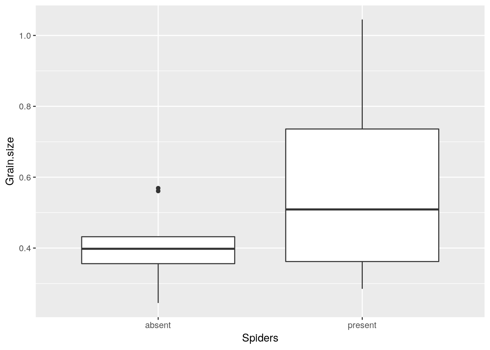
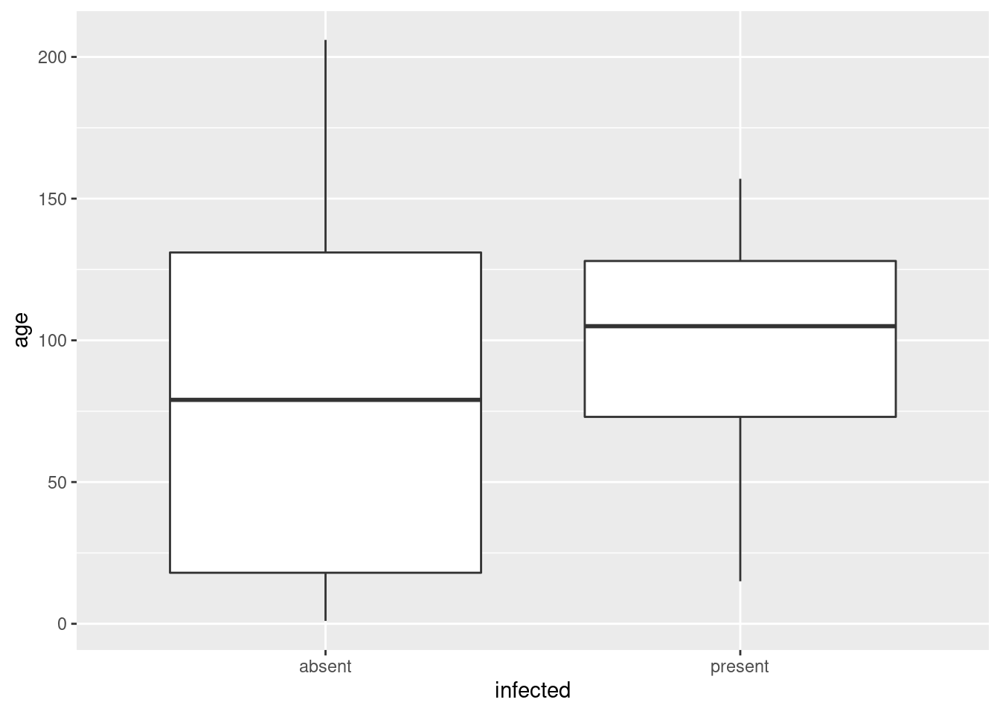
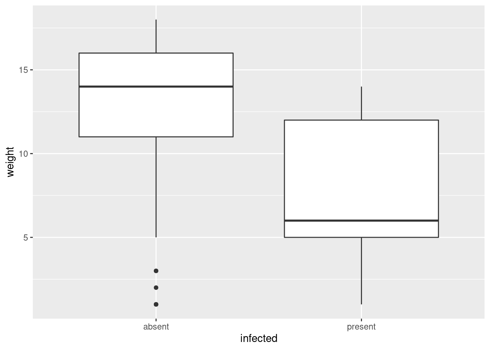
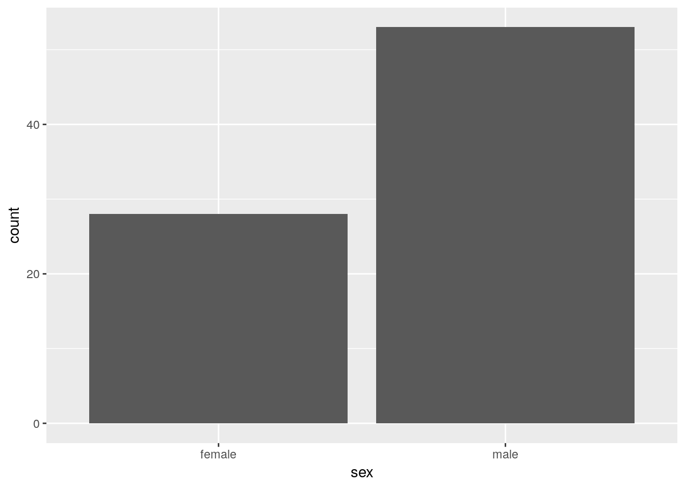
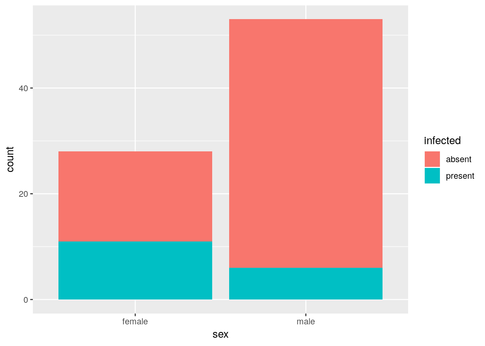
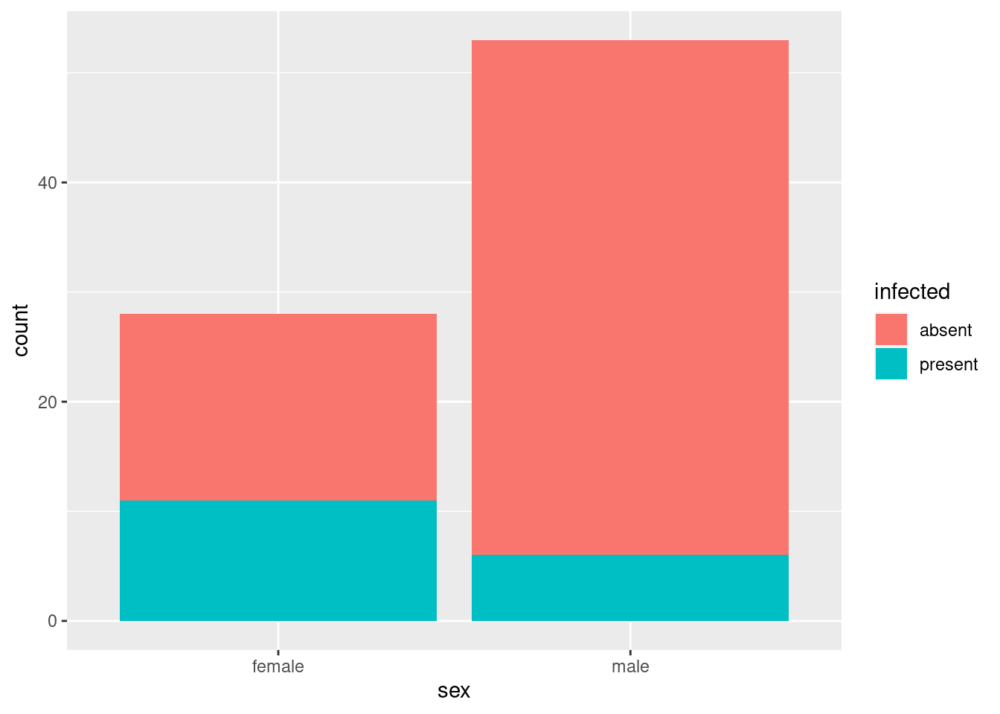
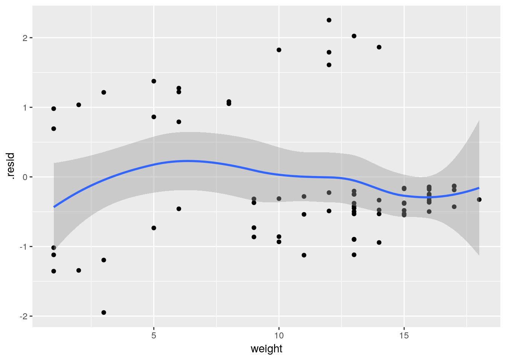
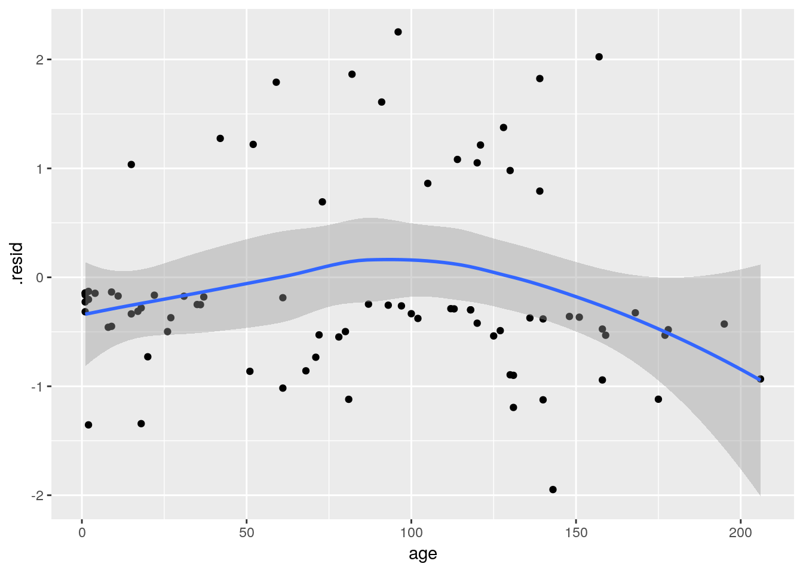
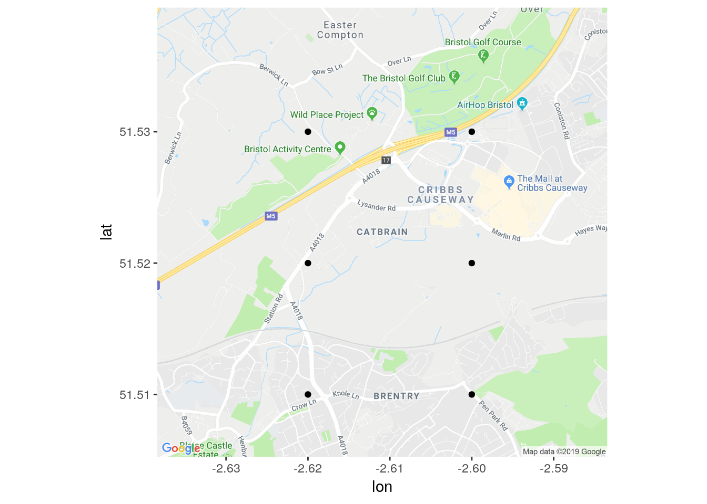
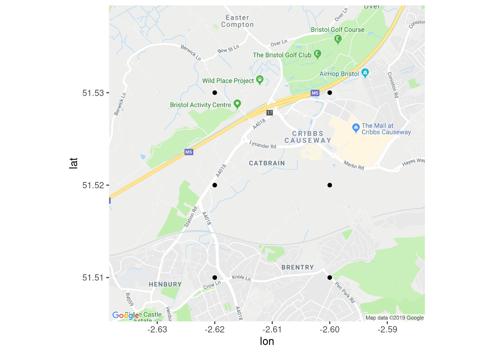

# Logistic regression


```r
library(tidyverse)
```

```
## ── Attaching packages ────────────────────────────────── tidyverse 1.2.1 ──
```

```
## ✔ ggplot2 3.1.0     ✔ purrr   0.2.5
## ✔ tibble  1.4.2     ✔ dplyr   0.7.8
## ✔ tidyr   0.8.1     ✔ stringr 1.3.1
## ✔ readr   1.1.1     ✔ forcats 0.3.0
```

```
## ── Conflicts ───────────────────────────────────── tidyverse_conflicts() ──
## ✖ dplyr::filter() masks stats::filter()
## ✖ dplyr::lag()    masks stats::lag()
```


##  Finding wolf spiders on the beach


 <a name="q:wolfspider">*</a> 
A team of Japanese researchers were investigating what would
cause the burrowing wolf spider *Lycosa ishikariana* to be found
on a beach. They hypothesized that it had to do with the size of the
grains of sand on the beach. They went to 28 beaches in Japan,
measured the average sand grain size (in millimetres), and observed
the presence or absence of this particular spider on each beach. The
data are in [link](http://www.utsc.utoronto.ca/~butler/d29/spiders.txt). 


(a) Why would logistic regression be better than regular
regression in this case?
 
Solution


Because the response variable, whether or not the spider is
present, is a categorical yes/no success/failure kind of variable
rather than a quantitative numerical one, and when you have this
kind of response variable, this is when you want to use logistic
regression. 
 

(b) Read in the data and check that you have something
sensible. (Look at the data file first: the columns are aligned but
the headers are not aligned with them.)
 
Solution


The nature of the file means that you need `read_table2`:

```r
my_url="http://www.utsc.utoronto.ca/~butler/d29/spiders.txt"
spider=read_table2(my_url)
```

```
## Parsed with column specification:
## cols(
##   Grain.size = col_double(),
##   Spiders = col_character()
## )
```

```r
spider
```

```
## # A tibble: 28 x 2
##    Grain.size Spiders
##         <dbl> <chr>  
##  1      0.245 absent 
##  2      0.247 absent 
##  3      0.285 present
##  4      0.299 present
##  5      0.327 present
##  6      0.347 present
##  7      0.356 absent 
##  8      0.36  present
##  9      0.363 absent 
## 10      0.364 present
## # ... with 18 more rows
```

     

We have a numerical sand grain size and a categorical variable
`Spiders` that indicates whether the spider was present or
absent. As we were expecting. (The categorical variable is actually
text or `chr`, which will matter in a minute.)
 

(c) Make a boxplot of sand grain size according to whether the
spider is present or absent. Does this suggest that sand grain size
has something to do with presence or absence of the spider?
 
Solution


```r
ggplot(spider,aes(x=Spiders,y=Grain.size))+geom_boxplot()
```



     

The story seems to be that when spiders are present, the sand grain
size tends to be larger. So we would expect to find some kind of
useful relationship in the logistic regression.

Note that we have reversed the cause and effect here: in the boxplot
we are asking "given that the spider is present or absent, how big are the grains of sand?", 
whereas the logistic regression is asking "given the size of the grains of sand, how likely is the spider to be present?". But if one variable has to do with the other, we would
hope to see the link either way around.
 

(d) Fit a logistic regression predicting the presence or
absence of spiders from the grain size, and obtain its
`summary`. Note that you will need to do something with the
response variable first.
 
Solution


The presence or absence of spiders is our response. This is
actually text at the moment:

```r
spider
```

```
## # A tibble: 28 x 2
##    Grain.size Spiders
##         <dbl> <chr>  
##  1      0.245 absent 
##  2      0.247 absent 
##  3      0.285 present
##  4      0.299 present
##  5      0.327 present
##  6      0.347 present
##  7      0.356 absent 
##  8      0.36  present
##  9      0.363 absent 
## 10      0.364 present
## # ... with 18 more rows
```

     

so we need to make a factor version of it first. I'm going to live on
the edge and overwrite everything:


```r
spider = spider %>% mutate(Spiders=factor(Spiders))
spider
```

```
## # A tibble: 28 x 2
##    Grain.size Spiders
##         <dbl> <fct>  
##  1      0.245 absent 
##  2      0.247 absent 
##  3      0.285 present
##  4      0.299 present
##  5      0.327 present
##  6      0.347 present
##  7      0.356 absent 
##  8      0.36  present
##  9      0.363 absent 
## 10      0.364 present
## # ... with 18 more rows
```

 

`Spiders` is now a factor, correctly. (Sometimes a text
variable gets treated as a factor, sometimes it needs to be an
explicit `factor`. This is one of those times.)
Now we go ahead and fit the model. I'm naming this as
response-with-a-number, so I still have the Capital Letter. Any choice
of name is good, though.


```r
Spiders.1=glm(Spiders~Grain.size,family="binomial",data=spider)
summary(Spiders.1)
```

```
## 
## Call:
## glm(formula = Spiders ~ Grain.size, family = "binomial", data = spider)
## 
## Deviance Residuals: 
##     Min       1Q   Median       3Q      Max  
## -1.7406  -1.0781   0.4837   0.9809   1.2582  
## 
## Coefficients:
##             Estimate Std. Error z value Pr(>|z|)  
## (Intercept)   -1.648      1.354  -1.217   0.2237  
## Grain.size     5.122      3.006   1.704   0.0884 .
## ---
## Signif. codes:  0 '***' 0.001 '**' 0.01 '*' 0.05 '.' 0.1 ' ' 1
## 
## (Dispersion parameter for binomial family taken to be 1)
## 
##     Null deviance: 35.165  on 27  degrees of freedom
## Residual deviance: 30.632  on 26  degrees of freedom
## AIC: 34.632
## 
## Number of Fisher Scoring iterations: 5
```

     
 

(e) Is there a significant relationship between grain size and
presence or absence of spiders at the $\alpha=0.10$ level? Explain briefly.
 
Solution


The P-value on the `Grain.size` line is *just* less
than 0.10 (it is 0.088), so there is *just* a significant
relationship. 
It isn't a very strong significance, though. This
might be because we don't have that much data: even though we have
28 observations, which, on the face of it, is not a very small
sample size, each observation doesn't tell us much: only whether
the spider was found on that beach or not. Typical sample sizes in
logistic regression are in the hundreds --- the same as for
opinion polls, because you're dealing with the same kind of data.
The weak significance here lends some kind of weak support to the
researchers' hypothesis, but I'm sure they were hoping for
something better.
 

(f) We want to obtain predicted probabilities of spider presence
for grain sizes of 0.2, 0.5, 0.8 and 1.1 millimetres. Do this by
creating a new data frame with one column called `Grain.size`
(watch the capital letter!) and those four values, and then feed
this into `predict`. I only want predicted probabilities, not
any kind of intervals.
 
Solution


Something like this. I like to save all the values first, and
*then* make a data frame of them, but you can do it in one
go if you prefer: 

```r
Grain.sizes=c(0.2,0.5,0.8,1.1)
spider.new=tibble(Grain.size=Grain.sizes)
spider.new
```

```
## # A tibble: 4 x 1
##   Grain.size
##        <dbl>
## 1        0.2
## 2        0.5
## 3        0.8
## 4        1.1
```

     

Another way to make the data frame of values to predict from  is directly, using `tribble`:


```r
new=tribble(
~Grain.size,
0.2,
0.5,
0.8,
1.1
)
new
```

```
## # A tibble: 4 x 1
##   Grain.size
##        <dbl>
## 1        0.2
## 2        0.5
## 3        0.8
## 4        1.1
```

 

I have no particular preference here (use whichever makes most sense
to you), but when we come later to combinations of things using
`crossing`, I think the vector way is easier (make vectors of
each of the things you want combinations of, *then* combine them
into a data frame).

Now for the actual predictions. Get the predicted probabilities first, using `response` to get probabilities rather than something else, then put them next to the values being predicted for (using `cbind` because my `pred.prob` below is a `matrix` rather than a data frame:


```r
pred.prob=predict(Spiders.1,spider.new,type="response")
cbind(spider.new,pred.prob)
```

```
##   Grain.size pred.prob
## 1        0.2 0.3490280
## 2        0.5 0.7136446
## 3        0.8 0.9205335
## 4        1.1 0.9817663
```

 

(Second attempt: on my first, the `tibble` contained
`Grain.Sizes`!) 

This exemplifies my preferred technique in these things: I store the
values to predict for in a vector with a *plural* name. The
column names in the data frame I make have to have the same (singular)
name as the original data, so the layout in making the data frame is
"singular equals plural". You'll see a lot of this as we go through
the course.

I think the data frame of values to predict for is called
`spider.new`  because the original one is called
`spider`. I have to stop and think about my naming
conventions. 

The above is all I need. (The stuff below is my extra comments.)

Note that the probabilities don't go up linearly. (If they did, they
would soon get bigger than 1!). It's actually the *log-odds* that
go up linearly. In fact, if you leave out the `type` on the
`predict`, log-odds is what you get:


```r
pred.log.odds=predict(Spiders.1,spider.new)
cbind(spider.new,pred.log.odds)
```

```
##   Grain.size pred.log.odds
## 1        0.2    -0.6233144
## 2        0.5     0.9131514
## 3        0.8     2.4496172
## 4        1.1     3.9860831
```

 

The meaning of that slope coefficient in the `summary`, which
is about 5, is that if you increase grain size by 1, you increase the
log-odds by 5. In the table above, we increased the grain size by 0.3
each time, so we would expect to increase the log-odds by
$(0.3)(5)=1.5$, which is (to this accuracy) what happened.

Log-odds are hard to interpret. Odds are a bit easier, and to get
them, we have to `exp` the log-odds:


```r
cbind(spider.new,odds=exp(pred.log.odds))
```

```
##   Grain.size       odds
## 1        0.2  0.5361644
## 2        0.5  2.4921640
## 3        0.8 11.5839120
## 4        1.1 53.8435749
```

 
Thus, with each step of
0.3 in grain size, we *multiply* the odds of finding a spider by
about 


```r
exp(1.5)
```

```
## [1] 4.481689
```

 

or about 4.5 times. If you're a gambler, this might give you a feel
for how large the effect of grain size is. Or, of course, you can just
look at the probabilities.
 

(g) Given your previous work in this question, does the trend
you see in your predicted probabilities surprise you? Explain briefly.
 
Solution


My predicted probabilities go up as grain size goes up. This fails
to surprise me for a couple of reasons: first, in my boxplots, I
saw that grain size tended to be larger when spiders were present,
and second, in my logistic regression `summary`, the slope
was positive, so likewise spiders should be more likely as grain
size goes up. Observing just one of these things is enough, though
of course it's nice if you can spot both.
 


##  Killing aphids


 An experiment was designed to examine how well the insecticide rotenone kills
aphids that feed on the chrysanthemum plant called *Macrosiphoniella sanborni*. 
The explanatory variable is the log concentration (in milligrams per litre) of the
insecticide. At each of the five different concentrations,
approximately 50 insects were exposed. The number of insects exposed
at each concentration, and the number killed, are shown below.


```

Log-Concentration   Insects exposed    Number killed   
0.96                       50              6               
1.33                       48              16              
1.63                       46              24              
2.04                       49              42              
2.32                       50              44              

```


(a) Get these data into R. You can do this by copying the data
into a file and reading that into R (creating a data frame), or you
can enter the data manually into R using `c`, since there are
not many values. In the latter case, you can create a data frame or
not, as you wish. Demonstrate that you have the right data in R.
 
Solution

 
There are a couple of ways. My
current favourite is the `tidyverse`-approved
`tribble` method. A `tribble` is a 
"transposed `tibble`", in which you copy and paste the data,
inserting column headings and commas in the right places. The
columns don't have to line up, since it's the commas that
determine where one value ends and the next one begins:

```r
dead_bugs=tribble(
~log_conc, ~exposed, ~killed,
0.96, 50, 6,
1.33, 48, 16,           
1.63, 46, 24,           
2.04, 49, 42,           
2.32, 50, 44)
dead_bugs
```

```
## # A tibble: 5 x 3
##   log_conc exposed killed
##      <dbl>   <dbl>  <dbl>
## 1     0.96      50      6
## 2     1.33      48     16
## 3     1.63      46     24
## 4     2.04      49     42
## 5     2.32      50     44
```

    

Note that the last data value has no comma after it, but instead has
the closing bracket of `tribble`.  

You can have extra spaces if you wish. They will just be ignored.
If you are clever in R
Studio, you can insert a column of commas all at once (using
"multiple cursors").
I used to do it like this. I make vectors of each column using `c` and then glue the columns together into a data frame:

```r
log_conc=c(0.96,1.33,1.63,2.04,2.32)
exposed=c(50,48,46,49,50)
killed=c(6,16,24,42,44)
dead_bugs2=tibble(log_conc,exposed,killed)
dead_bugs2
```

```
## # A tibble: 5 x 3
##   log_conc exposed killed
##      <dbl>   <dbl>  <dbl>
## 1     0.96      50      6
## 2     1.33      48     16
## 3     1.63      46     24
## 4     2.04      49     42
## 5     2.32      50     44
```

     

The values are correct --- I checked them.

Now you see why `tribble` stands for "transposed tibble": if you want to construct a data frame by hand, you have to work with columns and then glue them together, but `tribble` allows you to work "row-wise" with the data as you would lay it out on the page.

The other obvious way to read the data values without typing them is to copy
them into a file and read *that*. The values as laid out are
aligned in columns. They might be separated by tabs, but they are
not. (It's hard to tell without investigating, though a tab is by
default eight spaces and these values look farther apart than that.)
I copied them into a file `exposed.txt` in my current folder
(or use `file.choose`):


```r
bugs2=read_table("exposed.txt")
```

```
## Parsed with column specification:
## cols(
##   `Log-Concentration` = col_double(),
##   `Insects exposed` = col_integer(),
##   Number = col_integer(),
##   killed = col_character()
## )
```

```r
bugs2
```

```
## # A tibble: 5 x 4
##   `Log-Concentration` `Insects exposed` Number killed
##                 <dbl>             <int>  <int> <chr> 
## 1                0.96                50      6 ""    
## 2                1.33                48     16 ""    
## 3                1.63                46     24 ""    
## 4                2.04                49     42 ""    
## 5                2.32                50     44 ""
```

 

This didn't quite work: the last column `Number killed` got
split into two, with the actual number killed landing up in
`Number` and the column `killed` being empty. If you
look at the data file, the data values for `Number killed` are
actually aligned with the word `Number`, which is why it came
out this way. Also, you'll note, the column names have those
"backticks" around them, because they contain illegal characters
like a minus sign and spaces. Perhaps a good way to
pre-empt
<label for="tufte-mn-" class="margin-toggle">&#8853;</label><input type="checkbox" id="tufte-mn-" class="margin-toggle"><span class="marginnote">My daughter learned the word pre-empt because we  like to play a bridge app on my phone; in the game of bridge, you  make a pre-emptive bid when you have no great strength but a lot of  cards of one suit, say seven, and it won't be too bad if that suit  is trumps, no matter what your partner has. If you have a weakish hand with a lot of cards in one suit, your opponents are probably going  to be able to bid and make something, so you pre-emptively bid first  to try and make it difficult for them.</span>  all these problems is to
make a copy of the data file with the illegal characters replaced by
underscores, which is my file `exposed2.txt`:


```r
bugs2=read_table("exposed2.txt")
```

```
## Parsed with column specification:
## cols(
##   Log_Concentration = col_double(),
##   Insects_exposed = col_integer(),
##   Number_killed = col_integer()
## )
```

```r
bugs2
```

```
## # A tibble: 5 x 3
##   Log_Concentration Insects_exposed Number_killed
##               <dbl>           <int>         <int>
## 1              0.96              50             6
## 2              1.33              48            16
## 3              1.63              46            24
## 4              2.04              49            42
## 5              2.32              50            44
```

 

This is definitely good. We'd have to be careful with Capital Letters
this way,  but it's definitely good.

You may have thought that this was a lot of fuss to make about reading
in data, but the point is that data can come your way in lots of
different forms, and you need to be able to handle whatever you
receive so that you can do some analysis with it.
 

(b) <a name="part:expo">*</a> Looking at the data, would you expect there to be a
significant effect of log-concentration? Explain briefly.
 
Solution


The numbers of insects killed goes up *sharply* as the
concentration increases, while the numbers of insects exposed
don't change much. So I would expect to see a strong, positive
effect of concentration, and I would expect it to be strongly
significant, especially since we have almost 250 insects altogether.
 


(c) We are going to do a logistic regression to predict how
likely an insect is to be killed, as it depends on the
log-concentration. Create a suitable response variable, bearing in
mind (i) that we have lots of insects exposed to each different
concentration, and (ii) what needs to go into each column of the response.

 
Solution


There needs to be a two-column response variable. The first column
needs to be the number of "successes" (insects killed, here) and
the second needs to be the number of "failures" (insects that
survived). We don't actually have the latter, but we know how many
insects were exposed in total to each dose, so we can work it
out. Like this:

```r
dead_bugs %>% 
mutate(survived=exposed-killed) %>%
select(killed, survived) %>%
as.matrix() -> response
response
```

```
##      killed survived
## [1,]      6       44
## [2,]     16       32
## [3,]     24       22
## [4,]     42        7
## [5,]     44        6
```

   

`glm` requires an R `matrix` rather than a data
frame, so the last stage of our pipeline is to create one (using the
same numbers that are in the data frame: all the `as.`
functions do is to change what type of thing it is, without changing
its contents). 

It's also equally good to create the response *outside* of the
data frame and use `cbind` to glue its columns together:


```r
resp2=with(dead_bugs, 
cbind(killed,survived=exposed-killed))
resp2
```

```
##      killed survived
## [1,]      6       44
## [2,]     16       32
## [3,]     24       22
## [4,]     42        7
## [5,]     44        6
```

 
 


(d) Run a suitable logistic regression, and obtain a summary of
the results.

 
Solution


I think you know how to do this by now:

```r
bugs.1=glm(response~log_conc,family="binomial",data=dead_bugs)
summary(bugs.1)
```

```
## 
## Call:
## glm(formula = response ~ log_conc, family = "binomial", data = dead_bugs)
## 
## Deviance Residuals: 
##       1        2        3        4        5  
## -0.1963   0.2099  -0.2978   0.8726  -0.7222  
## 
## Coefficients:
##             Estimate Std. Error z value Pr(>|z|)    
## (Intercept)  -4.8923     0.6426  -7.613 2.67e-14 ***
## log_conc      3.1088     0.3879   8.015 1.11e-15 ***
## ---
## Signif. codes:  0 '***' 0.001 '**' 0.01 '*' 0.05 '.' 0.1 ' ' 1
## 
## (Dispersion parameter for binomial family taken to be 1)
## 
##     Null deviance: 96.6881  on 4  degrees of freedom
## Residual deviance:  1.4542  on 3  degrees of freedom
## AIC: 24.675
## 
## Number of Fisher Scoring iterations: 4
```

   
 


(e) Does your analysis support your answer to (<a href="#part:expo">here</a>)?
Explain briefly.

 
Solution


That's a *very* small P-value, $1.1\times 10^{-15}$, on
`log_conc`, so there is no doubt that concentration has an
effect on an insect's chances of being killed. This is exactly what
I guessed in (<a href="#part:expo">here</a>), which I did before looking at the
results, honest!
 


(f) Obtain predicted probabilities of an insect's being killed at
each of the log-concentrations in the data set. (This is easier than
it sometimes is, because here you don't create a new data frame for
`predict`.)

 
Solution


Just this (notice there are only *two* things going into
`predict`): 

```r
prob=predict(bugs.1,type="response")
cbind(dead_bugs$log_conc,prob)
```

```
##             prob
## 1 0.96 0.1292158
## 2 1.33 0.3191540
## 3 1.63 0.5436313
## 4 2.04 0.8099321
## 5 2.32 0.9105221
```

   
or, if you frame everything in terms of the `tidyverse`, turn
the predictions from a `matrix` into a `tibble` first,
and then use `bind_cols` to glue them together:


```r
as_tibble(prob) %>% bind_cols(dead_bugs)
```

```
## # A tibble: 5 x 4
##   value log_conc exposed killed
##   <dbl>    <dbl>   <dbl>  <dbl>
## 1 0.129     0.96      50      6
## 2 0.319     1.33      48     16
## 3 0.544     1.63      46     24
## 4 0.810     2.04      49     42
## 5 0.911     2.32      50     44
```

 
The advantage of showing the whole input data frame is that you can
compare the observed with the predicted. For example, 44 out of 50
insects were killed at log-dose 2.32, which is a proportion of 0.88,
pretty close to the prediction of 0.91.
 

(g) People in this kind of work are often interested in the
"median lethal dose". In this case, that would be the
log-concentration of the insecticide that kills half the
insects. Based on your predictions, roughly what do you think the
median lethal dose is?

 
Solution


The log-concentration of 1.63 is predicted to kill just over half
the insects, so the median lethal dose should be a bit less than
1.63. It should not be as small as 1.33, though, since that
log-concentration only kills less than a third of the insects. So I
would guess somewhere a bit bigger than 1.5. Any guess somewhere in
this ballpark is fine: you really cannot be very accurate.

Extra: this is kind of a strange prediction problem, because we know what
the *response* variable should be, and we want to know what the
explanatory variable's value is. Normally we do predictions the
other way around.
<label for="tufte-mn-" class="margin-toggle">&#8853;</label><input type="checkbox" id="tufte-mn-" class="margin-toggle"><span class="marginnote">This kind of thing is sometimes called an inverse prediction.</span>
So the only way to get a more accurate figure is
to try some different log-concentrations, and see which one gets
closest to a probability 0.5 of killing the insect.

Something like this would work:

```r
lc.new=tibble(log_conc=seq(1.5,1.63,0.01))
prob=predict(bugs.1,lc.new,type="response")
cbind(lc.new,prob)
```

```
##    log_conc      prob
## 1      1.50 0.4429568
## 2      1.51 0.4506406
## 3      1.52 0.4583480
## 4      1.53 0.4660754
## 5      1.54 0.4738191
## 6      1.55 0.4815754
## 7      1.56 0.4893406
## 8      1.57 0.4971110
## 9      1.58 0.5048827
## 10     1.59 0.5126521
## 11     1.60 0.5204154
## 12     1.61 0.5281689
## 13     1.62 0.5359087
## 14     1.63 0.5436313
```

   

The closest one of these to a probability of 0.5 is 0.4971, which goes
with a log-concentration of 1.57: indeed, a bit bigger than 1.5 and a
bit less than 1.63. The `seq` in the construction of the new
data frame is "fill sequence": go from 1.5 to 1.63 in steps of
0.01. The rest of it is the same as before.

Now, of course this is only our "best guess", like a single-number
prediction in regression. There is uncertainty attached to it (because
the actual logistic regression might be different from the one we
estimated), so we ought to provide a confidence interval for it. But
I'm riding the bus as I type this, so I can't look it up right now.

Later: there's a function called `dose.p` 
in `MASS` that appears to do this:


```r
library(MASS)
```

```
## 
## Attaching package: 'MASS'
```

```
## The following object is masked from 'package:dplyr':
## 
##     select
```

```r
lethal=dose.p(bugs.1)
lethal
```

```
##              Dose         SE
## p = 0.5: 1.573717 0.05159576
```

 

We have a sensible point estimate (the same 1.57 that we got by hand),
and we have a standard error, so we can make a confidence interval by
going up and down twice it (or 1.96 times it) from the estimate. The
structure of the result is a bit arcane, though:


```r
str(lethal)
```

```
##  'glm.dose' Named num 1.57
##  - attr(*, "names")= chr "p = 0.5:"
##  - attr(*, "SE")= num [1, 1] 0.0516
##   ..- attr(*, "dimnames")=List of 2
##   .. ..$ : chr "p = 0.5:"
##   .. ..$ : NULL
##  - attr(*, "p")= num 0.5
```

 

It is what R calls a "vector with attributes". To get at the pieces and calculate the interval, we have to do something like this:


```r
(lethal_est=as.numeric(lethal))
```

```
## [1] 1.573717
```

```r
(lethal_SE=as.vector(attr(lethal, "SE")))
```

```
## [1] 0.05159576
```

 

and then make the interval:


```r
lethal_est+c(-2,2)*lethal_SE
```

```
## [1] 1.470526 1.676909
```

 

1.47 to 1.68.

I got this idea from page 4.14 of
[link](http://www.chrisbilder.com/stat875old/schedule_new/chapter4.doc). I
think I got a little further than he did. An idea that works more
generally is to get several intervals all at once, say for the
"quartile lethal doses" as well:


```r
lethal=dose.p(bugs.1, p=c(0.25,0.5,0.75))
lethal
```

```
##               Dose         SE
## p = 0.25: 1.220327 0.07032465
## p = 0.50: 1.573717 0.05159576
## p = 0.75: 1.927108 0.06532356
```

 

This looks like a data frame or matrix, but is actually a 
"named vector", so `enframe` will get at least some of this and turn
it into a genuine data frame:


```r
enframe(lethal)
```

```
## # A tibble: 3 x 2
##   name      value
##   <chr>     <dbl>
## 1 p = 0.25:  1.22
## 2 p = 0.50:  1.57
## 3 p = 0.75:  1.93
```

 

That doesn't get the SEs, so we'll make a new column by grabbing the "attribute" as above:


```r
enframe(lethal) %>% mutate(SE=attr(lethal, "SE"))
```

```
## # A tibble: 3 x 3
##   name      value     SE
##   <chr>     <dbl>  <dbl>
## 1 p = 0.25:  1.22 0.0703
## 2 p = 0.50:  1.57 0.0516
## 3 p = 0.75:  1.93 0.0653
```

 

and now we make the intervals by making new columns containing the lower and upper limits:


```r
enframe(lethal) %>% mutate(SE=attr(lethal, "SE")) %>%
mutate(LCL=value-2*SE, UCL=value+2*SE)
```

```
## # A tibble: 3 x 5
##   name      value     SE   LCL   UCL
##   <chr>     <dbl>  <dbl> <dbl> <dbl>
## 1 p = 0.25:  1.22 0.0703  1.08  1.36
## 2 p = 0.50:  1.57 0.0516  1.47  1.68
## 3 p = 0.75:  1.93 0.0653  1.80  2.06
```

 

Now we have intervals for the median lethal dose, as well as for the doses that kill a quarter and three quarters of the aphids.

To end this question, we loaded `MASS`, so we should unload it before we run into 
problems with 
`select` later:


```r
detach("package:MASS", unload=T)
```

 

 


##  The effects of Substance A


 In a dose-response experiment, animals (or
cell cultures or human subjects) are exposed to some toxic substance,
and we observe how many of them show some sort of response. In this
experiment, a mysterious Substance A is exposed at various doses to
100 cells at each dose, and the number of cells at each dose that
suffer damage is recorded. The doses were 10, 20, ... 70 (mg), and
the number of damaged cells out of 100 were respectively 10, 28, 53,
77, 91, 98, 99.


(a) Find a way to get these data into R, and show that you have
managed to do so successfully.


Solution


There's not much data here, so we don't need to create a file,
although you can do so if you like (in the obvious way: type the
doses and damaged cell numbers into a `.txt` file or
spreadsheet and read in with the appropriate `read_`
function). 
Or, use a `tribble`:

```r
dr=tribble(
~dose, ~damaged,
10, 10,
20, 28,
30, 53,
40, 77,
50, 91,
60, 98,
70, 99)
dr
```

```
## # A tibble: 7 x 2
##    dose damaged
##   <dbl>   <dbl>
## 1    10      10
## 2    20      28
## 3    30      53
## 4    40      77
## 5    50      91
## 6    60      98
## 7    70      99
```

       
Or, make a data frame with the values typed in:


```r
dr2=tibble(dose=seq(10,70,10),
damaged=c(10, 28, 53, 77, 91, 98, 99))
dr2
```

```
## # A tibble: 7 x 2
##    dose damaged
##   <dbl>   <dbl>
## 1    10      10
## 2    20      28
## 3    30      53
## 4    40      77
## 5    50      91
## 6    60      98
## 7    70      99
```

 

`seq` fills a sequence "10 to 70 in steps of 10", or you can
just list the doses.

I like this better than making two columns *not* attached to a
data frame, but that will work as well.

For these, find a way you like, and stick with it.

    


(b) Would you expect to see a significant effect of dose for
these data?
Explain briefly.


Solution


The number of damaged cells goes up sharply as the dose goes up
(from a very small number to almost all of them). So I'd expect
to see a strongly significant effect of dose. This is far from
something that would happen by chance.
 


(c) Fit a logistic regression modelling the probability of a
cell being damaged as it depends on dose. Display the
results. (Comment on them is coming later.)


Solution


This has a bunch of observations at each dose (100 cells, in
fact), so we need to do the two-column response thing: the
successes in the first column and the failures in the
second. This means that we first need to calculate the number of
cells at each dose that were not damaged, by subtracting the
number that *were* damaged from 100. R makes this easier
than you'd think, as
you see. A `mutate` is the way to
go: create a new column in `dr` and save back in
`dr` (because I like living on the edge):

```r
dr = dr %>% mutate(undamaged=100-damaged)
dr
```

```
## # A tibble: 7 x 3
##    dose damaged undamaged
##   <dbl>   <dbl>     <dbl>
## 1    10      10        90
## 2    20      28        72
## 3    30      53        47
## 4    40      77        23
## 5    50      91         9
## 6    60      98         2
## 7    70      99         1
```

       

The programmer in you is probably complaining "but, 100 is a number and `damaged` is a vector of 7 numbers. How does R know to subtract *each one* from 100?" Well, R has what's known as
"recycling rules": if you try to add or subtract (or elementwise
multiply or divide) two vectors of different lengths, it recycles the
smaller one by repeating it until it's as long as the longer one. So
rather than `100-damaged` giving an error, it does what you
want.
<label for="tufte-mn-" class="margin-toggle">&#8853;</label><input type="checkbox" id="tufte-mn-" class="margin-toggle"><span class="marginnote">The usual application of this is to combine a number  with a vector. If you try to subtract a length-2 vector from a  length-6 vector, R will repeat the shorter one three times and do  the subtraction, but if you try to subtract a length-2 vector from a length-*7* vector, where you'd have to repeat the shorter one a fractional number of times, R will do it, but you'll get a warning, because this is probably *not* what you wanted. Try it and see.</span>

I took the risk of saving the new data frame over the old one. If it
had failed for some reason, I could have started again.

Now we have to make our response "matrix" with two columns, using `cbind`:


```r
response=with(dr,cbind(damaged,undamaged))
response
```

```
##      damaged undamaged
## [1,]      10        90
## [2,]      28        72
## [3,]      53        47
## [4,]      77        23
## [5,]      91         9
## [6,]      98         2
## [7,]      99         1
```

 

Note that each row adds up to 100, since there were 100 cells at each
dose. This is actually trickier than it looks: the two things in
`cbind` are columns (vectors), and `cbind` glues them
together to make an R `matrix`:


```r
class(response)
```

```
## [1] "matrix"
```

 

which is what `glm` needs here, even though it looks a lot like
a data frame (which wouldn't work here). This *would* be a data
frame:


```r
dr %>% select(damaged, undamaged) %>% class()
```

```
## [1] "tbl_df"     "tbl"        "data.frame"
```

 

and would therefore be the wrong thing to give `glm`. So I had
to do it with `cbind`, or use some other trickery, like this:


```r
dr %>% select(damaged, undamaged) %>%
as.matrix() -> resp
class(resp)
```

```
## [1] "matrix"
```

 

Now we fit our model:


```r
cells.1=glm(response~dose,family="binomial",data=dr)
summary(cells.1)
```

```
## 
## Call:
## glm(formula = response ~ dose, family = "binomial", data = dr)
## 
## Deviance Residuals: 
##        1         2         3         4         5         6         7  
## -0.16650   0.28794  -0.02092  -0.20637  -0.21853   0.54693  -0.06122  
## 
## Coefficients:
##              Estimate Std. Error z value Pr(>|z|)    
## (Intercept) -3.275364   0.278479  -11.76   <2e-16 ***
## dose         0.113323   0.008315   13.63   <2e-16 ***
## ---
## Signif. codes:  0 '***' 0.001 '**' 0.01 '*' 0.05 '.' 0.1 ' ' 1
## 
## (Dispersion parameter for binomial family taken to be 1)
## 
##     Null deviance: 384.13349  on 6  degrees of freedom
## Residual deviance:   0.50428  on 5  degrees of freedom
## AIC: 31.725
## 
## Number of Fisher Scoring iterations: 4
```

 
    


(d) Does your output indicate that the probability of damage
really does *increase* with dose? (There are two things here:
is there really an effect, and which way does it go?)


Solution


The slope of `dose` is significantly nonzero (P-value
less than $2.2 \times 10^{-16}$, which is as small as it can
be). The slope itself is *positive*, which means that as
dose goes up, the probability of damage goes up. 
That's all I needed, but if you want to press on: the slope is
0.113, so an increase of 1 in dose goes with an increase of
0.113 in the *log-odds* of damage. Or it multiplies the
odds of damage by $\exp(0.113)$. Since 0.113 is small, this is
about $1.113$ (mathematically, $e^x\simeq 1+x$ if $x$ is small),
so that the increase is about 11\%. 
If you like, you can get a rough CI for the slope by going up
and down twice its standard error (this is the usual
approximately-normal thing). Here that would be

```r
0.113323+c(-2,2)*0.008315
```

```
## [1] 0.096693 0.129953
```

       

I thought about doing that in my head, but thought better of it, since
I have R just sitting here. The interval is short (we have lots of
data) and definitely does not contain zero.
    


(e) Obtain predicted damage probabilities for the doses that
were actually used in the experiment. (This is easier than some of
our other predictions: if you are using the original data, you only
need to feed in the fitted model object and not a data frame of new
data.) Display your predicted probabilities next to the doses and
the observed numbers of damaged cells.


Solution


The remaining care that this needs is to make sure that we do
indeed get predicted probabilities, and then some
`cbind`ing to get the right kind of display:

```r
p=predict(cells.1,type="response")
with(dr,cbind(dose,damaged,p))
```

```
##   dose damaged         p
## 1   10      10 0.1050689
## 2   20      28 0.2671957
## 3   30      53 0.5310440
## 4   40      77 0.7786074
## 5   50      91 0.9161232
## 6   60      98 0.9713640
## 7   70      99 0.9905969
```

       

If you forget the `type="response"` you'll get predicted
log-odds, which are not nearly so easy to interpret.
    


(f) Looking at  the predicted probabilities, would you say that
the model fits well? Explain briefly.


Solution


There were 100 cells tested at each dose, so that the predicted
probabilities should be close to the observed numbers divided by
100. They are in fact *very* close to this, so the model
fits very well. 
Your actual words are a judgement call, so precisely what you
say doesn't matter so much, but *I* think this model fit is
actually closer than you could even hope to expect, it's that
good. But, your call. I think your answer ought to contain
"close" or "fits well" at the very least. 
     


##  What makes an animal get infected?


 Some animals got infected with a parasite. We are interested
in whether the likelihood of infection depends on any of the age,
weight and sex of the animals. The data are at
[link](http://www.utsc.utoronto.ca/~butler/d29/infection.txt). The
values are separated by tabs.


(a) Read in the data and take a look at the first few lines. Is
this one animal per line, or are several animals with the same age,
weight and sex (and infection status) combined onto one line? How
can you tell?
 
Solution


The usual beginnings, bearing in mind the data layout:

```r
my_url="http://www.utsc.utoronto.ca/~butler/d29/infection.txt"
infect=read_tsv(my_url)
```

```
## Parsed with column specification:
## cols(
##   infected = col_character(),
##   age = col_integer(),
##   weight = col_integer(),
##   sex = col_character()
## )
```

```r
infect
```

```
## # A tibble: 81 x 4
##    infected   age weight sex   
##    <chr>    <int>  <int> <chr> 
##  1 absent       2      1 female
##  2 absent       9     13 female
##  3 present     15      2 female
##  4 absent      15     16 female
##  5 absent      18      2 female
##  6 absent      20      9 female
##  7 absent      26     13 female
##  8 present     42      6 female
##  9 absent      51      9 female
## 10 present     52      6 female
## # ... with 71 more rows
```

 

Success.
This appears to be one animal per line, since there is no indication
of frequency (of "how many"). If you were working as a consultant
with somebody's data, this would be a good thing to confirm with them
before you went any further.

You can check a few more lines to
convince yourself:


```r
infect %>% print(n=20)
```

```
## # A tibble: 81 x 4
##    infected   age weight sex   
##    <chr>    <int>  <int> <chr> 
##  1 absent       2      1 female
##  2 absent       9     13 female
##  3 present     15      2 female
##  4 absent      15     16 female
##  5 absent      18      2 female
##  6 absent      20      9 female
##  7 absent      26     13 female
##  8 present     42      6 female
##  9 absent      51      9 female
## 10 present     52      6 female
## 11 present     59     12 female
## 12 absent      68     10 female
## 13 absent      72     15 female
## 14 present     73      1 female
## 15 absent      78     15 female
## 16 absent      80     16 female
## 17 present     82     14 female
## 18 present     91     12 female
## 19 present    105      5 female
## 20 present    114      8 female
## # ... with 61 more rows
```

 

and the story is much the same. The other hint is that you have actual
categories of response, which usually indicates one individual per
row, but not always. If it doesn't, you have some extra work to do to
bash it into the right format.

Extra: let's see whether we can come up with an example of that. I'll make a
smaller example, and perhaps the place to start is 
"all possible combinations" of a few things. 
If you haven't seen `crossing`
before, skip ahead to part (<a href="#part:crossing">here</a>):


```r
d=crossing(age=c(10,12),gender=c("f","m"),infected=c("y","n"))
d
```

```
## # A tibble: 8 x 3
##     age gender infected
##   <dbl> <chr>  <chr>   
## 1    10 f      n       
## 2    10 f      y       
## 3    10 m      n       
## 4    10 m      y       
## 5    12 f      n       
## 6    12 f      y       
## 7    12 m      n       
## 8    12 m      y
```


These might be one individual per row, or they might be more than one,
as they would be if we have a column of frequencies:


```r
d = d %>% mutate(freq=c(12,19,17,11,18,26,16,8))
d
```

```
## # A tibble: 8 x 4
##     age gender infected  freq
##   <dbl> <chr>  <chr>    <dbl>
## 1    10 f      n           12
## 2    10 f      y           19
## 3    10 m      n           17
## 4    10 m      y           11
## 5    12 f      n           18
## 6    12 f      y           26
## 7    12 m      n           16
## 8    12 m      y            8
```

 

Now, these are multiple observations per row (the presence of
frequencies means there's no doubt about that), but the format is
wrong: `infected` is my response variable, and we want the
frequencies of `infected` being `y` or `n` in
*separate* columns --- that is, we have to *untidy* the data
a bit to make it suitable for modelling. This is `spread`, the
opposite of `gather`:


```r
d %>% spread(infected,freq)
```

```
## # A tibble: 4 x 4
##     age gender     n     y
##   <dbl> <chr>  <dbl> <dbl>
## 1    10 f         12    19
## 2    10 m         17    11
## 3    12 f         18    26
## 4    12 m         16     8
```

 

Now you can pull out the columns `y` and `n` and make
them into your response, and predict that from `age` and
`gender`. 

The moral of this story is that if you are going to have multiple
observations per row, you probably want the combinations of
*explanatory* variables one per row, but you want the categories
of the *response* variable in separate columns.

Back to where we were the rest of the way.
 

(b) <a name="part:plot">*</a> Make suitable plots or summaries of `infected` against
each of the other variables. (You'll have to think about
`sex`, um, you'll have to think about the `sex`
variable, because it too is categorical.) Anything sensible is OK
here. You might like to think back to what we did in
Question <a href="#q:wolfspider">here</a> for inspiration. (You can also
investigate `table`, which does cross-tabulations.)
 
Solution


What comes to my mind for the numerical variables `age` and
`weight` is boxplots:

```r
ggplot(infect,aes(x=infected,y=age))+geom_boxplot()
```



```r
ggplot(infect,aes(x=infected,y=weight))+geom_boxplot()
```



     

The variables `sex` and `infected` are both
categorical. I guess a good plot for those would be some kind of
grouped bar plot, which I have to think about. 
So let's first try a numerical summary, a
cross-tabulation, which is gotten via `table`:


```r
with(infect,table(sex,infected))
```

```
##         infected
## sex      absent present
##   female     17      11
##   male       47       6
```

 

Or, if you like the `tidyverse`:


```r
infect %>% count(sex,infected) 
```

```
## # A tibble: 4 x 3
##   sex    infected     n
##   <chr>  <chr>    <int>
## 1 female absent      17
## 2 female present     11
## 3 male   absent      47
## 4 male   present      6
```

 

Now, bar plots. Let's start with one variable. The basic bar plot has
categories of a categorical variable along the $x$-axis and each bar
is a count of how many observations were in that category. What is
nice about `geom_bar` is that it will do the counting for you,
so that the plot is just this:


```r
ggplot(infect,aes(x=sex))+geom_bar()
```



 

There are about twice as many males as females.

You may think that this looks like a histogram, which it almost does,
but there is an important difference: the kind of variable on the
$x$-axis. Here, it is a categorical variable, and you count how many
observations fall in each category (at least, `ggplot`
does). On a histogram, the $x$-axis variable is a continuous
*numerical* one, like height or weight, and you have to
*chop it up* into intervals (and then you count how many
observations are in each chopped-up interval).

Technically, on a bar plot, the bars have a little gap between them
(as here), whereas the histogram bars are right next to each other,
because the right side of one histogram bar is the left side of the next.

All right, two categorical variables. The idea is that you have each
bar divided into sub-bars based on the frequencies of a second
variable, which is specified by `fill`. Here's the basic idea:


```r
ggplot(infect, aes(x=sex,fill=infected))+geom_bar()
```



 

This is known in the business as a "stacked bar chart". The issue is
how much of each bar is blue, which is unnecessarily hard to judge
because the male bar is taller. (Here, it is not so bad, because the
amount of blue in the male bar is smaller and the bar is also
taller. But we got lucky here.)

There are two ways to improve this. One is known as a "grouped bar chart", which goes like this:


```r
ggplot(infect, aes(x=sex,fill=infected))+
geom_bar(position="dodge")
```


 

The absent and present frequencies for females are next to each other,
and the same for males, and you can read off how big they are from the
$y$-scale. This is my preferred graph for two (or more than two)
categorical variables.

You could switch the roles of `sex` and `infected` and
get a different chart, but one that conveys the same information. Try
it. (The reason for doing it the way around I did is that being
infected or not is the response and `sex` is explanatory, so
that on my plot you can ask "out of the males, how many were infected?", 
which is the way around that makes sense.)

The second way is to go back to stacked bars, but make them the same
height, so you can compare the fractions of the bars that are each
colour. This is `position="fill"`:


```r
ggplot(infect, aes(x=sex,fill=infected))+
geom_bar(position="fill")
```



 

This also shows that more of the females were infected than the males,
but without getting sidetracked into the issue that there were more
males to begin with.

I wrote this question in early 2017. At that time, I wrote  (quote):

I learned about this one approximately two hours ago. I just ordered
Hadley Wickham's new book "R for Data Science" from Amazon, and it
arrived today. It's in there. (A good read, by the way. I'm thinking
of using it as a recommended text next year.)
As is so often the way with `ggplot`, the final answer looks
very simple, but there is a lot of thinking required to get there, and
you end up having even more respect for Hadley Wickham for the clarity
of thinking that enabled this to be specified in a simple way.  

(end quote)
 

(c) Which, if any, of your explanatory variables appear to be
related to `infected`? Explain briefly.
 
Solution


Let's go through our output from (<a href="#part:plot">here</a>). In terms of
`age`, when infection is present, animals are (slightly)
older. So there might be a small age effect. Next, when infection
is present, weight is typically a *lot* less. So there ought
to be a big weight effect. 
Finally, from the table, females are
somewhere around 50-50 infected or not, but very few males are
infected. So there ought to be a big `sex` effect as well.
This also appears in the grouped bar plot, where the red
("absent") bar for males is much taller than the blue
("present") bar, but for females the two bars are almost the
same height.
So the story is that we would expect a significant effect of
`sex` and `weight`, and maybe of `age` as well.
 

(d) Fit a logistic regression predicting `infected` from
the other three variables. Display the `summary`.
 
Solution


Thus:

```r
infect.1=glm(infected~age+weight+sex,family="binomial",data=infect)
```

```
## Error in eval(family$initialize): y values must be 0 <= y <= 1
```

     

Oh, I forgot to turn `infected` into a factor. This is the
shortcut way to do that:


```r
infect.1=glm(factor(infected)~age+weight+sex,family="binomial",data=infect)
summary(infect.1)
```

```
## 
## Call:
## glm(formula = factor(infected) ~ age + weight + sex, family = "binomial", 
##     data = infect)
## 
## Deviance Residuals: 
##     Min       1Q   Median       3Q      Max  
## -1.9481  -0.5284  -0.3120  -0.1437   2.2525  
## 
## Coefficients:
##              Estimate Std. Error z value Pr(>|z|)    
## (Intercept)  0.609369   0.803288   0.759 0.448096    
## age          0.012653   0.006772   1.868 0.061701 .  
## weight      -0.227912   0.068599  -3.322 0.000893 ***
## sexmale     -1.543444   0.685681  -2.251 0.024388 *  
## ---
## Signif. codes:  0 '***' 0.001 '**' 0.01 '*' 0.05 '.' 0.1 ' ' 1
## 
## (Dispersion parameter for binomial family taken to be 1)
## 
##     Null deviance: 83.234  on 80  degrees of freedom
## Residual deviance: 59.859  on 77  degrees of freedom
## AIC: 67.859
## 
## Number of Fisher Scoring iterations: 5
```

     

The "proper" way to do it is to create a new column in the data
frame containing the factor version of `infected`. Pipeline
fans among you can do it this way:


```r
infect %>% mutate(infected=factor(infected)) %>%
glm(infected~age+weight+sex,family="binomial",data=.) -> infect.1a
summary(infect.1a)
```

```
## 
## Call:
## glm(formula = infected ~ age + weight + sex, family = "binomial", 
##     data = .)
## 
## Deviance Residuals: 
##     Min       1Q   Median       3Q      Max  
## -1.9481  -0.5284  -0.3120  -0.1437   2.2525  
## 
## Coefficients:
##              Estimate Std. Error z value Pr(>|z|)    
## (Intercept)  0.609369   0.803288   0.759 0.448096    
## age          0.012653   0.006772   1.868 0.061701 .  
## weight      -0.227912   0.068599  -3.322 0.000893 ***
## sexmale     -1.543444   0.685681  -2.251 0.024388 *  
## ---
## Signif. codes:  0 '***' 0.001 '**' 0.01 '*' 0.05 '.' 0.1 ' ' 1
## 
## (Dispersion parameter for binomial family taken to be 1)
## 
##     Null deviance: 83.234  on 80  degrees of freedom
## Residual deviance: 59.859  on 77  degrees of freedom
## AIC: 67.859
## 
## Number of Fisher Scoring iterations: 5
```

 

Either way is good, and gives the same answer. The second way uses the
`data=.` trick to ensure that the input data frame to
`glm` is the output from the previous step, the one with the
factor version of `infected` in it. The `data=.` is
needed because `glm` requires a model formula first rather than
a data frame (if the data were first, you could just omit it). 
 

(e) <a name="part:remove">*</a> Which variables, if any, would you consider removing from
the model? Explain briefly.
 
Solution


This is the same idea as in multiple regression: look at the end
of the line for each variable to get its individual P-value, and
if that's not small, you can take that variable out. `age`
has a P-value of 0.062, which is (just) larger than 0.05, so we
can consider removing this variable. The other two P-values,
0.00089 and 0.024, are definitely less than 0.05, so those
variables should stay.

Alternatively, you can say that the P-value for `age` is
small enough to be interesting, and therefore that `age`
should stay. That's fine, but then you need to be consistent in
the next part.

You probably noted that `sex` is categorical. However, it
has only the obvious two levels, and such a categorical variable
can be assessed for significance this way. If you were worried
about this, the right way to go is `drop1`:


```r
drop1(infect.1, test="Chisq")
```

```
## Single term deletions
## 
## Model:
## factor(infected) ~ age + weight + sex
##        Df Deviance    AIC     LRT  Pr(>Chi)    
## <none>      59.859 67.859                      
## age     1   63.785 69.785  3.9268 0.0475236 *  
## weight  1   72.796 78.796 12.9373 0.0003221 ***
## sex     1   65.299 71.299  5.4405 0.0196754 *  
## ---
## Signif. codes:  0 '***' 0.001 '**' 0.01 '*' 0.05 '.' 0.1 ' ' 1
```

 

The P-values are similar, but not identical.
<label for="tufte-mn-" class="margin-toggle">&#8853;</label><input type="checkbox" id="tufte-mn-" class="margin-toggle"><span class="marginnote">The *test* is this way because it's a generalized linear model rather than a regular regression.</span>

I have to stop and think about this. There is a lot of theory that
says there are several ways to do stuff in regression, but they are
all identical. The theory doesn't quite apply the same in generalized
linear models (of which logistic regression is one): if you had an
infinite sample size, the ways would all be identical, but in practice
you'll have a very finite amount of data, so they won't agree.

I'm thinking about my aims here: I want to decide whether each
$x$-variable should stay in the model, and for that I want a test that
expresses whether the model fits significantly worse if I take it
out. The result I get ought to be the same as physically removing it
and comparing the models with `anova`, 
eg. for `age`:


```r
infect.1b=update(infect.1, .~.-age)
anova(infect.1b, infect.1, test="Chisq")
```

```
## Analysis of Deviance Table
## 
## Model 1: factor(infected) ~ weight + sex
## Model 2: factor(infected) ~ age + weight + sex
##   Resid. Df Resid. Dev Df Deviance Pr(>Chi)  
## 1        78     63.785                       
## 2        77     59.859  1   3.9268  0.04752 *
## ---
## Signif. codes:  0 '***' 0.001 '**' 0.01 '*' 0.05 '.' 0.1 ' ' 1
```

 

This is the same thing as `drop1` gives. 

So, I think: use `drop1` to assess whether anything should come
out of a model like this, and use `summary` to obtain the
slopes to interpret (in this kind of model, whether they're positive
or negative, and thus what kind of effect each explanatory variable
has on the probability of whatever-it-is.
 

(f) Are the conclusions you drew in (<a href="#part:plot">here</a>) and
(<a href="#part:remove">here</a>) consistent, or not? Explain briefly.
 
Solution


I think they are extremely consistent. When we looked at the
plots, we said that `weight` and `sex` had large
effects, and they came out definitely significant. There was a
small difference in age between the infected and non-infected
groups, and `age` came out borderline significant (with a
P-value definitely larger than for the other variables, so that
the evidence of its usefulness was weaker).
 

(g) <a name="part:crossing">*</a>
The first and third quartiles of `age` are 26 and 130;
the first and third quartiles of `weight` are 9 and 16. Obtain predicted probabilities for all combinations of these and
`sex`. (You'll need to start by making a new data frame, using
`crossing` to get all the combinations.)
 
Solution

 Here's how `crossing`
goes. I'll do it in steps. Note my use of plural names to denote
the things I want all combinations of:

```r
ages=c(26,130)
weights=c(9,16)
sexes=c("female","male")
infect.new = crossing(age=ages,weight=weights,sex=sexes)
infect.new
```

```
## # A tibble: 8 x 3
##     age weight sex   
##   <dbl>  <dbl> <chr> 
## 1    26      9 female
## 2    26      9 male  
## 3    26     16 female
## 4    26     16 male  
## 5   130      9 female
## 6   130      9 male  
## 7   130     16 female
## 8   130     16 male
```

     

I could have asked you to include some more values of `age` and
`weight`, for example the median as well, to get a clearer
picture. But that would have made `infect.new` bigger, so I
stopped here. 

`crossing` *makes* a data frame from input vectors, so it
doesn't matter if those are different lengths.  In fact, it's also
possible to make this data frame from things like quartiles stored in
a data frame. To do that (as we did in the hospital satisfaction
question), you wrap the whole `crossing` in a `with`.

Next, the predictions:


```r
pred=predict(infect.1,infect.new,type="response")
cbind(infect.new,pred)
```

```
##   age weight    sex       pred
## 1  26      9 female 0.24733693
## 2  26      9   male 0.06560117
## 3  26     16 female 0.06248811
## 4  26     16   male 0.01404012
## 5 130      9 female 0.55058652
## 6 130      9   male 0.20744380
## 7 130     16 female 0.19903348
## 8 130     16   male 0.05041244
```

 

I didn't ask you to comment on these, since the question is long
enough already. But that's not going to stop me!

These are predicted probabilities of infection.
<label for="tufte-mn-" class="margin-toggle">&#8853;</label><input type="checkbox" id="tufte-mn-" class="margin-toggle"><span class="marginnote">When you have one observation per line, the predictions are of the *second* of the two levels of the response variable. When you make that two-column response, the predictions are of the probability of being in the *first* column. That's what it is. As the young people say, don't @ me.</span>

The way I remember the one-column-response thing is that the first
level is the baseline (as it is in a regression with a categorical
explanatory variable), and the second level is the one whose
probability is modelled (in the same way that the second, third etc.\
levels of a categorical explanatory variable are the ones that appear
in the `summary` table).

Let's start with `sex`. The probabilities of a female being
infected are all much higher than of a corresponding male (with the
same age and weight) being infected. Compare, for example, lines 1 and
2. Or 3 and 4. Etc. So `sex` has a big effect.

What about `weight`? As weight goes from 9 to 16, with
everything else the same, the predicted probability of infection goes
sharply *down*. This is what we saw before: precisely, the
boxplot showed us that infected animals were likely to be less heavy.

Last, `age`. As age goes up, the probabilities go (somewhat) up
as well. Compare, for example, lines 1 and 5 or lines 4 and 8. I think
this is a less dramatic change than for the other variables, but
that's a judgement call.

I got this example from (horrible URL warning) here: [link](https://www.amazon.ca/Statistics-Introduction-Michael-J-Crawley/dp/0470022973/ref=pd_sbs_14_3?_encoding=UTF8&pd_rd_i=0470022973&pd_rd_r=97f19951-0ca9-11e9-9275-b3e00a75f9be&pd_rd_w=EfpAv&pd_rd_wg=2NMH8&pf_rd_p=d4c8ffae-b082-4374-b96d-0608daba52bb&pf_rd_r=HAKACF78DSNTGFPDW3YV&psc=1&refRID=HAKACF78DSNTGFPDW3YV)
It starts on page 275 in my edition. He goes at the analysis
a different way, but he finishes with 
another issue that I want to show you. 

Let's work out the residuals and plot them against our quantitative
explanatory variables. I think the best way to do this is
`augment` from `broom`, to create a data frame
containing the residuals alongside the original data:

```r
library(broom)
infect.1a = infect.1 %>% augment(infect) 
infect.1a %>% as_tibble()
```

```
## # A tibble: 81 x 11
##    infected   age weight sex   .fitted .se.fit .resid   .hat .sigma .cooksd
##  * <chr>    <int>  <int> <chr>   <dbl>   <dbl>  <dbl>  <dbl>  <dbl>   <dbl>
##  1 absent       2      1 fema…   0.407   0.763 -1.35  0.140   0.872 7.10e-2
##  2 absent       9     13 fema…  -2.24    0.791 -0.450 0.0544  0.886 1.62e-3
##  3 present     15      2 fema…   0.343   0.691  1.04  0.116   0.878 2.63e-2
##  4 absent      15     16 fema…  -2.85    0.896 -0.336 0.0416  0.887 6.57e-4
##  5 absent      18      2 fema…   0.381   0.682 -1.34  0.112   0.872 5.21e-2
##  6 absent      20      9 fema…  -1.19    0.616 -0.729 0.0678  0.883 5.94e-3
##  7 absent      26     13 fema…  -2.02    0.707 -0.498 0.0515  0.886 1.89e-3
##  8 present     42      6 fema…  -0.227   0.519  1.28  0.0664  0.874 2.39e-2
##  9 absent      51      9 fema…  -0.797   0.490 -0.863 0.0515  0.882 6.45e-3
## 10 present     52      6 fema…  -0.100   0.494  1.22  0.0609  0.876 1.91e-2
## # ... with 71 more rows, and 1 more variable: .std.resid <dbl>
```

```r
ggplot(infect.1a,aes(x=weight,y=.resid))+geom_point()+
geom_smooth()
```

```
## `geom_smooth()` using method = 'loess' and formula 'y ~ x'
```



 

`infect.1a` is, I think, a genuine `data.frame` rather
than a `tibble`.

I don't quite know what to make of that plot. It doesn't look quite
random, and yet there are just some groups of points rather than any
real kind of trend. 

The corresponding plot with age goes the same way:


```r
ggplot(infect.1a,aes(x=age,y=.resid))+geom_point()+
geom_smooth()
```

```
## `geom_smooth()` using method = 'loess' and formula 'y ~ x'
```



 
Crawley found the slightest suggestion of an up-and-down curve in
there. I'm not sure I agree, but that's what he saw.  As with a
regular regression, the residuals against anything should look random,
with no trends. (Though the residuals from a logistic regression can
be kind of odd, because the response variable can only be 1 or 0.)
Crawley tries adding squared terms to the logistic regression, which
goes like this. The `glm` statement is long, as they usually
are, so it's much easier to use `update`:


```r
infect.2=update(infect.1,.~.+I(age^2)+I(weight^2))
```

 

As we saw before, when thinking about what to keep, we want to look at `drop1`:


```r
drop1(infect.2, test="Chisq")
```

```
## Single term deletions
## 
## Model:
## factor(infected) ~ age + weight + sex + I(age^2) + I(weight^2)
##             Df Deviance    AIC    LRT Pr(>Chi)   
## <none>           48.620 60.620                   
## age          1   57.631 67.631 9.0102 0.002685 **
## weight       1   50.443 60.443 1.8222 0.177054   
## sex          1   51.298 61.298 2.6771 0.101800   
## I(age^2)     1   55.274 65.274 6.6534 0.009896 **
## I(weight^2)  1   53.091 63.091 4.4710 0.034474 * 
## ---
## Signif. codes:  0 '***' 0.001 '**' 0.01 '*' 0.05 '.' 0.1 ' ' 1
```

 

The squared terms are both significant. The linear terms,
`age` and `weight`, have to stay, regardless of their
significance.
<label for="tufte-mn-" class="margin-toggle">&#8853;</label><input type="checkbox" id="tufte-mn-" class="margin-toggle"><span class="marginnote">When you have higher-order terms, you have to keep the lower-order ones as well: higher powers, or interactions (as we see in ANOVA later).</span>
What do the squared terms do to the predictions? Before, there was a
clear one-directional trend in the relationships with `age` and
`weight`. Has that changed? Let's see. We'll need a few more
ages and weights to investigate with. Below, I use `seq` a
different way to get a filled series of a desired length:


```r
weights=seq(9,16,length.out=6)
weights
```

```
## [1]  9.0 10.4 11.8 13.2 14.6 16.0
```

```r
ages=seq(26,130,length.out=6)
ages
```

```
## [1]  26.0  46.8  67.6  88.4 109.2 130.0
```

```r
infect.new=crossing(weight=weights,age=ages,sex=sexes)
infect.new
```

```
## # A tibble: 72 x 3
##    weight   age sex   
##     <dbl> <dbl> <chr> 
##  1      9  26   female
##  2      9  26   male  
##  3      9  46.8 female
##  4      9  46.8 male  
##  5      9  67.6 female
##  6      9  67.6 male  
##  7      9  88.4 female
##  8      9  88.4 male  
##  9      9 109.  female
## 10      9 109.  male  
## # ... with 62 more rows
```

 

The values are kind of dopey, but they are equally spaced between the
two endpoints. 

All right, predictions. I'm re-doing the predictions from the previous
model (without the squared terms), for annoying technical
reasons. Then the data frame `pp` below will contain the
predictions from both models so that we can compare them:


```r
pred=predict(infect.2,infect.new,type="response")
pred.old=predict(infect.1,infect.new,type="response")
pp=cbind(infect.new,pred.old,pred)
```

 

This is rather a big data frame, so we'll pull out bits of it to
assess the effect of things. First, the effect of weight (for example
for females of age 46.8, though it is the same idea for all the other
age-sex combinations as well):


```r
pp %>% filter(age==46.8,sex=="female")
```

```
##   weight  age    sex  pred.old       pred
## 1    9.0 46.8 female 0.2994990 0.55303814
## 2   10.4 46.8 female 0.2370788 0.42818659
## 3   11.8 46.8 female 0.1842462 0.27804272
## 4   13.2 46.8 female 0.1410112 0.14407377
## 5   14.6 46.8 female 0.1065959 0.05884193
## 6   16.0 46.8 female 0.0797997 0.01935264
```

 

The predicted probabilities start off a lot higher and finish a fair
bit lower. What about the effect of `age`? Let's take males of
weight 9:


```r
pp %>% filter(weight==9,sex=="male")
```

```
##   weight   age  sex   pred.old      pred
## 1      9  26.0 male 0.06560117 0.1066453
## 2      9  46.8 male 0.08369818 0.2674861
## 3      9  67.6 male 0.10622001 0.4412181
## 4      9  88.4 male 0.13391640 0.5468890
## 5      9 109.2 male 0.16748125 0.5660054
## 6      9 130.0 male 0.20744380 0.4990420
```

 

This one is rather interesting: first of all, the
predictions are very different. Also, the old predictions went
steadily up, but the new ones go up for a bit, level off and start
coming back down again. This is because of the squared term: without
it, the predicted probabilities have to keep going in the same
direction, either up or down. 

Which age, weight and sex of animals is under the most risk under our
new model? There's a trick here: work out the maximum value of
`pred`, and then pick out the row(s) where `pred` is
equal to that maximum value:


```r
pp %>% filter(pred==max(pred))
```

```
##   weight   age    sex  pred.old      pred
## 1      9 109.2 female 0.4849694 0.8154681
```

 

Old, non-heavy females, but curiously enough not the *oldest*
females (because of that squared term).

This would also work:


```r
pp %>% summarize(max.pred=max(pred))
```

```
##    max.pred
## 1 0.8154681
```

 
but then you wouldn't see what contributed to that highest predicted
probability. What you might do then is to say 
"let's find all the predicted probabilities bigger than 0.8":


```r
pp %>% filter(pred>0.8)
```

```
##   weight   age    sex  pred.old      pred
## 1      9  88.4 female 0.4198664 0.8035256
## 2      9 109.2 female 0.4849694 0.8154681
```

 

which includes the highest and second-highest ones. Or, you can
*sort* the predictions in descending order and look at the first few:


```r
pp %>% arrange(desc(pred)) %>% slice(1:10)
```

```
##    weight   age    sex  pred.old      pred
## 1     9.0 109.2 female 0.4849694 0.8154681
## 2     9.0  88.4 female 0.4198664 0.8035256
## 3     9.0 130.0 female 0.5505865 0.7714535
## 4     9.0  67.6 female 0.3574375 0.7279306
## 5    10.4 109.2 female 0.4063155 0.7278482
## 6    10.4  88.4 female 0.3447044 0.7122362
## 7    10.4 130.0 female 0.4710234 0.6713570
## 8    10.4  67.6 female 0.2879050 0.6182061
## 9    11.8 109.2 female 0.3321903 0.5790306
## 10    9.0 109.2   male 0.1674812 0.5660054
```

 
 


##  The brain of a cat


 A large number (315) of psychology students were asked to
imagine that they were serving on a university ethics committee
hearing a complaint against animal research being done by a member of
the faculty. The students were told that the surgery consisted of
implanting a device called a cannula in each cat's brain, through
which chemicals were introduced into the brain and the cats were then
given psychological tests. At the end of the study, the cats' brains
were subjected to histological analysis. The complaint asked that the
researcher's authorization to carry out the study should be withdrawn,
and the cats should be handed over to the animal rights group that
filed the complaint. It was suggested that the research could just as
well be done with computer simulations.

All of the psychology students in the survey were told all of this. In
addition, they read a statement by the researcher that no animal felt
much pain at any time, and that computer simulation was *not* an
adequate substitute for animal research. Each student was also given
*one* of the following scenarios that explained the benefit of
the research:


* "cosmetic": testing the toxicity of chemicals to be used in
new lines of hair care products.

* "theory": evaluating two competing theories about the function
of a particular nucleus in the brain.

* "meat": testing a synthetic growth hormone said to potentially
increase meat production.

* "veterinary": attempting to find a cure for a brain disease
that is killing domesticated cats and endangered species of wild cats.

* "medical": evaluating a potential cure for a debilitating
disease that afflicts many young adult humans.


Finally, each student completed two questionnaires: one that would assess their
"relativism": whether or not they believe in universal moral
principles (low score) or whether they believed that the appropriate
action depends on the person and situation (high score). The second
questionnaire assessed "idealism": a high score reflects a belief
that ethical behaviour will always lead to good consequences (and thus
that  if a behaviour leads to any bad consequences at all, it is
unethical).
<label for="tufte-mn-" class="margin-toggle">&#8853;</label><input type="checkbox" id="tufte-mn-" class="margin-toggle"><span class="marginnote">I get confused about the difference between morals  and ethics. This is a very short description of that difference:  http://smallbusiness.chron.com/differences-between-ethical-issues-moral-issues-business-48134.html. The basic idea is that morals are part of who you are, derived from religion, philosophy etc. Ethics are how you act in a particular situation: that is, your morals, what you believe, inform your ethics, what you do. That's why the students had to play the role of an  ethics committee, rather than a morals committee; presumably the researcher had good morals, but an ethics committee had to evaluate what he was planning to do, rather than his character as a person.</span>

After being exposed to all of that, each student stated their decision
about whether the research should continue or stop.

I should perhaps stress at this point that no actual cats were harmed
in the collection of these data (which can be found as a `.csv`
file at
[link](http://www.utsc.utoronto.ca/~butler/d29/decision.csv)). The
variables in the data set are these:


* `decision`: whether the research should continue or stop (response)

* `idealism`: score on idealism questionnaire

* `relativism`: score on relativism questionnaire

* `gender` of student

* `scenario` of research benefits that the student read.


A more detailed discussion
<label for="tufte-mn-" class="margin-toggle">&#8853;</label><input type="checkbox" id="tufte-mn-" class="margin-toggle"><span class="marginnote">If you can believe it.</span> of this
study is at
[link](http://core.ecu.edu/psyc/wuenschk/MV/Multreg/Logistic-SPSS.PDF). 


(a) Read in the data and check by looking at the structure of
your data frame that you have something sensible. *Do not* call
your data frame `decision`, since that's the name of one of
the variables in it.


Solution


So, like this, using the name `decide` in my case:

```r
my_url="http://www.utsc.utoronto.ca/~butler/d29/decision.csv"
decide=read_csv(my_url)
```

```
## Parsed with column specification:
## cols(
##   decision = col_character(),
##   idealism = col_double(),
##   relativism = col_double(),
##   gender = col_character(),
##   scenario = col_character()
## )
```

```r
decide
```

```
## # A tibble: 315 x 5
##    decision idealism relativism gender scenario
##    <chr>       <dbl>      <dbl> <chr>  <chr>   
##  1 stop          8.2        5.1 Female cosmetic
##  2 continue      6.8        5.3 Male   cosmetic
##  3 continue      8.2        6   Female cosmetic
##  4 stop          7.4        6.2 Female cosmetic
##  5 continue      1.7        3.1 Female cosmetic
##  6 continue      5.6        7.7 Male   cosmetic
##  7 stop          7.2        6.7 Female cosmetic
##  8 stop          7.8        4   Male   cosmetic
##  9 stop          7.8        4.7 Female cosmetic
## 10 stop          8          7.6 Female cosmetic
## # ... with 305 more rows
```

       

The variables are all the right things and of the right types: the
decision, gender and the scenario are all text (representing
categorical variables), and idealism and relativism, which were scores
on a test, are quantitative (numerical). There are, as promised, 315
observations.
  


(b) Fit a logistic regression predicting
`decision` from `gender`. Is there an effect of gender?


Solution


Turn the response into a `factor` somehow, either by
creating a new variable in the data frame or like this:

```r
decide.1=glm(factor(decision)~gender,data=decide,family="binomial")
summary(decide.1)
```

```
## 
## Call:
## glm(formula = factor(decision) ~ gender, family = "binomial", 
##     data = decide)
## 
## Deviance Residuals: 
##     Min       1Q   Median       3Q      Max  
## -1.5518  -1.0251   0.8446   0.8446   1.3377  
## 
## Coefficients:
##             Estimate Std. Error z value Pr(>|z|)    
## (Intercept)   0.8473     0.1543   5.491 3.99e-08 ***
## genderMale   -1.2167     0.2445  -4.976 6.50e-07 ***
## ---
## Signif. codes:  0 '***' 0.001 '**' 0.01 '*' 0.05 '.' 0.1 ' ' 1
## 
## (Dispersion parameter for binomial family taken to be 1)
## 
##     Null deviance: 425.57  on 314  degrees of freedom
## Residual deviance: 399.91  on 313  degrees of freedom
## AIC: 403.91
## 
## Number of Fisher Scoring iterations: 4
```

       

The P-value for gender is $6.5 \times 10^{-7}$, which is very
small, so there is definitely an effect of gender. It's not
immediately clear what kind of effect it is: that's the reason for
the next part, and we'll revisit this slope coefficient in a moment.
Categorical *explanatory* variables are perfectly all right
as text.
Should I have used `drop1` to assess the significance? Maybe:

```r
drop1(decide.1, test="Chisq")
```

```
## Single term deletions
## 
## Model:
## factor(decision) ~ gender
##        Df Deviance    AIC    LRT  Pr(>Chi)    
## <none>      399.91 403.91                     
## gender  1   425.57 427.57 25.653 4.086e-07 ***
## ---
## Signif. codes:  0 '***' 0.001 '**' 0.01 '*' 0.05 '.' 0.1 ' ' 1
```

     

The thing is, this gives us a P-value but not a slope, which we might
have wanted to try to interpret. Also, the P-value in `summary`
is so small that it is likely to be still significant in
`drop1` as well.
    


(c) To investigate the effect (or non-effect) of
`gender`, create a contingency table by feeding
`decision` and `gender` into `table`. What does
this tell you?


Solution


```r
with(decide,table(decision,gender))
```

```
##           gender
## decision   Female Male
##   continue     60   68
##   stop        140   47
```

       

Females are more likely to say that the study should stop (a clear
majority), while males are more evenly split, with a small majority in
favour of the study continuing.

If you want the column percents as well, you can use
`prop.table`. Two steps: save the table from above into a
variable, then feed *that* into `prop.table`, calling for
column percentages rather than row percentages:


```r
tab=with(decide,table(decision,gender))
prop.table(tab,2)
```

```
##           gender
## decision      Female      Male
##   continue 0.3000000 0.5913043
##   stop     0.7000000 0.4086957
```

 

Why column percentages? Well, thinking back to STAB22 or some such
place, when one of your variables is acting like a response or outcome
(`decision` here), make the percentages out of the *other*
one. Given that a student is a female, how likely are they to call for
the research to stop? The other way around makes less sense: given
that a person wanted the research to stop, how likely are they to be
female? 

About 70\% of females and 40\% of males want the research to
stop. That's a giant-sized difference. No wonder it was significant.

The other way of making the table is to use `xtabs`, with the
same result:


```r
xtabs(~decision+gender,data=decide) 
```

```
##           gender
## decision   Female Male
##   continue     60   68
##   stop        140   47
```

 

In this one, the frequency variable goes on the left side of the
squiggle. We don't have one here (each row of the data frame
represents one student), so we leave the left side blank. I tried
putting a `.` there, but that doesn't work since there is no
"whatever was there before" as there is, for example, in
`update`. 
    


(d) <a name="part:whichprob">*</a> Is your slope for `gender` in the previous logistic
regression positive or negative? Is it applying to males or to females?
Looking at the conclusions from your 
contingency table, what probability does that mean your logistic
regression is actually modelling?


Solution


My slope is $-1.2167$, negative, and it is attached to males (note
that the slope is called `gendermale`: because "female"
is before "male" alphabetically, females are used as the
baseline and this slope says how males compare to them). 
This negative male coefficient means that the probability of
whatever is being modelled is *less* for males than it is for
females. Looking at the contingency table for the last part, the
probability of "stop" should be less for males, so the logistic
regression is actually modelling the probability of
"stop". Another way to reason that this must be the right answer
is that the two values of `decision` are `continue`
and `stop`; `continue` is first alphabetically, so
it's the baseline, and the *other* one, `stop`, is the
one whose probability is being modelled.
That's why I made you do that contingency table. Another way to
think about
this is to do a prediction, which would go like this:

```r
genders=c("Female","Male")
new=tibble(gender=genders)
p=predict(decide.1,new,type="response")
cbind(new,p)
```

```
##   gender         p
## 1 Female 0.7000000
## 2   Male 0.4086957
```

 

The probability of whatever-it-is is exactly 70\% for females and
about 40\% for males. A quick look at the contingency table shows
that exactly 70\% ($140/200$) of the females think the research should
stop, and a bit less than 50\% of the males think the same thing. So
the model is predicting the probability of "stop".

There's a logic to this: it's not just this way "because it is". 
It's the same idea of the first category, now of the response
factor, being a "baseline", and what actually gets modelled is the
*second* category, relative to the baseline.
  


(e) Add the two variables `idealism` and
`relativism` to your logistic regression. Do either or both of them add
significantly to your model? Explain briefly.

 
Solution


The obvious way of doing this is to type out the entire model,
with the two new variables on the end. You have to remember to
turn `decision` into a `factor` again:

```r
decide.2=glm(factor(decision)~gender+idealism+relativism,
data=decide,family="binomial")
summary(decide.2)
```

```
## 
## Call:
## glm(formula = factor(decision) ~ gender + idealism + relativism, 
##     family = "binomial", data = decide)
## 
## Deviance Residuals: 
##     Min       1Q   Median       3Q      Max  
## -2.2226  -0.9891   0.4798   0.8748   2.0442  
## 
## Coefficients:
##             Estimate Std. Error z value Pr(>|z|)    
## (Intercept)  -1.4876     0.9787  -1.520  0.12849    
## genderMale   -1.1710     0.2679  -4.372 1.23e-05 ***
## idealism      0.6893     0.1115   6.180 6.41e-10 ***
## relativism   -0.3432     0.1245  -2.757  0.00584 ** 
## ---
## Signif. codes:  0 '***' 0.001 '**' 0.01 '*' 0.05 '.' 0.1 ' ' 1
## 
## (Dispersion parameter for binomial family taken to be 1)
## 
##     Null deviance: 425.57  on 314  degrees of freedom
## Residual deviance: 346.50  on 311  degrees of freedom
## AIC: 354.5
## 
## Number of Fisher Scoring iterations: 4
```

     

This is not so bad, copying and pasting. But
the way I like better, when you're making a smallish change to a
longish model, is to use `update`:


```r
decide.2=update(decide.1,.~.+idealism+relativism)
summary(decide.2)
```

```
## 
## Call:
## glm(formula = factor(decision) ~ gender + idealism + relativism, 
##     family = "binomial", data = decide)
## 
## Deviance Residuals: 
##     Min       1Q   Median       3Q      Max  
## -2.2226  -0.9891   0.4798   0.8748   2.0442  
## 
## Coefficients:
##             Estimate Std. Error z value Pr(>|z|)    
## (Intercept)  -1.4876     0.9787  -1.520  0.12849    
## genderMale   -1.1710     0.2679  -4.372 1.23e-05 ***
## idealism      0.6893     0.1115   6.180 6.41e-10 ***
## relativism   -0.3432     0.1245  -2.757  0.00584 ** 
## ---
## Signif. codes:  0 '***' 0.001 '**' 0.01 '*' 0.05 '.' 0.1 ' ' 1
## 
## (Dispersion parameter for binomial family taken to be 1)
## 
##     Null deviance: 425.57  on 314  degrees of freedom
## Residual deviance: 346.50  on 311  degrees of freedom
## AIC: 354.5
## 
## Number of Fisher Scoring iterations: 4
```

 

Either way is good. The conclusion you need to draw is that they both
have something to add, because their P-values are both less than 0.05.

Or (and perhaps better) you can look at `drop1` of either of these:


```r
drop1(decide.2, test="Chisq")
```

```
## Single term deletions
## 
## Model:
## factor(decision) ~ gender + idealism + relativism
##            Df Deviance    AIC    LRT  Pr(>Chi)    
## <none>          346.50 354.50                     
## gender      1   366.27 372.27 19.770 8.734e-06 ***
## idealism    1   393.22 399.22 46.720 8.188e-12 ***
## relativism  1   354.46 360.46  7.956  0.004792 ** 
## ---
## Signif. codes:  0 '***' 0.001 '**' 0.01 '*' 0.05 '.' 0.1 ' ' 1
```

 
  


(f) Add the variable `scenario` to your model. That is,
fit a new model with that variable plus all the others.


Solution


To my mind, `update` wins hands down here:

```r
decide.3=update(decide.2,.~.+scenario)
```

     

You can display the summary here if you like, but we're not going to
look at it yet. 
  


(g) Use `anova` to compare the models with and without
`scenario`. You'll have to add a `test="Chisq"` to your
`anova`, to make sure that the test gets done.
Does `scenario` make a difference or not, at $\alpha=0.10$?
Explain briefly.
(The reason we have to do it this way is that
`scenario` is a factor with five levels, so it has four slope
coefficients. To test them all at once, which is what we need to make
an overall test for `scenario`, this is the way it has to be
done.) 


Solution


These are the models that you fit in the last two parts:

```r
anova(decide.2,decide.3,test="Chisq")
```

```
## Analysis of Deviance Table
## 
## Model 1: factor(decision) ~ gender + idealism + relativism
## Model 2: factor(decision) ~ gender + idealism + relativism + scenario
##   Resid. Df Resid. Dev Df Deviance Pr(>Chi)  
## 1       311     346.50                       
## 2       307     338.06  4   8.4431  0.07663 .
## ---
## Signif. codes:  0 '***' 0.001 '**' 0.01 '*' 0.05 '.' 0.1 ' ' 1
```

     

The P-value is not less than 0.05, but it *is* less than 0.10,
which is what I implied to assess it with, so the scenario does make some
kind of difference.

Extra: another way to do this, which I like better (but the
`anova` way was what I asked in the original question), is to
look at `decide.3` and ask "what can I get rid of", in such a
way that categorical variables stay or go as a whole.  This is done
using `drop1`. It's a little different from the corresponding
thing in regression because the right way to do the test is not an F
test, but now a chi-squared test (this is true for all generalized
linear models of which logistic regression is one):


```r
drop1(decide.3, test="Chisq")
```

```
## Single term deletions
## 
## Model:
## factor(decision) ~ gender + idealism + relativism + scenario
##            Df Deviance    AIC    LRT  Pr(>Chi)    
## <none>          338.06 354.06                     
## gender      1   359.61 373.61 21.546 3.454e-06 ***
## idealism    1   384.40 398.40 46.340 9.943e-12 ***
## relativism  1   344.97 358.97  6.911  0.008567 ** 
## scenario    4   346.50 354.50  8.443  0.076630 .  
## ---
## Signif. codes:  0 '***' 0.001 '**' 0.01 '*' 0.05 '.' 0.1 ' ' 1
```

 

The test for `scenario` has four degrees of freedom (since
there are five scenarios), and is in fact exactly the same test as in
`anova`, significant at $\alpha=0.10$.
   


(h) Look at the `summary` of your model that contained
`scenario`. Bearing in mind that the slope coefficient for
`scenariocosmetic` is zero (since this is the first scenario
alphabetically), which scenarios have the most positive and most
negative slope coefficients? What does that tell you about those
scenarios' effects?

 
Solution


All right. This is the model I called `decide.3`:

```r
summary(decide.3)
```

```
## 
## Call:
## glm(formula = factor(decision) ~ gender + idealism + relativism + 
##     scenario, family = "binomial", data = decide)
## 
## Deviance Residuals: 
##     Min       1Q   Median       3Q      Max  
## -2.3350  -0.9402   0.4645   0.8266   2.1564  
## 
## Coefficients:
##                    Estimate Std. Error z value Pr(>|z|)    
## (Intercept)         -1.5694     1.0426  -1.505   0.1322    
## genderMale          -1.2551     0.2766  -4.537 5.70e-06 ***
## idealism             0.7012     0.1139   6.156 7.48e-10 ***
## relativism          -0.3264     0.1267  -2.576   0.0100 *  
## scenariomeat         0.1565     0.4283   0.365   0.7149    
## scenariomedical     -0.7095     0.4202  -1.688   0.0914 .  
## scenariotheory       0.4501     0.4271   1.054   0.2919    
## scenarioveterinary  -0.1672     0.4159  -0.402   0.6878    
## ---
## Signif. codes:  0 '***' 0.001 '**' 0.01 '*' 0.05 '.' 0.1 ' ' 1
## 
## (Dispersion parameter for binomial family taken to be 1)
## 
##     Null deviance: 425.57  on 314  degrees of freedom
## Residual deviance: 338.06  on 307  degrees of freedom
## AIC: 354.06
## 
## Number of Fisher Scoring iterations: 4
```

     

The most positive coefficient is for `theory` and the most
negative one is for `medical`. (The zero coefficient is in the
middle.) Since we are modelling the probability of saying that the
research should *stop* (part (<a href="#part:whichprob">here</a>)), this means that:


* the "theory" scenario (evaluating theories about brain function)
is most likely to lead to someone saying that the research should stop
(other things being equal)

* the "medical" scenario (finding a
cure for a human disease) is most likely to lead to someone saying
that the research should continue (or least likely to say that it
should stop), again, other things being equal.


These make some kind of sense because being exposed to a scenario
where there are tangible benefits later ought to be most favourable to
the research continuing, and people are not going to be impressed by
something that is "only theoretical" without any clear benefits.
This also lends itself to a `predict` solution, but it's a
little fiddly. I need some "average" values for the other variables,
and I don't know what they are yet:


```r
decide %>% summarize_if(is.numeric,median)
```

```
## # A tibble: 1 x 2
##   idealism relativism
##      <dbl>      <dbl>
## 1      6.5        6.1
```

 

("if the variable is numeric, get me its  median".)

The other thing we need is a list of all the scenarios. Here's a cute
way to do that:


```r
scenarios = decide %>% count(scenario) %>% pull(scenario)
scenarios
```

```
## [1] "cosmetic"   "meat"       "medical"    "theory"     "veterinary"
```

 

I didn't really need to know how many observations there were for each
scenario, but it was a handy way to find out which scenarios there
were without listing them all (and then having to pick out the unique
ones). 

So now let's make a data frame to predict from that has all
scenarios for, let's say, females. (We don't have an interaction, so
according to the model, the pattern is the same for males and
females. So I could just as well have looked at males.)


```r
new=crossing(idealism=6.5,relativism=6.1,gender="Female",scenario=scenarios)
new
```

```
## # A tibble: 5 x 4
##   idealism relativism gender scenario  
##      <dbl>      <dbl> <chr>  <chr>     
## 1      6.5        6.1 Female cosmetic  
## 2      6.5        6.1 Female meat      
## 3      6.5        6.1 Female medical   
## 4      6.5        6.1 Female theory    
## 5      6.5        6.1 Female veterinary
```

```r
p=predict(decide.3,new,type="response")
cbind(new,p)
```

```
##   idealism relativism gender   scenario         p
## 1      6.5        6.1 Female   cosmetic 0.7304565
## 2      6.5        6.1 Female       meat 0.7601305
## 3      6.5        6.1 Female    medical 0.5713725
## 4      6.5        6.1 Female     theory 0.8095480
## 5      6.5        6.1 Female veterinary 0.6963099
```

 

This echoes what we found before: the probability of saying that the
research should stop is highest for "theory" and the lowest for "medical".

I assumed in my model that the effect of the scenarios was the same for males and
females. If I wanted to test that, I'd have to add an interaction and
test that. This works most nicely using `update` and then
`anova`, to fit the model with interaction and compare it with
the model without:


```r
decide.4=update(decide.3,.~.+gender*scenario)
anova(decide.3,decide.4,test="Chisq")
```

```
## Analysis of Deviance Table
## 
## Model 1: factor(decision) ~ gender + idealism + relativism + scenario
## Model 2: factor(decision) ~ gender + idealism + relativism + scenario + 
##     gender:scenario
##   Resid. Df Resid. Dev Df Deviance Pr(>Chi)
## 1       307     338.06                     
## 2       303     337.05  4   1.0122   0.9079
```

 

No evidence at all that the scenarios have different effects for the
different genders. The appropriate `predict` should show that too:


```r
genders = decide %>% count(gender) %>% pull(gender)
new=crossing(idealism=6.5,relativism=6.1,gender=genders,scenario=scenarios)
new
```

```
## # A tibble: 10 x 4
##    idealism relativism gender scenario  
##       <dbl>      <dbl> <chr>  <chr>     
##  1      6.5        6.1 Female cosmetic  
##  2      6.5        6.1 Female meat      
##  3      6.5        6.1 Female medical   
##  4      6.5        6.1 Female theory    
##  5      6.5        6.1 Female veterinary
##  6      6.5        6.1 Male   cosmetic  
##  7      6.5        6.1 Male   meat      
##  8      6.5        6.1 Male   medical   
##  9      6.5        6.1 Male   theory    
## 10      6.5        6.1 Male   veterinary
```

```r
p=predict(decide.4,new,type="response")
cbind(new,p)
```

```
##    idealism relativism gender   scenario         p
## 1       6.5        6.1 Female   cosmetic 0.7670133
## 2       6.5        6.1 Female       meat 0.7290272
## 3       6.5        6.1 Female    medical 0.5666034
## 4       6.5        6.1 Female     theory 0.8251472
## 5       6.5        6.1 Female veterinary 0.6908189
## 6       6.5        6.1   Male   cosmetic 0.3928582
## 7       6.5        6.1   Male       meat 0.5438679
## 8       6.5        6.1   Male    medical 0.2860504
## 9       6.5        6.1   Male     theory 0.5237310
## 10      6.5        6.1   Male veterinary 0.4087458
```

 
The probability of "stop" is a lot higher for females than for males
(that is the strong `gender` effect we found earlier), but the
*pattern* is about the same for males and females: the difference in
probabilities
<label for="tufte-mn-" class="margin-toggle">&#8853;</label><input type="checkbox" id="tufte-mn-" class="margin-toggle"><span class="marginnote">Strictly, we should look at the difference in log-odds.</span>
is about the same, and also both genders have almost the highest predicted
probability for `theory` (the highest male one is actually for
`meat` but there's not much in it)
and the lowest one for
`medical`, as we found before. The pattern is not
*exactly* the same because these predictions came from the model
with interaction. If you use the model without interaction, you get this:


```r
p=predict(decide.3,new,type="response")
cbind(new,p)
```

```
##    idealism relativism gender   scenario         p
## 1       6.5        6.1 Female   cosmetic 0.7304565
## 2       6.5        6.1 Female       meat 0.7601305
## 3       6.5        6.1 Female    medical 0.5713725
## 4       6.5        6.1 Female     theory 0.8095480
## 5       6.5        6.1 Female veterinary 0.6963099
## 6       6.5        6.1   Male   cosmetic 0.4358199
## 7       6.5        6.1   Male       meat 0.4745996
## 8       6.5        6.1   Male    medical 0.2753530
## 9       6.5        6.1   Male     theory 0.5478510
## 10      6.5        6.1   Male veterinary 0.3952499
```

 

and the scenarios are ranked in *exactly* the same order by males
and females. The probabilities from the two models are very close
(compare them), so there is no value in adding the interaction, as we
found before.

So fitting an interaction was a
waste of time, but it was worth checking whether it was.
   


(i) Describe the effects that having (i) a higher idealism score
and (ii) a higher relativity score have on a person's probability of
saying that the research should stop. Do each of these increase or decrease
that probability? Explain briefly.


Solution


Look back at the summary for the model that I called
`decide.3`. (Or `decide.2`: the slope coefficients
are very similar.) The one for `idealism` is positive, so
that a higher idealism score goes with a greater likelihood of
saying that the research should stop. The slope coefficient for
`relativity` is negative, so it's the other way around: a
higher relativity score goes with a *lower* chance of saying
that the research should stop.
That's all I needed, but as an extra, we can look back at the
description of these scales in the question.
The `relativism` one was that a person believed that the
most moral action depends on the situation (as opposed to a person
having something like religious faith that asserts universal moral
principles that are always true. That would be a low score on the
relativism scale). Somebody with a low score on this scale might
believe something like 
"it is always wrong to experiment on animals", whereas somebody with a high relativism score  might
say that it was sometimes justified. Thus, other things being
equal, a low relativism score would go with "stop" and a high
relativism score would (or  might) go with "continue". This
would mean a *negative* slope coefficient for
`relativism`, which is what we observed. (Are you still
with me? There was some careful thinking there.)

What about `idealism`? This is a belief that ethical behaviour
will always lead to good consequences, and thus, if the
consequences are bad, the behaviour must not have been ethical. A
person who scores high on idealism is likely to look at the
consequences (experimentation on animals), see that as a bad
thing, and thus conclude that the research should be stopped. The
`idealism` slope coefficient, by that argument, should be
positive, and is.

This will also lead to a `predict`. We need "low" and
"high" scores on the idealism and relativism tests. Let's use
the quartiles:


```r
decide %>% summarize(i_q1=quantile(idealism,0.25),
i_q3=quantile(idealism,0.75),
r_q1=quantile(relativism,0.25),
r_q3=quantile(relativism,0.75))
```

```
## # A tibble: 1 x 4
##    i_q1  i_q3  r_q1  r_q3
##   <dbl> <dbl> <dbl> <dbl>
## 1   5.6   7.5   5.4   6.8
```

     

There is a more elegant way, but this works.
Let's use the scenario `cosmetic` that was middling in its
effects, and think about females:

```r
new=crossing(idealism=c(5.6,7.5),relativism=c(5.4,6.8),
gender="Female",scenario="cosmetic")
new
```

```
## # A tibble: 4 x 4
##   idealism relativism gender scenario
##      <dbl>      <dbl> <chr>  <chr>   
## 1      5.6        5.4 Female cosmetic
## 2      5.6        6.8 Female cosmetic
## 3      7.5        5.4 Female cosmetic
## 4      7.5        6.8 Female cosmetic
```

```r
p=predict(decide.3,new,type="response")
cbind(new,p) 
```

```
##   idealism relativism gender scenario         p
## 1      5.6        5.4 Female cosmetic 0.6443730
## 2      5.6        6.8 Female cosmetic 0.5342955
## 3      7.5        5.4 Female cosmetic 0.8728724
## 4      7.5        6.8 Female cosmetic 0.8129966
```

     

For both of the idealism scores, the higher relativism score went with
a lower probability of "stop" (the "negative" effect), and for
both of the relativism scores, the higher idealism score went with a
*higher* probability of "stop" (the positive effect).

That's quite enough discussion of the question, except that the data
didn't come to me in the form that you see them, so I figured I would
like to share the story of the data processing as well. I think this
is important because in your future work you are likely to spend a lot
of your time getting data from how you receive it to something
suitable for analysis.

These data came from a psychology study (with, probably, the students
in a class serving as experimental subjects). Social scientists like
to use SPSS software, so the data came to me as an SPSS `.sav`
file.
<label for="tufte-mn-" class="margin-toggle">&#8853;</label><input type="checkbox" id="tufte-mn-" class="margin-toggle"><span class="marginnote">If you took STAB23, you'll have used PSPP, which is  a free version of SPSS.</span> The least-fuss way of handling this that I
could think of was to use `import` from the `rio`
package, which I think I mentioned before:


```r
library(rio)
x=import("/home/ken/Downloads/Logistic.sav")
str(x)
```

```
## 'data.frame':	315 obs. of  11 variables:
##  $ decision   : num  0 1 1 0 1 1 0 0 0 0 ...
##   ..- attr(*, "format.spss")= chr "F1.0"
##   ..- attr(*, "labels")= Named num  0 1
##   .. ..- attr(*, "names")= chr  "stop" "continue"
##  $ idealism   : num  8.2 6.8 8.2 7.4 1.7 5.6 7.2 7.8 7.8 8 ...
##   ..- attr(*, "format.spss")= chr "F12.4"
##  $ relatvsm   : num  5.1 5.3 6 6.2 3.1 7.7 6.7 4 4.7 7.6 ...
##   ..- attr(*, "format.spss")= chr "F12.4"
##  $ gender     : num  0 1 0 0 0 1 0 1 0 0 ...
##   ..- attr(*, "format.spss")= chr "F1.0"
##   ..- attr(*, "labels")= Named num  0 1
##   .. ..- attr(*, "names")= chr  "Female" "Male"
##  $ cosmetic   : num  1 1 1 1 1 1 1 1 1 1 ...
##   ..- attr(*, "format.spss")= chr "F1.0"
##  $ theory     : num  0 0 0 0 0 0 0 0 0 0 ...
##   ..- attr(*, "format.spss")= chr "F1.0"
##  $ meat       : num  0 0 0 0 0 0 0 0 0 0 ...
##   ..- attr(*, "format.spss")= chr "F1.0"
##  $ veterin    : num  0 0 0 0 0 0 0 0 0 0 ...
##   ..- attr(*, "format.spss")= chr "F1.0"
##  $ idealism_LN: num  2.104 1.917 2.104 2.001 0.531 ...
##   ..- attr(*, "format.spss")= chr "F8.2"
##   ..- attr(*, "display_width")= int 13
##  $ relatvsm_LN: num  1.63 1.67 1.79 1.82 1.13 ...
##   ..- attr(*, "format.spss")= chr "F8.2"
##   ..- attr(*, "display_width")= int 13
##  $ scenario   : num  1 1 1 1 1 1 1 1 1 1 ...
##   ..- attr(*, "format.spss")= chr "F8.2"
##   ..- attr(*, "display_width")= int 10
```

   

The last line `str` displays the "structure" of the data
frame that was obtained. Normally a data frame read into R has a much
simpler structure than this, but this is R trying to interpret how
SPSS does things. Here, each column (listed on the lines beginning
with a dollar sign) has some values, listed after `num`; they
are all numeric, even the categorical ones. What happened to the
categorical variables is that they got turned into numbers, and they
have a `names` "attribute" further down that says what those
numbers actually represent.
Thus, on
the `gender` line, the subjects are a female (0), then a male
(1), then three females, then a male, and so on. Variables like
`gender` are thus so far neither really factors nor text
variables, and so we'll have to do a bit of processing before we can
use them: we want to replace the numerical values by the appropriate
"level".

To turn a numeric variable into text depending on the value, we can
use `ifelse`, but this gets unwieldy if there are more than two
values to translate. For that kind of job, I think `case_when`
is a lot easier to read. It also lets us have a catch-all for catching
errors --- "impossible" values occur distressingly often in real data:


```r
xx = x %>% 
mutate(decision=case_when(
decision==0 ~ "stop",
decision==1 ~ "continue",
TRUE        ~ "error"),
gender=case_when(
gender==0 ~ "Female",
gender==1 ~ "Male",
TRUE      ~ "error"),
scenario=case_when(
scenario==1 ~ "cosmetic",
scenario==2 ~ "theory",
scenario==3 ~ "meat",
scenario==4 ~ "veterinary",
scenario==5 ~ "medical",
TRUE        ~ "error"))
xx %>% as_tibble() %>% select(-(cosmetic:veterin))
```

```
## # A tibble: 315 x 7
##    decision idealism relatvsm gender idealism_LN relatvsm_LN scenario
##    <chr>       <dbl>    <dbl> <chr>        <dbl>       <dbl> <chr>   
##  1 stop          8.2      5.1 Female       2.10         1.63 cosmetic
##  2 continue      6.8      5.3 Male         1.92         1.67 cosmetic
##  3 continue      8.2      6   Female       2.10         1.79 cosmetic
##  4 stop          7.4      6.2 Female       2.00         1.82 cosmetic
##  5 continue      1.7      3.1 Female       0.531        1.13 cosmetic
##  6 continue      5.6      7.7 Male         1.72         2.04 cosmetic
##  7 stop          7.2      6.7 Female       1.97         1.90 cosmetic
##  8 stop          7.8      4   Male         2.05         1.39 cosmetic
##  9 stop          7.8      4.7 Female       2.05         1.55 cosmetic
## 10 stop          8        7.6 Female       2.08         2.03 cosmetic
## # ... with 305 more rows
```

 

`xx` is a "real" `data.frame` (that's what
`rio` reads in), and has some extra columns that we don't want
to see right now.

I have three new variables being created in one `mutate`. Each
is being created using a `case_when`. The thing on the left of
each squiggle is a logical condition being tested; the first of these
logical conditions to come out `TRUE` provides the value for
the new variable on the right of the squiggle. Thus, if the (old)
`scenario` is 2, the new `scenario` will be
`theory`. The `TRUE` lines in each case provide
something that is guaranteed to be true, even if all the other lines
are false (eg. if `scenario` is actually recorded as 7, which
would be an error). 

I overwrote the old variable values with the new ones, which is a bit
risky, but then I'd have more things to get rid of later.

My next step is to check that I don't actually have any errors:


```r
xx %>% count(scenario,gender,decision)
```

```
## # A tibble: 20 x 4
##    scenario   gender decision     n
##    <chr>      <chr>  <chr>    <int>
##  1 cosmetic   Female continue     8
##  2 cosmetic   Female stop        26
##  3 cosmetic   Male   continue    17
##  4 cosmetic   Male   stop        11
##  5 meat       Female continue    11
##  6 meat       Female stop        31
##  7 meat       Male   continue    12
##  8 meat       Male   stop         9
##  9 medical    Female continue    19
## 10 medical    Female stop        24
## 11 medical    Male   continue    15
## 12 medical    Male   stop         5
## 13 theory     Female continue     8
## 14 theory     Female stop        30
## 15 theory     Male   continue    12
## 16 theory     Male   stop        14
## 17 veterinary Female continue    14
## 18 veterinary Female stop        29
## 19 veterinary Male   continue    12
## 20 veterinary Male   stop         8
```

 

Don't see any errors there.

So now let's write what we have to a file. I think a `.csv`
would be smart:


```r
xx %>% select(decision,idealism,relatvsm,gender,scenario) %>%
write_csv("decision.csv")
```

 

There is one more tiny detail: in SPSS, variable names can  have a
maximum of eight letters. "Relativism" has 10. So the original data
file had the name "relativism" minus the two "i"s. I changed that
so you would be dealing with a proper English word. (That change is
not shown here.)

There is actually a *town* called Catbrain. It's in England,
near Bristol, and seems to be home to a street of car dealerships.
Just to show that you can do *anything* in R (but first I need a Google API key and some packages):


```r
library(ggmap)
```

```
## Google Maps API Terms of Service: https://cloud.google.com/maps-platform/terms/.
```

```
## Please cite ggmap if you use it: see citation("ggmap") for details.
```

```r
library(ggrepel)
```

 


 


```r
register_google(api_key)
has_google_key()
```

```
## [1] TRUE
```

 

My Google API key is hidden in a variable called `api_key` that I am not showing you. You can get your own!


```r
gg=get_map("Catbrain",zoom=14,maptype="roadmap")
```

```
## Source : https://maps.googleapis.com/maps/api/staticmap?center=Catbrain&zoom=14&size=640x640&scale=2&maptype=roadmap&language=en-EN&key=xxx-Mj1-zNBW4GTnXNAYdGQJDNXU
```

```
## Source : https://maps.googleapis.com/maps/api/geocode/json?address=Catbrain&key=xxx-Mj1-zNBW4GTnXNAYdGQJDNXU
```

```r
ggmap(gg)
```


 
The car dealerships are along Lysander Road. Change the `zoom`
to a bigger number to see them. Evidently, there is no other Catbrain
anywhere in the world, since this is the only one that Google Maps
knows about.

The name, according to
[link](http://www.bristolpost.co.uk/news/history/name-catbrain-hill-came-825247),
means "rough stony soil", from Middle English, and has nothing to do
with cats or their brains at all.

This picture is actually a `ggplot`, so you can do things like
plotting points on the map as well:


```r
lons=c(-2.60,-2.62)
lats=c(51.51,51.52,51.53)
points=crossing(lon=lons,lat=lats)
ggmap(gg)+geom_point(data=points,aes(x=lon,y=lat))
```



 

Note the unusual way in which you specify the points to
plot. `ggmap` replaces the usual `ggplot` which is where
the default data frame and `aes` for the plot would normally
live, so you have to specify them in `geom_point` as shown.

I have no idea why you'd want to plot those points. Normally, on a
map, you'd find the longitude and latitude of some named points (a
process known as "geocoding"):


```r
places=tribble(
~where,
"Catbrain UK",
"Bristol UK",
"Taunton UK",
"Newport UK",
"Gloucester UK"
)
places %>% mutate_geocode(where) %>%
mutate(plotname=ifelse(where=="Catbrain UK", where, "")) -> places
```

```
## Source : https://maps.googleapis.com/maps/api/geocode/json?address=Catbrain%20UK&key=xxx-Mj1-zNBW4GTnXNAYdGQJDNXU
```

```
## Source : https://maps.googleapis.com/maps/api/geocode/json?address=Bristol%20UK&key=xxx-Mj1-zNBW4GTnXNAYdGQJDNXU
```

```
## Source : https://maps.googleapis.com/maps/api/geocode/json?address=Taunton%20UK&key=xxx-Mj1-zNBW4GTnXNAYdGQJDNXU
```

```
## Source : https://maps.googleapis.com/maps/api/geocode/json?address=Newport%20UK&key=xxx-Mj1-zNBW4GTnXNAYdGQJDNXU
```

```
## Source : https://maps.googleapis.com/maps/api/geocode/json?address=Gloucester%20UK&key=xxx-Mj1-zNBW4GTnXNAYdGQJDNXU
```

```r
places
```

```
## # A tibble: 5 x 4
##   where           lon   lat plotname   
##   <chr>         <dbl> <dbl> <chr>      
## 1 Catbrain UK   -2.61  51.5 Catbrain UK
## 2 Bristol UK    -2.59  51.5 ""         
## 3 Taunton UK    -3.11  51.0 ""         
## 4 Newport UK    -3.00  51.6 ""         
## 5 Gloucester UK -2.24  51.9 ""
```

 

Now to plot them on a map. I'll need to zoom out a bit, so I'll get another map:


```r
gg=get_map("Catbrain",zoom=9,maptype="roadmap")
```

```
## Source : https://maps.googleapis.com/maps/api/staticmap?center=Catbrain&zoom=9&size=640x640&scale=2&maptype=roadmap&language=en-EN&key=xxx-Mj1-zNBW4GTnXNAYdGQJDNXU
```

```
## Source : https://maps.googleapis.com/maps/api/geocode/json?address=Catbrain&key=xxx-Mj1-zNBW4GTnXNAYdGQJDNXU
```

```r
ggmap(gg)+geom_point(data=places, aes(x=lon, y=lat))+
geom_point(data=places,colour="red")+
geom_text_repel(data=places, aes(label=plotname))
```

```
## Warning in min(x): no non-missing arguments to min; returning Inf
```

```
## Warning in max(x): no non-missing arguments to max; returning -Inf
```

```
## Warning in min(x): no non-missing arguments to min; returning Inf
```

```
## Warning in max(x): no non-missing arguments to max; returning -Inf
```



 

Now, if you have any sense of the geography of the UK, you know where
you are. The places on the top left of the map are in Wales, including
Caldicot (see question about pottery). The big river (the Severn) is
the border between England and Wales.

More irrelevant extra: the M5 is one of the English "motorways" (like 400-series highways
or US Interstates). The M5 goes from Birmingham to Exeter. You can
tell that this is England because of the huge number of traffic
circles, known there as "roundabouts". One of the first things they
teach you in British driving schools is how to handle roundabouts:
which lane to approach them in, which (stick-shift) gear to be in, and
when you're supposed to signal where you're going. I hope I still
remember all that for when I next drive in England!
    


