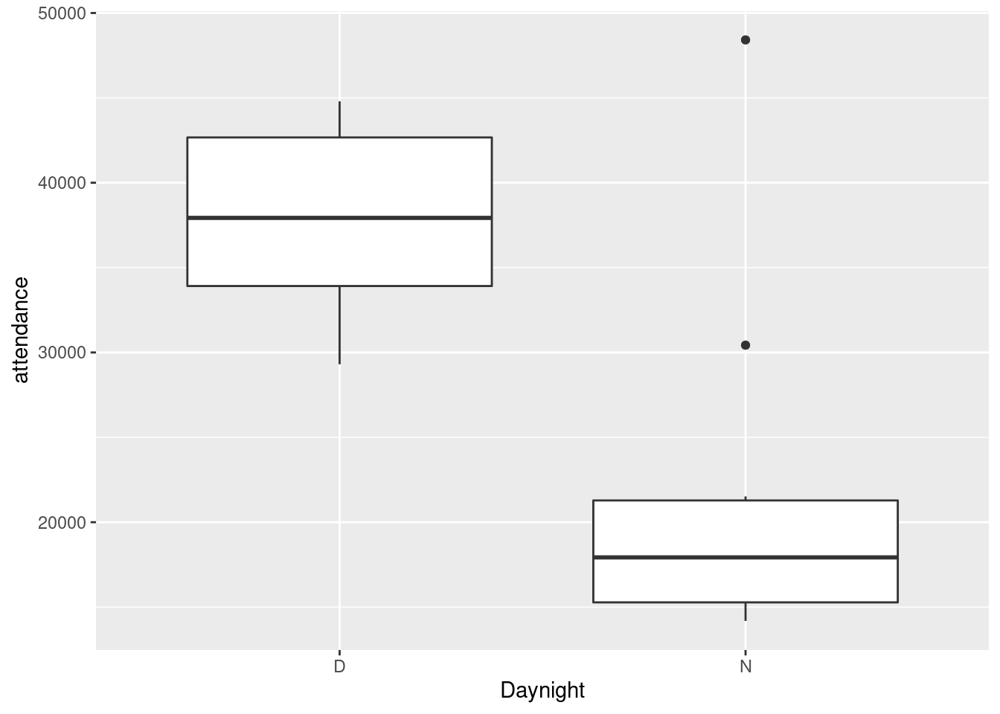
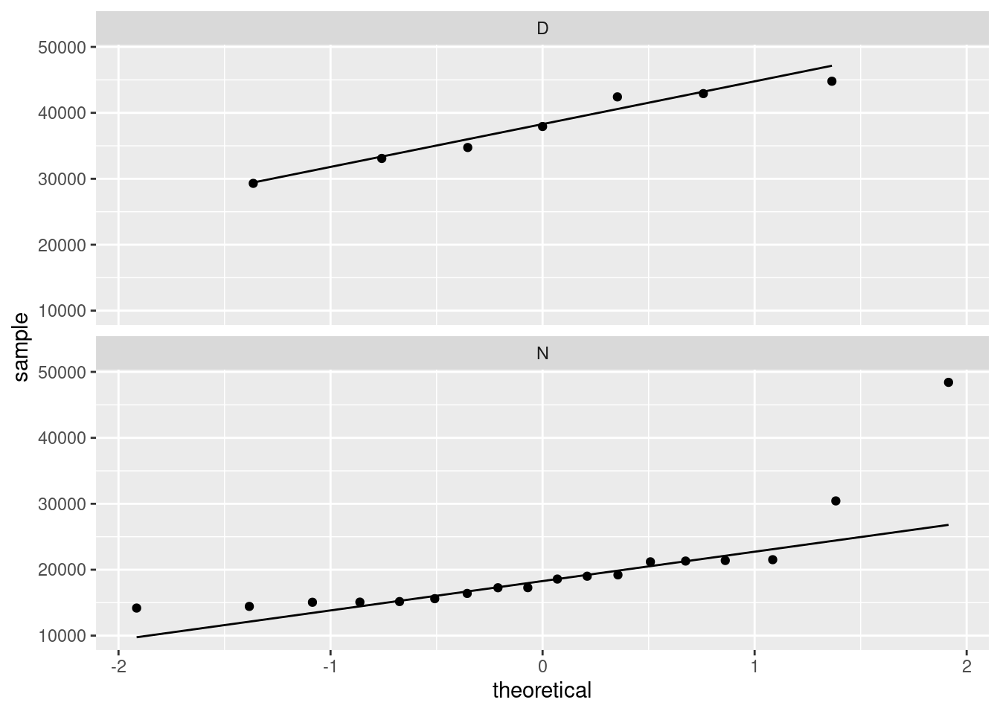

## Working with dataframes


```r
library(tidyverse)
```


##  Tidying the Jays data


 This question is about the Blue Jays data set (that I used
in class).


(a) The Blue Jays baseball data set is at
[link](http://www.utsc.utoronto.ca/~butler/c32/jays15-home.csv). Read
it into R. Check that you have 25 rows and a bunch of variables.


Solution


Save the URL into a variable and then read from the URL, using
`read_csv` because it's a `.csv` file:


```r
myurl <- "http://www.utsc.utoronto.ca/~butler/c32/jays15-home.csv"
jays <- read_csv(myurl)
```

```
## 
## ── Column specification ────────────────────────────────────────────────────────
## cols(
##   .default = col_character(),
##   row = col_double(),
##   game = col_double(),
##   venue = col_logical(),
##   runs = col_double(),
##   Oppruns = col_double(),
##   innings = col_double(),
##   position = col_double(),
##   `game time` = col_time(format = ""),
##   attendance = col_double()
## )
## ℹ Use `spec()` for the full column specifications.
```

```r
jays
```

```
## # A tibble: 25 x 21
##      row  game date   box   team  venue opp   result  runs Oppruns innings wl   
##    <dbl> <dbl> <chr>  <chr> <chr> <lgl> <chr> <chr>  <dbl>   <dbl>   <dbl> <chr>
##  1    82     7 Monda… boxs… TOR   NA    TBR   L          1       2      NA 4-3  
##  2    83     8 Tuesd… boxs… TOR   NA    TBR   L          2       3      NA 4-4  
##  3    84     9 Wedne… boxs… TOR   NA    TBR   W         12       7      NA 5-4  
##  4    85    10 Thurs… boxs… TOR   NA    TBR   L          2       4      NA 5-5  
##  5    86    11 Frida… boxs… TOR   NA    ATL   L          7       8      NA 5-6  
##  6    87    12 Satur… boxs… TOR   NA    ATL   W-wo       6       5      10 6-6  
##  7    88    13 Sunda… boxs… TOR   NA    ATL   L          2       5      NA 6-7  
##  8    89    14 Tuesd… boxs… TOR   NA    BAL   W         13       6      NA 7-7  
##  9    90    15 Wedne… boxs… TOR   NA    BAL   W          4       2      NA 8-7  
## 10    91    16 Thurs… boxs… TOR   NA    BAL   W          7       6      NA 9-7  
## # … with 15 more rows, and 9 more variables: position <dbl>, gb <chr>,
## #   winner <chr>, loser <chr>, save <chr>, game time <time>, Daynight <chr>,
## #   attendance <dbl>, streak <chr>
```


If you must, copy and paste the spreadsheet into R Studio, and read it
in with `read_delim` (or possibly `read_tsv`), but
this runs the risk of being defeated by spreadsheet cells that contain
spaces. I don't think there are any here, but you might run into a
pitcher whose name has more than one word, like (Andy) Van Hekken, who
is in the Seattle Mariners farm system.
<label for="tufte-mn-" class="margin-toggle">&#8853;</label><input type="checkbox" id="tufte-mn-" class="margin-toggle"><span class="marginnote">I found this by  googling, after I had scrolled past all the pages of articles about  the baseball pitcher who *lives* in a van.</span>

Anyway, 25 rows and 21 columns. As usual, it's a tibble, so you see 10
rows and as many columns as will fit. This is often enough to see
whether we have the right thing (as we appear to have, here). You can
run through all the columns and check that they're the right kind of
thing; most of them are text with a few numbers and one `time`,
which is ``game time``, the length of the game in hours and
minutes, which is turned into an R `time` in hours, minutes and
seconds. 

With all those columns, `read_csv` doesn't tell you what
column specification it inferred for all of them, but you can type


```r
spec(jays)
```

```
## cols(
##   row = col_double(),
##   game = col_double(),
##   date = col_character(),
##   box = col_character(),
##   team = col_character(),
##   venue = col_logical(),
##   opp = col_character(),
##   result = col_character(),
##   runs = col_double(),
##   Oppruns = col_double(),
##   innings = col_double(),
##   wl = col_character(),
##   position = col_double(),
##   gb = col_character(),
##   winner = col_character(),
##   loser = col_character(),
##   save = col_character(),
##   `game time` = col_time(format = ""),
##   Daynight = col_character(),
##   attendance = col_double(),
##   streak = col_character()
## )
```

 

to find it all out.


(b) Pick out only the games that were against the New York Yankees
(the variable `opp` is equal to `NYY`). Investigate all
the columns.  What do you notice about these games?


Solution


I get to do this:

```r
jays %>% filter(opp == "NYY") %>% print(width = Inf)
```

```
## # A tibble: 3 x 21
##     row  game date             box      team  venue opp   result  runs Oppruns
##   <dbl> <dbl> <chr>            <chr>    <chr> <lgl> <chr> <chr>  <dbl>   <dbl>
## 1    92    27 Monday, May 4    boxscore TOR   NA    NYY   W          3       1
## 2    93    28 Tuesday, May 5   boxscore TOR   NA    NYY   L          3       6
## 3    94    29 Wednesday, May 6 boxscore TOR   NA    NYY   W          5       1
##   innings wl    position gb    winner  loser    save   `game time` Daynight
##     <dbl> <chr>    <dbl> <chr> <chr>   <chr>    <chr>  <time>      <chr>   
## 1      NA 13-14        4 3.5   Dickey  Martin   Cecil  02:18       N       
## 2      NA 13-15        5 4.5   Pineda  Estrada  Miller 02:54       N       
## 3      NA 14-15        3 3.5   Buehrle Sabathia <NA>   02:30       N       
##   attendance streak
##        <dbl> <chr> 
## 1      19217 +     
## 2      21519 -     
## 3      21312 +
```

 

but you will probably need to click the little right-arrow at the top
to see more columns. 

What I notice is that these games are all on consecutive nights
(against the same team). This is quite common, and goes back to the
far-off days when teams travelled by train: teams play several games
on one visit, rather than coming back many times.
<label for="tufte-mn-" class="margin-toggle">&#8853;</label><input type="checkbox" id="tufte-mn-" class="margin-toggle"><span class="marginnote">Hockey is  similar: teams go on road trips, playing several different teams  before returning home. Hockey teams, though, tend to play each team  only once on a road trip: for example, a west coast team like the  Canucks might play a game in each of Toronto, Montreal, Boston and  New York on a road trip. Well, maybe three games in the New York  area: one each against the Rangers, Islanders and Devils.</span> 
You might have noticed something else;
that's fine for this. For example, 
"each of the games lasted less than three hours", 
or "the attendances were all small" (since we
looked at all the attendances in class). I just want you to notice
something meaningful that seems to be interesting about these games.

You could also print all the columns in two or more goes, using
`select`, for example:


```r
jays %>% filter(opp == "NYY") %>% select(row:innings) %>% print(width = Inf)
```

```
## # A tibble: 3 x 11
##     row  game date             box      team  venue opp   result  runs Oppruns
##   <dbl> <dbl> <chr>            <chr>    <chr> <lgl> <chr> <chr>  <dbl>   <dbl>
## 1    92    27 Monday, May 4    boxscore TOR   NA    NYY   W          3       1
## 2    93    28 Tuesday, May 5   boxscore TOR   NA    NYY   L          3       6
## 3    94    29 Wednesday, May 6 boxscore TOR   NA    NYY   W          5       1
##   innings
##     <dbl>
## 1      NA
## 2      NA
## 3      NA
```

```r
jays %>% filter(opp == "NYY") %>% select(wl:streak) %>% print(width = Inf)
```

```
## # A tibble: 3 x 10
##   wl    position gb    winner  loser    save   `game time` Daynight attendance
##   <chr>    <dbl> <chr> <chr>   <chr>    <chr>  <time>      <chr>         <dbl>
## 1 13-14        4 3.5   Dickey  Martin   Cecil  02:18       N             19217
## 2 13-15        5 4.5   Pineda  Estrada  Miller 02:54       N             21519
## 3 14-15        3 3.5   Buehrle Sabathia <NA>   02:30       N             21312
##   streak
##   <chr> 
## 1 +     
## 2 -     
## 3 +
```

 


(c) From the whole data frame, pick out only the games where the
attendance was more than 30,000, showing only the columns
`attendance` and `Daynight`. How many of them are there
(just count them)? How many are day games and how many night games
(just count those too)?


Solution


Two steps, since we selecting rows *and* columns. 


```r
jays %>%
  filter(attendance > 30000) %>%
  select(c(attendance, Daynight))
```

```
## # A tibble: 8 x 2
##   attendance Daynight
##        <dbl> <chr>   
## 1      48414 N       
## 2      34743 D       
## 3      44794 D       
## 4      30430 N       
## 5      42917 D       
## 6      42419 D       
## 7      33086 D       
## 8      37929 D
```

 

Or this way, since we are selecting
*consecutive* columns:


```r
jays %>%
  filter(attendance > 30000) %>%
  select(c(Daynight:attendance))
```

```
## # A tibble: 8 x 2
##   Daynight attendance
##   <chr>         <dbl>
## 1 N             48414
## 2 D             34743
## 3 D             44794
## 4 N             30430
## 5 D             42917
## 6 D             42419
## 7 D             33086
## 8 D             37929
```

 

There are eight games selected (see the eight rows in the
result). Only two of them are night games, while the other six are day
(weekend) games.

If you wanted to, you could automate the counting, like this:


```r
jays %>%
  filter(attendance > 30000) %>%
  count(Daynight)
```

```
## # A tibble: 2 x 2
##   Daynight     n
##   <chr>    <int>
## 1 D            6
## 2 N            2
```

 

Six day games and two night games.


(d) Display the mean and standard deviation of attendances at all
day and night games.


Solution


Two steps: the grouping according to what I want to group by, then
summarizing according to what I want to summarize by. Since I am
summarizing, only the summaries find their way into the final data
frame, so I don't need to "select out" the other variables:


```r
jays %>%
  group_by(Daynight) %>%
  summarize(
    mean.att = mean(attendance),
    sd.att = sd(attendance)
  )
```

```
## # A tibble: 2 x 3
##   Daynight mean.att sd.att
##   <chr>       <dbl>  <dbl>
## 1 D          37885.  5775.
## 2 N          20087.  8084.
```

 

The mean attendances are about 38 thousand and about 20 thousand. Note
that the night games have much the larger SD, possibly because of the
large outlier night attendance (opening night). Which we can also
investigate. 


```r
jays %>%
  group_by(Daynight) %>%
  summarize(
    median.att = median(attendance),
    iqr.att = IQR(attendance)
  )
```

```
## # A tibble: 2 x 3
##   Daynight median.att iqr.att
##   <chr>         <dbl>   <dbl>
## 1 D            37929    8754.
## 2 N            17928.   6005.
```

 
This time, the night attendances have a *smaller* spread and a
noticeably smaller median (compared to the mean), so it must have been
the outlier that made the difference. There was another high value
that R marked as an outlier:


```r
ggplot(jays, aes(x = Daynight, y = attendance)) + geom_boxplot()
```



 

So when you take away those unusual values, the night game attendances
are indeed less variable.

The right test, as you might have guessed, for comparing the medians
of these non-normal data, is Mood's median test:


```r
library(smmr)
median_test(jays, attendance, Daynight)
```

```
## $table
##      above
## group above below
##     D     7     0
##     N     5    12
## 
## $test
##        what       value
## 1 statistic 9.882352941
## 2        df 1.000000000
## 3   P-value 0.001668714
```

 

There was one attendance exactly equal to the overall median (as you
would expect: with an odd number of data values, the median is one of
the data values). `smmr` removed it; if you did the test by
hand, what happens to it depends on whether you counted aboves or
belows, and this will have a small effect on the P-value, though not
on the conclusion.

The overall median attendance was 21,000, and *none* of the day
games had attendance less than that. With the small frequencies, the
accuracy of the P-value is a bit questionable, but taking it at face
value, there *is* a significant difference between median 
attendances at day and night games.
<label for="tufte-mn-" class="margin-toggle">&#8853;</label><input type="checkbox" id="tufte-mn-" class="margin-toggle"><span class="marginnote">If you do this by  hand, you'll get a warning about the chi-squared approximation  being inaccurate. This is because of the small frequencies, and  *not* because of the outliers. Those are not damaging the test  at all.</span>


(e) Make normal quantile plots of the day attendances and the night
attendances, separately. Do you see any evidence of non-normality?
(You would expect to on the night attendances because of the big
opening-night value.)


Solution


The best way to do this is facetted normal quantile
plots. Remember that the facetting part goes right at the end:

```r
ggplot(jays, aes(sample = attendance)) +
  stat_qq() + stat_qq_line() +
  facet_wrap(~Daynight, ncol = 1)
```



     
The day attendances are pretty normal, though it is hard to be sure
with only 7 of them. 

The night attendances are not normal. The lone point top right is the
outlier. On top of that, the lowest attendances are not quite low enough and
the second-highest attendance is a bit too high, so there is a bit of
evidence of right-skewness as well as just the one outlier. 

If you leave out the `ncol=1`, you'll get the two normal
quantile plots side by side (which means that each one is tall and
skinny, and thus hard to read). The `ncol=1` displays all the
facets in *one* column, and though it would be nice to have the
graphs be about square, landscape mode is easier to read than portrait
mode.  

One of the reasons for skewness is often a limit on the values of the
variable. The Rogers Centre has a capacity around 55,000. The day game
attendances don't get especially close to that, which suggests that
everyone who wants to go to the game can get a ticket. In that sort of
situation, you'd expect attendances to vary around a "typical"
value, with a random deviation that depends on things like the weather
and the opposing team, which is the typical situation in which you get
bell-shaped data. (If the Jays often sold out their stadium for day
games, you'd see a lot of attendances close to the capacity, with a
few lower: ie., a left skew.)

As for the night games, well, there seems to be a minimum attendance
that the Blue Jays get, somewhere around 15,000: no matter who they're
playing or what the weather's like, this many people will show up
(season-ticket holders, for example). On special occasions, such as
opening night, the attendance will be much bigger, which points to a
*right* skew.


##  Cars


 My cars data file can be found at
[link](http://www.utsc.utoronto.ca/~butler/c32/cars.csv). 
The values in
the data file are separated by commas; the car names are up to 29
characters long.  Display your results for each part after (a). In R,
displaying a `tibble` normally shows its first ten lines, which
is all you need here; there's no need to display all the lines.


(a) Read the data into R and list the values.


Solution


`read_csv` will do it:

```r
my_url <- "http://www.utsc.utoronto.ca/~butler/c32/cars.csv"
cars <- read_csv(my_url)
```

```
## 
## ── Column specification ────────────────────────────────────────────────────────
## cols(
##   car = col_character(),
##   MPG = col_double(),
##   weight = col_double(),
##   cylinders = col_double(),
##   hp = col_double(),
##   country = col_character()
## )
```

```r
cars
```

```
## # A tibble: 38 x 6
##    car                  MPG weight cylinders    hp country
##    <chr>              <dbl>  <dbl>     <dbl> <dbl> <chr>  
##  1 Buick Skylark       28.4   2.67         4    90 U.S.   
##  2 Dodge Omni          30.9   2.23         4    75 U.S.   
##  3 Mercury Zephyr      20.8   3.07         6    85 U.S.   
##  4 Fiat Strada         37.3   2.13         4    69 Italy  
##  5 Peugeot 694 SL      16.2   3.41         6   133 France 
##  6 VW Rabbit           31.9   1.92         4    71 Germany
##  7 Plymouth Horizon    34.2   2.2          4    70 U.S.   
##  8 Mazda GLC           34.1   1.98         4    65 Japan  
##  9 Buick Estate Wagon  16.9   4.36         8   155 U.S.   
## 10 Audi 5000           20.3   2.83         5   103 Germany
## # … with 28 more rows
```

 
      


(b) Display only the car names and the countries they come from.


Solution


```r
cars %>% select(car, country)
```

```
## # A tibble: 38 x 2
##    car                country
##    <chr>              <chr>  
##  1 Buick Skylark      U.S.   
##  2 Dodge Omni         U.S.   
##  3 Mercury Zephyr     U.S.   
##  4 Fiat Strada        Italy  
##  5 Peugeot 694 SL     France 
##  6 VW Rabbit          Germany
##  7 Plymouth Horizon   U.S.   
##  8 Mazda GLC          Japan  
##  9 Buick Estate Wagon U.S.   
## 10 Audi 5000          Germany
## # … with 28 more rows
```

 

This *almost* works, but not quite:


```r
cars %>% select(starts_with("c"))
```

```
## # A tibble: 38 x 3
##    car                cylinders country
##    <chr>                  <dbl> <chr>  
##  1 Buick Skylark              4 U.S.   
##  2 Dodge Omni                 4 U.S.   
##  3 Mercury Zephyr             6 U.S.   
##  4 Fiat Strada                4 Italy  
##  5 Peugeot 694 SL             6 France 
##  6 VW Rabbit                  4 Germany
##  7 Plymouth Horizon           4 U.S.   
##  8 Mazda GLC                  4 Japan  
##  9 Buick Estate Wagon         8 U.S.   
## 10 Audi 5000                  5 Germany
## # … with 28 more rows
```

 

It gets *all* the columns that start with `c`, which
includes `cylinders` as well.
      


(c) Display everything *except* horsepower:


Solution


Naming what you *don't* want is sometimes easier:

```r
cars %>% select(-hp)
```

```
## # A tibble: 38 x 5
##    car                  MPG weight cylinders country
##    <chr>              <dbl>  <dbl>     <dbl> <chr>  
##  1 Buick Skylark       28.4   2.67         4 U.S.   
##  2 Dodge Omni          30.9   2.23         4 U.S.   
##  3 Mercury Zephyr      20.8   3.07         6 U.S.   
##  4 Fiat Strada         37.3   2.13         4 Italy  
##  5 Peugeot 694 SL      16.2   3.41         6 France 
##  6 VW Rabbit           31.9   1.92         4 Germany
##  7 Plymouth Horizon    34.2   2.2          4 U.S.   
##  8 Mazda GLC           34.1   1.98         4 Japan  
##  9 Buick Estate Wagon  16.9   4.36         8 U.S.   
## 10 Audi 5000           20.3   2.83         5 Germany
## # … with 28 more rows
```

 
      


(d) Display only the cars that have 8-cylinder engines (but
display all the variables for those cars).


Solution


This:

```r
cars %>% filter(cylinders == 8)
```

```
## # A tibble: 8 x 6
##   car                         MPG weight cylinders    hp country
##   <chr>                     <dbl>  <dbl>     <dbl> <dbl> <chr>  
## 1 Buick Estate Wagon         16.9   4.36         8   155 U.S.   
## 2 Chevy Malibu Wagon         19.2   3.60         8   125 U.S.   
## 3 Chrysler LeBaron Wagon     18.5   3.94         8   150 U.S.   
## 4 Ford LTD                   17.6   3.72         8   129 U.S.   
## 5 Dodge St Regis             18.2   3.83         8   135 U.S.   
## 6 Ford Country Squire Wagon  15.5   4.05         8   142 U.S.   
## 7 Mercury Grand Marquis      16.5   3.96         8   138 U.S.   
## 8 Chevy Caprice Classic      17     3.84         8   130 U.S.
```

 
8 of them, all from the US.
      


(e) Display the cylinders and horsepower for the cars that have
horsepower 70 or less.


Solution


This one is selecting some observations and some variables:

```r
cars %>% filter(hp <= 70) %>% select(cylinders:hp)
```

```
## # A tibble: 6 x 2
##   cylinders    hp
##       <dbl> <dbl>
## 1         4    69
## 2         4    70
## 3         4    65
## 4         4    65
## 5         4    68
## 6         4    68
```

 

Cylinders and horsepower are consecutive columns, so we can select
them either using the colon `:` or by
`c(cylinders,hp)`. 

You can also do the `filter` and the
`select` the other way around.
This one works because the *rows* you want to
choose are determined by a column you're going to keep. If you wanted
to display the cylinders and horsepower of the cars with `mpg`
over 30, you would have to choose the rows first, because after you've
chosen the columns, there is no `mpg` any more.
      


(f) Find the mean and SD of gas mileage of the cars with 4 cylinders.


Solution


```r
cars %>% filter(cylinders == 4) %>% summarize(m = mean(MPG), s = sd(MPG))
```

```
## # A tibble: 1 x 2
##       m     s
##   <dbl> <dbl>
## 1  30.0  4.18
```

 

Or you can get the mean and SD of gas mileage for all numbers of
cylinders, and pick out the one you want:


```r
cars %>% group_by(cylinders) %>% summarize(m = mean(MPG), s = sd(MPG))
```

```
## # A tibble: 4 x 3
##   cylinders     m     s
##       <dbl> <dbl> <dbl>
## 1         4  30.0  4.18
## 2         5  20.3 NA   
## 3         6  21.1  4.08
## 4         8  17.4  1.19
```

 

Top row is the same as before. And since the output is a data frame,
you can do any of these things with *that*, for example:


```r
cars %>%
  group_by(cylinders) %>%
  summarize(m = mean(MPG), s = sd(MPG)) %>%
  filter(cylinders == 4)
```

```
## # A tibble: 1 x 3
##   cylinders     m     s
##       <dbl> <dbl> <dbl>
## 1         4  30.0  4.18
```

 

to pick out just the right row.
This is a very easy kind of question to set on an exam. Just so you know.
      


