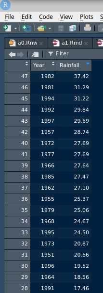

# Introduction {-}


[This book](http://ritsokiguess.site/pasias/) contains a collection
of problems, and my solutions to them, in applied statistics with
R. These come from my courses STAC32, STAC33, and STAD29 at the University of
Toronto Scarborough. 

The problems were originally written in Sweave (that is, LaTeX with R
code chunks), using the `exam` document class, using data sets stolen
from numerous places (textbooks, websites etc).  I wrote [a Perl
program](https://raw.githubusercontent.com/nxskok/pasias/master/convert.pl)
to strip out the LaTeX and turn each problem into R Markdown for this
book. You will undoubtedly see bits of LaTeX still embedded in the
text. I am trying to update my program to catch them, but I am sure to
miss some. 

You will occasionally
see question parts beginning with a *; this means that other question
parts refer back to this one. (One of my favourite question strategies
is to ask how two different approaches lead to the same answer, or
more generally to demonstrate that there are different ways to see the
same thing.)

Thanks to Dann Sioson for spotting some errors and making some useful suggestions.

If *you* see anything, [file an
issue](https://github.com/nxskok/pasias/issues) on the Github page for
now. Likely
problems include:

- some LaTeX construction that I didn't catch (eg. block quotes)
- disappeared footnotes (that will show up as an apparently missing sentence in the text)
- references to "in class" or a lecture or a course by course number, which need to be eliminated (in favour of wording like "a previous course")
- references to other questions or question parts that are *wrong* (likely caused by *not* being "labels" or "refs" in the original LaTeX)
- my contorted English that is difficult to understand.

As I read through looking for problems like these, I realize that
there ought to be a textbook that reflects my way of doing
things. There isn't one (yet), though there are lecture
notes. Current versions of these are at:

- [the STAC32 website](http://ritsokiguess.site/STAC32/)
- [the STAC33 website](http://ritsokiguess.site/STAC33/)
- [the STAD29 website](http://ritsokiguess.site/STAD29/)

A little background:

STAC32 is an introduction to R as
applied to statistical methods that have (mostly) been learned in
previous courses. This course is designed for students who have a second non-mathematical applied statistics course 
such as
[this](https://utsc.calendar.utoronto.ca/course/stab27h3). The idea is
that students have already seen a little of regression and analysis of
variance (and the things that precede them), and need mainly an
introduction of how to run them in R.

STAC33 is an introduction to R, and applied statistics in general, for students who have a background in mathematical statistics. The way our courses are structured, these students have a strong mathematical background, but not very much experience in applications, which this course is designed to provide. The material covered is similar to STAC32, with a planned addition of some ideas in bootstrap and practical Bayesian statistics. There are some questions on these here.

STAD29 is an overview of a number of advanced statistical methods. I
start from regression and proceed to some regression-like methods
(logistic regression, survival analysis, log-linear frequency table
analysis), then I go a little further with analysis of variance and
proceed with MANOVA and repeated measures. I finish with a look at
classical multivariate methods such as discriminant analysis, cluster
analysis, principal components and factor analysis. I cover a number
of methods in no great depth; my aim is to convey an understanding of
what these methods are for, how to run them and how to interpret the
results. Statistics majors and specialists cannot take this course for
credit (they have separate courses covering this material with the
proper mathematical background). D29 is intended for students in other
disciplines who find themselves wanting to learn more statistics; we
have an [Applied Statistics Minor
program](https://utsc.calendar.utoronto.ca/minor-program-applied-statistics-science)
for which C32 and D29 are two of the last courses.

## Packages used somewhere in this book {-}

The bottom lines are below used with the `conflicted` package: if a function by
the name shown is in two or more packages, prefer the one from the
package shown.

```{r, eval=F}
library(tidyverse)
library(smmr)
library(MASS)
library(nnet)
library(survival)
library(survminer)
library(car)
library(lme4)
library(ggbiplot)
library(ggrepel)
library(broom)
library(rpart)
library(bootstrap)
library(cmdstanr)
library(posterior)
library(bayesplot)
library(tmaptools)
library(leaflet)
library(conflicted)
conflict_prefer("summarize", "dplyr")
conflict_prefer("select", "dplyr")
conflict_prefer("filter", "dplyr")
conflict_prefer("mutate", "dplyr")
conflict_prefer("count", "dplyr")
conflict_prefer("arrange", "dplyr")
conflict_prefer("rename", "dplyr")
conflict_prefer("id", "dplyr")
```


<!--chapter:end:index.Rmd-->

# Testing some things 

## this is a header with a link

some text with a <a name="alink">link</a>?  

blah

blah

blah

blah

blah

blah

blah

blah

blah

blah

blah

blah

blah

blah

blah

blah

blah

blah

blah

blah

blah

blah

which we can now [access](#alink)

<!--chapter:end:00-test.Rmd-->


# Getting used to R and R Studio

My solutions follow the problems. Look ahead if you get stuck. Don't forget `library(tidyverse)` if you need it:

```{r, child="packages.Rmd"}
```


```{r, child="r-signup_qq.Rmd"}
```

```{r, child="r0_qq.Rmd"}
```

```{r, child="r0a_qq.Rmd"}
```

```{r different-ways, child="different-ways_qq.Rmd"}
```

My solutions follow: 

```{r, child="r-signup.Rmd"}
```

```{r, child="r0.Rmd"}
```

```{r, child="r0a.Rmd"}
```

```{r different-ways, child="different-ways.Rmd"}
```


<!--chapter:end:01-getting-used.Rmd-->


# Reading in data

```{r, eval=F}
library(tidyverse)
```

```{r, child="packages.Rmd"}
```


```{r, child="oj_qq.Rmd"}
```

```{r, child="soap_qq.Rmd"}
```

```{r, child="global_qq.Rmd"}
```


My solutions follow:

```{r, child="oj.Rmd"}
```

```{r, child="soap.Rmd"}
```

```{r, child="global.Rmd"}
```


<!--chapter:end:02-reading-in.Rmd-->

# Data exploration

```{r, eval=F}
library(tidyverse)
```

```{r, child="packages.Rmd"}
```


```{r, child="ncbirths_qq.Rmd"}
```

```{r, child="ncbirths-extra_qq.Rmd"}
```

```{r, child="nenana_qq.Rmd"}
```

```{r, child="compatt_qq.Rmd"}
```

```{r, child="thomas_qq.Rmd"}
```

```{r, child="rainfall1_qq.Rmd"}
```

```{r, child="algebra_qq.Rmd"}
```

My solutions follow:

```{r, child="ncbirths.Rmd"}
```

```{r, child="ncbirths-extra.Rmd"}
```

```{r, child="nenana.Rmd"}
```

```{r, child="compatt.Rmd"}
```

```{r, child="thomas.Rmd"}
```

```{r, child="rainfall1.Rmd"}
```

```{r, child="algebra.Rmd"}
```


<!--chapter:end:03-data-summaries.Rmd-->

# One-sample inference

```{r, eval=F}
library(tidyverse)
```

```{r, child="packages.Rmd"}
```

```{r, child="hg_qq.Rmd"}
```

```{r, child="boulder_qq.Rmd"}
```

```{r, child="ncbirths-inf_qq.Rmd"}
```

```{r, child="nenana-inf_qq.Rmd"}
```

```{r, child="trees_qq.Rmd"}
```

```{r, child="cholest_qq.Rmd"}
```

\setcounter{chapter}{1}

My solutions follow:

```{r, child="hg.Rmd"}
```

```{r, child="boulder.Rmd"}
```

```{r, child="ncbirths-inf.Rmd"}
```

```{r, child="nenana-inf.Rmd"}
```

```{r, child="trees.Rmd"}
```

```{r, child="cholest.Rmd"}
```


<!--chapter:end:04-one-sample-inference.Rmd-->

# Two-sample inference

```{r, eval=F}
library(tidyverse)
```

```{r, child="packages.Rmd"}
```


```{r devices-r, child="devices-r_qq.Rmd"}
```

```{r parking, child="parking_qq.Rmd"}
```

```{r bellpepper, child="bellpepper_qq.Rmd"}
```

```{r mousebully, child="mousebully_qq.Rmd"}
```

```{r kids-diet, child="kids-diet_qq.Rmd"}
```

```{r handspan, child="handspan_a_qq.Rmd"}
```

```{r ozvus, child="ozvus_qq.Rmd"}
```

My solutions follow:

```{r devices-r, child="devices-r.Rmd"}
```

```{r parking, child="parking.Rmd"}
```

```{r bellpepper, child="bellpepper.Rmd"}
```

```{r mousebully, child="mousebully.Rmd"}
```

```{r kids-diet, child="kids-diet.Rmd"}
```

```{r handspan, child="handspan_a.Rmd"}
```

```{r ozvus, child="ozvus.Rmd"}
```


<!--chapter:end:05-two-sample-inference.Rmd-->

# Power and sample size

```{r, eval=F}
library(tidyverse)
```

```{r, child="packages.Rmd"}
```


```{r power-sim, child="power-sim_qq.Rmd"}
```

```{r power20, child="power20_qq.Rmd"}
```

```{r, proportion-power-sim, child="proportion-power-sim_qq.Rmd"}
```

```{r, child="mean_two_qq.Rmd"}
```

```{r, child="pop_power_qq.Rmd"}
```

My solutions follow:

```{r power-sim, child="power-sim.Rmd"}
```

```{r power20, child="power20.Rmd"}
```

```{r, proportion-power-sim, child="proportion-power-sim.Rmd"}
```

```{r, child="mean_two.Rmd"}
```

```{r, child="pop_power.Rmd"}
```


<!--chapter:end:06-power.Rmd-->

# The sign test and Mood's median test

```{r}
library(tidyverse)
library(smmr)
```

```{r, child="packages.Rmd"}
```


```{r maze, child="maze.Rmd"}
```

```{r cookies-r, child="cookies-r.Rmd"}
```

```{r signpower, child="signpower.Rmd"}
```

```{r cerealsugar, child="cerealsugar.Rmd"}
```

```{r mathphobia, child="mathphobia.Rmd"}
```

```{r forehead, child="forehead.Rmd"}
```

<!--chapter:end:07-sign-mood-median.Rmd-->

# The sign test

```{r}
library(tidyverse)
library(smmr)
```

```{r, child="packages.Rmd"}
```


```{r maze, child="maze_qq.Rmd"}
```

```{r cookies-r, child="cookies-r_qq.Rmd"}
```

```{r signpower, child="signpower_qq.Rmd"}
```

```{r, child="roethlisberger_qq.Rmd"}
```

My solutions follow:

```{r maze, child="maze.Rmd"}
```

```{r cookies-r, child="cookies-r.Rmd"}
```

```{r signpower, child="signpower.Rmd"}
```

```{r, child="roethlisberger.Rmd"}
```


<!--chapter:end:07-sign.Rmd-->

# Matched pairs t and sign test

```{r, eval=F}
library(tidyverse)
library(smmr)
```

```{r, child="packages.Rmd"}
```


```{r bodyfat, child="bodyfat_qq.Rmd"}
```

```{r baseball-softball-r, child="baseball-softball-r_qq.Rmd"}
```

```{r throw, child="throw_qq.Rmd"}
```


```{r salaryinc, child="salaryinc_qq.Rmd"}
```

```{r bodyfat-sign, child="bodyfat-sign_qq.Rmd"}
```

```{r blood-pressure-paired, child="blood_pressure_paired_qq.Rmd"}
```

```{r, child="french_qq.Rmd"}
```

My solutions follow:


```{r bodyfat, child="bodyfat.Rmd"}
```

```{r baseball-softball-r, child="baseball-softball-r.Rmd"}
```

```{r throw, child="throw.Rmd"}
```


```{r salaryinc, child="salaryinc.Rmd"}
```

```{r bodyfat-sign, child="bodyfat-sign.Rmd"}
```

```{r blood-pressure-paired, child="blood_pressure_paired.Rmd"}
```

```{r, child="french.Rmd"}
```


<!--chapter:end:08-matched-pairs-sign.Rmd-->

# Normal quantile plots

```{r, eval=F}
library(tidyverse)
```

```{r, child="packages.Rmd"}
```


```{r heliconia, child="heliconia_qq.Rmd"}
```

```{r aus-qq, child="aus-qq_qq.Rmd"}
```

My solutions follow:

```{r heliconia, child="heliconia.Rmd"}
```

```{r aus-qq, child="aus-qq.Rmd"}
```

<!--chapter:end:09-normal-quantile.Rmd-->

# Analysis of variance

```{r, eval=F}
library(tidyverse)
```

```{r, child="packages.Rmd"}
```


```{r movies-r, child="movies-r_qq.Rmd"}
```

```{r deer, child="deer_qq.Rmd"}
```

```{r movies2, child="movies2_qq.Rmd"}
```

```{r carbon, child="carbon_qq.Rmd"}
```

```{r caffeine, child="caffeine_qq.Rmd"}
```

```{r, child="reggae_qq.Rmd"}
```

```{r, child="gss_tv_qq.Rmd"}
```

```{r, child="writers_qq.Rmd"}
```

```{r, child="relig_qq.Rmd"}
```

My solutions follow:

```{r movies-r, child="movies-r.Rmd"}
```

```{r deer, child="deer.Rmd"}
```

```{r movies2, child="movies2.Rmd"}
```

```{r carbon, child="carbon.Rmd"}
```

```{r caffeine, child="caffeine.Rmd"}
```

```{r, child="reggae.Rmd"}
```

```{r, child="gss_tv.Rmd"}
```

```{r, child="writers.Rmd"}
```

```{r, child="relig.Rmd"}
```


<!--chapter:end:10-analysis-of-variance.Rmd-->

# Tidying data

```{r, eval=F}
library(tidyverse)
```

```{r, child="packages.Rmd"}
```


```{r throw-spaghetti, child="throw-spaghetti.Rmd"}
```

```{r ethanol, child="ethanol.Rmd"}
```

```{r tomatoes, child="tomatoes.Rmd"}
```

```{r migraine,child="migraine.Rmd"}
```

```{r plants,child="plants.Rmd"}
```

```{r crickets,child="crickets.Rmd"}
```


```{r billboard, child="billboard.Rmd"}
```

```{r bikes, child="bikes.Rmd"}
```

```{r heat-r, child="heat-r.Rmd"}
```

<!--chapter:end:11-tidying-and-selecting-data.Rmd-->

# Tidying data

```{r, eval=F}
library(tidyverse)
```

```{r, child="packages.Rmd"}
```


```{r throw-spaghetti, child="throw-spaghetti_qq.Rmd"}
```

```{r ethanol, child="ethanol_qq.Rmd"}
```

```{r tomatoes, child="tomatoes_qq.Rmd"}
```

```{r migraine,child="migraine_qq.Rmd"}
```

```{r plants,child="plants_qq.Rmd"}
```

```{r crickets,child="crickets_qq.Rmd"}
```


```{r billboard, child="billboard_qq.Rmd"}
```

```{r bikes, child="bikes_qq.Rmd"}
```

```{r heat-r, child="heat-r_qq.Rmd"}
```

```{r, child="isoflavones_qq.Rmd"}
```

```{r, child="jocko_qq.Rmd"}
```


```{r, child="util_temp_qq.Rmd"}
```

```{r, child="blood_pressure_tidy_qq.Rmd"}
```


My solutions follow:

```{r throw-spaghetti, child="throw-spaghetti.Rmd"}
```

```{r ethanol, child="ethanol.Rmd"}
```

```{r tomatoes, child="tomatoes.Rmd"}
```

```{r migraine,child="migraine.Rmd"}
```

```{r plants,child="plants.Rmd"}
```

```{r crickets,child="crickets.Rmd"}
```


```{r billboard, child="billboard.Rmd"}
```

```{r bikes, child="bikes.Rmd"}
```

```{r heat-r, child="heat-r.Rmd"}
```

```{r, child="isoflavones.Rmd"}
```

```{r, child="jocko.Rmd"}
```

```{r, child="util_temp.Rmd"}
```

```{r, child="blood_pressure_tidy.Rmd"}
```


<!--chapter:end:11-tidying-data.Rmd-->

# Regression

```{r, eval=F}
library(tidyverse)
```

```{r, child="packages.Rmd"}
```

These problems are about simple regression (just one $x$-variable):


```{r calirain,child="calirain.Rmd"}
```

```{r ftccigar,child="ftccigar.Rmd"}
```


```{r boys, child="youngboys.Rmd"}
```


```{r fbfriends, child="fbfriends.Rmd"}
```

```{r carp, child="carp.Rmd"}
```


```{r socwork, child="socwork.Rmd"}
```

```{r pinetrees, child="pinetrees.Rmd"}
```

```{r tortoise, child="tortoise.Rmd"}
```

```{r crickets-b, child="crickets-b.Rmd"}
```

```{r coasters, child="coasters.Rmd"}
```

```{r diabetic, child="diabetic.Rmd"}
```

```{r pizza, child="pizza.Rmd"}
```

```{r fire_damage, child="fire_damage.Rmd"}
```

These problems are about multiple regression (more than one $x$-variable):


```{r hospital, child="hospital.Rmd"}
```

```{r chemical, child="chemical.Rmd"}
```

```{r mathsal, child="mathsal.Rmd"}
```

```{r gpa, child="gpa.Rmd"}
```

<!--chapter:end:12-multiple-regression.Rmd-->

# Regression

```{r, eval=F}
library(tidyverse)
```

```{r, child="packages.Rmd"}
```

These problems are about simple regression (just one $x$-variable):


```{r calirain,child="calirain.Rmd"}
```

```{r ftccigar,child="ftccigar.Rmd"}
```


```{r boys, child="youngboys.Rmd"}
```


```{r fbfriends, child="fbfriends.Rmd"}
```

```{r carp, child="carp.Rmd"}
```


```{r socwork, child="socwork.Rmd"}
```

```{r pinetrees, child="pinetrees.Rmd"}
```

```{r tortoise, child="tortoise.Rmd"}
```

```{r crickets-b, child="crickets-b.Rmd"}
```

```{r coasters, child="coasters.Rmd"}
```

```{r diabetic, child="diabetic.Rmd"}
```

```{r pizza, child="pizza.Rmd"}
```

```{r fire_damage, child="fire_damage.Rmd"}
```

These problems are about multiple regression (more than one $x$-variable):


```{r hospital, child="hospital.Rmd"}
```

```{r chemical, child="chemical.Rmd"}
```

```{r mathsal, child="mathsal.Rmd"}
```

```{r gpa, child="gpa.Rmd"}
```

<!--chapter:end:12-regression.Rmd-->

# Simple regression

```{r, eval=F}
library(tidyverse)
```

```{r, child="packages.Rmd"}
```


```{r calirain,child="calirain_qq.Rmd"}
```

```{r ftccigar,child="ftccigar_qq.Rmd"}
```


```{r boys, child="youngboys_qq.Rmd"}
```


```{r fbfriends, child="fbfriends_qq.Rmd"}
```

```{r carp, child="carp_qq.Rmd"}
```


```{r socwork, child="socwork_qq.Rmd"}
```

```{r pinetrees, child="pinetrees_qq.Rmd"}
```

```{r tortoise, child="tortoise_qq.Rmd"}
```


```{r coasters, child="coasters_qq.Rmd"}
```

```{r diabetic, child="diabetic_qq.Rmd"}
```

```{r pizza, child="pizza_qq.Rmd"}
```

```{r fire_damage, child="fire_damage_qq.Rmd"}
```


```{r, child="braking_qq.Rmd"}
```

```{r, child="heightfoot_qq.Rmd"}
```


My solutions follow:

```{r calirain,child="calirain.Rmd"}
```

```{r ftccigar,child="ftccigar.Rmd"}
```


```{r boys, child="youngboys.Rmd"}
```


```{r fbfriends, child="fbfriends.Rmd"}
```

```{r carp, child="carp.Rmd"}
```


```{r socwork, child="socwork.Rmd"}
```

```{r pinetrees, child="pinetrees.Rmd"}
```

```{r tortoise, child="tortoise.Rmd"}
```


```{r coasters, child="coasters.Rmd"}
```

```{r diabetic, child="diabetic.Rmd"}
```

```{r pizza, child="pizza.Rmd"}
```

```{r fire_damage, child="fire_damage.Rmd"}
```

```{r, child="braking.Rmd"}
```

```{r, child="heightfoot.Rmd"}
```


<!--chapter:end:12-simple-regression.Rmd-->

# Dates and times

The usual to begin with:

```{r, eval=F}
library(tidyverse)
```

```{r, child="packages.Rmd"}
```

```{r mizuna-r, child="mizuna-r_qq.Rmd"}
```

```{r birthtypes, child="birthtypes_qq.Rmd"}
```

```{r denali, child="denali-r_qq.Rmd"}
```

```{r whas, child="whas_qq.Rmd"}
```

```{r, child="sleeping_qq.Rmd"}
```


My solutions follow:

```{r mizuna-r, child="mizuna-r.Rmd"}
```

```{r birthtypes, child="birthtypes.Rmd"}
```

```{r denali, child="denali-r.Rmd"}
```

```{r whas, child="whas.Rmd"}
```

```{r, child="sleeping.Rmd"}
```


<!--chapter:end:13-dates-and-times.Rmd-->

# Functions

```{r, eval=F}
library(tidyverse)
```

```{r, child="packages.Rmd"}
```


```{r func, child="func_qq.Rmd"}
```

```{r hotpo, child="hotpo_qq.Rmd"}
```


```{r, child="cv_qq.Rmd"}
```

My solutions follow:

```{r func, child="func.Rmd"}
```

```{r hotpo, child="hotpo.Rmd"}
```

```{r, child="cv.Rmd"}
```


<!--chapter:end:14-functions.Rmd-->

# Logistic regression

```{r, eval=F}
library(tidyverse)
```

```{r, child="packages.Rmd"}
```


```{r, wolfspider,child="wolfspider_qq.Rmd"}
```

```{r, aphids, child="aphids_qq.Rmd"}
```

```{r, doseresponse, child="doseresponse_qq.Rmd"}
```

```{r, parasite, child="parasite_qq.Rmd"}
```

```{r, ethics, child="ethics_qq.Rmd"}
```

```{r, heart,  child="heart_qq.Rmd"}
```

```{r, breastfeed, child="breastfeed_qq.Rmd"}
```

```{r, donner, child="donner_qq.Rmd"}
```

```{r, apache, child="apache_qq.Rmd"}
```

```{r, ha2, child="ha2_qq.Rmd"}
```

My solutions follow:

```{r, wolfspider,child="wolfspider.Rmd"}
```

```{r, aphids, child="aphids.Rmd"}
```

```{r, doseresponse, child="doseresponse.Rmd"}
```

```{r, parasite, child="parasite.Rmd"}
```

```{r, ethics, child="ethics.Rmd"}
```

```{r, heart,  child="heart.Rmd"}
```

```{r, breastfeed, child="breastfeed.Rmd"}
```

```{r, donner, child="donner.Rmd"}
```

```{r, apache, child="apache.Rmd"}
```

```{r, ha2, child="ha2.Rmd"}
```


<!--chapter:end:15-logistic-regression.Rmd-->

# Logistic regression with ordinal or nominal response

```{r, eval=F}
library(MASS)
library(nnet)
library(tidyverse)
```
```{r, child="packages.Rmd"}
```

```{r mobile, child="mobile.Rmd"}
```

```{r abortion, child="abortion.Rmd"}
```

```{r nonmissing, child="nonmissing.Rmd"}
```

```{r ess, child="ess.Rmd"}
```

```{r alligator, child="alligator.Rmd"}
```

```{r steak-data, child="steak-data.Rmd"}
```

```{r sfcrime-data, child="sfcrime-data.Rmd"}
```

```{r steak, child="steak.Rmd"}
```

```{r sfcrime, child="sfcrime.Rmd"}
```

```{r hsb, child="hsb.Rmd"}
```

```{r oz-multi, child="oz-multi.Rmd"}
```


<!--chapter:end:16-ordinal-nominal-response.Rmd-->

# Logistic regression with ordinal response

```{r, eval=F}
library(MASS)
library(tidyverse)
```
```{r, child="packages.Rmd"}
```

```{r mobile, child="mobile_qq.Rmd"}
```


```{r nonmissing, child="nonmissing_qq.Rmd"}
```


```{r hsb, child="hsb_qq.Rmd"}
```


```{r steak, child="steak_qq.Rmd"}
```

```{r steak-data, child="steak-data_qq.Rmd"}
```

My solutions follow:

```{r mobile, child="mobile.Rmd"}
```


```{r nonmissing, child="nonmissing.Rmd"}
```


```{r hsb, child="hsb.Rmd"}
```


```{r steak, child="steak.Rmd"}
```

```{r steak-data, child="steak-data.Rmd"}
```

<!--chapter:end:16-ordinal-response.Rmd-->

# Survival analysis

```{r, eval=F}
library(survival)
library(tidyverse)
library(survminer)
```

```{r, child="packages.Rmd"}
```

```{r worcester, child="worcester_qq.Rmd"}
```

```{r drug-treatment, child="drug-treatment_qq.Rmd"}
```

```{r myeloma, child="myeloma_qq.Rmd"}
```

```{r ovarian, child="ovarian_qq.Rmd"}
```

My solutions follow:

```{r worcester, child="worcester.Rmd"}
```

```{r drug-treatment, child="drug-treatment.Rmd"}
```

```{r myeloma, child="myeloma.Rmd"}
```

```{r ovarian, child="ovarian.Rmd"}
```


<!--chapter:end:17-survival-analysis.Rmd-->

# Analysis of variance revisited

Packages for this chapter:

```{r, eval=F}
library(MASS)
library(car)
library(tidyverse)
```

```{r, child="packages.Rmd"}
```


```{r acidrain, child="acidrain.Rmd"}
```

```{r hayfever, child="hayfever.Rmd"}
```

```{r q2,child="caffeine-contrast.Rmd"}
```

```{r studyhours, child="studyhours.Rmd"}
```

```{r q3,child="mental-context.Rmd"}
```

```{r shirts, child="shirts.Rmd"}
```


```{r productivity, child="productivity.Rmd"}
```

```{r lepro, child="leprosy.Rmd"} 
```


<!--chapter:end:18-ancova.Rmd-->

# Analysis of variance revisited

Packages for this chapter:

```{r, eval=F}
library(MASS)
library(car)
library(tidyverse)
```

```{r, child="packages.Rmd"}
```


```{r acidrain, child="acidrain_qq.Rmd"}
```

```{r hayfever, child="hayfever_qq.Rmd"}
```

```{r q2,child="caffeine-contrast_qq.Rmd"}
```

```{r studyhours, child="studyhours_qq.Rmd"}
```

```{r q3,child="mental-context_qq.Rmd"}
```

```{r shirts, child="shirts_qq.Rmd"}
```


My solutions follow:

```{r acidrain, child="acidrain.Rmd"}
```

```{r hayfever, child="hayfever.Rmd"}
```

```{r q2,child="caffeine-contrast.Rmd"}
```

```{r studyhours, child="studyhours.Rmd"}
```

```{r q3,child="mental-context.Rmd"}
```

```{r shirts, child="shirts.Rmd"}
```


<!--chapter:end:18-anova-revisited.Rmd-->

# Multivariate analysis of variance

Packages for this chapter:

```{r, eval=F}
library(car)
library(tidyverse)
```

```{r, child="packages.Rmd"}
```


```{r q7,child="manova1_qq.Rmd"}
``` 

```{r urine,child="urine_qq.Rmd"}
```   

```{r athletes-manova, child="athletes-manova_qq.Rmd"}
```

My solutions follow:

```{r q7,child="manova1.Rmd"}
``` 

```{r urine,child="urine.Rmd"}
```   

```{r athletes-manova, child="athletes-manova.Rmd"}
```


<!--chapter:end:19-manova.Rmd-->

# Repeated measures

Packages for this chapter:

```{r, eval=F}
library(car)
library(lme4)
library(tidyverse)
```

```{r, child="packages.Rmd"}
```


```{r ratweight, child="ratweight_qq.Rmd"}
```


```{r oldies,child="geriatrics_qq.Rmd"}
``` 

```{r airport, child="airport_qq.Rmd"}
``` 

```{r bodyfat2, child="bodyfat2_qq.Rmd"}
``` 

```{r king, child="king_qq.Rmd"}
``` 

```{r rm, child="rm_qq.Rmd"}
``` 

My solutions follow:

```{r ratweight, child="ratweight.Rmd"}
```


```{r oldies,child="geriatrics.Rmd"}
``` 

```{r airport, child="airport.Rmd"}
``` 

```{r bodyfat2, child="bodyfat2.Rmd"}
``` 

```{r king, child="king.Rmd"}
``` 

```{r rm, child="rm.Rmd"}
``` 

<!--chapter:end:20-repeated-measures.Rmd-->

# Discriminant analysis

Packages for this chapter:

```{r, eval=F}
library(ggbiplot)
library(MASS)
library(tidyverse)
library(car)
```

(Note: `ggbiplot` loads `plyr`, which overlaps a lot with `dplyr`
(`filter`, `select` etc.). We want the `dplyr` stuff elsewhere, so we
load `ggbiplot` *first*, and the things in `plyr` get hidden, as shown
in the Conflicts. This, despite appearances, is what we want.)

```{r, child="packages.Rmd"}
```


```{r sw1,child="swiss-money_qq.Rmd"}
``` 

```{r ur2,child="urine2_qq.Rmd"}
``` 

```{r man1a,child="manova1a_qq.Rmd"}
``` 
  
```{r jobs, child="jobs_qq.Rmd"}
```

```{r adhd, child="adhd_qq.Rmd"}
```

```{r cornseed, child="cornseed_qq.Rmd"}
``` 

```{r athletes-d, child="athletes-d_qq.Rmd"}
``` 

My solutions follow:

```{r sw1,child="swiss-money.Rmd"}
``` 

```{r ur2,child="urine2.Rmd"}
``` 

```{r man1a,child="manova1a.Rmd"}
``` 
  
```{r jobs, child="jobs.Rmd"}
```

```{r adhd, child="adhd.Rmd"}
```

```{r cornseed, child="cornseed.Rmd"}
``` 

```{r athletes-d, child="athletes-d.Rmd"}
``` 

<!--chapter:end:21-discriminant-analysis.Rmd-->

# Hierarchical cluster analysis

Packages for this chapter:

```{r, eval=F}
library(MASS)
library(ggbiplot)
library(tidyverse)
```

```{r, child="packages.Rmd"}
```


```{r seabed, child="seabed_qq.Rmd"}
```


```{r fruit,child="fruits_qq.Rmd"}
``` 

```{r species,child="species_qq.Rmd"}
```


```{r pittsburgh, child="pittsburgh_qq.Rmd"}
``` 

My solutions follow:

```{r seabed, child="seabed.Rmd"}
```


```{r fruit,child="fruits.Rmd"}
``` 

```{r species,child="species.Rmd"}
```


```{r pittsburgh, child="pittsburgh.Rmd"}
``` 


<!--chapter:end:22-cluster.Rmd-->

# Cluster analysis

Packages for this chapter:

```{r, eval=F}
library(MASS)
library(ggbiplot)
library(tidyverse)
```

```{r, child="packages.Rmd"}
```


```{r seabed, child="seabed.Rmd"}
```


```{r fruit,child="fruits.Rmd"}
``` 

```{r species,child="species.Rmd"}
```


```{r beer,child="beer.Rmd"}
``` 


```{r swiss-cluster, child="swiss-cluster.Rmd"}
```

```{r car-cluster, child="carc.Rmd"}
```

```{r decathlon, child="decathlon.Rmd"}
``` 

```{r pittsburgh, child="pittsburgh.Rmd"}
``` 

```{r athletes-km, child="ais-km.Rmd"}
```

<!--chapter:end:22-thingy.Rmd-->

# Multidimensional Scaling

Packages for this chapter:

```{r, eval=F}
library(ggbiplot)
library(tidyverse)
library(ggrepel)
```

```{r, child="packages.Rmd"}
```


```{r wisc, child="wisconsin_qq.Rmd"}
``` 


```{r stimuli, child="stimuli_qq.Rmd"}
```
  
```{r letters, child="letterrec_qq.Rmd"}
``` 


```{r beermds, child="beermds_qq.Rmd"}
```   

```{r stimuli, child="stimuli2_qq.Rmd"}
```

My solutions follow:

```{r wisc, child="wisconsin.Rmd"}
``` 


```{r stimuli, child="stimuli.Rmd"}
```
  
```{r letters, child="letterrec.Rmd"}
``` 


```{r beermds, child="beermds.Rmd"}
```   

```{r stimuli, child="stimuli2.Rmd"}
```


<!--chapter:end:23-mds.Rmd-->

# Principal Components

Packages for this chapter:

```{r, eval=F}
library(ggbiplot)
library(tidyverse)
```

```{r, child="packages.Rmd"}
```

```{r weather, child="weather_2014_qq.Rmd"}
``` 


My solutions follow:

```{r weather, child="weather_2014.Rmd"}
``` 


	


<!--chapter:end:24-pc.Rmd-->

# Principal Components and Factor Analysis

Packages for this chapter:

```{r, eval=F}
library(ggbiplot)
library(tidyverse)
```

```{r, child="packages.Rmd"}
```

```{r weather, child="weather_2014.Rmd"}
``` 

```{r pollution, child="airpollution.Rmd"}
```

	
```{r corrmat, child="corrmat.Rmd"}
```   

```{r ipip, child="ipip.Rmd"}
``` 

<!--chapter:end:24-pcfa.Rmd-->

# Frequency table analysis

Packages for this chapter:

```{r, eval=F}
library(tidyverse)
```
```{r, child="packages.Rmd"}
```

```{r college, child="college-plans_qq.Rmd"}
```

```{r vote, child="vote_qq.Rmd"}
```

```{r, child="brand_m_qq.Rmd"}
```

My solutions follow:

```{r college, child="college-plans.Rmd"}
```

```{r vote, child="vote.Rmd"}
```

```{r, child="brand_m.Rmd"}
```


<!--chapter:end:25-loglin.Rmd-->

# The Bootstrap

Packages for this chapter:

```{r, eval=F}
library(tidyverse)
library(bootstrap)
```

```{r, child="packages.Rmd", warning=F}
```

```{r boot_one, child="bootstrap_qq.Rmd"}
```

```{r boot_two, child="bootstrap_median_qq.Rmd"}
```

```{r eyesight, child="eyesight_qq.Rmd"}
```

```{r, child="boot-irs_qq.Rmd"}
```

My solutions follow:

```{r boot_one, child="bootstrap.Rmd"}
```

```{r boot_two, child="bootstrap_median.Rmd"}
```

```{r eyesight, child="eyesight.Rmd"}
```

```{r, child="boot-irs.Rmd"}
```


<!--chapter:end:26-bootstrap.Rmd-->

# Bayesian Statistics with Stan

Packages for this chapter:

```{r eval = FALSE}
library(tidyverse)
library(cmdstanr)
library(posterior)
library(bayesplot)
```

```{r, child="packages.Rmd", warning=F}
```


```{r, child="binomial_stan_qq.Rmd"}
```

```{r, child="regression_stan_qq.Rmd"}
```

```{r, child="bayesp_qq.Rmd"}
```

My solutions follow:

```{r, child="binomial_stan.Rmd"}
```

```{r, child="regression_stan.Rmd"}
```

```{r, child="bayesp.Rmd"}
```


<!--chapter:end:27-stan.Rmd-->

# Working with dataframes

```{r, eval=F}
library(tidyverse)
```

```{r, child="packages.Rmd"}
```

```{r jays-dplyr, child="jays-dplyr_qq.Rmd"}
```

```{r kencars,child="kencars_qq.Rmd"}
```

My solutions follow:

```{r jays-dplyr, child="jays-dplyr.Rmd"}
```

```{r kencars,child="kencars.Rmd"}
```

<!--chapter:end:31-working-with-dataframes.Rmd-->


# Drawing graphs

```{r, eval=F}
library(tidyverse)
```

```{r, child="packages.Rmd"}
```


```{r, child="oj2_qq.Rmd"}
```

```{r, child="soap2_qq.Rmd"}
```

```{r, child="global2_qq.Rmd"}
```

```{r, child="rainfall2_qq.Rmd"}
```


```{r, child="exercise_qq.Rmd"}
```


My solutions follow:

```{r, child="oj2.Rmd"}
```

```{r, child="soap2.Rmd"}
```

```{r, child="global2.Rmd"}
```

```{r, child="rainfall2.Rmd"}
```

```{r, child="exercise.Rmd"}
```


<!--chapter:end:32-making-graphs.Rmd-->

# Mood median test

```{r}
library(tidyverse)
library(smmr)
```

```{r, child="packages.Rmd"}
```


```{r cerealsugar, child="cerealsugar_qq.Rmd"}
```

```{r mathphobia, child="mathphobia_qq.Rmd"}
```

```{r forehead, child="forehead_qq.Rmd"}
```

```{r, child="handspan2_qq.Rmd"}
```


My solutions follow:

```{r cerealsugar, child="cerealsugar.Rmd"}
```

```{r mathphobia, child="mathphobia.Rmd"}
```

```{r forehead, child="forehead.Rmd"}
```

```{r, child="handspan2.Rmd"}
```


<!--chapter:end:33-mood-median.Rmd-->

# Writing reports

```{r, eval=F}
library(tidyverse)
```

```{r, child="packages.Rmd"}
```


```{r carbon, child="carbon_qq.Rmd"}
```

```{r sparrowhawk, child="sparrowhawk_qq.Rmd"}
```

```{r, child="proggo_qq.Rmd"}
```


My solutions follow:

```{r carbon, child="carbon.Rmd"}
```

```{r sparrowhawk, child="sparrowhawk.Rmd"}
```

```{r child="proggo.Rmd"}
```


<!--chapter:end:34-reports.Rmd-->

# Multiple regression

```{r, eval=F}
library(tidyverse)
```

```{r, child="packages.Rmd"}
```


```{r hospital, child="hospital_qq.Rmd"}
```

```{r chemical, child="chemical_qq.Rmd"}
```

```{r mathsal, child="mathsal_qq.Rmd"}
```

```{r gpa, child="gpa_qq.Rmd"}
```

My solutions follow:

```{r hospital, child="hospital.Rmd"}
```

```{r chemical, child="chemical.Rmd"}
```

```{r mathsal, child="mathsal.Rmd"}
```

```{r gpa, child="gpa.Rmd"}
```


<!--chapter:end:35-multiple-regression.Rmd-->

# Regression with categorical variables

```{r, eval=F}
library(tidyverse)
```

```{r, child="packages.Rmd"}
```

```{r crickets-b, child="crickets-b_qq.Rmd"}
```

```{r, child="pulsemarch_qq.Rmd"}
```

My solutions follow:

```{r crickets-b, child="crickets-b.Rmd"}
```

```{r, child="pulsemarch.Rmd"}
```


<!--chapter:end:36-regression-categorical.Rmd-->

# Logistic regression with nominal response

```{r, eval=F}
library(nnet)
library(tidyverse)
```
```{r, child="packages.Rmd"}
```

```{r nonmissing, child="nonmissing_qq.Rmd"}
```

```{r ess, child="ess_qq.Rmd"}
```

```{r alligator, child="alligator_qq.Rmd"}
```

```{r sfcrime, child="sfcrime_qq.Rmd"}
```

```{r sfcrime-data, child="sfcrime-data_qq.Rmd"}
```

```{r oz-multi, child="oz-multi_qq.Rmd"}
```

My solutions follow:

```{r nonmissing, child="nonmissing.Rmd"}
```

```{r ess, child="ess.Rmd"}
```

```{r alligator, child="alligator.Rmd"}
```

```{r sfcrime, child="sfcrime.Rmd"}
```

```{r sfcrime-data, child="sfcrime-data.Rmd"}
```

```{r oz-multi, child="oz-multi.Rmd"}
```


<!--chapter:end:37-nominal-response.Rmd-->

# Analysis of covariance

Packages for this chapter:

```{r, eval=F}
library(MASS)
library(car)
library(tidyverse)
```

```{r, child="packages.Rmd"}
```


```{r productivity, child="productivity_qq.Rmd"}
```

```{r lepro, child="leprosy_qq.Rmd"} 
```


My solutions follow:

```{r productivity, child="productivity.Rmd"}
```

```{r lepro, child="leprosy.Rmd"} 
```


<!--chapter:end:38-ancova.Rmd-->

# K-means cluster analysis

Packages for this chapter:

```{r, eval=F}
library(MASS)
library(ggbiplot)
library(tidyverse)
```

```{r, child="packages.Rmd"}
```


```{r athletes-km, child="ais-km_qq.Rmd"}
```

```{r decathlon, child="decathlon_qq.Rmd"}
``` 

```{r swiss-cluster, child="swiss-cluster_qq.Rmd"}
```


```{r car-cluster, child="carc_qq.Rmd"}
```

```{r beer,child="beer_qq.Rmd"}
``` 

My solutions follow:

```{r athletes-km, child="ais-km.Rmd"}
```

```{r decathlon, child="decathlon.Rmd"}
``` 

```{r swiss-cluster, child="swiss-cluster.Rmd"}
```


```{r car-cluster, child="carc.Rmd"}
```

```{r beer,child="beer.Rmd"}
``` 

<!--chapter:end:39-kmeans-cluster.Rmd-->

# Drawing maps with Leaflet

Packages for this chapter:

```{r, eval=F}
library(ggbiplot)
library(tidyverse)
library(ggrepel)
```

```{r, child="packages.Rmd"}
```

```{r, child="catbrain_qq.Rmd"}
```


```{r wisc, child="wisconsin2_qq.Rmd"}
``` 

```{r, child="cross-city_qq.Rmd"}
```

My solutions follow:

```{r, child="catbrain.Rmd"}
```


```{r wisc, child="wisconsin2.Rmd"}
``` 

```{r, child="cross-city.Rmd"}
```

<!--chapter:end:41-maps.Rmd-->

# Factor Analysis

Packages for this chapter:

```{r, eval=F}
library(ggbiplot)
library(tidyverse)
```

```{r, child="packages.Rmd"}
```

```{r ipip, child="ipip_qq.Rmd"}
``` 

```{r corrmat, child="corrmat_qq.Rmd"}
```   

```{r pollution, child="airpollution_qq.Rmd"}
```

My solutions follow:

```{r ipip, child="ipip.Rmd"}
``` 

```{r corrmat, child="corrmat.Rmd"}
```   

```{r pollution, child="airpollution.Rmd"}
```


<!--chapter:end:42-fa.Rmd-->

# Vector and matrix algebra

```{r, eval=F}
library(tidyverse)
```

```{r, child="packages.Rmd"}
```

```{r, child="reg_qq.Rmd"}
```


My solutions follow:

```{r, child="reg.Rmd"}
```


<!--chapter:end:51-vector-matrix.Rmd-->

# Logistic regression redux

```{r, eval=F}
library(tidyverse)
```

```{r, child="packages.Rmd"}
```


```{r, ethics, child="ethics.Rmd"}
```


<!--chapter:end:99-logistic-regression.Rmd-->

##  Attitudes towards abortion


 <a name="q:abortion">*</a> Abortion is a divisive issue in the United States,
particularly among Christians, some of whom believe that abortion is
absolutely forbidden by the Bible. Do attitudes towards abortion
differ among Christian denominations? The data in
[link](http://ritsokiguess.site/datafiles/abortion.txt) come from
the American Social Survey for the years  1972--1974. The variables
are:


* `year`: year of survey, 1972, 1973 or 1974

* `religion`: Christian denomination: Southern Protestant,
other Protestant, Catholic.

* `education`: years of education: low (0--8), medium
(8--12), high (more than 12).

* `attitude` towards abortion (response). There were three abortion
questions in the survey, asking whether the respondent thought that
abortion should  be legal in these three circumstances:


* when there is a strong possibility of a birth defect

* when the mother's health is threatened

* when the pregnancy is the result of rape.

A respondent who responded "yes" to all three questions was
recorded as having a Positive attitude towards abortion; someone who
responded "no" to all three was recorded as Negative, and anyone
who gave a mixture of Yes and No responses was recorded as Mixed.

* `frequency` The number of respondents falling into the
given category combination.


(a) Read in and display the data. Do you seem to have the right
things?


Solution


The columns are aligned with each other but not with the headings,
so `read_table2` it has to be:
```{r }
my_url <- "http://ritsokiguess.site/datafiles/abortion.txt"
abortion <- read_table2(my_url)
abortion
```

     

This looks good. `religion, education, attitude` are correctly
categorical with apparently the right levels, and `frequency`
is a (whole) number.

The only weirdness is that year got read in as a number, because it
*was* a number. `read_table2` had no way of knowing that
we might have wanted to treat this as categorical. But you don't need to
observe that.

$\blacksquare$

(b) We have three choices for fitting logistic regressions:


* `glm` with `family="binomial"`

* `polr` (from package `MASS`)

* `multinom` (from package `nnet`)

Why should we be using `polr` for this analysis?
Explain briefly.


Solution


It all comes down to what kind of response variable we have. Our
response variable `attitude` has *three* categories that can
be put in order: negative, mixed, positive (or the other way
around). So we have an ordinal response, which calls for
`polr`. You can eliminate the other possibilities, because
`glm` requires a *two-*category response and
`multinom` requires a nominal response whose categories do
*not* have a natural order.
In short, "because we have an ordered (ordinal) response". 

$\blacksquare$

(c) `attitude` is text, and needs to be an ordered factor,
with the values in the right order.  Create a vector, using
`c()` if you wish, that contains the factor levels in the
right order, and then create a new `attitude` factor using
the `ordered` function, feeding it first the variable as read
from the file, and second the new ordered levels that you want it to
have.


Solution


This is actually harder to describe than it is to do.
First thing is to decide on the ordering you want. You can go
low to high or high to low (it doesn't matter).^[The        results might look different which way you go, but it won't        make any *material* difference.] I'm going negative to
positive. Either way, you want `Mix` in the middle:
```{r }
lev <- c("Neg", "Mix", "Pos")
```

       

Then use the original `attitude` plus this `lev` as
input to `ordered`:

```{r }
abortion <- abortion %>%
  mutate(attitude.ord = ordered(attitude, lev))
abortion
```

 

I printed out the result to convince myself that I had the right
thing, but you don't have to. Note that `attitude.ord` has the
same values as `attitude`, but is `ord` (that is, an
ordered factor) rather than text.

This is the easy way. To save yourself some typing, you can get the
`attitude` levels from the data:

```{r }
lev <- abortion %>% distinct(attitude) %>% pull(attitude)
lev
```

 

or 

```{r }
lev2 <- abortion %>% count(attitude) %>% pull(attitude)
lev2
```

 

`distinct` arranges the values in the order it found them in
the data, which is a sensible low-to-high here; `count`
arranges the levels in alphabetical order, which is *not*
sensible, so you'd need to rearrange them, like this:

```{r }
lev3 <- lev2[c(2, 1, 3)]
lev3
```

 

or, if you like working with data frames better:

```{r }
lev4 <- abortion %>%
  count(attitude) %>%
  slice(c(2, 1, 3)) %>%
  pull(attitude)
lev4
```

 

where you'd have to go as far as `count` the first time to find
what to slice, and then run the whole thing the second time.

$\blacksquare$

(d) Fit a model that will predict the correctly-ordered
attitude towards abortion 
from religious denomination and education. Don't forget that each
row of the data file encodes a lot of people. You don't need to
display the results.


Solution


This is a veiled hint to remember the `weights=`
thing. Don't forget to use your `attitude` in the proper
order that you went to such great pains to make in the last part!
```{r }
library(MASS)
abortion.1 <- polr(attitude.ord ~ religion + education,
  data = abortion, weights = frequency
)
```

       

$\blacksquare$

(e) Fit two more models, one containing `religion` only,
and the other containing `education` only. Again, no need to
look at the results.


Solution


This is a standard application of `update`. Note that
this carries along the `data=`, and *also* the
`weights=`, so you don't need either of them again; just
make sure you say what *changes*, and everything else
(including the form of the model) will stay the same:

```{r }
abortion.2 <- update(abortion.1, . ~ . - education)
abortion.3 <- update(abortion.1, . ~ . - religion)
```

 

The syntax means "take everything in the model abortion.1, and then take out education" for the first one.
If you don't like `update`, you can also copy and paste and edit:

```{r }
abortion.2a <- polr(attitude.ord ~ religion,
  data = abortion, weights = frequency
)
abortion.3a <- polr(attitude.ord ~ education,
  data = abortion, weights = frequency
)
```

       


$\blacksquare$

(f) Investigate whether each of `religion` and `education`
should stay in the model, or whether they can be removed. Do this
two ways, using `drop1` and using `anova`. What do you
conclude? 


Solution


I think `drop1` is easier, so let's do that first:
```{r dropping}
drop1(abortion.1, test = "Chisq")
```

       

Dropping nothing is rather clearly the best thing to do. Note how easy
that is, because you test both variables at once. If one of them had
been removable, you would have removed it, and then done
`drop1` again to see whether the other one could come out as well.

The `anova` way is more complicated, but sometimes that's the
only way that works. The idea is that you compare the fit of the model
containing both variables with the model obtained by dropping one of
the variables, and see whether you really need the bigger model. This
has to be done twice, once for each explanatory variable you're testing.

First, we test `religion`, by comparing the model with it (and
`education`) and the model without it (with just
`education`, but the other way around (since the smaller model
goes first):
```{r }
anova(abortion.3, abortion.1)
```

       

This P-value is small, so the bigger model is better:
`religion` should stay. (To be sure that you did the right
thing, look in the `anova` output at the two `Model`
lines: the extra thing in the bigger model needs to be the thing
you're testing for.)

Now, we test `education` by comparing the model with both and
the model without `education` (but with `religion` since
that's important):

```{r }
anova(abortion.2, abortion.1)
```

       

Same conclusion: `education` has to stay too.
Note that the P-values in `drop1` and in `anova`, and
also the test statistics (`LRT` and `LR stat.`) are the
same, so it literally doesn't matter which way you do it.

$\blacksquare$

(g) Which of your fitted models is the best? Explain briefly.


Solution


We couldn't take either of the explanatory variables out, so the
model with both variables is best, the one I called
`abortion.1`. 

$\blacksquare$

(h) <a name="part:preds">*</a> 
Obtain predicted probabilities for each attitude towards abortion
for each combination of education level and religious
denomination. To do that, (i) obtain those levels of education and
religion, (ii) make a data frame out of all combinations of them,
(iii) feed your best fitted model and that data frame into
`predict` with any necessary options.


Solution


Use either `distinct` or `count` to get the levels of
`education` and `religion`:
```{r }
educations <- abortion %>% distinct(education) %>% pull(education)
religions <- abortion %>% distinct(religion) %>% pull(religion)
new <- crossing(education = educations, religion = religions)
new
pp <- predict(abortion.1, new, type = "p")
cbind(new, pp)
```

       
$\blacksquare$


(i) Using your predictions from (<a href="#part:preds">here</a>), describe
the effect of education. (This should be the same for all values of `religion`).


Solution


Pick a religious denomination, say `Cath` since that's
the first one. Focus on the three rows with that
`religion`, here rows 1, 4 and 7.  I'd say the striking
thing is that people with `Low` education are most likely
to have a negative attitude towards abortion. Or you could say
that they are *least* likely to have a positive attitude
towards abortion. That's equally good. Or you can turn it around
and say that the `High` education people are *more*
likely to be in favour of abortion (or less likely to be opposed
to it).
This holds true for all religious denominations, as you can check.
This is one of those cases where I don't mind much what you say,
as long as the data (here the predictions) support it.

$\blacksquare$

(j) Using your predictions from (<a href="#part:preds">here</a>), describe
the effect of `religion`. (This should be the same for all
levels of `education`.)


Solution


As in the previous part: pick a level of `education`, and
then judge the effect of `religion`. 

The `Low` level of education appeared to be the most
opposed to abortion before, so the effects of `religion`
might be the most noticeable there. For those, the Catholics are
most likely to be negatively inclined towards abortion, and the
least likely to be postively inclined. There is not much
difference between the two flavours of Protestant.

Some further thoughts:

What actually surprises me is that you hear (in the media) about
Christians being steadfastly opposed to abortion. This is
something that these data do not support at all: an appreciable
fraction of people from each of the denominations, especially
with medium or high levels of education, are actually in favour
of abortion in all three of the circumstances described in the question.

Extra: the models we fitted assume an effect of `religion`
regardless of education, and an effect of `education`
regardless of religion. But it might be that the effect of
education depends on which religious denomination you're looking
at. The way to assess whether that is true is to add an
*interaction*, as you would in analysis of variance. (We
haven't talked about that in this course yet, which is why I
didn't ask you to do it.) In R, `a:b` means 
"the interaction between factors `a` and `b`" and
`a*b` means 
"the main effects of `a` and `b` and their interaction". In our case, therefore, we
should add `education:religion` to our model and test it
for significance:
```{r }
abortion.4 <- update(abortion.1, . ~ . + education:religion)
anova(abortion.1, abortion.4)
```

       

The interaction *is* significant, so it should stay. What effect
does it have on the predictions? We've done all the setup earlier, so
we just run `predict` again on the new model:

```{r }
pp <- predict(abortion.4, new, type = "p")
cbind(new, pp)
```

 

For Southern Protestants and Other Protestants, the effect of
education is as we described it before: the lower the amount of
education, the less favourably inclined towards abortion (that is,
`Neg` is more likely and `Pos` is less likely). This is
still true for Catholics, but the effect of education is less
noticeable: the probabilities of each response, over the levels of
education, vary much less. This, I 
think, is where the interaction comes from: for Catholics, education
has a much smaller effect on attitudes towards abortion than it does
for either of the Protestant denominations. 

I would have liked to have you explore this, but the question was
already too long, so I called a halt where I did.

$\blacksquare$


 


<!--chapter:end:abortion.Rmd-->

##  Acid rain


 One of the first noticeable effects of climate change was
"acid rain". This is formed by the water vapour in clouds combining
with nitrous oxide and sulfur dioxide, which come from coal and oil
production. How does the acidity of rain affect the acidity of the
soil on which it falls? (This will have an effect on the kind of
plants that can be grown in that soil.) Acidity is measured using the
pH scale, where a pH of 7 is chemically neutral, a number less than 7
is acidic, and a number greater than 7 is alkaline.

An experiment was conducted at the Florida Institute of Food and
Agricultural Sciences, to determine how acidity of rain affects soil
acidity. Experimental plots were irrigated with rainwater that was
prepared to have one of two different pH levels, 3.7 and 4.5. The
acidity of the soil was then measured at three different depths,
0--15, 15--30, and 30--46 centimetres. This was done on three
different dates, in April and June 1991. The data are in
[link](http://ritsokiguess.site/datafiles/acidrain.csv).


(a) Read in and display the data.


(b) Draw a grouped boxplot to show how soil acidity depends on
the pH of the rain and the soil depth. (The first time you do this
you might not get the boxplot you want. How can you fix that?)


(c) What does your grouped boxplot say about likely
interactions? Explain briefly.


(d) Fit an ANOVA with interaction. What do you conclude from
it? You may want to create a column that is the factor version of
`rain_pH` first.


<!--chapter:end:acidrain_qq.Rmd-->

##  Acid rain


 One of the first noticeable effects of climate change was
"acid rain". This is formed by the water vapour in clouds combining
with nitrous oxide and sulfur dioxide, which come from coal and oil
production. How does the acidity of rain affect the acidity of the
soil on which it falls? (This will have an effect on the kind of
plants that can be grown in that soil.) Acidity is measured using the
pH scale, where a pH of 7 is chemically neutral, a number less than 7
is acidic, and a number greater than 7 is alkaline.

An experiment was conducted at the Florida Institute of Food and
Agricultural Sciences, to determine how acidity of rain affects soil
acidity. Experimental plots were irrigated with rainwater that was
prepared to have one of two different pH levels, 3.7 and 4.5. The
acidity of the soil was then measured at three different depths,
0--15, 15--30, and 30--46 centimetres. This was done on three
different dates, in April and June 1991. The data are in
[link](http://ritsokiguess.site/datafiles/acidrain.csv).


(a) Read in and display the data.

Solution


This time, it's a `.csv`:

```{r }
my_url <- "http://ritsokiguess.site/datafiles/acidrain.csv"
acidrain <- read_csv(my_url)
acidrain
```

 

There are 4 columns, soil depth, date, pH of the rain that was
applied (all explanatory) and soil acidity, the response. You'll note
that we have one soil acidity value per combination of the other
things (it was a designed experiment).

We're going to ignore the date for now, treating the observations on
different dates as replicates.

$\blacksquare$

(b) Draw a grouped boxplot to show how soil acidity depends on
the pH of the rain and the soil depth. (The first time you do this
you might not get the boxplot you want. How can you fix that?)

Solution


The problem is likely to be that either your `x` or your
`fill` for your boxplot is numerical (`rain_pH` is
`dbl`) rather than the categorical variable you need.
Try to use one of the explanatory variables as `x` and the other
one as `fill` (or `colour`):
```{r }
ggplot(acidrain, aes(x = rain_pH, y = soil_acidity, fill = soil_depth)) +
  geom_boxplot()
```

     

That looks as if it worked, but it didn't. See the boxplot below for
how it's supposed to be.  I need `x` for the boxplot needs to
be categorical. The easiest way to make it such is to wrap it in
`factor`:

```{r }
ggplot(acidrain, aes(x = factor(rain_pH), y = soil_acidity, fill = soil_depth)) +
  geom_boxplot()
```

     

Even though `soil_depth` looks like numbers, the printout of
the data frame reveals that it is text, so that is OK.

If you prefer, exchange `x` and `fill`:

```{r }
ggplot(acidrain, aes(fill = factor(rain_pH), y = soil_acidity, x = soil_depth)) +
  geom_boxplot()
```

     
$\blacksquare$

(c) What does your grouped boxplot say about likely
interactions? Explain briefly.

Solution


Think about the effect of one of your explanatory variables, for
each level of the other. For example, in the last plot, the effect
of the rain pH pm on the soil acidity is very small at the largest
and smallest depths, but at the middle soil depth 15--30, the
average (median) soil acidity is a lot less when the rain pH is
*higher* (which seems odd to me). The effect of rain pH being
different according to soil pH is what suggests an interaction
effect. 
Another way of thinking about this is imagining what an
interaction plot would look like. This would be a trace going
through the middle (strictly, mean rather than median) of each set
of boxplots of one colour. In the last boxplot, the red trace
would go close to straight across, while the blue one would dip in
the middle. Not parallel, so suggesting an interaction.
Either approach is good.

$\blacksquare$

(d) Fit an ANOVA with interaction. What do you conclude from
it? You may want to create a column that is the factor version of
`rain_pH` first.

Solution


Following my own hint:
```{r }
acidrain <- acidrain %>% mutate(frph = factor(rain_pH))
soil.1 <- aov(soil_acidity ~ frph * soil_depth, data = acidrain)
summary(soil.1)
```

 

The interaction is nowhere near significant, perhaps surprisingly. But
bear in mind that there are only 18 observations in total, so each box
on the boxplot is based on *three* observations only. So the
interaction would have to be a lot bigger to be significant.

The usual procedure after finding a non-significant
interaction is to take it out:

```{r }
soil.2 <- update(soil.1, . ~ . - frph:soil_depth)
summary(soil.2)
```

 

The P-values have come down a bit (the result of gaining two df for
error while the error SS only got a tiny bit bigger), but not nearly
enough to be significant.


$\blacksquare$


<!--chapter:end:acidrain.Rmd-->

##  Observing children with ADHD


 A number of children with ADHD were observed by their mother
or their father (only one parent observed each child). Each parent was
asked to rate occurrences of behaviours of four different types,
labelled `q1` through `q4` in the data set. Also
recorded was the identity of the parent doing the observation for each
child: 1 is father, 2 is mother.

Can we tell (without looking at the `parent` column) which
parent is doing the observation? Research suggests that rating the
degree of impairment in different categories depends on who is doing
the rating: for example, mothers may feel that a  child has difficulty
sitting still, while fathers, who might do more observing of a child
at play, might think of such a child as simply being "active" or
"just being a kid". The data are in
[link](http://ritsokiguess.site/datafiles/adhd-parents.txt). 


(a) Read in the data and confirm that you have four ratings and
a column labelling the parent who made each observation.


(b) Run a suitable discriminant analysis and display the output.


(c) Which behaviour item or items seem to be most helpful at
distinguishing the parent making the observations? Explain briefly.


(d) Obtain the predictions from the `lda`, and make a
suitable plot of the discriminant scores, bearing in mind that you
only have one `LD`.  Do you think there will be any
misclassifications? Explain briefly.


(e) Obtain the predicted group memberships and make a table of
actual vs.\ predicted. Were there any misclassifications? Explain
briefly. 


(f) Re-run the discriminant analysis using cross-validation,
and again obtain a table of actual and predicted parents. Is the
pattern of misclassification different from before? Hints: (i) Bear in mind
that there is no `predict` step this time, because the
cross-validation output includes predictions; (ii) use a different name
for the predictions this time because we are going to do a
comparison in a moment.


(g) Display the original data (that you read in from the data
file) side by side with two sets of posterior probabilities: the
ones that you obtained with `predict` before, and the ones
from the cross-validated analysis. Comment briefly on whether the
two sets of posterior probabilities are similar. Hints: (i) use
`data.frame` rather than `cbind`, for reasons that I
explain elsewhere; (ii) round the posterior probabilities to 3
decimals before you display them.
There are only 29 rows, so look at them all. I am going to add the
`LD1` scores to my output and sort by that, but you don't
need to. (This is for something I am going to add later.)


(h) Row 17 of your (original) data frame above, row 5 of the
output in the previous part, is the mother that was
misclassified as a father. Why is it that the cross-validated
posterior probabilities are 1 and 0, while the previous posterior
probabilities are a bit less than 1 and a bit more than 0?


(i) Find the parents where the cross-validated posterior
probability of being a father is "non-trivial": that is, not
close to zero and not close to 1. (You will have to make a judgement
about what "close to zero or 1" means for you.) What do these
parents have in common, all of them or most of them?


<!--chapter:end:adhd_qq.Rmd-->

##  Observing children with ADHD


 A number of children with ADHD were observed by their mother
or their father (only one parent observed each child). Each parent was
asked to rate occurrences of behaviours of four different types,
labelled `q1` through `q4` in the data set. Also
recorded was the identity of the parent doing the observation for each
child: 1 is father, 2 is mother.

Can we tell (without looking at the `parent` column) which
parent is doing the observation? Research suggests that rating the
degree of impairment in different categories depends on who is doing
the rating: for example, mothers may feel that a  child has difficulty
sitting still, while fathers, who might do more observing of a child
at play, might think of such a child as simply being "active" or
"just being a kid". The data are in
[link](http://ritsokiguess.site/datafiles/adhd-parents.txt). 


(a) Read in the data and confirm that you have four ratings and
a column labelling the parent who made each observation.


Solution


As ever:
```{r }
my_url <- "https://raw.githubusercontent.com/nxskok/datafiles/master/adhd-parents.txt"
adhd <- read_delim(my_url, " ")
adhd
```

     

Yes, exactly that.
    

$\blacksquare$

(b) Run a suitable discriminant analysis and display the output.


Solution


This is as before:
```{r }
adhd.1 <- lda(parent ~ q1 + q2 + q3 + q4, data = adhd)
adhd.1
```

     
    

$\blacksquare$

(c) Which behaviour item or items seem to be most helpful at
distinguishing the parent making the observations? Explain briefly.


Solution


Look at the Coefficients of Linear Discriminants. The coefficient
of `q2`, 2.32, is much larger in size than the others, so
it's really `q2` that distinguishes mothers and fathers.
Note also that the group means for fathers and mothers are fairly
close on all the items except for `q2`, which are a long
way apart. So that's another hint that it might be `q2`
that makes the difference. But that might be deceiving: one of the
other `q`s, even though the means are close for mothers and
fathers, might actually do a good job of distinguishing mothers
from fathers, because it has a small SD overall.
    

$\blacksquare$

(d) Obtain the predictions from the `lda`, and make a
suitable plot of the discriminant scores, bearing in mind that you
only have one `LD`.  Do you think there will be any
misclassifications? Explain briefly.


Solution


The prediction is the obvious thing. I take a quick look at it
(using `glimpse`), but only because I feel like it:
```{r }
adhd.2 <- predict(adhd.1)
glimpse(adhd.2)
```

     

The discriminant scores are in the thing called `x` in
there. There is only `LD1` (only two groups, mothers and
fathers), so the right way to plot it is against the true groups, eg.
by a boxplot, first making a data frame, using `data.frame`,
containing what you need:

```{r error=T}
d <- cbind(adhd, adhd.2)
head(d)
ggplot(d, aes(x = parent, y = LD1)) + geom_boxplot()
```

 
The fathers look to be a very compact group with `LD1` score
around $-3$, so I don't foresee any problems there. The mothers, on
the other hand, have outliers: there is one with `LD1` score
beyond $-3$ that will certainly be mistaken for a father. There are a
couple of other unusual `LD1` scores among the mothers, but a
rule like 
"anything above $-2$ is called a mother, anything below is called a father" 
will get these two right. So I expect that the one
very low mother will get misclassified, but that's the only one.
    

$\blacksquare$

(e) Obtain the predicted group memberships and make a table of
actual vs.\ predicted. Were there any misclassifications? Explain
briefly. 


Solution


Use the predictions from the previous part, and the observed
`parent` values from the original data frame. Then use
either `table` or `tidyverse` to summarize.
```{r }
with(d, table(obs = parent, pred = class))
```

     

Or,

```{r }
d %>% count(parent, class)
```

 

or

```{r }
d %>%
  count(parent, class) %>%
  pivot_wider(names_from=class, values_from=n, values_fill = list(n=0))
```

 
One of the mothers got classified as a father (evidently that one with
a very negative `LD1` score), but everything else is correct.

This time, by "explain briefly" I mean something like 
"tell me how you know there are or are not misclassifications", or 
"describe any misclassifications that occur" or something like that. 

Extra: I was curious --- what is it about that one mother that caused
her to get misclassified? (I didn't ask you to think further about
this, but in case you are curious as well.) 

First, which mother *was* it? Let's begin by adding the predicted
classification to the data frame, and then we can query it by asking
to see only the rows where the actual parent and the predicted parent
were different. I'm also going to create a column `id` that
will give us the row of the *original* data frame:

```{r }
d %>%
  mutate(id = row_number()) %>%
  filter(parent != class)
```

 

It was the original row 17. So what was unusual about this? We know
from earlier
that behaviour `q2` was the one that generally distinguished
mothers from fathers, so maybe we should find the mean and SD of scores for
mothers and fathers on `q2`:

```{r }
adhd %>% group_by(parent) %>% summarize(m2 = mean(q2), s2 = sd(q2))
```

 

The fathers' scores on `q2` were *all* 1, but the mothers'
scores on `q2` were on average much higher. So it's not really
a surprise  that this mother was mistaken for a father.
    

$\blacksquare$

(f) Re-run the discriminant analysis using cross-validation,
and again obtain a table of actual and predicted parents. Is the
pattern of misclassification different from before? Hints: (i) Bear in mind
that there is no `predict` step this time, because the
cross-validation output includes predictions; (ii) use a different name
for the predictions this time because we are going to do a
comparison in a moment.


Solution


So, this, with different name:
```{r error=T}
adhd.3 <- lda(parent ~ q1 + q2 + q3 + q4, data = adhd, CV = T)
dd <- cbind(adhd, class = adhd.3$class, posterior = adhd.3$posterior)
with(dd, table(parent, class))
```

     

It's exactly the same pattern of misclassification. (In fact, it's
exactly the same mother being misclassified as a father.)

This one is the same *not* because of having lots of data. In
fact, as you see below, having a small data set makes quite a bit of
difference to the posterior probabilities (where they are not close to
1 or 0), but the decisions about whether the parents are a mother or a
father are clear-cut enough that none of *those* change. Even
though (some of) the posterior probabilities are noticeably changed,
which one is the bigger has not changed at all.
    

$\blacksquare$

(g) Display the original data (that you read in from the data
file) side by side with two sets of posterior probabilities: the
ones that you obtained with `predict` before, and the ones
from the cross-validated analysis. Comment briefly on whether the
two sets of posterior probabilities are similar. Hints: (i) use
`data.frame` rather than `cbind`, for reasons that I
explain elsewhere; (ii) round the posterior probabilities to 3
decimals before you display them.
There are only 29 rows, so look at them all. I am going to add the
`LD1` scores to my output and sort by that, but you don't
need to. (This is for something I am going to add later.)


Solution


We have two data frames, `d` and 
`dd`^[I have to learn to come up with better names.]  
that respectively
contain everything from the (original) `lda` output and the
cross-validated output. Let's glue them together, look at what we
have, and then pull out what we need:
```{r error=T}
all <- data.frame(d, dd)
head(all)
```

 
The ones with a 1 on the end are the cross-validated ones. We need the posterior probabilities, rounded, and they need to  have shorter names:
```{r error=T, fred}
all %>%
  select(parent, starts_with("posterior"), LD1) %>%
  mutate(across(starts_with("posterior"), ~ round(., 3))) %>%
  rename_with(
    ~ str_replace(., "posterior", "p"),
    starts_with("posterior"),
  ) %>%
  arrange(LD1)
```

 

The `rename_with` changes the names of the columns that start
with `posterior` to start with `p` instead (shorter). I
learned about this today (having wondered whether it existed or not),
and it took about three goes for me to get it right.^[`str-replace` is from `stringr`, and takes three inputs: a piece of text, the text to look for, and the text to replace it with. The piece of text in this case is one of the columns whose name starts with `posterior`; the dot represents *it*, that is to say "one of the columns whose name starts with `posterior`.]
The first column is the actual parent; the other five columns are: the
posterior probabilities from before, for father and for mother (two
columns), and the posterior probabilities from cross-validation for
father and for mother (two more columns), and the LD1 scores from
before, sorted into order.  You might have these the other way around
from me, but in any case you ought to make it clear which is which. I
included the `LD1` scores for my discussion below; you don't
need to.
Are the two sets of posterior probabilities similar? Only kinda. The
ones at the top and bottom of the list are without doubt respectively
fathers at the top of the list (top 5 rows on my sorted output, except that
one of those is actually a mother), or mothers at the bottom, from row
10 down. But for rows 6 through 9, the posterior probabilities are not
that similar.  The most dissimilar ones are in row 4, where the
regular `lda` gives a posterior probability of 0.050 that the
parent is a father, but under cross-validation that goes all the way
up to 0.236. I think this is one of those mothers that is a bit like a
father: her score on `q2` was only 2, compared to 3 for most of
the mothers. If you take out this mother, as cross-validation does,
there are noticeably fewer `q2=2` mothers left, so the
observation looks more like a father than it would otherwise.
    

$\blacksquare$

(h) Row 17 of your (original) data frame above, row 5 of the
output in the previous part, is the mother that was
misclassified as a father. Why is it that the cross-validated
posterior probabilities are 1 and 0, while the previous posterior
probabilities are a bit less than 1 and a bit more than 0?


Solution


In making the classification, the non-cross-validated procedure
uses all the data, so that parent \#17 suggests that the mothers are
very variable on `q2`, so it is conceivable (though still
unlikely) that this parent actually is a mother. 
Under cross-validation, however, parent \#17 is
*omitted*. This mother is nothing like any of the other
mothers, or, to put it another way, the remaining mothers as a
group are very far away from this one, so \#17 doesn't look like a
mother *at all*.
    

$\blacksquare$

(i) Find the parents where the cross-validated posterior
probability of being a father is "non-trivial": that is, not
close to zero and not close to 1. (You will have to make a judgement
about what "close to zero or 1" means for you.) What do these
parents have in common, all of them or most of them?


Solution


Let's add something to the output we had before: the original
scores on `q1` through `q4`:
```{r }
all %>%
  select(q1:q4, parent, starts_with("posterior"), LD1) %>%
  mutate(across(starts_with("posterior"), ~ round(., 3))) %>%
  rename_with(
    ~ str_replace(., "posterior", "p"),
    starts_with("posterior"),
  ) %>%
  arrange(LD1)
```

     
To my mind, the "non-trivial" posterior probabilities are in rows 5
through 9. (You might have drawn the line in a different place.) These
are the ones where there was some doubt, though maybe only a little,
about which parent actually gave the ratings. For three of these,
the parent (that was actually a mother) gave a rating of
2 on `q2`. These were the only 2's on `q2`. The others
were easy to call: "mother" if 3 and "father" if 1, and you'd get
them all right except for that outlying mother.
The clue in looking at `q2` was that we found earlier that
`LD1` contained mostly `q2`, so that it was mainly
`q2` that separated the fathers and mothers. If you found
something else that the "non-trivial" rows had in common, that is
good too, but I think looking at `q2` is your quickest route to
an answer. (`q1=1` picks out some of these, but not all of
them.)
This is really the same kind of issue as we discussed when
comparing the posterior probabilities for `lda` and
cross-validation above: there were only a few parents with
`q2=2`, so the effect there is that under cross-validation,
there are even fewer when you take one of them out.
    
$\blacksquare$


<!--chapter:end:adhd.Rmd-->

##  Air pollution


 The data in
[link](http://ritsokiguess.site/datafiles/airpollution.csv) are
measurements of air-pollution variables recorded at 12 noon on 42
different days at a location in Los Angeles. The file is in
`.csv` format, since it came from a spreadsheet.  Specifically,
the variables (in suitable units), in the same order as in the data
file, are:


* wind speed

* solar radiation

* carbon monoxide

* Nitric oxide (also known as nitrogen monoxide)

* Nitrogen dioxide

* Ozone

* Hydrocarbons


The aim is to describe pollution using fewer than these seven variables.


(a) Read in the data and demonstrate that you have the right
number of rows and columns in your data frame.


(b) <a name="part:fivenum">*</a> 
Obtain a five-number summary for each variable. You can do this in
one go for all seven variables.


(c) Obtain a principal components analysis. Do it on the
correlation matrix, since the variables are measured on different
scales. You don't need to look at the results yet.


(d) Obtain a scree plot. How many principal components might be
worth looking at? Explain briefly. (There might be more than one
possibility. If so, discuss them all.)


(e) Look at the `summary` of the principal components
object. What light does this shed on the choice of number of
components? Explain briefly.


(f) <a name="part:preferred">*</a> How do each of your preferred number of components depend
on the variables that were measured? Explain briefly.


(g) Make a data frame that contains (i) the original data, (ii) a column of row numbers, (iii) the principal component scores. Display some of it.


(h) Display the row of your new data frame for the observation
with the smallest (most negative) score on component 1. Which row is
this? What makes this observation have the most negative score on
component 1?


(i) Which observation has the lowest (most negative) value on
component 2? Which variables ought to be high or low for this
observation? Are they? Explain briefly.


(j) Obtain a biplot, with the row numbers labelled, and explain briefly how your conclusions from the previous two parts are consistent with it.


(k) Run a factor analysis on the same data, obtaining two factors. Look at the factor loadings. Is it clearer which variables belong to which factor, compared to the principal components analysis? Explain briefly.


<!--chapter:end:airpollution_qq.Rmd-->

##  Air pollution


 The data in
[link](http://ritsokiguess.site/datafiles/airpollution.csv) are
measurements of air-pollution variables recorded at 12 noon on 42
different days at a location in Los Angeles. The file is in
`.csv` format, since it came from a spreadsheet.  Specifically,
the variables (in suitable units), in the same order as in the data
file, are:


* wind speed

* solar radiation

* carbon monoxide

* Nitric oxide (also known as nitrogen monoxide)

* Nitrogen dioxide

* Ozone

* Hydrocarbons


The aim is to describe pollution using fewer than these seven variables.


(a) Read in the data and demonstrate that you have the right
number of rows and columns in your data frame.


Solution


This is a `.csv` file, so:
```{r }
my_url <- "http://ritsokiguess.site/datafiles/airpollution.csv"
air <- read_csv(my_url)
air
```

     

There should  be 42 rows (for the 42 days), and 7 columns (for the 7
variables), and there are. 
    
$\blacksquare$

(b) <a name="part:fivenum">*</a> 
Obtain a five-number summary for each variable. You can do this in
one go for all seven variables.


Solution


Like this (the cleanest):

```{r}
air %>% 
  summarize(across(everything(), ~quantile(.)))
```


I have to figure out how to
identify which number from the five number summary each of these is,
but in this case you can easily figure it out since the min is the
smallest and the max has to be the biggest in each column.

Or, with some more work, this:

```{r }
air %>%
  pivot_longer(everything(), names_to="xname", values_to="x") %>% 
  nest_by(xname) %>%
  rowwise() %>% 
  mutate(q = list(enframe(quantile(data$x)))) %>%
  unnest(q) %>%
  pivot_wider(names_from=name, values_from=value) %>% 
  select(-data)
```

There's a lot here. Run it one line at a time to see what it does:

- put the names of the variables in one column and the values in a second. This is the same trick as when we want to make plots of all the variables facetted.

- the `nest_by` says: for each variable (whose names are now in `xname`), make a dataframe called `data` of the observations (in `x`) for that variable

- the rest of the way, work one row at a time

- work out the five-number summary for each variable, using the values `x` in the data frame `data` of each row of the list-column, one at a time. This is the base R `quantile`, working on a vector (the column `x` of the data frame `data`), so it gives you back a named vector. If you are not familiar with that, try running `quantile(1:10)` and see how the output has both the percentiles and, above them, the percents that they go with. The tidyverse doesn't like names, so my favourite way of keeping them with a named vector is to run it through `enframe`. This makes a two-column dataframe, with a column called `name` that is in this case the percents, and a column called `value` that is the percentiles. This is a dataframe rather than a single number, so it needs a `list` on the front as well (to make another list-column).
There are rather a lot of brackets to close here; if you are not sure you have enough, type another close bracket, pause, and see what it matches (R Studio will show you). If it matches nothing, you have too many close brackets.

- show the values of the five-number summary for each variable (in long format, but with the percentages attached)

- for human consumption, put the percentiles in columns, one row for each variable

- finally, get rid of the dataframes of original values (that we don't need any more now that we have summarized them).

Extra: say you wanted to make facetted histograms of each variable. You would begin the same way, with the `pivot_longer`, and at the end, `facet_wrap` with `scales = "free"` (since the variables are measured on different scales):

```{r}
air %>%
  pivot_longer(everything(), names_to="xname", values_to="x") %>% 
  ggplot(aes(x=x)) + geom_histogram(bins = 6) +
  facet_wrap(~xname, scales = "free")
```

Extra extra: I originally put a pipe symbol on the end of the line with the `geom_histogram` on it, and got an impenetrable error. However, googling the error message (often a good plan) gave me a first hit that told me exactly what I had done.
    
$\blacksquare$

(c) Obtain a principal components analysis. Do it on the
correlation matrix, since the variables are measured on different
scales. You don't need to look at the results yet.


Solution


This too is all rather like the previous question:
```{r }
air.1 <- princomp(air, cor = T)
```

     
    
$\blacksquare$

(d) Obtain a scree plot. How many principal components might be
worth looking at? Explain briefly. (There might be more than one
possibility. If so, discuss them all.)


Solution


`ggscreeplot` the thing you just obtained, having loaded
package `ggbiplot`: 
```{r }
ggscreeplot(air.1)
```

     

There is a technicality here, which is
that `ggbiplot`, the package, loads `plyr`, which
contains a lot of the same things as `dplyr` (the latter is a
cut-down version of the former). If you load `dplyr` and
*then* `plyr` (that is to say, if you load the
`tidyverse` first and then `ggbiplot`), you will end up
with trouble, and probably the wrong version of a lot of functions. To
avoid this, load `ggbiplot` *first*, and then you'll be
OK. 

Now, finally, we might diverge from the previous question. There are
actually *two* elbows on this plot, at 2 and at 4, which means
that we should entertain the idea of either 1 or 3 components. I would
be inclined to say that the elbow at 2 is still "too high up" the
mountain --- there is still some more mountain below it.

The points at 3 and 6 components look like elbows too, but they are
*pointing the wrong way*. What you are looking for when you
search for elbows are points that are the end of the mountain and the
start of the scree. The elbows at 2 (maybe) and 4 (definitely) are
this kind of thing, but the elbows at 3 and at 6 are not.
    
$\blacksquare$

(e) Look at the `summary` of the principal components
object. What light does this shed on the choice of number of
components? Explain briefly.


Solution


```{r }
summary(air.1)
```

     

The first component only explains 33\% of the variability, not very
much, but the first *three* components together explain 70\%,
which is much more satisfactory. So I would go with 3 components.

There are two things here: finding an elbow, *and* explaining a
sensible fraction of the variability. You could explain more of the
variability by taking more components, but if you are not careful you
end up explaining seven variables with, um, seven variables.

If you go back and look at the scree plot, you'll see that the first
elbow is really rather high up the mountain, and it's really the
*second* elbow that is the start of the scree.

If this part doesn't persuade you that three components is better than
one, you need to pick a number of components to use for the rest of
the question, and stick to it all the way through.
    
$\blacksquare$

(f) <a name="part:preferred">*</a> How do each of your preferred number of components depend
on the variables that were measured? Explain briefly.


Solution


When this was a hand-in question, there were three marks for it,
which was  a bit of a giveaway!
Off we go:
```{r }
air.1$loadings
```

     

You'll have to decide where to draw the line between "zero" and
"nonzero". It doesn't matter so much where you put the line, so your
answers can differ from mine and still be correct.

We need to pick the loadings that are "nonzero", however we define
that, for example:


* component 1 depends (negatively) on carbon monoxide and nitrogen dioxide.

* component 2 depends (negatively) on solar radiation and ozone
and possibly positively on nitric oxide.

* component 3 depends (positively) on wind and hydrocarbons.


It is a good idea to translate the variable names (which are
abbreviated) back into the long forms.
    
$\blacksquare$

(g) Make a data frame that contains (i) the original data, (ii) a column of row numbers, (iii) the principal component scores. Display some of it.

Solution


All the columns contain numbers, so `cbind` will do
it. (The component scores are seven columns, so
`bind_cols` won't do it unless you are careful.):
```{r }
cbind(air, air.1$scores) %>%  
  mutate(row = row_number()) -> d
head(d)
```

     

This is probably the easiest way, but you see that there is a mixture
of base R and Tidyverse. The result is actually a base R `data.frame`, so displaying it will display *all* of it, hence my use of `head`.
If you want to do it the all-Tidyverse
way^[There really ought to be a radio station *CTDY: All Tidyverse, All The Time*.]
then you need to bear in mind that `bind_cols` *only* 
accepts vectors or data frames, not matrices, so a bit of care is needed first:

```{r }
air.1$scores %>%
  as_tibble() %>%
  bind_cols(air) %>%
  mutate(row = row_number()) -> dd
dd
```

 

I think the best way to think about this is to start with what is
farthest from being a data frame or a vector (the matrix of principal
component scores, here), bash that into shape first, and then glue the
rest of the things to it.

Note that we used all Tidyverse stuff here, so the result is a
`tibble`, and displaying it for me displays the first ten rows as
you'd expect. (This may be different in an R Notebook, since I think
there you get the first ten rows anyway.)

$\blacksquare$

(h) Display the row of your new data frame for the observation
with the smallest (most negative) score on component 1. Which row is
this? What makes this observation have the most negative score on
component 1?

Solution


I think the best strategy is to sort by  component 1 score (in the default ascending order), and then display the first row:
```{r }
d %>% arrange(Comp.1) %>% slice(1)
```

     

It's row 8.

We said earlier that component 1 depends negatively on carbon monoxide
and nitrogen dioxide, so that an observation that is *low* on
component 1 should be *high* on these things.^[You might  have said that component 1 depended on other things as well, in  which case you ought to consider whether observation 8 is, as  appropriate, high or low on these as well.]

So are these values high or low? That was the reason for having you
make the five-number summary <a href="#part:fivenum">here</a>. For
observation 8, `CO` is 6 and `NO2` is 21; looking back
at the five-number summary, the value of `CO` is above Q3, and
the value of `NO2` is the highest of all. So this is entirely
what we'd expect.

$\blacksquare$

(i) Which observation has the lowest (most negative) value on
component 2? Which variables ought to be high or low for this
observation? Are they? Explain briefly.

Solution


This is a repeat of the ideas we just saw:
```{r }
d %>% arrange(Comp.2) %>% slice(1)
```

     

and for convenience, we'll grab the quantiles again:

```{r}
air %>% 
  summarize(across(everything(), ~quantile(.)))
```

 

Day 34 (at the end of the line). We said that component 2 depends (negatively) on solar
radiation and ozone and possibly positively on nitric oxide. This
means that day 34 ought to be *high* on the first two and low on
the last one (since it's at the low end of component 2). Solar
radiation is, surprisingly, close to the median (75), but ozone, 24,
is very near the highest, and nitric oxide, 1, is one of a large
number of values equal to the lowest. So day 34 is pointing the right
way, even if its variable values are not quite what you'd expect.
This business about figuring out whether values on variables are high
or low is kind of fiddly, since you have to refer back to the
five-number summary to see where the values for a particular
observation come. Another way to approach this is to calculate
*percentile ranks* for everything. Let's go back to our original data frame and replace everything with its percent rank: 

```{r }
air %>% mutate(across(everything(), ~ percent_rank(.))) -> pct_rank
pct_rank
```

 

Observation 34 is row 34 of this:

```{r }
pct_rank %>% slice(34)
```

 

Very high on ozone, (joint) lowest on nitric oxide, but middling on
solar radiation.
The one we looked at before, observation 8, is this:

```{r }
pct_rank %>% slice(8)
```

 

High on carbon monoxide, the highest on nitrogen dioxide.

$\blacksquare$

(j) Obtain a biplot, with the row numbers labelled, and explain briefly how your conclusions from the previous two parts are consistent with it.

Solution


```{r }
ggbiplot(air.1, labels = d$row)
```

 

Day 8 is way over on the left. The things that point in the direction
of observation 8 (`NO2, CO` and to a lesser extent `NO`
and `HC`) are the things that observation 8 is high on. On the
other hand, observation 8 is around the middle of the arrows for
`wind`, `solar.radiation` and `O3`, so that day
is not especially remarkable for those. 

Observation 34 is
nearest the bottom, so we'd expect it to be high on ozone (yes), high
on solar radiation (no), low on nitric oxide (since that points the
most upward, yes) and also maybe low on wind, since observation 34 is
at the "back end" of that arrow. Wind is 6, which is at the first
quartile, low indeed.

The other thing that you see from the  biplot is that there are four
variables pointing more or less up and to the left, and at right
angles to them, three other variables pointing up-and-right or
down-and-left. You could imagine rotating those arrows so that the
group of 4 point upwards, and the other three point left and
right. This is what factor analysis does, so you might imagine that
this technique might give a clearer picture of which variables belong
in which factor than principal components does. Hence what follows.

$\blacksquare$

(k) Run a factor analysis on the same data, obtaining two factors. Look at the factor loadings. Is it clearer which variables belong to which factor, compared to the principal components analysis? Explain briefly.

Solution


```{r }
air.2 <- factanal(air, 2, scores = "r")
air.2$loadings
```

 

I got the factor scores since I'm going to look at a biplot
shortly. If you aren't, you don't need them.

Factor 1 is rather more clearly carbon monoxide, nitric oxide and
nitrogen dioxide. Factor 2 is mostly ozone, with a bit of solar
radiation and carbon monoxide. I'd say this is clearer than before.

A biplot would tell us whether the variables are better aligned with
the axes now:

```{r }
biplot(air.2$scores, air.2$loadings)
```

 

At least somewhat. Ozone points straight up, since it is the dominant part of factor 2 and not part of factor 1 at all. Carbon monoxide and the two oxides of nitrogen point to the right. 

Extra: 
`wind`, `solar.radiation` and `HC` don't appear
in either of our factors, which also shows up here:

```{r }
air.2$uniquenesses
```

 

Those variables all have *high* uniquenesses.

What with the high uniquenesses, and the fact that two factors explain
only 42\% of the variability, we
really ought to look at 3 factors, the same way that we said we should look at
3 components:

```{r }
air.3 <- factanal(air, 3)
air.3$loadings
```

 

In case you are wondering, `factanal` automatically uses the
correlation matrix, and so takes care of variables measured on
different scales without our having to worry about that.

The rotation has only helped somewhat here. Factor 1 is mainly
`NO2` with some influence of `CO` and `HC`;
factor 2 is mainly ozone (with a bit of solar radiation and carbon monoxide),
and factor 3 is mainly `NO` with a bit of `CO`.

I think I mentioned most of the variables in there, so the uniquenesses
should not be too bad:

```{r }
air.3$uniquenesses
```

 

Well, not great: `wind` and `solar.radiation` still have
high uniquenesses because they are not *strongly* part of any
factors.

If you wanted to, you could obtain the factor scores for the 3-factor
solution, and plot them on a three-dimensional plot using
`rgl`, rotating them to see the structure. A three dimensional
"biplot"^[A three-dimensional biplot ought to be called a *triplot*.] 
would also be a cool thing to look at.

$\blacksquare$


<!--chapter:end:airpollution.Rmd-->

##  Children's stress levels and airports


 If you did STAC32, you might remember this question, which
we can now do properly. Some of this question is a repeat from there.

The data in [link](http://ritsokiguess.site/datafiles/airport.txt)
are based on a 1998 study of stress levels in children as a result of
the building of a new airport in Munich, Germany. A total of 200
children had their epinephrine levels (a stress indicator) measured at
each of four different times: before the airport was built, and 6, 18
and 36 months after it was built. The four measurements are labelled
`epi_1` through `epi_4`.  Out of the children, 100
were living near the new airport (location 1 in the data set), and
could be expected to suffer stress because of the new airport. The
other 100 children lived in the same city, but outside the noise
impact zone. These children thus serve as a control group. The
children are identified with numbers 1 through 200.


(a) If we were testing for the effect of time, explain briefly
what it is about the structure of the data that would make an
analysis of variance *inappropriate*.


(b) Read the data into R and demonstrate that you have the right
number of observations and variables.


(c) Create and save a "longer" data frame with all the epinephrine
values collected together into one column.


(d) Make a "spaghetti plot" of these data: that is, a plot of
epinephrine levels against time, with the locations identified by
colour, and the points for the same child joined by lines.  To do
this: (i) from the long data frame, create a new column containing
only the numeric values of time (1 through 4), (ii) plot epinephrine
level against time with the points grouped by child and coloured by
location (which you may have to turn from a number into a factor.)


(e) What do you see on your spaghetti plot? We are looking ahead
to possible effects of time, location and their interaction.


(f) The spaghetti plot was hard to interpret because there are
so many children. Calculate the mean epinephrine levels for each
location-time combination, and make an interaction plot with time
on the $x$-axis and location as the second factor.


(g) What do you conclude from your interaction plot? Is your
conclusion clearer than from the spaghetti plot?


(h) Run a repeated-measures analysis of variance and display the
results. Go back to your original data frame, the one you read in
from the file, for this. You'll need to make sure your numeric
`location` gets treated as a `factor`.


(i) What do you conclude from the MANOVA? Is that consistent
with your graphs? Explain briefly.


<!--chapter:end:airport_qq.Rmd-->

##  Children's stress levels and airports


 If you did STAC32, you might remember this question, which
we can now do properly. Some of this question is a repeat from there.

The data in [link](http://ritsokiguess.site/datafiles/airport.txt)
are based on a 1998 study of stress levels in children as a result of
the building of a new airport in Munich, Germany. A total of 200
children had their epinephrine levels (a stress indicator) measured at
each of four different times: before the airport was built, and 6, 18
and 36 months after it was built. The four measurements are labelled
`epi_1` through `epi_4`.  Out of the children, 100
were living near the new airport (location 1 in the data set), and
could be expected to suffer stress because of the new airport. The
other 100 children lived in the same city, but outside the noise
impact zone. These children thus serve as a control group. The
children are identified with numbers 1 through 200.


(a) If we were testing for the effect of time, explain briefly
what it is about the structure of the data that would make an
analysis of variance *inappropriate*.


Solution


It is the fact that each child was measured four times, rather
than each measurement being on a *different* child (with
thus $4\times 200=800$ observations altogether). It's
the same distinction as between matched pairs and a two-sample
$t$ test.

$\blacksquare$

(b) Read the data into R and demonstrate that you have the right
number of observations and variables.


Solution


The usual, data values separated by one space:

```{r }
my_url <- "http://ritsokiguess.site/datafiles/airport.txt"
airport <- read_delim(my_url, " ")
airport
```

 

There are 200 rows (children), with four `epi` measurements, a
location and a child identifier, so that looks good.

(I am mildly concerned about the negative `epi` measurements,
but I don't know what the scale is, so presumably they are all
right. Possibly epinephrine is measured on a log scale, so that a
negative value here is less than 1 on the original scale that we don't
see.)

$\blacksquare$

(c) Create and save a "longer" data frame with all the epinephrine
values collected together into one column.


Solution

`pivot_longer`:

```{r }
airport %>% pivot_longer(starts_with("epi"), names_to="when", values_to="epinephrine") -> airport.long
airport.long
```

 

Success. I'm saving the name `time` for later, so I've called
the time points `when` for now. There were 4 measurements on
each of 200 children, so the long data frame should (and does) have
$200\times 4 = 800$ rows.

$\blacksquare$

(d) Make a "spaghetti plot" of these data: that is, a plot of
epinephrine levels against time, with the locations identified by
colour, and the points for the same child joined by lines.  To do
this: (i) from the long data frame, create a new column containing
only the numeric values of time (1 through 4), (ii) plot epinephrine
level against time with the points grouped by child and coloured by
location (which you may have to turn from a number into a factor.)


Solution

Note the use of the different things for `colour` and `group`, as usual for a spaghetti plot. Also, note that the locations are identified by number, but the number is only a label, and we want to use different colours for the different locations, so we need to turn `location` into a factor for this. 

```{r toofat}
airport.long %>%
  mutate(time = parse_number(when)) %>%
  ggplot(aes(x = time, y = epinephrine, colour = factor(location), group = child)) +
  geom_point() + geom_line()
```


This^[The term "accidental aRt" is sometimes used for graphs that cross the boundary between being informative and looking like a piece of art, particularly if it was not done on purpose. This one is a bit like that.] is different from the plot we had in C32, where I had you use a
different colour for each *child*, and we ended up with a huge
legend of all the children (which we then removed). 

If you forget to turn `location` into a factor, `ggplot`
will assume that you want `location` to be on a continuous
scale, and you'll get two shades of blue. 

Another problem with this plot is that there are so many children, you
can't see the ones underneath because the ones on top are overwriting
them. The solution to that is to make the lines (partly) transparent,
which is controlled by a parameter `alpha`:^[This is  different from the 0.05 $\alpha$.]

```{r skinnier}
airport.long %>%
  mutate(time = parse_number(when)) %>%
  ggplot(aes(x = time, y = epinephrine, colour = factor(location), group = child)) +
  geom_point() + geom_line(alpha = 0.2)
```

   
It seems to make the lines skinnier, so they look more like
threads. Even given the lesser thickness, they seem to be a little bit
see-through as well. You can experiment with adding transparency to
the points in addition. 

$\blacksquare$

(e) What do you see on your spaghetti plot? We are looking ahead
to possible effects of time, location and their interaction.


Solution


This is not clear, so it's very much your call.
I see the red spaghetti strands as going up further
(especially) and maybe down further than the blue ones. The
epinephrine levels of the children near the new airport are
definitely more spread out, and maybe have a higher mean, than
those of the control group of children not near the airport.
The red spaghetti strands show something of an increase over
time, at least up to time 3, after which they seem to drop
again. The blue strands, however, don't show any kind of trend
over time. Since the time trend is different for the two
locations, I would expect to see a significant interaction.

$\blacksquare$

(f) The spaghetti plot was hard to interpret because there are
so many children. Calculate the mean epinephrine levels for each
location-time combination, and make an interaction plot with time
on the $x$-axis and location as the second factor.


Solution


We've done this before:
```{r }
airport.long %>%
  mutate(time = parse_number(when)) %>%
  mutate(floc = factor(location)) %>%
  group_by(floc, time) %>%
  summarize(mean.epi = mean(epinephrine)) %>%
  ggplot(aes(x = time, y = mean.epi, group = floc, colour = floc)) +
  geom_point() + geom_line()
```

         

I wanted the actual numerical times, so I made them again. Also, it
seemed to be easier to create a factor version of the numeric location
up front, and then use it several times later. I'm actually not sure
that you need it here, since `group_by` works with the
distinct values of a variable, whatever they are, and `group`
in a boxplot may or may not insist on something other than a number. I
should try it:

```{r }
airport.long %>%
  mutate(time = parse_number(when)) %>%
  group_by(location, time) %>%
  summarize(mean.epi = mean(epinephrine)) %>%
  ggplot(aes(x = time, y = mean.epi, group = location, colour = location)) +
  geom_point() + geom_line()
```

          

It seems that `colour` requires a non-number:

```{r }
airport.long %>%
  mutate(time = parse_number(when)) %>%
  group_by(location, time) %>%
  summarize(mean.epi = mean(epinephrine)) %>%
  ggplot(aes(x = time, y = mean.epi, group = location, colour = factor(location))) +
  geom_point() + geom_line()
```

         
With a long pipeline like this, none of us get it right the first time (I
certainly didn't), so be prepared to debug it one line at a time. The
way I like to do this is to take the pipe symbol and move it down to
the next line (moving the cursor to just before it and hitting
Enter). This ends the pipe at the end of *this* line and displays
what it produces so far. When you are happy with that, go to the start
of the next line (that currently has a pipe symbol by itself) and hit
Backspace to move the pipe symbol back where it was. Then go to the
end of the next line (where the next pipe symbol is), move *that*
to a line by itself, and so on. Keep going until each line produces
what you want, and when you are finished, the whole pipeline will do
what you want.

$\blacksquare$

(g) What do you conclude from your interaction plot? Is your
conclusion clearer than from the spaghetti plot?


Solution


The two "traces" are not parallel, so I would expect to see
an interaction between location and time. The big difference
seems to be between times 1 and 2; the traces are the same at
time 1, and more or less parallel after time 2. Between times
1 and 2, the mean epinephrine level of the children near the
new airport increases sharply, whereas for the children in the
control group it increases much less.
This, to my mind, is very much easier to interpret than the
spaghetti plot, even the second version with the thinner
strands, because there is a lot of variability there that
obscures the overall pattern. The interaction plot is plain as
day, but it might be an oversimplification because it doesn't
show variability.

$\blacksquare$

(h) Run a repeated-measures analysis of variance and display the
results. Go back to your original data frame, the one you read in
from the file, for this. You'll need to make sure your numeric
`location` gets treated as a `factor`.


Solution


The usual process. I'll try the other way I used of making the
`response`: 
```{r }
airport %>%
  select(epi_1:epi_4) %>%
  as.matrix() -> response
airport.1 <- lm(response ~ factor(location), data = airport)
times <- colnames(response)
times.df <- data.frame(times=factor(times))
airport.2 <- Manova(airport.1, idata = times.df, idesign = ~times)
airport.2
```

         

$\blacksquare$

(i) What do you conclude from the MANOVA? Is that consistent
with your graphs? Explain briefly.


Solution


We start and end with the significant interaction: there is an
effect of location, but the nature of that effect depends on
time. This is the same as we saw in the interaction plot:
from time 2 on, the mean epinephrine levels for the children near
the new airport were clearly higher. 
If you stare at the spaghetti plot, you *might* come to
the same conclusion. Or you might not! I suppose those red
dots at time 2 are mostly at the top, and generally so
afterwards, whereas at time 1 they are all mixed up with the
blue ones.
Interactions of this sort in this kind of analysis  are very
common. There is an "intervention" or "treatment", and the
time points are chosen so that the first one is before the
treatment happens, and the other time points are after. Then,
the results are very similar for the first time point, and
very different after that, rather than being (say) always
higher for the treatment group by about the same amount for
all times (in which case there would be no interaction). 
So, you have some choices in practice as to how you might
go. You might do the MANOVA, get a significant interaction,
and draw an interaction plot to see why. You might stop there,
or you might do something like what we did in class: having
seen that the first time point is different from the others
for reasons that you can explain, do the analysis again, but
omitting the first time point. For the MANOVA, that means
tweaking your definition of your `response` to omit the
first time point. The rest of it stays the same, though you
might want to change your model numbers rather than re-using
the old ones as I did:
```{r }
airport %>%
  select(epi_2:epi_4) %>%
  as.matrix() -> response
airport.1 <- lm(response ~ factor(location), data = airport)
times <- colnames(response)
times.df <- data.frame(times=factor(times))
airport.2 <- Manova(airport.1, idata = times.df, idesign = ~times)
airport.2
```

         

The interaction is still significant, so there is still not a
consistent effect of being near the new airport on epinephrine levels:
that is to say, the effect of the new airport *still* varies over
time. That might be because (looking at the interaction plot) for the
children near the new airport, the mean epinephrine level went up
again between times 2 and 3, whereas for the control children it (for
some reason) went dramatically down over the same time period.

We have lots of data here (200 children), so the significant
interaction effect also might not be very big.

Experimental designs like this are kind of awkward, because you expect
there to be some kind of pattern over time for the treatment group,
that will vary over time, whereas for the control group, you expect
there to be no pattern over time. So a significant difference shows up
as an *interaction*, which is messier to interpret than you would
like. 

Extra: the other way to analyze repeated measures data ^[This is something *I* want to  understand, so I will share my findings with you. You can read them  or not, as you choose.] is to treat them as "mixed models", which
requires a different kind of analysis using the `lme4`
package. I always forget how these go, and I have to look them up when
I need them, but the idea is this: the treatments you observe, and the
time points at which you observe them, are
typically the only ones you care about (a so-called "fixed effect"),
but the individuals (children, here)
which you happen to observe are
something like a random sample of all the children you might have
observed (a so-called "random effect"). Models with random effects
in them are called "mixed models" (or, I suppose, models with both
fixed and random effects). This matters because you have repeated
observations on the *same* child. Some people like to think of
this in terms of "sources of variability": the epinephrine levels
vary because of the location and time at which they were observed, but
also because of the particular child they happen to have been observed
for: each child has a "random effect" that they carry with them
through all the time points at which they are observed.

Let's see if we can make it fly for this example. We need the data in
"long" format, the way we arranged it for graphing: the data frame
`airport.long`. I'd like to convert things to factors first:

```{r }
airport.long %>% mutate(
  fchild = factor(child),
  flocation = factor(location)
) -> fairport

airport.3 <- lmer(epinephrine ~ flocation * when + (1 | fchild), data = fairport)
anova(airport.3)
drop1(airport.3, test = "Chisq")
```

 

The `anova` doesn't actually give us any tests, but what you
see in the ANOVA table are the fixed effects. These are testable. The
easiest way to see what you can get rid of is `drop1`; the
chi-squared test appears to be the right one (more on that
below). This says that the interaction is strongly significant, and we
should not consider removing it, the same conclusion as our 
"profile analysis" before.
The other choice for
testing is to fit a model without what you
are testing and use `anova` to compare the two models:

```{r }
airport.4 <- update(airport.3, . ~ . - flocation:when)
anova(airport.4, airport.3)
```

 

There are technical considerations involved in comparing the fit of
two models (which is the reason for the 
"refitting models with..."): there is one method for estimating and a different
method for testing. The test is based on "likelihood ratio", which
means that the right test for the `drop1` above is
`Chisq`. 

If you omit the test in `drop1`, it just gives
you AIC values, which you can use for an informal assessment. In this
case, `<none>` has a much smaller AIC than the interaction
(smaller by over 50), so there's no way we should entertain taking out
the interaction. However, if it had not been significant, we would
just take it out by fitting a model like `airport4`: there is
no distinction here between "within-subject" and 
"between-subject"
factors that prevented us from taking the interaction out in profile
analysis. 

As ever when an interaction is significant, we might think  about
simple effects: that is, look at the two locations separately. That
makes sense here because of the kind of experimental design it is: we
*expect* a different kind of relationship with time for the
"treatment" children (the ones living near the new airport) as
compared to the control children, the ones who live farther away. That
approach would work with either the profile-analysis way using
`Manova` or the mixed-modelling way using `lmer`. In
either case, we'd expect to see a time effect at location 1 but not at
location 2. (Having separated out locations, only the time effect
would be left for testing.) I guess I have to show you that, but I
have to get ready for class first.

Later\ldots

The nice thing about Wednesday evenings is that I am so tired from
class that I have energy for almost nothing except playing with these
things. So let's have a crack at it. 

Let's start with location 1, at which we expect there to be
something happening. This is really a simple effect of time at
location 1, but in repeated measures guise. The awkwardness is that
the profile analysis needs the wide-format data, while the mixed-model
analysis needs long format, so we'll have to repeat our process, once
for each format of data set:

```{r }
loc1 <- airport %>% filter(location == 1)
response <- loc1 %>% select(epi_1:epi_4) %>% as.matrix()
loc1.1 <- lm(response ~ 1, data = loc1)
times <- colnames(response)
times.df <- data.frame(times=factor(times))
loc1.2 <- Manova(loc1.1, idata = times.df, idesign = ~times)
loc1.2
```

 

This is one of those times where a pipe doesn't quite do it. We need
to grab the data for location 1, but then we need to do two things
with it: one, create a response variable, and two, feed the response
variable *and* the location 1 data into `lm`. Pipes are
for linear sequences of things to do, and this one diverges. So, save
what you need to save, and then do it without a pipe.

This is one of those explanatory-variable-less repeated measures where
you *only* have things varying over time. Here, the treatment was
location, and we're only looking at one of those locations. We still
have a within-subject design (the four times), but there is no
between-subject design left.

The conclusion is that there is very strong evidence of a time effect
for location 1, as we would have guessed.

Now, let's see whether the mixed-model analysis comes to the same
conclusion. This time, we have to start from the *long* data set
(the one I'm using is the one called `fairport` with things as
factors) and pull out the rows for location 1. The only remaining
fixed effect is time:

```{r }
fairport %>%
  filter(location == 1) %>%
  lmer(epinephrine ~ when + (1 | fchild), data = .) %>%
  drop1(test = "Chisq")
```

 

The effect of time is, once again, substantial. The P-value is not the
same, because the test is not the same, but it is very similar and
points to exactly the same conclusion.

I should perhaps point out that you don't *have* to do these
models in a pipe. I just did because it was easier for me. But there's
nothing wrong with doing it like this:

```{r }
tmp <- fairport %>% filter(location == 1)
tmp.1 <- lmer(epinephrine ~ when + (1 | child), data = tmp)
drop1(tmp.1, test = "Chisq")
```

 

and it gives exactly the same result.

This last model (in either of its versions) is a so-called random
intercepts model. What it says is that epinephrine level for a child
depends on time, but the effect of being one child rather than another
is to shunt the mean epinephrine level up or down by a fixed amount
for all times. It seems to me that this is a very reasonable way to
model the child-to-child variation in this case, but in other cases,
things might be different. `lmer` allows more sophisticated
things, like for example the random child effect depending linearly on
time. To do that, you'd rewrite the above like this:

```{r eval=F}
fairport %>%
  filter(location == 1) %>%
  lmer(epinephrine ~ when + (1 + when | fchild), data = .) %>%
  drop1(test = "Chisq")
```

 

The change is on the `lmer` line: the bit in brackets has a
linear model in `when` for each child. I didn't run that, so
I'm not certain it works,^[I'm suspicious about *when*  needing to be the numerical time inside. Not sure.] but that's the idea.

All right, let's get on to location 2. This was the control location,
so we expect to see *no* dependence of epinephrine level on time,
either in the profile analysis or in the mixed-model analysis. There
is a large amount of copying and pasting coming up:

```{r }
airport %>% filter(location == 2) -> loc2
loc2 %>% select(epi_1:epi_4) %>% as.matrix() -> response
loc2.1 <- lm(response ~ 1, data = loc1)
times <- colnames(response)
times.df <- data.frame(times=factor(times))
loc2.2 <- Manova(loc2.1, idata = times.df, idesign = ~times)
loc2.2
```

 

I think I changed everything I needed to. 

There actually *is* still an effect of time. What kind of effect?
We can look at that by finding epinephrine means at each time. That
would be easier if we had long format, but I think we can still do
it. The magic word is `across`:

```{r }
airport %>%
  filter(location == 2) %>%
  summarize(across(starts_with("epi"), ~mean(.)))
```

(in words, "for each column that starts with `epi`, find the mean of it.")
 

The message here is that the mean epinephrine levels at time 2 were
higher than the others, so that's what seems to be driving the time
effect. And remember, these were the control children, so they had no
new airport nearby.

I want to try this:

```{r }
airport %>% nest_by(location)
```

 

This is like the idea in the Spilich problem: I want to write a
function that calculates the means of the `epi_1` through
`epi_4` columns of a data frame like `airport`, and
then apply it to each of those "nested" data frames.

```{r }
epi.means <- function(x) {
  x %>% summarize(across(starts_with("epi"), ~mean(.)))
}

epi.means(airport)
```

 

OK, and then:

```{r }
airport %>%
  nest_by(location) %>%
  rowwise() %>% 
  mutate(means = list(epi.means(data))) %>%
  unnest(means)
```

 

Ooh, nice. There are the means for the four time points at both of the
two locations. At location 1, epinephrine starts out low, jumps high
after the airport is built, and stays there, while at location 2, the
mean is mysteriously higher at time 2 and then epinephrine levels go
back down again.

Enough of that. Back to the mixed model analysis, with more copying
and pasting. Here is the "simple time effect" at location 2:

```{r }
fairport %>%
  filter(location == 2) %>%
  lmer(epinephrine ~ when + (1 | fchild), data = .) %>%
  drop1(test = "Chisq")
```

 

This also finds a time effect at location 2, with a very similar P-value.

So which method is preferred? They are, I think, two different ways of
approaching the same problem, and so there is no good reason to prefer
one way over the other. The profile-analysis way is easier to follow
if you are coming from a MANOVA direction: set it up the same way as
you would a MANOVA, with your repeated measures as your multivariate
response, and distinguish between the within-subject design (times,
for us) and the between-subject design (treatments, stuff like
that). As for mixed models: when you get your head around that crazy
way of specifying the random effects, which are typically "subjects"
in this kind of analysis, the actual model statement is brief:
response depends on fixed effects plus random effects with the
brackets and vertical bar. I always find the `lmer` models look
very simple once you have figured them out (like `ggplot` in
that regard). I also like the fact that `lmer` uses "tidy data", 
so that you can make graphs and do this flavour of analysis
with the same data frame. Having gotten my head around getting my data
tidy, it seems odd to me that profile analysis requires the data to be
untidy, although it does so for a good reason: if you were genuinely
doing a MANOVA, you would *want* your multiple response
variables each in their own column. Doing repeated measures this way
is thinking of your responses at different times like different
variables. 

The approach I've taken in this course is for historical reasons. That
is to say, *my* history, not because the historical perspective
is necessarily the best one.  It began with doing repeated measures in
SAS (this was like nine years ago), and the only way I could get my
head around that was the profile-analysis way. I'm not even sure there
was software for doing mixed models in those days, certainly not in
SAS. Besides, random effects scared me back then. Anyway, when I
moved things over to R (this must have been about six years ago), I
realized I was using basically the same idea in R: make it into a
MANOVA and tweak things as needed. So I developed things by showing
you MANOVA first as ANOVA when you have lots of $y$-variables instead
of just one, and then using it for repeated measures by thinking of
the repeated measures as "different-but-related" $y$-variables. To
my mind, this is a reasonable way of doing it in a course like this:
you get to see MANOVA, which is worth knowing about anyway, and then
you get to apply it to a very common situation.

Mixed models are actually quite recent, as a way of doing this kind of
modelling. Back when I was learning this stuff, you learned to
distinguish between "fixed effects", whose levels were the only ones
you cared about (like the two locations here), and "random effects",
where the ones you observed were only a sample of the ones you might
have seen (like "children" or in general "subjects"). Then you
would test the fixed effects by hypothesizing that their mean effect
was zero and seeing whether you could reject that (in the same way
that you do in regression or regular ANOVA: in the latter case, you
test that the effects of all the different groups are zero, which
comes down to saying that all the groups have the same mean). The way
you handled random effects was to estimate their *variance*, and
then you would test whether a random effect exists or not by testing
whether the variance of that random effect is zero (does not exist) or
is greater than zero. Zero is the smallest a variance (or SD) can be,
which means that testing for it has always been kind of flakey and the
standard theory doesn't work for it (the technical term is 
"on the boundary of the parameter space", and the theory applies when the
null-hypothesis value is strictly *inside* the set of possible
values the parameter can take). Back when we did this stuff by
hand,^[I understand psychology students *still* do this  kind of stuff by hand.] we had to figure out whether we were testing
a fixed or a random effect, and there were rules, involving things
called "expected mean squares", that told you how to get the tests
right. Anyway, that is all considered rather old-fashioned now, and
mixed models are where it is at. In these, you typically *only*
test the fixed effects, while estimating the size of the random
effects, taking it for granted that they exist. This is an active area
of research; the things that `lmer` fits are called 
"linear mixed models", and there are also now 
"generalized linear mixed models", things like logistic regression with random effects.

We haven't had to worry about this up to now because in most of the
experimental designs we have used, each subject only contributes
*one*  measurement. In that case, you cannot separate out a
subject-specific "random effect" from random error, and so we lump
it all into random error. The one experimental design where a subject
gives us more than one measurement is matched pairs, and the way we
have handled that so far is to turn the two measurements into one by
taking the difference between them; even in that case, each subject
contributes only one *difference* to the analysis. Repeated
measures, though, is genuinely different: you can't wish away multiple
measurements on the same subject by taking differences any more, so
you have to face up to the issue at last. Either we think of it as
several different measurements that might be correlated (the
profile-analysis MANOVA way), or we face up to the idea that different
subjects bring their own random effect to the table that shows up in
every measurement that the subject provides (mixed models).

I did analysis of covariance as a separate mini-section, thinking of
it as a regression, but if the numerical covariate is the same thing
as the response but measured at a different time (eg., before rather than
after), that would also respond to a repeated-measures approach, or to
the taking of differences as matched pairs does. There is almost
always more than one way to look at these things.

$\blacksquare$


<!--chapter:end:airport.Rmd-->

##  Clustering the Australian athletes


 Recall the Australian athlete data (that we've seen so many
times before). This time, we'll do some K-means clustering, and then
see whether athletes of certain genders and certain sports tend to end
up in the same cluster.


(a) Read in the data from
[link](https://raw.githubusercontent.com/nxskok/datafiles/master/ais.txt), recalling
that the data values are separated by tabs. Display (some of) the
data set.


(b) From your data frame, select only the columns that are numbers
(or get rid of the ones that are text), and standardize all of the
columns you have left. This is, done the best way, a slick piece of
code. Display what you get.


(c) Make a data frame that contains the total within-cluster sum
of squares from a K-means clustering for each number of clusters
from 2 to 20.


(d) Use the data frame you just created to make a scree plot. What
does the scree plot tell you?


(e) Using a sensible number of clusters as deduced from your scree
plot, run a K-means cluster analysis. Don't forget the
`nstart`! 


(f) Make a data frame consisting of the athletes' sport and
gender, and which of your clusters they belong to, taking the
appropriate things from the appropriate one of your data frames.


(g) Using the data frame you created in the previous part, display
all the athletes in some of your clusters. Do the athletes within a
cluster appear to have anything in common? (If a cluster has more
than 10 athletes in it, make sure to look at them all.)


(h) Add the cluster membership to the data frame you read in from
the file, and do a discriminant analysis treating the clusters as
known groups. You can display the output.


(i) How many linear discriminants do you have? How many do you
think are important?


(j) Which variables seem to be important in distinguishing the
clusters? Look only at the linear discriminants that you judged to
be important.


(k) Draw a biplot (which shows the first two LDs), drawing the
clusters in different colours. Comment briefly on anything
especially consistent or inconsistent with what you've seen so far.


<!--chapter:end:ais-km_qq.Rmd-->

##  Clustering the Australian athletes


 Recall the Australian athlete data (that we've seen so many
times before). This time, we'll do some K-means clustering, and then
see whether athletes of certain genders and certain sports tend to end
up in the same cluster.


(a) Read in the data from
[link](https://raw.githubusercontent.com/nxskok/datafiles/master/ais.txt), recalling
that the data values are separated by tabs. Display (some of) the
data set.

Solution


So, `read_tsv`. 
```{r }
my_url <- "https://raw.githubusercontent.com/nxskok/datafiles/master/ais.txt"
athletes <- read_tsv(my_url)
athletes
```

     
$\blacksquare$

(b) From your data frame, select only the columns that are numbers
(or get rid of the ones that are text), and standardize all of the
columns you have left. This is, done the best way, a slick piece of
code. Display what you get.

Solution

This first one is a bit *too* slick:

```{r}
athletes %>% mutate(across(where(is.numeric), ~scale(.)))
```

It standardizes all the columns that are numeric all right, but any other columns it finds it leaves as they are, while we want to get rid of them first. So do it in two steps: get the numeric columns, and standardize *all* of those:

```{r}
athletes %>% select(where(is.numeric)) %>% 
  mutate(across(everything(), ~scale(.))) -> athletes.s
```


This, in fact:
```{r }
athletes.s
```


The columns might have weird names, possibly because `scale` expects
a matrix or data frame (to standardize each column), and here it's
getting the columns one at a time.

Elsewhere, I stuck `scale()` on the end, which produces a
*matrix*, which I should then display the top of (it has 200-plus rows):

```{r }
athletes %>% select(where(is.numeric)) %>% scale() %>% head()
```


The first athlete has a `WCC` value that is *very* large compared
to the others.

Extra: for those keeping track, sometimes you need an `across` and sometimes you don't. The place where you need `across` is when you want to apply something to a bunch of columns all at once. `select` doesn't need it, but something like `mutate` or `summarize` does, because you are changing the values in or summarizing several columns all at once. 

One more: if the columns you are acting on in `across` are selected using a select helper (or by naming them or in some other way that depends on their *names*), you put that directly inside `across` (as in `across(everything())` above), but if you are choosing the columns to act on by a *property* of them (eg. that they are numbers), you have a `where` inside the `across`, as in `across(where(is.numeric))`. You typically will be closing several brackets at the end. In R Studio, when you type a close-bracket, it briefly shows you the matching open-bracket so that you can keep track. 

$\blacksquare$

(c) Make a data frame that contains the total within-cluster sum
of squares from a K-means clustering for each number of clusters
from 2 to 20.

Solution


I'm going to attempt a slick way of doing this, and then I'll talk
about how I'd expect *you* to tackle this. First, though, I
set the random number seed so that everything comes out the same
every time I run it:
```{r }
set.seed(457299)
```

     
Here we go:
```{r }
withinss <- tibble(clusters = 2:20) %>%
  rowwise() %>% 
  mutate(wss = kmeans(athletes.s, clusters, nstart = 20)$tot.withinss)
withinss
```

     

A one-liner, kinda. Remember that `kmeans` expects a single number of clusters, a value like 5, rather than a collection of possible numbers of clusters in a vector, so to do each of them, we need to work rowwise (and do one row at a time).

The advantage to this is that it looks exactly like
the `kmeans` that you would write.

All right then, what is a better way to do this? First write
a function to take a number of clusters and a data frame and return
the total within-cluster sum of squares:

```{r }
twss <- function(i, x) {
  ans <- kmeans(x, i, nstart = 20)
  ans$tot.withinss
}
```

 

and test it (against my answer above):

```{r }
twss(3, athletes.s)
```

 

Check (with a few extra decimals).

Then calculate
all the total within-cluster sum of squares values by making a little
data frame with all your numbers of clusters:

```{r }
tibble(clusters = 2:20)
```

 
and then make a pipeline and save it, using `rowwise` and your function:

```{r }
tibble(clusters = 2:20) %>%
  rowwise() %>% 
  mutate(wss = twss(clusters, athletes.s)) -> withinss
withinss
```

This is better because the `mutate` line is simpler; you have off-loaded the details of the thinking to your function. Read this as "for each number of clusters, work out the total within-cluster sum of squares for that number of clusters." The important thing here is what you are doing, not how you are doing it; if you care about the how-you-are-doing-it, go back and look at your function. Remember that business about how you can only keep track of seven things, plus or minus two, at once? When you write a function, you are saving some of the things you have to keep track of.

$\blacksquare$

(d) Use the data frame you just created to make a scree plot. What
does the scree plot tell you?

Solution


`ggscreeplot` is for principal components; this one you can
plot directly, with the points joined by lines:
```{r }
ggplot(withinss, aes(x = clusters, y = wss)) + geom_point() + geom_line()
```

     

On this plot, you are looking for "elbows", but ones sufficiently
far down the mountain. For example, that's an elbow at 4 clusters, but
it's still up the mountain, which means that the total within-cluster
sum of squares is quite large and that the athletes within those 4
clusters might be quite dissimilar from each other. I see an elbow at
12 clusters and possibly others at 14, 16 and 19; these are nearer the bottom
of the mountain, so that the athletes within a cluster will be quite
similar to each other. With over 200 athletes, there's no problem
having as many as 19 clusters, because that will still offer you some
insight. 

So I'm thinking 12 clusters (because I want to have a fairly small
number of clusters to interpret later).

The other thing I'm thinking is I could have put a bigger number of
clusters on the scree plot. The `wss` axis should go all the
way down to 0 for 202 clusters, with each athlete in one cluster. So
you could make the point that even 20 clusters is still a fair way up
the mountain.

$\blacksquare$

(e) Using a sensible number of clusters as deduced from your scree
plot, run a K-means cluster analysis. Don't forget the
`nstart`! 

Solution


This:

```{r }
athletes.km <- kmeans(athletes.s, 12, nstart = 20)
```

 

or for your chosen number of clusters. 

I don't think there's any great need to display the output, since the
most interesting thing is which athletes are in which cluster, which
we'll get to next.

$\blacksquare$

(f) Make a data frame consisting of the athletes' sport and
gender, and which of your clusters they belong to, taking the
appropriate things from the appropriate one of your data frames.

Solution


```{r }
athletes2 <- tibble(
  gender = athletes$Sex,
  sport = athletes$Sport,
  cluster = athletes.km$cluster
)
athletes2
```

     
$\blacksquare$

(g) Using the data frame you created in the previous part, display
all the athletes in some of your clusters. Do the athletes within a
cluster appear to have anything in common? (If a cluster has more
than 10 athletes in it, make sure to look at them all.)

Solution


Let's start with my cluster 1:

```{r }
athletes2 %>% filter(cluster == 1)
```

     

These are almost all female, and if you remember back to our study of
height and weight for these data, these are the kinds of sport that
are played by shorter, lighter people.
Cluster 2:

```{r }
athletes2 %>% filter(cluster == 2) 
```

 

Males, apparently some of the more muscular ones, but not the field
athletes. 

```{r }
athletes2 %>% filter(cluster == 3) 
```

 

This is an odd one, since there is one male rower (rowers tend to be
fairly big) along with a bunch of females mostly from sports involving
running. I have a feeling this rower is a "cox", whose job is
*not* to row, but to sit in the boat and keep everybody in time
by yelling out "stroke" in rhythm. Since the cox is not rowing, they
need to be light in weight.

Let's investigate:

```{r }
athletes %>%
  select(gender = Sex, sport = Sport, ht = Ht, wt = Wt) %>%
  mutate(cluster = athletes.km$cluster) -> athletes2a
athletes2a %>% filter(sport == "Row", cluster == 3)
```

 

How does this athlete compare to the other rowers?

```{r }
athletes2a %>%
  filter(sport == "Row") %>%
  select(ht, wt) %>%
  summary()
```

 

The rower that is in cluster 3 is almost the lightest, and also almost
the shortest, of all the rowers.
Cluster 4:

```{r }
athletes2 %>% filter(cluster == 4) 
```

 

Males, but possibly more muscular ones.

```{r }
athletes2 %>% filter(cluster == 5) 
```

 

More males, from similar sports. I wonder what makes these last two
clusters different?

One more:

```{r }
athletes2 %>% filter(cluster == 6) 
```

 

These are three of our "big guys", by the looks of it.

$\blacksquare$

(h) Add the cluster membership to the data frame you read in from
the file, and do a discriminant analysis treating the clusters as
known groups. You can display the output.

Solution


`MASS` is already loaded (for me), so:
```{r }
athletes.3 <- athletes %>%
  mutate(cluster = athletes.km$cluster) %>%
  lda(cluster ~ RCC + WCC + Hc + Hg + Ferr + BMI + SSF + `%Bfat` + LBM + Ht + Wt, data = .)
```

     

We can display all the output now. The
problem here, with 12 groups and 11 variables, is that there is rather
a lot of it:

```{r }
athletes.3
```

 
$\blacksquare$

(i) How many linear discriminants do you have? How many do you
think are important?

Solution


Proportion of trace, at the bottom of the output.

It's hard to draw the line here. The first two, or maybe the first
seven, or something like that. Your call.

$\blacksquare$

(j) Which variables seem to be important in distinguishing the
clusters? Look only at the linear discriminants that you judged to
be important.

Solution


Look at the coefficients of linear discriminants.
This is rather large, since I had 12 clusters, and thus there are
11 `LD`s.

If we go back to my thought of only using two linear discriminants:
LD1 is mostly `RCC` positively and `BMI` negatively, in
that an athlete with large `RCC` and small `BMI` will
tend to score high (positive) on LD1. `BMI` is the familiar
body fat index. LD2 depends on `RCC` again, but this time
negatively, and maybe percent body fat and `LBM`. And so on, if
you went on.

It may be that `RCC` is just very variable anyway, since it
seems to appear just about everywhere.

Extra: we can also look at the means on each variable by cluster,
which is part of the output, in "Group Means".
Perhaps the easiest thing to eyeball here is the cluster in which a
variable is noticeably biggest (or possibly smallest). For example,
`WCC` is highest in cluster 4, and while Ferritin is high
there, it is higher still in cluster 5. `BMI` is highest in
cluster 6 and lowest in clusters 1 and 3. Height is smallest in
cluster 1, with weight being smallest there as well, and weight is
much the biggest in cluster 6. 

$\blacksquare$

(k) Draw a biplot (which shows the first two LDs), drawing the
clusters in different colours. Comment briefly on anything
especially consistent or inconsistent with what you've seen so far.

Solution


The thing to get the colours is to feed a `groups` into
`ggbiplot`. I suspect I need the `factor` in there
because the clusters are numbers and I want them treated as
categorical (the numbers are labels). Also, note that we will have
a lot of colours here, so I am trying to make them more
distinguishable using `scale_colour_brewer` from the
`RColorBrewer` package (loaded at the beginning):
```{r }
ggbiplot(athletes.3, groups = factor(athletes2$cluster)) +
  scale_colour_brewer(palette = "Set3")
```

     

What the biplot shows, that we haven't seen any hint of so far, is
that the clusters are pretty well separated on LD1 and LD2: there is
not a great deal of overlap. 

Anyway, low LD1 means high on BMI and low on RCC, as we saw
before. The arrow for RCC points down as well as right, so it's part
of LD2 as well. There isn't much else that points up or down, but
percent body fat and LBM do as much as anything. This is all pretty
much what we saw before.

As to where the clusters fall on the picture:


* Cluster 1 in light blue was "small and light": small BMI, so
ought to be on the right. This cluster's RCC was also small, which
on balance puts them on the left, but then they should be *top*
left because RCC points down. I dunno.

* Cluster 2 in dark blue was "more muscular males", mid-right,
so above average on LD1 but about average on LD2.

* Cluster 3, light green, was "running females" (mostly), lower
left, so below average on both LD1 and LD2.

* Cluster 4, dark green, "more muscular males" again. There is a
lot of overlap with cluster 2.

* Cluster 5, pink, was "yet more males".  Mostly above average on
LD1 and below average on LD2. The latter was what distinguished
these from clusters 4 and 2.

* Cluster 6, red, was "big guys". The biggest on LD1 and almost
the biggest on LD2.


There is something a bit confusing in LD1, which contrasts RCC and
BMI. You would expect, therefore, RCC and BMI to be negatively
correlated, but if you look at the cluster means, that isn't really
the story: for example, cluster 1 has almost the lowest mean on both
variables, and the highest RCC, in cluster 11, goes with a middling
BMI. 

I like these colours much better than the default ones. Much easier to
tell apart.
In any case, RCC and BMI seem to be important, so let's plot them
against each other, coloured by cluster:

```{r }
athletes %>%
  mutate(cluster = factor(athletes2$cluster)) %>%
  ggplot(aes(x = RCC, y = BMI, colour = cluster)) +
  geom_point() + scale_colour_brewer(palette = "Paired")
```

 

I decided to create a column called `cluster` in the data
frame, so that the legend would have a nice clear title. (If you do
the `factor(athletes2$cluster)` in the `ggplot`, that
is what will appear as the legend title.)

There seems to be very little relationship here, in terms of an
overall trend on the plot. But at least these two variables do
*something* to distinguish the clusters. It's not as clear as
using LD1 and LD2 (as it won't be, since they're designed to be the
best at separating the groups), but you can see that the clusters are
at least somewhat distinct.

The "paired" part of the colour palette indicates that successive
colours come in pairs: light and dark of blue, green, red, orange,
purple and brown (if you think of yellow as being "light brown" or
brown as being "dark yellow", like bananas).

A good resource for RColorBrewer is
[link](https://moderndata.plot.ly/create-colorful-graphs-in-r-with-rcolorbrewer-and-plotly/). The
"qualitative palettes" shown there are for distinguishing groups
(what we want here); the sequential palettes are for distinguishing
values on a continuous scale, and the diverging palettes are for
drawing attention to high and low.

$\blacksquare$


<!--chapter:end:ais-km.Rmd-->

## Learning algebra

 At a high  school in New Jersey, teachers were interested in what might help students to learn algebra. One idea was laptops as a learning aid, to see whether having access to one helped with algebra scores. (This was some time ago.) The 20 students in one class were given laptops to use in school and at home, while the 27 students in another class were not given laptops. For all of these students, the final exam score in algebra was recorded. The data are in \url{http://ritsokiguess.site/datafiles/algebra.txt}, with two columns, one indicating whether the student received a laptop or not, and the other giving their score on the algebra final exam.


(a) Read in and display (some of) the data. Do you have (i) the correct number of observations, and (ii) the correct *type* of columns? Explain briefly.


(b) Make a suitable graph of these data.


(c) Comment briefly on your graph, thinking about what the teachers would like to know.


(d) Work out the median and  inter-quartile range for the students who did and who did not have laptops, and compare with the boxplot. (In R, the inter-quartile range is `IQR` in uppercase.)


<!--chapter:end:algebra_qq.Rmd-->

## Learning algebra

 At a high  school in New Jersey, teachers were interested in what might help students to learn algebra. One idea was laptops as a learning aid, to see whether having access to one helped with algebra scores. (This was some time ago.) The 20 students in one class were given laptops to use in school and at home, while the 27 students in another class were not given laptops. For all of these students, the final exam score in algebra was recorded. The data are in \url{http://ritsokiguess.site/datafiles/algebra.txt}, with two columns, one indicating whether the student received a laptop or not, and the other giving their score on the algebra final exam.


(a) Read in and display (some of) the data. Do you have (i) the correct number of observations, and (ii) the correct *type* of columns? Explain briefly.

Solution


Take a look at the data file first: the data values are *aligned in columns* with variable numbers of spaces between, so `read_table` is the thing. Read directly from the URL, rather than trying to copy the data from the website:

```{r}
my_url <- "http://ritsokiguess.site/datafiles/algebra.txt"
algebra <- read_table(my_url)
algebra
```


There were $20+27=47$ students altogether in the two classes, and we do indeed have 47 rows, one per student. So we have the right number of rows. This is two independent samples; each student was in only one of the two classes, either the class whose students got laptops or not.
The values in the `laptop` column are text (see the `chr` at the top), and the values in the `score` column are numbers (`dbl` at the top). Alternatively, you can look at the R Console output in which you see that `laptop` is `col_character()` (text) and `score` is `col_double()` (numerical, strictly a decimal number).


Extra 1: as in the first question, `read.table` works but it is *wrong* in this course.

Extra 2: with more than one space between the values, `read_delim` will not work. Or, perhaps more confusing, it will appear to work and then fail later, which means that you need to pay attention:

```{r}
d <- read_delim(my_url, " ")
d
```

This *looks*  all right, but look carefully: the `laptop` column is correctly text, but the `score` column, which should be numbers (`dbl`), is actually text as well.  An easier way to see this is to look at the output from the console, which is the descriptions of the columns: they are *both* `col_character` or text, while `score` should be numbers. You might be able to see exactly what went wrong: with more than one space separating the values, the remaining spaces went into `score`, which then becomes a piece of text with some spaces at the front and then numbers.

This will actually work for a while, as you go through the question, but will come back to bite you the moment you need `score` to be numerical (eg. when you try to draw a boxplot), because it is actually not numerical at all.

Extra 3: this is the standard R way to lay out this kind of data, with all the outcome values in one column and a second (categorical) column saying which group each observation was in. In other places you might see two separate columns of scores, one for the students with laptops and one for the students without, as below (you won't understand the code below now, but you will by the end of the course):

```{r}
algebra %>% 
mutate(row = c(1:20, 1:27)) %>% 
pivot_wider(names_from = laptop, values_from = score)
```

A column of `yes` and a column of `no`. The classes were of different sizes, so the `yes` column, with only 20 observations, has some `NA` ("missing") observations at the end (scroll down to see them) to enable  the dataframe to keep a rectangular shape.

We will learn later what to call these layouts of data:  "longer" and "wider" (respectively), and how to convert between them. R usually likes "longer" data, as in the data file, but you will often see data sets displayed wider because it takes up less space.


$\blacksquare$


(b) Make a suitable graph of these data.

Solution


The teachers were hoping to see how the laptop-yes and the laptop-no groups compared in terms of algebra scores, so side-by-side boxplots would be helpful. More simply, we have one quantitative and one categorical variable, which is a boxplot according to the table in the notes:

```{r}
ggplot(algebra, aes(x = laptop, y = score)) + geom_boxplot()
```

Extra: as you will note below, the median score for the students with laptops is a little higher for the students who had laptops. This is easy to see on a boxplot because that is what a boxplot does. (That was what Tukey, who we will meet later, *designed* the boxplot to do.)

Another plot you might have drawn is a histogram for each group, side by side, or, as they come out here, above and below. This works using facets:

```{r}
ggplot(algebra, aes(x = score)) + 
geom_histogram(bins = 10) +
facet_wrap(~laptop, ncol = 1)
```
Looking  at those, can you *really* say that the median is slightly higher for the `yes` group? I really don't think you can. Certainly it is clear from the histograms that the spread for the `yes` group is less, but comparing the medians is much more easily done from the boxplot. The teachers were interested in whether the laptops were associated with higher scores on average, so the kind of comparison that the boxplot affords is clearly preferred here. 

If you are interested in the code: you imagine you're  going to make a histogram of scores regardless of group, and then at the end you facet by your grouping variable. I added the `ncol = 1` to make the plots come out in one column (that is, one above the other). If you don't do this, they come out left and right, which makes the distributions even harder to compare.


$\blacksquare$


(c) Comment briefly on your graph, thinking about what the teachers would like to know.

Solution


There are three things to say something about, the first two of which would probably interest the teachers:

- comparison of centre: the *median* score for the group that had laptops is (slightly) higher than for the group that did not.
- comparison of spread: the scores for the group that had laptops are less spread out (have smaller *interquartile range*) than for the group that did not.
- assessment of  shape: both groups have low outliers, or are skewed to the left in shape.

Some comments from me:

- boxplots say *nothing* about mean and standard deviation, so don't mention those here. You should say something about the measures of centre (median) and spread (IQR) that they *do* use.
- I think of skewness as a property of a whole distribution, but outlierness as a property of individual observations. So, when you're looking at this one, think about where the evidence about shape is coming from: is it coming from those one or two low values that are different from the rest (which would be outliers), or is it coming from the whole distribution (would you get the same story if those maybe-outliers are taken away)? My take is that if you take the outliers away, both distributions are close to symmetric, and therefore what you see here is outliers rather than skewness. If you see something different, make the case for it.

One reason to suspect skewness or something  like it is that test scores have an upper limit (100) that some of the scores got close to, and no effective lower limit (the lower limit is 0 but no-one got very close to that). In this sort of situation, you'd expect the scores to be skewed away from the limit: that is, to the left. Or to have low outliers rather than high ones.


$\blacksquare$


(d) Work out the median and  inter-quartile range for the students who did and who did not have laptops, and compare with the boxplot. (In R, the inter-quartile range is `IQR` in uppercase.)

Solution


This is easy to make way harder than it needs to be: `group_by` and `summarize` will do it. Put the two summaries in one `summarize`:

```{r}
algebra %>% 
group_by(laptop) %>% 
summarize(med = median(score), iqr = IQR(score))
```

Then relate these to the information on the boxplot: the centre line of the box is the median. For the `no` group this is just above 80, so 81 makes sense; for the `yes` group this is not quite halfway between 80 and 90, so 84 makes sense.

The inter-quartile range is the height of the box for each group. Estimate the top and bottom of the two boxes from the boxplot scale, and subtract. For the  `no` group this is something like $88-68$ which *is* 20, and for the `yes` group it is something like $93-80$ which is indeed 13.

Extra: I didn't ask you here about whether the difference was likely meaningful. The focus here was on getting the graph and summaries. If I had done so, you would then need to consider things like whether a three-point difference in medians could have been chance, and whether we really had random allocation of students to groups.

To take the second point first: these are students who chose to take two different classes, rather than being randomly allocated to classes as would be the case in a true experiment. What we have is really in between an experiment and an observational study; yes, there was a treatment (laptop or not) that was (we hope) randomly allocated to one class and not the other, but the classes could have been different for any number of other reasons that had nothing to do with having  laptops or not, such as time of day, teacher, approach to material, previous ability at algebra, etc.

So even if we are willing to believe that the students were as-if randomized to laptop or not, the question remains as to whether that three-point difference in medians is reproducible or indicative of a real difference or not. This is the kind of thing we would try a two-sample $t$-test with. In this case, we might doubt whether it will come out significant (because of the small difference in medians and presumably means, compared to the amount of variability present), and, even then, there is the question of whether we *should* be doing a $t$-test at all, given the outliers.


$\blacksquare$


<!--chapter:end:algebra.Rmd-->

##  Alligator food


 What do alligators most like to eat? 219 alligators were captured
in four Florida lakes. Each alligator's stomach contents were
observed, and the food that the alligator had eaten  was classified
into one of five categories: fish, invertebrates (such as snails or
insects), reptiles (such as turtles), birds, and "other" (such as
amphibians, plants or rocks). The researcher noted for each alligator
what that alligator had most of in its stomach, as well as the gender
of each alligator and whether it was "large" or "small" (greater
or less than 2.3 metres in length). The data can be found in
[link](http://ritsokiguess.site/datafiles/alligator.txt). The
numbers in the data set (apart from the first column) are all
frequencies. (You can ignore that first column "profile".)

Our aim is to predict food type from the other variables.


(a) Read in the data and display the first few lines. Describe
how the data are not "tidy".


(b) Use `pivot_longer` to arrange the data
suitably for analysis (which will be using
`multinom`). Demonstrate (by looking at the first few rows
of your new data frame) that you now have something tidy.


(c) What is different about this problem, compared to
Question <a href="#q:abortion">here</a>, that would make 
`multinom` the right tool to use?


(d) Fit a suitable multinomial model predicting food type from
gender, size and lake. Does each row represent one alligator or more
than one? If more than one, account for this in your modelling.


(e) Do a test to see whether `Gender` should stay in
the model. (This will entail fitting another model.) What do you conclude?


(f) Predict the probability that an alligator
prefers each food type, given its size, gender (if necessary) and
the lake it was found 
in, using the more appropriate of the two models that you have
fitted so far.  This means (i) obtaining all the sizes and lake
names, (ii) 
making a data frame for prediction, and (iii) obtaining and
displaying the predicted probabilities.


(g) What do you think is the most important way in which the
lakes differ? (Hint: look at where the biggest predicted
probabilities are.)


(h) How would you describe the major difference between the
diets of the small and large alligators?


<!--chapter:end:alligator_qq.Rmd-->

##  Alligator food


 What do alligators most like to eat? 219 alligators were captured
in four Florida lakes. Each alligator's stomach contents were
observed, and the food that the alligator had eaten  was classified
into one of five categories: fish, invertebrates (such as snails or
insects), reptiles (such as turtles), birds, and "other" (such as
amphibians, plants or rocks). The researcher noted for each alligator
what that alligator had most of in its stomach, as well as the gender
of each alligator and whether it was "large" or "small" (greater
or less than 2.3 metres in length). The data can be found in
[link](http://ritsokiguess.site/datafiles/alligator.txt). The
numbers in the data set (apart from the first column) are all
frequencies. (You can ignore that first column "profile".)

Our aim is to predict food type from the other variables.


(a) Read in the data and display the first few lines. Describe
how the data are not "tidy".


Solution


Separated by exactly one space:
```{r }
my_url <- "http://ritsokiguess.site/datafiles/alligator.txt"
gators.orig <- read_delim(my_url, " ")
gators.orig
```

       

The last five columns are all frequencies. Or, one of the variables
(food type) is spread over five columns instead of being contained in
one. Either is good.

My choice of "temporary" name reflects that I'm going to obtain a
"tidy" data frame called `gators` in a moment.

$\blacksquare$

(b) Use `pivot_longer` to arrange the data
suitably for analysis (which will be using
`multinom`). Demonstrate (by looking at the first few rows
of your new data frame) that you now have something tidy.


Solution


I'm creating my "official" data frame here:

```{r}
gators.orig %>% 
  pivot_longer(Fish:Other, names_to = "Food.type", values_to = "Frequency") -> gators
gators
```


       
I gave my
column names Capital Letters to make them consistent with the others
(and in an attempt to stop infesting my brain with annoying
variable-name errors when I fit models later).

Looking at the first few lines reveals that I now have a column of
food types and one column of frequencies, both of which are what I
wanted. I can check that I have all the different food types by
finding the distinct ones:

```{r }
gators %>% distinct(Food.type)
```

 

(Think about why `count` would be confusing here.)

Note that `Food.type` is text (`chr`) rather than being a
factor. I'll hold my breath and see what happens when I fit a model
where it is supposed to be a factor.

$\blacksquare$

(c) What is different about this problem, compared to
Question <a href="#q:abortion">here</a>, that would make 
`multinom` the right tool to use?


Solution


Look at the response variable `Food.type` (or whatever
you called it): this has multiple categories, but they are
*not ordered* in any logical way. Thus, in short, a nominal
response. 

$\blacksquare$

(d) Fit a suitable multinomial model predicting food type from
gender, size and lake. Does each row represent one alligator or more
than one? If more than one, account for this in your modelling.


Solution


Each row of the tidy `gators` represents as many
alligators as are in the `Frequency` column. That is, if
you look at female small alligators in Lake George that ate
mainly fish, there are three of those.^[When you have variables that are categories, you might have more than one individual with exactly the same categories; on the other hand, if they had measured *Size* as, say, length in centimetres, it would have been very unlikely to get two alligators of exactly the same size.]
This to remind you to include the `weights` piece,
otherwise `multinom` will assume that you have *one*
observation per line and not as many as the number in
`Frequency`.

*That* is the
reason that `count` earlier would have been confusing:
it would have told you how many *rows* contained each
food type, rather than how many *alligators*, and these
would have been different:
```{r }
gators %>% count(Food.type)
gators %>% count(Food.type, wt = Frequency)
```

         

Each food type appears on 16 rows, but is the favoured diet of very
different numbers of *alligators*. Note the use of `wt=`
to specify a frequency variable.^[Discovered by me two minutes  ago.]

You ought to understand *why* those are different.

All right, back to modelling:

```{r }
library(nnet)
gators.1 <- multinom(Food.type ~ Gender + Size + Lake,
  weights = Frequency, data = gators
)
```

       

This worked, even though `Food.type` was actually text. I guess
it got converted to a factor. The ordering of the levels doesn't
matter here anyway, since this is not an ordinal model.

No need to look at it, since the output is kind of confusing anyway: 
```{r }
summary(gators.1)
```

 

You get one coefficient for each variable (along the top) and for each
response group (down the side), using the first group as a baseline
everywhere. These numbers are hard to interpret; doing predictions is
much easier.

$\blacksquare$

(e) Do a test to see whether `Gender` should stay in
the model. (This will entail fitting another model.) What do you conclude?


Solution


The other model to fit is the one *without* the variable
you're testing:
```{r }
gators.2 <- update(gators.1, . ~ . - Gender)
```

       

I did `update` here to show you that it works, but of course
there's no problem in just writing out the whole model again and
taking out `Gender`, preferably by copying and pasting:

```{r }
gators.2x <- multinom(Food.type ~ Size + Lake,
  weights = Frequency, data = gators
)
```

 

and then you compare the models with and without `Gender` using `anova`:

```{r }
anova(gators.2, gators.1)
```

 

The P-value is not small, so the two models fit equally well, and
therefore we should go with the smaller, simpler one: that is, the one
without `Gender`.

Sometimes `drop1` works here too (and sometimes it doesn't, for
reasons I haven't figured out):

```{r error=T}
drop1(gators.1, test = "Chisq")
```

 

I don't even know what this error message means, never mind what to do
about it.

$\blacksquare$

(f) Predict the probability that an alligator
prefers each food type, given its size, gender (if necessary) and
the lake it was found 
in, using the more appropriate of the two models that you have
fitted so far.  This means (i) obtaining all the sizes and lake
names, (ii) 
making a data frame for prediction, and (iii) obtaining and
displaying the predicted probabilities.


Solution


To get the different categories, use `distinct` and `pull`:
```{r }
Lakes <- gators %>% distinct(Lake) %>% pull(Lake)
Lakes
Sizes <- gators %>% distinct(Size) %>% pull(Size)
Sizes
```

    

I didn't need to think about `Genders` because that's not in
the better model. See below for what happens if you include it
anyway. 

I have persisted with the Capital Letters, for consistency.

Next, a data frame for predicting from, using `crossing`,
and called, as per my tradition, `new`:

```{r }
new <- crossing(Lake = Lakes, Size = Sizes)
new
```

 

and then, obtain the predictions and glue them onto the data frame of
values for which they are predictions. Don't forget to use the second
model, the one without `Gender`. If you do forget, you'll get
an error anyway, because your data frame of values to predict from
doesn't have any `Gender` in it:

```{r size="footnotesize"}
pp <- predict(gators.2, new, type = "p")
preds1 <- cbind(new, pp)
preds1
```

 

Success. You won't get this right the first time. I certainly didn't.
Anyway, these are the correct predictions that I discuss later.

If you thought that the better model was the one with `Gender`
in it, or you otherwise forgot that you didn't need `Gender`
then you needed to do something like this as well:

```{r }
Genders <- gators %>% distinct(Gender) %>% pull(Gender)
new <- crossing(Lake = Lakes, Size = Sizes, Gender = Genders)
new
```

 

If you predict this in the model *without* `Gender`, you'll get
the following:

```{r size="footnotesize"}
pp <- predict(gators.2, new, type = "p")
cbind(new, pp)
```

 

Here, the predictions for each gender are *exactly the same*,
because not having `Gender` in the model means that we take its
effect to be *exactly zero*.

Alternatively, if you really thought the model with `Gender` was the
better one, then you'd do this:

```{r }
pp <- predict(gators.1, new, type = "p")
cbind(new, pp)
```

 

and this time there *is* an effect of gender, but it is
smallish, as befits an effect that is not significant.^[There were only 216 alligators total, which is a small sample size for this kind of thing, especially with all those parameters to estimate.]
    
$\blacksquare$

(g) What do you think is the most important way in which the
lakes differ? (Hint: look at where the biggest predicted
probabilities are.)


Solution


Here are the predictions again:
```{r }
preds1
```

       
Following my own hint: the preferred diet in George and Hancock lakes
is fish, but the preferred diet in Oklawaha and Trafford lakes is (at
least sometimes) invertebrates. That is to say, the preferred diet in
those last two lakes is less likely to be invertebrates than it is in
the first two (comparing for alligators of the same size).  This is
true for both large and small alligators, as it should be, since there
is no interaction in the model.
That will do, though you can also note that reptiles are more
commonly found in the last two lakes, and birds sometimes appear
in the diet in Hancock and Trafford but rarely in the other two
lakes. 

Another way to think about this is to hold size constant and
compare lakes (and then check that it applies to the other size
too). In this case, you'd find the biggest predictions among the
first four rows, and then check that the pattern persists in the
second four rows. (It does.)

I think looking at predicted probabilities like this is the
easiest way to see what the model is telling you. I also think
that having a consistent recipe for doing predictions makes the
process require a good deal less thought: get the values you
want to predict for and store them in vectors with plural names;
create a data frame for prediction using `crossing`,
where the things inside are all "singular=plural"; run
`predict` with model, new data and (if needed) type of
value to predict, glue the predictions onto the new data.

If you somehow mess up the creation of your new data frame (this
typically happens by forgetting a variable that you should have
included, or giving it the wrong name), `predict` will
*silently* use the *original data* to predict
from. Your only warning that this has happened is the size of
the output; it should have as many rows as `new` did
above, and the original data will typically have many
more. (This happened to me just now. I recognized what the
problem was, and how I would be able to fix it.)
    
$\blacksquare$

(h) How would you describe the major difference between the
diets of the small and large alligators?


Solution


Same idea: hold lake constant, and compare small and large, then
check that your conclusion holds for the other lakes as it should.
For example, in George Lake, the large alligators are more
likely to eat fish, and less likely to eat invertebrates,
compared to the small ones. The other food types are not that
much different, though you might also note that birds appear
more in the diets of large alligators than small ones. 
Does that hold in the other lakes? I think so, though there is
less difference for fish in Hancock lake than the others (where
invertebrates are rare for both sizes). Birds don't commonly
appear in any alligator's diets, but where they do, they are
commoner for large alligators than small ones.
    
$\blacksquare$


<!--chapter:end:alligator.Rmd-->

##  Who needs the most intensive care?


 The "APACHE II" is a scale for assessing patients who
arrive in the intensive care unit (ICU) of a hospital. These are seriously
ill patients who may die despite the ICU's best attempts. APACHE
stands for "Acute Physiology And Chronic Health Evaluation".^[As with many of these acronyms, you get the idea that the acronym came first and they devised some words to fit it.]
The scale score is calculated from several physiological measurements
such as body temperature, heart rate and the Glasgow coma scale, as
well as the patient's age. The final result is a score between 0 and
71, with a higher score indicating more severe health issues. Is it
true that a patient with a higher APACHE II score has a higher
probability of dying?

Data from one hospital are in
[link](http://ritsokiguess.site/datafiles/apache.txt). The columns
are: the APACHE II score, the total number of patients who had that
score, and the number of patients with that score who died.


(a) Read in and display the data (however much of it
displays). Why are you convinced that have the right thing?


(b) Does each row of the data frame relate to one patient or
sometimes to more than one? Explain briefly.


(c) Explain why this is the kind of situation where you need a
two-column response, and create this response variable, bearing in
mind that I will (later) want you to estimate the probability of
dying, given the `apache` score.


(d) Fit a logistic regression to estimate the probability of
death from the `apache` score, and display the results.


(e) Is there a significant effect of `apache` score on the
probability of survival? Explain briefly.


(f) Is the effect of a larger `apache` score to increase or to
decrease the probability of death? Explain briefly.


(g) Obtain the predicted probability of death for each of the
`apache` scores that were in the data set. Display these predicted
probabilities next to the `apache` values that they came
from. (You can display all of them.)


(h) Make a plot of predicted death probability against
`apache` score (joined by lines) with, also on the plot, the
observed proportion of deaths within each `apache` score,
plotted against `apache` score. Does there seem to be good
agreement between observation and prediction?


<!--chapter:end:apache_qq.Rmd-->

##  Who needs the most intensive care?


 The "APACHE II" is a scale for assessing patients who
arrive in the intensive care unit (ICU) of a hospital. These are seriously
ill patients who may die despite the ICU's best attempts. APACHE
stands for "Acute Physiology And Chronic Health Evaluation".^[As with many of these acronyms, you get the idea that the acronym came first and they devised some words to fit it.]
The scale score is calculated from several physiological measurements
such as body temperature, heart rate and the Glasgow coma scale, as
well as the patient's age. The final result is a score between 0 and
71, with a higher score indicating more severe health issues. Is it
true that a patient with a higher APACHE II score has a higher
probability of dying?

Data from one hospital are in
[link](http://ritsokiguess.site/datafiles/apache.txt). The columns
are: the APACHE II score, the total number of patients who had that
score, and the number of patients with that score who died.


(a) Read in and display the data (however much of it
displays). Why are you convinced that have the right thing?

Solution


Data values separated by one space, so:
```{r }
my_url <- "http://ritsokiguess.site/datafiles/apache.txt"
icu <- read_delim(my_url, " ")
icu
```

     

I had to stop and think about what to call the data frame, since one
of the columns is called `apache`.

Anyway, I appear to have an `apache` score between 0 and something, a
number of patients and a number of deaths (that is no bigger than the
number of patients). If you check the original data, the `apache`
scores go up to 41 and are all the values except for a few near the
end, so it makes perfect sense that there would be 38 rows.

Basically, any comment here is good, as long as you make one and it
has something to do with the data.

`apache` scores could be as high as 71, but I imagine a patient would
have to be *very* ill to get a score anywhere near that high.

$\blacksquare$

(b) Does each row of the data frame relate to one patient or
sometimes to more than one? Explain briefly.

Solution


Sometimes to more than one. The number in the `patients`
column says how many patients that line refers to: that is to say
(for example) the row where `apache` equals 6 represents
*all* the patients whose `apache` score was 6, however many
of them there were (14 in this case).
I had to be careful with the wording because the first two rows of
the data frame actually *do* refer to only one patient each
(who survived in both cases), but the later rows do refer to more
than one patient.

$\blacksquare$

(c) Explain why this is the kind of situation where you need a
two-column response, and create this response variable, bearing in
mind that I will (later) want you to estimate the probability of
dying, given the `apache` score.

Solution


This needs a two-column response precisely *because* each row
represents (or could represent) more than one observation.
The two columns are the number of observations referring to the
event of interest (dying), and the number of observations where
that didn't happen (survived). We don't actually have the numbers
of survivals, but we can calculate these by subtracting from the
numbers of patients (since a patient must have either lived or
died): 
```{r }
response <- icu %>%
  mutate(survivals = patients - deaths) %>%
  select(deaths, survivals) %>%
  as.matrix()
response
```

     

noting that the deaths column has to come *first* since that's
what we want the probability of. It has to be a `matrix`, so
`as.matrix` is the final step. You can quickly check that the
two numbers in each row add up to the number of `patients` for
that row.

Or do everything outside of the data
frame: 

```{r }
survivals <- with(icu, patients - deaths)
resp <- with(icu, cbind(deaths, survivals))
resp
class(resp)
```

 

Or use the dollar sign instead of the `with`s. Any of those is
good. 

I have no objection to your displaying the response matrix.

$\blacksquare$

(d) Fit a logistic regression to estimate the probability of
death from the `apache` score, and display the results.

Solution


```{r }
apache.1 <- glm(response ~ apache, family = "binomial", data = icu)
summary(apache.1)
```


My naming convention has gotten messed up again. This should really be
called `deaths.1` or something like that, but that would be a
really depressing name.

$\blacksquare$

(e) Is there a significant effect of `apache` score on the
probability of survival? Explain briefly.

Solution


A gimme two points. The P-value for `apache` is $4.94
\times 10^{-13}$, very small, so `apache` score definitely
has an effect on the probability of survival.

$\blacksquare$

(f) Is the effect of a larger `apache` score to increase or to
decrease the probability of death? Explain briefly.

Solution


The slope coefficient for `apache` is 0.1156, positive, and
since we are modelling the probability of death (the first column
of the response matrix), this says that as `apache` goes
up, the probability of death goes up as well.
If you made your response matrix with the columns the wrong way
around, the slope coefficient for `apache` should be
$-0.1156$, but the explanation should come to the same place,
because this says that the probability of survival goes down as
`apache` goes up.

$\blacksquare$

(g) Obtain the predicted probability of death for each of the
`apache` scores that were in the data set. Display these predicted
probabilities next to the `apache` values that they came
from. (You can display all of them.)

Solution


This is the easier version of `predict` since we don't have
to make a new data frame of values to predict from:
```{r }
p <- predict(apache.1, type = "response")
cbind(icu, p)
```

     

The `type="response"` is needed to make sure the predictions
come out as probabilities. If you omit it, you get log-odds.

The predicted probability (of dying) does indeed go up as
`apache` goes up.

$\blacksquare$

(h) Make a plot of predicted death probability against
`apache` score (joined by lines) with, also on the plot, the
observed proportion of deaths within each `apache` score,
plotted against `apache` score. Does there seem to be good
agreement between observation and prediction?

Solution


This means calculating the observed proportions first, adding the
predicted probabilities, and then making the plot, like this:
```{r }
icu %>%
  mutate(obs_prop = deaths / patients) %>%
  mutate(pred = p) %>%
  ggplot(aes(x = apache, y = pred)) + geom_line() +
  geom_point(aes(y = obs_prop))
```

     

You don't need to make a column in the pipeline with the predictions
in it; you can just use what I called `p` directly in the
`aes`. 

Note that you *do* need to have a new `aes` inside the
`geom_point`, however, because the $y$ of the plot has
changed: it needs to be the observed proportion now.

What you actually have to do in this situation depends on what you
have. In this case, we have the total number of patients at each
`apache` score, but you might have the number of patients
surviving in one column and dying in another, in which case you'd need
to calculate the total first.

I'd say the agreement is pretty good, except for the one patient with
`apache` of 41 but who somehow survived.

That's what I asked for, and is full marks if you got it. However, the
points are not all based on the same number of observations. One way
to show that on your plot is to vary the size of the plotted
point^[By size is meant the *area* of the circle,  which is what our brains perceive as the size of   two-dimensional, like the area of a slice in a pie chart. On the  plot, the radius of the circle for 20 is less than twice that of the circle for 10, because the area depends on the radius *squared*.]
according to the number of patients it was based on. This is not hard
to do, since we have exactly that in `patients`:

```{r }
icu %>%
  mutate(obs_prop = deaths / patients) %>%
  mutate(pred = p) %>%
  ggplot(aes(x = apache, y = pred)) + geom_line() +
  geom_point(aes(y = obs_prop, size = patients))
```

     
The points that are far from the prediction are mostly based on a
small number of patients, and the observed proportions for
`apache` scores with a lot of patients are mostly close to the
prediction. Note that the `size`, because it is based on one of
the variables, goes *inside* the `aes`. If you wanted the
points all to be of size 5, say, you'd do it this way:

```{r eval=F}
geom_point(aes(y = obs_prop), size = 5)
```

$\blacksquare$


<!--chapter:end:apache.Rmd-->

##  Killing aphids


 An experiment was designed to examine how well the insecticide rotenone kills
aphids that feed on the chrysanthemum plant called *Macrosiphoniella sanborni*. 
The explanatory variable is the log concentration (in milligrams per litre) of the
insecticide. At each of the five different concentrations,
approximately 50 insects were exposed. The number of insects exposed
at each concentration, and the number killed, are shown below.


```

Log-Concentration   Insects exposed    Number killed   
0.96                       50              6               
1.33                       48              16              
1.63                       46              24              
2.04                       49              42              
2.32                       50              44              

```


(a) Get these data into R. You can do this by copying the data
into a file and reading that into R (creating a data frame), or you
can enter the data manually into R using `c`, since there are
not many values. In the latter case, you can create a data frame or
not, as you wish. Demonstrate that you have the right data in R.
 

(b) <a name="part:expo">*</a> Looking at the data, would you expect there to be a
significant effect of log-concentration? Explain briefly.
 

(c) We are going to do a logistic regression to predict how
likely an insect is to be killed, as it depends on the
log-concentration. Create a suitable response variable, bearing in
mind (i) that we have lots of insects exposed to each different
concentration, and (ii) what needs to go into each column of the response.

 

(d) Run a suitable logistic regression, and obtain a summary of
the results.

 

(e) Does your analysis support your answer to (<a href="#part:expo">here</a>)?
Explain briefly.

 

(f) Obtain predicted probabilities of an insect's being killed at
each of the log-concentrations in the data set. (This is easier than
it sometimes is, because here you don't create a new data frame for
`predict`.)

 

(g) People in this kind of work are often interested in the
"median lethal dose". In this case, that would be the
log-concentration of the insecticide that kills half the
insects. Based on your predictions, roughly what do you think the
median lethal dose is?

 
 


<!--chapter:end:aphids_qq.Rmd-->

##  Killing aphids


 An experiment was designed to examine how well the insecticide rotenone kills
aphids that feed on the chrysanthemum plant called *Macrosiphoniella sanborni*. 
The explanatory variable is the log concentration (in milligrams per litre) of the
insecticide. At each of the five different concentrations,
approximately 50 insects were exposed. The number of insects exposed
at each concentration, and the number killed, are shown below.


```

Log-Concentration   Insects exposed    Number killed   
0.96                       50              6               
1.33                       48              16              
1.63                       46              24              
2.04                       49              42              
2.32                       50              44              

```


(a) Get these data into R. You can do this by copying the data
into a file and reading that into R (creating a data frame), or you
can enter the data manually into R using `c`, since there are
not many values. In the latter case, you can create a data frame or
not, as you wish. Demonstrate that you have the right data in R.
 
Solution

 
There are a couple of ways. My
current favourite is the `tidyverse`-approved
`tribble` method. A `tribble` is a 
"transposed `tibble`", in which you copy and paste the data,
inserting column headings and commas in the right places. The
columns don't have to line up, since it's the commas that
determine where one value ends and the next one begins:
```{r }
dead_bugs <- tribble(
  ~log_conc, ~exposed, ~killed,
  0.96, 50, 6,
  1.33, 48, 16,
  1.63, 46, 24,
  2.04, 49, 42,
  2.32, 50, 44
)
dead_bugs
```

    

Note that the last data value has no comma after it, but instead has
the closing bracket of `tribble`.  

You can have extra spaces if you wish. They will just be ignored.
If you are clever in R
Studio, you can insert a column of commas all at once (using
"multiple cursors").
I used to do it like this. I make vectors of each column using `c` and then glue the columns together into a data frame:
```{r }
log_conc <- c(0.96, 1.33, 1.63, 2.04, 2.32)
exposed <- c(50, 48, 46, 49, 50)
killed <- c(6, 16, 24, 42, 44)
dead_bugs2 <- tibble(log_conc, exposed, killed)
dead_bugs2
```

     

The values are correct --- I checked them.

Now you see why `tribble` stands for "transposed tibble": if you want to construct a data frame by hand, you have to work with columns and then glue them together, but `tribble` allows you to work "row-wise" with the data as you would lay it out on the page.

The other obvious way to read the data values without typing them is to copy
them into a file and read *that*. The values as laid out are
aligned in columns. They might be separated by tabs, but they are
not. (It's hard to tell without investigating, though a tab is by
default eight spaces and these values look farther apart than that.)
I copied them into a file `exposed.txt` in my current folder
(or use `file.choose`):

```{r }
bugs2 <- read_table("exposed.txt")
bugs2
```

 

This didn't quite work: the last column `Number killed` got
split into two, with the actual number killed landing up in
`Number` and the column `killed` being empty. If you
look at the data file, the data values for `Number killed` are
actually aligned with the word `Number`, which is why it came
out this way. Also, you'll note, the column names have those
"backticks" around them, because they contain illegal characters
like a minus sign and spaces. Perhaps a good way to
pre-empt^[My daughter learned the word pre-empt because we  like to play a bridge app on my phone; in the game of bridge, you  make a pre-emptive bid when you have no great strength but a lot of  cards of one suit, say seven, and it won't be too bad if that suit  is trumps, no matter what your partner has. If you have a weakish hand with a lot of cards in one suit, your opponents are probably going  to be able to bid and make something, so you pre-emptively bid first  to try and make it difficult for them.]  all these problems is to
make a copy of the data file with the illegal characters replaced by
underscores, which is my file `exposed2.txt`:

```{r }
bugs2 <- read_table("exposed2.txt")
bugs2
```

 

This is definitely good. We'd have to be careful with Capital Letters
this way,  but it's definitely good.

You may have thought that this was a lot of fuss to make about reading
in data, but the point is that data can come your way in lots of
different forms, and you need to be able to handle whatever you
receive so that you can do some analysis with it.
 
$\blacksquare$ 

(b) <a name="part:expo">*</a> Looking at the data, would you expect there to be a
significant effect of log-concentration? Explain briefly.
 
Solution


The numbers of insects killed goes up *sharply* as the
concentration increases, while the numbers of insects exposed
don't change much. So I would expect to see a strong, positive
effect of concentration, and I would expect it to be strongly
significant, especially since we have almost 250 insects altogether.
 
$\blacksquare$

(c) We are going to do a logistic regression to predict how
likely an insect is to be killed, as it depends on the
log-concentration. Create a suitable response variable, bearing in
mind (i) that we have lots of insects exposed to each different
concentration, and (ii) what needs to go into each column of the response.

 
Solution


There needs to be a two-column response variable. The first column
needs to be the number of "successes" (insects killed, here) and
the second needs to be the number of "failures" (insects that
survived). We don't actually have the latter, but we know how many
insects were exposed in total to each dose, so we can work it
out. Like this:
```{r }
dead_bugs %>%
  mutate(survived = exposed - killed) %>%
  select(killed, survived) %>%
  as.matrix() -> response
response
```

   

`glm` requires an R `matrix` rather than a data
frame, so the last stage of our pipeline is to create one (using the
same numbers that are in the data frame: all the `as.`
functions do is to change what type of thing it is, without changing
its contents). 

It's also equally good to create the response *outside* of the
data frame and use `cbind` to glue its columns together:

```{r }
resp2 <- with(
  dead_bugs,
  cbind(killed, survived = exposed - killed)
)
resp2
```

 
 
$\blacksquare$

(d) Run a suitable logistic regression, and obtain a summary of
the results.

 
Solution


I think you know how to do this by now:
```{r }
bugs.1 <- glm(response ~ log_conc, family = "binomial", data = dead_bugs)
summary(bugs.1)
```

   
 
$\blacksquare$

(e) Does your analysis support your answer to (<a href="#part:expo">here</a>)?
Explain briefly.

 
Solution


That's a *very* small P-value, $1.1\times 10^{-15}$, on
`log_conc`, so there is no doubt that concentration has an
effect on an insect's chances of being killed. This is exactly what
I guessed in (<a href="#part:expo">here</a>), which I did before looking at the
results, honest!
 
$\blacksquare$

(f) Obtain predicted probabilities of an insect's being killed at
each of the log-concentrations in the data set. (This is easier than
it sometimes is, because here you don't create a new data frame for
`predict`.)

 
Solution


Just this (notice there are only *two* things going into
`predict`): 
```{r }
prob <- predict(bugs.1, type = "response")
cbind(dead_bugs$log_conc, prob)
```

   
or, if you frame everything in terms of the `tidyverse`, turn
the predictions from a `matrix` into a `tibble` first,
and then use `bind_cols` to glue them together:

```{r }
as_tibble(prob) %>% bind_cols(dead_bugs)
```

 
The advantage of showing the whole input data frame is that you can
compare the observed with the predicted. For example, 44 out of 50
insects were killed at log-dose 2.32, which is a proportion of 0.88,
pretty close to the prediction of 0.91.
 
$\blacksquare$ 

(g) People in this kind of work are often interested in the
"median lethal dose". In this case, that would be the
log-concentration of the insecticide that kills half the
insects. Based on your predictions, roughly what do you think the
median lethal dose is?

 
Solution


The log-concentration of 1.63 is predicted to kill just over half
the insects, so the median lethal dose should be a bit less than
1.63. It should not be as small as 1.33, though, since that
log-concentration only kills less than a third of the insects. So I
would guess somewhere a bit bigger than 1.5. Any guess somewhere in
this ballpark is fine: you really cannot be very accurate.

Extra: this is kind of a strange prediction problem, because we know what
the *response* variable should be, and we want to know what the
explanatory variable's value is. Normally we do predictions the
other way around.^[This kind of thing is sometimes called an inverse prediction.]
So the only way to get a more accurate figure is
to try some different log-concentrations, and see which one gets
closest to a probability 0.5 of killing the insect.

Something like this would work:
```{r }
lc.new <- tibble(log_conc = seq(1.5, 1.63, 0.01))
prob <- predict(bugs.1, lc.new, type = "response")
cbind(lc.new, prob)
```

   

The closest one of these to a probability of 0.5 is 0.4971, which goes
with a log-concentration of 1.57: indeed, a bit bigger than 1.5 and a
bit less than 1.63. The `seq` in the construction of the new
data frame is "fill sequence": go from 1.5 to 1.63 in steps of
0.01. The rest of it is the same as before.

Now, of course this is only our "best guess", like a single-number
prediction in regression. There is uncertainty attached to it (because
the actual logistic regression might be different from the one we
estimated), so we ought to provide a confidence interval for it. But
I'm riding the bus as I type this, so I can't look it up right now.

Later: there's a function called `dose.p` 
in `MASS` that appears to do this:

```{r }
library(MASS)
lethal <- dose.p(bugs.1)
lethal
```

 

We have a sensible point estimate (the same 1.57 that we got by hand),
and we have a standard error, so we can make a confidence interval by
going up and down twice it (or 1.96 times it) from the estimate. The
structure of the result is a bit arcane, though:

```{r }
str(lethal)
```

 

It is what R calls a "vector with attributes". To get at the pieces and calculate the interval, we have to do something like this:

```{r }
(lethal_est <- as.numeric(lethal))
(lethal_SE <- as.vector(attr(lethal, "SE")))
```

 

and then make the interval:

```{r }
lethal_est + c(-2, 2) * lethal_SE
```

 

1.47 to 1.68.

I got this idea from page 4.14 of
[link](http://www.chrisbilder.com/stat875old/schedule_new/chapter4.doc). I
think I got a little further than he did. An idea that works more
generally is to get several intervals all at once, say for the
"quartile lethal doses" as well:

```{r }
lethal <- dose.p(bugs.1, p = c(0.25, 0.5, 0.75))
lethal
```

 

This looks like a data frame or matrix, but is actually a 
"named vector", so `enframe` will get at least some of this and turn
it into a genuine data frame:

```{r }
enframe(lethal)
```

 

That doesn't get the SEs, so we'll make a new column by grabbing the "attribute" as above:

```{r }
enframe(lethal) %>% mutate(SE = attr(lethal, "SE"))
```

 

and now we make the intervals by making new columns containing the lower and upper limits:

```{r }
enframe(lethal) %>%
  mutate(SE = attr(lethal, "SE")) %>%
  mutate(LCL = value - 2 * SE, UCL = value + 2 * SE)
```

 

Now we have intervals for the median lethal dose, as well as for the doses that kill a quarter and three quarters of the aphids.


$\blacksquare$
 


<!--chapter:end:aphids.Rmd-->

##  Understanding athletes' height, weight, sport and gender


 On a previous assignment, we used MANOVA on the athletes
data to demonstrate that there was a significant relationship between
the combination of the athletes' height and weight, with the sport they
play and the athlete's gender. The problem with MANOVA is that it
doesn't give any information about the *kind* of relationship. To
understand that, we need to do discriminant analysis, which is the
purpose of this question.

The data can be found at
[link](https://raw.githubusercontent.com/nxskok/datafiles/master/ais.txt). 


(a) Once again, read in and display (some of) the data, bearing
in mind that the data values are separated by *tabs*. (This
ought to be a free two marks.)


(b) Use `unite` to make a new column in your data frame
which contains the sport-gender *combination*. Display it. (You
might like to display only a few columns so that it is clear that
you did the right thing.) Hint: you've seen `unite` in the
peanuts example in class.


(c) Run a discriminant analysis "predicting" sport-gender
combo from height and weight. Display the results. (No comment
needed yet.)


(d) What kind of height and weight would make an athlete have a
large (positive) score on `LD1`? Explain briefly.


(e) Make a guess at the sport-gender combination that has the
*highest* score on LD1. Why did you choose the combination you did?


(f) <a name="part:ld2">*</a> What combination of height and weight would make an athlete have a
*small* (that is, very negative) score on LD2? Explain briefly.


(g) Obtain predictions for the discriminant analysis, and use
these to make a plot of `LD1` score against `LD2`
score, with the individual athletes distinguished by what sport they play
and gender they are. (You can use colour to distinguish them, or you
can use shapes. If you want to go the latter way, there are clues in
my solutions to the MANOVA question about these athletes.)


(h) Look on your graph for the four athletes with the smallest
(most negative) scores on `LD2`. What do they have in common?
Does this make sense, given your answer to part (<a href="#part:ld2">here</a>)?
Explain briefly.


(i) Obtain a (very large) square table, or a (very long) table
with frequencies, of actual and predicted sport-gender
combinations. You will probably have to make the square table very
small to fit it on the page. For that, displaying the columns in two
or more sets is OK (for example, six columns and all the rows, six
more columns and all the rows, then the last five columns for all
the rows).  Are there any sport-gender combinations that
seem relatively easy to classify correctly?  Explain briefly.


<!--chapter:end:athletes-d_qq.Rmd-->

##  Understanding athletes' height, weight, sport and gender


 On a previous assignment, we used MANOVA on the athletes
data to demonstrate that there was a significant relationship between
the combination of the athletes' height and weight, with the sport they
play and the athlete's gender. The problem with MANOVA is that it
doesn't give any information about the *kind* of relationship. To
understand that, we need to do discriminant analysis, which is the
purpose of this question.

The data can be found at
[link](https://raw.githubusercontent.com/nxskok/datafiles/master/ais.txt). 


(a) Once again, read in and display (some of) the data, bearing
in mind that the data values are separated by *tabs*. (This
ought to be a free two marks.)

Solution


Nothing new here:

```{r }
my_url <- "https://raw.githubusercontent.com/nxskok/datafiles/master/ais.txt"
athletes <- read_tsv(my_url)
athletes
```

 


$\blacksquare$

(b) Use `unite` to make a new column in your data frame
which contains the sport-gender *combination*. Display it. (You
might like to display only a few columns so that it is clear that
you did the right thing.) Hint: you've seen `unite` in the
peanuts example in class.

Solution


The columns to combine are called `Sport` and `Sex`,
with Capital Letters. The syntax for `unite` is that you
give the name of the new combo column first, and then the names of
the columns you want to combine, either by listing them or by
using a select-helper. They will be separated by an underscore by
default, which is usually easiest to handle.^[The opposite      of `unite` is `separate`, which splits a combined      column like my `combo` into separate columns; it too uses    underscore as the default separator.] 
In `unite`, you can
group the columns to "unite" with `c()`, as in class, or
not, as here. Either way is good.^[You used to have to group    them, but you don't any more. Hence my old code has them grouped,    but my new code does not.]
We'll be using height and weight in the
analysis to come, so I decided to display just those:
```{r }
athletes %>%
  unite(combo, Sport, Sex) -> athletesc
athletesc %>% select(combo, Ht, Wt)
```

     

I gave the data frame a new name, since I might want to come back to
the original later. Also, displaying only those columns gives more
width for the display of my `combo`, so that I can be sure I
got it right.

Extra: there is another column, `SSF`, that begins with S, so the
select-helper thing is not so obviously helpful here. But the two
columns we want start with S followed by either e or p, so we could do this:

```{r }
athletes %>%
  unite(combo, matches("^S(e|p)")) %>%
  select(combo, Ht, Wt)
```

 

The `matches` takes a so-called regular expression. This one
says ``starting at the beginning of the column name, find an uppercase
S followed by either a lowercase e or a lowercase p''. This picks out
the columns and only the columns we want. In the opposite order,
though (either order is fine).

I have a feeling we can also take advantage of the fact that the two
columns we want to `unite` are the only two text ones:

```{r error=T}
athletes %>% 
  unite(combo, where(is.character))
```

I wasn't expecting that to work! 

$\blacksquare$

(c) Run a discriminant analysis "predicting" sport-gender
combo from height and weight. Display the results. (No comment
needed yet.)

Solution


That would be this. I'm having my familiar trouble with names:
```{r }
combo.1 <- lda(combo ~ Ht + Wt, data = athletesc)
```

     

If you used a new name for the data frame with the sport-gender
combinations in it, use that new name here.

The output:

```{r }
combo.1
```

 

I comment here that there are two linear discriminants because there
are two variables (height and weight) and actually 17 groups (not
quite $2\times 10$ because some sports are played by athletes of only
one gender). The smaller of 2 and $17-1$ is 2. (I often ask about
this, but am choosing not to here.)

$\blacksquare$

(d) What kind of height and weight would make an athlete have a
large (positive) score on `LD1`? Explain briefly.

Solution


The Coefficients of Linear Discriminants for `LD1` are both
positive, so an athlete with a large positive score on
`LD1` has a large height and weight: that is to say, they
are tall and heavy.

$\blacksquare$

(e) Make a guess at the sport-gender combination that has the
*highest* score on LD1. Why did you choose the combination you did?

Solution


I could have made you guess the *smallest* score on LD1, but
that would have been too easy (female gymnasts). 
For this one, you want a sport-gender combination that is typically
tall and heavy, and you can look in the table of Group Means to
help you find a candidate group.
I think the two best guesses are male basketball players (tallest
and nearly the heaviest) and male field athletes (heaviest and
among the group of athletes that are second-tallest behind the
male basketball players). I don't so much mind what you guess, as
long as you make a sensible call about a group that is reasonably
tall and reasonably heavy (or, I suppose, that matches with what
you said in the previous part, whatever that was).

$\blacksquare$

(f) <a name="part:ld2">*</a> What combination of height and weight would make an athlete have a
*small* (that is, very negative) score on LD2? Explain briefly.

Solution


The italics in the question are something to do with questions
that have a link to them in Bookdown. I don't know how to fix
that.
Going back to the Coefficients of Linear Discriminants, the
coefficient for Height is negative, and the one for Weight is
positive. What will make an athlete come out small (very
negative) on this is if they have a *large* height and a
*small* weight. 
To clarify your thinking on this, think of
the heights and weights as being standardized, so that a big one
will be positive and a small one will be negative. To make
`LD2` very negative, you want a "plus" height to multiply
the minus sign, and a "minus" weight multiplying the plus sign.
Extra: what is happening here is that `LD1` gives the most
important way in which the groups differ, and `LD2` the
next-most important. There is generally a positive correlation
between height and weight (taller athletes are generally heavier),
so the most important "dimension" is the big-small one with tall
heavy athletes at one end and short light athletes at the other.
The `Proportion of trace` in the output says that
`LD1` is definitely more important, in terms of separating
the groups, than `LD2` is, but the latter still has
*some* value.

$\blacksquare$

(g) Obtain predictions for the discriminant analysis, and use
these to make a plot of `LD1` score against `LD2`
score, with the individual athletes distinguished by what sport they play
and gender they are. (You can use colour to distinguish them, or you
can use shapes. If you want to go the latter way, there are clues in
my solutions to the MANOVA question about these athletes.)

Solution


The prediction part is only one step:
```{r }
p <- predict(combo.1)
```

     

One point for this.

This, in case you are wondering, is obtaining predicted group
membership and LD scores for the original data, that is, for our 202
athletes. 

I prefer (no obligation) to take a look at what I have. My `p`
is actually a `list`:
```{r }
class(p)
glimpse(p)
```

 

Our standard procedure is to `cbind` the predictions together with the original data (including the combo), and get a huge data frame (in this case):

```{r }
d <- cbind(athletesc, p)
head(d)
```

 
And so, to the graph:

```{r error=T}
ggplot(d, aes(x = x.LD1, y = x.LD2, colour = combo)) + geom_point()
```

 
If you can distinguish seventeen different colours, your eyes are
better than mine! You might prefer to use seventeen different shapes,
although I wonder how much better that will be:

```{r error=T}
ggplot(d, aes(x = x.LD1, y = x.LD2, shape = combo)) + geom_point() +
  scale_shape_manual(values = 1:17)
```

     

You have to do something special to get as many as seventeen
shapes. This idea came from the MANOVA question in the last
assignment. 

Or even this:

```{r error=T}
ggplot(d, aes(x = x.LD1, y = x.LD2, shape = combo, colour = combo)) + geom_point() +
  scale_shape_manual(values = 1:17)
```

 
Perhaps having colours *and* shapes makes the combos easier to
distinguish. We're beginning to stray onto the boundary between
statistics and aesthetics here!

Extra: earlier, I asked you to guess which group(s) of athletes had a
high (positive) score on LD1. These are the ones on the right side of
this plot: male basketball players bottom right and male field
athletes top right. Was that what you guessed? What about the other
guesses you might have made?

$\blacksquare$

(h) Look on your graph for the four athletes with the smallest
(most negative) scores on `LD2`. What do they have in common?
Does this make sense, given your answer to part (<a href="#part:ld2">here</a>)?
Explain briefly.

Solution


These are the four athletes at the bottom of the plot. If you can
distinguish the colours, two of these are red and two of them are
orange, so they are all basketball players (two male and two
female). If you plotted the shapes, and you used the same shapes I
did, two of them are circles and the other two are upward-facing
triangles, leading you to the same conclusion. (You could also
denote each combo by a letter and plot with those letters, as per
the solutions to the last assignment.)
Back in part (<a href="#part:ld2">here</a>), I said that what would make an
athlete come out very negative on `LD2` is if they were
*tall* and *not heavy*. This is the stereotypical
description of a basketball player, so it makes perfect sense to
me. 

Extra: some basketball players are tall and *heavier*; these
are the ones on the right of the plot, with a larger `LD1`
score, to reflect that they are both tall and heavy, but with an
`LD2` score closer to zero, reflecting that, given how tall
they are, their weight is about what you'd expect. LD2 is really
saying something like "weight relative to height", with someone
at the top of the picture being unusually heavy and someone at the
bottom unusually light.

$\blacksquare$

(i) Obtain a (very large) square table, or a (very long) table
with frequencies, of actual and predicted sport-gender
combinations. You will probably have to make the square table very
small to fit it on the page. For that, displaying the columns in two
or more sets is OK (for example, six columns and all the rows, six
more columns and all the rows, then the last five columns for all
the rows).  Are there any sport-gender combinations that
seem relatively easy to classify correctly?  Explain briefly.

Solution


Let's see what happens:
```{r error=T}
tab <- with(d, table(combo, class))
tab
```

     

That's kind of long.

For combos that are easy to classify, you're looking for a largish
number on the diagonal of the table (classified correctly), bearing in
mind that you only see about four columns of the table at once, and
(much) smaller numbers in the rest of the row and column. I don't mind
which ones you pick out, but see if you can find a few:


* Male basketball players (9 out of 12 classified correctly)

* Male field athletes (7 out of 10 classified correctly)

* Female netball players (13 out of about 23)

* Female rowers (10 out of about 22)

Or you can turn it into a tibble:

```{r }
tab %>% as_tibble()
```

 
This makes the `tidyverse` output, with frequencies. You
probably want to omit the zero ones:

```{r size="tiny"}
tab %>% as_tibble() %>% filter(n > 0)
```

 
This is the same output as below. See there for comments.

The other, perhaps easier, way to tackle this one is the
`tidyverse` way, making a "long" table of frequencies. Here is some of it. You'll be able to click to see more:

```{r }
d %>% count(combo, class)
```

 

The zeroes never show up here.
The `combo` column is the truth, and the `class` column
is the prediction. Again, you can see where the big frequencies are; a
lot of the female netball players were gotten right, but there were a
lot of them to begin with.

Extra: let's see if we can work out *proportions* correct. I've
changed my mind from how I originally wrote this. I still use
`count`, but I start with the overall misclassification. Let's
take it in steps:

```{r }
d %>%
  count(combo, class) %>%
  mutate(stat = ifelse(combo == class, "correct", "wrong"))
```

 

That makes a new column `stat` that contains whether the
predicted sport-gender combination was correct or wrong. For an
overall misclassification rate we have to count these, but *not*
simply counting the number of rows; rather, we need to total up the
things in the `n` column:

```{r error=T}
d %>%
  count(combo, class) %>%
  mutate(stat = ifelse(combo == class, "correct", "wrong")) %>%
  count(stat, wt = n)
```

 

This tells us how many predictions overall were right and how many
wrong. 

To make those into proportions, another `mutate`, dividing by
the total of `n`:

```{r error=T}
d %>%
  count(combo, class) %>%
  mutate(stat = ifelse(combo == class, "correct", "wrong")) %>%
  count(stat, wt = n) %>%
  mutate(proportion = n / sum(n))
```

 

65\% of the sport-gender combinations were misclassified. This is
awful, but is a lot better than guessing (we'd then get about 5\% of
them right and about 95\% wrong).

There's a subtlety here that will make sense when we do the
corresponding calculation by sport-gender combination. To do
*that*, we put a `group_by(combo)` either before or after
we define `stat` (it doesn't matter which way):

```{r error=T}
d %>%
  count(combo, class) %>%
  group_by(combo) %>%
  mutate(stat = ifelse(combo == class, "correct", "wrong")) %>%
  count(stat, wt = n) %>%
  mutate(proportion = n / sum(n))
```

 

That last `sum(n)`: what is it summing over? The answer is
"within `combo`", since that is the `group_by`. You
see that the two `proportion` values within, say,
`BBall_female`, add up to 1.

We don't actually see all the answers, because there are too many of
them. Let's try to get the proportion correct and wrong in their own
columns. This almost works:

```{r error=T}
d %>%
  count(combo, class) %>%
  group_by(combo) %>%
  mutate(stat = ifelse(combo == class, "correct", "wrong")) %>%
  count(stat, wt = n) %>%
  mutate(proportion = n / sum(n)) %>%
  pivot_wider(names_from=stat, values_from=proportion)
```

 

This doesn't work because everything outside of the `pivot_wider` is
tested for uniqueness; if it's unique, it gets its own row. Thus,
`BBall_male` and 3 is different from `BBall_male` and
9. But we only want one row of `BBall_male`. I think the
easiest way around this is to get rid of `n`, since it has
served its purpose:

```{r error=T}
d %>%
  count(combo, class) %>%
  group_by(combo) %>%
  mutate(stat = ifelse(combo == class, "correct", "wrong")) %>%
  count(stat, wt = n) %>%
  mutate(proportion = n / sum(n)) %>%
  select(-n) %>%
  pivot_wider(names_from=stat, values_from=proportion, values_fill = list(proportion=0))
```

One extra thing: some of the `proportion` values were missing, because there weren't any misclassified (or maybe correctly-classified!) athletes. The `values_fill` sets any missings in `proportion` to zero.
 

While we're about it, let's arrange in
order of misclassification probability:

```{r error=T}
d %>%
  count(combo, class) %>%
  group_by(combo) %>%
  mutate(stat = ifelse(combo == class, "correct", "wrong")) %>%
  count(stat, wt = n) %>%
  mutate(proportion = n / sum(n)) %>%
  select(-n) %>%
  pivot_wider(names_from=stat, values_from=proportion, values_fill = list(proportion=0)) %>% 
  replace_na(list(correct = 0, wrong = 0)) %>%
  arrange(wrong)
```

 

The most distinctive athletes were the female gymnasts (tiny!),
followed by the male basketball players (tall) and the female field
athletes (heavy). These were easiest to predict from their height and
weight. The ones at the bottom of the list were very confusible since
the discriminant analysis guessed them all wrong!
So what were the most common *misclassifications*? Let's go back
to this:
```{r error=T}
head(d)
d %>%
  count(combo, class) %>%
  mutate(stat = ifelse(combo == class, "correct", "wrong"))
```

 
We want to express those `n` values as proportions out of their
actual sport-gender combo, so we group by `combo` before
defining the proportions:

```{r error=T}
d %>%
  count(combo, class) %>%
  mutate(stat = ifelse(combo == class, "correct", "wrong")) %>%
  group_by(combo) %>%
  mutate(proportion = n / sum(n))
```

 

Only pick out the ones that were gotten wrong, and arrange the remaining
proportions in descending order:

```{r error=T}
d %>%
  count(combo, class) %>%
  mutate(stat = ifelse(combo == class, "correct", "wrong")) %>%
  group_by(combo) %>%
  mutate(proportion = n / sum(n)) %>%
  filter(stat == "wrong") %>%
  arrange(desc(proportion))
```

 

The embarrassment champion is the three male tennis players that were
taken to be --- female rowers! Most of the other mistakes are more
forgivable: the male rowers being taken for male water polo players,
for example. 


$\blacksquare$


<!--chapter:end:athletes-d.Rmd-->

##  How do height and weight depend on sport played by elite athletes?


 This question uses the data on Australian elite athletes,
which can be found at
[link](http://ritsokiguess.site/datafiles/ais.txt). 202 elite
athletes had various physical and physiological measurements taken,
and for each athlete, their gender (in the column `Sex`) and
the sport they play (`Sport`) was also noted. The data values
are separated by *tabs*, meaning that `read_tsv` will
read them in.


(a) Read in the data and verify that you have 202 rows and 13
columns. 


(b) We are going to see whether the height-weight combination
of an athlete depends significantly on which sport they play and which gender
they are. Explain (very) briefly why a multivariate analysis of
variance will be necessary to do this.


(c) Create a response variable for a MANOVA. (You don't need to
show what you got, since it is rather big.) The columns you want are
called `Ht` and `Wt`.


(d) Run a multivariate analysis of variance to see whether the
height-weight combination depends significantly on gender, sport or the
combination of both. Display the results. Use the small-m
`manova` way to do this one.


(e) Briefly justify removing the interaction term from your
previous model, and fit a model without it. You can use either
`manova` or `Manova` for this; they should both
work. (You only need to use one of them.)  Display your results.


(f) See if you can make a graph that shows what's going on
here. Bear in mind that you have two quantitative variables and
*two* categorical ones, so you will need to find a way to
display everything. Hint: what would you do with two quantitative
variables and *one* categorical one? Can you find a way to
generalize that idea by displaying the other categorical variable
differently? I think we have seen a couple of ideas that will work,
somewhere in the lecture notes (but in a different context). Or you
can search for ideas, of course.
For full marks, obtain a plot which does not give you any
warnings. (The grader will know which of the possible plots give
warnings, and will deduct extra marks if you assert that a plot
gives no warnings when in fact it does. That is to say, if you get
any warnings, *you need to include those in what you hand in*).


<!--chapter:end:athletes-manova_qq.Rmd-->

##  How do height and weight depend on sport played by elite athletes?


 This question uses the data on Australian elite athletes,
which can be found at
[link](http://ritsokiguess.site/datafiles/ais.txt). 202 elite
athletes had various physical and physiological measurements taken,
and for each athlete, their gender (in the column `Sex`) and
the sport they play (`Sport`) was also noted. The data values
are separated by *tabs*, meaning that `read_tsv` will
read them in.


(a) Read in the data and verify that you have 202 rows and 13
columns. 

Solution


As in the hint:
```{r }
my_url <- "http://ritsokiguess.site/datafiles/ais.txt"
athletes <- read_tsv(my_url)
athletes
```

     

202 rows and 13 columns indeed.

$\blacksquare$

(b) We are going to see whether the height-weight combination
of an athlete depends significantly on which sport they play and which gender
they are. Explain (very) briefly why a multivariate analysis of
variance will be necessary to do this.

Solution


We now have *two* response variables, height and weight,
rather than just one. In order to do a test with more than one
response variable, we need to use multivariate ANOVA rather than
regular ANOVA. (The first sentence is enough.)

Extra: the explanatory variables, sport and gender, are both
categorical here, which makes a MANOVA work. If either of them had
been quantitative, we would have needed to do a multivariate
regression, which is beyond the scope of what we do in this course.

$\blacksquare$

(c) Create a response variable for a MANOVA. (You don't need to
show what you got, since it is rather big.) The columns you want are
called `Ht` and `Wt`.

Solution


Use `cbind` to glue the two columns together:
```{r }
response <- with(athletes, cbind(Ht, Wt))
```

     

Either way around, height or weight first, is good. Also good is the
dollar sign, which you'll need to do twice (and thus the `with`
way is more elegant):

```{r }
response_a <- cbind(athletes$Ht, athletes$Wt)
```

 
$\blacksquare$

(d) Run a multivariate analysis of variance to see whether the
height-weight combination depends significantly on gender, sport or the
combination of both. Display the results. Use the small-m
`manova` way to do this one.

Solution


The straightforward way is small-m `manova`. I don't know
what I should be calling my fitted model object, so I'm making
something up. Don't forget to use the right names for the
variables, and to include an interaction:
```{r }
htwt.1 <- manova(response ~ Sex * Sport, data = athletes)
summary(htwt.1)
```

     

The other way is apparently to use large-M `Manova` from package
`car`. This goes as a two-stage process: fit an `lm`
first with the same model formula as above, and then pass *that*
into `Manova`. This way, you just display the final result,
rather than passing it into `summary`:

```{r error=T}
htwt.2 <- lm(response ~ Sex * Sport, data = athletes)
htwt.3 <- Manova(htwt.2)
```

 

Except that this doesn't work, for reasons that I don't
understand. `htwt.2` is fine; it's the `Manova` that is
not working.

$\blacksquare$

(e) Briefly justify removing the interaction term from your
previous model, and fit a model without it. You can use either
`manova` or `Manova` for this; they should both
work. (You only need to use one of them.)  Display your results.

Solution


The interaction should come out, since it is not
significant. (This is what I meant by "briefly.")
To do that, in each case, replace the `*` with a `+`, or use
`update`. Most of those work:
```{r }
htwt.4 <- manova(response ~ Sex + Sport, data = athletes)
summary(htwt.4)
```

   

or

```{r error=T}
htwt.5 <- update(htwt.1, . ~ . - Sex:Sport)
```

 

It seems that `manova` things don't like `update`. If
that happened to you, try it another way.

or, with `Manova`, the same two ways:

```{r }
htwt.6 <- lm(response ~ Sex + Sport, data = athletes)
htwt.7 <- Manova(htwt.6)
htwt.7
```

 

or

```{r }
htwt.8 <- update(htwt.2, . ~ . - Sex:Sport)
htwt.9 <- Manova(htwt.8)
htwt.9
```

 

These both work, and give the same answer. I think this is because the
thing being `update`d is a regular `lm`; the
`Manova` bit comes after, and is calculated from the
`lm` fit.

Any of these is good, and gets you the same answer.

Extra: it you run `summary` on the output from `Manova`,
you get more detail:

```{r }
summary(htwt.9)
```

 

There are actually *four* competing tests that generalize the
one-response-variable $F$ statistic in different ways. The one we've
been using is called Pillai's Trace, but if you go looking in a text
on multivariate analysis, you'll also see the others, especially
Wilks's $\Lambda$ (that's a capital lambda). They will generally agree
in terms of conclusion, so you can look at them all if you like, but
it doesn't hurt much to look at only one.

I am in danger of running out of numbers for my fitted models (and am
definitely in danger of forgetting which one is which)!

$\blacksquare$


(f) See if you can make a graph that shows what's going on
here. Bear in mind that you have two quantitative variables and
*two* categorical ones, so you will need to find a way to
display everything. Hint: what would you do with two quantitative
variables and *one* categorical one? Can you find a way to
generalize that idea by displaying the other categorical variable
differently? I think we have seen a couple of ideas that will work,
somewhere in the lecture notes (but in a different context). Or you
can search for ideas, of course.
For full marks, obtain a plot which does not give you any
warnings. (The grader will know which of the possible plots give
warnings, and will deduct extra marks if you assert that a plot
gives no warnings when in fact it does. That is to say, if you get
any warnings, *you need to include those in what you hand in*).

Solution


This will probably involve a bit of digging.
The starting point would be a scatterplot (the two quantitative
variables) with the points distinguished by colour (one of the
categorical variables). What other options do we have? 
If you look eg. at the navigation on the left of
[link](http://sape.inf.usi.ch/quick-reference/ggplot2/size), you'll
see that there are two likely possibilities: `shape` and
`size`. `shape` uses a different plotting symbol for
each value of a categorical variable; `size` draws the
plotting symbol bigger or smaller according to the value of a
categorical variable. 
The remaining question is the one of which aesthetic to "map" to
which variable? To guide you in this, note that we have ten
different sports and two different genders. In my opinion, colours
are the easiest to distinguish a lot of, though even then 10 is
pushing it, then plotting symbols. Symbol sizes are hard to
distinguish a lot of, so it's best to limit this (if you use it at
all) to gender.
With that in mind, I would go for this one:
```{r }
ggplot(athletes, aes(x = Ht, y = Wt, colour = Sport, shape = Sex)) + geom_point()
```

     

If you investigate, you'll find that `ggplot` can handle about
six different shapes (and we have ten sports), and it doesn't care for
using `size` to distinguish values of a categorical
variable. It will try to draw the graph, but will give you a warning,
such as these:

```{r }
ggplot(athletes, aes(x = Ht, y = Wt, colour = Sport, size = Sex)) + geom_point()
```

     

```{r }
ggplot(athletes, aes(x = Ht, y = Wt, shape = Sport, size = Sex)) + geom_point()
```

     

```{r }
ggplot(athletes, aes(x = Ht, y = Wt, shape = Sport, colour = Sex)) + geom_point()
```

     

Whatever plot you come up with, you can put height and weight on the
other axes, since neither one of them is uniquely a response variable.

Any of these graphs with warnings do the job, kind of, so they get 2 points.

One of the many well-thought-out things about `ggplot2` is that
making this graph was actually not difficult once you had figured out
that you also had `shape` and `size` at your
disposal. (In addition, `ggplot2` will help you make some
aesthetic decisions about which variable is distinguished by what kind
of thing. This will help you work towards a plot that doesn't have any
warnings. These warnings are pretty clear about what not to do, and by
implication what you need to do instead. Colour, for example, is
always safe warning-wise.)

The model for this kind of graph that we saw is the plot of
probability (of preferring different brands of a product) as it depended
on age (two quantitative variables) for each brand and gender (two
categorical variables). I had three brands and two genders there, so I
used colour for brand and shape for gender, but it would have worked
about as well if I'd used shape for brand and colour for gender.

The warning message for `shape` contains the words ``specify
shapes manually if you must have them''. I was wondering how you can
avoid that. Here's how:

```{r }
ggplot(athletes, aes(x = Ht, y = Wt, shape = Sport, colour = Sex)) + geom_point() +
  scale_shape_manual(values = 1:10)
```

     

I agree with `ggplot2` that this many shapes are hard to tell
apart,^[Having said that, the shapes are less anbiguous than  the colours, because if you're willing to study the legend, you can  work out exactly which sport a shape belongs to, whereas the colours  might be hard to tell apart at all.] but if you can figure this out,
you achieve the goal of producing a plot with no warnings, so you get
full marks. (We need 10 shapes because there are 10 different sports,
so we have to specify 10 different values in `values=`: any 10
different values will do. A list of the possible shapes is in
[link](https://stackoverflow.com/questions/16813278/cycling-through-point-shapes-when-more-than-6-factor-levels),
at the bottom. You can even use regular letters, but you have to refer
to them by numeric code:

```{r }
ggplot(athletes, aes(x = Ht, y = Wt, shape = Sport, colour = Sex)) + geom_point() +
  scale_shape_manual(values = c(66, 70, 71, 78, 82, 83, 52, 84, 3, 87))
```

     

I had to find something for `TSprnt`, since all the letters
appeared to be taken.

On consideration, I like this last graph the best, because the letters
are more or less reminders of which sport each point is (they are
"mnemonic", so you don't have to look them up all the time, as with
colours or shapes: you can eventually remember which is which). 

Whatever you come up with, expect: 3 marks if you get a plot with no
warnings, 2 marks if you get a plot with warnings, 1 mark if you get a
plot that would produce warnings but you don't indicate that there are
warnings, either by saying so or by including the warnings in what you
hand in.

I didn't ask you to interpret your plot (just getting it was enough
work), but there seems to be a common theme that, for sports played by
both genders, that the athletes are in about the same place relative
to the other ones in their gender (eg., the basketball players are
tall and heavy, the field athletes are really heavy but not very
tall), but male athletes are both taller and heavier than female
athletes playing the same sport. This consistency of pattern was
probably why the interaction was nowhere near significant: there are
additive separate effects of sport and of gender on the height-weight
combination. 

$\blacksquare$


<!--chapter:end:athletes-manova.Rmd-->

## Ferritin and normality


 In the lecture notes, we looked at some
data on different athletes from the Australian Institute of
Sport. This data set can be found at
[http://ritsokiguess.site/datafiles/ais.txt](http://ritsokiguess.site/datafiles/ais.txt). Recall that the
values are separated by *tabs*.  In this question, we will assess
one of the variables in the data set for normality.


(a) Read the data set into R. 
  


(b) One of the variables, `Ferr`, is a measurement of
Ferritin for each athlete. Obtain a normal quantile plot of the
Ferritin values, for all the athletes together. What do you
conclude about the shape of the distribution? Explain briefly.
  


(c) It is possible that the shape you found in the previous
part is because the athletes from all the different sports were
mixed together. Use `ggplot` to obtain one normal quantile
plot for each sport, collected together on one plot. 
  


(d) Looking at the plots in the previous part, would you say
that the Ferritin values for each sport individually have a more
normal shape than they do for all the sports together? Explain
briefly. 
  


<!--chapter:end:aus-qq_qq.Rmd-->

## Ferritin and normality


 In the lecture notes, we looked at some
data on different athletes from the Australian Institute of
Sport. This data set can be found at
[http://ritsokiguess.site/datafiles/ais.txt](http://ritsokiguess.site/datafiles/ais.txt). Recall that the
values are separated by *tabs*.  In this question, we will assess
one of the variables in the data set for normality.


(a) Read the data set into R. 
  

Solution


`read_tsv` is the right thing:
```{r }
my_url="http://ritsokiguess.site/datafiles/ais.txt"
athletes=read_tsv(my_url)
athletes
```       

I listed the data to check that I had it right, but I didn't ask you
to. (If you didn't have it right, that will show up soon enough.)
  
$\blacksquare$

(b) One of the variables, `Ferr`, is a measurement of
Ferritin for each athlete. Obtain a normal quantile plot of the
Ferritin values, for all the athletes together. What do you
conclude about the shape of the distribution? Explain briefly.
  

Solution


As you would expect:

```{r }
ggplot(athletes, aes(sample=Ferr))+
stat_qq()+stat_qq_line()
``` 

This is almost a classic right skew: the values are too bunched up at
the bottom and too spread out at the top. The curved shape should be
making you think "skewed" and then you can work out which way it's
skewed. 
  
$\blacksquare$

(c) It is possible that the shape you found in the previous
part is because the athletes from all the different sports were
mixed together. Use `ggplot` to obtain one normal quantile
plot for each sport, collected together on one plot. 
  

Solution


Your previous plot had all the sports mixed together. To that
you add something that will put each sport in its own facet:

```{r }
ggplot(athletes,aes(sample=Ferr))+stat_qq()+stat_qq_line()+
facet_wrap(~Sport)
``` 
  
$\blacksquare$

(d) Looking at the plots in the previous part, would you say
that the Ferritin values for each sport individually have a more
normal shape than they do for all the sports together? Explain
briefly. 
  

Solution


There are a couple of ways you can go, and as ever I'm looking
mostly for consistency of argument. The two major directions you
can go are (i) most of these plots are still curved the same way
as the previous one, and (ii) they are mostly straighter than
they were before.
Possible lines of argument include that pretty much all of these
plots are right-skewed still, with the same upward-opening
curve. Pretty much the only one that doesn't is Gymnastics, for
which there are only four observations, so you can't really
tell. So, by this argument, Ferritin just *does* have a
right-skewed distribution, and breaking things out by sport
doesn't make much difference to that.
Or, you could go another way and say that the plot of all the
data together was *very* curved, and these plots are much
less curved, that is to say, much less skewed. Some of them,
such as basketball and netball, are almost straight, and they
are almost normally distributed. Some of the distributions, such
as track sprinting (`TSprnt`), are definitely still
right-skewed, but not as seriously so as before.
Decide what you think and then discuss how you see it.
  
$\blacksquare$


<!--chapter:end:aus-qq.Rmd-->

##  Throwing baseballs and softballs


 Can students throw a baseball farther than a softball? A
statistics class, containing 24 students, went out to a football field
to try to answer this question. Each student warmed up and then threw
each type of ball as far as they could. The order of ball types was
randomized: some students threw the baseball first, and some threw the
softball first. (A softball is bigger than a baseball, so we might
expect that a softball would be harder to throw a long way than a
baseball.) The data are in
[http://ritsokiguess.site/datafiles/throw.txt](http://ritsokiguess.site/datafiles/throw.txt) in three
columns: the first is a number identifying the student, the second is
the distance thrown with the baseball (in yards) and the third is the
distance thrown with the softball (also in yards).


(a) Read the data into R. You'll need to supply some names
to the columns.


(b) Calculate a column of differences, baseball minus softball,
*in* the data frame.


(c) Carry out a sign test in R, testing the null hypothesis
that the median difference is zero, against the alternative that
it is greater than zero. Obtain a P-value. Your option whether you use
`smmr` or not.


<!--chapter:end:baseball-softball-r_qq.Rmd-->

##  Throwing baseballs and softballs


 Can students throw a baseball farther than a softball? A
statistics class, containing 24 students, went out to a football field
to try to answer this question. Each student warmed up and then threw
each type of ball as far as they could. The order of ball types was
randomized: some students threw the baseball first, and some threw the
softball first. (A softball is bigger than a baseball, so we might
expect that a softball would be harder to throw a long way than a
baseball.) The data are in
[http://ritsokiguess.site/datafiles/throw.txt](http://ritsokiguess.site/datafiles/throw.txt) in three
columns: the first is a number identifying the student, the second is
the distance thrown with the baseball (in yards) and the third is the
distance thrown with the softball (also in yards).


(a) Read the data into R. You'll need to supply some names
to the columns.


Solution


This kind of thing:
```{r }
myurl="http://ritsokiguess.site/datafiles/throw.txt"
throws=read_delim(myurl," ",col_names=c("student","baseball","softball"))
throws
```

This is one of those times where we have to tell R what names to give
the columns. Or you can put `col_names=F` and leave the
columns called `X1, X2, X3` or whatever they end up as.


$\blacksquare$

(b) Calculate a column of differences, baseball minus softball,
*in* the data frame.


Solution


Add it to the data frame using `mutate`. Use the
right-arrow assignment to create what I called
`throws2` below, or put something like
`throws2 <-` on the beginning of the line. Your choice.

```{r }
throws %>% mutate(diff=baseball-softball) ->
  throws2
``` 


$\blacksquare$

(c) Carry out a sign test in R, testing the null hypothesis
that the median difference is zero, against the alternative that
it is greater than zero. Obtain a P-value. Your option whether you use
`smmr` or not.


Solution


I think using `smmr` is way easier, so I'll do that
first. There is even a shortcut in that the null median defaults to
zero, which is exactly what we want here:

```{r }
library(smmr)
sign_test(throws2,diff)
``` 

We want, this time, the upper-tailed one-sided test, since we want to
prove that students can throw a baseball a *longer* distance
than a softball. Thus the P-value we want is 0.000033.

To build it yourself, you know the steps by now.
First step is to count how many differences are greater and less than zero:
```{r }
table(throws2$diff>0)
``` 

or

```{r }
table(throws2$diff<0)
``` 

or, since we have things in a data frame,

```{r }
throws2 %>% count(diff>0)
``` 

or count those less than zero. I'd take any of those.

Note that these are *not all the same*. One of the differences is
in fact exactly zero. The technically right thing to do with the zero
difference is to throw it away (leaving 23 differences with 2 negative
and 21 positive). I would take that, or 2 or 3 negative differences
out of 24 (depending on whether you count "greater than zero" or
"less than zero"). We hope that this won't make a material
difference to the P-value; it'll make some difference, but won't (we
hope) change the conclusion about whether to reject.

Second step is to get a P-value for whichever one of those you got,
from the appropriate binomial distribution. 

The P-value is the probability of getting 21 (or 22) positive
differences out of 24 (or 23) or more, since this is the end of the
distribution we should be at if the alternative hypothesis is correct.
Thus any of these will get you a defensible P-value:

```{r }
sum(dbinom(21:23,23,0.5))
sum(dbinom(22:24,24,0.5))
sum(dbinom(21:24,24,0.5))
sum(dbinom(0:2,23,0.5))
sum(dbinom(0:2,24,0.5))
sum(dbinom(0:3,24,0.5))
``` 

The first and fourth of those are the same as `smmr` (throwing
away the exactly-median value). 

As we hoped, there is no *material* difference here: there is no
doubt with any of these possibilities that we will reject a median
difference of zero in favour of a median difference greater than
zero. 

$\blacksquare$


<!--chapter:end:baseball-softball-r.Rmd-->

##  Throwing baseballs and softballs


 Can students throw a baseball farther than a softball? A
statistics class, containing 24 students, went out to a football field
to try to answer this question. Each student warmed up and then threw
each type of ball as far as they could. The order of ball types was
randomized: some students threw the baseball first, and some threw the
softball first. (A softball is bigger than a baseball, so we might
expect that a softball would be harder to throw a long way than a
baseball.) The data are in
[link](http://ritsokiguess.site/datafiles/throw.txt) in three
columns: the first is a number identifying the student, the second is
the distance thrown with the baseball (in yards) and the third is the
distance thrown with the softball (also in yards).


(a) Read the data into SAS. *There are no column headers*,
which you'll need to take into account.


Solution


The file extension suggests that the data values are separated by
spaces, which is correct, but there are *no* variable names,
so `getnames=no`:
\begin{Datastep}
filename myurl url "http://ritsokiguess.site/datafiles/throw.txt";

proc import 
datafile=myurl
dbms=dlm
out=throw
replace;
delimiter=' ';
getnames=no;
\end{Datastep}
There are no variable names, so SAS had to invent some:
\begin{Sascode}[store=dat]
proc print;      
\end{Sascode}
\Listing[store=dat, fontsize=footnotesize]{datt}
The data values look OK, and there are correctly 24 rows. The
column names are `VAR1`, the student IDs, `VAR2`,
the distance thrown with a baseball, and `VAR3`, the
distance thrown with a softball.

$\blacksquare$

(b) Calculate a column of differences, baseball minus softball.


Solution


Remember how SAS wants you to do this: create a new data set,
copy in everything from the previous one, and *then* create
your new variable. Don't forget to use SAS's variable names:
\begin{Datastep}
data throw2;
set throw;
diff=VAR2-VAR3;
\end{Datastep}
and for completeness check that it worked, bearing in mind that
the most-recently created data set is the new one,
`throw2`, so this will do the right thing:
\begin{Sascode}[store=gina]
proc print;        
\end{Sascode}
\Listing[store=gina, fontsize=footnotesize]{ginaa}
which it did.

$\blacksquare$

(c) Make a normal quantile plot of the differences. On your
plot, add a line (using a $\mu$ and $\sigma$ estimated from the
data). What do you conclude from the plot, and thus why would a sign
test be more appropriate than a matched-pairs $t$-test?


Solution


This kind of thing:
\begin{Sascode}[store=dau]
proc univariate noprint;
qqplot diff / normal(mu=est sigma=est);
\end{Sascode}
with result
\Graphic[store=dau,scale=0.7]{dauu}
These differences are mostly normal, except for the outlier at the
upper end. The outlier makes us doubt normality, which is assumed
for a $t$-test, so a sign test would be more appropriate.
You could also reasonably see a curve in the normal quantile plot,
with the lowest values being a bit too high and the outlier at the
top end. I'm not sure, myself, that those low-end values are all
that bunched-up, but this is a reasonable way of looking at the
plot, and leads to the same conclusion.
I have made noises elsewhere about not using this line. Does it
look much different if we use median and IQR?
\begin{Sascode}[store=yusej]
proc means median qrange;
var diff;
\end{Sascode}
\Listing[store=yusej]{yusejj}

```{r }
9 / 1.35
```

   

and so:

\begin{Sascode}[store=gewuv]
proc univariate noprint;
qqplot diff / normal(mu=5 sigma=6.67);
\end{Sascode}

\Graphic[store=gewuv, scale=0.7]{gewuvv}

Not much different. Certainly, I think the best conclusion is that
there is an outlier at the top end.

$\blacksquare$

(d) Think about how you would use a sign test in this
matched-pairs situation. Run an appropriate sign test in SAS,
bearing in mind the null and alternative hypotheses that you wish to
test. What do you conclude, in the context of the data?


Solution


In the matched-pairs context, our null hypothesis is that there is
no difference  between how far students can throw a baseball and a
softball: that is, that the median difference is zero. We wanted to
see whether students can throw a baseball further on average than
a softball: that is, whether the median difference is *greater*
than zero (the way around I calculated it: if you did softball
minus baseball, the median difference would be *less* than zero).
Thus the SAS code is something like this:
\begin{Sascode}[store=dav]
proc univariate mu0=0;
var diff;
\end{Sascode}
This will get us, remember, a two-sided test:
\Listing[store=dav, objects=testsforlocation, fontsize=footnotesize]{davv}
The two-sided P-value is less than 0.0001. But we wanted a
one-sided P-value, for testing that the median difference is
*greater* than zero. So we ought first to check that the
median difference in the sample is greater than zero, which is
also on the `proc univariate` output:
\Listing[store=dav, objects=basicmeasures, fontsize=footnotesize]{davw}
The median difference is 5, so we are "on the correct side", and
our one-sided P-value is half the two-sided one, less than
0.00005. This is definitely small enough to reject the null with,
and we can conclude that students really can throw a baseball
farther than a softball.
When we did this in R, we got a P-value of 0.000033, which is
consistent with this one. (You might argue that ``less than
0.00005'' is as accurate as you need to be, since it points to a
really small P-value; knowing how much smaller than that it is is
not really very informative.)
For a complete answer, you need in your discussion to say that
SAS's P-value is two-sided and we need a one-sided one. Simply
halving the two-sided one is not the best (you really ought to
convince yourself that you are "on the correct side"), but is
acceptable. An answer simply using SAS's P-value, even though
"less than 0.0001" is the right answer, is not the right answer
for the right reason, and so is incomplete.

$\blacksquare$

(e) Obtain a 95\% confidence interval for the median. Compare with
what you got before from R.


Solution


The magic word is `cipctldf`:
\begin{Sascode}[store=tucoq]
proc univariate cipctldf;
var diff;
\end{Sascode}
\Listing[store=tucoq, fontsize=footnotesize, objects=quantiles]{tucoqq}

The confidence interval for the median difference is from 2 to
9. This is how much further, on average, students can throw a
baseball than a softball. (This is the same interval that came out
of R.)

$\blacksquare$


<!--chapter:end:baseball-softball.Rmd-->


 Does attendance at baseball games depend on how warm it is,
and if so, how? The data in
[http://ritsokiguess.site/datafiles/baseball.txt](http://ritsokiguess.site/datafiles/baseball.txt) were
collected by a minor league baseball team. The first column is the
temperature at 6:00pm on the night of a game, and the second column is
the attendance at  that night's game.


(a) Read in the data and verify that you have seven
temperatures and attendances.

Solution


```{r }
my_url="http://ritsokiguess.site/datafiles/baseball.txt"
night.games=read.table(my_url,header=T)
night.games
```     

Seven, by counting them. Or,

```{r }
dim(night.games)
``` 

Seven rows and two columns.

$\blacksquare$

(b)\label{part:scplot} Make a scatterplot for predicting
attendance from temperature. Is there an apparent relationship? Is
it approximately linear?

Solution


```{r penzance}
attach(night.games)
plot(attendance~temperature)
```     
This is a very weak relationship. If there is anything happening at
all, the attendance appears to go up with temperature and then down
again. So whatever trend there is, it does not appear to be linear.

 

$\blacksquare$

(c) Fit a linear relationship for predicting attendance from
temperature. Take a look at the summary. Is there something in here
that supports the conclusion you drew in (\ref{part:scplot})?


Solution


```{r }
night.games.1=lm(attendance~temperature)
summary(night.games.1)
``` 

The $F$ test for the regression (or the $t$-test for the slope of
`temperature`) is not significant, meaning that there is no
evidence of a linear relationship beyond chance. That supports the
"no relationship" conclusion from (\ref{part:scplot}), but it also
kind of supports the "up and down" trend idea, because that is not a
linear trend. Either way, the message is "a linear trend does not describe the data". 

xxx Some thoughts for me:

- fit quadratic term?

- put residual plot in with multiple regression?

 


<!--chapter:end:baseball.Rmd-->

## Estimating $p$ the Bayesian way

 A binomial experiment with 8 trials  produces the following results: success, failure, success, success, failure, success, success, success. (Each result is therefore a Bernoulli trial.) The person who gave you the data says that the success probability is most likely somewhere near 0.5, but might be near 0 or 1. The aim of this question is to estimate the success probability using Bayesian methods.

In this question, use `cmdstanr` (see [this site](https://mc-stan.org/cmdstanr/articles/cmdstanr.html) for instructions). Documentation for Stan is [here](https://mc-stan.org/docs/2_26/reference-manual/index.html). You will probably want to be running R on your own computer.


(a) Write a Stan program that will estimate the success probability $p$. To do this, start with the likelihood (Stan has a function `bernoulli` that takes one parameter, the success probability). The data, as 1s and 0s, will be in a vector `x`. Use a beta distribution with unknown parameters as a prior for `p`. (We will worry later what those parameters should be.)


(b) Compile your code, correcting any errors until it compiles properly. 


(c) The person who brought you the data told you that the success probability `p` should be somewhere near 0.5 (and is less likely to be close to 0 or 1). Use this information to pick a prior distribution for `p`. (The exact answer you get doesn't really matter, but try to interpret the statement in some kind of sensible way.)


(d) Create an R `list` that contains all your `data` for your Stan model. Remember that Stan expects the data in `x` to be 0s and 1s.


(e) Run your Stan model to obtain a simulated posterior distribution, using all the other defaults.


(f) Make a plot of the posterior distribution of the probability of success. (Use the `posterior` and `bayesplot` packages if convenient.)


(g) The posterior predictive distribution is rather odd here: the only possible values that can be observed are 0 and 1. Nonetheless, obtain the posterior predictive distribution for these data, and explain briefly why it is not surprising that it came out as it did.


<!--chapter:end:bayesp_qq.Rmd-->

## Estimating $p$ the Bayesian way

 A binomial experiment with 8 trials  produces the following results: success, failure, success, success, failure, success, success, success. (Each result is therefore a Bernoulli trial.) The person who gave you the data says that the success probability is most likely somewhere near 0.5, but might be near 0 or 1. The aim of this question is to estimate the success probability using Bayesian methods.

In this question, use `cmdstanr` (see [this site](https://mc-stan.org/cmdstanr/articles/cmdstanr.html) for instructions). Documentation for Stan is [here](https://mc-stan.org/docs/2_26/reference-manual/index.html). You will probably want to be running R on your own computer.


(a) Write a Stan program that will estimate the success probability $p$. To do this, start with the likelihood (Stan has a function `bernoulli` that takes one parameter, the success probability). The data, as 1s and 0s, will be in a vector `x`. Use a beta distribution with unknown parameters as a prior for `p`. (We will worry later what those parameters should be.)

Solution


File, New and Stan. Leave the template program there if you like, as a reminder of what to do. In the `model` section is where the likelihood goes, like this:^[The comment line, with two slashes on the front, is optional but will help you keep track of what's what.]

```
model {
// likelihood
x ~ bernoulli(p);
}
```

The right one here is `bernoulli` since your data are Bernoulli trials (successes and failures, coded as 1s and 0s). If you had a summarized total number of successes and a number of trials, then that would be binomial. It actually doesn't make any difference which way you do it, but it's probably easier to think about it this way because it's more like the Poisson one in lecture. 


Thinking ahead, `x` is going to be data, and `p` is a parameter, so `p` will need a prior distribution.  The standard one for a Bernoulli success probability is a beta distribution. This is actually the conjugate prior, if you have learned about those: if `p` has a beta prior and the likelihood is Bernoulli, then the posterior is also beta. Back in the days when algebra was your only hope for this kind of thing, conjugate priors were very helpful, but now that we can sample from any posterior, the fact that a prior is conjugate is neither here nor there. Having said that, the beta distribution is a nice choice for a prior for this, because it is restricted to $[0, 1]$ the same way that a Bernoulli `p` is. 

I'm going leave the prior parameters for `p` unknown for now; we'll just call them `a` and `b`.^[We'll come back later to the question of what a and b should be for our situation.] Here's our completed `model` section:

```
model {
// prior
p ~ beta(a, b);
// likelihood
x ~ bernoulli(p);
}
```

`a` and `b` are not parameters; they are some numbers that we will supply, so they will be part of the `data` section. Leaving them unspecified like this, rather than hard-coding them, is good coding practice, since the code we finish with can be used for any Bernoulli estimation problem, not just the one we happen to have. 

There is only one parameter, `p`, so the `parameters` section is short:

```
parameters {
real<lower=0,upper=1> p;
}
```

We know that `p` must be between 0 and 1, so we specify that here so that the sampler doesn't stray into impossible values for `p`. 

That goes before the `model` section. Everything else is data. We also want to avoid hard-coding the number of observations, so we will also have an `n` as data, which we declare first, so we can declare the array of values `x` to be of length `n`:

```
data {
int<lower=0> n;
real a;
real b;
int<lower=0, upper=1> x[n];
}
```

`x` is an integer array of length `n`. This is how you declare one of those: the type is first, along with any limits, and then the length of the array is appended in square brackets to the name of the array.

Arrange your code in a file with extension `.stan`, with data first, parameters second, and model third. I called mine `bernoulli.stan`.

Extra: there are two ways to declare a *real*-valued array `y`: as `real y[n]`, or as `vector[n] y`. Sometimes it matters which way you do it (and I don't have a clear sense of when it matters). The two ways differ in what you can do with them.


$\blacksquare$


(b) Compile your code, correcting any errors until it compiles properly. 

Solution


```{r, echo=FALSE}
set.seed(457299)
```


`cmdstanr` goes like this:

```{r, include=FALSE}
# write_rds(m2, "m2.rds")
```

```{r, echo=FALSE}
m2 <- read_rds("m2.rds")
```


```{r, eval=FALSE}
m2 <- cmdstan_model("bernoulli.stan")
```

```{r}
m2
```

If it doesn't compile, you have some fixing up to do. The likely first problem is that you have missed a semicolon somewhere. The error message will at least give you a hint about where the problem is. Fix any errors you see and try again. If you end up with a different error message, that at least is progress.


$\blacksquare$


(c) The person who brought you the data told you that the success probability `p` should be somewhere near 0.5 (and is less likely to be close to 0 or 1). Use this information to pick a prior distribution for `p`. (The exact answer you get doesn't really matter, but try to interpret the statement in some kind of sensible way.)


Solution


I don't know how much intuition you have for what beta distributions look like, so let's play around a bit. Let's imagine we have a random variable $Y$ that has a beta distribution. This distribution has two parameters, usually called $a$ and $b$. Let's draw some pictures and see if we can find something that would serve as a prior. R has `dbeta` that is the beta distribution density function.

Start by choosing some values for $Y$:

```{r}
y <- seq(0, 1, 0.01)
y
```

then work out `dbeta` of these for your choice of parameters, then plot it. I'm going straight to a function for this, since I anticipate doing it several times. This `y` and the two parameters should be input to the function:

```{r}
plot_beta <- function(y, a, b) {
tibble(y=y) %>% 
mutate(density = dbeta(y, a, b)) %>% 
ggplot(aes(x = y, y = density)) + geom_line()
}
plot_beta(y, 1, 1)
```

The beta with parameters 1 and 1 is a uniform distribution. (If you look up the beta density function, you'll see why that is.)

Let's try another:

```{r}
plot_beta(y, 3, 2)
```

This one is skewed to the left. You might guess that having the second parameter bigger would make it skewed to the right:

```{r}
plot_beta(y, 3, 7)
```

which indeed is the case. If you try some other values, you'll see that this pattern with the skewness continues to hold. Furthermore, the right-skewed distributions have their peak to the *left* of 0.5, and the left-skewed ones have their peak to the *right* of 0.5.

Therefore, you would think, having the two parameters the same would give a symmetric distribution:

```{r}
plot_beta(y, 2, 2)
```

Note that the peak is now at 0.5, which is what we wanted.

The question called for a prior distribution of values "somewhere near 0.5", and you could reasonably say that this does the job. What does 3 and 3 look like?

```{r}
plot_beta(y, 3, 3)
```

This is more concentrated around 0.5, and as you increase the two parameter values while keeping them equal, it gets more concentrated still:

```{r}
plot_beta(y, 20, 20)
```

For our purposes, this is undoubtedly too concentrated around 0.5; there is no chance of $y$ being outside $[0.25, 0.75]$. I would go with parameters 2 and 2 or maybe 3 and 3. As I said, pretty much any choice of parameter values that are both the same is at least somewhat justifiable. 

If you don't want to go through all of this, find some pictures of beta distributions with different parameters, and pick one you like. The [Wikipedia page](https://en.wikipedia.org/wiki/Beta_distribution) is one place (from which you would probably pick 2 and 2). 
[Here is another](https://www.researchgate.net/figure/Beta-distribution-probability-density-function_fig3_220556911), from which you might pick 5 and 5.

In practice, you would have some back-and-forth with the person who brought you the data, and try to match what they are willing to say about `p`, without looking at the data, to what you know or can find out about the beta distribution. This process is called "prior elicitation".

Extra: if you have ever obtained the posterior distribution in this case by algebra, you might recall that the effect of the prior distribution is to add some "fake" Bernoulli trials to the data. With $a=b=2$, for example, you imagine $2+2-2 = 2$ fake trials, with $2-1=1$ success and $2-1=1$ failure, to add to the data. This brings the estimate of `p` a little closer to 0.5 than it would be with just plain maximum likelihood.


$\blacksquare$


(d) Create an R `list` that contains all your `data` for your Stan model. Remember that Stan expects the data in `x` to be 0s and 1s.

Solution


Turn those successes and failures in the question into a vector of 0 and 1 values: they were success, failure, success, success, failure, success, success, success.

```{r}
x <- c(1, 0, 1, 1, 0, 1, 1, 1)
x
```

Then make a "named list" of inputs to your Stan program, including the parameter values for the prior distribution (I went with 2 and 2):

```{r}
stan_data <- list(
n = 8,
a = 2,
b = 2,
x = x
)
stan_data
```


$\blacksquare$


(e) Run your Stan model to obtain a simulated posterior distribution, using all the other defaults.

Solution

The `cmdstanr` way:

```{r}
fit2 <- m2$sample(data = stan_data)
fit2
```

This one gives you a 90% posterior interval instead of a 95% one, but the posterior mean is 0.66, as before, and the interval says that `p` is likely bigger than about 0.4; the data did not narrow it down much apart from that.


$\blacksquare$


(f) Make a plot of the posterior distribution of the probability of success. (Use the `posterior` and `bayesplot` packages if convenient.)

Solution


This means extracting the sampled values of $p$ first. 
The `cmdstanr` way is not very convenient, at least at first:

```{r}
bern.2a <- fit2$draws()
str(bern.2a)
```

This is a 3-dimensional array (sample by chain by variable). For plotting and so on, we really want this as a dataframe. At this point, I would use the `posterior` and `bayesplot` packages, which you should install following the instructions for `cmdstanr` at the top of [this page](https://mc-stan.org/cmdstanr/articles/cmdstanr.html#running-mcmc-1). Put the names of the extra two packages in place of the `cmdstanr` that you see there.

```{r}
library(posterior)
library(bayesplot)
```

To get the samples as a dataframe:

```{r}
bern.2 <- as_draws_df(fit2$draws())
bern.2
```

You don't even need to go this far to make a plot of the posterior distribution, because `bayesplot` does it automatically:

```{r}
mcmc_hist(fit2$draws("p"), binwidth =  0.05)
```

Rather annoyingly, this plot function passes `binwidth` on to `geom_histogram`, but not `bins`! 

This is skewed to the left. The reason for the skewness here is that the upper limit for $p$ is 1, and there is a reasonable chance of $p$ being close to 1, so the distribution is skewed in the opposite direction. There is basically no chance of $p$ being close to zero. If we had had more data, it is more likely that the values of $p$ near 0 and 1 would be ruled out, and then we might have ended up with something more symmetric.

Extra:
If you remember the algebra for this, the posterior distribution for `p` actually has a beta distribution, with parameters $2+6=8$ and $2+2=4$.^[The first 2 in each case is the parameter of the prior distribution and the second number is the number of successes or failures observed in the data.] Our simulated posterior looks to have the right kind of shape to be this, being skewed to the left.


$\blacksquare$


(g) The posterior predictive distribution is rather odd here: the only possible values that can be observed are 0 and 1. Nonetheless, obtain the posterior predictive distribution for these data, and explain briefly why it is not surprising that it came out as it did.

Solution

With `cmdstanr`, start from what I called `bern.2`.^[I am writing this a couple of days after the Ever Given was freed from blocking the Suez Canal. One of the memes I saw about this was actually a meme-upon-a-meme: on the picture of the tiny tractor and the huge ship, someone had superimposed that picture of Bernie Sanders sitting on his chair. Feel the `bern.2`.]


The way to obtain the (sampled) posterior predictive distribution is to get the posterior distribution of values of $p$ in a dataframe, and make a new column as random values from the data-generating mechanism (here Bernoulli). This is easier to do and then talk about:

```{r}
bern.2 %>% 
  as_tibble() %>% 
  mutate(x = rbernoulli(4000, p)) -> ppd
ppd
```

The values of `x` in the last column are TRUE for success and FALSE for failure (they could have been 1 and 0). Thus, the first `x` is a Bernoulli trial with success probability the first value of `p`, the second one uses the second value of `p`, and so on. Most of the success probabilities are bigger than 0.5, so most of the posterior predictive distribution is successes.

It seems to go better if you turn `bern.2` into a `tibble` before generating `x`.


A bar chart would be an appropriate plot (you can either think of `x` as categorical, or as a discrete 0 or 1):

```{r}
ggplot(ppd, aes(x=x)) + geom_bar()
```

which shows the majority of successes in the posterior predictive distribution. The idea is that the data and the posterior predictive distribution ought to be similar, and we did indeed have a majority of successes in our data as well. 

You might have been perplexed by the 4000 in the code above. `bernoulli` is vectorized, meaning that if you give it a vector of values for `p`, it will generate Bernoulli trials for each one in turn, and the whole result should be 4000 values long altogether. We'll see a way around that in a moment, but you could also do this using `rbinom` (random binomials) if you do it right:

```{r}
bern.2 %>% 
  as_tibble() %>% 
  mutate(x = rbinom(4000, 1, p)) 
```

There are 4000 random binomials altogether, and *each one* has one trial. This is confusing, and a less confusing way around this is to work one row at time with `rowwise`:

```{r}
bern.2 %>% 
  as_tibble() %>% 
  rowwise() %>% 
  mutate(x = rbernoulli(1, p))
```

or

```{r}
bern.2 %>% 
  as_tibble() %>% 
  rowwise() %>%
  mutate(x = rbinom(1, 1, p)) 
```


Extra: I'd also like to put in a plug for the `tidybayes` package.  This works best with `rstan`, though it will work with `cmdstanr` also. The first thing it will help you with is setting up the data:

```{r}
library(tidybayes)
tibble(x) %>% compose_data()
```

Starting from a dataframe of data (our `x`), this returns you a list that you can submit as `data =` to `sampling`. Note that it counts how many observations you have, on the basis that you'll be sending this to Stan as well (we did).

Another thing that this will do is to handle categorical variables. Say you had something like this, with `g` being a group label:

```{r}
d <- tribble(
~g, ~y,
"a", 10,
"a", 11,
"a", 12,
"b", 13,
"b", 14,
"b", 15
)
compose_data(d)
```

Knowing that Stan only has `real` and `int`, it labels the groups with numbers, and keeps track of how many groups there are as well as how many observations. These are all things that Stan needs to know. See slides 32 and 34 of my lecture notes, where I prepare to fit an ANOVA model. The `tidybayes` way is, I have to say, much cleaner than the way I did it in the lecture notes. After you have fitted the model, `tidybayes` lets you go back and re-associate the real group names with the ones Stan used, so that you could get a posterior mean and interval for each of the two groups.

After obtaining the posterior distribution, `tidybayes` also helps in understanding it. This is how you get hold of the sampled values. Install `laRs` using

```{r, eval=FALSE}
devtools::install_github("Agasax/laRs")
```


```{r}
library(laRs) # i
bern.2 %>% tidy_cmdstanr() %>% 
  spread_draws(p)
```

which you can then summarize:

```{r}
bern.2 %>% tidy_cmdstanr() %>% 
  spread_draws(p) %>% 
  median_hdi()
```

The median of the posterior distribution, along with a 95% Bayesian posterior interval based on the highest posterior density. There are other possibilities.

Or you can plot it:

```{r}
bern.2 %>% tidy_cmdstanr() %>% 
  spread_draws(p) %>% 
  ggplot(aes(x = p)) + stat_slab()
```

(a density plot)

or, posterior predictive distribution:

```{r}
bern.2 %>% tidy_cmdstanr() %>% 
  spread_draws(p) %>% 
  rowwise() %>% 
  mutate(x = rbernoulli(1, p)) %>% 
  ggplot(aes(x = x)) +
  geom_bar()
```

[This](https://mjskay.github.io/tidybayes/articles/tidybayes.html) is a nice introduction to `tidybayes`, with a running example. 


$\blacksquare$


<!--chapter:end:bayesp.Rmd-->

##  Rating beer


 Thirty-two students each rated 10 brands of beer:


* Anchor Steam

* Bass

* Beck's

* Corona

* Gordon Biersch

* Guinness

* Heineken

* Pete's Wicked Ale

* Sam Adams

* Sierra Nevada

The ratings are on a scale of 1 to 9, with a higher
rating being better.
The data are in
[link](http://ritsokiguess.site/datafiles/beer.txt).  I
abbreviated the beer names for the data file. I hope you can figure
out which is which.


(a) Read in the data, and look at the first few rows.
 

(b) The researcher who collected the data wants to see which
beers are rated similarly to which other beers. Try to create a
distance matrix from these data and explain why it didn't do what
you wanted. (Remember to get rid of the `student` column
first.) 
 

(c) The R function `t()` *transposes* a matrix: that
is, it interchanges rows and columns. Feed the transpose of your
read-in beer ratings into `dist`. Does this now give
distances between beers?
 

(d) Try to explain briefly why I used `as.dist` in the
class example (the languages one) but `dist` here. (Think
about the form of the input to each function.)
 

(e) <a name="part:beer-dendro">*</a> Obtain a clustering of the beers, using Ward's method. Show
the dendrogram.
 

(f) What seems to be a sensible number of clusters? Which
beers are in which cluster?
 

(g) Re-draw your dendrogram with your clusters indicated.
 

(h) Obtain a K-means
clustering with 2 clusters.^[If you haven't gotten to K-means clustering yet, leave this and save it for later.]
Note that you will need to use the (transposed) 
*original  data*, not the distances. Use a suitably large value of
`nstart`. (The data are ratings all on the same scale, so
there is no need for `scale` here. In case you were
wondering.) 
 

(i) How many beers are in each cluster?
 

(j) *Which* beers are in each cluster? You can do this
simply by obtaining the cluster memberships and using
`sort` as in the last question, or you can do it as I did
in class by obtaining the 
names of the things to be clustered and picking out the ones of
them that are in cluster 1, 2, 3, \ldots .)
 


<!--chapter:end:beer_qq.Rmd-->

##  Rating beer


 Thirty-two students each rated 10 brands of beer:


* Anchor Steam

* Bass

* Beck's

* Corona

* Gordon Biersch

* Guinness

* Heineken

* Pete's Wicked Ale

* Sam Adams

* Sierra Nevada

The ratings are on a scale of 1 to 9, with a higher
rating being better.
The data are in
[link](http://ritsokiguess.site/datafiles/beer.txt).  I
abbreviated the beer names for the data file. I hope you can figure
out which is which.


(a) Read in the data, and look at the first few rows.
 
Solution


Data values are aligned in columns, but the column headers are
not aligned with them, so `read_table2`:
```{r }
my_url <- "http://ritsokiguess.site/datafiles/beer.txt"
beer <- read_table2(my_url)
beer
```

       
32 rows (students), 11 columns (10 beers, plus a column of student
IDs).  All seems to be kosher. If beer can be kosher.^[I  investigated. It can; in fact, I found a long list of kosher beers  that included Anchor Steam.]
 
$\blacksquare$ 

(b) The researcher who collected the data wants to see which
beers are rated similarly to which other beers. Try to create a
distance matrix from these data and explain why it didn't do what
you wanted. (Remember to get rid of the `student` column
first.) 
 
Solution


The obvious thing is to feed these ratings into `dist`
(we are *creating* distances rather than re-formatting
things that are already distances). We need to skip the first
column, since those are student identifiers:
```{r }
beer %>%
  select(-student) %>%
  dist() -> d
glimpse(d)
```

   

The 496 distances are:

```{r }
32 * 31 / 2
```

 

the number of ways of choosing 2 objects out of 32, when order does
not matter.
Feel free to be offended by my choice of the letter `d` to
denote both data frames (that I didn't want to give a better name to)
and dissimilarities in `dist` objects.

You can look at the whole thing if you like, though it is rather
large. A `dist` object is stored internally as a long vector
(here of 496 values); it's displayed as a nice triangle. The clue here
is the thing called `Size`, which indicates that we have a
$32\times 32$ matrix of distances *between the 32 students*, so
that if we were to go on and do a cluster analysis based on this
`d`, we'd get a clustering of the *students* rather than
of the *beers*, as we want. (If you just print out `d`,
you'll see that is of distances between 32 (unlabelled) objects, which
by inference must be the 32 students.)

It might be interesting to do a cluster analysis of the 32 students
(it would tell you which of the students have similar taste in beer),
but that's not what we have in mind here.
 
$\blacksquare$

(c) The R function `t()` *transposes* a matrix: that
is, it interchanges rows and columns. Feed the transpose of your
read-in beer ratings into `dist`. Does this now give
distances between beers?
 
Solution


Again, omit the first column. The pipeline code looks a bit weird:
```{r }
beer %>%
  select(-student) %>%
  t() %>%
  dist() -> d
```

   

so you should feel free to do it in a couple of steps. This way shows
that you can also refer to columns by number:

```{r }
beer %>% select(-1) -> beer2
d <- dist(t(beer2))
```

 

Either way gets you to the same place:

```{r }
d
```

 

There are 10 beers with these names, so this is good.
 
$\blacksquare$

(d) Try to explain briefly why I used `as.dist` in the
class example (the languages one) but `dist` here. (Think
about the form of the input to each function.)
 
Solution


`as.dist` is used if you *already* have
dissimilarities (and you just want to format them right), but
`dist` is used if you have 
*data on variables* and you want to *calculate*
dissimilarities. 
 
$\blacksquare$

(e) <a name="part:beer-dendro">*</a> Obtain a clustering of the beers, using Ward's method. Show
the dendrogram.
 
Solution


This:
```{r khas}
beer.1 <- hclust(d, method = "ward.D")
plot(beer.1)
```

       
$\blacksquare$ 

(f) What seems to be a sensible number of clusters? Which
beers are in which cluster?
 
Solution


This is a judgement call. Almost anything sensible is
reasonable. I personally think that two clusters is good, beers
Anchor Steam, Pete's Wicked Ale, Guinness and Sierra Nevada in
the first, and Bass, Gordon Biersch, Sam Adams, Corona, Beck's,
and Heineken in the second.
You could make a case for three clusters, splitting off
Corona, Beck's and Heineken  into their own cluster, or even
about 5 clusters as 
Anchor Steam, Pete's Wicked Ale; Guinness, Sierra Nevada; Bass,
Gordon Biersch, Sam Adams; Corona; Beck's, Heineken.

The idea is to have a number of clusters sensibly smaller than
the 10 observations, so that you are getting some actual
insight. Having 8 clusters for 10 beers wouldn't be very
informative! (This is where you use your own knowledge about
beer to help you rationalize your choice of number of clusters.) 

Extra: as to why the clusters split up like this, I think the four
beers on the left of my dendrogram are "dark" and the six on
the right are "light" (in colour), and I would expect the
students to tend to like all the beers of one type and not so
much all the beers of the other type.

You knew I would have to investigate this, didn't you? Let's aim
for a scatterplot of all the ratings for the dark  beers,
against the ones for the light beers. 

Start with the data frame read in from the file:

```{r }
beer
```

       

The aim is to find the average rating for a dark beer and a light beer
for each student, and then plot them against each other. Does a
student who likes dark beer tend not to like light beer, and vice versa?

Let's think about what to do first.

We need to: `pivot_longer` all the rating columns into one, labelled
by `name` of beer. Then create a variable that is `dark`
if we're looking at one of the dark beers and `light`
otherwise. `ifelse` works like "if" in a spreadsheet: a
logical thing that is either true or false, followed by a value if
true and a value if false. There is a nice R command `%in%`
which is `TRUE` if the thing in the first variable is to be
found somewhere in the list of things given next (here, one of the
apparently dark beers). (Another way to do this, which will appeal to
you more if you like databases, is to create a second data frame with
two columns, the first being the beer names, and the second being
`dark` or `light` as appropriate for that beer. Then you
use a "left join" to look up beer type from beer name.)

Next, group by beer type within student. Giving two things to
`group_by` does it this way: the second thing within 
(or "for each of") the first. 

Then calculate the mean
rating within each group. This gives one column of students, one
column of beer types, 
and one column of rating means. 

Then we need to `pivot_wider` beer type
into two columns so that we can make a scatterplot of the mean ratings
for light and dark against
each other. 

Finally, we make a scatterplot. 

You'll see the final version of this that worked, but rest assured
that there were many intervening versions of this that didn't!

I urge you to examine the chain one line at a time and see what each
line does. That was how I debugged it.

Off we go:


```{r iyrpoydf,message=F}
beer %>%
  pivot_longer(-student, names_to="name", values_to="rating") %>%
  mutate(beer.type = ifelse(name %in%
    c("AnchorS", "PetesW", "Guinness", "SierraN"), "dark", "light")) %>%
  group_by(student, beer.type) %>%
  summarize(mean.rat = mean(rating)) %>%
  pivot_wider(names_from=beer.type, values_from=mean.rat) %>%
  ggplot(aes(x = dark, y = light)) + geom_point()
```

 

After all that work, not really. There are some students who like
light beer but not dark beer (top left), there is a sort of vague
straggle down to the bottom right, where some students like dark beer
but not light beer, but there are definitely students at the top
right, who just like beer! 

The only really empty part of this plot is
the bottom left, which says that these students don't hate both kinds
of beer; they like either dark beer, or light beer, or both.

The reason a `ggplot` fits into this "workflow" is that the
first thing you feed into `ggplot` is a data frame, the one
created by the chain here. Because it's in a pipeline, 
you don't have the
first thing on `ggplot`, so you can concentrate on the
`aes` ("what to plot") and then the "how to plot it". 
Now back to your regularly-scheduled programming.
 
$\blacksquare$

(g) Re-draw your dendrogram with your clusters indicated.
 
Solution


`rect.hclust`, with your chosen number  of clusters:
```{r sdkjdh}
plot(beer.1)
rect.hclust(beer.1, 2)
```

       

Or if you prefer 5 clusters, like this:

```{r ljashkjsdah}
plot(beer.1)
rect.hclust(beer.1, 5)
```

 

Same idea with any other number of clusters. If you follow through
with your preferred number of clusters from the previous part, I'm good.
 
$\blacksquare$

(h) Obtain a K-means
clustering with 2 clusters.^[If you haven't gotten to K-means clustering yet, leave this and save it for later.]
Note that you will need to use the (transposed) 
*original  data*, not the distances. Use a suitably large value of
`nstart`. (The data are ratings all on the same scale, so
there is no need for `scale` here. In case you were
wondering.) 
 
Solution


```{r echo=FALSE}
set.seed(457299)
```

       
I used 20 for `nstart`. This is the pipe way:
```{r }
beer.2 <- beer %>%
  select(-1) %>%
  t() %>%
  kmeans(2, nstart = 20)
```

       

Not everyone (probably) will get the same answer, because of the
random nature of the procedure, but the above code should be good
whatever output it produces.
 
$\blacksquare$

(i) How many beers are in each cluster?
 
Solution


On mine:
```{r }
beer.2$size
```

       

You might get the same numbers the other way around.
 
$\blacksquare$

(j) *Which* beers are in each cluster? You can do this
simply by obtaining the cluster memberships and using
`sort` as in the last question, or you can do it as I did
in class by obtaining the 
names of the things to be clustered and picking out the ones of
them that are in cluster 1, 2, 3, \ldots .)
 
Solution


The cluster numbers of each beer are these:

```{r }
beer.2$cluster
```

  

This is what is known in the business as a "named vector": it has values (the cluster numbers) and each value has a name attached to it (the name of a beer).

Named vectors are handily turned into a data frame with `enframe`:

```{r }
x <- enframe(beer.2$cluster)
x
```

Or, to go back the other way, `deframe`:

```{r}
deframe(x)
```

 

or, give the columns better names and arrange them by cluster:

```{r }
enframe(beer.2$cluster, name = "beer", value = "cluster") %>%
  arrange(cluster)
```

 

These happen to be the same clusters as in my 2-cluster solution using
Ward's method.
 

$\blacksquare$


<!--chapter:end:beer.Rmd-->

##  More beer please


 Previously, you did a cluster analysis of
ten brands of beer, as rated by 32 students. This time, we will do a
non-metric multidimensional scaling of those same brands of beer. The
data are in [link](http://ritsokiguess.site/datafiles/beer.txt).


(a) Noting that we want to assess distances between brands of beer,
read in the data and do whatever you need to do to work out
distances between the beers. Show your result.
 

(b) Obtain a non-metric multidimensional scaling of the
beers. (Comment coming up in a moment.)
 

(c) Obtain the `stress` value of the map, and comment on it.
 

(d) Obtain a map of the beers, labelled with the names of the
beers. 
 

(e) Find a pair of beers close together on your map. Are they
similar in terms of student ratings? Explain briefly.
 

(f) In our cluster analysis, we found that Anchor Steam, Pete's
Wicked Ale, Guinness and Sierra Nevada were all in the same
cluster. Would you expect them to be close together on your map? Are
they? Explain briefly.
 


<!--chapter:end:beermds_qq.Rmd-->

##  More beer please


 Previously, you did a cluster analysis of
ten brands of beer, as rated by 32 students. This time, we will do a
non-metric multidimensional scaling of those same brands of beer. The
data are in [link](http://ritsokiguess.site/datafiles/beer.txt).


(a) Noting that we want to assess distances between brands of beer,
read in the data and do whatever you need to do to work out
distances between the beers. Show your result.
 
Solution


       
This is really a copy of last time. We need to transpose the data
frame to get the beers in *rows* (`dist` works on
distances between rows), then feed everything but the student IDs
into `dist`:
```{r }
my_url <- "http://ritsokiguess.site/datafiles/beer.txt"
beer <- read_table2(my_url)
beer
d <- beer %>%
  dplyr::select(-student) %>%
  t() %>%
  dist()
```


I did it the funny-looking way. The cluster analysis question offers
an alternative.
 
$\blacksquare$

(b) Obtain a non-metric multidimensional scaling of the
beers. (Comment coming up in a moment.)
 
Solution


```{r }
library(MASS)
beer.1 <- isoMDS(d)
```

     
 
$\blacksquare$

(c) Obtain the `stress` value of the map, and comment on it.
 
Solution


```{r }
beer.1$stress
```

     

The stress is around 10\%, on the boundary between "good" and
"fair". It seems as if the map should be more or less worth
using. (Insert your own hand-waving language here.)
 
$\blacksquare$

(d) Obtain a map of the beers, labelled with the names of the
beers. 
 
Solution


This is slightly different from class, where I plotted the
languages actually *at* their locations. But here, the beer
names are longer, so we should plot the points and label them. I'd
make a data frame first, and probably pipe it into the plot,
thus. Don't forget we have to get the names of the 10 beers, and
not the 32 students! The names of the columns of the data frame
include an identifier column for the students, so skip the first one:

```{r }
beer_names <- beer %>% dplyr::select(-student) %>% names()
beer_names
data.frame(beer.1$points, beer = beer_names) %>%
  ggplot(aes(x = X1, y = X2, label = beer)) +
  geom_point() + geom_text_repel()
```

     
 
$\blacksquare$

(e) Find a pair of beers close together on your map. Are they
similar in terms of student ratings? Explain briefly.
 
Solution


I think Sam Adams and Gordon Biersch, right in the middle of the
map. We can pull them out by name:
```{r }
beer %>% dplyr::select(SamAdams, GordonB)
```

     

These are, with a few exceptions (the most glaring being the 18th
student), within a couple of points of each other. So I would say they
are similar. Another way to show this is to make a scatterplot of
them, and draw on it the line where the ratings are the same. Since
the ratings are whole numbers, they are likely to be duplicated, so I
"jitter" them as I plot them, to prevent overplotting:

```{r adkjalkjdsg}
ggplot(beer, aes(x = SamAdams, y = GordonB)) + geom_jitter() +
  geom_abline(intercept = 0, slope = 1)
```

 

Are they close to the line, or not? Dunno. Maybe I should plot the
ratings of some far-apart beers, and see whether it looks any
different, for example `Becks` and `SierraN`:

```{r adkjalkjdsh}
ggplot(beer, aes(x = Becks, y = SierraN)) + geom_jitter() +
  geom_abline(intercept = 0, slope = 1)
```

 

Not much. I was expecting something a lot more impressive. Another way
is to summarize the rating *differences* for the pairs of beers:

```{r }
diff <- with(beer, SamAdams - GordonB)
summary(diff)
```

 

and

```{r }
diff <- with(beer, Becks - SierraN)
summary(diff)
```

 

Now we see something: two beers that are similar ought to have a
median rating difference close to 0 most of the time. That is the
case for the first pair; the median *is* zero, and the IQR is
only 2. But for the second pair, Becks is typically rated lower than
Sierra Nevada (negative median) and the IQR is larger (4 rather than
2). 
 
$\blacksquare$

(f) In our cluster analysis, we found that Anchor Steam, Pete's
Wicked Ale, Guinness and Sierra Nevada were all in the same
cluster. Would you expect them to be close together on your map? Are
they? Explain briefly.
 
Solution


If they are in the same cluster, we would expect them to
"cluster" together on the map. Except that they don't, really.
These are the four beers over on the right of our map. They are kind
of in the same general neighbourhood, but not really what you would
call close together. (This is a judgement call, again.) In fact, none
of the beers, with the exception of Sam Adams and Gordon Biersch in
the centre, are really very close to any of the others.

That may be the story, in the end. With the cluster analysis, we were
forcing the clustering to happen, whether it was really there or
not. We haven't seen a test for the "significance" of clusters, so
the clusters we found may not mean very much.
 
$\blacksquare$


<!--chapter:end:beermds.Rmd-->

##  Bell peppers and too much water


 A pathogen called *Phytophthora capsici* causes bell
peppers to wilt and die. It is thought that too much water aids in the
spread of the pathogen. Two fields are under study, labelled
`a` and `b`. The first step in the research project is
to compare the mean soil  water content of the two fields.  There is
a suspicion that field `a` will have a higher water content
than field `b`. The data
are in the
file
[link](http://ritsokiguess.site/datafiles/bellpepper.csv).


(a) Read the file in using `read_csv`, and
list the resulting data frame.
 

(b) Make side-by-side boxplots of the water content values for
the two fields. How do the fields seem to compare?
 

(c) Do a two-sample $t$-test to test whether there is evidence
that the mean water
content in field `a` is higher than that of field
`b`. What do you conclude? Explain briefly. (You'll need to
figure out a way of doing a one-sided test, or how to adapt the
results from a two-sided test.)
 

(d) Is the result of your test consistent with the boxplot, or
not? Explain briefly.
 


<!--chapter:end:bellpepper_qq.Rmd-->

##  Bell peppers and too much water


 A pathogen called *Phytophthora capsici* causes bell
peppers to wilt and die. It is thought that too much water aids in the
spread of the pathogen. Two fields are under study, labelled
`a` and `b`. The first step in the research project is
to compare the mean soil  water content of the two fields.  There is
a suspicion that field `a` will have a higher water content
than field `b`. The data
are in the
file
[link](http://ritsokiguess.site/datafiles/bellpepper.csv).


(a) Read the file in using `read_csv`, and
list the resulting data frame.
 
Solution


Reading directly from the URL is easiest:
```{r }
my_url <- "http://ritsokiguess.site/datafiles/bellpepper.csv"
pepper <- read_csv(my_url)
pepper
```

     

If you like, find out how many observations you have from each field, thus:

```{r }
pepper %>% count(field)
```

 

Fourteen and sixteen.
 
$\blacksquare$

(b) Make side-by-side boxplots of the water content values for
the two fields. How do the fields seem to compare?
 
Solution


This kind of thing:
```{r dartmouth}
ggplot(pepper, aes(x = field, y = water)) + geom_boxplot()
```

     

This one is rather interesting: the distribution of water contents for
field `a` is generally higher than that for field `b`,
but the median for `a` is actually *lower*.

The other reasonable plot is a facetted histogram, something like this:

```{r }
ggplot(pepper, aes(x = water)) + geom_histogram(bins = 6) +
  facet_grid(field ~ .)
```

 

The distribution of water content in field `b` is actually
bimodal, which is probably the explanation of the funny thing with the
median. What actually seems to be happening (at least for these data)
is that the water content in field B is either about the same as field
A, or a lot less (nothing in between).  I can borrow an idea from
earlier to find the five-number summaries for each field:

```{r }
pepper %>%
  nest(-field) %>%
  rowwise() %>% 
  mutate(qq = list(enframe(quantile(data$water))))%>%
  unnest(qq) %>%
  select(-data) %>% 
  pivot_wider(names_from=name, values_from=value)
```

 

This is a weird one: all the quantiles are greater for field A
*except* for the median.
 
$\blacksquare$

(c) Do a two-sample $t$-test to test whether there is evidence
that the mean water
content in field `a` is higher than that of field
`b`. What do you conclude? Explain briefly. (You'll need to
figure out a way of doing a one-sided test, or how to adapt the
results from a two-sided test.)
 
Solution


```{r }
t.test(water ~ field, alternative = "greater", data = pepper)
```

     

Note the use of `alternative` to specify that the first group
mean (that of field `a`) is bigger than the second, field
`b`, under the alternative hypothesis.

The P-value, 0.0274, is less than 0.05, so we reject the null (equal
means) in favour of the `a` mean being bigger than the
`b` mean: field `a` really does have a higher mean water
content. 

Another way to tackle this is to do a two-sided test and adapt the P-value:

```{r }
t.test(water ~ field, data = pepper)
```

 

This time we do *not* go straight to the P-value. First we check
that we are on the correct side, which we are since the sample mean
for field `a` *is* bigger than for field `b`. Then we are
entitled to take the two-sided P-value 0.0548 and *halve* it to
get the same 0.0274 that we did before.
 
$\blacksquare$

(d) Is the result of your test consistent with the boxplot, or
not? Explain briefly.
 
Solution


The test said that field `a` had a greater mean water
content. Looking at the boxplot, this is consistent with where the
boxes sit (`a`'s box is higher up than
`b`'s). However, it is not consistent with the medians,
where `b`'s median is actually *bigger*.
You have two possible right answers here: comparing the boxes with
the test result (they agree) or comparing the medians with the
test result (they disagree). Either is good. If you like, you
could also take the angle that the two boxes overlap a fair bit,
so it is surprising that the test came out significant. (The
resolution of this one is that we have 30 measurements altogether,
14 and 16 in the two groups, so the sample size is not tiny. With
smaller samples, having overlapping boxes would probably lead to a
non-significant difference.) 
 

$\blacksquare$


<!--chapter:end:bellpepper.Rmd-->

##  Bikes on College


 The City of Toronto collects all kinds of data on aspects of
life in the city. See
[link](http://www1.toronto.ca/wps/portal/contentonly?vgnextoid=1a66e03bb8d1e310VgnVCM10000071d60f89RCRD). One
collection of data is records of the number of cyclists on certain
downtown streets. The data in
[link](http://ritsokiguess.site/datafiles/bikes.csv) are a record
of the cyclists on College Street on the block west from Huron to
Spadina on September 24, 2010. In the spreadsheet, each row relates to
one cyclist. The first column is the time the cyclist was observed (to
the nearest 15 minutes). After that, there are four pairs of
columns. The observer filled in (exactly) one X in each pair of
columns, according to whether (i) the cyclist was male or female, (ii)
was or was not wearing a helmet, (iii) was or was not carrying a
passenger on the bike, (iv) was or was not riding on the sidewalk. We
want to create a tidy data frame that has the time in each row, and
has columns containing appropriate values, often `TRUE` or
`FALSE`, for each of the four variables measured.

I will lead you through the process, which will involve developing a
(long) pipe, one step at a time.


(a) Take a look at the spreadsheet (using Excel or similar:
this may open when you click the link). Are there any obvious
header rows? Is there any extra material before the data start?
Explain briefly.


(b) Read the data into an R data
frame. Read *without* headers, and instruct R how many lines
to skip over using `skip=` and a suitable number.
When this is working, display the first few lines of your data
frame.  Note that your columns have names `X1` through
`X9`.


(c) What do you notice about the times in your first
column? What do you think those "missing" times should be?


(d) Find something from the `tidyverse` that will
fill^[Oh, what a giveaway.]
in those missing values with the right thing.
Start a pipe from the data frame you read in, that updates the
appropriate column with the filled-in times.


(e) R's `ifelse` function works like `=IF` in
Excel. You use it to create values for a new variable, for
example in a `mutate`.  The first input to it is a
logical condition (something that is either true or false); the
second is the value your new variable should take if the
condition is true, and the third is the value of your new
variable if the condition is false.  Create a new column
`gender` in your data frame that is "male" or
"female" depending on the value of your `X2` column,
using `mutate`. (You can assume that exactly one of the
second and third columns has an `X` in it.) Add your code
to the end of your pipe and display (the first 10 rows of) the
result.


(f) Create variables `helmet`, `passenger` and
`sidewalk` in your data frame that are `TRUE` if
the "Yes" column contains `X` and `FALSE`
otherwise. This will use `mutate` again, but you don't
need `ifelse`: just set the variable equal to the
appropriate logical condition. As before, the best way to
create these variables is to test the appropriate things for
missingness.  Note that you can create as many new variables
as you like in one `mutate`. Show the first few lines
of your new data frame. (Add your code onto the end of the
pipe you made above.)


(g) Finally 
(for the data manipulation), get rid of
all the original columns, keeping only the new ones that
you created. Save the results in a data frame and display
its first few rows.
 


(h) The next few parts are a quick-fire analysis of
the data set. They can all be solved using `count`.
How many male and how many female cyclists were observed
in total?


(i) How many male and female cyclists were not
wearing helmets?


(j) How many cyclists were riding on the sidewalk
*and* carrying a passenger?


(k) What was the busiest 15-minute period of the
day, and how many cyclists were there then?


<!--chapter:end:bikes_qq.Rmd-->

##  Bikes on College


 The City of Toronto collects all kinds of data on aspects of
life in the city. See
[link](http://www1.toronto.ca/wps/portal/contentonly?vgnextoid=1a66e03bb8d1e310VgnVCM10000071d60f89RCRD). One
collection of data is records of the number of cyclists on certain
downtown streets. The data in
[link](http://ritsokiguess.site/datafiles/bikes.csv) are a record
of the cyclists on College Street on the block west from Huron to
Spadina on September 24, 2010. In the spreadsheet, each row relates to
one cyclist. The first column is the time the cyclist was observed (to
the nearest 15 minutes). After that, there are four pairs of
columns. The observer filled in (exactly) one X in each pair of
columns, according to whether (i) the cyclist was male or female, (ii)
was or was not wearing a helmet, (iii) was or was not carrying a
passenger on the bike, (iv) was or was not riding on the sidewalk. We
want to create a tidy data frame that has the time in each row, and
has columns containing appropriate values, often `TRUE` or
`FALSE`, for each of the four variables measured.

I will lead you through the process, which will involve developing a
(long) pipe, one step at a time.


(a) Take a look at the spreadsheet (using Excel or similar:
this may open when you click the link). Are there any obvious
header rows? Is there any extra material before the data start?
Explain briefly.


Solution


This is what I see (you should see something that looks like this):


There are really *two* rows of headers (the rows
highlighted in yellow). The actual information that says what
the column pair is about is in the first of those two rows, and
the second row indicates which category of the information above
this column refers to.
This is not the usual way that the column headers encode what
the columns are about: we are used to having *one* column
`gender` that would take the values `female` or
`male`, or a column `helmet` containing the values
`yes` or `no`. (You might be sensing
`pivot_longer` here, which may be one way of tackling this, but
I lead you into another idea below.)
There are also six lines above the highlighted ones that contain
background information about this study. (This is where I got
the information about the date of the study and which block of
which street it is about.)
I am looking for two things: the apparent header line is
actually two lines (the ones in yellow), and there are extra
lines above that which are not data.

$\blacksquare$

(b) Read the data into an R data
frame. Read *without* headers, and instruct R how many lines
to skip over using `skip=` and a suitable number.
When this is working, display the first few lines of your data
frame.  Note that your columns have names `X1` through
`X9`.


Solution


The actual data start on line 9, so we need to skip 8
lines. `col_names=F` is the way to say that we have no
column names (not ones that we want to use, anyway). Just
typing the name of the data frame will display "a few" (that
is, 10) lines of it, so that you can check it for
plausibleness: 
```{r }
my_url <- "http://ritsokiguess.site/datafiles/bikes.csv"
bikes <- read_csv(my_url, skip = 8, col_names = F)
bikes
```

         

This seems to have worked: a column with times in it, and four pairs
of columns, with exactly one of each pair having an X in it. The
variable names `X1` through `X9` were generated by
`read_csv`, as it does when you read in data with
`col_names=F`. The times are correctly `time`s, and the
other columns are all text. The blank cells in the spreadsheet have
appeared in our data frame as "missing" (`NA`). The notation
`<NA>` means "missing text" (as opposed to a missing number,
say). 

The first line in our data frame contains the first 7:00 (am) cyclist,
so it looks as if we skipped the right number of lines.

$\blacksquare$

(c) What do you notice about the times in your first
column? What do you think those "missing" times should be?

Solution


There are some times and some missing values. It seems a
reasonable guess that the person recording the data only
recorded a time when a new period of 15 minutes had begun, so
that the missing times should be the same as the previous
non-missing one: For
example, the first five rows are cyclists observed at 7:00 am
(or, at least, between 7:00 and 7:15). So they should be
recorded as 7:00, and the ones in rows 7--10 should be
recorded as 7:15, and so on.

$\blacksquare$

(d) Find something from the `tidyverse` that will
fill^[Oh, what a giveaway.]
in those missing values with the right thing.
Start a pipe from the data frame you read in, that updates the
appropriate column with the filled-in times.


Solution


`fill` from `tidyr` fills
in the missing times with the previous non-missing
value. (This will mean finding the help for `fill` in R
Studio or online.)
I told you it was a giveaway.
If you look in the help for `fill` via `?fill`
(or if you Google `tidyr::fill`, which is the full
name for "the `fill` that lives in          `tidyr`"), 
you'll see that it requires up to two
things (not including the data frame): a column to fill, and
a direction to fill it (the default of "down" is exactly
what we want). Thus:
```{r }
bikes %>% fill(X1)
```

           

Success!

We will probably want to rename `X1` to something like
`time`, so let's do that now before we forget. There is a
`rename` that does about what you'd expect:

```{r }
bikes %>% fill(X1) %>% rename(Time = X1)
```

 

The only thing I keep forgetting is that the syntax of `rename`
is "new name equals old name". Sometimes I think it's the other way
around, and then I wonder why it doesn't work.

I gave it a capital T so as not to confuse it with other things in R
called `time`.

$\blacksquare$

(e) R's `ifelse` function works like `=IF` in
Excel. You use it to create values for a new variable, for
example in a `mutate`.  The first input to it is a
logical condition (something that is either true or false); the
second is the value your new variable should take if the
condition is true, and the third is the value of your new
variable if the condition is false.  Create a new column
`gender` in your data frame that is "male" or
"female" depending on the value of your `X2` column,
using `mutate`. (You can assume that exactly one of the
second and third columns has an `X` in it.) Add your code
to the end of your pipe and display (the first 10 rows of) the
result.


Solution


Under the assumption we are making, we only have to look
at column `X2` and we ignore `X3` totally:
```{r error=T}
bikes %>%
  fill(X1) %>%
  rename(Time = X1) %>%
  mutate(gender = ifelse(X2 == "X", "male", "female"))
```

            

Oh, that didn't work. The gender column is either `male` or
missing; the two missing ones here should say `female`. What
happened? Let's just look at our logical condition this time:

```{r error=T}
bikes %>%
  fill(X1) %>%
  rename(Time = X1) %>%
  mutate(isX = (X2 == "X"))
```

 

This is not true and false, it is true and missing. The idea is that
if `X2` is missing, we don't (in general) know what its value
is: it might even be `X`! So if `X2` is missing, any
comparison of it with another value ought to be missing as well.

That's in general. Here, we know where those missing values came from:
they were blank cells in the spreadsheet, so we actually have more
information. 

Perhaps a better way to go is to test whether `X2` is missing (in which
case, it's a female cyclist). R has a function `is.na` which is
`TRUE` if the thing inside it is missing and `FALSE` if
the thing inside it has some non-missing value. In our case, it
goes like this:

```{r }
bikes %>%
  fill(X1) %>%
  rename(Time = X1) %>%
  mutate(gender = ifelse(is.na(X2), "female", "male"))
```

            

Or you can test `X3` for missingness: if missing, it's male,
otherwise it's female. That also works.

This made an assumption that the person recording the X's actually
*did* mark an X in exactly one of the columns. For example, the
columns could *both* be missing, or *both* have an X in
them. This gives us more things to check, at least
three. `ifelse` is good for something with only two
alternatives, but when you have more, `case_when` is much
better.^[In some languages it is called `switch`. Python  appears not to have it. What you do there instead is to use a Python  dictionary to pick out the value you want.] 
Here's how that goes. Our strategy is to
check for three things: (i) `X2` has an `X` and
`X3` is missing; (ii) `X2` is missing and `X3`
has an `X`; (iii) anything else, which is an error:

```{r }
bikes %>%
  fill(X1) %>%
  rename(Time = X1) %>%
  mutate(gender = case_when(
    X2 == "X" & is.na(X3) ~ "Male",
    is.na(X2) & X3 == "X" ~ "Female",
    TRUE                  ~ "Error!"
  ))
```

            

It seems nicest to format it with the squiggles lining up,
so you can see what possible values `gender` might take.

The structure of the `case_when` is that the thing you're
checking for goes on the left of the squiggle, and the value you want
your new variable to take goes on the right. What it does is to go
down the list of conditions that you are checking for, and as soon as
it finds one that is true, it grabs the value on the right of the
squiggle and moves on to the next row. The usual way to write these is
to have a catch-all condition at the end that is always true, serving
to make sure that your new variable always gets *some*
value. `TRUE` is, um, always true. If you want an English word
for the last condition of your `case_when`, "otherwise" is a
nice one.

I wanted to check that the observer did check exactly one of
`V2` and `V3` as I asserted, which can be done by
gluing this onto the end:

```{r }
bikes %>%
  fill(X1) %>%
  rename(Time = X1) %>%
  mutate(gender = case_when(
    X2 == "X" & is.na(X3) ~ "Male",
    is.na(X2) & X3 == "X" ~ "Female",
    TRUE ~ "Error!"
  )) %>%
  count(gender)
```

            

There are only Males and Females, so the observer really did mark
exactly one X. (As a bonus, you see that there were slightly more male
cyclists than female ones.)

Extra: I was wondering how `pivot_longer` would play out here. The
way to do it seems to be to rename the columns we want first, and get rid of the others:

```{r }
bikes %>%
  fill(X1) %>%
  rename(Time = X1) %>%
  rename(male = X2, female = X3) %>% 
  select(-starts_with("X"))
```

Each row should have one X and one missing in it, so we may as well drop the missings as we pivot-longer:

```{r}
bikes %>%
  fill(X1) %>%
  rename(Time = X1) %>%
  rename(male = X2, female = X3) %>% 
  select(-starts_with("X")) %>% 
  pivot_longer(-Time, names_to="gender", values_to="observed", values_drop_na = T)
```

The `observed` column is kind of pointless, since its value is always X. But we do have a check: the previous data frame had 1958 rows, with an X in either the male or the female column. This data frame has the gender of each observed cyclist in the `gender` column, and it also has 1958 rows. So, either way, that's how many cyclists were observed in total.


 
$\blacksquare$


(f) Create variables `helmet`, `passenger` and
`sidewalk` in your data frame that are `TRUE` if
the "Yes" column contains `X` and `FALSE`
otherwise. This will use `mutate` again, but you don't
need `ifelse`: just set the variable equal to the
appropriate logical condition. As before, the best way to
create these variables is to test the appropriate things for
missingness.  Note that you can create as many new variables
as you like in one `mutate`. Show the first few lines
of your new data frame. (Add your code onto the end of the
pipe you made above.)


Solution


On the face of it, the way to do this is to go looking
for `X`'s:
```{r }
bikes %>%
  fill(X1) %>%
  rename(Time = X1) %>%
  mutate(gender = ifelse(is.na(X2), "female", "male")) %>%
  mutate(
    helmet = (X4 == "X"),
    passenger = (X6 == "X"),
    sidewalk = (X8 == "X")
  )
```

    

But, we run into the same problem that we did with `gender`:
the new variables are either `TRUE` or missing, never `FALSE`.

The solution is the same: look for the things that are *missing*
if the cyclist is wearing a helmet, carrying a passenger or riding on
the sidewalk. These are `X5, X7, X9` respectively:

```{r }
bikes %>%
  fill(X1) %>%
  rename(Time = X1) %>%
  mutate(gender = ifelse(is.na(X2), "female", "male")) %>%
  mutate(
    helmet = is.na(X5),
    passenger = is.na(X7),
    sidewalk = is.na(X9)
  )
```

    
Again, you can do the `mutate` all on one line if you want to,
or all four variable assignments in one `mutate`,
but I used newlines and indentation to make the structure
clear. 

It is less elegant, though equally good for the purposes of the
assignment, to use `ifelse` for these as well, which would go
like this, for example:

```{r }
bikes %>%
  fill(X1) %>%
  rename(Time = X1) %>%
  mutate(gender = ifelse(X2 == "X", "male", "female")) %>%
  mutate(helmet = ifelse(is.na(X5), T, F))
```

 

and the same for `passenger` and `sidewalk`. The warning
is, whenever you see a `T` and an `F` in an
`ifelse`, that you could probably get rid of the
`ifelse` and use the logical condition directly.^[If I  was helping you, and you were struggling with *ifelse* but  finally mastered it, it seemed easier to suggest that you used it  again for the others.]

For `gender`, though, you need the
`ifelse` (or a `case_when`) because the values you want
it to take are `male` and `female`, something other than
`TRUE` and `FALSE`.

I like to put brackets around logical conditions when I am assigning
them to a variable or defining new columns containing them.
If I don't, I get something like

```{r eval=F}
helmet <- V4 == "X"
```

 

which actually works, but is hard to read. Well, I *think* it
works. Let's check:

```{r }
exes <- c("X", "", "X", "", "X")
y <- exes == "X"
y
```


Yes it does. But I would not recommend writing it this way, because
unless you are paying attention, you won't notice that `==` is
testing for "logically equal" rather than putting something in a column.

It works because of a thing called "operator precedence": the
logical-equals is evaluated first, and the result of that is saved in
the variable. But unless you or your readers remember that, it's
better to write

```{r }
y <- (exes == "X")
```

 

to draw attention to the order of calculation. This is the same reason that

```{r }
4 + 5 * 6
```

 

evaluates this way rather than doing the addition first and getting
54. BODMAS and all that.

The `pivot_longer` approach works for these too. Rename the columns
as `yes` and `no`, and then give the `names_to` column a name like `helmet`.
Give the `values_to` column a name like
`what2`, to make it easier to remove later. And then do the
same with the others, one `pivot_longer` at a time. (Keep all the columns, and then discard them at the end if you want. That way you don't risk deleting something you might need later.)

$\blacksquare$

(g) Finally 
(for the data manipulation), get rid of
all the original columns, keeping only the new ones that
you created. Save the results in a data frame and display
its first few rows.
 

Solution


This is a breath of fresh air after all the thinking
needed above: this is just `select`, added to
the end:
```{r }
mybikes <- bikes %>%
  fill(X1) %>%
  rename(Time = X1) %>%
  mutate(gender = ifelse(is.na(X2), "female", "male")) %>%
  mutate(
    helmet = is.na(X5),
    passenger = is.na(X7),
    sidewalk = is.na(X9)
  ) %>%
  select(-(X2:X9))
mybikes
```

           

You might not have renamed your `X1`, in which case, you still
have it, but need to keep it (because it holds the times).

Another way to do this is to use a "select-helper", thus:

```{r }
bikes %>%
  fill(X1) %>%
  rename(Time = X1) %>%
  mutate(gender = ifelse(is.na(X2), "female", "male")) %>%
  mutate(
    helmet = is.na(X5),
    passenger = is.na(X7),
    sidewalk = is.na(X9)
  ) %>%
  select(-num_range("X", 2:9))
```

           

This means "get rid of all the columns whose names are *X* followed by a number 2 through 9". 

The pipe looks long and forbidding, but you built it (and tested it) a
little at a time. Which is how you do it.

$\blacksquare$

(h) The next few parts are a quick-fire analysis of
the data set. They can all be solved using `count`.
How many male and how many female cyclists were observed
in total?


Solution


I already got this one when I was checking for
observer-notation errors earlier:
```{r }
mybikes %>% count(gender)
```

                   

861 females and 1097 males.

$\blacksquare$

(i) How many male and female cyclists were not
wearing helmets?


Solution


You can count two variables at once, in which case
you get counts of all combinations of them:
```{r }
mybikes %>% count(gender, helmet)
```

                   

403 females and 604 males were not wearing helmets, picking out what
we need.

The real question of interest here is "what *proportion* of male and female cyclists were not wearing helmets?"^[But I didn't want to complicate this question any farther.] 
This has a rather elegant
solution that I will have to explain. First, let's go back to the
`group_by` and `summarize` version of the
`count` here:

```{r }
mybikes %>%
  group_by(gender, helmet) %>%
  summarize(the_count = n())
```

 

That's the same table we got just now. Now, let's calculate a
proportion and see what happens:

```{r }
mybikes %>%
  group_by(gender, helmet) %>%
  summarize(the_count = n()) %>%
  mutate(prop = the_count / sum(the_count))
```

 

We seem to have the proportions of males and females who were and were
not wearing a helmet, and you can check that this is indeed the case,
for example:

```{r }
403 / (403 + 458)
```

 
47\% of females were not wearing helmets, while 55\% of males were
helmetless. (You can tell from the original frequencies that a small
majority of females wore helmets and a small majority of males did not.)

Now, we have to ask ourselves: how on earth did that work?

When you calculate a summary (like our `sum(count)` above), it
figures that you can't want the sum by gender-helmet combination,
since you already have those in `count`. You must want the sum
*over* something. What? What happens is that it goes back to the
`group_by` and "peels off" the last thing there, which in
this case is `helmet`, leaving only `gender`. It then
sums the counts for each gender, giving us what we wanted.

It just blows my mind that someone (ie., Hadley Wickham) could (i) think
that this would be a nice syntax to have (instead of just being an
error), (ii) find a way to implement it and (iii) find a nice logical
explanation ("peeling off") to explain how it worked.

What happens if we switch the order of the things in the `group_by`?

```{r }
mybikes %>%
  group_by(helmet, gender) %>%
  summarize(the_count = n()) %>%
  mutate(prop = the_count / sum(the_count))
```

 

Now we get the proportion of helmeted riders of each gender, which is
not the same as what we had before. Before, we had "out of males"
and "out of females"; now we have "out of helmeted riders" and
"out of helmetless riders". (The riders with helmets are almost
50--50 males and females, but the riders without helmets are about
60\% male.)

This is row and column proportions in a contingency table, B22 style.

Now, I have to see whether the `count` variant of this works:
```{r error=T}
mybikes %>%
  count(gender, helmet) %>%
  mutate(prop = n / sum(n))
```

 

It doesn't. Well, it kind of does, but it divided by the sum of all of
them rather than "peeling off", so these are overall proportions
rather than row or column proportions.

So I think you have to do this the `group_by` and
`summarize` way.

$\blacksquare$

(j) How many cyclists were riding on the sidewalk
*and* carrying a passenger?


Solution


Not too many, I'd hope. Again:
```{r }
mybikes %>% count(passenger, sidewalk)
```

                   

We're looking for the "true", "true" entry of that table, which
seems to have vanished. That means the count is *zero*:
none at all. 
(There were
only 5 passenger-carrying riders, and they were all on the road.)

$\blacksquare$

(k) What was the busiest 15-minute period of the
day, and how many cyclists were there then?


Solution


The obvious way is to list every 15-minute period
and eyeball the largest frequency. There are quite a
few 15-minute periods, so be prepared to hit Next a
few times (or use `View`):

```{r size="footnotesize"}
mybikes %>% count(Time) 
```

                   

17:15, or 5:15 pm, with 128 cyclists. 

But, computers are meant to save us that kind of effort. How?  Note
that the output from `count` is itself a data frame, so
anything you can do to a data frame, you can do to *it*: for
example, display only the rows where the frequency equals the maximum
frequency:

```{r }
mybikes %>%
  count(Time) %>%
  filter(n == max(n))
```

                   

That will actually display *all* the times where the cyclist
count equals the maximum, of which there might be more than one.

$\blacksquare$


<!--chapter:end:bikes.Rmd-->

## Number 1 songs


 The data file
[link](http://stat405.had.co.nz/data/billboard.csv) contains a lot of
information about songs popular in 2000. This dataset is untidy.  Our
ultimate aim is to answer "which song occupied the \#1 position for the largest number of weeks?". To do that, we will build a pipe that
starts from the data frame read in from the URL above, and finishes
with an answer to the question. I will take you through this step by
step. Each part will involve adding something to the pipe you built
previously (possibly after removing a line or two that you used to
display the previous result).


(a) Read the data and display what you have.


(b) The columns `x1st.week` through
`x76th.week` contain the rank of each song in the Billboard
chart in that week, with week 1 being the first week that the song
appeared in the chart.  Convert all these columns into two: an
indication of week, called `week`, and of rank, called
`rank`. Most songs appeared in the Billboard chart for a
lot less than 76 weeks, so there are missing values, which you
want to remove.  (I say "indication of week" since this will
probably be text at the moment). Display your new data frame. Do
you have fewer columns?  Why do you have a lot more rows? Explain
briefly.


(c) Both your `week` and `rank` columns are
(probably) text. Create new columns that contain just the numeric
values, and display just your new columns, again adding onto the
end of your pipe. If it so happens that `rank` is already a number, leave it as it is.

 


(e) The meaning of your week-number column is that it refers
to the number of weeks *after* the song first appeared in the
Billboard chart. That is, if a song's first appearance (in
`date.entered)` is July 24, then week 1 is July 24, week 2
is July 31, week 3 is August 7, and so on. Create a column
`current` by adding the appropriate number of *days*,
based on your week number, to `date.entered`. Display
`date.entered`, your week number, and `current` to
show that you have calculated the right thing. Note that you can
add a number of days onto a date and you will get another date.


(f) Reaching the \#1 rank on the Billboard chart is one of
the highest accolades in the popular music world. List all the
songs that reached `rank` 1. For these songs, list the
artist (as given in the data set), the song title, and the date(s)
for which the song was ranked number 1. Arrange the songs in date
order of being ranked \#1. Display all the songs (I found 55 of them).


(g) Use R to find out which song held the \#1 rank for the
largest number of weeks. For this, you can assume that the song
titles are all unique (if it's the same song title, it's the same
song), but the artists might not be (for example, Madonna might
have had two different songs reach the \#1 rank). The information
you need is in the output you obtained for the previous part, so
it's a matter of adding some code to the end of that.
The last mark was for displaying *only* the song that was
ranked \#1 for the largest number of weeks, or for otherwise
making it easy to see which song it was.


<!--chapter:end:billboard_qq.Rmd-->

## Number 1 songs


 The data file
[link](http://stat405.had.co.nz/data/billboard.csv) contains a lot of
information about songs popular in 2000. This dataset is untidy.  Our
ultimate aim is to answer "which song occupied the \#1 position for the largest number of weeks?". To do that, we will build a pipe that
starts from the data frame read in from the URL above, and finishes
with an answer to the question. I will take you through this step by
step. Each part will involve adding something to the pipe you built
previously (possibly after removing a line or two that you used to
display the previous result).


(a) Read the data and display what you have.


Solution


```{r }
billboard <- read_csv("http://stat405.had.co.nz/data/billboard.csv")
```

       

There are a *lot* of columns. What does this look like?

```{r }
billboard
```

 

On yours, you will definitely see a little arrow top right saying
"there are more columns", and you will have to click on it several
times to see them all. A lot of the ones on the right will be missing.

 
$\blacksquare$

(b) The columns `x1st.week` through
`x76th.week` contain the rank of each song in the Billboard
chart in that week, with week 1 being the first week that the song
appeared in the chart.  Convert all these columns into two: an
indication of week, called `week`, and of rank, called
`rank`. Most songs appeared in the Billboard chart for a
lot less than 76 weeks, so there are missing values, which you
want to remove.  (I say "indication of week" since this will
probably be text at the moment). Display your new data frame. Do
you have fewer columns?  Why do you have a lot more rows? Explain
briefly.


Solution


As is often the case, the first step is `pivot_longer`, to reduce all those columns to something easier to deal with. The columns we want to make longer are the ones ending in "week":

```{r}
billboard %>% 
  pivot_longer(ends_with("week"), names_to = "week", values_to="rank", values_drop_na = T)
```

The "values" (ranks) have missings in them, which we wanted to get rid of.


 

There are now only 9 columns, a lot fewer than we started with. This
is (I didn't need you to say) because we have collected together all
those `week` columns into one (a column called `rank`
with an indication of which `week` it came from). The logic of
the `pivot_longer` is that all those columns contain ranks (which is
what make them the same), but they are ranks from different weeks
(which is what makes them different).

What has actually happened is that we have turned "wide" format into
"long" format. This is not very insightful, so I would like you to
go a bit further in your explanation. The original data frame encodes
the rank of each song in each week, and what the `pivot_longer` has
done is to make that explicit: in the new data frame, each song's rank
in each week appears in *one* row, so that there are as many rows
as there are song-week combinations. The original data frame had 317
songs over 76 weeks, so this many:

```{r }
317 * 76
```

 

song-week combinations.

Not every song appeared in the Billboard chart for 76 weeks, so our tidy
data frame has a lot fewer rows than this.

You need to say that the original data frame had each song appearing
once (on one line), but now each song appears on multiple rows, one
for each week that the song was in the chart. Or something equivalent
to that.

 


$\blacksquare$

(c) Both your `week` and `rank` columns are
(probably) text. Create new columns that contain just the numeric
values, and display just your new columns, again adding onto the
end of your pipe. If it so happens that `rank` is already a number, leave it as it is.

 

Solution


My `rank` is already a number, so I could leave it; for later, I make a copy of it called `rakn_numbe`. The `week` has a number *in* it, which I can extract using `parse_number`:

```{r}
billboard %>% 
  pivot_longer(ends_with("week"), names_to = "week", values_to="rank", values_drop_na = T) %>% 
  mutate(week_number=parse_number(week),
         rank_number=rank)
```


 
$\blacksquare$

(e) The meaning of your week-number column is that it refers
to the number of weeks *after* the song first appeared in the
Billboard chart. That is, if a song's first appearance (in
`date.entered)` is July 24, then week 1 is July 24, week 2
is July 31, week 3 is August 7, and so on. Create a column
`current` by adding the appropriate number of *days*,
based on your week number, to `date.entered`. Display
`date.entered`, your week number, and `current` to
show that you have calculated the right thing. Note that you can
add a number of days onto a date and you will get another date.


Solution


There is a (small) gotcha here: if you read carefully, you'll
see that "week 1" is actually "week 0"  in terms of the
number of days to add on to `date.entered`. So you have
to subtract one from the number of weeks before you multiply
it by seven to get a number of days.
After that thinking, this:

```{r}
billboard %>% 
  pivot_longer(ends_with("week"), names_to = "week", values_to="rank", values_drop_na = T) %>% 
  mutate(week_number=parse_number(week),
         rank_number=rank) %>%
  mutate(current = date.entered + (week_number - 1) * 7) %>%
  select(date.entered, week_number, current)
```
         

Don't forget to use your `week`-turned-into-number, or else it
won't work! (This bit me too, so you don't need to feel bad.)

You can also combine the three column-definition statements into one
mutate. It doesn't matter; as soon as you have defined a column, you
can use it in defining another column, even within the same
`mutate`. 

Anyway, the rows displayed are all `week_number` 1, so the
`current` date should be the same as `date.entered`, and
is. (These are all the first week that a song is in the Billboard
chart). 

You might be thinking that this is not much of a check, and you would
be right. A handy trick is to display a random sample of 10 (say) out
of the 5,000-odd rows of the data frame. To do that, add the line
`sample_n(10)` on the end, like this:

```{r echo=F}
set.seed(457299)
```

 

```{r }
billboard %>%
  pivot_longer(ends_with("week"), names_to = "week", values_to="rank", values_drop_na = T) %>% 
  mutate(
    week_number = parse_number(week),
    rank_number = rank
  ) %>%
  mutate(current = date.entered + (week_number - 1) * 7) %>%
  select(date.entered, week_number, current) %>%
  sample_n(10)
```

 

This gives a variety of rows to check. The first `current`
should be $7-1=6$ weeks, or about a month and a half, after the date the song
entered the chart, and so it is; the second and third ones should be $18-1=17$
weeks after entry, which is very close to a third of a year ($17 \times 3 = 51$), or four months. November to March is indeed four months. The fourth one is the first week on the charts, so the current date and the date entered should be (and are) the same.
And so on.


Your random selection of rows is likely to be different from mine, but
the same kind of thinking will enable you to check whether it makes
sense. 

 
$\blacksquare$

(f) Reaching the \#1 rank on the Billboard chart is one of
the highest accolades in the popular music world. List all the
songs that reached `rank` 1. For these songs, list the
artist (as given in the data set), the song title, and the date(s)
for which the song was ranked number 1. Arrange the songs in date
order of being ranked \#1. Display all the songs (I found 55 of them).


Solution


To the previous pipe, add the last lines below. You can use
either `rank` (text) or what I called
`rank_number` (a number). It doesn't matter here,
since we are only checking for equal-to, not something like
"less than":

```{r}
billboard %>% 
  pivot_longer(ends_with("week"), names_to = "week", values_to="rank", values_drop_na = T) %>% 
  mutate(week_number=parse_number(week),
         rank_number=rank) %>%
  mutate(current = date.entered + (week_number - 1) * 7) %>%
  filter(rank == 1) %>%
  arrange(current) %>%
  select(artist.inverted, track, current)
```


         

You'll see the first ten rows, as here, but with clickable buttons to
see the next 10 (and the previous 10 if you have moved beyond 1--10). 
The "artist" column is called `artist.inverted` because, if
the artist is a single person rather than a group, their last name is
listed first. The song title appears in the column `track`. 

The song by Destiny's Child spills into 2001 because it entered the
chart in 2000, and the data set keeps a record of all such songs until
they drop out of the chart. I'm not sure what happened to the song
that was \#1 on January 8, 2000; maybe it entered the chart in
1999^[Which was the title of a song by Prince.] and so is not
listed here.

 
$\blacksquare$

(g) Use R to find out which song held the \#1 rank for the
largest number of weeks. For this, you can assume that the song
titles are all unique (if it's the same song title, it's the same
song), but the artists might not be (for example, Madonna might
have had two different songs reach the \#1 rank). The information
you need is in the output you obtained for the previous part, so
it's a matter of adding some code to the end of that.
The last mark was for displaying *only* the song that was
ranked \#1 for the largest number of weeks, or for otherwise
making it easy to see which song it was.


Solution


This is a question of using `count`, but on the
`track` title:

```{r}
billboard %>% 
  pivot_longer(ends_with("week"), names_to = "week", values_to="rank", values_drop_na = T) %>% 
  mutate(week_number=parse_number(week),
         rank_number=rank) %>%
  mutate(current = date.entered + (week_number - 1) * 7) %>%
  filter(rank == 1) %>%
  arrange(current) %>%
  select(artist.inverted, track, current) %>%
  count(track)
```


        
Then you can scan down the `n` column, find that the
biggest number is 11, and say: it's the song "Independent Women Part I" by Destiny's Child. This is 3 points (out of 4, when the question
was to be handed in).

But, this is a data frame, so anything we can do to a data frame we
can do to this, like listing out only the row(s) where `n` is
equal to its maximum value:

```{r}
billboard %>% 
  pivot_longer(ends_with("week"), names_to = "week", values_to="rank", values_drop_na = T) %>% 
  mutate(week_number=parse_number(week),
         rank_number=rank) %>%
  mutate(current = date.entered + (week_number - 1) * 7) %>%
  filter(rank == 1) %>%
  arrange(current) %>%
  select(artist.inverted, track, current) %>%
  count(track) %>% 
  filter(n == max(n))
```

 

or arranging them in (most logically, descending) order by `n`
to make it easier to pick out the top one:

```{r}
billboard %>% 
  pivot_longer(ends_with("week"), names_to = "week", values_to="rank", values_drop_na = T) %>% 
  mutate(week_number=parse_number(week),
         rank_number=rank) %>%
  mutate(current = date.entered + (week_number - 1) * 7) %>%
  filter(rank == 1) %>%
  arrange(current) %>%
  select(artist.inverted, track, current) %>%
  count(track) %>% 
  arrange(desc(n))
```

 

Either of those would have netted you the 4th point.

If you want to be a little bit more careful, you can make an
artist-track combination as below. This would catch occasions where
the same song by two different artists made it to \#1, or two
different songs that happened to have the same title did. It's not
very likely that the same artist would record two *different*
songs with the same title, though it is possible that the same song by
the same artist could appear in the Billboard chart on two different
occasions.^[As, for example, when Prince died.]

I think I want to create an artist-song combo fairly early in my pipe,
and then display *that* later, something like this. This means
replacing `track` by my `combo` later in the pipe,
wherever it appears:

```{r }
billboard %>%
  pivot_longer(x1st.week:x76th.week, names_to = "week", values_to = "rank", values_drop_na = T) %>%
  mutate(
    week_number = parse_number(week),
    rank_number = rank
  ) %>%
  mutate(combo = paste(track, artist.inverted, sep = " by ")) %>%
  mutate(current = date.entered + (week_number - 1) * 7) %>%
  filter(rank == 1) %>%
  arrange(current) %>%
  select(combo, current) %>%
  count(combo) %>%
  arrange(desc(n))
```

 

I don't think it makes any difference here, but it might in other
years, or if you look over several years where you might get cover
versions of the same song performed by different artists.

Zero-point bonus: how many of these artists have you heard of? How
many have your parents heard of? (I followed popular music quite
closely much earlier than this, in the early 1980s in the UK. I
remember both Madonna and U2 when they *first* became
famous. U2's first single was called "Fire" and it just scraped into
the UK top 40. Things changed after that.)

 
$\blacksquare$


<!--chapter:end:billboard.Rmd-->

##  Estimating proportion in favour from a survey


 You are probably familiar with the kind of surveys where you are given a statement, like "I am the kind of person that finishes a task they start", 
and you have to express your agreement or disagreement with it. 
Usually, you are given a five-point or seven-point scale on which you express your level of agreement (from "strongly agree" 
through "neither agree nor disagree" to 
"strongly disagree", for example). Here, we will simplify things a little and only allow respondents to agree or disagree. 
So the kind of data you would have is a number of people that took part, and the number of these that said "agree".

Common assumptions that are made in this kind of analysis are:
(i) the responses are independent of each other, and (ii) each respondent has the same unknown probability of agreeing. 
You might quibble about (ii), but the assumption we are making here is that we know *nothing* about the respondents apart from whether they agreed or disagreed. 
(In practice, we'd collect all kinds of demographic information about each respondent, and this might give us a clue about how they'll respond, but here we're keeping it simple.)
Under our assumptions, the number of respondents that agree has a binomial distribution with $n$ being our sample size, and $p$ being the probability we are trying to estimate. Let's estimate $p$ using Stan: that is to say, let's obtain the posterior distribution of $p$.


(a) In R Studio, open a new Stan file (with File, New File, Stan File). 
You'll see a template file of Stan code. 
Edit the `model` section to reflect that you have observed a number of successes `x` that we are modelling to have a binomial distribution with number of trials `n` and success probability `p`.


(b) In the line of Stan code you wrote, there should be three variables.
Which of these are parameters and which are data? Explain briefly.


(c) I hope you found that there is only one parameter, `p`, in this problem. We know that $0 \le p \le 1$, and we need a prior distribution for it. A common choice is a beta distribution. 
Look at the Stan manual, [link](https://mc-stan.org/docs/2_18/functions-reference/beta-distribution.html). 
The density function is given in 19.1.1. 
It has two parameters $\alpha>0$ and $\beta>0$. $B(\alpha, \beta)$ given there is a constant. 
Add to your `model` section to express that `p` has a prior distribution with parameters `alpha` and `beta`. 
(`alpha` and `beta` will be input data when we run this code.)


(d) Above your `model` section, complete a `parameters` section that says what kind of variable `p` is.
If `p` has upper or lower limits, put these in as well.
You can edit the `parameters` section that is in the template.


(e) Everything else is `data`. Complete a `data` section (edit the one in the template) to say what type of thing everything else is, including limits if it has any. 
Don't forget the parameters in the prior distribution!


(f) Save your code, if you haven't already. I used the filename `binomial.stan`. 
In your Stan code window, at the top right, you'll see a button marked Check. This checks whether your code is syntactically correct. Click it.


(g) Compile your model. (This may take a minute or so, depending on how fast your 
R Studio is.) When the spinny thing stops spinning, it's done.


(h) In most surveys, the probability to be estimated is fairly close to 0.5. 
A beta prior with $\alpha=\beta=2$ expresses the idea that any value of `p` is possible, but values near 0.5 are more likely.

A survey of 277 randomly selected adult female shoppers was taken. 69 of them agreed that when an advertised item is not available at the local supermarket, they request a raincheck.

Using the above information, set up a data `list` suitable for input to a run of `stan`.


(i) Sample from the posterior distribution of `p` with these data, and display your results.


(j) Obtain a xxx 95\% posterior interval for the probability that a randomly chosen adult female shopper will request a raincheck.


(k) Obtain a 95\% (frequentist) confidence interval for `p`, and compare the results. (Hint: `prop.test`.) Comment briefly.


(l) (optional) This is one of those problems where you can obtain the answer analytically. What is the posterior distribution of $p$, using a prior $beta(\alpha, \beta)$ distribution for $p$ and observing $x$ successes out of $n$ trials?


<!--chapter:end:binomial_stan_qq.Rmd-->

##  Estimating proportion in favour from a survey


 You are probably familiar with the kind of surveys where you are given a statement, like "I am the kind of person that finishes a task they start", 
and you have to express your agreement or disagreement with it. 
Usually, you are given a five-point or seven-point scale on which you express your level of agreement (from "strongly agree" 
through "neither agree nor disagree" to 
"strongly disagree", for example). Here, we will simplify things a little and only allow respondents to agree or disagree. 
So the kind of data you would have is a number of people that took part, and the number of these that said "agree".

Common assumptions that are made in this kind of analysis are:
(i) the responses are independent of each other, and (ii) each respondent has the same unknown probability of agreeing. 
You might quibble about (ii), but the assumption we are making here is that we know *nothing* about the respondents apart from whether they agreed or disagreed. 
(In practice, we'd collect all kinds of demographic information about each respondent, and this might give us a clue about how they'll respond, but here we're keeping it simple.)
Under our assumptions, the number of respondents that agree has a binomial distribution with $n$ being our sample size, and $p$ being the probability we are trying to estimate. Let's estimate $p$ using Stan: that is to say, let's obtain the posterior distribution of $p$.


(a) In R Studio, open a new Stan file (with File, New File, Stan File). 
You'll see a template file of Stan code. 
Edit the `model` section to reflect that you have observed a number of successes `x` that we are modelling to have a binomial distribution with number of trials `n` and success probability `p`.

Solution


This is quicker to do than to ask for. Make a guess at this:


```

model {
  // likelihood
  x ~ binomial(n, p);
}
```


and then check the manual [link](https://mc-stan.org/docs/2_18/functions-reference/binomial-distribution.html), looking for Sampling Statement, to make sure that this is what is expected. It is.
(I got to this page by googling "Stan binomial distribution".)

The "likelihood" line with the two slashes is a comment, C++ style. 
It is optional, but I like to have it to keep things straight.

$\blacksquare$

(b) In the line of Stan code you wrote, there should be three variables.
Which of these are parameters and which are data? Explain briefly.

Solution


The way to think about this is to ask yourself which of `x`, `n`, and `p` are being given to the Stan code as data, and which you are trying to estimate.
The only thing we are estimating here is `p`, so that is a parameter. 
The number of trials `n` and the number of successes `x` are data that you will observe (treated as "given" or "fixed" in the Bayesian framework). 

$\blacksquare$

(c) I hope you found that there is only one parameter, `p`, in this problem. We know that $0 \le p \le 1$, and we need a prior distribution for it. A common choice is a beta distribution. 
Look at the Stan manual, [link](https://mc-stan.org/docs/2_18/functions-reference/beta-distribution.html). 
The density function is given in 19.1.1. 
It has two parameters $\alpha>0$ and $\beta>0$. $B(\alpha, \beta)$ given there is a constant. 
Add to your `model` section to express that `p` has a prior distribution with parameters `alpha` and `beta`. 
(`alpha` and `beta` will be input data when we run this code.)

Solution


Your `model` section should now look like this:


```

model {
  // prior
  p ~ beta(alpha, beta);
  // likelihood
  x ~ binomial(n, p);
}

```


$\blacksquare$

(d) Above your `model` section, complete a `parameters` section that says what kind of variable `p` is.
If `p` has upper or lower limits, put these in as well.
You can edit the `parameters` section that is in the template.

Solution


`p` is a real variable taking values between 0 and 1, so this:


```

parameters {
  real<lower=0, upper=1> p;
}

```


$\blacksquare$

(e) Everything else is `data`. Complete a `data` section (edit the one in the template) to say what type of thing everything else is, including limits if it has any. 
Don't forget the parameters in the prior distribution!

Solution


We said before that `n` and `x` were (genuine) data. These are positive integers; also `x` cannot be bigger than `n` (why not?). 
In the data section also go the parameters `alpha` and `beta` of the prior distribution. These are real numbers bigger than zero.
These two together give us this:


```

data {
  int<lower=0> n;
  int<lower=0, upper=n> x;
  real<lower=0> alpha;
  real<lower=0> beta;
}

```


Putting in lower and upper limits, if you have them, will help because if you happen to enter data that does not respect the limits, you'll get an error right there, and you won't waste time sampling. 

It is more important to put in limits in the `parameters` section, because that is telling the sampler not to go there (eg. a value of $p$ outside $[0,1]$). 


$\blacksquare$

(f) Save your code, if you haven't already. I used the filename `binomial.stan`. 
In your Stan code window, at the top right, you'll see a button marked Check. This checks whether your code is syntactically correct. Click it.


Solution


This appeared in my console:

```

> rstan:::rstudio_stanc("binomial.stan")
binomial.stan is syntactically correct.

```

If you don't see this, there is some kind of code error. 
You'll then see some output that points you to a line of your code. The error is either there or at the end of the previous line (eg. you forgot a semicolon). 
Here is a typical one:

```

> rstan:::rstudio_stanc("binomial.stan")
SYNTAX ERROR, MESSAGE(S) FROM PARSER:
error in 'model377242ac03ef_binomial' at line 24, column 0
-------------------------------------------------
22: parameters {
23:   real<lower=0, upper=1> p
24: }
^
25: 
-------------------------------------------------

PARSER EXPECTED: ";"
Error in stanc(filename, allow_undefined = TRUE) : 
failed to parse Stan model 'binomial' due to the above error.

```

The compiler (or at least the code checker) was expecting a semicolon, and when it got to the close-curly-bracket on line 24, that was where it knew that the semicolon was missing (and thus it objected there and not earlier).
The above was on my own computer. When I tried it on `rstudio.cloud`, I thought I had everything correct but I got an error message like this:


```

Error in sink(type = "output") : invalid connection

```


that I couldn't get rid of. This might happen to you also.
If you get an error, fix it and check again. Repeat until your code is "syntactically correct". 
(That means that it will compile, but not that it will necessarily do what you want.)
This process is an integral part of coding, so get used to it. 
It doesn't matter how many errors you make; what matters is that you find and correct them all. 


$\blacksquare$

(g) Compile your model. (This may take a minute or so, depending on how fast your 
R Studio is.) When the spinny thing stops spinning, it's done.


Solution


Go down to the console and type something like
```{r}
binomial <- cmdstan_model("binomial.stan")
```

   

If it doesn't work, make sure you installed and loaded `cmdstanr` first, with `install.packages` and `library` respectively.

If it sits there and does nothing for a while, this is actually a good sign. If it finds an error, it will tell you. If you get your command prompt `>` back without it saying anything, that means it worked. (This is a Unix thing: no comment means no error.)

If you happen to compile it a second time, without changing anything in the Stan code, it won't make you wait while it compiles again: it will say "Model executable is up to date!".

$\blacksquare$

(h) In most surveys, the probability to be estimated is fairly close to 0.5. 
A beta prior with $\alpha=\beta=2$ expresses the idea that any value of `p` is possible, but values near 0.5 are more likely.

A survey of 277 randomly selected adult female shoppers was taken. 69 of them agreed that when an advertised item is not available at the local supermarket, they request a raincheck.

Using the above information, set up a data `list` suitable for input to a run of `stan`.


Solution


Look in your `data` section, and see what you need to provide values for. 
The order doesn't matter; make a list with the named pieces and their values, in some order. You need values for these four things:
```{r }
binomial_data <- list(n = 277, x = 69, alpha = 2, beta = 2)
```

   

Extra: in case you are wondering where the parameters for the prior came from: in this case, I looked on the Wikipedia page for the beta distribution and saw that $\alpha=\beta=2$ is a good shape, so I used that. 
In practice, getting a reasonable prior is a more difficult problem, called "elicitation". 
What you have to do is ask a subject matter expert what they think `p` might be, giving you a range of values such as a guessed-at 95% confidence interval, like "I think `p` is almost certainly between 0.1 and 0.6". 
Then *you* as a statistician have to choose values for `alpha` and `beta` that match this, probably by trial and error. 
The `beta` distribution is part of R, so this is doable, for example like this:

```{r }
crossing(alpha = 1:10, beta = 1:10) %>%
  mutate(
    lower = qbeta(0.025, alpha, beta),
    upper = qbeta(0.975, alpha, beta)
  ) %>%
  mutate(sse = (lower - 0.1)^2 + (upper - 0.6)^2) %>%
  arrange(sse)
```

 

This says that $\alpha=4, \beta=8$ is a pretty good choice.^[Alpha and beta don't have to be integers; you could use *seq* to create sequences of values for alpha and beta that include decimal numbers.]

My process:


* Pick some values of `alpha` and `beta` to try, and make all possible combinations of them.

* Find the 2.5 and 97.5 percentiles of the beta distribution for each of those values. 
The "inverse CDF" (the value $x$ that has this much of the probability below it) is what we want here; this is obtained in R by putting `q` in front of the name of the distribution. For example, does this make sense to you?
```{r }
qnorm(0.025)
```

  

* We want the lower limit to be close to 0.1 *and* the upper limit to be close to 0.6. Working out the sum of squared errors for each `alpha`-`beta` combo is a way to do this; if `sse` is small, that combination of `alpha` and `beta` gave lower and upper limits close to 0.1 and 0.6.

* Arrange the `sse` values smallest to largest. The top rows are the best choices of `alpha` and `beta`.


$\blacksquare$

(i) Sample from the posterior distribution of `p` with these data, and display your results.


Solution


   
This is what I got:
```{r }
binomial_fit <- binomial$sample(binomial_data)
binomial_fit
```

   

Your results should be similar, though probably not identical, to mine. (There is a lot of randomness involved here.)


$\blacksquare$

(j) Obtain a xxx 95\% posterior interval for the probability that a randomly chosen adult female shopper will request a raincheck.


Solution


Read off the 2.5 and 97.5 values for `p`. Mine are 0.21 and 0.30.


$\blacksquare$

(k) Obtain a 95\% (frequentist) confidence interval for `p`, and compare the results. (Hint: `prop.test`.) Comment briefly.


Solution


If you remember this well enough, you can do it by hand, but there's no need:
```{r }
prop.test(69, 277)
```

   

My 95\% intervals are very close.

Numerically, this is because the only (material) difference between
them is the presence of the prior in the Bayesian approach. We have
quite a lot of data, though, so the choice of prior is actually not
that important ("the data overwhelm the prior"). I could have used
`alpha=8, beta=4` that I obtained in the Extra above, and it
wouldn't have made any noticeable difference.

Conceptually, though, the interpretations of these intervals are very
different: the Bayesian posterior interval really does say 
"the probability of $p$ being between 0.20 and 0.31 is 0.95", while for the
confidence interval you have to talk about repeated sampling: 
"the procedure producing the 95\% confidence interval will contain the true value of $p$ in 95\% of all possible samples".  This might seem
clunky in comparison; a Bayesian would tell you that the
interpretation of the posterior interval is what you want the
interpretation of the confidence interval to be!


$\blacksquare$

(l) (optional) This is one of those problems where you can obtain the answer analytically. What is the posterior distribution of $p$, using a prior $beta(\alpha, \beta)$ distribution for $p$ and observing $x$ successes out of $n$ trials?


Solution


With this stuff, you can throw away any constants.

The likelihood is (proportional to) $$ p^x (1-p)^{n-x}.$$ There is a binomial coefficient that I threw away.

Look up the form of the beta density if you don't know it (or look above): the prior for $p$ is proportional to

$$ p^{\alpha-1} (1-p)^{\beta-1}.$$

Posterior is proportional to likelihood times prior:

$$ p^{x + \alpha - 1} (1-p)^{n-x +\beta - 1}$$

which is recognized as a beta distribution with parameters $x+\alpha$, $n-x+\beta$. 
Typically (unless you are very sure about $p$ a priori (that is, before collecting any data)), $x$ and $n-x$ will be much larger than $\alpha$ and $\beta$, so this will look a lot like a binomial likelihood, which is why the confidence interval and posterior interval in our example came out very similar.
I leave it to you to decide which you prefer: algebra and
intelligence (and luck, often), or writing code to sample from the
posterior. I know what I prefer!

Extra: one of the people behind Stan is on Twitter with handle `@betanalpha`.

$\blacksquare$


<!--chapter:end:binomial_stan.Rmd-->

##  Types of childbirth


 Childbirths can be of two types: a
"vaginal" birth in which the child is born through the mother's
 vagina in the normal fashion, and a "cesarean section" where a
 surgeon cuts through the wall of the mother's abdomen, and the baby
 is delivered through the incision. Cesarean births are used when
 there are difficulties in pregnancy or during childbirth that would
 make a vaginal birth too risky.
A hospital kept track of the number of vaginal and Cesarean births
 for the twelve months of 2012. Of interest is whether the Cesarean
 rate (the ratio of Cesarean births to all births) was increasing,
 decreasing or remaining stable over that time.
The data may be found at
 [link](http://ritsokiguess.site/datafiles/birthtypes.txt). The
 columns are the names of the months (in 2012), the number of cesarean
 births and the number of vaginal births. (The data are not real, but
 are typical of the kind of thing you would observe.)


(a) Read the data into R and display your data frame.


(b) Create a column of actual dates and also a column of
cesarean rates, as defined above. Store your new data frame in a
variable and display it. For the dates, assume that each date is of
the 1st of the month that it belongs to.


(c) Plot the cesarean rate against time, with a smooth
trend. Do you see an upward trend, a downward trend, no trend, or
something else?


(d) Try to summarize the trend you just found with a
correlation. What goes wrong? How can you fix it?


<!--chapter:end:birthtypes_qq.Rmd-->

##  Types of childbirth


 Childbirths can be of two types: a
"vaginal" birth in which the child is born through the mother's
 vagina in the normal fashion, and a "cesarean section" where a
 surgeon cuts through the wall of the mother's abdomen, and the baby
 is delivered through the incision. Cesarean births are used when
 there are difficulties in pregnancy or during childbirth that would
 make a vaginal birth too risky.
A hospital kept track of the number of vaginal and Cesarean births
 for the twelve months of 2012. Of interest is whether the Cesarean
 rate (the ratio of Cesarean births to all births) was increasing,
 decreasing or remaining stable over that time.
The data may be found at
 [link](http://ritsokiguess.site/datafiles/birthtypes.txt). The
 columns are the names of the months (in 2012), the number of cesarean
 births and the number of vaginal births. (The data are not real, but
 are typical of the kind of thing you would observe.)


(a) Read the data into R and display your data frame.

Solution


This is a space-delimited text file, which means:

```{r }
my_url <- "http://ritsokiguess.site/datafiles/birthtypes.txt"
births <- read_delim(my_url, " ")
births
```

 

Some text and two numbers for each month. Check.

$\blacksquare$

(b) Create a column of actual dates and also a column of
cesarean rates, as defined above. Store your new data frame in a
variable and display it. For the dates, assume that each date is of
the 1st of the month that it belongs to.

Solution


The easiest way is to use `str_c` or `paste` to
create a text date with year, month and day in some order, and
then to use the appropriate function from `lubridate` to
turn that into an actual `date`. If you use
`str_c`, you (probably) need the `sep` thing to
make sure the values get a space between them; `paste`
does this automatically. (The next question is whether
`ymd` or whatever can cope without spaces, but I'm not
exploring that.)
The cesarean rate is `cesarean` divided by
`cesarean` plus `vaginal`:
```{r }
library(lubridate)
b2 <- births %>%
  mutate(datestr = str_c("2012", month, "1", sep = " ")) %>%
  mutate(thedate = ymd(datestr)) %>%
  mutate(cesarean_rate = cesarean / (cesarean + vaginal))
b2
```

        

If you don't like that, create columns that contain 2012 and 1 all
the way down. If you set a column name equal to a single value, that
single value gets repeated the right number of times:^[This is  an example of R's so-called "recycling rules".]

```{r }
births %>% mutate(year = 2012, day = 1)
```

 

and then use `unite` as in class. The distinction is that
`unite` *only* works on columns. It also "swallows up"
the columns that it is made out of; in this case, the original year,
month and day disappear:

```{r }
b3 <- births %>%
  mutate(year = 2012, day = 1) %>%
  unite(datestr, year, month, day) %>%
  mutate(thedate = ymd(datestr)) %>%
  mutate(cesarean_rate = cesarean / (cesarean + vaginal))
b3
```

 

I don't mind which order you glue your year, month and day together,
as long as you construct the dates with the consistent
`lubridate` function. 

$\blacksquare$

(c) Plot the cesarean rate against time, with a smooth
trend. Do you see an upward trend, a downward trend, no trend, or
something else?

Solution


This is a scatterplot with time on the $x$ axis:
```{r }
ggplot(b2, aes(x = thedate, y = cesarean_rate)) + geom_point() + geom_smooth()
```

        

I like this better than joining the points by lines, since we already
have a trend on the plot, but you can do that in some contrasting way:

```{r }
ggplot(b2, aes(x = thedate, y = cesarean_rate)) + geom_point() +
  geom_line(linetype = "dashed") + geom_smooth()
```

 
I see a downward trend. ("A downward trend with a wiggle" if you
like.) There is a certain unevenness
in the trend of the actual data, but the overall picture appears to be
downhill. 

$\blacksquare$

(d) Try to summarize the trend you just found with a
correlation. What goes wrong? How can you fix it?

Solution


Something like this is the obvious guess:

```{r error=T}
with(b2, cor(thedate, cesarean_rate))
```

 

This fails because `thedate` is not of itself a number. But
lurking in the background is how the date is actually
*represented*: as a number of days since Jan 1, 1970. Thus,
passing it through `as.numeric` might turn it into that:

```{r }
b2 %>% mutate(numeric_date = as.numeric(thedate)) -> b5
b5
```

 

A little mental calculation suggests that these dates in 2012 are a
bit over 40 years, that is $40 \times 365 \simeq 14000$ days, since
the "zero" date of Jan 1, 1970, and so it turns out. This suggests
that we can calculate a correlation with the numeric dates:

```{r }
with(b5, cor(numeric_date, cesarean_rate))
```

 

and we can make a test of the null hypothesis that the correlation is
zero (against a two-sided alternative) thus:

```{r }
with(b5, cor.test(numeric_date, cesarean_rate))
```

 

That downward trend is more than just chance, with a P-value just
under 0.01. Having said that, though, if you look at the confidence
interval for the correlation, it includes almost all the negative
values it could be, so that with only 12 observations we really know
very little about the correlation other than that it appears to be
negative. 

Extra: 
 In practice, you would typically have a much longer time series
 of measurements than this, such as monthly measurements for
 several years. In looking at only one year, like we did here,
 we could get trapped by seasonal effects: for example, cesarean
 rates might always go down through the year and then jump up
 again in January. Looking at several years would enable us to
 disentangle seasonal effects that happen every year from
 long-term trends. (As an example of this, think of Toronto
 snowfall: there is almost always snow in the winter and there
 is never snow in the summer, a seasonal effect, but in
 assessing climate change, you want to think about long-term
 trends in snowfall, after allowing for which month you're
 looking at.)
 
$\blacksquare$


<!--chapter:end:birthtypes.Rmd-->

find files that need black-squaring

```{r}
library(tidyverse)
```

```{r}
q_prop <- function(fname) {
  file <- readLines(fname)
  file %>% enframe() %>% 
    mutate(sol = str_detect(value, "Solution")) %>% 
    mutate(end_sol = str_detect(value, "blacksquare")) -> d
  list(sol = any(d$sol), end_sol = any(d$end_sol))
}
```

make list of all rmd for editing and select some

```{r}
list.files(pattern = "*.Rmd") %>% enframe(name = NULL) %>% 
  rowwise() %>% 
  mutate(stat = list(q_prop(value))) %>% 
  unnest_wider(stat) %>% 
  filter(sol, !end_sol) %>% 
  slice_sample(n = 1000)
```


<!--chapter:end:blacksquare.Rmd-->

## The dentist and blood pressure

 Going to the dentist is scary for a lot of people. One way in which this might show up is that people might have higher blood pressure on average before their dentist's appointment than an hour after the appointment is done. Ten randomly-chosen individuals have their (systolic) blood pressure measured while they are in a dentist's waiting room, and then again one hour after their appointment is finished.

The data are in \url{http://ritsokiguess.site/datafiles/blood_pressure1.csv}.


(a) Read in and display the data.


(b) What kind of experimental design is this? How do you know? Explain briefly.


(c) Run a suitable $t$-test on these data. What do you conclude, in the context of the data?


(d) Run a suitable sign test on these data. What do you conclude, in the context of the data?


(e) Draw a suitable normal quantile plot of these data, one that will enable you to decide between the tests you ran in the previous two parts.


(f) Discuss briefly which of your two tests is the more appropriate one to run.


<!--chapter:end:blood_pressure_paired_qq.Rmd-->

## The dentist and blood pressure

 Going to the dentist is scary for a lot of people. One way in which this might show up is that people might have higher blood pressure on average before their dentist's appointment than an hour after the appointment is done. Ten randomly-chosen individuals have their (systolic) blood pressure measured while they are in a dentist's waiting room, and then again one hour after their appointment is finished.

The data are in \url{http://ritsokiguess.site/datafiles/blood_pressure1.csv}.


(a) Read in and display the data.

Solution


```{r}
my_url <- "http://ritsokiguess.site/datafiles/blood_pressure1.csv"
blood_pressure <- read_csv(my_url)
blood_pressure
```

Aside: A blood pressure is usually given as two numbers, like ``120 over 80''. The first number, which is the one shown in our data, is called the systolic blood pressure. It is the pressure in the arteries when the heart is pumping. The second is called the diastolic blood pressure, and it is the pressure in the arteries when the heart is resting.

$\blacksquare$


(b) What kind of experimental design is this? How do you know? Explain briefly.

Solution


This is a matched pairs design. We know this because we have two measurements on each person, or the same people were measured before and after seeing the dentist. (The thing that it is *not* is one group of people measured before seeing the dentist, and a *different* group of people measured afterwards, so a two-sample test is *not* the right thing.)


$\blacksquare$


(c) Run a suitable $t$-test on these data. What do you conclude, in the context of the data?

Solution


A matched-pairs $t$-test, then. Remember, we want to see whether blood pressure is *lower* afterwards (that is, before is *greater* than after), so this needs to be one-sided:

```{r}
with(blood_pressure, t.test(before, after, alternative = "greater", paired = TRUE))
```

There are some variations possible here: `before` and `after` could be switched (in which case `alternative` must be reversed also).

Or, you can do a one-sample $t$ on the differences, with the right `alternative` corresponding to the way you took differences. If you are looking ahead, you might realize that working out the differences *now* and adding them to the dataframe will be a good idea:

```{r}
blood_pressure %>% 
mutate(difference = before - after) -> blood_pressure
blood_pressure
```

I took the differences this way around since I was expecting, if anything, the before numbers to be bigger than the after ones. And then:

```{r}
with(blood_pressure, t.test(difference, mu = 0, alternative = "greater"))
```

If you did the differences the other way around, your `alternative` will need to be the other way around also.

The P-value (either way) is 0.008,^[Give the P-value, and round it off to about this accuracy so that your reader can see easily (i) how it compares to 0.05, and (ii) about how big it is. More than two decimal places is too many.] so we have evidence that the mean blood pressure before is greater than the mean blood pressure after.


$\blacksquare$


(d) Run a suitable sign test on these data. What do you conclude, in the context of the data?

Solution


A sign test on the differences. By this point, you will realize that you will need to have obtained the differences. Get them here if you did not already get them:

```{r}
sign_test(blood_pressure, difference, 0)
```

This one gives us all three P-values. The way around I found the differences, the one we want is "upper", 0.055. There is not quite evidence that median blood pressure before is higher. 


$\blacksquare$


(e) Draw a suitable normal quantile plot of these data, one that will enable you to decide between the tests you ran in the previous two parts.

Solution


The *differences* are supposed to be approximately normal if a matched-pairs $t$-test is the thing:

```{r}
ggplot(blood_pressure, aes(sample=difference)) + stat_qq() + stat_qq_line()
```


$\blacksquare$


(f) Discuss briefly which of your two tests is the more appropriate one to run.

Solution


Make a call about whether the differences are normal enough. You have a couple of angles you can take:

- the lowest two values are too low, so we have two outliers at the low end
- the lowest *and* highest values are too extreme, so that we have a long-tailed distribution

Either of these would suggest a non-normal distribution, which I think you have to conclude from this plot.

The best answer also considers the sample size: there are only 10 differences, a small sample size, and so we will not get much help from the Central Limit Theorem (the sample size is likely not enough^[But see the Extra.] to overcome those two outliers or the long tails). Thus, we should *not* trust the $t$-test and should prefer the sign test.

Extra: you might be disappointed to go through this and come to the conclusion that there was not a decrease in blood pressure between before and after.

What has happened, I think, is that we have only a small sample (10 people), and having 8 positive differences and 2 negative ones is not quite unbalanced enough (with such a small sample) to rule out chance: that is to say, a median difference of zero. The $t$-test accounted for the size of the differences, and if you believed the normality was satisfactory, you could demonstrate a difference between before and after. But if you didn't like the normality, you were out of luck: the only test you have is an apparently not very powerful one.

If you wanted to, you could bootstrap the sampling distribution of the sample mean and see how normal it looks:

```{r}
tibble(sim =  1:10000) %>% 
  rowwise() %>% 
  mutate(the_sample = list(sample(blood_pressure$difference, replace = TRUE))) %>% 
  mutate(the_mean = mean(the_sample)) %>% 
  ggplot(aes(sample = the_mean)) + stat_qq() + stat_qq_line()
```

(Code note: you can do anything with the result of a simulation, and you can use anything that might need to be normal as input to a normal quantile plot. Now that we have the normal quantile plot as a tool, we can use it wherever it might be helpful.)

This is actually not nearly as bad as I was expecting. Even a sample size of 10 is providing some help. The bootstrapped sampling distribution is somewhat left-skewed, which is not a surprise given the two low outliers. However, it is rather close to normal, suggesting that the $t$-test is not as bad as we thought.

(I did 10,000 simulations because I was having trouble seeing how non-normal it was. With this many, I can be pretty sure that this distribution is somewhat left-skewed.)


$\blacksquare$


<!--chapter:end:blood_pressure_paired.Rmd-->

## Tidy blood pressure

 Going to the dentist is scary for a lot of people. One way in which this might show up is that people might have higher blood pressure on average before their dentist's appointment than an hour after the appointment is done. Ten randomly-chosen individuals have their (systolic^[A blood pressure is usually given as two numbers, like "120 over 80". The first number, which is the one shown in our data, is called the systolic blood pressure. It is the pressure in the arteries when the heart is pumping. The second is called the diastolic blood pressure, and it is the pressure in the arteries when the heart is resting.])  blood pressure measured while they are in a dentist's waiting room, and then again one hour after their appointment is finished.

You might have seen a tidy version of this data set before.

The data as I originally received it is in \url{http://ritsokiguess.site/datafiles/blood_pressure2.csv}.


(a) Read in and display the data as originally received.


(b) Describe briefly how the data you read in is not tidy, bearing in mind how the data were collected and how they would be analysed.


(c) Produce a tidy dataframe from the one you read in from the file. (How many rows should you have?)


(d) What kind of test might you run on these data? Explain briefly.


(e) Draw a suitable graph of these data.


<!--chapter:end:blood_pressure_tidy_qq.Rmd-->

## Tidy blood pressure

 Going to the dentist is scary for a lot of people. One way in which this might show up is that people might have higher blood pressure on average before their dentist's appointment than an hour after the appointment is done. Ten randomly-chosen individuals have their (systolic^[A blood pressure is usually given as two numbers, like "120 over 80". The first number, which is the one shown in our data, is called the systolic blood pressure. It is the pressure in the arteries when the heart is pumping. The second is called the diastolic blood pressure, and it is the pressure in the arteries when the heart is resting.])  blood pressure measured while they are in a dentist's waiting room, and then again one hour after their appointment is finished.

You might have seen a tidy version of this data set before.

The data as I originally received it is in \url{http://ritsokiguess.site/datafiles/blood_pressure2.csv}.


(a) Read in and display the data as originally received.

Solution


You ought to be suspicious that something is going to be up with the layout. With that in mind, I'm using a "disposable" name for this dataframe:

```{r}
my_url <- "http://ritsokiguess.site/datafiles/blood_pressure2.csv"
bp0 <- read_csv(my_url)
bp0
```


$\blacksquare$


(b) Describe briefly how the data you read in is not tidy, bearing in mind how the data were collected and how they would be analysed.

Solution


In short, the things that are rows should be columns, and the things that are columns should be rows. Or, the individuals (people, here) should be in rows but they are in columns. Or, the variables (time points) should be in columns but they are in rows. One of those. 

Another way to go at it is to note that the numbers are all blood pressure measurements, and so should be all in one column, labelled by which time and individual they belong to. This is, however, not quite right, for reasons of how the data were collected. They are pairs of measurements on the same individual, and so there should be (for something like a matched pairs $t$-test) a column of  before measurements and a column of after measurements. This will mean some extra work in the next part to get it tidy.


$\blacksquare$


(c) Produce a tidy dataframe from the one you read in from the file. (How many rows should you have?)

Solution


The usual starting point for these is to get all the measurements into one column and see what to do after that.
This is `pivot_longer`:

```{r}
bp0 %>% pivot_longer(-time, names_to="person", values_to="bp") 
```

This would be tidy if we had 20 independent observations from 20 different people. But we don't. We only have 10 people, with two measurements on each, so we should only have 10 rows. Having made things longer, they are now *too* long, and we have to make it wider again.

We want to have a column of before and a column of after, so the names of the new columns are coming from what I called `time`. The values are coming from what I called `bp`, so, gluing the `pivot_wider` on the end of the pipe:

```{r}
bp0 %>% pivot_longer(-time, names_to="person", values_to="bp") %>% 
  pivot_wider(names_from = time, values_from = bp) -> blood_pressure
blood_pressure
```

This is now tidy, so I gave it a "permanent" name.

I laid out the steps of my thinking, so you could follow my logic. I'm expecting your *thinking* to be about the same as mine, but the work you hand in can certainly be the finished pipe I had just above, as if you thought of it right away.

Extra: `pivot_wider` is smarter than you think, but it can be helpful to know what it does, in order to help diagnose when things go wrong. Let's go back and look at the too-long dataframe again:

```{r}
bp0 %>% pivot_longer(-time, names_to="person", values_to="bp") 
```

Each one of those values in `bp` has to go somewhere in the wider dataframe. In particular, it needs to go in a particular row and column. The column is pretty obvious: the column whose name is in the `time` column. But the row is much less obvious. How does `pivot_wider` figure it out? Well, it looks for all combinations of values in the *other* columns, the ones not mentioned in the `pivot_wider`, and makes a row for each of those. In this case, the only other column is `person`, so it makes one row for each person. Since there is one before and one after measurement for each person, everything works smoothly. 

This enables us to try a couple of what-ifs to see what can go wrong. 

First, what if there's no person column at all, so there is nothing to say what row an observation should go in?

```{r}
bp0 %>% pivot_longer(-time, names_to="person", values_to="bp") %>% 
select(-person) %>% 
pivot_wider(names_from = time, values_from = bp)
```

It kinda works, but with a warning. The warning says "values are not uniquely identified", which is a posh way to say that it doesn't know where to put them (because there is no longer a way to say which row each observation should go in). 

Here's another one, similar:

```{r}
d <- tribble(
~g, ~id, ~y,
"a", "p1", 10,
"a", "p2", 11,
"b", "p1", 12,
"b", "p2", 13,
"a", "p3", 14,
"a", "p1", 15
)
d
```

When we do this:

```{r}
d %>% pivot_wider(names_from = g, values_from = y)
```

we get list-columns again (and the same warning). What this output is telling you is that mostly there is one number per id-group combination (the `dbl[1]`) but there are two observations labelled id `p1` and group `a`, and no observations at all labelled id `p3` and group `b`. It turns out^[I know because I made these data up. that the last row of the tribble contains errors. Fix them, and all is good:

```{r}
d <- tribble(
~g, ~id, ~y,
"a", "p1", 10,
"a", "p2", 11,
"b", "p1", 12,
"b", "p2", 13,
"a", "p3", 14,
"b", "p3", 15
)
d %>% pivot_wider(names_from = g, values_from = y)
```

One last one:

```{r}
d <- tribble(
~id, ~g, ~y,
1, "a", 10,
2, "a", 11,
3, "a", 12,
4, "b", 13,
5, "b", 14,
6, "b", 15
)
d
```

and then

```{r}
d %>% pivot_wider(names_from = g, values_from = y)
```

Where did those missing values come from? If you go back and look at this `d`, you'll see that each person has only *one* measurement, *either* an `a` or a `b`, not both. There is, for example, nothing to go in the `a` column for person number 4, because their only measurement was in group `b`. This kind of thing happens with two independent samples, and is a warning that you don't *need* to pivot wider; it's already tidy:

```{r}
d
```
Think about the kind of layout you need for a two-sample $t$-test.


$\blacksquare$


(d) What kind of test might you run on these data? Explain briefly.

Solution


This is a matched-pairs experiment, so it needs a matched-pairs analysis. This could be a matched-pairs $t$-test, or a sign test on the differences (testing that the population median difference is zero). You can suggest either, since we haven't drawn any graphs yet, but "sign test" is not enough; you need to say something about what kind of sign test. (It's actually quicker to answer "matched-pairs $t$-test" since you don't need any more detail than that.)


$\blacksquare$


(e) Draw a suitable graph of these data.

Solution


Given that we are going to do a matched-pairs analysis of some kind, the best graph looks at the *differences* between the two measurements. So calculate them first, and then make a one-sample plot of them, such as a histogram:

```{r}
blood_pressure %>% mutate(diff = before - after) %>% 
ggplot(aes(x=diff)) + geom_histogram(bins=5)
```
You will need a suitably small number of bins, since we only have ten observations. You can take the differences the other way around if you prefer; they will then be mostly negative.

You might have looked at the two quantitative columns and thought "scatterplot":

```{r}
ggplot(blood_pressure, aes(x=before, y=after)) + geom_point()
```
This says that if the blood pressure before was large, the blood pressure afterwards is as well. This is fair enough, but it is the answer to a question *we don't care about*. What we *do* care about is whether the after measurement is bigger than the before one *for the same person*, which this graph does not show. So this is not the best.

To rescue this graph, you can add the line $y=x$ to it. The value of this is that a point above this line has the after measurement bigger than the corresponding before one, and a point below the line has the after measurement smaller. You will need to find out how to add a line with a given intercept and slope to the plot, since I haven't shown you how to do it. It's called `geom_abline`, thus:

```{r}
ggplot(blood_pressure, aes(x=before, y=after)) + geom_point() +
geom_abline(intercept = 0, slope = 1)
```
This is insightful, because most of the points are below the line, so that most of the before measurements were bigger than the corresponding after ones.

Note that if you put a *regression line* on your plot, you will need to offer a convincing explanation of why that offers insight, which I think you will find difficult.

Finally, if you thought the long data frame was tidy, this one:

```{r}
bp0 %>% pivot_longer(-time, names_to="person", values_to="bp") 
```

then you can rescue some points here by making a suitable plot of that. A boxplot is not enough:

```{r}
bp0 %>% pivot_longer(-time, names_to="person", values_to="bp") %>% 
ggplot(aes(x=time, y=bp)) + geom_boxplot()
```

because you have *lost* the connection between the two measurements for each person. To keep that connection, start with the same plot but as points rather than boxes:

```{r}
bp0 %>% pivot_longer(-time, names_to="person", values_to="bp") %>% 
ggplot(aes(x=time, y=bp)) + geom_point()
```
and then join the two points that belong to the same person. This is done with `geom_line` as usual, only you have to say which points are going to be joined, namely the two for each person, and to do that, you specify `person` in `group`:

```{r}
bp0 %>% pivot_longer(-time, names_to="person", values_to="bp") %>% 
ggplot(aes(x=time, y=bp, group=person)) + geom_point() + geom_line()
```
Most of the lines are going uphill, so most of the `after` measurements are less than the corresponding `before` ones.^[This is known in the trade as a *spaghetti plot* because the lines resemble strands of spaghetti.]


$\blacksquare$


<!--chapter:end:blood_pressure_tidy.Rmd-->

##  Measuring body fat


 Athletes are concerned with measuring their body fat
percentage. Two different methods are available: one using ultrasound,
and the other using X-ray technology. We are interested in whether
there is a difference in the mean body fat percentage as measured by
these two methods, and if so, how big that difference is. Data on 16
athletes are at
[link](http://ritsokiguess.site/datafiles/bodyfat.txt). 


(a) Explain briefly why a matched pairs analysis is more
suitable for these data than a two-independent-samples analysis
(using a two-sample $t$-test). You might find that looking at the
data (clicking on the link) helps you figure this out.


(b) Read in the data and check that you have a sensible number of
rows and columns.


(c) Carry out a suitable test to determine whether the means are
the same or different. (At this point, obtain the R output including a P-value.)


(d) What do you conclude from the test?


(e) Obtain a 95\% confidence interval for the population mean
difference. How is the interval consistent with your test?


(f) Calculate the differences, and make a normal quantile plot of
them. Is there any evidence that normality of differences fails?
Explain briefly. 


<!--chapter:end:bodyfat_qq.Rmd-->

##  Body fat revisited


 Athletes are concerned with measuring their body fat
percentage. Two different methods are available: one using ultrasound,
and the other using X-ray technology. We are interested in whether
there is a difference in the mean body fat percentage as measured by
these two methods, and if so, how big that difference is. Data on 16
athletes are at
[link](http://ritsokiguess.site/datafiles/bodyfat.txt). 

We saw this data set before.


(a) Read in the data again.


(b) Calculate the differences, and make a normal quantile plot of
them. Is there any evidence that normality of differences fails?
Explain briefly. 


(c) Previously, we did a matched-pairs $t$-test for these data. In
the light of your normal quantile plot, do you think that was a good
idea? Explain briefly.


(d) Use the sign test appropriately to compare the two methods for
measuring body fat. (Use `smmr` if you wish.) What do you
conclude, as ever in the context of the data?


<!--chapter:end:bodyfat-sign_qq.Rmd-->

##  Body fat revisited


 Athletes are concerned with measuring their body fat
percentage. Two different methods are available: one using ultrasound,
and the other using X-ray technology. We are interested in whether
there is a difference in the mean body fat percentage as measured by
these two methods, and if so, how big that difference is. Data on 16
athletes are at
[link](http://ritsokiguess.site/datafiles/bodyfat.txt). 

We saw this data set before.


(a) Read in the data again.


Solution


This kind of thing. Since you looked at the data (didn't you?),
you'll know that the values are separated by single spaces:

```{r }
myurl <- "http://ritsokiguess.site/datafiles/bodyfat.txt"
bodyfat <- read_delim(myurl, " ")
bodyfat
```

 


$\blacksquare$

(b) Calculate the differences, and make a normal quantile plot of
them. Is there any evidence that normality of differences fails?
Explain briefly. 


Solution


This is a good place to look ahead. We'll need the differences in two
places, most likely: first for the normal quantile plot, and second
for the matched-pairs sign test. So we should calculate and save them first:

```{r }
bodyfat %>% mutate(diff = xray - ultrasound) -> bodyfat2
```

 

I seem to be using a 2 on the end to name my
dataframe-with-differences, but you can use whatever name you like.

Then, not forgetting to use the data frame that we just made:

```{r }
ggplot(bodyfat2, aes(sample = diff)) + stat_qq() + stat_qq_line()
```

   
This is showing a little evidence of skewness or outliers  (depending
on your point of view: either is good). The lowest and highest values
are both too high, and the pattern of points on the plot is kind of
curved (which would be evidence of skewness). Or you could say that
the two highest values are too high, with the other values being more
or less in line (that would be evidence of outliers at the upper
end). I like outliers better than skewness, since those bottom-end
points are not far off the line. I would also accept 
"no substantial problems", 
if you can make the case that those two highest points are
not too far off the line. With only 16 observations as we have here,
even truly normal data would stray off the line a bit.

As ever, your explanation is more important than your conclusion. Can
you justify what you think?

If you took your differences the other way around, as
`ultrasound` minus `xray`, your plot will also be the
other way around, with the "outliers" at the bottom. That's good
too.


$\blacksquare$

(c) Previously, we did a matched-pairs $t$-test for these data. In
the light of your normal quantile plot, do you think that was a good
idea? Explain briefly.


Solution


We are looking for the differences to be approximately normal,
bearing in mind that we have a sample of size 16, which is not
that large. Say what you think here; the points, if I were giving
any here, would be for the way in which you support it.
The comment I made before when we did a matched-pairs $t$-test
was that the P-value was so large and non-significant that it was
hard to imagine any other test giving a significant
result. Another way of saying that is that I considered these
differences to be "normal enough", given the circumstances.
You might very well take a different view. You could say that
these differences are clearly not normal, and that the sample size
of 16 is not large enough to get any substantial help from the
Central Limit Theorem. From that point of view, running the
$t$-test is clearly not advisable.


$\blacksquare$

(d) Use the sign test appropriately to compare the two methods for
measuring body fat. (Use `smmr` if you wish.) What do you
conclude, as ever in the context of the data?


Solution


That means using a sign test to test the null hypothesis that the
median difference is zero, against the alternative that it is not
zero. (I don't see anything here to indicate that we are looking only
for positive or only for negative differences, so I think two-sided is
right. You need some reason to do a one-sided test, and there isn't
one here.)

Remembering again to use the data frame that has the differences in it:

```{r }
sign_test(bodyfat2, diff, 0)
```

 

The two-sided P-value is 0.4545, so we are nowhere near rejecting the
null hypothesis that the median difference is zero. There is no
evidence that the two methods for measuring body fat show any
difference on average.

The table of aboves and belows says that there were 6 positive
differences and 10 negative ones. This is not far from an even split,
so the lack of significance is entirely what we would expect. 

Extra: this is the same conclusion that we drew the last time we
looked at these data (with a matched-pairs $t$-test). That supports
what I said then, which is that the $t$-test was so far from being
significant, that it could be very wrong without changing the
conclusion. That is what seems to have happened.

$\blacksquare$


<!--chapter:end:bodyfat-sign.Rmd-->

##  Measuring body fat


 Athletes are concerned with measuring their body fat
percentage. Two different methods are available: one using ultrasound,
and the other using X-ray technology. We are interested in whether
there is a difference in the mean body fat percentage as measured by
these two methods, and if so, how big that difference is. Data on 16
athletes are at
[link](http://ritsokiguess.site/datafiles/bodyfat.txt). 


(a) Explain briefly why a matched pairs analysis is more
suitable for these data than a two-independent-samples analysis
(using a two-sample $t$-test). You might find that looking at the
data (clicking on the link) helps you figure this out.


Solution


The data file looks like this:

```

athlete xray ultrasound
1 5.00 4.75
2 7 3.75
3 9.25 9
4 12 11.75
5 17.25 17
6 29.5 27.5
7 5.5 6.5
8 6 6.75
9 8 8.75
10 8.5 9.5
11 9.25 9.5
12 11 12
13 12 12.25
14 14 15.5
15 17 18
16 18 18.25

```

The data are two measurements for each of the 16 athletes: that
is, each athlete had their body fat percentage measured using
*both* of the two methods. 
Extra: a two-sample $t$ approach would be reasonable if one set of 16
athletes had been measured by X-ray and *another different*
set of 16 athletes had been measured by ultrasound. (That is, if
there had been 32 athletes in total, with each one randomly
assigned to *one* of the measurement methods.) But that's not
what happened. It is easy to measure one athlete's body fat
percentage using both of the two methods, so a matched pairs
design is easy to implement (as well as being better). If you use
two independent samples (each athlete doing only one measurement
method), you introduce an extra source of variability: athletes
differ one from another in body fat, as well as differing possibly
by measurement method. If you use a matched-pairs design, you
remove the athlete-to-athlete differences, leaving only the
differences due to measurement method.


$\blacksquare$

(b) Read in the data and check that you have a sensible number of
rows and columns.


Solution


This kind of thing. Since you looked at the data (didn't you?),
you'll know that the values are separated by single spaces:

```{r }
myurl <- "http://ritsokiguess.site/datafiles/bodyfat.txt"
bodyfat <- read_delim(myurl, " ")
bodyfat
```

 

16 rows (athletes) and 3 columns, one for each measurement
method and one labelling the athletes. All good.

Since 16 is not too much bigger than 10, I got the whole data frame
here. (At least, I think that's the reason I got more than 10 rows.)
In an R Notebook, you'll see the first ten rows as normal, with a
button to click to see the other six.


$\blacksquare$

(c) Carry out a suitable test to determine whether the means are
the same or different. (At this point, obtain the R output including a P-value.)


Solution


Feed the two columns into `t.test` along with
`paired=T`. This is a two-sided test, so we don't have to
take any special steps for that. Note that we're back to the
"old-fashioned" version of `t.test` that *does not*
allow `data=`, so we have to go the `with` way:

```{r }
with(bodyfat, t.test(xray, ultrasound, paired = T))
```

 


$\blacksquare$

(d) What do you conclude from the test?


Solution


The P-value of 0.7623 is not at all small, so there is no way we can
reject the null hypothesis.^[My hat stays on my head.] There
is no evidence of a difference in means; we can act as if the two
methods produce the same mean body fat percentage. 
That is to say, on this evidence we can use either method, whichever
one is cheaper or more convenient.


$\blacksquare$

(e) Obtain a 95\% confidence interval for the population mean
difference. How is the interval consistent with your test?


Solution


You don't even need to do any more coding: the test was two-sided,
so just pick the confidence interval off the output above: $-0.74$
to 0.56. 
The interval includes both positive and negative values (or, 0 is
inside the interval), so the difference could go either way. This is
entirely consistent with not being able to reject the null.


$\blacksquare$

(f) Calculate the differences, and make a normal quantile plot of
them. Is there any evidence that normality of differences fails?
Explain briefly. 


Solution


The smoothest^[I learned yesterday that the Welsh word for "ironing" is *smwddio*, which seems weird until you say    it out loud: it sounds like "smoothio".] 
way to do this is to
use a pipeline: use a `mutate` to create the column of
differences, and then pipe that into `ggplot`, omitting the
data frame that would normally go first (the input data frame here
is the new one with the differences in it, which doesn't have a
name). I'll make a normal quantile plot in a moment, but if you
haven't seen that yet, the plot to make is a histogram:
```{r }
bodyfat %>%
  mutate(diff = xray - ultrasound) %>%
  ggplot(aes(x = diff)) + geom_histogram(bins = 6)
```

   

I don't know whether you'd call that "approximately normal" or
not. We are in kind of a double-bind with this one: the sample size is
small, so normality matters, but with a small sample, the data might
not look very normal. It's kind of skewed right, but most of the
evidence for the skewness is contained in those two observations with
difference 2 and above, which is pretty flimsy evidence for
anything. (In the normal quantile plot below, the suggestion is that
those two observations really are a bit too large. It's easier to tell
there.) 

Below, I'm repeating the calculation of the differences, which is
inefficient. If I'm going to draw two graphs of the differences, the
right way is to calculate the differences \emph{and save the data
frame}, then use that new data frame twice. But you're probably only
going to draw either the histogram or the normal quantile plot, not
both, so you can use the appropriate one of my two bits of code. The
normal quantile plot:
```{r }
bodyfat %>%
  mutate(diff = xray - ultrasound) %>%
  ggplot(aes(sample = diff)) + stat_qq() + stat_qq_line()
```

   
This is showing a little evidence of skewness or outliers  (depending
on your point of view: either is good). The lowest and highest values
are both too high, and the pattern of points on the plot is kind of
curved (which would be evidence of skewness). Or you could say that
the two highest values are too high, with the other values being more
or less in line (that would be evidence of outliers at the upper
end). I like outliers better than skewness, since those bottom-end
points are not far off the line. I would also accept 
"no substantial problems", 
if you can make the case that those two highest points are
not too far off the line. With only 16 observations as we have here,
even truly normal data would stray off the line a bit.

As ever, your explanation is more important than your conclusion. Can
you justify what you think?

If you took your differences the other way around, as
`ultrasound` minus `xray`, your plot will also be the
other way around, with the "outliers" at the bottom. That's good
too.

Where this is going (which I didn't ask you) is whether or not we
trust the result of the matched pairs test. I would say that the test
is so far from being significant, and the failure of normality is not
gross, that it is hard to imagine *any* alternative test coming
up with a significant result. So I would be happy to trust this paired
$t$-test.

$\blacksquare$


<!--chapter:end:bodyfat.Rmd-->

##  Body fat as repeated measures


 This one is also stolen from STAC32. Athletes are concerned
with measuring their body fat percentage. Two different methods are
available: one using ultrasound, and the other using X-ray
technology. We are interested in whether there is a difference in the
mean body fat percentage as measured by these two methods, and if so,
how big that difference is. Data on 16 athletes are at
[link](http://ritsokiguess.site/datafiles/bodyfat.txt).


(a) Read in the data and check that you have a sensible number of
rows and columns.


(b) Carry out a suitable (matched-pairs) $t$-test to determine
whether the means are the same or different. 


(c) What do you conclude from the test?


(d) Run a repeated-measures analysis of variance, treating the two
methods of measuring body fat as the repeated measures (ie., playing
the role of "time" that you have seen in most of the other repeated
measures analyses). There is no "treatment" here, so there is
nothing to go on the right side of the squiggle. Insert a `1`
there to mean "just an intercept". Display the results.


(e) Compare your repeated-measures analysis to your matched-pairs
one. Do you draw the same conclusions?


<!--chapter:end:bodyfat2_qq.Rmd-->

##  Body fat as repeated measures


 This one is also stolen from STAC32. Athletes are concerned
with measuring their body fat percentage. Two different methods are
available: one using ultrasound, and the other using X-ray
technology. We are interested in whether there is a difference in the
mean body fat percentage as measured by these two methods, and if so,
how big that difference is. Data on 16 athletes are at
[link](http://ritsokiguess.site/datafiles/bodyfat.txt).


(a) Read in the data and check that you have a sensible number of
rows and columns.


Solution


This kind of thing:
```{r }
my_url <- "http://ritsokiguess.site/datafiles/bodyfat.txt"
bodyfat <- read_delim(my_url, " ")
bodyfat
```

 

16 rows (athletes) and 3 columns, one for each measurement
method and one labelling the athletes. All good.


$\blacksquare$

(b) Carry out a suitable (matched-pairs) $t$-test to determine
whether the means are the same or different. 


Solution


Feed the two columns into `t.test` along with
`paired=T`. Remember that this is (in effect) a one-sample
$t$-test, so that you can't use a `data=`. You therefore have
to wrap everything in a `with`:
```{r }
with(bodyfat, t.test(xray, ultrasound, paired = TRUE))
```

 

The test we want is two-sided, so we didn't have to take any special
steps to get that.

$\blacksquare$


(c) What do you conclude from the test?


Solution


The P-value of 0.7623 is not at all small, so there is no way we can
reject the null hypothesis.^[My hat stays on my head.] There
is no evidence of a difference in means; we can act as if the two
methods produce the same mean body fat percentage. 
That is to say, on this evidence we can use either method, whichever
one is cheaper or more convenient.

 
$\blacksquare$

(d) Run a repeated-measures analysis of variance, treating the two
methods of measuring body fat as the repeated measures (ie., playing
the role of "time" that you have seen in most of the other repeated
measures analyses). There is no "treatment" here, so there is
nothing to go on the right side of the squiggle. Insert a `1`
there to mean "just an intercept". Display the results.


Solution


Construct the response variable, run `lm`, construct the
within-subjects part of the design, run `Manova`:

```{r }
bodyfat %>%
  select(xray:ultrasound) %>%
  as.matrix() -> response
bodyfat.1 <- lm(response ~ 1)
methods <- colnames(response)
methods.df <- data.frame(methods=factor(methods))
bodyfat.2 <- Manova(bodyfat.1, idata = methods.df, idesign = ~methods)
bodyfat.2
```

 

$\blacksquare$


(e) Compare your repeated-measures analysis to your matched-pairs
one. Do you draw the same conclusions?


Solution


The P-value for `methods`, which is testing the same thing
as the matched pairs, is 0.7623, which is actually
*identical* to the matched pairs $t$-test, and so the
conclusion is identical also. That is, there is no difference
between the two methods for measuring body fat. 
This goes to show that repeated measures gives the same answer as
a matched-pairs $t$-test in the situation where they both
apply. But repeated measures is, as we have seen, a lot more general.

Since this really is repeated measures, we ought to be able to use
a mixed model here too. We need "long" or "tidy" format, which
we don't have yet. One pipe to save them all, to paraphrase Lord
of the Rings^[The movies of Lord of the Rings were filmed      in New Zealand, which is also the country in which R was first      designed.] --- put all the fat measurements in one column with a
label saying which `method` they were obtained with; create
a column which is the athlete number as a factor; fit the linear
mixed model; see what we can drop from it:
```{r }
bodyfat
bodyfat %>%
  pivot_longer(-athlete, names_to="method", values_to="fat") %>%
  mutate(fathlete = factor(athlete)) %>%
  lmer(fat ~ method + (1 | fathlete), data = .) %>%
  drop1(test = "Chisq")
```

     

Once again, there is no difference between methods, and though the
P-value is different from the matched pairs or profile analysis, it is
very close to those.

If you're not clear about the tidy data frame used for input to
`lmer`, pull the top two lines off the pipeline and see what they produce:

```{r }
bodyfat %>%
  pivot_longer(-athlete, names_to="method", values_to="fat") %>%
  mutate(fathlete = factor(athlete))
```

 

Each athlete now appears twice: once with their `fat` measured
by `xray`, and again with it measured by
`ultrasound`. The column `fathlete` is a factor.

The mixed model took me two goes to get right: I forgot that I needed the
`data=.` in `lmer`, because it works like `lm`
with the model formula first, not the input data. If the pipeline is
going too fast for you, create the tidy data frame and save it, then
use the saved data frame as input to `lmer`.

$\blacksquare$


<!--chapter:end:bodyfat2.Rmd-->

## Bootstrapping the IRS data

 You might recall the IRS data from when we were learning about the sign test. The idea was that we wanted to see how long "on average" it took people to fill out a tax form. The data are in \url{http://ritsokiguess.site/datafiles/irs.txt}.


(a) Read in and display (some of) the data. There is only one column of data, so you can pretend the values are separated by anything.


(b) Obtain a bootstrap distribution of the sample *median*.


(c) Make a suitable graph of the bootstrap distribution of the median. What seems odd about it? Why did that happen? (Hint: use more bins on your plot than usual, like 50.)


(d) Find 95% percentile and bootstrap-$t$ intervals for the population median. (Hint: your dataframe of bootstrapped medians may still be `rowwise`, so you might need to run `ungroup` first.)


<!--chapter:end:boot-irs_qq.Rmd-->

## Bootstrapping the IRS data

 You might recall the IRS data from when we were learning about the sign test. The idea was that we wanted to see how long "on average" it took people to fill out a tax form. The data are in \url{http://ritsokiguess.site/datafiles/irs.txt}.


(a) Read in and display (some of) the data. There is only one column of data, so you can pretend the values are separated by anything.

Solution


Pretty much any of the `read_` functions will work, even this one:

```{r}
my_url <- "http://ritsokiguess.site/datafiles/irs.txt"
irs <- read_table(my_url)
irs
```

One column called `Time`.


$\blacksquare$


(b) Obtain a bootstrap distribution of the sample *median*.

Solution


The lecture notes use the exact same dataset, so you can borrow ideas from there:

Set up a dataframe with one row for each bootstrap sample you're going to draw, 1000 in this case:

```{r}
tibble(sim = 1:1000)
```

Create a column with a new bootstrap sample for each `sim`. This means doing `rowwise` *first* and then wrapping the sampling in `list` because you are creating a list-column of samples:

```{r}
tibble(sim = 1:1000) %>% 
rowwise() %>% 
mutate(sample = list(sample(irs$Time, replace = TRUE)))
```

Each thing in `sample` has 30 observations in it (one bootstrap sample). If you want, you can `unnest` to take a look at the values; they should be the ones in the dataset, possibly with extra repeats.

Next, work out the median of each bootstrapped sample, which is simple because we are still working rowwise:

```{r}
tibble(sim = 1:1000) %>% 
rowwise() %>% 
mutate(sample = list(sample(irs$Time, replace = TRUE))) %>% 
mutate(my_median = median(sample)) -> bs
bs
```

As you realize, `bs` stands for "bootstrap". Of course.


$\blacksquare$


(c) Make a suitable graph of the bootstrap distribution of the median. What seems odd about it? Why did that happen? (Hint: use more bins on your plot than usual, like 50.)

Solution


The medians are already in a dataframe, so go straight ahead:

```{r}
ggplot(bs, aes(x = my_median)) + geom_histogram(bins = 50)
```

What we are seeing at this resolution is that the distribution is *very* irregular, with funny holes in it, more than you would expect even with this many bins. By way of comparison, the bootstrap distribution of the *mean* looks a lot smoother:

```{r}
tibble(sim = 1:1000) %>% 
  rowwise() %>% 
  mutate(my_sample = list(sample(irs$Time, replace = TRUE))) %>% 
  mutate(my_mean = mean(my_sample)) %>% 
  ggplot(aes(x = my_mean)) + geom_histogram(bins = 50)
```
This is somewhat irregular, because we really have too many bins, but there are not nearly so many holes and irregular heights as on the plot for the median. I had you use a lot of bins in this special case because I wanted you to see just how irregular the bootstrapped distribution for the median really was.

So why did that happen? Think about what the sample median is for 30 observations: it is the mean of the 15th and 16th smallest values when you arrange them in order. A bootstrap sample must contain the same values as the original dataset (just probably not the same frequencies of them). So the median of a bootstrap sample must be the average of two of the values in the original dataset, and probably two that were close together. What that means is that there are *not very many possible medians* of the bootstrap samples, and they form a clearly discrete rather than a continuous distribution. (The sample mean, on the other hand, uses all the values in the bootstrap sample, and so there are a lot more possible bootstrap means than bootstrap medians; the distribution of those is as good as continuous.)

What this means is that bootstrapping for medians is odd (it always looks like this), but that's what the bootstrap distribution looks like.


$\blacksquare$


(d) Find 95% percentile and bootstrap-$t$ intervals for the population median. (Hint: your dataframe of bootstrapped medians may still be `rowwise`, so you might need to run `ungroup` first.)

Solution


The percentile interval comes from the middle 95% of the bootstrap distribution of medians. The dataframe `bs` is still rowwise, so we have to undo that first to do it the obvious way:

```{r}
bs %>% 
  ungroup() %>% 
  summarize(ci1 = quantile(my_median, 0.025),
            ci2 = quantile(my_median, 0.975))
```

Or, pull out just that column and find the two quantiles of that, for which there are two ways, the base R way:

```{r}
quantile(bs$my_median, c(0.025, 0.975))
```

and the slightly odd-looking:

```{r}
bs %>% pull(my_median) %>% 
  quantile(c(0.025, 0.975))
```

All of these get you to the same place. There is even one more:

```{r}
bs %>% 
  ungroup() %>% 
  summarize(ci = quantile(my_median, c(0.025, 0.975)))
```

This takes advantage of a (newish) behaviour of `summarize`: if your summary is more than one thing, it puts one of the summaries on each row, as if you had done something like this:

```{r}
bs %>% 
  ungroup() %>% 
  summarize(ci = list(quantile(my_median, c(0.025, 0.975)))) %>% 
  unnest(ci)  
```

If you had `rowwise` in the back of your mind, you might have tried this. Try it up to but *not* including the `unnest` to see how it works.

For the bootstrap $t$, estimate the population median as the sample median:

```{r}
med <- median(irs$Time)
med
```

get its standard error from the SD of the bootstrap distribution of medians:

```{r}
se <- sd(bs$my_median)
se
```

then go up and down twice this (or 1.96 if you believe in $z$): 

```{r}
med + c(-2, 2)*se
```

Extra: in this case, we also have the CI for the median that came out of the sign test:

```{r}
library(smmr)
ci_median(irs, Time)
```

This one is actually very close to the bootstrap percentile interval, while the bootstrap $t$ interval is higher at both ends.


$\blacksquare$


<!--chapter:end:boot-irs.Rmd-->

##  Air conditioning failures: bootstrapping the median


 With a skewed data distribution such as the air-conditioning
failure times, we might be interested in inference for the median. One
way to get a confidence interval for the median is to invert the sign
test, as in `smmr`, but another way is to obtain a bootstrap
sampling distribution for the median. How do these approaches compare
for the air-conditioning data? We explore this here.


(a) Read in the air-conditioning data again (if you don't already
have it lying around). The link is in the previous question.


(b) Use `smmr` to get a confidence interval for the median (based on the sign test).


(c) Obtain the bootstrap distribution of the sample median. Make a normal quantile plot of it. What do you notice? Explain briefly.


(d) Obtain a 95\% bootstrap percentile confidence interval for the median. How does it compare with the one you obtained earlier?


(e) Obtain a 95\% BCa interval. Compare it with the two other intervals you found.


<!--chapter:end:bootstrap_median_qq.Rmd-->

##  Air conditioning failures: bootstrapping the median


 With a skewed data distribution such as the air-conditioning
failure times, we might be interested in inference for the median. One
way to get a confidence interval for the median is to invert the sign
test, as in `smmr`, but another way is to obtain a bootstrap
sampling distribution for the median. How do these approaches compare
for the air-conditioning data? We explore this here.


(a) Read in the air-conditioning data again (if you don't already
have it lying around). The link is in the previous question.

Solution


```{r }
my_url <- "https://raw.githubusercontent.com/nxskok/pasias/master/air_conditioning.csv"
aircon <- read_csv(my_url)
aircon
```

     

$\blacksquare$

(b) Use `smmr` to get a confidence interval for the median (based on the sign test).

Solution


Input to `ci_median` is data frame and column:
```{r }
ci_median(aircon, hours)
```

     

$\blacksquare$

(c) Obtain the bootstrap distribution of the sample median. Make a normal quantile plot of it. What do you notice? Explain briefly.

Solution


The usual do-it-yourself bootstrap:

```{r }
tibble(sim = 1:1000) %>% 
  rowwise() %>% 
  mutate(samples = list(sample(aircon$hours, replace = TRUE))) %>% 
  mutate(medians = median(samples)) -> meds
```

 

I actually copied and pasted my code from the previous problem, changing `mean` to `median`.

As for a plot, well, this:

```{r }
ggplot(meds, aes(sample = medians)) + stat_qq() + stat_qq_line()
```

 

Not only does this not look very normal, but also there are those
curious horizontal patches of points (that, you might recall, are
characteristic of a discrete distribution). This has happened because
there are only a few possible medians: the median has to be either a
data value or halfway between two data values, so there are only
something like $2(12)-1=23$ different possible medians, with the ones
in the middle being more likely.

This also shows up on a histogram, but only if you have enough
bins. (If you don't have enough bins, some of the neighbouring
possible values end up in the same bin; here, the aim is to have
enough bins to show the discreteness, rather than the usual thing of
having few enough bins to show the shape.)

```{r }
ggplot(meds, aes(x = medians)) + geom_histogram(bins = 30)
```

 

$\blacksquare$

(d) Obtain a 95\% bootstrap percentile confidence interval for the median. How does it compare with the one you obtained earlier?

Solution


Also, the usual:

```{r }
quantile(meds$medians, c(0.025, 0.975))
```

 

This goes down and up not quite so far as the interval from `smmr`. That might be because the `smmr` interval is too wide (based on a not-very-powerful test), or because the bootstrap quantile interval is too narrow (as it usually is). It's hard to tell which it is.

$\blacksquare$

(e) Obtain a 95\% BCa interval. Compare it with the two other intervals you found.

Solution


Yet more copying and pasting (from the previous question):
```{r }
theta <- function(x) {
  median(x)
}
bca_all <- with(aircon, bcanon(hours, 1000, theta))
bca <- bca_all$confpoints
bca
```

     

Again, I seem to need to define the tiny function, while you can probably call `bcanon(hours, 1000, median)`. Try it and see.

My BCa interval is a little longer than the bootstrap percentile
interval and a little shorter than the one that came from the sign
test. I would guess that the BCa interval is the most trustworthy of
the three, though there is here not that much difference between
them. All the intervals are again very long, a reflection of the small
sample size and large variability.

$\blacksquare$


<!--chapter:end:bootstrap_median.Rmd-->

---
title: "bootstrap"
output: html_notebook
---

## packages

```{r}
library(tidyverse)
library(boot)
library(bootstrap)
library(smmr)
library(conflicted)
```

## air-conditioning data

```{r}
(aircondit %>% rownames_to_column("failure") -> aircon)
```

```{r}
aircon %>% summarize(m=mean(hours))
```


### save these and copy to website

```{r}
write_csv(aircon, "air_conditioning.csv")
```

## read back in from website

```{r}
my_url="https://raw.githubusercontent.com/nxskok/pasias/master/air_conditioning.csv"
aircon=read_csv(my_url)
aircon
```

## What do you notice about the *shape* of the distribution of failure times?

```{r}
ggplot(aircon, aes(x=hours))+ geom_histogram(bins=7)
```

```{r}
nbins=nclass.FD(aircon$hours)
nbins
```

or a normal quantile plot

```{r}
ggplot(aircon, aes(sample=hours))+stat_qq()+stat_qq_line()
```

or a one-group boxplot:

```{r}
ggplot(aircon, aes(y=hours, x=1))+geom_boxplot()
```

## Bootstrapping the mean

```{r}
rerun(1000, sample(aircon$hours, replace=T)) %>% 
  map_dbl(~mean(.)) -> means
```

```{r}
ggplot(tibble(means), aes(sample=means))+stat_qq()+stat_qq_line()
```

still right-skewed

bootstrap t and percentile:

```{r}
t_star=qt(0.975, 11)
t_star
mean(means)+c(-1, 1)* t_star* sd(means)
```

percentile interval

```{r}
quantile(means, c(0.025, 0.975))
```

BCA interval

```{r}
bcanon(aircon$hours, 1000, mean)$confpoints -> bca
bca
```

## bootstrapping for median

```{r}
rerun(1000, sample(aircon$hours, replace=T)) %>% 
  map_dbl(~median(.)) -> medians
```

plot them

```{r}
ggplot(tibble(medians), aes(sample=medians))+stat_qq()+stat_qq_line()
```

or

```{r}
ggplot(tibble(medians), aes(x=medians))+geom_histogram(bins=30)
```


<!--chapter:end:bootstrap_play.Rmd-->

##  Air conditioning failures


 Back in 1963, there was a report on failures in
air-conditioning equipment in
\href{https://en.wikipedia.org/wiki/Boeing_720}{Boeing 720}
aircraft. For one aircraft, the air-conditioning equipment failed 12
times, and the number of hours it ran before failing each time was
recorded. The data are in
[link](https://raw.githubusercontent.com/nxskok/pasias/master/air_conditioning.csv). Boeing
was interested in the mean failure time, because the company wanted to
plan for engineers to fix the failures (and thus needed to estimate a
failure *rate*).

There is randomization here. Your answers will differ slightly from
mine, unless you throw in this before you start (or at least before
you generate your first random numbers).

```{r }
set.seed(457299)
```

 


(a) Read in the data, and observe that you have the correct number
of rows. (Note that the failure times are in ascending order).


(b) What do you notice about the *shape* of the distribution of failure times? Explain briefly.


(c) Obtain the means of 1000 bootstrap samples (that is, samples from the data with replacement). Save them.


(d) Make a normal quantile plot of your bootstrap distribution. What do you see? Explain briefly.


(e) Obtain the 95\% bootstrap percentile confidence interval for the mean.


(f) Obtain the 95\% bootstrap-$t$ confidence interval for
the mean, and compare your two intervals.


(g) Obtain the BCa 95\% confidence interval for the mean.


(h) Compare the BCa confidence interval with the other ones. Which one would you recommend? Explain briefly.


<!--chapter:end:bootstrap_qq.Rmd-->

##  Air conditioning failures


 Back in 1963, there was a report on failures in
air-conditioning equipment in
\href{https://en.wikipedia.org/wiki/Boeing_720}{Boeing 720}
aircraft. For one aircraft, the air-conditioning equipment failed 12
times, and the number of hours it ran before failing each time was
recorded. The data are in
[link](https://raw.githubusercontent.com/nxskok/pasias/master/air_conditioning.csv). Boeing
was interested in the mean failure time, because the company wanted to
plan for engineers to fix the failures (and thus needed to estimate a
failure *rate*).

There is randomization here. Your answers will differ slightly from
mine, unless you throw in this before you start (or at least before
you generate your first random numbers).

```{r }
set.seed(457299)
```

 


(a) Read in the data, and observe that you have the correct number
of rows. (Note that the failure times are in ascending order).

Solution


This is a `.csv` so `read_csv` is the thing:
```{r }
my_url <- "https://raw.githubusercontent.com/nxskok/pasias/master/air_conditioning.csv"
aircon <- read_csv(my_url)
aircon
```

     

Twelve rows (12 failure times).

$\blacksquare$

(b) What do you notice about the *shape* of the distribution of failure times? Explain briefly.

Solution


Make a suitable graph. The obvious one is a histogram:

```{r }
ggplot(aircon, aes(x = hours)) + geom_histogram(bins = 7)
```

 

You'll have to play with the number of bins (there are only 12 observations). I got 7 from the Freedman-Diaconis rule:

```{r }
nclass.FD(aircon$hours)
```

 

I was a little suspicious that the data would not be much like normal (I have run into failure times before), so I kept away from the Sturges rule.

Another possibility is a one-group boxplot:

```{r }
ggplot(aircon, aes(y = hours, x = 1)) + geom_boxplot()
```

 

If you like, you can do a normal quantile plot. I rank that third here, because there is nothing immediately implying a comparison with the *normal* distribution, but I would accept it:

```{r }
ggplot(aircon, aes(sample = hours)) + stat_qq() + stat_qq_line()
```

 
Pick a visual and defend it.

All three of these graphs are showing a strong skewness to the right. 

Extra: this is probably not a surprise, because a time until failure
cannot be less than zero, and distributions with a limit tend to be
skewed away from that limit. (If you look back at the data, there are
some very small failure times, but there are also some very big
ones. The very small ones are saying that the lower limit matters.) If
you were modelling these times until failure, you might use a
distribution like the exponential or gamma or Weibull.

$\blacksquare$

(c) Obtain the means of 1000 bootstrap samples (that is, samples from the data with replacement). Save them.

Solution


Something like this, therefore:

```{r}
tibble(sim = 1:1000) %>% 
  rowwise() %>% 
  mutate(sample = list(sample(aircon$hours, replace = TRUE))) %>% 
  mutate(sample_mean = mean(sample)) -> means
means
```

Forgetting the `rowwise` will cause all sorts of trouble.


$\blacksquare$

(d) Make a normal quantile plot of your bootstrap distribution. What do you see? Explain briefly.

Solution


This:

```{r }
ggplot(means, aes(sample = sample_mean)) + stat_qq() + stat_qq_line()
```

 

This is still skewed to the right (it has a curved shape, or, the low values and the high values are both too high compared to the normal). 

Extra: this is less skewed than the original data was, because, with a
sample size of 12, we have a *little* help from the Central Limit
Theorem, but not much. This picture is the one that has to be normal
enough for $t$ procedures to work, and it is not. This comes back into
the picture when we compare our confidence intervals later.

Also, it makes sense to see how *normal* a sampling distribution of a
mean is, so a normal quantile plot would be my first choice for this.

$\blacksquare$

(e) Obtain the 95\% bootstrap percentile confidence interval for the mean.

Solution


This is the 2.5 and 97.5 percentiles of the bootstrapped sampling distribution of the mean:

```{r }
quantile(means$sample_mean, c(0.025, 0.975))
```

 
$\blacksquare$

(f) Obtain the 95\% bootstrap-$t$ confidence interval for
the mean, and compare your two intervals.

Solution


The key is to remember that the original sample (and thus each bootstrap sample) had $n=12$, so there are $12-1=11$ df. (The fact that there were 1000 bootstrap samples is neither here nor there). This is how I like to do it:

```{r }
t_star <- qt(0.975, 11)
t_star
mean(means$sample_mean) + c(-1, 1) * t_star * sd(means$sample_mean)
```

 

The `c(-1, 1)` thing is the calculation version of the $\pm$,
and gets both limits at once. Pull the above apart to see how it works. If
you don't like that, you might prefer something like this:

```{r }
the_mean <- mean(means$sample_mean)
the_sd <- sd(means$sample_mean)
margin <- t_star * the_sd
the_mean - margin
the_mean + margin
```

 

I apologize for the crazy first line of that!
As for comparison: the bootstrap-$t$ interval goes down a lot further,
though the upper limits are quite similar (on this scale). Both
intervals are very long and don't tell us much about the population
mean time to failure, which is not very surprising given the small
sample size ($n=12$) and the large variability in the data.

Extra: the non-normality of the bootstrap (sampling) distribution says that we should definitely not trust the bootstrap-$t$, and probably not the bootstrap percentile interval either. Which brings us to the next part.

$\blacksquare$

(g) Obtain the BCa 95\% confidence interval for the mean.

Solution


This means (possibly) installing and (certainly) loading the `bootstrap` package, and then:

```{r }
theta <- function(x) {
  mean(x)
}
bca_all <- with(aircon, bcanon(hours, 1000, theta))
bca <- bca_all$confpoints
bca
```

 

Pull out the ones from this that you need: the top one and the bottom one, to get an interval of `r round(bca[1,2], 1)` 
to `r round(bca[8,2], 1)`. 

I seem to need to define the function `theta` first and pass it into `bcanon` as the third input. You may have more luck with `bcanon(hours, 1000, mean)` than I did. Try it.

Or, if you feel like some extra coding: turn this matrix into a data frame, grab the rows you want, and then the column you want:

```{r }
bca %>%
  as_tibble() %>%
  filter(alpha %in% c(0.025, 0.975)) %>%
  pull(`bca point`)
```

 
$\blacksquare$

(h) Compare the BCa confidence interval with the other ones. Which one would you recommend? Explain briefly.

Solution


In this example, the bootstrap-$t$ and percentile intervals are very different, so we should use neither of them, and prefer the BCa interval. 

Extra: as usual in this kind of case, the BCa contains values for the mean pulled out into the long tail, but that's a proper adjustment for the sampling distribution being skewed.

$\blacksquare$


<!--chapter:end:bootstrap.Rmd-->

##  Buses to Boulder


 A bus line operates a route from Denver to Boulder (these
places are in Colorado). The
schedule says that the journey time should be 60 minutes. 11
randomly chosen journey times were recorded, and these are in the
file [link](http://ritsokiguess.site/datafiles/buses.txt), with
journey times shown in minutes.


(a) Read the data into R, and display the data frame that you
read in.
 

(b) Run a suitable test to see whether there is evidence that
the mean journey time differs from 60 minutes. What do you
conclude? (I want a conclusion that says something about journey
times of buses.)
 

(c) Give a 95\% confidence interval for the mean journey
time. (No R code is needed here.)
 

(d) Do you draw consistent conclusions from your test and
confidence interval? Explain briefly.
 

(e) Draw a boxplot of the journey times. Do you see a reason
to doubt the test that you did above?
 


<!--chapter:end:boulder_qq.Rmd-->

##  Buses to Boulder


 A bus line operates a route from Denver to Boulder (these
places are in Colorado). The
schedule says that the journey time should be 60 minutes. 11
randomly chosen journey times were recorded, and these are in the
file [link](http://ritsokiguess.site/datafiles/buses.txt), with
journey times shown in minutes.


(a) Read the data into R, and display the data frame that you
read in.
 
Solution


Since you can read the data directly from the URL, do that (if
you are online) rather than having to copy and paste and save,
and then find the file you saved.
Also, there is only one column, so you can pretend that there
were multiple columns, separated by whatever you like. It's least
typing to pretend that they were separated by commas like a
`.csv` file:
```{r }
my_url <- "http://ritsokiguess.site/datafiles/buses.txt"
journey.times <- read_csv(my_url)
journey.times
```

       

Using `read_delim` with any delimiter (such as `" "`)
will also work, and is thus also good.

Variable names in R can have a dot (or an underscore, but not a space)
in them. I have grown accustomed to using dots to separate words. This
works in R but not other languages, but is seen by some as
old-fashioned, with underscores being the modern way.^[In some  languages, a dot is used to concatenate bits of text, or as a way of  calling a method on an object. But in R, a dot has no special  meaning, and is used in function names like `t.test`. Or  `p.value`.] 
You can also use what is called "camel case" 
by starting each "word" after the first with an uppercase
letter like this:

```{r eval=F}
journeyTimes <- read_csv(my_url)
```

 

You have to get the capitalization and punctuation right when you use your variables,
no matter what they're called. In any of the cases above, there is no
variable called `journeytimes`.  As Jenny Bryan (in
[link](http://www.stat.ubc.ca/~jenny/STAT545A/block01_basicsWorkspaceWorkingDirProject.html)) 
puts it, boldface in original:
Implicit contract with the computer / scripting language: Computer
will do tedious computation for you. In return, you will be
completely precise in your instructions. Typos matter. Case
matters. **Get better at typing.** 
 
$\blacksquare$

(b) Run a suitable test to see whether there is evidence that
the mean journey time differs from 60 minutes. What do you
conclude? (I want a conclusion that says something about journey
times of buses.)
 
Solution


`t.test` doesn't take a `data=` to say which
data frame to use. Wrap it in a `with`:
```{r }
with(journey.times, t.test(minutes, mu = 60))
```

       

We are testing that the mean journey time is 60 minutes, against the
two-sided alternative (default) that the mean is not equal to 60 minutes. The
P-value, 0.1971, is a lot bigger than the usual $\alpha$ of 0.05, so we cannot
reject the null hypothesis. That is, there is no evidence that the
mean journey time differs from 60 minutes.

As you remember, we have not proved that the mean journey time
*is* 60 minutes, which is what "accepting the null hypothesis"
would be. We have only failed to reject it, in a shoulder-shrugging
kind of way: "the mean journey time *could* be 60 minutes". The
other acceptable word is "retain"; when you say "we retain the null hypothesis", you imply something 
like "we act as if the mean is 60 minutes, at least until we find something better."
 
$\blacksquare$

(c) Give a 95\% confidence interval for the mean journey
time. (No R code is needed here.)
 
Solution


Just read it off from the output: 57.72 to 69.74 minutes.
 
$\blacksquare$

(d) Do you draw consistent conclusions from your test and
confidence interval? Explain briefly.
 
Solution


The test said that we should not reject a mean of 60
minutes. The confidence interval says that 60 minutes is inside
the interval of plausible values for the population mean, which
is another way of saying the same thing. (If we had rejected 60
as a mean, 60 would have been *outside* the confidence interval.)
 
$\blacksquare$

(e) Draw a boxplot of the journey times. Do you see a reason
to doubt the test that you did above?
 
Solution

 The grouping variable is a
"nothing" as in the Ken and Thomas question (part (d)):
```{r brixham}
ggplot(journey.times, aes(x = 1, y = minutes)) + geom_boxplot()
```

       

The assumption behind the $t$-test is that the population from which
the data come has a normal distribution: ie.\ symmetric with no
outliers. A small sample (here we have 11 values) even from a normal
distribution might look quite non-normal (as in Assignment 0 from last
week), so I am not hugely concerned by this boxplot. However, it's
perfectly all right to say that this distribution is skewed, and
therefore we should doubt the $t$-test, because the upper whisker is
longer than the lower one. In fact, the topmost value is very nearly
an outlier:^[Whether you think it is or not may depend on how  many bins you have on your histogram. With 5 bins it looks like an  outlier, but with 6 it does not. Try it and see.]

```{r babbacombe}
ggplot(journey.times, aes(x = minutes)) + geom_histogram(bins = 5)
```

 

and there might be skewness as well, so maybe I should have been concerned.

I would be looking for some intelligent comment on the boxplot: what it
looks like vs.\ what it ought to look like. I don't so much mind what
that comment is, as long as it's intelligent enough.

Perhaps I should draw a normal quantile plot:

```{r }
ggplot(journey.times, aes(sample = minutes)) + stat_qq() + stat_qq_line()
```

 

The normal quantile plot is saying that the problem is actually at the
*bottom* of the distribution: the lowest value is not low enough,
but the highest value is actually *not* too high. So this one
seems to be on the edge between OK and being right-skewed (too bunched
up at the bottom). My take is that with this small sample this is not
too bad. But you are free to disagree.

If you don't like the normality, you'd use a *sign test* and test
that the *median* is not 60 minutes, which you would (at my
guess) utterly fail to reject:

```{r }
library(smmr)
sign_test(journey.times, minutes, 60)
ci_median(journey.times, minutes)
```

 

and so we do. The median could easily be 60 minutes.
 
$\blacksquare$


<!--chapter:end:boulder.Rmd-->


## Making it stop

 If you are driving, and you hit the brakes, how far do you travel before coming to a complete stop? 
Presumably this depends on how fast you are going. 
Knowing this relationship is important in setting speed limits on roads. For example, on a very bendy road, the speed limit needs to be low, because you cannot see very far ahead, and there could be something just
out of sight that you need to stop for. 

Data were collected for a typical car and driver, as shown in \url{http://ritsokiguess.site/datafiles/stopping.csv}. These are American data, so the speeds are miles per hour and the stopping distances are in feet.


(a) Read in and display (probably all of) the data.


(b) Make a suitable plot of the data.


(c) Describe any trend you see in your graph.


(d) Fit a linear regression predicting stopping distance from speed. (You might have some misgivings about doing this, but do it anyway.)


(e) Plot the residuals against the fitted values for this regression.


(f) What do you learn from the residual plot? Does that surprise you? Explain briefly. 


(g) What is the actual relationship between stopping distance and speed, according to the physics? See if you can find out. Cite any books or websites that you use: that is, include a link to a website, or give enough information about a book that the grader could find it.


(h) Fit the relationship that your research indicated (in the previous part) and display the results. Comment briefly on the R-squared value.


(i) Somebody says to you "if you have a regression with a high R-squared, like 95%, there is no need to look for a better model." How do you respond to this? Explain briefly.


<!--chapter:end:braking_qq.Rmd-->


## Making it stop

 If you are driving, and you hit the brakes, how far do you travel before coming to a complete stop? 
Presumably this depends on how fast you are going. 
Knowing this relationship is important in setting speed limits on roads. For example, on a very bendy road, the speed limit needs to be low, because you cannot see very far ahead, and there could be something just
out of sight that you need to stop for. 

Data were collected for a typical car and driver, as shown in \url{http://ritsokiguess.site/datafiles/stopping.csv}. These are American data, so the speeds are miles per hour and the stopping distances are in feet.


(a) Read in and display (probably all of) the data.

Solution


The usual:

```{r}
my_url <- "http://ritsokiguess.site/datafiles/stopping.csv"
stopping <- read_csv(my_url)
stopping
```
There are only eight observations.


$\blacksquare$


(b) Make a suitable plot of the data.

Solution


Two quantitative variables means a scatterplot. Stopping distance is the outcome, so that goes on the $y$-axis:


```{r}
ggplot(stopping, aes(x=speed, y=distance)) + geom_point()
```


$\blacksquare$


(c) Describe any trend you see in your graph.

Solution


It's an upward trend, but not linear: the stopping distance seems to increase faster at higher speeds.


$\blacksquare$


(d) Fit a linear regression predicting stopping distance from speed. (You might have some misgivings about doing this, but do it anyway.)

Solution


Having observed  a curved relationship, it seems odd to fit a straight line. But we are going to do it anyway and then critique what we have:

```{r}
stopping.1 <- lm(distance~speed, data=stopping)
summary(stopping.1)
```

Extra: note that R-squared is actually really high. We come back to that later.


$\blacksquare$


(e) Plot the residuals against the fitted values for this regression.

Solution


```{r}
ggplot(stopping.1, aes(x=.fitted, y=.resid)) + geom_point()
```


$\blacksquare$


(f) What do you learn from the residual plot? Does that surprise you? Explain briefly. 

Solution


The points on the residual plot form a (perfect) curve, so the original relationship was a curve. This is exactly what we saw on the scatterplot, so to me at least, this is no surprise.

(Make sure you say *how you know* that the original relationship was a curve from looking at the residual plot. Joined-up thinking. 
There are *two* ways we know that the relationship is a curve. Get them both.)


$\blacksquare$


(g) What is the actual relationship between stopping distance and speed, according to the physics? See if you can find out. Cite any books or websites that you use: that is, include a link to a website, or give enough information about a book that the grader could find it.

Solution


I searched for "braking distance and speed" and found the first two things below, that seemed to be useful. Later, I was thinking about the fourth point (which came out of my head) and while searching for other things about that, I found the third thing:

- a [British road safety website](https://www.brake.org.uk/info-and-resources/facts-advice-research/road-safety-facts/15-facts-a-resources/facts/1255-speed), that says "The braking distance depends on how fast the vehicle was travelling before the brakes were applied, and is proportional to the square of the initial speed."
- the [Wikipedia article on braking distance](https://en.wikipedia.org/wiki/Braking_distance), which gives the actual formula. This is the velocity squared, divided by a constant that depends on the coefficient of friction. (That is why your driving instructor tells you to leave a bigger gap behind the vehicle in front if it is raining, and an even bigger gap if it is icy.)
- an [Australian math booklet](http://www.amsi.org.au/teacher_modules/pdfs/Maths_delivers/Braking5.pdf) that talks specifically about braking distance and derives the formula (and the other equations of motion).
- also, if you have done physics, you might remember the equation of motion $v^2 = u^2 + 2as$, where $u$ is the initial velocity, $v$ is the final velocity, $a$ is the acceleration and $s$ is the distance covered. In this case, $v=0$ (the car is stationary at the end), and so $-u^2/2a = s$. The acceleration is negative (the car is slowing down), so the left side is, despite appearances, positive. There seems to be a standard assumption that deceleration due to braking is constant (the same for all speeds), at least if you are trying to stop a car in a hurry.

These are all saying that we should add a speed-squared term to our regression, and then we will have the relationship exactly right, according to the physics.

Extra: Another way  to measure how far you are behind the vehicle in front is time.
Many of the British "motorways" (think 400-series highways) were built when I was young, and I remember [a TV commercial](https://www.youtube.com/watch?v=mf5d2DP4Pp0) that said "Only a Fool Breaks the Two Second Rule".^[This is perhaps not a commercial so much as a public safety message.] In those days (the linked one is from the 1970s),^[There are some typical British cars of the era in the commercial.] a lot of British drivers were not used to going that fast, or on roads that straight, so this was a way to know how big a gap to leave, so that you had time to take evasive action if needed. The value of the two-second rule is that it works for any speed, and you don't have to remember a bunch of stopping distances. (When I did my (Canadian) driving theory test, I think I worked out and learned a formula for the stopping distances that I could calculate in my head. I didn't have to get very close since the test was multiple-choice.)


$\blacksquare$


(h) Fit the relationship that your research indicated (in the previous part) and display the results. Comment briefly on the R-squared value.

Solution


Add a squared term in `speed`:

```{r}
stopping.2 <- lm(distance~speed+I(speed^2), data=stopping)
summary(stopping.2)
```

The R-squared now is basically 1, so that the model fits very close to perfectly.

Extra: you probably found in your research that the distance should be just something times speed squared, with no constant or linear term. Here, though, we have a significant linear term as well.
That is probably just chance, since the distances in the data look as if they have been rounded off. With more accurate values, I think the linear term would have been closer to zero.

If you want to go literally for the something-times-speed-squared, you can do that. This doesn't quite work:

```{r}
stopping.3x <- lm(distance~I(speed^2), data=stopping)
summary(stopping.3x)
```
because it still has an intercept in it. In R, the intercept is denoted by `1`. It is always included, unless you explicitly remove it. Some odd things start to happen if you remove the intercept, so it is not a good thing to do unless you know what you are doing. The answers [here](https://stats.stackexchange.com/questions/7948/when-is-it-ok-to-remove-the-intercept-in-a-linear-regression-model) have some good discussion. Having decided that you *are* going to remove the intercept,
you can remove it the same way as anything else (see `update` in the multiple regression lecture) with "minus". I haven't shown you this, so if you do it, you will need to cite your source: that is, say where you learned what to do:

```{r}
stopping.3 <- lm(distance~I(speed^2)-1, data=stopping)
summary(stopping.3)
```

The R-squared is still extremely high, much higher than for the straight line. The coefficient value, as I said earlier (citing Wikipedia), depends on the coefficient of friction; the stopping distances you see typically are based on a dry road, so you have to allow extra distance (or time: see above) if the road is not dry.

$\blacksquare$


(i) Somebody says to you "if you have a regression with a high R-squared, like 95%, there is no need to look for a better model." How do you respond to this? Explain briefly.

Solution


An example of a regression with an R-squared of 95% is the straight-line fit from earlier in this question. This is an example of a regression that fits well but is not appropriate because it doesn't capture the form of the relationship. 

In general, we are saying that no matter how high R-squared is, we might still be able to improve on the model we have. The flip side is that we might not be able to do any better (with another data set) than an R-squared of, say, 30%, because there is a lot of variability that is, as best as we can assess it, random and not explainable by anything.

Using R-squared as a measure of absolute model quality is, thus, a mistake. Or, to say it perhaps more clearly, asking "how high does R-squared have to be to indicate a good fit?" is asking the wrong question.
The right thing to do is to concentrate on getting the form of the model right, and thereby get the R-squared as high as we can for that data set (which might be very high, as here, or not high at all).


$\blacksquare$


<!--chapter:end:braking.Rmd-->

## Brand M laundry detergent

 A survey was carried out comparing respondents' preferences of a laundry detergent M compared to a mystery brand X. For each respondent, the researchers recorded the temperature of the laundry load (low or high), whether or not they previously used brand M (yes or no), and the softness of the water used for the laundry load(hard, medium or soft). The aim of the survey was to find out what was associated with the respondents preferring brand M. The data are in <http://ritsokiguess.site/datafiles/brand_m.csv>.


(a) Read in and display (some of) the data. Explain briefly how the data is laid out appropriately to fit a log-linear model.


(b) Using backward elimination, build a suitable log-linear model for the associations between the variables. (Do *not* use `step`; do the elimination yourself).


(c) What is associated with the brand a  respondent prefers? By obtaining suitable frequency tables, describe the nature of these associations.


<!--chapter:end:brand_m_qq.Rmd-->

## Brand M laundry detergent

 A survey was carried out comparing respondents' preferences of a laundry detergent M compared to a mystery brand X. For each respondent, the researchers recorded the temperature of the laundry load (low or high), whether or not they previously used brand M (yes or no), and the softness of the water used for the laundry load(hard, medium or soft). The aim of the survey was to find out what was associated with the respondents preferring brand M. The data are in <http://ritsokiguess.site/datafiles/brand_m.csv>.


(a) Read in and display (some of) the data. Explain briefly how the data is laid out appropriately to fit a log-linear model.

Solution


The reading-in is entirely familiar:

```{r}
my_url <- "http://ritsokiguess.site/datafiles/brand_m.csv"
prefs <- read_csv(my_url)
prefs
```

This is good because we have each "observation" (frequency, here) in one row, or, said differently, we have a column of frequencies and each of the factors in a column of its own. (See the Extra for the kind of layout we might have had to deal with.)

Extra: as you might expect, this is very much *not* how the data came to me. It was originally in a textbook, laid out like this:

")

This is a common layout for frequency data, because it saves a lot of space. Multiple header rows are hard to deal with, though, so I combined the three column variables into one with a layout like this (aligned in columns):

softness no_low_x no_low_m no_high_x no_high_m yes_low_x yes_low_m yes_high_x yes_high_m
hard        68       42        42       30         37        52        24        43
medium      66       50        33       23         47        55        23        47
soft        63       53        29       27         57        49        19        29

Let's read this in and then think about what to do with it:

```{r}
prefs0 <- read_table("brand_m.txt")
prefs0
```

We want to get all those frequencies into one column, which suggest some kind of `pivot_longer.`There are two ways to go about this. One is to try a regular `pivot_longer`and see what happens. I had to think for a moment about what to call the column that ended up as `combo`:

```{r}
prefs0 %>% pivot_longer(-softness, names_to = "combo", values_to = "frequency")
```

This is the right kind of shape, but those things in the column `combo` are three variables all smooshed together: respectively, previous user (of brand M), temperature, preference (you can tell by the values, which are all different). These can be split up with `separate`, thus:

```{r}
prefs0 %>% pivot_longer(-softness, names_to = "combo", values_to = "frequency") %>% 
separate(combo, into = c("prev_user", "temperature", "preference"), sep = "_")
```

That works, but the combination of `pivot_longer` and `separate` is a common one, and so there is an "advanced" version of `pivot_longer` that does it all at once. The idea is that you enter three columns into `names_to` and then use `names_sep` to say what they're separated by:

```{r}
prefs0 %>% 
pivot_longer(-softness, 
names_to = c("m_user", "temperature", "prefer"),
names_sep = "_", values_to = "frequency") 
```

This data frame is what I saved for you.


$\blacksquare$


(b) Using backward elimination, build a suitable log-linear model for the associations between the variables. (Do *not* use `step`; do the elimination yourself).

Solution


The first step is to fit a model containing all the interactions between the factors, using `frequency` as the response, and then to use `drop1` with `test="Chisq"` to see what can come out. Don't forget the `family = "poisson"`, since that's what drives the modelling. I tnink it's easiest to number these models, since there might be a lot of them:

```{r}
prefs.1 <- glm(frequency~softness*m_user*temperature*prefer, family = "poisson", data=prefs)
drop1(prefs.1, test = "Chisq")
```

To our relief, the four-way interaction is not significant and can be removed. (I was *not* looking forward to the prospect of interpreting that!)

Now write an `update` line that removes that four-way interaction from your model, as shown below, and copy-paste your `drop1` line from above, changing  the number  of your model to the one coming out of `update`. Copy-paste the complicated interaction from the `drop1` output:

```{r}
prefs.2 <- update(prefs.1, .~.-softness:m_user:temperature:prefer)
drop1(prefs.2, test = "Chisq")
```

There are now four three-way interactions that could be removed. You might suspect that they are all going to go eventually, but as in regression, we take them one at a time, starting with the one that has the highest P-value (just in case, for example, the P-value of the second one goes under 0.05 when we remove the others). The easiest way to do the coding is a vigorous amount of copying and pasting. Copy-paste your last code chunk:

```{r, eval=FALSE}
prefs.2 <- update(prefs.1, .~.-softness:m_user:temperature:prefer)
drop1(prefs.2, test = "Chisq")
```

Change the interaction in the `update` to the one you want to remove (from the `drop1` table), which is `softness:temperature:prefer` (you can copy-paste that too), and then increase all three of the model numbers by 1:

```{r}
prefs.3 <- update(prefs.2, .~.-softness:temperature:prefer)
drop1(prefs.3, test = "Chisq")
```

Then, as they say, rinse and repeat. This one takes a while, but each step is just like the others.

drop `softness:m_user:temperature`

```{r}
prefs.4 <- update(prefs.3, .~.-softness:m_user:temperature)
drop1(prefs.4, test = "Chisq")
```

drop `m_user:temperature:prefer`

```{r}
prefs.5 <- update(prefs.4, .~.-m_user:temperature:prefer)
drop1(prefs.5, test = "Chisq")
```

drop `m_user:temperature`

```{r}
prefs.6 <- update(prefs.5, .~.-m_user:temperature)
drop1(prefs.6, test = "Chisq")
```

drop `softness:m_user:prefer`

```{r}
prefs.7 <- update(prefs.6, .~.-softness:m_user:prefer)
drop1(prefs.7, test = "Chisq")
```

More two-ways.

drop `softness:prefer`

```{r}
prefs.8 <- update(prefs.7, .~.-softness:prefer)
drop1(prefs.8, test = "Chisq")
```

One more?

drop `softness:m_user`

```{r}
prefs.9 <- update(prefs.8, .~.-softness:m_user)
drop1(prefs.9, test = "Chisq")
```

And finally we are done! There are three two-way interactions left, which shouldn't be too hard to interpret. That's in the next part.


$\blacksquare$


(c) What is associated with the brand a  respondent prefers? By obtaining suitable frequency tables, describe the nature of these associations.

Solution


To see what is associated with brand preference, look for significant associations with `prefer`. There are two of them, one with `m_user`, and, separately, one with temperature. This means that a respondent's brand preference depends on whether or not they previously used brand M, and also on what temperature the laundry was washed at.

To investigate these, use `xtabs` to get a frequency table (easiest), and if necessary use `prop.table` to get row or column proportions as appropriate. The first thing in the model formula in `xtabs` is the frequency column; the first thing after the squiggle is rows and the second thing is columns. (If there happened to be a third thing, it would be "layers" in the table.) You might find that the table of frequencies is enough to interpret what is going on, but if not, use `prop.table` to get a table of proportions. I talk about that in a moment.

```{r}
xt <- xtabs(frequency ~ m_user + prefer, data = prefs)
xt
```

`prefer` is the response (outcome), which I put in the columns, so I look along the rows to see what is going on. Out of the people who were previous users of Brand M (second row), slightly more of them preferred Brand M; out of the people who were not Brand M users (first row), somewhat more of them preferred Brand X.

This was not hard to see, because the opposite frequencies were bigger each time. But you might find it easier to compute percentages and compare those. In my table, the response was rows, so the right percentages to compute are *row* ones. That is done like this. 1 is rows, 2 is columns:

```{r}
prop.table(xt, margin = 1)
```

Out of the people who were previous Brand M users, 57% preferred Brand M; out of the people who were not previous Brand M users, only 43% of them preferred Brand M. 

Advertisers use terms like "brand familiarity" to capture ideas like this: more people prefer Brand M in the survey if they have used it before. Not altogether surprising. 


On to the effects of temperature on preference:

```{r}
xt <- xtabs(frequency ~ temperature + prefer, data = prefs)
xt
prop.table(xt, margin = 1)
```

Out of the people who used a high-temperature wash, 54% of them preferred brand M, but out of the people who used a low-temperature wash, only 47% of them preferred brand M.

I'm making it seem like this is a big difference, and of course it's a very small one, but the size of the survey makes even this tiny difference significant. 

Those are really the two effects of interest, since they are the ones associated with brand preference. But there was one more association that was significant: between temperature and softness. The softness in this case was of the water used to do the laundry (and not, for example, the softness of the clothes after they come out of the dryer). That goes like this:

```{r}
xt <- xtabs(frequency ~ temperature + softness, data = prefs)
xt
prop.table(xt, margin = 2)
```

I decided to condition on the softness of the water, since that cannot be controlled by the person doing the laundry (the water just *is* hard or soft, depending on where you live and where your water comes from). 

In each case, a majority of the washes were done at low temperature, but the softer the water, the bigger that majority was. Once again, the effect is not all that big, because the association was only just significant.

$\blacksquare$

<!--chapter:end:brand_m.Rmd-->

##  Successful breastfeeding


 A regular pregnancy lasts 40 weeks, and a
baby that is born at or before 33 weeks is called
"premature". The number of weeks at which a baby is born is called
its "gestational age". 
Premature babies are usually smaller than normal and
may require special care. It is a good sign if, when the mother and
baby leave the hospital to go home, the baby is successfully breastfeeding.

The data in
[link](http://ritsokiguess.site/datafiles/breastfeed.csv) are from
a study of 64 premature infants. There are three columns: the
gestational age (a whole number of weeks), the number of babies of
that gestational age that were successfully breastfeeding when they
left the hospital, and the number that were not. (There were multiple
babies of the same gestational age, so the 64 babies are summarized in
6 rows of data.)


(a) Read the data into R and display the data frame.


(b) Verify that there were indeed 64 infants, by having R do a
suitable calculation on your data frame that gives the right answer
for the right reason.


(c) Do you think, looking at the data, that there is a
relationship between gestational age and whether or not the baby was
successfully breastfeeding when it left the hospital? Explain briefly.


(d) Why is logistic regression a sensible technique to use
here? Explain briefly.


(e) Fit a logistic regression to predict the probability that
an infant will be breastfeeding from its gestational age. Show the
output from your logistic regression.


(f) Does the significance or non-significance of the slope of
`gest.age` surprise you? Explain briefly.


(g) Is your slope (in the `Estimate` column) positive or
negative? What does that mean, in terms of gestational ages and
breastfeeding? Explain briefly.
 


(h) Obtain the predicted probabilities that an infant will
successfully breastfeed for each of the gestational ages in the data
set, and display them side by side with the observed data.


<!--chapter:end:breastfeed_qq.Rmd-->

##  Successful breastfeeding


 A regular pregnancy lasts 40 weeks, and a
baby that is born at or before 33 weeks is called
"premature". The number of weeks at which a baby is born is called
its "gestational age". 
Premature babies are usually smaller than normal and
may require special care. It is a good sign if, when the mother and
baby leave the hospital to go home, the baby is successfully breastfeeding.

The data in
[link](http://ritsokiguess.site/datafiles/breastfeed.csv) are from
a study of 64 premature infants. There are three columns: the
gestational age (a whole number of weeks), the number of babies of
that gestational age that were successfully breastfeeding when they
left the hospital, and the number that were not. (There were multiple
babies of the same gestational age, so the 64 babies are summarized in
6 rows of data.)


(a) Read the data into R and display the data frame.


Solution


No great challenge here, I hope:
```{r }
my_url <- "http://ritsokiguess.site/datafiles/breastfeed.csv"
breastfeed <- read_csv(my_url)
breastfeed
```

     

That looks reasonable.

$\blacksquare$


(b) Verify that there were indeed 64 infants, by having R do a
suitable calculation on your data frame that gives the right answer
for the right reason.


Solution


The second and third columns are all frequencies, so it's a
question of adding them up. For example:

```{r }
breastfeed %>% summarize(total = sum(bf.yes) + sum(bf.no))
```

 

or if you want to go nuts (this one pivot-longers all the frequencies
together into one column and then adds them up):

```{r }
breastfeed %>%
  pivot_longer(bf.yes:bf.no, names_to="yesno", values_to="freq") %>%
  summarize(total = sum(freq))
```

 

Find a way to get it done. If it works and it does the right thing,
it's good. 

Do *not* copy the numbers out of your data frame, type them in
again and use R to add them up. Do something with your data frame as
you read it in.

$\blacksquare$

(c) Do you think, looking at the data, that there is a
relationship between gestational age and whether or not the baby was
successfully breastfeeding when it left the hospital? Explain briefly.


Solution


The babies with the youngest gestational age (the most premature)
were mostly *not* breastfeeding when they left the
hospital. Most of the 30- and 31-week babies were breastfeeding,
and almost all of the 32- and 33-week babies were
breastfeeding. So I think there will be a relationship: as
gestational age increases, the probability that the baby will be
breastfeeding will also increase. (This, looking ahead, suggests a
positive slope in a logistic regression.)

$\blacksquare$

(d) Why is logistic regression a sensible technique to use
here? Explain briefly.


Solution


The response variable is a yes/no: whether or not an infant is
breastfeeding. We want to predict the probability of the response
being in one or the other category. This is what logistic
regression does. (The explanatory variable(s) are usually
numerical, as here, but they could be factors as well, or a
mixture. The key is the kind of response. The number of babies
that are successfully breastfeeding at a certain gestational age
is modelled as binomial with $n$ being the total number of babies
of that gestational age, and $p$ being something that might
depend, and here *does* depend, on gestational age.)
    
$\blacksquare$

(e) Fit a logistic regression to predict the probability that
an infant will be breastfeeding from its gestational age. Show the
output from your logistic regression.


Solution


These are summarized data, rather than one infant per line, so
what we have to do is to make a two-column response "matrix",
successes in the first column and failures in the second, and then
predict *that* from gestational age. (That's why this was
three marks rather than two.)
So, let's make the `response` first:
```{r }
response <- with(breastfeed, cbind(bf.yes, bf.no))
response
```

     

or, more Tidyverse-like, but we have to remember to turn it into a
`matrix`:

```{r }
response <- breastfeed %>%
  select(starts_with("bf")) %>%
  as.matrix()
response
```

 

I used a select-helper, because what immediately came to me was that
the names of the columns I wanted started with `bf`, but
whatever way you have that works is good.
Now we fit the logistic regression:

```{r }
breastfeed.1 <- glm(response ~ gest.age, data = breastfeed, family = "binomial")
summary(breastfeed.1)
```

 

$\blacksquare$

(f) Does the significance or non-significance of the slope of
`gest.age` surprise you? Explain briefly.


Solution


The slope *is* significant (P-value 0.0035 is much less than
0.05). We said above that we expected there to be a relationship
between gestational age and whether or not the baby was
breastfeeding, and this significant slope is confirming that there
*is* a relationship. So this is exactly what we expected to
see, and not a surprise at all.
If you concluded above that you did *not* see a relationship,
you should colour yourself surprised here. Consistency.

$\blacksquare$

(g) Is your slope (in the `Estimate` column) positive or
negative? What does that mean, in terms of gestational ages and
breastfeeding? Explain briefly.
 

Solution


My slope is 0.5769, positive. That means that as the explanatory
variable, gestational age, increases, the probability of the event
(that the baby is breastfeeding) also increases.
This is also what I observed above: almost all of the near-term
(large gestational age) babies were breastfeeding, whereas a fair
few of the small-gestational-age (very premature) ones were not.

$\blacksquare$

(h) Obtain the predicted probabilities that an infant will
successfully breastfeed for each of the gestational ages in the data
set, and display them side by side with the observed data.


Solution


This is the easier version of `predict`, where you do not
have to create a data frame of values to predict from (since you
are using the original data). 
Thus, you only need something like this:
```{r }
p <- predict(breastfeed.1, type = "response")
cbind(breastfeed, p)
```

     

You can see that the predicted probabilities go steadily up as the
gestational age goes up, just as we would have expected.

If you only wanted certain gestational ages, for example 25, 30 and
35, you would do that like this:

```{r }
ages.new <- data.frame(gest.age = c(25, 30, 35))
p2 <- predict(breastfeed.1, ages.new, type = "response")
cbind(ages.new, p2)
```

 

Or, if you wanted to make a graph of the observed and predicted
proportions/probabilities, you could do something like this:

```{r }
breastfeed %>%
  mutate(
    total = bf.yes + bf.no,
    obs = bf.yes / total
  ) %>%
  mutate(pred = p) %>%
  ggplot(aes(x = gest.age, y = obs)) +
  geom_line(aes(y = pred)) + geom_point(aes(size = total))
```

 

What did I do there? I first created some new variables:
`count` is the total number of babies of each gestational age,
`obs` is the observed proportion of breastfeeding babies at
each gestational age (number of yes divided by total), and
`pred` which are the predictions we did above. Then I make a
plot on which I plot the observed proportions against gestational age
(as points), and then I want to plot the predictions joined by
lines. To do *that*, I need to change which $y$-variable I am
plotting (now `pred` rather than `obs`), and the way I
do that is to put an `aes` inside the `geom_line` to
say "use the $x$ I had before, but use this $y$ instead". I also
wanted to draw attention to the gestational ages where more babies
were observed; I did this by making the *size* of the plotted
points proportional to how many babies there were at that gestational
age (which was the quantity `total` I calculated above). This
took a couple of attempts to get right: I put `size=` in the
original `aes`, but I didn't realize that it controlled the
line thickness as well (which looked really weird). So I moved the
`geom_point` to the end and put the `size=` in there,
to make sure that the size thing *only* applied to the
points. The legend for `total` tells you what size point
corresponds to how many total babies.

The idea is that the observed and predicted should be reasonably
close, or at least not grossly different, and I think they *are*
close, which indicates that our model is doing a good job.
    
$\blacksquare$


<!--chapter:end:breastfeed.Rmd-->

##  Can caffeine improve your performance on a test?


 
Does caffeine help students do better on a certain test? To
find out, 36 students were randomly allocated to three groups (12 in
each group).  Each student received a fixed number of cups of coffee
while they were studying, but the students didn't know whether they
were receiving all full-strength coffee ("high"), all decaf coffee
("low") or a 50-50 mixture of the two ("moderate"). For each
subject, their group was recorded as well as their score on the
test. The data are in
[link](http://ritsokiguess.site/datafiles/caffeine.csv), as a
`.csv` file.


(a) Read in and examine the data. How are the values laid out?


(b) Explain briefly how the data are not "tidy".


(c) Use a suitable tool from the `tidyverse` to create one
column of test scores and and one column of group labels. Call your
column of group labels `amount`. Is it a `factor`?


(d) Obtain side-by-side boxplots of test scores by amount of caffeine.


(e) Does caffeine amount seem to have an effect? If so, what
kind of effect?


(f) Run a suitable analysis of variance to determine whether
the mean test score is equal or unequal for the three groups. What
do you conclude?


(g) Why is it a good idea to run Tukey's method here?
 


(h) Run Tukey's method. What do you conclude?


<!--chapter:end:caffeine_qq.Rmd-->

##  Focused comparisons of the effect of caffeine


 
Does caffeine help students do better on a certain test? To
find out, 36 students were randomly allocated to three groups (12 in
each group).  Each student received a fixed number of cups of coffee
while they were studying, but the students didn't know whether they
were receiving all full-strength coffee ("high"), all decaf coffee
("low") or a 50-50 mixture of the two ("moderate"). For each
subject, their group was recorded as well as their score on the
test. The data are in
[link](http://ritsokiguess.site/datafiles/caffeine.csv), as a
`.csv` file.

This time we look at
contrasts. Suppose I knew ahead of time
that I wanted to compare moderate caffeine with high, and any
caffeine with none. (In the latter case, we're comparing 
"no caffeine" against the average of the other two groups.)

In the previous go-through of the caffeine data, we
discovered that `amount` was actually text rather than a
factor, but we also discovered that it *didn't matter*. Here it
does matter, so the first thing we have to do is to re-do the
`pivot_longer`, creating a factor version of `amount`.


(a) Read in the data again, from
[link](http://ritsokiguess.site/datafiles/caffeine.csv), and
display it. This is the untidy format, so name it appropriately:


(b) Copy your `pivot_longer` from before, only this time add
`names_ptypes = list(amount=factor())` to the end of it. Take a look at the
results. What has changed from before?


(c) Using the newly tidied caffeine data, run the ANOVA 
*as a  regression* (that is, using `lm`). Look at the
`summary` of the output. What do you see?


(d) Obtain the different values of `amount`, in the order
that R has them.


(e) Create a contrast that compares High with Moderate, ignoring
None. That is, create a vector whose length is the same as the
number of levels of `amount`, and which has a 1 to represent
High and a $-1$ to represent Moderate. 


(f) Create a contrast that compares "any caffeine" against
"none" by comparing None against the average of Moderate and High.


(g) Verify that your two contrasts are orthogonal.


(h) Arrange your contrasts as columns of a matrix (using
`cbind`), and say that you want to use these as contrasts for
`amount` (in data frame `caffeine` or whatever you
called it).


(i) Fit the ANOVA as an `lm`, and look at the
`summary`. What do you conclude about your contrasts?


(j) What happens if you try to use high caffeine vs.\ moderate
caffeine and moderate vs.\ none as your two contrasts?


<!--chapter:end:caffeine-contrast_qq.Rmd-->

##  Focused comparisons of the effect of caffeine


 
Does caffeine help students do better on a certain test? To
find out, 36 students were randomly allocated to three groups (12 in
each group).  Each student received a fixed number of cups of coffee
while they were studying, but the students didn't know whether they
were receiving all full-strength coffee ("high"), all decaf coffee
("low") or a 50-50 mixture of the two ("moderate"). For each
subject, their group was recorded as well as their score on the
test. The data are in
[link](http://ritsokiguess.site/datafiles/caffeine.csv), as a
`.csv` file.

This time we look at
contrasts. Suppose I knew ahead of time
that I wanted to compare moderate caffeine with high, and any
caffeine with none. (In the latter case, we're comparing 
"no caffeine" against the average of the other two groups.)

In the previous go-through of the caffeine data, we
discovered that `amount` was actually text rather than a
factor, but we also discovered that it *didn't matter*. Here it
does matter, so the first thing we have to do is to re-do the
`pivot_longer`, creating a factor version of `amount`.


(a) Read in the data again, from
[link](http://ritsokiguess.site/datafiles/caffeine.csv), and
display it. This is the untidy format, so name it appropriately:


Solution


```{r }
my_url <- "http://individual.utoronto.ca/kbutler/stad29/caffeine.csv"
caffeine.untidy <- read_csv(my_url)
caffeine.untidy
```

 

One caffeine level per column, rather than a column of caffeine
levels, so untidy.


$\blacksquare$

(b) Copy your `pivot_longer` from before, only this time add
`names_ptypes = list(amount=factor())` to the end of it. Take a look at the
results. What has changed from before?


Solution


We'll save into `caffeine` again:

```{r }
caffeine.untidy %>%
  pivot_longer(-Sub, names_to="amount", values_to="score", 
               names_ptypes = list(amount=factor())) -> caffeine
caffeine
```

 

The variable created for the "names" is now a
`factor`: it was text before. Maybe we should have made it a
factor before (it wouldn't have done any harm), but we got away with
not doing so.


$\blacksquare$

(c) Using the newly tidied caffeine data, run the ANOVA 
*as a  regression* (that is, using `lm`). Look at the
`summary` of the output. What do you see?


Solution


Extra: I'm going to run the ANOVA the "old way" first, so that we can
compare results. You don't need to do this:
```{r }
caffeine.old <- aov(score ~ amount, data = caffeine)
summary(caffeine.old)
TukeyHSD(caffeine.old)
```

       

End of digression.


Now we'll do it using `lm`, with contrasts later, and see how
things change:
```{r }
caffeine.2 <- lm(score ~ amount, data = caffeine)
summary(caffeine.2)
```

       
Look at the slopes. They are `amount` followed by one of the
amounts of caffeine. R is using "high" as a baseline  (that's the
first level alphabetically), so the
`amountModerate` line is testing high vs.\ moderate: high is
*not* significantly higher, in terms of test scores, than
moderate. That's one of the things I wanted to test. What about the
coefficient for `amountNone`? That's none vs.\ *high*,
since high was the baseline. This is, as we saw from Tukey,
significant. But it is not what I said we wanted to test. 

Extra: in case you're curious, you can also get the regular analysis of
variance table as below. `anova` is multi-talented:

```{r }
anova(caffeine.2)
```

 

The problem is that you can't naturally do Tukey this way, which is
often what you want to do next. That's why we used `aov` before.

Since we have a regression model (albeit a peculiar one), we can test
whether we should remove `amount` (that is, whether it has any
impact on test scores) this way too:

```{r }
drop1(caffeine.2, test = "F")
```

 

Same conclusion: there is some effect of caffeine level on test score.


$\blacksquare$

(d) Obtain the different values of `amount`, in the order
that R has them.


Solution


Count them, or find the distinct ones:

```{r }
caffeine %>% group_by(amount) %>% summarize(count = n())
```

 

or there is this shortcut to the above:

```{r }
caffeine %>% count(amount)
```

 

Or

```{r }
caffeine %>% distinct(amount)
```

 

since we didn't really need to know how many of each there were.

These would all have worked if `amount` had been text rather a
factor. If you have a genuine `factor`, you can also ask for
its `levels`:

```{r }
with(caffeine, levels(amount))
```

 

or `summary` will count them up and list them:

```{r }
caffeine %>% select(amount) %>% summary()
```

 

This last won't work if you have a categorical-variable-as-text. It
has to be a genuine factor for it to work.

The categories are High, Moderate and None in that order.  For working
with contrasts, we need to have the thing we're making contrasts for
(see below) as a `factor`, otherwise it won't work.


$\blacksquare$

(e) Create a contrast that compares High with Moderate, ignoring
None. That is, create a vector whose length is the same as the
number of levels of `amount`, and which has a 1 to represent
High and a $-1$ to represent Moderate. 


Solution


Put a 0 in for None:
```{r }
c.hm <- c(1, -1, 0)
```

       

Having the 1 and the $-1$ the other way around would also have been fine.


$\blacksquare$

(f) Create a contrast that compares "any caffeine" against
"none" by comparing None against the average of Moderate and High.


Solution


```{r }
c.any <- c(-0.5, -0.5, 1)
```

 
Note that both our contrasts have coefficients that add up to zero, as
they must:

```{r }
sum(c.hm)
sum(c.any)
```

 


$\blacksquare$

(g) Verify that your two contrasts are orthogonal.


Solution


Multiply them together and check that what you get adds up to zero:
```{r }
sum(c.hm * c.any)
```

 

Zero, so orthogonal. You can check that writing `c.any` as
`c(-1,-1,2)` would also work (and still be orthogonal with
`c.hm`), and so would writing it as `c(1,1,-2)`. 


$\blacksquare$

(h) Arrange your contrasts as columns of a matrix (using
`cbind`), and say that you want to use these as contrasts for
`amount` (in data frame `caffeine` or whatever you
called it).


Solution


```{r }
m <- cbind(c.hm, c.any)
contrasts(caffeine$amount) <- m
```

 


$\blacksquare$

(i) Fit the ANOVA as an `lm`, and look at the
`summary`. What do you conclude about your contrasts?


Solution


```{r }
caff.3 <- lm(score ~ amount, data = caffeine)
summary(caff.3)
```

 

`c.hm` was the contrast between high and moderate
caffeine. This is not significant (P-value 0.142), which is the same
conclusion as Tukey, but the P-value here is quite a bit lower (and
thus closer to being significant). There's a reason for that: here we
are focusing in on the two contrasts that we really wanted to test,
and ignoring the $F$-test and the Tukey that tell us stuff that we
don't care about. By focusing our comparison, we get a better
(smaller) P-value.

`c.any` was none vs.\ average of any
caffeine. This one is significant, with a P-value of 0.023. So this
contrast tells us that having any caffeine is better than having none.


$\blacksquare$

(j) What happens if you try to use high caffeine vs.\ moderate
caffeine and moderate vs.\ none as your two contrasts?


Solution


```{r }
c.hm <- c(1, -1, 0)
c.mn <- c(0, 1, -1)
```

 

So far so good: the coefficients add up to zero and they reflect the
right comparisons. But now:

```{r }
sum(c.hm * c.mn)
```

 

This does *not* add up to zero, so these two contrasts are not
orthogonal, and we can't do what we just did. R will give us an answer
if we try it, but it'll be the *wrong* answer.^[SAS, for example, has a way of making non-orthogonal contrasts orthogonal in a way that the user doesn't have to worry about, but in R, you are closer to the ground, so to speak, and you have to make it happen yourself.]

The best
description I have seen of what to do here is by David Howell,^[Howell is the author of a famous text on Statistics in Psychology.] at
[link](https://www.uvm.edu/~dhowell/StatPages/More_Stuff/R/AnovaOneway.html)
(at the bottom).
Let
me try to follow his method. 

First we need a vector that is all 1's, which I have called
`c0` below. Since each of our contrasts `c.hm` and
`c.mn` have 3 things in them (3 groups), we need to add a
"dummy" 3rd contrast to give us a $3\times 3$ array of numbers:^[Which we are going to invert, as a matrix. But I get ahead of myself.]

```{r }
c0 <- rep(1, 3)
m <- cbind(c0, c.hm, c.mn)
m
```

 

This is what Howell calls an "augmented" matrix of contrasts, since
it has our two contrasts as the second and third columns, plus
the extra dummy one. Next we invert this matrix of contrasts,
which we can do because it's square. `t(m)` means 
"take the matrix transpose of `m`", if you're trying to keep up at the
back, and `solve` finds a matrix inverse:

```{r }
minv <- solve(t(m))
```

 

and then we remove the first column, which represents the contrast
that we didn't want anyway (what Howell calls "deaugmenting"):^[We are working with R matrices here rather than data frames, so we access elements, rows and columns using the square bracket notation: inside the square brackets, we put first the numbers of the rows we want, then a comma, then the numbers of the columns. There are two special pieces of notation, both of which I use here: leaving the row or column slot blank means all the rows or all the columns, and using a negative row or column number means all the rows or columns except the one(s) named. Thus my notation here is all the rows, and all the columns except for the first one. You can access data frames this way too, but the Tidyverse makes it much easier.]

```{r }
m.contr <- minv[, -1]
m.contr
contrasts(caffeine$amount) <- m.contr
```

 

The columns of `m.contr` are our new 
contrasts. Note that they appear to be something else: high vs.\ the
average of moderate and none, and none vs.\ the average of moderate
and high. They are actually
*not* orthogonal, but if Howell is to be trusted,^[I think Howell is famous enough to be
trusted.] they can be
used to test what we want. 
Now fit the model again:

```{r }
caff.4 <- lm(score ~ amount, data = caffeine)
summary(caff.4)
```

 

The rows `amountc.hm` and `amountc.mn` are the proper tests
for our contrasts `c.hm` and `c.mn`. 
`c.hm` is not significant (P-value 0.14) and
`c.mn` is not significant either
(P-value 0.20). This is the same significance as from Tukey, but note
that the P-values for the non-significant tests are much lower than
the corresponding ones from Tukey, once again because we have focused
on just these comparisons, and not on any others. We decided ahead of
time to test just these, and gave ourselves the best chance of finding
significance that we could.

$\blacksquare$


<!--chapter:end:caffeine-contrast.Rmd-->

##  Can caffeine improve your performance on a test?


 
Does caffeine help students do better on a certain test? To
find out, 36 students were randomly allocated to three groups (12 in
each group).  Each student received a fixed number of cups of coffee
while they were studying, but the students didn't know whether they
were receiving all full-strength coffee ("high"), all decaf coffee
("low") or a 50-50 mixture of the two ("moderate"). For each
subject, their group was recorded as well as their score on the
test. The data are in
[link](http://ritsokiguess.site/datafiles/caffeine.csv), as a
`.csv` file.


(a) Read in and examine the data. How are the values laid out?


Solution


`read_csv` because it's a `.csv` file:
```{r }
my_url <- "http://ritsokiguess.site/datafiles/caffeine.csv"
caffeine.untidy <- read_csv(my_url)
caffeine.untidy
```

     

The first column is the number of the subject (actually within each
group, since each student only tried one amount of caffeine). Then
follow the test scores for the students in each group, one group per column.

I gave the data frame a kind of dumb name, since (looking ahead) I
could see that I would need a less-dumb name for the tidied-up data,
and it seemed sensible to keep `caffeine` for that.

$\blacksquare$

(b) Explain briefly how the data are not "tidy".


Solution


The last three columns are all scores on the test: that is, they
all measure the same thing, so they should all be in the same column.
Or, there should be a column of scores, and a separate column
naming the groups. Or, there were 36 observations in the data, so
there should be 36 rows. You always have a variety of ways to
answer these, any of which will do.

$\blacksquare$

(c) Use a suitable tool from the `tidyverse` to create one
column of test scores and and one column of group labels. Call your
column of group labels `amount`. Is it a `factor`?


Solution


We are combining several columns into one, so this is `pivot_longer`:

```{r}
caffeine.untidy %>% 
  pivot_longer(-Sub, names_to = "amount", values_to = "score") -> caffeine
```


I didn't ask you to list the resulting data frame, but it is smart to
at least look for yourself, to make sure `pivot_longer` has done
what you expected.

```{r }
caffeine
```

 

A column of amounts of caffeine, and a column of test scores. This is
what we expected. There should be 12 each of the `amount`s,
which you can check if you like:

```{r }
caffeine %>% count(amount)
```

 

Indeed.

Note that `amount` is text, not a factor. Does this matter? We'll see.

This is entirely the kind of situation where you need `pivot_longer`,
so get used to seeing where it will be useful.

$\blacksquare$

(d) Obtain side-by-side boxplots of test scores by amount of caffeine.


Solution


```{r }
ggplot(caffeine, aes(x = amount, y = score)) + geom_boxplot()
```

Note that this is *much more difficult* if you don't have a tidy data frame. (Try it and see.) 

$\blacksquare$

(e) Does caffeine amount seem to have an effect? If so, what
kind of effect?


Solution


On average, exam scores seem to be higher when the amount of
caffeine is higher (with
the effect being particularly pronounced for High caffeine). 
If you want to, you can also say the the effect of caffeine seems
to be small, relative to the amount of variability there is (there
is a lot). The point is that you say *something* supported by
the boxplot.

$\blacksquare$

(f) Run a suitable analysis of variance to determine whether
the mean test score is equal or unequal for the three groups. What
do you conclude?


Solution


Something like this:
```{r }
caff.1 <- aov(score ~ amount, data = caffeine)
summary(caff.1)
```

     

The P-value on the $F$-test is less than 0.05, so we reject the null
hypothesis (which says that all the groups have equal means) in favour
of the alternative: the group means are not all the same (one or more
of them is different from the others).

Notice that the boxplot and the `aov` are quite happy for
`amount` to be text rather than a factor (they actually do want
a factor, but if the input is text, they'll create one).

$\blacksquare$

(g) Why is it a good idea to run Tukey's method here?
 

Solution


The analysis of variance $F$-test is significant, so that the
groups are not all the same. Tukey's method will tell us which
group(s) differ(s) from the others. There are three groups, so
there are differences to find that we don't know about yet.

$\blacksquare$

(h) Run Tukey's method. What do you conclude?


Solution


This kind of thing:

```{r }
caff.3 <- TukeyHSD(caff.1)
caff.3
```

 

The high-caffeine group definitely has a higher mean test score than
the no-caffeine group. (The Moderate group is not significantly
different from either of the other groups.)
Both the
comparisons involving Moderate could go either way (the interval for
the difference in means includes zero). The None-High comparison, 
however, is away from zero, so this is the significant one. As is
usual, we are pretty sure that the difference in means (this way
around) is negative, but we are not at all clear about how big it is,
because the confidence interval is rather long.^[We'd need a  lot more students to make it narrower, but this is not surprising  since students vary in a lot of other ways that were not measured here.]


Extra: the normality and equal spreads assumptions look perfectly good, given the boxplots, and I don't think there's any reason to consider any other test. You might like to assess that with normal quantile plots:

```{r}
ggplot(caffeine, aes(sample=score)) + stat_qq() +
  stat_qq_line() + facet_wrap(~amount, ncol=2)
```


There's nothing to worry about there normality-wise. If anything, there's a little evidence of *short* tails (in the None group especially), but you'll recall that short tails don't affect the mean and thus pose no problems for the ANOVA. Those three lines also have pretty much the same slope, indicating very similar spreads. Regular ANOVA is the best test here. (Running eg. Mood's median test would be a mistake here, because it doesn't use the data as efficiently (counting only aboves and belows) as the ANOVA does, and so the ANOVA will give a better picture of what differs from what.)


$\blacksquare$


<!--chapter:end:caffeine.Rmd-->

##  Rainfall in California


 The data in
[link](http://ritsokiguess.site/datafiles/calirain.txt) are
rainfall and other measurements for 30 weather stations in
California. Our aim is to understand how well the annual rainfall at
these stations (measured in inches) can be predicted from the other
measurements, which are the altitude (in feet above sea level), the
latitude (degrees north of the equator) and the distance from the
coast (in miles).


(a) Read the data into R. You'll have to be careful here, since the
values are space-delimited, but sometimes by more than one space, to
make the columns line up.  `read_table2`, with filename or
url, will read it in.
One of the variables
is called `rainfall`, so as long as you *do not* call
the data frame that, you should be safe.


(b) Make a boxplot of the rainfall figures, and explain why the
values are reasonable. (A rainfall cannot be negative, and it is
unusual for a annual rainfall to exceed 60 inches.) A
`ggplot` boxplot needs *something* on the $x$-axis: the
number 1 will do.


(c) Plot `rainfall` against each of the other quantitative
variables (that is, not `station`). 


(d) Look at the relationship of each other variable with
`rainfall`. 
Justify the assertion that `latitude` seems most strongly
related with `rainfall`. Is that relationship positive or negative? linear? Explain
briefly. 


(e) Fit a regression with `rainfall` as the response
variable, and `latitude` as your explanatory variable. What
are the intercept, slope and R-squared values? Is there a 
*significant* relationship between `rainfall` and your
explanatory variable? What does that mean?


(f) Fit a multiple regression predicting `rainfall` from
all three of the other (quantitative) variables. Display the
results. Comment is coming up later.


(g) What is the R-squared for the regression of the last part?
How does that compare with the R-squared of your regression in part (e)?


(h) What do you conclude about the importance of the variables
that you did *not* include in your model in
(e)? Explain briefly.


(i) Make a suitable hypothesis test that the variables
`altitude` and `fromcoast` significantly improve the
prediction of `rainfall` over the use of `latitude`
alone. What do you conclude?


<!--chapter:end:calirain_qq.Rmd-->

##  Rainfall in California


 The data in
[link](http://ritsokiguess.site/datafiles/calirain.txt) are
rainfall and other measurements for 30 weather stations in
California. Our aim is to understand how well the annual rainfall at
these stations (measured in inches) can be predicted from the other
measurements, which are the altitude (in feet above sea level), the
latitude (degrees north of the equator) and the distance from the
coast (in miles).


(a) Read the data into R. You'll have to be careful here, since the
values are space-delimited, but sometimes by more than one space, to
make the columns line up.  `read_table2`, with filename or
url, will read it in.
One of the variables
is called `rainfall`, so as long as you *do not* call
the data frame that, you should be safe.


Solution


I used `rains` as the name of my data frame: 
```{r }
my_url="http://ritsokiguess.site/datafiles/calirain.txt"
rains=read_table2(my_url)
```

 

I have the right number of rows and columns.

There is also `read_table`, but that requires *all* the
columns, including the header row, to be lined up. You can try that
here and see how it fails.

I don't need you to investigate the data yet (that happens in the next
part), but this is interesting (to me):

```{r }
rains
```

 

Some of the station names are two words, but they have been smooshed
into one word, so that `read_table2` will recognize them as a
single thing. Someone had already done that for us, so I didn't even
have to do it myself. 

If the station names had been two genuine words, a `.csv` would
probably have been the best choice (the actual data values being
separated by commas then, and not spaces).

$\blacksquare$

(b) Make a boxplot of the rainfall figures, and explain why the
values are reasonable. (A rainfall cannot be negative, and it is
unusual for a annual rainfall to exceed 60 inches.) A
`ggplot` boxplot needs *something* on the $x$-axis: the
number 1 will do.


Solution


```{r }
ggplot(rains,aes(y=rainfall,x=1))+geom_boxplot()
```

     
There is only one rainfall over 60 inches, and the smallest one is
close to zero but positive, so that is good.

Another possible plot here is a histogram, since there is only one quantitative variable:

```{r }
ggplot(rains, aes(x=rainfall))+geom_histogram(bins=7)
```


This clearly shows the rainfall value above 60 inches, but some other things are less clear: are those two rainfall values around 50 inches above or below 50, and are those six rainfall values near zero actually above zero? 
Extra: What stations have those extreme values? Should you wish to find out:
```{r }
rains %>% filter(rainfall>60)
```

 
This is a place right on the Pacific coast, almost up into Oregon (it's almost
the northernmost of all the stations). So it makes sense that it would
have a high rainfall, if anywhere does. (If you know anything about
rainy places, you'll probably think of Vancouver and Seattle, in the
Pacific Northwest.) Here it is:
[link](https://www.google.ca/maps/place/Crescent+City,+CA,+USA/@41.7552589,-123.9652917,8.42z/data=!4m5!3m4!1s0x54d066375c6288db:0x76e89ab07375e62e!8m2!3d41.7557501!4d-124.2025913). 
Which station has less than 2 inches of annual rainfall?
```{r }
rains %>% filter(rainfall<2)  
```

 
The name of the station is a clue: this one is in the desert. So you'd
expect very little rain. Its altitude is *negative*, so it's
actually *below* sea level. This is correct. Here is where it is:
[link](https://www.google.ca/maps/place/Death+Valley,+CA,+USA/@36.6341288,-118.2252974,7.75z/data=!4m5!3m4!1s0x80c739a21e8fffb1:0x1c897383d723dd25!8m2!3d36.5322649!4d-116.9325408).

$\blacksquare$

(c) Plot `rainfall` against each of the other quantitative
variables (that is, not `station`). 


Solution


That is, `altitude`, `latitude` and
`fromcoast`. The obvious way to do this (perfectly
acceptable) is one plot at a time:
```{r }
ggplot(rains,aes(y=rainfall,x=altitude))+geom_point()
```

     

```{r }
ggplot(rains,aes(y=rainfall,x=latitude))+geom_point()
```

 

and finally 

```{r }
ggplot(rains,aes(y=rainfall,x=fromcoast))+geom_point()
```

 

You can add a smooth trend to these if you want. Up to you. Just the
points is fine with me.

Here is a funky way to get all three plots in one shot:

```{r }
rains %>% 
  pivot_longer(altitude:fromcoast, names_to="xname",values_to="x") %>%
  ggplot(aes(x=x,y=rainfall))+geom_point()+
  facet_wrap(~xname,scales="free")
```

 

This always seems extraordinarily strange if you haven't run into it
before. The strategy is to put *all* the $x$-variables you want
to plot into *one* column and then plot your $y$ against the
$x$-column.  Thus: make a column of all the $x$'s glued
together, labelled by which $x$ they are, then plot $y$ against $x$
but make a different sub-plot or "facet" for each different
$x$-name. The last thing is that each $x$ is measured on a different
scale, and unless we take steps, all the sub-plots will have the
*same* scale on each axis, which we don't want.

I'm not sure I like how it came out, with three very tall
plots. `facet_wrap` can also take an `nrow` or an
`ncol`, which tells it how many rows or columns to use for the
display. Here, for example, two columns because I thought three was
too many:

```{r }
rains %>% 
  pivot_longer(altitude:fromcoast, names_to="xname",values_to="x") %>%
  ggplot(aes(x=x,y=rainfall))+geom_point()+
  facet_wrap(~xname,scales="free",ncol=2)
```

 

Now, the three plots have come out about square, or at least "landscape", which I like a lot better.

$\blacksquare$

(d) Look at the relationship of each other variable with
`rainfall`. 
Justify the assertion that `latitude` seems most strongly
related with `rainfall`. Is that relationship positive or negative? linear? Explain
briefly. 


Solution


Let's look at the three variables in turn:


* `altitude`: not much of anything. The stations near
sea level have rainfall all over the place, though the three
highest-altitude stations have the three highest rainfalls apart
from Crescent City.

* `latitude`: there is a definite upward trend here, in
that stations further north (higher latitude) are likely to have
a higher rainfall. I'd call this trend linear (or, not obviously
curved), though the two most northerly stations have one higher
and one much lower rainfall than you'd expect.

* `fromcoast`: this is a weak downward trend, though
the trend is spoiled by those three stations about 150 miles
from the coast that have more than 40 inches of rainfall.

Out of those, only `latitude` seems to have any meaningful
relationship with `rainfall`.

$\blacksquare$

(e) Fit a regression with `rainfall` as the response
variable, and `latitude` as your explanatory variable. What
are the intercept, slope and R-squared values? Is there a 
*significant* relationship between `rainfall` and your
explanatory variable? What does that mean?


Solution


Save your `lm` into a
variable, since it will get used again later:
```{r }
rainfall.1=lm(rainfall~latitude,data=rains)
summary(rainfall.1)
```

 

My intercept is $-113.3$, slope is $3.6$ and R-squared is $0.33$ or
33\%. (I want you to pull these numbers out of the output and round
them off to something sensible.) The slope is significantly nonzero,
its P-value being 0.00085: rainfall really does depend on latitude, although
not strongly so.

Extra: Of course, I can easily do the others as well, though you don't have to:

```{r }
rainfall.2=lm(rainfall~fromcoast,data=rains)
summary(rainfall.2)
```

 

Here, the intercept is 23.8, the slope is $-0.05$ and R-squared is a
dismal 0.04 (4\%).  This is a way of seeing that this relationship is
really weak, and it doesn't even have a curve to the trend or anything
that would compensate for this. I looked at the scatterplot again and
saw that if it were not for the point bottom right which is furthest
from the coast and has almost no rainfall, there would be almost no
trend at all. The slope here is not significantly different from zero,
with a P-value of 0.265.

Finally:

```{r }
rainfall.3=lm(rainfall~altitude,data=rains)
summary(rainfall.3)
```

 

The intercept is 16.5, the slope is 0.002 and the R-squared is 0.09 or
9\%, also terrible. The P-value is 0.105, which is not small enough to
be significant. 

So it looks as if it's only `latitude` that
has any impact at all. This is the only explanatory variable with a
significantly nonzero slope. On its own, at least.

$\blacksquare$

(f) Fit a multiple regression predicting `rainfall` from
all three of the other (quantitative) variables. Display the
results. Comment is coming up later.


Solution


This, then:
```{r }
rainfall.4=lm(rainfall~latitude+altitude+fromcoast,data=rains)
summary(rainfall.4)
```

 

$\blacksquare$

(g) What is the R-squared for the regression of the last part?
How does that compare with the R-squared of your regression in part (e)?


Solution


The R-squared is 0.60 (60\%), which is quite a bit bigger than the
R-squared of 0.33 (33\%) we got back in (e). 

$\blacksquare$

(h) What do you conclude about the importance of the variables
that you did *not* include in your model in
(e)? Explain briefly.


Solution


Both variables `altitude` and `fromcoast` are
significant in this regression, so they have *something to add* over and above `latitude` when it comes to
predicting rainfall, even though (and this seems odd) they have no
apparent relationship with `rainfall` on their own. 
Another way to say this is that the three variables work together
as a team to predict rainfall, and together they do much better
than any one of them can do by themselves.  
This also goes to show that the scatterplots we began
with don't get to the heart of multi-variable relationships,
because they are only looking at the variables two at a time.

$\blacksquare$

(i) Make a suitable hypothesis test that the variables
`altitude` and `fromcoast` significantly improve the
prediction of `rainfall` over the use of `latitude`
alone. What do you conclude?


Solution


This calls for `anova`. Feed this two fitted models,
smaller (fewer explanatory variables) first. The null hypothesis
is that the two models are equally good (so we should go with the
smaller); the alternative is that the larger model is better, so
that the extra complication is worth it:
```{r }
anova(rainfall.1,rainfall.4)  
```

 

The P-value is small, so we reject the null in favour of the
alternative: the regression with all three explanatory variables fits
better than the one with just `latitude`, so the bigger model
is the one we should go with.

If you have studied these things: this one is a 
"multiple-partial $F$-test", for testing the combined significance of more than one $x$
but less than all the $x$'s.^[If you had just one $x$, you'd  use a $t$-test for its slope, and if you were testing all the $x$'s, you'd use the global $F$-test that appears in the regression output.]

$\blacksquare$


<!--chapter:end:calirain.Rmd-->

##  Atomic weight of carbon


 The atomic weight of the chemical element
carbon is 12. Two methods of measuring the atomic weight of samples of
carbon were compared. The results are shown in
[link](http://ritsokiguess.site/datafiles/carbon.txt). The methods
are labelled 1 and 2.  The first task is to find out whether the two
methods have different "typical" measures (mean or median, as
appropriate) of the atomic weight of carbon.

For this question, compose a report in R Markdown.  (R Markdown is
what you use in an R Notebook, but you can also have a separate R
Markdown document from which you can produce HTML, Word etc. output.)
See part (a) for how to get this started.

Your report should
read like an actual report, not just the answers to some questions
that I set you. To help with that, write some text that links the
parts of the report together smoothly, so that it reads as a coherent
whole. The grader had 3 discretionary marks to award for the overall
quality of your writing. The scale for this was:


* 3 points: excellent writing. The report flows smoothly, is easy
to read, and contains everything it should (and nothing it
shouldn't).

* 2 points: satisfactory writing. Not the easiest to read, but
says what it should, and it looks at least somewhat like a report
rather than a string of answers to questions.

* 1 point: writing that is hard to read or to understand. If you
get this (or 0), you should consider what you need to do to improve
when you write your project.

* 0 points: you answered the questions, but you did almost nothing
to make it read like a report.


(a) Create a new R Markdown document. To do this, in R Studio, select File,
New File, R Markdown. Type the report title and your name in the
boxes, and leave the output on the default HTML. Click OK. 


(b) Write an introduction that explains the purpose of this
study and the data collected in your own words.


(c) Begin an appropriately-titled new section in your report,
read the data into R and display the results.


(d) Make an appropriate plot to compare the measurements
obtained by the two methods. You might need to do something about
the two methods being given as numbers even though they are really
only identifiers. (If you do, your report ought to say what you did
and why.)


(e) Comment briefly on what you see in your plot.


(f) Carry out the most appropriate $t$-test. (You might like to
begin another new section in your report here.)


(g) Do the most appropriate test you know that does not assume
normally-distributed data.


(h) Discuss the results of your tests and what they say about
the two methods for measuring the atomic weight of carbon. If it
seems appropriate, put the discussion into a section called
Conclusions. 


<!--chapter:end:carbon_qq.Rmd-->

##  Atomic weight of carbon


 The atomic weight of the chemical element
carbon is 12. Two methods of measuring the atomic weight of samples of
carbon were compared. The results are shown in
[link](http://ritsokiguess.site/datafiles/carbon.txt). The methods
are labelled 1 and 2.  The first task is to find out whether the two
methods have different "typical" measures (mean or median, as
appropriate) of the atomic weight of carbon.

For this question, compose a report in R Markdown.  (R Markdown is
what you use in an R Notebook, but you can also have a separate R
Markdown document from which you can produce HTML, Word etc. output.)
See part (a) for how to get this started.

Your report should
read like an actual report, not just the answers to some questions
that I set you. To help with that, write some text that links the
parts of the report together smoothly, so that it reads as a coherent
whole. The grader had 3 discretionary marks to award for the overall
quality of your writing. The scale for this was:


* 3 points: excellent writing. The report flows smoothly, is easy
to read, and contains everything it should (and nothing it
shouldn't).

* 2 points: satisfactory writing. Not the easiest to read, but
says what it should, and it looks at least somewhat like a report
rather than a string of answers to questions.

* 1 point: writing that is hard to read or to understand. If you
get this (or 0), you should consider what you need to do to improve
when you write your project.

* 0 points: you answered the questions, but you did almost nothing
to make it read like a report.


(a) Create a new R Markdown document. To do this, in R Studio, select File,
New File, R Markdown. Type the report title and your name in the
boxes, and leave the output on the default HTML. Click OK. 

Solution


You'll
see the title and your name in a section at the top of the document,
and below that you'll see a template document, as you would for an R
Notebook. The difference is that where you are used to seeing
Preview, it now says "knit", but this has the same effect of
producing the formatted version of your report.    

$\blacksquare$

(b) Write an introduction that explains the purpose of this
study and the data collected in your own words.


Solution


Something like this:

> This study is intended to compare two different methods
> (labelled 1 and 2) for measuring the atomic weight of carbon
> (which is known in actual fact to be 12). Fifteen samples of
> carbon were used; ten of these were assessed using method 1 and
> the remaining five using method 2. The primary interest in this
> particular study is to see whether there is a difference in the
> mean or median atomic weight as measured by the two methods.

Before that, start a new section like this:
`## Introduction`. 
Also, get used to expressing your understanding in your words,
not mine. (Using my words, in my courses, is likely to be
worth very little.)


$\blacksquare$

(c) Begin an appropriately-titled new section in your report,
read the data into R and display the results.


Solution


Values separated by spaces:
```{r }
my_url <- "http://ritsokiguess.site/datafiles/carbon.txt"
carbon <- read_delim(my_url, " ")
carbon
```

     

I would expect you to include, without being told to include it, some
text in your report indicating that you have sensible data: two
methods labelled 1 and 2 as promised, and a bunch^[It's  probably better in a report to use language a bit more formal than  *a bunch*. Something like *a number* would be better.] 
of atomic
weights close to the nominal figure of 12.


$\blacksquare$

(d) Make an appropriate plot to compare the measurements
obtained by the two methods. You might need to do something about
the two methods being given as numbers even though they are really
only identifiers. (If you do, your report ought to say what you did
and why.)


Solution


The appropriate plot, with a categorical method and quantitative
weight, is something like a boxplot. If you're not careful,
`method` will get treated as a quantitative variable,
which you don't want; the easiest way around that, for a boxplot
at least, is to turn it into a factor like this:
```{r }
ggplot(carbon, aes(x = factor(method), y = weight)) + geom_boxplot()
```

       

If you insist, you could do a faceted histogram (above and below, for preference):
```{r }
ggplot(carbon, aes(x = weight)) + geom_histogram(bins = 5) +
  facet_wrap(~method, ncol = 1)
```

 

There are really not enough data values for a histogram to be of much
help, so I don't like this as much. 

If you are thinking ahead (we are going to be doing a $t$-test), then
you'll realize that normality is the kind of thing we're looking for,
in which case normal quantile plots would be the thing. However, we
might have to be rather forgiving for method 2 since there are only 5
observations: 

```{r }
ggplot(carbon, aes(sample = weight)) +
  stat_qq() + stat_qq_line() +
  facet_wrap(~method)
```

 

I don't mind these coming out side by side, though I would rather have
them squarer.

I would say, boxplots are the best, normal quantile plots are also
acceptable, but expect to lose something for histograms because they
offer only a rather crude comparison in this case.


$\blacksquare$

(e) Comment briefly on what you see in your plot.


Solution


In boxplots, if that's what you drew, there are several things
that deserve comment: the medians, the spreads and the
shapes. The median for method 1 is a little bit lower than for
method 2 (the means are probably more different, given the
shapes of the boxes). The spread for method 2 is a lot
bigger. (Looking forward, that suggests a Welch-Satterthwaite
rather than a pooled test.) As for shape, the method 2
measurements seem more or less symmetric (the whiskers are equal
anyway, even if the position of the median in the box isn't),
but the method 1 measurements have a low outlier.
The histograms are hard to compare. Try to say something about
centre and spread and shape. I think the method 2 histogram has
a slightly higher centre and definitely bigger spread. On my
histogram for method 1, the distribution looks skewed left.
If you did normal quantile plots, say something sensible about
normality for each of the two methods. For method 1, I would say
the low value is an outlier and the rest of the values look
pretty straight. Up to you whether you think there is a curve on
the plot (which would indicate skewness, but then that highest
value is too high: it would be bunched up with the other values
below 12.01 if there were really skewness). 
For method 2, it's really hard to say anything since there are
only five values. Given where the line goes, there isn't much
you can say to doubt normality.  Perhaps the best you can say
here is that in a sample of size 5, it's difficult to assess
normality at all.


$\blacksquare$

(f) Carry out the most appropriate $t$-test. (You might like to
begin another new section in your report here.)


Solution


This would be the Welch-Satterthwaite version of the two-sample
$t$-test, since the two groups do appear to have different spreads:
```{r }
t.test(weight ~ method, data = carbon)
```

   

Imagining that this is a report that would go to your boss, you ought
to defend your choice of the Welch-Satterthwaite test (as I did
above), and not just do the default $t$-test without comment.

If, in your discussion above, you thought the spreads were equal
enough, then you should do the pooled $t$-test here, which goes like this:

```{r }
t.test(weight ~ method, data = carbon, var.equal = T)
```

 

The point here is that you should do the right test based on your
conclusion. Being consistent is the most important thing. (In this
case, note that the P-values are very different. We'll get to that
shortly.)

If we were doing this in SAS, as we see later, we'd get a test at the
bottom of the output that compares the two variances. I feel that it's
just as good to eyeball the spreads and make a call about whether they
are "reasonably close". Or even, to always do the
Welch-Satterthwaite test on the basis that it is pretty good even if
the two populations have the same variance. (If this last point of
view is one that you share, you ought to say something about that when
you do your $t$-test.)

Extra: I guess this is a good place to say something about tests for comparing
variances, given that you might be pondering that. There are
several that I can think of, that R can do, of which I mention two.

The first is the $F$-test for variances that you might have learned in
B57 (that is the basis for the ANOVA $F$-test):

```{r }
var.test(weight ~ method, data = carbon)
```

 

This, unfortunately, is rather dependent on the data in the two groups
being approximately normal. Since we are talking variances rather than
means, there is no Central Limit Theorem to rescue us for large
samples (quite aside from the fact that these samples are *not*
large). Since the ANOVA $F$-test is based on the same theory, this is
why normality is also more important in ANOVA than it is in a $t$-test.

The second is Levene's test. This doesn't depend on normality (at
least, not nearly so much), so I like it better in general:

```{r }
library(car)
leveneTest(weight ~ factor(method), data = carbon)
```

 

Levene's test takes a different approach: first the absolute
differences from the group medians are calculated, and then an ANOVA
is run on the absolute differences. If, say, one of the groups has a
larger spread than the other(s), its absolute differences from the
median will tend to be bigger.^[The use of absolute  differences, and the median, downplays the influence of outliers. The assumption here is that the absolute differences from the medians are approximately normal, which seems a less big assumption than assuming the actual data are approximately normal.]
As for what we conclude here, well, neither of the variance tests show
any significance at all, so from that point of view there is no
evidence against using the pooled $t$-test. Having said that, the
samples are small, and so it would be difficult to *prove* that
the two methods have different variance, even if they actually
did.^[This is coming back to the *power* of something like Levene's test; the power of any test is not going to be very big if the sample sizes are small.]

Things are never as clear-cut as you would like. In the end, it all
comes down to making a call and defending it.


$\blacksquare$

(g) Do the most appropriate test you know that does not assume
normally-distributed data.


Solution


That would be Mood's median test. Since I didn't say anything
about building it yourself, feel free to use `smmr`:
```{r }
library(smmr)
median_test(carbon, weight, method)
```

 

As an aside, if you have run into a non-parametric test such as
Mann-Whitney or Kruskal-Wallis that applies in this situation, be
careful about using it here, because they have additional assumptions
that you may not want to trust. Mann-Whitney started life as a test for
"equal distributions".^[The test goes back to the 1940s.] This
means that the null is equal location *and* equal spread, and if
you reject the null, one of those has failed. But here, we suspect that
equal spread will fail, so that the Mann-Whitney test may end up
rejecting *whether or not* the medians are different, so it won't
answer the question you want an answer to. Mood's median test doesn't
have that problem; all it's saying if the null is true is that the
medians are equal; the spreads could be anything at all.

The same kind of issues apply to the signed-rank test vs. the sign
test. In the case of the signed-rank test, the extra assumption is of
a symmetric distribution --- to my mind, if you don't believe
normality, you probably don't have much confidence in symmetry
either. That's why I like the sign test and Mood's median test: in the
situation where you don't want to be dealing with assumptions, these
tests don't make you worry about that.

Another comment that you don't need to make is based on the
not-quite-significance of the Mood test. The P-value is less than 0.10
but not less than 0.05, so it doesn't quite reach significance by the
usual standard. But if you look up at the table, the frequencies seem
rather unbalanced: 6 out of the remaining 9 weights in group 1 are
below the overall median, but 4 out of 5 weights in group 2 are
above. This seems as if it ought to be significant, but bear in mind
that the sample sizes are small, and thus Mood's median test needs
*very* unbalanced frequencies, which we don't quite have here.


$\blacksquare$

(h) Discuss the results of your tests and what they say about
the two methods for measuring the atomic weight of carbon. If it
seems appropriate, put the discussion into a section called
Conclusions. 


Solution


Begin by pulling out the P-values for your preferred test(s) and
say what they mean. The P-value for the Welch-Satterthwaite
$t$-test is 0.1238, which indicates no difference in mean atomic
weights between the two methods. The Mood median test gives a
similarly non-significant 0.0943, indicating no difference in
the *median* weights. If you think both tests are
plausible, then give both P-values and do a compare-and-contrast
with them; if you think that one of the tests is clearly
preferable, then say so (and why) and focus on that test's
results. 

If you thought the pooled test was the right one, then you'll
have a bit more discussion to do, since its P-value is 0.0499,
and at $\alpha=0.05$ this test disagrees with the others. If you
are comparing this test with the Mood test, you ought to make
some kind of reasoned recommendation about which test to
believe. 

As ever, be consistent in your reasoning.

This dataset, where I found it, was actually being used to
illustrate a case where the pooled and the Welch-Satterthwaite
tests disagreed. The authors of the original paper that used
this dataset (a 1987 paper by Rayner and Best,
\cite{rayner-best}; the data come from 1924!) point out that the
pooled $t$-test can be especially misleading when the smaller
sample is also the one with the larger variance. This is what
happened here.

In the Rayner and Best paper, the Mood (or the Mann-Whitney) test was
not being considered, but I think it's good practice to draw a
picture and make a call about which test is appropriate.
   

$\blacksquare$


<!--chapter:end:carbon.Rmd-->

##  Grouping similar cars


 The file
[link](https://raw.githubusercontent.com/nxskok/datafiles/master/car-cluster.csv) contains
information on seven variables 
for 32 different cars. The variables are:


* `Carname`: name of the car (duh!)

* `mpg`: gas consumption in miles per US gallon (higher means the car uses less gas)

* `disp`: engine displacement (total volume of cylinders in engine): higher is more powerful

* `hp`: engine horsepower (higher means a more powerful engine)

* `drat`: rear axle ratio (higher means more powerful but worse gas mileage)

* `wt`: car weight in US tons

* `qsec`: time needed for the car to cover a quarter mile (lower means faster)


(a) Read in the data and display its structure. Do you have the
right number of cars and variables?


(b) The variables are all measured on different scales. Use
`scale` to produce a matrix of standardized ($z$-score) values
for the columns of your data that are numbers.


(c) Run a K-means cluster analysis for these data, obtaining 3
clusters, and display the results. Take whatever action you need to
obtain the best (random) result from a number of runs.


(d) Display the car names together with which cluster they are
in. If you display them all at once, sort by cluster so that it's
easier to see which clusters contain which cars. (You may have to make
a data frame first.)


(e) I have no idea whether 3 is a sensible number of clusters. To
find out, we will draw a scree plot (in a moment). Write a function
that accepts the number of clusters and the (scaled) data,
and returns the total within-cluster sum of squares.


(f) Calculate the total within-group sum of squares for each
number of clusters from 2 to 10, using the function you just wrote.


(g) Make a scree plot, using the total within-cluster sums of
squares values that you calculated in the previous part. 


(h) What is a suitable number of clusters for K-means, based on
your scree plot?


(i) Run a K-means analysis using the number of clusters suggested
by your scree plot, and list the car names together with the clusters
they belong to, *sorted by cluster*.


<!--chapter:end:carc_qq.Rmd-->

##  Grouping similar cars


 The file
[link](https://raw.githubusercontent.com/nxskok/datafiles/master/car-cluster.csv) contains
information on seven variables 
for 32 different cars. The variables are:


* `Carname`: name of the car (duh!)

* `mpg`: gas consumption in miles per US gallon (higher means the car uses less gas)

* `disp`: engine displacement (total volume of cylinders in engine): higher is more powerful

* `hp`: engine horsepower (higher means a more powerful engine)

* `drat`: rear axle ratio (higher means more powerful but worse gas mileage)

* `wt`: car weight in US tons

* `qsec`: time needed for the car to cover a quarter mile (lower means faster)


(a) Read in the data and display its structure. Do you have the
right number of cars and variables?

Solution

```{r }
my_url <- "https://raw.githubusercontent.com/nxskok/datafiles/master/car-cluster.csv"
cars <- read_csv(my_url)
cars
```

   

Check, both on number of cars and number of variables.

$\blacksquare$

(b) The variables are all measured on different scales. Use
`scale` to produce a matrix of standardized ($z$-score) values
for the columns of your data that are numbers.


Solution


All but the first column needs to be scaled, so:
```{r }
cars %>% select(-Carname) %>% scale() -> cars.s
```

   

This is a `matrix`, as we've seen before.

Another way is like this:

```{r }
cars %>% select(where(is.numeric)) %>% scale() -> h
```

 
I would prefer to have a look at my result, so that I can see that it
has sane things in it:

```{r }
head(cars.s)
```

 

or, 

```{r }
head(h)
```

 

These look right. Or, perhaps better, this:

```{r }
summary(cars.s)
```

 
The mean is exactly zero, for all variables, which is as it should
be. Also, the standardized values look about as they should; even the
extreme ones don't go beyond $\pm 3$. 

This doesn't show the standard deviation of each variable, though,
which should be exactly 1 (since that's what "standardizing"
means). To get *that*, *this*:

```{r }
as_tibble(cars.s) %>%
  summarize(across(everything(), ~ sd(.)))
```

 

The idea here is "take the matrix `cars.s`, turn it into a data frame, and for each *column*, calculate the SD of it".^[The *scale* function can take  a data frame, as here, but always produces a matrix. That's why we  had to turn it back into a data frame.]

As you realize now, the same idea will get the mean of each column too:

```{r }
as_tibble(cars.s) %>%
  summarize(across(everything(), ~ mean(.)))
```

 

and we see that the means are all zero, to about 15 decimals, anyway.
  

$\blacksquare$

(c) Run a K-means cluster analysis for these data, obtaining 3
clusters, and display the results. Take whatever action you need to
obtain the best (random) result from a number of runs.


Solution


The hint at the end says "use `nstart`", so something like this:
```{r }
set.seed(457299)
cars.1 <- kmeans(cars.s, 3, nstart = 20)
cars.1
```

   

You don't need the `set.seed`, but if you run again, you'll get
a different answer. With the `nstart`, you'll probably get the
same clustering every time you run, but the clusters might have
different numbers, so that when you talk about "cluster 1" and then
re-run, what you were talking about might have moved to cluster 3, say.

If you are using R Markdown, for this reason, having a
`set.seed` before anything involving random number generation
is a smart move.^[I forgot this, and then realized that I would have to rewrite a whole paragraph. In case you think I remember everything the first time.]
  

$\blacksquare$

(d) Display the car names together with which cluster they are
in. If you display them all at once, sort by cluster so that it's
easier to see which clusters contain which cars. (You may have to make
a data frame first.)


Solution


As below. The car names are in the `Carname` column of the
original `cars` data frame, and the cluster numbers are in
the `cluster` part of the output from `kmeans`. You'll
need to take some action to display everything (there are only 32
cars, so it's perfectly all right to display all of them):
```{r }
tibble(car = cars$Carname, cluster = cars.1$cluster) %>%
  arrange(cluster) 
```

   

Or start from the original data frame as read in from the file and
grab only what you want:

```{r }
cars %>%
  select(Carname) %>%
  mutate(cluster = cars.1$cluster) %>%
  arrange(cluster) 
```

 

This time we want to *keep* the car names and throw away
everything else.
  

$\blacksquare$

(e) I have no idea whether 3 is a sensible number of clusters. To
find out, we will draw a scree plot (in a moment). Write a function
that accepts the number of clusters and the (scaled) data,
and returns the total within-cluster sum of squares.


Solution


I failed to guess (in conversation with students, back when this was
a question to be handed in) what you might
do. There are two equally good ways to tackle this part and the next:


* Write a function to calculate the total within-cluster  sum
of squares (in this part) and somehow use it in the next part,
eg. via `rowwise`, to get the total
within-cluster sum of squares for *each* number of clusters.

* Skip the function-writing part and go directly to a loop in
the next part.

I'm good with either approach: as long as you obtain, somehow, the
total within-cluster sum of squares for each number of clusters, and
use them for making a scree plot, I think you should get the 
points for this part and the next.
I'll talk about the function way here and the loop way in the next part.

The function way is just like the one in the previous question:

```{r }
wss <- function(howmany, data, nstart = 20) {
  kmeans(data, howmany, nstart = 20)$tot.withinss
}
```

 

The data and number of clusters can have any names, as long as you use
whatever input names you chose within the function.

I should probably check that this works, at least on 3
clusters. Before we had

```{r }
cars.1$tot.withinss
```

 

and the function gives

```{r }
wss(3, cars.s)
```

 

Check.
I need to make sure that I used my scaled `cars` data, but I
don't need to say anything about `nstart`, since that defaults
to the perfectly suitable 20.
  

$\blacksquare$

(f) Calculate the total within-group sum of squares for each
number of clusters from 2 to 10, using the function you just wrote.


Solution


The loop way. I like to define my possible numbers of clusters into
a vector first:
```{r }
w <- numeric(0)
nclus <- 2:10
for (i in nclus) {
  w[i] <- wss(i, cars.s)
}
w
```


Now that I look at this again, it occurs to me that there is no great
need to write a function to do this: you can just do what you need to
do within the loop, like this:

```{r }
w <- numeric(0)
nclus <- 2:10
for (i in nclus) {
  w[i] <- kmeans(cars.s, i, nstart = 20)$tot.withinss
}
w
```

 

You ought to have an `nstart` somewhere to make sure that
`kmeans` gets run a number of times and the best result taken. 

If you initialize your `w` with `numeric(10)` rather
than `numeric(0)`, it apparently gets filled with zeroes rather
than `NA` values. This means, later, when you come to plot your
`w`-values, the within-cluster total sum of squares will appear
to be zero, a legitimate value, for one cluster, even though it is
definitely not. (Or, I suppose, you could start your loop at 1
cluster, and get a legitimate, though very big, value for it.)
In both of the above cases, the curly brackets are optional because
there is only one line within the loop.^[I am accustomed to  using the curly brackets all the time, partly because my single-line loops have a habit of expanding to more than one line as I embellish what they do, and partly because I'm used to the programming language Perl where the curly brackets are obligatory even with only one line. Curly brackets in Perl serve the same purpose as indentation serves in Python: figuring out what is inside a loop or an *if* and what is outside.]

What is *actually* happening here is an implicit
loop-within-a-loop. There is a loop over `i` that goes over all
clusters, and then there is a loop over another variable, `j`
say, that loops over the `nstart` runs that we're doing for
`i` clusters, where we find the `tot.withinss` for
`i` clusters on the `j`th run, and if it's the best one
so far for `i` clusters, we save it. Or, at least,
`kmeans` saves it.

Or, using `rowwise`, which I like better:

```{r }
tibble(clusters = 2:10) %>%
  rowwise() %>% 
  mutate(ss = wss(clusters, cars.s)) -> wwx
wwx
```

 

Note that `w` starts at 1, but `wwx` starts at 2. For
this way, you *have* to define a function first to calculate the
total within-cluster sum of squares for a given number of clusters. If
you must, you can do the calculation in the `mutate` rather than writing a function, 
but I find that very confusing to read, so I'd rather define the
function first, and then use it later.  (The principle is to keep the `mutate` simple, and put the complexity in the function where it belongs.)

As I say, if you *must*:

```{r }
tibble(clusters = 2:10) %>%
  rowwise() %>% 
  mutate(wss = kmeans(cars.s, 
                      clusters, 
                      nstart = 20)$tot.withinss) -> wwx
wwx
```


The upshot of all of this is that if you had obtained a total
within-cluster sum of squares for each number of clusters,
*somehow*, and it's correct, you should have gotten some credit^[When this was a question to hand in, which it is not any  more.] for this part and the last part. This is a common principle
of mine, and works on exams as well as assignments; it goes back to
the idea of "get the job done first" that you first saw in C32.

  

$\blacksquare$

(g) Make a scree plot, using the total within-cluster sums of
squares values that you calculated in the previous part. 


Solution


If you did this the loop way, it's tempting to leap into this:
```{r error=T}
d <- data.frame(clusters = nclus, wss = w)
```

   

and then wonder why it doesn't work. The problem is that `w`
has 10 things in it, including an `NA` at the front (as a
placeholder for 1 cluster):

```{r }
w
nclus
```


while `nclus` only has 9. So do something like this instead:

```{r }
tibble(clusters = 1:10, wss = w) %>%
  ggplot(aes(x = clusters, y = wss)) + geom_point() + geom_line()
```

 

This gives a warning because there is no 1-cluster `w`-value,
but the point is properly omitted from the plot, so the plot you get
is fine.

Or plot the output from `rowwise`, which is easier since it's
already a data frame:

```{r }
wwx %>% ggplot(aes(x = clusters, y = wss)) + geom_point() + geom_line()
```

 

  

$\blacksquare$

(h) What is a suitable number of clusters for K-means, based on
your scree plot?


Solution


That seems to me to have a clear elbow at 6, suggesting six
clusters.^[We do something similar on scree plots for principal components later, but then, for reasons that will become clear then, we take elbow *minus 1*.] Look for where the plot 
"turns the corner" from going down to going out, or the point that is the 
"last  one on the mountain and the first one on the scree". This
mountainside goes down to 6, and from there it seems to turn the
corner and go out after that. 

This is a judgement call, but this particular one is about as clear as
you can expect to see.

I wanted a picture of some real scree. This one shows what I mean:


Note the rock face and
the loose rock below, which is the scree. Imagine looking at the rock
face and scree from side-on. This is in north Wales, the
other end of Wales from Llanederyn/Llanedeyrn and Caldicot.

The above photo is from [link](http://www.geograph.org.uk/photo/159935).
  

$\blacksquare$

(i) Run a K-means analysis using the number of clusters suggested
by your scree plot, and list the car names together with the clusters
they belong to, *sorted by cluster*.


Solution


This is the same idea as above. The `arrange` idea from above
seems to be the cleanest way to arrange the output:
The K-means analysis is thus:
```{r }
cars.2 <- kmeans(cars.s, 6, nstart = 20)
```

  

or use whatever number of clusters you thought was good from your
scree plot.

Then display them:

```{r }
cars %>%
  select(Carname) %>%
  mutate(cluster = cars.2$cluster) %>%
  arrange(cluster) 
```

 

The logic to this is the same as above.
I don't have a good feeling for what the cars within a cluster have in
common, by eyeballing the names, except for possibly a couple of
things: my cluster 1 seems to be mostly family cars, and my cluster 3
appears to contain "boats" (large cars that consume a lot of
gas). Your clusters ought to be about the same in terms of membership,
but might be numbered differently.

Extra: to understand these clusters further, we can use them as input to a
discriminant analysis. There isn't any real need to run a MANOVA
first, since we kind of know that these groups will be different
(that's why we ran a cluster analysis).

So, first we'll make a data frame with the whole original data set
plus the clusters that came out of the K-means. We are adding the
clusters to `cars`, so it makes sense to use the same ideas as I used
above (without the `arrange`, that being only for looking at,
and without the `select`, since this time I want all the
variables that were in `cars`):

```{r }
carsx <- cars %>% mutate(cluster = cars.2$cluster)
```

 
Now we fire away:

```{r }
carsx.1 <- lda(cluster ~ mpg + disp + hp + drat + wt + qsec, data = carsx)
carsx.1
```

 

At the bottom (in `trace`) you see that `LD1` is clearly
the most important thing for splitting into groups, `LD2` might
be slightly relevant, and the other `LD`s are basically
meaningless. So a plot of the first two `LD`s should tell the story.

Before we get to that, however, we can take a look at the Coefficients
of Linear Discriminants, for `LD1` and `LD2`
anyway. `LD1` depends principally on `drat`, `wt`
and `qsec` (positively) and maybe negatively on
`mpg`. That means `LD1` will be large if the car is
powerful, heavy, *slow* (since a larger `qsec` means the
car takes longer to go a quarter mile) and consumes a lot of gas. I
think I can summarize this as "powerful". 

`LD2` also depends on `drat` and `wt`,
but note the signs: it is contrasting `drat` (displacement
ratio) with `wt` (weight), so that a car with a large
displacement ratio relative to its weight would be large (plus) on
`LD2`. That is, `LD2` is "powerful for its weight".

All right, now for a plot, with the points colour-coded by
cluster. There are two ways to do this; the easy one is
`ggbiplot`. The only weirdness here is that the
`cluster`s are numbered, so you have to turn that into a factor
first (unless you like shades of blue). I didn't load the package
first, so I call it here with the package name and the two colons:

```{r }
ggbiplot::ggbiplot(carsx.1, groups = factor(carsx$cluster))
```

 
Or you can do the predictions, then plot `LD1` against
`LD2`, coloured by cluster:

```{r }
p <- predict(carsx.1)
data.frame(p$x, cluster = factor(carsx$cluster)) %>%
  ggplot(aes(x = LD1, y = LD2, colour = cluster)) + geom_point() +
  coord_fixed()
```

 

The pattern of coloured points is the same. The advantage to the
biplot is that you see which original variables contribute to the
`LD` scores and thus distinguish the clusters; on the second
plot, you have to figure out for yourself which original variables
contribute, and how, to the `LD` scores.

You should include `coord_fixed` to make the axis scales the
same, since allowing them to be different will distort the picture
(the picture should come out square). You do the same thing in
multidimensional scaling.

As you see, `LD1` is doing the best job of separating the
clusters, but `LD2` is also doing something: separating
clusters 1 and 5, and also 2 and 4 (though 4 is a bit bigger than 2 on
`LD1` also). 

I suggested above that `LD1` seems to be "powerful"
(on the right) vs.\ not (on the left). The displacement ratio is a
measure of the power of an engine, so a car
that is large on `LD2` is powerful for  its weight.

Let's find the clusters I mentioned before. Cluster 3 was the
"boats": big engines and heavy cars, but not fast. So they
should be large `LD1` and small (negative)
`LD2`. Cluster 1 I called "family cars": they are not
powerful, but have moderate-to-good power for their weight.

With that in mind, we can have a crack at the other clusters. Cluster
2 is neither powerful nor powerful-for-weight  (I don't know these
cars, so can't 
comment further) while cluster 5 is powerful and also powerful for
their weight, so these
might be sports cars. Clusters 6 and 4 are less and more
powerful, both averagely powerful for their size.
  


<!--chapter:end:carc.Rmd-->

##  Endogenous nitrogen excretion in carp


 A paper in Fisheries Science reported on variables that
affect "endogenous nitrogen excretion" or ENE in carp raised in
Japan. A number of carp were divided into groups based on body weight,
and each group was placed in a different tank. The mean body weight of
the carp placed in each tank was recorded. The carp were then fed a
protein-free diet three times daily for a period of 20 days. At the
end of the experiment, the amount of ENE in each tank was measured, in
milligrams of total fish body weight per day. (Thus it should not
matter that some of the tanks had more fish than others, because the
scaling is done properly.)

For this question, write a report in R Markdown that answers the
questions below and contains some narrative that describes your
analysis. Create an HTML document from your R Markdown.


(a) Read the data in from
[link](http://ritsokiguess.site/datafiles/carp.txt). There are 10
tanks. 


(b) Create a scatterplot of ENE (response) against bodyweight
(explanatory). Add a smooth trend to your plot.


(c) Is there an upward or downward trend (or neither)? Is the
relationship a line or a curve? Explain briefly.


(d) Fit a straight line to the data, and obtain the R-squared
for the regression.


(e) Obtain a residual plot (residuals against fitted values)
for this regression. Do you see any problems? If so, what does that
tell you about the relationship in the data?


(f) Fit a parabola to the data (that is, including an
$x$-squared term). Compare the R-squared values for the models in
this part and part (d). Does that suggest that the parabola
model is an improvement here over the linear model?


(g) Is the test for the slope coefficient for the squared term
significant? What does this mean?


(h) Make the scatterplot of part (b), but add
the fitted curve. Describe any way in which the curve fails to fit well.


(i) Obtain a residual plot for the parabola model. Do you see
any problems with it? (If you do, I'm not asking you to do anything
about them in this question, but I will.)


<!--chapter:end:carp_qq.Rmd-->

##  Endogenous nitrogen excretion in carp


 A paper in Fisheries Science reported on variables that
affect "endogenous nitrogen excretion" or ENE in carp raised in
Japan. A number of carp were divided into groups based on body weight,
and each group was placed in a different tank. The mean body weight of
the carp placed in each tank was recorded. The carp were then fed a
protein-free diet three times daily for a period of 20 days. At the
end of the experiment, the amount of ENE in each tank was measured, in
milligrams of total fish body weight per day. (Thus it should not
matter that some of the tanks had more fish than others, because the
scaling is done properly.)

For this question, write a report in R Markdown that answers the
questions below and contains some narrative that describes your
analysis. Create an HTML document from your R Markdown.


(a) Read the data in from
[link](http://ritsokiguess.site/datafiles/carp.txt). There are 10
tanks. 


Solution


Just this. Listing the data is up to you, but doing so and
commenting that the values appear to be correct will improve your report.
```{r }
my_url <- "http://ritsokiguess.site/datafiles/carp.txt"
carp <- read_delim(my_url, " ")
carp
```

 
$\blacksquare$


(b) Create a scatterplot of ENE (response) against bodyweight
(explanatory). Add a smooth trend to your plot.


Solution


```{r }
ggplot(carp, aes(x = bodyweight, y = ENE)) + geom_point() +
  geom_smooth()
```

 

This part is just about getting the plot. Comments are coming in a
minute. Note that `ENE` is capital letters, so that
`ene` will not work.

$\blacksquare$

(c) Is there an upward or downward trend (or neither)? Is the
relationship a line or a curve? Explain briefly.


Solution


The trend is downward: as bodyweight increases, ENE
decreases. However, the decrease is rapid at first and then levels
off, so the relationship is nonlinear. I want some kind of
support for an assertion of non-linearity: anything that says that
the slope or rate of decrease is not constant is good.

$\blacksquare$

(d) Fit a straight line to the data, and obtain the R-squared
for the regression.


Solution


`lm`. The first stage is to fit the straight line, saving
the result in a  variable, and the second stage is to look at the
"fitted model object", here via `summary`:
```{r }
carp.1 <- lm(ENE ~ bodyweight, data = carp)
summary(carp.1)
```

 
Finally, you need to give me a (suitably rounded) value for
R-squared: 46.6\% or 47\% or the equivalents as a decimal. I just
need the value at this point.
This kind of R-squared is actually pretty good for natural data, but
the issue is whether we can improve it by fitting a non-linear
model.^[The suspicion being that we can, since the    scatterplot suggested serious non-linearity.]

$\blacksquare$

(e) Obtain a residual plot (residuals against fitted values)
for this regression. Do you see any problems? If so, what does that
tell you about the relationship in the data?


Solution


This is the easiest way: feed the output of the regression
straight into `ggplot`:

```{r }
ggplot(carp.1, aes(x = .fitted, y = .resid)) + geom_point()
```

 

$\blacksquare$

(f) Fit a parabola to the data (that is, including an
$x$-squared term). Compare the R-squared values for the models in
this part and part (d). Does that suggest that the parabola
model is an improvement here over the linear model?


Solution


Add bodyweight-squared to
the regression. Don't forget the `I()`:
```{r }
carp.2 <- lm(ENE ~ bodyweight + I(bodyweight^2), data = carp)
summary(carp.2)
```

 

R-squared has gone up from 47\% to 74\%, a substantial
improvement. This suggests to me that the parabola model is a
substantial improvement.^[Again, not a surprise, given our  initial scatterplot.]

I try to avoid using the word "significant" in this context, since
we haven't actually done a test of significance.

The reason for the `I()` is that the up-arrow has a special
meaning in `lm`, relating to interactions between factors (as
in ANOVA), that we don't want here. Putting `I()` around it
means "use as is", that is, raise bodyweight to power 2, rather than
using the special meaning of the up-arrow in `lm`.

Because it's the up-arrow that is the problem, this applies whenever
you're raising an explanatory variable to a power (or taking a
reciprocal or a square root, say).

$\blacksquare$

(g) Is the test for the slope coefficient for the squared term
significant? What does this mean?


Solution


Look along the `bodyweight`-squared line to get a P-value
of 0.031. This is less than the default 0.05, so it *is*
significant.
This means, in short, that the quadratic model is a significant
*improvement* over the linear one.^[Now we can use that word   *significant*.] 
Said longer: the null hypothesis being tested is that the slope
coefficient of the squared term is zero (that is, that the squared
term has nothing to add over the linear model). This is rejected,
so the squared term has *something* to add in terms of
quality of prediction.

$\blacksquare$

(h) Make the scatterplot of part (b), but add
the fitted curve. Describe any way in which the curve fails to fit well.


Solution


This is a bit slippery, because the points to plot and the
fitted curve are from different data frames. What you do in this
case is to put a `data=` in one of the `geom`s,
which says "don't use the data frame that was in the  `ggplot`, but use this one instead". 
I would think about
starting with the regression object `carp.2` as my base
data frame, since we want (or I want) to do two things with
that: plot the fitted values and join them with lines. Then I
want to add the original data, just the points:
```{r }
ggplot(carp.2, aes(x = carp$bodyweight, y = .fitted), colour = "blue") +
  geom_line(colour = "blue") +
  geom_point(data = carp, aes(x = bodyweight, y = ENE))
```

       

This works, but is not very aesthetic, because the bodyweight that is
plotted against the fitted values is in the wrong data frame, and so
we have to use the dollar-sign thing to get it from the right one.

A better way around this is "augment" the data with output from the regression object. 
This is done using `augment` from 
package `broom`:
```{r augment1, error=TRUE}
library(broom)
carp.2a <- augment(carp.2, carp)
carp.2a
```

 

so now you see what `carp.2a` has in it, and then:

```{r error=TRUE}
g <- ggplot(carp.2a, aes(x = bodyweight, y = .fitted)) +
  geom_line(colour = "blue") +
  geom_point(aes(y = ENE))
```

 

This is easier coding: there are only two non-standard things. The
first is that the fitted-value lines should be a distinct colour like
blue so that you can tell them from the data points. The second thing
is that for the second `geom_point`, the one that plots the data,
the $x$ coordinate `bodyweight` is correct so that we don't
have to change that; we only have to change the $y$-coordinate, which
is `ENE`. The plot is this:

```{r error=T}
g
```

 

Concerning interpretation, you have a number of possibilities
here. The simplest is that the points in the middle are above the
curve, and the points at the ends are below. (That is, negative
residuals at the ends, and positive ones in the middle, which gives
you a hint for the next part.) Another is that the parabola curve
fails to capture the *shape* of the relationship; for example, I
see nothing much in the data suggesting that the relationship should go
back up, and even given that, the fitted curve doesn't go especially
near any of the points.

I was thinking that the data should be fit better by something like
the left half of an upward-opening parabola, but I guess the curvature
on the left half of the plot suggests that it needs most of the left
half of the parabola just to cover the left half of the plot.

The moral of the story, as we see in the next part, is that the
parabola is the wrong curve for the job.

$\blacksquare$

(i) Obtain a residual plot for the parabola model. Do you see
any problems with it? (If you do, I'm not asking you to do anything
about them in this question, but I will.)


$\blacksquare$


The same idea as before for the other residual plot.  Use the
fitted model object `carp.2` as your data frame for the
`ggplot`:
```{r }
ggplot(carp.2, aes(x = .fitted, y = .resid)) + geom_point()
```

 

I think this is *still* a curve (or, it goes down and then
sharply up at the end). Either way, there is still a pattern. 

That was all I needed, but as to what this means: our parabola was a
curve all right, but it appears not to be the right *kind* of
curve. I think the original data looks more like a hyperbola (a curve
like $y=1/x$) than a parabola, in that it seems to decrease fast and
then gradually to a limit, and *that* suggests, as in the class
example, that we should try an asymptote model. Note how I specify it,
with the `I()` thing again, since `/` has a special meaning 
to `lm` in the same way that 
`^` does:
```{r }
carp.3 <- lm(ENE ~ I(1 / bodyweight), data = carp)
summary(carp.3)
```

 

That fits *extraordinarily* well, with an R-squared up near
98\%. The intercept is the asymptote, which suggests a (lower) limit
of about 5.2 for `ENE` (in the limit for large bodyweight). We
would have to ask the fisheries scientist whether this kind of thing
is a reasonable biological mechanism. It says that a carp always has
some ENE, no matter how big it gets, but a smaller carp will have a
lot more.

Does the fitted value plot look reasonable now? This is `augment` again since the fitted values and observed data come from different data frames:
```{r augment2, error=T}
library(broom)
augment(carp.3, carp) %>%
  ggplot(aes(x = bodyweight, y = .fitted)) +
  geom_line(colour = "blue") +
  geom_point(aes(y = ENE))
```

 

I'd say that does a really nice job of fitting the data. But it would
be nice to have a few more tanks with large-bodyweight fish, to
convince us that we have the shape of the trend right.

And, as ever, the residual plot. That's a lot easier than the plot we
just did:

```{r error=T}
ggplot(carp.3, aes(x = .fitted, y = .resid)) + geom_point()
```

 

All in all, that looks pretty good (and certainly a vast improvement
over the ones you got before).

When you write up your report, you can make it flow better by writing
it in a way that suggests that each thing was the obvious thing to do
next: that is, that *you* would have thought to do it next,
rather than me telling you what to do.

My report (as an R Markdown file) is at
[link](http://ritsokiguess.site/datafiles/carp.Rmd). Download it,
knit it, play with it.

$\blacksquare$


<!--chapter:end:carp.Rmd-->

##  The brain of a cat, revisited

Earlier, we looked at an ethics study that had to do with a fictional brain of a fictional cat. I said
there was actually a *town* called Catbrain. It's in England,
near Bristol, and seems to be home to a street of car dealerships.


(a) Find the latitude and longitude of "Catbrain UK" (though I don't think there are any others).


(b) Draw a map of Catbrain using Leaflet.


(c) Make a dataframe containing some other British cities as well as Catbrain, and find their latitudes and longitudes.


(d) Draw a map containing the places you picked.


<!--chapter:end:catbrain_qq.Rmd-->


 You remember the study of attitudes towards research on
cat's brains? We are going to use the same data again, but for a
different purpose this time. The data are at
[link](http://ritsokiguess.site/datafiles/decision.txt).


(a) Read in the data again.


Solution


Nothing very surprising here:
```{r }
my_url <- "http://ritsokiguess.site/datafiles/decision.txt"
decide <- read_delim(my_url)
str(decide)
```

       

I wanted some data with variables of different types, and this one was handy.

$\blacksquare$

(b) A normal quantile
plot, `ggplot`-style. There are two parts to the process: in
the `aes` goes `sample=` (on the right side of the
equals goes the data), and instead of a `geom` goes
`stat_qq` and `stat_qq_line` Make a normal quantile plot of the
`relativism` scores, with a line as well. Comment on what you see.


Solution


According to the hints, it looks like this:
```{r }
ggplot(decide, aes(sample = relativism)) + stat_qq() + stat_qq_line()
```

       

So what is this telling us? If you ignore the very lowest values of
`relativism`, the points form a curve, which indicates
skewness. The highest values are (slightly) too bunched up and the
lowest values, aside from the very low ones, are too spread out, which
means skewed to the left. But the very lowest ones are all bunched up,
as if 3 is a lower limit, which is exactly *not* what you'd
expect with left skewness.

Now try it with `idealism`, and comment on its normality or lack thereof. 

$\blacksquare$


<!--chapter:end:catbrain-b.Rmd-->

##  The brain of a cat, revisited

Earlier, we looked at an ethics study that had to do with a fictional brain of a fictional cat. I said
there was actually a *town* called Catbrain. It's in England,
near Bristol, and seems to be home to a street of car dealerships.


(a) Find the latitude and longitude of "Catbrain UK" (though I don't think there are any others).

Solution

Make sure you have these two packages loaded:

```{r }
library(leaflet)
library(tmaptools)
```

To find the latitude and longitude of Catbrain:

```{r}
catbrain <- tibble(place = "Catbrain UK")
catbrain %>% mutate(ll = list(geocode_OSM(place))) %>% 
  unnest_wider(ll) %>% 
  unnest_wider(coords) -> catbrain
```

```{r}
catbrain
```


Remember that the output from `geocode_OSM` is a list, and it has in it a thing called `coords` that is the longitude and latitude together, and another thing called `bbox` that we don't use. So we have to `unnest` *twice* to get the longitude (as `x`) and the latitude (as `y`) out for drawing in a moment.

$\blacksquare$

(b) Draw a map of Catbrain using Leaflet.


Solution

That goes this way:

```{r}
leaflet(data = catbrain) %>% 
  addTiles() %>% 
  addCircleMarkers(lng = ~x, lat = ~y) -> catbrain_map
catbrain_map
```


 
 
There are car dealerships are along Lysander Road. Zoom in
to see them. Or zoom out to see where this is. You can keep zooming out until you know where you are, using the plus and minus buttons, or your mouse wheel.


The name Catbrain, according to
[link](http://www.bristolpost.co.uk/news/history/name-catbrain-hill-came-825247),
means "rough stony soil", from Middle English, and has nothing to do
with cats or their brains at all.


Extra: I was actually surprised that this worked at all, because with only one point, how does it know what scale to draw the map? Also, unless your UK geography is really good, you won't have any clue about exactly where this is. That's the reason for the next part.

$\blacksquare$

(c) Make a dataframe containing some other British cities as well as Catbrain, and find their latitudes and longitudes.


Solution

I chose the cities below, mostly somewhere near Catbrain. You could fire up a Google map, zoom it out until it contains something you know, and pick some places you've heard of. (I happen to know British geography pretty well, so I just picked some mostly nearby places out of my head. I didn't really want to pick London, but I figured this was the one *you* might know.)

```{r cache=T}
catbrain2 <- tribble(
  ~where,
  "Catbrain UK",
  "Bristol UK",
  "Taunton UK",
  "Newport UK",
  "Gloucester UK",
  "Cardiff UK",
  "Birmingham UK",
  "London UK",
  "Caldicot UK"
)
catbrain2 %>%
  rowwise() %>% 
  mutate(ll = list(geocode_OSM(where))) %>% 
  unnest_wider(ll) %>% 
  unnest_wider(coords) -> catbrain2
```

```{r}
catbrain2
```


The first time I did this, I forgot the `rowwise`, which we didn't need the first time (there was only one place), but here, it causes odd problems if you omit it. 

$\blacksquare$

(d) Draw a map containing the places you picked.

Solution

The map-drawing is almost the same, just changing the dataframe:

```{r}
leaflet(data = catbrain2) %>% 
  addTiles() %>% 
  addCircleMarkers(lng = ~x, lat = ~y)
```

 

Now, if you have any sense of the geography of the UK, you know where
you are.  The big river (the Severn) is
the border between England and Wales, so
the places above and to the left of it are in Wales, including
Caldicot (see question about Roman pottery).

You can zoom this map *in* (once you have figured out which of the circles is Catbrain) and find Lysander Road again, and also the M5 (see below).

More irrelevant extra: the M5 is one of the English "motorways" (like 400-series highways
or US Interstates). The M5 goes from Birmingham to Exeter. You can
tell that this is England because of the huge number of traffic
circles, known there as "roundabouts". One of the first things they
teach you in British driving schools is how to handle roundabouts:
which lane to approach them in, which (stick-shift) gear to be in, and
when you're supposed to signal where you're going. I hope I still
remember all that for when I next drive in England!
    
$\blacksquare$


<!--chapter:end:catbrain.Rmd-->

##  Sugar in breakfast cereals


 The data for this question are in
[http://ritsokiguess.site/datafiles/cereal-sugar.txt](http://ritsokiguess.site/datafiles/cereal-sugar.txt). The
story here is whether breakfast cereals marketed to children have a
lot of sugar in them; in particular, whether they have more sugar on
average than cereals marketed to adults.


(a) Read in the data (to R) and display the data set. Do you have
a variable that distinguishes the children's cereals from the
adults' cereals, and another that contains the amount of sugar?


(b) Calculate the mean sugar content for each group of cereals (the
adults' ones and the children's ones). Do they look similar or different?


(c) Make side-by-side boxplots of the sugar contents of the two
types of cereal. What do you see that is out of the ordinary? 


(d) Explain briefly why you would not trust a two-sample $t$-test
with these data. (That is, say what the problem  is, and why it's a
problem.)


(e) Run a suitable test to see whether the "typical" amount of
sugar differs between adult's and children's cereals. Justify the test
that you run. (You can use the version of your test that lives in a
package, if that is easier for you.) What do you conclude, in the
context of the data?


<!--chapter:end:cerealsugar_qq.Rmd-->

##  Sugar in breakfast cereals


 The data for this question are in
[http://ritsokiguess.site/datafiles/cereal-sugar.txt](http://ritsokiguess.site/datafiles/cereal-sugar.txt). The
story here is whether breakfast cereals marketed to children have a
lot of sugar in them; in particular, whether they have more sugar on
average than cereals marketed to adults.


(a) Read in the data (to R) and display the data set. Do you have
a variable that distinguishes the children's cereals from the
adults' cereals, and another that contains the amount of sugar?


Solution


```{r }
my_url="http://ritsokiguess.site/datafiles/cereal-sugar.txt"
cereals=read_delim(my_url," ")
cereals
``` 

The variable `who` is a categorical variable saying who the
cereal is intended for, and the variable `sugar` says how much
sugar each cereal has.


$\blacksquare$


(b) Calculate the mean sugar content for each group of cereals (the
adults' ones and the children's ones). Do they look similar or different?


Solution


`group_by` and `summarize`:
```{r }
cereals %>% group_by(who) %>%
summarize(sugar_mean=mean(sugar))
``` 

These means look very different, though it would be better to look at
a boxplot (coming up in a moment).

$\blacksquare$

(c) Make side-by-side boxplots of the sugar contents of the two
types of cereal. What do you see that is out of the ordinary? 


Solution


The usual:

```{r }
ggplot(cereals,aes(x=who,y=sugar))+geom_boxplot()
``` 

I see outliers: two high ones on the adults' cereals, and one high and
one low on the children's cereals.

My thought above about the means being very different is definitely supported by the medians being very different on the boxplots. We should have no trouble declaring that the "typical" amounts of sugar in the adults' and children's cereals are different. 


$\blacksquare$

(d) Explain briefly why you would not trust a two-sample $t$-test
with these data. (That is, say what the problem  is, and why it's a
problem.)


Solution


The problem is the outliers (which is rather a giveaway), but the
reason it's a problem is that the two-sample $t$-test assumes
(approximately) normal data, and a normal distribution doesn't
have outliers.
Not only do you need to note the outliers, but you also need to
say why the outliers cause a problem *in this case*. Anything
less than that is not a complete answer. 


$\blacksquare$

(e) Run a suitable test to see whether the "typical" amount of
sugar differs between adult's and children's cereals. Justify the test
that you run. (You can use the version of your test that lives in a
package, if that is easier for you.) What do you conclude, in the
context of the data?


Solution


Having ruled out the two-sample $t$-test, we are left with Mood's
median test. I didn't need you to build it yourself, so you can
use package `smmr` to run it with:
```{r }
library(smmr)
median_test(cereals,sugar,who)
```     

We conclude that there *is* a difference between the median
amounts of sugar between the two groups of cereals, the P-value of 0.00000007
being extremely small.

Why did it come out so small? Because the amount of sugar was smaller
than the overall median for almost all the adult cereals, and larger
than the overall median for almost all the children's ones. That is,
the children's cereals really do have more sugar.

Mood's median test doesn't come with a confidence interval (for the
difference in population medians), because whether or not a certain
difference in medians is rejected depends on what those medians
actually are, and the idea of the duality of the test and CI doesn't
carry over as we would like.

My daughter likes chocolate Cheerios, but she also likes Shredded
Wheat and *Bran Flakes*. Go figure. (Her current favourite is
Raisin Bran, even though she doesn't like raisins by themselves.)

Mood's median test is the test we should trust, but you might be
curious about how the $t$-test stacks up here:

```{r }
t.test(sugar~who,data=cereals)
``` 

The P-value is *even smaller*, and we have the advantage of
getting a confidence interval for the difference in means: from about
30 to about 40 units less sugar in the adult cereals. Whatever the
units were.

$\blacksquare$


<!--chapter:end:cerealsugar.Rmd-->

# find out which chapters need rebuilding

```{r}
library(tidyverse)
```


get chapters

```{r}
setwd("old_assgt")
lines <- readLines("../_bookdown.yml")
lines %>% str_remove_all("\"") %>% 
  str_remove_all(",") %>% 
  enframe(name = NULL, value = "chapter") %>% 
  filter(str_detect(chapter, "^[0-9][0-9]")) %>% 
  rowwise() %>% 
  mutate(chapter_text = list(readLines(str_c("../", chapter)))) %>% 
  unnest(chapter_text) %>% 
  filter(str_detect(chapter_text, "^#")) %>% 
  mutate(chapter_text = str_replace(chapter_text, "# ", ""),
         chapter_text = str_replace_all(chapter_text, " ", "-"),
         chapter_text = tolower(chapter_text)
  ) %>% 
  mutate(chapter_title = str_c("../docs/", chapter_text, ".html")) %>% 
  mutate(chapter_mtime = file.mtime(chapter_title)) %>% 
  select(chapter, chapter_mtime) %>% 
  rowwise() %>% 
  mutate(files_in = list(readLines(str_c("../", chapter)))) %>% 
  unnest(files_in) %>% 
  filter(str_detect(files_in, "child")) %>% 
  extract(files_in, into = "fname", regex = "child=\"(.*Rmd)\"}") %>% 
  mutate(file_mtime = file.mtime(str_c("../", fname))) %>% 
  arrange(desc(file_mtime)) %>% 
  filter(!str_detect(fname, "_qq")) %>% 
  mutate(file_later = file_mtime > chapter_mtime) -> d
d %>% filter(file_later)
```

```{r}
d %>% 
  filter(file_later) %>% 
  distinct(chapter) %>% 
  slice(1:5) 
```


<!--chapter:end:chapters-todo.Rmd-->

##  Handling shipments of chemicals


 The data in
[link](http://statweb.lsu.edu/EXSTWeb/StatLab/DataSets/NKNWData/CH06PR09.txt)
are on shipments of chemicals in drums that arrive at a warehouse. In
order, the variables are:


* the number of minutes required to handle the shipment

* the number of drums in the shipment

* the total weight of the shipment, in hundreds of pounds.


(a) The data set has two features: *no* column names, and
data aligned in columns (that is, more than one space between data
values). Read the data in, giving the columns suitable names. To do
this, you may have to consult an appropriate help file, or do some
searching, perhaps of one of the other questions on this assignment.


(b) Fit a regression predicting the number of minutes required
to handle a shipment from the other two variables. Display the results.


(c) Explain carefully but briefly what the slope coefficients
for the two explanatory variables represent. Do their signs
(positive or negative) make practical sense in the context of
handling shipments of chemicals?


(d) Obtain plots of residuals against fitted values, residuals
against explanatory variables, and a normal quantile plot of the residuals.


(e) Do you have any concerns, looking at the residual plots?
Explain briefly.


    


<!--chapter:end:chemical_qq.Rmd-->

##  Handling shipments of chemicals


 The data in
[link](http://statweb.lsu.edu/EXSTWeb/StatLab/DataSets/NKNWData/CH06PR09.txt)
are on shipments of chemicals in drums that arrive at a warehouse. In
order, the variables are:


* the number of minutes required to handle the shipment

* the number of drums in the shipment

* the total weight of the shipment, in hundreds of pounds.


(a) The data set has two features: *no* column names, and
data aligned in columns (that is, more than one space between data
values). Read the data in, giving the columns suitable names. To do
this, you may have to consult an appropriate help file, or do some
searching, perhaps of one of the other questions on this assignment.


Solution


The alignment of columns means that we need to use
`read_table`. Once you've figured *that* out, you can
search for help by typing `?read_table` in the Console
window (the help will appear bottom right), or you can put the
same thing into an R Notebook code chunk, and when you run the
chunk, the help will be displayed. (Press control-shift-1 to go
back to the notebook.)
Or you can Google it, of course.
The key observation is that you need to supply some column names
in `col_names`, like this:
```{r }
my_url <- "http://statweb.lsu.edu/EXSTWeb/StatLab/DataSets/NKNWData/CH06PR09.txt"
cols <- c("minutes", "drums", "weight")
chemicals <- read_table(my_url, col_names = cols)
chemicals
```

     

I like to define my URL and column names up front. You can define
either of them in the `read_table`, but it makes that line
longer. Up to you.

There is no `skip` here, because the data file starts right
away with the data and we want to use all the values: we are
*adding* names to what's in the data file. If you used
`skip`, you will be one observation short all the way through,
and your output will be slightly different from mine all the way
through.

Use any names you like, but they should resemble what the columns
actually represent.
    
$\blacksquare$

(b) Fit a regression predicting the number of minutes required
to handle a shipment from the other two variables. Display the results.


Solution


```{r }
minutes.1 <- lm(minutes ~ drums + weight, data = chemicals)
summary(minutes.1)
```

     
    
$\blacksquare$

(c) Explain carefully but briefly what the slope coefficients
for the two explanatory variables represent. Do their signs
(positive or negative) make practical sense in the context of
handling shipments of chemicals?


Solution


The slope coefficient for `drums` is 3.77; this means that
a shipment with one extra drum (but the same total weight) would
take on average 3.77 minutes longer to handle. Likewise, the slope
coefficient for `weight` is 5.08, so a shipment that
weighs 1 hundred more pounds but has the same number of drums
will take 5.08 more minutes to handle.
Or "each additional drum, all else equal, will take 3.77 more minutes to handle", or similar wording. You have to get at two
things: a one-unit increase in the explanatory variable going with
a certain increase in the response, and *also* the "all else    equal" part. How you say it is up to you, but you need to say it.
That was two marks. The third one comes from noting that both
slope coefficients are positive, so making a shipment either
contain more drums or weigh more makes the handling time longer as
well. This makes perfect sense, since either kind of increase
would make the shipment more difficult to handle, and thus take
longer. 
I was *not* asking about P-values. There isn't really much to
say about those: they're both significant, so the handling time
depends on both the total weight and the number of drums. Removing
either from the regression would be a mistake.
    
$\blacksquare$

(d) Obtain plots of residuals against fitted values, residuals
against explanatory variables, and a normal quantile plot of the residuals.


Solution


These are the standard plots from a multiple regression. The
second one requires care, but the first and last should be straightforward.
Residuals against fitted values:
```{r }
ggplot(minutes.1, aes(x = .fitted, y = .resid)) + geom_point()
```

     

The tricky part about the second one is that the $x$-values and the
residuals come from different data frames, which has to get expressed
in the `ggplot`. The obvious way is to do the two plots (one
for each explanatory variable) one at a time:

```{r }
ggplot(minutes.1, aes(x = chemicals$drums, y = .resid)) + geom_point()
```

 

and 

```{r }
ggplot(minutes.1, aes(x = chemicals$weight, y = .resid)) + geom_point()
```

 
What would also work is to make a data frame first with the things to plot:

```{r }
dd <- tibble(weight = chemicals$weight, drums = chemicals$drums, res = resid(minutes.1))
```

 

and then:

```{r }
ggplot(dd, aes(x = weight, y = res)) + geom_point()
```

 

and similarly for `drums`. The `resid` with the model
name in brackets seems to be necessary.

Another way to approach this is `augment` from
`broom`. That does this:

```{r }
library(broom)
d <- minutes.1 %>% augment(chemicals)
as_tibble(d)
```

 

and then you can use `d` as the "base" data frame from which
everything comes:

```{r }
ggplot(d, aes(x = drums, y = .resid)) + geom_point()
```

 

and

```{r }
ggplot(d, aes(x = weight, y = .resid)) + geom_point()
```

 

or you can even do that trick to put the two plots on facets:

```{r }
d %>%
  pivot_longer(drums:weight, names_to="xname", values_to="x") %>%
  ggplot(aes(x = x, y = .resid)) + geom_point() +
  facet_wrap(~xname)
```

 

Last, the normal quantile plot:

```{r }
ggplot(minutes.1, aes(sample = .resid)) + stat_qq() + stat_qq_line()
```

 

As a check for the grader, there should be four plots, obtained
somehow: residuals against fitted values, normal quantile plot of
residuals, residuals against `drums`, residuals against  
`weight`.

$\blacksquare$

(e) Do you have any concerns, looking at the residual plots?
Explain briefly.


Solution


The (only) concern I have, looking at those four plots, is the one very
positive residual, the one around 15. Take that away, and I think
all of the plots are then acceptable. 
Alternatively, I will take something like "I have no concerns    about the form of the relationship", saying that the *kind*
of model being fitted here is OK (no evidence of non-linearity,
fanning out, that kind of stuff). It's up to you to decide whether
you think "concerns" extends to outliers, high-influence points,
etc. 
The normal quantile plot reveals that the most negative residual,
the one around $-9$, is in fact almost exactly as negative as you
would expect the most negative residual to be, so it is not an
outlier at all. The residuals are almost exactly normally
distributed, *except* for the most positive one.
I don't think you can justify fanning-in, since the evidence for
that is mostly from the single point on the right. The other
points do not really have residuals closer to zero as you move
left to right.

Do *not* be tempted to pick out everything you can think of wrong
with these plots. The grader can, and will, take away points if you
start naming things that are not concerns.

Extra: what else can I find out about that large-positive-residual
point? This is where having the "augmented" data frame is a plus:

```{r }
d %>% filter(.resid > 10)
```

 

As shown. The predicted number of minutes is 96.8, but the actual
number of minutes it took is 112. Hence the residual of 15.2. 
Can we find "similar" numbers of `drums` and
`weight` and compare the `minutes`? Try this:

```{r }
chemicals %>% filter(
  between(weight, 8, 11),
  between(drums, 10, 14)
)
```

 

You might not have seen `between` before, but it works the way
you'd expect.^[Weight between 8 and 11, for example,  returning `TRUE` or `FALSE`.] Two other shipments with similar numbers of drums and
total weight took around 90--100 minutes to handle, so the 112 does
look about 15 minutes too long. This was actually an average-sized shipment:

```{r }
library(ggrepel)
d %>%
  mutate(my_label = ifelse(.resid > 10, "residual +", "")) %>%
  ggplot(aes(x = drums, y = weight, colour = minutes, label = my_label)) +
  geom_point() + geom_text_repel()
```

 

so it's a bit of a mystery why it took so long to handle. 

I had some fun with the graph: if you set `colour` equal to a
continuous variable (as `minutes` is here), you get a
continuous colour scale, by default from dark blue (small) to light
blue (large). The number of minutes tends to get larger (lighter) as
you go up and to the right with bigger shipments. The point labelled
"residual +" is the one with the large residual; it is a
noticeably lighter blue than the points around it, meaning that it
took longer to handle than those points. I used the trick from C32 to
label "some" (here one) of the points: create a new label variable
with a `mutate` and an `ifelse`, leaving all of the
other labels blank so you don't see them.

The blue colour scheme is a little hard to judge values on. Here's
another way to do that:

```{r }
d %>%
  mutate(my_label = ifelse(.resid > 10, "residual +", "")) %>%
  ggplot(aes(x = drums, y = weight, colour = minutes, label = my_label)) +
  geom_point() + geom_text_repel() +
  scale_colour_gradient(low = "red", high = "blue")
```

 

The labelled point is a little more blue (purplish) than the more
clearly red points near it.

The other thing to see is that there is also a positive correlation
between the number of drums and the total weight, which is what you'd
expect. Unlike with some of our other examples, this wasn't strong
enough to cause problems; the separate effects of `drums` and
`weight` on `minutes` were distinguishable enough to
allow both explanatory variables to have a strongly significant effect
on `minutes`.

Post scriptum: the "drums" here are not concert-band-type drums, but
something like this:


  
$\blacksquare$


    


<!--chapter:end:chemical.Rmd-->

## One-sample cholesterol

 The data set at
\url{http://ritsokiguess.site/datafiles/cholest.csv} contains cholesterol
measurements for heart attack patients (at several different times) as
well as for a group of control patients. We will focus on the control
patients in this question. 


(a) Read in and display (some of) the data.


(b) Make a suitable plot of the cholesterol levels of the
control patients, and comment briefly on the shape of the
distribution. 


(c) It is recommended that people in good health, such as the
Control patients here, keep their cholesterol level below 200. Is
there evidence that the mean cholesterol level of the population of
people of which the Control patients are a sample is less than 200? Show that you understand the process,
and state your conclusion in the context of the data.


(d) What values could the population mean cholesterol level take? You
might need to get some more output to determine this.


(e) Explain briefly why you would be reasonably happy to trust
the $t$ procedures in this question. (There are two points you need
to make.)


<!--chapter:end:cholest_qq.Rmd-->

## One-sample cholesterol

 The data set at
\url{http://ritsokiguess.site/datafiles/cholest.csv} contains cholesterol
measurements for heart attack patients (at several different times) as
well as for a group of control patients. We will focus on the control
patients in this question. 


(a) Read in and display (some of) the data.

Solution

This is (as you might guess) a \verb=.csv=, so:

```{r}
my_url <- "http://ritsokiguess.site/datafiles/cholest.csv"
cholest <- read_csv(my_url)
cholest
```     

Note for yourself that there are 30 observations (and some missing
ones), and a column called \verb=control= that is the one we'll be
working with.

Extra: the 2-day, 4-day and 14-day columns need to be referred to with funny "backticks" around their names, because a column name cannot contain a `-` or start with a number. This is not a problem here, since we won't be using those columns, but if we wanted to, this would not work:

```{r, error=TRUE}
cholest %>% summarize(xbar = mean(2-Day))
```

because it is looking for a column called `Day`, which doesn't exist. The meaning of `2-Day` is "take the column called `Day` and subtract it from 2". To make this work, we have to supply the backticks ourselves:

```{r}
cholest %>% summarize(xbar = mean(`2-Day`, na.rm = TRUE))
```

This column also has missing values (at the bottom), so here I've asked to remove the missing values^[In R, missing values are labelled `NA`, and `rm` is Unix/C shorthand for *remove*.] before working out the mean. Otherwise the mean is, unhelpfully, missing as well.

You might imagine that dealing with column names like this would get annoying. There is a package called `janitor` that has a function called `clean_names` to save you the trouble. Install it first, then load it:

```{r}
library(janitor)
```

and then pipe your dataframe into `clean_names` and see what happens:

```{r}
cholest %>% clean_names() -> cholest1
cholest1
```

These are all legit column names; the `-` has been replaced by an underscore, and each of the first three column names has gained an `x` on the front so that it no longer starts with a number. This then works:

```{r}
cholest1 %>% summarize(xbar = mean(x2_day, na.rm = TRUE))
```


$\blacksquare$


(b) Make a suitable plot of the cholesterol levels of the
control patients, and comment briefly on the shape of the
distribution. 

Solution

There is one quantitative variable, so a histogram, as ever:

```{r}
ggplot(cholest, aes(x=control)) + geom_histogram(bins=6)
```     

Pick a number of bins that shows the shape reasonably well. Too many
or too few won't. (Sturges' rule says 6, since there are 30
observations and $2^5=32$.) Seven bins also works, but by the time you
get to 8 bins or more, you are starting to lose a clear picture of the
shape. Four bins is, likewise, about as low as you can go before
getting too crude a picture. 

Choosing one of these numbers of bins will make it clear that the
distribution is somewhat skewed to the right.


$\blacksquare$


(c) It is recommended that people in good health, such as the
Control patients here, keep their cholesterol level below 200. Is
there evidence that the mean cholesterol level of the population of
people of which the Control patients are a sample is less than 200? Show that you understand the process,
and state your conclusion in the context of the data.

Solution

The word "evidence" means to do a hypothesis test and get a
P-value. Choose an $\alpha$ first, such as 0.05. 

Testing a mean implies a one-sample $t$-test. We are trying to
prove that the mean is less than 200, so that's our alternative:
$H_a: \mu < 200$, and therefore the null is that the mean is equal
to 200: $H_0: \mu = 200$. (You might think it makes more logical
sense to have $H_0: \mu \ge 200$, which is also fine. As long as
the null hypothesis has an equals in it in a logical place, you
are good.)

```{r}
with(cholest, t.test(control, mu=200, alternative = "less"))
```

This is also good:

```{r}
t.test(cholest$control, mu=200, alternative = "less")
``` 

I like the first version better because a lot of what we do later
involves giving a data frame, and then working with things in that
data frame. This is more like that.

This test is \emph{one}-sided because we are looking for evidence of
\emph{less}; if the mean is actually \emph{more} than 200, we don't
care about that. For a one-sided test, R requires you to say which
side you are testing.

The P-value is not (quite) less than 0.05, so we cannot quite reject
the null. Therefore, there is no evidence that the mean cholesterol
level (of the people of which the control group are a sample) is less
than 200. Or, this mean is not significantly less than 200. Or, we
conclude that this mean is equal to 200. Or, we conclude that this
mean could be 200. Any of those.

If you chose a different $\alpha$, draw the right conclusion for the
$\alpha$ you chose. For example, with $\alpha=0.10$, we \emph{do} have
evidence that the mean is less than 200. Being consistent is more
important than getting the same answer as me.  

Writing out all the steps correctly shows that you understand the process. Anything less doesn't. 


$\blacksquare$


(d) What values could the population mean cholesterol level take? You
might need to get some more output to determine this.

Solution


This is *not* quoting the sample mean, giving that as your answer, and then stopping. The sample mean should, we hope, be somewhere the population mean, but it is almost certainly not the same as the population mean, because there is variability due to random sampling. (This is perhaps the most important thing in all of Statistics: recognizing that variability exists and dealing with it.)

With that in mind, the question means to get a range of values that the population mean could
be: that is to say, a confidence interval. The one that came out
of the previous output is one-sided, to go with the one-sided
test, but confidence intervals for us are two-sided, so we have to
run the test again, but two-sided, to get it. To do that, take out
the "alternative", thus (you can also take out the null mean,
since a confidence interval has no null hypothesis):

```{r}
with(cholest, t.test(control))
```     

With 95\% confidence, the population mean cholesterol level is between
184.8 and 201.5. 

\emph{You need to state the interval, and you also need to round off
the decimal places to something sensible.} This is because in your
statistical life, you are providing results to someone else \emph{in a
manner that they can read and understand.} They do not have time to go
searching in some output, or to fish through some excessive number of
decimal places. If that's what you give them, they will ask you to
rewrite your report, wasting everybody's time when you could have done
it right the first time.

How many decimal places is a good number? Look back at your data. In
this case, the cholesterol values are whole numbers (zero decimal
places). A confidence interval is talking about a mean. In this case,
we have a sample size of 30, which is between 10 and 100, so we can
justify one extra decimal place beyond the data, here one decimal
altogether, or two \emph{at the absolute outside}. (Two is more
justifiable if the sample size is bigger than 100.) See, for example,
[this](https://www2.southeastern.edu/Academics/Faculty/dgurney/Math241/StatTopics/SciNot.htm), 
in particular the piece at the bottom.

$\blacksquare$


(e) Explain briefly why you would be reasonably happy to trust
the $t$ procedures in this question. (There are two points you need
to make.)

Solution

The first thing is to look back at the graph you made
earlier. This was skewed to the right ("moderately" or
"somewhat" or however you described it). This would seem to say
that the $t$ procedures were not very trustworthy, since the
population distribution doesn't look very normal in shape.

However, the second thing is to look at the sample size. We have
the central limit theorem, which says (for us) that the larger the
sample is, the less the normality matters, when it comes to
estimating the mean. Here, the sample size is 30, which, for the
central limit theorem, is large enough to overcome moderate
non-normality in the data.

My take, which I was trying to guide you towards, is that our
non-normality was not too bad, and so our sample size is large
enough to trust the $t$ procedures we used.

Extra 1: \textbf{There is nothing magical about a sample size of 30.}
What matters is the tradeoff between sample size and the extent of
the non-normality. If your data is less normal, you need a larger
sample size to overcome it. Even a sample size of 500 might not be
enough if your distribution is very skewed, or if you have extreme
outliers. 

The place $n=30$ comes from is back from the days when we only
ever used printed tables. In most textbooks, if you printed the
$t$-table on one page in a decent-sized font, you'd get to about
29 df before running out of space. Then they would say "$\infty$
df" and put the normal-distribution $z$ numbers in. If the df you
needed was bigger than what you had in the table, you used this
last line: that is, you called the sample "large". Try it in
your stats textbooks: I bet the df go up to 30, then you get a few
more, then the $z$ numbers. 

Extra 2: By now you are probably thinking that this is very
subjective, and so it is. What actually matters is the shape of
the thing called the \emph{sampling distribution of the sample
mean}. That is to say, what kind of sample means you might get
in repeated samples from your population. The problem is that you
don't know what the population looks like.^[If you did, all
your problems would be over.] But we can fake it up, in a couple
of ways: we can play what-if and pretend we know what the population
looks like (to get some understanding for "populations like
that"), or we can use a technique called the "bootstrap" that
will tell us what kind of sample means we might get from the
population that \emph{our} sample came from (this seems like magic
and, indeed, is).

The moral of the story is that the central limit theorem is more
powerful than you think.

To illustrate my first idea, let's pretend the population looks like this,
with a flat top:

```{r, echo=F}
set.seed(457299)
toplot <- tribble(
~x, ~y,
-0.1, 0,
0,0,
0,1,
1,1,
1,0,
1.1,0
)
ggplot(toplot, aes(x=x, y=y)) + geom_line()
```   

Only values between 0 and 1 are possible, and each of those is equally
likely. Not very normal in shape. So let's take some random samples of
size \emph{three}, not in any sense a large sample, from this "uniform"
population, and see what kind of sample means we get. This technique
is called \emph{simulation}: rather than working out the answer by
math, we're letting the computer approximate the answer for us. Here's
one simulated sample:

```{r}
u <- runif(3)
u
mean(u)
``` 

and here's the same thing 1000 times, including a histogram of the
sample means:

```{r}
tibble(sim = 1:1000) %>% 
  rowwise() %>% 
  mutate(my_sample = list(runif(3))) %>% 
  mutate(my_mean = mean(my_sample)) %>% 
  ggplot(aes(x = my_mean)) + geom_histogram(bins = 12)
``` 

This is our computer-generated assessment of what the sampling
distribution of the sample mean looks like. Isn't this looking like a
normal distribution?

Let's take a moment to realize what this is saying. If the population
looks like the flat-topped uniform distribution, the central limit
theorem kicks in for a sample of size \emph{three}, and thus if your
population looks like this, $t$ procedures will be perfectly good for
$n=3$ or bigger, \emph{even though the population isn't normal}.

Thus, when you're thinking about whether to use a $t$-test or
something else (that we'll learn about later), the distribution shape
matters, \emph{but so does the sample size}.

I should say a little about my code. I'm not expecting you to figure
out details now (we see the ideas properly in simulating power of
tests), but in words, one line at a time:

\begin{itemize}
\item generate 1000 ("many") samples each of 3 observations from a
uniform distribution
\item for each sample, work out the mean of it
\item turn those sample means into a data frame with a column called
\verb=value=
\item make a histogram of those.
\end{itemize}

Now, the central limit theorem doesn't always work as nicely as this,
but maybe a sample size of 30 is large enough to overcome the skewness
that we had:

```{r}
ggplot(cholest, aes(x=control)) + geom_histogram(bins=6)
```     

That brings us to my second idea above.

The sample that we had is in some sense an "estimate of the
population". To think about the sampling distribution of the sample
mean, we need more estimates of the population. How might we get
those? The curious answer is to \emph{sample from the sample}. This is
the idea behind the \emph{bootstrap}. (This is what Lecture 3c is about.) The name comes from the
expression "pulling yourself up by your own bootstraps", meaning
"to begin an enterprise or recover from a setback without any outside
help" (from [here](https://www.yourdictionary.com/pull-oneself-up-by-one-s-bootstraps)), 
something that should be difficult or impossible. How is it
possible to understand a sampling distribution with only one sample?

We have to be a bit careful. Taking a sample from the sample would
give us the original sample back. So, instead, we sample \emph{with
replacement}, so that each bootstrap sample is different:

```{r}
sort(cholest$control)
sort(sample(cholest$control, replace=TRUE))
``` 

A bootstrap sample contains repeats of the original data values, and
misses some of the others. Here, the original data had values 160 and 162 that are missing in the bootstrap sample; the original data had one value 166,  but the bootstrap sample has *four*!
I sorted the data and the bootstrap sample
to make this clearer; you will not need to sort. This is a perfectly good bootstrap sample:

```{r}
sample(cholest$control, replace = TRUE)
```


So now we know what to do: take lots of bootstrap samples, work out
the mean of each, plot the means, and see how normal it looks. The
only new idea here is the sampling with replacement:

```{r}
tibble(sim = 1:1000) %>% 
  rowwise() %>% 
  mutate(my_sample = list(sample(cholest$control, replace = TRUE))) %>% 
  mutate(my_mean = mean(my_sample)) %>% 
  ggplot(aes(x = my_mean)) + geom_histogram(bins = 12)
``` 

That looks pretty normal, not obviously skewed, and so the $t$
procedures we used will be reliable enough.


$\blacksquare$


<!--chapter:end:cholest.Rmd-->

##  Roller coasters


 A poll on the Discovery Channel asked people to nominate the
best roller-coasters in the United States. We will examine the 10
roller-coasters that received the most votes. Two features of a
roller-coaster that are of interest are the distance it drops from
start to finish, measured here in feet^[Roller-coasters work by   gravity, so there must be some drop.] and the duration of the ride,
measured in seconds. Is it true that roller-coasters with a bigger
drop also tend to have a longer ride? The data are at
[link](http://ritsokiguess.site/datafiles/coasters.csv).^[These are not to be confused with what your mom insists that you place between your coffee mug and the table.]


(a) Read the data into R and verify that you have a sensible
number of rows and columns.


(b) Make a scatterplot of duration (response) against drop
(explanatory), labelling each roller-coaster with its name in such a
way that the labels do not overlap. Add a regression line to your plot.


(c) Would you say that roller-coasters with a larger drop tend
to have a longer ride? Explain briefly.


(d) Find a roller-coaster that is unusual compared to the
others. What about its combination of `drop` and
`duration` is unusual?


<!--chapter:end:coasters_qq.Rmd-->

##  Roller coasters


 A poll on the Discovery Channel asked people to nominate the
best roller-coasters in the United States. We will examine the 10
roller-coasters that received the most votes. Two features of a
roller-coaster that are of interest are the distance it drops from
start to finish, measured here in feet^[Roller-coasters work by   gravity, so there must be some drop.] and the duration of the ride,
measured in seconds. Is it true that roller-coasters with a bigger
drop also tend to have a longer ride? The data are at
[link](http://ritsokiguess.site/datafiles/coasters.csv).^[These are not to be confused with what your mom insists that you place between your coffee mug and the table.]


(a) Read the data into R and verify that you have a sensible
number of rows and columns.


Solution


A `.csv`, so the usual for that:

```{r }
my_url <- "http://ritsokiguess.site/datafiles/coasters.csv"
coasters <- read_csv(my_url)
coasters
```

 

The number of marks for this kind of thing has been decreasing through
the course, since by now you ought to have figured out how to do it
without looking it up.

There are 10 rows for the promised 10 roller-coasters, and there are
several columns: the drop for each roller-coaster and the duration of
its ride, as promised, as well as the name of each roller-coaster and the state
that it is in. (A lot of them seem to be in Ohio, for some reason that
I don't know.) So this all looks good.

$\blacksquare$

(b) Make a scatterplot of duration (response) against drop
(explanatory), labelling each roller-coaster with its name in such a
way that the labels do not overlap. Add a regression line to your plot.


Solution


The last part, about the labels not overlapping, is an
invitation to use `ggrepel`, which is the way I'd
recommend doing this. (If not, you have to do potentially lots
of work organizing where the labels sit relative to the points,
which is time you probably don't want to spend.) Thus:
```{r }
library(ggrepel)
ggplot(coasters, aes(x = drop, y = duration, label = coaster_name)) +
  geom_point() + geom_text_repel() + geom_smooth(method = "lm", se = F)
```

       

The `se=F` at the end is optional; if you omit it, you get that
"envelope" around the line, which is fine here.

Note that with the labelling done this way, you can easily identify
which roller-coaster is which.

$\blacksquare$

(c) Would you say that roller-coasters with a larger drop tend
to have a longer ride? Explain briefly.


Solution


I think there are two good answers here: "yes" and "kind of".
Supporting "yes" is the fact that the regression line does go
uphill, so that overall, or on average, roller-coasters with a
larger drop do tend to have a longer duration of ride as well.
Supporting "kind of" is the fact that, though the regression
line goes uphill, there are a lot of roller-coasters that are
some way off the trend, far from the regression line.
I am happy to go with either of those. I could also go with
"not really" and the same discussion that I attached to 
"kind of". 

$\blacksquare$

(d) Find a roller-coaster that is unusual compared to the
others. What about its combination of `drop` and
`duration` is unusual?


Solution


This is an invitation to find a point that is a long way off the
line. I think the obvious choice is my first one below, but I
would take either of the others as well:


* "Nitro" is a long way above the line. That means it has
a long duration, relative to its drop. There are two other
roller-coasters that have a larger drop but not as long a
duration. In other words, this roller-coaster drops slowly,
presumably by doing a lot of twisting, loop-the-loop and so on.

* "The Beast" is a long way below the line, so it has a
short duration relative to its drop. It is actually the
shortest ride of all, but is only a bit below average in terms
of drop. This suggests that The Beast is one of those rides
that drops a long way quickly.

* "Millennium Force" has the biggest drop of all, but a
shorter-than-average duration. This looks like another ride
with a big drop in it.

A roller-coaster that is "unusual" will have a residual that
is large in size (either positive, like Nitro, or negative, like
the other two). I didn't ask you to find the residuals, but if
you want to, `augment` from `broom` is the
smoothest way to go:
```{r }
library(broom)
duration.1 <- lm(duration ~ drop, data = coasters)
augment(duration.1, coasters) %>%
  select(coaster_name, duration, drop, .resid) %>%
  arrange(desc(abs(.resid)))
```

       

`augment` produces a data frame (of the original data frame
with some new columns that come from the regression), so I can feed it
into a pipe to do things with it, like only displaying the columns I
want, and arranging them in order by absolute value of residual, so
that the roller-coasters further from the line come out first. This
identifies the three that we found above. The fourth one, "Ghost Rider", 
is like Nitro in that it takes a (relatively) long time to
fall not very far.
You can also put `augment` in the *middle* of a pipe. What
you may have to do then is supply the *original* data frame name
to `augment` so that you have everything:

```{r }
coasters %>%
  lm(duration ~ drop, data = .) %>%
  augment(coasters) %>%
  arrange(desc(abs(.resid)))
```

 

I wanted to hang on to the roller-coaster names, so I added the data
frame name to `augment`. If you don't (that is, you just put
`augment()` in the middle of a pipe), then `augment`
"attempts to reconstruct the data from the model".^[A quote  from the package vignette.] That means you wouldn't get
*everything* from the original data frame; you would just get the
things that were in the regression. In this case, that means you would lose
the coaster names.

A technicality (but one that you should probably care about):
`augment` takes up to *two* inputs: a fitted model object
like my `duration.1`, and an optional data frame to include
other things from, like the coaster names. I had only one input to it
in the pipe because the implied first input was the output from the
`lm`, which doesn't have a name; the input `coasters` in
the pipe was what would normally be the *second* input to
`augment`.

$\blacksquare$


<!--chapter:end:coasters.Rmd-->

##  College plans


 5199 male high school seniors in Wisconsin^[I don't  know why Wisconsin again, but that's what it is.] were classified by
socio-economic status (low, lower-middle, upper-middle, high), by
the degree that their parents encouraged them in their education (low
or high),
and whether or not they had plans to go to college (yes or no). How,
if at all, are these categorical variables related? The data can be
found at
[link](http://ritsokiguess.site/datafiles/college-plans.txt). 


(a) Read in the data and check that you have a column for each
variable and a column of frequencies.


(b) Fit a log-linear model containing all possible
interactions. You don't need to examine it yet.


(c) Find out which terms (interactions) could be removed. Do you
think removing any of them is a good idea?


(d) Remove anything you can, and fit again. Hint: `update`.


(e) Continue to examine what can be removed, and if reasonable,
remove it, until you need to stop. Which terms are left in your final model?


(f) Make two-way tables of any remaining two-way interactions, and
describe any relationships that you see.


<!--chapter:end:college-plans_qq.Rmd-->

##  College plans


 5199 male high school seniors in Wisconsin^[I don't  know why Wisconsin again, but that's what it is.] were classified by
socio-economic status (low, lower-middle, upper-middle, high), by
the degree that their parents encouraged them in their education (low
or high),
and whether or not they had plans to go to college (yes or no). How,
if at all, are these categorical variables related? The data can be
found at
[link](http://ritsokiguess.site/datafiles/college-plans.txt). 


(a) Read in the data and check that you have a column for each
variable and a column of frequencies.

Solution


Delimited by one space:
```{r }
my_url <- "http://ritsokiguess.site/datafiles/college-plans.txt"
wisc <- read_delim(my_url, " ")
wisc
```

     

As promised. We only have 16 observations, because we have all
possible combinations of categorical variable combinations, 4 social
strata, times 2 levels of encouragement, times 2 levels of college
plans. 

Each line of the data file summarizes a number of students, not just
one.  For example, the first line says that 749 students were in the
lower social stratum, received low encouragement and have no college
plans. If we sum up the frequencies, we should get 5199 because there
were that many students altogether:

```{r }
wisc %>% summarize(tot = sum(frequency))
```

 

$\blacksquare$

(b) Fit a log-linear model containing all possible
interactions. You don't need to examine it yet.

Solution


```{r }
wisc.1 <- glm(frequency ~ social.stratum * encouragement * college.plans,
  data = wisc, family = "poisson"
)
```

   


$\blacksquare$

(c) Find out which terms (interactions) could be removed. Do you
think removing any of them is a good idea?


Solution


This is `drop1`. If you forget the `test=`, you won't
get any P-values:
```{r }
drop1(wisc.1, test = "Chisq")
```

   

This P-value is not small, so the three-way interaction can be removed.


$\blacksquare$

(d) Remove anything you can, and fit again. Hint: `update`.


Solution


In this kind of modelling, it's easier to describe what changes
should be  made to get from one model to another, rather than
writing out the whole thing from scratch again.
Anyway, the three-way interaction can come out:
```{r }
wisc.2 <- update(wisc.1, . ~ . - social.stratum:encouragement:college.plans)
```

   


$\blacksquare$

(e) Continue to examine what can be removed, and if reasonable,
remove it, until you need to stop. Which terms are left in your final model?


Solution


Start with `drop1`:
```{r }
drop1(wisc.2, test = "Chisq")
```

   

These are all strongly significant, so they have to stay. There is
nothing else we can remove. All the two-way interactions have to stay
in the model.


$\blacksquare$

(f) Make two-way tables of any remaining two-way interactions, and
describe any relationships that you see.


Solution


We have three two-way tables to make.

My first one is social stratum by parental encouragement. Neither of
these is really a response, but I thought that social stratum would
influence parental encouragement rather than the other way around, hence:

```{r }
xtabs(frequency ~ social.stratum + encouragement, data = wisc) %>%
  prop.table(margin = 1)
```

 

This says that there tends to be more parental encouragement, the
higher the social stratum. 
Next, this:

```{r }
xtabs(frequency ~ social.stratum + college.plans, data = wisc) %>%
  prop.table(margin = 1)
```

 

In this one (and the next), `college.plans` is the response, in
columns, so we want to have the *rows* adding up to 1. 

The higher the social stratum, the more likely is a male
high school senior to have plans to go to college. (The social stratum
is not in order, so you'll have to jump from the second row to the
third to the fourth to the first to assess this. Lower and lower
middle are not in order, but the others are.)

Finally, this:

```{r }
xtabs(frequency ~ encouragement + college.plans, data = wisc) %>%
  prop.table(margin = 1)
```

 

And here you see an *enormous* effect of parental encouragement
on college plans: if it is low, the high-school senior is very
unlikely to be considering college.

Nothing, in all honesty, that is very surprising here. But the two-way
interactions are easier to interpret than a three-way one would have
been.

Here, we think of college plans as being a response, and this
analysis has shown that whether or not a student has plans to go to
college depends separately on the socio-economic status and the level
of parental encouragement (rather than on the combination of both, as
would have been the case had the three-way interaction been
significant). 

$\blacksquare$


<!--chapter:end:college-plans.Rmd-->

compiling book

```{r}
library(bookdown)
```

```{r}
render_book("index.Rmd")
```


```{r}
preview_chapter("37-nominal-response.Rmd")
```

http://ritsokiguess.site/datafiles/

$\blacksquare$

notes:

- pick a chapter

- add the black square to the end of every solution in that chapter (by searching for the next solution and skipping back over its question)

- go to justq.Rmd. Run the code down to the last chunk. Put the chapter title in the last chunk and run that too.

- check that those files now exist.

- make a copy of the child docs in the chapter file and paste it before. Add a `_qq` to each file name. Add "my solutions:" in between.

- rebuild the book


<!--chapter:end:comp.Rmd-->

compare old assignment qs with current ones

```{r}
library(tidyverse)
```
```{r}
old <- list.files(path = "old_assgt", pattern = "*.Rmd")
old
```

```{r}
current <- list.files(path = ".", pattern = "*.Rmd")
current
```
find the ones in old but not in current

```{r}
old %>% enframe(name = NULL) -> df_old
current %>% enframe(name = NULL) -> df_current
df_old %>% anti_join(df_current) %>% pull(value) -> to_add
to_add
```

```{r}
sample(to_add, 5)
```

things to edit

- \endnote -> tufte::margin_note
- \question: heading plus newline
- \bP, \eP: blank
- \p: part number like (a)
- \bS: Solution
- \eS: $\blacksquare


<!--chapter:end:compare_assgt.Rmd-->

##  Computerized accounting


 Beginning accounting students need to
learn to learn to audit in a computerized environment. A sample of
beginning accounting students took each of two tests: the Computer
Attitude Scale (CAS) and the Computer Anxiety Rating Scale (CARS). A
higher score in each indicates greater anxiety around computers. The test scores are scaled to be between 0 and 5. Also
noted was each student's gender. The data are in
[http://ritsokiguess.site/datafiles/compatt.txt](http://ritsokiguess.site/datafiles/compatt.txt). The data values are separated by spaces.


(a) Read the data into R. Do you have what you expected? Explain briefly. 


(b) How many males and females were there in the sample?


(c) Do the CAS scores tend to be higher for females or for males? Draw a suitable graph to help you decide, and come to a conclusion.


(d) Find the median CAS scores for each gender. Does this support what you saw on your plot? Explain briefly.


(e) Find the mean and standard deviation of both CAS and CARS scores (for all the students combined, ie.\ not separated by gender) *without* naming those columns explicitly.


<!--chapter:end:compatt_qq.Rmd-->

##  Computerized accounting


 Beginning accounting students need to
learn to learn to audit in a computerized environment. A sample of
beginning accounting students took each of two tests: the Computer
Attitude Scale (CAS) and the Computer Anxiety Rating Scale (CARS). A
higher score in each indicates greater anxiety around computers. The test scores are scaled to be between 0 and 5. Also
noted was each student's gender. The data are in
[http://ritsokiguess.site/datafiles/compatt.txt](http://ritsokiguess.site/datafiles/compatt.txt). The data values are separated by spaces.


(a) Read the data into R. Do you have what you expected? Explain briefly. 


Solution


Read in and display the data. This, I think, is the easiest way.
```{r }
my_url <- "https://raw.githubusercontent.com/nxskok/datafiles/master/compatt.txt"
anxiety=read_delim(my_url," ")
anxiety
```     

There is a total of 35 students with a CAS score, a CARS score and a
gender recorded for each. This is in line with what I was
expecting. (You can also note that the genders appear to be a mixture
of males and females.)
    
$\blacksquare$

(b) How many males and females were there in the sample?


Solution


Most easily `count`:
```{r }
anxiety %>% count(gender)
```     

This also works (and is therefore good):

```{r }
anxiety %>% group_by(gender) %>% summarize(count=n())
``` 

I want you to use R to do the counting (that is, don't just go through
the whole data set  and count the males and
females yourself). This is because you might have thousands of data
values and you need to learn how to get R to count them for
you.

15 females and 20 males, *which you should say*. I made a point
of *not* saying that it is enough to get the output with the
answers on it, so you need to tell me what the answer is.
    
$\blacksquare$

(c) Do the CAS scores tend to be higher for females or for males? Draw a suitable graph to help you decide, and come to a conclusion.


Solution


Gender is categorical and CAS score is quantitative, so a boxplot would appear to be the thing:
```{r }
ggplot(anxiety,aes(x=gender,y=CAS))+geom_boxplot()
```     

The median for males is slightly higher, so male accountants are more anxious around computers than female accountants are.

If you wish, side-by-side (or, better, above-and-below) histograms
would also work:

```{r }
ggplot(anxiety,aes(x=CAS))+geom_histogram(bins=6)+
facet_wrap(~gender,ncol=1)
``` 

If you go this way, you have to make a call about where the centres of the histograms are. I guess the male one is slightly further to the right, but it's not so easy to tell. (Make a call.)
    
$\blacksquare$

(d) Find the median CAS scores for each gender. Does this support what you saw on your plot? Explain briefly.


Solution


Group-by and summarize:
```{r }
anxiety %>% group_by(gender) %>% summarize(med=median(CAS))
```     

The median is a bit higher for males, which is what I got on my
boxplot (and is apparently the same thing as is on the histograms, but
it's harder to be sure there).
    
$\blacksquare$

(e) Find the mean and standard deviation of both CAS and CARS scores (for all the students combined, ie.\ not separated by gender) *without* naming those columns explicitly.


Solution


Without naming them explicitly means using some other way to pick them out of the data frame, `summarize` with `across`. 

The basic `across` comes from asking yourself what the *names* of those columns have in common: they start with C and the gender column doesn't:

```{r }
anxiety %>% summarize(across(starts_with("C"), list(m = ~mean(.), s = ~sd(.))))
``` 


Another way is to ask what *property* these two columns have in common: they are the only two numeric (quantitative) columns. This means using an `across` with a `where` inside it, thus:

```{r }
anxiety %>% summarize(across(where(is.numeric), list(m = ~mean(.), s = ~sd(.))))
```     

Read the first one as "across all the columnns whose names start with S, find the mean and SD of them." The second one is a little clunkier: "acrosss all the columns for which `is.numeric` is true, find the mean and SD of them". A shorter way for the second one is "across all the numeric (quantitative) columns, find their mean and SD", but then you have to remember exactly how to code that. The reason for the `list` is that we are calculating two statistics for each column that we find. I am using a "named list" so that the mean gets labelled with an `m` on the end of the column name, and the SD gets an `s` on the end.

Either of these is good, or anything equivalent (like noting that the two anxiety scales both `ends\_with` S):

```{r }
anxiety %>% summarize(across(ends_with("S"), list(m = ~mean(.), s = ~sd(.))))
``` 

Because I didn't say otherwise, you should tell me what the means and SDs are, rounding off suitably: the CAS scores have mean 2.82 and SD 0.48, and the CARS scores have mean 2.77 and SD 0.67.

Yet another way to do it is to select the columns you want first (which
you can do by number so as not to name them), and then find the mean
and SD of all of them:

```{r }
anxiety %>% select(2:3) %>% 
    summarize(across(everything(), list(m = ~mean(.), s = ~sd(.))))
``` 

This doesn't work:

```{r }
summary(anxiety)
``` 

because, although it gets the means, it does not get the standard
deviations. (I added the SD to the original question to make you find
a way other than this.)

In summary, find a way to get those answers without naming those
columns in your code, and I'm good.

In case you were wondering about how to do this separately by gender, well, put the `group\_by` in like you did before:

```{r }
anxiety %>% group_by(gender) %>%
summarize(across(where(is.numeric), list(m = ~mean(.), s = ~sd(.))))
``` 

or

```{r }
anxiety %>% group_by(gender) %>%
summarize(across(starts_with("C"), list(m = ~mean(.), s = ~sd(.))))
``` 

The male means are slightly higher on both tests, but the male
standard deviations are a little smaller.
You might be wondering whether the test scores are related. They are both quantitative, so the obvious way to find out is a scatterplot:

```{r }
ggplot(anxiety,aes(x=CAS,y=CARS))+geom_point()
``` 

The two variables can be on either axis, since there is no obvious
response or explanatory variable. A higher score on one scale goes
with a higher score on the other, suggesting that the two scales are
measuring the same thing.

This plot mixes up the males and females, so you might like to distinguish them, which goes like this:

```{r }
ggplot(anxiety,aes(x=CAS,y=CARS,colour=gender))+geom_point()
``` 

There is a slight (but only slight) tendency for the males to be up
and to the right, and for the females to be down and to the left. This
is about what you would expect, given that the male means are slightly
bigger on both scores, but the difference in means is not that big
compared to the SD.
    
$\blacksquare$


<!--chapter:end:compatt.Rmd-->

## Chocolate chips


 A famous cookie manufacturer claims that
their bags of chocolate chip cookies contain "more than 1100 chocolate chips on average". A diligent group of students buys 16
bags of these cookies and counts the number of chocolate chips in each
bag. The results are in [http://ritsokiguess.site/datafiles/chips.txt](http://ritsokiguess.site/datafiles/chips.txt).


(a) Read in and display (some of) the data.


(b) Build your own sign test in R for testing that the median is
1100 chocolate chips, against the alternative that it is greater.
(Do this as in class: count the appropriate thing,
compare it with an appropriate binomial distribution, and obtain a
P-value.


(c) Use my R package `smmr` to reproduce your sign test
above, and verify that you get consistent results. (See the
maze-design question for instructions on installing this, if you
haven't yet.)


(d) Use `smmr` to obtain a 95\% confidence interval for the
median number of chocolate chips per bag of cookies.


<!--chapter:end:cookies-r_qq.Rmd-->

## Chocolate chips


 A famous cookie manufacturer claims that
their bags of chocolate chip cookies contain "more than 1100 chocolate chips on average". A diligent group of students buys 16
bags of these cookies and counts the number of chocolate chips in each
bag. The results are in [http://ritsokiguess.site/datafiles/chips.txt](http://ritsokiguess.site/datafiles/chips.txt).


(a) Read in and display (some of) the data.


Solution


I'll pretend it's a
`.csv` this time, just for fun.  Give the data frame a
name different from `chips`, so that you don't get
confused:
```{r }
bags=read_csv("chips.txt")
bags
``` 

That looks sensible.       


$\blacksquare$

(b) Build your own sign test in R for testing that the median is
1100 chocolate chips, against the alternative that it is greater.
(Do this as in class: count the appropriate thing,
compare it with an appropriate binomial distribution, and obtain a
P-value.


Solution


The null median is 1100, so we count the number
of values above and below:

```{r }
bags %>% count(chips<1100)
``` 

The un-standard thing there is that we can put a logical condition
directly into the `count`. If you don't think of that, you can
also do this, which creates a new variable `less` that is
`TRUE` or `FALSE` for each bag appropriately:

```{r }
bags %>% mutate(less=(chips<1100)) %>% count(less)
``` 

or the more verbose

```{r }
bags %>% mutate(less=(chips<1100)) %>%
group_by(less) %>% summarize(howmany=n())
``` 

Just one value below, with all the rest above. 
Getting the right P-value, properly, requires some careful thought
(but you will probably get the right answer anyway). If the
alternative hypothesis is true, and the median is actually bigger than
1100 (say, 1200), you would expect half the data values to be bigger
than 1200 and half smaller. So *more* than half the data values
would be bigger than *1100*, and fewer than half of them would be
less than 1100. So, if we are going to reject the null (as it looks as
if we will), that small number of values below 1100 is what we want.

The P-value is the probability of a value 1 or less in a binomial
distribution with $n=16, p=0.5$:

```{r }
sum(dbinom(0:1,16,0.5))
``` 

Or, equivalently, count *up* from 15:

```{r }
sum(dbinom(15:16,16,0.5))
``` 

This is correctly one-sided, so we don't have to do anything with
it. 


$\blacksquare$

(c) Use my R package `smmr` to reproduce your sign test
above, and verify that you get consistent results. (See the
maze-design question for instructions on installing this, if you
haven't yet.)


Solution


This will mean reading the output carefully:
```{r }
library(smmr)
sign_test(bags,chips,1100)
```       

This time, we're doing a one-sided test, specifically an
*upper-tail* test, since we are looking for evidence that the
median is *greater than* 1100. The results are exactly what we
got "by hand": 15 values above and one below, and a P-value (look
along the `upper` line) of 0.00026.
 The two-sided P-value of 0.00052 rounds to the same 0.0005 as SAS got.

Alternatively, you can do this:

```{r }
sign_test0(bags$chips,1100)
``` 

with the same result (but only go this way if you need to).


$\blacksquare$

(d) Use `smmr` to obtain a 95\% confidence interval for the
median number of chocolate chips per bag of cookies.


Solution


Once everything is in place, this is simplicity itself:
```{r }
ci_median(bags,chips)
```       

1135 to 1325. I would round these off to whole numbers, since the data
values are all whole numbers. These values are all above 1100, which
supports the conclusion we got above that the median is above
1100. This is as it should be, because the CI is "all those medians that would *not* be rejected by the sign test". 

Or, 

```{r }
ci_median0(bags$chips)
``` 

$\blacksquare$


<!--chapter:end:cookies-r.Rmd-->

##  Growing corn


 A new type of corn seed has been developed.
The people developing it want to know if the type of soil the seed
is planted in has an impact on how well the seed performs, and if so,
what kind of impact. Three
outcome measures were used: the yield of corn produced (from a fixed
amount of seed), the amount of water needed, and the amount of
herbicide needed. The data are in
[link](http://ritsokiguess.site/datafiles/cornseed.csv). 32 fields
were planted with the seed, 8 fields with each soil type.


(a) Read in the data and verify that you have 32 observations
with the correct variables.


(b) Run a multivariate analysis of variance to see whether
the type of soil has any effect on any of the variables. What do you
conclude from it?


(c) Run a discriminant analysis on these data, "predicting"
soil type from the three response variables. Display the results.


(d) <a name="part:corn-svd">*</a> 
Which linear discriminants seem to be worth paying attention to?
Why did you get three linear discriminants? Explain briefly.


(e) Which response variables do the important linear
discriminants depend on? Answer this by extracting something from
your discriminant analysis output.


(f) Obtain predictions for the discriminant analysis. (You
don't need to do anything with them yet.)


(g) Plot the first two discriminant scores against each other,
coloured by soil type. You'll have to start by making a data frame
containing what you need.


(h) On your plot that you just made, explain briefly how `LD1`
distinguishes at least one of the soil types.


(i) On your plot, does `LD2` appear to do anything to
separate the groups? Is this surprising given your earlier findings?
Explain briefly.


(j) Make a table of actual and predicted `soil`
group. Which soil type was classified correctly the most often? 


<!--chapter:end:cornseed_qq.Rmd-->

##  Growing corn


 A new type of corn seed has been developed.
The people developing it want to know if the type of soil the seed
is planted in has an impact on how well the seed performs, and if so,
what kind of impact. Three
outcome measures were used: the yield of corn produced (from a fixed
amount of seed), the amount of water needed, and the amount of
herbicide needed. The data are in
[link](http://ritsokiguess.site/datafiles/cornseed.csv). 32 fields
were planted with the seed, 8 fields with each soil type.


(a) Read in the data and verify that you have 32 observations
with the correct variables.


Solution


The usual:
```{r }
my_url <- "https://raw.githubusercontent.com/nxskok/datafiles/master/cornseed.csv"
cornseed <- read_csv(my_url)
cornseed
```

     

We have 32 rows; we have a categorical soil type, three
numerical columns containing the yield, water and herbicide values,
and we also have a label for each of the 32 fields (which is actually
a number, but we don't have to worry about that, since we won't be
using `field` for anything).
    
$\blacksquare$

(b) Run a multivariate analysis of variance to see whether
the type of soil has any effect on any of the variables. What do you
conclude from it?


Solution


The usual thing: create the response, use `manova` (or
`Manova` from `car` if you like, but it's not necessary):
```{r }
response <- with(cornseed, cbind(yield, water, herbicide))
cornseed.1 <- manova(response ~ soil, data = cornseed)
summary(cornseed.1)
```

     

With a P-value (just) less than 0.05, soil type has some effect on the
response variables: that is, it affects one or more of the three
responses, or some combination of them. ANOVA conclusions are usually
vague, and MANOVA conclusions are vaguer than most. We will try to
improve on this. But with an only-just-significant P-value, we should
not be expecting miracles.

Here and below, `field` is neither a response variable nor an
explanatory variable; it is an experimental unit, so `field`
acts as an ID rather than anything else. So `field` should not
be part of any of the analyses; if it did appear, the only way it
could is as a factor, for example if this was somehow a repeated
measures analysis over the three response variables. In that case,
`lmer`, if you were going that way, would use `field` as
a random effect.

The variables to include are the
yield, water and herbicide as measured response variables, and soil
type, as the categorical explanatory variable. (For the discriminant
analysis, these get turned around: the grouping variable `soil`
acts like a response and the others act as explanatory.)
    
$\blacksquare$

(c) Run a discriminant analysis on these data, "predicting"
soil type from the three response variables. Display the results.


Solution


```{r }
cornseed.2 <- lda(soil ~ yield + water + herbicide, data = cornseed)
cornseed.2
```

     

No `field` in here, for reasons discussed above. (I'm not even
sure how you *can* run a discriminant analysis with a factor
variable on the right of the squiggle.) The fields were numbered by
soil type:

```{r }
cornseed %>% select(field, soil)
```

 

so evidently if you know the field number you can guess the field
type, but we didn't care about that: we cared about whether you can
distinguish the fields by yield, water, herbicide or combination
thereof. 
    
$\blacksquare$

(d) <a name="part:corn-svd">*</a> 
Which linear discriminants seem to be worth paying attention to?
Why did you get three linear discriminants? Explain briefly.


Solution


Look for  "proportion of trace" in the output.

The first one is *way* bigger than the others, which says that
the first linear discriminant is way more important (at separating the
groups) than either of the other two.

As to why we got three: there are 3 variables and 4 groups (soil
types), and the smaller of 3 and $4-1$ is 3.
    
$\blacksquare$

(e) Which response variables do the important linear
discriminants depend on? Answer this by extracting something from
your discriminant analysis output.


Solution


The table "coefficients of linear discriminants".
We said earlier that the only important discriminant is
`LD1`. On that, the only notably non-zero coefficient is for
`herbicide`; the ones for `yield` and `water` are
close to zero. That is to say, the effects of the soil types play out
through herbicide and not either of the other two variables.

I didn't ask you to, but you could check this by seeing how
`herbicide` differs according to soil type:

```{r }
ggplot(cornseed, aes(x = soil, y = herbicide)) + geom_boxplot()
```


The fields in `loam` soil needed more herbicide than the others.

Or by `water`:

```{r }
ggplot(cornseed, aes(x = soil, y = water)) + geom_boxplot()
```

 

There isn't much difference in the amount of water needed between any
of the fields, no matter what soil type. 

This confirms that `water` is not distinguished by soil type,
while `herbicide` is (at least to some extent).
    
$\blacksquare$

(f) Obtain predictions for the discriminant analysis. (You
don't need to do anything with them yet.)


Solution


Just this, therefore:
```{r }
cornseed.pred <- predict(cornseed.2)
```

     
    
$\blacksquare$

(g) Plot the first two discriminant scores against each other,
coloured by soil type. You'll have to start by making a data frame
containing what you need.


Solution


I changed my mind from the past about how to do this. I make a big data frame out of the data and predictions (with `cbind`) and go from there:
```{r }
d <- cbind(cornseed, cornseed.pred)
head(d)
```

     
Then we use this as input to `ggplot`:

```{r }
ggplot(d, aes(x = x.LD1, y = x.LD2, colour = soil)) + geom_point()
```

 

    
$\blacksquare$

(h) On your plot that you just made, explain briefly how `LD1`
distinguishes at least one of the soil types.


Solution


Find a soil type that is typically high (or low or average) on
LD1. Any one or more of these will do: loam soils are typically high on LD1,
clay soils or salty soils are typically low on LD1; sandy soils are
typically average on LD1. (There are exceptions, but I'm looking for
"typically".)
  
$\blacksquare$

(i) On your plot, does `LD2` appear to do anything to
separate the groups? Is this surprising given your earlier findings?
Explain briefly.


Solution


All the soil groups appear go to about the full height of the plot:
that is to say, none of the groups appear to be especially at the
top or the bottom. That means that `LD2` does not separate
the groups at all. Back in part (<a href="#part:corn-svd">here</a>), we said that
the first linear discriminant is way more important than either of
the other two, and here we see what that means: `LD2` does nothing to
separate the groups. So it's not a surprising finding at all.
I thought earlier about asking you to plot only the first linear
discriminant, and now we see  why: only the first one separates the
groups. If you wanted to do that, you could  make a boxplot of the
discriminant scores by `soil` group, thus:
```{r }
ggplot(d, aes(x = soil, y = x.LD1)) + geom_boxplot()
```

   
This says more or less the same thing as your plot of `LD1` and
`LD2`: `loam` has the highest `LD1` score,
`sandy` is about in the middle, and `clay` and
`salty` have typically negative `LD1` scores, similar to
each other, though there is one outlying `salty` that looks a
lot more like a `loam`.
  

$\blacksquare$

(j) Make a table of actual and predicted `soil`
group. Which soil type was classified correctly the most often? 


Solution


```{r error=T}
with(d, table(obs = soil, pred = class))
```

   

Or, the `tidyverse` way, which is below.

There were 8 fields of each soil type. The soil type that has the most
of its fields classified correctly (based on the values of the
response variables) has the biggest number down the diagonal of the
table: looking at 3, 6, 5 and 4, we see that the `loam` soil
type had the most of its fields classified correctly, so this was the
most distinct from the others. (We also saw this on the plot of
`LD1` vs. `LD2`: the `loam` fields were all over
on the right.)

This was easier because we had the same number of fields of each
type. If we didn't have that, the right way to go then would be to work out
*row* percentages: 
"out of the fields that were actually sandy, what percent of them got classified as sandy", 
and so on.

This is not a perfect classification, though, which is about what you
would expect from the soil types being intermingled on the plot of
`LD1` vs. `LD2`. If you look at the table,
`salty` and `sandy` are fairly distinct also, but
`clay` is often confused with both of them. On the plot of
`LD1` and `LD2`, `salty` is generally to the left
of `sandy`, but `clay` is mixed up with them both.
The tidyverse way of doing this is equally good. This is the tidied-up way:

```{r }
d %>% count(soil, class) %>% 
  pivot_wider(names_from = class, values_from = n, values_fill = 0)
```

 
Six out of eight `loam`s were correctly classified, which is
better than anything else.

Extra: we can calculate misclassification rates, first overall, which is easier:

```{r error=T}
d %>%
  count(soil, class) %>%
  mutate(soil_stat = ifelse(soil == class, "correct", "wrong")) %>%
  count(soil_stat, wt = n)
```

 

```{r error=T}
d %>%
  count(soil, class) %>%
  mutate(soil_stat = ifelse(soil == class, "correct", "wrong")) %>%
  count(soil_stat, wt = n) %>%
  mutate(prop = nn / sum(nn))
```


Note the use of `wt` on the second `count` to count the
number of *observations* from the first `count`, not the
number of *rows*.

This shows that 44\% of the soil types were misclassified, which
sounds awful, but is actually not so bad, considering. Bear in mind
that if you were just guessing, you'd get 75\% of them wrong, so
getting 44\% wrong is quite a bit better than that. The variables
(especially `herbicide`) are at least somewhat informative
about soil type; it's better to know them than not to.

Or do it by actual soil type:
```{r }
d %>%
  count(soil, class) %>%
  group_by(soil) %>%
  mutate(soil_stat = ifelse(soil == class, "correct", "wrong")) %>%
  count(soil_stat, wt = n)
```

 

```{r error=T}
d %>%
  count(soil, class) %>%
  group_by(soil) %>%
  mutate(soil_stat = ifelse(soil == class, "correct", "wrong")) %>%
  count(soil_stat, wt = n) %>%
  mutate(prop = n / sum(n)) %>%
  select(-n) %>%
  pivot_wider(names_from=soil_stat, values_from=prop)
```

 

Loam soil was the easiest to get right, and clay was easiest to get
wrong. However, these proportions were each based on only eight
observations, so it's probably wise *not* to say that loam is
*always* easiest to get right.

I didn't have you look at posterior probabilities here.^[Rest assured that I did on the final exam!] With 32 fields, this is rather a lot
to list them all, but what we can do is to look at the ones that were
misclassified (the true soil type differs from the predicted soil
type). Before that, though, we need to make a data frame with the stuff in
it that we want to look at. And before *that*, I want to round
the posterior probabilities to a small number of decimals.

Then, we can fire away with this:
```{r error=T}
d %>%
  mutate(across(starts_with("posterior"), ~ round(., 3))) %>%
  mutate(row = row_number()) -> dd
dd %>% filter(soil != class)
```

 
Most of the posterior probabilities are neither especially small nor
especially large, which adds to the impression that things are really
rather uncertain. For example, field 8 could have been either loam
(0.352) or sandy (0.373). There was one field that was actually salty
but looked like a loam one (with `LD1` score around 2); this is
field 20, that needed a lot of herbicide; it was rated to have an 82\%
chance of being loam and only 1\% chance of salty.

Let's remind ourselves of why we were doing this: the MANOVA was
significant, so at least some of the fields were different on some of
the variables from some of the others. What we found by doing the
discriminant analysis was that only the first discriminant was of any
value in distinguishing the soil types by the variables we measured,
and *that* was mostly `herbicide`. So the major effect
that soil type had was on the amount of herbicide needed, with the
loam soils needing most.

I wanted to finish with one more thing, which was to look again at the
soils that were actually loam:

```{r }
dd %>%
  filter(soil == "loam") %>%
  select(soil, yield, water, herbicide, class, starts_with("posterior"))
```

 
Fields 7 and 8 could have been pretty much any type of soil;
`sandy` came out with the highest posterior probability, so
that's what they were predicted (wrongly) to be. Some of the fields,
1, 3 and 5, were clearly (and correctly) loam. For 1 and 5, you can clearly
see that this is because `herbicide` was high, but field 3 is
more of a mystery. For this field, `herbicide` is *not*
high, so one or more of the other variables must be pointing towards
`loam`. 

We can obtain predicted
`LD1` scores for various combinations of "typical" values of
the response variables and see what has what effect on `LD1`:

```{r }
summary(cornseed)
```

 

The problem is that the variables have different spreads. Let's do
some predictions (ie.\ calculations) of LD1 score for combinations of
quartiles of our response variables. I like quartiles because these
are "representative" values of the variables, typical of how far up
and down they go. This process is one you've seen before:

```{r }
yields <- c(51, 67)
waters <- c(26, 37)
herbicides <- c(3, 6)
new <- crossing(yield = yields, water = waters, herbicide = herbicides)
pred <- predict(cornseed.2, new)
cbind(new, pred$x) %>% arrange(desc(LD1))
```

 

I arranged the predicted LD1 scores in descending order, so the most
loam-like combinations are at the top. The top two combinations look
like loam; they both have high `herbicide`, as we figured
before. But they also have high `yield`. That might go some way
towards explaining why field 3, with its non-high `herbicide`,
was confidently predicted to be `loam`:

```{r }
cornseed %>% filter(field == 3)
```

 

This has a very high `yield`, and *that* is what is making
us (correctly) think it is `loam`.

I suddenly remembered that I hadn't done a biplot of this one, which I
could, since it's a discriminant analysis:

```{r }
ggbiplot(cornseed.2, groups = cornseed$soil)
```

 

This shows the dominant influence of `herbicide` on LD1 score
(more herbicide is more positive), and that `water` has nothing
to say (in terms of distinguishing soil types) and `yield` has
not much to say, their arrows being short. That observation with a
non-high `herbicide` that was predicted to be \textrm{loam} had
the highest `yield` of all, so even the small influence of
`yield` on `LD1` made a big difference here.
  

$\blacksquare$


<!--chapter:end:cornseed.Rmd-->


## Question title

 A used-car website lists several used
Toyota Corollas for sale within a 250-mile radius of Redlands,
California. For each car, its age (in years) and advertised price (in
thousands of dollars) are recorded. The data are in
[http://ritsokiguess.site/datafiles/corollas.txt](http://ritsokiguess.site/datafiles/corollas.txt).


(a) Read the data into SAS and display the whole data set. (It
is not too big, so displaying the whole thing is OK.)


Solution


The usual:
begin{Sascode}[store=lujup]
filename myurl url "http://ritsokiguess.site/datafiles/corollas.txt";

proc import
datafile=myurl
out=corollas
dbms=dlm
replace;
getnames=yes;
delimiter=' ';
proc print;
end{Sascode}
Listing[store=lujup,fontsize=small]{lujupp}

$\blacksquare$

(b) Make a suitable graph of your two variables. Justify your
choice of graph briefly.


Solution


The two variables `age` and `price` are both
quantitative, so the right graph is a scatterplot. I think that
the price is an outcome variable and age is explanatory, so
`price` should be on the $y$-axis and `age` on the
$x$. You should justify which variable is on which axis, or be
able to say that it doesn't matter (if you can come up with a
convincing argument for the latter, I'm good with it):
begin{Sascode}[store=sisag]
proc sgplot;
scatter y=price x=age;
end{Sascode}
The `x=` and `y=` can be in either order. All that
matters is that they are both there.
Graphic[store=sisag, scale=0.8]{sisagg}
If you like (not obligatory, but it makes the next part easier),
you can add a regression line to the plot, thus:
begin{Sascode}[store=lufix]
proc sgplot;
scatter y=price x=age;
reg y=price x=age;      
end{Sascode}
Graphic[store=lufix, scale=0.8]{lufixx}
    
$\blacksquare$

(c) What does your plot tell you about any association between
`age` and `price`? Does that correspond to what you
know or can guess about the association between age and price of
used cars? Explain briefly.


Solution


The scatterplots (especially my one with the regression line on it)
point to a *downward* trend: that is to say, older cars tend
to have a *lower* price. You would probably guess that an
older car would have fewer years of use left, or would have been
driven more kilometres, or would need a lot of repair, and so you
would expect to pay less money for an older car. (Any one of those
reasons is good.)
Note also that these cars are all the same model (Toyota Corollas), so there should be no effect of the data being a mixture of different models of car, which would weaken the trend. This is a decently strong trend.
    
$\blacksquare$

(d) Find the mean and standard deviation of age and price. (It is enough to obtain output with these values on it.)


Solution


This is a simple application of `proc means`. You don't need to specify anything at all by way of variables, because these are all the quantitative variables in the data set:
begin{Sascode}[store=yekaq]
proc means;
end{Sascode}
Listing[store=yekaq, fontsize=small]{yekaqq}
There is no problem about specifying the names of the variables whose mean and SD you want, since the answer will be the same:
begin{Sascode}[store=bacix]
proc means;
var age price;
end{Sascode}
Listing[store=bacix, fontsize=small]{bacixx}
or even asking for the mean and SD by name:
begin{Sascode}[store=vojun]
proc means mean stddev;
var age price;
end{Sascode}
Listing[store=vojun, fontsize=small]{vojunn}
Anything that gets the answers is good. I don't mind how you do
it, but you may as well figure out how to do it with the smallest
amount of work. In this case, that would mean figuring out that
the defaults are what you need: that you don't need a `var`
or a `class` for this one.
    
$\blacksquare$

(e) Find the median and inter-quartile range of `price`.
Again, obtaining output with the answers on it is good.


Solution


This is `proc means` again, but specifying the things to
calculate on the first line, and this time you definitely do need
to specify the variable to calculate them for:
begin{Sascode}[store=wirul]
proc means median Qrange;
var price;
end{Sascode}
Listing[store=wirul, fontsize=small]{wirull}
The median price is 13 (thousand dollars) and the inter-quartile range is 3.44 (thousand dollars). 
This might seem like a largish spread. If you knew the
`age` of a car, you could use regression to predict its
selling price more accurately than this based on its age, because
we saw earlier that older cars typically sell for less money (and
therefore, knowing the age is valuable information if you want to
say something about selling price). This is the kind of issue that
R-squared in a regression gets into: the standard deviation (or
the IQR) of price tells you that there is a largish amount of
variation in the prices overall, but R-squared, which will also be
fairly large, tells you that quite a lot of that variation is
because we have a mixture of cars of different ages. Thus knowing
the age of a car would allow you to predict its selling price with
reasonable accuracy.
    

$\blacksquare$


<!--chapter:end:corollas.Rmd-->

##  A correlation matrix


 Here is a correlation matrix between five variables. This
correlation matrix was based on $n=50$ observations. Save the data
into a file.


```

1.00 0.90 -0.40 0.28 -0.05
0.90 1.00 -0.60 0.43 -0.20
-0.40 -0.60 1.00 -0.80 0.40
0.28 0.43 -0.80 1.00 -0.70
-0.05 -0.20 0.40 -0.70 1.00

```


(a) Read in the data, using `col_names=F` (why?). Check that you
have five variables with names invented by R.


(b) Run a principal components analysis from this correlation matrix.


(c) <a name="part:howmany">*</a> Obtain a scree plot. Can you justify
the use of two components (later, factors), bearing in mind that we
have only five variables?


(d) Take a look at the first two component loadings. Which variables appear
to feature in which component? Do they have a positive or negative effect?


(e) Create a "covariance list" (for the purposes of
performing a factor analysis on the correlation matrix).


(f) Carry out a factor analysis with two factors. We'll
investigate the bits of it in a 
moment.  


(g) <a name="part:load">*</a> Look at the factor loadings. Describe how the factors are
related to the original variables. Is the interpretation clearer
than for the principal components analysis?


(h) Look at the uniquenesses. Are there any that are unusually
high? Does that surprise you, given your answer to
(<a href="#part:load">here</a>)? (You will probably have to make a judgement call here.)


<!--chapter:end:corrmat_qq.Rmd-->

##  A correlation matrix


 Here is a correlation matrix between five variables. This
correlation matrix was based on $n=50$ observations. Save the data
into a file.


```

1.00 0.90 -0.40 0.28 -0.05
0.90 1.00 -0.60 0.43 -0.20
-0.40 -0.60 1.00 -0.80 0.40
0.28 0.43 -0.80 1.00 -0.70
-0.05 -0.20 0.40 -0.70 1.00

```


(a) Read in the data, using `col_names=F` (why?). Check that you
have five variables with names invented by R.

Solution


I saved my data into `cov5.txt`,^[Not to be confused    with *covfefe*, which was current news when I wrote this question.] delimited by single spaces, so:
```{r }
corr <- read_delim("cov5.txt", " ", col_names = F)
corr
```

   

I needed to say that I have no variable names and I want R
to provide some. As you see, it did: `X1` through
`X5`. You can also supply your own names in this fashion:

```{r }
my_names <- c("first", "second", "third", "fourth", "fifth")
corr2 <- read_delim("cov5.txt", " ", col_names = my_names)
corr2
```

 
$\blacksquare$

(b) Run a principal components analysis from this correlation matrix.

Solution


Two lines, these:
```{r }
corr.mat <- as.matrix(corr)
corr.1 <- princomp(covmat = corr.mat)
```

     

Or do it in one step as

```{r }
corr.1a <- princomp(as.matrix(corr))
```

 

if you like, but I think it's less clear what's going on.

$\blacksquare$

(c) <a name="part:howmany">*</a> Obtain a scree plot. Can you justify
the use of two components (later, factors), bearing in mind that we
have only five variables?

Solution


```{r sdljhljsahja}
ggscreeplot(corr.1)
```

     

There is kind of an elbow at 3, which would suggest two components/factors.^[There is also kind of an elbow at 4, which would suggest three factors, but that's really too many with only 5 variables. That wouldn't be much of a *reduction* in the number of variables, which is what principal components is trying to achieve.]

You can also use the eigenvalue-bigger-than-1 thing: 

```{r }
summary(corr.1)
```

 

Only the first
*two* eigenvalues are bigger than 1, and the third is quite a bit
smaller. So this would suggest two factors also. The third eigenvalue
is in that kind of nebulous zone between between being big and being
small, and the percent of variance explained is also ambiguous: is
86\% good enough or should I go for 96\%? These questions rarely have
good answers. But an issue is that you want to summarize your
variables with a (much) smaller number of factors; with 5 variables,
having two factors rather than more than two seems to be a way of
gaining some insight.

$\blacksquare$

(d) Take a look at the first two component loadings. Which variables appear
to feature in which component? Do they have a positive or negative effect?

Solution


```{r }
corr.1$loadings
```

     
This is messy. 

In the first component, the loadings are all about the
same in size, but the ones for `X3` and `X5` are
negative and the rest are positive. Thus, component 1 is contrasting
`X3` and `X5` with the others.

In the second component,  the emphasis is on `X1`, `X2`
and `X5`, all with negative loadings, and possibly `X4`,
with a positive loading.

Note that the first component is basically "size", since the
component loadings are all almost equal in absolute value. This often
happens in principal components; for example, it also happened with
the running records in class.

I hope the factor analysis, with its rotation, will straighten things
out some. 

$\blacksquare$

(e) Create a "covariance list" (for the purposes of
performing a factor analysis on the correlation matrix).

Solution


This is about the most direct way:

```{r }
corr.list <- list(cov = corr.mat, n.obs = 50)
```

     
recalling that there were 50 observations. The idea is that we feed
this into `factanal` instead of the correlation matrix, so that
the factor analysis knows how many individuals there were (for testing
and such).

Note that you need the correlation matrix *as a `matrix`*,
not as a data frame. If you ran the `princomp` all in one step,
you'll have to create the correlation matrix again, for example like this:

```{r }
corr.list2 <- list(cov = as.matrix(corr), n.obs = 50)
```

 

The actual list looks like this:

```{r }
corr.list
```

 

An R list is a collection of things *not all of the same type*,
here a matrix and a number, and is a handy way of keeping a bunch of
connected things together. You use the same dollar-sign notation as
for a data frame to
access the things in a list:

```{r }
corr.list$n.obs
```

 

and logically this is because, to R, a data frame *is* a special
kind of a list, so anything that works for a list also works for a
data frame, plus some extra things besides.^[In computer  science terms, a data frame is said to **inherit** from a list: it is a list plus extra stuff.] 

The same idea applies to extracting things from the output of a
regression (with `lm`) or something like a `t.test`: the
output from those is also a list. But for those, I like `tidy`
from `broom` better.

$\blacksquare$

(f) Carry out a factor analysis with two factors. We'll
investigate the bits of it in a 
moment.  

Solution


```{r }
corr.2 <- factanal(factors = 2, covmat = corr.list)
```

     
$\blacksquare$

(g) <a name="part:load">*</a> Look at the factor loadings. Describe how the factors are
related to the original variables. Is the interpretation clearer
than for the principal components analysis?

Solution


```{r }
corr.2$loadings
```

     

Oh yes, this is a lot clearer. Factor 1 is variables 3 and 5
contrasted with variable 4; factor 2 is variables 1 and 2. No
hand-waving required.

Perhaps now is a good time to look back at the correlation matrix and
see why the factor analysis came out this way:

```{r }
corr
```

 

Variable `X1` is highly correlated with `X2` but not
really any of the others. Likewise variables `X3, X4, X5` are
more or less highly correlated among themselves but not with the
others (`X2` and `X3` being an exception, but the big
picture is as I described). So variables that appear in the same
factor should be highly correlated with each other and not with
variables that are in different factors. But it took the factor
analysis to really show this up.

$\blacksquare$

(h) Look at the uniquenesses. Are there any that are unusually
high? Does that surprise you, given your answer to
(<a href="#part:load">here</a>)? (You will probably have to make a judgement call here.)

Solution


```{r }
corr.2$uniquenesses
```

     

The ones for `X3` and `X5` are higher than the rest;
this is because their loadings on factor 1 are lower than the
rest. Since those loadings are still high, I wouldn't be worried about
the uniquenesses.

The point here is that an (excessively) high uniqueness indicates a
variable that doesn't appear in *any* factor. The easy link to
make is "all the variables appear in a factor, so there shouldn't be any very high uniquenesses". If, say, `X3` doesn't have a high
loading on any factor, `X3` would have a high uniqueness (like
0.9, and none of these values approach that).

$\blacksquare$


<!--chapter:end:corrmat.Rmd-->

##  Family doctors and county size


 The United States is divided into a large number of
counties: areas larger than a city but much smaller than a state. 
This question will work with
a data set of the 440 largest counties, which can be found in
[link](http://ritsokiguess.site/datafiles/smsa.txt). 

The variables in the data set are:


* an ID number of the county

* the name of the county (text)

* the state in which the county is located (text)

* land area of the county (square miles)

* total population

* Percent of population aged 18--34

* Percent of population aged 65 or older

* Number of active physicians

* Number of hospital beds

* Total number of serious crimes

* Percent high school graduates (percent of all adults aged 25 or
older that completed grade 12)

* Percent of population with bachelor's degrees (B.\ Sc.\ or BA)

* Percent of population below poverty level

* Percent of labour force that is unemployed (labour force
includes those who could be employed, and excludes
university/college students, those serving in military, those who
cannot work for health reasons).

* Per capita (mean) income of entire population

* Total personal income of entire population (millions of dollars)

* Region of the US (1=northeast, 2=north central, 3=south, 4=west)


Our aim in this question is to understand the factors affecting the
number of active physicians (family doctors) in a county.


(a) Read the data into SAS. Display the values for yourself, but
not to hand in (if you were handing this in).


Solution


This kind of thing:
\begin{Datastep}
filename myurl url "http://ritsokiguess.site/datafiles/smsa.txt";        
proc import 
datafile=myurl
dbms=dlm
out=county
replace;
delimiter=' ';
getnames=yes;
\end{Datastep}
You ought to run this with `proc print` on the end, until
you are happy that you have it right, \emph{but if you were to
hand in 440 lines of `proc print` output, you would
deserve to lose as many marks as the grader decides to
deduct}. Or more.
All the variables that are percentages had names starting with
`pct`. This makes it easier to find them below.

$\blacksquare$

(b) List the first 10 observations of your data set, and
check that the columns that should be percentages actually look
like percentages. Hint: to display a certain number of rows,
*specify a data set name with `data=`* and put
`obs=` and a number *in brackets* on the end of the line.


Solution


The hint suggests this (I was trying not to give it away
completely). You have to specify a name for your data set; it
doesn't work otherwise:
\begin{Sascode}[store=sa]
proc print data=county (obs=10);
\end{Sascode}
\Listing[store=sa, fontsize=footnotesize]{saa}
This displays all the many variables for the first 10
observations. Now, because I named the "percent" variables
beginning with `pct`, I can easily check that these
percentages of people: aged 18--34, aged over 65, completing high
school, with a bachelor's degree, in poverty, and unemployed
look like percentages, and these are the only ones that do. (You
should be checking six variables altogether.)
I thought you could do this by using a `where` line with
`_N_` in it to pick out the rows you want, but it doesn't
work. You can use `_N_` when creating a new data set with
`data` and `set`, but not otherwise. That seems
like way too much trouble here.

$\blacksquare$

(c) We are going to predict the number of physicians in a
county from some of the other variables. Start by obtaining a
scatterplot of the number of physicians against the land
area. What do you see, and what potential problems might this
cause for a regression?


Solution


\begin{Sascode}[store=sd]
proc sgplot;
scatter x=area y=physicians;
\end{Sascode}
\Graphic[store=sd,scale=0.8]{sdd}
Almost all the data points are at the bottom left of the
picture, with only a few elsewhere. There are a few
counties with very big land area (one especially big), and
a few counties with a lot of physicians (not always the
ones with large land area). As a result, the relationship
is not at all clear.
One of the problems with regression is ``influential
points'', observations that are very different from the
others. We seem to have a few of them here. The problem
with influential points is that they can (as their name
implies) influence where the regression goes, even though
there are only a few of them.
This is more discussion than you need, but I want you to
observe two things: (i) that the majority of the points
are bottom left (or that only a few are elsewhere), to
answer "what do you see", and (ii) the points far away
from the others can have a big influence over where the
regression line goes, to answer "potential problems". 
I guess this plot also shows a non-linear relationship,
but that's not the best answer because the evidence for
non-linearity is in those (relatively few) points off by
themselves, not in the big mass of points bottom left, for
which it's very unclear what kind of trend there is.

$\blacksquare$

(d) One way to solve the problems unearthed in the
previous part is to transform the variables that can be very
large. Create a new data set with log-transformed number of
physicians, land area and population.


Solution


This is `data` and `set`:
\begin{Datastep}
data county2;
set county;
logphys=log(physicians);
logpop=log(pop);
logarea=log(area);
\end{Datastep}
If you like, print out the first few lines to check that
the new values look sensible. Or you can summarize, eg.
like this:
\begin{Sascode}[store=gamun]
proc means;
var physicians logphys pop logpop area logarea;
\end{Sascode}
\Listing[store=gamun, fontsize=footnotesize]{gamunn}
The minimum and maximum of the logged variables should be
the (natural) logs of the original values:
```{r }
log(39)
log(23677)
log(100043)
log(8863164)
log(15)
log(20062)
```


That appears to check out.

Note that taking logs has made the very big values not so very
big. There is a county with over 8 million people in it! But the log
of that is only about 16.

The log of the mean (population, say) is not the same as the mean of
the log-population. You might like to think about why not.

$\blacksquare$

(e) Draw histograms of your three new variables. Do they
have something like normal distributions?


Solution


The obvious thing is to draw the histograms one at a time, copying and
pasting your code. Log-physicians:

\begin{Sascode}[store=javuq]
proc sgplot;
histogram logphys;
\end{Sascode}

\Graphic[store=javuq, scale=0.7]{javuqq}

Log-population:

\begin{Sascode}[store=semuv]
proc sgplot;
histogram logpop;
\end{Sascode}

\Graphic[store=semuv, scale=0.7]{semuvv}

Log-area:

\begin{Sascode}[store=mibol]
proc sgplot;
histogram logarea;
\end{Sascode}

\Graphic[store=mibol, scale=0.7]{miboll}

Log-area is nice and symmetric. Log-population is still a bit skewed,
and log-physicians is a bit skewed with an outlier. But if you compare
the histograms of the original variables, things are a lot better
than they were.

I wanted to say something about normal distributions and regression
at this point, since that often seems misunderstood. What
you actually *need* is for the "errors" to be normally
distributed, and since you never actually observe the errors
themselves, you look at the residuals, and if they are approximately
normal, with no patterns in relation to anything else, you are
good. There is *no* need for the $y$ values or the $x$ values to
be normally distributed; in fact, the theory of regression says only
that the $x$'s are *given* (not random at all), or, if you
prefer, you work *conditional* on the $x$'s you observed. 

A little bit of the theory, for those who care: you assume that the
model (one $x$) is $y_i=\alpha+\beta x_i +e_i$, where the errors $e_i$
are the only random thing, and they have independent normal
distributions with mean 0 and variance $\sigma^2$. The $x_i$ are
fixed, and the intercept $\alpha$ and slope $\beta$ are constant
parameters to be estimated (which is done by maximum likelihood or
least squares). Another way to look at this, because of properties of
the normal distribution, is that the $y_i$ have independent normal
distributions with mean $\alpha+\beta x_i$ and constant variance
$\sigma^2$. I actually like this way better, because it transfers over
to generalized linear models, which you might see later. Generalized
linear models don't have "errors" in the same sense; they have a
distribution for the response, with a mean that depends on the $x$ and
a variance that might depend on the distribution. For example,
logistic regression says that $y_i$ has a binomial distribution with a
success probability $p_i$ that depends on the $x_i$. In a typical
application, $x$ might be the dose of some poison and $y$ might be
whether an animal lives or dies. In a binomial distribution, the mean
and the variance both depend on $p$, so once you know the mean, you
also know the variance.

As I said, you never actually observe the $e_i$; the best you
can do is *estimate* them, using the residuals. The independence
of the errors plays out in the need for randomness in any graphs
involving residuals; the normality of the errors plays out in wanting
the normal quantile plot of the residuals to be straight, and the
constant variance plays out in wanting no fanning-out.

Having said all of that, if the distribution of your $x$'s has
outliers, so (probably) will the distribution of your $y$'s, and then
you will be dealing with influential points. It is not
*necessary* for the distribution of your $x$'s to be even
approximately normal, but it generally makes your life easier if it
is. 

So that's why I had you do the transformations and look at the
histograms afterwards.

$\blacksquare$

(f) Do a regression predicting the log-number of physicians from the
log-population and log-area. Display and comment on the results (the
printed part, not the graphs, yet). 


Solution


Nothing terribly surprising in the code. I forgot that you
separate explanatory variables in SAS by a space, not a plus, so I
had to do it twice:
\begin{Sascode}[store=fehig]
proc reg;
model logphys=logpop logarea;
\end{Sascode}
\Listing[store=fehig, fontsize=footnotesize]{fehigg}
A nice high R-squared (for this kind of thing) of 82.25\%. Both
explanatory variables are strongly significant. Log-population has
a positive slope and log-area has a negative one. That means that
counties with a higher population have more physicians (no
surprise there!). Counties with a larger area have fewer
physicians, even after accounting for population. That is to say,
you can't just say that larger counties are likely to be more
sparsely populated and *that's* the reason they have fewer
doctors. I think you have to say something along the lines of
cities having to be big enough to support having a physician, and
a county with large area might have a decent-sized population but
not very many cities of any size and therefore not many places
where it is profitable for a doctor to be. Something like that.


$\blacksquare$

(g) Check the residual plots for the regression you just did. Do you
see anything unacceptable?


Solution


Here is that array of graphs:
\Graphic[store=fehig, scale=0.7]{fehigh}

Residuals vs.\ fitted values top left looks pretty much like a random
cloud (a couple of outliers). You might see some fanning in, but on
the other hand this might be driven by the few counties that happen to
have a small predicted value and a large-in-size residual. When you
have a lot of data, it's important to beware of problems that are
really only caused by a few points.  The normal quantile plot looks
pretty straight, with maybe a few outliers at the top; residuals
against log-area (on the right) a nice random scatter; residuals vs.\
log-population has some fanning in. This might be because even the
distribution of log-population was still skewed and we ought to have
gone further in our transformation (something like reciprocal, maybe,
instead of log).

I might think about some other way of transforming population, but
overall I think this is not too bad.


$\blacksquare$

(h) The regression you just did predicts log-physicians from
log-population and log-area. Do a little algebra to get a relationship
predicting the actual number of physicians from (functions of) the
other variables. Simplify your result as far as you can.


Solution


I can't remember whether I promised "no math" or ``very little
math'' at the start of the course, but anyway.  Let's define some
symbols to make our lives easier: let $d$ be the number of
physicians ("d" for "doctor"), $p$ be the population and $a$
the area of a county. Then our regression says (rounding things
off a bit):
$$ \log d = -9.05 + 1.30 \log p - 0.17 \log a $$
Take $e$-to-the-power-of both sides, which I'll write $\exp$:
$$ d = \exp(-9.05 + 1.30 \log p - 0.17 \log a) $$
Adding things inside $\exp$ means multiplying the separate $\exp$'s:
$$ d = \exp(-9.05) \exp(1.30 \log p) \exp(-0.17 \log a)$$
A piece of math: $\exp(a \log x)=\{\exp(\log x)\}^a = x^a$:
$$ d = e^{-9.05} p^{1.30} a^{-0.17}$$
and you can work out the first $\exp$ if you like (it's a very
small number). 
This is a multiplicative model: the contribution of increasing
population is to *multiply* predicted number of physicians by
something. You can even work out what: if you multiply  the
population by 2, leaving everything else fixed, you get this:
\begin{eqnarray*}
{ d(2p) \over d(p) }  &=&  
{ e^{-9.05} (2p)^{1.30} a^{-0.17} \over e^{-9.05} p^{1.30} a^{-0.17} \\
&=& 2^{1.3} = 2.46
\end{eqnarray*}
since almost everything cancels: that is, doubling the population
slightly more than doubles the number of physicians, if the area
of a county is held constant. Doubling the area while holding the
population constant, by the same logic, changes the number of
physicians by a factor of $2^{-0.17}=0.89$; that is, making it
about 90\% of what it was before.
Clearly there is an effect of population density at work here.

$\blacksquare$

(i) To satisfy the curiosity that you probably have, find the ten
largest counties by population and then list them. Where do you think
the second-largest county is?


Solution


This is actually the same strategy that you would use in R, but
implemented differently: make a new data set that is the old one
sorted (in descending order) by population, and then display its first
ten lines. SAS has a `proc sort` that does this:

\begin{Sascode}[store=tanum]
proc sort;
by descending pop;
proc print data=county2 (obs=10);
var name state area pop;
\end{Sascode}

\Listing[store=tanum, fontsize=footnotesize]{tanumm}

What `proc sort` does is to sort the data set by the
variable(s) requested and *save it back* in a data set of the
same name. That's why my `proc print` worked. (If you don't
like that, you put an `out=` on the `proc sort` line
with a new data set name.)

All of Los Angeles is in one county, which makes it the biggest one in
the entire country. You might not know where Cook County is, but it's
in Illinois, and the biggest city in Illinois is Chicago, so you might
guess that it includes Chicago. If you look it up on Google Maps,
you'll see that you were exactly right.^[If you're as old as I  am, you'll remember a TV series called *ER* starring a very young  George Clooney, which was set in Cook County Hospital, in Chicago.]

The other ones that you may not know:


* Harris County is Houston, Texas

* Kings County is Brooklyn, New York

* Maricopa County is Phoenix, Arizona

* Wayne County is Detroit, Michigan

* Dade County is Miami, Florida (and part of the Everglades).


There are 3144 counties in the US altogether, but the top 146 of them
contain half the country's population. The smallest county is in
Hawaii, and has a population of 88. It's here:
[link](https://www.google.ca/maps/place/Kalawao+County,+HI,+USA/@21.2021259,-156.9809354,13z/data=!3m1!4b1!4m5!3m4!1s0x7eaac65579ddc6f9:0xe77e605e9cb41ca2!8m2!3d21.2273942!4d-156.9749731). The
second smallest is in Texas, here:
[link](https://www.google.ca/maps/place/Loving+County,+TX,+USA/@31.8257709,-103.7953638,11z/data=!3m1!4b1!4m5!3m4!1s0x86e4ce71ef41234d:0xdeecafd0cb46ec56!8m2!3d31.8883434!4d-103.6362715). 

$\blacksquare$


<!--chapter:end:county.Rmd-->

##  Mating songs in crickets


 Male tree crickets produce "mating songs" by rubbing their
wings together to produce a chirping sound. It is hypothesized that
female tree crickets identify males of the correct species by how fast
(in chirps per second) the male's mating song is. This is called the
"pulse rate".  Some data for two species of crickets are in
[link](http://ritsokiguess.site/datafiles/crickets.txt). The
columns, which are unlabelled, are temperature and pulse rate
(respectively) for *Oecanthus exclamationis* (first two
columns) and *Oecanthus niveus* (third and fourth columns). The
columns are separated by tabs. There are some missing values in the
first two columns because fewer *exclamationis* crickets than
*niveus* crickets were measured.
The research question is whether males
of the different species have different average pulse rates. It is
also of interest to see whether temperature has an effect, and if
so, what.
Before we get to that, however, we have some data organization to do.


(a) Read in the data, allowing for the fact that you have no
column names. You'll see that the
columns have names `X1` through `X4`. This is
OK.


(b) Tidy these untidy data, going as directly as you can to something tidy. (Some later parts show you how it used to be done.) Begin by: (i) adding a column of row numbers, (ii) `rename`-ing the columns to species name, an underscore, and the variable contents (keeping `pulserate` as one word), and then use `pivot_longer`. Note that the column names encode *two* things.


(c) If you found (b) a bit much to take in, the rest of the way we take a rather more leisurely approach towards the tidying. 

These data are rather far from being tidy. There need to be
three variables, temperature, pulse rate and species, and there
are $14+17=31$ observations altogether. This one is tricky in that
there are temperature and pulse rate for each of two levels of a
factor, so I'll suggest combining the temperature and chirp rate
together into one thing for each species, then pivoting them longer ("combining"),
then pivoting them wider again ("splitting"). Create new columns, named for  each species,
that contain the temperature and pulse rate for that species in
that order, `unite`d together.
For the rest of this question, start from the data frame you read
in, and build a pipe, one or two steps at a time, to save creating
a lot of temporary data frames.


(d) The two columns `exclamationis` and `niveus`
that you just created are both temperature-pulse rate combos, but
for different species. Collect them together into one
column, labelled by species. (This is a straight `tidyr` `pivot_longer`, even though the columns contain something odd-looking.)


(e) Now split up the temperature-pulse combos at the underscore, into
two separate columns. This is `separate`. When specifying
what to separate by, you can use a number ("split after this many characters") or a piece of text, in quotes ("when you see this text, split at it"). 


(f) Almost there.  Temperature and pulse rate are still text
(because `unite` turned them into text), but they should be
numbers. Create new variables that are numerical versions of
temperature and pulse rate (using `as.numeric`). Check that
you have no extraneous variables (and, if necessary, get rid of
the ones you don't want). (Species is also text and really ought
to be a factor, but having it as text doesn't seem to cause any
problems.)
You can, if you like, use `parse_number` instead of
`as.numeric`. They should both work. The distinction I
prefer to make is that `parse_number` is good for text
with a number in it (that we want to pull the number out of),
while `as.numeric` is for turning something that looks like
a number but isn't one into a genuine number.^[You could      just as well make the point that the text 20.8 contains the      number 20.8 and nothing else, so that parsing it as text in search of a number      will pull out 20.8 as a number. If that logic works for you, go      with it.]


<!--chapter:end:crickets_qq.Rmd-->

##  Crickets revisited


 This is a continuation of the crickets problem that you
may have seen before (minus the data tidying).

Male tree crickets produce "mating songs" by rubbing their wings
together to produce a chirping sound. It is hypothesized that female
tree crickets identify males of the correct species by how fast (in
chirps per second) the male's mating song is. This is called the
"pulse rate".  Some data for two species of crickets are in
[link](http://ritsokiguess.site/datafiles/crickets2.csv) as a CSV
file. The columns are species (text), temperature, and pulse
rate (numbers). This is the tidied version of the data set that the
previous version of this question had you create.
The research question is whether males
of the different species have different average pulse rates. It is
also of interest to see whether temperature has an effect, and if
so, what.


(a) Read the data into R and display what you have.


(b) Do a two-sample $t$-test to see whether the mean pulse rates
differ between species. What do you conclude?


(c) Can you do that two-sample $t$-test as a regression?


(d) The analysis in the last part did not use temperature,
however. Is it possible that temperature also has an effect? To
assess this, draw a scatterplot of pulse rate against temperature,
with the points distinguished, somehow, by the species they are
from.^[This was the actual reason I thought of this      question originally:    I wanted you to do this.]


(e) What does the plot tell you that the $t$-test doesn't? How
would you describe differences in pulse rates between species now?


(f) Fit a regression predicting pulse rate from species and
temperature. Compare the P-value for species in this regression to
the one from the $t$-test. What does that tell you?


(g) Make suitable residual plots for the regression
`pulse.1`. 


<!--chapter:end:crickets-b_qq.Rmd-->

##  Crickets revisited


 This is a continuation of the crickets problem that you
may have seen before (minus the data tidying).

Male tree crickets produce "mating songs" by rubbing their wings
together to produce a chirping sound. It is hypothesized that female
tree crickets identify males of the correct species by how fast (in
chirps per second) the male's mating song is. This is called the
"pulse rate".  Some data for two species of crickets are in
[link](http://ritsokiguess.site/datafiles/crickets2.csv) as a CSV
file. The columns are species (text), temperature, and pulse
rate (numbers). This is the tidied version of the data set that the
previous version of this question had you create.
The research question is whether males
of the different species have different average pulse rates. It is
also of interest to see whether temperature has an effect, and if
so, what.


(a) Read the data into R and display what you have.


Solution


Nothing terribly surprising here:

```{r }
my_url <- "http://ritsokiguess.site/datafiles/crickets2.csv"
crickets <- read_csv(my_url)
crickets
```

 

31 crickets, which is what I remember. What species are there?

```{r }
crickets %>% count(species)
```

 

That looks good. We proceed.

$\blacksquare$

(b) Do a two-sample $t$-test to see whether the mean pulse rates
differ between species. What do you conclude?


Solution


Drag your mind way back to this:
```{r }
t.test(pulse_rate ~ species, data = crickets)
```

 

There is strong evidence of a difference in means (a P-value around
0.00001), and the confidence interval says that the mean chirp rate is
higher for *exclamationis*. That is, not just for the crickets
that were observed here, but for *all* crickets of these two
species. 
      
$\blacksquare$

(c) Can you do that two-sample $t$-test as a regression?


Solution


Hang onto the "pulse rate depends on species" idea and try
that in `lm`:
```{r }
pulse.0 <- lm(pulse_rate ~ species, data = crickets)
summary(pulse.0)
```

         

I had to use "model 0" for this since I already have a
`pulse.1` below and I didn't want to go down and renumber
everything. 

Look along the `speciesniveus` line. Ignoring the fact that it
is negative, the $t$-statistic is almost the same as before (5.17 vs.\
5.22) and so is the P-value ($1.4 \times 10^{-5}$ vs.\ $1.6 \times
10^{-5}$). 

Why aren't they exactly the same? Regression is assuming equal
variances everywhere (that is, within the two `species`), and
before, we did the Welch-Satterthwaite test that does not assume equal
variances. What if we do the pooled $t$-test instead?

```{r }
t.test(pulse_rate ~ species, data = crickets, var.equal = T)
```

 

Now the regression and the $t$-test *do* give exactly the same
answers. We'll think about that equal-spreads assumption again later.

$\blacksquare$

(d) The analysis in the last part did not use temperature,
however. Is it possible that temperature also has an effect? To
assess this, draw a scatterplot of pulse rate against temperature,
with the points distinguished, somehow, by the species they are
from.^[This was the actual reason I thought of this      question originally:    I wanted you to do this.]


Solution


One of the wonderful things about `ggplot` is that doing
the obvious thing works:
```{r }
ggplot(crickets, aes(x = temperature, y = pulse_rate, colour = species)) +
  geom_point()
```

       
    
$\blacksquare$

(e) What does the plot tell you that the $t$-test doesn't? How
would you describe differences in pulse rates between species now?


Solution


The plot tells you that (for both species) as temperature goes
up, pulse rate goes up as well. *Allowing for that*, the
difference in pulse rates between the two species is even
clearer than it was before. To see an example, pick a
temperature, and note that the mean pulse rate at that
temperature seems to be at least 10 higher for
*exclamationis*, with a high degree of consistency.
The $t$-test mixed up all the pulse rates at all the different
temperatures. Even though the conclusion was clear enough, it
could be clearer if we incorporated temperature into the analysis.
There was also a potential source of unfairness in that the
*exclamationis* crickets tended to be observed at higher
temperatures than *niveus* crickets; since pulse rates
increase with temperature, the apparent difference in pulse
rates between the species might have been explainable by one
species being observed mainly in higher temperatures. This was
*utterly invisible* to us when we did the $t$-test, but it
shows the importance of accounting for all the relevant
variables when you do your analysis.^[And it shows the        value of looking at relevant plots.] If the species had been
observed at opposite temperatures, we might have
concluded^[Mistakenly.] 
that *niveus* have the
higher pulse rates on average. I come back to this later when I
discuss the confidence interval for species difference that
comes out of the regression model with temperature.
      
$\blacksquare$

(f) Fit a regression predicting pulse rate from species and
temperature. Compare the P-value for species in this regression to
the one from the $t$-test. What does that tell you?


Solution


This is actually a so-called "analysis of covariance model",
which properly belongs in D29, but it's really just a regression:
```{r }
pulse.1 <- lm(pulse_rate ~ species + temperature, data = crickets)
summary(pulse.1)
```

 

The P-value for species is now $6.27\times 10^{-14}$ or
0.00000000000006, which is even less than the P-value of 0.00001 that
came out of the $t$-test. That is to say, when you know temperature,
you can be even more sure of your conclusion that there is a
difference between the species.

The R-squared for this regression is almost 99\%, which says that if
you know both temperature and species, you can predict the pulse rate
almost exactly.

In the regression output, the slope for species is about $-10$. It is
labelled `speciesniveus`. Since species is categorical,
`lm` uses the first category, *exclamationis*, as the
baseline and expresses each other species relative to that. Since the
slope is about $-10$, it says that at any given temperature, the mean
pulse rate for *niveus* is about 10 less than for
*exclamationis*. This is pretty much what the scatterplot told
us.

We can go a little further here:

```{r }
confint(pulse.1)
```

 

The second line says that the pulse rate for *niveus* is
between about 8.5 and 11.5 less than for *exclamationis*, at
any given temperature (comparing the two species at the same
temperature as each other, but that temperature could be
anything). This is a lot shorter than the CI that came out of the
$t$-test, that went from 14 to 32. This is because we are now
accounting for temperature, which also makes a difference. (In the
$t$-test, the temperatures were all mixed up). What we also see is
that the $t$-interval is shifted up compared to the one from the
regression. This is because the $t$-interval conflates^[Mixes up.] 
two things: the *exclamationis* crickets do have a
higher pulse rate, but they were also observed at higher temperatures,
which makes it look as if their pulse rates are more
higher^[This is actually grammatically correct.] than they
really are, when you account for temperature.

This particular model constrains the slope with temperature to be the
same for both species (just the intercepts differ). If you want to
allow the slopes to differ between species, you add an interaction
between temperature and species:

```{r }
pulse.2 <- lm(pulse_rate ~ species * temperature, data = crickets)
summary(pulse.2)
```

 

To see whether adding the interaction term added anything to the
prediction,^[Though it's hard to imagine being able to improve on an R-squared of 99%.] 
compare the model with and without using `anova`:

```{r }
anova(pulse.1, pulse.2)
```

 

There's no significant improvement by adding the interaction, so
there's no evidence that having different slopes for each species is
necessary. This is the same interpretation as any `anova` for
comparing two regressions: the two models are not significantly
different in fit, so go with the simpler one, that is, the one without
the interaction.

Note that `anova` gave the same P-value as did the
$t$-test for the slope coefficient for the interaction in
`summary`, 0.254 in both cases. This is because there were only
two species and therefore only one slope coefficient was required to
distinguish them. If there had been three species, we would have had
to look at the `anova` output to hunt for a difference among
species, since there would have been two slope coefficients, each with
its own P-value.^[This wouldn't have told us about the overall  effect of species.] 

If you haven't seen interactions before, don't worry about this. The
idea behind it is that we are testing whether we needed lines with
different slopes and we concluded that we don't. Don't worry so much
about the mechanism behind `pulse.2`; just worry about how it
somehow provides a way of modelling two different slopes, one for each
species, which we can then test to see whether it helps.

The upshot is that we do not need different slopes; the model
`pulse.1` with the same slope for each species describes what
is going on.

`ggplot` makes it almost laughably easy to add regression lines
for each species to our plot, thus:

```{r }
ggplot(crickets, aes(x = temperature, y = pulse_rate, colour = species)) +
  geom_point() + geom_smooth(method = "lm", se = F)
```

 

The lines are almost exactly parallel, so having the same slope for
each species makes perfect sense.
      
$\blacksquare$

(g) Make suitable residual plots for the regression
`pulse.1`. 


Solution


First, the plot of residuals against fitted values (after all,
it *is* a regression):
```{r }
ggplot(pulse.1, aes(x = .fitted, y = .resid)) + geom_point()
```

         

This looks nice and random.

Now, we plot the residuals against the explanatory variables. There
are two, temperature and species, but the latter is categorical. We'll
have some extra issues around species, but before we get to that, we
have to remember that the data and the output from the regression are
in different places when we plot them. There are different ways to get
around that. Perhaps the simplest is to use `pulse.1` as our
"default" data frame and then get `temperature` from the
right place:

```{r }
ggplot(pulse.1, aes(x = crickets$temperature, y = .resid)) + geom_point()
```

 

I don't see anything untoward there.

Species. We want to compare the residuals for the two species, which
is categorical. Since the residuals are quantitative, this suggests a
boxplot. Remembering to get species from the right place again, that
goes like this:

```{r }
ggplot(pulse.1, aes(x = crickets$species, y = .resid)) + geom_boxplot()
```

 

For the residuals, the median should be zero within each group, and
the two groups should be approximately normal with mean 0 and about
the same spread. Same spread looks OK, since the boxes are almost
exactly the same height, but the normality is not quite there, since
both distributions are a little bit skewed to the right. That would
also explain why the median residual in each group is a little bit
less than zero, because the mathematics requires the overall
*mean* residual to be zero, and the right-skewness would make the
mean higher than the median.

Is that non-normality really problematic? Well, I could look at the
normal quantile plot of all the residuals together:

```{r }
ggplot(pulse.1, aes(sample = .resid)) + stat_qq() + stat_qq_line()
```

 

There's a little weirdness at the top, and a tiny indication of a
curve (that would suggest a little right-skewedness), but not really
much to worry about. If that third-highest residual were a bit
lower (say, 3 rather than 3.5) and maybe if the lowest residual was a
bit lower, I don't think we'd have anything to complain about at all.

So, I'm not worried.

$\blacksquare$


<!--chapter:end:crickets-b.Rmd-->

##  Mating songs in crickets


 Male tree crickets produce "mating songs" by rubbing their
wings together to produce a chirping sound. It is hypothesized that
female tree crickets identify males of the correct species by how fast
(in chirps per second) the male's mating song is. This is called the
"pulse rate".  Some data for two species of crickets are in
[link](http://ritsokiguess.site/datafiles/crickets.txt). The
columns, which are unlabelled, are temperature and pulse rate
(respectively) for *Oecanthus exclamationis* (first two
columns) and *Oecanthus niveus* (third and fourth columns). The
columns are separated by tabs. There are some missing values in the
first two columns because fewer *exclamationis* crickets than
*niveus* crickets were measured.
The research question is whether males
of the different species have different average pulse rates. It is
also of interest to see whether temperature has an effect, and if
so, what.
Before we get to that, however, we have some data organization to do.


(a) Read in the data, allowing for the fact that you have no
column names. You'll see that the
columns have names `X1` through `X4`. This is
OK.


Solution


Tab-separated, so `read_tsv`; no column names, so `col_names=F`:
```{r }
my_url <- "http://ritsokiguess.site/datafiles/crickets.txt"
crickets <- read_tsv(my_url, col_names = F)
crickets
```

 

As promised.

If you didn't catch the tab-separated part, this probably happened to you:

```{r }
d <- read_delim(my_url, " ", col_names = F)
```

 

This doesn't look good:

```{r }
problems(d)
```

 

The "expected columns" being 1 should bother you, since we know
there are supposed to be 4 columns. At this point, we take a look at
what got read in:

```{r }
d
```


and there you see the `t` or "tab" characters separating the
values, instead of spaces. (This is what I tried first, and once I
looked at this, I realized that `read_tsv` was what I needed.)

$\blacksquare$

(b) Tidy these untidy data, going as directly as you can to something tidy. (Some later parts show you how it used to be done.) Begin by: (i) adding a column of row numbers, (ii) `rename`-ing the columns to species name, an underscore, and the variable contents (keeping `pulserate` as one word), and then use `pivot_longer`. Note that the column names encode *two* things.


Solution


Take this one piece of the pipeline at a time: that is, first check that you got the renaming right and looking at what you have, before proceeding to the `pivot_longer`. The syntax of `rename` is new name equals old name, and I like to split this over several lines to make it easier to read:

```{r}
crickets %>% 
  mutate(row=row_number()) %>% 
  rename(
    exclamationis_temperature = X1,
    exclamationis_pulserate = X2,
    niveus_temperature = X3,
    niveus_pulserate = X4
  ) 
```

The first part of each column name is the species and the second part is what was measured each time, separated by an underscore. To handle that in `pivot_longer`, you give *two* names of new columns to create (in `names_to`), and say what they're separated by:

```{r}
crickets %>% 
  mutate(row=row_number()) %>% 
  rename(
    exclamationis_temperature = X1,
    exclamationis_pulserate = X2,
    niveus_temperature = X3,
    niveus_pulserate = X4
  ) %>% 
  pivot_longer(-row, names_to=c("species", "measurement"), names_sep="_", values_to = "obs")
```

This is tidy now, but we went a step too far: that column `measurement` should be *two* columns, called `temperature` and `pulserate`, which means it should be made wider:

```{r}
crickets %>% 
  mutate(row=row_number()) %>% 
  rename(
    exclamationis_temperature = X1,
    exclamationis_pulserate = X2,
    niveus_temperature = X3,
    niveus_pulserate = X4
  ) %>% 
  pivot_longer(-row, names_to=c("species", "measurement"), names_sep="_", values_to = "obs") %>% 
  pivot_wider(names_from=measurement, values_from=obs)

```


The row numbers are cricket-within-species, which isn't very meaningful, but we needed something for the `pivot_wider` to key on, to recognize what needed to go in which row. The way it works is it uses anything not mentioned in `names_from` or `values_from` as a "key": each unique combination belongs in a row. Here that would be the combination of row and species, which is a good key because each species appears once with each row number. 

$\blacksquare$

(c) If you found (b) a bit much to take in, the rest of the way we take a rather more leisurely approach towards the tidying. 

These data are rather far from being tidy. There need to be
three variables, temperature, pulse rate and species, and there
are $14+17=31$ observations altogether. This one is tricky in that
there are temperature and pulse rate for each of two levels of a
factor, so I'll suggest combining the temperature and chirp rate
together into one thing for each species, then pivoting them longer ("combining"),
then pivoting them wider again ("splitting"). Create new columns, named for  each species,
that contain the temperature and pulse rate for that species in
that order, `unite`d together.
For the rest of this question, start from the data frame you read
in, and build a pipe, one or two steps at a time, to save creating
a lot of temporary data frames.


Solution


Breathe, and then begin. `unite` creates new columns by
joining together old ones:^[As `str_c` or `paste` do, actually, but the advantage of `unite` is that it gets rid of the other columns, which you probably no longer need.]
```{r }
crickets %>%
  unite(exclamationis, X1:X2) %>%
  unite(niveus, X3:X4)
```

 

Note that the original columns `X1:X4` are *gone*, which
is fine, because the information we needed from them is contained in
the two new columns. `unite` by default uses an underscore to
separate the joined-together values, which is generally safe since you
won't often find those in data.

Digression: `unite`-ing with a space could cause problems if
the data values have spaces in them already. Consider this list of names:

```{r }
names <- c("Cameron McDonald", "Durwin Yang", "Ole Gunnar Solskjaer", "Mahmudullah")
```

 

Two very former students of mine, a Norwegian soccer player, and a
Bangladeshi cricketer. Only one of these has played for Manchester United:

```{r }
manu <- c(F, F, T, F)
```

 

and let's make a data frame:

```{r }
d <- tibble(name = names, manu = manu)
d
```


Now, what happens if we `unite` those columns, separating them
by a space?

```{r }
d %>% unite(joined, name:manu, sep = " ")
```

 

If we then try to separate them again, what happens?

```{r }
d %>%
  unite(joined, name:manu, sep = " ") %>%
  separate(joined, c("one", "two"), " ")
```

 

Things have gotten lost: most of the original values of `manu`
and some of the names. If we use a different separator character,
either choosing one deliberately or going with the default underscore,
everything works swimmingly:

```{r }
d %>%
  unite(joined, name:manu, sep = ":") %>%
  separate(joined, c("one", "two"), ":")
```

 

and we are back to where we started.

If you run just the `unite` line (move the pipe symbol to the
next line so that the `unite` line is complete as it stands),
you'll see what happened.
      
$\blacksquare$

(d) The two columns `exclamationis` and `niveus`
that you just created are both temperature-pulse rate combos, but
for different species. Collect them together into one
column, labelled by species. (This is a straight `tidyr` `pivot_longer`, even though the columns contain something odd-looking.)


Solution


Thus, this, naming the new column `temp_pulse` since it
contains both of those things. Add to the end of the pipe you
started building in the previous part:

```{r }
crickets %>%
  unite(exclamationis, X1:X2) %>%
  unite(niveus, X3:X4) %>%
  pivot_longer(exclamationis:niveus, names_to = "species", values_to = "temp_pulse")
```

 

Yep. You'll see both species of
crickets, and you'll see some missing values at the bottom, labelled,
at the moment, `NA_NA`. 

This is going to get rather long, but don't fret: we debugged the two
`unite` lines before, so if you get any errors, they must
have come from the `pivot_longer`. So that would be the place to check.

$\blacksquare$

(e) Now split up the temperature-pulse combos at the underscore, into
two separate columns. This is `separate`. When specifying
what to separate by, you can use a number ("split after this many characters") or a piece of text, in quotes ("when you see this text, split at it"). 


Solution


The text to split by is an underscore (in quotes), since
`unite` by default puts an underscore in between the
values it pastes together. Glue the `separate` onto the
end. We are creating two new variables `temperature` and
`pulse_rate`:
```{r }
crickets %>%
  unite(exclamationis, X1:X2) %>%
  unite(niveus, X3:X4) %>%
  pivot_longer(exclamationis:niveus, names_to = "species", values_to = "temp_pulse") %>% 
  separate(temp_pulse, c("temperature", "pulse_rate"), "_")
```

 

You'll note that `unite` and `separate` are opposites ("inverses") of each other, but we haven't just done something and then undone it, because we have a `pivot_longer` in between; in fact, arranging it this way has done precisely the tidying we wanted.
      
$\blacksquare$

(f) Almost there.  Temperature and pulse rate are still text
(because `unite` turned them into text), but they should be
numbers. Create new variables that are numerical versions of
temperature and pulse rate (using `as.numeric`). Check that
you have no extraneous variables (and, if necessary, get rid of
the ones you don't want). (Species is also text and really ought
to be a factor, but having it as text doesn't seem to cause any
problems.)
You can, if you like, use `parse_number` instead of
`as.numeric`. They should both work. The distinction I
prefer to make is that `parse_number` is good for text
with a number in it (that we want to pull the number out of),
while `as.numeric` is for turning something that looks like
a number but isn't one into a genuine number.^[You could      just as well make the point that the text 20.8 contains the      number 20.8 and nothing else, so that parsing it as text in search of a number      will pull out 20.8 as a number. If that logic works for you, go      with it.]


Solution


`mutate`-ing into a column that already exists overwrites
the variable that's already there (which saves us some effort
here). 
```{r }
crickets.1 <- crickets %>%
  unite(exclamationis, X1:X2) %>%
  unite(niveus, X3:X4) %>%
  pivot_longer(exclamationis:niveus, names_to = "species", values_to = "temp_pulse") %>% 
  separate(temp_pulse, c("temperature", "pulse_rate"), "_") %>%
  mutate(temperature = as.numeric(temperature)) %>%
  mutate(pulse_rate = as.numeric(pulse_rate))
crickets.1
```

 

I saved the data frame this time, since this is the one we will use
for our analysis.

The warning message tells us that we got genuine missing-value NAs
back, which is probably what we want. Specifically, they got turned
from missing *text* to missing *numbers*!^[You might think that  missing is just missing, but R distinguishes between types of missing.]
The R word
"coercion" means values being changed from one type of thing to
another type of thing.  (We'll ignore the missings and see if they
cause us any trouble. The same warning messages will show up on graphs
later.)  So I have 34 rows (including three rows of missings) instead
of the 31 rows I would have liked. Otherwise, success.

There is (inevitably) another way to do this. We are doing the
`as.numeric` twice, exactly the same on two different columns,
and when you are doing the same thing on a number of columns, here a
`mutate` with the same function, you have the option of using
`across`. This is the same idea 
that we used way
back to compute numerical summaries of a bunch of columns:

```{r }
crickets %>%
  unite(exclamationis, X1:X2) %>%
  unite(niveus, X3:X4) %>%
  pivot_longer(exclamationis:niveus, names_to = "species", values_to = "temp_pulse") %>% 
  separate(temp_pulse, c("temperature", "pulse_rate"), "_") %>%
  mutate(across(c(temperature, pulse_rate), ~as.numeric(.)))
```

 

Can't I just say that these are columns 2 and 3?

```{r }
crickets %>%
  unite(exclamationis, X1:X2) %>%
  unite(niveus, X3:X4) %>%
  pivot_longer(exclamationis:niveus, names_to = "species", values_to = "temp_pulse") %>% 
  separate(temp_pulse, c("temperature", "pulse_rate"), "_") %>%
  mutate(across(2:3, ~as.numeric(.)))
```

 

Yes. Equally good. What goes into the `across`
is the same as can go into a `select`: column numbers, names,
or any of those "select helpers" like `starts_with`.

You might think of using `across` here on the quantitative columns, but remember the reason for doing this: all the columns are text, before you convert temperature and pulse rate to numbers, and so there's no way to pick out just the two columns you want that way. 

Check that the temperature and pulse rate columns are now labelled
`dbl`, which means they actually *are* decimal numbers
(and don't just look like decimal numbers).

Either way, using `unite` and then `separate` means that
all the columns we created we want to keep (or, all the ones we would
have wanted to get rid of have already been gotten rid of).

Now we could actually do some statistics. That we do elsewhere.
      
$\blacksquare$


<!--chapter:end:crickets.Rmd-->

## The Cross-City Line

When I went to university (in Birmingham, England, a long time ago), I was very excited because I would be travelling to campus by train. My journey was on the Cross-City Line, a metro-type service with lots of stops short distances apart, but run in those days by diesel trains (the electrification came later). 

```{r echo=FALSE}
my_url <- "http://ritsokiguess.site/datafiles/cross-city.csv"
```


A list of the stations on the line is in `r my_url`. There is one column in the data file, called `station`. We are going to draw a map of these.

(a) Read in and display (some of) the station names.


(b) In preparation for geocoding, create a second column in the dataframe that consists of the station names with "station UK" on the end. (This is to improve the chances of the geocoder finding the actual railway station.)


(c) Look up the longitudes and latitudes of all the stations, organizing your dataframe so that they are visible.


(d) Make a Leaflet map of the stations. Use circle markers or the "pin" markers as you prefer.


(e) Zoom in to see whether the geocoding did indeed find each of the stations. Comment briefly on what you find.


<!--chapter:end:cross-city_qq.Rmd-->

## The Cross-City Line

When I went to university (in Birmingham, England, a long time ago), I was very excited because I would be travelling to campus by train. My journey was on the Cross-City Line, a metro-type service with lots of stops short distances apart, but run in those days by diesel trains (the electrification came later). 

```{r echo=FALSE}
my_url <- "http://ritsokiguess.site/datafiles/cross-city.csv"
```


A list of the stations on the line is in `r my_url`. There is one column in the data file, called `station`. We are going to draw a map of these.

(a) Read in and display (some of) the station names.

Solution

Nothing terribly unexpected here:

```{r}
stations <- read_csv(my_url)
stations
```

$\blacksquare$

(b) In preparation for geocoding, create a second column in the dataframe that consists of the station names with "station UK" on the end. (This is to improve the chances of the geocoder finding the actual railway station.)

Solution

I wrote this back into the original dataframe. Create a new one if you prefer:

```{r}
stations %>% 
  mutate(longname = str_c(station, " station UK")) -> stations
stations
```

$\blacksquare$

(c) Look up the longitudes and latitudes of all the stations, organizing your dataframe so that they are visible.

Solution

Two steps: the first is to do the geocoding, and the second is to disentangle what comes back.

First, then:

```{r}
stations %>% 
  rowwise() %>% 
  mutate(ll = list(geocode_OSM(longname))) -> stations
stations
```

The longitudes and latitudes are hidden in the list-column that I called `ll`, so the second step is to get them out:

```{r}
stations %>% unnest_wider(ll) %>% 
  unnest_wider(coords) -> stations
stations
```

The two `unnest_wider`s are because the longitudes and latitudes are hidden inside a thing called `coords` which is itself nested within `ll`. Do the first `unnest_wider`, and see what you have. This will tell you that you need to do another one. 

The values seem reasonable; this is the UK, most of which is slightly west of the Greenwich meridian, and the latitudes look sensible given that the UK is north of southern Ontario.

$\blacksquare$

(d) Make a Leaflet map of the stations. Use circle markers or the "pin" markers as you prefer.


Solution

I used the pin markers (with `addMarkers`), though `addCircleMarkers` is as good. The code for drawing the map is always the same; the work here is in setting up the geocoding:

```{r}
leaflet(data = stations) %>% 
  addTiles() %>% 
  addMarkers(lng = ~x, lat = ~y)
```

This seems to extend across the city of Birmingham, as it should. There are quite a lot of stations, so the pins overlap each other. Zoom in to see them in a bit more detail, or zoom out to orient yourself if your UK geography needs some work.

$\blacksquare$

(e) Zoom in to see whether the geocoding did indeed find each of the stations. Comment briefly on what you find.

Solution

The stations go south to north, so the most southerly one you find should be Redditch and the most northerly is Lichfield Trent Valley. 

If you zoom in enough, you'll see where the railway line goes (a grey line). The points seem to be mainly close to it. But if you zoom in a bit more, some of the pins are right on the railway (such as Alvechurch), and some of them, like Redditch and Barnt Green, are a bit off, because the geocoder found the centre of the place rather than its railway station. This continues as you go north; Northfield and King's Norton are right where they should be, but Bournville is not (Bournville station is about halfway between where you see Bournville and Stirchley on the map.) Likewise, Gravelly Hill station is right where it should be, but Aston is not.^[If you're a soccer fan, this Aston is what Aston Villa is named after. See if you can find the team's stadium Villa Park on your map.]

Extra: `geocode_OSM` uses a free geocoder called Nominatim. This has some options. The defaults are to return only the first "hit", and to return just the coordinates and the "bounding box". These can be changed. Let's see what we can find for Aston:

```{r}
tibble(where = "Aston UK") %>% 
  mutate(info = list(geocode_OSM(where, return.first.only = FALSE,
                            details = TRUE))) -> d
d         
```
There are now 10 things returned. Let's unnest this and see what we have:

```{r}
d %>% unnest(info) %>% 
  unnest_wider(info)
```

There are 10 locations it found matching "Aston UK", and for each of those there is the information you see, a total of 12 columns' worth in addition to the name of the place we are looking up. Perhaps the most interesting are the columns `class` and `type` near the end:

```{r}
d %>% unnest(info) %>% 
  unnest_wider(info) %>% 
  select(where, class, type)

```

Oh look, the second one is the station. 

This makes me think that with sufficient patience we could do this for all our places, and pick out the one that is the station:

```{r}
stations <- read_csv(my_url)
stations %>% 
  mutate(longname = str_c(station, " UK")) %>% 
  rowwise() %>% 
  mutate(ll = list(geocode_OSM(longname, 
                   return.first.only = FALSE,
                   details = TRUE))) -> stations
```


```{r}
stations %>% unnest(ll) %>% 
  unnest_wider(ll) %>% 
  select(station, coords, class, type) %>% 
  filter(class == "railway", type == "station") %>% 
  unnest_wider(coords) -> d
d
```

Almost. We're missing University and Lichfield City stations, but it looks as if we got the rest:

```{r}
leaflet(data = d) %>% 
  addTiles() %>% 
  addMarkers(lng = ~x, lat = ~y)
```

If you zoom in, you'll see that the ones we got are all the actual stations, and not the area from which the station takes its name.

$\blacksquare$


<!--chapter:end:cross-city.Rmd-->

## Coefficient of VariationF

 The coefficient of variation of a vector `x` is defined as the standard deviation of `x` divided by the mean of `x`. 


(a) Write a function called `cv` that calculates the coefficient of variation of its input and returns the result. You should use base R's functions that reliably compute the pieces that you need.


(b) Use your function to find the coefficient of variation of the set of integers 1 through 5.


(c) Define a vector as follows:

```{r}
v <- c(-2.8, -1.8, -0.8, 1.2, 4.2)
```

What is its coefficient of variation, according to your function? Does this make sense? Why did this happen? Explain briefly.


(d) Most people only calculate a coefficient of variation if there are no negative numbers. Rewrite your function so that it gives an error if there are any negative numbers in the input, and test it with the vector `v` above. Hint: you might need to add `error=TRUE` to your chunk header to allow your document to preview/knit (inside the curly brackets at the top of the chunk, after a comma).


<!--chapter:end:cv_qq.Rmd-->

## Coefficient of VariationF

 The coefficient of variation of a vector `x` is defined as the standard deviation of `x` divided by the mean of `x`. 


(a) Write a function called `cv` that calculates the coefficient of variation of its input and returns the result. You should use base R's functions that reliably compute the pieces that you need.

Solution


I like to make a function skeleton first to be sure I remember all the pieces. You can do this by making a code chunk, typing `fun`, waiting a moment, and selecting the "snippet" that is offered to you. That gives you this, with your cursor on `name`:

```{r}
name <- function(variables) {

}
```

Give your function a name (I asked you to use `cv`), hit tab, enter a name like x for the input, hit tab again, and then fill in the body of the function, to end up with something like this:

```{r}
cv <- function(x) {
mean_x <- mean(x)
sd_x <- sd(x)
sd_x/mean_x
}
```

I think this is best, for reasons discussed below.

Some observations:

- in the last line of the function, you calculate something, and that something is the thing that gets returned. You *do not* need to save it in a variable, because then you have to return that variable by having its name alone on the last line.
- R has a `return()` function, but it is *bad style* to use it to return a value at the end of a function. The time to use it is  when you test something early in the function and want to return early with a value like zero or missing without doing any actual calculation. Looking ahead a bit, you might want to return "missing" if the mean is zero *before* dividing by it, which you could do like this, this being *good* style:

```{r}
cv2 <- function(x) {
mean_x <- mean(x)
if (mean_x == 0) return(NA)
sd_x <- sd(x)
sd_x/mean_x
}
```

- use the built-in `mean` and `sd` rather than trying to roll your own, because they have been tested by many users over a long time and they work. That's what I meant by "pieces" in the question.

- you might be tempted to do something like this:

```{r}
cv3 <- function(x) {
sd(x)/mean(x)
}
```

This will work, but it is not a good habit to get into, and thus not best as an answer to this question. This one line of code says three things: "work out the SD of `x`", "work out the mean of `x`", and "divide them by each other". It is much clearer, for anyone else reading the code (including yourself in six months when you have forgotten what you were thinking) to have the three things one per line, so that anyone reading the code sees that each line does one thing and what that one thing is. There is a reason why production code and [code golf](https://en.wikipedia.org/wiki/Code_golf) are two very different things. Code that is easy to read is also easy to maintain, either by you or others.

- using something other than `mean` and `sd` as the names of your intermediate results is a good idea because these names are already used by R (as the names of the functions that compute the mean and SD). Redefining names that R uses can make other code behave unpredictably and cause hard-to-find bugs.^[This is something I've done in the past and been bitten by, so I am trying to get myself not to do it any more.]


$\blacksquare$


(b) Use your function to find the coefficient of variation of the set of integers 1 through 5.

Solution


This can be as simple as

```{r}
cv(1:5)
```

or, equally good, define this into a vector first:

```{r}
y <- 1:5
cv(y)
```

or, displaying a little less understanding, type the five numbers into the vector first (or directly as input to the function):

```{r}
y <- c(1, 2, 3, 4, 5)
cv(y)
cv(c(1, 2, 3, 4, 5))
```


$\blacksquare$


(c) Define a vector as follows:

```{r}
v <- c(-2.8, -1.8, -0.8, 1.2, 4.2)
```

What is its coefficient of variation, according to your function? Does this make sense? Why did this happen? Explain briefly.

Solution


Try it and see:

```{r}
cv(v)
```

A very large number, much bigger than any of the data values; with these human-sized numbers, we'd expect a human-sized coefficient of variation as well. 

What actually happened was that the mean of `v` is this:

```{r}
mean(v)
```

Zero, or close enough, so that in calculating the coefficient of variation, we divided by something that was (almost) zero and got a result that was (almost) infinite.^[In computing with decimal numbers, things are almost never exactly zero or exactly infinite; they are very small or very  big. The mean here, which you would calculate to be zero, is less than the so-called machine epsilon, which is about 10 to the minus 16 in R (R works in double precision). A mean that small is, to the computer, indistinguishable from zero. It came out that way because the last value is added to a total that is by that point negative, and so you have a loss of accuracy because of subtracting nearly equal quantities. I learned all about this stuff in my first real computer science course, which I think was a numerical math course, some absurd number of years ago. It looks as if this gets taught in CSCC37 these days.]

The possibility of getting a zero mean is why most people only calculate a coefficient of variation if all of the numbers are positive, which brings us to the next part:


$\blacksquare$


(d) Most people only calculate a coefficient of variation if there are no negative numbers. Rewrite your function so that it gives an error if there are any negative numbers in the input, and test it with the vector `v` above. Hint: you might need to add `error=TRUE` to your chunk header to allow your document to preview/knit (inside the curly brackets at the top of the chunk, after a comma).

Solution


This is a case for `stopifnot`, or of `if` coupled with `stop`. Check this up front, as the first thing you do before you calculate anything else. As to what to check, there are several possibilities:

- stop if any of the numbers are negative
- continue if all of the numbers are positive
- stop if the *smallest* number is negative (the smallest number is negative if and only if not all the numbers are positive)

R has functions `any` and `all` that do what you'd expect:

```{r}
w <- 1:5
w
any(w>3.5)
all(w<4.5)
```


Are there any numbers greater than 3.5 (yes, 4 and 5); are all the numbers less than 4.5 (no, 5 isn't).

Cite your sources for these if you use either of them, since this is the first place in the course that I'm mentioning either of them.

Remember that if you use `stopifnot`, the condition that goes in there is what has to be true if the function is to run; if you use `if` and `stop`, the condition is what will *stop* the function running. With that in mind, I would code my three possibilities above this way. First off, here's the original:

```{r}
cv <- function(x) {
mean_x <- mean(x)
sd_x <- sd(x)
sd_x/mean_x
}
```

then, stop if any of the numbers are negative:

```{r, error=TRUE}
cv <- function(x) {
if (any(x<0)) stop("A value is negative")
mean_x <- mean(x)
sd_x <- sd(x)
sd_x/mean_x
}
cv(v)
```

continue if all the numbers are positive

```{r, error=TRUE}
cv <- function(x) {
stopifnot(all(x>0))
mean_x <- mean(x)
sd_x <- sd(x)
sd_x/mean_x
}
cv(v)
```

stop if the smallest value is negative

```{r, error=TRUE}
cv <- function(x) {
if (min(x)<0) stop("Smallest value is negative")
mean_x <- mean(x)
sd_x <- sd(x)
sd_x/mean_x
}
cv(v)
```

There are (at least) three other possibilities: you can negate the logical condition and interchange `if/stop` and `stopifnot`, thus (at the expense of some clarity of reading):

continue if it is not true that any of the numbers are negative

```{r, error=TRUE}
cv <- function(x) {
stopifnot(!any(x<0))
mean_x <- mean(x)
sd_x <- sd(x)
sd_x/mean_x
}
cv(v)
```

(you might be thinking of De Morgan's laws here)

stop if it is not true that all the numbers are positive

```{r, error=TRUE}
cv <- function(x) {
if (!all(x>0)) stop("Not all values are positive")
mean_x <- mean(x)
sd_x <- sd(x)
sd_x/mean_x
}
cv(v)
```

continue if the smallest value is not negative

```{r, error=TRUE}
cv <- function(x) {
stopifnot(min(x)>=0)
mean_x <- mean(x)
sd_x <- sd(x)
sd_x/mean_x
}
cv(v)
```
or another way to do the last one, a more direct negation of the condition, which at my guess needs some extra brackets:

```{r, error=TRUE}
cv <- function(x) {
stopifnot(!(min(x)<0))
mean_x <- mean(x)
sd_x <- sd(x)
sd_x/mean_x
}
cv(v)
```

This one is hard to parse: what does that last message mean? I would take a negative off each side and read it as "min of x is negative is TRUE", but that takes extra effort. 

I said that last one needed some extra brackets. This is, I thought, to get the order of operations right (operator precedence); it turns out not to matter because "not" has lower precedence than most other things, so that these do actually work (the "not" is evaluated *after* the less-than and the other things, so last of all here, even though it appears to be "glued" to the `min`): 

```{r}
!min(v)<0
!min(1:5)<0
```

See [this](https://stat.ethz.ch/R-manual/R-devel/library/base/html/Syntax.html) for details. See especially the second set of examples, the ones beginning with "Special operators", and see especially-especially the comment at the bottom of these examples! That is to say, *you* should put in the extra brackets unless you also make the case that they are not needed, because anyone reading your code is guaranteed to be confused by it when they read it (including you in six months, because you *will not* remember the operator priority of "not").

My take is that one of the first three of the seven possibilities for coding `stopifnot` or `if` with `stop` is the best, since these more obviously encode the condition for continuing or stopping as appropriate. There are two things here: one is that you have to get the code right, but the second is that you have to get the code *clear*, so that it is obvious to anyone reading it that it does the right thing (once again, this includes you in six months). On that score, the first three alternatives are a direct expression of what you want to achieve, and the last four make it look as if you found a way of coding it that worked and stopped there, without thinking about whether there were any other, clearer or more expressive, possibilities.


$\blacksquare$


<!--chapter:end:cv.Rmd-->

## Treating dandruff

 According to the [Mayo Clinic](https://www.mayoclinic.org/diseases-conditions/dandruff/symptoms-causes/syc-20353850), dandruff is "a common condition that causes the skin on the scalp to flake. It isn't contagious or serious. But it can be embarrassing and difficult to treat." Shampoos often claim to be effective in treating dandruff. In a study, four shampoos were compared:

- `PyrI`: 1% pyrithione zinc shampoo
- `PyrII`: the same as `PyrI` but with instructions to shampoo two times at each wash. The labels for these are `Pyr` with a Roman numeral I or II attached.
- `Keto`: 2% ketoconazole shampoo
- `Placebo`: a placebo shampoo

Each subject was randomly assigned to a shampoo. After six weeks of treatment, eight sections of the scalp were examined for each subject. Each section of the scalp was given a score that measured the amount of flaking on a scale of 0-10, less flaking being better. The response variable, called `Flaking`, was the sum of these eight scores, and is a whole number for each subject. 

The data are in \url{http://ritsokiguess.site/datafiles/STAC32/dandruff.txt}, with the data values separated by *tabs*.


Your task is to write a report on your analysis of this data set, and to make a recommendation for the best shampoo(s) out of the four studied here. The target audience for your report is the principal investigator of the study described above, who knows a lot about shampoo, but not so much about statistics. (They took a course some time ago that covered the material you've seen in this course so far, at about the level of STAB22 or STA 220.)
Some things you might want to consider, in no particular order (you need to think about where and if to include these things):

- an Introduction, written in your own words as much as possible
- a Conclusion that summarizes what you found
- a suitable and complete piece of statistical inference
- a numerical summary of the data
- graph(s) of the data
- an assessment of the assumptions of your analysis
- citation of external sources
- anything else that you can make the case for including

In R Markdown (the text of an R Notebook), you can use `##` to make a heading (you can experiment with more or fewer `#` symbols).

Your aim is to produce a report, suitable for the intended audience, with all the important elements and no irrelevant ones, that is well-written and easy to follow. There is credit for good writing. For this report, you should include your code in with your report. (In a real report, you would probably show the output and not the code, but we are interested in your code here as well.)

Solution


My report follows. Extra comments are in footnotes (at the end) or the multitudinous Extras after.


# A comparison of four shampoos in treating dandruff

## Introduction

Shampoos are often claimed to be effective at treating dandruff. In a study, the dandruff-treating properties of four shampoos were compared. These four shampoos were, as referred to in the dataset:

- `PyrI`: 1% pyrithione zinc shampoo
- `PyrII`: as `PyrI` but with instructions to shampoo two times at each wash.^[The piece in the problem statement about why these two labels were used is clarification for you and doesn't belong in the report. If you leave it in, you need to at least paraphrase it; simply copying it without having a reason to do so shows that you are not thinking.]
- `Keto`: 2% ketoconazole shampoo
- `Placebo`: a placebo shampoo

Each of the experimental subjects was randomly given one of the shampoos. After using their shampoo for six weeks, eight sections of the subject's scalp were examined for each subject. Each section of the scalp was given a score that measured the amount of flaking on a scale of 0-10. The response variable, called `Flaking`, was the sum of these eight scores, and is a whole number for each subject. A smaller value of `Flaking` indicates less dandruff.^[I'm using a fair few of my own words from the question. This is OK if you think they are clear, but the aim is to write a report that sounds like you rather than me.]

Our aim is to see which shampoo or shampoos are most effective at treating dandruff, that is, have the smallest value of `Flaking` on average.

## Exploratory analysis

We begin by reading in the data:

```{r}
my_url <- "http://ritsokiguess.site/datafiles/STAC32/dandruff.txt"
dandruff <- read_tsv(my_url)
dandruff
```

355 subjects took part in the study altogether. The shampoo used is indicated in the `Treatment` column. The remaining columns `OBS` and `GroupNum` will not be used in this analysis.

Numerical summaries of the data are as shown:

```{r}
dandruff %>% group_by(Treatment) %>% 
summarise(n=n(), fl_mean=mean(Flaking), fl_sd=sd(Flaking))
```

There are approximately 100 observations in each group, apart from the Placebo group, which had only 28. The mean number of flakes is much higher for the Placebo group than for the others, which seem similar. The group standard deviations are fairly similar.

With a categorical `Treatment` and a quantitative `Flakes`, a suitable graph is a side-by-side boxplot:

```{r}
ggplot(dandruff, aes(x=Treatment, y=Flaking)) + geom_boxplot() 
```
Once again, we see that the flaking for the Placebo shampoo is much higher than for the others. There are outliers in the `PyrI` group, but given that the data values are all whole numbers, they are not far different from the rest of the data. Considering these outliers, the spreads of the groups all look fairly similar and the distributions appear more or less symmetric.^[Offer supported opinions of your own here, which don't need to be the same as mine. Alternatively, you can get the graph and numerical summaries first and comment on them both at once.]

## Analysis of Variance

For comparing four groups, we need some kind of analysis of variance. Having seen that the `Flaking` values within the four groups are more or less normal with more or less equal spreads, we run a standard ANOVA:

```{r}
dandruff.1 <- aov(Flaking~Treatment, data=dandruff)
summary(dandruff.1)
```

With an extremely small P-value, we conclude that the four shampoos do not all have the same mean value of `Flaking`. 

To find out which ones are different from which, we use Tukey's method:

```{r}
TukeyHSD(dandruff.1)
```

All of the shampoo treatments are significantly different from each other except for the two pyrithione ones. To see which shampoos are best and worst, we remind ourselves of the treatment means:

```{r}
dandruff %>% group_by(Treatment) %>% 
summarise(n=n(), fl_mean=mean(Flaking), fl_sd=sd(Flaking))
```

The placebo shampoo has significantly more flaking than all the others, and the ketoconazole^[Use the full name of the shampoo if you are making a conclusion about it.] shampoo has significantly less flaking than all the others. From this analysis, therefore, we would recommend the ketoconazole shampoo over all the others.

## Assessment of Assumptions

The analysis of variance done above requires that the observations within each treatment group (shampoo) be approximately normally distributed, given the sample sizes, with approximately equal spreads. To assess this, we look at normal quantile plots^[I've used `scales = "free"` to get the plots to fill their boxes, for the best assessment of normality. The downside of doing it this way is that you cannot use the slopes of the lines to compare spreads. I think this way is still better, though, because the mean for placebo is so much bigger than the others that if you use the same scale for each plot, you'll be wasting a lot of plot real estate that you could use to get a better picture of the normality.] for each shampoo:^[It's also good, arguably clearer, to use this as your exploratory plot. This enables you to get to a discussion about normality earlier and you might decide in that case that you don't even need this discussion. You can do the assessment of assumptions first, and then do the corresponding analysis, or you can pick an apparently reasonable analysis and then critique it afterwards. Either way is logical here. In other cases it might be different; for example, in a regression, you might need to fit a model first and improve it after, since it may not be so clear what a good model might be off the top.]


```{r}
ggplot(dandruff, aes(sample=Flaking)) + stat_qq() + stat_qq_line() +
facet_wrap(~Treatment, scales = "free")
```

Given that the data are whole numbers, the distributions each appear close to the lines, indicating that the distributions are close to normal in shape.^[This is a way to write it if you suspect your reader won't remember what a normal quantile plot is, and by writing it this way you won't insult their intelligence if they \emph{do} remember after all. The other side benefit of writing it this way is that it shows \emph{your} understanding as well.] The distribution of the `PyrI` values is slightly long-tailed, but with over 100 observations in that group, this shape is not enough to invalidate the normality assumption.^[If you have any doubts about sufficient normality, you need to make sure you have also considered the relevant sample size, but if you are already happy with the normality, there is no need. The placebo group, for example, is the smallest, but its shape is if anything short-tailed, so its non-normality will be no problem no matter how small the sample is.]

Having concluded that the normality is sufficient, we need to assess the equality of spreads. Referring back to our summary table:

```{r}
dandruff %>% group_by(Treatment) %>% 
summarise(n=n(), fl_mean=mean(Flaking), fl_sd=sd(Flaking))
```

we note that the spreads are not greatly different, and so the equal-spread assumption appears to be satisfied.^[I'd rather assess equality of spreads by eyeballing them than by doing a test, but if you really want to, you could use Levene's test, illustrated elsewhere in PASIAS and in Extra 4 for these data. It works for any number of groups, not just two.]

In summary, the assumptions for the analysis of variance we did seem to be reasonably well satisfied, and we can have some confidence in our conclusions.

## Conclusions

We found that the ketoconazole shampoo produced the smallest mean flaking, and its mean was significantly smaller than that of all the other shampoos. This shampoo can be recommended over the others. There was no significant difference between the two pyrithione treatments; shampooing twice had no benefit over shampooing once.

The difference in means between the ketoconazole and the two pyrithione shampoos was only about 1.2. This difference was significant because of the large sample sizes, but it is a separate question as to whether a difference of this size is of practical importance. If it is not, any of the shampoos except for the placebo can be recommended.

## End

That is the end of my report. You, of course, don't need the word "end" or any of the footnotes I had. These were to draw your attention to other things that don't necessarily belong in the report, but I would like you to be aware of them. When you reach the end of your report, you can just stop.^[I wanted to make it clear where my report ended and where the additional chat began.]

Some extra, bigger, thoughts (there are quite a few of these. I hope I don't repeat things I also say in the "sidenotes"):

Extra 1: The placebo group is much smaller than the others, but all the groups are pretty big by ANOVA standards. Apparently what happened is that originally the three "real" treatments had 112 subjects each, but the placebo had 28 (ie., a quarter of the subjects that the other groups had), and a few subjects dropped out. There's no problem, in one-way ANOVAs of this kind, with having groups of unequal sizes; the $F$-test is fine, and as long as you use a suitable extension of Tukey that deals with unequal sample sizes, you are OK there too. `TukeyHSD`, according to the help file, "incorporates an adjustment for sample size that produces sensible intervals for mildly unbalanced designs". In this case, we might be holding our breath a bit, depending on what "mildly unbalanced" actually means. Usually in this kind of study, you have the groups about the same size, because proving that the smallest group differs from any of the others is more difficult. I guess these researchers were pretty confident that the placebo shampoo would be clearly worse than the others! (Additional: `TukeyHSD` uses the so-called Tukey-Kramer test when sample sizes within groups are unequal. My understanding is that this is good no matter what the sample sizes are.)

Extra 2: The mean for `Placebo` is quite a lot bigger than for the other groups, so a plot with different scales for each facet is best. 
Otherwise you get this kind of thing, which is much harder to read:


```{r}
ggplot(dandruff, aes(sample=Flaking)) + stat_qq() + stat_qq_line() +
facet_wrap(~Treatment)
```

The points fill less than half their facets, which makes the plots harder to understand. This also makes it look as if the distributions are more normal, because the vertical scale has been compressed. Having a better basis for assessing the normality is a good idea, given that the purpose of the plot *is* assessing the normality! Hence, using `scales = "free"` is best.

Extra 3: You might have been wondering why the boxplots, which are the usual thing in these circumstances, look worse than the normal quantile plots. 

Let's revisit them and see what happened:

```{r}
ggplot(dandruff, aes(x=Treatment, y=Flaking)) + geom_boxplot() 
```

The `Placebo` group has the largest IQR, and the `PyrI` group appears to have two outliers. We need to bear in mind, though, that the data values are whole numbers and there might be repeats; also, what looks like an outlier here might not look quite so much like one when we see all the data. 

What you can do is to add a `geom_point` on to the plot to plot the observations as points:

```{r}
ggplot(dandruff, aes(x=Treatment, y=Flaking)) + 
geom_boxplot() + geom_point()
```

But there are a lot more data points than this! What happened is that a point at, say, 20 is *all* the observations in that group that were 20, of which there might be a lot, 
but we cannot see how many, because they are printed on top of each other. To see all the observations, we can **jitter** them: that is, plot them all *not* in the same place. In this case, we have the whole width of the boxplot boxes to use; we could also jitter vertically, but I decided not to do that here. There is a `geom_jitter` that does exactly this:^[I explain the \emph{height=0} below the plot.] 

```{r}
ggplot(dandruff, aes(x=Treatment, y=Flaking)) + geom_boxplot() + 
geom_jitter(height = 0)
```

The plot is rather messy,^[It looks to me as if the boxplot has been attacked by mosquitoes.]  but now you see everything. The `height=0` means not to do any vertical jittering: just spread the points left and right.^[The default jittering is up to a maximum of not quite halfway to the next value. Here that means that each observation is nearest to the box it belongs with.] Where the points are exactly on the $x$-scale is now irrelevant; this is just a device to spread the points out so that you can see them all.

I left the vertical alone so that you can still see the actual data values. Even though the highest and lowest values in `PyrI` were shown as outliers on the original boxplot, you can see that they are really not. When the data values are discrete (separated) like this, an apparent outlier may be only one bigger or smaller than the next value, and thus not really an outlier at all.

To try the vertical jittering too, use the defaults on `geom_jitter`:

```{r}
ggplot(dandruff, aes(x=Treatment, y=Flaking)) + geom_boxplot() + geom_jitter()
```

This maybe spreads the points out better, so you can be more certain that you're seeing them all, but you lose the clear picture of the data values being whole numbers. 

When Tukey popularized the boxplot, his idea was that it would be drawn by hand with relatively small samples, and when you draw boxplots for large samples, you can get an apparently large number of outliers, that are not in retrospect quite as extreme as they may look at first. This may also have happened here. Tukey, however, did not invent the boxplot; credit for that goes to [Mary Eleanor Spear](https://en.wikipedia.org/wiki/Mary_Eleanor_Spear) with her "range plot".^[I learned this today.]

Extra 4: More discussion of normality. The assumptions for a standard ANOVA (that is to say, not a Welch ANOVA) are normally-distributed data within each treatment group, with equal spreads. What that means in practice is that you want normal *enough* data given the sample sizes, and approximately equal spreads. My normal quantile plots are a long way back, so let's get them again:

```{r}
ggplot(dandruff, aes(sample=Flaking)) + stat_qq() + stat_qq_line() +
facet_wrap(~Treatment, scales = "free")
```

The data values are all whole numbers, so we get those horizontal stripes of `Flaking` values that are all the same. As long as these more or less hug the line, we are all right. The `PyrII` values certainly do. In my top row, `Keto` and `Placebo` are not quite so good, but they have *short* tails compared to the normal, so there will be no problem using the means for these groups, as ANOVA does. The only one that is problematic at all is `PyrI`. That has slightly long tails compared to a normal. (You could, I suppose, call those highest and lowest values "outliers", but I don't think they are far enough away from the rest of the data to justify that.) Are these long tails a problem? That depends on how many observations we have:

```{r}
dandruff %>% group_by(Treatment) %>% 
summarise(n=n(), mean_flaking=mean(Flaking), sd_flaking=sd(Flaking))
```

There are 112 of them. Easily enough to overcome those long tails. So, to my mind, normality is no problem. 

Aside: you might be wondering whether you can make nicer-looking tables in your reports. There are several ways. The `gt` package is the [most comprehensive](https://gt.rstudio.com/) one I know, and has links to a large number of others (at the bottom of its webpage). The simplest one I know of is `kable` in the `knitr` package. You may well have that package already installed, but you'll need to load it, preferably at the beginning of your report:

```{r}
library(knitr)
dandruff %>% group_by(Treatment) %>% 
summarise(n=n(), mean_flaking=mean(Flaking), sd_flaking=sd(Flaking)) -> summary
kable(summary)
```

End of aside.

Before I got distracted, we were talking about whether the distribution of PyrI was normal enough, given the sample size.
Another way of thinking about this is to look at the bootstrapped sampling distribution of the sample mean for  this group:

```{r}
dandruff %>% filter(Treatment == "PyrI") -> pyri
rerun(10000, sample(pyri$Flaking, replace = TRUE)) %>% 
map_dbl(~mean(.)) %>% 
enframe() %>% 
ggplot(aes(sample = value)) + stat_qq() + stat_qq_line()
```

Oh yes, no problem with the normality there. (The discreteness of the population implies that each sample mean is some number of one-hundred-and-twelfths, so that the sampling distribution is also discrete, just less discrete than the data distribution. This is the reason for the little stair-steps in the plot.) In addition, the fact that the least normal distribution is normal enough means that the other distributions must also be OK. If you wanted to be careful, you would assess the smallest Placebo group as well, though that if anything is short-tailed and so would not be a problem anyway.

The other question is whether those spreads are equal enough. The easiest way is to look back at your summary table (that I reproduced above), cast your eye down the SD column, and make a call about whether they are equal enough. The large sample sizes  *don't* help here, although see the end of the question for more discussion. I would call these "not grossly unequal" and call standard ANOVA good, but you are also entitled to call them different enough, and then you need to say that in your opinion we should have done a Welch ANOVA. Or, if you got your normal quantile plots before you did your ANOVA, you could actually *do* a Welch ANOVA.

I am not a fan of doing one test to see whether you can do another test,^[Because the true alpha for the combined procedure in which the test you do second depends on the result of the first test is no longer 0.05; you need to think about what that true alpha is. It might not be too bad here, because regular ANOVA and Welch ANOVA tend to come out similar unless the sample variances are very different, in the same way that the Welch and pooled two-sample tests do. But it is not something to take for granted.] but if you really want to, you can use something like Levene's test to test the null hypothesis that all the groups have the same variance.^[There are other tests you could use here. I like Levene's test because it works best when the samples are not normal, but the normality is OK here, so this is not so much of an issue. Of course, the time you want to be assessing equality of variances is when you have already seen sufficient normality, but that might have been because the samples were large rather than that they were especially normal in shape themselves.] Levene's test lives in the package `car` that you might have to install first:

```{r}
library(car)
leveneTest(Flaking~Treatment, data = dandruff)
```
Equal variances are resoundingly *rejected* here; the samples here have variances that are less equal than they would be if the populations all had the same variances. But that is really asking the wrong question: the one that matters is "does the inequality of variances that we saw here *matter* when it comes to doing the ANOVA?". With samples as big as we had, the variances could be declared unequal even if they were actually quite similar. This is another (different) angle on statistical significance (rather similar variances can be significantly different with large samples) vs. practical importance (does the fact that our sample variances are as different as they are matter to the ANOVA?). I do the Welch ANOVA in Extra 6, and you will see there whether it comes out much different than the regular ANOVA. See also Extra 7.

If your normal quantile plots looked like this:

```{r}
ggplot(dandruff, aes(sample=Flaking)) + stat_qq() + stat_qq_line() +
facet_wrap(~Treatment)
```

with the *same* scales, you can use the slopes of the lines to judge equal spreads: either equal enough, or the `Placebo` line is a bit steeper than the others. If you did `scales = "free"`, you *cannot* do this, because you have essentially standardized your data before making the normal quantile plots.

It is *hugely* important to distinguish the null hypothesis (all the means are the same) from the assumptions behind the test (how you know that the P-value obtained from testing your null hypothesis can be trusted). These are separate things, and getting them straight is a vital part of being a good statistician. You might say that this is part of somebody else knowing how they, as someone hiring a statistician, can trust *you*.


Extra 5:  Several ways to say what you conclude from the ANOVA:

- The null hypothesis, which says that all the shampoos have the same mean amount of flaking, is rejected. (Or say it in two sentences: what the null hypothesis is, and then what you're doing with it.)
- Not all the shampoos have the same mean amount of flaking.
- There are shampoos that differ in mean amount of flaking.

Some wrong or incomplete ways to say it:

- We reject the null hypothesis. (Meaning what, about the data?)
- we reject the null hypothesis that the means are different. (You have confused the null with the conclusion, and come out with something that is backwards.)
- the mean flaking for the treatments is different (this says that they are *all* different, but you don't know that yet.)

Extra 6: You might have been wondering how Welch's ANOVA would have played out, given that the placebo group measurements looked more variable than the others. Wonder no more:

```{r}
oneway.test(Flaking~Treatment, data=dandruff)
gamesHowellTest(Flaking~factor(Treatment), data=dandruff)
```

The results are almost exactly the same: the conclusions are identical, and the P-values are even pretty much the same.  The place where it would make a difference is when you are close to the boundary between rejecting and not. Here, our Tukey and Games-Howell P-values were all either close to 0 or about 0.6, whichever way we did it. So it didn't matter which one we did; you could justify using either. The regular ANOVA might have been a better choice for your report, though, because this is something your audience could reasonably be expected to have heard of. The Welch ANOVA deserves to be as well-used as the Welch two-sample $t$-test, but it doesn't often appear in Statistics courses. (This course is an exception, of course!)

Extra 7: the general principle when you are not sure of the choice between two tests is to run them both. If the conclusions agree, as they do here, then it doesn't matter which one you run. If they disagree, then it matters, and you need to think more carefully about which test is the more appropriate one. (Usually, this is the test with the fewer assumptions, but not always.)

Another way to go is to do a simulation (of the ordinary ANOVA). Generate some data that are like what you actually have, and then in your simulation see whether your $\alpha$ is near to 0.05. Since we are talking about $\alpha$ here, the simulated data needs to have the same *mean* in every group, so that the null hypothesis is true, but SDs and sample sizes like the ones in the data (and of a normal shape). Let me build up the process. Let's start by making a dataframe that contains the sample sizes, means and SDs for the data we want to generate. The treatment names don't matter:

```{r}
sim_from <- tribble(
~trt, ~n, ~mean, ~sd,
"A", 106, 0, 0.93,
"B", 28, 0, 1.59,
"C", 112, 0, 1.14,
"D", 109, 0, 1.35
)
sim_from
```

The way that comes to mind now is to make a list-column that contains a random sample from each group, and then use `unnest` to break this out into a dataframe that is the same shape as my `dandruff`. The list-column goes like this:

```{r}
sim_from %>% 
mutate(sample = pmap(list(n, mean, sd), ~rnorm(..1, ..2, ..3)))
```

You have probably not seen `pmap` before. The problem is that the for-each has three things in parallel: the sample size, the mean, and the SD. There is a `map2`, but not a `map3` for three things, so what you do is to put the things to be for-eached over in a `list`, then use `pmap`, then refer to the things in your what-to-do (here `rnorm`) with two dots and a number, referring to the first, second, and third things in your `list` in that order. `rnorm` requires the number of random values to generate first, then the mean, then the SD.

OK, so let's unnest these:

```{r}
sim_from %>% 
mutate(sample = pmap(list(n, mean, sd), ~rnorm(..1, ..2, ..3))) %>% 
unnest(sample)
```

and if you were to scroll (way!) down, you would see that we have representatives from each treatment group. 

Next, we have to run the ANOVA and get the P-value from it (with the aim, in our simulation, of checking that about 5% of the simulated P-values are less than 0.05). I'll have some things to explain after:

```{r}
library(broom)
```


```{r}
sim_from %>% 
mutate(sample = pmap(list(n, mean, sd), 
~rnorm(..1, ..2, ..3))) %>% 
unnest(sample) %>% 
aov(sample ~ trt, data = .) %>% 
tidy() %>% 
pluck("p.value", 1)
```

All right:

- The output of `aov` is designed for human reading, not for computing with. Package `broom` produces "tidy" output in the form of a dataframe, that we can extract things from.
- The dataframe that `aov` is to be run on is the one coming out of the previous step of the pipeline, which has the special name "`.`". I read this as "data equals dot".
- `tidy` (from `broom`) produces the ANOVA table as a dataframe, with a column called `p.value`. There are actually two values in here: remember that when you do an ANOVA table by hand it looks like this in form (with made-up numbers):

```
Source   df Sum of Squares  Mean Square   F    P-value
Groups    3         21            7     3.5     0.01
Error   351        702            2
Total   354        723
```
R doesn't have a Total line (that goes back to the days of Fisher and his recommendations for laying out the hand calculation so that you get it right), but there *is* an Error line (called Residual), and if the dataframe is to have two rows, it must have two values in all the columns; the second one in the P-value column is missing.

- `pluck` pulls values out of dataframes. This one says "go to the column called `p.value` and get just the first value". The result is a simulated P-value from simulated data where the null hypothesis is true.

Now, we want to repeat that a bunch of times. `rerun` is the tool for this, but the thing we're rerunning is kind of complicated. So before we `rerun`, let's make the thing we're rerunning into a function:

```{r}
sim1 <- function(sim_from) {
sim_from %>% 
mutate(sample = pmap(list(n, mean, sd), 
~rnorm(..1, ..2, ..3))) %>% 
unnest(sample) %>% 
aov(sample ~ trt, data = .) %>% 
tidy() %>% 
pluck("p.value", 1)
}
```

```{r}
sim1(sim_from)
```

yep, that's plausible.

```{r, echo=FALSE}
set.seed((457298))
```


And then:

```{r, cache=TRUE}
rerun(10000, sim1(sim_from)) %>% 
enframe() %>% 
unnest(value) %>% 
count(value <= 0.05)
```
(this may take an appreciable amount of time).

That looks rather high. Is the proportion of times I am rejecting significantly different from 0.05? Testing null hypotheses about (single) proportions is done using `prop.test`. This uses the normal approximation to the binomial, with continuity correction:

```{r}
prop.test(921, 10000, p = 0.05)
```


Ah, now, that's interesting. A supposed $\alpha = 0.05$ test is actually rejecting around 9% of the time, which is significantly different from 0.05. This surprises me. The confidence interval says that the test is rejecting *more* than 0.05 of the time. So the ANOVA is actually *not* all that accurate.^[When you get a simulation result that is not what you were expecting, there are two options to explore: either it really is different from your expectation, or there is something wrong with your code. I think my code is OK here, but do let me know if you see a problem with it.]

So now let's do the same simulation for the Welch ANOVA to see whether it's better:


```{r}
sim2 <- function(sim_from) {
sim_from %>%
mutate(sample = pmap(list(n, mean, sd),
~rnorm(..1, ..2, ..3))) %>%
unnest(sample) %>%
oneway.test(sample ~ trt, data = .) %>%
.$p.value
}
```

`tidy` doesn't know about `oneway.test`, so I had to pull out the thing called `p.value` myself.

Then:


```{r, cache=TRUE}
rerun(10000, sim2(sim_from)) %>%
enframe() %>%
unnest(value) %>%
count(value <= 0.05)
```

```{r}
prop.test(504, 10000, p = 0.05)
```

This one is right on the money. So this investigation says that the Welch ANOVA is much more trustworthy for data resembling what we observed.


$\blacksquare$


<!--chapter:end:dandruff.Rmd-->

##  Running, jumping, and throwing


 The [decathlon](https://en.wikipedia.org/wiki/Decathlon) is a men's^[Women  compete in a similar competition called the *heptathlon* with seven  events.] track-and-field competition in which competitors complete 10
events over two days as follows, requiring the skills shown:

```{r, echo=FALSE}
dec <- tribble(
~Event, ~Skills,
"100m","Running, speed",
"Long jump", "Jumping, speed",
"Shot put", "Throwing, strength",
"High jump", "Jumping, agility",
"400m", "Running, speed",
"110m hurdles", "Running, jumping, speed",
"Discus", "Throwing, agility (and maybe strength)", 
"Pole vault", "Jumping, agility",
"Javelin", "Throwing, agility",
"1500m", "Running, endurance"
)
knitr::kable(dec)
```


\begin{tabular}{ll}
Event & Skills \\
\hline
100m & Running, speed\\
Long jump & Jumping, speed \\
Shot put & Throwing, strength\\
High jump & Jumping, agility\\ 
400m & Running, speed\\
110m hurdles & Running, jumping, speed\\
Discus & Throwing, agility (and maybe strength)\\
Pole vault & Jumping, agility\\
Javelin & Throwing, agility\\
1500m & Running, endurance\\
\hline
\end{tabular}

(note: in the pdf version, this table might appear twice.)


These are a mixture of running, jumping and throwing disciplines. The
performance (time, distance or height) achieved in each event is
converted to a number of points using [standard tables](https://en.wikipedia.org/wiki/Decathlon#Points_system).
and the winner of the entire decathlon is the
competitor with the largest total of points. The basic idea is that a "good" performance in an event is worth 1000 points, and the score decreases if the athlete takes more seconds (running) or achieves fewer metres (jumping/throwing).
A good decathlete has to
be at least reasonably good at all the disciplines.

For the decathlon competition at the 2013 Track and Field World
Championship, a record was kept of each competitor's performance in
each event (for the competitors that competed in all ten
events). These values are in
[link](http://ritsokiguess.site/datafiles/dec2013.txt). 


(a) Read in the data and verify that you have the right number
of variables. 


(b) Some of the performances are times in seconds, and some of
them are distances (or heights) in metres. Also, some of the columns
are more variable than others. Produce a matrix of standardized
performances in each event, making sure not to try to standardize
the names!


(c) We are going to make a scree plot to decide on the number
of clusters our K-means clustering should use. Using a loop, or
otherwise,^[I grew up in the UK, and when I saw that in an    exam, it was code for "the way you'd think is obvious but long, and    the otherwise-way is clever but short". I think this is one of    those.] obtain the total within-cluster sum of squares for these
data for each number of clusters for 2 up to 20.


(d) Using what you calculated in the previous part, draw a scree
plot. How does your
scree plot tell you that 5 is a possible number of clusters? Explain
briefly.


(e) Run K-means with 5 clusters. Produce an output that shows
which competitors are in which cluster.


(f) Display the cluster means for all of the events. (This has
already been calculated; you just have to display it.) Find the
cluster mean, looking at all of the events, that is farthest from
zero, and see if you can describe the strengths and weaknesses of the
athletes in that cluster (look at all the events for the cluster that
has that extreme mean). Bear in mind (i) that these are the original
performances standardized, and (ii) for a running event, a
*smaller* value is better.


<!--chapter:end:decathlon_qq.Rmd-->

##  Running, jumping, and throwing


 The [decathlon](https://en.wikipedia.org/wiki/Decathlon) is a men's^[Women  compete in a similar competition called the *heptathlon* with seven  events.] track-and-field competition in which competitors complete 10
events over two days as follows, requiring the skills shown:

```{r, echo=FALSE}
dec <- tribble(
~Event, ~Skills,
"100m","Running, speed",
"Long jump", "Jumping, speed",
"Shot put", "Throwing, strength",
"High jump", "Jumping, agility",
"400m", "Running, speed",
"110m hurdles", "Running, jumping, speed",
"Discus", "Throwing, agility (and maybe strength)", 
"Pole vault", "Jumping, agility",
"Javelin", "Throwing, agility",
"1500m", "Running, endurance"
)
knitr::kable(dec)
```


\begin{tabular}{ll}
Event & Skills \\
\hline
100m & Running, speed\\
Long jump & Jumping, speed \\
Shot put & Throwing, strength\\
High jump & Jumping, agility\\ 
400m & Running, speed\\
110m hurdles & Running, jumping, speed\\
Discus & Throwing, agility (and maybe strength)\\
Pole vault & Jumping, agility\\
Javelin & Throwing, agility\\
1500m & Running, endurance\\
\hline
\end{tabular}

(note: in the pdf version, this table might appear twice.)


These are a mixture of running, jumping and throwing disciplines. The
performance (time, distance or height) achieved in each event is
converted to a number of points using [standard tables](https://en.wikipedia.org/wiki/Decathlon#Points_system).
and the winner of the entire decathlon is the
competitor with the largest total of points. The basic idea is that a "good" performance in an event is worth 1000 points, and the score decreases if the athlete takes more seconds (running) or achieves fewer metres (jumping/throwing).
A good decathlete has to
be at least reasonably good at all the disciplines.

For the decathlon competition at the 2013 Track and Field World
Championship, a record was kept of each competitor's performance in
each event (for the competitors that competed in all ten
events). These values are in
[link](http://ritsokiguess.site/datafiles/dec2013.txt). 


(a) Read in the data and verify that you have the right number
of variables. 


Solution


Checking the file, this is delimited by single spaces. You might
be concerned by the quotes; we'll read them in and see what
happens to them.
```{r }
my_url <- "http://ritsokiguess.site/datafiles/dec2013.txt"
decathlon0 <- read_delim(my_url, " ")
decathlon0
```

     

The names got shortened for display, but the quotes seem to have
properly disappeared.

Note that the columns that would otherwise start with digits have
`x` on the front of their names, so as to guarantee that the
column names are legal variable names (and thus won't require any
special treatment later).
    
$\blacksquare$

(b) Some of the performances are times in seconds, and some of
them are distances (or heights) in metres. Also, some of the columns
are more variable than others. Produce a matrix of standardized
performances in each event, making sure not to try to standardize
the names!


Solution


`scale` is what I am trying to hint towards. Leave off the
first column. I would rather specify this by name than by
number. (People have an annoying habit of changing the order of
columns, but the column *name* is more work to change and
thus it is less likely that it will change.)
```{r echo=F}
options(width = 90)
```

     
```{r size="footnotesize"}
decathlon0 %>%
  select(-name) %>%
  scale() -> decathlon
round(decathlon, 2)
```

     
I think the matrix of standardized values is small enough to look at
all  of, particularly if I round off the values to a small number of
decimals. (Note that the means and SDs
appear at the bottom as "attributes".)
    

```{r echo=F}
maxclust <- 20
```

$\blacksquare$

(c) We are going to make a scree plot to decide on the number
of clusters our K-means clustering should use. Using a loop, or
otherwise,^[I grew up in the UK, and when I saw that in an    exam, it was code for "the way you'd think is obvious but long, and    the otherwise-way is clever but short". I think this is one of    those.] obtain the total within-cluster sum of squares for these
data for each number of clusters for 2 up to 20.


Solution


Having kind of given the game away in the footnote, I guess I now
have to keep up my end of the deal and show you the obvious way
and the clever way.
The obvious way is to do a Python-style loop, thus:
```{r }
maxclust
w <- numeric(0)
for (i in 2:maxclust) {
  sol <- kmeans(decathlon, i, nstart = 20)
  w[i] <- sol$tot.withinss
}
w
```


I defined `maxclust` earlier, surreptitiously. (Actually, what
happened was that I changed my mind about how many clusters I wanted
you to go up to, so that instead of hard-coding the maximum number of
clusters, I decided to put it in a variable so that I only had to
change it once if I changed my mind again.)

I decided to split the stuff within the loop into two lines, first
getting the $i$-cluster solution, and then pulling out the total
within-cluster sum of squares from it and saving it in the right place
in `w`. You can do it in one step or two; I don't mind.

The first value in `w` is missing, because we didn't calculate
a value for 1 cluster (so that this `w` has `r maxclust` values, one of
which is missing).

Not that there's anything wrong with this,^[I have to sneak a  Seinfeld quote in there somewhere.] and if it works, it's good, but the
True R Way^[Like Buddhism. I keep feeling that R should have  something called the Eight Noble Truths or similar. See the Extra at the end of this part.] is not to use a
loop, but get the whole thing in one shot. 
The first stage is to figure out what you want to do for some number of clusters. In this case, it's something like this:
```{r }
kmeans(decathlon, 3, nstart = 20)$tot.withinss
```

 

There's nothing special about 3; any number will do. 

The second stage is to run this for each desired number of
clusters, without using a loop. 
There are two parts to this, in my favoured way of doing it. First, write a function that will get the total within-group sum of squares for any K-means analysis for any number of clusters (input) for any dataframe (also input):

```{r}
twss <- function(i, d) {
  ans <- kmeans(d, i, nstart = 20)
  ans$tot.withinss
}
```

The value of doing it this way is that you only ever have to write this function once, and you can use it for any K-means analysis you ever do afterwards. Or, copy this one and use it yourself.

Let's make sure it works:

```{r}
twss(3, decathlon)
```

Check. 

Second, use `rowwise` to work out the total within-group sum of squares for a variety of numbers of clusters. What you use depends on how much data you have, and therefore how many clusters you think it would be able to support (a smallish fraction of the total number of observations). I went from 2 to 20 before, so I'll do that again:

```{r}
tibble(clusters = 2:20) %>% 
  rowwise() %>% 
  mutate(wss = twss(clusters, decathlon)) -> wsss
wsss
```

This got a name that was `wss` with an extra `s`. Sometimes my imagination runs out. 

There was (still is) also a function `sapply` that does the
same thing.
I
learned `sapply` and friends a long time ago, and now, with the
arrival of `rowwise`, I think I need to unlearn them.^[I wrote that a few years ago, and you may be pleased to learn that I have indeed completely forgotten about `apply`, `sapply`, `lapply` and all the others. I remember struggling through them when I first learned R, but you are in the happy position of never having to worry about them.]

Extra: I made a post on Twitter, [link](https://twitter.com/KenButler12/status/1100133496637542401). 
To which Malcolm Barrett replied with this: [link](https://twitter.com/malco_barrett/status/1100141130186780672) 
and this: [link](https://twitter.com/malco_barrett/status/1100140736945647616). 
So now you know all about the Four Noble R Truths.

    
$\blacksquare$

(d) Using what you calculated in the previous part, draw a scree
plot. How does your
scree plot tell you that 5 is a possible number of clusters? Explain
briefly.


Solution


This requires a teeny bit of care. If you went the loop way, what I
called `w` has a missing value first (unless you were
especially careful), so you have to plot it against *1* through `r maxclust`:
```{r freddo}
tibble(clusters = 1:maxclust, wss = w) %>%
  ggplot(aes(x = clusters, y = wss)) +
  geom_point() + geom_line()
```

   

The warning message is to say that you don't have a total
within-cluster sum of squares for 1 cluster, which you knew already.

Or you can save the data frame first and then feed it into
`ggplot`. 

If you went the `rowwise` way, you will have the `wss`
values for 2 through `r maxclust` clusters already in a data
frame, so it is a fair bit simpler:

```{r bilharzia}
wsss %>%
  ggplot(aes(x = clusters, y = wss)) +
  geom_point() + geom_line()
```

 

There is, I suppose, the tiniest elbow at 5 clusters. It's not very
clear, though. I would have liked it to be clearer.
  
$\blacksquare$

(e) Run K-means with 5 clusters. Produce an output that shows
which competitors are in which cluster.


Solution


If you're using R Markdown, you might like to start with this:
```{r }
set.seed(457299)
```

 

or some other random number seed of your choice. Using
`nstart=20` or similar will give you the same *clustering*,
but which cluster is cluster 1 might vary between runs. So if you talk
about cluster 1 (below), and re-knit the document, you might otherwise
find that cluster 1 has changed identity since the last time you
knitted it. (I just remembered that for these solutions.)

Running the `kmeans` itself is a piece of cake, since you have
done it a bunch of times already (in your loop or `rowwise`):
```{r }
decathlon.1 <- kmeans(decathlon, 5, nstart = 20)
decathlon.1
```

   

I displayed the result, so that I would know which of the things I
needed later. The `Available components` at the bottom is a big
hint with this.

To display who is in which cluster, it's easiest to
make a data frame of names and clusters and sort it:

```{r }
tibble(name = decathlon0$name, cluster = decathlon.1$cluster) %>%
  arrange(cluster) 
```

 
$\blacksquare$


(f) Display the cluster means for all of the events. (This has
already been calculated; you just have to display it.) Find the
cluster mean, looking at all of the events, that is farthest from
zero, and see if you can describe the strengths and weaknesses of the
athletes in that cluster (look at all the events for the cluster that
has that extreme mean). Bear in mind (i) that these are the original
performances standardized, and (ii) for a running event, a
*smaller* value is better.


Solution


This is the thing called `centers`:^[We are no longer    in the `tidyverse`, so you no longer have the option of    using British or American spelling.]
```{r }
decathlon.1$centers
```

   

My most extreme value is the $-2.28$ in the long jump column, cluster
4. Yours may well be different, since the formation of clusters is
random: it will probably not be the same number cluster, and it might
not even be the same value. Use whatever you have. (I asked you to
find the most extreme one so that the other events in the same cluster
are likely to be extreme as well and you have something to say.)

So I have to look along my cluster 4 row. I see:


* 100m run high (bad)

* long jump low (bad)

* shot put high (good)

* high jump low (bad)

* 400m run high (bad)

* 110m hurdles run high (bad)

* discus lowish (bad)

* pole vault low (bad)

* javelin low (bad)

* 1500m low (good)


The only two good events here are shot put (throwing a heavy ball) and
1500m (a long run). So what these athletes have in common is good strength
and endurance, and bad speed and agility. (You can use my 
"skills required" in the table at the top of the question as a guide.)

I said "these athletes". I actually meant "this athlete", since
this is the cluster with just Marcus Nilsson in it. I ought to have
checked that we were looking at a cluster with several athletes in it,
and then this question would have made more sense, but the thought
process is the same, so it doesn't matter so much.

Your cluster may well be different; I'm looking for some sensible
discussion based on the values you have. I'm hoping that the athletes
in your cluster will tend to be good at something and bad at something
else, and the things they are good at (or bad at) will have something
in common.

What would have made more sense would have been to take the
*biggest* cluster:

```{r }
decathlon.1$size
```

 

which in this case is cluster 3, and then

```{r }
decathlon.1$centers
```

 

which says that the eight athletes in cluster 3 are a bit above
average for shot put and discus, and below average for javelin, and,
taking a decision, about average for everything else. This is kind of
odd, since these are all throwing events, but the javelin is propelled
a long way by running fast, and the other two are propelled mainly
using strength rather than speed, so it makes some kind of sense
(after the fact, at least).

My guess is that someone good at javelin is likely to be good at
sprint running and possibly also the long jump, since that depends
primarily on speed, once you have enough technique. Well, one way to
figure out whether I was right:

```{r }
cor(decathlon)
```

 

or, for this, maybe better:

```{r }
cor(decathlon) %>%
  as.data.frame() %>%
  rownames_to_column("event") %>%
  pivot_longer(-event, names_to="event2", values_to="corr") %>%
  filter(event < event2) %>%
  arrange(desc(abs(corr)))
```

 

I should probably talk about the code:


* I want to grab the event names from the row names of the
matrix. This is a bit awkward, because I want to turn the matrix
into a data frame, but if I turn it into a `tibble`, the row
names will disappear.

* Thus, I turn it into an old-fashioned `data.frame`, and
then it has row names, which I can grab and put into a column called
`event`.

* Then I make the data frame longer, creating a column
`event2` which is the second thing that each correlation will
be between.

* The correlations between an event and itself will be 1, and
between events B and A will be the same as between A and B. So I
take only the rows where the first event is alphabetically less than
the second one.

* Then I arrange them in descending order of *absolute*
correlation, since a large negative correlation is also interesting.


There are actually only a few high correlations:


* 100m with long jump, 400m and 110m hurdles

* long jump with 100m, high jump and 400m

* shot put with discus

* high jump with long jump

* 400m with all the other running events plus long jump

* 110m hurdles with the other running events plus pole vault

* discus with shot put

* pole vault with 110m hurdles and maybe 400m

* javelin with *nothing*

* 1500m with 400m


Some of the correlations are negative as expected, since they are
between a running event and a jumping/throwing event (that is, a long distance goes with a small time, both of which are good).

I was wrong about javelin. It seems to be a unique skill in the
decathlon, which is presumably why it's there: you want 10 events that
are as disparate as possible, rather than things that are highly
correlated. 
  

$\blacksquare$


<!--chapter:end:decathlon.Rmd-->

##  Deer and how much they eat


 Do adult deer eat different amounts of food at different
times of the year? The data in
[link](http://ritsokiguess.site/datafiles/deer.txt) are the weights
of food (in kilograms) consumed by randomly selected adult deer
observed at different times of the year (in February, May, August and
November). We will assume that these were different deer observed in
the different months. (If the same animals had been observed at
different times, we would have been in the domain of 
"repeated measures", which would require a different analysis, 
beyond the scope
of this course.)


(a) Read the data into R, and calculate numbers of observations
and the median amounts of food
eaten each month.
 

(b) Make side-by-side boxplots of the amount of food eaten each
month. Comment briefly on what you see. 
 

(c) Run a Mood's median test as in lecture (ie.\ not using
`smmr`). What do you conclude, in the context of the data? 
 

(d) Run a Mood's median test using `smmr`, and compare the
results with the previous part.
 

(e) How is it that Mood's median test does not completely answer the
question you really want to answer? How might you get an answer to the
question you *really* want answered? Explain briefly, and obtain
the answer you *really* want, discussing your results briefly.


<!--chapter:end:deer_qq.Rmd-->

##  Deer and how much they eat


 Do adult deer eat different amounts of food at different
times of the year? The data in
[link](http://ritsokiguess.site/datafiles/deer.txt) are the weights
of food (in kilograms) consumed by randomly selected adult deer
observed at different times of the year (in February, May, August and
November). We will assume that these were different deer observed in
the different months. (If the same animals had been observed at
different times, we would have been in the domain of 
"repeated measures", which would require a different analysis, 
beyond the scope
of this course.)


(a) Read the data into R, and calculate numbers of observations
and the median amounts of food
eaten each month.
 
Solution


The usual stuff for data values separated by (single) spaces:
```{r }
myurl <- "http://ritsokiguess.site/datafiles/deer.txt"
deer <- read_delim(myurl, " ")
```

     

and then, recalling that `n()` is the handy way of getting the
number of observations in each group:

```{r }
deer %>%
  group_by(month) %>%
  summarize(n = n(), med = median(food))
```

 

When you want the number of observations *plus* some other
summaries, as here, the group-by and summarize idea is the way, using
`n()` to get the number of observations in each
group. `count` counts the number of observations per group when
you *only* have grouping variables.

The medians differ a bit, but it's hard to judge without a sense of
spread, which the boxplots (next) provide. November is a bit higher
and May a bit lower.
 
$\blacksquare$

(b) Make side-by-side boxplots of the amount of food eaten each
month. Comment briefly on what you see. 
 
Solution


```{r }
ggplot(deer, aes(x = month, y = food)) + geom_boxplot()
```

     

This offers the suggestion that maybe November will be significantly
higher than the rest and May significantly lower, or at least they
will be significantly different from each other.

This is perhaps getting ahead of the game: we should be thinking about
spread and shape. Bear in mind that there are only 5 or 6 observations
in each group, so you won't be able to say much about normality. In
any case, we are going to be doing a Mood's median test, so any lack
of normality doesn't matter (eg. perhaps that 4.4 observation in
August). Given the small sample sizes, I actually think the spreads
are quite similar.

Another way of looking at the data, especially with these small sample
sizes, is a "dot plot": instead of making a boxplot for each month,
we plot the actual points for each month as if we were making a
scatterplot:

```{r }
ggplot(deer, aes(x = month, y = food)) + geom_point()
```

 

Wait a minute. There were five deer in February and six in
August. Where did they go?

The problem is *overplotting*: more than one of the deer plotted
in the same place on the plot, because the amounts of food eaten were
only given to one decimal place and there were some duplicated values.
One way to solve this is to randomly
move the points around so that no two of them plot in the same
place. This is called *jittering*, and is done like this:

```{r }
ggplot(deer, aes(x = month, y = food)) + geom_jitter(width = 0, height = 0.05)
```

 

Now you see all the deer, and you can see that two pairs of points in
August and one pair of points in February are close enough on the
jittered plot that they would have been the same to one decimal place.

I wanted to
keep the points above the months they belong to, so I only allowed vertical
jitter (that's the `width` and `height` in the
`geom_jitter`; the width is zero so there is no horizontal
jittering). 
If you like, you can colour the
months; it's up to you whether you think that's making the plot easier
to read, or is overkill (see my point on the facetted plots on the
2017 midterm).

This way you see the whole distribution for each month. Normally it's
nicer to see the summary made by the boxplots, but here there are not
very many points. The value of 4.4 in August does look quite a bit
lower than the rest, but the other months look believably normal given
the small sample sizes. I don't know about equal spreads (November
looks more spread out), but normality looks believable. Maybe this is
the kind of situation in which Welch's ANOVA is a good idea. (If you
believe that the normality-with-unequal-spreads is a reasonable
assumption to make, then the Welch ANOVA will be more powerful than
the Mood's median test, and so should be preferred.)
 
$\blacksquare$

(c) Run a Mood's median test as in lecture (ie.\ not using
`smmr`). What do you conclude, in the context of the data? 
 
Solution


To give you some practice with the mechanics, first find the
overall median:
```{r }
deer %>% summarize(med = median(food))
```

     

or

```{r }
median(deer$food)
```

 

I like the first way because it's the same idea as we did before, just
not differentiating by month. I think there are some observations
exactly equal to the median, which will mess things up later:

```{r }
deer %>% filter(food == 4.7)
```

 

There are, two in February and two in August.

Next, make (and save) a table of the observations within each month
that are above and below this median:

```{r }
tab1 <- with(deer, table(month, food < 4.7))
tab1
```

 

or

```{r }
tab2 <- with(deer, table(month, food > 4.7))
tab2
```

 

Either of these is good, but note that they are different. Two of the
February observations (the ones that were exactly 4.7) have 
"switched sides", 
and (look carefully) two of the August ones also.  Hence the
test results will be different, and `smmr` (later) will give
different results again:

```{r }
chisq.test(tab1, correct = F)
chisq.test(tab2, correct = F)
```

 

The warnings are because of the small frequencies. If you've done
these by hand before (which you will have if you took PSYC08), you'll
remember that thing about "expected frequencies less than 5". This
is that. It means "don't take those P-values *too* seriously."

The P-values are different, but they are both clearly significant, so the
median amounts of food eaten in the different months are not all the
same. (This is the same "there are differences" that you get from an
ANOVA, which you would follow up with Tukey.) Despite the injunction
not to take the P-values too seriously, I think these are small enough
that they could be off by a bit without affecting the conclusion.

The first table came out with a smaller P-value because it looked more
extreme: all of the February measurements were taken as higher than
the overall median (since we were counting "strictly less" and 
"the rest"). In the second table, the February measurements look more
evenly split, so the overall P-value is not quite so small.

You can make a guess as to what `smmr` will come out with
(next), since it throws away any data values exactly equal to the median.
 
$\blacksquare$

(d) Run a Mood's median test using `smmr`, and compare the
results with the previous part.
 
Solution


Off we go:
```{r }
library(smmr)
median_test(deer, food, month)
```

     

The P-value came out in between the other two, but the conclusion is
the same all three ways: the months are not all the same in terms of
median food eaten. The researchers can then go ahead and try to figure
out *why* the animals eat different amounts in the different months.

You might be wondering how you could get rid of the equal-to-median
values in the build-it-yourself way. This is `filter` from
`dplyr`, which you use first:

```{r }
deer2 <- deer %>% filter(food != 4.7)
tab3 <- with(deer2, table(month, food < 4.7))
tab3
chisq.test(tab3)
```

 

which is exactly what `smmr` does, so the answer is
identical.^[The computer scientists among you will note that I  should not use equals or not-equals to compare a decimal  floating-point number, since decimal numbers are not represented exactly in the computer. R, however, is ahead of us here, since when you try to do "food not equal to 4.7", it tests whether food is more than a small distance away from 4.7, which is the right way to do it. In R, therefore, code like my `food !=  4.7` does exactly what I want, but in a language like C, it *does not*, and you have to be more careful: `abs(food-4.7)>1e-8`, or something like that. The small number `1e-8` ($10^{-8}$) is typically equal to **machine epsilon**, the smallest number on a computer that is distinguishable from zero.]
How would an ANOVA come out here? My guess is, very similarly:

```{r }
deer.1 <- aov(food ~ month, data = deer)
summary(deer.1)
TukeyHSD(deer.1)
```

 

The conclusion is the same, but the P-value on the $F$-test is much
smaller. I think this is because the $F$-test uses the actual values,
rather than just whether they are bigger or smaller than 4.7. The
Tukey says that all the months are different in terms of (now) mean,
except for February and August, which were those two very similar ones
on the boxplot.
 

$\blacksquare$

(e) How is it that Mood's median test does not completely answer the
question you really want to answer? How might you get an answer to the
question you *really* want answered? Explain briefly, and obtain
the answer you *really* want, discussing your results briefly.


Solution


That's rather a lot, so let's take those things one at a
time.^[Most of these parts are old from assignment questions that I actually asked a previous class to do, but not this part. I added it later.]

Mood's median test is really like the $F$-test in ANOVA: it's testing
the null hypothesis
that the groups (months) all have the same median (of food eaten),
against the alternative that the null is not true. We rejected this
null, but we don't know which months differ significantly from
which. To resolve this in ANOVA, we do Tukey (or Games-Howell if we
did the Welch ANOVA). The corresponding thing here is to do all the
possible two-group Mood tests on all the pairs of groups, and, after
adjusting for doing (here) six tests at once, look at the adjusted
P-values to see how the months differ in terms of food eaten.

This is accomplished in `smmr` via `pairwise_median_test`,
thus: 

```{r }
pairwise_median_test(deer, food, month)
```

 

This compares each month with each other month. Looking at the last
column, there are only three significant differences: August-November,
February-May and May-November. Going back to the table of medians we
made in (a), November is significantly higher (in terms of median food
eaten) than August and May (but not February), and February is
significantly higher than May. The other differences are not big
enough to be significant.

Extra: Pairwise median tests done this way are not likely to be very
sensitive (that is, powerful), for a couple of reasons: (i) the usual
one that the median tests don't use the data very efficiently, and
(ii) the way I go from the unadjusted to the adjusted P-values is via
Bonferroni (here, multiply the P-values by 6), which is known to be
safe but conservative. This is why the Tukey produced more significant
differences among the months than the pairwise median tests did.

$\blacksquare$


<!--chapter:end:deer.Rmd-->

##  Wolves and caribou


 In Denali National Park, Alaska, the size of the wolf
population depends on the size of the caribou population (since
wolves hunt and kill caribou). This is a large national park, so
caribou are found in very large herds, so big, in fact, that the
well-being of the entire herd is not threatened by wolf
attacks.^[In fact, it is believed that wolves help keep caribou herds strong by preventing over-population: that is, the weakest caribou are the ones taken by wolves.] 
Can the size of the caribou population
be used to predict the size of the wolf population?
The data can be found at
[link](http://ritsokiguess.site/datafiles/caribou.txt). The
columns 
are: the date of the survey,^[The survey is always taken in    the fall, but the date varies.] 
the name of the park employee in charge  of the survey, the caribou population (in hundreds) and the wolf  population (actual count).^[Counting animals in a region,    especially rare, hard-to-find animals, is a whole science in    itself. Our data are probably themselves estimates (with some    uncertainty).] 


(a) Take a look at the data file. How would you describe its
format? Read it into R, and check that you got something sensible.


(b) Create a new data frame where the column labelled
`date` is now a genuine R `Date`, using something
from `lubridate`.


(c) Create new columns containing the days of
the week and the month names for the dates.


(d) Enough playing around with dates. Make a scatterplot of
caribou population (explanatory) against wolf population
(response). Do you see any relationship?


(e) On your plot from the previous part, label each point with
the year it belongs to. You can do this in two steps: first make a
new column containing just the years, and then use it as labels
for the points on the plot.


(f) Make a plot of caribou population against time (this is done
the obvious way). What seems to be happening to the caribou
population over time?


(g) The caribou and wolf populations over time are 
really "time series". 
See if you can make a plot of *both* the
caribou and wolf populations against time. You can make two
$y$-axes, one for caribou and one for wolf; this will probably
require some research on your part to figure out.


<!--chapter:end:denali-r_qq.Rmd-->

##  Wolves and caribou


 In Denali National Park, Alaska, the size of the wolf
population depends on the size of the caribou population (since
wolves hunt and kill caribou). This is a large national park, so
caribou are found in very large herds, so big, in fact, that the
well-being of the entire herd is not threatened by wolf
attacks.^[In fact, it is believed that wolves help keep caribou herds strong by preventing over-population: that is, the weakest caribou are the ones taken by wolves.] 
Can the size of the caribou population
be used to predict the size of the wolf population?
The data can be found at
[link](http://ritsokiguess.site/datafiles/caribou.txt). The
columns 
are: the date of the survey,^[The survey is always taken in    the fall, but the date varies.] 
the name of the park employee in charge  of the survey, the caribou population (in hundreds) and the wolf  population (actual count).^[Counting animals in a region,    especially rare, hard-to-find animals, is a whole science in    itself. Our data are probably themselves estimates (with some    uncertainty).] 


(a) Take a look at the data file. How would you describe its
format? Read it into R, and check that you got something sensible.


Solution


This looks at first sight as if it's separated by spaces, but
most of the data values are separated by *more than one*
space. If you look further, you'll see that the values are
*lined up in columns*, with the variable names aligned at
the top. This is exactly the kind of thing that
`read_table` will read. We start with the usual
`library(tidyverse)`:
```{r }
library(tidyverse)
my_url <- "http://ritsokiguess.site/datafiles/caribou.txt"
denali <- read_table(my_url)
denali
```

     

That worked: four columns with the right names, and the counts of
caribou and wolf are numbers. There are only seven years of surveys;
in real-life data you would have more. But the point here is working
with dates.

The only (small) weirdness is that the
dates are text rather than having been converted into dates. This is
because they are not year-month-day, which is the only format that
gets automatically converted into dates when read in. (You could use
`mdy` from `lubridate` to make them dates.)

Extra: you might have wondered how the names survived, even though
they have spaces in them, sometimes more than one. Here's how the file looks:


```

date       name             caribou wolf
09/01/1995 David S.         30       66
09/24/1996 Youngjin K.      34       79
10/03/1997 Srinivasan M.    27       70
09/15/1998 Lee Anne J.      25       60
09/08/1999 Stephanie T.     17       48
09/03/2000 Angus Mc D.      23       55
10/06/2001 David S.         20       60

```


What `read_table` looks for is columns that contain spaces
*all the way down*, and separates the values there. For example,
between the year of`date` and the first name in `name`
there is a space all the way down. After the names and before the
caribou counts there are several spaces, and there is one space
between the words `caribou` and `wolf` in the header
line that goes all the way down. Thus four columns, `date`,
`name`, `caribou` and `wolf`. This means that the
spaces within the names don't cause any problems at all, since the
spaces aren't in the same place in *every* line.^[The only way this would fail is if *every* first name had the same number of letters in it; then the space between first name and initial of last name *would* be in the same place in every line.]

$\blacksquare$

(b) Create a new data frame where the column labelled
`date` is now a genuine R `Date`, using something
from `lubridate`.

Solution


What you do is to look at the format of the dates as they are
now. They appear to be month-day-year, American
style.^[Not a surprise since Denali National Park is in  Alaska.]  
Thus the function needed is `mdy`. It doesn't matter
whether the months are names or numbers:
```{r }
denali %>% mutate(date = mdy(date)) -> denali
denali
```

     

I lived on the edge and overwrote both my column and the whole data
frame.^[It's actually not *really* living on the edge,  because if it doesn't work, you go back and read the data in from  the file again.]

The dates are displayed in ISO format, year-month-day. You see at the
top of the column that they now really *are* dates, not just
pieces of text that look like dates. 

$\blacksquare$

(c) Create new columns containing the days of
the week and the month names for the dates.


Solution


This involves digging in the `lubridate` help to find out how to extract things from a date. It turns out that `wday` extracts the day of the week from a date, by default as a number, and `month` gets the month, also by default as a number:
```{r }
denali %>% mutate(mon = month(date), wd = wday(date))
```

     

This is not what we wanted, though; we wanted the names of the months
and of the days. To fix that, add `label=T` to both functions:

```{r }
denali %>% mutate(mon = month(date, label = T), wd = wday(date, label = T))
```

 
and that cracks it.

No need to save this data frame anywhere, since we're not using any of
this later.

Extra: the `ord` means "ordered factor", which makes sense
since these are categorical variables with a natural order. This means
that you could do something like counting the number of surveys in
each month like this:

```{r }
denali %>%
  mutate(mon = month(date, label = T), wd = wday(date, label = T)) %>%
  count(mon)
```

 
      
$\blacksquare$

(d) Enough playing around with dates. Make a scatterplot of
caribou population (explanatory) against wolf population
(response). Do you see any relationship?


Solution


Nothing terribly surprising here:
```{r }
ggplot(denali, aes(x = caribou, y = wolf)) + geom_point()
```

       
If you like, add a smooth trend to it:^[This wiggles more than  I would like, with such a small number of observations. Try putting  something like `span=2` in the smooth to make it less wiggly.]

```{r }
ggplot(denali, aes(x = caribou, y = wolf)) + geom_point() + geom_smooth(se = F)
```

       

This is an upward trend: when one population is large, the other one
is large too. This is typical for predator-prey relationships: when
there is more to eat (more caribou) the wolf population goes up, and
when less, it goes down. 
      
$\blacksquare$

(e) On your plot from the previous part, label each point with
the year it belongs to. You can do this in two steps: first make a
new column containing just the years, and then use it as labels
for the points on the plot.

Solution


I'm going to use `geom_text_repel` for the labels from package
`ggrepel`. The year values are gotten using the
`lubridate` function `year`:

```{r }
denali %>%
  mutate(year = year(date)) %>%
  ggplot(aes(x = caribou, y = wolf, label = year)) + geom_point() + geom_text_repel()
```

 

I thought about joining up the points in year order. This is actually
*not* `geom_line` as you would have guessed, since what that
does is to join points in the order of the variable on the
$x$-axis.^[I have to say that I didn't know that until just now.]
To join points in the order that they are in the data (what we want
here, because the points are in time order in the data), use instead 
`geom_path`:

```{r }
denali %>%
  mutate(year = year(date)) %>%
  ggplot(aes(x = caribou, y = wolf, label = year)) + geom_point() +
  geom_text_repel() + geom_path()
```

 

In 1996, both populations were large, and both showed a steady decline
until 1999. In 2000 and 2001, both populations seemed to be on the way
up again, and you can imagine that in a couple of years, things would
go back to about where they were in 1995.

$\blacksquare$

(f) Make a plot of caribou population against time (this is done
the obvious way). What seems to be happening to the caribou
population over time?


Solution


Make a scatterplot, with the survey date as explanatory
variable, and caribou population as response (since time always
goes on the $x$-axis):
```{r }
ggplot(denali, aes(x = date, y = caribou)) + geom_point() + geom_line()
```

 

I used an ordinary `geom_line` this time, to connect neighbouring
years, as is often done with a time series. The overall trend is
downward, though the 1999 value might be a low from which the
population is recovering.
      
$\blacksquare$

(g) The caribou and wolf populations over time are 
really "time series". 
See if you can make a plot of *both* the
caribou and wolf populations against time. You can make two
$y$-axes, one for caribou and one for wolf; this will probably
require some research on your part to figure out.


Solution


The obvious starting point is to note that both the
`caribou` and `wolf` columns are animal
populations, just of different animals. One way of plotting both
populations is to `pivot_longer` them up into one longer column, and
then plot them against time, with the two animals distinguished
by colour:
```{r }
denali %>%
  pivot_longer(caribou:wolf, names_to="animal", values_to="population") %>%
  ggplot(aes(x = date, y = population, colour = animal)) +
  geom_point() + geom_line()
```

       
This is not quite the story, though, because the caribou and wolf
populations are on different scales. The caribou population is
numbered in hundreds, while the wolf population is an actual count. 

The surveys are late in the year, so the one that is nearly in 1996 is
actually the 1995 survey.

What would be nice would be to have a secondary $y$-axis, so that
there were two $y$-scales, one for each animal. This is very easy to
manipulate, though (you can change either scale and get a very
different-looking graph), so we ought to be careful.

All right, so let's put the caribou on the left:

```{r }
ggplot(denali, aes(x = date, y = caribou)) + geom_line()
```

 

Or we can add a `colour` aesthetic to distinguish the caribou
from the wolf populations, that we're going to add in a moment. This looks rather odd at first:

```{r }
ggplot(denali, aes(x = date, y = caribou, colour = "caribou")) + geom_line()
```

 

Now we think about adding the wolf numbers. This is done by adding a
second `geom_line`, overriding the `y` and the
`colour` to specify that this is wolf now:

```{r }
ggplot(denali, aes(x = date, y = caribou, colour = "caribou")) +
  geom_line() +
  geom_line(aes(y = wolf, colour = "wolf"))
```

 

What has happened is that we get lines of different colour for each
animal, with a legend. So far so good. The problem is that the wolf
numbers are about 2.5 times bigger than the caribou
numbers,^[Which means, if you stop to think about it, that  there are *actually* about 40 times more caribou than wolves.]
so that
we don't get a good sense of how they go up and down together. If we
divided the wolf numbers by 2.5, we would see this better:

```{r }
ggplot(denali, aes(x = date, y = caribou, colour = "caribou")) +
  geom_line() +
  geom_line(aes(y = wolf / 2.5, colour = "wolf"))
```

 

Now we get to the secondary $y$-axis. We want to label this
`wolf` and have it reflect that we actually made the graph by
dividing the wolf values by 2.5:

```{r }
ggplot(denali, aes(x = date, y = caribou, colour = "caribou")) +
  geom_line() +
  geom_line(aes(y = wolf / 2.5, colour = "wolf")) +
  scale_y_continuous(sec.axis = sec_axis(~ . * 2.5, name = "wolf"))
```

 

Woo, and, very possibly, hoo. I got most of these ideas from
[link](https://rpubs.com/MarkusLoew/226759). 

Now we see how the populations vary over time, and also that they vary
together. 

This is about the only double-$y$-axis setup that I like, with scales
chosen so that both the series vary about the same amount. By
"discreetly" changing the wolf scale, you could make it look as if
one population was much bigger than the other, or varied much more
than the other. Lies and statistics.

In my opinion, too many people just plot series against time, possibly
with a second $y$-axis.^[And all too often with Excel (spit).]
Variables that vary together, like the wolf
and caribou populations here, ought to be plotted \emph{against each
other} on a scatterplot, possibly with the time points labelled.

The ambitious among you may like to compare the graphs here with
other predator-prey relationships. If you are of a mathematical bent,
you might look into the Lotka-Volterra equations, which is a system of
two differential equations describing how changes in one population
cause changes in the other population.

$\blacksquare$


<!--chapter:end:denali-r.Rmd-->

##  Children and electronic devices


 Do children (aged 8--17) spend more time on electronic
devices now than they did 10 years ago? Samples of 15 children aged
8--17 were taken in each of two years, 1999 and 2009, and the children (with
their parents' help) were
asked to keep a diary of the number of hours they spent using
electronic devices on a certain day. The data are in the file
[http://ritsokiguess.site/datafiles/pluggedin.txt](http://ritsokiguess.site/datafiles/pluggedin.txt).


(a) Read in the data and  verify that you have 30 rows of data from two
different years.


(b) Draw side-by-side boxplots of the number of hours for each
year. `year` is a numeric variable that we want to treat as a
factor, so we need to *make* it into a factor.


(c) Test whether the mean number of hours has *increased* since
1999. Which test did R do?


(d) Obtain a 99\% confidence interval for the difference in means.


<!--chapter:end:devices-r_qq.Rmd-->

##  Children and electronic devices


 Do children (aged 8--17) spend more time on electronic
devices now than they did 10 years ago? Samples of 15 children aged
8--17 were taken in each of two years, 1999 and 2009, and the children (with
their parents' help) were
asked to keep a diary of the number of hours they spent using
electronic devices on a certain day. The data are in the file
[http://ritsokiguess.site/datafiles/pluggedin.txt](http://ritsokiguess.site/datafiles/pluggedin.txt).


(a) Read in the data and  verify that you have 30 rows of data from two
different years.


Solution


I see this:
```{r }
myurl="http://ritsokiguess.site/datafiles/pluggedin.txt"
plugged=read_delim(myurl," ")
plugged
``` 

I see only the first ten rows (with an indication that there are 20 more, so 30 altogether). In your notebook, it'll look a bit different: again, you'll see the first 10 rows, but you'll see exactly how many rows and columns there are, and there will be buttons "Next" and "Previous" to see earlier and later rows, and a little right-arrow to see more columns to the right (to which is added a little left-arrow if there are previous columns to scroll back to). If you want to check for yourself that there are 30 rows, you can click Next a couple of times to get down to row 30, and then see that the Next button cannot be clicked again, and therefore that 30 rows is how many there are.

Or, you can summarize the years by counting how many there are
of each:

```{r }
plugged %>% count(year)
``` 

or the more verbose form of the same thing:

```{r }
plugged %>% group_by(year) %>% summarize(rows=n())
``` 

Any of those says that it looks good. 30 rows, 1999 and 2009, 15
measurements for each.

$\blacksquare$

(b) Draw side-by-side boxplots of the number of hours for each
year. `year` is a numeric variable that we want to treat as a
factor, so we need to *make* it into a factor.


Solution


```{r }
ggplot(plugged,aes(x=factor(year),y=hours))+geom_boxplot()
``` 

The `fct_inorder` trick from assignment 1 will also work, since
the years are in the data in the order we want them to be displayed.

The median for 2009 is noticeably higher, and there is no skewness or
outliers worth worrying about.

The measurements for the two years have a very similar spread, so
there would be no problem running the pooled test here.

You might be bothered by the `factor(year)` on the $x$-axis. To
get around that, you can define year-as-factor *first*, using
`mutate`, then feed your new column into the boxplot. That goes
like this. There is a wrinkle that I explain afterwards:

```{r }
plugged %>% mutate(the_year=factor(year)) %>%
ggplot(aes(x=the_year, y=hours))+geom_boxplot()
``` 

You could even redefine `year` to be the factor version of
itself (if you don't need the year-as-number anywhere else). The
wrinkle I mentioned above is that in the `ggplot` you \emph{do
not} name the data frame first; the data frame used is the
(nameless) data frame that came out of the previous step, not
`plugged` but `plugged` with a new column
`the_year`.

Note how the $x$-axis now has the name of the new variable.

If you forget to make `year` into a factor, this happens:

```{r }
ggplot(plugged,aes(x=year,y=hours))+geom_boxplot()
``` 

You get *one* boxplot, for all the hours, without distinguishing
by year, and a warning message that tries (and fails) to read our
mind: yes, we have a continuous, quantitative `x`, but
`geom_boxplot` doesn't take a `group`.


$\blacksquare$

(c) Test whether the mean number of hours has *increased* since
1999. Which test did R do?


Solution


The hard part to remember is how you specify a one-sided test in
R; it's `alternative="less"` (rather
than "greater") because 1999 is "before" 2009:

```{r }
t.test(hours~year,data=plugged,alternative="less")  
``` 

The P-value is 0.0013. R does the Welch-Satterthwaite test by default
(the unequal-variances one). Since we didn't change that, that's what
we got. (The pooled test is below.)

This is the cleanest way to do it, because this version of
`t.test`, with a "model formula" (the thing with the
squiggle) allows a `data=` to say which data frame to get
things from. The other ways, using (for example) `with`, also work:

```{r }
with(plugged,t.test(hours~year,alternative="less"))
``` 

This also works, but is *ugly*:

```{r }
t.test(plugged$hours~plugged$year,alternative="less")
``` 

Ugly because you've just typed the name of the data frame and the
dollar sign *twice* for no reason. As a general principle, if you
as a programmer are repeating yourself, you should stop and ask
yourself how you can avoid the repeat.

If you want the pooled test in R, you have to ask for it:

```{r }
t.test(hours~year,alternative="less",data=plugged,var.equal=T)    
``` 

As is often the case, the P-values for the pooled and
Welch-Satterthwaite tests are very similar, so from that point of view
it doesn't matter much which one you use. If you remember back to the
boxplots, the number of hours had about the same spread for the two
years, so if you used the pooled test instead of the
Welch-Satterthwaite test, that would have been just fine.

There is a school of thought that says we should learn the
Welch-Satterthwaite test and use that always. This is because W-S (i)
works when the populations from which the groups are sampled have
different SDs and (ii) is pretty good even when those SDs are the same.

The pooled test can go badly wrong if the groups have very different
SDs.  The story is this: if the larger sample is from the population
with the larger SD, the probability of a type I error will be smaller
than $\alpha$, and if the larger sample is from the population with
the *smaller* SD, the probability of a type I error will be
larger than $\alpha$. This is why you see S-W in STAB22. You see the
pooled test in STAB57 because the logic of its derivation is so much
clearer, 
not because it's really the better test in
practice. The theory says that if your data are normal in both groups
with the same variance, then the pooled test is best, but it says
*nothing* about the quality of the pooled test if any of that
goes wrong.
The usual approach to assessing things like this is via simulation,
as we do for estimating power (later): generate some random data
eg. from normal distributions with the same means, SDs 10 and 20
and sample sizes 15 and 30, run the pooled $t$-test, see if you
reject, then repeat lots of times and see whether you reject about
5\% of the time. Then do the same thing again with the sample sizes
switched around. Or, do the same thing with Welch-Satterthwaite.


$\blacksquare$

(d) Obtain a 99\% confidence interval for the difference in means.


Solution


Take off the thing that made it one-sided, and
put in a thing that gets the right CI:

```{r }
t.test(hours~year,data=plugged,conf.level=0.99)  
``` 

$-3.06$ to $-0.27$. The interval contains only negative values, which
is consistent with our having rejected a null hypothesis of no
difference in means.

$\blacksquare$


<!--chapter:end:devices-r.Rmd-->

##  Running and blood sugar


 A diabetic wants to know how aerobic exercise affects his
blood sugar. When his blood sugar reaches 170 (mg/dl), he goes out for
a run at a pace of 10 minutes per mile. He runs different distances on
different days. Each time he runs, he measures his blood sugar after
the run. (The preferred blood sugar level is between 80 and 120 on
this scale.) The data are in the file
[link](http://ritsokiguess.site/datafiles/runner.txt).  Our aim is
to predict blood sugar from distance.


(a) Read in the data and display the data frame that you read
in.
 

(b) Make a scatterplot and add a smooth trend to it.
 

(c) Would you say that the relationship between blood sugar and
running distance is approximately linear, or not? It is therefore
reasonable to use a regression of blood sugar on distance? Explain briefly.
 

(d) Fit a suitable regression, and obtain the regression output.
 

(e) How would you *interpret* the slope? That is, what is
the slope, and what does that mean about blood sugar and running distance?
 

(f) Is there a (statistically) significant relationship between
running distance and blood sugar? How do you know? Do you find this
surprising, given what you have seen so far? Explain briefly.
 

(g) This diabetic is planning to go for a 3-mile run tomorrow
and a 5-mile run the day after. Obtain suitable 95\% intervals that
say what his blood sugar might be after each of these runs. 
 

(h) Which of your two intervals is longer? Does this make
sense? Explain briefly.
 


<!--chapter:end:diabetic_qq.Rmd-->

##  Running and blood sugar


 A diabetic wants to know how aerobic exercise affects his
blood sugar. When his blood sugar reaches 170 (mg/dl), he goes out for
a run at a pace of 10 minutes per mile. He runs different distances on
different days. Each time he runs, he measures his blood sugar after
the run. (The preferred blood sugar level is between 80 and 120 on
this scale.) The data are in the file
[link](http://ritsokiguess.site/datafiles/runner.txt).  Our aim is
to predict blood sugar from distance.


(a) Read in the data and display the data frame that you read
in.
 
Solution


From the URL is easiest. These are delimited by one space, as
you can tell by looking at the file:
```{r }
my_url <- "http://ritsokiguess.site/datafiles/runner.txt"
runs <- read_delim(my_url, " ")
runs
```

     

That looks like my data file.
 
$\blacksquare$

(b) Make a scatterplot and add a smooth trend to it.
 
Solution


```{r plymouth}
ggplot(runs, aes(x = distance, y = blood_sugar)) + geom_point() +
  geom_smooth()
```

     

`blood_sugar` should be on the vertical axis, since this is
what we are trying to predict. Getting the `x` and the
`y` right is easy on these, because they are the $x$ and $y$
for your plot.
 
$\blacksquare$

(c) Would you say that the relationship between blood sugar and
running distance is approximately linear, or not? It is therefore
reasonable to use a regression of blood sugar on distance? Explain briefly.
 
Solution


I'd say that this is about as linear as you could ever wish
for. Neither the pattern of points nor the smooth trend have any
kind of noticeable bend in them. (Observing a lack of curvature in
either the points or the smooth trend is enough.) The trend
is a linear one, so using a regression will be just fine. (If it
weren't, the rest of the question would be kind of dumb.)
 
$\blacksquare$

(d) Fit a suitable regression, and obtain the regression output.
 
Solution


Two steps: `lm` and then `summary`:
```{r }
runs.1 <- lm(blood_sugar ~ distance, data = runs)
summary(runs.1)
```

     
 
$\blacksquare$

(e) How would you *interpret* the slope? That is, what is
the slope, and what does that mean about blood sugar and running distance?
 
Solution


The slope is $-25.37$. This means that for each additional mile run,
the runner's blood sugar will decrease on average by about 25 units.

You can check this from the scatterplot. For example, from 2 to 3
miles, average blood sugar decreases from about 140 to about 115, a
drop of 25.
 
$\blacksquare$

(f) Is there a (statistically) significant relationship between
running distance and blood sugar? How do you know? Do you find this
surprising, given what you have seen so far? Explain briefly.
 
Solution


Look at the P-value either on the `distance` line (for its
$t$-test) or for the $F$-statistic on the bottom line. These are
the same: 0.000000023. (They will be the same any time there is
one $x$-variable.) This P-value is *way* smaller than 0.05,
so there *is* a significant relationship between running distance
and blood sugar. This does not surprise me in the slightest,
because the trend on the scatterplot is *so* clear, there's
no way it could have happened by chance if in fact there were no
relationship between running distance and blood sugar.
 
$\blacksquare$

(g) This diabetic is planning to go for a 3-mile run tomorrow
and a 5-mile run the day after. Obtain suitable 95\% intervals that
say what his blood sugar might be after each of these runs. 
 
Solution


This is a prediction interval, in each case, since we are talking about
*individual* runs of 3 miles and 5 miles (not the mean blood
sugar after *all* runs of 3 miles, which is what a confidence
interval for the mean response would be).
The procedure is to set up a data frame with the two
`distance` values in it, and then feed that and the
regression object into `predict`, coming up in a moment.
```{r }
dists <- c(3, 5)
dist.new <- tibble(distance = dists)
dist.new
```

     
The important thing is that the name of the column of the new data
frame must be *exactly* the same as the name of the explanatory
variable in the regression. If they don't match, `predict`
won't work. At least, it won't work properly.^[It won't give you an error, but it will go back to the *original* data frame to get distances to predict from, and you will get very confused. This is another example of (base) R trying to make life easier for you, but when it fails, it *fails*.]

Then, `predict`:

```{r }
pp <- predict(runs.1, dist.new, interval = "p")
pp
```

 

and display this with the distances by the side:

```{r }
cbind(dist.new, pp)
```

 

or

```{r }
data.frame(dist.new, pp)
```

 
Blood sugar after a 3-mile run is predicted to be between 104 and 127;
after a 5-mile run it is predicted to be between 52 and 77.5.

Extra: both `cbind` and `data.frame` are "base R" ways of
combining a data frame with something else to make a new data
frame. They are not from the `tidyverse`. The
`tidyverse` way is via `tibble` or `bind_cols`,
but they are a bit more particular about what they will take:
`tibble` takes vectors (single variables) and
`bind_cols` takes vectors or data frames. The problem here is
that `pp` is not either of those:

```{r }
class(pp)
```

 

so that we have to use `as_tibble` first to turn it into a
data frame, and thus:

```{r }
pp %>% as_tibble() %>% bind_cols(dist.new)
```

 

which puts things backwards, unless you do it like this:

```{r }
dist.new %>% bind_cols(as_tibble(pp))
```

 

which is a pretty result from very ugly code. 

I also remembered that if you finish with a `select`, you get the columns in the order they were in the `select`:

```{r }
pp %>%
  as_tibble() %>%
  bind_cols(dist.new) %>%
  select(c(distance, everything()))
```

 

`everything` is a so-called "select helper". It means 
"everything except any columns you already named", so this whole thing has the effect of listing the columns 
with `distance` first and all the other columns afterwards, in the order that they were in before.
 
$\blacksquare$

(h) Which of your two intervals is longer? Does this make
sense? Explain briefly.
 
Solution


The intervals are about 22.25 and 25.5 units long. The one for a
5-mile run is a bit longer. I think this makes sense because 3
miles is close to the average run distance, so there is a lot of
"nearby" data. 5 miles is actually longer than any of the runs
that were actually done (and therefore we are actually
extrapolating), but the important point for the prediction
interval is that there is less nearby data: those 2-mile runs
don't help so much in predicting blood sugar after a 5-mile
run. (They help *some*, because the trend is so linear. This
is why the 5-mile interval is not *so* much longer. If the
trend were less clear, the 5-mile interval would be more
noticeably worse.)

$\blacksquare$


<!--chapter:end:diabetic.Rmd-->

##  Reading files different ways


 This question is about different ways of reading data files. If you're using R Studio Cloud (online), start at the beginning. If you're using R Studio running on your own computer, start at part (<a href="#part:own-start">here</a>). 


(a) Log in to R Studio Cloud. Open up a project (or start a new
one), and watch the spinning circles for a few minutes. When that's
done, create a new R Notebook with File, New File, R
Notebook. Delete the "template" notebook, but not the top four
lines with `title:` 
and `output:` in them. Add a code chunk that contains `library(tidyverse)` and run it.


(b)  <a name="part:internet-file">*</a> The easiest kind of files to read
in are ones on the Internet, with a URL address that begins with
`http` 
or `https`.  I have a small file at
[link](http://ritsokiguess.site/datafiles/testing.txt). Click
the link to see it, and keep the tab open for the next part of this question.
This is a text file with three things on each
line, each separated by exactly one space. Read the data file into a
data frame, and display your data frame.


(c) You might have data in a file on your own computer. To read
data from such a file, you first have to *upload* it to R
Studio Cloud, and then read it from there. To practice this: open a
text editor (like Notepad or TextEdit). Go back to the web browser
tab containing the data you used in the previous part. Copy the data
from there and paste it into the text editor. Save it somewhere on
your computer (like the Desktop). Upload that file to R Studio
Cloud, read in the data and verify that you get the right

<!--chapter:end:different-ways_qq.Rmd-->

##  Reading files different ways


 This question is about different ways of reading data files. If you're using R Studio Cloud (online), start at the beginning. If you're using R Studio running on your own computer, start at part (<a href="#part:own-start">here</a>). 


(a) Log in to R Studio Cloud. Open up a project (or start a new
one), and watch the spinning circles for a few minutes. When that's
done, create a new R Notebook with File, New File, R
Notebook. Delete the "template" notebook, but not the top four
lines with `title:` 
and `output:` in them. Add a code chunk that contains `library(tidyverse)` and run it.

Solution


So far you (with luck) have something that looks like this:


If you have an error rather than that output, you probably need to
install the `tidyverse` first. Make another code chunk,
containing

```{r eval=F}
install.packages("tidyverse")
```

 

and run it. Wait for it to finish. It may take a while. If it
completes successfully (you might see the word DONE at the end),
delete that code chunk (you don't need it any more) and try again with
the `library(tidyverse)` chunk. It should run properly this
time.

$\blacksquare$

(b)  <a name="part:internet-file">*</a> The easiest kind of files to read
in are ones on the Internet, with a URL address that begins with
`http` 
or `https`.  I have a small file at
[link](http://ritsokiguess.site/datafiles/testing.txt). Click
the link to see it, and keep the tab open for the next part of this question.
This is a text file with three things on each
line, each separated by exactly one space. Read the data file into a
data frame, and display your data frame.

Solution


Data values separated by exactly one space is the kind of thing that `read_delim` reads, so make another code chunk and fill it with this:
```{r }
my_url <- "http://ritsokiguess.site/datafiles/testing.txt"
testing <- read_delim(my_url, " ")
testing
```

     

When you run that, you'll see something like my output. The first part
is `read_delim` telling you what it saw in the file: two
columns of (whole) numbers and one column of text. The top line of the
file is assumed to contain names, which are used as the names of the
columns of your data frame. The bottom part of the output, obtained by
putting the name of the data frame on a line by itself in your code
chunk, is what the data frame actually looks like. You ought to get
into the habit of eyeballing it and checking that it looks like the
values in the data file.

The things on the left side of the equals signs are variables that you
are creating in R. You get to choose the names for them. My habit is
to use `my_url` for URLs of files that I am going to read in,
and (usually) to give my data frames names that say something about
what they contain, but this is your choice to make.

$\blacksquare$

(c) You might have data in a file on your own computer. To read
data from such a file, you first have to *upload* it to R
Studio Cloud, and then read it from there. To practice this: open a
text editor (like Notepad or TextEdit). Go back to the web browser
tab containing the data you used in the previous part. Copy the data
from there and paste it into the text editor. Save it somewhere on
your computer (like the Desktop). Upload that file to R Studio
Cloud, read in the data and verify that you get the right
thing. (For this last part, see the Solution.)

Solution


I copied and pasted the data, and saved it in a file called
`testing.txt` on my computer. I'm assuming that you've
given it a similar name.
Then go back to R Studio Cloud. You should have a Files pane
bottom right. If you don't see a pane bottom right at all, press
Control-Shift-0 to show all the panes. If you see something bottom
right but it's not Files (for example a plot), click the Files
tab, and you should see a list of things that look like files, like this:


Click the Upload button (next to New Folder), click Choose
File. Use the file finder to track down the file you saved on your
computer, then click OK. The file should be uploaded to the same
folder on R Studio Cloud that your project is, and appear in the
Files pane bottom right.
To read it in, you supply the file name to `read_delim` thus:
```{r }
testing2 <- read_delim("testing.txt", " ")
```

     

and then you look at it in the same way as before:

```{r }
testing2
```

 

Check.

$\blacksquare$

(d) You might have a spreadsheet on your computer. Create a
`.csv` file from it, and use the ideas of the last part to
read it into R Studio Cloud.

Solution


Open the spreadsheet containing the data you want to read into
R. If there are several sheets in the workbook, make sure you're
looking at the right one. Select File, Save As, select "CSV"
or "comma-separated values" and give it a name. Save the
resulting file somewhere.

Then follow the same steps as the previous part to upload it to
your project on R Studio Cloud. (If you look at the actual file,
it will be plain text with the data values having commas between
them, as the name suggests. You can open the file in R Studio
Cloud by clicking on it in the Files pane; it should open top
left.)

The final step is to read it into an R data frame. This uses
`read_csv`; there are several `read_` functions that
read in different types of file, and you need to use an appropriate
one.

My spreadsheet got saved as `cars.csv`, so:

```{r }
cars <- read_csv("cars.csv")
cars
```

       
Some information about different types of cars.

You are now done with this question.

$\blacksquare$

(e)  <a name="part:own-start">*</a> Start here if you downloaded R and R
Studio and they are running on your own computer. 
Open a web browser and point it at 
[link](http://ritsokiguess.site/datafiles/testing.txt). Click
the link to see it, and keep the tab open for the next part of this question.
This is a text file with three things on each
line, each separated by exactly one space. Read the data file into a
data frame, and display your data frame.

Solution


Data values separated by exactly one space is the kind of thing that `read_delim` reads, so make another code chunk and fill it with this:
```{r }
my_url <- "http://ritsokiguess.site/datafiles/testing.txt"
testing <- read_delim(my_url, " ")
testing
```

     

When you run that, you'll see something like my output. The first part
is `read_delim` telling you what it saw in the file: two
columns of (whole) numbers and one column of text. The top line of the
file is assumed to contain names, which are used as the names of the
columns of your data frame. The bottom part of the output, obtained by
putting the name of the data frame on a line by itself in your code
chunk, is what the data frame actually looks like. You ought to get
into the habit of eyeballing it and checking that it looks like the
values in the data file.

The things on the left side of the equals signs are variables that you
are creating in R. You get to choose the names for them. My habit is
to use `my_url` for URLs of files that I am going to read in,
and (usually) to give my data frames names that say something about
what they contain, but this is your choice to make.

(This part is exactly the same whether you are running R Studio Cloud
or have R Studio running on your computer. A remote file is obtained
in exactly the same way regardless.)

$\blacksquare$

(f) You might have data in a file on your own computer. To read data
from such a file, R has to know where to find it. Each R project lives
in a folder, and one way of specifying where a data file is is to give
its complete path relative to the folder that R Studio is running its
current project in. This is rather complicated, so we will try a
simpler way. To set this up, open a text editor (like Notepad or
TextEdit). Go back to the web browser tab containing the data you used
in the previous part. Copy the data from there and paste it into the
text editor. Save it somewhere on your computer (like the
Desktop). Follow the steps in the solution below to read the data 
into R.

Solution


I copied and pasted the data, and saved it in a file called
`testing.txt` on my computer. I'm assuming that you've
given it a similar name.
Go back to R Studio. Create a new code chunk containing this:
```{r eval=F}
f <- file.choose()
```

     

Run this code chunk. You'll see a file chooser. Find the file you
saved on your computer, and click Open (or OK or whatever you
see). This saves what R needs to access the file in the variable
`f`. If you want to, you can look at it:

```{r eval=F}
f
```

 

and you'll see what looks like a file path in the appropriate format
for your system (Windows, Mac, Linux).
To read the data in, you supply the file path to `read_delim` thus:
```{r eval=F}
testing2 <- read_delim(f, " ")
```

     

and then you look at it in the same way as before:

```{r }
testing2
```

 

Check.

$\blacksquare$

(g) You might have a spreadsheet on your computer. Create a
`.csv` file from it, and use the ideas of the last part to
read it into R Studio.

Solution


Open the spreadsheet containing the data you want to read into
R. If there are several sheets in the workbook, make sure you're
looking at the right one. Select File, Save As, select "CSV"
or "comma-separated values" and give it a name. Save the
resulting file somewhere.

Then read it into an R data frame. This uses `read_csv`; 
there are several `read_` functions that
read in different types of file, and you need to use an appropriate
one. Before that, though, again run

```{r eval=F}
f <- file.choose()
```

     

to find the `.csv` file on your computer, and then

```{r eval=F}
cars <- read_csv(f)
```

       

to read it in. My spreadsheet was

```{r }
cars
```

 
Some information about different types of cars.

$\blacksquare$


<!--chapter:end:different-ways.Rmd-->

---
title: "R Notebook"
output: html_notebook
---

```{r}
library(tidyverse)
```


College distance preferences

```{r}
preferred <- tribble(
~distance, ~students, ~parents,
"250 or less", 4450, 1594,
"250-500", 3942, 902,
"500-1000", 2416, 331,
"1000 or more", 1907, 180
)
preferred
```


```{r}
(preferred %>% select(-parents) %>% uncount(students) %>% mutate(who="students") -> d1)
```

```{r}
(preferred %>% select(-students) %>% uncount(parents) %>% mutate(who="parents") -> d2)
```

```{r}
bind_rows(d1, d2) -> all
all
```

save "all"

```{r}
write_csv(all, "distance.csv")
```


```{r}
all %>% count(who, distance)
```

```{r}
ggplot(all, aes(x=distance)) + geom_bar()
```

```{r}
ggplot(all, aes(x=fct_inorder(distance))) + geom_bar()
```

```{r}
ggplot(all, aes(x=fct_inorder(distance), fill=who)) + geom_bar(position="dodge")
```

```{r}
ggplot(all, aes(x=fct_inorder(distance), fill=who)) + geom_bar(position="fill")

```
```{r}
ggplot(all, aes(x=who, fill=fct_inorder(distance))) + geom_bar(position="fill")
```

this I think  is nice

```{r}
ggplot(all, aes(x=who, fill=fct_inorder(distance))) + geom_bar(position="dodge")
```


<!--chapter:end:distance_pref.Rmd-->

##  Making it over the mountains


 In 1846, the Donner party (Donner and Reed
families) left Springfield, Illinois for California in covered
wagons. After reaching Fort Bridger, Wyoming, the leaders decided to
find a new route to Sacramento. They became stranded in the eastern
Sierra Nevada mountains at a place now called Donner Pass, when the
region was hit by heavy snows in late October. By the time the
survivors were rescued on April 21, 1847, 40 out of 87 had died.

After the rescue, the age and gender of each person in the party was
recorded, along with whether they survived or not. The data are in
[link](http://ritsokiguess.site/datafiles/donner.txt). 


(a) Read in the data and display its structure. Does that agree
with the description in the previous paragraph?


(b) Make graphical or numerical summaries for each pair of
variables. That is, you should make a graph or numerical summary for
each of 
`age` vs. `gender`, `age` vs.\
`survived` and `gender` vs. `survived`. In choosing the
kind of graph or summary that you will use, bear in mind that
`survived` and `gender` are factors with two
levels. 


(c) For each of the three graphs or summaries in the previous
question, what do they tell you about the relationship between the
pair of variables concerned? Explain briefly.


(d) Fit a logistic regression predicting survival from age and
gender. Display the summary.


(e) Do both explanatory variables have an impact on survival?
Does that seem to be consistent with your numerical or graphical
summaries? Explain briefly.


(f) Are the men typically older, younger or about the same age as
the women? Considering this, explain carefully what the negative
`gendermale` slope in your logistic regression means.


(g) Obtain the median and quartiles of age, and construct a data
frame that contains all combinations of those ages and the two
genders, with columns called exactly `age` and
`gender`. Use this data frame to obtain predicted probabilities
of survival for each of those combinations of age and gender.


(h) Do your predictions support your conclusions from earlier
about the effects of age and gender? Explain briefly.


<!--chapter:end:donner_qq.Rmd-->

##  Making it over the mountains


 In 1846, the Donner party (Donner and Reed
families) left Springfield, Illinois for California in covered
wagons. After reaching Fort Bridger, Wyoming, the leaders decided to
find a new route to Sacramento. They became stranded in the eastern
Sierra Nevada mountains at a place now called Donner Pass, when the
region was hit by heavy snows in late October. By the time the
survivors were rescued on April 21, 1847, 40 out of 87 had died.

After the rescue, the age and gender of each person in the party was
recorded, along with whether they survived or not. The data are in
[link](http://ritsokiguess.site/datafiles/donner.txt). 


(a) Read in the data and display its structure. Does that agree
with the description in the previous paragraph?


Solution


Nothing very new here:
```{r }
my_url <- "http://ritsokiguess.site/datafiles/donner.txt"
donner <- read_delim(my_url, " ")
donner
```

     

The ages look like ages, and the other variables are categorical as
promised, with the right levels. So this looks sensible.

I usually write (or rewrite) the data description myself, but the one
I found for these data at
[link](https://onlinecourses.science.psu.edu/stat504/node/159) was so
nice that I used it as is. You can see that the data format used on
that website is not as nice as ours. (I did some work to make it look
nicer for you, with proper named categories rather than 0 and 1.)
    
$\blacksquare$

(b) Make graphical or numerical summaries for each pair of
variables. That is, you should make a graph or numerical summary for
each of 
`age` vs. `gender`, `age` vs.\
`survived` and `gender` vs. `survived`. In choosing the
kind of graph or summary that you will use, bear in mind that
`survived` and `gender` are factors with two
levels. 


Solution


Thinking about graphs first: we have two numeric-vs-factor graphs
(the ones involving `age`), which I think should be
boxplots, though they could be something like side-by-side
histograms (if you are willing to grapple with
`facet_grid`). The other two variables are both
factors, so a good graph for them would be something
like a grouped bar plot (as in the question about parasites earlier).
If you prefer numerical summaries: you could do mean age (or some
other summary of age) for each group defined by gender or
survivorship, and you could do a cross-tabulation of frequencies
for gender and survival. I'll take any mixture of graphs and
numerical summaries that addresses each pair of variables somehow
and summarizes them in a sensible way.
Starting with `age` vs. `gender`:
```{r }
ggplot(donner, aes(x = gender, y = age)) + geom_boxplot()
```

     

or:

```{r }
ggplot(donner, aes(x = age)) + geom_histogram(bins = 10) + facet_grid(gender ~ .)
```


or:

```{r }
donner %>% group_by(gender) %>% summarize(m = mean(age))
```

 

Age vs. `survived` is the same idea:

```{r }
ggplot(donner, aes(x = survived, y = age)) + geom_boxplot()
```

     

or:

```{r }
ggplot(donner, aes(x = age)) + geom_histogram(bins = 10) + facet_grid(survived ~ .)
```


or:

```{r }
donner %>% group_by(survived) %>% summarize(m = mean(age))
```

 

For `survived` against `gender`, the obvious thing is a
cross-tabulation, gotten like this:

```{r }
with(donner, table(gender, survived))
```

 

or like this:

```{r }
donner %>% group_by(gender, survived) %>% summarize(n = n())
```

 

For a graph, borrow the grouped bar-plot idea from the parasites question:

```{r }
ggplot(donner, aes(x = gender, fill = survived)) + geom_bar(position = "dodge")
```

 

I think this way around for `x` and `fill` is better,
since we want to ask something like "out of the females, how many survived" 
(that is, gender is explanatory and survival response). 
    
$\blacksquare$

(c) For each of the three graphs or summaries in the previous
question, what do they tell you about the relationship between the
pair of variables concerned? Explain briefly.


Solution


I think the graphs are the easiest thing to interpret, but use
whatever you got:


* The females on average were younger than the males. (This
was still true with the medians, even though those very old
males might have pulled the mean up.)

* The people who survived were on average younger than those
who didn't (or, the older people tended not to survive).

* A greater proportion of females survived than males.

A relevant point about each relationship is good.
    
$\blacksquare$

(d) Fit a logistic regression predicting survival from age and
gender. Display the summary.


Solution


Each row of the data frame is one person, so we can use the
`survived` column without going through that two-column
response business.
However, the response variable `survived` is a categorical
variable expressed as text, so we need to make it into a
`factor` first. Either create a new variable that is the
factor version of `survived`, or do it right in the `glm`:
```{r }
donner.1 <- glm(factor(survived) ~ age + gender, family = "binomial", data = donner)
summary(donner.1)
```

   
We ought to take a moment to think about what is being predicted here:

```{r }
levels(factor(donner$survived))
```

 

The baseline is the first of these, `no`, and the thing that is
predicted is the probability of the second one, `yes` (that is,
the probability of surviving).
    
$\blacksquare$

(e) Do both explanatory variables have an impact on survival?
Does that seem to be consistent with your numerical or graphical
summaries? Explain briefly.


Solution


Both explanatory variables have a P-value (just) less than 0.05, so
they both have an impact on survival: taking either one of them out
of the logistic regression would be a mistake.
To see if this makes sense, go back to your plots or summaries, the
ones involving survival. For age, the mean or median age of the
survivors was less than for the people who died, by five year
(median) or eight years (mean), so it makes sense that there would
be an age effect. For gender, two-thirds of the women survived and
two-thirds of the men died, so there ought to be a gender effect and is.
  
$\blacksquare$

(f) Are the men typically older, younger or about the same age as
the women? Considering this, explain carefully what the negative
`gendermale` slope in your logistic regression means.


Solution


The men are typically older than the women. 
The negative (and significant) `gendermale` slope means that
the probability of a male surviving is less than that of a woman
*of the same age*. Or, though the males are typically
older, *even after you allow for that*, the males have worse
survival. (`genderfemale` is the baseline.)
You need to get at the idea of "all else equal" when you're
assessing regression slopes of any kind: regular regression,
logistic regression or survival analysis (coming up later). That's
why I said "carefully" in the question. If I say "carefully" or
"precisely", a complete answer is looking for a specific thing to
show that you understand the issue completely.
  
$\blacksquare$

(g) Obtain the median and quartiles of age, and construct a data
frame that contains all combinations of those ages and the two
genders, with columns called exactly `age` and
`gender`. Use this data frame to obtain predicted probabilities
of survival for each of those combinations of age and gender.


Solution


I have a standard way of doing this:


* Make a list of all the variable values I'm going to predict
for, using plural names

* Make a data frame containing all combinations, using
`crossing`, giving the columns the right names

* Feed this data frame into `predict`, along with a
fitted model, and get a column of predictions.

* Glue those predictions onto the data frame of values to
predict for, and display them.

That way I can do it without thinking too hard.
There is a lazy way to do step 1 (which I'll show first), and a way
that is more work but more reliable (because you have to concentrate
less).
Step 1, the lazy way:
```{r }
donner %>% select(age) %>% summary()
donner %>% count(gender)
```

   

Then construct vectors called `ages` and `genders` by
literally copying the values output from above:

```{r }
ages <- c(24, 28, 40)
genders <- c("female", "male")
```

 

There is a risk here, because it is very easy to make typos while
copying, so it would be more reliable to compute these (and, as long
as you trust your computation, reproducible as well). Thinking of
reproducibility, if the data set changes, your computation of
quartiles etc.\ will still work, whereas your copying above won't.

So, let's get the median and quartiles of age:

```{r }
donner %>%
  summarize(
    q1 = quantile(age, 0.25),
    med = median(age),
    q3 = quantile(age, 0.75)
  )
```

 

only these came out sideways, so we can "transpose" them:

```{r }
donner %>%
  summarize(
    q1 = quantile(age, 0.25),
    med = median(age),
    q3 = quantile(age, 0.75)
  ) %>%
  pivot_longer(everything(), names_to="stat", values_to="value")
```

 

and now if we "pull out" the `value` column, we are good:

```{r }
ages <- donner %>%
  summarize(
    q1 = quantile(age, 0.25),
    med = median(age),
    q3 = quantile(age, 0.75)
  ) %>%
  pivot_longer(everything(), names_to="stat", values_to="value") %>% 
  pull(value)
ages
```

 

The same kind of idea will get us both genders without typing any genders:

```{r }
genders <- donner %>%
  count(gender) %>%
  pull(gender)
genders
```

 

We don't care how many there are of each gender; it's just a device to
get the different genders.^[The counts are in a column called  `n` which we calculate and then ignore.] This is another way:

```{r }
genders <- donner %>%
  select(gender) %>%
  distinct() %>%
  pull(gender)
genders
```

 

The rationale behind this one is that `distinct()` removes
duplicates (or duplicate combinations if you have more than one
variable), leaving you with only the distinct ones (the ones that are
different from each other). 

I don't think the genders are ever going to change, but it's the
principle of the thing.

Step 2: 

```{r }
donner.new <- crossing(age = ages, gender = genders)
donner.new
```

 

All combinations of the three ages and two genders.

Step 3:

```{r }
p <- predict(donner.1, donner.new, type = "response")
p
```


Step 4:

```{r }
cbind(donner.new, p)
```

 

These, remember, are predicted probabilities of *surviving*. 

  
$\blacksquare$

(h) Do your predictions support your conclusions from earlier
about the effects of age and gender? Explain briefly.


Solution


We said before that the probability of survival was lower if the age
was higher. This is confirmed here: for example, look at rows 1, 3
and 5, which are all females of increasing ages; the probability of
survival decreases. (Or look at males, in rows 2, 4 and 6; the
effect is the same.)

To see the effect of gender, look at two predictions of different
genders but the same age (eg. rows 1 and 2). The female is always
predicted to have the higher survival probability. This is also what
we saw before. The effect of gender is substantial, but not strongly
significant, because we only have 45 observations, not so many when
all we know about each person is whether they survived or not.
I wanted you to think about these different ways to understand the
model, and to understand that they all say the same thing, in
different ways (and thus you can look at whichever of them is most
convenient or comprehensible). For the logistic and survival models,
I find looking at predictions to be the easiest way to understand
what the model is saying.
  
$\blacksquare$


<!--chapter:end:donner.Rmd-->

##  The effects of Substance A


 In a dose-response experiment, animals (or
cell cultures or human subjects) are exposed to some toxic substance,
and we observe how many of them show some sort of response. In this
experiment, a mysterious Substance A is exposed at various doses to
100 cells at each dose, and the number of cells at each dose that
suffer damage is recorded. The doses were 10, 20, ... 70 (mg), and
the number of damaged cells out of 100 were respectively 10, 28, 53,
77, 91, 98, 99.


(a) Find a way to get these data into R, and show that you have
managed to do so successfully.


(b) Would you expect to see a significant effect of dose for
these data?
Explain briefly.


(c) Fit a logistic regression modelling the probability of a
cell being damaged as it depends on dose. Display the
results. (Comment on them is coming later.)


(d) Does your output indicate that the probability of damage
really does *increase* with dose? (There are two things here:
is there really an effect, and which way does it go?)


(e) Obtain predicted damage probabilities for the doses that
were actually used in the experiment. (This is easier than some of
our other predictions: if you are using the original data, you only
need to feed in the fitted model object and not a data frame of new
data.) Display your predicted probabilities next to the doses and
the observed numbers of damaged cells.


(f) Looking at  the predicted probabilities, would you say that
the model fits well? Explain briefly.


<!--chapter:end:doseresponse_qq.Rmd-->

##  The effects of Substance A


 In a dose-response experiment, animals (or
cell cultures or human subjects) are exposed to some toxic substance,
and we observe how many of them show some sort of response. In this
experiment, a mysterious Substance A is exposed at various doses to
100 cells at each dose, and the number of cells at each dose that
suffer damage is recorded. The doses were 10, 20, ... 70 (mg), and
the number of damaged cells out of 100 were respectively 10, 28, 53,
77, 91, 98, 99.


(a) Find a way to get these data into R, and show that you have
managed to do so successfully.


Solution


There's not much data here, so we don't need to create a file,
although you can do so if you like (in the obvious way: type the
doses and damaged cell numbers into a `.txt` file or
spreadsheet and read in with the appropriate `read_`
function). 
Or, use a `tribble`:
```{r }
dr <- tribble(
  ~dose, ~damaged,
  10, 10,
  20, 28,
  30, 53,
  40, 77,
  50, 91,
  60, 98,
  70, 99
)
dr
```

       
Or, make a data frame with the values typed in:

```{r }
dr2 <- tibble(
  dose = seq(10, 70, 10),
  damaged = c(10, 28, 53, 77, 91, 98, 99)
)
dr2
```

 

`seq` fills a sequence "10 to 70 in steps of 10", or you can
just list the doses.

I like this better than making two columns *not* attached to a
data frame, but that will work as well.

For these, find a way you like, and stick with it.

    

$\blacksquare$

(b) Would you expect to see a significant effect of dose for
these data?
Explain briefly.


Solution


The number of damaged cells goes up sharply as the dose goes up
(from a very small number to almost all of them). So I'd expect
to see a strongly significant effect of dose. This is far from
something that would happen by chance.
 

$\blacksquare$

(c) Fit a logistic regression modelling the probability of a
cell being damaged as it depends on dose. Display the
results. (Comment on them is coming later.)


Solution


This has a bunch of observations at each dose (100 cells, in
fact), so we need to do the two-column response thing: the
successes in the first column and the failures in the
second. This means that we first need to calculate the number of
cells at each dose that were not damaged, by subtracting the
number that *were* damaged from 100. R makes this easier
than you'd think, as
you see. A `mutate` is the way to
go: create a new column in `dr` and save back in
`dr` (because I like living on the edge):
```{r }
dr <- dr %>% mutate(undamaged = 100 - damaged)
dr
```

       

The programmer in you is probably complaining "but, 100 is a number and `damaged` is a vector of 7 numbers. How does R know to subtract *each one* from 100?" Well, R has what's known as
"recycling rules": if you try to add or subtract (or elementwise
multiply or divide) two vectors of different lengths, it recycles the
smaller one by repeating it until it's as long as the longer one. So
rather than `100-damaged` giving an error, it does what you
want.^[The usual application of this is to combine a number  with a vector. If you try to subtract a length-2 vector from a  length-6 vector, R will repeat the shorter one three times and do  the subtraction, but if you try to subtract a length-2 vector from a length-*7* vector, where you'd have to repeat the shorter one a fractional number of times, R will do it, but you'll get a warning, because this is probably *not* what you wanted. Try it and see.]

I took the risk of saving the new data frame over the old one. If it
had failed for some reason, I could have started again.

Now we have to make our response "matrix" with two columns, using `cbind`:

```{r }
response <- with(dr, cbind(damaged, undamaged))
response
```

 

Note that each row adds up to 100, since there were 100 cells at each
dose. This is actually trickier than it looks: the two things in
`cbind` are columns (vectors), and `cbind` glues them
together to make an R `matrix`:

```{r }
class(response)
```

 

which is what `glm` needs here, even though it looks a lot like
a data frame (which wouldn't work here). This *would* be a data
frame:

```{r }
dr %>% select(damaged, undamaged) %>% class()
```

 

and would therefore be the wrong thing to give `glm`. So I had
to do it with `cbind`, or use some other trickery, like this:

```{r }
dr %>%
  select(damaged, undamaged) %>%
  as.matrix() -> resp
class(resp)
```

 

Now we fit our model:

```{r }
cells.1 <- glm(response ~ dose, family = "binomial", data = dr)
summary(cells.1)
```

 
    

$\blacksquare$

(d) Does your output indicate that the probability of damage
really does *increase* with dose? (There are two things here:
is there really an effect, and which way does it go?)


Solution


The slope of `dose` is significantly nonzero (P-value
less than $2.2 \times 10^{-16}$, which is as small as it can
be). The slope itself is *positive*, which means that as
dose goes up, the probability of damage goes up. 
That's all I needed, but if you want to press on: the slope is
0.113, so an increase of 1 in dose goes with an increase of
0.113 in the *log-odds* of damage. Or it multiplies the
odds of damage by $\exp(0.113)$. Since 0.113 is small, this is
about $1.113$ (mathematically, $e^x\simeq 1+x$ if $x$ is small),
so that the increase is about 11\%. 
If you like, you can get a rough CI for the slope by going up
and down twice its standard error (this is the usual
approximately-normal thing). Here that would be
```{r }
0.113323 + c(-2, 2) * 0.008315
```

       

I thought about doing that in my head, but thought better of it, since
I have R just sitting here. The interval is short (we have lots of
data) and definitely does not contain zero.
    

$\blacksquare$

(e) Obtain predicted damage probabilities for the doses that
were actually used in the experiment. (This is easier than some of
our other predictions: if you are using the original data, you only
need to feed in the fitted model object and not a data frame of new
data.) Display your predicted probabilities next to the doses and
the observed numbers of damaged cells.


Solution


The remaining care that this needs is to make sure that we do
indeed get predicted probabilities, and then some
`cbind`ing to get the right kind of display:
```{r }
p <- predict(cells.1, type = "response")
with(dr, cbind(dose, damaged, p))
```

       

If you forget the `type="response"` you'll get predicted
log-odds, which are not nearly so easy to interpret.
    

$\blacksquare$

(f) Looking at  the predicted probabilities, would you say that
the model fits well? Explain briefly.


Solution


There were 100 cells tested at each dose, so that the predicted
probabilities should be close to the observed numbers divided by
100. They are in fact *very* close to this, so the model
fits very well. 
Your actual words are a judgement call, so precisely what you
say doesn't matter so much, but *I* think this model fit is
actually closer than you could even hope to expect, it's that
good. But, your call. I think your answer ought to contain
"close" or "fits well" at the very least. 
     
$\blacksquare$


<!--chapter:end:doseresponse.Rmd-->

##  Drug treatment programs


 One of the goals of drug treatment programs is to lengthen
the time until the patient returns to using drugs. (It is not
generally possible to prevent patients from *ever* using drugs
again.) In one study, over 600 former drug users took part. Two
different programs, a short program and a long program, were offered
at two different sites, labelled A and B. The data can be found in
[link](http://ritsokiguess.site/datafiles/drugusers.txt). The
variables are these:


* `ID`: patient ID number

* `age`: patient age at enrollment into the study

* `ndrugtx`: number of previous drug treatments

* `treat`: 0 for short treatment program, 1 for long program

* `site`: 0 for site A, 1 for site B

* `time`: time until return to drug use

* `censor`: whether the subject returned to drug use (1) or
not (0) during the follow-up period

* `herco`: whether subject used heroine or cocaine in the
last 3 months: 1 is both, 2 is one (either heroine or cocaine), 3 is neither.


(a) Read in the data and check in one way or another that you
have what was promised above.


(b) There are some missing values in the dataframe. Demonstrate
this using `summary`. Pipe the dataframe into
`drop_na` and show that they have gone. (`drop_na`
removes all rows that have missing values in them.)


(c) Some of these variables are recorded as numbers but are
actually categorical. Which ones? Re-define these variables in your
data frame so that they have sensible (text) values.


(d) Create a suitable reponse variable for a Cox proportional
hazards regression that predicts time until return to drug use from
the other variables.
This requires some care, because you need to be sure about what the
censoring variable actually represents and what you need it to represent.


(e) Look at the first few values of your response variable. Why
is the fifth one marked with a `+`? Explain briefly.


(f) Fit a Cox proportional hazards model, predicting from all
the other variables (except for `row` and `ID`) that you haven't used
yet. Display the results.


(g) Find which explanatory variables can be removed at $\alpha=0.05$
(there should be two of them). Bear in mind that we have categorical variables, so that looking at the output from `summary` is not enough.


(h) Remove *all* the non-significant explanatory variables
and re-fit your model. By carrying out a suitable test demonstrate
that your smaller model is the better one.


(i) <a name="part:posneg">*</a> Display your better model. Are all of the
explanatory variables significant? Do their slope coefficients have
sensible signs (plus or minus), based on what you know or can guess
about drug treatments? Explain briefly.


(j) We have three variables left in our model, `age`,
`ndrugtx` and `treat`. The quartiles of age are 27 and
37, the quartiles of `ndrugtx` are 1 and 6, and the two
possible values of `treat` are `short` and `long`. Create a data frame
with variables of these names and all possible combinations of their
values (so there should be 8 rows in the resulting data
frame). Display the resulting data frame.


(k) Obtain predicted survival probabilities for each of the
values of `age`, `ndrugtx` and `treat` used in
the previous part. You don't need to display it (we are going to
plot it shortly). 


(l) Plot your predicted survival curves. 


(m) Which of your combinations of values is predicted to take
the longest to return to drug use? Which is predicted to take the
shortest time? Explain briefly.


(n) Are your survival curve plot and your conclusions from part
(<a href="#part:posneg">here</a>) consistent, or not? Explain briefly.


<!--chapter:end:drug-treatment_qq.Rmd-->

##  Drug treatment programs


 One of the goals of drug treatment programs is to lengthen
the time until the patient returns to using drugs. (It is not
generally possible to prevent patients from *ever* using drugs
again.) In one study, over 600 former drug users took part. Two
different programs, a short program and a long program, were offered
at two different sites, labelled A and B. The data can be found in
[link](http://ritsokiguess.site/datafiles/drugusers.txt). The
variables are these:


* `ID`: patient ID number

* `age`: patient age at enrollment into the study

* `ndrugtx`: number of previous drug treatments

* `treat`: 0 for short treatment program, 1 for long program

* `site`: 0 for site A, 1 for site B

* `time`: time until return to drug use

* `censor`: whether the subject returned to drug use (1) or
not (0) during the follow-up period

* `herco`: whether subject used heroine or cocaine in the
last 3 months: 1 is both, 2 is one (either heroine or cocaine), 3 is neither.


(a) Read in the data and check in one way or another that you
have what was promised above.


Solution


This:
```{r }
my_url <- "http://ritsokiguess.site/datafiles/drugusers.txt"
drugusers <- read_delim(my_url, " ")
drugusers
```

 

This shows that you have over 600 rows and the variables described.
    

$\blacksquare$

(b) There are some missing values in the dataframe. Demonstrate
this using `summary`. Pipe the dataframe into
`drop_na` and show that they have gone. (`drop_na`
removes all rows that have missing values in them.)


Solution


First off, `summary` is a quick way to show how many missing
values there are:^[It doesn't work with text columns, but it  *does* work if you temporarily turn the text columns into  factors, eg. by using `mutate` with `where`. However, we don't have any text  columns here, so what we do here is good for this data set.]
```{r }
summary(drugusers)
```

 

Age has five missing values and "number of previous drug treatments"
has seventeen.

Following the instructions, and saving back into the original dataframe:

```{r }
drugusers %>% drop_na() -> drugusers
```

 
and then

```{r }
summary(drugusers)
```

 

No NA left. Gosh, as they say, that was easy.
Extra: how many rows did we lose?

```{r }
nrow(drugusers)
```

 

There were 628 rows before, so we lost 18. (There were 22 missing
values, but some of them were two on one row, so we only lost 18
rows.)

This is a very unsophisticated way of dealing with missing
values. Another way is to "impute" them, that is, to guess what they
would have been, and then fill in the guessed values and use them as
if they were the truth, for example by regressing the columns with missing values on all the others, and using the regression predictions in place of the missing values.


$\blacksquare$

(c) Some of these variables are recorded as numbers but are
actually categorical. Which ones? Re-define these variables in your
data frame so that they have sensible (text) values.


Solution


These variables are actually categorical rather than quantitative:


* `treat`

* `site`

* `censor`

* `herco`

Most of them have only two levels, so it doesn't matter whether
we make them categorical or leave them as numbers, but for
`herco` it matters. Let's give them all sensible values,
mostly with `ifelse`,^[`case_when` is much clearer than using nested `if-else`s when you have three or more categories, as for `herco`.] thus:
```{r }
drugusers %>% mutate(
  treat = ifelse(treat == 0, "short", "long"),
  site = ifelse(site == 0, "A", "B"),
  censor = ifelse(censor == 1, "returned", "no-return"),
  herco = case_when(
    herco == 1 ~ "both",
    herco == 2 ~ "one",
    herco == 3 ~ "neither"
  )
) -> drugusers
```

       

I'm living on the edge and overwriting everything:

```{r }
drugusers
```

 


$\blacksquare$

(d) Create a suitable reponse variable for a Cox proportional
hazards regression that predicts time until return to drug use from
the other variables.
This requires some care, because you need to be sure about what the
censoring variable actually represents and what you need it to represent.


Solution


This is `Surv` in package `survival`. The response
variable needs to encode two things: the time until the event of
interest (return to drug use) and whether or not that event
happened for each patient.^[Some people define the response variable right inside the `coxph`, in the same way as putting something like `log(y)` as a response in an `lm`, but I think, especially while you're getting used to the process, it's better to create the response variable first and look at it to make sure it's the right thing.]
In this case, that is
`censor="returned"`. 
```{r }
y <- with(drugusers, Surv(time, censor == "returned"))
```

       

Use whatever name you gave to the level of `censor` that means "returned to drug use". 
    

$\blacksquare$

(e) Look at the first few values of your response variable. Why
is the fifth one marked with a `+`? Explain briefly.


Solution


`head` works as well with a vector (displaying the first
six values) as it does with a data frame:
```{r }
head(y)
```

      

The fifth value is marked with a `+` because it is a censored
value: this is a patient who was never observed to go back to drug
use. You can tell this by looking at the `head` of the entire
data frame:

```{r }
head(drugusers)
```

 

since this patient has `censor="no-return"`. The other ones have
`censor="returned"`; these are all "uncensored" in the jargon.

Typically, censored values will be bigger than uncensored ones,
because (in general) the individual will be observed until the study
ends, and studies of this kind carry on for years:

```{r }
ggplot(drugusers, aes(x = censor, y = time)) + geom_boxplot()
```

 
Yep. The smallest time for a censored observation would be an upper outlier
if it were observed for an uncensored observation.

One nice side-effect of turning `censor` into a categorical variable is that it can now
distinguish groups as a boxplot requires.

I discovered something rather amusing when I originally wrote this (a
year ago). Suppose you want to compare times for the two treatment
groups, and you *also* want to distinguish censored from
non-censored observations. Then, this works:

```{r }
ggplot(drugusers, aes(x = treat, y = time, colour = censor)) +
  geom_boxplot()
```

 

For each treatment, you get side-by-side boxplots of the times for
censored (red) and uncensored (blue) observations, and so you see for
both treatments (short and long) the censored times are typically
longer than the uncensored ones.

(This you may recognize as a "grouped boxplot", for when we have two
categorical variables and one quantitative one.)

I borrow this idea for two-way ANOVA (coming up later).
    

$\blacksquare$

(f) Fit a Cox proportional hazards model, predicting from all
the other variables (except for `row` and `ID`) that you haven't used
yet. Display the results.


Solution


```{r }
drugusers.1 <- coxph(y ~ age + ndrugtx + treat + site + herco, data = drugusers)
summary(drugusers.1)
```

   

Another way to handle 
"all the other $x$'s except `row`, `ID`, `time` and `censor`" is this:

```{r }
drugusers.1a <- coxph(y ~ . - row - ID - time - censor, data = drugusers)
broom::tidy(drugusers.1a)
```

 

Same. I used `tidy` from `broom` to shorten the output a bit.
    

$\blacksquare$

(g) Find which explanatory variables can be removed at $\alpha=0.05$
(there should be two of them). Bear in mind that we have categorical variables, so that looking at the output from `summary` is not enough.


Solution


The hint is meant to suggest to you that looking at `drop1` is the right way to go:
```{r error=T}
drop1(drugusers.1, test = "Chisq")
```

       

Note that `herco`, a categorical variable with three levels,
has 2 degrees of freedom here, since a test of 
"no effect of `herco`" is testing that survival is the same at 
*all three* levels of `herco`.


$\blacksquare$

(h) Remove *all* the non-significant explanatory variables
and re-fit your model. By carrying out a suitable test demonstrate
that your smaller model is the better one.


Solution


`site` and `herco` are the two variables to come
out.^[The researchers were probably relieved that there        was not quite a significant effect of `site`.] I like
`update`, but there is no
problem about copying-pasting your `coxph` and taking out
what you no longer need.
```{r }
drugusers.2 <- update(drugusers.1, . ~ . - site - herco)
```

 

Having fit two models, we can use `anova` to compare them. The
right test gets done, so no need for `test=`:

```{r }
anova(drugusers.2, drugusers.1)
```

 

There is no significant difference between these two 
models,^[Not at the 0.05 level, anyway.] so we can go with the 
smaller, simpler one
(with just `age`, `ndrugtx` and `treat`).
    

$\blacksquare$

(i) <a name="part:posneg">*</a> Display your better model. Are all of the
explanatory variables significant? Do their slope coefficients have
sensible signs (plus or minus), based on what you know or can guess
about drug treatments? Explain briefly.


Solution


```{r }
summary(drugusers.2)
```

       

The three remaining explanatory variables are all clearly significant:
the patient's age, the number of previous drug treatments, and whether
the treatment was short or long. This is legit (we don't need to run
`drop1` again) because the remaining explanatory variables are
all quantitative or have only two levels, so that the single-df tests
in `summary` are what we need.

Do their slope coefficients have sensible signs? Well, this requires
careful thought. A positive coefficient means that increasing that
variable *increases the hazard of the event*: ie., it makes the
event likelier to happen sooner. Here, the "event" is 
"return to drug use":


* Age has a negative coefficient, so an older person is likely to take
*longer* to return to drug use, other things being equal. This
makes some kind of sense, if you imagine drug use as being related to
maturity, or an older drug user as being more strongly committed to
"turning their life around", so that a drug treatment of any kind is
going to be more effective on an older patient.

* The number of previous treatments has a positive coefficient, so that a
patient who has had a lot of previous treatments is likely to go back
to drugs sooner. Such a person might be an "addict" for whom
treatments really do not work, or might not be committed to giving up drugs.


* `treatshort` has a positive coefficient.  This says that
if you give a patient a short treatment, they are more likely (other
things being equal) to go back to drugs sooner, as compared to the
baseline long treatment.  That is, a longer treatment is more
effective than a shorter one. Given a significant effect of
treatment length, this is the way around you would expect it to be.


    

$\blacksquare$

(j) We have three variables left in our model, `age`,
`ndrugtx` and `treat`. The quartiles of age are 27 and
37, the quartiles of `ndrugtx` are 1 and 6, and the two
possible values of `treat` are `short` and `long`. Create a data frame
with variables of these names and all possible combinations of their
values (so there should be 8 rows in the resulting data
frame). Display the resulting data frame.


Solution


This data frame is going to be used for prediction, so I will
call it `new` and construct it in pieces as I did before
(thus meaning that I don't have to think too hard about what I'm doing):
```{r }
ages <- c(27, 37)
ndrugtxs <- c(1, 6)
treats <- c("short", "long")
new <- crossing(age = ages, ndrugtx = ndrugtxs, treat = treats)
new
```

       

8 rows as promised.
    

$\blacksquare$

(k) Obtain predicted survival probabilities for each of the
values of `age`, `ndrugtx` and `treat` used in
the previous part. You don't need to display it (we are going to
plot it shortly). 

Solution


`survfit` is the survival analysis version of
`predict` and works the same way, so this is all you need:
```{r }
pp <- survfit(drugusers.2, new, data = drugusers)
```

       

Make sure that you use your best model, ie.\ the second one. The
`data=` is needed for the plot below, not in itself for the
prediction. 

$\blacksquare$

(l) Plot your predicted survival curves. 


Solution


This:
```{r }
ggsurvplot(pp, conf.int = F)
```

   

The only thing to remember is that you plot your *predictions*,
not the model from which they came.

If your plot didn't come out, you may have to go back and re-do the
`survfit` with the `data=` at the end.

For reference in a minute:

```{r }
new
```

 

$\blacksquare$

(m) Which of your combinations of values is predicted to take
the longest to return to drug use? Which is predicted to take the
shortest time? Explain briefly.


Solution


Remember that "up and to the right" is the best survival
curve: that is, the people on this survival curve are predicted
to take the longest to return to drug use. On my plot, this is
the pale blue survival curve, stratum 5. Going back to my
combinations data frame, this is 37-year-olds with only one
previous drug treatment and the longer drug treatment this time.

The worst is my green survival curve, stratum 4, which is
the exact opposite of this: 27-year-olds, 6 previous drug
treatments, shorter treatment this time.

"Returning to drug use" is like "death" in that you want it
to be a long time before it happens, so "best" is top right on
the plot of survival curves. In other curcumstances, you might
want the event to happen *sooner*, in which case the
lower-left survival curve would be the "best" one.
    

$\blacksquare$

(n) Are your survival curve plot and your conclusions from part
(<a href="#part:posneg">here</a>) consistent, or not? Explain briefly.


Solution


The survival curves say that being older, having fewer previous
treatments and being on the long treatment are better in terms
of taking longer to return to drug use. Our analysis of whether
the slope coefficients in `drugusers.2` were positive or
negative came to exactly the same conclusion. So the survival
curves and part (<a href="#part:posneg">here</a>) are entirely consistent.

On my plot with the legend, you can assess the effects of the
individual variables: for example, to assess the effect of age,
find two combos that differ only in age, say strata 1 and 5, the
red and light blue ones. Of these, the light blue survival curve is
higher, so age 37 is better in terms of survival than age
27. This will work whichever such pair you pick: for example,
strata 3 and 7, the olive green and purple curves, compare
the same way. 

Extra: more comparisons for you to do: to assess the effect of number of
previous treatments, compare eg. strata 1 and 3, red and olive
green, and to assess the effect of treatment length, compare
eg. strata 5 and 6, light blue and darker blue.

All this struggling to identify colours makes me think of
[link](https://blog.xkcd.com/2010/05/03/color-survey-results/), in
which the guy behind the webcomic XKCD did a survey where he
showed people a whole bunch of different colours and asked the
people to name the colours.
    
$\blacksquare$


<!--chapter:end:drug-treatment.Rmd-->

##  European Social Survey and voting


 The European Social Survey is a giant survey carried out
across Europe covering demographic information, attitudes to and
amount of education, politics and so on. In this question, we will
investigate what might make British people vote for a certain
political party.

The information for this question is in a (large) spreadsheet at
[link](http://ritsokiguess.site/datafiles/ess.csv). There is also a
"codebook" at
[link](http://ritsokiguess.site/datafiles/ess-codebook.pdf) that
tells you what all the variables are. The ones we will use are the
last five columns of the spreadsheet, described on pages 11 onwards of
the codebook. (I could have given you more, but I didn't want to make
this any more complicated than it already was.)


(a) Read in the `.csv` file, and verify that you have lots
of rows and columns.
 

(b) <a name="part:whatvar">*</a> Use the codebook to find out what the columns
`prtvtgb`, `gndr`, `agea`, `eduyrs` and
`inwtm` are.  What do the values 1 and 2 for `gndr`
mean? (You don't, at this point, have to worry about the values for
the other variables.)
 

(c) The three major political parties in Britain are the
Conservative, Labour and Liberal Democrat. (These, for your
information, correspond roughly to the Canadian Progressive
Conservative, NDP and Liberal parties.) For the variable that
corresponds to "political party voted for at the last election",
which values correspond to these three parties?
 

(d) Normally, I would give you a tidied-up
data set. But I figure you could use some practice tidying this one
up. As the codebook shows, there are some numerical codes for
missing values, and we want to omit those.
We want just the columns `prtvtgb` through `inwtm`
from the right side of the spreadsheet.  Use `dplyr` or
`tidyr` tools to (i) select only these columns, (ii) include
the rows that correspond to people who voted for one of the three
major parties, (iii) include the rows that have an age at interview
less than 999, (iv) include the rows that have less than 40 years of
education, (v) include the rows that are not missing on
`inwtm` (use the idea from Question~<a href="#part:prepare-next">here</a>
for (v)).  The last four of those (the inclusion of rows) can be
done in one go.
 

(e) Why is my response variable nominal rather than  ordinal? How can I tell?
Which R function should I use, therefore, to fit my model?
 

(f) <a name="part:full">*</a> Take the political party voted for, and turn it into a
factor, by feeding it into `factor`.
Fit an appropriate model to predict political party voted
for at the last election (as a factor) from all the other
variables. Gender is really a categorical variable too, but since
there are only two possible values it can be treated as a number.
 

(g) We have a lot of explanatory variables. The standard way to
test whether we need all of them is to take one of them out at a time,
and test which ones we can remove. This is a lot of work. We won't do
that. Instead,
the R function `step` does what you want. You feed `step`
two things: a fitted model object, and the option `trace=0`
(otherwise you get a lot of output). The final part of the output from
`step` tells you which explanatory variables you need to keep.
Run `step` on your fitted model. Which explanatory variables
need to stay in the model here?

 

(h) Fit the model indicated by `step` (in the last part).

 

(i) I didn't think that interview length could possibly be
relevant to which party a person voted for. Test whether interview
length can be removed from your model of the last part. What do you
conclude? (Note that `step` and this test may disagree.)

 

(j) Use your best model to obtain predictions from some
suitably chosen combinations of values of the explanatory variables
that remain. (If you have quantitative explanatory variables left,
you could use their first and third quartiles as values to predict
from. Running `summary` on the data frame will get summaries
of all the variables.)
 

(k) What is the effect of increasing age? What is the effect of
an increase in years of education?
 


<!--chapter:end:ess_qq.Rmd-->

##  European Social Survey and voting


 The European Social Survey is a giant survey carried out
across Europe covering demographic information, attitudes to and
amount of education, politics and so on. In this question, we will
investigate what might make British people vote for a certain
political party.

The information for this question is in a (large) spreadsheet at
[link](http://ritsokiguess.site/datafiles/ess.csv). There is also a
"codebook" at
[link](http://ritsokiguess.site/datafiles/ess-codebook.pdf) that
tells you what all the variables are. The ones we will use are the
last five columns of the spreadsheet, described on pages 11 onwards of
the codebook. (I could have given you more, but I didn't want to make
this any more complicated than it already was.)


(a) Read in the `.csv` file, and verify that you have lots
of rows and columns.
 
Solution


The obvious way. Printing it out will display some of the data
and tell you how many rows and columns you have:
```{r }
my_url <- "http://ritsokiguess.site/datafiles/ess.csv"
ess <- read_csv(my_url)
ess
```

     

2286 rows and 17 columns.
 
$\blacksquare$ 

(b) <a name="part:whatvar">*</a> Use the codebook to find out what the columns
`prtvtgb`, `gndr`, `agea`, `eduyrs` and
`inwtm` are.  What do the values 1 and 2 for `gndr`
mean? (You don't, at this point, have to worry about the values for
the other variables.)
 
Solution


Respectively, political party voted for at last election, gender
(of respondent), age at interview, years of full-time education,
length of interview (in minutes). For `gndr`, male  is 1
and female is 2.
 
$\blacksquare$

(c) The three major political parties in Britain are the
Conservative, Labour and Liberal Democrat. (These, for your
information, correspond roughly to the Canadian Progressive
Conservative, NDP and Liberal parties.) For the variable that
corresponds to "political party voted for at the last election",
which values correspond to these three parties?
 
Solution


1, 2 and 3 respectively. (That was easy!)
 
$\blacksquare$

(d) Normally, I would give you a tidied-up
data set. But I figure you could use some practice tidying this one
up. As the codebook shows, there are some numerical codes for
missing values, and we want to omit those.
We want just the columns `prtvtgb` through `inwtm`
from the right side of the spreadsheet.  Use `dplyr` or
`tidyr` tools to (i) select only these columns, (ii) include
the rows that correspond to people who voted for one of the three
major parties, (iii) include the rows that have an age at interview
less than 999, (iv) include the rows that have less than 40 years of
education, (v) include the rows that are not missing on
`inwtm` (use the idea from Question~<a href="#part:prepare-next">here</a>
for (v)).  The last four of those (the inclusion of rows) can be
done in one go.
 
Solution


This seems to call for a pipeline. The major parties are numbered 1,
2 and 3, so we can select the ones less than 4 (or
`<=3`). The reference back to the last question is a hint
to use `!is.na()`.
```{r }
ess.major <- ess %>%
  select(prtvtgb:inwtm) %>%
  filter(prtvtgb < 4, agea < 999, eduyrs < 40, !is.na(inwtm))
```

     
You might get a weird error in `select`, something about
"unused argument". If this happens to you, it's *not* because
you used `select` wrong, it's because you used the wrong
`select`! There is one in `MASS`, and you need to make
sure that this package is "detached" so that you use the
`select` you want, namely the one in `dplyr`, loaded
with the `tidyverse`.  Use the instructions at the end of the
mobile phones question or the abortion question to do this.

The other way around this is to say, instead of `select`,
`dplyr::select` with two colons. This means 
"the `select` that lives in `dplyr`, no other", and is what
Wikipedia calls "disambiguation": out of several things with the
same name, you say which one you mean.

If you do the pipeline, you will probably *not* get it right the
first time. (I didn't.) For debugging, try out one step at a time, and
summarize what you have so far, so that you can check it for
correctness. A handy trick for that is to make the last piece of your
pipeline `summary()`, which produces a summary of the columns of
the resulting data frame. For example, I first did this (note that my
`filter` is a lot simpler than the one above):

```{r }
ess %>%
  select(prtvtgb:inwtm) %>%
  filter(prtvtgb < 4, !is.na(inwtm)) %>%
  summary()
```

 

The mean of a categorical variable like party voted for or gender
doesn't make much sense, but it looks as if all the values are sensible
ones (1 to 3 and 1, 2 respectively). However, the maximum values of
age and years of education look like missing value codes, hence the
other requirements I put in the question.^[If you do not take  out the `NA` values, they are shown separately on the end of  the `summary` for that column.]

Displaying as the last step of your pipeline also works, but the
advantage of `summary` is that you get to see whether there are
any unusual values, in this case unusually *large* values that
are missing value codes.
 
$\blacksquare$

(e) Why is my response variable nominal rather than  ordinal? How can I tell?
Which R function should I use, therefore, to fit my model?
 
Solution


The response variable is political party voted for. There is no
(obvious) ordering to this (unless you want to try to place the parties
on a left-right spectrum), so this is nominal, and you'll need
`multinom` from package `nnet`.

If I had included the minor parties and you were working on a
left-right spectrum, you would have had to decide where to put the
somewhat libertarian Greens^[The American Green party is more libertarian than Green parties elsewhere.] 
or the parties that exist only in Northern Ireland.^[Northern Ireland's political parties distinguish themselves by politics *and* religion. Northern Ireland has always had political tensions between its Protestants and its Catholics.]
 
$\blacksquare$

(f) <a name="part:full">*</a> Take the political party voted for, and turn it into a
factor, by feeding it into `factor`.
Fit an appropriate model to predict political party voted
for at the last election (as a factor) from all the other
variables. Gender is really a categorical variable too, but since
there are only two possible values it can be treated as a number.
 
Solution


This, or something like it. `multinom` lives in package
`nnet`, which you'll have to install first if you haven't already:
```{r }
library(nnet)
ess.1 <- multinom(factor(prtvtgb) ~ gndr + agea + eduyrs + inwtm, data = ess.major)
```

     

Or create a factor version of your response in the data frame first:

```{r }
ess.major <- ess.major %>% mutate(party = factor(prtvtgb))
```

 

and then:

```{r }
ess.1a <- multinom(party ~ gndr + agea + eduyrs + inwtm, data = ess.major)
```

 

 
$\blacksquare$

(g) We have a lot of explanatory variables. The standard way to
test whether we need all of them is to take one of them out at a time,
and test which ones we can remove. This is a lot of work. We won't do
that. Instead,
the R function `step` does what you want. You feed `step`
two things: a fitted model object, and the option `trace=0`
(otherwise you get a lot of output). The final part of the output from
`step` tells you which explanatory variables you need to keep.
Run `step` on your fitted model. Which explanatory variables
need to stay in the model here?

 
Solution


I tried to give you lots of hints here:
```{r }
ess.2a <- step(ess.1, trace = 0)
ess.2a
```

   

If you didn't save your output in a variable, you'll get my last bit
automatically.

The end of the output gives us coefficients for (and thus tells us we
need to keep)  age, years of education and interview length.  

The actual numbers don't mean much; it's the indication that the
variable has stayed in the model that makes a
difference.^[There are three political parties; using the first  as a baseline, there are therefore $3-1=2$ coefficients for each variable.]

If you're wondering about the process: first `step` tries to
take out each explanatory variable, one at a time, from the starting
model (the one that contains all the variables). Then it finds the
best model out of those and fits it. (It doesn't tell us which model
this is, but evidently it's the one without gender.) Then it takes
*that* model and tries to remove its explanatory variables one at
a time (there are only three of them left). Having decided it cannot
remove any of them, it stops, and shows us what's left.

Leaving out the `trace=0` shows more output and more detail on
the process, but I figured this was enough (and this way, you don't
have to wade through all of that output). Try values like 1 or 2 for
`trace` and see what you get.

 
$\blacksquare$

(h) Fit the model indicated by `step` (in the last part).

 
Solution

 Copy and paste, and take out the
variables you don't need. Or, better, save the output from
`step` in a variable. This then becomes a fitted model
object and you can look at it any of the ways you can look at a
model fit.  I found that gender needed to be removed, but if yours
is different, follow through with whatever your `step` said
to do.
```{r }
ess.2 <- multinom(party ~ agea + eduyrs + inwtm, data = ess.major)
```

   

If you saved the output from `step`, you'll already have this and you don't need to do it again:

```{r }
anova(ess.2, ess.2a)
```

 

Same model.
 
$\blacksquare$

(i) I didn't think that interview length could possibly be
relevant to which party a person voted for. Test whether interview
length can be removed from your model of the last part. What do you
conclude? (Note that `step` and this test may disagree.)

 
Solution


Fit the model without `inwtm`:
```{r }
ess.3 <- multinom(party ~ agea + eduyrs, data = ess.major)
```

   

and then use `anova` to compare them:

```{r }
anova(ess.3, ess.2)
```

 

The P-value, 0.1149, is not small, which says that the smaller model
is good, ie.\ the one *without* interview length.

I thought `drop1` would also work here, but it appears not to:

```{r error=T}
drop1(ess.1, test = "Chisq")
```

 

I think that's a bug in `multinom`, since normally if
`step` works, then `drop1` will work too (normally
`step` *uses* `drop1`).

The reason for the disagreement between `step` and
`anova` is that `step` will tend to
keep marginal explanatory variables, that is, ones that are
"potentially interesting" but whose P-values might not be less than
0.05. There is still no substitute for your judgement in figuring out
what to do! `step` uses a thing called AIC to decide what to
do, rather than actually doing a test. If you know about 
"adjusted R-squared" in choosing explanatory variables for a 
regression, it's the same idea: a variable can be not quite
significant but still make the adjusted R-squared go up (typically
only a little).
 
$\blacksquare$

(j) Use your best model to obtain predictions from some
suitably chosen combinations of values of the explanatory variables
that remain. (If you have quantitative explanatory variables left,
you could use their first and third quartiles as values to predict
from. Running `summary` on the data frame will get summaries
of all the variables.)
 
Solution


First make our new data frame of values to predict
from. `crossing` is our friend. You can use
`quantile` or `summary` to find the quartiles. I
only had `agea` and `eduyrs` left, having decided
that interview time really ought to come out:

```{r }
summary(ess.major)
```

     

Quartiles for age are 44 and 71, and for years of education are 11 and 16:

```{r }
new <- crossing(agea = c(44, 71), eduyrs = c(11, 16))
new
```

     

Now we feed this into `predict`. An annoying feature of this
kind of prediction is that `type` may not be what you
expect. The best model is the one I called `ess.3`:

```{r } 
pp <- predict(ess.3, new, type = "probs")
cbind(new, pp)
```

 
 
$\blacksquare$

(k) What is the effect of increasing age? What is the effect of
an increase in years of education?
 
Solution


To assess the effect of age, hold years of education
constant. Thus, compare lines 1 and 3 (or 2 and 4):
increasing age tends to increase the chance that a person will
vote Conservative (party 1), and decrease the chance that a person
will vote Labour (party 2). There doesn't seem to be much effect
of age on the chance that a person will vote Liberal Democrat.

To assess education, hold age constant, and thus compare rows 1
and 2 (or rows 3 and 4). This time, there isn't much effect on the
chances of voting Conservative, but as education increases, the
chance of voting Labour goes down, and the chance of voting
Liberal Democrat goes up.

A little history: back 150 or so years ago, Britain had two
political parties, the Tories and the Whigs. The Tories became the
Conservative party (and hence, in Britain and in Canada, the
Conservatives are nicknamed Tories^[It amuses me that Toronto's current (2021) mayor, named Tory, is politically a Tory.]). 
The Whigs became Liberals. At
about the same time as 
working people got to vote (not women, yet, but working men) the
Labour Party came into existence. The Labour Party has always been
affiliated with working people and trades unions, like the NDP
here. But power has typically alternated between Conservative and
Labour goverments, with the Liberals as a third party. In the
1980s a new party called the Social Democrats came onto the scene,
but on realizing that they couldn't make much of a dent by
themselves, they merged with the Liberals to form the Liberal
Democrats, which became a slightly stronger third party.

I was curious about what the effect of interview length would
be. Presumably, the effect is small, but I have no idea which way
it would be. To assess this, it's the same idea over again: create
a new data frame with all combinations of `agea`,
`eduyrs` *and* `inwtm`. I need the quartiles of
interview time first:
```{r }
quantile(ess.major$inwtm)
```

     

and then

```{r }
ess.new <- crossing(agea = c(44, 71), eduyrs = c(11, 16), inwtm = c(35, 50))
ess.new
```

 

and then predict *using the model that contained interview time*:

```{r }
pp <- predict(ess.2, ess.new, type = "probs")
cbind(ess.new, pp)
```

 

The effects of age and education are as they were before. A longer
interview time is associated with a slightly decreased chance of
voting Conservative and a slightly increased chance of voting
Labour. Compare, for example, lines 1 and 2. But, as we 
suspected, the effect is small and not really worth worrying about.
 
$\blacksquare$


<!--chapter:end:ess.Rmd-->

##  Ethanol and sleep time in rats


 A biologist wished to study the effects of ethanol on sleep
time in rats. A sample of 20 rats (all the same age) was selected, and
each rat was given an injection having a particular concentration (0,
1, 2 or 4 grams per kilogram of body weight) of ethanol. These are
labelled `e0, e1, e2, e4`. The "0"
treatment was a control group. The rapid eye movement (REM) sleep time
was then recorded for each rat. The data are in
[link](http://ritsokiguess.site/datafiles/ratsleep.txt). 


(a) Read the data in from the file. Check that you have four rows
of observations  and five columns of sleep times.


(b) Unfortunately, the data are in the wrong format. All the sleep
times for each treatment group are on one row, and we should have
*one* column containing *all* the sleep times, and the
corresponding row should show which treatment group that sleep time
came from. Transform this data frame into one that you could use for modelling or making graphs.


(c) Using your new data frame, make side-by-side boxplots of sleep
time by treatment group. 


(d) In your boxplots, how does the median sleep time appear to
depend on treatment group?


(e) There is an assumption about spread that the analysis of
variance needs in order to be reliable. Do your boxplots indicate that
this assumption is satisfied for these data, bearing in mind that you
have only five observations per group?


(f) Run an analysis of variance to see whether sleep time differs
significantly among treatment groups. What do you conclude?


(g) Would it be a good idea to run Tukey's method here? Explain
briefly why or why not, and if you think it would be a good idea, run
it.


(h) What do you conclude from Tukey's method? (This is liable to be
a bit complicated.) Is there a treatment that is clearly best, in
terms of the sleep time being largest?


<!--chapter:end:ethanol_qq.Rmd-->

##  Ethanol and sleep time in rats


 A biologist wished to study the effects of ethanol on sleep
time in rats. A sample of 20 rats (all the same age) was selected, and
each rat was given an injection having a particular concentration (0,
1, 2 or 4 grams per kilogram of body weight) of ethanol. These are
labelled `e0, e1, e2, e4`. The "0"
treatment was a control group. The rapid eye movement (REM) sleep time
was then recorded for each rat. The data are in
[link](http://ritsokiguess.site/datafiles/ratsleep.txt). 


(a) Read the data in from the file. Check that you have four rows
of observations  and five columns of sleep times.


Solution


Separated by single spaces:
```{r }
my_url <- "http://ritsokiguess.site/datafiles/ratsleep.txt"
sleep1 <- read_delim(my_url, " ")
sleep1
```

 

There are six columns, but one of them labels the groups, and there
are correctly five columns of sleep times.

I used a "temporary" name for my data frame, because I'm going to be
doing some processing on it in a minute, and I want to reserve the
name `sleep` for my processed data frame.

$\blacksquare$

(b) Unfortunately, the data are in the wrong format. All the sleep
times for each treatment group are on one row, and we should have
*one* column containing *all* the sleep times, and the
corresponding row should show which treatment group that sleep time
came from. Transform this data frame into one that you could use for modelling or making graphs.


Solution

We will want *one* column of sleep times, with an additional categorical column saying what observation each sleep time was within its group (or, you might say, we don't really care about that much, but that's what we are going to get). 

The columns `obs1` through `obs5` are
different in that they are different observation numbers
("replicates", in the jargon). I'll call that `rep`. What
makes them the same is that they are all sleep times. Columns
`obs1` through `obs5` are the ones we want to
combine, thus. 
Here is where I use the name `sleep`: I save the result of
the `pivot_longer` into a data frame `sleep`. Note that I
also used the brackets-around-the-outside to display what I had,
so that I didn't have to do a separate display. This is a handy
way of saving *and* displaying in one shot:

```{r}
(sleep1 %>% 
  pivot_longer(-treatment, names_to="rep", values_to="sleeptime") -> sleep)
```

Typically in this kind of work, you have a lot of columns that need to be made longer, and a much smaller number of columns that need to be repeated as necessary. You can either specify all the columns to make longer, or you can specify "not" the other columns. Above, my first input to `pivot_longer` was "everything but treatment", but you could also do it like this:

```{r}
sleep1 %>% 
  pivot_longer(obs1:obs5, names_to="rep", values_to="sleeptime") 
```

or like this:

```{r}
sleep1 %>% 
  pivot_longer(starts_with("obs"), names_to="rep", values_to="sleeptime") 
```

This one was a little unusual in that usually with these you have the *treatments* in the columns and the replicates in the rows. It doesn't matter, though: `pivot_longer` handles both cases.


 
We have 20 rows of 3 columns. I got all the rows, but you will
probably get an output with ten rows as usual, and will need to click
Next to see the last ten rows. The initial display will say how many
rows (20) and columns (3) you have.

The column `rep` is not very interesting: it just says which
observation each one was within its group.^[Sometimes the  column playing the role of `rep` *is* interesting to us, but  not here.] 
The interesting things are `treatment` and
`sleeptime`, which are the two variables we'll need for our
analysis of variance.

$\blacksquare$


(c) Using your new data frame, make side-by-side boxplots of sleep
time by treatment group. 


Solution


```{r }
ggplot(sleep, aes(x = treatment, y = sleeptime)) + geom_boxplot()
```

 

$\blacksquare$


(d) In your boxplots, how does the median sleep time appear to
depend on treatment group?


Solution


It appears to *decrease* as the dose of ethanol increases,
and pretty substantially so (in that the differences ought to be
significant, but that's coming up). 


$\blacksquare$

(e) There is an assumption about spread that the analysis of
variance needs in order to be reliable. Do your boxplots indicate that
this assumption is satisfied for these data, bearing in mind that you
have only five observations per group?


Solution


The assumption is that the population SDs of each group are all
equal. Now, the boxplots show IQRs, which are kind of a surrogate
for SD, and because we only have five observations per group to
base the IQRs on, the *sample* IQRs might vary a bit. So we
should look at the heights of the boxes on the boxplot, and see
whether they are grossly unequal. They appear to be to be of very
similar heights, all things considered, so I am happy.

If you want the SDs themselves:

```{r }
sleep %>%
  group_by(treatment) %>%
  summarize(stddev = sd(sleeptime))
```

 

Those are *very* similar, given only 5 observations per group. No
problems here.


$\blacksquare$

(f) Run an analysis of variance to see whether sleep time differs
significantly among treatment groups. What do you conclude?


Solution


I use `aov` here, because I might be following up with
Tukey in a minute:

```{r }
sleep.1 <- aov(sleeptime ~ treatment, data = sleep)
summary(sleep.1)
```

 

This is a very small P-value, so my conclusion is that the mean sleep
times are not all the same for the treatment groups. Further than that
I am not entitled to say (yet).

The technique here is to save the output from `aov` in
something, look at that (via `summary`), and then that same
something gets fed into `TukeyHSD` later. 


$\blacksquare$

(g) Would it be a good idea to run Tukey's method here? Explain
briefly why or why not, and if you think it would be a good idea, run
it.


Solution


Tukey's method is useful when (i) we have run an analysis of
variance and got a significant result and (ii) when we want to know
which groups differ significantly from which. Both (i) and (ii) are
true here. So:

```{r }
TukeyHSD(sleep.1)
```

 


$\blacksquare$

(h) What do you conclude from Tukey's method? (This is liable to be
a bit complicated.) Is there a treatment that is clearly best, in
terms of the sleep time being largest?


Solution


All the differences are significant except treatment `e2`
vs.\ `e1` and `e4`. All the differences involving
the control group `e0` are significant, and if you look
back at the boxplots in (c), you'll see that the control group `e0`
had the *highest* mean sleep time. So the control group is
best (from this point of view), or another way of saying it is
that *any* dose of ethanol is significantly reducing mean
sleep time.
The other comparisons are a bit confusing, because the 1-4
difference is significant, but neither of the differences
involving 2 are. That is, 1 is better than 4, but 2 is not
significantly worse than 1 nor better than 4. This seems like it
should be a logical impossibility, but the story is that we don't
have enough data to decide where 2 fits relative to 1 or 4.  If we
had 10 or 20 observations per group, we might be able to conclude
that 2 is in between 1 and 4 as the boxplots suggest.


Extra: I didn't ask about normality here, but like the equal-spreads assumption I'd say there's nothing controversial about it with these data. With normality good and equal spreads good, `aov` plus Tukey is the analysis of choice. 

$\blacksquare$


<!--chapter:end:ethanol.Rmd-->

##  The brain of a cat


 A large number (315) of psychology students were asked to
imagine that they were serving on a university ethics committee
hearing a complaint against animal research being done by a member of
the faculty. The students were told that the surgery consisted of
implanting a device called a cannula in each cat's brain, through
which chemicals were introduced into the brain and the cats were then
given psychological tests. At the end of the study, the cats' brains
were subjected to histological analysis. The complaint asked that the
researcher's authorization to carry out the study should be withdrawn,
and the cats should be handed over to the animal rights group that
filed the complaint. It was suggested that the research could just as
well be done with computer simulations.

All of the psychology students in the survey were told all of this. In
addition, they read a statement by the researcher that no animal felt
much pain at any time, and that computer simulation was *not* an
adequate substitute for animal research. Each student was also given
*one* of the following scenarios that explained the benefit of
the research:


* "cosmetic": testing the toxicity of chemicals to be used in
new lines of hair care products.

* "theory": evaluating two competing theories about the function
of a particular nucleus in the brain.

* "meat": testing a synthetic growth hormone said to potentially
increase meat production.

* "veterinary": attempting to find a cure for a brain disease
that is killing domesticated cats and endangered species of wild cats.

* "medical": evaluating a potential cure for a debilitating
disease that afflicts many young adult humans.


Finally, each student completed two questionnaires: one that would assess their
"relativism": whether or not they believe in universal moral
principles (low score) or whether they believed that the appropriate
action depends on the person and situation (high score). The second
questionnaire assessed "idealism": a high score reflects a belief
that ethical behaviour will always lead to good consequences (and thus
that  if a behaviour leads to any bad consequences at all, it is
unethical).^[I get confused about the difference between morals  and ethics. [This is a very short description of that difference:] (http://smallbusiness.chron.com/differences-between-ethical-issues-moral-issues-business-48134.html). The basic idea is that morals are part of who you are, derived from religion, philosophy etc. Ethics are how you act in a particular situation: that is, your morals, what you believe, inform your ethics, what you do. That's why the students had to play the role of an  ethics committee, rather than a morals committee; presumably the researcher had good morals, but an ethics committee had to evaluate what he was planning to do, rather than his character as a person.]

After being exposed to all of that, each student stated their decision
about whether the research should continue or stop.

I should perhaps stress at this point that no actual cats were harmed
in the collection of these data (which can be found as a `.csv`
file at
[link](https://raw.githubusercontent.com/nxskok/datafiles/master/decision.csv)). The
variables in the data set are these:


* `decision`: whether the research should continue or stop (response)

* `idealism`: score on idealism questionnaire

* `relativism`: score on relativism questionnaire

* `gender` of student

* `scenario` of research benefits that the student read.


A more detailed discussion^("[If you can believe it.] of this
study is at
[link](http://core.ecu.edu/psyc/wuenschk/MV/Multreg/Logistic-SPSS.PDF). 


(a) Read in the data and check by looking at the structure of
your data frame that you have something sensible. *Do not* call
your data frame `decision`, since that's the name of one of
the variables in it.


(b) Fit a logistic regression predicting
`decision` from `gender`. Is there an effect of gender?


(c) To investigate the effect (or non-effect) of
`gender`, create a contingency table by feeding
`decision` and `gender` into `table`. What does
this tell you?


(d) <a name="part:whichprob">*</a> Is your slope for `gender` in the previous logistic
regression positive or negative? Is it applying to males or to females?
Looking at the conclusions from your 
contingency table, what probability does that mean your logistic
regression is actually modelling?


(e) Add the two variables `idealism` and
`relativism` to your logistic regression. Do either or both of them add
significantly to your model? Explain briefly.

 

(f) Add the variable `scenario` to your model. That is,
fit a new model with that variable plus all the others.


(g) Use `anova` to compare the models with and without
`scenario`. You'll have to add a `test="Chisq"` to your
`anova`, to make sure that the test gets done.
Does `scenario` make a difference or not, at $\alpha=0.10$?
Explain briefly.
(The reason we have to do it this way is that
`scenario` is a factor with five levels, so it has four slope
coefficients. To test them all at once, which is what we need to make
an overall test for `scenario`, this is the way it has to be
done.) 


(h) Look at the `summary` of your model that contained
`scenario`. Bearing in mind that the slope coefficient for
`scenariocosmetic` is zero (since this is the first scenario
alphabetically), which scenarios have the most positive and most
negative slope coefficients? What does that tell you about those
scenarios' effects?

 

(i) Describe the effects that having (i) a higher idealism score
and (ii) a higher relativity score have on a person's probability of
saying that the research should stop. Do each of these increase or decrease
that probability? Explain briefly.


<!--chapter:end:ethics_qq.Rmd-->

##  The brain of a cat


 A large number (315) of psychology students were asked to
imagine that they were serving on a university ethics committee
hearing a complaint against animal research being done by a member of
the faculty. The students were told that the surgery consisted of
implanting a device called a cannula in each cat's brain, through
which chemicals were introduced into the brain and the cats were then
given psychological tests. At the end of the study, the cats' brains
were subjected to histological analysis. The complaint asked that the
researcher's authorization to carry out the study should be withdrawn,
and the cats should be handed over to the animal rights group that
filed the complaint. It was suggested that the research could just as
well be done with computer simulations.

All of the psychology students in the survey were told all of this. In
addition, they read a statement by the researcher that no animal felt
much pain at any time, and that computer simulation was *not* an
adequate substitute for animal research. Each student was also given
*one* of the following scenarios that explained the benefit of
the research:


* "cosmetic": testing the toxicity of chemicals to be used in
new lines of hair care products.

* "theory": evaluating two competing theories about the function
of a particular nucleus in the brain.

* "meat": testing a synthetic growth hormone said to potentially
increase meat production.

* "veterinary": attempting to find a cure for a brain disease
that is killing domesticated cats and endangered species of wild cats.

* "medical": evaluating a potential cure for a debilitating
disease that afflicts many young adult humans.


Finally, each student completed two questionnaires: one that would assess their
"relativism": whether or not they believe in universal moral
principles (low score) or whether they believed that the appropriate
action depends on the person and situation (high score). The second
questionnaire assessed "idealism": a high score reflects a belief
that ethical behaviour will always lead to good consequences (and thus
that  if a behaviour leads to any bad consequences at all, it is
unethical).^[I get confused about the difference between morals  and ethics. [This is a very short description of that difference:] (http://smallbusiness.chron.com/differences-between-ethical-issues-moral-issues-business-48134.html). The basic idea is that morals are part of who you are, derived from religion, philosophy etc. Ethics are how you act in a particular situation: that is, your morals, what you believe, inform your ethics, what you do. That's why the students had to play the role of an  ethics committee, rather than a morals committee; presumably the researcher had good morals, but an ethics committee had to evaluate what he was planning to do, rather than his character as a person.]

After being exposed to all of that, each student stated their decision
about whether the research should continue or stop.

I should perhaps stress at this point that no actual cats were harmed
in the collection of these data (which can be found as a `.csv`
file at
[link](https://raw.githubusercontent.com/nxskok/datafiles/master/decision.csv)). The
variables in the data set are these:


* `decision`: whether the research should continue or stop (response)

* `idealism`: score on idealism questionnaire

* `relativism`: score on relativism questionnaire

* `gender` of student

* `scenario` of research benefits that the student read.


A more detailed discussion^("[If you can believe it.] of this
study is at
[link](http://core.ecu.edu/psyc/wuenschk/MV/Multreg/Logistic-SPSS.PDF). 


(a) Read in the data and check by looking at the structure of
your data frame that you have something sensible. *Do not* call
your data frame `decision`, since that's the name of one of
the variables in it.


Solution


So, like this, using the name `decide` in my case:
```{r }
my_url <- "https://raw.githubusercontent.com/nxskok/datafiles/master/decision.csv"
decide <- read_csv(my_url)
decide
```

       

The variables are all the right things and of the right types: the
decision, gender and the scenario are all text (representing
categorical variables), and idealism and relativism, which were scores
on a test, are quantitative (numerical). There are, as promised, 315
observations.
  
$\blacksquare$

(b) Fit a logistic regression predicting
`decision` from `gender`. Is there an effect of gender?


Solution


Turn the response into a `factor` somehow, either by
creating a new variable in the data frame or like this:
```{r }
decide.1 <- glm(factor(decision) ~ gender, data = decide, family = "binomial")
summary(decide.1)
```

       

The P-value for gender is $6.5 \times 10^{-7}$, which is very
small, so there is definitely an effect of gender. It's not
immediately clear what kind of effect it is: that's the reason for
the next part, and we'll revisit this slope coefficient in a moment.
Categorical *explanatory* variables are perfectly all right
as text.
Should I have used `drop1` to assess the significance? Maybe:
```{r }
drop1(decide.1, test = "Chisq")
```

     

The thing is, this gives us a P-value but not a slope, which we might
have wanted to try to interpret. Also, the P-value in `summary`
is so small that it is likely to be still significant in
`drop1` as well.
    
$\blacksquare$

(c) To investigate the effect (or non-effect) of
`gender`, create a contingency table by feeding
`decision` and `gender` into `table`. What does
this tell you?


Solution


```{r }
with(decide, table(decision, gender))
```

       

Females are more likely to say that the study should stop (a clear
majority), while males are more evenly split, with a small majority in
favour of the study continuing.

If you want the column percents as well, you can use
`prop.table`. Two steps: save the table from above into a
variable, then feed *that* into `prop.table`, calling for
column percentages rather than row percentages:

```{r }
tab <- with(decide, table(decision, gender))
prop.table(tab, 2)
```

 

Why column percentages? Well, thinking back to STAB22 or some such
place, when one of your variables is acting like a response or outcome
(`decision` here), make the percentages out of the *other*
one. Given that a student is a female, how likely are they to call for
the research to stop? The other way around makes less sense: given
that a person wanted the research to stop, how likely are they to be
female? 

About 70\% of females and 40\% of males want the research to
stop. That's a giant-sized difference. No wonder it was significant.

The other way of making the table is to use `xtabs`, with the
same result:

```{r }
xtabs(~ decision + gender, data = decide)
```

 

In this one, the frequency variable goes on the left side of the
squiggle. We don't have one here (each row of the data frame
represents one student), so we leave the left side blank. I tried
putting a `.` there, but that doesn't work since there is no
"whatever was there before" as there is, for example, in
`update`. 
    
$\blacksquare$

(d) <a name="part:whichprob">*</a> Is your slope for `gender` in the previous logistic
regression positive or negative? Is it applying to males or to females?
Looking at the conclusions from your 
contingency table, what probability does that mean your logistic
regression is actually modelling?


Solution


My slope is $-1.2167$, negative, and it is attached to males (note
that the slope is called `gendermale`: because "female"
is before "male" alphabetically, females are used as the
baseline and this slope says how males compare to them). 
This negative male coefficient means that the probability of
whatever is being modelled is *less* for males than it is for
females. Looking at the contingency table for the last part, the
probability of "stop" should be less for males, so the logistic
regression is actually modelling the probability of
"stop". Another way to reason that this must be the right answer
is that the two values of `decision` are `continue`
and `stop`; `continue` is first alphabetically, so
it's the baseline, and the *other* one, `stop`, is the
one whose probability is being modelled.
That's why I made you do that contingency table. Another way to
think about
this is to do a prediction, which would go like this:
```{r }
genders <- c("Female", "Male")
new <- tibble(gender = genders)
p <- predict(decide.1, new, type = "response")
cbind(new, p)
```

 

The probability of whatever-it-is is exactly 70\% for females and
about 40\% for males. A quick look at the contingency table shows
that exactly 70\% ($140/200$) of the females think the research should
stop, and a bit less than 50\% of the males think the same thing. So
the model is predicting the probability of "stop".

There's a logic to this: it's not just this way "because it is". 
It's the same idea of the first category, now of the response
factor, being a "baseline", and what actually gets modelled is the
*second* category, relative to the baseline.
  
$\blacksquare$

(e) Add the two variables `idealism` and
`relativism` to your logistic regression. Do either or both of them add
significantly to your model? Explain briefly.

 
Solution


The obvious way of doing this is to type out the entire model,
with the two new variables on the end. You have to remember to
turn `decision` into a `factor` again:
```{r }
decide.2 <- glm(factor(decision) ~ gender + idealism + relativism,
  data = decide, family = "binomial"
)
summary(decide.2)
```

     

This is not so bad, copying and pasting. But
the way I like better, when you're making a smallish change to a
longish model, is to use `update`:

```{r }
decide.2 <- update(decide.1, . ~ . + idealism + relativism)
summary(decide.2)
```

 

Either way is good. The conclusion you need to draw is that they both
have something to add, because their P-values are both less than 0.05.

Or (and perhaps better) you can look at `drop1` of either of these:

```{r }
drop1(decide.2, test = "Chisq")
```

 
  
$\blacksquare$

(f) Add the variable `scenario` to your model. That is,
fit a new model with that variable plus all the others.


Solution


To my mind, `update` wins hands down here:
```{r }
decide.3 <- update(decide.2, . ~ . + scenario)
```

     

You can display the summary here if you like, but we're not going to
look at it yet. 
  
$\blacksquare$

(g) Use `anova` to compare the models with and without
`scenario`. You'll have to add a `test="Chisq"` to your
`anova`, to make sure that the test gets done.
Does `scenario` make a difference or not, at $\alpha=0.10$?
Explain briefly.
(The reason we have to do it this way is that
`scenario` is a factor with five levels, so it has four slope
coefficients. To test them all at once, which is what we need to make
an overall test for `scenario`, this is the way it has to be
done.) 


Solution


These are the models that you fit in the last two parts:
```{r }
anova(decide.2, decide.3, test = "Chisq")
```

     

The P-value is not less than 0.05, but it *is* less than 0.10,
which is what I implied to assess it with, so the scenario does make some
kind of difference.

Extra: another way to do this, which I like better (but the
`anova` way was what I asked in the original question), is to
look at `decide.3` and ask "what can I get rid of", in such a
way that categorical variables stay or go as a whole.  This is done
using `drop1`. It's a little different from the corresponding
thing in regression because the right way to do the test is not an F
test, but now a chi-squared test (this is true for all generalized
linear models of which logistic regression is one):

```{r }
drop1(decide.3, test = "Chisq")
```

 

The test for `scenario` has four degrees of freedom (since
there are five scenarios), and is in fact exactly the same test as in
`anova`, significant at $\alpha=0.10$.
   
$\blacksquare$

(h) Look at the `summary` of your model that contained
`scenario`. Bearing in mind that the slope coefficient for
`scenariocosmetic` is zero (since this is the first scenario
alphabetically), which scenarios have the most positive and most
negative slope coefficients? What does that tell you about those
scenarios' effects?

 
Solution


All right. This is the model I called `decide.3`:
```{r }
summary(decide.3)
```

     

The most positive coefficient is for `theory` and the most
negative one is for `medical`. (The zero coefficient is in the
middle.) Since we are modelling the probability of saying that the
research should *stop* (part (<a href="#part:whichprob">here</a>)), this means that:


* the "theory" scenario (evaluating theories about brain function)
is most likely to lead to someone saying that the research should stop
(other things being equal)

* the "medical" scenario (finding a
cure for a human disease) is most likely to lead to someone saying
that the research should continue (or least likely to say that it
should stop), again, other things being equal.


These make some kind of sense because being exposed to a scenario
where there are tangible benefits later ought to be most favourable to
the research continuing, and people are not going to be impressed by
something that is "only theoretical" without any clear benefits.
This also lends itself to a `predict` solution, but it's a
little fiddly. I need some "average" values for the other variables,
and I don't know what they are yet:

```{r }
decide %>% summarize(across(where(is.numeric), ~median(.)))
```

 

("if the variable is numeric, get me its  median".)

The other thing we need is a list of all the scenarios. Here's a cute
way to do that:

```{r }
scenarios <- decide %>% count(scenario) %>% pull(scenario)
scenarios
```

 

I didn't really need to know how many observations there were for each
scenario, but it was a handy way to find out which scenarios there
were without listing them all (and then having to pick out the unique
ones). 

So now let's make a data frame to predict from that has all
scenarios for, let's say, females. (We don't have an interaction, so
according to the model, the pattern is the same for males and
females. So I could just as well have looked at males.)

```{r }
new <- crossing(idealism = 6.5, relativism = 6.1, gender = "Female", scenario = scenarios)
new
p <- predict(decide.3, new, type = "response")
cbind(new, p)
```

 

This echoes what we found before: the probability of saying that the
research should stop is highest for "theory" and the lowest for "medical".

I assumed in my model that the effect of the scenarios was the same for males and
females. If I wanted to test that, I'd have to add an interaction and
test that. This works most nicely using `update` and then
`anova`, to fit the model with interaction and compare it with
the model without:

```{r }
decide.4 <- update(decide.3, . ~ . + gender * scenario)
anova(decide.3, decide.4, test = "Chisq")
```

 

No evidence at all that the scenarios have different effects for the
different genders. The appropriate `predict` should show that too:

```{r }
genders <- decide %>% count(gender) %>% pull(gender)
new <- crossing(idealism = 6.5, relativism = 6.1, gender = genders, scenario = scenarios)
new
p <- predict(decide.4, new, type = "response")
cbind(new, p)
```

 
The probability of "stop" is a lot higher for females than for males
(that is the strong `gender` effect we found earlier), but the
*pattern* is about the same for males and females: the difference in
probabilities^[Strictly, we should look at the difference in log-odds.]
is about the same, and also both genders have almost the highest predicted
probability for `theory` (the highest male one is actually for
`meat` but there's not much in it)
and the lowest one for
`medical`, as we found before. The pattern is not
*exactly* the same because these predictions came from the model
with interaction. If you use the model without interaction, you get this:

```{r }
p <- predict(decide.3, new, type = "response")
cbind(new, p)
```

 

and the scenarios are ranked in *exactly* the same order by males
and females. The probabilities from the two models are very close
(compare them), so there is no value in adding the interaction, as we
found before.

So fitting an interaction was a
waste of time, but it was worth checking whether it was.
   
$\blacksquare$

(i) Describe the effects that having (i) a higher idealism score
and (ii) a higher relativity score have on a person's probability of
saying that the research should stop. Do each of these increase or decrease
that probability? Explain briefly.


Solution


Look back at the summary for the model that I called
`decide.3`. (Or `decide.2`: the slope coefficients
are very similar.) The one for `idealism` is positive, so
that a higher idealism score goes with a greater likelihood of
saying that the research should stop. The slope coefficient for
`relativity` is negative, so it's the other way around: a
higher relativity score goes with a *lower* chance of saying
that the research should stop.
That's all I needed, but as an extra, we can look back at the
description of these scales in the question.
The `relativism` one was that a person believed that the
most moral action depends on the situation (as opposed to a person
having something like religious faith that asserts universal moral
principles that are always true. That would be a low score on the
relativism scale). Somebody with a low score on this scale might
believe something like 
"it is always wrong to experiment on animals", whereas somebody with a high relativism score  might
say that it was sometimes justified. Thus, other things being
equal, a low relativism score would go with "stop" and a high
relativism score would (or  might) go with "continue". This
would mean a *negative* slope coefficient for
`relativism`, which is what we observed. (Are you still
with me? There was some careful thinking there.)

What about `idealism`? This is a belief that ethical behaviour
will always lead to good consequences, and thus, if the
consequences are bad, the behaviour must not have been ethical. A
person who scores high on idealism is likely to look at the
consequences (experimentation on animals), see that as a bad
thing, and thus conclude that the research should be stopped. The
`idealism` slope coefficient, by that argument, should be
positive, and is.

This will also lead to a `predict`. We need "low" and
"high" scores on the idealism and relativism tests. Let's use
the quartiles:

```{r }
decide %>% summarize(
  i_q1 = quantile(idealism, 0.25),
  i_q3 = quantile(idealism, 0.75),
  r_q1 = quantile(relativism, 0.25),
  r_q3 = quantile(relativism, 0.75)
)
```

     

There is a more elegant way, but this works.
Let's use the scenario `cosmetic` that was middling in its
effects, and think about females:
```{r }
new <- crossing(
  idealism = c(5.6, 7.5), relativism = c(5.4, 6.8),
  gender = "Female", scenario = "cosmetic"
)
new
p <- predict(decide.3, new, type = "response")
cbind(new, p)
```

     

For both of the idealism scores, the higher relativism score went with
a lower probability of "stop" (the "negative" effect), and for
both of the relativism scores, the higher idealism score went with a
*higher* probability of "stop" (the positive effect).

That's quite enough discussion of the question, except that the data
didn't come to me in the form that you see them, so I figured I would
like to share the story of the data processing as well. I think this
is important because in your future work you are likely to spend a lot
of your time getting data from how you receive it to something
suitable for analysis.

These data came from a psychology study (with, probably, the students
in a class serving as experimental subjects). Social scientists like
to use SPSS software, so the data came to me as an SPSS `.sav`
file.^[If you took STAB23, you'll have used PSPP, which is  a free version of SPSS.] The least-fuss way of handling this that I
could think of was to use `import` from the `rio`
package, which I think I mentioned before:

```{r }
library(rio)
x <- import("/home/ken/Downloads/Logistic.sav")
str(x)
```

   

The last line `str` displays the "structure" of the data
frame that was obtained. Normally a data frame read into R has a much
simpler structure than this, but this is R trying to interpret how
SPSS does things. Here, each column (listed on the lines beginning
with a dollar sign) has some values, listed after `num`; they
are all numeric, even the categorical ones. What happened to the
categorical variables is that they got turned into numbers, and they
have a `names` "attribute" further down that says what those
numbers actually represent.
Thus, on
the `gender` line, the subjects are a female (0), then a male
(1), then three females, then a male, and so on. Variables like
`gender` are thus so far neither really factors nor text
variables, and so we'll have to do a bit of processing before we can
use them: we want to replace the numerical values by the appropriate
"level".

To turn a numeric variable into text depending on the value, we can
use `ifelse`, but this gets unwieldy if there are more than two
values to translate. For that kind of job, I think `case_when`
is a lot easier to read. It also lets us have a catch-all for catching
errors --- "impossible" values occur distressingly often in real data:

```{r }
xx <- x %>%
  mutate(
    decision = case_when(
      decision == 0 ~ "stop",
      decision == 1 ~ "continue",
      TRUE ~ "error"
    ),
    gender = case_when(
      gender == 0 ~ "Female",
      gender == 1 ~ "Male",
      TRUE ~ "error"
    ),
    scenario = case_when(
      scenario == 1 ~ "cosmetic",
      scenario == 2 ~ "theory",
      scenario == 3 ~ "meat",
      scenario == 4 ~ "veterinary",
      scenario == 5 ~ "medical",
      TRUE ~ "error"
    )
  )
xx %>% as_tibble() %>% select(-(cosmetic:veterin))
```

 

`xx` is a "real" `data.frame` (that's what
`rio` reads in), and has some extra columns that we don't want
to see right now.

I have three new variables being created in one `mutate`. Each
is being created using a `case_when`. The thing on the left of
each squiggle is a logical condition being tested; the first of these
logical conditions to come out `TRUE` provides the value for
the new variable on the right of the squiggle. Thus, if the (old)
`scenario` is 2, the new `scenario` will be
`theory`. The `TRUE` lines in each case provide
something that is guaranteed to be true, even if all the other lines
are false (eg. if `scenario` is actually recorded as 7, which
would be an error). 

I overwrote the old variable values with the new ones, which is a bit
risky, but then I'd have more things to get rid of later.

My next step is to check that I don't actually have any errors:

```{r }
xx %>% count(scenario, gender, decision)
```

 

Don't see any errors there.

So now let's write what we have to a file. I think a `.csv`
would be smart:

```{r }
xx %>%
  select(decision, idealism, relatvsm, gender, scenario) %>%
  write_csv("decision.csv")
```

 

There is one more tiny detail: in SPSS, variable names can  have a
maximum of eight letters. "Relativism" has 10. So the original data
file had the name "relativism" minus the two "i"s. I changed that
so you would be dealing with a proper English word. (That change is
not shown here.)

There is actually a *town* called Catbrain. It's in England,
near Bristol, and seems to be home to a street of car dealerships.
One of the questions in the chapter on making maps asks you to find out where it is exactly.

$\blacksquare$


<!--chapter:end:ethics.Rmd-->

##  Executive salaries


 A management consultancy obtained data on salaries and other
work information of 100 company executives (from different
companies). Their aim was to predict salary from some or all of the
other variables (and to determine which of those other variables are
important determinants of salary). The data are in
[http://ritsokiguess.site/datafiles/execsal.xlsx](http://ritsokiguess.site/datafiles/execsal.xlsx), as an
Excel spreadsheet, with the
columns being (respectively):


* Row number (ignore)

* Log of annual salary

* experience (years)

* education (years)


* gender (1=male, 0=female)

* number of employees supervised

* corporate assets (millions of dollars)


* board member (1=yes, 0=no)

* age (years)

* company profits (past 12 months, millions of dollars)

* has international responsibility (1=yes, 0=no)


* company's total sales (past 12 months, millions of dollars)


The consultancy used log of salary because the relationship with other
variables (in previous studies) seemed to be straighter. (A
consequence of using logs is that a one-unit increase in any of the
other variables is associated with a certain *percentage*
increase in annual salary, which often makes sense.) Note that the
data set already contains a variable `logsal`, which is the
log-salary, so you don't need to create one.


(a) Read the data into SAS, bearing in mind the format of the
data. You'll need to know the name of the sheet you want to read
in. Also, reading an Excel file only works "locally": that is,
you'll need to grab your own copy of the spreadsheet and upload it
to SAS Studio.


Solution


First, open the spreadsheet and take a look at it. The sheet you
want is called `execsal2`. Save it somewhere on your
computer and then upload it to SAS Studio.
Then, find a previous `proc import` with
`dbms=xlsx`, and adapt it to what you need, replacing my
username with yours:

\begin{Datastep}
proc import
datafile='/home/ken/execsal.xlsx'
dbms=xlsx
out=salaries
replace;
sheet=execsal2;
getnames=yes;
\end{Datastep}

Or remember DODRG and this time note that you need an extra S for "sheet".

I ran that through `proc print` to check that I had the right
thing, and I did. Or you can summarize:

\begin{Sascode}[store=wucuz]
proc means;  
\end{Sascode}

\Listing[store=wucuz, fontsize=footnotesize]{wucuzz}

As you see, there are 100 rows of data, which would be a lot for
someone else to look at. The names (you can check) match up with what
I said the variables were.

$\blacksquare$

(b) Run a regression predicting log-salary from everything else,
except row number. Show the text output (here and below).


Solution


\begin{Sascode}[store=exa]
proc reg;
model logsal=exp educ gender sup cass board age profits int sales;
\end{Sascode}

with output
\Listing[store=exa,fontsize=small]{exaa}

and the graphs

\Graphic[store=exa, scale=0.8]{exab}

I didn't ask you to look at the plots, because I wanted you to do the
variable-elimination (coming up). Normally, you would check that
things are at least approximately OK, here and at the end. So I'll do
it here, starting with the array of nine graphs of which I look at the
usual two:


* residuals vs.\ fitted values, top left: a tiny bit of evidence
of fanning-in, since the four residuals farthest from zero are all
on the left. I'd really want more evidence of fanning-in than this,
though.

* normal quantile plot of residuals: as straight as you could wish
for. 

* There are a lot of explanatory variables, and we get a plot of
residuals against each one. These look pretty random and trend-free,
so I don't think we need to be concerned. Note that some of the
variables take only a few possible values (they are rather
discrete), so you get stacks of points one above another, eg. for
profits. Some of the explanatory variables are either 0 or 1 (these
are "indicators" for categorical variables with two
categories). For these, you want both categories to have average
residual around zero with equal spread. For `gender` 1, the
males, the residuals appear less spread out. I think we will have to
live with that. (Another way would be to do the regression twice,
for males and females separately.)


$\blacksquare$

(c) Which explanatory variable is least significant? Run a
regression without it.


Solution


This question is going to involve a great deal of copying and
pasting. `sales` comes out first:

\begin{Sascode}[store=exb]
proc reg;
model logsal=exp educ gender sup cass board age profits int;
\end{Sascode}

with output

\Listing[store=exb]{exbb}

$\blacksquare$

(d) Continue removing the least significant variable until you
need to stop, and explain briefly why you stopped.


Solution


You might guess that `board`, `age`,  `profits` and
`int` will need to come out, but take them one at a
time, `age` first:
\begin{Sascode}[store=exc]
proc reg;
model logsal=exp educ gender sup cass board profits int;
\end{Sascode}

giving

\Listing[store=exc]{excc}

Then `profits`:

\begin{Sascode}[store=exd]
proc reg;
model logsal=exp educ gender sup cass board int;
\end{Sascode}

giving

\Listing[store=exd]{exdd}

Then `board`:

\begin{Sascode}[store=exe]
proc reg;
model logsal=exp educ gender sup cass int;
\end{Sascode}

\Listing[store=exe]{exee}

Finally (we hope) `int`:

\begin{Sascode}[store=exf]
proc reg;
model logsal=exp educ gender sup cass;
\end{Sascode}

\Listing[store=exf]{exff}
Yep, that's the end. Everything else is strongly significant and has
to stay in the model.

Also note that R-squared began and also ended around 92\%: taking out
those variables has had only a tiny effect on the fit of the model.

$\blacksquare$

(e) Which explanatory variables are in your final model? Name them
in full. That is, don't just list the names of the variables.


Solution


These ones:


* Years of experience

* Years of education

* Gender

* Number of employees supervised

* Corporate assets


$\blacksquare$

(f) Look at each of your slope coefficients. Are they positive or
negative? Does that make sense in the context of this problem?


Solution


Mine are all positive. That is, someone who has more years of
experience, more education, supervises more employees or works
in a company with more corporate assets would be expected to
receive a higher salary. We'd expect all of these variables to
have this kind of effect.
The one I didn't talk about was `gender`. This is also
positive. Since males were 1 and females 0, according to the
question, this means that males are expected to make more than
females, *all else being equal*. This may not make you
happy, but it's what the data are saying. (And note the strength
of the conclusion: it's \emph{after adjusting for any other
differences between males and females}.)
The right thing to do next is to look at residual plots for your
final model. The *right* thing to do is to split your data
into a "training set" with which you build your model, and a
separate "test set" on which you see how well it works. But
that's farther than we go now.
SAS also contains a procedure called `glmselect`, which
automates this process. Here's how it looks for this dataset:
\begin{Sascode}[store=exh]
proc glmselect;
model logsal=exp educ gender sup cass board age profits int sales
/ selection=backward;
\end{Sascode}

with output

\Listing[store=exh]{exhh}

You can read through the output to see which variables were removed at
each step, and which ones were left at the end: the same five as we
found, since the procedure is supposed to be identical. 

`proc glmselect` can also produce plots. See the baseball
example at
[https://support.sas.com/documentation/cdl/en/statug/63033/HTML/default/viewer.htm#statug_glmselect_sect030.htm](https://support.sas.com/documentation/cdl/en/statug/63033/HTML/default/viewer.htm#statug_glmselect_sect030.htm)
for illustrations. 

We should probably look at our residual plots (from our last
regression) just to make sure that all is OK:

\Graphic[store=exf, scale=0.7]{exfg}

The few issues we have are the same as before, which we decided to
live with.

$\blacksquare$


<!--chapter:end:execsal.Rmd-->

## xxx title here

 Some students in a Statistics class were asked how many
minutes they typically exercised in a week. The data are shown in
\url{http://ritsokiguess.site/datafiles/exercise.txt}. 

Some of the
students identified as male and some as female. Our concern is how the males
and females compare in terms of the amount of exercise they do.


(a) Take a look at the data file. (Click on the link, or paste the copied link into your web browser.) How is it laid out?


(b) Read in and display (some of) the data. (This means to
display enough of what you read in to convince others that you read
in the right kind of thing.)


(c) Make a suitable plot of this data frame. 


(d) Does there appear to be any substantial difference in the
average amount of time that males and females spend exercising?
Explain briefly. ("average" could be mean or median. Which is it
here?)


(e) How do you know that both distributions, for males as well
as females, are skewed to the right? Explain (very) briefly.


(f) For data like this, why does it make practical sense that
the distributions are skewed to the right?


<!--chapter:end:exercise_qq.Rmd-->

## xxx title here

 Some students in a Statistics class were asked how many
minutes they typically exercised in a week. The data are shown in
\url{http://ritsokiguess.site/datafiles/exercise.txt}. 

Some of the
students identified as male and some as female. Our concern is how the males
and females compare in terms of the amount of exercise they do.


(a) Take a look at the data file. (Click on the link, or paste the copied link into your web browser.) How is it laid out?

Solution

Aligned in columns. Or, separated by spaces, but a variable number
of them. (The latter is a hint that \verb=read_delim= will not
work, and the former is a hint about what \emph{will} work.)

$\blacksquare$


(b) Read in and display (some of) the data. (This means to
display enough of what you read in to convince others that you read
in the right kind of thing.)

Solution

"Aligned in columns" is the best way of saying it so that you
know to use \verb=read_table=. Hence:

```{r}
my_url <- "http://ritsokiguess.site/datafiles/exercise.txt"
exercise <- read_table(my_url)
exercise
```

Just entering the data frame name displays the first ten rows, which
is usually enough to convince anyone that you have the right thing. 

Call the data frame what you like, as long as it describes what's in
the data frame in some way.


$\blacksquare$


(c) Make a suitable plot of this data frame. 

Solution

Two variables, one quantitative and one categorical, means that a
boxplot is the thing:

```{r}
ggplot(exercise, aes(x=gender, y=minutes)) + geom_boxplot()
```


$\blacksquare$


(d) Does there appear to be any substantial difference in the
average amount of time that males and females spend exercising?
Explain briefly. ("average" could be mean or median. Which is it
here?)

Solution

A boxplot shows the median. So we learn here that the median time
spent exercising per week is very slightly higher for
females. However, there is a lot of variability (the height of the
boxes), and so the difference between the medians is very
small. Hence, there is definitely \emph{no} substantial difference
between males and females. 

Less insightfully, the difference in median between males and females is
very small (but that doesn't rule out the possibility that the
spread is very small also).

$\blacksquare$


(e) How do you know that both distributions, for males as well
as females, are skewed to the right? Explain (very) briefly.

Solution

The upper whiskers, at the top of the box, are longer than the
lower ones (at the bottom).

$\blacksquare$


(f) For data like this, why does it make practical sense that
the distributions are skewed to the right?

Solution

Nobody can exercise less than 0 minutes per week, but there is no
upper limit: a student in the class can exercise as much as they
want. This means that there could be unusually high values, but
not unusually low values. 

Extra: Distributions that have a limit on one side are often skewed to the other side. 
This one has a limit on the left, so it is skewed to the *right*. This is most likely to be true if 
there are observations close to the limit, such as the people in this data set that don't exercise at all (and there are some of those).


$\blacksquare$


<!--chapter:end:exercise.Rmd-->

## Comparing eyesight

 Do people see on average better with their left eye or their right eye, or is there no difference? To find out, 15 subjects were shown a sequence of images, some to their left eye and some to their right (with a blindfold on the other eye). The subjects were asked to identify some objects in each image, and were given an overall score for each eye, based on their ability to identify objects with each eye. (A higher score is better.) Data in \url{http://ritsokiguess.site/datafiles/eyesight.csv}.


(a) Read in and display (some of) the data.


(b) Explain briefly why looking at differences (say right minus left) makes sense for these data, and calculate and save a dataframe with the differences added to it.


(c) Make a suitable normal quantile plot, and describe what it tells you.


(d) Obtain a bootstrap distribution of the sample *median*.


(e) Make a histogram of your bootstrap distribution of the median. Use a lot of bins, such as the default 30, for this. What do you notice about the distribution? Why did it come out this way?


(f) Find a 95% percentile interval for the population median.^[I was also going to have you do a bootstrap-t interval, but I'm not completely convinced I got that right when I was explaining it to you before.]


(g) Find the BCA 95% confidence interval for the population median difference.


(h) What do your intervals tell us about any possible difference between left eye and right eye in terms of ability to identify objects in images? Do the intervals agree or disagree about this?


<!--chapter:end:eyesight_qq.Rmd-->

## Comparing eyesight

 Do people see on average better with their left eye or their right eye, or is there no difference? To find out, 15 subjects were shown a sequence of images, some to their left eye and some to their right (with a blindfold on the other eye). The subjects were asked to identify some objects in each image, and were given an overall score for each eye, based on their ability to identify objects with each eye. (A higher score is better.) Data in \url{http://ritsokiguess.site/datafiles/eyesight.csv}.


(a) Read in and display (some of) the data.

Solution


This is a `csv`, so no surprises:

```{r}
my_url <- "http://ritsokiguess.site/datafiles/eyesight.csv"
sight <- read_csv(my_url)
sight
```

15 observations, with the subjects labelled by number, and a score for each subject and each eye. 


$\blacksquare$


(b) Explain briefly why looking at differences (say right minus left) makes sense for these data, and calculate and save a dataframe with the differences added to it.

Solution


This is matched pairs data, with two observations for each subject. A matched pairs analysis, whether by a sign test or a matched-pairs $t$-test, would be based on one difference for each subject, and so those would make sense to calculate. (You'll recall that a matched pairs analysis uses the differences and *not* the original data.)

Thus, saving back into our original dataframe:

```{r}
sight %>% 
mutate(difference = right - left) -> sight
sight
```

Extra: this is one of those cases where having long data would make it very much more difficult to work out the differences for each person. Try it and see. How will you match up the two measurements for each person?


$\blacksquare$


(c) Make a suitable normal quantile plot, and describe what it tells you.

Solution


A normal quantile plot *of the differences*, therefore, since normality of the two individual scores is immaterial:

```{r}
ggplot(sight, aes(sample = difference)) + stat_qq() +
stat_qq_line()
```

We have what I think is best described as "long tails", with the high values being too high and the low ones being a bit too low for a normal distribution. I think this is a better description than "outliers" because outliers are isolated unusual values, not five observations out of fifteen!

The plot is telling us that a matched-pairs $t$-test is questionable, and that we might do a sign test instead. Or, as we explore in this question, find a bootstrap distribution (in this case, for the median).

Extra: the one kind of sensible plot that uses the original data in this situation would be a scatterplot, since the right and left scores are matched up:

```{r}
ggplot(sight, aes(x = right, y = left)) + 
geom_point() + geom_abline(slope = 1, intercept = 0)
```

I added the line $y = x$ to the  plot. The value of doing that is that a point to the right and below the line has the right-eye score bigger than the left-eye one, and vice versa for a point to the left and above. This plot tells us that a small majority of the subjects had a higher score with the right eye, and for the ones that had a higher score with the left eye, the difference wasn't usually very big. 

This plot tells us nothing about normality of differences, though (not without some careful looking), which is one of the things we usually care about.


$\blacksquare$


(d) Obtain a bootstrap distribution of the sample *median*.

Solution


```{r, echo=FALSE}
set.seed(457299)
```


Borrow the idea from lecture, replacing mean with median:

```{r}
tibble(sim = 1:1000) %>% 
rowwise() %>% 
mutate(sample = list(sample(sight$difference, replace = TRUE))) %>% 
mutate(my_median = median(sample)) -> meds
meds
```

The steps are:

- create a dataframe with a column called `sim` to label the simulations
- from here on out, work "rowwise", that is, with one row at a time
- generate a bootstrap sample for each row. A bootstrap sample is fifteen observations rather than just one, so we are making a list-column and thus the `list` has to go on the front
- work out the median of each bootstrap sample. Remember, the `rowwise` applies until you cancel it,^[That is done using ungroup, should you ever need to stop working rowwise. This seems like an odd choice of function, since the usual use of  ungroup is to undo a group-by, but what ungroup actually does is to remove any special properties a dataframe has, including both groups and any rowwise behaviour.] and so this will be the median of the bootstrap sample on each row, one at a time. 


As ever, if you want to see what's going on, run this one line at a time. 


$\blacksquare$


(e) Make a histogram of your bootstrap distribution of the median. Use a lot of bins, such as the default 30, for this. What do you notice about the distribution? Why did it come out this way?

Solution

For this histogram, there is no need to specify a number of bins (unless you want to):

```{r}
ggplot(meds, aes(x = my_median)) + geom_histogram()
```

The distribution is very discrete (this shows up more clearly with more bins).

The data values are all integers (and therefore so are the differences). The median of an odd number of data values must be one of the data values, and the bootstrap samples only contain (varying numbers of copies of) the differences in the original dataset, so 
each bootstrap sample must have a median that is an integer too.


Extra:
in case you are thinking that this happened because the data values were integers, no, it would happen even if the data were decimal numbers. Let's make some fake data of 15 random normals and then do the same thing again:

```{r}
fake_data <- tibble(x = rnorm(15))
fake_data
```

and once again bootstrap the median:

```{r}
tibble(sim = 1:1000) %>% 
rowwise() %>% 
mutate(sample = list(sample(fake_data$x, replace = TRUE))) %>% 
mutate(my_median = median(sample)) -> meds2
meds2
```

You can see even from these few that the bootstrap distribution of the median has repeats, so there should also be some discreteness here:

```{r}
ggplot(meds2, aes(x = my_median)) + geom_histogram()
```

The discreteness is a property of the fact that we were bootstrapping the *median*, and the median has to be one of the data values. 

To confirm that, recall that our original data were integers:

```{r}
sight
```

but even for these, if you bootstrap the mean, you don't get the same discreteness:

```{r}
tibble(sim = 1:1000) %>% 
rowwise() %>% 
mutate(sample = list(sample(sight$difference, replace = TRUE))) %>% 
mutate(my_mean = mean(sample)) -> means
means %>% 
ggplot(aes(x = my_mean)) + geom_histogram()
```

This is too many bins for 1000 bootstrap samples, so the shape is kind of irregular, but there are not the big gaps that the bootstrap distribution of the sample median has. Indeed, this ought to be somewhere near normal and is:

```{r}
ggplot(means, aes(sample = my_mean)) + stat_qq() +
stat_qq_line()
```

(This is saying that the Central Limit Theorem is really helping, even for a sample size of only 15 from clearly non-normal data, so the paired $t$ may not be as bad as we would have thought.)


$\blacksquare$


(f) Find a 95% percentile interval for the population median.^[I was also going to have you do a bootstrap-t interval, but I'm not completely convinced I got that right when I was explaining it to you before.]

Solution


The percentile interval comes from the middle 95% of the bootstrap distribution of medians:

```{r}
quantile(meds$my_median, c(0.025, 0.975))
```

The bootstrap percentile interval goes from $-2$ to 4. Like the CI for the median based on the sign test, the ends of this interval must be data values.

Extra: for comparison, the interval from the sign test is this:

```{r}
ci_median(sight, difference)
```

which is, when rounded off, from $-2$ to 5, very like the percentile interval.


$\blacksquare$


(g) Find the BCA 95% confidence interval for the population median difference.

Solution


Load (and if necessary install) the `bootstrap` package, and then:

```{r}
bca <- bcanon(sight$difference, 1000, median)
bca$confpoints
```

$-2$ to 4, in this case like the percentile interval.^[They don't often agree this well, but all of these intervals in this situation but have data values at their endpoints, and all of our data values are integers.] Note how this one is data values also. 


$\blacksquare$


(h) What do your intervals tell us about any possible difference between left eye and right eye in terms of ability to identify objects in images? Do the intervals agree or disagree about this?

Solution


The intervals are not quite all the same, but one thing they have in common is that they all have a negative lower limit and a positive upper one (more positive than the negative one is negative). This says that 0 is a plausible difference in each case, and thus it is reasonable to conclude that there is no evidence of any difference between the two eyes, based on this sample of 15 subjects. 

The intervals do all go more positive than negative, which says that if anything the scores are better with the right eye than the left on average (from the way around that we took the differences). However, there is no evidence here that this is any more than chance.


$\blacksquare$


<!--chapter:end:eyesight.Rmd-->

## Facebook friends and grey matter


 Is there a relationship between the number
of Facebook friends a person has, and the density of grey matter in
the areas of the brain associated with social perception and
associative memory? To find out, a 2012 study measured both of these
variables for a sample of 40 students at City University in London
(England). The data are at
[link](http://ritsokiguess.site/datafiles/facebook.txt). The grey
matter density is on a $z$-score standardized scale. The values are
separated by *tabs*.

The aim of this question is to produce an R Markdown report that
contains your answers to the questions below. 

You should aim to make your report flow smoothly, so that it would be
pleasant for a grader to read, and can stand on its own as an analysis
(rather than just being the answer to a question that I set you).
Some suggestions: give your report a title and arrange it into
sections with an Introduction; add a small amount of additional text
here and there explaining what you are doing and why. I don't expect
you to spend a large amount of time on this, but I *do* hope
you will make some effort. (My report came out to 4 Word pages.)


(a) Read in the data and make a scatterplot for predicting the
number of Facebook friends from the grey matter density. On your
scatterplot, add a smooth trend.


(b) Describe what you see on your scatterplot: is there a
trend, and if so, what kind of trend is it? (Don't get too taken in
by the exact shape of your smooth trend.) Think "form, direction,  strength". 


(c) Fit a regression predicting the number of Facebook friends
from the grey matter density, and display the output.


(d) Is the slope of your regression line significantly
different from zero? What does that mean, in the context of the
data?


(e) Are you surprised by the results of
parts (b) and (d)? Explain briefly.


(f) Obtain a scatterplot with the regression line on it.


(g) Obtain a plot of the residuals from the regression against
the fitted values, and comment briefly on it.


<!--chapter:end:fbfriends_qq.Rmd-->

## Facebook friends and grey matter


 Is there a relationship between the number
of Facebook friends a person has, and the density of grey matter in
the areas of the brain associated with social perception and
associative memory? To find out, a 2012 study measured both of these
variables for a sample of 40 students at City University in London
(England). The data are at
[link](http://ritsokiguess.site/datafiles/facebook.txt). The grey
matter density is on a $z$-score standardized scale. The values are
separated by *tabs*.

The aim of this question is to produce an R Markdown report that
contains your answers to the questions below. 

You should aim to make your report flow smoothly, so that it would be
pleasant for a grader to read, and can stand on its own as an analysis
(rather than just being the answer to a question that I set you).
Some suggestions: give your report a title and arrange it into
sections with an Introduction; add a small amount of additional text
here and there explaining what you are doing and why. I don't expect
you to spend a large amount of time on this, but I *do* hope
you will make some effort. (My report came out to 4 Word pages.)


(a) Read in the data and make a scatterplot for predicting the
number of Facebook friends from the grey matter density. On your
scatterplot, add a smooth trend.


Solution


Begin your document with a code chunk containing
`library(tidyverse)`. The data values are
separated by tabs, which you will need to take into account:
```{r }
my_url <- "http://ritsokiguess.site/datafiles/facebook.txt"
fb <- read_tsv(my_url)
fb
ggplot(fb, aes(x = GMdensity, y = FBfriends)) + geom_point() + geom_smooth()
```

       

$\blacksquare$


(b) Describe what you see on your scatterplot: is there a
trend, and if so, what kind of trend is it? (Don't get too taken in
by the exact shape of your smooth trend.) Think "form, direction,  strength". 


Solution


I'd say there seems to be a weak, upward, apparently linear
trend. The points are not especially close to the trend, so I
don't think there's any justification for calling this other
than "weak". (If you think the trend is, let's say,
"moderate", you ought to say what makes you think that: for
example, that the people with a lot of Facebook friends also
tend to have a higher grey matter density. I can live with a
reasonably-justified "moderate".)
The reason I said not to get taken in by the shape of the smooth
trend is that this has a "wiggle" in it: it goes down again
briefly in the middle. But this is likely a quirk of the data,
and the trend, if there is any, seems to be an upward one.


$\blacksquare$

(c) Fit a regression predicting the number of Facebook friends
from the grey matter density, and display the output.


Solution


That looks like this. You can call the "fitted model object"
whatever you like, but you'll need to get the capitalization of
the  variable names correct:
```{r }
fb.1 <- lm(FBfriends ~ GMdensity, data = fb)
summary(fb.1)
```

       

I observe, though I didn't ask you to, that the R-squared is pretty
awful, going with a correlation of 
```{r }
sqrt(0.1904)
```

 

which *would* look
like as weak of a trend as we saw.^[Correlations have to go up beyond 0.50 before they start looking at all interesting.]


$\blacksquare$

(d) Is the slope of your regression line significantly
different from zero? What does that mean, in the context of the
data?


Solution


The P-value of the slope is 0.005, which is less than
0.05. Therefore the slope *is* significantly different from
zero. That means that the number of Facebook friends really does
depend on the grey matter density, for the whole population of
interest and not just the 40 students observed here (that were a
sample from that population). I don't mind so much what you
think the population is, but it needs to be clear that the
relationship applies to a population. 
Another way to approach this is to say that you would expect
this relationship to show up again in another similar
experiment. That also works, because it gets at the idea of
reproducibility. 

$\blacksquare$


(e) Are you surprised by the results of
parts (b) and (d)? Explain briefly.


Solution


I *am* surprised, because I thought the trend on the
scatterplot was so weak that there would not be a significant
slope. I guess there was enough of an upward trend to be
significant, and with $n=40$ observations we were able to get a
significant slope out of that scatterplot. With this many
observations, even a weak correlation can be significantly
nonzero. 
You can be surprised or not, but you need to have some kind of
consideration of the strength of the trend on the scatterplot as
against the significance of the slope. For example, if you
decided that the trend was "moderate" in strength, you would
be justified in being less surprised than I was. 
Here, there is the usual issue that we have proved that the
slope is not zero (that the relationship is not flat), but we
may not have a very clear idea of what the slope actually
*is*. There are a couple of ways to get a confidence
interval. The obvious one is to use R as a calculator and go up
and down twice its standard error (to get a rough idea):
```{r }
82.45 + 2 * 27.58 * c(-1, 1)
```

       
The `c()` thing is to get both confidence limits at once. The
smoother way is this:

```{r }
confint(fb.1)
```

 

Feed `confint` a "fitted model object" and it'll give you
confidence intervals (by default 95\%) for all the parameters in it. 

The confidence interval for the slope goes from about 27 to about
138. That is to say, a one-unit increase in grey matter density goes
with an increase in Facebook friends of this much. This is not
especially insightful: it's bigger than zero (the test was
significant), but other than that, it could be almost
anything. *This* is where the weakness of the trend comes back to
bite us. With this much scatter in our data, we need a *much*
larger sample size to estimate accurately how big an effect grey
matter density has.


$\blacksquare$

(f) Obtain a scatterplot with the regression line on it.


Solution


Just a modification
of (a):
```{r }
ggplot(fb, aes(x = GMdensity, y = FBfriends)) + geom_point() +
  geom_smooth(method = "lm")
```

       


$\blacksquare$

(g) Obtain a plot of the residuals from the regression against
the fitted values, and comment briefly on it.


Solution


This is, to my mind, the easiest way:
```{r }
ggplot(fb.1, aes(x = .fitted, y = .resid)) + geom_point()
```

       

There is some "magic" here, since the fitted model object is not
actually a data frame, but it works this way.
That looks to me like a completely random scatter of
points. Thus, I am completely happy with the straight-line regression
that we fitted, and I see no need to improve it.

(You should make two points here: one, describe what you see, and two,
what it implies about whether or not your regression is satisfactory.)

Compare that residual plot with this one:

```{r }
ggplot(fb.1, aes(x = .fitted, y = .resid)) +
  geom_point() + geom_smooth()
```

       
Now, why did I try adding a smooth trend, and why is it not
necessarily a good idea? The idea of a residual plot is that there
should be no trend, and so the smooth trend curve ought to go straight
across. The problem is that it will tend to wiggle, just by chance, as
here: it looks as if it goes up and down before flattening out. But if
you look at the points, *they* are all over the place, not close
to the smooth trend at all. So the smooth trend is rather
deceiving. Or, to put it another way, to indicate a real problem, the
smooth trend would have to be a *lot* farther from flat than this
one is. I'd call this one basically flat.

$\blacksquare$


<!--chapter:end:fbfriends.Rmd-->

##  Where should the fire stations be?


 In city planning, one major issue is where to locate fire
stations. If a city has too many fire stations, it will spend too much
on running them, but if it has too few, there may be unnecessary fire
damage because the fire trucks take too long to get to the fire.

The first part of a study of this kind of issue is to understand the
relationship between the distance from the fire station (measured in
miles in our data set) and the amount of fire damage caused (measured
in thousands of dollars). A city recorded the fire damage and distance
from fire station for 15 residential fires (which you can take as a
sample of "all possible residential fires in that city"). The data
are in [link](http://ritsokiguess.site/datafiles/fire_damage.txt). 


(a) Read in and display the data, verifying that you have the
right number of rows and the right columns.


(b) <a name="part:ttest">*</a> Obtain a 95\% confidence interval for the
mean fire damage. (There is nothing here from STAD29, and your
answer should have nothing to do with distance.)


(c) Draw a scatterplot for predicting the amount of fire damage
from the distance from the fire station. Add a smooth trend to your
plot. 


(d) <a name="part:howgood">*</a> Is there a relationship between distance from fire station
and fire damage? Is it linear or definitely curved? How strong is
it? Explain briefly.


(e) Fit a regression predicting fire damage from distance. How
is the R-squared consistent (or inconsistent) with your answer from
part~(<a href="#part:howgood">here</a>)?


(f) <a name="part:cim">*</a> Obtain a 95\% confidence interval for the mean fire damage
\emph{for a residence that is 4 miles from the nearest fire
station}. (Note the contrast with part~(<a href="#part:ttest">here</a>).)


(g) Compare the confidence intervals of parts
(<a href="#part:ttest">here</a>) and (<a href="#part:cim">here</a>). Specifically, compare their
centres and their lengths, and explain briefly why the results
make sense.


<!--chapter:end:fire_damage_qq.Rmd-->

##  Where should the fire stations be?


 In city planning, one major issue is where to locate fire
stations. If a city has too many fire stations, it will spend too much
on running them, but if it has too few, there may be unnecessary fire
damage because the fire trucks take too long to get to the fire.

The first part of a study of this kind of issue is to understand the
relationship between the distance from the fire station (measured in
miles in our data set) and the amount of fire damage caused (measured
in thousands of dollars). A city recorded the fire damage and distance
from fire station for 15 residential fires (which you can take as a
sample of "all possible residential fires in that city"). The data
are in [link](http://ritsokiguess.site/datafiles/fire_damage.txt). 


(a) Read in and display the data, verifying that you have the
right number of rows and the right columns.


Solution


A quick check of the data reveals that the data values are
separated by exactly  one space, so:
```{r }
my_url <- "http://ritsokiguess.site/datafiles/fire_damage.txt"
fire <- read_delim(my_url, " ")
fire
```

   

15 observations (rows), and promised, and a column each of distances
and amounts of fire damage, also as promised.

$\blacksquare$


(b) <a name="part:ttest">*</a> Obtain a 95\% confidence interval for the
mean fire damage. (There is nothing here from STAD29, and your
answer should have nothing to do with distance.)


Solution


I wanted to dissuade you  from thinking too hard here. It's just
an ordinary one-sample $t$-test, extracting the interval from it:
```{r }
t.test(fire$damage)
```

     

Or

```{r }
with(fire, t.test(damage))
```

 

Ignore the P-value (it's testing that the mean is the default
*zero*, which makes no sense). The confidence interval either way
goes from 21.9 to 30.9 (thousand dollars).
    
$\blacksquare$

(c) Draw a scatterplot for predicting the amount of fire damage
from the distance from the fire station. Add a smooth trend to your
plot. 


Solution


We are predicting fire damage, so that goes on the $y$-axis:
```{r }
ggplot(fire, aes(x = distance, y = damage)) + geom_point() + geom_smooth()
```

     

$\blacksquare$

(d) <a name="part:howgood">*</a> Is there a relationship between distance from fire station
and fire damage? Is it linear or definitely curved? How strong is
it? Explain briefly.


Solution


When the distance is larger, the fire damage is definitely larger,
so there is clearly a relationship. I would call this one
approximately linear: it wiggles a bit, but it is not to my mind
obviously curved. I would also call it a strong relationship,
since the points are close to the smooth trend.
    
$\blacksquare$

(e) Fit a regression predicting fire damage from distance. How
is the R-squared consistent (or inconsistent) with your answer from
part~(<a href="#part:howgood">here</a>)?


Solution


The regression is an ordinary `lm`:
```{r }
damage.1 <- lm(damage ~ distance, data = fire)
summary(damage.1)
```

     

We need to display the results, since we need to see the R-squared in
order to say something about it.

R-squared is about 92\%, high, indicating a strong and linear
relationship. Back in part~(<a href="#part:howgood">here</a>), I said that the
relationship is linear and strong, which is entirely consistent with
such an R-squared. (If you said something different previously, say
how it does or doesn't square with this kind of R-squared value.)

Points: one for fitting the regression, one for displaying it, and two
(at the grader's discretion) for saying what the R-squared is and how
it's consistent (or not) with part~(<a href="#part:howgood">here</a>).

Extra: if you thought the trend was "definitely curved", you would
find that a parabola (or some other kind of curve) was definitely
better than a straight line. Here's the parabola:

```{r }
damage.2 <- lm(damage ~ distance + I(distance^2), data = fire)
summary(damage.2)
```

 

There's no evidence here that a quadratic is better.

Or you might even have thought from the wiggles that it was more like cubic:

```{r }
damage.3 <- update(damage.2, . ~ . + I(distance^3))
summary(damage.3)
```


No evidence that a cubic is better; that increase in R-squared up to
about 94\% is just chance (bearing in mind that adding *any* $x$,
even a useless one, will increase R-squared).

How bendy is the cubic?

```{r }
ggplot(fire, aes(x = distance, y = damage)) + geom_point() +
  geom_smooth(method = "lm") +
  geom_line(data = damage.3, aes(y = .fitted), colour = "red")
```

 

The cubic, in red, does bend a little, but it doesn't do an obvious
job of going through the points better than the straight line does. It
seems to be mostly swayed by that one observation with damage over 40,
and choosing a relationship by how well it fits one point is flimsy at
the best of times.  So, by Occam's Razor, we go with the line rather
than the cubic because it (i) fits equally well, (ii) is simpler.
    
$\blacksquare$

(f) <a name="part:cim">*</a> Obtain a 95\% confidence interval for the mean fire damage
\emph{for a residence that is 4 miles from the nearest fire
station}. (Note the contrast with part~(<a href="#part:ttest">here</a>).)


Solution


This is a confidence interval for a mean response at a given value
of the explanatory variable. This is as opposed to
part~(<a href="#part:ttest">here</a>), which is averaged over *all* distances.
So, follow the steps. Make a tiny data frame with this one value
of `distance`:
```{r }
new <- tibble(distance = 4)
```

     

and then feed it into `predict`:

```{r }
pp <- predict(damage.1, new, interval = "c")
```

 

and then put it side-by-side with the value it's a prediction for:

```{r }
cbind(new, pp)
```

 

28.5 to 31.4 (thousand dollars).

$\blacksquare$

(g) Compare the confidence intervals of parts
(<a href="#part:ttest">here</a>) and (<a href="#part:cim">here</a>). Specifically, compare their
centres and their lengths, and explain briefly why the results
make sense.


Solution


Let me just put them side by side for ease of comparison:
part~(<a href="#part:ttest">here</a>) is:
```{r }
t.test(fire$damage)
```

       

and part~(<a href="#part:cim">here</a>)'s is

```{r }
pp
```

 

I printed them out like this since these give the centres of the
intervals as well as the lower and upper limits.

The centre of the interval is higher for the mean damage when the
distance is 4. This is because the mean distance is a bit less than 4:

```{r }
fire %>% summarize(m = mean(distance))
```

 

We know it's an upward trend, so our best guess at the mean damage is
higher if the mean distance is higher (in (<a href="#part:cim">here</a>), the
distance is *always* 4: we're looking at the mean fire damage for
*all* residences that are 4 miles from a fire station.)

What about the lengths of the intervals? The one in (<a href="#part:ttest">here</a>)
is about $30.9-21.9=9$ (thousand dollars) long, but the one in
(<a href="#part:cim">here</a>) is only $31.4-28.5=2.9$ long, much shorter. This
makes sense because the relationship is a strong one: knowing the
distance from the fire station is very useful, because the bigger it
is, the bigger the damage going to be, with near certainty. Said
differently, if you know the distance, you can estimate the damage
accurately.  If you don't know the distance (as is the case in
(<a href="#part:ttest">here</a>)), you're averaging over a lot of different
distances and thus there is a lot of uncertainty in the amount of fire
damage also.

If you have some reasonable discussion of the reason why the centres
and lengths of the intervals differ, I'm happy. It doesn't have to be
the same as mine.
      
$\blacksquare$


<!--chapter:end:fire_damage.Rmd-->

## Flying from New York

 In 2013, there were over 300,000 flights that departed from one of New York City's three airports. The package `nycflights13` contains information about all these flights, as well as details about the airports, airlines and planes referenced in the flights dataset, and also information about the weather in each hour of 2013 (that can be matched up with the flights). Install the package using the usual `install.packages`, and load it. When you load the package, dataframes called `airlines`, `airports`, `flights`, `planes` and `weather` are available to you.


(a) Using the `airports` dataframe, display the names of New York City's three major airports. They have airport codes EWR, JFK, LGA.

Solution


Take a look at the `airports` dataframe first:

```{r}
airports 
```

The airport codes are in the `faa` column, so:

```{r}
airports %>% filter(faa == "EWR" | faa == "LGA" | faa == "JFK")
```

They are called Newark Liberty (which is actually in New Jersey), John F Kennedy, and La Guardia. 

The code uses `|` to represent "or" in a `filter`. Another way to do it is to define a set of abbreviations as a vector, and then search for `faa` values "in" a set:

```{r}
nyc_airports <- c("EWR", "JFK", "LGA")
airports %>% filter(faa %in% nyc_airports)
```

These are the best way to do it. Inferior ways are finding the airports one at a time, and (even more inferior) scanning the airports dataframe by eye, which doesn't in any case answer the question.


$\blacksquare$


(b) How many flights departed from each of these airports, in the `flights` dataframe? 

Solution


This is actually simple, but you can overthink yourself into something more complicated very easily.

First look at `flights` and see that the column you want is called `origin`. Then count them:

```{r}
flights %>% count(origin)
```

Approximately 120,000 out of Newark, 111,000 out of John F Kennedy, nearly 105,000 out of La Guardia.

Extra: if you want to include the airport *names* on this, you can look them up with `left_join`. This creates a lot of columns, so I would then use `select` to just display the ones I want:

```{r}
flights %>% count(origin) %>% 
left_join(airports, by = c("origin" = "faa")) %>% 
select(name, n)
```
The reason for the `by` on the `left_join` is that the airports we want to look up the names of are called `origin` in `flights` and `faa` in `airports`. (FAA stands for "Federal Aviation Administration", one of whose responsibilities is maintaining a unique three-character code for each airport and airfield.) 

This idea of having short codes in the main database and a separate place where you can look them up is very common; for maintaining or accessing the main database, it is much easier to enter codes compared to full names, and you can always get hold of the full names if you need them. In a business database, you might have codes for customers or transaction types and then separate databases with fuller descriptions and maybe other columns, as here. This is related to what database people call "normal form", limiting duplicated information.


$\blacksquare$


(c) Display the *names* of the five most common destination airports for flights from the New York City airports (taken together), along with the number of flights to each.

Solution


This begins like the previous part, noting that the column you want is called `dest`:

```{r}
flights %>% count(dest)
```

Then arrange in descending order by `n`, and slice off the top 5:

```{r}
flights %>% count(dest) %>% 
arrange(desc(n)) %>% 
slice(1:5)
```

Another way is this:

```{r}
flights %>% count(dest) %>% 
slice_max(n, n=5)
```
I can't remember (as I write this) whether I've shown you this last one anywhere or not. It's probably a good idea to cite your source if you do it this way. The first way is definitely something you've seen in lecture.

Now you need to think about your reader. I happen to know four of these airports (Chicago,^[The abbreviation comes from O'Hare Field, which is the original name of Chicago's airport.]
Atlanta, Los Angeles and Boston are the first four), but it's asking a lot to expect your reader to know that. So you need to translate these to actual airport names. You could do this by looking in the `airports` dataframe for these abbreviations by hand and then adding the names to your answer, but I think you should be suspecting that there is a better, code, way to do this, and it's the same idea as the Extra to the previous part: look up the abbreviations in the `airports` dataframe using `left_join`, and then grab only the columns you want to display, like this:

```{r}
flights %>% count(dest) %>% 
arrange(desc(n)) %>% 
slice(1:5) %>% 
left_join(airports, by = c("dest" = "faa")) %>% 
select(name, dest, n)
```

This is the best way to do it. The airports are O'Hare in Chicago, Atlanta, Los Angeles, Logan in Boston, and Orlando. 

Extra: Some of these are big cities, and some of them not so much. I think Atlanta and Orlando are "hub cities"; airlines tend to have a "base" with a lot of flights into it, and if you want to go somewhere else, you change planes in the hub city. 

Well, we have airline codes in the `flights` dataframe, so let's investigate this. I'm pretty sure that Atlanta is a hub for Delta Airlines, so let's look at Atlanta first. Step one is to look only at the flights with destination Atlanta:

```{r}
flights %>% 
filter(dest == "ATL")
```

A mere 17,000 flights. The airline info is in the column called `carrier`:

```{r}
flights %>% 
filter(dest == "ATL") %>% 
count(carrier) %>% 
arrange(desc(n))
```

I have even less clue about airline abbreviations than airport ones, so we definitely need to look these up. Let's examine the `airlines` dataframe:

```{r}
airlines
```

This is going to be easier than the other ones, because the airline abbreviations have the same name `carrier` in both dataframes, and there are no other columns that have the same name in either dataframe:

```{r}
flights %>% 
filter(dest == "ATL") %>% 
count(carrier) %>% 
arrange(desc(n)) %>% 
left_join(airlines) 


```

Looks like my guess of Delta was on the money. What about Orlando? Wikipedia says that this is a hub for JetBlue and Southwest, among others. The same code idea will work again:

```{r}
flights %>% 
filter(dest == "MCO") %>% 
count(carrier) %>% 
arrange(desc(n)) %>% 
left_join(airlines) 
```
JetBlue for sure, but what happened to Southwest? Do they fly out of New York at all, and if so, where to? We need their abbreviation first:

```{r}
airlines %>% 
filter(str_detect(name, "Southwest"))
```
I did something a little different here: I didn't know what the exact `name` would be, so I asked for the rows where the text `Southwest` was found in the name somewhere.^[This is actually a regular expression match.]

All right, let's find the flights with this carrier, count their destinations, and look them up:

```{r}
flights %>% 
filter(carrier == "WN") %>% 
count(dest) %>% 
arrange(desc(n)) %>% 
left_join(airports, by = c("dest"="faa")) %>% 
select(name, dest, n)
```

If you wanted to fly Southwest from New York to Orlando, you couldn't do it direct, but I imagine you could fly to one of those airports first and from there to Orlando.


$\blacksquare$


(d) One of the main hazards to air travel is bad visibility, such as fog. The `flights` dataframe contains a column `dep_delay` that is the number of minutes late each flight was in taking off from its New York airport, and also a column `time_hour` which is the scheduled departure day and hour of that flight. There is also a dataframe `weather` that contains weather information about each airport for each hour of 2013, including a column `visib` that shows the number of miles of visibility from that airport at that time on that date.

Obtain and save a dataframe that contains, for each flight, its departure delay, and the number of miles of visibility at its scheduled departure time at the airport that it departed from.

Solution


This is rather a lot to think about, but the weather will have to be looked up for each flight. The key^[A joke. The most important column, and also the one the database lookup is going to be based on.] column is the one called `time_hour` in `flights`. What does `weather` contain?

```{r}
weather
```

A column of the same name right at the end. That makes our job a bit easier. We want the weather at the same airport and same time as the flight departed from, so the `by` has to contain both (they have the same names in the two dataframes). If you get over a million rows, it's probably because you forgot to match the airport (and thus you'd have three rows in the output, one for each airport):

```{r}
flights %>% 
left_join(weather, by = c("origin", "time_hour")) %>% 
select(dep_delay, visib) %>% 
drop_na() -> d
d
```


$\blacksquare$


(e) Using your dataframe from the previous part, make a suitable plot of the number of minutes of delay on departure against visibility. Is there any indication that delays are typically worse when the visibility is worse? You may need to use some imagination to come up with a plot that shows what you want to see.

Solution


Two quantitative variables, so a scatterplot. I would put a smooth trend on it, to make it easier to see whether there is a relationship. There are a *lot* of observations, so the plot takes an appreciable time to draw:

```{r, cache=TRUE}
ggplot(d, aes(x = visib, y = dep_delay)) + geom_point() + geom_smooth(se = FALSE)
```

The big takeaway here is that the delay can be very large for any visibility, and this makes it hard to see whether the average delay has any trend with visibility. I think it's a tiny bit higher for low (that is, bad) visibility, but it really isn't clear. 500 minutes of delay is over 8 hours, which is a long time for a flight to be late leaving. This is therefore not the best plot, because it is dominated by the (huge number of) outliers. 

So let's try removing the points and just leaving the smooth trend, which is down at the bottom of this plot. That might be clearer:

```{r, cache=TRUE}
ggplot(d, aes(x = visib, y = dep_delay)) + geom_smooth()
```

This is a lot clearer: once the visibility gets down below about 2.5 miles, the average delay increases. I'm not sure about that wiggle around 0.5 miles, but the grey envelope suggests that the smooth trend is an accurate picture, based as it is on so many observations. You might also note that the average delay is smaller when the visibility is at its maximum of 10 miles.

Another way to try is to treat `visib` as categorical, which it really isn't, but there is a fairly small set of discrete values. If you do that, you have a quantitative delay and a categorical visibility, which you have to make such, and thus a boxplot:

```{r}
ggplot(d, aes(x = factor(visib), y = dep_delay)) + geom_boxplot()
```

This is also not the best, because it is dominated by the outliers. 

You could just plotting the median for each `visib` value, thus:

```{r}
d %>% 
group_by(visib) %>% 
summarize(med_delay = median(dep_delay)) %>% 
ggplot(aes(x = visib, y = med_delay)) +
geom_point() + geom_line()
```

Not all the median delays are large when visibility is under 2.5 miles, but at least some of them are, and the implication is that you could be delayed a long time if the visibility is bad. This also shows that the median delay drops when the visibility is best. The median delay is actually *negative* when the visibility is good, which means that the flights on average left *early*, which they can do if all the booked passengers, their baggage and the crew are on board the plane.


What about if we plot the median *and* quartiles for each visibility value? I don't know how to do that yet,  but I know how to *calculate* them, so let's do that first:^[The `factor` thing is not needed here, because grouping will use each of the distinct values even if the variable is really quantitative.]

```{r}
d %>% 
group_by(visib) %>% 
summarize(q1 = quantile(dep_delay, 0.25),
med = median(dep_delay),
q3 = quantile(dep_delay, 0.75)) -> d_summ
d_summ
```

Well, this I can do now.^[If I remember to put quotes around the names of my new columns, that is.] Let's make this longer, since we want *one* column of delay summaries to plot:

```{r}
d_summ %>% 
pivot_longer(q1:q3, names_to = "which", values_to = "delay") 
```

then plot these as points, joining up the ones that are the same quantile:

```{r}
d_summ %>% 
pivot_longer(q1:q3, names_to = "which", values_to = "delay") %>% 
ggplot(aes(x = visib, y = delay, colour = which)) + geom_point() + geom_line()
```

My take from this is that delays can be bigger when the visibility is less than about 2.5 miles. It's a bit harder to interpret because it is jumpy, even with so much data. 

Extra 1: another way of making a plot like these is to have `ggplot` do the calculations for you. We haven't talked about writing functions yet, so some of this won't make much sense to you, but (this way)[https://stackoverflow.com/questions/41077199/how-to-use-r-ggplot-stat-summary-to-plot-median-and-quartiles/41077282] also works, though it too takes noticeable time:

```{r}
ggplot(d, aes(x = visib, y = dep_delay)) + stat_summary(
fun.min = function(z) { quantile(z, 0.25) },
fun.max = function(z) { quantile(z, 0.75) },
fun = median)
```


The dots are the medians, and the lines extend from the median to the quartiles for each visibility value. Once again, the impression is that longer delays are possible when the visibility is worse, and it is unusual to have a long delay once the visibility gets beyond about 2.5 miles.

The code idea is that `stat_summary` contains instructions for calculating the summaries you are going to plot. The input `fun` is a function that calculates where the points are going to go. In this case, that is the median. `fun.min` and `fun.max` are the bottom and top of the vertical lines, which here need to be the quartiles. The `quantile` function needs an extra input, saying which quantile (percentile) is wanted, and one way around this is to write a little (nameless) function that is input to `fun.min` or `fun.max`, taking input `z` (the name doesn't matter as long as you use the chosen name in the function) and calculating what is needed from that `z`.

Extra 2: if you calculate the three percentiles in one go, the process to the plot is different, thus:

```{r}
qs <- c(0.25, 0.5, 0.75)
d %>% 
group_by(visib) %>% 
summarize(q_delay =  quantile(dep_delay, qs))
```
This has a row for each summary, but unfortunately there is no indication of which is which, so we need to put them in ourselves:^[Or be cleverer than I am capable of.]

```{r}
qs <- c(0.25, 0.5, 0.75)
d %>% 
group_by(visib) %>% 
summarize(q_delay =  quantile(dep_delay, qs)) %>% 
mutate(which = rep(qs))
```

`rep` repeats its input a number of times that you normally have to specify, but here it works out that the new column `which` has to be the same length as the other columns (because we're working with a dataframe). So we are good.

Now everything is ready to go:

```{r}
qs <- c(0.25, 0.5, 0.75)
d %>% 
group_by(visib) %>% 
summarize(q_delay =  quantile(dep_delay, qs)) %>% 
mutate(which = rep(qs)) %>% 
ggplot(aes(x = visib, y = q_delay, colour = which)) + 
geom_point() + geom_line()
```

Oops. The column `which` is quantitative, but I want it treated as categorical, so I should wrap it in `factor`:


```{r}
qs <- c(0.25, 0.5, 0.75)
d %>% 
group_by(visib) %>% 
summarize(q_delay =  quantile(dep_delay, qs)) %>% 
mutate(which = rep(qs)) %>% 
ggplot(aes(x = visib, y = q_delay, colour = factor(which))) + 
geom_point() + geom_line()
```

as we had before.

Extra 3: an attempt to be clever.^[And thus most likely doomed to failure.]

`quantile` does actually keep track of which quantile is which (using the same `qs` as above):

```{r}
quantile(1:10, qs)
```

except that the percentages are what is called the "names attribute" of the output, and the `tidyverse` tends to lose things like names attributes, *unless* you explicitly keep hold of them, like this:

```{r}
enframe(quantile(1:10, qs), name = "percent", value = "percentile")
```

So now, what if we add the `enframe` to the calculation we had above?

```{r}
d %>% 
group_by(visib) %>% 
summarize(q_delay =  enframe(quantile(dep_delay, qs), name = "percent", value = "delay")) 
```
We now have a list-column, which is OK, but each visibility value is repeated three times, which is not, so I don't like this. I think I need to explicitly add a `list` in the right place:

```{r}
d %>% 
group_by(visib) %>% 
summarize(q_delay =  list(enframe(quantile(dep_delay, qs), name = "percent", value = "delay")))
```

Now each `visib` value appears once, and in the list-column `q_delay` there is some kind of dataframe for each `visib`, which we hope is the same kind of thing as `enframe` gave us before. Let's `unnest` and take a look:

```{r}
d %>% 
group_by(visib) %>% 
summarize(q_delay =  list(enframe(quantile(dep_delay, qs), name = "percent", value = "delay"))) %>% 
unnest(q_delay)
```

Genius! Or, as my daughter says, "pog":

```{r}
d %>% 
group_by(visib) %>% 
summarize(q_delay =  list(enframe(quantile(dep_delay, qs), name = "percent", value = "delay"))) %>% 
unnest(q_delay) %>% 
ggplot(aes(x = visib, y = delay, colour = percent)) + geom_point() + geom_line()
```


$\blacksquare$


<!--chapter:end:flights.Rmd-->

##  Medical instructions


 Do people understand medical instructions better at certain
times of the day? In a study, students in a grade 12 class are
randomly divided into two groups, A and B. All students see a video
describing how to use an infant forehead thermometer. The students in
Group A see the video at 8:30 am, while the students in Group B see
the same video at 3:00 pm (on the same day). The next day, all the
students are given a test on the material in the video (graded out of
100). The observed scores are in
[link](http://ritsokiguess.site/datafiles/forehead.txt) (values
separated by spaces).


(a) Read the data into R and display the (first ten) values.


(b) Obtain a suitable plot that will enable you to assess the
assumptions for a two-sample $t$-test.


(c) Why might you have doubts about using a two-sample $t$-test here?


(d) Run Mood's median test as in class (*without* using
`smmr`). What do you conclude, in the context of the data?
What recommendation would you make about the time of day to see the
video?  (You might get a warning about "chisquared approximation  being incorrect", 
which you can ignore here.)


(e) Run Mood's median test on these data using my `smmr`
package, and verify that you get the same answer.


<!--chapter:end:forehead_qq.Rmd-->

##  Medical instructions


 Do people understand medical instructions better at certain
times of the day? In a study, students in a grade 12 class are
randomly divided into two groups, A and B. All students see a video
describing how to use an infant forehead thermometer. The students in
Group A see the video at 8:30 am, while the students in Group B see
the same video at 3:00 pm (on the same day). The next day, all the
students are given a test on the material in the video (graded out of
100). The observed scores are in
[link](http://ritsokiguess.site/datafiles/forehead.txt) (values
separated by spaces).


(a) Read the data into R and display the (first ten) values.


Solution


Separated by spaces, so `read_delim`:

```{r }
my_url <- "http://ritsokiguess.site/datafiles/forehead.txt"
instr <- read_delim(my_url, " ")
instr
```

 
    

$\blacksquare$

(b) Obtain a suitable plot that will enable you to assess the
assumptions for a two-sample $t$-test.


Solution


We need the values in each group to be approximately normally
distributed. Side-by-side boxplots will do it:
```{r }
ggplot(instr, aes(x = group, y = score)) + geom_boxplot()
```

     

or, if you like, separate (facetted) normal quantile plots, which I
would do this way:

```{r }
ggplot(instr, aes(sample = score)) +
  stat_qq() + stat_qq_line() +
  facet_wrap(~group, ncol = 1)
```

 
    

$\blacksquare$

(c) Why might you have doubts about using a two-sample $t$-test here?


Solution


We are looking for non-normality in at least one of the
groups. Here, both groups have an outlier at the low end that
would be expected to pull the mean downward. I don't think there
is left-skewness here, since there is no particular evidence of
the high-end values being bunched up: the problem in both cases
with normality is at the low end. 
One way or another, I'm expecting you to have noticed the outliers.
Extra: last year, when I first drew the normal quantile plots,
there was no `stat_qq_line`, so you had to imagine where
the line went if you did it this way. Without the line, these
plots look somewhat curved, which would have pointed to
left-skewness, but now we see that the lowest observation is too
low, and maybe the second-lowest one as well, while the other
observations are just fine.
    

$\blacksquare$

(d) Run Mood's median test as in class (*without* using
`smmr`). What do you conclude, in the context of the data?
What recommendation would you make about the time of day to see the
video?  (You might get a warning about "chisquared approximation  being incorrect", 
which you can ignore here.)


Solution


The overall median first:
```{r }
instr %>% summarize(med = median(score))
```

     

87.5, which is not equal to any of the data values (they are all
integers). This will avoid any issues with values-equal-to-median later.

Then, create and save a table of the value by group and above/below
median. You can count either above or below (it comes out equivalently
either way):

```{r }
tab <- with(instr, table(group, score > 87.5))
tab
```

 

Then, chi-squared test for independence (the null) or association of
some kind (the alternative). The `correct=F` is saying not to
do Yates's correction, so that it would come out the same if you were
doing it by hand ("observed minus expected, squared, divided by expected" 
and all that stuff).

```{r }
chisq.test(tab, correct = F)
```

 

The P-value is 0.0044, which is (much) smaller than 0.05, and
therefore you can reject independence and conclude association: that
is, whether a student scores above or below the median depends on
which group they are in, or, that the median scores are different for
the two groups.

The warning is because the expected frequencies are on the small side
(if you have done this kind of problem by hand, you might remember
something about "expected frequencies less than 5". This is that.)
Here, the P-value is so small that we can afford to have it be
inaccurate by a bit and still not affect the conclusion, so I think we
are safe.

As for which group is better, well, the easiest way is to go back to
your boxplots and see that the median for group A (8:30 am) is
substantially higher than for group B (3:00pm). But you can also see
it from your frequency table, if you displayed it:

```{r }
tab
```

 

Most of the people in the 8:30 am group scored above the median, and
most of the people in the 3:00 pm group scored below the median. So
the scores at 8:30 am were better overall.

As I write this, it is just after 3:00 pm and I am about to make
myself a pot of tea!

Extra: about that `correct=F` thing. There was a point of view for a
long time that when you are dealing with a $2 \times 2$ table, you can
get better P-values by, before squaring "observed minus expected",
taking 0.5 away from the absolute value of the difference. This is
called Yates's correction. It is in the same spirit as the
"continuity correction" that you might have encountered in the
normal approximation to the binomial, where in the binomial you have
to have a whole number of successes, but the normal allows fractional
values as well.  In about the 1960s, the usefulness of Yates's
correction was shot down, for general contingency tables. There is,
however, one case where it *is* useful, and that is the case
where the row totals and column totals are *fixed*.

What do I mean by that? Well, first let's look at a case where the
totals are *not* all fixed. Consider a survey in which you want
to see whether males and females agree or disagree on some burning
issue of the day. You collect random samples of, say, 500 males and
500 females, and you count how many of them say Yes or No to your
statement.^[To simplify things, we'll assume that everyone gave a Yes or a No answer, though you could add a column like "No answer" if you wanted to make it more realistic.]
You might get results like this:


```

Yes  No  Total
Males    197 303   500
Females  343 157   500
Total    540 460  1000

```


In this table, the row totals must be 500, because you asked this many
males and this many females, and each one must have answered
something. The column totals, however, are not fixed: you didn't know,
ahead of time, that 540 people would answer "yes". That was just the
way the data turned out, and if you did another survey with the same
design, you'd probably get a different number of people saying
"yes". 

For another example, let's go back to Fisher (yes, *that*
Fisher). A "lady" of his acquaintance claimed to be able, by
drinking a cup of tea with milk and sugar in it, whether the milk or
the sugar had been added first. Fisher, or, more likely, his
housekeeper, prepared 8 cups of tea, 4 with milk first and 4 with
sugar first. The lady knew that four of the cups had milk first, and
her job was to say which four. The results might have been like this:


```

Actual 
Milk first  sugar first  Total
Lady   Milk first        3            1         4
says   sugar first       1            3         4
Total             4            4         8

```


This time, all of the row totals and all of the column totals must be
4, regardless of what the lady thinks. Even if she thinks 5 of the
cups of tea actually had milk first, she is going to pick 4 of them to
say that they have milk first, since she knows there are only 4. In
this case, all of the row and column totals are fixed at 4, and the
right analysis is called Fisher's Exact Test, based on the
hypergeometric distribution. In a $2\times 2$ table like this one,
there is only one "degree of freedom", since as soon as you specify
one of the frequencies, say the number of cups where the lady said
milk first and they actually were milk first, you can work out the
others.  But, leaving that aside, the usual chi-squared analysis is a
perfectly good approximation, especially if the frequencies are large,
and especially if you use Yates's correction.

It is clear that Fisher must have been English, since he was able to
get a publication out of drinking tea.

How does that apply to Mood's median test? Well, let's remind
ourselves of the table we had:

```{r }
tab
```

 

We know how many students were in each group: 10 in group A and 8 in
B. So the row totals are fixed. What about the columns? These are
whether each observation was above or below the overall median. There
were 18 observations altogether, so there *must* be 9 above and 9
below.^[Except in the case of the previous problem, where there were multiple observations equal to the overall median. Which we ignore for the moment.] 
So the column totals are fixed as well. All
totals fixed, so we should be using Yates's correction. I didn't,
because I wanted to keep things simple, but I should have done.

R's `chisq.test` by default *always* uses Yates's
correction, and if you don't want it, you have to say
`correct=F`.  Which is why I have been doing so all through.
    

$\blacksquare$

(e) Run Mood's median test on these data using my `smmr`
package, and verify that you get the same answer.


Solution


Not much to it, since the data is already read in:
```{r }
library(smmr)
median_test(instr, score, group)
```

     

Identical, test statistic, degrees of freedom and P-value. The table
of frequencies is also the same, just with columns rearranged. (In
`smmr` I counted the number of values below the overall median,
whereas in my build-it-yourself I counted  the number of
values above.)
    
$\blacksquare$


<!--chapter:end:forehead.Rmd-->

## French teachers

 Twenty high-school French teachers attended a summer institute to improve their French skills. At the beginning of their session, each teacher took a listening test (to test their understanding of spoken French). After 4 weeks of immersion in French, each teacher took a similar listening test again. (The actual French spoken in the two tests was different, so simply taking the first test should not improve the score in the second one; the tests were otherwise similar.) The maximum score on each test was 36, and a higher score is better. The data are [here](http://ritsokiguess.site/datafiles/frenchtest.txt). (Right-click on the link, select "copy link address", and then paste that URL into R Studio.) The data values are separated by *tabs*.

The data file has three columns:

- an identification for each teacher
- the teacher's score in the first test
- the teacher's score in the second test


(a) Read in and display (some of) the data.


(b) Explain briefly why this is a matched-pairs study. 


(c) Run a suitable matched-pairs $t$-test to see whether the teachers' scores have on average *improved* over the four weeks.


(d) What do you conclude from your test, in the context of the data?


(e) How much is the teachers' listening skill improving, on average? Give a suitable interval to support your answer.


(f) Make a suitable plot to assess any assumptions for this test.


(g) Do you trust the result of your matched-pairs $t$-test? Explain briefly. 


(h) Run a suitable sign test, and obtain a suitable (95%) confidence interval. Comment briefly on your results.


(i) Comment briefly on the comparison between your inferences for the mean and the median. 


<!--chapter:end:french_qq.Rmd-->

## French teachers

 Twenty high-school French teachers attended a summer institute to improve their French skills. At the beginning of their session, each teacher took a listening test (to test their understanding of spoken French). After 4 weeks of immersion in French, each teacher took a similar listening test again. (The actual French spoken in the two tests was different, so simply taking the first test should not improve the score in the second one; the tests were otherwise similar.) The maximum score on each test was 36, and a higher score is better. The data are [here](http://ritsokiguess.site/datafiles/frenchtest.txt). (Right-click on the link, select "copy link address", and then paste that URL into R Studio.) The data values are separated by *tabs*.

The data file has three columns:

- an identification for each teacher
- the teacher's score in the first test
- the teacher's score in the second test


(a) Read in and display (some of) the data.

Solution


Separated by tabs means `read_tsv`:

```{r}
my_url <- "http://ritsokiguess.site/datafiles/frenchtest.txt"
french <- read_tsv(my_url)
french
```

As promised. The score on the first test is called `pre` and on the second is called `post`.


$\blacksquare$


(b) Explain briefly why this is a matched-pairs study. 

Solution


There are two measurements for each teacher, or, the 20 `pre` measurements and the 20 `post` measurements are paired up, namely, the ones that come from the same teacher. Or, if it were two independent samples, our 40 measurements would come from 40 different teachers, but there are only 20 teachers, so the 40 measurements must be paired up.


$\blacksquare$


(c) Run a suitable matched-pairs $t$-test to see whether the teachers' scores have on average *improved* over the four weeks.

Solution


Seeing whether the scores have improved implies a *one*-sided test that `post` is bigger than `pre`. There are three ways you might do that, any of which is good. Remember that if you are running a test with `paired = TRUE`, the alternative is relative to the column that is *input first*, not the first one in alphabetical order or anything like that:

(i):

```{r}
with(french, t.test(pre, post, paired = TRUE, alternative = "less"))
```

(ii):

```{r}
with(french, t.test(post, pre, paired = T, alternative = "greater"))
```

Your choice between these two might be influenced by whether you think `pre` comes first, or whether you think it's easier to decide how `post` compares to `pre`. It's all down to what seems natural to you. 

(iii) working out the differences and testing those (but look ahead in the question to see whether you need the differences for anything else: you do):

```{r}
french %>% mutate(gain = post - pre) -> french1
with(french1, t.test(gain, mu=0, alternative = "greater"))
```

This last is an ordinary one-sample test, which saves you having to learn anything new, but requires you to calculate the differences first. You will need the differences for a plot anyway, so this may not be as much extra work as it appears. The right thing to do here is to *save* the data frame with the differences in it, so that you don't need to calculate them again later.

A fourth alternative is to calculate the differences as `pre`  minus `post`, and then switch the `alternative` around (since if going to the French institute helps, the differences this way will be mostly *negative*):

```{r}
french %>% mutate(gain = pre - post) -> french2
with(french2, t.test(gain, mu=0, alternative = "less"))
```


$\blacksquare$


(d) What do you conclude from your test, in the context of the data?

Solution


The P-value of 0.0005 is much less than 0.05, so we reject the null hypothesis that the mean scores before and after are the same, in favour of the alternative that the mean score afterwards is higher. That is to say, the four-week program is helping the teachers improve their understanding of spoken French.


$\blacksquare$


(e) How much is the teachers' listening skill improving, on average? Give a suitable interval to support your answer.

Solution


A 95% (or other level) confidence interval for the mean difference. A one-sided test doesn't give that, so you need to do the test again without the `alternative` (to make it two-sided), via any of the methods above, such as:


```{r}
with(french, t.test(post, pre, paired = T))
```

This says that, with 95% confidence, the mean test score afterwards is between about 1.1 and 3.9 points higher than before. So that's how much listening skill is improving on average. Give the suitably rounded interval; the test scores are whole numbers, and there are 20 differences making up the mean, so one decimal is the most you should give.

If you did it the first way:

```{r}
with(french, t.test(pre, post, paired = T))
```

you have given yourself a bit of work to do, because this is before minus after, so you have to strip off the minus signs and switch the numbers around. Giving the answer with the minus signs is wrong, because I didn't ask about before minus after. Disentangle it, though, and you're good.


$\blacksquare$


(f) Make a suitable plot to assess any assumptions for this test.

Solution


The key assumption here is that the *differences* are approximately normally distributed.

First calculate *and save* the differences (since you will need them later for a sign test; otherwise you would have to find them again). If you found the differences to make your $t$-test, use the ones you saved there.

```{r}
french %>% mutate(gain = post - pre) -> french1
```


Assess that with a histogram (with suitable number of bins):

```{r}
ggplot(french1, aes(x=gain)) + geom_histogram(bins=6)
```

or, better, a normal quantile plot (since the normality is our immediate concern):

```{r}
ggplot(french1, aes(sample=gain)) + stat_qq() + stat_qq_line()
```
(note that the horizontal lines of points are because the test scores were whole numbers, therefore the differences between them are whole numbers also, and some of the teachers had the same difference in scores as others.)


$\blacksquare$


(g) Do you trust the result of your matched-pairs $t$-test? Explain briefly. 

Solution


There are about three considerations here:

- the plot shows an outlier at the low end, but no other real problems.
- the sample size is 20, so we should get some help from the Central Limit Theorem.
- the P-value was really small.

I expect you to mention the first two of those. Make a call about whether you think that outlier is too much of a problem, given the sample size. You could, I think, go either way with this one.

The third of my points says that even if the distribution of differences is not normal enough, and so the P-value is off by a bit, it would take a lot to change it enough to stop it being significant. So I don't think we need to worry, for myself.

Extra: 


We can assess the $t$-test by obtaining a bootstrap distribution of the sample mean, by sampling from the differences with replacement:

```{r, include=F}
set.seed(457299)
```


```{r}
rerun(1000, sample(french1$gain, replace = T)) %>% 
map_dbl(~mean(.)) %>% 
enframe() %>% 
ggplot(aes(sample=value)) + stat_qq() + stat_qq_line()
```


The bootstrapped sampling distribution of the sample mean difference is about as normal as you could reasonably wish for, so there was no need to worry. Only a very few of the most extreme samples were at all off the line.

A histogram would be almost as good, but now that you know about the normal quantile plot, the time to use it is when you are *specifically* interested in normality, as you are here. (If you were interested in shape generally, then a histogram or, if appropriate, a boxplot, would also work.)

The code:  the first line takes 1000 bootstrap samples, and the second finds the mean of each one. Instead of saving the sample means, since I was only going to be using them once, I made them into a dataframe, and then made a normal quantile plot of them. The `enframe` creates a dataframe with a column called `value` with the means in it, which I use in the plot.


$\blacksquare$


(h) Run a suitable sign test, and obtain a suitable (95%) confidence interval. Comment briefly on your results.

Solution

This works with the differences, that you calculated for the plot, so use the data frame that you saved them in:

```{r}
sign_test(french1, gain, 0)
ci_median(french1, gain)
```

The P-value is 0.00014, again very small, saying that the median difference is greater than zero, that is, that the test scores after are greater than the test scores before on average. The confidence interval is from 1 to 3 points, indicating that this is how much test scores are increasing on average.

A technique thing: the first time you are going through this, you probably got to this point and realized that you were calculating the differences for the second (or third) time. This is the place to stop and think that you don't really need to do that, and to go back to the plot you did and *save* the differences after you have calculated them. Then you edit the code here to use the differences you got before and saved. It doesn't matter whether you see this the first time you do it or not, but it does matter that you see it before you hand it in. It's like editing an essay; you need to go back through work that you will be handing in and make sure you did it the best way you could.


$\blacksquare$


(i) Comment briefly on the comparison between your inferences for the mean and the median. 

Solution


The upper-tail P-value is 0.0001, in the same ballpark as the $t$-test (0.0005). The 95% confidence interval for the median difference is from 1 to 3,^[I think I mentioned elsewhere that the P-value of the sign test, as it depends on the null median for a fixed data set, only changes at a data point. Therefore, the ends of a CI for the median must be data points.] again much like the $t$-interval (1.1 to 3.9). 

This suggests that it doesn't matter much which test we do, and therefore that the $t$-test ought to be better because it uses the data better.^[It uses the actual data values, not just whether each one is positive or negative.] This is more evidence that the outlier didn't have that big of an effect.

Extra: choosing a test on the basis of its P-value is *wrong*, because as soon as you introduce a choice on that basis, your P-value looks lower than it should; a P-value is based on you doing one test and only that one test. It is reasonable to note, as I did, that the two P-values are about the same and then choose between the tests on *some other basis*, such as that the $t$-test uses the data better.^[If the P-values had come out very different, that would be telling you that it matters which one you use, and you would need to go back and look at your plot to decide. Often, this happens when there is something wrong with the $t$-test, but not necessarily.]


$\blacksquare$


<!--chapter:end:french.Rmd-->

##  Dissimilarities between fruits


 Consider the fruits apple, orange, banana, pear,
strawberry, blueberry. We are going to work with these four
properties of fruits:


* has a round shape

* Is sweet

* Is crunchy

* Is a berry


(a)  Make a table with fruits as columns, and with
rows "round shape", "sweet", "crunchy", "berry". In each cell
of the table, put a 1 if the fruit has the property named in the
row, and a 0 if it does not. (This is your opinion, and may not
agree with mine. That doesn't matter, as long as you follow through
with whatever your choices were.)
 


(b) We'll define the dissimilarity between two fruits to be the
number of qualities they *disagree* on. Thus, for example, the
dissimilarity between Apple and Orange is 1 (an apple is crunchy and
an orange is not, but they agree on everything else). Calculate the
dissimilarity between each pair of fruits, and make a square table
that summarizes the results. (To save yourself some work, note that
the dissimilarity between a fruit and itself must be zero, and the
dissimilarity between fruits A and B is the same as that between B
and A.) Save your table of dissimilarities into a file for the next part.
 

(c) Do a hierarchical cluster analysis using complete
linkage. Display your dendrogram.
 

(d) How many clusters, of what fruits, do you seem to have?
Explain briefly.
 

(e) Pick a pair of clusters (with at least 2 fruits in each)
from your dendrogram. Verify that 
the complete-linkage distance on your dendrogram is correct.
 


<!--chapter:end:fruits_qq.Rmd-->

##  Dissimilarities between fruits


 Consider the fruits apple, orange, banana, pear,
strawberry, blueberry. We are going to work with these four
properties of fruits:


* has a round shape

* Is sweet

* Is crunchy

* Is a berry


(a)  Make a table with fruits as columns, and with
rows "round shape", "sweet", "crunchy", "berry". In each cell
of the table, put a 1 if the fruit has the property named in the
row, and a 0 if it does not. (This is your opinion, and may not
agree with mine. That doesn't matter, as long as you follow through
with whatever your choices were.)
 
Solution


Something akin to this:


```

Fruit        Apple Orange Banana Pear Strawberry Blueberry
Round shape    1      1      0     0       0         1
Sweet          1      1      0     0       1         0
Crunchy        1      0      0     1       0         0
Berry          0      0      0     0       1         1

```

You'll have to make a choice about "crunchy". I usually eat
pears before they're fully ripe, so to me, they're crunchy.
 
$\blacksquare$


(b) We'll define the dissimilarity between two fruits to be the
number of qualities they *disagree* on. Thus, for example, the
dissimilarity between Apple and Orange is 1 (an apple is crunchy and
an orange is not, but they agree on everything else). Calculate the
dissimilarity between each pair of fruits, and make a square table
that summarizes the results. (To save yourself some work, note that
the dissimilarity between a fruit and itself must be zero, and the
dissimilarity between fruits A and B is the same as that between B
and A.) Save your table of dissimilarities into a file for the next part.
 
Solution


I got this, by counting them:

```
 
Fruit         Apple  Orange   Banana   Pear  Strawberry  Blueberry
Apple           0       1       3       2        3          3
Orange          1       0       2       3        2          2
Banana          3       2       0       1        2          2
Pear            2       3       1       0        3          3
Strawberry      3       2       2       3        0          2
Blueberry       3       2       2       3        2          0

```

I copied this into a file `fruits.txt`. Note that (i) I
have aligned my columns, so that I will be able to use
`read_table` later, and (ii) I have given the first column
a name, since `read_table` wants the same number of column
names as columns.

Extra: yes, you can do this in R too. We've seen some of the tricks
before. 

Let's start by reading in my table of fruits and properties, which
I saved in
[link](http://ritsokiguess.site/datafiles/fruit1.txt):
```{r }
my_url <- "http://ritsokiguess.site/datafiles/fruit1.txt"
fruit1 <- read_table(my_url)
fruit1
```

     

We don't need the first column, so we'll get rid of it:

```{r error=T}
fruit2 <- fruit1 %>% select(-Property)
fruit2
```

 

The loop way is the most direct. We're going to be looking at
combinations of fruits and other fruits, so we'll need two loops one
inside the other. It's easier for this to work with column numbers,
which here are 1 through 6, and we'll make a matrix `m` with
the dissimilarities in it, which we have to initialize first. I'll
initialize it to a $6\times 6$ matrix of `-1`, since the final
dissimilarities are 0 or bigger, and this way I'll know if I forgot
anything.

Here's where we are at so far:

```{r eval=F}
fruit_m <- matrix(-1, 6, 6)
for (i in 1:6) {
  for (j in 1:6) {
    fruit_m[i, j] <- 3 # dissim between fruit i and fruit j
  }
}
```

 

This, of course, doesn't run yet. The sticking point is how to
calculate the dissimilarity between two columns. I think that is a
separate thought process that should be in a function of its own. The
inputs are the two column numbers, and a data frame to get those
columns from:

```{r }
dissim <- function(i, j, d) {
  x <- d %>% select(i)
  y <- d %>% select(j)
  sum(x != y)
}
dissim(1, 2, fruit2)
```

 

Apple and orange differ by one (not being crunchy). The process is:
grab the $i$-th column and call it `x`, grab the $j$-th column
and call it `y`. These are two one-column data frames with four
rows each (the four properties). `x!=y` goes down the rows, and
for each one gives a `TRUE` if they're different and a
`FALSE` if they're the same. So `x!=y` is a collection
of four T-or-F values. This seems backwards, but I was thinking of
what we want to do: we want to count the number of different
ones. Numerically, `TRUE` counts as 1 and `FALSE` as 0,
so we should make the thing we're counting (the different ones) come
out as `TRUE`. To count the number of `TRUE`s (1s), add
them up. 

That was a complicated thought process, so it was probably wise to
write a function to do it. Now, in our loop, we only have to call the
function (having put some thought into getting it right):

```{r }
fruit_m <- matrix(-1, 6, 6)
for (i in 1:6) {
  for (j in 1:6) {
    fruit_m[i, j] <- dissim(i, j, fruit2)
  }
}
fruit_m
```

 

The last step is re-associate the fruit names with this matrix. This
is a `matrix` so it has a `rownames` and a
`colnames`. We set both of those, but first we have to get the
fruit names from `fruit2`:

```{r }
fruit_names <- names(fruit2)
rownames(fruit_m) <- fruit_names
colnames(fruit_m) <- fruit_names
fruit_m
```

 

This is good to go into the cluster analysis (happening later).

There is a `tidyverse` way to do this also. It's actually a lot
like the loop way in its conception, but the coding looks
different. We start by making all combinations of the fruit names with
each other, which is `crossing`:

```{r }
combos <- crossing(fruit = fruit_names, other = fruit_names)
combos
```

 

Now, we want a function that, given any two fruit *names*, works
out the dissimilarity between them. A happy coincidence is that we can
use the function we had before, *unmodified*! How? Take a look: 

```{r }
dissim <- function(i, j, d) {
  x <- d %>% select(i)
  y <- d %>% select(j)
  sum(x != y)
}
dissim("Apple", "Orange", fruit2)
```

 

`select` can take a column number *or a column name*, so
that running it with column names gives the right answer.

Now, we want to run this function for each of the pairs in
`combos`. This is `rowwise`, since our function takes only one `fruit` and one `other` fruit at a time, not all of them at once:


```{r }
combos %>% 
  rowwise() %>% 
  mutate(dissim = dissim(fruit, other, fruit2))
```

 

This would work just as well using `fruit1`, with the column of properties, rather than
`fruit2`, since we are picking out the columns by name rather
than number.

To make this into something we can turn into a `dist` object
later, we need to pivot-wider the column `other` to make a
square array:

```{r }
combos %>% 
  rowwise() %>% 
  mutate(dissim = dissim(fruit, other, fruit2)) %>% 
  pivot_wider(names_from = other, values_from = dissim) -> fruit_spread
fruit_spread
```

 

Done!
 
$\blacksquare$ 

(c) Do a hierarchical cluster analysis using complete
linkage. Display your dendrogram.
 
Solution


First, we need to take one of our matrices of dissimilarities
and turn it into a `dist` object. Since I asked you to
save yours into a file, let's start from there. Mine is aligned
columns: 
```{r }
dissims <- read_table("fruits.txt")
dissims
```

      

Then turn it into a `dist` object. The first step is to take
off the first column, since `as.dist` can get the names from
the columns:

```{r }
d <- dissims %>%
  select(-fruit) %>%
  as.dist()
d
```


If you forget to take off the first column, this happens:

```{r error=T}
as.dist(dissims)
```

 

The key thing here is "non-square matrix": you have one more column
than you have rows, since you have a column of fruit names.

This one is `as.dist` since you already have dissimilarities
and you want to arrange them into the right type of
thing. `dist` is for *calculating* dissimilarities, which
we did before, so we don't want to do that now.

Now, after all that work, the actual cluster analysis and dendrogram:
```{r hkadh}
fruits.1 <- hclust(d, method = "complete")
plot(fruits.1)
```

     
$\blacksquare$ 

(d) How many clusters, of what fruits, do you seem to have?
Explain briefly.
 
Solution


I reckon I have three clusters: strawberry and blueberry in one,
apple and orange in the second, and banana and pear in the
third. (If your dissimilarities were different from mine, your
dendrogram will be different also.)
 
$\blacksquare$

(e) Pick a pair of clusters (with at least 2 fruits in each)
from your dendrogram. Verify that 
the complete-linkage distance on your dendrogram is correct.
 
Solution


I'll pick strawberry-blueberry and and apple-orange. I'll arrange
the dissimilarities like this:

```

apple   orange
strawberry    3       2
blueberry     3       2

```

The largest of those is 3, so that's the complete-linkage
distance. That's also what the dendrogram says.
(Likewise, the smallest of those is 2, so 2 is the
single-linkage distance.) That is to say, the largest distance or
dissimilarity 
from anything in one cluster to anything in the other is 3, and
the smallest is 2.
I don't mind which pair of clusters you take, as long as you spell
out the dissimilarity (distance) between each fruit in each
cluster, and take the maximum of those. Besides, if your
dissimilarities are different from mine, your complete-linkage
distance could be different from mine also. The grader will have
to use her judgement!^[That's two cups of coffee I owe the      grader now.]  
The important point is that you assess the dissimilarities between
fruits in one cluster and fruits in the other. The dissimilarities
between fruits in the same cluster don't enter into it.^[I now have a mental image of John Cleese saying "it don't enter      into it" in the [infamous Dead Parrot sketch](https://www.youtube.com/watch?v=vnciwwsvNcc). Not to      mention       [How to defend yourself against an assailant armed with fresh      fruit](https://www.youtube.com/watch?v=4JgbOkLdRaE.)]
As it happens, all my complete-linkage distances between clusters
(of at least 2 fruits) are 3. The single-linkage ones are
different, though:
```{r lhsdjhad}
fruits.2 <- hclust(d, method = "single")
plot(fruits.2)
```

     

All the single-linkage cluster distances are 2. (OK, so this wasn't a
very interesting example, but I wanted to give you one where you could
calculate what was going on.)
 
$\blacksquare$


<!--chapter:end:fruits.Rmd-->

##  Carbon monoxide in cigarettes


 The (US) Federal Trade Commission assesses cigarettes
according to their tar, nicotine and carbon monoxide contents. In a
particular year, 25 brands were assessed. For each brand, the tar,
nicotine and carbon monoxide (all in milligrams) were measured, along
with the weight in grams. Our aim is to predict carbon monoxide from
any or all of the other variables. The data are in
[link](http://ritsokiguess.site/datafiles/ftccigar.txt). These are
aligned by column (except for the variable names), with more than one
space between each column of data.


(a) Read the data into R, and check that you have 25 observations
and 4 variables.


(b) Run a regression to predict carbon monoxide from the other
variables, and obtain a summary of the output.


(c) Which one of your explanatory variables would you
remove from this regression? Explain (very) briefly. Go ahead and
fit the regression  without it, and describe how the change in
R-squared from the regression in (b) was entirely predictable.


(d) Fit a regression predicting carbon monoxide from
`nicotine` *only*, and display the summary.


(e) `nicotine` was far from being significant in the model
of (c), and yet in the model of
(d), it was *strongly* significant, and the
R-squared value of (d) was almost as high as that
of (c). What does this say about the importance of
`nicotine` as an explanatory variable? Explain, as briefly as
you can manage.


(f) Make a "pairs plot": that is, scatter plots between all
pairs of variables. This can be done by feeding the whole data frame
into `plot`.^[This is a base graphics graph rather than a `ggplot` one, but it will do for our purposes.]
Do you see any strong relationships that do
*not* include `co`? Does that shed any light on the last
part? Explain briefly (or "at length" if that's how it comes
out). 


<!--chapter:end:ftccigar_qq.Rmd-->

##  Carbon monoxide in cigarettes


 The (US) Federal Trade Commission assesses cigarettes
according to their tar, nicotine and carbon monoxide contents. In a
particular year, 25 brands were assessed. For each brand, the tar,
nicotine and carbon monoxide (all in milligrams) were measured, along
with the weight in grams. Our aim is to predict carbon monoxide from
any or all of the other variables. The data are in
[link](http://ritsokiguess.site/datafiles/ftccigar.txt). These are
aligned by column (except for the variable names), with more than one
space between each column of data.


(a) Read the data into R, and check that you have 25 observations
and 4 variables.


Solution


This specification calls for `read_table2`:
```{r }
my_url <- "http://ritsokiguess.site/datafiles/ftccigar.txt"
cigs <- read_table2(my_url)
cigs
```

 
Yes, I have 25 observations on 4 variables indeed.

`read_delim` won't work (try it and see what happens), because
that would require the values to be separated by *exactly one* space.


$\blacksquare$

(b) Run a regression to predict carbon monoxide from the other
variables, and obtain a summary of the output.


Solution


The word "summary" is meant to be a big clue that
`summary` is what you need:
```{r }
cigs.1 <- lm(co ~ tar + nicotine + weight, data = cigs)
summary(cigs.1)
```

 

$\blacksquare$

(c) Which one of your explanatory variables would you
remove from this regression? Explain (very) briefly. Go ahead and
fit the regression  without it, and describe how the change in
R-squared from the regression in (b) was entirely predictable.


Solution


First, the $x$-variable to remove. The obvious candidate is
`weight`, since it has easily the highest, and clearly
non-significant, P-value. So, out it comes:
```{r }
cigs.2 <- lm(co ~ tar + nicotine, data = cigs)
summary(cigs.2)
```

 

R-squared has dropped from 0.9186 to \ldots 0.9186! That is, taking
out `weight` has not just had a minimal effect on R-squared;
it's not changed R-squared at all. This is because `weight` was
so far from being significant: it literally had *nothing* to add.

Another way of achieving the same thing is via the function
`update`, which takes a fitted model object and describes the
*change* that you want to make:

```{r }
cigs.2a <- update(cigs.1, . ~ . - weight)
summary(cigs.2a)
```

 

This can be shorter than describing the whole model again, as you do
with the `cigs.2` version of `lm`. The syntax is that
you first specify a "base"  fitted model object that you're going to
update. Because the model `cigs.1` contains all the information
about the kind of model it is, and which data frame the data come
from, R already knows that this is a linear 
multiple regression and which $x$'s it contains. The second thing to describe is the change from
the "base". In this case, we want to use the same response variable
and all the same explanatory variables that we had before, except for
`weight`. This is specified by a special kind of model formula
where `.` means "whatever was there before": in English,
"same response and same explanatories except take out `weight`". 

$\blacksquare$

(d) Fit a regression predicting carbon monoxide from
`nicotine` *only*, and display the summary.


Solution


As you would guess:
```{r }
cigs.3 <- lm(co ~ nicotine, data = cigs)
summary(cigs.3)
```

 

$\blacksquare$

(e) `nicotine` was far from being significant in the model
of (c), and yet in the model of
(d), it was *strongly* significant, and the
R-squared value of (d) was almost as high as that
of (c). What does this say about the importance of
`nicotine` as an explanatory variable? Explain, as briefly as
you can manage.


Solution


What this says is that you *cannot* say anything about the
"importance" of `nicotine` without also describing the
context that you're talking about.  *By itself*,
`nicotine` is important, but \emph{when you have
`tar` in the model}, `nicotine` is not
important: precisely, it now has nothing to add over and above
the predictive value that `tar` has. You might guess that
this is because `tar` and `nicotine` are 
"saying  the same thing" in some fashion. 
We'll explore that in a moment.

$\blacksquare$

(f) Make a "pairs plot": that is, scatter plots between all
pairs of variables. This can be done by feeding the whole data frame
into `plot`.^[This is a base graphics graph rather than a `ggplot` one, but it will do for our purposes.]
Do you see any strong relationships that do
*not* include `co`? Does that shed any light on the last
part? Explain briefly (or "at length" if that's how it comes
out). 


Solution


Plot the entire data frame:
```{r }
plot(cigs)
```

 

We're supposed to ignore `co`, but I comment that strong
relationships between `co` and *both* of `tar` and
`nicotine` show up here, along with `weight` being
at most weakly related to anything else.

That leaves the relationship of `tar` and `nicotine`
with each other. That also looks like a strong linear trend. When you
have correlations between explanatory variables, it is called
"multicollinearity". 

Having correlated $x$'s is
trouble. Here is where we find out why. The problem is that when
`co` is large, `nicotine` is large, and a large value of
`tar` will come along with it. So we don't know whether a large
value of `co` is caused by a large value of `tar` or a
large value of `nicotine`: there is no way to separate out
their effects because in effect they are "glued together". 

You might know of this effect (in an experimental design context) as
"confounding": the effect of `tar` on `co` is
confounded with the effect of `nicotine` on `co`, and
you can't tell which one deserves the credit for predicting `co`.

If you were able to design an experiment here, you could (in
principle) manufacture a bunch of cigarettes with high tar; some of
them would have high  nicotine and some would have low. Likewise for
low tar. Then the
correlation between `nicotine` and `tar` would go away,
their effects on `co` would no longer be confounded, and you
could see unambiguously which one of the variables deserves credit for
predicting `co`. Or maybe it depends on both, genuinely, but at
least then you'd know.

We, however, have an observational study, so we have to make do with
the data we have. Confounding is one of the risks we take when we work
with observational data.

This was a "base graphics" plot. There is a way of doing a
`ggplot`-style "pairs plot", as this is called, thus:

```{r }
library(GGally)
cigs %>% ggpairs(progress = FALSE)
```

 

As ever, `install.packages` first, in the likely event that you
don't have this package installed yet. Once you do, though, I think
this is a nicer way to get a pairs plot.

This plot is a bit more sophisticated: instead of just having the
scatterplots of the pairs of variables in the row and column, it uses
the diagonal to show a "kernel density" (a smoothed-out histogram),
and upper-right it shows the correlation between each pair of
variables. The three correlations between `co`, `tar`
and `nicotine` are clearly the highest.

If you want only some of the columns to appear in your pairs plot,
`select` them first, and then pass that data frame into
`ggpairs`. Here, we found that `weight` was not
correlated with anything much, so we can take it out and then make a
pairs plot of the other variables:

```{r }
cigs %>% select(-weight) %>% ggpairs(progress = FALSE)
```

 

The three correlations that remain are all very high, which is
entirely consistent with the strong linear relationships that you see
bottom left.

$\blacksquare$


<!--chapter:end:ftccigar.Rmd-->

##  Making some R functions


 Let's write some simple R functions to convert temperatures,
and later to play with text.


(a) A temperature in Celsius is converted to one in Kelvin by
adding 273.15. (A temperature of $-273.15$ Celsius, 0 Kelvin, is the "absolute zero" 
temperature that nothing can be colder than.) Write a
function called `c_to_k` that converts an input Celsius
temperature to one in Kelvin, and test that it works.


(b) Write a function to convert a Fahrenheit temperature to
Celsius. The way you do that is to subtract 32 and then multiply by
$5/9$. 


(c) *Using the functions you already wrote*, write a function
to convert an input Fahrenheit temperature to Kelvin.


(d) Rewrite your Fahrenheit-to-Celsius convertor to take a
suitable default value and check that it works as a default.


(e) What happens if you feed your Fahrenheit-to-Celsius convertor
a *vector* of Fahrenheit temperatures? What if you use it in a
`mutate`? 


(f) Write another function called `wrap` that takes two
arguments: a piece of text called `text`, which defaults to
`hello`, and another piece of text called `outside`,
which defaults to `*`. The function returns `text`
with the text `outside` placed before and after, so that
calling the function with the defaults should return
`*hello*`. To do this, you can use `str_c` from
`stringr` (loaded with the `tidyverse`) which places
its text arguments side by side and glues them together into one
piece of text.  Test your function briefly.


(g) What happens if you want to change the default
`outside` but use the default for `text`? How do you
make sure that happens? Explore.


(h) What happens if you feed your function `wrap` a vector
for either of its arguments? What about if you use it in a
`mutate`? 


<!--chapter:end:func_qq.Rmd-->

##  Making some R functions


 Let's write some simple R functions to convert temperatures,
and later to play with text.


(a) A temperature in Celsius is converted to one in Kelvin by
adding 273.15. (A temperature of $-273.15$ Celsius, 0 Kelvin, is the "absolute zero" 
temperature that nothing can be colder than.) Write a
function called `c_to_k` that converts an input Celsius
temperature to one in Kelvin, and test that it works.

Solution


This is mostly an exercise in structuring your function
correctly. Let's call the input `C` (uppercase C, since
lowercase c has a special meaning to R):
```{r }
c_to_k <- function(C) {
  C + 273.15
}
c_to_k(0)
c_to_k(20)
```

     

This is the simplest way to do it: the last line of the function, if
calculated but not saved, is the value that gets returned to the
outside world. The checks suggest that it worked.

If you're used to Python or similar, you might prefer to calculate the
value to be returned and then return it. You can do that in R too:

```{r }
c_to_k <- function(C) {
  K <- C + 273.15
  return(K)
}
c_to_k(0)
c_to_k(20)
```

 

That works just as well, and for the rest of this question, you can go
either way.^[R style is to use the last line of the function  for the return value, unless you are jumping out of the function  before the end, in which case use `return`.]

$\blacksquare$

(b) Write a function to convert a Fahrenheit temperature to
Celsius. The way you do that is to subtract 32 and then multiply by
$5/9$. 

Solution


On the model of the previous one, we should call this
`f_to_c`. I'm going to return the last line, but you can
save the calculated value and return that instead:
```{r }
f_to_c <- function(F) {
  (F - 32) * 5 / 9
}
f_to_c(32)
f_to_c(50)
f_to_c(68)
```

     

Americans are very good at saying things like "temperatures in the 50s", 
which don't mean much to me, so I like to have benchmarks to
work with: these are the Fahrenheit versions of 0, 10, and 20 Celsius.

Thus "in the 50s" means "between about 10 and 15 Celsius".

$\blacksquare$

(c) *Using the functions you already wrote*, write a function
to convert an input Fahrenheit temperature to Kelvin.

Solution


This implies that you can piggy-back on the functions you just
wrote, which goes as below. First you convert the Fahrenheit to
Celsius, and then you convert *that* to Kelvin. (This is less
error-prone than trying to use algebra to get a formula for this
conversion and then implementing that):
```{r }
f_to_k <- function(F) {
  C <- f_to_c(F)
  K <- c_to_k(C)
  return(K)
}
f_to_k(32)
f_to_k(68)
```

     

These check because in Celsius they are 0 and 20 and we found the
Kelvin equivalents of those to be these values earlier.

I wrote this one with a `return` because I thought it made the
structure clearer: run one function, save the result, run another
function, save the result, then return what you've got.

$\blacksquare$

(d) Rewrite your Fahrenheit-to-Celsius convertor to take a
suitable default value and check that it works as a default.

Solution


You can choose any default you like. I'll take a default of 68
(what I would call "a nice day"):
```{r }
f_to_c <- function(F = 68) {
  (F - 32) * 5 / 9
}
f_to_c(68)
f_to_c()
```

     

The change is in the top line of the function. You see the result: if
we run it without an input, we get the same answer as if the input had
been 68.

$\blacksquare$

(e) What happens if you feed your Fahrenheit-to-Celsius convertor
a *vector* of Fahrenheit temperatures? What if you use it in a
`mutate`? 

Solution


Try it and see:
```{r }
temps <- seq(30, 80, 10)
temps
f_to_c(temps)
```

     

Each of the Fahrenheit temperatures gets converted into a Celsius
one. This is perhaps more useful in a data frame, thus:

```{r }
tibble(temps = seq(30, 80, 10)) %>%
  mutate(celsius = f_to_c(temps))
```

 

All the temperatures are side-by-side with their equivalents.

Here's another way to do the above:

```{r }
temps <- seq(30, 80, 10)
temps %>%
  enframe(value = "fahrenheit") %>%
  mutate(celsius = f_to_c(temps))
```

 

`enframe` creates a two-column data frame out of a vector (like
`temps`). A vector can have "names", in which case they'll be
used as the `name` column; the values will go in a column
called `value` unless you rename it, as I did.

$\blacksquare$

(f) Write another function called `wrap` that takes two
arguments: a piece of text called `text`, which defaults to
`hello`, and another piece of text called `outside`,
which defaults to `*`. The function returns `text`
with the text `outside` placed before and after, so that
calling the function with the defaults should return
`*hello*`. To do this, you can use `str_c` from
`stringr` (loaded with the `tidyverse`) which places
its text arguments side by side and glues them together into one
piece of text.  Test your function briefly.

Solution


This:
```{r }
wrap <- function(text = "hello", outside = "*") {
  str_c(outside, text, outside)
}
```

     

I can run this with the defaults:

```{r }
wrap()
```

 

or with text of my choosing:

```{r }
wrap("goodbye", "_")
```

 

I think that's what I meant by "test briefly".

$\blacksquare$

(g) What happens if you want to change the default
`outside` but use the default for `text`? How do you
make sure that happens? Explore.

Solution


The obvious thing is this, which doesn't work:
```{r }
wrap("!")
```

     

This takes *`text`* to be `!`, and `outside`
to be the default. How do we get `outside` to be `!`
instead? The key is to specify the input by name:

```{r }
wrap(outside = "!")
```

 

This correctly uses the default for `text`.

If you specify inputs without names, they are
taken to be in the order that they appear in the function
definition. As soon as they get out of order, which typically happens
by using the default for something early in the list, as we did here
for `text`, you have to specify names for anything that comes
after that. These are the names you put on the function's top line.

You can always use names:

```{r }
wrap(text = "thing", outside = "**")
```

 

and if you use names, they don't even have to be in order:

```{r }
wrap(outside = "!?", text = "fred")
```

 
$\blacksquare$

(h) What happens if you feed your function `wrap` a vector
for either of its arguments? What about if you use it in a
`mutate`? 

Solution


Let's try:
```{r }
mytext <- c("a", "b", "c")
wrap(text = mytext)
```

     

```{r }
myout <- c("*", "!")
wrap(outside = myout)
```

 

If one of the inputs is a vector, the other one gets "recycled" as
many times as the vector is long. What if they're both vectors?

```{r }
mytext2 <- c("a", "b", "c", "d")
wrap(mytext2, myout)
```

 

This uses the two inputs in parallel, repeating the short one as
needed. But this, though it works, gives a warning:

```{r }
wrap(mytext, myout)
```

 

This is because the shorter vector (of length 2 here) doesn't go
evenly into the longer one (length 3). It gives a warning because this
is probably not what you wanted.

The `mutate` thing is easier, because all the columns in a data
frame have to be the same length. `LETTERS` is a vector with
the uppercase letters in it:

```{r }
tibble(mytext = LETTERS[1:6], myout = c("*", "**", "!", "!!", "_", "__")) %>%
  mutate(newthing = wrap(mytext, myout))
```

$\blacksquare$


<!--chapter:end:func.Rmd-->

##  Social interaction among old people


 A graduate student wrote a thesis comparing different
treatments for increasing social interaction among geriatric
patients. He recruited 21 patients at a state mental hospital and
randomly assigned them to treatments: Reality Orientation
(`ro`), Behavior Therapy (`bt`) or no treatment
(`ctrl`). Each subject was observed at four times, labelled
`t1` through `t4` in the data file
[link](http://ritsokiguess.site/datafiles/geriatrics.txt). The
response variable was the percentage of time that the subject was
"engaging in the relevant social interaction", so that a higher
value is better.

The principal aim of the study was to see whether there were
differences among the treatments (one would hope that the real
treatments were better than the control one), and whether there were
any patterns over time.


(a) Read in the data and display at least some of it.


(b) Create a response variable and fit a suitable `lm`
as the first stage of the repeated-measures analysis.


(c) Run a suitable `Manova`. There is some setup
first. Make sure you do that.


(d) Display the results of your repeated-measures
analysis. What do you conclude? Explain briefly.


(e) To understand the results that you got from the repeated
measures analysis, you are going to draw a picture (or two). To do
*that*, we are going to need the data in "long" format with
one response value per line (instead of four). Use `pivot_longer`
suitably to get the data in that format, and demonstrate that you
have done so.


(f) Calculate and save the mean interaction percents for each
time-treatment combination.


(g) Make an interaction plot. Arrange things so that time goes
across the page. Use your data frame of means that you just calculated.


(h) Describe what you see on your interaction plot, and what it
says about why your repeated-measures analysis came out as it did.


(i) Draw a spaghetti plot of these data. That is, use
`ggplot` to plot the interaction percent against time for
each subject,
joining the points for the *same subject* by lines whose colour
shows what treatment they were on. Use the "long" data frame for
this (not the data frame of means).


<!--chapter:end:geriatrics_qq.Rmd-->

##  Social interaction among old people


 A graduate student wrote a thesis comparing different
treatments for increasing social interaction among geriatric
patients. He recruited 21 patients at a state mental hospital and
randomly assigned them to treatments: Reality Orientation
(`ro`), Behavior Therapy (`bt`) or no treatment
(`ctrl`). Each subject was observed at four times, labelled
`t1` through `t4` in the data file
[link](http://ritsokiguess.site/datafiles/geriatrics.txt). The
response variable was the percentage of time that the subject was
"engaging in the relevant social interaction", so that a higher
value is better.

The principal aim of the study was to see whether there were
differences among the treatments (one would hope that the real
treatments were better than the control one), and whether there were
any patterns over time.


(a) Read in the data and display at least some of it.


Solution


The usual, separated by a single space:

```{r }
my_url <- "http://ritsokiguess.site/datafiles/geriatrics.txt"
geriatrics <- read_delim(my_url, " ")
geriatrics
```

 

Correctly 21 observations measured at 4 different times. We also have
subject numbers, which might be useful later.


$\blacksquare$

(b) Create a response variable and fit a suitable `lm`
as the first stage of the repeated-measures analysis.


Solution


This:
```{r }
response <- with(geriatrics, cbind(t1, t2, t3, t4))
geriatrics.1 <- lm(response ~ treatment, data = geriatrics)
```

     

There is no need to look at this, since we are going to feed it into
`Manova` in a moment, but in case you're curious, you see (in `summary`) a
regression of each of the four columns in `response` on
`treatment`, one by one. 
    

$\blacksquare$

(c) Run a suitable `Manova`. There is some setup
first. Make sure you do that.


Solution


Make sure `car` is loaded, and do the `idata` and
`idesign` thing:
```{r }
times <- colnames(response)
times.df <- data.frame(times=factor(times))
geriatrics.2 <- Manova(geriatrics.1, idata = times.df, idesign = ~times)
```

     

In case you're curious, `response` is an R `matrix`:

```{r }
class(response)
```

 

and
not a data frame (because it was created by `cbind` which makes
a matrix out of vectors). So, to pull the names off the top, we really
do need `colnames` (applied to a matrix) rather than just
`names` (which applies to a data frame). 
    

$\blacksquare$

(d) Display the results of your repeated-measures
analysis. What do you conclude? Explain briefly.


Solution


Just "printing" it will get you what you want:
```{r }
geriatrics.2
```

     

The interaction is significant, so the effects of the treatments are
different at different times. (It makes most sense to say it this way
around, since treatment is something that was controlled and time was not.)

You, I hope, know better than to look at the main effects when there
is a significant interaction!
    

$\blacksquare$

(e) To understand the results that you got from the repeated
measures analysis, you are going to draw a picture (or two). To do
*that*, we are going to need the data in "long" format with
one response value per line (instead of four). Use `pivot_longer`
suitably to get the data in that format, and demonstrate that you
have done so.


Solution


The usual layout:

```{r}
geriatrics %>% 
  pivot_longer(t1:t4, names_to="time", values_to = "intpct") -> geriatrics.long
geriatrics.long
```


I have *one* column of interaction percents, and
*one* column of times. If you check the whole thing, you'll see
that `pivot_longer` gives all the measurements for subject 1, then subject 2, and so on.

The long data frame is, well, long.

It's not necessary to pull out the numeric time values, though you
could if you wanted to, by using
`parse_number`.
    

$\blacksquare$

(f) Calculate and save the mean interaction percents for each
time-treatment combination.


Solution


`group_by` followed by `summarize`, as ever:
```{r }
geriatrics.long %>%
  group_by(treatment, time) %>%
  summarize(mean = mean(intpct)) -> means
means
```

       


$\blacksquare$

(g) Make an interaction plot. Arrange things so that time goes
across the page. Use your data frame of means that you just calculated.


Solution


Once you have the means, this is not too bad:

```{r ger_int}
ggplot(means, aes(x = time, y = mean, group = treatment, colour = treatment)) +
  geom_point() + geom_line()
```

 

The "second factor" `treatment` appears as both
`group` and `colour`.
    

$\blacksquare$

(h) Describe what you see on your interaction plot, and what it
says about why your repeated-measures analysis came out as it did.


Solution


The two "real" treatments `bt` and `ro` both go up
sharply between time 1 and time 2, and then come back down so that
by time 4 they are about where they started. The control group
basically didn't change at all, and if anything went *down*
between times 1 and 2, a completely different pattern to the others.
The two treatments `bt` and `ro` are not exactly
parallel, but they do at least  have qualitatively the same
pattern.^[That is to say, it's the same kind of shape.] It
is, I think, the fact that the control group has a
*completely* different pattern over time that makes the
interaction come out significant.^[I am kind of wrong about    that, as we see.]
I'm going to explore that some more later, but first I want to get
you to draw a spaghetti plot.
    

$\blacksquare$

(i) Draw a spaghetti plot of these data. That is, use
`ggplot` to plot the interaction percent against time for
each subject,
joining the points for the *same subject* by lines whose colour
shows what treatment they were on. Use the "long" data frame for
this (not the data frame of means).


Solution


This is almost easier to do than it is to ask you to do:

```{r ger_spag}
ggplot(geriatrics.long, aes(x = time, y = intpct, colour = treatment, group = subject)) +
  geom_line()
```

   

The basic difficulty here is to get all the parts. We need both a
`colour` and a `group`; the latter controls the joining
of points by lines (if you have both). Fortunately we already had
subject numbers in the original data; if we had not had them, we would
have had to create them. `dplyr` has a function
`row_number` that we could have used for that; we'd apply the row
numbers to the original wide data frame, before we made it long, so
that the correct subject numbers would get carried along.

Whether you add a `geom_point()` to plot the data points, or not,
is up to you. Logically, it makes sense to include the actual data,
but aesthetically, it looks more like spaghetti if you leave the
points out. Either way is good, as far as I'm concerned.

I didn't ask you to comment on the spaghetti plot, because the story
is much  the same as the interaction plot. There is a lot of
variability, but the story within each group is basically what we
already said: the red lines go sharply up and almost as sharply back
down again, the blue lines do something similar, only not as sharply
up and down, and the green lines do basically nothing.

I said that the control subjects' time pattern was noticeably
different from the others. Which made me think: what if we remove the
control subjects? Would there still be an interaction?^[This is rather like removing time zero in the example in lecture.]

All right, we need to start with the original wide data frame, and
from *that* select everything but `ctrl`:

```{r }
gg <- geriatrics %>% filter(treatment != "ctrl")
gg
```

 

So now there are two treatments left, seven people on
each:^[The factor `treatment` still has three levels,  but only two of them have any remaining data.] 

```{r }
gg %>% count(treatment)
```

 

Then we do
the same stuff over again: construct the response, run the
`lm`, create the stuff for `idata` and `idesign`,
and run the `Manova`. There's really nothing new here:


```{r }
response <- with(gg, cbind(t1, t2, t3, t4))
gg.1 <- lm(response ~ treatment, data = gg)
times <- colnames(response)
times.df <- data.frame(times=factor(times))
gg.2 <- Manova(gg.1, idata = times.df, idesign = ~times)
gg.2
```

 

There is still an interaction, but it's not as significant as it was
before. I think it is still significant because the shape of the two
time trends is not the same: the red `bt` group goes up further
and down further. I was musing that the higher values are also more
variable, which would suggest a transformation, but I haven't explored that.
If the interaction had turned out to be nonsignificant this way? You
might think about trying to remove it from the model, except that in
this kind of model, `treatment` is a "between-subjects factor" 
and `times` is a "within-subjects factor", so they
are different kinds of things. What you do in that case is to ignore
the non-significant interaction and interpret the main effects: there
is no way to "gain df for error" like we did in two-way
ANOVA. Supposing, in this case, that we were using $\alpha=0.01$, we
would say that the interaction is not significant. Then we look at the
main effects: there is no effect of treatment, but there is an effect
of time. Or, to put it another way, once you allow for an effect of
time, there is no difference between the two remaining
treatments.^[There is often an effect of time, which is why you would be taking multiple time measurements, but the issue is when you take that into account, you are giving yourself an improved chance, in general, to find a treatment effect. This is exactly the same idea as using a matched pairs design to give yourself an improved chance of finding a treatment effect, even though the subjects might be quite different from each other. In fact, repeated measures *is* matched pairs with more than two measurements on each person. Which makes me think, I should have you do a matched pairs as repeated measures.]

Thinking back to our spaghetti plot, we are now comparing the red and
blue treatments. They both go up at time 2 and down afterwards, which
is the time effect, but even once you allow for this time trend, there is
too much scatter to be able to infer a difference between the treatments.

Extra (maybe branch off into another question?) I was thinking that this is not terribly clear, so I thought I would
fake up some data where there is a treatment effect and a time effect
(but no interaction), and draw a spaghetti plot, so you can see the
difference, idealized somewhat of course. Let's try to come up with
something with the same kind of time effect, up at time 2 and then
down afterwards, that is the same for two drugs A and B. Here's what I
came up with:

```{r }
fake <- read.csv("fake.csv", header = T)
fake
```

 

You can kind of get the idea that the pattern over time is up and then
down, so that it finishes about where it starts, but the numbers for
drug A are usually bigger than the  ones for drug B, consistently over
time. So there ought not to be an interaction, but there ought to be
both a time effect and a drug effect.

Let's see whether we can demonstrate that. First, a spaghetti plot,
which involves getting the data in long format first. I'm saving the
long format to use again later.

```{r }
fake %>% 
  pivot_longer(t1:t4, names_to="times", values_to="score") -> fake.long
fake.long %>%
  ggplot(aes(x = times, y = score, colour = drug, group = subject)) +
  geom_point() + geom_line()
```

 

The reds are consistently higher than the blues (drug effect), the
pattern over time goes up and then down (time effect), but the time
effect is basically the same for both drugs (no interaction).

I got the plot wrong the first time, because I forgot whether I was
doing an interaction plot (where `group=` and `colour=`
are the same) or a spaghetti plot (where `group` has to be
`subject` and the colour represents the treatment, usually). 

Let's do the repeated-measures ANOVA and see whether my guess above is right:

```{r }
response <- with(fake, cbind(t1, t2, t3, t4))
fake.1 <- lm(response ~ drug, data = fake)
times <- colnames(response)
times.df <- data.frame(times=factor(times))
fake.2 <- Manova(fake.1, idata = times.df, idesign = ~times)
```

 

After typing this kind of stuff out a few too many times, I hope
you're getting the idea "function". Also, the construction of the
response is kind of annoying, where you have to list all the time
columns. The trouble is, `response` has to be a `matrix`,
which it is:

```{r }
class(response)
```

 

but if you do the obvious thing of selecting the columns of the data
frame that you want:

```{r }
fake %>% select(t1:t4) -> r
class(r)
```

 

you get a data frame instead. I think this would work:

```{r }
r <- fake %>% select(t1:t4) %>% as.matrix()
class(r)
```

 

The idea is that you select the columns you want as a data frame first
(with `select`), and then turn it into a `matrix` at the
end. 

This is the kind of thing you'd have to do in a function, I think,
since you'd have to have some way of telling the function which are
the "time" columns. Anyway, hope you haven't forgotten what we were
doing:^[I got sidetracked, surprise surprise.]

```{r }
fake.2
```

 

The drug-by-time interaction is not (quite) significant, so working at
$\alpha=0.05$ (since that will help me make my point), we go ahead and
interpret the main effects: there is a time effect (the increase at
time 2 that I put in on purpose), and, allowing for the time effect,
there is also a difference between the drugs (because the drug A
scores are a bit higher than the drug B scores).

What if we ignored the time effect? You'd think we could do something
like this, treating the measurements at different times as replicates:

```{r }
head(fake.long)
fake.3 <- aov(score ~ drug, data = fake.long)
summary(fake.3)
```

 

but this would be *wrong*, because we are acting as if we have 40
independent observations, which we don't (this is the point of doing
repeated measures in the first place). It looks as if we have achieved
something by getting a lower P-value for `drug`, but we
haven't really, because we have done so by cheating.

What we could do instead is to average the scores for each subject
over all the times,^[This would be allowable, since we are  averaging *over* the time-dependence; we are creating 10  independent averages, from the 10 subjects. People do this kind of  thing, instead of having to deal with the repeated measures.] for
which we go back to the original data frame:

```{r }
fake
fake %>%
  mutate(avg.score = (t1 + t2 + t3 + t4) / 4) %>%
  aov(avg.score ~ drug, data = .) %>%
  summary()
```

 

Ah, now, this is very interesting. I was hoping that by throwing away
the time information (which is useful), we would have diminished
the significance of the drug effect. By failing to include the
time-dependence in our model, we ought to have introduced some extra
variability, which ought to weaken our test. But this test gives
*exactly the same* P-value as the one in the MANOVA, and it looks
like exactly the same test (the $F$-value is the same too). So it
looks as if this is what the MANOVA is doing, to assess the
`drug` effect: it's averaging over the times. Since the same
four (here) time points are being used to compute the average for each
subject, we are comparing like with like at least, and even if there
is a large time effect, I suppose it's going to have the same effect
on each average. For example, if as here the scores at time 2 are
typically highest, all the averages are going to be composed of one
high score and three lower ones. So maybe I have to go back and dilute
my conclusions about the significance of treatments earlier: it's actually
saying that there is a difference between the two remaining treatments
*averaged over time* rather than *allowing for time* as I
said earlier.
    

$\blacksquare$


<!--chapter:end:geriatrics.Rmd-->

##  Handling shipments


 A company called Global Electronics from
time to time imports shipments of a certain large part used as a
component in several of its products. The size of the shipment varies
each time. Each shipment is sent to one of two warehouses (labelled A
and B) for handling. The data in
[link](http://ritsokiguess.site/datafiles/global.csv) show the
`size` of each shipment (in thousands of parts) and the direct
`cost` of handling it, in thousands of dollars. Also shown is
the `warehouse` (A or B) that handled each shipment.


(a) Read the data into R and display your data frame. 


 
(b) Describe how many rows and columns your data frame has, and what they contain. 


<!--chapter:end:global_qq.Rmd-->

##  Handling shipments


 A company called Global Electronics from
time to time imports shipments of a certain large part used as a
component in several of its products. The size of the shipment varies
each time. Each shipment is sent to one of two warehouses (labelled A
and B) for handling. The data in
[link](http://ritsokiguess.site/datafiles/global.csv) show the
`size` of each shipment (in thousands of parts) and the direct
`cost` of handling it, in thousands of dollars. Also shown is
the `warehouse` (A or B) that handled each shipment.


(a) Read the data into R and display your data frame. 


Solution


If you open the data file in your web browser, it will probably
open as a spreadsheet, which is not really very helpful, since
then it is not clear what to do with it. You could, I suppose,
save it and upload it to R Studio Cloud, but it requires much less
brainpower to open it directly from the URL:

```{r }
url <- "http://ritsokiguess.site/datafiles/global.csv"
shipments <- read_csv(url)
```

     

If you display your data frame and it looks like this, you are good
(you can give the data frame any name):

```{r }
shipments
```

$\blacksquare$
 
(b) Describe how many rows and columns your data frame has, and what they contain. 

Solution

It has 10 rows and 3 columns. *You need to say this.*

That is, there were 10 shipments recorded, and for each of them, 3
variables were noted: the size and cost of the shipment, and the
warehouse it was handled at.
    
We will also be making some graphs of these data later.

$\blacksquare$


<!--chapter:end:global.Rmd-->

##  Handling shipments


We learned earlier about a company called Global Electronics that
imports shipments of a certain large part used as a
component in several of its products. The size of the shipment varies
each time. Each shipment is sent to one of two warehouses (labelled A
and B) for handling. The data in
[link](http://ritsokiguess.site/datafiles/global.csv) show the
`size` of each shipment (in thousands of parts) and the direct
`cost` of handling it, in thousands of dollars. Also shown is
the `warehouse` (A or B) that handled each shipment.


(a) Read the data into R and display your data frame.


(b) Make a scatterplot of the cost of handling each shipment as it
depends on the shipment's size.


(c) What kind of relationship do you see on the scatterplot? Do
you think a straight line would describe it appropriately? Explain briefly.


(d) When a shipment comes in, the cost of handling it is not
known. A decision is made about which warehouse to send it to, and
then, after it is handled, the cost is recorded. What do you think
determines which warehouse an incoming shipment goes to? Provide a
graph to support your answer.


<!--chapter:end:global2_qq.Rmd-->

##  Handling shipments


We learned earlier about a company called Global Electronics that
imports shipments of a certain large part used as a
component in several of its products. The size of the shipment varies
each time. Each shipment is sent to one of two warehouses (labelled A
and B) for handling. The data in
[link](http://ritsokiguess.site/datafiles/global.csv) show the
`size` of each shipment (in thousands of parts) and the direct
`cost` of handling it, in thousands of dollars. Also shown is
the `warehouse` (A or B) that handled each shipment.


(a) Read the data into R and display your data frame.


Solution

A `.csv`:

```{r }
url <- "http://ritsokiguess.site/datafiles/global.csv"
shipments <- read_csv(url)
shipments
```

     

$\blacksquare$

(b) Make a scatterplot of the cost of handling each shipment as it
depends on the shipment's size.


Solution


The wording of the question says that cost is the response and so
belongs on the $y$-axis. To make the plot, `ggplot` with an
`x=` and a `y=` in the `aes` (the "what to  plot" 
part), and a `geom_point()` after (the "how to plot it"):
```{r }
ggplot(shipments, aes(x = size, y = cost)) + geom_point()
```

     

As a matter of coding, there are usually *two* brackets to close
after the `aes`, the one that begins the `ggplot` and
the one that begins the `aes`. 
    

$\blacksquare$

(c) What kind of relationship do you see on the scatterplot? Do
you think a straight line would describe it appropriately? Explain briefly.


Solution


I see an upward trend: a shipment with larger `size` costs
more to handle. 
If you look carefully at the scatterplot, you see that the cost of
handling a small shipment goes up fairly steeply with its size,
but the cost of handling a large shipment, while it still
increases with `size`, does not increase so fast. Thus
having one straight line to describe the whole relationship would
not work so well. 
The relationship is actually two different
straight lines joined end-to-end, which we will explore later, but
if you think the relationship is curved, I'll accept that. The
point is to get at the idea that the rate of increase is not
constant.
    

$\blacksquare$

(d) When a shipment comes in, the cost of handling it is not
known. A decision is made about which warehouse to send it to, and
then, after it is handled, the cost is recorded. What do you think
determines which warehouse an incoming shipment goes to? Provide a
graph to support your answer.


Solution


The veiled hint in the question is that the decision must depend
on `size`, since it cannot depend on `cost`. So we
have one quantitative variable `size` and one categorical
variable `warehouse`, which suggests drawing boxplots:
```{r }
ggplot(shipments, aes(x = warehouse, y = size)) + geom_boxplot()
```

     

Well, there's the answer right there. When the shipment has small
`size`, it goes to warehouse A, and when it's large, it goes to
Warehouse B. We know this because *all* the shipments smaller
than about 250 (thousand parts) went to A and *all* the shipments
larger than that went to B. (If you want to provide a number to
delineate "small" and "large", anything between the largest A,
about 225, and the smallest B, about 290, will do.)

Another way to think about this is to add something to the scatterplot
you drew before. The obvious thing is to make the two warehouses
different colours:

```{r }
ggplot(shipments, aes(x = size, y = cost, colour = warehouse)) +
  geom_point()
```

     

As a point of technique, you can split lines of code to make them fit
on your screen. You can do this as long as \emph{the code that ends
the line must be incomplete}, so that R knows more is to
come. Ending a line with a pipe symbol, or, as here, with one of the
pluses in the middle of a `ggplot`, will work. If you put the
plus on the start of the next line, you'll get a blank plot, because R
thinks you're done plotting. Try it and see.

Anyway, this plot tells exactly the same story: the small shipments
(in size or cost) go to Warehouse A and the large ones to Warehouse
B. But we don't know cost when the decision is made about which
warehouse to send a shipment to, so the decision must be based on
`size`. 

In the place where I got these data, it said "larger shipments are sent to Warehouse B, since this warehouse has specialized equipment that provides greater economies of scale for larger shipments". 
That
is to say, very large shipments are more expensive to handle, but not
as expensive as you might think.^[This is the same idea that it  costs more to ride the GO bus from UTSC to York U than it does to  ride from UTSC to Scarborough Town, but if you work out how much it  costs per kilometre, the longer journey costs less per km. As of  when I'm writing this, $5.30 for the 7.2 km to Scarborough Town and  $6.75 for the 38 km to York. That's quite an economy of scale,  isn't it?] 
That makes sense with our scatterplot, because the
*slope* for larger shipments is less than for smaller shipments.

When we get to regression later, we'll see what happens if we fit a
straight line to data like these, and how to tell whether we really
ought to be able to do better with a different form of
relationship. There is also a trick to fit what is called a
"piecewise linear regression", which has one slope for small
shipment sizes, a different (smaller) slope for large ones, and joins
up in the middle. But that's well beyond our scope now.
    
$\blacksquare$


<!--chapter:end:global2.Rmd-->

##  Predicting GPA of computer science students


 The file
[link](http://ritsokiguess.site/datafiles/gpa.txt) contains some
measurements of academic achievement for a number of university
students studying computer science:


* High school grade point average

* Math SAT score

* Verbal SAT score

* Computer Science grade point average

* Overall university grade point average.


(a) Read in the data and display it (or at least the first ten lines).


(b) <a name="part:hsu-scatter">*</a> Make a scatterplot of high school GPA against university
GPA. Which variable should be the response and which
explanatory? Explain briefly. Add a smooth trend to your plot.


(c) Describe any relationship on your scatterplot: its direction, its
strength and its shape. Justify your description briefly.


(d) <a name="part:highonly">*</a> Fit a linear regression for predicting university GPA
from high-school GPA and display the results.


(e) Two students have been admitted to university. One has
a high school GPA of 3.0 and the other a high school GPA of   
3.5. Obtain suitable intervals that summarize the GPAs that each of these
two students might obtain in university.


(f) <a name="part:all">*</a> Now obtain a regression predicting university GPA from
high-school GPA as well as the two SAT scores. Display your results.


(g) Test whether adding the two SAT scores has improved the
prediction of university GPA. What do you conclude?


(h) Carry out a backward elimination starting out from your
model in part (<a href="#part:all">here</a>). Which model do you end up with?
Is it the same model as you fit in (<a href="#part:highonly">here</a>)?


(i) These students were studying computer science at
university. Do you find your backward-elimination result
sensible or surprising, given this? Explain briefly.


<!--chapter:end:gpa_qq.Rmd-->

##  Predicting GPA of computer science students


 The file
[link](http://ritsokiguess.site/datafiles/gpa.txt) contains some
measurements of academic achievement for a number of university
students studying computer science:


* High school grade point average

* Math SAT score

* Verbal SAT score

* Computer Science grade point average

* Overall university grade point average.


(a) Read in the data and display it (or at least the first ten lines).


Solution


The usual:

```{r }
my_url <- "http://ritsokiguess.site/datafiles/gpa.txt"
gpa <- read_delim(my_url, " ")
gpa
```

 

Two SAT scores and three GPAs, as promised.

$\blacksquare$

(b) <a name="part:hsu-scatter">*</a> Make a scatterplot of high school GPA against university
GPA. Which variable should be the response and which
explanatory? Explain briefly. Add a smooth trend to your plot.


Solution


High school comes before university, so high school should be
explanatory and university should be the response. (High school
grades are used as an admission criterion to university, so we
would hope they would have some predictive value.)
```{r }
ggplot(gpa, aes(x = high_GPA, y = univ_GPA)) + geom_point() +
  geom_smooth()
```

   
    
$\blacksquare$

(c) Describe any relationship on your scatterplot: its direction, its
strength and its shape. Justify your description briefly.


Solution


Taking these points one at a time:


* direction: upward (a higher high-school GPA generally goes
with a higher university GPA as well. Or you can say that the
lowest high-school GPAs go with the lowest university GPAs,
and high with high, at least most of the time).

* strength: something like moderately strong, since while
the trend is upward, there is quite a lot of scatter. (This is
a judgement call: something that indicates that you are basing
your description on something reasonable is fine.)

* shape: I'd call this "approximately linear" since there
is no clear curve here. The smooth trend wiggles a bit, but
not enough to make me doubt a straight line.

Looking ahead, I also notice that when high-school GPA is high,
university GPA is also consistently high, but when high-school
GPA is low, the university GPA is sometimes low and sometimes
high, a lot more variable. (This suggests problems with fan-in
later.) In a practical sense, what this seems to show is that
people who do well at university usually did well in high-school
as well, but sometimes their high-school grades were not
that good. This is especially true for people with university
GPAs around 3.25.
      
$\blacksquare$

(d) <a name="part:highonly">*</a> Fit a linear regression for predicting university GPA
from high-school GPA and display the results.


Solution


Just this, therefore:
```{r }
gpa.1 <- lm(univ_GPA ~ high_GPA, data = gpa)
summary(gpa.1)
```

    

Extra: this question goes on too long, so I didn't ask you to look at the
residuals from this model, but my comments earlier suggested that we
might have had some problems with fanning-in (the variability of
predictions getting less as the high-school GPA increases). In case
you are interested, I'll look at this here. First, residuals against
fitted values:

```{r }
ggplot(gpa.1, aes(x = .fitted, y = .resid)) + geom_point() + geom_smooth()
```

 

Is that evidence of a trend in the residuals? Dunno. I'm inclined to
call this an "inconsequential wiggle" and say it's OK. Note that the
grey envelope includes zero all the way across.

Normal quantile plot of residuals:

```{r }
ggplot(gpa.1, aes(sample = .resid)) + stat_qq() + stat_qq_line()
```

 

A somewhat long-tailed distribution: compared to a normal
distribution, the residuals are a bit too big in size, both on the
positive and negative end.

The problem I was really worried about was the potential of
fanning-in, which we can assess by looking at the absolute residuals:

```{r }
ggplot(gpa.1, aes(x = .fitted, y = abs(.resid))) + geom_point() + geom_smooth()
```

 

That is definitely a downward trend in the size of the residuals, and
I think I was right to be worried before. The residuals should be of
similar size all the way across.

The usual problem of this kind is fanning-*out*, where the
residuals get *bigger* in size as the fitted values increase. The
bigger values equals more spread is the kind of thing that a
transformation like taking logs will handle: the bigger values are all
brought downwards, so they will be both smaller and less variable than
they were. This one, though, goes the other way, so the only kind of
transformation that might help is one at the other end of the scale
(think of the Box-Cox lambda scale), something like maybe reciprocal,
$\lambda=-1$ maybe.

The other thought I had was that there is this kind of break around a
high-school GPA of 3 (go back to the scatterplot of (<a href="#part:hsu-scatter">here</a>)): when the
high-school GPA is higher than 3, the university GPA is very
consistent (and shows a clear upward trend), but when the high-school
GPA is less than 3, the university GPA is very variable and there
doesn't seem to be any trend at all. So maybe two separate analyses
would be the way to go.

All right, how does Box-Cox work out here, if at all?

```{r }
library(MASS)
boxcox(univ_GPA ~ high_GPA, data = gpa)
```

 

It doesn't. All right, that answers *that* question. 


 
        
$\blacksquare$

(e) Two students have been admitted to university. One has
a high school GPA of 3.0 and the other a high school GPA of   
3.5. Obtain suitable intervals that summarize the GPAs that each of these
two students might obtain in university.


Solution


Since we are talking about individual students, rather than
the  mean of *all* students with these GPAs, prediction
intervals are called for. The first step is to make a data
frame to predict from. This has to contain columns for all the
explanatory variables, just `high_GPA` in this case:
```{r }
gpa.new <- tibble(high_GPA = c(3, 3.5))
gpa.new
```

      

and then feed that into `predict`:

```{r }
preds <- predict(gpa.1, gpa.new, interval = "p")
preds
```

 

and display that side by side with the values it was predicted from:

```{r }
cbind(gpa.new, preds)
```

 

or this way, if you like it better:

```{r }
as_tibble(preds) %>% bind_cols(gpa.new) %>% select(high_GPA, everything())
```

 

Thus the predicted university GPA for the student with high school GPA
3.0 is between 2.6 and 3.7, and for the student with high school GPA
3.5 is between 2.9 and 4.0. (I think this is a good number of decimals
to give, but in any case, you should actually *say* what the
intervals are.)

I observe that these intervals are almost exactly the same
length. This surprises me a bit, since I would have said that 3.0 is
close to the average high-school GPA and 3.5 is noticeably higher. If
that's the case, the prediction interval for 3.5 should be longer
(since there is less "nearby data"). Was I right about that?

```{r }
gpa %>% summarize(
  mean = mean(high_GPA),
  med = median(high_GPA),
  q1 = quantile(high_GPA, 0.25),
  q3 = quantile(high_GPA, 0.75)
)
```

 

More or less: the mean is close to 3, and 3.5 is close to the third
quartile. So the thing about the length of the prediction interval is
a bit of a mystery. Maybe it works better for the confidence interval
for the mean:

```{r }
preds <- predict(gpa.1, gpa.new, interval = "c")
cbind(gpa.new, preds)
```

 

These intervals are a lot shorter, since we are talking about
*all* students with the high-school GPAs in question, and we
therefore no longer have to worry about variation from student to
student (which is considerable). But my supposition about length is
now correct: the interval for 3.5, which is further from the mean, is
a little longer than the interval for 3.0. Thinking about it, it seems
that the individual-to-individual variation, which is large, is
dominating things for our prediction interval above.
        
$\blacksquare$

(f) <a name="part:all">*</a> Now obtain a regression predicting university GPA from
high-school GPA as well as the two SAT scores. Display your results.


Solution


Create a new regression with all the explanatory variables you want in it:

```{r }
gpa.2 <- lm(univ_GPA ~ high_GPA + math_SAT + verb_SAT, data = gpa)
summary(gpa.2)
```

 
        

$\blacksquare$

(g) Test whether adding the two SAT scores has improved the
prediction of university GPA. What do you conclude?


Solution


Since we added *two* explanatory variables, the $t$-tests in
`gpa.2` don't apply (they tell us whether we can take out
*one* $x$-variable). We might have some suspicions, but that's
all they are.  So we have to do `anova`:
```{r }
anova(gpa.1, gpa.2)
```

   

If you put the models the other way around, you'll get a negative
$F$-statistic and degrees of freedom, which doesn't make
much sense (although the test will still work).

The null hypothesis here is that the two models fit equally
well. Since the P-value is not small, we do not reject that null
hypothesis, and therefore we conclude that the two models *do*
fit equally well, and therefore we prefer the smaller one, the one
that predicts university GPA from just high-school GPA. (Or,
equivalently, we conclude that those two SAT scores don't add anything
to the prediction of how well a student will do at university, once
you know their high-school GPA.)

This might surprise you, given what the SATs are supposed to be
*for*. But that's what the data say.
  
$\blacksquare$

(h) Carry out a backward elimination starting out from your
model in part (<a href="#part:all">here</a>). Which model do you end up with?
Is it the same model as you fit in (<a href="#part:highonly">here</a>)?


Solution


In the model of (<a href="#part:all">here</a>), `math_SAT` was the
least significant, so that comes out first. (I use
`update` but I'm not insisting that you do:)
```{r }
gpa.3 <- update(gpa.2, . ~ . - math_SAT)
summary(gpa.3)
```

 
Here is where we have to stop, since both high-school GPA and
verbal SAT score are significant, and so taking either of them
out would be a bad idea. 
This is a *different* model than the one of
(<a href="#part:highonly">here</a>). This is the case, even though the model
with high-school GPA only was not significantly worse than the
model containing everything. (This goes to show that
model-building doesn't always have nice clear answers.)
In the model I called `gpa.2`, neither of the SAT
scores were anywhere near significant (considered singly), but
as soon as we took out one of the SAT scores (my model
`gpa.3`), the other one became significant. This goes
to show that you shouldn't take out more than one explanatory
variable based on the results of the $t$-tests, and even if
you test to see whether you should have taken out both of the SAT,
you won't necessarily get consistent
results. Admittedly, it's a close decision whether to
keep or remove `verb_SAT`, since its P-value is
close to 0.05.
The other way of tackling this one is via `step`, which
does the backward elimination for you (not that it was much
work here):
```{r }
step(gpa.2, direction = "backward", test = "F")
```

         

This gives the same result as we did from our backward
elimination. The tables with AIC in them are each step of
the elimination, and the variable at the top is the one that comes out
next. (When `<none>` gets to the top, that's when you stop.)
What happened is that the two SAT scores started off highest, but once
we removed `math_SAT`, `verb_SAT` jumped below
`<none>` and so the verbal SAT score had to stay.

Both the P-value and the AIC say that the decision about keeping or
removing `verb_SAT` is very close.
        
$\blacksquare$

(i) These students were studying computer science at
university. Do you find your backward-elimination result
sensible or surprising, given this? Explain briefly.


Solution


I would expect computer science students to be strong students
generally, good at math and possibly not so good with
words. So it is not surprising that high-school GPA figures
into the prediction, but I would expect math SAT score to have
an impact also, and it does not. It is also rather surprising
that verbal SAT score predicts success at university for these
computer science students; you wouldn't think that having
better skills with words would be helpful. So I'm surprised.
Here, I'm looking for some kind of discussion about what's in
the final backward-elimination model, and what you would
expect to be true of computer science students. 
Let's look at the final model from the backward elimination again:
```{r }
summary(gpa.3)
```

         

The two slope estimates are both positive, meaning that, all else
equal, a higher value for each explanatory variable goes with a higher
university GPA. This indicates that a higher verbal SAT score goes
with a higher university GPA: this is across all the university
courses that a student takes, which you would expect to be math and
computer science courses for a Comp Sci student, but might include
a few electives or writing courses. Maybe what is happening is that
the math SAT score is telling the same story as the high-school GPA
for these students, and the verbal SAT score is saying something
different. (For example, prospective computer science students are
mostly likely to have high math SAT scores, so there's not much
information there.)

I think I need to look at the correlations:

```{r }
cor(gpa)
```

 

We'll ignore `comp_GPA` (i) because we haven't been thinking
about it and (ii) because it's highly correlated with the university
GPA anyway. (There isn't a sense that one of the two university GPAs
is explanatory and the other is a response, since students are taking
the courses that contribute to them at the same time.)

The highest correlation with university GPA of what remains is
high-school GPA, so it's not at all surprising that this features in
all our regressions. The correlations between university GPA and the
two SAT scores are about equal, so there appears to be no reason to
favour one of the SAT scores over the other. But, the two SAT scores
are highly correlated with *each other* (0.835), which suggests
that if you have one, you don't need the other, because they are
telling more or less the same story. 

That makes me wonder how a regression with the SAT math score and
*not* the SAT verbal score would look:

```{r }
gpa.4 <- lm(univ_GPA ~ high_GPA + math_SAT, data = gpa)
summary(gpa.4)
```

 

Math SAT does not quite significantly add anything to the prediction,
which confirms that we do better to use the verbal SAT score
(surprising though it seems). Though, the two regressions with the
single SAT scores, `gpa.3` and `gpa.4`, have almost the
same R-squared values. It's not clear-cut at all. In the end, you have
to make a call and stand by it.
        
$\blacksquare$


<!--chapter:end:gpa.Rmd-->


## Watching TV and education

 The General Social Survey is a large survey of a large number of people. One of the questions on the survey is "how many hours of TV do you watch in a typical day?" Another is "what is your highest level of education attained", on this scale:

- **HSorLess**: completed no more than high h school
- **College**: completed some form of college, either a community college (like Centennial) or a four-year university (like UTSC)
- **Graduate**: completed a graduate degree such as an MSc.

Do people with more education tend to watch more TV? We will be exploring this. The data are in \url{http://ritsokiguess.site/datafiles/gss_tv.csv}.


(a) Read in and display (some of) the data.


(b) For each level of education, obtain the number of observations, the mean and the median of the number of hours of TV watched.


(c) What does your answer to the previous part tell you about the shapes of the distributions of the numbers of hours of TV watched? Explain briefly. 


(d) Obtain a suitable graph of your data frame.


(e) Does your plot indicate that your guess about the distribution shape was correct? Explain briefly.


(f) Run a suitable test to compare the average number of hours of TV watched for people with each amount of education. ("Average" could be mean or median, whichever you think is appropriate.)


(g) What do you conclude from your test, in the context of the data?


(h) Why might you now want to run some kind of follow-up test? Run the appropriate thing and explain briefly what you conclude from it, in the context of the data.


<!--chapter:end:gss_tv_qq.Rmd-->


## Watching TV and education

 The General Social Survey is a large survey of a large number of people. One of the questions on the survey is "how many hours of TV do you watch in a typical day?" Another is "what is your highest level of education attained", on this scale:

- **HSorLess**: completed no more than high h school
- **College**: completed some form of college, either a community college (like Centennial) or a four-year university (like UTSC)
- **Graduate**: completed a graduate degree such as an MSc.

Do people with more education tend to watch more TV? We will be exploring this. The data are in \url{http://ritsokiguess.site/datafiles/gss_tv.csv}.


(a) Read in and display (some of) the data.

Solution


Exactly the usual:

```{r}
my_url <- "http://ritsokiguess.site/datafiles/gss_tv.csv"
gss <- read_csv(my_url)
gss
```


$\blacksquare$


(b) For each level of education, obtain the number of observations, the mean and the median of the number of hours of TV watched.

Solution


`group_by` and `summarize`, using `n()` to get the number of observations (rather than `count` because you want some numerical summaries as well):

```{r}
gss %>% group_by(degree) %>% 
summarise(n=n(), mean=mean(tvhours), med=median(tvhours))
```


$\blacksquare$


(c) What does your answer to the previous part tell you about the shapes of the distributions of the numbers of hours of TV watched? Explain briefly. 

Solution


In each of the three groups, the mean is greater than the median, so I think the distributions are skewed to the right. Alternatively, you could say that you expect to see some outliers at the upper end.


$\blacksquare$


(d) Obtain a suitable graph of your data frame.

Solution


One quantitative variable and one categorical one, so a boxplot. (I hope you are getting the hang of this by now.)

```{r}
ggplot(gss, aes(x=degree, y=tvhours)) + geom_boxplot()
```


$\blacksquare$


(e) Does your plot indicate that your guess about the distribution shape was correct? Explain briefly.

Solution


I guessed before that the distributions would be right-skewed, and they indeed are, with the long upper tails. Or, if you suspected upper outliers, they are here as well.

Say what you guessed before, and how your graph confirms it (or doesn't, if it doesn't.)


$\blacksquare$


(f) Run a suitable test to compare the average number of hours of TV watched for people with each amount of education. ("Average" could be mean or median, whichever you think is appropriate.)

Solution


From the boxplot, the distributions are definitely not all normal; in fact, none of them are. So we should use Mood's median test, thus:

```{r}
median_test(gss, tvhours, degree)
```


$\blacksquare$


(g) What do you conclude from your test, in the context of the data?

Solution


The P-value of $6.6\times 10^{-13}$ is extremely small, so we conclude that not all of the education groups watch the same median amount of TV. 
Or, there are differences in the median amount of TV watched among the three groups.

An answer of "the education groups are different" is *wrong*, because you don't know that they are *all* different. It might be that some of them are different and some of them are the same. The next part gets into that.


$\blacksquare$


(h) Why might you now want to run some kind of follow-up test? Run the appropriate thing and explain briefly what you conclude from it, in the context of the data.

Solution


The overall Mood test is significant, so there are some differences between the education groups, but we don't know where they are.  Pairwise median tests will reveal where any differences are:

```{r}
pairwise_median_test(gss, tvhours, degree)
```

The people whose education is high school or less are significantly different from the other two education levels. The boxplot reveals that this is because they watch *more* TV on average. The college and graduate groups are not significantly different (in median TV watching).

Extra 1:

You might have been surprised that the College and Graduate medians were not significantly different. After all, they look quite different on the boxplot. Indeed, the P-value for comparing just those two groups is 0.0512, only just over 0.05. But remember that we are doing three tests at once, so the Bonferroni adjustment is to multiply the P-values by 3, so this P-value is "really" some way from being significant. 
I thought I would investigate this in more detail:

```{r}
gss %>% filter(degree != "HSorLess") %>% 
median_test(tvhours, degree)
```

The College group are about 50-50 above and below the overall median, but the Graduate group are two-thirds below. This suggests that the Graduate group watches less TV, and with these sample sizes I would have expected a smaller P-value. But it didn't come out that way. 

You might also be concerned that there are in total more values below the grand median (106) than above (only 85). This must mean that there are a lot of data values *equal* to the grand median:

```{r}
gss %>% filter(degree != "HSorLess") -> gss1
gss1 %>% summarize(med=median(tvhours))
```

and

```{r}
gss1 %>% count(tvhours)
```

Everybody gave a whole number of hours, and there are not too many different ones; in addition, a lot of them are equal to the grand median of 2.

Extra 2:

Regular ANOVA and Welch ANOVA should be non-starters here because of the non-normality, but you might be curious about how they would perform:

```{r}
gss.1 <- aov(tvhours~degree, data=gss)
summary(gss.1)
TukeyHSD(gss.1)
```

and

```{r}
oneway.test(tvhours~degree, data=gss)
gamesHowellTest(tvhours~factor(degree), data=gss)
```

The conclusions are actually identical to our Mood test, and the P-values are actually not all that much different. Which makes me wonder just how bad the sampling distributions of the sample means are. Bootstrap to the rescue:

```{r}
gss %>% 
  nest_by(degree) %>% 
  mutate(sim = list(1:1000)) %>% 
  unnest(sim) %>% 
  rowwise() %>% 
  mutate(my_sample = list(sample(data$tvhours, replace = TRUE))) %>% 
  mutate(my_mean = mean(my_sample)) %>% 
  ggplot(aes(x = my_mean)) + geom_histogram(bins = 12) +
  facet_wrap(~degree, scales = "free")
```

Coding this made my head hurt, but building it one line at a time, I pretty much got it right first time. In words:

- "compress" the dataframe to get one row per degree and a list-column called `data` with the number of hours of TV watched for each person with that `degree`
- generate 1000 `sim`s for each `degree` (to guide the taking of bootstrap samples shortly)
- organize into one row per `sim`
- then take bootstrap samples as normal and work out the mean of each one
- make histograms for each `degree`, using a different scale for each one. (This has the advantage that the normal number of `bins` will work for all the histograms.)

If you are not sure about what happened, run it one line at a time and see what the results look like after each one.

Anyway, even though the data was very much not normal, these sampling distributions are very normal-looking, suggesting that something like Welch ANOVA would have been not nearly as bad as you would have guessed. This is evidently because of the big sample sizes. (This also explains why the two other flavours of ANOVA gave results very similar to Mood's median test.)


$\blacksquare$


<!--chapter:end:gss_tv.Rmd-->

##  Go away and don't come back!


 When a person has a heart attack and survives it, the major
concern of health professionals is to prevent the person having a
second heart attack. Two factors that are believed to be important are
anger and anxiety; if a heart attack survivor tends to be angry or
anxious, they are believed to put themselves at increased risk of a
second heart attack.

Twenty heart attack survivors took part in a study. Each one was given
a test designed to assess their anxiety (a higher score on the test
indicates higher anxiety), and some of the survivors took an anger
management course. 
The data are in
[link](http://ritsokiguess.site/datafiles/ha2.txt); `y` and
`n` denote "yes" and "no" respectively. The columns denote
(i) whether or not the person had a second heart attack, (ii) whether
or not the person took the anger management class, (iii) the anxiety
score. 


(a) Read in and display the data.


(b) <a name="part:fit">*</a> 
Fit a logistic regression predicting whether or not a heart attack
survivor has a second heart attack, as it depends on anxiety score
and whether or not the person took the anger management
class. Display the results.


(c) In the previous part, how can you tell that you were
predicting the probability of having a second heart attack (as
opposed to the probability of not having one)?


(d) <a name="part:preds">*</a>
For the two possible values `y` and `n` of
`anger` and the anxiety scores 40, 50 and 60, make a data
frame containing all six combinations, and use it to obtain
predicted probabilities of a second heart attack. Display your
predicted probabilities side by side with what they are predictions
for.


(e) Use your predictions from the previous part to describe the
effect of changes in `anxiety` and `anger` on the
probability of a second heart attack.


(f) Are the effects you described in the previous part
consistent with the `summary` output from `glm` that
you obtained in (<a href="#part:fit">here</a>)? Explain briefly how they are, or
are not. (You need an explanation for each of `anxiety` and
`anger`, and you will probably get confused if you look at
the P-values, so don't.)


<!--chapter:end:ha2_qq.Rmd-->

##  Go away and don't come back!


 When a person has a heart attack and survives it, the major
concern of health professionals is to prevent the person having a
second heart attack. Two factors that are believed to be important are
anger and anxiety; if a heart attack survivor tends to be angry or
anxious, they are believed to put themselves at increased risk of a
second heart attack.

Twenty heart attack survivors took part in a study. Each one was given
a test designed to assess their anxiety (a higher score on the test
indicates higher anxiety), and some of the survivors took an anger
management course. 
The data are in
[link](http://ritsokiguess.site/datafiles/ha2.txt); `y` and
`n` denote "yes" and "no" respectively. The columns denote
(i) whether or not the person had a second heart attack, (ii) whether
or not the person took the anger management class, (iii) the anxiety
score. 


(a) Read in and display the data.

Solution


```{r }
my_url <- "http://ritsokiguess.site/datafiles/ha2.txt"
ha <- read_delim(my_url, " ")
ha
```

     

The anxiety scores are numbers; the other two variables are "yes"
and "no", which makes perfect sense.

$\blacksquare$

(b) <a name="part:fit">*</a> 
Fit a logistic regression predicting whether or not a heart attack
survivor has a second heart attack, as it depends on anxiety score
and whether or not the person took the anger management
class. Display the results.

Solution


This:

```{r }
ha.1 <- glm(factor(second) ~ anger + anxiety, family = "binomial", data = ha)
summary(ha.1)
```

 

There's no need to worry about two-column responses here, because each
row of the data frame refers to only one person, and the response
variable `second` is already a categorical variable with two
categories (that needs to be turned into a `factor` for
`glm`). 

$\blacksquare$

(c) In the previous part, how can you tell that you were
predicting the probability of having a second heart attack (as
opposed to the probability of not having one)?

Solution


The levels of a factor are taken in alphabetical order, with
`n` as the baseline, so we are predicting the probability
of the second one `y`.

$\blacksquare$

(d) <a name="part:preds">*</a>
For the two possible values `y` and `n` of
`anger` and the anxiety scores 40, 50 and 60, make a data
frame containing all six combinations, and use it to obtain
predicted probabilities of a second heart attack. Display your
predicted probabilities side by side with what they are predictions
for.

Solution


This time, I give you the values I want the predictions for (as
opposed to calculating something like quartiles from the data), so
we might as well just type them in.
Step 1 is to save them (my preference is under plural names):
```{r }
anxieties <- c(40, 50, 60)
angers <- c("y", "n")
```

     

Step 2 is to make a data frame of combinations using
`crossing`. I'll call mine `new`:

```{r }
new <- crossing(anxiety = anxieties, anger = angers)
new
```

 

Step 3 is to do the predictions. Into `predict` go (in order)
the fitted model, the new data frame that we just made, and something
to make the predictions be probabilities:

```{r }
p <- predict(ha.1, new, type = "response")
```

 

Step 4 is to put these next to the data frame we
created. `cbind` is easiest, since we don't know what kind of
thing `p` might be, and `bind_cols` is pickier:

```{r }
cbind(new, p)
```

 
$\blacksquare$

(e) Use your predictions from the previous part to describe the
effect of changes in `anxiety` and `anger` on the
probability of a second heart attack.

Solution


The idea is to change one variable \emph{while leaving the other
fixed}. (This is the common refrain of "all else equal".)

Pick a level of `anger`, say `n` (it doesn't matter
which) and look at the effect of `anxiety`. The probability
of a second heart attack increases sharply from 0.17 to 0.40 to
0.69. So an increased anxiety score is associated with an
increased probability of second heart attack (all else equal).

To assess the effect of taking the anger management course, pick
an `anxiety` value, say 40, and compare the probabilities
for `anger` `n` and `y`. For someone who has
not taken the anger management course, the probability is 0.17,
but for someone who has, it drops all the way to 0.07. (The
pattern is the same at the other anxiety scores.)

Extra: the reason it doesn't matter what value of the other
variable you look at (as long as you keep it fixed) is that the
model is "additive" with no interaction, so that the effect of
one variable does not depend on the value of the other one. If we
wanted to see whether the effect of anxiety was different
according to whether or not the person had taken the anger
management course, we would add an interaction between
`anxiety` and `anger`. But we won't be doing this
kind of thing until we get to analysis of variance, so you don't
need to worry about it yet.

$\blacksquare$

(f) Are the effects you described in the previous part
consistent with the `summary` output from `glm` that
you obtained in (<a href="#part:fit">here</a>)? Explain briefly how they are, or
are not. (You need an explanation for each of `anxiety` and
`anger`, and you will probably get confused if you look at
the P-values, so don't.)

Solution


In the previous part, we found that increased anxiety went with an
increased probability of second heart attack. Back in
(<a href="#part:fit">here</a>), we found a positive slope of 0.11904 for anxiety,
which also means that a higher anxiety score goes with a higher
probability of second heart attack.
That was not too hard. The other one is a little more work.
`anger` is categorical with two categories `n` and
`y`. The first one, `n`, is the baseline, so
`angery` shows how `y` compares to `n`. The
slope $-1.04211$ is negative, which means that someone who has
taken the anger management course has a *lower* probability
of a second heart attack than someone who hasn't (all else
equal). This is the same story that we got from the predictions. 
That's it for that, but I suppose I should talk about those
P-values. 
`anxiety` is significant, so it definitely has an effect on
the probability of a second heart attack. The pattern is clear
enough even with this small data set. Here's a visual:
```{r }
ggplot(ha, aes(x = second, y = anxiety)) + geom_boxplot()
```

     

This is the wrong way around in terms of cause and effect, but it
shows pretty clearly that people who suffer a second heart attack have
a higher level of anxiety than those who don't.

That's clear enough, but what about `anger`? That is *not*
significant, but there seems to be a visible effect of `anger`
on the predicted probabilities of (<a href="#part:preds">here</a>): there we saw
that if you had done the anger management course, your probability of
a second heart attack was lower. But that's only the predicted
probability, and there is also uncertainty about that, probably quite
a lot because we don't have much data. So if we were to think about
confidence intervals for the predicted probabilities, they would be
wide, and for the two levels of `anger` at a fixed
`anxiety` they would almost certainly overlap.

Another way of seeing that is a visual, which would be a side-by-side
bar chart:

```{r }
ggplot(ha, aes(x = anger, fill = second)) + geom_bar(position = "dodge")
```

 

A small majority of people who took the anger management did not have
a second heart attack, while a small minority of those who did not,
did.^[Read that carefully.] But with these small numbers, the
difference, even though it points the way we would have guessed, is
not large enough to be significant:

```{r }
with(ha, table(anger, second))
```

 

This is not nearly far enough from an equal split to be
significant. (It's the same kind of idea as for Mood's median test in
C32/C33.)

$\blacksquare$


<!--chapter:end:ha2.Rmd-->

## Handspans of males and females

 Take your right hand, and stretch the fingers out as far as
you can. The distance between the tip of your thumb and the tip of
your little (pinky) finger is your handspan. The students in a
Statistics class at Penn State measured their handspans and also
whether they identified as male or female. The data are at
\url{http://ritsokiguess.site/datafiles/handspan.txt}, with handspans
measured in inches.  Thinking of these as a random sample of all
possible students, is it true that males have a larger mean handspan
than females? This is what we will explore.


(a) Read in and display (some of) the data.


(b) Make a suitable graph of the two columns.


(c) Run a suitable two-sample $t$-test to address the question
of interest. What do you conclude, in the context of the data?


(d) Obtain a 90\% confidence interval for the difference
in mean handspan between males and females. Do you need to run
any more code? Explain briefly.


(e) Explain briefly why you might have some concerns about the
validity of the $t$-tests you ran in this question. Or, if you don't have any concerns, explain briefly why that is.


<!--chapter:end:handspan_a_qq.Rmd-->

## Handspans of males and females

 Take your right hand, and stretch the fingers out as far as
you can. The distance between the tip of your thumb and the tip of
your little (pinky) finger is your handspan. The students in a
Statistics class at Penn State measured their handspans and also
whether they identified as male or female. The data are at
\url{http://ritsokiguess.site/datafiles/handspan.txt}, with handspans
measured in inches.  Thinking of these as a random sample of all
possible students, is it true that males have a larger mean handspan
than females? This is what we will explore.


(a) Read in and display (some of) the data.

Solution

This is a delimited (by spaces) file, so:

```{r}
library(tidyverse)
my_url <- "http://ritsokiguess.site/datafiles/handspan.txt"
span <- read_delim(my_url, " ")
span
```     


$\blacksquare$


(b) Make a suitable graph of the two columns.

Solution

One quantitative variable and one categorical one, so a boxplot:

```{r}
ggplot(span, aes(x=sex, y=handspan)) + geom_boxplot()
```     

$\blacksquare$


(c) Run a suitable two-sample $t$-test to address the question
of interest. What do you conclude, in the context of the data?

Solution

We are trying to show that males have a \emph{larger} mean
handspan, so we need an \texttt{alternative}. To see which: there
are two sexes, F and M in that order, and we are trying to show
that F is less than M:

```{r}
t.test(handspan~sex, data=span, alternative="less")
```     

The P-value is very small, so there is no doubt that males have larger
average handspans than females.

$\blacksquare$


(d) Obtain a 90\% confidence interval for the difference
in mean handspan between males and females. Do you need to run
any more code? Explain briefly.

Solution

A confidence interval is two-sided, so we have to re-run the test
without the \texttt{alternative} to make it two-sided. Note also that
we need a 90\% interval, which is different from the default 95\%, so
we have to ask for that too:

```{r}
t.test(handspan~sex, data=span, conf.level=0.90)
``` 

The interval is $-2.93$ to $-2.15$, \emph{which you should say}. It
would be even better to say that males have a mean handspan between
2.15 and 2.93 inches larger than that of females. You also need to round off your answer: the data are 
given to 0 or 1 decimals, so your interval should be given to 1 or 2 decimals (since the confidence interval is for a mean). 

On a question like this, the grader is looking for three things: 

- getting the output
- saying what the interval is
- rounding it to a suitable number of decimals. 

Thus, getting the output alone is only one out of three things.

$\blacksquare$


(e) Explain briefly why you might have some concerns about the
validity of the $t$-tests you ran in this question. Or, if you don't have any concerns, explain briefly why that is.

Solution

The major assumption here is that the male and female handspans
have (approximate) normal distributions. The boxplots we drew
earlier both had low-end outliers, so the normality is
questionable. 

Also, say something about the sample sizes and whether or not you think they are large enough to be helpful.

How big are our sample sizes?

```{r}
span %>% count(sex)
```


My suspicion is that we are saved by two things: the sample sizes
are large enough for the central limit theorem to help us, and in
any case, the conclusion is so clear that the assumptions can
afford to be off by a bit. 


Extra: one way to think about whether we should be concerned about
the lack of normality is to use the \emph{bootstrap} to see what
the sampling distribution of the sample mean might look like for males and for females. (This is the stuff in Lecture 5a.) The
way this works is to sample from each distribution \emph{with
replacement}, work out the mean of each sample, then repeat many
times, once for the females and once for the males.

To start with the females, the first thing to do is to grab *only* the rows containing the females. This, using an idea from Lecture 5a that we see again properly later, is `filter`:

```{r}
span %>% filter(sex=="F") -> females
females
```

There are 103 females. From these we need to take a "large" number of bootstrap samples to get a sense of how the mean handspan of the females varies:

```{r}
set.seed(457299)
tibble(sim = 1:1000) %>% 
  rowwise() %>% 
  mutate(the_sample = list(sample(females$handspan, replace = TRUE))) %>% 
  mutate(the_mean = mean(the_sample)) -> d
```


Then we make a histogram of the bootstrap sampling distribution of the sample mean for the females:

```{r}
ggplot(d, aes(x = the_mean)) + geom_histogram(bins = 10)
```

I don't know what you think of this. There are a few more extreme values than I would like, and
it looks otherwise a bit left-skewed to me. But maybe I  am worrying too much.

The males one works exactly the same way:

```{r}
span %>% filter(sex=="M") -> males
tibble(sim = 1:1000) %>% 
  rowwise() %>% 
  mutate(the_sample = list(sample(males$handspan, replace = TRUE))) %>% 
  mutate(the_mean = mean(the_sample)) -> d
```

```{r}
ggplot(d, aes(x = the_mean)) + geom_histogram(bins = 10)
```

There is a similar story here. I think these are good enough overall, and so I am happy with the two-sample $t$-test, but it is not as clear-cut as I was expecting.


$\blacksquare$


<!--chapter:end:handspan_a.Rmd-->

## Handspans revisited

 Take your right hand, and stretch the fingers out as far as
you can. The distance between the tip of your thumb and the tip of
your little (pinky) finger is your handspan. The students in a
Statistics class at Penn State measured their handspans and also
whether they identified as male or female.  The data are at
\url{http://ritsokiguess.site/datafiles/handspan.txt}, with handspans
measured in inches. We want to
see whether male students have a larger mean handspan than female students.


(a) Read in and display (some of) the data.


(b) Make a suitable (facetted) normal quantile plot of the data. (Bear in
mind what is supposed to have a normal distribution.)


(c) Discuss briefly whether you might prefer to use Mood's median
test to compare the handspans of the male and female students,
compared to a two-sample $t$-test.


(d) Run Mood's median test. What do you conclude from the test, in the context of the data?


<!--chapter:end:handspan2_qq.Rmd-->

## Handspans revisited

 Take your right hand, and stretch the fingers out as far as
you can. The distance between the tip of your thumb and the tip of
your little (pinky) finger is your handspan. The students in a
Statistics class at Penn State measured their handspans and also
whether they identified as male or female.  The data are at
\url{http://ritsokiguess.site/datafiles/handspan.txt}, with handspans
measured in inches. We want to
see whether male students have a larger mean handspan than female students.


(a) Read in and display (some of) the data.

Solution


Delimited by a single space, so:

```{r}
my_url <- "http://ritsokiguess.site/datafiles/handspan.txt"
span <- read_delim(my_url, " ")
span
``` 

$\blacksquare$


(b) Make a suitable (facetted) normal quantile plot of the data. (Bear in
mind what is supposed to have a normal distribution.)

Solution

Here, we need \emph{each} group to be approximately
normal, so make normal quantile plots of handspan, facetted by sex:

```{r}
ggplot(span, aes(sample=handspan)) + stat_qq() + stat_qq_line() +
facet_wrap(~sex)
```     

$\blacksquare$


(c) Discuss briefly whether you might prefer to use Mood's median
test to compare the handspans of the male and female students,
compared to a two-sample $t$-test.

Solution

A two-sample $t$-test assumes that each of the two samples comes
from a (approximately) normal distribution ("the data
are normal" is not precise enough). The female values, on the left, definitely have some
outliers at the low end (or a long lower tail), so these are
definitely not normal.
The male values (on the right) are
slightly skewed to the left, or there are some mild outliers at the low end, or, if you prefer, these are
approximately normal. 
(You need discussion of each of the males and
females, or of why looking at one group is enough.) Because the males are not close enough to normal (or,
because neither group is close enough to normal), we would prefer
to use Mood's median test. (Say this.) You do yourself a favour by making it clear that you know that *both* groups have to be normal enough;
if one is good but the other is not, that is not enough.

The other relevant issue is sample size. The best answer discusses that as well, even though you have a lot to think about already. This data set has 190 observations in it, so the samples must be pretty big:

```{r}
span %>% count(sex)
```

With these sample sizes, we can expect a lot of help from the central limit theorem. The apparent outliers in the males won't be a problem, and maybe we could even get away with those 
outliers in the females.

Extra: you could also think about bootstrapped sampling distributions of the sample mean here. The one we are most concerned about is the females; if it turns out that they are all right, then the males must be all right too, since the plot for them is showing less non-normality (or, without the double negative, is closer to being normal). So let's do the females:

```{r}
span %>% 
filter(sex == "F") -> females 
rerun(1000, sample(females$handspan, replace = TRUE)) %>% 
map_dbl(~mean(.)) %>% 
enframe() %>% 
ggplot(aes(sample = value)) + stat_qq() + stat_qq_line()
```

My take is that the sampling distribution of the sample mean for the females is normal enough, therefore the one for the males is also normal enough, therefore the two-sample $t$-test is actually fine.

The reason that this one is close to normal is different from the other one, though. In the other question, we had milder non-normality but a smaller sample; in this one, the data distribution is less normal, but we had a much larger sample size to compensate.


$\blacksquare$


(d) Run Mood's median test. What do you conclude from the test, in the context of the data?

Solution

```{r}
library(smmr)
median_test(span, handspan, sex)
```     

The P-value of $2.66 \times 10^{-19}$ is extremely small, so we
can conclude that males and females have different median
handspans. Remember that we are now comparing medians, and that
this test is \emph{two}-sided. 

You can stop here, or you can go on and note that most of the
males have a handspan bigger than the median, and most of the
females have a handspan smaller than the median, so that males
have on average a larger handspan. But you have to make the case
that males have a larger handspan; you cannot just assert this
from the P-value.

A more formal way to do this is to  make the same observation as
above, then note that this is "on the correct side" (for males
to have a larger handspan), and thus that you can halve the
P-value, and conclude that males' handspans are indeed larger in
terms of median.

Extra: you are probably expecting a confidence interval now for
the difference in medians. I haven't talked about that in lecture, because the ideas are a bit trickier than they were for the confidence interval for the sign test. The sign test could be used for testing any median, so we could try a bunch of medians and see whether each one was rejected or not. The problem with Mood's median test is that it only tests that the medians are *the same*. If you could easily test that the difference in medians was 3, say, you would know whether 3 was inside or outside the confidence interval for the difference in medians.

What were the actual sample medians, anyway?

```{r}
span %>% group_by(sex) %>% 
summarize(med = median(handspan))
```

Here's an idea: if we shift all the female handspans up by 2.5 inches, the medians would be the same:

```{r}
span %>% mutate(x = ifelse(sex=="F", handspan+2.5, handspan)) -> d
d
```

Dataframe `d` has a new column `x` that is the handspan plus 2.5 inches for females, and the unchanged handspan for males. So the median of `x` should be the same for males and females:

```{r}
d %>% group_by(sex) %>% 
summarize(med_x = median(x))
```

and also the medians of `x` cannot possibly be significantly different:

```{r}
median_test(d, x, sex)
```
Quite a lot of the values of `x` are exactly equal to the overall median (and are discarded), so the P-value is not exactly 1 as you would expect. But it is definitely not significant, and so a difference of 2.5 inches smaller for females is going to be in a confidence interval for the difference in medians.

The strategy now is to try shifting the female handspans by different amounts, run Mood's median test for each one, and see which shifts are not rejected. These are the ones for which that difference in medians would be in the confidence interval. Before we get to that, though, I want to simplify the procedure we have, so that it is easier to run it lots of times. First, let's get just the P-value out of the median test:

```{r}
d.1 <- median_test(d, x, sex)
d.1 %>% pluck("test", "value", 3)
```

That's the P-value. `pluck` pulls individual things out of bigger things. The variable I called `d.1` has two things in it. The one called `table` has the numbers of data values above and below the overall median; the one called `test` has the test statistic and P-value in it. `test` is a dataframe; inside *that* is a column called `what` and a column called `value` with the number we want in it, and we want the third thing in that (the other two are the chi-squared test statistic and its degrees of freedom). Hence the `pluck` statement got the right thing.

Let's think strategy: we want to shift the female handspans by a bunch of different amounts, run the test on each one, and get the P-value each time. When you're running a big for-each like this, you want the thing you do each time to be as simple as possible. So let's write a function that takes the shift as input, works out the new `x`, runs the test, and returns the P-value. We have all the ingredients, so it's a matter of putting them together:

```{r}
shift_pval <- function(shift) {
span %>% mutate(x = ifelse(sex == "F", handspan + shift, handspan)) -> d
d.1 <- median_test(d, x, sex)
d.1 %>% pluck("test", "value", 3)
}
```

In the function, the `shift` is input. The first line computes the handspans shifted by the input amount, whatever it is; the second line runs the median test on the shifted data; the last line pulls out, and returns, the P-value.

I am being a little sloppy here (but R is letting me get away with it): the function is also using a dataframe called `span`, which is the one we read in from the file earlier. That *was not input to the function*, so, if you have experience with other programming languages, you might be wondering whether that is "in the scope" of inside the function: that is, whether R will know about it. R does; anything the function needs that is not part of the input, it will take from your workspace. This is, you might imagine, dangerous; if the input to your function is called, say, `x`, you might easily have an `x` lying around in your workspace from some other analysis that has nothing to do with the `x` you want as the input to your function. The safe way to do it, and what I should have done, is to have `span` be input to my function as well. However, that clutters up the discussion below, so we'll leave things as I did them here.

Let's test this on a shift of 2.5 inches, and on the original data (a shift of zero):

```{r}
shift_pval(2.5)
shift_pval(0)
```

Those are the same P-values we got before, so good.

Now, let's get a bunch of shifts, say from 0 to 5 in steps of 0.5:

```{r}
tibble(shift = seq(0, 5, 0.5))
```

work out the P-value for each one (this is `map_dbl` because each P-value is a single number):

```{r}
tibble(shift = seq(0, 5, 0.5)) %>% 
mutate(p_value = map_dbl(shift, ~shift_pval(.)))
```

and finally decide whether each shift is inside or outside the CI (because I am too lazy to figure out the scientific notation):

```{r}
tibble(shift = seq(0, 5, 0.5)) %>% 
mutate(p_value = map_dbl(shift, ~shift_pval(.))) %>% 
mutate(where = ifelse(p_value<0.05, "outside", "inside"))

```

The confidence interval goes from 2 inches to 2.5 inches on this scale. I checked and it goes up to 3 really, except that 3 itself is outside the interval. So let's call it 2 to 3 inches. This means that the median female handspan is between 2 and 3 inches *smaller* than the median male handspan, because we had to shift the female handspans up by that much to make them not significantly different.

You, of course, would do just the last pipeline; I showed you the steps so you could see what was going on.

The final observation is that this interval is a long way from containing zero, because the P-value was so tiny. 

Let's see how the $t$-interval looks in comparison (two-sided, because we want the confidence interval):

```{r}
t.test(handspan~sex, data = span)
```

Almost exactly the same (except that F is before M). So it made no difference at all whether we did a $t$-test or a Mood's median test, as the bootstrapped sampling distribution suggested.


$\blacksquare$


<!--chapter:end:handspan2.Rmd-->

##  Treating hay fever


 Hay fever is an allergic reaction to things like grasses or
pollen which can make it unpleasant to go outside when the weather is
at its best.  A research lab is developing a new compound to relieve
severe cases of hay fever. There were two active ingredients, labelled
A and B, with each one having three levels, low, medium and
high. There were thus $3\times 3=9$ treatment combinations. 36
subjects were available, and these were randomly assigned to
combinations of levels of factor A and factor B, so that each
combination was tested on 4 people. The response variable was the
number of hours of relief from symptoms (so a higher value is
better). The data are in
[link](http://ritsokiguess.site/datafiles/hayfever.txt).


(a) Read the data and display its structure. Verify that you
have what you were expecting.


(b) Calculate the mean hours of relief for each combination of
levels of the two active ingredients. Save your results in a data
frame and display that.


(c) Make an interaction plot, showing how the mean pain relief depends on the combination of levels of A and B. It is probably easiest to use the data frame you obtained in the previous part.


(d) What do you conclude from your interaction plot? Explain briefly.


(e) Run an analysis of variance with interaction. What do you conclude?


(f) Analyze the simple effects of B when A is
`medium`. (This means doing an appropriate `aov` and
an appropriate Tukey, if warranted.)


(g) Analyze the simple effects of B when A is `high`.


<!--chapter:end:hayfever_qq.Rmd-->

##  Treating hay fever


 Hay fever is an allergic reaction to things like grasses or
pollen which can make it unpleasant to go outside when the weather is
at its best.  A research lab is developing a new compound to relieve
severe cases of hay fever. There were two active ingredients, labelled
A and B, with each one having three levels, low, medium and
high. There were thus $3\times 3=9$ treatment combinations. 36
subjects were available, and these were randomly assigned to
combinations of levels of factor A and factor B, so that each
combination was tested on 4 people. The response variable was the
number of hours of relief from symptoms (so a higher value is
better). The data are in
[link](http://ritsokiguess.site/datafiles/hayfever.txt).


(a) Read the data and display its structure. Verify that you
have what you were expecting.

Solution


Aligned columns separated by spaces, so `read_table`:
```{r }
my_url <- "http://ritsokiguess.site/datafiles/hayfever.txt"
hayfever <- read_table(my_url)
hayfever
```

     

I have 36 observations (patients). There are two categorical columns
`a` and `b` corresponding to the two active ingredients,
and they each seem to have levels low, medium and high.^[It's important to be clear about the distinction between a categorical variable, that lives in a data frame column, and its levels, the values that appear in the column. This is especially important if you're trying to decide whether a data frame is tidy, since typically an untidy data frame will have factor levels as column names rather than the factor itself, and you need to be able to tell the difference.]

The `replicate` column labels each observation *within*
its A-B combination, so that each treatment combination was indeed
replicated four times. We won't be using this column in our analysis;
I think it's a refugee from the original untidy format the data was in
before it came to you.

$\blacksquare$

(b) Calculate the mean hours of relief for each combination of
levels of the two active ingredients. Save your results in a data
frame and display that.

Solution


This is a group-by and summarize, but there are two active ingredients and they *both* have to go in the group-by:
```{r }
hayfever %>%
  group_by(a, b) %>%
  summarize(m = mean(relief)) -> d
d
```


I'm using my usual name `d` for a temporary data frame. I could
have put brackets around my whole pipeline to display its result, but
I still need to save the data frame `d` to use in a moment.

These levels are in the wrong logical order, but they are in the right order in the original data frame, so we can use `fct_inorder` first, thus:

```{r }
hayfever %>%
  mutate(a = fct_inorder(a), b = fct_inorder(b)) %>%
  group_by(a, b) %>%
  summarize(m = mean(relief)) -> d2
d2
```

 
$\blacksquare$

(c) Make an interaction plot, showing how the mean pain relief depends on the combination of levels of A and B. It is probably easiest to use the data frame you obtained in the previous part.

Solution


My column of mean relief values is called `m`. Use whatever
name you gave it.  I'm going to use my proper-order data frame for
this:
```{r }
ggplot(d2, aes(x = a, y = m, colour = b, group = b)) +
  geom_point() + geom_line()
```

     
Or, you probably had this:
```{r }
ggplot(d, aes(x = a, y = m, colour = b, group = b)) +
  geom_point() + geom_line()
```

     

Since `a` and `b` both have three levels, you could just as well use them the other way around:

```{r }
ggplot(d2, aes(x = b, y = m, colour = a, group = a)) +
  geom_point() + geom_line()
```

 

The plot looks different depending on how you draw it, but the
conclusion from it (below) will be the same.

$\blacksquare$

(d) What do you conclude from your interaction plot? Explain briefly.

Solution


The three lines are not particularly close to being parallel, so I
would expect to see an interaction between the two active
ingredients (that is, the number of hours of pain relief depends
on the combination of the two of them).

Extra: It is always a judgment call to decide whether the lines
are "approximately parallel" or not. It depends on how much
variability there is in the data, which the interaction plot
doesn't show. Another idea is to add the data to the interaction
plot, colour-coded in the same way. I would do this by taking out
the `geom_point` for the means and add one instead for the
data, taken from the original data frame:
```{r }
ggplot(d2, aes(x = a, y = m, colour = b, group = b)) +
  geom_line() +
  geom_point(data = hayfever, aes(y = relief))
```

     

Technique: for that last `geom_point`, put in anything that
changes: a new data frame, and a new `y` for the plot, but the
`x` and `colour` and `group` are the same as they
were before, so I don't need to specify them.

The points are *very* close to the lines, so there is almost no
residual variability. This makes it more convincing that the
interaction is real and will be significant.

$\blacksquare$

(e) Run an analysis of variance with interaction. What do you conclude?

Solution


```{r }
hayfever.1 <- aov(relief ~ a * b, data = hayfever)
summary(hayfever.1)
```

     

The interaction is (strongly) significant. The hours of relief depend on the combination of levels of the active ingredients A and B.

Don't try to interpret the main effects of A and B from here. That's what simple effects are for, coming up.

$\blacksquare$

(f) Analyze the simple effects of B when A is
`medium`. (This means doing an appropriate `aov` and
an appropriate Tukey, if warranted.)

Solution


First, we pull out only the data where A is `medium`, and then we do a one-way analysis of B on that data. This is the slick way, though you can certainly save the result of `filter` first:
```{r }
hayfever %>%
  filter(a == "medium") %>%
  aov(relief ~ b, data = .) -> simple_medium
summary(simple_medium)
```

     

There is definitely some effect of ingredient B when A is medium. What
is it? Tukey will tell us:

```{r }
TukeyHSD(simple_medium)
```

 

There is no difference between medium and high (levels of B), but both of these are better in terms of relief than low is.

$\blacksquare$

(g) Analyze the simple effects of B when A is `high`.

Solution


Same idea: pull out only the data where A is `high`, do a one-way analysis of B, and do Tukey if needed:
```{r }
hayfever %>%
  filter(a == "high") %>%
  aov(relief ~ b, data = .) -> simple_high
summary(simple_high)
TukeyHSD(simple_high)
```

     

When A is high, there is definitely an effect of B again, but this
time high (for B) is better than medium is better than low. (All the
P-values in Tukey are very small.)

You could guess this from the interaction plot as well (whichever one
you came up with): when A is high, it is better for B to be high as
well, but when A is medium or low, there is not much difference
between B being medium or high.

Extra: here, the effect of B is different, depending on what A is. This is
what a significant interaction *means*. If there were no
significant interaction, the effect of B would always be the same, no
matter what A was.

$\blacksquare$


<!--chapter:end:hayfever.Rmd-->

##  How not to get heart disease


 What is associated with heart disease? In a study, a large
number of variables were measured, as follows:


* `age` (years)

* `sex` male or female

* `pain.type` Chest pain type (4 values: typical angina,
atypical angina, non-anginal pain, asymptomatic)

* `resting.bp` Resting blood pressure, on admission to hospital

* `serum.chol` Serum cholesterol

* `high.blood.sugar`: greater than 120, yes or no

* `electro` resting electrocardiographic results (normal,
having ST-T, hypertrophy)

* `max.hr` Maximum heart rate

* `angina` Exercise induced angina (yes or no)

* `oldpeak` ST depression induced by exercise relative to
rest. See [link](http://lifeinthefastlane.com/ecg-library/st-segment/).

* `slope` Slope of peak exercise ST segment. Sloping up,
flat or sloping down

* `colored` number of major vessels (0--3) coloured by fluoroscopy

* `thal` normal, fixed defect, reversible defect

* `heart.disease` 1=absent, 2=present


I don't know what most of those are, but we will not let that stand in
our way. Our aim is to find out what variables are associated with
heart disease, and what values of those variables give high
probabilities of heart disease being present. The data are in
[link](https://raw.githubusercontent.com/nxskok/datafiles/master/heartf.csv).


(a) Read in the data. Display the first few lines and convince
yourself that those values are reasonable.


(b) In a logistic regression, what probability will be
predicted here? Explain briefly but convincingly. (Is each line of
the data file one observation or a summary of several?)


(c) <a name="part:heart-first">*</a> Fit a logistic regression predicting heart disease from
everything else (if you have a column called `X` or
`X1`, ignore that), and display the results.


(d) Quite a lot of our explanatory variables are factors. To
assess whether the factor as a whole should stay or can be removed,
looking at the slopes won't help us very much (since they tell us
whether the other levels of the factor differ from the baseline,
which may not be a sensible comparison to make). To assess which
variables are candidates to be removed, factors included (properly),
we can use `drop1`. Feed `drop1` a fitted model and
the words `test="Chisq"` (take care of the capitalization!)
and you'll get a list of P-values. Which variable is the one that
you would remove first? Explain briefly.


(e) I'm not going to make you do the whole backward elimination
(I'm going to have you use `step` for that later), but do one
step: that is, fit a model removing the variable you think should be
removed, using `update`, and then run `drop1` again to
see which variable will be removed next.


(f) Use `step` to do a backward elimination to find which
variables have an effect on heart disease. Display your final model
(which you can do by saving the output from `step` in a
variable, and asking for the summary of that. In `step`,
you'll need to specify a starting model (the one from part
(<a href="#part:heart-first">here</a>)), the direction of elimination, and the test
to base the elimination decision on (the same one as you used in
`drop1`). 


(g) Display the summary of the model that came out of `step`.


(h) We are going to make a large number of predictions. Create
a data frame that contains all combinations of representative
values for all the variables in the model that came out of
`step`. By "representative" I mean all the values for a
categorical variable, and the first and third quartiles for a numeric
variable.


(i) Obtain the predicted probabilities of heart disease for
the data frame you constructed in the last part, using your
model that came out of `step`. Add these predictions to
the data frame from the previous part (as a column in that data
frame). 


(j) Find the largest predicted probability (which is the
predicted probability of heart disease) and display all the
variables that it was a prediction for. 


(k) Compare the `summary` of the final model from
`step` with your highest predicted heart disease
probability and the values of the other variables that make it
up. Are they consistent?


<!--chapter:end:heart_qq.Rmd-->

##  How not to get heart disease


 What is associated with heart disease? In a study, a large
number of variables were measured, as follows:


* `age` (years)

* `sex` male or female

* `pain.type` Chest pain type (4 values: typical angina,
atypical angina, non-anginal pain, asymptomatic)

* `resting.bp` Resting blood pressure, on admission to hospital

* `serum.chol` Serum cholesterol

* `high.blood.sugar`: greater than 120, yes or no

* `electro` resting electrocardiographic results (normal,
having ST-T, hypertrophy)

* `max.hr` Maximum heart rate

* `angina` Exercise induced angina (yes or no)

* `oldpeak` ST depression induced by exercise relative to
rest. See [link](http://lifeinthefastlane.com/ecg-library/st-segment/).

* `slope` Slope of peak exercise ST segment. Sloping up,
flat or sloping down

* `colored` number of major vessels (0--3) coloured by fluoroscopy

* `thal` normal, fixed defect, reversible defect

* `heart.disease` 1=absent, 2=present


I don't know what most of those are, but we will not let that stand in
our way. Our aim is to find out what variables are associated with
heart disease, and what values of those variables give high
probabilities of heart disease being present. The data are in
[link](https://raw.githubusercontent.com/nxskok/datafiles/master/heartf.csv).


(a) Read in the data. Display the first few lines and convince
yourself that those values are reasonable.


Solution

```{r, child="packages.Rmd", message = FALSE}
```


A `.csv` file, so:
```{r }
my_url <- "https://raw.githubusercontent.com/nxskok/datafiles/master/heartf.csv"
heart <- read_csv(my_url)
heart
```

     

You should check that the variables that should be numbers actually
are, that the variables that should be categorical have (as far as is
shown) the right values as per my description above, and you should
make some comment in that direction.

My variables appear to be correct, apart possibly for that variable
`X1` which is actually just the row number.
    
$\blacksquare$

(b) In a logistic regression, what probability will be
predicted here? Explain briefly but convincingly. (Is each line of
the data file one observation or a summary of several?)


Solution


Each line of the data file is a single observation, not
frequencies of yes and no (like the premature babies
question, later, is). The response variable is a factor, so the first level
is the baseline and the *second* level is the one
predicted. R puts factor levels alphabetically, so `no` is
first and `yes` is second. That is, a logistic regression
will predict the probability that a person *does* have heart disease.
I want to see that logic (which is why I said "convincingly"):
one observation per line, and therefore that the second level of
the factor is predicted, which is `yes`. 
    
$\blacksquare$

(c) <a name="part:heart-first">*</a> Fit a logistic regression predicting heart disease from
everything else (if you have a column called `X` or
`X1`, ignore that), and display the results.


Solution


A lot of typing, since there are so many variables. Don't forget
that the response variable *must* be a factor:
```{r }
heart.1 <- glm(factor(heart.disease) ~ age + sex + pain.type + resting.bp + serum.chol +
  high.blood.sugar + electro + max.hr + angina + oldpeak + slope + colored + thal,
family = "binomial", data = heart
)
```

 

You can split this over several lines (and probably should), but make
sure to end each line in such a way that there is unambiguously more
to come, for example with a plus or a comma (though probably the fact
that you have an unclosed bracket will be enough). 

The output is rather lengthy:

```{r }
summary(heart.1)
```

 

I didn't ask you for further comment, but note that quite a lot of
these variables are factors, so you get slopes for things like
`pain.typeatypical`. When you have a factor in a model, there
is a slope for each level except for the first, which is a baseline
(and its slope is taken to be zero). That would be
`asymptomatic` for `pain.type`. The $t$-tests for the
other levels of `pain.type` say whether that level of pain
type differs significantly (in terms of probability of heart disease)
from the baseline level. Here, pain type `atypical` is not
significantly different from the baseline, but the other two pain
types, `nonanginal` and `typical`, *are*
significantly different. If you think about this from an ANOVA-like
point of view, the question about `pain.type`'s significance is
really "is there at least one of the pain types that is different from the others", and if we're thinking about whether we should keep
`pain.type` in the logistic regression, this is the kind of
question we should be thinking about. 
    
$\blacksquare$

(d) Quite a lot of our explanatory variables are factors. To
assess whether the factor as a whole should stay or can be removed,
looking at the slopes won't help us very much (since they tell us
whether the other levels of the factor differ from the baseline,
which may not be a sensible comparison to make). To assess which
variables are candidates to be removed, factors included (properly),
we can use `drop1`. Feed `drop1` a fitted model and
the words `test="Chisq"` (take care of the capitalization!)
and you'll get a list of P-values. Which variable is the one that
you would remove first? Explain briefly.


Solution


Following the instructions:

```{r }
drop1(heart.1, test = "Chisq")
```

 

The highest P-value, 0.5525, goes with `high.blood.sugar`, so
this one comes out first. (The P-value for `age` is almost as
high, 0.5427, so you might guess that this will be next.)

You might be curious about how these compare with the P-values on
`summary`. These two P-values are almost the same as the ones
on `summary`, because they are a two-level factor and a numeric
variable respectively, and so the tests are equivalent in the two
cases. (The P-values are not identical because the tests on
`summary` and `drop1` are the kind of thing that would
be identical on a regular regression but are only "asymptotically the same" 
in logistic regression, so you'd expect them to be close
without being the same, as here. "Asymptotically the same" means
that if you had an infinitely large sample size, they'd be identical,
but our sample size of 200-odd individuals is not infinitely large!
Anyway, the largest P-value on the `summary` is 0.9965, which
goes with `electroSTT`. `electro`, though, is a factor
with three levels; this P-value says that `STT` is almost
identical (in its effects on heart disease) with the baseline
`hypertrophy`. But there is a third level, `normal`,
which is a bit different from `hypertrophy`. So the factor
`electro` overall has some effect on heart disease, which is
reflected in the `drop1` P-value of 0.12: this might go later,
but it has to stay for now because at least one of its levels is
different from the others in its effect on heart disease. (In backward
elimination, multi-level factors are removed in their entirety if
*none* of their levels have a different effect from any of the
others.) 

The power just went out here, so I am using my laptop on battery on
its own screen, rather than on the big screen I have in my office,
which is much better.

$\blacksquare$

(e) I'm not going to make you do the whole backward elimination
(I'm going to have you use `step` for that later), but do one
step: that is, fit a model removing the variable you think should be
removed, using `update`, and then run `drop1` again to
see which variable will be removed next.


Solution


`update` is the obvious choice here, since we're making a
small change to a *very* big model:
```{r }
heart.2 <- update(heart.1, . ~ . - high.blood.sugar)
drop1(heart.2, test = "Chisq")
```

   

The power is back. 

The next variable to go is indeed `age`, with a P-value that
has hardly changed: it is now 0.5218.
    
$\blacksquare$

(f) Use `step` to do a backward elimination to find which
variables have an effect on heart disease. Display your final model
(which you can do by saving the output from `step` in a
variable, and asking for the summary of that. In `step`,
you'll need to specify a starting model (the one from part
(<a href="#part:heart-first">here</a>)), the direction of elimination, and the test
to base the elimination decision on (the same one as you used in
`drop1`). 


Solution


The hints ought to lead you to this:
```{r size="tiny"}
heart.3 <- step(heart.1, direction = "backward", test = "Chisq")
```

       

The output is very long.
In terms of AIC, which is what `step` uses, `age`
hangs on for a bit, but eventually gets eliminated. 

There are a lot of variables left.
      
$\blacksquare$

(g) Display the summary of the model that came out of `step`.


Solution


This:

```{r }
summary(heart.3)
```

 

Not all of the P-values in the `step` output wound up being
less than 0.05, but they are all at least reasonably small. As
discussed above, some of the P-values in the `summary` are
definitely *not* small, but they go with factors where there are
significant effects *somewhere*. For example, `thalnormal`
is not significant (that is, `normal` is not significantly
different from the baseline `fixed`), but the other level
`reversible` *is* different from `fixed`. You might
be wondering about `slope`: on the `summary` there is
nothing close to significance, but on the `step` output,
`slope` has at least a reasonably small P-value of 0.088. This
is because the significant difference does not involve the baseline:
it's actually between `flat` with a positive slope and
`upsloping` with a negative one. 
  
$\blacksquare$

(h) We are going to make a large number of predictions. Create
a data frame that contains all combinations of representative
values for all the variables in the model that came out of
`step`. By "representative" I mean all the values for a
categorical variable, and the first and third quartiles for a numeric
variable.


Solution


Let's take a breath first.
There are two pieces of stuff to do here: we need to get the
quartiles of the quantitative variables, and we need all the
different values of the categorical ones. There are several of
each, so we want some kind of automated method.
The easy way of getting the quartiles is via `summary`
of the whole data frame:
```{r }
summary(heart)
```

         
This is the old-fashioned "base R" way of doing it. The
`tidyverse` way is to get the Q1 and Q3 of just the variables
that are numeric. We are doing something to (summarizing) these variables, so we need the `across(where())` idea to get just the numeric ones. We also need a `list` at the end because we are computing two summaries for each variable, Q1 and Q3, rather than just one. Finally, something that's easy to mess up (I do it all the time) is the closing bracket of the `across`: this goes *right at the end*, because the calculation is inside the `across` as well:

```{r }
heart %>% summarize(across(where(is.numeric), 
                           list(q1 = ~quantile(., 0.25),
                                q3 = ~quantile(., 0.75))))
```

These are the Q1 and Q3 for each variable in turn; we already had quite a lot of variables, and now we have twice as many columns as we had before.  Click the right-arrow to see everything. 

One way to see all the results is
to "transpose" the result with the variable-quartile combinations in
a column and the actual quartile values in another:

```{r }
heart %>% summarize(across(where(is.numeric), 
                           list(q1 = ~quantile(., 0.25),
                                q3 = ~quantile(., 0.75)))) %>% 
  pivot_longer(everything(), names_to="vq", values_to="quartile") -> heart2
heart2
```

 

If you want to be really fancy:

```{r }
heart %>% summarize(across(where(is.numeric), 
                           list(q1 = ~quantile(., 0.25),
                                q3 = ~quantile(., 0.75)))) %>% 
  pivot_longer(everything(), names_to=c("variable", "which_quartile"), 
               names_sep="_", values_to="quartile") %>% 
  pivot_wider(names_from=which_quartile, values_from=quartile)
```

You would *definitely* benefit from running this pipeline one line at a time to see how it works! The `summarize` produces columns with names like `age_q1`, which are then split up into a variable name and a "which quartile" by the fancy version of `pivot_longer`. (If you prefer, this is the vanilla version of `pivot_longer` followed by `separate`. For yourself, do it the way that makes sense to you.) Finally, I put Q1 and Q3 in their own columns so that you can see them side by side.
 

The categorical variables are a bit trickier, because they will have
different numbers of possible values. Here's my idea:

```{r zimbru}
heart %>%
  select(where(is.character)) %>%
  mutate(across(everything(), ~factor(.))) %>%
  summary()
```

 

My thought was that if you pass a genuine factor into `summary`
(as opposed to a categorical variable that is text), it displays all
its "levels" (different categories). So, to get to that point, I had
to select all the categorical-as-text variables (which is actually all
the ones that are not numeric), and then make a factor out of each of
them. `mutate` with `across(everything())` does the same thing to all the columns: "for
each column, run `factor` on it", and saves the results back in variables
of the same name as they were before. Using `summary` also
shows how many observations we had in each category.

What I would really like to do is to save these category names
somewhere so I don't have to type them below when I make all possible
combinations. My go at that:

```{r }
heart %>%
  select(where(is.character)) %>%
  pivot_longer(everything(), names_to="variable_name", values_to="value") %>%
  distinct() %>% 
  arrange(variable_name, value) -> heart3
heart3
```

 

Gosh, that was easier than I thought. A *lot* easier. The
technique is a lot like that idea for making facetted plots of
something against "all the $x$s": you collect everything up into one
column containing a variable name and another column containing the
variable value. This contains a lot of repeats; the `distinct`
keeps one of each and throws away the rest.

Hmm, another way would be to count everything:

```{r }
heart %>%
  select(where(is.character)) %>%
  pivot_longer(everything(), names_to="variable_name", values_to="value") %>%
  count(variable_name, value) -> heart3
heart3 
```

 

That perhaps is more obvious in retrospect, because there are no new
tools there.

Now, we come to setting up the variables that we are going to make all
combinations of. For a quantitative variable such as `age`, I
need to go back to `heart2`:

```{r }
heart2
```

 

and pull out the rows whose names contain `age_`. This is done
using `str_detect`^[If you're selecting *columns*,  you can use select-helpers, but for rows, not.] from
`stringr`.^[Which is loaded with the `tidyverse`  so you don't have to load it.] 
Here's how it goes for `age`:

```{r }
heart2 %>%
  filter(str_detect(vq, "age_"))
```

 

and one more step to get just the quartiles:

```{r }
heart2 %>%
  filter(str_detect(vq, "age_")) %>%
  pull(quartile)
```

 

We'll be doing this a few times, so we should write a function to do it:

```{r }
get_quartiles <- function(d, x) {
  d %>%
    filter(str_detect(vq, x)) %>%
    pull(quartile)
}
```


and to test:

```{r }
get_quartiles(heart2, "age_")
```

 

Yep. I put the underscore in so as to not catch other variables that
have `age` inside them but not at the end.

For the categorical variables, we need to look in `heart3`:

```{r }
heart3
```

 

then choose the rows with the right thing in `variable_name`, and then
pull just the `value` column. This is sufficiently like the
previous one that I think we can write a function right away:

```{r }
get_categories <- function(d, x) {
  d %>%
    filter(variable_name == x) %>%
    pull(value)
}
get_categories(heart3, "electro")
```

 
All right, setup, using my usual habit of plural names, and using
those functions we just wrote: 

```{r }
sexes <- get_categories(heart3, "sex")
pain.types <- get_categories(heart3, "pain.type")
resting.bps <- get_quartiles(heart2, "resting.bp_")
serum.chols <- get_quartiles(heart2, "serum.chol_")
max.hrs <- get_quartiles(heart2, "max.hr_")
oldpeaks <- get_quartiles(heart2, "oldpeak_")
slopes <- get_categories(heart3, "slope")
coloreds <- get_quartiles(heart2, "colored_")
thals <- get_categories(heart3, "thal")
```

 

All combos of all of those (and there will be a lot of those):

```{r }
heart.new <- crossing(
  sex = sexes, pain.type = pain.types, resting.bp = resting.bps,
  serum.chol = serum.chols, max.hr = max.hrs, oldpeak = oldpeaks, slope = slopes,
  colored = coloreds, thal = thals
)
heart.new
```

 

Yeah, that's a lot. Fortunately, we won't have to look at them all.
        
$\blacksquare$

(i) Obtain the predicted probabilities of heart disease for
the data frame you constructed in the last part, using your
model that came out of `step`. Add these predictions to
the data frame from the previous part (as a column in that data
frame). 


Solution


Get the predictions, which is less scary than it seems:
```{r }
p <- predict(heart.3, heart.new, type = "response")
```

         

and the easiest way to add these to `heart.new` is this:

```{r }
heart.new %>% mutate(pred = p) -> heart.new
```

 

Let's take a look at a few of the predictions, by way of sanity-checking:

```{r }
heart.new %>% sample_n(8)
```

 

This seems at least reasonably sane.
        
$\blacksquare$

(j) Find the largest predicted probability (which is the
predicted probability of heart disease) and display all the
variables that it was a prediction for. 


Solution


This can be done in one step:
```{r }
heart.new %>% filter(pred == max(pred))
```

         

or if you didn't think of that, you can find the maximum first, and
then display the rows with predictions close to it:

```{r }
heart.new %>% summarize(m = max(pred))
heart.new %>% filter(pred > 0.98)
```

 

or even find *which* row has the maximum, and then display that row:

```{r }
heart.new %>% summarize(row = which.max(pred))
heart.new %>% slice(1398)
```

 

or sort the rows by `pred`, descending, and display the top few:

```{r }
heart.new %>% arrange(desc(pred)) %>% slice(1:8)
```

 
        
$\blacksquare$

(k) Compare the `summary` of the final model from
`step` with your highest predicted heart disease
probability and the values of the other variables that make it
up. Are they consistent?


Solution


Since we were predicting the probability of heart disease, a
more positive slope in the model from `step` will be
associated with a higher probability of heart disease. So,
there, we are looking for a couple of things: if the variable
is a factor, we're looking for the level with the most
positive slope (bearing in mind that this might be the
baseline), and for a numeric variable, if the slope is
positive, a *high* value is associated with heart
disease, and if negative, a low value.
Bearing that in mind, we go back to my
`summary(heart.3)` and we have:


* `sex`: being male has the higher risk, by a lot

* `pain`: all the slopes shown are negative, so the
highest risk goes with the baseline one
`asymptomatic`.

* `resting.bp`: positive slope, so higher risk with
higher value.

* `serum.chol`: same.

* `max.hr`: negative slope, so greatest risk with
*smaller* value.

* `oldpeak`: positive slope, greater risk with
higher value again.

* `slope`: `flat` has greatest risk.

* `colored`: positive slope, so beware of higher
value.

* `thal`: `reversible` has greatest risk.

Then we can do the same thing for the prediction. For the
numerical variables, we may need to check back to the previous
part to see whether the value shown was high or low. Once you
have done that, you can see that the variable values for the
highest predicted probability do indeed match the ones we
thought should be the highest risk.
The interesting thing about this is that after adjusting for
all of the other variables, there is a greater risk of heart
disease if you are male (and the model shows that the risk is
*much* greater). That is to say, it's being male that
makes the difference, not the fact that any of the other
variables are different for males.
Perhaps, therefore, the easiest way to avoid a heart attack is to not be male!
        
$\blacksquare$


<!--chapter:end:heart.Rmd-->

##  Feeling the heat


 In summer, the city of Toronto issues Heat Alerts for 
"high heat or humidity that is expected to last two or more days". The
precise definitions are shown at
[link](http://www1.toronto.ca/wps/portal/contentonly?vgnextoid=923b5ce6dfb31410VgnVCM10000071d60f89RCRD). During
a heat alert, the city opens Cooling Centres and may extend the hours
of operation of city swimming pools, among other things. All the heat
alert days from 2001 to 2016 are listed at
[link](http://ritsokiguess.site/datafiles/heat.csv).

The word "warning" is sometimes used in place of "alert" in these
data. They mean the same thing.^[Unlike *thunderstorm watch*  and *thunderstorm warning*, which mean different things.]


(a) Read the data into R, and display the data frame. Note that there are four columns:


* a numerical `id` (numbered upwards from the first Heat
Alert in 2001; some of the numbers are missing)

* the `date` of the heat alert, in year-month-day
format with 4-digit years.

* a text `code` for the type of heat alert

* `text` describing the kind of heat alert. This can be quite long. 


(b) In your data frame, are the dates stored as genuine dates or as text? How can you tell?


(c) Which different heat alert codes do you have, and how many of each?


(d) Use the `text` in your dataset (or look back
at the original data file) to describe briefly in your own
words what the various codes represent.


(e) How many (regular and extended) heat alert events
are there altogether? A heat alert event is a stretch of
consecutive days, on all of which there is a heat alert or
extended heat alert. Hints: (i) you can answer this from
output you already have; (ii) how can you tell when a heat
alert event *starts*?


(f) We are going to investigate how many heat alert
days
there were in each year. To do that, we have
to extract the year from each of our dates. 


(g) Count the number of heat alert days for each
year, by tabulating the year variable.
Looking at this table, would you say that there
have been more heat alert days in recent years? Explain
(very) briefly. 


 
 


<!--chapter:end:heat-r_qq.Rmd-->

##  Feeling the heat


 In summer, the city of Toronto issues Heat Alerts for 
"high heat or humidity that is expected to last two or more days". The
precise definitions are shown at
[link](http://www1.toronto.ca/wps/portal/contentonly?vgnextoid=923b5ce6dfb31410VgnVCM10000071d60f89RCRD). During
a heat alert, the city opens Cooling Centres and may extend the hours
of operation of city swimming pools, among other things. All the heat
alert days from 2001 to 2016 are listed at
[link](http://ritsokiguess.site/datafiles/heat.csv).

The word "warning" is sometimes used in place of "alert" in these
data. They mean the same thing.^[Unlike *thunderstorm watch*  and *thunderstorm warning*, which mean different things.]


(a) Read the data into R, and display the data frame. Note that there are four columns:


* a numerical `id` (numbered upwards from the first Heat
Alert in 2001; some of the numbers are missing)

* the `date` of the heat alert, in year-month-day
format with 4-digit years.

* a text `code` for the type of heat alert

* `text` describing the kind of heat alert. This can be quite long. 


Solution


A `.csv`, so:
```{r }
my_url <- "http://ritsokiguess.site/datafiles/heat.csv"
heat <- read_csv(my_url)
heat
```

       

You might get a truncated `text` as I did, or you might have to
click to see more of it. In any case, we won't be using the text, so
you can just forget about it from here on.

$\blacksquare$

(b) In your data frame, are the dates stored as genuine dates or as text? How can you tell?


Solution


Look at the top of the column on your display of the data frame. Under the date column it says `date` rather than `chr` (which means "text"), so these are genuine dates. 
This happened because the data file contained the dates in
year-month-day order, so `read_csv` read them in as
dates. (If they had been in some other order, they would have
been read in as text and we would need to use
`lubridate` to make them into dates.)

$\blacksquare$

(c) Which different heat alert codes do you have, and how many of each?


Solution


`count`, most easily:
```{r }
heat %>% count(code)
```

          

Alternatively, `group_by` and `summarize`:

```{r }
heat %>% group_by(code) %>% summarize(count = n())
```

 

(note that `n()` gives the number of rows, in each group if you have groups.)

There are six different codes, but EHAD only appears once.

$\blacksquare$

(d) Use the `text` in your dataset (or look back
at the original data file) to describe briefly in your own
words what the various codes represent.


Solution


You can check that each time a certain code appears, the
text next to it is identical.
The six codes and my brief descriptions are:

- EHA: (Start of) Extended Heat Alert
- EHAD: Extreme Heat Alert downgraded to Heat Alert
- EHAE: Extended Heat Alert continues
- HA: (Start of) Heat Alert
- HAE: Heat Alert continues
- HAU: Heat Alert upgraded to Extended Heat Alert

I thought there was such a thing as an Extreme Heat Alert,
but here the word is (usually) Extended, meaning a heat
alert that extends over several days, long in duration
rather than extremely hot. The only place Extreme occurs
is in EHAD, which only occurs once.
I want your answer to say or suggest something about
whether a code applies *only* to continuing heat
alerts (ie., that EHAD, EHAE, HAE and HAU are different
from the others).

$\blacksquare$

(e) How many (regular and extended) heat alert events
are there altogether? A heat alert event is a stretch of
consecutive days, on all of which there is a heat alert or
extended heat alert. Hints: (i) you can answer this from
output you already have; (ii) how can you tell when a heat
alert event *starts*?


Solution


This turned out to be more messed-up than I
thought. There is a detailed discussion below.
The codes EHAD, EHAE, HAE, HAU all indicate that there
was a heat alert on the day before. Only the codes HA
and EHA can indicate the start of a heat alert
(event). The problem is that HA and EHA sometimes
indicate the start of a heat alert event and sometimes
one that is continuing.  You can check by looking at the
data that HA and EHA days can (though they don't always:
see below) have a non-heat-alert day before (below) them
in the data file: for example, August 4, 2012 is an HA
day, but August 3 of that year was not part of any kind
of heat alert.
I had intended the answer to be this:

> So we get the total number of heat alert events by
> totalling up the number of HA and EHA days:
> $59+93=152$.                 


This is not right because there are some
consecutive EHA days, eg. 5--8 July 2010, so that EHA
sometimes indicates the continuation of an extended heat
alert and sometimes the start of one. I was expecting
EHA to be used only for the start, and one of the other
codes to indicate a continuation. The same is
(sometimes) true of HA.
So reasonable answers to the question as set include:


* 93, the number of HAs

* 59, the number of EHAs

* 152, the number of HAs and EHAs combined

* "152 or less", "between 93 and 152", ``between
59 and 152'' to reflect that not all of these mark the
start of a heat alert event.

Any of these, or something similar *with an               explanation of how you got your answer*, are
acceptable. In your career as a data scientist, you will
often run into this kind of thing, and it will be your
job to do something with the data and *explain*
what you did so that somebody else can decide whether
they believe you or not. A good explanation, even if it
is not correct, will help you get at the truth because
it will inspire someone to say "in fact, it goes *this* way",
and then the two of you can jointly
figure out what's actually going on.
Detailed discussion follows. If you have *any*
ambitions of working with data, you should try to follow
the paragraphs below, because they indicate how you
would get an *actual* answer to the question.

I think the key is the number of days between one heat
alert day and the next one. `dplyr` has a
function `diff` that works out exactly this. Building
a pipeline, just because:

```{r }
heat %>%
  select(-text) %>%
  mutate(daycount = as.numeric(date)) %>%
  mutate(daydiff = abs(c(diff(daycount), 0)))
```

             

Oof. I have some things to keep track of here:


* Get rid of the `text`, since it serves no purpose here.

* The `date` column is a proper `Date` (we checked).

* Then I want the date as number of days; since it
is a number of days internally, I just make it a number with
`as.numeric`. 

* Then I use `diff` to get the difference
between each date and the previous one, remembering to glue a 0 onto
the end so that I have the right number of differences.

* Since the dates are most recent first, I take the absolute value
so that the `daydiff` values are positive (except for the one
that is 0 on the end).


Still with me? All right. You can check that the `daydiff`
values are the number of days between the date on that line and the
line below it. For example, there were 24 days between August 13 and
September 6.

Now, when `daydiff` is 1, there was also a heat alert on the
previous day (the line below in the file), but when `daydiff` is
*not* 1, that day must have been the *start* of a heat
alert event. So if I count the non-1's, that will count the  number of heat
alert events there were. (That includes the difference of 0 on the
first day, the one at the end of the file.)

Thus my pipeline continues like this:

```{r }
heat %>%
  select(-text) %>%
  mutate(daycount = as.numeric(date)) %>%
  mutate(daydiff = abs(c(diff(daycount), 0))) %>%
  count(daydiff != 1)
```

             

And that's how many actual heat alert events there were: 79, less even
than the number of HAs. So that tells me that a lot of my HAs and EHAs
were actually continuations of heat alert events rather than the start
of them. I think I need to have a word with the City of Toronto about
their data collection processes.

`count` will count anything that is, or can be made into, a
categorical variable. It doesn't have to be one of the columns of your
data frame; here it is something that is either `TRUE` or
`FALSE` about every row of the data frame.

One step further: what *is* the connection between the codes and
the start of heat alert events? We can figure that out now:

```{r }
heat %>%
  select(-text) %>%
  mutate(daycount = as.numeric(date)) %>%
  mutate(daydiff = abs(c(diff(daycount), 0))) %>%
  mutate(start = (daydiff != 1)) %>%
  count(code, start)
```

             

I made a column `start` that is `TRUE` at the start of a
heat alert event and `FALSE` otherwise, by comparing the days
from the previous heat alert day with 1. Then I can make a
`table`, or, as here, the `dplyr` equivalent with
`count`.^[I did not know until just now that you could put  two variables in a count and you get counts of all the  combinations of them. Just goes to show the value of "try it and  see".] 
Or `group_by` and `summarize`. What this
shows is that EHAD, EHAE, HAE and HAU *never* go with the start
of a heat alert event (as they shouldn't). But look at the HAs and
EHAs. For the HAs, 73 of them go with the start of an event, but 20 do
not. For the EHAs, just 6 of them go with the start, and 53 do
not. (Thus, counting just the HAs was very much a reasonable thing to
do.)

The 79 heat alert events that we found above had 73 of them starting
with an HA, and just 6 starting with an EHA.
I wasn't quite sure how this would come out, but I knew it had
something to do with the number of days between one heat alert day and
the next, so I calculated those first and then figured out what to do
with them.

$\blacksquare$

(f) We are going to investigate how many heat alert
days
there were in each year. To do that, we have
to extract the year from each of our dates. 


Solution


This will need `lubridate`:
```{r }
library(lubridate)
heat %>% select(-text) %>% mutate(year = year(date)) %>% sample_n(10)
```

                 
That seems to have worked. I listed a random sample of rows to
get back to previous years.
Having convinced myself that it worked, let me save it:
```{r }
heat %>% select(-text) %>% mutate(year = year(date)) -> heat
```

                 

$\blacksquare$

(g) Count the number of heat alert days for each
year, by tabulating the year variable.
Looking at this table, would you say that there
have been more heat alert days in recent years? Explain
(very) briefly. 


Solution


Count them again:
```{r }
heat %>% count(year)
```

                 
There are various things you could say, most of which are likely to be
good. My immediate reaction is that most of the years with a lot of
heat-alert days are in the last few years, and most of the years with
not many are near the start, so there is something of an upward
trend. Having said that, 2014 is unusually low (that was a cool
summer), and 2005 was unusually high. (Was that the
summer of the big power outage? I forget.^[I looked it up. It  was 2003, my first summer in Ontario.])^[I realize as I write this that you may not be old enough to remember these years. Sometimes I forget how old I am.]

You could also reasonably say that there isn't much pattern: the
number of heat-alert days goes up and down. In fact, anything that's
not obviously nonsense will do.

I was thinking about making a graph of these frequencies against year,
and sticking some kind of smooth trend on it. This uses the output we just got, which is itself a data frame:

```{r }
heat %>%
  count(year) %>%
  ggplot(aes(x = year, y = n)) + geom_point() + geom_smooth(se = F)
```

 
The pattern is very scattered, as is commonly the case with
environmental-science-type data, but there is a very small upward
trend. So it seems that either answer is justified, either ``there is no trend'' or
"there is something of an upward trend".

The other thing I notice on this plot is that if there are a lot of
heat-alert days one year, there will probably also be a lot in the next
year (and correspondingly if the number of heat-alert days is below
average: it tends to be below average again in the next year). This
pattern is known to time-series people as "autocorrelation" and
indicates that the number of heat-alert days in one year and the next
is not independent: if you know one year, you can predict the next
year. (Assessment of trend and autocorrelation are hard to untangle properly.)

Extra 1: I learn from Environmental Science grad students (of whom we have a
number at UTSC) that the approved measure of association is called the
Mann-Kendall correlation, which is the Kendall correlation of the data
values with time. In the same way that we use the sign test when we
doubt normality, and it uses the data more crudely but safely, the
regular (so-called Pearson) correlation assumes normality (of the
errors in the regression of one variable on the other), and when you
doubt that (as you typically do with this kind of data) you compute a
different kind of correlation with time. What the Kendall correlation
does is to take each pair of observations and ask whether the trend
with time is uphill or downhill. For example, there were 3 heat-alert
days in 2009, 16 in 2010 and 12 in 2011. Between 2009 and 2010, the
trend is uphill (increasing with time), and also between 2009 and 2011
(there were more heat-alert days in the later year), but between 2010
and 2011 the trend is downhill. The idea of the Kendall correlation is
you take *all* the pairs of points, of which there are typically
rather a lot, count up how many pairs are uphill and how many
downhill, and apply a formula to get a correlation between $-1$ and
1. (If there are about an equal number of uphills and downhills, the
correlation comes out near 0; if they are mostly uphill, the
correlation is near 1, and if they are mostly downhill, the
correlation is near $-1$.) It doesn't matter *how* uphill or
downhill the trends are, only the number of each, in the same way that
the sign test only counts the *number* of values above or below
the hypothesized median, not how far above or below they are.

This can be calculated, and even tested:

```{r }
heat %>%
  count(year) %>%
  with(., cor.test(year, n, method = "kendall"))
```

 

The Mann-Kendall correlation is a thoroughly unremarkable 0.06, and
with only 16 data points, a null hypothesis that the correlation is
zero is far from being rejected, P-value 0.7519 as shown. So this is
no evidence of a time trend at all.

Extra 2: I'd like to say a word about how I got these data. They came from
[link](http://app.toronto.ca/opendata/heat_alerts/heat_alerts_list.json). If
you take a look there, there are no obvious rows and columns. This
format is called JSON. Look a bit more carefully and you'll see stuff
like this, repeated:


```

{"id":"232","date":"2016-09-08","code":"HAU",
"text":"Toronto's Medical Officer of Health has upgraded the Heat Warning to an Extended Heat Warning"}

```


one for each heat alert day. These are "keys" (on the left side of
the `:`) and "values" (on the right side).^[This is  the same kind of thing as a "dictionary" in Python.]  The keys
are column headers (if the data were in a data frame) and the values
are the data values that would be in that column. In JSON generally,
there's no need for the keys to be the same in every row, but if they
are, as they are here, the data can be arranged in a data frame. How?
Read on.

I did this in R, using a package called `jsonlite`, with this code:

```{r eval=F}
library(jsonlite)
url <- "http://app.toronto.ca/opendata/heat_alerts/heat_alerts_list.json"
heat <- fromJSON(url, simplifyDataFrame = T)
head(heat)
write_csv(heat, "heat.csv")
```

 

After loading the package, I create a variable `url` that
contains the URL for the JSON file. The `fromJSON` line takes
something that is JSON (which could be text, a file or a URL) and
converts it to and saves it in a data frame. Finally, I save the data
frame in a `.csv` file.  That's the `.csv` file you used. If you run that code, you'll get a `.csv` file of heat
alerts right up to the present, and you can update my analysis.

Why `.csv`? If I had used `write_delim`, the values
would have been separated by spaces.  *But*, the `text` is
a sentence of several words, which are themselves separated by
spaces. I could have had you read in everything else and not the
text, and then separated-by-spaces would have been fine, but I wanted
you to see the text so that you could understand the `code`
values. So `.csv` is what it was.

$\blacksquare$
 
 


<!--chapter:end:heat-r.Rmd-->

## Predicting height from foot length

 Is it possible to estimate the height of a person from the length of their foot? To find out, 33 (male) students had their height and foot length measured. The data are in 
\url{http://ritsokiguess.site/datafiles/heightfoot.csv}.


(a) Read in and display (some of) the data. (If you are having trouble, make sure you have *exactly* the right URL. The correct URL has no spaces or other strange characters in it.)


(b) Make a suitable plot of the two variables in the data frame.


(c) Are there any observations not on the trend of the other points? What is unusual about those observations? 


(d) Fit a regression predicting height from foot length, *including* any observations that you identified in the previous part. For that regression, plot the residuals against the fitted values and make a normal quantile plot of the residuals.


(e) Earlier, you identified one or more observations that were off the trend. How does this point or points show up on each of the plots you drew in the previous part?


(f) Any data points that concerned you earlier were actually errors.
Create and save a new data frame that does not contain any of those data points. 


(g) Run a regression predicting height from foot length for your data set without errors. Obtain a plot of the residuals against fitted values and a normal quantile plot of the residuals for this regression.


(h) Do you see any problems on the plots you drew in the previous part? Explain briefly. 


(i) Find a way to plot the data and *both* regression lines on the same plot, in such a way that you can see which regression line is which. If you get help from anything outside the course materials, cite your source(s).


(j) Discuss briefly how removing the observation(s) that were errors has changed where the regression line goes, and whether that is what you expected.


<!--chapter:end:heightfoot_qq.Rmd-->

## Predicting height from foot length

 Is it possible to estimate the height of a person from the length of their foot? To find out, 33 (male) students had their height and foot length measured. The data are in 
\url{http://ritsokiguess.site/datafiles/heightfoot.csv}.


(a) Read in and display (some of) the data. (If you are having trouble, make sure you have *exactly* the right URL. The correct URL has no spaces or other strange characters in it.)

Solution


The usual:

```{r}
my_url <- "http://ritsokiguess.site/datafiles/heightfoot.csv"
hf <- read_csv(my_url)
hf
```

Call the data frame whatever you like, but keeping away from the names `height` and `foot` is probably wise, since those are the names of the columns.

There are indeed 33 rows as promised.

Extra: my comment in the question was to help you if you copy-pasted the file URL into R Studio. Depending on your setup, this might have gotten pasted with a space in it, at the point where it is split over two lines. The *best* way to proceed, one that won't run into this problem, is to *right*-click on the URL and select Copy Link Address (or the equivalent on your system), and then it will put the whole URL on the clipboard in one piece, even if it is split over two lines in the original document, so that pasting it will work without problems.


$\blacksquare$


(b) Make a suitable plot of the two variables in the data frame.

Solution


They are both quantitative, so a scatter plot is called for:


```{r}
ggplot(hf, aes(y=height, x=foot)) + geom_point() + geom_smooth()
```

I added a smooth trend, or you could just plot the points. (This is better than plotting a regression line at this stage, because we haven't yet thought about whether the trend is straight.)

Now that we've seen the scatterplot, the trend looks more or less straight (but you should take a look at the scatterplot first, with or without smooth trend, before you put a regression line on it). That point top left is  a concern, though, which brings us to...


$\blacksquare$


(c) Are there any observations not on the trend of the other points? What is unusual about those observations? 

Solution


The observation with height greater than 80 at the top of the graph looks like an outlier and does not follow the trend of the rest of the points. Or, this individual is much taller than you would expect for someone with a foot length of 27 inches. Or, this person is over 7 feet tall, which makes little sense as a height. Say something about what makes this person be off the trend.


$\blacksquare$


(d) Fit a regression predicting height from foot length, *including* any observations that you identified in the previous part. For that regression, plot the residuals against the fitted values and make a normal quantile plot of the residuals.

Solution


These things. Displaying the `summary` of the regression is optional, but gives the grader an opportunity to check that your work is all right so far.

```{r}
hf.1 <- lm(height~foot, data=hf)
summary(hf.1)
ggplot(hf.1, aes(x=.fitted, y=.resid)) + geom_point()
ggplot(hf.1, aes(sample=.resid)) + stat_qq() + stat_qq_line()
```

Note that we did not exclude the off-trend point. Removing points *because they are outliers* is a **bad** idea. [This](https://statisticsbyjim.com/basics/remove-outliers/) is a good discussion of the issues.


$\blacksquare$


(e) Earlier, you identified one or more observations that were off the trend. How does this point or points show up on each of the plots you drew in the previous part?

Solution


On its own at the top in both cases; the large positive residual on the first plot, and the unusually large value at the top right of the normal quantile plot. (You need to say one thing about each graph, or say as I did that the same kind of thing happens on both graphs.)

Extra: in the residuals vs. fitted values, the other residuals show a slight upward trend. This is because the regression line for these data, with the outlier, is pulled (slightly) closer to the outlier and thus slightly further away from the other points, particularly the ones on the left, compared to the same data but with the outlier removed (which you will be seeing shortly). If the unusual point had happened to have an extreme $x$ (foot length) as well, the effect would have been more pronounced.

This is the kind of thing I mean (made-up data):

```{r, echo=FALSE}
set.seed(457299)
```


```{r}
tibble(x = 1:10) %>% 
mutate(y = rnorm(10, 10+2*x, 1)) %>% 
mutate(y = ifelse(x == 9, 40, y)) -> madeup
madeup
```

```{r}
ggplot(madeup, aes(x=x, y=y)) + geom_point() + geom_smooth()
```

The second-last point is off a clearly linear trend otherwise (the smooth gets "distracted" by the outlying off-trend point). Fitting a regression anyway and looking at the residual plot gives this:

```{r}
madeup.1 <- lm(y~x, data = madeup)
ggplot(madeup.1, aes(x = .fitted, y = .resid)) + geom_point()
```

This time you see a rather more obvious downward trend in the other residuals. The problem is not with them, but with the one very positive residual, corresponding to the outlier that is way off the trend on the scatterplot.

The residuals in a regression have to add up to zero. If one of them is very positive (as in the one you did and the example I just showed you), at least some of the other residuals have to become more negative to compensate -- the ones on the right just above and the ones on the left in the one you did. If you have done STAC67, you will have some kind of sense of why that is: think about the two equations you have to solve to get the estimates of intercept and slope, and how they are related to the residuals. Slide 6 of [this](https://statweb.stanford.edu/~jtaylo/courses/stats203/notes/introduction.pdf) shows them; at the least squares estimates, these two partial derivatives both have to be zero, and the things inside the brackets are the residuals.


$\blacksquare$


(f) Any data points that concerned you earlier were actually errors.
Create and save a new data frame that does not contain any of those data points. 

Solution


Find a way to not pick that outlying point. For example, you can choose the observations with height less than 80:

```{r}
hf %>% filter(height<80) -> hfx
hfx
```

Only 32 rows left.

There are many other possibilities. Find one.


$\blacksquare$


(g) Run a regression predicting height from foot length for your data set without errors. Obtain a plot of the residuals against fitted values and a normal quantile plot of the residuals for this regression.

Solution


Code-wise, the same as before, but with the new data set:

```{r}
hf.2 <- lm(height~foot, data=hfx)
summary(hf.2)
ggplot(hf.2, aes(x=.fitted, y=.resid)) + geom_point()
ggplot(hf.2, aes(sample=.resid)) + stat_qq() + stat_qq_line()
```


$\blacksquare$


(h) Do you see any problems on the plots you drew in the previous part? Explain briefly. 

Solution


For myself, I see a random scatter of points on the first plot, and points close to the line on the second one. Thus I don't see any problems at all. I would declare myself happy with the second regression, after removing the outlier. (Remember that we removed the outlier *because it was an error*, not just because it was an outlier. Outliers can be perfectly correct data points, and if they are, they have to be included in the modelling.)

You might have a different point of view, in which case you need to make the case for it. You might see a (very mild) case of fanning out in the first plot, or the two most negative residuals might be a bit too low. These are not really outliers, though, not at least in comparison to what we had before. 

Extra: a standard diagnostic for fanning-out is to plot the *absolute values* of the residuals against the fitted values, with a smooth trend. If this looks like an increasing trend, there is fanning-out; a decreasing trend shows fanning-in. The idea is that we want to see whether the residuals are changing in *size* (for example, getting more positive *and* more negative both):

```{r}
ggplot(hf.2, aes(x=.fitted, y=abs(.resid))) + geom_point() + geom_smooth()
```

No evidence of fanning-out at all. In fact, the residuals seem to be smallest in size *in the middle*.

Another thing you might think of is to try Box-Cox:

```{r}
boxcox(height~foot, data=hfx)
```

It looks as if the best $\lambda$ is $-1$, and we should predict one over height from foot length. But this plot is deceiving, since it doesn't even show the whole confidence interval for $\lambda$!
We should zoom out (a lot) more:

```{r}
boxcox(height~foot, data=hfx, lambda = seq(-8, 8, 0.1))
```

This shows that the confidence interval for $\lambda$ goes from about $-7$ to almost 5: that is, *any* value of $\lambda$ in that interval is supported by the data! This very definitely includes the do-nothing $\lambda=1$, so there is really no support for any kind of transformation.


$\blacksquare$


(i) Find a way to plot the data and *both* regression lines on the same plot, in such a way that you can see which regression line is which. If you get help from anything outside the course materials, cite your source(s).

Solution


This is the same idea as with [the windmill data](http://ritsokiguess.site/STAC33/windmill_slides.pdf), page 22, though this one is a bit easier since everything is linear (no curves).

The easiest way is to use `geom_smooth` twice, once with the original data set, and then on the one with the outlier removed:

```{r}
ggplot(hf, aes(y=height, x=foot)) + geom_point() + geom_smooth(method = "lm", se=F) +
geom_smooth(data=hfx, method="lm", colour="red", se=F)
```

I would use the original data set as the "base", since we want to plot its points (including the outlier) as well as its line. 
Then we want to plot just the line for the second data set. This entails using a `data=` in the second `geom_smooth`, to say that we want to get *this* regression line from a different data set, and also
entails drawing this line in a different colour (or in some way distinguishing it from the first one). Putting the `colour` *outside* an `aes` is a way to make the *whole line* red. (Compare how you make points different colours according to their value on a third variable.)

This is, I think, the best way to do it. You can mimic the idea that I used for the windmill data:

```{r}
ggplot(hf, aes(y=height, x=foot)) + geom_point() + geom_smooth(method = "lm", se=F) +
geom_line(data=hf.2, aes(y = .fitted))
```

but this is not as good, because you don't need to use the trickery with `geom_line`: the second trend is another regression line not a curve, and we know how to draw regression lines with `geom_smooth` without having to actually fit them. (Doing it this way reveals that you are copying without thinking, instead of wondering whether there is a better way to do it.)

The idea of using a different data set in different "layers" of a plot is quite well-known. For example, the idea is the one in [here](https://bookdown.org/yih_huynh/Guide-to-R-Book/graphing-with-different-datasets.html), though used for a different purpose there (plotting different sets of points instead of different lines).


$\blacksquare$


(j) Discuss briefly how removing the observation(s) that were errors has changed where the regression line goes, and whether that is what you expected.

Solution


The regression line for the original data (my blue line) is pulled up compared to the one with outliers removed (red).

This is not very surprising, because we know that regression lines tend to get pulled towards outliers. What was surprising to me was that the difference wasn't very big. Even at the low end, where the lines differ the most, the difference in predicted height is only about one inch. 
Since regression lines are based on means, I would have expected a big outlier to have moved the line a lot more.

Say something about what you expected, and say something insightful about whether that was what you saw.

Extra: the regression lines are very similar, but their R-squared values are not: 32% and 57% respectively. Having a point far from the line has a big (downward) impact on R-squared.


$\blacksquare$


<!--chapter:end:heightfoot.Rmd-->

##  Lengths of heliconia flowers


 The tropical flower *Heliconia* is
fertilized by hummingbirds, a different species for each variety of
Heliconia. Over time, the lengths of the flowers and the form of the
hummingbirds' beaks have evolved to match each other. The length of
the Heliconia flower is therefore an important measurement. Does it
have a normal distribution for each variety?

The data set at
[http://ritsokiguess.site/datafiles/heliconia.csv](http://ritsokiguess.site/datafiles/heliconia.csv) contains
the lengths (in millimetres) of samples of flowers from each of three
varieties of Heliconia: *bihai*, *caribaea* red, and
*caribaea* yellow.


(a) Read the data into R. There are different numbers of length
measurements for each variety. How does this show up in the data
frame? (Look at all the rows, not just the first ten.)


(b) Make a normal quantile plot for the variety
*bihai*. 


(c) Make a normal quantile plot for the variety
*Caribaea* red (note that the variable name in the data
frame has an underscore in it).


(d) Make a normal quantile plot for the variety
*Caribaea* yellow (this also has an underscore in it).


(e) Which of the three varieties is closest to having a normal
distribution? Explain (very) briefly.


(f) For each of the two other varieties, apart from the one you
mentioned in the last part, describe briefly how their distributions fail
to be normal.


<!--chapter:end:heliconia_qq.Rmd-->

##  Lengths of heliconia flowers


 The tropical flower *Heliconia* is
fertilized by hummingbirds, a different species for each variety of
Heliconia. Over time, the lengths of the flowers and the form of the
hummingbirds' beaks have evolved to match each other. The length of
the Heliconia flower is therefore an important measurement. Does it
have a normal distribution for each variety?

The data set at
[http://ritsokiguess.site/datafiles/heliconia.csv](http://ritsokiguess.site/datafiles/heliconia.csv) contains
the lengths (in millimetres) of samples of flowers from each of three
varieties of Heliconia: *bihai*, *caribaea* red, and
*caribaea* yellow.


(a) Read the data into R. There are different numbers of length
measurements for each variety. How does this show up in the data
frame? (Look at all the rows, not just the first ten.)


Solution


The usual `read_csv`:
```{r }
heliconia=read_csv("heliconia.csv")
```       

I suggested to look at *all* the rows. Here's why:

```{r }
heliconia 
``` 

The varieties with fewer values have missings (NAs) attached to the
end. This is because all the columns in a data frame have to have the
same number of values. (The missings won't impact what we do below ---
we get a warning but not an error, and the plots are the same as they
would be without the missings --- but you might be aesthetically
offended by them, in which case you can read what I do later on.)

$\blacksquare$

(b) Make a normal quantile plot for the variety
*bihai*. 


Solution


There's a certain amount of repetitiveness here (that we work
around later):
```{r }
ggplot(heliconia,aes(sample=bihai))+stat_qq()+stat_qq_line()
```         

I'm saving the comments until we've seen all three.

$\blacksquare$

(c) Make a normal quantile plot for the variety
*Caribaea* red (note that the variable name in the data
frame has an underscore in it).


Solution

          
Same idea again:
```{r }
ggplot(heliconia,aes(sample=caribaea_red))+stat_qq()+stat_qq_line()
```         

$\blacksquare$

(d) Make a normal quantile plot for the variety
*Caribaea* yellow (this also has an underscore in it).


Solution


And, one more time:

```{r }
ggplot(heliconia,aes(sample=caribaea_yellow))+stat_qq()+stat_qq_line()
```         

I did a lot of copying and pasting there.

$\blacksquare$

(e) Which of the three varieties is closest to having a normal
distribution? Explain (very) briefly.


Solution


Look at the three plots, and see which one stays closest to the
line. To my mind, this is clearly the last one, *Caribaea*
yellow. So your answer ought to be "*Caribaea* yellow,     because the points are closest to the line". 
This, I would say,
is acceptably close to normal, so using a $t$-test here would be fine.
The answer "the last one" is not quite complete, because I
asked you which *variety*, so your answer needs to name a variety.

$\blacksquare$

(f) For each of the two other varieties, apart from the one you
mentioned in the last part, describe briefly how their distributions fail
to be normal.


Solution


Let's look at *bihai* first. I see this one as an almost
classic curve: the points are above the line, then below, then
above again. If you look at the data scale ($y$-axis), the points
are too bunched up to be normal at the bottom, and too spread out
at the top: that is, skewed to the *right*.
You might also (reasonably) take the view that the points at the
bottom are close to the line (not sure about the very smallest
one, though), but the points at the top are farther away, so that
what we have here is two outliers at the top. I'm OK with that.
It's often difficult to distinguish between skewness and outliers
(at the end of the long tail). What you conclude can often depend
on how you look.
We also had to look at the second plot, *caribaea*
red. This is a rather strange one: the points veer away from the
line at the ends, but look carefully: it is *not* outliers
at both ends, but rather the points are *too bunched up* to
be normal at both ends: that is, the distribution has *short     tails* 
compared to the normal. It is something more like a
uniform distribution, which has no tails at all, than a normal
distribution, which won't have outliers but it *does* have
some kind of tails. So, "short tails". 

Extra: that's all you needed, but I mentioned above that you might have
been offended aesthetically by those missing values that were not
really missing. Let's see if we can do this aesthetically. As you
might expect, it uses several of the tools from the "tidyverse".
First, tidy the data. The three columns of the data frame are all
lengths, just lengths of different things, which need to be
labelled. This is `pivot_longer` from `tidyr`:

```{r }
heliconia %>% 
  pivot_longer(everything(), names_to="variety", values_to="length", values_drop_na = T) -> heliconia.long
heliconia.long  
``` 

This is now aesthetic as well as tidy: all those `NA` lines
have gone (you can check that 
there are now $16+23+15=54$ rows of actual data, as there should be). This was accomplished by the last thing in the `pivot_longer`: "in the values (that is, the lengths), drop any missing values."

Now, how to get a normal quantile plot for each variety? This is
`facet_wrap` on the end of the `ggplot` again. 

```{r }
ggplot(heliconia.long,aes(sample=length))+
stat_qq()+stat_qq_line()+
facet_wrap(~variety,scale="free")
``` 

These are a bit elongated vertically. The `scale="free"` allows
a different vertical scale for each plot (otherwise there would be one
vertical scale for all three plots); I decided that was best here
since the typical lengths for the three varieties are
different. *Caribaea* yellow is more or less straight,
*bihai*  has outliers (and may also be curved), *caribaea*
red has that peculiar S-bend shape.

I didn't really like the vertical elongation. I'd rather have the
plots be almost square, which they would be if we put them in three
cells of a $2 \times 2$ grid. `facet_wrap` has `nrow`
and `ncol` which you can use one or both of to make this
happen. This creates an array of plots with two columns and as many
rows as needed:

```{r }
ggplot(heliconia.long,aes(sample=length))+
stat_qq()+stat_qq_line()+
facet_wrap(~variety,scale="free",ncol=2)
``` 

I think the squarer plots make it easier to see the shape of these:
curved, S-bend, straightish.
Almost the same code will get a histogram for each variety, which I'll
also make squarish:

```{r }
ggplot(heliconia.long,aes(x=length))+
geom_histogram(bins=5)+facet_wrap(~variety,scale="free",ncol=2)
``` 

*bihai* has those two outliers, *caribaea* red has no tails
to speak of (or you might say "it's bimodal", which would be another
explanation of the pattern on the normal quantile 
plot^[If you  have studied a thing called kurtosis, the fourth moment about  the mean, you'll know that this measures *both* tail length  *and* peakedness, so a short-tailed distribution also has a  strong peak. Or, maybe, in this case, two strong peaks.]) and
*caribaea* yellow is shoulder-shruggingly normal (I looked at
that and said, "well, I *guess* it's normal".)  After you've
looked at the normal quantile plots, you see what a crude tool a
histogram is for assessing normality.

$\blacksquare$


<!--chapter:end:heliconia.Rmd-->

##  Hunter-gatherers in Australia


 A hunter-gatherer society is one where people get their food
by hunting, fishing or foraging rather than by agriculture or by
raising animals. Such societies tend to move from place to place.
Anthropologists have studied hunter-gatherer societies in forest
ecosystems across the world. The average population density of these
societies is 7.38 people per 100 km$^2$. Hunter-gatherer societies on
different continents might have different population densities,
possibly because of large-scale ecological constraints (such as
resource availability), or because of other factors, possibly social
and/or historic, determining population density.

Some hunter-gatherer societies in Australia were studied, and the
population density per 100 km$^2$ recorded for each. The data are in
[http://ritsokiguess.site/datafiles/hg.txt](http://ritsokiguess.site/datafiles/hg.txt). 


(a) Read the data into R. Do you have the correct variables?
How many hunter-gatherer societies in Australia were studied?
Explain briefly.


(b) The question of interest is whether these Australian
hunter-gatherer societies are like the rest of the world in terms of mean
population density. State suitable null and alternative
hypotheses. *Define any symbols you use*: that is, if you use a
symbol, you also have to say what it means. 


(c) Test your hypotheses using a suitable test. What do you
conclude, in the context of the data?


(d) Do you have any doubts about the validity of your test?
Explain briefly, using a suitable graph to support your
explanation. 


<!--chapter:end:hg_qq.Rmd-->

##  Hunter-gatherers in Australia


 A hunter-gatherer society is one where people get their food
by hunting, fishing or foraging rather than by agriculture or by
raising animals. Such societies tend to move from place to place.
Anthropologists have studied hunter-gatherer societies in forest
ecosystems across the world. The average population density of these
societies is 7.38 people per 100 km$^2$. Hunter-gatherer societies on
different continents might have different population densities,
possibly because of large-scale ecological constraints (such as
resource availability), or because of other factors, possibly social
and/or historic, determining population density.

Some hunter-gatherer societies in Australia were studied, and the
population density per 100 km$^2$ recorded for each. The data are in
[http://ritsokiguess.site/datafiles/hg.txt](http://ritsokiguess.site/datafiles/hg.txt). 


(a) Read the data into R. Do you have the correct variables?
How many hunter-gatherer societies in Australia were studied?
Explain briefly.


Solution


The data values are separated by (single) spaces, so `read_delim`
is the thing:
```{r }
url="http://ritsokiguess.site/datafiles/hg.txt"
societies=read_delim(url," ")
```     

I like to put the URL in a variable first, because if I don't, the
`read_delim` line can be rather long. But if you want to do it
in one step, that's fine, as long as it's clear that you are doing the
right thing.

Let's look at the data frame:

```{r }
societies
``` 

I have the name of each society and its population density, as
promised (so that is correct). There were 13 societies that were
studied. For me, they were all displayed. For you, you'll probably see only the first ten, and you'll have to click Next to see the last three.
    
$\blacksquare$

(b) The question of interest is whether these Australian
hunter-gatherer societies are like the rest of the world in terms of mean
population density. State suitable null and alternative
hypotheses. *Define any symbols you use*: that is, if you use a
symbol, you also have to say what it means. 


Solution


The mean for the world as a whole ("average", as stated earlier)
is 7.38. Let $\mu$ denote the population mean for Australia (of
which these societies are a sample). Then our hypotheses are:
$$ H_0: \mu=7.38$$
and
$$ H_a: \mu \ne 7.38.$$
There is no reason for a one-sided alternative here, since all we
are interested in is whether Australia is different from the rest
of the world.
*Expect to lose a point* if you use the symbol $\mu$ without
saying what it means.

$\blacksquare$

(c) Test your hypotheses using a suitable test. What do you
conclude, in the context of the data?


Solution


A $t$-test, since we are testing a mean:
```{r }
t.test(societies$density,mu=7.38)
```     

The P-value is 0.0023, less than the usual $\alpha$ of 0.05, so we
*reject* the null hypothesis and conclude that the mean
population density is not equal to 7.38. That is to say, Australia is
different from the rest of the world in this sense.

As you know, "reject the null hypothesis" is only part of the
answer, so gets only part of the marks.
    
$\blacksquare$

(d) Do you have any doubts about the validity of your test?
Explain briefly, using a suitable graph to support your
explanation. 


Solution


The assumption behind the $t$-test is that the data are
approximately normal. We can assess that in several ways, but the
simplest (which is perfectly acceptable at this point) is a
histogram. You'll need to pick a suitable number of bins. This one
comes from Sturges' rule:
```{r }
ggplot(societies,aes(x=density))+geom_histogram(bins=5)
```     
Your conclusion might depend on how many bins you chose for your
histogram. Here's 8 bins (which is really too many with only 13
observations, but it actually shows the shape well): 

```{r }
ggplot(societies,aes(x=density))+geom_histogram(bins=8)
``` 

or you can get a number of bins from one of the built-in functions,
such as:

```{r }
mybins=nclass.FD(societies$density)
mybins
``` 

This one is small. The interquartile range is large and $n$ is small,
so the binwidth will be large and therefore the number of bins will be
small. 

Other choices: a one-group boxplot:

```{r }
ggplot(societies,aes(x=1,y=density))+geom_boxplot()
``` 

This isn't the best for assessing normality as such, but it will tell
you about lack of symmetry and outliers, which are the most important
threats to the $t$-test, so it's fine here. Or, a normal quantile plot:

```{r }
ggplot(societies,aes(sample=density))+
stat_qq()+stat_qq_line()
``` 

This is actually the best way to assess normality, but I'm not
expecting you to use this plot here, because we may not have gotten to
it in class yet. (If you have read ahead and successfully use the
plot, it's fine.)

After you have drawn your chosen plot (you need *one* plot), you
need to say something about normality and thus whether you have any
doubts about the validity of your $t$-test. This will depend on the
graph you drew: if you think your graph is symmetric and outlier-free,
you should have no doubts about your $t$-test; if you think it has
something wrong with it, you should say what it is and express your
doubts. My guess is that you will think this distribution is skewed to
the right. Most of my plots are saying that.^[The normal  quantile plot is rather interesting: it says that the uppermost  values are approximately normal, but the *smallest* eight or so  values are too bunched up to be normal. That is, normality fails not  because of the long tail on the right, but the bunching on the  left. Still right-skewed, though.]

On the website where I got these data, they were using the data as
an example for another test, precisely *because* they thought the
distribution was right-skewed. Later on, we'll learn about the sign
test for the median, which I think is actually a better test here.
    
$\blacksquare$


<!--chapter:end:hg.Rmd-->

##  Being satisfied with hospital


 A hospital administrator collects data to study the
effect, if any, of a patient's age, the severity of their
illness, and their anxiety level, on the patient's satisfaction with
their hospital experience. The data, in the file
[link](http://ritsokiguess.site/datafiles/satisfaction.txt), are
for 46 patients in a survey. The columns are: patient's satisfaction
score `satis`, on a scale of 0 to 100; the patient's `age` (in
years), the `severity` of the patient's illness (also on a
0--100 scale), and the patient's `anxiety` score on a standard
anxiety test (scale of 0--5). Higher scores mean greater satisfaction,
increased severity of illness and more anxiety.


(a) Read in the data and check that you have four columns in
your data frame, one for each of your variables.   
 

(b) <a name="part:scatmat">*</a> Obtain scatterplots of the response variable
`satis` against each of the other variables.
 

(c) In your scatterplots of (<a href="#part:scatmat">here</a>), which
relationship appears to be the strongest one?
 

(d) <a name="part:corrmat">*</a> Create a correlation matrix for all four 
variables. Does your strongest trend of the previous part have the
strongest correlation?
 

(e) Run a regression predicting satisfaction from the other
three variables, and display the output.
 

(f) Does the regression fit well overall? How can you tell?
 

(g) Test the null hypothesis that none of your explanatory
variables help, against the alternative that one or more of them
do. (You'll need an appropriate P-value. Which one is it?) What do
you conclude?
 

(h) The correlation between `severity` and
`satis` is not small, but in my regression I found that
`severity` was nowhere near significant. Why is this? Explain briefly.
\clearpage
 

(i) Carry out a backward elimination to determine which of
`age`, `severity` and `anxiety` are needed to
predict satisfaction. What do you get?


<!--chapter:end:hospital_qq.Rmd-->

##  Being satisfied with hospital


 A hospital administrator collects data to study the
effect, if any, of a patient's age, the severity of their
illness, and their anxiety level, on the patient's satisfaction with
their hospital experience. The data, in the file
[link](http://ritsokiguess.site/datafiles/satisfaction.txt), are
for 46 patients in a survey. The columns are: patient's satisfaction
score `satis`, on a scale of 0 to 100; the patient's `age` (in
years), the `severity` of the patient's illness (also on a
0--100 scale), and the patient's `anxiety` score on a standard
anxiety test (scale of 0--5). Higher scores mean greater satisfaction,
increased severity of illness and more anxiety.


(a) Read in the data and check that you have four columns in
your data frame, one for each of your variables.   
 
Solution

 This one requires a little thought
first. The data values are aligned in columns, and so are the
column headers. Thus, `read_table` is what we need:
```{r }
my_url <- "http://ritsokiguess.site/datafiles/satisfaction.txt"
satisf <- read_table(my_url)
satisf
```

     

46 rows and 4 columns: satisfaction score (response), age, severity
and anxiety (explanatory).

There is a small question about what to call the data
frame. Basically, anything other than `satis` will do, since
there will be confusion if your data frame has the same name as one of
its columns.
 
$\blacksquare$

(b) <a name="part:scatmat">*</a> Obtain scatterplots of the response variable
`satis` against each of the other variables.
 
Solution


The obvious way is to do these one after the other:
```{r fig.height=3, fig.width=4}
ggplot(satisf, aes(x = age, y = satis)) + geom_point()
ggplot(satisf, aes(x = severity, y = satis)) + geom_point()
ggplot(satisf, aes(x = anxiety, y = satis)) + geom_point()
```

       

This is fine, but there is also a way of getting all three plots with
*one* `ggplot`. This uses the `facet_wrap` trick,
but to set *that* up, we have to have all the $x$-variables in
*one* column, with an extra column labelling which $x$-variable
that value was. This uses `pivot_longer`. The right way to do this is
in a pipeline:

```{r }
satisf %>%
  pivot_longer(-satis, names_to="xname", values_to="x") %>%
  ggplot(aes(x = x, y = satis)) + geom_point() +
  facet_wrap(~xname, scales = "free", ncol = 2)
```

 

Steps: collect together the columns age through anxiety into one column
whose values go in `x`, with names in `xname`, then plot this new
`x` against satisfaction score, with a separate facet for each
different $x$ (in `xname`). 

What's the difference
between `facet_grid` and `facet_wrap`? The difference is that with
`facet_wrap`, we are letting `ggplot` arrange the
facets how it wants to. In this case, we didn't care which explanatory
variable went on which facet, just as long as we saw all of them
somewhere. Inside `facet_wrap` there are *no dots*: a
squiggle, followed by the name(s) of the variable(s) that
distinguish(es) the facets.^[If there are more than one, they  should be separated by plus signs as in `lm`. Each facet then  has as many labels as variables. I haven't actually done this  myself, but from looking at examples, I think this is the way it  works.] 
The only "design" decision I made here was that the facets
should be arranged somehow in two columns, but I didn't care which
ones should be where.

In `facet_grid`, you have a variable that you want to be
displayed in rows or in columns (not just in "different facets"). 
I'll show you how that works here. Since I am going to draw
two plots, I should save the long data frame first and re-use it,
rather than calculating it twice (so that I ought now to go back and
do the other one using the saved data frame, really):

```{r }
satisf %>% 
  pivot_longer(age:anxiety, names_to="xname", 
               values_to="x") -> satisf.long
satisf.long
```

 

If, at this or any stage, you get confused, the way to un-confuse
yourself is to *fire up R Studio and do this yourself*. You have
all the data and code you need. If you do it yourself, you can run
pipes one line at a time, inspect things, and so on.

First, making a *row* of plots, so that `xname` is the $x$
of the facets:

```{r }
ggplot(satisf.long, aes(x = x, y = satis)) + geom_point() +
  facet_grid(. ~ xname, scales = "free")
```

 

I find these too tall and skinny to see the trends, as on the first
`facet_wrap` plot.

And now, making a *column* of plots, with `xname` as $y$:

```{r }
ggplot(satisf.long, aes(x = x, y = satis)) + geom_point() +
  facet_grid(xname ~ ., scales = "free")
```

 

This one looks weird because the three $x$-variables are on different
scales. The effect of the `scales="free"` is to allow the
`satis` scale to vary, but the `x` scale cannot because
the facets are all in a line. Compare this:

```{r }
ggplot(satisf.long, aes(x = x, y = satis)) + geom_point() +
  facet_wrap(~xname, ncol = 1, scales = "free")
```

 

This time, the $x$ scales came out different (and suitable), but I
still like squarer plots better for judging relationships.
 
$\blacksquare$

(c) In your scatterplots of (<a href="#part:scatmat">here</a>), which
relationship appears to be the strongest one?
 
Solution


All the trends appear to be downward ones, but
I think `satis` and `age` is the strongest
trend. The other ones look more scattered to me. 
 
$\blacksquare$

(d) <a name="part:corrmat">*</a> Create a correlation matrix for all four 
variables. Does your strongest trend of the previous part have the
strongest correlation?
 
Solution


This is a matter of running the whole data frame through `cor`:
```{r }
cor(satisf)
```

     

Ignoring the correlations of variables with themselves, the
correlation of `satisf` with `age`, the one I picked
out, is the strongest (the most negative trend). If you picked one of
the other trends as the strongest, you need to note how close it is to
the maximum correlation: for example, if you picked `satis`
and `severity`, that's the second highest correlation (in
size).
 
$\blacksquare$

(e) Run a regression predicting satisfaction from the other
three variables, and display the output.
 
Solution


```{r }
satisf.1 <- lm(satis ~ age + severity + anxiety, data = satisf)
summary(satisf.1)
```

     
 
$\blacksquare$

(f) Does the regression fit well overall? How can you tell?
 
Solution


For this, look at R-squared, which is 0.682 (68.2\%). This is one
of those things to have an opinion about. I'd say this is good but
not great. I would not call it "poor", since there definitely
*is* a relationship, even if it's not a stupendously good one.
 
$\blacksquare$

(g) Test the null hypothesis that none of your explanatory
variables help, against the alternative that one or more of them
do. (You'll need an appropriate P-value. Which one is it?) What do
you conclude?
 
Solution


This one is the (global) $F$-test, whose P-value is at the
bottom. It translates to 0.000000000154, so this is
*definitely* small, and we reject the null. Thus, one or more
of `age`, `severity` and `anxiety` helps to
predict satisfaction. (I would like to see this last sentence,
rather than just "reject the null".)
 
$\blacksquare$

(h) The correlation between `severity` and
`satis` is not small, but in my regression I found that
`severity` was nowhere near significant. Why is this? Explain briefly.
\clearpage
 
Solution


The key thing to observe is that the $t$-test in the regression
says how important a variable is \emph{given the others that are
already in the regression}, or, if you prefer, how much that
variable *adds* to the regression, on top of the ones that
are already there. So here, we are saying
that `severity` has nothing to add, given that the
regression already includes the others. (That is, high correlation
and strong significance don't always go together.)
For a little more insight, look at the correlation matrix of
(<a href="#part:corrmat">here</a>) again. The strongest trend with
`satis` is with `age`, and indeed `age` is
the one obviously significant  variable in the regression. The
trend of `severity` with `satis` is somewhat
downward, and you might otherwise have guessed that this is strong
enough to be significant. But see that `severity`
*also* has a clear relationship with `age`. A patient
with low severity of disease is probably also younger, and we know
that younger patients are likely to be more satisfied. Thus
severity has nothing (much) to add.
The multiple regression is actually doing something clever
here. Just looking at the correlations, it appears that all three
variables are helpful, but the regression is saying that once you
have looked at `age` ("controlled for age"),
severity of illness does not have an impact: the correlation of
`severity` with `satis` is as big as it is almost
entirely because of `age`. 
This gets into the      domain of "partial correlation". If you like videos, you can 
see [link](https://www.youtube.com/watch?v=LF0WAVBIhNA) for
this. I prefer regression, myself, since I find it clearer.
`anxiety`
tells a different story: this is close to significant (or
*is* significant at the $\alpha=0.10$ level), so the
regression is saying that `anxiety` *does* appear to
have something to say about `satis` over and above
`age`. This is rather odd, to my mind, since
`anxiety` has only a slightly stronger correlation with
`satis` and about the same with `age` as
`severity` does. But the regression is telling the story to
believe, because it handles all the inter-correlations, not just
the ones between pairs of variables.
I thought it would be rather interesting to do some predictions
here. Let's predict satisfaction for all combinations of high and
low age, severity and anxiety. I'll use the quartiles for high and
low. There is a straightforward but ugly way:
```{r }
quartiles <- satisf %>% summarize(
  age_q1 = quantile(age, 0.25),
  age_q3 = quantile(age, 0.75),
  severity_q1 = quantile(severity, 0.25),
  severity_q3 = quantile(severity, 0.75),
  anxiety_q1 = quantile(anxiety, 0.25),
  anxiety_q3 = quantile(anxiety, 0.75)
)
```

     

This is ugly because of all the repetition (same quantiles of
different variables), and the programmer in you should be offended by
the ugliness. Anyway, it gives what we want:

```{r }
quartiles
```

```{r}
quartiles %>% 
  pivot_longer(everything(), names_to=c(".value", "which_q"), names_sep="_")
```
 
 
 
You can copy the numbers from here to below, or you can do some
cleverness to get them in the right places:
```{r }
quartiles %>%
  pivot_longer(everything(), names_to="var_q", values_to="quartile") %>%
  separate(var_q, c("var_name", "which_q")) %>%
  pivot_wider(names_from=var_name, values_from=quartile)
```

This combo of `pivot_longer` and `separate` can be shortened further by specifying *two* names in `names_to`, and also specifying a `names_sep` to say what they're separated by: 

```{r }
quartiles %>%
  pivot_longer(everything(), names_to=c("var_q", "which_q"), 
               names_sep="_", values_to="quartile") %>%
  pivot_wider(names_from=var_q, values_from=quartile)
```

Believe it or not, this can be shortened even further, thus:     
     
```{r}
quartiles %>% 
  pivot_longer(everything(), names_to=c(".value", "which_q"), names_sep="_")
```
     
The place where this approach gains is when `pivot_longer` goes too far, making *everything* longer, when you want some of it to be wider and thus you needed a `pivot_wider` at the end. Once again, you use two things in the `names_to`, but this time instead of giving both variables names, you use the special name `.value` for the thing you want to end up in columns. The original data frame `quartiles` had columns with names like `severity_q1`, so here that is the first thing: `age` and `severity` and `anxiety` will be used as column names, and filled automatically with the values for `q1` and `q3`, so you don't specify a `values_to`. 

This is one of those very dense pieces of coding, where you accomplish a lot in a small space. If it is too dense for you, you can go back to one of the two previous ways of doing it, eg. the simple `pivot_longer` followed by `separate` followed by `pivot_wider`. Sometimes there is value in using a larger number of simpler tools to get where you want.
     

Those data frames above are we want for below. Let's test the first way of coding it line by line to see exactly
what it did: (The second way does the first two lines in one, and the third way does all three.)

```{r }
quartiles %>%
  pivot_longer(everything(), names_to="var_q", values_to="quartile") 
```

 

Making longer. `everything()` is a select-helper saying
"pivot-longer *all* the columns". 


```{r }
quartiles %>%
  pivot_longer(everything(), names_to="var_q", values_to="quartile") %>%
  separate(var_q, c("var_name", "which_q")) 
```

 

The column `var_q` above encodes a variable *and* a
quartile, so split them up. By default, `separate` splits at an
underscore, which is why the things in `quartiles` were named
with underscores.^[I'd like to claim that I was clever enough  to think of this in advance, but I wasn't; originally the variable  name and the quartile name were separated by dots, which made the separate more complicated, so I went back and changed it.]

Now put the variable names back in the columns:

```{r }
quartiles %>%
  pivot_longer(everything(), names_to="var_q", values_to="quartile") %>%
  separate(var_q, c("var_name", "which_q")) %>%
  pivot_wider(names_from=var_name, values_from=quartile) -> qq
qq
```

 
I make `var_name` wider, carrying along the values in
`quartile` (which means that the rows will get matched up by
`which_q`). 

Now, let's think about why we were doing that. We want to do
predictions of all possible combinations of those values of age and
anxiety and severity.
Doing "all possible combinations" calls for `crossing`,
which looks like this. It uses the output from one of the above pipelines, which I saved in `qq`:

```{r }
satisf.new <- with(qq, crossing(age, anxiety, severity))
satisf.new
```

 

There are two possibilities for each variable, so there are $2^3=8$
"all possible combinations". You can check that `crossing` got
them all.

This is a data frame containing all the values we want to predict for,
with columns having names that are the same as the variables in the
regression, so it's ready to go into `predict`. I'll do
prediction intervals, just because:

```{r }
pp <- predict(satisf.1, satisf.new, interval = "p")
cbind(satisf.new, pp)
```

 

Looking at the predictions themselves (in `fit`), you can see
that `age` has a huge effect. If you compare the 1st and 5th
lines (or the 2nd and 6th, 3rd and 7th, \ldots) you see that
increasing age by 13.5 years, while leaving the other variables the
same, decreases the satisfaction score by over 15 on
average. Changing `severity`, while leaving everything else the
same, has in comparison a tiny effect, just over 2 points. (Compare
eg. 1st and 2nd lines.) Anxiety has an in-between effect: increasing
anxiety from 2.1 to 2.475, leaving everything else fixed, decreases
satisfaction by about 5 points on average.

I chose the quartiles on purpose: to demonstrate the change in average
satisfaction by changing the explanatory variable by an appreciable
fraction of its range of values. That is, I changed `severity`
by "a fair bit", and still the effect on satisfaction scores was small.

Are any of these prediction intervals longer or shorter? We can calculate how
long they are. Look at the predictions:

```{r }
pp
```

 

This is unfortunately not a data frame:

```{r }
class(pp)
```

 

so we make it one before calculating the lengths.
We want `upr` minus `lwr`:

```{r }
pp %>%
  as_tibble() %>%
  transmute(pi.length = upr - lwr)
```

 

Now, I don't want to keep the other stuff from `pp`, so I used
`transmute` instead of `mutate`; `transmute`
keeps *only* the new variable(s) that I calculate and throws away
the others.^[Usually you want to keep the other variables around as  well, which is why you don't see transmute very often.]

Then I put that side by side with the values being predicted for:

```{r }
pp %>%
  as_tibble() %>%
  transmute(pi.length = upr - lwr) %>%
  bind_cols(satisf.new) %>% 
  arrange(pi.length)
```

 

Two of these are noticeably shorter than the others. These are high-everything and low-everything. If you
look back at the scatterplot matrix of (<a href="#part:scatmat">here</a>), you'll
see that the explanatory variables have positive correlations with
each other. This means that when one of them is low, the other ones
will tend to be low as well (and correspondingly high with high). That
is, most of the data is at or near the low-low-low end or the
high-high-high end, and so those values will be easiest to predict for.

I was actually expecting more of an effect, but what I expected is
actually there.

In the backward elimination part (coming up), I found that only
`age` and `anxiety` had a significant impact on
satisfaction, so I can plot these two explanatory variables against
each other to see where most of the values are:

```{r }
ggplot(satisf, aes(x = age, y = anxiety)) + geom_point()
```

 

There is basically *no* data with low age and high anxiety, or
with high age and low anxiety, so these combinations will be difficult
to predict satisfaction for (and thus their prediction intervals will
be longer).
 
$\blacksquare$

(i) Carry out a backward elimination to determine which of
`age`, `severity` and `anxiety` are needed to
predict satisfaction. What do you get?


Solution


This means starting with the regression containing all the explanatory
variables, which is the one I called `satisf.1`:

```{r }
summary(satisf.1)
```

 

Pull out the least-significant (highest P-value) variable, which here
is `severity`. We already decided that this had nothing to add:

```{r }
satisf.2 <- update(satisf.1, . ~ . - severity)
summary(satisf.2)
```

 

If you like, copy and paste the first `lm`, edit it to get rid
of `severity`, and run it again. But when I have a 
"small change" to make to a model, I like to use `update`.

Having taken `severity` out, `anxiety` has become
strongly significant. Since all of the explanatory variables are now
significant, this is where we stop. If we're predicting satisfaction,
we need to know both a patient's age and their anxiety score: being
older or more anxious is associated with a *decrease* in satisfaction.

There is also a function `step` that will do this for you:

```{r }
step(satisf.1, direction = "backward", test = "F")
```

 

with the same result. This function doesn't actually use P-values;
instead it uses a thing called AIC. At each step, the variable with
the lowest AIC comes out, and when `<none>` bubbles up to the
top, that's when you stop. The `test="F"` means 
"include an $F$-test", but the procedure still uses AIC (it just shows you an
$F$-test each time as well).  In this case, the other variables were
in the same order throughout, but they don't have to be (in the same
way that removing one variable from a multiple regression can
dramatically change the P-values of the ones that remain). Here, at
the first step, `<none>` and `anxiety` were pretty
close, but when `severity` came out, taking out nothing was a
*lot* better than taking out `anxiety`.

The `test="F"` on the end gets you the P-values. Using the
$F$-test is right for regressions; for things like logistic regression
that we see later, `test="Chisq"` is the right one to 
use.^[This is "F" in quotes, meaning $F$-test, not "F" without quotes, which means FALSE.]

$\blacksquare$


<!--chapter:end:hospital.Rmd-->

##  The Collatz sequence


 The Collatz sequence is a sequence of integers $x_1, x_2,
\ldots$ defined in a
deceptively simple way: if $x_n$ is the current term of the sequence,
then $x_{n+1}$ is defined as $x_n/2$ if $x_n$ is even, and $3x_n+1$ if
$x_n$ is odd.
We are interested in understanding how this sequence
behaves; for example, what happens to it as $n$ gets large, for
different choices of the first term $x_1$? We will explore this
numerically with R; the ambitious among you might like to look into
the mathematics of it.


(a) What happens to the sequence when it reaches 4? What would be
a sensible way of defining where it ends? Explain briefly.


(b) Write an R function called `is_odd` that returns
`TRUE` if its input is an odd number and `FALSE` if it
is even (you can assume that the input is an integer and not a
decimal number). To do *that*, you can use the function `%%` where 
`a %% b` is the remainder when `a` is divided by
`b`. To think about oddness or evenness, consider the
remainder when you divide by 2.


(c) Write an R function called
`hotpo1`^[*Hotpo* is short for half or triple-plus-one.] 
that takes an
integer as input and returns the next number in the Collatz
sequence. To do this, use the function you just wrote that
determines whether a number is even or odd.


(d) Now write a function `hotpo` that will return the whole
Collatz sequence for an input $x_1$. For this, assume that you will
eventually get to 1.


(e) Write two (very small) functions that take an entire sequence
as input and return (i) the length of the sequence and (ii) the
maximum value it attains.


(f) Make a data frame consisting of the values 11 through 20, and,
using `tidyverse` ideas, obtain a data frame containing the
Collatz sequences starting at each of those values, along with their
lengths and their maximum values. Which sequence is longest? Which
one goes up highest?


<!--chapter:end:hotpo_qq.Rmd-->

##  The Collatz sequence


 The Collatz sequence is a sequence of integers $x_1, x_2,
\ldots$ defined in a
deceptively simple way: if $x_n$ is the current term of the sequence,
then $x_{n+1}$ is defined as $x_n/2$ if $x_n$ is even, and $3x_n+1$ if
$x_n$ is odd.
We are interested in understanding how this sequence
behaves; for example, what happens to it as $n$ gets large, for
different choices of the first term $x_1$? We will explore this
numerically with R; the ambitious among you might like to look into
the mathematics of it.


(a) What happens to the sequence when it reaches 4? What would be
a sensible way of defining where it ends? Explain briefly.

Solution


When the sequence reaches 4 (that is, when its current term is 4),
the next term is 2 and the one after that is 1. Then the following
term is 4 again ($(3 \times 1)+1$) and then it repeats
indefinitely, $4, 2, 1, 4, 2, 1, \ldots$. 
I think a sensible way to define where the sequence ends is to say
"when it reaches 1", since if you start at 2 you'll never reach
4 (so "when it reaches 4" won't work), and it seems at least
plausible that it will hit the cycle 4, 2, 1 sometime.

$\blacksquare$

(b) Write an R function called `is_odd` that returns
`TRUE` if its input is an odd number and `FALSE` if it
is even (you can assume that the input is an integer and not a
decimal number). To do *that*, you can use the function `%%` where 
`a %% b` is the remainder when `a` is divided by
`b`. To think about oddness or evenness, consider the
remainder when you divide by 2.

Solution


Let's try this out. For example, 5 is odd and 6 is even, so
```{r }
5 %% 2
6 %% 2
```

     

When a number is odd, its remainder on dividing by 2 is 1, and when
even, the remainder is 0. There is an additional shortcut here in that
1 is the numeric value of `TRUE` and 0 of `FALSE`, so
all we have to do is calculate the remainder on dividing by 2, turn it
into a `logical`, and return it:

```{r }
is_odd <- function(x) {
  r <- x %% 2
  as.logical(r)
}
```

 

You probably haven't seen `as.logical` before, but it's the
same idea as `as.numeric`: turn something that looks like a
`TRUE` or `FALSE` into something that actually
*is*. 

We should test it:

```{r }
is_odd(19)
is_odd(12)
is_odd(0)
```

 

0 is usually considered an even number, so this is good.

$\blacksquare$

(c) Write an R function called
`hotpo1`^[*Hotpo* is short for half or triple-plus-one.] 
that takes an
integer as input and returns the next number in the Collatz
sequence. To do this, use the function you just wrote that
determines whether a number is even or odd.

Solution


The logic is "if the input is odd, return 3 times it plus 1, otherwise return half of it". 
The R structure is an
`if-then-else`: 
```{r }
hotpo1 <- function(x) {
  if (is_odd(x)) 3 * x + 1 else x / 2
}
```

     

In R, the condition that is tested goes in brackets, and then if the
value-if-true and the value-if-false are single statements, you just
type them. (If they are more complicated than that, you put them in
curly brackets.) Now you see the value of writing `is_odd`
earlier; this code almost looks like the English-language description
of the sequence. If we had not written `is_odd` before, the
condition would have looked something like 

```{r eval=F}
if (x %% 2 == 1) 3 * x + 1 else x / 2
```

 

which would have been a lot harder to read.

All right, let's try that out:

```{r }
hotpo1(4)
hotpo1(7)
hotpo1(24)
```

 

That looks all right so far.

$\blacksquare$

(d) Now write a function `hotpo` that will return the whole
Collatz sequence for an input $x_1$. For this, assume that you will
eventually get to 1.

Solution


This is a loop, but not a `for` loop (or something that we
could do `rowwise`), because we don't know how many
times we have to go around. This is the kind of thing that we
should use a `while` loop for: 
"keep going while a condition is true".
In this case, we should keep going if we haven't reached 1 yet. If
we haven't reached 1, we should generate the next value of the
sequence and glue it onto what we have so far. To initialize the
sequence, we start with the input value. There is an R trick to
glue a value onto the sequence, which is to use `c` with a
vector and a value, and save it back into the vector:
```{r }
hotpo <- function(x) {
  sequence <- x
  term <- x
  while (term > 1) {
    term <- hotpo1(term)
    sequence <- c(sequence, term)
  }
  sequence
}
```

     
I use `term` to hold the current term of the sequence, and
overwrite it with the next one (since I don't need the old one any
more). 

Does it work?

```{r }
hotpo(4)
hotpo(12)
hotpo(97)
```

 

97 is a wild ride, but it does eventually get to 1. 

Extra: where I originally saw this, which was "Metamagical Themas"
by Douglas Hofstadter, he was illustrating the programming language
Lisp and the process of recursion, whereby you define a function in
terms of itself. This one is a natural for that, because the Collatz
sequence starting at $x$ is $x$ along with the Collatz sequence
starting at the next term. For example, if you start at 12, the next
term is 6, so that the Collatz sequence starting at 12 is 12 followed by
the Collatz sequence starting at 6. There is no dependence any further
back. You can do recursion in R also; there is no problem with a
function calling itself:

```{r }
hotpo_rec <- function(x) {
  if (x == 1) 1 else c(x, hotpo_rec(hotpo1(x)))
}
```

 

Recursive functions have two parts: a "base case" that says how you
know you are done (the 1 here), and a "recursion" that says how you
move to a simpler case, here working out the next term, getting the
whole sequence for that, and gluing the input onto the front. It seems
paradoxical that you define a function in terms of itself, but what
you are doing is calling a simpler sequence, in this case one that is
length one shorter than the sequence for the original input. Thus, we
hope,^[Nobody knows whether you *always* get to 1, but also nobody has ever found a case where you don't. Collatz's conjecture, that you will get to 1 eventually, is known to be true for all starting $x_1$ up to some absurdly large number, but not for *all* starting points.]
we will eventually reach 1.

Does it work?

```{r }
hotpo_rec(12)
hotpo_rec(97)
```

 

It does.

Recursive functions are often simple to understand, but they are not
always very efficient. They can take a lot of memory, because they
have to handle the intermediate calls to the function, which they have
to save to use later (in the case of `hotpo_rec(97)` there are a
lot of those). Recursive functions are often paired with a technique
called "memoization", where each time you calculate the function's
value, you *save* it in another array. The first thing you do in
the recursive function is to check whether you already have the
answer, in which case you just look it up and return it. It was a lot
of work here to calculate the sequence from 97, but if we had saved
the results, we would already have the answers for 292, 146, 73, 220
and so on, and getting those later would be a table lookup rather than
another recursive calculation.

$\blacksquare$

(e) Write two (very small) functions that take an entire sequence
as input and return (i) the length of the sequence and (ii) the
maximum value it attains.

Solution


These are both one-liners. Call the input whatever you like:

```{r }
hotpo_len <- function(sequence) length(sequence)
hotpo_max <- function(sequence) max(sequence)
```

 

Because they are one-liners, you don't even need the curly brackets,
although there's no problem if they are there.

Testing:

```{r }
hotpo_len(hotpo(12))
hotpo_max(hotpo(97))
```

 

This checks with what we had before.

$\blacksquare$

(f) Make a data frame consisting of the values 11 through 20, and,
using `tidyverse` ideas, obtain a data frame containing the
Collatz sequences starting at each of those values, along with their
lengths and their maximum values. Which sequence is longest? Which
one goes up highest?

Solution


This one uses `rowwise` ideas:^[I should have been more careful in my functions to make sure everything was integers, and, in particular, to do integer division by 2 because I knew that this division was going to come out even.] 

```{r }
tibble(x = 11:20) %>%
  rowwise %>% 
  mutate(sequence = list(hotpo(x))) %>%
  mutate(length = hotpo_len(sequence)) %>%
  mutate(high = hotpo_max(sequence))
```

     

First, we obtain a list-column containing the sequences (which is why its calculation needs a `list` around it), then two
ordinary columns of their lengths and their maximum values. 

The sequences for 18 and 19 are the longest, but the sequence for 15
goes up the highest.


$\blacksquare$


<!--chapter:end:hotpo.Rmd-->

##  High School and Beyond


 A survey called High School and Beyond was given to a large
number of American high school seniors (grade 12) by the National
Center of Education Statistics. The data set at
[link](http://ritsokiguess.site/datafiles/hsb.csv) is a random
sample of 200 of those students.

The variables collected are:


* `gender`: student's gender, female or male.

* `race`: the student's race (African-American,
Asian,^[I'm always amused at how Americans put all Asians    into one group.]  Hispanic, White).

* `ses`: Socio-economic status of student's family (low,
middle, or high)

* `schtyp`: School type, public or private.

* `prog`: Student's program, general, academic, or
vocational. 

* `read`: Score on standardized reading test.

* `write`: Score on standardized writing test.

* `math`: Score on standardized math test.

* `science`: Score on standardized science test.

* `socst`: Score on standardized social studies test.


Our aim is to see how socio-economic status is related to the other
variables. 


(a) Read in and display (some of) the data.


(b) Explain briefly why an ordinal logistic regression is
appropriate for our aims.


(c) Fit an ordinal logistic regression predicting
socio-economic status from the scores on the five standardized
tests. (You don't need to display the results.) You will probably
go wrong the first time. What kind of thing does your response
variable have to be? 


(d) Remove any non-significant explanatory variables one at a
time. Use `drop1` to decide which one to remove next.


(e) The quartiles of the `science` test score are 44 
and 58. The quartiles of the `socst` test score are 46 and 61. Make
a data frame that has all combinations of those quartiles. If your best
regression had any other explanatory variables in it, also put the
*medians* of those variables into this data frame.


(f) Use the data frame you created in the previous part, together
with your best model, to obtain predicted probabilities of being in
each `ses` category.


(g) What is the effect of an increased science score on the
likelihood of a student being in the different socioeconomic groups,
all else equal?  Explain briefly. In your explanation, state clearly
how you are using your answer to the previous part.


<!--chapter:end:hsb_qq.Rmd-->

##  High School and Beyond


 A survey called High School and Beyond was given to a large
number of American high school seniors (grade 12) by the National
Center of Education Statistics. The data set at
[link](http://ritsokiguess.site/datafiles/hsb.csv) is a random
sample of 200 of those students.

The variables collected are:


* `gender`: student's gender, female or male.

* `race`: the student's race (African-American,
Asian,^[I'm always amused at how Americans put all Asians    into one group.]  Hispanic, White).

* `ses`: Socio-economic status of student's family (low,
middle, or high)

* `schtyp`: School type, public or private.

* `prog`: Student's program, general, academic, or
vocational. 

* `read`: Score on standardized reading test.

* `write`: Score on standardized writing test.

* `math`: Score on standardized math test.

* `science`: Score on standardized science test.

* `socst`: Score on standardized social studies test.


Our aim is to see how socio-economic status is related to the other
variables. 


(a) Read in and display (some of) the data.

Solution


This is a `.csv` file (I tried to make it easy for you):
```{r }
my_url <- "http://ritsokiguess.site/datafiles/hsb.csv"
hsb <- read_csv(my_url)
hsb
```

       
$\blacksquare$

(b) Explain briefly why an ordinal logistic regression is
appropriate for our aims.

Solution


The response variable `ses` is categorical, with
categories that come in order (low less than middle less than
high). 

$\blacksquare$

(c) Fit an ordinal logistic regression predicting
socio-economic status from the scores on the five standardized
tests. (You don't need to display the results.) You will probably
go wrong the first time. What kind of thing does your response
variable have to be? 

Solution


It has to be an `ordered` factor, which you can create in
the data frame (or outside, if you prefer):
```{r }
hsb <- hsb %>% mutate(ses = ordered(ses, c("low", "middle", "high")))
hsb
```

  

`ses` is now `ord`. Good. Now fit the model:


```{r}
ses.1 <- polr(ses ~ read + write + math + science + socst, data = hsb)
```

       

No errors is good.

$\blacksquare$

(d) Remove any non-significant explanatory variables one at a
time. Use `drop1` to decide which one to remove next.

Solution


```{r }
drop1(ses.1, test = "Chisq")
```

       

I would have expected the AIC column to come out in order, but it
doesn't. Never mind. Scan for the largest P-value, which belongs to
`read`. (This also has the lowest AIC.) So, remove `read`:

```{r }
ses.2 <- update(ses.1, . ~ . - read)
drop1(ses.2, test = "Chisq")
```

 

Note how the P-value for `science` has come down a long way.

A close call, but `math` goes next.  The `update`
doesn't take long to type:

```{r }
ses.3 <- update(ses.2, . ~ . - math)
drop1(ses.3, test = "Chisq")
```

 

`science` has become significant now (probably because it was
strongly correlated with at least one of the variables we removed (at
my guess, `math`). That is, we didn't need both
`science` and `math`, but we *do* need *one* of
them. 

I think we can guess what will happen now: `write` comes out,
and the other two variables will stay, so that'll be where we stop:

```{r }
ses.4 <- update(ses.3, . ~ . - write)
drop1(ses.4, test = "Chisq")
```

 

Indeed so. We need just the science and social studies test scores to
predict socio-economic status.

Using AIC to decide on which variable to remove next will give the
same answer here, but I would like to see the `test=` part in
your `drop1` to give P-values (expect to lose something, but
not too much, if that's not there).

Extras: I talked about correlation among the explanatory variables
earlier, which I can explore:

```{r }
hsb %>% dplyr::select(read:socst) %>% cor()
```

 

The first time I did this, I forgot that I had `MASS` loaded
(for the `polr`), and so, to get the right `select`, I
needed to say which one I wanted.

Anyway, the correlations are all moderately high. There's nothing that
stands out as being much higher than the others. The lowest two are
between social studies and math, and social studies and science. That
would be part of the reason that social studies needs to stay. The
highest correlation is between math and reading, which surprises me
(they seem to be different skills).

So there was not as much insight there as I expected.

The other thing is that you can use `step` for the
variable-elimination task as well:

```{r size="footnotesize"}
ses.5 <- step(ses.1, direction = "backward", test = "Chisq")
```

 

I would accept you doing it this way, again *as long as you have
the `test=` there as well*.

$\blacksquare$

(e) The quartiles of the `science` test score are 44 
and 58. The quartiles of the `socst` test score are 46 and 61. Make
a data frame that has all combinations of those quartiles. If your best
regression had any other explanatory variables in it, also put the
*medians* of those variables into this data frame.


Solution


Thus, most obviously:
```{r }
sciences <- c(44, 58)
socsts <- c(46, 61)
new <- crossing(science = sciences, socst = socsts)
new
```

  

Since there are only two variables left, this new data frame has only
$2^2=4$ rows.

There is a veiled hint here that these are the two variables that
should have remained in your regression. If that was not what you got,
find the median of any other variables you had, and put that into your
`new`. For example, if you still had `math`, you'd do
this:^[That is *maths* as the apparently-plural of  *math*, not as the British name for mathematics.]

```{r }
hsb %>% summarize(m = median(math))
maths <- 52
new2 <- crossing(science = sciences, socst = socsts, math = maths)
new2
```

 

$\blacksquare$

(f) Use the data frame you created in the previous part, together
with your best model, to obtain predicted probabilities of being in
each `ses` category.


Solution


This is `predict`, and we've done the setup. My best model
was called `ses.4`:
```{r }
p <- predict(ses.4, new, type = "probs")
cbind(new, p)
```

   

If you forgot which `type` to use, guess one that's obviously
wrong, and it will tell you what your options are. That ought to be
enough to trigger your memory of the right thing.

If you get the `type` right, but the `predict` still
doesn't work, check the construction  of your `new` data frame
very carefully. That's likely where your problem is.

$\blacksquare$

(g) What is the effect of an increased science score on the
likelihood of a student being in the different socioeconomic groups,
all else equal?  Explain briefly. In your explanation, state clearly
how you are using your answer to the previous part.


Solution


Use your predictions; hold the `socst` score constant (that's
the all else equal part). So compare the first and third rows (or,
if you like, the second and fourth rows) of your predictions and see
what happens as the science score goes from 44 to 58.
What I see is that the probability of being `low` goes
noticeably *down* as the science score increases, the
probability of `middle` stays about the same, and the
probability of `high` goes `up` (by about the same
amount as the probability of `low` went down). 
In other words, an increased science score goes with an increased
chance of `high` (and a decreased chance of `low`).
If your best model doesn't have `science` in it, then you
need to say something like "`science` has no effect on   socio-economic status", 
consistent with what you concluded before: if
you took it out, it's because you thought it had no effect.
Extra: the effect of an increased social studies score is almost
exactly the same as an increased science score (so I didn't ask you
about that). From a social-science  point of view, this makes
perfect sense: the higher the social-economic stratum a student
comes from, the better they are likely to do in school. 
I've been phrasing this as "association", because really the cause
and effect is the other way around: a student's family socioeconomic
status is explanatory, and school performance is response. But this
was the nicest example I could find of an ordinal response data set.

$\blacksquare$


<!--chapter:end:hsb.Rmd-->

##   The Interpersonal Circumplex


 The "IPIP Interpersonal Circumplex" (see
[link](http://ipip.ori.org/newIPIP-IPCSurvey.htm)) is a personal
behaviour survey, where respondents have to rate how accurately a
number of statements about behaviour apply to them, on a scale from
1 ("very inaccurate") to 5 ("very accurate"). A survey was done
on 459 people, using a 44-item variant of the above questionnaire,
where the statements were as follows. Put an "I" or an "I am" in
front of each one:


* talkative

* find fault

* do a thorough job

* depressed

* original

* reserved

* helpful

* careless

* relaxed

* curious

* full of energy

* start quarrels

* reliable

* tense

* ingenious

* generate enthusiasm in others

* forgiving

* disorganized

* worry

* imaginative

* quiet

* trusting

* lazy

* emotionally stable

* inventive

* assertive

* cold and aloof

* persevere

* moody

* value artistic experiences

* shy

* considerate

* efficient

* calm in tense situations

* prefer routine work

* outgoing

* sometimes rude

* stick to plans

* nervous

* reflective

* have few artistic interests

* co-operative

* distractible

* sophisticated in art and music

I don't know what a "circumplex" is, but I know it's not one of those "hat" accents that they have in French.
The data are in
[link](http://ritsokiguess.site/datafiles/personality.txt). The
columns `PERS01` through `PERS44` represent the above traits.


(a) Read in the data and check that you have the right number
of rows and columns.


(b) There are some missing values among these
responses. Eliminate all the individuals with any missing values
(since `princomp` can't handle them).


(c) Carry out a principal components analysis and obtain a
scree plot. 


(d) How many components/factors should you use? Explain briefly.


(e) <a name="part:score">*</a> Using your preferred number of factors, run a factor
analysis. Obtain "r"-type factor scores, as in class. You don't need to look at any output yet.


(f) Obtain the factor loadings. How much of the variability
does your chosen number of factors explain?


(g) Interpret each of your chosen number of factors. That is,
for each factor, identify the items that load heavily on it (you
can be fairly crude about this, eg. use a cutoff like 0.4 in
absolute value), and translate these items into the statements
given in each item. Then, if you can, name what the items loading
heavily on each factor have in common. Interpret a negative
loading as "not" whatever the item says.


(h) Find a person who is extreme on each of your first three
factors (one at a time). For each of these people, what kind of
data should they have for the relevant ones of variables
`PERS01` through `PERS44`? Do they? Explain
reasonably briefly.


(i) Check the uniquenesses. Which one(s) seem unusually
high? Check these against the factor loadings. Are these what you
would expect?


<!--chapter:end:ipip_qq.Rmd-->

##   The Interpersonal Circumplex


 The "IPIP Interpersonal Circumplex" (see
[link](http://ipip.ori.org/newIPIP-IPCSurvey.htm)) is a personal
behaviour survey, where respondents have to rate how accurately a
number of statements about behaviour apply to them, on a scale from
1 ("very inaccurate") to 5 ("very accurate"). A survey was done
on 459 people, using a 44-item variant of the above questionnaire,
where the statements were as follows. Put an "I" or an "I am" in
front of each one:


* talkative

* find fault

* do a thorough job

* depressed

* original

* reserved

* helpful

* careless

* relaxed

* curious

* full of energy

* start quarrels

* reliable

* tense

* ingenious

* generate enthusiasm in others

* forgiving

* disorganized

* worry

* imaginative

* quiet

* trusting

* lazy

* emotionally stable

* inventive

* assertive

* cold and aloof

* persevere

* moody

* value artistic experiences

* shy

* considerate

* efficient

* calm in tense situations

* prefer routine work

* outgoing

* sometimes rude

* stick to plans

* nervous

* reflective

* have few artistic interests

* co-operative

* distractible

* sophisticated in art and music

I don't know what a "circumplex" is, but I know it's not one of those "hat" accents that they have in French.
The data are in
[link](http://ritsokiguess.site/datafiles/personality.txt). The
columns `PERS01` through `PERS44` represent the above traits.


(a) Read in the data and check that you have the right number
of rows and columns.

Solution


Separated by single spaces. 
```{r pers_conn}
my_url <- "http://ritsokiguess.site/datafiles/personality.txt"
pers <- read_delim(my_url, " ")
pers
```

       

Yep, 459 people (in rows), and 44 items (in columns), plus one column
of `id`s for the people who took the survey.

In case you were wondering about the "I" vs.\ "I am" thing, the
story seems to be that each behaviour needs to have a verb. If the
behaviour has a verb, "I" is all you need, but if it doesn't, you
have to add one, ie.\ "I am". 

Another thing you might be concerned about is whether these data are
"tidy" or not. To some extent, it depends on what you are going to
do with it. You could say that the `PERS` columns are all
survey-responses, just to different questions, and you might think of
doing something like this:

```{r }
pers %>% pivot_longer(-id, names_to="item", values_to="response")
```

 

to get a *really* long and skinny data frame. It all depends on
what you are doing with it. Long-and-skinny is ideal if you are going
to summarize the responses by survey item, or draw something like bar
charts of responses facetted by item:

```{r }
pers %>%
  pivot_longer(-id, names_to="item", values_to="response") %>%
  ggplot(aes(x = response)) + geom_bar() + facet_wrap(~item)
```

 

The first time I did this, item `PERS36` appeared out of order
at the end, and I was wondering what happened, until I realized it was
actually misspelled as `PES36`! I corrected it in the data
file, and it should be good now (though I wonder how many years that
error persisted for).

For us, in this problem, though, we need the wide format.

$\blacksquare$

(b) There are some missing values among these
responses. Eliminate all the individuals with any missing values
(since `princomp` can't handle them).

Solution


This is actually much easier than it was in the past.
A way of asking "are there any missing values anywhere?" is:

```{r }
any(is.na(pers))
```

 

There are.
To remove them, just this:
```{r }
pers %>% drop_na() -> pers.ok
```

       

Are there any missings left?

```{r }
any(is.na(pers.ok))
```

 

Nope.
Extra: you might also have thought of the "tidy, remove, untidy"
strategy here. The trouble with that here is that you want to remove
*all* the observations for a subject who has *any* missing
ones. This is unlike the multidimensional scaling one where
we wanted to remove all the distances for two cities \emph{that we
knew ahead of time}. 

That gives me an idea, though. 

```{r }
pers %>%
  pivot_longer(-id, names_to="item", values_to="rating")
```

 

To find out which *subjects* have any missing values, we can do a
`group_by` and `summarize` on *subjects* (that
means, the `id` column; the `PERS` in the column I
called `item` means "personality", not "person"!). What do
we summarize? Any one of the standard things like `mean` will
return `NA` if the thing whose mean you are finding has any NA
values in it anywhere, and a number if it's "complete", so this kind
of thing, adding to my pipeline:

```{r }
pers %>%
  pivot_longer(-id, names_to="item", values_to="rating") %>% 
  group_by(id) %>%
  summarize(m = mean(rating)) %>%
  filter(is.na(m))
```

This is different from `drop_na`, which would remove any rows (of the long data frame) that have a missing response. This, though, is exactly what we *don't* want, since we are trying to keep track of the subjects that have missing values.

Most of the subjects had an actual numerical  mean here, whose value
we don't care about; all we care about here is whether the mean is
missing, which implies that one (or more) of the responses was
missing. 

So now we define a column `has_missing` that is true if the
subject has any missing values and false otherwise:

```{r }
pers %>%
  pivot_longer(-id, names_to="item", values_to="rating") %>% 
  group_by(id) %>%
  summarize(m = mean(rating)) %>%
  mutate(has_missing = is.na(m)) -> pers.hm
pers.hm 
```

 

This data frame `pers.hm` has the same number of rows as the
original data frame `pers`, one per subject, so we can just
glue it onto the end of that:

```{r }
pers %>% bind_cols(pers.hm)
```

 

and then filter out the rows for which `has_missing` is true.
What we did here is really a way of mimicking `complete.cases`,
which is the way we used to have to do it, before `drop_na`
came on the scene.

$\blacksquare$

(c) Carry out a principal components analysis and obtain a
scree plot. 

Solution


This ought to be straightforward, but we've got to remember to
use only the columns with actual data in them: that is,
`PERS01` through `PERS44`:
```{r saljhsajd}
pers.1 <- pers.ok %>%
  select(starts_with("PERS")) %>%
  princomp(cor = T)
ggscreeplot(pers.1)
```

       
$\blacksquare$

(d) How many components/factors should you use? Explain briefly.

Solution


I think the clearest elbow is at 7, so we should use 6
components/factors. You could make a case that the elbow at 6 is
also part of the scree, and therefore you should use 5
components/factors. Another one of those judgement calls.
Ignore the "backwards elbow"  at 5: this is
definitely part of the mountain rather than the scree. Backwards
elbows, as you'll recall, don't count as elbows anyway.
When I drew this in R Studio, the elbow at 6 was clearer than
the one at 7, so I went with 5 components/factors below.
The other way to go is to take the number of eigenvalues bigger
than 1: 
```{r size="small"}
summary(pers.1)
```

       
There are actually 10 of these. But if you look at the scree plot,
there really seems to be no reason to take 10 factors rather than,
say, 11 or 12. There are a lot of eigenvalues (standard deviations)
close to (but just below) 1, and no obvious "bargains" in terms of
variance explained: the "cumulative proportion" just keeps going
gradually up.

$\blacksquare$

(e) <a name="part:score">*</a> Using your preferred number of factors, run a factor
analysis. Obtain "r"-type factor scores, as in class. You don't need to look at any output yet.

Solution


I'm going to do the 5 factors that I preferred the first time I
looked at this. Don't forget to grab only the appropriate
columns from `pers.ok`:
```{r }
pers.ok.1 <- pers.ok %>%
  select(starts_with("PERS")) %>%
  factanal(5, scores = "r")
```

       

If you think 6 is better, you should feel free to use that here.

$\blacksquare$

(f) Obtain the factor loadings. How much of the variability
does your chosen number of factors explain?

Solution


```{r size="footnotesize"}
pers.ok.1$loadings
```

       

The Cumulative Var line at the bottom says that our five factors
together have
explained 37\% of the variability. This is not great, but is the kind
of thing we have to live with in this kind of analysis (like the
personality one in class).

$\blacksquare$

(g) Interpret each of your chosen number of factors. That is,
for each factor, identify the items that load heavily on it (you
can be fairly crude about this, eg. use a cutoff like 0.4 in
absolute value), and translate these items into the statements
given in each item. Then, if you can, name what the items loading
heavily on each factor have in common. Interpret a negative
loading as "not" whatever the item says.

Solution


This is a lot of work, but I figure you should go through it at
least once! If you have some number of factors other than 5,
your results will be different from mine. Keep going as long as
you reasonably can.
Factor 1: 3, 8 (negatively), 13, 18
(negative), 23 (negative), 28, 33, 38 and maybe 43
(negatively). These are: do a thorough job, not-careless,
reliable, not-disorganized, not-lazy, persevere, efficient,
stick to plans, not-distractible. These have the common theme of
paying attention to detail and getting the job done properly.

Factor 2: 1, not-6, 16, not-21, 26, not-31, 36. Talkative,
not-reserved, generates enthusiasm, not-quiet, assertive,
not-shy, outgoing. "Extravert" seems to capture all of those.
Factor 3: 4, not-9, 14, 19, not-24, 29, not-34, 39. Depressed,
not-relaxed, tense, worried, not emotionally stable, moody,
not-calm-when-tense, nervous. "Not happy" or something like that.

Notice how these seem to be jumping in steps of 5? The
psychology scoring of assessments like this is that a person's
score on some dimension is found by adding up their scores on
certain of the questions and subtracting their scores on others
("reverse-coded questions"). I'm guessing that these guys have
5 dimensions they are testing for, corresponding presumably to
my five factors. The questionnaire at
[link](http://ipip.ori.org/newIPIP-IPCScoringKey.htm) is
different, but you see the same idea there. (The jumps there seem to
be in steps of 8, since they have 8 dimensions.)

Factor 4: not-2, 7, not-12 (just), 22, not-27, 32, not-37,
42. Doesn't find fault, helpful, doesn't start quarrels,
trusting, not-cold-and-aloof, considerate, not-sometimes-rude,
co-operative. "Helps without judgement" or similar.

Factor 5: 5, 10, 15, 20, 25, 30, 40, 44. Original, curious,
ingenious, imaginative, inventive, values artistic experiences,
reflective, sophisticated in art and music. Creative.

I remembered that psychologists like to talk about the "big 5"
personality traits. These are extraversion (factor 2 here),
agreeableness (factor 4), openness (factor 5?),
conscientiousness (factor 1), and neuroticism (factor 3). The
correspondence appears to be pretty good. (I wrote my answers
above last year without thinking about "big 5" at all.)

I wonder whether 6 factors is different?

```{r size="footnotesize"}
pers.ok.2 <- pers.ok %>%
  select(starts_with("PERS")) %>%
  factanal(6, scores = "r")
pers.ok.2$loadings
```

       
Much of the same kind of thing seems to be happening, though it's a
bit fuzzier. I suspect the devisers of this survey were adherents to
the "big 5" theory. The factor 6 here is items 11, 16 and 26, which
would be expected to belong to factor 2 here, given what we found
before. I think these particular items are about generating enthusiasm
in others, rather than (necessarily) about being extraverted oneself.


$\blacksquare$

(h) Find a person who is extreme on each of your first three
factors (one at a time). For each of these people, what kind of
data should they have for the relevant ones of variables
`PERS01` through `PERS44`? Do they? Explain
reasonably briefly.

Solution


For this, we need the factor scores obtained in part
(<a href="#part:score">here</a>).^[There are two types of scores here:        a person's scores on the psychological test, 1 through 5, and        their factor scores, which are decimal numbers centred at        zero. Try not to get these confused.]
I'm thinking that I will create a data frame
with the original data (with the missing values removed) and the
factor scores together, and then look in there. This will have a
lot of columns, but we'll only need to display some each time.
This is based on my 5-factor solution. I'm adding a column
`id` so that I know which of the individuals (with no
missing data) we are looking at:
```{r }
scores.1 <- as_tibble(pers.ok.1$scores) %>%
  bind_cols(pers.ok) %>%
  mutate(id = row_number())
scores.1
```

   
I did it this way, rather than using `data.frame`, so that I
would end up with a `tibble` that would display nicely rather
than running off the page. This meant turning the matrix of factor
scores into a `tibble` first and then gluing everything onto
it.  (There's no problem in using `data.frame` here if you
prefer. You could even begin with `data.frame` and pipe the
final result into `as_tibble` to end up with a
`tibble`.)
Let's start with factor 1. There are several ways to find the person
who scores highest and/or lowest on that factor:

```{r }
scores.1 %>% filter(Factor1 == max(Factor1))
```

 

to display the maximum, or

```{r }
scores.1 %>% arrange(Factor1) %>% slice(1:5)
```

 

to display the minimum (and in this case the five smallest ones), or

```{r }
scores.1 %>% filter(abs(Factor1) == max(abs(Factor1)))
```

 

to display the largest one in size, whether positive or negative. The
code is a bit obfuscated because I have to take absolute values
twice. Maybe it would be clearer to create a column with the absolute
values in it and look at that:

```{r }
scores.1 %>%
  mutate(abso = abs(Factor1)) %>%
  filter(abso == max(abso))
```

 

Does
this work too?

```{r }
scores.1 %>% arrange(desc(abs(Factor1))) %>% slice(1:5)
```

 

It looks as if it does: "sort the Factor 1 scores in descending order by absolute value, and display the first few". The most extreme
scores on Factor 1 are all negative: the most positive one (found
above) was only about 1.70. 

For you, you don't have to be this sophisticated. It's enough to
eyeball the factor scores on factor 1 and find one that's reasonably
far away from zero. Then you note its row and `slice` that row,
later. 

I think I like the idea of creating a new column with the absolute
values in it and finding the largest of that. Before we pursue that,
though, remember that we don't need to look at *all* the
`PERS` columns, because only some of them load highly on each
factor. These are the ones I defined into `f1` first; the first
ones have positive loadings and the last three have negative loadings:

```{r }
f1 <- c(3, 13, 28, 33, 38, 8, 18, 23, 43)
scores.1 %>%
  mutate(abso = abs(Factor1)) %>%
  filter(abso == max(abso)) %>%
  select(id, Factor1, num_range("PERS", f1, width = 2)) 
```

 

I don't think I've used `num_range` before, like, ever. It is
one of the select-helpers like `starts_with`. It is used when
you have column names that are some constant text followed by variable
numbers, which is exactly what we have here: we want to select the
`PERS` columns with numbers that we
specify. `num_range` requires (at least) two things: the text prefix,
followed by a vector of numbers that are to be glued onto the
prefix. I defined that first so as not to clutter up the
`select` line. The third thing here is `width`: all the
`PERS` columns have a name that ends with two digits, so
`PERS03` rather than `PERS3`, and using `width`
makes sure that the zero gets inserted.

Individual 340 is a low scorer on factor 1, so they should have low
scores on the first five items (the ones with positive loading on
factor 1) and high scores on the last four. This is indeed what
happened: 1s, 2s and 3s on the first five items and 4s and 5s on the
last four. 
Having struggled through that, factors 2 and 3 are repeats of
this. The high loaders on factor 2 are the ones shown in `f2`
below, with the first five loading positively and the last three
negatively.^[I think the last four items in the entire survey  are different; otherwise the total number of items would be a  multiple of 5.]

```{r }
f2 <- c(1, 11, 16, 26, 36, 6, 21, 31)
scores.1 %>%
  mutate(abso = abs(Factor2)) %>%
  filter(abso == max(abso)) %>%
  select(id, Factor2, num_range("PERS", f2, width = 2))
```

 

What kind of idiot, I was thinking, named the data frame of scores
`scores.1` when there are going to be three factors to assess?

The first five scores are lowish, but the last three are definitely
high (three 5s). This idea of a low score on the positive-loading
items and a high score on the negatively-loading ones is entirely
consistent with a negative factor score.

Finally, factor 3, which loads highly on  items 4, 9 (neg), 14, 19, 24
(neg), 29, 34 (neg), 39. (Item 44, which you'd expect to be part of
this factor, is actually in factor 5.) First we see which individual
this is:

```{r }
f3 <- c(4, 14, 19, 29, 39, 9, 24, 34)
scores.1 %>%
  mutate(abso = abs(Factor3)) %>%
  filter(abso == max(abso)) %>%
  select(id, Factor3, num_range("PERS", f3, width = 2)) 
```

 

The only mysterious one there is item 19, which ought to be low,
because it has a positive loading and the factor score is unusually
negative. But it is 4 on a 5-point scale. The others that are supposed
to be low are 1 and the ones that are supposed to be high are 4 or 5, so
those all match up.

$\blacksquare$

(i) Check the uniquenesses. Which one(s) seem unusually
high? Check these against the factor loadings. Are these what you
would expect?

Solution


Mine are
```{r }
pers.ok.1$uniquenesses
```

       

Yours will be different if you used a different number of factors. But
the procedure you follow will be the same as mine.

I think the highest of these is 0.9307, for item 35. Also high is item
17, 0.8979. If you look back at the table of loadings, item 35 has low
loadings on *all* the factors: the largest in size is only
0.180. The largest loading for item 17 is 0.277, on factor 4. This is
not high either. 

Looking down the loadings table, also item 41 has only a loading of
$-0.326$ on factor 5, so its uniqueness ought to be pretty high as
well. At 0.8561, it is.

$\blacksquare$


<!--chapter:end:ipip.Rmd-->

## Isoflavones

 The plant called kudzu was imported to the US South from Japan. It is rich in isoflavones, which are believed to be beneficial for bones. In a study, rats were randomly assigned to one of three diets: one with a low dose of isoflavones from kudzu, one with a high dose, and a control diet with no extra isoflavones. At the end of the study, each rat's bone density was measured, in milligrams per square centimetre. The data as recorded are shown in \url{http://ritsokiguess.site/isoflavones.txt}.^[Evidently the units were chosen for ease of recording; had the values been in grams instead, the person recording the data would have had to put a 0 and a decimal point on the front of each value. This is the old meaning of the word coding; making the data values be whole numbers and/or small deviations from something makes them easier to record, and in pre-computer days easier to calculate with. You will also see the same word used for classifying survey responses into categories, which is similar but not quite the same thing.] There are 15 observations for each treatment, and hence 45 altogether.

Here are some code ideas you might need to use later, all part of the `tidyverse`. You may need to find out how they work.


- `col_names` (in the `read_` functions)
- `convert` (in various `tidyverse` functions)
- `fill`
- `na_if`
- `rename`
- `separate_rows`
- `skip` (in the `read_` functions)
- `values_drop_na` (in the `pivot_` functions)

If you use any of these, *cite* the webpage(s) or other source(s) where you learned about them.


(a) Take a look at the data file. Describe briefly what you see.


(b) Read in the data, using `read_table`, and get it into a tidy form, suitable for making a graph. This means finishing with (at least) a column of treatments with a suitable name (the treatments will be text) and a column of bone density values (numbers), one for each rat. You can have other columns as well; there is no obligation to get rid of them. Describe your process clearly enough that someone new to this data set would be able to understand what you have done and reproduce it on another similar dataset. Before you begin, think about whether or not you want to keep the column headers that are in the data file or not. (It can be done either way, but one way is easier than the other.)


(c) The statistician on this study is thinking about running an ordinary analysis of variance to compare the bone mineral density for the different treatments. Obtain a plot from your tidy dataframe that will help her decide whether that is a good idea.


(d) Based on your graph, and any additional graphs you wish to draw, what analysis would you recommend for this dataset? Explain briefly. (Don't do the analysis.)


<!--chapter:end:isoflavones_qq.Rmd-->

## Isoflavones

 The plant called kudzu was imported to the US South from Japan. It is rich in isoflavones, which are believed to be beneficial for bones. In a study, rats were randomly assigned to one of three diets: one with a low dose of isoflavones from kudzu, one with a high dose, and a control diet with no extra isoflavones. At the end of the study, each rat's bone density was measured, in milligrams per square centimetre. The data as recorded are shown in \url{http://ritsokiguess.site/isoflavones.txt}.^[Evidently the units were chosen for ease of recording; had the values been in grams instead, the person recording the data would have had to put a 0 and a decimal point on the front of each value. This is the old meaning of the word coding; making the data values be whole numbers and/or small deviations from something makes them easier to record, and in pre-computer days easier to calculate with. You will also see the same word used for classifying survey responses into categories, which is similar but not quite the same thing.] There are 15 observations for each treatment, and hence 45 altogether.

Here are some code ideas you might need to use later, all part of the `tidyverse`. You may need to find out how they work.


- `col_names` (in the `read_` functions)
- `convert` (in various `tidyverse` functions)
- `fill`
- `na_if`
- `rename`
- `separate_rows`
- `skip` (in the `read_` functions)
- `values_drop_na` (in the `pivot_` functions)

If you use any of these, *cite* the webpage(s) or other source(s) where you learned about them.


(a) Take a look at the data file. Describe briefly what you see.

Solution


The data values are (at least kind of) aligned in columns, suggesting `read_table`. There are up to six bone density values in each row, with a header that spans all of them (by the looks of it). The treatment column looks all right except that some of the rows are blank.
The blank treatments are the same as the ones in the row(s) above them, you can infer, because there are 15 observations for each treatment, six, six, and then three. (This is how a spreadsheet is often laid out: blank means the same as the previous line.)^[It shouldn't be, but it often is.]

This, you might observe, will need some tidying. 


$\blacksquare$


(b) Read in the data, using `read_table`, and get it into a tidy form, suitable for making a graph. This means finishing with (at least) a column of treatments with a suitable name (the treatments will be text) and a column of bone density values (numbers), one for each rat. You can have other columns as well; there is no obligation to get rid of them. Describe your process clearly enough that someone new to this data set would be able to understand what you have done and reproduce it on another similar dataset. Before you begin, think about whether or not you want to keep the column headers that are in the data file or not. (It can be done either way, but one way is easier than the other.)

Solution


The tidying part is a fair bit easier to see if you *do not* read the column headers. A clue to this is that `bone_mineral_density` is not aligned with the values (of bone mineral density) below it. The next question is how to do that. You might remember `col_names=FALSE` from when the data file has no column headers at all, but here it *does* have headers; we just want to skip over them. Keep reading in the documentation for `read_table`, and you'll find an option `skip` that does exactly that, leading to:

```{r}
my_url <- "http://ritsokiguess.site/datafiles/isoflavones.txt"
bmd0a <- read_table(my_url, col_names = FALSE, skip = 1)
bmd0a
```

If you miss the `skip`, the first row of "data" will be those column headers that were in the data file, and you really don't want that. The link \url{https://readr.tidyverse.org/reference/read_delim.html} talks about both `col_names` and `skip`.

This, however, is looking very promising. A pivot_longer will get those columns of numbers into one column, which we can call something like `bmd`, and \ldots but, not so fast. What about those blank treatments in `X1`? The first two blank ones are `control`, the next two are `low_dose` and the last two are `high_dose`. How do we fill them in? The word "fill" might inspire you to read up on `fill`. Except that this doesn't quite work, because it replaces *missings* with the non-missing value above them, and we have blanks, not missings.

All right, can we replace the blanks with missings, and then `fill` those? This might inspire you to go back to the list of ideas in the question, and find out what `na_if` does: namely, exactly this! Hence:

```{r}
bmd0a %>% mutate(X1=na_if(X1, "")) %>% 
fill(X1) 
```

Run this one line at a time to see how it works. `fill` takes a column with missing values to replace, namely `X1`, and `na_if` takes two things: a column containing some values to make `NA`, and the values that should be made `NA`, namely the blank ones.

So that straightens out the treatment column. It needs renaming; you can do that now, or wait until later. I'm going to wait on that. 

You need to organize the treatment column first, before you do the `pivot_longer`, or else that won't work.^[Data tidying has a lot of this kind of thing: try something, see that it doesn't work, figure out what went wrong, fix that, repeat. The work you hand in, or show to your boss, won't necessarily look very much like your actual process.]

Now, we need to get one column of bone mass densities, instead of six. This you'll recognize as a standard `pivot_longer`, with one tweak: those missing values in `X5` through `X7`, which we want to get rid of. You might remember that this is what `values_drop_na` does:

```{r}
bmd0a %>% mutate(X1=na_if(X1, "")) %>% 
fill(X1) %>% 
pivot_longer(X2:X7, names_to="old", values_to="bmd", values_drop_na=TRUE)
```

If you didn't think of `values_drop_na`, do the pivot without, and then check that you have too many rows because the missings are still there (there are 45 rats but you have 54 rows), so add a `drop_na()` to the end of your pipe. The only missing values are in the column I called `bmd`.

This is almost there. We have a numeric column of bone mass densities, a column called `old` that we can ignore, and a treatment column with a stupid name that we can fix. I find `rename` backwards: the syntax is new name equals old name, so you start with the name that doesn't exist yet and finish with the one you want to get rid of:

```{r}
bmd0a %>% mutate(X1=na_if(X1, "")) %>% 
fill(X1) %>% 
pivot_longer(X2:X7, names_to="old", values_to="bmd", values_drop_na=TRUE) %>% 
rename(treatment=X1) -> bmd1b
bmd1b

```

Done!

The best way to describe this kind of work is to run your pipeline up to a point that needs explanation, describe what comes next, and then run the *whole pipeline* again up to the next point needing explanation, rinse and repeat. (This avoids creating unnecessary temporary dataframes, since the purpose of the pipe is to avoid those.)

The guideline for description is that if *you* don't know what's going to happen next, your reader won't know either. For me, that was these steps:

- read the data file without row names and see how it looks
- fix up the treatment column (convincing myself and the reader that we were now ready to pivot-longer)
- do the `pivot_longer` and make sure it worked
- rename the treatment column

So, I said there was another way. This happens to have a simple but clever solution. It starts from wondering "what happens if I read the data file *with* column headers, the normal way? Do it and find out:

```{r}
my_url <- "http://ritsokiguess.site/datafiles/isoflavones.txt"
bmd0b <- read_table(my_url)
bmd0b
```

This looks ... strange. There are two column headers, and so there are two columns. It so happened that this worked because the text `bone_mineral_density` is long enough to span all the columns of numbers. That second column is actually *text*: six or three numbers as text with spaces between them. 

The first thing is, as before, to fill in the missing treatments, which is as above, but changing some names:

```{r}
bmd0b %>% mutate(treatment=na_if(treatment, "")) %>% 
fill(treatment) 
```


The way we learned in class for dealing with this kind of thing is `separate`. It is rather unwieldy here since we have to split `bone_mineral_density` into six (temporary) things:

```{r}
bmd0b %>% mutate(treatment=na_if(treatment, "")) %>% 
fill(treatment) %>% 
separate(bone_mineral_density, into = c("z1", "z2", "z3", "z4", "z5", "z6"))
```

This works, though if you check, there's a warning that some of the rows don't have six values. However, these have been replaced by missings, which is just fine. From here, we do exactly what we did before: pivot-longer all the columns I called `z`-something, and get rid of the missings.

Having thought of `separate`, maybe you're now wondering what `separate_rows` does. It turns out that it bypasses the business of creating extra columns and then pivoting them longer, thus:

```{r}
bmd0b %>% mutate(treatment=na_if(treatment, "")) %>% 
fill(treatment)  %>% 
separate_rows(bone_mineral_density, convert = TRUE) -> bmd1a
bmd1a
```

Boom! This takes all the things in that mess in `bone_mineral_density`, splits them up into individual data values, and puts them one per row back into the same column. The `convert` is needed because otherwise the values in the second column would be text and you wouldn't be able to plot them. (If you don't see that, use a mutate to convert the column into the numerical version of itself.)


$\blacksquare$


(c) The statistician on this study is thinking about running an ordinary analysis of variance to compare the bone mineral density for the different treatments. Obtain a plot from your tidy dataframe that will help her decide whether that is a good idea.

Solution


The key issues here are whether the values within each treatment group are close enough to normally distributed, and, if they are, whether the spreads are close enough to equal. The best plot is therefore a normal quantile plot of each of the three groups, in facets. You can do this *without* `scales="free"`:

```{r}
ggplot(bmd1b, aes(sample=bmd)) + stat_qq() + stat_qq_line() +
facet_wrap(~treatment)
```

The value of doing it this way is that you also get a sense of variability, from the slopes of the lines, or from how much of each box is filled vertically. (Here, the high-dose values are more spread-out than the other two groups, which are similar in spread.)

You could also do it *with* `scales = "free"`:

```{r}
ggplot(bmd1b, aes(sample=bmd)) + stat_qq() + stat_qq_line() +
facet_wrap(~treatment, scales = "free")
```

The value of doing it *this* way is that you fill the facets (what I called "not wasting real estate" on an earlier assignment), and so you get a better assessment of normality, but the downside is that you will need another plot, for example a boxplot (see below) to assess equality of spreads if you are happy with the normality.

I'm happy with either way of making the normal quantile plots, as long as you have a *reason* for your choice, coming from what you will be using the normal quantile plot for. You might not think of saying that here as you do it, but when you do the next part, you may realize that you need to assess equality of spreads, and in that case you should come back here and add a reason for using or not using `scales = "free"`. 

The next-best graph here is boxplots:

```{r}
ggplot(bmd1b, aes(x=treatment, y=bmd)) + geom_boxplot()
```

This is not so good because it doesn't address normality as directly (just giving you a general sense of shape). On the other hand, you can assess spread directly with a boxplot; see discussion above.

The grader is now probably thoroughly confused, so let me summarize possible answers in order of quality:

1. A normal quantile plot of all three groups, using `scales = "free"` or not, with a good reason. (If with `scales = "free"`, and there needs to be a comparison of spread, there needs to be a boxplot or similar below as well. That's what I meant by "any additional graphs" in the next part.)
1. A normal quantile plot of all three groups, using `scales = "free"` or not, *without* a good reason.
1. A side-by-side boxplot. Saying in addition that normality doesn't matter so much because we have moderate-sized samples of 15 and therefore that boxplots are good enough moves this answer up a place.

Note that getting the graph is (relatively) easy once you have the tidy data, but is impossible if you don't! This is the way the world of applied statistics works; without being able to get your data into the right form, you won't be able to do *anything* else. This question is consistent with that fact; I'm not going to give you a tidy version of the data so that you can make some graphs. The point of this question is to see whether you can get the data tidy enough, and if you can, you get the bonus of being able to do something straightforward with it. 


$\blacksquare$


(d) Based on your graph, and any additional graphs you wish to draw, what analysis would you recommend for this dataset? Explain briefly. (Don't do the analysis.)


Solution


Make a decision about normality first. You need *all three* groups to be sufficiently normal. I don't think there's any doubt about the high-dose and low-dose groups; these are if anything *short*-tailed, which is not a problem for the ANOVA. You might find that the control group is OK too; make a call. Or you might find it skewed to the right, something suggested rather more by the boxplot. My take, from looking at the normal quantile plot, is that the highest value in the control group is a little too high, but with a sample size of 15, the Central Limit Theorem will take care of that. For yourself, you can find a bootstrapped sampling distribution of the sample mean for the control group and see how normal it looks.

If you are not happy with the normality, recommend Mood's median test.

If you are OK with the normality, you need to assess equal spreads. You can do this from a boxplot, where the high-dose group clearly has bigger spread. Or, if you drew normal quantile plots *without* `scales = "free"`, compare the slopes of the lines. This means that you need to recommend a Welch ANOVA.

If your normal quantile plots looked like this:

```{r}
ggplot(bmd1b, aes(sample=bmd)) + stat_qq() + stat_qq_line() +
facet_wrap(~treatment, scales = "free")
```

the only way to assess spread is to make another plot, and for this job, the boxplot is best.

Extra 1: the bootstrapped sampling distribution of the sample mean for the control group goes this way:

```{r, echo=FALSE}
set.seed(457299)
```


```{r}
bmd1b %>% 
filter(treatment == "control") -> d
rerun(1000, sample(d$bmd, replace = TRUE)) %>% 
map_dbl(~mean(.)) %>% 
enframe() %>% 
ggplot(aes(sample = value)) + stat_qq() + stat_qq_line()
```

No problems there. The Welch ANOVA is fine.

Extra 2: You might be curious how the analysis comes out. Here is Welch:

```{r}
oneway.test(bmd~treatment, data=bmd1b)
```

Not all the same means, so use Games-Howell to explore:

```{r}
gamesHowellTest(bmd~factor(treatment), data = bmd1b)
```

High dose is significantly different from both the other two, which are not significantly different from each other.

Mood's median test, for comparison:

```{r}
median_test(bmd1b, bmd, treatment)
```

Not *any* significant differences, although it is a close thing.

The table of aboves and belows suggests the same thing as the Welch test: the high-dose values are mainly high, and the others are mostly low. But with these sample sizes it is not strong enough evidence. My guess is that the median test is lacking power compared to the Welch test; having seen that the Welch test is actually fine, it is better to use that here.^[This is the opposite way to the usual: when two tests disagree, it is usually the one with fewer assumptions that is preferred, but in this case, the Welch ANOVA is fine, and the median test fails to give significance because it is not using the data as efficiently.]


$\blacksquare$


<!--chapter:end:isoflavones.Rmd-->

##  Tidying the Jays data


 This question is about the Blue Jays data set (that I used
in class).


(a) The Blue Jays baseball data set is at
[link](http://ritsokiguess.site/datafiles/jays15-home.csv). Read
it into R. Check that you have 25 rows and a bunch of variables.


(b) Pick out only the games that were against the New York Yankees
(the variable `opp` is equal to `NYY`). Investigate all
the columns.  What do you notice about these games?


(c) From the whole data frame, pick out only the games where the
attendance was more than 30,000, showing only the columns
`attendance` and `Daynight`. How many of them are there
(just count them)? How many are day games and how many night games
(just count those too)?


(d) Display the mean and standard deviation of attendances at all
day and night games.


(e) Make normal quantile plots of the day attendances and the night
attendances, separately. Do you see any evidence of non-normality?
(You would expect to on the night attendances because of the big
opening-night value.)


<!--chapter:end:jays-dplyr_qq.Rmd-->

##  Tidying the Jays data


 This question is about the Blue Jays data set (that I used
in class).


(a) The Blue Jays baseball data set is at
[link](http://ritsokiguess.site/datafiles/jays15-home.csv). Read
it into R. Check that you have 25 rows and a bunch of variables.


Solution


Save the URL into a variable and then read from the URL, using
`read_csv` because it's a `.csv` file:

```{r }
myurl <- "http://ritsokiguess.site/datafiles/jays15-home.csv"
jays <- read_csv(myurl)
jays
```


If you must, copy and paste the spreadsheet into R Studio, and read it
in with `read_delim` (or possibly `read_tsv`), but
this runs the risk of being defeated by spreadsheet cells that contain
spaces. I don't think there are any here, but you might run into a
pitcher whose name has more than one word, like (Andy) Van Hekken, who
is in the Seattle Mariners farm system.^[I found this by  googling, after I had scrolled past all the pages of articles about  the baseball pitcher who *lives* in a van.]

Anyway, 25 rows and 21 columns. As usual, it's a tibble, so you see 10
rows and as many columns as will fit. This is often enough to see
whether we have the right thing (as we appear to have, here). You can
run through all the columns and check that they're the right kind of
thing; most of them are text with a few numbers and one `time`,
which is ``game time``, the length of the game in hours and
minutes, which is turned into an R `time` in hours, minutes and
seconds. 

With all those columns, `read_csv` doesn't tell you what
column specification it inferred for all of them, but you can type

```{r }
spec(jays)
```

 

to find it all out.

$\blacksquare$

(b) Pick out only the games that were against the New York Yankees
(the variable `opp` is equal to `NYY`). Investigate all
the columns.  What do you notice about these games?


Solution

This:

```{r size="tiny"}
jays %>% filter(opp == "NYY")
```

 

but you will probably need to click the little right-arrow at the top
to see more columns. 

What I notice is that these games are all on consecutive nights
(against the same team). This is quite common, and goes back to the
far-off days when teams travelled by train: teams play several games
on one visit, rather than coming back many times.^[Hockey is  similar: teams go on road trips, playing several different teams  before returning home. Hockey teams, though, tend to play each team  only once on a road trip: for example, a west coast team like the  Canucks might play a game in each of Toronto, Montreal, Boston and  New York on a road trip. Well, maybe three games in the New York  area: one each against the Rangers, Islanders and Devils.] 
You might have noticed something else;
that's fine for this. For example, 
"each of the games lasted less than three hours", 
or "the attendances were all small" (since we
looked at all the attendances in class). I just want you to notice
something meaningful that seems to be interesting about these games.

You could also print all the columns in two or more goes, using
`select`, for example:

```{r size="small"}
jays %>% filter(opp == "NYY") %>% select(row:innings)
jays %>% filter(opp == "NYY") %>% select(wl:streak)
```

 

$\blacksquare$


(c) From the whole data frame, pick out only the games where the
attendance was more than 30,000, showing only the columns
`attendance` and `Daynight`. How many of them are there
(just count them)? How many are day games and how many night games
(just count those too)?


Solution


Two steps, since we selecting rows *and* columns. 

```{r }
jays %>%
  filter(attendance > 30000) %>%
  select(c(attendance, Daynight))
```

 

Or this way, since we are selecting
*consecutive* columns:

```{r }
jays %>%
  filter(attendance > 30000) %>%
  select(c(Daynight:attendance))
```

 

There are eight games selected (see the eight rows in the
result). Only two of them are night games, while the other six are day
(weekend) games.

If you wanted to, you could automate the counting, like this:

```{r }
jays %>%
  filter(attendance > 30000) %>%
  count(Daynight)
```

 

Six day games and two night games.


$\blacksquare$

(d) Display the mean and standard deviation of attendances at all
day and night games.


Solution


Two steps: the grouping according to what I want to group by, then
summarizing according to what I want to summarize by. Since I am
summarizing, only the summaries find their way into the final data
frame, so I don't need to "select out" the other variables:

```{r }
jays %>%
  group_by(Daynight) %>%
  summarize(
    mean.att = mean(attendance),
    sd.att = sd(attendance)
  )
```

 

The mean attendances are about 38 thousand and about 20 thousand. Note
that the night games have much the larger SD, possibly because of the
large outlier night attendance (opening night). Which we can also
investigate. 

```{r }
jays %>%
  group_by(Daynight) %>%
  summarize(
    median.att = median(attendance),
    iqr.att = IQR(attendance)
  )
```

 
This time, the night attendances have a *smaller* spread and a
noticeably smaller median (compared to the mean), so it must have been
the outlier that made the difference. There was another high value
that R marked as an outlier:

```{r }
ggplot(jays, aes(x = Daynight, y = attendance)) + geom_boxplot()
```

 

So when you take away those unusual values, the night game attendances
are indeed less variable.

The right test, as you might have guessed, for comparing the medians
of these non-normal data, is Mood's median test:

```{r }
library(smmr)
median_test(jays, attendance, Daynight)
```

 

There was one attendance exactly equal to the overall median (as you
would expect: with an odd number of data values, the median is one of
the data values). `smmr` removed it; if you did the test by
hand, what happens to it depends on whether you counted aboves or
belows, and this will have a small effect on the P-value, though not
on the conclusion.

The overall median attendance was 21,000, and *none* of the day
games had attendance less than that. With the small frequencies, the
accuracy of the P-value is a bit questionable, but taking it at face
value, there *is* a significant difference between median 
attendances at day and night games.^[If you do this by  hand, you'll get a warning about the chi-squared approximation  being inaccurate. This is because of the small frequencies, and  *not* because of the outliers. Those are not damaging the test  at all.]

$\blacksquare$

(e) Make normal quantile plots of the day attendances and the night
attendances, separately. Do you see any evidence of non-normality?
(You would expect to on the night attendances because of the big
opening-night value.)


Solution


The best way to do this is facetted normal quantile
plots. Remember that the facetting part goes right at the end:
```{r }
ggplot(jays, aes(sample = attendance)) +
  stat_qq() + stat_qq_line() +
  facet_wrap(~Daynight, ncol = 1)
```

     
The day attendances are pretty normal, though it is hard to be sure
with only 7 of them. 

The night attendances are not normal. The lone point top right is the
outlier. On top of that, the lowest attendances are not quite low enough and
the second-highest attendance is a bit too high, so there is a bit of
evidence of right-skewness as well as just the one outlier. 

If you leave out the `ncol=1`, you'll get the two normal
quantile plots side by side (which means that each one is tall and
skinny, and thus hard to read). The `ncol=1` displays all the
facets in *one* column, and though it would be nice to have the
graphs be about square, landscape mode is easier to read than portrait
mode.  

One of the reasons for skewness is often a limit on the values of the
variable. The Rogers Centre has a capacity around 55,000. The day game
attendances don't get especially close to that, which suggests that
everyone who wants to go to the game can get a ticket. In that sort of
situation, you'd expect attendances to vary around a "typical"
value, with a random deviation that depends on things like the weather
and the opposing team, which is the typical situation in which you get
bell-shaped data. (If the Jays often sold out their stadium for day
games, you'd see a lot of attendances close to the capacity, with a
few lower: ie., a left skew.)

As for the night games, well, there seems to be a minimum attendance
that the Blue Jays get, somewhere around 15,000: no matter who they're
playing or what the weather's like, this many people will show up
(season-ticket holders, for example). On special occasions, such as
opening night, the attendance will be much bigger, which points to a
*right* skew.

$\blacksquare$


<!--chapter:end:jays-dplyr.Rmd-->

##  What distinguishes people who do different jobs?


 244^[Grammatically, I am supposed to write this as  "two hundred and forty-four" in words, since I am not supposed to  start a sentence with a number. But, I say, deal with it. Or, I  suppose, "there are 244 people who work...".] people work at a
certain company. 
They each have one of three jobs: customer service, mechanic,
dispatcher. In the data set, these are labelled 1, 2 and 3
respectively.  In addition, they each are rated on scales called
`outdoor`, `social` and `conservative`. Do people
with different jobs tend to have different scores on these scales, or,
to put it another way, if you knew a person's scores on
`outdoor`, `social` and `conservative`, could you
say something about what kind of job they were likely to hold? The
data are in [link](http://ritsokiguess.site/datafiles/jobs.txt).


(a) Read in the data and display some of it.


(b) Note the types of each of the variables, and create any new
variables that you need to.


(c) Run a multivariate analysis of variance to convince yourself
that there are some differences in scale scores among the jobs.


(d) Run a discriminant analysis and display the output.


(e) Which is the more important, `LD1` or `LD2`? How
much more important? Justify your answer briefly.


(f) Describe what values for an individual on the scales will make
each of `LD1` and `LD2` high. 


(g) The first group of employees, customer service, have the
highest mean on `social` and the lowest mean on both of the
other two scales. Would you expect the customer service employees to
score high or low on `LD1`? What about `LD2`?


(h) Plot your discriminant scores (which you will have to obtain
first), and see if you were right about the customer service
employees in terms of `LD1` and `LD2`. The job names
are rather long, and there are a lot of individuals, so it is
probably best to plot the scores as coloured circles with a legend
saying which colour goes with which job (rather than labelling each
individual with the job they have).


(i) <a name="part:predjob">*</a> Obtain predicted job allocations for each individual (based on
their scores on the three scales), and tabulate the true jobs
against the predicted jobs. How would you describe the quality of
the classification? Is that in line with what the plot would suggest?


(j) Consider an employee with these scores: 20 on
`outdoor`, 17 on `social` and 8 on `conservative` What job do you think
they do, and how certain are you about that? Use `predict`,
first making a data frame out of the values to predict for.


(k) Since I am not making you hand this one in, I'm going to keep
going. Re-run the analysis to incorporate cross-validation, and make
a table of the predicted group memberships. Is it much different
from the previous one you had? Why would that be?


<!--chapter:end:jobs_qq.Rmd-->

##  What distinguishes people who do different jobs?


 244^[Grammatically, I am supposed to write this as  "two hundred and forty-four" in words, since I am not supposed to  start a sentence with a number. But, I say, deal with it. Or, I  suppose, "there are 244 people who work...".] people work at a
certain company. 
They each have one of three jobs: customer service, mechanic,
dispatcher. In the data set, these are labelled 1, 2 and 3
respectively.  In addition, they each are rated on scales called
`outdoor`, `social` and `conservative`. Do people
with different jobs tend to have different scores on these scales, or,
to put it another way, if you knew a person's scores on
`outdoor`, `social` and `conservative`, could you
say something about what kind of job they were likely to hold? The
data are in [link](http://ritsokiguess.site/datafiles/jobs.txt).


(a) Read in the data and display some of it.


Solution


The usual. This one is aligned columns.
I'm using a "temporary" name for my read-in data
frame, since I'm going to create the proper one in a moment.
```{r }
my_url <- "https://raw.githubusercontent.com/nxskok/datafiles/master/jobs.txt"
jobs0 <- read_table(my_url)
jobs0
```

     

We got all that was promised, plus a label `id` for each
employee, which we will from here on ignore.^[Until much later.]
    
$\blacksquare$

(b) Note the types of each of the variables, and create any new
variables that you need to.


Solution


These are all `int` or whole numbers. But, the job ought
to be a `factor`: the labels 1, 2 and 3 have no meaning
as such, they just label the three different jobs. (I gave you a
hint of this above.) So we need to turn `job` into a
factor. 
I think the best way to do that is via `mutate`, and then
we save the new data frame into one called `jobs` that we
actually use for the analysis below:
```{r }
job_labels <- c("custserv", "mechanic", "dispatcher")
jobs <- jobs0 %>%
  mutate(job = factor(job, labels = job_labels))
```

       
I lived on the edge and saved my factor `job` into a variable
with the same name as the numeric one. I should check that I now have
the right thing:

```{r }
jobs
```

 

I like this better because you see the actual factor levels rather
than the underlying numeric values by which they are stored.

All is good here. If you forget the `labels` thing, you'll get
a factor, but its levels will be 1, 2, and 3, and you will have to
remember which jobs they go with. I'm a fan of giving factors named
levels, so that you can remember what stands for what.^[When  you're *recording* the data, you may find it convenient to use  short codes to represent the possibly long factor levels, but in  that case you should also use a [**codebook**](https://www.icpsr.umich.edu/icpsrweb/content/shared/ICPSR/faqs/what-is-a-codebook.html) so that you know what  the codes represent. When I read the data into R, I would create a  factor with named levels, like I did here, if I don't already have one.]

Extra: another way of doing this is to make a lookup table, that is, a little table that shows which job goes with which number:

```{r }
lookup_tab <- tribble(
  ~job, ~jobname,
  1, "custserv",
  2, "mechanic",
  3, "dispatcher"
)
lookup_tab
```

 

I carefully put the numbers in a column called `job` because I want to match these with the column called `job` in `jobs0`:

```{r }
jobs0 %>%
  left_join(lookup_tab) %>%
  sample_n(20)
```

 

You see that each row has the *name* of the job that employee has, in the column `jobname`, because the job `id` was looked up in our lookup table. (I displayed some random rows so you could see that it worked.)

$\blacksquare$

(c) Run a multivariate analysis of variance to convince yourself
that there are some differences in scale scores among the jobs.


Solution


You know how to do this, right? This one is the easy way:
```{r vuggy.a}
response <- with(jobs, cbind(social, outdoor, conservative))
response.1 <- manova(response ~ job, data = jobs)
summary(response.1)
```

       

Or you can use `Manova`. That is mostly for practice here,
since there is no reason to make things difficult for yourself:

```{r kazoo}
library(car)
response.2 <- lm(response ~ job, data = jobs)
Manova(response.2)
```

 

Oh yes, there are differences (on some or all of the variables, for
some or all of the groups). So we need something like discriminant
analysis to understand the differences.

This, and the `lda` below, actually works perfectly well if you use the
original (integer) job, but then you have to remember which job number
is which.


$\blacksquare$

(d) Run a discriminant analysis and display the output.


Solution


Now `job`
is the "response":
```{r }
job.1 <- lda(job ~ social + outdoor + conservative, data = jobs)
job.1
```

       

$\blacksquare$

(e) Which is the more important, `LD1` or `LD2`? How
much more important? Justify your answer briefly.


Solution


Look at the "proportion of trace" at the bottom. The value for
`LD1` is quite a bit higher, so `LD1` is quite a
bit more important when it comes to separating the groups.
`LD2` is, as I said, less important, but is not
completely worthless, so it will be worth taking a look at it.

$\blacksquare$

(f) Describe what values for an individual on the scales will make
each of `LD1` and `LD2` high. 


Solution


This is a two-parter: decide whether each scale makes a
positive, negative or zero contribution to the linear
discriminant (looking at the "coefficients of linear discriminants"), 
and then translate that into what would make
each `LD` high. Let's start with `LD1`:

Its coefficients on the three scales are respectively negative
($-0.19$), zero (0.09; my call) and positive (0.15). Where you draw the
line is up to you: if you want to say that `outdoor`'s
contribution is positive, go ahead. This means that `LD1`
will be high if `social` is *low* and if
`conservative` is *high*. (If you thought that
`outdoor`'s coefficient was positive rather than zero, if
`outdoor` is high as well.)

Now for `LD2`: I'm going to call `outdoor`'s
coefficient of $-0.22$ negative and the other two zero, so that
`LD2` is high if `outdoor` is *low*. Again,
if you made a different judgement call, adapt your answer accordingly.

$\blacksquare$

(g) The first group of employees, customer service, have the
highest mean on `social` and the lowest mean on both of the
other two scales. Would you expect the customer service employees to
score high or low on `LD1`? What about `LD2`?


Solution


In the light of what we said in the previous part, the customer
service employees, who are high on `social` and low on
`conservative`, should be *low* (negative) on
`LD1`, since both of these means are pointing that way.
As I called it, the only thing that matters to `LD2` is
`outdoor`, which is *low* for the customer service
employees, and thus `LD2` for them will be *high*
(negative coefficient).

$\blacksquare$

(h) Plot your discriminant scores (which you will have to obtain
first), and see if you were right about the customer service
employees in terms of `LD1` and `LD2`. The job names
are rather long, and there are a lot of individuals, so it is
probably best to plot the scores as coloured circles with a legend
saying which colour goes with which job (rather than labelling each
individual with the job they have).


Solution


Predictions first, then make a data frame combining the predictions with the original data:
```{r }
p <- predict(job.1)
d <- cbind(jobs, p)
head(d)
```

       
Following my suggestion, plot these the standard way with
`colour` distinguishing the jobs:

```{r }
ggplot(d, aes(x = x.LD1, y = x.LD2, colour = job)) + geom_point()
```

 
I was mostly right about the customer service people: small
`LD1` definitely, large `LD2` kinda. I wasn't more right
because the group means don't tell the whole story: evidently, the
customer service people vary quite a bit on `outdoor`, so the
red dots are all over the left side of the plot.

There is quite a bit of intermingling of the three employee groups on
the plot, but the point of the MANOVA is that the groups are (way)
more separated than you'd expect by chance, that is if the employees
were just randomly scattered across the plot.

To think back to that `trace` thing: here, it seems that
`LD1` mainly separates customer service (left) from dispatchers
(right); the mechanics are all over the place on `LD1`, but
they tend to be low on `LD2`. So `LD2` *does* have
something to say.

$\blacksquare$

(i) <a name="part:predjob">*</a> Obtain predicted job allocations for each individual (based on
their scores on the three scales), and tabulate the true jobs
against the predicted jobs. How would you describe the quality of
the classification? Is that in line with what the plot would suggest?


Solution


Use the predictions that you got before and saved in `d`:
```{r cabteloupt}
with(d, table(obs = job, pred = class))
```

     
Or, the `tidyverse` way:

```{r }
d %>% count(job, class)
```

 
or:

```{r }
d %>%
  count(job, class) %>%
  pivot_wider(names_from=class, values_from=n, values_fill = list(n=0))
```

 

I didn't really need the `values_fill` since there are no missing
frequencies, but I've gotten used to putting it in.
There are a lot of misclassifications, but there are a lot of people,
so a large fraction of people actually got classified correctly. The
biggest frequencies are of people who got classified correctly.  I
think this is about what I was expecting, looking at the plot: the
people top left are obviously customer service, the ones top right are
in dispatch, and most of the ones at the bottom are mechanics. So
there will be some errors, but the majority of people should be gotten
right. The easiest pairing to get confused is customer service and
mechanics, which you might guess from the plot: those customer service
people with a middling `LD1` score and a low `LD2` score
(that is, high on `outdoor`) could easily be confused with the
mechanics. The easiest pairing to distinguish is customer service and
dispatchers: on the plot, left and right, that is, low and high
respectively on `LD1`.

What fraction of people actually got misclassified? You could just
pull out the numbers and add them up, but you know me: I'm too lazy to
do that. 

We can work out the total number and fraction who got
misclassified. There are different ways you might do this, but the
`tidyverse` way provides the easiest starting point. For
example, we can make a new column that indicates whether a group is
the correct or wrong classification:

```{r }
d %>%
  count(job, class) %>%
  mutate(job_stat = ifelse(job == class, "correct", "wrong"))
```

 

From there, we count up the correct and wrong ones, recognizing that
we want to total up the *frequencies* in `n`, not just
count the number of rows:

```{r }
d %>%
  count(job, class) %>%
  mutate(job_stat = ifelse(job == class, "correct", "wrong")) %>%
  count(job_stat, wt = n)
```

 

and turn these into proportions:

```{r error=T}
d %>%
  count(job, class) %>%
  mutate(job_stat = ifelse(job == class, "correct", "wrong")) %>%
  count(job_stat, wt = n) %>%
  mutate(proportion = n / sum(n))
```

 

There is a `count` followed by another `count` of the first lot of counts, so the second count column has taken over the name `n`.

24\% of all the employees got classified into the wrong job, based on
their scores on `outdoor`, `social` and
`conservative`. 

This is actually not bad, from one point of view: if you just guessed
which job each person did, without looking at their scores on the
scales at all, you would get ${1\over 3}=33\%$ of them right, just by
luck, and ${2\over3}=67\%$ of them wrong. From 67\% to 24\% error is a
big improvement, and *that* is what the  MANOVA is reacting to.

To figure out whether some of the groups were harder to classify than
others, squeeze a `group_by` in early to do the counts and
proportions for each (true) job:

```{r error=T}
d %>%
  count(job, class) %>%
  mutate(job_stat = ifelse(job == class, "correct", "wrong")) %>%
  group_by(job) %>%
  count(job_stat, wt = n) %>%
  mutate(proportion = n / sum(n))
```

 

or even split out the correct and wrong ones into their own columns:

```{r error=T}
d %>%
  count(job, class) %>%
  mutate(job_stat = ifelse(job == class, "correct", "wrong")) %>%
  group_by(job) %>%
  count(job_stat, wt = n) %>%
  mutate(proportion = n / sum(n)) %>%
  select(-n) %>%
  pivot_wider(names_from=job_stat, values_from=proportion)
```

 
The mechanics were hardest to get right and easiest to get wrong,
though there isn't much in it. I think the reason is that the
mechanics were sort of "in the middle" in that a mechanic could be
mistaken for either a dispatcher or a customer service representative,
but but customer service and dispatchers were more or less distinct
from each other.

It's up to you whether you prefer to do this kind of thing by learning
enough about `table` to get it to work, or whether you want to
use tidy-data mechanisms to do it in a larger number of smaller
steps. I immediately thought of `table` because I knew about
it, but the tidy-data way is more consistent with the way we have been
doing things.

$\blacksquare$

(j) Consider an employee with these scores: 20 on
`outdoor`, 17 on `social` and 8 on `conservative` What job do you think
they do, and how certain are you about that? Use `predict`,
first making a data frame out of the values to predict for.


Solution


This is in fact exactly the same idea as the data frame that I
generally called `new` when doing predictions for other
models. I think the
clearest way to make one of these is with `tribble`:
```{r }
new <- tribble(
  ~outdoor, ~social, ~conservative,
  20, 17, 8
)
new
```

       
There's no need for `crossing` here because I'm not doing
combinations  of things. (I might have done that here, to get a sense
for example of "what effect does a higher score on `outdoor` have on the likelihood of a person doing each job?". But I didn't.)

Then feed this into `predict` as the *second* thing:

```{r }
pp1 <- predict(job.1, new)
```

 

Our predictions are these:

```{r }
cbind(new, pp1)
```

 

The `class` thing gives our predicted job, and the
`posterior` probabilities say how sure we are about that.
So we reckon there's a 78\% chance that this person is a mechanic;
they might be a dispatcher but they are unlikely to be in customer
service. Our best guess is that they are a mechanic.^[I  discovered that I used *pp* twice, and I want to use the first one again later, so I had to rename this one.]

Does this pass the sanity-check test? First figure out where our new
employee stands compared to the others:

```{r }
summary(jobs)
```

 

Their score on `outdoor` is above average, but their scores on
the other two scales are below average (right on the 1st quartile in
each case). 

Go back to the table of means
from the discriminant analysis output. The mechanics have the highest
average for `outdoor`, they're in the middle on `social`
and they are lowish on `conservative`. Our  new employee is at
least somewhat like that.

Or, we can figure out where our new employee sits on the
plot. The output from `predict` gives the predicted
`LD1` and `LD2`, which are 0.71 and $-1.02$
respectively. This employee would sit to the right of and below the
middle of the plot: in the greens, but with a few blues nearby: most
likely a mechanic, possibly a dispatcher, but likely not customer
service, as the posterior probabilities suggest.

Extra: I can use the same mechanism to predict for a combination of
values. This would allow for the variability of each of the original
variables to differ, and enable us to assess the effect of, say, a
change in `conservative` over its "typical range", which we
found out above with `summary(jobs)`. I'll take the quartiles,
in my usual fashion:

```{r }
outdoors <- c(13, 19)
socials <- c(17, 25)
conservatives <- c(8, 13)
```

 

The IQRs are not that different, which says that what we get here will
not be that different from the ``coefficients of linear
discriminants'' above:

```{r }
new <- crossing(
  outdoor = outdoors, social = socials,
  conservative = conservatives
)
pp2 <- predict(job.1, new)
px <- round(pp2$x, 2)
cbind(new, pp2$class, px)
```

 

The highest (most positive) LD1 score goes with  high outdoor, low
social, high conservative (and being a dispatcher). It is often
interesting to look at the *second*-highest one as well: here
that is *low* outdoor, and the same low social and high
conservative as before. That means that `outdoor` has nothing
much to do with `LD1` score. Being low `social` is
strongly associated with `LD1` being positive, so that's the
important part of `LD1`.

What about `LD2`? The most positive LD2 are these:


```

LD2    outdoor  social  conservative
====================================
0.99   low      low     high
0.59   low      high    high
0.55   low      low     low

```


These most consistently go with `outdoor` being low.

Is that consistent with the "coefficients of linear discriminants"?

```{r }
job.1$scaling
```

 

Very much so: `outdoor` has nothing much to do with
`LD1` and everything to do with `LD2`.

$\blacksquare$

(k) Since I am not making you hand this one in, I'm going to keep
going. Re-run the analysis to incorporate cross-validation, and make
a table of the predicted group memberships. Is it much different
from the previous one you had? Why would that be?


Solution


Stick a `CV=T` in the `lda`:

```{r } 
job.3 <- lda(job ~ social + outdoor + conservative, data = jobs, CV = T)
glimpse(job.3)
```

       

This directly contains a `class` (no need for a
`predict`), so we make a data frame, with a different name
since I shortly want to compare this one with the previous one:

```{r }
dcv <- cbind(jobs, class = job.3$class, posterior = job.3$posterior)
head(dcv)
```

 

This is a bit fiddlier than before because `job.3` contains some things of different lengths and we can't just `cbind` them all together.

Then go straight to the `table`:
```{r }
with(dcv, table(job, class))
```

 

This is almost exactly the same as we had in part
(<a href="#part:predjob">here</a>): the cross-validation has made almost no
difference. The reason for that is that here, we have lots of data
(you can predict for one mechanic, say, and there are still lots of
others to say that the mechanics are "over there". This is in sharp
contrast to the example in class with the bellydancers, where if you
try to predict for one of the extreme ones, the notion of 
"where are the bellydancers" changes substantially. 
Here, I suspect that the few
people whose predictions changed were ones where the posterior
probabilities were almost equal for two jobs, and the cross-validation
was just enough to tip the balance. You can check this, but there are
a lot of posterior probabilities to look at!

This is another way of saying that with small data sets, your
conclusions are more "fragile" or less likely to be
generalizable. With a larger data set like this one, cross-validation,
which is the right thing to do, makes almost no difference.^[So we should do it, when assessing how good the classification is.]

All right, I suppose I do want to investigate the individuals whose
predicted jobs changed, and look at their posterior probabilities. I
think I have the machinery to do that. 

Let's start by gluing together the dataframes with the predictions from the regular `lda` (in `d`) and the ones from the cross-validation (in `dcv`). I think I can do that like this:

```{r }
d %>% left_join(dcv, by=c("id", "job"))
```
There's already subtlety. The people are numbered separately within each actual `job`, so the thing that uniquely identifies each person (what database people call a "key") is the combination of the actual job they do *plus* their `id` within that job. You might also think of using `bind_cols`, except that this adds a number to all the column names which is a pain to deal with. I don't really need to look up the people in the second dataframe, since I know where they are (in the corresponding rows), but doing so seems to make everything else easier.

The columns with an `x` on the end of their names came from `d`, that is, the predictions without cross-validation, and the ones with a `y` came from cross-validation. Let's see if we can keep only the columns we need so that it's a bit less unwieldy:

```{r}
d %>% left_join(dcv, by=c("id", "job")) %>% 
  select(outdoor = outdoor.x,
         social = social.x,
         conservative = conservative.x,
         job, id, starts_with("class"),
         starts_with("posterior")) -> all
all
```
That's not too bad. We could shorten some variable names and reduce some decimal places, but that'll do for now.
 
How many individuals were predicted differently? We have columns called `class.x` (predicted group membership from original LDA) and `class.y` (from cross-validation), and so:

```{r }
all %>% filter(class.x != class.y)
```

 
There are exactly *two* individuals that were predicted differently.
Under cross-validation, they both got called mechanics. 
How do their posterior probabilities compare? These are all in columns beginning with `posterior`. We could scrutinize the output above, or
try to make things simpler.
Let's round them to three decimals, and then display only some of the columns:

```{r }
all %>% filter(class.x != class.y) %>% 
  mutate(across(starts_with("posterior"), ~ round(., 3))) %>%
  select(id, job, starts_with("posterior"))
```

And then, because I can, let's re-format that to make it easier to read, `x` being regular LDA and `y` being cross-validation:

```{r}
all %>% filter(class.x != class.y) %>% 
  mutate(across(starts_with("posterior"), ~ round(., 3))) %>%
  select(id, job, starts_with("posterior")) %>% 
  pivot_longer(starts_with("posterior"), names_to = c("post_job", "method"), names_pattern = "posterior\\.(.*)\\.(.)", values_to = "prob") %>% 
  pivot_wider(names_from = method, values_from = prob)
```


 
As I suspected, the posterior probabilities in each case are almost
identical, but different ones happen to be slightly higher in the two
cases. For the first individual (actually in customer service),
cross-validation just tweaked the posterior probabilities enough to
call that individual a mechanic, and for the second one, actually a
dispatcher, the first analysis was almost too close to call, and
things under cross-validation got nudged onto the mechanic side again.

All right, what *about* those people who got misclassified (say,
by the LDA rather than the cross-validation, since it seems not to
make much difference)?

Let's count them first:

```{r error=T}
all %>% mutate(is_correct = ifelse(job == class.x, "correct", "wrong")) -> all.mis
all.mis %>%
  count(is_correct == "wrong") %>%
  mutate(proportion = n / sum(n))
```

 
24\% of them.
There are a lot of them, so we'll pick a random sample to look at,
rounding the posterior probabilities to 3 decimals first and reducing
the number of columns to look at:

```{r error=T}
set.seed(457299)
all.mis %>%
  filter(is_correct == "wrong") %>%
  mutate(across(starts_with("posterior"), ~ round(., 3))) %>%
  select(
    id, job, class.x, outdoor, social, conservative,
    starts_with("posterior")
  ) %>%
  sample_n(15)
```

 

I put the `set.seed` in so that this will come out the same
each time I do it, and so that the discussion below always makes sense.

Now we can look at the true and predicted jobs for these people, and
the posterior probabilities (which I rounded earlier).

- The first one, id 6, is badly wrong; this was actually a mechanic, but the posterior probabilities say that it is a near-certain dispatcher.
- The second one, id 65, is a little better, but the posterior probability of actually being a mechanic is only 0.269; the probability of being a dispatcher is much higher at 0.593, so that's what it gets classified as. 
- The third one, though, id \#61, is a very close call: posterior
probability 0.438 of being in customer service (correct), 0.453 of
being a dispatcher, only slightly higher, but enough to make the
prediction wrong.

The implication from looking at our sample of 15 people is that some
of them are "badly" misclassified (with a high posterior probability
of having a different job from the one they actually hold), but a lot
of them came out on the wrong end of a close call. This suggests that
a number  of the correct classifications came out *right* almost
by chance as well, with (hypothesizing) two close posterior
probabilities of which their actual job came out slightly higher.

Further further analysis would look at the original variables
`social`, `outdoor` and `conservative` for the
misclassified people, and try to find out what was unusual about
them. But I think now would be an excellent place for me to stop.

$\blacksquare$


<!--chapter:end:jobs.Rmd-->

## Jocko's Garage

 Insurance adjusters are concerned that Jocko's Garage is giving estimates for repairing car damage that are too high. To see whether this is indeed the case, ten cars that had been in collisions were taken to both Jocko's Garage and another garage, and the two estimates for repair were recorded. The data as recorded are in \url{http://ritsokiguess.site/datafiles/jocko.txt}.


(a) Take a look at the data file (eg. by using your web browser). How are the data laid out? Do there appear to be column headers?


(b) Read in and display the data file, bearing in mind what you just concluded about it. What names did the columns acquire?


(c) Make this data set tidy. That is, you need to end up with columns containing the repair cost estimates at each of the two garages and also identifying the cars, with each observation on one row. Describe your thought process. (It needs to be possible for the reader to follow your description and understand why it works.)
Save your tidy dataframe.


(d) Make a suitable graph to assess the comparison of interest, and say briefly what your graph tells you.


(e) Carry  out a test to make an appropriate comparison of the mean estimates. What do you conclude, in the context of the data?


<!--chapter:end:jocko_qq.Rmd-->

## Jocko's Garage

 Insurance adjusters are concerned that Jocko's Garage is giving estimates for repairing car damage that are too high. To see whether this is indeed the case, ten cars that had been in collisions were taken to both Jocko's Garage and another garage, and the two estimates for repair were recorded. The data as recorded are in \url{http://ritsokiguess.site/datafiles/jocko.txt}.


(a) Take a look at the data file (eg. by using your web browser). How are the data laid out? Do there appear to be column headers?

Solution


The data are laid out in aligned columns, so that we will need to use `read_table` to read it in. There are no column headers, since there is no line at the top of the file saying what each column represents. (The fact that I was asking about column headers is kind of a clue that something non-standard is happening there.)


$\blacksquare$


(b) Read in and display the data file, bearing in mind what you just concluded about it. What names did the columns acquire?

Solution


As mentioned above, you'll need `read_table`, plus `col_names=FALSE` to *not* read the first row as column names:

```{r}
my_url <- "http://ritsokiguess.site/datafiles/jocko.txt"
cars0 <- read_table(my_url, col_names = FALSE)
cars0
```

The column names have become `X1` through `X7`. You'll need to work with these in a minute, so it is good to be aware of that now.

I used a "temporary" name for my dataframe since we are going to be tidying it before we do anything with it, and I'm saving the "good" name `cars` for the tidy one.


$\blacksquare$


(c) Make this data set tidy. That is, you need to end up with columns containing the repair cost estimates at each of the two garages and also identifying the cars, with each observation on one row. Describe your thought process. (It needs to be possible for the reader to follow your description and understand why it works.)
Save your tidy dataframe.

Solution


This looks very far from tidy right now. The things in `X2` look like they will need to be variable names eventually, but there are two copies of them, and there are also five columns of data values that need eventually to become three. Having all the data values in *one* column might be a useful place to start:

```{r}
cars0 %>% pivot_longer(X3:X7, names_to="old_cols", values_to="values") 
```

This is tidier, but it's now *too long*: this has 30 rows but there are only 10 cars, or, depending on your point of view, there are 20 observations on 10 individual cars, so you could justify (in some way) having 20 rows, but not 30.

Now, therefore, we need to pivot *wider*. But to get to this point, we had to try pivoting longer to see what it did, and then go from there. I don't think it's  at all obvious that this is what will  happen, so I think you need to do a pivot-longer first, *talk about it*, and then move on.

From here, we want to make columns whose names are the things in `X2`, and whose values are the things in `values`. This is exactly what `pivot_wider` does, so add that to our pipe:

```{r}
cars0 %>% pivot_longer(X3:X7, names_to="names", values_to="values") %>% 
pivot_wider(names_from = X2, values_from = values) -> cars
cars
```

This is now tidy: one row for each of the 10 cars, one column containing the repair estimates for each car at each of the two garages, and a column identifying the cars. I think this is best because this is a matched-pairs study, and so you want the two measurements for each individual car in columns next to each other (for `t.test` with `paired=TRUE`). 

I think it is best to show the whole pipeline here, even though you are making R work a little harder, rather than having to make up a temporary variable name for the output from `pivot_longer` (that you are never going to look at again after this).


If you thought there were 20 observations, you have a bit more work to do (that you will have to undo later to get the right graph), namely:

```{r}
cars %>% pivot_longer(c(Jocko, Other), names_to="garage", values_to="estimate") -> cars1
cars1
```

This would be the right thing to do if you had independent observations (that is, *20 different* cars, and you randomly choose a garage to send each one to). But you can have a car assessed for repair without actually repairing it, so it makes more sense to send each car to both garages, and compare like with like. Compare the kids learning to read; once a child has learned to read, you can't teach them to read again, so that study had to be done with two independent samples.

Extra: I thought about starting by making the dataframe even wider:

```{r}
cars0 %>% pivot_wider(names_from = X2, values_from = X3:X7)
```

This is sort of the right thing, but there are repeat columns now, depending on where the data values came from in `cars0`. What we want to do now is *some* kind of `pivot_longer`, creating three columns called `Car`, `Jocko`, and `Other`. If we only had *one* kind of thing to make longer, this would be a standard `pivot_longer`. But we have three. There are two "extras" to `pivot_longer` that will get you to the right place. The first one is to give multiple inputs to `names_to`, because the column names encode two things: where in the original data frame the value came from (which is now junk to us), and what the value actually represents, which we definitely *do* want to keep. I don't have a good name for it, though, so I'll call it `z` for now. Note that we need a `names_sep` that says what the two things in the column names are separated by, the underscore that the `pivot_wider` put in there: 

```{r}
cars0 %>% pivot_wider(names_from = X2, values_from = X3:X7) %>% 
pivot_longer(-X1, names_to = c("junk", "z"), names_sep="_")
```

This is now exactly what I got by *starting* with `pivot_longer`, and so the same `pivot_wider` that I finished with before will tidy this up:

```{r}
cars0 %>% pivot_wider(names_from = X2, values_from = X3:X7) %>% 
pivot_longer(-X1, names_to = c("junk", "z"), names_sep="_") %>% 
pivot_wider(names_from = z, values_from = value)
```

This is now tidy, so you have achieved what you set out to do, but you have not done it the best way, so you should expect to lose a little something.

This kind of longer-then-wider happens often enough that there is an option in `pivot_longer` to do it in one step. Let's remind ourselves of where we were:


```{r}
cars0 %>% pivot_wider(names_from = X2, values_from = X3:X7) 
```

The second part of those funky column names needs to become *the names of our new columns*. To make that happen in one step, you put the special indicator `.value` in where we had `z` before:

```{r}
cars0 %>% pivot_wider(names_from = X2, values_from = X3:X7) %>% 
pivot_longer(-X1, names_to = c("junk", ".value"), names_sep="_")
```

and as if by magic, we have tidiness. It's best to discover this and do it in two steps, though by starting with `pivot_wider` you have made it more difficult for yourself. By starting with `pivot_longer`, it is a very standard longer-then-wider, and there is nothing extra you have to learn. (The column `X1` I added to the data so that `pivot_wider` would work smoothly. See what happens if you remove it with `select(-X1)` before you start pivoting.)

There is usually a relatively simple way to do these, and if your way is complicated, that is an invitation to try it again a different way. I don't think there's a way to do it in *one* step, though, because those things in `X2` have to get to column names somehow, and they can only do so by being attached to which original column the values came from. 

All of these ideas are [here](https://tidyr.tidyverse.org/articles/pivot.html), which is a dense read, but worth working through to see what is possible. This problem is of the type in "Longer, then wider".


$\blacksquare$


(d) Make a suitable graph to assess the comparison of interest, and say briefly what your graph tells you.

Solution


You might be tempted to look at `cars`, see two quantitative variables, and think "scatterplot":

```{r}
ggplot(cars, aes(x=Jocko, y=Other)) + geom_point()
```
This says that a repair that is more expensive at one garage is more expensive at the other as well, which is true, but it's an answer to the *wrong question*. We care about whether Jocko's Garage is more expensive than the other one *on the same car*. To rescue the scatterplot, you can add the line $y=x$ to the graph and see which side of the line the points are, which you might have to find out how to do:


```{r}
ggplot(cars, aes(x=Jocko, y=Other)) + geom_point() + geom_abline(slope = 1, intercept = 0)
```

More of the points are below and to the right of the line, indicating that Jocko's Garage is typically more expensive (in the cases where the other garage is more expensive, there is not much in it). 

There is a more direct approach here, based on the idea that a matched pairs test looks at the differences between the two estimates for each car: work out the differences, and make a *one*-sample plot of them:

```{r}
cars %>% mutate(diff=Jocko-Other) %>% 
ggplot(aes(x=diff)) + geom_histogram(bins = 4)
```
Most of the differences, this way around, are positive, so the indication is that Jocko's Garage is indeed more expensive. Don't have too many bins.

A one-sample boxplot of the differences would also work:

```{r}
cars %>% mutate(diff=Jocko-Other) %>% 
ggplot(aes(x=1, y=diff)) + geom_boxplot()
```
This tells you that at least 75% of the differences are positive.

If you ended up with my `cars1`:

```{r}
cars1
```

this is "obviously" a boxplot:

```{r}
ggplot(cars1, aes(x=garage, y=estimate)) + geom_boxplot()
```
except that you have not used the fact that each group is measurements on the *same* 10 cars. Here is a way to rescue that:

```{r}
ggplot(cars1, aes(x=garage, y=estimate, group=Car)) + geom_point() + geom_line()
```

The majority of the lines go downhill, so Jocko's Garage is more expensive most of the time. (The lines are really another way to look at the differences.) This last graph I would be good with, since it shows which pairs of measurements are related because of being on the same cars.


$\blacksquare$


(e) Carry  out a test to make an appropriate comparison of the mean estimates. What do you conclude, in the context of the data?

Solution


Comparing means requires the right flavour of $t$-test, in this case a matched-pairs one, with a one-sided alternative, since we were concerned that the Jocko estimates were bigger. In a matched pairs test, `alternative` says how the first column you name compares with the other one. If your columns are the opposite way to mine, your `alternative` needs to be "less":

```{r}
with(cars, t.test(Jocko, Other, paired = TRUE, alternative = "greater"))
```

Remember that this flavour of $t$-test doesn't take a `data=`, so you need to use `with` or dollar signs.

The P-value is actually just less than 0.01, so we can definitely conclude that the Jocko estimates are bigger on average.

If you calculated the differences earlier, feel free to use them here:

```{r}
cars %>% mutate(diff=Jocko-Other) %>% 
with(., t.test(diff, mu=0, alternative = "greater"))
```
Saving the data frame with the differences in it is probably smart.

Again, if you got to `cars1`, you might think to do this:

```{r}
t.test(estimate~garage, data=cars1, alternative="greater")
```

but you would be *wrong*, because the two groups are not independent (they're the same cars at each garage). You have also lost the significant result, because some of the repairs are more expensive than others (at both garages), and this introduces extra variability that this test does not account for.

I said to compare the means, so I don't want a sign test here. If you think we should be doing one, you'll need to make the case for it properly: first, calculate and plot the differences and make the case that they're not normal enough. I see left-skewness in the histogram of differences, but personally I don't find this bad enough to worry about. If you do, make that case (but, a sample of size 10 even from a normal distribution might look this skewed) and then run the right test:

```{r}
cars %>% mutate(diff=Jocko-Other) %>% 
sign_test(diff, 0)
```

The upper-tail P-value is the one you want (explain why), and this is not quite significant. This is different from the correct $t$-test for a couple of reasons: there is probably not much power with this small sample, and the two estimates that are higher at the Other garage are not much higher, which the $t$-test accounts for but the sign test does not.


$\blacksquare$


<!--chapter:end:jocko.Rmd-->

create a file without the solution

```{r}
library(tidyverse)
```

```{r}
extract_q <- function(base) {
  print(base)
  fname <- str_c(base, ".Rmd")
  lines <- readLines(fname)
  lines %>% enframe() %>% 
    mutate(start = str_detect(value, "Solution"),
           end = str_detect(value, "blacksquare")) %>% 
    mutate(start_cume = cumsum(start),
           end_cume = cumsum(end)) %>% 
    filter(start_cume == end_cume, !end) -> d
  outname <- str_c(base, "_qq.Rmd")
  writeLines(d$value, outname)
}
```


```{r}
extract_chapter_files <- function(chapter_name) {
  print(chapter_name)
  lines <- readLines(chapter_name)
  lines %>% enframe() %>% 
    filter(str_detect(value, "child=")) %>% 
    extract(value, "file", "child=\"(.*).Rmd\"") %>% 
    filter(file != "packages") %>% 
    filter(!str_detect(file, "_qq$")) %>% 
    pull(file)
}
```

```{r}
make_chapter_q <- function(chapter_name) {
  v <- extract_chapter_files(chapter_name)
  walk(v, ~extract_q(.))
}
```


```{r}
extract_chapter_files("42-fa.Rmd")
make_chapter_q("01-getting-used.Rmd")
```

grab chapters

```{r}
readLines("_bookdown.yml") %>% 
  enframe(name = NULL) %>% 
  mutate(ch_name = str_replace_all(value, '"', '')) %>% 
  mutate(ch_name = str_replace(ch_name, ",", "")) %>% 
  filter(str_detect(ch_name, "^[0-9][0-9]*")) %>% 
  pull(ch_name) -> z
walk(z, ~make_chapter_q(.))
```

find chapters that don't have "answers follow"

```{r}
has_follow <- function(chapter) {
  v <- readLines(chapter)
  enframe(v, name = NULL) %>% 
    mutate(foll = str_detect(value, "My solutions follow")) -> d
  any(d$foll)
}
has_follow("32-making-graphs.Rmd")
has_follow("41-maps.Rmd")
```

find chapters without "my solutions follow:" in them

```{r}
readLines("_bookdown.yml") %>% 
  enframe(name = NULL) %>% 
  mutate(ch_name = str_replace_all(value, '"', '')) %>% 
  mutate(ch_name = str_replace(ch_name, ",", "")) %>% 
  filter(str_detect(ch_name, "^[0-9][0-9]*")) %>% 
  rowwise() %>% 
  mutate(done = has_follow(ch_name)) %>% 
  ungroup() %>% 
  filter(!done) %>% 
  slice_sample(n = 50)
```


<!--chapter:end:justq.Rmd-->

##  Cars


 My cars data file can be found at
[link](http://ritsokiguess.site/datafiles/cars.csv). 
The values in
the data file are separated by commas; the car names are up to 29
characters long.  Display your results for each part after (a). In R,
displaying a `tibble` normally shows its first ten lines, which
is all you need here; there's no need to display all the lines.


(a) Read the data into R and list the values.


(b) Display only the car names and the countries they come from.


(c) Display everything *except* horsepower:


(d) Display only the cars that have 8-cylinder engines (but
display all the variables for those cars).


(e) Display the cylinders and horsepower for the cars that have
horsepower 70 or less.


(f) Find the mean and SD of gas mileage of the cars with 4 cylinders.


<!--chapter:end:kencars_qq.Rmd-->

##  Cars


 My cars data file can be found at
[link](http://ritsokiguess.site/datafiles/cars.csv). 
The values in
the data file are separated by commas; the car names are up to 29
characters long.  Display your results for each part after (a). In R,
displaying a `tibble` normally shows its first ten lines, which
is all you need here; there's no need to display all the lines.


(a) Read the data into R and list the values.


Solution


`read_csv` will do it:
```{r }
my_url <- "http://ritsokiguess.site/datafiles/cars.csv"
cars <- read_csv(my_url)
cars
```

 
$\blacksquare$      


(b) Display only the car names and the countries they come from.


Solution


```{r }
cars %>% select(car, country)
```

 

This *almost* works, but not quite:

```{r }
cars %>% select(starts_with("c"))
```

 

It gets *all* the columns that start with `c`, which
includes `cylinders` as well.
      
$\blacksquare$

(c) Display everything *except* horsepower:


Solution


Naming what you *don't* want is sometimes easier:
```{r }
cars %>% select(-hp)
```

 
      
$\blacksquare$

(d) Display only the cars that have 8-cylinder engines (but
display all the variables for those cars).


Solution


This:
```{r }
cars %>% filter(cylinders == 8)
```

 
8 of them, all from the US.
      
$\blacksquare$

(e) Display the cylinders and horsepower for the cars that have
horsepower 70 or less.


Solution


This one is selecting some observations and some variables:
```{r }
cars %>% filter(hp <= 70) %>% select(cylinders:hp)
```

 

Cylinders and horsepower are consecutive columns, so we can select
them either using the colon `:` or by
`c(cylinders,hp)`. 

You can also do the `filter` and the
`select` the other way around.
This one works because the *rows* you want to
choose are determined by a column you're going to keep. If you wanted
to display the cylinders and horsepower of the cars with `mpg`
over 30, you would have to choose the rows first, because after you've
chosen the columns, there is no `mpg` any more.
      
$\blacksquare$

(f) Find the mean and SD of gas mileage of the cars with 4 cylinders.


Solution


```{r }
cars %>% filter(cylinders == 4) %>% summarize(m = mean(MPG), s = sd(MPG))
```

 

Or you can get the mean and SD of gas mileage for all numbers of
cylinders, and pick out the one you want:

```{r }
cars %>% group_by(cylinders) %>% summarize(m = mean(MPG), s = sd(MPG))
```

 

Top row is the same as before. And since the output is a data frame,
you can do any of these things with *that*, for example:

```{r }
cars %>%
  group_by(cylinders) %>%
  summarize(m = mean(MPG), s = sd(MPG)) %>%
  filter(cylinders == 4)
```

 

to pick out just the right row.
This is a very easy kind of question to set on an exam. Just so you know.
      
$\blacksquare$


<!--chapter:end:kencars.Rmd-->

##  Diet and growth in boys


 A dietician is studying the effect of
different diets on children's growth. In part of the study, the
dietician is investigating two religious sects, labelled `a`
and `b` in our data set. Both sects are vegetarian; the
difference between them is that people in Sect A only eat vegetables
from below the ground, and Sect B only eats vegetables from above the
ground. The height and weight of the boys^[This was not sexism, but a recognition that boys and girls will be of different heights for reasons unrelated to diet. Doing it this way makes the analysis simpler.] are measured at regular
intervals. The data in
[link](http://ritsokiguess.site/datafiles/kids-diet.txt) are the
heights of the boys at age 12.


(a) Read in the data and find out how many observations you have
and which variables.


(b) Obtain side-by-side boxplots of the heights for boys from
each sect. Does it look as if the heights of the boys in each sect
are different? Comment briefly. 


(c) Looking at your boxplots, do you see any problems with
doing a two-sample $t$-test? Explain briefly.


(d) Run a $t$-test to determine whether the mean heights differ
significantly. What do you conclude? Explain briefly. (Run the
$t$-test even if your previous work suggests that it is not the
right thing to do.)


<!--chapter:end:kids-diet_qq.Rmd-->

##  Diet and growth in boys


 A dietician is studying the effect of
different diets on children's growth. In part of the study, the
dietician is investigating two religious sects, labelled `a`
and `b` in our data set. Both sects are vegetarian; the
difference between them is that people in Sect A only eat vegetables
from below the ground, and Sect B only eats vegetables from above the
ground. The height and weight of the boys^[This was not sexism, but a recognition that boys and girls will be of different heights for reasons unrelated to diet. Doing it this way makes the analysis simpler.] are measured at regular
intervals. The data in
[link](http://ritsokiguess.site/datafiles/kids-diet.txt) are the
heights of the boys at age 12.


(a) Read in the data and find out how many observations you have
and which variables.


Solution


The data values are separated by one space, so:
```{r }
my_url <- "http://ritsokiguess.site/datafiles/kids-diet.txt"
diet <- read_delim(my_url, " ")
diet
```

     

21 observations on two variables, `sect` and
`height`. (You should state this; it is not enough to make the
reader figure it out for themselves.)

The heights are evidently in centimetres.

You can call the data frame whatever you like.


$\blacksquare$

(b) Obtain side-by-side boxplots of the heights for boys from
each sect. Does it look as if the heights of the boys in each sect
are different? Comment briefly. 


Solution


The boxplot is the kind of thing we've seen before:

```{r }
ggplot(diet, aes(x = sect, y = height)) + geom_boxplot()
```

 

It looks to me as if the boys in Sect B are taller on average.


$\blacksquare$

(c) Looking at your boxplots, do you see any problems with
doing a two-sample $t$-test? Explain briefly.


Solution


The assumption is that the data in each group are 
"approximately normal". Boxplots don't tell you about normality specifically,
but they tell you whether there are any outliers (none here) and
something about the shape (via the lengths of the whiskers). I'd
say the Sect A values are as symmetric as we could hope for. For
Sect B, you can say either that they're skewed to the left (and
that therefore we have a problem), or that the heights are close
enough to symmetric (and that therefore we don't). For me, either
is good. 
As ever, normal quantile plots can offer more insight. With
data in this form, the
two samples are mixed up, but using facets is the way to go. Philosophically, we draw a normal quantile plot of *all* the heights, and then say at the end that we would actually like a separate plot for each sect:
```{r }
diet %>%
  ggplot(aes(sample = height)) + stat_qq() + stat_qq_line() +
  facet_wrap(~sect, ncol = 1)
```

 

I decided that I wanted short squat plots rather than tall skinny ones.

With the sizes of the samples, I really don't see any problems
here. Most of the evidence for the left skewness in Sect B is actually coming
from that largest value being too small. Sect A is as good as you
could wish for. Having extreme values being *not extreme enough* is not a problem, since it won't be distorting the mean. 

The other way of doing this is to use `filter` to pull out the
rows you want and then feed that into the plot:

```{r }
secta <- filter(diet, sect == "a") %>%
  ggplot(aes(sample = sect)) + stat_qq() + stat_qq_line()
```

 

and the same for sect B. This is the usual `ggplot`-in-pipeline
thing where you don't have a named data frame in the `ggplot`
because it will use whatever came out of the previous step of the
pipeline.
    

$\blacksquare$

(d) Run a $t$-test to determine whether the mean heights differ
significantly. What do you conclude? Explain briefly. (Run the
$t$-test even if your previous work suggests that it is not the
right thing to do.)


Solution


The wording states that a two-sided test is correct, which is the
default, so you don't need anything special:

```{r }
t.test(height ~ sect, data = diet)
```

 

This is a two-sample test, so it takes a `data=`. 

Our null hypothesis is that the two sects have equal mean height. The
P-value of 0.103 is larger than 0.05, so we do not reject that null
hypothesis. That is, there is no evidence that the sects differ in
mean height. (That is, our earlier thought that the boys in Sect B were taller
is explainable by chance.)

You *must* end up with a statement about mean heights, and when
you do a test, you must state the conclusion in the context of the
problem, whether I ask you to or not. 
"Don't reject the null hypothesis" 
is a step on the way to an answer, not an answer in
itself. If you think it's an answer in itself, you won't be of much
use to the world as a statistician.

You might have been thinking that Mood's median test was the
thing, if you were worried about that skewness in Sect B. My guess is
that the $t$-test is all right, so it will be the better test
(and give the smaller P-value) here, but if you want to do it, you
could do it this way:

```{r }
library(smmr)
median_test(diet, height, sect)
```

 

My suspicion (that I wrote before doing the test) is correct: there is
even less evidence of a difference in median height between the
sects. The table shows that both sects are pretty close to 50--50
above and below the overall median, and with sample sizes this small,
they are certainly not significantly different from an even split. The
small frequencies bring a warning about the chi-squared approximation
possibly not working (that `smmr` suppresses). We had one like
this elsewhere, but there the result was very significant, and this one
is very non-significant. However, the implication is the same: even if
the P-value is not very accurate (because the expected frequencies for
sect B are both 4.5), the conclusion is unlikely to be wrong because
the P-value is so far from 0.05.
    
$\blacksquare$


<!--chapter:end:kids-diet.Rmd-->

##  Investigating motor activity in rats


 A researcher named King was investigating
the effect of the drug midazolam on motor activity in rats. Typically,
the first time the drug is injected, a rat's motor activity decreases
substantially, but rats typically develop a "tolerance", so that
further injections of the drug have less impact on the rat's motor
activity.

The data shown in
[link](http://ritsokiguess.site/datafiles/king.csv) were all taken
in one day, called the "experiment day" below. 24 different rats
were used. Each rat, on the experiment day, was injected with a fixed
amount of midazolam, and at each of six five-minute intervals after
being injected, the rat's motor activity was measured (these are
labelled `i1` through `i6` in the data). The rats
differed in how they had been treated before the experiment day. The
control group of rats had previously been injected repeatedly with a
saline solution (no active ingredient), so the experiment day was the
first time this group of rats had received midazolam. The other two
groups of rats had both received midazolam repeatedly before the
experiment day: the "same" group was injected on experiment day in
the same environment that the previous injections had taken place (this
is known in psychology as a "conditioned tolerance"), but the
"different" group had the previous injections in a different
environment than on experiment day.

The column `id` identifies the rat from which each sequence of
values was obtained.


(a) Explain briefly why we need to use a repeated measures
analysis for these data.


(b) Read in the data and note that you have what was promised
in the question.


(c) We are going to do a repeated-measures analysis using the
"profile" method shown in class. Create a suitable response
variable for this method.


(d) Set up the "within-subjects" part of the analysis. That
means getting hold of the names of the columns that hold the
different times, saving them, and also making a data frame out of them:


(e) Fit the repeated-measures ANOVA. This will involve fitting
an `lm` first, if you have not already done so.


(f) What do you conclude from your repeated-measures ANOVA?
Explain briefly, in the context of the data.


(g) To understand the results of the previous part, we are going
to make a spaghetti plot. In preparation for that, we need to save
the data in "long format" with one observation on *one* time
point in each row. Arrange that, and show by displaying (some of)
the data that you have done so.


(h) Make a spaghetti plot: that is, plot motor activity against
the time points, joining the points for each *rat* by lines,
and colouring the points and lines according to the *context*.


(i) Looking at your spaghetti plot, why do you think your
repeated-measures ANOVA came out as it did? Explain briefly.


<!--chapter:end:king_qq.Rmd-->

##  Investigating motor activity in rats


 A researcher named King was investigating
the effect of the drug midazolam on motor activity in rats. Typically,
the first time the drug is injected, a rat's motor activity decreases
substantially, but rats typically develop a "tolerance", so that
further injections of the drug have less impact on the rat's motor
activity.

The data shown in
[link](http://ritsokiguess.site/datafiles/king.csv) were all taken
in one day, called the "experiment day" below. 24 different rats
were used. Each rat, on the experiment day, was injected with a fixed
amount of midazolam, and at each of six five-minute intervals after
being injected, the rat's motor activity was measured (these are
labelled `i1` through `i6` in the data). The rats
differed in how they had been treated before the experiment day. The
control group of rats had previously been injected repeatedly with a
saline solution (no active ingredient), so the experiment day was the
first time this group of rats had received midazolam. The other two
groups of rats had both received midazolam repeatedly before the
experiment day: the "same" group was injected on experiment day in
the same environment that the previous injections had taken place (this
is known in psychology as a "conditioned tolerance"), but the
"different" group had the previous injections in a different
environment than on experiment day.

The column `id` identifies the rat from which each sequence of
values was obtained.


(a) Explain briefly why we need to use a repeated measures
analysis for these data.


Solution


Each rat is measured at six different times (`i1` through
`i6`): that is to say, each row of the data set consists of
repeated measurements on the *same* rat. (If each row had
used six *different* rats to obtain the six measurements, we
would have been back in familiar territory and could have used a
regular analysis of variance.)
    
$\blacksquare$

(b) Read in the data and note that you have what was promised
in the question.


Solution


The usual:
```{r }
my_url <- "http://ritsokiguess.site/datafiles/king.csv"
king <- read_csv(my_url)
king
```

     

There are 24 rats (rows). The columns label the rat (`id`) and
the times at which motor activity was measured (`i1` through
`i6`). The remaining column, `context`, describes how
the rats were treated before experiment day, with the levels being the
same ones given in the question.
    
$\blacksquare$

(c) We are going to do a repeated-measures analysis using the
"profile" method shown in class. Create a suitable response
variable for this method.


Solution


`cbind` the appropriate columns together, to make a matrix:
```{r }
response <- with(king, cbind(i1, i2, i3, i4, i5, i6))
```

     

This is the "simple" but tedious way, and produces a matrix because
the `i1` through `i6` are vectors (single columns):

```{r }
class(response)
```

 

`i1:i6` does not work here, because we are outside of the
`tidyverse`, and in that world, `:` only means
"through" (as in "this through that") when the things on either
side of it are or represent numbers.

The clever way to get the response is to `select` the columns
and then turn them into a matrix. This *does* permit the colon
because we are now in the `tidyverse`:

```{r }
response <- king %>%
  select(i1:i6) %>%
  as.matrix()
class(response)
```

 
It is indeed a matrix.

I tried to be extra-clever and use `starts_with`, but I have
another column `id` that starts with `i` that I do
*not* want to be part of the response. So I had to abandon that
idea, but not before trying this:

```{r }
response <- king %>%
  select(matches("i[0-9]")) %>%
  as.matrix()
head(response)
```

 

`head` displays the first six lines (of anything). We don't
normally need it because we are typically dealing with
`tibble`-like data frames that display only ten rows of
themselves by default. But this worked. The `matches` part
takes a so-called "regular expression" which is a very flexible way
of matching anything: in this case, a column whose name starts with
`i` followed by exactly one digit (something between 0 and 9
inclusive). 
    
$\blacksquare$

(d) Set up the "within-subjects" part of the analysis. That
means getting hold of the names of the columns that hold the
different times, saving them, and also making a data frame out of them:


Solution


```{r }
times <- colnames(response)
times.df <- data.frame(times=factor(times))
```

   
    
$\blacksquare$

(e) Fit the repeated-measures ANOVA. This will involve fitting
an `lm` first, if you have not already done so.


Solution


Fit the `lm` first, and then pass that into `Manova`
from `car`:
```{r }
king.1 <- lm(response ~ context, data = king)
king.2 <- Manova(king.1, idata = times.df, idesign = ~times)
king.2
```

     
    
$\blacksquare$

(f) What do you conclude from your repeated-measures ANOVA?
Explain briefly, in the context of the data.


Solution


The interaction term is significant, with a P-value less than
0.05. This is where we start and stop looking.
This means that the effect of time on motor activity (that is, the
way the motor activity depends on time) is different for each
`context`. That's all we can say now.
Grading note: as long as the setup and MANOVA are done somewhere,
I don't mind which part they are labelled with. But you need to do
the setup, initial `lm` and `Manova`
*somewhere* so that everything comes out right in the end.
    
$\blacksquare$

(g) To understand the results of the previous part, we are going
to make a spaghetti plot. In preparation for that, we need to save
the data in "long format" with one observation on *one* time
point in each row. Arrange that, and show by displaying (some of)
the data that you have done so.


Solution


This is `pivot_longer` yet again: gather up columns `i1`
through `i6` and call them something like `activity`:
```{r }
king %>% 
  pivot_longer(i1:i6, names_to="time", values_to="activity") -> king.long
king.long
```

     
Displaying the top 10 rows of the resulting data frame is a good way to display "some of" it. 
You can always look at more if you like. There are more rows
and fewer columns than there were before, which is
encouraging. `pivot_longer` collects up all the time and activity values for the first rat, then the second, and so on. 

    
$\blacksquare$

(h) Make a spaghetti plot: that is, plot motor activity against
the time points, joining the points for each *rat* by lines,
and colouring the points and lines according to the *context*.


Solution


That means this, using `group` to indicate which points to
join by lines, since it's different from the `colour`: 
```{r }
ggplot(king.long, aes(x = time, y = activity, colour = context, group = id)) +
  geom_point() + geom_line()
```

     

I'd say the `geom_point` is optional, so that this is also
good, perhaps better even:
```{r }
ggplot(king.long, aes(x = time, y = activity, colour = context, group = id)) +
  geom_line()
```

 
    
$\blacksquare$

(i) Looking at your spaghetti plot, why do you think your
repeated-measures ANOVA came out as it did? Explain briefly.


Solution


What you're after is an explanation of how the *patterns* over
time are different for the three `context`s. If you can find
something that says that, I'm good. For example, even though all of
the rats experienced a decrease in motor activity between times 1
and 2, the rats in the `same` group didn't decrease as
much. Or, the rats in the `same` group continued to decrease
beyond time 2, whereas the rats in the `control` and
`different` groups tended to level off after time 2, not
decreasing so much after that.
If you like, you can draw an interaction plot by working out the
means for each `context`-`time` group first:
```{r }
king.long %>%
  group_by(context, time) %>%
  summarize(m = mean(activity)) %>%
  ggplot(aes(x = time, y = m, colour = context, group = context)) +
  geom_point() + geom_line()
```

   

This seems to illustrate the same things as I found on the spaghetti
plot. It gains in clarity by only looking at means, but loses by not
considering the variability. Your call.

This kind of thing also runs with `lmer` from package
`lme4`. It uses the long data frame, thus, treating `id`
(identifying the rats) as a random effect:

```{r }
king.3 <- lmer(activity ~ context * time + (1 | id), data = king.long)
```

 

What can we drop? The only thing under consideration is the interaction:

```{r }
drop1(king.3, test = "Chisq")
```

 

and we get the same conclusion as before, but with a much smaller P-value.

With this kind of modelling, there is no distinction between
"within" and "between", so that even though `time` is a
within-subjects factor and `context` is between subjects, if
the interaction had not been significant, we could have dropped it
from the model, and then we would have had an effect of `time`
and an effect of `context`, independent of each other. I was
actually looking for an example with a non-significant interaction,
but I couldn't find one. 
  
$\blacksquare$


<!--chapter:end:king.Rmd-->

##  Treating leprosy


 Two drugs are being tested in the treatment of
leprosy. These are labelled A and D. There is also a control drug,
labelled F. The response variable is a post-treatment score of leprosy
bacilli (measured at six different sites on each patient). A lower
score is better.

Thus far, we have a standard one-way analysis of variance. But the
researchers wanted greater precision in assessing the effects (if any)
of the drugs, so they also measured a pre-treatment score of leprosy
bacilli. The data are in the file
[link](http://ritsokiguess.site/datafiles/leprosy.txt). The
pre-treatment and post-treatment scores are labelled `pre` and
`post` respectively.


(a) Read in the data and check that you have apparently the
right thing.
```{r }

```

   
 

(b) <a name="part:lepro-scatter">*</a> Make a scatterplot of post-treatment score against
pre-treatment score, with the points for each drug drawn in a
different colour. 
 

(c) Does it appear that including the pre-treatment score was a
good idea? Explain briefly.
 

(d) What about this dataset suggests that analysis of
covariance is a method worth trying?
 

(e) Fit an analysis of covariance model to predict
post-treatment score. Include an interaction between your
explanatory variables. (You don't need to look at the output from
the model.)
 

(f) Pass your fitted model of the last part into
`drop1`. Is
the interaction term significant?


(g) Fit a model without the interaction. Is this a sensible thing to
do (in addition, that is, to the fact that I just asked you to do it)?


(h) Take a look at the `summary` of your preferred
model. Is there a significant effect of pre-treatment score?
Describe the effects of the different drugs on the post-treatment
score. (Don't do any tests for `drug`.) Does your comparison
of drugs make sense?
 

(i) Obtain predicted values for `post` for each of the
three drugs at `pre` scores 5, 12 and 20. To do this, obtain
a new data frame that has all 9 combinations of drugs and
`pre` scores, and then feed this into `predict` using
your preferred model.^[Analysis of covariance is just a linear  model, so *predict* works the same here as in regression.]
 

(j) Now, plot the data with the fitted lines on. You'll need to do
the trick of using the original data frame (and plot the points),
and the data frame of predictions (and join those points with lines).
 

(k) Are the lines on your plot parallel, with the same slopes? Is this what you would
expect? Explain briefly.
 


<!--chapter:end:leprosy_qq.Rmd-->

##  Treating leprosy


 Two drugs are being tested in the treatment of
leprosy. These are labelled A and D. There is also a control drug,
labelled F. The response variable is a post-treatment score of leprosy
bacilli (measured at six different sites on each patient). A lower
score is better.

Thus far, we have a standard one-way analysis of variance. But the
researchers wanted greater precision in assessing the effects (if any)
of the drugs, so they also measured a pre-treatment score of leprosy
bacilli. The data are in the file
[link](http://ritsokiguess.site/datafiles/leprosy.txt). The
pre-treatment and post-treatment scores are labelled `pre` and
`post` respectively.


(a) Read in the data and check that you have apparently the
right thing.
```{r }

```

   
 
Solution


Take a look at the data file. The values have multiple spaces
between them, but they are aligned with each other and the
column headings, so `read_table` is the thing:
```{r }
my_url <- "http://ritsokiguess.site/datafiles/leprosy.txt"
lepro <- read_table(my_url)
lepro
```

 

Call it what you like.

That looks good, with variables of the right names. 
 
$\blacksquare$

(b) <a name="part:lepro-scatter">*</a> Make a scatterplot of post-treatment score against
pre-treatment score, with the points for each drug drawn in a
different colour. 
 
Solution


This is the kind of thing that `ggplot` does without
batting an eyelid:
```{r }
ggplot(lepro, aes(x = pre, y = post, colour = drug)) + geom_point()
```

       
 
$\blacksquare$

(c) Does it appear that including the pre-treatment score was a
good idea? Explain briefly.
 
Solution


The overall trend on the scatterplot is that a higher `pre`
tends to go with a higher `post`, regardless of drug, so
including this information appears to be informative.
I personally suspect that there's some fan-out happening on the
pre-post relationship, but I'm not planning to make you explore that.
 
$\blacksquare$

(d) What about this dataset suggests that analysis of
covariance is a method worth trying?
 
Solution


The key is a mixture of categorical and quantitative explanatory
variables. Here we have a categorical variable `drug` and a
quantitative one `pre`. 
If we had only one type of explanatory variable, we could do a
regression or an ANOVA as appropriate. But we don't. In some ways,
it's not worth making a fuss about the distinction, because
regressions and ANOVAs are all linear models anyway. But you may
see the term "analysis of covariance", so it's worth your while
to know what it's about. 
 
$\blacksquare$

(e) Fit an analysis of covariance model to predict
post-treatment score. Include an interaction between your
explanatory variables. (You don't need to look at the output from
the model.)
 
Solution


This is what you'd guess. `lm` handles the interaction
properly, even though `pre` is a  quantitative variable.

```{r }
lepro.1 <- lm(post ~ pre * drug, data = lepro)
```

     

I wanted to take a look, so I did:

```{r }
summary(lepro.1)
```

 

For testing the interaction, there are *two* slope coefficients
that should be zero if there is no interaction. So we have to test
this with `drop1`, which is next.
 
$\blacksquare$

(f) Pass your fitted model of the last part into
`drop1`. Is
the interaction term significant?


Solution


Just this:
```{r }
drop1(lepro.1, test = "F")
```

       

There is only a test for the interaction term because you can't take out the main effects until you've taken out the interaction.

The P-value for the interaction is very large (0.5606) so it is
nowhere near significant. We can drop the interaction.


$\blacksquare$

(g) Fit a model without the interaction. Is this a sensible thing to
do (in addition, that is, to the fact that I just asked you to do it)?


Solution


Change the `*` to a `+`:
```{r }
lepro.2 <- lm(post ~ pre + drug, data = lepro)
```

     

Or use `update` (not much in it, here):

```{r }
lepro.2a <- update(lepro.1, . ~ . - pre:drug)
```

 

We just said that the interaction could come out, since it wasn't
significant, so this is exactly the model that we should be fitting.


$\blacksquare$

(h) Take a look at the `summary` of your preferred
model. Is there a significant effect of pre-treatment score?
Describe the effects of the different drugs on the post-treatment
score. (Don't do any tests for `drug`.) Does your comparison
of drugs make sense?
 
Solution


Mine was the no-interaction model `lepro.2`:
```{r }
summary(lepro.2)
```

     

The pre-treatment term is definitely significant, with a P-value of
0.0000025. So pre-treatment score definitely has an impact on
post-treatment score.

I didn't ask you to test for significance of drugs. I just wanted you
to assess their coefficients. Drug A is being used as the baseline, so
its coefficient is zero. Drug D has a slightly positive coefficient
(0.109) so its average bacilli score is slightly higher (for any
pre-treatment score) than for drug A. Drug F, which was the placebo,
has a slope of 3.446, so its average bacilli score is a fair bit
higher than for either of the other drugs. This makes sense because a
higher score is worse, and the two "real" drugs are both better than
the fake one.

Whether there is a real drug difference, I didn't ask you to assess,
but you could do it by `drop1` again, this way:
```{r }
drop1(lepro.2, test = "F")
```

 

This is actually not significant.^[This is why I didn't ask you to test this, since it would have confused the story.]
This is one of those cases where the non-significant `drug` has
a slightly *bigger* AIC than `<none>`, so `drop1`
considers it best to leave it in the model.
 
$\blacksquare$

(i) Obtain predicted values for `post` for each of the
three drugs at `pre` scores 5, 12 and 20. To do this, obtain
a new data frame that has all 9 combinations of drugs and
`pre` scores, and then feed this into `predict` using
your preferred model.^[Analysis of covariance is just a linear  model, so *predict* works the same here as in regression.]
 
Solution


First, make the new data frame for predicting from, using
`crossing`. I'm doing this in small steps for clarity:
first, I define all the drugs and `pre` values, and then I
feed them into `crossing`:
```{r }
drugs <- c("A", "D", "F")
pres <- c(5, 12, 20)
lepro.new <- crossing(drug = drugs, pre = pres)
lepro.new
```

     

The names of the columns in the new data frame have to be
*exactly* `drug` and `pre`. Anything else, and
`predict` won't work.

Now I obtain the predictions, from my best model `lepro.2`. I
don't need intervals or anything like that:

```{r }
preds <- predict(lepro.2, lepro.new)
preds
```

 

only it would be easier to see the predictions side by side with the
values they are predictions for:

```{r }
allpreds <- cbind(lepro.new, preds)
allpreds
```

 

I gave this a name in case I feel like using it again later.
 
$\blacksquare$

(j) Now, plot the data with the fitted lines on. You'll need to do
the trick of using the original data frame (and plot the points),
and the data frame of predictions (and join those points with lines).
 
Solution


```{r }
ggplot(lepro, aes(x = pre, y = post, colour = drug)) + geom_point() +
  geom_line(data = allpreds, aes(y = preds, linetype = drug))
```

 

Inside the `aes` for the `geom_line`, I only have to
specify the things that have changed, so that the `x`
(`pre`) and the `colour` (`drug`) are
"inherited" unchanged from the first `aes`.

`geom_line` has the `aes` as its default first argument,
so I have to specify `data=` by name.

The `linetype=` is really overkill, but I just wanted to show
you that you can distinguish the drugs by line type as
well.^[The line types show up in the legend too, though they're not so easy to see.]
 
$\blacksquare$

(k) Are the lines on your plot parallel, with the same slopes? Is this what you would
expect? Explain briefly.
 
Solution


My lines are parallel. This is exactly what I would expect, since
my best model has no interaction, and the interaction is what
would make the lines *not* be parallel. 
If your best model
*did* have the interaction term still in it, your predictions
would have been these:
```{r }
preds <- predict(lepro.1, lepro.new)
cbind(lepro.new, preds)
```

     

The slopes for each drug are no longer the same (because nothing is
forcing them to be the same). For example, if you compare drug A at
pre score 5 and 12, it goes up by 5.2, while drug D at the same pre
scores goes up by 7.5.

The `ggplot` in this case is actually a lot easier than the
other `ggplot`, because the lines are now just the regression
lines for each group.  So `geom_smooth` will get them:

```{r }
ggplot(lepro, aes(x = pre, y = post, colour = drug)) +
  geom_point() + geom_smooth(method = "lm")
```

 

The grey intervals are a bit confusing.^[You can get rid of them by saying *se=F* inside the geom-smooth, as normal.] They are
confidence intervals for the mean `post` score (as we did for regression
early on in the course). But I left them there to show that they
overlap substantially and thus that those slopes are not 
"really different". That's the lack of interaction. There is, as you see, a
substantial scatter in the points that would make it very difficult to
prove that those three slopes are really different. 
 
$\blacksquare$


<!--chapter:end:leprosy.Rmd-->

##  Confusing letters


 Two researchers studied how often people mistook one letter
for another one. They did this by showing their subjects each
(uppercase) letter for a few milliseconds only, and asking them which
letter (out of a list) they just saw. The researchers obtain a
"confusion matrix" in which, for example, the W-Q entry is the total
of W's taken as Q and Q's taken as W. This confusion matrix is in
[link](http://ritsokiguess.site/datafiles/letterrec.txt). Note that
the confusions are actually *similarities* rather than
dissimilarities: a large number means that the two letters concerned
are easily confused, that is, similar. Similarities can be converted
to dissimilarities by subtracting them from a larger number than
anything in the table (that is, subtracting from 21 is good here).


(a) Read in the confusion matrix and convert it to
dissimilarities and then to a
`dist` object, displaying the `dist` object that you
obtain. 


(b) Run a multidimensional scaling, with the default two
dimensions, on your `dist` object, and display the
results. (Making a graph is coming later.)


(c) Obtain a vector of the names of the letters that were
confused in this study. 


(d) Plot your multidimensional scaling map. To do this, first
create a data frame containing the points you want to plot and their
labels, and then plot the points labelled by the right thing.


(e) Pick a pair of letters appear close together on your
map. Does it make sense, from looking at these letters, that they
would be easy to confuse? Explain briefly.


(f) Verify that your chosen pair of letters was often confused
in the data.


<!--chapter:end:letterrec_qq.Rmd-->

##  Confusing letters


 Two researchers studied how often people mistook one letter
for another one. They did this by showing their subjects each
(uppercase) letter for a few milliseconds only, and asking them which
letter (out of a list) they just saw. The researchers obtain a
"confusion matrix" in which, for example, the W-Q entry is the total
of W's taken as Q and Q's taken as W. This confusion matrix is in
[link](http://ritsokiguess.site/datafiles/letterrec.txt). Note that
the confusions are actually *similarities* rather than
dissimilarities: a large number means that the two letters concerned
are easily confused, that is, similar. Similarities can be converted
to dissimilarities by subtracting them from a larger number than
anything in the table (that is, subtracting from 21 is good here).


(a) Read in the confusion matrix and convert it to
dissimilarities and then to a
`dist` object, displaying the `dist` object that you
obtain. 


Solution


`read_table` to read in the data, having first noted that
we have aligned columns with spaces between:
```{r }
my_url <- "http://ritsokiguess.site/datafiles/letterrec.txt"
letters <- read_table(my_url)
letters
```

    

The first column didn't have a heading, so `read_table` filled
in `X1` for it (there was data down below, so it needed to have
a name). This is in contrast to something like `read_delim`,
where you have to have as many headers as columns. In
`read_table`, you know where the headers have to be, so if any
are missing they can be filled in, but with `read_delim` you
don't have that knowledge, so you have to have exactly the right
number of headers, one per data column exactly.

These are similarities, so convert to dissimilarities by subtracting
from 21. This is a shortcut way to do that, once you've gotten rid of
everything that is not numbers:

```{r error=T}
letters %>% dplyr::select(-X1) -> letters2
letters2 <- 21 - letters2
letters2
```

 

This looks weird, or at least the stuff above the diagonal does, but
`dist` works with the stuff *below* the diagonal (unless
you tell it otherwise), so all will be good.

`as.dist` comes next:

```{r error=T}
d <- as.dist(letters2)
d
```

 

This works because the letters that are confused are actually
column names of the data frame. 

You can check (and probably should, at least for yourself) that the
distances in `d` correspond properly to the ones in
`letters`. For example, the letters C and G were confused 12
times, $21-12=9$, and the entry for C and G in `d` is indeed
9. 

Note that the actual confusion numbers were in the data file as the
bottom half of the matrix, with the top half being
zeroes. `as.dist` handled this with no problem. (You can check
the help for `as.dist` to find out how it deals with this kind
of thing.)


$\blacksquare$

(b) Run a multidimensional scaling, with the default two
dimensions, on your `dist` object, and display the
results. (Making a graph is coming later.)

Solution


This:
```{r }
d.1 <- cmdscale(d)
d.1
```

     

Or you can do it with `eig=T`, which gets you some more information:

```{r }
d.1a <- cmdscale(d, eig = T)
d.1a
```

 

The most interesting thing here is the `GOF` at the bottom,
which is not that high (whichever one of the two values you take),
suggesting that the two-dimensional representation is not very
good. Further evidence for that is in `eig`, the
"eigenvalues", which are about 493, 232, 140, 50, 40, 0 and some
negative ones, which suggests that three dimensions might be better
than two for representing the data, because the first *three*
eigenvalues seem noticeably bigger than the others. (This is the same
thinking as the `svd` or percent of trace in discriminant
analysis.)  But that's by the way: we'll stick with two dimensions.

The important thing to remember is that if you go the `eig=T`
way, you have to pull out the points to plot from the thing called
`points`, so that you plot `d.1` itself  but `d.1a$points`.

$\blacksquare$

(c) Obtain a vector of the names of the letters that were
confused in this study. 

Solution


Easiest way is to pull out the first column of the data frame that
you read in from the file (if you can remember what it was called):
```{r }
letter_names <- letters$X1
```

     

That silly column name `X1` that `read_table`
supplied. 

Extra: You can even get the letter names from the thing I called `d`,
but I can't remember how, so I have to cheat. I said that `d`
has a "print method"^[The way that a multicoloured function  like `print` works is that when you ask to show something,  like `d`, R first looks to see what kind of thing you want to show (by calling `class`), and determines that it is a `dist` object. Then it looks to see if there is a function called `print.dist` (there is), and if there is, it calls that (to produce that nice display). If there isn't, it calls `print.default`, which just displays its input without doing anything special. This is why printing the output from an `lm` looks very different from printing a data frame: the first calls `print.lm` and the second calls `print.data.frame`, or `print.tbl_df` for a tibble.] 
that controls how it looks:

```{r }
d
```


but its innards are a whole lot more complicated than that:

```{r }
print.default(d)
```

 

or

```{r }
unclass(d)
```

 

This one gets rid of any special kind of thing that `d` is, and
displays it like a thing without any special properties.

It's the "attribute" called `Labels` that we need to grab:

```{r }
attributes(d)$Labels
```

 

$\blacksquare$

(d) Plot your multidimensional scaling map. To do this, first
create a data frame containing the points you want to plot and their
labels, and then plot the points labelled by the right thing.

Solution


The "labels" need to be the letter names, which is why I made
you find them in the previous part. I'm going to do this with a
pipe, or else I'll create *another* thing called `d`
and overwrite the one I wanted to keep, again:
```{r error=T}
data.frame(d.1, names = letter_names)
```

     

So far so good. The coordinates have gained names `X1` and
`X2` (as they did before, but I wanted to check). This is what
happens when you turn a matrix with nameless columns into a data
frame. So I can proceed:

```{r error=T}
data.frame(d.1, names = letter_names) %>%
  ggplot(aes(x = X1, y = X2, label = names)) +
  geom_point() + geom_text_repel() +
  coord_fixed()
```

     

I need the  last line for the same reason as before: I want to treat
the two axes equally. If you don't have that, you have a distorted map
where one of the coordinates appears to be more important than the other.

If you can't get `ggrepel` to behave itself, an equally good
alternative is to plot the letter names instead of the labelled
dots. To do that, take out the `geom_point` and add an
ordinary `geom_text`. This will plot, *at* the location
given by the `x` and `y`, the text in `label`,
centred at the location. (If you have `geom_point()` as well,
you'll get a black dot in the middle of each piece of text.)
`geom_text` has options to justify the text relative to the
point, so you can see both, but I've always found these rather
finicky, so I'd rather let `geom_text_repel` do the work of
figuring out where to put the text relative to the point.

```{r error=T}
data.frame(d.1, names = letter_names) %>%
  ggplot(aes(x = X1, y = X2, label = names)) +
  geom_text() + coord_fixed()
```

 

Then pick (in the next part) a pair of letters that is close together,
and proceed. I like the labelled dots better (as a matter of taste),
but this way is a perfectly good way to answer the question, so is
perfectly acceptable here.

$\blacksquare$

(e) Pick a pair of letters appear close together on your
map. Does it make sense, from looking at these letters, that they
would be easy to confuse? Explain briefly.

Solution


My map has four pairs of close-together letters: C and G, H and M,
N and W, Q and D. Pick one of those pairs. I don't mind which pair
you pick. (If you got something different, pick from what your map
shows.) 
I think it is not at all surprising that these pairs of letters
got confused, because the letters of each pair have similar shapes
(which is all you'd have to react to if you see them for "a few    milliseconds" each): C and G circular with a hole on the right,
H, M, N and W vertical lines on the outside with something across
the middle, Q and D almost circular. (It's up to you whether you
consider H, M, N and W as a group of four or as two pairs.)

$\blacksquare$

(f) Verify that your chosen pair of letters was often confused
in the data.

Solution


The data we read in from the file was this:
```{r }
letters
```

     

Then look for your pair of letters:


\begin{tabular}{lr}
letters & confusion\\
\hline            
C,G & 12\\
H,M & 10\\
N,W & 13\\
Q,D & 20\\     
\hline
\end{tabular}


These are four of the biggest numbers in the matrix, which is as it
should be. You need to find the number of confusions for your pair of
letters and assert that it is large (compared to the others).

These are actually not *all* the large ones: M and W, H and N, M
and N are also large (which lends some support to these letters being
a foursome^[Set of four. Match-play golf has a game called  *foursomes* where the two players on each team take it in turns to hit the ball, as opposed to the game called *fourballs*, where each of the two players plays their own ball, and the team's score on a hole is the better of the two players' scores.] rather than two pairs).

If you prefer, you can work from your `dist` object, the thing
I called `d`:

```{r }
d
```


This time, you're looking for a *small* dissimilarity between
your pair of letters:


\begin{tabular}{lr}
letters & dissimilarity\\
\hline            
C,G & 9\\
H,M & 11\\
N,W & 8\\
Q,D & 1\\     
\hline
\end{tabular}


These, again, are smaller than most, though not the smallest
overall. So, if you go this way, you need to assert that the
corresponding number in your `dist` object is *small*.

$\blacksquare$


<!--chapter:end:letterrec.Rmd-->

##  Fabricated data


 The data in
[link](http://ritsokiguess.site/datafiles/simple-manova.txt)
(probably made up) are measurements of two 
variables `y1` and `y2` on three groups, labelled
`a`, `b` and `c`. We want to see whether
`y1` or `y2` or some combination of them differ among
the groups.


(a) Read in the data and check that you have 12 observations on
2 numeric variables from 3 different groups.


(b) Run a one-way ANOVA predicting `y1` from
`group`. Are there any significant differences in `y1`
among the groups? If necessary, run Tukey. What do you conclude?


(c) Repeat all the previous part for `y2`.


(d) Make a plot of `y1` against `y2`, with the
points distinguished by which group they are from.


(e) How is it that group `b` is not distinguishable on
either `y1` or `y2` individually (from the ANOVAs),
but *is* distinguishable on your graph? Explain briefly.


(f) Run a one-way multivariate analysis of variance, obtaining
a P-value. Note the very small P-value.


<!--chapter:end:manova1_qq.Rmd-->

##  Fabricated data


 The data in
[link](http://ritsokiguess.site/datafiles/simple-manova.txt)
(probably made up) are measurements of two 
variables `y1` and `y2` on three groups, labelled
`a`, `b` and `c`. We want to see whether
`y1` or `y2` or some combination of them differ among
the groups.


(a) Read in the data and check that you have 12 observations on
2 numeric variables from 3 different groups.


Solution


```{r }
my_url <- "http://ritsokiguess.site/datafiles/simple-manova.txt"
simple <- read_delim(my_url, " ")
simple
```

   

As promised: 12 observations, 2 numeric variables `y1` and
`y2`, and one categorical variable (as text) containing three
groups `a,b,c`.
    

$\blacksquare$

(b) Run a one-way ANOVA predicting `y1` from
`group`. Are there any significant differences in `y1`
among the groups? If necessary, run Tukey. What do you conclude?


Solution


```{r }
simple.1 <- aov(y1 ~ group, data = simple)
summary(simple.1)
TukeyHSD(simple.1)
```

     

The $F$-test said that there were differences among the groups, so I
ran Tukey and found that group `c` is significantly bigger on
`y1` than the other two groups.


$\blacksquare$

(c) Repeat all the previous part for `y2`.


Solution


```{r }
simple.2 <- aov(y2 ~ group, data = simple)
summary(simple.2)
TukeyHSD(simple.2)
```

     

Same idea: there is a difference, and Tukey reveals that this time
group `a` is significantly *smaller* than the other groups
on `y2`. 
    

$\blacksquare$

(d) Make a plot of `y1` against `y2`, with the
points distinguished by which group they are from.


Solution


`y1` and `y2` can be either way around, since
they are both response variables (!):

```{r }
ggplot(simple, aes(x = y1, y = y2, colour = group)) + geom_point()
```


    

$\blacksquare$

(e) How is it that group `b` is not distinguishable on
either `y1` or `y2` individually (from the ANOVAs),
but *is* distinguishable on your graph? Explain briefly.


Solution


Group `b` has the same kind of `y1` values as group
`a` and the same kind of `y2` values as group
`c`. This means looking at either variable singly is not
enough to distinguish group `b`. But group `b`
stands out on the graph as being "top left" of the picture. That
means that `y1` has to be low *and* `y2` has to
be high, both together, to pick out group `b`. 
That seems like a lot of work, but the important point
that I want you to raise is that the points in group `b`
are distinguished by a particular *combination* of values of
`y1` and `y2`.
    

$\blacksquare$

(f) Run a one-way multivariate analysis of variance, obtaining
a P-value. Note the very small P-value.


Solution


This is just like the seed weight and yield example in class
(deliberately so):
```{r }
response <- with(simple, cbind(y1, y2))
simple.3 <- manova(response ~ group, data = simple)
summary(simple.3)
```

     

The P-value here, 0.00027, is smaller than either of the P-values for
the one-variable ANOVAs. This expresses the idea that the group
difference is essentially multivariate (it depends on the
*combination* of `y1` and `y2` values). I only
wanted you to note that it is smaller than either of the other
ANOVAs; you don't need to say anything about why.

We were in the fortunate position of being able to draw a picture,
because we had only two response variables, and we could plot them
against each other with the groups labelled. (If we had three response
variables, like the peanuts example, we wouldn't be able to do this,
barring some kind of 3D-plotting procedure.)
    
$\blacksquare$


<!--chapter:end:manova1.Rmd-->

##  Understanding a MANOVA


 One use of discriminant analysis is to
understand the results of a MANOVA. This question is a followup to a
previous MANOVA that we did, the one with two variables `y1`
and `y2` and three groups `a` through `c`. The
data were in [link](http://ritsokiguess.site/datafiles/simple-manova.txt).


(a) Read the data in again and run the MANOVA that you did
before. 


(b) Run a discriminant analysis "predicting" group from the
two response variables. Display the output.


(c) <a name="part:output">*</a> In the output from the discriminant analysis,
why are there exactly two linear discriminants `LD1` and
`LD2`?


(d) <a name="part:svd">*</a> From the output, how would you say that the
first linear discriminant `LD1` compares in importance to the
second one `LD2`: much more important, more important, equally
important, less important, much less important? Explain briefly. 


(e) Obtain a plot of the
discriminant scores.


(f) Describe briefly how `LD1` and/or `LD2`
separate the groups. Does your picture confirm the relative importance
of `LD1` and `LD2` that you found  back in part (<a href="#part:svd">here</a>)? Explain briefly.


(g) What makes group `a` have a low score on `LD1`?
There are two steps that you need to make: consider the means of group
`a` on variables `y1` and `y2` and how they
compare to the other groups, and consider how
`y1` and `y2` play into the score on `LD1`.


(h) Obtain predictions for the group memberships of each
observation, and make a table of the actual group memberships against
the predicted ones. How many of the observations were wrongly classified?


<!--chapter:end:manova1a_qq.Rmd-->

##  Understanding a MANOVA


 One use of discriminant analysis is to
understand the results of a MANOVA. This question is a followup to a
previous MANOVA that we did, the one with two variables `y1`
and `y2` and three groups `a` through `c`. The
data were in [link](http://ritsokiguess.site/datafiles/simple-manova.txt).


(a) Read the data in again and run the MANOVA that you did
before. 


Solution


This is an exact repeat of what you did before:
```{r }
my_url <- "https://raw.githubusercontent.com/nxskok/datafiles/master/simple-manova.txt"
simple <- read_delim(my_url, " ")
simple
response <- with(simple, cbind(y1, y2))
simple.3 <- manova(response ~ group, data = simple)
summary(simple.3)
```

     

This P-value is small, so there is some way in which some of the
groups differ on some of the variables.^[That sounds like the  ultimate in evasiveness!]
    
$\blacksquare$

(b) Run a discriminant analysis "predicting" group from the
two response variables. Display the output.


Solution


This:
```{r }
simple.4 <- lda(group ~ y1 + y2, data = simple)
simple.4
```

   
Note that this is the other way around from MANOVA: here, we are
"predicting the group" from the response variables, in the same
manner as one of the flavours of logistic regression: 
"what makes the groups different, in terms of those response variables?".

    
$\blacksquare$

(c) <a name="part:output">*</a> In the output from the discriminant analysis,
why are there exactly two linear discriminants `LD1` and
`LD2`?


Solution


There are two linear discriminants because there are 3 groups and two
variables, so there are the smaller of $3-1$ and 2 discriminants.

  
$\blacksquare$

(d) <a name="part:svd">*</a> From the output, how would you say that the
first linear discriminant `LD1` compares in importance to the
second one `LD2`: much more important, more important, equally
important, less important, much less important? Explain briefly. 


Solution


Look at the `Proportion of trace` at the bottom of the output.
The first number is much bigger than the second, so the first linear
discriminant is much more important than the second. (I care about
your reason; you can say it's "more important" rather than 
"much more important" and I'm good with that.) 
  
$\blacksquare$

(e) Obtain a plot of the
discriminant scores.


Solution


This was the old-fashioned way:

```{r }
plot(simple.4)
```

   

It needs cajoling to produce colours, but we can do better. The first
thing is to obtain the predictions:

```{r }
simple.pred <- predict(simple.4)
```

 

Then we make a data frame out of the discriminant scores and the true
groups, using `cbind`:

```{r }
d <- cbind(simple, simple.pred)
head(d)
```

 
or like this, for fun:^[For suitable definitions of fun.]

```{r error=T}
ld <- as_tibble(simple.pred$x)
post <- as_tibble(simple.pred$posterior)
dd <- bind_cols(simple, class = simple.pred$class, ld, post)
dd
```

 
After that, we plot the first one against the second one, colouring by
true groups:

```{r error=T}
ggplot(d, aes(x = x.LD1, y = x.LD2, colour = group)) + geom_point()
```

 

I wanted to compare this plot with the original plot of `y1`
vs.\ `y2`, coloured by groups:

```{r }
ggplot(simple, aes(x = y1, y = y2, colour = group)) + geom_point()
```

 

The difference between this plot and the one of `LD1` vs.\
`LD2` is that things have been rotated a bit so that most of
the separation of groups is done by `LD1`. This is reflected in
the fact that `LD1` is quite a bit more important than
`LD2`: the latter doesn't help much in separating the groups.

With that in mind, we could also plot just `LD1`, presumably
against groups via boxplot:

```{r error=T}
ggplot(d, aes(x = group, y = x.LD1)) + geom_boxplot()
```

 

This shows that LD1 does a pretty fine job of separating the groups,
and `LD2` doesn't really have much to add to the picture. 
  
$\blacksquare$

(f) Describe briefly how `LD1` and/or `LD2`
separate the groups. Does your picture confirm the relative importance
of `LD1` and `LD2` that you found  back in part (<a href="#part:svd">here</a>)? Explain briefly.


Solution


`LD1` separates the groups left to right: group `a` is
low on `LD1`, `b` is in the middle and `c` is
high on `LD1`. (There is no intermingling of the groups on
`LD1`, so it separates the groups perfectly.)

As for `LD2`, all it does (possibly) is to distinguish
`b` (low) from `a` and `c` (high). Or you can,
just as reasonably, take the view that it doesn't really separate
any of the groups.

Back in part (<a href="#part:svd">here</a>), you said (I hope) that `LD1`
was (very) important compared to `LD2`. This shows up here in
that `LD1` does a very good job of distinguishing the groups,
while `LD2` does a poor to non-existent job of separating any
groups. (If you didn't
say that before, here is an invitation to reconsider what you
*did* say there.)
  
$\blacksquare$

(g) What makes group `a` have a low score on `LD1`?
There are two steps that you need to make: consider the means of group
`a` on variables `y1` and `y2` and how they
compare to the other groups, and consider how
`y1` and `y2` play into the score on `LD1`.


Solution


The information you need is in the big output.

The means of `y1` and `y2` for group `a` are 3
and 4 respectively, which are the lowest of all the groups. That's
the first thing. 

The second thing is the coefficients of
`LD1` in terms of `y1` and `y2`, which are both
*positive*. That means, for any observation, if its `y1`
and `y2` values are *large*, that observation's score on
`LD1` will be large as well. Conversely, if its values are
*small*, as the ones in group `a` are, its score on
`LD1` will be small. 

You need these two things.

This explains why the group `a` observations are on the left
of the plot. It also explains why the group `c` observations
are on the right: they are *large* on both `y1` and
`y2`, and so large on `LD1`.

What about `LD2`? This is a little more confusing (and thus I
didn't ask you about that). Its "coefficients of linear discriminant" 
are positive on `y1` and negative on
`y2`, with the latter being bigger in size. Group `b`
is about average on `y1` and distinctly *high* on
`y2`; the second of these coupled with the negative
coefficient on `y2` means that the `LD2` score for
observations in group `b` will be *negative*.

For `LD2`, group `a` has a low mean on both variables
and group `c` has a high mean, so for both groups there is a
kind of cancelling-out happening, and neither group `a` nor
group `c` will be especially remarkable on `LD2`.
  
$\blacksquare$

(h) Obtain predictions for the group memberships of each
observation, and make a table of the actual group memberships against
the predicted ones. How many of the observations were wrongly classified?


Solution


Use the
`simple.pred` that you got earlier. This is the
`table` way:
```{r error=T}
with(d, table(obs = group, pred = class))
```

   
Every single one of the 12 observations has been classified into its
correct group. (There is nothing off the diagonal of this table.) 
The alternative to `table` is the `tidyverse` way:

```{r }
d %>% count(group, class)
```

 

or
```{r }
d %>%
  count(group, class) %>%
  pivot_wider(names_from=class, values_from=n, values_fill = list(n=0))
```

 

if you want something that looks like a frequency table.
All the `a`s got classified as `a`, and so on. 
That's the end of what I asked you to do, but as ever I wanted to
press on. The next question to ask after getting the predicted groups
is "what are the posterior probabilities of being in each group for each observation": 
that is, not just which group do I think it
belongs in, but how sure am I about that call? The posterior
probabilities in my `d` start with `posterior`. These
have a ton of decimal places which I like to round off first before I
display them, eg. to 3 decimals here:
```{r }
d %>%
  select(y1, y2, group, class, starts_with("posterior")) %>%
  mutate(across(starts_with("posterior"), ~ round(., 3)))
```

 


You see that the posterior probability of an observation being in the
group it actually *was* in is close to 1 all the way down. The
only one with any doubt at all is observation \#6, which is actually
in group `b`, but has "only" probability 0.814 of being a
`b` based on its `y1` and `y2` values. What else
could it be? Well, it's about equally split between being `a`
and `c`. Let me see if I can display this observation on the
plot in a different way. First I need to make a new column picking out
observation 6, and then I use this new variable as the `size`
of the point I plot:
```{r }
simple %>%
  mutate(is6 = (row_number() == 6)) %>%
  ggplot(aes(x = y1, y = y2, colour = group, size = is6)) +
  geom_point()
```

 

That makes it stand out.
As the legend indicates, observation \#6 is plotted as a big circle,
with the rest being plotted as small circles as usual. Since observation \#6
is in group `b`, it appears as a big green circle. What makes it
least like a `b`? Well, it has the smallest `y2` value
of any of the `b`'s (which makes it most like an `a` of
any of the `b`'s), and it has the largest `y1` value (which makes it
most like a `c` of any of the `b`'s). But still, it's nearer the
greens than anything else, so it's still more like a `b` than
it is like any of the other groups. 
  
$\blacksquare$


<!--chapter:end:manova1a.Rmd-->

##  Fear of math


 Two new short courses have been proposed for helping
students who suffer from severe math phobia. The courses are labelled
A and B. Ten students were randomly allocated to one of these two
courses, and each student's score on a math phobia test was recorded
after they completed their course. The math phobia test produces
whole-number scores between 0 and 10, with a higher score indicating a
greater fear of mathematics. The data can be found in
[link](http://ritsokiguess.site/datafiles/mathphobia.txt). We start
with R for this question.


(a) Read in the data and check, however you like, that you have 10
observations, 5 from each course.


(b) Do a two-sample $t$-test to assess whether there is a
difference in mean phobia scores after the students have taken the two
courses. What do you conclude? (You have no \textsl{a
priori}^[That is, before looking at the data. This is  Latin. It's also the place that the Bayesian "prior distribution"  comes from. The "posterior distribution" comes from the Latin  *a posteriori*, which means *afterwards*, that is, after  you have looked at the data.] 
reason to
suppose that a particular one of the tests will produce a higher mean
than the other, so do a two-sided test.)


(c) Draw boxplots of the math phobia scores for each group (one
line of code). What is the most striking thing that you notice?


(d) Explain briefly why a $t$-test would not be good for these
data. (There are two things that you need to say.)


(e) Run a suitable test to compare the "typical" scores for the
two courses. (You can use the version from a package rather than
building your own.) What do you conclude?


<!--chapter:end:mathphobia_qq.Rmd-->

##  Fear of math


 Two new short courses have been proposed for helping
students who suffer from severe math phobia. The courses are labelled
A and B. Ten students were randomly allocated to one of these two
courses, and each student's score on a math phobia test was recorded
after they completed their course. The math phobia test produces
whole-number scores between 0 and 10, with a higher score indicating a
greater fear of mathematics. The data can be found in
[link](http://ritsokiguess.site/datafiles/mathphobia.txt). We start
with R for this question.


(a) Read in the data and check, however you like, that you have 10
observations, 5 from each course.


Solution


This doesn't need much comment:
```{r }
my_url <- "http://ritsokiguess.site/datafiles/mathphobia.txt"
math <- read_delim(my_url, " ")
math
```

 

This will do, counting the `a` and `b`. Or, to save
yourself that trouble:

```{r }
math %>% count(course)
```

 

Five each. The story is to get the computer to do the grunt work for
you, if you can make it do so. Other ways:

```{r }
math %>% group_by(course) %>% summarize(count = n())
```

 

and this:

```{r }
with(math, table(course))
```

 

giving the same answer. Lots of ways.

Extra: there is an experimental design issue here. You might have noticed that each student did only *one* of the courses. Couldn't students do both, in a matched-pairs kind of way? Well, it's a bit like the kids learning to read in that if the first of the courses reduces a student's anxiety, the second course won't appear to do much good (even if it actually would have been helpful had the student done that one first). This is the same idea as the kids learning to read: once you've learned to read, you've learned to read, and learning to read a second way won't help much. The place where matched pairs scores is when you can "wipe out" the effect of one treatment before a subject gets the other one. We have an example of kids throwing baseballs and softballs that is like that: if you throw one kind of ball, that won't affect how far you can throw the other kind.

$\blacksquare$

(b) Do a two-sample $t$-test to assess whether there is a
difference in mean phobia scores after the students have taken the two
courses. What do you conclude? (You have no \textsl{a
priori}^[That is, before looking at the data. This is  Latin. It's also the place that the Bayesian "prior distribution"  comes from. The "posterior distribution" comes from the Latin  *a posteriori*, which means *afterwards*, that is, after  you have looked at the data.] 
reason to
suppose that a particular one of the tests will produce a higher mean
than the other, so do a two-sided test.)


Solution


A two-sided test is the default, so there is not much to do here:

```{r }
t.test(phobia ~ course, data = math)
```

 

The P-value of 0.4456 is nowhere near less than 0.05, so there is no
evidence at all that the  
mean math phobia scores are different between the two courses. 


$\blacksquare$

(c) Draw boxplots of the math phobia scores for each group (one
line of code). What is the most striking thing that you notice?


Solution


```{r }
ggplot(math, aes(x = course, y = phobia)) + geom_boxplot()
```

 

Boxplot `a` is just weird. The bar across the middle is
actually at the top, and it has no bottom. (Noting something sensible
like this is enough.) Boxplot `b` is hugely spread
out.^[The two groups have very different spreads, but that is  not a problem as long as we remember to do the Welch-Satterthwaite  test that does not assume equal spreads. This is the default in R,  so we are good, at least with that.]

By way of explanation: the course `a` scores have a number of
values equal so that the 3rd quartile and the median are the name, and
also that the first quartile and the minimum value are the same:

```{r }
tmp <- math %>% filter(course == "a")
tmp %>% count(phobia)
summary(tmp)
```

 

The phobia scores from course A are two 6's, two 7's and an 8. The
median and third quartile are both 7, and the first quartile is the
same as the lowest value, 6.

Technique note: I wanted to do two things with the phobia scores from
course A: count up how many of each score, and show you what the
five-number summary looks like. One pipe won't do this (the pipe
"branches"), so I saved what I needed to use, before it branched,
into a data frame `tmp` and then used `tmp` twice. Pipes
are powerful, but not *all*-powerful.


$\blacksquare$

(d) Explain briefly why a $t$-test would not be good for these
data. (There are two things that you need to say.)


Solution


The easiest way to structure this is to ask yourself first what the
$t$-test needs, and second whether you have it.
The $t$-test assumes (approximately) normal data. The boxplot for
group `a` doesn't even look symmetric, and the one for group
`b` has an oddly asymmetric box. So I think the normality is
in question here, and therefore another test would be
better. (This is perhaps a bit glib of an answer, since there are
only 5 values in each group, and so they can certainly look
non-normal even if they actually are normal, but these values are
all integers, so it is perhaps wise to be cautious.)
We have the machinery to assess the normality for these, in one shot:
```{r }
ggplot(math, aes(sample = phobia)) +
  stat_qq() + stat_qq_line() +
  facet_wrap(~course, ncol = 1, scales = "free")
```

   

I don't know what *you* make of those, but they both look pretty
straight to me (and there are only five observations, so it's hard to
judge). Course `b` maybe has a "hole" in it (three large
values and two small ones). Maybe. I dunno. What I would *really*
be worried about is outliers, and at least we don't have those.
I mentioned in class that the $t$-tests are robust to non-normality. I
ought to have expanded on that a bit: what really makes the $t$-test
still behave itself with non-normality is when you have *large*
samples, that is, when the Central Limit Theorem has had a chance to
take hold. (That's what drives the normality not really being
necessary in most cases.) But, even with small samples, exact
normality doesn't matter so much.  Here, we have two tiny samples, and
so we have to insist a bit more, but only a bit more, on a
more-or-less normal shape in each group. (It's kind of a double
jeopardy in that the situation where normality matters most, namely
with small samples, is where it's the hardest to judge, because
samples of size 5 even from a normal distribution can look very
non-normal.)
But, the biggest threats to the $t$-test are big-time skewness and
outliers, and we are not suffering too badly from those.
  

$\blacksquare$

(e) Run a suitable test to compare the "typical" scores for the
two courses. (You can use the version from a package rather than
building your own.) What do you conclude?


Solution


This is an invite to use `smmr`:
```{r }
library(smmr)
median_test(math, phobia, course)
```

     

We are nowhere near rejecting equal medians; in fact, both courses are
very close to 50--50 above and below the overall median.

If you look at the frequency table, you might be confused by
something: there were 10 observations, but there are only $1+2+2+2=7$
in the table. This is because three of the observations were equal to
the overall median, and had to be thrown away:

```{r }
math %>% summarize(med = median(phobia))
math %>% count(phobia)
```

 

The overall median was 7. Because the actual data were really discrete
(the phobia scores could only be whole numbers), we risked losing a
lot of our data when we did this test (and we didn't have much to
begin with). The other thing to say is that with small sample sizes,
the frequencies in the table have to be *very* lopsided for you
to have a chance of rejecting the null. Something like this is what
you'd need:

```{r }
x <- c(1, 1, 2, 6, 6, 6, 7, 8, 9, 10)
g <- c(1, 1, 1, 1, 1, 2, 2, 2, 2, 2)
d <- tibble(x, g)
median_test(d, x, g)
```

 

I faked it up so that we had 10 observations, three of which were
equal to the overall median. Of the rest, all the small ones were in
group 1 and all the large ones were in group 2. This is lopsided
enough to reject with, though, because of the small frequencies, there
actually was a warning about 
"chi-squared approximation may be inaccurate".^[There *was*, in the `chisq.test` inside `median_test`, but in  `smmr` I didn't pass that warning back to the outside world.]

$\blacksquare$


<!--chapter:end:mathphobia.Rmd-->

##  Salaries of mathematicians


 A researcher in a scientific
foundation wanted to evaluate the relationship between annual salaries
of mathematicians and three explanatory variables:


* an index of work quality

* number of years of experience

* an index of publication success.


The data can be found at
[link](http://ritsokiguess.site/datafiles/mathsal.txt). Data from
only a relatively small number of mathematicians were available.


(a) Read in the data and check that you have a sensible number
of rows and the right number of columns. (What does "a sensible  number of rows" mean here?)


(b) Make scatterplots of `salary` against each of the three explanatory variables. If you can, do this with *one* `ggplot`.


(c) Comment briefly on the direction and strength of each
relationship with `salary`.


(d) <a name="regone">*</a> Fit a regression predicting salary from the other three
variables, and obtain a `summary` of the results.


(e) How can we justify the statement 
"one or more of the explanatory variables helps to predict salary"? How is this
consistent with the value of R-squared?


(f) Would you consider removing any of the variables from this
regression? Why, or why not?


(g) Do you think it would be a mistake to take *both* of
`workqual` and `pubsucc` out of the regression? Do a
suitable test. Was your guess right?


(h) Back in part (<a href="#regone">here</a>), you fitted a regression with all
three explanatory variables. By making suitable plots, assess
whether there is any evidence that (i) that the linear model should
be a curve, (ii) that the residuals are not normally 
distributed, (iii) that there is "fan-out", where the residuals are getting
bigger *in size* as the fitted values get bigger? Explain
briefly how you came to your conclusions in each case.


<!--chapter:end:mathsal_qq.Rmd-->

##  Salaries of mathematicians


 A researcher in a scientific
foundation wanted to evaluate the relationship between annual salaries
of mathematicians and three explanatory variables:


* an index of work quality

* number of years of experience

* an index of publication success.


The data can be found at
[link](http://ritsokiguess.site/datafiles/mathsal.txt). Data from
only a relatively small number of mathematicians were available.


(a) Read in the data and check that you have a sensible number
of rows and the right number of columns. (What does "a sensible  number of rows" mean here?)

Solution


This is a tricky one. There are aligned columns, but *the column headers are not aligned with them*. 
Thus `read_table2` is what you need.
```{r }
my_url <- "http://ritsokiguess.site/datafiles/mathsal.txt"
salaries <- read_table2(my_url)
salaries
```

        

24 observations ("only a relatively small number") and 4 columns,
one for the response and one each for the explanatory variables.

Or, if you like,

```{r }
dim(salaries)
```

 

for the second part: 24 rows and 4 columns again.
I note, with only 24 observations, that we don't really have enough
data to investigate the effects of three explanatory variables, but
we'll do the best we can. If the pattern, whatever it is, is clear
enough, we should be OK.
 
$\blacksquare$

(b) Make scatterplots of `salary` against each of the three explanatory variables. If you can, do this with *one* `ggplot`.

Solution


The obvious way to do this is as three separate scatterplots,
and that will definitely work. But you can do it in one go if
you think about facets, and about having all the $x$-values in
one column (and the names of the $x$-variables in another
column):
```{r ivybridge}
salaries %>%
  pivot_longer(-salary, names_to="xname", values_to="x") %>%
  ggplot(aes(x = x, y = salary)) + geom_point() +
  facet_wrap(~xname, ncol = 2, scales = "free")
```

       

If you don't see how that works, run it yourself, one line at a time. 

I was thinking ahead a bit while I was coding that: I wanted the three
plots to come out about square, and I wanted the plots to have their
own scales. The last thing in the `facet_wrap` does the latter,
and arranging the plots in two columns (thinking of the plots as a set
of four with one missing) gets them more or less square.

If you don't think of those, try it without, and then fix up what you
don't like.
 
$\blacksquare$

(c) Comment briefly on the direction and strength of each
relationship with `salary`.

Solution


To my mind, all of the three relationships are going uphill (that's the "direction" part). `experience` is the
strongest, and `pubsucc` looks the weakest (that's the
"strength" part). If you want to say there is no relationship
with `pubsucc`, that's fine too. This is a judgement
call. 
Note that all the relationships are more or less linear (no
obvious curves here). We could also investigate the relationships
among the explanatory variables:
```{r }
cor(salaries)
```

       
Mentally cut off the first row and column (`salary` is the
response). None of the remaining correlations are all that high, so we
ought not to have any multicollinearity problems.
 
$\blacksquare$

(d) <a name="regone">*</a> Fit a regression predicting salary from the other three
variables, and obtain a `summary` of the results.

Solution


```{r }
salaries.1 <- lm(salary ~ workqual + experience + pubsucc, data = salaries)
summary(salaries.1)
```

   
 
$\blacksquare$

(e) How can we justify the statement 
"one or more of the explanatory variables helps to predict salary"? How is this
consistent with the value of R-squared?

Solution


"One or more of the explanatory variables helps" is an
invitation to consider the (global) $F$-test for the whole
regression. This has the very small P-value of $1.124\times
10^{-10}$ (from the bottom line of the output): very small, so
one or more of the explanatory variables *does* help, and
the statement is correct.
The idea that something helps to predict salary suggests
(especially with such a small number of observations) that we
should have a high R-squared. In this case, R-squared is 0.9109,
which is indeed high.
 
$\blacksquare$

(f) Would you consider removing any of the variables from this
regression? Why, or why not?

Solution


Look at the P-values attached to each variable. These are all
very small: 0.003, 0.00000003 and 0.0003, way smaller than
0.05. So it would be a mistake to 
take any, even one, of the variables out: doing so would make the
regression much worse.
If you need convincing of that, see what happens when we take
the variable with the highest P-value out --- this is `workqual`:
```{r }
salaries.2 <- lm(salary ~ experience + pubsucc, data = salaries)
summary(salaries.2)
```

       

R-squared has gone down from 91\% to 86\%: maybe not so much in the
grand scheme of things, but it is noticeably less. Perhaps better,
since we are comparing models with different numbers of explanatory
variables, is to compare the *adjusted* R-squared: this has gone
down from 90\% to 85\%. The fact that this has gone down *at all*
is enough to say that taking out `workqual` was a
mistake.^[Adjusted R-squareds are easier to compare in this  context, since you don't have to make a judgement about whether it has changed substantially, whatever you think substantially means.]

Another way of seeing whether a variable has anything to add in a
regression containing the others is a **partial regression  plot**. 
We take the residuals from `salaries.2` above and plot
them against the variable we removed, namely
`workqual`.^[The residuals have to be the ones from a  regression *not* including the $x$-variable you're testing.] If
`workqual` has nothing to add, there will be no pattern; if it
*does* have something to add, there will be a trend. Like
this. I use `augment` from `broom`:

```{r dartington}
library(broom)
salaries.2 %>%
  augment(salaries) %>%
  ggplot(aes(x = workqual, y = .resid)) + geom_point()
```

 

This is a mostly straight upward trend. So we
need to add a linear term in `workqual` to the
regression.^[Or not take it out in the first place.]
 
$\blacksquare$

(g) Do you think it would be a mistake to take *both* of
`workqual` and `pubsucc` out of the regression? Do a
suitable test. Was your guess right?

Solution


I think it would be a big mistake. Taking even one of these
variables out of the regression is a bad idea (from the
$t$-tests), so taking out more than one would be a *really* bad idea.
To perform a test, fit the model without these two explanatory variables:
```{r }
salaries.3 <- lm(salary ~ experience, data = salaries)
```

     

and then use `anova` to compare the two regressions, smaller
model first:

```{r }
anova(salaries.3, salaries.1)
```

 

The P-value is extremely small, so the bigger model is definitely
better than the smaller one: we really do need all three
variables. Which is what we guessed.

$\blacksquare$

(h) Back in part (<a href="#regone">here</a>), you fitted a regression with all
three explanatory variables. By making suitable plots, assess
whether there is any evidence that (i) that the linear model should
be a curve, (ii) that the residuals are not normally 
distributed, (iii) that there is "fan-out", where the residuals are getting
bigger *in size* as the fitted values get bigger? Explain
briefly how you came to your conclusions in each case.

Solution


I intended that (i) should just be a matter of looking at residuals
vs.\ fitted values:
```{r }
ggplot(salaries.1, aes(x = .fitted, y = .resid)) + geom_point()
```

    

There is no appreciable pattern on here, so no evidence of a curve (or
apparently of any other problems).

Extra: you might read this that we should check residuals against the
$x$-variables as well, which is a similar trick to the above one for
plotting response against each of the explanatories. There is one step
first, though: use `augment` from `broom` first to get a
dataframe with the original $x$-variables *and* the residuals in
it. The following thus looks rather complicated, and if it confuses
you, run the code a piece at a time to see what it's doing:

```{r }
salaries.1 %>%
  augment(salaries) %>%
  pivot_longer(workqual:pubsucc, names_to="xname", values_to="x") %>%
  ggplot(aes(x = x, y = .resid)) + geom_point() +
  facet_wrap(~xname, scales = "free", ncol = 2)
```

 

These three residual plots are also pretty much textbook random, so no problems here either.

For (ii), look at a normal quantile plot of the residuals, which is not as difficult as the plot I just did:

```{r }
ggplot(salaries.1, aes(sample = .resid)) + stat_qq() + stat_qq_line()
```

 

That is really pretty good. Maybe the *second* smallest point is
a bit far off the line, but otherwise there's nothing to worry about. A
quick place to look for problems is the extreme observations, and the
largest and smallest residuals are almost exactly the size we'd expect
them to be.

Our graph for assessing fan-in or fan-out is to plot the *absolute* values of the residuals against the fitted values. The plot from (i) suggests that we won't have any problems here, but to investigate:

```{r }
ggplot(salaries.1, aes(x = .fitted, y = abs(.resid))) + geom_point() + geom_smooth()
```

 

This is pretty nearly straight across. You might think it increases a
bit at the beginning, but most of the evidence for that comes from the
one observation with fitted value near 30 that happens to have a
residual near zero. Conclusions based on one observation are not to be
trusted!
In summary, I'm happy with this linear multiple regression, and I
don't see any need to do anything more with it. I am, however, willing
to have some sympathy with opinions that differ from mine, if they are
supported by those graphs above.
 

$\blacksquare$


<!--chapter:end:mathsal.Rmd-->

##  Running a maze


 A researcher is trying to design a maze that can be run by
rats in about 60 seconds. One particular maze was run by a sample of
21 rats, with the times shown in
[link](http://ritsokiguess.site/datafiles/maze.txt). 


(a) Read the data into R. What (if anything) are the data values
delimited by?


(b) Run a sign test, doing it yourself as we did in class:
count the number of values above and below 60, take the *smaller*
of those, and find the probability of a value of that or smaller still
on a binomial distribution with $n=21$ and $p=0.5$ (we have 21 data
points), doubling the answer because the test is two-sided.


(c) Install my package `smmr`, if you haven't already. To do
this, you first need to install the package `devtools` (if you
haven't already),
by going to the console and typing

```{r eval=F}
install.packages("devtools")
```

 

When that's all done, install `smmr` thus:

```{r eval=F}
library(devtools)
install_github("nxskok/smmr")
```

 

That all needs to be done only once. Then, each R Studio session where
you want to use `smmr` needs this:

```{r }
library(smmr)
```

 

As usual, only the `library` thing only needs to be done every
time. 

When you have `smmr` installed, use `sign_test` from
that package to re-run your sign test. Do you get the same P-value?


(d) Package `smmr` also has a function
`pval_sign`, which has the same input as
`sign_test`, but with the null median *first*.
Run it on your data and see what it gives.


(e) Obtain a 95\% confidence interval for the median based on these
data. Do this two ways. First, use the trial and error way from class
(either the try-lots-of-values way or the bisection way; either is good).
Second, use `ci_median` from `smmr`. The latter takes
as input a data frame, a column name (unquoted) and optionally a
`conf.level` that defaults to 0.95.


<!--chapter:end:maze_qq.Rmd-->

##  Running a maze


 A researcher is trying to design a maze that can be run by
rats in about 60 seconds. One particular maze was run by a sample of
21 rats, with the times shown in
[link](http://ritsokiguess.site/datafiles/maze.txt). 


(a) Read the data into R. What (if anything) are the data values
delimited by?

Solution


Take a look at the data file first. There is only one column of
data, so you can treat it as being delimited by anything you like:
a space, or a comma (the file can also be treated as a
`.csv`), etc.:
```{r }
myurl <- "http://ritsokiguess.site/datafiles/maze.txt"
times <- read_delim(myurl, " ")
times
```

 

$\blacksquare$

(b) Run a sign test, doing it yourself as we did in class:
count the number of values above and below 60, take the *smaller*
of those, and find the probability of a value of that or smaller still
on a binomial distribution with $n=21$ and $p=0.5$ (we have 21 data
points), doubling the answer because the test is two-sided.


Solution


Count how many values are above and below 60:

```{r }
times %>% count(time > 60)
```

 
5 above and 16 below. Then find out how likely it is that a binomial
with $n=21, p=0.5$ would produce 5 or fewer successes:

```{r }
p <- sum(dbinom(0:5, 21, 0.5))
p
```

 

or if you prefer count upwards from 16:

```{r }
sum(dbinom(16:21, 21, 0.5))
```

 

and double it to get a two-sided P-value:

```{r }
2 * p
```

 

We'll compare this with `smmr` in a moment.


$\blacksquare$

(c) Install my package `smmr`, if you haven't already. To do
this, you first need to install the package `devtools` (if you
haven't already),
by going to the console and typing

```{r eval=F}
install.packages("devtools")
```

 

When that's all done, install `smmr` thus:

```{r eval=F}
library(devtools)
install_github("nxskok/smmr")
```

 

That all needs to be done only once. Then, each R Studio session where
you want to use `smmr` needs this:

```{r }
library(smmr)
```

 

As usual, only the `library` thing only needs to be done every
time. 

When you have `smmr` installed, use `sign_test` from
that package to re-run your sign test. Do you get the same P-value?


Solution


The sign test function takes a data frame, an (unquoted) column
name from that data frame of data to test the median of, and a
null median (which defaults to 0 if you omit it):
```{r }
library(smmr)
sign_test(times, time, 60)
```

     

This shows you two things: a count of the values below and above the
null median, and then the P-values according to the various
alternative hypotheses you might have. 

In our case, we see again the 16 maze-running times below 60 seconds
and 5 above (one of which was a long way above, but we don't care
about that here). We were testing whether the median was different
from 60, so we look at the two-sided P-value of 0.0266, which is
exactly what we had before.

If `sign_test` doesn't work for you (perhaps because it needs
a function `enquo` that you don't have), there is an
alternative function `sign_test0` that doesn't use it. It
requires as input a *column* of values (extracted from the data
frame) and a null median, thus:

```{r }
with(times, sign_test0(time, 60))
```

 

The output should be, and here is, identical.


$\blacksquare$

(d) Package `smmr` also has a function
`pval_sign`, which has the same input as
`sign_test`, but with the null median *first*.
Run it on your data and see what it gives.


Solution


Try it and see:
```{r }
pval_sign(60, times, time)
```

     

The two-sided P-value, and that is all. We'll be using this in a minute.

Alternatively, there is also this, which needs a null median and a
*column* as input:

```{r }
with(times, pval_sign0(60, time))
```

 

$\blacksquare$


(e) Obtain a 95\% confidence interval for the median based on these
data. Do this two ways. First, use the trial and error way from class
(either the try-lots-of-values way or the bisection way; either is good).
Second, use `ci_median` from `smmr`. The latter takes
as input a data frame, a column name (unquoted) and optionally a
`conf.level` that defaults to 0.95.


Solution


The reason for showing you `pval_sign` in the previous
part is that this is a building block for the confidence interval.
What we do is to try various null medians
and find out which ones give P-values less than 0.05 (outside the
interval) and which ones bigger (inside). 
We know that the value 60 is
outside the 95\% CI, and the sample median is close to 50 (which we
expect to be inside), so sensible values to try for the upper end of
the interval would be between 50 and 60:

```{r }
pval_sign(58, times, time)
pval_sign(55, times, time)
```

 

So, 55 is inside the interval and 58 is outside. I could investigate
further in similar fashion, but I thought I would try a whole bunch of null
medians all at once. That goes like this, `rowwise` because `pval_sign` expects *one* null-hypothesis median, not several all at once:

```{r }
tibble(meds = seq(55, 58, 0.25)) %>% 
  rowwise() %>% 
  mutate(pvals = pval_sign(meds, times, time))
```

 

So values for the median all the way up to and including 57.5 are in
the confidence interval.


Now for the other end of the interval. I'm going to do this a
different way: more efficient, but less transparent. The first thing I
need is a pair of values for the median: one inside the interval and
one outside. Let's try 40 and 50:

```{r }
pval_sign(40, times, time)
pval_sign(50, times, time)
```

 

OK, so 40 is outside and 50 is inside. So what do I guess for the next
value to try? I could do something clever like assuming that the
relationship between hypothesized median and P-value is *linear*,
and then guessing where that line crosses 0.05. But I'm going to
assume *nothing* about the relationship except that it goes
uphill, and therefore crosses 0.05 somewhere. So my next guess is
halfway between the two values I tried before:

```{r }
pval_sign(45, times, time)
```

 

So, 45 is inside the interval, and my (slightly) improved guess at the
bottom end of the interval is that it's between 40 and 45. So next, I
try halfway between *those*:

```{r }
pval_sign(42.5, times, time)
```

 

42.5 is outside, so the bottom end of the interval is between 42.5 and 45.

What we are doing is narrowing down where the interval's bottom end
is. We started by knowing it to within 10, and now we know it to
within 2.5. So if we keep going, we'll know it as accurately as we wish.

This is called a "bisection" method, because at each step, we're
dividing our interval by 2.

There is one piece of decision-making at each step: if the P-value for
the median you try is greater than 0.05, that becomes the top end of
your interval (as when we tried 45); if it is less, it becomes the
bottom end (when we tried 42.5).

This all begs to be automated into a loop. It's not a
`for`-type loop, because we don't know how many times we'll be
going around. It's a `while` loop: keep going while something
is true. Here's how it goes:

```{r }
lo <- 40
hi <- 50
while (abs(hi - lo) > 0.1) {
  try <- (hi + lo) / 2
  ptry <- pval_sign(try, times, time)
  print(c(try, ptry))
  if (ptry < 0.05) {
    lo <- try
  } else {
    hi <- try
  }
}
lo
pval_sign(lo, times, time)
hi
pval_sign(hi, times, time)
```

 

The loop stopped because 44.297 and 44.375 are less than 0.1
apart. The first of those is outside the interval and the second is
inside. So the bottom end of our interval is 44.375, to this
accuracy. If you want it more accurately, change 0.1 in the
`while` line to something smaller (but then you'll be waiting
longer for the answer). 

I put the `print` statement in the loop so that you could see
what values were being tried, and what P-values they were
producing. What happens with these is that the P-value jumps at each
data value, so you won't get a P-value exactly 0.05; you'll get one
above and one below.

Likewise, you can use the function with a zero on its name and feed it
a column rather than a data frame and a column name:

```{r }
tibble(meds =  seq(55, 58, 0.25)) %>% 
  rowwise() %>% 
  mutate(pvals =  with(times, pval_sign0(meds, time)))
```

 

Or adapt the idea I had above for bisection.
All that was a lot of work, but I wanted you to see it all once, so that you
know where the confidence interval is coming from. `smmr` also
has a function `ci_median` that does all of the above without
you having to do it. As I first wrote it, it was using the trial and
error thing with `rowwise`, but I chose to rewrite it with the
bisection idea, because I thought that would be more accurate.

```{r }
ci_median(times, time)
```


This is a more accurate interval than we got above. (The
`while` loop for the bisection keeps going until the two
guesses at the appropriate end of the interval are less than 0.01
apart, by default.)^[You can change this by adding something like *tol=1e-4* to the end of your *ci-median*.] 

If you want some other confidence level, you add `conf.level`
on the end, as you would for `t.test`:

```{r }
ci_median(times, time, conf.level = 0.75)
```

 

A 75\% CI, just for fun. This is a shorter interval than the 95\% one,
as it should be.

Likewise there is a `ci_median0` that takes a column and an
optional confidence level:

```{r }
with(times, ci_median0(time))
with(times, ci_median0(time, conf.level = 0.75))
```

 

with the same results. Try `ci_median` first, and if it
doesn't work, try `ci_median0`.


$\blacksquare$


<!--chapter:end:maze.Rmd-->

## Designing a study to have enough power

 You are designing a study to test the null hypothesis that a population mean is 0 against the alternative hypothesis that it is greater than 0. Assume that the population SD is $\sigma=15$. It is important to detect the alternative $\mu=2$; that is, we want to design the study so that most of the time the null hypothesis would be (correctly) rejected if in fact $\mu=2$. A one-sample $t$-test will be used, and the data values are assumed to have a normal distribution.


(a) Use simulation to estimate the power of this test when the sample size is 100. Use $\alpha=0.05$.


(b) Again by using simulation, estimate how large a sample size would be needed to obtain a power of 0.80. Show and briefly explain your process.


<!--chapter:end:mean_two_qq.Rmd-->

## Designing a study to have enough power

 You are designing a study to test the null hypothesis that a population mean is 0 against the alternative hypothesis that it is greater than 0. Assume that the population SD is $\sigma=15$. It is important to detect the alternative $\mu=2$; that is, we want to design the study so that most of the time the null hypothesis would be (correctly) rejected if in fact $\mu=2$. A one-sample $t$-test will be used, and the data values are assumed to have a normal distribution.


(a) Use simulation to estimate the power of this test when the sample size is 100. Use $\alpha=0.05$.

Solution


```{r, echo=FALSE}
set.seed(457299)
```

This is `rerun`. Use at least 1000 simulations (more, if you're willing to wait for it). In `rnorm`, the sample size is first, then the (true) population mean, then the (assumed) population SD:

```{r}
rerun(1000, rnorm(100, 2, 15)) %>% 
map(~t.test(., mu=0, alternative = "greater")) %>% 
map_dbl("p.value") -> pvals
tibble(pvals) %>% count(pvals<=0.05)
```

The power is (estimated as) a disappointing 0.361. Your answer won't (most likely) be the same as this, but it should be somewhere close. I would like to see you demonstrate that you know what power is, for example "if the population mean is actually 2, the null hypothesis $H_0: \mu = 0$, which is wrong, will only be rejected about 36% of the time".^[This is why I called my result disappointing. I would like to reject a lot more of the time than this, but, given that the truth was not very far away from the null given the (large) population SD, I can't. See Extra 1.]

The test we are doing is one-sided, so you need the `alternative` in there. If you omit it, you'll have the answer to a different problem:

```{r}
rerun(1000, rnorm(100, 2, 15)) %>% 
map(~t.test(., mu=0)) %>% 
map_dbl("p.value") -> pvals
tibble(pvals) %>% count(pvals<=0.05)
```

This is the probability that you reject $H_0: \mu=0$ in favour of $H_a: \mu \ne 0$. This is smaller, because the test is "wasting effort" allowing the possibility of rejecting when the sample mean is far enough *less* than zero, when most of the time the samples drawn from the true distribution have mean greater than zero. (If you get a sample mean of 2.5, say, the P-value for a one-sided test will be smaller than for a two-sided one.)

Extra 1:

This low power of 0.361 is because the population SD is large relative to the kind of difference from the null that we are hoping to find. To get a sense of how big the power might be, imagine you draw a "typical" sample from the true population: it will have a sample mean of 2 and a sample SD of 15, so that $t$ will be about

```{r}
(2-0)/(15/sqrt(100))
```

You won't reject with this ($t$ would have to be bigger than 2), so in the cases where you *do* reject, you'll have to be more lucky: you'll need a sample mean bigger than 2, or a sample SD smaller than 15. So the power won't be very big, less than 0.5, because about half the time you'll get a test statistic less than 1.33 and about half the time more, and not all of *those* will lead to rejection.

Extra 2:

This is exactly the situation where `power.t.test` works, so we can get the exact answer (you need all the pieces):

```{r}
power.t.test(n=100, delta=2-0, sd=15, type="one.sample", 
alternative = "one.sided")
```

Your answer, from 1000 simulations, should be within about 3 percentage points of that. (Mine was only about 1 percentage point off.)


$\blacksquare$


(b) Again by using simulation, estimate how large a sample size would be needed to obtain a power of 0.80. Show and briefly explain your process.

Solution


The point of this one is the process as well as the final answer, so you need to show and justify what you are doing. Showing only a final answer *does not* show that you know how to do it. The *whole point* of this one is to make mistakes and fix them!

The simulation approach does not immediately give you a sample size for fixed power, so what you have to do is to try different sample sizes until you get one that gives a power close enough to 0.80. You have to decide what "close enough" means for you, given that the simulations have randomness in them. I'm going to use 10,000 simulations for each of my attempts, in the hope of getting a more accurate answer.

First off, for a sample size of 100, the power was too small, so the answer had better be bigger than 100. I'll try 200. For these, copy and paste the code, changing the sample size each time:

```{r, cache=TRUE}
rerun(10000, rnorm(200, 2, 15)) %>% 
map(~t.test(., mu=0, alternative = "greater")) %>% 
map_dbl("p.value") -> pvals
tibble(pvals) %>% count(pvals<=0.05)
```

A sample size of 200 isn't big enough yet. I'll double again to 400:

```{r, cache=TRUE}
rerun(10000, rnorm(400, 2, 15)) %>% 
map(~t.test(., mu=0, alternative = "greater")) %>% 
map_dbl("p.value") -> pvals
tibble(pvals) %>% count(pvals<=0.05)
```

Getting closer. 400 is too big, but closer than 200. 350?

```{r, cache=TRUE}
rerun(10000, rnorm(350, 2, 15)) %>% 
map(~t.test(., mu=0, alternative = "greater")) %>% 
map_dbl("p.value") -> pvals
tibble(pvals) %>% count(pvals<=0.05)
```

Close! I reckon you could call that good (see below), or try again with a sample size a bit less than 350:

```{r, cache=TRUE}
rerun(10000, rnorm(340, 2, 15)) %>% 
map(~t.test(., mu=0, alternative = "greater")) %>% 
map_dbl("p.value") -> pvals
tibble(pvals) %>% count(pvals<=0.05)
```

340 is definitely too small:

```{r, cache=TRUE}
rerun(10000, rnorm(347, 2, 15)) %>% 
map(~t.test(., mu=0, alternative = "greater")) %>% 
map_dbl("p.value") -> pvals
tibble(pvals) %>% count(pvals<=0.05)
```

This is actually not as close as I was expecting. I think we are getting close to simulation accuracy for this number of simulations. If we do 10,000 simulations of an event with probability 0.8 (correctly rejecting this null), below are the kind of results we might get.^[If the power is really 0.8, the number of simulated tests that end up rejecting has a binomial distribution with n of 10000 and p of 0.80.] This is the middle 95% of that distribution.

```{r}
qbinom(c(0.025,0.975), 10000, 0.8)
```

Anything between those limits is the kind of thing we might get by chance, so simulation doesn't let us distinguish between 347 and 350 as the correct sample size. Unless we do more than 10,000 simulations, of course!

If you stuck with 1000 simulations each time, these are the corresponding limits:

```{r}
qbinom(c(0.025,0.975), 1000, 0.8)
```

and any sample sizes that produce an estimated power between these are as accurate as you'll get. (Here you see the advantage of doing more simulations.)

If you've been using 10,000 simulations each time like me, you'll have noticed that these actually take a noticeable time to run. This is why coders always have a coffee or something else to sip on while their code runs; coders, like us, need to see the output to decide what to do next. Or you could install the [beepr package](https://www.r-project.org/nosvn/pandoc/beepr.html), and get some kind of sound when your simulation finishes, so that you'll know to get off Twitter^[Or Reddit or Quora or whatever your favourite time-killer is.] and see what happened. There are also packages that will send you a text message or will send a notification to all your devices.

What I want to see from you here is some kind of trial and error that proceeds logically, sensibly increasing or decreasing the sample size at each trial, until you have gotten reasonably close to power 0.8.

Extra: once again we can figure out the correct answer:

```{r}
power.t.test(power = 0.80, delta=2-0, sd=15, type="one.sample", 
alternative = "one.sided")
```

This does not answer the question, though, since you need to do it by simulation with trial and error. If you want to do it this way, do it at the *end* as a check on your work; if the answer you get this way is very different from the simulation results, that's an invitation to check what you did.

350 actually *is* the correct answer. But you will need to try different sample sizes until you get close enough to a power of 0.8; simply doing it for $n=350$ is not enough, because how did you know to try 350 and not some other sample size?


$\blacksquare$


<!--chapter:end:mean_two.Rmd-->

##  Mental context


 It is believed that being in the same mental context for
learning and for testing leads to better test scores. An experiment
was carried out to test this. During the learning phase, subjects
learned a list of 80 words in a room painted orange and decorated with
posters, paintings and other paraphernalia.^[This is a fancy  word for *stuff*.] A memory test was given to all subjects
immediately after they had learned the words, to give the impression
that the experiment was over. (The results of this test were
discarded.) One day later, subjects were unexpectedly re-tested under
different experimental conditions and asked to write down all the
words of the original list that they could remember. The re-test took
place in five different conditions, which subjects were randomly
allocated to one of:


* Same context: in the original orange-painted room.

* Different context: in a very different room, painted grey and
located in a different part of campus.

* Imaginary context: in the grey room, but subjects are asked to
remember the orange room in which they took the original test. To
help them with this, the experimenter begins by asking them several
questions about the orange room and the objects in it.

* Photographed context: in the grey room, but subjects are shown
photographs of the orange room.

* Placebo context: in the grey room, with subjects first being
asked to recall their living room.


In each case, the response variable was the number of words on the
original list successfully recalled by each subject.

50 subjects in total completed the experiment, 10 under each of the 5
conditions. 

The researchers had four research hypotheses to test with the data:


* Groups where the context matches (is the same, or is simulated
by imagining or photograph) will perform better than groups with
different or placebo contexts.

* The group with the same context will differ from the group with
imaginary or photographed contexts.


* The imaginary-context group will differ from the
photographed-context group.

* The different-context group will differ from the placebo-context group.


The research hypotheses are (as is usual) written as
*alternative* hypotheses. We can rewrite them as null
hypotheses, with some extra wording to facilitate converting them
into contrasts, like this:


* The mean of the `same`, `imaginary` and
`photograph` groups (group means) is equal to the mean of the
`different` and `placebo` groups (group means).

* The mean of the `imaginary` and `photograph`
groups is equal to the (mean of the) `same` group.

* The `imaginary` and the `photograph` groups will
have the same mean.

* The `different` and the `placebo` groups will
have the same mean.

The data are in
[link](http://ritsokiguess.site/datafiles/smith.txt) (the
original researcher's name was Smith). 


(a) Read in the data and verify that you have a column called
`context` that is text and a column called
`words` that is a (whole) number.


(b) Turn `context` into a `factor`, within the
data frame. (We are going to be doing contrasts). Display how the
data frame now looks.


(c) What are the names of the five contexts in the data set
(just display them),
and what order are they in?


(d) Write each of the four research hypotheses (in the
null-hypothesis versions) as R vectors that can be used to make
contrasts. (This will mean getting the contexts in the right
order. If you get stuck, do the last two first, since they're
easiest. The first one is actually the hardest.)


(e) Pick two of your contrasts (doesn't matter which two) and
demonstrate that they are orthogonal.


(f) Collect your contrasts together into a matrix, and
tell `lm` that these are the contrasts for `context`.


(g) Fit a model with `lm`, and display the results.


(h) For each of the original research hypotheses, what do you
infer about them?


<!--chapter:end:mental-context_qq.Rmd-->

##  Mental context


 It is believed that being in the same mental context for
learning and for testing leads to better test scores. An experiment
was carried out to test this. During the learning phase, subjects
learned a list of 80 words in a room painted orange and decorated with
posters, paintings and other paraphernalia.^[This is a fancy  word for *stuff*.] A memory test was given to all subjects
immediately after they had learned the words, to give the impression
that the experiment was over. (The results of this test were
discarded.) One day later, subjects were unexpectedly re-tested under
different experimental conditions and asked to write down all the
words of the original list that they could remember. The re-test took
place in five different conditions, which subjects were randomly
allocated to one of:


* Same context: in the original orange-painted room.

* Different context: in a very different room, painted grey and
located in a different part of campus.

* Imaginary context: in the grey room, but subjects are asked to
remember the orange room in which they took the original test. To
help them with this, the experimenter begins by asking them several
questions about the orange room and the objects in it.

* Photographed context: in the grey room, but subjects are shown
photographs of the orange room.

* Placebo context: in the grey room, with subjects first being
asked to recall their living room.


In each case, the response variable was the number of words on the
original list successfully recalled by each subject.

50 subjects in total completed the experiment, 10 under each of the 5
conditions. 

The researchers had four research hypotheses to test with the data:


* Groups where the context matches (is the same, or is simulated
by imagining or photograph) will perform better than groups with
different or placebo contexts.

* The group with the same context will differ from the group with
imaginary or photographed contexts.


* The imaginary-context group will differ from the
photographed-context group.

* The different-context group will differ from the placebo-context group.


The research hypotheses are (as is usual) written as
*alternative* hypotheses. We can rewrite them as null
hypotheses, with some extra wording to facilitate converting them
into contrasts, like this:


* The mean of the `same`, `imaginary` and
`photograph` groups (group means) is equal to the mean of the
`different` and `placebo` groups (group means).

* The mean of the `imaginary` and `photograph`
groups is equal to the (mean of the) `same` group.

* The `imaginary` and the `photograph` groups will
have the same mean.

* The `different` and the `placebo` groups will
have the same mean.

The data are in
[link](http://ritsokiguess.site/datafiles/smith.txt) (the
original researcher's name was Smith). 


(a) Read in the data and verify that you have a column called
`context` that is text and a column called
`words` that is a (whole) number.


Solution


The usual thing --- read in the data appropriately and look at the
data frame you got:
```{r }
my_url <- "http://ritsokiguess.site/datafiles/smith.txt"
smith <- read_delim(my_url, " ")
smith
```

       

`dbl` actually means "decimal number", but these look like whole numbers, so I think we are good.
      
$\blacksquare$

(b) Turn `context` into a `factor`, within the
data frame. (We are going to be doing contrasts). Display how the
data frame now looks.


Solution


Use `mutate` and assign everything back to what it was
before:
```{r }
smith <- smith %>% mutate(context = factor(context))
smith
```

    

Note that `context` is now labelled as the factor that we made.

$\blacksquare$

(c) What are the names of the five contexts in the data set
(just display them),
and what order are they in?


Solution


You have lots of choices now, since `context` is a factor
(and can also be treated as text). 
The most obvious factor-based way is this:
```{r }
levels(smith$context)
```

       

or use `summary`:

```{r }
smith %>% select(context) %>% summary()
```

 

Or treat `context` as text, such as this way:
```{r }
smith %>% count(context)
```

       

These all display the contexts in alphabetical order.

Or display the distinct values:

```{r }
smith %>% distinct(context)
```

 

or, without using the `tidyverse`,

```{r }
unique(smith$context)
```

 
These two *don't* display things in alphabetical order, because
they display things as they appear in the file. This is not the order
we want, though the second way *does* display the `Levels`
in the right order.
      

$\blacksquare$

(d) Write each of the four research hypotheses (in the
null-hypothesis versions) as R vectors that can be used to make
contrasts. (This will mean getting the contexts in the right
order. If you get stuck, do the last two first, since they're
easiest. The first one is actually the hardest.)


Solution


All right, let's go from the bottom:


* Different and placebo have same means. These are 1st and 4th.
```{r }
c4 <- c(1, 0, 0, -1, 0)
```

         

* Imaginary and photograph have same means. 2nd and 3rd:
```{r }
c3 <- c(0, 1, -1, 0, 0)
```

   


* Imaginary and photograph together same as `same`. This
time we have two means being compared with one, so we need to give
the two means half weight. 2nd and 3rd against 5th:
```{r }
c2 <- c(0, 1 / 2, 1 / 2, 0, -1)
```

   


* (Same and imaginary and photograph) vs.\ (different or placebo):
2nd, 3rd and 5th with weight $1/3$ (three of them) against 1st and
4th with weight $1/2$ (2 of them):
```{r }
c1 <- c(-1 / 2, 1 / 3, 1 / 3, -1 / 2, 1 / 3)
```

   

Variations: you can switch the sign on everything within a
contrast (since it doesn't matter which is plus and which is
minus). You can also multiply through by anything to get rid of
the fractions, for example these:
```{r eval=F}
c2 <- c(0, 1, 1, 0, -2)
c1 <- c(-3, 2, 2, -3, 2)
```

       

All that matters is that the coefficients add up to zero, and that they are the right size and sign relative to each other.
      

$\blacksquare$

(e) Pick two of your contrasts (doesn't matter which two) and
demonstrate that they are orthogonal.


Solution


Multiply your chosen contrasts together elementwise, and show
that the results add to zero, eg. by showing the whole thing:
```{r }
c1 * c2
```

    
which adds to zero because it is $2/6$ minus $1/3$,
or by explicitly summing the elementwise product:

```{r }
sum(c1 * c3)
```

 

Any pair is good.
      

$\blacksquare$

(f) Collect your contrasts together into a matrix, and
tell `lm` that these are the contrasts for `context`.


Solution


This:
```{r }
m <- cbind(c1, c2, c3, c4)
contrasts(smith$context) <- m
```

       

Slipping off into another aside, you might have been wondering whether
there was a way to test 
*all* the contrasts for orthogonality at once. There is, and it
depends on the rules for matrix multiplication. We want to test all
the *columns* of `m` for orthogonality, but matrix
multiplication works by combining a *row* with a column. No
matter, *transposing* a matrix interchanges rows and columns, so
that in math, we want to look at the matrix $M^T M$. In R,
`%*%` means "matrix multiply".^[In R, percents around something mean that it is a special version of that something. Hence the notation for matrix-multiply and the pipe symbol. A regular * when used for multiplying matrices in R will multiply them element by element.] Thus,

```{r }
t(m) %*% m
```

 
This matrix-multiplies the transpose of `m` by `m`
itself. There are numbers down the top-left to bottom-right diagonal,
but don't worry about these, since a contrast doesn't have to be
orthogonal with itself. The thing to note is that 
*all the other  elements* of this matrix are 
*zero*: that means that each of
the four contrasts is orthogonal to each of the other three.
      

$\blacksquare$

(g) Fit a model with `lm`, and display the results.


Solution


We're past the hard part:
```{r }
smith.1 <- lm(words ~ context, data = smith)
summary(smith.1)
```

       
      

$\blacksquare$

(h) For each of the original research hypotheses, what do you
infer about them?


Solution


Even though I generated the contrasts backwards, I maintained
the numbering so that they refer to the original numbered
hypotheses. You might have named them something more mnemonic;
that works too, and is quite possibly better.
Anyway:


* Matching context better than non-matching context:
strongly significant (P-value 0.000085). (Strictly, this is a
two-sided test, but the way I constructed the contrast, this
should be significantly *positive* if the research
hypothesis is true, and it is.)

* Same context *not* different from
imaginary/photographed context (P-value 0.823)

* Imaginary context *not* different from photographed context (P-value 0.938).

* Different context *not* different from placebo
context (P-value 0.699). 


I wanted you to match up the research hypotheses with the
P-values, as above, and state a conclusion about each one. If
you do that, I am happy.

Taking this back to the original research, I think the
first hypothesis was the most immediately important of the four:
we were able to show that having (or faking up) the original
room helped with recall. After that, it didn't matter how it was
done: being in the original room was not different from
imagining the original room (by thinking about it or seeing a
photo of it). Failing to recall the original room was equally
bad, whether the subjects were in a different room and not asked
to think about the original orange room, or whether they were
literally asked to think about another room entirely.

Contrasts enabled us to tackle this problem and gain a very clear
conclusion: recalling the original orange room is helpful, but
it doesn't matter how you do it.

How big of a difference does thinking about the orange room
make? You can use the 2 SE thing to get a 95\% confidence interval:
the difference in the (mean of the) recall-orange-room means and
the (mean of the) don't-recall means is between about 4.6 and
12.6 words (out of 80). I leave it for you to decide whether
that is practically important as well as being statistically significant.

$\blacksquare$


<!--chapter:end:mental-context.Rmd-->

##  Pain relief in migraine headaches (again)


 The data in
[link](http://ritsokiguess.site/datafiles/migraine.txt) are from a
study of pain relief in migraine headaches. Specifically, 27 subjects
were randomly assigned to receive *one* of three pain relieving
drugs, labelled A, B and C. Each subject reported the number of hours
of pain relief they obtained (that is, the number of hours between
taking the drug and the migraine symptoms returning). A higher value
is therefore better. Can we make some recommendation about which drug
is best for the population of migraine sufferers?


(a) Read in and display the data. Take a look at the data
file first, and see if you can say why `read_table` will
work and `read_delim` will not.


(b) What is it about the experimental design that makes a one-way
analysis of variance plausible for data like this?


(c) What is wrong with the current format of the data as far as
doing a one-way ANOVA analysis is concerned? (This is related to the
idea of whether or not the data are "tidy".)


(d) "Tidy" the data to produce a data frame suitable for your
analysis. 


(e) Go ahead and run your one-way ANOVA (and Tukey if
necessary). Assume for this that the pain relief hours in each group
are sufficiently close to normally distributed with sufficiently
equal spreads.


(f) What recommendation would you make about the best drug or
drugs? Explain briefly.


<!--chapter:end:migraine_qq.Rmd-->

##  Pain relief in migraine headaches (again)


 The data in
[link](http://ritsokiguess.site/datafiles/migraine.txt) are from a
study of pain relief in migraine headaches. Specifically, 27 subjects
were randomly assigned to receive *one* of three pain relieving
drugs, labelled A, B and C. Each subject reported the number of hours
of pain relief they obtained (that is, the number of hours between
taking the drug and the migraine symptoms returning). A higher value
is therefore better. Can we make some recommendation about which drug
is best for the population of migraine sufferers?


(a) Read in and display the data. Take a look at the data
file first, and see if you can say why `read_table` will
work and `read_delim` will not.


Solution


The key is two things: the data values are *lined up in        columns*, and 
*there is more than one space between  values*. 
The second thing is why `read_delim` will not
work. If you look carefully at the data file, you'll see that
the column names are above and aligned with the columns, which
is what `read_table` wants. If the column names had
*not* been aligned with the columns, we would have needed
`read_table2`. 
```{r }
my_url <- "http://ritsokiguess.site/datafiles/migraine.txt"
migraine <- read_table(my_url)
migraine
```

 

Success.


$\blacksquare$

(b) What is it about the experimental design that makes a one-way
analysis of variance plausible for data like this?


Solution


Each experimental subject only tested *one* drug, so that
we have 27 independent observations, nine from each drug. This
is exactly the setup that a one-way ANOVA requires. 
Compare that to, for example, a situation where you had only 9
subjects, but they each tested *all* the drugs (so that
each subject produced three measurements). That is like a
three-measurement version of matched pairs, a so-called
**repeated-measures design**, which requires its own kind
of analysis.^[To allow for the fact that measurements on the same      subject are not independent but correlated.] 


$\blacksquare$

(c) What is wrong with the current format of the data as far as
doing a one-way ANOVA analysis is concerned? (This is related to the
idea of whether or not the data are "tidy".)


Solution


For our analysis, we need one column of pain relief time and one
column labelling the drug that the subject in question took. 
Or, if you prefer to think about what would make these data
"tidy": there are 27 subjects, so there ought to be 27 rows,
and all three columns are measurements of pain relief, so they
ought to be in one column.


$\blacksquare$

(d) "Tidy" the data to produce a data frame suitable for your
analysis. 


Solution

This is `pivot_longer`. The column names are going to be stored in a column `drug`, and the corresponding values in a column called `painrelief` (use whatever names you like):

```{r}
migraine %>% 
  pivot_longer(everything(), names_to="drug", values_to="painrelief") -> migraine2
```

Since I was making all the columns longer, I used the select-helper `everything()` to do that. Using instead `DrugA:DrugC` or `starts_with("Drug")` would also be good. Try them. `starts_with` is not case-sensitive, as far as I remember, so `starts_with("drug")` will also work here.


We do indeed have a new data frame with 27 rows, one per observation,
and 2 columns, one for each variable: the pain relief hours, plus a
column identifying which drug that pain relief time came from. Exactly
what `aov` needs.

You can probably devise a better name for your new data frame.


$\blacksquare$

(e) Go ahead and run your one-way ANOVA (and Tukey if
necessary). Assume for this that the pain relief hours in each group
are sufficiently close to normally distributed with sufficiently
equal spreads.


Solution


My last sentence absolves us from doing the boxplots that we
would normally insist on doing. 
```{r }
painrelief.1 <- aov(painrelief ~ drug, data = migraine2)
summary(painrelief.1)
```

 

There are (strongly) significant differences among the drugs, so it is
definitely worth firing up Tukey to figure out where the differences are:

```{r }
TukeyHSD(painrelief.1)
```

 

Both the differences involving drug A are significant, and because a
high value of `painrelief` is better, in both cases drug A is
*worse* than the other drugs. Drugs B and C are not significantly
different from each other.

Extra: we can also use the "pipe" to do this all in one go:

```{r }
migraine %>%
  pivot_longer(everything(), names_to="drug", values_to="painrelief") %>%
  aov(painrelief ~ drug, data = .) %>%
  summary()
```

 

with the same results as before. Notice that I never actually created
a second data frame by name; it was created by `pivot_longer` and
then immediately used as input to `aov`.^[And then thrown away.] 
I also used the
`data=.` trick to use "the data frame that came out of the previous step" as my input to `aov`.

Read the above like this: "take `migraine`, and then make everything longer, creating new columns `drug` and `painrelief`, and then do an ANOVA of `painrelief` by `drug`, and then summarize the results."

What is even more alarming is that I can feed the output from
`aov` straight into `TukeyHSD`:

```{r }
migraine %>%
  pivot_longer(everything(), names_to="drug", values_to="painrelief") %>%
  aov(painrelief ~ drug, data = .) %>%
  TukeyHSD()
```

 

I wasn't sure whether this would work, since the output from
`aov` is an R `list` rather than a data frame, but the
output from `aov` is sent into `TukeyHSD` whatever
kind of thing it is.

What I am missing here is to display the result of `aov`
*and* use it as input to `TukeyHSD`. Of course, I had to
discover that this could be solved, and indeed it can:

```{r }
migraine %>%
  pivot_longer(everything(), names_to="drug", values_to="painrelief") %>%
  aov(painrelief ~ drug, data = .) %>%
  {
    print(summary(.))
    .
  } %>%
  TukeyHSD()
```

 

The odd-looking second-last line of that again uses the `.` trick
for "whatever came out of the previous step". The thing inside the
curly brackets is two commands one after the other; the first is to
display the `summary` of that `aov`^[It needs `print` around it to display it, as you need `print`  to display something within a loop or a function.] 
and the second is to just pass whatever came out of the
previous line, the output from `aov`, on, unchanged, into
`TukeyHSD`. 

In the Unix/Linux world this is called `tee`,
where you print something *and* pass it on to the next step. The
name `tee` comes from a (real physical) pipe that plumbers would use to
split water flow into two, which looks like a letter T.


$\blacksquare$

(f) What recommendation would you make about the best drug or
drugs? Explain briefly.


Solution


Drug A is significantly the worst, so we eliminate that. But
there is no significant difference between drugs B and C, so we
have no reproducible reason for preferring one rather than the
other. Thus, we recommend "either B or C". 
If you weren't sure which way around the drugs actually came
out, then you should work out the mean pain relief score by
drug:

```{r }
migraine2 %>%
  group_by(drug) %>%
  summarize(m = mean(painrelief))
```

 
These confirm that A is worst, and there is nothing much to choose
between B and C.
You should *not* recommend drug B over drug C on this evidence,
just because its (sample) mean is higher. The point about significant
differences is that they are supposed to stand up to replication: in
another experiment, or in real-life experiences with these drugs, the
mean pain relief score for drug A is expected to be worst, but between
drugs B and C, sometimes the mean of B will come out higher and
sometimes C's mean will be higher, because there is no significant
difference between them.^[This talks about *means* rather  than individual observations; in individual cases, sometimes even  drug *A* will come out best. But we're interested in  population means, since we want to do the greatest good for the  greatest number. "Greatest good for the greatest number"  is from Jeremy Bentham, 1748--1832, British    philosopher and advocate of utilitarianism.]
Another way is to draw a boxplot of pain-relief scores:

```{r }
ggplot(migraine2, aes(x = drug, y = painrelief)) + geom_boxplot()
```

 

The medians of drugs B and C are actually exactly the same. Because
the pain relief values are all whole numbers (and there are only 9 in
each group), you get that thing where enough of them are equal that
the median and third quartiles are equal, actually for two of the three
groups. 

Despite the weird distributions, I'm willing to call these groups sufficiently
symmetric for the ANOVA to be OK, but I didn't ask you to draw the
boxplot, because I didn't want to confuse the issue with this. The
point of this question was to get the data tidy enough to do an
analysis.

As I said, I didn't want you to have to get into this, but if you are
worried, you know what the remedy is --- Mood's median test. Don't
forget to use the right data frame:

```{r }
library(smmr)
median_test(migraine2, painrelief, drug)
```

 

Because the pain relief scores are integers, there are probably a lot
of them equal to the overall median. There were 27 observations
altogether, but Mood's median test will discard any that are equal to
this value. There must have been 9 observations in each group to start
with, but if you look at each row of the table, there are only 8
observations listed for drug A, 7 for drug B and 6 for drug C, so
there must have been 1, 2 and 3 (totalling 6) observations equal to
the median that were discarded.

The P-value is a little bigger than came out of the $F$-test, but the
conclusion is still that there are definitely differences among the
drugs in terms of pain relief. The table at the top of the output
again suggests that drug A is worse than the others, but to confirm
that you'd have to do Mood's median test on all three *pairs* of
drugs, and then use Bonferroni to allow for your having done three tests:

```{r }
pairwise_median_test(migraine2, painrelief, drug)
```

 

Drug A gives worse pain relief (fewer hours) than both drugs B and C,
which are not significantly different from each hour. This is exactly
what you would have guessed from the boxplot.

I adjusted the P-values as per Bonferroni by multiplying them by 3 (so that I could still compare with 0.05), but it makes no sense to have a P-value, which is a probability, greater than 1, so an "adjusted P-value" that comes out greater than 1 is rounded back down to 1. You interpret this as being "no evidence at all of a difference in medians" between drugs B and C.

$\blacksquare$


<!--chapter:end:migraine.Rmd-->

## Mindless Eating

 The author of a popular book called *Mindless Eating*
studies factors that make people eat without realizing how much they
are eating. (Have you ever opened a bag of chips, and then, a little
later, wondered where they all went?) One study was of 10 males and 10
females, who were allowed to take as many M&M candies as they wanted
from a bowl during a study session. Do males or females tend to take
more candies? 

The data in [https://ritsokiguess.site/datafiles/mm.txt] show each subject's gender and how many candies they took.


(a)art[3] Read the data into R and count up how many male and female subjects there are.


Separated by exactly one space, so `read\_delim`:

<<>>=
my_url="https://ritsokiguess.site/datafiles/mm.txt"
mm=read_delim(my_url," ")
@

If you display this, you'll see only the males (who were listed first in the file). Hence I changed up the question to get you to count how many there were of each gender:

<<>>=
mm %>% count(gender)
@

or if you prefer being more long-winded:

<<>>=
mm %>% group_by(gender) %>% summarize(how_many=n())
@

Ten males and ten females (which you need to say), as in the preamble of the question. 


by males and females.

(a)art[2] Make a suitable plot to display the distributions of M\&Ms taken


One categorical variable (gender) and one quantitative (number of M\&Ms), so a boxplot is my first port of call:

<<>>=
ggplot(mm, aes(x=gender, y=candies))+geom_boxplot()
@

If you like, facetted above-and-below histograms will also work:

<<>>=
ggplot(mm, aes(x=candies))+geom_histogram(bins=6)+facet_wrap(~gender,ncol=1)
@

I like the boxplots better because they provide a clearer comparison of the two groups. You could even (almost) make a case for above-and-below facetted normal quantile plots, but that would be specifically be for assessing normality, as opposed to a general comparison of the distributions:

<<>>=
ggplot(mm, aes(sample=candies))+stat_qq()+stat_qq_line()+facet_wrap(~gender,ncol=1)
@


(a)art[2] What does your plot tell you about the typical numbers of candies taken by males and females, and how they compare with each other? Explain briefly.


Looking at the boxplot, the median number of candies taken by females is slightly higher than by males: the median is 45 or 50 for females and about 40 for males. (You should say that the boxplot gives you the median, something about what each median is, at least approximately, and which one is higher.) If you prefer, you can say that the medians are very similar, and ``they are both close to 45'' or something like that. 
If you drew histograms, make some kind of sensible call about whether the centres of them are. If you draw normal quantile plots, you won't be able to answer this one, which will be a hint that some other kind of plot would be better.


(a)art[2] Why would a two-sample $t$-test not be best for comparing the typical  number of candies taken by people of each gender?


A $t$-test would require both distributions to be approximately normal, given that there are only ten observations in each. The obvious thing is the high outlier on the male boxplot; there was one male who took a lot of candies. The female distribution looks fairly symmetric.  If you drew histograms, neither distribution looks especially normal (but that might be the small samples). The normal quantile plots are designed to answer this kind of question; the female one looks acceptably normal (given the small sample size), and most of the male one does too, except for the high value that is too high.

Some kind of sensible comment given your graph. I would also accept drawing a normal quantile plot here and commenting on it.


(a)art[3] Run Mood's median test on these data, using the `smmr` package. What do you conclude, in the context of the data? (Note that the test result as given is two-sided.)


I already loaded the `smmr` package. You may need to do that first, but I don't:

<<>>=
median_test(mm,candies,gender)
@

There is no evidence of a difference in median numbers of candies taken by males and females. (This is not a great surprise to me, looking at the graphs, or indeed, looking at the very near 50--50 split in the table of aboves and belows.) The test is two-sided, so it tells us whether there is *any* difference. This makes sense, given that we had no reason ahead of time to expect a particular one of the genders to take more candies.

If you really wanted a one-sided test, you would do the usual two-part thing: ask whether you are on the correct side, and, if you are, halve the two-sided P-value. This test is set up this way because it's based on the chi-squared test, which is looking for *any* association between group and being above/below the overall median. If you have more than two groups (your categorical variable has more than two levels), the only sensible kind of alternative is a multi-sided one, since you are testing only that ``not all the groups have the same median''. SAS (later) does distinguish the two-group Mood median test from the one with more than two groups; when you have two groups, it will also give you a one-sided P-value.


<!--chapter:end:mindless.Rmd-->

##  Growth of Mizuna lettuce seeds


 In 2010, a group of students planted some Mizuna lettuce
seeds, and recorded how they grew. The data were saved in an Excel
spreadsheet, which is at
[link](http://ritsokiguess.site/datafiles/mizuna.xlsx). The columns
are: the date, the height (in cm) of (I presume) the tallest plant,
the amount of water added since the previous date (ml), the
temperature in the container where the seedlings were growing, and any
additional notes that the students made (edited for length by me). The
top line of the data file is variable names.


(a) Read the
spreadsheet data.


(b) Make a plot of `height` against your
dates, with the points joined by lines.


(c) Label each point on the plot with the
amount of water added up to that point.


<!--chapter:end:mizuna-r_qq.Rmd-->

##  Growth of Mizuna lettuce seeds


 In 2010, a group of students planted some Mizuna lettuce
seeds, and recorded how they grew. The data were saved in an Excel
spreadsheet, which is at
[link](http://ritsokiguess.site/datafiles/mizuna.xlsx). The columns
are: the date, the height (in cm) of (I presume) the tallest plant,
the amount of water added since the previous date (ml), the
temperature in the container where the seedlings were growing, and any
additional notes that the students made (edited for length by me). The
top line of the data file is variable names.


(a) Read the
spreadsheet data.


Solution


This is `read_excel` from package `readxl`. I'm
not sure what will happen to the dates yet. Note that this needs
a "local" copy of the spreadsheet (that is, you have to
download it and save it on your computer, then upload it to
`rstudio.cloud`), possibly using `file.choose` to
help R find it. I put my copy in the same project folder as I was
working in, so I just need the file name:
```{r }
library(readxl)
mizuna <- read_excel("mizuna.xlsx")
mizuna
```

     

The dates *did* get read properly. `dttm` is
"date-time", so I guess it's allowing for the possibility that my
dates had times attached as well. Unlike with SAS (as we see later),
the years came out right.

$\blacksquare$

(b) Make a plot of `height` against your
dates, with the points joined by lines.


Solution


```{r }
ggplot(mizuna, aes(x = date, y = height)) + geom_point() + geom_line()
```

       

$\blacksquare$

(c) Label each point on the plot with the
amount of water added up to that point.


Solution


This is `water` again. The way to do this is to load
`ggrepel`, then add `geom_text_repel` to the
plot, by adding `label=water` to the *original*
`aes`:
```{r }
library(ggrepel)
ggplot(mizuna, aes(x = date, y = height, label = water)) +
  geom_point() + geom_line() + geom_text_repel(colour = "red")
```

 

I made the text red, so that you can see it more easily. It "repels"
away from the points, but not from the lines joining them. Which makes
me wonder whether this would work better (I explain `alpha` afterwards):

```{r }
library(ggrepel)
ggplot(mizuna, aes(x = date, y = height, label = water)) +
  geom_point() + geom_line() + geom_label_repel(colour = "red", alpha = 0.7)
```

 

The difference between `text` and `label` is that
`text` just uses the text of the variable to mark the point,
while `label` puts that text in a box.

I think it works better. You can see where the line goes (under the boxes with
the labels in them), but you can see the labels clearly.

What that `alpha` does is to make the thing it's attached to
(the labels) partly *transparent*. If you leave it out (try it),
the black line disappears completely under the label boxes and you
can't see where it goes at all. The value you give for `alpha`
says how transparent the thing is, from 1 (not transparent at all)
down to 0 (invisible). I first tried 0.3, and you could hardly see the
boxes; then I tried 0.7 so that the boxes were a bit more
prominent but the lines underneath were still slightly visible, and I
decided that this is what I liked. I think making the labels a
different colour was a good idea, since that helps to distinguish the
number on the label from the line underneath.

You can apply `alpha` to pretty much any `ggplot` thing
that might be on top of something else, to make it possible to see
what's underneath it. The commonest use for it is if you have a
scatterplot with a lot of points; normally, you only see some of the
points, because the plot is then a sea of black. But if you make the
points partly transparent, you can see more of what's nearby that
would otherwise have been hidden. 

At some point, I also have to show
you folks `jitter`, which plots in slightly different places
points that would otherwise overprint each other exactly, and you
wouldn't know how many of them there were, like the outliers on the
boxplots of German children near the new airport.

$\blacksquare$


<!--chapter:end:mizuna-r.Rmd-->

##  Do you like your mobile phone?


 A phone company commissioned a survey of their customers'
satisfaction with their mobile devices. The responses to the survey
were on a so-called Likert scale of "very unsatisfied",
"unsatisfied", "satisfied", "very satisfied". Also recorded were
each customer's gender and age group (under 18, 18--24, 25--30, 31 or
older). (A survey of this kind does not ask its respondents for their
exact age, only which age group they fall in.) The data, as
frequencies of people falling into each category combination, are in [link](http://ritsokiguess.site/datafiles/mobile.txt).


(a) <a name="part:gather">*</a> Read in the data and take a look at the format. Use a tool
that you know about to arrange the frequencies in *one* column,
with other columns labelling the response categories that the
frequencies belong to. Save the new data frame. (Take a look at it
if you like.)
 

(b) We are going to fit ordered logistic models below. To
do that, we need our response variable to be a factor with its levels
in the right order. By looking at the data frame
you just created, determine what kind
of thing your intended response variable currently is.


(c) If your intended response variable is not a factor, create a factor in your data frame with levels in the right order. Hint: look at the order your levels are *in the data*.


(d) <a name="part:thefit">*</a>
Fit ordered logistic models to predict satisfaction from (i) gender
and age group, (ii) gender only, (iii) age group only. (You don't
need to examine the models.) Don't forget a suitable
`weights`!
 

(e) Use `drop1` on your model containing both explanatory
variables to determine whether you can remove either of them. Use
`test="Chisq"` to obtain P-values.


(f) Use `anova` to decide whether we are justified in
removing `gender` from a model containing both `gender`
and `age.group`. Compare your P-value with the one from `drop1`.
 

(g) Use `anova` to see whether we are justified in removing
`age.group` from a model  containing both `gender` and
`age.group`. Compare your P-value with the one from
`drop1` above.
 

(h) Which of the models you have fit so far is the most
appropriate one? Explain briefly.
 

(i) Obtain predicted probabilities of a
customer falling in the various satisfaction categories, as it
depends on gender and age group. To do that, you need to feed
`predict` three things: the fitted model that contains both
age group and gender, the data frame that you read in from the file
back in part (<a href="#part:gather">here</a>) (which contains all the combinations of age group
and gender), and an appropriate `type`.

 

(j) <a name="part:unload">*</a> 
Describe any patterns you see in the predictions, bearing in mind the
significance or not of the explanatory variables.

 


 


<!--chapter:end:mobile_qq.Rmd-->

##  Do you like your mobile phone?


 A phone company commissioned a survey of their customers'
satisfaction with their mobile devices. The responses to the survey
were on a so-called Likert scale of "very unsatisfied",
"unsatisfied", "satisfied", "very satisfied". Also recorded were
each customer's gender and age group (under 18, 18--24, 25--30, 31 or
older). (A survey of this kind does not ask its respondents for their
exact age, only which age group they fall in.) The data, as
frequencies of people falling into each category combination, are in [link](http://ritsokiguess.site/datafiles/mobile.txt).


(a) <a name="part:gather">*</a> Read in the data and take a look at the format. Use a tool
that you know about to arrange the frequencies in *one* column,
with other columns labelling the response categories that the
frequencies belong to. Save the new data frame. (Take a look at it
if you like.)
 
Solution


```{r }
my_url <- "http://ritsokiguess.site/datafiles/mobile.txt"
mobile <- read_delim(my_url, " ")
mobile
```

 
With multiple columns that are all frequencies, this is a job for
`pivot_longer`:
```{r }
mobile %>% 
  pivot_longer(very.unsat:very.sat, 
               names_to="satisfied", 
               values_to="frequency") -> mobile.long
mobile.long
```

     

Yep, all good. See how `mobile.long` contains what it should?
(For those keeping track, the original data frame had 8 rows and 4
columns to collect up, and the new one has $8\times 4=32$ rows.)
 

$\blacksquare$

(b) We are going to fit ordered logistic models below. To
do that, we need our response variable to be a factor with its levels
in the right order. By looking at the data frame
you just created, determine what kind
of thing your intended response variable currently is.


Solution


I looked at `mobile.long` in the previous part, but if you
didn't, look at it here:

```{r }
mobile.long
```

     

My intended response variable is what I called `satisfied`.
This is `chr` or "text", not the `factor` that I
want. 


$\blacksquare$

(c) If your intended response variable is not a factor, create a factor in your data frame with levels in the right order. Hint: look at the order your levels are *in the data*.


Solution


My intended response `satisfied` is text, not a factor, so
I need to do this part.
The hint is to look at the column `satisfied` in
`mobile.long` and note that the satisfaction categories
appear in the data *in the order that we want*. This is good
news, because we can use `fct_inorder` like this:
```{r }
mobile.long %>%
  mutate(satis = fct_inorder(satisfied)) -> mobile.long
```

     

If you check, by looking at the data frame, `satis` is 
a `factor`, and you can also do this to verify that its levels
are in the right order:

```{r }
with(mobile.long, levels(satis))
```

 
Success.

Extra: so now you are asking, what if the levels are in the *wrong* order in the data? Well, below is what you used to have to do, and it will work for this as well.
I'll first find what levels of satisfaction I have. This
can be done by counting them, or by finding the distinct ones:
```{r }
mobile.long %>% count(satisfied)
```

     

or

```{r }
mobile.long %>% distinct(satisfied)
```

 

If you count them, they come out in alphabetical order. If you ask for
the distinct ones, they come out in the order they were in
`mobile.long`, which is the order the *columns* of those
names were in `mobile`, which is the order we want. 

To actually grab those satisfaction levels as a vector (that we will
need in a minute), use `pluck` to pull the column out of the
data frame as a vector:

```{r }
v1 <- mobile.long %>%
  distinct(satisfied) %>%
  pluck("satisfied")
v1
```

 

which is in the correct order, or

```{r }
v2 <- mobile.long %>%
  count(satisfied) %>%
  pluck("satisfied")
v2
```

 

which is in alphabetical order. The problem with the second one is
that we know the correct order, but there isn't a good way to code
that, so we have to rearrange it ourselves. The correct order from
`v2` is 4, 2, 1, 3, so:

```{r }
v3 <- c(v2[4], v2[2], v2[1], v2[3])
v3
v4 <- v2[c(4, 2, 1, 3)]
v4
```

 

Either of these will work. The first one is more typing, but is
perhaps more obvious. There is a third way, which is to keep things as
a data frame until the end, and use `slice` to pick out the
rows in the right order:

```{r }
v5 <- mobile.long %>%
  count(satisfied) %>%
  slice(c(4, 2, 1, 3)) %>%
  pluck("satisfied")
v5
```

 

If you don't see how that works, run it yourself, one line at a time.

The other way of doing this is to physically type them into a vector,
but this carries the usual warnings of requiring you to be very
careful and that it won't be reproducible (eg. if you do another
survey with different response categories). 

So now create the proper response
variable thus, using your vector of categories:

```{r }
mobile.long %>%
  mutate(satis = ordered(satisfied, v1)) -> mobile.long2
mobile.long2
```

 

`satis` has the same values as `satisfied`, but its
label `ord` means that it is an ordered factor, as we want.


$\blacksquare$

(d) <a name="part:thefit">*</a>
Fit ordered logistic models to predict satisfaction from (i) gender
and age group, (ii) gender only, (iii) age group only. (You don't
need to examine the models.) Don't forget a suitable
`weights`!
 
Solution


(i):

```{r }
library(MASS)
mobile.1 <- polr(satis ~ gender + age.group, weights = frequency, data = mobile.long)
```

 

For (ii) and (iii), `update` is the thing (it works for any
kind of model):

```{r }
mobile.2 <- update(mobile.1, . ~ . - age.group)
mobile.3 <- update(mobile.1, . ~ . - gender)
```

 

We're not going to look at these, because the output from
`summary` is not very illuminating. What we do next is to try
to figure out which (if either) of the explanatory variables
`age.group` and `gender` we need.
 

$\blacksquare$

(e) Use `drop1` on your model containing both explanatory
variables to determine whether you can remove either of them. Use
`test="Chisq"` to obtain P-values.


Solution


`drop1` takes a fitted model, and tests each term in
it in turn, and says which (if any) should be removed. Here's how it goes:

```{r }
drop1(mobile.1, test = "Chisq")
```

 

The possibilities are to remove `gender`, to remove
`age.group` or to remove nothing. 
The best one is "remove nothing", because it's the one on the output with the smallest
AIC. Both P-values are small, so it would be a mistake to remove
either of the explanatory variables.


$\blacksquare$

(f) Use `anova` to decide whether we are justified in
removing `gender` from a model containing both `gender`
and `age.group`. Compare your P-value with the one from `drop1`.
 
Solution


This is a comparison of the model with both variables
(`mobile.1`) and the model with `gender` removed
(`mobile.3`). Use `anova` for this, smaller
(fewer-$x$) model first:
```{r }
anova(mobile.3, mobile.1)
```

     

The P-value is (just) less than 0.05, so the models are significantly
different. That means that the model with both variables in fits
significantly better than the model with only `age.group`, and
therefore that taking `gender` out is a mistake.

The P-value is identical to the one from `drop1` (because they
are both doing the same test).
 
$\blacksquare$

(g) Use `anova` to see whether we are justified in removing
`age.group` from a model  containing both `gender` and
`age.group`. Compare your P-value with the one from
`drop1` above.
 
Solution


Exactly the same idea as the last part. In my case, I'm comparing
models `mobile.2` and `mobile.1`:
```{r }
anova(mobile.2, mobile.1)
```

    

This one is definitely significant, so I need to keep
`age.group` for sure. Again, the P-value is the same as the one
in `drop1`.
 
$\blacksquare$

(h) Which of the models you have fit so far is the most
appropriate one? Explain briefly.
 
Solution


I can't drop either of my variables, so I have to keep them both:
`mobile.1`, with both `age.group` and `gender`.
  
$\blacksquare$

(i) Obtain predicted probabilities of a
customer falling in the various satisfaction categories, as it
depends on gender and age group. To do that, you need to feed
`predict` three things: the fitted model that contains both
age group and gender, the data frame that you read in from the file
back in part (<a href="#part:gather">here</a>) (which contains all the combinations of age group
and gender), and an appropriate `type`.

 
Solution


My model containing both $x$s was `mobile.1`, the data frame
read in from the file was called `mobile`, and I  need
`type="p"` to get probabilities:
```{r }
probs <- predict(mobile.1, mobile, type = "p")
mobile %>%
  select(gender, age.group) %>%
  cbind(probs)
```

   

This worked for me, but this might happen to you, with the same commands as above:

```{r error=T, echo=F}
probs <- predict(mobile.1, mobile, type = "p")
mobile %>%
  MASS::select(gender, age.group) %>%
  cbind(probs)
```

 

Oh, this didn't work. Why not? There don't seem to be any errors.

This is the kind of thing that can bother you for *days*. The
resolution (that it took me a long time to discover) is that you might
have the `tidyverse` *and also* `MASS` loaded, in
the wrong order, and `MASS` also has a `select` (that
takes different inputs and does something different). If you look back
at part (<a href="#part:thefit">here</a>), you might have seen a message there when you
loaded `MASS` that `select` was "masked". When you
have two packages that both contain a function with the same name, the
one that you can see (and that will get used) is the one that was
loaded *last*, which is the `MASS` select (not the one we
actually wanted, which is the `tidyverse` select). There are a
couple of ways around this. One is to un-load the package we no longer
need (when we no longer need it). The mechanism for this is shown at
the end of part (<a href="#part:unload">here</a>). The other is to say explicitly
which package you want your function to come from, so that there is no
doubt. The `tidyverse` is actually a collection of
packages. The best way to find out which one our `select` comes
from is to go to the Console window in R Studio and ask for the help
for `select`. With both `tidyverse` and `MASS`
loaded, the help window offers you a choice of both `select`s;
the one we want is "select/rename variables by name", and the actual
package it comes from is `dplyr`.

There is a third choice, which is the one I prefer now: install and load the package `conflicted`. When you run your code and it calls for something like `select` that is in two packages that you have loaded, it gives an error, like this:

```
Error: [conflicted] `select` found in 2 packages.
Either pick the one you want with `::` 
* MASS::select
* dplyr::select
Or declare a preference with `conflict_prefer()`
* conflict_prefer("select", "MASS")
* conflict_prefer("select", "dplyr")
```

Fixing this costs you a bit of time upfront, but once you have fixed it, you know that the right thing is being run. What I do is to copy-paste one of those `conflict_prefer` lines, in this case the second one, and put it *before* the `select` that now causes the error. Right after the `library(conflicted)` is a good place. When you use `conflicted`, you will probably have to run several times to fix up all the conflicts, which will be a bit frustrating, and you will end up with several `conflict_prefer` lines, but once you have them there, you won't have to worry about the right function being called because you have explicitly said which one you want.

This is a non-standard use of `cbind` because I wanted to grab
only the gender and age group columns from `mobile` first, and
then `cbind` *that* to the predicted probabilities. The
missing first input to `cbind` is 
"whatever came out of the previous step", 
that is, the first two columns of `mobile`.

I only included the first two columns of `mobile` in the
`cbind`, because the rest of the columns of `mobile`
were frequencies, which I don't need to see. (Having said that, it
would be interesting to make a *plot* using the observed
proportions and predicted probabilities, but I didn't ask you for that.)

This is an unusual `predict`, because we didn't have to make a
data frame (with my usual name `new`) containing all the
combinations of things to predict for. We were lucky enough to have
those already in the original data frame `mobile`. 

The usual way to do this is something like the trick that we did for
getting the different satisfaction levels:

```{r }
genders <- mobile.long %>% distinct(gender) %>% pluck("gender")
age.groups <- mobile.long %>%
  distinct(age.group) %>%
  pluck("age.group")
```

 

This is getting perilously close to deserving a function written to do
it (strictly speaking, we should, since this is three times we've
used this idea now).

Then `crossing` to get the combinations, and then
`predict`: 

```{r }
new <- crossing(gender = genders, age.group = age.groups)
new
pp <- predict(mobile.1, new, type = "p")
cbind(new, pp)
```

 
This method is fine if you want to do this
question this way; the way I suggested first ought  to be easier, but 
the nice thing about this is its mindlessness: you always do it about
the same way.

 

$\blacksquare$

(j) <a name="part:unload">*</a> 
Describe any patterns you see in the predictions, bearing in mind the
significance or not of the explanatory variables.

 
Solution


I had both explanatory variables being significant, so I would
expect to see both an age-group effect *and* a gender effect.
For both males and females, there seems to be a decrease in
satisfaction as the customers get older, at least until age 30 or
so. I can see this because the predicted prob.\ of "very  satisfied" 
decreases, and the predicted prob.
of "very unsatisfied" increases. The 31+ age group are very
similar to the 25--30 group for both males and females. So that's
the age group effect.
What about a gender effect? Well, for all the age groups, the males
are more likely to be very satisfied than the females of the
corresponding age group, and also less likely to to be very
unsatisfied. So the gender effect is that males are more satisfied
than females overall. (Or, the males are less discerning. Take your pick.)
When we did the tests above, age group was very definitely
significant, and gender less so (P-value around 0.03). This
suggests that the effect of age group ought to be large, and the
effect of gender not so large. This is about what we observed: the
age group effect was pretty clear, and the gender effect was
noticeable but small: the females were less satisfied than the
males, but there wasn't all that much difference.

$\blacksquare$


 


<!--chapter:end:mobile.Rmd-->

##  Exercise and anxiety and bullying mice


 Does exercise help to reduce anxiety?
To assess this, some researchers randomly assigned
mice to either 
an enriched environment where there was an exercise wheel available,
or a standard environment with no exercise options. After three weeks
in the specified environment, for five minutes a day for two weeks,
the mice were each exposed to a "mouse bully" --- a mouse who was very
strong, aggressive, and territorial. One measure of mouse anxiety is
amount of time hiding in a dark compartment, with mice who are more
anxious spending more time in darkness. The amount of time spent in
darkness is recorded for each of the mice. 

The data can be found at
[link](http://ritsokiguess.site/datafiles/stressedmice.txt). 


(a) Read the data into R, and display your data frame. Count the number of mice in each group. 


(b) Draw side-by-side boxplots of time spent in darkness for each
group of mice.


(c) Do the boxplots support the hypothesis about exercise and
anxiety? Explain briefly.


(d) Carry out a $t$-test for comparing the mean time spent in
darkness for the mice in the two groups. Think carefully about the
details of the $t$-test (and what you need evidence in favour of).


(e) What do you conclude, in terms of anxiety and exercise (at
least for mice)? Explain  briefly.


(f) Does anything in the previous parts suggest any problems with
the analysis you just did? Explain briefly.


<!--chapter:end:mousebully_qq.Rmd-->

##  Exercise and anxiety and bullying mice


 Does exercise help to reduce anxiety?
To assess this, some researchers randomly assigned
mice to either 
an enriched environment where there was an exercise wheel available,
or a standard environment with no exercise options. After three weeks
in the specified environment, for five minutes a day for two weeks,
the mice were each exposed to a "mouse bully" --- a mouse who was very
strong, aggressive, and territorial. One measure of mouse anxiety is
amount of time hiding in a dark compartment, with mice who are more
anxious spending more time in darkness. The amount of time spent in
darkness is recorded for each of the mice. 

The data can be found at
[link](http://ritsokiguess.site/datafiles/stressedmice.txt). 


(a) Read the data into R, and display your data frame. Count the number of mice in each group. 

Solution


These are aligned columns with spaces in between, so we need `read_table`:
```{r }
my_url <- "http://ritsokiguess.site/datafiles/stressedmice.txt"
mice <- read_table(my_url)
mice
```

   

You can call the data frame whatever you like.

If you must, you can physically count the number of mice in each group, but you ought to get in the habit of coding this kind of thing:

```{r }
mice %>% count(Environment)
```

 

Seven in each.
 

$\blacksquare$

(b) Draw side-by-side boxplots of time spent in darkness for each
group of mice.

Solution


This:
```{r artichoke}
ggplot(mice, aes(x = Environment, y = Time)) + geom_boxplot()
```

     

You did remember to put capital letters on the variable names, didn't you?
 

$\blacksquare$

(c) Do the boxplots support the hypothesis about exercise and
anxiety? Explain briefly.

Solution


The hypothesis about exercise and anxiety is that mice who
exercise more should be less anxious. How does that play out in
this study? Well, mice in the enriched environment at least have
the opportunity to exercise, which the mice in the standard
environment do not, and anxiety is measured by the amount of time
spent in darkness (more equals more anxious).
So we'd expect the mice in the standard environment to spend more
time in darkness, if that hypothesis is correct.
That's exactly what the boxplots show, with very little
doubt.^[This means that I would expect to reject a null hypothesis of equal means, but I get ahead of myself.]
Your answer needs to make two points: (i) what you would expect to
see, if the hypothesis about anxiety and exercise is true, and
(ii) whether you actually did see it. You can do this either way
around: for example, you can say what you see in the boxplot, and
then make the case that this *does* support the idea of more
exercise corresponding with less anxiety.
 

$\blacksquare$

(d) Carry out a $t$-test for comparing the mean time spent in
darkness for the mice in the two groups. Think carefully about the
details of the $t$-test (and what you need evidence in favour of).

Solution


We are trying to prove that exercise goes with *less*
anxiety, so a one-sided test is called for. The other thing to
think about is how R organizes the groups for
`Environment`: in alphabetical order. Thus
`Enriched` is first (like on the boxplot). We're trying to
prove that the mean `Time` is *less* for
`Enriched` than for `Standard`, so we need `alternative="less"`:
```{r }
with(mice, t.test(Time ~ Environment, alternative = "less"))
```

     

A common clue that you have the wrong alternative hypothesis is a P-value coming out close to *1*, which is what you would have gotten from something like this:

```{r }
with(mice, t.test(Time ~ Environment, alternative = "greater"))
```

     

Here, we looked at the pictures and expected to find a difference, so we expected to find a P-value close to 0 rather than close to 1.
 

$\blacksquare$

(e) What do you conclude, in terms of anxiety and exercise (at
least for mice)? Explain  briefly.

Solution


The P-value (from the previous part) is 0.000037, which is way less
than 0.05 (or 0.01 or whatever $\alpha$ you chose). So the null
hypothesis (equal means) is resoundingly rejected in favour of the
one-sided alternative that the mean anxiety (as measured by time
spent in darkness) is less for the mice who (can) exercise.
You need to end up by doing a one-sided test. An alternative to
what I did is to do a two-sided test in the previous part. Then
you can fix it up by recognizing that the means are the right way
around for the research hypothesis (the mean time in darkness is
way less for `Enriched`), and then dividing the two-sided
P-value by 2. But you need to do the "correct side" thing: just
halving the two-sided P-value is not enough, because the sample
mean for `Enriched` might have been *more* than for
`Standard`. 
 

$\blacksquare$

(f) Does anything in the previous parts suggest any problems with
the analysis you just did? Explain briefly.

Solution


Look at the side-by-side boxplots. The strict assumptions hiding
behind the $t$-tests are that the data in each group come from
normal distributions (equal standard deviations are not
required). Are the data symmetric? Are there any outliers? Well, I
see a high outlier in the `Enriched` group, so I have some
doubts about the normality. On the other hand, I only have seven
observations in each group, so there is no guarantee even if the
populations from which they come are normal that the samples will
be. So maybe things are not so bad.
This is one of those situations where you make a case and defend it. I
don't mind so much which case you make, as long as you can defend
it. Thus, something like either of these two is good:


* I see an outlier in the `Enriched` group. The data
within each group are supposed to be normally distributed, and
the `Enriched` group is not. So I see a problem.

* I see an outlier in the `Enriched` group. But the
sample sizes are small, and an apparent outlier could arise by
chance. So I do not see a problem.

Extra: another way to think about this is normal quantile plots to assess
normality within each group. This uses the facetting trick to get a separate normal quantile plot for each `Environment`:
```{r }
ggplot(mice, aes(sample = Time)) + stat_qq() + stat_qq_line() +
  facet_wrap(~Environment, scales = "free")
```

     

For the `Enriched` group, the upper-end outlier shows up. In a
way this plot is no more illuminating than the boxplot, because you
still have to make a call about whether this is "too big". Bear in
mind also that these facetted normal quantile plots, with two groups,
come out tall and skinny, so vertical deviations from the line are
exaggerated. On this plot, the lowest value also looks too low.

For the `Standard` group, there are no problems with normality
at all.

What happens if we change the shape of the plots?

```{r }
ggplot(mice, aes(sample = Time)) + stat_qq() + stat_qq_line() +
  facet_wrap(~Environment, scales = "free", ncol = 1)
```

     

This makes the plots come out in one column, that is, short and
squat. I prefer these. I'd still call the highest value in
`Enriched` an outlier, but the lowest value now looks pretty
close to what you'd expect.
 
$\blacksquare$


<!--chapter:end:mousebully.Rmd-->

##  Movie ratings and lengths


 Before a movie is shown in theatres, it
receives a "rating" that says what kind of material it
contains. [link](https://en.wikipedia.org/wiki/Motion_Picture_Association_of_America_film_rating_system)
explains the categories, from G (suitable for children) to R (anyone
under 17 must be accompanied by parent/guardian). In 2011, two
students collected data on the length (in minutes) and the rating
category, for 15 movies of each rating category, randomly chosen from
all the movies released that year. The data are at
[link](http://ritsokiguess.site/datafiles/movie-lengths.csv).


(a) Read the data into R, and display (some of) what you read in.


(b) Count how many movies there are of each rating.


(c) Carry out an ANOVA and a Tukey
analysis (if warranted).
  


(d) Make a graph to assess whether this ANOVA is
trustworthy. Discuss your graph and its implications briefly.


<!--chapter:end:movies-r_qq.Rmd-->

##  Movie ratings and lengths


 Before a movie is shown in theatres, it
receives a "rating" that says what kind of material it
contains. [link](https://en.wikipedia.org/wiki/Motion_Picture_Association_of_America_film_rating_system)
explains the categories, from G (suitable for children) to R (anyone
under 17 must be accompanied by parent/guardian). In 2011, two
students collected data on the length (in minutes) and the rating
category, for 15 movies of each rating category, randomly chosen from
all the movies released that year. The data are at
[link](http://ritsokiguess.site/datafiles/movie-lengths.csv).


(a) Read the data into R, and display (some of) what you read in.


Solution


`read_csv`:
```{r }
my_url <- "http://ritsokiguess.site/datafiles/movie-lengths.csv"
movies <- read_csv(my_url)
movies
```

     

Something that looks like a length in minutes, and a rating.

$\blacksquare$

(b) Count how many movies there are of each rating.


Solution


```{r }
movies %>% count(rating)
```

       

Fifteen of each rating. (It's common to have the same number of
observations in each group, but not necessary for a one-way ANOVA.)

$\blacksquare$

(c) Carry out an ANOVA and a Tukey
analysis (if warranted).
  


Solution


ANOVA first:

```{r }
length.1 <- aov(length ~ rating, data = movies)
summary(length.1)
```

 

This P-value is 0.00000459, which is way less than 0.05.

Having rejected the null (which said "all means equal"), we now need to
do Tukey, thus:

```{r }
TukeyHSD(length.1)
```

 

Cast your eye down the `p adj` column and look for the ones
that are significant, here the first three. These are all comparisons
with the G ("general") movies, which are shorter on average than the
others (which are not significantly different from each other).

If you like, you can make a table of means to verify that:

```{r }
movies %>%
  group_by(rating) %>%
  summarize(mean = mean(length))
```

 

When we do this problem in SAS, you'll see the Tukey get handled a
different way, one that you might find more appealing.
  
$\blacksquare$

(d) Make a graph to assess whether this ANOVA is
trustworthy. Discuss your graph and its implications briefly.


Solution


The obvious graph is a boxplot:
```{r }
ggplot(movies, aes(x = rating, y = length)) + geom_boxplot()
```

       

For ANOVA, we are looking for approximately normal distributions
within each group and approximately equal spreads. Without the
outliers, I would be more or less happy with that, but the G movies
have a low outlier that would pull the mean down and the PG and PG-13
movies have outliers that would pull the mean up. So a comparison of
means might make the differences look more significant than they
should. Having said that, you could also say that the ANOVA is
*very* significant, so even considering the effect of the
outliers, the differences between G and the others are still likely to
be significant. 

Extra: the way to go if you don't trust the ANOVA is (as for the
two-sample $t$) the Mood's median test. This applies to any number of
groups, and works in the same way as before:

```{r }
library(smmr)
median_test(movies, length, rating)
```

 

Still significant, though not quite as small a P-value as before
(which echoes our thoughts about what the outliers might do to the
means). If you look at the table above the test results, you see that
the G movies are mostly shorter than the overall median, but now the
PG-13 movies are mostly *longer*. So the picture is a little
different. 

Mood's median test does not naturally come with something like Tukey.
What you can do is to do all the pairwise Mood's median tests, between
each pair of groups, and then adjust to allow for your having done
several tests at once. I thought this was generally useful enough that
I put it into `smmr` under the name `pairwise_median_test`:

```{r }
pairwise_median_test(movies, length, rating)
```

 

You can ignore those (adjusted) P-values rather stupidly bigger than
1. These are not significant.

There are two significant differences in median length: between G
movies and the two flavours of PG movies. The G movies are
significantly shorter (as you can tell from the boxplot), but the
difference between G and R movies is no longer significant (a change
from the regular ANOVA). 

You may be puzzled by something in the boxplot: how is it that the G
movies are significantly shorter than the PG movies, but not
significantly shorter than the R movies, \emph{when the difference in
medians between G and R movies is bigger}? In Tukey, if the
difference in means is bigger, the P-value is
smaller.^[Actually, this doesn't always work if the sample  sizes in each group are different. If you're comparing two small  groups, it takes a *very large* difference in means to get a  small P-value. But in this case the sample sizes are all the same.]
The resolution to this puzzle, such as it is, is that Mood's median
test is not directly comparing the medians of the groups (despite its
name); it's counting values above and below a *joint* median,
which might be a different story.

$\blacksquare$


<!--chapter:end:movies-r.Rmd-->

##  Movie ratings again


 This question again uses the movie rating data at
[link](http://ritsokiguess.site/datafiles/movie-lengths.csv).


(a) Read the data into R and obtain the number of movies of
each rating and the *median* length of movies of each rating.


(b) Obtain a suitable graph that assesses the assumptions for
ANOVA. Why do you think it is not reasonable to run ANOVA here? Explain
briefly. 


(c) Run a Mood's median test (use `smmr` if you
like). What do you conclude, in the context of the data?


<!--chapter:end:movies2_qq.Rmd-->

##  Movie ratings again


 This question again uses the movie rating data at
[link](http://ritsokiguess.site/datafiles/movie-lengths.csv).


(a) Read the data into R and obtain the number of movies of
each rating and the *median* length of movies of each rating.


Solution


Reading in is as in the other question using these data (just copy
your code, or mine). 
```{r }
my_url <- "http://ritsokiguess.site/datafiles/movie-lengths.csv"
movies <- read_csv(my_url)
movies
```

 

Now, the actual for-credit part, which is a `group_by` and
`summarize`: 

```{r }
movies %>%
  group_by(rating) %>%
  summarize(count = n(), med = median(length))
```

 

The G movies have a smaller median than the others, but also the PG-13
movies seem to be longer on average (not what we found before). 
    

$\blacksquare$

(b) Obtain a suitable graph that assesses the assumptions for
ANOVA. Why do you think it is not reasonable to run ANOVA here? Explain
briefly. 


Solution


The graph would seem to be a boxplot, side by side for each group:
```{r }
ggplot(movies, aes(x = rating, y = length)) + geom_boxplot()
```

     

We are looking for approximate normal distributions with approximately
equal spreads, which I don't think we have: there are outliers, at the
low end for G movies, and at the high end for PG and PG-13
movies. Also, you might observe that the distribution of lengths for R
movies is skewed to the right. (Noting either the outliers or skewness
as a reason for not believing normality is enough, since all we need
is *one* way that normality fails.)

I think the spreads (as measured by the interquartile ranges) are
acceptably similar, but since we have rejected normality, it is a bit
late for that.

So I think it is far from reasonable to run an ANOVA here. In my
opinion 15 observations in each group is not enough to gain much from
the Central Limit Theorem either.

Extra: since part of the assumption for ANOVA is (approximate)
normality, it would also be entirely reasonable to make normal
quantile plots, one for each movie type, facetted. Remember the
process: you pretend that you are making a normal quantile plot for
all the data together, regardless of group, and then at the last
minute, you throw in a `facet_wrap`. I've written the code out
on three lines, so that you can see the pieces: the "what to plot",
then the normal quantile plot part, then the facetting:

```{r }
ggplot(movies, aes(sample = length)) +
  stat_qq() + stat_qq_line() +
  facet_wrap(~rating)
```

 

Since there are four movie ratings, `facet_wrap` has arranged
them into a $2\times 2$ grid, which satisfyingly means that each
normal quantile plot is more or less square and thus easy to
interpret. 

The principal problem unveiled by these plots is outliers. It looks as
if the G movies have one low outlier, the PG movies have two high
outliers, the PG-13 movies have one or maybe three high outliers
(depending on how you count them), and the R movies have none. Another
way to look at the last two is you could call them curved, with too
much bunching up at the bottom and (on PG-13) too much spread-out-ness
at the top, indicating right-skewed distributions. The distribution
of lengths of the R-rated movies is too bunched up at the bottom, but
as you would expect for a normal at the top. The R movies show the
right-skewedness in an odd way: usually this skewness shows up by
having too many high values, but this time it's having too *few*
*low* values.

The assumption for ANOVA is that all four of these are at least
approximately normal (with the same spread). We found problems with
the normality on at least three of them, so we definitely have doubts
about trusting ANOVA here.

I could have used `scales=free` here to get a separate $y$-axis
for each plot, but since the $y$-axis is movie length each time, and
all four groups would be expected to have at least roughly similar
movie lengths, I left it as it was. (The other advantage of leaving
the scales the same is that you can compare spread by comparing the
slopes of the lines on these graphs; since the lines connect the
observed and theoretical quartiles, a steeper slope means a larger
IQR. Here, the R line is steepest and the PG line is flattest. Compare
this with the spreads of the boxplots.)

Extra extra: if you want, you can compare the normal quantile plots
with the boxplots to see whether you get the same conclusion from
both. For the G movies, the low outlier shows up both ways, and the
rest of the distribution is at least more or less normal. For the PG
movies, I'd say the distribution is basically normal except for the
highest two values (on both plots). For the PG-13 movies, only the
highest value shows up as an outlier, but the next two apparent
outliers on the normal quantile plot are at the  upper end of the long
upper whisker, so the boxplot is saying "right-skewed with one upper outlier" rather than "three upper outliers". The distribution of
the R movies is skewed right, with the bunching at the bottom showing
up as the very small lower whisker.

The boxplots and the normal quantile plots are basically telling the
same story in each case, but they are doing it in a slightly different
way. 
    

$\blacksquare$

(c) Run a Mood's median test (use `smmr` if you
like). What do you conclude, in the context of the data?


Solution


The smart way is to use `smmr`, since it is much easier:
```{r }
library(smmr)
median_test(movies, length, rating)
```

     

The movies do not all have the same median length, or at least one of
the rating types has movies of different median length from the
others. Or something equivalent to that. It's the same conclusion as
for ANOVA, only with medians instead of means.

You can speculate about why the test came out significant. 
My guess is that the G movies are shorter than
average, and that the PG-13 movies are longer than average. (We had
the first conclusion before, but not the second. This is where medians
are different from means.)

The easiest way to see which movie types really differ in length from
which is to do all the pairwise median tests, which is in
`smmr` thus:

```{r }
pairwise_median_test(movies, length, rating)
```

 

The inputs for this are the same ones in the same order as for
`median_test`. (A design decision on my part, since otherwise
*I* would never have been able to remember how to run these!)
Only the first two of these are significant (look in the last
column). We can remind ourselves of the sample medians:

```{r }
movies %>%
  group_by(rating) %>%
  summarize(count = n(), med = median(length))
```

 

The G movies are significantly shorter than the PG and PG-13 movies,
but not quite significantly different from the R movies. This is a
little odd, since the difference in sample medians between G and PG,
significant, is *less* than for G and R (not significant).
There are several Extras here, which you can skip if you don't care
about the background. First, we can do the median test by hand:
This has about four steps: (i) find the median of all the data, (ii) make a
table tabulating the number of values above and below the overall
median for each group, (iii) test the table for association, (iv)
draw a conclusion.
Thus (i):
```{r }
median(movies$length)
```

  

or

```{r }
movies %>% summarize(med = median(length))
```

 

or store it in a variable,
and then (ii):

```{r }
tab1 <- with(movies, table(length < 100, rating))
tab1
```

 

or

```{r }
tab2 <- with(movies, table(length > 100, rating))
tab2
```

 

These differ because there are evidently some movies of length exactly
100 minutes, and it matters whether you count $<$ and $\ge$ (as in
`tab1`) or $>$ and $le$ (`tab2`). Either is good. 

Was I right about movies of length exactly 100 minutes?

```{r }
movies %>% filter(length == 100)
```

 

One PG and one R. It makes a difference to the R movies, but if you
look carefully, it makes a difference to the PG movies as well,
because the False and True switch roles between `tab1` and
`tab2` (compare the G movies, for instance).
You
need to store your table in a variable because it has to get passed on
to `chisq.test` below, (iii):

```{r }
chisq.test(tab1, correct = F)
```

 

or 

```{r }
chisq.test(tab2, correct = F)
```

 

Either is correct, or, actually, without the `correct=F`.^[See discussion elsewhere about Yates' Correction and fixed margins.]

The conclusion (iv) is the same either way: the null of no association
is clearly rejected (with a P-value of 0.0028 or 0.0036 as
appropriate), and therefore whether a movie is longer or shorter than
median length depends on what rating it has: that is, the median
lengths do differ among the ratings. The same conclusion, in other
words, as the $F$-test gave, though with not quite such a small
P-value. 

Second, you might be curious about how
we might do something like Tukey having found some significant
differences (that is, what's lurking in the background of
`pairwise_median_test`). 

Let's first suppose we are comparing G and PG movies. We need
to pull out just those, and then compare them using
`smmr`. Because the first input to `median_test` is a
data frame, it fits neatly into a pipe (with the data frame omitted):

```{r }
movies %>%
  filter(rating == "G" | rating == "PG") %>%
  median_test(length, rating)
```

 

We're going to be doing this about six times --- ${4 \choose 2}=6$ choices
of two rating groups to compare out of the four --- so we should have a
function to do it. I think the input to the function should be a data
frame that has a column called `rating`, and two names of
ratings to compare:

```{r }
comp2 <- function(rat_1, rat_2, d) {
  d %>%
    filter(rating == rat_1 | rating == rat_2) %>%
    median_test(length, rating)
}
```

 

The way I wrote this function is that you have to specify the movie
ratings in quotes. It is *possible* to write it in such a way
that you input them without quotes, `tidyverse` style, but that
gets into "non-standard evaluation" and `enquo()` and
`!!`, which (i) I have to look up every time I want to do it,
and (ii) I am feeling that the effort involved in explaining it to you
is going to exceed the benefit you will gain from it. I mastered it enough
to make it work in `smmr` (note that you specify column names
without quotes there). There are tutorials on this kind of thing if
you're interested.

Anyway, testing:

```{r }
comp2("G", "PG", movies)
```

 

That works, but I really only want to pick out the P-value, which is
in the list item `test` in the column `value`, the third
entry. So let's rewrite the function to return just that:

```{r }
comp2 <- function(rat_1, rat_2, d) {
  d %>%
    filter(rating == rat_1 | rating == rat_2) %>%
    median_test(length, rating) %>%
    pluck("test", "value", 3)
}
comp2("G", "PG", movies)
```

 

Gosh.

What `median_test` returns is an R `list` that has two
things in it, one called `table` and one called
`test`. The thing  called `test` is a data frame with a
column called `value` that contains the P-values. The third of
these is the two-sided P-value that we want.

You might not have seen `pluck` before. This is a way of
getting things out of complicated data structures. This one takes the
output from `median_test` and from it grabs the piece called
`test`. This is a data frame. Next, we want the column called
`value`, and from that we want the third row. These are
specified one after the other to `pluck` and it pulls out the
right thing.

So now our function returns just the P-value.

I have to say that it took me several goes and some playing around in
R Studio to sort this one out. Once I thought I understood
`pluck`, I wondered why my function was not returning a
value. And then I realized that I was saving the value inside the
function and not returning it. Ooops. The nice thing about
`pluck` is that I can put it on the end of the pipeline and and
it will pull out (and return) whatever I want it to.

Let's grab a hold of the different rating groups we have:
```{r }
the_ratings <- unique(movies$rating)
the_ratings
```

 

The Pythonisti among you will know how to finish this off: do a
loop-inside-a-loop over the rating groups, and get the P-value for
each pair. You can do that in R, if you must. It's not pretty at all,
but it works:

```{r }
ii <- character(0)
jj <- character(0)
pp <- numeric(0)
for (i in the_ratings) {
  for (j in the_ratings) {
    pval <- comp2(i, j, movies)
    ii <- c(ii, i)
    jj <- c(jj, j)
    pp <- c(pp, pval)
  }
}
tibble(ii, jj, pp)
```

 

This is a lot of fiddling about, since you have to initialize three
vectors, and then update them every time through the loop. It's hard
to read, because the actual business part of the loop is the
calculation of the P-value, and that's almost hidden by all the
book-keeping.  (It's also slow and inefficient, though the slowness
doesn't matter too much here since it's not a very big problem.)

Let's try another way:

```{r }
crossing(first = the_ratings, second = the_ratings)
```


This does "all possible combinations" of one rating with another. We
don't actually need all of that; we just need the ones where the first
one is (alphabetically) strictly less than the second one. This is
because we're never comparing a rating with itself, and each pair of
ratings appears twice, once in alphabetical order, and once the other
way around. The ones we need are these:

```{r }
crossing(first = the_ratings, second = the_ratings) %>%
  filter(first < second)
```

 

A technique thing to note: instead of asking 
"how do I pick out the distinct pairs of ratings?", 
I use two simpler tools: first I make
all the combinations of pairs of ratings, and then out of those, pick
the ones that are alphabetically in ascending order, which we know how
to do.

Now we want to call our function `comp2` for each of the things
in `first` *and* each of the things in `second`,
and make a new column called `pval` that contains exactly
that. `comp2` expects single movie ratings for each of its inputs, not a vector of each, so the way to go about this is `rowwise`:

```{r}
crossing(first = the_ratings, second = the_ratings) %>%
  filter(first < second) %>%
  rowwise() %>% 
  mutate(pval = comp2(first, second, movies))

```


One more thing: we're doing 6 tests at once here, so we're giving
ourselves 6 chances to reject a null (all medians equal) that might
have been true. So the true probability of a type I error is no longer
0.05 but something bigger. 

The easiest way around that is to do a so-called Bonferroni
adjustment: instead of rejecting if the P-value is less than 0.05, we
only reject if it is less than $0.05/6$, since we are doing 6
tests. This is a fiddly calculation to do by hand, but it's easy to
build in another `mutate`, thus:^[In the pairwise median  test in `smmr`, I did this backwards: rather than changing the alpha that you compare each P-value with from 0.05 to 0.05/6, I  flip it around so that you adjust the P-values by *multiplying*  them by 6, and then comparing the adjusted P-values with the usual  0.05. It comes to the same place in the end, except that this way  you can get adjusted P-values that are greater than 1, which makes no sense. You read those as being definitely not significant.]
```{r }
crossing(first = the_ratings, second = the_ratings) %>%
  filter(first < second) %>%
  rowwise() %>% 
  mutate(pval = comp2(first, second, movies)) %>% 
  mutate(reject = (pval < 0.05 / 6))
```

 

And not a loop in sight.

This is how I coded it in `pairwise_median_test`. If you want to
check it, it's on Github:
[link](https://raw.githubusercontent.com/nxskok/smmr/master/R/pairwise_median_test.R). 
The function `median_test_pair` is the same as `comp2`
above. 

So the only significant differences are now G compared to PG and
PG-13. There is not a significant difference in median movie length
between G and R, though it is a close call. We thought the PG-13
movies might have a significantly different median from other rating
groups beyond G, but they turn out not to have. (The third and fourth
comparisons would have been significant had we not made the Bonferroni
adjustment to compensate for doing six tests at once; with that
adjustment, we only reject if the P-value is less than
$0.05/6=0.0083$, and so 0.0106 is not quite small enough to reject
with.) 

Listing the rating groups sorted by median would give you an idea of
how far different the medians have to be to be significantly different:

```{r }
medians <- movies %>%
  group_by(rating) %>%
  summarize(med = median(length)) %>%
  arrange(desc(med))
medians
```

 

Something rather interesting has happened: even though the comparison of
G and PG (18 apart) is significant, the comparison of G and R (21
apart) is not significant. This seems very odd, but it happens because
the Mood median test is not actually literally comparing the sample
medians, but only assessing the splits of values above and below the
median of the combined sample. A subtlety, rather than an error, I'd say.

Here's something extremely flashy to finish with:

```{r }
crossing(first = the_ratings, second = the_ratings) %>%
  filter(first < second) %>%
  rowwise() %>% 
  mutate(pval = comp2(first, second, movies)) %>% 
  mutate(reject = (pval < 0.05 / 6)) %>% 
  left_join(medians, by = c("first" = "rating")) %>%
  left_join(medians, by = c("second" = "rating"))
```

 

The additional two lines look up the medians of the rating groups in
`first`, then `second`, so that you can see the actual
medians of the groups being compared each time. You see that medians
different by 30 are definitely different, ones differing by 15 or less
are definitely not different, and ones differing by about 20 could go
either way.

I think that's *quite* enough of that.
    
$\blacksquare$


<!--chapter:end:movies2.Rmd-->

##  Multiple myeloma


 Multiple myeloma is a kind of cancer. It
forms in a plasma cell (which is a type of white blood cell). It
causes cancer cells to accumulate in the bone marrow, where they crowd
out healthy blood cells. Plasma cells make antibodies (to help fight
infections), while the cancer cells don't: they produce abnormal
proteins that can cause kidney problems. (This adapted from
[link](http://www.mayoclinic.org/diseases-conditions/multiple-myeloma/basics/definition/con-20026607).)
The variables are:


* `time`: survival time from diagnosis (months)

* `vstatus`: 0=alive, 1=dead at end of study

* `logbun`: log of BUN test score (BUN test is a test of
kidney function, not to be confused with cha siu
bao^[Barbecued pork in a bun. A staple of Chinese dim sum and  Chinese bakeries, such as Ding Dong bakery on Spadina.]).

* `hgb`: hemoglobin (at diagnosis).

* `platelet`: platelets: 1=normal, 0=abnormal (at
diagnosis).

* `age` at diagnosis, in years

* `logwbc`: log of WBC (white blood cell count, at
diagnosis)

* `frac`: fractures at diagnosis (0=absent, 1=present)

* `logpbm`: log of percent of plasma cells in bone marrow

* `protein`: proteinuria (protein in urine) at
diagnosis. Most people have very little, so a larger than normal
amount indicates illness of some kind.

* `scalc`: serum calcium at diagnosis.


The data, on 65 patients with multiple myeloma, are in
[link](http://ritsokiguess.site/datafiles/myeloma.csv). Some of the
variables are logs because they could take very large values.

There are a lot of parts here, but each part is supposed to be short.


(a) Read in the data and display (some of) the values. Confirm that
you have the right number of observations and the right variables.


(b) Create a suitable response variable for a Cox
proportional-hazards survival model, bearing in mind that the
"event" here is death. Display your response variable, and explain
briefly what the `+` signs attached to some of the values
mean, without using a technical term.


(c) What is the technical term for those patients that have a
`+` by their values for the response variable?


(d) Fit a Cox proportional-hazards survival model predicting
your response variable from all the other variables (except for the
ones that you used to make the response variable). Display the
`summary` of your model.


(e) In your model, which explanatory variables have a P-value less than
0.10? Fit a model containing only those and display the results.


(f) Do a test to compare the two models that you fit. Why do 
you prefer the second model? Explain briefly.


(g) There should be two explanatory variables left in your
model. These are both numerical variables. Find their first and
third quartiles, any way you like.


(h) Create a data frame containing all possible combinations
of the two quartiles for each of the two variables, and display the result.


(i) Obtain predicted survival probabilities for each of the
combinations of variables you created above. You don't need to look
at the results (they are rather long).


(j) Obtain a graph of the predicted survival curves for each
combination of your variables.


(k) Is it better to have high or low values for each of the
variables in your prediction? Explain briefly.


<!--chapter:end:myeloma_qq.Rmd-->

##  Multiple myeloma


 Multiple myeloma is a kind of cancer. It
forms in a plasma cell (which is a type of white blood cell). It
causes cancer cells to accumulate in the bone marrow, where they crowd
out healthy blood cells. Plasma cells make antibodies (to help fight
infections), while the cancer cells don't: they produce abnormal
proteins that can cause kidney problems. (This adapted from
[link](http://www.mayoclinic.org/diseases-conditions/multiple-myeloma/basics/definition/con-20026607).)
The variables are:


* `time`: survival time from diagnosis (months)

* `vstatus`: 0=alive, 1=dead at end of study

* `logbun`: log of BUN test score (BUN test is a test of
kidney function, not to be confused with cha siu
bao^[Barbecued pork in a bun. A staple of Chinese dim sum and  Chinese bakeries, such as Ding Dong bakery on Spadina.]).

* `hgb`: hemoglobin (at diagnosis).

* `platelet`: platelets: 1=normal, 0=abnormal (at
diagnosis).

* `age` at diagnosis, in years

* `logwbc`: log of WBC (white blood cell count, at
diagnosis)

* `frac`: fractures at diagnosis (0=absent, 1=present)

* `logpbm`: log of percent of plasma cells in bone marrow

* `protein`: proteinuria (protein in urine) at
diagnosis. Most people have very little, so a larger than normal
amount indicates illness of some kind.

* `scalc`: serum calcium at diagnosis.


The data, on 65 patients with multiple myeloma, are in
[link](http://ritsokiguess.site/datafiles/myeloma.csv). Some of the
variables are logs because they could take very large values.

There are a lot of parts here, but each part is supposed to be short.


(a) Read in the data and display (some of) the values. Confirm that
you have the right number of observations and the right variables.


Solution


The usual:
```{r }
my_url <- "http://ritsokiguess.site/datafiles/myeloma.csv"
myeloma <- read_csv(my_url)
myeloma
```

     

65 observations, and all the variables listed. If you want to go
further (not necessary here), you can check that the variables
`vstatus`, `platelet` and `frac` that should be
zero and one actually *are* zero and one, at least for the values
shown (they are), and the ages look like ages (they do).

The tidyverse also offers:

```{r }
glimpse(myeloma)
```

 

which gives a bit more of a picture of the values.^[Don't  confuse this with `glance` from `broom`, which gives a one-line summary of a *model*, containing things like R-squared and a test for the overall model significance.]
Or if you were
serious about checking, you could do

```{r }
summary(myeloma)
```

 

which gives means and five-number summaries for each of the variables
(the numeric ones, but they all are here, even the ones coded as 0 or
1 that are really categorical).
    

$\blacksquare$

(b) Create a suitable response variable for a Cox
proportional-hazards survival model, bearing in mind that the
"event" here is death. Display your response variable, and explain
briefly what the `+` signs attached to some of the values
mean, without using a technical term.


Solution


I seem to call my response variables `y`, but you can call
yours whatever you like. Two things: the survival times, here
`time`, and the indicator of the event, here
`vstatus` being 1:
```{r }
y <- with(myeloma, Surv(time, vstatus == 1))
y
```


Or use
`myeloma$` (twice) before the variable names.

The values of `y` that have a `+` by them go with
patients who were never observed to die (or were still alive at the
end of the study). There were 17 of these, listed at the end of the
data frame. Usually, these values of the response will be higher than
the others, but they weren't here. (Maybe some of these patients were
withdrawn from the study, or they joined it late.) 
    

$\blacksquare$

(c) What is the technical term for those patients that have a
`+` by their values for the response variable?


Solution


Censored. A quick one.
I was trying to dissuade you from using the word "censored" in
the previous part, since I wanted you to demonstrate that you
understood what it *meant*. But you should know the technical
term as well, which is why I asked you for it here.
Grading note: if this part and the previous one contain,
somewhere, the word "censored" *and* a clear explanation of
what "censored" means, then I don't mind what is where.
    

$\blacksquare$

(d) Fit a Cox proportional-hazards survival model predicting
your response variable from all the other variables (except for the
ones that you used to make the response variable). Display the
`summary` of your model.


Solution


The obvious way to do this is to list all the other variables on
the right side of the squiggle, but a faster way is this:
```{r }
y.1 <- coxph(y ~ . - time - vstatus, data = myeloma)
summary(y.1)
```

     

The `.` in this model formula means 
"all the columns in the data frame" 
(except for the response variable if it was in the data
frame, which here it was not). I used `time` and
`vstatus` to make `y`, so I had to exclude them explicitly.

If you forget to exclude `time` and `vstatus`, you are
in danger of having a model that fits perfectly:

```{r }
y.00 <- coxph(y ~ ., data = myeloma)
summary(y.00)
```

 

The warning at the top is your clue that something has gone
wrong. This kind of warning *can* happen with real data, but not
often: it is usually an indication that something is wrong with the
way you specified the model. If you look at the output, you'll realize
that predicting survival time from survival time makes no sense at all.

There is of course nothing wrong with typing out all the variable
names, except that the first time you type them out, you will likely
make a typo (unless you are more careful than I usually am). 
    

$\blacksquare$

(e) In your model, which explanatory variables have a P-value less than
0.10? Fit a model containing only those and display the results.


Solution


Only `logbun` and `hgb`; the other P-values are
larger, usually much larger.
Because there are so many variables to remove, I am frightened
away from `update` here (which I would normally try to use
in this situation). I'm going to copy-and-paste my code for
`y.1` and edit it:
```{r }
y.2 <- coxph(y ~ logbun + hgb, data = myeloma)
summary(y.2)
```

     

That's all I wanted, but you can note that `hgb` has become
significant at $\alpha=0.05$. I suspect it was somewhat correlated
with a variable that we removed, so that its value to the regression
has become clearer.
    

$\blacksquare$

(f) Do a test to compare the two models that you fit. Why do 
you prefer the second model? Explain briefly.


Solution


Comparing two models is `anova`, which also works here. The
right `test` is `Chisq`:
```{r }
anova(y.2, y.1, test = "Chisq")
```

     

The usual logic here: this is far from significant, so the null
hypothesis (that the two models are equally good) is not rejected, so
we prefer the smaller model `y.2` because it is simpler.

I wasn't sure about the `Model 2` line of my `anova`
output (what are `time` and `vstatus` doing there?), but
the test has 7 degrees of freedom, which is correct since we started with 9
explanatory variables and finished with 2, so that we took out 7 of
them. I checked what went off the right side of the page: there is a
`-time-vstatus` on the end, so that it is correct. What
happened is that the `.` got expanded out into all the
variables separated by `+`, and then whatever else (the
"minus" variables) were on the end.

In case you are curious, `step` also works on models like these:

```{r }
y.3 <- step(y.1, direction = "backward", trace = 0)
summary(y.3)
```


The same model as the one we found by brute force. You can change the
value of `trace` to see the progress, but in this case it's not
very illuminating, since `<none>` and the variables we end up
keeping are always at the bottom of the list to remove.

`step` is built on `add1` and `drop1`. In this
case, `drop1` is run repeatedly and the variable with lowest
AIC is removed. We had all numeric variables in this one, but if our
model had something categorical like `treatment` with, let's
say, 4 levels, `drop1` would contemplate dropping all four of
these in one shot, the same way it works with a categorical variable
in a regression of any other kind.

    

$\blacksquare$

(g) There should be two explanatory variables left in your
model. These are both numerical variables. Find their first and
third quartiles, any way you like.


Solution


The obvious way is probably this:
```{r }
quantile(myeloma$logbun)
quantile(myeloma$hgb)
```

     

So the quartiles are 1.15 and 1.57 for `logbun`, and 8.8 and
12.0 for `hgb`.

There are (at least) three other ways to do it. This is the easiest:

```{r }
summary(myeloma)
```

 

from which you pick out the ones you need. Or, you `select` the
ones you need first:

```{r }
myeloma %>% select(logbun, hgb) %>% summary()
```

 

The obvious `tidyverse` way is actually a bit
inelegant, because you have to calculate two things for two variables:^[Because *summarize* will only allow you to have a single-number answer.] 

```{r }
myeloma %>% summarize(
  logbun.q1 = quantile(logbun, 0.25),
  logbun.q3 = quantile(logbun, 0.75),
  hgb.q1 = quantile(hgb, 0.25),
  hgb.q3 = quantile(hgb, 0.75)
)
```

Next is the tidyverse-approved way to get both quartiles for both variables at once. Use `across` to select the variables to use, and then something with a squiggle and a dot to say "do this on each of the columns selected in the `across`". If you have a cleverer way to select those two columns without naming them, go for it. Read this in English as "for each of the columns `logbun` and `hgb`, work out the first and third quantiles of it", where the dot is read as "it":

```{r}
myeloma %>% 
  summarize(across(c(logbun, hgb), 
                   ~quantile(., c(0.25, 0.75))))
```

We have lost which quartile is which, but of course the lower one must be Q1 and the higher one Q3 for each variable.^[The way, as we  have seen elsewhere, is to use {\tt tidy(quantile)} or {\tt enframe(quantile)}, which  produce a two-column data frame with the percentiles shown.]
    

$\blacksquare$

(h) Create a data frame containing all possible combinations
of the two quartiles for each of the two variables, and display the result.


Solution


The usual `crossing`:

```{r }
logbuns <- c(1.1461, 1.5682)
hgbs <- c(8.8, 12)
new <- crossing(logbun = logbuns, hgb = hgbs)
new
```

 

Or anything equivalent to that. This is my procedure, but you are free
to shorten it if it will still work. The place you have to get to in
the end is a data frame with columns called `logbun` and
`hgb`, and the right four combinations of values. If you want
to round the `logbun` values off more, for example to two
decimals, that's fine; it won't affect the graph that's coming up.
    

$\blacksquare$

(i) Obtain predicted survival probabilities for each of the
combinations of variables you created above. You don't need to look
at the results (they are rather long).


Solution


This seems as if it ought to be `predict`, but the
`survival` version of it is called `survfit`:
```{r }
s <- survfit(y.2, new, data = myeloma)
```

     

It works the same as `predict`: a fitted model object (your
smaller survival model), and a data frame of values to predict
for. The `data=` is not strictly needed here, but if you want
`ggsurvplot` to work right, you *do* need it to be here.
    

$\blacksquare$

(j) Obtain a graph of the predicted survival curves for each
combination of your variables.


Solution


This is easier than you think: it's just `ggsurvplot` from `survminer`:
```{r }
ggsurvplot(s, conf.int = F)
```

     
    

$\blacksquare$

(k) Is it better to have high or low values for each of the
variables in your prediction? Explain briefly.


Solution


Those four "strata" are the four rows in your prediction data
frame (the four combinations). They are in the same order that
they were in `new` (or whatever name you used):
```{r }
new
```

  

The best survival curve is the top-right green one. This is
stratum^[Strata is plural; the singular is *stratum*. Like  data and datum.] 
2, from the legend at the top. In `new`,
this goes with a low value of `logbun` and a *high* value
of `hgb`. 

You can check this by looking at the *worst* survival curve,
which should be diametrically opposed. This is the blue one, stratum
3, which is *high* `logbun` and *low* `hgb`,
indeed exactly the opposite of the best one.

Things that are tests, like `logbun`, are often set up so that
a high value is the abnormal one (so that an abnormal one will be easy
to spot). Things that are measurements, like `hgb`, might have
an ideal range, but the better value could be high or low, depending
on what is being measured.
    
$\blacksquare$


<!--chapter:end:myeloma.Rmd-->

##  North Carolina births


 The data in file
[link](http://ritsokiguess.site/datafiles/ncbirths.csv) are about
500 randomly chosen births of babies in North Carolina. There is a lot
of information: not just the weight at birth of the baby, but whether
the baby was born prematurely, the ages of the parents, whether the
parents are married, how long (in weeks) the pregnancy lasted (this is
called the "gestation") and so on. 


(a) Read in the data from the file into R, bearing in mind what
type of file it is. 


(b) From your output, verify that you have the
right number of observations and that you have several
variables. Which of your variables correspond to birthweight,
prematureness and length of pregnancy? (You might have to make guesses
based on the names of the variables.) 


(c) The theory behind the $t$-test (which we do later) says that the
distribution of birth weights should be (approximately) normally
distributed. Obtain a histogram of the birth weights. Does it look
approximately normal?  Comment briefly. (You'll have to pick a number
of bins for your histogram first. I don't mind very much what you
pick, as long as it's not obviously too many or too few bins.)


<!--chapter:end:ncbirths_qq.Rmd-->

##  More about the NC births


 This is an exploration of
some extra issues around the North Carolina births data set.


(a) How short does a pregnancy have to be, for the birth to be
classified as "premature"? Deduce this from the data, by drawing a
suitable graph or otherwise. 


(b) Explore the relationship between birth weight and
length of pregancy ("gestation") using a suitable graph. What do you
see?


(c) Do a web search to find the standard (North American)
definition of a premature birth. Does that correspond to what you saw
in the data? Cite the website you used, for example by saying
"according to `URL`, ldots", with `URL` replaced by
the address of the website you found.


<!--chapter:end:ncbirths-extra_qq.Rmd-->

##  More about the NC births


 This is an exploration of
some extra issues around the North Carolina births data set.


(a) How short does a pregnancy have to be, for the birth to be
classified as "premature"? Deduce this from the data, by drawing a
suitable graph or otherwise. 


Solution

```{r, echo=F}
myurl <- "http://ritsokiguess.site/datafiles/ncbirths.csv"
bw <- read_csv(myurl)
```


To figure it out from the data, we can
see how ``Weeks Gestation`` depends
on ``Premie?``. Some possibilities are boxplots or a
scatterplot. Either of the first two graphs would get full credit (for
the graphing part: you still have to do the explanation) if this
were being marked:
```{r }
ggplot(bw,aes(x=factor(`Premie?`),y=`Weeks Gestation`))+geom_boxplot()
```   

The warning is because the prematurity of one of the babies is not known.
Or

```{r }
ggplot(bw,aes(x=`Premie?`,y=`Weeks Gestation`))+geom_point()
``` 

The same warning again, for the same reason.

Notice how the graphs are similar in syntax, because the
what-to-plot is the same (apart from the `factor` thing) and we
just make a small change in 
how-to-plot-it. In the boxplot, the thing on the $x$-scale needs to be
categorical, and ``Premie?`` is actually a number, so we'd better
make it into a `factor`, which is R's version of a categorical
variable. 
``Premie.`` is actually a categorical variable ("premature" or
"not premature")
masquerading as a quantitative one (1 or 0). It is an "indicator variable", if
you're familiar with that term.

It looks as if the breakpoint is 37 weeks: a pregnancy at least that
long is considered normal, but a shorter one ends with a premature
birth. Both plots show the same thing: the ``Premie?`=1` births
all go with short pregnancies, shorter than 37 weeks. This is
completely clear cut.

Another way to attack this is to use `summarize`, finding the
max and min:
```{r }
bw %>% summarize( n=n(),
min=min(`Weeks Gestation`),
max=max(`Weeks Gestation`))
``` 

only this is for *all* the babies, premature or not.^[I  explain the missing values below.] So we want it by prematurity,
which means a `group_by` first:

```{r }
bw %>% group_by(`Premie?`) %>%
summarize( n=n(),
min=min(`Weeks Gestation`),
max=max(`Weeks Gestation`))
```  

`group_by` with a number works, even though using the number
in ``Premie?`` in a boxplot didn't. `group_by` just uses
the distinct values, whether they are numbers, text or factor levels.

Any of these graphs or summaries will help you answer the question, in
the same way. The ultimate issue here is "something that will get the job done": it doesn't matter so much what.

In R, `NA` means "missing". When you try to compute something
containing a missing value, the answer is usually missing (since you
don't know what the missing value is). That's why the first
`summarize` gave us missing values: there was one missing weeks
of gestation in with all the ones for which we had values, so the max
and min had to be missing as well. In the second `summarize`,
the one by whether a baby was born prematurely or not, we learn a bit
more about that missing ``Premie?``: evidently its weeks of
gestation was missing as well, since the min and max of that were
missing.^[If there had been a weeks of gestation, we could have figured out whether it was premature or not, according to whether the weeks of gestation was less than 37.]

Here's that baby. I'm doing a bit of fiddling to show all the columns
(as rows, since there's only one actual row). Don't worry about the
second line of code below; we will investigate that later.
```{r }
bw %>% 
  filter(is.na(`Premie?`)) %>% 
  pivot_longer(everything(), names_to="name", values_to="value")
``` 

The *only* thing that was missing was its weeks of gestation, but
that prevented anyone from figuring out whether it was premature or
not. 
                            
$\blacksquare$

(b) Explore the relationship between birth weight and
length of pregancy ("gestation") using a suitable graph. What do you
see?


Solution


This needs
to be a scatterplot because these are both quantitative variables:

```{r }
ggplot(bw,aes(x=`Weeks Gestation`,y=`Weight (pounds)`))+geom_point()
``` 

You see a rather clear upward trend. Those very underweight babies
came from very short pregnancies, but the vast majority of pregnancies
were of more or less normal length (40 weeks is normal) and resulted
in babies of more or less normal birth weight.

I want to illustrate something else: how about *colouring* the
births that were premature? Piece of cake with `ggplot`:

```{r }
ggplot(bw,aes(x=`Weeks Gestation`,y=`Weight (pounds)`,
colour=`Premie?`))+geom_point()
``` 

That was rather silly because `ggplot` treated prematureness as a *continuous* variable, and plotted the values on a dark blue-light blue scale. This is the same issue as on the boxplot above, and has the same solution:

```{r }
ggplot(bw,aes(x=`Weeks Gestation`,y=`Weight (pounds)`,
colour=factor(`Premie?`)))+geom_point()
``` 

Better.

With the normal-length pregnancies (red), there seems to be no
relationship between length of pregnancy and birth weight, just a
random variation. But with the premature births, a shorter pregnancy
typically goes with a *lower* birth weight. This would be why the
birth weights for the premature births were more variable.


$\blacksquare$

(c) Do a web search to find the standard (North American)
definition of a premature birth. Does that correspond to what you saw
in the data? Cite the website you used, for example by saying
"according to `URL`, ldots", with `URL` replaced by
the address of the website you found.


Solution


The website [http://www.mayoclinic.org/diseases-conditions/premature-birth/basics/definition/con-20020050](http://www.mayoclinic.org/diseases-conditions/premature-birth/basics/definition/con-20020050)
says that "a premature birth is one that occurs before the start of the 37th week of pregnancy", 
which is exactly what we found. (Note
that I am citing the webpage on which I found this, and I even made it
into a link so that you can check it.) The Mayo Clinic is a famous
hospital system with locations in several US states, so I think we can
trust what its website says.

$\blacksquare$


<!--chapter:end:ncbirths-extra.Rmd-->

##  Length of gestation in North Carolina


 The data in file
[link](http://ritsokiguess.site/datafiles/ncbirths.csv) are about
500 randomly chosen births of babies in North Carolina. There is a lot
of information: not just the weight at birth of the baby, but whether
the baby was born prematurely, the ages of the parents, whether the
parents are married, how long (in weeks) the pregnancy lasted (this is
called the "gestation") and so on. We have seen these data before.


(a) Read in the data from the file into R, bearing in mind what
type of file it is. 


(b) Find a 95\% confidence interval for the mean birth weight of
all babies born in North Carolina (of which these babies are a
sample). At the end, you should state what the confidence interval is.
Giving some output is necessary, but *not* enough by itself.

If your variable name has a space or other special character (like a
question mark) in it, remember that you have to surround its name with
backticks, as discussed the first time we looked at these data.


(c) Birth weights of babies born in the United States have a mean
of 7.3 pounds. Is there any evidence that babies born in North
Carolina are less heavy on average? State appropriate hypotheses, do your
test, obtain a P-value and state your conclusion, in terms of the
original data.


(d) The theory behind the $t$-test says that the distribution of
birth weights should be (approximately) normally distributed. Obtain a
histogram of the birth weights. Does it look approximately normal?
Comment briefly. (You'll have to pick a number of bins for your
histogram first. I don't mind very much what you pick, as long as it's
not obviously too many or too few bins.)


<!--chapter:end:ncbirths-inf_qq.Rmd-->

##  Length of gestation in North Carolina


 The data in file
[link](http://ritsokiguess.site/datafiles/ncbirths.csv) are about
500 randomly chosen births of babies in North Carolina. There is a lot
of information: not just the weight at birth of the baby, but whether
the baby was born prematurely, the ages of the parents, whether the
parents are married, how long (in weeks) the pregnancy lasted (this is
called the "gestation") and so on. We have seen these data before.


(a) Read in the data from the file into R, bearing in mind what
type of file it is. 


Solution


This is a `.csv` file (it came from a spreadsheet), so it
needs reading in accordingly. Work directly from the URL (rather
than downloading the file, unless you are working offline):
```{r }
myurl <- "http://ritsokiguess.site/datafiles/ncbirths.csv"
bw <- read_csv(myurl)
```

 

$\blacksquare$

(b) Find a 95\% confidence interval for the mean birth weight of
all babies born in North Carolina (of which these babies are a
sample). At the end, you should state what the confidence interval is.
Giving some output is necessary, but *not* enough by itself.

If your variable name has a space or other special character (like a
question mark) in it, remember that you have to surround its name with
backticks, as discussed the first time we looked at these data.


Solution


This:

```{r }
t.test(bw$`Weight (pounds)`)
```

 

or (the same, but remember to match your brackets):

```{r }
with(bw, t.test(`Weight (pounds)`))
```

 

The confidence interval goes from 6.94 to 7.20 pounds.

There is an annoyance about `t.test`. Sometimes you can use
`data=` with it, and sometimes not. When we do a two-sample
$t$-test later, there is a "model formula" with a squiggle in it,
and there we can use `data=`, but here not, so you have to use
the dollar sign or the `with` to say which data frame to get
things from. The distinction seems to be that \emph{if you are using a
model formula}, you can use `data=`, and if not, not.

This is one of those things that is a consequence of R's history. The
original `t.test` was without the model formula and thus
without the `data=`, but the model formula got "retro-fitted"
to it later. Since the model formula comes from things like
regression, where `data=` is legit, that had to be retro-fitted
as well. Or, at least, that's my understanding.


$\blacksquare$

(c) Birth weights of babies born in the United States have a mean
of 7.3 pounds. Is there any evidence that babies born in North
Carolina are less heavy on average? State appropriate hypotheses, do your
test, obtain a P-value and state your conclusion, in terms of the
original data.


Solution


Let $\mu$ be the population mean (the mean weight of all babies born
in North Carolina). Null hypothesis is $H_0: \mu=7.3$ pounds, and the alternative  is
that the mean is less: $H_a: \mu<7.3$ pounds.

Note that I defined $\mu$ first before I used it.

This is a one-sided
alternative, which we need to feed into `t.test`:

```{r }
t.test(bw$`Weight (pounds)`, mu = 7.3, alternative = "less")
```
$ %$ 

Or with `with`. If you see what I mean.

The P-value is 0.0003, which is *less* than any $\alpha$ we might
have chosen: we *reject* the null hypothesis in favour of the
alternative, and thus we conclude that the mean birth weight of babies
in North Carolina
is indeed less than 7.3 pounds.

"Reject the null hypothesis" is *not* a complete answer. You
need to say something about what rejecting the null hypothesis means
*in this case*: that is, you must make a statement about birth
weights of babies.


$\blacksquare$

(d) The theory behind the $t$-test says that the distribution of
birth weights should be (approximately) normally distributed. Obtain a
histogram of the birth weights. Does it look approximately normal?
Comment briefly. (You'll have to pick a number of bins for your
histogram first. I don't mind very much what you pick, as long as it's
not obviously too many or too few bins.)


Solution


We did this before (and discussed the number of bins before), so
I'll just reproduce my 10-bin histogram (which is what I preferred,
but this is a matter of taste):
```{r }
ggplot(bw, aes(x = `Weight (pounds)`)) + geom_histogram(bins = 10)
```

 

So, we were assessing normality. What about that?

It is mostly normal-looking, but I am suspicious about those
*very* low birth weights, the ones below about 4 pounds. There
are too many of those, as I see it.

If you think this is approximately normal, you need to make some
comment along the lines of "the shape is approximately symmetric with no outliers". 
I think my first answer is better, but this answer is
worth something, since it is a not completely unreasonable
interpretation of the histogram.

A normal quantile plot is better for assessing normality
than a histogram is, but I won't make you do one until we have seen
the idea in class. Here's the normal quantile plot for these data:

```{r }
ggplot(bw, aes(sample = `Weight (pounds)`)) + stat_qq() + stat_qq_line()
```

 

This is rather striking: the lowest birthweights (the ones below 5
pounds or so) are *way* too low for a normal distribution to
apply. The top end is fine (except perhaps for that one very heavy
baby), but there are too many low birthweights for a normal
distribution to be believable. Note how much clearer this story is
than on the histogram.

Having said that, the $t$-test, especially with a sample size as big
as this (500), behaves *very* well when the data are somewhat
non-normal (because it takes advantage of the Central Limit Theorem:
that is, it's the *sampling distribution of the sample mean*
whose shape matters). So, even though the data are definitely not
normal, I wouldn't be too worried about our test.

This perhaps gives some insight as to why Freedman-Diaconis said we
should use so many bins for our histogram. We have a lot of low-end
outliers, so that the IQR is actually *small* compared to the
overall spread of the data (as measured, say, by the SD or the range)
and so FD thinks we need a lot of bins to describe the shape. Sturges
is based on data being approximately normal, so it will tend to
produce a small number of bins for data that have outliers.


$\blacksquare$


<!--chapter:end:ncbirths-inf.Rmd-->

##  North Carolina births


 The data in file
[link](http://ritsokiguess.site/datafiles/ncbirths.csv) are about
500 randomly chosen births of babies in North Carolina. There is a lot
of information: not just the weight at birth of the baby, but whether
the baby was born prematurely, the ages of the parents, whether the
parents are married, how long (in weeks) the pregnancy lasted (this is
called the "gestation") and so on. 


(a) Read in the data from the file into R, bearing in mind what
type of file it is. 


Solution


This is a `.csv` file (it came from a spreadsheet), so it
needs reading in accordingly. Work directly from the URL (rather
than downloading the file, unless you are working offline):
```{r }
myurl <- "http://ritsokiguess.site/datafiles/ncbirths.csv"
bw <- read_csv(myurl)
```

 

This shows you which variables the data set has (some of the names got
a bit mangled), and it shows you that they are all integers except for
the birth weight (a decimal number).

The easiest way to find out how many rows and columns there are is
simply to list the data frame:

```{r }
bw
```

 

or you can take a "glimpse" of it:

```{r }
glimpse(bw)
```

 
Either of these displays show that there are 500 rows  (observations,
here births) and 10 columns (variables), and they both show what the
variables are called. So they're both good as an answer to the
question. 

What you'll notice is that the variables have *spaces* in their
names, which will require special handling later. These outputs show
you what to do about those spaces in variable names: surround the
variable name with "backticks". (On my keyboard, that's on the key
to the left of number 1, where the squiggle is, that looks like a
backwards apostrophe. Probably next to `Esc`, depending on the
layout of your keyboard.)

Although almost all of the variables are stored as integers, the ones
that have a question mark in their name are actually "logical", true
or false, with 1 denoting true and 0 false. We could convert them
later if we want to. (A question mark is not a traditional character
to put in a variable name, so we have to surround these variables with
backticks too.)


$\blacksquare$

(b) From your output, verify that you have the
right number of observations and that you have several
variables. Which of your variables correspond to birthweight,
prematureness and length of pregnancy? (You might have to make guesses
based on the names of the variables.) 


Solution


I do indeed have 500 observations on 10 variables ("several"). (If
you don't have several variables, check to see that you didn't use
`read_delim` or something by mistake.) After the 
"500 observations of 10 variables" line(s) in each case, you see all the
variables by name, with what type of values they have,^[these    are mostly `int`, that is, integer.]
and the first few of the
values.^[Other possible variable types are *num* for    (real, decimal) numbers such as birth weight, *chr* for    text, and *Factor* (with the number of levels) for    factors/categorical variables. We don't have any of the last two    here. There is also *lgl* for *logical*, things that were    actually recorded as TRUE or FALSE. We have some variables that    are actually logical ones, but they are recorded as integer    values.]

The variable `Weight (pounds)` is the birthweight (in pounds),
`Premie?` is 1 for a premature baby and 0 for a full-term baby,
and `Weeks Gestation` is the number of weeks the pregnancy
lasted. Don't forget to put backticks around each of those when
you use them
later.^[The backticks might look different from each other for  annoying technical reasons, but they're all backticks.]
 

$\blacksquare$

(c) The theory behind the $t$-test (which we do later) says that the
distribution of birth weights should be (approximately) normally
distributed. Obtain a histogram of the birth weights. Does it look
approximately normal?  Comment briefly. (You'll have to pick a number
of bins for your histogram first. I don't mind very much what you
pick, as long as it's not obviously too many or too few bins.)


Solution


You'll have seen that I often start with 10 bins, or maybe not quite
that many if I don't have much data, and this is a decent general
principle. That would give
```{r }
ggplot(bw, aes(x = `Weight (pounds)`)) + geom_histogram(bins = 10)
```

 

which is perfectly acceptable. You can try something a bit more or a
bit less, and see how you like it in comparison. What you are looking
for is a nice clear picture of *shape*. If you have too few bins,
you'll lose the shape:

```{r }
ggplot(bw, aes(x = `Weight (pounds)`)) + geom_histogram(bins = 4)
```

 

(is that leftmost bin an indication of skewness or some observations
that happen to be smallish?)

And if you have too many, the shape will be there, but
it will be hard to make out in all the noise, with frequencies going
up and down:

```{r }
ggplot(bw, aes(x = `Weight (pounds)`)) + geom_histogram(bins = 30)
```

 

I generally am fairly relaxed about the number of bins you use, as
long as it's not clearly too few or too many. You might have done
exercises in the past that illustrate that the choice of number of
bins (or the class intervals where you move from one bin to the next,
which is another issue that I won't explore here) can make an
appreciable difference to how a histogram looks.
Extra: I had some thoughts about this issue that I put in a blog
post, that you might like to read:
[link](http://ritsokiguess.site/docs/2017/06/08/histograms-and-bins/). The
nice thing about Sturges' rule, mentioned there, is that you can
almost get a number of bins for your histogram in your head (as long
as you know the powers of 2, that is). What you do is to start with
your sample size, here $n=500$. You find the next power of 2 above
that, which is here $512=2^9$. You then take that power and add 1,
to get 10 bins. If you don't like that, you can get R to calculate
it for you:

```{r }
nclass.Sturges(bw$`Weight (pounds)`)
```

 

The place where Sturges' rule comes from is an assumption of normal
data (actually a binomial approximation to the normal, backwards
though that sounds). If you have less than 30 observations, you'll get
fewer than 6 bins, which won't do much of a job of showing the
shape. Rob Hyndman wrote a
\href{https://robjhyndman.com/papers/sturges.pdf}{critical note} about
Sturges' rule in which he asserts that it is just plain wrong (if you
have taken B57, this note is very readable).

So what to use instead? Well, judgment is still better than something
automatic, but if you want a place to start from, something with a
better foundation than Sturges is the Freedman-Diaconis rule. This, in
its original formulation, gives a bin width rather than a number of bins:

$$ 
w=2(IQR)n^{-1/3}
$$

The nice thing about this is that it uses the interquartile range, so
it won't be distorted by outliers. `geom_histogram` can take a
bin width, so we can use it as follows:

```{r }
w <- 2 * IQR(bw$`Weight (pounds)`) * 500^(-1 / 3)
w
ggplot(bw, aes(x = `Weight (pounds)`)) + geom_histogram(binwidth = w)
```

 

R also has

```{r }
nc <- nclass.FD(bw$`Weight (pounds)`)
nc
```

 

which turns the Freedman-Diaconis rule into a number of bins rather
than a binwidth; using that gives the same histogram as we got with `binwidth`.

In my opinion, Freedman-Diaconis tends to give too many bins (here
there are 26 rather than the 10 of Sturges). But I put it out there
for you to make your own call.

Another way to go is a "density plot". This is a smoothed-out version of a histogram that is not obviously frequencies in bins, but which does have a theoretical basis. It goes something like this:

```{r }
ggplot(bw, aes(x = `Weight (pounds)`)) + geom_density()
```

 

`geom_density` has an optional parameter that controls how smooth
or wiggly the picture is, but the default is usually good.

Alright, before we got distracted, we were assessing normality. What
about that?

It is mostly normal-looking, but I am suspicious about those
*very* low birth weights, the ones below about 4 pounds. There
are a few too many of those, as I see it.

If you think this is approximately normal, you need to make some
comment along the lines of "the shape is approximately symmetric with no outliers". 
I think my first answer is better, but this answer is
worth something, since it is a not completely unreasonable
interpretation of the histogram.

I have been making the distinction between a histogram (for one
quantitative variable) and side-by-side boxplots (for one quantitative
variable divided into groups by one categorical variable). When you
learned the boxplot, you probably learned it in the context of one
quantitative variable. You can draw a boxplot for that, too, but the
`ggplot` boxplot has an `x` as well as a
`y`. What you do to make a single boxplot is to set the
`x` equal 1, which produces a weird $x$-axis (that you ignore):

```{r }
ggplot(bw, aes(x = 1, y = `Weight (pounds)`)) + geom_boxplot()
```

 

The high weight is actually an outlier, but look at all those outliers
at the bottom!^[When Tukey, a name we will see again, invented  the boxplot in the 1950s, 500 observations would have been  considered a big data set. He designed the boxplot to produce a  sensible number of outliers for the typical size of data set of his  day, but a boxplot of a large data set tends to have a lot of  outliers that are probably not really outliers at all.]

*I* think the reason for those extra very low values is that they
are the premature births (that can result in *very* small
babies). Which leads to the additional question coming up later.

$\blacksquare$


<!--chapter:end:ncbirths.Rmd-->

##  Nenana, Alaska


 Nenana, Alaska, is about 50 miles west of Fairbanks.
Every spring, there is a contest in Nenana. A wooden tripod is
placed on the frozen river, and people try to guess the exact minute
when the ice melts enough for the tripod to fall through the ice. The
contest started in 1917 as an amusement for railway workers, and has
taken place every year since. Now, hundreds of thousands of people
enter their guesses on the Internet and the prize for the winner can
be as much as \$300,000.

Because so much money is at stake, and because the exact same tripod
is placed at the exact same spot on the ice every year, the data are
consistent and accurate. The data are in
[link](http://ritsokiguess.site/datafiles/nenana.txt). 


(a) Read the data into R.  Note that the values are
separated by *tabs* rather than spaces, so you'll need an
appropriate `read_` to read it in.


(b) Find a way of displaying how many rows and columns your
data frame has, and some of the values. Describe the first and last
of the variables that
you appear to have.


(c) Dates and times are awkward to handle with software. (We
see more ways later in the course.)  The column `JulianDate`
expresses the time that the tripod fell through the ice as a
fractional number of days since December 31. This enables the time
(as a fraction of the way through the day) to be recorded as well,
the whole thing being an ordinary number.
Make a histogram of the Julian dates. Comment briefly on its shape.


(d) Plot `JulianDate` against `Year` on a
scatterplot. What recent trends, if any, do you see? Comment briefly.


<!--chapter:end:nenana_qq.Rmd-->

##  Inferring ice break-up in Nenana


 Nenana, Alaska, is about 50 miles west of Fairbanks.
Every spring, there is a contest in Nenana. A wooden tripod is
placed on the frozen river, and people try to guess the exact minute
when the ice melts enough for the tripod to fall through the ice. The
contest started in 1917 as an amusement for railway workers, and has
taken place every year since. Now, hundreds of thousands of people
enter their guesses on the Internet and the prize for the winner can
be as much as \$300,000. 

Because so much money is at stake, and because the exact same tripod
is placed at the exact same spot on the ice every year, the data are
consistent and accurate. The data are in
[link](http://ritsokiguess.site/datafiles/nenana.txt). 

Yes, we saw these data before.


(a) Read the data into R, as before, or use the data frame that
you read in before.  Note that the values are separated by
*tabs* rather than spaces, so you'll need an appropriate
`read_` to read it in.


(b) Obtain a 90\% confidence interval for the mean
`JulianDate`. What interval do you get? Looking back at your
histogram, do you have any doubts about the validity of what you
have just done?


(c) An old-timer in Nenana strokes his grey beard and says
"When I were young, I remember the tripod used to fall into the water around May 10". 
In a non-leap year, May 10 is Julian day 130. Test the null hypothesis that the 
mean `JulianDay` is 130, against the alternative that it is less.  What do you conclude?
What practical implication does that have 
(assuming that the old-timer has a good memory)?


(d) Plot `JulianDate` against `Year` on a
scatterplot. What recent trends, if any, do you see? Comment
briefly. (You did this before, but I have some extra comments on
the graph this time, so feel free to just read this part.)


<!--chapter:end:nenana-inf_qq.Rmd-->

##  Inferring ice break-up in Nenana


 Nenana, Alaska, is about 50 miles west of Fairbanks.
Every spring, there is a contest in Nenana. A wooden tripod is
placed on the frozen river, and people try to guess the exact minute
when the ice melts enough for the tripod to fall through the ice. The
contest started in 1917 as an amusement for railway workers, and has
taken place every year since. Now, hundreds of thousands of people
enter their guesses on the Internet and the prize for the winner can
be as much as \$300,000. 

Because so much money is at stake, and because the exact same tripod
is placed at the exact same spot on the ice every year, the data are
consistent and accurate. The data are in
[link](http://ritsokiguess.site/datafiles/nenana.txt). 

Yes, we saw these data before.


(a) Read the data into R, as before, or use the data frame that
you read in before.  Note that the values are separated by
*tabs* rather than spaces, so you'll need an appropriate
`read_` to read it in.


Solution


These are "tab-separated values", so `read_tsv` is the
thing, as for the Australian athletes:
```{r }
myurl <- "http://ritsokiguess.site/datafiles/nenana.txt"
nenana <- read_tsv(myurl)
```

       

Use whatever name you like for the data frame. One that is different
from any of the column headers is smart; then it is clear whether you
mean the whole data frame or one of its columns. `ice` or
`melt` or anything like that would also be good.
    
$\blacksquare$

(b) Obtain a 90\% confidence interval for the mean
`JulianDate`. What interval do you get? Looking back at your
histogram, do you have any doubts about the validity of what you
have just done?


Solution


This is a matter of using `t.test` and pulling out the
interval. Since we are looking for a non-standard interval, we
have to remember `conf.level` as the way to get the
confidence level that we want. I'm going with `with` this
time, though the dollar-sign thing is equally as good:
```{r }
with(nenana, t.test(JulianDate, conf.level = 0.90))
```

       

Between 124.5 and 126.6 days into the year. Converting that into
something we can understand (because I want to), there are
$31+28+31+30=120$ days in 
January through April (in a non-leap year), so this says that the mean
breakup date is between about May 4 and May 6. 

The $t$-test is based on an assumption of data coming from a normal
distribution. The histogram we made earlier looks pretty much normal,
so there are no doubts about normality and thus no doubts about the
validity of what we have done, on the evidence we have seen so far. (I
have some doubts on different grounds, based on another of the plots
we did earlier, which I'll explain later, but all I'm expecting you to
do is to look at the histogram and say "Yep, that's normal enough". 
Bear in mind that the sample size is 87, which is large
enough for the Central Limit Theorem to be pretty helpful, so that we don't need the data to be more than "approximately normal" for the sampling distribution of the sample mean to be very close to $t$ with the right df.)
    
$\blacksquare$

(c) An old-timer in Nenana strokes his grey beard and says
"When I were young, I remember the tripod used to fall into the water around May 10". 
In a non-leap year, May 10 is Julian day 130. Test the null hypothesis that the 
mean `JulianDay` is 130, against the alternative that it is less.  What do you conclude?
What practical implication does that have 
(assuming that the old-timer has a good memory)?


Solution


The test is `t.test` again, but this time we have to
specify a null mean and a direction of alternative:
```{r }
with(nenana, t.test(JulianDate, mu = 130, alternative = "less"))
```

       

For a test, look first at the P-value, which is 0.0000000002575: that
is to say, the P-value is very small, definitely smaller than 0.05 (or
any other $\alpha$ you might have chosen). So we *reject* the
null hypothesis, and conclude that the mean `JulianDate` is actually
*less* than 130.

Now, this is the date on which the ice breaks up on average, and we
have concluded that it is *earlier* than it used to be, since we
are assuming the old-timer's memory is correct. 

This is evidence in
favour of global warming; a small piece of evidence, to be sure, but
the ice is melting earlier than it used to all over the Arctic, so
it's not just in Nenana that it is happening. You don't need to get to
the "global warming" part, but I *do* want you to observe that
the ice is breaking up earlier than it used to.
    
$\blacksquare$

(d) Plot `JulianDate` against `Year` on a
scatterplot. What recent trends, if any, do you see? Comment
briefly. (You did this before, but I have some extra comments on
the graph this time, so feel free to just read this part.)


Solution


I liked  the `ggplot` with a smooth trend on it:

```{r }
ggplot(nenana, aes(x = Year, y = JulianDate)) + geom_point() + geom_smooth()
```

 

There was something obvious to see: after about 1960, there is a clear
downward trend: the ice is breaking up earlier on average every
year. Even though there is a lot of variability, the overall trend,
viewed this way, is clear (and consistent with the test we did
earlier). Note that the old-timer's value of 130 is the kind of
`JulianDate` we would typically observe around 1920, which
would make the old-timer over 90 years old.

All right, why did I say I had some doubts earlier? Well, because of
this downward trend, the mean is not actually the same all the way
through, so it doesn't make all that much sense to estimate it, which
is what we were doing earlier by doing a confidence interval or a
hypothesis test. What would actually make more sense is to estimate
the mean `JulianDate` *for a particular year*. This could
be done by a regression: predict `JulianDate` from
`Year`, and then get a 
"confidence interval for the mean response" 
(as you would have seen in B27 or will see in C67). The
trend isn't really linear, but is not that far off. I can modify the
previous picture to give you an idea. Putting in `method="lm"`
fits a line; as we see later, `lm` does regressions in R:

```{r }
ggplot(nenana, aes(x = Year, y = JulianDate)) + geom_point() +
  geom_smooth(method = "lm")
```

 

Compare the confidence interval for the mean `JulianDate` in
1920: 126 to 131 (the shaded area on the graph), with 2000: 121 to
125. A change of about 5 days over 80 years. And with the recent trend
that we saw above, it's probably changing faster than that
now. Sobering indeed.
      
$\blacksquare$


<!--chapter:end:nenana-inf.Rmd-->

##  Nenana, Alaska


 Nenana, Alaska, is about 50 miles west of Fairbanks.
Every spring, there is a contest in Nenana. A wooden tripod is
placed on the frozen river, and people try to guess the exact minute
when the ice melts enough for the tripod to fall through the ice. The
contest started in 1917 as an amusement for railway workers, and has
taken place every year since. Now, hundreds of thousands of people
enter their guesses on the Internet and the prize for the winner can
be as much as \$300,000.

Because so much money is at stake, and because the exact same tripod
is placed at the exact same spot on the ice every year, the data are
consistent and accurate. The data are in
[link](http://ritsokiguess.site/datafiles/nenana.txt). 


(a) Read the data into R.  Note that the values are
separated by *tabs* rather than spaces, so you'll need an
appropriate `read_` to read it in.


Solution


These are "tab-separated values", so `read_tsv` is the
thing, as for the Australian athletes:
```{r }
myurl <- "http://ritsokiguess.site/datafiles/nenana.txt"
nenana <- read_tsv(myurl)
```

       

Use whatever name you like for the data frame. One that is different
from any of the column headers is smart; then it is clear whether you
mean the whole data frame or one of its columns. `ice` or
`melt` or anything like that would also be good.

I haven't asked you to display or check the data (that's coming up),
but if you look at it and find that it didn't work, you'll know to
come back and try this part again. R usually gets it right or gives
you an error. 

If you look at the data, they do appear to be separated by spaces, but
the text version of the date and time *also* have spaces in them,
so things might go astray if you try and read the values in without
recognizing that the actual separator is a tab:

```{r }
x <- read_delim(myurl, " ")
```

 

Ouch! A hint as to what went wrong comes from looking at the read-in
data frame:

```{r }
x
```

 

Those `t` symbols mean "tab character", which is our hint that
the values were separated by tabs rather than spaces.

More detail (if you can bear to see it) is here:

```{r }
problems(x)
```

 

The first line of the data file (with the variable names in it) had no
spaces, only tabs, so `read_delim` thinks there is *one*
column with a very long name, but in the actual data, there are
*five* space-separated columns.  The text date-times are of the
form "April 30 at 11:30 AM", which, if you think it's all separated
by spaces, is actually 5 things: April, 30, at and so on. These are
the only things that are separated by spaces, so, from that point of
view, there are five columns.


$\blacksquare$

(b) Find a way of displaying how many rows and columns your
data frame has, and some of the values. Describe the first and last
of the variables that
you appear to have.


Solution


The easiest is just to display the tibble:
```{r }
nenana
```

       
Alternatively, you can take a `glimpse` of it:

```{r }
glimpse(nenana)
```

 

There are 87 years, and 3 columns (variables).
The first column is year, and the last
column is the date and time that the tripod fell into the river,
written as a piece of text. I explain the second column in a moment.


$\blacksquare$

(c) Dates and times are awkward to handle with software. (We
see more ways later in the course.)  The column `JulianDate`
expresses the time that the tripod fell through the ice as a
fractional number of days since December 31. This enables the time
(as a fraction of the way through the day) to be recorded as well,
the whole thing being an ordinary number.
Make a histogram of the Julian dates. Comment briefly on its shape.


Solution


With a `ggplot` histogram, we need a number of bins
first. I can do Sturges' rule in my head: the next power of 2 up
from 87 (our $n$) is 128, which is $2^7$, so the base 2 log of
87 rounds up to 7. That plus one is 8, so we need 8 bins. For
you, any not-insane number of bins will do, or any not-insane
bin width, if you want to go that way:
```{r }
ggplot(nenana, aes(x = JulianDate)) + geom_histogram(bins = 8)
```

       

Note that you need to type `JulianDate` exactly as it
appears, capital letters and all. R is case-sensitive.

This histogram looks more or less symmetric (and, indeed, normal). I
really don't think you can justify an answer other than "symmetric"
here. (Or "approximately normal": that's good too.) If your
histogram is different, say so. I think that "hole" in the middle is
not especially important.

We haven't done normal quantile plots yet, but looking ahead:

```{r }
ggplot(nenana, aes(sample = JulianDate)) + stat_qq() + stat_qq_line()
```

 

That hugs the line pretty well, so I would call it close to
normally-distributed. It bulges away from the line because there are
more values just below 120 than you would expect for a
normal. This corresponds to the histogram bar centred just below 120
being taller than you would have expected.^[That is to say, the  principal deviation from normality is not the hole on the histogram, the bar centred around 123 being too short, but that the bar centred just below 120 is too *tall*.]

Extra: looking *way* ahead (to almost the end of the R stuff),
this is how you handle the dates and times:

```{r }
library(lubridate)
nenana %>%
  mutate(longdt = str_c(Year, " ", `Date&Time`)) %>%
  mutate(datetime = ymd_hm(longdt, tz = "America/Anchorage"))
```

 

I am not doing any further analysis with these, so just displaying them is good. 

I have to do a preliminary step to get the date-times *with* their year in one place. `str_c` glues pieces of text together: in this case, the year, a space, and then the rest of the 
`Date&Time`. I stored this in `longdt`. The second `mutate` is the business end of it: `ymd_hm` takes a piece of text containing a year, month (by name or number), day, hours, minutes *in that order*, and extracts those things from it, storing the whole thing as an R date-time. Note that the AM/PM was handled properly.
The benefit of doing that is we can extract anything from the dates, such as the month or day of week, or take differences between the dates. Or even check that the Julian dates were calculated correctly (the `lubridate` function is called `yday` for "day of year"):

```{r }
nenana %>%
  mutate(longdt = str_c(Year, " ", `Date&Time`)) %>%
  mutate(datetime = ymd_hm(longdt, tz = "America/Anchorage")) %>%
  mutate(jd = yday(datetime)) ->
nenana2
nenana2 %>% select(JulianDate, jd, datetime)
```

 The Julian days as calculated are the same. Note that these are not rounded; the Julian day begins at midnight and lasts until the next midnight. Thus Julian day 132 is May 12 (in a non-leap year like 1922) and the reason that the Julian date given in the file for that year would round to 133  is that it is after noon (1:20pm as you see). 


$\blacksquare$

(d) Plot `JulianDate` against `Year` on a
scatterplot. What recent trends, if any, do you see? Comment briefly.


Solution


`geom_point`:

```{r }
ggplot(nenana, aes(x = Year, y = JulianDate)) + geom_point()
```

 
This is actually a small-but-real downward trend, especially since
about 1960, 
but the large amount
of variability makes it hard to see, so I'm good with either "no trend" 
or "weak downward trend" 
or anything roughly like that. There is definitely not much trend
before 1960, but most of the really early break-ups (less than about
118) have been since about 1990.

You can even add to the `ggplot`, by putting a smooth trend on it:

```{r }
ggplot(nenana, aes(x = Year, y = JulianDate)) + geom_point() + geom_smooth()
```

 

This is R's version of a trend that is not constrained
to be linear (so that it "lets the data speak for itself").

Now there is something obvious to see: after about 1960, there is a clear
downward trend: the ice is breaking up earlier on average every
year. Even though there is a lot of variability, the overall trend,
viewed this way, is clear.

What does this mean, in practice? This notion of the ice melting
earlier than it used to is consistent all over the Arctic, and is one
more indication of climate change. Precisely, it is an indication that
climate change is happening, but we would have to delve further to
make any statements about the *cause* of that climate change.

$\blacksquare$


<!--chapter:end:nenana.Rmd-->

##  Finding non-missing values


 <a name="part:prepare-next">*</a> This is to prepare you for something in the next
question. It's meant to be easy.

In R, the code `NA` stands for "missing value" or
"value not known". In R, `NA` should not have quotes around
it. (It is a special code, not a piece of text.)


(a) Create a vector `v` that contains some numbers and some
missing values, using `c()`. Put those values into a
one-column data frame.
 

(b) Obtain a new column containing `is.na(v)`. When is this true and when is this false?
 

(c) The symbol `!` means "not" in R (and other
programming languages). What does `!is.na(v)` do? Create a
new column containing that.
 

(d) Use `filter` to display just the
rows of your data frame that have a non-missing value of `v`.

 


<!--chapter:end:nonmissing_qq.Rmd-->

##  Finding non-missing values


 <a name="part:prepare-next">*</a> This is to prepare you for something in the next
question. It's meant to be easy.

In R, the code `NA` stands for "missing value" or
"value not known". In R, `NA` should not have quotes around
it. (It is a special code, not a piece of text.)


(a) Create a vector `v` that contains some numbers and some
missing values, using `c()`. Put those values into a
one-column data frame.
 
Solution


Like this. The arrangement of numbers and missing values doesn't
matter, as long as you have some of each:
```{r }
v <- c(1, 2, NA, 4, 5, 6, 9, NA, 11)
mydata <- tibble(v)
mydata
```

     

This has one column called `v`.
 
$\blacksquare$

(b) Obtain a new column containing `is.na(v)`. When is this true and when is this false?
 
Solution


```{r }
mydata <- mydata %>% mutate(isna = is.na(v))
mydata
```

     

This is `TRUE` if the corresponding element of `v` is
missing (in my case, the third value and the second-last one), and
`FALSE` otherwise (when there is an actual value there).
 
$\blacksquare$

(c) The symbol `!` means "not" in R (and other
programming languages). What does `!is.na(v)` do? Create a
new column containing that.
 
Solution


Try it and see. Give it whatever name you like. My name reflects
that I know what it's going to do:
```{r }
mydata <- mydata %>% mutate(notisna = !is.na(v))
mydata
```

     

This is the logical opposite of `is.na`: it's true if there is
a value, and false if it's missing.
 
$\blacksquare$

(d) Use `filter` to display just the
rows of your data frame that have a non-missing value of `v`.

 
Solution


`filter` takes a column to say which rows to pick, in
which case the column should contain something that either *is*
`TRUE` or `FALSE`, or something that can be
interpreted that way:
```{r }
mydata %>% filter(notisna)
```

   

or you can provide `filter` something that can be calculated
from what's in the data frame, and also returns something that is
either true or false:

```{r }
mydata %>% filter(!is.na(v))
```

 

In either case, I only have non-missing values of `v`.
 
$\blacksquare$


<!--chapter:end:nonmissing.Rmd-->

##  Orange juice


 The quality of orange juice produced by a manufacturer
(identity unknown) is constantly being monitored. The manufacturer has
developed a "sweetness index" for its orange juice, for which a
higher value means sweeter juice. Is the sweetness index related to a
chemical measure such as the amount of water-soluble pectin (parts per
million) in the
orange juice? Data were obtained from 24 production runs, and the
sweetness and pectin content were measured for each run. The data are
in [link](http://ritsokiguess.site/datafiles/ojuice.txt). Open that
link up now. You can click on that link just above to open the file.


(a) The data values are separated by a space. Use the appropriate
Tidyverse function to read the data directly from the course website
into a "tibble".


(b) Take a look at what got read in. Do you
have data for all 24 runs? 


(c) In your data frame, where did the column (variable) names
come from? How did R know where to get them from?


<!--chapter:end:oj_qq.Rmd-->

##  Orange juice


 The quality of orange juice produced by a manufacturer
(identity unknown) is constantly being monitored. The manufacturer has
developed a "sweetness index" for its orange juice, for which a
higher value means sweeter juice. Is the sweetness index related to a
chemical measure such as the amount of water-soluble pectin (parts per
million) in the
orange juice? Data were obtained from 24 production runs, and the
sweetness and pectin content were measured for each run. The data are
in [link](http://ritsokiguess.site/datafiles/ojuice.txt). Open that
link up now. You can click on that link just above to open the file.


(a) The data values are separated by a space. Use the appropriate
Tidyverse function to read the data directly from the course website
into a "tibble".


Solution


Start with this (almost always):

```{r }
library(tidyverse)
```

 

The appropriate function, the data values being separated by a space,
will be `read_delim`. Put the URL as the first thing in
`read_delim`, or (better) define it into a variable
first:^[I say "better" because otherwise the read line gets rather long. This way you read it as "the URL is some long thing that I don't care about especially, and I what I need to do is to read the data from that URL, separated by spaces."]

```{r }
url <- "http://ritsokiguess.site/datafiles/ojuice.txt"
juice <- read_delim(url, " ")
```

 

`read_delim` (or `read_csv` or any of the others) tell
you what variables were read in, and also tell you about any "parsing errors" 
where it couldn't work out what was what. Here, we have three
variables, which is entirely consistent with the three columns of data
values in the file.

`read_delim` can handle data values separated by *any*
character, not just spaces, but the separating character, known as a
"delimiter", does *not* have a default, so you have to say what
it is, every time.

$\blacksquare$


(b) Take a look at what got read in. Do you
have data for all 24 runs? 


Solution


Type the name of the data frame in a code chunk (a new one, or
add it to the end of the previous one). Because this is actually
a "tibble", which is what `read_delim` reads in,
you'll only actually see the first 10 lines, but it will tell
you how many lines there are altogether, and you can click on
the appropriate thing to see the rest of it.
```{r }
juice
```

 

I appear to have all the data. If you want further convincing, click
Next a couple of times (on yours) to be sure that the runs go down to
number 24.

$\blacksquare$

(c) In your data frame, where did the column (variable) names
come from? How did R know where to get them from?


Solution


They came from the top line of the data file, so we didn't 
have to specify them. This is the default behaviour of all the
`read_` functions, so we don't have to ask for it
specially. 

Extra: in fact, if the top line of your data file is
*not* variable names, *that's* when you have to say
something special. The `read_` functions have an
option `col_names` which can either be `TRUE`
(the default), which means "read them in from the top line",
`FALSE` ("they are not there, so make some up") or a
list of column names to use. You might use the last
alternative when the column names that are in the file are
*not* the ones you want to use; in that case, you would
also say `skip=1` to skip the first line. For example,
with file `a.txt` thus:

```
a b
1 2
3 4
5 6
```
        
you could read the same data but call the columns `x` and
`y` thus:

```{r }
read_delim("a.txt", " ", col_names = c("x", "y"), skip = 1)
```

$\blacksquare$


<!--chapter:end:oj.Rmd-->

##  Orange juice


We will read in the orange juice data again,
in [link](http://ritsokiguess.site/datafiles/ojuice.txt), and make a suitable graph.


(a) The data values are separated by a space. Use the appropriate
Tidyverse function to read the data directly from the course website
into a "tibble".


(b) The juice manufacturer was interested in whether there was a
relationship between sweetness and pectin. To assess this, draw a
scatterplot.  Does it look as if there is any kind of a
relationship? (I think `sweetness` is the outcome variable
and `pectin` is explanatory, so draw your scatterplot
appropriately.) 


<!--chapter:end:oj2_qq.Rmd-->

##  Orange juice


We will read in the orange juice data again,
in [link](http://ritsokiguess.site/datafiles/ojuice.txt), and make a suitable graph.


(a) The data values are separated by a space. Use the appropriate
Tidyverse function to read the data directly from the course website
into a "tibble".


Solution

As before,

```{r }
url <- "http://ritsokiguess.site/datafiles/ojuice.txt"
juice <- read_delim(url, " ")
juice
```

24 runs, as we had before.

$\blacksquare$

(b) The juice manufacturer was interested in whether there was a
relationship between sweetness and pectin. To assess this, draw a
scatterplot.  Does it look as if there is any kind of a
relationship? (I think `sweetness` is the outcome variable
and `pectin` is explanatory, so draw your scatterplot
appropriately.) 


Solution


This requires a `ggplot` plot. You can go back and look
at the lecture notes to figure out how to make a scatterplot:
the "what to plot" is the $x$-axis and $y$-axis variables,
with the response on the $y$-axis (starting with a data frame
to get the variables from),  and the "how to plot" is
`geom_point` to plot the points:
```{r }
ggplot(juice, aes(x = pectin, y = sweetness)) + geom_point()
```

         

It looks to me as if there is a negative relationship: as pectin goes
up, sweetness tends to go *down*. The trend appears to go top
left to bottom right. 

Extra: having said that, I'm wondering how much of the
apparent trend is caused by those two observations bottom right with
pectin over 350. If you take those away, the trend seems to me to be a
lot less convincing. You could add a smooth trend to the plot, thus:

```{r }
ggplot(juice, aes(x = pectin, y = sweetness)) + geom_point() + geom_smooth()
```

         
The smooth trend is kind of downhill, but not very convincing.

$\blacksquare$


<!--chapter:end:oj2.Rmd-->

##  Ovarian cancer


 R's `survival` package contains several data
sets. One of these is called `ovarian`; it comes from a study
of 26 ovarian cancer patients. The major purpose of this study was to
compare the effects of two treatments on survival time.


(a) Obtain and display (all of) the data set. This is as simple as
loading the package and typing the data set's name.


(b) The columns of interest to us are:


* `futime`: the time for which a patient was followed-up:
the number of days until either they died or the study ended (or
they withdrew from the study for some other reason).

* `fustat`: follow-up status: 1 if the patient died of
ovarian cancer, 0 if they were still alive when the study ended.

* `age`: of patient, at diagnosis, in years

* `rx`: treatment, numbered 1 or 2, but really labels for
the two treatments.

Create and display a suitable response variable `y` for a Cox
proportional-hazards model.


(c) In the display of your response variable, some values are
marked with a `+`. Why is that? Explain briefly. (If you use
a technical term, you should explain what it means.)


(d) Fit a Cox proportional-hazards model for predicting
survival time from age and treatment. Note that the numeric values
for treatment make sense only as labels for the two treatments, so
in your model formula make treatment into a factor. Display the
results. 


(e) Is there a significant difference between the treatments in
terms of their effects on survival (from ovarian cancer)?


(f) Is there a significant effect of age? If there is, describe
the effect that age has on survival.


(g) Make a martingale residual plot for this model. Do you see
any problems? Explain briefly.


(h) Find the quartiles of `age`, and make a data frame
containing all combinations of those two ages and the two
treatments. Display what you have. (Feel free to copy the values by
hand, rather than trying to save them and use them.)


(i) Obtain predicted survival probabilities for each of your
age-treatment combinations, for each of a variety of survival
times. (This is only one thing, despite it sounding like a lot.)


(j) Draw a plot that compares the survival probabilities at the
different times.


(k) According to your plot, how would you describe the effects of
treatment and of age?


<!--chapter:end:ovarian_qq.Rmd-->

##  Ovarian cancer


 R's `survival` package contains several data
sets. One of these is called `ovarian`; it comes from a study
of 26 ovarian cancer patients. The major purpose of this study was to
compare the effects of two treatments on survival time.


(a) Obtain and display (all of) the data set. This is as simple as
loading the package and typing the data set's name.

Solution


Thus. You may need to start with `library(survival)`:

```{r }
ovarian
```

 

There are indeed 26 rows. This is a `data.frame` rather than a
`tibble`, so you see the whole thing, in case you were
expecting something like this:

```{r }
ovarian %>% as.tibble()
```

 

which doesn't change anything in `ovarian`, but changes what
kind of thing it is (and thus how it displays). Usually when you read
something in from a file, you use something like `read_delim`
that makes a `tibble`, but this one wasn't read in from a
file. It was stored in the package as an old-fashioned
`data.frame`, and so that's how it stays.

$\blacksquare$

(b) The columns of interest to us are:


* `futime`: the time for which a patient was followed-up:
the number of days until either they died or the study ended (or
they withdrew from the study for some other reason).

* `fustat`: follow-up status: 1 if the patient died of
ovarian cancer, 0 if they were still alive when the study ended.

* `age`: of patient, at diagnosis, in years

* `rx`: treatment, numbered 1 or 2, but really labels for
the two treatments.

Create and display a suitable response variable `y` for a Cox
proportional-hazards model.

Solution


The idea is to use the appropriate one(s) of these columns in
`Surv`. Remember that the response variable in a survival
model encodes two things: the survival time, and whether or not
the event (here death) actually happened to that patient or not.
I always forget whether the second thing in `Surv` has to
be 1 or 0 if the event happened. The help says that it needs to be
1 or `TRUE` if the event (death) happened, which is what
`fustat` is, so we can use it as it is:
```{r }
y <- with(ovarian, Surv(futime, fustat))
y
```

     

This creates a separate variable `y` outside of any data
frame. This is how it has to be done, because although `y`
looks as if it is 26 long (one per patient), it's actually more
complicated than that:

```{r error=T}
ov2 <- ovarian %>% mutate(y = Surv(futime, fustat))
```

 

This doesn't work, because internally `y` is a `matrix` with two columns:

```{r }
print.default(y)
```

 

The `attr(,"class")` thing at the bottom of this says that `y` is actually  a `Surv` object, which is how it knows to display as it does, as 26 values some of which have plusses.^[Internally, printing a `Surv` thing calls the method `print.Surv`, which is defined in the `survival` package.]

The way R works out the length of something is its total number of
entries, which for this matrix is $26 \times 2=52$. The only things
you can add via `mutate` to a data frame with 26 rows have
length 26 (since everything in a data frame has to be the same length)
or length 1 (in which case it is repeated 26 times).

With some cajoling, you can get this into a data frame, but with more
cajoling than seems necessary. It's much easier to leave it as a
separate thing outside a data frame.^[In some respects, it's  like that two-column response in logistic regression, where each row of the data frame represents several observations pooled together.]

I gave `ov2` a "temporary" name because I am not going to use
it again.

$\blacksquare$

(c) In the display of your response variable, some values are
marked with a `+`. Why is that? Explain briefly. (If you use
a technical term, you should explain what it means.)

Solution


These are the censored observations. You can say this, but you
also need to say what that means (this is the "technical term"
referred to in the question). The observations with a `+`
are individuals who were never observed to die, or who were still
alive at the end of the study.

I want you to demonstrate that you know what censored
*means*, not just that you know when you have a censored
observation.

Extra: in a study like this, patients are typically "recruited"
into the study at various different times. Patients who happened
to be in the study near the beginning and who survived can have a
large (censored) value of `y` (like those values over 1000
days). But a patient might join the study later on; if they
survive, they might produce a censored observation with a small
survival time, like the last value 377. I'm sure the doctor would
have liked to follow them for longer, but the funding ran out, and
the doctor had a paper to write. (There is *some* information
in these small censored values, but not much, because most of the
patients, even the ones who eventually died, survived for longer
than 377 days.)

The other thing that might have happened is that a patient with
the 377-censored value died *from something else* unrelated
to ovarian cancer. The study is only concerned with deaths from
ovarian cancer, so such a patient is treated as censored at their
death time. After this point we cannot assess how long
this patient survived *ovarian cancer*.

$\blacksquare$

(d) Fit a Cox proportional-hazards model for predicting
survival time from age and treatment. Note that the numeric values
for treatment make sense only as labels for the two treatments, so
in your model formula make treatment into a factor. Display the
results. 

Solution


The hint suggests something like this:
```{r }
time.1 <- coxph(y ~ age + factor(rx), data = ovarian)
summary(time.1)
```

     

Alternatively, define the factor version of `rx` in the data
frame first. This is the slick way to do that:

```{r }
time.1a <- ovarian %>%
  mutate(rxf = factor(rx)) %>%
  coxph(y ~ age + rxf, data = .)
summary(time.1a)
```

 

The answer is the same either way. 
The `data=.` means "use the data frame that came out of the previous step, the one with `rxf` in it."

$\blacksquare$

(e) Is there a significant difference between the treatments in
terms of their effects on survival (from ovarian cancer)?

Solution


Look at the P-value for my `factor(rx)2`, 0.203. This is
not small, so there is no evidence of a difference between
treatments. 

Extra: the reason for the odd label is that we have turned
treatment into a categorical variable; treatment 1 is used as the
baseline, and the negative slope says that the "hazard of death"
is lower for treatment 2 than for treatment 1: that is, people
survive longer on treatment 2, but the difference is not big
enough to be significant (we also have a smallish sample size).

Since there are only two treatments, it would in fact have been OK
to leave them as numbers (with two numbers one unit apart, the
slope would have been the same size as here), but I think it's a
good idea to treat categorical variables as categorical. My own habit
is to use letters or something non-numerical to distinguish
categories. I might have used `t1` and `t2` in this
case, or the names of the different treatments.


$\blacksquare$

(f) Is there a significant effect of age? If there is, describe
the effect that age has on survival.

Solution


The P-value for age is 0.0014, small, so age definitely has a
significant effect on survival. As to what kind of effect, look at
the slope coefficient, 0.15, positive, which means that increased
age-at-diagnosis goes with an *increased* hazard of death, or
that older patients do not survive as long.

I would like you to get to the plain-English words at the
end. Part of your job as a statistician is explaining what you got
to people who are doctors, managers, etc., who won't
understand the terminology. 

Thus, one mark for assessing significance
via P-value, one for looking at the slope coefficient and noting
that it is positive, and one for getting to "older patients do     not survive as long", or 
"older patients have a larger chance of dying sooner". 
(Strictly, this is also "all else equal" as usual,
since survival time might also have depended on treatment, but the
point of this question is for you to get to "older patients do not survive as long".) 

(The interpretation of the slope may seem backwards: a positive
slope means a *shorter* survival time for a larger age. This
is why I talk about "hazard of death", since that guides us to
the correct interpretation.)

Extra: I was curious about what would happen if I just included
`rx` in the model:

```{r }
time.2 <- update(time.1, . ~ . - age)
summary(time.2)
```

     

Still not significant, but this model is a *lot worse* because I
took out the significant `age`. What this is doing is mixing up
all the people of different ages (and we know that age has an effect
on survival) and trying (and failing) to discern an effect of
treatment. 

We could have been badly misled by this model if one of the treatments
had predominantly older patients. We know that older patients have
worse survival, so the treatment with older patients would have looked
worse, even if it actually wasn't. The model `time.1` which
contained `age` properly adjusted for the effect of age, so
that was the best way to see whether there was a difference between
treatments. 

What you often see early on in a paper on this kind of stuff is a
graph showing that the treatment groups are similar in terms of
important things like `age`. Here, that could be a boxplot:

```{r }
ggplot(ovarian, aes(x = factor(rx), y = age)) + geom_boxplot()
```

 

I needed to do `factor(rx)` because `geom_boxplot`
needs a genuine categorical variable, not just a numerical variable
masquerading as one. If you just leave it as `rx`, as I
discovered, you get *one* boxplot of all the ages together
regardless of treatment. The key, for you as user of software, is not
(necessarily) to get it right the first time, but to know what to do
to fix up the errors you will inevitably get. If you have worked
through the boxplot examples in C32 and D29, you will have enough
experience to remember that a boxplot has to have a categorical `x`
(text will do, but definitely not numbers). This is why I give you so
many things to work through: so that you gain the experience to know
how to fix up problems.

Treatment 1 has a larger spread of ages and treatment 2 has a low
outlier age, but the median ages are very similar.

$\blacksquare$

(g) Make a martingale residual plot for this model. Do you see
any problems? Explain briefly.

Solution


The plot is just the same idea as the one in the notes. Make sure
you have `survminer` installed and loaded:
```{r }
ggcoxdiagnostics(time.1) + geom_smooth()
```

     

Make a call about whether you think the smooth trend deviates too much
from the red dotted line going across at zero. Martingale residuals
can get very negative (and that is OK), so that residual of $-2$ is
not a problem, and this is pulling the smooth trend down a bit (it's
the reason for the dip on the right side of the smooth trend). So I'd
call this OK, but you can make whatever call you like as long as it's
supported by what you see here.

I observe that the obvious fixable thing is where you have a curve
here, one that looks like a parabola (at which point you add squared
terms to your explanatory variables and see if that helps, as for
`bmi` in one of the other problems). This one
is too wiggly to be a parabola (it bends *twice*), and so is more
like a cubic than anything.

The other thing you can note is that the grey envelope is 
"not significantly different from zero", since 0 is clearly within the grey
envelope all the way across.


$\blacksquare$

(h) Find the quartiles of `age`, and make a data frame
containing all combinations of those two ages and the two
treatments. Display what you have. (Feel free to copy the values by
hand, rather than trying to save them and use them.)


Solution


I imagine you can guess what we are going to be doing with these:
predictions, so we'll call the data frame `new` when we get
there. 
Quartiles first:
```{r }
quantile(ovarian$age)
```

   

or, if you prefer,

```{r }
ovarian %>%
  summarize(
    q1 = quantile(age, 0.25),
    q3 = quantile(age, 0.75)
  )
```

 

The quartiles are 50.17 and 62.38 (rounding slightly).

Either way is good. 

Then follow my standard procedure (or one of your own devising),
remembering that "treatment" is called `rx` here:

```{r }
ages <- c(50.17, 62.38)
rxs <- c(1, 2)
new <- crossing(age = ages, rx = rxs)
new
```

 


$\blacksquare$

(i) Obtain predicted survival probabilities for each of your
age-treatment combinations, for each of a variety of survival
times. (This is only one thing, despite it sounding like a lot.)


Solution


The magic word here is `survfit`. The structure is the same
as for `predict`:
```{r }
s <- survfit(time.1, new, data = ovarian)
summary(s)
```

   

I didn't ask you to display it, so doing so is optional. Also, you
don't need (here) that `data=ovarian` (the predictions will
work just fine without it), but the plot coming up *will not*. So
my recommendation is to put it in.

Extra: The four columns `survival1` through `survival4` are the
survival probabilities for the times shown in the left-hand column
(these are numbers of days), for the four *rows* of my
`new`, in the same order.

There are only a few different times, because these are the numbers of
days at which somebody in the data set died, and the estimated
survival probability does not change at the times in between
these. (You'll see this on a plot in a minute.)

These survival probabilities are pretty easy to eyeball: the best
survival is in stratum 2, which is the younger patients in treatment
2. This we'll come back to.


$\blacksquare$

(j) Draw a plot that compares the survival probabilities at the
different times.


Solution


Thus. The `conf.int=F` means to skip the confidence interval
"envelopes" that I find make the plot rather messy:
```{r }
ggsurvplot(s, conf.int = F)
```

   

$\blacksquare$

(k) According to your plot, how would you describe the effects of
treatment and of age?


Solution


The best survival curve, in terms of surviving longest, is up and to
the right, so the green one is best and the blue one is
worst.^[In other cases, having the event happen sooner is    better. For example, you might be poisoning rats, in which case    you want them to die quicker. Or the event might be something    desirable like becoming qualified to fly an airplane. In those    cases, down and to the left is better.] To figure out which those
are, we have to go back to the data frame we created:
```{r }
new
```

  

To see the effect of age, compare strata 1 and 3 (or 2 and 4). This
means comparing the red and blue curves; the red one is clearly better
(in the sense of longer survival time), which means that age has a big
effect on survival, with younger people living longer, other things
being equal (that we saw earlier was significant). You could
equally well compare the green and purple survival curves and come to
the same conclusion.

To assess the effect of treatment, compare strata 1 and 2 (red and
green), or strata 3 and 4 (blue and purple). In both cases, the
stratum corresponding to treatment 2 has slightly better survival (has
a higher chance of living for longer), but there is not as big an
effect as for age. (You'll recall that the treatment difference was
not significant).

State or imply that you know which stratum is
which, say something about the effects of age and
of treatment, including which one is better.

Extra: recall the output from the Cox model:

```{r }
summary(time.1)
```

 

The slope coefficient for treatment 2 (as compared to the baseline
treatment 1) was $-0.83097$, *negative*, which meant that patients on
treatment 2 had a *lower* hazard of death than patients on
treatment 1: that is, that treatment 2 was better for survival than
treatment 1. That is what the plot said also (and the relatively small
difference is consistent with that difference not being significant). 

$\blacksquare$


<!--chapter:end:ovarian.Rmd-->

##  What sports do these athletes play?


 The data at
[link](http://ritsokiguess.site/datafiles/ais.txt) are physical
and physiological measurements of 202 male and female Australian elite
athletes. The data values are separated by *tabs*. We are going
to see whether we can predict the sport an athlete plays from their
height and weight.

The sports, if you care, are respectively basketball, 
"field athletics" (eg. shot put, javelin throw, long jump etc.),
gymnastics, netball, rowing, swimming, 400m running, tennis, sprinting
(100m or 200m running), water polo.


(a) Read in the data and display the first few rows.


(b) Make a scatterplot of height vs.\ weight, with the points
coloured by what sport the athlete plays. Put height on the $x$-axis
and weight on the $y$-axis.


(c) Explain briefly why a multinomial model (`multinom`
from `nnet`) would be the best thing to use to predict sport
played from the other variables.


(d) Fit a suitable model for predicting sport played from
height and weight. (You don't need to look at the results.) 100
steps isn't quite enough, so set `maxit` equal to a larger
number to allow the estimation to finish.


(e) Demonstrate using `anova` that `Wt` should
not be removed from this model.


(f) Make a data frame consisting of all combinations of
`Ht` 160, 180 and 200 (cm), and `Wt` 50, 75, and 100
(kg), and use it to obtain predicted probabilities of athletes of
those heights and weights playing each of the sports. Display the
results. You might have to display them smaller, or reduce the
number of decimal places^[For this, use `round`.] 
to fit them on the page.


(g) For an athlete who is 180 cm tall and weighs 100 kg, what
 sport would you guess they play? How sure are you that you are
 right? Explain briefly.


<!--chapter:end:oz-multi_qq.Rmd-->

##  What sports do these athletes play?


 The data at
[link](http://ritsokiguess.site/datafiles/ais.txt) are physical
and physiological measurements of 202 male and female Australian elite
athletes. The data values are separated by *tabs*. We are going
to see whether we can predict the sport an athlete plays from their
height and weight.

The sports, if you care, are respectively basketball, 
"field athletics" (eg. shot put, javelin throw, long jump etc.),
gymnastics, netball, rowing, swimming, 400m running, tennis, sprinting
(100m or 200m running), water polo.


(a) Read in the data and display the first few rows.

Solution


The data values are separated by tabs, so `read_tsv` is
the thing:
```{r }
my_url <- "http://ritsokiguess.site/datafiles/ais.txt"
athletes <- read_tsv(my_url)
athletes
```

     

If you didn't remember that, this also works:

```{r }
athletes <- read_delim(my_url, "\t")
```

 

(this is the R way of expressing "tab".)

$\blacksquare$

(b) Make a scatterplot of height vs.\ weight, with the points
coloured by what sport the athlete plays. Put height on the $x$-axis
and weight on the $y$-axis.

Solution


I'm doing this to give you a little intuition for later:
```{r }
ggplot(athletes, aes(x = Ht, y = Wt, colour = Sport)) + geom_point()
```

     

The reason for giving you the axes to use is (i) neither variable is
really a response, so it doesn't actually matter which one goes on
which axis, and (ii) I wanted to give the grader something consistent
to look at.


$\blacksquare$


(c) Explain briefly why a multinomial model (`multinom`
from `nnet`) would be the best thing to use to predict sport
played from the other variables.

Solution


The categories of `Sport` are not in any kind of order, and
there are more than two of them.
That's really all you needed, for which two marks is kind of
generous. 

$\blacksquare$

(d) Fit a suitable model for predicting sport played from
height and weight. (You don't need to look at the results.) 100
steps isn't quite enough, so set `maxit` equal to a larger
number to allow the estimation to finish.

Solution


120 steps is actually enough, but any number larger than 110 is
fine. It doesn't matter if your guess is way too high. Like this:

```{r }
library(nnet)
sport.1 <- multinom(Sport ~ Ht + Wt, data = athletes, maxit = 200)
```

 

As long as you see the word `converged` at the end, you're
good. 

$\blacksquare$

(e) Demonstrate using `anova` that `Wt` should
not be removed from this model.

Solution


The idea is to fit a model without `Wt`, and then show that
it fits significantly worse:
```{r }
sport.2 <- update(sport.1, . ~ . - Wt)
anova(sport.2, sport.1, test = "Chisq")
```

     

The P-value is very small indeed, so the bigger model `sport.1`
is definitely better (or the smaller model `sport.2` is
significantly worse, however you want to say it). So taking
`Wt` out is definitely a mistake. 

This is what I would have guessed (I actually wrote the question in
anticipation of this being the answer) because weight certainly seems
to help in distinguishing the sports. For example, the field athletes
seem to be heavy for their height compared to the other athletes (look
back at the graph you made). 

`drop1`, the obvious thing, doesn't work here:

```{r error=T}
drop1(sport.1, test = "Chisq", trace = T)
```

 

I gotta figure out what that error is.
Does `step`?

```{r }
step(sport.1, direction = "backward", test = "Chisq")
```

 

Curiously enough, it does. The final model is the same as the initial
one, telling us that neither variable should be removed.

$\blacksquare$

(f) Make a data frame consisting of all combinations of
`Ht` 160, 180 and 200 (cm), and `Wt` 50, 75, and 100
(kg), and use it to obtain predicted probabilities of athletes of
those heights and weights playing each of the sports. Display the
results. You might have to display them smaller, or reduce the
number of decimal places^[For this, use `round`.] 
to fit them on the page.

Solution


This is (again) the easier way: fill vectors with the given
values, use `crossing` to get the combinations, and feed
that into `predict`, thus:
```{r }
Hts <- c(160, 180, 200)
Wts <- c(50, 75, 100)
new <- crossing(Ht = Hts, Wt = Wts)
new
```

  

and then

```{r size="scriptsize"}
p <- predict(sport.1, new, type = "probs")
cbind(new, p)
```

 

I'll take this, but read on for an improvement.

This still spills onto a second line (even printed this small). Let's
round the predicted probabilities to 2 decimals, which, with luck,
will also kill the scientific notation:

```{r }
cbind(new, round(p, 2))
```

 
Better. Much better.
    
$\blacksquare$

(g) For an athlete who is 180 cm tall and weighs 100 kg, what
 sport would you guess they play? How sure are you that you are
 right? Explain briefly.

Solution


Find this height and weight in your predictions (it's row 6). Look
along the line for the highest probability, which is 0.85 for
`Field` (that is, field athletics). All the other
probabilities are much smaller (the biggest of the others is
0.06). So this means we would guess the athlete to be a field
athlete, and because the predicted probability is so big, we are
very likely to be right.
This kind of thought process is characteristic of discriminant
analysis, which we'll see more of later in the course.
Compare that with the scatterplot you drew earlier: the field
athletes do seem to be distinct from the rest in terms of
height-weight combination. 
Some of the other height-weight combinations are almost equally
obvious: for example, very tall people who are not very heavy are
likely to play basketball. 400m runners are likely to be of
moderate height but light weight. Some of the other sports, or
height-weight combinations, are difficult to judge. Consider also
that we have mixed up males and females in this data set. We might
gain some clarity by including `Sex` in the model, and also
in the predictions. But I wanted to keep this question relatively
simple for you, and I wanted to stop from getting unreasonably
long. (You can decide whether you think it's already too long.)
 
$\blacksquare$


<!--chapter:end:oz-multi.Rmd-->

## The anchoring effect: Australia vs US

 Two groups of students (in a class at a American university) were asked what they thought the population of Canada was. (The correct answer at the time was just over 30 million.)
Some of the students, before having to answer this, were told that the population of the United States was about 270 million. The other students in the class were told that the population of Australia was
about 18 million. The data are in \url{http://ritsokiguess.site/datafiles/anchoring.csv}. The first column contains the country whose population the student was told, and the second contains the student's guess at the population of Canada.

You might wonder how being told the population of an unrelated country would have any impact on a student's guess at the population of Canada. Psychology says it does: it's called the *anchoring effect*, and the idea is that the number mentioned first acts as an "anchor": a person's guess will be closer to the anchor than it would have been otherwise. In this case, that would mean that the guesses for the students given the
US as an anchor will be higher than for the students given Australia as an anchor. We are interested in seeing whether there is evidence for that here.


(a) Read in and display (some of)  the data.


(b) Draw a suitable graph of these data.


(c) Explain briefly why a Welch $t$-test would be better than a pooled $t$-test in this case.


(d) Run a suitable Welch $t$-test and display the output.


(e) What do you conclude from your test, in the context of the data?


<!--chapter:end:ozvus_qq.Rmd-->

## The anchoring effect: Australia vs US

 Two groups of students (in a class at a American university) were asked what they thought the population of Canada was. (The correct answer at the time was just over 30 million.)
Some of the students, before having to answer this, were told that the population of the United States was about 270 million. The other students in the class were told that the population of Australia was
about 18 million. The data are in \url{http://ritsokiguess.site/datafiles/anchoring.csv}. The first column contains the country whose population the student was told, and the second contains the student's guess at the population of Canada.

You might wonder how being told the population of an unrelated country would have any impact on a student's guess at the population of Canada. Psychology says it does: it's called the *anchoring effect*, and the idea is that the number mentioned first acts as an "anchor": a person's guess will be closer to the anchor than it would have been otherwise. In this case, that would mean that the guesses for the students given the
US as an anchor will be higher than for the students given Australia as an anchor. We are interested in seeing whether there is evidence for that here.


(a) Read in and display (some of)  the data.

Solution


I made it as easy as I could:

```{r}
my_url <- "http://ritsokiguess.site/datafiles/anchoring.csv"
canada <- read_csv(my_url)
canada
```

You might need to scroll down to see that both "anchor" countries are indeed represented.


$\blacksquare$


(b) Draw a suitable graph of these data.

Solution


One categorical variable and one quantitative one, so a boxplot:

```{r}
ggplot(canada, aes(x = anchor, y = estimate)) + geom_boxplot()
```


$\blacksquare$


(c) Explain briefly why a Welch $t$-test would be better than a pooled $t$-test in this case.

Solution


The decision between these two tests lies in whether you think the two groups have equal spread (variance, strictly). Here, the spread for the US group is much larger than for the Australia group, even taking into account the big outlier in the latter group. Since the spreads are different, we should do a Welch $t$-test rather than a pooled one.

Make sure you answer the question I asked, not the one you think I should have asked.

There is a separate question about whether the groups are close enough to normal, but I wasn't asking about that here. I was asking: *given* that we have decided to do some kind of $t$-test, why is the Welch one better than the pooled one? I am not asking whether we should be doing any kind of $t$-test at all; if I had, you could *then* reasonably talk about the outlier in the Australia group, and other possible skewness in its distribution, but that's not what I asked about.


$\blacksquare$


(d) Run a suitable Welch $t$-test and display the output.

Solution


The word "suitable" is a hint that you may have to think a bit about how you run the test. If the anchoring  effect is real, the mean of the guesses for the students told the population of the US will be higher on average than for those told the population of Australia, so we want a one-sided alternative. Australia is before the US alphabetically, so the alternative has to be `less`:

```{r}
t.test(estimate~anchor, data = canada, alternative = "less")
```

Note that the Welch test is the default, so you don't have to do anything special to get it. Your output will tell you that a Welch test is what you have.
It's if you want a *pooled* test that you have to ask for it specifically (with `var.equal = TRUE`). 

If you get a P-value close to 1, this is often an indication that you have the alternative the wrong way around.


$\blacksquare$


(e) What do you conclude from your test, in the context of the data?

Solution


The P-value is definitely less than 0.05, so we reject the null hypothesis (which says that the mean guess is the same regardless of the anchor the student was given). So we have evidence that the mean guess is higher for the students who were given the US population first. 

Extra 1: this is perhaps the place to think about what effect that outlier in the `australia` group might  have had. Since it is a high outlier, its effect will be to make the the `australia` mean higher than it would have been otherwise, and therefore to make the two group means closer together. Despite this, the difference still came out strongly significant, so that we can be *even more sure than the P-value says* that there is a real difference between the means of estimates of the population of Canada. (To say it differently, if the outlier had not been there, the difference in means would have been even bigger and thus even more significant.)

Extra 2: if you are still worried about doing a two-sample $t$-test here, you might consider looking at the bootstrapped sampling distribution of the sample mean of the `australia` group:

```{r, echo=FALSE}
set.seed(457299)
```


```{r}
canada %>% filter(anchor == "australia") -> oz
tibble(sim = 1:1000) %>% 
  rowwise() %>% 
  mutate(the_sample = list(sample(oz$estimate, replace = TRUE))) %>% 
  mutate(the_mean = mean(the_sample)) %>% 
  ggplot(aes(x = the_mean)) + geom_histogram(bins=10)
```

This is indeed skewed to the right (though, with 11 observations, not nearly so non-normal as the original data), and so the P-value we got from the $t$-test may not be reliable. But, as discussed in Extra 1, the "correct" P-value is, if anything, *even smaller* than the one we got, and so the conclusion we drew earlier (that there is a significant anchoring effect) is not going to change.

Extra 3: looking even further ahead, there is a test that definitely *does* apply here, called Mood's Median Test. You won't have installed the package yet, so this won't work for you just yet ([read ahead](http://ritsokiguess.site/STAC33/inference_5_R_slides.pdf) if you want to learn more), but here's how it goes:

```{r}
library(smmr)
median_test(canada, estimate, anchor)
```

This does (as it is written) a two-sided test, because it can also be used for comparing more than two groups. Since we want a one-sided test here, you can (i) check that we are on the correct side (we are)^[The test works by comparing the data values in each group to the overall median. The students who were given Australia as an anchor mostly guessed below the overall median, and the students given the US as an anchor mostly guessed above.] (ii) halve the P-value to get 0.010.

This is a P-value you can trust. It is not smaller than the $t$-test one, perhaps because this test is less powerful than the $t$-test in most cases.^[It uses the data less efficiently than the t-test; it just counts the number of values above and below the overall median in each group, rather than using the actual numbers to compute means.]


$\blacksquare$


<!--chapter:end:ozvus.Rmd-->

```{r, echo=F, message=F}
library(tidyverse)
library(janitor)
library(smmr)
library(MASS)
library(nnet)
library(survival)
library(survminer)
library(car)
library(lme4)
library(ggbiplot)
library(ggrepel)
library(broom)
library(rpart)
library(bootstrap)
library(cmdstanr)
library(posterior)
library(bayesplot)
library(PMCMRplus)
library(tmaptools)
library(leaflet)
library(conflicted)
library(leaps) 
conflict_prefer("summarize", "dplyr")
conflict_prefer("select", "dplyr")
conflict_prefer("filter", "dplyr")
conflict_prefer("mutate", "dplyr")
conflict_prefer("count", "dplyr")
conflict_prefer("arrange", "dplyr")
conflict_prefer("rename", "dplyr")
conflict_prefer("summarise", "dplyr")
conflict_prefer("chisq.test", "stats")
```

<!--chapter:end:packages.Rmd-->

##  What makes an animal get infected?


 Some animals got infected with a parasite. We are interested
in whether the likelihood of infection depends on any of the age,
weight and sex of the animals. The data are at
[link](http://ritsokiguess.site/datafiles/infection.txt). The
values are separated by tabs.


(a) Read in the data and take a look at the first few lines. Is
this one animal per line, or are several animals with the same age,
weight and sex (and infection status) combined onto one line? How
can you tell?
 

(b) <a name="part:plot">*</a> Make suitable plots or summaries of `infected` against
each of the other variables. (You'll have to think about
`sex`, um, you'll have to think about the `sex`
variable, because it too is categorical.) Anything sensible is OK
here. You might like to think back to what we did in
Question <a href="#q:wolfspider">here</a> for inspiration. (You can also
investigate `table`, which does cross-tabulations.)
 

(c) Which, if any, of your explanatory variables appear to be
related to `infected`? Explain briefly.
 

(d) Fit a logistic regression predicting `infected` from
the other three variables. Display the `summary`.
 

(e) <a name="part:remove">*</a> Which variables, if any, would you consider removing from
the model? Explain briefly.
 

(f) Are the conclusions you drew in (<a href="#part:plot">here</a>) and
(<a href="#part:remove">here</a>) consistent, or not? Explain briefly.
 

(g) <a name="part:crossing">*</a>
The first and third quartiles of `age` are 26 and 130;
the first and third quartiles of `weight` are 9 and 16. Obtain predicted probabilities for all combinations of these and
`sex`. (You'll need to start by making a new data frame, using
`crossing` to get all the combinations.)
 
 


<!--chapter:end:parasite_qq.Rmd-->

##  What makes an animal get infected?


 Some animals got infected with a parasite. We are interested
in whether the likelihood of infection depends on any of the age,
weight and sex of the animals. The data are at
[link](http://ritsokiguess.site/datafiles/infection.txt). The
values are separated by tabs.


(a) Read in the data and take a look at the first few lines. Is
this one animal per line, or are several animals with the same age,
weight and sex (and infection status) combined onto one line? How
can you tell?
 
Solution


The usual beginnings, bearing in mind the data layout:
```{r }
my_url <- "http://ritsokiguess.site/datafiles/infection.txt"
infect <- read_tsv(my_url)
infect
```

 

Success.
This appears to be one animal per line, since there is no indication
of frequency (of "how many"). If you were working as a consultant
with somebody's data, this would be a good thing to confirm with them
before you went any further.

You can check a few more lines to
convince yourself
and the story is much the same. The other hint is that you have actual
categories of response, which usually indicates one individual per
row, but not always. If it doesn't, you have some extra work to do to
bash it into the right format.

Extra: let's see whether we can come up with an example of that. I'll make a
smaller example, and perhaps the place to start is 
"all possible combinations" of a few things. 
If you haven't seen `crossing`
before, skip ahead to part (<a href="#part:crossing">here</a>):

```{r }
d <- crossing(age = c(10, 12), gender = c("f", "m"), infected = c("y", "n"))
d
```


These might be one individual per row, or they might be more than one,
as they would be if we have a column of frequencies:

```{r }
d <- d %>% mutate(freq = c(12, 19, 17, 11, 18, 26, 16, 8))
d
```

 

Now, these are multiple observations per row (the presence of
frequencies means there's no doubt about that), but the format is
wrong: `infected` is my response variable, and we want the
frequencies of `infected` being `y` or `n` in
*separate* columns --- that is, we have to *untidy* the data
a bit to make it suitable for modelling. This is `pivot_wider`, the
opposite of `pivot_longer`:

```{r }
d %>% pivot_wider(names_from=infected, values_from=freq)
```

 

Now you can pull out the columns `y` and `n` and make
them into your response, and predict that from `age` and
`gender`. 

The moral of this story is that if you are going to have multiple
observations per row, you probably want the combinations of
*explanatory* variables one per row, but you want the categories
of the *response* variable in separate columns.

Back to where we were the rest of the way.
 
$\blacksquare$

(b) <a name="part:plot">*</a> Make suitable plots or summaries of `infected` against
each of the other variables. (You'll have to think about
`sex`, um, you'll have to think about the `sex`
variable, because it too is categorical.) Anything sensible is OK
here. You might like to think back to what we did in
Question <a href="#q:wolfspider">here</a> for inspiration. (You can also
investigate `table`, which does cross-tabulations.)
 
Solution


What comes to my mind for the numerical variables `age` and
`weight` is boxplots:
```{r fodudu}
ggplot(infect, aes(x = infected, y = age)) + geom_boxplot()
ggplot(infect, aes(x = infected, y = weight)) + geom_boxplot()
```

     

The variables `sex` and `infected` are both
categorical. I guess a good plot for those would be some kind of
grouped bar plot, which I have to think about. 
So let's first try a numerical summary, a
cross-tabulation, which is gotten via `table`:

```{r }
with(infect, table(sex, infected))
```

 

Or, if you like the `tidyverse`:

```{r }
infect %>% count(sex, infected)
```

 

Now, bar plots. Let's start with one variable. The basic bar plot has
categories of a categorical variable along the $x$-axis and each bar
is a count of how many observations were in that category. What is
nice about `geom_bar` is that it will do the counting for you,
so that the plot is just this:

```{r }
ggplot(infect, aes(x = sex)) + geom_bar()
```

 

There are about twice as many males as females.

You may think that this looks like a histogram, which it almost does,
but there is an important difference: the kind of variable on the
$x$-axis. Here, it is a categorical variable, and you count how many
observations fall in each category (at least, `ggplot`
does). On a histogram, the $x$-axis variable is a continuous
*numerical* one, like height or weight, and you have to
*chop it up* into intervals (and then you count how many
observations are in each chopped-up interval).

Technically, on a bar plot, the bars have a little gap between them
(as here), whereas the histogram bars are right next to each other,
because the right side of one histogram bar is the left side of the next.

All right, two categorical variables. The idea is that you have each
bar divided into sub-bars based on the frequencies of a second
variable, which is specified by `fill`. Here's the basic idea:

```{r }
ggplot(infect, aes(x = sex, fill = infected)) + geom_bar()
```

 

This is known in the business as a "stacked bar chart". The issue is
how much of each bar is blue, which is unnecessarily hard to judge
because the male bar is taller. (Here, it is not so bad, because the
amount of blue in the male bar is smaller and the bar is also
taller. But we got lucky here.)

There are two ways to improve this. One is known as a "grouped bar chart", which goes like this:

```{r }
ggplot(infect, aes(x = sex, fill = infected)) +
  geom_bar(position = "dodge")
```

 

The absent and present frequencies for females are next to each other,
and the same for males, and you can read off how big they are from the
$y$-scale. This is my preferred graph for two (or more than two)
categorical variables.

You could switch the roles of `sex` and `infected` and
get a different chart, but one that conveys the same information. Try
it. (The reason for doing it the way around I did is that being
infected or not is the response and `sex` is explanatory, so
that on my plot you can ask "out of the males, how many were infected?", 
which is the way around that makes sense.)

The second way is to go back to stacked bars, but make them the same
height, so you can compare the fractions of the bars that are each
colour. This is `position="fill"`:

```{r }
ggplot(infect, aes(x = sex, fill = infected)) +
  geom_bar(position = "fill")
```

 

This also shows that more of the females were infected than the males,
but without getting sidetracked into the issue that there were more
males to begin with.

I wrote this question in early 2017. At that time, I wrote  (quote):

I learned about this one approximately two hours ago. I just ordered
Hadley Wickham's new book "R for Data Science" from Amazon, and it
arrived today. It's in there. (A good read, by the way. I'm thinking
of using it as a recommended text next year.)
As is so often the way with `ggplot`, the final answer looks
very simple, but there is a lot of thinking required to get there, and
you end up having even more respect for Hadley Wickham for the clarity
of thinking that enabled this to be specified in a simple way.  

(end quote)
 
$\blacksquare$

(c) Which, if any, of your explanatory variables appear to be
related to `infected`? Explain briefly.
 
Solution


Let's go through our output from (<a href="#part:plot">here</a>). In terms of
`age`, when infection is present, animals are (slightly)
older. So there might be a small age effect. Next, when infection
is present, weight is typically a *lot* less. So there ought
to be a big weight effect. 
Finally, from the table, females are
somewhere around 50-50 infected or not, but very few males are
infected. So there ought to be a big `sex` effect as well.
This also appears in the grouped bar plot, where the red
("absent") bar for males is much taller than the blue
("present") bar, but for females the two bars are almost the
same height.
So the story is that we would expect a significant effect of
`sex` and `weight`, and maybe of `age` as well.
 
$\blacksquare$

(d) Fit a logistic regression predicting `infected` from
the other three variables. Display the `summary`.
 
Solution


Thus:
```{r error=T}
infect.1 <- glm(infected ~ age + weight + sex, family = "binomial", data = infect)
```

     

Oh, I forgot to turn `infected` into a factor. This is the
shortcut way to do that:

```{r }
infect.1 <- glm(factor(infected) ~ age + weight + sex, family = "binomial", data = infect)
summary(infect.1)
```

     

The "proper" way to do it is to create a new column in the data
frame containing the factor version of `infected`. Pipeline
fans among you can do it this way:

```{r }
infect %>%
  mutate(infected = factor(infected)) %>%
  glm(infected ~ age + weight + sex, family = "binomial", data = .) -> infect.1a
summary(infect.1a)
```

 

Either way is good, and gives the same answer. The second way uses the
`data=.` trick to ensure that the input data frame to
`glm` is the output from the previous step, the one with the
factor version of `infected` in it. The `data=.` is
needed because `glm` requires a model formula first rather than
a data frame (if the data were first, you could just omit it). 
 
$\blacksquare$

(e) <a name="part:remove">*</a> Which variables, if any, would you consider removing from
the model? Explain briefly.
 
Solution


This is the same idea as in multiple regression: look at the end
of the line for each variable to get its individual P-value, and
if that's not small, you can take that variable out. `age`
has a P-value of 0.062, which is (just) larger than 0.05, so we
can consider removing this variable. The other two P-values,
0.00089 and 0.024, are definitely less than 0.05, so those
variables should stay.

Alternatively, you can say that the P-value for `age` is
small enough to be interesting, and therefore that `age`
should stay. That's fine, but then you need to be consistent in
the next part.

You probably noted that `sex` is categorical. However, it
has only the obvious two levels, and such a categorical variable
can be assessed for significance this way. If you were worried
about this, the right way to go is `drop1`:

```{r }
drop1(infect.1, test = "Chisq")
```

 

The P-values are similar, but not identical.^[The *test* is this way because it's a generalized linear model rather than a regular regression.]

I have to stop and think about this. There is a lot of theory that
says there are several ways to do stuff in regression, but they are
all identical. The theory doesn't quite apply the same in generalized
linear models (of which logistic regression is one): if you had an
infinite sample size, the ways would all be identical, but in practice
you'll have a very finite amount of data, so they won't agree.

I'm thinking about my aims here: I want to decide whether each
$x$-variable should stay in the model, and for that I want a test that
expresses whether the model fits significantly worse if I take it
out. The result I get ought to be the same as physically removing it
and comparing the models with `anova`, 
eg. for `age`:

```{r }
infect.1b <- update(infect.1, . ~ . - age)
anova(infect.1b, infect.1, test = "Chisq")
```

 

This is the same thing as `drop1` gives. 

So, I think: use `drop1` to assess whether anything should come
out of a model like this, and use `summary` to obtain the
slopes to interpret (in this kind of model, whether they're positive
or negative, and thus what kind of effect each explanatory variable
has on the probability of whatever-it-is.)
 
$\blacksquare$ 

(f) Are the conclusions you drew in (<a href="#part:plot">here</a>) and
(<a href="#part:remove">here</a>) consistent, or not? Explain briefly.
 
Solution


I think they are extremely consistent. When we looked at the
plots, we said that `weight` and `sex` had large
effects, and they came out definitely significant. There was a
small difference in age between the infected and non-infected
groups, and `age` came out borderline significant (with a
P-value definitely larger than for the other variables, so that
the evidence of its usefulness was weaker).

$\blacksquare$ 

(g) <a name="part:crossing">*</a>
The first and third quartiles of `age` are 26 and 130;
the first and third quartiles of `weight` are 9 and 16. Obtain predicted probabilities for all combinations of these and
`sex`. (You'll need to start by making a new data frame, using
`crossing` to get all the combinations.)
 
Solution

 Here's how `crossing`
goes. I'll do it in steps. Note my use of plural names to denote
the things I want all combinations of:
```{r }
ages <- c(26, 130)
weights <- c(9, 16)
sexes <- c("female", "male")
infect.new <- crossing(age = ages, weight = weights, sex = sexes)
infect.new
```

     

I could have asked you to include some more values of `age` and
`weight`, for example the median as well, to get a clearer
picture. But that would have made `infect.new` bigger, so I
stopped here. 

`crossing` *makes* a data frame from input vectors, so it
doesn't matter if those are different lengths.  In fact, it's also
possible to make this data frame from things like quartiles stored in
a data frame. To do that (as we did in the hospital satisfaction
question), you wrap the whole `crossing` in a `with`.

Next, the predictions:

```{r }
pred <- predict(infect.1, infect.new, type = "response")
cbind(infect.new, pred)
```

 

I didn't ask you to comment on these, since the question is long
enough already. But that's not going to stop me!

These are predicted probabilities of infection.^[When you have one observation per line, the predictions are of the *second* of the two levels of the response variable. When you make that two-column response, the predictions are of the probability of being in the *first* column. That's what it is. As the young people say, don't @ me.]

The way I remember the one-column-response thing is that the first
level is the baseline (as it is in a regression with a categorical
explanatory variable), and the second level is the one whose
probability is modelled (in the same way that the second, third etc.\
levels of a categorical explanatory variable are the ones that appear
in the `summary` table).

Let's start with `sex`. The probabilities of a female being
infected are all much higher than of a corresponding male (with the
same age and weight) being infected. Compare, for example, lines 1 and
2. Or 3 and 4. Etc. So `sex` has a big effect.

What about `weight`? As weight goes from 9 to 16, with
everything else the same, the predicted probability of infection goes
sharply *down*. This is what we saw before: precisely, the
boxplot showed us that infected animals were likely to be less heavy.

Last, `age`. As age goes up, the probabilities go (somewhat) up
as well. Compare, for example, lines 1 and 5 or lines 4 and 8. I think
this is a less dramatic change than for the other variables, but
that's a judgement call.

I got this example from (horrible URL warning) here: [link](https://www.amazon.ca/Statistics-Introduction-Michael-J-Crawley/dp/0470022973/ref=pd_sbs_14_3?_encoding=UTF8&pd_rd_i=0470022973&pd_rd_r=97f19951-0ca9-11e9-9275-b3e00a75f9be&pd_rd_w=EfpAv&pd_rd_wg=2NMH8&pf_rd_p=d4c8ffae-b082-4374-b96d-0608daba52bb&pf_rd_r=HAKACF78DSNTGFPDW3YV&psc=1&refRID=HAKACF78DSNTGFPDW3YV)
It starts on page 275 in my edition. He goes at the analysis
a different way, but he finishes with 
another issue that I want to show you. 

Let's work out the residuals and plot them against our quantitative
explanatory variables. I think the best way to do this is
`augment` from `broom`, to create a data frame
containing the residuals alongside the original data:
```{r }
library(broom)
infect.1a <- infect.1 %>% augment(infect)
infect.1a %>% as_tibble()
ggplot(infect.1a, aes(x = weight, y = .resid)) + geom_point() +
  geom_smooth()
```

 

`infect.1a` is, I think, a genuine `data.frame` rather
than a `tibble`.

I don't quite know what to make of that plot. It doesn't look quite
random, and yet there are just some groups of points rather than any
real kind of trend. 

The corresponding plot with age goes the same way:

```{r }
ggplot(infect.1a, aes(x = age, y = .resid)) + geom_point() +
  geom_smooth()
```

 
Crawley found the slightest suggestion of an up-and-down curve in
there. I'm not sure I agree, but that's what he saw.  As with a
regular regression, the residuals against anything should look random,
with no trends. (Though the residuals from a logistic regression can
be kind of odd, because the response variable can only be 1 or 0.)
Crawley tries adding squared terms to the logistic regression, which
goes like this. The `glm` statement is long, as they usually
are, so it's much easier to use `update`:

```{r }
infect.2 <- update(infect.1, . ~ . + I(age^2) + I(weight^2))
```

 

As we saw before, when thinking about what to keep, we want to look at `drop1`:

```{r }
drop1(infect.2, test = "Chisq")
```

 

The squared terms are both significant. The linear terms,
`age` and `weight`, have to stay, regardless of their
significance.^[When you have higher-order terms, you have to keep the lower-order ones as well: higher powers, or interactions (as we see in ANOVA later).]
What do the squared terms do to the predictions? Before, there was a
clear one-directional trend in the relationships with `age` and
`weight`. Has that changed? Let's see. We'll need a few more
ages and weights to investigate with. Below, I use `seq` a
different way to get a filled series of a desired length:

```{r }
weights <- seq(9, 16, length.out = 6)
weights
ages <- seq(26, 130, length.out = 6)
ages
infect.new <- crossing(weight = weights, age = ages, sex = sexes)
infect.new
```

 

The values are kind of dopey, but they are equally spaced between the
two endpoints. 

All right, predictions. I'm re-doing the predictions from the previous
model (without the squared terms), for annoying technical
reasons. Then the data frame `pp` below will contain the
predictions from both models so that we can compare them:

```{r }
pred <- predict(infect.2, infect.new, type = "response")
pred.old <- predict(infect.1, infect.new, type = "response")
pp <- cbind(infect.new, pred.old, pred)
```

 

This is rather a big data frame, so we'll pull out bits of it to
assess the effect of things. First, the effect of weight (for example
for females of age 46.8, though it is the same idea for all the other
age-sex combinations as well):

```{r }
pp %>% filter(age == 46.8, sex == "female")
```

 

The predicted probabilities start off a lot higher and finish a fair
bit lower. What about the effect of `age`? Let's take males of
weight 9:

```{r }
pp %>% filter(weight == 9, sex == "male")
```

 

This one is rather interesting: first of all, the
predictions are very different. Also, the old predictions went
steadily up, but the new ones go up for a bit, level off and start
coming back down again. This is because of the squared term: without
it, the predicted probabilities have to keep going in the same
direction, either up or down. 

Which age, weight and sex of animals is under the most risk under our
new model? There's a trick here: work out the maximum value of
`pred`, and then pick out the row(s) where `pred` is
equal to that maximum value:

```{r }
pp %>% filter(pred == max(pred))
```

 

Old, non-heavy females, but curiously enough not the *oldest*
females (because of that squared term).

This would also work:

```{r }
pp %>% summarize(max.pred = max(pred))
```

 
but then you wouldn't see what contributed to that highest predicted
probability. What you might do then is to say 
"let's find all the predicted probabilities bigger than 0.8":

```{r }
pp %>% filter(pred > 0.8)
```

 

which includes the highest and second-highest ones. Or, you can
*sort* the predictions in descending order and look at the first few:

```{r }
pp %>% arrange(desc(pred)) %>% slice(1:10)
```

$\blacksquare$ 
 


<!--chapter:end:parasite.Rmd-->

##  Parking close to the curb


 In 2009, the Toronto Star commissioned a survey to address
the issue of who is better at parking a car: men or women. The
researchers recorded 93 drivers who were parallel-parking their car in
downtown Toronto, and for each driver, recorded the distance between
the car and the curb, in inches, when the driver was finished parking
their car. The data are in an Excel spreadsheet,
[link](http://ritsokiguess.site/datafiles/parking.xlsx).  Click on the link. The data
will probably download automatically. Check the folder on your
computer where things get downloaded.^[Mine is rather  prosaically called `Downloads`.] 
If the spreadsheet is just
displayed and not downloaded, save it somewhere on your computer.


(a) There are two sheets in this spreadsheet workbook. They are
of the same data in two different formats. Take a look at Sheet 1
and Sheet 2. Describe the format of the data in each case. Which will be the most suitable data layout, bearing in
mind that one of the first things we do is to make side-by-side
boxplots of parking distances for males and females? Explain briefly.


(b) Read your preferred sheet directly into R, *without*
using a `.csv` file. (There is a clue in the lecture notes,
in the section about reading in files.) If you get stuck, make a
`.csv` file and read that in.


(c) Obtain side-by-side boxplots of parking distances for
males and females. Does one
gender seem to be better at parking than the other? Explain briefly.


(d) Explain briefly why this is two independent samples
rather than matched pairs.


(e) Run a suitable $t$-test for comparing parking distances
for males and females. What do you conclude, in the context of the data?


(f) Why might you have some doubts about the $t$-test that
you just did? Explain briefly.


(g) The Toronto Star in its report said that females are
more accurate at parking their cars. Why do you think they
concluded that, and do you think they were right to do so?
Explain briefly.


<!--chapter:end:parking_qq.Rmd-->

##  Parking close to the curb


 In 2009, the Toronto Star commissioned a survey to address
the issue of who is better at parking a car: men or women. The
researchers recorded 93 drivers who were parallel-parking their car in
downtown Toronto, and for each driver, recorded the distance between
the car and the curb, in inches, when the driver was finished parking
their car. The data are in an Excel spreadsheet,
[link](http://ritsokiguess.site/datafiles/parking.xlsx).  Click on the link. The data
will probably download automatically. Check the folder on your
computer where things get downloaded.^[Mine is rather  prosaically called `Downloads`.] 
If the spreadsheet is just
displayed and not downloaded, save it somewhere on your computer.


(a) There are two sheets in this spreadsheet workbook. They are
of the same data in two different formats. Take a look at Sheet 1
and Sheet 2. Describe the format of the data in each case. Which will be the most suitable data layout, bearing in
mind that one of the first things we do is to make side-by-side
boxplots of parking distances for males and females? Explain briefly.


Solution


The data in Sheet 1 has one column of parking distances for
males, and another for females. This is often how you see data
of this sort laid out. Sheet 2 has *one* column of parking
distances, all combined together, and a second column indicating
the gender of the driver whose distance is in the first column.
If you look back at the kind of data we've used to make
side-by-side boxplots, it's always been in the format of Sheet
2: one column containing all the values of the variable we're
interested in, with a second column indicating which group each
observation belongs to ("group" here being 
"gender of driver"). 
So we need to use the data in Sheet 2, because the
data in Sheet 1 are not easy to handle with R. 
The layout of Sheet 2 is the way R likes to do most things:
so-called "long format" with a lot of rows and not many
columns. This is true for descriptive stuff: side-by-side
boxplots or histograms or  means by group, as well as modelling
such as (here) a two-sample $t$-test, or (in other
circumstances, as with several groups) a one-way analysis of
variance. 
Hadley Wickham, the guy behind the `tidyverse`, likes to
talk about "tidy data" (like Sheet 2), with each column
containing a variable, and "untidy data" (like Sheet 1), where
the two columns are the same thing (distances), but under
different circumstances (genders). As we'll see later, it is
possible to convert from one format to the other. Usually you
want to make untidy data tidy (the function for this is called
`pivot_longer`). 

$\blacksquare$

(b) Read your preferred sheet directly into R, *without*
using a `.csv` file. (There is a clue in the lecture notes,
in the section about reading in files.) If you get stuck, make a
`.csv` file and read that in.


Solution


The direct way is to use the package `readxl`. This has a
`read_excel` that works the same way as any of the other
`read_` functions. You'll have to make sure that you
read in sheet 2, since that's the one you want. 
There is some setup first. There are a couple of ways you can do that:


* Download the spreadsheet to your computer, and upload it
to your project on R Studio Cloud (or, if you are running R
Studio on your computer, use something like
`file.choose` to get the file from wherever it got
downloaded to).

* Use the function `download.file` to get the file
from the URL and store it in your project folder
directly. This also works in R Studio Cloud, and completely
by-passes the download-upload steps that you would have to do
otherwise. (I am grateful to Rose Gao for this idea.)
Here is how you can use `download.file` here:
```{r }
my_url <- "http://ritsokiguess.site/datafiles/parking.xlsx"
local <- "parking.xlsx"
download.file(my_url, local, mode = "wb")
```

         

When you've gotten the spreadsheet into your project folder via one of
those two ways, you go ahead and do this:      
```{r }
library(readxl)
parking <- read_excel("parking.xlsx", sheet = 2)
parking
```

       

You have to do it this way, using the version of the spreadsheet on
your computer, since `read_excel` won't take a
URL, or if it does, I can't make it work.^[Let me know if you  have more success than I did.] 
I put the spreadsheet in R Studio's
current folder, so I could read it in by name, or you can do the
`f=file.choose()` thing, find it, then read it in.
The `sheet=` thing can take either a number (as here: the
second sheet in the workbook), or a name (whatever name the sheet has
on its tab in the workbook). 

Extra: Rose actually came up with a better idea, which I will show
you and explain:

```{r }
tf <- tempfile()
download.file(my_url, tf, mode = "wb")
p <- read_excel(tf, sheet = 2)
```

 

What `tempfile()` does is to create a temporary file to hold the
spreadsheet that you are about to download. After downloading the
spreadsheet to the temporary file, you then use `read_excel` to
read *from the temporary file* into the data frame.

The advantage of this approach is that the temporary file disappears
as soon as you close R, and so you don't have a copy of the
spreadsheet lying around that you don't need (once you have created
the dataframe that I called `parking`, anyway).

If you are wondering about that `mode` thing on
`download.file`: files are of two different types, "text"
(like the text of an email, that you can open and look at in something
like Notepad), and "binary" that you can't look at directly, but for
which you need special software like Word or Excel to decode it for
you.^[A Word or Excel document has all kinds of formatting  information hidden in the file as well as the text that you see on  the screen.]  
The first character in `mode` is either
`w` for "write a new file", which is what we want here, or
`a` for "append", which would mean adding to the end of a
file that already exists. Thus `mode="wb"` means 
"create a new binary file".
End of Extra.

If you can't make any of this work, then do it in two steps:
save the appropriate sheet as a `.csv` 
file, and then read the `.csv` file using
`read_csv`. If you experiment, you'll find that saving a
spreadsheet workbook as `.csv` only saves the sheet
you're looking at, so make sure you are looking at sheet 2
before you Save As `.csv`. I did that, and called my
saved `.csv` `parking2.csv` (because it was from
sheet 2, but you can use any name you like).
Then I read this into R thus:
```{r }
parking2 <- read_csv("parking2.csv")
parking2
```

       

The read-in data frame `parking` 
has 93 rows ($47+46=93$ drivers) and two columns: the distance from
the curb that the driver ended up at, and the gender of the
driver. This is as the spreadsheet Sheet 2 was, and the first few
distances match the ones in the spreadsheet.

If I were grading this, you'd get some credit for the `.csv`
route, but I really wanted you to figure out how to read the Excel
spreadsheet directly, so that's what would be worth full marks.

You might want to check that you have some males and some females, and
how many of each, which you could do this way:

```{r }
parking %>% count(gender)
```

 

$\blacksquare$

(c) Obtain side-by-side boxplots of parking distances for
males and females. Does one
gender seem to be better at parking than the other? Explain briefly.


Solution


With the right data set, this is a piece of cake:
```{r }
ggplot(parking, aes(x = gender, y = distance)) + geom_boxplot()
```

         

The outcome variable is distance from the curb, so smaller should be
better (more accurate parking). With that in mind, the median for
females is a little smaller than for males (about 8.5 vs.\ about 10),
so it seems that on average females are more accurate parkers than
males are. The difference is small, however (and so you might be
wondering at this point whether it's a statistically significant
difference --- don't worry, that's coming up).

Before I leave this one, I want to show you something else:
above-and-below histograms, as another way of comparing males and
females (two or more groups, in general). First, we make a histogram of all
the distances, without distinguishing by gender:

```{r }
ggplot(parking, aes(x = distance)) + geom_histogram(bins = 8)
```

 

That big outlier is the very inaccurate male driver.

Now, how do we get a *separate* histogram for each
`gender`? In `ggplot`, separate plots for each
"something" are called **facets**, and the way to get facets
arranged as you want them is called `facet_grid`. Let me show you
the code first, and then explain how it works:

```{r }
ggplot(parking, aes(x = distance)) +
  geom_histogram(bins = 7) +
  facet_grid(gender ~ .)
```

 

`facet_grid` takes a "model formula" with a squiggle, with $y$
on the left and $x$ on the right. We want to compare our two
histograms, one for males and one for females, and I think the best
way to compare histograms is to have one on top of the other. Note
that the same `distance` scale is used for both histograms, so
that it is a fair comparison.  The above-and-below is accomplished by
having `gender` as the $y$ in the arrangement of the facets, so
it goes before the squiggle. We don't have any $x$ in the arrangement
of the facets, and we tell `ggplot` this by putting a dot where
the $x$ would be.^[You might have a second categorical variable  by which you want to arrange the facets left and right, and that  would go where the dot is.]

You can also use `facet_wrap` for this, but you have to be
more careful since you don't have any control over how the histograms
come out (you probably get them side by side, which is not so helpful
for comparing distributions). You can make it work by using
`ncol=1` to arrange "all" the histograms in one column:

```{r }
ggplot(parking, aes(x = distance)) +
  geom_histogram(bins = 7) +
  facet_wrap(~gender, ncol = 1)
```

 

The centres of both histograms are somewhere around 10, so it's hard
to see any real difference between males and females here. Maybe this
is further evidence that the small difference we saw between the
boxplots is really not worth getting excited about.

You might be concerned about how you know what to put with the
squiggle-thing in `facet_grid` and `facet_wrap`. The
answer is that `facet_wrap` *only* has something to the
right of the squiggle (which `ggplot` then decides how to
arrange), but `facet_grid` *must* have something on
*both* sides of the squiggle (how to arrange in the $y$ direction
on the left, how to arrange in the $x$ direction on the right), and if
you don't have anything else to put there, you put a dot. Here's my
`facet_grid` code from above, again:

```{r eval=F}
ggplot(parking, aes(x = distance)) +
  geom_histogram(bins = 7) +
  facet_grid(gender ~ .)
```

 

We wanted gender to go up and down, and we had nothing to go left and
right, hence the dot. Contrast that with my `facet_wrap`
code:^[I took out the `ncol` since that confuses the  explanation here.] 

```{r eval=F}
ggplot(parking, aes(x = distance)) +
  geom_histogram(bins = 7) +
  facet_wrap(~gender)
```

 

This says "make a separate facet for each gender", but it doesn't
say anything about how to arrange them.
The choice of bins for my histogram(s) came from Sturges' rule: with
$n$ being the number of observations, you use $k$ bins where
$k=\log_2(n)+1$, rounded up. If we were to make a histogram of all the
parking distances combined together, we would have $n=47+48=95$
observations, so we should use this many bins:

```{r }
sturges <- log(95, 2) + 1
sturges
```

 

Round this up to 8. (The second thing in `log` is the base of
the logs, if you specify it, otherwise it defaults to $e$ and gives
you "natural" logs.) I seem to have the powers of 2 in my head, so I
can do it mentally by saying "the next power of 2 is 128, which is $2^7$, so I need $7+1=8$ bins."

Or:

```{r }
with(parking, nclass.Sturges(distance))
```

 
Sturges' rule tends to produce not enough bins if $n$ is small, so be
prepared to increase it a bit if you don't have much data.
I think that gives a fairly bare-bones picture of the shape: skewed to
the right with outlier.

The other rule we saw was Freedman-Diaconis:

```{r }
with(parking, nclass.FD(distance))
```

 

and that leads to this histogram: 

```{r }
ggplot(parking, aes(x = distance)) + geom_histogram(bins = 14)
```

 

That gives rather more detail (a lot more bars: the binwidth in the
Sturges-rule histogram is about 7, or twice what you see here), but in
this case the overall story is about the same.

In the case of faceted histograms, you would want to apply a rule that
uses the number of observations in *each* histogram. The facets
might have quite different numbers of observations, but you can only
use one `binwidth` (or `bins`), so you may have to
compromise. For example, using Sturges' rule based on 47 observations
(the number of males; the number of females is one more):

```{r }
log(47, 2) + 1
```

 

and so each facet should have that many bins, rounded up. That's where
I got my 7 for the facetted histogram from. This one doesn't work
immediately with `nclass.Sturges`, because we do not have
*one* column whose length is the number of observations we want:
we have one column of distances that are males and females mixed
up. To do *that*, `filter` one of the genders first:

```{r }
parking %>%
  filter(gender == "female") %>%
  with(., nclass.Sturges(distance))
```

 

I used the "dot" trick again, which you can read as "it": "from `parking`, take only the rows for the females, and with it, give me the number of bins for a histogram by Sturges' rule."

$\blacksquare$

(d) Explain briefly why this is two independent samples
rather than matched pairs.


Solution


There is no way to pair any male with a corresponding female,
because they are unrelated people. You might also notice that
there are not even the *same number* of males and females,
so there can be no way of pairing them up without leaving one
over. (In general, if the two samples are paired, there must be
the same number of observations in each; if there are different
numbers in each, as here, they cannot be paired.)
If you want that more mathematically, let $n_1$ and $n_2$ be the
two sample sizes; then:
$$
\mbox{Paired} \Longrightarrow n_1=n_2
$$

from which it follows logically (the "contrapositive") that

$$
n_1 \ne n_2 \Longrightarrow \mbox{not paired}
$$
You'll note from the logic that if the two sample sizes are the same,
that tells you *nothing* about whether it's paired or independent
samples: it could be either, and in that case you have to look at the
description of the data to decide between them.

Here, anything that gets at why the males and females cannot be paired
up is good.

$\blacksquare$

(e) Run a suitable $t$-test for comparing parking distances
for males and females. What do you conclude, in the context of the data?


Solution


 A two-sample $t$-test. I think either the Welch or the pooled one can
 be justified (and I would expect them to give similar answers). You
 can do the Welch one either without comment or by asserting that the
 boxplots show different spreads; if you are going to do the pooled
 one, you need to say that the spreads are "about equal", by
 comparing the heights of the boxes on the boxplots:
```{r }
t.test(distance ~ gender, data = parking)
```

  

This is the Welch-Satterthwaite version of the test, the one that does
not assume equal SDs in the two groups. The P-value of 0.1894 is not
small, so there is no evidence of any difference in parking accuracy
between males and females.

Or, this being the pooled one:

```{r }
t.test(distance ~ gender, data = parking, var.equal = T)
```

 

You might have thought, looking at the boxplots, that the groups had
about the same SD (based, for example, on noting that the two boxes
were about the same height, so the IQRs were about the same). In that
case, you might run a pooled $t$-test, which here gives an almost
identical P-value of 0.1872, and the exact same conclusion.

$\blacksquare$

(f) Why might you have some doubts about the $t$-test that
you just did? Explain briefly.


Solution


The two-sample $t$-test is based on an assumption of
normally-distributed data within each group. If you go back
and look at the boxplots, you'll see either (depending on
your point of view) that both groups are right-skewed, or
that both groups have outliers, neither of which fits a
normal distribution. The outlier in the male group is
particularly egregious.^[Google defines this as            meaning "outstandingly bad, shocking".] So I think we
are entitled to question whether a two-sample $t$-test is
the right thing to do.
Having said that, we should go back and remember that the
$t$-tests are "robust to departures from normality" (since
we are working with the Central Limit Theorem here), and
therefore that this test might be quite good even though the
data are not normal, because the sample sizes of 40-plus are
large (by the standards of what typically makes the Central
Limit Theorem work for us). So it may not be as bad as it seems.
A common competitor for the two-sample $t$-test is the
Mann-Whitney test. This doesn't assume normality, but it
*does* assume symmetric distributions, which it's not
clear that we have here. I like a test called Mood's Median
Test, which is kind of the two-sample equivalent of the sign
test (which we will also see later). It goes like this:
Work out the overall median of all the distances, regardless
of gender:
```{r }
parking %>% summarize(med = median(distance))
```


The overall median is 9.

Count up how many distances of each gender were above or below the
overall median. (Strictly, I'm supposed to throw away any values that
are exactly equal to the overall median, but I won't here for clarity
of exposition.)

```{r }
tab <- with(parking, table(gender, distance < 9))
tab
```

 

For example, 19 of the male drivers had a distance (strictly) less than 9.
Both genders are pretty close to 50--50 above and below the overall
median, which suggests that the males and females have about the same
median. This can be tested (it's a chi-squared test for independence,
if you know that):

```{r }
chisq.test(tab, correct = F)
```

 

This is even less significant (P-value 0.3453) than the two-sample
$t$-test, and so is consistent with our conclusion from before that
there is actually no difference between males and females in terms of
average parking distance. The Mood's median test is believable because
it is not affected by outliers or distribution shape.

$\blacksquare$

(g) The Toronto Star in its report said that females are
more accurate at parking their cars. Why do you think they
concluded that, and do you think they were right to do so?
Explain briefly.


Solution


The conclusion from the boxplots was that the female
median distance was less than the males, slightly, in this
sample. That is probably what the Star seized on.
Were they right? Well, that was why we did the test of
significance. We were trying to see whether this observed
difference between males and females was "real" (would
hold up if you looked at "all" male and female drivers)
or "reproducible" (you would expect to see it again if
you did another study like this one). The large,
non-significant P-values in all our tests tell us that the
difference observed here was nothing more than chance. So
it was not reasonable to conclude that females generally
are more accurate at parallel-parking than males are.

$\blacksquare$


<!--chapter:end:parking.Rmd-->

---
title: "Problems and Solutions in Applied Statistics"
author: "Ken Butler"
date: "2021-04-26"
site: bookdown::bookdown_site
documentclass: book
bibliography: []
biblio-style: apalike
link-citations: yes
github-repo: nxskok/pasias
url: 'http://ritsokiguess.site/pasias'
description: "A set of problems and solutions, in R, on various parts of applied statistics"
output:
  pdf_document:
    toc: true
    toc_depth: 0
---

# Introduction {-}


[This book](http://ritsokiguess.site/pasias/) contains a collection
of problems, and my solutions to them, in applied statistics with
R. These come from my courses STAC32, STAC33, and STAD29 at the University of
Toronto Scarborough. 

The problems were originally written in Sweave (that is, LaTeX with R
code chunks), using the `exam` document class, using data sets stolen
from numerous places (textbooks, websites etc).  I wrote [a Perl
program](https://raw.githubusercontent.com/nxskok/pasias/master/convert.pl)
to strip out the LaTeX and turn each problem into R Markdown for this
book. You will undoubtedly see bits of LaTeX still embedded in the
text. I am trying to update my program to catch them, but I am sure to
miss some. 

You will occasionally
see question parts beginning with a *; this means that other question
parts refer back to this one. (One of my favourite question strategies
is to ask how two different approaches lead to the same answer, or
more generally to demonstrate that there are different ways to see the
same thing.)

Thanks to Dann Sioson for spotting some errors and making some useful suggestions.

If *you* see anything, [file an
issue](https://github.com/nxskok/pasias/issues) on the Github page for
now. Likely
problems include:

- some LaTeX construction that I didn't catch (eg. block quotes)
- disappeared footnotes (that will show up as an apparently missing sentence in the text)
- references to "in class" or a lecture or a course by course number, which need to be eliminated (in favour of wording like "a previous course")
- references to other questions or question parts that are *wrong* (likely caused by *not* being "labels" or "refs" in the original LaTeX)
- my contorted English that is difficult to understand.

As I read through looking for problems like these, I realize that
there ought to be a textbook that reflects my way of doing
things. There isn't one (yet), though there are lecture
notes. Current versions of these are at:

- [the STAC32 website](http://ritsokiguess.site/STAC32/)
- [the STAC33 website](http://ritsokiguess.site/STAC33/)
- [the STAD29 website](http://ritsokiguess.site/STAD29/)

A little background:

STAC32 is an introduction to R as
applied to statistical methods that have (mostly) been learned in
previous courses. This course is designed for students who have a second non-mathematical applied statistics course 
such as
[this](https://utsc.calendar.utoronto.ca/course/stab27h3). The idea is
that students have already seen a little of regression and analysis of
variance (and the things that precede them), and need mainly an
introduction of how to run them in R.

STAC33 is an introduction to R, and applied statistics in general, for students who have a background in mathematical statistics. The way our courses are structured, these students have a strong mathematical background, but not very much experience in applications, which this course is designed to provide. The material covered is similar to STAC32, with a planned addition of some ideas in bootstrap and practical Bayesian statistics. There are some questions on these here.

STAD29 is an overview of a number of advanced statistical methods. I
start from regression and proceed to some regression-like methods
(logistic regression, survival analysis, log-linear frequency table
analysis), then I go a little further with analysis of variance and
proceed with MANOVA and repeated measures. I finish with a look at
classical multivariate methods such as discriminant analysis, cluster
analysis, principal components and factor analysis. I cover a number
of methods in no great depth; my aim is to convey an understanding of
what these methods are for, how to run them and how to interpret the
results. Statistics majors and specialists cannot take this course for
credit (they have separate courses covering this material with the
proper mathematical background). D29 is intended for students in other
disciplines who find themselves wanting to learn more statistics; we
have an [Applied Statistics Minor
program](https://utsc.calendar.utoronto.ca/minor-program-applied-statistics-science)
for which C32 and D29 are two of the last courses.

## Packages used somewhere in this book {-}

The bottom lines are below used with the `conflicted` package: if a function by
the name shown is in two or more packages, prefer the one from the
package shown.

```{r, eval=F}
library(tidyverse)
library(smmr)
library(MASS)
library(nnet)
library(survival)
library(survminer)
library(car)
library(lme4)
library(ggbiplot)
library(ggrepel)
library(broom)
library(rpart)
library(bootstrap)
library(cmdstanr)
library(posterior)
library(bayesplot)
library(tmaptools)
library(leaflet)
library(conflicted)
conflict_prefer("summarize", "dplyr")
conflict_prefer("select", "dplyr")
conflict_prefer("filter", "dplyr")
conflict_prefer("mutate", "dplyr")
conflict_prefer("count", "dplyr")
conflict_prefer("arrange", "dplyr")
conflict_prefer("rename", "dplyr")
conflict_prefer("id", "dplyr")
```


<!--chapter:end:index.Rmd-->


# Getting used to R and R Studio

My solutions follow the problems. Look ahead if you get stuck. Don't forget `library(tidyverse)` if you need it:

```{r, child="packages.Rmd"}
```


```{r, child="r-signup_qq.Rmd"}
```

```{r, child="r0_qq.Rmd"}
```

```{r, child="r0a_qq.Rmd"}
```

```{r different-ways, child="different-ways_qq.Rmd"}
```

My solutions follow: 

```{r, child="r-signup.Rmd"}
```

```{r, child="r0.Rmd"}
```

```{r, child="r0a.Rmd"}
```

```{r different-ways, child="different-ways.Rmd"}
```


<!--chapter:end:01-getting-used.Rmd-->


# Reading in data

```{r, eval=F}
library(tidyverse)
```

```{r, child="packages.Rmd"}
```


```{r, child="oj_qq.Rmd"}
```

```{r, child="soap_qq.Rmd"}
```

```{r, child="global_qq.Rmd"}
```


My solutions follow:

```{r, child="oj.Rmd"}
```

```{r, child="soap.Rmd"}
```

```{r, child="global.Rmd"}
```


<!--chapter:end:02-reading-in.Rmd-->


# Drawing graphs

```{r, eval=F}
library(tidyverse)
```

```{r, child="packages.Rmd"}
```


```{r, child="oj2_qq.Rmd"}
```

```{r, child="soap2_qq.Rmd"}
```

```{r, child="global2_qq.Rmd"}
```

```{r, child="rainfall2_qq.Rmd"}
```


```{r, child="exercise_qq.Rmd"}
```


My solutions follow:

```{r, child="oj2.Rmd"}
```

```{r, child="soap2.Rmd"}
```

```{r, child="global2.Rmd"}
```

```{r, child="rainfall2.Rmd"}
```

```{r, child="exercise.Rmd"}
```


<!--chapter:end:32-making-graphs.Rmd-->

# Data exploration

```{r, eval=F}
library(tidyverse)
```

```{r, child="packages.Rmd"}
```


```{r, child="ncbirths_qq.Rmd"}
```

```{r, child="ncbirths-extra_qq.Rmd"}
```

```{r, child="nenana_qq.Rmd"}
```

```{r, child="compatt_qq.Rmd"}
```

```{r, child="thomas_qq.Rmd"}
```

```{r, child="rainfall1_qq.Rmd"}
```

```{r, child="algebra_qq.Rmd"}
```

My solutions follow:

```{r, child="ncbirths.Rmd"}
```

```{r, child="ncbirths-extra.Rmd"}
```

```{r, child="nenana.Rmd"}
```

```{r, child="compatt.Rmd"}
```

```{r, child="thomas.Rmd"}
```

```{r, child="rainfall1.Rmd"}
```

```{r, child="algebra.Rmd"}
```


<!--chapter:end:03-data-summaries.Rmd-->

# Working with dataframes

```{r, eval=F}
library(tidyverse)
```

```{r, child="packages.Rmd"}
```

```{r jays-dplyr, child="jays-dplyr_qq.Rmd"}
```

```{r kencars,child="kencars_qq.Rmd"}
```

My solutions follow:

```{r jays-dplyr, child="jays-dplyr.Rmd"}
```

```{r kencars,child="kencars.Rmd"}
```

<!--chapter:end:31-working-with-dataframes.Rmd-->

# One-sample inference

```{r, eval=F}
library(tidyverse)
```

```{r, child="packages.Rmd"}
```

```{r, child="hg_qq.Rmd"}
```

```{r, child="boulder_qq.Rmd"}
```

```{r, child="ncbirths-inf_qq.Rmd"}
```

```{r, child="nenana-inf_qq.Rmd"}
```

```{r, child="trees_qq.Rmd"}
```

```{r, child="cholest_qq.Rmd"}
```

\setcounter{chapter}{1}

My solutions follow:

```{r, child="hg.Rmd"}
```

```{r, child="boulder.Rmd"}
```

```{r, child="ncbirths-inf.Rmd"}
```

```{r, child="nenana-inf.Rmd"}
```

```{r, child="trees.Rmd"}
```

```{r, child="cholest.Rmd"}
```


<!--chapter:end:04-one-sample-inference.Rmd-->

# Two-sample inference

```{r, eval=F}
library(tidyverse)
```

```{r, child="packages.Rmd"}
```


```{r devices-r, child="devices-r_qq.Rmd"}
```

```{r parking, child="parking_qq.Rmd"}
```

```{r bellpepper, child="bellpepper_qq.Rmd"}
```

```{r mousebully, child="mousebully_qq.Rmd"}
```

```{r kids-diet, child="kids-diet_qq.Rmd"}
```

```{r handspan, child="handspan_a_qq.Rmd"}
```

```{r ozvus, child="ozvus_qq.Rmd"}
```

My solutions follow:

```{r devices-r, child="devices-r.Rmd"}
```

```{r parking, child="parking.Rmd"}
```

```{r bellpepper, child="bellpepper.Rmd"}
```

```{r mousebully, child="mousebully.Rmd"}
```

```{r kids-diet, child="kids-diet.Rmd"}
```

```{r handspan, child="handspan_a.Rmd"}
```

```{r ozvus, child="ozvus.Rmd"}
```


<!--chapter:end:05-two-sample-inference.Rmd-->

# Power and sample size

```{r, eval=F}
library(tidyverse)
```

```{r, child="packages.Rmd"}
```


```{r power-sim, child="power-sim_qq.Rmd"}
```

```{r power20, child="power20_qq.Rmd"}
```

```{r, proportion-power-sim, child="proportion-power-sim_qq.Rmd"}
```

```{r, child="mean_two_qq.Rmd"}
```

```{r, child="pop_power_qq.Rmd"}
```

My solutions follow:

```{r power-sim, child="power-sim.Rmd"}
```

```{r power20, child="power20.Rmd"}
```

```{r, proportion-power-sim, child="proportion-power-sim.Rmd"}
```

```{r, child="mean_two.Rmd"}
```

```{r, child="pop_power.Rmd"}
```


<!--chapter:end:06-power.Rmd-->

# The sign test

```{r}
library(tidyverse)
library(smmr)
```

```{r, child="packages.Rmd"}
```


```{r maze, child="maze_qq.Rmd"}
```

```{r cookies-r, child="cookies-r_qq.Rmd"}
```

```{r signpower, child="signpower_qq.Rmd"}
```

```{r, child="roethlisberger_qq.Rmd"}
```

My solutions follow:

```{r maze, child="maze.Rmd"}
```

```{r cookies-r, child="cookies-r.Rmd"}
```

```{r signpower, child="signpower.Rmd"}
```

```{r, child="roethlisberger.Rmd"}
```


<!--chapter:end:07-sign.Rmd-->

# Mood median test

```{r}
library(tidyverse)
library(smmr)
```

```{r, child="packages.Rmd"}
```


```{r cerealsugar, child="cerealsugar_qq.Rmd"}
```

```{r mathphobia, child="mathphobia_qq.Rmd"}
```

```{r forehead, child="forehead_qq.Rmd"}
```

```{r, child="handspan2_qq.Rmd"}
```


My solutions follow:

```{r cerealsugar, child="cerealsugar.Rmd"}
```

```{r mathphobia, child="mathphobia.Rmd"}
```

```{r forehead, child="forehead.Rmd"}
```

```{r, child="handspan2.Rmd"}
```


<!--chapter:end:33-mood-median.Rmd-->

# Matched pairs t and sign test

```{r, eval=F}
library(tidyverse)
library(smmr)
```

```{r, child="packages.Rmd"}
```


```{r bodyfat, child="bodyfat_qq.Rmd"}
```

```{r baseball-softball-r, child="baseball-softball-r_qq.Rmd"}
```

```{r throw, child="throw_qq.Rmd"}
```


```{r salaryinc, child="salaryinc_qq.Rmd"}
```

```{r bodyfat-sign, child="bodyfat-sign_qq.Rmd"}
```

```{r blood-pressure-paired, child="blood_pressure_paired_qq.Rmd"}
```

```{r, child="french_qq.Rmd"}
```

My solutions follow:


```{r bodyfat, child="bodyfat.Rmd"}
```

```{r baseball-softball-r, child="baseball-softball-r.Rmd"}
```

```{r throw, child="throw.Rmd"}
```


```{r salaryinc, child="salaryinc.Rmd"}
```

```{r bodyfat-sign, child="bodyfat-sign.Rmd"}
```

```{r blood-pressure-paired, child="blood_pressure_paired.Rmd"}
```

```{r, child="french.Rmd"}
```


<!--chapter:end:08-matched-pairs-sign.Rmd-->

# Normal quantile plots

```{r, eval=F}
library(tidyverse)
```

```{r, child="packages.Rmd"}
```


```{r heliconia, child="heliconia_qq.Rmd"}
```

```{r aus-qq, child="aus-qq_qq.Rmd"}
```

My solutions follow:

```{r heliconia, child="heliconia.Rmd"}
```

```{r aus-qq, child="aus-qq.Rmd"}
```

<!--chapter:end:09-normal-quantile.Rmd-->

# Analysis of variance

```{r, eval=F}
library(tidyverse)
```

```{r, child="packages.Rmd"}
```


```{r movies-r, child="movies-r_qq.Rmd"}
```

```{r deer, child="deer_qq.Rmd"}
```

```{r movies2, child="movies2_qq.Rmd"}
```

```{r carbon, child="carbon_qq.Rmd"}
```

```{r caffeine, child="caffeine_qq.Rmd"}
```

```{r, child="reggae_qq.Rmd"}
```

```{r, child="gss_tv_qq.Rmd"}
```

```{r, child="writers_qq.Rmd"}
```

```{r, child="relig_qq.Rmd"}
```

My solutions follow:

```{r movies-r, child="movies-r.Rmd"}
```

```{r deer, child="deer.Rmd"}
```

```{r movies2, child="movies2.Rmd"}
```

```{r carbon, child="carbon.Rmd"}
```

```{r caffeine, child="caffeine.Rmd"}
```

```{r, child="reggae.Rmd"}
```

```{r, child="gss_tv.Rmd"}
```

```{r, child="writers.Rmd"}
```

```{r, child="relig.Rmd"}
```


<!--chapter:end:10-analysis-of-variance.Rmd-->

# Writing reports

```{r, eval=F}
library(tidyverse)
```

```{r, child="packages.Rmd"}
```


```{r carbon, child="carbon_qq.Rmd"}
```

```{r sparrowhawk, child="sparrowhawk_qq.Rmd"}
```

```{r, child="proggo_qq.Rmd"}
```


My solutions follow:

```{r carbon, child="carbon.Rmd"}
```

```{r sparrowhawk, child="sparrowhawk.Rmd"}
```

```{r child="proggo.Rmd"}
```


<!--chapter:end:34-reports.Rmd-->

# Tidying data

```{r, eval=F}
library(tidyverse)
```

```{r, child="packages.Rmd"}
```


```{r throw-spaghetti, child="throw-spaghetti_qq.Rmd"}
```

```{r ethanol, child="ethanol_qq.Rmd"}
```

```{r tomatoes, child="tomatoes_qq.Rmd"}
```

```{r migraine,child="migraine_qq.Rmd"}
```

```{r plants,child="plants_qq.Rmd"}
```

```{r crickets,child="crickets_qq.Rmd"}
```


```{r billboard, child="billboard_qq.Rmd"}
```

```{r bikes, child="bikes_qq.Rmd"}
```

```{r heat-r, child="heat-r_qq.Rmd"}
```

```{r, child="isoflavones_qq.Rmd"}
```

```{r, child="jocko_qq.Rmd"}
```


```{r, child="util_temp_qq.Rmd"}
```

```{r, child="blood_pressure_tidy_qq.Rmd"}
```


My solutions follow:

```{r throw-spaghetti, child="throw-spaghetti.Rmd"}
```

```{r ethanol, child="ethanol.Rmd"}
```

```{r tomatoes, child="tomatoes.Rmd"}
```

```{r migraine,child="migraine.Rmd"}
```

```{r plants,child="plants.Rmd"}
```

```{r crickets,child="crickets.Rmd"}
```


```{r billboard, child="billboard.Rmd"}
```

```{r bikes, child="bikes.Rmd"}
```

```{r heat-r, child="heat-r.Rmd"}
```

```{r, child="isoflavones.Rmd"}
```

```{r, child="jocko.Rmd"}
```

```{r, child="util_temp.Rmd"}
```

```{r, child="blood_pressure_tidy.Rmd"}
```


<!--chapter:end:11-tidying-data.Rmd-->

# Simple regression

```{r, eval=F}
library(tidyverse)
```

```{r, child="packages.Rmd"}
```


```{r calirain,child="calirain_qq.Rmd"}
```

```{r ftccigar,child="ftccigar_qq.Rmd"}
```


```{r boys, child="youngboys_qq.Rmd"}
```


```{r fbfriends, child="fbfriends_qq.Rmd"}
```

```{r carp, child="carp_qq.Rmd"}
```


```{r socwork, child="socwork_qq.Rmd"}
```

```{r pinetrees, child="pinetrees_qq.Rmd"}
```

```{r tortoise, child="tortoise_qq.Rmd"}
```


```{r coasters, child="coasters_qq.Rmd"}
```

```{r diabetic, child="diabetic_qq.Rmd"}
```

```{r pizza, child="pizza_qq.Rmd"}
```

```{r fire_damage, child="fire_damage_qq.Rmd"}
```


```{r, child="braking_qq.Rmd"}
```

```{r, child="heightfoot_qq.Rmd"}
```


My solutions follow:

```{r calirain,child="calirain.Rmd"}
```

```{r ftccigar,child="ftccigar.Rmd"}
```


```{r boys, child="youngboys.Rmd"}
```


```{r fbfriends, child="fbfriends.Rmd"}
```

```{r carp, child="carp.Rmd"}
```


```{r socwork, child="socwork.Rmd"}
```

```{r pinetrees, child="pinetrees.Rmd"}
```

```{r tortoise, child="tortoise.Rmd"}
```


```{r coasters, child="coasters.Rmd"}
```

```{r diabetic, child="diabetic.Rmd"}
```

```{r pizza, child="pizza.Rmd"}
```

```{r fire_damage, child="fire_damage.Rmd"}
```

```{r, child="braking.Rmd"}
```

```{r, child="heightfoot.Rmd"}
```


<!--chapter:end:12-simple-regression.Rmd-->

# Multiple regression

```{r, eval=F}
library(tidyverse)
```

```{r, child="packages.Rmd"}
```


```{r hospital, child="hospital_qq.Rmd"}
```

```{r chemical, child="chemical_qq.Rmd"}
```

```{r mathsal, child="mathsal_qq.Rmd"}
```

```{r gpa, child="gpa_qq.Rmd"}
```

My solutions follow:

```{r hospital, child="hospital.Rmd"}
```

```{r chemical, child="chemical.Rmd"}
```

```{r mathsal, child="mathsal.Rmd"}
```

```{r gpa, child="gpa.Rmd"}
```


<!--chapter:end:35-multiple-regression.Rmd-->

# Regression with categorical variables

```{r, eval=F}
library(tidyverse)
```

```{r, child="packages.Rmd"}
```

```{r crickets-b, child="crickets-b_qq.Rmd"}
```

```{r, child="pulsemarch_qq.Rmd"}
```

My solutions follow:

```{r crickets-b, child="crickets-b.Rmd"}
```

```{r, child="pulsemarch.Rmd"}
```


<!--chapter:end:36-regression-categorical.Rmd-->

# Dates and times

The usual to begin with:

```{r, eval=F}
library(tidyverse)
```

```{r, child="packages.Rmd"}
```

```{r mizuna-r, child="mizuna-r_qq.Rmd"}
```

```{r birthtypes, child="birthtypes_qq.Rmd"}
```

```{r denali, child="denali-r_qq.Rmd"}
```

```{r whas, child="whas_qq.Rmd"}
```

```{r, child="sleeping_qq.Rmd"}
```


My solutions follow:

```{r mizuna-r, child="mizuna-r.Rmd"}
```

```{r birthtypes, child="birthtypes.Rmd"}
```

```{r denali, child="denali-r.Rmd"}
```

```{r whas, child="whas.Rmd"}
```

```{r, child="sleeping.Rmd"}
```


<!--chapter:end:13-dates-and-times.Rmd-->

# Functions

```{r, eval=F}
library(tidyverse)
```

```{r, child="packages.Rmd"}
```


```{r func, child="func_qq.Rmd"}
```

```{r hotpo, child="hotpo_qq.Rmd"}
```


```{r, child="cv_qq.Rmd"}
```

My solutions follow:

```{r func, child="func.Rmd"}
```

```{r hotpo, child="hotpo.Rmd"}
```

```{r, child="cv.Rmd"}
```


<!--chapter:end:14-functions.Rmd-->

# Vector and matrix algebra

```{r, eval=F}
library(tidyverse)
```

```{r, child="packages.Rmd"}
```

```{r, child="reg_qq.Rmd"}
```


My solutions follow:

```{r, child="reg.Rmd"}
```


<!--chapter:end:51-vector-matrix.Rmd-->

# The Bootstrap

Packages for this chapter:

```{r, eval=F}
library(tidyverse)
library(bootstrap)
```

```{r, child="packages.Rmd", warning=F}
```

```{r boot_one, child="bootstrap_qq.Rmd"}
```

```{r boot_two, child="bootstrap_median_qq.Rmd"}
```

```{r eyesight, child="eyesight_qq.Rmd"}
```

```{r, child="boot-irs_qq.Rmd"}
```

My solutions follow:

```{r boot_one, child="bootstrap.Rmd"}
```

```{r boot_two, child="bootstrap_median.Rmd"}
```

```{r eyesight, child="eyesight.Rmd"}
```

```{r, child="boot-irs.Rmd"}
```


<!--chapter:end:26-bootstrap.Rmd-->

# Bayesian Statistics with Stan

Packages for this chapter:

```{r eval = FALSE}
library(tidyverse)
library(cmdstanr)
library(posterior)
library(bayesplot)
```

```{r, child="packages.Rmd", warning=F}
```


```{r, child="binomial_stan_qq.Rmd"}
```

```{r, child="regression_stan_qq.Rmd"}
```

```{r, child="bayesp_qq.Rmd"}
```

My solutions follow:

```{r, child="binomial_stan.Rmd"}
```

```{r, child="regression_stan.Rmd"}
```

```{r, child="bayesp.Rmd"}
```


<!--chapter:end:27-stan.Rmd-->

# Logistic regression

```{r, eval=F}
library(tidyverse)
```

```{r, child="packages.Rmd"}
```


```{r, wolfspider,child="wolfspider_qq.Rmd"}
```

```{r, aphids, child="aphids_qq.Rmd"}
```

```{r, doseresponse, child="doseresponse_qq.Rmd"}
```

```{r, parasite, child="parasite_qq.Rmd"}
```

```{r, ethics, child="ethics_qq.Rmd"}
```

```{r, heart,  child="heart_qq.Rmd"}
```

```{r, breastfeed, child="breastfeed_qq.Rmd"}
```

```{r, donner, child="donner_qq.Rmd"}
```

```{r, apache, child="apache_qq.Rmd"}
```

```{r, ha2, child="ha2_qq.Rmd"}
```

My solutions follow:

```{r, wolfspider,child="wolfspider.Rmd"}
```

```{r, aphids, child="aphids.Rmd"}
```

```{r, doseresponse, child="doseresponse.Rmd"}
```

```{r, parasite, child="parasite.Rmd"}
```

```{r, ethics, child="ethics.Rmd"}
```

```{r, heart,  child="heart.Rmd"}
```

```{r, breastfeed, child="breastfeed.Rmd"}
```

```{r, donner, child="donner.Rmd"}
```

```{r, apache, child="apache.Rmd"}
```

```{r, ha2, child="ha2.Rmd"}
```


<!--chapter:end:15-logistic-regression.Rmd-->

# Logistic regression with ordinal response

```{r, eval=F}
library(MASS)
library(tidyverse)
```
```{r, child="packages.Rmd"}
```

```{r mobile, child="mobile_qq.Rmd"}
```


```{r nonmissing, child="nonmissing_qq.Rmd"}
```


```{r hsb, child="hsb_qq.Rmd"}
```


```{r steak, child="steak_qq.Rmd"}
```

```{r steak-data, child="steak-data_qq.Rmd"}
```

My solutions follow:

```{r mobile, child="mobile.Rmd"}
```


```{r nonmissing, child="nonmissing.Rmd"}
```


```{r hsb, child="hsb.Rmd"}
```


```{r steak, child="steak.Rmd"}
```

```{r steak-data, child="steak-data.Rmd"}
```

<!--chapter:end:16-ordinal-response.Rmd-->

# Logistic regression with nominal response

```{r, eval=F}
library(nnet)
library(tidyverse)
```
```{r, child="packages.Rmd"}
```

```{r nonmissing, child="nonmissing_qq.Rmd"}
```

```{r ess, child="ess_qq.Rmd"}
```

```{r alligator, child="alligator_qq.Rmd"}
```

```{r sfcrime, child="sfcrime_qq.Rmd"}
```

```{r sfcrime-data, child="sfcrime-data_qq.Rmd"}
```

```{r oz-multi, child="oz-multi_qq.Rmd"}
```

My solutions follow:

```{r nonmissing, child="nonmissing.Rmd"}
```

```{r ess, child="ess.Rmd"}
```

```{r alligator, child="alligator.Rmd"}
```

```{r sfcrime, child="sfcrime.Rmd"}
```

```{r sfcrime-data, child="sfcrime-data.Rmd"}
```

```{r oz-multi, child="oz-multi.Rmd"}
```


<!--chapter:end:37-nominal-response.Rmd-->

# Survival analysis

```{r, eval=F}
library(survival)
library(tidyverse)
library(survminer)
```

```{r, child="packages.Rmd"}
```

```{r worcester, child="worcester_qq.Rmd"}
```

```{r drug-treatment, child="drug-treatment_qq.Rmd"}
```

```{r myeloma, child="myeloma_qq.Rmd"}
```

```{r ovarian, child="ovarian_qq.Rmd"}
```

My solutions follow:

```{r worcester, child="worcester.Rmd"}
```

```{r drug-treatment, child="drug-treatment.Rmd"}
```

```{r myeloma, child="myeloma.Rmd"}
```

```{r ovarian, child="ovarian.Rmd"}
```


<!--chapter:end:17-survival-analysis.Rmd-->

# Analysis of variance revisited

Packages for this chapter:

```{r, eval=F}
library(MASS)
library(car)
library(tidyverse)
```

```{r, child="packages.Rmd"}
```


```{r acidrain, child="acidrain_qq.Rmd"}
```

```{r hayfever, child="hayfever_qq.Rmd"}
```

```{r q2,child="caffeine-contrast_qq.Rmd"}
```

```{r studyhours, child="studyhours_qq.Rmd"}
```

```{r q3,child="mental-context_qq.Rmd"}
```

```{r shirts, child="shirts_qq.Rmd"}
```


My solutions follow:

```{r acidrain, child="acidrain.Rmd"}
```

```{r hayfever, child="hayfever.Rmd"}
```

```{r q2,child="caffeine-contrast.Rmd"}
```

```{r studyhours, child="studyhours.Rmd"}
```

```{r q3,child="mental-context.Rmd"}
```

```{r shirts, child="shirts.Rmd"}
```


<!--chapter:end:18-anova-revisited.Rmd-->

# Analysis of covariance

Packages for this chapter:

```{r, eval=F}
library(MASS)
library(car)
library(tidyverse)
```

```{r, child="packages.Rmd"}
```


```{r productivity, child="productivity_qq.Rmd"}
```

```{r lepro, child="leprosy_qq.Rmd"} 
```


My solutions follow:

```{r productivity, child="productivity.Rmd"}
```

```{r lepro, child="leprosy.Rmd"} 
```


<!--chapter:end:38-ancova.Rmd-->

# Multivariate analysis of variance

Packages for this chapter:

```{r, eval=F}
library(car)
library(tidyverse)
```

```{r, child="packages.Rmd"}
```


```{r q7,child="manova1_qq.Rmd"}
``` 

```{r urine,child="urine_qq.Rmd"}
```   

```{r athletes-manova, child="athletes-manova_qq.Rmd"}
```

My solutions follow:

```{r q7,child="manova1.Rmd"}
``` 

```{r urine,child="urine.Rmd"}
```   

```{r athletes-manova, child="athletes-manova.Rmd"}
```


<!--chapter:end:19-manova.Rmd-->

# Repeated measures

Packages for this chapter:

```{r, eval=F}
library(car)
library(lme4)
library(tidyverse)
```

```{r, child="packages.Rmd"}
```


```{r ratweight, child="ratweight_qq.Rmd"}
```


```{r oldies,child="geriatrics_qq.Rmd"}
``` 

```{r airport, child="airport_qq.Rmd"}
``` 

```{r bodyfat2, child="bodyfat2_qq.Rmd"}
``` 

```{r king, child="king_qq.Rmd"}
``` 

```{r rm, child="rm_qq.Rmd"}
``` 

My solutions follow:

```{r ratweight, child="ratweight.Rmd"}
```


```{r oldies,child="geriatrics.Rmd"}
``` 

```{r airport, child="airport.Rmd"}
``` 

```{r bodyfat2, child="bodyfat2.Rmd"}
``` 

```{r king, child="king.Rmd"}
``` 

```{r rm, child="rm.Rmd"}
``` 

<!--chapter:end:20-repeated-measures.Rmd-->

# Discriminant analysis

Packages for this chapter:

```{r, eval=F}
library(ggbiplot)
library(MASS)
library(tidyverse)
library(car)
```

(Note: `ggbiplot` loads `plyr`, which overlaps a lot with `dplyr`
(`filter`, `select` etc.). We want the `dplyr` stuff elsewhere, so we
load `ggbiplot` *first*, and the things in `plyr` get hidden, as shown
in the Conflicts. This, despite appearances, is what we want.)

```{r, child="packages.Rmd"}
```


```{r sw1,child="swiss-money_qq.Rmd"}
``` 

```{r ur2,child="urine2_qq.Rmd"}
``` 

```{r man1a,child="manova1a_qq.Rmd"}
``` 
  
```{r jobs, child="jobs_qq.Rmd"}
```

```{r adhd, child="adhd_qq.Rmd"}
```

```{r cornseed, child="cornseed_qq.Rmd"}
``` 

```{r athletes-d, child="athletes-d_qq.Rmd"}
``` 

My solutions follow:

```{r sw1,child="swiss-money.Rmd"}
``` 

```{r ur2,child="urine2.Rmd"}
``` 

```{r man1a,child="manova1a.Rmd"}
``` 
  
```{r jobs, child="jobs.Rmd"}
```

```{r adhd, child="adhd.Rmd"}
```

```{r cornseed, child="cornseed.Rmd"}
``` 

```{r athletes-d, child="athletes-d.Rmd"}
``` 

<!--chapter:end:21-discriminant-analysis.Rmd-->

# Hierarchical cluster analysis

Packages for this chapter:

```{r, eval=F}
library(MASS)
library(ggbiplot)
library(tidyverse)
```

```{r, child="packages.Rmd"}
```


```{r seabed, child="seabed_qq.Rmd"}
```


```{r fruit,child="fruits_qq.Rmd"}
``` 

```{r species,child="species_qq.Rmd"}
```


```{r pittsburgh, child="pittsburgh_qq.Rmd"}
``` 

My solutions follow:

```{r seabed, child="seabed.Rmd"}
```


```{r fruit,child="fruits.Rmd"}
``` 

```{r species,child="species.Rmd"}
```


```{r pittsburgh, child="pittsburgh.Rmd"}
``` 


<!--chapter:end:22-cluster.Rmd-->

# K-means cluster analysis

Packages for this chapter:

```{r, eval=F}
library(MASS)
library(ggbiplot)
library(tidyverse)
```

```{r, child="packages.Rmd"}
```


```{r athletes-km, child="ais-km_qq.Rmd"}
```

```{r decathlon, child="decathlon_qq.Rmd"}
``` 

```{r swiss-cluster, child="swiss-cluster_qq.Rmd"}
```


```{r car-cluster, child="carc_qq.Rmd"}
```

```{r beer,child="beer_qq.Rmd"}
``` 

My solutions follow:

```{r athletes-km, child="ais-km.Rmd"}
```

```{r decathlon, child="decathlon.Rmd"}
``` 

```{r swiss-cluster, child="swiss-cluster.Rmd"}
```


```{r car-cluster, child="carc.Rmd"}
```

```{r beer,child="beer.Rmd"}
``` 

<!--chapter:end:39-kmeans-cluster.Rmd-->

# Drawing maps with Leaflet

Packages for this chapter:

```{r, eval=F}
library(ggbiplot)
library(tidyverse)
library(ggrepel)
```

```{r, child="packages.Rmd"}
```

```{r, child="catbrain_qq.Rmd"}
```


```{r wisc, child="wisconsin2_qq.Rmd"}
``` 

```{r, child="cross-city_qq.Rmd"}
```

My solutions follow:

```{r, child="catbrain.Rmd"}
```


```{r wisc, child="wisconsin2.Rmd"}
``` 

```{r, child="cross-city.Rmd"}
```

<!--chapter:end:41-maps.Rmd-->

# Multidimensional Scaling

Packages for this chapter:

```{r, eval=F}
library(ggbiplot)
library(tidyverse)
library(ggrepel)
```

```{r, child="packages.Rmd"}
```


```{r wisc, child="wisconsin_qq.Rmd"}
``` 


```{r stimuli, child="stimuli_qq.Rmd"}
```
  
```{r letters, child="letterrec_qq.Rmd"}
``` 


```{r beermds, child="beermds_qq.Rmd"}
```   

```{r stimuli, child="stimuli2_qq.Rmd"}
```

My solutions follow:

```{r wisc, child="wisconsin.Rmd"}
``` 


```{r stimuli, child="stimuli.Rmd"}
```
  
```{r letters, child="letterrec.Rmd"}
``` 


```{r beermds, child="beermds.Rmd"}
```   

```{r stimuli, child="stimuli2.Rmd"}
```


<!--chapter:end:23-mds.Rmd-->

# Principal Components

Packages for this chapter:

```{r, eval=F}
library(ggbiplot)
library(tidyverse)
```

```{r, child="packages.Rmd"}
```

```{r weather, child="weather_2014_qq.Rmd"}
``` 


My solutions follow:

```{r weather, child="weather_2014.Rmd"}
``` 


	


<!--chapter:end:24-pc.Rmd-->

# Factor Analysis

Packages for this chapter:

```{r, eval=F}
library(ggbiplot)
library(tidyverse)
```

```{r, child="packages.Rmd"}
```

```{r ipip, child="ipip_qq.Rmd"}
``` 

```{r corrmat, child="corrmat_qq.Rmd"}
```   

```{r pollution, child="airpollution_qq.Rmd"}
```

My solutions follow:

```{r ipip, child="ipip.Rmd"}
``` 

```{r corrmat, child="corrmat.Rmd"}
```   

```{r pollution, child="airpollution.Rmd"}
```


<!--chapter:end:42-fa.Rmd-->

# Frequency table analysis

Packages for this chapter:

```{r, eval=F}
library(tidyverse)
```
```{r, child="packages.Rmd"}
```

```{r college, child="college-plans_qq.Rmd"}
```

```{r vote, child="vote_qq.Rmd"}
```

```{r, child="brand_m_qq.Rmd"}
```

My solutions follow:

```{r college, child="college-plans.Rmd"}
```

```{r vote, child="vote.Rmd"}
```

```{r, child="brand_m.Rmd"}
```


<!--chapter:end:25-loglin.Rmd-->


<!--chapter:end:pasias.Rmd-->

##  Predicting volume of wood in pine trees


 In forestry, the financial value of a tree
is the volume of wood that it contains. This is difficult to estimate
while the tree is still standing, but the diameter is easy to measure
with a tape measure (to measure the circumference) and a calculation
involving $\pi$, assuming that the cross-section of the tree is at
least approximately circular.  The standard measurement is
"diameter at breast height" 
(that is, at the height of a human breast or
chest), defined as being 4.5 feet above the ground.

Several pine trees had their diameter measured shortly before being
cut down, and for each tree, the volume of wood was recorded. The data
are in
[link](http://ritsokiguess.site/datafiles/pinetrees.txt). The
diameter is in inches and the volume is in cubic inches.  Is it
possible to predict the volume of wood from the diameter?


(a) Read the data into R and display the values (there are not
very many).


(b) Make a suitable plot.


(c) Describe what you learn from your plot about the
relationship between diameter and volume, if anything.


(d) Fit a (linear) regression, predicting volume from diameter,
and obtain the `summary`. How would you describe the R-squared?


(e) Draw a graph that will help you decide whether you trust
the linearity of this regression. What do you conclude? Explain briefly.


(f) What would you guess would be the volume of a tree of
diameter zero? Is that what the regression predicts? Explain briefly.


(g) A simple way of modelling a tree's shape is to pretend it is a
cone, like this, but probably taller and skinnier:


        

with its base on the ground. What is the relationship between the
*diameter* (at the base) and volume of a cone? (If you don't
remember, look it up. You'll probably get a formula in terms of the
radius, which you'll have to convert.
Cite the website you used.)


(h) Fit a regression model that predicts volume from diameter
according to the formula you obtained in the previous part. You can
assume that the trees in this data set are of similar heights, so
that the height can be treated as a constant.  
Display the
results.


 


<!--chapter:end:pinetrees_qq.Rmd-->

##  Predicting volume of wood in pine trees


 In forestry, the financial value of a tree
is the volume of wood that it contains. This is difficult to estimate
while the tree is still standing, but the diameter is easy to measure
with a tape measure (to measure the circumference) and a calculation
involving $\pi$, assuming that the cross-section of the tree is at
least approximately circular.  The standard measurement is
"diameter at breast height" 
(that is, at the height of a human breast or
chest), defined as being 4.5 feet above the ground.

Several pine trees had their diameter measured shortly before being
cut down, and for each tree, the volume of wood was recorded. The data
are in
[link](http://ritsokiguess.site/datafiles/pinetrees.txt). The
diameter is in inches and the volume is in cubic inches.  Is it
possible to predict the volume of wood from the diameter?


(a) Read the data into R and display the values (there are not
very many).


Solution


Observe that the data values are separated by spaces, and therefore
that `read_delim` will do it:
```{r }
my_url <- "http://ritsokiguess.site/datafiles/pinetrees.txt"
trees <- read_delim(my_url, " ")
trees
```

    

That looks like the data file.

$\blacksquare$

(b) Make a suitable plot.


Solution


No clues this time. You need to recognize that you have two
quantitative variables, so that a scatterplot is called
for. Also, the volume is the response, so that should go on the $y$-axis:
```{r }
ggplot(trees, aes(x = diameter, y = volume)) + geom_point()
```

       

You can put a smooth trend on it if you like, which would
look like this:

```{r }
ggplot(trees, aes(x = diameter, y = volume)) +
  geom_point() + geom_smooth()
```

       

I'll take either of those for this part, though I think the smooth
trend actually obscures the issue here (because there is not so much
data). 

 
$\blacksquare$

(c) Describe what you learn from your plot about the
relationship between diameter and volume, if anything.


Solution


The word "relationship" offers a clue that a scatterplot would
have been a good idea, if you hadn't realized by now. 
I am guided by "form, direction, strength" in looking at a scatterplot:


* Form: it is an apparently linear relationship.

* Direction: it is an upward trend: that is, a tree with a larger diameter also has a larger volume of wood. (This is not very surprising.)

* Strength:  I'd call this a strong (or moderate-to-strong) relationship. (We'll see in a minute what the R-squared is.)

You don't need to be as formal as this, but you *do* need
to get at the idea that it is an upward trend, apparently
linear, and at least fairly strong.^[When this was graded, it was 3 marks, to clue you in that there are three things to say.]

$\blacksquare$

(d) Fit a (linear) regression, predicting volume from diameter,
and obtain the `summary`. How would you describe the R-squared?


Solution


My naming convention is (usually) to call the fitted model
object by the name of the response variable and a number. (I
have always used dots, but in the spirit of the
`tidyverse` I suppose I should use underscores.)
```{r }
volume.1 <- lm(volume ~ diameter, data = trees)
summary(volume.1)
```

       

R-squared is nearly 96\%, so the relationship is definitely a strong one.

I also wanted to mention the `broom` package, which was
installed with the `tidyverse` but which you need to load
separately. It provides two handy ways to summarize a fitted model
(regression, analysis of variance or whatever):

```{r }
library(broom)
glance(volume.1)
```

 

This gives a one-line summary of a model, including things like
R-squared. This is handy if you're fitting more than one model,
because you can collect the one-line summaries together into a data
frame and eyeball them.

The other summary is this one:

```{r }
tidy(volume.1)
```

 

This gives a table of intercepts, slopes and their P-values, but the
value to this one is that it is a *data frame*, so if you want to
pull anything out of it, you know how to do that:^[The  `summary` output is more designed for looking at than for  extracting things from.]
```{r }
tidy(volume.1) %>% filter(term == "diameter")
```

 

This gets the estimated slope and its P-value, without worrying about
the corresponding things for the intercept, which are usually of less
interest anyway.


$\blacksquare$

(e) Draw a graph that will help you decide whether you trust
the linearity of this regression. What do you conclude? Explain briefly.


Solution


The thing I'm fishing for is a residual plot (of the residuals
against the fitted values), and on it you are looking for a
random mess of nothingness:
```{r }
ggplot(volume.1, aes(x = .fitted, y = .resid)) + geom_point()
```

       

Make a call. You could say that there's no discernible pattern,
especially with such a small data set, and
therefore that the regression is fine. Or you could say that there is
fanning-in: the two points on the right have residuals close to 0
while the points on the left have residuals larger in size. Say
something. 

I don't think you can justify a curve or a trend, because
the residuals on the left are both positive and negative.

My feeling is that the residuals on the right are close to 0 because
these points have noticeably larger diameter than the others, and they
are *influential* points in the regression that will pull the
line closer to themselves. This is why their residuals are close to
zero. But I am happy with either of the points made in the paragraph
under the plot.


$\blacksquare$

(f) What would you guess would be the volume of a tree of
diameter zero? Is that what the regression predicts? Explain briefly.


Solution


Logically, a tree that has diameter zero is a non-existent tree,
so its volume should be zero as well. 
In the regression, the quantity that says what volume is when
diameter is zero is the *intercept*. Here the intercept is
$-192$, which is definitely not zero. In fact, if you look at
the P-value, the intercept is significantly *less* than
zero. Thus, the model makes no logical sense for trees of small
diameter. The smallest tree in the data set has diameter 18,
which is not really small, I suppose, but it is a little
disconcerting to have a model that makes no logical sense.

 
$\blacksquare$

(g) A simple way of modelling a tree's shape is to pretend it is a
cone, like this, but probably taller and skinnier:


        

with its base on the ground. What is the relationship between the
*diameter* (at the base) and volume of a cone? (If you don't
remember, look it up. You'll probably get a formula in terms of the
radius, which you'll have to convert.
Cite the website you used.)


Solution


According to
[link](http://www.web-formulas.com/Math_Formulas/Geometry_Volume_of_Cone.aspx),
the volume of a cone is $V=\pi r^2h/3$, where $V$ is the volume,
$r$ is the radius (at the bottom of the cone) and $h$ is the
height. The diameter is twice the radius, so replace $r$ by
$d/2$, $d$ being the diameter. A little algebra gives 
$$ V = \pi d^2 h / 12.$$

 
$\blacksquare$

(h) Fit a regression model that predicts volume from diameter
according to the formula you obtained in the previous part. You can
assume that the trees in this data set are of similar heights, so
that the height can be treated as a constant.  
Display the
results.


Solution


According to my formula, the volume depends on the diameter
squared, which I include in the model thus:
```{r }
volume.2 <- lm(volume ~ I(diameter^2), data = trees)
summary(volume.2)
```

       

This adds an intercept as well, which is fine (there are technical
difficulties around removing the intercept).

That's as far as I wanted you to go, but (of course) I have a few
comments.

The intercept here is still negative, but not significantly different
from zero, which is a step forward. The R-squared for this regression
is very similar to that from our linear model (the one for which the
intercept made no sense). So, from that point of view, either model
predicts the data well. I should look at the residuals from this one:

```{r }
ggplot(volume.2, aes(x = .fitted, y = .resid)) + geom_point()
```

 

I really don't think there are any problems there.

Now, I said to assume that the trees are all of similar height. This
seems entirely questionable, since the trees vary quite a bit in
diameter, and you would guess that trees with bigger diameter would
also be taller. It seems more plausible that the same kind of trees
(pine trees in this case) would have the same "shape", so that if
you knew the diameter you could *predict* the height, with
larger-diameter trees being taller. Except that we don't have the
heights here, so we can't build a model for that.

So I went looking in the literature. I found this paper:
[link](https://pdfs.semanticscholar.org/5497/3d02d63428e3dfed6645acfdba874ad80822.pdf). This
gives several models for relationships between volume, diameter and height. In
the formulas below, there is an implied "plus error" on the right,
and the $\alpha_i$ are parameters to be estimated.

For predicting height from diameter (equation 1 in paper):

$$  h = \exp(\alpha_1+\alpha_2 d^{\alpha_3}) $$

For predicting volume from height and diameter (equation 6):

$$  V = \alpha_1 d^{\alpha_2} h^{\alpha_3} $$

This is a take-off on our assumption that the trees were cone-shaped,
with cone-shaped trees having $\alpha_1=\pi/12$, $\alpha_2=2$ and
$\alpha_3=1$. The paper uses different units, so $\alpha_1$ is not
comparable, but $\alpha_2$ and $\alpha_3$ are (as estimated from the
data in the paper, which were for longleaf pine) quite close to 2 and
1.

Last, the actual relationship that helps us: predicting volume from
just diameter (equation 5):

$$  V = \alpha_1 d^{\alpha_2}$$

This is a power law type of relationship. For example, if you were
willing to pretend that a tree was a cone with height proportional to
diameter (one way of getting at the idea of a bigger tree typically
being taller, instead of assuming constant height as we did), that
would imply $\alpha_2=3$ here.

This is non-linear as it stands, but we can bash it into shape by taking
logs:

$$
\ln V = \ln \alpha_1 + \alpha_2 \ln d
$$

so that log-volume has a linear relationship with log-diameter and we
can go ahead and estimate it:

```{r }
volume.3 <- lm(log(volume) ~ log(diameter), data = trees)
summary(volume.3)
```

 

The parameter that I called $\alpha_2$ above is the slope of this
model, 3.13. This is a bit different from the figure in the paper,
which was 2.19. I think these are comparable even though the other
parameter is not (again, measurements in different units, plus, this
time we need to take the log of it). I think the "slopes" are
comparable because we haven't estimated our slope all that accurately:

```{r }
confint(volume.3)
```

 

From 2.3 to 3.9. It is definitely not zero, but we are rather less
sure about what it is, and 2.19 is not completely implausible.

The R-squared here, though it is less than the other ones we
got, is still high. The residuals are these:

```{r }
ggplot(volume.3, aes(x = .fitted, y = .resid)) + geom_point()
```

 

which again seem to show no problems. The residuals are smaller in
size now because of the log transformation: the actual and predicted
log-volumes are smaller numbers than the actual and predicted volumes,
so the residuals are now closer to zero.

Does this model behave itself at zero? Well, roughly at least: if the
diameter is very small, its log is very negative, and the predicted
log-volume is also very negative (the slope is positive). So the
predicted actual volume will be close to zero. If you want to make
that mathematically rigorous, you can take limits, but that's the
intuition. We can also do some predictions: set up a data frame that has a column called `diameter` with some diameters to predict for:

```{r }
d <- tibble(diameter = c(1, 2, seq(5, 50, 5)))
d
```


and then feed that into `predict`:

```{r }
p <- predict(volume.3, d)
d %>% mutate(pred = p)
```


These are predicted log-volumes, so we'd better anti-log them. `log` in R is natural logs, so this is inverted using `exp`: 

```{r }
d %>% mutate(pred = exp(p))
```


For a diameter near zero, the predicted volume appears to be near zero as well.

<br>

I mentioned `broom` earlier. We can make a data frame out of
the one-line summaries of our three models:

```{r }
bind_rows(glance(volume.1), glance(volume.2), glance(volume.3))
```

 

(I mistakenly put `glimpse` instead of `glance` there
the first time. The former is for a quick look at a *data frame*,
while the latter is for a quick look at a *model*.)

The three R-squareds are all high, with the one from the third model
being a bit lower as we saw before. 

My code is rather repetitious. There has to be a way to streamline
it. I was determined to find out how. My solution involves putting the
three models in a list-column, and then using `rowwise` to
get the `glance` output for each one.

```{r}
tibble(i = 1:3, model = list(volume.1, volume.2, volume.3)) %>% 
  rowwise() %>% 
  mutate(glances = list(glance(model))) %>% 
  unnest(glances)
```

I almost got caught by forgetting the `list` on the definition of `glances`. I certainly need it, because the output from `glance` is a (one-row) dataframe, not a single number.

It works. You see the three R-squared values in the first column of numbers. The
third model is otherwise a lot different from the others because it
has a different response variable.

Other thoughts:

How might you measure or estimate the height of a
tree (other than by climbing it and dropping a tape measure down)? One
way, that works if the tree is fairly isolated, is to walk away from
its base. Periodically, you point at the top of the tree, and when the
angle between your arm and the ground reaches 45 degrees, you stop
walking. (If it's greater than 45 degrees, you walk further away, and
if it's less, you walk back towards the tree.) The distance between
you and the base of the tree is then equal to the height of the tree,
and if you have a long enough tape measure you can measure it.

The above works because the tangent of 45 degrees is 1. If you have a
device that will measure the actual angle,^[These days, there  are apps that will let you do this with your phone. I found one called Clinometer. See also [link](https://gabrielhemery.com/how-to-calculate-tree-height-using-a-smartphone/).] 
you
can be any distance away from the tree, point the device at the top,
record the angle, and do some trigonometry to estimate the height of
the tree (to which you add the height of your eyes).

$\blacksquare$


 


<!--chapter:end:pinetrees.Rmd-->

##  Bridges in Pittsburgh


 The city of Pittsburgh, Pennsylvania, lies where three
rivers, the Allegheny, Monongahela, and Ohio, 
meet.^[For a long  time, the Pittsburgh Steelers football team played at the Three  Rivers Stadium.] 
It has long been important to build bridges there,
to enable its residents to cross the rivers safely. See
[link](https://en.wikipedia.org/wiki/List_of_bridges_of_Pittsburgh) for
a listing (with pictures) of the bridges. The data at
[link](https://raw.githubusercontent.com/nxskok/datafiles/master/bridges.csv) contains
detail for a large number of past and present bridges in
Pittsburgh. All the variables we will use are categorical. Here they
are:


* `id` identifying the bridge (we ignore)

* `river`: initial letter of river that the bridge crosses

* `location`: a numerical code indicating the location
within Pittsburgh (we ignore)

* `erected`: time period in which the bridge was built (a
name, from `CRAFTS`, earliest, to `MODERN`, most
recent.

* `purpose`: what the bridge carries: foot traffic
("walk"), water (aqueduct), road or railroad.

* `length` categorized as long, medium or short.

* `lanes` of traffic (or number of railroad tracks): a
number, 1, 2, 4 or 6, that we will count as categorical.

* `clear_g`: whether a vertical navigation requirement was
included in the bridge design (that is, ships of a certain height
had to be able to get under the bridge). I think `G` means
"yes". 

* `t_d`: method of construction. `DECK` means the
bridge deck is on top of the construction, `THROUGH` means
that when you cross the bridge, some of the bridge supports are next
to you or above you. 

* `material` the bridge is made of: iron, steel or wood.

* `span`: whether the bridge covers a short, medium or long
distance. 

* `rel_l`: Relative length of the main span of the
bridge (between the two central piers) to the total crossing length.
The categories are `S`, `S-F` and `F`. I don't
know what these mean.

* `type` of bridge: wood, suspension, arch and three types
of truss bridge: cantilever, continuous and simple.


The website [link](https://www.steelconstruction.info/Bridges) is an
excellent source of information about bridges. (That's where I learned
the difference between `THROUGH` and `DECK`.) Wikipedia
also has a good article at
[link](https://en.wikipedia.org/wiki/Bridge). I also found
[link](http://www.metaeventos.net/inscricoes/formularios_off/resumo_preenchido/DINCON/Pina-A_Colimodio-V_Silva-A_PinaFilho-A.pdf)
which is the best description I've seen of the variables.


(a) The bridges are stored in CSV format. Some of the
information is not known and was recorded in the spreadsheet as
`?`. Turn these into genuine missing values by adding
`na="?"` to your file-reading command. Display some of your
data, enough to see that you have some missing data.


(b) Verify that there are missing values in this dataset. To see
them, convert the text columns temporarily to `factor`s using
`mutate`, and pass the resulting data frame into
`summary`.


(c) Use `drop_na` to remove any rows of the data frame with missing values in them. How many rows do you have left?


(d) We are going to assess the dissimilarity between two bridges
by the number of the categorical variables they *disagree*
on. This is called a "simple matching coefficient", and is the
same thing we did in the question about clustering fruits based on
their properties. This time, though, we want to count matches in
things that are *rows* of our data frame (properties of two
different bridges), so we will need to use a strategy like the one I
used in calculating the Bray-Curtis distances.
First, write a function that takes as input two vectors `v`
and `w` and counts the number of their entries that differ
(comparing the first with the first, the second with the second,
\ldots, the last with the last. I can think of a quick way and a
slow way, but either way is good.) To test your function, create two
vectors (using `c`) of the same length, and see whether it
correctly counts the number of corresponding values that are
different. 


(e) Write a function that has as input two row numbers and a data
frame to take those rows from. The function needs to select all the
columns except for `id` and `location`, select the
rows required one at a time, and turn them into vectors. (There may
be some repetitiousness here. That's OK.)  Then those two vectors
are passed into the function you wrote in the previous part, and the
count of the number of differences is returned. This is like the
code in the Bray-Curtis problem. Test your function on rows 3 and 4
of your bridges data set (with the missings removed). There should
be six variables that are different.


(f) Create a matrix or data frame of pairwise dissimilarities
between each pair of bridges (using only the ones with no missing
values). Use loops, or `crossing` and `rowwise`, as
you prefer. Display the first six rows of
your matrix (using `head`) or the first few rows of your data
frame. (The whole thing is big, so don't display it all.)


(g) Turn your matrix or data frame into a `dist`
object. (If you couldn't create a matrix or data frame of
dissimilarities, read them in from
[link](https://raw.githubusercontent.com/nxskok/datafiles/master/mm.csv).) Do not
display your distance object.


(h) Run a cluster analysis using Ward's method, and display a
dendrogram. The labels for the bridges (rows of the data frame) may
come out too big; experiment with a `cex` less than 1 on the
plot so that you can see them.


(i) How many clusters do you think is reasonable for these
data? Draw them on your plot.


(j) Pick three bridges in the same one of your clusters (it
doesn't matter which three bridges or which cluster). Display the
data for these bridges. Does it make sense that these three bridges
ended up in the same cluster? Explain briefly.


<!--chapter:end:pittsburgh_qq.Rmd-->

##  Bridges in Pittsburgh


 The city of Pittsburgh, Pennsylvania, lies where three
rivers, the Allegheny, Monongahela, and Ohio, 
meet.^[For a long  time, the Pittsburgh Steelers football team played at the Three  Rivers Stadium.] 
It has long been important to build bridges there,
to enable its residents to cross the rivers safely. See
[link](https://en.wikipedia.org/wiki/List_of_bridges_of_Pittsburgh) for
a listing (with pictures) of the bridges. The data at
[link](https://raw.githubusercontent.com/nxskok/datafiles/master/bridges.csv) contains
detail for a large number of past and present bridges in
Pittsburgh. All the variables we will use are categorical. Here they
are:


* `id` identifying the bridge (we ignore)

* `river`: initial letter of river that the bridge crosses

* `location`: a numerical code indicating the location
within Pittsburgh (we ignore)

* `erected`: time period in which the bridge was built (a
name, from `CRAFTS`, earliest, to `MODERN`, most
recent.

* `purpose`: what the bridge carries: foot traffic
("walk"), water (aqueduct), road or railroad.

* `length` categorized as long, medium or short.

* `lanes` of traffic (or number of railroad tracks): a
number, 1, 2, 4 or 6, that we will count as categorical.

* `clear_g`: whether a vertical navigation requirement was
included in the bridge design (that is, ships of a certain height
had to be able to get under the bridge). I think `G` means
"yes". 

* `t_d`: method of construction. `DECK` means the
bridge deck is on top of the construction, `THROUGH` means
that when you cross the bridge, some of the bridge supports are next
to you or above you. 

* `material` the bridge is made of: iron, steel or wood.

* `span`: whether the bridge covers a short, medium or long
distance. 

* `rel_l`: Relative length of the main span of the
bridge (between the two central piers) to the total crossing length.
The categories are `S`, `S-F` and `F`. I don't
know what these mean.

* `type` of bridge: wood, suspension, arch and three types
of truss bridge: cantilever, continuous and simple.


The website [link](https://www.steelconstruction.info/Bridges) is an
excellent source of information about bridges. (That's where I learned
the difference between `THROUGH` and `DECK`.) Wikipedia
also has a good article at
[link](https://en.wikipedia.org/wiki/Bridge). I also found
[link](http://www.metaeventos.net/inscricoes/formularios_off/resumo_preenchido/DINCON/Pina-A_Colimodio-V_Silva-A_PinaFilho-A.pdf)
which is the best description I've seen of the variables.


(a) The bridges are stored in CSV format. Some of the
information is not known and was recorded in the spreadsheet as
`?`. Turn these into genuine missing values by adding
`na="?"` to your file-reading command. Display some of your
data, enough to see that you have some missing data.

Solution


This sort of thing:

```{r }
my_url <- "https://raw.githubusercontent.com/nxskok/datafiles/master/bridges.csv"
bridges0 <- read_csv(my_url, na = "?")
bridges0
```

 

I have some missing values in the `length` column. (You
sometimes see `<NA>` instead of `NA`, as you do here;
this means the missing value is a missing piece of text rather than a
missing number.)^[Sometimes it's necessary to distinguish  between the different types of missing value; if that's the case,  you can use eg. `NA_real_` and `NA_character_-` to distinguish missing decimal numbers from missing text.]

There are 108 bridges in the data set.

I'm saving the name `bridges` for my final data set, after I'm
finished organizing it.

$\blacksquare$

(b) Verify that there are missing values in this dataset. To see
them, convert the text columns temporarily to `factor`s using
`mutate`, and pass the resulting data frame into
`summary`.

Solution


I called my data frame `bridges0`, so this:
```{r }
bridges0 %>%
  mutate(across(where(is.character), ~ factor(.))) %>%
  summary()
```

   

There are missing values all over the place. `length` has the
most, but `lanes` and `span` also have a fair few.

`mutate` requires `across` and a logical condition, something that is true or false, about each column, and then something to do with it.
In words, "for each column that is text, replace it (temporarily) with the factor version of itself."

Extra: I think the reason `summary` doesn't handle text stuff very
well is that, originally, text columns that were read in from files
*got turned into* factors, and if you didn't want that to happen,
you had to explicitly stop it yourself. Try mentioning
`stringsAsFactors=F` to a veteran R user, and watch their
reaction, or try it yourself by reading in a data file with text
columns using `read.table` instead of
`read_delim`. (This will read in an old-fashioned data frame,
so pipe it through `as_tibble` to see what the columns are.)

When Hadley Wickham designed `readr`, the corner of the
`tidyverse` where the `read_` functions live, he
deliberately chose to keep text as text (on the basis of being honest
about what kind of thing we have), with the result that we sometimes
have to create factors when what we are using requires them rather
than text.

$\blacksquare$

(c) Use `drop_na` to remove any rows of the data frame with missing values in them. How many rows do you have left?

Solution


This is as simple as:
```{r }
bridges0 %>% drop_na() -> bridges
bridges
```

     
I have 70 rows left (out of the original 108).

$\blacksquare$

(d) We are going to assess the dissimilarity between two bridges
by the number of the categorical variables they *disagree*
on. This is called a "simple matching coefficient", and is the
same thing we did in the question about clustering fruits based on
their properties. This time, though, we want to count matches in
things that are *rows* of our data frame (properties of two
different bridges), so we will need to use a strategy like the one I
used in calculating the Bray-Curtis distances.
First, write a function that takes as input two vectors `v`
and `w` and counts the number of their entries that differ
(comparing the first with the first, the second with the second,
\ldots, the last with the last. I can think of a quick way and a
slow way, but either way is good.) To test your function, create two
vectors (using `c`) of the same length, and see whether it
correctly counts the number of corresponding values that are
different. 

Solution


The slow way is to loop through the elements of each vector, using
square brackets to pull out the ones you want, checking them for
differentness, then updating a counter which gets returned at the
end. If you've done Python, this is exactly the strategy you'd
use there:
```{r }
count_diff <- function(v, w) {
  n <- length(v)
  stopifnot(length(v) == length(w)) # I explain this below
  count <- 0
  for (i in 1:n) {
    if (v[i] != w[i]) count <- count + 1
  }
  count
}
```

     

This function makes no sense if `v` and `w` are of
different lengths, since we're comparing *corresponding* elements
of them. The `stopifnot` line checks to see whether `v`
and `w` have the same number of things in them, and stops with
an informative error if they are of different lengths. (The thing
inside the `stopifnot` is what has to be *true*.)

Does it work?

```{r }
v <- c(1, 1, 0, 0, 0)
w <- c(1, 2, 0, 2, 0)
count_diff(v, w)
```

 

Three of the values are the same and two are different, so this is right.

What happens if my two vectors are of different lengths?

```{r error=T}
v1 <- c(1, 1, 0, 0)
w <- c(1, 2, 0, 2, 0)
count_diff(v1, w)
```

 

Error, as produced by `stopifnot`. See how it's perfectly clear
what went wrong?

R, though, is a "vectorized" language: it's possible to work with
whole vectors at once, rather than pulling things out of them one at a
time. Check out this (which is like what I did with the fruits):

```{r }
v != w
```

 

The second and fourth values are different, and the others are the
same. But we can go one step further:

```{r }
sum(v != w)
```

 

The true values count as 1 and the false ones as zero, so the sum is
counting up how many values are different, exactly what we want. So
the function can be as simple as:

```{r }
count_diff <- function(v, w) {
  sum(v != w)
}
```

 

I still think it's worth writing a function do this, though, since
`count_diff` tells you what it does and `sum(v!=w)`
doesn't, unless you happen to know.

$\blacksquare$

(e) Write a function that has as input two row numbers and a data
frame to take those rows from. The function needs to select all the
columns except for `id` and `location`, select the
rows required one at a time, and turn them into vectors. (There may
be some repetitiousness here. That's OK.)  Then those two vectors
are passed into the function you wrote in the previous part, and the
count of the number of differences is returned. This is like the
code in the Bray-Curtis problem. Test your function on rows 3 and 4
of your bridges data set (with the missings removed). There should
be six variables that are different.

Solution


This is just like my function `braycurtis.spec`, except that
instead of calling `braycurtis` at the end, I call
`count_diff`: 

```{r }
row_diff <- function(i, j, d) {
  d1 <- d %>% select(-id, -location)
  x <- d1 %>% slice(i) %>% unlist()
  y <- d1 %>% slice(j) %>% unlist()
  count_diff(x, y)
}
row_diff(3, 4, bridges)
```

 

That's what I said.

Extra: is that right, though? Let's print out those rows and count:

```{r }
bridges %>% slice(c(3, 4)) 
```

 

Out of the ones we're counting, I see differences in purpose, length,
lanes, material, span and type. Six.

I actually think the `unlist` is not needed:

```{r }
row_diff2 <- function(i, j, d) {
  d1 <- d %>% select(-id, -location)
  x <- d1 %>% slice(i)
  y <- d1 %>% slice(j)
  count_diff(x, y)
}
row_diff2(3, 4, bridges)
```

 

Here, `x` and `y` are one-row data frames, but R (via
`count_diff`) is sufficiently flexible to be able to cope with
these rather than vectors (it checks "corresponding elements" of
`x` and `y` for differentness). To my mind, though,
having the `unlist` in is clearer, since it makes it
unambiguous that `x` and `y` are vectors, and we know
that `count_diff` works for vectors since that's what we
tested it with.

$\blacksquare$

(f) Create a matrix or data frame of pairwise dissimilarities
between each pair of bridges (using only the ones with no missing
values). Use loops, or `crossing` and `rowwise`, as
you prefer. Display the first six rows of
your matrix (using `head`) or the first few rows of your data
frame. (The whole thing is big, so don't display it all.)

Solution


First thing, either way, is to find out how many bridges we have left:
```{r }
bridges
```

     

70. So the loops (and the `crossing`) will go up to 70. Loops first:

```{r cache=T}
m <- matrix(-1, 70, 70)
for (i in 1:70) {
  for (j in 1:70) {
    m[i, j] <- row_diff(i, j, bridges)
  }
}
```

 

Even just the top six rows (of all 70 columns) takes up a lot of
space. The grader would only check that it looks about right:

```{r size="scriptsize"}
head(m)
```

 

A cursory glance at this shows that the bridges in the small-numbered
rows of the data frame are similar to each other and different from
the others. This suggests that these small-numbered bridges will end
up in the same cluster (later).

The `tidyverse` way is really similar in conception. First use
`crossing` to create all combinations of `i` and `j`:

```{r }
mm <- crossing(i = 1:70, j = 1:70)
```

 

and then use `rowwise`:

```{r cache=T}
mm %>% 
  rowwise() %>% 
  mutate(diff = row_diff(i, j, bridges)) -> mm
mm
```

If you forget the `rowwise`, the answers (in `diff`) will all be the same, which should make you suspicious.

This is long format, though, so we need to `pivot_wider` the
`j` column to get a square array of dissimilarities:

```{r }
mm %>% pivot_wider(names_from=j, values_from=diff) -> mm
mm
```

 

This shows what we found before, that bridges 3 and 4 differ on 6
variables. 

$\blacksquare$

(g) Turn your matrix or data frame into a `dist`
object. (If you couldn't create a matrix or data frame of
dissimilarities, read them in from
[link](https://raw.githubusercontent.com/nxskok/datafiles/master/mm.csv).) Do not
display your distance object.

Solution


The only tricky thing is that the data frame that I called
`mm` has an extra column called `i` that needs to be
removed first. This also applies if you need to read it in from
the file. Thus:
```{r }
d1 <- as.dist(m)
```

     

or 

```{r }
mm %>% select(-i) %>% as.dist() -> d2
```

 

or, if you got stuck,

```{r }
my_url <- "http://ritsokiguess.site/datafiles/mm.csv"
mmm <- read_csv(my_url)
mmm
mmm %>% select(-i) %>% as.dist() -> d3
d3
```

 
$\blacksquare$

(h) Run a cluster analysis using Ward's method, and display a
dendrogram. The labels for the bridges (rows of the data frame) may
come out too big; experiment with a `cex` less than 1 on the
plot so that you can see them.

Solution


Home stretch now. I found that `cex=0.3` was good for me, though I had to enlarge the graph to see the bridge numbers:
```{r }
bridges.1 <- hclust(d1, method = "ward.D")
plot(bridges.1, cex = 0.3)
```

     

`cex` stands for "character expansion". This is one of the
myriad of things you could adjust on the old base graphics (of which
this is an example). If you wanted to make text *bigger*, you'd
set `cex` to a value bigger than 1.

$\blacksquare$

(i) How many clusters do you think is reasonable for these
data? Draw them on your plot.

Solution


I think you could go with any number from about 3 to something
like 15, but my choice is 5. What you want is for the bridges
within a cluster to be similar and bridges in different clusters
to be different, however you judge that.
```{r }
plot(bridges.1, cex = 0.3)
rect.hclust(bridges.1, 5)
```

     

Whatever number of clusters you go with, draw a corresponding number
of red rectangles.

Note that the low-numbered bridges are all in my first cluster, as I
suspected they would be.

$\blacksquare$

(j) Pick three bridges in the same one of your clusters (it
doesn't matter which three bridges or which cluster). Display the
data for these bridges. Does it make sense that these three bridges
ended up in the same cluster? Explain briefly.

Solution


What I want you to do is to display the data for your chosen three
bridges and make the case that they are "similar". I'm picking
41, 42 and 48 from my third cluster. On yours, scroll right to see the other variables.

```{r }
bridges %>% slice(c(41, 42, 48))
```

     

These bridges are identical on everything except location (which we
weren't considering anyway). So it makes perfect sense that they would
be in the same cluster.

You might not have been so lucky, for example, 10, 12 and 19, which
got joined together further up:

```{r }
bridges %>% slice(c(10, 12, 19))
```

     

These differ on 3 or 4 variables and are the same on all the others,
so you can certainly say that they are more alike than different.

Extra: to get a feel for how different they might be, let's compare
three bridges in different clusters:

```{r }
bridges %>% slice(c(8, 24, 52))
```

 

These are not as different as I was expecting, but they are indeed
different on more of the variables.

It would be interesting to plot these bridges on a map of Pittsburgh,
colour-coded by which cluster they are in. This might give us some
insight about how bridges are alike or different. 

I also remark that the discriminant analysis idea, using the clusters
as known groups, would not work here because we don't have any
quantitative variables to use for the discriminant analysis. 

The most interesting way I can think of is to cross-classify the
bridges by cluster and values of the other variables. These would be
complicated multi-way tables, though, which makes me wonder whether a
"classification tree" like `rpart` would be worth thinking
about. 

I am curious enough to have a crack at this. First we need a data set
with the clusters in it. I'm going with my 5 clusters:

```{r }
bridges.rpart <- bridges %>% mutate(cluster = cutree(bridges.1, 5))
```

 

and then

```{r }
library(rpart)
bridges.tree <- rpart(factor(cluster) ~ river + erected + purpose + length + lanes + clear_g +
  t_d + material + span + rel_l + type, data = bridges.rpart, method = "class")
print(bridges.tree)
```

 

This takes some making sense of, so let's grab a couple of bridges to
predict the cluster of:

```{r }
bridges.rpart %>% slice(c(20, 29)) 
```

 

Let's start with bridge 20 (with ID E42). The line in the printed
output marked 1 and "root" says that there are 70 bridges
altogether, and the best guess (if you know nothing) is to guess
cluster 3, which would guess 47 of the bridges wrong. The five numbers
in the brackets are the proportions of bridges in each cluster at this
point. But we *do* know more about bridge E42. We go to number 2,
which says to look at the `span`. For this bridge it is
`LONG`, so we go down to number 3. Under 3 are 6 and 7, which
say to look at `type`. Bridge E42 is of type `SIMPLE-T`,
so we go to 6. There is nothing under this (lower down in the tree),
and the line ends with a `*`, so we are ready to guess the
cluster. There are 18 bridges with this `span` and one of these
`type`s, and they are *all* in cluster 3, no
errors. Cluster 3 contains long-span bridges of one of those types.

Bridge 29, with ID E51, now. The first thing to look at is
`span` again; this one is `medium`, so we are at
2. Under 2 is 4 and 5; we are invited to look at `material`,
which is `STEEL`, number 5. We have another thing to look at,
10 and 11, which is `river`; in this case, `river` is
`M`, number 10. We are now at the end, guessing cluster 2
(which is also correct); there are 13 bridges of this `span`,
`material` and `river` and only 3 of them were in some
cluster other than 2.

By looking at the tree output, we can describe what makes a bridge be
predicted to land up in each cluster:


* Span is medium or short, material is iron or wood. (This
suggests old bridges.)

* Span is medium or short, material is steel, river is M.

* Span is long, type is arch, cantilever or simple-truss

* Span is medium or short, material is steel, river is A.

* Span is long, type is continuous-truss or suspension.


This story is telling us that the clusters are determined by only a
few of our variables. `span` seems to be the most important,
then either type (if the span is long) or material and maybe river
(otherwise). 

This is an example of a "classification tree" which is a nice
easy-to-follow version of logistic regression.

$\blacksquare$


<!--chapter:end:pittsburgh.Rmd-->

##  Calories and fat in pizza


 
The file at
[link](http://ritsokiguess.site/datafiles/Pizza.csv) 
came from a spreadsheet of information about 24 brands
of pizza: specifically, per 5-ounce serving, the number of calories,
the grams of fat, and the cost (in US dollars). The names of the pizza
brands are quite long. This file may open in a spreadsheet when you
browse to the link, depending on your computer's setup.


(a) Read in the data and display at least some of the data
frame. Are the variables of the right types? (In particular, why is
the number of calories labelled one way and the cost labelled a
different way?)


(b) Make a scatterplot for predicting calories from the number
of grams of fat. Add a smooth trend. What kind of relationship do
you see, if any?


(c) Fit a straight-line relationship, and display the intercept,
slope, R-squared, etc. Is there a real relationship between the two
variables, or is any apparent trend just chance?


(d) Obtain a plot of the residuals against the fitted values
for this regression. Does this indicate that there are any problems
with this regression, or not? Explain briefly.


(e) The research assistant in this study returns with two
new brands of pizza (ones that were not in the original data). The
fat content of a 5-ounce serving was 12 grams for the first brand
and 20 grams for the second brand. For each of these brands of
pizza, obtain a suitable 95\% interval for the number of calories
contained in a 5-ounce serving.


<!--chapter:end:pizza_qq.Rmd-->

##  Calories and fat in pizza


 
The file at
[link](http://ritsokiguess.site/datafiles/Pizza.csv) 
came from a spreadsheet of information about 24 brands
of pizza: specifically, per 5-ounce serving, the number of calories,
the grams of fat, and the cost (in US dollars). The names of the pizza
brands are quite long. This file may open in a spreadsheet when you
browse to the link, depending on your computer's setup.


(a) Read in the data and display at least some of the data
frame. Are the variables of the right types? (In particular, why is
the number of calories labelled one way and the cost labelled a
different way?)

Solution


`read_csv` is the thing this time:
```{r }
my_url <- "http://ritsokiguess.site/datafiles/Pizza.csv"
pizza <- read_csv(my_url)
pizza
```

    

The four variables are: the brand of pizza, which got read in as text,
the number of calories (an integer), and the fat and cost, which are
both decimal numbers so they get labelled `dbl`, which is short for 
"double-precision floating point number". 

Anyway, these are apparently the right thing. 

Extra: I wanted to mention something else that I discovered
yesterday.^[R is like that: sometimes it seems as if it has  infinite depth.] 
There is a package called `rio` that will
read (and write) data in a whole bunch of different formats in a
unified way.^[It does this by figuring what kind of thing you have, from the extension to its filename, and then calling an appropriate function to read in or write out the data. This is an excellent example of "standing on the shoulders of giants" to make our lives easier. The software does the hard work of figuring out what kind of thing you have and how to read it in; all we do is say `import`.] Anyway, the usual installation thing, done once:

```{r eval=F}
install.packages("rio")
```

 

which takes a moment since it probably has to install some other
packages too, and then you read in a file like this:

```{r }
library(rio)
pizza3 <- import(my_url)
head(pizza3)
```

 

`import` figures that you have a `.csv` file, so it
calls up `read_csv` or similar.

Technical note: `rio` does not use the `read_`
functions, so what it gives you is actually a `data.frame`
rather than a `tibble`, so that when you display it, you get
the whole thing even if it is long. Hence the `head` here and
below to display the first six lines.

I originally had the data as an Excel spreadsheet, but `import`
will gobble up that pizza too:

```{r }
my_other_url <- "http://ritsokiguess.site/datafiles/Pizza_E29.xls"
pizza4 <- import(my_other_url)
head(pizza4)
```

 

The corresponding function for writing a data frame to a file in the
right format is, predictably enough, called `export`.

$\blacksquare$

(b) Make a scatterplot for predicting calories from the number
of grams of fat. Add a smooth trend. What kind of relationship do
you see, if any?

Solution


All the variable names start with Capital Letters:
```{r alskhslafkhlksfhsasvvvv}
ggplot(pizza, aes(x = Fat, y = Calories)) + geom_point() +
  geom_smooth()
```

       

There is definitely an upward trend: the more fat, the more
calories. The trend is more or less linear (or, a little bit curved:
say what you like, as long as it's not obviously crazy). *I*
think, with this much scatter, there's no real justification for
fitting a curve.
 
$\blacksquare$

(c) Fit a straight-line relationship, and display the intercept,
slope, R-squared, etc. Is there a real relationship between the two
variables, or is any apparent trend just chance?

Solution


`lm`, with `summary`:
```{r }
pizza.1 <- lm(Calories ~ Fat, data = pizza)
summary(pizza.1)
```

       

To assess whether this trend is real or just chance, look at the
P-value on the end of the `Fat` line, or on the bottom line
where the $F$-statistic is (they are the same value of $1.73\times
10^{-6}$ or 0.0000017, so you can pick either). This P-value is
really small, so the slope is definitely *not* zero, and
therefore there really is a relationship between the two variables.
 
$\blacksquare$

(d) Obtain a plot of the residuals against the fitted values
for this regression. Does this indicate that there are any problems
with this regression, or not? Explain briefly.

Solution


Use the regression object `pizza.1`:

```{r }
ggplot(pizza.1, aes(x = .fitted, y = .resid)) + geom_point() + geom_smooth()
```

 

On my residual plot, I see a slight curve in the smooth trend,
but I am not worried about that because the residuals on the plot are
all over the place in a seemingly random pattern (the grey envelope is
wide and that is pretty close to going straight across). So I think a
straight line model is satisfactory. 

That's all you needed, but it is also worth looking at a normal
quantile plot of the residuals:

```{r }
ggplot(pizza.1, aes(sample = .resid)) + stat_qq() + stat_qq_line()
```

 

A bit skewed to the left (the low ones are too low).

Also a plot of the absolute residuals, for assessing fan-out:

```{r }
ggplot(pizza.1, aes(x = .fitted, y = abs(.resid))) + geom_point() + geom_smooth()
```

 

A tiny bit of fan-in (residuals getting *smaller* in size as the
fitted value gets bigger), but nothing much, I think.

Another way of assessing curvedness is to fit a squared term anyway,
and see whether it is significant:

```{r }
pizza.2 <- update(pizza.1, . ~ . + I(Fat^2))
summary(pizza.2)
```

 

The fat-squared term is not significant, so that curve on the smooth trend
in the (first) residual plot was indeed nothing to get excited about.
 
$\blacksquare$

(e) The research assistant in this study returns with two
new brands of pizza (ones that were not in the original data). The
fat content of a 5-ounce serving was 12 grams for the first brand
and 20 grams for the second brand. For each of these brands of
pizza, obtain a suitable 95\% interval for the number of calories
contained in a 5-ounce serving.

Solution


The suitable interval here is a prediction interval, because we
are interested in each case in the calorie content of the
*particular* pizza brands that the research assistant
returned with (and not, for example, in the mean calorie content
for *all* brands of pizza that have 12 grams of fat per
serving). Thus:
```{r }
newfat <- c(12, 20)
new <- tibble(Fat = newfat)
new
preds <- predict(pizza.1, new, interval = "p")
cbind(new, preds)
```

       

Or, if you like:

```{r }
as_tibble(preds) %>% bind_cols(new) %>% select(Fat, everything())
```

 

For the pizza with 12 grams of fat, the predicted calories are between
261 and 370 with 95\% confidence, and for the pizza with 20 grams of
fat, the calories are predicted to be between 337 and 454. (You should
write down what these intervals are, and not leave the reader to find
them in the output.)

(Remember the steps: create a new data frame containing the values to
predict for, and then feed that into `predict` along with the
model that you want to use to predict with. The variable in the data
frame has to be called *precisely* `Fat` with a capital F,
otherwise it won't work.)

These intervals are both pretty awful: you get a very weak picture of
how many calories per serving the pizza brands in question might
contain. This is for two reasons: (i) there was a fair bit of scatter
in the original relationship, R-squared being around 65\%, and (ii)
even if we knew perfectly where the line went (which we don't),
there's no guarantee that individual brands of pizza would be on it
anyway. (Prediction intervals are always hit by this double whammy, in
that individual observations suffer from variability in where the line
goes *and* variability around whatever the line is.)

I was expecting, when I put together this question, that the
20-grams-of-fat interval would  be noticeably worse, because 20 is
farther away from the mean fat content of all the brands. But there
isn't much to choose. For the confidence intervals for the mean
calories of *all* brands with these fat contents, the picture is clearer:

```{r }
preds <- predict(pizza.1, new, interval = "c")
cbind(new, preds)
```

 

or, as before:

```{r }
as_tibble(preds) %>% bind_cols(new) %>% select(Fat, everything())
```

 

This time the fat-20 interval is noticeably longer than the fat-12
one. And these are much shorter than the prediction intervals, as we
would guess.

This question is a fair bit of work for 3 points, so I'm not insisting that you explain
your choice of a prediction interval over a confidence interval, but I
think it is still a smart thing to do, even purely from a marks point
of view, because if you get it wrong for a semi-plausible reason, you
might pick up some partial credit. Not pulling out your prediction
intervals from your output is a sure way to lose a point, however.
 
$\blacksquare$


<!--chapter:end:pizza.Rmd-->

##  Location, species and disease in plants


 The table below is a "contingency table", showing
frequencies of diseased and undiseased plants of two different species
in two different locations:


```

Species     Disease present         Disease absent
Location X Location Y  Location X Location Y
A            44         12          38        10
B            28         22          20        18

```


The data were saved as
[link](http://ritsokiguess.site/datafiles/disease.txt). In that
file, the columns are coded by two letters: a `p` or an
`a` to denote presence or absence of disease, and an `x`
or a `y` to denote location X or Y. The data are separated by
multiple spaces and aligned with the variable names. 


(a) Read in and display the data.


(b) Explain briefly how these data are not "tidy".


(c) Use a suitable `tidyr` tool to get all the things
that are the same into a single column. (You'll need to make up a
temporary name for the other new column that you create.) Show your
result. 


(d) Explain briefly how the data frame you just created is
still not "tidy" yet.


(e) Use one more `tidyr` tool to make these data tidy,
and show your result.


(f) Let's see if we can re-construct the original contingency
table (or something equivalent to it). Use the function
`xtabs`. This requires first a model formula with the frequency
variable on the left of the squiggle, and the other variables
separated by plus signs on the right. Second it requires a data
frame, with `data=`. Feed
your data frame from the previous part into `xtabs`. Save the
result in a variable and display the result.


(g) Take the output from the last part and feed it into the
function `ftable`. How has the output been changed? Which do
you like better? Explain briefly.


<!--chapter:end:plants_qq.Rmd-->

##  Location, species and disease in plants


 The table below is a "contingency table", showing
frequencies of diseased and undiseased plants of two different species
in two different locations:


```

Species     Disease present         Disease absent
Location X Location Y  Location X Location Y
A            44         12          38        10
B            28         22          20        18

```


The data were saved as
[link](http://ritsokiguess.site/datafiles/disease.txt). In that
file, the columns are coded by two letters: a `p` or an
`a` to denote presence or absence of disease, and an `x`
or a `y` to denote location X or Y. The data are separated by
multiple spaces and aligned with the variable names. 


(a) Read in and display the data.


Solution


`read_table` again. You know this because, when you looked
at the data file, which of course you did (didn't you?), you saw
that the data values were aligned by columns with multiple spaces
between them:
```{r }
my_url <- "http://ritsokiguess.site/datafiles/disease.txt"
tbl <- read_table(my_url)
tbl
```

 

I was thinking ahead, since I'll be wanting to have one of my columns
called `disease`, so I'm *not* calling the data frame
`disease`. 

You'll also have noticed that I simplified the data frame that I had
you read in, because the original contingency table I showed you has
*two* header rows, and we have to have *one* header row. So
I mixed up the information in the two header rows into one.


$\blacksquare$

(b) Explain briefly how these data are not "tidy".


Solution


The simple answer is that there are 8 frequencies, that each ought
to be in a row by themselves. Or, if you like, there are three
variables, Species, Disease status and Location, and each of
*those* should be in a *column* of its own. 
Either one
of these ideas, or something like it, is good. I need you to
demonstrate that you know something about "tidy data" in this context.


$\blacksquare$

(c) Use a suitable `tidyr` tool to get all the things
that are the same into a single column. (You'll need to make up a
temporary name for the other new column that you create.) Show your
result. 


Solution


`pivot_longer` is the tool. All the columns apart from
`Species` contain frequencies. 
They are frequencies in disease-location combinations, so
I'll call the column of "names" `disloc`. Feel
free to call it `temp` for now if you prefer:

```{r}
tbl %>% pivot_longer(-Species, names_to="disloc", values_to = "frequency") -> tbl.2
tbl.2
        
```


$\blacksquare$

(d) Explain briefly how the data frame you just created is
still not "tidy" yet.


Solution


The column I called `disloc` actually contains *two*
variables, disease and location, which need to be split up. A
check on this is that we 
have two columns (not including the frequencies), but back in
(b) we found *three* variables, so there
ought to be three non-frequency columns.


$\blacksquare$

(e) Use one more `tidyr` tool to make these data tidy,
and show your result.


Solution


This means splitting up `disloc` into two separate columns,
splitting after the first character, thus:
```{r }
(tbl.2 %>% separate(disloc, c("disease", "location"), 1) -> tbl.3)
```

 

This is now tidy: eight frequencies in rows, and three non-frequency
columns. (Go back and look at your answer to part (b)
and note that the issues you found there have all been resolved now.)

Extra: my reading of one of the vignettes (the one called `pivot`) for `tidyr` suggests that `pivot_longer` can do both the making longer and the separating in one shot:

```{r}
tbl %>% pivot_longer(-Species, names_to=c("disease", "location"), names_sep=1, values_to="frequency")
```

And I (amazingly) got that right first time!

The idea is that you recognize that the column names are actually two things: a disease status and a location. To get `pivot_longer` to recognize that, you put two things in the `names_to`. Then you have to say how the two things in the columns are separated: this might be by an underscore or a dot, or, as here, "after the first character" (just as in `separate`). Using two names and some indication of what separates them then does a combined pivot-longer-and-separate, all in one shot.

The more I use `pivot_longer`, the more I marvel at the excellence of its design: it seems to be easy to guess how to make things work.


$\blacksquare$

(f) Let's see if we can re-construct the original contingency
table (or something equivalent to it). Use the function
`xtabs`. This requires first a model formula with the frequency
variable on the left of the squiggle, and the other variables
separated by plus signs on the right. Second it requires a data
frame, with `data=`. Feed
your data frame from the previous part into `xtabs`. Save the
result in a variable and display the result.


Solution


```{r }
tbl.4 <- xtabs(frequency ~ Species + disease + location, data = tbl.3)
tbl.4
```

 

This shows a pair of contingency tables, one each for each of the two
locations (in general, the variable you put last on the right side of
the model formula). You can check that everything corresponds with the
original data layout at the beginning of the question, possibly with
some things rearranged (but with the same frequencies in the same
places). 


$\blacksquare$

(g) Take the output from the last part and feed it into the
function `ftable`. How has the output been changed? Which do
you like better? Explain briefly.


Solution


This:
```{r }
ftable(tbl.4)
```

 

This is the same output, but shown more compactly. (Rather like a
vertical version of the original data, in fact.) I like
`ftable` better because it displays the data in the smallest
amount of space, though I'm fine if you prefer the `xtabs`
output because it spreads things out more. This is a matter of
taste. Pick one and tell me why you prefer it, and I'm good.

That's the end of what you had to do, but I thought I would do some
modelling and try to find out what's associated with disease. The
appropriate modelling with frequencies is called "log-linear modelling", 
and it assumes that the log of the frequencies has a
linear relationship with the effects of the other variables. This is
not quite as simple as the log transformations we had before, because
bigger frequencies are going to be more variable, so we fit a
generalized linear model with a Poisson-distributed response and log
link. (It's better if you know what that means, but you ought to be
able to follow the logic if you don't. [Chapter 29](http://ritsokiguess.site/pasias/frequency-table-analysis.html#frequency-table-analysis) has more on this.)

First, fit a model predicting frequency from everything, including all
the interactions. (The reason for doing it this way will become clear later):

```{r }
model.1 <- glm(frequency ~ Species * location * disease, data = tbl.3, family = "poisson")
drop1(model.1, test = "Chisq")
```

 

The residuals are all zero because this model fits perfectly. The
problem is that it is very complicated, so it offers no insight. So
what we do is to look at the highest-order interaction
`Species:location:disease` and see whether it is
significant. It is not, so we can remove it. This is reminiscent of
variable selection in regression, where we pull the least significant
thing out of the model in turn until we can go no further. But here,
we have additional things to think about: we have to get rid of all
the three-way interactions before we can tackle the two-way ones, and
all the two-way ones before we can tackle the main effects. There is a
so-called "nested" structure happening here that says you don't look
at, say, `Species`, until you have removed *all* the
higher-order interactions involving `Species`. Not clear yet?
Don't fret. `drop1` allows you to assess what is currently up
for grabs (here, only the three-way interaction, which is not
significant, so out it comes).

Let's get rid of that three-way interaction. This is another use for
`update` that you might have seen in connection with multiple regression
(to make small changes to a big model):

```{r }
model.2 <- update(model.1, . ~ . - Species:location:disease)
drop1(model.2, test = "Chisq")
```

 

Notice how `update` saved us having to write the whole model
out again.

Now the three two-way interactions are up for grabs:
`Species:location`, `Species:disease` and
`location:disease`. The last of these is the least significant,
so out it comes. I did some copying and pasting, but I had to remember
which model I was working with and what I was removing:

```{r }
model.3 <- update(model.2, . ~ . - location:disease)
drop1(model.3, test = "Chisq")
```

 

`Species:disease` comes out, but it looks as if
`Species:location` will have to stay:

```{r }
model.4 <- update(model.3, . ~ . - Species:disease)
drop1(model.4, test = "Chisq")
```

 

`Species:location` indeed stays. That means that anything
"contained in" it also has to stay, regardless of its main
effect. So the only candidate for removal now is `disease`: not
significant, out it comes:

```{r }
model.5 <- update(model.4, . ~ . - disease)
drop1(model.5, test = "Chisq")
```

 

And now we have to stop.

What does this final model mean? Well, frequency depends significantly
on the `Species:location` combination, but not on anything
else. To see how, we make a contingency table of species by location
(totalling up over disease status, since that is not significant):

```{r }
xtabs(frequency ~ Species + location, data = tbl.3)
```

 

Most of the species A's are at location X, but the species B's are
about evenly divided between the two locations. Or, if you prefer
(equally good): location X has mostly species A, while location Y has
mostly species B. You can condition on either variable and compare the
conditional distribution of the other one.

Now, this is rather interesting, because this began as a study of
disease, but disease has completely disappeared from our final model!
That means that nothing in our final model has any relationship with
disease. Indeed, if you check the original table, you'll find that
disease is present slightly more than it's absent, for all
combinations of species and location. That is, neither species nor
location has any particular association with (effect on) disease,
since disease prevalence doesn't change appreciably if you change
location, species or the combination of them.

The way an association with disease would show up is if a
`disease:`something interaction had been significant and had
stayed in the model, that something would have been associated with
disease. For example, if the `disease:Species` table had looked
like this:

```{r }
disease <- c("a", "a", "p", "p")
Species <- c("A", "B", "A", "B")
frequency <- c(10, 50, 30, 30)
xx <- tibble(disease, Species, frequency)
xtabs(frequency ~ disease + Species, data=xx)
```

 

For species A, disease is present 75\% of the time, but for species B
it's present less than 40\% of the time. So in this one there ought to be a
significant association between disease and species:

```{r }
xx.1 <- glm(frequency ~ disease * Species, data = xx, family = "poisson")
drop1(xx.1, test = "Chisq")
```

 

And so there is. Nothing can come out of the model. (This is the same
kind of test as a chi-squared test for association.  
The log-linear model is a multi-variable generalization of that.)

$\blacksquare$


<!--chapter:end:plants.Rmd-->

---
title: "play"
output: html_notebook
---

playing with `pivot_longer`:

```{r}
library(tidyverse)
```

a fake family or two, copied from vignette:

```{r}
family <- tribble(
  ~family,  ~dob_child1,  ~dob_child2, ~gender_child1, ~gender_child2,
       1L, "1998-11-26", "2000-01-29",             1L,             2L,
       2L, "1996-06-22",           NA,             2L,             NA,
       3L, "2002-07-11", "2004-04-05",             2L,             2L,
       4L, "2004-10-10", "2009-08-27",             1L,             1L,
       5L, "2000-12-05", "2005-02-28",             2L,             1L,
)
family
```

what I think of is `pivot_longer` with two names_to:

```{r}
family %>% 
  mutate(across(starts_with("dob"), ~as.Date(.))) %>% 
  pivot_longer(-family, names_to=c("variable", "child"), names_sep="_", values_to="value")
```

only it isn't. It would work if all the variables were of the same type.

Here's what Hadley does:

```{r}
family %>% 
  pivot_longer(
    -family, 
    names_to = c(".value", "child"), 
    names_sep = "_", 
    values_drop_na = TRUE
  )
```

haven't grokked ".value" yet. Ah: when I am combining variables of different types, this is how it knows to get the column type right.

Is this how I do my "making it too long" thing, and I have to make it wider? Let's go back to the Toronto weather data:

```{r}
my_url <- 
  "http://ritsokiguess.site/STAC32/toronto_weather.csv"
weather <- read_csv(my_url)
```

```{r}
weather
```

let's do the pivot_wider first this time:

```{r}
weather %>% 
  pivot_wider(names_from=element, values_from = d01:d31)
```

then we make it longer with two names_to, one of which is .value?

```{r}
weather %>% 
  pivot_wider(names_from=element, values_from = d01:d31) %>% 
  pivot_longer(starts_with("d"), 
               names_to=c("day", ".value"), 
               names_sep="_", 
               names_prefix="d",
               values_to="temperature")

```

Ooh!

That works, although "casting" the day to integer doesn't. That is OK, though, since I am going to make a date of them later:

```{r}
weather %>% 
  pivot_wider(names_from=element, values_from = d01:d31) %>% 
  pivot_longer(starts_with("d"), 
               names_to=c("day", ".value"), 
               names_sep="_", 
               names_prefix="d",
               values_to="temperature") %>% 
  unite(datestr, Year, Month, day, sep="-") %>% 
  mutate(Date=as.Date(datestr))

```


Here's a simpler one (maybe):

```{r}
who
```

```{r}
who %>% pivot_longer(
  cols = new_sp_m014:newrel_f65,
  names_to = c("diagnosis", "gender", "age"), 
  names_pattern = "new_?(.*)_(.)(.*)",
  values_to = "count",
  values_drop_na = T
)
```


<!--chapter:end:play_tidyr.Rmd-->

---
title: "play"
output: html_notebook
---

playing with `pivot_longer`:

```{r}
library(tidyverse)
```

a fake family or two, copied from vignette:

```{r}
family <- tribble(
  ~family,  ~dob_child1,  ~dob_child2, ~gender_child1, ~gender_child2,
       1L, "1998-11-26", "2000-01-29",             1L,             2L,
       2L, "1996-06-22",           NA,             2L,             NA,
       3L, "2002-07-11", "2004-04-05",             2L,             2L,
       4L, "2004-10-10", "2009-08-27",             1L,             1L,
       5L, "2000-12-05", "2005-02-28",             2L,             1L,
)
family
```

what I think of is `pivot_longer` with two `names_to`:

```{r}
family %>% 
  mutate(across(starts_with("dob"), ~as.Date(.))) %>% 
  pivot_longer(-family, names_to=c("variable", "child"), names_sep="_", values_to="value")
```

only it isn't. It would work if all the variables were of the same type.

Here's what Hadley does:

```{r}
family %>% 
  pivot_longer(
    -family, 
    names_to = c(".value", "child"), 
    names_sep = "_", 
    values_drop_na = TRUE
  )
```

haven't grokked ".value" yet. Ah: when I am combining variables of different types, this is how it knows to get the column type right.

Is this how I do my "making it too long" thing, and I have to make it wider? Let's go back to the Toronto weather data:

```{r}
my_url <- 
  "http://ritsokiguess.site/STAC32/toronto_weather.csv"
weather <- read_csv(my_url)
```

```{r}
weather
```

let's do the pivot_wider first this time:

```{r}
weather %>% 
  pivot_wider(names_from=element, values_from = d01:d31)
```

then we make it longer with two names_to, one of which is .value?

```{r}
weather %>% 
  pivot_wider(names_from=element, values_from = d01:d31) %>% 
  pivot_longer(starts_with("d"), names_to=c("day", ".value"), names_sep="_", values_to="temperature")

```

Ooh!


Here's a simpler one (maybe):

```{r}
who
```

```{r}
who %>% pivot_longer(
  cols = new_sp_m014:newrel_f65,
  names_to = c("diagnosis", "gender", "age"), 
  names_pattern = "new_?(.*)_(.)(.*)",
  values_to = "count",
  values_drop_na = T
)
```


<!--chapter:end:play.Rmd-->

## Power and $\alpha$ in a skewed population

 A population of a large number of values `v` is at \url{http://ritsokiguess.site/datafiles/pop.csv}, in a CSV file. 


(a) Read in the population and display some of the values.


(b) Obtain a suitable plot of your population. What do you notice?


(c) If you take a sample of 10 observations from this population and run a $t$-test, how likely are you to (correctly) reject the null hypothesis $H_0: \mu = 4$, against the alternative $H_a: \mu > 4$? Investigate by simulation.


(d) Try again with a sample size of 50 (leaving everything else the same). Explain briefly why the results so far are as you'd expect.


(e) Again by simulation, estimate the probability that the null hypothesis $H_0: \mu=5$ will be rejected when a sample of size 10 is taken from this population, in favour of the alternative $H_a: \mu > 5$. Explain briefly why the answer is not what you would have expected, and why that happened here. (Hint: what is the population mean?)


<!--chapter:end:pop_power_qq.Rmd-->

## Power and $\alpha$ in a skewed population

 A population of a large number of values `v` is at \url{http://ritsokiguess.site/datafiles/pop.csv}, in a CSV file. 


(a) Read in the population and display some of the values.

Solution


```{r, echo=FALSE}
set.seed(457299)
```


```{r}
my_url <- "http://ritsokiguess.site/datafiles/pop.csv"
pop <- read_csv(my_url)
pop
```

10,000 values. A large population. (From these few values, `v` seems to be positive but rather variable.)


$\blacksquare$


(b) Obtain a suitable plot of your population. What do you notice?

Solution


One quantitative variable, so a histogram. The population is large, so you can use more bins than usual. Sturges' rule says 14 bins (the logarithm below is base 2, or, the next power of 2 above 10,000 is 16,384 which is $2^{14}$):

```{r}
log(10000, 2)
2^14
```

```{r}
ggplot(pop, aes(x=v)) + geom_histogram(bins=14)
```

Pick a number of bins: the default 30 bins is pretty much always too many. Any number of bins that shows this shape is good as an answer, but you also need to display some thinking about how many bins to use, either starting with a rule as I did, or experimenting with different numbers of bins. Rules are not hard and fast; it so happened that I liked the picture that 14 bins gave, so I stopped there. Thirty bins, the default, is actually not bad here:

```{r}
ggplot(pop, aes(x=v)) + geom_histogram()
```

but if you do this, you need to say something that indicates some conscious thought, such as saying "this number of bins gives a good picture of the shape of the distribution", which I am OK with. *Have a reason for doing what you do*.


This is skewed to the right, or has a long right tail. This is a better description than "outliers": there are indeed some very large values (almost invisible on the histogram), but to say that is to imply that the rest of the distribution apart from the outliers has a regular shape, not something you can say here.^[The question to ask yourself is whether the shape comes from the entire distribution, as it does here (skewness), or whether it comes from a few unusual observations (outliers).]

Extra: The issue that's coming up is whether this is normally-distributed, which of course it is not. This is a normal quantile plot. (Idea: if the points follow the line, at least approximately, the variable is normally distributed; if not, not.):


```{r}
ggplot(pop, aes(sample=v)) + stat_qq() + stat_qq_line()
```

That is your archetypal skewed-to-right. The two highest values are not a lot higher than the rest, again supporting a curved shape overall (skewness) on this plot, rather than the problem being outliers. (The highest values are consistent with the shape of the curve, rather than being unusually high compared to the curve.)


$\blacksquare$


(c) If you take a sample of 10 observations from this population and run a $t$-test, how likely are you to (correctly) reject the null hypothesis $H_0: \mu = 4$, against the alternative $H_a: \mu > 4$? Investigate by simulation.


Solution


As you noted, this is a one-sided alternative, so make sure your code does the right thing. Take a lot of random samples, run the $t$-test on each one, grab the P-value each time, count the number of P-values less or equal to your $\alpha$. This is *not* a bootstrap, so the sampling needs to be *without* replacement, and you need to say how big the sample is:

```{r}
tibble(sim = 1:1000) %>% 
  rowwise() %>% 
  mutate(my_sample = list(sample(pop$v, 10))) %>% 
  mutate(t_test = list(t.test(my_sample, mu = 4, alternative = "greater"))) %>% 
  mutate(p_value = t_test$p.value) %>% 
  count(p_value <= 0.05)
```

The estimated power is only about 0.19.

As to the code, well, the samples and the $t$-test both consist of more than one thing, so in the `mutate`s that create them, don't forget the `list` around the outside, which will create a list-column.

Here, and elsewhere in this question, use at least 1000 simulations. More will give you more accurate results, but you'll have to wait longer for it to run. Your choice.

As a final remark, you *can not* do this one by algebra, as you might have done in other courses, because you do not know the functional form of the population distribution. The power calculations you may have done before as calculations typically assume a normal population, because if you don't, the algebra gets too messy too fast. (You'd need to know the distribution of the test statistic under the *alternative* hypothesis, which in cases beyond the normal is not usually known.)


$\blacksquare$


(d) Try again with a sample size of 50 (leaving everything else the same). Explain briefly why the results so far are as you'd expect.

Solution


For the code, this is copy-paste-edit. Just change the sample size:

```{r}
tibble(sim = 1:1000) %>% 
  rowwise() %>% 
  mutate(my_sample = list(sample(pop$v, 50))) %>% 
  mutate(t_test = list(t.test(my_sample, mu = 4, alternative = "greater"))) %>% 
  mutate(p_value = t_test$p.value) %>% 
  count(p_value <= 0.05)
```

The power is now much bigger, around 73%. This is as expected because with a larger sample size we should be more likely to reject a false null hypothesis. 

The reason for this is that the mean of a bigger sample should be closer to the population mean, because of the Law of Large Numbers, and thus further away from the incorrect null hypothesis and more likely far enough away to reject it. In this case, as you will see shortly, the population mean is 5, and so, with a bigger sample, the sample mean will almost certainly be closer to 5 and further away from 4.

I have a feeling you could formalize this kind of argument with Chebyshev's inequality, which would apply to any kind of population.^[It has to have a standard deviation, though, but our population seems well-enough behaved to have a standard deviation.] I think I'd have to write it down to get it right, though.


$\blacksquare$


(e) Again by simulation, estimate the probability that the null hypothesis $H_0: \mu=5$ will be rejected when a sample of size 10 is taken from this population, in favour of the alternative $H_a: \mu > 5$. Explain briefly why the answer is not what you would have expected, and why that happened here. (Hint: what is the population mean?)

Solution


Taking the hint first:

```{r}
pop %>% 
summarize(m = mean(v))
```

(I'm hoping that some light dawns at this point), and copy-paste-edit your simulation code again, this time changing the null mean to 5:

```{r}
tibble(sim = 1:1000) %>% 
  rowwise() %>% 
  mutate(my_sample = list(sample(pop$v, 10))) %>% 
  mutate(t_test = list(t.test(my_sample, mu = 5, alternative = "greater"))) %>% 
  mutate(p_value = t_test$p.value) %>% 
  count(p_value <= 0.05)
```

The "power" is estimated to be 0.020. (Again, your value won't be exactly this, most likely, but it should be somewhere close.)

So what were we expecting? This time, the null hypothesis, that the population mean is 5, is actually *true*. So rejecting it is now a *type I error*, and the probability of that should be $\alpha$, which was 0.05 here. In our simulation, though, the estimated probability is quite a bit *less* than 0.05. (Your result will probably differ from mine, but it is not likely to be bigger than 0.05). 

To think about why that happened, remember that this is a very skewed population, and the sample size of 10 is not big, so this is not really the situation in which we should be using a $t$-test. The consequence of doing so anyway, which is what we investigated, is that the actual $\alpha$ of our test is not 0.05, but something smaller: the test is not properly calibrated.

If you do this again for a sample of size 50, you'll find that the simulation tells you that $\alpha$ is closer to 0.05, but still less. The population is skewed enough that the Central Limit Theorem still hasn't kicked in yet, and so we still cannot trust the $t$-test to give us a sensible P-value. 

Extra: a lot more discussion on what is happening here:

This test is what is known in the jargon as "conservative". To a statistician, this means that the probability of making a type I error is smaller than it should be. That is in some sense safe, in that if you reject, you can be pretty sure that this rejection is correct, but it makes it a lot harder than it should to reject in the first place, and thus you can fail to declare a discovery when you have really made one (but the test didn't say so).

I  did some investigation to see what was going on. First, I ran the simulation again, but this time keeping the mean and SD of each sample, as well as the $t$-statistic, but not actually doing the $t$-test:

```{r}
tibble(sim = 1:1000) %>% 
  rowwise() %>% 
  mutate(my_sample = list(sample(pop$v, 10))) %>% 
  mutate(xbar = mean(my_sample),
         s = sd(my_sample),
         t_stat = (xbar - 5) / (s / sqrt(10))) -> mean_sd
mean_sd
```

As for coding, I turned the simulated samples into a dataframe, got out the individual values, obtaining a column `sim` that numbers the individual samples, and then was able to get what I wanted by `group_by` and `summarize` as usual. Try it one line at a time to see how it works. The `enframe` turns a `list` (which is what comes out of `rerun`) into a dataframe. I'm never quite sure how it will come out, but I try it first and then deal with what it produces. When I was working this out, I started with a `rerun(2, ...)` so that I could see what it was doing, and when I was happy that it was all working, I did it again with the final number of simulations.

After that, I played around with several things, but I found something interesting when I plotted the sample mean and SD *against each other*:

```{r}
ggplot(mean_sd, aes(x=xbar, y=s)) + geom_point() + geom_smooth(se=F)
```

*When the sample mean is bigger, so is the sample standard deviation!*

This actually does make sense, if you stop to think about it. A sample with a large mean will have some of those values from the long right tail in it, and having those values will also make the sample more spread out. The same does not happen at the low end: if the mean is small, all the sample values must be close together and the SD will be small also.^[You might have something lurking in your mind about the sample mean and sample SD/variance being *independent*, which they clearly are not here. That is true if the samples come from a normal distribution, and from that comes independence of the top and bottom of the $t$-statistic. But here is an example of how everything fails once you go away from normality, and how you have to rely on the central limit theorem, or large sample sizes more generally, for most of your theory to be any good.]

It wasn't clear to me what that would do to the $t$-statistic. A larger sample mean would make the top of the test statistic bigger, but a larger sample mean would also go with a larger sample SD, and so the bottom of the test statistic would be bigger as well. That's why I included this in the simulation too:

```{r}
ggplot(mean_sd, aes(x=t_stat)) + geom_histogram(bins=12)
```

Well, well. Skewed to the *left*.

This too makes sense with a bit of thought. A small sample mean will also have a small sample SD, so the test statistic could be more negative. But a large sample mean will have a *large* sample SD, so the test statistic won't get so positive. Hence, in our simulation, the test statistic won't get large enough to reject with as often as it should. Thus, the type I error probability that is too small.


$\blacksquare$


<!--chapter:end:pop_power.Rmd-->

##  Simulating power


 This question investigates power by
simulation.


(a) Use `rnorm` to generate 10 random values from a
normal distribution with mean 20 and SD 2. Do your values look
reasonable? Explain briefly. (You don't need to draw a graph.)


(b) Estimate by simulation the power of a $t$-test to reject a
null hypothesis of 20 when the true mean is also 20, the
population SD is 2, and the sample size is 10, against a (default)
two-sided alternative. Remember the
steps: (i) generate a lot of random samples from the true
distribution, (ii) run the $t$-test with the required null mean, (iii) pull out the P-values, (iv) count how many of them are 0.05
or less.


(c) In the simulation you just did, was the null hypothesis true
or false? Do you want to reject the null hypothesis or not?
Explain briefly why the simulation results you got were (or were
not) about what you would expect.


(d) By copying, pasting and editing your code from the previous
part, estimate the power of the test of $H_0: \mu=20$ (against a
two-sided alternative) when the true population mean is 22 (rather
than 20).


(e) Use R to calculate this power exactly (without
simulation). Compare the exact result with your simulation.


<!--chapter:end:power-sim_qq.Rmd-->

##  Simulating power


 This question investigates power by
simulation.


(a) Use `rnorm` to generate 10 random values from a
normal distribution with mean 20 and SD 2. Do your values look
reasonable? Explain briefly. (You don't need to draw a graph.)


Solution


`rnorm` with the number of values first, then the mean,
then the SD:
```{r echo=F}
set.seed(457298)
```       

```{r }
x=rnorm(10,20,2)
x
```       

95\% of the sampled values should be within 2 SDs of the mean, that
is, between 16 and 24 (or 99.7\% should be within 3 SDs of the mean,
between 14 and 26). None of my values are even outside the interval 16
to 24, though yours may be different.

I saved mine in a variable and then displayed them, which you don't
need to do. I did because there's another way of assessing them for
reasonableness: turn the sample into $z$-scores and see whether the
values you get look like $z$-scores (that is, most of them are between
$-2$ and 2, for example):

```{r }
(x-20)/2
``` 

These ones look very much like $z$-scores. This, if you think about
it, is really the flip-side of 68--95--99.7, so it's another way of
implementing the same idea.

You might also think of finding the *sample* mean and SD, and
demonstrating that they are close to the right answers. Mine are:

```{r }
mean(x)
sd(x)
``` 

The sample SD is more variable than the sample mean, so it can get
further away from the population SD than the sample mean does from the
population mean. 

The downside to this idea is that it doesn't get at
assessing the normality, which looking at $z$-scores or equivalent
does. Maybe coupling the above with a boxplot would have helped, had I
not said "no graphs", since then you'd (hopefully) see no outliers
and a roughly symmetric shape.

This is old-fashioned "base R" technology; you could do it with a
data frame like this:

```{r }
d=tibble(x=rnorm(10,20,2))
d
d %>% summarize(m=mean(x), s=sd(x))
``` 

These are different random numbers, but are about equally what you'd
expect. (These ones are a bit less variable than you'd expect, but
with only ten values, don't expect perfection.)

Some discussion about the kind of values you should get, and whether
or not you get them, is what is called for here. I want you to say
something convincing about how the values you get come from a normal
distribution with mean 20 *and* SD 2.  "Close to 20" is not the
whole answer here, because that doesn't get at "how close to 20?":
that is, it talks about the mean but not about the SD.


$\blacksquare$

(b) Estimate by simulation the power of a $t$-test to reject a
null hypothesis of 20 when the true mean is also 20, the
population SD is 2, and the sample size is 10, against a (default)
two-sided alternative. Remember the
steps: (i) generate a lot of random samples from the true
distribution, (ii) run the $t$-test with the required null mean, (iii) pull out the P-values, (iv) count how many of them are 0.05
or less.


Solution


Once you get the hang of these, they all look almost the
same. This one is easier than some because we don't have to do
anything special to get a two-sided alternative hypothesis. The initial setup is to make a dataframe with a column called something like `sim` to label the simulations, and then a `rowwise` to generate one random sample, $t$-test and P-value for each simulation:

```{r}
tibble(sim = 1:1000) %>% 
  rowwise() %>% 
  mutate(norm_sample = list(rnorm(10, 20, 2))) %>% 
  mutate(t_test = list(t.test(norm_sample, mu = 20))) %>% 
  mutate(pval = t_test$p.value) %>% 
  count(pval <= 0.05)
```


    

The power is about 4.2\%. This seems depressingly small, but see the
next part. (Are you confused about something in this one? You have a right to be.)


$\blacksquare$

(c) In the simulation you just did, was the null hypothesis true
or false? Do you want to reject the null hypothesis or not?
Explain briefly why the simulation results you got were (or were
not) about what you would expect.


Solution


The null mean and the true  mean were both 20: that is, the
null hypothesis was correct, and rejecting it would be a
mistake, to be precise a type I error. We were doing the test
at $\alpha=0.05$ (by comparing our collection of simulated
P-values with 0.05), so we should be making a type I error 5\%
of the time. This is entirely in line with the 4.2\% of
(wrong) rejections that I had.
Your estimation is likely to be different from mine, but you
should be rejecting about 5\% of the time. If your result is
very different from 5\%, that's an invitation to go back and
check your code. On the other hand, if it *is* about 5\%,
that ought to give you confidence to go on and use the same
ideas for the next part.


$\blacksquare$

(d) By copying, pasting and editing your code from the previous
part, estimate the power of the test of $H_0: \mu=20$ (against a
two-sided alternative) when the true population mean is 22 (rather
than 20).


Solution


Here's the code we just used:

```{r, eval=FALSE}
tibble(sim = 1:1000) %>% 
  rowwise() %>% 
  mutate(norm_sample = list(rnorm(10, 20, 2))) %>% 
  mutate(t_test = list(t.test(norm_sample, mu = 20))) %>% 
  mutate(pval = t_test$p.value) %>% 
  count(pval <= 0.05)
```

One of those 20s needs to become 22. Not the one in the
`t.test`, since the hypotheses have not changed.  So we need to
change the 20 in the `rnorm` line to 22, since that's where
we're generating data from the true distribution. The rest of it stays
the same:

```{r}
tibble(sim = 1:1000) %>% 
  rowwise() %>% 
  mutate(norm_sample = list(rnorm(10, 20, 2))) %>% 
  mutate(t_test = list(t.test(norm_sample, mu = 22))) %>% 
  mutate(pval = t_test$p.value) %>% 
  count(pval <= 0.05)
```
         

This time, we *want* to reject, since the null hypothesis is
false. So look at the `TRUE` count: the power is about
$80\%$. We are very likely to correctly reject a null
of 20 when the mean is actually 22.

Extra: another way to reason that the power should be fairly large is to
think about what kind of sample you are likely to get from the true
distribution: one with a mean around 22 and an SD around 2. Thus the
$t$-statistic should be somewhere around this (we have a sample size
of 10):

```{r }
t_stat=(22-20)/(2/sqrt(10))
t_stat
``` 

and the two-sided P-value should be about

```{r }
2*(1-pt(t_stat,10-1))
``` 

Of course, with your actual data, you will sometimes be less lucky
than this (a sample mean nearer 20 or a larger sample SD), but
sometimes you will be luckier. But the suggestion is that most of the
time, the P-value will be pretty small and you will end up correctly
rejecting. 

The quantity `t_stat` above, `r round(t_stat,2)`, is known to some
people as an "effect size", and summarizes how far apart the null
and true means are, relative to the amount of variability present (in
the sampling distribution of the sample mean). As effect sizes go,
this one is pretty large.


$\blacksquare$

(e) Use R to calculate this power exactly (without
simulation). Compare the exact result with your simulation.


Solution


This is `power.t.test`. The quantity `delta` is
the difference between true and null means:
```{r }
power.t.test(n=10,delta=22-20,sd=2,type="one.sample",alternative="two.sided")
```       

This, 0.803, is very close to the value I got from my
simulation. Which makes me think I did them both right. This is not a watertight proof, though: for example, I might have made a mistake and gotten lucky somewhere. But it does at least give me confidence.

Extra: when you estimate power by simulation, what you are doing is
rejecting or not with a certain probability (which is the same for all
simulations). So the number of times you actually *do* reject has
a binomial distribution with $n$ equal to the number of simulated
P-values you got (1000 in my case; you could do more) and a $p$ that
the simulation is trying to estimate. This is inference for a
proportion, exactly what `prop.test` does.

Recall that `prop.test` has as input:


* a number of "successes" (rejections of the null in our case)

* the number of trials (simulated tests)

* the null-hypothesis value of `p` (optional if you only
want a CI)

* (optional) a confidence level `conf.level`.


In part (b), we knew that the probability of
(incorrectly) rejecting should have been 0.05 and we rejected 42 times
out of 1000:

```{r }
prop.test(42,1000,0.05)
``` 

** check that the values are correct below **

Looking at the P-value, we definitely fail to reject that the
probability of (incorrectly) rejecting is the 0.05 that it should
be. Ouch. That's true, but unnecessarily confusing. Look at the
confidence interval instead, 0.031 to 0.057. The right answer is 0.05,
which is inside that interval, so good.

In part (c), we didn't know what the power was going
to be (not until we calculated it with `power.t.test`, anyway),
so we go straight for a confidence interval; the default 95\% confidence
level is fine. We (correctly) rejected 798 times out of 1000:

```{r }
prop.test(798,1000)
``` 

I left out the 3rd input since we're not doing a test, and ignore the
P-value that comes out. (The default null proportion is 0.5, which
often makes sense, but not here.)

According to the confidence interval, the estimated power is between
0.771 and 0.822. This interval definitely includes what we now know is
the right answer of 0.803.

This might be an accurate enough assessment of the power for you, but
if not, you can do more simulations, say 10,000:


```{r}
tibble(sim = 1:10000) %>% 
  rowwise() %>% 
  mutate(norm_sample = list(rnorm(10, 20, 2))) %>% 
  mutate(t_test = list(t.test(norm_sample, mu = 22))) %>% 
  mutate(pval = t_test$p.value) %>% 
  count(pval <= 0.05)
```


I copied and pasted my code again, which means that I'm dangerously
close to turning it into a function, but anyway.

The confidence interval for the power is then

```{r }
prop.test(7996,10000)
``` 

that is, from 0.792 to 0.807, which once again includes the right
answer of 0.803. The first interval, based on 1,000 simulations, has
length 0.051, while this interval has length 0.015.  The first
interval is more than three times as long as the second, which is
about what you'd expect since the first one is based on 10 times fewer
simulations, and thus ought to be a factor of $\sqrt{10}\simeq 3.16$
times longer.

This means that you can estimate power as accurately as you like by
doing a large enough (possibly very large) number of simulations. Provided, that is, that
you are prepared to wait a possibly long time for it to finish working!

$\blacksquare$


<!--chapter:end:power-sim.Rmd-->

##  Calculating power and sample size for estimating mean


 We are planning a study to estimate a population mean. The
population standard deviation is believed to be 20, and the population
distribution is believed to be approximately normal. We will be
testing the null hypothesis that the population mean is 100. Suppose
the population mean is actually 110, and we want to determine how
likely we are to (correctly) reject the null hypothesis in this case,
using a two-sided (but one-sample) test with $\alpha=0.05$.


(a) We will take a sample of size $n=30$. Calculate the power of
this test.


(b) Find the sample size necessary to obtain a power
of at least 0.80 under these conditions. What sample size do you
need? Explain briefly how your answer is
consistent with (a).


<!--chapter:end:power20_qq.Rmd-->

##  Calculating power and sample size for estimating mean


 We are planning a study to estimate a population mean. The
population standard deviation is believed to be 20, and the population
distribution is believed to be approximately normal. We will be
testing the null hypothesis that the population mean is 100. Suppose
the population mean is actually 110, and we want to determine how
likely we are to (correctly) reject the null hypothesis in this case,
using a two-sided (but one-sample) test with $\alpha=0.05$.


(a) We will take a sample of size $n=30$. Calculate the power of
this test.


Solution


`power.t.test`. Fill in: sample size `n`, difference
in means `delta` ($10=110-100$), population SD `sd`,
type of test `type` (`one.sample`) and kind of
alternative hypothesis `alternative`
(`two.sided`). Leave out `power` since that's what
we want:

```{r }
power.t.test(n=30,delta=10,sd=20,type="one.sample",alternative="two.sided")
``` 

I meant "calculate" exactly rather than "estimate" (by
simulation). Though if you want to, you can do that as well, thus:

```{r }
tibble(sim = 1:1000) %>% 
  rowwise() %>% 
  mutate(samples = list(rnorm(30, 110, 20))) %>% 
  mutate(ttest = list(t.test(samples, mu= 100))) %>% 
  mutate(pvals = ttest$p.value) %>% 
  count(pvals<=0.05)
``` 

That came out alarmingly close to the exact answer. 


$\blacksquare$

(b) Find the sample size necessary to obtain a power
of at least 0.80 under these conditions. What sample size do you
need? Explain briefly how your answer is
consistent with (a).


Solution


Again, the implication is "by calculation".
This time, in `power.t.test`, put in 0.80 for
`power` and leave out `n`. The order of things
doesn't matter (since I have named everything that's going into
`power.t.test`): 

```{r }
power.t.test(delta=10,power=0.80,sd=20,type="one.sample",alternative="two.sided")  
``` 

To get sample size for power at least 0.80, we have to round 33.36
*up* to the next whole number, ie.\ $n=34$ is needed. (A sample
of size 33 wouldn't quite have enough power.)

This answer is consistent with (a) because a sample size of 30 gave a
power a bit less than 0.80, and so to increase the power by a little
(0.75 to 0.80),
we had to increase the sample size by a little (30 to 34).

Extra: estimating sample sizes by simulation is tricky, because the sample size
has to be input to the simulation. That means your only strategy is to
try different sample sizes until you find one that gives the right power.

In this case, we know that a sample of size 30 doesn't give quite
enough power, so we have to up the sample size a bit. How about we try
40? I copied and pasted my code from above and changed 30 to 40:


```{r }
tibble(sim = 1:1000) %>% 
  rowwise() %>% 
  mutate(samples = list(rnorm(40, 110, 20))) %>% 
  mutate(ttest = list(t.test(samples, mu= 100))) %>% 
  mutate(pvals = ttest$p.value) %>% 
  count(pvals<=0.05)
``` 

Now the power is a bit too big, so we don't need a sample size quite
as big as 40. So probably our next guess would be 35. But before we
copy and paste again, we should be thinking about making a function of
it first, with the sample size as input. Copy-paste once more and edit:

```{r }
sim_power=function(n) {
  tibble(sim = 1:1000) %>% 
    rowwise() %>% 
    mutate(samples = list(rnorm(n, 110, 20))) %>% 
    mutate(ttest = list(t.test(samples, mu= 100))) %>% 
    mutate(pvals = ttest$p.value) %>% 
    ungroup() %>% 
    count(pvals<=0.05)
}
``` 

In the grand scheme of things, we might want to have the null and true
means, population SD and $\alpha$ be inputs to the function as well,
so that we have a more general tool, but this will do for now.


Let's run it with a sample size of 35:

```{r }
sim_power(35)
``` 

and I'm going to call that good. (Because there is randomness in the
estimation of the power, don't expect to get *too* close to the
right answer. This one came out a fair bit less than the right answer;
the power for $n=35$ should be a bit *more* than 0.80.)

Now that you have the software to do it, you can see that figuring out
a sample size like this, at least roughly, won't take very long: each
one of these simulations takes maybe seconds to run, and all you have
to do is copy and paste the previous one, and edit it to contain the
new sample size before running it again. You're making the computer
work hard while you lazily sip your coffee, but there's no harm in
that: programmer's brain cells are more valuable than computer CPU
cycles, and you might as well save your brain cells for when you
really need them.

You might even think about automating this further. The easiest way, now that we have the function, is something like this:

```{r}
tibble(ns = seq(20, 50, 5)) %>% 
  rowwise() %>% 
  mutate(power_tab = list(sim_power(ns))) %>% 
  unnest(power_tab) %>% 
  pivot_wider(names_from = `pvals <= 0.05`, values_from = n)
```

The business end of this is happening in the first three lines. I wasn't thinking of this when I originally wrote `sim_power` to return a dataframe, so there is a  bit more fiddling after the simulations are done: I have to `unnest` to see what the list-column `power_tab` actually contains, and because of the layout of the output from unnesting `sim_power` (long format), it looks better if I pivot it wider, so that I can just cast my eye down the TRUE column and see the power increasing as the sample size increases.

You might  also think of something like bisection to find the sample size that has power 0.8, but it starts getting tricky because of the randomness; just by chance, it may be that sometimes the simulated power goes *down* as the sample size goes up. With 1000 simulations each time, it seems that the power ought to hit 80% with a sample size between 30 and 35.


<!--chapter:end:power20.Rmd-->

##  Productivity and research-and-development


 An economist compiled data on productivity improvements for
a sample of companies that produce electronic equipment. The companies
were classified according to their expenditures on research and
development in the last three years (classified as low, moderate,
high). Productivity improvement is measured on a 0--100 scale, with
most values being between 0 and 10. The economist also thought that
last year's productivity improvement would be relevant, and so
recorded this as well.

The data set can be found at
[link](http://ritsokiguess.site/datafiles/productivity.txt). 

Feel free to use "R&D" as an abbreviation for 
"research and development" in your answers below.


(a) Read in and display at least some of the data.


(b) Plot productivity improvement for this year against last
year, identifying the points by the level of
research-and-development expenditure. On your plot, add regression
lines for each expenditure group.


(c) <a name="part:graph-comment">*</a> 
Look at your graph of the previous part. Do you think that (i)
knowing last year's productivity improvement tells you something
about this year's, (ii) the level of expenditure on
research-and-development has an impact on this year's productivity
improvement, (iii) there is an interaction effect between R\&D
expenditure and last year's productivity increase on this year's
productivity increase? In each case, explain briefly.


(d) Fit an analysis of covariance model without interaction. Run
the results through `drop1` with `test="F"` (the
`F` must be in quotes). What do you conclude?


(e) Now look at the `summary` of your analysis of
covariance model. Explain briefly how each of the *last three*
numbers in the `Estimate` column are consistent with your graph.


(f) Add an interaction between `last` and
`expenditure` to your analysis of covariance model. Test it
for significance using `drop1`. In the light of what you
have seen, does this surprise you? Explain briefly why you are or
are not surprised.


<!--chapter:end:productivity_qq.Rmd-->

##  Productivity and research-and-development


 An economist compiled data on productivity improvements for
a sample of companies that produce electronic equipment. The companies
were classified according to their expenditures on research and
development in the last three years (classified as low, moderate,
high). Productivity improvement is measured on a 0--100 scale, with
most values being between 0 and 10. The economist also thought that
last year's productivity improvement would be relevant, and so
recorded this as well.

The data set can be found at
[link](http://ritsokiguess.site/datafiles/productivity.txt). 

Feel free to use "R&D" as an abbreviation for 
"research and development" in your answers below.


(a) Read in and display at least some of the data.

Solution


The data values are separated by one space, so let's use
`read_delim` and display whatever displays (probably the
first ten lines):
```{r }
my_url <- "http://ritsokiguess.site/datafiles/productivity.txt"
productivity <- read_delim(my_url, " ")
productivity
```

   

There is a column classifying expenditure along with numerical values
for productivity improvement for this year and last year (labelled
`improvement` and `last`), so it looks as if we are
good.

You are free to give the data frame a shorter name to make it easier
to keep typing it!

Extra: those expenditure levels (that are currently text) will get
sorted into alphabetical order unless we stop them. They are actually
in the right order in the data file, so maybe we should turn them into
a factor (with the levels in the right order) now:

```{r }
productivity %>%
  mutate(expenditure = fct_inorder(expenditure)) -> productivity
```

 

If you don't do this, your answers below will be different from
mine. Probably not in any kind of consequential way, but different
nonetheless.

$\blacksquare$

(b) Plot productivity improvement for this year against last
year, identifying the points by the level of
research-and-development expenditure. On your plot, add regression
lines for each expenditure group.

Solution


Two quantitative and one categorical variable, so plot the
categorical variable using colour (or `shape` etc., if you
know about that, but colour is the most obvious thing):
```{r }
ggplot(productivity, aes(x = last, y = improvement, colour = expenditure)) +
  geom_point() + geom_smooth(method = "lm", se = F)
```

     

The `se=F` is optional; no problem if you don't include it. (If
you miss it out, you'll get those CI-of-mean-response grey envelopes
around each line.)

$\blacksquare$

(c) <a name="part:graph-comment">*</a> 
Look at your graph of the previous part. Do you think that (i)
knowing last year's productivity improvement tells you something
about this year's, (ii) the level of expenditure on
research-and-development has an impact on this year's productivity
improvement, (iii) there is an interaction effect between R\&D
expenditure and last year's productivity increase on this year's
productivity increase? In each case, explain briefly.

Solution


Taking the three things in turn:
(i) knowing about last year's productivity increase definitely
helps, because the three trends definitely go up (extra: and are
pretty much linear).
(ii) knowing about the level of expenditure helps because the
coloured trends are in different places (low on the
left and high on the right, whatever colours they are for you).
(iii) I am guessing there is no interaction because the three
lines look more or less parallel (a judgement call: if you think
that there *will* be an interaction because you think the
lines are definitely not "approximately parallel" and therefore
there is an interaction, that's OK too).

$\blacksquare$

(d) Fit an analysis of covariance model without interaction. Run
the results through `drop1` with `test="F"` (the
`F` must be in quotes). What do you conclude?

Solution


This looks exactly like a regression with a categorical variable,
and is. Just the two main effects, thus:
```{r }
improvement.1 <- lm(improvement ~ last + expenditure, data = productivity)
drop1(improvement.1, test = "F")
```

     

Both the P-values are small, so there is strong evidence of an effect
on this year's productivity increase of last year's productivity
increase and the level of R\&D expenditure. 

$\blacksquare$

(e) Now look at the `summary` of your analysis of
covariance model. Explain briefly how each of the *last three*
numbers in the `Estimate` column are consistent with your graph.

Solution


To begin:
```{r }
summary(improvement.1)
```

     

The last three numbers in the Estimate column are slopes for the
quantitative variable `last` and changes in intercept for the
levels of the categorical variable `expenditure`. Specifically:


* the slope for `last` is positive, so if last year's
productivity increase is higher, this year's will be higher as well. 
This matches
the upward trends within each `expenditure` group on the
graph.

* `expenditure` is categorical, so everything is measured
relative to the baseline. Mine is `low`, but yours is probably `high`. 

* My two estimates for `expenditure` `high` and
`moderate` are both negative, so when expenditure on R\&D is
high or moderate, the productivity increase will be lower this year
(for the same productivity increase last year). Going back to the
graph, if you extend the lines for `moderate` and `high` to
a middling `last` value of something like 10, the
productivity increase this year will be higher when
`expenditure` is low or moderate then when it is high, which
is consistent with those slopes both being positive. (You don't need
to go to this detail, but you should say something convincing from
the graph about how this year's productivity increase is
*higher* if R\&D expenditure is low or moderate compared to
high.)


Extra: the graph also indicates that the higher the
`expenditure` on R\&D is, the more likely last year's
productivity improvement will be higher also. So in practice we are
not likely to be comparing actual companies with different
`expenditure` but the same `last`. Nonetheless, what I
said is what those positive coefficients for `expenditure`
actually mean. Be careful not to say that `low` is lowest
because it's on the left; it's whether it's higher or lower than the
others *at the same value of `last`* that matters.

Extra extra: I asked you to do the test from `drop1` because
there are three levels of `expenditure` (rather than just two),
and the `summary` output only gives you a comparison with the
baseline level, rather than comparing all three
levels. I prefer to do the right test (using `drop1`) first,
and then use `summary` to interpret what I have, or at least
the parts of it that are significant.

Extra extra extra: you would (or at least I would) expect a larger
productivity increase to go with a *larger* expenditure on R\&D,
but that's not how it worked out. This is one of those cases where all
else isn't really equal.

$\blacksquare$

(f) Add an interaction between `last` and
`expenditure` to your analysis of covariance model. Test it
for significance using `drop1`. In the light of what you
have seen, does this surprise you? Explain briefly why you are or
are not surprised.

Solution


I like `update` for this (writing out the whole model is an
alternative):
```{r }
improvement.2 <- update(improvement.1, . ~ . + last:expenditure)
drop1(improvement.2, test = "F")
```

     

Yes, I too forgot the `test="F"` the first time.

The interaction term is actually significant, at least at
$\alpha=0.05$. This is a surprise to me, because I thought those lines
on the graph were pretty close to parallel, so I wasn't expecting to
see a significant interaction. (What I want from you here is to look
back at your answer to (iii) in part (<a href="#part:graph-comment">here</a>), and
to say how this small P-value is consistent or inconsistent with
whatever you said there. If you said that the lines weren't parallel
enough, then this significant interaction should *not* be a
surprise to you.)

That's all I'm after. I don't need you to speculate on *why* the
test came out significant. I will, in a moment, but you don't need to.

Extra: I didn't expect the interaction to come out significant, but
the P-value is not nearly so small as the ones we had before. I guess
the explanation for this is that the data cluster pretty tightly about
the lines in the graph, so that even a small difference in slopes can
be signficant. You might argue that my red line is not *quite*
as steep as the others, but the difference does look very small.

Let's take a look at the `summary` for my interaction model:

```{r }
summary(improvement.2)
```

 

The last two Estimates, the ones beginning with `last:`, came
from the interaction. Once again `low` is my baseline. These
say how the *slopes* for `last` for the other groups
differ from the slopes for `last` for `low`
expenditure. (Yes, this is confusing. Read it again until you get it.)

The biggest-size difference in slopes, about $0.40$, is between low
expenditure and high expenditure. This says that the line for high
expenditure is this much more steep than the line for low
expenditure. That's where the non-parallelism is on the graph, such as
it is. A small but significant difference in slopes. You can tell that
the effect is small by looking in the Estimate column; those changes
in slopes, $0.40$ and $0.32$, are the smallest things in size out of
everything in that column.

Having seen this, you now realize that I did this question wrong (or,
at least, I led you through it wrong). The right way to do this would
have been to fit the interaction model *first*, see that it is
significant, and then done some predictions to assess the effects of
things: 

```{r }
lasts <- c(7, 9, 11)
expenditures <- c("low", "moderate", "high")
new <- crossing(last = lasts, expenditure = expenditures)
new
```

 

(oh, how I wish I'd given those variables shorter names),^[The expenditure levels have come out in alphabetical order again.] and then:

```{r }
p <- predict(improvement.2, new)
cbind(new, p)
```

 

The effect is more or less as we described it before: as `last`
goes up (for fixed `expenditure`), the predicted productivity
improvements for this year go up, and as `expenditure` level
goes up, the predictions go *down*. But the rates at which they
go up or down are different, which is the significant interaction
coming into play. Having said that, they are not very different, so I
cheated and pretended the interaction was not significant (or that I
was using $\alpha=0.01$), so that you would have something easier to
interpret. Qualitatively, the story is the same either way, because
the sizes of the interaction terms are small compared to the
others. So, even though I cheated, you ended up with more or less the
same conclusions doing it the way I asked you to do it, or doing it
the way I just did it.

$\blacksquare$


<!--chapter:end:productivity.Rmd-->

## Learning to code

 A programming course, Comp Sci 101, can be taken either in-person, by attending a class at fixed days and times, or online, by doing sessions that can be taken at times the student chooses. The course coordinator wants to know whether students taking the course in these two different ways learn a different amount, as measured by their scores on the final exam for the course. This example comes from the before-times, so the final exam was taken in person by all students. The final exam was out of 45 marks. A total of 18 students took part in the study. Each student was allowed to choose the section they preferred. The data are in \url{http://ritsokiguess.site/datafiles/proggo.csv}.

Write a report of a complete and appropriate analysis of these data. Your report should include a description of the data in your own words, any necessary pre-processing steps, appropriate graphs, statistical analysis, assessment of assumptions for your preferred analysis, and a statement of conclusions. Imagine that your report will be read by the department Chair, who does not know about this study, and who still remembers some of their first-year Statistics course.


<!--chapter:end:proggo_qq.Rmd-->

## Learning to code

 A programming course, Comp Sci 101, can be taken either in-person, by attending a class at fixed days and times, or online, by doing sessions that can be taken at times the student chooses. The course coordinator wants to know whether students taking the course in these two different ways learn a different amount, as measured by their scores on the final exam for the course. This example comes from the before-times, so the final exam was taken in person by all students. The final exam was out of 45 marks. A total of 18 students took part in the study. Each student was allowed to choose the section they preferred. The data are in \url{http://ritsokiguess.site/datafiles/proggo.csv}.

Write a report of a complete and appropriate analysis of these data. Your report should include a description of the data in your own words, any necessary pre-processing steps, appropriate graphs, statistical analysis, assessment of assumptions for your preferred analysis, and a statement of conclusions. Imagine that your report will be read by the department Chair, who does not know about this study, and who still remembers some of their first-year Statistics course.

Solution


My report follows. The occasional appearance of "(see note $x$)" from time to time indicates some extra discussion, at the end. Ignore those on your first read-through. Your report doesn't have to be the same as mine, but it should be complete and coherent, and readable by someone with a first course in Statistics.

## Introduction

Do students learn programming more or less effectively from an online course, completed on their own time, compared with a regular in-person lecture course that meets at the same times every week? In Comp Sci 101, a study was carried out in which 18 students, 9 each in the online and in-person sections, were assessed for learning by means of the course final exam (out of 45 marks). We compare the mean final exam scores for the students in the two sections.

## Data and pre-processing

We begin by reading in the data:

```{r}
library(tidyverse)
```


```{r}
my_url <- "http://ritsokiguess.site/datafiles/proggo.csv"
prog0 <- read_csv(my_url)
prog0
```

The nine students in each section are in separate columns. This is not an appropriate layout for analysis because each row contains data for *two* separate, unrelated students, and we need to have each student's score in its own row. (See note 1.) This means making the data longer (see note 2):

```{r}
prog0 %>% pivot_longer(everything(), 
  names_to = "instruction", 
  values_to = "mark") -> prog
prog
```

Now everything is arranged as we need, and we can proceed to analysis.

## Analysis

We begin by visualizing the data. With one quantitative variable `mark` and one categorical variable `instruction`, a boxplot will give us an overall picture (see note 3):

```{r}
ggplot(prog, aes(x= instruction, y = mark)) + geom_boxplot()
```

It looks as if the average (median) mark is somewhat higher for the students in the online section. In addition, both distributions look reasonably symmetric with no outliers, and they appear to have similar spread. (see note 4.)

With that in mind, it seems sensible to compare the mean final exam marks in the two groups by a pooled two-sample $t$-test, in order to see whether the apparent difference in performance is any more than chance. The aim of the course coordinator was to see whether there was any difference between the two sections, without having any prior idea about which teaching method would be better, so a two-sided test is appropriate: (see note 5.)

```{r}
t.test(mark~instruction, data = prog, var.equal = TRUE)
```

The P-value of 0.1185 is not smaller than 0.05, so there is no evidence of any difference between the mean final exam marks of the students in the two sections. The difference between the two groups shown on the boxplot is the kind of thing that could be observed by chance if the students were performing equally well under the two methods of instruction. (See notes 6 and 7.)

This $t$-test comes with the assumption that the data in each group come from a normal distribution, at least approximately. With two small samples, this will not be easy to assess, but we can at least look for any gross violations, using a normal quantile plot for each group:

```{r}
ggplot(prog, aes(sample = mark)) + stat_qq() + stat_qq_line() +
facet_wrap(~instruction)
```

The largest observation in the classroom group and the largest two observations in the online group are a little bigger than expected, but they were not big enough to be flagged as outliers on the boxplots, so I conclude that the normality is good enough to justify the $t$-test that we did. (See note 8.)

## Conclusions (see note 9)

We found that there is no significant difference in the performance of the students learning in the classroom compared to those learning online. Before leaping to generalize to other classes, however, we should note two limitations of the study (see note 10):

- the sample sizes were very small; if we had observed this size of difference between the two groups in larger samples, we might have been able to show that the difference was significant. 
- we have no information about how the students were allocated to the groups, and it seems likely that the students were allowed to choose their own method of instruction. If the students had been randomly allocated to instruction method, we could have been more confident that any differences observed were due to the instruction method, rather than also having something to do with the relative ability of the students who chose each instruction method.

We feel that it would be worth running another study of this type, but with larger sample sizes and randomly allocating students to instruction types. This latter, however, risks running into ethical difficulties, since students will normally wish to choose the section they are in.

Thus ends the report.

Notes:

1. Say something about the kind of data layout you have, and whether it's what you want.

2. You can do a $t$-test without rearranging the data (the method is that of the "all possible $t$-tests" discussion in the ANOVA section), but if you try to draw plots with the data laid out that way, you will at best be repeating yourself a lot and at worst get stuck (if you try to make side-by-side boxplots). The right format of data should give you no surprises!

I split the pivot-longer onto several lines so that it wouldn't run off the right side of the page. Recall that R doesn't mind if you have it on one line or several, as long as it can tell that the current line is incomplete, which it must be until it sees the closing parenthesis on the `pivot_longer`. 

3. A normal quantile plot is also justifiable here, but I think it would take more justification, because you would have to sell your reader on the need for normality this early in the story. A standard plot like a boxplot needs no such justification; it just describes centre, spread and shape, exactly the kind of thing your first look at the data should be telling you about.

4. Say something about what the graph is telling you. It makes sense to do as I did and look forward to the kind of inference you are going to try. If you do a normal quantile plot here, you can formally assess the assumptions before you do the test, which you might argue makes more sense, rather than doing a second plot and assessing the assumptions later as I do.

5. You might be able to justify a one-sided test here, along the lines of "is the online instruction significantly *worse*?", but in any case, you need to justify the one-sided or two-sided test that you do.

6. Conclusion *in the context of the data*, as ever. Writing "we fail to reject the null hypothesis" and then stopping invites your reader to ask "so what?".

7. You might have chosen to do a different test, but your choice needs to be properly justified. I think the pooled $t$-test is the best choice here. If you thought those marks were not normal enough, then you need to do Mood's median test, explaining why. That comes out like this:

```{r}
median_test(prog, mark, instruction)
```

The (two-sided) P-value is a little bigger than the one for the pooled $t$-test, but the conclusion is the same. (If you think the test should be one-sided, justify dividing your P-value by 2, if you can. In the case that your one-sided alternative was that classroom teaching was *better*, you cannot reject the null in favour of that, because the online students actually have better marks in these samples. In that case, halving the P-value would not be justifiable.)

If you thought that the normality was all right, but the equal spreads was not, you will need to justify the unequal spreads. Perhaps the best way here is to say that you are unsure whether the spreads are close enough to equal, so you are doing the Welch test to be safe. That looks like this:

```{r}
t.test(mark~instruction, data = prog)
```

As you see, the P-values of the pooled and Welch $t$-tests are almost identical (which is what I was guessing), but to do the Welch test without comment reveals that you are *not thinking*  about which of the two tests is more appropriate here. In the real world, you might get away with it (for these data, the conclusions are the same), but in this course I need to see that your thought process is correct. 

A final observation in this note: all three tests give you similar P-values and the same conclusion, so that in the end it didn't really matter which one of them you did. When that happens, it's usually (as here) a sign that a $t$-test will be best, because it makes the best use of the data (and thus you will get the most power in your test). I cannot stop you doing all three tests behind the scenes and using this to help decide, but strictly speaking your P-value will not be what you say it is, because these tests (really, any tests) are designed so that the test you choose is the only one you do. In any case, your *report* should include only the *one* test you thought was most appropriate. Your reader does not have the time or patience for a detailed comparison of the three tests.

8. You might have combined the assessment of assumptions with your first plot, particularly if you chose a normal quantile plot instead of a boxplot there. As long as you have assessed normality (and equal spreads, if you are happy with the normality) somewhere, this is fine. In particular, if you ended up doing a Mood median test, you have presumably already decided that the normality was not good enough, and (I hope) you already discussed that somewhere.

Again, bear in mind who is (in the setup that we have) reading your report: someone who might remember about $t$-tests and normality. Ideas like the bootstrap are *far* too advanced to go into a report like this. If you must include something like that, you need to put it in an appendix, not the main body of the report, so that the person reading your report can get the main ideas without having to wade through that. 

The rest of this note is an Extra:

Here is a slightly different way to approach the bootstrap in this case, that takes care of assessing the normality of both groups at once.

The first step is `nest_by`, which does two things, one of which is invisible:

```{r}
prog %>% nest_by(instruction)
```

This (visibly) creates a list-column containing two mini dataframes `data`. They are the original data with all the data except `instruction` in each one: that is, the other column `mark`. The top one is the nine marks for the students in the `classroom` section, and the bottom one is the nine marks for the students in the `online` section. The invisible thing is that `nest_by` includes a `rowwise`, so that what we do after this is one for *each* row, one at a time.  

What we do next is to generate a lot of bootstrap samples, for each group. First, a vector of simulation numbers, one for each method of instruction. This only needs to be said once because `nest_by` is like `group_by`:

```{r}
prog %>% nest_by(instruction) %>% 
  mutate(sim = list(1:10))
```

Then we need to `unnest` those `sim`s, so that we can put a bootstrap sample next to each one:

```{r}
prog %>% nest_by(instruction) %>% 
  mutate(sim = list(1:10)) %>% 
  unnest(sim)
```

Now we draw a bootstrap sample from the `data` to the left of each `sim` (the ones next to `classroom` are the in-person ones, and the ones next to `online` are the online ones, so we will be taking bootstrap samples of the right thing). This here is where the `rowwise` goes:

```{r}
prog %>% nest_by(instruction) %>% 
  mutate(sim = list(1:1000)) %>% 
  unnest(sim) %>% 
  rowwise() %>% 
  mutate(the_sample = list(sample(data$mark, replace = TRUE))) %>% 
  mutate(the_mean = mean(the_sample)) %>% 
  ggplot(aes(sample = the_mean)) + stat_qq() +
    stat_qq_line() + facet_wrap(~instruction)

```

These are close to their lines, which tells me indeed that the two-sample $t$-test I did was perfectly reasonable. 


As I say, though, this is very much for *you*, and not for the report, given who would be reading it. If you were doing a presentation on this, the bootstrap stuff is something you would keep in reserve in case someone asks about the appropriateness of the $t$-test, and *then* you could talk about it, but otherwise you wouldn't mention it at all.

9. You definitely need some conclusions. If the department chair is busy (quite likely), this is the only part of the entire report they may be able to read.

10. This is the place to put limitations, and recommendations for next time. The sample size one is (I hope) obvious, but you can also get at the other one by asking yourself how the students were assigned to instruction methods. The classical comparative study assigns them at random; that way, you know that the two groups of students are at least supposed to be about equal on ability (and anything else) before you start. But if the students choose their own groups, it might be that (say) the weaker students choose the classroom instruction, and in that case the reason the online group came out looking better might be that they were stronger students: it could have nothing to do with the effectiveness of the learning environment at all.


$\blacksquare$


<!--chapter:end:proggo.Rmd-->

##  Simulating power for proportions


 In opinion surveys (and other places), we are testing for a
proportion $p$ (for example, the proportion of people agreeing with
some statement). Often, we want to know whether the proportion is
"really" greater than 0.5.^[That would mean assessing whether  an observed proportion could be greater than 0.5 just by chance, or  whether it is bigger enough than 0.5 to reject chance as a  plausible explanation.]  
That would entail testing a null
$H_0: p=0.5$ against an alternative $H_a: p>0.5$. This is usually done
by calculating the test statistic
$$ z = { \hat{p} - 0.5 \over \sqrt{0.25/n}},$$
where $\hat{p}$ is the observed proportion in the sample,
and getting a P-value from the upper tail of a standard normal
distribution. (The 0.25 is $p(1-p)$ where $p=0.5$.) This is what
`prop.test` does, as we investigate shortly.


(a) Use `rbinom` to generate a random value from a
binomial distribution with $n=100$ and $p=0.6$. There are three
inputs to `rbinom`: the first one should be the number 1, and
the second and third are the $n$ and $p$ of the binomial distribution.


(b) Using the random binomial that you generated just above, use
`prop.test` to test whether it could reasonably have come
from a binomial population with $n=100$ and $p=0.5$, or whether $p$
is actually bigger than 0.5. (Of course,
you know it actually did not come from a population with $p=0.5$.)
`prop.test` has, for us, four inputs, thus:


* the observed number of successes

* the `n` of the binomial distribution

* the null-hypothesis `p` of the binomial distribution

* the alternative hypothesis, here "greater"


(c) Run `prop.test` again, just as you did before, but this
time save the result, and extract the piece of it called
`p.value`. Is that the P-value from your test?


(d) Estimate the power of a test of
$H_0: p=0.5$ against $H_a: p>0.5$ when $n=500$ and $p=0.56$, using
$\alpha=0.05$. There are three steps:


* generate random samples from binomial
distributions with $n=500$ and $p=0.56$, repeated "many" times
(something like 1000 or 10,000 is good)

* run `prop.test` on each of those
random samples 

* extract the P-value for each test and
save the results (in a column called, perhaps, `pvals`).

So I lied: the fourth and final step is to count how many of
those P-values are 0.05 or less.


<!--chapter:end:proportion-power-sim_qq.Rmd-->

##  Simulating power for proportions


 In opinion surveys (and other places), we are testing for a
proportion $p$ (for example, the proportion of people agreeing with
some statement). Often, we want to know whether the proportion is
"really" greater than 0.5.^[That would mean assessing whether  an observed proportion could be greater than 0.5 just by chance, or  whether it is bigger enough than 0.5 to reject chance as a  plausible explanation.]  
That would entail testing a null
$H_0: p=0.5$ against an alternative $H_a: p>0.5$. This is usually done
by calculating the test statistic
$$ z = { \hat{p} - 0.5 \over \sqrt{0.25/n}},$$
where $\hat{p}$ is the observed proportion in the sample,
and getting a P-value from the upper tail of a standard normal
distribution. (The 0.25 is $p(1-p)$ where $p=0.5$.) This is what
`prop.test` does, as we investigate shortly.


(a) Use `rbinom` to generate a random value from a
binomial distribution with $n=100$ and $p=0.6$. There are three
inputs to `rbinom`: the first one should be the number 1, and
the second and third are the $n$ and $p$ of the binomial distribution.


Solution


I am doing some preparatory work that you don't need to do:

```{r }
set.seed(457299)
```

 

By setting the "seed" for the random number generator, I guarantee
that I will get the same answers every time I run my code below (and
therefore I can talk about my answers without worrying that they will
change). Up to you whether you do this. You can "seed" the random
number generator with any number you like. A lot of people use
`1`. Mahinda seems to like `123`. Mine is an old phone
number. 

And so to work:
```{r }
rbinom(1, 100, 0.6)
```


I got exactly 60\% successes this time. You probably won't get exactly
60, but you should get somewhere close. (If you use my random number
seed and use the random number generator exactly the same way I did,
you should get the same values I did.)

For fun, you can see what happens if you change the 1:

```{r }
rbinom(3, 100, 0.6)
```

 

Three random binomials, that happened to come out just below 60. We're
going to leave the first input as 1, though, and let `rowwise`
handle "lots of sampled values" later.
    
 
$\blacksquare$

(b) Using the random binomial that you generated just above, use
`prop.test` to test whether it could reasonably have come
from a binomial population with $n=100$ and $p=0.5$, or whether $p$
is actually bigger than 0.5. (Of course,
you know it actually did not come from a population with $p=0.5$.)
`prop.test` has, for us, four inputs, thus:


* the observed number of successes

* the `n` of the binomial distribution

* the null-hypothesis `p` of the binomial distribution

* the alternative hypothesis, here "greater"


Solution


I got exactly 60 successes, so I do this:
```{r }
prop.test(60, 100, 0.5, alternative = "greater")
```

     

The P-value should at least be fairly small, since 60 is a bit bigger
than 50. (Think about tossing a coin 100 times; would 60 heads make
you doubt the coin's fairness? The above says it should.)
    

$\blacksquare$

(c) Run `prop.test` again, just as you did before, but this
time save the result, and extract the piece of it called
`p.value`. Is that the P-value from your test?


Solution


Copying and pasting:

```{r }
p_test <- prop.test(60, 100, 0.5, alternative = "greater")
p_test$p.value
```

 

Yep, the same.

$\blacksquare$

(d) Estimate the power of a test of
$H_0: p=0.5$ against $H_a: p>0.5$ when $n=500$ and $p=0.56$, using
$\alpha=0.05$. There are three steps:


* generate random samples from binomial
distributions with $n=500$ and $p=0.56$, repeated "many" times
(something like 1000 or 10,000 is good)

* run `prop.test` on each of those
random samples 

* extract the P-value for each test and
save the results (in a column called, perhaps, `pvals`).

So I lied: the fourth and final step is to count how many of
those P-values are 0.05 or less.


Solution

The first part of the first step is to create a column called something like `sim` that labels each simulated sample, and to make sure that everything happens rowwise. After that, you follow the procedure:

```{r}
tibble(sim = 1:1000) %>% 
  rowwise() %>% 
  mutate(sample = rbinom(1, 500, 0.56)) %>% 
  mutate(test = list(prop.test(sample, 500, 0.5, alternative = "greater"))) %>% 
  mutate(pvals = test$p.value) %>% 
  count(pvals <= 0.05)
```


The previous parts, using `rbinom` and `prop.test`,
were meant to provide you with the ingredients for this part.
The first step is to use `rbinom`. The first input is 1 since
we only want one random binomial each time (the `rowwise` will
handle the fact that you actually want lots of them; you only want one *per row* since you are working rowwise). The second step
runs `prop.test`; the first input to that is each one of the
numbers of successes from the first step. The last part is to pull out all the P-values and
make a table of them, just like the example in lecture.


 

The estimated power is about 85\%. That is, if $p$ is actually 0.56
and we have a sample of size 500, we have a good chance of (correctly)
rejecting that $p=0.5$. 

Extra: It turns out that SAS can work out this power by calculation
(using `proc power`). 
SAS says our power is also about 85\%, as our simulation
said. I was actually pleased that my simulation came
out so close to the right answer.

In contrast to `power.t.test`, SAS's `proc power`
handles power analyses for a lot of things, including analysis of
variance, correlation and (multiple) regression. What these have in
common is some normal-based theory that allows you (under assumptions
of sufficiently normal-shaped populations) to calculate the exact
answer (that is, the distribution of the test statistic when the
*alternative* hypothesis is true). The case we looked at is one
of those because of the normal approximation to the binomial: once $n$
gets big, particularly if $p$ is somewhere near 0.5, the binomial is
very well approximated by a normal with the right mean and SD.

The moral of this story is that when you have a decently large sample,
$n=500$ in this case, $p$ doesn't have to get very far away from 0.5
before you can correctly reject 0.5.  Bear in mind that sample sizes
for estimating proportions need to be larger than those for estimating
means, so $n=500$ is large without being huge.  The practical upshot
is that if you design a survey and give it to 500 (or more) randomly
chosen people, the proportion of people in favour doesn't have to be
much above 50\% for you to correctly infer that it *is* above
50\%, most of the time.

$\blacksquare$


<!--chapter:end:proportion-power-sim.Rmd-->

## Pulse rates and marching

 Forty students, some male and some female, measured their resting pulse rates. Then they marched in place for one minute and measured their pulse rate again. 
Our aim is to use regression to predict the pulse rate after the marching from the pulse rate before, and to see whether that is different for males and females. The data is in \url{http://ritsokiguess.site/datafiles/pulsemarch.csv}. 


(a) Read in and display (some of) the data.


(b) Make a suitable graph using all three variables, adding appropriate regression line(s) to the plot.


(c) Explain briefly but carefully how any effects of pulse rate before on pulse rate after, and also of sex on pulse rate after, show up on your plot. (If either explanatory variable has no effect, explain how you know.)


(d) Run a regression predicting pulse rate after from the other two variables. Display the output.


(e) Looking at your graph, does the significance (or lack of) of each of your two explanatory variables surprise you? Explain briefly.


(f) What does the numerical value of the Estimate for `Sex` in your regression output mean, in the context of this data set? Explain briefly.


<!--chapter:end:pulsemarch_qq.Rmd-->

## Pulse rates and marching

 Forty students, some male and some female, measured their resting pulse rates. Then they marched in place for one minute and measured their pulse rate again. 
Our aim is to use regression to predict the pulse rate after the marching from the pulse rate before, and to see whether that is different for males and females. The data is in \url{http://ritsokiguess.site/datafiles/pulsemarch.csv}. 


(a) Read in and display (some of) the data.

Solution


As usual:

```{r}
my_url <- "http://ritsokiguess.site/datafiles/pulsemarch.csv"
march <- read_csv(my_url)
march
```


$\blacksquare$


(b) Make a suitable graph using all three variables, adding appropriate regression line(s) to the plot.

Solution


Two quantitative and one categorical says scatterplot, with colour distinguishing the categories (two here). `geom_smooth` adds a regression line to the plot for each `Sex`, which is what we want. I used `se=F` to remove the grey envelopes from the plot (because I thought they confused the issue):

```{r}
ggplot(march, aes(x=Before, y=After, colour=Sex)) + geom_point() + 
geom_smooth(method = "lm", se=F)
```

Having only one regression line is not so good because that only shows that pulse rate after goes up with pulse rate before, but not if and how the sexes differ.

Extra: I took a shortcut of the process here, to make the question shorter. In practice, what you'd do is to put smooth trends on the plot first:

```{r} 
ggplot(march, aes(x=Before, y=After, colour=Sex)) + geom_point() + 
geom_smooth(se=F)
```

The red trend looks curved, but if you look carefully, pretty much all of^[My mind just jumped to a former German soccer player by the name of Klaus Allofs.] the evidence for the curve comes from that point on the right with pulse rate before over 90 and pulse rate after around 100. If it weren't for that, the red trend would be pretty close to linear. As you'll recall, a decision about the kind of trend based on *one* observation is a pretty flimsy decision.

*Then*, having seen that the trends are not obviously curved, you would draw the plot with the straight lines. (Fitting separate *curves* is a whole different story that I didn't want to get into.)


$\blacksquare$


(c) Explain briefly but carefully how any effects of pulse rate before on pulse rate after, and also of sex on pulse rate after, show up on your plot. (If either explanatory variable has no effect, explain how you know.)

Solution


There is an upward trend, so
if the pulse rate before is higher, so is the pulse rate after. This is true for both males and females. (Or, holding `Sex` fixed, that is, comparing two people of the same sex.)

The red line is always above the  blue line, so at any given `Before` pulse rate, the `After` pulse rate for a female is predicted to be higher than that for a male.

Note that you have to be careful: when talking about the effect of each explanatory variable, you have to *hold the other one constant* (in general, hold all the other ones constant). If you can word that in a way that makes sense in the context of the data you are looking at, so much the better.


$\blacksquare$


(d) Run a regression predicting pulse rate after from the other two variables. Display the output.

Solution


Thus:


```{r}
march.1 <- lm(After~Before+Sex, data=march)
summary(march.1)
```

Extra: if you want "all the other variables except the response" as explanatory, there is also this shortcut:

```{r}
march.1a <- lm(After~., data=march)
summary(march.1a)
```


$\blacksquare$


(e) Looking at your graph, does the significance (or lack of) of each of your two explanatory variables surprise you? Explain briefly.

Solution


We noted a clear upward trend before, for both sexes, so there is no surprise that the `Before` pulse rate is significant.

The red dots (females) on the graph seemed to be on average above the blue ones (males), at least for similar before pulse rates. (This is not completely convincing, so you are entitled to be surprised also; note that the P-value, while significant, is not *that* small).

Extra: comparing the *lines* is less convincing, because how do we get a feel for whether these lines are more different than chance? One deceiving way to (fail to) get a feel for this is to re-draw our plot but with the grey envelopes:

```{r}
ggplot(march, aes(x=Before, y=After, colour=Sex)) + geom_point() + 
geom_smooth(method = "lm")
```

The grey envelopes overlap substantially, which would make you think the lines are *not* significantly different. But, this is not the right way to compare the lines. It is a similar problem to that of comparing two *means*  (that we would normally do with a two-sample test of some kind) by working out the two *one*-sample confidence intervals, and seeing whether they overlap. If they *do not*, then you can be sure that the means differ, but if they do overlap, then you cannot say anything about whether the means differ: maybe they do, maybe they don't. This one is analogous; the grey envelopes overlap, so maybe the lines differ, maybe they don't. Looking at the grey envelopes in this case gives you *no* insight about whether males and females differ.

[Here](https://www.cscu.cornell.edu/news/statnews/stnews73.pdf) is a short discussion of this issue (in the context of comparing two means).


$\blacksquare$


(f) What does the numerical value of the Estimate for `Sex` in your regression output mean, in the context of this data set? Explain briefly.

Solution


The estimate is labelled `SexMale`, and its value is $-4.8$.

`Sex` is a categorical variable, so it has a baseline category, which is the first one, `Female`. The Estimate `SexMale` shows how males compare to the baseline (females), at a fixed `Before` pulse rate.
This value is $-4.8$, so, at any `Before` pulse rate, the male `After` pulse rate is predicted to be 4.8 *less* than the female one.

I think you have to mention the value $-4.8$, so that you can talk intelligently about what it means for these data.

Extra: the implication of our model is that the predicted difference is the *same* all the way along. You might have your doubts about that; you might think the lines are closer together on the left and further apart on the right. Another way to think about this is whether the lines are *parallel*: that is, whether they have the same slope. I'm inclined to think they do; the data points are fairly scattered, and I think the slopes would have to be a lot more different to be significantly different. But you don't have to take my word for it: we can test this by adding an **interaction term** to the model. You might have seen this in ANOVA, where you are assessing the effect of one factor at different levels of the other. This is more or less the same idea. Note the `*` rather than the `+` in the model formula:^[To be precise, the * means "the main effects and the interaction together"; if you want to talk about just the interaction term, you denote it by `:`; note the `Before:SexMale` term in the summary table.]

```{r}
march.2 <- lm(After~Before*Sex, data=march)
summary(march.2)
```

The `Before:SexMale` term tests the interaction, and you see it is nowhere near significant. There is no justification for having lines with different slopes for males and females.

We were lucky here in that `Sex` has only two levels, so looking at the `summary` gave us what we wanted. If we had had an `Other` category for `Sex`, for people who don't identify with either male or female, there would be two Estimates in the `summary` table, one comparing Male with Female, and one comparing Other with Female.^[Female is the baseline, so everything gets compared with that, whether you like it or not.]
But maybe the significant difference is Male vs. Other, and we would never see it. 

To look for *any* effect of a categorical variable, the right way is to use `drop1`, to see which variables, including categorical ones, can be removed as a whole, thus:^[The `test` piece says to do an $F$-test, which is different from without the quotes, which would mean not to do any tests, `F` without quotes meaning `FALSE`.]

```{r}
drop1(march.2, test="F")
```

This *only* lists things that can be removed, in this case the interaction. It is not significant, so out it comes (resulting in our model `march.1`):

```{r}
drop1(march.1, test="F")
```

Both remaining explanatory variables are significant, so we need to keep them both. 

Our categorical explanatory variable has only two levels, so `drop1` and `summary` give the exact same P-values.

Extra 2:

Let's go back and look at our data set again:

```{r}
march
```

You might have been thinking, when we started, that these are before and after measurements *on the same people*, and so what we have here is matched pairs. So we do, but it's not the kind of matched pairs we are accustomed to. Let's begin by taking differences, getting rid of the `Before` and `After` columns, and see what we have left:

```{r}
march %>% 
mutate(difference=After-Before) %>% 
select(-After, -Before) -> march_paired
march_paired
```

In matched pairs, we are used to having *one* column of differences, and we test that for a mean or median of zero, to express no difference between before and after (or whatever it was). But now, we have an extra column `Sex`. We are not interested here in whether the differences average out to zero;^[I think it's a given that pulse rates will be higher after exercise than before.] we care more about whether the differences differ (!) between males and females. That is to say, we have a two-sample matched pairs test!

At this point, your head ought to be hurting!

However, at this point what we are saying is that *if* you believe that the difference is a good way to summarize the effect of the exercise, then we have one measurement for each person, independent because different people's measurements will be independent. It doesn't matter where they came from. We have measurements on two groups, so some kind of two-sample test will be good. Which kind? Let's look at a graph, a good one now being a boxplot:

```{r}
ggplot(march_paired, aes(x=Sex, y=difference)) + geom_boxplot()
```

Or, if you like, a facetted normal quantile plot:

```{r}
ggplot(march_paired, aes(sample=difference)) +
stat_qq() + stat_qq_line() +
facet_wrap(~Sex)
```


It seems to me that these are normal enough for a $t$-test, given the sample sizes (feel free to disagree):

```{r}
march_paired %>% count(Sex)
```

The spreads look a bit different, so I think I would prefer the Welch test here:

```{r}
t.test(difference~Sex, data=march_paired)
```

This time, there is not quite a significant difference between males and females. (The P-value is just the other side of 0.05.) Though the conclusion is different, the P-values are fairly similar.

Which test is better? I think treating it as matched pairs is assuming that the differences after minus before are the things to be looking at. This assumes that the after measurements are the before measurement plus a something that depends on treatment, but *not* on the before measurement. This would fail, for example, if all the after measurements are two times the before ones (so that the difference would be bigger if the before score was bigger).
The regression approach is more flexible, because *any* linear relationship is taken care of. A matched-pairs model of this kind is a special case of the regression model but with the slope set to be 1. In our regression, the slope is less than 1, but not by much. 


$\blacksquare$


<!--chapter:end:pulsemarch.Rmd-->

## The Cross-City Line

When I went to university (in Birmingham, England, a long time ago), I was very excited because I would be travelling to campus by train. My journey was on the Cross-City Line, a metro-type service with lots of stops short distances apart, but run in those days by diesel trains (the electrification came later). 

```{r echo=FALSE}
my_url <- "http://ritsokiguess.site/datafiles/cross-city.csv"
```


A list of the stations on the line is in `r my_url`. There is one column in the data file, called `station`. We are going to draw a map of these.

(a) Read in and display (some of) the station names.


(b) In preparation for geocoding, create a second column in the dataframe that consists of the station names with "station UK" on the end. (This is to improve the chances of the geocoder finding the actual railway station.)


(c) Look up the longitudes and latitudes of all the stations, organizing your dataframe so that they are visible.


(d) Make a Leaflet map of the stations. Use circle markers or the "pin" markers as you prefer.


(e) Zoom in to see whether the geocoding did indeed find each of the stations. Comment briefly on what you find.


<!--chapter:end:q.Rmd-->

##  Getting an R Studio Cloud account


 Follow these steps to get an R Studio Cloud account.


(a) Point your web browser at [link](rstudio.cloud). (If you already
have R and R Studio installed on your computer, you can use that
instead, throughout the course; just do part (d) of this
question. Any references to R Studio Cloud in this assignment also
apply to R Studio on your computer.)


(b) Choose an account to use.


(c) Take a look around, and create a new Project. Give the new
project any name you like.


(d) Before we get to work, look for the blue `>` at the
bottom left. Click next to it to get a flashing cursor, and then
type what you see here (in blue):


    

Then press Enter.


(e) Not for now, but for later: if you are on a lab computer, you
should probably log out when you are done. To do that, find your
name at the top right. Click on it, and two things should pop out to
the right: Profile and Log Out. Select Log Out. You should be
returned to one of the screens you began with, possibly the Welcome
to R Studio Cloud one. 
To log back in, now or next time, look for
Log In at the top right. Click it, to get this:


    

and then you can log in with your email and password, or Google or
Github IDs, whichever you used.
Now we can get down to some actual work.


<!--chapter:end:r-signup_qq.Rmd-->

##  Getting an R Studio Cloud account


 Follow these steps to get an R Studio Cloud account.


(a) Point your web browser at [link](rstudio.cloud). (If you already
have R and R Studio installed on your computer, you can use that
instead, throughout the course; just do part (d) of this
question. Any references to R Studio Cloud in this assignment also
apply to R Studio on your computer.)

Solution


You should see this:


. Click
on Get Started. You might instead see the screen in the next part.

$\blacksquare$

(b) Choose an account to use.

Solution


Here's what you should see now:


      

If you're happy with using your Google account, click that
button. You will probably have to enter your Google password. (If
you are doing this on your own computer, you might not have to do
that.) If you have a GitHub account and you want to use
*that*, same principle.
You can also use an email address as your login to R Studio
Cloud. (You can use any e-mail address; I'm not checking.) Enter
it in the top box, and enter a password to use with R Studio Cloud
in the second. (This does not have to be, and indeed probably
should not be, the same as your email password.)  Below that,
enter your first and last name. This will appear at the top right
of the screen when you are logged in. Then click Sign Up. After
that, you will have to make a unique account name (which
*you* actually never use, but which 
`rstudio.cloud` uses to
name your files).
After that, you are automatically logged in.

$\blacksquare$

(c) Take a look around, and create a new Project. Give the new
project any name you like.

Solution


This is what you see now:


Click on the blue New Project button to create a new Project. (A
project is a self-contained piece of work, like for example an
assignment.)
You will see the words "Loading Project" and spinning circles
for a few moments. Then you see this:


To give your project a name, click at the top where it says
Untitled Project and type a name like Assignment 0 into the box.

$\blacksquare$

(d) Before we get to work, look for the blue `>` at the
bottom left. Click next to it to get a flashing cursor, and then
type what you see here (in blue):


    

Then press Enter.

Solution


This lets it install a bunch of things. It may take some
time. If you are watching it, look out for lines beginning with
`g++`, which are C++ code that needs to be compiled. This is
the end of what I had. Look out for the word DONE near the bottom:


    

$\blacksquare$

(e) Not for now, but for later: if you are on a lab computer, you
should probably log out when you are done. To do that, find your
name at the top right. Click on it, and two things should pop out to
the right: Profile and Log Out. Select Log Out. You should be
returned to one of the screens you began with, possibly the Welcome
to R Studio Cloud one. 
To log back in, now or next time, look for
Log In at the top right. Click it, to get this:


    

and then you can log in with your email and password, or Google or
Github IDs, whichever you used.
Now we can get down to some actual work.


<!--chapter:end:r-signup.Rmd-->

##  Getting started


 This question is to get you started using R.


(a) Start R Studio Cloud, in some project. (If you started up a
new project in the previous question and are still logged in, use
that; if not, create a new project.)


(b) We're going to do some stuff in R here, just to get used to
it. First, make an R Notebook by selecting File, New File and R
Notebook.


(c) Change the title to something of your choosing. Then go down
to line 5, click on the Insert button and select R. You should see
a "code chunk" appear at line 5, which we are going to use in a
moment. 


(d) Type the line of code shown below into the chunk in the
R Notebook:

```

mtcars

```


(e) Run this command. To do that, look at the top right of
your code chunk block (shaded in a slightly different colour). You
should see a gear symbol, a down arrow and a green "play    button". 
Click the play button. This will run the code, and show
the output below the code chunk.


(f) Something a little more interesting: `summary`
obtains a summary of whatever you feed it (the five-number summary
plus the mean for numerical variables). Obtain this for our data
frame. To do this, create a new code chunk below the previous one,
type `summary(mtcars)` into the code chunk, and run it.


(g) Let's make a boxplot of the gas mileage data. This is a 
"poor man's boxplot"; we'll see a nicer-looking way later. To do it
this way, make another new code chunk, enter the code
`boxplot(mtcars$mpg)` into it, and run the chunk.


(h) Some aesthetics to finish with: delete the template notebook
(all the stuff you didn't type below your code chunks and
output). Then add some narrative text above and below your code
chunks. Above the code chunk is where you say what you are going
to do (and maybe why you are doing it), and below is where you say
what you conclude from the output you just obtained.


(i) Save your notebook (the usual way with File and Save). This
saves it *on the R Studio Cloud servers* (and not on your
computer). This means that when you come back to R Studio Cloud
later, even from another device, this notebook will still be
available to you.
Now click Preview. This produces a pretty HTML version of your
notebook.


(j) Optional extra: practice handing in your previewed R
notebook, as if it were an assignment that was worth
something. (It is good to get the practice in a low-stakes
situation, so that you'll know what to do next week.)


(k) Optional extra. Something more ambitious: make a scatterplot of gas
mileage `mpg`, on the $y$ axis, against horsepower,
`hp`, on the $x$-axis.


<!--chapter:end:r0_qq.Rmd-->

##  Getting started


 This question is to get you started using R.


(a) Start R Studio Cloud, in some project. (If you started up a
new project in the previous question and are still logged in, use
that; if not, create a new project.)

Solution


You ought to see something like this. I have a dark blue
background here, which you probably do not. 


        

It won't look exactly like that (for example, the background
will probably be white) but there should be one thing
on the left half, and at the top
right it'll say "Environment is empty". 
Extra: if you want to tweak things, select Tools (at the top of
the screen) and from it Global Options, then click
Appearance. You can make the text bigger or smaller via Editor
Font Size, and choose a different colour scheme by picking one
of the Editor Themes (which previews on the right). My favourite
is Tomorrow Night Blue. Click Apply or OK when you have found
something you like. (I spend a lot of time in R Studio, and I
like having a dark background to be easier on my eyes.)

$\blacksquare$

(b) We're going to do some stuff in R here, just to get used to
it. First, make an R Notebook by selecting File, New File and R
Notebook.

Solution


The first time, you'll be invited to "install some packages"
to make the Notebook thing work. Let it do that by clicking
Yes. After that, you'll have this:


        

Find the Insert and Run buttons along the top of the R Notebook
window. We'll be using them shortly. (The template notebook may
or may not be maximized; it doesn't matter either way. You might
see all four panes or as few as one. If you want to control
that, select View at the top, then Panes, then either Show All
Panes or Zoom Source, as you prefer. In the menus, you'll also
see keyboard shortcuts for these, which you might find worth
learning.)

$\blacksquare$

(c) Change the title to something of your choosing. Then go down
to line 5, click on the Insert button and select R. You should see
a "code chunk" appear at line 5, which we are going to use in a
moment. 

Solution


Something like this:


        

$\blacksquare$

(d) Type the line of code shown below into the chunk in the
R Notebook:

```

mtcars

```


Solution


What this will do: get hold of a built-in data set with
information about some different models of car, and display it.


        

In approximately five seconds, you'll be demonstrating that for
yourself. 

$\blacksquare$

(e) Run this command. To do that, look at the top right of
your code chunk block (shaded in a slightly different colour). You
should see a gear symbol, a down arrow and a green "play    button". 
Click the play button. This will run the code, and show
the output below the code chunk.

Solution


Here's what I get (yours will be the same). 


        

This is a rectangular array of rows and columns, with
individuals in rows and variables in columns, known as a 
"data frame". When you display a data frame in an R Notebook, you see
10 rows and as many columns as will fit on the screen.  At the
bottom, it says how many rows and columns there are altogether
(here 32 rows and 11 columns), and which ones are being
displayed.  You can see more rows by clicking on Next, and if
there are more columns, you'll see a little arrow next to the
rightmost column (as here next to `am`) that you can
click on to see more columns. Try it and see. Or if you want to
go to a particular collection of rows, click one of the numbers
between Previous and Next: 1 is rows 1--10, 2 is rows 11--20,
and so on.
The column on the left without a header (containing the names of
the cars) is called "row names". These have a funny kind of
status, kind of a column and kind of not a column; usually, if
we need to use the names, we have to put them in a column first.
In future solutions, rather than showing you a screenshot,
expect me to show you something like this:
```{r eval=F}
mtcars
```       

```{r echo=F}
mtcars %>% as_tibble()
``` 

The top bit is the code, the bottom bit with the `##` the
output. In this kind of display, you only see the first ten rows (by
default). 

If you don't see the "play button", make sure that what you have
really is a code chunk. (I often accidentally delete one of the
special characters above or below the code chunk). If you can't figure
it out, delete this code chunk and make a new one. Sometimes R Studio
gets confused.

On the code chunk, the other symbols are the settings for this chunk
(you have the choice to display or not display the code or the output
or to not actually run the code). The second one, the down arrow, runs
all the chunks prior to this one (but not this one). 

The output has its own little buttons. The first one pops the output
out into its own window; the second one shows or hides the output, and
the third one deletes the output (so that you have to run the chunk
again to get it back). Experiment. You can't do much damage here.

$\blacksquare$

(f) Something a little more interesting: `summary`
obtains a summary of whatever you feed it (the five-number summary
plus the mean for numerical variables). Obtain this for our data
frame. To do this, create a new code chunk below the previous one,
type `summary(mtcars)` into the code chunk, and run it.

Solution


This is what you should see:


        

or the other way:
```{r }
summary(mtcars)
```       

For the gas mileage column `mpg`, the mean is bigger than the
median, and the largest value is unusually large compared with the
others, suggesting a distribution that is skewed to the right.

There are 11 numeric (quantitative) variables, so we get the
five-number summary plus mean for each one. Categorical variables, if
we had any here, would be displayed a different way.

(In case you are wondering, the way without screenshots is obtained by
*my* writing a notebook with code chunks and running them, so
this output genuinely *is* obtained by running the code you see.)

$\blacksquare$

(g) Let's make a boxplot of the gas mileage data. This is a 
"poor man's boxplot"; we'll see a nicer-looking way later. To do it
this way, make another new code chunk, enter the code
`boxplot(mtcars$mpg)` into it, and run the chunk.

Solution


This is what you should see:
```{r }
boxplot(mtcars$mpg)
```       

The long upper whisker supports our guess from before that the
distribution is right-skewed.

$\blacksquare$

(h) Some aesthetics to finish with: delete the template notebook
(all the stuff you didn't type below your code chunks and
output). Then add some narrative text above and below your code
chunks. Above the code chunk is where you say what you are going
to do (and maybe why you are doing it), and below is where you say
what you conclude from the output you just obtained.

Solution


My complete R Notebook is at
[http://ritsokiguess.site/datafiles/a0-notebook-1.Rmd](http://ritsokiguess.site/datafiles/a0-notebook-1.Rmd). Take
a look at it. I added one extra thing: my variable names have
"backticks" around them. You'll see the effect of this in a
moment.  Backtick is on the key to the left of 1 and below Esc
on your keyboard, along with a "squiggle" symbol that we'll be
using later in the course.

$\blacksquare$

(i) Save your notebook (the usual way with File and Save). This
saves it *on the R Studio Cloud servers* (and not on your
computer). This means that when you come back to R Studio Cloud
later, even from another device, this notebook will still be
available to you.
Now click Preview. This produces a pretty HTML version of your
notebook.

Solution


Note that the HTML document only contains output from the chunks
you've run in the notebook, so it's up to you to run them there
first.  
My HTML document is at
[http://ritsokiguess.site/datafiles/a0-notebook-1.nb.html](http://ritsokiguess.site/datafiles/a0-notebook-1.nb.html).
Here's where you see the effect of the backticks: all the
variable names are in `typewriter font` so that you can
see they are variable names and not something else. If you want
to try this notebook out yourself, you have a couple of options:
(i) make a new R Notebook on R Studio Cloud and copy-paste the
contents of my file (it's just text), or (ii) download my R
Notebook onto your computer, and then upload it to R Studio
Cloud. Look in the Files pane bottom right, and next to New
Folder you should see Upload. Upload the file from wherever it
got saved to when you downloaded it.
Extra: if you're feeling ambitious, click the arrow to the right
of Preview and select Knit to Word. The button changes to Knit
with a ball of wool beside it. Now, when you "knit" the
notebook, you get a Word document directly --- look for it in
the Files pane. If you want to, you can hand this kind of thing
in (on later assignments), but you'll have to do a little work
first: first, find it in your Files list, then click the
checkbox to the left of it, then click More (with the gear, on
the same line as New Folder and Upload), then select Export (and
click Download). This will put a copy in your downloads folder
on your computer, and you can open it from there.
If you're feeling extra-ambitious, you can try Knit to PDF. This
produces something that looks as if it was written in LaTeX,
but actually wasn't. To make this work, if you have a
`library(tidyverse)` line somewhere, as you probably
will, find the code chunk it's in, and make it look like this:


Then it will work.
Extra extra: if you like the keyboard better than the mouse, R
Studio has a lot of keyboard shortcuts. Two that are useful now:
control-alt-i inserts a code chunk where the
cursor is, and control-shift-enter runs the code chunk that the
cursor is in, if it is in one. (Mac users, "command" instead
of "control" in both cases.) I use these two a lot.

$\blacksquare$

(j) Optional extra: practice handing in your previewed R
notebook, as if it were an assignment that was worth
something. (It is good to get the practice in a low-stakes
situation, so that you'll know what to do next week.)

Solution


There are two steps: download the HTML file onto your computer,
and then handing it in on Quercus.
To download: find the HTML file that you want to download in the
Files pane bottom right. There should be two files starting with
the same thing, eg. `test1.Rmd`, which is the notebook
you wrote, and `test1.nb.html`, which is the previewed
version of it, and is the one you want to download. (The
`test1` part is the name *you* chose when you saved
it.) Click the checkbox to the left of the HTML file.
Now click on More above the bottom-right pane. This pops up a
menu from which you choose Export. This will pop up another
window called Export Files, where you put the name that the file
will have on your computer. (I usually leave the name the same.)
Click Download. The file will go to your Downloads folder, or
wherever things you download off the web go.
Now, to hand it in. Open up Quercus at `q.utoronto.ca`,
log in and navigate to this course. Click Assignments. Click
(the title of) Assignment 0. There is a big blue Submit
Assignment button top right. Click it. You'll get a File Upload
at the bottom of the screen. 
Click Choose File and find the HTML file that you
downloaded. Click Open (or equivalent on your system). The name
of the file should appear next to Choose File. Click Submit
Assignment. You'll see Submitted at the top right.
If you want to try this again, you can Re-submit Assignment as
many times as you like. (For the real thing, you can use this if
you realize you made a mistake in something you submitted. The
graders' instructions, for the real thing, are to grade the
*last* file submitted, so in that case you need to make
sure that the last thing submitted includes *everything*
that you want graded. Here, though, it doesn't matter.)

$\blacksquare$

(k) Optional extra. Something more ambitious: make a scatterplot of gas
mileage `mpg`, on the $y$ axis, against horsepower,
`hp`, on the $x$-axis.

Solution


That goes like this. I'll explain the steps below. 
```{r }
library(tidyverse)
ggplot(mtcars, aes(x=hp, y=mpg))+geom_point()
```        
$ %$ %$ 

This shows a somewhat downward trend, which is what you'd expect,
since a larger `hp` value means a more powerful engine, which
will probably consume more gas and get *fewer* miles per gallon.
As for the code: to make a `ggplot` plot, as we will shortly
see in class, you first need a `ggplot` statement that says
what to plot. The first thing in a `ggplot` is a data frame
(`mtcars` here), and then the `aes` says that the plot
will have `hp` on the
$x$-axis and `mpg` on the $y$-axis, taken from the data frame
that you specified.  That's all of the what-to-plot. The last thing is
how to plot it; `geom_point()` says to plot the data values as
points.

You might like to add a regression line to the plot. That is a matter
of adding this to the end of the plotting command:

```{r }
ggplot(mtcars, aes(x=hp, y=mpg))+geom_point()+geom_smooth(method="lm")
``` 

The line definitely goes downhill. Decide for yourself how well you
think a line fits these data.

$\blacksquare$


<!--chapter:end:r0.Rmd-->

##  Reading data from a file


 In this question, we read a file from the web and do some
descriptive statistics and a graph. This is very like what you will be
doing on future assignments, so it's good to practice it now.

Take a look at the data file at
[http://ritsokiguess.site/datafiles/jumping.txt](http://ritsokiguess.site/datafiles/jumping.txt). These are
measurements on 30 rats that were randomly made to do different
amounts of jumping by group (we'll see the details later in the
course). The control group did no jumping, and the other groups did
"low jumping" and "high jumping". The first column says which
jumping group each rat was in, and the second is the rat's bone
density (the experimenters' supposition was that more jumping should
go with higher bone density).


(a) What are the two columns of data separated by? (The fancy word
is "delimited"). 


(b) Make a new R Notebook. Leave the first four lines, but get rid
of the rest of the template document. Start with a code chunk
containing `library(tidyverse)`. Run it.


(c) Put the URL of the data file in a variable called
`my_url`. Then use `read_delim` to read in the
file. (See solutions for how.) `read_delim` reads data files
where the data values are always separated by the same single
character, here a space. Save the data frame in a variable `rats`.


(d) Take a look at your data frame, by making a new code chunk and
putting the data frame's name in it (as we did with
`mtcars`). 


(e) Find the mean bone density for rats that did each amount of jumping.


(f) Make a boxplot of bone density for each jumping group.


<!--chapter:end:r0a_qq.Rmd-->

##  Reading data from a file


 In this question, we read a file from the web and do some
descriptive statistics and a graph. This is very like what you will be
doing on future assignments, so it's good to practice it now.

Take a look at the data file at
[http://ritsokiguess.site/datafiles/jumping.txt](http://ritsokiguess.site/datafiles/jumping.txt). These are
measurements on 30 rats that were randomly made to do different
amounts of jumping by group (we'll see the details later in the
course). The control group did no jumping, and the other groups did
"low jumping" and "high jumping". The first column says which
jumping group each rat was in, and the second is the rat's bone
density (the experimenters' supposition was that more jumping should
go with higher bone density).


(a) What are the two columns of data separated by? (The fancy word
is "delimited"). 

Solution


Exactly one space. This is true all the way down, as you can check.

$\blacksquare$

(b) Make a new R Notebook. Leave the first four lines, but get rid
of the rest of the template document. Start with a code chunk
containing `library(tidyverse)`. Run it.

Solution


You will get either the same message as before or nothing. (I got
nothing because I had already loaded the `tidyverse` in
this session.)

$\blacksquare$

(c) Put the URL of the data file in a variable called
`my_url`. Then use `read_delim` to read in the
file. (See solutions for how.) `read_delim` reads data files
where the data values are always separated by the same single
character, here a space. Save the data frame in a variable `rats`.

Solution


Like this:
```{r }
my_url="http://ritsokiguess.site/datafiles/jumping.txt"
rats=read_delim(my_url," ")
```     

The second thing in `read_delim` is the thing that separates
the data values. Often when you use `read_delim` it'll be a space.

$\blacksquare$

(d) Take a look at your data frame, by making a new code chunk and
putting the data frame's name in it (as we did with
`mtcars`). 

Solution


```{r }
rats
```   

There are 30 rows and two columns, as there should be.

$\blacksquare$

(e) Find the mean bone density for rats that did each amount of jumping.

Solution


This is something you'll see a lot: `group_by` followed by
`summarize`. Reminder: to get that funny thing with the
percent signs (called the "pipe symbol"), type control-shift-M (or
equivalent on a Mac):
```{r }
rats %>% group_by(group) %>%
summarize(m=mean(density))
```     

The mean bone density is clearly highest for the high jumping group,
and not much different between the low-jumping and control groups.

$\blacksquare$

(f) Make a boxplot of bone density for each jumping group.

Solution


On a boxplot, the groups go across and the values go up and down,
so the right syntax is this:
```{r }
ggplot(rats,aes(x=group, y=density))+geom_boxplot()
```   

Given the amount of variability, the control and low-jump groups are
very similar (with the control group having a couple of outliers), but
the high-jump group seems to have a consistently higher bone density
than the others.

This is more or less in line with what the experimenters were
guessing, but it seems that it has to be high jumping to make a
difference. 

You might recognize that this is the kind of data where we would use
analysis of variance, which we will do later on in the course: we are
comparing several (here three) groups.

$\blacksquare$


<!--chapter:end:r0a.Rmd-->

## Unprecendented rainfall

 In 1997, a company in Davis, California, had problems with
odour in its wastewater facility. According to a company official, the
problems were caused by "unprecedented weather conditions" and "because
rainfall was at 170 to 180 percent of its normal level, the water in
the holding ponds took longer to exit for irrigation, giving it more
time to develop an odour."

Annual rainfall data for the Davis area is [here](http://ritsokiguess.site/datafiles/rainfall.txt).
Note that clicking on the link will display the file, and *right*-clicking on the link will give you some options, one of which is Copy Link Address, which you can then paste into your R Notebook.

The rainfall is
measured in inches.


(a) Read in and display (some of) the data.


(b) Summarize the data frame.


(c) Make a suitable plot of the rainfall values. (We are not,
for the time being, concerned about the years.)


(d) How would you describe the shape of the distribution of
rainfall values?


(e) In the quote at the beginning of the question, where do you
think the assertion that the 1997 rainfall was "at 170 to 180
percent of its normal level" came from? Explain briefly.


(f) Do you think the official's calculation was reasonable? 
Explain briefly. (Note that this is not the same as asking whether
the official's calculation was \emph{correct}. This is an important
distinction for you to make.)


(g) Do you think that the official was right to use the word
"unprecedented" to describe the 1997 rainfall? Justify your answer
briefly. 


<!--chapter:end:rainfall1_qq.Rmd-->

## Unprecendented rainfall

 In 1997, a company in Davis, California, had problems with
odour in its wastewater facility. According to a company official, the
problems were caused by "unprecedented weather conditions" and "because
rainfall was at 170 to 180 percent of its normal level, the water in
the holding ponds took longer to exit for irrigation, giving it more
time to develop an odour."

Annual rainfall data for the Davis area is [here](http://ritsokiguess.site/datafiles/rainfall.txt).
Note that clicking on the link will display the file, and *right*-clicking on the link will give you some options, one of which is Copy Link Address, which you can then paste into your R Notebook.

The rainfall is
measured in inches.


(a) Read in and display (some of) the data.

Solution


Look at the data file, and see that the values are separated by a
single space, so \verb=read_delim= will do it. Read straight from
the URL; the hint above tells you how to copy it, which would even work if the link spans two lines.

```{r}
my_url <- "http://ritsokiguess.site/datafiles/rainfall.txt"
rain <- read_delim(my_url, " ")
rain
```

Note for later that the \verb=Year= and the \verb=Rainfall= have
Capital Letters. You can call the data frame whatever you like, but I
think something descriptive is better than eg.\ \verb=mydata=.


Extra: this works because there is exactly one space between the year and the
rainfall amount. But the year is always four digits, so the columns
line up, and there is a space all the way down between the year and
the rainfall. That means that this will also work: 

```{r}
my_url <- "http://ritsokiguess.site/datafiles/rainfall.txt"
rain <- read_table(my_url)
rain
```


This is therefore also good.

It also looks as if it could be tab-separated values, since the rainfall
column always starts in the same place, but if you try it, you'll find
that it doesn't work:

```{r}
my_url <- "http://ritsokiguess.site/datafiles/rainfall.txt"
rain_nogood <- read_tsv(my_url)
rain_nogood
```


This looks as if it worked, but it didn't, because there is only
\emph{one} column, of years and rainfalls smooshed together as text,
and if you try to do anything else with them later it won't work.

Hence those values that might have been tabs actually were
not. There's no way to be sure about this; you have to try something
and see what works. An indication, though: if you have more than one
space, and the things in the later columns are \emph{left}-justified,
that could be tab-separated; if the things in the later columns are
\emph{right}-justified, so that they finish in the same place but
don't start in the same place, that is probably aligned columns. 


$\blacksquare$


(b) Summarize the data frame.

Solution


I almost gave the game away: this is `summary`.

```{r}
summary(rain)
```

The summary of the years may not be very helpful, but the summary of the annual rainfall values might be. It's not clear yet why I asked you to do this, but it will become clearer later.


$\blacksquare$


(c) Make a suitable plot of the rainfall values. (We are not,
for the time being, concerned about the years.)

Solution


This is one quantitative variable, so a histogram is your first
thought. This means picking a number of bins. Not too many, since
you want a picture of the shape:

```{r}
ggplot(rain, aes(x=Rainfall)) + geom_histogram(bins=8)
```

If you picked fewer bins, you'll get a different picture:

```{r}
ggplot(rain, aes(x=Rainfall)) + geom_histogram(bins=6)
```

The choice of the number of bins depends on what you think the story
about shape is that you want to tell (see next part). You will
probably need to try some different numbers of bins to see which one
you like best. You can say something about what you tried, for example "I also tried 8 bins, but I like the histogram with 6 bins better."


$\blacksquare$


(d) How would you describe the shape of the distribution of
rainfall values?

Solution


This will depend on the histogram you drew in the previous
part. If it looks like the first one, the best answer is
"bimodal": that is, it has two peaks with a gap between them. If
it looks like the second one, you have an easier time; this is
ordinary right-skewness.


$\blacksquare$


(e) In the quote at the beginning of the question, where do you
think the assertion that the 1997 rainfall was "at 170 to 180
percent of its normal level" came from? Explain briefly.

Solution


First we
need the 1997 rainfall. Go back and find it in the data. I am borrowing an idea from later in the course (because I am lazy):

```{r}
rain %>% filter(Year==1997)
```

29.7 inches.

Now, what would be a "normal level" of rainfall? Some kind of average, like a mean or a median, maybe. But we have those, from our summary that we made earlier, repeated here for (my) convenience:

```{r}
summary(rain)
```

The mean is 18.69 and the median is 16.72 inches.

So divide the 1997 rainfall by each of the summaries, and see what happens, using
your calculator, or using R as a calculator:

```{r}
29.7/18.69
29.7/16.72
```

The 1997 rainfall was about 178 percent of the normal level if the normal
level was the \emph{median}.


$\blacksquare$


(f) Do you think the official's calculation was reasonable? 
Explain briefly. (Note that this is not the same as asking whether
the official's calculation was \emph{correct}. This is an important
distinction for you to make.)

Solution

There are several approaches to take. Argue for yours.

If you came to the conclusion that the distribution was
right-skewed, you can say that the sensible "normal level" is
the median, and therefore the official did the right thing. Using
the mean would have been the wrong thing.

If you thought the distribution was bimodal, you can go a couple
of ways: (i) it makes no sense to use any measure of location for
"normal" (in fact, the mean rainfall is almost in that low-frequency bar,
and so is not really a "normal level" at all). Or, (ii) it looks
as if the years split into two kinds: low-rainfall years with
around 15 inches, and high-rainfall years with more than 25
inches. Evidently 1997 was a high-rainfall year, but 29.7 inches
was not especially high for a high-rainfall year, so the
official's statement was an exaggeration. (I think (ii) is more
insightful than (i), so ought to get more points.)

You could even also take a more conspiratorial approach and say
that the official was trying to make 1997 look like a freak year,
and picked the measure of location that made 1997 look more
unusual. 

"Normal level" here has nothing to do with a normal
\emph{distribution}; for this to make sense, the official would
have needed to say something like "normal shape". This is why
language skills are also important for a statistician to have.


$\blacksquare$


(g) Do you think that the official was right to use the word
"unprecedented" to describe the 1997 rainfall? Justify your answer
briefly. 

Solution

"Unprecedented" means "never seen before" or "never having
happened or existed in the past".^[Searching for "define" followed by a word is a good way to find out exactly what that word means, if you are not sure, but you should at least say where you got the definition from if you had to look it up.] 
That came out of my head; [this link](https://www.dictionary.com/browse/unprecedented) has a very similar "never before known or experienced").

If you look back at your histogram, there are several years that
had over about 30 inches of rain: five or six, depending on your
histogram. One of them was 1997, but there were others too, so
1997 was in no way "unprecedented". 

Another approach that you have seen is to `View` your dataframe:

```{r, eval=FALSE}
View(rain)
```

That will come out as a  separate tab in your R Studio and you can look at it (yourself; it won't appear in the Preview). You can look at the 1997 rainfall (29.69 inches) and count how many were bigger than that, 4 of them. Or, save yourself some effort^[When you have a computer at your disposal, it's worth taking a few minutes to figure out how to use it to make your life easier.]     and sort the rainfall values in descending order (with the biggest one first), by clicking on the little arrows next to Rainfall (twice). Mine looks like this:

{height=50%}

Later, we learn how to sort in code, which goes like this (to sort highest first):

```{r}
rain %>% arrange(desc(Rainfall))
``` 


A more sophisticated way that we learn later:

```{r}
rain %>% summarize(max=max(Rainfall))
```

This is greater than the rainfall for 1997, ruling out "unprecedented".


1997 was only the \emph{fifth} highest rainfall, and two of the
higher ones were also in the 1990s. Definitely not
"unprecedented". The official needs to get a new dictionary!


$\blacksquare$


<!--chapter:end:rainfall1.Rmd-->

## Rainfall in Davis, California

 One way to assess climate change is to look at weather
records over a number of years and to identify any changes.

Annual rainfall data for the Davis, California is in
[here](http://ritsokiguess.site/datafiles/rainfall.txt). 
(Right-click on the URL and select Copy Link Address, then paste into your R Notebook.)
The rainfall is
measured in inches.


(a) Read in and display (some of) the data. Briefly justify why you coded it as you did.


(b) Make a suitable plot of the rainfall values and years. Explain briefly why you drew the plot you did.


(c) Add a regression line to your plot. Is there any convincing
indication of a trend, upward or downward, in annual rainfall for
Davis, California? Discuss briefly.


<!--chapter:end:rainfall2_qq.Rmd-->

## Rainfall in Davis, California

 One way to assess climate change is to look at weather
records over a number of years and to identify any changes.

Annual rainfall data for the Davis, California is in
[here](http://ritsokiguess.site/datafiles/rainfall.txt). 
(Right-click on the URL and select Copy Link Address, then paste into your R Notebook.)
The rainfall is
measured in inches.


(a) Read in and display (some of) the data. Briefly justify why you coded it as you did.

Solution


Look at the data file, and see that the values are separated by a
single space, so \verb=read_delim= will do it. (This is the brief justification.) You *need to have some words* in this part explaining your choice of `read_delim` (or `read_table`: see below).

Read straight from
the URL rather than copying and pasting the data or doing anything  like that:^[Reading from the URL is reproducible in that somebody else doing what you did will get exactly what results you did. Copying and pasting data is not in general reproducible because somebody else might do it differently from you, such as missing a line of data. Copying and pasting a URL, especially by right-clicking and Copy Link Address, has much less to go wrong. Physically selecting the URL text by selecting all the letters in the URL can go wrong, especially if the printed URL goes over two lines on the page.]


```{r}
my_url <- "http://ritsokiguess.site/datafiles/rainfall.txt"
rain <- read_delim(my_url, " ")
rain
```

Note for later that the \verb=Year= and the \verb=Rainfall= have
Capital Letters. You can call the data frame whatever you like, but I
think something descriptive is better than eg.\ \verb=mydata=.


Extra 1: `read_delim` works because there is exactly one space between the year and the
rainfall amount. But the year is always four digits, so the columns
line up, and there is a space all the way down between the year and
the rainfall. That is to say, another possibility for your "brief justification" is that the columns are lined up all the way down.
That means that this will also work: 

```{r}
my_url <- "http://ritsokiguess.site/datafiles/rainfall.txt"
rain <- read_table(my_url)
rain
```

This is therefore also good.

It also looks as if it could be tab-separated values, since the rainfall
column always starts in the same place, but if you try it, you'll find
that it doesn't work:

```{r}
my_url <- "http://ritsokiguess.site/datafiles/rainfall.txt"
rain_nogood <- read_tsv(my_url)
rain_nogood
```

This looks as if it worked, but it didn't, because there is only
\emph{one} column, of years and rainfalls smooshed together as text,
and if you try to do anything else with them later it won't work.^[It is actually possible to disentangle data like this and then work with it (we will see how later in the course), but the best way to do it is to make it easiest for yourself and anyone reading your code, and read the data file in a way that is appropriate for the layout you have in the file.]

Hence those values that might have been tabs actually were
not. There's no way to be sure about this; you have to try something
and see what works.^[An indication, though: if you have more than one
space, and the things in the later columns are *left*-justified,
that could be tab-separated; if the things in the later columns are
*right*-justified, so that they finish in the same place but
don't start in the same place, that is probably aligned columns.]

Extra 2: `read.table` with a dot will work, but it is in this course *wrong*. As I stated in the course outline, I expect you to do things *as they are done in this course*. Strictly speaking, if you use `read.table`, which you did not learn from me, and you say nothing about where you got it from, you are guilty of plagiarism, which is an academic offence. I will probably not be that strict, but you should certainly expect to lose credit for doing things differently from how they are done in this course. The idea is that you need to demonstrate that you have learned something *here*.


$\blacksquare$


(b) Make a suitable plot of the rainfall values and years. Explain briefly why you drew the plot you did.


Solution

This is two quantitative variables, so a scatterplot makes
sense. (That's the brief explanation.) To decide which variable goes on which axis, think of
rainfall as a response to the explanatory variable year, or note
that time goes by tradition on the horizontal axis:

```{r}
ggplot(rain, aes(x=Year, y=Rainfall)) + geom_point()
```

This is a time trend, so it would also be reasonable to join the points with lines:

```{r}
ggplot(rain, aes(x=Year, y=Rainfall)) + geom_point() + geom_line()
```

and because any trend looks irregular, you could also justify putting a smooth trend through the points:

```{r}
ggplot(rain, aes(x=Year, y=Rainfall)) + geom_point() + geom_smooth()
```

This one is rather interesting (as an aside): there is a more noticeable upward trend at the end, after about 1985. If you study environmental science, you may have seen that a lot of time plots of climate data show a bigger change after about 1990, and this is one of those.


If you treat the year as categorical, and try to draw a boxplot, it won't work out so well:

```{r}
ggplot(rain, aes(x=Year, y=Rainfall)) + geom_boxplot()
```

This is actually a boxplot of rainfall in all the years together; it ignored year because it couldn't figure out what you wanted to do with it. The warning message is indicating that you might have forgotten something that defines groups; the `x` is quantitative here. So you have to clarify what you meant. For example, you might have meant to treat the years as categorical, which you could do like this:

```{r}
ggplot(rain, aes(x=factor(Year), y=Rainfall)) + geom_boxplot()
```

Aside from the fact that you have too many years to see them all, you only have *one* observation per year (that year's annual rainfall), so you don't get an actual box. To get boxes, you need to organize groups where you have multiple observations, for example decades:

```{r}
rain %>% 
  mutate(decade_number = Year %/% 10) %>% 
  mutate(decade = str_c(decade_number, "0s")) %>% 
  ggplot(aes(x = decade, y = Rainfall)) + geom_boxplot()
```

You see that there seems to have been an upward jump in rainfall in the 1990s (the last decade in the data).

About the code: `%/%' does "integer division" (throws away the fractional part if there is one), so the calculation turns eg. 1954 into 195. I wanted to have the graph display something you could understand, so I constructed some text out of the decade number by gluing a 0 and a letter s onto the end.

Another kind of situation where this approach does work is if you have something like monthly rainfall over a number of years, and then you have multiple values for January over all the years that you have data for.


$\blacksquare$


(c) Add a regression line to your plot. Is there any convincing
indication of a trend, upward or downward, in annual rainfall for
Davis, California? Discuss briefly.

Solution

Thus:

```{r}
ggplot(rain, aes(x=Year, y=Rainfall)) + geom_point() + 
geom_smooth(method="lm")
```


The regression line goes uphill, but this is not convincing evidence
of an overall upward trend for several reasons (pick one): 

\begin{itemize}
\item the increase, if there is one, is very small
\item the data points are mostly far away from the regression line
\item there are points within the grey envelope all the way across
(meaning, for example, that the mean annual rainfall could be 20
inches for all the years).
\end{itemize}

Further evidence comes from a regression (which we haven't looked at
 yet):

```{r}
r.1 <- lm(Rainfall~Year, data=rain)
summary(r.1)
```


The slope is indeed positive, but it is not significantly different
from zero. Also, the R-squared is *very* small, 4.4%. Thus the apparent upward trend is no more than chance.

Extra: looking at the plot from earlier with the smooth trend suggests that there may not have been any real increase since 1950, but if you look only since about 1985 it may be different. There is a statistical question mark over that, though, because we started looking at 1985 only because there seemed to be an upward trend starting from about there. 


$\blacksquare$


<!--chapter:end:rainfall2.Rmd-->

##  Effect of drug on rat weight


 Box (1950) gives data on the weights of three groups of
rats. One group was given thyroxin in their drinking water, one group
thiouracil, and the third group was a control. (This description comes
from Christensen (2001).)^[References: Box, George EP, Problems in the analysis of growth and wear curves, Biometrics vol. 6, 362-369, 1950; Christensen R, Advanced Linear Modeling, 2nd edition, Springer, 2001. Yes, that's the Box-Cox Box.]
Weights are measured in
grams at weekly intervals (over a 4-week period, so that each rat is
measured 5 times). The data are in
[link](http://ritsokiguess.site/datafiles/ratweight.csv) as a
`.csv` file.


(a) Read in the data and check that you have a column of
`drug` and five columns of rat weights at different times.
 

(b) Why would it be *wrong* to use something like
`pivot_longer` to create one column of weights, and separate
columns of drug and time, and then to run a two-way ANOVA? Explain briefly.
 

(c) Create a suitable response variable and fit a suitable
`lm` as the first step of the repeated-measures analysis.
 

(d) Load the package `car` and run a suitable
`Manova`. To do this, you will need to set up the right thing
for `idata` and `idesign`.
 

(e) Take a look at the output from the MANOVA. Is there a
significant interaction? What does its significance (or lack
thereof) mean?
 

(f) We are going to draw an interaction plot in a moment. To
set that up, use `pivot_longer` as in the lecture notes to create
one column of weights and a second column of times. (You don't
need to do the `separate` thing that I did in class, though
if you want to try it, go ahead.)
 

(g) Obtain an interaction plot. Putting `time` as the
`x` will put time along the horizontal axis, which is the
way we're used to seeing such things. Begin by calculating the mean
`weight` for each `time`-`drug` combination.
 

(h) How does this plot show why the interaction was
significant? Explain briefly.
 


<!--chapter:end:ratweight_qq.Rmd-->

##  Effect of drug on rat weight


 Box (1950) gives data on the weights of three groups of
rats. One group was given thyroxin in their drinking water, one group
thiouracil, and the third group was a control. (This description comes
from Christensen (2001).)^[References: Box, George EP, Problems in the analysis of growth and wear curves, Biometrics vol. 6, 362-369, 1950; Christensen R, Advanced Linear Modeling, 2nd edition, Springer, 2001. Yes, that's the Box-Cox Box.]
Weights are measured in
grams at weekly intervals (over a 4-week period, so that each rat is
measured 5 times). The data are in
[link](http://ritsokiguess.site/datafiles/ratweight.csv) as a
`.csv` file.


(a) Read in the data and check that you have a column of
`drug` and five columns of rat weights at different times.
 
Solution


A `.csv` file, so `read_csv`. (I typed the data from
Christensen (2001) into a spreadsheet.)
```{r }
my_url <- "http://ritsokiguess.site/datafiles/ratweight.csv"
weights <- read_csv(my_url)
weights
```

   

There are 27 rats altogether, each measured five times (labelled time
0 through 4). 
 
$\blacksquare$ 

(b) Why would it be *wrong* to use something like
`pivot_longer` to create one column of weights, and separate
columns of drug and time, and then to run a two-way ANOVA? Explain briefly.
 
Solution


Such a solution would assume that we have measurements on
*different* rats, one for each drug-time combination. But we
have sets of five measurements all on the *same* rat: that is
to say, we have repeated measures, and the proper analysis will
take that into account.
 
$\blacksquare$

(c) Create a suitable response variable and fit a suitable
`lm` as the first step of the repeated-measures analysis.
 
Solution


The response variable is the same idea as for any MANOVA: just
glue the columns together:
```{r }
response <- with(weights, cbind(Time0, Time1, Time2, Time3, Time4))
weights.1 <- lm(response ~ drug, data = weights)
```

     

Now, we *don't* look at `weights.1`, but we *do* use
it as input to `Manova` in a moment.
 
$\blacksquare$

(d) Load the package `car` and run a suitable
`Manova`. To do this, you will need to set up the right thing
for `idata` and `idesign`.
 
Solution


Something like this:
```{r }
times <- colnames(response)
times.df <- data.frame(times=factor(times))
times.df
weights.2 <- Manova(weights.1, idata = times.df, idesign = ~times)
```

     

The thought process is that the columns of the response
(`Time.0` through `Time.4`) are all times. This is the
"within-subject design" part of it: within a rat, the different
response values are at different times. That's the only part of it
that is within subjects. The different drugs are a
"between-subjects" factor: each rat only gets one of the
drugs.^[Things would be a lot more complicated if each rat got a different drug at a different time! But the rats each got one drug *once*, at the beginning, and the issue was the effect of that drug on all the growth that followed.]
 
$\blacksquare$

(e) Take a look at the output from the MANOVA. Is there a
significant interaction? What does its significance (or lack
thereof) mean?
 
Solution


```{r }
weights.2
```

     

The interaction is definitely significant, with a P-value of
0.00069. This means that the effect of time on growth is different for
the different drugs: that is, the effect of drug is over the whole
time profile, not just something like 
"a rat on Thyroxin is on average 10 grams heavier than a control rat, over all times".

Since the interaction is significant, that's where we stop, as far as
interpretation is concerned.
 
$\blacksquare$

(f) We are going to draw an interaction plot in a moment. To
set that up, use `pivot_longer` as in the lecture notes to create
one column of weights and a second column of times. (You don't
need to do the `separate` thing that I did in class, though
if you want to try it, go ahead.)
 
Solution

Like this:

```{r}
weights %>% 
  pivot_longer(starts_with("Time"), names_to="time", values_to="weight") -> weights.long
weights.long
```


     

My data frame was called `weights`, so I was OK with having a
variable called `weight`. Watch out for that if you call the
data frame `weight`, though.

Since the piece of the time we want is the number,
`parse_number` (from `readr`, part of the
`tidyverse`) should also work:

```{r }
weights %>% 
  pivot_longer(starts_with("Time"), names_to="timex", values_to="weight") %>% 
  mutate(time = parse_number(timex)) -> weights2.long
weights2.long %>% sample_n(20)
```

 

I decided to show you a random collection of rows, so that you can see
that `parse_number` worked for various different times. 
 
$\blacksquare$

(g) Obtain an interaction plot. Putting `time` as the
`x` will put time along the horizontal axis, which is the
way we're used to seeing such things. Begin by calculating the mean
`weight` for each `time`-`drug` combination.
 
Solution


`group_by`, `summarize` and `ggplot`, the
latter using the data frame that came out of the
`summarize`. The second factor `drug` goes as the
`colour` and `group` both, since `time` has
grabbed the `x` spot:
```{r }
weights.long %>%
  group_by(time, drug) %>%
  summarize(mean.weight = mean(weight)) %>%
  ggplot(aes(x = time, y = mean.weight, colour = drug, group = drug)) +
  geom_point() + geom_line()
```

       
 
$\blacksquare$

(h) How does this plot show why the interaction was
significant? Explain briefly.
 
Solution


At the beginning, all the rats have the same average growth, but
from time 2 (or maybe even 1) or so, the rats on thiouracil
grew more slowly. The idea is not just that thiouracil has a
*constant* effect over all times, but that the *pattern*
of growth is different for the different drugs: whether or not
thiouracil inhibits growth, and, if so, by how much, depends on
what time point you are looking at.

Rats on thyroxin or the control drug grew at pretty much the same
rate over all times, so I wouldn't concern myself with any
differences there.

What I thought would be interesting is to plot the growth curves for
*all* the rats individually, colour-coded by which drug the rat
was on. This is the repeated-measures version of the ANOVA interaction
plot with the data on it. (We don't use the lines for the means, here,
instead using them for joining the measurements belonging to the same
subject.)

Unfortunately, there's a bit of data awkwardness, because we need
to know which rat is which when we plot them. To do that, we need
to go all the way back to `weights` and introduce a
subject-number variable. This suggests a chain of
things. There are 27 rats altogether. First we take the original
data frame `weights` with each row being one rat, and we
add a variable `subject` which is 1 through 27. Then we
pivot-longer the columns `Time0` through
`Time4` that are different `time`s but all
`weight`s, like we did before. Optionally, we can also
`separate` `Time.x` into the `Time` part and
the `x` part (`x` being 0, 1, 2, 3, 4), but I won't
do that here. Then we save the result into a new data frame
`wt`, and take a look at the first few lines:

```{r }
weights %>%
  mutate(subject = row_number()) %>%
  pivot_longer(starts_with("Time"), names_to="time", values_to="weight") -> wt
wt
```

  
Each rat is identified by `subject`, which repeats 5 times,
once for each value of `time`:

```{r }
wt %>% count(rat)
```

 

After going through that, the logic of the actual plotting part is
pretty straightforward. In the data frame `wt`, we plot
`time` ($x$) against `weight` ($y$), grouping the points
according to subject and colouring them according to
`drug`. 
```{r mantequilla,fig.width=6,fig.height=6}
library(ggplot2)
ggplot(wt, aes(time, weight, group = subject, colour = drug)) + geom_line()
```

 

This is often called, rather aptly, a "spaghetti plot".

I like this plot because, unlike the interaction plot, which shows
only means, this gives a sense of variability as well. The blue and
red lines (thyroxin and control) are all intermingled and they go
straight up. So there is nothing to choose between these. The green
lines, though, start off mixed up with the red and blue ones but
finish up at the bottom: the *pattern* of growth of the
thiouracil rats is different from the others, which is why we had a
significant interaction between drug and time.

`drug` is categorical, so `ggplot`
uses a set of distinguishable colours to mark the levels. If our
colour had been a numerical variable, `ggplot` would have used
a range of colours like light blue to dark blue, with lighter being
higher, for example.

What, you want to see that? All right. This one is kind of silly, but
you see the point:

```{r alphington,fig.width=6,fig.height=6}
ggplot(wt, aes(time, weight, group = subject, colour = weight)) + geom_line()
```

 

The line segments get lighter as you go up the page.

Since we went to the trouble of making the "long" data frame
`wt`, we can also run a repeated measures analysis using the
mixed-model idea (described more fully in the problem of the children
near the new airport):

```{r }
wt.1 <- lmer(weight ~ drug * time + (1 | subject), data = wt)
drop1(wt.1, test = "Chisq")
```

 

The drug-by-time interaction is even more strongly significant than in
the profile analysis. (The output from `drop1` reminds us that
the only thing we should be thinking about now is that interaction.)
 
$\blacksquare$


<!--chapter:end:ratweight.Rmd-->

---
title: "Problems and Solutions in Applied Statistics"
author: "Ken Butler"
date: "`r format(Sys.Date())`"
output: 
  github_document:
    html_preview: false
---

```{r setup, include=FALSE}
knitr::opts_chunk$set(echo = TRUE)
```

## Introduction


[This book](http://ritsokiguess.site/pasias/) will hold a collection
of problems, and my solutions to them, in applied statistics with
R. These come from my courses STAC32, STAC33 and STAD29 at the University of
Toronto Scarborough. 

The problems were originally written in Sweave (that is, LaTeX with R
code chunks), using the `exam` document class, using data sets stolen
from numerous places (textbooks, websites etc).  I wrote [a Perl
program](https://raw.githubusercontent.com/nxskok/pasias/master/convert.pl)
to strip out the LaTeX and turn each problem into R Markdown for this
book. You will undoubtedly see bits of LaTeX still embedded in the
text. I am trying to update my program to catch them, but I am sure to
miss some. 

I just figured out that you can convert LaTeX "label" and "ref" pairs
into HTML "a name" and "a href='#'", which R Markdown can handle. I am
ludicrously pleased with myself. To that effect, you will occasionally
see question parts beginning with a *; this means that other question
parts refer back to this one. (One of my favourite question strategies
is to ask how two different approaches lead to the same answer, or
more generally to demonstrate that there are different ways to see the
same thing.)

## How you can help

If you see anything, [file an
issue](https://github.com/nxskok/pasias/issues) on the Github page. 
I will take pull
requests and will acknowledge all the people who catch things. Likely
problems include:

- some LaTeX construction that I didn't catch (eg. block quotes)
- disappeared footnotes (that will show up as an apparently missing sentence in the text)
- references to "in class" or a lecture or a course by course number, which need to be eliminated (in favour of wording like "a previous course")
- references to other questions or question parts that are *wrong* (likely caused by *not* being "labels" or "refs" in the original LaTeX)
- my contorted English that is difficult to understand.

## Background for these problems

As I read through looking for problems like these, I realize that
there ought to be a textbook that reflects my way of doing
things. There isn't one (yet), though there are lecture
notes. Reasonably recent versions of these are at:

- [the STAC32 website](http://ritsokiguess.site/STAC32/)
- [the STAC33 website](http://ritsokiguess.site/STAC33/)
- [the STAD29 website](http://ritsokiguess.site/STAD29/)

A little background:

STAC32 is an introduction to R (and also SAS) as
applied to statistical methods that have (mostly) been learned in
previous courses, for example a
non-mathematical applied course like
[this](https://utsc.calendar.utoronto.ca/course/stab27h3). The idea is
that students have already seen a little of regression and analysis of
variance (and the things that precede them), and need only an
introduction of how to run them in R.

STAC33 covers similar ground to STAC32. It is intended for students with a more mathematical background, and will
include some extra material beyond what is in STAC32 (eg., bootstrapping, Bayesian statistics with Stan).

STAD29 is an overview of a number of advanced statistical methods. I
start from regression and proceed to some regression-like methods
(logistic regression, survival analysis, log-linear frequency table
analysis), then I go a little further with analysis of variance and
proceed with MANOVA and repeated measures. I finish with a look at
classical multivariate methods such as discriminant analysis, cluster
analysis, principal components and factor analysis. I cover a number
of methods in no great depth; my aim is to convey an understanding of
what these methods are for, how to run them and how to interpret the
results. Statistics majors and specialists cannot take this course for
credit (they have separate courses covering this material with the
proper mathematical background). D29 is intended for students in other
disciplines who find themselves wanting to learn more statistics; we
have an [Applied Statistics Minor
program](https://utsc.calendar.utoronto.ca/minor-program-applied-statistics-science)
for which C32 and D29 are two of the last courses.


<!--chapter:end:README.Rmd-->

## Heights and foot lengths again

 Earlier, we investigated some data on predicting the height of a person from the length of their foot. The data were in \url{http://ritsokiguess.site/datafiles/heightfoot.csv}.


(a) Read in and display (some of) the data.


(b) In your regression course, you learned (or will learn) the matrix formulation of the least squares estimates of intercept and slope. This produces a vector $\hat\beta$ containing estimates of both the intercept and the slope, from the formula

$$ \hat\beta = (X^T X)^{-1} X^T y, $$

where:

- $X$ is a matrix containing a column of 1s followed by all the columns of explanatory variables
- $X^T$ denotes the (matrix) transpose of $X$
- $M^{-1}$ denotes the inverse of the matrix $M$
- $y$ denotes the column of response variable values.

Use the formula above to obtain the least squares estimates of intercepts and slope for this regression, using R's vector-matrix algebra. Hint: you are advised to do the calculation in steps, or else it will be very hard to read, and hard for the grader to check that it is correct.


(c) Verify that your calculation is correct by running the regression.


<!--chapter:end:reg_qq.Rmd-->

## Heights and foot lengths again

 Earlier, we investigated some data on predicting the height of a person from the length of their foot. The data were in \url{http://ritsokiguess.site/datafiles/heightfoot.csv}.


(a) Read in and display (some of) the data.

Solution


Copy what you did before:

```{r}
my_url <- "http://ritsokiguess.site/datafiles/heightfoot.csv"
hf <- read_csv(my_url)
hf
```


$\blacksquare$


(b) In your regression course, you learned (or will learn) the matrix formulation of the least squares estimates of intercept and slope. This produces a vector $\hat\beta$ containing estimates of both the intercept and the slope, from the formula

$$ \hat\beta = (X^T X)^{-1} X^T y, $$

where:

- $X$ is a matrix containing a column of 1s followed by all the columns of explanatory variables
- $X^T$ denotes the (matrix) transpose of $X$
- $M^{-1}$ denotes the inverse of the matrix $M$
- $y$ denotes the column of response variable values.

Use the formula above to obtain the least squares estimates of intercepts and slope for this regression, using R's vector-matrix algebra. Hint: you are advised to do the calculation in steps, or else it will be very hard to read, and hard for the grader to check that it is correct.

Solution


There is some setup first: we have to get hold of $X$ and $y$ from the data as a matrix and a vector respectively. I would use tidyverse ideas to do this, and then turn them into a matrix at the end, which I think is best. Don't forget to create a column of 1s to make the first column of $X$

```{r}
hf %>% mutate(one=1) %>% 
select(one, foot) %>% 
as.matrix() -> X
head(X)
```

(`head` displays the first six rows, or else you'll be displaying all 33, which is too many.)

Another approach is this:

```{r}
X <- cbind(1, hf$foot)
head(X)
```

Note that the recycling rules mean that a column with only one value in it will be repeated to the length of the other one, and so this is better than working out how many observations there are and repeating `1` that many times.

The choice here is whether to use tidyverse stuff and turn into a matrix at the end, or make a matrix at the start (which is what `cbind` from base R is doing). I don't believe you've seen that in this course, so you ought to cite your source if you go that way.

The simplest choice for making $y$ is this:

```{r}
y <- hf$height
y
```

This also works:

```{r}
hf %>% select(height) %>% pull(height)
```

(remembering that you don't want to have anything that's a dataframe), or this:

```{r}
hf %>% select(height) %>% as.matrix() -> yy
head(yy)
```

remembering that a (column) vector and a 1-column matrix are the same thing as R is concerned.

Now we want to construct some things. I would go at it this way, rather than trying to do everything at once (if you do, you will either get lost now, or in six months when you try to figure out what you did):

```{r}
Xt <- t(X) # X-transpose
XtX <- Xt %*% X 
XtXi <- solve(XtX)
Xty <- Xt %*% y
XtXi %*% Xty
```

The intercept is 34.33 and the slope is 1.36.

These compute, respectively, $X^T$, $X^T X$, the inverse of that, $X^T y$ and $\hat\beta$. Expect credit for laying out your calculation clearly.

Extra: the value of this formula is that it applies no matter whether you have one $x$-variable, as here (or in the windmill data), or whether you have a lot (as in the asphalt data). In either case, $\hat\beta$ contains the estimate of the intercept followed by all the slope estimates, however many there are. There are also matrix formulas that tell you how the slopes or the residuals will change if you remove one observation or one explanatory variable, so that something like `step` will work very efficiently, and calculations for leverages likewise.


$\blacksquare$


(c) Verify that your calculation is correct by running the regression.

Solution


The usual `lm`:

```{r}
hf.1 <- lm(height ~ foot, data = hf)
summary(hf.1)
```
The same.

Extra: 
in this "well-conditioned" case,^[Which in this case means that the column of 1s and the actual x values are not strongly correlated, which means that the x-values vary enough.]  it makes no difference, but if $X^T X$ is almost singular, so that it almost doesn't have an inverse (for example, some of your explanatory variables are highly correlated with each other), you can get into trouble. Regression calculations in practice use something more sophisticated like the 
[singular value decomposition](https://en.wikipedia.org/wiki/Singular_value_decomposition) of $X^TX$ to diagnose whether $X^TX$ is actually singular or almost so, which from a numerical point of view is almost as bad, and to produce a sensible answer in that case.

I guess I should try to make up one where it struggles. Let me do one with two $x$'s that are strongly correlated:

```{r}
d <- tribble(
~x1, ~x2, ~y,
10, 20, 55,
11, 19.0001, 60,
12, 17.9999, 61,
13, 17.0001, 64,
14, 15.9998, 66,
15, 15.0001, 67
)
d
```

`x2` is almost exactly equal to 30 minus `x1`. What's the right answer?

```{r}
d.1 <- lm(y ~ x1 + x2, data = d)
summary(d.1)
coef(d.1)
```

You should be right away suspicious here: the R-squared is high, but neither of the explanatory variables are significant! (This actually means that you can remove one of them, either one.) The standard errors are also suspiciously large, never a good sign. If you've done C67, you might be thinking about variance inflation factors here:

```{r}
library(car)
vif(d.1)
```

These are both huge (greater than 5 or 10 or whatever guideline you use), indicating that they are highly correlated with each other (as we know they are).

All right, how does the matrix algebra work? This is just the same as before:

```{r}
d %>% mutate(one=1) %>% 
select(one, starts_with("x")) %>% 
as.matrix() -> X
head(X)
```

and then

```{r}
y <- d$y
Xt <- t(X) # X-transpose
XtX <- Xt %*% X 
XtXi <- solve(XtX)
Xty <- Xt %*% y
XtXi %*% Xty
```

These answers are actually noticeably different from the right answers (with a few more decimals here):

```{r}
coef(d.1)
```

One way of finding out how nearly singular $X^TX$ is is to look at its eigenvalues. You'll recall that a singular matrix has one or more zero eigenvalues:

```{r}
eigen(XtX)
```

The third eigenvalue is $8.8 \times 10^{-11}$, which is very close to zero, especially compared to the other two, which are 34 and over two *thousand*. This is a very nearly singular matrix, and hence $(X^TX)^{-1}$ is very close to not existing at all, and *that* would mean that you couldn't even compute the intercept and slope estimates, never mind hope to get close to the right answer.


$\blacksquare$


<!--chapter:end:reg.Rmd-->

## Reggae music

 Reggae is a music genre that originated in Jamaica in the late 1960s. One of the most famous reggae bands was Bob Marley and the Wailers. 
In a survey, 729 students were asked to rate reggae music on a scale from 1, "don't like it at all" to 6, "like it a lot". 
We will treat the ratings as quantitative.
Each student was also asked to classify their home town as one of "big city", "suburban", "small town", "rural". Does a student's opinion of reggae depend on the kind of home town they come from? The data are in \url{http://ritsokiguess.site/datafiles/reggae.csv}.


(a) Read in and display (some of) the data.


(b) How many students are from each different size of town?


(c) Make a suitable graph of the two variables in this data frame. 


(d) Discuss briefly why you might prefer to run Mood's median test to compare ratings among home towns.


(e) Suppose that somebody wanted to run Welch ANOVA on these data. What would be a reasonable argument to support that?


(f) Run Mood's median test and display the output.


(g) Explain briefly why running pairwise median tests is a good idea, run them, and display the results.


(h) Summarize, as concisely as possible, how the home towns differ in terms of their students' ratings of reggae music.


<!--chapter:end:reggae_qq.Rmd-->

## Reggae music

 Reggae is a music genre that originated in Jamaica in the late 1960s. One of the most famous reggae bands was Bob Marley and the Wailers. 
In a survey, 729 students were asked to rate reggae music on a scale from 1, "don't like it at all" to 6, "like it a lot". 
We will treat the ratings as quantitative.
Each student was also asked to classify their home town as one of "big city", "suburban", "small town", "rural". Does a student's opinion of reggae depend on the kind of home town they come from? The data are in \url{http://ritsokiguess.site/datafiles/reggae.csv}.


(a) Read in and display (some of) the data.

Solution


This is (evidently) a `.csv`, so:

```{r}
my_url <- "http://ritsokiguess.site/datafiles/reggae.csv"
reggae <- read_csv(my_url)
reggae
```

The students shown are all from big cities, but there are others, as you can check by scrolling down.


$\blacksquare$


(b) How many students are from each different size of town?

Solution


This is the usual kind of application of `count`:

```{r}
reggae %>% count(home)
```

Another, equally good, way (you can ignore the warning):

```{r}
reggae %>% group_by(home) %>% 
summarize(n=n())
```

Most of the students in this data set are from suburbia.


$\blacksquare$


(c) Make a suitable graph of the two variables in this data frame. 

Solution


One quantitative, one categorical: a boxplot, as ever:

```{r}
ggplot(reggae, aes(x=home, y=rating)) + geom_boxplot()
```

Extra 1: the last three boxplots really are identical, because the medians, means, quartiles and extreme values are all equal. However, the *data values* are not all the same, as you see below.

Extra 2: I said that the ratings should be treated as quantitative, to guide you towards this plot. 
You could otherwise have taken the point of view that the ratings were (ordered) categorical, in which case the right graph would have been a grouped bar chart, as below. 
There is a question about which variable should be `x` and which should be `fill`. 
I am taking the point of view that we want to compare ratings within each category of `home`, which I think makes sense here (see discussion below), which breaks my "rule" that the categorical variable with fewer categories should be `x`.^[Perhaps a better word here would be *principle*, to convey the idea that you can do something else if it works better for your purposes.] 

```{r}
ggplot(reggae, aes(x=home, fill=factor(rating))) + geom_bar(position = "dodge")
```


$\blacksquare$


(d) Discuss briefly why you might prefer to run Mood's median test to compare ratings among home towns.

Solution


The issue here is whether *all* of the rating distributions (within each category of `home`) are sufficiently close to normal in shape.
The "big city" group is clearly skewed to the left. This is enough to make us favour Mood's median test over ANOVA. 

A part-marks answer is to note that the big-city group has smaller spread than the other groups (as measured by the IQR). This is answering the wrong question, though. 
Remember the process: first we assess normality. If that fails, we use Mood's median test. Then, with normality OK, we assess equal spreads. If *that* fails, we use Welch ANOVA, and if both normality and equal spreads pass, we use regular ANOVA. 


$\blacksquare$


(e) Suppose that somebody wanted to run Welch ANOVA on these data. What would be a reasonable argument to support that?

Solution


The argument would have to be that normality is all right, given the sample sizes. We found earlier that there are between 89 and 368 students in each group. These are large samples, and might be enough to overcome the non-normality we see. 

The only real concern I have is with the big city group. This is the least normal, and also the smallest sample. The other groups seem to have the kind of non-normality that will easily be taken care of by the sample sizes we have. 

Extra: the issue is really about the sampling distribution of the mean within each group. Does that look normal enough? This could be assessed by looking at each group, one at a time, and taking bootstrap samples. Here's the big-city group:

```{r}
reggae %>% filter(home=="big city") -> bigs
tibble(sim = 1:1000) %>% 
  rowwise() %>% 
  mutate(my_sample = list(sample(bigs$rating, replace = T))) %>% 
  mutate(my_mean = mean(my_sample)) %>% 
  ggplot(aes(x = my_mean)) + geom_histogram(bins = 12)
```

Not too much wrong with that. This shows that the sample size is indeed big enough to cope with the skewness. 

You can do any of the others the same way. 

If you're feeling bold, you can get hold of all three bootstrapped sampling distributions at once, like this:

```{r}
reggae %>% 
  nest_by(home) %>% 
  mutate(sim = list(1:1000)) %>% 
  unnest(sim) %>% 
  rowwise() %>% 
  mutate(my_sample = list(sample(data$rating, replace = TRUE))) %>% 
  mutate(my_mean = mean(my_sample)) %>% 
  ggplot(aes(x = my_mean)) + geom_histogram(bins = 12) +
  facet_wrap(~home, scales = "free")
```

All of these distributions look very much normal, so there is no cause for concern anywhere.

This was rather a lot of code, so let me take you through it. The first thing is that we want to treat the different students' homes separately, so the first step is this:

```{r}
reggae %>% 
  nest_by(home) 
```

This subdivides the students' reggae ratings according to where their home is. The things in `data` are data frames containing a column `rating` for in each case the students who had the `home` shown.

Normally, we would start by making a dataframe with a column called `sim` that labels the 1000 or so simulations. This time, we want *four* sets of simulations, one for each `home`, which we can set up this way:

```{r}
reggae %>% 
  nest_by(home) %>% 
  mutate(sim = list(1:1000)) 
```

The definition of `sim` happens by group, or rowwise, by `home` (however you want to look at it). Next, we need to spread out those `sim` values so that we'll have one row per bootstrap sample:

```{r}
reggae %>% 
  nest_by(home) %>% 
  mutate(sim = list(1:1000)) %>% 
  unnest(sim) 
```

$4 \times 1000 = 4000$ rows. Note that the `data` column now contains multiple copies of all the ratings for the students with that `home`, which seems wasteful, but it makes our life easier because what we want is a bootstrap sample from the right set of students, namely the `rating` column from the dataframe `data` in each row. Thus, from here out, everything is the same as we have done before: work rowwise, get a bootstrap sample , find its mean, plot it. The one thing we need to be careful of is to make a *separate* histogram for each `home`, since each of the *four* distributions need to look normal. I used different scales for each one, since they are centred in different places; this has the side benefit of simplifying the choice of the number of bins. (See what happens if you omit the `scales = "free"`.)

In any case, all is absolutely fine. We'll see how this plays out below.


$\blacksquare$


(f) Run Mood's median test and display the output.

Solution


Data frame, quantitative column, categorical column:

```{r}
median_test(reggae, rating, home)
```


$\blacksquare$


(g) Explain briefly why running pairwise median tests is a good idea, run them, and display the results.

Solution


The Mood's median test is significant, with a P-value of 0.000005, so the median ratings are not all the same. We want to find out how they differ. 

(The table of aboves and belows, and for that matter the boxplot earlier, suggest that big-city will be different from the rest, but it is not clear whether there will be any other significant differences.)


```{r}
pairwise_median_test(reggae, rating, home)
```


$\blacksquare$


(h) Summarize, as concisely as possible, how the home towns differ in terms of their students' ratings of reggae music.

Solution


The students from big cities like reggae more than students from other places. The other kinds of hometown do not differ significantly.

Extra 1: Given the previous discussion, you might be wondering how Welch ANOVA (and maybe even regular ANOVA) compare. Let's find out:

```{r}
oneway.test(rating~home,data=reggae)
```
and

```{r}
gamesHowellTest(rating~factor(home),data=reggae)
```

The conclusions are identical with Mood's median test, and the P-values are not that different, either. 

This makes me wonder how an ordinary ANOVA with Tukey would have come out:

```{r}
reggae %>% 
aov(rating~home, data=.) %>% 
TukeyHSD()
```

Again, almost identical.

Extra 2: some Bob Marley and the Wailers for you, the first from 1980, \url{https://www.youtube.com/watch?v=RhJ0q7X3DLM}, and the second from 1973: \url{https://www.youtube.com/watch?v=rf8GjhXvOjU}. Reggae music at its finest.


$\blacksquare$


<!--chapter:end:reggae.Rmd-->

##  Bayesian regression


 In this question, we will develop Stan code to run a simple
linear regression, and later apply it to some data (and do a bit of
elicitation of prior distributions along the way).


(a) Create a `.stan` file that will run a simple linear
regression predicting a variable `y` from a variable
`x`, estimating an intercept `a` and a slope
`b`. Use normal prior distributions for `a` and
`b`, and allow the means and SDs of the prior distributions
for `a` and `b` to be specified (as data, later). The
regression model says that the response `y` has a normal
distribution with mean `a+bx` and SD `sigma` which is
also estimated. Give this a prior chi-squared distribution with a
prior mean that is also input.


(b) Check your Stan code for syntactic correctness, and when it is
correct, compile it.


(c) We are going to be analyzing some data on vocabulary size (the number of words known) by children of different ages. It is suspected that the relationship between age and vocabulary size is approximately linear.
You go consult with an early childhood expert, and they tell you this:


* In children of age up to about six, vocabulary almost always
increases by between 300 and 700 words per year.

* I can't talk about vocabulary of children of age 0, because children don't start learning to talk until age about 18 months (1.5 years).

* Children of age 1.5 years almost always have a vocabulary
between 0 and 500 words (depending on exactly what age they
started talking.)

* Even if we know a child's age, our prediction of their
vocabulary size might be off by as much as 200 words.

Use this information to obtain parameters for your prior distributions.


(d) Some data were collected on age and vocabulary size of 10
randomly selected children, shown here:
[link](https://raw.githubusercontent.com/nxskok/pasias/master/vocab.txt). Read
in and display the data; the values are separated by single spaces.


(e) Use this dataset, along with your prior distribution from
above, to obtain posterior distributions for intercept, slope and
error SD. What is the 95\% posterior interval for the slope?


(f) Plot a histogram of the posterior distribution of the slope. Does its shape surprise you? Explain briefly.


(g) What can we say about the vocabulary size of a randomly
selected child of age 5 (a new one, not the one in the original data
set)? Use an appropriate predictive distribution.


<!--chapter:end:regression_stan_qq.Rmd-->

##  Bayesian regression


 In this question, we will develop Stan code to run a simple
linear regression, and later apply it to some data (and do a bit of
elicitation of prior distributions along the way).


(a) Create a `.stan` file that will run a simple linear
regression predicting a variable `y` from a variable
`x`, estimating an intercept `a` and a slope
`b`. Use normal prior distributions for `a` and
`b`, and allow the means and SDs of the prior distributions
for `a` and `b` to be specified (as data, later). The
regression model says that the response `y` has a normal
distribution with mean `a+bx` and SD `sigma` which is
also estimated. Give this a prior chi-squared distribution with a
prior mean that is also input.

Solution


This is a lot. Breathe. Pause. Then, in R Studio, File, New File and Stan File. Leave the template there, and change what you need as you go.
I would start with the model part. The likelihood part says that `y` has a normal distribution with mean `a+bx` and SD `sigma`, thus:

```

// likelihood
y ~ normal(a+b*x, sigma);

```

There is a subtlety here that I'll get to later, but this is the easiest way to begin.
Next, take a look at what's here. `x` and `y` are
data, and the other things, `a`, `b`, `sigma`
are parameters. These last three need prior distributions. I said
to use normal distributions for the first two, and a chi-squared
distribution for the last one. (In practice, of course, you get to
choose these, in consultation with the subject matter expert, but
these are likely to be pretty reasonable.) I've given the
parameters of these prior distributions longish names, so I hope
I'm trading more typing for less confusion:

```

model {
  // prior
  a ~ normal(prior_int_mean, prior_int_sd);
  b ~ normal(prior_slope_mean, prior_slope_sd);
  sigma ~ chi_square(prior_sigma_mean);
  // likelihood
  y ~ normal(a+b*x, sigma);
}

```

The chi-squared distribution is written that way in Stan, and has
only one parameter, a degrees of freedom that is also its mean.

Our three parameters then need to be declared, in the
`parameters` section. `a` and `b` can be any
real number, while `sigma` has to be positive:

```

parameters {
  real a;
  real b;
  real<lower=0> sigma;
}

```


Everything else is data, and we have a *lot* of data this time:


```

data {
  int<lower=0> n;
  vector[n] x;
  vector[n] y;
  real prior_int_mean;
  real<lower=0> prior_int_sd;
  real prior_slope_mean;
  real<lower=0> prior_slope_sd;
  real<lower=0> prior_sigma_mean;
}

```


The five things at the bottom are the prior distribution parameters,
which we are going to be eliciting later. The means for intercept and
slope can be anything; the prior SDs have to be positive, and so does
the prior mean for `sigma`, since it's actually a degrees of
freedom that has to be positive.

Now we come to two pieces of subtlety. The first is that the
`x` and `y` are going to have some (unknown) number of
values in them, but we need to declare them with some length. The
solution to that is to have the number of observations `n` also
be part of the data. Once we have that, we can declare `x` and
`y` to be of length `n` with no problems.

The second piece of subtlety is that you were probably expecting this:


```

real x[n];
real y[n];

```


This is usually what you need, but the problem is that when you work
out `a+b*x` later on, it *doesn't work* because you are
trying to multiply an array of values `x` by a single value
`b`. (Try it.) There are two ways around this: (i), if you
instead declare `x` and `y` to be (real) vectors of
length `n`, Stan borrows from R's multiplication of a vector by
a scalar and it works, by multiplying *each element* of the
vector by the scalar. Or, (ii), you can go back to declaring
`x` and `y` as real things of length `n`, and use
a loop to get *each* y from its corresponding `x`, like
this:


```

for (i in 1:n) {
  y[i] ~ normal(a + b * x[i], sigma)
}


```


and this works because `a`, `b`, and `x[i]` are
all scalar. I have to say that I don't really understand the
distinction between `real x[n]` and `vector[n] x`,
except that sometimes one works and the other doesn't.

The manual tells you that the `vector` way is "much faster",
though in a simple problem like this one I doubt that it makes any
noticeable difference.

My code looks like this, in total:


```

data {
  int<lower=0> n;
  vector[n] x;
  vector[n] y;
  real prior_int_mean;
  real<lower=0> prior_int_sd;
  real prior_slope_mean;
  real<lower=0> prior_slope_sd;
  real<lower=0> prior_sigma_mean;
}

parameters {
  real a;
  real b;
  real<lower=0> sigma;
}

model {
  // prior
  a ~ normal(prior_int_mean, prior_int_sd);
  b ~ normal(prior_slope_mean, prior_slope_sd);
  sigma ~ chi_square(prior_sigma_mean);
  // likelihood
  y ~ normal(a+b*x, sigma);
}


```

$\blacksquare$

(b) Check your Stan code for syntactic correctness, and when it is
correct, compile it.

Solution


Click the Check button top right of the window where your Stan
code is. If it finds any errors, correct them and try again.

To compile, the usual thing:

```{r}
reg <- cmdstan_model("reg.stan")
```

 

and wait for it to do its thing. With luck, Check will have found all
the errors and this will quietly (eventually) do its job.

$\blacksquare$

(c) We are going to be analyzing some data on vocabulary size (the number of words known) by children of different ages. It is suspected that the relationship between age and vocabulary size is approximately linear.
You go consult with an early childhood expert, and they tell you this:


* In children of age up to about six, vocabulary almost always
increases by between 300 and 700 words per year.

* I can't talk about vocabulary of children of age 0, because children don't start learning to talk until age about 18 months (1.5 years).

* Children of age 1.5 years almost always have a vocabulary
between 0 and 500 words (depending on exactly what age they
started talking.)

* Even if we know a child's age, our prediction of their
vocabulary size might be off by as much as 200 words.

Use this information to obtain parameters for your prior distributions.

Solution


This is the typical kind of way in which you would elicit a prior
distribution; you try to turn what the expert tells you into
something you can use.

Let's assume that the "almost always" above corresponds to a
95\% confidence interval, and since our intercept and slope have
prior normal distributions, this is, to the accuracy that we are
working, mean plus/minus 2 SD. (You can make different assumptions
and you'll get a somewhat different collection of prior
distributions.)

The first statement talks about the change in vocabulary size per
year. This is talking about the slope. The supposed 95\%
confidence interval given translates to $500 \pm 2(100)$, so the
prior mean for the slope is 500 and the prior SD is 100.

Not so hard. The problems start with the second one. 

We want a prior mean and SD for the intercept, that is, for the
mean and SD of vocabulary size at age 0, but the expert (in their
second statement) is telling us this makes no sense. The third
statement says that at age 1.5, a 95\% CI for vocabulary size is
$250 \pm 2(125)$. You can go a number of different ways from here,
but a simple one is use our best guess for the slope, 500, to
project back 1.5 years from here by decreasing the mean by
$(500)(1.5)=750$, that is, to $-500 \pm 2(125)$.

The last one we need is the prior mean for `sigma`. This is what
the last statement is getting at. Up to you whether you think this
is an estimate of `sigma` or twice sigma. Let's take 200 as
a prior estimate of `sigma`, to be safe.

You see that getting a useful prior depends on asking the right
questions and making good use of the answers you get.

Some people like to use "ignorance" priors, where you assign equal
probability to all possible values of the parameter. I don't, because
these are saying that a slope of 10 million is just as likely as a
slope of 1, regardless of the actual circumstances; you will almost
always have *some* idea of what you are expecting. It might be
vague, but it won't be infinitely vague.

$\blacksquare$

(d) Some data were collected on age and vocabulary size of 10
randomly selected children, shown here:
[link](https://raw.githubusercontent.com/nxskok/pasias/master/vocab.txt). Read
in and display the data; the values are separated by single spaces.

Solution


Thus:
```{r }
my_url <- "https://raw.githubusercontent.com/nxskok/pasias/master/vocab.txt"
vocabulary <- read_delim(my_url, " ")
vocabulary
```

     
$\blacksquare$

(e) Use this dataset, along with your prior distribution from
above, to obtain posterior distributions for intercept, slope and
error SD. What is the 95\% posterior interval for the slope?

Solution


Two parts: set up the data, and then sample it:


```{r }
reg_data <- list(
  n = 10, x = vocabulary$age, y = vocabulary$vocab,
  prior_int_mean = -500,
  prior_int_sd = 125,
  prior_slope_mean = 500,
  prior_slope_sd = 100,
  prior_sigma_mean = 200
)
reg.1 <- reg$sample(reg_data)
reg.1
```

 

One line per parameter (plus the log-posterior distribution, not very useful to us). To get a 95\% posterior interval for the slope, use the 2.5 and 97.5 percentiles of the posterior for `b`, which are 467 and 572. (This is about $520 \pm 52$, rounding crudely, while the prior distribution said $500 \pm 200$, so the data have allowed us to estimate the slope a fair bit more accurately.)

$\blacksquare$

(f) Plot a histogram of the posterior distribution of the slope. Does its shape surprise you? Explain briefly.


Solution

This is most easily `mcmc_hist` from `bayesplot`:

```{r}
mcmc_hist(reg.1$draws("b"), binwidth = 20)
```

I'm guessing you have a better intuition for `bins` as opposed to `binwidth` (the latter being what you need here), so you can try it without giving a `binwidth` at all (and getting way too many bins), and then see if you can figure out what `binwidth` should be to get you a sensible number of bins. This one looks pretty good to me. 

The shape is very normal. This is because everything is normal: the prior and the data-generating process both, so it is not surprising at all that the posterior came out normal. (You may remember from your regression course that if you have a normal regression model, the slope also has a normal distribution.)

$\blacksquare$

(g) What can we say about the vocabulary size of a randomly
selected child of age 5 (a new one, not the one in the original data
set)? Use an appropriate predictive distribution.

Solution


If you have done a regression course, you might recognize this as being the Bayesian version of a prediction interval. How might we make a predictive distribution for this? Well, first we need to extract the sampled values from the posteriors:

```{r }
as_draws_df(reg.1$draws()) %>%
  as_tibble() -> sims
sims
```

 

and now we need to simulate some response values for our notional child of age 5. That means simulating for an `x` of 5, using each of those values of `a`, `b` and `sigma`:

```{r }
sims %>%
  rowwise() %>% 
  mutate(sim_vocab = rnorm(1, a + b * 5, sigma)) -> sims2
sims2
ggplot(sims2, aes(x = sim_vocab)) + geom_histogram(bins = 20)
```

 

That's the distribution of the vocabulary size of children aged 5. We can get a 95\% interval from this the usual way: find the 2.5 and 97.5 percentiles:

```{r }
with(sims2, quantile(sim_vocab, c(0.025, 0.975)))
```

 

The actual child of age 5 that we observed had a vocabulary of 2060
words, squarely in the middle of this interval.

Is the posterior predictive interval like the prediction interval?

```{r }
vocabulary.1 <- lm(vocab ~ age, data = vocabulary)
new <- tibble(age = 5)
predict(vocabulary.1, new, interval = "p")
```

 

It seems a bit wider.

$\blacksquare$


<!--chapter:end:regression_stan.Rmd-->

---
title: "regstan"
output: html_notebook
---

## packages

```{r}
library(tidyverse)
library(rstan)
```

## read the data

```{r}
vocabulary=read_delim("vocab.txt", " ")
vocabulary
```

## scatterplot

```{r}
ggplot(vocabulary, aes(x=age, y=vocab))+ geom_point()
```

ordinary regression

```{r}
vocab.1=lm(vocab~age, data=vocabulary)
summary(vocab.1)
cbind(vocabulary$age, predict(vocab.1, interval="p") )
```

compile

```{r}
reg_code=stan_model("reg.stan")
```

save

```{r}
saveRDS(reg_code, "reg_code.rds")
```
  
construct data

```{r}
reg_data = list(
  n = 10,
  x = vocabulary$age,
  y = vocabulary$vocab,
  prior_int_mean = -500,
  prior_int_sd = 125,
  prior_slope_mean = 500,
  prior_slope_sd = 100,
  prior_sigma_mean = 200
)
reg.1 = sampling(reg_code, reg_data)
reg.1
```

```{r}
reg_samples=rstan::extract(reg.1)
cbind(a=reg_samples$a, b=reg_samples$b, sigma=reg_samples$sigma) %>%
    as_tibble() -> sims
sims
```

```{r}
sims %>% 
    mutate(sim_vocab=rnorm(nrow(sims), a+b*5, sigma)) -> sims2
ggplot(sims2, aes(x=sim_vocab)) + geom_histogram(bins=20)
```

```{r}
with(sims2, quantile(sim_vocab, c(0.025, 0.975)))
```

```{r}
vocabulary.1=lm(vocab~age, data=vocabulary)
new=tibble(age=5)
predict(vocabulary.1, new, interval="p")
```

a bit wider

<!--chapter:end:regstan.Rmd-->

## xxx title here

 Many students at a certain university were asked about the importance of religion in their lives (categorized as "not", "fairly", or "very" important), and also about the number of 
hours they spent studying per week. (This was part of a much larger survey.) We want to see whether there is any kind of relationship between these two variables. The data are in [here](http://ritsokiguess.site/datafiles/student_relig.csv). 


(a) Read in and display (some of) the data.


(b) Obtain the number of observations and the mean and standard deviation of study hours for each level of importance.


(c) Comment briefly on how the groups compare in terms of study hours.


(d) Make a suitable graph of this data set.


(e) The statistician in this study decided that the data were sufficiently normal in shape given the (very large) sample sizes, but was concerned about unequal spreads among the three groups. 
Given this,
run a suitable analysis and display the output. (This includes a suitable follow-up test, if warranted.)


(f) What do you conclude from your analysis of the previous part, in the context of the data?


<!--chapter:end:relig_qq.Rmd-->

## xxx title here

 Many students at a certain university were asked about the importance of religion in their lives (categorized as "not", "fairly", or "very" important), and also about the number of 
hours they spent studying per week. (This was part of a much larger survey.) We want to see whether there is any kind of relationship between these two variables. The data are in [here](http://ritsokiguess.site/datafiles/student_relig.csv). 


(a) Read in and display (some of) the data.

Solution


The usual. This is a straightforward one:

```{r}
my_url <- "http://ritsokiguess.site/datafiles/student_relig.csv"
student <- read_csv(my_url)
student
```

686 students, with columns obviously named for religious importance and study hours.

Extra: 

I said this came from a bigger survey, actually this one:

```{r}
my_url <- "http://ritsokiguess.site/datafiles/student0405.csv"
student0 <- read_csv(my_url)
student0
```

There are four extra rows here. Why? Let's look at a `summary` of the dataframe:

\small
```{r}
summary(student0) 
```
\normalsize

You get information about each variable. For the text variables, you don't learn much, only how many there are. (See later for more on this.)
For each of the four quantitative variables, you see
some stats about each one, along with a count of missing values. The study hours variable is evidently skewed to the right (mean bigger than median), which we will have to think about later.

R also has a "factor" variable type, which is the "official" way to handle categorical variables in R. Sometimes it matters, but most of the time leaving categorical variables as text is just fine. `summary` handles these
differently. My second line of code below says "for each variable that is text, make it into a factor":

```{r}
student0 %>% 
mutate(across(where(is.character), ~factor(.))) %>% 
summary()
```

For factors, you also get how many observations there are in each category, and the number of missing values, which we didn't get before.
However, `ReligImp` does not have any missing values.

I said there were four missing values for study hours, that is, four students who left that blank on their survey. 
We want to get rid of those students (that is, remove those whole rows), and, to simplify things for you, let's keep only the study hours and importance of religion columns. That goes like this:

```{r}
student0 %>% drop_na(StudyHrs) %>% 
select(ReligImp, StudyHrs)
```

Then I saved that for you. 686 rows instead of 690, having removed the four rows with missing `StudyHrs`.


Another (better, but more complicated) option is to use the package `pointblank`, which produces much more detailed data validation reports. You would start that by piping your data into `scan_data()` to get a (very) detailed report of missingness and data values, and then you can check your data for particular problems, such as missing values, or values bigger or smaller than they should be, for the variables you care about. See [here](https://github.com/rich-iannone/pointblank) for more.


$\blacksquare$


(b) Obtain the number of observations and the mean and standard deviation of study hours for each level of importance.

Solution


`group_by` and `summarize` (spelling the latter with s or z as you prefer):

```{r}
student %>% group_by(ReligImp) %>% 
summarize(n=n(), mean_sh=mean(StudyHrs), sd_sh=sd(StudyHrs))
```


$\blacksquare$


(c) Comment briefly on how the groups compare in terms of study hours.

Solution


The students who think religion is very important have a higher mean number of study hours. The other two groups seem similar. 

As far as the SDs are concerned, make a call. You could say that the very-important group also has a (slightly) larger SD, or you could say that the SDs are all very similar.  
I would actually favour the second one, but this is going to be a question about Welch ANOVA, so go whichever way you like.


$\blacksquare$


(d) Make a suitable graph of this data set.

Solution


This kind of data is one quantitative and one categorical variable, so once again a boxplot:

```{r}
ggplot(student, aes(x=ReligImp, y=StudyHrs)) + geom_boxplot()
```


$\blacksquare$


(e) The statistician in this study decided that the data were sufficiently normal in shape given the (very large) sample sizes, but was concerned about unequal spreads among the three groups. 
Given this,
run a suitable analysis and display the output. (This includes a suitable follow-up test, if warranted.)

Solution


Normal-enough data (in the statistician's estimation) and unequal spreads means a Welch ANOVA:

```{r}
oneway.test(StudyHrs~ReligImp, data=student)
gamesHowellTest(StudyHrs~factor(ReligImp), data=student)
```

Games-Howell is the suitable follow-up here, to go with the Welch ANOVA. It is warranted because the Welch ANOVA was significant.

Make sure you have installed and loaded `PMCMRplus` before trying the second half of this.

Extra: for large data sets, boxplots make it look as if the outlier problem is bad, because a boxplot of a large amount of data will almost certainly contain some outliers (according to Tukey's definition). 
Tukey envisaged a boxplot as something you could draw by hand for a smallish data set, and couldn't foresee something like R and the kind of data we might be able to deal with. To show you the kind of thing I mean, let's draw some random samples of varying sizes from normal distributions, which should not have outliers, and see how their boxplots look:

```{r, include=F}
set.seed(457299)
```


```{r}
tibble(n=c(10, 30, 100, 300)) %>% 
mutate(samp=map(n, ~rnorm(.))) %>% 
unnest(samp) %>% 
ggplot(aes(x=factor(n), y=samp)) + geom_boxplot()
```

As the sample size gets bigger, the number of outliers gets bigger, and the whiskers get longer. 
All this means is that in a larger sample, you are more likely to see a small number of values that are further out, and that is not necessarily a reason for concern. Here, the outliers are only one value out of 100 and two out of 300, but they have what looks like an outsize influence on the plot. In the boxplot for our data, the distributions were a bit skewed, but the outliers may not have been as much of a problem as they looked.


$\blacksquare$


(f) What do you conclude from your analysis of the previous part, in the context of the data?

Solution


The Welch ANOVA was significant, so the religious-importance groups are not all the same in terms of mean study hours, and we need to figure out which groups differ from which. (Or say this in the previous part if you wish.)

The students for whom religion was very important had a significantly different mean number of study hours than the other students; the Fairly and Not groups were not significantly different from each other.
Looking back at the means (or the boxplots), the significance was because the Very group studied for *more* hours than the other groups. 
It seems that religion has to be very important to a student to positively affect how much they study.

Extra: you might have been concerned that the study hours within the groups were not nearly normal enough to trust the Welch ANOVA. But the groups were large, so there is a lot of help from the Central Limit Theorem.
Enough? Well, that is hard to judge.

My take on this is to bootstrap the sampling distribution of the sample mean for each group. If *that* looks normal, then we ought to be able to trust the $F$-test (regular or Welch, as appropriate). The code is complicated (I'll explain the ideas below):

```{r}
student %>% 
  nest_by(ReligImp) %>% 
  mutate(sim = list(1:1000)) %>% 
  unnest(sim) %>% 
  rowwise() %>% 
  mutate(my_sample = list(sample(data$StudyHrs, replace = TRUE))) %>% 
  mutate(my_mean = mean(my_sample)) %>% 
  ggplot(aes(sample = my_mean)) + stat_qq() + stat_qq_line() +
  facet_wrap(~ReligImp, scales = "free")
```

To truly understand what's going on, you probably need to run this code one line at a time.

Anyway, these normal quantile plots are *very* normal. This says that the sampling distributions of the sample means are *very much* normal in shape, which means that
the sample sizes are definitely large enough to overcome the apparently bad skewness that we saw on the boxplots. In other words, using a regular or Welch ANOVA will be perfectly good; there is no need to reach for Mood's median test here, despite what you might think from looking at the boxplots, because the sample sizes are so large.

The code, line by line:

- create mini-data-frames called `data`, containing one column called `StudyHrs`, for each `ReligImp` group
- set up for 1000 bootstrap samples for each group, and (next line) arrange for one row per bootstrap sample
- work rowwise
- generate the bootstrap samples
- work out the mean of each bootstrap sample 
- plot normal quantile plots of them, using different facets for each group.

Finally, you might have wondered whether we needed to do Welch:

```{r}
student.1 <- aov(StudyHrs~ReligImp, data=student)
summary(student.1)
TukeyHSD(student.1)
```

It didn't make much difference, and the conclusions are identical. So I think either way would have been defensible. 

The value of doing Tukey is that we get confidence intervals for the difference of means between each group, and this gives us an "effect size": the students for whom religion was very important studied on average three or four hours per week more than the other students, and you can look at the confidence intervals to see how much uncertainty there is in those estimates. Students vary a lot in how much they study, but the sample sizes are large, so the intervals are not that long.


$\blacksquare$


<!--chapter:end:relig.Rmd-->

## Renegotiating bontracts

 A company keeps track of the contracts it makes with its suppliers. On November 15 of each year, it looks at all the current contracts and decides what the status of each contract is. Seven of the current contracts and their original negotiation dates are as shown in \url{http://ritsokiguess.site/datafiles/contracts.csv}. The company has asked you to work out the status of each of these contracts, according to the following scheme:

- anything up to and including November 15, 2013: "expired"
- after that and up to and including Nov 15, 2014: "renegotiate"
- after that and up to and including Nov 15, 2016: "arbitration"
- after that, "current", with month name and year

The company says that if you can get this one to work, they will give you the entire file, containing several thousand contracts, to work out the statuses of!


(a) Read in and display the data.

Solution


The exact usual thing:

```{r}
my_url <- "http://ritsokiguess.site/datafiles/contracts.csv"
contracts <- read_csv(my_url)
contracts
```
Extra: the original data file came with statuses as well (computed by someone using SAS). I copied and pasted it, and wanted to get it into a data frame. I did this by first pasting it into a piece of text:

```{r}
data_txt <- "
contract status        date
5829014  EXPIRED       November 6, 2013
2301911  RENEGOTIATION January 23, 2014
1540956  ARBITRATION   December 1, 2014
6051271  ARBITRATION   April 11, 2015
9330471  ARBITRATION   September 21, 2015
6894300  ARBITRATION   August 21, 2016
7465502  NOV2016       November 18, 2016 
"
```

This is aligned columns (think `read_table`) and in fact you can read from a piece of text just as easily as from a file (which is why I wanted to show you this):

```{r}
contracts0 <- read_table(data_txt)
contracts0
```

There is also a package called `datapasta` (see [here](https://github.com/MilesMcBain/datapasta)) that is nice for creating dataframes and other things out of copy-pasted text.


$\blacksquare$


(b) Explain briefly why you will not be able to use your dataframe as it currently stands to work out the status of each contract.

Solution


The column `date` in our current dataframe is text rather than an actual date, and we need actual dates in order to make the comparisons required to work out the statuses. You need to  make the observation that we are *comparing* dates, and we cannot do that if the dates are text.

Extra: if the dates were something like `2020-08-12`, you could compare them as text and get the right answer, but these are not. That's another reason to format your dates consistently as year-month-day.


$\blacksquare$


(c) Create and display a column of dates that you will be able to work with in computing the status of each contract.

Solution


For this, you will need `lubridate`, installed and loaded. Give the column of actual dates whatever name you like. I realized afterwards that a shorter name would have been better, since I was going to be typing it a lot:

```{r}
contracts %>% mutate(date_date = mdy(date))
```

The header of my `date_date` column shows that it is indeed a `date`. (It may look as if the text has just been reformatted, but it is indeed a date.)


$\blacksquare$


(d) Use `case_when` to create a column in your dataframe containing the status of each contract. Display your results. (Recalling exactly how `case_when` works may make your coding easier.)

Solution


There are two things to remember about `case_when` that will help you here:

- the *first* of the conditions that is true will provide the answer, so that if you get to the second one, it must mean that the first one was *false*. This is like if-elif-elif-else in Python. 
- the catch-all condition `TRUE` means, in English, "otherwise".

Strategy-wise, therefore, if you start from one end of the range of dates, then you don't need to worry about "between". The best answer, therefore, looks something like this:

```{r}
contracts %>% mutate(date_date = mdy(date)) %>% 
mutate(status = case_when(
date_date <= ymd("2013-11-15") ~ "expired",
date_date <= ymd("2014-11-15") ~ "renegotiate",
date_date <= ymd("2016-11-15") ~ "arbitration",
TRUE                           ~ str_c("current ", 
month(date_date, label = TRUE), 
year(date_date)) 
)) -> contracts
contracts
```

By the time your code gets to the second line, it already knows that the date is later than Nov. 15, 2013 so you don't have to test that again. If you do, it reveals that you don't really know how `case_when` works. If you are in that situation, the best way to proceed is to use `between`, which you will have to find out about (and, as ever, cite your source) in order to get the job done, which is better than not getting it done. Going this way will make your code a *lot* messier, though.

The other thing to remember is that you have to compare a date *with another date*, not with a piece of text that looks like a date, so that you have to make those Nov 15s into dates. You can write them in any format and convert them with `ymd` or `mdy` or whatever is appropriate, or you can write them in ISO format as I did and use `as.Date` (a base R function) instead of `ymd`. 

With that in mind, you might want to pre-compute those key dates (and give them short names), something like this:

```{r}
exp_date <- ymd("2013-11-15")
reneg_date <- ymd("2014-11-15")
arb_date <- ymd("2016-11-15")
contracts %>% mutate(date_date = mdy(date)) %>% 
mutate(status = case_when(
date_date <= exp_date   ~ "expired",
date_date <= reneg_date ~ "renegotiate",
date_date <= arb_date   ~ "arbitration",
TRUE                    ~ str_c("current ", 
month(date_date, label = TRUE), 
year(date_date)) 
)) -> contracts2
contracts2
```

This would also make it easier to edit your code if any of the key dates changed later. For this one, though, the key dates only appear once, and it doesn't make the `case_when` much longer if they are in it rather than pre-computed, so I don't have any strong feelings either way.

For the contracts that are current, you need to get hold of three things:

- the text `current`
- the *name* of the month, which is `month` with `label=TRUE` 
- the year, which is a straight `year`.

Then you have to glue^[There is also a package called glue that does exactly this. I show you this later.] 
these together into one piece of text, for which I prefer `str_c` from `stringr` (in the `tidyverse`), but you can also use `paste` or `paste0`  if you can find out how they work.

Also, you could start from the latest date and work the other way:

```{r}
contracts %>% mutate(date_date = mdy(date)) %>% 
mutate(status = case_when(
date_date > mdy("Nov 15, 2016") ~ str_c("current ", 
month(date_date, label = TRUE), 
year(date_date)),
date_date > mdy("Nov 15, 2014") ~ "arbitration",
date_date > mdy("Nov 15, 2013") ~ "renegotiate",
TRUE                            ~ "expired"
))
```

Getting this answer with a strategy like one of these is best. 

It is good coding practice, in your `case_when`, to line up your `~`s, so that it is easy to see what you are testing and what the result is if that thing is true. It is also smart to split up long lines, like the ones with `str_c` in them, and also to line up the three inputs to `str_c` or `paste`. This is rather directly for the benefit of your grader,^[If your code is messy, the grader, being human, is likely to check it carefully for errors. If you don't show attention to detail on the layout of your code, it will make people wonder what else you don't show attention to detail on.] but also in the real world is for the benefit of your colleagues and (something that is easy to forget) *you* in the future, when you come back to it in six months or six years to modify something.

Extra 1: an alternative to using `str_c` or `paste` is called `glue`. It is a package that you will need to install first, containing a function of the same name. Here's how it works:

```{r}
library(glue)
exp_date <- ymd("2013-11-15")
reneg_date <- ymd("2014-11-15")
arb_date <- ymd("2016-11-15")
contracts %>% mutate(date_date = mdy(date)) %>% 
mutate(if_current = as.character(glue("current {month(date_date, label = TRUE)} {year(date_date)}"))) %>% 
mutate(status = case_when(
date_date <= exp_date   ~ "expired",
date_date <= reneg_date ~ "renegotiate",
date_date <= arb_date   ~ "arbitration",
TRUE                    ~ if_current
)) -> contracts2
contracts2
```

This turned out to be more fiddly than I would have liked, but there are some lessons that are worth learning: 

- `glue` itself takes a single piece of text (unlike the others such as `str_c`, which take a mixture of text and variable values). Any literal text (like `current`) is used as is. Anything in curly brackets, like `year(date_date)`, is evaluated as if it were in a code chunk, and the value is inserted into the answer. This one, therefore, makes a piece of text (but see the next point) out of the literal text `current`, the name of the month, and the year as a number. Is this clearer than `str_c`? I dunno. Up to you.
- The output from `glue` actually has a special class `glue/character` which is not the same as `character`. `case_when` is very picky: all the things on the right side of the squiggles have to be of *exactly* the same class. The others are ordinary text, so I have to make this one into ordinary text as well, which is the reason for the `as.character` around the outside. You might be thinking "how did he figure that out ahead of time?", and the answer is that I didn't: the first time I had it without the `as.character` and it didn't work:

```{r, error=TRUE}
contracts %>% mutate(date_date = mdy(date)) %>% 
mutate(if_current = glue("current {month(date_date, label = TRUE)} {year(date_date)}")) %>% 
mutate(status = case_when(
date_date <= exp_date   ~ "expired",
date_date <= reneg_date ~ "renegotiate",
date_date <= arb_date   ~ "arbitration",
TRUE                    ~ if_current
)) -> contracts2
```

This gave me the hint that something was up with the output from `glue`. I remembered that `case_when`, like the other things in the `tidyverse`, is picky about types, having recently run into trouble with "types of `NA`" (yes, there is [such a thing](https://github.com/tidyverse/dplyr/issues/3202)). So I turned it into actual text and then it worked. As ever, try it, and if it fails, figure out why and then fix it. Nobody will know or care how many errors you made if you fix them all before you hand your work in.

- the `glue` call is rather long, and not easy to split up, and I thought it was too long to go into the `case_when`. So what I did was to pre-compute it: I created a column that was the months and years for each contract, *in case* I needed it. This might strike you as wasteful, since I might not need it for certain contracts. Make a call for yourself about whether it's better to compute it for all the contracts and just grab it in the `case_when` if  you happen to need it, or whether you think it's important to only compute it when it's needed, and then have rather a long and hard-to-read last line on the `case_when`. It's a trade-off, and there are no right answers.

Extra 2: if you are unable to get `case_when` working, you can do this with nested `ifelse`s, though I think you'll need to format this carefully to get the logic to make sense. `ifelse` takes three things: something that is true or false, the value if the thing is true, and the value if it is false, like this:

```{r}
x <- 3
ifelse(x==3, "three", "not three")
x <- 4
ifelse(x==3, "three", "not three")
```

In Python, or indeed in `case_when`, you can have more than two choices, by using `elif` or by adding  another line to your `case_when`. What you do with `ifelse` is to replace the last input by *another `ifelse`*:

```{r}
x <- 3
ifelse(x==3, "three", ifelse(x==4, "four", "something else"))
x <- 4
ifelse(x==3, "three", ifelse(x==4, "four", "something else"))
```

or perhaps better written as

```{r}
x <- 5
ifelse(
x==3, "three", 
ifelse(x==4, "four", "something else"))
```

For our actual example, that might go like this:

```{r}
exp_date <- ymd("2013-11-15")
reneg_date <- ymd("2014-11-15")
arb_date <- ymd("2016-11-15")
contracts %>% mutate(date_date = mdy(date)) %>% 
mutate(if_current = as.character(glue("current {month(date_date, label = TRUE)} {year(date_date)}"))) %>% 
mutate(status = ifelse(
date_date <= exp_date,           "expired",
ifelse(date_date <= reneg_date , "renegotiate",
ifelse(date_date <= arb_date   , "arbitration", if_current
)))) -> contracts2
contracts2
```
On the `mutate` with the `ifelse` in it, you'll need to make sure you  close the right number of brackets at the end, since each `ifelse` opens a new bracket. This also works with `str_c` or `paste` rather than `glue`.


$\blacksquare$


(e) For the future, the company wants to define the status of a contract based on the number of years ago it was negotiated. Create and display a new column in your dataframe that contains the number of years between the negotiation date and today's date. This could be completed years or decimal years; either one is good.

Solution


There are a couple of ways to get today's date. One way is to look at your phone, and make an R date from the date you see there. When I did this originally, it was August 6, 2020, thus:

```{r}
d <- ymd("2020-08-06")
d
class(d)
```

which doesn't look as if it did much, but the last line verifies that it is indeed a Date.

A better way is to recognize that `lubridate` will probably have something that gives you today's date more easily, and it does:

```{r}
today()
```

or there is the no-`lubridate`-required base-R way:

```{r}
Sys.Date()
```

If you found out about these somewhere, tell me where.

Then take the difference between today and the dates in your dataframe:

```{r}
contracts %>% 
mutate(since_date = today()-date_date)
```

(it chose the units), and convert that into fractional years by dividing by the number of days in a year:

```{r}
contracts %>% 
mutate(since_date = today()-date_date) %>% 
mutate(years = since_date  / dyears(1))
```


Extra: another way, also good, is to get the number of completed years since the contract was negotiated. This is also of value to the company since they can decide what to do on the basis of this being greater than or equal to something; the fractional part is not necessarily needed.

The way to solve this is to make what `lubridate` calls a "period", in which the start and end are also stored, as per lecture 23a. Here, that goes like this:

\small

```{r}
contracts %>% 
mutate(since_date = as.period(date_date %--% today())) %>% 
mutate(years = year(since_date))
```
\normalsize

The values of `since_date` now are a number of years, months, and days, and these are now exact because the start and end dates are known, so that `lubridate` knows whether the periods in question include any February 29 dates and can account for them.

As far as I am concerned, either way of figuring out the years is equally good.

Extra extra: this works because the times-since-negotiation have the years as the biggest time unit (there aren't any decades or anything like that). Note that these are completed years, not rounded-off years. If you wanted completed *months*,^[Which you might do if the company policy was something like renegotiating contracts after 66 months (5 and a half years).] you'd have to treat years as 12 months, thus:

\small

```{r}
contracts %>% 
mutate(since_date = as.period(date_date %--% today())) %>% 
mutate(months = month(since_date) + 12*year(since_date))
```

\normalsize

Eyeballing the years and months, and doing some quick mental calculations, suggests that those numbers in the `months` column are correct.


$\blacksquare$


<!--chapter:end:reneg.Rmd-->

##  Repeated measures with no background


 Nine people are randomly chosen to receive one of three
treatments, labelled A, B and C. Each person has their response
`y` to the treatment measured at three times, labelled T1, T2
and T3. The main aim of the study is to properly assess the effects of
the treatments. A higher value of `y` is better.

The data are in [link](http://ritsokiguess.site/datafiles/rm.txt).


(a) There are $9 \times 3=27$ observations  of `y` in
this study. Why would it be wrong to treat these as 27 independent
observations? Explain briefly.


(b) Read in the data values. Are they tidy or untidy?  Explain
briefly. (The data values are separated by *tabs*, like the
Australian athlete data.)


(c) Make a spaghetti plot: that is, a plot of `y`
against time, with the observations for the same individual joined
by lines which are coloured according to the treatment that
individual received.


(d) On your spaghetti plot, how do the values of `y` for
the treatments compare over time?


(e) Explain briefly how the data are in the wrong format for a
repeated-measures ANOVA (done using MANOVA, as in class), and use
`pivot_wider` to get the data set into the right format.


(f) Run a repeated-measures ANOVA the `Manova` way. What do you
conclude from it?


(g) How is your conclusion from the previous part consistent
with your spaghetti plot? Explain briefly.


<!--chapter:end:rm_qq.Rmd-->

##  Repeated measures with no background


 Nine people are randomly chosen to receive one of three
treatments, labelled A, B and C. Each person has their response
`y` to the treatment measured at three times, labelled T1, T2
and T3. The main aim of the study is to properly assess the effects of
the treatments. A higher value of `y` is better.

The data are in [link](http://ritsokiguess.site/datafiles/rm.txt).


(a) There are $9 \times 3=27$ observations  of `y` in
this study. Why would it be wrong to treat these as 27 independent
observations? Explain briefly.

Solution


There are only 9 people with 3 observations on each person. The
three observations on the same person are likely to be correlated
with each other, and so treating them as independent would be a
mistake.
This is repeated-measures data. If you say that, that's useful,
but you also need to demonstrate that you know what repeated
measures *means* and why it needs to be handled differently
from one-observation-per-individual data. Another way to look at
it is that individuals will differ from each other, and so there
ought to be an "individual" effect included in the model, in the
same way that you would include a block effect in a randomized
block design: not because you care about differences among
individuals, but because you are pretty sure they'll be there and
you want to account for them.

$\blacksquare$

(b) Read in the data values. Are they tidy or untidy?  Explain
briefly. (The data values are separated by *tabs*, like the
Australian athlete data.)

Solution


We therefore need `read_tsv`. I'm not quite sure what to
call this one:
```{r }
my_url <- "http://ritsokiguess.site/datafiles/rm.txt"
treatments <- read_tsv(my_url)
treatments
```

     
Find a way to display what you have, so you can decide whether it is
tidy or not.
Each observation of `y` is in a row by itself, so this is
tidy, or long format. You might even call this extra-tidy, because
each person is spread over three rows, one for each time point.
Looking ahead, this is ideal for making a graph, or for doing the
advanced version of the analysis with `lme4`, but it is not
so good for our MANOVA way of doing a repeated measures
analysis. That we will have to prepare for.

$\blacksquare$

(c) Make a spaghetti plot: that is, a plot of `y`
against time, with the observations for the same individual joined
by lines which are coloured according to the treatment that
individual received.

Solution


The individuals are labelled in `subject` and the
treatments are in `trt`, which means we need to do this:
```{r }
ggplot(treatments, aes(x = time, y = y, colour = trt, group = subject)) +
  geom_point() + geom_line()
```

     

I'm going to be all smug and tell you that I got this right first
time. (I'm telling you this because it doesn't happen often.) If it didn't come out that way for you, no stress: figure out what went wrong, fix it, and no one is any the wiser. On a spaghetti plot, you want to join together the points that belong to the same *subject*, and you want to colour them by *treatment*, so `colour` needs to be `trt` and `group` needs to be `subject`, since otherwise *all* the observations on the same treatment will get connected by lines, which is not what you want. You can use `group` in other contexts too, but for us we would normally distinguish groups by colour, and here we have two grouping variables (subject and treatment), which we want to distinguish in different ways.

$\blacksquare$

(d) On your spaghetti plot, how do the values of `y` for
the treatments compare over time?

Solution


The most obvious thing is that the values of `y` *all*
go up over time, regardless of which treatment they were from.
At the initial time T1, the treatments are all about the same, but
at the second and third time points, `y` is bigger for
treatment C than for the other two treatments (which are about the
same as each other). If you like, say that the gap between
treatment C and the others is increasing over time, or that the
lines for treatment C are steeper than for the other
treatments. Any of those ways of saying it comes to the same
conclusion. 
Extra: if you look at the lines of the same colour (treatment),
they don't seem to cross over very much. That suggests that an
individual who starts with a larger value of `y`
(relatively, compared to the other individuals on the same
treatment) tends to stay larger than the other individuals on the
same treatment all the way through. This would be another thing
you'd see if the measurements for the individuals are correlated,
or if there is an "individual effect" to go along with a
treatment effect (and a time effect).
If you think of this like an individual-level version of an
interaction plot (which would be obtained by plotting the
*means* for each treatment at each time), there is a
suggestion here of an interaction between treatment and time, as
well as a treatment effect (the latter because treatment C appears
better than the rest). 

$\blacksquare$

(e) Explain briefly how the data are in the wrong format for a
repeated-measures ANOVA (done using MANOVA, as in class), and use
`pivot_wider` to get the data set into the right format.

Solution


For MANOVA, we want the three responses (here, the values of
`y` at the three different times) in three separate
columns, with *all* the measurements for one subject in one
row (rather than on three separate rows, as here).
`pivot_wider` is the flip-side of `pivot_longer`: instead of
making different columns that all measure the same thing into one
column, we split one column that contains things that are (slightly)
different from each other (here, `y` at different
times). It needs two inputs: `names_from`, the current single column that
contains the column names you are going to make, and `values_from`, the values to
carry along with them:

```{r }
treatments %>% pivot_wider(names_from = time, values_from = y) -> tr2
tr2
```

  

(I got this right the first time too. I must be having a good day!)

Technical detail: in `pivot_longer`, the column names are in quotes because they don't exist yet, but in `pivot_wider`, they are *not* in quotes because they are columns that already exist.

Note that the `time` and `y` columns have
*disappeared*: the columns labelled with the time points are
where those values of `y` have gone. The nine subjects make up
the nine rows of the new "wide" data set, which is in the format we
want.

$\blacksquare$

(f) Run a repeated-measures ANOVA the `Manova` way. What do you
conclude from it?

Solution


Create the response variable first, and use it in an `lm`:
```{r }
response <- with(tr2, cbind(T1, T2, T3))
treatment.1 <- lm(response ~ trt, data = tr2)
```

     

Now we have to construct the within-subject stuff, for which we need
to get the different times we have. You can type them in again (fine
here), or get them from the `response` you just made:

```{r }
times <- colnames(response)
times.df <- data.frame(times=factor(times))
```

 

This is where the possible time effect is accounted for. Because time
is within-subjects (each subject is measured at several different
times) but treatment is between subjects (each subject only gets one
treatment), the two things have to be treated separately, in this
approach at least. 

Then, uppercase-M `Manova`:

```{r }
treatment.2 <- Manova(treatment.1, idata = times.df, idesign = ~times)
treatment.2
```

 

(Since I call things by the same names every time, my code for one of
these looks a lot like my code for any of the others.)

Finally, interpretation. We look *only* at the interaction. This
is significant, so the effect of treatment is different at the
different times. And we **stop there**.

Extra: `car` also includes a thing called `Anova` with a
capital A. That looks a bit different but gives us some extra information:

```{r }
treatment.3 <- Anova(treatment.1, idata = times.df, idesign = ~times, type = "III")
```

 

The "type" on the end is a Roman numeral 3, for the type of test to
do. III is good:

```{r }
summary(treatment.3, multivariate = F)
```

 

What is all that about? Start in the middle, with Mauchly's test, the
one with a P-value of 0.049. One of the assumptions of a
repeated-measures ANOVA is of a special kind of equal spreads: that
all comparisons of pairs of treatments have the same variance. This is
called sphericity. Sphericity is a hard thing to judge unless we have
a test to do it with, such as Mauchly's test. This one is on the
borderline: do we reject sphericity or not? If you reject sphericity,
you can't trust the results of the MANOVA. So let's assume that we
*do* reject sphericity. What we do next is to look down the
bottom at the two "corrections for departure from sphericity". One
is due to Greenhouse and Geisser, the other to Huynh and Feldt. I
don't have any suggestions for choosing between them, so the thing to
do is to see whether they agree with each other. The two P-values for
testing the interaction are 0.008 and 0.006, which are a bit bigger
than before, but still definitely significant. So, whether we believe
sphericity or not, there is an interaction between treatment and
time. If this is your analysis, you make impressive-sounding
pronouncements like 
"the significance of the interaction is robust to sphericity". 

$\blacksquare$

(g) How is your conclusion from the previous part consistent
with your spaghetti plot? Explain briefly.

Solution


The thing that the interaction means is that the effect of
treatment is different over different times. That shows up in the
spaghetti plot by treatment C being the same as the others at the
beginning, but clearly better than the others at the later
times. That is to say, you can't talk about "an" effect of
treatment, because whether or not treatment C is better than the
others depends on which time you're looking at.

Extra: we used the MANOVA way of doing the repeated-measures
analysis. There is another way, "mixed models", which is in some
ways less familiar and in some ways more. 

In any analysis of variance, there are two kinds of effects of
things you may care about: fixed effects and random effects. Fixed
effects are things like the treatment and time here, where the
ones you look at are the only ones you are interested in (in this
study at least). If you had wanted to assess another treatment,
you would have designed it into the study; if you cared about
other times, you would have measured `y` at those times
too. The subjects, though, are different: they are a random sample
of all possible people, and you want your results to generalize to
the population of all people of whom your subjects are a
sample.^[In practice, things are usually fuzzier than this,      because the subjects in your study are typically the ones you      could get, rather than being a physical random sample of all      possible people, but we usually act as if our subjects are a      random sample of all possible subjects.]
So subjects are a different kind of thing and they have what are
called random effects. When each subject only gives one
measurement, as in all the things we've seen so
far,^[Including matched pairs, because what we do there is      to take the difference between the two measurements for each      person and throw away the actual measurements themselves, so      that each subject still only gives us one measurement.] it
doesn't matter how you treat (statistically) the subjects, but
when each subject gives *more* than one measurement, it does
matter. Which is why we have to do the `idesign` stuff in
the MANOVA, or what you will see below.

A model with both fixed and random effects is called a mixed model.

We're going to make the assumption that the effect of being one
subject rather than another is to move the value of `y` up
or down by a fixed amount regardless of treatment or time, on
average (each subject is different, but *within* a subject
the random effect is the same size). That seems reasonable, given
the spaghetti plot, where some subjects seemed to give
consistently larger or smaller values of `y` than
others. This is a so-called "random-intercepts" model. In the
package `lme4`, there is a function `lmer` that
looks like `lm`, except for the way in which you specify
the random effects. It looks like this, noting that \emph{it works
with the tidy data frame} that we read in from the file and made
the spaghetti plot out of:
```{r }
treatment.4 <- lmer(y ~ trt * time + (1 | subject), data = treatments)
drop1(treatment.4, test = "Chisq")
```

     

The way to read that model is "`y` depends on the combination of treatment and time and also on a random intercept for each subject". 
This is the way in which the model captures the idea that
each subject is different. 

You don't get a test for the random effects; you are *assuming* that the
subjects will be different from each other and you want to *adjust* for
that, rather than testing for it.^[This is rather like the test for blocks in a randomized  block design: you want to *allow* for differences among blocks,  but you don't especially care to test that there *are* any. In  fact, blocks are a lot like subjects, in that they are typically  things like different experimental plots in which plants are grown,  or different days on which the experiment is conducted, and you want to generalize from the blocks you observed, which are certainly *not* all possible blocks, to the population of all possible blocks.]
All you get is tests for the fixed effects that are currently up for
grabs, in this case the interaction, which is strongly significant.

$\blacksquare$


<!--chapter:end:rm.Rmd-->

## Ben Roethlisberger

 Ben Roethlisberger plays (American) football for the Pittsburgh  Steelers. He plays as a quarterback, which means that his job is to throw (pass) the ball so that one of his teammates can catch it. Each time he makes a pass that is caught, this is called a "completion", and the team coaches are interested in his average number of completions per game (this average could be the mean or the median).

In 2010, Roethlisberger was suspended for the first four games of the season, and there was concern that this might affect his performance (in terms of the number of passes completed in the games after he returned). The Pittsburgh Steelers did not play in week 5 of the 2010 season; the season is 17 weeks long (one game per week) and each team has one week in which they do not play.

The data are [here](http://ritsokiguess.site/datafiles/roethlisberger.csv). There are four columns: the year (always 2010), the week number of the season that the game was played in, the name of the opposing team, and the number of completed passes by Roethlisberger in the game.


(a) Read in and display (some of) the data. Do you have what you were expecting?


(b) Make a suitable graph of the number of completed passes, and explain briefly why you would have some doubts about using $t$-procedures in this situation.


(c) Run a sign test to compare Roethlisberger's performance in 2010 with his previous average of 22.5 completions per game. What do you conclude?


(d) Why might you have expected your sign test to come out significant, even without looking at the P-value? Explain briefly. 


(e) Obtain a 90% confidence interval for the median number of completed passes (over "all possible games played by 2010 Ben Roethlisberger"). 


(f) Find a 90% confidence interval for the *mean* number of passes completed, and explain briefly why it differs from the one for the median in the way that it does.


<!--chapter:end:roethlisberger_qq.Rmd-->

## Ben Roethlisberger

 Ben Roethlisberger plays (American) football for the Pittsburgh  Steelers. He plays as a quarterback, which means that his job is to throw (pass) the ball so that one of his teammates can catch it. Each time he makes a pass that is caught, this is called a "completion", and the team coaches are interested in his average number of completions per game (this average could be the mean or the median).

In 2010, Roethlisberger was suspended for the first four games of the season, and there was concern that this might affect his performance (in terms of the number of passes completed in the games after he returned). The Pittsburgh Steelers did not play in week 5 of the 2010 season; the season is 17 weeks long (one game per week) and each team has one week in which they do not play.

The data are [here](http://ritsokiguess.site/datafiles/roethlisberger.csv). There are four columns: the year (always 2010), the week number of the season that the game was played in, the name of the opposing team, and the number of completed passes by Roethlisberger in the game.


(a) Read in and display (some of) the data. Do you have what you were expecting?

Solution


Reading in is the usual, noting that this is a `.csv`:

```{r}
my_url <- "http://ritsokiguess.site/datafiles/roethlisberger.csv"
ben <- read_csv(my_url)
ben
```

Since "Roethlisberger" is a lot to type every time, I called the dataframe by his first name.

I am showing all 12 rows here; you are probably seeing only 10, and will have to scroll down to see the last two.

I have the four variables promised, and I also have a sensible number of rows. In particular, there is no data for weeks 1--4 (the suspension) and for week 5 (in which the team did not play), but there is a number of passes completed for all the other weeks of the season up to week 17. (If Roethlisberger had not played in any other games, you can expect that I would have told you about it.)

Extra: I did some processing to get the data to this point. I wanted to ask you about the 2010 season, and that meant having the 2009 data to compare it with. So I went [here](https://www.pro-football-reference.com/teams/pit/2009.htm), scrolled down to Schedule and Game Results, and clicked on each of the Boxscores to get the player stats by game. Then I made a note of the opponent and the number of passes completed, and did the same for 2010. I put them in a file I called `r1.txt`, in aligned columns, and read that in. (An alternative would have been to make a spreadsheet and save that as a `.csv`, but I already had R Studio open.) Thus:

```{r}
r0 <- read_table("r1.txt")
r0
```

I was curious about the season medians (for reasons you see later), thus:

```{r}
r0 %>% group_by(season) %>% summarise(med = median(completed))
```

You will realize that my asserted average for "previous seasons" is close to the median for 2009. Here is where I have to admit that I cheated. It actually *is* the median for 2009, except that there are some games in 2010 where Roethlisberger had 22 completed passes and I didn't want to mess the sign test up (I talk more about this later). So I made it 22.5, which is a possible value for the median of an even number of whole-number values.

Anyway, the last thing to do is to grab only the rows for 2010 and save them for you. This uses `filter` to select only the rows for which something is true:

```{r}
library(smmr)
r0 %>% filter(season==2010) -> r1
write_csv(r1, "roethlisberger.csv")
```


$\blacksquare$


(b) Make a suitable graph of the number of completed passes, and explain briefly why you would have some doubts about using $t$-procedures in this situation.

Solution


Don't be tempted to think *too* hard about the choice of graph (though I talk more about this below). One quantitative variable, so a histogram again. There are only 12 observations, so 5 bins is about as high as you should go:

```{r}
ggplot(ben, aes(x=completed)) + geom_histogram(bins=5)
```

This one shows an outlier: there is one number of completed passes that is noticeably higher than the rest. A normal distribution doesn't have outliers, and so this, coupled with a small sample in which normality is important, means that we should not be using a $t$-test or confidence interval.

If you chose a different number of bins, you might get a different look. Here's 4 bins:

```{r}
ggplot(ben, aes(x=completed)) + geom_histogram(bins=4)
```

That looks more like right-skewness, but the conclusion is the same.

Extra: if you have read, for example, [Problem 6.1 in PASIAS](http://ritsokiguess.site/datafiles/pasias/one-sample-inference.html#hunter-gatherers-in-australia), you'll have seen that another possibility is a one-group boxplot. This might have been the context in which you first saw the boxplot, maybe at about the time you first saw the five-number summary, but I don't talk about that so much in this course because `ggplot` boxplots have both an `x` and a `y`, and it makes more sense to think about using boxplots to *compare* groups. But, you can certainly get R to make you a one-sample boxplot. What you do is to set the grouping variable to a "dummy" thing like the number 1:

```{r}
ggplot(ben, aes(x=1, y=completed)) + geom_boxplot()
```
and then you ignore the $x$-axis.

This really shows off the outlier; it is actually *much* bigger than the other observations. It didn't show up so much on the histograms because of where the bin boundaries happened to come. On the four-bin histogram, the highest value 30 was in the 27.5--32.5 bin, and the second-highest value 23 was at the bottom of the 22.5--27.5 bin. So the highest and second-highest values looked closer together than they actually were.

If you have been reading ahead, you might also be thinking about a normal quantile plot. That is for specifically assessing normality, and here this is something that interests us, because a $t$-test will be doubtful if the normality fails:

```{r}
ggplot(ben, aes(sample=completed)) + stat_qq() + stat_qq_line()
```
This again shows off the outlier at the high end. It is a reasonable choice of plot *here* because normality is of specific interest to us.

A note: you are absolutely not required to read ahead to future lectures. Each assignment can be done using the material in the indicated lectures only. If you want to use something from future lectures, go ahead, but make sure you are using it appropriately.

Don't be tempted to plot the number of completed passes against something like week number:

```{r}
ggplot(ben, aes(x=week, y=completed)) + geom_point()
```
That is quite interesting (a mostly increasing trend over weeks, with the outlier performance in week 10), but it doesn't tell us what we want to know *here*: namely, is a $t$-test any good?


$\blacksquare$


(c) Run a sign test to compare Roethlisberger's performance in 2010 with his previous average of 22.5 completions per game. What do you conclude?

Solution


Use `smmr`, dataframe, column, null median:

```{r}
sign_test(ben, completed, 22.5)
```

I am looking for *any* change, so for me, a two-sided test is appropriate. If you think this is one-sided, make a case for your side, and then go ahead.

My P-value is 0.039, so I can reject the null hypothesis (that the median number of passes completed is 22.5) and conclude that it has changed in 2010. 

(You might hypothesize that this is the result of a decrease in confidence, that he is either throwing fewer passes, or the ones that he is throwing are harder to catch. If you know about football, you might suspect that Roethlisberger was actually passing *too much*, including in situations where he should have handing off to the running back, instead of reading the game appropriately.)

Extra: I said above that I cheated and made the null median 22.5 instead of 22. What happens if we make the null median 22?

```{r}
sign_test(ben, completed, 22)
```

For one thing, the result is no longer significant. But looking at the table of values above and below reveals something odd: there are only ten values. What happened to the other two? What happened is that two of the data values were exactly equal to 22, so they are neither above nor below. In the sign test, they are thrown away, so that we are left with 8 values below 22 and 2 above. 

I didn't want to make you wonder what happened, so I made the null median 22.5.


$\blacksquare$


(d) Why might you have expected your sign test to come out significant, even without looking at the P-value? Explain briefly. 

Solution


The other ingredient to the sign test is how many data values are above and below the null median. You can look at the output from `sign_test` (the first part), or count them yourself:

```{r}
ben %>% count(completed<22.5)
```

You can put a logical condition (something that can be true or false) into `count`, or you can create a new column using `ifelse` (which I think I showed you somewhere):

```{r}
ben %>% mutate(side = ifelse(completed<22.5, "below", "above")) %>% 
count(side)
```

Whichever way you do it, there seem to be a lot more values below than above, very different from a 50--50 split. Even with only 12 observations, this turns out to be enough to be significant. (If you tossed a fair coin 12 times, would you be surprised to get only 2 heads or 2 tails?)


$\blacksquare$


(e) Obtain a 90% confidence interval for the median number of completed passes (over "all possible games played by 2010 Ben Roethlisberger"). 

Solution


This is `ci_median`, but with `conf.level` since you are not using the default level of 95%:

```{r}
ci_median(ben, completed, conf.level = 0.90)
```

17 to 22 completed passes.

Extra: the P-value of the sign test only changes (as the null median changes) when you get to a data point; otherwise, the number of values above and below will stay the same, and the P-value will stay the same. The data values here were all whole numbers, so the limits of the confidence interval are also whole numbers (to the accuracy of the bisection), so the interval really should be rounded off.


$\blacksquare$


(f) Find a 90% confidence interval for the *mean* number of passes completed, and explain briefly why it differs from the one for the median in the way that it does.

Solution


All right, get the interval for the mean first:

```{r}
with(ben, t.test(completed, conf.level = 0.90))
```

The 95% confidence interval for the mean goes from 17.9 to 22.1 (completions per game). 

This is higher at both ends than the interval for the median, though possibly not as much as I expected. This is because the mean is made higher by the outlier (compared to the median), and so the CI procedure comes to the conclusion that the mean is higher.

Extra: this is one of those cases where the bootstrap might shed some light on the sampling distribution of the sample mean:

```{r}
rerun(1000, sample(ben$completed, replace = TRUE)) %>% 
map_dbl(~mean(.)) %>% 
enframe() %>% 
ggplot(aes(x=value)) + geom_histogram(bins = 10)
```
This is a little bit skewed to the right (it goes further up from the peak than down), but not so bad, which is why the CI for the mean went up a bit higher, but only a bit, than the one for the median.

Finally, bootstrapping the median is not something you'd want to do, since the sign test doesn't depend on anything being normally-distributed. This is a good thing, since bootstrapping the sample median is weird:

```{r}
rerun(1000, sample(ben$completed, replace = TRUE)) %>% 
map_dbl(~median(.)) %>% 
enframe() %>% 
ggplot(aes(x=value)) + geom_histogram(bins = 30)
```

The "clumpiness" in the distribution comes about because there are not all that many different possible sample medians when you sample with replacement. For one thing, the values are all whole numbers, so the median can only be something or something and a half. Even then, the bar heights look kind of irregular.

I used a large number of bins to emphasize this, but even a more reasonable number looks strange:

```{r}
rerun(1000, sample(ben$completed, replace = TRUE)) %>% 
map_dbl(~median(.)) %>% 
enframe() %>% 
ggplot(aes(x=value)) + geom_histogram(bins = 10)

```

A sample median of 19 or 20 is more likely than one of 19.5.


$\blacksquare$


<!--chapter:end:roethlisberger.Rmd-->

##  Getting an R Studio Cloud account


 Follow these steps to get an R Studio Cloud account.


(a) Point your web browser at [rstudio.cloud](rstudio.cloud). (If you already
have R and R Studio installed on your computer, you can use that
instead, throughout the course; just do part (d) of this
question. Any references to R Studio Cloud in this assignment also
apply to R Studio on your computer.)

Solution


You should see this:


. Click
on Get Started. You might instead see the screen in the next part.

$\blacksquare$

(b) Choose an account to use.

Solution


Here's what you should see now:


      

If you're happy with using your Google account, click that
button. You will probably have to enter your Google password. (If
you are doing this on your own computer, you might not have to do
that.) If you have a GitHub account and you want to use
*that*, same principle.
You can also use an email address as your login to R Studio
Cloud. (You can use any e-mail address; I'm not checking.) Enter
it in the top box, and enter a password to use with R Studio Cloud
in the second. (This does not have to be, and indeed probably
should not be, the same as your email password.)  Below that,
enter your first and last name. This will appear at the top right
of the screen when you are logged in. Then click Sign Up. After
that, you will have to make a unique account name (which
*you* actually never use, but ``rstudio.cloud+ uses to
name your files).
After that, you are automatically logged in.

$\blacksquare$

(c) Take a look around, and create a new Project. Give the new
project any name you like.

Solution


This is what you see now:


Click on the blue New Project button to create a new Project. (A
project is a self-contained piece of work, like for example an
assignment.)
You will see the words "Loading Project" and spinning circles
for a few moments. Then you see this:


To give your project a name, click at the top where it says
Untitled Project and type a name like Assignment 0 into the box.

$\blacksquare$

(d) Before we get to work, look for the blue `>` at the
bottom left. Click next to it to get a flashing cursor, and then
type what you see here (in blue):


    

Then press Enter.

Solution


This lets it install a bunch of things. It may take some
time. If you are watching it, look out for lines beginning with
`g++`, which are C++ code that needs to be compiled. This is
the end of what I had. Look out for the word DONE near the bottom:


    


(e) Not for now, but for later: if you are on a lab computer, you
should probably log out when you are done. To do that, find your
name at the top right. Click on it, and two things should pop out to
the right: Profile and Log Out. Select Log Out. You should be
returned to one of the screens you began with, possibly the Welcome
to R Studio Cloud one. 
To log back in, now or next time, look for
Log In at the top right. Click it, to get this:


    

and then you can log in with your email and password, or Google or
Github IDs, whichever you used.
Now we can get down to some actual work.

$\blacksquare$


<!--chapter:end:rsignup.Rmd-->

  
## The very basics in R

 Do this question in R. It is just like the one on
Assignment 0.


(a) Read the data $1,2,3,4,5,7$ into a variable in R. Verify
that your variable contains the correct values. (Hint:
`c()`.)


Solution


Call the variable whatever you like. I used `w`.
```{r }
w <- c(1,2,3,4,5,7)
w  
``` 

Top two lines in a Script window, echoed in the Console; bottom line
in the Console.
      
$\blacksquare$

(b) Find the mean and the standard deviation of your variable.


Solution


Ask for them, one by one:
```{r }
mean(w)  
``` 
and
```{r }
sd(w)  
``` 

$\blacksquare$


<!--chapter:end:rsimple.Rmd-->

## Changes in salary


 A company is growing and would like to attract more
employees. The company would like to advertise that salaries there are
increasing. To do this, the company randomly samples 20 employees that
have been working there since January 2016, and for each of these
employees, records their salary in January 2016 and January 2017. The
data, with salaries in thousands of dollars, are in
[link](http://ritsokiguess.site/datafiles/salaryinc.txt). 


(a) Read the data into R and demonstrate that you have two
salaries for each of 20 employees.


(b) To compare the salaries, explain briefly why a
matched-pairs test would be better than a two-sample test.


(c) Make a suitable graph to assess the assumptions for a
matched-pairs $t$-test. What does your graph tell you?


(d) Carry out a suitable matched-pairs $t$-test on these data. (If you
thought in the previous part that this was the wrong thing to do, do
it anyway for the purposes of this assignment.) What do you conclude?


(e) The company would like to estimate  \emph{how
much} salaries are increasing, on average. Obtain some output that
will enable the company to assess this, and tell the CEO which piece
of the output they should look at.


<!--chapter:end:salaryinc_qq.Rmd-->

## Changes in salary


 A company is growing and would like to attract more
employees. The company would like to advertise that salaries there are
increasing. To do this, the company randomly samples 20 employees that
have been working there since January 2016, and for each of these
employees, records their salary in January 2016 and January 2017. The
data, with salaries in thousands of dollars, are in
[link](http://ritsokiguess.site/datafiles/salaryinc.txt). 


(a) Read the data into R and demonstrate that you have two
salaries for each of 20 employees.

Solution


Looking at the file, we see that the values are separated by
exactly one space:
```{r }
my_url <- "http://ritsokiguess.site/datafiles/salaryinc.txt"
salaries <- read_delim(my_url, " ")
salaries
```

     

There are 20 employees (rows), and two columns of salaries: for each
employee in the data set, their salary in January 2016 and in January
2017 (thus, two salaries for each employee).

$\blacksquare$

(b) To compare the salaries, explain briefly why a
matched-pairs test would be better than a two-sample test.

Solution


A matched-pairs test would be better because we have two
observations (salaries) for each subject (employee). A two-sample
test would be appropriate if we had two separate sets of
employees, one set with their salaries recorded in 2016 and the
other with their salaries recorded in 2017. That is not what we
have here.
You can go after this either way: why a matched-pairs approach is
appropriate, or why a two-sample approach is not (or a bit of both).

$\blacksquare$

(c) Make a suitable graph to assess the assumptions for a
matched-pairs $t$-test. What does your graph tell you?

Solution


This requires thought first before you do any coding (and this is
the reason for this one being four points). What has to be at
least approximately normally distributed is the set of
*differences*, salary at one time point minus the salary at
the other, for each employee. The individual salaries don't have
to be normally distributed at all. 
We don't have the differences here, so we have to calculate them
first. The smoothest way is to make a pipeline:
```{r }
salaries %>%
  mutate(diff = jan2017 - jan2016) %>%
  ggplot(aes(sample = diff)) + stat_qq() + stat_qq_line()
```

     

A couple of coding notes: (i) you can take the differences 2016 minus
2017 if you like (then they will tend to be negative), (ii)
`ggplot` used in a pipeline like this does *not* have a
data frame first (the data frame used is the nameless output from the
`mutate`, with the differences in it). 

Also, there's no problem doing the `mutate`, saving that, and
then feeding the saved data frame into `ggplot`. If you find
that clearer, go for it.

As for what I see: I think those points get a bit far from the
line at the high and low ends: the high values are too high and the
low values are too low, which is to say that we have outliers at both
ends, or the distribution has long tails (either way of saying it is
good). 

The important conclusion here is whether these differences are normal
*enough* to trust a matched pairs $t$-test here. We have a sample
of size 20, so the central limit theorem will help us some, but you
can reasonably say that these tails are too long and that we should
not trust a matched-pairs $t$-test.

I actually wanted you to practice doing a matched-pairs $t$-test
anyway, hence my comment in the next part, but the result is probably
not *so* trustworthy.

$\blacksquare$

(d) Carry out a suitable matched-pairs $t$-test on these data. (If you
thought in the previous part that this was the wrong thing to do, do
it anyway for the purposes of this assignment.) What do you conclude?

Solution


The company is trying to prove that salaries are *increasing*
over time, so we need a one-sided alternative.
Following through the procedure, even though you may not trust it much:
```{r }
with(salaries, t.test(jan2016, jan2017, alternative = "less", paired = T))
```

     

You could also have the years the other way around, in which case the
alternative has to be the other way around as well:

```{r }
with(salaries, t.test(jan2017, jan2016, alternative = "greater", paired = T))
```

 

Or, if you saved the data frame with the differences in it, do a
one-sample test on those, again making sure that you get the
`alternative` right. I didn't save it, so I'm calculating the
differences again:

```{r }
salaries %>%
  mutate(diff = jan2017 - jan2016) %>%
  with(., t.test(diff, mu = 0, alternative = "greater"))
```

 

Whichever way you do it, the P-value is the same $2.271 \times
10^{-9}$, which is a whole lot less than 0.05, so there is no doubt at
all that salaries are increasing.

(Your intuition ought to have expected something like this, because
everyone's 2017 salary appears to be greater than their 2016 salary.)

Extra: you might be feeling that we ought to be doing a matched-pairs
sign test, which you could do this way:

```{r }
library(smmr)
salaries %>%
  mutate(diff = jan2017 - jan2016) %>%
  sign_test(diff, 0)
```

 

and then take the "upper" P-value, which is in the same ballpark as
the one from the $t$-test. So the salaries really are increasing,
whether you believe the $t$-test or not. And note that *every  single employee's salary increased*.

(Again, the "missing" data frame in `sign_test` is the nameless
one with the differences in it.)


$\blacksquare$

(e) The company would like to estimate  \emph{how
much} salaries are increasing, on average. Obtain some output that
will enable the company to assess this, and tell the CEO which piece
of the output they should look at.

Solution


A confidence interval. 95\% is fine. As before, we have to run
`t.test` again because we ran a one-sided test and a
confidence interval for us is two-sided:
```{r }
with(salaries, t.test(jan2017, jan2016, paired = T))
```

     

Between about \$5,000 and about \$7,500. This is what to tell the CEO.

$\blacksquare$


<!--chapter:end:salaryinc.Rmd-->

##  Sites on the sea bed


 Biologists investigate the prevalence of
species of organism by sampling sites where the organisms might be,
taking a "grab" from the site, and sending the grabs to a laboratory
for analysis. The data in this question come from the sea bed. There
were 30 sites, labelled `s1` through `s30`. At each
site, five species of organism, labelled `a` through
`e`, were of interest; the data shown in those columns of the
data set were the number of organisms of that species identified in
the grab from that site. There are some other columns in the
(original) data set that will not concern us. Our interest is in
seeing which sites are similar to which other sites, so that a cluster
analysis will be suitable.

When the data are counts of different species, as they are here,
biologists often measure the dissimilarity in species prevalence
profiles between two sites using something called the Bray-Curtis
dissimilarity. It is not important to understand this for this
question (though I explain it in my solutions). I calculated the
Bray-Curtis dissimilarity between each pair of sites and stored the
results in [link](http://ritsokiguess.site/datafiles/seabed1.csv). 


(a) Read in the dissimilarity data and check that you have 30
rows and 30 columns of dissimilarities.


(b) Create a distance object out of your dissimilarities,
bearing in mind that the values are distances (well,
dissimilarities) already.


(c) Fit a cluster analysis using single-linkage, and display a
dendrogram of the results.


(d) Now fit a cluster analysis using Ward's method, and display
a dendrogram of the results.


(e) <a name="part:prefclust">*</a> On the Ward's method clustering, how many clusters would you
choose to divide the sites into? Draw rectangles around those clusters.


(f) <a name="part:original">*</a> The original data is in
[link](http://ritsokiguess.site/datafiles/seabed.csv). Read in the
original data and verify that you again have 30 sites, variables
called `a` through `e` and some others.


(g) Go back to your Ward method dendrogram with the red
rectangles and find two sites in the same cluster. Display the
original data for your two sites and see if you can explain why they
are in the same cluster. It doesn't matter which two sites you choose;
the grader will merely check that your results look reasonable.


(h) Obtain the cluster memberships for each site, for your
preferred number of clusters from part (<a href="#part:prefclust">here</a>). Add a
column to the original data that you read in, in part
(<a href="#part:original">here</a>), containing those cluster memberships, \emph{as a
factor}.  Obtain a plot that will enable you to assess the
relationship between those clusters and `pollution`. (Once you
have the cluster memberships, you can add them to the data frame and
make the graph using a pipe.)  What do you see?


<!--chapter:end:seabed_qq.Rmd-->

##  Sites on the sea bed


 Biologists investigate the prevalence of
species of organism by sampling sites where the organisms might be,
taking a "grab" from the site, and sending the grabs to a laboratory
for analysis. The data in this question come from the sea bed. There
were 30 sites, labelled `s1` through `s30`. At each
site, five species of organism, labelled `a` through
`e`, were of interest; the data shown in those columns of the
data set were the number of organisms of that species identified in
the grab from that site. There are some other columns in the
(original) data set that will not concern us. Our interest is in
seeing which sites are similar to which other sites, so that a cluster
analysis will be suitable.

When the data are counts of different species, as they are here,
biologists often measure the dissimilarity in species prevalence
profiles between two sites using something called the Bray-Curtis
dissimilarity. It is not important to understand this for this
question (though I explain it in my solutions). I calculated the
Bray-Curtis dissimilarity between each pair of sites and stored the
results in [link](http://ritsokiguess.site/datafiles/seabed1.csv). 


(a) Read in the dissimilarity data and check that you have 30
rows and 30 columns of dissimilarities.


Solution


```{r }
my_url <- "http://ritsokiguess.site/datafiles/seabed1.csv"
seabed <- read_csv(my_url)
seabed
```

     

Check. The columns are labelled with
the site names. (As I originally set this question, the data file was
read in with `read.csv` instead, and the site names were read
in as row names as well: see discussion elsewhere about row names. But
in the `tidyverse` we don't have row names.)
    
$\blacksquare$

(b) Create a distance object out of your dissimilarities,
bearing in mind that the values are distances (well,
dissimilarities) already.


Solution


This one needs `as.dist` to convert already-distances into
a `dist` object. (`dist` would have
*calculated* distances from things that were not
distances/dissimilarities yet.)
```{r }
d <- as.dist(seabed)
```

     

If you check, you'll see that the site names are being used to label
rows *and* columns of the dissimilarity matrix as displayed. The
lack of row names is not hurting us.
    
$\blacksquare$

(c) Fit a cluster analysis using single-linkage, and display a
dendrogram of the results.


Solution


This:
```{r }
d.1 <- hclust(d, method = "single")
plot(d.1)
```

     

This is a base-graphics plot, it not having any of the nice
`ggplot` things. But it does the job.

Single-linkage tends to produce "stringy" clusters, since the
individual being added to a cluster only needs to be close to one
thing in the cluster. Here, that manifests itself in sites getting
added to clusters one at a time: for example, sites 25 and 26 get
joined together into a cluster, and then in sequence sites 6, 16, 27,
30 and 22 get joined on to it (rather than any of those sites being
formed into clusters first). 

You might^[Conceivably.] be wondering what else is in that
`hclust` object, and what it's good for. Let's take a look:

```{r }
glimpse(d.1)
```

 

You might guess that `labels` contains the names of the sites,
and you'd be correct. Of the other things, the most interesting are
`merge` and `height`. Let's display them side by side:

```{r }
with(d.1, cbind(height, merge))
```

 

`height` is the vertical scale of the dendrogram. The first
height is 0.1, and if you look at the bottom of the dendrogram, the
first sites to be joined together are sites 3 and 20 at height 0.1
(the horizontal bar joining sites 3 and 20 is what you are looking
for). In the last two columns, which came from `merge`, you see
what got joined together, with negative numbers meaning individuals
(individual sites), and positive numbers meaning clusters formed
earlier. So, if you look at the third line, at height 0.152, site 6
gets joined to the cluster formed on line 2, which (looking back) we
see consists of sites 25 and 26. Go back now to the dendrogram; about
${3\over 4}$ of the way across, you'll see sites 25 and 26 joined
together into a cluster, and a little higher up the page, site 6 joins
that cluster.

I said that single linkage produces stringy clusters, and the way that
shows up in `merge` is that you often get an individual site
(negative number) joined onto a previously-formed cluster (positive
number). This is in contrast to Ward's method, below.
    
$\blacksquare$

(d) Now fit a cluster analysis using Ward's method, and display
a dendrogram of the results.


Solution


Same thing, with small changes. The hard part is getting the name 
of the `method` right:
```{r }
d.2 <- hclust(d, method = "ward.D")
plot(d.2, cex = 0.7)
```

     
The site numbers were a bit close together, so I printed them out
smaller than usual size (which is what the `cex` and a number
less than 1 is doing: 70\% of normal size).^[This is base-graphics code, which I learned a long time ago. There are a lot of options with weird names that are hard to remember, and that are sometimes inconsistent with each other. There is a package `ggdendro` that makes nice `ggplot` dendrograms, and another called `dendextend` that does all kinds of stuff with dendrograms. I decided that it wasn't worth the trouble of teaching you (and therefore me) `ggdendro`, since the dendrograms look much the same.]
This time, there is a greater tendency for sites to be joined into
small clusters first, then these small clusters are joined
together. It's not perfect, but there is a greater tendency for it to
happen here.

This shows up in `merge` too:

```{r }
d.2$merge
```

 

There are relatively few instances of a site being joined to a cluster
of sites. Usually, individual sites get joined together (negative with
a negative, mainly at the top of the list), or clusters get joined to
clusters (positive with positive, mainly lower down the list).
    
$\blacksquare$

(e) <a name="part:prefclust">*</a> On the Ward's method clustering, how many clusters would you
choose to divide the sites into? Draw rectangles around those clusters.


Solution


You may need to draw the plot again. In any case, a second line of
code draws the rectangles. I think three clusters is good, but you
can have a few more than that if you like:
```{r }
plot(d.2, cex = 0.7)
rect.hclust(d.2, 3)
```

   

What I want to see is a not-unreasonable choice of number of clusters
(I think you could go up to about six), and then a depiction of that
number of clusters on the plot. This is six clusters:

```{r }
plot(d.2, cex = 0.7)
rect.hclust(d.2, 6)
```

   

In all your plots, the `cex` is optional, but you can compare
the plots with it and without it and see which you prefer.

Looking at this, even seven clusters might work, but I doubt you'd
want to go beyond that. The choice of the number of clusters is mainly
an aesthetic^[This, I think, is the British spelling, with the  North American one being *esthetic*. My spelling is where the  *aes* in a *ggplot* comes from.] decision. 

  
$\blacksquare$

(f) <a name="part:original">*</a> The original data is in
[link](http://ritsokiguess.site/datafiles/seabed.csv). Read in the
original data and verify that you again have 30 sites, variables
called `a` through `e` and some others.


Solution

Thus:

```{r }
my_url <- "http://ritsokiguess.site/datafiles/seabed.csv"
seabed.z <- read_csv(my_url)
seabed.z
```

   

30 observations of 10 variables, including `a` through
`e`. Check.

I gave this a weird name so that it didn't overwrite my original
`seabed`, the one I turned into a distance object, though I
don't think I really needed to worry.

These data came from
[link](http://www.fbbva.es/TLFU/dat/DE_2013_multivariate.pdf),^[If  you are a soccer fan, you might recognize BBVA as a former sponsor  of the top Spanish soccer league, *La Liga BBVA* (as it was). BBVA  is a Spanish bank that also has a Foundation that published this  book.] from which I also got the definition of the Bray-Curtis
dissimilarity that I calculated for you. The data are in Exhibit 1.1
of that book.

  
$\blacksquare$

(g) Go back to your Ward method dendrogram with the red
rectangles and find two sites in the same cluster. Display the
original data for your two sites and see if you can explain why they
are in the same cluster. It doesn't matter which two sites you choose;
the grader will merely check that your results look reasonable.


Solution


I want my two sites to be very similar, so I'm looking at two sites
that were joined into a cluster very early on, sites `s3` and
`s20`. As I said, I don't mind which ones you pick, but being
in the same cluster will be easiest to justify if you pick sites
that were joined together early.
Then you need to display just those rows of the original data (that
you just read in), which is a `filter` with an "or" in it:
```{r }
seabed.z %>% filter(site == "s3" | site == "s20")
```

   

I think this odd-looking thing also works:

```{r }
seabed.z %>% filter(site %in% c("s3", "s20"))
```

 

I'll also take displaying the lines one at a time, though it is easier
to compare them if they are next to each other.

Why are they in the same cluster? To be similar (that is, have a low
dissimilarity), the values of `a` through `e` should be
close together. Here, they certainly are: `a` and `e`
are both zero for both sites, and `b`, `c` and
`d` are around 10 for both sites. So I'd call that similar. 

You will probably pick a different pair of sites, and thus your
detailed discussion will differ from mine, but the general point of it
should be the same: pick a pair of sites in the same cluster (1 mark),
display those two rows of the original data (1 mark), some sensible
discussion of how the sites are similar (1 mark). As long as you pick
two sites in the same one of your clusters, I don't mind which ones
you pick. The grader will check that your two sites were indeed in the
same one of your clusters, then will check that you do indeed display
those two sites from the original data.

What happens if you pick sites from different clusters? Let's pick two
very dissimilar ones, sites 4 and 7 from opposite ends of my dendrogram:

```{r }
seabed.z %>% filter(site == "s4" | site == "s7")
```

 

Site `s4` has no `a` or `b` at all, and site
`s7` has quite a few; site `s7` has no `c` at
all, while site `s4` has a lot. These are very different sites.

Extra: now that you've seen what the original data look like, I should
explain how I got the Bray-Curtis dissimilarities. As I said, only the
counts of species `a` through `e` enter into the
calculation; the other variables have nothing to do with it.

Let's simplify matters by pretending that we have only two species (we
can call them A and B), and a vector like this:

```{r }
v1 <- c(10, 3)
```

 

which says that we have 10 organisms of species A and 3 of species B
at a site. This is rather similar to this site:

```{r }
v2 <- c(8, 4)
```

 

but very different from this site:

```{r }
v3 <- c(0, 7)
```

 

The way you calculate the Bray-Curtis dissimilarity is to take the
absolute difference of counts of organisms of each species:

```{r }
abs(v1 - v2)
```

 

and add those up:

```{r }
sum(abs(v1 - v2))
```

 

and then divide by the total of all the frequencies:

```{r }
sum(abs(v1 - v2)) / sum(v1 + v2)
```

 

The smaller this number is, the more similar the sites are. So you
might imagine that `v1` and `v3` would be more dissimilar:

```{r }
sum(abs(v1 - v3)) / sum(v1 + v3)
```

 

and so it is. The scaling of the Bray-Curtis dissimilarity is that the
smallest it can be is 0, if the frequencies of each of the species are
exactly the same at the two sites, and the largest it can be is 1, if
one site has only species A and the other has only species B. (I'll
demonstrate that in a moment.)
You might imagine that we'll be doing this calculation a lot, and so
we should define a function to automate it. Hadley Wickham 
(in "R for Data Science") says that you should copy and paste some code (as
I did above) no more than twice; if you need to do it again, you
should write a function instead. The thinking behind this is if you
copy and paste and change something (like a variable name), you'll
need to make the change *everywhere*, and it's so easy to miss
one. 
So, my function is (copying and pasting my code from above into the
body of the function, which is Wickham-approved since it's only my
second time):

```{r }
braycurtis <- function(v1, v2) {
  sum(abs(v1 - v2)) / sum(v1 + v2)
}
```

 

Let's test it on my made-up sites, making up one more:

```{r }
braycurtis(v1, v2)
braycurtis(v1, v3)
braycurtis(v2, v2)
v4 <- c(4, 0)
braycurtis(v3, v4)
```

 

These all check out. The first two are repeats of the ones we did
before. The third one says that if you calculate Bray-Curtis for two
sites with the exact same frequencies all the way along, you get the
minimum value of 0; the fourth one says that when site `v3`
only has species B and site `v4` only has species A, you get
the maximum value of 1.

But note this:

```{r }
v2
2 * v2
braycurtis(v2, 2 * v2)
```

 

You might say that `v2` and `2*v2` are the same
distribution, and so they are, proportionately. But Bray-Curtis is
assessing whether the frequencies are *the same* (as opposed to
something like a chi-squared test that is assessing
proportionality).^[You could make a table out of the sites and  species, and use the test statistic from a chi-squared test as a  measure of dissimilarity: the smallest it can be is zero, if the  species counts are exactly proportional at the two sites. It doesn't have an upper limit.]

So far so good. Now we have to do this for the actual data. The first
issue^[There are more issues.]  is that the data is some of the
row of the original data frame; specifically, it's columns 2 through
6. For example, sites `s3` and `s20` of the original
data frame look like this:

```{r }
seabed.z %>% filter(site == "s3" | site == "s20")
```

 

and we don't want to feed the whole of those into `braycurtis`,
just the second through sixth elements of them. So let's write another
function that extracts the columns `a` through `e` of its
inputs for given rows, and passes those on to the `braycurtis`
that we wrote before. This is a little fiddly, but bear with me. The
input to the function is the data frame, then the two sites that we want:
First, though, what happens if `filter` site `s3`?

```{r }
seabed.z %>% filter(site == "s3")
```

 
This is a one-row data frame, not a vector as our function expects. 
Do we need to worry about it? First, grab the right columns, so that we will know what our function has to do:
```{r }
seabed.z %>%
  filter(site == "s3") %>%
  select(a:e)
```

 

That leads us to this function, which is a bit repetitious, but for
two repeats I can handle it. I haven't done anything about the fact
that `x` and `y` below are actually data frames:
```{r }
braycurtis.spec <- function(d, i, j) {
  d %>% filter(site == i) %>% select(a:e) -> x
  d %>% filter(site == j) %>% select(a:e) -> y
  braycurtis(x, y)
}
```

 
The first time I did this, I had the `filter` and the
`select` in the opposite order, so I was neatly *removing*
the column I wanted to `filter` by *before* I did the
`filter`!

The first two lines pull out columns `a` through `e` of
(respectively) sites `i` and `j`.

If I were going to create more than two things like `x` and
`y`, I would have hived that off
into a separate function as well, but I didn't.

Sites 3 and 20 were the two sites I chose before as being similar ones (in the
same cluster). So the dissimilarity should be small:

```{r }
braycurtis.spec(seabed.z, "s3", "s20")
```

 

and so it is. Is it about right? The `c` differ by 5, the
`d` differ by one, and the total frequency in both rows is
about 60, so the dissimilarity should be about $6/60=0.1$, as it is
(exactly, in fact). 

This, you will note, works. I think R has taken the attitude that it
can treat these one-row data frames as if they were vectors.
This is the cleaned-up version of my function. When I first wrote it,
I `print`ed out `x` and `y`, so that I could
check that they were what I was expecting (they were).^[I am a  paid-up member of the *print all the things* school of  debugging. You probably know how to do this better.]
We have almost all the machinery we need. Now what we have to do is to
compare every site with every other site and compute the dissimilarity
between them. If you're used to Python or another similar language,
you'll recognize this as two loops, one inside the other. This can be done in R (and I'll show you how), but I'd rather show you the Tidyverse way first.

The starting point is to make a vector containing all the sites, which
is easier than you would guess:

```{r }
sites <- str_c("s", 1:30)
sites
```

 

Next, we need to make all possible *pairs* of sites, which we
also know how to do:

```{r }
site_pairs <- crossing(site1 = sites, site2 = sites)
site_pairs
```

 
Now, think about what to do in English first: "for each of the sites in `site1`, and for each of the sites in `site2`, taken in parallel, work out the Bray-Curtis distance."  This is, I hope,
making you think of `rowwise`:
```{r }
site_pairs %>%
  rowwise() %>% 
  mutate(bray_curtis = braycurtis.spec(seabed.z, site1, site2)) -> bc
bc
```

(you might notice that this takes a noticeable time to run.)

This is a "long" data frame, but for the cluster analysis, we need a wide one with sites in rows and columns, so let's create that:

```{r }
(bc %>% pivot_wider(names_from=site2, values_from=bray_curtis) -> bc2)
```

 

That's the data frame I shared with you.

The more Python-like way of doing it is a loop inside a loop. This
works in R, but it has more housekeeping and a few possibly unfamiliar
ideas. We are going to work with a `matrix`, and we access
elements of a matrix with two numbers inside square brackets, a row
number and a column number. We also have to initialize our matrix that
we're going to fill with Bray-Curtis distances; I'll fill it with $-1$
values, so that if any are left at the end, I'll know I missed
something.
```{r error=T}
m <- matrix(-1, 30, 30)
for (i in 1:30) {
  for (j in 1:30) {
    m[i, j] <- braycurtis.spec(seabed.z, sites[i], sites[j])
  }
}
rownames(m) <- sites
colnames(m) <- sites
head(m)
```

 

Because my loops work with site *numbers* and my function works
with site *names*, I have to remember to refer to the site names
when I call my function. I also have to supply row and column names
(the site names).

That looks all right. Are all my Bray-Curtis distances between 0 and 1? I can smoosh my matrix into a vector and summarize it:

```{r }
summary(as.vector(m))
```

 
All the
dissimilarities are correctly between 0 and 1. We can also check the
one we did before:

```{r }
bc2 %>% filter(site1 == "s3") %>% select(s20)
```

 

or

```{r error=T}
m[3, 20]
```

 

Check.
  
$\blacksquare$

(h) Obtain the cluster memberships for each site, for your
preferred number of clusters from part (<a href="#part:prefclust">here</a>). Add a
column to the original data that you read in, in part
(<a href="#part:original">here</a>), containing those cluster memberships, \emph{as a
factor}.  Obtain a plot that will enable you to assess the
relationship between those clusters and `pollution`. (Once you
have the cluster memberships, you can add them to the data frame and
make the graph using a pipe.)  What do you see?


Solution


Start by getting the clusters with `cutree`. I'm going with 3
clusters, though you can use the number of clusters you chose
before. (This is again making the grader's life a misery, but her
instructions from me are to check that you have done something
reasonable, with the actual answer being less important.) 

```{r }
cluster <- cutree(d.2, 3)
cluster
```

 

Now, we add that to the original data, the data frame I called
`seabed.z`, and make a plot. The best one is a boxplot:

```{r }
seabed.z %>%
  mutate(cluster = factor(cluster)) %>%
  ggplot(aes(x = cluster, y = pollution)) + geom_boxplot()
```

 

The clusters differ substantially in terms of the amount of pollution,
with my cluster 1 being highest and my cluster 2 being
lowest. (Cluster 3 has a low outlier.)

Any sensible plot will do here. I think boxplots are the best, but you
could also do something like vertically-faceted histograms:

```{r }
seabed.z %>%
  mutate(cluster = factor(cluster)) %>%
  ggplot(aes(x = pollution)) + geom_histogram(bins = 8) +
  facet_grid(cluster ~ .)
```

 

which to my mind doesn't show the differences as dramatically. (The bins are
determined from all the data together, so that each facet actually has
fewer than 8 bins. You can see where the bins would be if they had any
data in them.)

Here's how 5 clusters looks:

```{r }
cluster <- cutree(d.2, 5)
cluster
seabed.z %>%
  mutate(cluster = factor(cluster)) %>%
  ggplot(aes(x = cluster, y = pollution)) + geom_boxplot()
```

 

This time, the picture isn't quite so clear-cut, but clusters 1 and 5
are the highest in terms of pollution and cluster 4 is the lowest. I'm
guessing that whatever number of clusters you choose, you'll see some
differences in terms of pollution.

What is interesting is that `pollution` had *nothing* to
do with the original formation of the clusters: that was based only on
which species were found at each site. So, what we have shown here is that
the amount of pollution has some association with what species are found at a
site. 

A way to go on with this is to use the clusters as "known groups"
and predict the cluster membership from `depth`,
`pollution` and `temp` using a discriminant
analysis. Then you could plot the sites, colour-coded by what cluster
they were in, and even though you had three variables, you could plot
it in two dimensions (or maybe even one dimension, depending how many
LD's were important). 

$\blacksquare$  


<!--chapter:end:seabed.Rmd-->

##  Crimes in San Francisco


The data in
[link](http://ritsokiguess.site/datafiles/sfcrime1.csv) is a subset
of a huge
dataset of crimes committed in San Francisco between 2003 and
2015. The variables are:


* `Dates`: the date and time of the crime

* `Category`: the category of crime, eg. "larceny" or
"vandalism" (response).

* `Descript`: detailed description of crime.

* `DayOfWeek`: the day of the week of the crime.

* `PdDistrict`: the name of the San Francisco Police
Department district in which the crime took place.

* `Resolution`: how the crime was resolved

* `Address`: approximate street address of crime

* `X`: longitude

* `Y`: latitude


Our aim is to see whether the category of crime depends on the day of
the week and the district in which it occurred. However, there are a
lot of crime categories, so we will focus on the top four
"interesting" ones, which are the ones included in this data file.

Some of the model-fitting takes a while (you'll see why below). If
you're using R Markdown, you can wait for the models to fit each time
you re-run your document, or insert `cache=T` in the top line
of your code chunk (the one with `r` in curly brackets in it,
above the actual code). Put a comma and the `cache=T` inside
the curly brackets.  What that does is to re-run that code chunk only
if it changes; if it hasn't changed it will use the saved results from
last time it was run. That can save you a lot of waiting around.


(a) Read in the data and display the dataset (or, at least,
part of it).


(b) Fit a multinomial logistic
regression that predicts crime category from day of week and
district. (You don't need to look at it.) The model-fitting produces
some output. (If you're using R Markdown, that will
come with it.)


(c) Fit a model that predicts Category from only the
district. Hand in the output from the fitting process as well. 


(d) Use `anova` to compare the two models you just
obtained. What does the `anova` tell you?


(e) Using your preferred model, obtain predicted probabilities
that a crime will be of each of these four categories for each day of
the week in the `TENDERLOIN` district (the name is ALL
CAPS). This will mean constructing a data frame to predict from,
obtaining the predictions and then displaying them suitably.


(f) Describe briefly how the weekend days Saturday and Sunday
differ from the rest.


<!--chapter:end:sfcrime_qq.Rmd-->

##  Crimes in San Francisco -- the data


 The data in [link](http://utsc.utoronto.ca/~butler/d29/sfcrime.csv) is a huge dataset of crimes committed in San
Francisco between 2003 and 2015. The variables are:


* `Dates`: the date and time of the crime

* `Category`: the category of crime, eg. "larceny" or
"vandalism" (response).

* `Descript`: detailed description of crime.

* `DayOfWeek`: the day of the week of the crime.

* `PdDistrict`: the name of the San Francisco Police
Department district in which the crime took place.

* `Resolution`: how the crime was resolved

* `Address`: approximate street address of crime

* `X`: longitude

* `Y`: latitude


Our aim is to see whether the category of crime depends on the day of
the week and the district in which it occurred. However, there are a
lot of crime categories, so we will focus on the top four
"interesting" ones, which we will have to discover.


(a) Read in the data and verify that you have these columns and a
lot of rows. (The data may take a moment to read in. You will see why.)


(b) How is the response variable here different to the one in
the question about steak preferences (and therefore why would
`multinom` from package `nnet` be the method of choice)?


(c) Find out which crime categories there are, and 
arrange them in order of how many crimes there were in each
category. 


(d) Which are the four most frequent "interesting" crime
categories, that is to say, not including "other offenses" and
"non-criminal"? Get them into a vector called
`my.crimes`. See if you can find a way of doing this  that
doesn't involve typing them in (for full marks).


(e) (Digression, but needed for the next part.) The R vector
`letters` contains the lowercase letters from `a` to
`z`. Consider the vector `('a','m',3,'Q')`. Some of
these are found amongst the lowercase letters, and some not. Type
these into a vector `v` and explain briefly why 
`v %in% letters` produces what it does.


(f) We are going to `filter` only the rows of our data frame that
have one of the crimes in `my.crimes` as their
`Category`. Also, `select` only the columns
`Category`, `DayOfWeek` and `PdDistrict`. Save
the resulting data frame and display its structure. (You should have a
lot fewer rows than you did before.)


(g) Save these data in a file `sfcrime1.csv`.


  


<!--chapter:end:sfcrime-data_qq.Rmd-->

##  Crimes in San Francisco -- the data


 The data in [link](http://utsc.utoronto.ca/~butler/d29/sfcrime.csv) is a huge dataset of crimes committed in San
Francisco between 2003 and 2015. The variables are:


* `Dates`: the date and time of the crime

* `Category`: the category of crime, eg. "larceny" or
"vandalism" (response).

* `Descript`: detailed description of crime.

* `DayOfWeek`: the day of the week of the crime.

* `PdDistrict`: the name of the San Francisco Police
Department district in which the crime took place.

* `Resolution`: how the crime was resolved

* `Address`: approximate street address of crime

* `X`: longitude

* `Y`: latitude


Our aim is to see whether the category of crime depends on the day of
the week and the district in which it occurred. However, there are a
lot of crime categories, so we will focus on the top four
"interesting" ones, which we will have to discover.


(a) Read in the data and verify that you have these columns and a
lot of rows. (The data may take a moment to read in. You will see why.)


Solution


```{r cache=T}
my_url="http://utsc.utoronto.ca/~butler/d29/sfcrime.csv"
sfcrime=read_csv(my_url)
sfcrime
```

     

Those columns indeed, and pushing a million rows! That's why it took
so long!

There are also 39 categories of crime, so we need to cut that down
some. There are only ten districts, however, so we should be able to
use that as is.
    
$\blacksquare$

(b) How is the response variable here different to the one in
the question about steak preferences (and therefore why would
`multinom` from package `nnet` be the method of choice)?


Solution


Steak preferences have a natural order, while crime categories do
not. Since they are unordered, `multinom` is better than
`polr`. 
    
$\blacksquare$

(c) Find out which crime categories there are, and 
arrange them in order of how many crimes there were in each
category. 


Solution


This can be the one you know, a group-by and summarize, followed
by `arrange` to sort:

```{r }
sfcrime %>% group_by(Category) %>%
summarize(count=n()) %>%
arrange(desc(count))
```

 

or this one does the same thing and saves a step:

```{r }
sfcrime %>% count(Category) %>%
arrange(desc(n))
```

 

For this one, do the `count` step first, to see what you
get. It produces a two-column data frame with the column of counts
called `n`. So now you know that the second line has to be
`arrange(desc(n))`, whereas before you tried `count`,
all you knew is that it was arrange-desc-something.

You need to sort in descending order so that the categories you want
to see actually do appear at the top.
    
$\blacksquare$

(d) Which are the four most frequent "interesting" crime
categories, that is to say, not including "other offenses" and
"non-criminal"? Get them into a vector called
`my.crimes`. See if you can find a way of doing this  that
doesn't involve typing them in (for full marks).


Solution


The most frequent interesting ones are, in order, larceny-theft,
assault, drug-narcotic and vehicle theft. 
The fact that "other offenses" is so big indicates that there
are a lot of possible crimes out there, and even 39 categories of
crime isn't enough. "Non-criminal" means, I think, that the
police were called, but on arriving at the scene, they found that
no law had been broken.
I think the easy way to get the "top four" crimes out is to pull
them out of the data frame that `count` produces. They are
rows 1, 4, 5 and 6, so add a `slice` to your pipeline:
```{r }
my.rows=c(1,4,5,6)
my.crimes = sfcrime %>% count(Category) %>%
arrange(desc(n)) %>%
slice(my.rows) %>% pull(Category)
my.crimes
```

     

I just want the `Category` column (as a vector), and
`pull` is the way to get that. (If I don't do `pull`, I
get a data frame.)

If you can't think of anything, just type them into a vector with
`c`, or better, copy-paste them from the console. But that's a
last resort, and would cost you a point. If you do this, they have to
match exactly, UPPERCASE and all.
    
$\blacksquare$

(e) (Digression, but needed for the next part.) The R vector
`letters` contains the lowercase letters from `a` to
`z`. Consider the vector `('a','m',3,'Q')`. Some of
these are found amongst the lowercase letters, and some not. Type
these into a vector `v` and explain briefly why 
`v %in% letters` produces what it does.


Solution


This is the ultimate "try it and see":
```{r }
v=c('a','m',3,'Q')
v %in% letters
```

   

The first two elements of the answer are `TRUE` because
lowercase-a and lowercase-m can be found in the lowercase letters
somewhere. The other two are false because the number 3 and the
uppercase-Q cannot be found anywhere in the lowercase letters.

The name is `%in%` because it's asking whether each element of
the first vector (one at a time) is *in* the set defined by the
second thing: "is `a` a lowercase letter?" ... 
is "`Q` a lowercase letter?" 
and getting the answers "yes, yes, no, no".
  
$\blacksquare$

(f) We are going to `filter` only the rows of our data frame that
have one of the crimes in `my.crimes` as their
`Category`. Also, `select` only the columns
`Category`, `DayOfWeek` and `PdDistrict`. Save
the resulting data frame and display its structure. (You should have a
lot fewer rows than you did before.)


Solution


The hard part about this is to get the inputs to `%in%` the
right way around. We are testing the things in `Category` one
at a time for membership in the set in `my.crimes`, so this:
```{r error=T}
sfcrimea = sfcrime %>% filter(Category %in% my.crimes) %>%
select(c(Category,DayOfWeek,PdDistrict)) 
sfcrimea
```


   
I had trouble thinking of a good name for this one, so I put an "a"
on the end. (I would have used a number, but I prefer those for
models.) 

Down to a "mere" 359,000 rows. Don't be stressed that the
`Category` factor still has 39 levels (the original 39 crime
categories); only four of them have any data in them:

```{r }
sfcrimea %>% count(Category)
```

 

So all of the crimes that are left are one of the four Categories we
want to look at.
  
$\blacksquare$

(g) Save these data in a file `sfcrime1.csv`.


Solution


This is `write_csv` again:
```{r }
write_csv(sfcrimea,"sfcrime1.csv")
```

$\blacksquare$   
  


<!--chapter:end:sfcrime-data.Rmd-->

##  Crimes in San Francisco


The data in
[link](http://ritsokiguess.site/datafiles/sfcrime1.csv) is a subset
of a huge
dataset of crimes committed in San Francisco between 2003 and
2015. The variables are:


* `Dates`: the date and time of the crime

* `Category`: the category of crime, eg. "larceny" or
"vandalism" (response).

* `Descript`: detailed description of crime.

* `DayOfWeek`: the day of the week of the crime.

* `PdDistrict`: the name of the San Francisco Police
Department district in which the crime took place.

* `Resolution`: how the crime was resolved

* `Address`: approximate street address of crime

* `X`: longitude

* `Y`: latitude


Our aim is to see whether the category of crime depends on the day of
the week and the district in which it occurred. However, there are a
lot of crime categories, so we will focus on the top four
"interesting" ones, which are the ones included in this data file.

Some of the model-fitting takes a while (you'll see why below). If
you're using R Markdown, you can wait for the models to fit each time
you re-run your document, or insert `cache=T` in the top line
of your code chunk (the one with `r` in curly brackets in it,
above the actual code). Put a comma and the `cache=T` inside
the curly brackets.  What that does is to re-run that code chunk only
if it changes; if it hasn't changed it will use the saved results from
last time it was run. That can save you a lot of waiting around.


(a) Read in the data and display the dataset (or, at least,
part of it).


Solution


The usual:
```{r napoli,cache=T}
my_url <- "http://utsc.utoronto.ca/~butler/d29/sfcrime1.csv"
sfcrime <- read_csv(my_url)
sfcrime
```

     

This is a tidied-up version of the data, with only the variables we'll
look at, and only the observations from one of the "big four"
crimes, a mere 300,000 of them. This is the data set we created earlier.
    
$\blacksquare$

(b) Fit a multinomial logistic
regression that predicts crime category from day of week and
district. (You don't need to look at it.) The model-fitting produces
some output. (If you're using R Markdown, that will
come with it.)


Solution


The modelling part is easy enough, as long as you can get the
uppercase letters in the right places:

```{r roma,cache=T}
sfcrime.1 <- multinom(Category~DayOfWeek+PdDistrict,data=sfcrime)
```

 
  
$\blacksquare$

(c) Fit a model that predicts Category from only the
district. Hand in the output from the fitting process as well. 


Solution


Same idea. Write it out, or use `update`:
```{r }
sfcrime.2 <- update(sfcrime.1,.~.-DayOfWeek)
```

   
  
$\blacksquare$

(d) Use `anova` to compare the two models you just
obtained. What does the `anova` tell you?


Solution


This:

```{r }
anova(sfcrime.2,sfcrime.1)
```

 

This is a very small P-value. The null hypothesis is that the two
models are equally good, and this is clearly rejected. We need the
bigger model: that is, we need to keep `DayOfWeek` in there,
because the pattern of crimes (in each district) differs over day of
week. 

One reason the P-value came out so small is that we have a ton of
data, so that even a very small difference between days of the week
could come out very strongly significant. The Machine Learning people
(this is a machine learning dataset) don't worry so much about tests
for that reason: they are more concerned with predicting things well,
so they just throw everything into the model and see what comes out.
  

$\blacksquare$

(e) Using your preferred model, obtain predicted probabilities
that a crime will be of each of these four categories for each day of
the week in the `TENDERLOIN` district (the name is ALL
CAPS). This will mean constructing a data frame to predict from,
obtaining the predictions and then displaying them suitably.


Solution


I left this one fairly open, because you've done this kind of thing
before, so what you need to do ought to be fairly clear:
Construct the values to predict for with plural names:^[You are almost certainly going to get the Capital Letters wrong in *DayOfWeek*, once, somewhere in the process. I did.]

```{r }
DayOfWeeks <- sfcrime %>% distinct(DayOfWeek) %>% pull(DayOfWeek)
DayOfWeeks
PdDistricts <- "TENDERLOIN"
```

 

The days of the week are in the order they came out in the data. I
could fix this up, but the thing that matters for us is that Saturday
and Sunday came out next to each other.

Anyway, it's about right, even though only one of the variables is
actually plural and the other plural came out wrong. 

Then, make data frame of combinations. The nice thing is that if we
had more than one district, we'd just define `PdDistricts`
appropriately above and the rest of it would be the same:

```{r }
sfcrime.new <- crossing(DayOfWeek=DayOfWeeks,PdDistrict=PdDistricts)
sfcrime.new
```

 

Then do the predictions:

```{r }
p <- predict(sfcrime.1,sfcrime.new,type="probs")
```

 

I can never remember the `type` thing for these models, because
they are *all different*. I just make a guess, and if I guess
something that this version of `predict` doesn't know about,
it'll tell me:

```{r error=T}
p <- predict(sfcrime.1,sfcrime.new,type="bananas")
```

 

I can work out from this that `type` should be `probs`,
since the other one makes the best guess at which category of response
you'll get (the one with the highest probability). The predicted
probabilities are more informative, since then you can see how they
change, even if the predicted category stays the same.^[This is something we'll see again in discriminant analysis.]

Finally, display the results. I thought `cbind` wouldn't work
here, because some of the variables are factors and some are numbers,
but `cbind`  is smarter than that:^[The old base-R stuff like `cbind` makes some guesses about what you want. If it guesses right, it makes things work very smoothly, but if not, you can end up with some mysterious problems to debug. The old `read.table` for reading in data, likewise, used to turn text into `factor`s, *without telling you*. The tidyverse, on the other hand, requires you to be more explicit about what you want, or to have things be the same type, so that you don't run into these kinds of things.]

```{r }
cbind(sfcrime.new,p)
```

 
  
$\blacksquare$

(f) Describe briefly how the weekend days Saturday and Sunday
differ from the rest.


Solution


The days ended up in some quasi-random order, but Saturday and Sunday are
still together, so we can still easily compare them with the rest.
My take is that the last two columns don't differ much between
weekday and weekend, but the first two columns do: the probability
of a crime being an assault is a bit higher on the weekend, and the
probability of a crime being drug-related is a bit lower.
I will accept anything reasonable supported by the predictions you got.
We said there was a strongly significant day-of-week effect, but the
changes from weekday to weekend are actually pretty small (but the
changes from one weekday to another are even smaller). This supports
what I guessed before, that with this much data even a small effect
(the one shown here) is statistically
significant.^[Statistical significance as an idea grew up in    the days before "big data".]
I want to compare another district. What districts do we have?
```{r }
sfcrime %>% count(PdDistrict)
```

   

This is the number of our "big four" crimes committed in each
district. Let's look at the lowest-crime district `RICHMOND`. I
copy and paste my code. Since I want to compare two districts, I
include both:

```{r echo=F}
options(width=90)
```

 

```{r size="footnotesize"}
DayOfWeeks <- sfcrime %>% distinct(DayOfWeek) %>% pull(DayOfWeek)
PdDistricts <- c("RICHMOND","TENDERLOIN")
sfcrime.new <- crossing(DayOfWeek=DayOfWeeks,PdDistrict=PdDistricts)
sfcrime.new
p1 <- predict(sfcrime.1,sfcrime.new,type="probs")
d1 <- cbind(sfcrime.new,p1) ; d1
```

 

Richmond is obviously not a drug-dealing kind of place; most of its
crimes are theft of one kind or another. But the predicted effect of
weekday vs.\ weekend is the same: Richmond doesn't have many assaults
or drug crimes, but it also has more assaults and fewer drug crimes on
the weekend than during the week. There is not much effect of day of
the week on the other two crime types in either place.

The consistency of *pattern*, even though the prevalence of the
different crime types differs by location, is a feature of the model:
we fitted an additive model, that says there is an effect of weekday,
and *independently* there is an effect of location. The
*pattern* over weekday is the same for each location, implied by
the model. This may or may not be supported by the actual data.

The way to assess this is to fit a model with interaction (we will see
more of this when we revisit ANOVA later), and compare the fit:

```{r model-three-one,cache=T} 
sfcrime.3 <- update(sfcrime.1,.~.+DayOfWeek*PdDistrict)
# anova(sfcrime.1,sfcrime.3)
```

 

This one didn't actually complete the fitting process: it got to 100
times around and stopped (since that's the default limit). We can make
it go a bit further thus:

```{r model-three-two,cache=T}
sfcrime.3 <- update(sfcrime.1,.~.+DayOfWeek*PdDistrict,maxit=300)
anova(sfcrime.1,sfcrime.3)
```

 

This time, we got to the end. (The `maxit=300` gets passed on
to `multinom`, and says "go around up to 300 times if needed".) 
As you will see if you try it, this takes a bit of time to
run. 

This `anova` is also strongly significant, but in the light of
the previous discussion, the differential effect of day of week in
different districts might not be very big. We can even assess that; we
have all the machinery for the predictions, and we just have to apply
them to this model:

```{r size="footnotesize"}
p3 <- predict(sfcrime.3,sfcrime.new,type="probs")
d3 <- cbind(sfcrime.new,p3) ; d3
```

 

It doesn't *look* much different. Maybe the Tenderloin has a
larger weekend increase in assaults than Richmond does. I saved these
predictions in data frames so that I could compare them. Columns 3
through 6 contain the actual predictions;  let's take the difference
between them, and glue it back onto the district and day of week. I
rounded the prediction differences off to 4 decimals to make the
largest ones easier to find:

```{r size="footnotesize"}
pdiff <- round(p3-p1, 4)
cbind(sfcrime.new, pdiff)
```

 

None of the predicted probabilities differ by more than 0.04, which is
consistent with the size of the interaction effect being small even
though significant. Some of the differences largest in size are
Drugs-Narcotics in Tenderloin, but even they are not big.

The programmer in me wants to find a way to display the largest and
smallest few differences. My idea is to use `pivot_longer` to make
*one* column of differences and sort it, then 
display the top and bottom few values. Note that
I have to put those little "backticks" around `VEHICLE THEFT`
since the variable name has a space in it. My code inefficiently sorts
the differences twice:

```{r }
cbind(sfcrime.new,pdiff) %>% 
  pivot_longer(ASSAULT:`VEHICLE THEFT`, names_to="crimetype", values_to = "difference") -> d1
d1 %>% arrange(difference) %>% slice(1:6)
d1 %>% arrange(desc(difference)) %>% slice(1:6)
```

 

I don't know what, if anything, you make of those.

Extra: there is a better way of doing those in one go:

```{r }
d1 %>% top_n(6, difference)
d1 %>% top_n(6, -difference)
```

 

that is just slicker. What it
actually does is almost the same as my code, but it saves you worrying about
the details. (It picks out the top 6, but without putting them in
order.) 
  
$\blacksquare$


<!--chapter:end:sfcrime.Rmd-->

##  Trying on shirts


 Does it make a difference if you see somebody else trying on
a shirt before you do, and if so, does it matter what kind of person
it is? 

An experiment was carried out in a university bookstore, with
students who wanted to try on a shirt serving as (unsuspecting)
experimental subjects. When a student wanted to try on a shirt, the
sales associate told them that there was only one shirt left, and it
was being tried on by an "other customer". This "other customer"
was actually a "confederate" of the experimenter (that means, they
were pretending to be a real customer but were actually part of the
experiment). The "other customer" was always female: either an
attractive well-dressed model, or an average-looking student wearing
jeans. The "other customer" would come out of the
dressing room and hand the shirt to the sales associate, who would
give it to the student who wanted to try it on. When the student had
tried on the shirt, they were asked to rate it on a 7-point scale (on
five different dimensions, and those five scores were then
averaged). Does a student's evaluation depend on whether the student
was male or female, and whether the "other customer" was a model or
a student? There was also a control group, where the student was
handed the shirt directly  by the sales associate, without the 
"other customer" being involved at all. 

There were thus five treatments:
male students who saw a model, male students who saw a student, female
students who saw a model, female students who saw a student, and the
control group. There were 25 students in each treatment group.

The data from this experiment can be found at
[link](http://ritsokiguess.site/datafiles/shirts.csv).


(a) Read in and display the data. How many observations do you
have, and is that what you should have?


(b) Turn `treatment` into a `factor` in your data
frame. (You can use the same name as the text `treatment`
that you read in from the file.)


(c) List the treatments in the order that they are in within
your `factor`. (There are lots of ways to do this; any one of
them except for `distinct` is good.)


(d) <a name="part:mean-eval">*</a> 
Obtain a table of mean evaluation scores for each treatment group.
  


(e) The experimenters wanted to compare four specific things in
their analysis:


* evaluation scores between male students who saw a (female) model and
male students who saw a (female) student

* evaluation scores between female students who saw a (female)
model and female students who saw a (female) student

* evaluation scores for male and for female students (overall)

* evaluation scores for the (average of the) four genuine
treatments and for the control group

Create contrasts, with suitable names, using vectors with
appropriate values.
  


(f) Pick two of your contrasts (doesn't matter which two) and
demonstrate that they are orthogonal.
  


(g) Collect all your contrasts together into a matrix and
declare that they are contrasts for `treatment` within your
data frame (whatever you called it).
  


(h) Predict evaluation score from 
treatment *as a  regression*, and display the results.
  


(i) For each of your contrasts, assess whether or not it is
significant, and explain briefly what that means in the context of the
data. If a contrast is significant, use your answer to
part (<a href="#part:mean-eval">here</a>) to help in your interpretation. 
    


<!--chapter:end:shirts_qq.Rmd-->

##  Trying on shirts


 Does it make a difference if you see somebody else trying on
a shirt before you do, and if so, does it matter what kind of person
it is? 

An experiment was carried out in a university bookstore, with
students who wanted to try on a shirt serving as (unsuspecting)
experimental subjects. When a student wanted to try on a shirt, the
sales associate told them that there was only one shirt left, and it
was being tried on by an "other customer". This "other customer"
was actually a "confederate" of the experimenter (that means, they
were pretending to be a real customer but were actually part of the
experiment). The "other customer" was always female: either an
attractive well-dressed model, or an average-looking student wearing
jeans. The "other customer" would come out of the
dressing room and hand the shirt to the sales associate, who would
give it to the student who wanted to try it on. When the student had
tried on the shirt, they were asked to rate it on a 7-point scale (on
five different dimensions, and those five scores were then
averaged). Does a student's evaluation depend on whether the student
was male or female, and whether the "other customer" was a model or
a student? There was also a control group, where the student was
handed the shirt directly  by the sales associate, without the 
"other customer" being involved at all. 

There were thus five treatments:
male students who saw a model, male students who saw a student, female
students who saw a model, female students who saw a student, and the
control group. There were 25 students in each treatment group.

The data from this experiment can be found at
[link](http://ritsokiguess.site/datafiles/shirts.csv).


(a) Read in and display the data. How many observations do you
have, and is that what you should have?

Solution


`read_csv`:
```{r }
my_url <- "http://ritsokiguess.site/datafiles/shirts.csv"
shirts <- read_csv(my_url)
shirts
```

     

There were 5 treatment groups with 25 students in each, so there
should be, and are, $5 \times 25=125$ observations.

$\blacksquare$

(b) Turn `treatment` into a `factor` in your data
frame. (You can use the same name as the text `treatment`
that you read in from the file.)

Solution


Thus:
```{r }
shirts <- shirts %>% mutate(treatment = factor(treatment))
```

     

and for checking:

```{r }
shirts
```

 

see that `treatment` is now definitely a factor rather than a
categorical variable represented as a piece of text.

$\blacksquare$

(c) List the treatments in the order that they are in within
your `factor`. (There are lots of ways to do this; any one of
them except for `distinct` is good.)

Solution


This is the most direct:
```{r }
levels(shirts$treatment)
```

     

or you can do one of the `tidyverse`-style ways, such as

```{r }
shirts %>% count(treatment)
```

 

or

```{r }
shirts %>% distinct(treatment)
```

 

except that `distinct` shows you the values in the order that
they appear in the data file, which is *not* the order that they
appear in the factor. So that's why I asked you not to do it that way.

Alphabetical order,  is the moral of the story.

Extra: you can make them appear in the order they appear in the data,
if you want to (and if you know what you are doing):

```{r }
shirts %>% mutate(trt2 = fct_inorder(treatment)) -> d
levels(d$trt2)
```

 

`fct_inorder` *creates* a factor whose levels are in the
order that they appeared in the data. If this is what you want, you
can go ahead and do this, and use this order when you create your
contrasts. It will work, and it will be good even though your
contrasts will look different from mine.

$\blacksquare$

(d) <a name="part:mean-eval">*</a> 
Obtain a table of mean evaluation scores for each treatment group.
  

Solution


We will use this later when assessing the significance of the
contrasts. It's the usual group-by and summarize:
```{r }
shirts %>%
  group_by(treatment) %>%
  summarize(m = mean(score))
```

     

Extra: how does this come out if you have your factor levels in a
non-alphabetical order?

```{r }
d %>% group_by(trt2) %>% summarize(m = mean(score))
```

 

Ah, it respects the order of the levels of the factor: that is to say,
the treatment groups appear here in the order that they were in the
data, because the factor `trt2` was created to make that
happen.

`forcats` has other tools to re-order the levels of a factor,
lump factor levels together to make a category "other", and so
on. These also work if you start with a categorical variable as text:
it *creates* a factor with those properties.
  
$\blacksquare$

(e) The experimenters wanted to compare four specific things in
their analysis:


* evaluation scores between male students who saw a (female) model and
male students who saw a (female) student

* evaluation scores between female students who saw a (female)
model and female students who saw a (female) student

* evaluation scores for male and for female students (overall)

* evaluation scores for the (average of the) four genuine
treatments and for the control group

Create contrasts, with suitable names, using vectors with
appropriate values.
  

Solution


These, in that order, are comparisons of treatments 4 and 5:
```{r }
c_mms <- c(0, 0, 0, 1, -1)
```

   

treatments 2 and 3:

```{r }
c_fms <- c(0, 1, -1, 0, 0)
```

 

(in these two the 1 and $-1$ can also be the other way around)

the average of 2 and 3 vs.\ the average of 4 and 5:

```{r }
c_mf <- c(0, 0.5, 0.5, -0.5, -0.5)
```

 

or you can use 1 and $-1$ instead of the 0.5s, or you can switch the
signs around. I like the 0.5 values to remind me it's an average of
two means.

Finally

```{r }
c_tc <- c(1, -0.25, -0.25, -0.25, -0.25)
```

 

or multiply through by 4 to get rid of the fractions, or have the
negative sign on the first one and positive signs on the others.

I tried to give the contrasts mnemonic but short names, so that I
would remember which was which.
  
$\blacksquare$

(f) Pick two of your contrasts (doesn't matter which two) and
demonstrate that they are orthogonal.
  

Solution


Multiply them together (elementwise, which is what `*`
does) and add them up, showing that you get zero, for example:
```{r }
sum(c_mf * c_tc)
```

     

Check (mops brow).
  
$\blacksquare$

(g) Collect all your contrasts together into a matrix and
declare that they are contrasts for `treatment` within your
data frame (whatever you called it).
  

Solution


I called my data frame `shirts`, so I need to do this:
```{r }
m <- cbind(c_mms, c_fms, c_mf, c_tc)
contrasts(shirts$treatment) <- m
```

       

There's no output here; we'll see in a moment whether it worked.

Extra: once you've created the matrix `m`, it gives you a
second way to test the contrasts for orthogonality, all at once:

```{r }
t(m) %*% m
```

 

This matrix-multiplies the transpose of `m` by `m`, so
it's testing each column of `m` to see whether it's orthogonal
to each other column. The columns don't have to be orthogonal to
themselves, hence the non-zeros down the diagonal, but all the
off-diagonal entries are zero. Hence each contrast is orthogonal to
each other contrast.

Or even:

```{r }
z <- t(m) %*% m
all(z[row(z) != col(z)] == 0)
```

 

That says (a little breathlessly) that it is true that all the
elements of $M^TM$ that are off the diagonal are zero.^[The thing inside the square brackets says only to look at the elements of $M^TM$ whose row number and whose column number are different; it is perhaps easier to reason that elements of a matrix whose row number and column number are the *same* are *on* the diagonal, for example the element in row 2, column 2.]
  
$\blacksquare$

(h) Predict evaluation score from 
treatment *as a  regression*, and display the results.
  

Solution


Once you have everything set up, it's just a matter of going
through the process:
```{r }
score.1 <- lm(score ~ treatment, data = shirts)
summary(score.1)
```

       

Note how the contrasts have appeared as "slopes" in our
regression. (If this didn't happen for you, go back and check what you
did. Probably something gave you an error before, in that case.)

Your slopes can differ in terms of sign and possibly value from mine,
but the $t$-statistics and P-values should be the same as mine.
  
$\blacksquare$

(i) For each of your contrasts, assess whether or not it is
significant, and explain briefly what that means in the context of the
data. If a contrast is significant, use your answer to
part (<a href="#part:mean-eval">here</a>) to help in your interpretation. 
    

Solution


I'll take my four contrasts as they appear in the output from `lm`:


* Comparing the male students who saw the model with those
who saw the student: this is strongly significant, and the
table of means shows that the males who saw the model rated
the shirt significantly *higher* than those who saw the
"average-looking" female student.

* Comparing the female students who saw the model with
those who saw the student: this difference is not quite
significant, so we conclude that it didn't matter who the
female students saw coming out of the dressing room.

* There is a significant difference between the average
evaluation score that males gave to the shirt and that
females did. The table of means reveals that the male
average was higher, mostly because males *really* liked
the shirt when they thought the model had been wearing it!

* There is no significant difference overall between
treatment and control groups in terms of average
score. (This is mostly because the treatment groups differ
among themselves, with the scores for students who saw the
model being higher and those for students who saw the female
student being lower than for the control group.)

It is enough, on the non-significant ones, to say what it is
that the contrast is testing, and then to note that it is not
significant. On the significant ones, I want you to say what
is higher than what.
You can also get these conclusions from the `lm`
output, but it requires a bit more care:


* I set up `c_mms` with the score for the students
who had seen the model as plus and those who saw the student
as minus. My slope here is positive, so the score for
male students who saw the model is higher.

* My slope for `c_fms` is also positive, and I set
this one up the same way with model as positive and student
as negative, so the female students rated the shirt higher
(but not significantly higher) when they saw the model.

* My `c_mf` slope is significantly negative. I set
up this contrast with females as plus and males as minus, so
this means males gave a significantly *higher* score on
average (for reasons discussed above).

* The last slope is very close to 0, consistent with there
being no difference (on average) between treatment and control.

Perhaps the story to get from this analysis is that male
students are *such* suckers!
    
$\blacksquare$


<!--chapter:end:shirts.Rmd-->

##  The power of the sign test


 I've mentioned several times that the sign test has less
power than the $t$-test. Let's investigate this with a specific example.

Let's suppose we are testing $H_0: \mu=40$ against $H_a: \mu \ne 40$,
where $\mu$ is the population mean (and median, as we shall see). Our
population actually has a normal distribution with mean 50 and SD 15,
so that the null hypothesis is *wrong* and we want to reject it
most of the time. On the other hand, the population actually *is*
normally-distributed and so the $t$-test is the right one to use.

(This is an old question, so I tackle the simulated power differently
than I did it in class this time. But see if you can follow what I do
here.)


(a) Use `power.t.test` to find the probability that a
$t$-test correctly rejects the null hypothesis using a sample size
of $n=10$.


(b) What code in R would draw a random sample of size 10 from the
*true* population distribution and save the sample in a variable?


(c) What code would count how many of the sampled values are less
than 40 and how many are greater (or equal)? 


(d) It turns out the sign test would reject $H_0: M=40$ against
$H_a: M \ne 40$ at $\alpha=0.05$ if the smaller of the numbers in the
last part is 1 or less. ($M$ is the population median.) 
Add to your pipeline to obtain `TRUE`
if you should reject the null for your
data and `FALSE` otherwise. 


(e) Simulate the above process 1000 times:
draw a random sample from a normal distribution of size 10 with mean 50 and SD
15, count the number of values below 40, reject if the
minimum of those is 0, 1, 9, or 10, then count the number of rejections
out of 1000.


(f) Which is more powerful in this case, the sign test or the
$t$-test? How do you know?


<!--chapter:end:signpower_qq.Rmd-->

##  The power of the sign test


 I've mentioned several times that the sign test has less
power than the $t$-test. Let's investigate this with a specific example.

Let's suppose we are testing $H_0: \mu=40$ against $H_a: \mu \ne 40$,
where $\mu$ is the population mean (and median, as we shall see). Our
population actually has a normal distribution with mean 50 and SD 15,
so that the null hypothesis is *wrong* and we want to reject it
most of the time. On the other hand, the population actually *is*
normally-distributed and so the $t$-test is the right one to use.

(This is an old question, so I tackle the simulated power differently
than I did it in class this time. But see if you can follow what I do
here.)


(a) Use `power.t.test` to find the probability that a
$t$-test correctly rejects the null hypothesis using a sample size
of $n=10$.


Solution


```{r }
power.t.test(delta=50-40,n=10,sd=15,type="one.sample",alternative="two.sided")
```       

The power is 0.469. Not great, but we'll see how this stacks up
against the sign test.


$\blacksquare$

(b) What code in R would draw a random sample of size 10 from the
*true* population distribution and save the sample in a variable?


Solution


The data actually have a normal distribution with mean 50 and
SD 15, so we use `rnorm` with this mean and SD, obtaining
10 values:
```{r }
x=rnorm(10,50,15)  
x
``` 


$\blacksquare$

(c) What code would count how many of the sampled values are less
than 40 and how many are greater (or equal)? 


Solution


 The way we know this is to put `x` into a data frame first:
```{r }
tibble(x) %>% count(x<40)
``` 

2 values less (and 8 greater-or-equal).


$\blacksquare$

(d) It turns out the sign test would reject $H_0: M=40$ against
$H_a: M \ne 40$ at $\alpha=0.05$ if the smaller of the numbers in the
last part is 1 or less. ($M$ is the population median.) 
Add to your pipeline to obtain `TRUE`
if you should reject the null for your
data and `FALSE` otherwise. 


Solution


This is actually easier than you might think. The output from
`count` is a data frame with a column called `n`,
whose minimum value you want. I add to my pipeline:
```{r }
tibble(x) %>% count(x<40) %>%
summarize(the_min=min(n)) %>%
mutate(is_rejected=(the_min<=1))
``` 

This will fail sometimes. If all 10 of your sample values are greater
than 40, which they might turn out to be, you'll get a table with only
one line, `FALSE` and 10; the minimum of the `n` values
is 10 (since there is only one), and it will falsely say that you
should not reject. The fix is

```{r }
tibble(x) %>% count(x<40) %>%
summarize(the_min=min(n)) %>%
mutate(is_rejected=(the_min<=1 | the_min==10))
``` 

The above is almost the right thing, but not quite: we only want that value
that I called `is_rejected`, rather than the whole data frame,
so a `pull` will grab it:

```{r }
tibble(x) %>% count(x<40) %>%
summarize(the_min=min(n)) %>%
mutate(is_rejected=(the_min<=1 | the_min==10)) %>%
pull(is_rejected)
``` 

You might be wondering where the "1 or less" came from. Getting a
P-value for the sign test involves the binomial distribution: if the
null is correct, each data value is independently either above or
below 40, with probability 0.5 of each, so the number of values below
40 (say) is binomial with $n=10$ and $p=0.5$. The P-value for 1
observed value below 40 and the rest above is

```{r }
2*pbinom(1,10,0.5)  
``` 

which is less than 0.05; the P-value for 2 values below 40 and the
rest above is 

```{r }
2*pbinom(2,10,0.5)    
``` 

which is bigger than 0.05. 

You might have encountered the term "critical region" for a
test. This is the values of your test statistic that you would reject
the null hypothesis for. In this case, the critical region is 1 and 0
observations below 40, along with 1 and 0 observations above 40.

When you're thinking about power, I think it's easiest to think in
terms of the critical region (rather than directly in terms of
P-values) since you have a certain $\alpha$ in mind all the way
through, 0.05 in the power examples that I've done. The steps are then:


* Work out the critical region for your test, the values of the
test statistic (or sample mean or sample count) that would lead to
rejecting the null hypothesis.


* Under your particular alternative hypothesis, find the
probability of falling into your critical region.


When I say "work out", I mean either calculating (along the lines of
STAB57), or simulating, as we have done here.

$\blacksquare$

(e) Simulate the above process 1000 times:
draw a random sample from a normal distribution of size 10 with mean 50 and SD
15, count the number of values below 40, reject if the
minimum of those is 0, 1, 9, or 10, then count the number of rejections
out of 1000.


Solution

Set up a dataframe with a column (called, maybe, `sim`) that counts the number of simulations you are doing, and then use `rowwise` to take a random sample in each row and extract what you need from it.

I start with setting the random number seed, so it comes out the
same each time. That way, if I rerun the code, my answers are the same (and I don't have to change my discussion of them.)

```{r}
set.seed(457299)
tibble(sim = 1:1000) %>% 
  rowwise() %>% 
  mutate(sample = list(rnorm(10, 50, 15)))
```

Each sample has 10 values in it, not just one, so you need the `list` around the `rnorm`. Note that `sample` is labelled as a list-column.

Now we have to count how many of the sample values are less than 40:

```{r}
set.seed(457299)
tibble(sim = 1:1000) %>% 
  rowwise() %>% 
  mutate(sample = list(rnorm(10, 50, 15))) %>% 
  mutate(less = list(sample<40)) %>% 
  mutate(counted = sum(less)) 
```

This is a bit of a programmer's trick. In R, `less` contains a vector of 10 TRUE or FALSE values, according to whether the corresponding value in `sample` is less than 40 or not. In R (and many other programming languages), the numeric value of TRUE is 1 and of FALSE is 0, so you count how many TRUE values there are by adding them up. To verify that this worked, we should `unnest` `sample` and `less`:

```{r}
set.seed(457299)
tibble(sim = 1:1000) %>% 
  rowwise() %>% 
  mutate(sample = list(rnorm(10, 50, 15))) %>% 
  mutate(less = list(sample<40)) %>% 
  mutate(counted = sum(less)) %>% 
  unnest(c(sample, less))
```

In the first sample, 38.8, 39.5, and 33.8 are less than 40, correctly identified so in `less`, and the `counted` column shows that the first sample did indeed have 3 values less than 40. You can check a few of the others as well, enough to convince yourself that this is working.

Next, the sign test will reject if there are 0, 1, 9 or 10 values less than 40 (you might be guessing that the last two will be pretty unlikely), so make a column called `reject` that encapsulates that, and then count how many times you rejected in your simulations. I don't need my `unnest` any more; that was just to check that everything was working so far:

```{r}
set.seed(457299)
tibble(sim = 1:1000) %>% 
  rowwise() %>% 
  mutate(sample = list(rnorm(10, 50, 15))) %>% 
  mutate(less = list(sample<40)) %>% 
  mutate(counted = sum(less)) %>% 
  mutate(reject = (counted<=1 | counted >= 9)) %>% 
  count(reject)
```

My simulated power is 0.243

This is all liable to go wrong the first few times, so make sure that
each line works before you go on to the next, as I did.
While you're debugging, try it with a
small number of random samples like 5. (It is smart to have a variable called `nsim` which you set to a small number like 5 when you are testing, and than to 1000 when you run the real thing, so that the first line of the pipeline is then `tibble(sim = 1:nsim)`.)

If you were handing something like this in, I would only want to see your code for the final pipeline that does everything, though you could and should have some words that describe what you did.


I'm now thinking a better way to do this is to write a function that
takes a sample (in a vector) and returns a TRUE or FALSE according to
whether or not a median of 40 would be rejected for that sample:

```{r }
is_reject=function(x) {
  tibble(x=x) %>%
    mutate(counted = (x < 40)) %>% 
    summarize(below = sum(counted)) %>% 
    summarize(is_rejected = (below<=1 | below>=9)) %>% 
    pull(is_rejected)
}
is_reject(c(35, 45, 55))
is_reject(c(35, 38, 45, 55))
``` 

Now, we have to use that:

```{r}
set.seed(457299)
tibble(sim = 1:1000) %>% 
  rowwise() %>% 
  mutate(sample = list(rnorm(10, 50, 15))) %>% 
  mutate(reject = is_reject(sample)) %>% 
  count(reject)
```

This is a bit cleaner because the process of deciding whether each sample leads to a rejection of the median being 40 has been "outsourced" to the function, and the pipeline with the `rowwise` is a lot cleaner: take a sample, decide whether that sample leads to rejection, and count up the rejections.


$\blacksquare$

(f) Which is more powerful in this case, the sign test or the
$t$-test? How do you know?


Solution


The power of the sign test is estimated as 0.243, which is quite a bit less
than the power of the $t$-test, which we found back in (a) to be
0.469. So the $t$-test, in this situation where it is valid, is
the right test to use: it is (i) valid and (ii) more powerful.
So the $t$-test is more powerful. One way to think about how
*much* more powerful is to ask "how much smaller of a sample    size would be needed for the $t$-test to have the same power as    this sign test?" 
The power of my sign test was 0.243, so in
`power.t.test` we set
`power` equal to that and
omit the sample size `n`:

```{r }
power.t.test(delta=50-40,power=0.243,sd=15,type="one.sample",alternative="two.sided")
```       
A sample of size 6 gives the same power for the $t$-test that a
sample of size 10 does for the sign test. The ratio of these two
sample sizes is called the *relative efficiency* of the two
tests: in this case, the $t$-test is $10/6=1.67$ times more
efficient. The data that you have are being used "more    efficiently" 
by the $t$-test.
It is possible to derive^[Meaning, I forget how to do it.      But it has something to do with looking at alternatives that are      very close to the null.]  
the limiting relative efficiency of
the $t$ test relative to the sign test when the data are actually
normal, as the sample size gets larger. This turns out not to
depend on how far wrong the null is (as long as it is the same for
both the $t$-test and the sign test). This "asymptotic relative    efficiency" is $\pi/2=1.57$. 
Our relative efficiency for power
0.243, namely 1.67, was pretty close to this, even though our
sample sizes 10 and 6 are not especially close to infinity.
This says that, if your data are actually from a normal
distribution, you do a lot better to use the $t$-test than the
sign test, because the sign test is wasteful of data (it only uses
above/below rather than the actual values). 

Extra: if your data are *not* from a normal distribution, then the
story can be very different. 
Of course you knew I would investigate this. There is a
distribution called the "Laplace" or "double exponential"
distribution, that has very long tails.^[If you've ever run    into the exponential distribution, you'll recall that this is    right skewed with a very long tail. The Laplace distribution looks    like two of these glued back to back.] 
The distribution is not in
base R, but there is a package called `smoothmest` that
contains a function `rdoublex` to generate random values from
this distribution. So we're going to do a simulation investigation
of the power of the sign test for Laplace data, by the same
simulation technique that we did above. Like the normal, the Laplace
distribution is symmetric, so its mean and median are the same
(which makes our life easier).^[This is about the *only*  way in which the normal and Laplace distributions are alike.]

Let's test the hypothesis that the median is zero. We'll suppose that
the true median is 0.5 (this is called `mu` in
`rdoublex`). The first problem we run into is that we can't use
`power.t.test` because they assume normal data, which we are
far from having. So we have to do two simulations: one to simulate the
power of the $t$ test, and one to simulate the power of the sign test.

To simulate the $t$ test, we first have to generate some Laplace data
with the true mean of 0.5. We'll use a sample size of 50 throughout
these simulations.

```{r }
library(smoothmest)
rl <- rdoublex(50,mu=0.5)
rl
``` 

This seems to have some unusual values, far away from zero:

```{r }
tibble(rl) %>%
ggplot(aes(sample=rl))+
stat_qq()+stat_qq_line()
``` 

You see the long tails compared to the normal.

Now, we feed these values into `t.test` and see whether we
reject a null median of zero (at $\alpha=0.05$):

```{r }
tt <- t.test(rl)  
tt
``` 

Or we can just pull out the P-value and even compare it to 0.05:

```{r }
pval <- tt$p.value  
pval
is.reject <- (pval<=0.05)
is.reject
``` 


This one has a small P-value and so the null median of 0 should be
(correctly) rejected.

We'll use these ideas to simulate the power of the $t$-test for these
data, testing a mean of 0. This uses the same ideas as for any power
simulation; the difference here is the true distribution:

```{r}
tibble(sim = 1:1000) %>% 
  rowwise() %>% 
  mutate(sample = list(rdoublex(50, mu = 0.5))) %>% 
  mutate(t_test = list(t.test(sample, mu = 0))) %>% 
  mutate(t_pval = t_test$p.value) %>% 
  count(t_pval <= 0.05)
```

And now we simulate the sign test. Since what we want is a P-value
from a vector, the easiest way to do this is to use
`pval_sign0` from `smmr`, which returns exactly the
two-sided P-value that we want, so that the procedure is a step simpler:

```{r}
tibble(sim = 1:1000) %>% 
  rowwise() %>% 
  mutate(sample = list(rdoublex(50, mu = 0.5))) %>% 
  mutate(sign_pval = pval_sign0(0, sample)) %>% 
  count(sign_pval <= 0.05)
```


For data from this Laplace
distribution, the power of this $t$-test is 0.696, but the power of
the sign test on the same data is 0.761, *bigger*.  For
Laplace-distributed data, the sign test is *more* powerful than
the $t$-test.

This is not to say that you will ever run into data that comes from
the Laplace distribution. But the moral of the story is that the sign
test *can* be more powerful than the $t$-test, under the right
circumstances (and the above simulation is the "proof" of that
statement). So a blanket statement like "the sign test is not very powerful" 
needs to be qualified a bit: when your data come from a
sufficiently long-tailed distribution, the sign test can be more
powerful relative to the $t$-test than you would think.

$\blacksquare$


<!--chapter:end:signpower.Rmd-->

---
title: "Comparing Skin Creams"
author: "Ken Butler"
date: "10/30/2019"
output: html_document
---

```{r setup, include=FALSE}
knitr::opts_chunk$set(echo = TRUE)
```

## Introduction

Is a new skin cream superior to others on the market? To be better, a skin cream should remove more skin blemishes from the person it is tested on. This report describes a study in which a new skin cream, labelled `New`, was compared with the best crean currently on the market, labelled `Old`, and a placebo cream, `Control`. Our aim is to compare these three creams in terms of the numbers of blemishes they remove. We hope to see that the new skin cream is significantly better than the others at removing skin blemishes. 

## Analysis

### Introduction

We need to load a couple of packages first:

```{r}
library(tidyverse)
library(smmr)
```


Thirty subjects were randomly assigned to one of the three creams, and the number of blemishes removed from each subject was recorded. The data are as follows, being separated in the data file by single spaces:

```{r}
my_url="http://ritsokiguess.site/datafiles/cosmetic-wide.txt"
cosmetic=read_delim(my_url, " ")
cosmetic
```

Three of the 30 subjects dropped out before the study was complete; these are the missing values in the data set above.

### Tidying

The data in the current format are not suitable for analysis because they are not "tidy": the three columns are all numbers of blemishes under different conditions, and the column names are not variables themselves but levels of a categorical variable that says which skin cream a subject received. We need the numbers of blemishes in *one* column, with a second column saying which treatment (cream) the subject received.

That is to say, we need to make the data set *longer* (and to remove the missing values):

```{r}
cosmetic %>%
pivot_longer(everything(), names_to="treatment", 
values_to="blemishes", values_drop_na=T) -> cosmetic_tidy
cosmetic_tidy
```

This is now tidy, and we can work with it.

### Exploratory analysis

We begin by plotting the data. With one quantitative and one categorical variable, a boxplot is suitable:

```{r}
ggplot(cosmetic_tidy, aes(x=treatment, y=blemishes)) + geom_boxplot()
```

The New and Old groups both have upper outliers, with the one in the New group being especially far out. As well, the Control group distribution appears skewed to the right (long upper whisker) and more variable than the other groups. 

As far as medians are concerned, the New cream removed more blemishes on average for our data, with the Old and Control creams being fairly similar. But the real question of interest is whether this difference *generalizes*: that is to say, whether that applies to *all* individuals that apply these creams, rather than just the ones we happened to look at. To assess that, we need a hypothesis test.

### Inference

To compare three groups, we need to use something like analysis of variance. This assumes two things: approximate normality within the groups, and approximately equal spreads between the groups. We have already noted that equal spreads is questionable (the Control group appears more spread out than the others), and because of the outliers, normality is questionable also. The groups are small (10, 9, and 8 observations) so it is necessary to require that the data are closer to normal than this (the Central Limit Theorem will not help much).

With that in mind, the most sensible test here seems to be Mood's median test:

```{r}
median_test(cosmetic_tidy, blemishes, treatment)
```

This tells us that the three groups do not all have the same median. We therefore follow up with pairwise median tests to find out which groups differ:

```{r}
pairwise_median_test(cosmetic_tidy, blemishes, treatment)
```

Looking at the adjusted P-values in the last column, we find that *none* of the groups differ significantly! Having said that, we note that the New-Old comparison *almost* reaches significance, but the comparison with `Control` is not significant in either case.

## Conclusion

The analysis shows that there is at least one significant difference between the creams, but the pairwise median tests don't (strictly) reveal anything significant. I think the fairest conclusion to draw here is that `New` is almost significantly better than `Old` but not compared to `Control`. So we have a suggestion that `New` is best, but not anything concrete. I think that the `Control` measurements are too variable (and there are too few of them) to be able to make a more concrete conclusion. My recommendation, therefore, is that (given we appear to be stuck with a Mood's median test) that we should have collected more data. This would have enabled a clearer conclusion. This is in some ways not surprising, because we know Mood's median test does not use the data very efficiently (just above/below the overall median, rather than the actual value). If an ANOVA of some kind had been appropriate here, we would have an easier time with the conclusions.

<!--chapter:end:skin-cream-report.Rmd-->


## Going to sleep

 A student keeps track of what time they go to bed and what time they get up in the morning. They also have an app on their phone that measures the number of hours they were asleep during that time. The data for one week are in \url{http://ritsokiguess.site/datafiles/sleeping.csv}, in the 24-hour clock.


(a) Read in and display the data. What type of things are each of your columns? 


(b) Work out the fractional number of hours that the student was in bed each of these nights. (They may not have been asleep this whole time.) Your result needs to be a *number* since we will be doing some calculations with it shortly.


(c) The student is concerned with something they call "sleep efficiency". This is the percentage of time in bed spent sleeping. Work out the student's sleep efficiency for the seven nights in this dataframe. Which night was the student's sleep efficiency greatest?


(d) Display the time spent in bed each night as a number of hours, minutes and seconds.


(e) Make a graph of what time the student went to bed each night. Bear in mind that you only need the times, not the dates, and that you want a graph that is informative, showing appropriately the distribution of times the student went to bed.


<!--chapter:end:sleeping_qq.Rmd-->


## Going to sleep

 A student keeps track of what time they go to bed and what time they get up in the morning. They also have an app on their phone that measures the number of hours they were asleep during that time. The data for one week are in \url{http://ritsokiguess.site/datafiles/sleeping.csv}, in the 24-hour clock.


(a) Read in and display the data. What type of things are each of your columns? 

Solution


The usual, to start:

```{r}
my_url <- "http://ritsokiguess.site/datafiles/sleeping.csv"
sleep <- read_csv(my_url)
sleep
```

On mine, the sleep time is an ordinary decimal number, but the two times are something called `dttm`, which I can guess means date-time. In your notebook, you might see
`S3:POSIXct`, and you probably don't know what that is (although you can guess).^[Which one you see will depend on which type of output you are looking at. In your notebook you will probably see the POSIXCT thing, but in your HTML or PDF output it will probably say ``dttm''.]

If you search for this, you'll find some links to the help files, but a bit further down is [this](https://rstudio-pubs-static.s3.amazonaws.com/28038_1bcb9aa80ca84f27ace07d612872861a.html), which says it in a few words: "These objects store the number of seconds (for `POSIXct`) ... since January 1st 1970 at midnight."^[The piece in quotes comes word-for-word from the source: it is exactly what the author said. Except that the author also talks about dates, which don't concern us here, so I removed that bit and replaced it with the three dots, called an "ellipsis", to show that the author said some extra stuff that I didn't quote. I checked that what remained does actually still capture what the author said. Extra-in-note: an ellipsis is not to be confused with the conic section called an ellipse, and these three dots are not to be confused with the three dots in an R function, where they mean 
"anything else that was passed in to the function". Both uses of the three dots capture the idea of 
"something was missed out".]

Make the claim that the first two columns are genuine date-times, and if they are labelled `S3:POSIXct` for you, say how you know. That is to say, they may look like pieces of text laid out as date-times, but they are *actual* date-times stored internally as seconds since Jan 1 1970 and displayed nicely. Thus we *do not* need to use `ymd_hms` or anything similar to deal with them.


$\blacksquare$


(b) Work out the fractional number of hours that the student was in bed each of these nights. (They may not have been asleep this whole time.) Your result needs to be a *number* since we will be doing some calculations with it shortly.

Solution


Since these are genuine date-times, you can take the difference, but the unit is not predictable. Internally, these are stored as a number of *seconds*, but it displays a "nice" unit:

```{r}
sleep %>% mutate(in_bed = rise.time - bed.time)
```

In this case, we did get a number of hours, but in the next part, we are going to do a calculation like this:

```{r, error=TRUE}
sleep %>% mutate(in_bed = rise.time - bed.time) %>% 
mutate(ratio = sleep.time / in_bed)
```

and this doesn't work because you can't divide a number by a time. (What would its units be?) So we have to turn `in_bed` into a number, and to do that we can divide by the number of seconds in an hour:

```{r}
sleep %>% mutate(in_bed = (rise.time - bed.time) / dhours(1))
```

This is now correctly a (decimal) number.


$\blacksquare$


(c) The student is concerned with something they call "sleep efficiency". This is the percentage of time in bed spent sleeping. Work out the student's sleep efficiency for the seven nights in this dataframe. Which night was the student's sleep efficiency greatest?

Solution


Divide the sleep time by the in-bed time and multiply by 100. To answer the last part of the question, you might think of sorting these in descending order as well:

```{r}
sleep %>% mutate(in_bed = (rise.time - bed.time) / dhours(1)) %>% 
mutate(efficiency = sleep.time / in_bed * 100) %>% 
arrange(desc(efficiency))
```

The night of September 8. This was the night the student went to bed the latest, but they were asleep almost all the time they were in bed.


$\blacksquare$


(d) Display the time spent in bed each night as a number of hours, minutes and seconds.

Solution


The idea here is to display the time between going to bed and getting up as an interval, using `%--%`, and then turn that into a period:

```{r}
sleep %>% mutate(in_bed_hms = as.period(bed.time %--% rise.time))
```


$\blacksquare$


(e) Make a graph of what time the student went to bed each night. Bear in mind that you only need the times, not the dates, and that you want a graph that is informative, showing appropriately the distribution of times the student went to bed.

Solution


If you just pull out the times, some of them will be at the end of the day and some will be at the beginning. Extracting the hours, minutes and seconds is one way:^[Make sure you use "hour" and not "hours" as I did the first time. That computes the total number of hours between the zero date of Jan 1, 1970 and the time given, and so is way too large to be an answer here!]

```{r}
sleep %>% mutate(h = hour(bed.time), m = minute(bed.time), s = second(bed.time))
```

You could convert these into fractional hours to make a histogram of:

```{r}
sleep %>% mutate(h = hour(bed.time), m = minute(bed.time), s = second(bed.time)) %>% 
mutate(bed_time_hours = h + m / 60 + s / (60*60))
```

but if you make a histogram of these, this is what you get:

```{r}
sleep %>% mutate(h = hour(bed.time), m = minute(bed.time), s = second(bed.time)) %>% 
mutate(bed_time_hours = h + m / 60 + s / (60*60)) %>% 
ggplot(aes(x = bed_time_hours)) + geom_histogram(bins = 5)
```

but this makes no sense because the bedtimes after midnight are on the end of the previous day, not the beginning of the next one!

With that in mind, let's move the bedtimes that are, say, before 3:00am to the end of the previous day by adding 24 to them before we make the graph:

```{r}
sleep %>% mutate(h = hour(bed.time), m = minute(bed.time), s = second(bed.time)) %>% 
mutate(bed_time_hours = h + m / 60 + s / (60*60)) %>% 
mutate(bed_time_hours = ifelse(bed_time_hours < 3, bed_time_hours + 24, bed_time_hours)) %>% 
ggplot(aes(x = bed_time_hours)) + geom_histogram(bins = 5)
```

This gives a sense of where the bedtimes are. If you're used to reading the 24-hour clock, you'll know that 23 is 11:00pm, and you'll have a sense that some of the bedtimes were 11 or a bit earlier and some were around midnight. (I like the 24-hour clock.) There are only 7 observations, so the graph you get won't look very nice as a histogram, but at least this one says something about when the student went to bed, in a way that puts times just after midnight next to times just before. You should give some thought about the number of bins; with only 7 observations, even 5 bins is pushing it, but this looked nicer to me than 4 bins.

If you're more used to the 12-hour clock, you'll want to convert the times to something between 10 and 12. You can do this with an `ifelse` as above, subtracting 12 from the ones before midnight and adding 12 to the ones after. Or you can recognize this as modulo arithmetic (the clock is a classic case: what is 10:00pm plus 3 hours?) A little thought will reveal that subtracting (or adding) 12 hours and taking the result modulo 24 would do it: the pre-midnight bedtimes will get turned into a number like 10 or 11, and the post-midnight ones to 12 and a bit. R has a modulo operator, which is `%%` (cite your source: mine was [this](https://stat.ethz.ch/R-manual/R-patched/library/base/html/Arithmetic.html)):

```{r}
sleep %>% mutate(h = hour(bed.time), m = minute(bed.time), s = second(bed.time)) %>% 
mutate(bed_time_hours = h + m / 60 + s / (60*60)) %>% 
mutate(bed_time_hours = (bed_time_hours - 12) %% 24) %>% 
ggplot(aes(x = bed_time_hours)) + geom_histogram(bins = 5)
```

and you might find the $x$-scale of that easier to cope with. (The bins have come out differently, for some reason.)

I think the best graph uses the fact that date-times plot nicely, so if we keep them as date-times, the $x$-scale will look nice. The problem is that they are times on *different* days. What if we faked it up so that they were all on the *same* day (or, at least, consecutive days, to account for the ones after midnight)?

Let's look at our dataframe again:

```{r}
sleep
```

The `rise.time` values are all a.m., and on consecutive days, so if we subtract consecutive numbers of days from the `bed.time`s, we'll put them all on appropriate days too:

```{r}
sleep %>% mutate(time_of_bed = bed.time - ddays(0:6))
```

These are all around the midnight at the end of September 1, so some of them are in the early hours of September 2. Now, if we make a histogram of *those*:

```{r}
sleep %>% mutate(time_of_bed = bed.time - ddays(0:6)) %>% 
ggplot(aes(x = time_of_bed)) + geom_histogram(bins = 5)
```
Now the $x$-axis formatting looks like a time, and spills seamlessly into the next day. (There was no real range of dates, so the formatting is of the times only.)

One more embellishment, idea from [here](https://www.r-bloggers.com/2018/06/customizing-time-and-date-scales-in-ggplot2/):

```{r}
sleep %>% mutate(time_of_bed = bed.time - ddays(0:6)) %>% 
ggplot(aes(x = time_of_bed)) + geom_histogram(bins = 5) +
scale_x_datetime(date_labels = "%l:%M %p")
```

The `scale_x` and `scale_y` functions customize the $x$ and $y$ axes respectively. Inside `date_labels` go some codes that say what time units you want to display: in this case, the 12-hour hours, the minutes, and whether the time is AM or PM. The codes come from a function called `strftime`, and a full list is [here](https://man7.org/linux/man-pages/man3/strftime.3.html). Alternatively, you can look up the help for R's function of the same name with `?strftime`.^[Confusingly, uppercase I and lowercase l not only look the same, but they also both display the 12-hour hour. The former adds a zero to the front if the hour is a single digit, and the latter does not. All the hours here have two digits, though, so it comes out the same whichever you use.]


$\blacksquare$


<!--chapter:end:sleeping.Rmd-->

##  Making soap


 A company operates two production lines in a factory for
making soap bars. The production lines are
labelled A and B. A production line that moves faster may produce more
soap, but may possibly also produce more "scrap" (that is, bits of
soap that 
can no longer be made into soap bars and will have to be thrown away).  

The data are in [link](http://ritsokiguess.site/datafiles/soap.txt).


(a) Read the data into R.  Display the data. 


(b) There should be 27
rows. Are there? What columns are there?


<!--chapter:end:soap_qq.Rmd-->

##  Making soap


 A company operates two production lines in a factory for
making soap bars. The production lines are
labelled A and B. A production line that moves faster may produce more
soap, but may possibly also produce more "scrap" (that is, bits of
soap that 
can no longer be made into soap bars and will have to be thrown away).  

The data are in [link](http://ritsokiguess.site/datafiles/soap.txt).


(a) Read the data into R.  Display the data. 


Solution


Read directly from the URL, most easily:
```{r }
url <- "http://ritsokiguess.site/datafiles/soap.txt"
soap <- read_delim(url, " ")
soap
```

    
$\blacksquare$


(b) There should be 27
rows. Are there? What columns are there?

Solution

There are indeed 27 rows, one per observation. The column called `case` identifies  each particular run of a production line (scroll down to see that it gets to 27 as well). Though it is a number, it is an identifier variable and so should not be treated quantitatively. The other columns (variables) are `scrap` and `speed` (quantitative) and `line` (categorical). These indicate which production line was used for each run, the speed it was run at, and the amount of scrap produced.

This seems like an odd place to end this question, but later we'll be using these data to draw some graphs. 

$\blacksquare$


<!--chapter:end:soap.Rmd-->

##  Making soap


Previously, we learned about a company that operates two production lines in a factory for
making soap bars. The production lines were
labelled A and B. A production line that moves faster may produce more
soap, but may possibly also produce more "scrap" (that is, bits of
soap that 
can no longer be made into soap bars and will have to be thrown away).  

The data are in [link](http://ritsokiguess.site/datafiles/soap.txt).


(a) Read the data into R again.


(b) Obtain a histogram of the `scrap` values, using 10
bins for your histogram.
 


(c) Comment briefly on the shape of the histogram. Is it approximately
symmetric, skewed to the left, skewed to the right or something else? (By "comment  briefly" I mean "say in a few words why you gave the answer you did.")


(d) Make side-by-side boxplots of scrap values for each
production line.


(e) Do you think your boxplot says that there are differences in the
amount of scrap produced by the two production lines, or not?
Explain briefly.


(f) We started out with the suspicion that if the line was run
faster, there would be more scrap. We haven't assessed this
yet. Draw a scatter plot with `scrap` on the $y$ axis and
`speed` on the $x$ axis. 


(g) What do you think is the most important conclusion from
your plot of the previous part? Describe your conclusion in the
context of the data.


<!--chapter:end:soap2_qq.Rmd-->

##  Making soap


Previously, we learned about a company that operates two production lines in a factory for
making soap bars. The production lines were
labelled A and B. A production line that moves faster may produce more
soap, but may possibly also produce more "scrap" (that is, bits of
soap that 
can no longer be made into soap bars and will have to be thrown away).  

The data are in [link](http://ritsokiguess.site/datafiles/soap.txt).


(a) Read the data into R again.


Solution


Read directly from the URL, most easily:
```{r }
url <- "http://ritsokiguess.site/datafiles/soap.txt"
soap <- read_delim(url, " ")
soap
```

    

27 rows. `line`, which is either `a` or `b`, was
correctly deduced to be text.

$\blacksquare$

(b) Obtain a histogram of the `scrap` values, using 10
bins for your histogram.
 

Solution


```{r }
ggplot(soap, aes(x = scrap)) + geom_histogram(bins = 10)
```

 

$\blacksquare$

(c) Comment briefly on the shape of the histogram. Is it approximately
symmetric, skewed to the left, skewed to the right or something else? (By "comment  briefly" I mean "say in a few words why you gave the answer you did.")


Solution


I would call this "bimodal". There are two peaks to the
histogram, one around 250 and one around 370, with a very small
frequency in between (the bar around 300). 
Apart from the bimodality, there is no particular evidence for a
long tail on either end, so I don't think you could otherwise
call it anything other than symmetric.
Having said that (this is going beyond the question), the way a
histogram looks can depend on the bins you choose to draw it
with. This is 8 bins rather than 10:
```{r }
ggplot(soap, aes(x = scrap)) + geom_histogram(bins = 8)
```

 

The middle low-frequency bin has gone, and this one just looks
symmetric, with a kind of "flat top".

$\blacksquare$

(d) Make side-by-side boxplots of scrap values for each
production line.


Solution


```{r }
ggplot(soap, aes(x = line, y = scrap)) + geom_boxplot()
```


One categorical, one quantitative variable, so boxplots make sense.

$\blacksquare$

(e) Do you think your boxplot says that there are differences in the
amount of scrap produced by the two production lines, or not?
Explain briefly.


Solution


I would say that there *is* a difference between the two
production lines, with line A producing an average (median) of
about 330 and line B producing a median of about 275. But you
could also make the case that, although the medians are rather
different, there is a lot of variability and hence a lot of
overlap between the two boxplots, and therefore that there is
not a "substantial" difference.
I would say that either of those answers are good \emph{if you
back them up with proper reasons}. This is going to be a
common theme in this course: I am going to ask you to make a
decision and support it, where the reasons you provide are often
more
important than the decision you make.

Extra: you might be wondering whether the medians, or means, since
there is no serious skewness here and definitely no outliers,
are "significantly different". This is inference, which we
will come to later, but a preview looks like this:
```{r }
t.test(scrap ~ line, data = soap)
```

       

They are not: the P-value of 0.22 is not anywhere near as small as
0.05, so we can't reject the null hypothesis that the two lines have
equal mean amount of scrap. 

Rusty on this stuff? Don't worry; we're going to come back to it later
in the course.

I was also wondering about something else: that bimodal
histogram. Could that be explained by the scrap values being two
different production lines being mixed together? One way to understand
that is to have two separate histograms, one for each line, side by
side, which is what facetting does. There is an extra wrinkle here
that I explain afterwards:

```{r }
ggplot(soap, aes(x = scrap)) + geom_histogram(bins = 10) + facet_grid(line ~ .)
```

 

I could have used `facet_wrap`, but that would have put the
histograms side by side, and I wanted them one above the other (for
ease of comparison, since they'll be on the same
scale). `facet_grid` is like `facet_wrap`, but offers
you more control over where the facets go: you can arrange them above
and below by a variable, or left and right by a variable. Whatever is
facetting the plots up and down (on the $y$ axis) goes before the
squiggle, and whatever facets them left and right goes after. If there
is nothing separating the facets in one direction, here horizontally,
the variable is replaced by a dot.

In some ways, `facet_grid` is also *less* flexible,
because the facets have to be arranged up/down or left/right by a
variable. That worked here, but if you think back to the Australian
athletes, where there were ten different sports, it was
`facet_wrap` that did the right thing, arranging the sports
along rows *and* columns to produce a pleasing display.

All right, that bimodality. I was expecting that the scrap values from
one line would be centred about one value and the scrap values from
the other line would be centred about a different value, with a gap in
between. But that's not what happened at all: the line B values are
all over the place, while it's the line A values that are actually
bimodal all by themselves. I'm not sure whether that really means
anything, since the data sets are pretty small, but it's kind of
interesting. 

$\blacksquare$

(f) We started out with the suspicion that if the line was run
faster, there would be more scrap. We haven't assessed this
yet. Draw a scatter plot with `scrap` on the $y$ axis and
`speed` on the $x$ axis. 


Solution


Same mechanism as before:
```{r }
ggplot(soap, aes(x = speed, y = scrap)) + geom_point()
```

 

$\blacksquare$

(g) What do you think is the most important conclusion from
your plot of the previous part? Describe your conclusion in the
context of the data.


Solution


There seems to be a pretty evident upward trend, apparently
linear, which means that if the speed of the production line is
higher, the amount of scrap produced is also higher.
My last sentence was meant to remind you that 
"there is an upward trend" is *not a complete answer*: 
we are concerned
with what that upward trend tells us about the data. 
This, in other words, confirms the suspicion expressed in the
question, which was therefore a rather large clue: more speed
tends to go with more scrap.
That was as far as I wanted you to go: there seems to be an
association with speed, and there might be an association with
`line` that turned out not to be statistically significant.
What we haven't done is to assess the relationship between speed
and scrap for *each* production line. To do that, we want
to plot the scrap-speed points distinguished for each production
line. `ggplot` makes that easy: you add a
`colour`^[If you are concerned about the spelling: the guy who wrote ggplot is from New Zealand, where they spell *colour* the same way we do. However, if you want to use *color*, that works too.] to say what you want to
distinguish by colour. This is two quantitative variables and one
categorical variable, if you want to think of it that way:
```{r }
ggplot(soap, aes(x = speed, y = scrap, colour = line)) + geom_point()
```

       

Notice that we get a legend, automatically.

What is interesting about this one is the red dots are mostly at the
top (for any given speed), and the blue dots are mostly at the
bottom. That seems to mean that *when we account for speed*,
there is a difference between lines.

I want to show you one more embellishment, which is to put the
regression lines on the plot for each group separately. This is where
`ggplot` is so nice, since I just have to add one thing:

```{r }
ggplot(soap, aes(x = speed, y = scrap, colour = line)) +
  geom_point() + geom_smooth(method = "lm", se = F)
```

       

The points and lines have come out in different colours, without our
having to think too hard.

Both lines show an upward trend, with about the same slope, which
means that regardless of line, increasing the speed goes with
increasing the scrap by the same amount. The fact that the red line is
above the blue one, however, suggests that production line A produces
more scrap at the same speed than production line B.

From a management point of view, there is an interesting dynamic at
work: if you run the production line faster, you'll produce more bars
of soap, but you'll produce more scrap as well. The crucial thing for
the people in the supervisor's office is how much raw material is used
per bar of soap, and if you make the soap bars faster, you might use
more raw material, which will eat into your profits (from one angle),
but you will also have more bars of soap to sell.

Here's another way to see the same thing. I'm *definitely* not
expecting you to follow the code, but you can admire the result!

```{r }
soap2 <- soap %>% select(-line)
ggplot(soap, aes(x = speed, y = scrap)) +
  geom_point(data = soap2, colour = "grey") +
  geom_point(aes(colour = line)) + facet_wrap(~line)
```
$

The idea is that we plot all the points in grey (to 
"put them in the background") 
 and then in each plot we plot the points again,
*coloured, for the group we are looking at*: line A in the left,
line B on the right. This is another way of seeing that line A has
more scrap than line B, given the speed at which the line was being
run. (I discovered this technique only yesterday. I think the code is
remarkably concise for what it does.)

The logic of the code is:


* create a new data frame that contains everything in
`soap` except for `line`

* make a scatter plot of all the points in this new data frame,
coloured grey

* plot the points again (from the original data frame), coloured by
which production line they're from

* produce a separate scatterplot for each production line.


The trick about creating the new data frame was to enable plotting of
all points regardless of group on each subplot ("facet" in
`ggplot` terminology), as well as the ones that come from that
production line.

I don't expect you to be able to follow all the details of the code
below, either,
but I would like you to try and get the logic. What we do is a
regression predicting `scrap` from *two* things:
`speed` and production `line`. The results we get are these:

```{r }
scrap.1 <- lm(scrap ~ speed + line, data = soap)
summary(scrap.1)
```

 

The P-values for `speed` and `line` are the second and
third things in the last column, $7 \times 10^{-16}$  and $1 \times 10^{-6}$
respectively. These are both very strongly significant, in contrast to
the two-sample $t$-test where `line` was not significant.

So does production line make a difference or not?

The plot says that it does, and the meaning of model `scrap.1`
just above is that
\emph{`speed` affects scrap when you account for `line`}, and 
\emph{`line` affects scrap when you account for speed}. 
(In the two-sample $t$-test above we didn't
account for speed at all, since the various speeds were all mixed up.)

There is a moral to this story, which I would like you to get even if
you don't get any of the statistics: if a variable makes a
difference, it should be in your model and on your
graph,^[Meaning that the model should contain all three variables, `speed`, `scrap` and `line`.]
because it enables you to get better (more precise) conclusions about your
other variables. Here, there really is a difference between the
production lines, but the $t$-test was too much of a blunt instrument
to unearth it (because `speed` made a difference as well).

$\blacksquare$


<!--chapter:end:soap2.Rmd-->

##  Salaries of social workers


 Another salary-prediction question: does the number of years
of work experience that a social worker has help to predict their 
salary? Data for 50 social workers are in
[link](http://ritsokiguess.site/datafiles/socwork.txt). 


(a) Read the data into R. Check that you have 50 observations on
two variables. Also do something to check that the years of
experience and annual salary figures look reasonable overall.


(b) Make a scatterplot showing how salary depends on
experience. Does the nature of the trend make sense?


(c) Fit a regression predicting salary from experience, and
display the results. Is the slope positive or negative? Does that
make sense?


(d) Obtain and plot the residuals against the fitted values. What
problem do you see?


(e) The problem you unearthed in the previous part is often helped
by a transformation. Run Box-Cox on your data to find a suitable
transformation. What transformation is suggested?


(f) Calculate a new variable as suggested by your
transformation. Use your transformed response in a regression,
showing the summary.


(g) Obtain and plot the residuals against the fitted values for
this regression. Do you seem to have solved the problem with the
previous residual plot?


<!--chapter:end:socwork_qq.Rmd-->

##  Salaries of social workers


 Another salary-prediction question: does the number of years
of work experience that a social worker has help to predict their 
salary? Data for 50 social workers are in
[link](http://ritsokiguess.site/datafiles/socwork.txt). 


(a) Read the data into R. Check that you have 50 observations on
two variables. Also do something to check that the years of
experience and annual salary figures look reasonable overall.


Solution


```{r }
my_url <- "http://ritsokiguess.site/datafiles/socwork.txt"
soc <- read_delim(my_url, " ")
soc
```

 

That checks that we have the right *number* of observations; to
check that we have sensible *values*, something like
`summary` is called for:

```{r }
summary(soc)
```

 

A person working in any field cannot have a negative number of years
of experience, and cannot have more than about 40 years of experience
(or else they would have retired). Our experience numbers fit
that. Salaries had better be five or six figures, and salaries for
social workers are not generally all that high, so these figures look
reasonable. 

A rather more `tidyverse` way is this:

```{r }
soc %>% 
  summarize(across(everything(), list(min = ~min(.),  max = ~max(.))))
```

 

This gets the minimum and maximum of all the variables. I would have
liked them arranged in a nice rectangle (`min` and `max`
as rows, the variables as columns), but that's not how this came out.

The code so far uses `across`. This means to do something across multiple columns. In this case, we want to do the calculation on *all* the columns, so we use the select-helper `everything`. You can use any of the other select-helpers like `starts_with`, or you could do something like `where(is.numeric)` to do your summaries only on the quantitative columns (which would also work here). The dots inside `min` and `max` mean "the variable we are looking at at the moment", and the squiggles before `min` and `max` mean "calculate", so you read the above code as "for each column, work out the smallest and largest value of it".

What, you want a nice rectangle? This is a pivot-longer, but the fancy version because the column names encode two kinds of things, a variable and a statistic:

```{r}
soc %>% 
  summarize(across(everything(), list(min = ~min(.),  max = ~max(.)))) %>% 
  pivot_longer(everything(), 
               names_to = c("variable", "statistic"), 
               names_sep = "_",
               values_to = "value"
               )
```
and then

```{r}
soc %>% 
  summarize(across(everything(), list(min = ~min(.),  max = ~max(.)))) %>% 
  pivot_longer(everything(), 
               names_to = c("variable", "statistic"), 
               names_sep = "_",
               values_to = "value"
               ) %>% 
  pivot_wider(names_from = statistic, values_from = value)
```

Note the strategy: make it longer first, then figure out what to do next. This is different from `rowwise`; in fact, we are working "columnwise", doing something for each column, no matter how many there are. My go-to for this stuff is [here](https://dplyr.tidyverse.org/articles/colwise.html).

Another way to work is with the five-number summary. This gives a more nuanced picture of the data values we have.^[This might be overkill at this point, since we really only care about whether our data values are reasonable, and often just looking at the highest and lowest values will tell us that.] 

The base-R five-number summary looks like this:

```{r }
qq <- quantile(soc$experience)
qq
```

This is what's known as a "named vector". The numbers on the bottom are the summaries themselves, and the names above say which percentile you are looking at. Unfortunately, the `tidyverse` doesn't like names, so modelling after the above doesn't quite work:

```{r}
soc %>% 
  summarize(across(everything(), list(q = ~quantile(.))))
```

You can guess which percentile is which (they have to be in order), but this is not completely satisfactory. A workaround is to get hold of the `names` and add them to the result:

```{r}
soc %>% 
  summarize(across(everything(), list(q = ~quantile(.)))) %>% 
  mutate(pct = names(qq))
```

$\blacksquare$

(b) Make a scatterplot showing how salary depends on
experience. Does the nature of the trend make sense?


Solution


The usual:
```{r }
ggplot(soc, aes(x = experience, y = salary)) + geom_point()
```

 

As experience goes up, salary also goes up, as you would expect. Also,
the trend seems more or less straight.

$\blacksquare$

(c) Fit a regression predicting salary from experience, and
display the results. Is the slope positive or negative? Does that
make sense?


Solution


```{r }
soc.1 <- lm(salary ~ experience, data = soc)
summary(soc.1)
```

 

The slope is (significantly) positive, which squares with our guess
(more experience goes with greater salary), and also the upward trend
on the scatterplot. The value of the slope is about 2,000; this means
that one more year of experience goes with about a \$2,000 increase in
salary. 

$\blacksquare$

(d) Obtain and plot the residuals against the fitted values. What
problem do you see?


Solution


The easiest way to do this with `ggplot` is to plot the
*regression object* (even though it is not actually a data
frame), and plot the `.fitted` and `.resid`
columns in it, not forgetting the initial dots:
```{r }
ggplot(soc.1, aes(x = .fitted, y = .resid)) + geom_point()
```

       
I see a "fanning-out": the residuals are getting bigger *in size* 
(further away from zero) as the fitted values get bigger. That
is, when the (estimated) salary gets larger, it also gets more
variable. 

Fanning-out is sometimes hard to see. What you can do if you suspect
that it might have happened is to plot the *absolute value* of
the residuals against the fitted values. The absolute value is the
residual without its plus or minus sign, so if the residuals are
getting bigger in size, their absolute values are getting bigger. That
would look like this:

```{r }
ggplot(soc.1, aes(x = .fitted, y = abs(.resid))) + geom_point() + geom_smooth()
```

 

I added a smooth trend to this to help us judge whether the
absolute-value-residuals are getting bigger as the fitted values get
bigger. It looks to me as if the overall trend is an increasing one,
apart from those few small fitted values that have larger-sized
residuals. Don't get thrown off by the kinks in the smooth trend. Here
is a smoother version:

```{r }
ggplot(soc.1, aes(x = .fitted, y = abs(.resid))) + geom_point() + geom_smooth(span = 2)
```

 

The larger fitted values, according to this, have residuals larger in size.

The thing that controls the smoothness of the smooth trend is the
value of `span` in `geom_smooth`. The default is
0.75. The larger the value you use, the smoother the trend; the
smaller, the more wiggly. I'm inclined to think that the default value
is a bit too small. Possibly this value is too big, but it shows you
the idea.

$\blacksquare$

(e) The problem you unearthed in the previous part is often helped
by a transformation. Run Box-Cox on your data to find a suitable
transformation. What transformation is suggested?


Solution


You'll need to call in (and install if necessary) the package
`MASS` that contains `boxcox`:
```{r }
library(MASS)
```

 

I explain that "masked" thing below.

```{r }
boxcox(salary ~ experience, data = soc)
```

 

That one looks like $\lambda=0$ or log. You could probably also
justify fourth root (power 0.25), but log is a very common
transformation, which people won't need much persuasion to accept.

There's one annoyance with `MASS`: it has a `select`
(which I have never used), and if you load `tidyverse` first
and `MASS` second, as I have done here, when you mean to run
the column-selection `select`, it will actually run the
`select` that comes from `MASS`, and give you an error
that you will have a terrible time debugging. That's what that
"masked" message was when you loaded `MASS`. This is a great place to learn about the `conflicted` package. See [here](https://github.com/r-lib/conflicted) for how it works. (Scroll down to under the list of files.)

If you want to insist on something like "the `select` that lives in `dplyr`", 
you can do that by saying
`dplyr::select`. But this is kind of cumbersome if you don't
need to do it.

$\blacksquare$

(f) Calculate a new variable as suggested by your
transformation. Use your transformed response in a regression,
showing the summary.


Solution


The best way is to add the new variable to the data frame using
`mutate`, and save that new data frame. That goes like this:
```{r }
soc.2 <- soc %>% mutate(log_salary = log(salary))
```

       

and then

```{r }
soc.3 <- lm(log_salary ~ experience, data = soc.2)
summary(soc.3)
```

 

I think it's best to save the data frame with `log_salary` in
it, since we'll be doing a couple of things with it, and it's best to
be able to start from `soc.2`. But you can also do this:

```{r }
soc %>%
  mutate(log_salary = log(salary)) %>%
  lm(log_salary ~ experience, data = .) %>%
  summary()
```

 

The second line is where the fun starts: `lm` wants the data
frame as a `data=` at the end. So, to specify a data frame in
something like `lm`, we have to use the special symbol
`.`, which is another way to say 
"the data frame that came out of the previous step".

Got that? All right. The last line is a piece of cake in
comparison. Normally `summary` would require a data frame or a
fitted model object, but the second line produces one (a fitted model
object) as output, which goes into `summary` as the first
(and only) thing, so all is good and we get the regression output.

What we lose by doing this is that if we need something later from this
fitted model object, we are out of luck since we didn't save
it. That's why I created `soc.2` and `soc.3` above.

You can also put functions of things directly into `lm`:

```{r }
soc.1a <- lm(log(salary) ~ experience, data = soc)
summary(soc.1a)
```

 

$\blacksquare$

(g) Obtain and plot the residuals against the fitted values for
this regression. Do you seem to have solved the problem with the
previous residual plot?


Solution


As we did before, treating the regression object as if it were a
data frame:
```{r }
ggplot(soc.3, aes(x = .fitted, y = .resid)) + geom_point()
```

       

That, to my mind, is a horizontal band of points, so I would say yes,
I have solved the fanning out.

One concern I have about the residuals is that there seem to be a
couple of very negative values: that is, are the residuals normally
distributed as they should be? Well, that's easy enough to check:

```{r }
ggplot(soc.3, aes(sample = .resid)) + stat_qq() + stat_qq_line()
```

 

The issues here are that those bottom two values are a bit too low,
and the top few values are a bit bunched up (that curve at the top).
It is really not bad, though, so I am making the call that I don't
think I needed to worry.
Note that the transformation we found here is the same as the
log-salary used by the management consultants in the
backward-elimination question, and with the same effect: an extra year
of experience goes with a *percent* increase in salary.

What increase? Well, the slope is about 0.05, so adding a year of
experience is predicted to increase log-salary by 0.05, or to
multiply actual salary by 

```{r }
exp(0.05)
```

 

or to increase salary by about 5\%.^[Mathematically,  $e^x$ is approximately $1+x$ for small $x$, which winds up meaning that the  slope in a model like this, if it is small, indicates about the  percent increase in the response associated with a 1-unit change in  the explanatory variable. Note that this only works with $e^x$ and  natural logs, not base 10 logs or anything like that.]


$\blacksquare$


<!--chapter:end:socwork.Rmd-->

##  Sparrowhawks

(This is a report-writing question, but it also uses some regression techniques from later in the course.)

 One of nature's patterns is the relationship
between the percentage of adult birds in a colony that return from the
previous year, and the number of new adults that join the colony. Data
for 13 colonies of sparrowhawks can be found at
[link](http://ritsokiguess.site/datafiles/sparrowhawk.txt). The
columns are the percentage of adults returning from the previous year,
and the number of new adults that join the colony.


(a) Create a new R Markdown report, give it a suitable title, and
ask for HTML output. Answer the questions that follow in your
report. At any stage, you can Knit HTML
to see how the report looks so far.


(b) Read in the data and display the  first few values.  Add some text saying how many rows of data
there are.


(c) Create a new section entitled "Exploratory analysis", and
create a scatterplot for predicting number of new adults from the
percentage of returning adults.  Describe what you see, adding some
suitable text to your report.


(d) Obtain the correlation between the two variables. Is this
consistent with the scatterplot? Explain briefly. (The R function
you need is `cor`. You can feed it a data frame.)


(e) Obtain the regression line for predicting the number of new
adults from the percentage of returning adults.


(f) What are the intercept and slope of your regression line? Is
the slope significant? What does that mean, in the context of the data?


(g) Create a scatterplot of the data with the regression line on it.


(h) For short-lived birds, the association between these two
variables is positive: changes in weather and food supply cause the
populations of new and returning birds to increase together. For
long-lived territorial birds, however, the association is negative
because returning birds claim their territories in the colony and do
not leave room for new recruits. Which type of species is the
sparrowhawk? Add a short Conclusions section to your report with
discussion of this issue.


<!--chapter:end:sparrowhawk_qq.Rmd-->

##  Sparrowhawks

(This is a report-writing question, but it also uses some regression techniques from later in the course.)

 One of nature's patterns is the relationship
between the percentage of adult birds in a colony that return from the
previous year, and the number of new adults that join the colony. Data
for 13 colonies of sparrowhawks can be found at
[link](http://ritsokiguess.site/datafiles/sparrowhawk.txt). The
columns are the percentage of adults returning from the previous year,
and the number of new adults that join the colony.


(a) Create a new R Markdown report, give it a suitable title, and
ask for HTML output. Answer the questions that follow in your
report. At any stage, you can Knit HTML
to see how the report looks so far.


Solution


In R Studio, select File, New File, R Markdown. Fill in the Title,
Author and leave the Default Output Format at HTML. You'll see a
template report with the document info at the top. This is my document info:


 
This is known in the jargon as a "YAML block".^[YAML stands for *Yet Another Markup Language*, but we're only using it in this course as the top bit of an R Markdown document.]
Below that is the template R Markdown document, which you can delete now or later.

$\blacksquare$

(b) Read in the data and display the  first few values.  Add some text saying how many rows of data
there are.


Solution


Read the data into a data frame. In your
report, add some text like "we read in the data", perhaps
after a section heading like "The data". Then add a *code chunk* 
by selecting Chunks and Insert Chunk, or by pressing
control-alt-I. So far you have something like this. 


Inside the code chunk, that is, in the bit between the
backtick characters, put R code, just as you would type it at
the Console or put in an  R notebook. In this case, that would be
the following code, minus the message that comes out of
`read_delim`: 
```{r results="hide"}
library(tidyverse)
my_url <- "http://ritsokiguess.site/datafiles/sparrowhawk.txt"
sparrowhawks <- read_delim(my_url, " ")
sparrowhawks
```

     
For you, it looks like this:


We don't know how many rows of data there are yet, so I've left a
"placeholder" for it, when we figure it out.
The file is annoyingly called `sparrowhawk.txt`,
singular. Sorry about that. 
If you knit this (click on "Knit HTML" next to the ball of wool,
or press control-shift-K), it should run, and you'll see a viewer
pop up with the HTML output. Now you can see how many rows there
are, and you can go back and edit the R Markdown and put in 13 in
place of `xxx`, and knit again.
You might be worried about how hard R is working with all this
knitting. Don't worry about that. R can take it.
Mine looked like this:


There is a better way of adding values that come from the output,
which I mention here in case you are interested (if you are not,
feel free to skip this). What you do is to make what is called an
"inline code chunk". Where you want a number to appear in the
text, you have some R Markdown that looks like this:


The piece inside the backticks is the letter `r`, a space,
and then one line of R code. The one line of code will be run, and
all of the stuff within the backticks will be replaced in the
output by the result of running the R code, in this case the
number 13. Typically, you are extracting a number from the data,
like the number of rows or a mean of something. If it's a decimal
number, it will come out with a lot of decimal places unless you
explicitly `round` it.
OK, let me try it: the data frame has `r nrow(sparrowhawks)`
rows altogether. I didn't type that number; it was calculated from
the data frame. Woo hoo!

$\blacksquare$

(c) Create a new section entitled "Exploratory analysis", and
create a scatterplot for predicting number of new adults from the
percentage of returning adults.  Describe what you see, adding some
suitable text to your report.


Solution


The R code you add should look like this, with the results shown
(when you knit the report again):
```{r }
library(tidyverse)
ggplot(sparrowhawks, aes(x = returning, y = newadults)) +
  geom_point() + geom_smooth()
```

 

<br>

The piece of report that I added looks like this:


Note (i) that you have to do nothing special to get the plot to
appear, and (ii) that I put "smaller" in italics, and you see
how. 

$\blacksquare$

(d) Obtain the correlation between the two variables. Is this
consistent with the scatterplot? Explain briefly. (The R function
you need is `cor`. You can feed it a data frame.)


Solution


The appropriate R code  is this, in another code chunk:
```{r }
with(sparrowhawks, cor(newadults, returning))
```

 

Or you can ask for the correlations of the whole data frame:

```{r }
cor(sparrowhawks)
```

 

This latter is a "correlation matrix" with a correlation between each
column and each other column. Obviously the correlation between a
column and itself is 1, and that is *not* the one we want.

I added this to the report (still in the Exploratory Analysis
section, since it seems to belong there):


$\blacksquare$

(e) Obtain the regression line for predicting the number of new
adults from the percentage of returning adults.


Solution


This R code, in another code chunk:
```{r }
newadults.1 <- lm(newadults ~ returning, data = sparrowhawks)
summary(newadults.1)
```

 

$\blacksquare$

(f) What are the intercept and slope of your regression line? Is
the slope significant? What does that mean, in the context of the data?


Solution


See the output in the previous part. That's what we need to talk about.
I added this to the report. I thought we deserved a new section here:


 

$\blacksquare$

(g) Create a scatterplot of the data with the regression line on it.


Solution


This code. Using `geom_smooth` with 
`method="lm"`
will add the regression line to the plot:

```{r }
ggplot(sparrowhawks, aes(x = returning, y = newadults)) +
  geom_point() + geom_smooth(method = "lm")
```

 

I added a bit of text to the report, which I will show in a moment.

$\blacksquare$

(h) For short-lived birds, the association between these two
variables is positive: changes in weather and food supply cause the
populations of new and returning birds to increase together. For
long-lived territorial birds, however, the association is negative
because returning birds claim their territories in the colony and do
not leave room for new recruits. Which type of species is the
sparrowhawk? Add a short Conclusions section to your report with
discussion of this issue.


Solution


My addition to the report looks like this:


I think that rounds off the report nicely.

$\blacksquare$


<!--chapter:end:sparrowhawk.Rmd-->

##  Similarity of species 


 Two scientists assessed the dissimilarity
between a number 
of species by recording the number of positions in the protein
molecule cytochrome-$c$ where the two species being compared have
different amino acids. The dissimilarities that they recorded are in
[link](http://ritsokiguess.site/datafiles/species.txt).


(a) Read the data into a data frame and take a look at it.


(b) Bearing in mind that the values you read in are
*already* dissimilarities, convert them into a `dist`
object suitable for running a cluster analysis on, and display the
results. (Note that you need to get rid of any columns that don't
contain numbers.)


(c) Run a cluster analysis using single-linkage and obtain a dendrogram.


(d) Run a cluster analysis using Ward's method and obtain a dendrogram.


(e) Describe how the two dendrograms from the last two parts
look different.


(f) Looking at your clustering for Ward's method, what seems to
be a sensible number of clusters? Draw boxes around those clusters.


(g) List which cluster each species is in, for your preferred
number of clusters (from Ward's method).


<!--chapter:end:species_qq.Rmd-->

##  Similarity of species 


 Two scientists assessed the dissimilarity
between a number 
of species by recording the number of positions in the protein
molecule cytochrome-$c$ where the two species being compared have
different amino acids. The dissimilarities that they recorded are in
[link](http://ritsokiguess.site/datafiles/species.txt).


(a) Read the data into a data frame and take a look at it.


Solution


Nothing much new here:
```{r }
my_url <- "http://ritsokiguess.site/datafiles/species.txt"
species <- read_delim(my_url, " ")
species
```

     

This is a square array of dissimilarities between the eight species.

The data set came from the 1960s, hence the use of "Man" rather than
"human". It probably also came from the UK, judging by the spelling
of `Mould`.

(I gave the first column the name `what` so that you could
safely use `species` for the whole data frame.)
    
$\blacksquare$

(b) Bearing in mind that the values you read in are
*already* dissimilarities, convert them into a `dist`
object suitable for running a cluster analysis on, and display the
results. (Note that you need to get rid of any columns that don't
contain numbers.)


Solution


The point here is that the values you have are *already*
dissimilarities, so no conversion of the numbers is required. Thus
this is a job for `as.dist`, which merely changes how it
looks. Use a pipeline to get rid of the first column first:
```{r }
species %>%
  select(-what) %>%
  as.dist() -> d
d
```


This doesn't display anything that it doesn't need to: we know that the
dissimilarity between a species and itself is zero (no need to show
that), and that the dissimilarity between B and A is the same as
between A and B, so no need to show everything twice. It might look as
if you are missing a row and a column, but one of the species (Fungus)
appears only in a row and one of them (Man) only in a column.

This also works, to select only the numerical columns:

```{r }
species %>%
  select(where(is.numeric)) %>%
  as.dist()
```

 

Extra: data frames officially have an attribute called "row names",
that is displayed where the row numbers display, but which isn't
actually a column of the data frame. In the past, when we used
`read.table` with a dot, the first column of data read in from
the file could be nameless (that is, you could have one more column of
data than you had column names) and the first column would be treated
as row names. People used row names for things like identifier
variables. But row names have this sort of half-existence, and when
Hadley Wickham designed the `tidyverse`, he decided not to use
row names, taking the attitude that if it's part of the data, it
should be in the data frame as a genuine column. This means that when
you use a `read_` function, you have to have exactly as many
column names as columns. 

For these data, I previously had the column here called
`what` as row names, and `as.dist` automatically got rid
of the row names when formatting the distances. Now, it's a
genuine column, so I have to get rid of it before running
`as.dist`. This is more work, but it's also more honest, and
doesn't involve thinking about row names at all. So, on balance, I
think it's a win.
  
$\blacksquare$

(c) Run a cluster analysis using single-linkage and obtain a dendrogram.


Solution


Something like this:
```{r }
species.1 <- hclust(d, method = "single")
plot(species.1)
```

     
    
$\blacksquare$

(d) Run a cluster analysis using Ward's method and obtain a dendrogram.


Solution


Not much changes  here in the code, but the result is noticeably
different:
```{r }
species.2 <- hclust(d, method = "ward.D")
plot(species.2)
```

  

Don't forget to take care with the `method`: it has to be
`ward` in lowercase (even though it's someone's name) followed
by a D in uppercase.

    
$\blacksquare$

(e) Describe how the two dendrograms from the last two parts
look different.


Solution


This is (as ever with this kind of thing) a judgement call. Your
job is to come up with something reasonable.
For myself, I was thinking about how single-linkage tends to
produce "stringy" clusters that join single objects (species)
onto already-formed clusters. Is that happening here? Apart from
the first two clusters, man and monkey, horse and pig,
*everything* that gets joined on is a single species joined
on to a bigger cluster, including mould and fungus right at the
end. Contrast that with the output from Ward's method, where, for
the most part, groups are formed first and then joined onto other
groups. For example, in Ward's method, mould and fungus are joined
earlier, and also the man-monkey group is joined to the
pigeon-horse-pig group.^[Tuna is an exception, but usually Ward    tends to join fairly dissimilar things that are nonetheless more    similar to each other than to anything else. This is like    Hungarian and Finnish in the example in lecture: they are very    dissimilar languages, but they are more similar to each other than    to anything else.]
You might prefer to look at the specifics of what gets joined. I
think the principal difference from this angle is that mould and
fungus get joined together (much) earlier in Ward. Also, pigeon
gets joined to horse and pig first under Ward, but *after*
those have been joined to man and monkey under
single-linkage. This is also a reasonable kind of observation.
    
$\blacksquare$

(f) Looking at your clustering for Ward's method, what seems to
be a sensible number of clusters? Draw boxes around those clusters.


Solution


Pretty much any number of clusters bigger than 1 and smaller than
8 is ok here, but I would prefer to see something between 2 and
5, because a number of clusters of that sort offers (i) some
insight ("these things are like these other things") and (ii) a
number of clusters of that sort is supported by the data.
To draw those clusters, you need `rect.hclust`, and
before that you'll need to plot the cluster object again. For 2
clusters, that would look like this:
```{r }
plot(species.2)
rect.hclust(species.2, 2)
```

 

This one is "mould and fungus vs. everything else". (My red boxes
seem to have gone off the side, sorry.)

Or we could go to the other end of the scale:

```{r }
plot(species.2)
rect.hclust(species.2, 5)
```

 

Five is not really an insightful number of clusters with 8 species,
but it seems to correspond (for me at least) with a reasonable
division of these species into "kinds of living things". That is, I
am bringing some outside knowledge into my number-of-clusters division.
    
$\blacksquare$

(g) List which cluster each species is in, for your preferred
number of clusters (from Ward's method).


Solution


This is `cutree`. For 2 clusters it would be this:
```{r }
cutree(species.2, 2)
```

     

For 5 it would be this:

```{r }
cutree(species.2, 5)
```

 

and anything in between is in between. 

These ones came out sorted, so there is no need to sort them (so you
don't need the methods of the next question).
    
$\blacksquare$


<!--chapter:end:species.Rmd-->

##  How do you like your steak?


 When you order a steak in a restaurant, the server will ask
you how you would like it cooked, or to be precise, *how much*
you would like it cooked: rare (hardly cooked at all), through medium
rare, medium, medium well to well (which means "well done", so that
the meat has only a little red to it). Could you guess how a person
likes their steak cooked, from some other information about them? The
website [link](fivethirtyeight.com) commissioned a survey where they
asked a number of people how they preferred their steak, along with as
many other things as they could think of to ask. (Many of the
variables below are related to risk-taking, which was something the
people designing the survey thought might have something to do with
liking steak rare.) The variables of interest are all factors or true/false:


* `respondent_ID`: a ten-digit number identifying each
person who responded to the survey.

* `lottery_a`: true if the respondent preferred lottery A
with a small chance to win a lot of money, to lottery B, with a
larger chance to win less money.

* `smoke`: true if the respondent is currently a smoker

* `alcohol`: true if the respondent at least occasionally
drinks alcohol.

* `gamble`: true if the respondent likes to gamble (eg.
betting on horse racing or playing the lottery)

* `skydiving`: true if the respondent has ever been
skydiving.

* `speed`: true if the respondent likes to drive fast

* `cheated`: true if the respondent has ever cheated on a
spouse or girlfriend/boyfriend

* `steak`: true if the respondent likes to eat steak

* `steak_prep` (response): how the respondent likes their
steak cooked (factor, as described above, with 5 levels).

* `female`: true if the respondent is female

* `age`: age group, from 18--29 to 60+.

* `hhold_income`: household income group, from \$0--24,999
to \$150,000+.

* `educ`: highest level of education attained, from 
"less than high school" up to "graduate degree"

* `region`: region (of the US)
that the respondent lives in (five values).


The data are in
[link](http://ritsokiguess.site/datafiles/steak1.csv). This is the
cleaned-up data from a previous question, with the missing values removed.


(a) Read in the data and display the first few lines.


(b) We are going to predict `steak_prep` from some of
the other variables. Why is the model-fitting function `polr`
from package `MASS` the best choice for these data
(alternatives being `glm` and `multinom` from package
`nnet`)?


(c) What are the levels of `steak_prep`, 
*in the  order that R thinks they are in?* If they are not in a sensible
order, create an ordered factor where the levels are in a sensible order.


(d) Fit a model predicting preferred steak preparation in an
ordinal logistic regression from `educ`, `female` and
`lottery_a`. This ought to be easy from your previous work,
but you have to be careful about one thing. No need to print out the
results. 


(e) Run `drop1` on your fitted model, with
`test="Chisq"`. Which explanatory variable should be removed
first, if any? Bear in mind that the variable with the
*smallest* AIC should come out first, in case your table
doesn't get printed in order.


(f) Remove the variable that should come out first, using
`update`. (If all the variables should stay, you can skip
this part.)


(g) Using the best model that you have so far, predict the
probabilities of preferring each different steak preparation (method
of cooking) for each combination of the variables that
remain. (Some of the variables are TRUE and FALSE rather than
factors. Bear this in mind.)
Describe the effects of each variable on the predicted
probabilities, if any. Note that there is exactly one person in the
study whose educational level is "less than high school".


(h) Is it reasonable to remove *all* the remaining
explanatory variables from your best model so far? Fit a model with no explanatory variables,
and do a test. (In R, if the right side of the squiggle is a
`1`, that means "just an intercept". Or you can remove
whatever remains using `update`.) What do you conclude?
Explain briefly.


(i) In the article for which these data were collected,
[link](https://fivethirtyeight.com/datalab/how-americans-like-their-steak/),
does the author obtain consistent conclusions with yours? Explain
briefly. (It's not a very long article, so it won't take you long to
skim through, and the author's point is pretty clear.)


<!--chapter:end:steak_qq.Rmd-->

##  How do you like your steak -- the data


  <a name="q:steak-data">*</a> 
This question takes you through the data preparation for one
of the other questions. You don't have to do *this*
question, but you may find it interesting or useful.

When you order a steak in a restaurant, the server will ask
you how you would like it cooked, or to be precise, *how much*
you would like it cooked: rare (hardly cooked at all), through medium
rare, medium, medium well to well (which means "well done", so that
the meat has only a little red to it). Could you guess how a person
likes their steak cooked, from some other information about them? The
website [link](fivethirtyeight.com) commissioned a survey where they
asked a number of people how they preferred their steak, along with as
many other things as they could think of to ask. (Many of the
variables below are related to risk-taking, which was something the
people designing the survey thought might have something to do with
liking steak rare.) The variables of interest are all factors or true/false:


* `respondent_ID`: a ten-digit number identifying each
person who responded to the survey.

* `lottery_a`: true if the respondent preferred lottery A
with a small chance to win a lot of money, to lottery B, with a
larger chance to win less money.

* `smoke`: true if the respondent is currently a smoker

* `alcohol`: true if the respondent at least occasionally
drinks alcohol.

* `gamble`: true if the respondent likes to gamble (eg.
betting on horse racing or playing the lottery)

* `skydiving`: true if the respondent has ever been
skydiving.

* `speed`: true if the respondent likes to drive fast

* `cheated`: true if the respondent has ever cheated on a
spouse or girlfriend/boyfriend

* `steak`: true if the respondent likes to eat steak

* `steak_prep` (response): how the respondent likes their
steak cooked (factor, as described above, with 5 levels).

* `female`: true if the respondent is female

* `age`: age group, from 18--29 to 60+.

* `hhold_income`: household income group, from \$0--24,999
to \$150,000+.

* `educ`: highest level of education attained, from 
"less  than high school" 
up to "graduate degree"

* `region`: region (of the US)
that the respondent lives in (five values).


The data are in
[link](https://raw.githubusercontent.com/nxskok/datafiles/master/steak.csv). 


(a) Read in the data and display the first few lines.


(b) What do you immediately notice about your data frame? Run `summary` on the entire data frame. Would you say you have a lot of missing values, or only a few?


(c) What does the function `drop_na` do when applied to a data frame with missing values? To find out, pass the data frame into `drop_na()`, then into `summary` again. What has happened?


(d) Write the data into a `.csv` file, with a name like
`steak1.csv`.  Open this file in a spreadsheet and (quickly)
verify that you have the right columns and no missing values.


<!--chapter:end:steak-data_qq.Rmd-->

##  How do you like your steak -- the data


  <a name="q:steak-data">*</a> 
This question takes you through the data preparation for one
of the other questions. You don't have to do *this*
question, but you may find it interesting or useful.

When you order a steak in a restaurant, the server will ask
you how you would like it cooked, or to be precise, *how much*
you would like it cooked: rare (hardly cooked at all), through medium
rare, medium, medium well to well (which means "well done", so that
the meat has only a little red to it). Could you guess how a person
likes their steak cooked, from some other information about them? The
website [link](fivethirtyeight.com) commissioned a survey where they
asked a number of people how they preferred their steak, along with as
many other things as they could think of to ask. (Many of the
variables below are related to risk-taking, which was something the
people designing the survey thought might have something to do with
liking steak rare.) The variables of interest are all factors or true/false:


* `respondent_ID`: a ten-digit number identifying each
person who responded to the survey.

* `lottery_a`: true if the respondent preferred lottery A
with a small chance to win a lot of money, to lottery B, with a
larger chance to win less money.

* `smoke`: true if the respondent is currently a smoker

* `alcohol`: true if the respondent at least occasionally
drinks alcohol.

* `gamble`: true if the respondent likes to gamble (eg.
betting on horse racing or playing the lottery)

* `skydiving`: true if the respondent has ever been
skydiving.

* `speed`: true if the respondent likes to drive fast

* `cheated`: true if the respondent has ever cheated on a
spouse or girlfriend/boyfriend

* `steak`: true if the respondent likes to eat steak

* `steak_prep` (response): how the respondent likes their
steak cooked (factor, as described above, with 5 levels).

* `female`: true if the respondent is female

* `age`: age group, from 18--29 to 60+.

* `hhold_income`: household income group, from \$0--24,999
to \$150,000+.

* `educ`: highest level of education attained, from 
"less  than high school" 
up to "graduate degree"

* `region`: region (of the US)
that the respondent lives in (five values).


The data are in
[link](https://raw.githubusercontent.com/nxskok/datafiles/master/steak.csv). 


(a) Read in the data and display the first few lines.


Solution


The usual:

```{r }
my_url <- "https://raw.githubusercontent.com/nxskok/datafiles/master/steak.csv"
steak0 <- read_csv(my_url)
steak0
```

 

I'm using a temporary name for reasons that will become clear shortly.


$\blacksquare$

(b) What do you immediately notice about your data frame? Run `summary` on the entire data frame. Would you say you have a lot of missing values, or only a few?

Solution


I see missing values, starting in the very first row.
Running the data frame through `summary` gives this, either as `summary(steak0)` or this way:
```{r }
steak0 %>% summary()
```

     

Make a call about whether you think that's a lot of missing values or only a few. This might not be all of them, because missing text doesn't show here (we see later how to make it show up).

$\blacksquare$

(c) What does the function `drop_na` do when applied to a data frame with missing values? To find out, pass the data frame into `drop_na()`, then into `summary` again. What has happened?

Solution


Let's try it and see.

```{r }
steak0 %>% drop_na() %>% summary()
```

 

The missing values, the ones we can see anyway, have all gone. Precisely, `drop_na`, as its
name suggests, drops all the rows that have missing values in them
anywhere. This is potentially wasteful, since a row might be missing
only one value, and we drop the entire rest of the row, throwing away
the good data as well. If you check, we started with 550 rows, and we
now have only 311 left. Ouch.

So now we'll save this into our "good" data frame, which means doing it again (now that we know it works):

```{r }
steak0 %>% drop_na() -> steak
```

 

Extra: another way to handle missing data is called "imputation":
what you do is to *estimate* a value for any missing data, and
then use that later on as if it were the truth. One way of estimating
missing values is to do a regression (of appropriate kind: regular or
logistic) to predict a column with missing values from all the other
columns.

Extra extra: below we see how we used to have to do this, for your information.

First, we run `complete.cases` on the data frame:

```{r }
complete.cases(steak0)
```

 

You might be able to guess what this does, in the light of what we
just did, but if not, you can investigate. Let's pick three rows where
`complete.cases` is 
`TRUE` and three where it's
`FALSE`, and see what happens.

I'll pick rows 496, 497, and 498 for the TRUE rows, and 540, 541 and
542 for the FALSE ones. Let's assemble these rows into a vector and
use `slice` to display the rows with these numbers:

```{r }
rows <- c(496, 497, 498, 540, 541, 542)
rows
```

 

Like this:

```{r }
steak0 %>% slice(rows)
```

 

What's the difference? 
The rows where `complete.cases` is FALSE have one (or more)
missing values in them; where `complete.cases` is TRUE the
rows have no missing values. (Depending on the rows you choose,
you may not see the missing value(s), as I didn't.)
Extra (within "extra extra": I hope you are keeping track): this
is a bit tricky to investigate more thoroughly, because the text
variables might have missing values in them, and they won't show
up unless we turn them into a factor first:
```{r }
steak0 %>%
  mutate(across(where(is.character), ~factor(.))) %>%
  summary()
```

     

There are missing values everywhere. What the `where` 
does is to do something for each column where the first thing is true:
here, if the column is text, then replace it by the factor version of
itself. This makes for a better summary, one that shows how many
observations are in each category, and, more important for us, how
many are missing (a lot).

All right, so there are 15 columns, so let's investigate missingness
in our rows by looking at the columns 1 through 8 and then 9 through
15, so they all fit on the screen. Recall that you can `select`
columns by number:

```{r }
steak0 %>% select(1:8) %>% slice(rows)
```

 

and

```{r }
steak0 %>% select(9:15) %>% slice(rows)
```

 

In this case, the first three rows have no missing values anywhere,
and the last three rows have exactly one missing value. This
corresponds to what we would expect, with `complete.cases`
identifying rows that have any missing values.

What we now need to do is to obtain a data frame that contains only
the rows with non-missing values. This can be done by saving the
result of `complete.cases` in a variable first; `filter`
can take anything that produces a true or a false for each row, and
will return the rows for which the thing it was fed was true.
```{r cca}
cc <- complete.cases(steak0)
steak0 %>% filter(cc) -> steak.complete
```

     

A quick check that we got rid of the missing values:

```{r ccc}
steak.complete
```

 

There are no missing values *there*. Of course, this is not a
proof, and there might be some missing values further down, but at
least it suggests that we might be good.

For proof, this is the easiest way I know:

```{r ccd}
steak.complete %>%
  mutate(across(where(is.character), ~factor(.))) %>%
  summary()
```

 

If there were any missing values, they would be listed on the end of
the counts of observations for each level, or on the bottom of the
five-number sumamries. But there aren't.  So here's your proof.


$\blacksquare$

(d) Write the data into a `.csv` file, with a name like
`steak1.csv`.  Open this file in a spreadsheet and (quickly)
verify that you have the right columns and no missing values.


Solution


This is `write_csv`, using my output from 
`drop_na`:
```{r }
write_csv(steak, "steak1.csv")
```

     

Open up Excel, or whatever you have, and take a look. You should have
all the right columns, and, scrolling down, no visible missing values.

$\blacksquare$


<!--chapter:end:steak-data.Rmd-->

##  How do you like your steak?


 When you order a steak in a restaurant, the server will ask
you how you would like it cooked, or to be precise, *how much*
you would like it cooked: rare (hardly cooked at all), through medium
rare, medium, medium well to well (which means "well done", so that
the meat has only a little red to it). Could you guess how a person
likes their steak cooked, from some other information about them? The
website [link](fivethirtyeight.com) commissioned a survey where they
asked a number of people how they preferred their steak, along with as
many other things as they could think of to ask. (Many of the
variables below are related to risk-taking, which was something the
people designing the survey thought might have something to do with
liking steak rare.) The variables of interest are all factors or true/false:


* `respondent_ID`: a ten-digit number identifying each
person who responded to the survey.

* `lottery_a`: true if the respondent preferred lottery A
with a small chance to win a lot of money, to lottery B, with a
larger chance to win less money.

* `smoke`: true if the respondent is currently a smoker

* `alcohol`: true if the respondent at least occasionally
drinks alcohol.

* `gamble`: true if the respondent likes to gamble (eg.
betting on horse racing or playing the lottery)

* `skydiving`: true if the respondent has ever been
skydiving.

* `speed`: true if the respondent likes to drive fast

* `cheated`: true if the respondent has ever cheated on a
spouse or girlfriend/boyfriend

* `steak`: true if the respondent likes to eat steak

* `steak_prep` (response): how the respondent likes their
steak cooked (factor, as described above, with 5 levels).

* `female`: true if the respondent is female

* `age`: age group, from 18--29 to 60+.

* `hhold_income`: household income group, from \$0--24,999
to \$150,000+.

* `educ`: highest level of education attained, from 
"less than high school" up to "graduate degree"

* `region`: region (of the US)
that the respondent lives in (five values).


The data are in
[link](http://ritsokiguess.site/datafiles/steak1.csv). This is the
cleaned-up data from a previous question, with the missing values removed.


(a) Read in the data and display the first few lines.


Solution


The usual:

```{r }
steak <- read_csv("steak1.csv")
head(steak)
```

 

We should also (re-)load `MASS`, since we'll be needing it:

```{r }
library(MASS)
```

 
$\blacksquare$


(b) We are going to predict `steak_prep` from some of
the other variables. Why is the model-fitting function `polr`
from package `MASS` the best choice for these data
(alternatives being `glm` and `multinom` from package
`nnet`)?


Solution


It all depends on the kind of response variable. We have a
response variable with five ordered levels from Rare to
Well. There are more than two levels (it is more than a
"success" and "failure"), which rules out `glm`, and
the levels are ordered, which rules out `multinom`. As we
know, `polr` handles an ordered response, so it is the
right choice.
    
$\blacksquare$

(c) What are the levels of `steak_prep`, 
*in the  order that R thinks they are in?* If they are not in a sensible
order, create an ordered factor where the levels are in a sensible order.


Solution


This is the most direct way to find out:
```{r }
preps <- steak %>% distinct(steak_prep) %>% pull(steak_prep)
preps
```

     

This is almost the right order (`distinct` uses the order in
the data frame). We just need to switch the first two around, and then
we'll be done:

```{r }
preps1 <- preps[c(2, 1, 3, 4, 5)]
preps1
```

 

If you used `count`, there's a bit more work to do:

```{r }
preps2 <- steak %>% count(steak_prep) %>% pull(steak_prep)
preps2
```

 

because `count` puts them in alphabetical order, so:

```{r }
preps3 <- preps2[c(4, 2, 1, 3, 5)]
preps3
```

 

These use the idea in the
attitudes-to-abortion question: create a vector of the levels in the
*right* order, then create an ordered factor with
`ordered()`. If you like, you can type the levels in the right
order (I won't penalize you for that here), but it's really better to
get the levels without typing or copying-pasting, so that you don't
make any silly errors copying them (which will mess everything up
later).

So now I create my ordered response:

```{r }
steak <- steak %>% mutate(steak_prep_ord = ordered(steak_prep, preps1))
```

 
or using one of the other `preps` vectors containing the levels
in the correct order.
As far as `polr` is concerned,
it doesn't matter whether I start at `Rare` and go "up", or
start at `Well` and go "down". So if you do it the other way
around, that's fine. As long as you get the levels in a sensible
order, you're good.
    
$\blacksquare$

(d) Fit a model predicting preferred steak preparation in an
ordinal logistic regression from `educ`, `female` and
`lottery_a`. This ought to be easy from your previous work,
but you have to be careful about one thing. No need to print out the
results. 


Solution


The thing you have to be careful about is that you use the
*ordered* factor that you just created as the response:
```{r finetti,cache=T}
steak.1 <- polr(steak_prep_ord ~ educ + female + lottery_a, data = steak)
```

     
    
$\blacksquare$

(e) Run `drop1` on your fitted model, with
`test="Chisq"`. Which explanatory variable should be removed
first, if any? Bear in mind that the variable with the
*smallest* AIC should come out first, in case your table
doesn't get printed in order.


Solution


This:

```{r }
drop1(steak.1, test = "Chisq")
```

 

My table is indeed out of order (which is why I warned you about it,
in case that happens to you as well). The smallest AIC goes with
`female`, which also has a very non-significant P-value, so
this one should come out first.
    
$\blacksquare$

(f) Remove the variable that should come out first, using
`update`. (If all the variables should stay, you can skip
this part.)


Solution


You could type or copy-paste the whole model again, but
`update` is quicker:
```{r }
steak.2 <- update(steak.1, . ~ . - female)
```

     

That's all.

I wanted to get some support for my `drop1` above (since I was
a bit worried about those out-of-order rows). Now that we have fitted
a model with `female` and one without, we can compare them
using `anova`:

```{r }
anova(steak.2, steak.1, test = "Chisq")
```

 

Don't get taken in by that "LR stat" on the end of the first row of
the output table; the P-value wrapped onto the second line, and is in
fact exactly the same as in the `drop1` output (it is doing
exactly the same test). As non-significant as you could wish for.

I was curious about whether either of the other $x$'s could come out now:

```{r }
drop1(steak.2, test = "Chisq")
```

 

`lottery_a` should come out, but `educ` is edging
towards significance.
    
$\blacksquare$

(g) Using the best model that you have so far, predict the
probabilities of preferring each different steak preparation (method
of cooking) for each combination of the variables that
remain. (Some of the variables are TRUE and FALSE rather than
factors. Bear this in mind.)
Describe the effects of each variable on the predicted
probabilities, if any. Note that there is exactly one person in the
study whose educational level is "less than high school".


Solution


Again, I'm leaving it to you to follow all the steps. My variables
remaining are `educ` and `lottery_a`. The second of
these is a logical, TRUE and FALSE, so I just filled in the two values:
```{r }
educs <- steak %>% distinct(educ) %>% pull(educ)
lottery_as <- c(FALSE, TRUE)

steak.new <- crossing(educ = educs, lottery_a = lottery_as)
steak.new
```

     

My best model so far is the one I called `steak.2`, without
`female`, so this. As before, if you forget what `type`
should be, put in *something*, and it will tell you what your
choices are:

```{r }
p <- predict(steak.2, steak.new, type = "probs")
cbind(steak.new, p)
```

 

I find this hard to read, so I'm going to round off those
predictions. Three or four decimals seems to be sensible:

```{r }
cbind(steak.new, round(p, 3))
```

 

Say something about the effect of changing educational level on the
predictions, and say something about the effect of favouring Lottery A
vs.\ not. I don't much mind what: you can say that there is not much
effect (of either variable), or you can say something like "people with a graduate degree are slightly more likely to like their steak rare and less likely to like it well done" (for education level) and
"people who preferred Lottery A are slightly less likely to like their steak rare and slightly more likely to like it well done" (for
effect of Lottery A). You can see these by comparing the first five
rows to assess the effect of education (or the last five rows, if you
prefer), and you can compare eg. rows 1 and 6 to assess the effect of
Lottery A (compare two lines with the *same* educational level
but *different* preferences re Lottery A). 

I would keep away from saying anything about education level 
"less than high school", since this entire level is represented by exactly
one person.
    
$\blacksquare$

(h) Is it reasonable to remove *all* the remaining
explanatory variables from your best model so far? Fit a model with no explanatory variables,
and do a test. (In R, if the right side of the squiggle is a
`1`, that means "just an intercept". Or you can remove
whatever remains using `update`.) What do you conclude?
Explain briefly.


Solution


The fitting part is the challenge, since the testing part is
`anova` again. The direct fit is this:
```{r fiorentina,cache=T}
steak.3 <- polr(steak_prep_ord ~ 1, data = steak)
```

     

and the `update` version is this, about equally long, starting
from `steak.2` since that is the best model so far:

```{r }
steak.3a <- update(steak.2, . ~ . - educ - lottery_a)
```

 

You can use whichever you like. Either way, the second part is
`anova`, and the two possible answers should be the same:

```{r }
anova(steak.3, steak.2, test = "Chisq")
```

 

or

```{r }
anova(steak.3a, steak.2, test = "Chisq")
```

 

At the 0.05 level, removing both of the remaining variables is fine:
that is, nothing (out of these variables) has any impact on the
probability that a diner will prefer their steak cooked a particular
way. 

However, with data like this and a rather exploratory analysis, I
might think about using a larger $\alpha$ like 0.10, and at this
level, taking out both these two variables is a bad idea. You could
say that one or both of them is "potentially useful" or
"provocative" or something like that.

If you think that removing these two variables is questionable, you
might like to go back to that `drop1` output I had above:

```{r }
drop1(steak.2, test = "Chisq")
```

 

The smallest AIC goes with `lottery_a`, so that comes out (it
is nowhere near significant):

```{r }
steak.4 <- update(steak.2, . ~ . - lottery_a)
drop1(steak.4, test = "Chisq")
```

 

and what you see is that educational level is right on the edge of
significance, so that may or may not have any impact. Make a call. But
if anything, it's educational level that makes a difference.
    
$\blacksquare$

(i) In the article for which these data were collected,
[link](https://fivethirtyeight.com/datalab/how-americans-like-their-steak/),
does the author obtain consistent conclusions with yours? Explain
briefly. (It's not a very long article, so it won't take you long to
skim through, and the author's point is pretty clear.)


Solution


The article says that *nothing* has anything to do with steak
preference. Whether you agree or not depends on what you thought
above about dropping those last two variables. So say something
consistent with what you said in the previous part. Two points for
saying that the author said "nothing has any effect", and one
point for how your findings square with that.
Now that you have worked through this great long question, this is
where I tell you that I simplified things a fair bit for you! There
were lots of other variables that might have had an impact on how
people like their steaks, and we didn't even consider those. Why did
I choose what I did here? Well, I wanted to fit a regression predicting
steak preference from everything else, do a big backward
elimination, but:
```{r udinese,cache=T, error=T}
steak.5 <- polr(steak_prep_ord ~ ., data = steak)
```

   
The `.` in place of explanatory
variables means "all the other variables", including the nonsensical
personal ID. That saved me having to type them all out. 

Unfortunately, however, it didn't work. The problem is a numerical
one. Regular regression has a well-defined procedure, where the computer follows
through the steps and gets to the answer, every time. Once you go
beyond regression, however, the answer is obtained by a step-by-step
method: the computer makes an initial guess, tries to improve it, then
tries to improve it again, until it can't improve things any more, at
which point it calls it good. The problem here is that `polr`
cannot even get the initial guess! (It apparently is known to suck at
this, in problems as big and complicated as this one.)

I don't normally recommend forward selection, but I wonder whether it
works here:

```{r juventus,cache=T}
steak.5 <- polr(steak_prep_ord ~ 1, data = steak)
steak.6 <- step(steak.5,
  scope = . ~ lottery_a + smoke + alcohol + gamble + skydiving +
    speed + cheated + female + age + hhold_income + educ + region,
  direction = "forward", test = "Chisq", trace = 0
)
drop1(steak.6, test = "Chisq")
```

 

It does, and it says the *only* thing to add out of all the
variables is education level. So, for you, I picked this along with a
couple of other plausible-sounding variables and had you start from there.

Forward selection starts from a model containing nothing and asks
"what can we add?". This is a bit more complicated than backward
elimination, because now you have to say what the candidate things to
add *are*. That's the purpose of that `scope` piece, and
there I had no alternative but to type the names of all the
variables. Backward elimination is easier, because the candidate
variables to remove are the ones in the model, and you don't need a
`scope`. The `trace=0` says "don't give me any output"
(you can change it to a different value if you want to see what that
does), and last, the `drop1` looks at what is actually
*in* the final model (with a view to asking what can be removed,
but we don't care about *that* here). 
  

$\blacksquare$


<!--chapter:end:steak.Rmd-->

##  Things that feel similar to each other


 Which objects feel similar to one another and which ones
feel different? Can we draw them on a "map"? 30
subjects^[Probably students in a psychology course. You know  how it goes.] were each
given 17 different objects to feel, for example "inner surface of pine  bark", 
"rubber eraser" and 
"nylon scouring pad". The
subjects had to group the objects into a maximum of 8 groups such that
the objects within a group felt similar, and the ones in different
groups felt different.^[The maximum number of groups was to  ensure that each subject actually *did* group some objects  together, rather than saying that they all feel different.] A
dissimilarity matrix was formed by counting how many subjects put each
pair of objects into *different* groups, so that the
dissimilarity ranged from 0 (the objects were always put together in
the same group) to 30 (the objects were not put together into the same
group by any of the subjects). 

The data are in
[link](http://ritsokiguess.site/datafiles/stimuli.txt). 


(a) Look at the data, and read in the file appropriately. Do you
have something square in shape, apart from any columns of object
names?  Do your columns have the same names as the objects?


(b) Obtain the names of the objects. Note that they are rather
long. 


(c) Set the column names of your data frame to be your object
names, using `names`. Before you rush to do that, figure out
how many column names you need, and supply values for any extra
ones. Check that your data frame now has the right column names.


(d) <a name="part:distances">*</a>  
Convert your data frame into a distance object. Take a look at the
(rather long) result.


(e) Obtain and plot a  (metric) multidimensional scaling map of
these data.  Label the points with the name of the
object they represent. (Note that
`geom_text_repel` has an option `size` that controls
the size of the text.)


(f) Find a pair of objects that are close together on your
plot. Look back at your answer to part~(<a href="#part:distances">here</a>): is
the distance between those objects small? Explain briefly.


(g) Obtain a measure of goodness of fit for this
multidimensional scaling map.


(h) Obtain a cluster analysis for the same data, using Ward's
method. Obtain a dendrogram. What seems to be an appropriate number
of clusters?  Mark them on your dendrogram too.


(i) Discuss as briefly as seems reasonable whether your
clusters tell the same story as the map that came from
multidimensional scaling. (There were only three marks for this, so you
don't need to go overboard.) Optionally, think about creating a plot
that will make it easier to see the correspondence between your
clusters and the MDS map.


<!--chapter:end:stimuli_qq.Rmd-->

##  Things that feel similar to each other


 Which objects feel similar to one another and which ones
feel different? Can we draw them on a "map"? 30
subjects^[Probably students in a psychology course. You know  how it goes.] were each
given 17 different objects to feel, for example "inner surface of pine  bark", 
"rubber eraser" and 
"nylon scouring pad". The
subjects had to group the objects into a maximum of 8 groups such that
the objects within a group felt similar, and the ones in different
groups felt different.^[The maximum number of groups was to  ensure that each subject actually *did* group some objects  together, rather than saying that they all feel different.] A
dissimilarity matrix was formed by counting how many subjects put each
pair of objects into *different* groups, so that the
dissimilarity ranged from 0 (the objects were always put together in
the same group) to 30 (the objects were not put together into the same
group by any of the subjects). 

The data are in
[link](http://ritsokiguess.site/datafiles/stimuli.txt). 


(a) Look at the data, and read in the file appropriately. Do you
have something square in shape, apart from any columns of object
names?  Do your columns have the same names as the objects?


Solution


Looking at the file first, there are *no column names*. So we
have to tell `read_delim` that:
```{r }
my_url <- "http://ritsokiguess.site/datafiles/stimuli.txt"
stimuli <- read_delim(my_url, " ", col_names = F)
stimuli
```

     

I have 17 rows and 18 columns, but one of the columns is the column of
object names. So I really do have the same number of rows and columns
of dissimilarities: that is, it *is* square in shape apart from
the names.

The columns *do not* have the same names as the
objects; R has used the `X1, X2, ...` names that it uses when
you do not have column headers.

I could have supplied the object names to `col_names`, but
that is a lot more work than what we do below.
    
$\blacksquare$

(b) Obtain the names of the objects. Note that they are rather
long. 


Solution


The object names are in the first column, `X1`, of the data frame:
```{r }
objects <- stimuli$X1
objects
```

     

I'm saving these for later.
    
$\blacksquare$

(c) Set the column names of your data frame to be your object
names, using `names`. Before you rush to do that, figure out
how many column names you need, and supply values for any extra
ones. Check that your data frame now has the right column names.


Solution


I have 18 columns to name (including the column of object names),
but only 17 names, so I need to supply an extra one:
```{r }
names(stimuli) <- c("object", objects)
stimuli
```

     
    
$\blacksquare$

(d) <a name="part:distances">*</a>  
Convert your data frame into a distance object. Take a look at the
(rather long) result.


Solution


This is `as.dist`, since we have distances
(dissimilarities) already. Don't forget to take off the first column!
```{r }
d <- stimuli %>% select(-1) %>% as.dist()
```

     

I can try and show it all here, tiny, but even then it's long because
the column names are long:

```{r size="tiny"}
w <- getOption("width")
options(width = 132)
d
options(width = w)
```

 

The stuff with `width` was to make it display lots of columns,
and then setting it back afterwards so as not to mess things up later.
If
you try and take `head` of this, you'll lose the structure. I
don't know of a good way to display part of one of these.
    
$\blacksquare$

(e) Obtain and plot a  (metric) multidimensional scaling map of
these data.  Label the points with the name of the
object they represent. (Note that
`geom_text_repel` has an option `size` that controls
the size of the text.)


Solution


This is the procedure. Talking about it is coming in a minute.
```{r }
d.1 <- cmdscale(d, 2)
data.frame(d.1, stim = objects) %>%
  ggplot(aes(x = X1, y = X2, label = stim)) + geom_point() +
  geom_text_repel(size = 2)
```

     

`cmdscale` gets the coordinates to plot, then we plot them, and
then we place the object names next to the points. I'm not
quite sure what the scale is for `size`, but `size=2`
worked for me here, making the text a bit smaller (so that the labels
don't overlap), but not so small that you can't read it. You'll
probably have to experiment to find a `size` that you like.

If you forget the `2` after the distance matrix in
`cmdscale`, you'll get a two-dimensional solution anyway (since
two dimensions is the default). The output is an array of coordinates
in two dimensions:

```{r }
d.1
```

 
I note that any map that is the same as this apart from rotation and
reflection is also fine (since the distances will be the same). I saw
a lot of maps that were like mine but upside down (with `cork`
at the top).^[I lie. Last year, *I* got cork at the top,  and a lot of other people got cork at the bottom as you see here.] No problem there.
    
$\blacksquare$

(f) Find a pair of objects that are close together on your
plot. Look back at your answer to part~(<a href="#part:distances">here</a>): is
the distance between those objects small? Explain briefly.


Solution


I don't mind (much) which objects you pick (as long as they are
reasonably close together). Find the actual distance between them
from what I called `d` in part~(<a href="#part:distances">here</a>). Some
possibilities:


* Felt and velvet, Distance 4.

* Block of styrofoam and rubber eraser. Distance 19 (not that
small, but one of the smaller ones).

* Rigid plastic sheet and
wax paper. Distance 12. Smallish.

* unglazed ceramic
tile^[The first association that *unglazed* made for me      was *donut*!] and very fine sandpaper. Distance 12. Smallish.

There won't be a perfect relationship between distance in the
distance matrix and on the map. In this case, there is an upper
limit on distance (30, because 30 people rated the objects for
similarity) and that upper limit is approached by many of the
distances. (This suggests that non-metric multidimensional
scaling, that just reproduces the order of the distances, might be
a better idea for these data.) If objects A and B, and also B and
C, are each close to 30 apart, then objects A and C will also be
close to 30 apart, and that constrains them to be nearly in a
triangle on the map. 
There are some 10s in the distance matrix,
for example between block of styrofoam and cork, and also
between unglazed ceramic tile and brick; these are a bit
further apart on the map, but still close.
    
$\blacksquare$

(g) Obtain a measure of goodness of fit for this
multidimensional scaling map.


Solution


This means fitting again, but this time with `eig=T`, and
pulling out the thing called `GOF`. You can omit the 2,
since that's the default 2 dimensions:
```{r }
d.2 <- cmdscale(d, 2, eig = T)
d.2$GOF
```

     

I didn't ask you to comment on this, but the adjective that came to my
mind was "disappointing". I think that's to do with the
upper-limit-30 thing again. Also, this time (unlike with Wisconsin)
there was no "right answer", so maybe it just isn't going to be very
good. If you looked at several pairs of points above, you might have
noticed that the correspondence between map distance and actual
distance isn't very good; this is the same issue.

I was curious about whether 3 dimensions would be any better:

```{r }
d.2a <- cmdscale(d, 3, eig = T)
d.2a$GOF
```

 

That is quite a bit better. The problem with this, though, is that we
need something like `rgl` to explore it with.

$\blacksquare$

(h) Obtain a cluster analysis for the same data, using Ward's
method. Obtain a dendrogram. What seems to be an appropriate number
of clusters?  Mark them on your dendrogram too.


Solution


This seems to be a throwback to last week, but I have my reasons,
which you'll see in a moment:
```{r }
d.3 <- hclust(d, method = "ward.D")
plot(d.3)
```

     

That looks like 5 clusters to me (chopping the tree at a height of
30). Drawing them:

```{r }
plot(d.3)
rect.hclust(d.3, 5)
```

 
    
$\blacksquare$

(i) Discuss as briefly as seems reasonable whether your
clusters tell the same story as the map that came from
multidimensional scaling. (There were only three marks for this, so you
don't need to go overboard.) Optionally, think about creating a plot
that will make it easier to see the correspondence between your
clusters and the MDS map.


Solution


I would take my clusters and think about whether the objects in
them are (a) close together on the map and (b) distinct from other
objects on the map. Working from left to right of my dendrogram:


* Together at the bottom of the plot.

* Together at the top left.

* Together at the top left, but rather mixed up with the
previous cluster (in particular, `nylonscouringpad` looks as if it
belongs in the previous cluster).

* Together at the top of the plot.

* Together at the top right.

If you had a different number of clusters, work with what you
have, and if you have done that, you'll be good. My general
conclusion from the above is that my five clusters are mostly
distinct from each other, but the MDS map really only has
four. (If you look at the dendrogram, the two clusters that are
not really distinct from each other were the last ones to be split.)
This is a lot more detail than you need. What I want to see is
some kind of association of clusters with (hopefully) nearby
points on the map, some kind of discussion of whether the clusters
are really distinct groupings on the map, and a sense of whether
you feel the clusters are consistent with what appears on the map.
Extra: this is where I have to say I cheated. I thought this would be
hard to do by trying to match  those names in the clusters
with the ones on the MDS map. So I put myself through some
short-term R coding pain for some substantial long-term gain.
I was thinking, "can I extract the clusters from this    analysis, and plot them on the MDS map in different colours?" That
would go like this:
```{r }
clusters <- cutree(d.3, 5)
data.frame(d.1, names = stimuli[, 1], cluster = factor(clusters)) %>%
  ggplot(aes(x = X1, y = X2, label = objects, colour = cluster)) +
  geom_point() +
  geom_text_repel(size = 2)
```

     

The first line obtains the clusters as numbers, which I then had to
turn into a factor (to make the plot different colours). 
I copied the rest from
above, and then I added to them, colouring the points according to
what cluster they belonged to. Three of my "rough" objects have
broken off into a cluster of their own; they are, kind of, in their
own little area on the map.

Another, non-graphical, way of doing this is to list the MDS coordinates
along with the clusters, probably sorted by cluster:

```{r }
data.frame(d.1, object = stimuli[, 1], clusters) %>% arrange(clusters)
```

 

Then you can think about what makes the clusters different in terms of
`X1` and `X2`. For me, clusters 1 and 2 are kind of
mixed up, with `X1` and (usually) `X2` negative; cluster
3 has strongly positive `X2`; cluster 4 has very
*negative* `X2`;^[Oxford semicolon, for the grammar mavens among you.] 
and cluster 5 has strongly positive `X1`.

I wonder whether our three-dimensional solution distinguishes clusters
1 and 2 at all? Same approach again:

```{r }
save.3d <- data.frame(d.2a$points, objects, clusters) %>%
  arrange(clusters)
save.3d
```

 

It looks as if the combo of negative `X1` and positive
`X3` distinguishes cluster 2 from cluster 1.

As I was writing this, I was thinking that we should throw the
coordinates and the `clusters` into a
*discriminant analysis*, to find out what distinguishes the
clusters. Which is way too weird, and therefore deserves to be
explored (with the three-dimensional solution, for example):

```{r }
library(MASS)
save.3d.lda <- lda(clusters ~ X1 + X2 + X3, data = save.3d)
ppp <- predict(save.3d.lda)
```

 

I snuck a look at the output and
found that `LD3` is basically worthless, so I can plot
`LD1` against `LD2`, coloured by cluster:

```{r }
data.frame(ppp$x, cluster = factor(save.3d$clusters)) %>%
  ggplot(aes(x = LD1, y = LD2, colour = cluster)) +
  geom_point()
```

     

This says that the three-dimensional MDS *has* separated clusters
1 and 2, and if we were to plot `d.2a` in `rgl` and
rotate it the right way, we *would* be able to see a difference
between those two clusters as well. (They wouldn't look mixed up as
they do on the two-dimensional map.)

So we can look at the three-dimensional map coordinates and the
discriminant analysis and ask "what distinguishes the clusters?". 
Map coordinates first. I need `points` since I ran
the scaling with `eig=T`:

```{r }
save.3d
```

 

and the business end of the LDA output:

```{r }
save.3d.lda$svd
save.3d.lda$scaling
```

 

The plot said that cluster 2 was lowest of all on `LD1`, a  bit
lower than cluster 1. What would make `LD1` small (negative)
would be if `X1` was small and `X2` and `X3` were
large. The cluster 2 observations are the smallest on `X1`
(smaller than cluster 1) and larger on `X3` than cluster 1. So
we *can* enumerate what makes clusters 1 and 2 different. The
plot of the first two `LD`s says, in fact, that under the
3-dimensional multidimensional scaling, all five groups are distinct.

A biplot would be another way to look at that:

```{r }
ggbiplot(save.3d.lda, groups = factor(save.3d$clusters))
```

 
Points on the right have `X1` and `X2` large, and
`X3` small (cluster 4, and to a lesser extent, cluster
5). Points on the left are the other way around. None of the arrows
point up or down really, but `X1` points up a bit and
`X2` down a bit, so points at the top of the plot are likely to
be high on `X1` and low on `X2`, like cluster 5.

Was that all confusing enough for you?

Anyway, the key to gaining some insight here is to find a way to
*combine* the 
output from the cluster analysis and the multidimensional
scaling. That way you can see both in the same place, and see how they
compare. 
    
$\blacksquare$


<!--chapter:end:stimuli.Rmd-->

##  Feeling similar, again


 Previously, we looked at an experiment about which objects feel similar to one another and which ones feel different.

30 subjects were each
given 17 different objects to feel, for example 
"inner surface of pine  bark", 
"rubber eraser" and 
"nylon scouring pad". The
subjects had to group the objects into a maximum of 8 groups such that
the objects within a group felt similar, and the ones in different
groups felt different.
A
dissimilarity matrix was formed by counting how many subjects put each
pair of objects into *different* groups, so that the
dissimilarity ranged from 0 (the objects were always put together in
the same group) to 30 (the objects were not put together into the same
group by any of the subjects). 

The data are in
[link](http://ritsokiguess.site/datafiles/stimuli.txt). These have
*no* column names.

This time we are going to try *non-metric* multidimensional
scaling, to see whether that produces a more reasonable map. The
reading in of the data is the same as before (so I have reduced the
marks given for it).


(a) Obtain and display the distance matrix that you used last
time for these data. (I don't care whether you run all the code
again, or whether you just produce the matrix from where you had it
before on R Studio. Correct is all I care about.)


(b) Obtain a non-metric multidimensional scaling map of the
objects. (No plotting or comments yet.)


(c) <a name="part:stress">*</a> Obtain a number that says how well the map reproduces the
distances in the data, and comment on that number.


(d) Plot the non-metric multidimensional scaling map. Label each
point with its (full) object name, sized suitably.


(e) <a name="part:incons">*</a> Find all the distances in your distance matrix that are 10
or less (there should be three of them). Find these pairs of objects
on your map. Describe where they are on your map. Do
they appear to be the three closest pairs of objects?


(f) Consider again your conclusions in parts (<a href="#part:stress">here</a>)
and (<a href="#part:incons">here</a>). Explain briefly how they are consistent.


(g) Would a three-dimensional map work better than a
two-dimensional one, bearing in mind that a three-dimensional map
will need something like `rgl` to interpret? Calculate
something that will help you decide, and explain what you think.


<!--chapter:end:stimuli2_qq.Rmd-->

##  Feeling similar, again


 Previously, we looked at an experiment about which objects feel similar to one another and which ones feel different.

30 subjects were each
given 17 different objects to feel, for example 
"inner surface of pine  bark", 
"rubber eraser" and 
"nylon scouring pad". The
subjects had to group the objects into a maximum of 8 groups such that
the objects within a group felt similar, and the ones in different
groups felt different.
A
dissimilarity matrix was formed by counting how many subjects put each
pair of objects into *different* groups, so that the
dissimilarity ranged from 0 (the objects were always put together in
the same group) to 30 (the objects were not put together into the same
group by any of the subjects). 

The data are in
[link](http://ritsokiguess.site/datafiles/stimuli.txt). These have
*no* column names.

This time we are going to try *non-metric* multidimensional
scaling, to see whether that produces a more reasonable map. The
reading in of the data is the same as before (so I have reduced the
marks given for it).


(a) Obtain and display the distance matrix that you used last
time for these data. (I don't care whether you run all the code
again, or whether you just produce the matrix from where you had it
before on R Studio. Correct is all I care about.)


Solution


Copied and pasted from last time:
```{r message=F}
my_url <- "http://ritsokiguess.site/datafiles/stimuli.txt"
stimuli <- read_delim(my_url, " ", col_names = F)
objects <- stimuli$X1
names(stimuli) <- c("object", objects)
stimuli
```

     

That gets a data frame with the right column names. Then:

```{r }
d <- stimuli %>% dplyr::select(-1) %>% as.dist()
```

 

and just to check:

```{r size="tiny"}
w <- getOption("width")
options(width = 132)
d
options(width = w)
```

 
    
$\blacksquare$

(b) Obtain a non-metric multidimensional scaling map of the
objects. (No plotting or comments yet.)


Solution


```{r }
stimuli.1 <- isoMDS(d)
```

     

I'm going to remind myself of what this has in it:

```{r }
names(stimuli.1)
```

 

This is rather like running `cmdscale` with `eig=T`: a
thing called `points` with coordinates to plot, and a measure
of fit, here called `stress`, with, as you'd guess, a smaller
`stress` being better.
    

$\blacksquare$

(c) <a name="part:stress">*</a> Obtain a number that says how well the map reproduces the
distances in the data, and comment on that number.


Solution


What you need here is the "stress":
```{r }
stimuli.1$stress
```

     

This is just over 20\%, which is described in the notes as
"poor". We should thus be skeptical about the map that this produces.
    

$\blacksquare$

(d) Plot the non-metric multidimensional scaling map. Label each
point with its (full) object name, sized suitably.


Solution


Make a data frame first of things to plot, the points and the
names. I'm going to plot the names smaller). I am *not*
naming this data frame `d`, in an attempt to avoid
overwriting things I want to keep:
```{r }
stimuli.1.d <- data.frame(stimuli.1$points, names = objects)
stimuli.1.d
```

     

The repeated stimuli down the left are row names, but since they're
row names, we won't be able to use them in
`ggplot`.^[In the future, I'll make everyone turn matrices  into data frames first so that we won't deal with old-fashioned data frames, row names and the like.]

Remember that we are turning a matrix and a column into a data frame,
so we need either the more forgiving `data.frame`, or to turn
`points` into a data frame first, which would go like this:

```{r }
as_tibble(stimuli.1$points) %>%
  mutate(name = objects)
```

 
This time, the columns are called `V1` and `V2`, since
that's what `as_tibble` does. Also note the slightly different
look: fewer decimals, since displaying a tibble rounds numerical
things to three significant digits.
Back to my data frame `stimuli.1.d`.
The points have acquired names `X1` and `X2`, as usual,
so we have all we need:

```{r }
ggplot(stimuli.1.d, aes(x = X1, y = X2, label = names)) +
  geom_point() +
  geom_text_repel(size = 2) +
  coord_fixed()
```

 

I think the full names are good with the text this small.

Actually, this came out a lot like the metric multidimensional scaling
that we did earlier.

I was expecting a greater difference. See whether you can find
out what moved, if anything.
    

$\blacksquare$

(e) <a name="part:incons">*</a> Find all the distances in your distance matrix that are 10
or less (there should be three of them). Find these pairs of objects
on your map. Describe where they are on your map. Do
they appear to be the three closest pairs of objects?


Solution


These are:


* `velvet` and `felt` (distance 4). On the map,
close together at the top.

* `block of styrofoam` and `cork` (distance 10). On the
map, close together at the bottom (though they appear to be
slightly farther apart than `rubbereraser` and
`cardboard`). 

* `unglazed ceramic tile` and `brick` (distance
10). On the map, on the left but not especially close together
(for example, `very fine sandpaper` is in between them
and thus closer to both).

I would say that they are not anything like the three closest
pairs of objects on the map. Consider, for example, \texttt{rigid
plastic sheet} and `wax paper`, or \texttt{very fine
sandpaper} and `unglazed ceramic tile`, or \texttt{rubber
eraser} and `cardboard`, all of which are closer together
on the map than the three pairs of objects with distances 10 or
less.
Three points for saying something about the three pairs of objects
of distance 10 or less, and one point for making some relevant
comment about whether these are the three closest pairs on the
map, eg. by finding one pair (or more than one) of objects on the
map that are closer.
    

$\blacksquare$

(f) Consider again your conclusions in parts (<a href="#part:stress">here</a>)
and (<a href="#part:incons">here</a>). Explain briefly how they are consistent.


Solution


The stress is rather high, which means that the map distances and
actual distances may not correspond very well. This is also
exactly what we found in the last part, by finding one (or two)
pairs of objects that were really close in actuality, but not so
much on the map.
The point here is that a high stress *means* that distances
in real life and on the map won't correspond very well. That's
what I want you to say.
Extra: another way to assess this is with a Shepard^[This always makes me think of the number 190 (now 985) bus, but that's the wrong spelling. Spelled like this, this is also the name of the illustrator of the original pre-Disney Winnie-the-Pooh stories. 
[See here](https://en.wikipedia.org/wiki/E._H._Shepard).]
diagram. That would go like this:
```{r }
stimuli.sh <- Shepard(d, stimuli.1$points)
names(stimuli.sh)
```

  

In here, we plot the actual distances `x` against the map
distances `y`, making a data frame first:

```{r }
with(stimuli.sh, data.frame(x = x, y = y)) %>%
  ggplot(aes(x = x, y = y)) + geom_point()
```

 

The actual distances are on the $x$-axis and the map distances are on
the $y$ axis, as far as I can tell (the help file is not clear on
this). But I think I am right, since a lot of the actual distances
were 28 or 29. Notice how the upward trend, such as it is, is very
fuzzy: when the actual distance is very large, the map distance could
be almost anything.
    

$\blacksquare$

(g) Would a three-dimensional map work better than a
two-dimensional one, bearing in mind that a three-dimensional map
will need something like `rgl` to interpret? Calculate
something that will help you decide, and explain what you think.


Solution


The calculation part is to figure out the stress value for a
three-dimensional map, and compare it with the 20\% that we had
before. `k=3` gets the three dimensions:
```{r }
isoMDS(d, k = 3)$stress
```

     

What this does is to obtain the map and throw all of it away except
for the stress value.^[Which seems like a very SAS way of doing  things.] 

I think this stress value, just under 10\%, or on the "fair" end of
"good", is a worthwhile improvement over the just-over-20\% that we
had in two dimensions. So I think this is worth the trouble of having
to use a 3-dimensional plotting tool like `rgl` to interpret it
with. You might agree with me, or you might  not: for example, you
might be looking for a bigger improvement. Either is good, as far as
I'm concerned, as long as your answer does something to balance the
smaller stress value^[Using more dimensions will  *certainly* decrease the stress, in the same way that adding  an $x$-variable to a regression will increase R-squared; it's the  same issue, of whether the change is big enough to be worth having.] with the difficulty of interpreting it.

The kind of `rgl` code you'll need is something like this (not tested):

```{r eval=F}
library(rgl)
stimuli.2 <- isoMDS(d, k = 3)$points
plot3d(stimuli.2)
text3d(stimuli.2, text = object.abb)
```

 

What you should find, looking at this (try it!) is that objects close
together in this 3-dimensional place are more nearly close together in
actuality as well, because of the in my opinion notably smaller stress
value. 
    

$\blacksquare$


<!--chapter:end:stimuli2.Rmd-->

##  Who studies the most outside class?


 A social scientist wanted to see how many hours students
 studied outside of class. She took a random sample of 75 students
 from three different majors: math, social science and English, and
 recorded the number of weekly outside-class study hours for each
 student. The data can be found at
 [link](http://ritsokiguess.site/datafiles/studyhours.txt). The
 social scientist had two research questions: whether math students study
 more outside of class than the other students, and whether English and
 social science students study different amounts of time outside class.


(a) Explain briefly why contrasts would be a better idea here
than ANOVA with Tukey.


(b) Read in the data and make side-by-side boxplots of study
hours by major. What do the boxplots suggest about the comparisons
that the researcher wants to make?


(c) Set up contrasts for each of the researcher's research
questions, bearing in mind the levels of `major` and the
order in which they come. (For the `Math` contrast, you want
Math against the average of the other two.)


(d) Verify that your two contrasts are orthogonal.


(e) Create a matrix of contrasts (using `cbind`) and let
`lm` know that these are contrasts for `major`, in
data frame `studyhours` (or whatever you called it).


(f) Fit the model using `lm`. What do you conclude about
your contrasts?


(g) Are you surprised by the significance or non-significance you
found in the previous part? Explain briefly.


 


<!--chapter:end:studyhours_qq.Rmd-->

##  Who studies the most outside class?


 A social scientist wanted to see how many hours students
 studied outside of class. She took a random sample of 75 students
 from three different majors: math, social science and English, and
 recorded the number of weekly outside-class study hours for each
 student. The data can be found at
 [link](http://ritsokiguess.site/datafiles/studyhours.txt). The
 social scientist had two research questions: whether math students study
 more outside of class than the other students, and whether English and
 social science students study different amounts of time outside class.


(a) Explain briefly why contrasts would be a better idea here
than ANOVA with Tukey.


Solution


The researcher is not interested in all the comparisons between
the groups, but rather in two specific ones (as detailed in the
question). So we should focus our attention on those
comparisons. This is what contrasts are for.

$\blacksquare$

(b) Read in the data and make side-by-side boxplots of study
hours by major. What do the boxplots suggest about the comparisons
that the researcher wants to make?


Solution


Separated by one space. There appear to be some strange quotes
in there, but we'll ignore those and see whether they cause any
trouble: 
```{r }
my_url <- "http://ritsokiguess.site/datafiles/studyhours.txt"
studyhours <- read_delim(my_url, " ")
studyhours
```

        

So far so good. 75 students, in tidy format.

```{r }
ggplot(studyhours, aes(x = major, y = hours)) + geom_boxplot()
```

 

This suggests that the math students study more than the others, but
the English and social science students study about the same amount.

I see some rather consistent right-skewness here (but no outliers). We
have 25 observations in each group, a decent amount of data, so I'm
not too worried, but a transformation could be a good idea, something
like square root, perhaps. The spreads are not that unequal, but it
*is* true that the Math students have both the largest median
*and* the largest spread, and the social science students are the
lowest on both.

Extra: Box-Cox also works on ANOVA-type data, since that is an `lm`
kind of model:

```{r }
boxcox(hours ~ major, data = studyhours)
```

 

This suggests that some kind of transformation would be a good idea
(no transformation, power 1, is not supported by the data). My guess
of 0.5 is not bad; that, or something a bit less like 0.25 (fourth
root) would be good. Even log is supportable. But we'll proceed
without transformation in this question to give you some practice with
contrasts. Despite appearances, I do (sometimes) like to make things
not so complicated!

$\blacksquare$

(c) Set up contrasts for each of the researcher's research
questions, bearing in mind the levels of `major` and the
order in which they come. (For the `Math` contrast, you want
Math against the average of the other two.)


Solution


We need to know what the categories of `major` are, so that
we can set up the contrasts correctly, so let's start with that:
```{r }
studyhours %>% select(major) %>% summary()
```

 

Oh. Yeah. We never turned `major` into a factor. We'd better do
that, and then try again:

```{r }
studyhours <- studyhours %>% mutate(major = factor(major))
studyhours %>% select(major) %>% summary()
```

 

In alphabetical order.

All right, contrasts. The English vs.\ social science one is easier,
so we'll do that first. Just set it up with a 1 for one of them and a
$-1$ for the other and 0 for math, in the right order according to
what the levels are, viz:

```{r }
c.eng.socsci <- c(1, 0, -1)
```

 

Or `c(-1,0,1)` would be just as good.

The other one is a bit trickier, because you want math against the
average of the others, like
$$\mbox{math}-(\mbox{English}+\mbox{socsci})/2.$$ 
This translates into contrast-ese like this, making sure to get Math
in the middle where it belongs:^[As I failed to do the first time.]

```{r }
c.math.others <- c(-0.5, 1, -0.5)
```

 

The coefficients have to add up to zero, so I have to have two halves
to balance my one 1. Or I can use two $-1$s and a 2.

$\blacksquare$

(d) Verify that your two contrasts are orthogonal.


Solution


Multiply them together (elementwise, which is how R does it)
and show that what you get adds up to zero:
```{r }
sum(c.eng.socsci * c.math.others)
```

 

Zero. Orthogonal.

So we are safely in "familiar" territory, not in the 
here-be-dragons^[On ancient maps, people didn't know what was  in certain parts of the world, because no-one had ever explored  them, so they wrote on the map "here be dragons".] land of
non-orthogonal contrasts.

$\blacksquare$

(e) Create a matrix of contrasts (using `cbind`) and let
`lm` know that these are contrasts for `major`, in
data frame `studyhours` (or whatever you called it).


Solution


So, like the example in lecture (where the
`contrasts(model)` was admittedly rather confusing):
```{r }
m <- cbind(c.math.others, c.eng.socsci)
m
contrasts(studyhours$major) <- m
```

        

$\blacksquare$

(f) Fit the model using `lm`. What do you conclude about
your contrasts?


Solution


Pretend the ANOVA is a regression (though you can fit ANOVAs
either way: we just used `aov` before because we were
going to follow up with Tukey):
```{r }
studyhours.1 <- lm(hours ~ major, data = studyhours)
summary(studyhours.1)
```

        

There is a seriously significant difference between the math students
and the others. There is not, however, any kind of difference between
the mean study hours of the English and social science students. 

$\blacksquare$

(g) Are you surprised by the significance or non-significance you
found in the previous part? Explain briefly.


Solution


Go back and compare with the  boxplots. The math students
studied noticeably more than the others, so it is not
surprising that this difference came out significant. The
median study times for the English and social science students
were similar, so it is not at all surprising that this difference
failed to be significant.

When you set up contrasts, *these* are the tests you are
interested in, so there is no reason for following up with
Tukey or anything else. But you have to be able to say ahead of
time which contrasts you want to test. This is in
contrast^[In contrast. Get it? No? Well, never mind then.] to Tukey, where you don't have to decide
which comparisons interest you until right at the end.

Another question you might have had is 
"how many contrasts can I do"? To answer this, go back and look at the ANOVA table. If
you run an ANOVA using `lm`, you get the ANOVA table by
passing the fitted model object into `anova` rather than
`summary`:^[`anova` is one of R's  multi-purpose tools; what it does depends on what you feed it.]

```{r }
anova(studyhours.1)
```

        

Two degrees of freedom for `major`, so we can do 2
contrasts. (The example in class had four models of chainsaw, so 3 df
for model, so 3 contrasts possible.) What if we don't use all those
contrasts up? Try it and see:

```{r }
m <- cbind(c.math.others)
m
contrasts(studyhours$major) <- m
studyhours.2 <- lm(hours ~ major, data = studyhours)
summary(studyhours.2)
```


The two P-values are identical, but the second one is not now
identified with any contrast (so we just ignore it). If we were only
interested in how math students compared with the rest, we could test
it this way.

Or, we could relabel the students as "math" and "other" and just
do a two-sample $t$-test. To do this, we need to delve into
`forcats` (which is a part of the `tidyverse`). It deals
with categorical variables which are genuine factors, which we haven't
had much cause to do so far. But now we do. What we want to do is to
*recode* the levels of `major`, which is done by
`fct_recode`:

```{r }
studyhoursx <- studyhours %>%
  mutate(mathrest = fct_recode(major,
    "rest" = "english",
    "rest" = "socsci"
  ))
studyhoursx %>% count(mathrest)
```

 

The way `fct_recode` works is that you first give a factor,
here `major`, then you define a list of new levels in terms of
the old ones. We want a student whose major is either English or
Social Science to end up in the new not-math group that we'll call
`rest`, so we need two lines inside `fct_recode`, one
that says that the new `rest` group includes the old
`english` majors, and another that says that `rest` also
includes the old `socsci` majors. Any levels not mentioned
(here `math`) are left unchanged.

I did this wrong the first time: I got the things before and after the
`=` in `fct_recode` the wrong way around.

The last line is to check that the result makes sense. I previously
had 25 students in each major. Now I have 25 students for whom
`mathrest` is `math` (the math majors) and $50=25+25$
students for whom `mathrest` is `rest` (everyone else). 

Now, the $t$-test.

```{r }
t.test(hours ~ mathrest, data = studyhoursx, var.equal = T)
```

 

This is very close to, but not the same as, the test with the contrasts,
because we are not quite testing the same thing. Here, we are
comparing the mean of the math students to the mean of everyone else,
thrown together into one big bag, but with the contrasts, we are
comparing the mean of the math students with the \emph{average of the
means} of the other two groups, treating them as different. (Not
clear? Well, it's not that clear to me either.)

That business with the `var.equal=T`? This is doing a pooled
$t$-test. I did that here because the ANOVA is assuming equal spreads
within the groups (which is what a pooled $t$-test does) and I thought
I should do my best to be consistent. A pooled $t$-test is really a
two-group one-way ANOVA, or at least it is if it is done two-sided.

$\blacksquare$
 


<!--chapter:end:studyhours.Rmd-->

##  Clustering the Swiss bills


 This question is about the Swiss bank counterfeit bills
again. This time we're going to ignore whether each bill is
counterfeit or not, and see what groups they break into. Then, at
the end, we'll see whether cluster analysis was able to pick out the
counterfeit ones or not.


(a) Read the data in again (just like last time), and look at
the first few rows. This is just the same as before.
 

(b) The variables in this data frame are on different
scales. Standardize them so that they all have mean 0 and standard
deviation 1. (Don't try to standardize the `status` column!)
 

(c) We are going to make a scree plot. First, calculate the total
within-cluster SS for each number of clusters from 2 to 10.
 

(d) <a name="part:howmany">*</a> Make a scree plot (creating a data frame
first if you need). How many clusters do you think you
should use?
 

(e) Run K-means with the number of clusters that you found in
(<a href="#part:howmany">here</a>). How many bills are in each cluster?
 

(f) Make a table showing cluster membership against actual
status (counterfeit or genuine). Are the counterfeit bills mostly
in certain clusters?
 


<!--chapter:end:swiss-cluster_qq.Rmd-->

##  Clustering the Swiss bills


 This question is about the Swiss bank counterfeit bills
again. This time we're going to ignore whether each bill is
counterfeit or not, and see what groups they break into. Then, at
the end, we'll see whether cluster analysis was able to pick out the
counterfeit ones or not.


(a) Read the data in again (just like last time), and look at
the first few rows. This is just the same as before.
 
Solution


The data file was aligned in columns, so:
```{r }
my_url <- "http://ritsokiguess.site/datafiles/swiss1.txt"
swiss <- read_table(my_url)
swiss
```

       
$\blacksquare$

(b) The variables in this data frame are on different
scales. Standardize them so that they all have mean 0 and standard
deviation 1. (Don't try to standardize the `status` column!)
 
Solution


```{r }
swiss.s <- swiss %>%
  select(-status) %>%
  scale()
```

    

What kind of thing do we have?

```{r }
class(swiss.s)
```

 

so something like this is needed to display some of it (rather than
all of it):

```{r }
head(swiss.s)
```

 
 
$\blacksquare$

(c) We are going to make a scree plot. First, calculate the total
within-cluster SS for each number of clusters from 2 to 10.
 
Solution

 
When I first made this problem (some years ago),
I thought the obvious answer was a loop, but now that I've been
steeped in the Tidyverse a while, I think `rowwise` is much
clearer, so I'll do that first.
Start by making a `tibble` that has one column called `clusters` containing the numbers 2 through 10:

```{r }
tibble(clusters = 2:10)
```

 
Now, for each of these numbers of clusters, calculate the total within-cluster sum of squares for *it* (that number of clusters). To do that, think about how you'd do it for something like three clusters:

```{r }
kmeans(swiss.s, 3, nstart = 20)$tot.withinss
```

 

and then use that within your `rowwise`:
```{r }
tibble(clusters = 2:10) %>%
  rowwise() %>% 
  mutate(wss = kmeans(swiss.s, clusters, nstart = 20)$tot.withinss) -> wssq
wssq
```

 

Another way is to save *all* the output from the `kmeans`, in a list-column, and then *extract* the thing you want, thus:
```{r }
tibble(clusters = 2:10) %>%
  rowwise() %>% 
  mutate(km = list(kmeans(swiss.s, clusters, nstart = 20))) %>%
  mutate(wss = km$tot.withinss) -> wssq.2
wssq.2
```

The output from `kmeans` is a collection of things, not just a single number, so when you create the column `km`, you need to put `list` around the `kmeans`, and then you'll create a list-column. `wss`, on the other hand, is a single number each time, so no `list` is needed, and `wss` is an ordinary column of numbers, labelled `dbl` at the top. 

The most important thing in both of these is to remember the `rowwise`. Without it, everything will go horribly wrong! This is because `kmeans` expects a *single number* for the number of clusters, and `rowwise` will provide that single number (for the row you are looking at). If you forget the `rowwise`, the whole column `clusters` will get fed into `kmeans` all at once, and `kmeans` will get horribly confused.
 
 
If you insist, do it Python-style as a loop, like this:        
```{r }
clus <- 2:10
wss.1 <- numeric(0)
for (i in clus)
{
  wss.1[i] <- kmeans(swiss.s, i, nstart = 20)$tot.withinss
}
wss.1
```

       

Note that there are 10 `wss` values, but the first one is
missing, since we didn't do one cluster.^[R vectors start from  1, unlike C arrays or Python lists, which start from 0.]

The `numeric(0)` says "`wss` has nothing in it, but if it had anything, it would be numbers". Or, you can initialize
`wss` to however long it's going to be (here 10), which is
actually more efficient (R doesn't have to keep making it 
"a bit longer"). If you initialize it to length 10, the 10 values will have
`NA`s in them when you start.
It doesn't matter what `nstart` is: Ideally, big enough to have a decent
chance of finding the best clustering, but small enough that it
doesn't take too long to run.
Whichever way you create your total within-cluster sums of squares, you can use it to make a scree plot (next part). 

 
$\blacksquare$

(d) <a name="part:howmany">*</a> Make a scree plot (creating a data frame
first if you need). How many clusters do you think you
should use?
 
Solution


The easiest is to use the output from the `rowwise`,
which I called `wssq`, this already being a dataframe:

```{r error=T}
ggplot(wssq, aes(x = clusters, y = wss)) + geom_point() + geom_line()
```

       
If you did it the loop way, you'll have to make a data frame
first, which you can then pipe into `ggplot`:

```{r sasjhgajs,fig.height=6,fig.width=6, error=T}
tibble(clusters = 1:10, wss = wss.1) %>%
  ggplot(aes(x = clusters, y = wss)) + geom_point() + geom_line()
```

       
If you started at 2 clusters, your `wss` will start at 2
clusters also, and you'll need to be careful to have something like
`clusters=2:10` (not `1:10`) in the definition of your
data frame. 

Interpretation: I see a small elbow at 4 clusters, so that's how many I think we
should use. Any place you can reasonably see an elbow is good.

The warning is about the missing within-cluster total sum of squares
for one cluster, since the loop way didn't supply a total
within-cluster sum of squares for one cluster.
 
$\blacksquare$

(e) Run K-means with the number of clusters that you found in
(<a href="#part:howmany">here</a>). How many bills are in each cluster?
 
Solution


I'm going to start by setting the random number seed (so that
my results don't change every time I run this). You don't need
to do that, though you might want to in something like R
Markdown code (for example, in an R Notebook):
```{r }
set.seed(457299)
```


Now, down to business:
```{r }
swiss.7 <- kmeans(swiss.s, 4, nstart = 20)
swiss.7$size
```

       
This many. Note that my clusters 1 and 4 (and also 2 and 3) add up to
100 bills. There were 100 genuine and 100 counterfeit bills in the
original data set.
I don't know why "7". I just felt like it.
Extra: you might remember that back before I actually *ran*
K-means on each of the numbers of clusters from 2 to 10. How can we
extract that output? Something like this. Here's where the output was:

```{r }
wssq.2
```

 

Now we need to pull out the 4th row and the `km` column. We need the output as an actual thing, not a data frame, so:

```{r }
wssq.2 %>%
  filter(clusters == 4) %>%
  pull(km) -> swiss.7a
```

 

Is that the right thing?

```{r }
swiss.7a
```

 

Looks like it. But I should check:

```{r }
swiss.7a$centers
```

 

Ah. `swiss.7a` is actually a `list`, as evidenced by the `[[1]]` at the top of the output, so I get things from it thus:

```{r }
swiss.7a[[1]]$centers
```

 

This would be because it came from a list-column; using `pull` removed the data-frameness from `swiss.7a`, but not its listness.
 
$\blacksquare$

(f) Make a table showing cluster membership against actual
status (counterfeit or genuine). Are the counterfeit bills mostly
in certain clusters?
 
Solution


`table`. `swiss.7$cluster` shows the actual
cluster numbers:
```{r }
table(swiss$status, swiss.7$cluster)
```

       

Or, if you prefer,

```{r }
tibble(obs = swiss$status, pred = swiss.7$cluster) %>%
  count(obs, pred)
```

 

or even

```{r }
tibble(obs = swiss$status, pred = swiss.7$cluster) %>%
  count(obs, pred) %>%
  pivot_wider(names_from = obs, values_from = n, values_fill = 0)
```

 

In my case (yours might be different), 99 of the 100 counterfeit bills
are in clusters 1 and 4, and 99 of the 100 genuine bills are in
clusters 2 and 3.^[This is again where `set.seed` is  valuable: write this text once and it never needs to change.] So the
clustering has done a very good job of distinguishing the genuine
bills from the counterfeit ones. (You could imagine, if you were an
employee at the bank, saying that a bill in cluster 1 or 4 is
counterfeit, and being right 99\% of the time.) This is kind of a
by-product of the clustering, though: we weren't *trying* to
distinguish counterfeit bills (that would have been the discriminant
analysis that we did before); we were just trying to divide them into
groups of different ones, and part of what made them different was
that some of them were genuine bills and some of them were
counterfeit.
 
$\blacksquare$


<!--chapter:end:swiss-cluster.Rmd-->

##  Telling whether a banknote is real or counterfeit


 <a name="sec:swiss-money">*</a> A Swiss bank collected  a number of known counterfeit
(fake) 
bills over time, and sampled a number of known genuine bills of the
same denomination.
Is it possible to tell, from measurements taken from a bill, whether
it is genuine or not? We will explore that issue here. The variables
measured were:


* length

* right-hand width

* left-hand width

* top margin

* bottom margin

* diagonal


(a) Read in the data from
[link](http://ritsokiguess.site/datafiles/swiss1.txt), and
check that you have 200 rows and 7 columns altogether.
 

(b) Run a multivariate analysis of variance. What do you
conclude? Is it worth running a discriminant analysis? (This is
the same procedure as with basic MANOVAs before.) 
 

(c) Run a discriminant analysis. Display the output.
 


(d) How many linear 
discriminants did you get? Is that making sense? Explain briefly.
 

(e) <a name="part:big">*</a> 
Using your output from the discriminant analysis, describe how
each of the linear discriminants that you got is related to your
original variables. (This can, maybe even should, be done crudely:
"does each variable feature in each linear discriminant: yes or no?".)
 

(f) What values of your variable(s) would make `LD1`
large and positive?
 

(g) <a name="part:means">*</a> Find the means of each variable for each group (genuine
and counterfeit bills). You can get this from your fitted linear
discriminant object.
 

(h) Plot your linear discriminant(s), however you like. Bear in
mind that there is only one linear discriminant.
 

(i) What kind of score on `LD1` do genuine bills
typically have? What kind of score do counterfeit bills typically
have? What characteristics of a bill, therefore, would you look at
to determine if a bill is genuine or counterfeit?
 


<!--chapter:end:swiss-money_qq.Rmd-->

##  Telling whether a banknote is real or counterfeit


 <a name="sec:swiss-money">*</a> A Swiss bank collected  a number of known counterfeit
(fake) 
bills over time, and sampled a number of known genuine bills of the
same denomination.
Is it possible to tell, from measurements taken from a bill, whether
it is genuine or not? We will explore that issue here. The variables
measured were:


* length

* right-hand width

* left-hand width

* top margin

* bottom margin

* diagonal


(a) Read in the data from
[link](http://ritsokiguess.site/datafiles/swiss1.txt), and
check that you have 200 rows and 7 columns altogether.
 
Solution


Check the data file first. It's aligned in columns, thus:
```{r }
my_url <- "http://ritsokiguess.site/datafiles/swiss1.txt"
swiss <- read_table(my_url)
swiss
```

       

Yep, 200 rows and 7 columns.
 
$\blacksquare$

(b) Run a multivariate analysis of variance. What do you
conclude? Is it worth running a discriminant analysis? (This is
the same procedure as with basic MANOVAs before.) 
 
Solution


Small-m `manova` will do here:
```{r }
response <- with(swiss, cbind(length, left, right, bottom, top, diag))
swiss.1 <- manova(response ~ status, data = swiss)
summary(swiss.1)
```

       

Extra: you might be wondering whether you had to go to all that trouble to
make the response variable. Would this work?

```{r error=T}
response2 <- swiss %>% select(length:diag)
swiss.1a <- manova(response2 ~ status, data = swiss)
```

 

No, because `response2` needs to be an R `matrix`, and it isn't:

```{r }
class(response2)
```

 

The error message was a bit cryptic (nothing unusual there), but a
data frame (to R) is a special kind of `list`, so that R didn't
like `response2` being a data frame, which it
thought was a list.

This, however, works, since it turns the data frame into a matrix:

```{r }
response4 <- swiss %>% select(length:diag) %>% as.matrix()
swiss.2a <- manova(response4 ~ status, data = swiss)
summary(swiss.2a)
```

 
Anyway, the conclusion: the status of a bill (genuine or counterfeit)
definitely has an influence on some or all of those other variables,
since the P-value $2.2 \times 10^{-16}$ (or less) is really small. So
it is worth running a discriminant analysis to figure out where the
differences lie.

As a piece of strategy, for creating the response matrix, you can
always either use `cbind`, which creates a `matrix`
directly, or you can use `select`, which is often easier but
creates a data frame, and then turn *that* into a `matrix`
using `as.matrix`. As long as you end up with a
`matrix`, it's all good.
 
$\blacksquare$

(c) Run a discriminant analysis. Display the output.
 

Solution

 
Now we forget about all that
`response` stuff. For a discriminant analysis, the
grouping variable (or combination of the grouping variables)
is the "response", and the quantitative ones are
"explanatory":
```{r }
swiss.3 <- lda(status ~ length + left + right + bottom + top + diag, data = swiss)
swiss.3
```

       
 
$\blacksquare$

(d) How many linear 
discriminants did you get? Is that making sense? Explain briefly.
 
Solution


I got one discriminant, which makes sense because there are two
groups, and the smaller of 6 (variables, not counting the grouping
one) and $2-1$ is 1. 
 
$\blacksquare$

(e) <a name="part:big">*</a> 
Using your output from the discriminant analysis, describe how
each of the linear discriminants that you got is related to your
original variables. (This can, maybe even should, be done crudely:
"does each variable feature in each linear discriminant: yes or no?".)
 
Solution


This is the Coefficients of Linear Discriminants. Make a call about whether each of those coefficients is close to zero (small in size compared to the others), or definitely positive or definitely negative.
These are judgement calls: either you can say that LD1
depends mainly on `diag` (treating the other coefficients
as "small" or close to zero), or you can say that `LD1`
depends on everything except `length`.
 
$\blacksquare$

(f) What values of your variable(s) would make `LD1`
large and positive?
 
Solution


Depending on your answer to the previous part: 
If you said that only `diag` was important, `diag`
being large would make `LD1` large and positive.
If you said that everything but `length` was important,
then it's a bit more complicated: `left` and
`diag` large, `right`, `bottom` and
`top` small (since their coefficients are negative). 
 
$\blacksquare$

(g) <a name="part:means">*</a> Find the means of each variable for each group (genuine
and counterfeit bills). You can get this from your fitted linear
discriminant object.
 
Solution


```{r }
swiss.3$means
```

 
 
$\blacksquare$

(h) Plot your linear discriminant(s), however you like. Bear in
mind that there is only one linear discriminant.
 
Solution


With only one linear discriminant, we can plot `LD1` scores on
the $y$-axis and the grouping variable on the $x$-axis. How
you do that is up to you. 

Before we start, though, we need the `LD1` scores. This means
doing predictions. The discriminant scores are in there. We take the
prediction output and make a data frame with all the things in the
original data. My current preference (it changes) is to store the
predictions, and then `cbind` them with the original data,
thus:

```{r }
swiss.pred <- predict(swiss.3)
d <- cbind(swiss, swiss.pred)
head(d)
```

      

I needed `head` because `cbind` makes an old-fashioned
`data.frame` rather than a `tibble`, so if you display
it, you get all of it.  

This gives the LD1 scores, predicted groups, and posterior
probabilities as well. That saves us having to pick out the other
things later.
The obvious thing is a boxplot. By examining `d` above (didn't
you?), you saw that the LD scores were in a column called
`LD1`:
```{r antioch, error=T}
ggplot(d, aes(x = status, y = LD1)) + geom_boxplot()
```

   

This shows that positive LD1 scores go (almost without exception) with
genuine bills, and negative ones with counterfeit bills.
It also shows that there are three outlier bills, two counterfeit ones
with unusually high LD1 score, and one genuine one with unusually
*low* LD1 score, at least for a genuine bill.

Or you could do faceted histograms of `LD1` by `status`:

```{r }
ggplot(d, aes(x = LD1)) + geom_histogram(bins = 10) + facet_grid(status ~ .)
```

 

This shows much the same thing as `plot(swiss.3)` does (try it).
 
$\blacksquare$

(i) What kind of score on `LD1` do genuine bills
typically have? What kind of score do counterfeit bills typically
have? What characteristics of a bill, therefore, would you look at
to determine if a bill is genuine or counterfeit?
 
Solution


The genuine bills almost all have a *positive* score on
LD1, while the counterfeit ones all have a *negative* one. 
This means that the genuine bills (depending on your answer to
(<a href="#part:big">here</a>)) have a large `diag`, or they have a
large `left` and `diag`, and a small
`right`, `bottom` and `top`.
If you look at your table of means in (<a href="#part:means">here</a>), you'll
see that the genuine bills do indeed have a large `diag`,
or, depending on your earlier answer, a small `right`,
`bottom` and `top`, but not actually a small
`left` (the `left` values are very close for the
genuine and counterfeit coins).

Extra: as to that last point, this is easy enough to think about. A
boxplot seems a nice way to display it:
```{r gtabita}
ggplot(d, aes(y = left, x = status)) + geom_boxplot()
```

      

There is a fair bit of overlap: the median is higher for the
counterfeit bills, but the highest value actually belongs to a genuine one.

Compare that to `diag`:

```{r iggle}
ggplot(d, aes(y = diag, x = status)) + geom_boxplot()
```

 

Here, there is an almost complete separation of the genuine and
counterfeit bills, with just one low outlier amongst the genuine bills
spoiling the pattern.
I didn't look at the predictions (beyond the discriminant scores),
since this question (as set on an assignment a couple of years ago)
was already too long, but there is no difficulty in doing so.
Everything is in the data frame I called `d`:

```{r }
with(d, table(obs = status, pred = class))
```

 

(this labels the rows and columns, which is not necessary but is nice.)

The `tidyverse` way is to make a data frame out of the actual
and predicted statuses, and then `count` what's in there:

```{r }
d %>% count(status, class)
```

 

This gives a "long" table, with frequencies for each of the
combinations for which anything was observed.

Frequency tables are usually wide, and we can make this one so by pivot-wider-ing `pred`:

```{r }
d %>%
  count(status, class) %>%
  pivot_wider(names_from = class, values_from = n)
```

 
One of the genuine bills is incorrectly classified as a counterfeit
one (evidently that low outlier on LD1), but every single one of the
counterfeit bills is classified correctly. That missing value is
actually a frequency that is zero, which you can fix up thus:

```{r }
d %>%
  count(status, class) %>%
  pivot_wider(names_from = class, values_from = n, values_fill = 0) 
```

 

which turns any missing values into the zeroes they should be in this
kind of problem.
It would be interesting to see what the posterior probabilities look
like for that misclassified bill:

```{r }
d %>% filter(status != class)
```

 

On the basis of the six measured variables, this looks a lot more like
a counterfeit bill than a genuine one.
Are there any other bills where there is any doubt? One way to find out is to find the maximum of the two posterior probabilities. If this is small, 
there is some doubt about whether the bill is real or fake. 0.99 seems like a very stringent cutoff, but let's try it and see:

```{r error=T}
d %>%
  mutate(max.post = pmax(posterior.counterfeit, posterior.genuine)) %>%
  filter(max.post < 0.99) %>%
  dplyr::select(-c(length:diag))
```

 
The only one is the bill that was misclassified: it was actually genuine, but
was classified as counterfeit. The posterior probabilities say that it
was pretty unlikely to be genuine, but it was the only bill for which
there was any noticeable doubt at all.

I had to use `pmax` rather than `max` there, because I
wanted `max.post` to contain the larger of the two
corresponding entries: that is, the first entry in `max.post`
is the larger of the first entry of `counterfeit` and the first
entry in `genuine`. If I used `max` instead, I'd get the
largest of *all* the entries in `counterfeit` and
*all* the entries in `genuine`, repeated 200 times. (Try
it and see.) `pmax` stands for "parallel maximum", that is,
for each row separately. This also should work:

```{r error=T}
d %>%
  rowwise() %>% 
  mutate(max.post = max(posterior.counterfeit, posterior.genuine)) %>%
  filter(max.post < 0.99) %>%
  select(-c(length:diag))
```

 
Because we're using `rowwise`, `max` is applied to the pairs
of values of `posterior.counterfeit` and `posterior.genuine`, 
*taken one row at a time.*

$\blacksquare$


<!--chapter:end:swiss-money.Rmd-->

---
title: "Testing PASIAS"
author: "Ken"
date: "October 9, 2018"
output: 
  html_document:
    number_sections: true
---

# Chapter the first

```{r}
library(tidyverse)
```


```{r, child="rsimple.Rmd"}
```

```{r, child="r0.Rmd"}
```

```{r, child="r0a.Rmd"}
```

<!--chapter:end:template.Rmd-->

---
title: "beta trial"
output: html_notebook
---

## packages

```{r}
library(tidyverse)
```

set up some trial values

```{r}
d=crossing(alpha=1:10, beta=1:10)
d
```

work out upper and lower 2.5 points for beta distributions with these parameters

```{r}
d %>% mutate(lower=qbeta(0.025, alpha, beta),
             upper=qbeta(0.975, alpha, beta)) %>% 
  mutate(sse=(lower-0.1)^2+(upper-0.6)^2) %>% 
  arrange(sse)
  
```


<!--chapter:end:thingy2.Rmd-->

##  Test scores in two classes


  Open R Studio. Create a new Text File by selecting File, New File
and Text File. You should see a new empty, untitled window appear at
the top left. In that window, type or copy the data below (which are
scores on a test for students in two different classes):

```

class score
ken 78
ken 62
ken 59
ken 69
ken 81
thomas 83
thomas 77
thomas 63
thomas 61
thomas 79
thomas 72

```

Save the file, using a filename of your choice (with, perhaps, extension
`.txt`). Or, if you prefer, use the one at
[link](http://ritsokiguess.site/datafiles/marks.txt). 


(a) Read the data into a data frame called `marks`, using
`read_delim`, and list the data frame (by typing its name)
to confirm that you read the data values properly. Note that the
top line of the data file contains the names of the variables, as
it ought to.


(b) <a name="part:sbsbox">*</a> Obtain side-by-side boxplots of the scores for each class.
 
 

(c) Do the two classes appear to have similar or different
scores, on average? Explain briefly. 
 

(d) Obtain a boxplot of all the scores together, regardless
of which class they came from. 


(e) Compute the median score (of all the scores
together). Does this seem about right, looking at the boxplot?
Explain briefly.


<!--chapter:end:thomas_qq.Rmd-->

##  Test scores in two classes


  Open R Studio. Create a new Text File by selecting File, New File
and Text File. You should see a new empty, untitled window appear at
the top left. In that window, type or copy the data below (which are
scores on a test for students in two different classes):

```

class score
ken 78
ken 62
ken 59
ken 69
ken 81
thomas 83
thomas 77
thomas 63
thomas 61
thomas 79
thomas 72

```

Save the file, using a filename of your choice (with, perhaps, extension
`.txt`). Or, if you prefer, use the one at
[link](http://ritsokiguess.site/datafiles/marks.txt). 


(a) Read the data into a data frame called `marks`, using
`read_delim`, and list the data frame (by typing its name)
to confirm that you read the data values properly. Note that the
top line of the data file contains the names of the variables, as
it ought to.


Solution


I was lazy and used the one on the web, the
values being separated ("delimited") by exactly one space:
```{r }
my_url <- "http://ritsokiguess.site/datafiles/marks.txt"
marks <- read_delim(my_url, " ")
marks
```

    

If you copied and pasted, or typed in, the data values yourself, use the local file name (such as `marks.txt`) in place of the URL.

Extra: in the old days, when we used `read.table` (which actually also
works here), we needed to also say `header=T` to note that the
top line of the data file was variable names. With
`read_delim`, that's the default, and if the top line is
*not* variable names, that's when you have to say so. If I cheat,
by skipping the first line and saying that I then have no column names, I get:

```{r }
read_delim(my_url, " ", col_names = F, skip = 1)
```

 

Column names are supplied (`X1` and `X2`). I could also
supply my own column names, in which case the file needs not to have
any, so I need the `skip` again:

```{r }
read_delim(my_url, " ", col_names = c("instructor", "mark"), skip = 1)
```

 
 
$\blacksquare$

(b) <a name="part:sbsbox">*</a> Obtain side-by-side boxplots of the scores for each class.
 
Solution


```{r paignton}
library(tidyverse)
ggplot(marks, aes(x = class, y = score)) + geom_boxplot()
```

       

Remember: on a regular boxplot,^[Boxplots can also go across the page, but for us, they don't.] 
the groups go across ($x$), the
variable measured goes up ($y$).

Extra: this might work:

```{r }
ggplot(marks, aes(x = class, y = score)) + geom_boxplot() +
  coord_flip()
```

 

It does. That was a guess. So if you want sideways boxplots, this is
how you can get them. Long group names sometimes fit better on the $y$-axis, in which case flipping the axes will help.
(The `x` and `y` happen
*before* the coordinate-flip, so they are the same as above, not
the same way they come out.)
 
$\blacksquare$
 

(c) Do the two classes appear to have similar or different
scores, on average? Explain briefly. 
 
Solution


The median for Thomas's class appears to be quite a bit higher
than for Ken's class (the difference is actually about 6
marks). It's up to you whether you think this is a big
difference or not: I want you to have *an* opinion, but I
don't mind so much what that opinion is.
Having said that the medians are quite a bit different, note
that the boxes overlap substantially, so that the
*distributions* of scores are pretty similar (or, the
quartiles of scores are similar, or, the IQR of scores is
similar for the two groups). If you say that, it's good, but I'm
not insisting that you do.
 
$\blacksquare$ 

(d) Obtain a boxplot of all the scores together, regardless
of which class they came from. 


Solution


Replace your $x$-coordinate by some kind of dummy thing like
`1` (`factor(1)` also works):
```{r torquay}
ggplot(marks, aes(x = 1, y = score)) + geom_boxplot()
```

       

The $x$-axis is kind of dopey, so you just ignore it. It is possible
to remove it, but that is more work than it's worth, and I didn't get
rid of the ticks below:

```{r }
ggplot(marks, aes(x = 1, y = score)) + geom_boxplot() +
  theme(
    axis.text.x = element_blank(),
    axis.title.x = element_blank()
  )
```

       
 
$\blacksquare$

(e) Compute the median score (of all the scores
together). Does this seem about right, looking at the boxplot?
Explain briefly.


Solution


Three ways to get the median score. I like the first one best:

```{r }
marks %>% summarize(med = median(score))
with(marks, median(score))
median(marks$score)
```

 
`summarize` is the `tidyverse` "verb" that does what
you want here. (The same idea gets the mean score for each class, below.)

The other ways use the basic function `median`. To make that
work, you need to say that the variable `score` whose median
you want lives in the data frame `marks`. These are two ways to
do that.

Extra: if you wanted median by group, this is the approved
(`tidyverse`) way:

```{r }
marks %>%
  group_by(class) %>%
  summarize(med = median(score))
```

 

To get something by group, the extra step is `group_by`, and
then whatever you do after that is done for *each* group.

You can now go back and compare these medians with the ones on the
boxplots in (<a href="#part:sbsbox">here</a>). They should be the same. Or you can even do this:

```{r }
marks %>%
  group_by(class) %>%
  summarize(
    q1 = quantile(score, 0.25),
    med = median(score),
    q3 = quantile(score, 0.75)
  )
```

 

You can calculate as many summaries as you like. These ones should
match up with the top and bottom of the boxes on the boxplots. The
only restriction is that the things on the right side of the equals
should return a *single* number. If you have a function like
`quantile` without anything extra that returns more than one number:

```{r }
quantile(marks$score)
```

 

you're in trouble. Only read on if you *really* want to know how
to handle this. Here's step 1:

```{r }
marks %>%
  nest_by(class)
```

 

This is kind of a funky `group_by`. The things in the
`data` column are the *whole* rest of the data frame:
there were 5 students in Ken's class and 6 in Thomas's, and they each
had a `score`, so 5 or 6 rows and 1 column. The column
`data` is known in the trade as a "list-column".

Now, for each of those mini-data-frames, we want to calculate the
quantiles of `score`. This is `rowwise`:
for each of our
mini-data-frames `data`, calculate the five-number summary of the column called `score` in *it*:

```{r }
marks %>%
  nest_by(class) %>%
  rowwise() %>% 
  mutate(qq = list(quantile(data$score)))
```

  

I have to be a little bit careful about which data frame I want the
`score` to come from: the ones hidden in `data`, which
are the things we're for-eaching over.

This obtains a new list-column called `qq`, with the
five-number summary for each group.^[It's actually a  coincidence that the five-number summary and Ken's class both have  five values in them.] 

Now we want to display the quantiles. This is the easiest way:

```{r }
marks %>%
  nest_by(class) %>%
  rowwise() %>% 
  mutate(qq = list(quantile(data$score))) %>% 
  unnest(qq)
```

  

The `unnest` turns the list-column back into actual data, so we
get the five quantiles for each class.

The only thing this doesn't do is to show us which quantile is which
(we know, of course, that the first one is the minimum, the last one
is the max and the quartiles and median are in between). It would be
nice to see which is which, though. A trick to do that is to use
`enframe`, thus:

```{r }
quantile(marks$score) %>% enframe()
```

 

or thus:

```{r }
enframe(quantile(marks$score))
```

 

I don't normally like the second way with all the brackets, but we'll
be using it later.

The idea here is that the output from a quantile is a vector, but one
with "names", namely the percentiles themselves. `enframe`
makes a two-column data frame with the names and the values. (You can
change the names of the columns it creates, but here we'll keep track
of which is which.)

So we have a *two*-column data frame with a column saying
which quantile is which. So let's rewrite our code to use this:

```{r }
marks %>%
  nest_by(class) %>%
  rowwise() %>% 
  mutate(qq = list(enframe(quantile(data$score)))) 
```

 

Note that the `qq` data frames in the list-column now
themselves have two columns.

And finally `unnest` `qq`:

```{r }
marks %>%
  nest_by(class) %>%
  rowwise() %>% 
  mutate(qq = list(enframe(quantile(data$score)))) %>% 
  unnest(qq)
```

 

Success! Or even:

```{r }
marks %>%
  nest_by(class) %>%
  rowwise() %>% 
  mutate(qq = list(enframe(quantile(data$score)))) %>% 
  unnest(qq) %>% 
  mutate(qn = parse_number(name)) %>%
  select(-name) %>%
  pivot_wider(names_from = qn, values_from = value)
```

 

This deliberately untidies the final answer to make it nicer to look
at. (The lines before that create a numeric quantile, so that it sorts
into the right order, and then get rid of the original quantile
percents. Investigate what happens if you do a similar `pivot_wider`
without doing that.)


<!--chapter:end:thomas.Rmd-->

##  Throwing baseballs and softballs, again


 Previously, you carried out a sign test to determine
whether students could throw a baseball farther than a softball. This
time, we will calculate a confidence interval for the median
difference baseball minus softball, using the results of sign tests.


(a) Read the data into R from
[link](http://ritsokiguess.site/datafiles/throw.txt), giving
appropriate names to the columns, and add a column of
differences. 


(b) Use `smmr` to find a 95\% confidence interval for the
median difference.


(c) What function in `smmr` will run a two-sided sign test
and return only the P-value? Check that it works by testing whether the
median difference for your data is zero or different from zero.


(d) Based on your P-value, do you think 0 is inside the confidence
interval or not? Explain briefly.


(e) Obtain a 95\% confidence interval for the population
median difference, baseball minus softball, using a
trial-and-error procedure that determines whether a number of
possible medians are inside or outside the CI.


<!--chapter:end:throw_qq.Rmd-->

##  Baseball and softball spaghetti


 On a previous assignment, we found that students could throw
a baseball further than they could throw a softball. In this question,
we will make a graph called a "spaghetti plot" to illustrate this
graphically. (The issue previously was that the data were matched
pairs: the same students threw both balls.)

This seems to work most naturally by building a pipe, a line or two at
a time. See if you can do it that way. (If you can't make it work, use lots of
temporary data frames, one to hold the result of each part.)


(a) Read in the data again from
[link](http://ritsokiguess.site/datafiles/throw.txt). The
variables had no names, so supply some, as you did before.


(b) Create a new column that is the students turned into a `factor`,
adding it to your data frame. The reason for this will become clear
later.


(c) Collect together all the throwing distances into one column,
making a second column that says which ball was thrown.


(d) Using your new data frame, make a "scatterplot" of throwing
distance against type of ball.


(e) Add two things to your plot: something that will distinguish
the students by colour (this works best if the thing distinguished
by colour is a factor),^[You can try it without. See below.]
and something that will join the two points for the same student by
a line.


(f) The legend is not very informative. Remove it from the plot,
using `guides`.


(g) What do you see on the final spaghetti plot? What does that tell you
about the relative distances a student can throw a baseball vs. a
softball? Explain briefly, blah blah blah.


<!--chapter:end:throw-spaghetti_qq.Rmd-->

##  Baseball and softball spaghetti


 On a previous assignment, we found that students could throw
a baseball further than they could throw a softball. In this question,
we will make a graph called a "spaghetti plot" to illustrate this
graphically. (The issue previously was that the data were matched
pairs: the same students threw both balls.)

This seems to work most naturally by building a pipe, a line or two at
a time. See if you can do it that way. (If you can't make it work, use lots of
temporary data frames, one to hold the result of each part.)


(a) Read in the data again from
[link](http://ritsokiguess.site/datafiles/throw.txt). The
variables had no names, so supply some, as you did before.


Solution


Literal copy and paste: 
```{r }
myurl <- "http://ritsokiguess.site/datafiles/throw.txt"
throws <- read_delim(myurl, " ", col_names = c("student", "baseball", "softball"))
throws
```

       
$\blacksquare$


(b) Create a new column that is the students turned into a `factor`,
adding it to your data frame. The reason for this will become clear
later.


Solution


Feed `student` into `factor`, creating a new
column with `mutate`:
```{r }
throws %>% mutate(fs = factor(student))
```

       

This doesn't look any different from the original student numbers, but
note the variable type at the top of the column.

$\blacksquare$

(c) Collect together all the throwing distances into one column,
making a second column that says which ball was thrown.


Solution

Use `pivot_longer`. It goes like this:

```{r}
throws %>%
  mutate(fs = factor(student)) %>%
  pivot_longer(baseball:softball, names_to="ball", values_to="distance")
```

The `names_to` is the name of a new categorical column whose values will be what is currently column names, and the `values_to` names a new quantitative (usually) column that will hold the values in those columns that you are making longer.


If you want to show off a little, you can use a select-helper, noting
that the columns you want to make longer all end in "ball":

```{r }
throws %>%
  mutate(fs = factor(student)) %>%
  pivot_longer(ends_with("ball"), names_to="ball", values_to="distance")
```

       

The same result. Use whichever you like.

$\blacksquare$

(d) Using your new data frame, make a "scatterplot" of throwing
distance against type of ball.


Solution


The obvious thing. No data frame in the `ggplot` because it's the data frame that came out of the previous part of the pipeline (that doesn't have a name):

```{r }
throws %>%
  mutate(fs = factor(student)) %>%
  pivot_longer(baseball:softball, names_to="ball", values_to="distance") %>% 
  ggplot(aes(x = ball, y = distance)) + geom_point()
```

This is an odd type of scatterplot because the $x$-axis is actually a categorical variable. It's really what would be called something like a dotplot. We'll be using this as raw material for the plot we actually want.
       

What this plot is missing is an indication of which student threw
which ball. As it stands now, it could be an inferior version of a
boxplot of distances thrown for each ball (which would imply that they
are two independent sets of students, something that is not true).

$\blacksquare$

(e) Add two things to your plot: something that will distinguish
the students by colour (this works best if the thing distinguished
by colour is a factor),^[You can try it without. See below.]
and something that will join the two points for the same student by
a line.


Solution


A `colour` and a `group` in the `aes`, and
a `geom_line`:
```{r }
throws %>%
  mutate(fs = factor(student)) %>%
  pivot_longer(baseball:softball, names_to="ball", values_to="distance") %>% 
  ggplot(aes(x = ball, y = distance, group = fs, colour = fs)) +
  geom_point() + geom_line()
```

     

You can see what happens if you use the student as a number:

```{r }
throws %>%
  mutate(fs = factor(student)) %>%
  pivot_longer(baseball:softball, names_to="ball", values_to="distance") %>% 
  ggplot(aes(x = ball, y = distance, group = student, colour = student)) +
  geom_point() + geom_line()
```

     

Now the student numbers are distinguished as a shade of blue (on an
implied continuous scale: even a nonsensical fractional student number
like 17.5 would be a shade of blue). This is not actually so bad here,
because all we are trying to do is to distinguish the students
sufficiently from each other so that we can see where the spaghetti
strands go. But I like the multi-coloured one better.

$\blacksquare$

(f) The legend is not very informative. Remove it from the plot,
using `guides`.


Solution


You may not have seen this before. Here's what to do: Find what's
at the top of the legend that you want to remove. Here that is
`fs`. Find where `fs` appears in your
`aes`. It actually appears in two places: in
`group` and `colour`. I think the legend we want
to get rid of is actually the `colour` one, so we do this:
```{r }
throws %>%
  mutate(fs = factor(student)) %>%
  pivot_longer(baseball:softball, names_to="ball", values_to="distance") %>% 
  ggplot(aes(x = ball, y = distance, group = fs, colour = fs)) +
  geom_point() + geom_line() +
  guides(colour = F)
```

       

That seems to have done it.

$\blacksquare$

(g) What do you see on the final spaghetti plot? What does that tell you
about the relative distances a student can throw a baseball vs. a
softball? Explain briefly, blah blah blah.


Solution


Most of the spaghetti strands go downhill from baseball to
softball, or at least very few of them go uphill. That tells us
that most students can throw a baseball further than a softball.
That was the same impression that the matched-pairs $t$-test
gave us. But the spaghetti plot tells us something else. If you
look carefully, you see that most of the big drops are for
students who could throw a baseball a long way. These students
also threw a softball further than the other students, but not
by as much. Most of the spaghetti strands in the bottom half of
the plot go more or less straight across. This indicates that
students who cannot throw a baseball very far will throw a
softball about the same distance as they threw the baseball.
There is an argument you could make here that the difference
between distances thrown is a *proportional* one, something
like "a student typically throws a baseball 20\% further than a softball". 
That could be assessed by comparing not the
distances themselves, but the logs of the distances: in other
words, making a log transformation of all the
distances. (Distances have a lower limit of zero, so you might
expect observed distances to be skewed to the right, which is
another argument for making some kind of transformation.)

$\blacksquare$


<!--chapter:end:throw-spaghetti.Rmd-->

##  Throwing baseballs and softballs, again


 Previously, you carried out a sign test to determine
whether students could throw a baseball farther than a softball. This
time, we will calculate a confidence interval for the median
difference baseball minus softball, using the results of sign tests.


(a) Read the data into R from
[link](http://ritsokiguess.site/datafiles/throw.txt), giving
appropriate names to the columns, and add a column of
differences. 


Solution


I did it this way, combining the reading
of the data with the calculation of the differences in *one* pipe:

```{r }
myurl <- "http://ritsokiguess.site/datafiles/throw.txt"
throws <- read_delim(myurl, " ", col_names = c("student", "baseball", "softball")) %>%
  mutate(diff = baseball - softball)
throws
```

 

$\blacksquare$

(b) Use `smmr` to find a 95\% confidence interval for the
median difference.


Solution


`ci_median`, with 95\% being the default confidence level:

```{r }
ci_median(throws, diff)
```

 

2 to 9. The ends of a CI for the median will be data values, which are
all whole numbers, so round off that 8.999.

$\blacksquare$

(c) What function in `smmr` will run a two-sided sign test
and return only the P-value? Check that it works by testing whether the
median difference for your data is zero or different from zero.


Solution


The rest of the way, we are trying to reproduce that confidence
interval by finding it ourselves.
The function is called `pval_sign`. If you haven't run into it
before, in R Studio click on Packages, find `smmr`, and
click on its name. This will bring up package help, which
includes a list of all the functions in the package, along with
a brief description of what each one does. (Clicking
on a function name brings up the help for that function.)
Let's check that it works properly by repeating the previous
`sign_test` and verifying that `pval_sign` gives
the same thing:
```{r }
sign_test(throws, diff, 0)
pval_sign(0, throws, diff)
```

       

The P-values are the same (for the two-sided test) and both small, so
the median difference is not zero.

$\blacksquare$

(d) Based on your P-value, do you think 0 is inside the confidence
interval or not? Explain briefly.


Solution


Absolutely not. The median difference is definitely not
zero, so zero cannot be in the confidence interval.
Our suspicion, from the one-sided test from earlier, is that
the differences were mostly positive (people could throw a
baseball farther than a softball, in most cases). So the
confidence interval ought to contain only positive values.
I ask this because it drives what happens below.

$\blacksquare$

(e) Obtain a 95\% confidence interval for the population
median difference, baseball minus softball, using a
trial-and-error procedure that determines whether a number of
possible medians are inside or outside the CI.


Solution


 I've given you a fair bit of freedom to tackle this as you
 wish. Anything that makes sense is good: whatever mixture of
 mindlessness, guesswork and cleverness that you want to employ.
The most mindless way to try some values one at a time and see what
 you get, eg.:
```{r }
pval_sign(1, throws, diff)
pval_sign(5, throws, diff)
```

  

So median 1 is outside and median 5 is inside the 95\% interval. Keep
trying values until you've figured out where the lower and upper ends
of the interval are: where the P-values cross from below 0.05 to
above, or vice versa.

Something more intelligent is to make a long list of potential
medians, and get the P-value for each of them, eg.:

```{r }
d <- tibble(my.med = seq(0, 20, 2))
d %>% rowwise() %>% 
  mutate(pvals = pval_sign(my.med, throws, diff))
```

 

2 is just inside the interval, 8 is also inside, and 10 is
outside. Some closer investigation:

```{r }
d <- tibble(my.med = seq(0, 2, 0.5))
d %>% rowwise() %>% 
  mutate(pvals = pval_sign(my.med, throws, diff))
```

 

The bottom end of the interval actually is 2, since 2 is inside and
1.5 is outside.

```{r }
d <- tibble(my.med = seq(8, 10, 0.5))
d %>% rowwise() %>% 
  mutate(pvals = pval_sign(my.med, throws, diff))
```
 

The top end is 9, 9 being inside and 9.5 outside.

Since the data values are all whole numbers, I think this is accurate enough.
The most sophisticated way is the "bisection" idea we saw before. We
already have a kickoff for this, since we found, mindlessly, that 1 is
outside the interval on the low end and 5 is inside, so the lower
limit has to be between 1 and 5. Let's try halfway between, ie.\ 3:

```{r }
pval_sign(3, throws, diff)
```

 

Inside, so lower limit is between 1 and 3. This can be automated, thus:

```{r }
lo <- 1
hi <- 3
while (abs(hi - lo) > 0.1) {
  try <- (lo + hi) / 2
  ptry <- pval_sign(try, throws, diff)
  if (ptry > 0.05) {
    hi <- try
  } else {
    lo <- try
  }
}
c(lo, hi)
```

 

The difficult bit is to decide whether the value `try` becomes
the new `lo` or the new `hi`. If the P-value for the
median of `try` is greater than 0.05, `try` is inside
the interval, and it becomes the new `hi`; otherwise it's
outside and becomes the new `lo`. Whatever the values are,
`lo` is always outside the interval and `hi` is always
inside, and they move closer and closer to each other.

At the other end of the interval, `lo` is inside and
`hi` is outside, so there is a little switching around within
the loop. For starting values, you can be fairly mindless: for
example, we know that 5 is inside and something big like 20 must be outside:

```{r }
lo <- 5
hi <- 20
while (abs(hi - lo) > 0.1) {
  try <- (lo + hi) / 2
  ptry <- pval_sign(try, throws, diff)
  if (ptry > 0.05) {
    lo <- try
  } else {
    hi <- try
  }
}
c(lo, hi)
```

 

The interval goes from 2 to (as calculated here) about 9. (This is
apparently the same as `ci_median` in `smmr` got.)
`ci_median` uses the bisection method with a smaller "tolerance" than we
did, so its answer is more accurate. It looks as if the interval goes
from 2 to 9: that is, students can throw a baseball on average between
2 and 9 feet further than they can throw a softball.

$\blacksquare$


<!--chapter:end:throw.Rmd-->

##  Growth of tomatoes


 A biology graduate student exposed each of 32
tomato plants to one of four different colours of light (8 plants to
each colour). The growth rate of each plant, in millimetres per week,
was recorded. The data are in
[link](http://ritsokiguess.site/datafiles/tomatoes.txt). 


(a) Read the data into R and confirm that you have 8 rows and 5
columns of data.


(b) Re-arrange the data so that you have *one* column
containing all the growth rates, and another column saying which
colour light each plant was exposed to. (The aim here is to produce
something suitable for feeding into `aov` later.) 


(c) Save the data in the new format to a text file. This is
most easily done using `write_csv`, which is the opposite
of `read_csv`. It requires two things: a data frame, and
the name of a file to save in, which should have a `.csv`
extension.  


(d) Make a suitable boxplot, and use it to assess the assumptions
for ANOVA. What do you conclude? Explain briefly. 


(e) Run (regular) ANOVA on these data. What do you conclude?
(Optional extra: if you think that some other variant of ANOVA would
be better, run that as well and compare the results.)


(f) If warranted, run a suitable follow-up. (If not warranted, explain briefly
why not.)


<!--chapter:end:tomatoes_qq.Rmd-->

##  Growth of tomatoes


 A biology graduate student exposed each of 32
tomato plants to one of four different colours of light (8 plants to
each colour). The growth rate of each plant, in millimetres per week,
was recorded. The data are in
[link](http://ritsokiguess.site/datafiles/tomatoes.txt). 


(a) Read the data into R and confirm that you have 8 rows and 5
columns of data.


Solution


This kind of thing:
```{r }
my_url="http://ritsokiguess.site/datafiles/tomatoes.txt"
toms1=read_delim(my_url," ")
toms1
```

 

I do indeed have 8 rows and 5 columns.

With only 8 rows, listing the data like this is good. 


$\blacksquare$

(b) Re-arrange the data so that you have *one* column
containing all the growth rates, and another column saying which
colour light each plant was exposed to. (The aim here is to produce
something suitable for feeding into `aov` later.) 


Solution


This is a job for `pivot_longer`:

```{r }
toms1 %>% 
   pivot_longer(-plant, names_to="colour", values_to="growthrate") -> toms2
toms2
```

I chose to specify "everything but plant number", since there are several colour columns with different names.


Since the column `plant` was never mentioned, this gets
repeated as necessary, so now it denotes "plant within colour group", 
which in this case is not very useful. (Where you have
matched pairs, or repeated measures in general, you *do* want to
keep track of which individual is which. But this is not repeated
measures because plant number 1 in the blue group and plant number 1
in the red group  are *different* plants.)

There were 8 rows originally and 4 different colours, so there should
be, and are, $8 \times 4=32$ rows in the made-longer data set.


$\blacksquare$

(c) Save the data in the new format to a text file. This is
most easily done using `write_csv`, which is the opposite
of `read_csv`. It requires two things: a data frame, and
the name of a file to save in, which should have a `.csv`
extension.  


Solution


The code is easy enough:
```{r }
write_csv(toms2,"tomatoes2.csv")
```

       

If no error, it worked. That's all you need.

To verify (for my satisfaction) that it was saved correctly:

```{r engine="bash"}
cat tomatoes2.csv 
```

 

On my system, that will list the contents of the file. Or you can just
open it in R Studio (if you saved it the way I did, it'll be in the
same folder, and you can find it in the Files pane.)


$\blacksquare$

(d) Make a suitable boxplot, and use it to assess the assumptions
for ANOVA. What do you conclude? Explain briefly. 


Solution


Nothing terribly surprising here. My data frame is called
`toms2`, for some reason:
```{r }
ggplot(toms2,aes(x=colour, y=growthrate))+geom_boxplot()
```

     

There are no outliers, but there is a little skewness (compare the
*whiskers*, not the placement of the median within the box,
because what matters with skewness is the *tails*, not the middle
of the distribution; it's problems in the tails that make the mean
unsuitable as a measure of centre). The Red group looks the most
skewed. Also, the Yellow group has smaller spread than the others (we
assume that the population variances within each group are equal). The
thing to bear in mind here, though, is that there are only eight
observations per group, so the distributions could appear to have
unequal variances or some non-normality by chance. 

My take is that these data, all things considered, are \emph{just
about} OK for ANOVA. Another option would be to do Welch's ANOVA as
well and compare with the regular ANOVA: if they give more or less the
same P-value, that's a sign that I didn't need to worry.

Extra: some people like to run a formal test on the variances to test
them for equality. My favourite (for reasons explained elsewhere) is
the Levene test, if you insist on going this way. It lives in package
`car`, and *does not* take a `data=`, so you need
to do the `with` thing:

```{r }
library(car)
with(toms2,leveneTest(growthrate,colour))
```

 

The warning is because `colour` was actually text, but the test
did the right thing by turning it into a factor, so that's OK.

There is no way we can reject equal variances in the four groups. The
$F$-statistic is less than 1, in fact, which says that if the four
groups have the same population variances, the sample variances will
be *more* different than the ones we observed on average, and so
there is no way that these sample variances indicate different
population variances. (This is because of 8 observations only per
group; if there had been 80 observations per group, it would have been
a different story.) Decide for yourself whether you're surprised by this.

With that in mind, I think the regular ANOVA will be perfectly good,
and we would expect that and the Welch ANOVA to give very similar results.


 


$\blacksquare$

(e) Run (regular) ANOVA on these data. What do you conclude?
(Optional extra: if you think that some other variant of ANOVA would
be better, run that as well and compare the results.)


Solution


`aov`, bearing in mind that Tukey is likely to follow:

```{r }
toms.1=aov(growthrate~colour,data=toms2)
summary(toms.1)
```

 

This is a tiny P-value, so the mean growth rate for the different
colours is definitely *not* the same for all colours. Or, if you
like, one or more of the colours has a different mean growth rate than
the others.

This, remember, is as far as we go right now.

Extra: if you thought that normality was OK but not equal spreads,
then Welch ANOVA is the way to go:

```{r }
toms.2=oneway.test(growthrate~colour,data=toms2)
toms.2
```

 

The P-value is not *quite* as small as for the regular ANOVA, but
it is still very small, and the conclusion is the same.

If you had doubts about the normality (that were sufficiently great,
even given the small sample sizes), then go with Mood's median test
for multiple groups:

```{r }
library(smmr)
median_test(toms2,growthrate,colour)
```

 

The P-value is again extremely small (though not quite as small as for
the other two tests, for the usual reason that Mood's median test
doesn't use the data very efficiently: it doesn't use how *far*
above or below the overall median the data values are.)

The story here, as ever, is consistency: whatever you thought was
wrong, looking at the boxplots, needs to guide the test you do:


* if you are not happy with normality, go with
`median_test` from `smmr` (Mood's median test). 

* if you are happy with normality and equal variances, go with
`aov`.

* if you are happy with normality but not equal variances, go with
`oneway.test` (Welch ANOVA).


So the first thing to think about is normality, and if you are OK with
normality, then think about equal spreads. Bear in mind that you need
to be willing to tolerate a certain amount of non-normality and
inequality in the spreads, given that your data are only samples from
their populations. (Don't expect perfection, in short.)


$\blacksquare$

(f) If warranted, run a suitable follow-up. (If not warranted, explain briefly
why not.)


Solution


Whichever flavour of ANOVA you ran (regular ANOVA, Welch ANOVA,
Mood's median test), you got the same conclusion for these data:
that the average growth rates were not all the same for the four
colours. That, as you'll remember, is as far as you go. To find
out which colours differ from which in terms of growth rate, you
need to run some kind of multiple-comparisons follow-up, the
right one for the analysis you did. Looking at the boxplots suggests that red is clearly best
and green clearly worst, and it is possible that all the colours
are significantly different from each other.)
If you did regular ANOVA, Tukey is what you need:
```{r }
TukeyHSD(toms.1)
```

       

All of the differences are (strongly) significant, except for yellow
and blue, the two with middling growth rates on the boxplot. Thus we
would have no hesitation in saying that growth rate is biggest in red
light and smallest in green light.

If you did Welch ANOVA, you need Games-Howell, which you have to get
from one of the packages that offers it:

```{r }
library(PMCMRplus)
gamesHowellTest(growthrate~factor(colour),data=toms2)
```

 

The conclusions are the same as for the Tukey: all the means are
significantly different except for yellow and blue.
Finally, if you did Mood's median test, you need this one:

```{r }
pairwise_median_test(toms2, growthrate, colour)
```

 

Same conclusions again. This is what I would have guessed; the
conclusions from Tukey were so clear-cut that it really didn't matter
which way you went; you'd come to the same conclusion.

That said, what I am looking for from you is a sensible choice of
analysis of variance (ANOVA, Welch's ANOVA or Mood's median test) for
a good reason, followed by the *right* follow-up for the test you
did. Even though the conclusions are all the same no matter what you
do here, I want you to get
used to following the right method, so that you will be able to do the
right thing when it *does* matter.

$\blacksquare$


<!--chapter:end:tomatoes.Rmd-->

##  Tortoise shells and eggs


 A biologist measured the length of the carapace (shell) of
female tortoises, and then x-rayed the tortoises to count how many
eggs they were carrying. The length is measured in millimetres. The
data are in
[link](http://ritsokiguess.site/datafiles/tortoise-eggs.txt). The
biologist is wondering what kind of relationship, if any, there is
between the carapace length (as an explanatory variable) and the
number of eggs (as a response variable).


(a) Read in the data, and check that your values look
reasonable. 
 

(b) Obtain a scatterplot, with a smooth trend, of the data.

 

(c) The biologist expected that a larger tortoise would be able
to carry more eggs. Is that what the scatterplot is suggesting?
Explain briefly why or why not.

 

(d) Fit a straight-line relationship and display the summary.

 

(e) Add a squared term to your regression, fit that and display
the  summary.

 

(f) Is a curve better than a line for these data? Justify your
answer in two ways: by comparing a measure of fit, and  by doing a
suitable test of significance.

 

(g) Make a residual plot for the straight line model: that is, plot
the residuals against the fitted values.
 Does this echo
your conclusions of the previous part? In what way? Explain briefly.

 


<!--chapter:end:tortoise_qq.Rmd-->

##  Tortoise shells and eggs


 A biologist measured the length of the carapace (shell) of
female tortoises, and then x-rayed the tortoises to count how many
eggs they were carrying. The length is measured in millimetres. The
data are in
[link](http://ritsokiguess.site/datafiles/tortoise-eggs.txt). The
biologist is wondering what kind of relationship, if any, there is
between the carapace length (as an explanatory variable) and the
number of eggs (as a response variable).


(a) Read in the data, and check that your values look
reasonable. 
 
Solution


Look at the data first. The columns are aligned and separated by
more than one space, so it's `read_table`:
```{r }
my_url <- "http://ritsokiguess.site/datafiles/tortoise-eggs.txt"
tortoises <- read_table(my_url)
tortoises
```

     

Those look the same as the values in the data file. (*Some*
comment is needed here. I don't much mind what, but something that
suggests that you have eyeballed the data and there are no obvious
problems: that is what I am looking for.)
 

$\blacksquare$

(b) Obtain a scatterplot, with a smooth trend, of the data.

 
Solution


Something like this:
```{r looe}
ggplot(tortoises, aes(x = length, y = eggs)) + geom_point() + geom_smooth()
```

   
 

$\blacksquare$

(c) The biologist expected that a larger tortoise would be able
to carry more eggs. Is that what the scatterplot is suggesting?
Explain briefly why or why not.

 
Solution


The biologist's expectation is of an upward trend. But it looks as
if the trend on the scatterplot is up, then down, ie.\ a curve
rather than a straight line. So this is not what the biologist was
expecting. 
 

$\blacksquare$

(d) Fit a straight-line relationship and display the summary.

 
Solution


```{r }
tortoises.1 <- lm(eggs ~ length, data = tortoises)
summary(tortoises.1)
```

   

I didn't ask for a comment, but feel free to observe that this
regression is truly awful, with an R-squared of less than 2\% and a
non-significant effect of `length`.
 

$\blacksquare$

(e) Add a squared term to your regression, fit that and display
the  summary.

 
Solution


The `I()` is needed because the raise-to-a-power symbol has
a special meaning in a model formula, and we want to *not*
use that special meaning:
```{r }
tortoises.2 <- lm(eggs ~ length + I(length^2), data = tortoises)
summary(tortoises.2)
```

 

Another way is to use `update`:

```{r }
tortoises.2a <- update(tortoises.1, . ~ . + I(length^2))
summary(tortoises.2a)
```

 
 

$\blacksquare$

(f) Is a curve better than a line for these data? Justify your
answer in two ways: by comparing a measure of fit, and  by doing a
suitable test of significance.

 
Solution


An appropriate measure of fit is R-squared. For the straight line,
this is about 0.01, and for the regression with the squared term it
is about 0.43. This tells us that  a straight line fits appallingly
badly, and that a curve fits a *lot* better. 
This doesn't do a test, though. For that, look at the slope of the
length-squared term in the second regression; in particular,
look at its P-value. This is 0.0045, which is small: the squared
term is necessary, and taking it out would be a mistake. The
relationship really is curved, and trying to describe it with a
straight line would be a big mistake.
 

$\blacksquare$

(g) Make a residual plot for the straight line model: that is, plot
the residuals against the fitted values.
 Does this echo
your conclusions of the previous part? In what way? Explain briefly.

 
Solution


Plot the things called `.fitted` and `.resid` from the
regression object, which is not a data frame but you can treat it as
if it is for this:

```{r }
ggplot(tortoises.1, aes(x = .fitted, y = .resid)) + geom_point()
```

 

Up to you whether you put a smooth trend on it or not:

```{r }
ggplot(tortoises.1, aes(x = .fitted, y = .resid)) + geom_point() +
  geom_smooth()
```

 
Looking at the plot, you see a curve, up and down. The most
negative residuals go with small or large fitted values; when the
fitted value is in the middle, the residual is usually positive. A
curve on the residual plot indicates a curve in the actual
relationship. We just found above that a curve does fit a lot
better, so this is all consistent.

Aside: the grey "envelope" is wide, so there is a lot of scatter on the
residual plot. The grey envelope almost contains zero all the way
across, so the evidence for a curve (or any other kind of trend) is
not all that strong, based on this plot. This is in great contrast to
the regression with length-squared, where the length-squared term is
*definitely* necessary. 

That was all I wanted, but you can certainly look at other
plots. Normal quantile plot of the residuals:

```{r }
ggplot(tortoises.1, aes(sample = .resid)) + stat_qq() + stat_qq_line()
```

 

This is not the best: the low values are a bit too low, so that the
whole picture is (a little) skewed to the left.^[The very   negative residuals are at the left and right of the residual plot;  they are there because the relationship is a curve. If you were to  look at the residuals from the model with length-squared, you  probably wouldn't see this.]

Another plot you can make is to assess fan-out: you plot the
*absolute value*^[The value, but throw away the minus sign if it has one.] of the residuals against the fitted values. The idea
is that if there is fan-out, the absolute value of the residuals will
get bigger:

```{r }
ggplot(tortoises.1, aes(x = .fitted, y = abs(.resid))) + geom_point() +
  geom_smooth()
```

 

I put the smooth curve on as a kind of warning: it looks as if the
size of the residuals goes down and then up again as the fitted values
increase. But the width of the grey "envelope" and the general
scatter of the points suggests that there is really not much happening
here at all. On a plot of residuals, the grey envelope is really more
informative than the blue smooth trend. On this one, there is no
evidence of any fan-out (or fan-in). 

$\blacksquare$


<!--chapter:end:tortoise.Rmd-->

## Diameters of trees

 The Wade Tract in Thomas County, Georgia, is an old-growth forest of longleaf pine trees. It has survived in a relatively undisturbed state since before settlements of the area by Europeans. For each tree in the tract, researchers measured the diameter at breast height. This is a standard measure in forestry: it is defined as the diameter of the tree at 4.5 feet above the ground.^[The height of a typical human breast off the ground. Men have a breast too, you know.]  They are interested in the mean diameter at breast height of the trees in this tract. These values are in [http://ritsokiguess.site/datafiles/treediameter.csv](http://ritsokiguess.site/datafiles/treediameter.csv). The diameters are measured in centimetres.
The easiest way to get the URL is to *right*-click on the blue text and select Copy URL. (If you copy and paste the actual text you might end up with extra spaces, especially if the printed URL goes over two lines.)


(a) Read in and display (some of) the data.


(b) Make a suitable plot of your dataframe.


(c) Obtain a 95% confidence interval for the mean diameter.


(d) Based on what you have seen so far, would you expect to reject a null hypothesis that the population mean diameter (of all longleaf pines like these) is 35 cm? Explain briefly. Then, carry out the test (against a two-sided alternative) and explain briefly whether you were right.


(e) Would you expect 35 cm to be in a *99%* confidence interval for the mean diameter? Explain briefly, and then see if you were right.


<!--chapter:end:trees_qq.Rmd-->

## Diameters of trees

 The Wade Tract in Thomas County, Georgia, is an old-growth forest of longleaf pine trees. It has survived in a relatively undisturbed state since before settlements of the area by Europeans. For each tree in the tract, researchers measured the diameter at breast height. This is a standard measure in forestry: it is defined as the diameter of the tree at 4.5 feet above the ground.^[The height of a typical human breast off the ground. Men have a breast too, you know.]  They are interested in the mean diameter at breast height of the trees in this tract. These values are in [http://ritsokiguess.site/datafiles/treediameter.csv](http://ritsokiguess.site/datafiles/treediameter.csv). The diameters are measured in centimetres.
The easiest way to get the URL is to *right*-click on the blue text and select Copy URL. (If you copy and paste the actual text you might end up with extra spaces, especially if the printed URL goes over two lines.)


(a) Read in and display (some of) the data.

Solution


The obvious way is this:

```{r}
my_url <- "http://ritsokiguess.site/datafiles/treediameter.csv"
trees <- read_csv(my_url)
trees
```

Call the data frame what you like, though it is better to use a name that tells you what the dataframe contains (rather than something like `mydata`). 

Extra 1: there is only one column, so you can pretend the columns are separated by anything at all. Thus you could use this:

```{r}
my_url <- "http://ritsokiguess.site/datafiles/treediameter.csv"
trees <- read_delim(my_url, " ")
trees
```

or even this:

```{r}
my_url <- "http://ritsokiguess.site/datafiles/treediameter.csv"
trees <- read_table(my_url)
trees
```

Extra 2: you might be wondering how they measure the diameter without doing something like drilling a hole through the tree. They don't actually measure the diameter at all. What they measure is the *circumference* of the tree, which is easy enough to do with a tape measure. Longleaf pines are usually near circular, so you get the diameter by taking the circumference and dividing by $(a)i$. [This City of Portland website](https://www.portlandoregon.gov/trees/article/424017) shows you how it's done.


$\blacksquare$


(b) Make a suitable plot of your dataframe.

Solution


One quantitative variable, so a histogram. Choose a sensible number of bins. There are 40 observations, so a number of bins up to about 10 is good. Sturges' rule says 6 since $2^6=64$:

```{r}
ggplot(trees, aes(x=diameter)) + geom_histogram(bins=6)
```

Extra 1: comments come later, but you might care to note (if only for yourself) that the distribution is a little skewed to the right, or, perhaps better, has *no* left tail at all. You might even observe that diameters cannot be less than 0 (they are measurements), and so you might expect a skew away from the limit. 

After you've looked at the $t$ procedures for these data, we'll get back to the shape. 

Extra 2: later we look at a more precise tool for assessing normality, the normal quantile plot, which looks like this:

```{r}
ggplot(trees, aes(sample=diameter)) + stat_qq() + stat_qq_line()
```

If the data come from a normal distribution, the points should follow the straight line, at least approximately. Here, most of the points do, except for the points on the left, which veer away upwards from the line: that is, the highest values, on the right, are about right for a normal distribution, but the lowest values, on the left, *don't go down low enough*.^[They cannot go down far enough, because they can't go below zero.]
Thus, the problem with normality is not the long tail on the right, but the short one on the left. It is hard to get this kind of insight from the histogram, but at the moment, it's the best we have.

The big problems, for things like $t$-tests that depend on means, is stuff like outliers, or long tails, with extreme values that might distort the mean. Having short tails, as the left tail here, will make the distribution look non-normal but won't cause any problems for the $t$-tests.


$\blacksquare$


(c) Obtain a 95% confidence interval for the mean diameter.

Solution


This is `t.test`, but with `conf.level` to get the interval (and then you ignore the P-value):

```{r}
with(trees, t.test(diameter))
```

The mean diameter of a longleaf pine (like the ones in this tract) is between 21.6 and 33.0 centimetres.

If you prefer, do it this way:
```{r}
t.test(trees$diameter)
```


You need to *state the answer* and *round it off suitably*. The actual diameters in the data have one decimal place, so you can give the same accuracy for the CI, or *at most* two decimals (so 21.63 to 32.95 cm would also be OK).^[One more decimal place than the data is the maximum you give in a CI.] Giving an answer with more decimals is something you cannot possibly justify. Worse even than giving too many decimals is not writing out the interval at all. *Never* make your reader find something in output. If they want it, tell them what it is. 

Thus, here, one mark for the output, one more for saying what the interval is, and the third if you give the interval with a sensible number of decimals.


$\blacksquare$


(d) Based on what you have seen so far, would you expect to reject a null hypothesis that the population mean diameter (of all longleaf pines like these) is 35 cm? Explain briefly. Then, carry out the test (against a two-sided alternative) and explain briefly whether you were right.

Solution


The logic is that "plausible" values for the population mean, ones you believe, are inside the interval, and implausible ones that you don't believe are outside. Remember that the interval is your best answer to "what is the population mean", and 35 is outside the interval so you don't think the population mean is 35, and thus you would reject it.

Are we right? Take out the `conf.level` and put in a `mu`:

```{r}
with(trees, t.test(diameter, mu = 35))
```

The P-value is less than our $\alpha$ of 0.05, so we would indeed reject a mean of 35 cm (in favour of the mean being different from 35).


$\blacksquare$


(e) Would you expect 35 cm to be in a *99%* confidence interval for the mean diameter? Explain briefly, and then see if you were right.

Solution


The P-value is less than 0.01 (as well as being less than 0.05), so, in the same way that 35 was outside the 95% interval, it should be outside the 99% CI also. Maybe not by much, though, since the P-value is only just less than 0.01:

```{r}
with(trees, t.test(diameter, conf.level = 0.99))
```

Indeed so, outside, but only just.


$\blacksquare$


<!--chapter:end:trees.Rmd-->

##  Do characteristics of urine depend on obesity?


 A study was made of the characteristics of urine of young
men. The men were classified into four groups based on their degree of
obesity. (The groups are labelled `a, b, c, d`.) Four variables
were measured, `x` (which you can ignore), pigment creatinine,
chloride and chlorine. The data are in
[link](http://ritsokiguess.site/datafiles/urine.csv) as a
`.csv` file. There are 45 men altogether.


(a) Read in the data and check that you have the right number
of observations and the right variables.
 

(b) Make boxplots of each of the three variables of interest
against obesity group. 
 

(c) How, if at all, do the groups differ on the variables of interest?
 

(d) Run a multivariate analysis of variance, using the three
variables of interest as response variables, and the obesity group
as explanatory. (This is a so-called one-way MANOVA.)
 

(e) What do you conclude? Is this in line with what your
boxplots said? Explain briefly.
 


<!--chapter:end:urine_qq.Rmd-->

##  Do characteristics of urine depend on obesity?


 A study was made of the characteristics of urine of young
men. The men were classified into four groups based on their degree of
obesity. (The groups are labelled `a, b, c, d`.) Four variables
were measured, `x` (which you can ignore), pigment creatinine,
chloride and chlorine. The data are in
[link](http://ritsokiguess.site/datafiles/urine.csv) as a
`.csv` file. There are 45 men altogether.


(a) Read in the data and check that you have the right number
of observations and the right variables.
 
Solution


`read_csv`:
```{r }
my_url <- "http://ritsokiguess.site/datafiles/urine.csv"
urine <- read_csv(my_url)
urine
```

     

The variables are as promised, and we do indeed have 45 rows. 
 
$\blacksquare$

(b) Make boxplots of each of the three variables of interest
against obesity group. 
 
Solution


Just churn through it:
```{r peppercorn}
ggplot(urine, aes(x = obesity, y = creatinine)) + geom_boxplot()
ggplot(urine, aes(x = obesity, y = chlorine)) + geom_boxplot()
ggplot(urine, aes(x = obesity, y = chloride)) + geom_boxplot()
```

     

This also works with facets, though it is different from the other
ones we've done, in that we have to collect together the $y$-variables
first rather than the $x$s:

```{r }
urine %>%
  pivot_longer(creatinine:chlorine, names_to="yname", values_to="y") %>%
  ggplot(aes(x = obesity, y = y)) + geom_boxplot() +
  facet_wrap(~yname, scales = "free", ncol = 2)
```

 

I decided to throw a couple of things in here: first, the
`scales="free"` thing since the $y$-variables (this time) are
on different scales, and second, the `ncol=2` to arrange the
facets in (3 cells of) a $2\times 2$ grid, rather than having them
come out tall and skinny.^[Like one of those crazy drinks at  Starbucks.] It's unusual to have faceted boxplots, but this is one
of those cases where it makes sense. (The key is different $y$'s but
the same $x$, I think.)

The conclusions about the boxplots are, of course, the same. I think
it makes it easier to have the three boxplots side by side, but it's
up to you whether you think that gain is worth the extra coding.

Extra: let's take another look at that longer data frame:

```{r}
urine %>%
  pivot_longer(creatinine:chlorine, names_to="yname", values_to="y") 
```

You might say that there is one quantitative variable now, the thing we called `y`, and *two* categorical variables, `obesity` and `yname`. So why not make a grouped boxplot? All right:

```{r}
urine %>%
  pivot_longer(creatinine:chlorine, names_to="yname", values_to="y") %>%
  ggplot(aes(x=yname, y=y, colour=obesity)) + geom_boxplot()
```

This actually looks a lot like the facetted boxplots (if you imagine drawing a box around each group of four boxplots and removing the `scales="free"` before). There is, as the saying goes, more than one way to skin a cat.

$\blacksquare$

(c) How, if at all, do the groups differ on the variables of interest?
 
Solution


Any sensible comment here is good. You can take the approach that
group D is lowest on creatinine and chloride, but there is not
much to choose (given the amount of variability) on chlorine. Or
you can say that groups B and C are generally highest, except for
chloride where A is higher. Anything of this general kind is fine.
The point here is that some of the groups appear to be different
on some of the variables, which would make a multivariate analysis
of variance (in a moment) come out significant.
 
$\blacksquare$

(d) Run a multivariate analysis of variance, using the three
variables of interest as response variables, and the obesity group
as explanatory. (This is a so-called one-way MANOVA.)
 
Solution


Create the response variable and run `manova`:
```{r }
response <- with(urine, cbind(creatinine, chlorine, chloride))
urine.1 <- manova(response ~ obesity, data = urine)
summary(urine.1)
```

     
 
$\blacksquare$

(e) What do you conclude? Is this in line with what your
boxplots said? Explain briefly.
 
Solution


The null hypothesis (that each of the variables have the same mean
for each of the groups) is rejected: that is, not all of the
groups have the same mean on all of the variables.
Based on the idea that there seemed to be differences between the
groups in the boxplots, this makes sense. (That's what I saw,
anyway. There was a lot of variability within the groups, which is
why the P-value didn't come out smaller.)
The other way of doing this is the following, using
`Manova` from `car`:
```{r }
response.1 <- lm(response ~ obesity, data = urine)
Manova(response.1)
```

     

The result is the same. You don't need do this one here (though you
can as an alternative), but when you come to repeated measures you
*will* need to be able to use `Manova`.

To understand the differences in the variables due to the groups, we
need to run a discriminant analysis (coming up later).

 
$\blacksquare$


<!--chapter:end:urine.Rmd-->

##  Urine and obesity: what makes a difference?


 A study was made of the characteristics of urine of young
men. The men were classified into four groups based on their degree of
obesity. (The groups are labelled `a, b, c, d`.) Four variables
were measured, `x` (which you can ignore), pigment creatinine,
chloride and chlorine. The data are in
[link](http://ritsokiguess.site/datafiles/urine.csv) as a
`.csv` file. There are 45 men altogether.

Yes, you may have seen this one before. What you found was something like this:

```{r }
my_url <- "http://ritsokiguess.site/datafiles/urine.csv"
urine <- read_csv(my_url)
response <- with(urine, cbind(creatinine, chlorine, chloride))
urine.1 <- manova(response ~ obesity, data = urine)
summary(urine.1)
```

 

Our aim is to understand why this result was significant.


(a) Read in the data again (copy the code from above) and
obtain a discriminant analysis.
 

(b) How many linear discriminants were you expecting? Explain briefly.
 

(c) Why do you think we should pay attention to the first two
linear discriminants but not the third? Explain briefly.
 

(d) Plot the first two linear discriminant scores (against each
other), with each obesity group being a different colour.
 

(e) <a name="part:plot">*</a> Looking at your plot, discuss how (if at all) the
discriminants separate the obesity groups. (Where does each
obesity group fall on the plot?)
 

(f) <a name="part:table">*</a> Obtain a table showing observed and predicted obesity
groups. Comment on the accuracy of the predictions.
 

(g) Do your conclusions from (<a href="#part:plot">here</a>) and
(<a href="#part:table">here</a>) appear to be consistent?
 


<!--chapter:end:urine2_qq.Rmd-->

##  Urine and obesity: what makes a difference?


 A study was made of the characteristics of urine of young
men. The men were classified into four groups based on their degree of
obesity. (The groups are labelled `a, b, c, d`.) Four variables
were measured, `x` (which you can ignore), pigment creatinine,
chloride and chlorine. The data are in
[link](http://ritsokiguess.site/datafiles/urine.csv) as a
`.csv` file. There are 45 men altogether.

Yes, you may have seen this one before. What you found was something like this:

```{r }
my_url <- "http://ritsokiguess.site/datafiles/urine.csv"
urine <- read_csv(my_url)
response <- with(urine, cbind(creatinine, chlorine, chloride))
urine.1 <- manova(response ~ obesity, data = urine)
summary(urine.1)
```

 

Our aim is to understand why this result was significant.


(a) Read in the data again (copy the code from above) and
obtain a discriminant analysis.
 
Solution


As above, plus:

```{r }
urine.1 <- lda(obesity ~ creatinine + chlorine + chloride, data = urine)
urine.1
```

     
$\blacksquare$ 

(b) How many linear discriminants were you expecting? Explain briefly.
 
Solution


There are 3 variables and 4 groups, so the smaller of 3 and
$4-1=3$: that is, 3.
 
$\blacksquare$

(c) Why do you think we should pay attention to the first two
linear discriminants but not the third? Explain briefly.
 
Solution

 The first two ``proportion of
trace'' values are a lot bigger than the third (or, the third
one is close to 0).
 
$\blacksquare$

(d) Plot the first two linear discriminant scores (against each
other), with each obesity group being a different colour.
 
Solution

 First obtain the predictions, and
then make a data frame out of the original data and the
predictions. 

```{r }
urine.pred <- predict(urine.1)
d <- cbind(urine, urine.pred)
head(d)
```

             

`urine` produced the first five columns and `urine.pred`
produced the rest.

To go a more tidyverse way, we can combine the original data frame and
the predictions using `bind_cols`, but we have to be more
careful that the things we are gluing together are both data frames:

```{r }
class(urine)
class(urine.pred)
```

 

`urine` is a `tibble` all right, but `urine.pred` is a `list`. What does it look like?

```{r }
glimpse(urine.pred)
```

 
A data frame is a list for which all the items are the same length,
but some of the things in here are matrices. You can tell because they
have a number of rows, 45, *and* a number of columns, 3 or
4. They *do* have the right number of rows, though, so something
like `as.data.frame` (a base R function) will smoosh them all
into one data frame, grabbing the columns from the matrices:

```{r }
head(as.data.frame(urine.pred))
```

 

You see that the columns that came from matrices have gained two-part names, the first part from the name of the matrix, the second part from the column name within that matrix. Then we can do this:

```{r }
dd <- bind_cols(urine, as.data.frame(urine.pred))
dd
```

 

If you want to avoid base R altogether, though, and go straight to
`bind_cols`, you have to be more careful about the types of
things. `bind_cols` *only* works with vectors and data
frames, not matrices, so that is what it is up to you to make sure you
have. That means pulling out the pieces, turning them from matrices
into data frames, and then gluing everything back together:

```{r error=T}
post <- as_tibble(urine.pred$posterior)
ld <- as_tibble(urine.pred$x)
ddd <- bind_cols(urine, class = urine.pred$class, ld, post)
ddd
```

 
That's a lot of work, but you might say that it's worth it because you
are now absolutely sure what kind of thing everything is. I also had
to be slightly careful with the vector of `class` values; in
`ddd` it has to have a name, so I have to make sure I give it
one.^[If you run into an error like "Argument 2 must have names" here, that means that the second thing, `class`, needs  to have a name and doesn't have one.]
Any of these ways (in general) is good. The last way is a more
careful approach, since you are making sure things are of the right
type rather than relying on R to convert them for you, but I don't
mind which way you go.
Now make the plot, making sure that you are using columns with the right names. I'm using my first data frame, with the two-part names:

```{r error=T}
ggplot(d, aes(x = x.LD1, y = x.LD2, colour = obesity)) + geom_point()
```

 
 
$\blacksquare$

(e) <a name="part:plot">*</a> Looking at your plot, discuss how (if at all) the
discriminants separate the obesity groups. (Where does each
obesity group fall on the plot?)
 
Solution

 My immediate reaction was
"they don't much". If you look a bit more closely, the
`b` group, in green, is on the right (high
`LD1`) and the `d` group (purple) is on the
left (low `LD1`). The `a` group, red, is
mostly at the top (high `LD2`) but the `c`
group, blue, really is all over the place.

The way to tackle interpreting a plot like this is to look
for each group individually and see if that group is only
or mainly found on a certain part of the plot. 

This can be rationalized by looking at 
the "coefficients of linear discriminants" on the output. `LD1` is
low if creatinine and chloride are low (it has nothing
much to do with `chlorine` since that coefficient
is near zero). Group `d` is lowest on both
creatinine and chloride, so that will be lowest on
`LD1`.  `LD2` is high if `chloride`
is high, or `creatinine` and `chlorine` are
low. Out of the groups `a, b, c`, `a` has
the highest mean on chloride and lowest means on the other
two variables, so this should be highest on `LD2`
and (usually) is.
Looking at the means is only part of the story; if the
individuals within a group are very variable, as they are
here (especially group `c`), then that group will
appear all over the plot. The table of means only says how
the *average* individual within a group stacks up.
```{r }
ggbiplot(urine.1, groups = urine$obesity)
```

 

This shows (in a way that is perhaps easier to see) how the linear
discriminants are related to the original variables, and thus how the
groups differ in terms of the original variables.^[This was why  we were doing discriminant analysis in the first place.] 
Most of the B's are high creatinine and high chloride (on the right); most of the D's are low on both (on the left). LD2 has a bit of `chloride`, but not much of anything else.
Extra: the way we used to do this was with "base graphics", which involved plotting the `lda` output itself:

```{r }
plot(urine.1)
```

 

which is a plot of each discriminant score against each other
one. You can plot just the first two, like this:

```{r }
plot(urine.1, dimen = 2)
```

 
This is easier than using `ggplot`, but (i) less flexible and
(ii) you have to figure out how it works rather than doing things the
standard `ggplot` way. So I went with constructing a data frame
from the predictions, and then
`ggplot`ting that. It's a matter of taste which way is better.
 
$\blacksquare$

(f) <a name="part:table">*</a> Obtain a table showing observed and predicted obesity
groups. Comment on the accuracy of the predictions.
 
Solution


Make a table, one way or another:

```{r error=T}
tab <- with(d, table(obesity, class))
tab
```

   

`class` is always the *predicted* group in these. You can
also name things in `table`.
Or, if you prefer (equally good), the `tidyverse` way of
counting all the combinations of true `obesity` and predicted
`class`, which can be done all in one go, or in
two steps by saving the data frame first. I'm saving my results for
later:

```{r }
d %>% count(obesity, class) -> tab
tab
```

 
or if you prefer to make it look more like a table of frequencies:
```{r }
tab %>% pivot_wider(names_from=class, values_from=n, values_fill = list(n=0))
```

 

The thing on the end fills in zero frequencies as such (they would
otherwise be `NA`, which they are not: we know they are zero).
My immediate reaction to this is "it's terrible"! But at least some
of the men have their obesity group correctly predicted: 7 of the
$7+3+2+0=12$ 
men that are actually in group `a` are predicted to be in
`a`; 9 of the 14 actual `b`'s are predicted to be
`b`'s; 5 of the 8 actual `d`'s are predicted to be
`d`'s. These are not so awful. But only 1 of the 11
`c`'s is correctly predicted to be a `c`!

As for what I want to see: I am looking for some kind of statement
about how good you think the predictions are (the word "terrible" is
fine for this) with some kind of support for your statement. For
example, "the predictions are not that good, but at least group B is predicted with some accuracy (9 out of 14)."

I think looking at how well the individual groups were predicted is
the most incisive way of getting at this, because the `c` men
are the hardest to get right and the others are easier, but you could
also think about an overall misclassification rate. This comes most
easily from the "tidy" table:
```{r }
tab %>% count(correct = (obesity == class), wt = n)
```

 
You can count anything, not just columns that already exist. This one
is a kind of combined mutate-and-count to create the (logical) column
called `correct`. 

It's a shortcut for this:

```{r }
tab %>%
  mutate(is_correct = (obesity == class)) %>%
  count(is_correct, wt = n)
```

 
If I don't put the `wt`, `count` counts the number of
*rows* for which the true and predicted obesity group is the
same. But that's not what I want here: I want the number of
*observations* totalled up, which is what the `wt=`
does. It says "use the things in the given column as weights", which
means to total them up rather than count up the number of rows.

This says that 22 men were classified correctly and 23 were gotten
wrong. We can find the proportions correct and wrong:

```{r error=T}
tab %>%
  count(correct = (obesity == class), wt = n) %>%
  mutate(proportion = n / sum(n))
```

 

and we see that 51\% of men had their obesity group predicted
wrongly. This is the overall misclassification rate, which is a simple
summary of how good a job the discriminant analysis did.

There is a subtlety here. `n` has changed its meaning in the
middle of this calculation! In `tab`, `n` is counting
the number of obesity observed and predicted combinations, but now it
is counting the number of men classified correctly and
incorrectly. The `wt=n` uses the first `n`, but the
`mutate` line uses the *new* `n`, the result of the
`count` line here. (I think `count` used to use
`nn` for the result of the second `count`, so that you
could tell them apart, but it no longer seems to do so.)

I said above that the obesity groups were not equally easy to
predict. A small modification of the above will get the
misclassification rates by (true) obesity group. This is done by
putting an appropriate `group_by` in at the front, before we
do any summarizing:

```{r error=T}
tab %>%
  group_by(obesity) %>%
  count(correct = (obesity == class), wt = n) %>%
  mutate(proportion = n / sum(n))
```

 

This gives the proportion wrong and correct for each (true) obesity
group. I'm going to do the one more cosmetic thing to make it easier to
read, a kind of "untidying":

```{r error=T}
tab %>%
  group_by(obesity) %>%
  count(correct = (obesity == class), wt = n) %>%
  mutate(proportion = n / sum(n)) %>%
  select(-n) %>%
  pivot_wider(names_from=correct, values_from=proportion)
```

 

Looking down the ``TRUE`` column, groups A, B and D were gotten
about 60\% correct (and 40\% wrong), but group C is much worse. The
overall misclassification rate is made bigger by the fact that C is so
hard to predict.

Find out for yourself what happens if I fail to remove the `n`
column before doing the `pivot_wider`.

A slightly more elegant look is obtained this way, by making nicer
values than TRUE and FALSE:

```{r error=T}
tab %>%
  group_by(obesity) %>%
  mutate(prediction_stat = ifelse(obesity == class, "correct", "wrong")) %>%
  count(prediction_stat, wt = n) %>%
  mutate(proportion = n / sum(n)) %>%
  select(-n) %>%
  pivot_wider(names_from=prediction_stat, values_from=proportion)
```

 
 
$\blacksquare$

(g) Do your conclusions from (<a href="#part:plot">here</a>) and
(<a href="#part:table">here</a>) appear to be consistent?
 
Solution


On the plot of (<a href="#part:plot">here</a>), we said that there was a
lot of scatter, but that groups `a`, `b` and
`d` tended to be found at the top, right and left
respectively of the plot. That suggests that these three
groups should be somewhat predictable. The `c`'s, on
the other hand, were all over the place on the plot, and
were mostly predicted wrong.

The idea is that the stories you pull from the plot and the
predictions should be more or less consistent. There are
several ways you might say that: another approach is to say
that the observations are all over the place on the plot,
and the predictions are all bad. This is not as insightful
as my comments above, but if that's what the plot told you,
that's what the predictions would seem to be saying as
well. (Or even, the predictions are not so bad compared to
the apparently random pattern on the plot, if that's what
you saw. There are different ways to say something more or
less sensible.)
 
$\blacksquare$


<!--chapter:end:urine2.Rmd-->

## Tidying electricity consumption

 How does the consumption of electricity depend on  temperature?  To find out, a short-term study was carried out by a utility company based in a certain area. For a period of two years, the average monthly temperature was recorded (in degrees Fahrenheit), the mean daily demand for electricity per household (in kilowatt hours), and the cost per kilowatt  hour of electricity for that year (8 cents for the first year and 10 cents for the second, which it will be easiest to treat as categorical). 

The data were laid out in an odd way, as shown in \url{http://ritsokiguess.site/datafiles/utils.txt}, in aligned columns: the twelve months of temperature were laid out on *two* lines for the first year, then the twelve months of consumption for the first year on the next two lines, and then four more lines for the second year laid out the same way. Thus the temperature of 31 in the first line goes with the consumption of 55 in the *third* line, and the last measurements for that year are the 78 at the end of the second line (temperature) and 73 at the end of the fourth line (consumption).  Lines 5 through 8 of the data file are the same thing for the second year (when electricity was more expensive). 

The data seem to have been laid out in order of temperature, rather than in order of months, which I would have thought would make more sense. But this is what we have.


(a) Read in and display the data file, bearing in mind that it has *no column names*.


(b) Arrange these data tidily, so that there is a column of price (per kilowatt hour), a column of temperatures, and a column of consumptions. Describe your process, including why you got list-columns (if you did) and what you did about them (if necessary).


(c) Make a suitable graph of temperature, consumption and price in your tidy dataframe. Add smooth trends if appropriate. If you were unable to get the data tidy, use my tidy version [here](http://ritsokiguess.site/datafiles/utils_tidy.csv). (If you need the other file, right-click on "here" and Copy Link Address.)


(d) What patterns or trends do you see on your graph? Do they make practical sense? There are two things I would like you to comment on.


<!--chapter:end:util_temp_qq.Rmd-->

## Tidying electricity consumption

 How does the consumption of electricity depend on  temperature?  To find out, a short-term study was carried out by a utility company based in a certain area. For a period of two years, the average monthly temperature was recorded (in degrees Fahrenheit), the mean daily demand for electricity per household (in kilowatt hours), and the cost per kilowatt  hour of electricity for that year (8 cents for the first year and 10 cents for the second, which it will be easiest to treat as categorical). 

The data were laid out in an odd way, as shown in \url{http://ritsokiguess.site/datafiles/utils.txt}, in aligned columns: the twelve months of temperature were laid out on *two* lines for the first year, then the twelve months of consumption for the first year on the next two lines, and then four more lines for the second year laid out the same way. Thus the temperature of 31 in the first line goes with the consumption of 55 in the *third* line, and the last measurements for that year are the 78 at the end of the second line (temperature) and 73 at the end of the fourth line (consumption).  Lines 5 through 8 of the data file are the same thing for the second year (when electricity was more expensive). 

The data seem to have been laid out in order of temperature, rather than in order of months, which I would have thought would make more sense. But this is what we have.


(a) Read in and display the data file, bearing in mind that it has *no column names*.

Solution


That means `col_names = FALSE` when reading in. I gave this a "disposable" name, saving the good name `utils` for the tidy version:

```{r}
my_url <- "http://ritsokiguess.site/datafiles/utils.txt"
utils0 <- read_table(my_url, col_names = FALSE)
utils0
```

The columns have acquired names `X1` through `X8`. It doesn't really matter what these names *are*, but as we will see shortly, it matters that they *have* names.


$\blacksquare$


(b) Arrange these data tidily, so that there is a column of price (per kilowatt hour), a column of temperatures, and a column of consumptions. Describe your process, including why you got list-columns (if you did) and what you did about them (if necessary).

Solution


This question is asking about your process as well as your answer, so I think it's best to build a pipeline one step at a time (which corresponds in any case to how you would figure out what to do). The first step seems to be to make longer, for example getting all those numbers in one column. I'm not quite sure what to call the new columns, so I'll make up some names and figure things out later:

```{r}
utils0 %>% pivot_longer(X3:X8, names_to = "col", values_to = "value") 
```

If you scroll down, `X2` has consumptions as well as temperatures, so we need to get that straightened out.

This, so far, is actually a lot like the weather one in lecture (where we had a max and a min temperature), and the solution is the same: follow up with a `pivot_wider` to get the temperatures and consumptions in their own columns:

```{r}
utils0 %>% pivot_longer(X3:X8, names_to = "col", values_to = "value") %>% 
pivot_wider(names_from = X2, values_from = value) 
```

Except that it didn't appear to work. Although it actually did. These are list-columns. I actually recorded lecture 14a to help you with this. (See also the discussion in Extra 3 of the last part of the writers question, and the word "list" at the top of `temperature` and `consumption`). Each cell holds *two* numbers instead of the one you were probably expecting. 

Why did that happen? The warning above the output is a clue. Something is going to be "not uniquely identified". Think about how `pivot_wider` works. It has to decide which *row* and *column* of the wider dataframe to put each value in. The column comes from the `names_from`: temperature or consumption. So that's not a problem. The row comes from the combination of the other columns not named in the `pivot_wider`: that means the ones called `X1` and `col`. (Another way to see that is the columns in the result from the `pivot_wider` that *do not* have values in them: not `temperature` or `consumption`, the other two.)

If you look back at the things in `col`, they go from `X3` to `X8`, so there are six of them. There are two values in `X1`, so there are $2 \times 6 = 12$ combinations of the two, and so 12 rows in the wider dataframe. This has two columns, and thus $12 \times 2 = 24$ cells altogether. But there were 48 values in the longer dataframe (go back and look: it has 48 rows), so there isn't enough room for all of them here.

If you go back and look at the longer dataframe, you'll see, for example, that there are two `temperature` values that go with an `X1` of 8 cents and a col of `X3`, so that they will both have to be jammed into one cell of the wider dataframe.

The resolution of the list-columns here is the same as in the one about the writers: `unnest` them,  and then you can ignore the warning:


```{r}
utils0 %>% pivot_longer(X3:X8, names_to = "col", values_to = "value") %>% 
pivot_wider(names_from = X2, values_from = value) %>% 
unnest(c(temperature, consumption)) -> utils
utils
```

There were 24 months of data, and a temperature and consumption for each, so this is now tidy and I can give it a proper name.


Extra: if you got to here and got scared:

```{r}
utils0 %>% pivot_longer(X3:X8, names_to = "col", values_to = "value") %>% 
pivot_wider(names_from = X2, values_from = value) 
```

which is an entirely reasonable reaction, you might have asked yourself how you could have prevented this from happening. The problem, as discussed earlier, is with the rows, and that the `X1`-`col` combinations repeat. Let's go back to "longer":

```{r}
utils0 %>% pivot_longer(X3:X8, names_to = "col", values_to = "value") 
```

Rows 1 and 7, 2 and 8, etc, are "replicates" in that they have the same `X1` and `col` values but different temperatures. This is because they come from the same column in the original layout of the data (the 31 and the 62 are underneath each other). This means that the first six rows are "replicate 1" and the next six are "replicate 2". Scrolling down, we then get to 8 cents and consumption, and we need to do the same again. So if we make a column that has 1s and 2s in the right places (six 1s, six 2s, repeat), we should then have unique rows for the `pivot_wider`. 

```{r}
utils0 %>% pivot_longer(X3:X8, names_to = "col", values_to = "value") %>% 
mutate(replicate = rep(1:2, each = 6, length.out = 48))
```

`rep` does repeats like this: something to repeat (the numbers 1 through 2), how many times to repeat each one (six times), and how long the final thing has to be (48, since there were 48 rows in the longer dataframe).

Then, this time, if we do the `pivot_wider`, it should give us something tidy:

```{r}
utils0 %>% pivot_longer(X3:X8, names_to = "col", values_to = "value") %>% 
mutate(replicate = rep(1:2, each = 6, length.out = 48)) %>% 
pivot_wider(names_from = X2, values_from = value) 
```

and so it does, with 24 rows for the 24 months.

Another, perhaps easier, way to think about this (you might find it easier, anyway) is to go back to the original dataframe and make the `replicate` there:

```{r}
utils0
```

The first two rows are replicates (both 8 cents and temperature), then the third and fourth, and so on. So setting a `replicate` column as 1, 2, 1, 2 etc should do it, and this is short enough to type directly. Do this *first*, then the `pivot_longer`, then the `pivot_wider` as we did before, and we should end up with something tidy:


```{r}
utils0 %>% mutate(replicate = c(1,2,1,2,1,2,1,2)) %>% 
pivot_longer(X3:X8, names_to = "col", values_to = "value") %>% 
pivot_wider(names_from = X2, values_from = value) %>% 
unnest(c(temperature, consumption)) 
```

If you check this, you'll see that `replicate` gets turned into the same thing in the longer dataframe that we had earlier, so you can do it either way.

The moral of the story is that when you are planning to do a pivot-wider, you ought to devote some attention to which *rows* things are going into. Sometimes you can get away with just doing it and it works, but thinking about rows is how to diagnose it when it doesn't. (The ideas below also appear in Lecture 14a.) Here's another mini-example where the observations are matched pairs but they come to us long, like two-sample data:

```{r}
d <- tribble(
~obs, ~y, ~time,
1, 10, "pre",
2, 13, "post",
3, 12, "pre",
4, 14, "post",
5, 13, "pre",
6, 15, "post"
)
d %>% pivot_wider(names_from = time, values_from = y)
```

Oh. The columns are all right, but the rows certainly are not.

The problem is that the only thing left after `y` and `time` have been used in the `pivot_wider` is the column `obs`, and there are six values there, so there are six rows. This is, in a way, the opposite of the problem we had before; now, there is *not enough* data to fill the twelve cells of the wider dataframe. For example, there is no `pre` measurement in the row where `obs` is 2, so this cell of the wider dataframe is empty: it has a missing value in it.

The problem is that the `obs` column numbered the six observations 1 through 6, but really they are three groups of two observations on three people, so instead of `obs` we need a column called `person` that shows which observations are the matched pairs, like this:

```{r}
d <- tribble(
~person, ~y, ~time,
1, 10, "pre",
1, 13, "post",
2, 12, "pre",
2, 14, "post",
3, 13, "pre",
3, 15, "post"
)
```

Now there are going to be three rows with a pre and a post in each:

```{r}
d %>% pivot_wider(names_from = time, values_from = y)
```

`pivot_wider` requires more thinking than `pivot_longer`, and when it does something mysterious, that's when you need to have some understanding of how it works, so that you can fix things up.


$\blacksquare$


(c) Make a suitable graph of temperature, consumption and price in your tidy dataframe. Add smooth trends if appropriate. If you were unable to get the data tidy, use my tidy version [here](http://ritsokiguess.site/datafiles/utils_tidy.csv). (If you need the other file, right-click on "here" and Copy Link Address.)

Solution


I said earlier to treat price (rather badly labelled as `X1`) as categorical, so we have two quantitative variables and one categorical. This suggests a scatterplot with the two prices distinguished by colours. (We don't have a mechanism for making three-dimensional plots, and in any case if you have a quantitative variable with not that many distinct different values, you can often treat that as categorical, such as price here.)

Before we make a graph, though, we should rename `X1`. The way you might think of is to create a new column with the same values as `X1`, but a new name.^[This actually creates a copy of the original column, so if you look you now have two columns with the same thing in them, one with a bad name and one with a good one.] Like this. Consumption is the outcome, so it goes on the $y$-axis:


```{r}
utils %>% 
mutate(price = X1) %>% 
ggplot(aes(x = temperature, y = consumption, colour = price)) + 
geom_point() + geom_smooth()
```

I said smooth trends rather than lines, because you don't know until you draw the graph whether the trends *are* lines. If they're not, there's not much point in drawing lines through them. These ones are rather clearly curves, which we take up in the next part.

If you fail to rename `X1`, that's what will appear on the legend, and the first thing your reader would ask is "what is `X1`?" When writing, you need to think of your reader, since they are (in the real world) paying you for your work.


Extra: there is an official `rename` also. I haven't used that in class, so if you discover this, make sure to say where you found out about it from:

```{r}
utils %>% 
rename(price = X1)
```

The syntax is "new name equals old one". I used to think it was something like "take the column called `X1` and rename it to `price`", but as you see, that's exactly backwards. The English-language version is "create a new column called `price` from the column previously called `X1`".


$\blacksquare$


(d) What patterns or trends do you see on your graph? Do they make practical sense? There are two things I would like you to comment on.

Solution


The two things are:

- the relationships are both curves, going down and then up again.
- the blue curve is above the red one.

If the temperature is low (30 degrees F is just below freezing), people will need to heat their houses, and the electricity consumption to do this is reflected in the curves being higher at the left. (Not all people have electric heating, but at least some people do, and electric heating uses a lot of electricity.) When the temperature is high, people will turn on the air-conditioning (which is usually electric), and that explains the sharp increase in consumption at high temperatures. In between is the zone where the house stays a good temperature without heating or cooling.

So why is the blue curve above the red one? This is saying that when electricity is cheaper, people will use more of it. (This seems to be particularly true when the temperature is high; people might "crank" the air-conditioning if it doesn't cost too much to run.) Conversely, if electricity is more expensive, people might be more thoughtful about what temperature to turn on the heating or AC. (For example, in summer you might keep the drapes closed so that it stays cooler inside without needing to use the AC so much.)


$\blacksquare$


<!--chapter:end:util_temp.Rmd-->

##  Predicting voting


 1257 British voters were classified according
to their social class, age (categorized), sex and the political party
they voted for (Labour or Conservative). Which, if any, of these
factors influences the party that someone votes for? The data are in
[link](http://ritsokiguess.site/datafiles/voting.txt), one voter
per line.


(a) Read in the data and display (some of) the data frame.


(b) There is no frequency column here, because each row of the
data frame only represents one voter. Count up the frequencies for
each combo of the categorical variables, and save it (this is the
data frame that we will use for the analysis).
Display the first few rows of the result. Do you now
have something that you need?


(c) Fit a log-linear model with the appropriate interaction (as a
starting point).


(d) Refine your model by taking out suitable non-significant
terms, in multiple steps. What model do you finish with?


(e) If we think of the party someone votes for as the final
outcome (that depends on all the other things), what does our final
model say that someone's vote depends on?


(f) Obtain sub-tables that explain how `vote` depends on
any of the things it's related to.


<!--chapter:end:vote_qq.Rmd-->

##  Predicting voting


 1257 British voters were classified according
to their social class, age (categorized), sex and the political party
they voted for (Labour or Conservative). Which, if any, of these
factors influences the party that someone votes for? The data are in
[link](http://ritsokiguess.site/datafiles/voting.txt), one voter
per line.


(a) Read in the data and display (some of) the data frame.

Solution


Space-delimited:
```{r }
my_url <- "http://ritsokiguess.site/datafiles/voting.txt"
vote0 <- read_delim(my_url, " ")
vote0
```

     

I gave it a "disposable" name, since we make the "real" data set
shortly. 

$\blacksquare$

(b) There is no frequency column here, because each row of the
data frame only represents one voter. Count up the frequencies for
each combo of the categorical variables, and save it (this is the
data frame that we will use for the analysis).
Display the first few rows of the result. Do you now
have something that you need?

Solution


I changed my mind about how to do this from last year. Using
`count` is alarmingly more direct than the method I had before:
```{r }
votes <- vote0 %>% count(class, age, sex, vote)
votes
```

     

Exactly the right thing now: note the new column `n` with
frequencies in it. (Without a column of frequencies we can't fit a
log-linear model.) There are now only 58 combinations of the four
categorical variables, as opposed to 1247 rows in the original data
set (with, inevitably, a lot of repeats).

$\blacksquare$

(c) Fit a log-linear model with the appropriate interaction (as a
starting point).

Solution


```{r }
vote.1 <- glm(n ~ class * age * sex * vote, data = votes, family = "poisson")
```

     

$\blacksquare$

(d) Refine your model by taking out suitable non-significant
terms, in multiple steps. What model do you finish with?

Solution


Alternating `drop1` and `update` until everything
remaining is significant:
```{r }
drop1(vote.1, test = "Chisq")
```

     

Not anywhere near significant, so out it comes:

```{r }
vote.2 <- update(vote.1, . ~ . - class:age:sex:vote)
drop1(vote.2, test = "Chisq")
```

 

Take out the first one, since it has the highest P-value:

```{r }
vote.3 <- update(vote.2, . ~ . - class:age:sex)
drop1(vote.3, test = "Chisq")
```

 

`class:sex:vote`:

```{r }
vote.4 <- update(vote.3, . ~ . - class:sex:vote)
drop1(vote.4, test = "Chisq")
```

 

`class:sex`:

```{r }
vote.5 <- update(vote.4, . ~ . - class:sex)
drop1(vote.5, test = "Chisq")
```

 

I don't like having three-way interactions, so I'm going to yank
`age:sex:vote` now, even though its P-value is smallish:

```{r }
vote.6 <- update(vote.5, . ~ . - age:sex:vote)
drop1(vote.6, test = "Chisq")
```

 

The age-sex interaction can go, but we must be near the end now:

```{r }
vote.7 <- update(vote.6, . ~ . - age:sex)
drop1(vote.7, test = "Chisq")
```

 

And that's it. The age and sex main effects are not included in the
list of droppable things because
both variables are part of higher-order interactions that are still in
the model.

If you want to, you can look at the `summary` of your final model:

```{r echo=F}
options(width = 90)
```

 

```{r size="footnotesize"}
summary(vote.7)
```

 

These tend to be rather unwieldy, and we'll see a better way of
understanding the results below, but you can look for the very
significant results, bearing in mind that the first category is the
baseline, for example, more of the males in the survey voted Labour
(than Conservative).

$\blacksquare$

(e) If we think of the party someone votes for as the final
outcome (that depends on all the other things), what does our final
model say that someone's vote depends on?

Solution


Find out which of the surviving terms are interactions with
`vote`. Here, there are two things, that `vote`
depends on separately:


* `sex`

* The `age`-`class` interaction.


$\blacksquare$

(f) Obtain sub-tables that explain how `vote` depends on
any of the things it's related to.

Solution


This is `xtabs` again. The 3-way interaction is a bit
tricky, so we'll do the simple one first:
```{r }
xtabs(n ~ vote + sex, data = votes) %>%
  prop.table(margin = 2)
```

     

The female voters slightly preferred to vote Conservative and the male
voters slightly preferred to vote Labour. This is a small effect, but
I guess the large number of voters made it big enough to be significant.

I took it this way around because `vote` is the outcome, and
therefore I want to address things 
like "if a voter is female, how likely are they to vote Labour", 
rather than conditioning the other
way around (which would 
be "if a voter voted Labour, how likely are they to be female", 
which doesn't make nearly so much sense). 

Then the tricky one:

```{r }
xt <- xtabs(n ~ vote + age + class, data = votes)
xt
```

 

Doing it this way has produced different subtables for each
`class`. This is actually OK, because we can 
say "if a voter was of lower middle class" and then talk about the relationship
between age and vote, as if we were looking at a simple effect:


* If a voter was of lower-middle-class, they strongly favour voting
Conservative in all age groups except for `<26` and 26--40.

* If a voter was of upper-middle-class, they even more strongly favour
voting Conservative in all age groups except for "under 26" and
maybe 26--40.

* If a voter was of Working class, they strongly favour voting
Labour, except in the 
"over 75" age group (and maybe 51--75 as well).


If the anomalous age group(s) had been the same one every time, there
would no longer have been an interaction between age and class in
their effect on `vote`. But the anomalous age groups were
different for each class ("different pattern"), and that explains
why there was a `vote:age:class` interaction: " the way someone votes depends on the *combination* of age and social class". 

For `prop.table` in three dimensions, as we have here, we have to be a little
more careful about what to make add up to 1. For example, to make the
social classes each add up to 1, which is the third dimension:

```{r }
prop.table(xt, 3)
```

 

What happened here is that each of the three subtables adds up to 1,
so that we have a "joint distribution" in each table. We can put
*two* variables into `prop.table`, and see what happens then:

```{r }
prop.table(xt, c(2, 3))
```

 

This is making each `class`-`age` combination add up to
1, so that we can clearly see what fraction of voters voted for each
party in each case.^[The reason I thought of doing this is that these two are all the variables except response.]
In the first two subtables, the two youngest
subgroups are clearly different from the others, with a smaller
proportion of people voting Conservative rather than Labour than for
the older subgroups. If that same pattern persisted for the third
subtable, with the two youngest age groups being different from the
three older ones, then we would have an age by vote interaction rather
than the age by class by vote interaction that we actually have. So
the third `class` group should be different. It is: it seems
that the first *three* age groups are different from the other
two, with ages 41--50 being more inclined to vote Labour, like the
younger groups. That's where the interaction came from.

The Labour Party in the UK is like the NDP here, in that it has strong
ties with "working people", trades unions in particular. The
Conservatives are like the Conservatives here (indeed, the nickname
"Tories" comes from the UK; the Conservatives there were officially
known as the Tories many years ago). Many people are lifelong voters
for their party, and would never think of voting for the "other side", 
in the same way that many Americans vote either Democrat or
Republican without thinking about it too much. Our parliamentary
system comes from the UK system (vote for a candidate in a riding, the
leader of the party with the most elected candidates becomes Prime
Minister), and a "landslide" victory often comes from persuading
enough of the voters open to persuasion to switch sides. In the UK, as
here, the parties' share of the popular vote doesn't change all that
much from election to election, even though the number of seats in
Parliament might change quite a lot.

$\blacksquare$


<!--chapter:end:vote.Rmd-->

##  The weather, somewhere


 The data in
[link](http://ritsokiguess.site/datafiles/weather_2014.csv) is of the
weather in a certain location: daily weather records for 2014. The
variables are:


* day of the year (1 through 365)

* day of the month

* number of the month

* season

* low temperature (for the day)

* high temperature

* average temperature

* time of the low temperature

* time of the high temperature

* rainfall (mm)

* average wind speed

* wind gust (highest wind speed)

* time of the wind gust

* wind direction


(a) Read in the data, and create a data frame containing only
the temperature variables, the rainfall and the wind speed variables
(the ones that are actual numbers, not times or text). Display the
first few lines of your data frame.
 

(b) Find five-number summaries for each column by running
`quantile` on all the columns of the data frame (at once, if
you can).
 

(c) Run a principal components analysis (on the correlation matrix).
 

(d) Obtain a `summary` of your principal components
analysis. How many components do you think are worth investigating?
 

(e) Make a scree plot. Does this
support your conclusion from the previous part?
 

(f) Obtain the component loadings. How do the first three
components depend on the original variables? (That is, what kind of
values for the original variables would make the component scores
large or small?)
 

(g) Obtain the principal component scores, for as many components
as you think are reasonable, and display the first
20 of them for each component alongside the other variables in your
data frame.
 

(h) Find a day that scores low on component 1, and explain briefly why
it came out that way (by looking at the measured variables).
 

(i) Find a day that scores high on component 2, and explain
briefly why it came out that way.
 

(j) Find a day that scores high on component 3, and explain
briefly why it came out high.
 

(k) Make a biplot of these data, labelling the days by the day
count (from 1 to 365). You may have to get the day count from the
original data frame that you read in from the file. You can shrink
the day numbers to make them overwrite each other (a bit) less.
 

(l) Looking at your biplot, what do you think was remarkable
about the weather on day 37? Day 211? Confirm your guesses by
looking at the appropriate rows of your data frame (and comparing
with your `summary` from earlier).
 


<!--chapter:end:weather_2014_qq.Rmd-->

##  The weather, somewhere


 The data in
[link](http://ritsokiguess.site/datafiles/weather_2014.csv) is of the
weather in a certain location: daily weather records for 2014. The
variables are:


* day of the year (1 through 365)

* day of the month

* number of the month

* season

* low temperature (for the day)

* high temperature

* average temperature

* time of the low temperature

* time of the high temperature

* rainfall (mm)

* average wind speed

* wind gust (highest wind speed)

* time of the wind gust

* wind direction


(a) Read in the data, and create a data frame containing only
the temperature variables, the rainfall and the wind speed variables
(the ones that are actual numbers, not times or text). Display the
first few lines of your data frame.
 
Solution


Read into a temporary data frame, and then process:
```{r message=F}
my_url <- "http://ritsokiguess.site/datafiles/weather_2014.csv"
weather.0 <- read_csv(my_url)
weather.0
```

     

There are lots of columns, of which we only want a few:

```{r }
(weather.0 %>% select(l.temp:ave.temp, rain:gust.wind) -> weather)
```

 
$\blacksquare$

(b) Find five-number summaries for each column by running
`quantile` on all the columns of the data frame (at once, if
you can).
 
Solution

I think this is the easiest way:

```{r}
weather %>% 
  summarize(across(everything(), ~quantile(.)))
```

This loses the actual percents of the percentiles of the five-number summary (because they are "names" of the numerical result, and the tidyverse doesn't like names.) I think you can see which percentile is which, though.

Another way to do it is to make a column of column names, using
`pivot_longer`, and then use `nest` and list-columns to find
the quantiles for each variable:

```{r }
weather %>%
  pivot_longer(everything(), names_to="xname", values_to="x") %>%
  nest_by(xname) %>%
  mutate(q = list(enframe(quantile(data$x)))) %>%
  unnest(q) %>%
  pivot_wider(names_from=name, values_from=value) %>%
  select(-data)
```

 

That was a lot of work, but it depends on how you see it when you're coding it. You should investigate this one line at a time, but the steps are:


* create a "long" data frame with one column of variable names and a second with the values for that variable

* make mini-data-frames `data` containing everything but `xname`: that is, one column `x` with the values for that variable.

* for each mini-data-frame, work out the quantiles of its `x`. The `enframe` saves the labels for what percentiles they are.

* Unnest this to make a long data frame with one row for each quantile for each variable.

* put the variable names in rows and the percentiles in columns.
 
$\blacksquare$ 

(c) Run a principal components analysis (on the correlation matrix).
 
Solution


```{r }
weather.1 <- princomp(weather, cor = T)
```

     
$\blacksquare$ 

(d) Obtain a `summary` of your principal components
analysis. How many components do you think are worth investigating?
 
Solution


```{r }
summary(weather.1)
```

     
The issue is to see where the standard deviations are getting small
(after the second component, or perhaps the third one) and to see
where  the cumulative proportion of variance explained is acceptably
high (again, after the second one, 86\%, or the third, 95\%).
 
$\blacksquare$ 

(e) Make a scree plot. Does this
support your conclusion from the previous part?
 
Solution


`ggscreeplot` from `ggbiplot`:
```{r adskjheuya}
ggscreeplot(weather.1)
```

     

I see elbows at 3 and at 4. Remember you want to be on the mountain
for these, not on the scree, so this suggests 2 or 3 components, which
is exactly what we got from looking at the standard deviations and
cumulative variance explained.

The eigenvalue-greater-than-1 thing 
(that is, the "standard deviation" in the `summary` being greater than 1)
says 2 components, rather than 3.
 
$\blacksquare$ 

(f) Obtain the component loadings. How do the first three
components depend on the original variables? (That is, what kind of
values for the original variables would make the component scores
large or small?)
 
Solution


```{r }
weather.1$loadings
```

     


* 1: This component loads mainly (and positively) on the temperature
variables, so when temperature is high, component 1 is high.
You could also say that it loads negatively on the other
variables, in which case component 1 is high if the temperature
variables are low and the rain and wind variables are high.


* 2: This one loads most heavily, positively, on wind: when wind is high,
component 2 is high. Again, you can make the judgement call that the
other variables also feature in component 2, so that when
*everything* is large, component 2 is large and small with small.

* 3: This one is a bit clearer. The blank loadings are close to 0,
and can be ignored. The main thing in component 3 is rain: when
rainfall is large, component 3 is large. Or, if you like, it is
large (positive) when rainfall is large *and wind is small*.


The interpretation here is kind of muffled, because each component has
bits of everything. One of the advantages of factor analysis that we
see in class later is that
you can do a "rotation" so that each variable (to a greater extent)
is either *in* a factor or *out* of it. Such a varimax rotation
is the default for `factanal`, which I presume I now have to
show you (so this is looking ahead): 

```{r }
weather.2 <- factanal(weather, 3, scores = "r")
weather.2$loadings
```

 

These are a lot less ambiguous: factor 1 is temperature, factor 2 is
rain and wind, and factor 3 is large (positive) if the high
temperature is high or the low temperature is low: that is, if the
high temperature was especially high relative to the low temperature
(or, said differently, if the temperature *range* was high).

These factors are rather pleasantly interpretable.

`ggbiplot` mysteriously doesn't handle factor analyses, so we
have to go back to the base-graphics version, which goes a bit like this:

```{r }
biplot(weather.2$scores, weather.2$loadings)
```

 

Now you see that the factors are aligned with the axes, and it's very
clear what the factors "represent". (You don't see much else, in all
honesty, but you see at least this much.)
 
$\blacksquare$ 

(g) Obtain the principal component scores, for as many components
as you think are reasonable, and display the first
20 of them for each component alongside the other variables in your
data frame.
 
Solution


Something like this. I begin by turning the component scores
(which are a matrix) into a data frame, and selecting the ones I
want (the first three):
```{r echo=F}
ww <- getOption("width")
options(width = ww + 20)
```

      
```{r size="footnotesize"}
as_tibble(weather.1$scores) %>%
  select(1:3) %>%
  bind_cols(weather) %>%
  mutate(day = row_number()) -> d
d 
```

      
I just did the first three scores. I made a column `day` so that I can see which day of the year I am looking at (later).

$\blacksquare$ 

(h) Find a day that scores low on component 1, and explain briefly why
it came out that way (by looking at the measured variables).
 
Solution


We can do this one and the ones following by running
`arrange` appropriately:
```{r }
d %>% arrange(Comp.1)
```

       
Day 40 has the lowest component 1 score. This is one of the
cooler days. Also, there is a
largish amount of rain *and* wind. So low temperature, high
rain and wind.
Some of the other days on my list were cooler than day 4, but they
had less rain and less wind.
  
$\blacksquare$

(i) Find a day that scores high on component 2, and explain
briefly why it came out that way.
 
Solution


```{r }
d %>% arrange(desc(Comp.2))
```

       
Day 37. These are days when the wind speed (average or
gust) is on the high side. 

$\blacksquare$ 

(j) Find a day that scores high on component 3, and explain
briefly why it came out high.
 
Solution


```{r }
d %>% arrange(desc(Comp.3))
```

 
Day 307. Component 3 was mainly rain, so it is not surprising that
the rainfall is the highest on this day.

$\blacksquare$ 

(k) Make a biplot of these data, labelling the days by the day
count (from 1 to 365). You may have to get the day count from the
original data frame that you read in from the file. You can shrink
the day numbers to make them overwrite each other (a bit) less.
 
Solution


`ggbiplot`. I did some digging in the help file to figure
out how to label the points by a variable and how to control the
size of the labels, and I also went digging in the data frame
that I read in from the file to get the count of the day in the
year, which was called `day.count`:
```{r }
ggbiplot(weather.1, labels = weather.0$day.count, labels.size = 2)
```

     

I think the label text is small enough, though you could make it
smaller. I'll be asking you to look at some extreme points in a
moment, so those are the only ones you'll need to be able to
disentangle. 

The variables divide into two groups: the temperature ones, that point
to about 2 o'clock, and the wind and rain ones, that point to about 11
o'clock. These are not straight up or down or across, so they all
feature in both components: component 1 is mostly temperature, but has
a bit of wind/rain in it, while component 2 is mostly wind/rain with a
bit of temperature in it. You might be wondering whether things
couldn't be rotated so that, say, the temperature variables go across
and the rain/wind ones go down, which means you'd have a temperature
component and a rain/wind component. This is what factor analysis
does, and I think I did that earlier (and this is what we found).
 
$\blacksquare$

(l) Looking at your biplot, what do you think was remarkable
about the weather on day 37? Day 211? Confirm your guesses by
looking at the appropriate rows of your data frame (and comparing
with your `summary` from earlier).
 
Solution


Day 37 is at the top left of the plot, at the pointy end of
the arrows for rain, wind gust and average wind. This suggests a
rainy, windy day:
```{r }
weather %>% slice(37)
```

     

Those are high numbers for both rain and wind (the highest for average
wind and above the third quartile otherwise), but the temperatures
are unremarkable.

Day 211 is towards the pointy end of the arrows for temperature, so
this is a hot day:

```{r }
weather %>% slice(211)
```

 

This is actually the hottest day of the entire year: day 211 is
highest on all three temperatures, while the 
wind speeds are right around average (and no rain is not completely
surprising). 

I can do a couple more. Points away from the pointy end of the arrows
are *low* on the variables in question, for example day 265:

```{r }
weather %>% slice(265)
```

 

This is not really low rain, but it is definitely low
*wind*. What about day 47?

```{r }
weather %>% slice(47)
```

 

This is predominantly low on temperature. In fact, it is kind of low
on wind and rain too.^[If you ignore the wind gust, anyway.]
This makes sense, because not only is it at the "wrong" end of the
temperature arrows, it is kind of at the wrong end of the wind/rain
arrows as well.

Having done these by percentile ranks in one of the other questions,
let's see if we can do that here as well:

```{r}
weather %>% mutate(across(everything(), ~percent_rank(.))) %>% 
    slice(c(37, 211, 265, 47))
```

The idea here is that we want to *replace* all the data values by the percent-rank version of themselves, rather than *summarizing* them as we have done before. That's what using an `across` inside a `mutate` will do.^[There are also options to keep the original variables, and to give the new ones new names.]
 

These are:


* Day 37: highly rainy and windy (and below average,
but not remarkably so, on temperature). 

* Day 211: the highest or near-highest temperature, no rain but
unremarkable for wind.

* Day 265: Lowest for wind (and above Q3 for low temperature and
rain). 

* Day 47: Lowest or near-lowest temperature.


The advantage to doing it this way is that you don't need a separate
five-number summary for each variable; the percentile ranks
*give* you a comparison with quartiles (or any other percentile
of interest to you).
In case you are wondering where this is: I was doing a presentation
using these data to some Environmental Science grad students, and I
had them guess where it was. The temperatures for the whole year are
warm-temperate, with a smallish range, and sometimes a lot of
rain. This suggests a maritime climate. I gave the additional clues of
"western Europe" and 
"this place's soccer team plays in blue and white striped shirts". 
The temperatures have about the right range
low-to-high for Britain, but are too warm. Which suggests going south:
perhaps Brittany in France, but actually the west
coast of the Iberian peninsula: Porto, in northern Portugal, with the
weather blowing in off the Atlantic. 

$\blacksquare$


<!--chapter:end:weather_2014.Rmd-->

##  Dealing with dates in the Worcester Heart Attack study


 The Worcester Heart Attack Study is an ongoing study of
heart attacks in the Worcester, MA area. The main purpose of the study
is to investigate changes over time in incidence and death rates, and also
the use of different treatment approaches. We will be mainly using
this data set to investigate data handling and dealing with dates. The
data can be found at
[link](http://ritsokiguess.site/datafiles/whas500.txt). 


(a) Read the data into R. The reading-in part is
straightforward, but check what type of thing each column is. Is
that what it should be?


(b) The date columns should be R dates. They are not
year-month-day, so converting them via `as.Date` (which is
what `read_delim` tries to do) will not work. Load the
`lubridate` package, and create new columns in your data
frame that are properly dates. Save your data frame, and list it to
demonstrate that it worked.


(c) Create three new variables `diff1, diff2, diff3` that
are the numbers of days between each of your dates, and save the
data frame in which they have been created. Verify that at
least some of them are the same as `los` and `lenfol`.


(d) Construct side-by-side boxplots of the length of followup by
each followup status. You'll need to make sure
that the followup status, as it gets fed into `ggplot`, is a
`factor`, or, at least, not the number that it is now.


<!--chapter:end:whas_qq.Rmd-->

##  Dealing with dates in the Worcester Heart Attack study


 The Worcester Heart Attack Study is an ongoing study of
heart attacks in the Worcester, MA area. The main purpose of the study
is to investigate changes over time in incidence and death rates, and also
the use of different treatment approaches. We will be mainly using
this data set to investigate data handling and dealing with dates. The
data can be found at
[link](http://ritsokiguess.site/datafiles/whas500.txt). 


(a) Read the data into R. The reading-in part is
straightforward, but check what type of thing each column is. Is
that what it should be?


Solution


This is `read_delim`:
```{r }
my_url <- "http://ritsokiguess.site/datafiles/whas500.txt"
whas <- read_delim(my_url, " ")
whas
```

   

To see what type everything is, note that when you display a
`tibble`, the type of all the columns on the screen is
displayed at the top. Click the little right-arrow to see more columns
and to check their type.

All the numbers are properly integer (`int`) or decimal
(`dbl`) numbers, but the date columns are `chr` or
text. This means that they haven't been read as `Date`s
(because they were not in year-month-day order).  This is (as we will
see) unlike SAS, which determined that they were dates, and even used
the first 20 rows of the file to determine what format of dates they
were.

$\blacksquare$

(b) The date columns should be R dates. They are not
year-month-day, so converting them via `as.Date` (which is
what `read_delim` tries to do) will not work. Load the
`lubridate` package, and create new columns in your data
frame that are properly dates. Save your data frame, and list it to
demonstrate that it worked.


Solution


Load `lubridate` first:
```{r }
library(lubridate)
```

       

These dates are day-month-year, so we need `dmy` from
`lubridate`: 

```{r }
whas %>% mutate(
  admit = dmy(admitdate),
  dis = dmy(disdate),
  f = dmy(fdate)
) -> whas2
glimpse(whas2)
```

 

There are a lot of columns, so I used `glimpse`.  The three new
variables we created are at the end of the list. They are correctly
`Date`s, and they have the right values, the ones we can see at
least. 

The indentation is up to you. I think it's nice to make the
creations of the three new variables line up. You can also make the
opening and closing brackets on the long `mutate` aligned, or
you can do as I have done here and put two closing brackets on the
end. The rationale for this is that each of the variable definition
lines in the `mutate` ends either with a comma or an extra
closing bracket, the latter being on the last line. Your choice here is
a matter of taste or (in your working life) the coding norms of the
team you're working with.

Extra: you may have been offended by the repetition above. It so happens that
these columns' names all end in `date` and they are the only
ones that do, so we can use a "select helper" to select only them,
and then submit all of them to a `mutate` via `across`,
which goes like this:

```{r }
whas %>% mutate(across(ends_with("date"), ~dmy(.))) %>% glimpse()
```

 

One line, as you see, not three. The English-language version of this reads "for each of the columns whose
name ends with `date`, work out `dmy` of it", that is to say, convert it into a date.
We can use any of the
select-helpers in this, including listing the column numbers or
names; in this case our date variables all ended with
`date`. 

This overwrites the original date columns (you can see that they are now `date`s), but you can give them new names thus. This is inside the `across` inside the `mutate`, so it needs two close-brackets after (the probable reason for the error if you get one):

```{r }
whas %>% mutate(across(ends_with("date"), ~dmy(.), .names = "{.col}_d")) %>% glimpse()
```

The three columns on the end are the new actual-dates we created. To give them new names, use `.names` inside `across`, and in *that* is a recipe that says how to make the new names. `{.col}` means the name the column had before, and the `_d` after that means to add that to the old name to make the new one.

$\blacksquare$

(c) Create three new variables `diff1, diff2, diff3` that
are the numbers of days between each of your dates, and save the
data frame in which they have been created. Verify that at
least some of them are the same as `los` and `lenfol`.


Solution


I don't know
what R's internal storage is for dates (it might be seconds or
milliseconds or anything, not necessarily days),
so subtracting them requires care; you have to divide by the
length of a day (in whatever units), thus:
```{r }
whas3 <- whas2 %>% mutate(
  diff1 = (dis - admit) / ddays(1),
  diff2 = (f - admit) / ddays(1),
  diff3 = (f - dis) / ddays(1)
)
glimpse(whas3)
```

       

The extra `d` on the front of `ddays` indicates that
these are what is known to `lubridate` as "durations": a
period of time 1 day long that could be any day (as opposed to 
"June 1, 1970" which is 1 day long, but tied to a particular day). 

`los` should be the number of days in hospital, what I
calculated as `diff1`, and `lenfol` should be the time
from being admitted to last followup, which is my `diff2`. My
output from `glimpse` confirms that. 

Extra: of course, checking that the first few values match is a nice
confirmation, but is not actually a *proof*. For that, we should
compare all 500 values, and it would be best to do it in such a way
that R is comparing all 500 values for us, since it would be a lot
more reliable than the human eye. R has a function `all.equal`
which does exactly that. By way of warmup:

```{r }
x <- 1:4
y <- 1:4
z <- c(1, 2, 3, 5)
all.equal(x, y)
all.equal(x, z)
```

 

I thought the second one was just going to say `FALSE`, but it
gave us a message instead, saying how close `x` and `z`
were on average, so that we could decide whether they were close
enough to call equal, or, as in this case, not.

Anyway:

```{r }
with(whas3, all.equal(lenfol, diff2))
with(whas3, all.equal(los, diff1))
```

 

so they really are all equal, all 500 of them.^[The computer  scientists among you will note that I shouldn't have done this,  because `diff1` through `diff3` are double-precision  decimal numbers, so I should have tested their equality with  `lenfol` and `los` by working out the absolute  differences and testing whether they were all *small*. On  consulting the help for `all.equal`, though, I find that it  *does* work properly, because it actually tests whether the  things being compared differ by less than a quantity  `tolerance` which defaults to 0.000000015, and if  they  do it calls them equal. This is all tied in with the difference  between integers and decimal numbers as they are represented on a  computer: exactly and approximately, respectively. A  double-precision number has about 16 significant digits of accuracy;  equal things won't have all 16 digits equal, most likely, but they  would be expected to have at least 8 of those digits the  same. CSCA08 stuff, I imagine. This is where you can casually toss  around terms like "machine epsilon". Oh! I just realized  something. You know how very very small P-values are shown in R as  *<2.2e-16*? *That's* the machine epsilon. Anything smaller than that is  indistinguishable from zero, and you can't have a P-value be  *exactly* zero. The default `tolerance` I mentioned  above is the square root of this, which is normally used for such  things.]

$\blacksquare$

(d) Construct side-by-side boxplots of the length of followup by
each followup status. You'll need to make sure
that the followup status, as it gets fed into `ggplot`, is a
`factor`, or, at least, not the number that it is now.


Solution


The easiest way to make a factor is to wrap `fstat`, which
is a numeric 0 or 1, in `factor()`:
```{r }
ggplot(whas3, aes(x = factor(fstat), y = lenfol)) + geom_boxplot()
```

       

Or create a factor version of `fstat` first:

```{r }
whas3 %>%
  mutate(ffstat = factor(fstat)) %>%
  ggplot(aes(x = ffstat, y = lenfol)) + geom_boxplot()
```

 

I think the second way looks better, because you
get a cleaner $x$-axis on your plot. But if you're doing this for
exploration, rather than as something that's going to appear in a
report for your boss, the first way is fine.

`ggplot` also treats text stuff as categorical where needed, so
this also works:

```{r }
whas3 %>%
  mutate(cfstat = as.character(fstat)) %>%
  ggplot(aes(x = cfstat, y = lenfol)) + geom_boxplot()
```

 Extra: this is an example of what's called "survival data": the purpose of the study was to see what affected how long a person survived after a heart attack. Each patient was followed up for the number of days in `lenfol`, but followup could have stopped for two (or more) reasons: the patient died (indicated by `fstat` being 1), or something else happened to them (`fstat` is 0), such as moving away from where the study was conducted, getting another disease, the funding for this study running out, or simply losing touch with the people doing the study. Such a patient is called "lost to followup" or "censored", and all we know about their survival is that they were still alive when last seen, but we don't know how long they lived after that.
 
For example:

```{r}
whas %>% select(id, lenfol, fstat)
```

The patient with id 4 died after 297 days, but patients 1 through 3 lived for over 2000 days and were still alive when last seen. My guess for patients 1 through 3 is that the study ended and they were still alive:

```{r}
whas %>% summarize(maxfol = max(lenfol)/365.25)
```

The longest time anyone was followed up was six and a half years. Studies like this are funded for some number of years (say 10), and people can join after the beginning. (If they happen to join near the end, they won't get followed up for very long.)

We're not going to analyze these data, but if we were, we would want to take advantage of the information in the patient who lived for "at least 2178 days". Looking only at the patients who we knew to have died would be wasteful and might introduce a bias; for example, if we were comparing several treatments, and one of the treatments was so good that almost everybody on it was still alive at the end, we would want to have a strong inference that this treatment was the best.

With that in mind, let's redraw our boxplot with better labels for the followup status:

```{r}
whas3 %>% 
  mutate(followup_status = ifelse(fstat == 1, "died", "censored")) %>% 
  ggplot(aes(x = followup_status, y = lenfol)) + geom_boxplot()
```

Now we have a clearer sense of what is going on. Out of the patients who died, some of them survived a long time, but most of them died fairly quickly. Out of the patients who were censored, the times they were observed were all over the place, which suggests that (at least for the ones still in the study at the end) they joined the study at all kinds of different times.

Another graph that is possible here is a facetted histogram:

```{r}
whas3 %>% 
  mutate(followup_status = ifelse(fstat == 1, "died", "censored")) %>% 
  ggplot(aes(x = lenfol)) + geom_histogram(bins = 10) +
  facet_wrap(~followup_status)
```

The right-skewed distribution of times to death is what we saw from the boxplot, but what is that periodic thing on the left? Let's convert the days to years and draw again:


```{r}
whas3 %>% 
  mutate(followup_status = ifelse(fstat == 1, "died", "censored")) %>% 
  mutate(followup_years = lenfol/365.25) %>% 
  ggplot(aes(x = followup_years)) + geom_histogram(bins = 20) +
  facet_wrap(~followup_status)
```

That's odd. On the left, it looks as if there were bursts of patients admitted to the study at around 1.5, 3.5, and 5.5 years from the end. (These are, remember, all people who survived and mostly people who survived to the end.) Not what I would have expected -- I would have expected a steady stream of patients, the heart attack victims as they happened to come in.

$\blacksquare$


<!--chapter:end:whas.Rmd-->

##  Making a map of Wisconsin


 The file
[link](http://ritsokiguess.site/datafiles/wisconsin.txt) contains
the road distances (in miles) between 12 cities in Wisconsin and
neighbouring states. We are going to try to reproduce a map of the
area using multidimensional scaling.


(a) Read in the data and create a `dist` object,
bearing in mind that the data in the file are already
distances. Display your `dist` object. Probably, displaying
the data that you read in is a good idea also.
 

(b) Obtain a vector containing the city names. (This is easy,
and not really necessary, but it was here before when I did things
a different way.)
 

(c) Run a (metric) multidimensional scaling on the data, to
obtain a two-dimensional representation of the cities. (You
don't need to look at the results yet.)
 

(d) Plot the results of the multidimensional scaling,
labelling the cities with their names. Use your judgement to
decide where to place the city names, and how to  make sure the
whole city names are shown on the map.
 

(e) Are cities close together on your map also close together
in real life? Give an example or two.
 

(f) Obtain a Google (or other) map of the area containing these
twelve cities. (The way I expected you to do this when this was a
hand-in problem was to take a screenshot or similar and include that
in your document.)

 

(g) Discuss how the map that came out of the multidimensional
scaling corresponds to the actual (Google) map.

 

(h) Calculate something that demonstrates that a one-dimensional
map of the cities is a much worse representation than the
two-dimensional one that we made before. (I'm planning to get to this
in class, but if we skip it, don't worry about this part.)

 


<!--chapter:end:wisconsin_qq.Rmd-->

##  Making a map of Wisconsin


 The file
[link](http://ritsokiguess.site/datafiles/wisconsin.txt) contains
the road distances (in miles) between 12 cities in Wisconsin and
neighbouring states. We are going to try to reproduce a map of the
area using multidimensional scaling.


(a) Read in the data and create a `dist` object,
bearing in mind that the data in the file are already
distances. Display your `dist` object. Probably, displaying
the data that you read in is a good idea also.
 
Solution


```{r }
my_url <- "http://ritsokiguess.site/datafiles/wisconsin.txt"
wisc <- read_table(my_url)
wisc
```

       

The first time I did this, I had a blank line on the end of the data
file, so I had a blank `location` and missing values for all
the distances for it. I tidied that up before sharing the file with
you, though.

So, the first column is the names of the places, which we should get
rid of before we make a `dist` object using `as.dist`
(since what we read in is already distances). The columns are also the
names  of the places, so we won't lose anything by getting rid of the
`location` column:

```{r }
d <- wisc %>%
  select(-location) %>%
  as.dist()
d
```

 
 
$\blacksquare$

(b) Obtain a vector containing the city names. (This is easy,
and not really necessary, but it was here before when I did things
a different way.)
 
Solution


The `location` column of the data frame you read in
from the file:
```{r }
cities <- wisc$location
cities
```

       
 
$\blacksquare$

(c) Run a (metric) multidimensional scaling on the data, to
obtain a two-dimensional representation of the cities. (You
don't need to look at the results yet.)
 
Solution


```{r }
wisc.1 <- cmdscale(d)
```

       
 
$\blacksquare$

(d) Plot the results of the multidimensional scaling,
labelling the cities with their names. Use your judgement to
decide where to place the city names, and how to  make sure the
whole city names are shown on the map.
 
Solution


Let's see what `wisc.1` has in it, and make a data
frame of the right thing:
```{r }
head(wisc.1)
```

         
Two unnamed columns (the display indicates that it's a `matrix`
rather than a data frame). As we saw in class, if we make a data frame
out of this, the columns will get names `X1` and
`X2`. Those are perfectly good names for coordinates. The city
names on the left of `wisc.1` are actually row names rather
than an actual genuine column. It's probably best *not* to assume
that they will make it through the transition to a data frame, so
we'll explicitly create a column called `city` with the city
names (that we saved before):

```{r }
dd <- data.frame(wisc.1, city = cities)
dd
```

 

There are only 12 rows, so it's fine to display them all.

I'm calling this one `dd` since I have another `d`
elsewhere that I want to keep. I should use better names.

I think the best use of your judgement is to go straight to
`geom_text_repel` from package `ggrepel`:

```{r }
ggplot(dd, aes(x = X1, y = X2, label = city)) +
  geom_point() +
  geom_text_repel() +
  coord_fixed()
```

 

Your map may come out different from mine, but subject to the usual
stuff about rotation and reflection it should be equivalent to
mine. You should include the `coord_fixed` to get the scales
the same (a corresponding distance on the two scales should take the
same space). This one didn't come out quite square because the MDS
says the points should be in a rectangle (stretching further one way
than the other). 
 
$\blacksquare$

(e) Are cities close together on your map also close together
in real life? Give an example or two.
 
Solution


On the map, the trio of cities Madison, Beloit and Fort Atkinson
are closest together. How far apart are they actually? Well, you
can go back to the original file (or display of what I called
`d`) and find them, or you can do this:
```{r }
cities
```

     

Cities 2, 3 and 4, so:

```{r }
wisc %>% slice(2:4) %>% select(c(1, 3:5))
```

 

The column numbers are off by one, since the first column is the names
of the cities, which I decided to display here. It came out right, anyway.

These are all less than 50 miles or less apart. There are some others
this close in the original data: Monroe and Madison are 47 miles
apart, Wausau and Marshfield are 45 miles apart, but these appear
further apart on the map.
Extra: the slice-select thing doesn't work on `d` because that is not
a data frame. It is actually stored internally as a
*one*-dimensional vector that displays nicely, but if you want to
pull things out of it you have to figure out where in the vector they are:

```{r }
print.default(d)
```

 

If you compare that with the usual display of `d`, this way
goes all the way down the first column ending at 130, then all the way
down the second column (which has one fewer entry), ending at 467, and
so on. Thus the three entries we picked out are at $11+1=12$,
$11+2=13$, and $11+10+1=22$:

```{r }
d[12]
d[13]
d[22]
```

 

It's very easy to be off by one in this sort of calculation. There are
12 cities altogether, so *11* distances in the first column, 10
in the second, and so on. This was about my third attempt.

I don't much care which cities you look at. Finding some cities that
are reasonably close on the map and doing some kind of critical
 assessment of their actual distances apart is all I want. 
 

$\blacksquare$

(f) Obtain a Google (or other) map of the area containing these
twelve cities. (The way I expected you to do this when this was a
hand-in problem was to take a screenshot or similar and include that
in your document.)

 
Solution


I do this using R in the maps chapter. See there for how to do it this way.
 

$\blacksquare$

(g) Discuss how the map that came out of the multidimensional
scaling corresponds to the actual (Google) map.

 
Solution


Let's pick a few places from the actual map, and make a table of
where they are on the actual map and the `cmdscale` map:

```

 Place        Real              Cmdscale       
----------------------------------------------
 Superior     northwest         central east   
 St. Paul     central west      southeast      
 Dubuque      central south     central south  
 Chicago      southeast         central west   
 Appleton     central east      central north  


```


This is a bit tricky. Dubuque is the only one in the right place, and
the others that were west have become east and vice versa. So I think
there is a flipping across a line going through Dubuque. That seems to
be the most important thing; if you imagine the other points being
flipped across a line going north-south through Dubuque, they all end
up in about the right place. There might be a little rotation as well,
but I'll call that close enough.

(For you, any comment along the lines of "flipped around this line"
or "rotated about this much" that seems to describe what has happened, is
fine.)
 

$\blacksquare$

(h) Calculate something that demonstrates that a one-dimensional
map of the cities is a much worse representation than the
two-dimensional one that we made before. (I'm planning to get to this
in class, but if we skip it, don't worry about this part.)

 
Solution


Run again with `eig=T` and take a look at `GOF` (uppercase):
```{r }
cmdscale(d, 2, eig = T)$GOF
cmdscale(d, 1, eig = T)$GOF
```

   

The goodness-of-fit of the two-dimensional solution is pretty
good,^[As it ought to be, since there is a real answer  here: the cities *do* exist as locations in two dimensions, if you ignore the curvature of the earth. The goodness of fit isn't  100% because the roads bend a bit.]
but that of the one-dimensional solution (which arranges all the
cities along a line) is pretty awful in comparison.

How awful? Let's find out. I should have saved it from just above, but
now I have to do it again. For the plot, `ones` is a string of
ones, as many as there are cities.

```{r kashklsahl0}
ones <- rep(1, 12)
v <- cmdscale(d, 1, eig = T)
ddd <- as_tibble(v$points) %>%
  mutate(one = ones, city = cities)
ddd
```

 

(the one-column matrix of points didn't have a name, so it acquired
the name `V1`), and the plot:

```{r }
ggplot(ddd, aes(x = one, y = V1, label = city)) +
  geom_point() + geom_text_repel()
```

 

The cities get mapped onto a line that goes northwest (top) to
southeast (bottom). This is not completely terrible, since there
aren't really any cities in the northeast of the state, but it *is*
pretty awful.
 
$\blacksquare$


<!--chapter:end:wisconsin.Rmd-->

##  Making a map of Wisconsin


 The file
[link](http://ritsokiguess.site/datafiles/wisconsin.txt) contains
the road distances (in miles) between 12 cities in Wisconsin and
neighbouring states. We are going to try to draw a map of the
area using Leaflet.


(a) Read in the data, displaying
the data that you read in.


(b) Make a dataframe containing the names of the locations (get rid of the columns containing distances), and add a column of the abbreviations of the states they are in. All of them are in Wisconsin (WI), except for the
last three: Dubuque is in Iowa (IA), St.\ Paul is in Minnesota (MN) and Chicago
is in Illinois (IL).


(c) Create a new column in which the abbreviation for the state is glued on to the end of each `location`, separated by a space.


(d) Look up the latitudes and longitudes of these twelve places.


(e) Obtain a Leaflet map of the area containing these
twelve cities. 
 


<!--chapter:end:wisconsin2_qq.Rmd-->

##  Making a map of Wisconsin


 The file
[link](http://ritsokiguess.site/datafiles/wisconsin.txt) contains
the road distances (in miles) between 12 cities in Wisconsin and
neighbouring states. We are going to try to draw a map of the
area using Leaflet.


(a) Read in the data, displaying
the data that you read in.


Solution


```{r }
my_url <- "http://ritsokiguess.site/datafiles/wisconsin.txt"
wisc <- read_table(my_url)
wisc
```

       

The first time I did this, I had a blank line on the end of the data
file, so I had a blank `location` and missing values for all
the distances for it. I tidied that up before sharing the file with
you, though.

$\blacksquare$


(b) Make a dataframe containing the names of the locations (get rid of the columns containing distances), and add a column of the abbreviations of the states they are in. All of them are in Wisconsin (WI), except for the
last three: Dubuque is in Iowa (IA), St.\ Paul is in Minnesota (MN) and Chicago
is in Illinois (IL).

Solution

There seems to be a bit of base R attached to this, however you do it. I am going to create a dataframe pretending they are all in Wisconsin, and then fix it up afterwards:

```{r}
wisc %>% 
  select(!where(is.numeric)) %>% 
  mutate(state = "WI") -> wisc
wisc
```

(I checked that in this question I didn't need the road distances for anything, so I saved it back into the original dataframe. Also, the `select` is unnecessarily fancy: I could have just selected the `location` column, but this one says "don't select any of the columns that are numeric".) 

Now we have to fix up the states of the last three places, which is where the base R seems to come in (but see the Extra):

```{r}
wisc$state[10] <- "IA"
wisc$state[11] <- "MN"
wisc$state[12] <- "IL"
wisc
```

The states of the last three locations are now correct.

Extra: I didn't know about the following until literally just now, but there is a `tidyverse` way to do this as well (that may look familiar to those of you that know about SQL). Let's start by pretending again that everything is in Wisconsin:

```{r}
wisc %>% 
  mutate(state = "WI") -> wisc2
wisc2
```

and then change the ones that need changing. What you do is to make a little dataframe of the ones that need changing:

```{r}
changes <- tribble(
  ~location, ~state,
  "Dubuque", "IA",
  "St.Paul", "MN",
  "Chicago", "IL"
)
changes
```

Note that the columns in here have *exactly* the same names as the ones in the original dataframe where everything was in Wisconsin. 


I did this by copy-pasting the city names whose states needed changing out of the display of my `wisc2`. You might think that a left join is what we need now, and it almost is. Note that I want to match the locations but *not* the states:

```{r}
wisc2 %>% left_join(changes, by = "location")
```

and the story here is that if `state.y` has a value, use that, otherwise use  the value in `state.x`. This can even be done: there is a function `coalesce`^[I knew this existed, but I couldn't remember what it was called, which made it hard to search for. My first port of call was `na_if`, which converts values to `NA`, the opposite of what I wanted. But from its See Also I got `na_replace`, and from the See Also of that, I found out what `coalesce` does.]  that will do exactly that:


```{r}
wisc2 %>% left_join(changes, by = "location") %>% 
  mutate(state=coalesce(state.y, state.x))
```

The idea behind `coalesce` is that you give it a list of columns, and the first one of those that is *not missing* gives its value to the new column. So I feed it `state.y` *first*, and then `state.x`, and the new `state` contains the right things. (Can you explain what happens if you do it the other way around?)

But, there is a better way. Let's go back to our all-Wisconsin dataframe:

```{r}
wisc2
```

and our dataframe of corrections to make:

```{r}
changes
```

We can make those changes in one step, thus:

```{r}
wisc2 %>% 
  rows_update(changes) -> wisc
wisc
```

This works because the *first* column of `changes`, namely `location`, is the one that is looked up in `wisc2`. (`rows_update` has a `by` in the same way that `left_join` does if you want to change this.) So all three locations in `changes` are looked up in `wisc2`, and any that match have their `state` changed to the one in `changes`.

In database terms, the `location` is known as a "key" column. That means that each city appears *once only* in the column, and so the replacements in `wisc` are only happening once. To a statistician, `location` is an "identifier variable", identifying the individuals in the dataset. Unless you are doing something like repeated measures, each individual will only give you one measurement, but even then, if you have wide format, the identifier variables will still only appear once.

Magic. Now that I have learned about this, I will be using it a lot.

$\blacksquare$

(c) Create a new column in which the abbreviation for the state is glued on to the end of each `location`, separated by a space.

Solution

A couple of ways: a literal gluing, using `paste`:

```{r}
wisc %>% 
  mutate(lookup = paste(location, state))
```

or the same idea using `str_c` from `stringr` (part of the tidyverse), only this time you have to supply the space yourself:

```{r}
wisc %>% 
  mutate(lookup = str_c(location, " ", state))
```

or a way you might have forgotten, using `unite` (which is the inverse of `separate`):

```{r}
wisc %>% 
  unite(lookup, c(location, state), sep = " ") -> wisc
wisc
```

This last one is my favourite, because it gets rid of the two constituent columns `location` and `state` that we don't need any more. The syntax is the name of the new column, a vector of columns to unite together, and (optionally) what to separate the joined-together values with. The default for that is an underscore, but here we want a space because that's what the geocoder (coming up) expects.

$\blacksquare$

(d) Look up the latitudes and longitudes of these twelve places.

Solution

This is geocoding, with the disentangling afterwards that is (I hope) becoming familiar:

```{r}
wisc %>% 
  rowwise() %>% 
  mutate(ll = list(geocode_OSM(lookup))) %>% 
  unnest_wider(ll) %>% 
  unnest_wider(coords) -> wisc
wisc
```

Yes, I forgot the `rowwise` as well the first time.

$\blacksquare$

(e) Obtain a Leaflet map of the area containing these
twelve cities. 
 
Solution

The usual:

```{r}
leaflet(data = wisc) %>% 
  addTiles() %>% 
  addCircleMarkers(lng = ~x, lat = ~y) -> locs
locs
```

The nice thing about this map is that you can play with it: zoom it (using the plus/minus on the map or your mouse wheel), or move it around by clicking and dragging. To identify the cities: well, the big ones are obvious, and you can zoom in to identify the others. (You have to zoom in quite a long way to find Monroe, and the geocoder seems to have found its airport, which is not actually in the city.)

I like identifying the cities with circles, but there are other possibilities, such as "icon markers" that look like Google map pins:

```{r}
leaflet(data = wisc) %>% 
  addTiles() %>% 
  addMarkers(lng = ~x, lat = ~y) -> locs
locs
```

You can even attach text to the markers that appears when you click on them, but that's farther than I would go here.


$\blacksquare$


<!--chapter:end:wisconsin2.Rmd-->

##  Finding wolf spiders on the beach


 <a name="q:wolfspider">*</a> 
A team of Japanese researchers were investigating what would
cause the burrowing wolf spider *Lycosa ishikariana* to be found
on a beach. They hypothesized that it had to do with the size of the
grains of sand on the beach. They went to 28 beaches in Japan,
measured the average sand grain size (in millimetres), and observed
the presence or absence of this particular spider on each beach. The
data are in [link](http://ritsokiguess.site/datafiles/spiders.txt). 


(a) Why would logistic regression be better than regular
regression in this case?
 

(b) Read in the data and check that you have something
sensible. (Look at the data file first: the columns are aligned but
the headers are not aligned with them.)
 

(c) Make a boxplot of sand grain size according to whether the
spider is present or absent. Does this suggest that sand grain size
has something to do with presence or absence of the spider?
 

(d) Fit a logistic regression predicting the presence or
absence of spiders from the grain size, and obtain its
`summary`. Note that you will need to do something with the
response variable first.
 

(e) Is there a significant relationship between grain size and
presence or absence of spiders at the $\alpha=0.10$ level? Explain briefly.
 

(f) We want to obtain predicted probabilities of spider presence
for grain sizes of 0.2, 0.5, 0.8 and 1.1 millimetres. Do this by
creating a new data frame with one column called `Grain.size`
(watch the capital letter!) and those four values, and then feed
this into `predict`. I only want predicted probabilities, not
any kind of intervals.
 

(g) Given your previous work in this question, does the trend
you see in your predicted probabilities surprise you? Explain briefly.
 


<!--chapter:end:wolfspider_qq.Rmd-->

##  Finding wolf spiders on the beach


 <a name="q:wolfspider">*</a> 
A team of Japanese researchers were investigating what would
cause the burrowing wolf spider *Lycosa ishikariana* to be found
on a beach. They hypothesized that it had to do with the size of the
grains of sand on the beach. They went to 28 beaches in Japan,
measured the average sand grain size (in millimetres), and observed
the presence or absence of this particular spider on each beach. The
data are in [link](http://ritsokiguess.site/datafiles/spiders.txt). 


(a) Why would logistic regression be better than regular
regression in this case?
 
Solution


Because the response variable, whether or not the spider is
present, is a categorical yes/no success/failure kind of variable
rather than a quantitative numerical one, and when you have this
kind of response variable, this is when you want to use logistic
regression. 
 
$\blacksquare$

(b) Read in the data and check that you have something
sensible. (Look at the data file first: the columns are aligned but
the headers are not aligned with them.)
 
Solution


The nature of the file means that you need `read_table2`:
```{r }
my_url <- "http://ritsokiguess.site/datafiles/spiders.txt"
spider <- read_table2(my_url)
spider
```

     

We have a numerical sand grain size and a categorical variable
`Spiders` that indicates whether the spider was present or
absent. As we were expecting. (The categorical variable is actually
text or `chr`, which will matter in a minute.)
 
$\blacksquare$

(c) Make a boxplot of sand grain size according to whether the
spider is present or absent. Does this suggest that sand grain size
has something to do with presence or absence of the spider?
 
Solution


```{r starcross}
ggplot(spider, aes(x = Spiders, y = Grain.size)) + geom_boxplot()
```

     

The story seems to be that when spiders are present, the sand grain
size tends to be larger. So we would expect to find some kind of
useful relationship in the logistic regression.

Note that we have reversed the cause and effect here: in the boxplot
we are asking "given that the spider is present or absent, how big are the grains of sand?", 
whereas the logistic regression is asking "given the size of the grains of sand, how likely is the spider to be present?". But if one variable has to do with the other, we would
hope to see the link either way around.
 
$\blacksquare$

(d) Fit a logistic regression predicting the presence or
absence of spiders from the grain size, and obtain its
`summary`. Note that you will need to do something with the
response variable first.
 
Solution


The presence or absence of spiders is our response. This is
actually text at the moment:
```{r }
spider
```

     

so we need to make a factor version of it first. I'm going to live on
the edge and overwrite everything:

```{r }
spider <- spider %>% mutate(Spiders = factor(Spiders))
spider
```

 

`Spiders` is now a factor, correctly. (Sometimes a text
variable gets treated as a factor, sometimes it needs to be an
explicit `factor`. This is one of those times.)
Now we go ahead and fit the model. I'm naming this as
response-with-a-number, so I still have the Capital Letter. Any choice
of name is good, though.

```{r }
Spiders.1 <- glm(Spiders ~ Grain.size, family = "binomial", data = spider)
summary(Spiders.1)
```

     
$\blacksquare$

(e) Is there a significant relationship between grain size and
presence or absence of spiders at the $\alpha=0.10$ level? Explain briefly.
 
Solution


The P-value on the `Grain.size` line is *just* less
than 0.10 (it is 0.088), so there is *just* a significant
relationship. 
It isn't a very strong significance, though. This
might be because we don't have that much data: even though we have
28 observations, which, on the face of it, is not a very small
sample size, each observation doesn't tell us much: only whether
the spider was found on that beach or not. Typical sample sizes in
logistic regression are in the hundreds --- the same as for
opinion polls, because you're dealing with the same kind of data.
The weak significance here lends some kind of weak support to the
researchers' hypothesis, but I'm sure they were hoping for
something better.
 
$\blacksquare$

(f) We want to obtain predicted probabilities of spider presence
for grain sizes of 0.2, 0.5, 0.8 and 1.1 millimetres. Do this by
creating a new data frame with one column called `Grain.size`
(watch the capital letter!) and those four values, and then feed
this into `predict`. I only want predicted probabilities, not
any kind of intervals.
 
Solution


Something like this. I like to save all the values first, and
*then* make a data frame of them, but you can do it in one
go if you prefer: 
```{r }
Grain.sizes <- c(0.2, 0.5, 0.8, 1.1)
spider.new <- tibble(Grain.size = Grain.sizes)
spider.new
```

     

Another way to make the data frame of values to predict from  is directly, using `tribble`:

```{r }
new <- tribble(
  ~Grain.size,
  0.2,
  0.5,
  0.8,
  1.1
)
new
```

 

I have no particular preference here (use whichever makes most sense
to you), but when we come later to combinations of things using
`crossing`, I think the vector way is easier (make vectors of
each of the things you want combinations of, *then* combine them
into a data frame).

Now for the actual predictions. Get the predicted probabilities first, using `response` to get probabilities rather than something else, then put them next to the values being predicted for (using `cbind` because my `pred.prob` below is a `matrix` rather than a data frame:

```{r }
pred.prob <- predict(Spiders.1, spider.new, type = "response")
cbind(spider.new, pred.prob)
```

 

(Second attempt: on my first, the `tibble` contained
`Grain.Sizes`!) 

This exemplifies my preferred technique in these things: I store the
values to predict for in a vector with a *plural* name. The
column names in the data frame I make have to have the same (singular)
name as the original data, so the layout in making the data frame is
"singular equals plural". You'll see a lot of this as we go through
the course.

I think the data frame of values to predict for is called
`spider.new`  because the original one is called
`spider`. I have to stop and think about my naming
conventions. 

The above is all I need. (The stuff below is my extra comments.)

Note that the probabilities don't go up linearly. (If they did, they
would soon get bigger than 1!). It's actually the *log-odds* that
go up linearly. In fact, if you leave out the `type` on the
`predict`, log-odds is what you get:

```{r }
pred.log.odds <- predict(Spiders.1, spider.new)
cbind(spider.new, pred.log.odds)
```

 

The meaning of that slope coefficient in the `summary`, which
is about 5, is that if you increase grain size by 1, you increase the
log-odds by 5. In the table above, we increased the grain size by 0.3
each time, so we would expect to increase the log-odds by
$(0.3)(5)=1.5$, which is (to this accuracy) what happened.

Log-odds are hard to interpret. Odds are a bit easier, and to get
them, we have to `exp` the log-odds:

```{r }
cbind(spider.new, odds = exp(pred.log.odds))
```

 
Thus, with each step of
0.3 in grain size, we *multiply* the odds of finding a spider by
about 

```{r }
exp(1.5)
```

 

or about 4.5 times. If you're a gambler, this might give you a feel
for how large the effect of grain size is. Or, of course, you can just
look at the probabilities.
 
$\blacksquare$

(g) Given your previous work in this question, does the trend
you see in your predicted probabilities surprise you? Explain briefly.
 
Solution


My predicted probabilities go up as grain size goes up. This fails
to surprise me for a couple of reasons: first, in my boxplots, I
saw that grain size tended to be larger when spiders were present,
and second, in my logistic regression `summary`, the slope
was positive, so likewise spiders should be more likely as grain
size goes up. Observing just one of these things is enough, though
of course it's nice if you can spot both.
 
$\blacksquare$


<!--chapter:end:wolfspider.Rmd-->

##  The Worcester survey


 The Worcester survey was a long-term study of
all myocardial-infarction^[Heart attack.] victims admitted to hospitals in the
Worcester, Massachusetts area.^[Worcester is pronounced, by locals, *Woo-stuh*.] 
The data have been well studied, and can be found in
the file [link](https://raw.githubusercontent.com/nxskok/datafiles/master/whas100.csv).


(a) Read the data and
 display the first few rows of the data frame. You might get an extra
 column, which you can ignore.
For your information, the variables are:


* patient ID code

* admission date

* date of last followup (this is the date of death if the
patient died)

* length of hospital stay (days)

* followup time (days) (time between admission and last followup)

* followup status: 1=dead, 0=alive

* Age in years (at admission)

* gender (0=male, 1=female)

* body mass index (kg/m$^2$)

 

(b) Create a suitable response variable for a Cox proportional
hazards model for time of survival, using the followup time and
followup status.
 

(c) Fit a Cox proportional hazards model predicting survival time
from age, gender and BMI. Obtain the `summary` (but you don't
need to comment on it yet).

 

(d) Test the overall fit of the model. What does the result mean?
 

(e) Can any of your explanatory variables be removed from the
model? Explain briefly.
 

(f) Remove your most non-significant explanatory variable from
the model and fit again. Take a look at the results. Are all your
remaining explanatory variables significant? (If all your
explanatory variables were previously significant, you can skip this part.)
 

(g) Calculate the 1st quartile, median, and 3rd quartiles of
age and BMI. (`quantile`.) Round these off to the
nearest whole number. (Do the rounding off yourself, though R has a
function `round` that does this, which you can investigate if
you want.) As an alternative, you can get these by passing the whole
data frame, or the columns of it you want, into `summary`.
 

(h) Make a data frame out of all the combinations of
age and BMI values (that you obtained in the previous part) suitable for predicting
with. 
 

(i) Obtain predicted survival probabilities for each of the values
in your new data frame. Use your best model. (You don't need to look
at the results, though you can if you want to.)
 

(j) Make a graph depicting the survival curves from
`survfit` with different colours distinguishing the different
survival curves.
 

(k) What is the effect of age on survival? What is the effect
of BMI on survival? Explain briefly. (You will have to disentangle
the meaning of the different coloured lines on the plot to do this.)
 


<!--chapter:end:worcester_qq.Rmd-->

##  The Worcester survey


 The Worcester survey was a long-term study of
all myocardial-infarction^[Heart attack.] victims admitted to hospitals in the
Worcester, Massachusetts area.^[Worcester is pronounced, by locals, *Woo-stuh*.] 
The data have been well studied, and can be found in
the file [link](https://raw.githubusercontent.com/nxskok/datafiles/master/whas100.csv).


(a) Read the data and
 display the first few rows of the data frame. You might get an extra
 column, which you can ignore.
For your information, the variables are:


* patient ID code

* admission date

* date of last followup (this is the date of death if the
patient died)

* length of hospital stay (days)

* followup time (days) (time between admission and last followup)

* followup status: 1=dead, 0=alive

* Age in years (at admission)

* gender (0=male, 1=female)

* body mass index (kg/m$^2$)

 
Solution


```{r }
my_url <- "https://raw.githubusercontent.com/nxskok/datafiles/master/whas100.csv"
whas100 <- read_csv(my_url)
whas100
```

     

I seem to have an extra column called `X1`. This is because I
saved my version of the data using the old `write.csv`, which
comes with row names, and I forgot to
get rid of them. These came back as an extra unnamed variable to which
`read_delim` gave the name `X1`.
 
$\blacksquare$

(b) Create a suitable response variable for a Cox proportional
hazards model for time of survival, using the followup time and
followup status.
 
Solution


`Surv`. The event here is death, so the two parts of the
response variable are followup time `lenfol` and followup
status, 1 being "dead", `fstat`:
```{r }
y <- with(whas100, Surv(lenfol, fstat == 1))
y
```

     

Just using `fstat` alone as the second thing in `Surv`
also works, because anything that gives `TRUE` or 1 when the
event (death) occurs is equally good. (In R, `TRUE` as a number
is 1 and `FALSE` as a number is 0.) 

I listed the values by way of checking. The ones with a `+` are
censored: that is, the patient was still alive the last time the
doctor saw them. Most of the censored values are longer times. Usually
this happens because the patient was still alive at the end of the study.
 

$\blacksquare$

(c) Fit a Cox proportional hazards model predicting survival time
from age, gender and BMI. Obtain the `summary` (but you don't
need to comment on it yet).

 
Solution


This, using the response variable that we just created:
```{r }
whas100.1 <- coxph(y ~ age + gender + bmi, data = whas100)
summary(whas100.1)
```

   
 
$\blacksquare$

(d) Test the overall fit of the model. What does the result mean?
 
Solution


Look at those three P-values at the bottom.  They are all small,
so something in the model is helping to predict survival. As to
what? Well, that's the next part.
 
$\blacksquare$

(e) Can any of your explanatory variables be removed from the
model? Explain briefly.
 
Solution


`gender` has a (very) large P-value, so that can be taken
out of the model. The other two variables have small P-values
(`bmi` only just under 0.05), so they need to stay.
The other way to think about this is `step`, or `drop1`:
```{r }
drop1(whas100.1, test = "Chisq")
```

     

This is here equivalent to^[Not exactly the same as that output, because it  is doing a test that would be the same if you had an infinitely  large sample, but is slightly different with an ordinary finite number of observations.] the output 
from `summary`, but where it
scores is if you have a categorical explanatory variable like
"treatment" with more than two levels: `drop1` will tell you
about keeping or dropping it as a whole.^[Our categorical  variable *gender* has only two levels.]

If you prefer: 

```{r }
step(whas100.1, trace = 0, test = "Chisq")
```

     
`gender` comes out, but the others stay. As usual, put
`trace=1` or `trace=2` to get more output, which will
look like a sequence of `drop1`'s one after the other.
 
$\blacksquare$

(f) Remove your most non-significant explanatory variable from
the model and fit again. Take a look at the results. Are all your
remaining explanatory variables significant? (If all your
explanatory variables were previously significant, you can skip this part.)
 
Solution


So, take out `gender`:
```{r }
whas100.2 <- update(whas100.1, . ~ . - gender)
summary(whas100.2)
```

     

Both explanatory variables are significant: `age` definitely,
`bmi` only just. This is the same model as `step` gave me.
 
$\blacksquare$

(g) Calculate the 1st quartile, median, and 3rd quartiles of
age and BMI. (`quantile`.) Round these off to the
nearest whole number. (Do the rounding off yourself, though R has a
function `round` that does this, which you can investigate if
you want.) As an alternative, you can get these by passing the whole
data frame, or the columns of it you want, into `summary`.
 
Solution


```{r }
quantile(whas100$age)
quantile(whas100$bmi)
```

 

or

```{r }
whas100 %>%
  select(age, bmi) %>%
  summary()
```

 
Or, pure tidyverse: use `summarize_all`, which summarizes all the columns (after you've done the `select`). 

```{r }
whas100 %>%
  select(age, bmi) %>%
  summarize(across(everything(), ~list(quantile(.)))) %>%
  unnest()
```

 

The reason for the `list()` and the `unnest()` is that
`quantile` returns five numbers rather than just one, so it has
to go into the output data frame as a list-column, which then gets
broken apart with `unnest` so that you can see it. Try it
without the `unnest()` line to see what happens if you don't do
that.
Using whichever of this multitude of ways appeals to you:

60, 71 and 80 for age, 24, 27 and 30 for BMI. 
 
$\blacksquare$

(h) Make a data frame out of all the combinations of
age and BMI values (that you obtained in the previous part) suitable for predicting
with. 
 
Solution


The inevitable `crossing`. This is probably quickest:
```{r }
whas100.new <- crossing(age = c(60, 71, 80), bmi = c(24, 27, 30))
whas100.new
```

     

Or, with some setup beforehand to make the `crossing`
clearer. This is my no-think approach, which is what I recommend;
vectors with plural names containing the values, and inside the
`crossing`, a singular name equals a plural one:

```{r }
ages <- c(60, 71, 80)
bmis <- c(24, 27, 30)
whas100.new <- crossing(age = ages, bmi = bmis)
whas100.new
```

 
 
$\blacksquare$

(i) Obtain predicted survival probabilities for each of the values
in your new data frame. Use your best model. (You don't need to look
at the results, though you can if you want to.)
 
Solution


The magic word is `survfit` (which plays the role of
`predict` here). The best model is `whas100.2`,
with the non-significant `gender` removed:
```{r }
pp2 <- survfit(whas100.2, whas100.new, data = whas100)
```

      

This doesn't need the `data=` at the end (it works perfectly
well without), but the plot (later) seems to need it to be there. I
think the plot needs the information from the original data to be in
the predictions somewhere.

This is kind of long to look at (`summary(pp2)` would be the
thing), so we will need to make a graph of it. I gave it a name, since
I want to use it again later.
 
$\blacksquare$

(j) Make a graph depicting the survival curves from
`survfit` with different colours distinguishing the different
survival curves.
 
Solution


This is actually easy once you work out what to do:

```{r }
ggsurvplot(pp2, conf.int = FALSE)
```

 

Without the `conf.int` thing, you get confidence intervals for
each survival curve, which overlap each other and generally make the
plot look messy.

The "strata" are the different age-BMI combinations that you
predicted for, so it's usually a good idea to list the "new"
prediction data frame, either here or when you assess the effects of
the variables (next part) so that you can see which is which:

```{r }
whas100.new
```

 
 
$\blacksquare$

(k) What is the effect of age on survival? What is the effect
of BMI on survival? Explain briefly. (You will have to disentangle
the meaning of the different coloured lines on the plot to do this.)
 
Solution


Bear in mind that up-and-to-the-right is best for a survival
curve, since that means that people in the upper-right group have
a higher chance of surviving for longer.   

The best survival curve is therefore the olive-green one. According
to the legend, this goes with stratum 3, which is (according to
the listing of `whas100.new`) age 60 (the youngest) and BMI
30 (the highest). So it looks as if the best survival goes with a
lower age (not surprising) and a higher BMI (surprising; see
discussion about BMI below).  

You can also leave one variable constant and see the effects of
changing the other one. Let's pick the oldest age 80: the BMI
values are 24 (stratum 7, blue), 27 (stratum 8, purple), 30
(stratum 9, pink). These survival curves are the bottom one, the
second bottom one, and the fourth bottom one. At this age,
survival chances are not great, but having a higher BMI goes with
a greater chance of surviving longer.  

Or pick a BMI, say 30. These are strata 3 (olive green), 6 (light blue)
and 9 (pink) respectively for ages 60, 71 and 80. These are the
best, 3rd best and 5th best survival curves; that is, as age
increases, the chance of surviving a long time decreases.  

The effect of BMI, though, seems backwards: a higher BMI is
associated with a *higher* chance of survival.   

That's the end of what I wanted you to do, but:

A higher BMI is usually associated with being obese (and therefore
unhealthy), so you'd expect the effect of BMI to be the other way
around. According to Wikipedia
([link](http://en.wikipedia.org/wiki/Body_mass_index)), the BMI values
here are "overweight" or close to it. Maybe being heavier helps
the body recover from a heart attack. 

Let's start with the martingale residual plot:
```{r }
ggcoxdiagnostics(whas100.2) + geom_smooth()
```

     

There is a suspicion of bendiness here, though the left side of the
curve is entirely because of that one positive residual on the
left. In any case, this suggests that nonlinearity (evidently in terms
of BMI, since that's the relationship that currently makes no sense)
would be worth exploring. 

Thus:

```{r }
whas100.3 <- update(whas100.2, . ~ . + I(bmi^2))
summary(whas100.3)
```

     

Ah, that seems to be it. The significant positive coefficient on
`bmi`-squared 
means that the "hazard of dying" increases faster with increasing
`bmi`, so there ought to be an optimal BMI beyond which
survival chances decrease again. 
Have we improved the residuals by adding the squared term?

```{r }
ggcoxdiagnostics(whas100.3) + geom_smooth()
```

 

I call those "inconsequential wiggles" now, so I think we are good.
Let's explore the quadratic relationship on a graph.

I'm going to focus on a close-to-median age of 70, since, in this
model, the effect of BMI is the same for all ages (to make it
different, we would need an interaction term, ANOVA-style). 

First we create a data frame with a bunch of different BMIs in, and
one age 70:

```{r }
bmis <- seq(20, 36, 4)
ages <- 70
whas100.new.2 <- crossing(bmi = bmis, age = ages)
whas100.new.2
```

 

It is rather absurd to have a plural `ages` with only one age
in it, but that's the way it goes, if you're me and trying to avoid thinking.

Predictions, using the model with the squared term in it:

```{r }
pp3 <- survfit(whas100.3, whas100.new.2, data = whas100)
```

 

And then the plot:

```{r }
ggsurvplot(pp3, conf.int = F)
```

 

and the customary reminder of which stratum is which, with its rather
ungainly name:

```{r }
whas100.new.2
```

 

This time, the green survival curve is best, stratum 3, which means that
survival is best at BMI 28, and worse for both higher BMIs and lower
BMIs. You can follow the sequence of colours: red, olive-green, green,
blue, pink, that goes up and then down again. But it's still true
that having a very *low* BMI is worst, which is why our (linear)
model said that having a higher BMI was better.

It would have been better to have you put a squared term in the model,
but the question was already long and complicated enough, and I
didn't want to make your lives more of a nightmare than they are
already becoming!
 
$\blacksquare$


<!--chapter:end:worcester.Rmd-->

## Death of poets

 Some people believe that poets, especially female poets, die younger than other types of writer. [William Butler Yeats](https://en.wikipedia.org/wiki/W._B._Yeats)^[An Irish, that is to say, Gaelic, poet (see below), but a male one.] wrote:

> She is the Gaelic^[Gaelic is a language of Scotland and Ireland, and the culture of the people who speak it.] muse, for she gives inspiration to those she persecutes. The Gaelic poets die young, for she is restless, and will not let them remain long on earth.

A literature student wanted to investigate this, and so collected a sample of 123 female writers (of three different types), and noted the age at death of each writer. 

The data are in [http://ritsokiguess.site/datafiles/writers.csv](http://ritsokiguess.site/datafiles/writers.csv).


(a) Read in and display (some of) the data.


(b) Make a suitable plot of the ages and types of writing.


(c) Obtain a summary table showing, for each type of writing, the number of writers of that type, along with the mean, median and standard deviation of their ages at death.


(d) Run a complete analysis, starting with an ordinary (not Welch) analysis of variance, that ends with a conclusion in the context of the data and an assessment of assumptions.


<!--chapter:end:writers_qq.Rmd-->

## Death of poets

 Some people believe that poets, especially female poets, die younger than other types of writer. [William Butler Yeats](https://en.wikipedia.org/wiki/W._B._Yeats)^[An Irish, that is to say, Gaelic, poet (see below), but a male one.] wrote:

> She is the Gaelic^[Gaelic is a language of Scotland and Ireland, and the culture of the people who speak it.] muse, for she gives inspiration to those she persecutes. The Gaelic poets die young, for she is restless, and will not let them remain long on earth.

A literature student wanted to investigate this, and so collected a sample of 123 female writers (of three different types), and noted the age at death of each writer. 

The data are in [http://ritsokiguess.site/datafiles/writers.csv](http://ritsokiguess.site/datafiles/writers.csv).


(a) Read in and display (some of) the data.

Solution


The usual:

```{r}
my_url <- "http://ritsokiguess.site/datafiles/writers.csv"
writers <- read_csv(my_url)
writers
```

There are indeed 123 writers. The second column shows the principal type of writing each writer did, and the third column shows their age at death. The first column is a numerical code for the type of writing, which we ignore (since we can handle the text writing type).


$\blacksquare$


(b) Make a suitable plot of the ages and types of writing.

Solution


As usual, one quantitative and one categorical, so a boxplot:

```{r}
ggplot(writers, aes(x=Type, y=Age)) + geom_boxplot()
```

At this point, a boxplot is best, since right now you are mostly after a general sense of what is going on, rather than assessing normality in particular (that will come later).


$\blacksquare$


(c) Obtain a summary table showing, for each type of writing, the number of writers of that type, along with the mean, median and standard deviation of their ages at death.

Solution


The customary `group_by` and `summarize`:

```{r}
writers %>% group_by(Type) %>% 
summarize(n=n(), mean=mean(Age), med=median(Age), sd=sd(Age))
```


$\blacksquare$


(d) Run a complete analysis, starting with an ordinary (not Welch) analysis of variance, that ends with a conclusion in the context of the data and an assessment of assumptions.

Solution


I've left this fairly open-ended, to see how well you know what needs to be included and what it means. There is a lot of room here for explanatory text to show that you know what you are doing. One output followed by another *without* any explanatory text suggests that you are just copying what I did without any idea about why you are doing it.

The place to start is the ordinary (not Welch) ANOVA. You may not think that this is the best thing to do (you'll have a chance to talk about that later), but I wanted to make sure that you practiced the procedure:

```{r}
writers.1 <- aov(Age~Type, data=writers)
summary(writers.1)
```

This says that the mean ages at death of the three groups of writers are not all the same, or that there are differences among those writers (in terms of mean age at death). "The mean ages of the types of writer are different" is not accurate enough, because it comes too close to saying that *all three* groups are different, which is more than you can say right now.

The $F$-test is significant, meaning that there are some differences among^[There might be differences between two things, but among three or more.] the means, and Tukey's method will enable us to see which ones differ:

```{r}
TukeyHSD(writers.1)
```

There is a significant difference in mean age at death between the poets and both the other types of writer. The novelists and the nonfiction writers do not differ significantly in mean age at death.

We know from the boxplots (or the summary table) that this significant difference was because the poets died *younger* on average, which is exactly what the literature student was trying to find out. Thus, female poets really do die younger on average than female writers of other types. It is best to bring this point out, since this is the reason we (or the literature student) were doing this analysis in the first place. See Extra 1 for more.

So now we need to assess the assumptions on which the ANOVA depends.

The assumption we made is that the ages at death of the authors of each different type had approximately a normal distribution (given the sample sizes) with approximately equal spread. The boxplots definitely look skewed to the left (well, not the poets so much, but the others definitely). So now consider the sample sizes: 24, 67, and 32 for the three groups (respectively), and make a call about whether you think the normality is good enough. You are certainly entitled to declare the two outliers on the nonfiction writers to be too extreme given a sample size of only 24. Recall that once one sample fails normality, that's all you need.

Now, since you specifically want normality, you could reasonably look at normal quantile plots instead of the boxplots. Don't just get normal quantile plots, though; say something about why you want them instead of the boxplots you drew earlier:

```{r}
ggplot(writers, aes(sample = Age)) +
stat_qq() + stat_qq_line() + 
facet_wrap(~Type)
```

I see that the Nonfiction writers have two outliers at the low end (and are otherwise not bad); the writers of Novels don't go up high enough (it's almost as if there is some magic that stops them living beyond 90!); the writers of Poems have a short-tailed distribution. You'll remember that short tails are not a problem, since the mean is still descriptive of such a distribution; it's *long* tails or outliers or skewness that you need to be worried about. The outliers in the Nonfiction writers are the biggest concern.

Are you concerned that these outliers are a problem, given the sample size? There are only 24 nonfiction writers (from your table of means earlier), so the Central Limit Theorem will help a bit. Make a call about whether these outliers are a big enough problem. You can go either way on this, as long as you raise the relevant issues.

Another approach you might take is to look at the P-values. The one in the $F$-test is really small, and so is one of the ones in the Tukey. So even if you think the analysis is a bit off, those conclusions are not likely to change. The 0.02 P-value in the Tukey, however, is another story. This could become non-significant in actual fact if the P-value is not to be trusted.

Yet another approach (looking at the bootstrapped sampling distributions of the sample means) is in Extra 3. This gets more than a little hairy with three groups, especially doing it the way I do.

If you think that the normality is not good enough, it's a good idea to suggest that we might do a Mood's Median Test instead, and you could even do it (followed up with pairwise median tests). If you think that normality is all right, you might then look at the spreads. I think you ought to conclude that these are close enough to equal (the SDs from the summary table or the heights of the boxes on the boxplots), and so there is no need to do a Welch ANOVA. (Disagree if you like, but be prepared to make the case.)

I have several Extras:

Extra 1: having come to that tidy conclusion, we really ought to back off a bit. These writers were (we assume) a random sample of some population, but they were actually mostly Americans, with a few Canadian and Mexican writers. So this appears to be true at least for North American writers. But this is (or might be) a different thing to the Yeats quote about female Gaelic poets.

There is a more prosaic reason. It is harder (in most places, but especially North America) to get poetry published than it is to find a market for other types of writing. (A would-be novelist, say, can be a journalist or write for magazines to pay the bills while they try to find a publisher for their novel.) Thus a poet is living a more precarious existence, and that might bring about health problems.

Extra 2: with the non-normality in mind, maybe Mood's median test is the thing:

```{r}
median_test(writers, Age, Type)
```

The P-value here is a bit bigger than for the $F$-test, but it is still clearly significant. Hence, we do the pairwise median tests to find out which medians differ:

```{r}
pairwise_median_test(writers, Age, Type)
```

The conclusion here is exactly the same as for the ANOVA. The P-values have moved around a bit, though: the first one is a little closer to significance (remember, look at the last column since we are doing three tests at once) and the last one is now only just significant.

```{r}
writers %>% group_by(Type) %>% 
summarize(n=n(), mean=mean(Age), med=median(Age), sd=sd(Age))
```

In both of these two cases (Nonfiction-Novels and Novels-Poems), the medians are closer together than the means are. That would explain why the Novels-Poems P-value would increase, but not why the Nonfiction-Novels one would decrease.

I would have no objection *in general* to your running a Mood's Median Test on these data, but the point of *this* problem was to give you practice with `aov`.

Extra 3: the other way to assess if the normality is OK given the sample sizes is to obtain bootstrap sampling distributions of the sample means for each `Type`. The sample size for the novelists is 67, so I would expect the skewness there to be fine, but the two outliers among the Nonfiction writers may be cause for concern, since there are only 24 of those altogether.

Let's see if we can do all three at once (I like living on the edge). I take things one step at a time, building up a pipeline as I go. Here's how it starts:

```{r}
writers %>% nest_by(Type)
```

The thing `data` is a so-called list-column. The dataframes we have mostly seen so far are like spreadsheets, in that each "cell" or "entry" in a dataframe has something like a number or a piece of text in it (or, occasionally, a thing that is True or False, or a date). Tibble-type dataframes are more flexible than that, however: each cell of a dataframe could contain *anything.*

In this one, the three things in the column `data` are each *dataframes*,^[Like those Russian dolls.] containing the column called `Age` from the original dataframe. These are the ages at death of the writers of that particular `Type`. These are the things we want bootstrap samples of.

I'm not at all sure how this is going to go, so let's shoot for just 5 bootstrap samples to start with. If we can get it working, we can scale up the number of samples later, but having a smaller number of samples is easier to look at:

```{r}
writers %>% nest_by(Type) %>% 
  mutate(sim = list(1:5))
```

Let me break off at this point to say that we want 1000 bootstrap samples for the writers of each type, so this is the kind of thing we need to start with. `nest_by` has an implied `rowwise`, so we get three lots of values in `sim`; the `list` is needed since each one is five values rather than just one. The next stage is to unnest these, and then do *another* `rowwise` to work with all the (more) rows of the dataframe we now have. After that, the process should look more or less familiar:

```{r}
writers %>% nest_by(Type) %>% 
  mutate(sim = list(1:5)) %>% 
  unnest(sim) %>% 
  rowwise() %>% 
  mutate(my_sample = list(sample(data$Age, replace = TRUE)))
```

That seems to be about the right thing; the bootstrap samples appear to be the right size, considering how many writers of each type our dataset had. From here, work out the mean of each sample:

```{r}
writers %>% nest_by(Type) %>% 
  mutate(sim = list(1:5)) %>% 
  unnest(sim) %>% 
  rowwise() %>% 
  mutate(my_sample = list(sample(data$Age, replace = TRUE))) %>% 
  mutate(my_mean = mean(my_sample))
```

and then you could plot those means. This seems to be working, so let's scale up to 1000 simulations, and make normal quantile plots of the bootstrapped sampling distributions, one for each Type of writer:

```{r}
writers %>% nest_by(Type) %>% 
  mutate(sim = list(1:1000)) %>% 
  unnest(sim) %>% 
  rowwise() %>% 
  mutate(my_sample = list(sample(data$Age, replace = TRUE))) %>% 
  mutate(my_mean = mean(my_sample)) %>% 
  ggplot(aes(sample = my_mean)) + stat_qq() + 
  stat_qq_line() + facet_wrap(~Type, scales = "free")
```

These three normal quantile plots are all acceptable, to my mind, although the Nonfiction one, with the two outliers and the smallest sample size, is still a tiny bit skewed to the left. Apart from that, the three sampling distributions of the sample means are close to normal, so our `aov` is much better than you might have thought from looking at the boxplots. That's the result of having large enough samples to get help from the Central Limit Theorem. 


$\blacksquare$


<!--chapter:end:writers.Rmd-->

##  Maximal oxygen uptake in young boys


 A physiologist wanted to understand the relationship between
physical characteristics of pre-adolescent boys and their maximal
oxygen uptake (millilitres of oxygen per kilogram of body weight). The
data are in
[link](http://ritsokiguess.site/datafiles/youngboys.txt) for a
random sample of 10 pre-adolescent boys. The variables are (with
units):


* `uptake`: Oxygen uptake (millitres of oxygen per kilogram
of body weight)

* `age`: boy's age (years)

* `height`: boy's height (cm)

* `weight`: boy's weight (kg)

* `chest`: chest depth (cm).


(a) Read the data into R and confirm that you do indeed have
10 observations.


(b) Fit a regression predicting oxygen uptake from all the
other variables, and display the results.


(c) (A one-mark question.) Would you say, on the evidence so
far, that the regression fits well or badly?  Explain (very)
briefly.


(d) It seems reasonable that an older boy should have a
greater oxygen uptake, all else being equal. Is this supported
by your output?  Explain briefly.


(e) It seems reasonable that a boy with larger weight
should have larger lungs and thus a \emph{statistically
significantly} larger oxygen uptake. Is that what happens
here? Explain briefly.


(f) Fit a model that contains only the significant
explanatory variables from your first regression. How do
the R-squared values from the two regressions compare?
(The last sentence asks for more or less the same thing as
the next part. Answer it either here or there. Either
place is good.)


(g) How has R-squared changed between your two
regressions? Describe what you see in a few words.


(h) Carry out a test comparing the fit of your
two regression models. What do you conclude, and
therefore what recommendation would you make about the
regression that would be preferred?


(i) Obtain a table of correlations between all
the variables in the data frame. Do this by feeding
the whole data frame into `cor`. 
We found that a regression predicting oxygen uptake
from just `height` was acceptably good. What
does your table of correlations say about why that
is? (Hint: look for all the correlations that are
*large*.) 


 


<!--chapter:end:youngboys_qq.Rmd-->

##  Maximal oxygen uptake in young boys


 A physiologist wanted to understand the relationship between
physical characteristics of pre-adolescent boys and their maximal
oxygen uptake (millilitres of oxygen per kilogram of body weight). The
data are in
[link](http://ritsokiguess.site/datafiles/youngboys.txt) for a
random sample of 10 pre-adolescent boys. The variables are (with
units):


* `uptake`: Oxygen uptake (millitres of oxygen per kilogram
of body weight)

* `age`: boy's age (years)

* `height`: boy's height (cm)

* `weight`: boy's weight (kg)

* `chest`: chest depth (cm).


(a) Read the data into R and confirm that you do indeed have
10 observations.


Solution


```{r }
my_url <- "http://ritsokiguess.site/datafiles/youngboys.txt"
boys <- read_delim(my_url, " ")
boys
```

         

10 boys (rows) indeed.

$\blacksquare$

(b) Fit a regression predicting oxygen uptake from all the
other variables, and display the results.


Solution


Fitting four explanatory variables with only ten observations is likely to be pretty shaky, but we 
press ahead regardless:
```{r }
boys.1 <- lm(uptake ~ age + height + weight + chest, data = boys)
summary(boys.1)
```

         

$\blacksquare$

(c) (A one-mark question.) Would you say, on the evidence so
far, that the regression fits well or badly?  Explain (very)
briefly.


Solution


R-squared of 0.97 (97\%) is very high, so I'd say this
regression fits very well. That's all.
I said "on the evidence so far" to dissuade you from
overthinking this, or thinking that you needed to produce
some more evidence. That, plus the fact that this was only
one mark.

$\blacksquare$

(d) It seems reasonable that an older boy should have a
greater oxygen uptake, all else being equal. Is this supported
by your output?  Explain briefly.


Solution


If an older boy has greater oxygen uptake (the "all else   equal" was a hint), 
the slope of `age` should be
positive. It is not: it is $-0.035$, so it is suggesting
(all else equal) that a greater age goes with a
*smaller* oxygen uptake.
The reason why this happens (which you didn't need, but
you can include it if you like) is that `age` has a
non-small P-value of 0.07, so that the `age` slope
is not significantly different from zero. With all the
other variables, `age` has nothing to *add*
over and above them, and we could therefore remove it.

$\blacksquare$

(e) It seems reasonable that a boy with larger weight
should have larger lungs and thus a \emph{statistically
significantly} larger oxygen uptake. Is that what happens
here? Explain briefly.


Solution


Look at the P-value for `weight`. This is 0.14,
not small, and so a boy with larger weight does not have
a significantly larger oxygen uptake, all else
equal. (The slope for `weight` is not
significantly different from zero either.)
I emphasized "statistically significant" to remind you
that this means to do a test and get a P-value.

$\blacksquare$

(f) Fit a model that contains only the significant
explanatory variables from your first regression. How do
the R-squared values from the two regressions compare?
(The last sentence asks for more or less the same thing as
the next part. Answer it either here or there. Either
place is good.)


Solution


Only `height` is significant, so that's the
only explanatory variable we need to keep. I would
just do the regression straight rather than using
`update` here:
```{r }
boys.2 <- lm(uptake ~ height, data = boys)
summary(boys.2)
```

        

If you want, you can use `update` here, which looks like this:

```{r }
boys.2a <- update(boys.1, . ~ . - age - weight - chest)
summary(boys.2a)
```

 

This doesn't go quite so smoothly here because there are three
variables being removed, and it's a bit of work to type them all. 

$\blacksquare$

(g) How has R-squared changed between your two
regressions? Describe what you see in a few words.


Solution


R-squared has dropped by a bit, from 97\% to 91\%. (Make your own
call: pull out the two R-squared numbers, and say a word or two about
how they compare. I don't much mind what you say: 
"R-squared has decreased (noticeably)", "R-squared has hardly changed". But say
something.)

$\blacksquare$ 

(h) Carry out a test comparing the fit of your
two regression models. What do you conclude, and
therefore what recommendation would you make about the
regression that would be preferred?


Solution


The word "test" again implies something that  produces a P-value with a
null hypothesis that you might reject. In this case, the test that
compares two models differing by more than one $x$ uses
`anova`, testing the null hypothesis that the two regressions
are equally good, against the alternative that the bigger (first) one
is better. Feed `anova` two fitted model objects, smaller first:

```{r }
anova(boys.2, boys.1)
```

 

This P-value of 0.123 is not small, so we do not reject the null
hypothesis. There is not a significant difference in fit between the
two models. Therefore, we should go with the smaller model
`boys.2` because it is simpler. 

That drop in R-squared from 97\% to 91\% was, it turns out, *not*
significant: the three extra variables
could have produced a change in R-squared like that, 
*even if  they were worthless*.^[Recall that adding $x$-variables to a regression will always make R-squared go up, even if they are just random noise.]

If you have learned about "adjusted R-squared", you might recall
that this is supposed to go down *only* if the variables you took
out should not have been taken out. But adjusted R-squared goes down
here as well, from 94\% to 89\% (not quite as much, therefore). What
happens is that adjusted R-squared is rather more relaxed about
keeping variables than the `anova` $F$-test is; if we had used
an $\alpha$ of something like 0.10, the decision between the two
models would have been a lot closer, and this is reflected in the
adjusted R-squared values.

$\blacksquare$

(i) Obtain a table of correlations between all
the variables in the data frame. Do this by feeding
the whole data frame into `cor`. 
We found that a regression predicting oxygen uptake
from just `height` was acceptably good. What
does your table of correlations say about why that
is? (Hint: look for all the correlations that are
*large*.) 


Solution


Correlations first:

```{r }
cor(boys)
```

 
The correlations with `age` are all on the low side, but all
the other correlations are high, not just between `uptake` and the
other variables, but between the explanatory variables as well.

Why is this helpful in understanding what's going on? Well, imagine a
boy with large height (a tall one). The regression `boys.2`
says that this alone is enough to predict that such a boy's oxygen
uptake is likely to be large, since the slope is positive. But the
correlations tell you more: a boy with large height is also (somewhat)
likely to be older (have large age), heavier (large weight) and to have
larger `chest` cavity. So oxygen uptake does depend on those other
variables as well, but once you know `height` you can make a
good guess at their values; you don't need to know them.

Further remarks: `age` has a low correlation with
`uptake`, so its non-significance earlier appears to be
"real": it really does have nothing extra to say, because the other
variables have a stronger link with `uptake` than
`age`. Height, however, seems to be the best way of relating
oxygen uptake to any of the other variables. I think the suppositions
from earlier about relating oxygen uptake to "bigness"^[This  is not, I don't think, a real word, but I mean size emphasizing  how big a boy is generally, rather than how small.] in some sense
are actually sound, but age and weight and `chest` capture
"bigness" worse than height does. Later, when you learn about
Principal Components, you will see that the first principal component,
the one that best captures how the variables vary together, is often
"bigness" in some sense.

Another way to think about these things is via pairwise
scatterplots. The nicest way to produce these is via `ggpairs`
from package `GGally`:

```{r }
boys %>% ggpairs(progress = FALSE)
```

 

A final remark: with five variables, we really ought to have more than
ten observations (something like 50 would be better). But with more
observations and the same correlation structure, the same issues would
come up again, so the question would not be materially changed.

$\blacksquare$

 


<!--chapter:end:youngboys.Rmd-->

