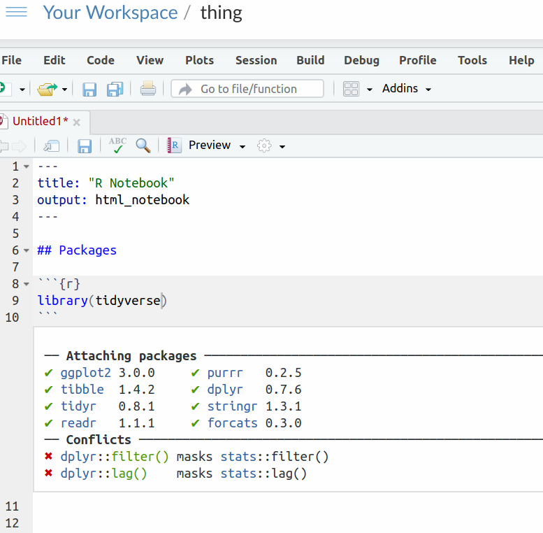
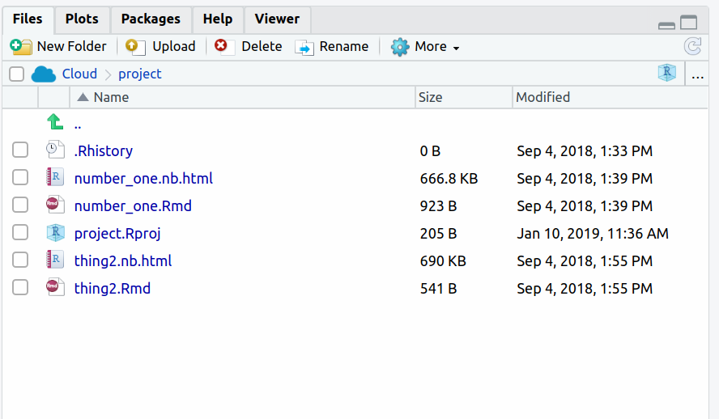

##  Reading files different ways


 This question is about different ways of reading data files. If you're using R Studio Cloud (online), start at the beginning. If you're using R Studio running on your own computer, start at part (<a href="#part:own-start">here</a>). 


(a) Log in to R Studio Cloud. Open up a project (or start a new
one), and watch the spinning circles for a few minutes. When that's
done, create a new R Notebook with File, New File, R
Notebook. Delete the "template" notebook, but not the top four
lines with `title:` 
and `output:` in them. Add a code chunk that contains `library(tidyverse)` and run it.

Solution


So far you (with luck) have something that looks like this:




If you have an error rather than that output, you probably need to
install the `tidyverse` first. Make another code chunk,
containing

```{r different-ways-1, eval=F}
install.packages("tidyverse")
```

 

and run it. Wait for it to finish. It may take a while. If it
completes successfully (you might see the word DONE at the end),
delete that code chunk (you don't need it any more) and try again with
the `library(tidyverse)` chunk. It should run properly this
time.

$\blacksquare$

(b)  <a name="part:internet-file">*</a> The easiest kind of files to read
in are ones on the Internet, with a URL address that begins with
`http` 
or `https`.  I have a small file at
[link](http://ritsokiguess.site/datafiles/testing.txt). Click
the link to see it, and keep the tab open for the next part of this question.
This is a text file with three things on each
line, each separated by exactly one space. Read the data file into a
data frame, and display your data frame.

Solution


Data values separated by exactly one space is the kind of thing that `read_delim` reads, so make another code chunk and fill it with this:
```{r different-ways-2 }
my_url <- "http://ritsokiguess.site/datafiles/testing.txt"
testing <- read_delim(my_url, " ")
testing
```

     

When you run that, you'll see something like my output. The first part
is `read_delim` telling you what it saw in the file: two
columns of (whole) numbers and one column of text. The top line of the
file is assumed to contain names, which are used as the names of the
columns of your data frame. The bottom part of the output, obtained by
putting the name of the data frame on a line by itself in your code
chunk, is what the data frame actually looks like. You ought to get
into the habit of eyeballing it and checking that it looks like the
values in the data file.

The things on the left side of the equals signs are variables that you
are creating in R. You get to choose the names for them. My habit is
to use `my_url` for URLs of files that I am going to read in,
and (usually) to give my data frames names that say something about
what they contain, but this is your choice to make.

$\blacksquare$

(c) You might have data in a file on your own computer. To read
data from such a file, you first have to *upload* it to R
Studio Cloud, and then read it from there. To practice this: open a
text editor (like Notepad or TextEdit). Go back to the web browser
tab containing the data you used in the previous part. Copy the data
from there and paste it into the text editor. Save it somewhere on
your computer (like the Desktop). Upload that file to R Studio
Cloud, read in the data and verify that you get the right
thing. (For this last part, see the Solution.)

Solution


I copied and pasted the data, and saved it in a file called
`testing.txt` on my computer. I'm assuming that you've
given it a similar name.
Then go back to R Studio Cloud. You should have a Files pane
bottom right. If you don't see a pane bottom right at all, press
Control-Shift-0 to show all the panes. If you see something bottom
right but it's not Files (for example a plot), click the Files
tab, and you should see a list of things that look like files, like this:





Click the Upload button (next to New Folder), click Choose
File. Use the file finder to track down the file you saved on your
computer, then click OK. The file should be uploaded to the same
folder on R Studio Cloud that your project is, and appear in the
Files pane bottom right.
To read it in, you supply the file name to `read_delim` thus:
```{r different-ways-3 }
testing2 <- read_delim("testing.txt", " ")
```

     

and then you look at it in the same way as before:

```{r different-ways-4 }
testing2
```

 

Check.

$\blacksquare$

(d) You might have a spreadsheet on your computer. Create a
`.csv` file from it, and use the ideas of the last part to
read it into R Studio Cloud.

Solution


Open the spreadsheet containing the data you want to read into
R. If there are several sheets in the workbook, make sure you're
looking at the right one. Select File, Save As, select "CSV"
or "comma-separated values" and give it a name. Save the
resulting file somewhere.

Then follow the same steps as the previous part to upload it to
your project on R Studio Cloud. (If you look at the actual file,
it will be plain text with the data values having commas between
them, as the name suggests. You can open the file in R Studio
Cloud by clicking on it in the Files pane; it should open top
left.)

The final step is to read it into an R data frame. This uses
`read_csv`; there are several `read_` functions that
read in different types of file, and you need to use an appropriate
one.

My spreadsheet got saved as `cars.csv`, so:

```{r different-ways-5 }
cars <- read_csv("cars.csv")
cars
```

       
Some information about different types of cars.

You are now done with this question.

$\blacksquare$

(e)  <a name="part:own-start">*</a> Start here if you downloaded R and R
Studio and they are running on your own computer. 
Open a web browser and point it at 
[link](http://ritsokiguess.site/datafiles/testing.txt). Click
the link to see it, and keep the tab open for the next part of this question.
This is a text file with three things on each
line, each separated by exactly one space. Read the data file into a
data frame, and display your data frame.

Solution


Data values separated by exactly one space is the kind of thing that `read_delim` reads, so make another code chunk and fill it with this:
```{r different-ways-6 }
my_url <- "http://ritsokiguess.site/datafiles/testing.txt"
testing <- read_delim(my_url, " ")
testing
```

     

When you run that, you'll see something like my output. The first part
is `read_delim` telling you what it saw in the file: two
columns of (whole) numbers and one column of text. The top line of the
file is assumed to contain names, which are used as the names of the
columns of your data frame. The bottom part of the output, obtained by
putting the name of the data frame on a line by itself in your code
chunk, is what the data frame actually looks like. You ought to get
into the habit of eyeballing it and checking that it looks like the
values in the data file.

The things on the left side of the equals signs are variables that you
are creating in R. You get to choose the names for them. My habit is
to use `my_url` for URLs of files that I am going to read in,
and (usually) to give my data frames names that say something about
what they contain, but this is your choice to make.

(This part is exactly the same whether you are running R Studio Cloud
or have R Studio running on your computer. A remote file is obtained
in exactly the same way regardless.)

$\blacksquare$

(f) You might have data in a file on your own computer. To read data
from such a file, R has to know where to find it. Each R project lives
in a folder, and one way of specifying where a data file is is to give
its complete path relative to the folder that R Studio is running its
current project in. This is rather complicated, so we will try a
simpler way. To set this up, open a text editor (like Notepad or
TextEdit). Go back to the web browser tab containing the data you used
in the previous part. Copy the data from there and paste it into the
text editor. Save it somewhere on your computer (like the
Desktop). Follow the steps in the solution below to read the data 
into R.

Solution


I copied and pasted the data, and saved it in a file called
`testing.txt` on my computer. I'm assuming that you've
given it a similar name.
Go back to R Studio. Create a new code chunk containing this:
```{r different-ways-7, eval=F}
f <- file.choose()
```

     

Run this code chunk. You'll see a file chooser. Find the file you
saved on your computer, and click Open (or OK or whatever you
see). This saves what R needs to access the file in the variable
`f`. If you want to, you can look at it:

```{r different-ways-8, eval=F}
f
```

 

and you'll see what looks like a file path in the appropriate format
for your system (Windows, Mac, Linux).
To read the data in, you supply the file path to `read_delim` thus:
```{r different-ways-9, eval=F}
testing2 <- read_delim(f, " ")
```

     

and then you look at it in the same way as before:

```{r different-ways-10 }
testing2
```

 

Check.

$\blacksquare$

(g) You might have a spreadsheet on your computer. Create a
`.csv` file from it, and use the ideas of the last part to
read it into R Studio.

Solution


Open the spreadsheet containing the data you want to read into
R. If there are several sheets in the workbook, make sure you're
looking at the right one. Select File, Save As, select "CSV"
or "comma-separated values" and give it a name. Save the
resulting file somewhere.

Then read it into an R data frame. This uses `read_csv`; 
there are several `read_` functions that
read in different types of file, and you need to use an appropriate
one. Before that, though, again run

```{r different-ways-11, eval=F}
f <- file.choose()
```

     

to find the `.csv` file on your computer, and then

```{r different-ways-12, eval=F}
cars <- read_csv(f)
```

       

to read it in. My spreadsheet was

```{r different-ways-13 }
cars
```

 
Some information about different types of cars.

$\blacksquare$


