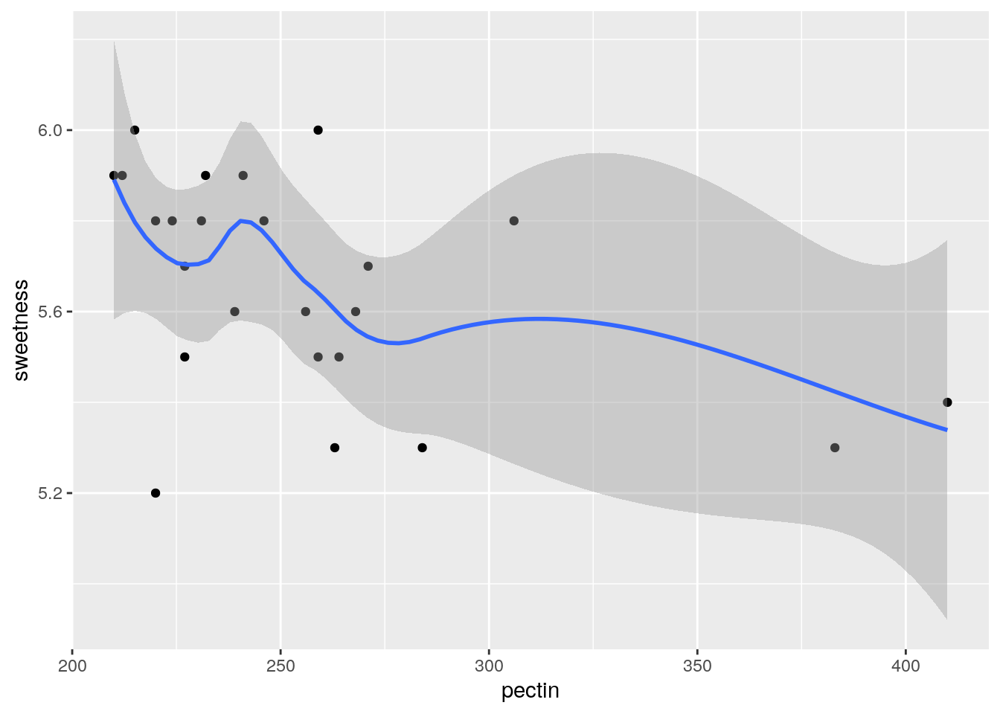
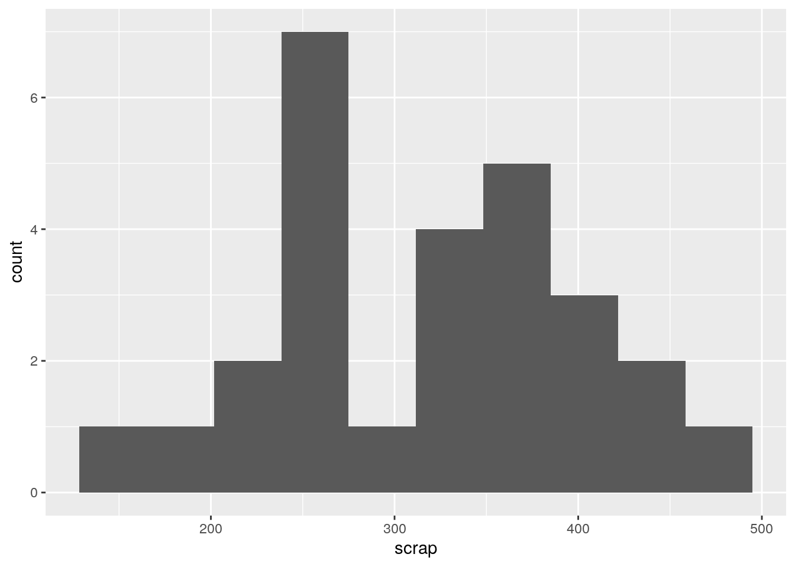
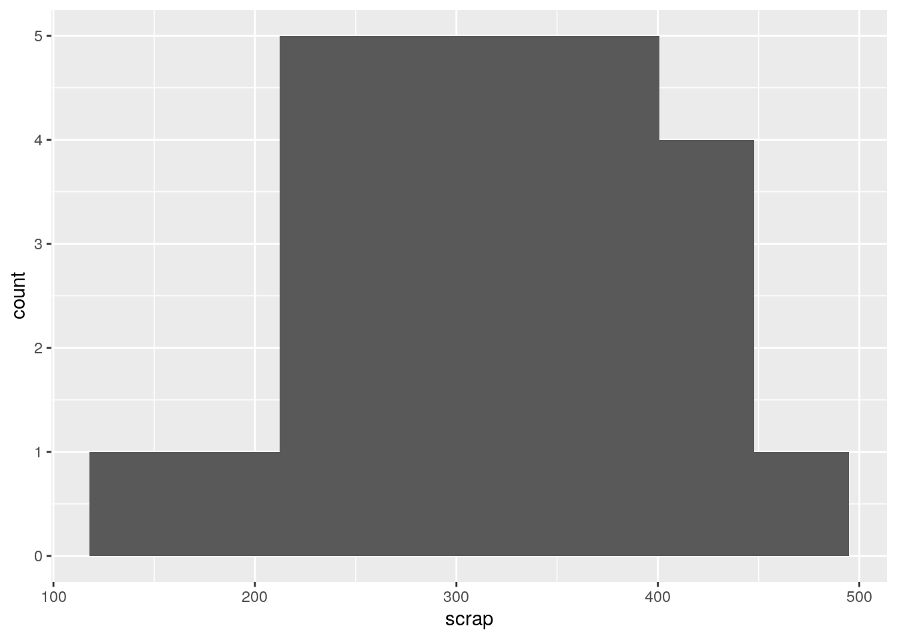
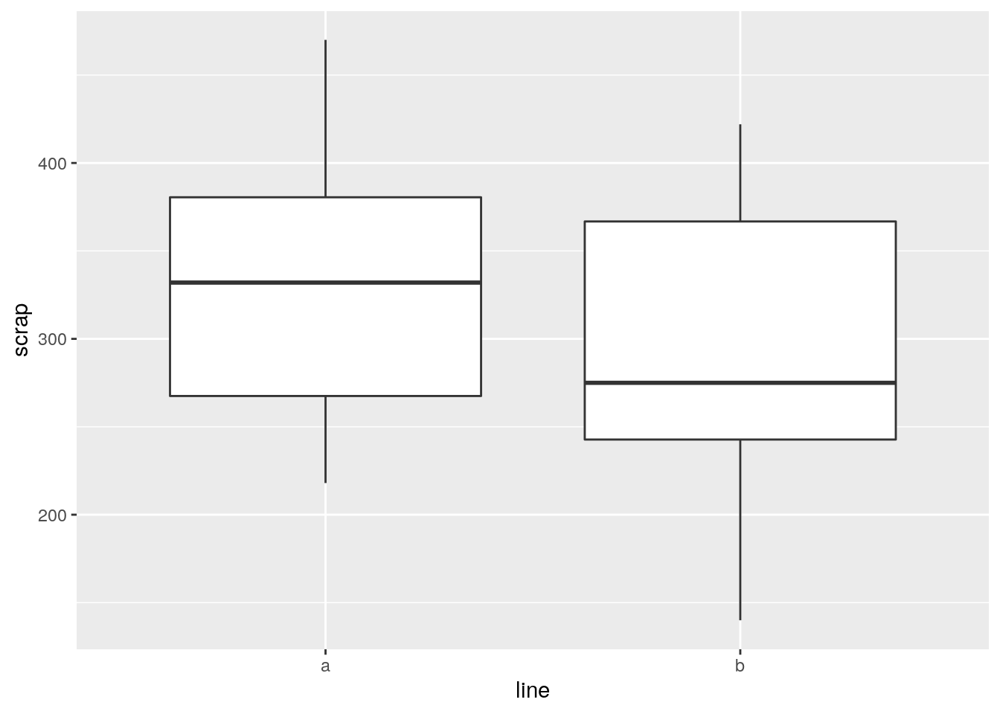
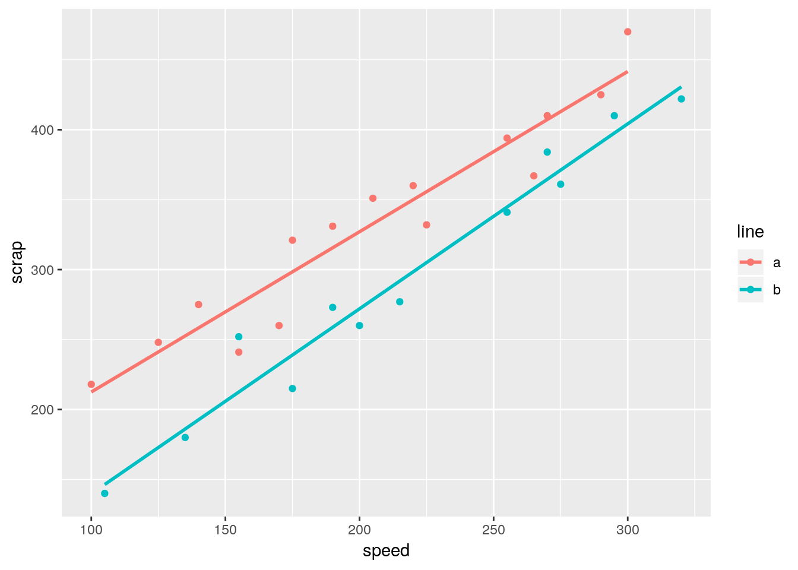
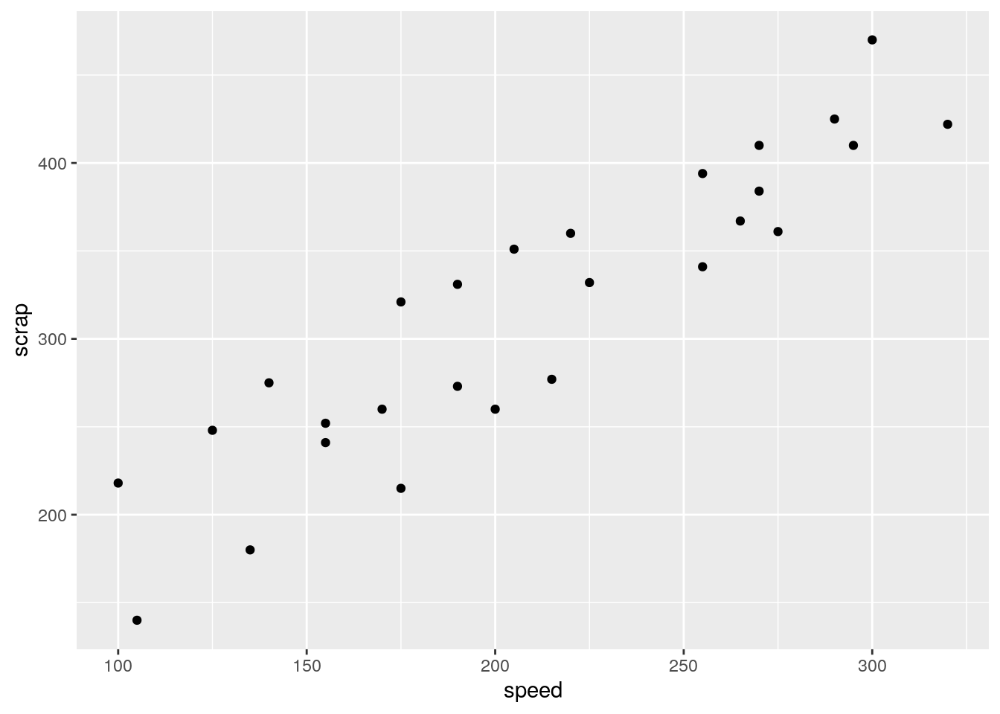
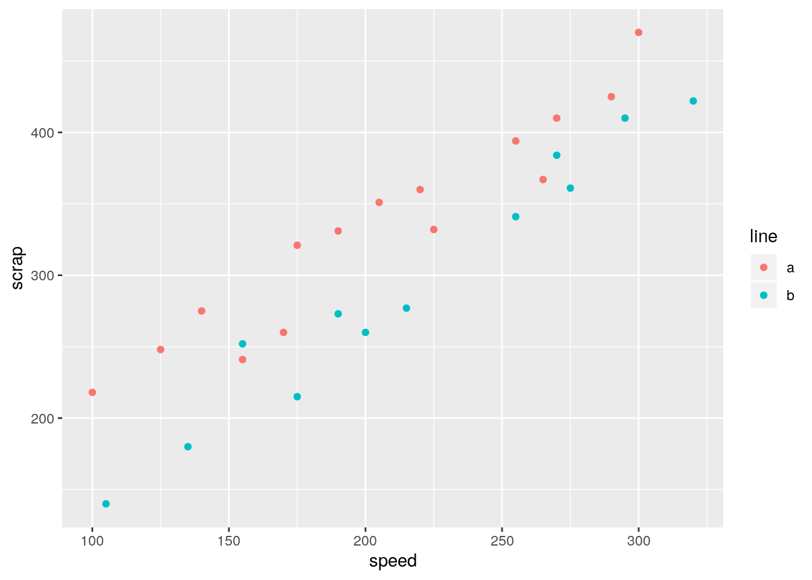
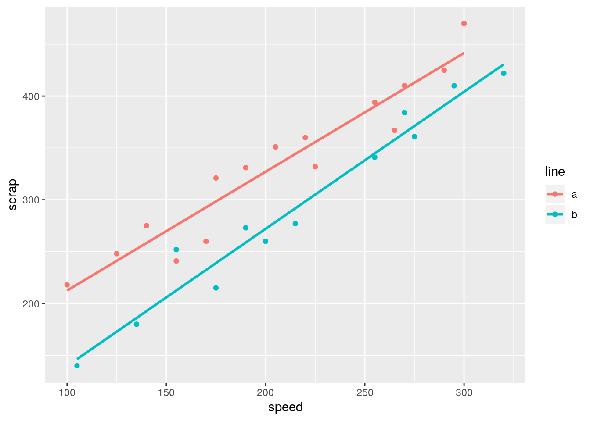
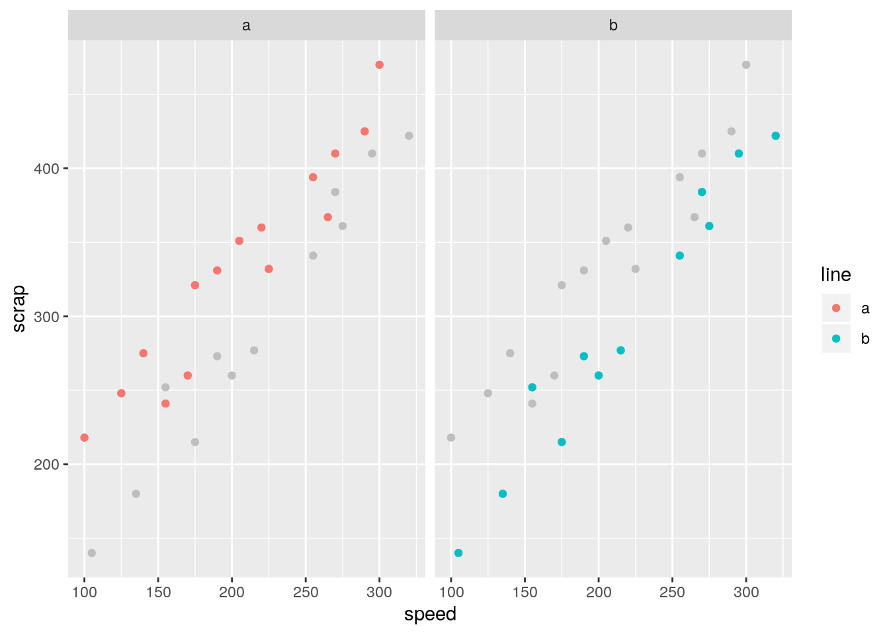
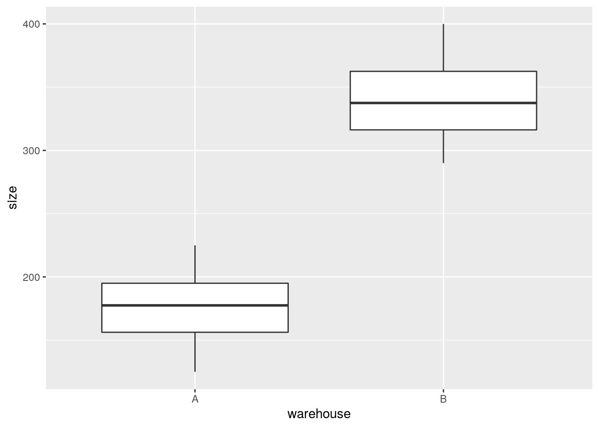

# Reading in data and drawing some graphs


```r
library(tidyverse)
```


```
## Warning: `env_bind_fns()` is deprecated as of rlang 0.3.0.
## Please use `env_bind_active()` instead.
## This warning is displayed once per session.
```


##  Orange juice


 The quality of orange juice produced by a manufacturer
(identity unknown) is constantly being monitored. The manufacturer has
developed a "sweetness index" for its orange juice, for which a
higher value means sweeter juice. Is the sweetness index related to a
chemical measure such as the amount of water-soluble pectin (parts per
million) in the
orange juice? Data were obtained from 24 production runs, and the
sweetness and pectin content were measured for each run. The data are
in [link](http://www.utsc.utoronto.ca/~butler/c32/ojuice.txt). Open that
link up now. You can click on that link just above to open the file.


(a) The data values are separated by a space. Use the appropriate
Tidyverse function to read the data directly from the course website
into a "tibble".


Solution


Start with this (almost always):


```r
library(tidyverse)
```

```
## Warning: `quo_expr()` is deprecated as of rlang 0.2.0.
## Please use `quo_squash()` instead.
## This warning is displayed once per session.
```

 

The appropriate function, the data values being separated by a space,
will be `read_delim`. Put the URL as the first thing in
`read_delim`, or (better) define it into a variable
first:
<label for="tufte-mn-" class="margin-toggle">&#8853;</label><input type="checkbox" id="tufte-mn-" class="margin-toggle"><span class="marginnote">I say *better* because otherwise the read line gets rather long. This way you read it as *the URL is some long thing that I don't care about especially, and I what I need to do is to read the data from that URL, separated by spaces.*</span>


```r
url <- "http://www.utsc.utoronto.ca/~butler/c32/ojuice.txt"
juice <- read_delim(url, " ")
```

```
## Parsed with column specification:
## cols(
##   run = col_double(),
##   sweetness = col_double(),
##   pectin = col_double()
## )
```

 

`read_delim` (or `read_csv` or any of the others) tell
you what variables were read in, and also tell you about any "parsing errors" 
where it couldn't work out what was what. Here, we have three
variables, which is entirely consistent with the three columns of data
values in the file.

`read_delim` can handle data values separated by *any*
character, not just spaces, but the separating character, known as a
"delimiter", does *not* have a default, so you have to say what
it is, every time.


(b) Take a look at what got read in. Do you
have data for all 24 runs? 


Solution


Type the name of the data frame in a code chunk (a new one, or
add it to the end of the previous one). Because this is actually
a "tibble", which is what `read_delim` reads in,
you'll only actually see the first 10 lines, but it will tell
you how many lines there are altogether, and you can click on
the appropriate thing to see the rest of it.

```r
juice
```

```
## # A tibble: 24 x 3
##      run sweetness pectin
##    <dbl>     <dbl>  <dbl>
##  1     1       5.2    220
##  2     2       5.5    227
##  3     3       6      259
##  4     4       5.9    210
##  5     5       5.8    224
##  6     6       6      215
##  7     7       5.8    231
##  8     8       5.6    268
##  9     9       5.6    239
## 10    10       5.9    212
## # … with 14 more rows
```

 

I appear to have all the data. If you want further convincing, click
Next a couple of times (on yours) to be sure that the runs go down to
number 24.


(c) In your data frame, where did the column (variable) names
come from? How did R know where to get them from?


Solution


They came from the top line of the data file, so we didn't 
have to specify them. This is the default behaviour of all the
`read_` functions, so we don't have to ask for it
specially. 

Extra: in fact, if the top line of your data file is
*not* variable names, *that's* when you have to say
something special. The `read_` functions have an
option `col_names` which can either be `TRUE`
(the default), which means "read them in from the top line",
`FALSE` ("they are not there, so make some up") or a
list of column names to use. You might use the last
alternative when the column names that are in the file are
*not* the ones you want to use; in that case, you would
also say `skip=1` to skip the first line. For example,
with file `a.txt` thus:

```
a b
1 2
3 4
5 6
```
        
you could read the same data but call the columns `x` and
`y` thus:


```r
read_delim("a.txt", " ", col_names = c("x", "y"), skip = 1)
```

```
## Parsed with column specification:
## cols(
##   x = col_double(),
##   y = col_double()
## )
```

```
## # A tibble: 3 x 2
##       x     y
##   <dbl> <dbl>
## 1     1     2
## 2     3     4
## 3     5     6
```

         


(d) The juice manufacturer was interested in whether there was a
relationship between sweetness and pectin. To assess this, draw a
scatterplot.  Does it look as if there is any kind of a
relationship? (I think `sweetness` is the outcome variable
and `pectin` is explanatory, so draw your scatterplot
appropriately.) 


Solution


This requires a `ggplot` plot. You can go back and look
at the lecture notes to figure out how to make a scatterplot:
the "what to plot" is the $x$-axis and $y$-axis variables,
with the response on the $y$-axis (starting with a data frame
to get the variables from),  and the "how to plot" is
`geom_point` to plot the points:

```r
ggplot(juice, aes(x = pectin, y = sweetness)) + geom_point()
```


         

It looks to me as if there is a negative relationship: as pectin goes
up, sweetness tends to go *down*. The trend appears to go top
left to bottom right. 

Having said that, I'm wondering how much of the
apparent trend is caused by those two observations bottom right with
pectin over 350. If you take those away, the trend seems to me to be a
lot less convincing. As an extra, you could add a smooth trend to the plot:


```r
ggplot(juice, aes(x = pectin, y = sweetness)) + geom_point() + geom_smooth()
```

```
## `geom_smooth()` using method = 'loess' and formula 'y ~ x'
```



         
The smooth trend is kind of downhill, but not very convincing.


##  Making soap


 A company operates two production lines in a factory for
making soap bars. The production lines are
labelled A and B. A production line that moves faster may produce more
soap, but may possibly also produce more "scrap" (that is, bits of
soap that 
can no longer be made into soap bars and will have to be thrown away).  

The data are in [link](http://www.utsc.utoronto.ca/~butler/c32/soap.txt).


(a) Read the data into R.  Display the data. There should be 27
rows. Are there?


Solution


Read directly from the URL, most easily:

```r
url <- "http://www.utsc.utoronto.ca/~butler/c32/soap.txt"
soap <- read_delim(url, " ")
```

```
## Parsed with column specification:
## cols(
##   case = col_double(),
##   scrap = col_double(),
##   speed = col_double(),
##   line = col_character()
## )
```

```r
soap
```

```
## # A tibble: 27 x 4
##     case scrap speed line 
##    <dbl> <dbl> <dbl> <chr>
##  1     1   218   100 a    
##  2     2   248   125 a    
##  3     3   360   220 a    
##  4     4   351   205 a    
##  5     5   470   300 a    
##  6     6   394   255 a    
##  7     7   332   225 a    
##  8     8   321   175 a    
##  9     9   410   270 a    
## 10    10   260   170 a    
## # … with 17 more rows
```

    

27 rows. `line`, which is either `a` or `b`, was
correctly deduced to be text.


(b) Obtain a histogram of the `scrap` values, using 10
bins for your histogram.
 

Solution


```r
ggplot(soap, aes(x = scrap)) + geom_histogram(bins = 10)
```



 


(c) Comment briefly on the shape of the histogram. Is it approximately
symmetric, skewed to the left, skewed to the right or something else? (By "comment  briefly" I mean "say in a few words why you gave the answer you did.")


Solution


I would call this "bimodal". There are two peaks to the
histogram, one around 250 and one around 370, with a very small
frequency in between (the bar around 300). 
Apart from the bimodality, there is no particular evidence for a
long tail on either end, so I don't think you could otherwise
call it anything other than symmetric.
Having said that (this is going beyond the question), the way a
histogram looks can depend on the bins you choose to draw it
with. This is 8 bins rather than 10:

```r
ggplot(soap, aes(x = scrap)) + geom_histogram(bins = 8)
```



 

The middle low-frequency bin has gone, and this one just looks
symmetric, with a kind of "flat top".


(d) Make side-by-side boxplots of scrap values for each
production line.


Solution


```r
ggplot(soap, aes(x = line, y = scrap)) + geom_boxplot()
```




One categorical, one quantitative variable, so boxplots make sense.


(e) Do you think your boxplot says that there are differences in the
amount of scrap produced by the two production lines, or not?
Explain briefly.


Solution


I would say that there *is* a difference between the two
production lines, with line A producing an average (median) of
about 330 and line B producing a median of about 275. But you
could also make the case that, although the medians are rather
different, there is a lot of variability and hence a lot of
overlap between the two boxplots, and therefore that there is
not a "substantial" difference.
I would say that either of those answers are good \emph{if you
back them up with proper reasons}. This is going to be a
common theme in this course: I am going to ask you to make a
decision and support it, where the reasons you provide are often
more
important than the decision you make.
You might be wondering whether the medians, or means, since
there is no serious skewness here and definitely no outliers,
are "significantly different". This is inference, which we
will come to later, but a preview looks like this:

```r
t.test(scrap ~ line, data = soap)
```

```
## 
## 	Welch Two Sample t-test
## 
## data:  scrap by line
## t = 1.2493, df = 21.087, p-value = 0.2253
## alternative hypothesis: true difference in means is not equal to 0
## 95 percent confidence interval:
##  -26.97888 108.21222
## sample estimates:
## mean in group a mean in group b 
##        333.5333        292.9167
```

       

They are not: the P-value of 0.22 is not anywhere near as small as
0.05, so we can't reject the null hypothesis that the two lines have
equal mean amount of scrap. 

Rusty on this stuff? Don't worry; we're going to come back to it later
in the course.

I was also wondering about something else: that bimodal
histogram. Could that be explained by the scrap values being two
different production lines being mixed together? One way to understand
that is to have two separate histograms, one for each line, side by
side, which is what facetting does. There is an extra wrinkle here
that I explain afterwards:


```r
ggplot(soap, aes(x = scrap)) + geom_histogram(bins = 10) + facet_grid(line ~ .)
```



 

I could have used `facet_wrap`, but that would have put the
histograms side by side, and I wanted them one above the other (for
ease of comparison, since they'll be on the same
scale). `facet_grid` is like `facet_wrap`, but offers
you more control over where the facets go: you can arrange them above
and below by a variable, or left and right by a variable. Whatever is
facetting the plots up and down (on the $y$ axis) goes before the
squiggle, and whatever facets them left and right goes after. If there
is nothing separating the facets in one direction, here horizontally,
the variable is replaced by a dot.

In some ways, `facet_grid` is also *less* flexible,
because the facets have to be arranged up/down or left/right by a
variable. That worked here, but if you think back to the Australian
athletes, where there were ten different sports, it was
`facet_wrap` that did the right thing, arranging the sports
along rows *and* columns to produce a pleasing display.

All right, that bimodality. I was expecting that the scrap values from
one line would be centred about one value and the scrap values from
the other line would be centred about a different value, with a gap in
between. But that's not what happened at all: the line B values are
all over the place, while it's the line A values that are actually
bimodal all by themselves. I'm not sure whether that really means
anything, since the data sets are pretty small, but it's kind of
interesting. 


(f) We started out with the suspicion that if the line was run
faster, there would be more scrap. We haven't assessed this
yet. Draw a scatter plot with `scrap` on the $y$ axis and
`speed` on the $x$ axis. 


Solution


Same mechanism as before:

```r
ggplot(soap, aes(x = speed, y = scrap)) + geom_point()
```



 


(g) What do you think is the most important conclusion from
your plot of the previous part? Describe your conclusion in the
context of the data.


Solution


There seems to be a pretty evident upward trend, apparently
linear, which means that if the speed of the production line is
higher, the amount of scrap produced is also higher.
My last sentence was meant to remind you that 
"there is an upward trend" is *not a complete answer*: 
we are concerned
with what that upward trend tells us about the data. 
This, in other words, confirms the suspicion expressed in the
question, which was therefore a rather large clue: more speed
tends to go with more scrap.
That was as far as I wanted you to go: there seems to be an
association with speed, and there might be an association with
`line` that turned out not to be statistically significant.
What we haven't done is to assess the relationship between speed
and scrap for *each* production line. To do that, we want
to plot the scrap-speed points distinguished for each production
line. `ggplot` makes that easy: you add a
`colour`
<label for="tufte-mn-" class="margin-toggle">&#8853;</label><input type="checkbox" id="tufte-mn-" class="margin-toggle"><span class="marginnote">If you are concerned about the spelling: the guy who wrote ggplot is from New Zealand, where they spell *colour* the same way we do. However, if you want to use *color*, that works too.</span> to say what you want to
distinguish by colour. This is two quantitative variables and one
categorical variable, if you want to think of it that way:

```r
ggplot(soap, aes(x = speed, y = scrap, colour = line)) + geom_point()
```



       

Notice that we get a legend, automatically.

What is interesting about this one is the red dots are mostly at the
top (for any given speed), and the blue dots are mostly at the
bottom. That seems to mean that *when we account for speed*,
there is a difference between lines.

I want to show you one more embellishment, which is to put the
regression lines on the plot for each group separately. This is where
`ggplot` is so nice, since I just have to add one thing:


```r
ggplot(soap, aes(x = speed, y = scrap, colour = line)) +
  geom_point() + geom_smooth(method = "lm", se = F)
```



       

The points and lines have come out in different colours, without our
having to think too hard.

Both lines show an upward trend, with about the same slope, which
means that regardless of line, increasing the speed goes with
increasing the scrap by the same amount. The fact that the red line is
above the blue one, however, suggests that production line A produces
more scrap at the same speed than production line B.

From a management point of view, there is an interesting dynamic at
work: if you run the production line faster, you'll produce more bars
of soap, but you'll produce more scrap as well. The crucial thing for
the people in the supervisor's office is how much raw material is used
per bar of soap, and if you make the soap bars faster, you might use
more raw material, which will eat into your profits (from one angle),
but you will also have more bars of soap to sell.

Here's another way to see the same thing. I'm *definitely* not
expecting you to follow the code, but you can admire the result!


```r
soap2 <- soap %>% select(-line)
ggplot(soap, aes(x = speed, y = scrap)) +
  geom_point(data = soap2, colour = "grey") +
  geom_point(aes(colour = line)) + facet_wrap(~line)
```


$

The idea is that we plot all the points in grey (to 
"put them in the background") 
 and then in each plot we plot the points again,
*coloured, for the group we are looking at*: line A in the left,
line B on the right. This is another way of seeing that line A has
more scrap than line B, given the speed at which the line was being
run. (I discovered this technique only yesterday. I think the code is
remarkably concise for what it does.)

The logic of the code is:


* create a new data frame that contains everything in
`soap` except for `line`

* make a scatter plot of all the points in this new data frame,
coloured grey

* plot the points again (from the original data frame), coloured by
which production line they're from

* produce a separate scatterplot for each production line.


The trick about creating the new data frame was to enable plotting of
all points regardless of group on each subplot ("facet" in
`ggplot` terminology), as well as the ones that come from that
production line.

I don't expect you to be able to follow all the details of the code
below, either,
but I would like you to try and get the logic. What we do is a
regression predicting `scrap` from *two* things:
`speed` and production `line`. The results we get are these:


```r
scrap.1 <- lm(scrap ~ speed + line, data = soap)
summary(scrap.1)
```

```
## 
## Call:
## lm(formula = scrap ~ speed + line, data = soap)
## 
## Residuals:
##     Min      1Q  Median      3Q     Max 
## -39.557 -14.161  -0.121  17.518  33.953 
## 
## Coefficients:
##              Estimate Std. Error t value Pr(>|t|)    
## (Intercept)  80.41099   14.54379   5.529 1.10e-05 ***
## speed         1.23074    0.06555  18.775 7.48e-16 ***
## lineb       -53.12920    8.21003  -6.471 1.08e-06 ***
## ---
## Signif. codes:  0 '***' 0.001 '**' 0.01 '*' 0.05 '.' 0.1 ' ' 1
## 
## Residual standard error: 21.13 on 24 degrees of freedom
## Multiple R-squared:  0.9402,	Adjusted R-squared:  0.9352 
## F-statistic: 188.6 on 2 and 24 DF,  p-value: 2.104e-15
```

 

The P-values for `speed` and `line` are the second and
third things in the last column, $7 \times 10^{-16}$  and $1 \times 10^{-6}$
respectively. These are both very strongly significant, in contrast to
the two-sample $t$-test where `line` was not significant.

So does production line make a difference or not?

The plot says that it does, and the meaning of model `scrap.1`
just above is that
\emph{`speed` affects scrap when you account for `line`}, and 
\emph{`line` affects scrap when you account for speed}. 
(In the two-sample $t$-test above we didn't
account for speed at all, since the various speeds were all mixed up.)

There is a moral to this story, which I would like you to get even if
you don't get any of the statistics: if a variable makes a
difference, it should be in your model and on your
graph,
<label for="tufte-mn-" class="margin-toggle">&#8853;</label><input type="checkbox" id="tufte-mn-" class="margin-toggle"><span class="marginnote">Meaning that the model should contain all three variables, *speed*, *scrap* and *line*.</span>
because it enables you to get better (more precise) conclusions about your
other variables. Here, there really is a difference between the
production lines, but the $t$-test was too much of a blunt instrument
to unearth it (because `speed` made a difference as well).


##  Handling shipments


 A company called Global Electronics from
time to time imports shipments of a certain large part used as a
component in several of its products. The size of the shipment varies
each time. Each shipment is sent to one of two warehouses (labelled A
and B) for handling. The data in
[link](http://www.utsc.utoronto.ca/~butler/c32/global.csv) show the
`size` of each shipment (in thousands of parts) and the direct
`cost` of handling it, in thousands of dollars. Also shown is
the `warehouse` (A or B) that handled each shipment.


(a) Read the data into R and display your data frame. How many
rows and columns does it have?


Solution


If you open the data file in your web browser, it will probably
open as a spreadsheet, which is not really very helpful, since
then it is not clear what to do with it. You could, I suppose,
save it and upload it to R Studio Cloud, but it requires much less
brainpower to open it directly from the URL:

```r
url <- "http://www.utsc.utoronto.ca/~butler/c32/global.csv"
shipments <- read_csv(url)
```

```
## Parsed with column specification:
## cols(
##   warehouse = col_character(),
##   size = col_double(),
##   cost = col_double()
## )
```

     

If you display your data frame and it looks like this, you are good
(you can give the data frame any name):


```r
shipments
```

```
## # A tibble: 10 x 3
##    warehouse  size  cost
##    <chr>     <dbl> <dbl>
##  1 A           225 12.0 
##  2 B           350 14.1 
##  3 A           150  8.93
##  4 A           200 11.0 
##  5 A           175 10.0 
##  6 A           180 10.1 
##  7 B           325 13.8 
##  8 B           290 13.3 
##  9 B           400 15   
## 10 A           125  7.97
```

 

It has 10 rows and 3 columns. *You need to say this to get the mark.*

That is, there were 10 shipments recorded, and for each of them, 3
variables were noted: the size and cost of the shipment, and the
warehouse it was handled at.
    


(b) Make a scatterplot of the cost of handling each shipment as it
depends on the shipment's size.


Solution


The wording of the question says that cost is the response and so
belongs on the $y$-axis. To make the plot, `ggplot` with an
`x=` and a `y=` in the `aes` (the "what to  plot" 
part), and a `geom_point()` after (the "how to plot it"):

```r
ggplot(shipments, aes(x = size, y = cost)) + geom_point()
```


     

As a matter of coding, there are usually *two* brackets to close
after the `aes`, the one that begins the `ggplot` and
the one that begins the `aes`. 
    


(c) What kind of relationship do you see on the scatterplot? Do
you think a straight line would describe it appropriately? Explain briefly.


Solution


I see an upward trend: a shipment with larger `size` costs
more to handle. 
If you look carefully at the scatterplot, you see that the cost of
handling a small shipment goes up fairly steeply with its size,
but the cost of handling a large shipment, while it still
increases with `size`, does not increase so fast. Thus
having one straight line to describe the whole relationship would
not work so well. 
The relationship is actually two different
straight lines joined end-to-end, which we will explore later, but
if you think the relationship is curved, I'll accept that. The
point is to get at the idea that the rate of increase is not
constant.
    


(d) When a shipment comes in, the cost of handling it is not
known. A decision is made about which warehouse to send it to, and
then, after it is handled, the cost is recorded. What do you think
determines which warehouse an incoming shipment goes to? Provide a
graph to support your answer.


Solution


The veiled hint in the question is that the decision must depend
on `size`, since it cannot depend on `cost`. So we
have one quantitative variable `size` and one categorical
variable `warehouse`, which suggests drawing boxplots:

```r
ggplot(shipments, aes(x = warehouse, y = size)) + geom_boxplot()
```



     

Well, there's the answer right there. When the shipment has small
`size`, it goes to warehouse A, and when it's large, it goes to
Warehouse B. We know this because *all* the shipments smaller
than about 250 (thousand parts) went to A and *all* the shipments
larger than that went to B. (If you want to provide a number to
delineate "small" and "large", anything between the largest A,
about 225, and the smallest B, about 290, will do.)

Another way to think about this is to add something to the scatterplot
you drew before. The obvious thing is to make the two warehouses
different colours:


```r
ggplot(shipments, aes(x = size, y = cost, colour = warehouse)) +
  geom_point()
```


     

As a point of technique, you can split lines of code to make them fit
on your screen. You can do this as long as \emph{the code that ends
the line must be incomplete}, so that R knows more is to
come. Ending a line with a pipe symbol, or, as here, with one of the
pluses in the middle of a `ggplot`, will work. If you put the
plus on the start of the next line, you'll get a blank plot, because R
thinks you're done plotting. Try it and see.

Anyway, this plot tells exactly the same story: the small shipments
(in size or cost) go to Warehouse A and the large ones to Warehouse
B. But we don't know cost when the decision is made about which
warehouse to send a shipment to, so the decision must be based on
`size`. 

In the place where I got these data, it said "larger shipments are sent to Warehouse B, since this warehouse has specialized equipment that provides greater economies of scale for larger shipments". 
That
is to say, very large shipments are more expensive to handle, but not
as expensive as you might think.
<label for="tufte-mn-" class="margin-toggle">&#8853;</label><input type="checkbox" id="tufte-mn-" class="margin-toggle"><span class="marginnote">This is the same idea that it  costs more to ride the GO bus from UTSC to York U than it does to  ride from UTSC to Scarborough Town, but if you work out how much it  costs per kilometre, the longer journey costs less per km. As of  when I'm writing this, $5.30 for the 7.2 km to Scarborough Town and  $6.75 for the 38 km to York. That's quite an economy of scale,  isn't it?</span> 
That makes sense with our scatterplot, because the
*slope* for larger shipments is less than for smaller shipments.

When we get to regression later, we'll see what happens if we fit a
straight line to data like these, and how to tell whether we really
ought to be able to do better with a different form of
relationship. There is also a trick to fit what is called a
"piecewise linear regression", which has one slope for small
shipment sizes, a different (smaller) slope for large ones, and joins
up in the middle. But that's well beyond our scope now.
    


