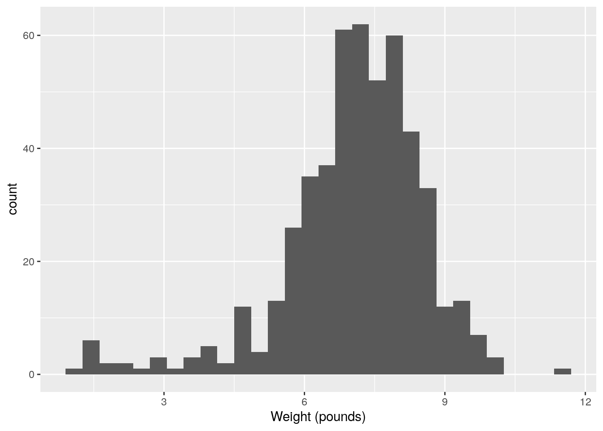
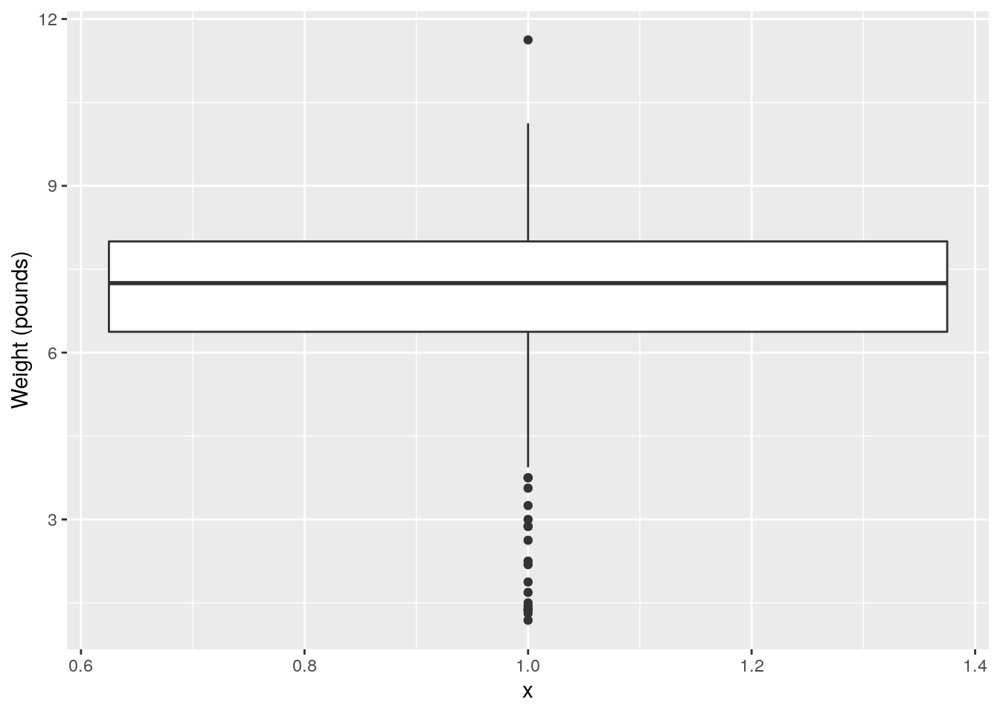
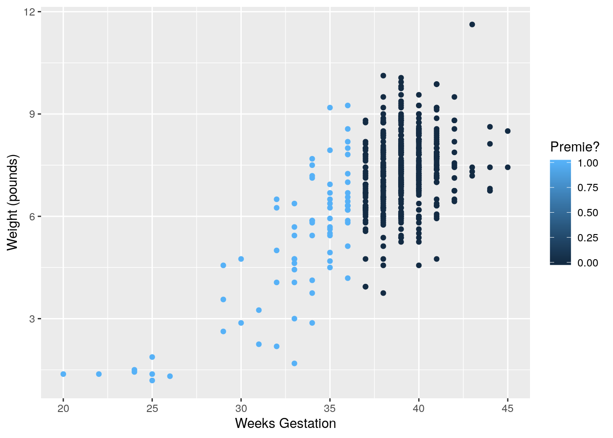
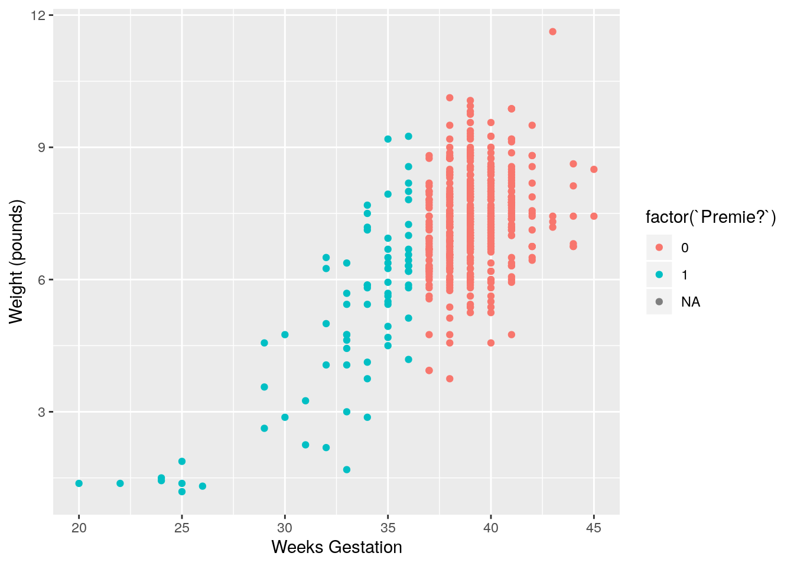
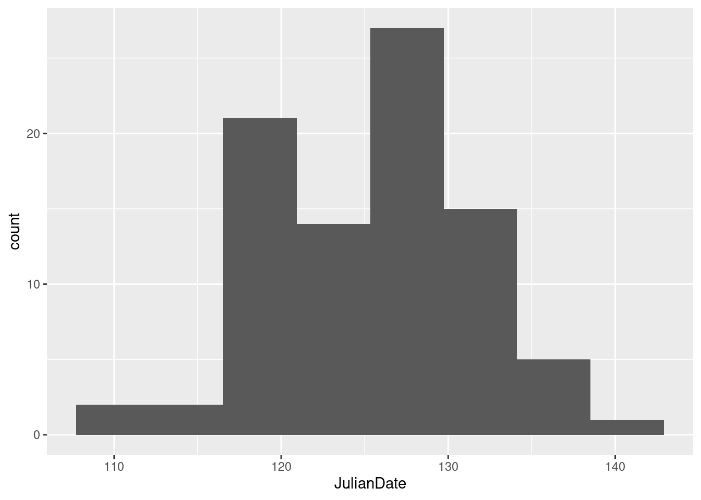
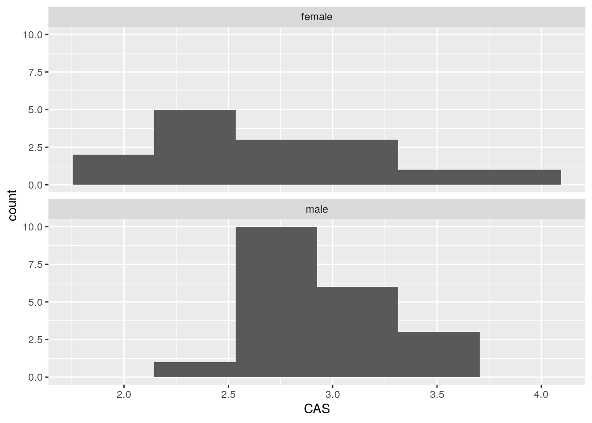
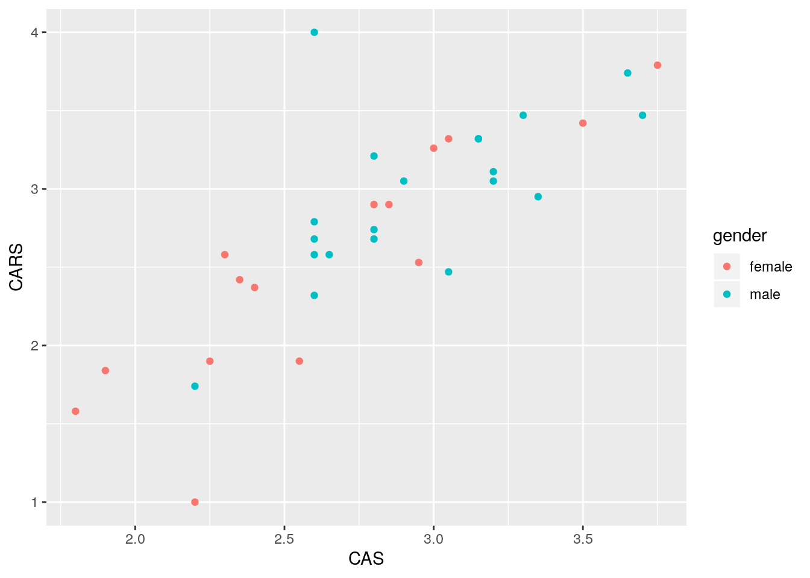
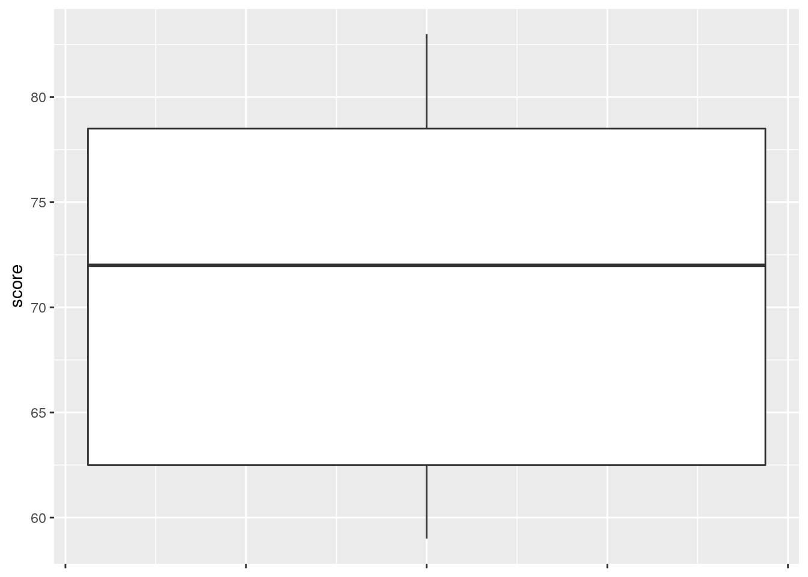
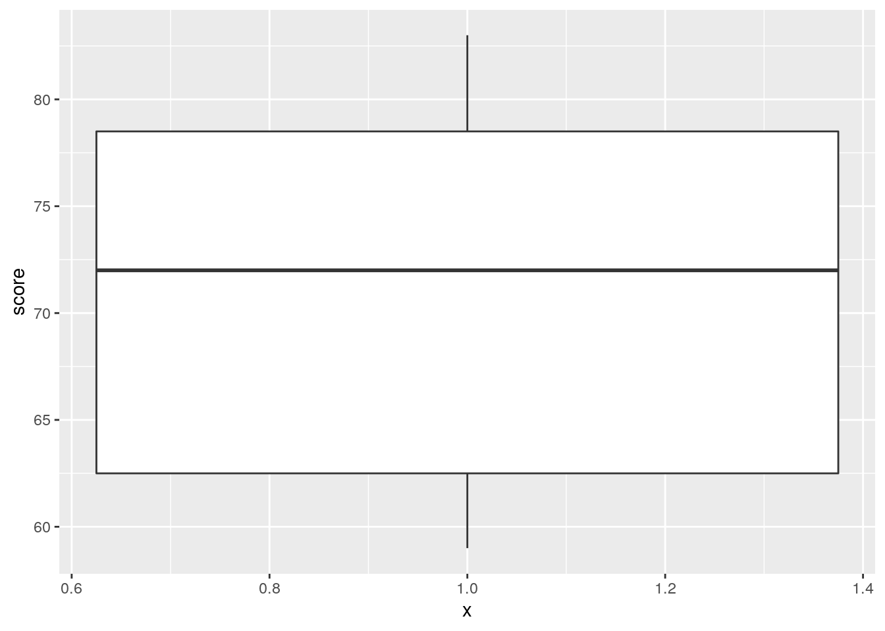

# Data exploration


```r
library(tidyverse)
```


```
## Warning: `env_bind_fns()` is deprecated as of rlang 0.3.0.
## Please use `env_bind_active()` instead.
## This warning is displayed once per session.
```


##  North Carolina births


 The data in file
[link](http://www.utsc.utoronto.ca/~butler/c32/ncbirths.csv) are about
500 randomly chosen births of babies in North Carolina. There is a lot
of information: not just the weight at birth of the baby, but whether
the baby was born prematurely, the ages of the parents, whether the
parents are married, how long (in weeks) the pregnancy lasted (this is
called the "gestation") and so on. 


(a) Read in the data from the file into R, bearing in mind what
type of file it is. 


Solution


This is a `.csv` file (it came from a spreadsheet), so it
needs reading in accordingly. Work directly from the URL (rather
than downloading the file, unless you are working offline):

```r
myurl <- "http://www.utsc.utoronto.ca/~butler/c32/ncbirths.csv"
bw <- read_csv(myurl)
```

```
## Parsed with column specification:
## cols(
##   `Father Age` = col_double(),
##   `Mother Age` = col_double(),
##   `Weeks Gestation` = col_double(),
##   `Pre-natal Visits` = col_double(),
##   `Marital Status` = col_double(),
##   `Mother Weight Gained` = col_double(),
##   `Low Birthweight?` = col_double(),
##   `Weight (pounds)` = col_double(),
##   `Premie?` = col_double(),
##   `Few Visits?` = col_double()
## )
```

 

This shows you which variables the data set has (some of the names got
a bit mangled), and it shows you that they are all integers except for
the birth weight (a decimal number).

The easiest way to find out how many rows and columns there are is
simply to list the data frame:


```r
bw
```

```
## # A tibble: 500 x 10
##    `Father Age` `Mother Age` `Weeks Gestatio… `Pre-natal Visi…
##           <dbl>        <dbl>            <dbl>            <dbl>
##  1           27           26               38               14
##  2           35           33               40               11
##  3           34           22               37               10
##  4           NA           16               38                9
##  5           35           33               39               12
##  6           32           24               36               12
##  7           33           33               38               15
##  8           38           35               38               16
##  9           28           29               40                5
## 10           NA           19               34               10
## # … with 490 more rows, and 6 more variables: `Marital Status` <dbl>,
## #   `Mother Weight Gained` <dbl>, `Low Birthweight?` <dbl>, `Weight
## #   (pounds)` <dbl>, `Premie?` <dbl>, `Few Visits?` <dbl>
```

 

or you can take a "glimpse" of it:


```r
glimpse(bw)
```

```
## Observations: 500
## Variables: 10
## $ `Father Age`           <dbl> 27, 35, 34, NA, 35, 32, 33, 38, 28, NA, 2…
## $ `Mother Age`           <dbl> 26, 33, 22, 16, 33, 24, 33, 35, 29, 19, 2…
## $ `Weeks Gestation`      <dbl> 38, 40, 37, 38, 39, 36, 38, 38, 40, 34, 3…
## $ `Pre-natal Visits`     <dbl> 14, 11, 10, 9, 12, 12, 15, 16, 5, 10, 15,…
## $ `Marital Status`       <dbl> 1, 1, 2, 2, 1, 1, 2, 1, 1, 2, 1, 1, 2, 2,…
## $ `Mother Weight Gained` <dbl> 32, 23, 50, NA, 15, 12, 60, 2, 20, NA, 45…
## $ `Low Birthweight?`     <dbl> 0, 0, 0, 0, 0, 0, 0, 0, 0, 1, 0, 0, 0, 0,…
## $ `Weight (pounds)`      <dbl> 6.8750, 6.8125, 7.2500, 8.8125, 8.8125, 5…
## $ `Premie?`              <dbl> 0, 0, 0, 0, 0, 1, 0, 0, 0, 1, 0, 0, 1, 0,…
## $ `Few Visits?`          <dbl> 0, 0, 0, 0, 0, 0, 0, 0, 1, 0, 0, 0, 1, 0,…
```

 
Either of these displays show that there are 500 rows  (observations,
here births) and 10 columns (variables), and they both show what the
variables are called. So they're both good as an answer to the
question. 

What you'll notice is that the variables have *spaces* in their
names, which will require special handling later. These outputs show
you what to do about those spaces in variable names: surround the
variable name with "backticks". (On my keyboard, that's on the key
to the left of number 1, where the squiggle is, that looks like a
backwards apostrophe. Probably next to `Esc`, depending on the
layout of your keyboard.)

Although almost all of the variables are stored as integers, the ones
that have a question mark in their name are actually "logical", true
or false, with 1 denoting true and 0 false. We could convert them
later if we want to. (A question mark is not a traditional character
to put in a variable name, so we have to surround these variables with
backticks too.)


(b) From your output, verify that you have the
right number of observations and that you have several
variables. Which of your variables correspond to birthweight,
prematureness and length of pregnancy? (You might have to make guesses
based on the names of the variables.) 


Solution


I do indeed have 500 observations on 10 variables ("several"). (If
you don't have several variables, check to see that you didn't use
`read_delim` or something by mistake.) After the 
"500 observations of 10 variables" line(s) in each case, you see all the
variables by name, with what type of values they have,
<label for="tufte-mn-" class="margin-toggle">&#8853;</label><input type="checkbox" id="tufte-mn-" class="margin-toggle"><span class="marginnote">these    are mostly *int* or *integer*.</span>
and the first few of the
values.
<label for="tufte-mn-" class="margin-toggle">&#8853;</label><input type="checkbox" id="tufte-mn-" class="margin-toggle"><span class="marginnote">Other possible variable types are *num* for    (real, decimal) numbers such as birth weight, *chr* for    text, and *Factor* (with the number of levels) for    factors/categorical variables. We don't have any of the last two    here. There is also *lgl* for *logical*, things that were    actually recorded as TRUE or FALSE. We have some variables that    are actually logical ones, but they are recorded as integer    values.</span>

The variable `Weight (pounds)` is the birthweight (in pounds),
`Premie?` is 1 for a premature baby and 0 for a full-term baby,
and `Weeks Gestation` is the number of weeks the pregnancy
lasted. Don't forget to put backticks around each of those when
you use them
later.
<label for="tufte-mn-" class="margin-toggle">&#8853;</label><input type="checkbox" id="tufte-mn-" class="margin-toggle"><span class="marginnote">The backticks look different from each other for  annoying technical reasons, but they're all backticks.</span>
 


(c) The theory behind the $t$-test (which we do later) says that the
distribution of birth weights should be (approximately) normally
distributed. Obtain a histogram of the birth weights. Does it look
approximately normal?  Comment briefly. (You'll have to pick a number
of bins for your histogram first. I don't mind very much what you
pick, as long as it's not obviously too many or too few bins.)


Solution


You'll have seen that I often start with 10 bins, or maybe not quite
that many if I don't have much data, and this is a decent general
principle. That would give

```r
ggplot(bw, aes(x = `Weight (pounds)`)) + geom_histogram(bins = 10)
```


 

which is perfectly acceptable. You can try something a bit more or a
bit less, and see how you like it in comparison. What you are looking
for is a nice clear picture of *shape*. If you have too few bins,
you'll lose the shape:


```r
ggplot(bw, aes(x = `Weight (pounds)`)) + geom_histogram(bins = 4)
```


 

(is that leftmost bin an indication of skewness or some observations
that happen to be smallish?)

And if you have too many, the shape will be there, but
it will be hard to make out in all the noise, with frequencies going
up and down:


```r
ggplot(bw, aes(x = `Weight (pounds)`)) + geom_histogram(bins = 30)
```



 

I generally am fairly relaxed about the number of bins you use, as
long as it's not clearly too few or too many. You might have done
exercises in the past that illustrate that the choice of number of
bins (or the class intervals where you move from one bin to the next,
which is another issue that I won't explore here) can make an
appreciable difference to how a histogram looks.
Extra: I had some thoughts about this issue that I put in a blog
post, that you might like to read:
[link](http://ritsokiguess.site/docs/2017/06/08/histograms-and-bins/). The
nice thing about Sturges' rule, mentioned there, is that you can
almost get a number of bins for your histogram in your head (as long
as you know the powers of 2, that is). What you do is to start with
your sample size, here $n=500$. You find the next power of 2 above
that, which is here $512=2^9$. You then take that power and add 1,
to get 10 bins. If you don't like that, you can get R to calculate
it for you:


```r
nclass.Sturges(bw$`Weight (pounds)`)
```

```
## [1] 10
```

 

The place where Sturges' rule comes from is an assumption of normal
data (actually a binomial approximation to the normal, backwards
though that sounds). If you have less than 30 observations, you'll get
fewer than 6 bins, which won't do much of a job of showing the
shape. Rob Hyndman wrote a
\href{https://robjhyndman.com/papers/sturges.pdf}{critical note} about
Sturges' rule in which he asserts that it is just plain wrong (if you
have taken B57, this note is very readable).

So what to use instead? Well, judgment is still better than something
automatic, but if you want a place to start from, something with a
better foundation than Sturges is the Freedman-Diaconis rule. This, in
its original formulation, gives a bin width rather than a number of bins:

$$ 
w=2(IQR)n^{-1/3}
$$

The nice thing about this is that it uses the interquartile range, so
it won't be distorted by outliers. `geom_histogram` can take a
bin width, so we can use it as follows:


```r
w <- 2 * IQR(bw$`Weight (pounds)`) * 500^(-1 / 3)
w
```

```
## [1] 0.4094743
```

```r
ggplot(bw, aes(x = `Weight (pounds)`)) + geom_histogram(binwidth = w)
```


 

R also has


```r
nc <- nclass.FD(bw$`Weight (pounds)`)
nc
```

```
## [1] 26
```

 

which turns the Freedman-Diaconis rule into a number of bins rather
than a binwidth; using that gives the same histogram as we got with `binwidth`.

In my opinion, Freedman-Diaconis tends to give too many bins (here
there are 26 rather than the 10 of Sturges). But I put it out there
for you to make your own call.

Another way to go is a "density plot". This is a smoothed-out version of a histogram that is not obviously frequencies in bins, but which does have a theoretical basis. It goes something like this:


```r
ggplot(bw, aes(x = `Weight (pounds)`)) + geom_density()
```


 

`geom_density` has an optional parameter that controls how smooth
or wiggly the picture is, but the default is usually good.

Alright, before we got distracted, we were assessing normality. What
about that?

It is mostly normal-looking, but I am suspicious about those
*very* low birth weights, the ones below about 4 pounds. There
are a few too many of those, as I see it.

If you think this is approximately normal, you need to make some
comment along the lines of "the shape is approximately symmetric with no outliers". 
I think my first answer is better, but this answer is
worth something, since it is a not completely unreasonable
interpretation of the histogram.

I have been making the distinction between a histogram (for one
quantitative variable) and side-by-side boxplots (for one quantitative
variable divided into groups by one categorical variable). When you
learned the boxplot, you probably learned it in the context of one
quantitative variable. You can draw a boxplot for that, too, but the
`ggplot` boxplot has an `x` as well as a
`y`. What you do to make a single boxplot is to set the
`x` equal 1, which produces a weird $x$-axis (that you ignore):


```r
ggplot(bw, aes(x = 1, y = `Weight (pounds)`)) + geom_boxplot()
```



 

The high weight is actually an outlier, but look at all those outliers
at the bottom!
<label for="tufte-mn-" class="margin-toggle">&#8853;</label><input type="checkbox" id="tufte-mn-" class="margin-toggle"><span class="marginnote">When Tukey, a name we will see again, invented  the boxplot in the 1950s, 500 observations would have been  considered a big data set. He designed the boxplot to produce a  sensible number of outliers for the typical size of data set of his  day, but a boxplot of a large data set tends to have a lot of  outliers that are probably not really outliers at all.</span>

*I* think the reason for those extra very low values is that they
are the premature births (that can result in *very* small
babies). Which leads to the additional question coming up.


##  More about the NC births


 This is an exploration of
some extra issues around the North Carolina births data set.


(a) How short does a pregnancy have to be, for the birth to be
classified as "premature"? Deduce this from the data, by drawing a
suitable graph or otherwise. 


Solution


```
## Parsed with column specification:
## cols(
##   `Father Age` = col_double(),
##   `Mother Age` = col_double(),
##   `Weeks Gestation` = col_double(),
##   `Pre-natal Visits` = col_double(),
##   `Marital Status` = col_double(),
##   `Mother Weight Gained` = col_double(),
##   `Low Birthweight?` = col_double(),
##   `Weight (pounds)` = col_double(),
##   `Premie?` = col_double(),
##   `Few Visits?` = col_double()
## )
```


To figure it out from the data, we can
see how ``Weeks Gestation`` depends
on ``Premie?``. Some possibilities are boxplots or a
scatterplot. Either of the first two graphs would get full credit (for
the graphing part: you still have to do the explanation) if this
were being marked:

```r
ggplot(bw,aes(x=factor(`Premie?`),y=`Weeks Gestation`))+geom_boxplot()
```

```
## Warning: Removed 1 rows containing non-finite values (stat_boxplot).
```


The warning is because the prematurity of one of the babies is not known.
Or


```r
ggplot(bw,aes(x=`Premie?`,y=`Weeks Gestation`))+geom_point()
```

```
## Warning: Removed 1 rows containing missing values (geom_point).
```


The same warning again, for the same reason.

Notice how the graphs are similar in syntax, because the
what-to-plot is the same (apart from the `factor` thing) and we
just make a small change in 
how-to-plot-it. In the boxplot, the thing on the $x$-scale needs to be
categorical, and ``Premie?`` is actually a number, so we'd better
make it into a `factor`, which is R's version of a categorical
variable. 
``Premie.`` is actually a categorical variable ("premature" or
"not premature")
masquerading as a quantitative one (1 or 0). It is an "indicator variable", if
you're familiar with that term.

It looks as if the breakpoint is 37 weeks: a pregnancy at least that
long is considered normal, but a shorter one ends with a premature
birth. Both plots show the same thing: the ``Premie?`=1` births
all go with short pregnancies, shorter than 37 weeks. This is
completely clear cut.

Another way to attack this is to use `summarize`, finding the
max and min:

```r
bw %>% summarize( n=n(),
min=min(`Weeks Gestation`),
max=max(`Weeks Gestation`))
```

```
## # A tibble: 1 x 3
##       n   min   max
##   <int> <dbl> <dbl>
## 1   500    NA    NA
```

only this is for *all* the babies, premature or not.
<label for="tufte-mn-" class="margin-toggle">&#8853;</label><input type="checkbox" id="tufte-mn-" class="margin-toggle"><span class="marginnote">I  explain the missing values below.</span> So we want it by prematurity,
which means a `group_by` first:


```r
bw %>% group_by(`Premie?`) %>%
summarize( n=n(),
min=min(`Weeks Gestation`),
max=max(`Weeks Gestation`))
```

```
## # A tibble: 3 x 4
##   `Premie?`     n   min   max
##       <dbl> <int> <dbl> <dbl>
## 1         0   424    37    45
## 2         1    75    20    36
## 3        NA     1    NA    NA
```

`group_by` with a number works, even though using the number
in ``Premie?`` in a boxplot didn't. `group_by` just uses
the distinct values, whether they are numbers, text or factor levels.

Any of these graphs or summaries will help you answer the question, in
the same way. The ultimate issue here is "something that will get the job done": it doesn't matter so much what.

In R, `NA` means "missing". When you try to compute something
containing a missing value, the answer is usually missing (since you
don't know what the missing value is). That's why the first
`summarize` gave us missing values: there was one missing weeks
of gestation in with all the ones for which we had values, so the max
and min had to be missing as well. In the second `summarize`,
the one by whether a baby was born prematurely or not, we learn a bit
more about that missing ``Premie?``: evidently its weeks of
gestation was missing as well, since the min and max of that were
missing.
<label for="tufte-mn-" class="margin-toggle">&#8853;</label><input type="checkbox" id="tufte-mn-" class="margin-toggle"><span class="marginnote">If there had been a weeks of gestation, we could have figured out whether it was premature or not, according to whether the weeks of gestation was less than 37.</span>

Here's that baby. I'm doing a bit of fiddling to show all the columns
(as rows, since there's only one actual row). Don't worry about the
second line of code below; we will investigate that later.

```r
bw %>% 
  filter(is.na(`Premie?`)) %>% 
  pivot_longer(everything(), names_to="name", values_to="value")
```

```
## # A tibble: 10 x 2
##    name                 value
##    <chr>                <dbl>
##  1 Father Age           33   
##  2 Mother Age           32   
##  3 Weeks Gestation      NA   
##  4 Pre-natal Visits      9   
##  5 Marital Status        1   
##  6 Mother Weight Gained 25   
##  7 Low Birthweight?      0   
##  8 Weight (pounds)       7.19
##  9 Premie?              NA   
## 10 Few Visits?           0
```

The *only* thing that was missing was its weeks of gestation, but
that prevented anyone from figuring out whether it was premature or
not. 
                            


(b) Explore the relationship between birth weight and
length of pregancy ("gestation") using a suitable graph. What do you
see?


Solution


This needs
to be a scatterplot because these are both quantitative variables:


```r
ggplot(bw,aes(x=`Weeks Gestation`,y=`Weight (pounds)`))+geom_point()
```

```
## Warning: Removed 1 rows containing missing values (geom_point).
```



You see a rather clear upward trend. Those very underweight babies
came from very short pregnancies, but the vast majority of pregnancies
were of more or less normal length (40 weeks is normal) and resulted
in babies of more or less normal birth weight.

I want to illustrate something else: how about *colouring* the
births that were premature? Piece of cake with `ggplot`:


```r
ggplot(bw,aes(x=`Weeks Gestation`,y=`Weight (pounds)`,
colour=`Premie?`))+geom_point()
```

```
## Warning: Removed 1 rows containing missing values (geom_point).
```



That was rather silly because `ggplot` treated prematureness as a *continuous* variable, and plotted the values on a dark blue-light blue scale. This is the same issue as on the boxplot above, and has the same solution:


```r
ggplot(bw,aes(x=`Weeks Gestation`,y=`Weight (pounds)`,
colour=factor(`Premie?`)))+geom_point()
```

```
## Warning: Removed 1 rows containing missing values (geom_point).
```


Better.

With the normal-length pregnancies (red), there seems to be no
relationship between length of pregnancy and birth weight, just a
random variation. But with the premature births, a shorter pregnancy
typically goes with a *lower* birth weight. This would be why the
birth weights for the premature births were more variable.


(c) Do a web search to find the standard (North American)
definition of a premature birth. Does that correspond to what you saw
in the data? Cite the website you used, for example by saying
"according to `URL`, ldots", with `URL` replaced by
the address of the website you found.


Solution


The website [http://www.mayoclinic.org/diseases-conditions/premature-birth/basics/definition/con-20020050](http://www.mayoclinic.org/diseases-conditions/premature-birth/basics/definition/con-20020050)
says that "a premature birth is one that occurs before the start of the 37th week of pregnancy", 
which is exactly what we found. (Note
that I am citing the webpage on which I found this, and I even made it
into a link so that you can check it.) The Mayo Clinic is a famous
hospital system with locations in several US states, so I think we can
trust what its website says.


##  Nenana, Alaska


 Nenana, Alaska, is about 50 miles west of Fairbanks.
Every spring, there is a contest in Nenana. A wooden tripod is
placed on the frozen river, and people try to guess the exact minute
when the ice melts enough for the tripod to fall through the ice. The
contest started in 1917 as an amusement for railway workers, and has
taken place every year since. Now, hundreds of thousands of people
enter their guesses on the Internet and the prize for the winner can
be as much as \$300,000.

Because so much money is at stake, and because the exact same tripod
is placed at the exact same spot on the ice every year, the data are
consistent and accurate. The data are in
[link](http://www.utsc.utoronto.ca/~butler/c32/nenana.txt). 


(a) Read the data into R.  Note that the values are
separated by *tabs* rather than spaces, so you'll need an
appropriate `read_` to read it in.


Solution


These are "tab-separated values", so `read_tsv` is the
thing, as for the Australian athletes:

```r
myurl <- "http://www.utsc.utoronto.ca/~butler/c32/nenana.txt"
nenana <- read_tsv(myurl)
```

```
## Parsed with column specification:
## cols(
##   Year = col_double(),
##   JulianDate = col_double(),
##   `Date&Time` = col_character()
## )
```

       

Use whatever name you like for the data frame. One that is different
from any of the column headers is smart; then it is clear whether you
mean the whole data frame or one of its columns. `ice` or
`melt` or anything like that would also be good.

I haven't asked you to display or check the data (that's coming up),
but if you look at it and find that it didn't work, you'll know to
come back and try this part again. R usually gets it right or gives
you an error. 

If you look at the data, they do appear to be separated by spaces, but
the text version of the date and time *also* have spaces in them,
so things might go astray if you try and read the values in without
recognizing that the actual separator is a tab:


```r
x <- read_delim(myurl, " ")
```

```
## Parsed with column specification:
## cols(
##   `Year	JulianDate	Date&Time` = col_character()
## )
```

```
## Warning: 87 parsing failures.
## row col  expected    actual                                                 file
##   1  -- 1 columns 5 columns 'http://www.utsc.utoronto.ca/~butler/c32/nenana.txt'
##   2  -- 1 columns 5 columns 'http://www.utsc.utoronto.ca/~butler/c32/nenana.txt'
##   3  -- 1 columns 5 columns 'http://www.utsc.utoronto.ca/~butler/c32/nenana.txt'
##   4  -- 1 columns 5 columns 'http://www.utsc.utoronto.ca/~butler/c32/nenana.txt'
##   5  -- 1 columns 5 columns 'http://www.utsc.utoronto.ca/~butler/c32/nenana.txt'
## ... ... ......... ......... ....................................................
## See problems(...) for more details.
```

 

Ouch! A hint as to what went wrong comes from looking at the read-in
data frame:


```r
x
```

```
## # A tibble: 87 x 1
##    `Year\tJulianDate\tDate&Time`
##    <chr>                        
##  1 "1917\t120.4795\tApril"      
##  2 "1918\t131.3983\tMay"        
##  3 "1919\t123.6066\tMay"        
##  4 "1920\t132.4490\tMay"        
##  5 "1921\t131.2795\tMay"        
##  6 "1922\t132.5559\tMay"        
##  7 "1923\t129.0837\tMay"        
##  8 "1924\t132.6323\tMay"        
##  9 "1925\t127.7726\tMay"        
## 10 "1926\t116.6691\tApril"      
## # … with 77 more rows
```

 

Those `t` symbols mean "tab character", which is our hint that
the values were separated by tabs rather than spaces.

More detail (if you can bear to see it) is here:


```r
problems(x)
```

```
## # A tibble: 87 x 5
##      row col   expected  actual    file                                    
##    <int> <chr> <chr>     <chr>     <chr>                                   
##  1     1 <NA>  1 columns 5 columns 'http://www.utsc.utoronto.ca/~butler/c3…
##  2     2 <NA>  1 columns 5 columns 'http://www.utsc.utoronto.ca/~butler/c3…
##  3     3 <NA>  1 columns 5 columns 'http://www.utsc.utoronto.ca/~butler/c3…
##  4     4 <NA>  1 columns 5 columns 'http://www.utsc.utoronto.ca/~butler/c3…
##  5     5 <NA>  1 columns 5 columns 'http://www.utsc.utoronto.ca/~butler/c3…
##  6     6 <NA>  1 columns 5 columns 'http://www.utsc.utoronto.ca/~butler/c3…
##  7     7 <NA>  1 columns 5 columns 'http://www.utsc.utoronto.ca/~butler/c3…
##  8     8 <NA>  1 columns 5 columns 'http://www.utsc.utoronto.ca/~butler/c3…
##  9     9 <NA>  1 columns 5 columns 'http://www.utsc.utoronto.ca/~butler/c3…
## 10    10 <NA>  1 columns 5 columns 'http://www.utsc.utoronto.ca/~butler/c3…
## # … with 77 more rows
```

 

The first line of the data file (with the variable names in it) had no
spaces, only tabs, so `read_delim` thinks there is *one*
column with a very long name, but in the actual data, there are
*five* space-separated columns.  The text date-times are of the
form "April 30 at 11:30 AM", which, if you think it's all separated
by spaces, is actually 5 things: April, 30, at and so on. These are
the only things that are separated by spaces, so, from that point of
view, there are five columns.


(b) Find a way of displaying how many rows and columns your
data frame has, and some of the values. Describe the first and last
of the variables that
you appear to have.


Solution


The easiest is just to display the tibble:

```r
nenana
```

```
## # A tibble: 87 x 3
##     Year JulianDate `Date&Time`         
##    <dbl>      <dbl> <chr>               
##  1  1917       120. April 30 at 11:30 AM
##  2  1918       131. May 11 at 9:33 AM   
##  3  1919       124. May 3 at 2:33 PM    
##  4  1920       132. May 11 at 10:46 AM  
##  5  1921       131. May 11 at 6:42 AM   
##  6  1922       133. May 12 at 1:20 PM   
##  7  1923       129. May 9 at 2:00 AM    
##  8  1924       133. May 11 at 3:10 PM   
##  9  1925       128. May 7 at 6:32 PM    
## 10  1926       117. April 26 at 4:03 PM 
## # … with 77 more rows
```

       
Alternatively, you can take a `glimpse` of it:


```r
glimpse(nenana)
```

```
## Observations: 87
## Variables: 3
## $ Year        <dbl> 1917, 1918, 1919, 1920, 1921, 1922, 1923, 1924, 1925…
## $ JulianDate  <dbl> 120.4795, 131.3983, 123.6066, 132.4490, 131.2795, 13…
## $ `Date&Time` <chr> "April 30 at 11:30 AM", "May 11 at 9:33 AM", "May 3 …
```

 

There are 87 years, and 3 columns (variables).
The first column is year, and the last
column is the date and time that the tripod fell into the river,
written as a piece of text. I explain the second column in a moment.


(c) Dates and times are awkward to handle with software. (We
see more ways later in the course.)  The column `JulianDate`
expresses the time that the tripod fell through the ice as a
fractional number of days since December 31. This enables the time
(as a fraction of the way through the day) to be recorded as well,
the whole thing being an ordinary number.
Make a histogram of the Julian dates. Comment briefly on its shape.


Solution


With a `ggplot` histogram, we need a number of bins
first. I can do Sturges' rule in my head: the next power of 2 up
from 87 (our $n$) is 128, which is $2^7$, so the base 2 log of
87 rounds up to 7. That plus one is 8, so we need 8 bins. For
you, any not-insane number of bins will do, or any not-insane
bin width, if you want to go that way:

```r
ggplot(nenana, aes(x = JulianDate)) + geom_histogram(bins = 8)
```



       

Note that you need to type `JulianDate` exactly as it
appears, capital letters and all. R is case-sensitive.

This histogram looks more or less symmetric (and, indeed, normal). I
really don't think you can justify an answer other than "symmetric"
here. (Or "approximately normal": that's good too.) If your
histogram is different, say so. I think that "hole" in the middle is
not especially important.

We haven't done normal quantile plots yet, but looking ahead:


```r
ggplot(nenana, aes(sample = JulianDate)) + stat_qq() + stat_qq_line()
```


 

That hugs the line pretty well, so I would call it close to
normally-distributed. It bulges away from the line because there are
more values just below 120 than you would expect for a
normal. This corresponds to the histogram bar centred just below 120
being taller than you would have expected.
<label for="tufte-mn-" class="margin-toggle">&#8853;</label><input type="checkbox" id="tufte-mn-" class="margin-toggle"><span class="marginnote">That is to say, the  principal deviation from normality is not the hole on the histogram, the bar centred around 123 being too short, but that the bar centred just below 120 is too *tall*.</span>

Extra: looking *way* ahead (to almost the end of the R stuff),
this is how you handle the dates and times:


```r
library(lubridate)
```

```
## Warning: `quo_expr()` is deprecated as of rlang 0.2.0.
## Please use `quo_squash()` instead.
## This warning is displayed once per session.
```

```r
nenana %>%
  mutate(longdt = str_c(Year, " ", `Date&Time`)) %>%
  mutate(datetime = ymd_hm(longdt, tz = "America/Anchorage"))
```

```
## # A tibble: 87 x 5
##     Year JulianDate `Date&Time`       longdt            datetime           
##    <dbl>      <dbl> <chr>             <chr>             <dttm>             
##  1  1917       120. April 30 at 11:3… 1917 April 30 at… 1917-04-30 11:30:00
##  2  1918       131. May 11 at 9:33 AM 1918 May 11 at 9… 1918-05-11 09:33:00
##  3  1919       124. May 3 at 2:33 PM  1919 May 3 at 2:… 1919-05-03 14:33:00
##  4  1920       132. May 11 at 10:46 … 1920 May 11 at 1… 1920-05-11 10:46:00
##  5  1921       131. May 11 at 6:42 AM 1921 May 11 at 6… 1921-05-11 06:42:00
##  6  1922       133. May 12 at 1:20 PM 1922 May 12 at 1… 1922-05-12 13:20:00
##  7  1923       129. May 9 at 2:00 AM  1923 May 9 at 2:… 1923-05-09 02:00:00
##  8  1924       133. May 11 at 3:10 PM 1924 May 11 at 3… 1924-05-11 15:10:00
##  9  1925       128. May 7 at 6:32 PM  1925 May 7 at 6:… 1925-05-07 18:32:00
## 10  1926       117. April 26 at 4:03… 1926 April 26 at… 1926-04-26 16:03:00
## # … with 77 more rows
```

 

I am not doing any further analysis with these, so just displaying them is good. 

I have to do a preliminary step to get the date-times *with* their year in one place. `str_c` glues pieces of text together: in this case, the year, a space, and then the rest of the 
`Date&Time`. I stored this in `longdt`. The second `mutate` is the business end of it: `ymd_hm` takes a piece of text containing a year, month (by name or number), day, hours, minutes *in that order*, and extracts those things from it, storing the whole thing as an R date-time. Note that the AM/PM was handled properly.
The benefit of doing that is we can extract anything from the dates, such as the month or day of week, or take differences between the dates. Or even check that the Julian dates were calculated correctly (the `lubridate` function is called `yday` for "day of year"):


```r
nenana %>%
  mutate(longdt = str_c(Year, " ", `Date&Time`)) %>%
  mutate(datetime = ymd_hm(longdt, tz = "America/Anchorage")) %>%
  mutate(jd = yday(datetime)) ->
nenana2
nenana2 %>% select(JulianDate, jd, datetime)
```

```
## # A tibble: 87 x 3
##    JulianDate    jd datetime           
##         <dbl> <dbl> <dttm>             
##  1       120.   120 1917-04-30 11:30:00
##  2       131.   131 1918-05-11 09:33:00
##  3       124.   123 1919-05-03 14:33:00
##  4       132.   132 1920-05-11 10:46:00
##  5       131.   131 1921-05-11 06:42:00
##  6       133.   132 1922-05-12 13:20:00
##  7       129.   129 1923-05-09 02:00:00
##  8       133.   132 1924-05-11 15:10:00
##  9       128.   127 1925-05-07 18:32:00
## 10       117.   116 1926-04-26 16:03:00
## # … with 77 more rows
```

 

Hmm, some of those are off by one. What do the off-by-one ones have in common? Let's look at more of them. `round` 
rounds off to the nearest integer (since these are actually decimal numbers):


```r
nenana2 %>%
  filter(round(JulianDate) != round(jd)) %>%
  select(JulianDate, jd, datetime)
```

```
## # A tibble: 61 x 3
##    JulianDate    jd datetime           
##         <dbl> <dbl> <dttm>             
##  1       124.   123 1919-05-03 14:33:00
##  2       133.   132 1922-05-12 13:20:00
##  3       133.   132 1924-05-11 15:10:00
##  4       128.   127 1925-05-07 18:32:00
##  5       117.   116 1926-04-26 16:03:00
##  6       128.   127 1928-05-06 16:25:00
##  7       126.   125 1929-05-05 15:41:00
##  8       129.   128 1930-05-08 19:03:00
##  9       129.   128 1933-05-08 19:30:00
## 10       121.   120 1934-04-30 14:07:00
## # … with 51 more rows
```


The ones shown here are all *after noon*, and the Julian date in
the data file appears as one more than the one calculated by
`lubridate`. What has actually happened is a quirk of how tibbles
are displayed: they show 3 significant digits, *rounded*. The
Julian dates given by `yday` are the whole-number part, so the
ones in the data value are that plus more than 0.5, which will round
*up*. The first line of code below displays 6 significant digits
rather than only three:


```r
options(pillar.sigfig = 6)
nenana2 %>%
  filter(round(JulianDate) != round(jd)) %>%
  select(JulianDate, jd, datetime)
```

```
## # A tibble: 61 x 3
##    JulianDate    jd datetime           
##         <dbl> <dbl> <dttm>             
##  1    123.607   123 1919-05-03 14:33:00
##  2    132.556   132 1922-05-12 13:20:00
##  3    132.632   132 1924-05-11 15:10:00
##  4    127.773   127 1925-05-07 18:32:00
##  5    116.669   116 1926-04-26 16:03:00
##  6    127.684   127 1928-05-06 16:25:00
##  7    125.654   125 1929-05-05 15:41:00
##  8    128.794   128 1930-05-08 19:03:00
##  9    128.813   128 1933-05-08 19:30:00
## 10    120.588   120 1934-04-30 14:07:00
## # … with 51 more rows
```


Displaying more decimals shows that I was right: `jd` is (to this accuracy) a whole number, but `JulianDate` is a decimal with fractional part greater than 0.50.

Now I have to turn the extra signficant digits off:


```r
options(pillar.sigfig = 3)
```


(d) Plot `JulianDate` against `Year` on a
scatterplot. What recent trends, if any, do you see? Comment briefly.


Solution


`geom_point`:


```r
ggplot(nenana, aes(x = Year, y = JulianDate)) + geom_point()
```


 
This is actually a small-but-real downward trend, especially since
about 1960, 
but the large amount
of variability makes it hard to see, so I'm good with either "no trend" 
or "weak downward trend" 
or anything roughly like that. There is definitely not much trend
before 1960, but most of the really early break-ups (less than about
118) have been since about 1990.

You can even add to the `ggplot`, by putting a smooth trend on it:


```r
ggplot(nenana, aes(x = Year, y = JulianDate)) + geom_point() + geom_smooth()
```

```
## `geom_smooth()` using method = 'loess' and formula 'y ~ x'
```


 

This is R's version of a trend that is not constrained
to be linear (so that it "lets the data speak for itself").

Now there is something obvious to see: after about 1960, there is a clear
downward trend: the ice is breaking up earlier on average every
year. Even though there is a lot of variability, the overall trend,
viewed this way, is clear.

What does this mean, in practice? This notion of the ice melting
earlier than it used to is consistent all over the Arctic, and is one
more indication of climate change. Precisely, it is an indication that
climate change is happening, but we would have to delve further to
make any statements about the *cause* of that climate change.


##  Computerized accounting


 Beginning accounting students need to
learn to learn to audit in a computerized environment. A sample of
beginning accounting students took each of two tests: the Computer
Attitude Scale (CAS) and the Computer Anxiety Rating Scale (CARS). A
higher score in each indicates greater anxiety around computers. The test scores are scaled to be between 0 and 5. Also
noted was each student's gender. The data are in
[http://www.utsc.utoronto.ca/~butler/c32/compatt.txt](http://www.utsc.utoronto.ca/~butler/c32/compatt.txt). The data values are separated by spaces.


(a) Read the data into R. Do you have what you expected? Explain briefly. 


Solution


Read in and display the data. This, I think, is the easiest way.

```r
url="http://www.utsc.utoronto.ca/~butler/c32/compatt.txt"
anxiety=read_delim(url," ")
```

```
## Parsed with column specification:
## cols(
##   gender = col_character(),
##   CAS = col_double(),
##   CARS = col_double()
## )
```

```r
anxiety
```

```
## # A tibble: 35 x 3
##    gender   CAS  CARS
##    <chr>  <dbl> <dbl>
##  1 female  2.85  2.9 
##  2 male    2.6   2.32
##  3 female  2.2   1   
##  4 male    2.65  2.58
##  5 male    2.6   2.58
##  6 male    3.2   3.05
##  7 male    3.65  3.74
##  8 female  2.55  1.9 
##  9 male    3.15  3.32
## 10 male    2.8   2.74
## # … with 25 more rows
```

There is a total of 35 students with a CAS score, a CARS score and a
gender recorded for each. This is in line with what I was
expecting. (You can also note that the genders appear to be a mixture
of males and females.)
    


(b) How many males and females were there in the sample?


Solution


Most easily `count`:

```r
anxiety %>% count(gender)
```

```
## # A tibble: 2 x 2
##   gender     n
##   <chr>  <int>
## 1 female    15
## 2 male      20
```

This also works (and is therefore good):


```r
anxiety %>% group_by(gender) %>% summarize(count=n())
```

```
## # A tibble: 2 x 2
##   gender count
##   <chr>  <int>
## 1 female    15
## 2 male      20
```

I want you to use R to do the counting (that is, don't just list out
the whole data set with `print(n=Inf)` and count the males and
females yourself). This is because you might have thousands of data
values and you need to learn how to get R (or, later, SAS) to count them for
you.

15 females and 20 males, *which you should say*. I made a point
of *not* saying that it is enough to get the output with the
answers on it, so you need to tell me what the answer is.
    


(c) Do the CAS scores tend to be higher for females or for males? Draw a suitable graph to help you decide, and come to a conclusion.


Solution


Gender is categorical and CAS score is quantitative, so a boxplot would appear to be the thing:

```r
ggplot(anxiety,aes(x=gender,y=CAS))+geom_boxplot()
```


The median for males is slightly higher, so male accountants are more anxious around computers than female accountants are.

If you wish, side-by-side (or, better, above-and-below) histograms
would also work:


```r
ggplot(anxiety,aes(x=CAS))+geom_histogram(bins=6)+
facet_wrap(~gender,ncol=1)
```



If you go this way, you have to make a call about where the centres of the histograms are. I guess the male one is slightly further to the right, but it's not so easy to tell. (Make a call.)
    


(d) Find the median CAS scores for each gender. Does this support what you saw on your plot? Explain briefly.


Solution


Group-by and summarize:

```r
anxiety %>% group_by(gender) %>% summarize(med=median(CAS))
```

```
## # A tibble: 2 x 2
##   gender   med
##   <chr>  <dbl>
## 1 female  2.55
## 2 male    2.85
```

The median is a bit higher for males, which is what I got on my
boxplot (and is apparently the same thing as is on the histograms, but
it's harder to be sure there).
    


(e) Find the mean and standard deviation of both CAS and CARS scores (for all the students combined, ie.\ not separated by gender) *without* naming those columns explicitly.


Solution


Without naming them explicitly means using some other way to pick them out of the data frame, either `summarize\_if` or `summarize\_at`. To do it the first way, ask what these two columns have in common: they are the only two numeric (quantitative) columns:

```r
anxiety %>% summarize_if(is.numeric,funs(mean,sd))
```

```
## Warning: funs() is soft deprecated as of dplyr 0.8.0
## Please use a list of either functions or lambdas: 
## 
##   # Simple named list: 
##   list(mean = mean, median = median)
## 
##   # Auto named with `tibble::lst()`: 
##   tibble::lst(mean, median)
## 
##   # Using lambdas
##   list(~ mean(., trim = .2), ~ median(., na.rm = TRUE))
## This warning is displayed once per session.
```

```
## # A tibble: 1 x 4
##   CAS_mean CARS_mean CAS_sd CARS_sd
##      <dbl>     <dbl>  <dbl>   <dbl>
## 1     2.82      2.77  0.484   0.671
```

Or the second way, asking yourself what the *names* of those columns have in common: they start with C and the gender column doesn't:


```r
anxiety %>% summarize_at(vars(starts_with("C")),funs(mean,sd))
```

```
## # A tibble: 1 x 4
##   CAS_mean CARS_mean CAS_sd CARS_sd
##      <dbl>     <dbl>  <dbl>   <dbl>
## 1     2.82      2.77  0.484   0.671
```

Either of these is good, or anything equivalent (like noting that the two anxiety scales both `ends\_with` S):


```r
anxiety %>% summarize_at(vars(ends_with("S")),funs(mean,sd))
```

```
## # A tibble: 1 x 4
##   CAS_mean CARS_mean CAS_sd CARS_sd
##      <dbl>     <dbl>  <dbl>   <dbl>
## 1     2.82      2.77  0.484   0.671
```

Because I didn't say otherwise, you should tell me what the means and SDs are, rounding off suitably: the CAS scores have mean 2.82 and SD 0.48, and the CARS scores have mean 2.77 and SD 0.67.

Yet another way to do it is to select the columns you want first (which
you can do by number so as not to name them), and then find the mean
and SD of all of them. This uses two tools that we haven't seen yet:


```r
anxiety %>% select(2:3) %>% summarize_all(funs(mean,sd))
```

```
## # A tibble: 1 x 4
##   CAS_mean CARS_mean CAS_sd CARS_sd
##      <dbl>     <dbl>  <dbl>   <dbl>
## 1     2.82      2.77  0.484   0.671
```

This doesn't work:


```r
summary(anxiety)
```

```
##     gender               CAS             CARS      
##  Length:35          Min.   :1.800   Min.   :1.000  
##  Class :character   1st Qu.:2.575   1st Qu.:2.445  
##  Mode  :character   Median :2.800   Median :2.790  
##                     Mean   :2.816   Mean   :2.771  
##                     3rd Qu.:3.150   3rd Qu.:3.290  
##                     Max.   :3.750   Max.   :4.000
```

because, although it gets the means, it does not get the standard
deviations. (I added the SD to the original question to make you find
a way other than this.)

In summary, find a way to get those answers without naming those
columns in your code, and I'm good.

In case you were wondering about how to do this separately by gender, well, put the `group\_by` in like you did before:


```r
anxiety %>% group_by(gender) %>%
summarize_if(is.numeric,funs(mean,sd))
```

```
## # A tibble: 2 x 5
##   gender CAS_mean CARS_mean CAS_sd CARS_sd
##   <chr>     <dbl>     <dbl>  <dbl>   <dbl>
## 1 female     2.64      2.51  0.554   0.773
## 2 male       2.94      2.96  0.390   0.525
```

or


```r
anxiety %>% group_by(gender) %>%
summarize_at(vars(starts_with("C")),funs(mean,sd))
```

```
## # A tibble: 2 x 5
##   gender CAS_mean CARS_mean CAS_sd CARS_sd
##   <chr>     <dbl>     <dbl>  <dbl>   <dbl>
## 1 female     2.64      2.51  0.554   0.773
## 2 male       2.94      2.96  0.390   0.525
```

The male means are slightly higher on both tests, but the male
standard deviations are a little smaller.
You might be wondering whether the test scores are related. They are both quantitative, so the obvious way to find out is a scatterplot:


```r
ggplot(anxiety,aes(x=CAS,y=CARS))+geom_point()
```


The two variables can be on either axis, since there is no obvious
response or explanatory variable. A higher score on one scale goes
with a higher score on the other, suggesting that the two scales are
measuring the same thing.

This plot mixes up the males and females, so you might like to distinguish them, which goes like this:


```r
ggplot(anxiety,aes(x=CAS,y=CARS,colour=gender))+geom_point()
```



There is a slight (but only slight) tendency for the males to be up
and to the right, and for the females to be down and to the left. This
is about what you would expect, given that the male means are slightly
bigger on both scores, but the difference in means is not that big
compared to the SD.
    


##  Test scores in two classes


  Open R Studio. Create a new Text File by selecting File, New File
and Text File. You should see a new empty, untitled window appear at
the top left. In that window, type or copy the data below (which are
scores on a test for students in two different classes):

```

class score
ken 78
ken 62
ken 59
ken 69
ken 81
thomas 83
thomas 77
thomas 63
thomas 61
thomas 79
thomas 72

```

Save the file, using a filename of your choice (with, perhaps, extension
`.txt`). Or, if you prefer, use the one at
[link](http://www.utsc.utoronto.ca/~butler/d29/marks.txt). 


(a) Read the data into a data frame called `marks`, using
`read_delim`, and list the data frame (by typing its name)
to confirm that you read the data values properly. Note that the
top line of the data file contains the names of the variables, as
it ought to.


Solution


I was lazy and used the one on the web, the
values being separated ("delimited") by exactly one space:

```r
my_url <- "http://www.utsc.utoronto.ca/~butler/d29/marks.txt"
marks <- read_delim(my_url, " ")
```

```
## Parsed with column specification:
## cols(
##   class = col_character(),
##   score = col_double()
## )
```

```r
marks
```

```
## # A tibble: 11 x 2
##    class  score
##    <chr>  <dbl>
##  1 ken       78
##  2 ken       62
##  3 ken       59
##  4 ken       69
##  5 ken       81
##  6 thomas    83
##  7 thomas    77
##  8 thomas    63
##  9 thomas    61
## 10 thomas    79
## 11 thomas    72
```

    

If you copied and pasted, or typed in, the data values yourself, use the local file name (such as `marks.txt`) in place of the URL.

Extra: in the old days, when we used `read.table` (which actually also
works here), we needed to also say `header=T` to note that the
top line of the data file was variable names. With
`read_delim`, that's the default, and if the top line is
*not* variable names, that's when you have to say so. If I cheat,
by skipping the first line and saying that I then have no column names, I get:


```r
read_delim(my_url, " ", col_names = F, skip = 1)
```

```
## Parsed with column specification:
## cols(
##   X1 = col_character(),
##   X2 = col_double()
## )
```

```
## # A tibble: 11 x 2
##    X1        X2
##    <chr>  <dbl>
##  1 ken       78
##  2 ken       62
##  3 ken       59
##  4 ken       69
##  5 ken       81
##  6 thomas    83
##  7 thomas    77
##  8 thomas    63
##  9 thomas    61
## 10 thomas    79
## 11 thomas    72
```

 

Column names are supplied (`X1` and `X2`). I could also
supply my own column names, in which case the file needs not to have
any, so I need the `skip` again:


```r
read_delim(my_url, " ", col_names = c("instructor", "mark"), skip = 1)
```

```
## Parsed with column specification:
## cols(
##   instructor = col_character(),
##   mark = col_double()
## )
```

```
## # A tibble: 11 x 2
##    instructor  mark
##    <chr>      <dbl>
##  1 ken           78
##  2 ken           62
##  3 ken           59
##  4 ken           69
##  5 ken           81
##  6 thomas        83
##  7 thomas        77
##  8 thomas        63
##  9 thomas        61
## 10 thomas        79
## 11 thomas        72
```

 
 


(b) <a name="part:sbsbox">*</a> Obtain side-by-side boxplots of the scores for each class.
 
Solution


```r
library(tidyverse)
ggplot(marks, aes(x = class, y = score)) + geom_boxplot()
```


       

Remember: on a regular boxplot,
<label for="tufte-mn-" class="margin-toggle">&#8853;</label><input type="checkbox" id="tufte-mn-" class="margin-toggle"><span class="marginnote">Boxplots can also go across the page, but for us, they don't.</span> 
the groups go across ($x$), the
variable measured goes up ($y$).

Extra: this might work:


```r
ggplot(marks, aes(x = class, y = score)) + geom_boxplot() +
  coord_flip()
```



 

It does. That was a guess. So if you want sideways boxplots, this is
how you can get them. Long group names sometimes fit better on the $y$-axis, in which case flipping the axes will help.
(The `x` and `y` happen
*before* the coordinate-flip, so they are the same as above, not
the same way they come out.)
 

(c) Do the two classes appear to have similar or different
scores, on average? Explain briefly. 
 
Solution


The median for Thomas's class appears to be quite a bit higher
than for Ken's class (the difference is actually about 6
marks). It's up to you whether you think this is a big
difference or not: I want you to have *an* opinion, but I
don't mind so much what that opinion is.
Having said that the medians are quite a bit different, note
that the boxes overlap substantially, so that the
*distributions* of scores are pretty similar (or, the
quartiles of scores are similar, or, the IQR of scores is
similar for the two groups). If you say that, it's good, but I'm
not insisting that you do.
 

(d) Obtain a boxplot of all the scores together, regardless
of which class they came from. 


Solution


Replace your $x$-coordinate by some kind of dummy thing like
`1` (`factor(1)` also works):

```r
ggplot(marks, aes(x = 1, y = score)) + geom_boxplot()
```



       

The $x$-axis is kind of dopey, so you just ignore it. It is possible
to remove it, but that is more work than it's worth, and I didn't get
rid of the ticks below:


```r
ggplot(marks, aes(x = 1, y = score)) + geom_boxplot() +
  theme(
    axis.text.x = element_blank(),
    axis.title.x = element_blank()
  )
```


       
 


(e) Compute the median score (of all the scores
together). Does this seem about right, looking at the boxplot?
Explain briefly.


Solution


Three ways to get the median score. I like the first one best:


```r
marks %>% summarize(med = median(score))
```

```
## # A tibble: 1 x 1
##     med
##   <dbl>
## 1    72
```

```r
with(marks, median(score))
```

```
## [1] 72
```

```r
median(marks$score)
```

```
## [1] 72
```

 
`summarize` is the `tidyverse` "verb" that does what
you want here. (The same idea gets the mean score for each class, below.)

The other ways use the basic function `median`. To make that
work, you need to say that the variable `score` whose median
you want lives in the data frame `marks`. These are two ways to
do that.

Extra: if you wanted median by group, this is the approved
(`tidyverse`) way:


```r
marks %>%
  group_by(class) %>%
  summarize(med = median(score))
```

```
## # A tibble: 2 x 2
##   class    med
##   <chr>  <dbl>
## 1 ken     69  
## 2 thomas  74.5
```

 

To get something by group, the extra step is `group_by`, and
then whatever you do after that is done for *each* group.

You can now go back and compare these medians with the ones on the
boxplots in (<a href="#part:sbsbox">here</a>). They should be the same. Or you can even do this:


```r
marks %>%
  group_by(class) %>%
  summarize(
    q1 = quantile(score, 0.25),
    med = median(score),
    q3 = quantile(score, 0.75)
  )
```

```
## # A tibble: 2 x 4
##   class     q1   med    q3
##   <chr>  <dbl> <dbl> <dbl>
## 1 ken     62    69    78  
## 2 thomas  65.2  74.5  78.5
```

 

You can calculate as many summaries as you like. These ones should
match up with the top and bottom of the boxes on the boxplots. The
only restriction is that the things on the right side of the equals
should return a *single* number. If you have a function like
`quantile` without anything extra that returns more than one number:


```r
quantile(marks$score)
```

```
##   0%  25%  50%  75% 100% 
## 59.0 62.5 72.0 78.5 83.0
```

 

you're in trouble. Only read on if you *really* want to know how
to handle this. Here's step 1:


```r
marks %>%
  nest(-class)
```

```
## Warning: All elements of `...` must be named.
## Did you want `data = c(score)`?
```

```
## # A tibble: 2 x 2
##   class            data
##   <chr>  <list<df[,1]>>
## 1 ken           [5 × 1]
## 2 thomas        [6 × 1]
```

 

This is kind of a funky `group_by`. The things in the
`data` column are the *whole* rest of the data frame:
there were 5 students in Ken's class and 6 in Thomas's, and they each
had a `score`, so 5 or 6 rows and 1 column. The column
`data` is known in the trade as a "list-column".

Now, for each of those mini-data-frames, we want to calculate the
quantiles of `score`. 
To do that, use `map`, which is the
`tidyverse` version of "for each": for each of our
mini-data-frames, calculate the five-number summary of the column called `score` in *it*:


```r
marks %>%
  nest(-class) %>%
  mutate(qq = map(data, ~ quantile(.$score)))
```

```
## Warning: All elements of `...` must be named.
## Did you want `data = c(score)`?
```

```
## # A tibble: 2 x 3
##   class            data qq       
##   <chr>  <list<df[,1]>> <list>   
## 1 ken           [5 × 1] <dbl [5]>
## 2 thomas        [6 × 1] <dbl [5]>
```

  

I have to be a little bit careful about which data frame I want the
`score` to come from: the ones hidden in `data`, which
are the things we're for-eaching over.

This obtains a new list-column called `qq`, with the
five-number summary for each group.
<label for="tufte-mn-" class="margin-toggle">&#8853;</label><input type="checkbox" id="tufte-mn-" class="margin-toggle"><span class="marginnote">It's actually a  coincidence that the five-number summary and Ken's class both have  five values in them.</span> 

Now we want to display the quantiles. This is the easiest way:


```r
marks %>%
  nest(-class) %>%
  mutate(qq = map(data, ~ quantile(.$score))) %>%
  unnest(qq)
```

```
## Warning: All elements of `...` must be named.
## Did you want `data = c(score)`?
```

```
## # A tibble: 10 x 3
##    class            data    qq
##    <chr>  <list<df[,1]>> <dbl>
##  1 ken           [5 × 1]  59  
##  2 ken           [5 × 1]  62  
##  3 ken           [5 × 1]  69  
##  4 ken           [5 × 1]  78  
##  5 ken           [5 × 1]  81  
##  6 thomas        [6 × 1]  61  
##  7 thomas        [6 × 1]  65.2
##  8 thomas        [6 × 1]  74.5
##  9 thomas        [6 × 1]  78.5
## 10 thomas        [6 × 1]  83
```

  

The `unnest` turns the list-column back into actual data, so we
get the five quantiles for each class.

The only thing this doesn't do is to show us which quantile is which
(we know, of course, that the first one is the minimum, the last one
is the max and the quartiles and median are in between). It would be
nice to see which is which, though. A trick to do that is to use
`enframe`, thus:


```r
quantile(marks$score) %>% enframe()
```

```
## # A tibble: 5 x 2
##   name  value
##   <chr> <dbl>
## 1 0%     59  
## 2 25%    62.5
## 3 50%    72  
## 4 75%    78.5
## 5 100%   83
```

 

or thus:


```r
enframe(quantile(marks$score))
```

```
## # A tibble: 5 x 2
##   name  value
##   <chr> <dbl>
## 1 0%     59  
## 2 25%    62.5
## 3 50%    72  
## 4 75%    78.5
## 5 100%   83
```

 

I don't normally like the second way with all the brackets, but we'll
be using it later.

The idea here is that the output from a quantile is a vector, but one
with "names", namely the percentiles themselves. `enframe`
makes a two-column data frame with the names and the values. (You can
change the names of the columns it creates, but here we'll keep track
of which is which.)

So we have a *two*-column data frame with a column saying
which quantile is which. So let's rewrite our code to use this:


```r
marks %>%
  nest(-class) %>%
  mutate(qq = map(data, ~ enframe((quantile(.$score)))))
```

```
## Warning: All elements of `...` must be named.
## Did you want `data = c(score)`?
```

```
## # A tibble: 2 x 3
##   class            data qq              
##   <chr>  <list<df[,1]>> <list>          
## 1 ken           [5 × 1] <tibble [5 × 2]>
## 2 thomas        [6 × 1] <tibble [5 × 2]>
```

 

Note that the `qq` data frames in the list-column now
themselves have two columns.

And finally `unnest` `qq`:


```r
marks %>%
  nest(-class) %>%
  mutate(qq = map(data, ~ enframe((quantile(.$score))))) %>%
  unnest(qq)
```

```
## Warning: All elements of `...` must be named.
## Did you want `data = c(score)`?
```

```
## # A tibble: 10 x 4
##    class            data name  value
##    <chr>  <list<df[,1]>> <chr> <dbl>
##  1 ken           [5 × 1] 0%     59  
##  2 ken           [5 × 1] 25%    62  
##  3 ken           [5 × 1] 50%    69  
##  4 ken           [5 × 1] 75%    78  
##  5 ken           [5 × 1] 100%   81  
##  6 thomas        [6 × 1] 0%     61  
##  7 thomas        [6 × 1] 25%    65.2
##  8 thomas        [6 × 1] 50%    74.5
##  9 thomas        [6 × 1] 75%    78.5
## 10 thomas        [6 × 1] 100%   83
```

 

Success! Or even:


```r
marks %>%
  nest(-class) %>%
  mutate(qq = map(data, ~ enframe((quantile(.$score))))) %>%
  unnest(qq) %>%
  mutate(qn = parse_number(name)) %>%
  select(-name) %>%
  spread(qn, value)
```

```
## Warning: All elements of `...` must be named.
## Did you want `data = c(score)`?
```

```
## # A tibble: 2 x 7
##   class            data   `0`  `25`  `50`  `75` `100`
##   <chr>  <list<df[,1]>> <dbl> <dbl> <dbl> <dbl> <dbl>
## 1 ken           [5 × 1]    59  62    69    78      81
## 2 thomas        [6 × 1]    61  65.2  74.5  78.5    83
```

 

This deliberately untidies the final answer to make it nicer to look
at. (The lines before that create a numeric quantile, so that it sorts
into the right order, and then get rid of the original quantile
percents. Investigate what happens if you do a similar `spread`
without doing that.)


