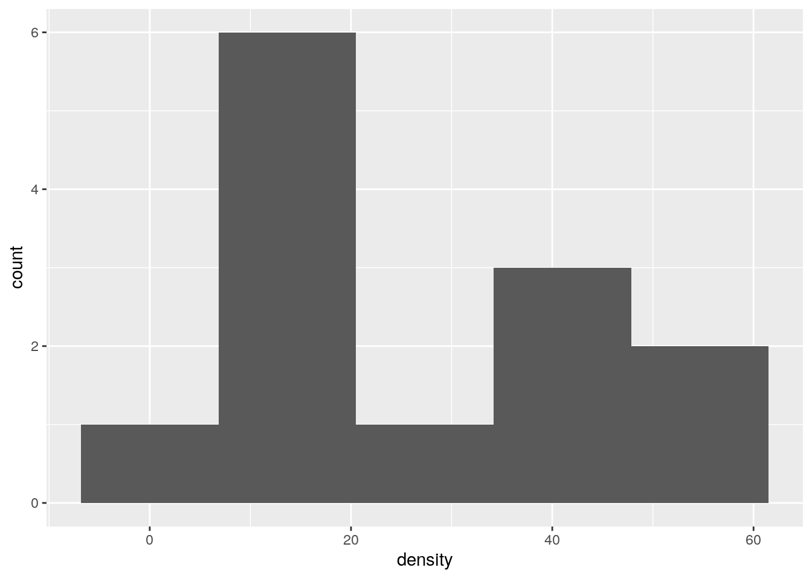

# One-sample inference


```r
library(tidyverse)
```

```
## ── Attaching packages ──────────────────────────────────────────────── tidyverse 1.2.1 ──
```

```
## ✔ ggplot2 3.0.0     ✔ purrr   0.2.5
## ✔ tibble  1.4.2     ✔ dplyr   0.7.6
## ✔ tidyr   0.8.1     ✔ stringr 1.3.1
## ✔ readr   1.1.1     ✔ forcats 0.3.0
```

```
## ── Conflicts ─────────────────────────────────────────────────── tidyverse_conflicts() ──
## ✖ dplyr::filter() masks stats::filter()
## ✖ dplyr::lag()    masks stats::lag()
```


##  Hunter-gatherers in Australia


 A hunter-gatherer society is one where people get their food
by hunting, fishing or foraging rather than by agriculture or by
raising animals. Such societies tend to move from place to place.
Anthropologists have studied hunter-gatherer societies in forest
ecosystems across the world. The average population density of these
societies is 7.38 people per 100 km$^2$. Hunter-gatherer societies on
different continents might have different population densities,
possibly because of large-scale ecological constraints (such as
resource availability), or because of other factors, possibly social
and/or historic, determining population density.

Some hunter-gatherer societies in Australia were studied, and the
population density per 100 km$^2$ recorded for each. The data are in
[http://www.utsc.utoronto.ca/~butler/c32/hg.txt](http://www.utsc.utoronto.ca/~butler/c32/hg.txt). 


(a) Read the data into R. Do you have the correct variables?
How many hunter-gatherer societies in Australia were studied?
Explain briefly.


Solution


The data values are separated by (single) spaces, so `read_delim`
is the thing:

```r
url="http://www.utsc.utoronto.ca/~butler/c32/hg.txt"
societies=read_delim(url," ")
```

```
## Parsed with column specification:
## cols(
##   name = col_character(),
##   density = col_double()
## )
```

I like to put the URL in a variable first, because if I don't, the
`read_delim` line can be rather long. But if you want to do it
in one step, that's fine, as long as it's clear that you are doing the
right thing.

Let's look at the data frame:


```r
societies
```

```
## # A tibble: 13 x 2
##    name       density
##    <chr>        <dbl>
##  1 jeidji       17   
##  2 kuku         50   
##  3 mamu         45   
##  4 ngatjan      59.8 
##  5 undanbi      21.7 
##  6 jinibarra    16   
##  7 ualaria       9   
##  8 barkindji    15.4 
##  9 wongaibon     5.12
## 10 jaralde      40   
## 11 tjapwurong   35   
## 12 tasmanians   13.4 
## 13 badjalang    13.4
```

I have the name of each society and its population density, as
promised (so that is correct). There were 13 societies that were
studied. For me, they were all displayed. For you, you'll probably see only the first ten, and you'll have to click Next to see the last three.
    


(b) The question of interest is whether these Australian
hunter-gatherer societies are like the rest of the world in terms of mean
population density. State suitable null and alternative
hypotheses. *Define any symbols you use*: that is, if you use a
symbol, you also have to say what it means. 


Solution


The mean for the world as a whole ("average", as stated earlier)
is 7.38. Let $\mu$ denote the population mean for Australia (of
which these societies are a sample). Then our hypotheses are:
$$ H_0: \mu=7.38$$
and
$$ H_a: \mu \ne 7.38.$$
There is no reason for a one-sided alternative here, since all we
are interested in is whether Australia is different from the rest
of the world.
*Expect to lose a point* if you use the symbol $\mu$ without
saying what it means.


(c) Test your hypotheses using a suitable test. What do you
conclude, in the context of the data?


Solution


A $t$-test, since we are testing a mean:

```r
t.test(societies$density,mu=7.38)
```

```
## 
## 	One Sample t-test
## 
## data:  societies$density
## t = 3.8627, df = 12, p-value = 0.002257
## alternative hypothesis: true mean is not equal to 7.38
## 95 percent confidence interval:
##  15.59244 36.84449
## sample estimates:
## mean of x 
##  26.21846
```

The P-value is 0.0023, less than the usual $\alpha$ of 0.05, so we
*reject* the null hypothesis and conclude that the mean
population density is not equal to 7.38. That is to say, Australia is
different from the rest of the world in this sense.

As you know, "reject the null hypothesis" is only part of the
answer, so gets only part of the marks.
    


(d) Do you have any doubts about the validity of your test?
Explain briefly, using a suitable graph to support your
explanation. 


Solution


The assumption behind the $t$-test is that the data are
approximately normal. We can assess that in several ways, but the
simplest (which is perfectly acceptable at this point) is a
histogram. You'll need to pick a suitable number of bins. This one
comes from Sturges' rule:

```r
ggplot(societies,aes(x=density))+geom_histogram(bins=5)
```


Your conclusion might depend on how many bins you chose for your
histogram. Here's 8 bins (which is really too many with only 13
observations, but it actually shows the shape well): 


```r
ggplot(societies,aes(x=density))+geom_histogram(bins=8)
```


or you can get a number of bins from one of the built-in functions,
such as:


```r
mybins=nclass.FD(societies$density)
mybins
```

```
## [1] 3
```

This one is small. The interquartile range is large and $n$ is small,
so the binwidth will be large and therefore the number of bins will be
small. 

Other choices: a one-group boxplot:


```r
ggplot(societies,aes(x=1,y=density))+geom_boxplot()
```



This isn't the best for assessing normality as such, but it will tell
you about lack of symmetry and outliers, which are the most important
threats to the $t$-test, so it's fine here. Or, a normal quantile plot:


```r
ggplot(societies,aes(sample=density))+
stat_qq()+stat_qq_line()
```


This is actually the best way to assess normality, but I'm not
expecting you to use this plot here, because we may not have gotten to
it in class yet. (If you have read ahead and successfully use the
plot, it's fine.)

After you have drawn your chosen plot (you need *one* plot), you
need to say something about normality and thus whether you have any
doubts about the validity of your $t$-test. This will depend on the
graph you drew: if you think your graph is symmetric and outlier-free,
you should have no doubts about your $t$-test; if you think it has
something wrong with it, you should say what it is and express your
doubts. My guess is that you will think this distribution is skewed to
the right. Most of my plots are saying that.
<label for="tufte-mn-" class="margin-toggle">&#8853;</label><input type="checkbox" id="tufte-mn-" class="margin-toggle"><span class="marginnote">The normal  quantile plot is rather interesting: it says that the uppermost  values are approximately normal, but the *smallest* eight or so  values are too bunched up to be normal. That is, normality fails not  because of the long tail on the right, but the bunching on the  left. Still right-skewed, though.</span>

On the website where I got these data, they were using the data as
an example for another test, precisely *because* they thought the
distribution was right-skewed. Later on, we'll learn about the sign
test for the median, which I think is actually a better test here.
    


##  Length of gestation in North Carolina


 The data in file
[http://www.utsc.utoronto.ca/~butler/c32/ncbirths.csv](http://www.utsc.utoronto.ca/~butler/c32/ncbirths.csv) are about
500 randomly chosen births of babies in North Carolina. There is a lot
of information: not just the weight at birth of the baby, but whether
the baby was born prematurely, the ages of the parents, whether the
parents are married, how long (in weeks) the pregnancy lasted (this is
called the "gestation") and so on. We have seen these data before.


(a) Read in the data from the file into R, bearing in mind what
type of file it is. 


Solution


This is a `.csv` file (it came from a spreadsheet), so it
needs reading in accordingly. Work directly from the URL (rather
than downloading the file, unless you are working offline):

```r
myurl="http://www.utsc.utoronto.ca/~butler/c32/ncbirths.csv"
bw=read_csv(myurl)
```

```
## Parsed with column specification:
## cols(
##   `Father Age` = col_integer(),
##   `Mother Age` = col_integer(),
##   `Weeks Gestation` = col_integer(),
##   `Pre-natal Visits` = col_integer(),
##   `Marital Status` = col_integer(),
##   `Mother Weight Gained` = col_integer(),
##   `Low Birthweight?` = col_integer(),
##   `Weight (pounds)` = col_double(),
##   `Premie?` = col_integer(),
##   `Few Visits?` = col_integer()
## )
```


(b) Find a 95\% confidence interval for the mean birth weight of
all babies born in North Carolina (of which these babies are a
sample). At the end, you should state what the confidence interval is.
Giving some output is necessary, but *not* enough by itself.

If your variable name has a space or other special character (like a
question mark) in it, remember that you have to surround its name with
backticks, as discussed the first time we looked at these data.


Solution


This:


```r
t.test(bw$`Weight (pounds)`)  
```

```
## 
## 	One Sample t-test
## 
## data:  bw$`Weight (pounds)`
## t = 104.94, df = 499, p-value < 2.2e-16
## alternative hypothesis: true mean is not equal to 0
## 95 percent confidence interval:
##  6.936407 7.201093
## sample estimates:
## mean of x 
##   7.06875
```

or (the same, but remember to match your brackets):


```r
with(bw,t.test(`Weight (pounds)`))
```

```
## 
## 	One Sample t-test
## 
## data:  Weight (pounds)
## t = 104.94, df = 499, p-value < 2.2e-16
## alternative hypothesis: true mean is not equal to 0
## 95 percent confidence interval:
##  6.936407 7.201093
## sample estimates:
## mean of x 
##   7.06875
```

The confidence interval goes from 6.94 to 7.20 pounds.

There is an annoyance about `t.test`. Sometimes you can use
`data=` with it, and sometimes not. When we do a two-sample
$t$-test later, there is a "model formula" with a squiggle in it,
and there we can use `data=`, but here not, so you have to use
the dollar sign or the `with` to say which data frame to get
things from. The distinction seems to be that \emph{if you are using a
model formula}, you can use `data=`, and if not, not.

This is one of those things that is a consequence of R's history. The
original `t.test` was without the model formula and thus
without the `data=`, but the model formula got "retro-fitted"
to it later. Since the model formula comes from things like
regression, where `data=` is legit, that had to be retro-fitted
as well. Or, at least, that's my understanding.


(c) Birth weights of babies born in the United States have a mean
of 7.3 pounds. Is there any evidence that babies born in North
Carolina are less heavy on average? State appropriate hypotheses, do your
test, obtain a P-value and state your conclusion, in terms of the
original data.


Solution


Let $\mu$ be the population mean (the mean weight of all babies born
in North Carolina). Null hypothesis is $H_0: \mu=7.3$ pounds, and the alternative  is
that the mean is less: $H_a: \mu<7.3$ pounds.

Note that I defined $\mu$ first before I used it.

This is a one-sided
alternative, which we need to feed into `t.test`:


```r
t.test(bw$`Weight (pounds)`,mu=7.3,alternative="less")
```

```
## 
## 	One Sample t-test
## 
## data:  bw$`Weight (pounds)`
## t = -3.4331, df = 499, p-value = 0.0003232
## alternative hypothesis: true mean is less than 7.3
## 95 percent confidence interval:
##      -Inf 7.179752
## sample estimates:
## mean of x 
##   7.06875
```
$ %$ 

Or with `with`. If you see what I mean.

The P-value is 0.0003, which is *less* than any $\alpha$ we might
have chosen: we *reject* the null hypothesis in favour of the
alternative, and thus we conclude that the mean birth weight of babies
in North Carolina
is indeed less than 7.3 pounds.

"Reject the null hypothesis" is *not* a complete answer. You
need to say something about what rejecting the null hypothesis means
*in this case*: that is, you must make a statement about birth
weights of babies.


(d) The theory behind the $t$-test says that the distribution of
birth weights should be (approximately) normally distributed. Obtain a
histogram of the birth weights. Does it look approximately normal?
Comment briefly. (You'll have to pick a number of bins for your
histogram first. I don't mind very much what you pick, as long as it's
not obviously too many or too few bins.)


Solution


We did this before (and discussed the number of bins before), so
I'll just reproduce my 10-bin histogram (which is what I preferred,
but this is a matter of taste):

```r
ggplot(bw,aes(x=`Weight (pounds)`))+geom_histogram(bins=10)
```


So, we were assessing normality. What about that?

It is mostly normal-looking, but I am suspicious about those
*very* low birth weights, the ones below about 4 pounds. There
are too many of those, as I see it.

If you think this is approximately normal, you need to make some
comment along the lines of "the shape is approximately symmetric with no outliers". 
I think my first answer is better, but this answer is
worth something, since it is a not completely unreasonable
interpretation of the histogram.

A normal quantile plot is better for assessing normality
than a histogram is, but I won't make you do one until we have seen
the idea in class. Here's the normal quantile plot for these data:


```r
ggplot(bw,aes(sample=`Weight (pounds)`))+stat_qq()+stat_qq_line()
```


This is rather striking: the lowest birthweights (the ones below 5
pounds or so) are *way* too low for a normal distribution to
apply. The top end is fine (except perhaps for that one very heavy
baby), but there are too many low birthweights for a normal
distribution to be believable. Note how much clearer this story is
than on the histogram.

Having said that, the $t$-test, especially with a sample size as big
as this (500), behaves *very* well when the data are somewhat
non-normal (because it takes advantage of the Central Limit Theorem:
that is, it's the *sampling distribution of the sample mean*
whose shape matters). So, even though the data are definitely not
normal, I wouldn't be too worried about our test.

This perhaps gives some insight as to why Freedman-Diaconis said we
should use so many bins for our histogram. We have a lot of low-end
outliers, so that the IQR is actually *small* compared to the
overall spread of the data (as measured, say, by the SD or the range)
and so FD thinks we need a lot of bins to describe the shape. Sturges
is based on data being approximately normal, so it will tend to
produce a small number of bins for data that have outliers.


##  Inferring ice break-up in Nenana


 Nenana, Alaska, is about 50 miles west of Fairbanks.
Every spring, there is a contest in Nenana. A wooden tripod is
placed on the frozen river, and people try to guess the exact minute
when the ice melts enough for the tripod to fall through the ice. The
contest started in 1917 as an amusement for railway workers, and has
taken place every year since. Now, hundreds of thousands of people
enter their guesses on the Internet and the prize for the winner can
be as much as \$300,000. 

Because so much money is at stake, and because the exact same tripod
is placed at the exact same spot on the ice every year, the data are
consistent and accurate. The data are in
[http://www.utsc.utoronto.ca/~butler/c32/nenana.txt](http://www.utsc.utoronto.ca/~butler/c32/nenana.txt). 

Yes, we saw these data before.


(a) Read the data into R, as before, or use the data frame that
you read in before.  Note that the values are separated by
*tabs* rather than spaces, so you'll need an appropriate
`read_` to read it in.


Solution


These are "tab-separated values", so `read_tsv` is the
thing, as for the Australian athletes:

```r
myurl="http://www.utsc.utoronto.ca/~butler/c32/nenana.txt"
nenana=read_tsv(myurl)
```

```
## Parsed with column specification:
## cols(
##   Year = col_integer(),
##   JulianDate = col_double(),
##   `Date&Time` = col_character()
## )
```

Use whatever name you like for the data frame. One that is different
from any of the column headers is smart; then it is clear whether you
mean the whole data frame or one of its columns. `ice` or
`melt` or anything like that would also be good.
    


(b) Obtain a 90\% confidence interval for the mean
`JulianDate`. What interval do you get? Looking back at your
histogram, do you have any doubts about the validity of what you
have just done?


Solution


This is a matter of using `t.test` and pulling out the
interval. Since we are looking for a non-standard interval, we
have to remember `conf.level` as the way to get the
confidence level that we want. I'm going with `with` this
time, though the dollar-sign thing is equally as good:

```r
with(nenana,t.test(JulianDate,conf.level=0.90))
```

```
## 
## 	One Sample t-test
## 
## data:  JulianDate
## t = 197.41, df = 86, p-value < 2.2e-16
## alternative hypothesis: true mean is not equal to 0
## 90 percent confidence interval:
##  124.4869 126.6018
## sample estimates:
## mean of x 
##  125.5443
```

Between 124.5 and 126.6 days into the year. Converting that into
something we can understand (because I want to), there are
$31+28+31+30=120$ days in 
January through April (in a non-leap year), so this says that the mean
breakup date is between about May 4 and May 6. 

The $t$-test is based on an assumption of data coming from a normal
distribution. The histogram we made earlier looks pretty much normal,
so there are no doubts about normality and thus no doubts about the
validity of what we have done, on the evidence we have seen so far. (I
have some doubts on different grounds, based on another of the plots
we did earlier, which I'll explain later, but all I'm expecting you to
do is to look at the histogram and say "Yep, that's normal enough". 
Bear in mind that the sample size is 87, which is large
enough for the Central Limit Theorem to be pretty helpful, so that we don't need the data to be more than "approximately normal" for the sampling distribution of the sample mean to be very close to $t$ with the right df.)
    


(c) An old-timer in Nenana strokes his grey beard and says
"When I were young, I remember the tripod used to fall into the water around May 10". 
In a non-leap year, May 10 is Julian day 130. Test the null hypothesis that the 
mean `JulianDay` is 130, against the alternative that it is less.  What do you conclude?
What practical implication does that have 
(assuming that the old-timer has a good memory)?


Solution


The test is `t.test` again, but this time we have to
specify a null mean and a direction of alternative:

```r
with(nenana,t.test(JulianDate,mu=130,alternative="less"))
```

```
## 
## 	One Sample t-test
## 
## data:  JulianDate
## t = -7.0063, df = 86, p-value = 2.575e-10
## alternative hypothesis: true mean is less than 130
## 95 percent confidence interval:
##      -Inf 126.6018
## sample estimates:
## mean of x 
##  125.5443
```

For a test, look first at the P-value, which is 0.0000000002575: that
is to say, the P-value is very small, definitely smaller than 0.05 (or
any other $\alpha$ you might have chosen). So we *reject* the
null hypothesis, and conclude that the mean `JulianDate` is actually
*less* than 130.

Now, this is the date on which the ice breaks up on average, and we
have concluded that it is *earlier* than it used to be, since we
are assuming the old-timer's memory is correct. 

This is evidence in
favour of global warming; a small piece of evidence, to be sure, but
the ice is melting earlier than it used to all over the Arctic, so
it's not just in Nenana that it is happening. You don't need to get to
the "global warming" part, but I *do* want you to observe that
the ice is breaking up earlier than it used to.
    


(d) Plot `JulianDate` against `Year` on a
scatterplot. What recent trends, if any, do you see? Comment
briefly. (You did this before, but I have some extra comments on
the graph this time, so feel free to just read this part.)


Solution


I liked  the `ggplot` with a smooth trend on it:


```r
ggplot(nenana,aes(x=Year,y=JulianDate))+geom_point()+geom_smooth()
```

```
## `geom_smooth()` using method = 'loess' and formula 'y ~ x'
```


There was something obvious to see: after about 1960, there is a clear
downward trend: the ice is breaking up earlier on average every
year. Even though there is a lot of variability, the overall trend,
viewed this way, is clear (and consistent with the test we did
earlier). Note that the old-timer's value of 130 is the kind of
`JulianDate` we would typically observe around 1920, which
would make the old-timer over 90 years old.

All right, why did I say I had some doubts earlier? Well, because of
this downward trend, the mean is not actually the same all the way
through, so it doesn't make all that much sense to estimate it, which
is what we were doing earlier by doing a confidence interval or a
hypothesis test. What would actually make more sense is to estimate
the mean `JulianDate` *for a particular year*. This could
be done by a regression: predict `JulianDate` from
`Year`, and then get a 
"confidence interval for the mean response" 
(as you would have seen in B27 or will see in C67). The
trend isn't really linear, but is not that far off. I can modify the
previous picture to give you an idea. Putting in `method="lm"`
fits a line; as we see later, `lm` does regressions in R:


```r
ggplot(nenana,aes(x=Year,y=JulianDate))+geom_point()+
geom_smooth(method="lm")
```


Compare the confidence interval for the mean `JulianDate` in
1920: 126 to 131 (the shaded area on the graph), with 2000: 121 to
125. A change of about 5 days over 80 years. And with the recent trend
that we saw above, it's probably changing faster than that
now. Sobering indeed.
      


