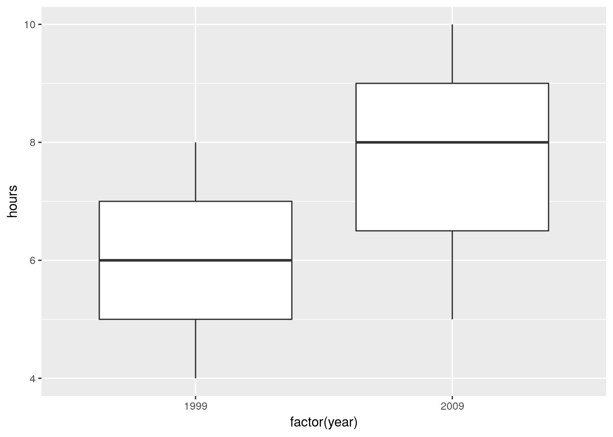

# Two-sample inference


```r
library(tidyverse)
```

```
## ── Attaching packages ─────────────────────────────────────────────────────────────────────────────────────── tidyverse 1.2.1 ──
```

```
## ✔ ggplot2 3.0.0     ✔ purrr   0.2.5
## ✔ tibble  1.4.2     ✔ dplyr   0.7.6
## ✔ tidyr   0.8.1     ✔ stringr 1.3.1
## ✔ readr   1.1.1     ✔ forcats 0.3.0
```

```
## ── Conflicts ────────────────────────────────────────────────────────────────────────────────────────── tidyverse_conflicts() ──
## ✖ dplyr::filter() masks stats::filter()
## ✖ dplyr::lag()    masks stats::lag()
```


##  Children and electronic devices


 Do children (aged 8--17) spend more time on electronic
devices now than they did 10 years ago? Samples of 15 children aged
8--17 were taken in each of two years, 1999 and 2009, and the children (with
their parents' help) were
asked to keep a diary of the number of hours they spent using
electronic devices on a certain day. The data are in the file
[http://www.utsc.utoronto.ca/~butler/c32/pluggedin.txt](http://www.utsc.utoronto.ca/~butler/c32/pluggedin.txt).


(a) Read in the data and  verify that you have 30 rows of data from two
different years.


Solution


I see this:

```r
myurl="http://www.utsc.utoronto.ca/~butler/c32/pluggedin.txt"
plugged=read_delim(myurl," ")
```

```
## Parsed with column specification:
## cols(
##   year = col_integer(),
##   hours = col_integer()
## )
```

```r
plugged
```

```
## # A tibble: 30 x 2
##     year hours
##    <int> <int>
##  1  1999     4
##  2  1999     5
##  3  1999     7
##  4  1999     7
##  5  1999     5
##  6  1999     7
##  7  1999     5
##  8  1999     6
##  9  1999     5
## 10  1999     6
## # ... with 20 more rows
```

I see only the first ten rows (with an indication that there are 20 more, so 30 altogether). In your notebook, it'll look a bit different: again, you'll see the first 10 rows, but you'll see exactly how many rows and columns there are, and there will be buttons "Next" and "Previous" to see earlier and later rows, and a little right-arrow to see more columns to the right (to which is added a little left-arrow if there are previous columns to scroll back to). If you want to check for yourself that there are 30 rows, you can click Next a couple of times to get down to row 30, and then see that the Next button cannot be clicked again, and therefore that 30 rows is how many there are.

Or, you can summarize the years by counting how many there are
of each:


```r
plugged %>% count(year)
```

```
## # A tibble: 2 x 2
##    year     n
##   <int> <int>
## 1  1999    15
## 2  2009    15
```

or the more verbose form of the same thing:


```r
plugged %>% group_by(year) %>% summarize(rows=n())
```

```
## # A tibble: 2 x 2
##    year  rows
##   <int> <int>
## 1  1999    15
## 2  2009    15
```

Any of those says that it looks good. 30 rows, 1999 and 2009, 15
measurements for each.


(b) Draw side-by-side boxplots of the number of hours for each
year. `year` is a numeric variable that we want to treat as a
factor, so we need to *make* it into a factor.


Solution


```r
ggplot(plugged,aes(x=factor(year),y=hours))+geom_boxplot()
```


The `fct_inorder` trick from assignment 1 will also work, since
the years are in the data in the order we want them to be displayed.

The median for 2009 is noticeably higher, and there is no skewness or
outliers worth worrying about.

The measurements for the two years have a very similar spread, so
there would be no problem running the pooled test here.

You might be bothered by the `factor(year)` on the $x$-axis. To
get around that, you can define year-as-factor *first*, using
`mutate`, then feed your new column into the boxplot. That goes
like this. There is a wrinkle that I explain afterwards:


```r
plugged %>% mutate(the_year=factor(year)) %>%
ggplot(aes(x=the_year, y=hours))+geom_boxplot()
```


You could even redefine `year` to be the factor version of
itself (if you don't need the year-as-number anywhere else). The
wrinkle I mentioned above is that in the `ggplot` you \emph{do
not} name the data frame first; the data frame used is the
(nameless) data frame that came out of the previous step, not
`plugged` but `plugged` with a new column
`the_year`.

Note how the $x$-axis now has the name of the new variable.

If you forget to make `year` into a factor, this happens:


```r
ggplot(plugged,aes(x=year,y=hours))+geom_boxplot()
```

```
## Warning: Continuous x aesthetic -- did you forget aes(group=...)?
```



You get *one* boxplot, for all the hours, without distinguishing
by year, and a warning message that tries (and fails) to read our
mind: yes, we have a continuous, quantitative `x`, but
`geom_boxplot` doesn't take a `group`.


(c) Test whether the mean number of hours has *increased* since
1999. Which test did R do?


Solution


The hard part to remember is how you specify a one-sided test in
R; it's `alternative="less"` (rather
than "greater") because 1999 is "before" 2009:


```r
t.test(hours~year,data=plugged,alternative="less")  
```

```
## 
## 	Welch Two Sample t-test
## 
## data:  hours by year
## t = -3.3323, df = 24.861, p-value = 0.001348
## alternative hypothesis: true difference in means is less than 0
## 95 percent confidence interval:
##        -Inf -0.8121415
## sample estimates:
## mean in group 1999 mean in group 2009 
##           5.933333           7.600000
```

The P-value is 0.0013. R does the Welch-Satterthwaite test by default
(the unequal-variances one). Since we didn't change that, that's what
we got. (The pooled test is below.)

This is the cleanest way to do it, because this version of
`t.test`, with a "model formula" (the thing with the
squiggle) allows a `data=` to say which data frame to get
things from. The other ways, using (for example) `with`, also work:


```r
with(plugged,t.test(hours~year,alternative="less"))
```

```
## 
## 	Welch Two Sample t-test
## 
## data:  hours by year
## t = -3.3323, df = 24.861, p-value = 0.001348
## alternative hypothesis: true difference in means is less than 0
## 95 percent confidence interval:
##        -Inf -0.8121415
## sample estimates:
## mean in group 1999 mean in group 2009 
##           5.933333           7.600000
```

This also works, but is *ugly*:


```r
t.test(plugged$hours~plugged$year,alternative="less")
```

```
## 
## 	Welch Two Sample t-test
## 
## data:  plugged$hours by plugged$year
## t = -3.3323, df = 24.861, p-value = 0.001348
## alternative hypothesis: true difference in means is less than 0
## 95 percent confidence interval:
##        -Inf -0.8121415
## sample estimates:
## mean in group 1999 mean in group 2009 
##           5.933333           7.600000
```

Ugly because you've just typed the name of the data frame and the
dollar sign *twice* for no reason. As a general principle, if you
as a programmer are repeating yourself, you should stop and ask
yourself how you can avoid the repeat.

If you want the pooled test in R, you have to ask for it:


```r
t.test(hours~year,alternative="less",data=plugged,var.equal=T)    
```

```
## 
## 	Two Sample t-test
## 
## data:  hours by year
## t = -3.3323, df = 28, p-value = 0.001216
## alternative hypothesis: true difference in means is less than 0
## 95 percent confidence interval:
##        -Inf -0.8158312
## sample estimates:
## mean in group 1999 mean in group 2009 
##           5.933333           7.600000
```

As is often the case, the P-values for the pooled and
Welch-Satterthwaite tests are very similar, so from that point of view
it doesn't matter much which one you use. If you remember back to the
boxplots, the number of hours had about the same spread for the two
years, so if you used the pooled test instead of the
Welch-Satterthwaite test, that would have been just fine.

There is a school of thought that says we should learn the
Welch-Satterthwaite test and use that always. This is because W-S (a)
works when the populations from which the groups are sampled have
different SDs and (b) is pretty good even when those SDs are the same.

The pooled test can go badly wrong if the groups have very different
SDs.  The story is this: if the larger sample is from the population
with the larger SD, the probability of a type I error will be smaller
than $\alpha$, and if the larger sample is from the population with
the *smaller* SD, the probability of a type I error will be
larger than $\alpha$. This is why you see S-W in STAB22. You see the
pooled test in STAB57 because the logic of its derivation is so much
clearer,\endnote{I return to this issue when we look at the same data
in SAS later.} not because it's really the better test in
practice. The theory says that if your data are normal in both groups
with the same variance, then the pooled test is best, but it says
*nothing* about the quality of the pooled test if any of that
goes wrong.
The usual approach to assessing things like this is via simulation,
as we do for estimating power (later): generate some random data
eg. from normal distributions with the same means, SDs 10 and 20
and sample sizes 15 and 30, run the pooled $t$-test, see if you
reject, then repeat lots of times and see whether you reject about
5\% of the time. Then do the same thing again with the sample sizes
switched around. Or, do the same thing with Welch-Satterthwaite.


(d) Obtain a 99\% confidence interval for the difference in means.


Solution


Take off the thing that made it one-sided, and
put in a thing that gets the right CI:


```r
t.test(hours~year,data=plugged,conf.level=0.99)  
```

```
## 
## 	Welch Two Sample t-test
## 
## data:  hours by year
## t = -3.3323, df = 24.861, p-value = 0.002696
## alternative hypothesis: true difference in means is not equal to 0
## 99 percent confidence interval:
##  -3.0614628 -0.2718705
## sample estimates:
## mean in group 1999 mean in group 2009 
##           5.933333           7.600000
```

$-3.06$ to $-0.27$. The interval contains only negative values, which
is consistent with our having rejected a null hypothesis of no
difference in means.


##  Parking close to the curb


 In 2009, the Toronto Star commissioned a survey to address
the issue of who is better at parking a car: men or women. The
researchers recorded 93 drivers who were parallel-parking their car in
downtown Toronto, and for each driver, recorded the distance between
the car and the curb, in inches, when the driver was finished parking
their car. The data are in an Excel spreadsheet,
[http://www.utsc.utoronto.ca/~butler/c32/parking.xlsx](http://www.utsc.utoronto.ca/~butler/c32/parking.xlsx). (Let me
know if you cannot handle this format.) Click on the link. The data
will probably download automatically. Check the folder on your
computer where things get downloaded.\endnote{Mine is rather
prosaically called `Downloads`.} If the spreadsheet is just
displayed and not downloaded, save it somewhere on your computer.


(a) There are two sheets in this spreadsheet workbook. They are
of the same data in two different formats. Take a look at Sheet 1
and Sheet 2. Describe the format of the data in each case. Which will be the most suitable data layout, bearing in
mind that one of the first things we do is to make side-by-side
boxplots of parking distances for males and females? Explain briefly.


Solution


The data in Sheet 1 has one column of parking distances for
males, and another for females. This is often how you see data
of this sort laid out. Sheet 2 has *one* column of parking
distances, all combined together, and a second column indicating
the gender of the driver whose distance is in the first column.
If you look back at the kind of data we've used to make
side-by-side boxplots, it's always been in the format of Sheet
2: one column containing all the values of the variable we're
interested in, with a second column indicating which group each
observation belongs to ("group" here being 
"gender of driver"). 
So we need to use the data in Sheet 2, because the
data in Sheet 1 are not easy to handle with R. 
The layout of Sheet 2 is the way R likes to do most things:
so-called "long format" with a lot of rows and not many
columns. This is true for descriptive stuff: side-by-side
boxplots or histograms or  means by group, as well as modelling
such as (here) a two-sample $t$-test, or (in other
circumstances, as with several groups) a one-way analysis of
variance. 
Hadley Wickham, the guy behind the `tidyverse`, likes to
talk about "tidy data" (like Sheet 2), with each column
containing a variable, and "untidy data" (like Sheet 1), where
the two columns are the same thing (distances), but under
different circumstances (genders). As we'll see later, it is
possible to convert from one format to the other. Usually you
want to make untidy data tidy (the function for this is called
`gather`). 


(b) Read your preferred sheet directly into R, *without*
using a `.csv` file. (There is a clue in the lecture notes,
in the section about reading in files.) If you get stuck, make a
`.csv` file and read that in.


Solution


The direct way is to use the package `readxl`. This has a
`read_excel` that works the same way as any of the other
`read_` functions. You'll have to make sure that you
read in sheet 2, since that's the one you want. 
There is some setup first. There are a couple of ways you can do that:


* Download the spreadsheet to your computer, and upload it
to your project on R Studio Cloud (or, if you are running R
Studio on your computer, use something like
`file.choose` to get the file from wherever it got
downloaded to).

* Use the function `download.file` to get the file
from the URL and store it in your project folder
directly. This also works in R Studio Cloud, and completely
by-passes the download-upload steps that you would have to do
otherwise. (I am grateful to Rose Gao for this idea.)
Here is how you can use `download.file` here:

```r
my_url='http://www.utsc.utoronto.ca/~butler/c32/parking.xlsx'
local="parking.xlsx"
download.file(my_url, local, mode="wb")
```

When you've gotten the spreadsheet into your project folder via one of
those two ways, you go ahead and do this:      

```r
library(readxl)
parking=read_excel("parking.xlsx",sheet=2)
parking
```

```
## # A tibble: 93 x 2
##    distance gender
##       <dbl> <chr> 
##  1      0.5 male  
##  2      1   male  
##  3      1.5 male  
##  4      1.5 male  
##  5      1.5 male  
##  6      3   male  
##  7      3.5 male  
##  8      5   male  
##  9      6   male  
## 10      6   male  
## # ... with 83 more rows
```

You have to do it this way, using the version of the spreadsheet on
your computer, since `read_excel` won't take a
URL, or if it does, I can't make it work.\endnote{Let me know if you
have more success than I did.} I put the spreadsheet in R Studio's
current folder, so I could read it in by name, or you can do the
`f=file.choose()` thing, find it, then read it in.
The `sheet=` thing can take either a number (as here: the
second sheet in the workbook), or a name (whatever name the sheet has
on its tab in the workbook). 

Extra: Rose actually came up with a better idea, which I will show
you and explain:


```r
tf=tempfile()
download.file(my_url, tf, mode="wb")
p=read_excel(tf, sheet = 2)
```

What `tempfile()` does is to create a temporary file to hold the
spreadsheet that you are about to download. After downloading the
spreadsheet to the temporary file, you then use `read_excel` to
read *from the temporary file* into the data frame.

The advantage of this approach is that the temporary file disappears
as soon as you close R, and so you don't have a copy of the
spreadsheet lying around that you don't need (once you have created
the data frame that I called `parking`, anyway).

If you are wondering about that `mode` thing on
`download.file`: files are of two different types, "text"
(like the text of an email, that you can open and look at in something
like Notepad), and "binary" that you can't look at directly, but for
which you need special software like Word or Excel to decode it for
you.\endnote{A Word or Excel document has all kinds of formatting
information hidden in the file as well as the text that you see on
the screen.}  The first character in `mode` is either
`w` for "write a new file", which is what we want here, or
`a` for "append", which would mean adding to the end of a
file that already exists. Thus `mode="wb"` means 
"create a new binary file".
End of Extra.
If you can't make any of this work, then do it in two steps:
save the appropriate sheet as a `.csv` 
file, and then read the `.csv` file using
`read_csv`. If you experiment, you'll find that saving a
spreadsheet workbook as `.csv` only saves the sheet
you're looking at, so make sure you are looking at sheet 2
before you Save As `.csv`. I did that, and called my
saved `.csv` `parking2.csv` (because it was from
sheet 2, but you can use any name you like).
Then I read this into R thus:

```r
parking2=read_csv("parking2.csv")
```

```
## Parsed with column specification:
## cols(
##   distance = col_double(),
##   gender = col_character()
## )
```

```r
parking2
```

```
## # A tibble: 93 x 2
##    distance gender
##       <dbl> <chr> 
##  1      0.5 male  
##  2      1   male  
##  3      1.5 male  
##  4      1.5 male  
##  5      1.5 male  
##  6      3   male  
##  7      3.5 male  
##  8      5   male  
##  9      6   male  
## 10      6   male  
## # ... with 83 more rows
```

The read-in data frame `parking` 
has 93 rows ($47+46=93$ drivers) and two columns: the distance from
the curb that the driver ended up at, and the gender of the
driver. This is as the spreadsheet Sheet 2 was, and the first few
distances match the ones in the spreadsheet.

If I were grading this, you'd get some credit for the `.csv`
route, but I really wanted you to figure out how to read the Excel
spreadsheet directly, so that's what would be worth full marks.

You might want to check that you have some males and some females, and
how many of each, which you could do this way:


```r
parking %>% count(gender)
```

```
## # A tibble: 2 x 2
##   gender     n
##   <chr>  <int>
## 1 female    47
## 2 male      46
```


(c) Obtain side-by-side boxplots of parking distances for
males and females. Does one
gender seem to be better at parking than the other? Explain briefly.


Solution


With the right data set, this is a piece of cake:

```r
ggplot(parking,aes(x=gender,y=distance))+geom_boxplot()
```


The outcome variable is distance from the curb, so smaller should be
better (more accurate parking). With that in mind, the median for
females is a little smaller than for males (about 8.5 vs.\ about 10),
so it seems that on average females are more accurate parkers than
males are. The difference is small, however (and so you might be
wondering at this point whether it's a statistically significant
difference --- don't worry, that's coming up).

Before I leave this one, I want to show you something else:
above-and-below histograms, as another way of comparing males and
females (two or more groups, in general). First, we make a histogram of all
the distances, without distinguishing by gender:


```r
ggplot(parking,aes(x=distance))+geom_histogram(bins=8)
```


That big outlier is the very inaccurate male driver.

Now, how do we get a *separate* histogram for each
`gender`? In `ggplot`, separate plots for each
"something" are called **facets**, and the way to get facets
arranged as you want them is called `facet_grid`. Let me show you
the code first, and then explain how it works:


```r
ggplot(parking,aes(x=distance))+
geom_histogram(bins=7)+
facet_grid(gender~.)
```


`facet_grid` takes a "model formula" with a squiggle, with $y$
on the left and $x$ on the right. We want to compare our two
histograms, one for males and one for females, and I think the best
way to compare histograms is to have one on top of the other. Note
that the same `distance` scale is used for both histograms, so
that it is a fair comparison.  The above-and-below is accomplished by
having `gender` as the $y$ in the arrangement of the facets, so
it goes before the squiggle. We don't have any $x$ in the arrangement
of the facets, and we tell `ggplot` this by putting a dot where
the $x$ would be.\endnote{You might have a second categorical variable
by which you want to arrange the facets left and right, and that
would go where the dot is.}

You can also use `facet_wrap` for this, but you have to be
more careful since you don't have any control over how the histograms
come out (you probably get them side by side, which is not so helpful
for comparing distributions). You can make it work by using
`ncol=1` to arrange "all" the histograms in one column:


```r
ggplot(parking,aes(x=distance))+
geom_histogram(bins=7)+
facet_wrap(~gender,ncol=1)
```


The centres of both histograms are somewhere around 10, so it's hard
to see any real difference between males and females here. Maybe this
is further evidence that the small difference we saw between the
boxplots is really not worth getting excited about.

You might be concerned about how you know what to put with the
squiggle-thing in `facet_grid` and `facet_wrap`. The
answer is that `facet_wrap` *only* has something to the
right of the squiggle (which `ggplot` then decides how to
arrange), but `facet_grid` *must* have something on
*both* sides of the squiggle (how to arrange in the $y$ direction
on the left, how to arrange in the $x$ direction on the right), and if
you don't have anything else to put there, you put a dot. Here's my
`facet_grid` code from above, again:


```r
ggplot(parking,aes(x=distance))+
geom_histogram(bins=7)+
facet_grid(gender~.)
```

We wanted gender to go up and down, and we had nothing to go left and
right, hence the dot. Contrast that with my `facet_wrap`
code:\endnote{I took out the `ncol` since that confuses the
explanation here.} 


```r
ggplot(parking,aes(x=distance))+
geom_histogram(bins=7)+
facet_wrap(~gender)
```

This says "make a separate facet for each gender", but it doesn't
say anything about how to arrange them.
The choice of bins for my histogram(s) came from Sturges' rule: with
$n$ being the number of observations, you use $k$ bins where
$k=\log_2(n)+1$, rounded up. If we were to make a histogram of all the
parking distances combined together, we would have $n=47+48=95$
observations, so we should use this many bins:


```r
sturges=log(95,2)+1
sturges
```

```
## [1] 7.569856
```

Round this up to 8. (The second thing in `log` is the base of
the logs, if you specify it, otherwise it defaults to $e$ and gives
you "natural" logs.) I seem to have the powers of 2 in my head, so I
can do it mentally by saying ``the next power of 2 is 128, which is
$2^7$, so I need $7+1=8$ bins.''

Or:


```r
with(parking,nclass.Sturges(distance))
```

```
## [1] 8
```
Sturges' rule tends to produce not enough bins if $n$ is small, so be
prepared to increase it a bit if you don't have much data.
I think that gives a fairly bare-bones picture of the shape: skewed to
the right with outlier.

The other rule we saw was Freedman-Diaconis:


```r
with(parking, nclass.FD(distance))
```

```
## [1] 14
```

and that leads to this histogram: 


```r
ggplot(parking,aes(x=distance))+geom_histogram(bins=14)
```


That gives rather more detail (a lot more bars: the binwidth in the
Sturges-rule histogram is about 7, or twice what you see here), but in
this case the overall story is about the same.

In the case of faceted histograms, you would want to apply a rule that
uses the number of observations in *each* histogram. The facets
might have quite different numbers of observations, but you can only
use one `binwidth` (or `bins`), so you may have to
compromise. For example, using Sturges' rule based on 47 observations
(the number of males; the number of females is one more):


```r
log(47,2)+1
```

```
## [1] 6.554589
```

and so each facet should have that many bins, rounded up. That's where
I got my 7 for the facetted histogram from. This one doesn't work
immediately with `nclass.Sturges`, because we do not have
*one* column whose length is the number of observations we want:
we have one column of distances that are males and females mixed
up. To do *that*, `filter` one of the genders first:


```r
parking %>%
filter(gender=="female") %>%
with(.,nclass.Sturges(distance))
```

```
## [1] 7
```

I used the "dot" trick again, which you can read as "it": ``from
`parking`, take only the rows for the females, and with it,
give me the number of bins for a histogram by Sturges' rule.''


(d) Explain briefly why this is two independent samples
rather than matched pairs.


Solution


There is no way to pair any male with a corresponding female,
because they are unrelated people. You might also notice that
there are not even the *same number* of males and females,
so there can be no way of pairing them up without leaving one
over. (In general, if the two samples are paired, there must be
the same number of observations in each; if there are different
numbers in each, as here, they cannot be paired.)
If you want that more mathematically, let $n_1$ and $n_2$ be the
two sample sizes; then:
$$
\mbox{Paired} \Longrightarrow n_1=n_2
$$

from which it follows logically (the "contrapositive") that

$$
n_1 \ne n_2 \Longrightarrow \mbox{not paired}
$$
You'll note from the logic that if the two sample sizes are the same,
that tells you *nothing* about whether it's paired or independent
samples: it could be either, and in that case you have to look at the
description of the data to decide between them.

Here, anything that gets at why the males and females cannot be paired
up is good.


(e) Run a suitable $t$-test for comparing parking distances
for males and females. What do you conclude, in the context of the data?


Solution


 A two-sample $t$-test. I think either the Welch or the pooled one can
 be justified (and I would expect them to give similar answers). You
 can do the Welch one either without comment or by asserting that the
 boxplots show different spreads; if you are going to do the pooled
 one, you need to say that the spreads are "about equal", by
 comparing the heights of the boxes on the boxplots:

```r
t.test(distance~gender,data=parking)
```

```
## 
## 	Welch Two Sample t-test
## 
## data:  distance by gender
## t = -1.3238, df = 79.446, p-value = 0.1894
## alternative hypothesis: true difference in means is not equal to 0
## 95 percent confidence interval:
##  -4.5884103  0.9228228
## sample estimates:
## mean in group female   mean in group male 
##             9.308511            11.141304
```

This is the Welch-Satterthwaite version of the test, the one that does
not assume equal SDs in the two groups. The P-value of 0.1894 is not
small, so there is no evidence of any difference in parking accuracy
between males and females.

Or, this being the pooled one:


```r
t.test(distance~gender,data=parking,var.equal=T)
```

```
## 
## 	Two Sample t-test
## 
## data:  distance by gender
## t = -1.329, df = 91, p-value = 0.1872
## alternative hypothesis: true difference in means is not equal to 0
## 95 percent confidence interval:
##  -4.5722381  0.9066506
## sample estimates:
## mean in group female   mean in group male 
##             9.308511            11.141304
```

You might have thought, looking at the boxplots, that the groups had
about the same SD (based, for example, on noting that the two boxes
were about the same height, so the IQRs were about the same). In that
case, you might run a pooled $t$-test, which here gives an almost
identical P-value of 0.1872, and the exact same conclusion.


(f) Why might you have some doubts about the $t$-test that
you just did? Explain briefly.


Solution


The two-sample $t$-test is based on an assumption of
normally-distributed data within each group. If you go back
and look at the boxplots, you'll see either (depending on
your point of view) that both groups are right-skewed, or
that both groups have outliers, neither of which fits a
normal distribution. The outlier in the male group is
particularly egregious.\endnote{Google defines this as
meaning "outstandingly bad, shocking".} So I think we
are entitled to question whether a two-sample $t$-test is
the right thing to do.
Having said that, we should go back and remember that the
$t$-tests are "robust to departures from normality" (since
we are working with the Central Limit Theorem here), and
therefore that this test might be quite good even though the
data are not normal, because the sample sizes of 40-plus are
large (by the standards of what typically makes the Central
Limit Theorem work for us). So it may not be as bad as it seems.
A common competitor for the two-sample $t$-test is the
Mann-Whitney test. This doesn't assume normality, but it
*does* assume symmetric distributions, which it's not
clear that we have here. I like a test called Mood's Median
Test, which is kind of the two-sample equivalent of the sign
test (which we will also see later). It goes like this:
Work out the overall median of all the distances, regardless
of gender:

```r
parking %>% summarize(med=median(distance))
```

```
## # A tibble: 1 x 1
##     med
##   <dbl>
## 1     9
```

The overall median is 9.

Count up how many distances of each gender were above or below the
overall median. (Strictly, I'm supposed to throw away any values that
are exactly equal to the overall median, but I won't here for clarity
of exposition.)


```r
tab=with(parking,table(gender,distance<9))
tab
```

```
##         
## gender   FALSE TRUE
##   female    23   24
##   male      27   19
```

For example, 19 of the male drivers had a distance (strictly) less than 9.
Both genders are pretty close to 50--50 above and below the overall
median, which suggests that the males and females have about the same
median. This can be tested (it's a chi-squared test for independence,
if you know that):


```r
chisq.test(tab,correct=F)
```

```
## 
## 	Pearson's Chi-squared test
## 
## data:  tab
## X-squared = 0.89075, df = 1, p-value = 0.3453
```

This is even less significant (P-value 0.3453) than the two-sample
$t$-test, and so is consistent with our conclusion from before that
there is actually no difference between males and females in terms of
average parking distance. The Mood's median test is believable because
it is not affected by outliers or distribution shape.


(g) The Toronto Star in its report said that females are
more accurate at parking their cars. Why do you think they
concluded that, and do you think they were right to do so?
Explain briefly.


Solution


The conclusion from the boxplots was that the female
median distance was less than the males, slightly, in this
sample. That is probably what the Star seized on.
Were they right? Well, that was why we did the test of
significance. We were trying to see whether this observed
difference between males and females was "real" (would
hold up if you looked at "all" male and female drivers)
or "reproducible" (you would expect to see it again if
you did another study like this one). The large,
non-significant P-values in all our tests tell us that the
difference observed here was nothing more than chance. So
it was not reasonable to conclude that females generally
are more accurate at parallel-parking than males are.


