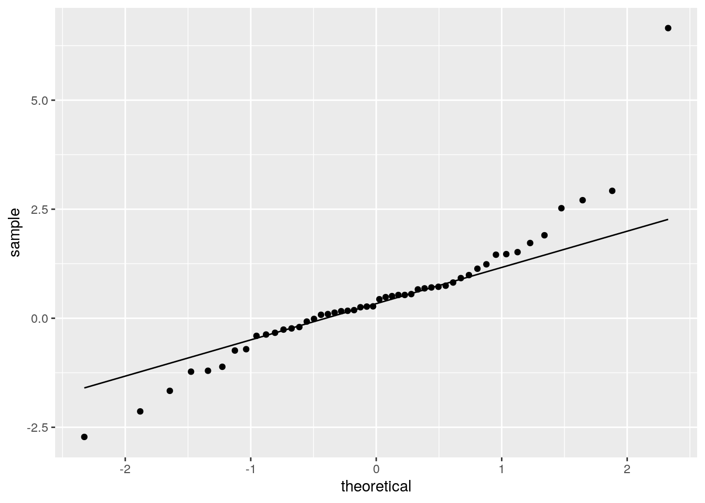
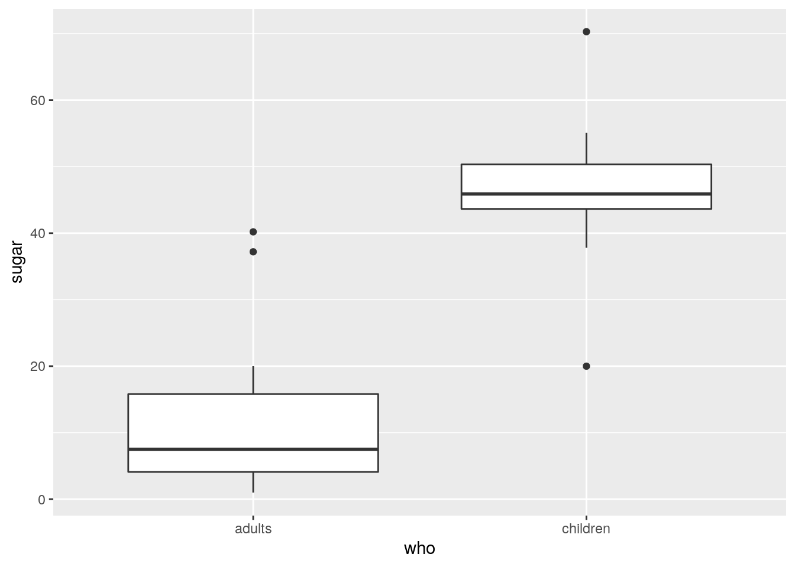
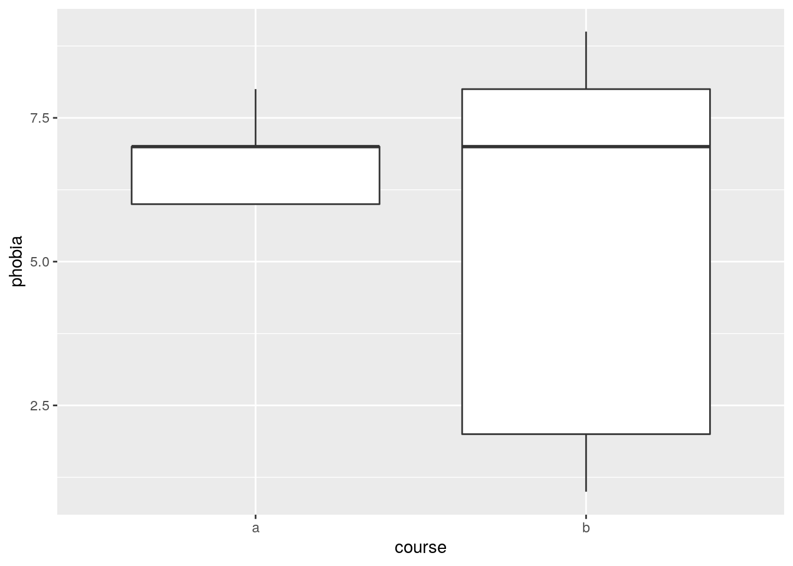
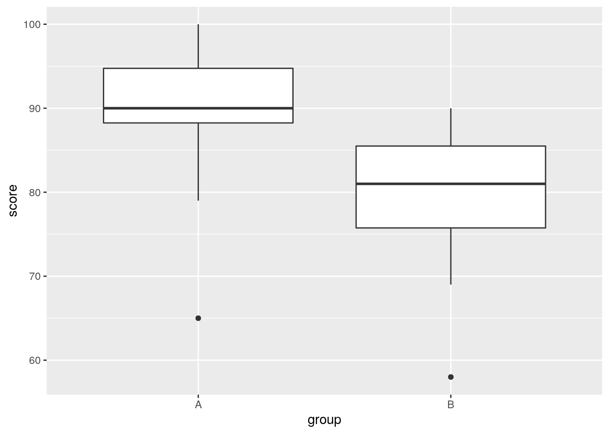

# The sign test and Mood's median test


```r
library(tidyverse)
```

```
## ── Attaching packages ────────────────────────────────── tidyverse 1.2.1 ──
```

```
## ✔ ggplot2 3.1.1          ✔ purrr   0.3.2     
## ✔ tibble  2.1.1          ✔ dplyr   0.8.0.1   
## ✔ tidyr   0.8.3.9000     ✔ stringr 1.4.0     
## ✔ readr   1.3.1          ✔ forcats 0.3.0
```

```
## Warning: package 'ggplot2' was built under R version 3.5.3
```

```
## Warning: package 'tibble' was built under R version 3.5.3
```

```
## Warning: package 'tidyr' was built under R version 3.5.3
```

```
## Warning: package 'readr' was built under R version 3.5.2
```

```
## Warning: package 'purrr' was built under R version 3.5.3
```

```
## Warning: package 'dplyr' was built under R version 3.5.2
```

```
## Warning: package 'stringr' was built under R version 3.5.2
```

```
## Warning: package 'forcats' was built under R version 3.5.1
```

```
## ── Conflicts ───────────────────────────────────── tidyverse_conflicts() ──
## ✖ dplyr::filter() masks stats::filter()
## ✖ dplyr::lag()    masks stats::lag()
```

```r
library(smmr)
```


```
## Warning: package 'survminer' was built under R version 3.5.1
```

```
## Warning: package 'ggpubr' was built under R version 3.5.1
```

```
## Warning: package 'magrittr' was built under R version 3.5.1
```

```
## Warning: package 'car' was built under R version 3.5.1
```

```
## Warning: package 'carData' was built under R version 3.5.1
```

```
## Warning: package 'ggbiplot' was built under R version 3.5.1
```

```
## Warning: package 'plyr' was built under R version 3.5.1
```

```
## Warning: package 'scales' was built under R version 3.5.1
```

```
## Warning: package 'ggrepel' was built under R version 3.5.1
```

```
## Warning: package 'broom' was built under R version 3.5.2
```


##  Running a maze


 A researcher is trying to design a maze that can be run by
rats in about 60 seconds. One particular maze was run by a sample of
21 rats, with the times shown in
[link](http://www.utsc.utoronto.ca/~butler/c32/maze.txt). 


(a) Read the data into R. What (if anything) are the data values
delimited by?

Solution


Take a look at the data file first. There is only one column of
data, so you can treat it as being delimited by anything you like:
a space, or a comma (the file can also be treated as a
`.csv`), etc.:

```r
myurl="http://www.utsc.utoronto.ca/~butler/c32/maze.txt"
times=read_delim(myurl," ")
```

```
## Parsed with column specification:
## cols(
##   time = col_double()
## )
```

```r
times
```

```
## # A tibble: 21 x 1
##     time
##    <dbl>
##  1  38.4
##  2  46.2
##  3  62.5
##  4  38  
##  5  62.8
##  6  33.9
##  7  50.4
##  8  35  
##  9  52.8
## 10  60.1
## # … with 11 more rows
```

 


(b) Run a sign test, doing it yourself as we did in class:
count the number of values above and below 60, take the *smaller*
of those, and find the probability of a value of that or smaller still
on a binomial distribution with $n=21$ and $p=0.5$ (we have 21 data
points), doubling the answer because the test is two-sided.


Solution


Count how many values are above and below 60:


```r
times %>% count(time>60)
```

```
## # A tibble: 2 x 2
##   `time > 60`     n
##   <lgl>       <int>
## 1 FALSE          16
## 2 TRUE            5
```

 
5 above and 16 below. Then find out how likely it is that a binomial
with $n=21, p=0.5$ would produce 5 or fewer successes:


```r
p=sum(dbinom(0:5,21,0.5))
p
```

```
## [1] 0.01330185
```

 

or if you prefer count upwards from 16:


```r
sum(dbinom(16:21,21,0.5))
```

```
## [1] 0.01330185
```

 

and double it to get a two-sided P-value:


```r
2*p  
```

```
## [1] 0.0266037
```

 

We'll compare this with `smmr` in a moment.


(c) Install my package `smmr`, if you haven't already. To do
this, you first need to install the package `devtools` (if you
haven't already),
by going to the console and typing


```r
install.packages("devtools")
```

 

When that's all done, install `smmr` thus:


```r
library(devtools)
install_github("nxskok/smmr")
```

 

That all needs to be done only once. Then, each R Studio session where
you want to use `smmr` needs this:


```r
library(smmr)
```

 

As usual, only the `library` thing only needs to be done every
time. 

When you have `smmr` installed, use `sign_test` from
that package to re-run your sign test. Do you get the same P-value?


Solution


The sign test function takes a data frame, an (unquoted) column
name from that data frame of data to test the median of, and a
null median (which defaults to 0 if you omit it):

```r
library(smmr)
sign_test(times,time,60)
```

```
## $above_below
## below above 
##    16     5 
## 
## $p_values
##   alternative    p_value
## 1       lower 0.01330185
## 2       upper 0.99640131
## 3   two-sided 0.02660370
```

     

This shows you two things: a count of the values below and above the
null median, and then the P-values according to the various
alternative hypotheses you might have. 

In our case, we see again the 16 maze-running times below 60 seconds
and 5 above (one of which was a long way above, but we don't care
about that here). We were testing whether the median was different
from 60, so we look at the two-sided P-value of 0.0266, which is
exactly what we had before.

If `sign_test` doesn't work for you (perhaps because it needs
a function `enquo` that you don't have), there is an
alternative function `sign_test0` that doesn't use it. It
requires as input a *column* of values (extracted from the data
frame) and a null median, thus:


```r
with(times, sign_test0(time,60))
```

```
## $above_below
## below above 
##    16     5 
## 
## $p_values
##   alternative    p_value
## 1       lower 0.01330185
## 2       upper 0.99640131
## 3   two-sided 0.02660370
```

 

The output should be, and here is, identical.


(d) Package `smmr` also has a function
`pval_sign`, which has the same input as
`sign_test`, but with the null median *first*.
Run it on your data and see what it gives.


Solution


Try it and see:

```r
pval_sign(60,times,time)
```

```
## [1] 0.0266037
```

     

The two-sided P-value, and that is all. We'll be using this in a minute.

Alternatively, there is also this, which needs a null median and a
*column* as input:


```r
with(times, pval_sign0(60,time))
```

```
## [1] 0.0266037
```

 


(e) Obtain a 95\% confidence interval for the median based on these
data. Do this two ways. First, use the trial and error way from class
(either the try-lots-of-values way or the bisection way; either is good).
Second, use `ci_median` from `smmr`. The latter takes
as input a data frame, a column name (unquoted) and optionally a
`conf.level` that defaults to 0.95.


Solution


The reason for showing you `pval_sign` in the previous
part is that this is a building block for the confidence interval.
What we do is to try various null medians
and find out which ones give P-values less than 0.05 (outside the
interval) and which ones bigger (inside). 
We know that the value 60 is
outside the 95\% CI, and the sample median is close to 50 (which we
expect to be inside), so sensible values to try for the upper end of
the interval would be between 50 and 60:


```r
pval_sign(58,times,time)
```

```
## [1] 0.0266037
```

```r
pval_sign(55,times,time)
```

```
## [1] 0.6636238
```

 

So, 55 is inside the interval and 58 is outside. I could investigate
further in similar fashion, but I thought I would try a whole bunch of null
medians all at once. That goes like this:


```r
meds=seq(55,58,0.25)
meds
```

```
##  [1] 55.00 55.25 55.50 55.75 56.00 56.25 56.50 56.75 57.00 57.25 57.50
## [12] 57.75 58.00
```

```r
pvals=map_dbl(meds,pval_sign,times,time)
data.frame(meds,pvals)
```

```
##     meds      pvals
## 1  55.00 0.66362381
## 2  55.25 0.38331032
## 3  55.50 0.26317596
## 4  55.75 0.18924713
## 5  56.00 0.18924713
## 6  56.25 0.18924713
## 7  56.50 0.07835388
## 8  56.75 0.07835388
## 9  57.00 0.07835388
## 10 57.25 0.07835388
## 11 57.50 0.07835388
## 12 57.75 0.02660370
## 13 58.00 0.02660370
```

 

So values for the median all the way up to and including 57.5 are in
the confidence interval.

What `map_dbl` does is to take a vector of values, here the
ones in `meds` (55 through 58 in steps of 0.25), feed them into
a function, here `pval_sign`, one by one and gather together
the results. `pval_sign` has two other inputs, `times` and
`time`, which are added to `map_dbl` at the end. (They
are the same no matter what median we are testing.)  So, putting the
calculated P-values side by side with the null medians they belong to
shows you which medians are inside the confidence interval and which
are outside.

The function is called `map_dbl` because *my* function
called `pval_sign` that is called repeatedly returns a single
decimal number (a `dbl`). There is also, for example,
`map_chr` for repeatedly calling a function that returns a
single piece of text, and plain `map` that is used when the
repeatedly-called function returns a data frame.

Since you don't know about `map_dbl`, I didn't want to confuse
things more than necessary, but now that you *do* know what it
does, you might be in a better position to understand this more
Tidyverse-flavoured code, with the `map_dbl` inside a
`mutate` and the data frame created as we go:


```r
tibble(meds=seq(55,58,0.25)) %>%
mutate(pvals=map_dbl(meds,pval_sign,times,time)) 
```

```
## # A tibble: 13 x 2
##     meds  pvals
##    <dbl>  <dbl>
##  1  55   0.664 
##  2  55.2 0.383 
##  3  55.5 0.263 
##  4  55.8 0.189 
##  5  56   0.189 
##  6  56.2 0.189 
##  7  56.5 0.0784
##  8  56.8 0.0784
##  9  57   0.0784
## 10  57.2 0.0784
## 11  57.5 0.0784
## 12  57.8 0.0266
## 13  58   0.0266
```

 

Now for the other end of the interval. I'm going to do this a
different way: more efficient, but less transparent. The first thing I
need is a pair of values for the median: one inside the interval and
one outside. Let's try 40 and 50:


```r
pval_sign(40,times,time)
```

```
## [1] 0.00719738
```

```r
pval_sign(50,times,time)
```

```
## [1] 1
```

 

OK, so 40 is outside and 50 is inside. So what do I guess for the next
value to try? I could do something clever like assuming that the
relationship between hypothesized median and P-value is *linear*,
and then guessing where that line crosses 0.05. But I'm going to
assume *nothing* about the relationship except that it goes
uphill, and therefore crosses 0.05 somewhere. So my next guess is
halfway between the two values I tried before:


```r
pval_sign(45,times,time)
```

```
## [1] 0.07835388
```

 

So, 45 is inside the interval, and my (slightly) improved guess at the
bottom end of the interval is that it's between 40 and 45. So next, I
try halfway between *those*:


```r
pval_sign(42.5,times,time)
```

```
## [1] 0.0266037
```

 

42.5 is outside, so the bottom end of the interval is between 42.5 and 45.

What we are doing is narrowing down where the interval's bottom end
is. We started by knowing it to within 10, and now we know it to
within 2.5. So if we keep going, we'll know it as accurately as we wish.

This is called a "bisection" method, because at each step, we're
dividing our interval by 2.

There is one piece of decision-making at each step: if the P-value for
the median you try is greater than 0.05, that becomes the top end of
your interval (as when we tried 45); if it is less, it becomes the
bottom end (when we tried 42.5).

This all begs to be automated into a loop. It's not a
`for`-type loop, because we don't know how many times we'll be
going around. It's a `while` loop: keep going while something
is true. Here's how it goes:


```r
lo=40
hi=50
while(abs(hi-lo)>0.1) {
try=(hi+lo)/2
ptry=pval_sign(try,times,time)
print(c(try,ptry))
if (ptry<0.05) {
lo=try
} else {
hi=try
}
}
```

```
## [1] 45.00000000  0.07835388
## [1] 42.5000000  0.0266037
## [1] 43.7500000  0.0266037
## [1] 44.37500000  0.07835388
## [1] 44.0625000  0.0266037
## [1] 44.2187500  0.0266037
## [1] 44.2968750  0.0266037
```

```r
lo
```

```
## [1] 44.29688
```

```r
pval_sign(lo,times,time)
```

```
## [1] 0.0266037
```

```r
hi
```

```
## [1] 44.375
```

```r
pval_sign(hi,times,time)
```

```
## [1] 0.07835388
```

 

The loop stopped because 44.297 and 44.375 are less than 0.1
apart. The first of those is outside the interval and the second is
inside. So the bottom end of our interval is 44.375, to this
accuracy. If you want it more accurately, change 0.1 in the
`while` line to something smaller (but then you'll be waiting
longer for the answer). 

I put the `print` statement in the loop so that you could see
what values were being tried, and what P-values they were
producing. What happens with these is that the P-value jumps at each
data value, so you won't get a P-value exactly 0.05; you'll get one
above and one below.

Likewise, you can use the function with a zero on its name and feed it
a column rather than a data frame and a column name:


```r
meds=seq(55,58,0.25)
meds
```

```
##  [1] 55.00 55.25 55.50 55.75 56.00 56.25 56.50 56.75 57.00 57.25 57.50
## [12] 57.75 58.00
```

```r
pvals=map_dbl(meds,~with(times, pval_sign0(.,time)))
data.frame(meds,pvals)
```

```
##     meds      pvals
## 1  55.00 0.66362381
## 2  55.25 0.38331032
## 3  55.50 0.26317596
## 4  55.75 0.18924713
## 5  56.00 0.18924713
## 6  56.25 0.18924713
## 7  56.50 0.07835388
## 8  56.75 0.07835388
## 9  57.00 0.07835388
## 10 57.25 0.07835388
## 11 57.50 0.07835388
## 12 57.75 0.02660370
## 13 58.00 0.02660370
```

 

Or adapt the idea I had above for bisection.
All that was a lot of work, but I wanted you to see it all once, so that you
know where the confidence interval is coming from. `smmr` also
has a function `ci_median` that does all of the above without
you having to do it. As I first wrote it, it was using the trial and
error thing with `map_dbl`, but I chose to rewrite it with the
bisection idea, because I thought that would be more accurate.


```r
ci_median(times,time)
```

```
## [1] 44.30747 57.59766
```

 

This is a more accurate interval than we got above. (The
`while` loop for the bisection keeps going until the two
guesses at the appropriate end of the interval are less than 0.01
apart, by default.)
<label for="tufte-mn-" class="margin-toggle">&#8853;</label><input type="checkbox" id="tufte-mn-" class="margin-toggle"><span class="marginnote">You can change this by adding something like *tol=1e-4* to the end of your *ci-median*.</span> 

If you want some other confidence level, you add `conf.level`
on the end, as you would for `t.test`:


```r
ci_median(times,time,conf.level=0.75)
```

```
## [1] 46.20444 55.49473
```

 

A 75\% CI, just for fun. This is a shorter interval than the 95\% one,
as it should be.

Likewise there is a `ci_median0` that takes a column and an
optional confidence level:


```r
with(times, ci_median0(time))
```

```
## [1] 44.30747 57.59766
```

```r
with(times, ci_median0(time,conf.level=0.75))
```

```
## [1] 46.20444 55.49473
```

 

with the same results. Try `ci_median` first, and if it
doesn't work, try `ci_median0`.


## Chocolate chips


 A famous cookie manufacturer claims that
their bags of chocolate chip cookies contain "more than 1100 chocolate chips on average". A diligent group of students buys 16
bags of these cookies and counts the number of chocolate chips in each
bag. The results are in [http://www.utsc.utoronto.ca/~butler/c32/chips.txt](http://www.utsc.utoronto.ca/~butler/c32/chips.txt).


(a) Read in and display (some of) the data.


Solution


I'll pretend it's a
`.csv` this time, just for fun.  Give the data frame a
name different from `chips`, so that you don't get
confused:

```r
bags=read_csv("chips.txt")
```

```
## Parsed with column specification:
## cols(
##   chips = col_double()
## )
```

```r
bags
```

```
## # A tibble: 16 x 1
##    chips
##    <dbl>
##  1  1219
##  2  1214
##  3  1087
##  4  1200
##  5  1419
##  6  1121
##  7  1325
##  8  1345
##  9  1244
## 10  1258
## 11  1356
## 12  1132
## 13  1191
## 14  1270
## 15  1295
## 16  1135
```

That looks sensible.       


(b) Build your own sign test in R for testing that the median is
1100 chocolate chips, against the alternative that it is greater.
(Do this as in class: count the appropriate thing,
compare it with an appropriate binomial distribution, and obtain a
P-value.


Solution


The null median is 1100, so we count the number
of values above and below:


```r
bags %>% count(chips<1100)
```

```
## # A tibble: 2 x 2
##   `chips < 1100`     n
##   <lgl>          <int>
## 1 FALSE             15
## 2 TRUE               1
```

The un-standard thing there is that we can put a logical condition
directly into the `count`. If you don't think of that, you can
also do this, which creates a new variable `less` that is
`TRUE` or `FALSE` for each bag appropriately:


```r
bags %>% mutate(less=(chips<1100)) %>% count(less)
```

```
## # A tibble: 2 x 2
##   less      n
##   <lgl> <int>
## 1 FALSE    15
## 2 TRUE      1
```

or the more verbose


```r
bags %>% mutate(less=(chips<1100)) %>%
group_by(less) %>% summarize(howmany=n())
```

```
## # A tibble: 2 x 2
##   less  howmany
##   <lgl>   <int>
## 1 FALSE      15
## 2 TRUE        1
```

Just one value below, with all the rest above. 
Getting the right P-value, properly, requires some careful thought
(but you will probably get the right answer anyway). If the
alternative hypothesis is true, and the median is actually bigger than
1100 (say, 1200), you would expect half the data values to be bigger
than 1200 and half smaller. So *more* than half the data values
would be bigger than *1100*, and fewer than half of them would be
less than 1100. So, if we are going to reject the null (as it looks as
if we will), that small number of values below 1100 is what we want.

The P-value is the probability of a value 1 or less in a binomial
distribution with $n=16, p=0.5$:


```r
sum(dbinom(0:1,16,0.5))
```

```
## [1] 0.0002593994
```

Or, equivalently, count *up* from 15:


```r
sum(dbinom(15:16,16,0.5))
```

```
## [1] 0.0002593994
```

This is correctly one-sided, so we don't have to do anything with
it. 


(c) Use my R package `smmr` to reproduce your sign test
above, and verify that you get consistent results. (See the
maze-design question for instructions on installing this, if you
haven't yet.)


Solution


This will mean reading the output carefully:

```r
library(smmr)
sign_test(bags,chips,1100)
```

```
## $above_below
## below above 
##     1    15 
## 
## $p_values
##   alternative      p_value
## 1       lower 0.9999847412
## 2       upper 0.0002593994
## 3   two-sided 0.0005187988
```

This time, we're doing a one-sided test, specifically an
*upper-tail* test, since we are looking for evidence that the
median is *greater than* 1100. The results are exactly what we
got "by hand": 15 values above and one below, and a P-value (look
along the `upper` line) of 0.00026.
 The two-sided P-value of 0.00052 rounds to the same 0.0005 as SAS got.

Alternatively, you can do this:


```r
sign_test0(bags$chips,1100)
```

```
## $above_below
## below above 
##     1    15 
## 
## $p_values
##   alternative      p_value
## 1       lower 0.9999847412
## 2       upper 0.0002593994
## 3   two-sided 0.0005187988
```

with the same result (but only go this way if you need to).


(d) Use `smmr` to obtain a 95\% confidence interval for the
median number of chocolate chips per bag of cookies.


Solution


Once everything is in place, this is simplicity itself:

```r
ci_median(bags,chips)
```

```
## [1] 1135.003 1324.996
```

1135 to 1325. I would round these off to whole numbers, since the data
values are all whole numbers. These values are all above 1100, which
supports the conclusion we got above that the median is above
1100. This is as it should be, because the CI is "all those medians that would *not* be rejected by the sign test". 

Or, 


```r
ci_median0(bags$chips)
```

```
## [1] 1135.003 1324.996
```


##  The power of the sign test


 I've mentioned several times that the sign test has less
power than the $t$-test. Let's investigate this with a specific example.

Let's suppose we are testing $H_0: \mu=40$ against $H_a: \mu \ne 40$,
where $\mu$ is the population mean (and median, as we shall see). Our
population actually has a normal distribution with mean 50 and SD 15,
so that the null hypothesis is *wrong* and we want to reject it
most of the time. On the other hand, the population actually *is*
normally-distributed and so the $t$-test is the right one to use.

(This is an old question, so I tackle the simulated power differently
than I did it in class this time. But see if you can follow what I do
here.)


(a) Use `power.t.test` to find the probability that a
$t$-test correctly rejects the null hypothesis using a sample size
of $n=10$.


Solution


```r
power.t.test(delta=50-40,n=10,sd=15,type="one.sample",alternative="two.sided")
```

```
## 
##      One-sample t test power calculation 
## 
##               n = 10
##           delta = 10
##              sd = 15
##       sig.level = 0.05
##           power = 0.4691805
##     alternative = two.sided
```

The power is 0.469. Not great, but we'll see how this stacks up
against the sign test.


(b) What code in R would draw a random sample of size 10 from the
*true* population distribution and save the sample in a variable?


Solution


The data actually have a normal distribution with mean 50 and
SD 15, so we use `rnorm` with this mean and SD, obtaining
10 values:

```r
x=rnorm(10,50,15)  
x
```

```
##  [1] 38.71172 59.34316 51.12956 41.12383 35.50034 45.40191 54.33480
##  [8] 34.03876 66.16581 31.10760
```


(c) What code would count how many of the sampled values are less
than 40 and how many are greater (or equal)? 


Solution


 The way we know this is to put `x` into a data frame first:

```r
tibble(x) %>% count(x<40)
```

```
## # A tibble: 2 x 2
##   `x < 40`     n
##   <lgl>    <int>
## 1 FALSE        6
## 2 TRUE         4
```

2 values less (and 8 greater-or-equal).


(d) It turns out the sign test would reject $H_0: M=40$ against
$H_a: M \ne 40$ at $\alpha=0.05$ if the smaller of the numbers in the
last part is 1 or less. ($M$ is the population median.) 
Add to your pipeline to obtain `TRUE`
if you should reject the null for your
data and `FALSE` otherwise. 


Solution


This is actually easier than you might think. The output from
`count` is a data frame with a column called `n`,
whose minimum value you want. I add to my pipeline:

```r
tibble(x) %>% count(x<40) %>%
summarize(the_min=min(n)) %>%
mutate(is_rejected=(the_min<=1))
```

```
## # A tibble: 1 x 2
##   the_min is_rejected
##     <dbl> <lgl>      
## 1       4 FALSE
```

This will fail sometimes. If all 10 of your sample values are greater
than 40, which they might turn out to be, you'll get a table with only
one line, `FALSE` and 10; the minimum of the `n` values
is 10 (since there is only one), and it will falsely say that you
should not reject. The fix is


```r
tibble(x) %>% count(x<40) %>%
summarize(the_min=min(n)) %>%
mutate(is_rejected=(the_min<=1 | the_min==10))
```

```
## # A tibble: 1 x 2
##   the_min is_rejected
##     <dbl> <lgl>      
## 1       4 FALSE
```

The above is almost the right thing, but not quite: we only want that value
that I called `is_rejected`, rather than the whole data frame,
so a `pull` will grab it:


```r
tibble(x) %>% count(x<40) %>%
summarize(the_min=min(n)) %>%
mutate(is_rejected=(the_min<=1 | the_min==10)) %>%
pull(is_rejected)
```

```
## [1] FALSE
```

You might be wondering where the "1 or less" came from. Getting a
P-value for the sign test involves the binomial distribution: if the
null is correct, each data value is independently either above or
below 40, with probability 0.5 of each, so the number of values below
40 (say) is binomial with $n=10$ and $p=0.5$. The P-value for 1
observed value below 40 and the rest above is


```r
2*pbinom(1,10,0.5)  
```

```
## [1] 0.02148438
```

which is less than 0.05; the P-value for 2 values below 40 and the
rest above is 


```r
2*pbinom(2,10,0.5)    
```

```
## [1] 0.109375
```

which is bigger than 0.05. 

You might have encountered the term "critical region" for a
test. This is the values of your test statistic that you would reject
the null hypothesis for. In this case, the critical region is 1 and 0
observations below 40, along with 1 and 0 observations above 40.

When you're thinking about power, I think it's easiest to think in
terms of the critical region (rather than directly in terms of
P-values) since you have a certain $\alpha$ in mind all the way
through, 0.05 in the power examples that I've done. The steps are then:


* Work out the critical region for your test, the values of the
test statistic (or sample mean or sample count) that would lead to
rejecting the null hypothesis.


* Under your particular alternative hypothesis, find the
probability of falling into your critical region.


When I say "work out", I mean either calculating (along the lines of
STAB57), or simulating, as we have done here.


(e) Use `rerun` to simulate the above process 1000 times:
drawing a random sample from a normal distribution with mean 50 and SD
15, counting the number of values below and above 40, rejecting if the
minimum of those is 1 or less, then counting the number of rejections
out of 1000.


Solution


The way we've used `rerun` is to use it to select the
random samples, and then we use `map` ideas to do what we
want to do with each random sample, along the lines of what we did
with the one random sample above.
This is liable to go wrong the first few times, so make sure that
each line works before you go on to the next. (`rerun` will
produce you a `list` of random samples, with each of which
you want to do something.) While you're debugging, try it with a
small number of random samples like 5.
I start with setting the random number seed, so it comes out the
same each time. I discuss the results below and the code below that.

```r
set.seed(457299)
rerun(1000,rnorm(10,50,15)) %>% 
map(~tibble(x=.)) %>% 
map(~count(.,x<40)) %>% 
map(~summarize(.,the_min=min(n))) %>% 
map(~mutate(.,is_rejected=(the_min<=1 | the_min==10))) %>% 
map_lgl(~pull(.,is_rejected)) %>% 
tibble(was_true=.) %>% 
count(was_true)
```

```
## # A tibble: 2 x 2
##   was_true     n
##   <lgl>    <int>
## 1 FALSE      757
## 2 TRUE       243
```

The estimated power of the sign test is 0.243, since that was the
number of times a simulated sample gave us 0 or 1 values above or
below 40 (and the rest on the other side).

All right, that code is seriously scary. Let me try to take you
through it.


* The `rerun` line is the same kind of thing we had before:
generate 1000 different random samples of size 10 from a normal
distribution with mean 50 and SD 15.

* The output from the previous step is a `list` of
vectors. But we like data frames to count things in, so for each
vector we turn it into a data frame, filling a column called
`x` with whatever was in each vector (that random sample). So
now we have 1000 data frames each containing a column called
`x`.

* Next, in each of those data frames, count up how many of the
`x` values are less than 40. This will produce a data frame
each time containing a column `n` that is the
frequencies. Here and below, the `.`  is used to denote
"it": that is, each of the elements of the list created originally
by `rerun` that we are doing something with. Also, at the
moment, the output for each element of the list is a data frame, so
we stick with `map` for the time being.

* Next, for each of those tables of frequencies, find the smallest
one and call it `the_min`. (As discussed above, all the
values might be bigger than 40, in which case `the_min` will
be 10 rather than 0, which we handle next.)

* Next, we create a new column called `is_rejected` which
says that we should reject a median of 40 if the minimum value we
just calculated is 1 or less, or if it happens to be 10, in which
case that would have been the only entry in the frequency table, so
that the missing one would have been zero.

* Next, we pull out only the true-or-false value in
`is_rejected`. At last, the answer here is not a data frame
but a simple logical value; `map_lgl` is like
`map_dbl` except that the thing we are doing returns a
`TRUE` or a `FALSE` rather than a number.

* At this point we have a vector of 1000 true-or-false. We want to
count them, so we put them into a data frame (with a column called
`was_true`), and in the last line, count them up. There are
243 (correct) rejections and 757 (incorrect) non-rejections.


You may now breathe again. 

I'm now thinking a better way to do this is to write a function that
takes a sample (in a vector) and returns a TRUE or FALSE according to
whether or not a median of 40 would be rejected for that sample:


```r
is_reject=function(x) {
tibble(x=x) %>%
count(x<40) %>%
summarize(the_min=min(n)) %>%
mutate(is_rejected=the_min<=1 | the_min==10) %>%
pull(is_rejected)
}
```

Now, we have to use that. This function will be "mapped" over for
each of the random samples that come out of `rerun`, but now
there will be only one `map` because the complication of the
multiple `maps` has been subsumed into this one function. I'll
set my random number seed so that I get the same results as before:


```r
set.seed(457299)
rerun(1000,rnorm(10,50,15)) %>%
map_lgl(~is_reject(.)) %>%
tibble(rejected=.) %>%
count(rejected)
```

```
## # A tibble: 2 x 2
##   rejected     n
##   <lgl>    <int>
## 1 FALSE      757
## 2 TRUE       243
```

Same results, and yeah, I like that a lot better.


(f) Which is more powerful in this case, the sign test or the
$t$-test? How do you know?


Solution


The power of the sign test is estimated as 0.243, which is quite a bit less
than the power of the $t$-test, which we found back in (a) to be
0.469. So the $t$-test, in this situation where it is valid, is
the right test to use: it is (i) valid and (ii) more powerful.
So the $t$-test is more powerful. One way to think about how
*much* more powerful is to ask "how much smaller of a sample    size would be needed for the $t$-test to have the same power as    this sign test?" 
The power of my sign test was 0.243, so in
`power.t.test` we set
`power` equal to that and
omit the sample size `n`:


```r
power.t.test(delta=50-40,power=0.243,sd=15,type="one.sample",alternative="two.sided")
```

```
## 
##      One-sample t test power calculation 
## 
##               n = 5.599293
##           delta = 10
##              sd = 15
##       sig.level = 0.05
##           power = 0.243
##     alternative = two.sided
```
A sample of size 6 gives the same power for the $t$-test that a
sample of size 10 does for the sign test. The ratio of these two
sample sizes is called the *relative efficiency* of the two
tests: in this case, the $t$-test is $10/6=1.67$ times more
efficient. The data that you have are being used "more    efficiently" 
by the $t$-test.
It is possible to derive
<label for="tufte-mn-" class="margin-toggle">&#8853;</label><input type="checkbox" id="tufte-mn-" class="margin-toggle"><span class="marginnote">Meaning, I forget how to do it.      But it has something to do with looking at alternatives that are      very close to the null.</span>  
the limiting relative efficiency of
the $t$ test relative to the sign test when the data are actually
normal, as the sample size gets larger. This turns out not to
depend on how far wrong the null is (as long as it is the same for
both the $t$-test and the sign test). This "asymptotic relative    efficiency" is $\pi/2=1.57$. 
Our relative efficiency for power
0.243, namely 1.67, was pretty close to this, even though our
sample sizes 10 and 6 are not especially close to infinity.
This says that, if your data are actually from a normal
distribution, you do a lot better to use the $t$-test than the
sign test, because the sign test is wasteful of data (it only uses
above/below rather than the actual values). 
If your data are *not* from a normal distribution, then the
story can be very different. 
Of course you knew I would investigate this. There is a
distribution called the "Laplace" or "double exponential"
distribution, that has very long tails.
<label for="tufte-mn-" class="margin-toggle">&#8853;</label><input type="checkbox" id="tufte-mn-" class="margin-toggle"><span class="marginnote">If you've ever run    into the exponential distribution, you'll recall that this is    right skewed with a very long tail. The Laplace distribution looks    like two of these glued back to back.</span> 
The distribution is not in
base R, but there is a package called `smoothmest` that
contains a function `rdoublex` to generate random values from
this distribution. So we're going to do a simulation investigation
of the power of the sign test for Laplace data, by the same
simulation technique that we did above. Like the normal, the Laplace
distribution is symmetric, so its mean and median are the same
(which makes our life easier).
<label for="tufte-mn-" class="margin-toggle">&#8853;</label><input type="checkbox" id="tufte-mn-" class="margin-toggle"><span class="marginnote">This is about the *only*  way in which the normal and Laplace distributions are alike.</span>

Let's test the hypothesis that the median is zero. We'll suppose that
the true median is 0.5 (this is called `mu` in
`rdoublex`). The first problem we run into is that we can't use
`power.t.test` because they assume normal data, which we are
far from having. So we have to do two simulations: one to simulate the
power of the $t$ test, and one to simulate the power of the sign test.

To simulate the $t$ test, we first have to generate some Laplace data
with the true mean of 0.5. We'll use a sample size of 50 throughout
these simulations.


```r
library(smoothmest)
```

```
## Warning: package 'smoothmest' was built under R version 3.5.1
```

```r
rl=rdoublex(50,mu=0.5)
rl
```

```
##  [1] -0.33323285  0.70569291 -1.22513053  0.68517708  0.12778518
##  [6]  0.50749949  0.26700527  1.90236874  0.53288312 -0.37374732
## [11]  0.27256566  0.53365929  0.43581431 -0.01545866  0.18594908
## [16] -0.40403202  1.13540289  0.16137306 -0.23360644 -0.74050354
## [21]  2.92089551 -2.72173880  0.48428815  1.23636045  0.17078618
## [26]  1.72456334  0.07903058  0.25210411  0.09512810  2.52310082
## [31] -2.13629814  0.81851434  0.74615575 -0.26068744  2.70683355
## [36]  1.46981530  1.45646489 -0.20232517  6.65249860  1.51575026
## [41] -0.07606399 -1.11338640 -1.20427995 -0.70986104 -1.66466321
## [46]  0.55346854  0.66091469  0.72100677  0.92025176  0.98922656
```

This seems to have some unusual values, far away from zero:


```r
tibble(rl) %>%
ggplot(aes(sample=rl))+
stat_qq()+stat_qq_line()
```



You see the long tails compared to the normal.

Now, we feed these values into `t.test` and see whether we
reject a null median of zero (at $\alpha=0.05$):


```r
tt=t.test(rl)  
tt
```

```
## 
## 	One Sample t-test
## 
## data:  rl
## t = 2.2556, df = 49, p-value = 0.0286
## alternative hypothesis: true mean is not equal to 0
## 95 percent confidence interval:
##  0.04959344 0.85981931
## sample estimates:
## mean of x 
## 0.4547064
```

Or we can just pull out the P-value and even compare it to 0.05:


```r
pval=tt$p.value  
pval
```

```
## [1] 0.02859596
```

```r
is.reject=(pval<=0.05)
is.reject
```

```
## [1] TRUE
```
$

This one has a small P-value and so the null median of 0 should be
(correctly) rejected.

We'll use these ideas to simulate the power of the $t$-test for these
data, testing a mean of 0. This uses the same ideas as for any power
simulation; the difference here is the true distribution:


```r
rerun(1000,rdoublex(50,mu=0.5)) %>%
map(~t.test(.,mu=0)) %>%
map_dbl("p.value") ->
pvals
```

and then count them:


```r
tibble(pvals) %>% count(pvals<=0.05)
```

```
## # A tibble: 2 x 2
##   `pvals <= 0.05`     n
##   <lgl>           <int>
## 1 FALSE             304
## 2 TRUE              696
```

And now we simulate the sign test. Since what we want is a P-value
from a vector, the easiest way to do this is to use
`pval_sign0` from `smmr`, which returns exactly the
two-sided P-value that we want, so that the procedure is a step simpler:


```r
rerun(1000,rdoublex(50,mu=0.5)) %>%
map_dbl(~pval_sign0(0,.)) ->
pvals_sign
```

and then


```r
tibble(pvals_sign) %>% count(pvals_sign<=0.05)
```

```
## # A tibble: 2 x 2
##   `pvals_sign <= 0.05`     n
##   <lgl>                <int>
## 1 FALSE                  239
## 2 TRUE                   761
```

For data from this Laplace
distribution, the power of this $t$-test is 0.696, but the power of
the sign test on the same data is 0.761, *bigger*.  For
Laplace-distributed data, the sign test is *more* powerful than
the $t$-test.

This is not to say that you will ever run into data that comes from
the Laplace distribution. But the moral of the story is that the sign
test *can* be more powerful than the $t$-test, under the right
circumstances (and the above simulation is the "proof" of that
statement). So a blanket statement like "the sign test is not very powerful" 
needs to be qualified a bit: when your data come from a
sufficiently long-tailed distribution, the sign test can be more
powerful relative to the $t$-test than you would think.

I finish by "unloading" the two packages that got loaded:


```r
detach(package:smoothmest, unload=T)
detach(package:MASS, unload=T)
```

```
## Warning: 'MASS' namespace cannot be unloaded:
##   namespace 'MASS' is imported by 'lme4' so cannot be unloaded
```


##  Sugar in breakfast cereals


 The data for this question are in
[http://www.utsc.utoronto.ca/~butler/c32/cereal-sugar.txt](http://www.utsc.utoronto.ca/~butler/c32/cereal-sugar.txt). The
story here is whether breakfast cereals marketed to children have a
lot of sugar in them; in particular, whether they have more sugar on
average than cereals marketed to adults.


(a) Read in the data (to R) and display the data set. Do you have
a variable that distinguishes the children's cereals from the
adults' cereals, and another that contains the amount of sugar?


Solution


```r
my_url="http://www.utsc.utoronto.ca/~butler/c32/cereal-sugar.txt"
cereals=read_delim(my_url," ")
```

```
## Parsed with column specification:
## cols(
##   who = col_character(),
##   sugar = col_double()
## )
```

```r
cereals
```

```
## # A tibble: 40 x 2
##    who      sugar
##    <chr>    <dbl>
##  1 children  40.3
##  2 children  55  
##  3 children  45.7
##  4 children  43.3
##  5 children  50.3
##  6 children  45.9
##  7 children  53.5
##  8 children  43  
##  9 children  44.2
## 10 children  44  
## # … with 30 more rows
```

The variable `who` is a categorical variable saying who the
cereal is intended for, and the variable `sugar` says how much
sugar each cereal has.


(b) Calculate the mean sugar content for each group of cereals (the
adults' ones and the children's ones). Do they look similar or different?


Solution


`group_by` and `summarize`:

```r
cereals %>% group_by(who) %>%
summarize(sugar_mean=mean(sugar))
```

```
## # A tibble: 2 x 2
##   who      sugar_mean
##   <chr>         <dbl>
## 1 adults         10.9
## 2 children       46.6
```

These means look very different, though it would be better to look at
a boxplot (coming up in a moment).


(c) Make side-by-side boxplots of the sugar contents of the two
types of cereal. What do you see that is out of the ordinary? 


Solution


The usual:


```r
ggplot(cereals,aes(x=who,y=sugar))+geom_boxplot()
```



I see outliers: two high ones on the adults' cereals, and one high and
one low on the children's cereals.

My thought above about the means being very different is definitely supported by the medians being very different on the boxplots. We should have no trouble declaring that the "typical" amounts of sugar in the adults' and children's cereals are different. 


(d) Explain briefly why you would not trust a two-sample $t$-test
with these data. (That is, say what the problem  is, and why it's a
problem.)


Solution


The problem is the outliers (which is rather a giveaway), but the
reason it's a problem is that the two-sample $t$-test assumes
(approximately) normal data, and a normal distribution doesn't
have outliers.
Not only do you need to note the outliers, but you also need to
say why the outliers cause a problem *in this case*. Anything
less than that is not a complete answer. 


(e) Run a suitable test to see whether the "typical" amount of
sugar differs between adult's and children's cereals. Justify the test
that you run. (You can use the version of your test that lives in a
package, if that is easier for you.) What do you conclude, in the
context of the data?


Solution


Having ruled out the two-sample $t$-test, we are left with Mood's
median test. I didn't need you to build it yourself, so you can
use package `smmr` to run it with:

```r
library(smmr)
median_test(cereals,sugar,who)
```

```
## $table
##           above
## group      above below
##   adults       2    19
##   children    18     1
## 
## $test
##        what        value
## 1 statistic 2.897243e+01
## 2        df 1.000000e+00
## 3   P-value 7.341573e-08
```

We conclude that there *is* a difference between the median
amounts of sugar between the two groups of cereals, the P-value of 0.00000007
being extremely small.

Why did it come out so small? Because the amount of sugar was smaller
than the overall median for almost all the adult cereals, and larger
than the overall median for almost all the children's ones. That is,
the children's cereals really do have more sugar.

Mood's median test doesn't come with a confidence interval (for the
difference in population medians), because whether or not a certain
difference in medians is rejected depends on what those medians
actually are, and the idea of the duality of the test and CI doesn't
carry over as we would like.

My daughter likes chocolate Cheerios, but she also likes Shredded
Wheat and *Bran Flakes*. Go figure. (Her current favourite is
Raisin Bran, even though she doesn't like raisins by themselves.)

Mood's median test is the test we should trust, but you might be
curious about how the $t$-test stacks up here:


```r
t.test(sugar~who,data=cereals)
```

```
## 
## 	Welch Two Sample t-test
## 
## data:  sugar by who
## t = -11.002, df = 37.968, p-value = 2.278e-13
## alternative hypothesis: true difference in means is not equal to 0
## 95 percent confidence interval:
##  -42.28180 -29.13925
## sample estimates:
##   mean in group adults mean in group children 
##               10.90000               46.61053
```

The P-value is *even smaller*, and we have the advantage of
getting a confidence interval for the difference in means: from about
30 to about 40 units less sugar in the adult cereals. Whatever the
units were.


##  Fear of math


 Two new short courses have been proposed for helping
students who suffer from severe math phobia. The courses are labelled
A and B. Ten students were randomly allocated to one of these two
courses, and each student's score on a math phobia test was recorded
after they completed their course. The math phobia test produces
whole-number scores between 0 and 10, with a higher score indicating a
greater fear of mathematics. The data can be found in
[link](http://www.utsc.utoronto.ca/~butler/c32/mathphobia.txt). We start
with R for this question.


(a) Read in the data and check, however you like, that you have 10
observations, 5 from each course.


Solution


This doesn't need much comment:

```r
my_url="http://www.utsc.utoronto.ca/~butler/c32/mathphobia.txt"
math=read_delim(my_url," ")
```

```
## Parsed with column specification:
## cols(
##   course = col_character(),
##   phobia = col_double()
## )
```

```r
math
```

```
## # A tibble: 10 x 2
##    course phobia
##    <chr>   <dbl>
##  1 a           8
##  2 a           7
##  3 a           7
##  4 a           6
##  5 a           6
##  6 b           9
##  7 b           8
##  8 b           7
##  9 b           2
## 10 b           1
```

 

This will do, counting the `a` and `b`. Or, to save
yourself that trouble:


```r
math %>% count(course)
```

```
## # A tibble: 2 x 2
##   course     n
##   <chr>  <int>
## 1 a          5
## 2 b          5
```

 

Five each. The story is to get the computer to do the grunt work for
you, if you can make it do so. Other ways:


```r
math %>% group_by(course) %>% summarize(count=n())
```

```
## # A tibble: 2 x 2
##   course count
##   <chr>  <int>
## 1 a          5
## 2 b          5
```

 

and this:


```r
with(math,table(course))
```

```
## course
## a b 
## 5 5
```

 

giving the same answer. Lots of ways.

Extra: there is an experimental design issue here. You might have noticed that each student did only *one* of the courses. Couldn't students do both, in a matched-pairs kind of way? Well, it's a bit like the kids learning to read in that if the first of the courses reduces a student's anxiety, the second course won't appear to do much good (even if it actually would have been helpful had the student done that one first). This is the same idea as the kids learning to read: once you've learned to read, you've learned to read, and learning to read a second way won't help much. The place where matched pairs scores is when you can "wipe out" the effect of one treatment before a subject gets the other one. We have an example of kids throwing baseballs and softballs that is like that: if you throw one kind of ball, that won't affect how far you can throw the other kind.


(b) Do a two-sample $t$-test to assess whether there is a
difference in mean phobia scores after the students have taken the two
courses. What do you conclude? (You have no \textsl{a
priori}
<label for="tufte-mn-" class="margin-toggle">&#8853;</label><input type="checkbox" id="tufte-mn-" class="margin-toggle"><span class="marginnote">That is, before looking at the data. This is  Latin. It's also the place that the Bayesian *prior distribution*  comes from. The *posterior distribution* comes from the Latin  *a posteriori*, which means *afterwards*, that is, after  you have looked at the data.</span> 
reason to
suppose that a particular one of the tests will produce a higher mean
than the other, so do a two-sided test.)


Solution


A two-sided test is the default, so there is not much to do here:


```r
t.test(phobia~course,data=math)
```

```
## 
## 	Welch Two Sample t-test
## 
## data:  phobia by course
## t = 0.83666, df = 4.4199, p-value = 0.4456
## alternative hypothesis: true difference in means is not equal to 0
## 95 percent confidence interval:
##  -3.076889  5.876889
## sample estimates:
## mean in group a mean in group b 
##             6.8             5.4
```

 

The P-value of 0.4456 is nowhere near less than 0.05, so there is no
evidence at all that the  
mean math phobia scores are different between the two courses. 


(c) Draw boxplots of the math phobia scores for each group (one
line of code). What is the most striking thing that you notice?


Solution


```r
ggplot(math,aes(x=course,y=phobia))+geom_boxplot()
```



 

Boxplot `a` is just weird. The bar across the middle is
actually at the top, and it has no bottom. (Noting something sensible
like this is enough.) Boxplot `b` is hugely spread
out.
<label for="tufte-mn-" class="margin-toggle">&#8853;</label><input type="checkbox" id="tufte-mn-" class="margin-toggle"><span class="marginnote">The two groups have very different spreads, but that is  not a problem as long as we remember to do the Welch-Satterthwaite  test that does not assume equal spreads. This is the default in R,  so we are good, at least with that.</span>

By way of explanation: the course `a` scores have a number of
values equal so that the 3rd quartile and the median are the name, and
also that the first quartile and the minimum value are the same:


```r
tmp=math %>% filter(course=="a")
tmp %>% count(phobia)
```

```
## # A tibble: 3 x 2
##   phobia     n
##    <dbl> <int>
## 1      6     2
## 2      7     2
## 3      8     1
```

```r
summary(tmp)
```

```
##     course              phobia   
##  Length:5           Min.   :6.0  
##  Class :character   1st Qu.:6.0  
##  Mode  :character   Median :7.0  
##                     Mean   :6.8  
##                     3rd Qu.:7.0  
##                     Max.   :8.0
```

 

The phobia scores from course A are two 6's, two 7's and an 8. The
median and third quartile are both 7, and the first quartile is the
same as the lowest value, 6.

Technique note: I wanted to do two things with the phobia scores from
course A: count up how many of each score, and show you what the
five-number summary looks like. One pipe won't do this (the pipe
"branches"), so I saved what I needed to use, before it branched,
into a data frame `tmp` and then used `tmp` twice. Pipes
are powerful, but not *all*-powerful.


(d) Explain briefly why a $t$-test would not be good for these
data. (There are two things that you need to say.)


Solution


The easiest way to structure this is to ask yourself first what the
$t$-test needs, and second whether you have it.
The $t$-test assumes (approximately) normal data. The boxplot for
group `a` doesn't even look symmetric, and the one for group
`b` has an oddly asymmetric box. So I think the normality is
in question here, and therefore another test would be
better. (This is perhaps a bit glib of an answer, since there are
only 5 values in each group, and so they can certainly look
non-normal even if they actually are normal, but these values are
all integers, so it is perhaps wise to be cautious.)
We have the machinery to assess the normality for these, in one shot:

```r
ggplot(math,aes(sample=phobia))+
stat_qq()+stat_qq_line()+
facet_wrap(~course,ncol=1, scales="free")
```


   

I don't know what *you* make of those, but they both look pretty
straight to me (and there are only five observations, so it's hard to
judge). Course `b` maybe has a "hole" in it (three large
values and two small ones). Maybe. I dunno. What I would *really*
be worried about is outliers, and at least we don't have those.
I mentioned in class that the $t$-tests are robust to non-normality. I
ought to have expanded on that a bit: what really makes the $t$-test
still behave itself with non-normality is when you have *large*
samples, that is, when the Central Limit Theorem has had a chance to
take hold. (That's what drives the normality not really being
necessary in most cases.) But, even with small samples, exact
normality doesn't matter so much.  Here, we have two tiny samples, and
so we have to insist a bit more, but only a bit more, on a
more-or-less normal shape in each group. (It's kind of a double
jeopardy in that the situation where normality matters most, namely
with small samples, is where it's the hardest to judge, because
samples of size 5 even from a normal distribution can look very
non-normal.)
But, the biggest threats to the $t$-test are big-time skewness and
outliers, and we are not suffering too badly from those.
  


(e) Run a suitable test to compare the "typical" scores for the
two courses. (You can use the version from a package rather than
building your own.) What do you conclude?


Solution


This is an invite to use `smmr`:

```r
library(smmr)
median_test(math,phobia,course)
```

```
## $table
##      above
## group above below
##     a     1     2
##     b     2     2
## 
## $test
##        what     value
## 1 statistic 0.1944444
## 2        df 1.0000000
## 3   P-value 0.6592430
```

     

We are nowhere near rejecting equal medians; in fact, both courses are
very close to 50--50 above and below the overall median.

If you look at the frequency table, you might be confused by
something: there were 10 observations, but there are only $1+2+2+2=7$
in the table. This is because three of the observations were equal to
the overall median, and had to be thrown away:


```r
math %>% summarize(med=median(phobia))
```

```
## # A tibble: 1 x 1
##     med
##   <dbl>
## 1     7
```

```r
math %>% count(phobia)
```

```
## # A tibble: 6 x 2
##   phobia     n
##    <dbl> <int>
## 1      1     1
## 2      2     1
## 3      6     2
## 4      7     3
## 5      8     2
## 6      9     1
```

 

The overall median was 7. Because the actual data were really discrete
(the phobia scores could only be whole numbers), we risked losing a
lot of our data when we did this test (and we didn't have much to
begin with). The other thing to say is that with small sample sizes,
the frequencies in the table have to be *very* lopsided for you
to have a chance of rejecting the null. Something like this is what
you'd need:


```r
x=c(1,1,2,6,6,6,7,8,9,10)
g=c(1,1,1,1,1,2,2,2,2,2)
d=tibble(x,g)
median_test(d,x,g)
```

```
## $table
##      above
## group above below
##     1     0     3
##     2     4     0
## 
## $test
##        what       value
## 1 statistic 7.000000000
## 2        df 1.000000000
## 3   P-value 0.008150972
```

 

I faked it up so that we had 10 observations, three of which were
equal to the overall median. Of the rest, all the small ones were in
group 1 and all the large ones were in group 2. This is lopsided
enough to reject with, though, because of the small frequencies, there
actually was a warning about 
"chi-squared approximation may be inaccurate".
<label for="tufte-mn-" class="margin-toggle">&#8853;</label><input type="checkbox" id="tufte-mn-" class="margin-toggle"><span class="marginnote">There *was*, in the   *chisq.test* inside *median-test*, but in  *smmr* I didn't pass that warning back to the outside world.</span>


##  Medical instructions


 Do people understand medical instructions better at certain
times of the day? In a study, students in a grade 12 class are
randomly divided into two groups, A and B. All students see a video
describing how to use an infant forehead thermometer. The students in
Group A see the video at 8:30 am, while the students in Group B see
the same video at 3:00 pm (on the same day). The next day, all the
students are given a test on the material in the video (graded out of
100). The observed scores are in
[link](http://www.utsc.utoronto.ca/~butler/c32/forehead.txt) (values
separated by spaces).


(a) Read the data into R and display the (first ten) values.


Solution


Separated by spaces, so `read_delim`:


```r
my_url="http://www.utsc.utoronto.ca/~butler/c32/forehead.txt"
instr=read_delim(my_url," ")
```

```
## Parsed with column specification:
## cols(
##   group = col_character(),
##   score = col_double()
## )
```

```r
instr
```

```
## # A tibble: 18 x 2
##    group score
##    <chr> <dbl>
##  1 A        88
##  2 A        89
##  3 A        79
##  4 A       100
##  5 A        98
##  6 A        89
##  7 A        65
##  8 A        94
##  9 A        95
## 10 A        91
## 11 B        87
## 12 B        69
## 13 B        78
## 14 B        79
## 15 B        83
## 16 B        90
## 17 B        85
## 18 B        58
```

 
    


(b) Obtain a suitable plot that will enable you to assess the
assumptions for a two-sample $t$-test.


Solution


We need the values in each group to be approximately normally
distributed. Side-by-side boxplots will do it:

```r
ggplot(instr,aes(x=group,y=score))+geom_boxplot()
```



     

or, if you like, separate (facetted) normal quantile plots, which I
would do this way:


```r
ggplot(instr,aes(sample=score))+
stat_qq()+stat_qq_line()+
facet_wrap(~group,ncol=1)
```


 
    


(c) Why might you have doubts about using a two-sample $t$-test here?


Solution


We are looking for non-normality in at least one of the
groups. Here, both groups have an outlier at the low end that
would be expected to pull the mean downward. I don't think there
is left-skewness here, since there is no particular evidence of
the high-end values being bunched up: the problem in both cases
with normality is at the low end. 
One way or another, I'm expecting you to have noticed the outliers.
Extra: last year, when I first drew the normal quantile plots,
there was no `stat_qq_line`, so you had to imagine where
the line went if you did it this way. Without the line, these
plots look somewhat curved, which would have pointed to
left-skewness, but now we see that the lowest observation is too
low, and maybe the second-lowest one as well, while the other
observations are just fine.
    


(d) Run Mood's median test as in class (*without* using
`smmr`). What do you conclude, in the context of the data?
What recommendation would you make about the time of day to see the
video?  (You might get a warning about "chisquared approximation  being incorrect", 
which you can ignore here.)


Solution


The overall median first:

```r
instr %>% summarize(med=median(score))
```

```
## # A tibble: 1 x 1
##     med
##   <dbl>
## 1  87.5
```

     

87.5, which is not equal to any of the data values (they are all
integers). This will avoid any issues with values-equal-to-median later.

Then, create and save a table of the value by group and above/below
median. You can count either above or below (it comes out equivalently
either way):


```r
tab=with(instr,table(group,score>87.5))
tab
```

```
##      
## group FALSE TRUE
##     A     2    8
##     B     7    1
```

 

Then, chi-squared test for independence (the null) or association of
some kind (the alternative). The `correct=F` is saying not to
do Yates's correction, so that it would come out the same if you were
doing it by hand ("observed minus expected, squared, divided by expected" 
and all that stuff).


```r
chisq.test(tab,correct=F)
```

```
## Warning in chisq.test(tab, correct = F): Chi-squared approximation may be
## incorrect
```

```
## 
## 	Pearson's Chi-squared test
## 
## data:  tab
## X-squared = 8.1, df = 1, p-value = 0.004427
```

 

The P-value is 0.0044, which is (much) smaller than 0.05, and
therefore you can reject independence and conclude association: that
is, whether a student scores above or below the median depends on
which group they are in, or, that the median scores are different for
the two groups.

The warning is because the expected frequencies are on the small side
(if you have done this kind of problem by hand, you might remember
something about "expected frequencies less than 5". This is that.)
Here, the P-value is so small that we can afford to have it be
inaccurate by a bit and still not affect the conclusion, so I think we
are safe.

As for which group is better, well, the easiest way is to go back to
your boxplots and see that the median for group A (8:30 am) is
substantially higher than for group B (3:00pm). But you can also see
it from your frequency table, if you displayed it:


```r
tab
```

```
##      
## group FALSE TRUE
##     A     2    8
##     B     7    1
```

 

Most of the people in the 8:30 am group scored above the median, and
most of the people in the 3:00 pm group scored below the median. So
the scores at 8:30 am were better overall.

As I write this, it is just after 3:00 pm and I am about to make
myself a pot of tea!

Extra: about that `correct=F` thing. There was a point of view for a
long time that when you are dealing with a $2 \times 2$ table, you can
get better P-values by, before squaring "observed minus expected",
taking 0.5 away from the absolute value of the difference. This is
called Yates's correction. It is in the same spirit as the
"continuity correction" that you might have encountered in the
normal approximation to the binomial, where in the binomial you have
to have a whole number of successes, but the normal allows fractional
values as well.  In about the 1960s, the usefulness of Yates's
correction was shot down, for general contingency tables. There is,
however, one case where it *is* useful, and that is the case
where the row totals and column totals are *fixed*.

What do I mean by that? Well, first let's look at a case where the
totals are *not* all fixed. Consider a survey in which you want
to see whether males and females agree or disagree on some burning
issue of the day. You collect random samples of, say, 500 males and
500 females, and you count how many of them say Yes or No to your
statement.
<label for="tufte-mn-" class="margin-toggle">&#8853;</label><input type="checkbox" id="tufte-mn-" class="margin-toggle"><span class="marginnote">To simplify things, we'll assume that everyone gave a Yes or a No answer, though you could add a column like *No answer* if you wanted to make it more realistic.</span>
You might get results like this:


```

Yes  No  Total
Males    197 303   500
Females  343 157   500
Total    540 460  1000

```


In this table, the row totals must be 500, because you asked this many
males and this many females, and each one must have answered
something. The column totals, however, are not fixed: you didn't know,
ahead of time, that 540 people would answer "yes". That was just the
way the data turned out, and if you did another survey with the same
design, you'd probably get a different number of people saying
"yes". 

For another example, let's go back to Fisher (yes, *that*
Fisher). A "lady" of his acquaintance claimed to be able, by
drinking a cup of tea with milk and sugar in it, whether the milk or
the sugar had been added first. Fisher, or, more likely, his
housekeeper, prepared 8 cups of tea, 4 with milk first and 4 with
sugar first. The lady knew that four of the cups had milk first, and
her job was to say which four. The results might have been like this:


```

Actual 
Milk first  sugar first  Total
Lady   Milk first        3            1         4
says   sugar first       1            3         4
Total             4            4         8

```


This time, all of the row totals and all of the column totals must be
4, regardless of what the lady thinks. Even if she thinks 5 of the
cups of tea actually had milk first, she is going to pick 4 of them to
say that they have milk first, since she knows there are only 4. In
this case, all of the row and column totals are fixed at 4, and the
right analysis is called Fisher's Exact Test, based on the
hypergeometric distribution. In a $2\times 2$ table like this one,
there is only one "degree of freedom", since as soon as you specify
one of the frequencies, say the number of cups where the lady said
milk first and they actually were milk first, you can work out the
others.  But, leaving that aside, the usual chi-squared analysis is a
perfectly good approximation, especially if the frequencies are large,
and especially if you use Yates's correction.

It is clear that Fisher must have been English, since he was able to
get a publication out of drinking tea.

How does that apply to Mood's median test? Well, let's remind
ourselves of the table we had:


```r
tab
```

```
##      
## group FALSE TRUE
##     A     2    8
##     B     7    1
```

 

We know how many students were in each group: 10 in group A and 8 in
B. So the row totals are fixed. What about the columns? These are
whether each observation was above or below the overall median. There
were 18 observations altogether, so there *must* be 9 above and 9
below.
<label for="tufte-mn-" class="margin-toggle">&#8853;</label><input type="checkbox" id="tufte-mn-" class="margin-toggle"><span class="marginnote">Except in the case of the previous problem, where there were multiple observations equal to the overall median. Which we ignore for the moment.</span> 
So the column totals are fixed as well. All
totals fixed, so we should be using Yates's correction. I didn't,
because I wanted to keep things simple, but I should have done.

R's `chisq.test` by default *always* uses Yates's
correction, and if you don't want it, you have to say
`correct=F`.  Which is why I have been doing so all through.
    


(e) Run Mood's median test on these data using my `smmr`
package, and verify that you get the same answer.


Solution


Not much to it, since the data is already read in:

```r
library(smmr)
median_test(instr, score, group)
```

```
## $table
##      above
## group above below
##     A     8     2
##     B     1     7
## 
## $test
##        what       value
## 1 statistic 8.100000000
## 2        df 1.000000000
## 3   P-value 0.004426526
```

     

Identical, test statistic, degrees of freedom and P-value. The table
of frequencies is also the same, just with columns rearranged. (In
`smmr` I counted the number of values below the overall median,
whereas in my build-it-yourself I counted  the number of
values above.)
    


