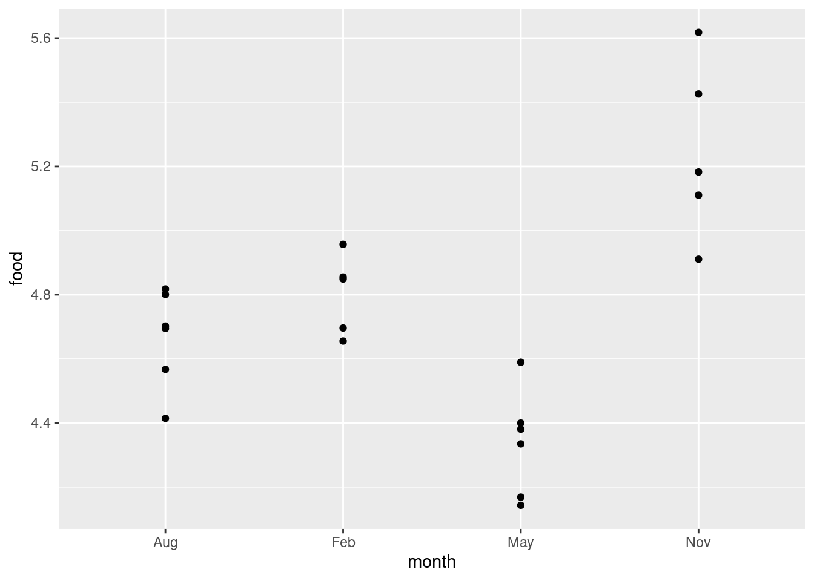

# Analysis of variance


```r
library(tidyverse)
```


##  Movie ratings and lengths


 Before a movie is shown in theatres, it
receives a "rating" that says what kind of material it
contains. [link](https://en.wikipedia.org/wiki/Motion_Picture_Association_of_America_film_rating_system)
explains the categories, from G (suitable for children) to R (anyone
under 17 must be accompanied by parent/guardian). In 2011, two
students collected data on the length (in minutes) and the rating
category, for 15 movies of each rating category, randomly chosen from
all the movies released that year. The data are at
[link](http://www.utsc.utoronto.ca/~butler/c32/movie-lengths.csv).


(a) Read the data into R, and display (some of) what you read in.


Solution


`read_csv`:

```r
my_url <- "http://www.utsc.utoronto.ca/~butler/c32/movie-lengths.csv"
movies <- read_csv(my_url)
```

```
## Parsed with column specification:
## cols(
##   length = col_double(),
##   rating = col_character()
## )
```

```r
movies
```

```
## # A tibble: 60 x 2
##    length rating
##     <dbl> <chr> 
##  1     25 G     
##  2     75 G     
##  3     88 G     
##  4     63 G     
##  5     76 G     
##  6     97 G     
##  7     68 G     
##  8     82 G     
##  9     98 G     
## 10     74 G     
## # … with 50 more rows
```

     

Something that looks like a length in minutes, and a rating.


(b) Count how many movies there are of each rating.


Solution


```r
movies %>% count(rating)
```

```
## # A tibble: 4 x 2
##   rating     n
##   <chr>  <int>
## 1 G         15
## 2 PG        15
## 3 PG-13     15
## 4 R         15
```

       

Fifteen of each rating. (It's common to have the same number of
observations in each group, but not necessary for a one-way ANOVA.)


(c) Carry out an ANOVA and a Tukey
analysis (if warranted).
  


Solution


ANOVA first:


```r
length.1 <- aov(length ~ rating, data = movies)
summary(length.1)
```

```
##             Df Sum Sq Mean Sq F value   Pr(>F)    
## rating       3  14624    4875   11.72 4.59e-06 ***
## Residuals   56  23295     416                     
## ---
## Signif. codes:  0 '***' 0.001 '**' 0.01 '*' 0.05 '.' 0.1 ' ' 1
```

 

This P-value is 0.00000459, which is way less than 0.05.

Having rejected the null (which said "all means equal"), we now need to
do Tukey, thus:


```r
TukeyHSD(length.1)
```

```
##   Tukey multiple comparisons of means
##     95% family-wise confidence level
## 
## Fit: aov(formula = length ~ rating, data = movies)
## 
## $rating
##                diff        lwr       upr     p adj
## PG-G      26.333333   6.613562 46.053104 0.0044541
## PG-13-G   42.800000  23.080229 62.519771 0.0000023
## R-G       30.600000  10.880229 50.319771 0.0007379
## PG-13-PG  16.466667  -3.253104 36.186438 0.1327466
## R-PG       4.266667 -15.453104 23.986438 0.9397550
## R-PG-13  -12.200000 -31.919771  7.519771 0.3660019
```

 

Cast your eye down the `p adj` column and look for the ones
that are significant, here the first three. These are all comparisons
with the G ("general") movies, which are shorter on average than the
others (which are not significantly different from each other).

If you like, you can make a table of means to verify that:


```r
movies %>%
  group_by(rating) %>%
  summarize(mean = mean(length))
```

```
## `summarise()` ungrouping output (override with `.groups` argument)
```

```
## # A tibble: 4 x 2
##   rating  mean
##   <chr>  <dbl>
## 1 G       80.6
## 2 PG     107. 
## 3 PG-13  123. 
## 4 R      111.
```

 

When we do this problem in SAS, you'll see the Tukey get handled a
different way, one that you might find more appealing.
  

(d) Make a graph to assess whether this ANOVA is
trustworthy. Discuss your graph and its implications briefly.


Solution


The obvious graph is a boxplot:

```r
ggplot(movies, aes(x = rating, y = length)) + geom_boxplot()
```


       

For ANOVA, we are looking for approximately normal distributions
within each group and approximately equal spreads. Without the
outliers, I would be more or less happy with that, but the G movies
have a low outlier that would pull the mean down and the PG and PG-13
movies have outliers that would pull the mean up. So a comparison of
means might make the differences look more significant than they
should. Having said that, you could also say that the ANOVA is
*very* significant, so even considering the effect of the
outliers, the differences between G and the others are still likely to
be significant. 

Extra: the way to go if you don't trust the ANOVA is (as for the
two-sample $t$) the Mood's median test. This applies to any number of
groups, and works in the same way as before:


```r
library(smmr)
median_test(movies, length, rating)
```

```
## $table
##        above
## group   above below
##   G         2    13
##   PG        7     7
##   PG-13    12     3
##   R         8     6
## 
## $test
##        what        value
## 1 statistic 13.752380952
## 2        df  3.000000000
## 3   P-value  0.003262334
```

 

Still significant, though not quite as small a P-value as before
(which echoes our thoughts about what the outliers might do to the
means). If you look at the table above the test results, you see that
the G movies are mostly shorter than the overall median, but now the
PG-13 movies are mostly *longer*. So the picture is a little
different. 

Mood's median test does not naturally come with something like Tukey.
What you can do is to do all the pairwise Mood's median tests, between
each pair of groups, and then adjust to allow for your having done
several tests at once. I thought this was generally useful enough that
I put it into `smmr` under the name `pairwise_median_test`:


```r
pairwise_median_test(movies, length, rating)
```

```
## # A tibble: 6 x 4
##   g1    g2      p_value adj_p_value
##   <chr> <chr>     <dbl>       <dbl>
## 1 G     PG    0.00799      0.0479  
## 2 G     PG-13 0.0000590    0.000354
## 3 G     R     0.0106       0.0635  
## 4 PG    PG-13 0.0106       0.0635  
## 5 PG    R     0.715        1       
## 6 PG-13 R     0.273        1
```

 

You can ignore those (adjusted) P-values rather stupidly bigger than
1. These are not significant.

There are two significant differences in median length: between G
movies and the two flavours of PG movies. The G movies are
significantly shorter (as you can tell from the boxplot), but the
difference between G and R movies is no longer significant (a change
from the regular ANOVA). 

You may be puzzled by something in the boxplot: how is it that the G
movies are significantly shorter than the PG movies, but not
significantly shorter than the R movies, \emph{when the difference in
medians between G and R movies is bigger}? In Tukey, if the
difference in means is bigger, the P-value is
smaller.
<label for="tufte-mn-" class="margin-toggle">&#8853;</label><input type="checkbox" id="tufte-mn-" class="margin-toggle"><span class="marginnote">Actually, this doesn't always work if the sample  sizes in each group are different. If you're comparing two small  groups, it takes a *very large* difference in means to get a  small P-value. But in this case the sample sizes are all the same.</span>
The resolution to this puzzle, such as it is, is that Mood's median
test is not directly comparing the medians of the groups (despite its
name); it's counting values above and below a *joint* median,
which might be a different story.


##  Deer and how much they eat


 Do adult deer eat different amounts of food at different
times of the year? The data in
[link](http://www.utsc.utoronto.ca/~butler/c32/deer.txt) are the weights
of food (in kilograms) consumed by randomly selected adult deer
observed at different times of the year (in February, May, August and
November). We will assume that these were different deer observed in
the different months. (If the same animals had been observed at
different times, we would have been in the domain of 
"repeated measures", which would require a different analysis, 
beyond the scope
of this course.)


(a) Read the data into R, and calculate numbers of observations
and the median amounts of food
eaten each month.
 
Solution


The usual stuff for data values separated by spaces:

```r
myurl <- "http://www.utsc.utoronto.ca/~butler/c32/deer.txt"
deer <- read_delim(myurl, " ")
```

```
## Parsed with column specification:
## cols(
##   month = col_character(),
##   food = col_double()
## )
```

     

and then, recalling that `n()` is the handy way of getting the
number of observations in each group:


```r
deer %>%
  group_by(month) %>%
  summarize(n = n(), med = median(food))
```

```
## `summarise()` ungrouping output (override with `.groups` argument)
```

```
## # A tibble: 4 x 3
##   month     n   med
##   <chr> <int> <dbl>
## 1 Aug       6  4.7 
## 2 Feb       5  4.8 
## 3 May       6  4.35
## 4 Nov       5  5.2
```

 

When you want the number of observations *plus* some other
summaries, as here, the group-by and summarize idea is the way, using
`n()` to get the number of observations in each
group. `count` counts the number of observations per group when
you *only* have grouping variables.

The medians differ a bit, but it's hard to judge without a sense of
spread, which the boxplots (next) provide. November is a bit higher
and May a bit lower.
 

(b) Make side-by-side boxplots of the amount of food eaten each
month. Comment briefly on what you see. 
 
Solution


```r
ggplot(deer, aes(x = month, y = food)) + geom_boxplot()
```


     

This offers the suggestion that maybe November will be significantly
higher than the rest and May significantly lower, or at least they
will be significantly different from each other.

This is perhaps getting ahead of the game: we should be thinking about
spread and shape. Bear in mind that there are only 5 or 6 observations
in each group, so you won't be able to say much about normality. In
any case, we are going to be doing a Mood's median test, so any lack
of normality doesn't matter (eg. perhaps that 4.4 observation in
August). Given the small sample sizes, I actually think the spreads
are quite similar.

Another way of looking at the data, especially with these small sample
sizes, is a "dot plot": instead of making a boxplot for each month,
we plot the actual points for each month as if we were making a
scatterplot:


```r
ggplot(deer, aes(x = month, y = food)) + geom_point()
```


 

Wait a minute. There were five deer in February and six in
August. Where did they go?

The problem is *overplotting*: more than one of the deer plotted
in the same place on the plot, because the amounts of food eaten were
only given to one decimal place and there were some duplicated values.
One way to solve this is to randomly
move the points around so that no two of them plot in the same
place. This is called *jittering*, and is done like this:


```r
ggplot(deer, aes(x = month, y = food)) + geom_jitter(width = 0, height = 0.05)
```



 

Now you see all the deer, and you can see that two pairs of points in
August and one pair of points in February are close enough on the
jittered plot that they would have been the same to one decimal place.

I wanted to
keep the points above the months they belong to, so I only allowed vertical
jitter (that's the `width` and `height` in the
`geom_jitter`; the width is zero so there is no horizontal
jittering). 
If you like, you can colour the
months; it's up to you whether you think that's making the plot easier
to read, or is overkill (see my point on the facetted plots on the
2017 midterm).

This way you see the whole distribution for each month. Normally it's
nicer to see the summary made by the boxplots, but here there are not
very many points. The value of 4.4 in August does look quite a bit
lower than the rest, but the other months look believably normal given
the small sample sizes. I don't know about equal spreads (November
looks more spread out), but normality looks believable. Maybe this is
the kind of situation in which Welch's ANOVA is a good idea. (If you
believe that the normality-with-unequal-spreads is a reasonable
assumption to make, then the Welch ANOVA will be more powerful than
the Mood's median test, and so should be preferred.)
 

(c) Run a Mood's median test as in lecture (ie.\ not using
`smmr`). What do you conclude, in the context of the data? 
 
Solution


To give you some practice with the mechanics, first find the
overall median:

```r
deer %>% summarize(med = median(food))
```

```
## # A tibble: 1 x 1
##     med
##   <dbl>
## 1   4.7
```

     

or


```r
median(deer$food)
```

```
## [1] 4.7
```

 

I like the first way because it's the same idea as we did before, just
not differentiating by month. I think there are some observations
exactly equal to the median, which will mess things up later:


```r
deer %>% filter(food == 4.7)
```

```
## # A tibble: 4 x 2
##   month  food
##   <chr> <dbl>
## 1 Feb     4.7
## 2 Feb     4.7
## 3 Aug     4.7
## 4 Aug     4.7
```

 

There are, two in February and two in August.

Next, make (and save) a table of the observations within each month
that are above and below this median:


```r
tab1 <- with(deer, table(month, food < 4.7))
tab1
```

```
##      
## month FALSE TRUE
##   Aug     4    2
##   Feb     5    0
##   May     0    6
##   Nov     5    0
```

 

or


```r
tab2 <- with(deer, table(month, food > 4.7))
tab2
```

```
##      
## month FALSE TRUE
##   Aug     4    2
##   Feb     2    3
##   May     6    0
##   Nov     0    5
```

 

Either of these is good, but note that they are different. Two of the
February observations (the ones that were exactly 4.7) have 
"switched sides", 
and (look carefully) two of the August ones also.  Hence the
test results will be different, and `smmr` (later) will give
different results again:


```r
chisq.test(tab1, correct = F)
```

```
## Warning in chisq.test(tab1, correct = F): Chi-squared approximation may be
## incorrect
```

```
## 
## 	Pearson's Chi-squared test
## 
## data:  tab1
## X-squared = 16.238, df = 3, p-value = 0.001013
```

```r
chisq.test(tab2, correct = F)
```

```
## Warning in chisq.test(tab2, correct = F): Chi-squared approximation may be
## incorrect
```

```
## 
## 	Pearson's Chi-squared test
## 
## data:  tab2
## X-squared = 11.782, df = 3, p-value = 0.008168
```

 

The warnings are because of the small frequencies. If you've done
these by hand before (which you will have if you took PSYC08), you'll
remember that thing about "expected frequencies less than 5". This
is that. It means "don't take those P-values *too* seriously."

The P-values are different, but they are both clearly significant, so the
median amounts of food eaten in the different months are not all the
same. (This is the same "there are differences" that you get from an
ANOVA, which you would follow up with Tukey.) Despite the injunction
not to take the P-values too seriously, I think these are small enough
that they could be off by a bit without affecting the conclusion.

The first table came out with a smaller P-value because it looked more
extreme: all of the February measurements were taken as higher than
the overall median (since we were counting "strictly less" and 
"the rest"). In the second table, the February measurements look more
evenly split, so the overall P-value is not quite so small.

You can make a guess as to what `smmr` will come out with
(next), since it throws away any data values exactly equal to the median.
 

(d) Run a Mood's median test using `smmr`, and compare the
results with the previous part.
 
Solution


Off we go:

```r
library(smmr)
median_test(deer, food, month)
```

```
## $table
##      above
## group above below
##   Aug     2     2
##   Feb     3     0
##   May     0     6
##   Nov     5     0
## 
## $test
##        what        value
## 1 statistic 13.950000000
## 2        df  3.000000000
## 3   P-value  0.002974007
```

     

The P-value came out in between the other two, but the conclusion is
the same all three ways: the months are not all the same in terms of
median food eaten. The researchers can then go ahead and try to figure
out *why* the animals eat different amounts in the different months.

You might be wondering how you could get rid of the equal-to-median
values in the build-it-yourself way. This is `filter` from
`dplyr`, which you use first:


```r
deer2 <- deer %>% filter(food != 4.7)
tab3 <- with(deer2, table(month, food < 4.7))
tab3
```

```
##      
## month FALSE TRUE
##   Aug     2    2
##   Feb     3    0
##   May     0    6
##   Nov     5    0
```

```r
chisq.test(tab3)
```

```
## Warning in chisq.test(tab3): Chi-squared approximation may be incorrect
```

```
## 
## 	Pearson's Chi-squared test
## 
## data:  tab3
## X-squared = 13.95, df = 3, p-value = 0.002974
```

 

which is exactly what `smmr` does, so the answer is
identical.
<label for="tufte-mn-" class="margin-toggle">&#8853;</label><input type="checkbox" id="tufte-mn-" class="margin-toggle"><span class="marginnote">The computer scientists among you will note that I  should not use equals or not-equals to compare a decimal  floating-point number, since decimal numbers are not represented exactly in the computer. R, however, is ahead of us here, since when you try to do food not equal to 4.7, it tests whether food is more than a small distance away from 4.7, which is the right way to do it. In R, therefore, code like my *food !=  4.7* does exactly what I want, but in something like C, it *does not*, and you have to be more careful: *abs(food-4.7)>1e-8*, or something like that. The small number *1e-8* is typically equal to **machine epsilon**, the smallest number on a computer that is distinguishable from zero.</span>
How would an ANOVA come out here? My guess is, very similarly:


```r
deer.1 <- aov(food ~ month, data = deer)
summary(deer.1)
```

```
##             Df Sum Sq Mean Sq F value   Pr(>F)    
## month        3 2.3065  0.7688   22.08 2.94e-06 ***
## Residuals   18 0.6267  0.0348                     
## ---
## Signif. codes:  0 '***' 0.001 '**' 0.01 '*' 0.05 '.' 0.1 ' ' 1
```

```r
TukeyHSD(deer.1)
```

```
##   Tukey multiple comparisons of means
##     95% family-wise confidence level
## 
## Fit: aov(formula = food ~ month, data = deer)
## 
## $month
##               diff         lwr        upr     p adj
## Feb-Aug  0.1533333 -0.16599282  0.4726595 0.5405724
## May-Aug -0.3333333 -0.63779887 -0.0288678 0.0290758
## Nov-Aug  0.5733333  0.25400718  0.8926595 0.0004209
## May-Feb -0.4866667 -0.80599282 -0.1673405 0.0021859
## Nov-Feb  0.4200000  0.08647471  0.7535253 0.0109631
## Nov-May  0.9066667  0.58734052  1.2259928 0.0000013
```

 

The conclusion is the same, but the P-value on the $F$-test is much
smaller. I think this is because the $F$-test uses the actual values,
rather than just whether they are bigger or smaller than 4.7. The
Tukey says that all the months are different in terms of (now) mean,
except for February and August, which were those two very similar ones
on the boxplot.
 


(e) How is it that Mood's median test does not completely answer the
question you really want to answer? How might you get an answer to the
question you *really* want answered? Explain briefly, and obtain
the answer you *really* want, discussing your results briefly.


Solution


That's rather a lot, so let's take those things one at a
time.
<label for="tufte-mn-" class="margin-toggle">&#8853;</label><input type="checkbox" id="tufte-mn-" class="margin-toggle"><span class="marginnote">Most of these parts are old from assignment questions that I actually asked a previous class to do, but not this part. I added it later.</span>

Mood's median test is really like the $F$-test in ANOVA: it's testing
the null hypothesis
that the groups (months) all have the same median (of food eaten),
against the alternative that the null is not true. We rejected this
null, but we don't know which months differ significantly from
which. To resolve this in ANOVA, we do Tukey (or Games-Howell if we
did the Welch ANOVA). The corresponding thing here is to do all the
possible two-group Mood tests on all the pairs of groups, and, after
adjusting for doing (here) six tests at once, look at the adjusted
P-values to see how the months differ in terms of food eaten.

This is accomplished in `smmr` via `pairwise_median_test`,
thus: 


```r
pairwise_median_test(deer, food, month)
```

```
## # A tibble: 6 x 4
##   g1    g2    p_value adj_p_value
##   <chr> <chr>   <dbl>       <dbl>
## 1 Aug   Feb   0.147       0.884  
## 2 Aug   May   0.0209      0.126  
## 3 Aug   Nov   0.00270     0.0162 
## 4 Feb   May   0.00157     0.00939
## 5 Feb   Nov   0.0578      0.347  
## 6 May   Nov   0.00157     0.00939
```

 

This compares each month with each other month. Looking at the last
column, there are only three significant differences: August-November,
February-May and May-November. Going back to the table of medians we
made in (a), November is significantly higher (in terms of median food
eaten) than August and May (but not February), and February is
significantly higher than May. The other differences are not big
enough to be significant.

Extra: Pairwise median tests done this way are not likely to be very
sensitive (that is, powerful), for a couple of reasons: (i) the usual
one that the median tests don't use the data very efficiently, and
(ii) the way I go from the unadjusted to the adjusted P-values is via
Bonferroni (here, multiply the P-values by 6), which is known to be
safe but conservative. This is why the Tukey produced more significant
differences among the months than the pairwise median tests did.


##  Movie ratings again


 This question again uses the movie rating data at
[link](http://www.utsc.utoronto.ca/~butler/c32/movie-lengths.csv).


(a) Read the data into R and obtain the number of movies of
each rating and the *median* length of movies of each rating.


Solution


Reading in is as in the other question using these data (just copy
your code, or mine). No credit for that, since you've done it before.

```r
my_url <- "http://www.utsc.utoronto.ca/~butler/c32/movie-lengths.csv"
movies <- read_csv(my_url)
```

```
## Parsed with column specification:
## cols(
##   length = col_double(),
##   rating = col_character()
## )
```

```r
movies
```

```
## # A tibble: 60 x 2
##    length rating
##     <dbl> <chr> 
##  1     25 G     
##  2     75 G     
##  3     88 G     
##  4     63 G     
##  5     76 G     
##  6     97 G     
##  7     68 G     
##  8     82 G     
##  9     98 G     
## 10     74 G     
## # … with 50 more rows
```

 

Now, the actual for-credit part, which is a `group_by` and
`summarize`: 


```r
movies %>%
  group_by(rating) %>%
  summarize(count = n(), med = median(length))
```

```
## `summarise()` ungrouping output (override with `.groups` argument)
```

```
## # A tibble: 4 x 3
##   rating count   med
##   <chr>  <int> <dbl>
## 1 G         15    82
## 2 PG        15   100
## 3 PG-13     15   117
## 4 R         15   103
```

 

The G movies have a smaller median than the others, but also the PG-13
movies seem to be longer on average (not what we found before). 
    


(b) Obtain a suitable graph that assesses the assumptions for
ANOVA. Why do you think it is not reasonable to run ANOVA here? Explain
briefly. 


Solution


The graph would seem to be a boxplot, side by side for each group:

```r
ggplot(movies, aes(x = rating, y = length)) + geom_boxplot()
```


     

We are looking for approximate normal distributions with approximately
equal spreads, which I don't think we have: there are outliers, at the
low end for G movies, and at the high end for PG and PG-13
movies. Also, you might observe that the distribution of lengths for R
movies is skewed to the right. (Noting either the outliers or skewness
as a reason for not believing normality is enough, since all we need
is *one* way that normality fails.)

I think the spreads (as measured by the interquartile ranges) are
acceptably similar, but since we have rejected normality, it is a bit
late for that.

So I think it is far from reasonable to run an ANOVA here. In my
opinion 15 observations in each group is not enough to gain much from
the Central Limit Theorem either.

Extra: since part of the assumption for ANOVA is (approximate)
normality, it would also be entirely reasonable to make normal
quantile plots, one for each movie type, facetted. Remember the
process: you pretend that you are making a normal quantile plot for
all the data together, regardless of group, and then at the last
minute, you throw in a `facet_wrap`. I've written the code out
on three lines, so that you can see the pieces: the "what to plot",
then the normal quantile plot part, then the facetting:


```r
ggplot(movies, aes(sample = length)) +
  stat_qq() + stat_qq_line() +
  facet_wrap(~rating)
```


 

Since there are four movie ratings, `facet_wrap` has arranged
them into a $2\times 2$ grid, which satisfyingly means that each
normal quantile plot is more or less square and thus easy to
interpret. 

The principal problem unveiled by these plots is outliers. It looks as
if the G movies have one low outlier, the PG movies have two high
outliers, the PG-13 movies have one or maybe three high outliers
(depending on how you count them), and the R movies have none. Another
way to look at the last two is you could call them curved, with too
much bunching up at the bottom and (on PG-13) too much spread-out-ness
at the top, indicating right-skewed distributions. The distribution
of lengths of the R-rated movies is too bunched up at the bottom, but
as you would expect for a normal at the top. The R movies show the
right-skewedness in an odd way: usually this skewness shows up by
having too many high values, but this time it's having too *few*
*low* values.

The assumption for ANOVA is that all four of these are at least
approximately normal (with the same spread). We found problems with
the normality on at least three of them, so we definitely have doubts
about trusting ANOVA here.

I could have used `scales=free` here to get a separate $y$-axis
for each plot, but since the $y$-axis is movie length each time, and
all four groups would be expected to have at least roughly similar
movie lengths, I left it as it was. (The other advantage of leaving
the scales the same is that you can compare spread by comparing the
slopes of the lines on these graphs; since the lines connect the
observed and theoretical quartiles, a steeper slope means a larger
IQR. Here, the R line is steepest and the PG line is flattest. Compare
this with the spreads of the boxplots.)

Extra extra: if you want, you can compare the normal quantile plots
with the boxplots to see whether you get the same conclusion from
both. For the G movies, the low outlier shows up both ways, and the
rest of the distribution is at least more or less normal. For the PG
movies, I'd say the distribution is basically normal except for the
highest two values (on both plots). For the PG-13 movies, only the
highest value shows up as an outlier, but the next two apparent
outliers on the normal quantile plot are at the  upper end of the long
upper whisker, so the boxplot is saying "right-skewed with one upper outlier" rather than "three upper outliers". The distribution of
the R movies is skewed right, with the bunching at the bottom showing
up as the very small lower whisker.

The boxplots and the normal quantile plots are basically telling the
same story in each case, but they are doing it in a slightly different
way. 
    


(c) Run a Mood's median test (use `smmr` if you
like). What do you conclude, in the context of the data?


Solution


The smart way is to use `smmr`, since it is much easier:

```r
library(smmr)
median_test(movies, length, rating)
```

```
## $table
##        above
## group   above below
##   G         2    13
##   PG        7     7
##   PG-13    12     3
##   R         8     6
## 
## $test
##        what        value
## 1 statistic 13.752380952
## 2        df  3.000000000
## 3   P-value  0.003262334
```

     

The movies do not all have the same median length, or at least one of
the rating types has movies of different median length from the
others. Or something equivalent to that. It's the same conclusion as
for ANOVA, only with medians instead of means.

You can speculate about why the test came out significant. 
My guess is that the G movies are shorter than
average, and that the PG-13 movies are longer than average. (We had
the first conclusion before, but not the second. This is where medians
are different from means.)

The easiest way to see which movie types really differ in length from
which is to do all the pairwise median tests, which is in
`smmr` thus:


```r
pairwise_median_test(movies, length, rating)
```

```
## # A tibble: 6 x 4
##   g1    g2      p_value adj_p_value
##   <chr> <chr>     <dbl>       <dbl>
## 1 G     PG    0.00799      0.0479  
## 2 G     PG-13 0.0000590    0.000354
## 3 G     R     0.0106       0.0635  
## 4 PG    PG-13 0.0106       0.0635  
## 5 PG    R     0.715        1       
## 6 PG-13 R     0.273        1
```

 

The inputs for this are the same ones in the same order as for
`median_test`. (A design decision on my part, since otherwise
*I* would never have been able to remember how to run these!)
Only the first two of these are significant (look in the last
column). We can remind ourselves of the sample medians:


```r
movies %>%
  group_by(rating) %>%
  summarize(count = n(), med = median(length))
```

```
## `summarise()` ungrouping output (override with `.groups` argument)
```

```
## # A tibble: 4 x 3
##   rating count   med
##   <chr>  <int> <dbl>
## 1 G         15    82
## 2 PG        15   100
## 3 PG-13     15   117
## 4 R         15   103
```

 

The G movies are significantly shorter than the PG and PG-13 movies,
but not quite significantly different from the R movies. This is a
little odd, since the difference in sample medians between G and PG,
significant, is *less* than for G and R (not significant).
There are several Extras here, which you can skip if you don't care
about the background. First, we can do the median test by hand:
This has about four steps: (i) find the median of all the data, (ii) make a
table tabulating the number of values above and below the overall
median for each group, (iii) test the table for association, (iv)
draw a conclusion.
Thus (i):

```r
median(movies$length)
```

```
## [1] 100
```

  

or


```r
movies %>% summarize(med = median(length))
```

```
## # A tibble: 1 x 1
##     med
##   <dbl>
## 1   100
```

 

or store it in a variable,
and then (ii):


```r
tab1 <- with(movies, table(length < 100, rating))
tab1
```

```
##        rating
##          G PG PG-13  R
##   FALSE  2  8    12  9
##   TRUE  13  7     3  6
```

 

or


```r
tab2 <- with(movies, table(length > 100, rating))
tab2
```

```
##        rating
##          G PG PG-13  R
##   FALSE 13  8     3  7
##   TRUE   2  7    12  8
```

 

These differ because there are evidently some movies of length exactly
100 minutes, and it matters whether you count $<$ and $\ge$ (as in
`tab1`) or $>$ and $le$ (`tab2`). Either is good. 

Was I right about movies of length exactly 100 minutes?


```r
movies %>% filter(length == 100)
```

```
## # A tibble: 2 x 2
##   length rating
##    <dbl> <chr> 
## 1    100 PG    
## 2    100 R
```

 

One PG and one R. It makes a difference to the R movies, but if you
look carefully, it makes a difference to the PG movies as well,
because the False and True switch roles between `tab1` and
`tab2` (compare the G movies, for instance).
You
need to store your table in a variable because it has to get passed on
to `chisq.test` below, (iii):


```r
chisq.test(tab1, correct = F)
```

```
## 
## 	Pearson's Chi-squared test
## 
## data:  tab1
## X-squared = 14.082, df = 3, p-value = 0.002795
```

 

or 


```r
chisq.test(tab2, correct = F)
```

```
## 
## 	Pearson's Chi-squared test
## 
## data:  tab2
## X-squared = 13.548, df = 3, p-value = 0.003589
```

 

Either is correct, or, actually, without the `correct=F`.
<label for="tufte-mn-" class="margin-toggle">&#8853;</label><input type="checkbox" id="tufte-mn-" class="margin-toggle"><span class="marginnote">see discussion elsewhere about Yates' Correction and fixed margins.</span>

The conclusion (iv) is the same either way: the null of no association
is clearly rejected (with a P-value of 0.0028 or 0.0036 as
appropriate), and therefore whether a movie is longer or shorter than
median length depends on what rating it has: that is, the median
lengths do differ among the ratings. The same conclusion, in other
words, as the $F$-test gave, though with not quite such a small
P-value. 

Second, you might be curious about how
we might do something like Tukey having found some significant
differences (that is, what's lurking in the background of
`pairwise_median_test`). 

Let's first suppose we are comparing G and PG movies. We need
to pull out just those, and then compare them using
`smmr`. Because the first input to `median_test` is a
data frame, it fits neatly into a pipe (with the data frame omitted):


```r
movies %>%
  filter(rating == "G" | rating == "PG") %>%
  median_test(length, rating)
```

```
## $table
##      above
## group above below
##    G      4    11
##    PG    10     3
## 
## $test
##        what       value
## 1 statistic 7.035897436
## 2        df 1.000000000
## 3   P-value 0.007989183
```

 

We're going to be doing this about six times --- ${4 \choose 2}=6$ choices
of two rating groups to compare out of the four --- so we should have a
function to do it. I think the input to the function should be a data
frame that has a column called `rating`, and two names of
ratings to compare:


```r
comp2 <- function(rat_1, rat_2, d) {
  d %>%
    filter(rating == rat_1 | rating == rat_2) %>%
    median_test(length, rating)
}
```

 

The way I wrote this function is that you have to specify the movie
ratings in quotes. It is *possible* to write it in such a way
that you input them without quotes, `tidyverse` style, but that
gets into "non-standard evaluation" and `enquo()` and
`!!`, which (i) I have to look up every time I want to do it,
and (ii) I am feeling that the effort involved in explaining it to you
is going to exceed the benefit you will gain from it. I mastered it enough
to make it work in `smmr` (note that you specify column names
without quotes there). There are tutorials on this kind of thing if
you're interested.

Anyway, testing:


```r
comp2("G", "PG", movies)
```

```
## $table
##      above
## group above below
##    G      4    11
##    PG    10     3
## 
## $test
##        what       value
## 1 statistic 7.035897436
## 2        df 1.000000000
## 3   P-value 0.007989183
```

 

That works, but I really only want to pick out the P-value, which is
in the list item `test` in the column `value`, the third
entry. So let's rewrite the function to return just that:


```r
comp2 <- function(rat_1, rat_2, d) {
  d %>%
    filter(rating == rat_1 | rating == rat_2) %>%
    median_test(length, rating) %>%
    pluck("test", "value", 3)
}
comp2("G", "PG", movies)
```

```
## [1] 0.007989183
```

 

Gosh.

What `median_test` returns is an R `list` that has two
things in it, one called `table` and one called
`test`. The thing  called `test` is a data frame with a
column called `value` that contains the P-values. The third of
these is the two-sided P-value that we want.

You might not have seen `pluck` before. This is a way of
getting things out of complicated data structures. This one takes the
output from `median_test` and from it grabs the piece called
`test`. This is a data frame. Next, we want the column called
`value`, and from that we want the third row. These are
specified one after the other to `pluck` and it pulls out the
right thing.

So now our function returns just the P-value.

I have to say that it took me several goes and some playing around in
R Studio to sort this one out. Once I thought I understood
`pluck`, I wondered why my function was not returning a
value. And then I realized that I was saving the value inside the
function and not returning it. Ooops. The nice thing about
`pluck` is that I can put it on the end of the pipeline and and
it will pull out (and return) whatever I want it to.

Let's grab a hold of the different rating groups we have:

```r
the_ratings <- unique(movies$rating)
the_ratings
```

```
## [1] "G"     "PG-13" "PG"    "R"
```

 

The Pythonisti among you will know how to finish this off: do a
loop-inside-a-loop over the rating groups, and get the P-value for
each pair. You can do that in R, if you must. It's not pretty at all,
but it works:


```r
ii <- character(0)
jj <- character(0)
pp <- numeric(0)
for (i in the_ratings) {
  for (j in the_ratings) {
    pval <- comp2(i, j, movies)
    ii <- c(ii, i)
    jj <- c(jj, j)
    pp <- c(pp, pval)
  }
}
tibble(ii, jj, pp)
```

```
## # A tibble: 16 x 3
##    ii    jj           pp
##    <chr> <chr>     <dbl>
##  1 G     G     1        
##  2 G     PG-13 0.0000590
##  3 G     PG    0.00799  
##  4 G     R     0.0106   
##  5 PG-13 G     0.0000590
##  6 PG-13 PG-13 1        
##  7 PG-13 PG    0.0106   
##  8 PG-13 R     0.273    
##  9 PG    G     0.00799  
## 10 PG    PG-13 0.0106   
## 11 PG    PG    1        
## 12 PG    R     0.715    
## 13 R     G     0.0106   
## 14 R     PG-13 0.273    
## 15 R     PG    0.715    
## 16 R     R     1
```

 

This is a lot of fiddling about, since you have to initialize three
vectors, and then update them every time through the loop. It's hard
to read, because the actual business part of the loop is the
calculation of the P-value, and that's almost hidden by all the
book-keeping.  (It's also slow and inefficient, though the slowness
doesn't matter too much here since it's not a very big problem.)

Let's try another way:


```r
crossing(first = the_ratings, second = the_ratings)
```

```
## # A tibble: 16 x 2
##    first second
##    <chr> <chr> 
##  1 G     G     
##  2 G     PG    
##  3 G     PG-13 
##  4 G     R     
##  5 PG    G     
##  6 PG    PG    
##  7 PG    PG-13 
##  8 PG    R     
##  9 PG-13 G     
## 10 PG-13 PG    
## 11 PG-13 PG-13 
## 12 PG-13 R     
## 13 R     G     
## 14 R     PG    
## 15 R     PG-13 
## 16 R     R
```


This does "all possible combinations" of one rating with another. We
don't actually need all of that; we just need the ones where the first
one is (alphabetically) strictly less than the second one. This is
because we're never comparing a rating with itself, and each pair of
ratings appears twice, once in alphabetical order, and once the other
way around. The ones we need are these:


```r
crossing(first = the_ratings, second = the_ratings) %>%
  filter(first < second)
```

```
## # A tibble: 6 x 2
##   first second
##   <chr> <chr> 
## 1 G     PG    
## 2 G     PG-13 
## 3 G     R     
## 4 PG    PG-13 
## 5 PG    R     
## 6 PG-13 R
```

 

A technique thing to note: instead of asking 
"how do I pick out the distinct pairs of ratings?", 
I use two simpler tools: first I make
all the combinations of pairs of ratings, and then out of those, pick
the ones that are alphabetically in ascending order, which we know how
to do.

Now we want to call our function `comp2` for each of the things
in `first` *and* each of the things in `second`,
and make a new column called `pval` that contains exactly
that. This (coming fresh from page 332 of the R book, this being the
first time I've ever used it)
<label for="tufte-mn-" class="margin-toggle">&#8853;</label><input type="checkbox" id="tufte-mn-" class="margin-toggle"><span class="marginnote">This was a year ago when I first  wrote this.} is exactly what the texttt{map2</span> family of functions
does. In our case, `comp2` returns a decimal number, a
`dbl`, so `map2_dbl` does it.  Thus:

```r
crossing(first = the_ratings, second = the_ratings) %>%
  filter(first < second) %>%
  mutate(pval = map2_dbl(first, second, ~ comp2(.x, .y, movies)))
```

```
## # A tibble: 6 x 3
##   first second      pval
##   <chr> <chr>      <dbl>
## 1 G     PG     0.00799  
## 2 G     PG-13  0.0000590
## 3 G     R      0.0106   
## 4 PG    PG-13  0.0106   
## 5 PG    R      0.715    
## 6 PG-13 R      0.273
```

 

The logic of `map2_dbl` is 
"for each of the things in `first`, and each of the things in `second`, taken in parallel, call the function `comp2` with those two inputs in that order, always with data frame `movies`". 
The `.x`
and `.y` play the role of the `.` that we usually have
inside a map, but now we're "mapping" over two things rather than
just one, so that they cannot both be called `.`.

One more thing: we're doing 6 tests at once here, so we're giving
ourselves 6 chances to reject a null (all medians equal) that might
have been true. So the true probability of a type I error is no longer
0.05 but something bigger. 

The easiest way around that is to do a so-called Bonferroni
adjustment: instead of rejecting if the P-value is less than 0.05, we
only reject if it is less than $0.05/6$, since we are doing 6
tests. This is a fiddly calculation to do by hand, but it's easy to
build in another `mutate`, thus:
<label for="tufte-mn-" class="margin-toggle">&#8853;</label><input type="checkbox" id="tufte-mn-" class="margin-toggle"><span class="marginnote">In the pairwise median  test in *smmr*, I did this backwards: rather than changing the alpha that you compare each P-value with from 0.05 to 0.05/6, I  flip it around so that you adjust the P-values by *multiplying*  them by 6, and then comparing the adjusted P-values with the usual  0.05. It comes to the same place in the end, except that this way  you can get adjusted P-values that are greater than 1, which makes no sense. You read those as being definitely not significant.</span>

```r
crossing(first = the_ratings, second = the_ratings) %>%
  filter(first < second) %>%
  mutate(pval = map2_dbl(first, second, ~ comp2(.x, .y, movies))) %>%
  mutate(reject = pval < 0.05 / 6)
```

```
## # A tibble: 6 x 4
##   first second      pval reject
##   <chr> <chr>      <dbl> <lgl> 
## 1 G     PG     0.00799   TRUE  
## 2 G     PG-13  0.0000590 TRUE  
## 3 G     R      0.0106    FALSE 
## 4 PG    PG-13  0.0106    FALSE 
## 5 PG    R      0.715     FALSE 
## 6 PG-13 R      0.273     FALSE
```

 

And not a loop in sight.

This is how I coded it in `pairwise_median_test`. If you want to
check it, it's on Github:
[link](https://raw.githubusercontent.com/nxskok/smmr/master/R/pairwise_median_test.R). 
The function `median_test_pair` is the same as `comp2`
above. 

So the only significant differences are now G compared to PG and
PG-13. There is not a significant difference in median movie length
between G and R, though it is a close call. We thought the PG-13
movies might have a significantly different median from other rating
groups beyond G, but they turn out not to have. (The third and fourth
comparisons would have been significant had we not made the Bonferroni
adjustment to compensate for doing six tests at once; with that
adjustment, we only reject if the P-value is less than
$0.05/6=0.0083$, and so 0.0106 is not quite small enough to reject
with.) 

Listing the rating groups sorted by median would give you an idea of
how far different the medians have to be to be significantly different:


```r
medians <- movies %>%
  group_by(rating) %>%
  summarize(med = median(length)) %>%
  arrange(desc(med))
```

```
## `summarise()` ungrouping output (override with `.groups` argument)
```

```r
medians
```

```
## # A tibble: 4 x 2
##   rating   med
##   <chr>  <dbl>
## 1 PG-13    117
## 2 R        103
## 3 PG       100
## 4 G         82
```

 

Something rather interesting has happened: even though the comparison of
G and PG (18 apart) is significant, the comparison of G and R (21
apart) is not significant. This seems very odd, but it happens because
the Mood median test is not actually literally comparing the sample
medians, but only assessing the splits of values above and below the
median of the combined sample. A subtlety, rather than an error, I'd say.

Here's something extremely flashy to finish with:


```r
crossing(first = the_ratings, second = the_ratings) %>%
  filter(first < second) %>%
  mutate(pval = map2_dbl(first, second, ~ comp2(.x, .y, movies))) %>%
  mutate(reject = pval < 0.05 / 6) %>%
  left_join(medians, by = c("first" = "rating")) %>%
  left_join(medians, by = c("second" = "rating"))
```

```
## # A tibble: 6 x 6
##   first second      pval reject med.x med.y
##   <chr> <chr>      <dbl> <lgl>  <dbl> <dbl>
## 1 G     PG     0.00799   TRUE      82   100
## 2 G     PG-13  0.0000590 TRUE      82   117
## 3 G     R      0.0106    FALSE     82   103
## 4 PG    PG-13  0.0106    FALSE    100   117
## 5 PG    R      0.715     FALSE    100   103
## 6 PG-13 R      0.273     FALSE    117   103
```

 

The additional two lines look up the medians of the rating groups in
`first`, then `second`, so that you can see the actual
medians of the groups being compared each time. You see that medians
different by 30 are definitely different, ones differing by 15 or less
are definitely not different, and ones differing by about 20 could go
either way.

I think that's *quite* enough of that.
    


##  Atomic weight of carbon


 The atomic weight of the chemical element
carbon is 12. Two methods of measuring the atomic weight of samples of
carbon were compared. The results are shown in
[link](http://www.utsc.utoronto.ca/~butler/c32/carbon.txt). The methods
are labelled 1 and 2.  The first task is to find out whether the two
methods have different "typical" measures (mean or median, as
appropriate) of the atomic weight of carbon.

For this question, compose a report in R Markdown.  (R Markdown is
what you use in an R Notebook, but you can also have a separate R
Markdown document from which you can produce HTML, Word etc. output.)
See part (a) for how to get this started.

Your report should
read like an actual report, not just the answers to some questions
that I set you. To help with that, write some text that links the
parts of the report together smoothly, so that it reads as a coherent
whole. The grader had 3 discretionary marks to award for the overall
quality of your writing. The scale for this was:


* 3 points: excellent writing. The report flows smoothly, is easy
to read, and contains everything it should (and nothing it
shouldn't).

* 2 points: satisfactory writing. Not the easiest to read, but
says what it should, and it looks at least somewhat like a report
rather than a string of answers to questions.

* 1 point: writing that is hard to read or to understand. If you
get this (or 0), you should consider what you need to do to improve
when you write your project.

* 0 points: you answered the questions, but you did almost nothing
to make it read like a report.


(a) Create a new R Markdown document. To do this, in R Studio, select File,
New File, R Markdown. Type the report title and your name in the
boxes, and leave the output on the default HTML. Click OK. 

Solution


You'll
see the title and your name in a section at the top of the document,
and below that you'll see a template document, as you would for an R
Notebook. The difference is that where you are used to seeing
Preview, it now says "knit", but this has the same effect of
producing the formatted version of your report.    


(b) Write an introduction that explains the purpose of this
study and the data collected in your own words.


Solution


Something like this:

> This study is intended to compare two different methods
> (labelled 1 and 2) for measuring the atomic weight of carbon
> (which is known in actual fact to be 12). Fifteen samples of
> carbon were used; ten of these were assessed using method 1 and
> the remaining five using method 2. The primary interest in this
> particular study is to see whether there is a difference in the
> mean or median atomic weight as measured by the two methods.

Before that, start a new section like this:
`## Introduction`. 
Also, get used to expressing your understanding in your words,
not mine. (Using my words, in my courses, is likely to be
worth very little.)


(c) Begin an appropriately-titled new section in your report,
read the data into R and display the results.


Solution


Values separated by spaces:

```r
my_url <- "http://www.utsc.utoronto.ca/~butler/c32/carbon.txt"
carbon <- read_delim(my_url, " ")
```

```
## Parsed with column specification:
## cols(
##   method = col_double(),
##   weight = col_double()
## )
```

```r
carbon
```

```
## # A tibble: 15 x 2
##    method weight
##     <dbl>  <dbl>
##  1      1   12.0
##  2      1   12.0
##  3      1   12.0
##  4      1   12.0
##  5      1   12.0
##  6      1   12.0
##  7      1   12.0
##  8      1   12.0
##  9      1   12.0
## 10      1   12.0
## 11      2   12.0
## 12      2   12.0
## 13      2   12.0
## 14      2   12.0
## 15      2   12.0
```

     

I would expect you to include, without being told to include it, some
text in your report indicating that you have sensible data: two
methods labelled 1 and 2 as promised, and a bunch
<label for="tufte-mn-" class="margin-toggle">&#8853;</label><input type="checkbox" id="tufte-mn-" class="margin-toggle"><span class="marginnote">It's  probably better in a report to use language a bit more formal than  *a bunch*. Something like *a number* would be better.</span> 
of atomic
weights close to the nominal figure of 12.


(d) Make an appropriate plot to compare the measurements
obtained by the two methods. You might need to do something about
the two methods being given as numbers even though they are really
only identifiers. (If you do, your report ought to say what you did
and why.)


Solution


The appropriate plot, with a categorical method and quantitative
weight, is something like a boxplot. If you're not careful,
`method` will get treated as a quantitative variable,
which you don't want; the easiest way around that, for a boxplot
at least, is to turn it into a factor like this:

```r
ggplot(carbon, aes(x = factor(method), y = weight)) + geom_boxplot()
```


       

If you insist, you could do a faceted histogram (above and below, for preference):

```r
ggplot(carbon, aes(x = weight)) + geom_histogram(bins = 5) +
  facet_wrap(~method, ncol = 1)
```


 

There are really not enough data values for a histogram to be of much
help, so I don't like this as much. 

If you are thinking ahead (we are going to be doing a $t$-test), then
you'll realize that normality is the kind of thing we're looking for,
in which case normal quantile plots would be the thing. However, we
might have to be rather forgiving for method 2 since there are only 5
observations: 


```r
ggplot(carbon, aes(sample = weight)) +
  stat_qq() + stat_qq_line() +
  facet_wrap(~method)
```


 

I don't mind these coming out side by side, though I would rather have
them squarer.

I would say, boxplots are the best, normal quantile plots are also
acceptable, but expect to lose something for histograms because they
offer only a rather crude comparison in this case.


(e) Comment briefly on what you see in your plot.


Solution


In boxplots, if that's what you drew, there are several things
that deserve comment: the medians, the spreads and the
shapes. The median for method 1 is a little bit lower than for
method 2 (the means are probably more different, given the
shapes of the boxes). The spread for method 2 is a lot
bigger. (Looking forward, that suggests a Welch-Satterthwaite
rather than a pooled test.) As for shape, the method 2
measurements seem more or less symmetric (the whiskers are equal
anyway, even if the position of the median in the box isn't),
but the method 1 measurements have a low outlier.
The histograms are hard to compare. Try to say something about
centre and spread and shape. I think the method 2 histogram has
a slightly higher centre and definitely bigger spread. On my
histogram for method 1, the distribution looks skewed left.
If you did normal quantile plots, say something sensible about
normality for each of the two methods. For method 1, I would say
the low value is an outlier and the rest of the values look
pretty straight. Up to you whether you think there is a curve on
the plot (which would indicate skewness, but then that highest
value is too high: it would be bunched up with the other values
below 12.01 if there were really skewness). 
For method 2, it's really hard to say anything since there are
only five values. Given where the line goes, there isn't much
you can say to doubt normality.  Perhaps the best you can say
here is that in a sample of size 5, it's difficult to assess
normality at all.


(f) Carry out the most appropriate $t$-test. (You might like to
begin another new section in your report here.)


Solution


This would be the Welch-Satterthwaite version of the two-sample
$t$-test, since the two groups do appear to have different spreads:

```r
t.test(weight ~ method, data = carbon)
```

```
## 
## 	Welch Two Sample t-test
## 
## data:  weight by method
## t = -1.817, df = 5.4808, p-value = 0.1238
## alternative hypothesis: true difference in means is not equal to 0
## 95 percent confidence interval:
##  -0.027777288  0.004417288
## sample estimates:
## mean in group 1 mean in group 2 
##        12.00260        12.01428
```

   

Imagining that this is a report that would go to your boss, you ought
to defend your choice of the Welch-Satterthwaite test (as I did
above), and not just do the default $t$-test without comment.

If, in your discussion above, you thought the spreads were equal
enough, then you should do the pooled $t$-test here, which goes like this:


```r
t.test(weight ~ method, data = carbon, var.equal = T)
```

```
## 
## 	Two Sample t-test
## 
## data:  weight by method
## t = -2.1616, df = 13, p-value = 0.04989
## alternative hypothesis: true difference in means is not equal to 0
## 95 percent confidence interval:
##  -2.335341e-02 -6.588810e-06
## sample estimates:
## mean in group 1 mean in group 2 
##        12.00260        12.01428
```

 

The point here is that you should do the right test based on your
conclusion. Being consistent is the most important thing. (In this
case, note that the P-values are very different. We'll get to that
shortly.)

If we were doing this in SAS, as we see later, we'd get a test at the
bottom of the output that compares the two variances. I feel that it's
just as good to eyeball the spreads and make a call about whether they
are "reasonably close". Or even, to always do the
Welch-Satterthwaite test on the basis that it is pretty good even if
the two populations have the same variance. (If this last point of
view is one that you share, you ought to say something about that when
you do your $t$-test.)

Extra: I guess this is a good place to say something about tests for comparing
variances, given that you might be pondering that. There are
several that I can think of, that R can do, of which I mention two.

The first is the $F$-test for variances that you might have learned in
B57 (that is the basis for the ANOVA $F$-test):


```r
var.test(weight ~ method, data = carbon)
```

```
## 
## 	F test to compare two variances
## 
## data:  weight by method
## F = 0.35768, num df = 9, denom df = 4, p-value = 0.1845
## alternative hypothesis: true ratio of variances is not equal to 1
## 95 percent confidence interval:
##  0.04016811 1.68758230
## sample estimates:
## ratio of variances 
##          0.3576842
```

 

This, unfortunately, is rather dependent on the data in the two groups
being approximately normal. Since we are talking variances rather than
means, there is no Central Limit Theorem to rescue us for large
samples (quite aside from the fact that these samples are *not*
large). Since the ANOVA $F$-test is based on the same theory, this is
why normality is also more important in ANOVA than it is in a $t$-test.

The second is Levene's test. This doesn't depend on normality (at
least, not nearly so much), so I like it better in general:


```r
library(car)
leveneTest(weight ~ factor(method), data = carbon)
```

```
## Levene's Test for Homogeneity of Variance (center = median)
##       Df F value Pr(>F)
## group  1  0.9887 0.3382
##       13
```

 

Levene's test takes a different approach: first the absolute
differences from the group medians are calculated, and then an ANOVA
is run on the absolute differences. If, say, one of the groups has a
larger spread than the other(s), its absolute differences from the
median will tend to be bigger.
<label for="tufte-mn-" class="margin-toggle">&#8853;</label><input type="checkbox" id="tufte-mn-" class="margin-toggle"><span class="marginnote">The use of absolute  differences, and the median, downplays the influence of outliers. The assumption here is that the absolute differences from the medians are approximately normal, which seems a less big assumption than assuming the actual data are approximately normal.</span>
As for what we conclude here, well, neither of the variance tests show
any significance at all, so from that point of view there is no
evidence against using the pooled $t$-test. Having said that, the
samples are small, and so it would be difficult to *prove* that
the two methods have different variance, even if they actually
did.
<label for="tufte-mn-" class="margin-toggle">&#8853;</label><input type="checkbox" id="tufte-mn-" class="margin-toggle"><span class="marginnote">This is coming back to the *power* of something like Levene's test; the power of any test is not going to be very big if the sample sizes are small.</span>

Things are never as clear-cut as you would like. In the end, it all
comes down to making a call and defending it.


(g) Do the most appropriate test you know that does not assume
normally-distributed data.


Solution


That would be Mood's median test. Since I didn't say anything
about building it yourself, feel free to use `smmr`:

```r
library(smmr)
median_test(carbon, weight, method)
```

```
## $table
##      above
## group above below
##     1     3     6
##     2     4     1
## 
## $test
##        what      value
## 1 statistic 2.80000000
## 2        df 1.00000000
## 3   P-value 0.09426431
```

 

As an aside, if you have run into a non-parametric test such as
Mann-Whitney or Kruskal-Wallis that applies in this situation, be
careful about using it here, because they have additional assumptions
that you may not want to trust. Mann-Whitney started life as a test for
"equal distributions".
<label for="tufte-mn-" class="margin-toggle">&#8853;</label><input type="checkbox" id="tufte-mn-" class="margin-toggle"><span class="marginnote">The test goes back to the 1940s.</span> This
means that the null is equal location *and* equal spread, and if
you reject the null, one of those has failed. But here, we suspect that
equal spread will fail, so that the Mann-Whitney test may end up
rejecting *whether or not* the medians are different, so it won't
answer the question you want an answer to. Mood's median test doesn't
have that problem; all it's saying if the null is true is that the
medians are equal; the spreads could be anything at all.

The same kind of issues apply to the signed-rank test vs.\ the sign
test. In the case of the signed-rank test, the extra assumption is of
a symmetric distribution --- to my mind, if you don't believe
normality, you probably don't have much confidence in symmetry
either. That's why I like the sign test and Mood's median test: in the
situation where you don't want to be dealing with assumptions, these
tests don't make you worry about that.

Another comment that you don't need to make is based on the
not-quite-significance of the Mood test. The P-value is less than 0.10
but not less than 0.05, so it doesn't quite reach significance by the
usual standard. But if you look up at the table, the frequencies seem
rather unbalanced: 6 out of the remaining 9 weights in group 1 are
below the overall median, but 4 out of 5 weights in group 2 are
above. This seems as if it ought to be significant, but bear in mind
that the sample sizes are small, and thus Mood's median test needs
*very* unbalanced frequencies, which we don't quite have here.


(h) Discuss the results of your tests and what they say about
the two methods for measuring the atomic weight of carbon. If it
seems appropriate, put the discussion into a section called
Conclusions. 


Solution


Begin by pulling out the P-values for your preferred test(s) and
say what they mean. The P-value for the Welch-Satterthwaite
$t$-test is 0.1238, which indicates no difference in mean atomic
weights between the two methods. The Mood median test gives a
similarly non-significant 0.0943, indicating no difference in
the *median* weights. If you think both tests are
plausible, then give both P-values and do a compare-and-contrast
with them; if you think that one of the tests is clearly
preferable, then say so (and why) and focus on that test's
results. 
If you thought the pooled test was the right one, then you'll
have a bit more discussion to do, since its P-value is 0.0499,
and at $\alpha=0.05$ this test disagrees with the others. If you
are comparing this test with the Mood test, you ought to make
some kind of reasoned recommendation about which test to
believe. 
As ever, be consistent in your reasoning.
This dataset, where I found it, was actually being used to
illustrate a case where the pooled and the Welch-Satterthwaite
tests disagreed. The authors of the original paper that used
this dataset (a 1987 paper by Rayner and Best,
\cite{rayner-best}; the data come from 1924!) point out that the
pooled $t$-test can be especially misleading when the smaller
sample is also the one with the larger variance. This is what
happened here.
In the Rayner and Best paper, the Mood (or the Mann-Whitney) test was
not being considered, but I think it's good practice to draw a
picture and make a call about which test is appropriate.
I loaded package `car` above; I'd better be tidy and
unload it before I go on:

```r
detach(package:car, unload = T)
```

```
## Warning: 'car' namespace cannot be unloaded:
##   namespace 'car' is imported by 'rstatix' so cannot be unloaded
```

       


##  Can caffeine improve your performance on a test?


 
Does caffeine help students do better on a certain test? To
find out, 36 students were randomly allocated to three groups (12 in
each group).  Each student received a fixed number of cups of coffee
while they were studying, but the students didn't know whether they
were receiving all full-strength coffee ("high"), all decaf coffee
("low") or a 50-50 mixture of the two ("moderate"). For each
subject, their group was recorded as well as their score on the
test. The data are in
[link](http://www.utsc.utoronto.ca/~butler/d29/caffeine.csv), as a
`.csv` file.


(a) Read in and examine the data. How are the values laid out?


Solution


`read_csv` because it's a `.csv` file:

```r
my_url <- "http://www.utsc.utoronto.ca/~butler/d29/caffeine.csv"
caffeine.untidy <- read_csv(my_url)
```

```
## Parsed with column specification:
## cols(
##   Sub = col_double(),
##   High = col_double(),
##   Moderate = col_double(),
##   None = col_double()
## )
```

```r
caffeine.untidy
```

```
## # A tibble: 12 x 4
##      Sub  High Moderate  None
##    <dbl> <dbl>    <dbl> <dbl>
##  1     1    72       68    68
##  2     2    65       80    74
##  3     3    68       64    59
##  4     4    83       65    61
##  5     5    79       69    65
##  6     6    92       79    72
##  7     7    69       80    80
##  8     8    74       63    58
##  9     9    78       69    65
## 10    10    83       70    60
## 11    11    88       83    78
## 12    12    71       75    75
```

     

The first column is the number of the subject (actually within each
group, since each student only tried one amount of caffeine). Then
follow the test scores for the students in each group, one group per column.

I gave the data frame a kind of dumb name, since (looking ahead) I
could see that I would need a less-dumb name for the tidied-up data,
and it seemed sensible to keep `caffeine` for that.


(b) Explain briefly how the data are not "tidy".


Solution


The last three columns are all scores on the test: that is, they
all measure the same thing, so they should all be in the same column.
Or, there should be a column of scores, and a separate column
naming the groups. Or, there were 36 observations in the data, so
there should be 36 rows. You always have a variety of ways to
answer these, any of which will do.


(c) Use a suitable tool from the `tidyverse` to create one
column of test scores and and one column of group labels. Call your
column of group labels `amount`. Is it a `factor`?


Solution


We are combining several columns into one, so this is `pivot_longer`:


```r
caffeine.untidy %>% 
  pivot_longer(-Sub, names_to = "amount", values_to = "score") -> caffeine
```


I didn't ask you to list the resulting data frame, but it is smart to
at least look for yourself, to make sure `pivot_longer` has done
what you expected.


```r
caffeine
```

```
## # A tibble: 36 x 3
##      Sub amount   score
##    <dbl> <chr>    <dbl>
##  1     1 High        72
##  2     1 Moderate    68
##  3     1 None        68
##  4     2 High        65
##  5     2 Moderate    80
##  6     2 None        74
##  7     3 High        68
##  8     3 Moderate    64
##  9     3 None        59
## 10     4 High        83
## # … with 26 more rows
```

 

A column of amounts of caffeine, and a column of test scores. This is
what we expected. There should be 12 each of the `amount`s,
which you can check if you like:


```r
caffeine %>% count(amount)
```

```
## # A tibble: 3 x 2
##   amount       n
##   <chr>    <int>
## 1 High        12
## 2 Moderate    12
## 3 None        12
```

 

Indeed.

Note that `amount` is text, not a factor. Does this matter? We'll see.

This is entirely the kind of situation where you need `pivot_longer`,
so get used to seeing where it will be useful.


(d) Obtain side-by-side boxplots of test scores by amount of caffeine.


Solution


```r
ggplot(caffeine, aes(x = amount, y = score)) + geom_boxplot()
```


Note that this is *much more difficult* if you don't have a tidy data frame. (Try it and see.) 


(e) Does caffeine amount seem to have an effect? If so, what
kind of effect?


Solution


On average, exam scores seem to be higher when the amount of
caffeine is higher (with
the effect being particularly pronounced for High caffeine). 
If you want to, you can also say the the effect of caffeine seems
to be small, relative to the amount of variability there is (there
is a lot). The point is that you say *something* supported by
the boxplot.


(f) Run a suitable analysis of variance to determine whether
the mean test score is equal or unequal for the three groups. What
do you conclude?


Solution


Something like this:

```r
caff.1 <- aov(score ~ amount, data = caffeine)
summary(caff.1)
```

```
##             Df Sum Sq Mean Sq F value Pr(>F)  
## amount       2  477.7  238.86   3.986 0.0281 *
## Residuals   33 1977.5   59.92                 
## ---
## Signif. codes:  0 '***' 0.001 '**' 0.01 '*' 0.05 '.' 0.1 ' ' 1
```

     

The P-value on the $F$-test is less than 0.05, so we reject the null
hypothesis (which says that all the groups have equal means) in favour
of the alternative: the group means are not all the same (one or more
of them is different from the others).

Notice that the boxplot and the `aov` are quite happy for
`amount` to be text rather than a factor (they actually do want
a factor, but if the input is text, they'll create one).


(g) Why is it a good idea to run Tukey's method here?
 

Solution


The analysis of variance $F$-test is significant, so that the
groups are not all the same. Tukey's method will tell us which
group(s) differ(s) from the others. There are three groups, so
there are differences to find that we don't know about yet.


(h) Run Tukey's method. What do you conclude?


Solution


This kind of thing:


```r
caff.3 <- TukeyHSD(caff.1)
caff.3
```

```
##   Tukey multiple comparisons of means
##     95% family-wise confidence level
## 
## Fit: aov(formula = score ~ amount, data = caffeine)
## 
## $amount
##                    diff       lwr       upr     p adj
## Moderate-High -4.750000 -12.50468  3.004679 0.3025693
## None-High     -8.916667 -16.67135 -1.161987 0.0213422
## None-Moderate -4.166667 -11.92135  3.588013 0.3952176
```

 

The high-caffeine group definitely has a higher mean test score than
the no-caffeine group. (The Moderate group is not significantly
different from either of the other groups.)
Both the
comparisons involving Moderate could go either way (the interval for
the difference in means includes zero). The None-High comparison, 
however, is away from zero, so this is the significant one. As is
usual, we are pretty sure that the difference in means (this way
around) is negative, but we are not at all clear about how big it is,
because the confidence interval is rather long.
<label for="tufte-mn-" class="margin-toggle">&#8853;</label><input type="checkbox" id="tufte-mn-" class="margin-toggle"><span class="marginnote">We'd need a  lot more students to make it narrower, but this is not surprising  since students vary in a lot of other ways that were not measured here.</span>


Extra: the normality and equal spreads assumptions look perfectly good, given the boxplots, and I don't think there's any reason to consider any other test. You might like to assess that with normal quantile plots:


```r
ggplot(caffeine, aes(sample=score)) + stat_qq() +
  stat_qq_line() + facet_wrap(~amount, ncol=2)
```


There's nothing to worry about there normality-wise. If anything, there's a little evidence of *short* tails (in the None group especially), but you'll recall that short tails don't affect the mean and thus pose no problems for the ANOVA. Those three lines also have pretty much the same slope, indicating very similar spreads. Regular ANOVA is the best test here. (Running eg. Mood's median test would be a mistake here, because it doesn't use the data as efficiently (counting only aboves and belows) as the ANOVA does, and so the ANOVA will give a better picture of what differs from what.)

