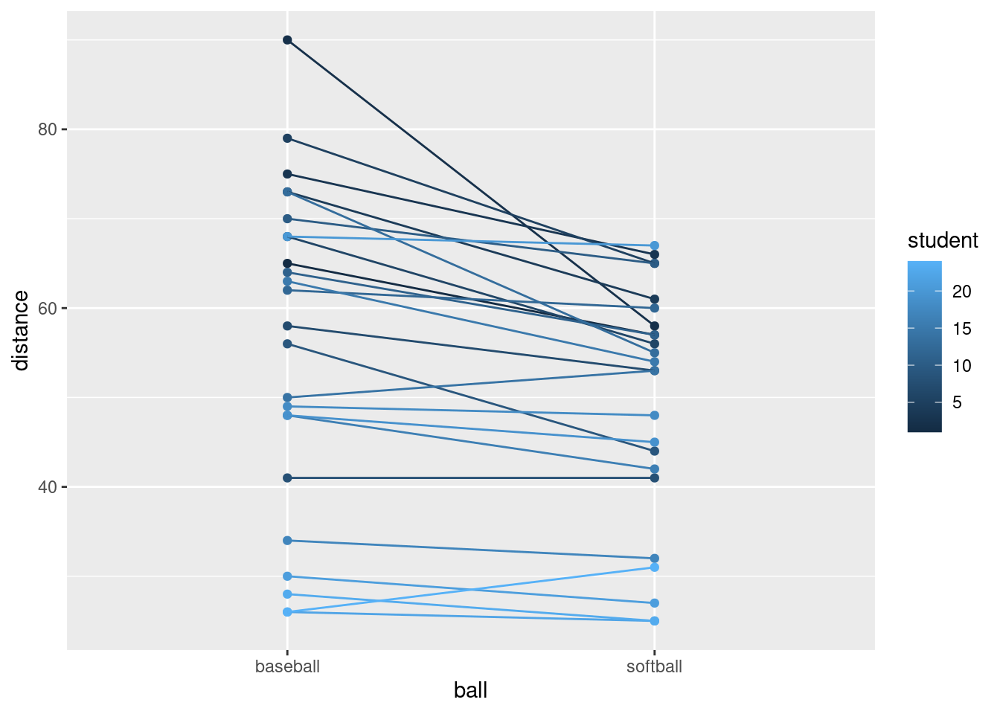

# Tidying and selecting data


```r
library(tidyverse)
```


```
## Warning: `env_bind_fns()` is deprecated as of rlang 0.3.0.
## Please use `env_bind_active()` instead.
## This warning is displayed once per session.
```


##  Tidying the Jays data


 This question is about the Blue Jays data set (that I used
in class).


(a) The Blue Jays baseball data set is at
[link](http://www.utsc.utoronto.ca/~butler/c32/jays15-home.csv). Read
it into R. Check that you have 25 rows and a bunch of variables.


Solution


Save the URL into a variable and then read from the URL, using
`read_csv` because it's a `.csv` file:


```r
myurl <- "http://www.utsc.utoronto.ca/~butler/c32/jays15-home.csv"
jays <- read_csv(myurl)
```

```
## Parsed with column specification:
## cols(
##   .default = col_character(),
##   row = col_double(),
##   game = col_double(),
##   venue = col_logical(),
##   runs = col_double(),
##   Oppruns = col_double(),
##   innings = col_double(),
##   position = col_double(),
##   `game time` = col_time(format = ""),
##   attendance = col_double()
## )
```

```
## See spec(...) for full column specifications.
```

```r
jays
```

```
## # A tibble: 25 x 21
##      row  game date  box   team  venue opp   result  runs Oppruns innings
##    <dbl> <dbl> <chr> <chr> <chr> <lgl> <chr> <chr>  <dbl>   <dbl>   <dbl>
##  1    82     7 Mond… boxs… TOR   NA    TBR   L          1       2      NA
##  2    83     8 Tues… boxs… TOR   NA    TBR   L          2       3      NA
##  3    84     9 Wedn… boxs… TOR   NA    TBR   W         12       7      NA
##  4    85    10 Thur… boxs… TOR   NA    TBR   L          2       4      NA
##  5    86    11 Frid… boxs… TOR   NA    ATL   L          7       8      NA
##  6    87    12 Satu… boxs… TOR   NA    ATL   W-wo       6       5      10
##  7    88    13 Sund… boxs… TOR   NA    ATL   L          2       5      NA
##  8    89    14 Tues… boxs… TOR   NA    BAL   W         13       6      NA
##  9    90    15 Wedn… boxs… TOR   NA    BAL   W          4       2      NA
## 10    91    16 Thur… boxs… TOR   NA    BAL   W          7       6      NA
## # … with 15 more rows, and 10 more variables: wl <chr>, position <dbl>,
## #   gb <chr>, winner <chr>, loser <chr>, save <chr>, `game time` <time>,
## #   Daynight <chr>, attendance <dbl>, streak <chr>
```


If you must, copy and paste the spreadsheet into R Studio, and read it
in with `read_delim` (or possibly `read_tsv`), but
this runs the risk of being defeated by spreadsheet cells that contain
spaces. I don't think there are any here, but you might run into a
pitcher whose name has more than one word, like (Andy) Van Hekken, who
is in the Seattle Mariners farm system.
<label for="tufte-mn-" class="margin-toggle">&#8853;</label><input type="checkbox" id="tufte-mn-" class="margin-toggle"><span class="marginnote">I found this by  googling, after I had scrolled past all the pages of articles about  the baseball pitcher who *lives* in a van.</span>

Anyway, 25 rows and 21 columns. As usual, it's a tibble, so you see 10
rows and as many columns as will fit. This is often enough to see
whether we have the right thing (as we appear to have, here). You can
run through all the columns and check that they're the right kind of
thing; most of them are text with a few numbers and one `time`,
which is ``game time``, the length of the game in hours and
minutes, which is turned into an R `time` in hours, minutes and
seconds. 

With all those columns, `read_csv` doesn't tell you what
column specification it inferred for all of them, but you can type


```r
spec(jays)
```

```
## cols(
##   row = col_double(),
##   game = col_double(),
##   date = col_character(),
##   box = col_character(),
##   team = col_character(),
##   venue = col_logical(),
##   opp = col_character(),
##   result = col_character(),
##   runs = col_double(),
##   Oppruns = col_double(),
##   innings = col_double(),
##   wl = col_character(),
##   position = col_double(),
##   gb = col_character(),
##   winner = col_character(),
##   loser = col_character(),
##   save = col_character(),
##   `game time` = col_time(format = ""),
##   Daynight = col_character(),
##   attendance = col_double(),
##   streak = col_character()
## )
```

 

to find it all out.


(b) Pick out only the games that were against the New York Yankees
(the variable `opp` is equal to `NYY`). Investigate all
the columns.  What do you notice about these games?


Solution


I get to do this:

```r
jays %>% filter(opp == "NYY") %>% print(width = Inf)
```

```
## # A tibble: 3 x 21
##     row  game date             box      team  venue opp   result  runs
##   <dbl> <dbl> <chr>            <chr>    <chr> <lgl> <chr> <chr>  <dbl>
## 1    92    27 Monday, May 4    boxscore TOR   NA    NYY   W          3
## 2    93    28 Tuesday, May 5   boxscore TOR   NA    NYY   L          3
## 3    94    29 Wednesday, May 6 boxscore TOR   NA    NYY   W          5
##   Oppruns innings wl    position gb    winner  loser    save   `game time`
##     <dbl>   <dbl> <chr>    <dbl> <chr> <chr>   <chr>    <chr>  <time>     
## 1       1      NA 13-14        4 3.5   Dickey  Martin   Cecil  02:18      
## 2       6      NA 13-15        5 4.5   Pineda  Estrada  Miller 02:54      
## 3       1      NA 14-15        3 3.5   Buehrle Sabathia <NA>   02:30      
##   Daynight attendance streak
##   <chr>         <dbl> <chr> 
## 1 N             19217 +     
## 2 N             21519 -     
## 3 N             21312 +
```

 

but you will probably need to click the little right-arrow at the top
to see more columns. 

What I notice is that these games are all on consecutive nights
(against the same team). This is quite common, and goes back to the
far-off days when teams travelled by train: teams play several games
on one visit, rather than coming back many times.
<label for="tufte-mn-" class="margin-toggle">&#8853;</label><input type="checkbox" id="tufte-mn-" class="margin-toggle"><span class="marginnote">Hockey is  similar: teams go on road trips, playing several different teams  before returning home. Hockey teams, though, tend to play each team  only once on a road trip: for example, a west coast team like the  Canucks might play a game in each of Toronto, Montreal, Boston and  New York on a road trip. Well, maybe three games in the New York  area: one each against the Rangers, Islanders and Devils.</span> 
You might have noticed something else;
that's fine for this. For example, 
"each of the games lasted less than three hours", 
or "the attendances were all small" (since we
looked at all the attendances in class). I just want you to notice
something meaningful that seems to be interesting about these games.

You could also print all the columns in two or more goes, using
`select`, for example:


```r
jays %>% filter(opp == "NYY") %>% select(row:innings) %>% print(width = Inf)
```

```
## # A tibble: 3 x 11
##     row  game date             box      team  venue opp   result  runs
##   <dbl> <dbl> <chr>            <chr>    <chr> <lgl> <chr> <chr>  <dbl>
## 1    92    27 Monday, May 4    boxscore TOR   NA    NYY   W          3
## 2    93    28 Tuesday, May 5   boxscore TOR   NA    NYY   L          3
## 3    94    29 Wednesday, May 6 boxscore TOR   NA    NYY   W          5
##   Oppruns innings
##     <dbl>   <dbl>
## 1       1      NA
## 2       6      NA
## 3       1      NA
```

```r
jays %>% filter(opp == "NYY") %>% select(wl:streak) %>% print(width = Inf)
```

```
## # A tibble: 3 x 10
##   wl    position gb    winner  loser    save   `game time` Daynight
##   <chr>    <dbl> <chr> <chr>   <chr>    <chr>  <time>      <chr>   
## 1 13-14        4 3.5   Dickey  Martin   Cecil  02:18       N       
## 2 13-15        5 4.5   Pineda  Estrada  Miller 02:54       N       
## 3 14-15        3 3.5   Buehrle Sabathia <NA>   02:30       N       
##   attendance streak
##        <dbl> <chr> 
## 1      19217 +     
## 2      21519 -     
## 3      21312 +
```

 


(c) From the whole data frame, pick out only the games where the
attendance was more than 30,000, showing only the columns
`attendance` and `Daynight`. How many of them are there
(just count them)? How many are day games and how many night games
(just count those too)?


Solution


Two steps, since we selecting rows *and* columns. 


```r
jays %>%
  filter(attendance > 30000) %>%
  select(c(attendance, Daynight))
```

```
## # A tibble: 8 x 2
##   attendance Daynight
##        <dbl> <chr>   
## 1      48414 N       
## 2      34743 D       
## 3      44794 D       
## 4      30430 N       
## 5      42917 D       
## 6      42419 D       
## 7      33086 D       
## 8      37929 D
```

 

Or this way, since we are selecting
*consecutive* columns:


```r
jays %>%
  filter(attendance > 30000) %>%
  select(c(Daynight:attendance))
```

```
## # A tibble: 8 x 2
##   Daynight attendance
##   <chr>         <dbl>
## 1 N             48414
## 2 D             34743
## 3 D             44794
## 4 N             30430
## 5 D             42917
## 6 D             42419
## 7 D             33086
## 8 D             37929
```

 

There are eight games selected (see the eight rows in the
result). Only two of them are night games, while the other six are day
(weekend) games.

If you wanted to, you could automate the counting, like this:


```r
jays %>%
  filter(attendance > 30000) %>%
  count(Daynight)
```

```
## # A tibble: 2 x 2
##   Daynight     n
##   <chr>    <int>
## 1 D            6
## 2 N            2
```

 

Six day games and two night games.


(d) Display the mean and standard deviation of attendances at all
day and night games.


Solution


Two steps: the grouping according to what I want to group by, then
summarizing according to what I want to summarize by. Since I am
summarizing, only the summaries find their way into the final data
frame, so I don't need to "select out" the other variables:


```r
jays %>%
  group_by(Daynight) %>%
  summarize(
    mean.att = mean(attendance),
    sd.att = sd(attendance)
  )
```

```
## # A tibble: 2 x 3
##   Daynight mean.att sd.att
##   <chr>       <dbl>  <dbl>
## 1 D          37885.  5775.
## 2 N          20087.  8084.
```

 

The mean attendances are about 38 thousand and about 20 thousand. Note
that the night games have much the larger SD, possibly because of the
large outlier night attendance (opening night). Which we can also
investigate. 


```r
jays %>%
  group_by(Daynight) %>%
  summarize(
    median.att = median(attendance),
    iqr.att = IQR(attendance)
  )
```

```
## # A tibble: 2 x 3
##   Daynight median.att iqr.att
##   <chr>         <dbl>   <dbl>
## 1 D            37929    8754.
## 2 N            17928.   6005.
```

 
This time, the night attendances have a *smaller* spread and a
noticeably smaller median (compared to the mean), so it must have been
the outlier that made the difference. There was another high value
that R marked as an outlier:


```r
ggplot(jays, aes(x = Daynight, y = attendance)) + geom_boxplot()
```


 

So when you take away those unusual values, the night game attendances
are indeed less variable.

The right test, as you might have guessed, for comparing the medians
of these non-normal data, is Mood's median test:


```r
library(smmr)
```

```
## Warning: `quo_expr()` is deprecated as of rlang 0.2.0.
## Please use `quo_squash()` instead.
## This warning is displayed once per session.
```

```r
median_test(jays, attendance, Daynight)
```

```
## $table
##      above
## group above below
##     D     7     0
##     N     5    12
## 
## $test
##        what       value
## 1 statistic 9.882352941
## 2        df 1.000000000
## 3   P-value 0.001668714
```

 

There was one attendance exactly equal to the overall median (as you
would expect: with an odd number of data values, the median is one of
the data values). `smmr` removed it; if you did the test by
hand, what happens to it depends on whether you counted aboves or
belows, and this will have a small effect on the P-value, though not
on the conclusion.

The overall median attendance was 21,000, and *none* of the day
games had attendance less than that. With the small frequencies, the
accuracy of the P-value is a bit questionable, but taking it at face
value, there *is* a significant difference between median 
attendances at day and night games.
<label for="tufte-mn-" class="margin-toggle">&#8853;</label><input type="checkbox" id="tufte-mn-" class="margin-toggle"><span class="marginnote">If you do this by  hand, you'll get a warning about the chi-squared approximation  being inaccurate. This is because of the small frequencies, and  *not* because of the outliers. Those are not damaging the test  at all.</span>


(e) Make normal quantile plots of the day attendances and the night
attendances, separately. Do you see any evidence of non-normality?
(You would expect to on the night attendances because of the big
opening-night value.)


Solution


The best way to do this is facetted normal quantile
plots. Remember that the facetting part goes right at the end:

```r
ggplot(jays, aes(sample = attendance)) +
  stat_qq() + stat_qq_line() +
  facet_wrap(~Daynight, ncol = 1)
```


     
The day attendances are pretty normal, though it is hard to be sure
with only 7 of them. 

The night attendances are not normal. The lone point top right is the
outlier. On top of that, the lowest attendances are not quite low enough and
the second-highest attendance is a bit too high, so there is a bit of
evidence of right-skewness as well as just the one outlier. 

If you leave out the `ncol=1`, you'll get the two normal
quantile plots side by side (which means that each one is tall and
skinny, and thus hard to read). The `ncol=1` displays all the
facets in *one* column, and though it would be nice to have the
graphs be about square, landscape mode is easier to read than portrait
mode.  

One of the reasons for skewness is often a limit on the values of the
variable. The Rogers Centre has a capacity around 55,000. The day game
attendances don't get especially close to that, which suggests that
everyone who wants to go to the game can get a ticket. In that sort of
situation, you'd expect attendances to vary around a "typical"
value, with a random deviation that depends on things like the weather
and the opposing team, which is the typical situation in which you get
bell-shaped data. (If the Jays often sold out their stadium for day
games, you'd see a lot of attendances close to the capacity, with a
few lower: ie., a left skew.)

As for the night games, well, there seems to be a minimum attendance
that the Blue Jays get, somewhere around 15,000: no matter who they're
playing or what the weather's like, this many people will show up
(season-ticket holders, for example). On special occasions, such as
opening night, the attendance will be much bigger, which points to a
*right* skew.


##  Baseball and softball spaghetti


 On a previous assignment, we found that students could throw
a baseball further than they could throw a softball. In this question,
we will make a graph called a "spaghetti plot" to illustrate this
graphically. (The issue previously was that the data were matched
pairs: the same students threw both balls.)

This seems to work most naturally by building a pipe, a line or two at
a time. See if you can do it that way. (If you can't make it work, use lots of
temporary data frames, one to hold the result of each part.)


(a) Read in the data again from
[link](http://www.utsc.utoronto.ca/~butler/c32/throw.txt). The
variables had no names, so supply some, as you did before.


Solution


Literal copy and paste: 

```r
myurl <- "http://www.utsc.utoronto.ca/~butler/c32/throw.txt"
throws <- read_delim(myurl, " ", col_names = c("student", "baseball", "softball"))
```

```
## Parsed with column specification:
## cols(
##   student = col_double(),
##   baseball = col_double(),
##   softball = col_double()
## )
```

```r
throws
```

```
## # A tibble: 24 x 3
##    student baseball softball
##      <dbl>    <dbl>    <dbl>
##  1       1       65       57
##  2       2       90       58
##  3       3       75       66
##  4       4       73       61
##  5       5       79       65
##  6       6       68       56
##  7       7       58       53
##  8       8       41       41
##  9       9       56       44
## 10      10       70       65
## # … with 14 more rows
```

       


(b) Create a new column that is the students turned into a `factor`,
adding it to your data frame. The reason for this will become clear
later.


Solution


Feed `student` into `factor`, creating a new
column with `mutate`:

```r
throws %>% mutate(fs = factor(student))
```

```
## # A tibble: 24 x 4
##    student baseball softball fs   
##      <dbl>    <dbl>    <dbl> <fct>
##  1       1       65       57 1    
##  2       2       90       58 2    
##  3       3       75       66 3    
##  4       4       73       61 4    
##  5       5       79       65 5    
##  6       6       68       56 6    
##  7       7       58       53 7    
##  8       8       41       41 8    
##  9       9       56       44 9    
## 10      10       70       65 10   
## # … with 14 more rows
```

       

This doesn't look any different from the original student numbers, but
note the variable type at the top of the column.


(c) Gather together all the throwing distances into one column,
making a second column that says which ball was thrown.


Solution

The old way was literally `gather`, which you can still use (see below). If you have the most up-to-date version of `tidyr`, though, there is a new (easier) way to do it called `pivot_longer`. It goes like this:


```r
throws %>%
  mutate(fs = factor(student)) %>%
  pivot_longer(baseball:softball, names_to="ball", values_to="distance")
```

```
## # A tibble: 48 x 4
##    student fs    ball     distance
##      <dbl> <fct> <chr>       <dbl>
##  1       1 1     baseball       65
##  2       1 1     softball       57
##  3       2 2     baseball       90
##  4       2 2     softball       58
##  5       3 3     baseball       75
##  6       3 3     softball       66
##  7       4 4     baseball       73
##  8       4 4     softball       61
##  9       5 5     baseball       79
## 10       5 5     softball       65
## # … with 38 more rows
```

The `names_to` is the name of a new categorical column whose values will be what is currently column names, and the `values_to` names a new quantitative (usually) column that will hold the values in those columns that you are making longer.

If this doesn't work for you, go to the console (or make yourself a temporary code chunk) and run:


```r
install.packages("tidyr")
```

Once that works, if you made a code chunk for it, you can delete that now, since you won't be needing it again.

The old way is
literally `gather`, thus:


```r
throws %>%
  mutate(fs = factor(student)) %>%
  gather(ball, distance, baseball:softball)
```

```
## # A tibble: 48 x 4
##    student fs    ball     distance
##      <dbl> <fct> <chr>       <dbl>
##  1       1 1     baseball       65
##  2       2 2     baseball       90
##  3       3 3     baseball       75
##  4       4 4     baseball       73
##  5       5 5     baseball       79
##  6       6 6     baseball       68
##  7       7 7     baseball       58
##  8       8 8     baseball       41
##  9       9 9     baseball       56
## 10      10 10    baseball       70
## # … with 38 more rows
```

Two columns to include, consecutive ones, or two to omit, the first
and last. So I think it's
easier to name the ones you want to include. 

`pivot_longer` does everything `gather` does and more besides, so if you're going to learn only one, go with `pivot_longer`.

If you want to show off a little, you can use a select-helper, noting
that the columns you want to make longer all end in "ball":


```r
throws %>%
  mutate(fs = factor(student)) %>%
  pivot_longer(ends_with("ball"), names_to="ball", values_to="distance")
```

```
## # A tibble: 48 x 4
##    student fs    ball     distance
##      <dbl> <fct> <chr>       <dbl>
##  1       1 1     baseball       65
##  2       1 1     softball       57
##  3       2 2     baseball       90
##  4       2 2     softball       58
##  5       3 3     baseball       75
##  6       3 3     softball       66
##  7       4 4     baseball       73
##  8       4 4     softball       61
##  9       5 5     baseball       79
## 10       5 5     softball       65
## # … with 38 more rows
```

       

The same result. Use whichever you like.


(d) Using your new data frame, make a "scatterplot" of throwing
distance against type of ball.


Solution


The obvious thing. No data frame in the `ggplot` because it's the data frame that came out of the previous part of the pipeline (that doesn't have a name):


```r
throws %>%
  mutate(fs = factor(student)) %>%
  pivot_longer(baseball:softball, names_to="ball", values_to="distance") %>% 
  ggplot(aes(x = ball, y = distance)) + geom_point()
```



This is an odd type of scatterplot because the $x$-axis is actually a categorical variable. It's really what would be called something like a dotplot. We'll be using this as raw material for the plot we actually want.
       

What this plot is missing is an indication of which student threw
which ball. As it stands now, it could be an inferior version of a
boxplot of distances thrown for each ball (which would imply that they
are two independent sets of students, something that is not true).


(e) Add two things to your plot: something that will distinguish
the students by colour (this works best if the thing distinguished
by colour is a factor),
<label for="tufte-mn-" class="margin-toggle">&#8853;</label><input type="checkbox" id="tufte-mn-" class="margin-toggle"><span class="marginnote">You can try it without. See below.</span>
and something that will join the two points for the same student by
a line.


Solution


A `colour` and a `group` in the `aes`, and
a `geom_line`:

```r
throws %>%
  mutate(fs = factor(student)) %>%
  pivot_longer(baseball:softball, names_to="ball", values_to="distance") %>% 
  ggplot(aes(x = ball, y = distance, group = fs, colour = fs)) +
  geom_point() + geom_line()
```


     

You can see what happens if you use the student as a number:


```r
throws %>%
  mutate(fs = factor(student)) %>%
  pivot_longer(baseball:softball, names_to="ball", values_to="distance") %>% 
  ggplot(aes(x = ball, y = distance, group = student, colour = student)) +
  geom_point() + geom_line()
```


     

Now the student numbers are distinguished as a shade of blue (on an
implied continuous scale: even a nonsensical fractional student number
like 17.5 would be a shade of blue). This is not actually so bad here,
because all we are trying to do is to distinguish the students
sufficiently from each other so that we can see where the spaghetti
strands go. But I like the multi-coloured one better.


(f) The legend is not very informative. Remove it from the plot,
using `guides`.


Solution


You won't have seen this before. Here's what to do: Find what's
at the top of the legend that you want to remove. Here that is
`fs`. Find where `fs` appears in your
`aes`. It actually appears in two places: in
`group` and `colour`. I think the legend we want
to get rid of is actually the `colour` one, so we do this:

```r
throws %>%
  mutate(fs = factor(student)) %>%
  pivot_longer(baseball:softball, names_to="ball", values_to="distance") %>% 
  ggplot(aes(x = ball, y = distance, group = fs, colour = fs)) +
  geom_point() + geom_line() +
  guides(colour = F)
```


       

That seems to have done it.


(g) What do you see on the final spaghetti plot? What does that tell you
about the relative distances a student can throw a baseball vs. a
softball? Explain briefly, blah blah blah.


Solution


Most of the spaghetti strands go downhill from baseball to
softball, or at least very few of them go uphill. That tells us
that most students can throw a baseball further than a softball.
That was the same impression that the matched-pairs $t$-test
gave us. But the spaghetti plot tells us something else. If you
look carefully, you see that most of the big drops are for
students who could throw a baseball a long way. These students
also threw a softball further than the other students, but not
by as much. Most of the spaghetti strands in the bottom half of
the plot go more or less straight across. This indicates that
students who cannot throw a baseball very far will throw a
softball about the same distance as they threw the baseball.
There is an argument you could make here that the difference
between distances thrown is a *proportional* one, something
like "a student typically throws a baseball 20\% further than a softball". 
That could be assessed by comparing not the
distances themselves, but the logs of the distances: in other
words, making a log transformation of all the
distances. (Distances have a lower limit of zero, so you might
expect observed distances to be skewed to the right, which is
another argument for making some kind of transformation.)


##  Ethanol and sleep time in rats


 A biologist wished to study the effects of ethanol on sleep
time in rats. A sample of 20 rats (all the same age) was selected, and
each rat was given an injection having a particular concentration (0,
1, 2 or 4 grams per kilogram of body weight) of ethanol. These are
labelled `e0, e1, e2, e4`. The "0"
treatment was a control group. The rapid eye movement (REM) sleep time
was then recorded for each rat. The data are in
[link](http://www.utsc.utoronto.ca/~butler/c32/ratsleep.txt). 


(a) Read the data in from the file. Check that you have four rows
of observations  and five columns of sleep times.


Solution


Separated by single spaces:

```r
my_url <- "http://www.utsc.utoronto.ca/~butler/c32/ratsleep.txt"
sleep1 <- read_delim(my_url, " ")
```

```
## Parsed with column specification:
## cols(
##   treatment = col_character(),
##   obs1 = col_double(),
##   obs2 = col_double(),
##   obs3 = col_double(),
##   obs4 = col_double(),
##   obs5 = col_double()
## )
```

```r
sleep1
```

```
## # A tibble: 4 x 6
##   treatment  obs1  obs2  obs3  obs4  obs5
##   <chr>     <dbl> <dbl> <dbl> <dbl> <dbl>
## 1 e0         88.6  73.2  91.4  68    75.2
## 2 e1         63    53.9  69.2  50.1  71.5
## 3 e2         44.9  59.5  40.2  56.3  38.7
## 4 e4         31    39.6  45.3  25.2  22.7
```

 

There are six columns, but one of them labels the groups, and there
are correctly five columns of sleep times.

I used a "temporary" name for my data frame, because I'm going to be
doing some processing on it in a minute, and I want to reserve the
name `sleep` for my processed data frame.


(b) Unfortunately, the data are in the wrong format. All the sleep
times for each treatment group are on one row, and we should have
*one* column containing *all* the sleep times, and the
corresponding row should show which treatment group that sleep time
came from. Transform this data frame into one that you could use for modelling or making graphs.


Solution

We will want *one* column of sleep times, with an additional categorical column saying what observation each sleep time was within its group (or, you might say, we don't really care about that much, but that's what we are going to get). 

The columns `obs1` through `obs5` are
different in that they are different observation numbers
("replicates", in the jargon). I'll call that `rep`. What
makes them the same is that they are all sleep times. Columns
`obs1` through `obs5` are the ones we want to
combine, thus. 
Here is where I use the name `sleep`: I save the result of
the `pivot_longer` into a data frame `sleep`. Note that I
also used the brackets-around-the-outside to display what I had,
so that I didn't have to do a separate display. This is a handy
way of saving *and* displaying in one shot:


```r
(sleep1 %>% 
  pivot_longer(-treatment, names_to="rep", values_to="sleeptime") -> sleep)
```

```
## # A tibble: 20 x 3
##    treatment rep   sleeptime
##    <chr>     <chr>     <dbl>
##  1 e0        obs1       88.6
##  2 e0        obs2       73.2
##  3 e0        obs3       91.4
##  4 e0        obs4       68  
##  5 e0        obs5       75.2
##  6 e1        obs1       63  
##  7 e1        obs2       53.9
##  8 e1        obs3       69.2
##  9 e1        obs4       50.1
## 10 e1        obs5       71.5
## 11 e2        obs1       44.9
## 12 e2        obs2       59.5
## 13 e2        obs3       40.2
## 14 e2        obs4       56.3
## 15 e2        obs5       38.7
## 16 e4        obs1       31  
## 17 e4        obs2       39.6
## 18 e4        obs3       45.3
## 19 e4        obs4       25.2
## 20 e4        obs5       22.7
```

Typically in this kind of work, you have a lot of columns that need to be made longer, and a much smaller number of columns that need to be repeated as necessary. You can either specify all the columns to make longer, or you can specify "not" the other columns. Above, my first input to `pivot_longer` was "everything but treatment", but you could also do it like this:


```r
sleep1 %>% 
  pivot_longer(obs1:obs5, names_to="rep", values_to="sleeptime") 
```

```
## # A tibble: 20 x 3
##    treatment rep   sleeptime
##    <chr>     <chr>     <dbl>
##  1 e0        obs1       88.6
##  2 e0        obs2       73.2
##  3 e0        obs3       91.4
##  4 e0        obs4       68  
##  5 e0        obs5       75.2
##  6 e1        obs1       63  
##  7 e1        obs2       53.9
##  8 e1        obs3       69.2
##  9 e1        obs4       50.1
## 10 e1        obs5       71.5
## 11 e2        obs1       44.9
## 12 e2        obs2       59.5
## 13 e2        obs3       40.2
## 14 e2        obs4       56.3
## 15 e2        obs5       38.7
## 16 e4        obs1       31  
## 17 e4        obs2       39.6
## 18 e4        obs3       45.3
## 19 e4        obs4       25.2
## 20 e4        obs5       22.7
```

or like this:


```r
sleep1 %>% 
  pivot_longer(starts_with("obs"), names_to="rep", values_to="sleeptime") 
```

```
## # A tibble: 20 x 3
##    treatment rep   sleeptime
##    <chr>     <chr>     <dbl>
##  1 e0        obs1       88.6
##  2 e0        obs2       73.2
##  3 e0        obs3       91.4
##  4 e0        obs4       68  
##  5 e0        obs5       75.2
##  6 e1        obs1       63  
##  7 e1        obs2       53.9
##  8 e1        obs3       69.2
##  9 e1        obs4       50.1
## 10 e1        obs5       71.5
## 11 e2        obs1       44.9
## 12 e2        obs2       59.5
## 13 e2        obs3       40.2
## 14 e2        obs4       56.3
## 15 e2        obs5       38.7
## 16 e4        obs1       31  
## 17 e4        obs2       39.6
## 18 e4        obs3       45.3
## 19 e4        obs4       25.2
## 20 e4        obs5       22.7
```

This one was a little unusual in that usually with these you have the *treatments* in the columns and the replicates in the rows. It doesn't matter, though: `pivot_longer` handles both cases.

If you prefer the old `gather`, that also works:


```r
sleep1 %>% gather(rep, sleeptime, obs1:obs5) 
```

```
## # A tibble: 20 x 3
##    treatment rep   sleeptime
##    <chr>     <chr>     <dbl>
##  1 e0        obs1       88.6
##  2 e1        obs1       63  
##  3 e2        obs1       44.9
##  4 e4        obs1       31  
##  5 e0        obs2       73.2
##  6 e1        obs2       53.9
##  7 e2        obs2       59.5
##  8 e4        obs2       39.6
##  9 e0        obs3       91.4
## 10 e1        obs3       69.2
## 11 e2        obs3       40.2
## 12 e4        obs3       45.3
## 13 e0        obs4       68  
## 14 e1        obs4       50.1
## 15 e2        obs4       56.3
## 16 e4        obs4       25.2
## 17 e0        obs5       75.2
## 18 e1        obs5       71.5
## 19 e2        obs5       38.7
## 20 e4        obs5       22.7
```

The rows come out in a different order this way, but it still works.
 
We have 20 rows of 3 columns. I got all the rows, but you will
probably get an output with ten rows as usual, and will need to click
Next to see the last ten rows. The initial display will say how many
rows (20) and columns (3) you have.

The column `rep` is not very interesting: it just says which
observation each one was within its group.
<label for="tufte-mn-" class="margin-toggle">&#8853;</label><input type="checkbox" id="tufte-mn-" class="margin-toggle"><span class="marginnote">Sometimes the  column playing the role of *rep* *is* interesting to us, but  not here.</span> 
The interesting things are `treatment` and
`sleeptime`, which are the two variables we'll need for our
analysis of variance.


(c) Using your new data frame, make side-by-side boxplots of sleep
time by treatment group. 


Solution


```r
ggplot(sleep, aes(x = treatment, y = sleeptime)) + geom_boxplot()
```


 


(d) In your boxplots, how does the median sleep time appear to
depend on treatment group?


Solution


It appears to *decrease* as the dose of ethanol increases,
and pretty substantially so (in that the differences ought to be
significant, but that's coming up). 


(e) There is an assumption about spread that the analysis of
variance needs in order to be reliable. Do your boxplots indicate that
this assumption is satisfied for these data, bearing in mind that you
have only five observations per group?


Solution


The assumption is that the population SDs of each group are all
equal. Now, the boxplots show IQRs, which are kind of a surrogate
for SD, and because we only have five observations per group to
base the IQRs on, the *sample* IQRs might vary a bit. So we
should look at the heights of the boxes on the boxplot, and see
whether they are grossly unequal. They appear to be to be of very
similar heights, all things considered, so I am happy.

If you want the SDs themselves:


```r
sleep %>%
  group_by(treatment) %>%
  summarize(stddev = sd(sleeptime))
```

```
## # A tibble: 4 x 2
##   treatment stddev
##   <chr>      <dbl>
## 1 e0         10.2 
## 2 e1          9.34
## 3 e2          9.46
## 4 e4          9.56
```

 

Those are *very* similar, given only 5 observations per group. No
problems here.


(f) Run an analysis of variance to see whether sleep time differs
significantly among treatment groups. What do you conclude?


Solution


I use `aov` here, because I might be following up with
Tukey in a minute:


```r
sleep.1 <- aov(sleeptime ~ treatment, data = sleep)
summary(sleep.1)
```

```
##             Df Sum Sq Mean Sq F value   Pr(>F)    
## treatment    3   5882    1961   21.09 8.32e-06 ***
## Residuals   16   1487      93                     
## ---
## Signif. codes:  0 '***' 0.001 '**' 0.01 '*' 0.05 '.' 0.1 ' ' 1
```

 

This is a very small P-value, so my conclusion is that the mean sleep
times are not all the same for the treatment groups. Further than that
I am not entitled to say (yet).

The technique here is to save the output from `aov` in
something, look at that (via `summary`), and then that same
something gets fed into `TukeyHSD` later. 


(g) Would it be a good idea to run Tukey's method here? Explain
briefly why or why not, and if you think it would be a good idea, run
it.


Solution


Tukey's method is useful when (i) we have run an analysis of
variance and got a significant result and (ii) when we want to know
which groups differ significantly from which. Both (i) and (ii) are
true here. So:


```r
TukeyHSD(sleep.1)
```

```
##   Tukey multiple comparisons of means
##     95% family-wise confidence level
## 
## Fit: aov(formula = sleeptime ~ treatment, data = sleep)
## 
## $treatment
##         diff       lwr         upr     p adj
## e1-e0 -17.74 -35.18636  -0.2936428 0.0455781
## e2-e0 -31.36 -48.80636 -13.9136428 0.0005142
## e4-e0 -46.52 -63.96636 -29.0736428 0.0000056
## e2-e1 -13.62 -31.06636   3.8263572 0.1563545
## e4-e1 -28.78 -46.22636 -11.3336428 0.0011925
## e4-e2 -15.16 -32.60636   2.2863572 0.1005398
```

 


(h) What do you conclude from Tukey's method? (This is liable to be
a bit complicated.) Is there a treatment that is clearly best, in
terms of the sleep time being largest?


Solution


All the differences are significant except treatment `e2`
vs.\ `e1` and `e4`. All the differences involving
the control group `e0` are significant, and if you look
back at the boxplots in (c), you'll see that the control group `e0`
had the *highest* mean sleep time. So the control group is
best (from this point of view), or another way of saying it is
that *any* dose of ethanol is significantly reducing mean
sleep time.
The other comparisons are a bit confusing, because the 1-4
difference is significant, but neither of the differences
involving 2 are. That is, 1 is better than 4, but 2 is not
significantly worse than 1 nor better than 4. This seems like it
should be a logical impossibility, but the story is that we don't
have enough data to decide where 2 fits relative to 1 or 4.  If we
had 10 or 20 observations per group, we might be able to conclude
that 2 is in between 1 and 4 as the boxplots suggest.


Extra: I didn't ask about normality here, but like the equal-spreads assumption I'd say there's nothing controversial about it with these data. With normality good and equal spreads good, `aov` plus Tukey is the analysis of choice. 


##  Growth of tomatoes


 A biology graduate student exposed each of 32
tomato plants to one of four different colours of light (8 plants to
each colour). The growth rate of each plant, in millimetres per week,
was recorded. The data are in
[link](http://www.utsc.utoronto.ca/~butler/c32/tomatoes.txt). 


(a) Read the data into R and confirm that you have 8 rows and 5
columns of data.


Solution


This kind of thing:

```r
my_url="http://www.utsc.utoronto.ca/~butler/c32/tomatoes.txt"
toms1=read_delim(my_url," ")
```

```
## Parsed with column specification:
## cols(
##   plant = col_double(),
##   blue = col_double(),
##   red = col_double(),
##   yellow = col_double(),
##   green = col_double()
## )
```

```r
toms1
```

```
## # A tibble: 8 x 5
##   plant  blue   red yellow green
##   <dbl> <dbl> <dbl>  <dbl> <dbl>
## 1     1  5.34  13.7   4.61  2.72
## 2     2  7.45  13.0   6.63  1.08
## 3     3  7.15  10.2   5.29  3.97
## 4     4  5.53  13.1   5.29  2.66
## 5     5  6.34  11.1   4.76  3.69
## 6     6  7.16  11.4   5.57  1.96
## 7     7  7.77  14.0   6.57  3.38
## 8     8  5.09  13.5   5.25  1.87
```

 

I do indeed have 8 rows and 5 columns.

With only 8 rows, listing the data like this is good. 


(b) Re-arrange the data so that you have *one* column
containing all the growth rates, and another column saying which
colour light each plant was exposed to. (The aim here is to produce
something suitable for feeding into `aov` later.) 


Solution


This is a job for `pivot_longer`:


```r
toms1 %>% 
   pivot_longer(-plant, names_to="colour", values_to="growthrate") -> toms2
toms2
```

```
## # A tibble: 32 x 3
##    plant colour growthrate
##    <dbl> <chr>       <dbl>
##  1     1 blue         5.34
##  2     1 red         13.7 
##  3     1 yellow       4.61
##  4     1 green        2.72
##  5     2 blue         7.45
##  6     2 red         13.0 
##  7     2 yellow       6.63
##  8     2 green        1.08
##  9     3 blue         7.15
## 10     3 red         10.2 
## # … with 22 more rows
```

I chose to specify "everything but plant number", since there are several colour columns with different names.

`gather` also works:


```r
toms1 %>% gather(colour, growthrate, blue:green)
```

```
## # A tibble: 32 x 3
##    plant colour growthrate
##    <dbl> <chr>       <dbl>
##  1     1 blue         5.34
##  2     2 blue         7.45
##  3     3 blue         7.15
##  4     4 blue         5.53
##  5     5 blue         6.34
##  6     6 blue         7.16
##  7     7 blue         7.77
##  8     8 blue         5.09
##  9     1 red         13.7 
## 10     2 red         13.0 
## # … with 22 more rows
```
       
This time I said "columns blue through green". Either way works for either.

Reminder for `gather`: first, what makes the columns different
(they're different colours), then what makes them the same (they're all
growth rates), and finally which columns to gather together (all the colour ones). I had to have a trick for remembering this, which I no longer need with `pivot_longer` (since I give the inputs names, and I can remember which is which).

Since the column `plant` was never mentioned, this gets
repeated as necessary, so now it denotes "plant within colour group", 
which in this case is not very useful. (Where you have
matched pairs, or repeated measures in general, you *do* want to
keep track of which individual is which. But this is not repeated
measures because plant number 1 in the blue group and plant number 1
in the red group  are *different* plants.)

There were 8 rows originally and 4 different colours, so there should
be, and are, $8 \times 4=32$ rows in the made-longer data set.


(c) Save the data in the new format to a text file. This is
most easily done using `write_csv`, which is the opposite
of `read_csv`. It requires two things: a data frame, and
the name of a file to save in, which should have a `.csv`
extension.  


Solution


The code is easy enough:

```r
write_csv(toms2,"tomatoes2.csv")
```

       

If no error, it worked. That's all you need.

To verify (for my satisfaction) that it was saved correctly:


```bash
cat tomatoes2.csv 
```

```
## plant,colour,growthrate
## 1,blue,5.34
## 1,red,13.67
## 1,yellow,4.61
## 1,green,2.72
## 2,blue,7.45
## 2,red,13.04
## 2,yellow,6.63
## 2,green,1.08
## 3,blue,7.15
## 3,red,10.16
## 3,yellow,5.29
## 3,green,3.97
## 4,blue,5.53
## 4,red,13.12
## 4,yellow,5.29
## 4,green,2.66
## 5,blue,6.34
## 5,red,11.06
## 5,yellow,4.76
## 5,green,3.69
## 6,blue,7.16
## 6,red,11.43
## 6,yellow,5.57
## 6,green,1.96
## 7,blue,7.77
## 7,red,13.98
## 7,yellow,6.57
## 7,green,3.38
## 8,blue,5.09
## 8,red,13.49
## 8,yellow,5.25
## 8,green,1.87
```

 

On my system, that will list the contents of the file. Or you can just
open it in R Studio (if you saved it the way I did, it'll be in the
same folder, and you can find it in the Files pane.)


(d) Make a suitable boxplot, and use it to assess the assumptions
for ANOVA. What do you conclude? Explain briefly. 


Solution


Nothing terribly surprising here. My data frame is called
`toms2`, for some reason:

```r
ggplot(toms2,aes(x=colour, y=growthrate))+geom_boxplot()
```


     

There are no outliers, but there is a little skewness (compare the
*whiskers*, not the placement of the median within the box,
because what matters with skewness is the *tails*, not the middle
of the distribution; it's problems in the tails that make the mean
unsuitable as a measure of centre). The Red group looks the most
skewed. Also, the Yellow group has smaller spread than the others (we
assume that the population variances within each group are equal). The
thing to bear in mind here, though, is that there are only eight
observations per group, so the distributions could appear to have
unequal variances or some non-normality by chance. 

My take is that these data, all things considered, are \emph{just
about} OK for ANOVA. Another option would be to do Welch's ANOVA as
well and compare with the regular ANOVA: if they give more or less the
same P-value, that's a sign that I didn't need to worry.

Extra: some people like to run a formal test on the variances to test
them for equality. My favourite (for reasons explained elsewhere) is
the Levene test, if you insist on going this way. It lives in package
`car`, and *does not* take a `data=`, so you need
to do the `with` thing:


```r
library(car)
with(toms2,leveneTest(growthrate,colour))
```

```
## Warning in leveneTest.default(growthrate, colour): colour coerced to
## factor.
```

```
## Levene's Test for Homogeneity of Variance (center = median)
##       Df F value Pr(>F)
## group  3  0.9075 0.4499
##       28
```

 

The warning is because `colour` was actually text, but the test
did the right thing by turning it into a factor, so that's OK.

There is no way we can reject equal variances in the four groups. The
$F$-statistic is less than 1, in fact, which says that if the four
groups have the same population variances, the sample variances will
be *more* different than the ones we observed on average, and so
there is no way that these sample variances indicate different
population variances. (This is because of 8 observations only per
group; if there had been 80 observations per group, it would have been
a different story.) Decide for yourself whether you're surprised by this.

With that in mind, I think the regular ANOVA will be perfectly good,
and we would expect that and the Welch ANOVA to give very similar results.

I don't need `car` again, so let's get rid of it:


```r
detach("package:car",unload=T)
```

 


(e) Run (regular) ANOVA on these data. What do you conclude?
(Optional extra: if you think that some other variant of ANOVA would
be better, run that as well and compare the results.)


Solution


`aov`, bearing in mind that Tukey is likely to follow:


```r
toms.1=aov(growthrate~colour,data=toms2)
summary(toms.1)
```

```
##             Df Sum Sq Mean Sq F value   Pr(>F)    
## colour       3  410.5  136.82   118.2 5.28e-16 ***
## Residuals   28   32.4    1.16                     
## ---
## Signif. codes:  0 '***' 0.001 '**' 0.01 '*' 0.05 '.' 0.1 ' ' 1
```

 

This is a tiny P-value, so the mean growth rate for the different
colours is definitely *not* the same for all colours. Or, if you
like, one or more of the colours has a different mean growth rate than
the others.

This, remember, is as far as we go right now.

Extra: if you thought that normality was OK but not equal spreads,
then Welch ANOVA is the way to go:


```r
toms.2=oneway.test(growthrate~colour,data=toms2)
toms.2
```

```
## 
## 	One-way analysis of means (not assuming equal variances)
## 
## data:  growthrate and colour
## F = 81.079, num df = 3.000, denom df = 15.227, p-value = 1.377e-09
```

 

The P-value is not *quite* as small as for the regular ANOVA, but
it is still very small, and the conclusion is the same.

If you had doubts about the normality (that were sufficiently great,
even given the small sample sizes), then go with Mood's median test
for multiple groups:


```r
library(smmr)
median_test(toms2,growthrate,colour)
```

```
## $table
##         above
## group    above below
##   blue       5     3
##   green      0     8
##   red        8     0
##   yellow     3     5
## 
## $test
##        what        value
## 1 statistic 1.700000e+01
## 2        df 3.000000e+00
## 3   P-value 7.067424e-04
```

 

The P-value is again extremely small (though not quite as small as for
the other two tests, for the usual reason that Mood's median test
doesn't use the data very efficiently: it doesn't use how *far*
above or below the overall median the data values are.)

The story here, as ever, is consistency: whatever you thought was
wrong, looking at the boxplots, needs to guide the test you do:


* if you are not happy with normality, go with
`median_test` from `smmr` (Mood's median test). 

* if you are happy with normality and equal variances, go with
`aov`.

* if you are happy with normality but not equal variances, go with
`oneway.test` (Welch ANOVA).


So the first thing to think about is normality, and if you are OK with
normality, then think about equal spreads. Bear in mind that you need
to be willing to tolerate a certain amount of non-normality and
inequality in the spreads, given that your data are only samples from
their populations. (Don't expect perfection, in short.)


(f) If warranted, run a suitable follow-up. (If not warranted, explain briefly
why not.)


Solution


Whichever flavour of ANOVA you ran (regular ANOVA, Welch ANOVA,
Mood's median test), you got the same conclusion for these data:
that the average growth rates were not all the same for the four
colours. That, as you'll remember, is as far as you go. To find
out which colours differ from which in terms of growth rate, you
need to run some kind of multiple-comparisons follow-up, the
right one for the analysis you did. Looking at the boxplots suggests that red is clearly best
and green clearly worst, and it is possible that all the colours
are significantly different from each other.)
If you did regular ANOVA, Tukey is what you need:

```r
TukeyHSD(toms.1)
```

```
##   Tukey multiple comparisons of means
##     95% family-wise confidence level
## 
## Fit: aov(formula = growthrate ~ colour, data = toms2)
## 
## $colour
##                 diff       lwr        upr     p adj
## green-blue   -3.8125 -5.281129 -2.3438706 0.0000006
## red-blue      6.0150  4.546371  7.4836294 0.0000000
## yellow-blue  -0.9825 -2.451129  0.4861294 0.2825002
## red-green     9.8275  8.358871 11.2961294 0.0000000
## yellow-green  2.8300  1.361371  4.2986294 0.0000766
## yellow-red   -6.9975 -8.466129 -5.5288706 0.0000000
```

       

All of the differences are (strongly) significant, except for yellow
and blue, the two with middling growth rates on the boxplot. Thus we
would have no hesitation in saying that growth rate is biggest in red
light and smallest in green light.

If you did Welch ANOVA, you need Games-Howell, which you have to get
from one of the packages that offers it:


```r
library(PMCMRplus)
gamesHowellTest(growthrate~factor(colour),data=toms2)
```

```
## 
## 	Pairwise comparisons using Games-Howell test
```

```
## data: growthrate by factor(colour)
```

```
##        blue    green   red    
## green  1.6e-05 -       -      
## red    1.5e-06 4.8e-09 -      
## yellow 0.18707 0.00011 5.8e-07
```

```
## 
## P value adjustment method: none
```

```
## alternative hypothesis: two.sided
```

 

The conclusions are the same as for the Tukey: all the means are
significantly different except for yellow and blue.
Finally, if you did Mood's median test, you need this one:


```r
pairwise_median_test(toms2, growthrate, colour)
```

```
## # A tibble: 6 x 4
##   g1    g2       p_value adj_p_value
##   <chr> <chr>      <dbl>       <dbl>
## 1 blue  green  0.0000633    0.000380
## 2 blue  red    0.0000633    0.000380
## 3 blue  yellow 0.317        1       
## 4 green red    0.0000633    0.000380
## 5 green yellow 0.0000633    0.000380
## 6 red   yellow 0.0000633    0.000380
```

 

Same conclusions again. This is what I would have guessed; the
conclusions from Tukey were so clear-cut that it really didn't matter
which way you went; you'd come to the same conclusion.

That said, what I am looking for from you is a sensible choice of
analysis of variance (ANOVA, Welch's ANOVA or Mood's median test) for
a good reason, followed by the *right* follow-up for the test you
did. Even though the conclusions are all the same no matter what you
do here, I want you to get
used to following the right method, so that you will be able to do the
right thing when it *does* matter.


##  Pain relief in migraine headaches (again)


 The data in
[link](http://www.utsc.utoronto.ca/~butler/c32/migraine.txt) are from a
study of pain relief in migraine headaches. Specifically, 27 subjects
were randomly assigned to receive *one* of three pain relieving
drugs, labelled A, B and C. Each subject reported the number of hours
of pain relief they obtained (that is, the number of hours between
taking the drug and the migraine symptoms returning). A higher value
is therefore better. Can we make some recommendation about which drug
is best for the population of migraine sufferers?


(a) Read in and display the data. Take a look at the data
file first, and see if you can say why `read_table` will
work and `read_delim` will not.


Solution


The key is two things: the data values are *lined up in        columns*, and 
*there is more than one space between  values*. 
The second thing is why `read_delim` will not
work. If you look carefully at the data file, you'll see that
the column names are above and aligned with the columns, which
is what `read_table` wants. If the column names had
*not* been aligned with the columns, we would have needed
`read_table2`. 

```r
my_url <- "http://www.utsc.utoronto.ca/~butler/c32/migraine.txt"
migraine <- read_table(my_url)
```

```
## Parsed with column specification:
## cols(
##   DrugA = col_double(),
##   DrugB = col_double(),
##   DrugC = col_double()
## )
```

```r
migraine
```

```
## # A tibble: 9 x 3
##   DrugA DrugB DrugC
##   <dbl> <dbl> <dbl>
## 1     4     6     6
## 2     5     8     7
## 3     4     4     6
## 4     3     5     6
## 5     2     4     7
## 6     4     6     5
## 7     3     5     6
## 8     4    11     5
## 9     4    10     5
```

 

Success.


(b) What is it about the experimental design that makes a one-way
analysis of variance plausible for data like this?


Solution


Each experimental subject only tested *one* drug, so that
we have 27 independent observations, nine from each drug. This
is exactly the setup that a one-way ANOVA requires. 
Compare that to, for example, a situation where you had only 9
subjects, but they each tested *all* the drugs (so that
each subject produced three measurements). That is like a
three-measurement version of matched pairs, a so-called
**repeated-measures design**, which requires its own kind
of analysis.
<label for="tufte-mn-" class="margin-toggle">&#8853;</label><input type="checkbox" id="tufte-mn-" class="margin-toggle"><span class="marginnote">To allow for the fact that measurements on the same      subject are not independent but correlated.</span> 


(c) What is wrong with the current format of the data as far as
doing a one-way ANOVA analysis is concerned? (This is related to the
idea of whether or not the data are "tidy".)


Solution


For our analysis, we need one column of pain relief time and one
column labelling the drug that the subject in question took. 
Or, if you prefer to think about what would make these data
"tidy": there are 27 subjects, so there ought to be 27 rows,
and all three columns are measurements of pain relief, so they
ought to be in one column.


(d) "Tidy" the data to produce a data frame suitable for your
analysis. 


Solution

This is `pivot_longer`. The column names are going to be stored in a column `drug`, and the corresponding values in a column called `painrelief` (use whatever names you like):


```r
migraine %>% 
  pivot_longer(everything(), names_to="drug", values_to="painrelief") -> migraine2
```

Since I was making all the columns longer, I used the select-helper `everything()` to do that. Using instead `DrugA:DrugC` or `starts_with("Drug")` would also be good. Try them. `starts_with` is not case-sensitive, as far as I remember, so `starts_with("drug")` will also work here.


Or, `gather` the columns that are all measurements of one
thing.
The syntax of `gather` is: what
makes the columns different, what makes them the same, and which
columns need to be gathered together. Use a pipe to name the
dataframe to work with. I'm going to save my new data frame:

```r
(migraine %>% gather(drug, painrelief, DrugA:DrugC) -> migraine2)
```

```
## # A tibble: 27 x 2
##    drug  painrelief
##    <chr>      <dbl>
##  1 DrugA          4
##  2 DrugA          5
##  3 DrugA          4
##  4 DrugA          3
##  5 DrugA          2
##  6 DrugA          4
##  7 DrugA          3
##  8 DrugA          4
##  9 DrugA          4
## 10 DrugB          6
## # … with 17 more rows
```

 

The brackets around the whole thing print out the result as well as
saving it. If you don't have those, you'll need to type
`migraine2` again to display it.

We do indeed have a new data frame with 27 rows, one per observation,
and 2 columns, one for each variable: the pain relief hours, plus a
column identifying which drug that pain relief time came from. Exactly
what `aov` needs.

You can probably devise a better name for your new data frame.


(e) Go ahead and run your one-way ANOVA (and Tukey if
necessary). Assume for this that the pain relief hours in each group
are sufficiently close to normally distributed with sufficiently
equal spreads.


Solution


My last sentence absolves us from doing the boxplots that we
would normally insist on doing. 

```r
painrelief.1 <- aov(painrelief ~ drug, data = migraine2)
summary(painrelief.1)
```

```
##             Df Sum Sq Mean Sq F value  Pr(>F)   
## drug         2  41.19   20.59   7.831 0.00241 **
## Residuals   24  63.11    2.63                   
## ---
## Signif. codes:  0 '***' 0.001 '**' 0.01 '*' 0.05 '.' 0.1 ' ' 1
```

 

There are (strongly) significant differences among the drugs, so it is
definitely worth firing up Tukey to figure out where the differences are:


```r
TukeyHSD(painrelief.1)
```

```
##   Tukey multiple comparisons of means
##     95% family-wise confidence level
## 
## Fit: aov(formula = painrelief ~ drug, data = migraine2)
## 
## $drug
##                   diff        lwr      upr     p adj
## DrugB-DrugA  2.8888889  0.9798731 4.797905 0.0025509
## DrugC-DrugA  2.2222222  0.3132065 4.131238 0.0203671
## DrugC-DrugB -0.6666667 -2.5756824 1.242349 0.6626647
```

 

Both the differences involving drug A are significant, and because a
high value of `painrelief` is better, in both cases drug A is
*worse* than the other drugs. Drugs B and C are not significantly
different from each other.

Extra: we can also use the "pipe" to do this all in one go:


```r
migraine %>%
  pivot_longer(everything(), names_to="drug", values_to="painrelief") %>%
  aov(painrelief ~ drug, data = .) %>%
  summary()
```

```
##             Df Sum Sq Mean Sq F value  Pr(>F)   
## drug         2  41.19   20.59   7.831 0.00241 **
## Residuals   24  63.11    2.63                   
## ---
## Signif. codes:  0 '***' 0.001 '**' 0.01 '*' 0.05 '.' 0.1 ' ' 1
```

 

with the same results as before. Notice that I never actually created
a second data frame by name; it was created by `pivot_longer` and
then immediately used as input to `aov`.
<label for="tufte-mn-" class="margin-toggle">&#8853;</label><input type="checkbox" id="tufte-mn-" class="margin-toggle"><span class="marginnote">And then thrown away.</span> 
I also used the
`data=.` trick to use "the data frame that came out of the previous step" as my input to `aov`.

Read the above like this: "take `migraine`, and then make everything longer, creating new columns `drug` and `painrelief`, and then do an ANOVA of `painrelief` by `drug`, and then summarize the results."

What is even more alarming is that I can feed the output from
`aov` straight into `TukeyHSD`:


```r
migraine %>%
  pivot_longer(everything(), names_to="drug", values_to="painrelief") %>%
  aov(painrelief ~ drug, data = .) %>%
  TukeyHSD()
```

```
##   Tukey multiple comparisons of means
##     95% family-wise confidence level
## 
## Fit: aov(formula = painrelief ~ drug, data = .)
## 
## $drug
##                   diff        lwr      upr     p adj
## DrugB-DrugA  2.8888889  0.9798731 4.797905 0.0025509
## DrugC-DrugA  2.2222222  0.3132065 4.131238 0.0203671
## DrugC-DrugB -0.6666667 -2.5756824 1.242349 0.6626647
```

 

I wasn't sure whether this would work, since the output from
`aov` is an R `list` rather than a data frame, but the
output from `aov` is sent into `TukeyHSD` whatever
kind of thing it is.

What I am missing here is to display the result of `aov`
*and* use it as input to `TukeyHSD`. Of course, I had to
discover that this could be solved, and indeed it can:


```r
migraine %>%
  pivot_longer(everything(), names_to="drug", values_to="painrelief") %>%
  aov(painrelief ~ drug, data = .) %>%
  {
    print(summary(.))
    .
  } %>%
  TukeyHSD()
```

```
##             Df Sum Sq Mean Sq F value  Pr(>F)   
## drug         2  41.19   20.59   7.831 0.00241 **
## Residuals   24  63.11    2.63                   
## ---
## Signif. codes:  0 '***' 0.001 '**' 0.01 '*' 0.05 '.' 0.1 ' ' 1
```

```
##   Tukey multiple comparisons of means
##     95% family-wise confidence level
## 
## Fit: aov(formula = painrelief ~ drug, data = .)
## 
## $drug
##                   diff        lwr      upr     p adj
## DrugB-DrugA  2.8888889  0.9798731 4.797905 0.0025509
## DrugC-DrugA  2.2222222  0.3132065 4.131238 0.0203671
## DrugC-DrugB -0.6666667 -2.5756824 1.242349 0.6626647
```

 

The odd-looking second-last line of that again uses the `.` trick
for "whatever came out of the previous step". The thing inside the
curly brackets is two commands one after the other; the first is to
display the `summary` of that `aov`
<label for="tufte-mn-" class="margin-toggle">&#8853;</label><input type="checkbox" id="tufte-mn-" class="margin-toggle"><span class="marginnote">It needs  *print* around it to display it, as you need *print*  to display something within a loop or a function.</span> 
and the second is to just pass whatever came out of the
previous line, the output from `aov`, on, unchanged, into
`TukeyHSD`. 

In the Unix/Linux world this is called `tee`,
where you print something *and* pass it on to the next step. The
name `tee` comes from a (real physical) pipe that plumbers would use to
split water flow into two, which looks like a letter T.


(f) What recommendation would you make about the best drug or
drugs? Explain briefly.


Solution


Drug A is significantly the worst, so we eliminate that. But
there is no significant difference between drugs B and C, so we
have no reproducible reason for preferring one rather than the
other. Thus, we recommend "either B or C". 
If you weren't sure which way around the drugs actually came
out, then you should work out the mean pain relief score by
drug:


```r
migraine2 %>%
  group_by(drug) %>%
  summarize(m = mean(painrelief))
```

```
## # A tibble: 3 x 2
##   drug      m
##   <chr> <dbl>
## 1 DrugA  3.67
## 2 DrugB  6.56
## 3 DrugC  5.89
```

 
These confirm that A is worst, and there is nothing much to choose
between B and C.
You should *not* recommend drug B over drug C on this evidence,
just because its (sample) mean is higher. The point about significant
differences is that they are supposed to stand up to replication: in
another experiment, or in real-life experiences with these drugs, the
mean pain relief score for drug A is expected to be worst, but between
drugs B and C, sometimes the mean of B will come out higher and
sometimes C's mean will be higher, because there is no significant
difference between them.
<label for="tufte-mn-" class="margin-toggle">&#8853;</label><input type="checkbox" id="tufte-mn-" class="margin-toggle"><span class="marginnote">This talks about *means* rather  than individual observations; in individual cases, sometimes even  drug *A* will come out best. But we're interested in  population means, since we want to do the greatest good for the  greatest number. *Greatest good for the greatest number*  is from Jeremy Bentham, 1748--1832, British    philosopher and advocate of utilitarianism.</span>
Another way is to draw a boxplot of pain-relief scores:


```r
ggplot(migraine2, aes(x = drug, y = painrelief)) + geom_boxplot()
```


 

The medians of drugs B and C are actually exactly the same. Because
the pain relief values are all whole numbers (and there are only 9 in
each group), you get that thing where enough of them are equal that
the median and third quartiles are equal, actually for two of the three
groups. 

Despite the weird distributions, I'm willing to call these groups sufficiently
symmetric for the ANOVA to be OK, but I didn't ask you to draw the
boxplot, because I didn't want to confuse the issue with this. The
point of this question was to get the data tidy enough to do an
analysis.

As I said, I didn't want you to have to get into this, but if you are
worried, you know what the remedy is --- Mood's median test. Don't
forget to use the right data frame:


```r
library(smmr)
median_test(migraine2, painrelief, drug)
```

```
## $table
##        above
## group   above below
##   DrugA     0     8
##   DrugB     5     2
##   DrugC     6     0
## 
## $test
##        what        value
## 1 statistic 1.527273e+01
## 2        df 2.000000e+00
## 3   P-value 4.825801e-04
```

 

Because the pain relief scores are integers, there are probably a lot
of them equal to the overall median. There were 27 observations
altogether, but Mood's median test will discard any that are equal to
this value. There must have been 9 observations in each group to start
with, but if you look at each row of the table, there are only 8
observations listed for drug A, 7 for drug B and 6 for drug C, so
there must have been 1, 2 and 3 (totalling 6) observations equal to
the median that were discarded.

The P-value is a little bigger than came out of the $F$-test, but the
conclusion is still that there are definitely differences among the
drugs in terms of pain relief. The table at the top of the output
again suggests that drug A is worse than the others, but to confirm
that you'd have to do Mood's median test on all three *pairs* of
drugs, and then use Bonferroni to allow for your having done three tests:


```r
pairwise_median_test(migraine2, painrelief, drug)
```

```
## # A tibble: 3 x 4
##   g1    g2     p_value adj_p_value
##   <chr> <chr>    <dbl>       <dbl>
## 1 DrugA DrugB 0.00721     0.0216  
## 2 DrugA DrugC 0.000183    0.000548
## 3 DrugB DrugC 0.921       1
```

 

Drug A gives worse pain relief (fewer hours) than both drugs B and C,
which are not significantly different from each hour. This is exactly
what you would have guessed from the boxplot.

I adjusted the P-values as per Bonferroni by multiplying them by 3 (so that I could still compare with 0.05), but it makes no sense to have a P-value, which is a probability, greater than 1, so an "adjusted P-value" that comes out greater than 1 is rounded back down to 1. You interpret this as being "no evidence at all of a difference in medians" between drugs B and C.


##  Location, species and disease in plants


 The table below is a "contingency table", showing
frequencies of diseased and undiseased plants of two different species
in two different locations:


```

Species     Disease present         Disease absent
Location X Location Y  Location X Location Y
A            44         12          38        10
B            28         22          20        18

```


The data were saved as
[link](http://www.utsc.utoronto.ca/~butler/c32/disease.txt). In that
file, the columns are coded by two letters: a `p` or an
`a` to denote presence or absence of disease, and an `x`
or a `y` to denote location X or Y. The data are separated by
multiple spaces and aligned with the variable names. 


(a) Read in and display the data.


Solution


`read_table` again. You know this because, when you looked
at the data file, which of course you did (didn't you?), you saw
that the data values were aligned by columns with multiple spaces
between them:

```r
my_url <- "http://www.utsc.utoronto.ca/~butler/c32/disease.txt"
tbl <- read_table(my_url)
```

```
## Parsed with column specification:
## cols(
##   Species = col_character(),
##   px = col_double(),
##   py = col_double(),
##   ax = col_double(),
##   ay = col_double()
## )
```

```r
tbl
```

```
## # A tibble: 2 x 5
##   Species    px    py    ax    ay
##   <chr>   <dbl> <dbl> <dbl> <dbl>
## 1 A          44    12    38    10
## 2 B          28    22    20    18
```

 

I was thinking ahead, since I'll be wanting to have one of my columns
called `disease`, so I'm *not* calling the data frame
`disease`. 

You'll also have noticed that I simplified the data frame that I had
you read in, because the original contingency table I showed you has
*two* header rows, and we have to have *one* header row. So
I mixed up the information in the two header rows into one.


(b) Explain briefly how these data are not "tidy".


Solution


The simple answer is that there are 8 frequencies, that each ought
to be in a row by themselves. Or, if you like, there are three
variables, Species, Disease status and Location, and each of
*those* should be in a *column* of its own. 
Either one
of these ideas, or something like it, is good. I need you to
demonstrate that you know something about "tidy data" in this context.


(c) Use a suitable `tidyr` tool to get all the things
that are the same into a single column. (You'll need to make up a
temporary name for the other new column that you create.) Show your
result. 


Solution


`pivot_longer` is the tool. All the columns apart from
`Species` contain frequencies. 
They are frequencies in disease-location combinations, so
I'll call the column of "names" `disloc`. Feel
free to call it `temp` for now if you prefer:


```r
tbl %>% pivot_longer(-Species, names_to="disloc", values_to = "frequency") -> tbl.2
tbl.2
```

```
## # A tibble: 8 x 3
##   Species disloc frequency
##   <chr>   <chr>      <dbl>
## 1 A       px            44
## 2 A       py            12
## 3 A       ax            38
## 4 A       ay            10
## 5 B       px            28
## 6 B       py            22
## 7 B       ax            20
## 8 B       ay            18
```

You could also use `gather` to achieve the same effect (with the rows in a different order, but that's not important right now).
<label for="tufte-mn-" class="margin-toggle">&#8853;</label><input type="checkbox" id="tufte-mn-" class="margin-toggle"><span class="marginnote">This always reminds me of the late great Rik Mayall, who in the days before The Young Ones played a character called Kevin Turvey who "investigated" things with long, rambling stories with the rambles ending with "but that's not important right now".</span>


```r
(tbl %>% gather(disloc, frequency, px:ay) -> tbl.2)
```

```
## # A tibble: 8 x 3
##   Species disloc frequency
##   <chr>   <chr>      <dbl>
## 1 A       px            44
## 2 B       px            28
## 3 A       py            12
## 4 B       py            22
## 5 A       ax            38
## 6 B       ax            20
## 7 A       ay            10
## 8 B       ay            18
```

 

This also works ("gather together everything but `Species`"):


```r
(tbl %>% gather(disloc, frequency, -Species) -> tbl.2)
```

```
## # A tibble: 8 x 3
##   Species disloc frequency
##   <chr>   <chr>      <dbl>
## 1 A       px            44
## 2 B       px            28
## 3 A       py            12
## 4 B       py            22
## 5 A       ax            38
## 6 B       ax            20
## 7 A       ay            10
## 8 B       ay            18
```

 


(d) Explain briefly how the data frame you just created is
still not "tidy" yet.


Solution


The column I called `disloc` actually contains *two*
variables, disease and location, which need to be split up. A
check on this is that we 
have two columns (not including the frequencies), but back in
(b) we found *three* variables, so there
ought to be three non-frequency columns.


(e) Use one more `tidyr` tool to make these data tidy,
and show your result.


Solution


This means splitting up `disloc` into two separate columns,
splitting after the first character, thus:

```r
(tbl.2 %>% separate(disloc, c("disease", "location"), 1) -> tbl.3)
```

```
## # A tibble: 8 x 4
##   Species disease location frequency
##   <chr>   <chr>   <chr>        <dbl>
## 1 A       p       x               44
## 2 B       p       x               28
## 3 A       p       y               12
## 4 B       p       y               22
## 5 A       a       x               38
## 6 B       a       x               20
## 7 A       a       y               10
## 8 B       a       y               18
```

 

This is now tidy: eight frequencies in rows, and three non-frequency
columns. (Go back and look at your answer to part (b)
and note that the issues you found there have all been resolved now.)

Extra: my reading of one of the vignettes (the one called `pivot`) for `tidyr` suggests that `pivot_longer` can do both the making longer and the separating in one shot, something that `gather` couldn't do:


```r
tbl %>% pivot_longer(-Species, names_to=c("disease", "location"), names_sep=1, values_to="frequency")
```

```
## # A tibble: 8 x 4
##   Species disease location frequency
##   <chr>   <chr>   <chr>        <dbl>
## 1 A       p       x               44
## 2 A       p       y               12
## 3 A       a       x               38
## 4 A       a       y               10
## 5 B       p       x               28
## 6 B       p       y               22
## 7 B       a       x               20
## 8 B       a       y               18
```

And I (amazingly) got that right first time!

The idea is that you recognize that the column names are actually two things: a disease status and a location. To get `pivot_longer` to recognize that, you put two things in the `names_to`. Then you have to say how the two things in the columns are separated: this might be by an underscore or a dot, or, as here, "after the first character" (just as in `separate`). Using two names and some indication of what separates them then does a combined pivot-longer-and-separate, all in one shot.

The more I use `pivot_longer`, the more I marvel at the excellence of its design: it seems to be easy to guess how to make things work.


(f) Let's see if we can re-construct the original contingency
table (or something equivalent to it). Use the function
`xtabs`. This requires first a model formula with the frequency
variable on the left of the squiggle, and the other variables
separated by plus signs on the right. Second it requires a data
frame, with `data=`. Feed
your data frame from the previous part into `xtabs`. Save the
result in a variable and display the result.


Solution


```r
tbl.4 <- xtabs(frequency ~ Species + disease + location, data = tbl.3)
tbl.4
```

```
## , , location = x
## 
##        disease
## Species  a  p
##       A 38 44
##       B 20 28
## 
## , , location = y
## 
##        disease
## Species  a  p
##       A 10 12
##       B 18 22
```

 

This shows a pair of contingency tables, one each for each of the two
locations (in general, the variable you put last on the right side of
the model formula). You can check that everything corresponds with the
original data layout at the beginning of the question, possibly with
some things rearranged (but with the same frequencies in the same
places). 


(g) Take the output from the last part and feed it into the
function `ftable`. How has the output been changed? Which do
you like better? Explain briefly.


Solution


This:

```r
ftable(tbl.4)
```

```
##                 location  x  y
## Species disease               
## A       a                38 10
##         p                44 12
## B       a                20 18
##         p                28 22
```

 

This is the same output, but shown more compactly. (Rather like a
vertical version of the original data, in fact.) I like
`ftable` better because it displays the data in the smallest
amount of space, though I'm fine if you prefer the `xtabs`
output because it spreads things out more. This is a matter of
taste. Pick one and tell me why you prefer it, and I'm good.

That's the end of what you had to do, but I thought I would do some
modelling and try to find out what's associated with disease. The
appropriate modelling with frequencies is called "log-linear modelling", 
and it assumes that the log of the frequencies has a
linear relationship with the effects of the other variables. This is
not quite as simple as the log transformations we had before, because
bigger frequencies are going to be more variable, so we fit a
generalized linear model with a Poisson-distributed response and log
link. (It's better if you know what that means, but you ought to be
able to follow the logic if you don't. [Chapter 29](http://ritsokiguess.site/pasias/frequency-table-analysis.html#frequency-table-analysis) has more on this.)

First, fit a model predicting frequency from everything, including all
the interactions. (The reason for doing it this way will become clear later):


```r
model.1 <- glm(frequency ~ Species * location * disease, data = tbl.3, family = "poisson")
drop1(model.1, test = "Chisq")
```

```
## Single term deletions
## 
## Model:
## frequency ~ Species * location * disease
##                          Df Deviance    AIC      LRT Pr(>Chi)
## <none>                      0.000000 55.291                  
## Species:location:disease  1 0.070257 53.362 0.070257    0.791
```

 

The residuals are all zero because this model fits perfectly. The
problem is that it is very complicated, so it offers no insight. So
what we do is to look at the highest-order interaction
`Species:location:disease` and see whether it is
significant. It is not, so we can remove it. This is reminiscent of
variable selection in regression, where we pull the least significant
thing out of the model in turn until we can go no further. But here,
we have additional things to think about: we have to get rid of all
the three-way interactions before we can tackle the two-way ones, and
all the two-way ones before we can tackle the main effects. There is a
so-called "nested" structure happening here that says you don't look
at, say, `Species`, until you have removed *all* the
higher-order interactions involving `Species`. Not clear yet?
Don't fret. `drop1` allows you to assess what is currently up
for grabs (here, only the three-way interaction, which is not
significant, so out it comes).

Let's get rid of that three-way interaction. This is another use for
`update` that you might have seen in connection with multiple regression
(to make small changes to a big model):


```r
model.2 <- update(model.1, . ~ . - Species:location:disease)
drop1(model.2, test = "Chisq")
```

```
## Single term deletions
## 
## Model:
## frequency ~ Species + location + disease + Species:location + 
##     Species:disease + location:disease
##                  Df Deviance    AIC     LRT  Pr(>Chi)    
## <none>                0.0703 53.362                      
## Species:location  1  13.0627 64.354 12.9924 0.0003128 ***
## Species:disease   1   0.2696 51.561  0.1993 0.6552865    
## location:disease  1   0.1043 51.396  0.0340 0.8536877    
## ---
## Signif. codes:  0 '***' 0.001 '**' 0.01 '*' 0.05 '.' 0.1 ' ' 1
```

 

Notice how `update` saved us having to write the whole model
out again.

Now the three two-way interactions are up for grabs:
`Species:location`, `Species:disease` and
`location:disease`. The last of these is the least significant,
so out it comes. I did some copying and pasting, but I had to remember
which model I was working with and what I was removing:


```r
model.3 <- update(model.2, . ~ . - location:disease)
drop1(model.3, test = "Chisq")
```

```
## Single term deletions
## 
## Model:
## frequency ~ Species + location + disease + Species:location + 
##     Species:disease
##                  Df Deviance    AIC     LRT  Pr(>Chi)    
## <none>                0.1043 51.396                      
## Species:location  1  13.0678 62.359 12.9635 0.0003176 ***
## Species:disease   1   0.2746 49.566  0.1703 0.6798021    
## ---
## Signif. codes:  0 '***' 0.001 '**' 0.01 '*' 0.05 '.' 0.1 ' ' 1
```

 

`Species:disease` comes out, but it looks as if
`Species:location` will have to stay:


```r
model.4 <- update(model.3, . ~ . - Species:disease)
drop1(model.4, test = "Chisq")
```

```
## Single term deletions
## 
## Model:
## frequency ~ Species + location + disease + Species:location
##                  Df Deviance    AIC     LRT  Pr(>Chi)    
## <none>                0.2746 49.566                      
## disease           1   2.3617 49.653  2.0871 0.1485461    
## Species:location  1  13.2381 60.530 12.9635 0.0003176 ***
## ---
## Signif. codes:  0 '***' 0.001 '**' 0.01 '*' 0.05 '.' 0.1 ' ' 1
```

 

`Species:location` indeed stays. That means that anything
"contained in" it also has to stay, regardless of its main
effect. So the only candidate for removal now is `disease`: not
significant, out it comes:


```r
model.5 <- update(model.4, . ~ . - disease)
drop1(model.5, test = "Chisq")
```

```
## Single term deletions
## 
## Model:
## frequency ~ Species + location + Species:location
##                  Df Deviance    AIC    LRT  Pr(>Chi)    
## <none>                2.3617 49.653                     
## Species:location  1  15.3252 60.617 12.963 0.0003176 ***
## ---
## Signif. codes:  0 '***' 0.001 '**' 0.01 '*' 0.05 '.' 0.1 ' ' 1
```

 

And now we have to stop.

What does this final model mean? Well, frequency depends significantly
on the `Species:location` combination, but not on anything
else. To see how, we make a contingency table of species by location
(totalling up over disease status, since that is not significant):


```r
xtabs(frequency ~ Species + location, data = tbl.3)
```

```
##        location
## Species  x  y
##       A 82 22
##       B 48 40
```

 

Most of the species A's are at location X, but the species B's are
about evenly divided between the two locations. Or, if you prefer
(equally good): location X has mostly species A, while location Y has
mostly species B. You can condition on either variable and compare the
conditional distribution of the other one.

Now, this is rather interesting, because this began as a study of
disease, but disease has completely disappeared from our final model!
That means that nothing in our final model has any relationship with
disease. Indeed, if you check the original table, you'll find that
disease is present slightly more than it's absent, for all
combinations of species and location. That is, neither species nor
location has any particular association with (effect on) disease,
since disease prevalence doesn't change appreciably if you change
location, species or the combination of them.

The way an association with disease would show up is if a
`disease:`something interaction had been significant and had
stayed in the model, that something would have been associated with
disease. For example, if the `disease:Species` table had looked
like this:


```r
disease <- c("a", "a", "p", "p")
Species <- c("A", "B", "A", "B")
frequency <- c(10, 50, 30, 30)
xx <- tibble(disease, Species, frequency)
xtabs(frequency ~ disease + Species, data=xx)
```

```
##        Species
## disease  A  B
##       a 10 50
##       p 30 30
```

 

For species A, disease is present 75\% of the time, but for species B
it's present less than 40\% of the time. So in this one there ought to be a
significant association between disease and species:


```r
xx.1 <- glm(frequency ~ disease * Species, data = xx, family = "poisson")
drop1(xx.1, test = "Chisq")
```

```
## Single term deletions
## 
## Model:
## frequency ~ disease * Species
##                 Df Deviance    AIC    LRT  Pr(>Chi)    
## <none>                0.000 28.400                     
## disease:Species  1   15.518 41.918 15.518 8.171e-05 ***
## ---
## Signif. codes:  0 '***' 0.001 '**' 0.01 '*' 0.05 '.' 0.1 ' ' 1
```

 

And so there is. Nothing can come out of the model. (This is the same
kind of test as a chi-squared test for association.  
The log-linear model is a multi-variable generalization of that.)


##  Mating songs in crickets


 Male tree crickets produce "mating songs" by rubbing their
wings together to produce a chirping sound. It is hypothesized that
female tree crickets identify males of the correct species by how fast
(in chirps per second) the male's mating song is. This is called the
"pulse rate".  Some data for two species of crickets are in
[link](http://www.utsc.utoronto.ca/~butler/c32/crickets.txt). The
columns, which are unlabelled, are temperature and pulse rate
(respectively) for *Oecanthus exclamationis* (first two
columns) and *Oecanthus niveus* (third and fourth columns). The
columns are separated by tabs. There are some missing values in the
first two columns because fewer *exclamationis* crickets than
*niveus* crickets were measured.
The research question is whether males
of the different species have different average pulse rates. It is
also of interest to see whether temperature has an effect, and if
so, what.
Before we get to that, however, we have some data organization to do.


(a) Read in the data, allowing for the fact that you have no
column names. You'll see that the
columns have names `X1` through `X4`. This is
OK.


Solution


Tab-separated, so `read_tsv`; no column names, so `col_names=F`:

```r
my_url <- "http://www.utsc.utoronto.ca/~butler/c32/crickets.txt"
crickets <- read_tsv(my_url, col_names = F)
```

```
## Parsed with column specification:
## cols(
##   X1 = col_double(),
##   X2 = col_double(),
##   X3 = col_double(),
##   X4 = col_double()
## )
```

```r
crickets
```

```
## # A tibble: 17 x 4
##       X1    X2    X3    X4
##    <dbl> <dbl> <dbl> <dbl>
##  1  20.8  67.9  17.2  44.3
##  2  20.8  65.1  18.3  47.2
##  3  24    77.3  18.3  47.6
##  4  24    78.7  18.3  49.6
##  5  24    79.4  18.9  50.3
##  6  24    80.4  18.9  51.8
##  7  26.2  85.8  20.4  60  
##  8  26.2  86.6  21    58.5
##  9  26.2  87.5  21    58.9
## 10  26.2  89.1  22.1  60.7
## 11  28.4  98.6  23.5  69.8
## 12  29   101.   24.2  70.9
## 13  30.4  99.3  25.9  76.2
## 14  30.4 102.   26.5  76.1
## 15  NA    NA    26.5  77  
## 16  NA    NA    26.5  77.7
## 17  NA    NA    28.6  84.7
```

 

As promised.

If you didn't catch the tab-separated part, this probably happened to you:


```r
d <- read_delim(my_url, " ", col_names = F)
```

```
## Parsed with column specification:
## cols(
##   X1 = col_character()
## )
```

```
## Warning: 3 parsing failures.
## row col  expected    actual                                                   file
##  15  -- 1 columns 2 columns 'http://www.utsc.utoronto.ca/~butler/c32/crickets.txt'
##  16  -- 1 columns 2 columns 'http://www.utsc.utoronto.ca/~butler/c32/crickets.txt'
##  17  -- 1 columns 2 columns 'http://www.utsc.utoronto.ca/~butler/c32/crickets.txt'
```

 

This doesn't look good:


```r
problems(d)
```

```
## # A tibble: 3 x 5
##     row col   expected  actual    file                                     
##   <int> <chr> <chr>     <chr>     <chr>                                    
## 1    15 <NA>  1 columns 2 columns 'http://www.utsc.utoronto.ca/~butler/c32…
## 2    16 <NA>  1 columns 2 columns 'http://www.utsc.utoronto.ca/~butler/c32…
## 3    17 <NA>  1 columns 2 columns 'http://www.utsc.utoronto.ca/~butler/c32…
```

 

The "expected columns" being 1 should bother you, since we know
there are supposed to be 4 columns. At this point, we take a look at
what got read in:


```r
d
```

```
## # A tibble: 17 x 1
##    X1                       
##    <chr>                    
##  1 "20.8\t67.9\t17.2\t44.3" 
##  2 "20.8\t65.1\t18.3\t47.2" 
##  3 "24.0\t77.3\t18.3\t47.6" 
##  4 "24.0\t78.7\t18.3\t49.6" 
##  5 "24.0\t79.4\t18.9\t50.3" 
##  6 "24.0\t80.4\t18.9\t51.8" 
##  7 "26.2\t85.8\t20.4\t60.0" 
##  8 "26.2\t86.6\t21.0\t58.5" 
##  9 "26.2\t87.5\t21.0\t58.9" 
## 10 "26.2\t89.1\t22.1\t60.7" 
## 11 "28.4\t98.6\t23.5\t69.8" 
## 12 "29.0\t100.8\t24.2\t70.9"
## 13 "30.4\t99.3\t25.9\t76.2" 
## 14 "30.4\t101.7\t26.5\t76.1"
## 15 "NA\tNA"                 
## 16 "NA\tNA"                 
## 17 "NA\tNA"
```


and there you see the `t` or "tab" characters separating the
values, instead of spaces. (This is what I tried first, and once I
looked at this, I realized that `read_tsv` was what I needed.)

(b) Tidy these untidy data, going as directly as you can to something tidy. (Some later parts show you how it used to be done.) Begin by: (i) adding a column of row numbers, (ii) `rename`-ing the columns to species name, an underscore, and the variable contents (keeping `pulserate` as one word), and then use `pivot_longer`. Note that the column names encode *two* things.


Solution


Take this one piece of the pipeline at a time: that is, first check that you got the renaming right and looking at what you have, before proceeding to the `pivot_longer`. The syntax of `rename` is new name equals old name, and I like to split this over several lines to make it easier to read:


```r
crickets %>% 
  mutate(row=row_number()) %>% 
  rename(
    exclamationis_temperature = X1,
    exclamationis_pulserate = X2,
    niveus_temperature = X3,
    niveus_pulserate = X4
  ) 
```

```
## # A tibble: 17 x 5
##    exclamationis_t… exclamationis_p… niveus_temperat… niveus_pulserate
##               <dbl>            <dbl>            <dbl>            <dbl>
##  1             20.8             67.9             17.2             44.3
##  2             20.8             65.1             18.3             47.2
##  3             24               77.3             18.3             47.6
##  4             24               78.7             18.3             49.6
##  5             24               79.4             18.9             50.3
##  6             24               80.4             18.9             51.8
##  7             26.2             85.8             20.4             60  
##  8             26.2             86.6             21               58.5
##  9             26.2             87.5             21               58.9
## 10             26.2             89.1             22.1             60.7
## 11             28.4             98.6             23.5             69.8
## 12             29              101.              24.2             70.9
## 13             30.4             99.3             25.9             76.2
## 14             30.4            102.              26.5             76.1
## 15             NA               NA               26.5             77  
## 16             NA               NA               26.5             77.7
## 17             NA               NA               28.6             84.7
## # … with 1 more variable: row <int>
```

The first part of each column name is the species and the second part is what was measured each time, separated by an underscore. To handle that in `pivot_longer`, you give *two* names of new columns to create (in `names_to`), and say what they're separated by:


```r
crickets %>% 
  mutate(row=row_number()) %>% 
  rename(
    exclamationis_temperature = X1,
    exclamationis_pulserate = X2,
    niveus_temperature = X3,
    niveus_pulserate = X4
  ) %>% 
  pivot_longer(-row, names_to=c("species", "measurement"), names_sep="_", values_to = "obs")
```

```
## # A tibble: 68 x 4
##      row species       measurement   obs
##    <int> <chr>         <chr>       <dbl>
##  1     1 exclamationis temperature  20.8
##  2     1 exclamationis pulserate    67.9
##  3     1 niveus        temperature  17.2
##  4     1 niveus        pulserate    44.3
##  5     2 exclamationis temperature  20.8
##  6     2 exclamationis pulserate    65.1
##  7     2 niveus        temperature  18.3
##  8     2 niveus        pulserate    47.2
##  9     3 exclamationis temperature  24  
## 10     3 exclamationis pulserate    77.3
## # … with 58 more rows
```

This is tidy now, but we went a step too far: that column `measurement` should be *two* columns, called `temperature` and `pulserate`, which means it should be made wider:


```r
crickets %>% 
  mutate(row=row_number()) %>% 
  rename(
    exclamationis_temperature = X1,
    exclamationis_pulserate = X2,
    niveus_temperature = X3,
    niveus_pulserate = X4
  ) %>% 
  pivot_longer(-row, names_to=c("species", "measurement"), names_sep="_", values_to = "obs") %>% 
  pivot_wider(names_from=measurement, values_from=obs)
```

```
## # A tibble: 34 x 4
##      row species       temperature pulserate
##    <int> <chr>               <dbl>     <dbl>
##  1     1 exclamationis        20.8      67.9
##  2     1 niveus               17.2      44.3
##  3     2 exclamationis        20.8      65.1
##  4     2 niveus               18.3      47.2
##  5     3 exclamationis        24        77.3
##  6     3 niveus               18.3      47.6
##  7     4 exclamationis        24        78.7
##  8     4 niveus               18.3      49.6
##  9     5 exclamationis        24        79.4
## 10     5 niveus               18.9      50.3
## # … with 24 more rows
```


The row numbers are cricket-within-species, which isn't very meaningful, but we needed something for the `pivot_wider` to key on, to recognize what needed to go in which row. The way it works is it uses anything not mentioned in `names_from` or `values_from` as a "key": each unique combination belongs in a row. Here that would be the combination of row and species, which is a good key because each species appears once with each row number. 


(c) If you found (b) a bit much to take in, the rest of the way we take a rather more leisurely approach towards the tidying. This is the way it used to need to be done, with `gather`.

These data are rather far from being tidy. There need to be
three variables, temperature, pulse rate and species, and there
are $14+17=31$ observations altogether. This one is tricky in that
there are temperature and pulse rate for each of two levels of a
factor, so I'll suggest combining the temperature and chirp rate
together into one thing for each species, then gathering them,
then splitting them again. Create new columns, named for  each species,
that contain the temperature and pulse rate for that species in
that order, `unite`d together.
For the rest of this question, start from the data frame you read
in, and build a pipe, one or two steps at a time, to save creating
a lot of temporary data frames.


Solution


Breathe, and then begin. `unite` creates new columns by
joining together old ones:
<label for="tufte-mn-" class="margin-toggle">&#8853;</label><input type="checkbox" id="tufte-mn-" class="margin-toggle"><span class="marginnote">As *str-c* or *paste* do, actually, but the advantage of *unite* is that it gets rid of the other columns, which you probably no longer need.</span>

```r
crickets %>%
  unite(exclamationis, X1:X2) %>%
  unite(niveus, X3:X4)
```

```
## # A tibble: 17 x 2
##    exclamationis niveus   
##    <chr>         <chr>    
##  1 20.8_67.9     17.2_44.3
##  2 20.8_65.1     18.3_47.2
##  3 24_77.3       18.3_47.6
##  4 24_78.7       18.3_49.6
##  5 24_79.4       18.9_50.3
##  6 24_80.4       18.9_51.8
##  7 26.2_85.8     20.4_60  
##  8 26.2_86.6     21_58.5  
##  9 26.2_87.5     21_58.9  
## 10 26.2_89.1     22.1_60.7
## 11 28.4_98.6     23.5_69.8
## 12 29_100.8      24.2_70.9
## 13 30.4_99.3     25.9_76.2
## 14 30.4_101.7    26.5_76.1
## 15 NA_NA         26.5_77  
## 16 NA_NA         26.5_77.7
## 17 NA_NA         28.6_84.7
```

 

Note that the original columns `X1:X4` are *gone*, which
is fine, because the information we needed from them is contained in
the two new columns. `unite` by default uses an underscore to
separate the joined-together values, which is generally safe since you
won't often find those in data.

Digression: `unite`-ing with a space could cause problems if
the data values have spaces in them already. Consider this list of names:


```r
names <- c("Cameron McDonald", "Durwin Yang", "Ole Gunnar Solskjaer", "Mahmudullah")
```

 

Two very former students of mine, a Norwegian soccer player, and a
Bangladeshi cricketer. Only one of these has played for Manchester United:


```r
manu <- c(F, F, T, F)
```

 

and let's make a data frame:


```r
d <- tibble(name = names, manu = manu)
d
```

```
## # A tibble: 4 x 2
##   name                 manu 
##   <chr>                <lgl>
## 1 Cameron McDonald     FALSE
## 2 Durwin Yang          FALSE
## 3 Ole Gunnar Solskjaer TRUE 
## 4 Mahmudullah          FALSE
```


Now, what happens if we `unite` those columns, separating them
by a space?


```r
d %>% unite(joined, name:manu, sep = " ")
```

```
## # A tibble: 4 x 1
##   joined                   
##   <chr>                    
## 1 Cameron McDonald FALSE   
## 2 Durwin Yang FALSE        
## 3 Ole Gunnar Solskjaer TRUE
## 4 Mahmudullah FALSE
```

 

If we then try to separate them again, what happens?


```r
d %>%
  unite(joined, name:manu, sep = " ") %>%
  separate(joined, c("one", "two"), " ")
```

```
## Warning: Expected 2 pieces. Additional pieces discarded in 3 rows [1, 2,
## 3].
```

```
## # A tibble: 4 x 2
##   one         two     
##   <chr>       <chr>   
## 1 Cameron     McDonald
## 2 Durwin      Yang    
## 3 Ole         Gunnar  
## 4 Mahmudullah FALSE
```

 

Things have gotten lost: most of the original values of `manu`
and some of the names. If we use a different separator character,
either choosing one deliberately or going with the default underscore,
everything works swimmingly:


```r
d %>%
  unite(joined, name:manu, sep = ":") %>%
  separate(joined, c("one", "two"), ":")
```

```
## # A tibble: 4 x 2
##   one                  two  
##   <chr>                <chr>
## 1 Cameron McDonald     FALSE
## 2 Durwin Yang          FALSE
## 3 Ole Gunnar Solskjaer TRUE 
## 4 Mahmudullah          FALSE
```

 

and we are back to where we started.

If you run just the `unite` line (move the pipe symbol to the
next line so that the `unite` line is complete as it stands),
you'll see what happened.
      


(d) The two columns `exclamationis` and `niveus`
that you just created are both temperature-pulse rate combos, but
for different species. `gather` them together into one
column, labelled by species. (This is a straight `tidyr` `pivot_longer` or
`gather`, even though the columns contain something odd-looking.)


Solution


Thus, this, naming the new column `temp_pulse` since it
contains both of those things. Add to the end of the pipe you
started building in the previous part:


```r
crickets %>%
  unite(exclamationis, X1:X2) %>%
  unite(niveus, X3:X4) %>%
  gather(species, temp_pulse, exclamationis:niveus)
```

```
## # A tibble: 34 x 2
##    species       temp_pulse
##    <chr>         <chr>     
##  1 exclamationis 20.8_67.9 
##  2 exclamationis 20.8_65.1 
##  3 exclamationis 24_77.3   
##  4 exclamationis 24_78.7   
##  5 exclamationis 24_79.4   
##  6 exclamationis 24_80.4   
##  7 exclamationis 26.2_85.8 
##  8 exclamationis 26.2_86.6 
##  9 exclamationis 26.2_87.5 
## 10 exclamationis 26.2_89.1 
## # … with 24 more rows
```

 

Yep. If you scroll down with Next, you'll see the other species of
crickets, and you'll see some missing values at the bottom, labelled,
at the moment, `NA_NA`. 

This is going to get rather long, but don't fret: we debugged the two
`unite` lines before, so if you get any errors, they must
have come from the `gather`. So that would be the place to check.

This, inevitably, can also be done with `pivot_long`:


```r
crickets %>%
  unite(exclamationis, X1:X2) %>%
  unite(niveus, X3:X4) %>%
  pivot_longer(everything(), names_to="species", values_to="temp_pulse")
```

```
## # A tibble: 34 x 2
##    species       temp_pulse
##    <chr>         <chr>     
##  1 exclamationis 20.8_67.9 
##  2 niveus        17.2_44.3 
##  3 exclamationis 20.8_65.1 
##  4 niveus        18.3_47.2 
##  5 exclamationis 24_77.3   
##  6 niveus        18.3_47.6 
##  7 exclamationis 24_78.7   
##  8 niveus        18.3_49.6 
##  9 exclamationis 24_79.4   
## 10 niveus        18.9_50.3 
## # … with 24 more rows
```

Feel free to use this the rest of the way.
      


(e) Now split up the temperature-pulse combos at the underscore, into
two separate columns. This is `separate`. When specifying
what to separate by, you can use a number ("split after this many characters") or a piece of text, in quotes ("when you see this text, split at it"). 


Solution


The text to split by is an underscore (in quotes), since
`unite` by default puts an underscore in between the
values it pastes together. Glue the `separate` onto the
end. We are creating two new variables `temperature` and
`pulse_rate`:

```r
crickets %>%
  unite(exclamationis, X1:X2) %>%
  unite(niveus, X3:X4) %>%
  gather(species, temp_pulse, exclamationis:niveus) %>%
  separate(temp_pulse, c("temperature", "pulse_rate"), "_")
```

```
## # A tibble: 34 x 3
##    species       temperature pulse_rate
##    <chr>         <chr>       <chr>     
##  1 exclamationis 20.8        67.9      
##  2 exclamationis 20.8        65.1      
##  3 exclamationis 24          77.3      
##  4 exclamationis 24          78.7      
##  5 exclamationis 24          79.4      
##  6 exclamationis 24          80.4      
##  7 exclamationis 26.2        85.8      
##  8 exclamationis 26.2        86.6      
##  9 exclamationis 26.2        87.5      
## 10 exclamationis 26.2        89.1      
## # … with 24 more rows
```

 

You'll note that `unite` and `separate` are opposites ("inverses") of each other, but we haven't just done something and then undone it, because we have a `gather` in between; in fact, arranging it this way has done precisely the tidying we wanted.
      


(f) Almost there.  Temperature and pulse rate are still text
(because `unite` turned them into text), but they should be
numbers. Create new variables that are numerical versions of
temperature and pulse rate (using `as.numeric`). Check that
you have no extraneous variables (and, if necessary, get rid of
the ones you don't want). (Species is also text and really ought
to be a factor, but having it as text doesn't seem to cause any
problems.)
You can, if you like, use `parse_number` instead of
`as.numeric`. They should both work. The distinction I
prefer to make is that `parse_number` is good for text
with a number in it (that we want to pull the number out of),
while `as.numeric` is for turning something that looks like
a number but isn't one into a genuine number.
<label for="tufte-mn-" class="margin-toggle">&#8853;</label><input type="checkbox" id="tufte-mn-" class="margin-toggle"><span class="marginnote">You could      just as well make the point that the text 20.8 contains the      number 20.8 and nothing else, so that parsing it as text in search of a number      will pull out 20.8 as a number. If that logic works for you, go      with it.</span>


Solution


`mutate`-ing into a column that already exists overwrites
the variable that's already there (which saves us some effort
here). 

```r
crickets.1 <- crickets %>%
  unite(exclamationis, X1:X2) %>%
  unite(niveus, X3:X4) %>%
  gather(species, temp_pulse, exclamationis:niveus) %>%
  separate(temp_pulse, c("temperature", "pulse_rate"), "_") %>%
  mutate(temperature = as.numeric(temperature)) %>%
  mutate(pulse_rate = as.numeric(pulse_rate))
```

```
## Warning: NAs introduced by coercion

## Warning: NAs introduced by coercion
```

```r
crickets.1
```

```
## # A tibble: 34 x 3
##    species       temperature pulse_rate
##    <chr>               <dbl>      <dbl>
##  1 exclamationis        20.8       67.9
##  2 exclamationis        20.8       65.1
##  3 exclamationis        24         77.3
##  4 exclamationis        24         78.7
##  5 exclamationis        24         79.4
##  6 exclamationis        24         80.4
##  7 exclamationis        26.2       85.8
##  8 exclamationis        26.2       86.6
##  9 exclamationis        26.2       87.5
## 10 exclamationis        26.2       89.1
## # … with 24 more rows
```

 

I saved the data frame this time, since this is the one we will use
for our analysis.

The warning message tells us that we got genuine missing-value NAs
back, which is probably what we want. Specifically, they got turned
from missing *text* to missing *numbers*!
<label for="tufte-mn-" class="margin-toggle">&#8853;</label><input type="checkbox" id="tufte-mn-" class="margin-toggle"><span class="marginnote">You might think that  missing is just missing, but R distinguishes between types of missing.</span>
The R word
"coercion" means values being changed from one type of thing to
another type of thing.  (We'll ignore the missings and see if they
cause us any trouble. The same warning messages will show up on graphs
later.)  So I have 34 rows (including three rows of missings) instead
of the 31 rows I would have liked. Otherwise, success.

There is (inevitably) another way to do this. We are doing the
`as.numeric` twice, exactly the same on two different columns,
and when you are doing the same thing on a number of columns, here a
`mutate` with the same function, you have the option of using
`mutate_if` or `mutate_at`. These are like
`summarize_if` and `summarize_at` that we used way
back to compute numerical summaries of a bunch of columns: the
`if` variant works on columns that share a property, like being
numeric, and the `at` variant works on columns whose names have
something in common or that we can list, which is what we want here:


```r
crickets %>%
  unite(exclamationis, X1:X2) %>%
  unite(niveus, X3:X4) %>%
  gather(species, temp_pulse, exclamationis:niveus) %>%
  separate(temp_pulse, c("temperature", "pulse_rate"), "_") %>%
  mutate_at(vars(temperature:pulse_rate), ~as.numeric(.))
```

```
## Warning in ~as.numeric(.): NAs introduced by coercion
```

```
## Warning in ~as.numeric(.): NAs introduced by coercion
```

```
## # A tibble: 34 x 3
##    species       temperature pulse_rate
##    <chr>               <dbl>      <dbl>
##  1 exclamationis        20.8       67.9
##  2 exclamationis        20.8       65.1
##  3 exclamationis        24         77.3
##  4 exclamationis        24         78.7
##  5 exclamationis        24         79.4
##  6 exclamationis        24         80.4
##  7 exclamationis        26.2       85.8
##  8 exclamationis        26.2       86.6
##  9 exclamationis        26.2       87.5
## 10 exclamationis        26.2       89.1
## # … with 24 more rows
```

 

Can't I just say that these are columns 2 and 3?


```r
crickets %>%
  unite(exclamationis, X1:X2) %>%
  unite(niveus, X3:X4) %>%
  gather(species, temp_pulse, exclamationis:niveus) %>%
  separate(temp_pulse, c("temperature", "pulse_rate"), "_") %>%
  mutate_at(vars(2:3), ~as.numeric(.))
```

```
## Warning in ~as.numeric(.): NAs introduced by coercion
```

```
## Warning in ~as.numeric(.): NAs introduced by coercion
```

```
## # A tibble: 34 x 3
##    species       temperature pulse_rate
##    <chr>               <dbl>      <dbl>
##  1 exclamationis        20.8       67.9
##  2 exclamationis        20.8       65.1
##  3 exclamationis        24         77.3
##  4 exclamationis        24         78.7
##  5 exclamationis        24         79.4
##  6 exclamationis        24         80.4
##  7 exclamationis        26.2       85.8
##  8 exclamationis        26.2       86.6
##  9 exclamationis        26.2       87.5
## 10 exclamationis        26.2       89.1
## # … with 24 more rows
```

 

Yes. Equally good. What goes into the `vars`
is the same as can go into a `select`: column numbers, names,
or any of those "select helpers" like `starts_with`.

You might think of `mutate_if` here, but if you scroll back, you'll find that all the columns are text, before you convert temperature and pulse rate to numbers, and so there's no way to pick out just the two columns you want that way. 

Check that the temperature and pulse rate columns are now labelled
`dbl`, which means they actually *are* decimal numbers
(and don't just look like decimal numbers).

Either way, using `unite` and then `separate` means that
all the columns we created we want to keep (or, all the ones we would
have wanted to get rid of have already been gotten rid of).

Now we could actually do some statistics. That we do elsewhere.
      


##  Cars


 My cars data file can be found at
[link](http://www.utsc.utoronto.ca/~butler/c32/cars.csv). 
The values in
the data file are separated by commas; the car names are up to 29
characters long.  Display your results for each part after (a). In R,
displaying a `tibble` normally shows its first ten lines, which
is all you need here; there's no need to display all the lines.


(a) Read the data into R and list the values.


Solution


`read_csv` will do it:

```r
my_url <- "http://www.utsc.utoronto.ca/~butler/c32/cars.csv"
cars <- read_csv(my_url)
```

```
## Parsed with column specification:
## cols(
##   car = col_character(),
##   MPG = col_double(),
##   weight = col_double(),
##   cylinders = col_double(),
##   hp = col_double(),
##   country = col_character()
## )
```

```r
cars
```

```
## # A tibble: 38 x 6
##    car                  MPG weight cylinders    hp country
##    <chr>              <dbl>  <dbl>     <dbl> <dbl> <chr>  
##  1 Buick Skylark       28.4   2.67         4    90 U.S.   
##  2 Dodge Omni          30.9   2.23         4    75 U.S.   
##  3 Mercury Zephyr      20.8   3.07         6    85 U.S.   
##  4 Fiat Strada         37.3   2.13         4    69 Italy  
##  5 Peugeot 694 SL      16.2   3.41         6   133 France 
##  6 VW Rabbit           31.9   1.92         4    71 Germany
##  7 Plymouth Horizon    34.2   2.2          4    70 U.S.   
##  8 Mazda GLC           34.1   1.98         4    65 Japan  
##  9 Buick Estate Wagon  16.9   4.36         8   155 U.S.   
## 10 Audi 5000           20.3   2.83         5   103 Germany
## # … with 28 more rows
```

 
      


(b) Display only the car names and the countries they come from.


Solution


```r
cars %>% select(car, country)
```

```
## # A tibble: 38 x 2
##    car                country
##    <chr>              <chr>  
##  1 Buick Skylark      U.S.   
##  2 Dodge Omni         U.S.   
##  3 Mercury Zephyr     U.S.   
##  4 Fiat Strada        Italy  
##  5 Peugeot 694 SL     France 
##  6 VW Rabbit          Germany
##  7 Plymouth Horizon   U.S.   
##  8 Mazda GLC          Japan  
##  9 Buick Estate Wagon U.S.   
## 10 Audi 5000          Germany
## # … with 28 more rows
```

 

This *almost* works, but not quite:


```r
cars %>% select(starts_with("c"))
```

```
## # A tibble: 38 x 3
##    car                cylinders country
##    <chr>                  <dbl> <chr>  
##  1 Buick Skylark              4 U.S.   
##  2 Dodge Omni                 4 U.S.   
##  3 Mercury Zephyr             6 U.S.   
##  4 Fiat Strada                4 Italy  
##  5 Peugeot 694 SL             6 France 
##  6 VW Rabbit                  4 Germany
##  7 Plymouth Horizon           4 U.S.   
##  8 Mazda GLC                  4 Japan  
##  9 Buick Estate Wagon         8 U.S.   
## 10 Audi 5000                  5 Germany
## # … with 28 more rows
```

 

It gets *all* the columns that start with `c`, which
includes `cylinders` as well.
      


(c) Display everything *except* horsepower:


Solution


Naming what you *don't* want is sometimes easier:

```r
cars %>% select(-hp)
```

```
## # A tibble: 38 x 5
##    car                  MPG weight cylinders country
##    <chr>              <dbl>  <dbl>     <dbl> <chr>  
##  1 Buick Skylark       28.4   2.67         4 U.S.   
##  2 Dodge Omni          30.9   2.23         4 U.S.   
##  3 Mercury Zephyr      20.8   3.07         6 U.S.   
##  4 Fiat Strada         37.3   2.13         4 Italy  
##  5 Peugeot 694 SL      16.2   3.41         6 France 
##  6 VW Rabbit           31.9   1.92         4 Germany
##  7 Plymouth Horizon    34.2   2.2          4 U.S.   
##  8 Mazda GLC           34.1   1.98         4 Japan  
##  9 Buick Estate Wagon  16.9   4.36         8 U.S.   
## 10 Audi 5000           20.3   2.83         5 Germany
## # … with 28 more rows
```

 
      


(d) Display only the cars that have 8-cylinder engines (but
display all the variables for those cars).


Solution


This:

```r
cars %>% filter(cylinders == 8)
```

```
## # A tibble: 8 x 6
##   car                         MPG weight cylinders    hp country
##   <chr>                     <dbl>  <dbl>     <dbl> <dbl> <chr>  
## 1 Buick Estate Wagon         16.9   4.36         8   155 U.S.   
## 2 Chevy Malibu Wagon         19.2   3.60         8   125 U.S.   
## 3 Chrysler LeBaron Wagon     18.5   3.94         8   150 U.S.   
## 4 Ford LTD                   17.6   3.72         8   129 U.S.   
## 5 Dodge St Regis             18.2   3.83         8   135 U.S.   
## 6 Ford Country Squire Wagon  15.5   4.05         8   142 U.S.   
## 7 Mercury Grand Marquis      16.5   3.96         8   138 U.S.   
## 8 Chevy Caprice Classic      17     3.84         8   130 U.S.
```

 
8 of them, all from the US.
      


(e) Display the cylinders and horsepower for the cars that have
horsepower 70 or less.


Solution


This one is selecting some observations and some variables:

```r
cars %>% filter(hp <= 70) %>% select(cylinders:hp)
```

```
## # A tibble: 6 x 2
##   cylinders    hp
##       <dbl> <dbl>
## 1         4    69
## 2         4    70
## 3         4    65
## 4         4    65
## 5         4    68
## 6         4    68
```

 

Cylinders and horsepower are consecutive columns, so we can select
them either using the colon `:` or by
`c(cylinders,hp)`. 

You can also do the `filter` and the
`select` the other way around.
This one works because the *rows* you want to
choose are determined by a column you're going to keep. If you wanted
to display the cylinders and horsepower of the cars with `mpg`
over 30, you would have to choose the rows first, because after you've
chosen the columns, there is no `mpg` any more.
      


(f) Find the mean and SD of gas mileage of the cars with 4 cylinders.


Solution


```r
cars %>% filter(cylinders == 4) %>% summarize(m = mean(MPG), s = sd(MPG))
```

```
## # A tibble: 1 x 2
##       m     s
##   <dbl> <dbl>
## 1  30.0  4.18
```

 

Or you can get the mean and SD of gas mileage for all numbers of
cylinders, and pick out the one you want:


```r
cars %>% group_by(cylinders) %>% summarize(m = mean(MPG), s = sd(MPG))
```

```
## # A tibble: 4 x 3
##   cylinders     m     s
##       <dbl> <dbl> <dbl>
## 1         4  30.0  4.18
## 2         5  20.3 NA   
## 3         6  21.1  4.08
## 4         8  17.4  1.19
```

 

Top row is the same as before. And since the output is a data frame,
you can do any of these things with *that*, for example:


```r
cars %>%
  group_by(cylinders) %>%
  summarize(m = mean(MPG), s = sd(MPG)) %>%
  filter(cylinders == 4)
```

```
## # A tibble: 1 x 3
##   cylinders     m     s
##       <dbl> <dbl> <dbl>
## 1         4  30.0  4.18
```

 

to pick out just the right row.
This is a very easy kind of question to set on an exam. Just so you know.
      


## Number 1 songs


 The data file
[link](http://stat405.had.co.nz/data/billboard.csv) contains a lot of
information about songs popular in 2000. This dataset is untidy.  Our
ultimate aim is to answer "which song occupied the \#1 position for the largest number of weeks?". To do that, we will build a pipe that
starts from the data frame read in from the URL above, and finishes
with an answer to the question. I will take you through this step by
step. Each part will involve adding something to the pipe you built
previously (possibly after removing a line or two that you used to
display the previous result).


(a) Read the data and display what you have.


Solution


```r
billboard <- read_csv("http://stat405.had.co.nz/data/billboard.csv")
```

```
## Parsed with column specification:
## cols(
##   .default = col_double(),
##   artist.inverted = col_character(),
##   track = col_character(),
##   time = col_time(format = ""),
##   genre = col_character(),
##   date.entered = col_date(format = ""),
##   date.peaked = col_date(format = ""),
##   x66th.week = col_logical(),
##   x67th.week = col_logical(),
##   x68th.week = col_logical(),
##   x69th.week = col_logical(),
##   x70th.week = col_logical(),
##   x71st.week = col_logical(),
##   x72nd.week = col_logical(),
##   x73rd.week = col_logical(),
##   x74th.week = col_logical(),
##   x75th.week = col_logical(),
##   x76th.week = col_logical()
## )
```

```
## See spec(...) for full column specifications.
```

       

There are a *lot* of columns. What does this look like?


```r
billboard
```

```
## # A tibble: 317 x 83
##     year artist.inverted track time  genre date.entered date.peaked
##    <dbl> <chr>           <chr> <tim> <chr> <date>       <date>     
##  1  2000 Destiny's Child Inde… 03:38 Rock  2000-09-23   2000-11-18 
##  2  2000 Santana         Mari… 04:18 Rock  2000-02-12   2000-04-08 
##  3  2000 Savage Garden   I Kn… 04:07 Rock  1999-10-23   2000-01-29 
##  4  2000 Madonna         Music 03:45 Rock  2000-08-12   2000-09-16 
##  5  2000 Aguilera, Chri… Come… 03:38 Rock  2000-08-05   2000-10-14 
##  6  2000 Janet           Does… 04:17 Rock  2000-06-17   2000-08-26 
##  7  2000 Destiny's Child Say … 04:31 Rock  1999-12-25   2000-03-18 
##  8  2000 Iglesias, Enri… Be W… 03:36 Latin 2000-04-01   2000-06-24 
##  9  2000 Sisqo           Inco… 03:52 Rock  2000-06-24   2000-08-12 
## 10  2000 Lonestar        Amaz… 04:25 Coun… 1999-06-05   2000-03-04 
## # … with 307 more rows, and 76 more variables: x1st.week <dbl>,
## #   x2nd.week <dbl>, x3rd.week <dbl>, x4th.week <dbl>, x5th.week <dbl>,
## #   x6th.week <dbl>, x7th.week <dbl>, x8th.week <dbl>, x9th.week <dbl>,
## #   x10th.week <dbl>, x11th.week <dbl>, x12th.week <dbl>,
## #   x13th.week <dbl>, x14th.week <dbl>, x15th.week <dbl>,
## #   x16th.week <dbl>, x17th.week <dbl>, x18th.week <dbl>,
## #   x19th.week <dbl>, x20th.week <dbl>, x21st.week <dbl>,
## #   x22nd.week <dbl>, x23rd.week <dbl>, x24th.week <dbl>,
## #   x25th.week <dbl>, x26th.week <dbl>, x27th.week <dbl>,
## #   x28th.week <dbl>, x29th.week <dbl>, x30th.week <dbl>,
## #   x31st.week <dbl>, x32nd.week <dbl>, x33rd.week <dbl>,
## #   x34th.week <dbl>, x35th.week <dbl>, x36th.week <dbl>,
## #   x37th.week <dbl>, x38th.week <dbl>, x39th.week <dbl>,
## #   x40th.week <dbl>, x41st.week <dbl>, x42nd.week <dbl>,
## #   x43rd.week <dbl>, x44th.week <dbl>, x45th.week <dbl>,
## #   x46th.week <dbl>, x47th.week <dbl>, x48th.week <dbl>,
## #   x49th.week <dbl>, x50th.week <dbl>, x51st.week <dbl>,
## #   x52nd.week <dbl>, x53rd.week <dbl>, x54th.week <dbl>,
## #   x55th.week <dbl>, x56th.week <dbl>, x57th.week <dbl>,
## #   x58th.week <dbl>, x59th.week <dbl>, x60th.week <dbl>,
## #   x61st.week <dbl>, x62nd.week <dbl>, x63rd.week <dbl>,
## #   x64th.week <dbl>, x65th.week <dbl>, x66th.week <lgl>,
## #   x67th.week <lgl>, x68th.week <lgl>, x69th.week <lgl>,
## #   x70th.week <lgl>, x71st.week <lgl>, x72nd.week <lgl>,
## #   x73rd.week <lgl>, x74th.week <lgl>, x75th.week <lgl>, x76th.week <lgl>
```

 

On yours, you will definitely see a little arrow top right saying
"there are more columns", and you will have to click on it several
times to see them all. A lot of the ones on the right will be missing.

 

(b) The columns `x1st.week` through
`x76th.week` contain the rank of each song in the Billboard
chart in that week, with week 1 being the first week that the song
appeared in the chart.  Convert all these columns into two: an
indication of week, called `week`, and of rank, called
`rank`. Most songs appeared in the Billboard chart for a
lot less than 76 weeks, so there are missing values, which you
want to remove.  (I say "indication of week" since this will
probably be text at the moment). Display your new data frame. Do
you have fewer columns?  Why do you have a lot more rows? Explain
briefly.


Solution


As is often the case, the first step is `pivot_longer`, to reduce all those columns to something easier to deal with. The columns we want to make longer are the ones ending in "week":


```r
billboard %>% 
  pivot_longer(ends_with("week"), names_to = "week", values_to="rank", values_drop_na = T)
```

```
## # A tibble: 5,307 x 9
##     year artist.inverted track time  genre date.entered date.peaked week 
##    <dbl> <chr>           <chr> <tim> <chr> <date>       <date>      <chr>
##  1  2000 Destiny's Child Inde… 03:38 Rock  2000-09-23   2000-11-18  x1st…
##  2  2000 Destiny's Child Inde… 03:38 Rock  2000-09-23   2000-11-18  x2nd…
##  3  2000 Destiny's Child Inde… 03:38 Rock  2000-09-23   2000-11-18  x3rd…
##  4  2000 Destiny's Child Inde… 03:38 Rock  2000-09-23   2000-11-18  x4th…
##  5  2000 Destiny's Child Inde… 03:38 Rock  2000-09-23   2000-11-18  x5th…
##  6  2000 Destiny's Child Inde… 03:38 Rock  2000-09-23   2000-11-18  x6th…
##  7  2000 Destiny's Child Inde… 03:38 Rock  2000-09-23   2000-11-18  x7th…
##  8  2000 Destiny's Child Inde… 03:38 Rock  2000-09-23   2000-11-18  x8th…
##  9  2000 Destiny's Child Inde… 03:38 Rock  2000-09-23   2000-11-18  x9th…
## 10  2000 Destiny's Child Inde… 03:38 Rock  2000-09-23   2000-11-18  x10t…
## # … with 5,297 more rows, and 1 more variable: rank <dbl>
```

The "values" (ranks) have missings in them, which we wanted to get rid of.


This used to be `gather`ing up all those columns, with
`na.rm=T` to get rid of the missings:

```r
billboard %>% gather(week, rank, x1st.week:x76th.week, na.rm = T)
```

```
## # A tibble: 5,307 x 9
##     year artist.inverted track time  genre date.entered date.peaked week 
##    <dbl> <chr>           <chr> <tim> <chr> <date>       <date>      <chr>
##  1  2000 Destiny's Child Inde… 03:38 Rock  2000-09-23   2000-11-18  x1st…
##  2  2000 Santana         Mari… 04:18 Rock  2000-02-12   2000-04-08  x1st…
##  3  2000 Savage Garden   I Kn… 04:07 Rock  1999-10-23   2000-01-29  x1st…
##  4  2000 Madonna         Music 03:45 Rock  2000-08-12   2000-09-16  x1st…
##  5  2000 Aguilera, Chri… Come… 03:38 Rock  2000-08-05   2000-10-14  x1st…
##  6  2000 Janet           Does… 04:17 Rock  2000-06-17   2000-08-26  x1st…
##  7  2000 Destiny's Child Say … 04:31 Rock  1999-12-25   2000-03-18  x1st…
##  8  2000 Iglesias, Enri… Be W… 03:36 Latin 2000-04-01   2000-06-24  x1st…
##  9  2000 Sisqo           Inco… 03:52 Rock  2000-06-24   2000-08-12  x1st…
## 10  2000 Lonestar        Amaz… 04:25 Coun… 1999-06-05   2000-03-04  x1st…
## # … with 5,297 more rows, and 1 more variable: rank <dbl>
```

         

Another way to do this is with a select-helper: all those column names
end with `week`, so we can select them all thus:


```r
billboard %>% gather(week, rank, ends_with("week"), na.rm = T)
```

```
## # A tibble: 5,307 x 9
##     year artist.inverted track time  genre date.entered date.peaked week 
##    <dbl> <chr>           <chr> <tim> <chr> <date>       <date>      <chr>
##  1  2000 Destiny's Child Inde… 03:38 Rock  2000-09-23   2000-11-18  x1st…
##  2  2000 Santana         Mari… 04:18 Rock  2000-02-12   2000-04-08  x1st…
##  3  2000 Savage Garden   I Kn… 04:07 Rock  1999-10-23   2000-01-29  x1st…
##  4  2000 Madonna         Music 03:45 Rock  2000-08-12   2000-09-16  x1st…
##  5  2000 Aguilera, Chri… Come… 03:38 Rock  2000-08-05   2000-10-14  x1st…
##  6  2000 Janet           Does… 04:17 Rock  2000-06-17   2000-08-26  x1st…
##  7  2000 Destiny's Child Say … 04:31 Rock  1999-12-25   2000-03-18  x1st…
##  8  2000 Iglesias, Enri… Be W… 03:36 Latin 2000-04-01   2000-06-24  x1st…
##  9  2000 Sisqo           Inco… 03:52 Rock  2000-06-24   2000-08-12  x1st…
## 10  2000 Lonestar        Amaz… 04:25 Coun… 1999-06-05   2000-03-04  x1st…
## # … with 5,297 more rows, and 1 more variable: rank <dbl>
```

 

There are now only 9 columns, a lot fewer than we started with. This
is (I didn't need you to say) because we have collected together all
those `week` columns into one (a column called `rank`
with an indication of which `week` it came from). The logic of
the `gather` is that all those columns contain ranks (which is
what make them the same), but they are ranks from different weeks
(which is what makes them different).

What has actually happened is that we have turned "wide" format into
"long" format. This is not very insightful, so I would like you to
go a bit further in your explanation. The original data frame encodes
the rank of each song in each week, and what the `gather` has
done is to make that explicit: in the new data frame, each song's rank
in each week appears in *one* row, so that there are as many rows
as there are song-week combinations. The original data frame had 317
songs over 76 weeks, so this many:


```r
317 * 76
```

```
## [1] 24092
```

 

song-week combinations.

Not every song appeared in the Billboard chart for 76 weeks, so our tidy
data frame has a lot fewer rows than this.

You need to say that the original data frame had each song appearing
once (on one line), but now each song appears on multiple rows, one
for each week that the song was in the chart. Or something equivalent
to that.

 


(c) Both your `week` and `rank` columns are
(probably) text. Create new columns that contain just the numeric
values, and display just your new columns, again adding onto the
end of your pipe. If it so happens that `rank` is already a number, leave it as it is.

 

Solution


My `rank` is already a number, so I could leave it; for later, I make a copy of it called `rakn_numbe`. The `week` has a number *in* it, which I can extract using `parse_number`:


```r
billboard %>% 
  pivot_longer(ends_with("week"), names_to = "week", values_to="rank", values_drop_na = T) %>% 
  mutate(week_number=parse_number(week),
         rank_number=rank)
```

```
## # A tibble: 5,307 x 11
##     year artist.inverted track time  genre date.entered date.peaked week 
##    <dbl> <chr>           <chr> <tim> <chr> <date>       <date>      <chr>
##  1  2000 Destiny's Child Inde… 03:38 Rock  2000-09-23   2000-11-18  x1st…
##  2  2000 Destiny's Child Inde… 03:38 Rock  2000-09-23   2000-11-18  x2nd…
##  3  2000 Destiny's Child Inde… 03:38 Rock  2000-09-23   2000-11-18  x3rd…
##  4  2000 Destiny's Child Inde… 03:38 Rock  2000-09-23   2000-11-18  x4th…
##  5  2000 Destiny's Child Inde… 03:38 Rock  2000-09-23   2000-11-18  x5th…
##  6  2000 Destiny's Child Inde… 03:38 Rock  2000-09-23   2000-11-18  x6th…
##  7  2000 Destiny's Child Inde… 03:38 Rock  2000-09-23   2000-11-18  x7th…
##  8  2000 Destiny's Child Inde… 03:38 Rock  2000-09-23   2000-11-18  x8th…
##  9  2000 Destiny's Child Inde… 03:38 Rock  2000-09-23   2000-11-18  x9th…
## 10  2000 Destiny's Child Inde… 03:38 Rock  2000-09-23   2000-11-18  x10t…
## # … with 5,297 more rows, and 3 more variables: rank <dbl>,
## #   week_number <dbl>, rank_number <dbl>
```


The `gather` way follows.

My `rank` is already a number, so I leave that. 
I'm defining a new column `rank_number` that is just a copy 
of `rank`, so that I can check the two new things 
that should now both be numbers.
`parse_number` is the easiest. Create new column(s),
with `mutate`, that are the `parse_number`-ed
versions of the old one(s).

```r
billboard %>%
  gather(week, rank, x1st.week:x76th.week, na.rm = T) %>%
  mutate(
    week_number = parse_number(week),
    rank_number = rank
  ) %>%
  select(ends_with("number"))
```

```
## # A tibble: 5,307 x 2
##    week_number rank_number
##          <dbl>       <dbl>
##  1           1          78
##  2           1          15
##  3           1          71
##  4           1          41
##  5           1          57
##  6           1          59
##  7           1          83
##  8           1          63
##  9           1          77
## 10           1          81
## # … with 5,297 more rows
```

         
You see that these are indeed numbers. (I gave my new columns names
that ended with `number`, which meant that I could select them
with the select-helper `ends_with`. I'm not insisting that you
do this, but it's a handy trick.)

If your `rank` already looks like a number but happens to be
text, you can also convert it with `as.numeric` (or
`as.integer`, since it is actually text that looks like a whole
number. For converting `rank`, these are also good, but for
converting `week`, you need something that will pull out the
number. (`str_extract` from `stringr` will also do it,
but that's beyond our scope now. It's on page 212 of the R book if
you wish to investigate it. But `parse_number` is a lot
easier.) 

 

(e) The meaning of your week-number column is that it refers
to the number of weeks *after* the song first appeared in the
Billboard chart. That is, if a song's first appearance (in
`date.entered)` is July 24, then week 1 is July 24, week 2
is July 31, week 3 is August 7, and so on. Create a column
`current` by adding the appropriate number of *days*,
based on your week number, to `date.entered`. Display
`date.entered`, your week number, and `current` to
show that you have calculated the right thing. Note that you can
add a number of days onto a date and you will get another date.


Solution


There is a (small) gotcha here: if you read carefully, you'll
see that "week 1" is actually "week 0"  in terms of the
number of days to add on to `date.entered`. So you have
to subtract one from the number of weeks before you multiply
it by seven to get a number of days.
After that thinking, this:

```r
billboard %>%
  gather(week, rank, x1st.week:x76th.week, na.rm = T) %>%
  mutate(
    week_number = parse_number(week),
    rank_number = rank
  ) %>%
  mutate(current = date.entered + (week_number - 1) * 7) %>%
  select(date.entered, week_number, current)
```

```
## # A tibble: 5,307 x 3
##    date.entered week_number current   
##    <date>             <dbl> <date>    
##  1 2000-09-23             1 2000-09-23
##  2 2000-02-12             1 2000-02-12
##  3 1999-10-23             1 1999-10-23
##  4 2000-08-12             1 2000-08-12
##  5 2000-08-05             1 2000-08-05
##  6 2000-06-17             1 2000-06-17
##  7 1999-12-25             1 1999-12-25
##  8 2000-04-01             1 2000-04-01
##  9 2000-06-24             1 2000-06-24
## 10 1999-06-05             1 1999-06-05
## # … with 5,297 more rows
```

         

Don't forget to use your `week`-turned-into-number, or else it
won't work! (This bit me too, so you don't need to feel bad.)

You can also combine the three column-definition statements into one
mutate. It doesn't matter; as soon as you have defined a column, you
can use it in defining another column, even within the same
`mutate`. 

Anyway, the rows displayed are all `week_number` 1, so the
`current` date should be the same as `date.entered`, and
is. (These are all the first week that a song is in the Billboard
chart). 

You might be thinking that this is not much of a check, and you would
be right. A handy trick is to display a random sample of 10 (say) out
of the 5,000-odd rows of the data frame. To do that, add the line
`sample_n(10)` on the end, like this:


 


```r
billboard %>%
  gather(week, rank, x1st.week:x76th.week, na.rm = T) %>%
  mutate(
    week_number = parse_number(week),
    rank_number = rank
  ) %>%
  mutate(current = date.entered + (week_number - 1) * 7) %>%
  select(date.entered, week_number, current) %>%
  sample_n(10)
```

```
## # A tibble: 10 x 3
##    date.entered week_number current   
##    <date>             <dbl> <date>    
##  1 2000-03-18            27 2000-09-16
##  2 2000-08-12             3 2000-08-26
##  3 2000-09-23             4 2000-10-14
##  4 1999-12-04            11 2000-02-12
##  5 2000-01-22             8 2000-03-11
##  6 2000-05-27            16 2000-09-09
##  7 2000-04-29             5 2000-05-27
##  8 2000-06-10             4 2000-07-01
##  9 2000-04-15            12 2000-07-01
## 10 2000-08-26            18 2000-12-23
```

 

This gives a variety of rows to check. The first `current`
should be $27-1=26$ weeks, or about 6 months, after the date the song
entered the chart, and so it is; the second one should be $3-1=2$
weeks after entry, and it is. The third one should be 3 weeks after
September 23; this is (as I figure it) September $23+21=44$, and
September has 30 days, so this is really October 14. Check.

Your random selection of rows is likely to be different from mine, but
the same kind of thinking will enable you to check whether it makes
sense. 

 

(f) Reaching the \#1 rank on the Billboard chart is one of
the highest accolades in the popular music world. List all the
songs that reached `rank` 1. For these songs, list the
artist (as given in the data set), the song title, and the date(s)
for which the song was ranked number 1. Arrange the songs in date
order of being ranked \#1. Display all the songs (I found 55 of them).


Solution


To the previous pipe, add the last lines below. You can use
either `rank` (text) or what I called
`rank_number` (a number). It doesn't matter here,
since we are only checking for equal-to, not something like
"less than":

```r
billboard %>%
  gather(week, rank, x1st.week:x76th.week, na.rm = T) %>%
  mutate(
    week_number = parse_number(week),
    rank_number = rank
  ) %>%
  mutate(current = date.entered + (week_number - 1) * 7) %>%
  filter(rank == 1) %>%
  arrange(current) %>%
  select(artist.inverted, track, current)
```

```
## # A tibble: 55 x 3
##    artist.inverted     track                 current   
##    <chr>               <chr>                 <date>    
##  1 Aguilera, Christina What A Girl Wants     2000-01-15
##  2 Aguilera, Christina What A Girl Wants     2000-01-22
##  3 Savage Garden       I Knew I Loved You    2000-01-29
##  4 Savage Garden       I Knew I Loved You    2000-02-05
##  5 Savage Garden       I Knew I Loved You    2000-02-12
##  6 Carey, Mariah       Thank God I Found You 2000-02-19
##  7 Savage Garden       I Knew I Loved You    2000-02-26
##  8 Lonestar            Amazed                2000-03-04
##  9 Lonestar            Amazed                2000-03-11
## 10 Destiny's Child     Say My Name           2000-03-18
## # … with 45 more rows
```

         

You'll see the first ten rows, as here, but with clickable buttons to
see the next 10 (and the previous 10 if you have moved beyond 1--10). 
The "artist" column is called `artist.inverted` because, if
the artist is a single person rather than a group, their last name is
listed first. The song title appears in the column `track`. 

The song by Destiny's Child spills into 2001 because it entered the
chart in 2000, and the data set keeps a record of all such songs until
they drop out of the chart. I'm not sure what happened to the song
that was \#1 on January 8, 2000; maybe it entered the chart in
1999
<label for="tufte-mn-" class="margin-toggle">&#8853;</label><input type="checkbox" id="tufte-mn-" class="margin-toggle"><span class="marginnote">Which was the title of a song by Prince.</span> and so is not
listed here.

 

(g) Use R to find out which song held the \#1 rank for the
largest number of weeks. For this, you can assume that the song
titles are all unique (if it's the same song title, it's the same
song), but the artists might not be (for example, Madonna might
have had two different songs reach the \#1 rank). The information
you need is in the output you obtained for the previous part, so
it's a matter of adding some code to the end of that.
The last mark was for displaying *only* the song that was
ranked \#1 for the largest number of weeks, or for otherwise
making it easy to see which song it was.


Solution


This is a question of using `count`, but on the
`track` title:

```r
billboard %>%
  gather(week, rank, x1st.week:x76th.week, na.rm = T) %>%
  mutate(
    week_number = parse_number(week),
    rank_number = rank
  ) %>%
  mutate(current = date.entered + (week_number - 1) * 7) %>%
  filter(rank == 1) %>%
  arrange(current) %>%
  select(artist.inverted, track, current) %>%
  count(track)
```

```
## # A tibble: 17 x 2
##    track                                     n
##    <chr>                                 <int>
##  1 Amazed                                    2
##  2 Be With You                               3
##  3 Bent                                      1
##  4 Come On Over Baby (All I Want Is You)     4
##  5 Doesn't Really Matter                     3
##  6 Everything You Want                       1
##  7 I Knew I Loved You                        4
##  8 Incomplete                                2
##  9 Independent Women Part I                 11
## 10 It's Gonna Be Me                          2
## 11 Maria, Maria                             10
## 12 Music                                     4
## 13 Say My Name                               3
## 14 Thank God I Found You                     1
## 15 Try Again                                 1
## 16 What A Girl Wants                         2
## 17 With Arms Wide Open                       1
```

         

Then you can scan down the `n` column, find that the
biggest number is 11, and say: it's the song "Independent Women Part I" by Destiny's Child. This is 3 points (out of 4, when the question
was to be handed in).

But, this is a data frame, so anything we can do to a data frame we
can do to this, like listing out only the row(s) where `n` is
equal to its maximum value:


```r
billboard %>%
  gather(week, rank, x1st.week:x76th.week, na.rm = T) %>%
  mutate(
    week_number = parse_number(week),
    rank_number = rank
  ) %>%
  mutate(current = date.entered + (week_number - 1) * 7) %>%
  filter(rank == 1) %>%
  arrange(current) %>%
  select(artist.inverted, track, current) %>%
  count(track) %>%
  filter(n == max(n))
```

```
## # A tibble: 1 x 2
##   track                        n
##   <chr>                    <int>
## 1 Independent Women Part I    11
```

 

or arranging them in (most logically, descending) order by `n`
to make it easier to pick out the top one:


```r
billboard %>%
  gather(week, rank, x1st.week:x76th.week, na.rm = T) %>%
  mutate(
    week_number = parse_number(week),
    rank_number = rank
  ) %>%
  mutate(current = date.entered + (week_number - 1) * 7) %>%
  filter(rank == 1) %>%
  arrange(current) %>%
  select(artist.inverted, track, current) %>%
  count(track) %>%
  arrange(desc(n))
```

```
## # A tibble: 17 x 2
##    track                                     n
##    <chr>                                 <int>
##  1 Independent Women Part I                 11
##  2 Maria, Maria                             10
##  3 Come On Over Baby (All I Want Is You)     4
##  4 I Knew I Loved You                        4
##  5 Music                                     4
##  6 Be With You                               3
##  7 Doesn't Really Matter                     3
##  8 Say My Name                               3
##  9 Amazed                                    2
## 10 Incomplete                                2
## 11 It's Gonna Be Me                          2
## 12 What A Girl Wants                         2
## 13 Bent                                      1
## 14 Everything You Want                       1
## 15 Thank God I Found You                     1
## 16 Try Again                                 1
## 17 With Arms Wide Open                       1
```

 

Either of those will net you the 4th point.

If you want to be a little bit more careful, you can make an
artist-track combination as below. This would catch occasions where
the same song by two different artists made it to \#1, or two
different songs that happened to have the same title did. It's not
very likely that the same artist would record two *different*
songs with the same title, though it is possible that the same song by
the same artist could appear in the Billboard chart on two different
occasions.
<label for="tufte-mn-" class="margin-toggle">&#8853;</label><input type="checkbox" id="tufte-mn-" class="margin-toggle"><span class="marginnote">As, for example, when Prince died.</span>

I think I want to create an artist-song combo fairly early in my pipe,
and then display *that* later, something like this. This means
replacing `track` by my `combo` later in the pipe,
wherever it appears:


```r
billboard %>%
  gather(week, rank, x1st.week:x76th.week, na.rm = T) %>%
  mutate(
    week_number = parse_number(week),
    rank_number = rank
  ) %>%
  mutate(combo = paste(track, artist.inverted, sep = " by ")) %>%
  mutate(current = date.entered + (week_number - 1) * 7) %>%
  filter(rank == 1) %>%
  arrange(current) %>%
  select(combo, current) %>%
  count(combo) %>%
  arrange(desc(n))
```

```
## # A tibble: 17 x 2
##    combo                                                            n
##    <chr>                                                        <int>
##  1 Independent Women Part I by Destiny's Child                     11
##  2 Maria, Maria by Santana                                         10
##  3 Come On Over Baby (All I Want Is You) by Aguilera, Christina     4
##  4 I Knew I Loved You by Savage Garden                              4
##  5 Music by Madonna                                                 4
##  6 Be With You by Iglesias, Enrique                                 3
##  7 Doesn't Really Matter by Janet                                   3
##  8 Say My Name by Destiny's Child                                   3
##  9 Amazed by Lonestar                                               2
## 10 Incomplete by Sisqo                                              2
## 11 It's Gonna Be Me by N'Sync                                       2
## 12 What A Girl Wants by Aguilera, Christina                         2
## 13 Bent by matchbox twenty                                          1
## 14 Everything You Want by Vertical Horizon                          1
## 15 Thank God I Found You by Carey, Mariah                           1
## 16 Try Again by Aaliyah                                             1
## 17 With Arms Wide Open by Creed                                     1
```

 

I don't think it makes any difference here, but it might in other
years, or if you look over several years where you might get cover
versions of the same song performed by different artists.

Zero-point bonus: how many of these artists have you heard of? How
many have your parents heard of? (I followed popular music quite
closely much earlier than this, in the early 1980s in the UK. I
remember both Madonna and U2 when they *first* became
famous. U2's first single was called "Fire" and it just scraped into
the UK top 40. Things changed after that.)

 


##  Bikes on College


 The City of Toronto collects all kinds of data on aspects of
life in the city. See
[link](http://www1.toronto.ca/wps/portal/contentonly?vgnextoid=1a66e03bb8d1e310VgnVCM10000071d60f89RCRD). One
collection of data is records of the number of cyclists on certain
downtown streets. The data in
[link](http://www.utsc.utoronto.ca/~butler/c32/bikes.csv) are a record
of the cyclists on College Street on the block west from Huron to
Spadina on September 24, 2010. In the spreadsheet, each row relates to
one cyclist. The first column is the time the cyclist was observed (to
the nearest 15 minutes). After that, there are four pairs of
columns. The observer filled in (exactly) one X in each pair of
columns, according to whether (i) the cyclist was male or female, (ii)
was or was not wearing a helmet, (iii) was or was not carrying a
passenger on the bike, (iv) was or was not riding on the sidewalk. We
want to create a tidy data frame that has the time in each row, and
has columns containing appropriate values, often `TRUE` or
`FALSE`, for each of the four variables measured.

I will lead you through the process, which will involve developing a
(long) pipe, one step at a time.


(a) Take a look at the spreadsheet (using Excel or similar:
this may open when you click the link). Are there any obvious
header rows? Is there any extra material before the data start?
Explain briefly.


Solution


This is what I see (you should see something that looks like this):


There are really *two* rows of headers (the rows
highlighted in yellow). The actual information that says what
the column pair is about is in the first of those two rows, and
the second row indicates which category of the information above
this column refers to.
This is not the usual way that the column headers encode what
the columns are about: we are used to having *one* column
`gender` that would take the values `female` or
`male`, or a column `helmet` containing the values
`yes` or `no`. (You might be sensing
`gather` here, which may be one way of tackling this, but
I lead you into another idea below.)
There are also six lines above the highlighted ones that contain
background information about this study. (This is where I got
the information about the date of the study and which block of
which street it is about.)
I am looking for two things: the apparent header line is
actually two lines (the ones in yellow), and there are extra
lines above that which are not data.


(b) Read the data into an R data
frame. Read *without* headers, and instruct R how many lines
to skip over using `skip=` and a suitable number.
When this is working, display the first few lines of your data
frame.  Note that your columns have names `X1` through
`X9`.


Solution


The actual data start on line 9, so we need to skip 8
lines. `col_names=F` is the way to say that we have no
column names (not ones that we want to use, anyway). Just
typing the name of the data frame will display "a few" (that
is, 10) lines of it, so that you can check it for
plausibleness: 

```r
my_url <- "http://www.utsc.utoronto.ca/~butler/c32/bikes.csv"
bikes <- read_csv(my_url, skip = 8, col_names = F)
```

```
## Parsed with column specification:
## cols(
##   X1 = col_time(format = ""),
##   X2 = col_character(),
##   X3 = col_character(),
##   X4 = col_character(),
##   X5 = col_character(),
##   X6 = col_character(),
##   X7 = col_character(),
##   X8 = col_character(),
##   X9 = col_character()
## )
```

```r
bikes
```

```
## # A tibble: 1,958 x 9
##    X1     X2    X3    X4    X5    X6    X7    X8    X9   
##    <time> <chr> <chr> <chr> <chr> <chr> <chr> <chr> <chr>
##  1 07:00  X     <NA>  <NA>  X     <NA>  X     <NA>  X    
##  2    NA  X     <NA>  <NA>  X     <NA>  X     <NA>  X    
##  3    NA  X     <NA>  <NA>  X     <NA>  X     <NA>  X    
##  4    NA  X     <NA>  <NA>  X     <NA>  X     <NA>  X    
##  5    NA  X     <NA>  <NA>  X     <NA>  X     <NA>  X    
##  6 07:15  X     <NA>  X     <NA>  <NA>  X     <NA>  X    
##  7    NA  <NA>  X     X     <NA>  <NA>  X     <NA>  X    
##  8    NA  X     <NA>  X     <NA>  <NA>  X     <NA>  X    
##  9    NA  <NA>  X     X     <NA>  <NA>  X     X     <NA> 
## 10    NA  X     <NA>  X     <NA>  <NA>  X     <NA>  X    
## # … with 1,948 more rows
```

         

This seems to have worked: a column with times in it, and four pairs
of columns, with exactly one of each pair having an X in it. The
variable names `X1` through `X9` were generated by
`read_csv`, as it does when you read in data with
`col_names=F`. The times are correctly `time`s, and the
other columns are all text. The blank cells in the spreadsheet have
appeared in our data frame as "missing" (`NA`). The notation
`<NA>` means "missing text" (as opposed to a missing number,
say). 

The first line in our data frame contains the first 7:00 (am) cyclist,
so it looks as if we skipped the right number of lines.


(c) What do you notice about the times in your first
column? What do you think those "missing" times should be?

Solution


There are some times and some missing values. It seems a
reasonable guess that the person recording the data only
recorded a time when a new period of 15 minutes had begun, so
that the missing times should be the same as the previous
non-missing one: For
example, the first five rows are cyclists observed at 7:00 am
(or, at least, between 7:00 and 7:15). So they should be
recorded as 7:00, and the ones in rows 7--10 should be
recorded as 7:15, and so on.


(d) Find something from the `tidyverse` that will
fill
<label for="tufte-mn-" class="margin-toggle">&#8853;</label><input type="checkbox" id="tufte-mn-" class="margin-toggle"><span class="marginnote">Oh, what a giveaway.</span>
in those missing values with the right thing.
Start a pipe from the data frame you read in, that updates the
appropriate column with the filled-in times.


Solution


`fill` from `tidyr` fills
in the missing times with the previous non-missing
value. (This will mean finding the help for `fill` in R
Studio or online.)
I told you it was a giveaway.
If you look in the help for `fill` via `?fill`
(or if you Google `tidyr::fill`, which is the full
name for "the `fill` that lives in          `tidyr`"), 
you'll see that it requires up to two
things (not including the data frame): a column to fill, and
a direction to fill it (the default of "down" is exactly
what we want). Thus:

```r
bikes %>% fill(X1)
```

```
## # A tibble: 1,958 x 9
##    X1     X2    X3    X4    X5    X6    X7    X8    X9   
##    <time> <chr> <chr> <chr> <chr> <chr> <chr> <chr> <chr>
##  1 07:00  X     <NA>  <NA>  X     <NA>  X     <NA>  X    
##  2 07:00  X     <NA>  <NA>  X     <NA>  X     <NA>  X    
##  3 07:00  X     <NA>  <NA>  X     <NA>  X     <NA>  X    
##  4 07:00  X     <NA>  <NA>  X     <NA>  X     <NA>  X    
##  5 07:00  X     <NA>  <NA>  X     <NA>  X     <NA>  X    
##  6 07:15  X     <NA>  X     <NA>  <NA>  X     <NA>  X    
##  7 07:15  <NA>  X     X     <NA>  <NA>  X     <NA>  X    
##  8 07:15  X     <NA>  X     <NA>  <NA>  X     <NA>  X    
##  9 07:15  <NA>  X     X     <NA>  <NA>  X     X     <NA> 
## 10 07:15  X     <NA>  X     <NA>  <NA>  X     <NA>  X    
## # … with 1,948 more rows
```

           

Success!

We will probably want to rename `X1` to something like
`time`, so let's do that now before we forget. There is a
`rename` that does about what you'd expect:


```r
bikes %>% fill(X1) %>% rename(Time = X1)
```

```
## # A tibble: 1,958 x 9
##    Time   X2    X3    X4    X5    X6    X7    X8    X9   
##    <time> <chr> <chr> <chr> <chr> <chr> <chr> <chr> <chr>
##  1 07:00  X     <NA>  <NA>  X     <NA>  X     <NA>  X    
##  2 07:00  X     <NA>  <NA>  X     <NA>  X     <NA>  X    
##  3 07:00  X     <NA>  <NA>  X     <NA>  X     <NA>  X    
##  4 07:00  X     <NA>  <NA>  X     <NA>  X     <NA>  X    
##  5 07:00  X     <NA>  <NA>  X     <NA>  X     <NA>  X    
##  6 07:15  X     <NA>  X     <NA>  <NA>  X     <NA>  X    
##  7 07:15  <NA>  X     X     <NA>  <NA>  X     <NA>  X    
##  8 07:15  X     <NA>  X     <NA>  <NA>  X     <NA>  X    
##  9 07:15  <NA>  X     X     <NA>  <NA>  X     X     <NA> 
## 10 07:15  X     <NA>  X     <NA>  <NA>  X     <NA>  X    
## # … with 1,948 more rows
```

 

The only thing I keep forgetting is that the syntax of `rename`
is "new name equals old name". Sometimes I think it's the other way
around, and then I wonder why it doesn't work.

I gave it a capital T so as not to confuse it with other things in R
called `time`.


(e) R's `ifelse` function works like `=IF` in
Excel. You use it to create values for a new variable, for
example in a `mutate`.  The first input to it is a
logical condition (something that is either true or false); the
second is the value your new variable should take if the
condition is true, and the third is the value of your new
variable if the condition is false.  Create a new column
`gender` in your data frame that is "male" or
"female" depending on the value of your `X2` column,
using `mutate`. (You can assume that exactly one of the
second and third columns has an `X` in it.) Add your code
to the end of your pipe and display (the first 10 rows of) the
result.


Solution


Under the assumption we are making, we only have to look
at column `X2` and we ignore `X3` totally:

```r
bikes %>%
  fill(X1) %>%
  rename(Time = X1) %>%
  mutate(gender = ifelse(X2 == "X", "male", "female"))
```

```
## # A tibble: 1,958 x 10
##    Time   X2    X3    X4    X5    X6    X7    X8    X9    gender
##    <time> <chr> <chr> <chr> <chr> <chr> <chr> <chr> <chr> <chr> 
##  1 07:00  X     <NA>  <NA>  X     <NA>  X     <NA>  X     male  
##  2 07:00  X     <NA>  <NA>  X     <NA>  X     <NA>  X     male  
##  3 07:00  X     <NA>  <NA>  X     <NA>  X     <NA>  X     male  
##  4 07:00  X     <NA>  <NA>  X     <NA>  X     <NA>  X     male  
##  5 07:00  X     <NA>  <NA>  X     <NA>  X     <NA>  X     male  
##  6 07:15  X     <NA>  X     <NA>  <NA>  X     <NA>  X     male  
##  7 07:15  <NA>  X     X     <NA>  <NA>  X     <NA>  X     <NA>  
##  8 07:15  X     <NA>  X     <NA>  <NA>  X     <NA>  X     male  
##  9 07:15  <NA>  X     X     <NA>  <NA>  X     X     <NA>  <NA>  
## 10 07:15  X     <NA>  X     <NA>  <NA>  X     <NA>  X     male  
## # … with 1,948 more rows
```

            

Oh, that didn't work. The gender column is either `male` or
missing; the two missing ones here should say `female`. What
happened? Let's just look at our logical condition this time:


```r
bikes %>%
  fill(X1) %>%
  rename(Time = X1) %>%
  mutate(isX = (X2 == "X"))
```

```
## # A tibble: 1,958 x 10
##    Time   X2    X3    X4    X5    X6    X7    X8    X9    isX  
##    <time> <chr> <chr> <chr> <chr> <chr> <chr> <chr> <chr> <lgl>
##  1 07:00  X     <NA>  <NA>  X     <NA>  X     <NA>  X     TRUE 
##  2 07:00  X     <NA>  <NA>  X     <NA>  X     <NA>  X     TRUE 
##  3 07:00  X     <NA>  <NA>  X     <NA>  X     <NA>  X     TRUE 
##  4 07:00  X     <NA>  <NA>  X     <NA>  X     <NA>  X     TRUE 
##  5 07:00  X     <NA>  <NA>  X     <NA>  X     <NA>  X     TRUE 
##  6 07:15  X     <NA>  X     <NA>  <NA>  X     <NA>  X     TRUE 
##  7 07:15  <NA>  X     X     <NA>  <NA>  X     <NA>  X     NA   
##  8 07:15  X     <NA>  X     <NA>  <NA>  X     <NA>  X     TRUE 
##  9 07:15  <NA>  X     X     <NA>  <NA>  X     X     <NA>  NA   
## 10 07:15  X     <NA>  X     <NA>  <NA>  X     <NA>  X     TRUE 
## # … with 1,948 more rows
```

 

This is not true and false, it is true and missing. The idea is that
if `X2` is missing, we don't (in general) know what its value
is: it might even be `X`! So if `X2` is missing, any
comparison of it with another value ought to be missing as well.

That's in general. Here, we know where those missing values came from:
they were blank cells in the spreadsheet, so we actually have more
information. 

Perhaps a better way to go is to test whether `X2` is missing (in which
case, it's a female cyclist). R has a function `is.na` which is
`TRUE` if the thing inside it is missing and `FALSE` if
the thing inside it has some non-missing value. In our case, it
goes like this:


```r
bikes %>%
  fill(X1) %>%
  rename(Time = X1) %>%
  mutate(gender = ifelse(is.na(X2), "female", "male"))
```

```
## # A tibble: 1,958 x 10
##    Time   X2    X3    X4    X5    X6    X7    X8    X9    gender
##    <time> <chr> <chr> <chr> <chr> <chr> <chr> <chr> <chr> <chr> 
##  1 07:00  X     <NA>  <NA>  X     <NA>  X     <NA>  X     male  
##  2 07:00  X     <NA>  <NA>  X     <NA>  X     <NA>  X     male  
##  3 07:00  X     <NA>  <NA>  X     <NA>  X     <NA>  X     male  
##  4 07:00  X     <NA>  <NA>  X     <NA>  X     <NA>  X     male  
##  5 07:00  X     <NA>  <NA>  X     <NA>  X     <NA>  X     male  
##  6 07:15  X     <NA>  X     <NA>  <NA>  X     <NA>  X     male  
##  7 07:15  <NA>  X     X     <NA>  <NA>  X     <NA>  X     female
##  8 07:15  X     <NA>  X     <NA>  <NA>  X     <NA>  X     male  
##  9 07:15  <NA>  X     X     <NA>  <NA>  X     X     <NA>  female
## 10 07:15  X     <NA>  X     <NA>  <NA>  X     <NA>  X     male  
## # … with 1,948 more rows
```

            

Or you can test `X3` for missingness: if missing, it's male,
otherwise it's female. That also works.

This made an assumption that the person recording the X's actually
*did* mark an X in exactly one of the columns. For example, the
columns could *both* be missing, or *both* have an X in
them. This gives us more things to check, at least
three. `ifelse` is good for something with only two
alternatives, but when you have more, `case_when` is much
better.
<label for="tufte-mn-" class="margin-toggle">&#8853;</label><input type="checkbox" id="tufte-mn-" class="margin-toggle"><span class="marginnote">In some languages it is called *switch*. Python  appears not to have it. What you do there instead is to use a Python  dictionary to pick out the value you want.</span> 
Here's how that goes. Our strategy is to
check for three things: (i) `X2` has an `X` and
`X3` is missing; (ii) `X2` is missing and `X3`
has an `X`; (iii) anything else, which is an error:


```r
bikes %>%
  fill(X1) %>%
  rename(Time = X1) %>%
  mutate(gender = case_when(
    X2 == "X" & is.na(X3) ~ "Male",
    is.na(X2) & X3 == "X" ~ "Female",
    TRUE                  ~ "Error!"
  ))
```

```
## # A tibble: 1,958 x 10
##    Time   X2    X3    X4    X5    X6    X7    X8    X9    gender
##    <time> <chr> <chr> <chr> <chr> <chr> <chr> <chr> <chr> <chr> 
##  1 07:00  X     <NA>  <NA>  X     <NA>  X     <NA>  X     Male  
##  2 07:00  X     <NA>  <NA>  X     <NA>  X     <NA>  X     Male  
##  3 07:00  X     <NA>  <NA>  X     <NA>  X     <NA>  X     Male  
##  4 07:00  X     <NA>  <NA>  X     <NA>  X     <NA>  X     Male  
##  5 07:00  X     <NA>  <NA>  X     <NA>  X     <NA>  X     Male  
##  6 07:15  X     <NA>  X     <NA>  <NA>  X     <NA>  X     Male  
##  7 07:15  <NA>  X     X     <NA>  <NA>  X     <NA>  X     Female
##  8 07:15  X     <NA>  X     <NA>  <NA>  X     <NA>  X     Male  
##  9 07:15  <NA>  X     X     <NA>  <NA>  X     X     <NA>  Female
## 10 07:15  X     <NA>  X     <NA>  <NA>  X     <NA>  X     Male  
## # … with 1,948 more rows
```

            

It seems nicest to format it with the squiggles lining up,
so you can see what possible values `gender` might take.

The structure of the `case_when` is that the thing you're
checking for goes on the left of the squiggle, and the value you want
your new variable to take goes on the right. What it does is to go
down the list of conditions that you are checking for, and as soon as
it finds one that is true, it grabs the value on the right of the
squiggle and moves on to the next row. The usual way to write these is
to have a catch-all condition at the end that is always true, serving
to make sure that your new variable always gets *some*
value. `TRUE` is, um, always true. If you want an English word
for the last condition of your `case_when`, "otherwise" is a
nice one.

I wanted to check that the observer did check exactly one of
`V2` and `V3` as I asserted, which can be done by
gluing this onto the end:


```r
bikes %>%
  fill(X1) %>%
  rename(Time = X1) %>%
  mutate(gender = case_when(
    X2 == "X" & is.na(X3) ~ "Male",
    is.na(X2) & X3 == "X" ~ "Female",
    TRUE ~ "Error!"
  )) %>%
  count(gender)
```

```
## # A tibble: 2 x 2
##   gender     n
##   <chr>  <int>
## 1 Female   861
## 2 Male    1097
```

            

There are only Males and Females, so the observer really did mark
exactly one X. (As a bonus, you see that there were slightly more male
cyclists than female ones.)

Extra: I was wondering how `pivot_longer` would play out here. The
way to do it seems to be to rename the columns we want first, and get rid of the others:


```r
bikes %>%
  fill(X1) %>%
  rename(Time = X1) %>%
  rename(male = X2, female = X3) %>% 
  select(-starts_with("X"))
```

```
## # A tibble: 1,958 x 3
##    Time   male  female
##    <time> <chr> <chr> 
##  1 07:00  X     <NA>  
##  2 07:00  X     <NA>  
##  3 07:00  X     <NA>  
##  4 07:00  X     <NA>  
##  5 07:00  X     <NA>  
##  6 07:15  X     <NA>  
##  7 07:15  <NA>  X     
##  8 07:15  X     <NA>  
##  9 07:15  <NA>  X     
## 10 07:15  X     <NA>  
## # … with 1,948 more rows
```

Each row should have one X and one missing in it, so we may as well drop the missings as we pivot-longer:


```r
bikes %>%
  fill(X1) %>%
  rename(Time = X1) %>%
  rename(male = X2, female = X3) %>% 
  select(-starts_with("X")) %>% 
  pivot_longer(-Time, names_to="gender", values_to="observed", values_drop_na = T)
```

```
## # A tibble: 1,958 x 3
##    Time   gender observed
##    <time> <chr>  <chr>   
##  1 07:00  male   X       
##  2 07:00  male   X       
##  3 07:00  male   X       
##  4 07:00  male   X       
##  5 07:00  male   X       
##  6 07:15  male   X       
##  7 07:15  female X       
##  8 07:15  male   X       
##  9 07:15  female X       
## 10 07:15  male   X       
## # … with 1,948 more rows
```

The `observed` column is kind of pointless, since its value is always X. But we do have a check: the previous data frame had 1958 rows, with an X in either the male or the female column. This data frame has the gender of each observed cyclist in the `gender` column, and it also has 1958 rows. So, either way, that's how many cyclists were observed in total.


 

(f) Create variables `helmet`, `passenger` and
`sidewalk` in your data frame that are `TRUE` if
the "Yes" column contains `X` and `FALSE`
otherwise. This will use `mutate` again, but you don't
need `ifelse`: just set the variable equal to the
appropriate logical condition. As before, the best way to
create these variables is to test the appropriate things for
missingness.  Note that you can create as many new variables
as you like in one `mutate`. Show the first few lines
of your new data frame. (Add your code onto the end of the
pipe you made above.)


Solution


On the face of it, the way to do this is to go looking
for `X`'s:

```r
bikes %>%
  fill(X1) %>%
  rename(Time = X1) %>%
  mutate(gender = ifelse(is.na(X2), "female", "male")) %>%
  mutate(
    helmet = (X4 == "X"),
    passenger = (X6 == "X"),
    sidewalk = (X8 == "X")
  )
```

```
## # A tibble: 1,958 x 13
##    Time  X2    X3    X4    X5    X6    X7    X8    X9    gender helmet
##    <tim> <chr> <chr> <chr> <chr> <chr> <chr> <chr> <chr> <chr>  <lgl> 
##  1 07:00 X     <NA>  <NA>  X     <NA>  X     <NA>  X     male   NA    
##  2 07:00 X     <NA>  <NA>  X     <NA>  X     <NA>  X     male   NA    
##  3 07:00 X     <NA>  <NA>  X     <NA>  X     <NA>  X     male   NA    
##  4 07:00 X     <NA>  <NA>  X     <NA>  X     <NA>  X     male   NA    
##  5 07:00 X     <NA>  <NA>  X     <NA>  X     <NA>  X     male   NA    
##  6 07:15 X     <NA>  X     <NA>  <NA>  X     <NA>  X     male   TRUE  
##  7 07:15 <NA>  X     X     <NA>  <NA>  X     <NA>  X     female TRUE  
##  8 07:15 X     <NA>  X     <NA>  <NA>  X     <NA>  X     male   TRUE  
##  9 07:15 <NA>  X     X     <NA>  <NA>  X     X     <NA>  female TRUE  
## 10 07:15 X     <NA>  X     <NA>  <NA>  X     <NA>  X     male   TRUE  
## # … with 1,948 more rows, and 2 more variables: passenger <lgl>,
## #   sidewalk <lgl>
```

    

But, we run into the same problem that we did with `gender`:
the new variables are either `TRUE` or missing, never `FALSE`.

The solution is the same: look for the things that are *missing*
if the cyclist is wearing a helmet, carrying a passenger or riding on
the sidewalk. These are `X5, X7, X9` respectively:


```r
bikes %>%
  fill(X1) %>%
  rename(Time = X1) %>%
  mutate(gender = ifelse(is.na(X2), "female", "male")) %>%
  mutate(
    helmet = is.na(X5),
    passenger = is.na(X7),
    sidewalk = is.na(X9)
  )
```

```
## # A tibble: 1,958 x 13
##    Time  X2    X3    X4    X5    X6    X7    X8    X9    gender helmet
##    <tim> <chr> <chr> <chr> <chr> <chr> <chr> <chr> <chr> <chr>  <lgl> 
##  1 07:00 X     <NA>  <NA>  X     <NA>  X     <NA>  X     male   FALSE 
##  2 07:00 X     <NA>  <NA>  X     <NA>  X     <NA>  X     male   FALSE 
##  3 07:00 X     <NA>  <NA>  X     <NA>  X     <NA>  X     male   FALSE 
##  4 07:00 X     <NA>  <NA>  X     <NA>  X     <NA>  X     male   FALSE 
##  5 07:00 X     <NA>  <NA>  X     <NA>  X     <NA>  X     male   FALSE 
##  6 07:15 X     <NA>  X     <NA>  <NA>  X     <NA>  X     male   TRUE  
##  7 07:15 <NA>  X     X     <NA>  <NA>  X     <NA>  X     female TRUE  
##  8 07:15 X     <NA>  X     <NA>  <NA>  X     <NA>  X     male   TRUE  
##  9 07:15 <NA>  X     X     <NA>  <NA>  X     X     <NA>  female TRUE  
## 10 07:15 X     <NA>  X     <NA>  <NA>  X     <NA>  X     male   TRUE  
## # … with 1,948 more rows, and 2 more variables: passenger <lgl>,
## #   sidewalk <lgl>
```

    
Again, you can do the `mutate` all on one line if you want to,
or all four variable assignments in one `mutate`,
but I used newlines and indentation to make the structure
clear. 

It is less elegant, though equally good for the purposes of the
assignment, to use `ifelse` for these as well, which would go
like this, for example:


```r
bikes %>%
  fill(X1) %>%
  rename(Time = X1) %>%
  mutate(gender = ifelse(X2 == "X", "male", "female")) %>%
  mutate(helmet = ifelse(is.na(X5), T, F))
```

```
## # A tibble: 1,958 x 11
##    Time   X2    X3    X4    X5    X6    X7    X8    X9    gender helmet
##    <time> <chr> <chr> <chr> <chr> <chr> <chr> <chr> <chr> <chr>  <lgl> 
##  1 07:00  X     <NA>  <NA>  X     <NA>  X     <NA>  X     male   FALSE 
##  2 07:00  X     <NA>  <NA>  X     <NA>  X     <NA>  X     male   FALSE 
##  3 07:00  X     <NA>  <NA>  X     <NA>  X     <NA>  X     male   FALSE 
##  4 07:00  X     <NA>  <NA>  X     <NA>  X     <NA>  X     male   FALSE 
##  5 07:00  X     <NA>  <NA>  X     <NA>  X     <NA>  X     male   FALSE 
##  6 07:15  X     <NA>  X     <NA>  <NA>  X     <NA>  X     male   TRUE  
##  7 07:15  <NA>  X     X     <NA>  <NA>  X     <NA>  X     <NA>   TRUE  
##  8 07:15  X     <NA>  X     <NA>  <NA>  X     <NA>  X     male   TRUE  
##  9 07:15  <NA>  X     X     <NA>  <NA>  X     X     <NA>  <NA>   TRUE  
## 10 07:15  X     <NA>  X     <NA>  <NA>  X     <NA>  X     male   TRUE  
## # … with 1,948 more rows
```

 

and the same for `passenger` and `sidewalk`. The warning
is, whenever you see a `T` and an `F` in an
`ifelse`, that you could probably get rid of the
`ifelse` and use the logical condition directly.
<label for="tufte-mn-" class="margin-toggle">&#8853;</label><input type="checkbox" id="tufte-mn-" class="margin-toggle"><span class="marginnote">If I  was helping you, and you were struggling with *ifelse* but  finally mastered it, it seemed easier to suggest that you used it  again for the others.</span>

For `gender`, though, you need the
`ifelse` (or a `case_when`) because the values you want
it to take are `male` and `female`, something other than
`TRUE` and `FALSE`.

I like to put brackets around logical conditions when I am assigning
them to a variable or defining new columns containing them.
If I don't, I get something like


```r
helmet <- V4 == "X"
```

 

which actually works, but is hard to read. Well, I *think* it
works. Let's check:


```r
exes <- c("X", "", "X", "", "X")
y <- exes == "X"
y
```

```
## [1]  TRUE FALSE  TRUE FALSE  TRUE
```


Yes it does. But I would not recommend writing it this way, because
unless you are paying attention, you won't notice that `==` is
testing for "logically equal" rather than putting something in a column.

It works because of a thing called "operator precedence": the
logical-equals is evaluated first, and the result of that is saved in
the variable. But unless you or your readers remember that, it's
better to write


```r
y <- (exes == "X")
```

 

to draw attention to the order of calculation. This is the same reason that


```r
4 + 5 * 6
```

```
## [1] 34
```

 

evaluates this way rather than doing the addition first and getting
54. BODMAS and all that.

The `pivot_longer` approach works for these too. Rename the columns
as `yes` and `no`, and then give the `names_to` column a name like `helmet`.
Give the `values_to` column a name like
`what2`, to make it easier to remove later. And then do the
same with the others, one `pivot_longer` at a time. (Keep all the columns, and then discard them at the end if you want. That way you don't risk deleting something you might need later.)


(g) Finally 
(for the data manipulation), get rid of
all the original columns, keeping only the new ones that
you created. Save the results in a data frame and display
its first few rows.
 

Solution


This is a breath of fresh air after all the thinking
needed above: this is just `select`, added to
the end:

```r
mybikes <- bikes %>%
  fill(X1) %>%
  rename(Time = X1) %>%
  mutate(gender = ifelse(is.na(X2), "female", "male")) %>%
  mutate(
    helmet = is.na(X5),
    passenger = is.na(X7),
    sidewalk = is.na(X9)
  ) %>%
  select(-(X2:X9))
mybikes
```

```
## # A tibble: 1,958 x 5
##    Time   gender helmet passenger sidewalk
##    <time> <chr>  <lgl>  <lgl>     <lgl>   
##  1 07:00  male   FALSE  FALSE     FALSE   
##  2 07:00  male   FALSE  FALSE     FALSE   
##  3 07:00  male   FALSE  FALSE     FALSE   
##  4 07:00  male   FALSE  FALSE     FALSE   
##  5 07:00  male   FALSE  FALSE     FALSE   
##  6 07:15  male   TRUE   FALSE     FALSE   
##  7 07:15  female TRUE   FALSE     FALSE   
##  8 07:15  male   TRUE   FALSE     FALSE   
##  9 07:15  female TRUE   FALSE     TRUE    
## 10 07:15  male   TRUE   FALSE     FALSE   
## # … with 1,948 more rows
```

           

You might not have renamed your `X1`, in which case, you still
have it, but need to keep it (because it holds the times).

Another way to do this is to use a "select-helper", thus:


```r
bikes %>%
  fill(X1) %>%
  rename(Time = X1) %>%
  mutate(gender = ifelse(is.na(X2), "female", "male")) %>%
  mutate(
    helmet = is.na(X5),
    passenger = is.na(X7),
    sidewalk = is.na(X9)
  ) %>%
  select(-num_range("X", 2:9))
```

```
## # A tibble: 1,958 x 5
##    Time   gender helmet passenger sidewalk
##    <time> <chr>  <lgl>  <lgl>     <lgl>   
##  1 07:00  male   FALSE  FALSE     FALSE   
##  2 07:00  male   FALSE  FALSE     FALSE   
##  3 07:00  male   FALSE  FALSE     FALSE   
##  4 07:00  male   FALSE  FALSE     FALSE   
##  5 07:00  male   FALSE  FALSE     FALSE   
##  6 07:15  male   TRUE   FALSE     FALSE   
##  7 07:15  female TRUE   FALSE     FALSE   
##  8 07:15  male   TRUE   FALSE     FALSE   
##  9 07:15  female TRUE   FALSE     TRUE    
## 10 07:15  male   TRUE   FALSE     FALSE   
## # … with 1,948 more rows
```

           

This means "get rid of all the columns whose names are *X* followed by a number 2 through 9". 

The pipe looks long and forbidding, but you built it (and tested it) a
little at a time. Which is how you do it.


(h) The next few parts are a quick-fire analysis of
the data set. They can all be solved using `count`.
How many male and how many female cyclists were observed
in total?


Solution


I already got this one when I was checking for
observer-notation errors earlier:

```r
mybikes %>% count(gender)
```

```
## # A tibble: 2 x 2
##   gender     n
##   <chr>  <int>
## 1 female   861
## 2 male    1097
```

                   

861 females and 1097 males.


(i) How many male and female cyclists were not
wearing helmets?


Solution


You can count two variables at once, in which case
you get counts of all combinations of them:

```r
mybikes %>% count(gender, helmet)
```

```
## # A tibble: 4 x 3
##   gender helmet     n
##   <chr>  <lgl>  <int>
## 1 female FALSE    403
## 2 female TRUE     458
## 3 male   FALSE    604
## 4 male   TRUE     493
```

                   

403 females and 604 males were not wearing helmets, picking out what
we need.

The real question of interest here is "what *proportion* of male and female cyclists were not wearing helmets?"
<label for="tufte-mn-" class="margin-toggle">&#8853;</label><input type="checkbox" id="tufte-mn-" class="margin-toggle"><span class="marginnote">But I didn't want to complicate this question any farther.</span> 
This has a rather elegant
solution that I will have to explain. First, let's go back to the
`group_by` and `summarize` version of the
`count` here:


```r
mybikes %>%
  group_by(gender, helmet) %>%
  summarize(the_ount = n())
```

```
## # A tibble: 4 x 3
## # Groups:   gender [2]
##   gender helmet the_ount
##   <chr>  <lgl>     <int>
## 1 female FALSE       403
## 2 female TRUE        458
## 3 male   FALSE       604
## 4 male   TRUE        493
```

 

That's the same table we got just now. Now, let's calculate a
proportion and see what happens:


```r
mybikes %>%
  group_by(gender, helmet) %>%
  summarize(the_count = n()) %>%
  mutate(prop = the_count / sum(the_count))
```

```
## # A tibble: 4 x 4
## # Groups:   gender [2]
##   gender helmet the_count  prop
##   <chr>  <lgl>      <int> <dbl>
## 1 female FALSE        403 0.468
## 2 female TRUE         458 0.532
## 3 male   FALSE        604 0.551
## 4 male   TRUE         493 0.449
```

 

We seem to have the proportions of males and females who were and were
not wearing a helmet, and you can check that this is indeed the case,
for example:


```r
403 / (403 + 458)
```

```
## [1] 0.4680604
```

 
47\% of females were not wearing helmets, while 55\% of males were
helmetless. (You can tell from the original frequencies that a small
majority of females wore helmets and a small majority of males did not.)

Now, we have to ask ourselves: how on earth did that work?

When you calculate a summary (like our `sum(count)` above), it
figures that you can't want the sum by gender-helmet combination,
since you already have those in `count`. You must want the sum
*over* something. What? What happens is that it goes back to the
`group_by` and "peels off" the last thing there, which in
this case is `helmet`, leaving only `gender`. It then
sums the counts for each gender, giving us what we wanted.

It just blows my mind that someone (ie., Hadley Wickham) could (i) think
that this would be a nice syntax to have (instead of just being an
error), (ii) find a way to implement it and (iii) find a nice logical
explanation ("peeling off") to explain how it worked.

What happens if we switch the order of the things in the `group_by`?


```r
mybikes %>%
  group_by(helmet, gender) %>%
  summarize(the_count = n()) %>%
  mutate(prop = the_count / sum(the_count))
```

```
## # A tibble: 4 x 4
## # Groups:   helmet [2]
##   helmet gender the_count  prop
##   <lgl>  <chr>      <int> <dbl>
## 1 FALSE  female       403 0.400
## 2 FALSE  male         604 0.600
## 3 TRUE   female       458 0.482
## 4 TRUE   male         493 0.518
```

 

Now we get the proportion of helmeted riders of each gender, which is
not the same as what we had before. Before, we had "out of males"
and "out of females"; now we have "out of helmeted riders" and
"out of helmetless riders". (The riders with helmets are almost
50--50 males and females, but the riders without helmets are about
60\% male.)

This is row and column proportions in a contingency table, B22 style.

Now, I have to see whether the `count` variant of this works:

```r
mybikes %>%
  count(gender, helmet) %>%
  mutate(prop = n / sum(n))
```

```
## # A tibble: 4 x 4
##   gender helmet     n  prop
##   <chr>  <lgl>  <int> <dbl>
## 1 female FALSE    403 0.206
## 2 female TRUE     458 0.234
## 3 male   FALSE    604 0.308
## 4 male   TRUE     493 0.252
```

 

It doesn't. Well, it kind of does, but it divided by the sum of all of
them rather than "peeling off", so these are overall proportions
rather than row or column proportions.

So I think you have to do this the `group_by` and
`summarize` way.


(j) How many cyclists were riding on the sidewalk
*and* carrying a passenger?


Solution


Not too many, I'd hope. Again:

```r
mybikes %>% count(passenger, sidewalk)
```

```
## # A tibble: 3 x 3
##   passenger sidewalk     n
##   <lgl>     <lgl>    <int>
## 1 FALSE     FALSE     1880
## 2 FALSE     TRUE        73
## 3 TRUE      FALSE        5
```

                   

We're looking for the "true", "true" entry of that table, which
seems to have vanished. That means the count is *zero*:
none at all. 
(There were
only 5 passenger-carrying riders, and they were all on the road.)


(k) What was the busiest 15-minute period of the
day, and how many cyclists were there then?


Solution


The obvious way is to list every 15-minute period
and eyeball the largest frequency. There are quite a
few 15-minute periods, so be prepared to hit Next a
few times (or use `View`):


```r
mybikes %>% count(Time) %>% print(n = Inf)
```

```
## # A tibble: 48 x 2
##    Time       n
##    <time> <int>
##  1 07:00      5
##  2 07:15      8
##  3 07:30      9
##  4 07:45      5
##  5 08:00     18
##  6 08:15     14
##  7 08:30     12
##  8 08:45     22
##  9 09:00     17
## 10 09:15     15
## 11 09:30     16
## 12 09:45     12
## 13 10:00      8
## 14 10:15     21
## 15 10:30     22
## 16 10:45     19
## 17 11:00     30
## 18 11:15     14
## 19 11:30     27
## 20 11:45     28
## 21 12:00     22
## 22 12:15     35
## 23 12:30     40
## 24 12:45     33
## 25 13:00     44
## 26 13:15     46
## 27 13:30     29
## 28 13:45     41
## 29 14:00     36
## 30 14:15     45
## 31 14:30     33
## 32 14:45     50
## 33 15:00     49
## 34 15:15     51
## 35 15:30     61
## 36 15:45     79
## 37 16:00    101
## 38 16:15     56
## 39 16:30     51
## 40 16:45     75
## 41 17:00    104
## 42 17:15    128
## 43 17:30     80
## 44 17:45     73
## 45 18:00     75
## 46 18:15     78
## 47 18:30     63
## 48 18:45     58
```

                   

17:15, or 5:15 pm, with 128 cyclists. 

But, computers are meant to save us that kind of effort. How?  Note
that the output from `count` is itself a data frame, so
anything you can do to a data frame, you can do to *it*: for
example, display only the rows where the frequency equals the maximum
frequency:


```r
mybikes %>%
  count(Time) %>%
  filter(n == max(n))
```

```
## # A tibble: 1 x 2
##   Time       n
##   <time> <int>
## 1 17:15    128
```

                   

That will actually display *all* the times where the cyclist
count equals the maximum, of which there might be more than one.


##  Feeling the heat


 In summer, the city of Toronto issues Heat Alerts for 
"high heat or humidity that is expected to last two or more days". The
precise definitions are shown at
[link](http://www1.toronto.ca/wps/portal/contentonly?vgnextoid=923b5ce6dfb31410VgnVCM10000071d60f89RCRD). During
a heat alert, the city opens Cooling Centres and may extend the hours
of operation of city swimming pools, among other things. All the heat
alert days from 2001 to 2016 are listed at
[link](http://www.utsc.utoronto.ca/~butler/c32/heat.csv).

The word "warning" is sometimes used in place of "alert" in these
data. They mean the same thing.
<label for="tufte-mn-" class="margin-toggle">&#8853;</label><input type="checkbox" id="tufte-mn-" class="margin-toggle"><span class="marginnote">Unlike *thunderstorm watch*  and *thunderstorm warning*, which mean different things.</span>


(a) Read the data into R, and display the data frame. Note that there are four columns:


* a numerical `id` (numbered upwards from the first Heat
Alert in 2001; some of the numbers are missing)

* the `date` of the heat alert, in year-month-day
format with 4-digit years.

* a text `code` for the type of heat alert

* `text` describing the kind of heat alert. This can be quite long. 


Solution


A `.csv`, so:

```r
my_url <- "http://www.utsc.utoronto.ca/~butler/c32/heat.csv"
heat <- read_csv(my_url)
```

```
## Parsed with column specification:
## cols(
##   id = col_double(),
##   date = col_date(format = ""),
##   code = col_character(),
##   text = col_character()
## )
```

```r
heat
```

```
## # A tibble: 200 x 4
##       id date       code  text                                             
##    <dbl> <date>     <chr> <chr>                                            
##  1   232 2016-09-08 HAU   Toronto's Medical Officer of Health has upgraded…
##  2   231 2016-09-07 HAE   Toronto's Medical Officer of Health has continue…
##  3   230 2016-09-06 HA    Toronto's Medical Officer of Health has issued a…
##  4   228 2016-08-13 EHAE  Toronto's Medical Officer of Health has continue…
##  5   227 2016-08-12 EHAE  Toronto's Medical Officer of Health has continue…
##  6   226 2016-08-11 HAU   Toronto's Medical Officer of Health has upgraded…
##  7   225 2016-08-10 HAE   Toronto's Medical Officer of Health has continue…
##  8   224 2016-08-09 HA    Toronto's Medical Officer of Health has issued a…
##  9   222 2016-08-05 HAE   Toronto's Medical Officer of Health has continue…
## 10   221 2016-08-04 HA    Toronto's Medical Officer of Health has issued a…
## # … with 190 more rows
```

       

You might get a truncated `text` as I did, or you might have to
click to see more of it. In any case, we won't be using the text, so
you can just forget about it from here on.


* In your data frame, are the dates stored as genuine dates or as text? How can you tell?


Solution


Look at the top of the column on your display of the data frame. Under the date column it says `date` rather than `chr` (which means "text"), so these are genuine dates. 
This happened because the data file contained the dates in
year-month-day order, so `read_csv` read them in as
dates. (If they had been in some other order, they would have
been read in as text and we would need to use
`lubridate` to make them into dates.)


* Which different heat alert codes do you have, and how many of each?


Solution


`count`, most easily:

```r
heat %>% count(code)
```

```
## # A tibble: 6 x 2
##   code      n
##   <chr> <int>
## 1 EHA      59
## 2 EHAD      1
## 3 EHAE     18
## 4 HA       93
## 5 HAE      16
## 6 HAU      13
```

          

Alternatively, `group_by` and `summarize`:


```r
heat %>% group_by(code) %>% summarize(count = n())
```

```
## # A tibble: 6 x 2
##   code  count
##   <chr> <int>
## 1 EHA      59
## 2 EHAD      1
## 3 EHAE     18
## 4 HA       93
## 5 HAE      16
## 6 HAU      13
```

 

(note that `n()` gives the number of rows, in each group if you have groups.)

There are six different codes, but EHAD only appears once.


(b) Use the `text` in your dataset (or look back
at the original data file) to describe briefly in your own
words what the various codes represent.


Solution


You can check that each time a certain code appears, the
text next to it is identical.
The six codes and my brief descriptions are:

- EHA: (Start of) Extended Heat Alert
- EHAD: Extreme Heat Alert downgraded to Heat Alert
- EHAE: Extended Heat Alert continues
- HA: (Start of) Heat Alert
- HAE: Heat Alert continues
- HAU: Heat Alert upgraded to Extended Heat Alert

I thought there was such a thing as an Extreme Heat Alert,
but here the word is (usually) Extended, meaning a heat
alert that extends over several days, long in duration
rather than extremely hot. The only place Extreme occurs
is in EHAD, which only occurs once.
I want your answer to say or suggest something about
whether a code applies *only* to continuing heat
alerts (ie., that EHAD, EHAE, HAE and HAU are different
from the others).


(c) How many (regular and extended) heat alert events
are there altogether? A heat alert event is a stretch of
consecutive days, on all of which there is a heat alert or
extended heat alert. Hints: (i) you can answer this from
output you already have; (ii) how can you tell when a heat
alert event *starts*?


Solution


This turned out to be more messed-up than I
thought. There is a detailed discussion below.
The codes EHAD, EHAE, HAE, HAU all indicate that there
was a heat alert on the day before. Only the codes HA
and EHA can indicate the start of a heat alert
(event). The problem is that HA and EHA sometimes
indicate the start of a heat alert event and sometimes
one that is continuing.  You can check by looking at the
data that HA and EHA days can (though they don't always:
see below) have a non-heat-alert day before (below) them
in the data file: for example, August 4, 2012 is an HA
day, but August 3 of that year was not part of any kind
of heat alert.
I had intended the answer to be this:

> So we get the total number of heat alert events by
> totalling up the number of HA and EHA days:
> $59+93=152$.                 


This is not right because there are some
consecutive EHA days, eg. 5--8 July 2010, so that EHA
sometimes indicates the continuation of an extended heat
alert and sometimes the start of one. I was expecting
EHA to be used only for the start, and one of the other
codes to indicate a continuation. The same is
(sometimes) true of HA.
So reasonable answers to the question as set include:


* 93, the number of HAs

* 59, the number of EHAs

* 152, the number of HAs and EHAs combined

* "152 or less", "between 93 and 152", ``between
59 and 152'' to reflect that not all of these mark the
start of a heat alert event.

Any of these, or something similar *with an               explanation of how you got your answer*, are
acceptable. In your career as a data scientist, you will
often run into this kind of thing, and it will be your
job to do something with the data and *explain*
what you did so that somebody else can decide whether
they believe you or not. A good explanation, even if it
is not correct, will help you get at the truth because
it will inspire someone to say "in fact, it goes *this* way",
and then the two of you can jointly
figure out what's actually going on.
Detailed discussion follows. If you have *any*
ambitions of working with data, you should try to follow
the paragraphs below, because they indicate how you
would get an *actual* answer to the question.

I think the key is the number of days between one heat
alert day and the next one. `dplyr` has a
function `diff` that works out exactly this. Building
a pipeline, just because:


```r
heat %>%
  select(-text) %>%
  mutate(daycount = as.numeric(date)) %>%
  mutate(daydiff = abs(c(diff(daycount), 0)))
```

```
## # A tibble: 200 x 5
##       id date       code  daycount daydiff
##    <dbl> <date>     <chr>    <dbl>   <dbl>
##  1   232 2016-09-08 HAU      17052       1
##  2   231 2016-09-07 HAE      17051       1
##  3   230 2016-09-06 HA       17050      24
##  4   228 2016-08-13 EHAE     17026       1
##  5   227 2016-08-12 EHAE     17025       1
##  6   226 2016-08-11 HAU      17024       1
##  7   225 2016-08-10 HAE      17023       1
##  8   224 2016-08-09 HA       17022       4
##  9   222 2016-08-05 HAE      17018       1
## 10   221 2016-08-04 HA       17017      11
## # … with 190 more rows
```

             

Oof. I have some things to keep track of here:


* Get rid of the `text`, since it serves no purpose here.

* The `date` column is a proper `Date` (we checked).

* Then I want the date as number of days; since it
is a number of days internally, I just make it a number with
`as.numeric`. 

* Then I use `diff` to get the difference
between each date and the previous one, remembering to glue a 0 onto
the end so that I have the right number of differences.

* Since the dates are most recent first, I take the absolute value
so that the `daydiff` values are positive (except for the one
that is 0 on the end).


Still with me? All right. You can check that the `daydiff`
values are the number of days between the date on that line and the
line below it. For example, there were 24 days between August 13 and
September 6.

Now, when `daydiff` is 1, there was also a heat alert on the
previous day (the line below in the file), but when `daydiff` is
*not* 1, that day must have been the *start* of a heat
alert event. So if I count the non-1's, that will count the  number of heat
alert events there were. (That includes the difference of 0 on the
first day, the one at the end of the file.)

Thus my pipeline continues like this:


```r
heat %>%
  select(-text) %>%
  mutate(daycount = as.numeric(date)) %>%
  mutate(daydiff = abs(c(diff(daycount), 0))) %>%
  count(daydiff != 1)
```

```
## # A tibble: 2 x 2
##   `daydiff != 1`     n
##   <lgl>          <int>
## 1 FALSE            121
## 2 TRUE              79
```

             

And that's how many actual heat alert events there were: 79, less even
than the number of HAs. So that tells me that a lot of my HAs and EHAs
were actually continuations of heat alert events rather than the start
of them. I think I need to have a word with the City of Toronto about
their data collection processes.

`count` will count anything that is, or can be made into, a
categorical variable. It doesn't have to be one of the columns of your
data frame; here it is something that is either `TRUE` or
`FALSE` about every row of the data frame.

One step further: what *is* the connection between the codes and
the start of heat alert events? We can figure that out now:


```r
heat %>%
  select(-text) %>%
  mutate(daycount = as.numeric(date)) %>%
  mutate(daydiff = abs(c(diff(daycount), 0))) %>%
  mutate(start = (daydiff != 1)) %>%
  count(code, start)
```

```
## # A tibble: 8 x 3
##   code  start     n
##   <chr> <lgl> <int>
## 1 EHA   FALSE    53
## 2 EHA   TRUE      6
## 3 EHAD  FALSE     1
## 4 EHAE  FALSE    18
## 5 HA    FALSE    20
## 6 HA    TRUE     73
## 7 HAE   FALSE    16
## 8 HAU   FALSE    13
```

             

I made a column `start` that is `TRUE` at the start of a
heat alert event and `FALSE` otherwise, by comparing the days
from the previous heat alert day with 1. Then I can make a
`table`, or, as here, the `dplyr` equivalent with
`count`.
<label for="tufte-mn-" class="margin-toggle">&#8853;</label><input type="checkbox" id="tufte-mn-" class="margin-toggle"><span class="marginnote">I did not know until just now that you could put  two variables in a count and you get counts of all the  combinations of them. Just goes to show the value of *try it and  see*.</span> 
Or `group_by` and `summarize`. What this
shows is that EHAD, EHAE, HAE and HAU *never* go with the start
of a heat alert event (as they shouldn't). But look at the HAs and
EHAs. For the HAs, 73 of them go with the start of an event, but 20 do
not. For the EHAs, just 6 of them go with the start, and 53 do
not. (Thus, counting just the HAs was very much a reasonable thing to
do.)

The 79 heat alert events that we found above had 73 of them starting
with an HA, and just 6 starting with an EHA.
I wasn't quite sure how this would come out, but I knew it had
something to do with the number of days between one heat alert day and
the next, so I calculated those first and then figured out what to do
with them.

(d) We are going to investigate how many heat alert
days
there were in each year. To do that, we have
to extract the year from each of our dates. 


Solution


This will need `lubridate`:

```r
library(lubridate)
heat %>% select(-text) %>% mutate(year = year(date)) %>% sample_n(10)
```

```
## # A tibble: 10 x 4
##       id date       code   year
##    <dbl> <date>     <chr> <dbl>
##  1    48 2005-07-11 EHA    2005
##  2   131 2011-07-22 EHAE   2011
##  3   197 2015-08-16 HA     2015
##  4   114 2010-07-08 EHA    2010
##  5    47 2005-07-10 HA     2005
##  6    62 2006-05-31 EHA    2006
##  7   103 2009-08-17 HA     2009
##  8   143 2012-06-21 EHAE   2012
##  9    35 2005-06-07 HA     2005
## 10    93 2008-06-09 EHA    2008
```

                 
That seems to have worked. I listed a random sample of rows to
get back to previous years.
Having convinced myself that it worked, let me save it:

```r
heat %>% select(-text) %>% mutate(year = year(date)) -> heat
```

                 


(e) Count the number of heat alert days for each
year, by tabulating the year variable.
Looking at this table, would you say that there
have been more heat alert days in recent years? Explain
(very) briefly. 


Solution


Count them again:

```r
heat %>% count(year)
```

```
## # A tibble: 16 x 2
##     year     n
##    <dbl> <int>
##  1  2001     9
##  2  2002    16
##  3  2003     6
##  4  2004     2
##  5  2005    26
##  6  2006    17
##  7  2007    15
##  8  2008     9
##  9  2009     3
## 10  2010    16
## 11  2011    12
## 12  2012    21
## 13  2013    13
## 14  2014     1
## 15  2015    12
## 16  2016    22
```

                 
There are various things you could say, most of which are likely to be
good. My immediate reaction is that most of the years with a lot of
heat-alert days are in the last few years, and most of the years with
not many are near the start, so there is something of an upward
trend. Having said that, 2014 is unusually low (that was a cool
summer, if you recall), and 2005 was unusually high. (Was that the
summer of the big power outage? I forget.
<label for="tufte-mn-" class="margin-toggle">&#8853;</label><input type="checkbox" id="tufte-mn-" class="margin-toggle"><span class="marginnote">I looked it up. It  was 2003, my first summer in Ontario.</span>)

You could also reasonably say that there isn't much pattern: the
number of heat-alert days goes up and down. In fact, anything that's
not obviously nonsense will do.

I was thinking about making a graph of these frequencies against year,
and sticking some kind of smooth trend on it. This uses the output we just got, which is itself a data frame:


```r
heat %>%
  count(year) %>%
  ggplot(aes(x = year, y = n)) + geom_point() + geom_smooth(se = F)
```

```
## `geom_smooth()` using method = 'loess' and formula 'y ~ x'
```


 
The pattern is very scattered, as is commonly the case with
environmental-science-type data, but there is a very small upward
trend. So it seems that either answer is justified, either ``there is no trend'' or
"there is something of an upward trend".

The other thing I notice on this plot is that if there are a lot of
heat-alert days one year, there will probably also be a lot in the next
year (and correspondingly if the number of heat-alert days is below
average: it tends to be below average again in the next year). This
pattern is known to time-series people as "autocorrelation" and
indicates that the number of heat-alert days in one year and the next
is not independent: if you know one year, you can predict the next
year. (Assessment of trend and autocorrelation are hard to untangle properly.)

I learn from Environmental Science grad students (of whom we have a
number at UTSC) that the approved measure of association is called the
Mann-Kendall correlation, which is the Kendall correlation of the data
values with time. In the same way that we use the sign test when we
doubt normality, and it uses the data more crudely but safely, the
regular (so-called Pearson) correlation assumes normality (of the
errors in the regression of one variable on the other), and when you
doubt that (as you typically do with this kind of data) you compute a
different kind of correlation with time. What the Kendall correlation
does is to take each pair of observations and ask whether the trend
with time is uphill or downhill. For example, there were 3 heat-alert
days in 2009, 16 in 2010 and 12 in 2011. Between 2009 and 2010, the
trend is uphill (increasing with time), and also between 2009 and 2011
(there were more heat-alert days in the later year), but between 2010
and 2011 the trend is downhill. The idea of the Kendall correlation is
you take *all* the pairs of points, of which there are typically
rather a lot, count up how many pairs are uphill and how many
downhill, and apply a formula to get a correlation between $-1$ and
1. (If there are about an equal number of uphills and downhills, the
correlation comes out near 0; if they are mostly uphill, the
correlation is near 1, and if they are mostly downhill, the
correlation is near $-1$.) It doesn't matter *how* uphill or
downhill the trends are, only the number of each, in the same way that
the sign test only counts the *number* of values above or below
the hypothesized median, not how far above or below they are.

This can be calculated, and even tested:


```r
heat %>%
  count(year) %>%
  with(., cor.test(year, n, method = "kendall"))
```

```
## Warning in cor.test.default(year, n, method = "kendall"): Cannot compute
## exact p-value with ties
```

```
## 
## 	Kendall's rank correlation tau
## 
## data:  year and n
## z = 0.31612, p-value = 0.7519
## alternative hypothesis: true tau is not equal to 0
## sample estimates:
##        tau 
## 0.05907646
```

 

The Mann-Kendall correlation is a thoroughly unremarkable 0.06, and
with only 16 data points, a null hypothesis that the correlation is
zero is far from being rejected, P-value 0.7519 as shown. So this is
no evidence of a time trend at all.

I'd like to say a word about how I got these data. They came from
[link](http://app.toronto.ca/opendata/heat_alerts/heat_alerts_list.json). If
you take a look there, there are no obvious rows and columns. This
format is called JSON. Look a bit more carefully and you'll see stuff
like this, repeated:


```

{"id":"232","date":"2016-09-08","code":"HAU",
"text":"Toronto's Medical Officer of Health has upgraded the Heat Warning to an Extended Heat Warning"}

```


one for each heat alert day. These are "keys" (on the left side of
the `:`) and "values" (on the right side).
<label for="tufte-mn-" class="margin-toggle">&#8853;</label><input type="checkbox" id="tufte-mn-" class="margin-toggle"><span class="marginnote">This is  the same kind of thing as a *dictionary* in Python.</span>  The keys
are column headers (if the data were in a data frame) and the values
are the data values that would be in that column. In JSON generally,
there's no need for the keys to be the same in every row, but if they
are, as they are here, the data can be arranged in a data frame. How?
Read on.

I did this in R, using a package called `jsonlite`, with this code:


```r
library(jsonlite)
url <- "http://app.toronto.ca/opendata/heat_alerts/heat_alerts_list.json"
heat <- fromJSON(url, simplifyDataFrame = T)
head(heat)
write_csv(heat, "heat.csv")
```

 

After loading the package, I create a variable `url` that
contains the URL for the JSON file. The `fromJSON` line takes
something that is JSON (which could be text, a file or a URL) and
converts it to and saves it in a data frame. Finally, I save the data
frame in a `.csv` file.  That's the `.csv` file you used. If you run that code, you'll get a `.csv` file of heat
alerts right up to the present, and you can update my analysis.

Why `.csv`? If I had used `write_delim`, the values
would have been separated by spaces.  *But*, the `text` is
a sentence of several words, which are themselves separated by
spaces. I could have had you read in everything else and not the
text, and then separated-by-spaces would have been fine, but I wanted
you to see the text so that you could understand the `code`
values. So `.csv` is what it was.

 


