# Regression


```r
library(tidyverse)
```

```
## ── Attaching packages ────────────────────────────────── tidyverse 1.2.1 ──
```

```
## ✔ ggplot2 3.1.0     ✔ purrr   0.2.5
## ✔ tibble  1.4.2     ✔ dplyr   0.7.6
## ✔ tidyr   0.8.1     ✔ stringr 1.3.1
## ✔ readr   1.1.1     ✔ forcats 0.3.0
```

```
## ── Conflicts ───────────────────────────────────── tidyverse_conflicts() ──
## ✖ dplyr::filter() masks stats::filter()
## ✖ dplyr::lag()    masks stats::lag()
```


##  Rainfall in California


 The data in
[link](http://www.utsc.utoronto.ca/~butler/c32/calirain.txt) are
rainfall and other measurements for 30 weather stations in
California. Our aim is to understand how well the annual rainfall at
these stations (measured in inches) can be predicted from the other
measurements, which are the altitude (in feet above sea level), the
latitude (degrees north of the equator) and the distance from the
coast (in miles).


(a) Read the data into R. You'll have to be careful here, since the
values are space-delimited, but sometimes by more than one space, to
make the columns line up.  `read_table2`, with filename or
url, will read it in.
One of the variables
is called `rainfall`, so as long as you *do not* call
the data frame that, you should be safe.


Solution


I used `rains` as the name of my data frame: 

```r
my_url="http://www.utsc.utoronto.ca/~butler/c32/calirain.txt"
rains=read_table2(my_url)
```

```
## Parsed with column specification:
## cols(
##   station = col_character(),
##   rainfall = col_double(),
##   altitude = col_integer(),
##   latitude = col_double(),
##   fromcoast = col_integer()
## )
```

 

I have the right number of rows and columns.

There is also `read_table`, but that requires *all* the
columns, including the header row, to be lined up. You can try that
here and see how it fails.

I don't need you to investigate the data yet (that happens in the next
part), but this is interesting (to me):


```r
rains
```

```
## # A tibble: 30 x 5
##    station      rainfall altitude latitude fromcoast
##    <chr>           <dbl>    <int>    <dbl>     <int>
##  1 Eureka           39.6       43     40.8         1
##  2 RedBluff         23.3      341     40.2        97
##  3 Thermal          18.2     4152     33.8        70
##  4 FortBragg        37.5       74     39.4         1
##  5 SodaSprings      49.3     6752     39.3       150
##  6 SanFrancisco     21.8       52     37.8         5
##  7 Sacramento       18.1       25     38.5        80
##  8 SanJose          14.2       95     37.4        28
##  9 GiantForest      42.6     6360     36.6       145
## 10 Salinas          13.8       74     36.7        12
## # ... with 20 more rows
```

 

Some of the station names are two words, but they have been smooshed
into one word, so that `read_table2` will recognize them as a
single thing. Someone had already done that for us, so I didn't even
have to do it myself. 

If the station names had been two genuine words, a `.csv` would
probably have been the best choice (the actual data values being
separated by commas then, and not spaces).


(b) Make a boxplot of the rainfall figures, and explain why the
values are reasonable. (A rainfall cannot be negative, and it is
unusual for a annual rainfall to exceed 60 inches.) A
`ggplot` boxplot needs *something* on the $x$-axis: the
number 1 will do.


Solution


```r
ggplot(rains,aes(y=rainfall,x=1))+geom_boxplot()
```

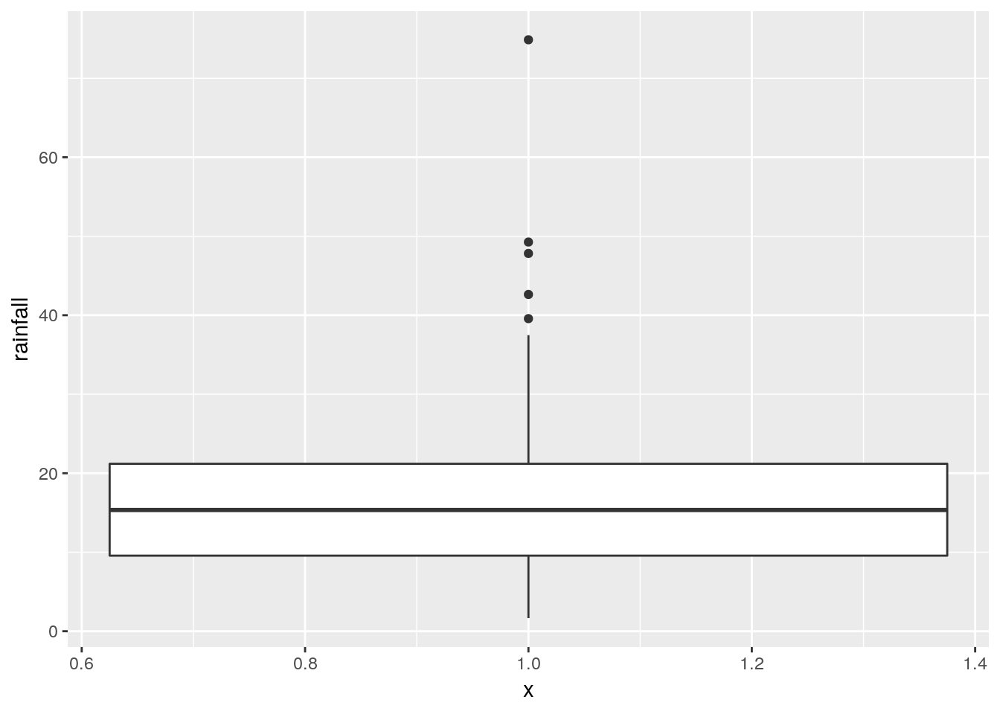

     
There is only one rainfall over 60 inches, and the smallest one is
close to zero but positive, so that is good.

Another possible plot here is a histogram, since there is only one quantitative variable:


```r
ggplot(rains, aes(x=rainfall))+geom_histogram(bins=7)
```


This clearly shows the rainfall value above 60 inches, but some other things are less clear: are those two rainfall values around 50 inches above or below 50, and are those six rainfall values near zero actually above zero? 
Extra: What stations have those extreme values? Should you wish to find out:

```r
rains %>% filter(rainfall>60)
```

```
## # A tibble: 1 x 5
##   station      rainfall altitude latitude fromcoast
##   <chr>           <dbl>    <int>    <dbl>     <int>
## 1 CrescentCity     74.9       35     41.7         1
```

 
This is a place right on the Pacific coast, almost up into Oregon (it's almost
the northernmost of all the stations). So it makes sense that it would
have a high rainfall, if anywhere does. (If you know anything about
rainy places, you'll probably think of Vancouver and Seattle, in the
Pacific Northwest.) Here it is:
[link](https://www.google.ca/maps/place/Crescent+City,+CA,+USA/@41.7552589,-123.9652917,8.42z/data=!4m5!3m4!1s0x54d066375c6288db:0x76e89ab07375e62e!8m2!3d41.7557501!4d-124.2025913). 
Which station has less than 2 inches of annual rainfall?

```r
rains %>% filter(rainfall<2)  
```

```
## # A tibble: 1 x 5
##   station     rainfall altitude latitude fromcoast
##   <chr>          <dbl>    <int>    <dbl>     <int>
## 1 DeathValley     1.66     -178     36.5       194
```

 
The name of the station is a clue: this one is in the desert. So you'd
expect very little rain. Its altitude is *negative*, so it's
actually *below* sea level. This is correct. Here is where it is:
[link](https://www.google.ca/maps/place/Death+Valley,+CA,+USA/@36.6341288,-118.2252974,7.75z/data=!4m5!3m4!1s0x80c739a21e8fffb1:0x1c897383d723dd25!8m2!3d36.5322649!4d-116.9325408).


(c) Plot `rainfall` against each of the other quantitative
variables (that is, not `station`). 


Solution


That is, `altitude`, `latitude` and
`fromcoast`. The obvious way to do this (perfectly
acceptable) is one plot at a time:

```r
ggplot(rains,aes(y=rainfall,x=altitude))+geom_point()
```


     


```r
ggplot(rains,aes(y=rainfall,x=latitude))+geom_point()
```


 

and finally 


```r
ggplot(rains,aes(y=rainfall,x=fromcoast))+geom_point()
```

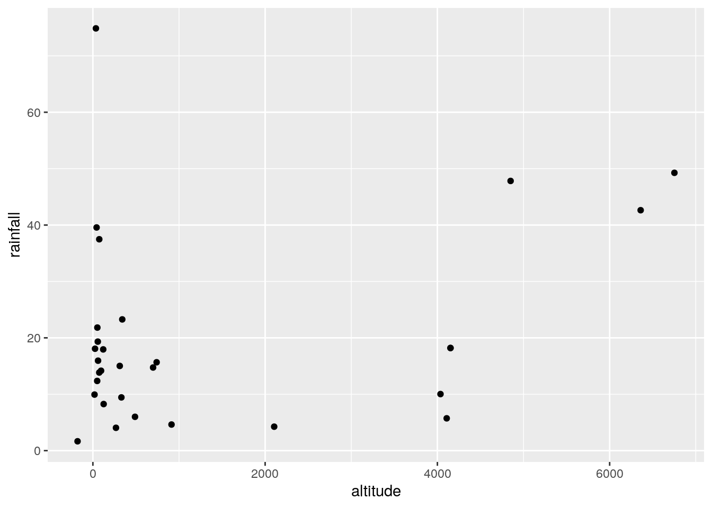

 

You can add a smooth trend to these if you want. Up to you. Just the
points is fine with me.

Here is a funky way to get all three plots in one shot:


```r
rains %>% gather(xname,x,altitude:fromcoast) %>%
ggplot(aes(x=x,y=rainfall))+geom_point()+
facet_wrap(~xname,scales="free")
```

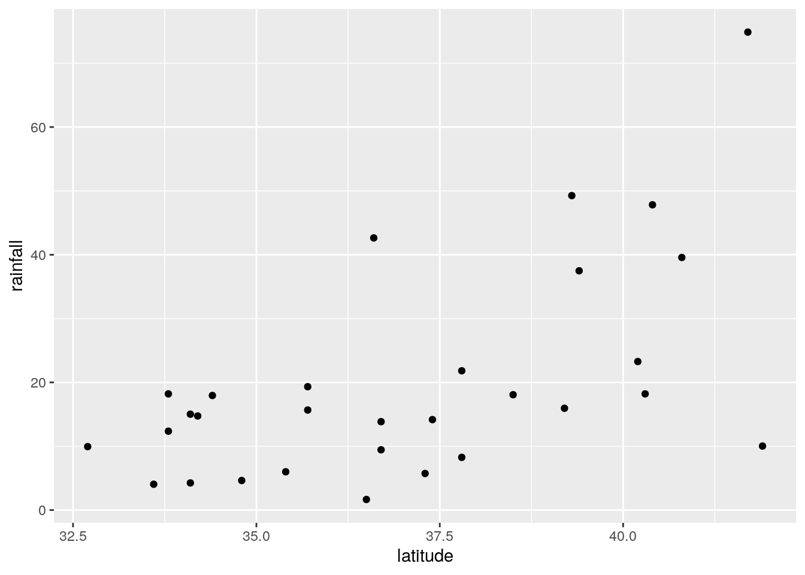

 

This always seems extraordinarily strange if you haven't run into it
before. The strategy is to put *all* the $x$-variables you want
to plot into *one* column and then plot your $y$ against the
$x$-column. A nice side-effect of the way `gather` works is
that what makes the $x$-columns different is that they are
$x$-variables with different *names*, which is exactly what you
want later for the facets. Thus: make a column of all the $x$'s glued
together, labelled by which $x$ they are, then plot $y$ against $x$
but make a different sub-plot or "facet" for each different
$x$-name. The last thing is that each $x$ is measured on a different
scale, and unless we take steps, all the sub-plots will have the
*same* scale on each axis, which we don't want.

I'm not sure I like how it came out, with three very tall
plots. `facet_wrap` can also take an `nrow` or an
`ncol`, which tells it how many rows or columns to use for the
display. Here, for example, two columns because I thought three was
too many:


```r
rains %>% gather(xname,x,altitude:fromcoast) %>%
ggplot(aes(x=x,y=rainfall))+geom_point()+
facet_wrap(~xname,scales="free",ncol=2)
```


 

Now, the three plots have come out about square, which I like a lot better.


(d) Look at the relationship of each other variable with
`rainfall`. 
Justify the assertion that `latitude` seems most strongly
related with `rainfall`. Is that relationship positive or negative? linear? Explain
briefly. 


Solution


Let's look at the three variables in turn:


* `altitude`: not much of anything. The stations near
sea level have rainfall all over the place, though the three
highest-altitude stations have the three highest rainfalls apart
from Crescent City.

* `latitude`: there is a definite upward trend here, in
that stations further north (higher latitude) are likely to have
a higher rainfall. I'd call this trend linear (or, not obviously
curved), though the two most northerly stations have one higher
and one much lower rainfall than you'd expect.

* `fromcoast`: this is a weak downward trend, though
the trend is spoiled by those three stations about 150 miles
from the coast that have more than 40 inches of rainfall.

Out of those, only `latitude` seems to have any meaningful
relationship with `rainfall`.


(e) Fit a regression with `rainfall` as the response
variable, and `latitude` as your explanatory variable. What
are the intercept, slope and R-squared values? Is there a 
*significant* relationship between `rainfall` and your
explanatory variable? What does that mean?


Solution


Save your `lm` into a
variable, since it will get used again later:

```r
rainfall.1=lm(rainfall~latitude,data=rains)
summary(rainfall.1)
```

```
## 
## Call:
## lm(formula = rainfall ~ latitude, data = rains)
## 
## Residuals:
##     Min      1Q  Median      3Q     Max 
## -27.297  -7.956  -2.103   6.082  38.262 
## 
## Coefficients:
##              Estimate Std. Error t value Pr(>|t|)    
## (Intercept) -113.3028    35.7210  -3.172  0.00366 ** 
## latitude       3.5950     0.9623   3.736  0.00085 ***
## ---
## Signif. codes:  0 '***' 0.001 '**' 0.01 '*' 0.05 '.' 0.1 ' ' 1
## 
## Residual standard error: 13.82 on 28 degrees of freedom
## Multiple R-squared:  0.3326,	Adjusted R-squared:  0.3088 
## F-statistic: 13.96 on 1 and 28 DF,  p-value: 0.0008495
```

 

My intercept is $-113.3$, slope is $3.6$ and R-squared is $0.33$ or
33\%. (I want you to pull these numbers out of the output and round
them off to something sensible.) The slope is significantly nonzero,
its P-value being 0.00085: rainfall really does depend on latitude, although
not strongly so.

Extra: Of course, I can easily do the others as well, though you don't have to:


```r
rainfall.2=lm(rainfall~fromcoast,data=rains)
summary(rainfall.2)
```

```
## 
## Call:
## lm(formula = rainfall ~ fromcoast, data = rains)
## 
## Residuals:
##     Min      1Q  Median      3Q     Max 
## -15.240  -9.431  -6.603   2.871  51.147 
## 
## Coefficients:
##             Estimate Std. Error t value Pr(>|t|)    
## (Intercept) 23.77306    4.61296   5.154 1.82e-05 ***
## fromcoast   -0.05039    0.04431  -1.137    0.265    
## ---
## Signif. codes:  0 '***' 0.001 '**' 0.01 '*' 0.05 '.' 0.1 ' ' 1
## 
## Residual standard error: 16.54 on 28 degrees of freedom
## Multiple R-squared:  0.04414,	Adjusted R-squared:   0.01 
## F-statistic: 1.293 on 1 and 28 DF,  p-value: 0.2651
```

 

Here, the intercept is 23.8, the slope is $-0.05$ and R-squared is a
dismal 0.04 (4\%).  This is a way of seeing that this relationship is
really weak, and it doesn't even have a curve to the trend or anything
that would compensate for this. I looked at the scatterplot again and
saw that if it were not for the point bottom right which is furthest
from the coast and has almost no rainfall, there would be almost no
trend at all. The slope here is not significantly different from zero,
with a P-value of 0.265.

Finally:


```r
rainfall.3=lm(rainfall~altitude,data=rains)
summary(rainfall.3)
```

```
## 
## Call:
## lm(formula = rainfall ~ altitude, data = rains)
## 
## Residuals:
##     Min      1Q  Median      3Q     Max 
## -20.620  -8.479  -2.729   4.555  58.271 
## 
## Coefficients:
##              Estimate Std. Error t value Pr(>|t|)    
## (Intercept) 16.514799   3.539141   4.666  6.9e-05 ***
## altitude     0.002394   0.001428   1.676    0.105    
## ---
## Signif. codes:  0 '***' 0.001 '**' 0.01 '*' 0.05 '.' 0.1 ' ' 1
## 
## Residual standard error: 16.13 on 28 degrees of freedom
## Multiple R-squared:  0.09121,	Adjusted R-squared:  0.05875 
## F-statistic:  2.81 on 1 and 28 DF,  p-value: 0.1048
```

 

The intercept is 16.5, the slope is 0.002 and the R-squared is 0.09 or
9\%, also terrible. The P-value is 0.105, which is not small enough to
be significant. 

So it looks as if it's only `latitude` that
has any impact at all. This is the only explanatory variable with a
significantly nonzero slope. On its own, at least.


(f) Fit a multiple regression predicting `rainfall` from
all three of the other (quantitative) variables. Display the
results. Comment is coming up later.


Solution


This, then:

```r
rainfall.4=lm(rainfall~latitude+altitude+fromcoast,data=rains)
summary(rainfall.4)
```

```
## 
## Call:
## lm(formula = rainfall ~ latitude + altitude + fromcoast, data = rains)
## 
## Residuals:
##     Min      1Q  Median      3Q     Max 
## -28.722  -5.603  -0.531   3.510  33.317 
## 
## Coefficients:
##               Estimate Std. Error t value Pr(>|t|)    
## (Intercept) -1.024e+02  2.921e+01  -3.505 0.001676 ** 
## latitude     3.451e+00  7.949e-01   4.342 0.000191 ***
## altitude     4.091e-03  1.218e-03   3.358 0.002431 ** 
## fromcoast   -1.429e-01  3.634e-02  -3.931 0.000559 ***
## ---
## Signif. codes:  0 '***' 0.001 '**' 0.01 '*' 0.05 '.' 0.1 ' ' 1
## 
## Residual standard error: 11.1 on 26 degrees of freedom
## Multiple R-squared:  0.6003,	Adjusted R-squared:  0.5542 
## F-statistic: 13.02 on 3 and 26 DF,  p-value: 2.205e-05
```

 


(g) What is the R-squared for the regression of the last part?
How does that compare with the R-squared of your regression in part (e)?


Solution


The R-squared is 0.60 (60\%), which is quite a bit bigger than the
R-squared of 0.33 (33\%) we got back in (e). 


(h) What do you conclude about the importance of the variables
that you did *not* include in your model in
(e)? Explain briefly.


Solution


Both variables `altitude` and `fromcoast` are
significant in this regression, so they have *something to add* over and above `latitude` when it comes to
predicting rainfall, even though (and this seems odd) they have no
apparent relationship with `rainfall` on their own. 
Another way to say this is that the three variables work together
as a team to predict rainfall, and together they do much better
than any one of them can do by themselves.  
This also goes to show that the scatterplots we began
with don't get to the heart of multi-variable relationships,
because they are only looking at the variables two at a time.


(i) Make a suitable hypothesis test that the variables
`altitude` and `fromcoast` significantly improve the
prediction of `rainfall` over the use of `latitude`
alone. What do you conclude?


Solution


This calls for `anova`. Feed this two fitted models,
smaller (fewer explanatory variables) first. The null hypothesis
is that the two models are equally good (so we should go with the
smaller); the alternative is that the larger model is better, so
that the extra complication is worth it:

```r
anova(rainfall.1,rainfall.4)  
```

```
## Analysis of Variance Table
## 
## Model 1: rainfall ~ latitude
## Model 2: rainfall ~ latitude + altitude + fromcoast
##   Res.Df    RSS Df Sum of Sq      F   Pr(>F)   
## 1     28 5346.8                                
## 2     26 3202.3  2    2144.5 8.7057 0.001276 **
## ---
## Signif. codes:  0 '***' 0.001 '**' 0.01 '*' 0.05 '.' 0.1 ' ' 1
```

 

The P-value is small, so we reject the null in favour of the
alternative: the regression with all three explanatory variables fits
better than the one with just `latitude`, so the bigger model
is the one we should go with.

If you have studied these things: this one is a 
"multiple-partial $F$-test", for testing the combined significance of more than one $x$
but less than all the $x$'s.
<label for="tufte-mn-" class="margin-toggle">&#8853;</label><input type="checkbox" id="tufte-mn-" class="margin-toggle"><span class="marginnote">If you had just one $x$, you'd  use a $t$-test for its slope, and if you were testing all the $x$'s, you'd use the global $F$-test that appears in the regression output.</span>


##  Carbon monoxide in cigarettes


 The (US) Federal Trade Commission assesses cigarettes
according to their tar, nicotine and carbon monoxide contents. In a
particular year, 25 brands were assessed. For each brand, the tar,
nicotine and carbon monoxide (all in milligrams) were measured, along
with the weight in grams. Our aim is to predict carbon monoxide from
any or all of the other variables. The data are in
[link](http://www.utsc.utoronto.ca/~butler/c32/ftccigar.txt). These are
aligned by column (except for the variable names), with more than one
space between each column of data.


(a) Read the data into R, and check that you have 25 observations
and 4 variables.


Solution


This specification calls for `read_table2`:

```r
my_url="http://www.utsc.utoronto.ca/~butler/c32/ftccigar.txt"
cigs=read_table2(my_url)
```

```
## Parsed with column specification:
## cols(
##   tar = col_double(),
##   nicotine = col_double(),
##   weight = col_double(),
##   co = col_double()
## )
```

```r
cigs
```

```
## # A tibble: 25 x 4
##      tar nicotine weight    co
##    <dbl>    <dbl>  <dbl> <dbl>
##  1  14.1     0.86  0.985  13.6
##  2  16       1.06  1.09   16.6
##  3  29.8     2.03  1.16   23.5
##  4   8       0.67  0.928  10.2
##  5   4.1     0.4   0.946   5.4
##  6  15       1.04  0.888  15  
##  7   8.8     0.76  1.03    9  
##  8  12.4     0.95  0.922  12.3
##  9  16.6     1.12  0.937  16.3
## 10  14.9     1.02  0.886  15.4
## # ... with 15 more rows
```

 
Yes, I have 25 observations on 4 variables indeed.

`read_delim` won't work (try it and see what happens), because
that would require the values to be separated by *exactly one* space.


(b) Run a regression to predict carbon monoxide from the other
variables, and obtain a summary of the output.


Solution


The word "summary" is meant to be a big clue that
`summary` is what you need:

```r
cigs.1=lm(co~tar+nicotine+weight,data=cigs) 
summary(cigs.1)
```

```
## 
## Call:
## lm(formula = co ~ tar + nicotine + weight, data = cigs)
## 
## Residuals:
##      Min       1Q   Median       3Q      Max 
## -2.89261 -0.78269  0.00428  0.92891  2.45082 
## 
## Coefficients:
##             Estimate Std. Error t value Pr(>|t|)    
## (Intercept)   3.2022     3.4618   0.925 0.365464    
## tar           0.9626     0.2422   3.974 0.000692 ***
## nicotine     -2.6317     3.9006  -0.675 0.507234    
## weight       -0.1305     3.8853  -0.034 0.973527    
## ---
## Signif. codes:  0 '***' 0.001 '**' 0.01 '*' 0.05 '.' 0.1 ' ' 1
## 
## Residual standard error: 1.446 on 21 degrees of freedom
## Multiple R-squared:  0.9186,	Adjusted R-squared:  0.907 
## F-statistic: 78.98 on 3 and 21 DF,  p-value: 1.329e-11
```

 


(c) Which one of your explanatory variables would you
remove from this regression? Explain (very) briefly. Go ahead and
fit the regression  without it, and describe how the change in
R-squared from the regression in (b) was entirely predictable.


Solution


First, the $x$-variable to remove. The obvious candidate is
`weight`, since it has easily the highest, and clearly
non-significant, P-value. So, out it comes:

```r
cigs.2=lm(co~tar+nicotine,data=cigs)
summary(cigs.2)
```

```
## 
## Call:
## lm(formula = co ~ tar + nicotine, data = cigs)
## 
## Residuals:
##      Min       1Q   Median       3Q      Max 
## -2.89941 -0.78470 -0.00144  0.91585  2.43064 
## 
## Coefficients:
##             Estimate Std. Error t value Pr(>|t|)    
## (Intercept)   3.0896     0.8438   3.662 0.001371 ** 
## tar           0.9625     0.2367   4.067 0.000512 ***
## nicotine     -2.6463     3.7872  -0.699 0.492035    
## ---
## Signif. codes:  0 '***' 0.001 '**' 0.01 '*' 0.05 '.' 0.1 ' ' 1
## 
## Residual standard error: 1.413 on 22 degrees of freedom
## Multiple R-squared:  0.9186,	Adjusted R-squared:  0.9112 
## F-statistic: 124.1 on 2 and 22 DF,  p-value: 1.042e-12
```

 

R-squared has dropped from 0.9186 to \ldots 0.9186! That is, taking
out `weight` has not just had a minimal effect on R-squared;
it's not changed R-squared at all. This is because `weight` was
so far from being significant: it literally had *nothing* to add.

Another way of achieving the same thing is via the function
`update`, which takes a fitted model object and describes the
*change* that you want to make:


```r
cigs.2a=update(cigs.1,.~.-weight)
summary(cigs.2a)
```

```
## 
## Call:
## lm(formula = co ~ tar + nicotine, data = cigs)
## 
## Residuals:
##      Min       1Q   Median       3Q      Max 
## -2.89941 -0.78470 -0.00144  0.91585  2.43064 
## 
## Coefficients:
##             Estimate Std. Error t value Pr(>|t|)    
## (Intercept)   3.0896     0.8438   3.662 0.001371 ** 
## tar           0.9625     0.2367   4.067 0.000512 ***
## nicotine     -2.6463     3.7872  -0.699 0.492035    
## ---
## Signif. codes:  0 '***' 0.001 '**' 0.01 '*' 0.05 '.' 0.1 ' ' 1
## 
## Residual standard error: 1.413 on 22 degrees of freedom
## Multiple R-squared:  0.9186,	Adjusted R-squared:  0.9112 
## F-statistic: 124.1 on 2 and 22 DF,  p-value: 1.042e-12
```

 

This can be shorter than describing the whole model again, as you do
with the `cigs.2` version of `lm`. The syntax is that
you first specify a "base"  fitted model object that you're going to
update. Because the model `cigs.1` contains all the information
about the kind of model it is, and which data frame the data come
from, R already knows that this is a linear 
multiple regression and which $x$'s it contains. The second thing to describe is the change from
the "base". In this case, we want to use the same response variable
and all the same explanatory variables that we had before, except for
`weight`. This is specified by a special kind of model formula
where `.` means "whatever was there before": in English,
"same response and same explanatories except take out `weight`". 


(d) Fit a regression predicting carbon monoxide from
`nicotine` *only*, and display the summary.


Solution


As you would guess:

```r
cigs.3=lm(co~nicotine,data=cigs)
summary(cigs.3)
```

```
## 
## Call:
## lm(formula = co ~ nicotine, data = cigs)
## 
## Residuals:
##     Min      1Q  Median      3Q     Max 
## -3.3273 -1.2228  0.2304  1.2700  3.9357 
## 
## Coefficients:
##             Estimate Std. Error t value Pr(>|t|)    
## (Intercept)   1.6647     0.9936   1.675    0.107    
## nicotine     12.3954     1.0542  11.759 3.31e-11 ***
## ---
## Signif. codes:  0 '***' 0.001 '**' 0.01 '*' 0.05 '.' 0.1 ' ' 1
## 
## Residual standard error: 1.828 on 23 degrees of freedom
## Multiple R-squared:  0.8574,	Adjusted R-squared:  0.8512 
## F-statistic: 138.3 on 1 and 23 DF,  p-value: 3.312e-11
```

 


(e) `nicotine` was far from being significant in the model
of (c), and yet in the model of
(d), it was *strongly* significant, and the
R-squared value of (d) was almost as high as that
of (c). What does this say about the importance of
`nicotine` as an explanatory variable? Explain, as briefly as
you can manage.


Solution


What this says is that you *cannot* say anything about the
"importance" of `nicotine` without also describing the
context that you're talking about.  *By itself*,
`nicotine` is important, but \emph{when you have
`tar` in the model}, `nicotine` is not
important: precisely, it now has nothing to add over and above
the predictive value that `tar` has. You might guess that
this is because `tar` and `nicotine` are 
"saying  the same thing" in some fashion. 
We'll explore that in a moment.


(f) Make a "pairs plot": that is, scatter plots between all
pairs of variables. This can be done by feeding the whole data frame
into `plot`.
<label for="tufte-mn-" class="margin-toggle">&#8853;</label><input type="checkbox" id="tufte-mn-" class="margin-toggle"><span class="marginnote">This is a base graphics graph rather    than a ggplot one, but it will do for our purposes.</span>
Do you see any strong relationships that do
*not* include `co`? Does that shed any light on the last
part? Explain briefly (or "at length" if that's how it comes
out). 


Solution


Plot the entire data frame:

```r
plot(cigs)  
```


 

We're supposed to ignore `co`, but I comment that strong
relationships between `co` and *both* of `tar` and
`nicotine` show up here, along with `weight` being
at most weakly related to anything else.

That leaves the relationship of `tar` and `nicotine`
with each other. That also looks like a strong linear trend. When you
have correlations between explanatory variables, it is called
"multicollinearity". 

I mentioned a while back (in class) that having correlated $x$'s was
trouble. Here is where we find out why. The problem is that when
`co` is large, `nicotine` is large, and a large value of
`tar` will come along with it. So we don't know whether a large
value of `co` is caused by a large value of `tar` or a
large value of `nicotine`: there is no way to separate out
their effects because in effect they are "glued together". 

You might know of this effect (in an experimental design context) as
"confounding": the effect of `tar` on `co` is
confounded with the effect of `nicotine` on `co`, and
you can't tell which one deserves the credit for predicting `co`.

If you were able to design an experiment here, you could (in
principle) manufacture a bunch of cigarettes with high tar; some of
them would have high  nicotine and some would have low. Likewise for
low tar. Then the
correlation between `nicotine` and `tar` would go away,
their effects on `co` would no longer be confounded, and you
could see unambiguously which one of the variables deserves credit for
predicting `co`. Or maybe it depends on both, genuinely, but at
least then you'd know.

We, however, have an observational study, so we have to make do with
the data we have. Confounding is one of the risks we take when we work
with observational data.

This was a "base graphics" plot. There is a way of doing a
`ggplot`-style "pairs plot", as this is called, thus:


```r
library(GGally)
```

```
## 
## Attaching package: 'GGally'
```

```
## The following object is masked from 'package:dplyr':
## 
##     nasa
```

```r
cigs %>% ggpairs()
```


 

As ever, `install.packages` first, in the likely event that you
don't have this package installed yet. Once you do, though, I think
this is a nicer way to get a pairs plot.

This plot is a bit more sophisticated: instead of just having the
scatterplots of the pairs of variables in the row and column, it uses
the diagonal to show a "kernel density" (a smoothed-out histogram),
and upper-right it shows the correlation between each pair of
variables. The three correlations between `co`, `tar`
and `nicotine` are clearly the highest.

If you want only some of the columns to appear in your pairs plot,
`select` them first, and then pass that data frame into
`ggpairs`. Here, we found that `weight` was not
correlated with anything much, so we can take it out and then make a
pairs plot of the other variables:


```r
cigs %>% select(-weight) %>% ggpairs()
```


 

The three correlations that remain are all very high, which is
entirely consistent with the strong linear relationships that you see
bottom left.


##  Maximal oxygen uptake in young boys


 A physiologist wanted to understand the relationship between
physical characteristics of pre-adolescent boys and their maximal
oxygen uptake (millilitres of oxygen per kilogram of body weight). The
data are in
[link](http://www.utsc.utoronto.ca/~butler/c32/youngboys.txt) for a
random sample of 10 pre-adolescent boys. The variables are (with
units):


* `uptake`: Oxygen uptake (millitres of oxygen per kilogram
of body weight)

* `age`: boy's age (years)

* `height`: boy's height (cm)

* `weight`: boy's weight (kg)

* `chest`: chest depth (cm).


(a) Read the data into R and confirm that you do indeed have
10 observations.


Solution


```r
my_url="http://www.utsc.utoronto.ca/~butler/c32/youngboys.txt"
boys=read_delim(my_url," ")
```

```
## Parsed with column specification:
## cols(
##   uptake = col_double(),
##   age = col_double(),
##   height = col_double(),
##   weight = col_double(),
##   chest = col_double()
## )
```

```r
boys
```

```
## # A tibble: 10 x 5
##    uptake   age height weight chest
##     <dbl> <dbl>  <dbl>  <dbl> <dbl>
##  1   1.54   8.4   132    29.1  14.4
##  2   1.74   8.7   136.   29.7  14.5
##  3   1.32   8.9   128.   28.4  14  
##  4   1.5    9.9   131.   28.8  14.2
##  5   1.46   9     130    25.9  13.6
##  6   1.35   7.7   128.   27.6  13.9
##  7   1.53   7.3   130.   29    14  
##  8   1.71   9.9   138.   33.6  14.6
##  9   1.27   9.3   127.   27.7  13.9
## 10   1.5    8.1   132.   30.8  14.5
```

         

10 boys (rows) indeed.


(b) Fit a regression predicting oxygen uptake from all the
other variables, and display the results.


Solution


Fitting four explanatory variables with only ten observations is likely to be pretty shaky, but we 
press ahead regardless:

```r
boys.1=lm(uptake~age+height+weight+chest,data=boys) 
summary(boys.1)
```

```
## 
## Call:
## lm(formula = uptake ~ age + height + weight + chest, data = boys)
## 
## Residuals:
##         1         2         3         4         5         6         7 
## -0.020697  0.019741 -0.003649  0.038470 -0.023639 -0.026026  0.050459 
##         8         9        10 
## -0.014380  0.004294 -0.024573 
## 
## Coefficients:
##              Estimate Std. Error t value Pr(>|t|)    
## (Intercept) -4.774739   0.862818  -5.534 0.002643 ** 
## age         -0.035214   0.015386  -2.289 0.070769 .  
## height       0.051637   0.006215   8.308 0.000413 ***
## weight      -0.023417   0.013428  -1.744 0.141640    
## chest        0.034489   0.085239   0.405 0.702490    
## ---
## Signif. codes:  0 '***' 0.001 '**' 0.01 '*' 0.05 '.' 0.1 ' ' 1
## 
## Residual standard error: 0.03721 on 5 degrees of freedom
## Multiple R-squared:  0.9675,	Adjusted R-squared:  0.9415 
## F-statistic:  37.2 on 4 and 5 DF,  p-value: 0.0006513
```

         


(c) (A one-mark question.) Would you say, on the evidence so
far, that the regression fits well or badly?  Explain (very)
briefly.


Solution


R-squared of 0.97 (97\%) is very high, so I'd say this
regression fits very well. That's all.
I said "on the evidence so far" to dissuade you from
overthinking this, or thinking that you needed to produce
some more evidence. That, plus the fact that this was only
one mark.


(d) It seems reasonable that an older boy should have a
greater oxygen uptake, all else being equal. Is this supported
by your output?  Explain briefly.


Solution


If an older boy has greater oxygen uptake (the "all else   equal" was a hint), 
the slope of `age` should be
positive. It is not: it is $-0.035$, so it is suggesting
(all else equal) that a greater age goes with a
*smaller* oxygen uptake.
The reason why this happens (which you didn't need, but
you can include it if you like) is that `age` has a
non-small P-value of 0.07, so that the `age` slope
is not significantly different from zero. With all the
other variables, `age` has nothing to *add*
over and above them, and we could therefore remove it.


(e) It seems reasonable that a boy with larger weight
should have larger lungs and thus a \emph{statistically
significantly} larger oxygen uptake. Is that what happens
here? Explain briefly.


Solution


Look at the P-value for `weight`. This is 0.14,
not small, and so a boy with larger weight does not have
a significantly larger oxygen uptake, all else
equal. (The slope for `weight` is not
significantly different from zero either.)
I emphasized "statistically significant" to remind you
that this means to do a test and get a P-value.


(f) Fit a model that contains only the significant
explanatory variables from your first regression. How do
the R-squared values from the two regressions compare?
(The last sentence asks for more or less the same thing as
the next part. Answer it either here or there. Either
place is good.)


Solution


Only `height` is significant, so that's the
only explanatory variable we need to keep. I would
just do the regression straight rather than using
`update` here:

```r
boys.2=lm(uptake~height,data=boys) 
summary(boys.2)
```

```
## 
## Call:
## lm(formula = uptake ~ height, data = boys)
## 
## Residuals:
##       Min        1Q    Median        3Q       Max 
## -0.069879 -0.033144  0.001407  0.009581  0.084012 
## 
## Coefficients:
##              Estimate Std. Error t value Pr(>|t|)    
## (Intercept) -3.843326   0.609198  -6.309 0.000231 ***
## height       0.040718   0.004648   8.761 2.26e-05 ***
## ---
## Signif. codes:  0 '***' 0.001 '**' 0.01 '*' 0.05 '.' 0.1 ' ' 1
## 
## Residual standard error: 0.05013 on 8 degrees of freedom
## Multiple R-squared:  0.9056,	Adjusted R-squared:  0.8938 
## F-statistic: 76.75 on 1 and 8 DF,  p-value: 2.258e-05
```

        

If you want, you can use `update` here, which looks like this:


```r
boys.2a=update(boys.1,.~.-age-weight-chest)  
summary(boys.2a)
```

```
## 
## Call:
## lm(formula = uptake ~ height, data = boys)
## 
## Residuals:
##       Min        1Q    Median        3Q       Max 
## -0.069879 -0.033144  0.001407  0.009581  0.084012 
## 
## Coefficients:
##              Estimate Std. Error t value Pr(>|t|)    
## (Intercept) -3.843326   0.609198  -6.309 0.000231 ***
## height       0.040718   0.004648   8.761 2.26e-05 ***
## ---
## Signif. codes:  0 '***' 0.001 '**' 0.01 '*' 0.05 '.' 0.1 ' ' 1
## 
## Residual standard error: 0.05013 on 8 degrees of freedom
## Multiple R-squared:  0.9056,	Adjusted R-squared:  0.8938 
## F-statistic: 76.75 on 1 and 8 DF,  p-value: 2.258e-05
```

 

This doesn't go quite so smoothly here because there are three
variables being removed, and it's a bit of work to type them all. 


(g) How has R-squared changed between your two
regressions? Describe what you see in a few words.


Solution


R-squared has dropped by a bit, from 97\% to 91\%. (Make your own
call: pull out the two R-squared numbers, and say a word or two about
how they compare. I don't much mind what you say: 
"R-squared has decreased (noticeably)", "R-squared has hardly changed". But say
something.)

 

(h) Carry out a test comparing the fit of your
two regression models. What do you conclude, and
therefore what recommendation would you make about the
regression that would be preferred?


Solution


The word "test" again implies something that  produces a P-value with a
null hypothesis that you might reject. In this case, the test that
compares two models differing by more than one $x$ uses
`anova`, testing the null hypothesis that the two regressions
are equally good, against the alternative that the bigger (first) one
is better. Feed `anova` two fitted model objects, smaller first:


```r
anova(boys.2, boys.1)
```

```
## Analysis of Variance Table
## 
## Model 1: uptake ~ height
## Model 2: uptake ~ age + height + weight + chest
##   Res.Df       RSS Df Sum of Sq      F Pr(>F)
## 1      8 0.0201016                           
## 2      5 0.0069226  3  0.013179 3.1729  0.123
```

 

This P-value of 0.123 is not small, so we do not reject the null
hypothesis. There is not a significant difference in fit between the
two models. Therefore, we should go with the smaller model
`boys.2` because it is simpler. 

That drop in R-squared from 97\% to 91\% was, it turns out, *not*
significant: the three extra variables
could have produced a change in R-squared like that, 
*even if  they were worthless*.
<label for="tufte-mn-" class="margin-toggle">&#8853;</label><input type="checkbox" id="tufte-mn-" class="margin-toggle"><span class="marginnote">Recall that adding $x$'s to a regression will always make R-squared go up, even if they are just random noise.</span>

If you have learned about "adjusted R-squared", you might recall
that this is supposed to go down *only* if the variables you took
out should not have been taken out. But adjusted R-squared goes down
here as well, from 94\% to 89\% (not quite as much, therefore). What
happens is that adjusted R-squared is rather more relaxed about
keeping variables than the `anova` $F$-test is; if we had used
an $\alpha$ of something like 0.10, the decision between the two
models would have been a lot closer, and this is reflected in the
adjusted R-squared values.


(i) Obtain a table of correlations between all
the variables in the data frame. Do this by feeding
the whole data frame into `cor`. 
We found that a regression predicting oxygen uptake
from just `height` was acceptably good. What
does your table of correlations say about why that
is? (Hint: look for all the correlations that are
*large*.) 


Solution


Correlations first:


```r
cor(boys)
```

```
##           uptake       age    height    weight     chest
## uptake 1.0000000 0.1361907 0.9516347 0.6576883 0.7182659
## age    0.1361907 1.0000000 0.3274830 0.2307403 0.1657523
## height 0.9516347 0.3274830 1.0000000 0.7898252 0.7909452
## weight 0.6576883 0.2307403 0.7898252 1.0000000 0.8809605
## chest  0.7182659 0.1657523 0.7909452 0.8809605 1.0000000
```

 
The correlations with `age` are all on the low side, but all
the other correlations are high, not just between `uptake` and the
other variables, but between the explanatory variables as well.

Why is this helpful in understanding what's going on? Well, imagine a
boy with large height (a tall one). The regression `boys.2`
says that this alone is enough to predict that such a boy's oxygen
uptake is likely to be large, since the slope is positive. But the
correlations tell you more: a boy with large height is also (somewhat)
likely to be older (have large age), heavier (large weight) and to have
larger `chest` cavity. So oxygen uptake does depend on those other
variables as well, but once you know `height` you can make a
good guess at their values; you don't need to know them.

Further remarks: `age` has a low correlation with
`uptake`, so its non-significance earlier appears to be
"real": it really does have nothing extra to say, because the other
variables have a stronger link with `uptake` than
`age`. Height, however, seems to be the best way of relating
oxygen uptake to any of the other variables. I think the suppositions
from earlier about relating oxygen uptake to "bigness"
<label for="tufte-mn-" class="margin-toggle">&#8853;</label><input type="checkbox" id="tufte-mn-" class="margin-toggle"><span class="marginnote">This  is not, I don't think, a real word, but I mean size emphasizing  how big a boy is generally, rather than how small.</span> in some sense
are actually sound, but age and weight and `chest` capture
"bigness" worse than height does. Later, when you learn about
Principal Components, you will see that the first principal component,
the one that best captures how the variables vary together, is often
"bigness" in some sense.

Another way to think about these things is via pairwise
scatterplots. The nicest way to produce these is via `ggpairs`
from package `GGally`:


```r
boys %>% ggpairs()
```


 

A final remark: with five variables, we really ought to have more than
ten observations (something like 50 would be better). But with more
observations and the same correlation structure, the same issues would
come up again, so the question would not be materially changed.


 


## Facebook friends and grey matter


 Is there a relationship between the number
of Facebook friends a person has, and the density of grey matter in
the areas of the brain associated with social perception and
associative memory? To find out, a 2012 study measured both of these
variables for a sample of 40 students at City University in London
(England). The data are at
[link](http://www.utsc.utoronto.ca/~butler/c32/facebook.txt). The grey
matter density is on a $z$-score standardized scale. The values are
separated by *tabs*.

The aim of this question is to produce an R Markdown report that
contains your answers to the questions below. 

You should aim to make your report flow smoothly, so that it would be
pleasant for a grader to read, and can stand on its own as an analysis
(rather than just being the answer to a question that I set you).
Some suggestions: give your report a title and arrange it into
sections with an Introduction; add a small amount of additional text
here and there explaining what you are doing and why. I don't expect
you to spend a large amount of time on this, but I *do* hope
you will make some effort. (My report came out to 4 Word pages.)


(a) Read in the data and make a scatterplot for predicting the
number of Facebook friends from the grey matter density. On your
scatterplot, add a smooth trend.


Solution


Begin your document with a code chunk containing
`library(tidyverse)`. The data values are
separated by tabs, which you will need to take into account:

```r
my_url="http://www.utsc.utoronto.ca/~butler/c32/facebook.txt"
fb=read_tsv(my_url)
```

```
## Parsed with column specification:
## cols(
##   GMdensity = col_double(),
##   FBfriends = col_integer()
## )
```

```r
fb
```

```
## # A tibble: 40 x 2
##    GMdensity FBfriends
##        <dbl>     <int>
##  1      -1.8        23
##  2       0.1        35
##  3      -1.2        80
##  4      -0.4       110
##  5      -0.9       120
##  6      -2.1       140
##  7      -1.5       168
##  8       0.5       132
##  9       0.6       154
## 10      -0.5       241
## # ... with 30 more rows
```

```r
ggplot(fb,aes(x=GMdensity,y=FBfriends))+geom_point()+geom_smooth()
```

```
## `geom_smooth()` using method = 'loess' and formula 'y ~ x'
```


       


(b) Describe what you see on your scatterplot: is there a
trend, and if so, what kind of trend is it? (Don't get too taken in
by the exact shape of your smooth trend.) Think "form, direction,  strength". 


Solution


I'd say there seems to be a weak, upward, apparently linear
trend. The points are not especially close to the trend, so I
don't think there's any justification for calling this other
than "weak". (If you think the trend is, let's say,
"moderate", you ought to say what makes you think that: for
example, that the people with a lot of Facebook friends also
tend to have a higher grey matter density. I can live with a
reasonably-justified "moderate".)
The reason I said not to get taken in by the shape of the smooth
trend is that this has a "wiggle" in it: it goes down again
briefly in the middle. But this is likely a quirk of the data,
and the trend, if there is any, seems to be an upward one.


(c) Fit a regression predicting the number of Facebook friends
from the grey matter density, and display the output.


Solution


That looks like this. You can call the "fitted model object"
whatever you like, but you'll need to get the capitalization of
the  variable names correct:

```r
fb.1=lm(FBfriends~GMdensity,data=fb)
summary(fb.1)
```

```
## 
## Call:
## lm(formula = FBfriends ~ GMdensity, data = fb)
## 
## Residuals:
##     Min      1Q  Median      3Q     Max 
## -339.89 -110.01   -5.12   99.80  303.64 
## 
## Coefficients:
##             Estimate Std. Error t value Pr(>|t|)    
## (Intercept)   366.64      26.35  13.916  < 2e-16 ***
## GMdensity      82.45      27.58   2.989  0.00488 ** 
## ---
## Signif. codes:  0 '***' 0.001 '**' 0.01 '*' 0.05 '.' 0.1 ' ' 1
## 
## Residual standard error: 165.7 on 38 degrees of freedom
## Multiple R-squared:  0.1904,	Adjusted R-squared:  0.1691 
## F-statistic: 8.936 on 1 and 38 DF,  p-value: 0.004882
```

       

I observe, though I didn't ask you to, that the R-squared is pretty
awful, going with a correlation of 

```r
sqrt(0.1904)
```

```
## [1] 0.4363485
```

 

which *would* look
like as weak of a trend as we saw.
<label for="tufte-mn-" class="margin-toggle">&#8853;</label><input type="checkbox" id="tufte-mn-" class="margin-toggle"><span class="marginnote">Correlations have to go up beyond 0.50 before they start looking at all interesting.</span>


(d) Is the slope of your regression line significantly
different from zero? What does that mean, in the context of the
data?


Solution


The P-value of the slope is 0.005, which is less than
0.05. Therefore the slope *is* significantly different from
zero. That means that the number of Facebook friends really does
depend on the grey matter density, for the whole population of
interest and not just the 40 students observed here (that were a
sample from that population). I don't mind so much what you
think the population is, but it needs to be clear that the
relationship applies to a population. 
Another way to approach this is to say that you would expect
this relationship to show up again in another similar
experiment. That also works, because it gets at the idea of
reproducibility. 


(e) Are you surprised by the results of
parts (b) and (d)? Explain briefly.


Solution


I *am* surprised, because I thought the trend on the
scatterplot was so weak that there would not be a significant
slope. I guess there was enough of an upward trend to be
significant, and with $n=40$ observations we were able to get a
significant slope out of that scatterplot. With this many
observations, even a weak correlation can be significantly
nonzero. 
You can be surprised or not, but you need to have some kind of
consideration of the strength of the trend on the scatterplot as
against the significance of the slope. For example, if you
decided that the trend was "moderate" in strength, you would
be justified in being less surprised than I was. 
Here, there is the usual issue that we have proved that the
slope is not zero (that the relationship is not flat), but we
may not have a very clear idea of what the slope actually
*is*. There are a couple of ways to get a confidence
interval. The obvious one is to use R as a calculator and go up
and down twice its standard error (to get a rough idea):

```r
82.45+2*27.58*c(-1,1)
```

```
## [1]  27.29 137.61
```

       
The `c()` thing is to get both confidence limits at once. The
smoother way is this:


```r
confint(fb.1)
```

```
##                 2.5 %   97.5 %
## (Intercept) 313.30872 419.9810
## GMdensity    26.61391 138.2836
```

 

Feed `confint` a "fitted model object" and it'll give you
confidence intervals (by default 95\%) for all the parameters in it. 

The confidence interval for the slope goes from about 27 to about
138. That is to say, a one-unit increase in grey matter density goes
with an increase in Facebook friends of this much. This is not
especially insightful: it's bigger than zero (the test was
significant), but other than that, it could be almost
anything. *This* is where the weakness of the trend comes back to
bite us. With this much scatter in our data, we need a *much*
larger sample size to estimate accurately how big an effect grey
matter density has.


(f) Obtain a scatterplot with the regression line on it.


Solution


Just a modification
of (a):

```r
ggplot(fb,aes(x=GMdensity,y=FBfriends))+geom_point()+
geom_smooth(method="lm")
```


       


(g) Obtain a plot of the residuals from the regression against
the fitted values, and comment briefly on it.


Solution


This is, to my mind, the easiest way:

```r
ggplot(fb.1,aes(x=.fitted,y=.resid))+geom_point()
```


       

There is some "magic" here, since the fitted model object is not
actually a data frame, but it works this way.
That looks to me like a completely random scatter of
points. Thus, I am completely happy with the straight-line regression
that we fitted, and I see no need to improve it.

(You should make two points here: one, describe what you see, and two,
what it implies about whether or not your regression is satisfactory.)

Compare that residual plot with this one:


```r
ggplot(fb.1,aes(x=.fitted,y=.resid))+
geom_point()+geom_smooth()
```

```
## `geom_smooth()` using method = 'loess' and formula 'y ~ x'
```

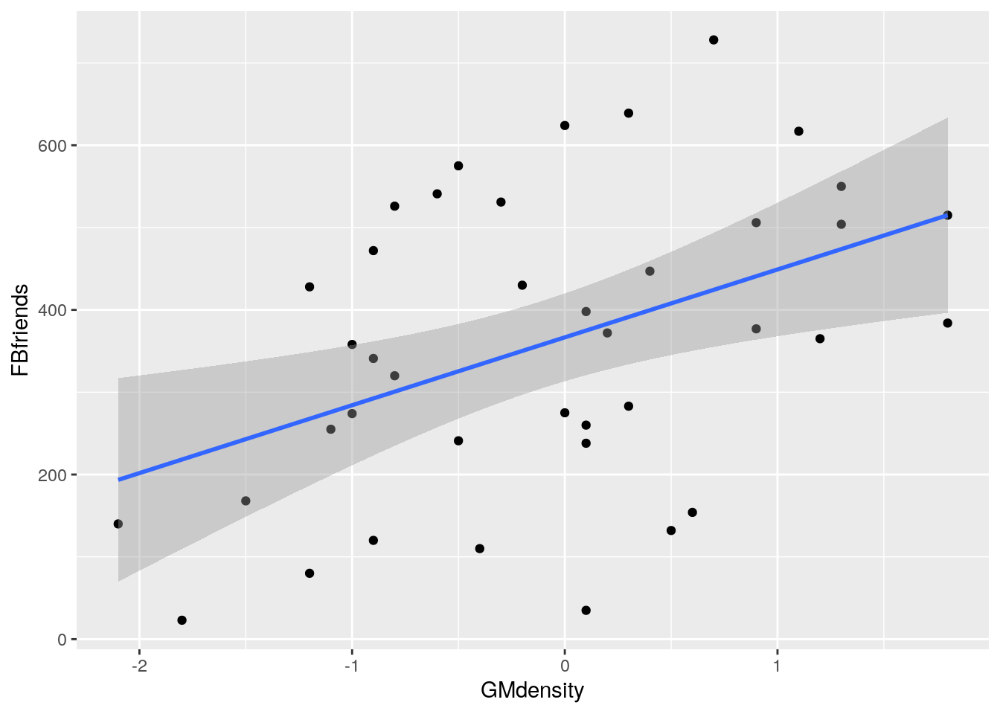

       
Now, why did I try adding a smooth trend, and why is it not
necessarily a good idea? The idea of a residual plot is that there
should be no trend, and so the smooth trend curve ought to go straight
across. The problem is that it will tend to wiggle, just by chance, as
here: it looks as if it goes up and down before flattening out. But if
you look at the points, *they* are all over the place, not close
to the smooth trend at all. So the smooth trend is rather
deceiving. Or, to put it another way, to indicate a real problem, the
smooth trend would have to be a *lot* farther from flat than this
one is. I'd call this one basically flat.


##  Endogenous nitrogen excretion in carp


 A paper in Fisheries Science reported on variables that
affect "endogenous nitrogen excretion" or ENE in carp raised in
Japan. A number of carp were divided into groups based on body weight,
and each group was placed in a different tank. The mean body weight of
the carp placed in each tank was recorded. The carp were then fed a
protein-free diet three times daily for a period of 20 days. At the
end of the experiment, the amount of ENE in each tank was measured, in
milligrams of total fish body weight per day. (Thus it should not
matter that some of the tanks had more fish than others, because the
scaling is done properly.)

For this question, write a report in R Markdown that answers the
questions below and contains some narrative that describes your
analysis. Create an HTML document from your R Markdown.


(a) Read the data in from
[link](http://www.utsc.utoronto.ca/~butler/c32/carp.txt). There are 10
tanks. 


Solution


Just this. Listing the data is up to you, but doing so and
commenting that the values appear to be correct will improve your report.

```r
my_url="http://www.utsc.utoronto.ca/~butler/c32/carp.txt"
carp=read_delim(my_url," ")  
```

```
## Parsed with column specification:
## cols(
##   tank = col_integer(),
##   bodyweight = col_double(),
##   ENE = col_double()
## )
```

```r
carp
```

```
## # A tibble: 10 x 3
##     tank bodyweight   ENE
##    <int>      <dbl> <dbl>
##  1     1       11.7  15.3
##  2     2       25.3   9.3
##  3     3       90.2   6.5
##  4     4      213     6  
##  5     5       10.2  15.7
##  6     6       17.6  10  
##  7     7       32.6   8.6
##  8     8       81.3   6.4
##  9     9      142.    5.6
## 10    10      286.    6
```

 


(b) Create a scatterplot of ENE (response) against bodyweight
(explanatory). Add a smooth trend to your plot.


Solution


```r
ggplot(carp,aes(x=bodyweight,y=ENE))+geom_point()+
geom_smooth()
```

```
## `geom_smooth()` using method = 'loess' and formula 'y ~ x'
```

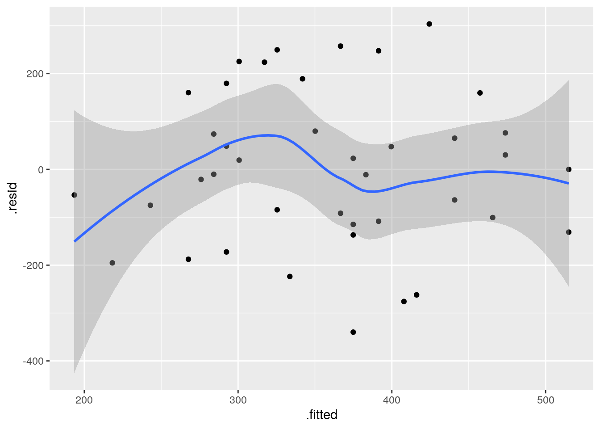

 

This part is just about getting the plot. Comments are coming in a
minute. Note that `ENE` is capital letters, so that
`ene` will not work.


(c) Is there an upward or downward trend (or neither)? Is the
relationship a line or a curve? Explain briefly.


Solution


The trend is downward: as bodyweight increases, ENE
decreases. However, the decrease is rapid at first and then levels
off, so the relationship is nonlinear. I want some kind of
support for an assertion of non-linearity: anything that says that
the slope or rate of decrease is not constant is good.


(d) Fit a straight line to the data, and obtain the R-squared
for the regression.


Solution


`lm`. The first stage is to fit the straight line, saving
the result in a  variable, and the second stage is to look at the
"fitted model object", here via `summary`:

```r
carp.1=lm(ENE~bodyweight,data=carp)
summary(carp.1)
```

```
## 
## Call:
## lm(formula = ENE ~ bodyweight, data = carp)
## 
## Residuals:
##    Min     1Q Median     3Q    Max 
## -2.800 -1.957 -1.173  1.847  4.572 
## 
## Coefficients:
##             Estimate Std. Error t value Pr(>|t|)    
## (Intercept) 11.40393    1.31464   8.675 2.43e-05 ***
## bodyweight  -0.02710    0.01027  -2.640   0.0297 *  
## ---
## Signif. codes:  0 '***' 0.001 '**' 0.01 '*' 0.05 '.' 0.1 ' ' 1
## 
## Residual standard error: 2.928 on 8 degrees of freedom
## Multiple R-squared:  0.4656,	Adjusted R-squared:  0.3988 
## F-statistic: 6.971 on 1 and 8 DF,  p-value: 0.0297
```

 
Finally, you need to give me a (suitably rounded) value for
R-squared: 46.6\% or 47\% or the equivalents as a decimal. I just
need the value at this point.
This kind of R-squared is actually pretty good for natural data, but
the issue is whether we can improve it by fitting a non-linear
model.
<label for="tufte-mn-" class="margin-toggle">&#8853;</label><input type="checkbox" id="tufte-mn-" class="margin-toggle"><span class="marginnote">The suspicion being that we can, since the    scatterplot suggested serious non-linearity.</span>


(e) Obtain a residual plot (residuals against fitted values)
for this regression. Do you see any problems? If so, what does that
tell you about the relationship in the data?


Solution


This is the easiest way: feed the output of the regression
straight into `ggplot`:


```r
ggplot(carp.1,aes(x=.fitted,y=.resid))+geom_point()
```


 


(f) Fit a parabola to the data (that is, including an
$x$-squared term). Compare the R-squared values for the models in
this part and part (d). Does that suggest that the parabola
model is an improvement here over the linear model?


Solution


Add bodyweight-squared to
the regression. Don't forget the `I()`:

```r
carp.2=lm(ENE~bodyweight+I(bodyweight^2),data=carp)
summary(carp.2)
```

```
## 
## Call:
## lm(formula = ENE ~ bodyweight + I(bodyweight^2), data = carp)
## 
## Residuals:
##     Min      1Q  Median      3Q     Max 
## -2.0834 -1.7388 -0.5464  1.3841  2.9976 
## 
## Coefficients:
##                   Estimate Std. Error t value Pr(>|t|)    
## (Intercept)     13.7127373  1.3062494  10.498 1.55e-05 ***
## bodyweight      -0.1018390  0.0288109  -3.535  0.00954 ** 
## I(bodyweight^2)  0.0002735  0.0001016   2.692  0.03101 *  
## ---
## Signif. codes:  0 '***' 0.001 '**' 0.01 '*' 0.05 '.' 0.1 ' ' 1
## 
## Residual standard error: 2.194 on 7 degrees of freedom
## Multiple R-squared:  0.7374,	Adjusted R-squared:  0.6624 
## F-statistic: 9.829 on 2 and 7 DF,  p-value: 0.009277
```

 

R-squared has gone up from 47\% to 74\%, a substantial
improvement. This suggests to me that the parabola model is a
substantial improvement.
<label for="tufte-mn-" class="margin-toggle">&#8853;</label><input type="checkbox" id="tufte-mn-" class="margin-toggle"><span class="marginnote">Again, not a surprise, given our  initial scatterplot.</span> 

I try to avoid using the word "significant" in this context, since
we haven't actually done a test of significance.

The reason for the `I()` is that the up-arrow has a special
meaning in `lm`, relating to interactions between factors (as
in ANOVA), that we don't want here. Putting `I()` around it
means "use as is", that is, raise bodyweight to power 2, rather than
using the special meaning of the up-arrow in `lm`.

Because it's the up-arrow that is the problem, this applies whenever
you're raising an explanatory variable to a power (or taking a
reciprocal or a square root, say).


(g) Is the test for the slope coefficient for the squared term
significant? What does this mean?


Solution


Look along the `bodyweight`-squared line to get a P-value
of 0.031. This is less than the default 0.05, so it *is*
significant.
This means, in short, that the quadratic model is a significant
*improvement* over the linear one.
<label for="tufte-mn-" class="margin-toggle">&#8853;</label><input type="checkbox" id="tufte-mn-" class="margin-toggle"><span class="marginnote">Now we can use that word   *significant*.</span> 
Said longer: the null hypothesis being tested is that the slope
coefficient of the squared term is zero (that is, that the squared
term has nothing to add over the linear model). This is rejected,
so the squared term has *something* to add in terms of
quality of prediction.


(h) Make the scatterplot of part (b), but add
the fitted curve. Describe any way in which the curve fails to fit well.


Solution


This is a bit slippery, because the points to plot and the
fitted curve are from different data frames. What you do in this
case is to put a `data=` in one of the `geom`s,
which says "don't use the data frame that was in the  `ggplot`, but use this one instead". 
I would think about
starting with the regression object `carp.2` as my base
data frame, since we want (or I want) to do two things with
that: plot the fitted values and join them with lines. Then I
want to add the original data, just the points:

```r
ggplot(carp.2,aes(x=carp$bodyweight,y=.fitted),colour="blue")+
geom_line(colour="blue")+
geom_point(data=carp,aes(x=bodyweight,y=ENE))
```


       

This works, but is not very aesthetic, because the bodyweight that is
plotted against the fitted values is in the wrong data frame, and so
we have to use the dollar-sign thing to get it from the right one.

A better way around this is "augment" the data with output from the regression object. 
This is done using `augment` from 
package `broom`:

```r
library(broom)
carp.2a=augment(carp.2, carp)
carp.2a
```

```
## # A tibble: 10 x 10
##     tank bodyweight   ENE .fitted .se.fit .resid  .hat .sigma .cooksd
##  * <int>      <dbl> <dbl>   <dbl>   <dbl>  <dbl> <dbl>  <dbl>   <dbl>
##  1     1       11.7  15.3   12.6    1.07   2.74  0.239   1.99 0.215  
##  2     2       25.3   9.3   11.3    0.886 -2.01  0.163   2.19 0.0651 
##  3     3       90.2   6.5    6.75   1.07  -0.252 0.240   2.37 0.00182
##  4     4      213     6      4.43   1.25   1.57  0.325   2.24 0.122  
##  5     5       10.2  15.7   12.7    1.10   3.00  0.251   1.90 0.279  
##  6     6       17.6  10     12.0    0.980 -2.01  0.199   2.19 0.0866 
##  7     7       32.6   8.6   10.7    0.828 -2.08  0.143   2.18 0.0583 
##  8     8       81.3   6.4    7.24   1.01  -0.841 0.211   2.34 0.0166 
##  9     9      142.    5.6    4.78   1.31   0.822 0.355   2.33 0.0398 
## 10    10      286.    6      6.94   2.05  -0.940 0.875   2.11 3.40   
## # ... with 1 more variable: .std.resid <dbl>
```

 

so now you see what `carp.2a` has in it, and then:


```r
g=ggplot(carp.2a,aes(x=bodyweight,y=.fitted))+
geom_line(colour="blue")+
geom_point(aes(y=ENE))
```

 

This is easier coding: there are only two non-standard things. The
first is that the fitted-value lines should be a distinct colour like
blue so that you can tell them from the data points. The second thing
is that for the second `geom_point`, the one that plots the data,
the $x$ coordinate `bodyweight` is correct so that we don't
have to change that; we only have to change the $y$-coordinate, which
is `ENE`. The plot is this:


```r
g
```

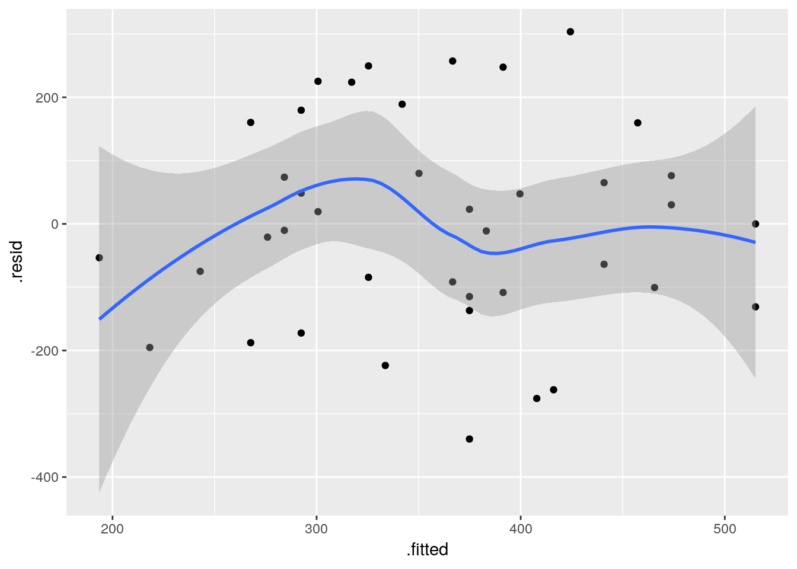

 

Concerning interpretation, you have a number of possibilities
here. The simplest is that the points in the middle are above the
curve, and the points at the ends are below. (That is, negative
residuals at the ends, and positive ones in the middle, which gives
you a hint for the next part.) Another is that the parabola curve
fails to capture the *shape* of the relationship; for example, I
see nothing much in the data suggesting that the relationship should go
back up, and even given that, the fitted curve doesn't go especially
near any of the points.

I was thinking that the data should be fit better by something like
the left half of an upward-opening parabola, but I guess the curvature
on the left half of the plot suggests that it needs most of the left
half of the parabola just to cover the left half of the plot.

The moral of the story, as we see in the next part, is that the
parabola is the wrong curve for the job.


(i) Obtain a residual plot for the parabola model. Do you see
any problems with it? (If you do, I'm not asking you to do anything
about them in this question, but I will.)


Solution


The same idea as before for the other residual plot.  Use the
fitted model object `carp.2` as your data frame for the
`ggplot`:

```r
ggplot(carp.2,aes(x=.fitted,y=.resid))+geom_point()
```


 

I think this is *still* a curve (or, it goes down and then
sharply up at the end). Either way, there is still a pattern. 

That was all I needed, but as to what this means: our parabola was a
curve all right, but it appears not to be the right *kind* of
curve. I think the original data looks more like a hyperbola (a curve
like $y=1/x$) than a parabola, in that it seems to decrease fast and
then gradually to a limit, and *that* suggests, as in the class
example, that we should try an asymptote model. Note how I specify it,
with the `I()` thing again, since `/` has a special meaning 
to `lm` in the same way that 
`^` does:

```r
carp.3=lm(ENE~I(1/bodyweight),data=carp)
summary(carp.3)
```

```
## 
## Call:
## lm(formula = ENE ~ I(1/bodyweight), data = carp)
## 
## Residuals:
##      Min       1Q   Median       3Q      Max 
## -1.29801 -0.12830  0.04029  0.26702  0.91707 
## 
## Coefficients:
##                 Estimate Std. Error t value Pr(>|t|)    
## (Intercept)       5.1804     0.2823   18.35 8.01e-08 ***
## I(1/bodyweight) 107.6690     5.8860   18.29 8.21e-08 ***
## ---
## Signif. codes:  0 '***' 0.001 '**' 0.01 '*' 0.05 '.' 0.1 ' ' 1
## 
## Residual standard error: 0.6121 on 8 degrees of freedom
## Multiple R-squared:  0.9766,	Adjusted R-squared:  0.9737 
## F-statistic: 334.6 on 1 and 8 DF,  p-value: 8.205e-08
```

 

That fits *extraordinarily* well, with an R-squared up near
98\%. The intercept is the asymptote, which suggests a (lower) limit
of about 5.2 for `ENE` (in the limit for large bodyweight). We
would have to ask the fisheries scientist whether this kind of thing
is a reasonable biological mechanism. It says that a carp always has
some ENE, no matter how big it gets, but a smaller carp will have a
lot more.

Does the fitted value plot look reasonable now? This is `augment` again since the fitted values and observed data come from different data frames:

```r
library(broom)
augment(carp.3, carp) %>% 
ggplot(aes(x=bodyweight,y=.fitted))+
geom_line(colour="blue")+
geom_point(aes(y=ENE))
```

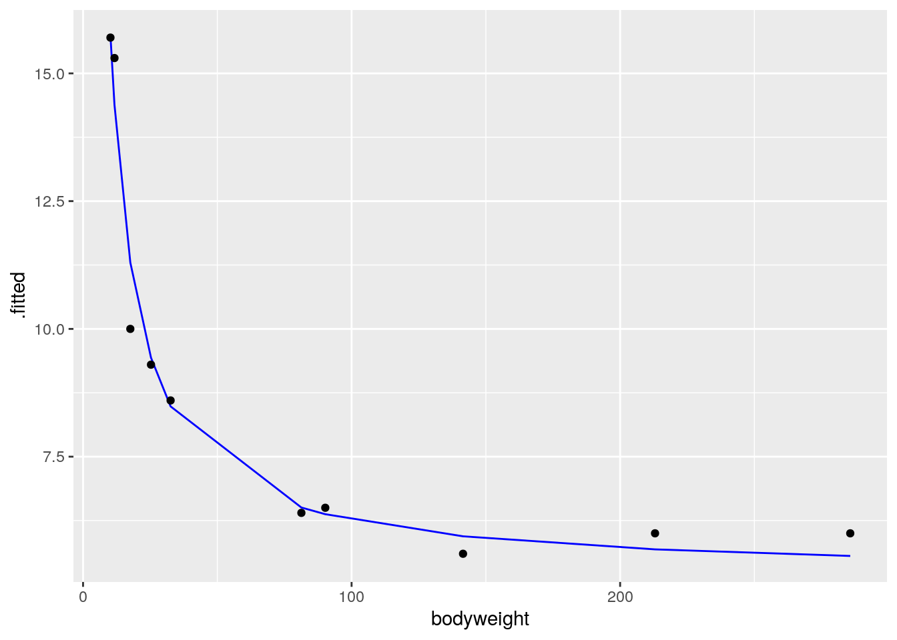

 

I'd say that does a really nice job of fitting the data. But it would
be nice to have a few more tanks with large-bodyweight fish, to
convince us that we have the shape of the trend right.

And, as ever, the residual plot. That's a lot easier than the plot we
just did:


```r
ggplot(carp.3,aes(x=.fitted,y=.resid))+geom_point()
```

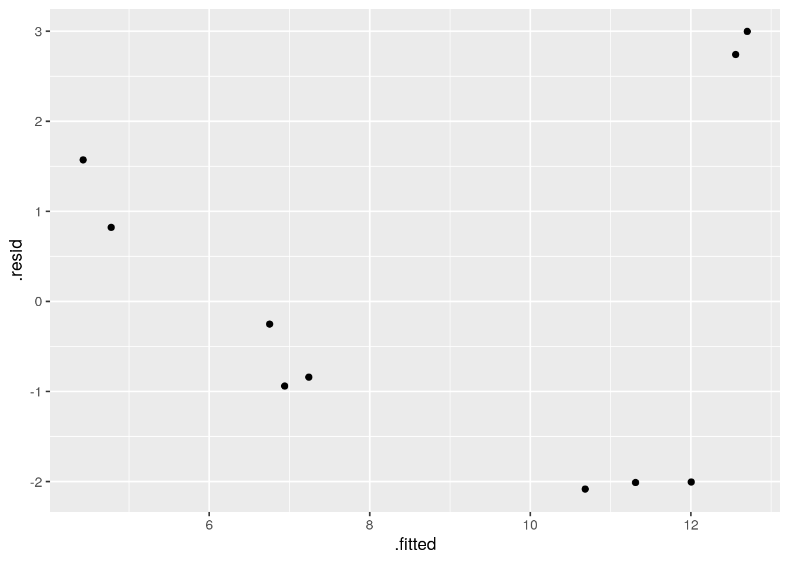

 

All in all, that looks pretty good (and certainly a vast improvement
over the ones you got before).

When you write up your report, you can make it flow better by writing
it in a way that suggests that each thing was the obvious thing to do
next: that is, that *you* would have thought to do it next,
rather than me telling you what to do.

My report (as an R Markdown file) is at
[link](http://www.utsc.utoronto.ca/~butler/c32/carp.Rmd). Download it,
knit it, play with it.


##  Sparrowhawks


 One of nature's patterns is the relationship
between the percentage of adult birds in a colony that return from the
previous year, and the number of new adults that join the colony. Data
for 13 colonies of sparrowhawks can be found at
[link](http://www.utsc.utoronto.ca/~butler/c32/sparrowhawk.txt). The
columns are the percentage of adults returning from the previous year,
and the number of new adults that join the colony.


(a) Create a new R Markdown report, give it a suitable title, and
ask for HTML output. Answer the questions that follow in your
report. At any stage, you can Knit HTML
to see how the report looks so far.


Solution


In R Studio, select File, New File, R Markdown. Fill in the Title,
Author and leave the Default Output Format at HTML. You'll see a
template report with the document info at the top. This is my document info:


 
This is known in the jargon as a "YAML block".
<label for="tufte-mn-" class="margin-toggle">&#8853;</label><input type="checkbox" id="tufte-mn-" class="margin-toggle"><span class="marginnote">YAML      stands for *Yet Another Markup Language*, but we're not using      it in this course, other than as the top bit of an R Markdown document.</span>
Below that is the template R Markdown document, which you can delete now or later.


(b) Read in the data and display the  first few values.  Add some text saying how many rows of data
there are.


Solution


Read the data into a data frame. In your
report, add some text like "we read in the data", perhaps
after a section heading like "The data". Then add a *code chunk* 
by selecting Chunks and Insert Chunk, or by pressing
control-alt-I. So far you have something like this. 


Inside the code chunk, that is, in the bit between the
backtick characters, put R code, just as you would type it at
the Console or put in an  R notebook. In this case, that would be
the following code, minus the message that comes out of
`read_delim`: 

```r
library(tidyverse)
my_url="http://www.utsc.utoronto.ca/~butler/c32/sparrowhawk.txt"
sparrowhawks=read_delim(my_url," ")
```

```
## Parsed with column specification:
## cols(
##   returning = col_integer(),
##   newadults = col_integer()
## )
```

```r
sparrowhawks
```

     
For you, it looks like this:


We don't know how many rows of data there are yet, so I've left a
"placeholder" for it, when we figure it out.
The file is annoyingly called `sparrowhawk.txt`,
singular. Sorry about that. 
If you knit this (click on "Knit HTML" next to the ball of wool,
or press control-shift-K), it should run, and you'll see a viewer
pop up with the HTML output. Now you can see how many rows there
are, and you can go back and edit the R Markdown and put in 13 in
place of `xxx`, and knit again.
You might be worried about how hard R is working with all this
knitting. Don't worry about that. R can take it.
Mine looked like this:


There is a better way of adding values that come from the output,
which I mention here in case you are interested (if you are not,
feel free to skip this). What you do is to make what is called an
"inline code chunk". Where you want a number to appear in the
text, you have some R Markdown that looks like this:


The piece inside the backticks is the letter `r`, a space,
and then one line of R code. The one line of code will be run, and
all of the stuff within the backticks will be replaced in the
output by the result of running the R code, in this case the
number 13. Typically, you are extracting a number from the data,
like the number of rows or a mean of something. If it's a decimal
number, it will come out with a lot of decimal places unless you
explicitly `round` it.
OK, let me try it: the data frame has 13
rows altogether. I didn't type that number; it was calculated from
the data frame. Woo hoo!


(c) Create a new section entitled "Exploratory analysis", and
create a scatterplot for predicting number of new adults from the
percentage of returning adults.  Describe what you see, adding some
suitable text to your report.


Solution


The R code you add should look like this, with the results shown
(when you knit the report again):

```r
library(tidyverse)
ggplot(sparrowhawks,aes(x=returning,y=newadults))+
geom_point()+geom_smooth()
```

```
## `geom_smooth()` using method = 'loess' and formula 'y ~ x'
```

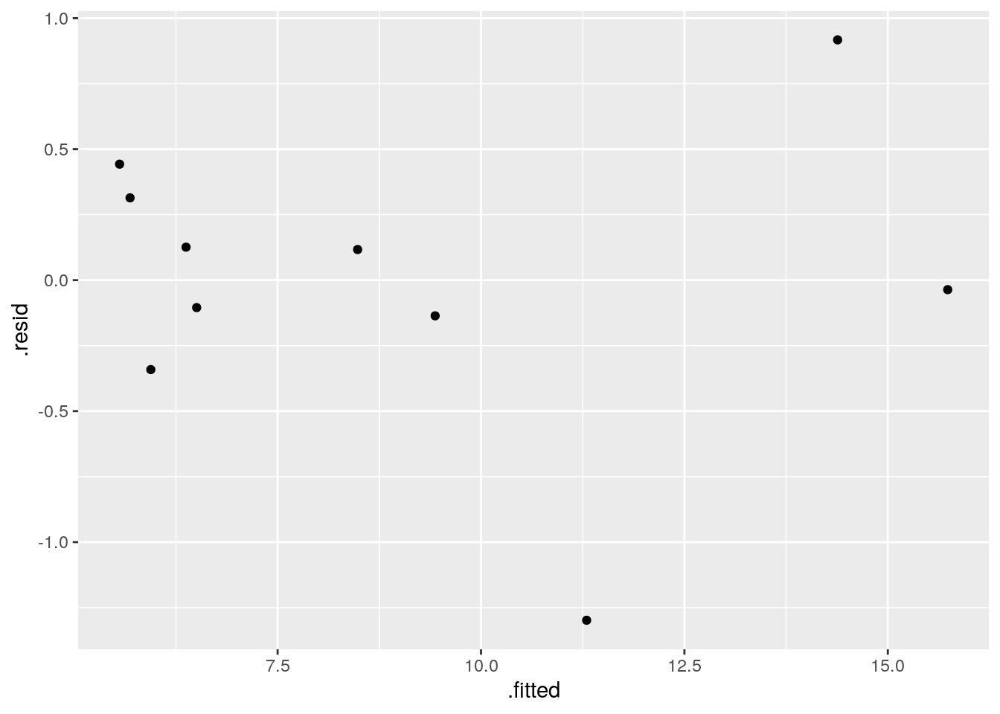

 

<br>

The piece of report that I added looks like this:


Note (i) that you have to do nothing special to get the plot to
appear, and (ii) that I put "smaller" in italics, and you see
how. 


(d) Obtain the correlation between the two variables. Is this
consistent with the scatterplot? Explain briefly. (The R function
you need is `cor`. You can feed it a data frame.)


Solution


The appropriate R code  is this, in another code chunk:

```r
with(sparrowhawks,cor(newadults,returning))
```

```
## [1] -0.7484673
```

 

Or you can ask for the correlations of the whole data frame:


```r
cor(sparrowhawks)
```

```
##            returning  newadults
## returning  1.0000000 -0.7484673
## newadults -0.7484673  1.0000000
```

 

This latter is a "correlation matrix" with a correlation between each
column and each other column. Obviously the correlation between a
column and itself is 1, and that is *not* the one we want.

I added this to the report (still in the Exploratory Analysis
section, since it seems to belong there):


(e) Obtain the regression line for predicting the number of new
adults from the percentage of returning adults.


Solution


This R code, in another code chunk:

```r
newadults.1=lm(newadults~returning,data=sparrowhawks)
summary(newadults.1)  
```

```
## 
## Call:
## lm(formula = newadults ~ returning, data = sparrowhawks)
## 
## Residuals:
##     Min      1Q  Median      3Q     Max 
## -5.8687 -1.2532  0.0508  2.0508  5.3071 
## 
## Coefficients:
##             Estimate Std. Error t value Pr(>|t|)    
## (Intercept) 31.93426    4.83762   6.601 3.86e-05 ***
## returning   -0.30402    0.08122  -3.743  0.00325 ** 
## ---
## Signif. codes:  0 '***' 0.001 '**' 0.01 '*' 0.05 '.' 0.1 ' ' 1
## 
## Residual standard error: 3.667 on 11 degrees of freedom
## Multiple R-squared:  0.5602,	Adjusted R-squared:  0.5202 
## F-statistic: 14.01 on 1 and 11 DF,  p-value: 0.003248
```

 


(f) What are the intercept and slope of your regression line? Is
the slope significant? What does that mean, in the context of the data?


Solution


See the output in the previous part. That's what we need to talk about.
I added this to the report. I thought we deserved a new section here:


 


(g) Create a scatterplot of the data with the regression line on it.


Solution


This code. Using `geom_smooth` with 
`method="lm"`
will add the regression line to the plot:


```r
ggplot(sparrowhawks,aes(x=returning,y=newadults))+
geom_point()+geom_smooth(method="lm")
```


 

I added a bit of text to the report, which I will show in a moment.


(h) For short-lived birds, the association between these two
variables is positive: changes in weather and food supply cause the
populations of new and returning birds to increase together. For
long-lived territorial birds, however, the association is negative
because returning birds claim their territories in the colony and do
not leave room for new recruits. Which type of species is the
sparrowhawk? Add a short Conclusions section to your report with
discussion of this issue.


Solution


My addition to the report looks like this:


I think that rounds off the report nicely.


##  Salaries of social workers


 Another salary-prediction question: does the number of years
of work experience that a social worker has help to predict their 
salary? Data for 50 social workers are in
[link](http://www.utsc.utoronto.ca/~butler/c32/socwork.txt). 


(a) Read the data into R. Check that you have 50 observations on
two variables. Also do something to check that the years of
experience and annual salary figures look reasonable overall.


Solution


```r
my_url="http://www.utsc.utoronto.ca/~butler/c32/socwork.txt"
soc=read_delim(my_url," ")
```

```
## Parsed with column specification:
## cols(
##   experience = col_integer(),
##   salary = col_integer()
## )
```

```r
soc
```

```
## # A tibble: 50 x 2
##    experience salary
##         <int>  <int>
##  1          7  26075
##  2         28  79370
##  3         23  65726
##  4         18  41983
##  5         19  62308
##  6         15  41154
##  7         24  53610
##  8         13  33697
##  9          2  22444
## 10          8  32562
## # ... with 40 more rows
```

 

That checks that we have the right *number* of observations; to
check that we have sensible *values*, something like
`summary` is called for:


```r
summary(soc)  
```

```
##    experience        salary     
##  Min.   : 1.00   Min.   :16105  
##  1st Qu.:13.50   1st Qu.:36990  
##  Median :20.00   Median :50948  
##  Mean   :18.12   Mean   :50171  
##  3rd Qu.:24.75   3rd Qu.:65204  
##  Max.   :28.00   Max.   :99139
```

 

A person working in any field cannot have a negative number of years
of experience, and cannot have more than about 40 years of experience
(or else they would have retired). Our experience numbers fit
that. Salaries had better be five or six figures, and salaries for
social workers are not generally all that high, so these figures look
reasonable. 

A rather more `tidyverse` way is this:


```r
soc %>% summarize_all(c("min","max")) 
```

```
## # A tibble: 1 x 4
##   experience_min salary_min experience_max salary_max
##            <dbl>      <dbl>          <dbl>      <dbl>
## 1              1      16105             28      99139
```

 

This gets the minimum and maximum of all the variables. I would have
liked them arranged in a nice rectangle (`min` and `max`
as rows, the variables as columns), but that's not how this comes out.

Here is another:


```r
soc %>% map_df(~quantile(.)) 
```

```
## # A tibble: 5 x 2
##   experience salary
##        <dbl>  <dbl>
## 1        1   16105 
## 2       13.5 36990.
## 3       20   50948.
## 4       24.8 65204.
## 5       28   99139
```

 

These are the five-number summaries of each variable. Normally, they
come with percentiles attached:


```r
quantile(soc$experience)
```

```
##    0%   25%   50%   75%  100% 
##  1.00 13.50 20.00 24.75 28.00
```

 

but the percentiles get lost in the transition to a `tibble`, and I
haven't found out how to get them back.

This almost works:


```r
soc %>% map_df(~enframe(quantile(.)))
```

```
## # A tibble: 10 x 2
##    name    value
##    <chr>   <dbl>
##  1 0%        1  
##  2 25%      13.5
##  3 50%      20  
##  4 75%      24.8
##  5 100%     28  
##  6 0%    16105  
##  7 25%   36990. 
##  8 50%   50948. 
##  9 75%   65204. 
## 10 100%  99139
```


but, though we now have the percentiles, we've lost the names of the variables, so it isn't much better.

In this context, `map` says 
"do whatever is in the brackets for each column of the data frame". 
(That's the implied "for each".) The output from `quantile` 
is a vector that we would like to have display as a data frame, so `map_df` 
instead of any other form of `map`.

As you know, the `map` family is 
actually very flexible: they run a function "for each" anything and
glue the results together, like this:


```r
soc %>% map_dbl(median) 
```

```
## experience     salary 
##       20.0    50947.5
```

 

which gets the median for each variable. That's the same thing as this:


```r
soc %>% summarize_all("median")
```

```
## # A tibble: 1 x 2
##   experience salary
##        <dbl>  <dbl>
## 1         20 50948.
```

 


(b) Make a scatterplot showing how salary depends on
experience. Does the nature of the trend make sense?


Solution


The usual:

```r
ggplot(soc,aes(x=experience,y=salary))+geom_point()
```


 

As experience goes up, salary also goes up, as you would expect. Also,
the trend seems more or less straight.


(c) Fit a regression predicting salary from experience, and
display the results. Is the slope positive or negative? Does that
make sense?


Solution


```r
soc.1=lm(salary~experience,data=soc)
summary(soc.1)
```

```
## 
## Call:
## lm(formula = salary ~ experience, data = soc)
## 
## Residuals:
##      Min       1Q   Median       3Q      Max 
## -17666.3  -5498.2   -726.7   4667.7  27811.6 
## 
## Coefficients:
##             Estimate Std. Error t value Pr(>|t|)    
## (Intercept)  11368.7     3160.3   3.597 0.000758 ***
## experience    2141.4      160.8  13.314  < 2e-16 ***
## ---
## Signif. codes:  0 '***' 0.001 '**' 0.01 '*' 0.05 '.' 0.1 ' ' 1
## 
## Residual standard error: 8642 on 48 degrees of freedom
## Multiple R-squared:  0.7869,	Adjusted R-squared:  0.7825 
## F-statistic: 177.3 on 1 and 48 DF,  p-value: < 2.2e-16
```

 

The slope is (significantly) positive, which squares with our guess
(more experience goes with greater salary), and also the upward trend
on the scatterplot. The value of the slope is about 2,000; this means
that one more year of experience goes with about a \$2,000 increase in
salary. 


(d) Obtain and plot the residuals against the fitted values. What
problem do you see?


Solution


The easiest way to do this with `ggplot` is to plot the
*regression object* (even though it is not actually a data
frame), and plot the `.fitted` and `.resid`
columns in it, not forgetting the initial dots:

```r
ggplot(soc.1,aes(x=.fitted,y=.resid))+geom_point()
```


       
I see a "fanning-out": the residuals are getting bigger *in size* 
(further away from zero) as the fitted values get bigger. That
is, when the (estimated) salary gets larger, it also gets more
variable. 

Fanning-out is sometimes hard to see. What you can do if you suspect
that it might have happened is to plot the *absolute value* of
the residuals against the fitted values. The absolute value is the
residual without its plus or minus sign, so if the residuals are
getting bigger in size, their absolute values are getting bigger. That
would look like this:


```r
ggplot(soc.1,aes(x=.fitted,y=abs(.resid)))+geom_point()+geom_smooth()
```

```
## `geom_smooth()` using method = 'loess' and formula 'y ~ x'
```


 

I added a smooth trend to this to help us judge whether the
absolute-value-residuals are getting bigger as the fitted values get
bigger. It looks to me as if the overall trend is an increasing one,
apart from those few small fitted values that have larger-sized
residuals. Don't get thrown off by the kinks in the smooth trend. Here
is a smoother version:


```r
ggplot(soc.1,aes(x=.fitted,y=abs(.resid)))+geom_point()+geom_smooth(span=2)
```

```
## `geom_smooth()` using method = 'loess' and formula 'y ~ x'
```


 

The larger fitted values, according to this, have residuals larger in size.

The thing that controls the smoothness of the smooth trend is the
value of `span` in `geom_smooth`. The default is
0.75. The larger the value you use, the smoother the trend; the
smaller, the more wiggly. I'm inclined to think that the default value
is a bit too small. Possibly this value is too big, but it shows you
the idea.


(e) The problem you unearthed in the previous part is often helped
by a transformation. Run Box-Cox on your data to find a suitable
transformation. What transformation is suggested?


Solution


You'll need to call in (and install if necessary) the package
`MASS` that contains `boxcox`:

```r
library(MASS)
```

```
## 
## Attaching package: 'MASS'
```

```
## The following object is masked from 'package:dplyr':
## 
##     select
```

 

I explain that "masked" thing below.


```r
boxcox(salary~experience,data=soc)
```


 

That one looks like $\lambda=0$ or log. You could probably also
justify fourth root (power 0.25), but log is a very common
transformation, which people won't need much persuasion to accept.

There's one annoyance with `MASS`: it has a `select`
(which I have never used), and if you load `tidyverse` first
and `MASS` second, as I have done here, when you mean to run
the column-selection `select`, it will actually run the
`select` that comes from `MASS`, and give you an error
that you will have a terrible time debugging. That's what that
"masked" message was when you loaded `MASS`.

So I'm going to be tidy and get rid of `MASS`, now that I'm
finished with it. Let's first see which packages are loaded, rather a
lot in my case:
<label for="tufte-mn-" class="margin-toggle">&#8853;</label><input type="checkbox" id="tufte-mn-" class="margin-toggle"><span class="marginnote">The packages before *tidyverse* other than *MASS* are all loaded by the *tidyverse*, which  is why there are so many.</span>


```r
search()
```

```
##  [1] ".GlobalEnv"        "package:MASS"      "package:broom"    
##  [4] "package:GGally"    "package:bindrcpp"  "package:forcats"  
##  [7] "package:stringr"   "package:dplyr"     "package:purrr"    
## [10] "package:readr"     "package:tidyr"     "package:tibble"   
## [13] "package:ggplot2"   "package:tidyverse" "package:stats"    
## [16] "package:graphics"  "package:grDevices" "package:utils"    
## [19] "package:datasets"  "package:methods"   "Autoloads"        
## [22] "package:base"
```

 

then get rid of `MASS`:


```r
detach("package:MASS",unload=T)
```

 
Now check that it has gone:


```r
search()
```

```
##  [1] ".GlobalEnv"        "package:broom"     "package:GGally"   
##  [4] "package:bindrcpp"  "package:forcats"   "package:stringr"  
##  [7] "package:dplyr"     "package:purrr"     "package:readr"    
## [10] "package:tidyr"     "package:tibble"    "package:ggplot2"  
## [13] "package:tidyverse" "package:stats"     "package:graphics" 
## [16] "package:grDevices" "package:utils"     "package:datasets" 
## [19] "package:methods"   "Autoloads"         "package:base"
```

 
It has. Now any calls to `select` will use the right one. We hope.

The output of `search` is called the **search list**, and
it tells you where R will go looking for things. The first one
`.GlobalEnv` is where all
<label for="tufte-mn-" class="margin-toggle">&#8853;</label><input type="checkbox" id="tufte-mn-" class="margin-toggle"><span class="marginnote">All the ones that are part of  this project, anyway.</span> 
your
variables, data frames etc.\ get stored, and that is what gets
searched first.
<label for="tufte-mn-" class="margin-toggle">&#8853;</label><input type="checkbox" id="tufte-mn-" class="margin-toggle"><span class="marginnote">That means that if you write a function with  the same name as one that is built into R or a package, yours is the  one that will get called. This is probably a bad idea, since you  won't be able to get at R's function by that name.</span> 
Then R will go
looking in each thing in turn until it finds what it is looking
for. When you load a package with `library()`, it gets added to
the list *in second place*, behind `.GlobalEnv`. So, when
we had `MASS` loaded (the first `search()`), if we
called `select`, then it would find the one in `MASS`
first.

If you want to insist on something like "the `select` that lives in `dplyr`", 
you can do that by saying
`dplyr::select`. But this is kind of cumbersome if you don't
need to do it, which is why I got rid of `MASS` here.


(f) Calculate a new variable as suggested by your
transformation. Use your transformed response in a regression,
showing the summary.


Solution


The best way is to add the new variable to the data frame using
`mutate`, and save that new data frame. That goes like this:

```r
soc.2=soc %>% mutate(log_salary=log(salary))
```

       

and then


```r
soc.3=lm(log_salary~experience,data=soc.2)
summary(soc.3)
```

```
## 
## Call:
## lm(formula = log_salary ~ experience, data = soc.2)
## 
## Residuals:
##      Min       1Q   Median       3Q      Max 
## -0.35435 -0.09046 -0.01725  0.09739  0.26355 
## 
## Coefficients:
##             Estimate Std. Error t value Pr(>|t|)    
## (Intercept) 9.841315   0.056356  174.63   <2e-16 ***
## experience  0.049979   0.002868   17.43   <2e-16 ***
## ---
## Signif. codes:  0 '***' 0.001 '**' 0.01 '*' 0.05 '.' 0.1 ' ' 1
## 
## Residual standard error: 0.1541 on 48 degrees of freedom
## Multiple R-squared:  0.8635,	Adjusted R-squared:  0.8607 
## F-statistic: 303.7 on 1 and 48 DF,  p-value: < 2.2e-16
```

 

I think it's best to save the data frame with `log_salary` in
it, since we'll be doing a couple of things with it, and it's best to
be able to start from `soc.2`. But you can also do this:


```r
soc %>% mutate(log_salary=log(salary)) %>%
lm(log_salary~experience,data=.) %>%
summary()
```

```
## 
## Call:
## lm(formula = log_salary ~ experience, data = .)
## 
## Residuals:
##      Min       1Q   Median       3Q      Max 
## -0.35435 -0.09046 -0.01725  0.09739  0.26355 
## 
## Coefficients:
##             Estimate Std. Error t value Pr(>|t|)    
## (Intercept) 9.841315   0.056356  174.63   <2e-16 ***
## experience  0.049979   0.002868   17.43   <2e-16 ***
## ---
## Signif. codes:  0 '***' 0.001 '**' 0.01 '*' 0.05 '.' 0.1 ' ' 1
## 
## Residual standard error: 0.1541 on 48 degrees of freedom
## Multiple R-squared:  0.8635,	Adjusted R-squared:  0.8607 
## F-statistic: 303.7 on 1 and 48 DF,  p-value: < 2.2e-16
```

 

The second line is where the fun starts: `lm` wants the data
frame as a `data=` at the end. So, to specify a data frame in
something like `lm`, we have to use the special symbol
`.`, which is another way to say 
"the data frame that came out of the previous step".

Got that? All right. The last line is a piece of cake in
comparison. Normally `summary` would require a data frame or a
fitted model object, but the second line produces one (a fitted model
object) as output, which goes into `summary` as the first
(and only) thing, so all is good and we get the regression output.

What we lose by doing this is that if we need something later from this
fitted model object, we are out of luck since we didn't save
it. That's why I created `soc.2` and `soc.3` above.

You can also put functions of things directly into `lm`:


```r
soc.1a=lm(log(salary)~experience, data=soc)
summary(soc.1a)
```

```
## 
## Call:
## lm(formula = log(salary) ~ experience, data = soc)
## 
## Residuals:
##      Min       1Q   Median       3Q      Max 
## -0.35435 -0.09046 -0.01725  0.09739  0.26355 
## 
## Coefficients:
##             Estimate Std. Error t value Pr(>|t|)    
## (Intercept) 9.841315   0.056356  174.63   <2e-16 ***
## experience  0.049979   0.002868   17.43   <2e-16 ***
## ---
## Signif. codes:  0 '***' 0.001 '**' 0.01 '*' 0.05 '.' 0.1 ' ' 1
## 
## Residual standard error: 0.1541 on 48 degrees of freedom
## Multiple R-squared:  0.8635,	Adjusted R-squared:  0.8607 
## F-statistic: 303.7 on 1 and 48 DF,  p-value: < 2.2e-16
```

 


(g) Obtain and plot the residuals against the fitted values for
this regression. Do you seem to have solved the problem with the
previous residual plot?


Solution


As we did before, treating the regression object as if it were a
data frame:

```r
ggplot(soc.3,aes(x=.fitted,y=.resid))+geom_point()
```


       

That, to my mind, is a horizontal band of points, so I would say yes,
I have solved the fanning out.

One concern I have about the residuals is that there seem to be a
couple of very negative values: that is, are the residuals normally
distributed as they should be? Well, that's easy enough to check:


```r
ggplot(soc.3,aes(sample=.resid))+stat_qq()+stat_qq_line()
```


 

The issues here are that those bottom two values are a bit too low,
and the top few values are a bit bunched up (that curve at the top).
It is really not bad, though, so I am making the call that I don't
think I needed to worry.
Note that the transformation we found here is the same as the
log-salary used by the management consultants in the
backward-elimination question, and with the same effect: an extra year
of experience goes with a *percent* increase in salary.

What increase? Well, the slope is about 0.05, so adding a year of
experience is predicted to increase log-salary by 0.05, or to
multiply actual salary by 


```r
exp(0.05)  
```

```
## [1] 1.051271
```

 

or to increase salary by about 5\%.
<label for="tufte-mn-" class="margin-toggle">&#8853;</label><input type="checkbox" id="tufte-mn-" class="margin-toggle"><span class="marginnote">Mathematically,  $e^x$ is approximately $1+x$ for small $x$, which winds up meaning that the  slope in a model like this, if it is small, indicates about the  percent increase in the response associated with a 1-unit change in  the explanatory variable. Note that this only works with $e^x$ and  natural logs, not base 10 logs or anything like that.</span>


##  Predicting volume of wood in pine trees


 In forestry, the financial value of a tree
is the volume of wood that it contains. This is difficult to estimate
while the tree is still standing, but the diameter is easy to measure
with a tape measure (to measure the circumference) and a calculation
involving $\pi$, assuming that the cross-section of the tree is at
least approximately circular.  The standard measurement is
"diameter at breast height" 
(that is, at the height of a human breast or
chest), defined as being 4.5 feet above the ground.

Several pine trees had their diameter measured shortly before being
cut down, and for each tree, the volume of wood was recorded. The data
are in
[link](http://www.utsc.utoronto.ca/~butler/c32/pinetrees.txt). The
diameter is in inches and the volume is in cubic inches.  Is it
possible to predict the volume of wood from the diameter?


(a) Read the data into R and display the values (there are not
very many).


Solution


Observe that the data values are separated by spaces, and therefore
that `read_delim` will do it:

```r
my_url="http://www.utsc.utoronto.ca/~butler/c32/pinetrees.txt"
trees=read_delim(my_url," ")
```

```
## Parsed with column specification:
## cols(
##   diameter = col_integer(),
##   volume = col_integer()
## )
```

```r
trees
```

```
## # A tibble: 10 x 2
##    diameter volume
##       <int>  <int>
##  1       32    185
##  2       29    109
##  3       24     95
##  4       45    300
##  5       20     30
##  6       30    125
##  7       26     55
##  8       40    246
##  9       24     60
## 10       18     15
```

    

That looks like the data file.


(b) Make a suitable plot.


Solution


No clues this time. You need to recognize that you have two
quantitative variables, so that a scatterplot is called
for. Also, the volume is the response, so that should go on the $y$-axis:

```r
ggplot(trees,aes(x=diameter,y=volume))+geom_point()
```


       

You can put a smooth trend on it if you like, which would
look like this:


```r
ggplot(trees,aes(x=diameter,y=volume))+
geom_point()+geom_smooth()
```

```
## `geom_smooth()` using method = 'loess' and formula 'y ~ x'
```


       

I'll take either of those for this part, though I think the smooth
trend actually obscures the issue here (because there is not so much
data). 

 

(c) Describe what you learn from your plot about the
relationship between diameter and volume, if anything.


Solution


The word "relationship" offers a clue that a scatterplot would
have been a good idea, if you hadn't realized by now. 
I am guided by "form, direction, strength" in looking at a scatterplot:


* Form: it is an apparently linear relationship.

* Direction: it is an upward trend: that is, a tree with a larger diameter also has a larger volume of wood. (This is not very surprising.)

* Strength:  I'd call this a strong (or moderate-to-strong) relationship. (We'll see in a minute what the R-squared is.)

You don't need to be as formal as this, but you *do* need
to get at the idea that it is an upward trend, apparently
linear, and at least fairly strong.
<label for="tufte-mn-" class="margin-toggle">&#8853;</label><input type="checkbox" id="tufte-mn-" class="margin-toggle"><span class="marginnote">When this was graded, it was 3 marks, to clue you in that there are three things to say.</span>


(d) Fit a (linear) regression, predicting volume from diameter,
and obtain the `summary`. How would you describe the R-squared?


Solution


My naming convention is (usually) to call the fitted model
object by the name of the response variable and a number. (I
have always used dots, but in the spirit of the
`tidyverse` I suppose I should use underscores.)

```r
volume.1=lm(volume~diameter,data=trees)
summary(volume.1)
```

```
## 
## Call:
## lm(formula = volume ~ diameter, data = trees)
## 
## Residuals:
##     Min      1Q  Median      3Q     Max 
## -36.497  -9.982   1.751   8.959  28.139 
## 
## Coefficients:
##             Estimate Std. Error t value Pr(>|t|)    
## (Intercept) -191.749     23.954  -8.005 4.35e-05 ***
## diameter      10.894      0.801  13.600 8.22e-07 ***
## ---
## Signif. codes:  0 '***' 0.001 '**' 0.01 '*' 0.05 '.' 0.1 ' ' 1
## 
## Residual standard error: 20.38 on 8 degrees of freedom
## Multiple R-squared:  0.9585,	Adjusted R-squared:  0.9534 
## F-statistic:   185 on 1 and 8 DF,  p-value: 8.217e-07
```

       

R-squared is nearly 96\%, so the relationship is definitely a strong one.

I also wanted to mention the `broom` package, which was
installed with the `tidyverse` but which you need to load
separately. It provides two handy ways to summarize a fitted model
(regression, analysis of variance or whatever):


```r
library(broom)
glance(volume.1)
```

```
## # A tibble: 1 x 11
##   r.squared adj.r.squared sigma statistic p.value    df logLik   AIC   BIC
## *     <dbl>         <dbl> <dbl>     <dbl>   <dbl> <int>  <dbl> <dbl> <dbl>
## 1     0.959         0.953  20.4      185. 8.22e-7     2  -43.2  92.4  93.4
## # ... with 2 more variables: deviance <dbl>, df.residual <int>
```

 

This gives a one-line summary of a model, including things like
R-squared. This is handy if you're fitting more than one model,
because you can collect the one-line summaries together into a data
frame and eyeball them.

The other summary is this one:


```r
tidy(volume.1)
```

```
## # A tibble: 2 x 5
##   term        estimate std.error statistic     p.value
##   <chr>          <dbl>     <dbl>     <dbl>       <dbl>
## 1 (Intercept)   -192.     24.0       -8.01 0.0000435  
## 2 diameter        10.9     0.801     13.6  0.000000822
```

 

This gives a table of intercepts, slopes and their P-values, but the
value to this one is that it is a *data frame*, so if you want to
pull anything out of it, you know how to do that:
<label for="tufte-mn-" class="margin-toggle">&#8853;</label><input type="checkbox" id="tufte-mn-" class="margin-toggle"><span class="marginnote">The  *summary* output is more designed for looking at than for  extracting things from.</span>

```r
tidy(volume.1) %>% filter(term=="diameter")
```

```
## # A tibble: 1 x 5
##   term     estimate std.error statistic     p.value
##   <chr>       <dbl>     <dbl>     <dbl>       <dbl>
## 1 diameter     10.9     0.801      13.6 0.000000822
```

 

This gets the estimated slope and its P-value, without worrying about
the corresponding things for the intercept, which are usually of less
interest anyway.


(e) Draw a graph that will help you decide whether you trust
the linearity of this regression. What do you conclude? Explain briefly.


Solution


The thing I'm fishing for is a residual plot (of the residuals
against the fitted values), and on it you are looking for a
random mess of nothingness:

```r
ggplot(volume.1,aes(x=.fitted,y=.resid))+geom_point()
```


       

Make a call. You could say that there's no discernible pattern,
especially with such a small data set, and
therefore that the regression is fine. Or you could say that there is
fanning-in: the two points on the right have residuals close to 0
while the points on the left have residuals larger in size. Say
something. 

I don't think you can justify a curve or a trend, because
the residuals on the left are both positive and negative.

My feeling is that the residuals on the right are close to 0 because
these points have noticeably larger diameter than the others, and they
are *influential* points in the regression that will pull the
line closer to themselves. This is why their residuals are close to
zero. But I am happy with either of the points made in the paragraph
under the plot.


(f) What would you guess would be the volume of a tree of
diameter zero? Is that what the regression predicts? Explain briefly.


Solution


Logically, a tree that has diameter zero is a non-existent tree,
so its volume should be zero as well. 
In the regression, the quantity that says what volume is when
diameter is zero is the *intercept*. Here the intercept is
$-192$, which is definitely not zero. In fact, if you look at
the P-value, the intercept is significantly *less* than
zero. Thus, the model makes no logical sense for trees of small
diameter. The smallest tree in the data set has diameter 18,
which is not really small, I suppose, but it is a little
disconcerting to have a model that makes no logical sense.

 

(g) A simple way of modelling a tree's shape is to pretend it is a
cone, like this, but probably taller and skinnier:


        

with its base on the ground. What is the relationship between the
*diameter* (at the base) and volume of a cone? (If you don't
remember, look it up. You'll probably get a formula in terms of the
radius, which you'll have to convert.
Cite the website you used.)


Solution


According to
[link](http://www.web-formulas.com/Math_Formulas/Geometry_Volume_of_Cone.aspx),
the volume of a cone is $V=\pi r^2h/3$, where $V$ is the volume,
$r$ is the radius (at the bottom of the cone) and $h$ is the
height. The diameter is twice the radius, so replace $r$ by
$d/2$, $d$ being the diameter. A little algebra gives 
$$ V = \pi d^2 h / 12.$$

 

(h) Fit a regression model that predicts volume from diameter
according to the formula you obtained in the previous part. You can
assume that the trees in this data set are of similar heights, so
that the height can be treated as a constant.  
Display the
results.


Solution


According to my formula, the volume depends on the diameter
squared, which I include in the model thus:

```r
volume.2=lm(volume~I(diameter^2),data=trees)
summary(volume.2)
```

```
## 
## Call:
## lm(formula = volume ~ I(diameter^2), data = trees)
## 
## Residuals:
##     Min      1Q  Median      3Q     Max 
## -29.708  -9.065  -5.722   3.032  40.816 
## 
## Coefficients:
##                Estimate Std. Error t value Pr(>|t|)    
## (Intercept)   -30.82634   13.82243   -2.23   0.0563 .  
## I(diameter^2)   0.17091    0.01342   12.74 1.36e-06 ***
## ---
## Signif. codes:  0 '***' 0.001 '**' 0.01 '*' 0.05 '.' 0.1 ' ' 1
## 
## Residual standard error: 21.7 on 8 degrees of freedom
## Multiple R-squared:  0.953,	Adjusted R-squared:  0.9471 
## F-statistic: 162.2 on 1 and 8 DF,  p-value: 1.359e-06
```

       

This adds an intercept as well, which is fine (there are technical
difficulties around removing the intercept).

That's as far as I wanted you to go, but (of course) I have a few
comments.

The intercept here is still negative, but not significantly different
from zero, which is a step forward. The R-squared for this regression
is very similar to that from our linear model (the one for which the
intercept made no sense). So, from that point of view, either model
predicts the data well. I should look at the residuals from this one:


```r
ggplot(volume.2,aes(x=.fitted,y=.resid))+geom_point()
```

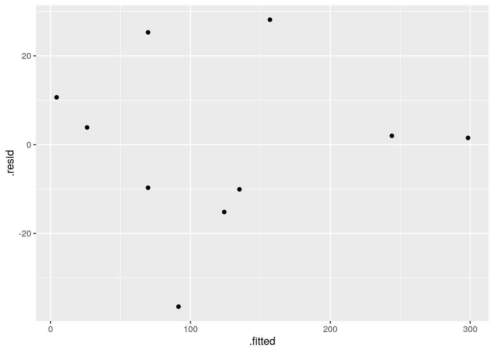

 

I really don't think there are any problems there.

Now, I said to assume that the trees are all of similar height. This
seems entirely questionable, since the trees vary quite a bit in
diameter, and you would guess that trees with bigger diameter would
also be taller. It seems more plausible that the same kind of trees
(pine trees in this case) would have the same "shape", so that if
you knew the diameter you could *predict* the height, with
larger-diameter trees being taller. Except that we don't have the
heights here, so we can't build a model for that.

So I went looking in the literature. I found this paper:
[link](https://pdfs.semanticscholar.org/5497/3d02d63428e3dfed6645acfdba874ad80822.pdf). This
gives several models for relationships between volume, diameter and height. In
the formulas below, there is an implied "plus error" on the right,
and the $\alpha_i$ are parameters to be estimated.

For predicting height from diameter (equation 1 in paper):

$$  h = \exp(\alpha_1+\alpha_2 d^{\alpha_3}) $$

For predicting volume from height and diameter (equation 6):

$$  V = \alpha_1 d^{\alpha_2} h^{\alpha_3} $$

This is a take-off on our assumption that the trees were cone-shaped,
with cone-shaped trees having $\alpha_1=\pi/12$, $\alpha_2=2$ and
$\alpha_3=1$. The paper uses different units, so $\alpha_1$ is not
comparable, but $\alpha_2$ and $\alpha_3$ are (as estimated from the
data in the paper, which were for longleaf pine) quite close to 2 and
1.

Last, the actual relationship that helps us: predicting volume from
just diameter (equation 5):

$$  V = \alpha_1 d^{\alpha_2}$$

This is a power law type of relationship. For example, if you were
willing to pretend that a tree was a cone with height proportional to
diameter (one way of getting at the idea of a bigger tree typically
being taller, instead of assuming constant height as we did), that
would imply $\alpha_2=3$ here.

This is non-linear as it stands, but we can bash it into shape by taking
logs:

$$
\ln V = \ln \alpha_1 + \alpha_2 \ln d
$$

so that log-volume has a linear relationship with log-diameter and we
can go ahead and estimate it:


```r
volume.3=lm(log(volume)~log(diameter),data=trees)
summary(volume.3)
```

```
## 
## Call:
## lm(formula = log(volume) ~ log(diameter), data = trees)
## 
## Residuals:
##      Min       1Q   Median       3Q      Max 
## -0.40989 -0.22341  0.01504  0.10459  0.53596 
## 
## Coefficients:
##               Estimate Std. Error t value Pr(>|t|)    
## (Intercept)    -5.9243     1.1759  -5.038    0.001 ** 
## log(diameter)   3.1284     0.3527   8.870 2.06e-05 ***
## ---
## Signif. codes:  0 '***' 0.001 '**' 0.01 '*' 0.05 '.' 0.1 ' ' 1
## 
## Residual standard error: 0.3027 on 8 degrees of freedom
## Multiple R-squared:  0.9077,	Adjusted R-squared:  0.8962 
## F-statistic: 78.68 on 1 and 8 DF,  p-value: 2.061e-05
```

 

The parameter that I called $\alpha_2$ above is the slope of this
model, 3.13. This is a bit different from the figure in the paper,
which was 2.19. I think these are comparable even though the other
parameter is not (again, measurements in different units, plus, this
time we need to take the log of it). I think the "slopes" are
comparable because we haven't estimated our slope all that accurately:


```r
confint(volume.3)
```

```
##                   2.5 %    97.5 %
## (Intercept)   -8.635791 -3.212752
## log(diameter)  2.315115  3.941665
```

 

From 2.3 to 3.9. It is definitely not zero, but we are rather less
sure about what it is, and 2.19 is not completely implausible.

The R-squared here, though it is less than the other ones we
got, is still high. The residuals are these:


```r
ggplot(volume.3,aes(x=.fitted,y=.resid))+geom_point()
```


 

which again seem to show no problems. The residuals are smaller in
size now because of the log transformation: the actual and predicted
log-volumes are smaller numbers than the actual and predicted volumes,
so the residuals are now closer to zero.

Does this model behave itself at zero? Well, roughly at least: if the
diameter is very small, its log is very negative, and the predicted
log-volume is also very negative (the slope is positive). So the
predicted actual volume will be close to zero. If you want to make
that mathematically rigorous, you can take limits, but that's the
intuition. We can also do some predictions: set up a data frame that has a column called `diameter` with some diameters to predict for:


```r
d=tibble(diameter=c(1,2,seq(5,50,5)))
d
```

```
## # A tibble: 12 x 1
##    diameter
##       <dbl>
##  1        1
##  2        2
##  3        5
##  4       10
##  5       15
##  6       20
##  7       25
##  8       30
##  9       35
## 10       40
## 11       45
## 12       50
```


and then feed that into `predict`:


```r
p=predict(volume.3,d)
d %>% mutate(pred=p)
```

```
## # A tibble: 12 x 2
##    diameter   pred
##       <dbl>  <dbl>
##  1        1 -5.92 
##  2        2 -3.76 
##  3        5 -0.889
##  4       10  1.28 
##  5       15  2.55 
##  6       20  3.45 
##  7       25  4.15 
##  8       30  4.72 
##  9       35  5.20 
## 10       40  5.62 
## 11       45  5.98 
## 12       50  6.31
```


These are predicted log-volumes, so we'd better anti-log them. `log` in R is natural logs, so this is inverted using `exp`: 


```r
d %>% mutate(pred=exp(p))
```

```
## # A tibble: 12 x 2
##    diameter      pred
##       <dbl>     <dbl>
##  1        1   0.00267
##  2        2   0.0234 
##  3        5   0.411  
##  4       10   3.59   
##  5       15  12.8    
##  6       20  31.4    
##  7       25  63.2    
##  8       30 112.     
##  9       35 181.     
## 10       40 275.     
## 11       45 397.     
## 12       50 552.
```


For a diameter near zero, the predicted volume appears to be near zero as well.

<br>

I mentioned `broom` earlier. We can make a data frame out of
the one-line summaries of our three models:


```r
bind_rows(glance(volume.1),glance(volume.2),glance(volume.3))
```

```
## # A tibble: 3 x 11
##   r.squared adj.r.squared  sigma statistic p.value    df logLik   AIC   BIC
##       <dbl>         <dbl>  <dbl>     <dbl>   <dbl> <int>  <dbl> <dbl> <dbl>
## 1     0.959         0.953 20.4       185.  8.22e-7     2 -43.2  92.4  93.4 
## 2     0.953         0.947 21.7       162.  1.36e-6     2 -43.8  93.7  94.6 
## 3     0.908         0.896  0.303      78.7 2.06e-5     2  -1.12  8.25  9.16
## # ... with 2 more variables: deviance <dbl>, df.residual <int>
```

 

(I mistakenly put `glimpse` instead of `glance` there
the first time. The former is for a quick look at a *data frame*,
while the latter is for a quick look at a *model*.)

The three R-squareds are all high, with the one from the third model
being a bit lower as we saw before. 

My code is rather repetitious. There has to be a way to streamline
it. I was determined to find out how. My solution involves putting the
three models in a `list`, and then using `map` to
get the `glance` output for each one, and `bind_rows`
to glue the results together into one data frame. I was inspired to
try this by remembering that `map_df` will work for a function
like `glance` that outputs a data frame:


```r
model_list=list(volume.1,volume.2,volume.3)
map_df(model_list,~glance(.)) 
```

```
## # A tibble: 3 x 11
##   r.squared adj.r.squared  sigma statistic p.value    df logLik   AIC   BIC
##       <dbl>         <dbl>  <dbl>     <dbl>   <dbl> <int>  <dbl> <dbl> <dbl>
## 1     0.959         0.953 20.4       185.  8.22e-7     2 -43.2  92.4  93.4 
## 2     0.953         0.947 21.7       162.  1.36e-6     2 -43.8  93.7  94.6 
## 3     0.908         0.896  0.303      78.7 2.06e-5     2  -1.12  8.25  9.16
## # ... with 2 more variables: deviance <dbl>, df.residual <int>
```

 

It works. You see the three R-squared values in the first column. The
third model is otherwise a lot different from the others because it
has a different response variable.

Other thoughts:

How might you measure or estimate the height of a
tree (other than by climbing it and dropping a tape measure down)? One
way, that works if the tree is fairly isolated, is to walk away from
its base. Periodically, you point at the top of the tree, and when the
angle between your arm and the ground reaches 45 degrees, you stop
walking. (If it's greater than 45 degrees, you walk further away, and
if it's less, you walk back towards the tree.) The distance between
you and the base of the tree is then equal to the height of the tree,
and if you have a long enough tape measure you can measure it.

The above works because the tangent of 45 degrees is 1. If you have a
device that will measure the actual angle,
<label for="tufte-mn-" class="margin-toggle">&#8853;</label><input type="checkbox" id="tufte-mn-" class="margin-toggle"><span class="marginnote">These days, there  are apps that will let you do this with your phone. I found one called Clinometer. See also [link](https://gabrielhemery.com/how-to-calculate-tree-height-using-a-smartphone/).</span> 
you
can be any distance away from the tree, point the device at the top,
record the angle, and do some trigonometry to estimate the height of
the tree (to which you add the height of your eyes).


 


##  Crickets revisited


 This is a continuation of the crickets problem that you
may have seen before (minus the data tidying).

Male tree crickets produce "mating songs" by rubbing their wings
together to produce a chirping sound. It is hypothesized that female
tree crickets identify males of the correct species by how fast (in
chirps per second) the male's mating song is. This is called the
"pulse rate".  Some data for two species of crickets are in
[link](http://www.utsc.utoronto.ca/~butler/c32/crickets2.csv) as a CSV
file. The columns are species (text), temperature, and pulse
rate (numbers). This is the tidied version of the data set that the
previous version of this question had you create.
The research question is whether males
of the different species have different average pulse rates. It is
also of interest to see whether temperature has an effect, and if
so, what.


(a) Read the data into R and display what you have.


Solution


Nothing terribly surprising here:


```r
my_url="http://www.utsc.utoronto.ca/~butler/c32/crickets2.csv"
crickets=read_csv(my_url)
```

```
## Parsed with column specification:
## cols(
##   species = col_character(),
##   temperature = col_double(),
##   pulse_rate = col_double()
## )
```

```r
crickets
```

```
## # A tibble: 31 x 3
##    species       temperature pulse_rate
##    <chr>               <dbl>      <dbl>
##  1 exclamationis        20.8       67.9
##  2 exclamationis        20.8       65.1
##  3 exclamationis        24         77.3
##  4 exclamationis        24         78.7
##  5 exclamationis        24         79.4
##  6 exclamationis        24         80.4
##  7 exclamationis        26.2       85.8
##  8 exclamationis        26.2       86.6
##  9 exclamationis        26.2       87.5
## 10 exclamationis        26.2       89.1
## # ... with 21 more rows
```

 

31 crickets, which is what I remember. What species are there?


```r
crickets %>% count(species)
```

```
## # A tibble: 2 x 2
##   species           n
##   <chr>         <int>
## 1 exclamationis    14
## 2 niveus           17
```

 

That looks good. We proceed.


(b) Do a two-sample $t$-test to see whether the mean pulse rates
differ between species. What do you conclude?


Solution


Drag your mind way back to this:

```r
t.test(pulse_rate~species,data=crickets) 
```

```
## 
## 	Welch Two Sample t-test
## 
## data:  pulse_rate by species
## t = 5.2236, df = 28.719, p-value = 1.401e-05
## alternative hypothesis: true difference in means is not equal to 0
## 95 percent confidence interval:
##  14.08583 32.22677
## sample estimates:
## mean in group exclamationis        mean in group niveus 
##                    85.58571                    62.42941
```

 

There is strong evidence of a difference in means (a P-value around
0.00001), and the confidence interval says that the mean chirp rate is
higher for *exclamationis*. That is, not just for the crickets
that were observed here, but for *all* crickets of these two
species. 
      


(c) Can you do that two-sample $t$-test as a regression?


Solution


Hang onto the "pulse rate depends on species" idea and try
that in `lm`:

```r
pulse.0=lm(pulse_rate~species,data=crickets)
summary(pulse.0)
```

```
## 
## Call:
## lm(formula = pulse_rate ~ species, data = crickets)
## 
## Residuals:
##     Min      1Q  Median      3Q     Max 
## -20.486  -9.458  -1.729  13.342  22.271 
## 
## Coefficients:
##               Estimate Std. Error t value Pr(>|t|)    
## (Intercept)     85.586      3.316  25.807  < 2e-16 ***
## speciesniveus  -23.156      4.478  -5.171 1.58e-05 ***
## ---
## Signif. codes:  0 '***' 0.001 '**' 0.01 '*' 0.05 '.' 0.1 ' ' 1
## 
## Residual standard error: 12.41 on 29 degrees of freedom
## Multiple R-squared:  0.4797,	Adjusted R-squared:  0.4617 
## F-statistic: 26.74 on 1 and 29 DF,  p-value: 1.579e-05
```

         

I had to use "model 0" for this since I already have a
`pulse.1` below and I didn't want to go down and renumber
everything. 

Look along the `speciesniveus` line. Ignoring the fact that it
is negative, the $t$-statistic is almost the same as before (5.17 vs.\
5.22) and so is the P-value ($1.4 \times 10^{-5}$ vs.\ $1.6 \times
10^{-5}$). 

Why aren't they exactly the same? Regression is assuming equal
variances everywhere (that is, within the two `species`), and
before, we did the Welch-Satterthwaite test that does not assume equal
variances. What if we do the pooled $t$-test instead?


```r
t.test(pulse_rate~species,data=crickets,var.equal=T) 
```

```
## 
## 	Two Sample t-test
## 
## data:  pulse_rate by species
## t = 5.1706, df = 29, p-value = 1.579e-05
## alternative hypothesis: true difference in means is not equal to 0
## 95 percent confidence interval:
##  13.99690 32.31571
## sample estimates:
## mean in group exclamationis        mean in group niveus 
##                    85.58571                    62.42941
```

 

Now the regression and the $t$-test *do* give exactly the same
answers. We'll think about that equal-spreads assumption again later.


(d) The analysis in the last part did not use temperature,
however. Is it possible that temperature also has an effect? To
assess this, draw a scatterplot of pulse rate against temperature,
with the points distinguished, somehow, by the species they are
from.
<label for="tufte-mn-" class="margin-toggle">&#8853;</label><input type="checkbox" id="tufte-mn-" class="margin-toggle"><span class="marginnote">This was the actual reason I thought of this      question originally:    I wanted you to do this.</span>


Solution


One of the wonderful things about `ggplot` is that doing
the obvious thing works:

```r
ggplot(crickets,aes(x=temperature,y=pulse_rate,colour=species))+
geom_point()
```


       
    


(e) What does the plot tell you that the $t$-test doesn't? How
would you describe differences in pulse rates between species now?


Solution


The plot tells you that (for both species) as temperature goes
up, pulse rate goes up as well. *Allowing for that*, the
difference in pulse rates between the two species is even
clearer than it was before. To see an example, pick a
temperature, and note that the mean pulse rate at that
temperature seems to be at least 10 higher for
*exclamationis*, with a high degree of consistency.
The $t$-test mixed up all the pulse rates at all the different
temperatures. Even though the conclusion was clear enough, it
could be clearer if we incorporated temperature into the analysis.
There was also a potential source of unfairness in that the
*exclamationis* crickets tended to be observed at higher
temperatures than *niveus* crickets; since pulse rates
increase with temperature, the apparent difference in pulse
rates between the species might have been explainable by one
species being observed mainly in higher temperatures. This was
*utterly invisible* to us when we did the $t$-test, but it
shows the importance of accounting for all the relevant
variables when you do your analysis.
<label for="tufte-mn-" class="margin-toggle">&#8853;</label><input type="checkbox" id="tufte-mn-" class="margin-toggle"><span class="marginnote">And it shows the        value of looking at relevant plots.</span> If the species had been
observed at opposite temperatures, we might have
concluded
<label for="tufte-mn-" class="margin-toggle">&#8853;</label><input type="checkbox" id="tufte-mn-" class="margin-toggle"><span class="marginnote">Mistakenly.</span> 
that *niveus* have the
higher pulse rates on average. I come back to this later when I
discuss the confidence interval for species difference that
comes out of the regression model with temperature.
      


(f) Fit a regression predicting pulse rate from species and
temperature. Compare the P-value for species in this regression to
the one from the $t$-test. What does that tell you?


Solution


This is actually a so-called "analysis of covariance model",
which properly belongs in D29, but it's really just a regression:

```r
pulse.1=lm(pulse_rate~species+temperature,data=crickets)
summary(pulse.1)
```

```
## 
## Call:
## lm(formula = pulse_rate ~ species + temperature, data = crickets)
## 
## Residuals:
##     Min      1Q  Median      3Q     Max 
## -3.0128 -1.1296 -0.3912  0.9650  3.7800 
## 
## Coefficients:
##                Estimate Std. Error t value Pr(>|t|)    
## (Intercept)    -7.21091    2.55094  -2.827  0.00858 ** 
## speciesniveus -10.06529    0.73526 -13.689 6.27e-14 ***
## temperature     3.60275    0.09729  37.032  < 2e-16 ***
## ---
## Signif. codes:  0 '***' 0.001 '**' 0.01 '*' 0.05 '.' 0.1 ' ' 1
## 
## Residual standard error: 1.786 on 28 degrees of freedom
## Multiple R-squared:  0.9896,	Adjusted R-squared:  0.9888 
## F-statistic:  1331 on 2 and 28 DF,  p-value: < 2.2e-16
```

 

The P-value for species is now $6.27\times 10^{-14}$ or
0.00000000000006, which is even less than the P-value of 0.00001 that
came out of the $t$-test. That is to say, when you know temperature,
you can be even more sure of your conclusion that there is a
difference between the species.

The R-squared for this regression is almost 99\%, which says that if
you know both temperature and species, you can predict the pulse rate
almost exactly.

In the regression output, the slope for species is about $-10$. It is
labelled `speciesniveus`. Since species is categorical,
`lm` uses the first category, *exclamationis*, as the
baseline and expresses each other species relative to that. Since the
slope is about $-10$, it says that at any given temperature, the mean
pulse rate for *niveus* is about 10 less than for
*exclamationis*. This is pretty much what the scatterplot told
us.

We can go a little further here:


```r
confint(pulse.1)
```

```
##                    2.5 %    97.5 %
## (Intercept)   -12.436265 -1.985547
## speciesniveus -11.571408 -8.559175
## temperature     3.403467  3.802038
```

 

The second line says that the pulse rate for *niveus* is
between about 8.5 and 11.5 less than for *exclamationis*, at
any given temperature (comparing the two species at the same
temperature as each other, but that temperature could be
anything). This is a lot shorter than the CI that came out of the
$t$-test, that went from 14 to 32. This is because we are now
accounting for temperature, which also makes a difference. (In the
$t$-test, the temperatures were all mixed up). What we also see is
that the $t$-interval is shifted up compared to the one from the
regression. This is because the $t$-interval conflates
<label for="tufte-mn-" class="margin-toggle">&#8853;</label><input type="checkbox" id="tufte-mn-" class="margin-toggle"><span class="marginnote">Mixes up.</span> 
two things: the *exclamationis* crickets do have a
higher pulse rate, but they were also observed at higher temperatures,
which makes it look as if their pulse rates are more
higher
<label for="tufte-mn-" class="margin-toggle">&#8853;</label><input type="checkbox" id="tufte-mn-" class="margin-toggle"><span class="marginnote">This is actually grammatically correct.</span> than they
really are, when you account for temperature.

This particular model constrains the slope with temperature to be the
same for both species (just the intercepts differ). If you want to
allow the slopes to differ between species, you add an interaction
between temperature and species:


```r
pulse.2=lm(pulse_rate~species*temperature,data=crickets)
summary(pulse.2)
```

```
## 
## Call:
## lm(formula = pulse_rate ~ species * temperature, data = crickets)
## 
## Residuals:
##     Min      1Q  Median      3Q     Max 
## -3.7031 -1.3417 -0.1235  0.8100  3.6330 
## 
## Coefficients:
##                           Estimate Std. Error t value Pr(>|t|)    
## (Intercept)               -11.0408     4.1515  -2.659    0.013 *  
## speciesniveus              -4.3484     4.9617  -0.876    0.389    
## temperature                 3.7514     0.1601  23.429   <2e-16 ***
## speciesniveus:temperature  -0.2340     0.2009  -1.165    0.254    
## ---
## Signif. codes:  0 '***' 0.001 '**' 0.01 '*' 0.05 '.' 0.1 ' ' 1
## 
## Residual standard error: 1.775 on 27 degrees of freedom
## Multiple R-squared:  0.9901,	Adjusted R-squared:  0.989 
## F-statistic: 898.9 on 3 and 27 DF,  p-value: < 2.2e-16
```

 

To see whether adding the interaction term added anything to the
prediction,
<label for="tufte-mn-" class="margin-toggle">&#8853;</label><input type="checkbox" id="tufte-mn-" class="margin-toggle"><span class="marginnote">Though it's hard to imagine being able to improve on an R-squared of 99%.</span> 
compare the model with and without using `anova`:


```r
anova(pulse.1,pulse.2)  
```

```
## Analysis of Variance Table
## 
## Model 1: pulse_rate ~ species + temperature
## Model 2: pulse_rate ~ species * temperature
##   Res.Df    RSS Df Sum of Sq     F Pr(>F)
## 1     28 89.350                          
## 2     27 85.074  1    4.2758 1.357 0.2542
```

 

There's no significant improvement by adding the interaction, so
there's no evidence that having different slopes for each species is
necessary. This is the same interpretation as any `anova` for
comparing two regressions: the two models are not significantly
different in fit, so go with the simpler one, that is, the one without
the interaction.

Note that `anova` gave the same P-value as did the
$t$-test for the slope coefficient for the interaction in
`summary`, 0.254 in both cases. This is because there were only
two species and therefore only one slope coefficient was required to
distinguish them. If there had been three species, we would have had
to look at the `anova` output to hunt for a difference among
species, since there would have been two slope coefficients, each with
its own P-value.
<label for="tufte-mn-" class="margin-toggle">&#8853;</label><input type="checkbox" id="tufte-mn-" class="margin-toggle"><span class="marginnote">This wouldn't have told us about the overall  effect of species.</span> 

If you haven't seen interactions before, don't worry about this. The
idea behind it is that we are testing whether we needed lines with
different slopes and we concluded that we don't. Don't worry so much
about the mechanism behind `pulse.2`; just worry about how it
somehow provides a way of modelling two different slopes, one for each
species, which we can then test to see whether it helps.

The upshot is that we do not need different slopes; the model
`pulse.1` with the same slope for each species describes what
is going on.

`ggplot` makes it almost laughably easy to add regression lines
for each species to our plot, thus:


```r
ggplot(crickets,aes(x=temperature,y=pulse_rate,colour=species))+
geom_point()+geom_smooth(method="lm",se=F)
```


 

The lines are almost exactly parallel, so having the same slope for
each species makes perfect sense.
      


(g) Make suitable residual plots for the regression
`pulse.1`. 


Solution


First, the plot of residuals against fitted values (after all,
it *is* a regression):

```r
ggplot(pulse.1,aes(x=.fitted,y=.resid))+geom_point()
```


         

This looks nice and random.

Now, we plot the residuals against the explanatory variables. There
are two, temperature and species, but the latter is categorical. We'll
have some extra issues around species, but before we get to that, we
have to remember that the data and the output from the regression are
in different places when we plot them. There are different ways to get
around that. Perhaps the simplest is to use `pulse.1` as our
"default" data frame and then get `temperature` from the
right place:


```r
ggplot(pulse.1,aes(x=crickets$temperature,y=.resid))+geom_point()
```


 

I don't see anything untoward there.

Species. We want to compare the residuals for the two species, which
is categorical. Since the residuals are quantitative, this suggests a
boxplot. Remembering to get species from the right place again, that
goes like this:


```r
ggplot(pulse.1,aes(x=crickets$species,y=.resid))+geom_boxplot()
```


 

For the residuals, the median should be zero within each group, and
the two groups should be approximately normal with mean 0 and about
the same spread. Same spread looks OK, since the boxes are almost
exactly the same height, but the normality is not quite there, since
both distributions are a little bit skewed to the right. That would
also explain why the median residual in each group is a little bit
less than zero, because the mathematics requires the overall
*mean* residual to be zero, and the right-skewness would make the
mean higher than the median.

Is that non-normality really problematic? Well, I could look at the
normal quantile plot of all the residuals together:


```r
ggplot(pulse.1,aes(sample=.resid))+stat_qq()+stat_qq_line()
```

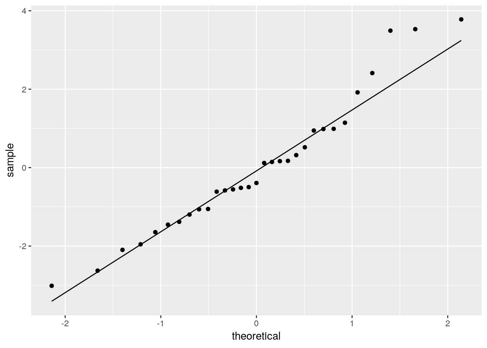

 

There's a little weirdness at the top, and a tiny indication of a
curve (that would suggest a little right-skewedness), but not really
much to worry about. If that third-highest residual were a bit
lower (say, 3 rather than 3.5) and maybe if the lowest residual was a
bit lower, I don't think we'd have anything to complain about at all.

So, I'm not worried.


##  Roller coasters


 A poll on the Discovery Channel asked people to nominate the
best roller-coasters in the United States. We will examine the 10
roller-coasters that received the most votes. Two features of a
roller-coaster that are of interest are the distance it drops from
start to finish, measured here in feet
<label for="tufte-mn-" class="margin-toggle">&#8853;</label><input type="checkbox" id="tufte-mn-" class="margin-toggle"><span class="marginnote">Roller-coasters work by   gravity, so there must be some drop.</span> and the duration of the ride,
measured in seconds. Is it true that roller-coasters with a bigger
drop also tend to have a longer ride? The data are at
[link](http://www.utsc.utoronto.ca/~butler/c32/coasters.csv).
<label for="tufte-mn-" class="margin-toggle">&#8853;</label><input type="checkbox" id="tufte-mn-" class="margin-toggle"><span class="marginnote">These are not to be confused with what your mom insists that you place between your coffee mug and the table.</span>


(a) Read the data into R and verify that you have a sensible
number of rows and columns.


Solution


A `.csv`, so the usual for that:


```r
my_url="http://www.utsc.utoronto.ca/~butler/c32/coasters.csv"
coasters=read_csv(my_url)
```

```
## Parsed with column specification:
## cols(
##   coaster_name = col_character(),
##   state = col_character(),
##   drop = col_integer(),
##   duration = col_integer()
## )
```

```r
coasters
```

```
## # A tibble: 10 x 4
##    coaster_name     state         drop duration
##    <chr>            <chr>        <int>    <int>
##  1 Incredible Hulk  Florida        105      135
##  2 Millennium Force Ohio           300      105
##  3 Goliath          California     255      180
##  4 Nitro            New Jersey     215      240
##  5 Magnum XL-2000   Ohio           195      120
##  6 The Beast        Ohio           141       65
##  7 Son of Beast     Ohio           214      140
##  8 Thunderbolt      Pennsylvania    95       90
##  9 Ghost Rider      California     108      160
## 10 Raven            Indiana         86       90
```

 

The number of marks for this kind of thing has been decreasing through
the course, since by now you ought to have figured out how to do it
without looking it up.

There are 10 rows for the promised 10 roller-coasters, and there are
several columns: the drop for each roller-coaster and the duration of
its ride, as promised, as well as the name of each roller-coaster and the state
that it is in. (A lot of them seem to be in Ohio, for some reason that
I don't know.) So this all looks good.


(b) Make a scatterplot of duration (response) against drop
(explanatory), labelling each roller-coaster with its name in such a
way that the labels do not overlap. Add a regression line to your plot.


Solution


The last part, about the labels not overlapping, is an
invitation to use `ggrepel`, which is the way I'd
recommend doing this. (If not, you have to do potentially lots
of work organizing where the labels sit relative to the points,
which is time you probably don't want to spend.) Thus:

```r
library(ggrepel)
ggplot(coasters,aes(x=drop,y=duration,label=coaster_name))+
geom_point()+geom_text_repel()+geom_smooth(method="lm",se=F)
```

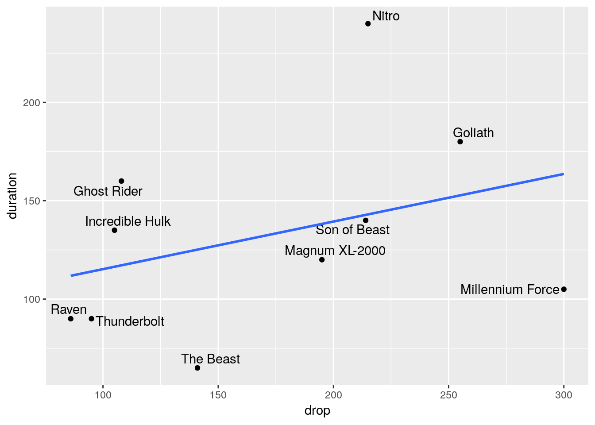

       

The `se=F` at the end is optional; if you omit it, you get that
"envelope" around the line, which is fine here.

Note that with the labelling done this way, you can easily identify
which roller-coaster is which.


(c) Would you say that roller-coasters with a larger drop tend
to have a longer ride? Explain briefly.


Solution


I think there are two good answers here: "yes" and "kind of".
Supporting "yes" is the fact that the regression line does go
uphill, so that overall, or on average, roller-coasters with a
larger drop do tend to have a longer duration of ride as well.
Supporting "kind of" is the fact that, though the regression
line goes uphill, there are a lot of roller-coasters that are
some way off the trend, far from the regression line.
I am happy to go with either of those. I could also go with
"not really" and the same discussion that I attached to 
"kind of". 


(d) Find a roller-coaster that is unusual compared to the
others. What about its combination of `drop` and
`duration` is unusual?


Solution


This is an invitation to find a point that is a long way off the
line. I think the obvious choice is my first one below, but I
would take either of the others as well:


* "Nitro" is a long way above the line. That means it has
a long duration, relative to its drop. There are two other
roller-coasters that have a larger drop but not as long a
duration. In other words, this roller-coaster drops slowly,
presumably by doing a lot of twisting, loop-the-loop and so on.

* "The Beast" is a long way below the line, so it has a
short duration relative to its drop. It is actually the
shortest ride of all, but is only a bit below average in terms
of drop. This suggests that The Beast is one of those rides
that drops a long way quickly.

* "Millennium Force" has the biggest drop of all, but a
shorter-than-average duration. This looks like another ride
with a big drop in it.

A roller-coaster that is "unusual" will have a residual that
is large in size (either positive, like Nitro, or negative, like
the other two). I didn't ask you to find the residuals, but if
you want to, `augment` from `broom` is the
smoothest way to go:

```r
library(broom)
duration.1=lm(duration~drop,data=coasters) 
augment(duration.1,coasters) %>%
select(coaster_name,duration,drop,.resid) %>%
arrange(desc(abs(.resid)))
```

```
## # A tibble: 10 x 4
##    coaster_name     duration  drop .resid
##    <chr>               <int> <int>  <dbl>
##  1 Nitro                 240   215  97.0 
##  2 The Beast              65   141 -60.1 
##  3 Millennium Force      105   300 -58.6 
##  4 Ghost Rider           160   108  42.8 
##  5 Goliath               180   255  27.3 
##  6 Thunderbolt            90    95 -24.0 
##  7 Raven                  90    86 -21.8 
##  8 Incredible Hulk       135   105  18.6 
##  9 Magnum XL-2000        120   195 -18.2 
## 10 Son of Beast          140   214  -2.81
```

       

`augment` produces a data frame (of the original data frame
with some new columns that come from the regression), so I can feed it
into a pipe to do things with it, like only displaying the columns I
want, and arranging them in order by absolute value of residual, so
that the roller-coasters further from the line come out first. This
identifies the three that we found above. The fourth one, "Ghost Rider", 
is like Nitro in that it takes a (relatively) long time to
fall not very far.
You can also put `augment` in the *middle* of a pipe, but then
you seem to lose things that were not in the regression:


```r
coasters %>%
lm(duration~drop, data=.) %>%
augment() %>%
arrange(desc(abs(.resid)))
```

```
## # A tibble: 10 x 9
##    duration  drop .fitted .se.fit .resid  .hat .sigma  .cooksd .std.resid
##       <int> <int>   <dbl>   <dbl>  <dbl> <dbl>  <dbl>    <dbl>      <dbl>
##  1      240   215    143.    18.9  97.0  0.138   37.5 0.336        2.05  
##  2       65   141    125.    17.5 -60.1  0.118   48.8 0.106       -1.26  
##  3      105   300    164.    33.4 -58.6  0.429   45.9 0.870       -1.52  
##  4      160   108    117.    21.6  42.8  0.180   51.5 0.0946       0.928 
##  5      180   255    153.    24.9  27.3  0.239   53.2 0.0591       0.614 
##  6       90    95    114.    23.7 -24.0  0.216   53.5 0.0391      -0.532 
##  7       90    86    112.    25.2 -21.8  0.245   53.6 0.0395      -0.493 
##  8      135   105    116.    22.1  18.6  0.188   53.9 0.0189       0.404 
##  9      120   195    138.    17.0 -18.2  0.111   54.0 0.00898     -0.379 
## 10      140   214    143.    18.8  -2.81 0.136   54.5 0.000277    -0.0593
```

 

I wanted to hang on to the roller-coaster names, so I went the other
way. The advantage of this way is less typing. You have to specify the
`data=.` thing in the regression because the data frame is
*not* the first input to `lm` (the model is), but you have
a much simpler `augment` because its first input is the model
that came out of the previous step. If the second input to
`augment` is missing, as it is here, it "attempts to reconstruct the data from the model"
<label for="tufte-mn-" class="margin-toggle">&#8853;</label><input type="checkbox" id="tufte-mn-" class="margin-toggle"><span class="marginnote">A quote from the package vignette.</span> 
which I think means that things like the coaster names that
were not part of the regression won't be part of `augment`'s
output either. That's my understanding. My first way explicitly
supplies the original data frame to `augment` so there is no
question about what it is using.


