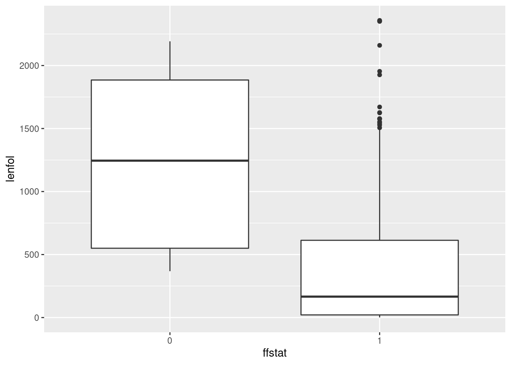
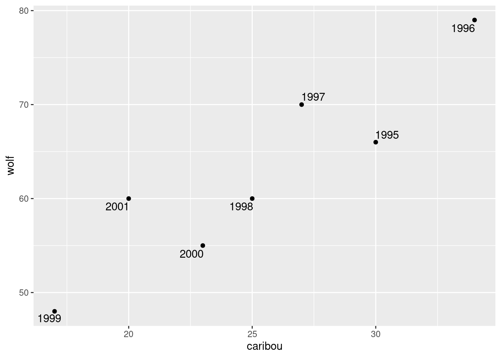
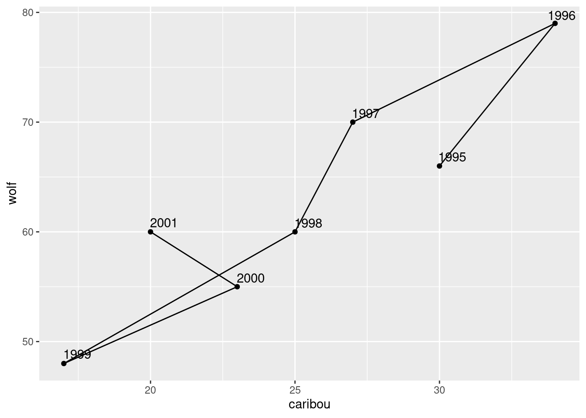
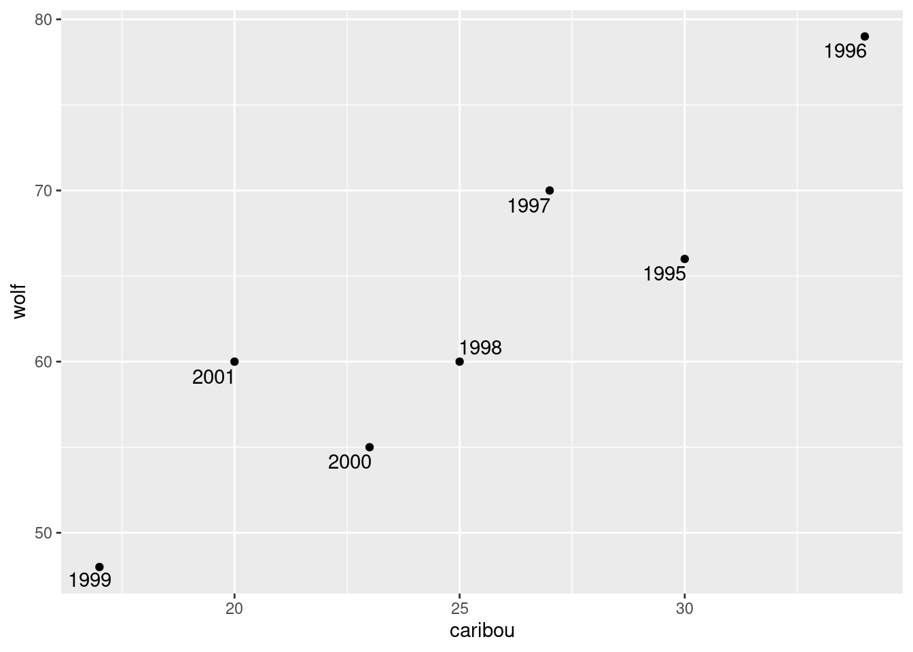

# Dates and times

The usual to begin with:


```r
library(tidyverse)
```

```
## ── Attaching packages ────────────────────────────────── tidyverse 1.2.1 ──
```

```
## ✔ ggplot2 3.0.0     ✔ purrr   0.2.5
## ✔ tibble  1.4.2     ✔ dplyr   0.7.6
## ✔ tidyr   0.8.1     ✔ stringr 1.3.1
## ✔ readr   1.1.1     ✔ forcats 0.3.0
```

```
## ── Conflicts ───────────────────────────────────── tidyverse_conflicts() ──
## ✖ dplyr::filter() masks stats::filter()
## ✖ dplyr::lag()    masks stats::lag()
```


##  Dealing with dates in the Worcester Heart Attack study


 The Worcester Heart Attack Study is an ongoing study of
heart attacks in the Worcester, MA area. The main purpose of the study
is to investigate changes over time in incidence and death rates, and also
the use of different treatment approaches. We will be mainly using
this data set to investigate data handling and dealing with dates. The
data can be found at
[link](http://www.utsc.utoronto.ca/~butler/c32/whas500.txt). 


(a) Read the data into R. The reading-in part is
straightforward, but check what type of thing each column is. Is
that what it should be?


Solution


This is `read_delim`:

```r
my_url="http://www.utsc.utoronto.ca/~butler/c32/whas500.txt"
whas=read_delim(my_url," ")
```

```
## Parsed with column specification:
## cols(
##   .default = col_integer(),
##   bmi = col_double(),
##   admitdate = col_character(),
##   disdate = col_character(),
##   fdate = col_character()
## )
```

```
## See spec(...) for full column specifications.
```

```r
whas
```

```
## # A tibble: 500 x 22
##       id   age gender    hr sysbp diasbp   bmi   cvd   afb   sho   chf
##    <int> <int>  <int> <int> <int>  <int> <dbl> <int> <int> <int> <int>
##  1     1    83      0    89   152     78  25.5     1     1     0     0
##  2     2    49      0    84   120     60  24.0     1     0     0     0
##  3     3    70      1    83   147     88  22.1     0     0     0     0
##  4     4    70      0    65   123     76  26.6     1     0     0     1
##  5     5    70      0    63   135     85  24.4     1     0     0     0
##  6     6    70      0    76    83     54  23.2     1     0     0     0
##  7     7    57      0    73   191    116  39.5     1     0     0     0
##  8     8    55      0    91   147     95  27.1     1     0     0     0
##  9     9    88      1    63   209    100  27.4     1     0     0     1
## 10    10    54      0   104   166    106  25.5     1     0     0     0
## # ... with 490 more rows, and 11 more variables: av3 <int>, miord <int>,
## #   mitype <int>, year <int>, admitdate <chr>, disdate <chr>, fdate <chr>,
## #   los <int>, dstat <int>, lenfol <int>, fstat <int>
```

   

To see what type everything is, note that when you display a
`tibble`, the type of all the columns on the screen is
displayed at the top. Click the little right-arrow to see more columns
and to check their type.

All the numbers are properly integer (`int`) or decimal
(`dbl`) numbers, but the date columns are `chr` or
text. This means that they haven't been read as `Date`s
(because they were not in year-month-day order).  This is (as we will
see) unlike SAS, which determined that they were dates, and even used
the first 20 rows of the file to determine what format of dates they
were.


(b) The date columns should be R dates. They are not
year-month-day, so converting them via `as.Date` (which is
what `read_delim` tries to do) will not work. Load the
`lubridate` package, and create new columns in your data
frame that are properly dates. Save your data frame, and list it to
demonstrate that it worked.


Solution


Load `lubridate` first:

```r
library(lubridate)
```

```
## 
## Attaching package: 'lubridate'
```

```
## The following object is masked from 'package:base':
## 
##     date
```

       

These dates are day-month-year, so we need `dmy` from
`lubridate`: 


```r
whas2=whas %>% mutate(admit=dmy(admitdate),
dis=dmy(disdate),
f=dmy(fdate)) 
glimpse(whas2)
```

```
## Observations: 500
## Variables: 25
## $ id        <int> 1, 2, 3, 4, 5, 6, 7, 8, 9, 10, 11, 12, 13, 14, 15, 1...
## $ age       <int> 83, 49, 70, 70, 70, 70, 57, 55, 88, 54, 48, 75, 48, ...
## $ gender    <int> 0, 0, 1, 0, 0, 0, 0, 0, 1, 0, 0, 0, 0, 1, 0, 0, 1, 1...
## $ hr        <int> 89, 84, 83, 65, 63, 76, 73, 91, 63, 104, 95, 154, 85...
## $ sysbp     <int> 152, 120, 147, 123, 135, 83, 191, 147, 209, 166, 160...
## $ diasbp    <int> 78, 60, 88, 76, 85, 54, 116, 95, 100, 106, 110, 123,...
## $ bmi       <dbl> 25.54051, 24.02398, 22.14290, 26.63187, 24.41255, 23...
## $ cvd       <int> 1, 1, 0, 1, 1, 1, 1, 1, 1, 1, 0, 1, 1, 1, 0, 0, 1, 0...
## $ afb       <int> 1, 0, 0, 0, 0, 0, 0, 0, 0, 0, 0, 1, 0, 1, 0, 0, 0, 0...
## $ sho       <int> 0, 0, 0, 0, 0, 0, 0, 0, 0, 0, 0, 0, 0, 0, 0, 0, 0, 0...
## $ chf       <int> 0, 0, 0, 1, 0, 0, 0, 0, 1, 0, 0, 1, 0, 1, 0, 0, 1, 1...
## $ av3       <int> 0, 0, 0, 0, 0, 1, 0, 0, 0, 0, 0, 0, 0, 0, 0, 0, 0, 0...
## $ miord     <int> 1, 0, 0, 0, 0, 0, 0, 0, 0, 0, 0, 0, 0, 0, 1, 1, 1, 0...
## $ mitype    <int> 0, 1, 1, 1, 1, 0, 1, 1, 0, 0, 1, 1, 0, 0, 0, 0, 0, 1...
## $ year      <int> 1, 1, 1, 1, 1, 1, 1, 1, 1, 1, 1, 1, 1, 1, 1, 1, 1, 1...
## $ admitdate <chr> "13-01-1997", "19-01-1997", "01-01-1997", "17-02-199...
## $ disdate   <chr> "18-01-1997", "24-01-1997", "06-01-1997", "27-02-199...
## $ fdate     <chr> "31-12-2002", "31-12-2002", "31-12-2002", "11-12-199...
## $ los       <int> 5, 5, 5, 10, 6, 1, 5, 4, 4, 5, 5, 10, 7, 21, 4, 1, 1...
## $ dstat     <int> 0, 0, 0, 0, 0, 1, 0, 0, 0, 0, 0, 0, 0, 0, 0, 0, 0, 0...
## $ lenfol    <int> 2178, 2172, 2190, 297, 2131, 1, 2122, 1496, 920, 217...
## $ fstat     <int> 0, 0, 0, 1, 0, 1, 0, 1, 1, 0, 0, 1, 0, 1, 0, 0, 1, 1...
## $ admit     <date> 1997-01-13, 1997-01-19, 1997-01-01, 1997-02-17, 199...
## $ dis       <date> 1997-01-18, 1997-01-24, 1997-01-06, 1997-02-27, 199...
## $ f         <date> 2002-12-31, 2002-12-31, 2002-12-31, 1997-12-11, 200...
```

 

There are a lot of columns, so I used `glimpse`.  The three new
variables we created are at the end of the list. They are correctly
`Date`s, and they have the right values, the ones we can see at
least. 

The indentation is up to you. I think it's nice to make the
creations of the three new variables line up. You can also make the
opening and closing brackets on the long `mutate` aligned, or
you can do as I have done here and put two closing brackets on the
end. The rationale for this is that each of the variable definition
lines in the `mutate` ends either with a comma or an extra
closing bracket, the latter being on the last line. Your choice here is
a matter of taste or (in your working life) the coding norms of the
team you're working with.

You may have been offended by the repetition above. It so happens that
these columns' names all end in `date` and they are the only
ones that do, so we can use a "select helper" to select only them,
and then submit all of them to a `mutate` via `mutate_at`,
which goes like this:


```r
whas %>% mutate_at(vars(ends_with("date")),funs(d=dmy)) %>% glimpse()
```

```
## Observations: 500
## Variables: 25
## $ id          <int> 1, 2, 3, 4, 5, 6, 7, 8, 9, 10, 11, 12, 13, 14, 15,...
## $ age         <int> 83, 49, 70, 70, 70, 70, 57, 55, 88, 54, 48, 75, 48...
## $ gender      <int> 0, 0, 1, 0, 0, 0, 0, 0, 1, 0, 0, 0, 0, 1, 0, 0, 1,...
## $ hr          <int> 89, 84, 83, 65, 63, 76, 73, 91, 63, 104, 95, 154, ...
## $ sysbp       <int> 152, 120, 147, 123, 135, 83, 191, 147, 209, 166, 1...
## $ diasbp      <int> 78, 60, 88, 76, 85, 54, 116, 95, 100, 106, 110, 12...
## $ bmi         <dbl> 25.54051, 24.02398, 22.14290, 26.63187, 24.41255, ...
## $ cvd         <int> 1, 1, 0, 1, 1, 1, 1, 1, 1, 1, 0, 1, 1, 1, 0, 0, 1,...
## $ afb         <int> 1, 0, 0, 0, 0, 0, 0, 0, 0, 0, 0, 1, 0, 1, 0, 0, 0,...
## $ sho         <int> 0, 0, 0, 0, 0, 0, 0, 0, 0, 0, 0, 0, 0, 0, 0, 0, 0,...
## $ chf         <int> 0, 0, 0, 1, 0, 0, 0, 0, 1, 0, 0, 1, 0, 1, 0, 0, 1,...
## $ av3         <int> 0, 0, 0, 0, 0, 1, 0, 0, 0, 0, 0, 0, 0, 0, 0, 0, 0,...
## $ miord       <int> 1, 0, 0, 0, 0, 0, 0, 0, 0, 0, 0, 0, 0, 0, 1, 1, 1,...
## $ mitype      <int> 0, 1, 1, 1, 1, 0, 1, 1, 0, 0, 1, 1, 0, 0, 0, 0, 0,...
## $ year        <int> 1, 1, 1, 1, 1, 1, 1, 1, 1, 1, 1, 1, 1, 1, 1, 1, 1,...
## $ admitdate   <chr> "13-01-1997", "19-01-1997", "01-01-1997", "17-02-1...
## $ disdate     <chr> "18-01-1997", "24-01-1997", "06-01-1997", "27-02-1...
## $ fdate       <chr> "31-12-2002", "31-12-2002", "31-12-2002", "11-12-1...
## $ los         <int> 5, 5, 5, 10, 6, 1, 5, 4, 4, 5, 5, 10, 7, 21, 4, 1,...
## $ dstat       <int> 0, 0, 0, 0, 0, 1, 0, 0, 0, 0, 0, 0, 0, 0, 0, 0, 0,...
## $ lenfol      <int> 2178, 2172, 2190, 297, 2131, 1, 2122, 1496, 920, 2...
## $ fstat       <int> 0, 0, 0, 1, 0, 1, 0, 1, 1, 0, 0, 1, 0, 1, 0, 0, 1,...
## $ admitdate_d <date> 1997-01-13, 1997-01-19, 1997-01-01, 1997-02-17, 1...
## $ disdate_d   <date> 1997-01-18, 1997-01-24, 1997-01-06, 1997-02-27, 1...
## $ fdate_d     <date> 2002-12-31, 2002-12-31, 2002-12-31, 1997-12-11, 2...
```

 

One line, as you see, not three. The syntax of this is that we first
say which columns we want to mutate. We can use any of the
select-helpers for this, including listing the column numbers or
names; in this case our date variables all ended with
`date`. Then we have to give a function, or more than one
function, to mutate them with; in this case we wanted to run all the
dates-as-text through `dmy`. Because I said `d=dmy`, it
takes the original date variable names, glues an underscore on the end
and then the `d` that I said, so we create new variables by
those names (at the end of the `glimpse` output). If I had just
said `funs(dmy)`, we would have *overwritten* the original
values, and `admitdate`, `disdate` and `fdate`
would now be `date`s. Losing the original variables would have
been OK here, but I wanted to show you how to create new variables.


(c) Create three new variables `diff1, diff2, diff3` that
are the numbers of days between each of your dates, and save the
data frame in which they have been created. Verify that at
least some of them are the same as `los` and `lenfol`.


Solution


I don't know
what R's internal storage is for dates (it might be seconds or
milliseconds or anything, not necessarily days),
so subtracting them requires care; you have to divide by the
length of a day (in whatever units), thus:

```r
whas3=whas2 %>% mutate(
diff1=(dis-admit)/ddays(1),
diff2=(f-admit)/ddays(1),
diff3=(f-dis)/ddays(1))
glimpse(whas3)	   
```

```
## Observations: 500
## Variables: 28
## $ id        <int> 1, 2, 3, 4, 5, 6, 7, 8, 9, 10, 11, 12, 13, 14, 15, 1...
## $ age       <int> 83, 49, 70, 70, 70, 70, 57, 55, 88, 54, 48, 75, 48, ...
## $ gender    <int> 0, 0, 1, 0, 0, 0, 0, 0, 1, 0, 0, 0, 0, 1, 0, 0, 1, 1...
## $ hr        <int> 89, 84, 83, 65, 63, 76, 73, 91, 63, 104, 95, 154, 85...
## $ sysbp     <int> 152, 120, 147, 123, 135, 83, 191, 147, 209, 166, 160...
## $ diasbp    <int> 78, 60, 88, 76, 85, 54, 116, 95, 100, 106, 110, 123,...
## $ bmi       <dbl> 25.54051, 24.02398, 22.14290, 26.63187, 24.41255, 23...
## $ cvd       <int> 1, 1, 0, 1, 1, 1, 1, 1, 1, 1, 0, 1, 1, 1, 0, 0, 1, 0...
## $ afb       <int> 1, 0, 0, 0, 0, 0, 0, 0, 0, 0, 0, 1, 0, 1, 0, 0, 0, 0...
## $ sho       <int> 0, 0, 0, 0, 0, 0, 0, 0, 0, 0, 0, 0, 0, 0, 0, 0, 0, 0...
## $ chf       <int> 0, 0, 0, 1, 0, 0, 0, 0, 1, 0, 0, 1, 0, 1, 0, 0, 1, 1...
## $ av3       <int> 0, 0, 0, 0, 0, 1, 0, 0, 0, 0, 0, 0, 0, 0, 0, 0, 0, 0...
## $ miord     <int> 1, 0, 0, 0, 0, 0, 0, 0, 0, 0, 0, 0, 0, 0, 1, 1, 1, 0...
## $ mitype    <int> 0, 1, 1, 1, 1, 0, 1, 1, 0, 0, 1, 1, 0, 0, 0, 0, 0, 1...
## $ year      <int> 1, 1, 1, 1, 1, 1, 1, 1, 1, 1, 1, 1, 1, 1, 1, 1, 1, 1...
## $ admitdate <chr> "13-01-1997", "19-01-1997", "01-01-1997", "17-02-199...
## $ disdate   <chr> "18-01-1997", "24-01-1997", "06-01-1997", "27-02-199...
## $ fdate     <chr> "31-12-2002", "31-12-2002", "31-12-2002", "11-12-199...
## $ los       <int> 5, 5, 5, 10, 6, 1, 5, 4, 4, 5, 5, 10, 7, 21, 4, 1, 1...
## $ dstat     <int> 0, 0, 0, 0, 0, 1, 0, 0, 0, 0, 0, 0, 0, 0, 0, 0, 0, 0...
## $ lenfol    <int> 2178, 2172, 2190, 297, 2131, 1, 2122, 1496, 920, 217...
## $ fstat     <int> 0, 0, 0, 1, 0, 1, 0, 1, 1, 0, 0, 1, 0, 1, 0, 0, 1, 1...
## $ admit     <date> 1997-01-13, 1997-01-19, 1997-01-01, 1997-02-17, 199...
## $ dis       <date> 1997-01-18, 1997-01-24, 1997-01-06, 1997-02-27, 199...
## $ f         <date> 2002-12-31, 2002-12-31, 2002-12-31, 1997-12-11, 200...
## $ diff1     <dbl> 5, 5, 5, 10, 6, 1, 5, 4, 4, 5, 5, 10, 7, 21, 4, 1, 1...
## $ diff2     <dbl> 2178, 2172, 2190, 297, 2131, 1, 2122, 1496, 920, 217...
## $ diff3     <dbl> 2173, 2167, 2185, 287, 2125, 0, 2117, 1492, 916, 217...
```

       

The extra `d` on the front of `ddays` indicates that
these are what is known to `lubridate` as "durations": a
period of time 1 day long that could be any day (as opposed to 
"June 1, 1970" which is 1 day long, but tied to a particular day). 

`los` should be the number of days in hospital, what I
calculated as `diff1`, and `lenfol` should be the time
from being admitted to last followup, which is my `diff2`. My
output from `glimpse` confirms that. 

Of course, checking that the first few values match is a nice
confirmation, but is not actually a *proof*. For that, we should
compare all 500 values, and it would be best to do it in such a way
that R is comparing all 500 values for us, since it would be a lot
more reliable than the human eye. R has a function `all.equal`
which does exactly that. By way of warmup:


```r
x=1:4
y=1:4
z=c(1,2,3,5)
all.equal(x,y)
```

```
## [1] TRUE
```

```r
all.equal(x,z)
```

```
## [1] "Mean relative difference: 0.25"
```

 

I thought the second one was just going to say `FALSE`, but it
gave us a message instead, saying how close `x` and `z`
were on average, so that we could decide whether they were close
enough to call equal, or, as in this case, not.

Anyway:


```r
with(whas3,all.equal(lenfol,diff2))
```

```
## [1] TRUE
```

```r
with(whas3,all.equal(los,diff1))
```

```
## [1] TRUE
```

 

so they really are all equal, all 500 of them.
<label for="tufte-mn-" class="margin-toggle">&#8853;</label><input type="checkbox" id="tufte-mn-" class="margin-toggle"><span class="marginnote">The computer  scientists among you will note that I shouldn't have done this,  because *diff1* through *diff3* are double-precision  decimal numbers, so I should have tested their equality with  *lenfol* and *los* by working out the absolute  differences and testing whether they were all *small*. On  consulting the help for *all.equal*, though, I find that it  *does* work properly, because it actually tests whether the  things being compared differ by less than a quantity  *tolerance* which defaults to 0.000000015, and if  they  do it calls them equal. This is all tied in with the difference  between integers and decimal numbers as they are represented on a  computer: exactly and approximately, respectively. A  double-precision number has about 16 significant digits of accuracy;  equal things won't have all 16 digits equal, most likely, but they  would be expected to have at least 8 of those digits the  same. CSCA08 stuff, I imagine. This is where you can casually toss  around terms like *machine epsilon*. Oh! I just realized  something. You know how very very small P-values are shown in R as  *<2.2e-16*? *That's* the machine epsilon. Anything smaller than that is  indistinguishable from zero, and you can't have a P-value be  *exactly* zero. The default *tolerance* I mentioned  above is the square root of this, which is normally used for such  things.</span>


(d) Construct side-by-side boxplots of the length of followup by
each followup status. You'll need to make sure
that the followup status, as it gets fed into `ggplot`, is a
`factor`, or, at least, not the number that it is now.


Solution


The easiest way to make a factor is to wrap `fstat`, which
is a numeric 0 or 1, in `factor()`:

```r
ggplot(whas3,aes(x=factor(fstat),y=lenfol))+geom_boxplot()
```


       

Or create a factor version of `fstat` first:


```r
whas3 %>% mutate(ffstat=factor(fstat)) %>%
ggplot(aes(x=ffstat,y=lenfol))+geom_boxplot()
```


 

I think the second way looks better, because you
get a cleaner $x$-axis on your plot. But if you're doing this for
exploration, rather than as something that's going to appear in a
report for your boss, the first way is fine.

`ggplot` also treats text stuff as categorical where needed, so
this also works:


```r
whas3 %>% mutate(cfstat=as.character(fstat)) %>%
ggplot(aes(x=cfstat, y=lenfol))+geom_boxplot()
```


 


##  Growth of Mizuna lettuce seeds


 In 2010, a group of students planted some Mizuna lettuce
seeds, and recorded how they grew. The data were saved in an Excel
spreadsheet, which is at
[link](http://www.utsc.utoronto.ca/~butler/c32/mizuna.xlsx). The columns
are: the date, the height (in cm) of (I presume) the tallest plant,
the amount of water added since the previous date (ml), the
temperature in the container where the seedlings were growing, and any
additional notes that the students made (edited for length by me). The
top line of the data file is variable names.


(a) Read the
spreadsheet data.


Solution


This is `read_excel` from package `readxl`. I'm
not sure what will happen to the dates yet. Note that this needs
a "local" copy of the spreadsheet (that is, you have to
download it and save it on your computer, then upload it to
`rstudio.cloud`), possibly using `file.choose` to
help R find it. I put my copy in the same project folder as I was
working in, so I just need the file name:

```r
library(readxl)
mizuna=read_excel("mizuna.xlsx")
mizuna
```

```
## # A tibble: 13 x 5
##    date                height water temperature notes                     
##    <dttm>               <dbl> <dbl>       <dbl> <chr>                     
##  1 2010-02-16 00:00:00    0     400        21   planted seeds; water soak…
##  2 2010-02-18 00:00:00    0       0        22.5 2 of 6 seeds not appeared…
##  3 2010-02-19 00:00:00    0     200        20.9 4 of 6 plants broken surf…
##  4 2010-02-22 00:00:00    3.2   100        20.8 Last seed hasn’t broken s…
##  5 2010-02-23 00:00:00    4.5   100        22.9 Plants growing well.      
##  6 2010-02-25 00:00:00    6     100        21.8 Last seed sprouted; plant…
##  7 2010-02-26 00:00:00    6.5   200        21.2 <NA>                      
##  8 2010-03-01 00:00:00    9.5   200        21.8 <NA>                      
##  9 2010-03-03 00:00:00   11.1   200        21.7 Plants needing more water 
## 10 2010-03-05 00:00:00   13     250        21.9 <NA>                      
## 11 2010-03-08 00:00:00   14.5   500        22.5 No water left, leaves dro…
## 12 2010-03-10 00:00:00   16     200        21.2 Plants green and healthy  
## 13 2010-03-17 00:00:00   18.5   800        20.8 Harvest. Tips of plants t…
```

     

The dates *did* get read properly. `dttm` is
"date-time", so I guess it's allowing for the possibility that my
dates had times attached as well. Unlike with SAS (as we see later),
the years came out right.


(b) Make a plot of `height` against your
dates, with the points joined by lines.


Solution


```r
ggplot(mizuna,aes(x=date,y=height))+geom_point()+geom_line()
```



       


(c) Label each point on the plot with the
amount of water added up to that point.


Solution


This is `water` again. The way to do this is to load
`ggrepel`, then add `geom_text_repel` to the
plot, by adding `label=water` to the *original*
`aes`:

```r
library(ggrepel)
ggplot(mizuna,aes(x=date,y=height,label=water))+
geom_point()+geom_line()+geom_text_repel(colour="red")
```


 

I made the text red, so that you can see it more easily. It "repels"
away from the points, but not from the lines joining them. Which makes
me wonder whether this would work better (I explain `alpha` afterwards):


```r
library(ggrepel)
ggplot(mizuna,aes(x=date,y=height,label=water))+
geom_point()+geom_line()+geom_label_repel(colour="red",alpha=0.7)
```


 

The difference between `text` and `label` is that
`text` just uses the text of the variable to mark the point,
while `label` puts that text in a box.

I think it works better. You can see where the line goes (under the boxes with
the labels in them), but you can see the labels clearly.

What that `alpha` does is to make the thing it's attached to
(the labels) partly *transparent*. If you leave it out (try it),
the black line disappears completely under the label boxes and you
can't see where it goes at all. The value you give for `alpha`
says how transparent the thing is, from 1 (not transparent at all)
down to 0 (invisible). I first tried 0.3, and you could hardly see the
boxes; then I tried 0.7 so that the boxes were a bit more
prominent but the lines underneath were still slightly visible, and I
decided that this is what I liked. I think making the labels a
different colour was a good idea, since that helps to distinguish the
number on the label from the line underneath.

You can apply `alpha` to pretty much any `ggplot` thing
that might be on top of something else, to make it possible to see
what's underneath it. The commonest use for it is if you have a
scatterplot with a lot of points; normally, you only see some of the
points, because the plot is then a sea of black. But if you make the
points partly transparent, you can see more of what's nearby that
would otherwise have been hidden. 

At some point, I also have to show
you folks `jitter`, which plots in slightly different places
points that would otherwise overprint each other exactly, and you
wouldn't know how many of them there were, like the outliers on the
boxplots of German children near the new airport.


##  Types of childbirth


 Childbirths can be of two types: a
"vaginal" birth in which the child is born through the mother's
 vagina in the normal fashion, and a "cesarean section" where a
 surgeon cuts through the wall of the mother's abdomen, and the baby
 is delivered through the incision. Cesarean births are used when
 there are difficulties in pregnancy or during childbirth that would
 make a vaginal birth too risky.
A hospital kept track of the number of vaginal and Cesarean births
 for the twelve months of 2012. Of interest is whether the Cesarean
 rate (the ratio of Cesarean births to all births) was increasing,
 decreasing or remaining stable over that time.
The data may be found at
 [link](http://www.utsc.utoronto.ca/~butler/c32/birthtypes.txt). The
 columns are the names of the months (in 2012), the number of cesarean
 births and the number of vaginal births. (The data are not real, but
 are typical of the kind of thing you would observe.)


(a) Read the data into R and display your data frame.

Solution


This is a space-delimited text file, which means:


```r
my_url="http://www.utsc.utoronto.ca/~butler/c32/birthtypes.txt"
births=read_delim(my_url, " ")
```

```
## Parsed with column specification:
## cols(
##   month = col_character(),
##   cesarean = col_integer(),
##   vaginal = col_integer()
## )
```

```r
births
```

```
## # A tibble: 12 x 3
##    month cesarean vaginal
##    <chr>    <int>   <int>
##  1 Jan         11      68
##  2 Feb          9      63
##  3 Mar         10      72
##  4 Apr         18     105
##  5 May         10      90
##  6 Jun         10      92
##  7 Jul         11      78
##  8 Aug          9      83
##  9 Sep          9      90
## 10 Oct         15     101
## 11 Nov         12     130
## 12 Dec          8     101
```

 

Some text and two numbers for each month. Check.


(b) Create a column of actual dates and also a column of
cesarean rates, as defined above. Store your new data frame in a
variable and display it. For the dates, assume that each date is of
the 1st of the month that it belongs to.

Solution


The easiest way is to use `str_c` or `paste` to
create a text date with year, month and day in some order, and
then to use the appropriate function from `lubridate` to
turn that into an actual `date`. If you use
`str_c`, you (probably) need the `sep` thing to
make sure the values get a space between them; `paste`
does this automatically. (The next question is whether
`ymd` or whatever can cope without spaces, but I'm not
exploring that.)
The cesarean rate is `cesarean` divided by
`cesarean` plus `vaginal`:

```r
library(lubridate)
b2 = births %>% mutate(datestr=str_c("2012",month,"1",sep=" ")) %>%
mutate(thedate=ymd(datestr)) %>%
mutate(cesarean_rate=cesarean/(cesarean+vaginal))
b2
```

```
## # A tibble: 12 x 6
##    month cesarean vaginal datestr    thedate    cesarean_rate
##    <chr>    <int>   <int> <chr>      <date>             <dbl>
##  1 Jan         11      68 2012 Jan 1 2012-01-01        0.139 
##  2 Feb          9      63 2012 Feb 1 2012-02-01        0.125 
##  3 Mar         10      72 2012 Mar 1 2012-03-01        0.122 
##  4 Apr         18     105 2012 Apr 1 2012-04-01        0.146 
##  5 May         10      90 2012 May 1 2012-05-01        0.1   
##  6 Jun         10      92 2012 Jun 1 2012-06-01        0.0980
##  7 Jul         11      78 2012 Jul 1 2012-07-01        0.124 
##  8 Aug          9      83 2012 Aug 1 2012-08-01        0.0978
##  9 Sep          9      90 2012 Sep 1 2012-09-01        0.0909
## 10 Oct         15     101 2012 Oct 1 2012-10-01        0.129 
## 11 Nov         12     130 2012 Nov 1 2012-11-01        0.0845
## 12 Dec          8     101 2012 Dec 1 2012-12-01        0.0734
```

        

If you don't like that, create columns that contain 2012 and 1 all
the way down. If you set a column name equal to a single value, that
single value gets repeated the right number of times:
<label for="tufte-mn-" class="margin-toggle">&#8853;</label><input type="checkbox" id="tufte-mn-" class="margin-toggle"><span class="marginnote">This is  an example of R's so-called *recycling rules*.</span>


```r
births %>% mutate(year=2012,day=1)
```

```
## # A tibble: 12 x 5
##    month cesarean vaginal  year   day
##    <chr>    <int>   <int> <dbl> <dbl>
##  1 Jan         11      68  2012     1
##  2 Feb          9      63  2012     1
##  3 Mar         10      72  2012     1
##  4 Apr         18     105  2012     1
##  5 May         10      90  2012     1
##  6 Jun         10      92  2012     1
##  7 Jul         11      78  2012     1
##  8 Aug          9      83  2012     1
##  9 Sep          9      90  2012     1
## 10 Oct         15     101  2012     1
## 11 Nov         12     130  2012     1
## 12 Dec          8     101  2012     1
```

 

and then use `unite` as in class. The distinction is that
`unite` *only* works on columns. It also "swallows up"
the columns that it is made out of; in this case, the original year,
month and day disappear:


```r
b3 = births %>% mutate(year=2012, day=1) %>%
unite(datestr,year,month,day) %>%
mutate(thedate=ymd(datestr)) %>%
mutate(cesarean_rate=cesarean/(cesarean+vaginal))
b3
```

```
## # A tibble: 12 x 5
##    datestr    cesarean vaginal thedate    cesarean_rate
##    <chr>         <int>   <int> <date>             <dbl>
##  1 2012_Jan_1       11      68 2012-01-01        0.139 
##  2 2012_Feb_1        9      63 2012-02-01        0.125 
##  3 2012_Mar_1       10      72 2012-03-01        0.122 
##  4 2012_Apr_1       18     105 2012-04-01        0.146 
##  5 2012_May_1       10      90 2012-05-01        0.1   
##  6 2012_Jun_1       10      92 2012-06-01        0.0980
##  7 2012_Jul_1       11      78 2012-07-01        0.124 
##  8 2012_Aug_1        9      83 2012-08-01        0.0978
##  9 2012_Sep_1        9      90 2012-09-01        0.0909
## 10 2012_Oct_1       15     101 2012-10-01        0.129 
## 11 2012_Nov_1       12     130 2012-11-01        0.0845
## 12 2012_Dec_1        8     101 2012-12-01        0.0734
```

 

I don't mind which order you glue your year, month and day together,
as long as you construct the dates with the consistent
`lubridate` function. 


(c) Plot the cesarean rate against time, with a smooth
trend. Do you see an upward trend, a downward trend, no trend, or
something else?

Solution


This is a scatterplot with time on the $x$ axis:

```r
ggplot(b2,aes(x=thedate,y=cesarean_rate))+geom_point()+geom_smooth()
```

```
## `geom_smooth()` using method = 'loess' and formula 'y ~ x'
```


        

I like this better than joining the points by lines, since we already
have a trend on the plot, but you can do that in some contrasting way:


```r
ggplot(b2,aes(x=thedate,y=cesarean_rate))+geom_point()+
geom_line(linetype="dashed")+geom_smooth()
```

```
## `geom_smooth()` using method = 'loess' and formula 'y ~ x'
```


 
I see a downward trend. ("A downward trend with a wiggle" if you
like.) I didn't ask for any explanation. There is a certain unevenness
in the trend of the actual data, but the overall picture appears to be
downhill. 


(d) Try to summarize the trend you just found with a
correlation. What goes wrong? How can you fix it?

Solution


Something like this is the obvious guess:


```r
with(b2, cor(thedate, cesarean_rate))
```

```
## Error in cor(thedate, cesarean_rate): 'x' must be numeric
```

 

This fails because `thedate` is not of itself a number. But
lurking in the background is how the date is actually
*represented*: as a number of days since Jan 1, 1970. Thus,
passing it through `as.numeric` might turn it into that:


```r
b2 %>% mutate(numeric_date=as.numeric(thedate)) -> b5
b5
```

```
## # A tibble: 12 x 7
##    month cesarean vaginal datestr    thedate    cesarean_rate numeric_date
##    <chr>    <int>   <int> <chr>      <date>             <dbl>        <dbl>
##  1 Jan         11      68 2012 Jan 1 2012-01-01        0.139         15340
##  2 Feb          9      63 2012 Feb 1 2012-02-01        0.125         15371
##  3 Mar         10      72 2012 Mar 1 2012-03-01        0.122         15400
##  4 Apr         18     105 2012 Apr 1 2012-04-01        0.146         15431
##  5 May         10      90 2012 May 1 2012-05-01        0.1           15461
##  6 Jun         10      92 2012 Jun 1 2012-06-01        0.0980        15492
##  7 Jul         11      78 2012 Jul 1 2012-07-01        0.124         15522
##  8 Aug          9      83 2012 Aug 1 2012-08-01        0.0978        15553
##  9 Sep          9      90 2012 Sep 1 2012-09-01        0.0909        15584
## 10 Oct         15     101 2012 Oct 1 2012-10-01        0.129         15614
## 11 Nov         12     130 2012 Nov 1 2012-11-01        0.0845        15645
## 12 Dec          8     101 2012 Dec 1 2012-12-01        0.0734        15675
```

 

A little mental calculation suggests that these dates in 2012 are a
bit over 40 years, that is $40 \times 365 \simeq 14000$ days, since
the "zero" date of Jan 1, 1970, and so it turns out. This suggests
that we can calculate a correlation with the numeric dates:


```r
with(b5, cor(numeric_date, cesarean_rate))
```

```
## [1] -0.7091219
```

 

and we can make a test of the null hypothesis that the correlation is
zero (against a two-sided alternative) thus:


```r
with(b5, cor.test(numeric_date, cesarean_rate))
```

```
## 
## 	Pearson's product-moment correlation
## 
## data:  numeric_date and cesarean_rate
## t = -3.1804, df = 10, p-value = 0.009813
## alternative hypothesis: true correlation is not equal to 0
## 95 percent confidence interval:
##  -0.9119078 -0.2280145
## sample estimates:
##        cor 
## -0.7091219
```

 

That downward trend is more than just chance, with a P-value just
under 0.01. Having said that, though, if you look at the confidence
interval for the correlation, it includes almost all the negative
values it could be, so that with only 12 observations we really know
very little about the correlation other than that it appears to be
negative. 

Extra: 
 In practice, you would typically have a much longer time series
 of measurements than this, such as monthly measurements for
 several years. In looking at only one year, like we did here,
 we could get trapped by seasonal effects: for example, cesarean
 rates might always go down through the year and then jump up
 again in January. Looking at several years would enable us to
 disentangle seasonal effects that happen every year from
 long-term trends. (As an example of this, think of Toronto
 snowfall: there is almost always snow in the winter and there
 is never snow in the summer, a seasonal effect, but in
 assessing climate change, you want to think about long-term
 trends in snowfall, after allowing for which month you're
 looking at.)
 


##  Wolves and caribou


 In Denali National Park, Alaska, the size of the wolf
population depends on the size of the caribou population (since
wolves hunt and kill caribou). This is a large national park, so
caribou are found in very large herds, so big, in fact, that the
well-being of the entire herd is not threatened by wolf
attacks.
<label for="tufte-mn-" class="margin-toggle">&#8853;</label><input type="checkbox" id="tufte-mn-" class="margin-toggle"><span class="marginnote">In fact, it is believed that wolves help keep caribou    herds strong by preventing over-population: that is, the weakest    caribou are the ones taken by wolves.</span> 
Can the size of the caribou population
be used to predict the size of the wolf population?
The data can be found at
[link](http://www.utsc.utoronto.ca/~butler/c32/caribou.txt). The
columns 
are: the date of the survey,
<label for="tufte-mn-" class="margin-toggle">&#8853;</label><input type="checkbox" id="tufte-mn-" class="margin-toggle"><span class="marginnote">The survey is always taken in    the fall, but the date varies.</span> 
the name of the park employee in charge  of the survey, the caribou population (in hundreds) and the wolf  population (actual count).
<label for="tufte-mn-" class="margin-toggle">&#8853;</label><input type="checkbox" id="tufte-mn-" class="margin-toggle"><span class="marginnote">Counting animals in a region,    especially rare, hard-to-find animals, is a whole science in    itself. These numbers are probably estimates (with some    uncertainty).</span> 


(a) Take a look at the data file. How would you describe its
format? Read it into R, and check that you got something sensible.


Solution


This looks at first sight as if it's separated by spaces, but
most of the data values are separated by *more than one*
space. If you look further, you'll see that the values are
*lined up in columns*, with the variable names aligned at
the top. This is exactly the kind of thing that
`read_table` will read. We start with the usual
`library(tidyverse)`:

```r
library(tidyverse)
my_url="http://www.utsc.utoronto.ca/~butler/c32/caribou.txt"
denali=read_table(my_url)
```

```
## Parsed with column specification:
## cols(
##   date = col_character(),
##   name = col_character(),
##   caribou = col_integer(),
##   wolf = col_integer()
## )
```

```r
denali
```

```
## # A tibble: 7 x 4
##   date       name          caribou  wolf
##   <chr>      <chr>           <int> <int>
## 1 09/01/1995 David S.           30    66
## 2 09/24/1996 Youngjin K.        34    79
## 3 10/03/1997 Srinivasan M.      27    70
## 4 09/15/1998 Lee Anne J.        25    60
## 5 09/08/1999 Stephanie T.       17    48
## 6 09/03/2000 Angus Mc D.        23    55
## 7 10/06/2001 David S.           20    60
```

     

That worked: four columns with the right names, and the counts of
caribou and wolf are numbers. There are only seven years of surveys;
in real-life data you would have more. But the point here is working
with dates.

The only (small) weirdness is that the
dates are text rather than having been converted into dates. This is
because they are not year-month-day, which is the only format that
gets automatically converted into dates when read in. (You could use
`mdy` from `lubridate` to make them dates.)

Extra: you might have wondered how the names survived, even though
they have spaces in them, sometimes more than one. Here's how the file looks:


```

date       name             caribou wolf
09/01/1995 David S.         30       66
09/24/1996 Youngjin K.      34       79
10/03/1997 Srinivasan M.    27       70
09/15/1998 Lee Anne J.      25       60
09/08/1999 Stephanie T.     17       48
09/03/2000 Angus Mc D.      23       55
10/06/2001 David S.         20       60

```


What `read_table` looks for is columns that contain spaces
*all the way down*, and separates the values there. For example,
between the year of`date` and the first name in `name`
there is a space all the way down. After the names and before the
caribou counts there are several spaces, and there is one space
between the words `caribou` and `wolf` in the header
line that goes all the way down. Thus four columns, `date`,
`name`, `caribou` and `wolf`. This means that the
spaces within the names don't cause any problems at all, since the
spaces aren't in the same place in *every* line.
<label for="tufte-mn-" class="margin-toggle">&#8853;</label><input type="checkbox" id="tufte-mn-" class="margin-toggle"><span class="marginnote">The only way this would fail is if *every* first name had the same number of letters in it; then the space between first name and initial of last name *would* be in the same place in every line.</span>


(b) Create a new data frame where the column labelled
`date` is now a genuine R `Date`, using something
from `lubridate`.

Solution


What you do is to look at the format of the dates as they are
now. They appear to be month-day-year, American
style.
<label for="tufte-mn-" class="margin-toggle">&#8853;</label><input type="checkbox" id="tufte-mn-" class="margin-toggle"><span class="marginnote">Not a surprise since Denali National Park is in  Alaska.</span>  
Thus the function needed is `mdy`. It doesn't matter
whether the months are names or numbers:

```r
denali %>% mutate(date=mdy(date)) -> denali
denali
```

```
## # A tibble: 7 x 4
##   date       name          caribou  wolf
##   <date>     <chr>           <int> <int>
## 1 1995-09-01 David S.           30    66
## 2 1996-09-24 Youngjin K.        34    79
## 3 1997-10-03 Srinivasan M.      27    70
## 4 1998-09-15 Lee Anne J.        25    60
## 5 1999-09-08 Stephanie T.       17    48
## 6 2000-09-03 Angus Mc D.        23    55
## 7 2001-10-06 David S.           20    60
```

     

I lived on the edge and overwrote both my column and the whole data
frame.
<label for="tufte-mn-" class="margin-toggle">&#8853;</label><input type="checkbox" id="tufte-mn-" class="margin-toggle"><span class="marginnote">It's actually not *really* living on the edge,  because if it doesn't work, you go back and read the data in from  the file again.</span>

The dates are displayed in ISO format, year-month-day. You see at the
top of the column that they now really *are* dates, not just
pieces of text that look like dates. 


(c) Create new columns containing the days of
the week and the month names for the dates.


Solution


This involves digging in the `lubridate` help to find out how to extract things from a date. It turns out that `wday` extracts the day of the week from a date, by default as a number, and `month` gets the month, also by default as a number:

```r
denali %>% mutate(mon=month(date), wd=wday(date))
```

```
## # A tibble: 7 x 6
##   date       name          caribou  wolf   mon    wd
##   <date>     <chr>           <int> <int> <dbl> <dbl>
## 1 1995-09-01 David S.           30    66     9     6
## 2 1996-09-24 Youngjin K.        34    79     9     3
## 3 1997-10-03 Srinivasan M.      27    70    10     6
## 4 1998-09-15 Lee Anne J.        25    60     9     3
## 5 1999-09-08 Stephanie T.       17    48     9     4
## 6 2000-09-03 Angus Mc D.        23    55     9     1
## 7 2001-10-06 David S.           20    60    10     7
```

     

This is not what we wanted, though; we wanted the names of the months
and of the days. To fix that, add `label=T` to both functions:


```r
denali %>% mutate(mon=month(date, label=T), wd=wday(date, label=T))
```

```
## # A tibble: 7 x 6
##   date       name          caribou  wolf mon   wd   
##   <date>     <chr>           <int> <int> <ord> <ord>
## 1 1995-09-01 David S.           30    66 Sep   Fri  
## 2 1996-09-24 Youngjin K.        34    79 Sep   Tue  
## 3 1997-10-03 Srinivasan M.      27    70 Oct   Fri  
## 4 1998-09-15 Lee Anne J.        25    60 Sep   Tue  
## 5 1999-09-08 Stephanie T.       17    48 Sep   Wed  
## 6 2000-09-03 Angus Mc D.        23    55 Sep   Sun  
## 7 2001-10-06 David S.           20    60 Oct   Sat
```

 
and that cracks it.

No need to save this data frame anywhere, since we're not using any of
this later.

Extra: the `ord` means "ordered factor", which makes sense
since these are categorical variables with a natural order. This means
that you could do something like counting the number of surveys in
each month like this:


```r
denali %>% mutate(mon=month(date, label=T), wd=wday(date, label=T)) %>%
count(mon)
```

```
## # A tibble: 2 x 2
##   mon       n
##   <ord> <int>
## 1 Sep       5
## 2 Oct       2
```

 
      


(d) Enough playing around with dates. Make a scatterplot of
caribou population (explanatory) against wolf population
(response). Do you see any relationship?


Solution


Nothing terribly surprising here:

```r
ggplot(denali, aes(x=caribou, y=wolf))+geom_point()
```


       
If you like, add a smooth trend to it:
<label for="tufte-mn-" class="margin-toggle">&#8853;</label><input type="checkbox" id="tufte-mn-" class="margin-toggle"><span class="marginnote">This wiggles more than  I would like, with such a small number of observations. Try putting  someting like *span=2* in the smooth to make it less wiggly.</span>


```r
ggplot(denali, aes(x=caribou, y=wolf))+geom_point()+geom_smooth(se=F)
```

```
## `geom_smooth()` using method = 'loess' and formula 'y ~ x'
```


       

This is an upward trend: when one population is large, the other one
is large too. This is typical for predator-prey relationships: when
there is more to eat (more caribou) the wolf population goes up, and
when less, it goes down. 
      


(e) On your plot from the previous part, label each point with
the year it belongs to. You can do this in two steps: first make a
new column containing just the years, and then use it as labels
for the points on the plot.

Solution


I'm going to use `geom_text_repel` for the labels from package
`ggrepel`. The year values are gotten using the
`lubridate` function `year`:


```r
denali %>% mutate(year=year(date)) %>%
ggplot(aes(x=caribou, y=wolf, label=year))+geom_point()+geom_text_repel()
```


 

I thought about joining up the points in year order. This is actually
*not* `geom_line` as you would have guessed, since what that
does is to join points in the order of the variable on the
$x$-axis.
<label for="tufte-mn-" class="margin-toggle">&#8853;</label><input type="checkbox" id="tufte-mn-" class="margin-toggle"><span class="marginnote">I have to say that I didn't know that until just now.</span>
To join points in the order that they are in the data (what we want
here, because the points are in time order in the data), use instead 
`geom_path`:


```r
denali %>% mutate(year=year(date)) %>%
ggplot(aes(x=caribou, y=wolf, label=year))+geom_point()+
geom_text_repel()+geom_path()
```


 

In 1996, both populations were large, and both showed a steady decline
until 1999. In 2000 and 2001, both populations seemed to be on the way
up again, and you can imagine that in a couple of years, things would
go back to about where they were in 1995.


(f) Make a plot of caribou population against time (this is done
the obvious way). What seems to be happening to the caribou
population over time?


Solution


Make a scatterplot, with the survey date as explanatory
variable, and caribou population as response (since time always
goes on the $x$-axis):

```r
ggplot(denali, aes(x=date, y=caribou))+geom_point()+geom_line()
```



 

I used an ordinary `geom_line` this time, to connect neighbouring
years, as is often done with a time series. The overall trend is
downward, though the 1999 value might be a low from which the
population is recovering.
      


(g) The caribou and wolf populations over time are 
really "time series". 
See if you can make a plot of *both* the
caribou and wolf populations against time. You can make two
$y$-axes, one for caribou and one for wolf; this will probably
require some research on your part to figure out.


Solution


The obvious starting point is to note that both the
`caribou` and `wolf` columns are animal
populations, just of different animals. One way of plotting both
populations is to `gather` them up into one column, and
then plot them against time, with the two animals distinguished
by colour:

```r
denali %>% gather(animal, population, caribou:wolf)  %>%
ggplot(aes(x=date, y=population, colour=animal))+
geom_point()+geom_line()
```



       
This is not quite the story, though, because the caribou and wolf
populations are on different scales. The caribou population is
numbered in hundreds, while the wolf population is an actual count. 

The surveys are late in the year, so the one that is nearly in 1996 is
actually the 1995 survey.

What would be nice would be to have a secondary $y$-axis, so that
there were two $y$-scales, one for each animal. This is very easy to
manipulate, though (you can change either scale and get a very
different-looking graph), so we ought to be careful.

All right, so let's put the caribou on the left:


```r
ggplot(denali, aes(x=date, y=caribou))+geom_line()
```


 

Or we can add a `colour` aesthetic to distinguish the caribou
from the wolf populations, that we're going to add in a moment. This looks rather odd at first:


```r
ggplot(denali, aes(x=date, y=caribou, colour="caribou"))+geom_line()
```


 

Now we think about adding the wolf numbers. This is done by adding a
second `geom_line`, overriding the `y` and the
`colour` to specify that this is wolf now:


```r
ggplot(denali, aes(x=date, y=caribou, colour="caribou"))+
geom_line()+
geom_line(aes(y=wolf, colour="wolf"))
```


 

What has happened is that we get lines of different colour for each
animal, with a legend. So far so good. The problem is that the wolf
numbers are about 2.5 times bigger than the caribou
numbers,
<label for="tufte-mn-" class="margin-toggle">&#8853;</label><input type="checkbox" id="tufte-mn-" class="margin-toggle"><span class="marginnote">Which means, if you stop to think about it, that  there are *actually* about 40 times more caribou than wolves.</span>
so that
we don't get a good sense of how they go up and down together. If we
divided the wolf numbers by 2.5, we would see this better:


```r
ggplot(denali, aes(x=date, y=caribou, colour="caribou"))+
geom_line()+
geom_line(aes(y=wolf/2.5, colour="wolf"))
```


 

Now we get to the secondary $y$-axis. We want to label this
`wolf` and have it reflect that we actually made the graph by
dividing the wolf values by 2.5:


```r
ggplot(denali, aes(x=date, y=caribou, colour="caribou"))+
geom_line()+
geom_line(aes(y=wolf/2.5, colour="wolf"))+
scale_y_continuous(sec.axis=sec_axis(~./2.5,name="wolf"))
```



 

Woo, and, very possibly, hoo. I got most of these ideas from
[link](https://rpubs.com/MarkusLoew/226759). 

Now we see how the populations vary over time, and also that they vary
together. 

This is about the only double-$y$-axis setup that I like, with scales
chosen so that both the series vary about the same amount. By
"discreetly" changing the wolf scale, you could make it look as if
one population was much bigger than the other, or varied much more
than the other. Lies and statistics.

In my opinion, too many people just plot series against time, possibly
with a second $y$-axis.
<label for="tufte-mn-" class="margin-toggle">&#8853;</label><input type="checkbox" id="tufte-mn-" class="margin-toggle"><span class="marginnote">And all too often with Excel (spit).</span>
Variables that vary together, like the wolf
and caribou populations here, ought to be plotted \emph{against each
other} on a scatterplot, possibly with the time points labelled.

The ambitious among you may like to compare the graphs here with
other predator-prey relationships. If you are of a mathematical bent,
you might look into the Lotka-Volterra equations, which is a system of
two differential equations describing how changes in one population
cause changes in the other population.

      


