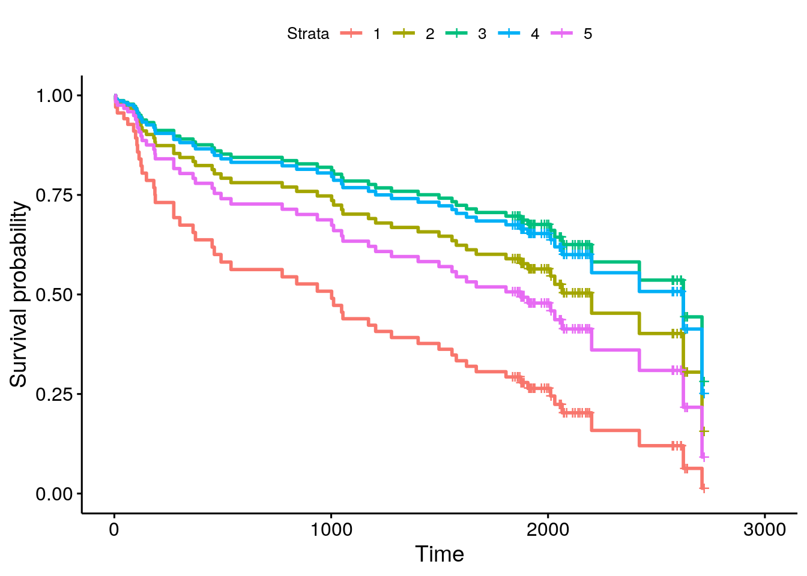
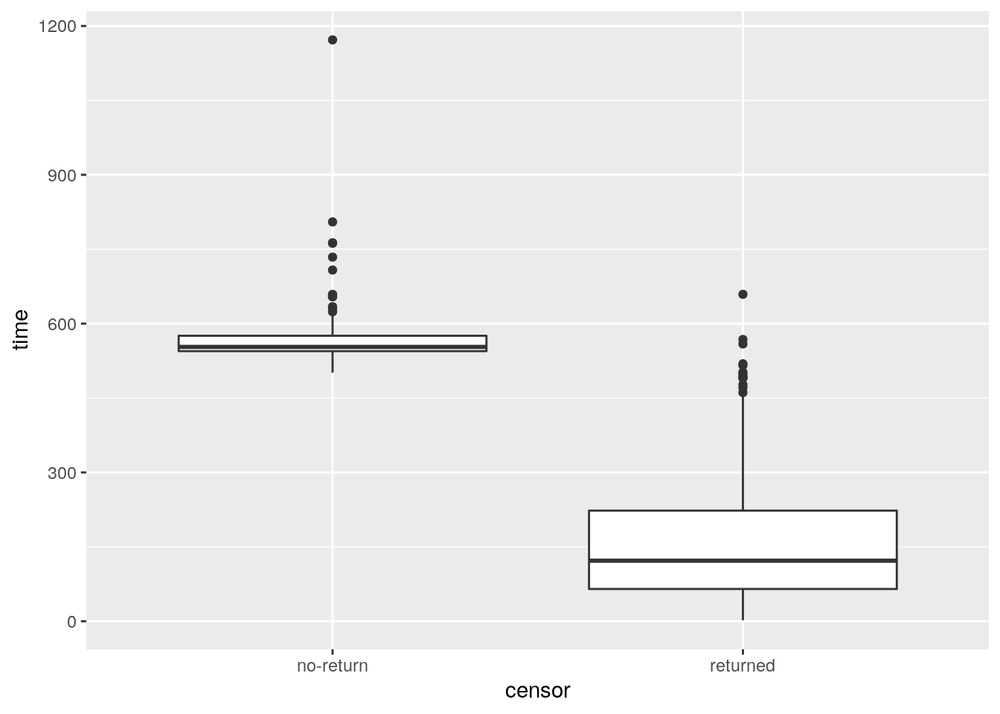
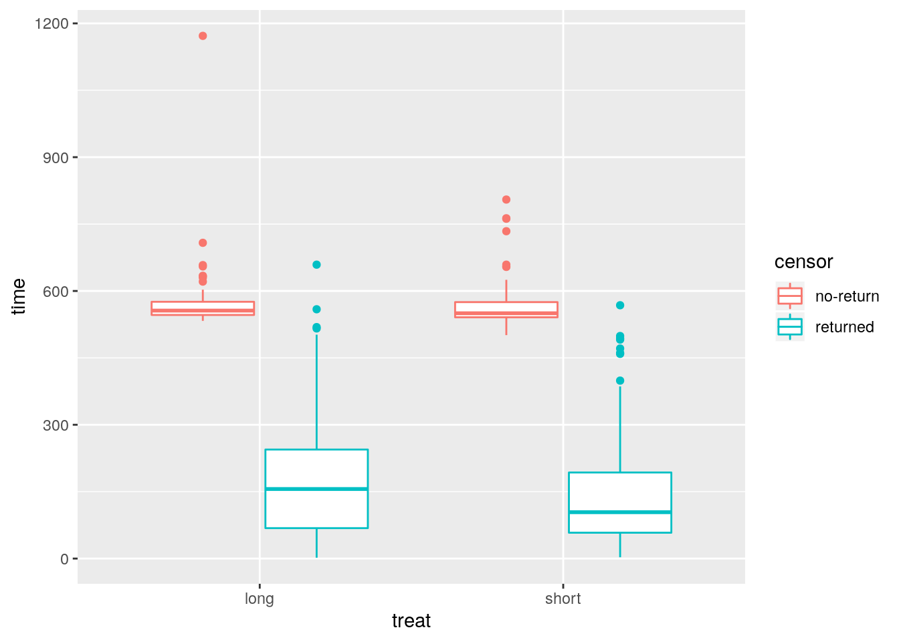
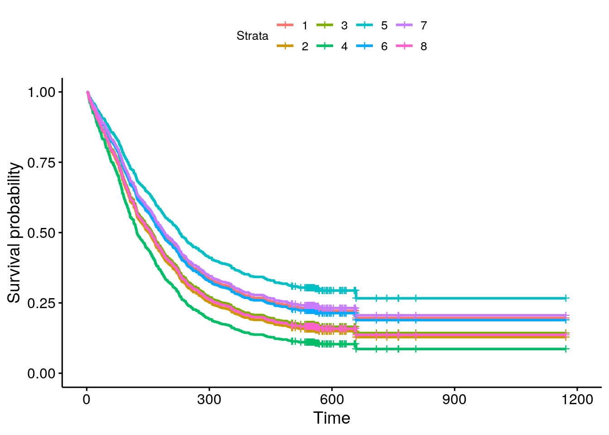
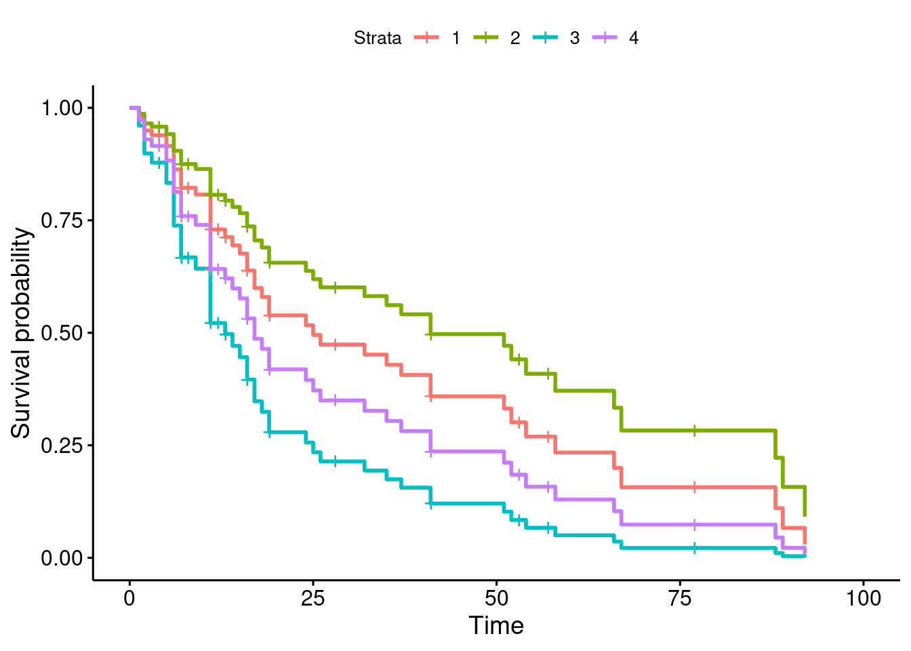
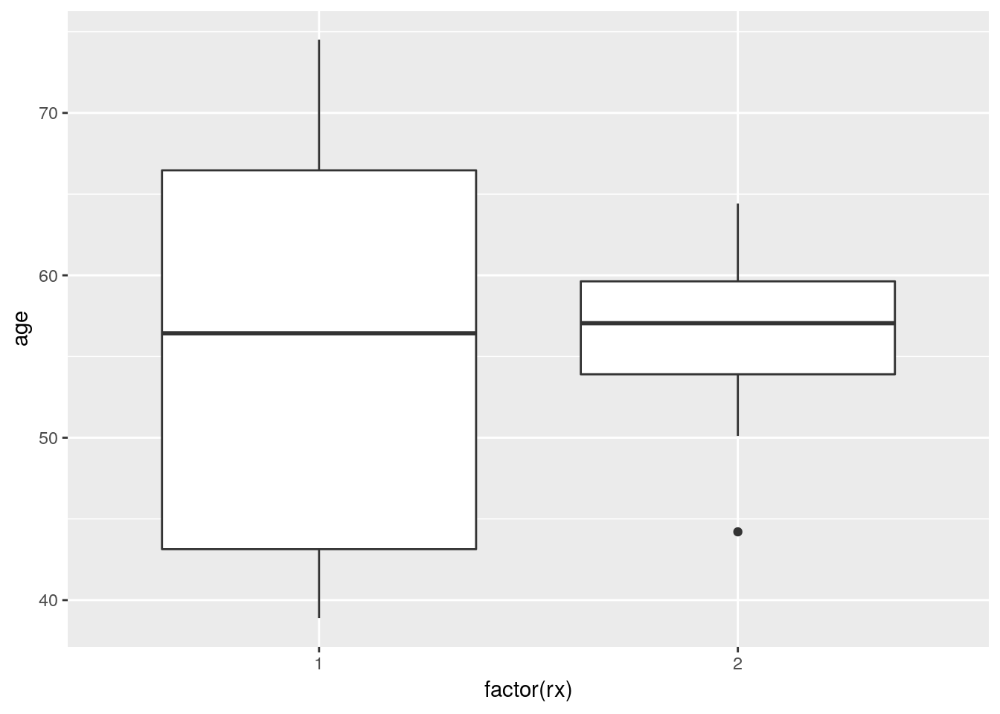

# Survival analysis


```r
library(survival)
library(tidyverse)
library(survminer)
```


```
## Warning: package 'ggplot2' was built under R version 3.5.3
```

```
## Warning: package 'tibble' was built under R version 3.5.3
```

```
## Warning: package 'tidyr' was built under R version 3.5.3
```

```
## Warning: package 'readr' was built under R version 3.5.2
```

```
## Warning: package 'purrr' was built under R version 3.5.3
```

```
## Warning: package 'dplyr' was built under R version 3.5.2
```

```
## Warning: package 'stringr' was built under R version 3.5.2
```

```
## Warning: package 'forcats' was built under R version 3.5.1
```

```
## Warning: package 'survminer' was built under R version 3.5.1
```

```
## Warning: package 'ggpubr' was built under R version 3.5.1
```

```
## Warning: package 'magrittr' was built under R version 3.5.1
```

```
## Warning: package 'car' was built under R version 3.5.1
```

```
## Warning: package 'carData' was built under R version 3.5.1
```

```
## Warning: package 'ggbiplot' was built under R version 3.5.1
```

```
## Warning: package 'plyr' was built under R version 3.5.1
```

```
## Warning: package 'scales' was built under R version 3.5.1
```

```
## Warning: package 'ggrepel' was built under R version 3.5.1
```

```
## Warning: package 'broom' was built under R version 3.5.2
```


##  The Worcester survey


 The Worcester survey was a long-term study of
all myocardial-infarction
<label for="tufte-mn-" class="margin-toggle">&#8853;</label><input type="checkbox" id="tufte-mn-" class="margin-toggle"><span class="marginnote">Heart attack.</span> victims admitted to hospitals in the
Worcester, Massachusetts area.
<label for="tufte-mn-" class="margin-toggle">&#8853;</label><input type="checkbox" id="tufte-mn-" class="margin-toggle"><span class="marginnote">Worcester is pronounced, by locals, *Woo-stuh*.</span> 
The data have been well studied, and can be found in
the file [link](http://www.utsc.utoronto.ca/~butler/d29/whas100.csv).


(a) Read the data and
 display the first few rows of the data frame. You might get an extra
 column, which you can ignore.
For your information, the variables are:


* patient ID code

* admission date

* date of last followup (this is the date of death if the
patient died)

* length of hospital stay (days)

* followup time (days) (time between admission and last followup)

* followup status: 1=dead, 0=alive

* Age in years (at admission)

* gender (0=male, 1=female)

* body mass index (kg/m$^2$)

 
Solution


```r
my_url <- "http://www.utsc.utoronto.ca/~butler/d29/whas100.csv"
whas100 <- read_csv(my_url)
```

```
## Warning: Missing column names filled in: 'X1' [1]
```

```
## Parsed with column specification:
## cols(
##   X1 = col_double(),
##   id = col_double(),
##   admitdate = col_character(),
##   foldate = col_character(),
##   los = col_double(),
##   lenfol = col_double(),
##   fstat = col_double(),
##   age = col_double(),
##   gender = col_double(),
##   bmi = col_double()
## )
```

```r
whas100
```

```
## # A tibble: 100 x 10
##       X1    id admitdate  foldate      los lenfol fstat   age gender   bmi
##    <dbl> <dbl> <chr>      <chr>      <dbl>  <dbl> <dbl> <dbl>  <dbl> <dbl>
##  1     1     1 3/13/1995  3/19/1995      4      6     1    65      0  31.4
##  2     2     2 1/14/1995  1/23/1996      5    374     1    88      1  22.7
##  3     3     3 2/17/1995  10/4/2001      5   2421     1    77      0  27.9
##  4     4     4 4/7/1995   7/14/1995      9     98     1    81      1  21.5
##  5     5     5 2/9/1995   5/29/1998      4   1205     1    78      0  30.7
##  6     6     6 1/16/1995  9/11/2000      7   2065     1    82      1  26.5
##  7     7     7 1/17/1995  10/15/1997     3   1002     1    66      1  35.7
##  8     8     8 11/15/1994 11/24/2000    56   2201     1    81      1  28.3
##  9     9     9 8/18/1995  2/23/1996      5    189     1    76      0  27.1
## 10    10    10 7/22/1995  12/31/2002     9   2719     0    40      0  21.8
## # … with 90 more rows
```

     

I seem to have an extra column called `X1`. This is because I
saved my version of the data using the old `write.csv`, which
comes with row names, and I forgot to
get rid of them. These came back as an extra unnamed variable to which
`read_delim` gave the name `X1`.
 

(b) Create a suitable response variable for a Cox proportional
hazards model for time of survival, using the followup time and
followup status.
 
Solution


`Surv`. The event here is death, so the two parts of the
response variable are followup time `lenfol` and followup
status, 1 being "dead", `fstat`:

```r
y <- with(whas100, Surv(lenfol, fstat == 1))
y
```

```
##   [1]    6   374  2421    98  1205  2065  1002  2201   189  2719+ 2638+
##  [12]  492   302  2574+ 2610+ 2641+ 1669  2624  2578+ 2595+  123  2613+
##  [23]  774  2012  2573+ 1874  2631+ 1907   538   104     6  1401  2710 
##  [34]  841   148  2137+ 2190+ 2173+  461  2114+ 2157+ 2054+ 2124+ 2137+
##  [45] 2031  2003+ 2074+  274  1984+ 1993+ 1939+ 1172    89   128  1939+
##  [56]   14  1011  1497  1929+ 2084+  107   451  2183+ 1876+  936   363 
##  [67] 1048  1889+ 2072+ 1879+ 1870+ 1859+ 2052+ 1846+ 2061+ 1912+ 1836+
##  [78]  114  1557  1278  1836+ 1916+ 1934+ 1923+   44  1922+  274  1860+
##  [89] 1806  2145+  182  2013+ 2174+ 1624   187  1883+ 1577    62  1969+
## [100] 1054
```

     

Just using `fstat` alone as the second thing in `Surv`
also works, because anything that gives `TRUE` or 1 when the
event (death) occurs is equally good. (In R, `TRUE` as a number
is 1 and `FALSE` as a number is 0.) 

I listed the values by way of checking. The ones with a `+` are
censored: that is, the patient was still alive the last time the
doctor saw them. Most of the censored values are longer times. Usually
this happens because the patient was still alive at the end of the study.
 


(c) Fit a Cox proportional hazards model predicting survival time
from age, gender and BMI. Obtain the `summary` (but you don't
need to comment on it yet).

 
Solution


This, using the response variable that we just created:

```r
whas100.1 <- coxph(y ~ age + gender + bmi, data = whas100)
summary(whas100.1)
```

```
## Call:
## coxph(formula = y ~ age + gender + bmi, data = whas100)
## 
##   n= 100, number of events= 51 
## 
##            coef exp(coef) se(coef)      z Pr(>|z|)   
## age     0.03713   1.03783  0.01272  2.918  0.00352 **
## gender  0.14325   1.15402  0.30604  0.468  0.63973   
## bmi    -0.07083   0.93162  0.03607 -1.964  0.04956 * 
## ---
## Signif. codes:  0 '***' 0.001 '**' 0.01 '*' 0.05 '.' 0.1 ' ' 1
## 
##        exp(coef) exp(-coef) lower .95 upper .95
## age       1.0378     0.9636    1.0123    1.0640
## gender    1.1540     0.8665    0.6334    2.1024
## bmi       0.9316     1.0734    0.8680    0.9999
## 
## Concordance= 0.683  (se = 0.037 )
## Likelihood ratio test= 21.54  on 3 df,   p=8e-05
## Wald test            = 19.46  on 3 df,   p=2e-04
## Score (logrank) test = 20.82  on 3 df,   p=1e-04
```

   
 

(d) Test the overall fit of the model. What does the result mean?
 
Solution


Look at those three P-values at the bottom.  They are all small,
so something in the model is helping to predict survival. As to
what? Well, that's the next part.
 

(e) Can any of your explanatory variables be removed from the
model? Explain briefly.
 
Solution


`gender` has a (very) large P-value, so that can be taken
out of the model. The other two variables have small P-values
(`bmi` only just under 0.05), so they need to stay.
The other way to think about this is `step`, or `drop1`:

```r
drop1(whas100.1, test = "Chisq")
```

```
## Single term deletions
## 
## Model:
## y ~ age + gender + bmi
##        Df    AIC    LRT Pr(>Chi)   
## <none>    402.66                   
## age     1 410.25 9.5972 0.001949 **
## gender  1 400.87 0.2185 0.640218   
## bmi     1 404.60 3.9389 0.047182 * 
## ---
## Signif. codes:  0 '***' 0.001 '**' 0.01 '*' 0.05 '.' 0.1 ' ' 1
```

     

This is here equivalent to
<label for="tufte-mn-" class="margin-toggle">&#8853;</label><input type="checkbox" id="tufte-mn-" class="margin-toggle"><span class="marginnote">Not exactly the same as that output, because it  is doing a test that would be the same if you had an infinitely  large sample, but is slightly different with an ordinary finite number of observations.</span> the output 
from `summary`, but where it
scores is if you have a categorical explanatory variable like
"treatment" with more than two levels: `drop1` will tell you
about keeping or dropping it as a whole.
<label for="tufte-mn-" class="margin-toggle">&#8853;</label><input type="checkbox" id="tufte-mn-" class="margin-toggle"><span class="marginnote">Our categorical  variable *gender* has only two levels.</span>

If you prefer: 


```r
step(whas100.1, trace = 0, test = "Chisq")
```

```
## Call:
## coxph(formula = y ~ age + bmi, data = whas100)
## 
##         coef exp(coef) se(coef)      z        p
## age  0.03927   1.04005  0.01187  3.309 0.000938
## bmi -0.07116   0.93131  0.03614 -1.969 0.048952
## 
## Likelihood ratio test=21.32  on 2 df, p=2.346e-05
## n= 100, number of events= 51
```

     
`gender` comes out, but the others stay. As usual, put
`trace=1` or `trace=2` to get more output, which will
look like a sequence of `drop1`'s one after the other.
 

(f) Remove your most non-significant explanatory variable from
the model and fit again. Take a look at the results. Are all your
remaining explanatory variables significant? (If all your
explanatory variables were previously significant, you can skip this part.)
 
Solution


So, take out `gender`:

```r
whas100.2 <- update(whas100.1, . ~ . - gender)
summary(whas100.2)
```

```
## Call:
## coxph(formula = y ~ age + bmi, data = whas100)
## 
##   n= 100, number of events= 51 
## 
##         coef exp(coef) se(coef)      z Pr(>|z|)    
## age  0.03927   1.04005  0.01187  3.309 0.000938 ***
## bmi -0.07116   0.93131  0.03614 -1.969 0.048952 *  
## ---
## Signif. codes:  0 '***' 0.001 '**' 0.01 '*' 0.05 '.' 0.1 ' ' 1
## 
##     exp(coef) exp(-coef) lower .95 upper .95
## age    1.0401     0.9615    1.0161    1.0645
## bmi    0.9313     1.0738    0.8676    0.9997
## 
## Concordance= 0.681  (se = 0.037 )
## Likelihood ratio test= 21.32  on 2 df,   p=2e-05
## Wald test            = 19  on 2 df,   p=7e-05
## Score (logrank) test = 19.99  on 2 df,   p=5e-05
```

     

Both explanatory variables are significant: `age` definitely,
`bmi` only just. This is the same model as `step` gave me.
 

(g) Calculate the 1st quartile, median, and 3rd quartiles of
age and BMI. (`quantile`.) Round these off to the
nearest whole number. (Do the rounding off yourself, though R has a
function `round` that does this, which you can investigate if
you want.) As an alternative, you can get these by passing the whole
data frame, or the columns of it you want, into `summary`.
 
Solution


```r
quantile(whas100$age)
```

```
##    0%   25%   50%   75%  100% 
## 32.00 59.75 71.00 80.25 92.00
```

```r
quantile(whas100$bmi)
```

```
##       0%      25%      50%      75%     100% 
## 14.91878 23.53717 27.19158 30.34770 39.93835
```

 

or


```r
whas100 %>%
  select(age, bmi) %>%
  summary()
```

```
##       age             bmi       
##  Min.   :32.00   Min.   :14.92  
##  1st Qu.:59.75   1st Qu.:23.54  
##  Median :71.00   Median :27.19  
##  Mean   :68.25   Mean   :27.04  
##  3rd Qu.:80.25   3rd Qu.:30.35  
##  Max.   :92.00   Max.   :39.94
```

 
Or, pure tidyverse: use `summarize_all`, which summarizes all the columns (after you've done the `select`). 


```r
whas100 %>%
  select(age, bmi) %>%
  summarize_all(~ list(quantile(.))) %>%
  unnest()
```

```
## # A tibble: 5 x 2
##     age   bmi
##   <dbl> <dbl>
## 1  32    14.9
## 2  59.8  23.5
## 3  71    27.2
## 4  80.2  30.3
## 5  92    39.9
```

 

The reason for the `list()` and the `unnest()` is that
`quantile` returns five numbers rather than just one, so it has
to go into the output data frame as a list-column, which then gets
broken apart with `unnest` so that you can see it. Try it
without the `unnest()` line to see what happens if you don't do
that.
Using whichever of this multitude of ways appeals to you:

60, 71 and 80 for age, 24, 27 and 30 for BMI. 
 

(h) Make a data frame out of all the combinations of
age and BMI values (that you obtained in the previous part) suitable for predicting
with. 
 
Solution


The inevitable `crossing`. This is probably quickest:

```r
whas100.new <- crossing(age = c(60, 71, 80), bmi = c(24, 27, 30))
whas100.new
```

```
## # A tibble: 9 x 2
##     age   bmi
##   <dbl> <dbl>
## 1    60    24
## 2    60    27
## 3    60    30
## 4    71    24
## 5    71    27
## 6    71    30
## 7    80    24
## 8    80    27
## 9    80    30
```

     

Or, with some setup beforehand to make the `crossing`
clearer. This is my no-think approach, which is what I recommend;
vectors with plural names containing the values, and inside the
`crossing`, a singular name equals a plural one:


```r
ages <- c(60, 71, 80)
bmis <- c(24, 27, 30)
whas100.new <- crossing(age = ages, bmi = bmis)
whas100.new
```

```
## # A tibble: 9 x 2
##     age   bmi
##   <dbl> <dbl>
## 1    60    24
## 2    60    27
## 3    60    30
## 4    71    24
## 5    71    27
## 6    71    30
## 7    80    24
## 8    80    27
## 9    80    30
```

 
 

(i) Obtain predicted survival probabilities for each of the values
in your new data frame. Use your best model. (You don't need to look
at the results, though you can if you want to.)
 
Solution


The magic word is `survfit` (which plays the role of
`predict` here). The best model is `whas100.2`,
with the non-significant `gender` removed:

```r
pp2 <- survfit(whas100.2, whas100.new, data = whas100)
```

      

This doesn't need the `data=` at the end (it works perfectly
well without), but the plot (later) seems to need it to be there. I
think the plot needs the information from the original data to be in
the predictions somewhere.

This is kind of long to look at (`summary(pp2)` would be the
thing), so we will need to make a graph of it. I gave it a name, since
I want to use it again later.
 

(j) Make a graph depicting the survival curves from
`survfit` with different colours distinguishing the different
survival curves.
 
Solution


This is actually easy once you work out what to do:


```r
ggsurvplot(pp2, conf.int = F)
```


 

Without the `conf.int` thing, you get confidence intervals for
each survival curve, which overlap each other and generally make the
plot look messy.

The "strata" are the different age-BMI combinations that you
predicted for, so it's usually a good idea to list the "new"
prediction data frame, either here or when you assess the effects of
the variables (next part) so that you can see which is which:


```r
whas100.new
```

```
## # A tibble: 9 x 2
##     age   bmi
##   <dbl> <dbl>
## 1    60    24
## 2    60    27
## 3    60    30
## 4    71    24
## 5    71    27
## 6    71    30
## 7    80    24
## 8    80    27
## 9    80    30
```

 
 

(k) What is the effect of age on survival? What is the effect
of BMI on survival? Explain briefly. (You will have to disentangle
the meaning of the different coloured lines on the plot to do this.)
 
Solution


Bear in mind that up-and-to-the-right is best for a survival
curve, since that means that people in the upper-right group have
a higher chance of surviving for longer.   

The best survival curve is therefore the olive-green one. According
to the legend, this goes with stratum 3, which is (according to
the listing of `whas100.new`) age 60 (the youngest) and BMI
30 (the highest). So it looks as if the best survival goes with a
lower age (not surprising) and a higher BMI (surprising; see
discussion about BMI below).  

You can also leave one variable constant and see the effects of
changing the other one. Let's pick the oldest age 80: the BMI
values are 24 (stratum 7, blue), 27 (stratum 8, purple), 30
(stratum 9, pink). These survival curves are the bottom one, the
second bottom one, and the fourth bottom one. At this age,
survival chances are not great, but having a higher BMI goes with
a greater chance of surviving longer.  

Or pick a BMI, say 30. These are strata 3 (olive green), 6 (light blue)
and 9 (pink) respectively for ages 60, 71 and 80. These are the
best, 3rd best and 5th best survival curves; that is, as age
increases, the chance of surviving a long time decreases.  

The effect of BMI, though, seems backwards: a higher BMI is
associated with a *higher* chance of survival.   

That's the end of what I wanted you to do, but:

A higher BMI is usually associated with being obese (and therefore
unhealthy), so you'd expect the effect of BMI to be the other way
around. According to Wikipedia
([link](http://en.wikipedia.org/wiki/Body_mass_index)), the BMI values
here are "overweight" or close to it. Maybe being heavier helps
the body recover from a heart attack. 

Let's start with the martingale residual plot:

```r
ggcoxdiagnostics(whas100.2) + geom_smooth()
```

```
## `geom_smooth()` using method = 'loess' and formula 'y ~ x'
```


     

There is a suspicion of bendiness here, though the left side of the
curve is entirely because of that one positive residual on the
left. In any case, this suggests that nonlinearity (evidently in terms
of BMI, since that's the relationship that currently makes no sense)
would be worth exploring. 

Thus:


```r
whas100.3 <- update(whas100.2, . ~ . + I(bmi^2))
summary(whas100.3)
```

```
## Call:
## coxph(formula = y ~ age + bmi + I(bmi^2), data = whas100)
## 
##   n= 100, number of events= 51 
## 
##               coef exp(coef)  se(coef)      z Pr(>|z|)    
## age       0.040542  1.041375  0.012035  3.369 0.000755 ***
## bmi      -0.848949  0.427864  0.231562 -3.666 0.000246 ***
## I(bmi^2)  0.014500  1.014606  0.004227  3.430 0.000603 ***
## ---
## Signif. codes:  0 '***' 0.001 '**' 0.01 '*' 0.05 '.' 0.1 ' ' 1
## 
##          exp(coef) exp(-coef) lower .95 upper .95
## age         1.0414     0.9603    1.0171    1.0662
## bmi         0.4279     2.3372    0.2718    0.6736
## I(bmi^2)    1.0146     0.9856    1.0062    1.0230
## 
## Concordance= 0.693  (se = 0.04 )
## Likelihood ratio test= 30.71  on 3 df,   p=1e-06
## Wald test            = 32.56  on 3 df,   p=4e-07
## Score (logrank) test = 36.57  on 3 df,   p=6e-08
```

     

Ah, that seems to be it. The significant positive coefficient on
`bmi`-squared 
means that the "hazard of dying" increases faster with increasing
`bmi`, so there ought to be an optimal BMI beyond which
survival chances decrease again. 
Have we improved the residuals by adding the squared term?


```r
ggcoxdiagnostics(whas100.3) + geom_smooth()
```

```
## `geom_smooth()` using method = 'loess' and formula 'y ~ x'
```



 

I call those "inconsequential wiggles" now, so I think we are good.
Let's explore the quadratic relationship on a graph.

I'm going to focus on a close-to-median age of 70, since, in this
model, the effect of BMI is the same for all ages (to make it
different, we would need an interaction term, ANOVA-style). 

First we create a data frame with a bunch of different BMIs in, and
one age 70:


```r
bmis <- seq(20, 36, 4)
ages <- 70
whas100.new.2 <- crossing(bmi = bmis, age = ages)
whas100.new.2
```

```
## # A tibble: 5 x 2
##     bmi   age
##   <dbl> <dbl>
## 1    20    70
## 2    24    70
## 3    28    70
## 4    32    70
## 5    36    70
```

 

It is rather absurd to have a plural `ages` with only one age
in it, but that's the way it goes, if you're me and trying to avoid thinking.

Predictions, using the model with the squared term in it:


```r
pp3 <- survfit(whas100.3, whas100.new.2, data = whas100)
```

 

And then the plot:


```r
ggsurvplot(pp3, conf.int = F)
```


 

and the customary reminder of which stratum is which, with its rather
ungainly name:


```r
whas100.new.2
```

```
## # A tibble: 5 x 2
##     bmi   age
##   <dbl> <dbl>
## 1    20    70
## 2    24    70
## 3    28    70
## 4    32    70
## 5    36    70
```

 

This time, the green survival curve is best, stratum 3, which means that
survival is best at BMI 28, and worse for both higher BMIs and lower
BMIs. You can follow the sequence of colours: red, olive-green, green,
blue, pink, that goes up and then down again. But it's still true
that having a very *low* BMI is worst, which is why our (linear)
model said that having a higher BMI was better.

It would have been better to have you put a squared term in the model,
but the question was already long and complicated enough, and I
didn't want to make your lives more of a nightmare than they are
already becoming!
 


##  Drug treatment programs


 One of the goals of drug treatment programs is to lengthen
the time until the patient returns to using drugs. (It is not
generally possible to prevent patients from *ever* using drugs
again.) In one study, over 600 former drug users took part. Two
different programs, a short program and a long program, were offered
at two different sites, labelled A and B. The data can be found in
[link](http://www.utsc.utoronto.ca/~butler/d29/drugusers.txt). The
variables are these:


* `ID`: patient ID number

* `age`: patient age at enrollment into the study

* `ndrugtx`: number of previous drug treatments

* `treat`: 0 for short treatment program, 1 for long program

* `site`: 0 for site A, 1 for site B

* `time`: time until return to drug use

* `censor`: whether the subject returned to drug use (1) or
not (0) during the follow-up period

* `herco`: whether subject used heroine or cocaine in the
last 3 months: 1 is both, 2 is one (either heroine or cocaine), 3 is neither.


(a) Read in the data and check in one way or another that you
have what was promised above.


Solution


This:

```r
my_url <- "http://www.utsc.utoronto.ca/~butler/d29/drugusers.txt"
drugusers <- read_delim(my_url, " ")
```

```
## Parsed with column specification:
## cols(
##   row = col_double(),
##   ID = col_double(),
##   age = col_double(),
##   ndrugtx = col_double(),
##   treat = col_double(),
##   site = col_double(),
##   time = col_double(),
##   censor = col_double(),
##   herco = col_double()
## )
```

```r
drugusers
```

```
## # A tibble: 628 x 9
##      row    ID   age ndrugtx treat  site  time censor herco
##    <dbl> <dbl> <dbl>   <dbl> <dbl> <dbl> <dbl>  <dbl> <dbl>
##  1     1     1    39       1     1     0   188      1     3
##  2     2     2    33       8     1     0    26      1     3
##  3     3     3    33       3     1     0   207      1     2
##  4     4     4    32       1     0     0   144      1     3
##  5     5     5    24       5     1     0   551      0     2
##  6     6     6    30       1     1     0    32      1     1
##  7     7     7    39      34     1     0   459      1     3
##  8     8     8    27       2     1     0    22      1     3
##  9     9     9    40       3     1     0   210      1     2
## 10    10    10    36       7     1     0   184      1     2
## # … with 618 more rows
```

 

This shows that you have over 600 rows and the variables described.
    


(b) There are some missing values in the dataframe. Demonstrate
this using `summary`. Pipe the dataframe into
`drop_na` and show that they have gone. (`drop_na`
removes all rows that have missing values in them.)


Solution


First off, `summary` is a quick way to show how many missing
values there are:
<label for="tufte-mn-" class="margin-toggle">&#8853;</label><input type="checkbox" id="tufte-mn-" class="margin-toggle"><span class="marginnote">It doesn't work with text columns, but it  *does* work if you temporarily turn the text columns into  factors, eg. by using *mutate-if*. However, we don't have any text  columns here, so what we do here is good for this data set.</span>

```r
summary(drugusers)
```

```
##       row              ID             age           ndrugtx      
##  Min.   :  1.0   Min.   :  1.0   Min.   :20.00   Min.   : 0.000  
##  1st Qu.:157.8   1st Qu.:157.8   1st Qu.:27.00   1st Qu.: 1.000  
##  Median :314.5   Median :314.5   Median :32.00   Median : 3.000  
##  Mean   :314.5   Mean   :314.5   Mean   :32.37   Mean   : 4.574  
##  3rd Qu.:471.2   3rd Qu.:471.2   3rd Qu.:37.00   3rd Qu.: 6.000  
##  Max.   :628.0   Max.   :628.0   Max.   :56.00   Max.   :40.000  
##                                  NA's   :5       NA's   :17      
##      treat             site            time            censor      
##  Min.   :0.0000   Min.   :0.000   Min.   :   2.0   Min.   :0.0000  
##  1st Qu.:0.0000   1st Qu.:0.000   1st Qu.:  79.0   1st Qu.:1.0000  
##  Median :0.0000   Median :0.000   Median : 166.0   Median :1.0000  
##  Mean   :0.4904   Mean   :0.293   Mean   : 234.7   Mean   :0.8089  
##  3rd Qu.:1.0000   3rd Qu.:1.000   3rd Qu.: 365.2   3rd Qu.:1.0000  
##  Max.   :1.0000   Max.   :1.000   Max.   :1172.0   Max.   :1.0000  
##                                                                    
##      herco      
##  Min.   :1.000  
##  1st Qu.:1.000  
##  Median :2.000  
##  Mean   :1.898  
##  3rd Qu.:3.000  
##  Max.   :3.000  
## 
```

 

Age has five missing values and "number of previous drug treatments"
has seventeen.

Following the instructions, and saving back into the original dataframe:


```r
drugusers %>% drop_na() -> drugusers
```

 
and then


```r
summary(drugusers)
```

```
##       row              ID             age           ndrugtx      
##  Min.   :  1.0   Min.   :  1.0   Min.   :20.00   Min.   : 0.000  
##  1st Qu.:155.2   1st Qu.:155.2   1st Qu.:27.00   1st Qu.: 1.000  
##  Median :312.5   Median :312.5   Median :32.00   Median : 3.000  
##  Mean   :313.8   Mean   :313.8   Mean   :32.39   Mean   : 4.579  
##  3rd Qu.:473.8   3rd Qu.:473.8   3rd Qu.:37.00   3rd Qu.: 6.000  
##  Max.   :628.0   Max.   :628.0   Max.   :56.00   Max.   :40.000  
##      treat             site             time            censor      
##  Min.   :0.0000   Min.   :0.0000   Min.   :   2.0   Min.   :0.0000  
##  1st Qu.:0.0000   1st Qu.:0.0000   1st Qu.:  79.0   1st Qu.:1.0000  
##  Median :0.0000   Median :0.0000   Median : 166.0   Median :1.0000  
##  Mean   :0.4918   Mean   :0.2984   Mean   : 234.4   Mean   :0.8115  
##  3rd Qu.:1.0000   3rd Qu.:1.0000   3rd Qu.: 361.8   3rd Qu.:1.0000  
##  Max.   :1.0000   Max.   :1.0000   Max.   :1172.0   Max.   :1.0000  
##      herco     
##  Min.   :1.00  
##  1st Qu.:1.00  
##  Median :2.00  
##  Mean   :1.89  
##  3rd Qu.:3.00  
##  Max.   :3.00
```

 

No NA left. Gosh, as they say, that was easy.
Extra: how many rows did we lose?


```r
nrow(drugusers)
```

```
## [1] 610
```

 

There were 628 rows before, so we lost 18. (There were 22 missing
values, but some of them were two on one row, so we only lost 18
rows.)

This is a very unsophisticated way of dealing with missing
values. Another way is to "impute" them, that is, to guess what they
would have been, and then fill in the guessed values and use them as
if they were the truth, for example by regressing the columns with missing values on all the others, and using the regression predictions in place of the missing values.


(c) Some of these variables are recorded as numbers but are
actually categorical. Which ones? Re-define these variables in your
data frame so that they have sensible (text) values.


Solution


These variables are actually categorical rather than quantitative:


* `treat`

* `site`

* `censor`

* `herco`

Most of them have only two levels, so it doesn't matter whether
we make them categorical or leave them as numbers, but for
`herco` it matters. Let's give them all sensible values,
mostly with `ifelse`,
<label for="tufte-mn-" class="margin-toggle">&#8853;</label><input type="checkbox" id="tufte-mn-" class="margin-toggle"><span class="marginnote">Case-when is much clearer than using nested if-elses when you have three or more categories, as for *herco*.</span> thus:

```r
drugusers %>% mutate(
  treat = ifelse(treat == 0, "short", "long"),
  site = ifelse(site == 0, "A", "B"),
  censor = ifelse(censor == 1, "returned", "no-return"),
  herco = case_when(
    herco == 1 ~ "both",
    herco == 2 ~ "one",
    herco == 3 ~ "neither"
  )
) -> drugusers
```

       

I'm living on the edge and overwriting everything:


```r
drugusers
```

```
## # A tibble: 610 x 9
##      row    ID   age ndrugtx treat site   time censor    herco  
##    <dbl> <dbl> <dbl>   <dbl> <chr> <chr> <dbl> <chr>     <chr>  
##  1     1     1    39       1 long  A       188 returned  neither
##  2     2     2    33       8 long  A        26 returned  neither
##  3     3     3    33       3 long  A       207 returned  one    
##  4     4     4    32       1 short A       144 returned  neither
##  5     5     5    24       5 long  A       551 no-return one    
##  6     6     6    30       1 long  A        32 returned  both   
##  7     7     7    39      34 long  A       459 returned  neither
##  8     8     8    27       2 long  A        22 returned  neither
##  9     9     9    40       3 long  A       210 returned  one    
## 10    10    10    36       7 long  A       184 returned  one    
## # … with 600 more rows
```

 


(d) Create a suitable reponse variable for a Cox proportional
hazards regression that predicts time until return to drug use from
the other variables.
This requires some care, because you need to be sure about what the
censoring variable actually represents and what you need it to represent.


Solution


This is `Surv` in package `survival`. The response
variable needs to encode two things: the time until the event of
interest (return to drug use) and whether or not that event
happened for each patient.
<label for="tufte-mn-" class="margin-toggle">&#8853;</label><input type="checkbox" id="tufte-mn-" class="margin-toggle"><span class="marginnote">Some people define the response variable right inside the *coxph*, in the same way as putting something like *log(y)* as a response in an *lm*, but I think, especially while you're getting used to the process, it's better to create the response variable first and look at it to make sure it's the right thing.</span>
In this case, that is
`censor="returned"`. 

```r
y <- with(drugusers, Surv(time, censor == "returned"))
```

       

Use whatever name you gave to the level of `censor` that means "returned to drug use". 
    


(e) Look at the first few values of your response variable. Why
is the fifth one marked with a `+`? Explain briefly.


Solution


`head` works as well with a vector (displaying the first
six values) as it does with a data frame:

```r
head(y)
```

```
## [1] 188   26  207  144  551+  32
```

      

The fifth value is marked with a `+` because it is a censored
value: this is a patient who was never observed to go back to drug
use. You can tell this by looking at the `head` of the entire
data frame:


```r
head(drugusers)
```

```
## # A tibble: 6 x 9
##     row    ID   age ndrugtx treat site   time censor    herco  
##   <dbl> <dbl> <dbl>   <dbl> <chr> <chr> <dbl> <chr>     <chr>  
## 1     1     1    39       1 long  A       188 returned  neither
## 2     2     2    33       8 long  A        26 returned  neither
## 3     3     3    33       3 long  A       207 returned  one    
## 4     4     4    32       1 short A       144 returned  neither
## 5     5     5    24       5 long  A       551 no-return one    
## 6     6     6    30       1 long  A        32 returned  both
```

 

since this patient has `censor="no-return"`. The other ones have
`censor="returned"`; these are all "uncensored" in the jargon.

Typically, censored values will be bigger than uncensored ones,
because (in general) the individual will be observed until the study
ends, and studies of this kind carry on for years:


```r
ggplot(drugusers, aes(x = censor, y = time)) + geom_boxplot()
```



 
Yep. The smallest time for a censored observation would be an upper outlier
if it were observed for an uncensored observation.

One nice side-effect of turning `censor` into a categorical variable is that it can now
distinguish groups as a boxplot requires.

I discovered something rather amusing when I originally wrote this (a
year ago). Suppose you want to compare times for the two treatment
groups, and you *also* want to distinguish censored from
non-censored observations. Then, this works:


```r
ggplot(drugusers, aes(x = treat, y = time, colour = censor)) +
  geom_boxplot()
```



 

For each treatment, you get side-by-side boxplots of the times for
censored (red) and uncensored (blue) observations, and so you see for
both treatments (short and long) the censored times are typically
longer than the uncensored ones.

(This you may recognize as a "grouped boxplot", for when we have two
categorical variables and one quantitative one.)

I borrow this idea for two-way ANOVA (coming up later).
    


(f) Fit a Cox proportional hazards model, predicting from all
the other variables (except for `row` and `ID`) that you haven't used
yet. Display the results.


Solution


```r
drugusers.1 <- coxph(y ~ age + ndrugtx + treat + site + herco, data = drugusers)
summary(drugusers.1)
```

```
## Call:
## coxph(formula = y ~ age + ndrugtx + treat + site + herco, data = drugusers)
## 
##   n= 610, number of events= 495 
## 
##                   coef exp(coef)  se(coef)      z Pr(>|z|)    
## age          -0.023798  0.976483  0.007561 -3.148  0.00165 ** 
## ndrugtx       0.034815  1.035429  0.007755  4.490 7.14e-06 ***
## treatshort    0.254606  1.289953  0.091006  2.798  0.00515 ** 
## siteB        -0.173021  0.841120  0.102105 -1.695  0.09016 .  
## herconeither  0.125779  1.134032  0.103075  1.220  0.22236    
## hercoone      0.247318  1.280586  0.122759  2.015  0.04394 *  
## ---
## Signif. codes:  0 '***' 0.001 '**' 0.01 '*' 0.05 '.' 0.1 ' ' 1
## 
##              exp(coef) exp(-coef) lower .95 upper .95
## age             0.9765     1.0241    0.9621    0.9911
## ndrugtx         1.0354     0.9658    1.0198    1.0513
## treatshort      1.2900     0.7752    1.0792    1.5418
## siteB           0.8411     1.1889    0.6886    1.0275
## herconeither    1.1340     0.8818    0.9266    1.3879
## hercoone        1.2806     0.7809    1.0067    1.6289
## 
## Concordance= 0.581  (se = 0.014 )
## Likelihood ratio test= 35.08  on 6 df,   p=4e-06
## Wald test            = 36.96  on 6 df,   p=2e-06
## Score (logrank) test = 37.36  on 6 df,   p=1e-06
```

   

Another way to handle 
"all the other $x$'s except `row`, `ID`, `time` and `censor`" is this:


```r
drugusers.1a <- coxph(y ~ . - row - ID - time - censor, data = drugusers)
broom::tidy(drugusers.1a)
```

```
## # A tibble: 6 x 7
##   term         estimate std.error statistic    p.value conf.low conf.high
##   <chr>           <dbl>     <dbl>     <dbl>      <dbl>    <dbl>     <dbl>
## 1 age           -0.0238   0.00756     -3.15 0.00165    -0.0386   -0.00898
## 2 ndrugtx        0.0348   0.00775      4.49 0.00000714  0.0196    0.0500 
## 3 treatshort     0.255    0.0910       2.80 0.00515     0.0762    0.433  
## 4 siteB         -0.173    0.102       -1.69 0.0902     -0.373     0.0271 
## 5 herconeither   0.126    0.103        1.22 0.222      -0.0762    0.328  
## 6 hercoone       0.247    0.123        2.01 0.0439      0.00671   0.488
```

 

Same. I used `tidy` from `broom` to shorten the output a bit.
    


(g) Find which explanatory variables can be removed at $\alpha=0.05$
(there should be two of them). Bear in mind that we have categorical variables, so that looking at the output from `summary` is not enough.


Solution


The hint is meant to suggest to you that looking at `drop1` is the right way to go:

```r
drop1(drugusers.1, test = "Chisq")
```

```
## Single term deletions
## 
## Model:
## y ~ age + ndrugtx + treat + site + herco
##         Df    AIC     LRT  Pr(>Chi)    
## <none>     5712.2                      
## age      1 5720.3 10.0972  0.001485 ** 
## ndrugtx  1 5727.3 17.1446 3.464e-05 ***
## treat    1 5718.0  7.8352  0.005124 ** 
## site     1 5713.1  2.9335  0.086760 .  
## herco    2 5712.5  4.3182  0.115427    
## ---
## Signif. codes:  0 '***' 0.001 '**' 0.01 '*' 0.05 '.' 0.1 ' ' 1
```

       

Note that `herco`, a categorical variable with three levels,
has 2 degrees of freedom here, since a test of 
"no effect of `herco`" is testing that survival is the same at 
*all three* levels of `herco`.


(h) Remove *all* the non-significant explanatory variables
and re-fit your model. By carrying out a suitable test demonstrate
that your smaller model is the better one.


Solution


`site` and `herco` are the two variables to come
out.
<label for="tufte-mn-" class="margin-toggle">&#8853;</label><input type="checkbox" id="tufte-mn-" class="margin-toggle"><span class="marginnote">The researchers were probably relieved that there        was not quite a significant effect of *site*.</span> I like
`update`, but there is no
problem about copying-pasting your `coxph` and taking out
what you no longer need.

```r
drugusers.2 <- update(drugusers.1, . ~ . - site - herco)
```

 

Having fit two models, we can use `anova` to compare them. The
right test gets done, so no need for `test=`:


```r
anova(drugusers.2, drugusers.1)
```

```
## Analysis of Deviance Table
##  Cox model: response is  y
##  Model 1: ~ age + ndrugtx + treat
##  Model 2: ~ age + ndrugtx + treat + site + herco
##    loglik  Chisq Df P(>|Chi|)  
## 1 -2853.7                      
## 2 -2850.1 7.2117  3   0.06545 .
## ---
## Signif. codes:  0 '***' 0.001 '**' 0.01 '*' 0.05 '.' 0.1 ' ' 1
```

 

There is no significant difference between these two 
models,
<label for="tufte-mn-" class="margin-toggle">&#8853;</label><input type="checkbox" id="tufte-mn-" class="margin-toggle"><span class="marginnote">Not at the 0.05 level, anyway.</span> so we can go with the 
smaller, simpler one
(with just `age`, `ndrugtx` and `treat`).
    


(i) <a name="part:posneg">*</a> Display your better model. Are all of the
explanatory variables significant? Do their slope coefficients have
sensible signs (plus or minus), based on what you know or can guess
about drug treatments? Explain briefly.


Solution


```r
summary(drugusers.2)
```

```
## Call:
## coxph(formula = y ~ age + ndrugtx + treat, data = drugusers)
## 
##   n= 610, number of events= 495 
## 
##                 coef exp(coef)  se(coef)      z Pr(>|z|)    
## age        -0.020801  0.979414  0.007419 -2.804  0.00505 ** 
## ndrugtx     0.035567  1.036207  0.007621  4.667 3.05e-06 ***
## treatshort  0.231055  1.259929  0.090175  2.562  0.01040 *  
## ---
## Signif. codes:  0 '***' 0.001 '**' 0.01 '*' 0.05 '.' 0.1 ' ' 1
## 
##            exp(coef) exp(-coef) lower .95 upper .95
## age           0.9794     1.0210    0.9653    0.9938
## ndrugtx       1.0362     0.9651    1.0208    1.0518
## treatshort    1.2599     0.7937    1.0558    1.5035
## 
## Concordance= 0.572  (se = 0.014 )
## Likelihood ratio test= 27.87  on 3 df,   p=4e-06
## Wald test            = 30.5  on 3 df,   p=1e-06
## Score (logrank) test = 30.62  on 3 df,   p=1e-06
```

       

The three remaining explanatory variables are all clearly significant:
the patient's age, the number of previous drug treatments, and whether
the treatment was short or long. This is legit (we don't need to run
`drop1` again) because the remaining explanatory variables are
all quantitative or have only two levels, so that the single-df tests
in `summary` are what we need.

Do their slope coefficients have sensible signs? Well, this requires
careful thought. A positive coefficient means that increasing that
variable *increases the hazard of the event*: ie., it makes the
event likelier to happen sooner. Here, the "event" is 
"return to drug use":


* Age has a negative coefficient, so an older person is likely to take
*longer* to return to drug use, other things being equal. This
makes some kind of sense, if you imagine drug use as being related to
maturity, or an older drug user as being more strongly committed to
"turning their life around", so that a drug treatment of any kind is
going to be more effective on an older patient.

* The number of previous treatments has a positive coefficient, so that a
patient who has had a lot of previous treatments is likely to go back
to drugs sooner. Such a person might be an "addict" for whom
treatments really do not work, or might not be committed to giving up drugs.


* `treatshort` has a positive coefficient.  This says that
if you give a patient a short treatment, they are more likely (other
things being equal) to go back to drugs sooner, as compared to the
baseline long treatment.  That is, a longer treatment is more
effective than a shorter one. Given a significant effect of
treatment length, this is the way around you would expect it to be.


    


(j) We have three variables left in our model, `age`,
`ndrugtx` and `treat`. The quartiles of age are 27 and
37, the quartiles of `ndrugtx` are 1 and 6, and the two
possible values of `treat` are `short` and `long`. Create a data frame
with variables of these names and all possible combinations of their
values (so there should be 8 rows in the resulting data
frame). Display the resulting data frame.


Solution


This data frame is going to be used for prediction, so I will
call it `new` and construct it in pieces as I did before
(thus meaning that I don't have to think too hard about what I'm doing):

```r
ages <- c(27, 37)
ndrugtxs <- c(1, 6)
treats <- c("short", "long")
new <- crossing(age = ages, ndrugtx = ndrugtxs, treat = treats)
new
```

```
## # A tibble: 8 x 3
##     age ndrugtx treat
##   <dbl>   <dbl> <chr>
## 1    27       1 long 
## 2    27       1 short
## 3    27       6 long 
## 4    27       6 short
## 5    37       1 long 
## 6    37       1 short
## 7    37       6 long 
## 8    37       6 short
```

       

8 rows as promised.
    


(k) Obtain predicted survival probabilities for each of the
values of `age`, `ndrugtx` and `treat` used in
the previous part. You don't need to display it (we are going to
plot it shortly). 

Solution


`survfit` is the survival analysis version of
`predict` and works the same way, so this is all you need:

```r
pp <- survfit(drugusers.2, new, data = drugusers)
```

       

Make sure that you use your best model, ie.\ the second one. The
`data=` is needed for the plot below, not in itself for the
prediction. 


(l) Plot your predicted survival curves. 


Solution


This:

```r
ggsurvplot(pp, conf.int = F)
```



   

The only thing to remember is that you plot your *predictions*,
not the model from which they came.

If your plot didn't come out, you may have to go back and re-do the
`survfit` with the `data=` at the end.

For reference in a minute:


```r
new
```

```
## # A tibble: 8 x 3
##     age ndrugtx treat
##   <dbl>   <dbl> <chr>
## 1    27       1 long 
## 2    27       1 short
## 3    27       6 long 
## 4    27       6 short
## 5    37       1 long 
## 6    37       1 short
## 7    37       6 long 
## 8    37       6 short
```

 


(m) Which of your combinations of values is predicted to take
the longest to return to drug use? Which is predicted to take the
shortest time? Explain briefly.


Solution


Remember that "up and to the right" is the best survival
curve: that is, the people on this survival curve are predicted
to take the longest to return to drug use. On my plot, this is
the pale blue survival curve, stratum 5. Going back to my
combinations data frame, this is 37-year-olds with only one
previous drug treatment and the longer drug treatment this time.

The worst is my green survival curve, stratum 4, which is
the exact opposite of this: 27-year-olds, 6 previous drug
treatments, shorter treatment this time.

"Returning to drug use" is like "death" in that you want it
to be a long time before it happens, so "best" is top right on
the plot of survival curves. In other curcumstances, you might
want the event to happen *sooner*, in which case the
lower-left survival curve would be the "best" one.
    


(n) Are your survival curve plot and your conclusions from part
(<a href="#part:posneg">here</a>) consistent, or not? Explain briefly.


Solution


The survival curves say that being older, having fewer previous
treatments and being on the long treatment are better in terms
of taking longer to return to drug use. Our analysis of whether
the slope coefficients in `drugusers.2` were positive or
negative came to exactly the same conclusion. So the survival
curves and part (<a href="#part:posneg">here</a>) are entirely consistent.

On my plot with the legend, you can assess the effects of the
individual variables: for example, to assess the effect of age,
find two combos that differ only in age, say strata 1 and 5, the
red and light blue ones. Of these, the light blue survival curve is
higher, so age 37 is better in terms of survival than age
27. This will work whichever such pair you pick: for example,
strata 3 and 7, the olive green and purple curves, compare
the same way. 

More comparison for you to do: to assess the effect of number of
previous treatments, compare eg. strata 1 and 3, red and olive
green, and to assess the effect of treatment length, compare
eg. strata 5 and 6, light blue and darker blue.

All this struggling to identify colours makes me think of
[link](https://blog.xkcd.com/2010/05/03/color-survey-results/), in
which the guy behind the webcomic XKCD did a survey where he
showed people a whole bunch of different colours and asked the
people to name the colours.
    


##  Multiple myeloma


 Multiple myeloma is a kind of cancer. It
forms in a plasma cell (which is a type of white blood cell). It
causes cancer cells to accumulate in the bone marrow, where they crowd
out healthy blood cells. Plasma cells make antibodies (to help fight
infections), while the cancer cells don't: they produce abnormal
proteins that can cause kidney problems. (This adapted from
[link](http://www.mayoclinic.org/diseases-conditions/multiple-myeloma/basics/definition/con-20026607).)
The variables are:


* `time`: survival time from diagnosis (months)

* `vstatus`: 0=alive, 1=dead at end of study

* `logbun`: log of BUN test score (BUN test is a test of
kidney function, not to be confused with cha siu
bao
<label for="tufte-mn-" class="margin-toggle">&#8853;</label><input type="checkbox" id="tufte-mn-" class="margin-toggle"><span class="marginnote">Barbecued pork in a bun. A staple of Chinese dim sum and  Chinese bakeries, such as Ding Dong bakery on Spadina.</span>).

* `hgb`: hemoglobin (at diagnosis).

* `platelet`: platelets: 1=normal, 0=abnormal (at
diagnosis).

* `age` at diagnosis, in years

* `logwbc`: log of WBC (white blood cell count, at
diagnosis)

* `frac`: fractures at diagnosis (0=absent, 1=present)

* `logpbm`: log of percent of plasma cells in bone marrow

* `protein`: proteinuria (protein in urine) at
diagnosis. Most people have very little, so a larger than normal
amount indicates illness of some kind.

* `scalc`: serum calcium at diagnosis.


The data, on 65 patients with multiple myeloma, are in
[link](http://www.utsc.utoronto.ca/~butler/d29/myeloma.csv). Some of the
variables are logs because they could take very large values.

There are a lot of parts here, but each part is supposed to be short.


(a) Read in the data and display (some of) the values. Confirm that
you have the right number of observations and the right variables.


Solution


The usual:

```r
my_url <- "http://www.utsc.utoronto.ca/~butler/d29/myeloma.csv"
myeloma <- read_csv(my_url)
```

```
## Parsed with column specification:
## cols(
##   time = col_double(),
##   vstatus = col_double(),
##   logbun = col_double(),
##   hgb = col_double(),
##   platelet = col_double(),
##   age = col_double(),
##   logwbc = col_double(),
##   frac = col_double(),
##   logpbm = col_double(),
##   protein = col_double(),
##   scalc = col_double()
## )
```

```r
myeloma
```

```
## # A tibble: 65 x 11
##     time vstatus logbun   hgb platelet   age logwbc  frac logpbm protein
##    <dbl>   <dbl>  <dbl> <dbl>    <dbl> <dbl>  <dbl> <dbl>  <dbl>   <dbl>
##  1  1.25       1   2.22   9.4        1    67   3.66     1   1.95      12
##  2  1.25       1   1.94  12          1    38   3.99     1   1.95      20
##  3  2          1   1.52   9.8        1    81   3.88     1   2          2
##  4  2          1   1.75  11.3        0    75   3.81     1   1.26       0
##  5  2          1   1.30   5.1        0    57   3.72     1   2          3
##  6  3          1   1.54   6.7        1    46   4.48     0   1.93      12
##  7  5          1   2.24  10.1        1    50   4.95     1   1.66       4
##  8  5          1   1.68   6.5        1    74   3.73     0   1.73       5
##  9  6          1   1.36   9          1    77   3.54     0   1.46       1
## 10  6          1   2.11  10.2        0    70   3.54     1   1.36       1
## # … with 55 more rows, and 1 more variable: scalc <dbl>
```

     

65 observations, and all the variables listed. If you want to go
further (not necessary here), you can check that the variables
`vstatus`, `platelet` and `frac` that should be
zero and one actually *are* zero and one, at least for the values
shown (they are), and the ages look like ages (they do).

The tidyverse also offers:


```r
glimpse(myeloma)
```

```
## Observations: 65
## Variables: 11
## $ time     <dbl> 1.25, 1.25, 2.00, 2.00, 2.00, 3.00, 5.00, 5.00, 6.00, 6…
## $ vstatus  <dbl> 1, 1, 1, 1, 1, 1, 1, 1, 1, 1, 1, 1, 1, 1, 1, 1, 1, 1, 1…
## $ logbun   <dbl> 2.2175, 1.9395, 1.5185, 1.7482, 1.3010, 1.5441, 2.2355,…
## $ hgb      <dbl> 9.4, 12.0, 9.8, 11.3, 5.1, 6.7, 10.1, 6.5, 9.0, 10.2, 9…
## $ platelet <dbl> 1, 1, 1, 0, 0, 1, 1, 1, 1, 0, 1, 1, 1, 0, 1, 1, 1, 1, 1…
## $ age      <dbl> 67, 38, 81, 75, 57, 46, 50, 74, 77, 70, 60, 67, 48, 61,…
## $ logwbc   <dbl> 3.6628, 3.9868, 3.8751, 3.8062, 3.7243, 4.4757, 4.9542,…
## $ frac     <dbl> 1, 1, 1, 1, 1, 0, 1, 0, 0, 1, 1, 1, 1, 1, 1, 1, 1, 1, 1…
## $ logpbm   <dbl> 1.9542, 1.9542, 2.0000, 1.2553, 2.0000, 1.9345, 1.6628,…
## $ protein  <dbl> 12, 20, 2, 0, 3, 12, 4, 5, 1, 1, 0, 0, 5, 1, 1, 0, 0, 1…
## $ scalc    <dbl> 10, 18, 15, 12, 9, 10, 9, 9, 8, 8, 10, 8, 10, 10, 13, 1…
```

 

which gives a bit more of a picture of the values.
<label for="tufte-mn-" class="margin-toggle">&#8853;</label><input type="checkbox" id="tufte-mn-" class="margin-toggle"><span class="marginnote">Don't  confuse this with *glance* from *broom*, which gives a one-line summary of a *model*, containing things like R-squared and a test for the overall model significance.</span> 
Or if you were
serious about checking, you could do


```r
summary(myeloma)
```

```
##       time          vstatus           logbun            hgb      
##  Min.   : 1.25   Min.   :0.0000   Min.   :0.7782   Min.   : 4.9  
##  1st Qu.: 7.00   1st Qu.:0.0000   1st Qu.:1.1461   1st Qu.: 8.8  
##  Median :15.00   Median :1.0000   Median :1.3222   Median :10.2  
##  Mean   :24.01   Mean   :0.7385   Mean   :1.3929   Mean   :10.2  
##  3rd Qu.:35.00   3rd Qu.:1.0000   3rd Qu.:1.5682   3rd Qu.:12.0  
##  Max.   :92.00   Max.   :1.0000   Max.   :2.2355   Max.   :14.6  
##     platelet           age            logwbc           frac       
##  Min.   :0.0000   Min.   :38.00   Min.   :3.362   Min.   :0.0000  
##  1st Qu.:1.0000   1st Qu.:51.00   1st Qu.:3.643   1st Qu.:1.0000  
##  Median :1.0000   Median :60.00   Median :3.732   Median :1.0000  
##  Mean   :0.8615   Mean   :60.15   Mean   :3.769   Mean   :0.7538  
##  3rd Qu.:1.0000   3rd Qu.:67.00   3rd Qu.:3.875   3rd Qu.:1.0000  
##  Max.   :1.0000   Max.   :82.00   Max.   :4.954   Max.   :1.0000  
##      logpbm          protein           scalc      
##  Min.   :0.4771   Min.   : 0.000   Min.   : 7.00  
##  1st Qu.:1.3617   1st Qu.: 0.000   1st Qu.: 9.00  
##  Median :1.6232   Median : 1.000   Median :10.00  
##  Mean   :1.5497   Mean   : 3.615   Mean   :10.12  
##  3rd Qu.:1.8451   3rd Qu.: 4.000   3rd Qu.:10.00  
##  Max.   :2.0000   Max.   :27.000   Max.   :18.00
```

 

which gives means and five-number summaries for each of the variables
(the numeric ones, but they all are here, even the ones coded as 0 or
1 that are really categorical).
    


(b) Create a suitable response variable for a Cox
proportional-hazards survival model, bearing in mind that the
"event" here is death. Display your response variable, and explain
briefly what the `+` signs attached to some of the values
mean, without using a technical term.


Solution


I seem to call my response variables `y`, but you can call
yours whatever you like. Two things: the survival times, here
`time`, and the indicator of the event, here
`vstatus` being 1:

```r
y <- with(myeloma, Surv(time, vstatus == 1))
y
```

```
##  [1]  1.25   1.25   2.00   2.00   2.00   3.00   5.00   5.00   6.00   6.00 
## [11]  6.00   6.00   7.00   7.00   7.00   9.00  11.00  11.00  11.00  11.00 
## [21] 11.00  13.00  14.00  15.00  16.00  16.00  17.00  17.00  18.00  19.00 
## [31] 19.00  24.00  25.00  26.00  32.00  35.00  37.00  41.00  41.00  51.00 
## [41] 52.00  54.00  58.00  66.00  67.00  88.00  89.00  92.00   4.00+  4.00+
## [51]  7.00+  7.00+  8.00+ 12.00+ 11.00+ 12.00+ 13.00+ 16.00+ 19.00+ 19.00+
## [61] 28.00+ 41.00+ 53.00+ 57.00+ 77.00+
```


Or use
`myeloma$` (twice) before the variable names.

The values of `y` that have a `+` by them go with
patients who were never observed to die (or were still alive at the
end of the study). There were 17 of these, listed at the end of the
data frame. Usually, these values of the response will be higher than
the others, but they weren't here. (Maybe some of these patients were
withdrawn from the study, or they joined it late.) 
    


(c) What is the technical term for those patients that have a
`+` by their values for the response variable?


Solution


Censored. A quick one mark.
I was trying to dissuade you from using the word "censored" in
the previous part, since I wanted you to demonstrate that you
understood what it *meant*. But you should know the technical
term as well, which is why I asked you for it here.
Grading note: if this part and the previous one contain,
somewhere, the word "censored" *and* a clear explanation of
what "censored" means, then I don't mind what is where.
    


(d) Fit a Cox proportional-hazards survival model predicting
your response variable from all the other variables (except for the
ones that you used to make the response variable). Display the
`summary` of your model.


Solution


The obvious way to do this is to list all the other variables on
the right side of the squiggle, but a faster way is this:

```r
y.1 <- coxph(y ~ . - time - vstatus, data = myeloma)
summary(y.1)
```

```
## Call:
## coxph(formula = y ~ . - time - vstatus, data = myeloma)
## 
##   n= 65, number of events= 48 
## 
##              coef exp(coef) se(coef)      z Pr(>|z|)   
## logbun    1.85557   6.39536  0.65628  2.827  0.00469 **
## hgb      -0.12629   0.88136  0.07212 -1.751  0.07994 . 
## platelet -0.25488   0.77501  0.51194 -0.498  0.61858   
## age      -0.01306   0.98702  0.01957 -0.668  0.50439   
## logwbc    0.35389   1.42460  0.71576  0.494  0.62101   
## frac      0.34232   1.40821  0.40725  0.841  0.40059   
## logpbm    0.38165   1.46470  0.48743  0.783  0.43364   
## protein   0.01302   1.01311  0.02612  0.498  0.61817   
## scalc     0.12976   1.13856  0.10502  1.236  0.21659   
## ---
## Signif. codes:  0 '***' 0.001 '**' 0.01 '*' 0.05 '.' 0.1 ' ' 1
## 
##          exp(coef) exp(-coef) lower .95 upper .95
## logbun      6.3954     0.1564    1.7670    23.147
## hgb         0.8814     1.1346    0.7652     1.015
## platelet    0.7750     1.2903    0.2841     2.114
## age         0.9870     1.0131    0.9499     1.026
## logwbc      1.4246     0.7020    0.3503     5.794
## frac        1.4082     0.7101    0.6339     3.128
## logpbm      1.4647     0.6827    0.5634     3.808
## protein     1.0131     0.9871    0.9625     1.066
## scalc       1.1386     0.8783    0.9268     1.399
## 
## Concordance= 0.675  (se = 0.051 )
## Likelihood ratio test= 17.62  on 9 df,   p=0.04
## Wald test            = 17.93  on 9 df,   p=0.04
## Score (logrank) test = 18.97  on 9 df,   p=0.03
```

     

The `.` in this model formula means 
"all the columns in the data frame" 
(except for the response variable if it was in the data
frame, which here it was not). I used `time` and
`vstatus` to make `y`, so I had to exclude them explicitly.

If you forget to exclude `time` and `vstatus`, you are
in danger of having a model that fits perfectly:


```r
y.00 <- coxph(y ~ ., data = myeloma)
```

```
## Warning in fitter(X, Y, strats, offset, init, control, weights = weights, :
## Ran out of iterations and did not converge
```

```r
summary(y.00)
```

```
## Call:
## coxph(formula = y ~ ., data = myeloma)
## 
##   n= 65, number of events= 48 
## 
##                coef  exp(coef)   se(coef)      z Pr(>|z|)
## time     -1.067e+01  2.321e-05  2.556e+01 -0.417    0.676
## vstatus   1.506e+01  3.458e+06  5.167e+02  0.029    0.977
## logbun    2.941e-04  1.000e+00  7.904e-01  0.000    1.000
## hgb       1.678e-05  1.000e+00  9.143e-02  0.000    1.000
## platelet  1.381e-04  1.000e+00  6.220e-01  0.000    1.000
## age      -6.911e-06  1.000e+00  2.245e-02  0.000    1.000
## logwbc   -4.948e-06  1.000e+00  8.940e-01  0.000    1.000
## frac     -1.162e-04  9.999e-01  6.262e-01  0.000    1.000
## logpbm    4.899e-04  1.000e+00  7.307e-01  0.001    0.999
## protein   6.151e-05  1.000e+00  6.775e-02  0.001    0.999
## scalc    -2.720e-05  1.000e+00  1.091e-01  0.000    1.000
## 
##          exp(coef) exp(-coef) lower .95 upper .95
## time     2.321e-05  4.308e+04 4.068e-27 1.324e+17
## vstatus  3.458e+06  2.892e-07 0.000e+00       Inf
## logbun   1.000e+00  9.997e-01 2.125e-01 4.709e+00
## hgb      1.000e+00  1.000e+00 8.360e-01 1.196e+00
## platelet 1.000e+00  9.999e-01 2.955e-01 3.385e+00
## age      1.000e+00  1.000e+00 9.569e-01 1.045e+00
## logwbc   1.000e+00  1.000e+00 1.734e-01 5.767e+00
## frac     9.999e-01  1.000e+00 2.930e-01 3.412e+00
## logpbm   1.000e+00  9.995e-01 2.389e-01 4.189e+00
## protein  1.000e+00  9.999e-01 8.757e-01 1.142e+00
## scalc    1.000e+00  1.000e+00 8.074e-01 1.238e+00
## 
## Concordance= 1  (se = 0 )
## Likelihood ratio test= 277  on 11 df,   p=<2e-16
## Wald test            = 0.18  on 11 df,   p=1
## Score (logrank) test = 87.4  on 11 df,   p=5e-14
```

 

The warning at the top is your clue that something has gone
wrong. This kind of warning *can* happen with real data, but not
often: it is usually an indication that something is wrong with the
way you specified the model. If you look at the output, you'll realize
that predicting survival time from survival time makes no sense at all.

There is of course nothing wrong with typing out all the variable
names, except that the first time you type them out, you will likely
make a typo (unless you are more careful than I usually am). 
    


(e) In your model, which explanatory variables have a P-value less than
0.10? Fit a model containing only those and display the results.


Solution


Only `logbun` and `hgb`; the other P-values are
larger, usually much larger.
Because there are so many variables to remove, I am frightened
away from `update` here (which I would normally try to use
in this situation). I'm going to copy-and-paste my code for
`y.1` and edit it:

```r
y.2 <- coxph(y ~ logbun + hgb, data = myeloma)
summary(y.2)
```

```
## Call:
## coxph(formula = y ~ logbun + hgb, data = myeloma)
## 
##   n= 65, number of events= 48 
## 
##            coef exp(coef) se(coef)      z Pr(>|z|)   
## logbun  1.71597   5.56209  0.61855  2.774  0.00553 **
## hgb    -0.11966   0.88722  0.05742 -2.084  0.03717 * 
## ---
## Signif. codes:  0 '***' 0.001 '**' 0.01 '*' 0.05 '.' 0.1 ' ' 1
## 
##        exp(coef) exp(-coef) lower .95 upper .95
## logbun    5.5621     0.1798    1.6547   18.6961
## hgb       0.8872     1.1271    0.7928    0.9929
## 
## Concordance= 0.675  (se = 0.043 )
## Likelihood ratio test= 12.27  on 2 df,   p=0.002
## Wald test            = 12.51  on 2 df,   p=0.002
## Score (logrank) test = 13.07  on 2 df,   p=0.001
```

     

That's all I wanted, but you can note that `hgb` has become
significant at $\alpha=0.05$. I suspect it was somewhat correlated
with a variable that we removed, so that its value to the regression
has become clearer.
    


(f) Do a test to compare the two models that you fit. Why do 
you prefer the second model? Explain briefly.


Solution


Comparing two models is `anova`, which also works here. The
right `test` is `Chisq`:

```r
anova(y.2, y.1, test = "Chisq")
```

```
## Analysis of Deviance Table
##  Cox model: response is  y
##  Model 1: ~ logbun + hgb
##  Model 2: ~ (time + vstatus + logbun + hgb + platelet + age + logwbc + frac + logpbm + protein + scalc) - time - vstatus
##    loglik Chisq Df P(>|Chi|)
## 1 -148.06                   
## 2 -145.39 5.347  7    0.6177
```

     

The usual logic here: this is far from significant, so the null
hypothesis (that the two models are equally good) is not rejected, so
we prefer the smaller model `y.2` because it is simpler.

I wasn't sure about the `Model 2` line of my `anova`
output (what are `time` and `vstatus` doing there?), but
the test has 7 degrees of freedom, which is correct since we started with 9
explanatory variables and finished with 2, so that we took out 7 of
them. I checked what went off the right side of the page: there is a
`-time-vstatus` on the end, so that it is correct. What
happened is that the `.` got expanded out into all the
variables separated by `+`, and then whatever else (the
"minus" variables) were on the end.

In case you are curious, `step` also works on models like these:


```r
y.3 <- step(y.1, direction = "backward", trace = 0)
summary(y.3)
```

```
## Call:
## coxph(formula = y ~ logbun + hgb, data = myeloma)
## 
##   n= 65, number of events= 48 
## 
##            coef exp(coef) se(coef)      z Pr(>|z|)   
## logbun  1.71597   5.56209  0.61855  2.774  0.00553 **
## hgb    -0.11966   0.88722  0.05742 -2.084  0.03717 * 
## ---
## Signif. codes:  0 '***' 0.001 '**' 0.01 '*' 0.05 '.' 0.1 ' ' 1
## 
##        exp(coef) exp(-coef) lower .95 upper .95
## logbun    5.5621     0.1798    1.6547   18.6961
## hgb       0.8872     1.1271    0.7928    0.9929
## 
## Concordance= 0.675  (se = 0.043 )
## Likelihood ratio test= 12.27  on 2 df,   p=0.002
## Wald test            = 12.51  on 2 df,   p=0.002
## Score (logrank) test = 13.07  on 2 df,   p=0.001
```


The same model as the one we found by brute force. You can change the
value of `trace` to see the progress, but in this case it's not
very illuminating, since `<none>` and the variables we end up
keeping are always at the bottom of the list to remove.

`step` is built on `add1` and `drop1`. In this
case, `drop1` is run repeatedly and the variable with lowest
AIC is removed. We had all numeric variables in this one, but if our
model had something categorical like `treatment` with, let's
say, 4 levels, `drop1` would contemplate dropping all four of
these in one shot, the same way it works with a categorical variable
in a regression of any other kind.

    


(g) There should be two explanatory variables left in your
model. These are both numerical variables. Find their first and
third quartiles, any way you like.


Solution


The obvious way is probably this:

```r
quantile(myeloma$logbun)
```

```
##     0%    25%    50%    75%   100% 
## 0.7782 1.1461 1.3222 1.5682 2.2355
```

```r
quantile(myeloma$hgb)
```

```
##   0%  25%  50%  75% 100% 
##  4.9  8.8 10.2 12.0 14.6
```

     

So the quartiles are 1.15 and 1.57 for `logbun`, and 8.8 and
12.0 for `hgb`.

There are (at least) three other ways to do it. This is the easiest:


```r
summary(myeloma)
```

```
##       time          vstatus           logbun            hgb      
##  Min.   : 1.25   Min.   :0.0000   Min.   :0.7782   Min.   : 4.9  
##  1st Qu.: 7.00   1st Qu.:0.0000   1st Qu.:1.1461   1st Qu.: 8.8  
##  Median :15.00   Median :1.0000   Median :1.3222   Median :10.2  
##  Mean   :24.01   Mean   :0.7385   Mean   :1.3929   Mean   :10.2  
##  3rd Qu.:35.00   3rd Qu.:1.0000   3rd Qu.:1.5682   3rd Qu.:12.0  
##  Max.   :92.00   Max.   :1.0000   Max.   :2.2355   Max.   :14.6  
##     platelet           age            logwbc           frac       
##  Min.   :0.0000   Min.   :38.00   Min.   :3.362   Min.   :0.0000  
##  1st Qu.:1.0000   1st Qu.:51.00   1st Qu.:3.643   1st Qu.:1.0000  
##  Median :1.0000   Median :60.00   Median :3.732   Median :1.0000  
##  Mean   :0.8615   Mean   :60.15   Mean   :3.769   Mean   :0.7538  
##  3rd Qu.:1.0000   3rd Qu.:67.00   3rd Qu.:3.875   3rd Qu.:1.0000  
##  Max.   :1.0000   Max.   :82.00   Max.   :4.954   Max.   :1.0000  
##      logpbm          protein           scalc      
##  Min.   :0.4771   Min.   : 0.000   Min.   : 7.00  
##  1st Qu.:1.3617   1st Qu.: 0.000   1st Qu.: 9.00  
##  Median :1.6232   Median : 1.000   Median :10.00  
##  Mean   :1.5497   Mean   : 3.615   Mean   :10.12  
##  3rd Qu.:1.8451   3rd Qu.: 4.000   3rd Qu.:10.00  
##  Max.   :2.0000   Max.   :27.000   Max.   :18.00
```

 

from which you pick out the ones you need. Or, you `select` the
ones you need first:


```r
myeloma %>% select(logbun, hgb) %>% summary()
```

```
##      logbun            hgb      
##  Min.   :0.7782   Min.   : 4.9  
##  1st Qu.:1.1461   1st Qu.: 8.8  
##  Median :1.3222   Median :10.2  
##  Mean   :1.3929   Mean   :10.2  
##  3rd Qu.:1.5682   3rd Qu.:12.0  
##  Max.   :2.2355   Max.   :14.6
```

 

The obvious `tidyverse` way is actually a bit
inelegant, because you have to calculate two things for two variables:
<label for="tufte-mn-" class="margin-toggle">&#8853;</label><input type="checkbox" id="tufte-mn-" class="margin-toggle"><span class="marginnote">Because *summarize* will only allow you to have a single-number answer.</span> 


```r
myeloma %>% summarize(
  logbun.q1 = quantile(logbun, 0.25),
  logbun.q3 = quantile(logbun, 0.75),
  hgb.q1 = quantile(hgb, 0.25),
  hgb.q3 = quantile(hgb, 0.75)
)
```

```
## # A tibble: 1 x 4
##   logbun.q1 logbun.q3 hgb.q1 hgb.q3
##       <dbl>     <dbl>  <dbl>  <dbl>
## 1      1.15      1.57    8.8     12
```

 

There is a `tidyverse` way to obtain the quartiles of
*all* the columns. It lives in package `purrr`, which gets
loaded with the `tidyverse`:

```r
myeloma %>%
  select(logbun, hgb) %>%
  map(quantile, c(0.25, 0.75))
```

```
## $logbun
##    25%    75% 
## 1.1461 1.5682 
## 
## $hgb
##  25%  75% 
##  8.8 12.0
```

 

This is what R calls a `list`. It would look nicer as a data
frame. There is a way to get that:

```r
myeloma %>%
  select(logbun, hgb) %>%
  map_df(~ quantile(., c(0.25, 0.75)))
```

```
## # A tibble: 2 x 2
##   logbun   hgb
##    <dbl> <dbl>
## 1   1.15   8.8
## 2   1.57  12
```

 
The `25%` and `75%` have gone missing. They were
actually the `names` of each of the components of the list,
which I don't think we easily have access to.
<label for="tufte-mn-" class="margin-toggle">&#8853;</label><input type="checkbox" id="tufte-mn-" class="margin-toggle"><span class="marginnote">The way, as we  have seen elsewhere, is to use *tidy(quantile)* or *enframe(quantile)*, which  produce a two-column data frame with the percentiles shown.</span>
    


(h) Create a data frame containing all possible combinations
of the two quartiles for each of the two variables, and display the result.


Solution


The usual `crossing`:


```r
logbuns <- c(1.1461, 1.5682)
hgbs <- c(8.8, 12)
new <- crossing(logbun = logbuns, hgb = hgbs)
new
```

```
## # A tibble: 4 x 2
##   logbun   hgb
##    <dbl> <dbl>
## 1   1.15   8.8
## 2   1.15  12  
## 3   1.57   8.8
## 4   1.57  12
```

 

Or anything equivalent to that. This is my procedure, but you are free
to shorten it if it will still work. The place you have to get to in
the end is a data frame with columns called `logbun` and
`hgb`, and the right four combinations of values. If you want
to round the `logbun` values off more, for example to two
decimals, that's fine; it won't affect the graph that's coming up.
    


(i) Obtain predicted survival probabilities for each of the
combinations of variables you created above. You don't need to look
at the results (they are rather long).


Solution


This seems as if it ought to be `predict`, but the
`survival` version of it is called `survfit`:

```r
s <- survfit(y.2, new, data = myeloma)
```

     

It works the same as `predict`: a fitted model object (your
smaller survival model), and a data frame of values to predict
for. The `data=` is not strictly needed here, but if you want
`ggsurvplot` to work right, you *do* need it to be here.
    


(j) Obtain a graph of the predicted survival curves for each
combination of your variables.


Solution


This is easier than you think: it's just `ggsurvplot` from `survminer`:

```r
ggsurvplot(s, conf.int = F)
```



     
    


(k) Is it better to have high or low values for each of the
variables in your prediction? Explain briefly.


Solution


Those four "strata" are the four rows in your prediction data
frame (the four combinations). They are in the same order that
they were in `new` (or whatever name you used):

```r
new
```

```
## # A tibble: 4 x 2
##   logbun   hgb
##    <dbl> <dbl>
## 1   1.15   8.8
## 2   1.15  12  
## 3   1.57   8.8
## 4   1.57  12
```

  

The best survival curve is the top-right green one. This is
stratum
<label for="tufte-mn-" class="margin-toggle">&#8853;</label><input type="checkbox" id="tufte-mn-" class="margin-toggle"><span class="marginnote">Strata is plural; the singular is *stratum*. Like  data and datum.</span> 
2, from the legend at the top. In `new`,
this goes with a low value of `logbun` and a *high* value
of `hgb`. 

You can check this by looking at the *worst* survival curve,
which should be diametrically opposed. This is the blue one, stratum
3, which is *high* `logbun` and *low* `hgb`,
indeed exactly the opposite of the best one.

Things that are tests, like `logbun`, are often set up so that
a high value is the abnormal one (so that an abnormal one will be easy
to spot). Things that are measurements, like `hgb`, might have
an ideal range, but the better value could be high or low, depending
on what is being measured.
    


##  Ovarian cancer


 R's `survival` package contains several data
sets. One of these is called `ovarian`; it comes from a study
of 26 ovarian cancer patients. The major purpose of this study was to
compare the effects of two treatments on survival time.


(a) Obtain and display (all of) the data set. This is as simple as
loading the package and typing the data set's name.

Solution


Thus. You may need to start with `library(survival)`:


```r
ovarian
```

```
##    futime fustat     age resid.ds rx ecog.ps
## 1      59      1 72.3315        2  1       1
## 2     115      1 74.4932        2  1       1
## 3     156      1 66.4658        2  1       2
## 4     421      0 53.3644        2  2       1
## 5     431      1 50.3397        2  1       1
## 6     448      0 56.4301        1  1       2
## 7     464      1 56.9370        2  2       2
## 8     475      1 59.8548        2  2       2
## 9     477      0 64.1753        2  1       1
## 10    563      1 55.1781        1  2       2
## 11    638      1 56.7562        1  1       2
## 12    744      0 50.1096        1  2       1
## 13    769      0 59.6301        2  2       2
## 14    770      0 57.0521        2  2       1
## 15    803      0 39.2712        1  1       1
## 16    855      0 43.1233        1  1       2
## 17   1040      0 38.8932        2  1       2
## 18   1106      0 44.6000        1  1       1
## 19   1129      0 53.9068        1  2       1
## 20   1206      0 44.2055        2  2       1
## 21   1227      0 59.5890        1  2       2
## 22    268      1 74.5041        2  1       2
## 23    329      1 43.1370        2  1       1
## 24    353      1 63.2192        1  2       2
## 25    365      1 64.4247        2  2       1
## 26    377      0 58.3096        1  2       1
```

 

There are indeed 26 rows. This is a `data.frame` rather than a
`tibble`, so you see the whole thing, in case you were
expecting something like this:


```r
ovarian %>% as.tibble()
```

```
## Warning: `as.tibble()` is deprecated, use `as_tibble()` (but mind the new semantics).
## This warning is displayed once per session.
```

```
## # A tibble: 26 x 6
##    futime fustat   age resid.ds    rx ecog.ps
##     <dbl>  <dbl> <dbl>    <dbl> <dbl>   <dbl>
##  1     59      1  72.3        2     1       1
##  2    115      1  74.5        2     1       1
##  3    156      1  66.5        2     1       2
##  4    421      0  53.4        2     2       1
##  5    431      1  50.3        2     1       1
##  6    448      0  56.4        1     1       2
##  7    464      1  56.9        2     2       2
##  8    475      1  59.9        2     2       2
##  9    477      0  64.2        2     1       1
## 10    563      1  55.2        1     2       2
## # … with 16 more rows
```

 

which doesn't change anything in `ovarian`, but changes what
kind of thing it is (and thus how it displays). Usually when you read
something in from a file, you use something like `read_delim`
that makes a `tibble`, but this one wasn't read in from a
file. It was stored in the package as an old-fashioned
`data.frame`, and so that's how it stays.


(b) The columns of interest to us are:


* `futime`: the time for which a patient was followed-up:
the number of days until either they died or the study ended (or
they withdrew from the study for some other reason).

* `fustat`: follow-up status: 1 if the patient died of
ovarian cancer, 0 if they were still alive when the study ended.

* `age`: of patient, at diagnosis, in years

* `rx`: treatment, numbered 1 or 2, but really labels for
the two treatments.

Create and display a suitable response variable `y` for a Cox
proportional-hazards model.

Solution


The idea is to use the appropriate one(s) of these columns in
`Surv`. Remember that the response variable in a survival
model encodes two things: the survival time, and whether or not
the event (here death) actually happened to that patient or not.
I always forget whether the second thing in `Surv` has to
be 1 or 0 if the event happened. The help says that it needs to be
1 or `TRUE` if the event (death) happened, which is what
`fustat` is, so we can use it as it is:

```r
y <- with(ovarian, Surv(futime, fustat))
y
```

```
##  [1]   59   115   156   421+  431   448+  464   475   477+  563   638 
## [12]  744+  769+  770+  803+  855+ 1040+ 1106+ 1129+ 1206+ 1227+  268 
## [23]  329   353   365   377+
```

     

This creates a separate variable `y` outside of any data
frame. This is how it has to be done, because although `y`
looks as if it is 26 long (one per patient), it's actually more
complicated than that:


```r
ov2 <- ovarian %>% mutate(y = Surv(futime, fustat))
```

```
## Error: Column `y` must be length 26 (the number of rows) or one, not 52
```

 

This doesn't work, because internally `y` is a `matrix` with two columns:


```r
print.default(y)
```

```
##       time status
##  [1,]   59      1
##  [2,]  115      1
##  [3,]  156      1
##  [4,]  421      0
##  [5,]  431      1
##  [6,]  448      0
##  [7,]  464      1
##  [8,]  475      1
##  [9,]  477      0
## [10,]  563      1
## [11,]  638      1
## [12,]  744      0
## [13,]  769      0
## [14,]  770      0
## [15,]  803      0
## [16,]  855      0
## [17,] 1040      0
## [18,] 1106      0
## [19,] 1129      0
## [20,] 1206      0
## [21,] 1227      0
## [22,]  268      1
## [23,]  329      1
## [24,]  353      1
## [25,]  365      1
## [26,]  377      0
## attr(,"type")
## [1] "right"
## attr(,"class")
## [1] "Surv"
```

 

The `attr(,"class")` thing at the bottom of this says that `y` is actually  a `Surv` object, which is how it knows to display as it does, as 26 values some of which have plusses.
<label for="tufte-mn-" class="margin-toggle">&#8853;</label><input type="checkbox" id="tufte-mn-" class="margin-toggle"><span class="marginnote">Internally, printing a *Surv* thing calls the method *print.Surv*, which is defined in the *survival* package.</span>

The way R works out the length of something is its total number of
entries, which for this matrix is $26 \times 2=52$. The only things
you can add via `mutate` to a data frame with 26 rows have
length 26 (since everything in a data frame has to be the same length)
or length 1 (in which case it is repeated 26 times).

With some cajoling, you can get this into a data frame, but with more
cajoling than seems necessary. It's much easier to leave it as a
separate thing outside a data frame.
<label for="tufte-mn-" class="margin-toggle">&#8853;</label><input type="checkbox" id="tufte-mn-" class="margin-toggle"><span class="marginnote">In some respects, it's  like that two-column response in logistic regression, where each row of the data frame represents several observations pooled together.</span>

I gave `ov2` a "temporary" name because I am not going to use
it again.


(c) In the display of your response variable, some values are
marked with a `+`. Why is that? Explain briefly. (If you use
a technical term, you should explain what it means.)

Solution


These are the censored observations. You can say this, but you
also need to say what that means (this is the "technical term"
referred to in the question). The observations with a `+`
are individuals who were never observed to die, or who were still
alive at the end of the study.

I want you to demonstrate that you know what censored
*means*, not just that you know when you have a censored
observation.

Extra: in a study like this, patients are typically "recruited"
into the study at various different times. Patients who happened
to be in the study near the beginning and who survived can have a
large (censored) value of `y` (like those values over 1000
days). But a patient might join the study later on; if they
survive, they might produce a censored observation with a small
survival time, like the last value 377. I'm sure the doctor would
have liked to follow them for longer, but the funding ran out, and
the doctor had a paper to write. (There is *some* information
in these small censored values, but not much, because most of the
patients, even the ones who eventually died, survived for longer
than 377 days.)

The other thing that might have happened is that a patient with
the 377-censored value died *from something else* unrelated
to ovarian cancer. The study is only concerned with deaths from
ovarian cancer, so such a patient is treated as censored at their
death time. After this point we cannot assess how long
this patient survived *ovarian cancer*.


(d) Fit a Cox proportional-hazards model for predicting
survival time from age and treatment. Note that the numeric values
for treatment make sense only as labels for the two treatments, so
in your model formula make treatment into a factor. Display the
results. 

Solution


The hint suggests something like this:

```r
time.1 <- coxph(y ~ age + factor(rx), data = ovarian)
summary(time.1)
```

```
## Call:
## coxph(formula = y ~ age + factor(rx), data = ovarian)
## 
##   n= 26, number of events= 12 
## 
##                 coef exp(coef) se(coef)      z Pr(>|z|)   
## age          0.14733   1.15873  0.04615  3.193  0.00141 **
## factor(rx)2 -0.80397   0.44755  0.63205 -1.272  0.20337   
## ---
## Signif. codes:  0 '***' 0.001 '**' 0.01 '*' 0.05 '.' 0.1 ' ' 1
## 
##             exp(coef) exp(-coef) lower .95 upper .95
## age            1.1587      0.863    1.0585     1.268
## factor(rx)2    0.4475      2.234    0.1297     1.545
## 
## Concordance= 0.798  (se = 0.076 )
## Likelihood ratio test= 15.89  on 2 df,   p=4e-04
## Wald test            = 13.47  on 2 df,   p=0.001
## Score (logrank) test = 18.56  on 2 df,   p=9e-05
```

     

Alternatively, define the factor version of `rx` in the data
frame first. This is the slick way to do that:


```r
time.1a <- ovarian %>%
  mutate(rxf = factor(rx)) %>%
  coxph(y ~ age + rxf, data = .)
summary(time.1a)
```

```
## Call:
## coxph(formula = y ~ age + rxf, data = .)
## 
##   n= 26, number of events= 12 
## 
##          coef exp(coef) se(coef)      z Pr(>|z|)   
## age   0.14733   1.15873  0.04615  3.193  0.00141 **
## rxf2 -0.80397   0.44755  0.63205 -1.272  0.20337   
## ---
## Signif. codes:  0 '***' 0.001 '**' 0.01 '*' 0.05 '.' 0.1 ' ' 1
## 
##      exp(coef) exp(-coef) lower .95 upper .95
## age     1.1587      0.863    1.0585     1.268
## rxf2    0.4475      2.234    0.1297     1.545
## 
## Concordance= 0.798  (se = 0.076 )
## Likelihood ratio test= 15.89  on 2 df,   p=4e-04
## Wald test            = 13.47  on 2 df,   p=0.001
## Score (logrank) test = 18.56  on 2 df,   p=9e-05
```

 

The answer is the same either way. 
The `data=.` means "use the data frame that came out of the previous step, the one with `rxf` in it."


(e) Is there a significant difference between the treatments in
terms of their effects on survival (from ovarian cancer)?

Solution


Look at the P-value for my `factor(rx)2`, 0.203. This is
not small, so there is no evidence of a difference between
treatments. 

Extra: the reason for the odd label is that we have turned
treatment into a categorical variable; treatment 1 is used as the
baseline, and the negative slope says that the "hazard of death"
is lower for treatment 2 than for treatment 1: that is, people
survive longer on treatment 2, but the difference is not big
enough to be significant (we also have a smallish sample size).

Since there are only two treatments, it would in fact have been OK
to leave them as numbers (with two numbers one unit apart, the
slope would have been the same size as here), but I think it's a
good idea to treat categorical variables as categorical. My own habit
is to use letters or something non-numerical to distinguish
categories. I might have used `t1` and `t2` in this
case, or the names of the different treatments.


(f) Is there a significant effect of age? If there is, describe
the effect that age has on survival.

Solution


The P-value for age is 0.0014, small, so age definitely has a
significant effect on survival. As to what kind of effect, look at
the slope coefficient, 0.15, positive, which means that increased
age-at-diagnosis goes with an *increased* hazard of death, or
that older patients do not survive as long.

I would like you to get to the plain-English words at the
end. Part of your job as a statistician is explaining what you got
to people who are doctors, managers, etc., who won't
understand the terminology. 

Thus, one mark for assessing significance
via P-value, one for looking at the slope coefficient and noting
that it is positive, and one for getting to "older patients do     not survive as long", or 
"older patients have a larger chance of dying sooner". 
(Strictly, this is also "all else equal" as usual,
since survival time might also have depended on treatment, but the
point of this question is for you to get to "older patients do not survive as long".) 

(The interpretation of the slope may seem backwards: a positive
slope means a *shorter* survival time for a larger age. This
is why I talk about "hazard of death", since that guides us to
the correct interpretation.)

Extra: I was curious about what would happen if I just included
`rx` in the model:


```r
time.2 <- update(time.1, . ~ . - age)
summary(time.2)
```

```
## Call:
## coxph(formula = y ~ factor(rx), data = ovarian)
## 
##   n= 26, number of events= 12 
## 
##                coef exp(coef) se(coef)      z Pr(>|z|)
## factor(rx)2 -0.5964    0.5508   0.5870 -1.016     0.31
## 
##             exp(coef) exp(-coef) lower .95 upper .95
## factor(rx)2    0.5508      1.816    0.1743      1.74
## 
## Concordance= 0.608  (se = 0.07 )
## Likelihood ratio test= 1.05  on 1 df,   p=0.3
## Wald test            = 1.03  on 1 df,   p=0.3
## Score (logrank) test = 1.06  on 1 df,   p=0.3
```

     

Still not significant, but this model is a *lot worse* because I
took out the significant `age`. What this is doing is mixing up
all the people of different ages (and we know that age has an effect
on survival) and trying (and failing) to discern an effect of
treatment. 

We could have been badly misled by this model if one of the treatments
had predominantly older patients. We know that older patients have
worse survival, so the treatment with older patients would have looked
worse, even if it actually wasn't. The model `time.1` which
contained `age` properly adjusted for the effect of age, so
that was the best way to see whether there was a difference between
treatments. 

What you often see early on in a paper on this kind of stuff is a
graph showing that the treatment groups are similar in terms of
important things like `age`. Here, that could be a boxplot:


```r
ggplot(ovarian, aes(x = factor(rx), y = age)) + geom_boxplot()
```


 

I needed to do `factor(rx)` because `geom_boxplot`
needs a genuine categorical variable, not just a numerical variable
masquerading as one. If you just leave it as `rx`, as I
discovered, you get *one* boxplot of all the ages together
regardless of treatment. The key, for you as user of software, is not
(necessarily) to get it right the first time, but to know what to do
to fix up the errors you will inevitably get. If you have worked
through the boxplot examples in C32 and D29, you will have enough
experience to remember that a boxplot has to have a categorical `x`
(text will do, but definitely not numbers). This is why I give you so
many things to work through: so that you gain the experience to know
how to fix up problems.

Treatment 1 has a larger spread of ages and treatment 2 has a low
outlier age, but the median ages are very similar.


(g) Make a martingale residual plot for this model. Do you see
any problems? Explain briefly.

Solution


The plot is just the same idea as the one in the notes. Make sure
you have `survminer` installed and loaded:

```r
ggcoxdiagnostics(time.1) + geom_smooth()
```

```
## `geom_smooth()` using method = 'loess' and formula 'y ~ x'
```



     

Make a call about whether you think the smooth trend deviates too much
from the red dotted line going across at zero. Martingale residuals
can get very negative (and that is OK), so that residual of $-2$ is
not a problem, and this is pulling the smooth trend down a bit (it's
the reason for the dip on the right side of the smooth trend). So I'd
call this OK, but you can make whatever call you like as long as it's
supported by what you see here.

I observe that the obvious fixable thing is where you have a curve
here, one that looks like a parabola (at which point you add squared
terms to your explanatory variables and see if that helps, as for
`bmi` in one of the other problems). This one
is too wiggly to be a parabola (it bends *twice*), and so is more
like a cubic than anything.

The other thing you can note is that the grey envelope is 
"not significantly different from zero", since 0 is clearly within the grey
envelope all the way across.


(h) Find the quartiles of `age`, and make a data frame
containing all combinations of those two ages and the two
treatments. Display what you have. (Feel free to copy the values by
hand, rather than trying to save them and use them.)


Solution


I imagine you can guess what we are going to be doing with these:
predictions, so we'll call the data frame `new` when we get
there. 
Quartiles first:

```r
quantile(ovarian$age)
```

```
##       0%      25%      50%      75%     100% 
## 38.89320 50.16712 56.84660 62.37810 74.50410
```

   

or, if you prefer,


```r
ovarian %>%
  summarize(
    q1 = quantile(age, 0.25),
    q3 = quantile(age, 0.75)
  )
```

```
##         q1      q3
## 1 50.16712 62.3781
```

 

The quartiles are 50.17 and 62.38 (rounding slightly).

Either way is good. 

Then follow my standard procedure (or one of your own devising),
remembering that "treatment" is called `rx` here:


```r
ages <- c(50.17, 62.38)
rxs <- c(1, 2)
new <- crossing(age = ages, rx = rxs)
new
```

```
## # A tibble: 4 x 2
##     age    rx
##   <dbl> <dbl>
## 1  50.2     1
## 2  50.2     2
## 3  62.4     1
## 4  62.4     2
```

 


(i) Obtain predicted survival probabilities for each of your
age-treatment combinations, for each of a variety of survival
times. (This is only one thing, despite it sounding like a lot.)


Solution


The magic word here is `survfit`. The structure is the same
as for `predict`:

```r
s <- survfit(time.1, new, data = ovarian)
summary(s)
```

```
## Call: survfit(formula = time.1, newdata = new, data = ovarian)
## 
##  time n.risk n.event survival1 survival2 survival3 survival4
##    59     26       1     0.993     0.997     0.959     0.981
##   115     25       1     0.985     0.993     0.911     0.959
##   156     24       1     0.973     0.988     0.846     0.928
##   268     23       1     0.959     0.981     0.777     0.893
##   329     22       1     0.932     0.969     0.653     0.826
##   353     21       1     0.905     0.956     0.548     0.764
##   365     20       1     0.877     0.943     0.452     0.701
##   431     17       1     0.843     0.926     0.356     0.630
##   464     15       1     0.805     0.908     0.271     0.557
##   475     14       1     0.768     0.888     0.202     0.489
##   563     12       1     0.701     0.853     0.117     0.382
##   638     11       1     0.634     0.816     0.064     0.292
```

   

I didn't ask you to display it, so doing so is optional. Also, you
don't need (here) that `data=ovarian` (the predictions will
work just fine without it), but the plot coming up *will not*. So
my recommendation is to put it in.

Extra: The four columns `survival1` through `survival4` are the
survival probabilities for the times shown in the left-hand column
(these are numbers of days), for the four *rows* of my
`new`, in the same order.

There are only a few different times, because these are the numbers of
days at which somebody in the data set died, and the estimated
survival probability does not change at the times in between
these. (You'll see this on a plot in a minute.)

These survival probabilities are pretty easy to eyeball: the best
survival is in stratum 2, which is the younger patients in treatment
2. This we'll come back to.


(j) Draw a plot that compares the survival probabilities at the
different times.


Solution


Thus. The `conf.int=F` means to skip the confidence interval
"envelopes" that I find make the plot rather messy:

```r
ggsurvplot(s, conf.int = F)
```


   


(k) According to your plot, how would you describe the effects of
treatment and of age?


Solution


The best survival curve, in terms of surviving longest, is up and to
the right, so the green one is best and the blue one is
worst.
<label for="tufte-mn-" class="margin-toggle">&#8853;</label><input type="checkbox" id="tufte-mn-" class="margin-toggle"><span class="marginnote">In other cases, having the event happen sooner is    better. For example, you might be poisoning rats, in which case    you want them to die quicker. Or the event might be something    desirable like becoming qualified to fly an airplane. In those    cases, down and to the left is better.</span> To figure out which those
are, we have to go back to the data frame we created:

```r
new
```

```
## # A tibble: 4 x 2
##     age    rx
##   <dbl> <dbl>
## 1  50.2     1
## 2  50.2     2
## 3  62.4     1
## 4  62.4     2
```

  

To see the effect of age, compare strata 1 and 3 (or 2 and 4). This
means comparing the red and blue curves; the red one is clearly better
(in the sense of longer survival time), which means that age has a big
effect on survival, with younger people living longer, other things
being equal (that we saw earlier was significant). You could
equally well compare the green and purple survival curves and come to
the same conclusion.

To assess the effect of treatment, compare strata 1 and 2 (red and
green), or strata 3 and 4 (blue and purple). In both cases, the
stratum corresponding to treatment 2 has slightly better survival (has
a higher chance of living for longer), but there is not as big an
effect as for age. (You'll recall that the treatment difference was
not significant).

One point for stating or implying that you know which stratum is
which, and one each for saying something about the effects of age and
of treatment, including which one is better.

Extra: recall the output from the Cox model:


```r
summary(time.1)
```

```
## Call:
## coxph(formula = y ~ age + factor(rx), data = ovarian)
## 
##   n= 26, number of events= 12 
## 
##                 coef exp(coef) se(coef)      z Pr(>|z|)   
## age          0.14733   1.15873  0.04615  3.193  0.00141 **
## factor(rx)2 -0.80397   0.44755  0.63205 -1.272  0.20337   
## ---
## Signif. codes:  0 '***' 0.001 '**' 0.01 '*' 0.05 '.' 0.1 ' ' 1
## 
##             exp(coef) exp(-coef) lower .95 upper .95
## age            1.1587      0.863    1.0585     1.268
## factor(rx)2    0.4475      2.234    0.1297     1.545
## 
## Concordance= 0.798  (se = 0.076 )
## Likelihood ratio test= 15.89  on 2 df,   p=4e-04
## Wald test            = 13.47  on 2 df,   p=0.001
## Score (logrank) test = 18.56  on 2 df,   p=9e-05
```

 

The slope coefficient for treatment 2 (as compared to the baseline
treatment 1) was $-0.83097$, *negative*, which meant that patients on
treatment 2 had a *lower* hazard of death than patients on
treatment 1: that is, that treatment 2 was better for survival than
treatment 1. That is what the plot said also (and the relatively small
difference is consistent with that difference not being significant). 


