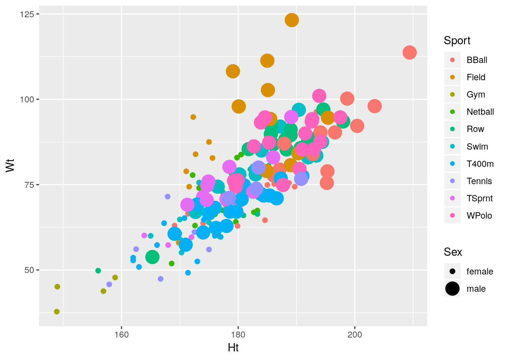

# Multivariate analysis of variance

Packages for this chapter:


```r
library(car)
```

```
## Loading required package: carData
```

```r
library(tidyverse)
```

```
## ── Attaching packages ────────────────────────────────── tidyverse 1.2.1 ──
```

```
## ✔ ggplot2 3.1.0          ✔ purrr   0.3.2     
## ✔ tibble  2.1.1          ✔ dplyr   0.8.0.1   
## ✔ tidyr   0.8.3.9000     ✔ stringr 1.4.0     
## ✔ readr   1.3.1          ✔ forcats 0.3.0
```

```
## ── Conflicts ───────────────────────────────────── tidyverse_conflicts() ──
## ✖ dplyr::filter() masks stats::filter()
## ✖ dplyr::lag()    masks stats::lag()
## ✖ dplyr::recode() masks car::recode()
## ✖ purrr::some()   masks car::some()
```


##  Fabricated data


 The data in
[link](http://www.utsc.utoronto.ca/~butler/d29/simple-manova.txt)
(probably made up) are measurements of two 
variables `y1` and `y2` on three groups, labelled
`a`, `b` and `c`. We want to see whether
`y1` or `y2` or some combination of them differ among
the groups.


(a) Read in the data and check that you have 12 observations on
2 numeric variables from 3 different groups.


Solution


```r
my_url="http://www.utsc.utoronto.ca/~butler/d29/simple-manova.txt"
simple=read_delim(my_url," ")
```

```
## Parsed with column specification:
## cols(
##   group = col_character(),
##   y1 = col_double(),
##   y2 = col_double()
## )
```

```r
simple
```

```
## # A tibble: 12 x 3
##    group    y1    y2
##    <chr> <dbl> <dbl>
##  1 a         2     3
##  2 a         3     4
##  3 a         5     4
##  4 a         2     5
##  5 b         4     8
##  6 b         5     6
##  7 b         5     7
##  8 c         7     6
##  9 c         8     7
## 10 c        10     8
## 11 c         9     5
## 12 c         7     6
```

   

As promised: 12 observations, 2 numeric variables `y1` and
`y2`, and one categorical variable (as text) containing three
groups `a,b,c`.
    


(b) Run a one-way ANOVA predicting `y1` from
`group`. Are there any significant differences in `y1`
among the groups? If necessary, run Tukey. What do you conclude?


Solution


```r
simple.1=aov(y1~group,data=simple)
summary(simple.1)
```

```
##             Df Sum Sq Mean Sq F value   Pr(>F)    
## group        2  63.45   31.72    21.2 0.000393 ***
## Residuals    9  13.47    1.50                     
## ---
## Signif. codes:  0 '***' 0.001 '**' 0.01 '*' 0.05 '.' 0.1 ' ' 1
```

```r
TukeyHSD(simple.1)
```

```
##   Tukey multiple comparisons of means
##     95% family-wise confidence level
## 
## Fit: aov(formula = y1 ~ group, data = simple)
## 
## $group
##         diff        lwr      upr     p adj
## b-a 1.666667 -0.9417891 4.275122 0.2289181
## c-a 5.200000  2.9089670 7.491033 0.0003548
## c-b 3.533333  1.0391725 6.027494 0.0083999
```

     

The $F$-test said that there were differences among the groups, so I
ran Tukey and found that group `c` is significantly bigger on
`y1` than the other two groups.


(c) Repeat all the previous part for `y2`.


Solution


```r
simple.2=aov(y2~group,data=simple)
summary(simple.2)
```

```
##             Df Sum Sq Mean Sq F value  Pr(>F)   
## group        2  19.05   9.525   9.318 0.00642 **
## Residuals    9   9.20   1.022                   
## ---
## Signif. codes:  0 '***' 0.001 '**' 0.01 '*' 0.05 '.' 0.1 ' ' 1
```

```r
TukeyHSD(simple.2)
```

```
##   Tukey multiple comparisons of means
##     95% family-wise confidence level
## 
## Fit: aov(formula = y2 ~ group, data = simple)
## 
## $group
##     diff        lwr      upr     p adj
## b-a  3.0  0.8440070 5.155993 0.0093251
## c-a  2.4  0.5063697 4.293630 0.0157279
## c-b -0.6 -2.6615236 1.461524 0.7050026
```

     

Same idea: there is a difference, and Tukey reveals that this time
group `a` is significantly *smaller* than the other groups
on `y2`. 
    


(d) Make a plot of `y1` against `y2`, with the
points distinguished by which group they are from.


Solution


`y1` and `y2` can be either way around, since
they are both response variables (!):


```r
ggplot(simple,aes(x=y1,y=y2,colour=group))+geom_point()
```


    


(e) How is it that group `b` is not distinguishable on
either `y1` or `y2` individually (from the ANOVAs),
but *is* distinguishable on your graph? Explain briefly.


Solution


Group `b` has the same kind of `y1` values as group
`a` and the same kind of `y2` values as group
`c`. This means looking at either variable singly is not
enough to distinguish group `b`. But group `b`
stands out on the graph as being "top left" of the picture. That
means that `y1` has to be low *and* `y2` has to
be high, both together, to pick out group `b`. 
That seems like a lot of work, but the important point
that I want you to raise is that the points in group `b`
are distinguished by a particular *combination* of values of
`y1` and `y2`.
    


(f) Run a one-way multivariate analysis of variance, obtaining
a P-value. Note the very small P-value.


Solution


This is just like the seed weight and yield example in class
(deliberately so):

```r
response=with(simple,cbind(y1,y2))
simple.3=manova(response~group,data=simple)
summary(simple.3)
```

```
##           Df Pillai approx F num Df den Df    Pr(>F)    
## group      2 1.3534   9.4196      4     18 0.0002735 ***
## Residuals  9                                            
## ---
## Signif. codes:  0 '***' 0.001 '**' 0.01 '*' 0.05 '.' 0.1 ' ' 1
```

     

The P-value here, 0.00027, is smaller than either of the P-values for
the one-variable ANOVAs. This expresses the idea that the group
difference is essentially multivariate (it depends on the
*combination* of `y1` and `y2` values). I only
wanted you to note that it is smaller than either of the other
ANOVAs; you don't need to say anything about why.

We were in the fortunate position of being able to draw a picture,
because we had only two response variables, and we could plot them
against each other with the groups labelled. (If we had three response
variables, like the peanuts example, we wouldn't be able to do this,
barring some kind of 3D-plotting procedure.)
    


##  Do characteristics of urine depend on obesity?


 A study was made of the characteristics of urine of young
men. The men were classified into four groups based on their degree of
obesity. (The groups are labelled `a, b, c, d`.) Four variables
were measured, `x` (which you can ignore), pigment creatinine,
chloride and chlorine. The data are in
[link](http://www.utsc.utoronto.ca/~butler/d29/urine.csv) as a
`.csv` file. There are 45 men altogether.


(a) Read in the data and check that you have the right number
of observations and the right variables.
 
Solution


`read_csv`:

```r
my_url="http://www.utsc.utoronto.ca/~butler/d29/urine.csv"
urine=read_csv(my_url)
```

```
## Parsed with column specification:
## cols(
##   obesity = col_character(),
##   x = col_double(),
##   creatinine = col_double(),
##   chloride = col_double(),
##   chlorine = col_double()
## )
```

```r
urine
```

```
## # A tibble: 45 x 5
##    obesity     x creatinine chloride chlorine
##    <chr>   <dbl>      <dbl>    <dbl>    <dbl>
##  1 a          24       17.6     5.15      7.5
##  2 a          32       13.4     5.75      7.1
##  3 a          17       20.3     4.35      2.3
##  4 a          30       22.3     7.55      4  
##  5 a          30       20.5     8.5       2  
##  6 a          27       18.5    10.2       2  
##  7 a          25       12.1     5.95     16.8
##  8 a          30       12       6.3      14.5
##  9 a          28       10.1     5.45      0.9
## 10 a          24       14.7     3.75      2  
## # … with 35 more rows
```

     

The variables are as promised, and we do indeed have 45 rows. 
 

(b) Make boxplots of each of the three variables of interest
against obesity group. 
 
Solution


Just churn through it:

```r
ggplot(urine,aes(x=obesity,y=creatinine))+geom_boxplot()
```


```r
ggplot(urine,aes(x=obesity,y=chlorine))+geom_boxplot()
```


```r
ggplot(urine,aes(x=obesity,y=chloride))+geom_boxplot()
```


     

This also works with facets, though it is different from the other
ones we've done, in that we have to collect together the $y$-variables
first rather than the $x$s:


```r
urine %>% gather(yname,y,creatinine:chlorine) %>%
ggplot(aes(x=obesity,y=y))+geom_boxplot()+
facet_wrap(~yname,scales="free",ncol=2)
```


 

I decided to throw a couple of things in here: first, the
`scales="free"` thing since the $y$-variables (this time) are
on different scales, and second, the `ncol=2` to arrange the
facets in (3 cells of) a $2\times 2$ grid, rather than having them
come out tall and skinny.
<label for="tufte-mn-" class="margin-toggle">&#8853;</label><input type="checkbox" id="tufte-mn-" class="margin-toggle"><span class="marginnote">Like one of those crazy drinks at  Starbucks.</span> It's unusual to have faceted boxplots, but this is one
of those cases where it makes sense. (The key is different $y$'s but
the same $x$, I think.)

The conclusions about the boxplots are, of course, the same. I think
it makes it easier to have the three boxplots side by side, but it's
up to you whether you think that gain is worth the extra coding.
 

(c) How, if at all, do the groups differ on the variables of interest?
 
Solution


Any sensible comment here is good. You can take the approach that
group D is lowest on creatinine and chloride, but there is not
much to choose (given the amount of variability) on chlorine. Or
you can say that groups B and C are generally highest, except for
chloride where A is higher. Anything of this general kind is fine.
The point here is that some of the groups appear to be different
on some of the variables, which would make a multivariate analysis
of variance (in a moment) come out significant.
 

(d) Run a multivariate analysis of variance, using the three
variables of interest as response variables, and the obesity group
as explanatory. (This is a so-called one-way MANOVA.)
 
Solution


Create the response variable and run `manova`:

```r
response=with(urine,cbind(creatinine,chlorine,chloride))
urine.1=manova(response~obesity,data=urine)
summary(urine.1)
```

```
##           Df  Pillai approx F num Df den Df  Pr(>F)  
## obesity    3 0.43144   2.2956      9    123 0.02034 *
## Residuals 41                                         
## ---
## Signif. codes:  0 '***' 0.001 '**' 0.01 '*' 0.05 '.' 0.1 ' ' 1
```

     
 

(e) What do you conclude? Is this in line with what your
boxplots said? Explain briefly.
 
Solution


The null hypothesis (that each of the variables have the same mean
for each of the groups) is rejected: that is, not all of the
groups have the same mean on all of the variables.
Based on the idea that there seemed to be differences between the
groups in the boxplots, this makes sense. (That's what I saw,
anyway. There was a lot of variability within the groups, which is
why the P-value didn't come out smaller.)
The other way of doing this is the following, using
`Manova` from `car`:

```r
response.1=lm(response~obesity,data=urine)
Manova(response.1)
```

```
## 
## Type II MANOVA Tests: Pillai test statistic
##         Df test stat approx F num Df den Df  Pr(>F)  
## obesity  3   0.43144   2.2956      9    123 0.02034 *
## ---
## Signif. codes:  0 '***' 0.001 '**' 0.01 '*' 0.05 '.' 0.1 ' ' 1
```

     

The result is the same. You don't need do this one here (though you
can as an alternative), but when you come to repeated measures you
*will* need to be able to use `Manova`.

To understand the differences in the variables due to the groups, we
need to run a discriminant analysis (coming up later).

 


##  How do height and weight depend on sport played by elite athletes?


 This question uses the data on Australian elite athletes,
which can be found at
[link](http://www.utsc.utoronto.ca/~butler/c32/ais.txt). 202 elite
athletes had various physical and physiological measurements taken,
and for each athlete, their gender (in the column `Sex`) and
the sport they play (`Sport`) was also noted. The data values
are separated by *tabs*, meaning that `read_tsv` will
read them in.


(a) Read in the data and verify that you have 202 rows and 13
columns. 

Solution


As in the hint:

```r
my_url="http://www.utsc.utoronto.ca/~butler/c32/ais.txt"
athletes=read_tsv(my_url)
```

```
## Parsed with column specification:
## cols(
##   Sex = col_character(),
##   Sport = col_character(),
##   RCC = col_double(),
##   WCC = col_double(),
##   Hc = col_double(),
##   Hg = col_double(),
##   Ferr = col_double(),
##   BMI = col_double(),
##   SSF = col_double(),
##   `%Bfat` = col_double(),
##   LBM = col_double(),
##   Ht = col_double(),
##   Wt = col_double()
## )
```

```r
athletes
```

```
## # A tibble: 202 x 13
##    Sex   Sport   RCC   WCC    Hc    Hg  Ferr   BMI   SSF `%Bfat`   LBM
##    <chr> <chr> <dbl> <dbl> <dbl> <dbl> <dbl> <dbl> <dbl>   <dbl> <dbl>
##  1 fema… Netb…  4.56  13.3  42.2  13.6    20  19.2  49      11.3  53.1
##  2 fema… Netb…  4.15   6    38    12.7    59  21.2 110.     25.3  47.1
##  3 fema… Netb…  4.16   7.6  37.5  12.3    22  21.4  89      19.4  53.4
##  4 fema… Netb…  4.32   6.4  37.7  12.3    30  21.0  98.3    19.6  48.8
##  5 fema… Netb…  4.06   5.8  38.7  12.8    78  21.8 122.     23.1  56.0
##  6 fema… Netb…  4.12   6.1  36.6  11.8    21  21.4  90.4    16.9  56.4
##  7 fema… Netb…  4.17   5    37.4  12.7   109  21.5 107.     21.3  53.1
##  8 fema… Netb…  3.8    6.6  36.5  12.4   102  24.4 157.     26.6  54.4
##  9 fema… Netb…  3.96   5.5  36.3  12.4    71  22.6 101.     17.9  56.0
## 10 fema… Netb…  4.44   9.7  41.4  14.1    64  22.8 126.     25.0  51.6
## # … with 192 more rows, and 2 more variables: Ht <dbl>, Wt <dbl>
```

     

202 rows and 13 columns indeed.


(b) We are going to see whether the height-weight combination
of an athlete depends significantly on which sport they play and which gender
they are. Explain (very) briefly why a multivariate analysis of
variance will be necessary to do this.

Solution


We now have *two* response variables, height and weight,
rather than just one. In order to do a test with more than one
response variable, we need to use multivariate ANOVA rather than
regular ANOVA. (The first sentence is enough.)

Extra: the explanatory variables, sport and gender, are both
categorical here, which makes a MANOVA work. If either of them had
been quantitative, we would have needed to do a multivariate
regression, which is beyond the scope of what we do in this course.


(c) Create a response variable for a MANOVA. (You don't need to
show what you got, since it is rather big.) The columns you want are
called `Ht` and `Wt`.

Solution


Use `cbind` to glue the two columns together:

```r
response=with(athletes,cbind(Ht,Wt))
```

     

Either way around, height or weight first, is good. Also good is the
dollar sign, which you'll need to do twice (and thus the `with`
way is more elegant):


```r
response_a=cbind(athletes$Ht,athletes$Wt)
```

 


(d) Run a multivariate analysis of variance to see whether the
height-weight combination depends significantly on gender, sport or the
combination of both. Display the results. Use the small-m
`manova` way to do this one.

Solution


The straightforward way is small-m `manova`. I don't know
what I should be calling my fitted model object, so I'm making
something up. Don't forget to use the right names for the
variables, and to include an interaction:

```r
htwt.1=manova(response~Sex*Sport,data=athletes)
summary(htwt.1)
```

```
##            Df  Pillai approx F num Df den Df Pr(>F)    
## Sex         1 0.52412  101.325      2    184 <2e-16 ***
## Sport       9 0.87914   16.123     18    370 <2e-16 ***
## Sex:Sport   6 0.04105    0.646     12    370 0.8023    
## Residuals 185                                          
## ---
## Signif. codes:  0 '***' 0.001 '**' 0.01 '*' 0.05 '.' 0.1 ' ' 1
```

     

The other way is apparently to use large-M `Manova` from package
`car`. This goes as a two-stage process: fit an `lm`
first with the same model formula as above, and then pass *that*
into `Manova`. This way, you just "print" the final result,
rather than passing it into `summary`:


```r
htwt.2=lm(response~Sex*Sport,data=athletes)
htwt.3=Manova(htwt.2)
```

```
## Error in solve.default(wcrossprod(model.matrix(mod), w = wts)): Lapack routine dgesv: system is exactly singular: U[13,13] = 0
```

 

Except that this doesn't work, for reasons that I don't
understand. `htwt.2` is fine; it's the `Manova` that is
not working.


(e) Briefly justify removing the interaction term from your
previous model, and fit a model without it. You can use either
`manova` or `Manova` for this; they should both
work. (You only need to use one of them.)  Display your results.

Solution


The interaction should come out, since it is not
significant. (This is what I meant by "briefly.")
To do that, in each case, replace the `*` with a `+`, or use
`update`. Most of those work:

```r
htwt.4=manova(response~Sex+Sport,data=athletes)
summary(htwt.4)
```

```
##            Df  Pillai approx F num Df den Df    Pr(>F)    
## Sex         1 0.51888  102.454      2    190 < 2.2e-16 ***
## Sport       9 0.86923   16.314     18    382 < 2.2e-16 ***
## Residuals 191                                             
## ---
## Signif. codes:  0 '***' 0.001 '**' 0.01 '*' 0.05 '.' 0.1 ' ' 1
```

   

or


```r
htwt.5=update(htwt.1,.~.-Sex:Sport)
```

```
## Warning in if (projections) qr <- lmcall$qr <- TRUE: the condition has
## length > 1 and only the first element will be used
```

```
## Error in if (projections) qr <- lmcall$qr <- TRUE: argument is not interpretable as logical
```

 

It seems that `manova` things don't like `update`. If
that happened to you, try it another way.

or, with `Manova`, the same two ways:


```r
htwt.6=lm(response~Sex+Sport,data=athletes)
htwt.7=Manova(htwt.6)
htwt.7
```

```
## 
## Type II MANOVA Tests: Pillai test statistic
##       Df test stat approx F num Df den Df    Pr(>F)    
## Sex    1   0.44278   75.489      2    190 < 2.2e-16 ***
## Sport  9   0.86923   16.314     18    382 < 2.2e-16 ***
## ---
## Signif. codes:  0 '***' 0.001 '**' 0.01 '*' 0.05 '.' 0.1 ' ' 1
```

 

or


```r
htwt.8=update(htwt.2,.~.-Sex:Sport)
htwt.9=Manova(htwt.8)
htwt.9
```

```
## 
## Type II MANOVA Tests: Pillai test statistic
##       Df test stat approx F num Df den Df    Pr(>F)    
## Sex    1   0.44278   75.489      2    190 < 2.2e-16 ***
## Sport  9   0.86923   16.314     18    382 < 2.2e-16 ***
## ---
## Signif. codes:  0 '***' 0.001 '**' 0.01 '*' 0.05 '.' 0.1 ' ' 1
```

 

These both work, and give the same answer. I think this is because the
thing being `update`d is a regular `lm`; the
`Manova` bit comes after, and is calculated from the
`lm` fit.

Any of these is good, and gets you the same answer.

Extra: it you run `summary` on the output from `Manova`,
you get more detail:


```r
summary(htwt.9)
```

```
## 
## Type II MANOVA Tests:
## 
## Sum of squares and products for error:
##          Ht        Wt
## Ht 6871.978  5842.771
## Wt 5842.771 13613.021
## 
## ------------------------------------------
##  
## Term: Sex 
## 
## Sum of squares and products for the hypothesis:
##          Ht       Wt
## Ht 4582.744 6146.078
## Wt 6146.078 8242.718
## 
## Multivariate Tests: Sex
##                  Df test stat approx F num Df den Df     Pr(>F)    
## Pillai            1 0.4427781 75.48862      2    190 < 2.22e-16 ***
## Wilks             1 0.5572219 75.48862      2    190 < 2.22e-16 ***
## Hotelling-Lawley  1 0.7946171 75.48862      2    190 < 2.22e-16 ***
## Roy               1 0.7946171 75.48862      2    190 < 2.22e-16 ***
## ---
## Signif. codes:  0 '***' 0.001 '**' 0.01 '*' 0.05 '.' 0.1 ' ' 1
## 
## ------------------------------------------
##  
## Term: Sport 
## 
## Sum of squares and products for the hypothesis:
##          Ht        Wt
## Ht 6162.455  7070.085
## Wt 7070.085 13727.950
## 
## Multivariate Tests: Sport
##                  Df test stat approx F num Df den Df     Pr(>F)    
## Pillai            9 0.8692278 16.31358     18    382 < 2.22e-16 ***
## Wilks             9 0.3132928 16.60578     18    380 < 2.22e-16 ***
## Hotelling-Lawley  9 1.6093145 16.89780     18    378 < 2.22e-16 ***
## Roy               9 1.0593835 22.48247      9    191 < 2.22e-16 ***
## ---
## Signif. codes:  0 '***' 0.001 '**' 0.01 '*' 0.05 '.' 0.1 ' ' 1
```

 

There are actually *four* competing tests that generalize the
one-response-variable $F$ statistic in different ways. The one we've
been using is called Pillai's Trace, but if you go looking in a text
on multivariate analysis, you'll also see the others, especially
Wilks's $\Lambda$ (that's a capital lambda). They will generally agree
in terms of conclusion, so you can look at them all if you like, but
it doesn't hurt much to look at only one.

I am in danger of running out of numbers for my fitted models (and am
definitely in danger of forgetting which one is which)!


(f) See if you can make a graph that shows what's going on
here. Bear in mind that you have two quantitative variables and
*two* categorical ones, so you will need to find a way to
display everything. Hint: what would you do with two quantitative
variables and *one* categorical one? Can you find a way to
generalize that idea by displaying the other categorical variable
differently? I think we have seen a couple of ideas that will work,
somewhere in the lecture notes (but in a different context). Or you
can search for ideas, of course.
For full marks, obtain a plot which does not give you any
warnings. (The grader will know which of the possible plots give
warnings, and will deduct extra marks if you assert that a plot
gives no warnings when in fact it does. That is to say, if you get
any warnings, *you need to include those in what you hand in*).

Solution


This will probably involve a bit of digging.
The starting point would be a scatterplot (the two quantitative
variables) with the points distinguished by colour (one of the
categorical variables). What other options do we have? 
If you look eg. at the navigation on the left of
[link](http://sape.inf.usi.ch/quick-reference/ggplot2/size), you'll
see that there are two likely possibilities: `shape` and
`size`. `shape` uses a different plotting symbol for
each value of a categorical variable; `size` draws the
plotting symbol bigger or smaller according to the value of a
categorical variable. 
The remaining question is the one of which aesthetic to "map" to
which variable? To guide you in this, note that we have ten
different sports and two different genders. In my opinion, colours
are the easiest to distinguish a lot of, though even then 10 is
pushing it, then plotting symbols. Symbol sizes are hard to
distinguish a lot of, so it's best to limit this (if you use it at
all) to gender.
With that in mind, I would go for this one:

```r
ggplot(athletes,aes(x=Ht,y=Wt,colour=Sport,shape=Sex))+geom_point()
```


     

If you investigate, you'll find that `ggplot` can handle about
six different shapes (and we have ten sports), and it doesn't care for
using `size` to distinguish values of a categorical
variable. It will try to draw the graph, but will give you a warning,
such as these:


```r
ggplot(athletes,aes(x=Ht,y=Wt,colour=Sport,size=Sex))+geom_point()
```

```
## Warning: Using size for a discrete variable is not advised.
```



     


```r
ggplot(athletes,aes(x=Ht,y=Wt,shape=Sport,size=Sex))+geom_point()
```

```
## Warning: Using size for a discrete variable is not advised.
```

```
## Warning: The shape palette can deal with a maximum of 6 discrete values
## because more than 6 becomes difficult to discriminate; you have
## 10. Consider specifying shapes manually if you must have them.
```

```
## Warning: Removed 72 rows containing missing values (geom_point).
```


     


```r
ggplot(athletes,aes(x=Ht,y=Wt,shape=Sport,colour=Sex))+geom_point()
```

```
## Warning: The shape palette can deal with a maximum of 6 discrete values
## because more than 6 becomes difficult to discriminate; you have
## 10. Consider specifying shapes manually if you must have them.
```

```
## Warning: Removed 72 rows containing missing values (geom_point).
```


     

Whatever plot you come up with, you can put height and weight on the
other axes, since neither one of them is uniquely a response variable.

Any of these graphs with warnings do the job, kind of, so they get 2 points.

One of the many well-thought-out things about `ggplot2` is that
making this graph was actually not difficult once you had figured out
that you also had `shape` and `size` at your
disposal. (In addition, `ggplot2` will help you make some
aesthetic decisions about which variable is distinguished by what kind
of thing. This will help you work towards a plot that doesn't have any
warnings. These warnings are pretty clear about what not to do, and by
implication what you need to do instead. Colour, for example, is
always safe warning-wise.)

The model for this kind of graph that we saw is the plot of
probability (of preferring different brands of a product) as it depended
on age (two quantitative variables) for each brand and gender (two
categorical variables). I had three brands and two genders there, so I
used colour for brand and shape for gender, but it would have worked
about as well if I'd used shape for brand and colour for gender.

The warning message for `shape` contains the words ``specify
shapes manually if you must have them''. I was wondering how you can
avoid that. Here's how:


```r
ggplot(athletes,aes(x=Ht,y=Wt,shape=Sport,colour=Sex))+geom_point()+
scale_shape_manual(values=1:10)
```


     

I agree with `ggplot2` that this many shapes are hard to tell
apart,
<label for="tufte-mn-" class="margin-toggle">&#8853;</label><input type="checkbox" id="tufte-mn-" class="margin-toggle"><span class="marginnote">Having said that, the shapes are less anbiguous than  the colours, because if you're willing to study the legend, you can  work out exactly which sport a shape belongs to, whereas the colours  might be hard to tell apart at all.</span> but if you can figure this out,
you achieve the goal of producing a plot with no warnings, so you get
full marks. (We need 10 shapes because there are 10 different sports,
so we have to specify 10 different values in `values=`: any 10
different values will do. A list of the possible shapes is in
[link](https://stackoverflow.com/questions/16813278/cycling-through-point-shapes-when-more-than-6-factor-levels),
at the bottom. You can even use regular letters, but you have to refer
to them by numeric code:


```r
ggplot(athletes,aes(x=Ht,y=Wt,shape=Sport,colour=Sex))+geom_point()+
scale_shape_manual(values=c(66,70,71,78,82,83,52,84,3,87))
```


     

I had to find something for `TSprnt`, since all the letters
appeared to be taken.

On consideration, I like this last graph the best, because the letters
are more or less reminders of which sport each point is (they are
"mnemonic", so you don't have to look them up all the time, as with
colours or shapes: you can eventually remember which is which). 

Whatever you come up with, expect: 3 marks if you get a plot with no
warnings, 2 marks if you get a plot with warnings, 1 mark if you get a
plot that would produce warnings but you don't indicate that there are
warnings, either by saying so or by including the warnings in what you
hand in.

I didn't ask you to interpret your plot (just getting it was enough
work), but there seems to be a common theme that, for sports played by
both genders, that the athletes are in about the same place relative
to the other ones in their gender (eg., the basketball players are
tall and heavy, the field athletes are really heavy but not very
tall), but male athletes are both taller and heavier than female
athletes playing the same sport. This consistency of pattern was
probably why the interaction was nowhere near significant: there are
additive separate effects of sport and of gender on the height-weight
combination. 


