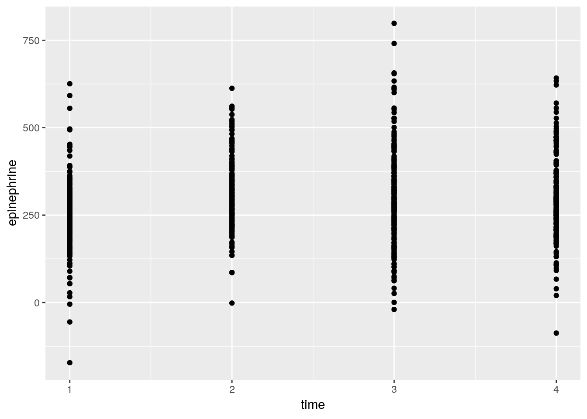
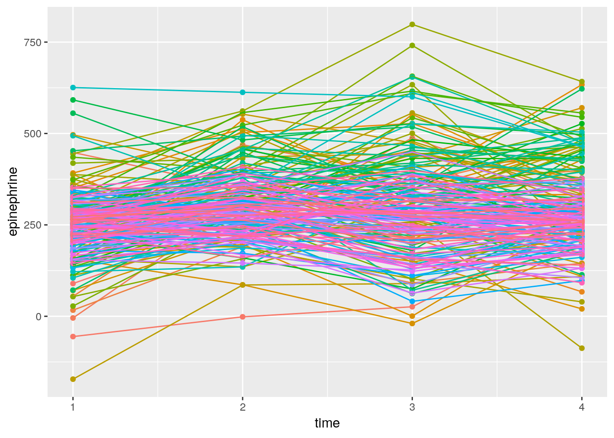

# Repeated measures

Packages for this chapter:


```r
library(car)
library(lme4)
library(tidyverse)
```


```
## Warning: package 'ggplot2' was built under R version 3.5.3
```

```
## Warning: package 'tibble' was built under R version 3.5.3
```

```
## Warning: package 'tidyr' was built under R version 3.5.3
```

```
## Warning: package 'readr' was built under R version 3.5.2
```

```
## Warning: package 'purrr' was built under R version 3.5.3
```

```
## Warning: package 'dplyr' was built under R version 3.5.2
```

```
## Warning: package 'stringr' was built under R version 3.5.2
```

```
## Warning: package 'forcats' was built under R version 3.5.1
```

```
## Warning: package 'survminer' was built under R version 3.5.1
```

```
## Warning: package 'ggpubr' was built under R version 3.5.1
```

```
## Warning: package 'magrittr' was built under R version 3.5.1
```

```
## Warning: package 'car' was built under R version 3.5.1
```

```
## Warning: package 'carData' was built under R version 3.5.1
```

```
## Warning: package 'ggbiplot' was built under R version 3.5.1
```

```
## Warning: package 'plyr' was built under R version 3.5.1
```

```
## Warning: package 'scales' was built under R version 3.5.1
```

```
## Warning: package 'ggrepel' was built under R version 3.5.1
```

```
## Warning: package 'broom' was built under R version 3.5.2
```

```
## Warning: package 'rstan' was built under R version 3.5.3
```

```
## Warning: package 'StanHeaders' was built under R version 3.5.1
```


##  Effect of drug on rat weight


 Box (1950) gives data on the weights of three groups of
rats. One group was given thyroxin in their drinking water, one group
thiouracil, and the third group was a control. (This description comes
from Christensen (2001).)
<label for="tufte-mn-" class="margin-toggle">&#8853;</label><input type="checkbox" id="tufte-mn-" class="margin-toggle"><span class="marginnote">References: Box, George EP, Problems in the analysis of growth and wear curves, Biometrics vol. 6, 362-369, 1950; Christensen R, Advanced Linear Modeling, 2nd edition, Springer, 2001. Yes, that's the Box-Cox Box.</span>
Weights are measured in
grams at weekly intervals (over a 4-week period, so that each rat is
measured 5 times). The data are in
[link](http://www.utsc.utoronto.ca/~butler/d29/ratweight.csv) as a
`.csv` file.


(a) Read in the data and check that you have a column of
`drug` and five columns of rat weights at different times.
 
Solution


A `.csv` file, so `read_csv`. (I typed the data from
Christensen (2001) into a spreadsheet.)

```r
my_url <- "http://www.utsc.utoronto.ca/~butler/d29/ratweight.csv"
weights <- read_csv(my_url)
```

```
## Parsed with column specification:
## cols(
##   rat = col_double(),
##   drug = col_character(),
##   Time0 = col_double(),
##   Time1 = col_double(),
##   Time2 = col_double(),
##   Time3 = col_double(),
##   Time4 = col_double()
## )
```

```r
weights
```

```
## # A tibble: 27 x 7
##      rat drug       Time0 Time1 Time2 Time3 Time4
##    <dbl> <chr>      <dbl> <dbl> <dbl> <dbl> <dbl>
##  1     1 thyroxin      59    85   121   156   191
##  2     2 thyroxin      54    71    90   110   138
##  3     3 thyroxin      56    75   108   151   189
##  4     4 thyroxin      59    85   116   148   177
##  5     5 thyroxin      57    72    97   120   144
##  6     6 thyroxin      52    73    97   116   140
##  7     7 thyroxin      52    70   105   138   171
##  8     8 thiouracil    61    86   109   120   129
##  9     9 thiouracil    59    80   101   111   122
## 10    10 thiouracil    53    79   100   106   133
## # … with 17 more rows
```

   

There are 27 rats altogether, each measured five times (labelled time
0 through 4). 
 

(b) Why would it be *wrong* to use something like
`gather` to create one column of weights, and separate
columns of drug and time, and then to run a two-way ANOVA? Explain briefly.
 
Solution


Such a solution would assume that we have measurements on
*different* rats, one for each drug-time combination. But we
have sets of five measurements all on the *same* rat: that is
to say, we have repeated measures, and the proper analysis will
take that into account.
 

(c) Create a suitable response variable and fit a suitable
`lm` as the first step of the repeated-measures analysis.
 
Solution


The response variable is the same idea as for any MANOVA: just
glue the columns together:

```r
response <- with(weights, cbind(Time0, Time1, Time2, Time3, Time4))
weights.1 <- lm(response ~ drug, data = weights)
```

     

Now, we *don't* look at `weights.1`, but we *do* use
it as input to `Manova` in a moment.
 

(d) Load the package `car` and run a suitable
`Manova`. To do this, you will need to set up the right thing
for `idata` and `idesign`.
 
Solution


Something like this:

```r
times <- colnames(response)
times.df <- data.frame(times)
weights.2 <- Manova(weights.1, idata = times.df, idesign = ~times)
```

     

The thought process is that the columns of the response
(`Time.0` through `Time.4`) are all times. This is the
"within-subject design" part of it: within a rat, the different
response values are at different times. That's the only part of it
that is within subjects. The different drugs are a
"between-subjects" factor: each rat only gets one of the
drugs.
<label for="tufte-mn-" class="margin-toggle">&#8853;</label><input type="checkbox" id="tufte-mn-" class="margin-toggle"><span class="marginnote">Things would be a lot more complicated if each rat got a different drug at a different time! But the rats each got one drug *once*, at the beginning, and the issue was the effect of that drug on all the growth that followed.</span>
 

(e) Take a look at the output from the MANOVA. Is there a
significant interaction? What does its significance (or lack
thereof) mean?
 
Solution


```r
weights.2
```

```
## 
## Type II Repeated Measures MANOVA Tests: Pillai test statistic
##             Df test stat approx F num Df den Df    Pr(>F)    
## (Intercept)  1   0.99257   3204.1      1     24 < 2.2e-16 ***
## drug         2   0.39192      7.7      2     24 0.0025559 ** 
## times        1   0.98265    297.4      4     21 < 2.2e-16 ***
## drug:times   2   0.87791      4.3      8     44 0.0006931 ***
## ---
## Signif. codes:  0 '***' 0.001 '**' 0.01 '*' 0.05 '.' 0.1 ' ' 1
```

     

The interaction is definitely significant, with a P-value of
0.00069. This means that the effect of time on growth is different for
the different drugs: that is, the effect of drug is over the whole
time profile, not just something like 
"a rat on Thyroxin is on average 10 grams heavier than a control rat, over all times".

Since the interaction is significant, that's where we stop, as far as
interpretation is concerned.
 

(f) We are going to draw an interaction plot in a moment. To
set that up, use `gather` as in the lecture notes to create
one column of weights and a second column of times. (You don't
need to do the `separate` thing that I did in class, though
if you want to try it, go ahead.)
 
Solution


```r
weights.long <- weights %>%
  gather(time, weight, Time0:Time4)
weights.long
```

```
## # A tibble: 135 x 4
##      rat drug       time  weight
##    <dbl> <chr>      <chr>  <dbl>
##  1     1 thyroxin   Time0     59
##  2     2 thyroxin   Time0     54
##  3     3 thyroxin   Time0     56
##  4     4 thyroxin   Time0     59
##  5     5 thyroxin   Time0     57
##  6     6 thyroxin   Time0     52
##  7     7 thyroxin   Time0     52
##  8     8 thiouracil Time0     61
##  9     9 thiouracil Time0     59
## 10    10 thiouracil Time0     53
## # … with 125 more rows
```

     

My data frame was called `weights`, so I was OK with having a
variable called `weight`. Watch out for that if you call the
data frame `weight`, though.

If you want to try the `separate` thing, that goes something
like this:


```r
weights %>%
  gather(timex, weight, Time0:Time4) %>%
  separate(timex, into = c("junk", "time"), sep = 4) -> weights2.long
weights2.long %>% sample_n(20)
```

```
## # A tibble: 20 x 5
##      rat drug       junk  time  weight
##    <dbl> <chr>      <chr> <chr>  <dbl>
##  1     7 thyroxin   Time  2        105
##  2    23 control    Time  1         70
##  3     3 thyroxin   Time  0         56
##  4     5 thyroxin   Time  3        120
##  5    17 thiouracil Time  1         72
##  6    20 control    Time  0         52
##  7    16 thiouracil Time  0         46
##  8    21 control    Time  3        129
##  9     9 thiouracil Time  0         59
## 10     1 thyroxin   Time  3        156
## 11    15 thiouracil Time  0         58
## 12    16 thiouracil Time  1         61
## 13    10 thiouracil Time  2        100
## 14    10 thiouracil Time  0         53
## 15    14 thiouracil Time  0         56
## 16    23 control    Time  2        102
## 17     2 thyroxin   Time  2         90
## 18     2 thyroxin   Time  0         54
## 19    19 control    Time  0         60
## 20    22 control    Time  1         81
```

 

Separate after the fourth character (`sep=4`), which will put
`Time` into `junk` and the actual time into
`time`. I could also have organized the data file so that the
word `Time` and the number were separated by some character,
like an underscore, and you could have separated at that.
Since the piece of the time we want is the number,
`parse_number` (from `readr`, part of the
`tidyverse`) should also work:


```r
weights2.long <- weights %>%
  gather(timex, weight, Time0:Time4) %>%
  mutate(time = parse_number(timex))
weights2.long %>% sample_n(20)
```

```
## # A tibble: 20 x 5
##      rat drug       timex weight  time
##    <dbl> <chr>      <chr>  <dbl> <dbl>
##  1     6 thyroxin   Time0     52     0
##  2    24 control    Time3    110     3
##  3    17 thiouracil Time4    122     4
##  4    12 thiouracil Time3    123     3
##  5    12 thiouracil Time1     75     1
##  6     7 thyroxin   Time4    171     4
##  7    23 control    Time1     70     1
##  8    18 control    Time1     86     1
##  9    25 control    Time4    154     4
## 10    17 thiouracil Time1     72     1
## 11    26 control    Time1     67     1
## 12     6 thyroxin   Time2     97     2
## 13    14 thiouracil Time2     95     2
## 14    24 control    Time2     94     2
## 15    25 control    Time3    130     3
## 16    13 thiouracil Time0     51     0
## 17     1 thyroxin   Time1     85     1
## 18    21 control    Time2    100     2
## 19    21 control    Time3    129     3
## 20     3 thyroxin   Time2    108     2
```

 

I decided to show you a random collection of rows, so that you can see
that `parse_number` worked for various different times. 
 

(g) Obtain an interaction plot. Putting `time` as the
`x` will put time along the horizontal axis, which is the
way we're used to seeing such things. Begin by calculating the mean
`weight` for each `time`-`drug` combination.
 
Solution


`group_by`, `summarize` and `ggplot`, the
latter using the data frame that came out of the
`summarize`. The second factor `drug` goes as the
`colour` and `group` both, since `time` has
grabbed the `x` spot:

```r
weights.long %>%
  group_by(time, drug) %>%
  summarize(mean.weight = mean(weight)) %>%
  ggplot(aes(x = time, y = mean.weight, colour = drug, group = drug)) +
  geom_point() + geom_line()
```


       
 

(h) How does this plot show why the interaction was
significant? Explain briefly.
 
Solution


At the beginning, all the rats have the same average growth, but
from time 2 (or maybe even 1) or so, the rats on thiouracil
grew more slowly. The idea is not just that thiouracil has a
*constant* effect over all times, but that the *pattern*
of growth is different for the different drugs: whether or not
thiouracil inhibits growth, and, if so, by how much, depends on
what time point you are looking at.

Rats on thyroxin or the control drug grew at pretty much the same
rate over all times, so I wouldn't concern myself with any
differences there.

What I thought would be interesting is to plot the growth curves for
*all* the rats individually, colour-coded by which drug the rat
was on. This is the repeated-measures version of the ANOVA interaction
plot with the data on it. (We don't use the lines for the means, here,
instead using them for joining the measurements belonging to the same
subject.)

Unfortunately, there's a bit of data awkwardness, because we need
to know which rat is which when we plot them. To do that, we need
to go all the way back to `weights` and introduce a
subject-number variable. This suggests a chain of
things. There are 27 rats altogether. First we take the original
data frame `weights` with each row being one rat, and we
add a variable `subject` which is 1 through 27. Then we
gather together the columns `Time0` through
`Time4` that are different `time`s but all
`weight`s, like we did before. Optionally, we can also
`separate` `Time.x` into the `Time` part and
the `x` part (`x` being 0, 1, 2, 3, 4), but I won't
do that here. Then we save the result into a new data frame
`wt`, and take a look at the first few lines:


```r
wt <- weights %>%
  mutate(subject = row_number()) %>%
  gather(time, weight, Time0:Time4)
wt
```

```
## # A tibble: 135 x 5
##      rat drug       subject time  weight
##    <dbl> <chr>        <int> <chr>  <dbl>
##  1     1 thyroxin         1 Time0     59
##  2     2 thyroxin         2 Time0     54
##  3     3 thyroxin         3 Time0     56
##  4     4 thyroxin         4 Time0     59
##  5     5 thyroxin         5 Time0     57
##  6     6 thyroxin         6 Time0     52
##  7     7 thyroxin         7 Time0     52
##  8     8 thiouracil       8 Time0     61
##  9     9 thiouracil       9 Time0     59
## 10    10 thiouracil      10 Time0     53
## # … with 125 more rows
```

  
Each rat is identified by `subject`, which repeats 5 times,
once for each value of `time`:


```r
wt %>% count(rat)
```

```
## # A tibble: 27 x 2
##      rat     n
##    <dbl> <int>
##  1     1     5
##  2     2     5
##  3     3     5
##  4     4     5
##  5     5     5
##  6     6     5
##  7     7     5
##  8     8     5
##  9     9     5
## 10    10     5
## # … with 17 more rows
```

 

After going through that, the logic of the actual plotting part is
pretty straightforward. In the data frame `wt`, we plot
`time` ($x$) against `weight` ($y$), grouping the points
according to subject and colouring them according to
`drug`. 

```r
library(ggplot2)
ggplot(wt, aes(time, weight, group = subject, colour = drug)) + geom_line()
```


 

This is often called, rather aptly, a "spaghetti plot".

I like this plot because, unlike the interaction plot, which shows
only means, this gives a sense of variability as well. The blue and
red lines (thyroxin and control) are all intermingled and they go
straight up. So there is nothing to choose between these. The green
lines, though, start off mixed up with the red and blue ones but
finish up at the bottom: the *pattern* of growth of the
thiouracil rats is different from the others, which is why we had a
significant interaction between drug and time.

`drug` is categorical, so `ggplot`
uses a set of distinguishable colours to mark the levels. If our
colour had been a numerical variable, `ggplot` would have used
a range of colours like light blue to dark blue, with lighter being
higher, for example.

What, you want to see that? All right. This one is kind of silly, but
you see the point:


```r
ggplot(wt, aes(time, weight, group = subject, colour = weight)) + geom_line()
```


 

The line segments get lighter as you go up the page.

Since we went to the trouble of making the "long" data frame
`wt`, we can also run a repeated measures analysis using the
mixed-model idea (described more fully in the problem of the children
near the new airport):


```r
wt.1 <- lmer(weight ~ drug * time + (1 | subject), data = wt)
drop1(wt.1, test = "Chisq")
```

```
## Single term deletions
## 
## Model:
## weight ~ drug * time + (1 | subject)
##           Df    AIC   LRT   Pr(Chi)    
## <none>        990.5                    
## drug:time  8 1067.8 93.27 < 2.2e-16 ***
## ---
## Signif. codes:  0 '***' 0.001 '**' 0.01 '*' 0.05 '.' 0.1 ' ' 1
```

 

The drug-by-time interaction is even more strongly significant than in
the profile analysis. (The output from `drop1` reminds us that
the only thing we should be thinking about now is that interaction.)
 


##  Social interaction among old people


 A graduate student wrote a thesis comparing different
treatments for increasing social interaction among geriatric
patients. He recruited 21 patients at a state mental hospital and
randomly assigned them to treatments: Reality Orientation
(`ro`), Behavior Therapy (`bt`) or no treatment
(`ctrl`). Each subject was observed at four times, labelled
`t1` through `t4` in the data file
[link](http://www.utsc.utoronto.ca/~butler/d29/geriatrics.txt). The
response variable was the percentage of time that the subject was
"engaging in the relevant social interaction", so that a higher
value is better.

The principal aim of the study was to see whether there were
differences among the treatments (one would hope that the real
treatments were better than the control one), and whether there were
any patterns over time.


(a) Read in the data and display at least some of it.


Solution


The usual, separated by a single space:


```r
my_url <- "http://www.utsc.utoronto.ca/~butler/d29/geriatrics.txt"
geriatrics <- read_delim(my_url, " ")
```

```
## Parsed with column specification:
## cols(
##   subject = col_double(),
##   treatment = col_character(),
##   t1 = col_double(),
##   t2 = col_double(),
##   t3 = col_double(),
##   t4 = col_double()
## )
```

```r
geriatrics
```

```
## # A tibble: 21 x 6
##    subject treatment    t1    t2    t3    t4
##      <dbl> <chr>     <dbl> <dbl> <dbl> <dbl>
##  1       1 bt          1.5   9     5     4  
##  2       2 bt          5    14     4.5   7  
##  3       3 bt          1     8     4.5   2.5
##  4       4 bt          5    14     8     5  
##  5       5 bt          3     8     4     4  
##  6       6 bt          0.5   3.5   1.3   1  
##  7       7 bt          0.5   3     1     0  
##  8       8 ro          2     5     5     1.5
##  9       9 ro          1.5   1.9   1.5   1  
## 10      10 ro          3.5   7     8     4  
## # … with 11 more rows
```

 

Correctly 21 observations measured at 4 different times. We also have
subject numbers, which might be useful later.


(b) Create a response variable and fit a suitable `lm`
as the first stage of the repeated-measures analysis.


Solution


This:

```r
response <- with(geriatrics, cbind(t1, t2, t3, t4))
geriatrics.1 <- lm(response ~ treatment, data = geriatrics)
```

     

There is no need to look at this, since we are going to feed it into
`Manova` in a moment, but in case you're curious, you see (in `summary`) a
regression of each of the four columns in `response` on
`treatment`, one by one. 
    


(c) Run a suitable `Manova`. There is some setup
first. Make sure you do that.


Solution


Make sure `car` is loaded, and do the `idata` and
`idesign` thing:

```r
times <- colnames(response)
times.df <- data.frame(times)
geriatrics.2 <- Manova(geriatrics.1, idata = times.df, idesign = ~times)
```

     

In case you're curious, `response` is an R `matrix`:


```r
class(response)
```

```
## [1] "matrix"
```

 

and
not a data frame (because it was created by `cbind` which makes
a matrix out of vectors). So, to pull the names off the top, we really
do need `colnames` (applied to a matrix) rather than just
`names` (which applies to a data frame). 
    


(d) Display the results of your repeated-measures
analysis. What do you conclude? Explain briefly.


Solution


Just "printing" it will get you what you want:

```r
geriatrics.2
```

```
## 
## Type II Repeated Measures MANOVA Tests: Pillai test statistic
##                 Df test stat approx F num Df den Df    Pr(>F)    
## (Intercept)      1   0.74589   52.836      1     18 9.332e-07 ***
## treatment        2   0.24366    2.899      2     18  0.080994 .  
## times            1   0.72143   13.812      3     16  0.000105 ***
## treatment:times  2   0.92581    4.884      6     34  0.001073 ** 
## ---
## Signif. codes:  0 '***' 0.001 '**' 0.01 '*' 0.05 '.' 0.1 ' ' 1
```

     

The interaction is significant, so the effects of the treatments are
different at different times. (It makes most sense to say it this way
around, since treatment is something that was controlled and time was not.)

You, I hope, know better than to look at the main effects when there
is a significant interaction!
    


(e) To understand the results that you got from the repeated
measures analysis, you are going to draw a picture (or two). To do
*that*, we are going to need the data in "long" format with
one response value per line (instead of four). Use `gather`
suitably to get the data in that format, and demonstrate that you
have done so.


Solution


The usual layout for `gather`:

```r
geriatrics.long <- geriatrics %>%
  gather(time, intpct, t1:t4)
geriatrics.long
```

```
## # A tibble: 84 x 4
##    subject treatment time  intpct
##      <dbl> <chr>     <chr>  <dbl>
##  1       1 bt        t1       1.5
##  2       2 bt        t1       5  
##  3       3 bt        t1       1  
##  4       4 bt        t1       5  
##  5       5 bt        t1       3  
##  6       6 bt        t1       0.5
##  7       7 bt        t1       0.5
##  8       8 ro        t1       2  
##  9       9 ro        t1       1.5
## 10      10 ro        t1       3.5
## # … with 74 more rows
```

     

I had to think a bit about "what makes the gathered columns the same". 
They are all percentages of interactions of a specific type,
so you could as well (or better) call them "percent". 

Anyway, I have *one* column of interaction percents, and
*one* column of times. If you check the whole thing, you'll see
that you get all the time-1 measurements first, then all the time-2
measurements, and so on, so that the subject number loops through the
21 subjects four times.

The long data frame is, well, long.

It's not necessary to pull out the numeric time values, though you
could if you wanted to, via `separate` or by using
`parse_number`.
    


(f) Calculate and save the mean interaction percents for each
time-treatment combination.


Solution


`group_by` followed by `summarize`, as ever:

```r
geriatrics.long %>%
  group_by(treatment, time) %>%
  summarize(mean = mean(intpct)) -> means
means
```

```
## # A tibble: 12 x 3
## # Groups:   treatment [3]
##    treatment time   mean
##    <chr>     <chr> <dbl>
##  1 bt        t1     2.36
##  2 bt        t2     8.5 
##  3 bt        t3     4.04
##  4 bt        t4     3.36
##  5 ctrl      t1     2.64
##  6 ctrl      t2     2.23
##  7 ctrl      t3     1.63
##  8 ctrl      t4     2.14
##  9 ro        t1     1.86
## 10 ro        t2     3.8 
## 11 ro        t3     3.11
## 12 ro        t4     1.86
```

       


(g) Make an interaction plot. Arrange things so that time goes
across the page. Use your data frame of means that you just calculated.


Solution


Once you have the means, this is not too bad:


```r
ggplot(means, aes(x = time, y = mean, group = treatment, colour = treatment)) +
  geom_point() + geom_line()
```


 

The "second factor" `treatment` appears as both
`group` and `colour`.
    


(h) Describe what you see on your interaction plot, and what it
says about why your repeated-measures analysis came out as it did.


Solution


The two "real" treatments `bt` and `ro` both go up
sharply between time 1 and time 2, and then come back down so that
by time 4 they are about where they started. The control group
basically didn't change at all, and if anything went *down*
between times 1 and 2, a completely different pattern to the others.
The two treatments `bt` and `ro` are not exactly
parallel, but they do at least  have qualitatively the same
pattern.
<label for="tufte-mn-" class="margin-toggle">&#8853;</label><input type="checkbox" id="tufte-mn-" class="margin-toggle"><span class="marginnote">That is to say, it's the same kind of shape.</span> It
is, I think, the fact that the control group has a
*completely* different pattern over time that makes the
interaction come out significant.
<label for="tufte-mn-" class="margin-toggle">&#8853;</label><input type="checkbox" id="tufte-mn-" class="margin-toggle"><span class="marginnote">I am kind of wrong about    that, as we see.</span>
I'm going to explore that some more later, but first I want to get
you to draw a spaghetti plot.
    


(i) Draw a spaghetti plot of these data. That is, use
`ggplot` to plot the interaction percent against time for
each subject,
joining the points for the *same subject* by lines whose colour
shows what treatment they were on. Use the "long" data frame for
this (not the data frame of means).


Solution


This is almost easier to do than it is to ask you to do:


```r
ggplot(geriatrics.long, aes(x = time, y = intpct, colour = treatment, group = subject)) +
  geom_line()
```


   

The basic difficulty here is to get all the parts. We need both a
`colour` and a `group`; the latter controls the joining
of points by lines (if you have both). Fortunately we already had
subject numbers in the original data; if we had not had them, we would
have had to create them. `dplyr` has a function
`row_number` that we could have used for that; we'd apply the row
numbers to the original wide data frame, before we made it long, so
that the correct subject numbers would get carried along.

Whether you add a `geom_point()` to plot the data points, or not,
is up to you. Logically, it makes sense to include the actual data,
but aesthetically, it looks more like spaghetti if you leave the
points out. Either way is good, as far as I'm concerned.

I didn't ask you to comment on the spaghetti plot, because the story
is much  the same as the interaction plot. There is a lot of
variability, but the story within each group is basically what we
already said: the red lines go sharply up and almost as sharply back
down again, the blue lines do something similar, only not as sharply
up and down, and the green lines do basically nothing.

I said that the control subjects' time pattern was noticeably
different from the others. Which made me think: what if we remove the
control subjects? Would there still be an interaction?
<label for="tufte-mn-" class="margin-toggle">&#8853;</label><input type="checkbox" id="tufte-mn-" class="margin-toggle"><span class="marginnote">This is rather like removing time zero in the example in class.</span>

All right, we need to start with the original wide data frame, and
from *that* select everything but `ctrl`:


```r
gg <- geriatrics %>% filter(treatment != "ctrl")
gg
```

```
## # A tibble: 14 x 6
##    subject treatment    t1    t2    t3    t4
##      <dbl> <chr>     <dbl> <dbl> <dbl> <dbl>
##  1       1 bt          1.5   9     5     4  
##  2       2 bt          5    14     4.5   7  
##  3       3 bt          1     8     4.5   2.5
##  4       4 bt          5    14     8     5  
##  5       5 bt          3     8     4     4  
##  6       6 bt          0.5   3.5   1.3   1  
##  7       7 bt          0.5   3     1     0  
##  8       8 ro          2     5     5     1.5
##  9       9 ro          1.5   1.9   1.5   1  
## 10      10 ro          3.5   7     8     4  
## 11      11 ro          1.5   4.2   2     1.5
## 12      12 ro          1.5   3.6   2     1  
## 13      13 ro          1.5   2.5   2.8   4  
## 14      14 ro          1.5   2.4   0.5   0
```

 

So now there are two treatments left, seven people on
each:
<label for="tufte-mn-" class="margin-toggle">&#8853;</label><input type="checkbox" id="tufte-mn-" class="margin-toggle"><span class="marginnote">The factor *treatment* still has three levels,  but only two of them have any remaining data.</span> 


```r
gg %>% count(treatment)
```

```
## # A tibble: 2 x 2
##   treatment     n
##   <chr>     <int>
## 1 bt            7
## 2 ro            7
```

 

Then we do
the same stuff over again: construct the response, run the
`lm`, create the stuff for `idata` and `idesign`,
and run the `Manova`. There's really nothing new here:


```r
attach(gg)
response <- cbind(t1, t2, t3, t4)
gg.1 <- lm(response ~ treatment)
times <- colnames(response)
times.df <- data.frame(times)
gg.2 <- Manova(gg.1, idata = times.df, idesign = ~times)
gg.2
```

```
## 
## Type II Repeated Measures MANOVA Tests: Pillai test statistic
##                 Df test stat approx F num Df den Df    Pr(>F)    
## (Intercept)      1   0.76503   39.069      1     12 4.251e-05 ***
## treatment        1   0.18506    2.725      1     12 0.1247005    
## times            1   0.81730   14.912      3     10 0.0005073 ***
## treatment:times  1   0.58168    4.635      3     10 0.0279590 *  
## ---
## Signif. codes:  0 '***' 0.001 '**' 0.01 '*' 0.05 '.' 0.1 ' ' 1
```

```r
detach(gg)
```

 

There is still an interaction, but it's not as significant as it was
before. I think it is still significant because the shape of the two
time trends is not the same: the red `bt` group goes up further
and down further. I was musing that the higher values are also more
variable, which would suggest a transformation, but I haven't explored that.
If the interaction had turned out to be nonsignificant this way? You
might think about trying to remove it from the model, except that in
this kind of model, `treatment` is a "between-subjects factor" 
and `times` is a "within-subjects factor", so they
are different kinds of things. What you do in that case is to ignore
the non-significant interaction and interpret the main effects: there
is no way to "gain df for error" like we did in two-way
ANOVA. Supposing, in this case, that we were using $\alpha=0.01$, we
would say that the interaction is not significant. Then we look at the
main effects: there is no effect of treatment, but there is an effect
of time. Or, to put it another way, once you allow for an effect of
time, there is no difference between the two remaining
treatments.
<label for="tufte-mn-" class="margin-toggle">&#8853;</label><input type="checkbox" id="tufte-mn-" class="margin-toggle"><span class="marginnote">There is often an effect of time, which is why you would be taking multiple time measurements, but the issue is when you take that into account, you are giving yourself an improved chance, in general, to find a treatment effect. This is exactly the same idea as using a matched pairs design to give yourself an improved chance of finding a treatment effect, even though the subjects might be quite different from each other. In fact, repeated measures *is* matched pairs with more than two measurements on each person. Which makes me think, I should have you do a matched pairs as repeated measures.</span>

Thinking back to our spaghetti plot, we are now comparing the red and
blue treatments. They both go up at time 2 and down afterwards, which
is the time effect, but even once you allow for this time trend, there is
too much scatter to be able to infer a difference between the treatments.

Extra (maybe branch off into another question?) I was thinking that this is not terribly clear, so I thought I would
fake up some data where there is a treatment effect and a time effect
(but no interaction), and draw a spaghetti plot, so you can see the
difference, idealized somewhat of course. Let's try to come up with
something with the same kind of time effect, up at time 2 and then
down afterwards, that is the same for two drugs A and B. Here's what I
came up with:


```r
fake <- read.csv("fake.csv", header = T)
fake
```

```
##    subject drug t1 t2 t3 t4
## 1        1    a 10 15 13 11
## 2        2    a 11 14 12  9
## 3        3    a 12 16 13 11
## 4        4    a 10 14 11 11
## 5        5    a 11 13 10  9
## 6        6    b  7 10  8  6
## 7        7    b  8 12 11  9
## 8        8    b  5  9  7  5
## 9        9    b  7  8  6  5
## 10      10    b  8 12 11  9
```

 

You can kind of get the idea that the pattern over time is up and then
down, so that it finishes about where it starts, but the numbers for
drug A are usually bigger than the  ones for drug B, consistently over
time. So there ought not to be an interaction, but there ought to be
both a time effect and a drug effect.

Let's see whether we can demonstrate that. First, a spaghetti plot,
which involves getting the data in long format first. I'm saving the
long format to use again later.


```r
fake %>% gather(times, score, t1:t4) -> fake.long
fake.long %>%
  ggplot(aes(x = times, y = score, colour = drug, group = subject)) +
  geom_point() + geom_line()
```


 

The reds are consistently higher than the blues (drug effect), the
pattern over time goes up and then down (time effect), but the time
effect is basically the same for both drugs (no interaction).

I got the plot wrong the first time, because I forgot whether I was
doing an interaction plot (where `group=` and `colour=`
are the same) or a spaghetti plot (where `group` has to be
`subject` and the colour represents the treatment, usually). 

Let's do the repeated-measures ANOVA and see whether my guess above is right:


```r
response <- with(fake, cbind(t1, t2, t3, t4))
fake.1 <- lm(response ~ drug, data = fake)
times <- colnames(response)
times.df <- data.frame(times)
fake.2 <- Manova(fake.1, idata = times.df, idesign = ~times)
```

 

After typing this kind of stuff out a few too many times, I hope
you're getting the idea "function". Also, the construction of the
response is kind of annoying, where you have to list all the time
columns. The trouble is, `response` has to be a `matrix`,
which it is:


```r
class(response)
```

```
## [1] "matrix"
```

 

but if you do the obvious thing of selecting the columns of the data
frame that you want:


```r
fake %>% select(t1:t4) -> r
class(r)
```

```
## [1] "data.frame"
```

 

you get a data frame instead. I think this would work:


```r
r <- fake %>% select(t1:t4) %>% as.matrix()
class(r)
```

```
## [1] "matrix"
```

 

The idea is that you select the columns you want as a data frame first
(with `select`), and then turn it into a `matrix` at the
end. 

This is the kind of thing you'd have to do in a function, I think,
since you'd have to have some way of telling the function which are
the "time" columns. Anyway, hope you haven't forgotten what we were
doing:
<label for="tufte-mn-" class="margin-toggle">&#8853;</label><input type="checkbox" id="tufte-mn-" class="margin-toggle"><span class="marginnote">I got sidetracked, surprise surprise.</span>


```r
fake.2
```

```
## 
## Type II Repeated Measures MANOVA Tests: Pillai test statistic
##             Df test stat approx F num Df den Df    Pr(>F)    
## (Intercept)  1   0.98478   517.73      1      8 1.475e-08 ***
## drug         1   0.68417    17.33      1      8  0.003152 ** 
## times        1   0.98778   161.71      3      6 3.970e-06 ***
## drug:times   1   0.64900     3.70      3      6  0.081108 .  
## ---
## Signif. codes:  0 '***' 0.001 '**' 0.01 '*' 0.05 '.' 0.1 ' ' 1
```

 

The drug-by-time interaction is not (quite) significant, so working at
$\alpha=0.05$ (since that will help me make my point), we go ahead and
interpret the main effects: there is a time effect (the increase at
time 2 that I put in on purpose), and, allowing for the time effect,
there is also a difference between the drugs (because the drug A
scores are a bit higher than the drug B scores).

What if we ignored the time effect? You'd think we could do something
like this, treating the measurements at different times as replicates:


```r
head(fake.long)
```

```
##   subject drug times score
## 1       1    a    t1    10
## 2       2    a    t1    11
## 3       3    a    t1    12
## 4       4    a    t1    10
## 5       5    a    t1    11
## 6       6    b    t1     7
```

```r
fake.3 <- aov(score ~ drug, data = fake.long)
summary(fake.3)
```

```
##             Df Sum Sq Mean Sq F value   Pr(>F)    
## drug         1  133.2  133.23   30.54 2.54e-06 ***
## Residuals   38  165.8    4.36                     
## ---
## Signif. codes:  0 '***' 0.001 '**' 0.01 '*' 0.05 '.' 0.1 ' ' 1
```

 

but this would be *wrong*, because we are acting as if we have 40
independent observations, which we don't (this is the point of doing
repeated measures in the first place). It looks as if we have achieved
something by getting a lower P-value for `drug`, but we
haven't really, because we have done so by cheating.

What we could do instead is to average the scores for each subject
over all the times,
<label for="tufte-mn-" class="margin-toggle">&#8853;</label><input type="checkbox" id="tufte-mn-" class="margin-toggle"><span class="marginnote">This would be allowable, since we are  averaging *over* the time-dependence; we are creating 10  independent averages, from the 10 subjects. People do this kind of  thing, instead of having to deal with the repeated measures.</span> for
which we go back to the original data frame:


```r
fake
```

```
##    subject drug t1 t2 t3 t4
## 1        1    a 10 15 13 11
## 2        2    a 11 14 12  9
## 3        3    a 12 16 13 11
## 4        4    a 10 14 11 11
## 5        5    a 11 13 10  9
## 6        6    b  7 10  8  6
## 7        7    b  8 12 11  9
## 8        8    b  5  9  7  5
## 9        9    b  7  8  6  5
## 10      10    b  8 12 11  9
```

```r
fake %>%
  mutate(avg.score = (t1 + t2 + t3 + t4) / 4) %>%
  aov(avg.score ~ drug, data = .) %>%
  summary()
```

```
##             Df Sum Sq Mean Sq F value  Pr(>F)   
## drug         1  33.31   33.31   17.33 0.00315 **
## Residuals    8  15.37    1.92                   
## ---
## Signif. codes:  0 '***' 0.001 '**' 0.01 '*' 0.05 '.' 0.1 ' ' 1
```

 

Ah, now, this is very interesting. I was hoping that by throwing away
the time information (which is useful), we would have diminished
the significance of the drug effect. By failing to include the
time-dependence in our model, we ought to have introduced some extra
variability, which ought to weaken our test. But this test gives
*exactly the same* P-value as the one in the MANOVA, and it looks
like exactly the same test (the $F$-value is the same too). So it
looks as if this is what the MANOVA is doing, to assess the
`drug` effect: it's averaging over the times. Since the same
four (here) time points are being used to compute the average for each
subject, we are comparing like with like at least, and even if there
is a large time effect, I suppose it's going to have the same effect
on each average. For example, if as here the scores at time 2 are
typically highest, all the averages are going to be composed of one
high score and three lower ones. So maybe I have to go back and dilute
my conclusions about the significance of treatments earlier: it's actually
saying that there is a difference between the two remaining treatments
*averaged over time* rather than *allowing for time* as I
said earlier.
    


 The data in
[link](http://www.utsc.utoronto.ca/~butler/c32/airport.txt) are based on
a 1998 study of stress levels in children as a result of the building
of a new airport in Munich, Germany. A total of 200 children had their
epinephrine levels (a stress indicator) measured at each of four
different times: before the airport was built, and 6, 18 and 36 months
after it was built. The four measurements are labelled `epi_1`
through `epi_4`.  Out of the children, 100 were living near
the new airport (location 1 in the data set), and could be expected to
suffer stress because of the new airport. The other 100 children lived
in the same city, but outside the noise impact zone. These children
thus serve as a control group. The children are identified with
numbers 1 through 200.

As with the spaghetti-plot question about throwing baseballs and
softballs, see if you can build a pipe, one step at a time.


(a) If we were testing for the effect of time, explain briefly
what it is about the structure of the data that would make an
analysis of variance *inappropriate*.


Solution


It is the fact that each child was measured four times, rather
than each measurement being on a *different* child (with
thus $4\times 200=800$ observations altogether). It's
the same distinction as between matched pairs and a two-sample
$t$ test (and thus the previous question was a big hint for this
one). 
Extra: data in this form are called "repeated measures", and
analysing them as if they were on different individuals is wrong
because children are likely to be different from each other:
some children are likely to be high at all times and some
low. There is extra information in knowing that the sets of four
measurements are each on the same child. The analysis is beyond
our scope at the moment, but if you take D29, you'll see it
there. 


(b) Read the data into R and demonstrate that you have the right
number of observations and variables.


Solution


```r
my_url <- "http://www.utsc.utoronto.ca/~butler/c32/airport.txt"
airport <- read_delim(my_url, " ")
```

```
## Parsed with column specification:
## cols(
##   epi_1 = col_double(),
##   epi_2 = col_double(),
##   epi_3 = col_double(),
##   epi_4 = col_double(),
##   location = col_double(),
##   child = col_double()
## )
```

```r
airport
```

```
## # A tibble: 200 x 6
##      epi_1   epi_2 epi_3 epi_4 location child
##      <dbl>   <dbl> <dbl> <dbl>    <dbl> <dbl>
##  1   89.6   253.   214.   209.        1     1
##  2  -55.5    -1.45  26.0  259.        1     2
##  3  201.    280.   265.   174.        1     3
##  4  448.    349.   386.   225.        1     4
##  5   -4.60  315.   331.   333.        1     5
##  6  231.    237.   488.   319.        1     6
##  7  227.    469.   382.   359.        1     7
##  8  336.    280.   362.   472.        1     8
##  9   16.8   190.    90.9  145.        1     9
## 10   54.5   359.   454.   199.        1    10
## # … with 190 more rows
```

 

There are 200 rows (children), with four `epi` measurements, a
location and a child identifier, so that looks good. (Listing a
`tibble` only lists the first ten rows, so this is good.)

Or you can `glimpse` it:


```r
glimpse(airport)
```

```
## Observations: 200
## Variables: 6
## $ epi_1    <dbl> 89.572453, -55.502686, 200.577774, 448.140792, -4.59959…
## $ epi_2    <dbl> 253.002500, -1.448935, 280.436232, 348.796678, 314.5355…
## $ epi_3    <dbl> 213.8671558, 26.0415991, 264.6617732, 386.0929544, 330.…
## $ epi_4    <dbl> 209.46932, 258.68919, 174.43089, 224.57243, 333.21189, …
## $ location <dbl> 1, 1, 1, 1, 1, 1, 1, 1, 1, 1, 1, 1, 1, 1, 1, 1, 1, 1, 1…
## $ child    <dbl> 1, 2, 3, 4, 5, 6, 7, 8, 9, 10, 11, 12, 13, 14, 15, 16, …
```

 

(I am mildly concerned about the negative `epi` measurements,
but I don't know what the scale is, so presumably they are all
right. Possibly epinephrine is measured on a log scale, so that a
negative value here is less than 1 on the original scale that we don't
see.)


(c) We are going to make a "spaghetti plot" of these data:
that is, a plot of epinephrine levels against time, with the
children identified by colour, and a separate plot for each
location. Before we get to that, we need, as usual for a
`ggplot`, all the $x$-values for our plot in one column,
all the $y$-values for our plot in one column, and a separate
column indicating which $y$ and $x$ we have (if there are more
than one). 
Use `gather` to produce something like this. (There will be
a second stage of tidy-up, which we'll do in the next part.) Save
your results in a data frame and display its first few rows, to
convince yourself that you have the right thing.


Solution


This is exactly what `gather` does, so it's what we'll
use here. Let's see how it comes out:

```r
airport %>% gather(when, epinephrine, epi_1:epi_4)
```

```
## # A tibble: 800 x 4
##    location child when  epinephrine
##       <dbl> <dbl> <chr>       <dbl>
##  1        1     1 epi_1       89.6 
##  2        1     2 epi_1      -55.5 
##  3        1     3 epi_1      201.  
##  4        1     4 epi_1      448.  
##  5        1     5 epi_1       -4.60
##  6        1     6 epi_1      231.  
##  7        1     7 epi_1      227.  
##  8        1     8 epi_1      336.  
##  9        1     9 epi_1       16.8 
## 10        1    10 epi_1       54.5 
## # … with 790 more rows
```

        

What makes the columns different (they're different times), what makes
them the same (they're all epinephrine levels), and the columns to
gather up (which are the consecutive ones `epi1` through
`epi4`). For the last, this also works (but is more typing):


```r
airport %>% gather(when, epinephrine, c(epi_1, epi_2, epi_3, epi_4))
```

```
## # A tibble: 800 x 4
##    location child when  epinephrine
##       <dbl> <dbl> <chr>       <dbl>
##  1        1     1 epi_1       89.6 
##  2        1     2 epi_1      -55.5 
##  3        1     3 epi_1      201.  
##  4        1     4 epi_1      448.  
##  5        1     5 epi_1       -4.60
##  6        1     6 epi_1      231.  
##  7        1     7 epi_1      227.  
##  8        1     8 epi_1      336.  
##  9        1     9 epi_1       16.8 
## 10        1    10 epi_1       54.5 
## # … with 790 more rows
```

        

and also this:


```r
airport %>% gather(when, epinephrine, starts_with("epi"))
```

```
## # A tibble: 800 x 4
##    location child when  epinephrine
##       <dbl> <dbl> <chr>       <dbl>
##  1        1     1 epi_1       89.6 
##  2        1     2 epi_1      -55.5 
##  3        1     3 epi_1      201.  
##  4        1     4 epi_1      448.  
##  5        1     5 epi_1       -4.60
##  6        1     6 epi_1      231.  
##  7        1     7 epi_1      227.  
##  8        1     8 epi_1      336.  
##  9        1     9 epi_1       16.8 
## 10        1    10 epi_1       54.5 
## # … with 790 more rows
```

        

Your choice of names is not important, though it should be something
reminiscent of what the columns actually represent. (For me, I want to
reserve the name `time` for later, which is why I used the name
`when` here.)

The one thing we have to fix up is that the time column is not 1
through 4, but `epi_1` through `epi_4`. That's what we
tackle next.


(d) Find a way to create a new column containing just the number
of the time point, and save the resulting data frame. (Two options
you can explore: `parse_number` combined with
`mutate`, or `separate`. You may
need to do some research.)


Solution


The first suggestion goes like this:


```r
airport %>%
  gather(when, epinephrine, epi_1:epi_4) %>%
  mutate(time = parse_number(when))
```

```
## # A tibble: 800 x 5
##    location child when  epinephrine  time
##       <dbl> <dbl> <chr>       <dbl> <dbl>
##  1        1     1 epi_1       89.6      1
##  2        1     2 epi_1      -55.5      1
##  3        1     3 epi_1      201.       1
##  4        1     4 epi_1      448.       1
##  5        1     5 epi_1       -4.60     1
##  6        1     6 epi_1      231.       1
##  7        1     7 epi_1      227.       1
##  8        1     8 epi_1      336.       1
##  9        1     9 epi_1       16.8      1
## 10        1    10 epi_1       54.5      1
## # … with 790 more rows
```

 

This creates a variable called `time`\endnote{I was saving the
name from earlier for this.} by pulling out only the numbers from
`when`. The only numbers are the time points, so this is
exactly what we want.

Here's the other way, using `separate` from `dplyr`:


```r
airport %>%
  gather(when, epinephrine, epi_1:epi_4) %>%
  separate(when, into = c("junk", "time"), sep = "_")
```

```
## # A tibble: 800 x 5
##    location child junk  time  epinephrine
##       <dbl> <dbl> <chr> <chr>       <dbl>
##  1        1     1 epi   1           89.6 
##  2        1     2 epi   1          -55.5 
##  3        1     3 epi   1          201.  
##  4        1     4 epi   1          448.  
##  5        1     5 epi   1           -4.60
##  6        1     6 epi   1          231.  
##  7        1     7 epi   1          227.  
##  8        1     8 epi   1          336.  
##  9        1     9 epi   1           16.8 
## 10        1    10 epi   1           54.5 
## # … with 790 more rows
```

 

The job of `separate` is to split a
column, which currently contains two things mashed together, into two separate
columns. The syntax is: column to separate, names of
columns to create, and character to split at (underscore, here). The
result is that `when` has disappeared, and two new columns have
been created: `junk` which contains the text `epi` from
before the underscore and `time` which contains the number
after the underscore (the number of the time point).
This appears to have worked, but look at the top of the columns.
`time` is not actually a number, but is still text (because
`when` was text). There is an option on `separate` that
will fix that, if you want to:


```r
airport %>%
  gather(when, epinephrine, epi_1:epi_4) %>%
  separate(when, into = c("junk", "time"), sep = "_", convert = T)
```

```
## # A tibble: 800 x 5
##    location child junk   time epinephrine
##       <dbl> <dbl> <chr> <int>       <dbl>
##  1        1     1 epi       1       89.6 
##  2        1     2 epi       1      -55.5 
##  3        1     3 epi       1      201.  
##  4        1     4 epi       1      448.  
##  5        1     5 epi       1       -4.60
##  6        1     6 epi       1      231.  
##  7        1     7 epi       1      227.  
##  8        1     8 epi       1      336.  
##  9        1     9 epi       1       16.8 
## 10        1    10 epi       1       54.5 
## # … with 790 more rows
```

 

What `convert` does is to look at the columns of output and see
what they look like. `time` looked like numbers, so it was
converted to numbers, while `junk` is unmistakably text, so
that's what it stays.

It turns out that the time can be either text or a number and the
spaghetti plot will still work, so that the `convert` above is
not necessary (it just makes things look prettier). I think what
happens is that if the numbers are not equally spaced, like 1, 2, 4,
8, having them be numbers will plot them unequally spaced as they
should be, but if they are text, they will be spaced out equally
across the plot.

From here on, I'm going to use the data frame that I
made using `parse_number`, but of course if you prefer to use
the output from `separate`, use that instead. The relevant
issue is the stuff you add to the end of your pipe each time.


(e) Use `ggplot` to plot the epinephrine values
against time, as a scatterplot. (Your plot won't
look very nice, but don't worry about that. We will fix it up
later.)


Solution


This is easy, and not very informative, but we are going
to embellish this a good deal below:

```r
airport %>%
  gather(when, epinephrine, epi_1:epi_4) %>%
  mutate(time = parse_number(when)) %>%
  ggplot(aes(x = time, y = epinephrine)) + geom_point()
```



 


(f) In addition to plotting the points, join the points for
the same child with lines, and make each child a different
colour. This will mean adding two things to your `aes`
and making an addition elsewhere. (Your `child` is
probably a number, but it needs to be a factor. Feed it into
`factor()` to make it one.) The resulting plot will
look very colourful, but it will be dominated by a huge legend.


Solution


Here is where the previous question was intended to be a help:
add both `colour=factor(child)` and
`group=factor(child)` to the `aes`, and
add `geom_line`:

```r
airport %>%
  gather(when, epinephrine, epi_1:epi_4) %>%
  mutate(time = parse_number(when)) %>%
  ggplot(aes(
    x = time, y = epinephrine, colour = factor(child),
    group = factor(child)
  )) + geom_point() + geom_line()
```


            

R actually does have over 200 different colours, but they are rather
hard to tell apart. The major benefit to the colours here is so that
you can track the same child across the picture. Or you would be able
to, if it were not for the huge legend. The one value of the legend is
that it shows you that the brown and green kids are the low-numbered
ones from location 1, and the blue and pink ones are the high-numbered
ones from location 2.

This seems not to work if you take out the `geom_point`. I'm
not sure why: it gives (for me) an error message that is not very
informative. 

Does it work if you use a data frame from earlier where the times
were text rather than numbers, and called `when`?


```r
airport %>%
  gather(when, epinephrine, epi_1:epi_4) %>%
  ggplot(aes(
    x = when, y = epinephrine, colour = factor(child),
    group = factor(child)
  )) + geom_point() + geom_line()
```


 

Yes it does. So you could either use `separate` earlier (with
or without `convert`), or you could use
`parse_number`, and it would work equally well. I happen to
like `parse_number`, but that's a personal preference.

The perhaps smarter way to do it, rather than repeating
`factor(child)`, is to define the factor version of
`child` first, in the pipe:


```r
airport %>%
  gather(when, epinephrine, epi_1:epi_4) %>%
  mutate(time = parse_number(when)) %>%
  mutate(fchild = factor(child)) %>%
  ggplot(aes(
    x = time, y = epinephrine, colour = fchild,
    group = fchild
  )) + geom_point() + geom_line()
```


 

That is perhaps a good idea. 


(g) Get rid of
the huge legend.


Solution


I showed you how to do this in a previous question.
The title at the top of my huge legend is
`factor(child)`, or `fchild` if you did
it that way.  That appears after `colour=` in
the `aes`, so `colour` is the thing that
should be `FALSE` inside `guides`. As we
found in the last question, it doesn't seem to be
necessary to get rid of `group` as well. (The
legend was actually distinguishing the
*colours*.)

```r
airport %>%
  gather(when, epinephrine, epi_1:epi_4) %>%
  mutate(time = parse_number(when)) %>%
  mutate(fchild = factor(child)) %>%
  ggplot(aes(
    x = time, y = epinephrine, colour = fchild,
    group = fchild
  )) + geom_point() + geom_line() + guides(colour = F)
```



            

That is a spaghetti plot living up to its name!


(h) Instead of plotting both locations together,
obtain a separate plot for each location, using *one*
`ggplot`.


Solution


Add a `facet_wrap`:

```r
airport %>%
  gather(when, epinephrine, epi_1:epi_4) %>%
  mutate(time = parse_number(when)) %>%
  mutate(fchild = factor(child)) %>%
  ggplot(aes(
    x = time, y = epinephrine, colour = fchild,
    group = fchild
  )) + geom_point() + geom_line() + guides(colour = F) +
  facet_wrap(~location)
```


                 

The blue and pink spaghetti strands on the right are because the
location 2 children were the high-numbered ones, and the high-numbered
children in that big legend that we got rid of were pink and blue.


(i) How would you describe the difference in
epinephrine (stress) levels between the two locations?
Does this make sense, given where the locations are?


Solution


The ones on the right, from location 2, are
consistently close to 250, with no apparent change
over time. The ones on the left, from location 1,
are, depending on your tastes, more variable, have a
higher mean, usually increase from time 1 to the
other time points, or are potentially higher in
terms of epinephrine. (I'd take any of those.)
The location 2 children were our control group;
their stress levels should not have been affected by
the building of the airport, since they weren't
close to it. So we'd expect to see, and do see,
consistent levels over time. The location 1
children, however, were the ones potentially
affected by the building of the airport. It looks as
if the building of the airport is associated with
"potentially higher", "typically higher",
"increased" or "more variable" stress levels
(whatever words you used above). Unless there is
something different about the children who live near
the new airport (apart from the fact that they live
near the new airport), it looks as if the new
airport is having a bad effect on their stress
levels. This is distressing, but not exactly a
surprise.
As for any effect on stress levels over time, there
is not much especially consistent coming out of the
spaghetti plot that I can see. Maybe the stress
levels at the first time point, before the airport
was built, are lower than the ones after that on average.
(If you find something like this and it looks
justifiable, it's good.)


  


 How can we predict an individual's body fat? Physiologists
measured body fat for 20 individuals, along with three other
quantitative measurements: triceps skinfold thickness, thigh
circumference and midarm circumference. (Measuring body fat requires a
special device, but the other variables are easy to measure and might
give a good estimate of body fat.) The data can be found at
[link](http://www.utsc.utoronto.ca/~butler/c32/bodyfat2.txt). The data
values are separated by *tabs*.


(a) Read in (to SAS) and display the data. (You may display all
the data.)


Solution


Something like this. Remember the `delimiter` line that
you need for tabs:
\begin{Datastep}
filename myurl url 'http://www.utsc.utoronto.ca/~butler/c32/bodyfat2.txt';
proc import
datafile=myurl
out=bodyfat
dbms=dlm
replace;
getnames=yes;
delimiter='09'x;
\end{Datastep}
\begin{Sascode}[store=qonut]
proc print;        
\end{Sascode}
\Listing[store=qonut, fontsize=footnotesize]{qonutt}
As indicated, 20 observations, and all the variables
quantitative. 


(b) Fit a regression predicting body fat from all the other
variables. 


Solution


`proc reg`, nothing very surprising:
\begin{Sascode}[store=kufez]
proc reg;
model Bodyfat=Triceps Thigh Midarm;
\end{Sascode}
\Listing[store=kufez, fontsize=footnotesize]{kufezz}


(c) What is R-squared for this regression? Look at the P-values
for the individual explanatory variables. Does this seem surprising?
Explain briefly.


Solution


R-squared is about 80\% (0.8014), decently high. But *none*
of the explanatory variables are significant; the lowest P-value
is 0.1699. This seems surprising because if the regression fits
reasonably well, as this one does, you would expect at least one
of the explanatory variables to be significant. (The reason, if
you wish to make a guess, is that at least two of the explanatory
variables are highly correlated with each other, so that we
don't know which one deserves the "credit" for predicting body
fat. We'll explore this later.)
SAS is not case sensitive, so you don't need those Initial
Capital Letters on the variable names.
I would have guessed that larger body fat would go with larger
measurements on the other variables, so I would have expected
those slopes to be positive. We'll keep an eye on this.


(d) Remove the least significant explanatory variable from your
regression. What has happened to the P-values for the other
explanatory variables? 


Solution


This means fitting a model without `Thigh`. SAS doesn't
have `update`, so this means copying and pasting your
code and deleting `Thigh`:
\begin{Sascode}[store=gufow]
proc reg;
model Bodyfat=Triceps Midarm;
\end{Sascode}
\Listing[store=gufow, fontsize=footnotesize]{gufoww}
The P-values for the remaining two explanatory variables have
become (much) smaller. In particular, the P-value for
`Triceps` is now *strongly* significant.
This suggests that `Triceps` was strongly correlated with
the variable `Thigh` that we removed. We can investigate this:
\begin{Sascode}[store=guyuy]
proc sgplot;
scatter x=Thigh y=Triceps;
\end{Sascode}
\Graphic[store=guyuy, scale=0.7]{guyuyuy}
That's a decently strong correlation: when one variable is high,
the other one is too. That's why it was difficult for the
regression to decide which of `Thigh` and
`Triceps` deserved to stay.
I note that the slope for
`Midarm` is still negative, and now significant, so it
really does seem to be true that if you have a larger midarm
circumference, you have *less* body fat, all else (triceps
skinfold thickness) being equal.


(e) Make any other changes you would like to make to your
regression model, or explain briefly why you are happy with the
model as it stands. 


Solution


Both of the remaining explanatory variables are now significant,
so it would be a mistake to remove either of them. We are
therefore happy with the model as it stands.
(This statement is really only worth one point, but I didn't
want to give it away: if you thought you needed to fit another
model and that had been correct, you would have deserved two
points for doing it.)


(f) For your preferred model, critically assess whether your
residuals are (i) approximately random with respect to suitable
things and (ii) approximately normal. You probably already have the
output you need to investigate this. What do your conclusions tell
you about your regression?


Solution


It's those graphs from the last regression you did:
\Graphic[store=gufow, scale=0.7]{gufowx}
On the first $3 \times 3$ "panel", look at the top left
graph. This is the plot of residuals against fitted values. It
is pretty much a random scatter. Also look at the last two
plots; these are the residuals against the two remaining
explanatory variables, and they both look random as well. (The
one on the left, against `Triceps`, is pretty much a
textbook random scatter).
This all says that the residuals are random relative to anything
relevant, or to say it another way, there is no remaining
pattern that we need to incorporate in the model. To assess the
residuals for normality, look at the normal quantile plot, which
is the first plot on the second row of the $3\times 3$
array.\endnote{I mistyped this as "arrau", and was reminded
that there was a famous Chilean pianist called Claudio
Arrau. Here he is playing Beethoven's "Waldstein" sonata:
[link](https://www.youtube.com/watch?v=dL0JLNt_3EE). The people
behind him are part of the audience, rather than, as is
usually the case, the orchestra. I'm guessing that those are
cheaper seats, because the lid of a grand piano always opens
up so that the best sound comes if the pianist is (from your
point of view as an audience member) on the left of the piano.} 
The normal quantile plot is basically straight, I would say,
with those wiggles being inconsequential ones, not indicative of
any kind of curve. If the distribution had short tails, there
would be a rather more pronounced S-shape than you see here.
The bottom left plot of the $3 \times 3$ array is a histogram of
the residuals. This does not look very normal, but, as we have
seen, the histogram is rather a crude tool for assessing
normality. 
Concluding, as we have, that there are no problems with the
residuals means that the regression is satisfactory; it does a
good job of describing the shape of the relationship. So we
should be happy to use this regression to predict body fat of
future individuals based on their triceps and midarm
measurements. 


##  Investigating motor activity in rats


 A researcher named King was investigating
the effect of the drug midazolam on motor activity in rats. Typically,
the first time the drug is injected, a rat's motor activity decreases
substantially, but rats typically develop a "tolerance", so that
further injections of the drug have less impact on the rat's motor
activity.

The data shown in
[link](http://www.utsc.utoronto.ca/~butler/d29/king.csv) were all taken
in one day, called the "experiment day" below. 24 different rats
were used. Each rat, on the experiment day, was injected with a fixed
amount of midazolam, and at each of six five-minute intervals after
being injected, the rat's motor activity was measured (these are
labelled `i1` through `i6` in the data). The rats
differed in how they had been treated before the experiment day. The
control group of rats had previously been injected repeatedly with a
saline solution (no active ingredient), so the experiment day was the
first time this group of rats had received midazolam. The other two
groups of rats had both received midazolam repeatedly before the
experiment day: the "same" group was injected on experiment day in
the same environment that the previous injections had taken place (this
is known in psychology as a "conditioned tolerance"), but the
"different" group had the previous injections in a different
environment than on experiment day.

The column `id` identifies the rat from which each sequence of
values was obtained.


(a) Explain briefly why we need to use a repeated measures
analysis for these data.


Solution


Each rat is measured at six different times (`i1` through
`i6`): that is to say, each row of the data set consists of
repeated measurements on the *same* rat. (If each row had
used six *different* rats to obtain the six measurements, we
would have been back in familiar territory and could have used a
regular analysis of variance.)
    


(b) Read in the data and note that you have what was promised
in the question.


Solution


The usual:

```r
my_url <- "http://www.utsc.utoronto.ca/~butler/d29/king.csv"
king <- read_csv(my_url)
```

```
## Parsed with column specification:
## cols(
##   id = col_double(),
##   context = col_character(),
##   i1 = col_double(),
##   i2 = col_double(),
##   i3 = col_double(),
##   i4 = col_double(),
##   i5 = col_double(),
##   i6 = col_double()
## )
```

```r
king
```

```
## # A tibble: 24 x 8
##       id context    i1    i2    i3    i4    i5    i6
##    <dbl> <chr>   <dbl> <dbl> <dbl> <dbl> <dbl> <dbl>
##  1   101 control   150    44    71    59   132    74
##  2   102 control   335   270   156   160   118   230
##  3   103 control   149    52    91   115    43   154
##  4   104 control   159    31   127   212    71   224
##  5   105 control   292   125   184   246   225   170
##  6   106 control   297   187    66    96   209    74
##  7   107 control   170    37    42    66   114    81
##  8   108 control   159     0    35    75    71    34
##  9   109 same      346   175   177   192   239   140
## 10   110 same      426   329   236    76   102   232
## # … with 14 more rows
```

     

There are 24 rats (rows). The columns label the rat (`id`) and
the times at which motor activity was measured (`i1` through
`i6`). The remaining column, `context`, describes how
the rats were treated before experiment day, with the levels being the
same ones given in the question.
    


(c) We are going to do a repeated-measures analysis using the
"profile" method shown in class. Create a suitable response
variable for this method.


Solution


`cbind` the appropriate columns together, to make a matrix:

```r
response <- with(king, cbind(i1, i2, i3, i4, i5, i6))
```

     

This is the "simple" but tedious way, and produces a matrix because
the `i1` through `i6` are vectors (single columns):


```r
class(response)
```

```
## [1] "matrix"
```

 

`i1:i6` does not work here, because we are outside of the
`tidyverse`, and in that world, `:` only means
"through" (as in "this through that") when the things on either
side of it are or represent numbers.

The clever way to get the response is to `select` the columns
and then turn them into a matrix. This *does* permit the colon
because we are now in the `tidyverse`:


```r
response <- king %>%
  select(i1:i6) %>%
  as.matrix()
class(response)
```

```
## [1] "matrix"
```

 
It is indeed a matrix.

I tried to be extra-clever and use `starts_with`, but I have
another column `id` that starts with `i` that I do
*not* want to be part of the response. So I had to abandon that
idea, but not before trying this:


```r
response <- king %>%
  select(matches("i[0-9]")) %>%
  as.matrix()
head(response)
```

```
##       i1  i2  i3  i4  i5  i6
## [1,] 150  44  71  59 132  74
## [2,] 335 270 156 160 118 230
## [3,] 149  52  91 115  43 154
## [4,] 159  31 127 212  71 224
## [5,] 292 125 184 246 225 170
## [6,] 297 187  66  96 209  74
```

 

`head` displays the first six lines (of anything). We don't
normally need it because we are typically dealing with
`tibble`-like data frames that display only ten rows of
themselves by default. But this worked. The `matches` part
takes a so-called "regular expression" which is a very flexible way
of matching anything: in this case, a column whose name starts with
`i` followed by exactly one digit (something between 0 and 9
inclusive). 
    


(d) Set up the "within-subjects" part of the analysis. That
means getting hold of the names of the columns that hold the
different times, saving them, and also making a data frame out of them:


Solution


```r
times <- colnames(response)
times.df <- data.frame(times)
```

   
    


(e) Fit the repeated-measures ANOVA. This will involve fitting
an `lm` first, if you have not already done so.


Solution


Fit the `lm` first, and then pass that into `Manova`
from `car`:

```r
king.1 <- lm(response ~ context, data = king)
king.2 <- Manova(king.1, idata = times.df, idesign = ~times)
king.2
```

```
## 
## Type II Repeated Measures MANOVA Tests: Pillai test statistic
##               Df test stat approx F num Df den Df    Pr(>F)    
## (Intercept)    1   0.91326  221.107      1     21 1.273e-12 ***
## context        2   0.41017    7.302      2     21  0.003914 ** 
## times          1   0.85700   20.376      5     17 1.233e-06 ***
## context:times  2   0.80339    2.417     10     36  0.025628 *  
## ---
## Signif. codes:  0 '***' 0.001 '**' 0.01 '*' 0.05 '.' 0.1 ' ' 1
```

     
    


(f) What do you conclude from your repeated-measures ANOVA?
Explain briefly, in the context of the data.


Solution


The interaction term is significant, with a P-value less than
0.05. This is where we start and stop looking.
This means that the effect of time on motor activity (that is, the
way the motor activity depends on time) is different for each
`context`. That's all we can say now.
Grading note: as long as the setup and MANOVA are done somewhere,
I don't mind which part they are labelled with. But you need to do
the setup, initial `lm` and `Manova`
*somewhere* so that everything comes out right in the end.
    


(g) To understand the results of the previous part, we are going
to make a spaghetti plot. In preparation for that, we need to save
the data in "long format" with one observation on *one* time
point in each row. Arrange that, and show by displaying (some of)
the data that you have done so.


Solution


This is `gather` yet again: gather up columns `i1`
through `i6` and call them something like `activity`:

```r
king.long <- king %>% gather(time, activity, i1:i6)
king.long
```

```
## # A tibble: 144 x 4
##       id context time  activity
##    <dbl> <chr>   <chr>    <dbl>
##  1   101 control i1         150
##  2   102 control i1         335
##  3   103 control i1         149
##  4   104 control i1         159
##  5   105 control i1         292
##  6   106 control i1         297
##  7   107 control i1         170
##  8   108 control i1         159
##  9   109 same    i1         346
## 10   110 same    i1         426
## # … with 134 more rows
```

     
Displaying the resulting data frame is a good way to display "some of" it. 
You can always look at more if you like. There are more rows
and fewer columns than there were before, which is
encouraging. `gather` works columnwise: it gathers up all the
values in the first time column `i1` first, then `i2`,
and so on.
    


(h) Make a spaghetti plot: that is, plot motor activity against
the time points, joining the points for each *rat* by lines,
and colouring the points and lines according to the *context*.


Solution


That means this, using `group` to indicate which points to
join by lines, since it's different from the `colour`: 

```r
ggplot(king.long, aes(x = time, y = activity, colour = context, group = id)) +
  geom_point() + geom_line()
```


     

I'd say the `geom_point` is optional, so that this is also
good, perhaps better even:

```r
ggplot(king.long, aes(x = time, y = activity, colour = context, group = id)) +
  geom_line()
```


 
    


(i) Looking at your spaghetti plot, why do you think your
repeated-measures ANOVA came out as it did? Explain briefly.


Solution


What you're after is an explanation of how the *patterns* over
time are different for the three `context`s. If you can find
something that says that, I'm good. For example, even though all of
the rats experienced a decrease in motor activity between times 1
and 2, the rats in the `same` group didn't decrease as
much. Or, the rats in the `same` group continued to decrease
beyond time 2, whereas the rats in the `control` and
`different` groups tended to level off after time 2, not
decreasing so much after that.
If you like, you can draw an interaction plot by working out the
means for each `context`-`time` group first:

```r
king.long %>%
  group_by(context, time) %>%
  summarize(m = mean(activity)) %>%
  ggplot(aes(x = time, y = m, colour = context, group = context)) +
  geom_point() + geom_line()
```


   

This seems to illustrate the same things as I found on the spaghetti
plot. It gains in clarity by only looking at means, but loses by not
considering the variability. Your call.

This kind of thing also runs with `lmer` from package
`lme4`. It uses the long data frame, thus, treating `id`
(identifying the rats) as a random effect:


```r
king.3 <- lmer(activity ~ context * time + (1 | id), data = king.long)
```

 

What can we drop? The only thing under consideration is the interaction:


```r
drop1(king.3, test = "Chisq")
```

```
## Single term deletions
## 
## Model:
## activity ~ context * time + (1 | id)
##              Df    AIC    LRT   Pr(Chi)    
## <none>          1609.0                     
## context:time 10 1622.7 33.764 0.0002025 ***
## ---
## Signif. codes:  0 '***' 0.001 '**' 0.01 '*' 0.05 '.' 0.1 ' ' 1
```

 

and we get the same conclusion as before, but with a much smaller P-value.

With this kind of modelling, there is no distinction between
"within" and "between", so that even though `time` is a
within-subjects factor and `context` is between subjects, if
the interaction had not been significant, we could have dropped it
from the model, and then we would have had an effect of `time`
and an effect of `context`, independent of each other. I was
actually looking for an example with a non-significant interaction,
but I couldn't find one. 
  


##  Repeated measures with no background


 Nine people are randomly chosen to receive one of three
treatments, labelled A, B and C. Each person has their response
`y` to the treatment measured at three times, labelled T1, T2
and T3. The main aim of the study is to properly assess the effects of
the treatments. A higher value of `y` is better.

The data are in [link](http://www.utsc.utoronto.ca/~butler/d29/rm.txt).


(a) There are $9 \times 3=27$ observations  of `y` in
this study. Why would it be wrong to treat these as 27 independent
observations? Explain briefly.

Solution


There are only 9 people with 3 observations on each person. The
three observations on the same person are likely to be correlated
with each other, and so treating them as independent would be a
mistake.
This is repeated-measures data. If you say that, that's useful,
but you also need to demonstrate that you know what repeated
measures *means* and why it needs to be handled differently
from one-observation-per-individual data. Another way to look at
it is that individuals will differ from each other, and so there
ought to be an "individual" effect included in the model, in the
same way that you would include a block effect in a randomized
block design: not because you care about differences among
individuals, but because you are pretty sure they'll be there and
you want to account for them.


(b) Read in the data values. Are they tidy or untidy?  Explain
briefly. (The data values are separated by *tabs*, like the
Australian athlete data.)

Solution


We therefore need `read_tsv`. I'm not quite sure what to
call this one:

```r
my_url <- "http://www.utsc.utoronto.ca/~butler/d29/rm.txt"
treatments <- read_tsv(my_url)
```

```
## Parsed with column specification:
## cols(
##   trt = col_character(),
##   time = col_character(),
##   subject = col_double(),
##   y = col_double()
## )
```

```r
treatments
```

```
## # A tibble: 27 x 4
##    trt   time  subject     y
##    <chr> <chr>   <dbl> <dbl>
##  1 A     T1          1    10
##  2 A     T1          2    12
##  3 A     T1          3    13
##  4 A     T2          1    16
##  5 A     T2          2    19
##  6 A     T2          3    20
##  7 A     T3          1    25
##  8 A     T3          2    27
##  9 A     T3          3    28
## 10 B     T1          4    12
## # … with 17 more rows
```

     
Find a way to display what you have, so you can decide whether it is
tidy or not.
Each observation of `y` is in a row by itself, so this is
tidy, or long format. You might even call this extra-tidy, because
each person is spread over three rows, one for each time point.
Looking ahead, this is ideal for making a graph, or for doing the
advanced version of the analysis with `lme4`, but it is not
so good for our MANOVA way of doing a repeated measures
analysis. That we will have to prepare for.


(c) Make a spaghetti plot: that is, a plot of `y`
against time, with the observations for the same individual joined
by lines which are coloured according to the treatment that
individual received.

Solution


The individuals are labelled in `subject` and the
treatments are in `trt`, which means we need to do this:

```r
ggplot(treatments, aes(x = time, y = y, colour = trt, group = subject)) +
  geom_point() + geom_line()
```


     

I'm going to be all smug and tell you that I got this right first
time. (I'm telling you this because it doesn't happen often.)


(d) On your spaghetti plot, how do the values of `y` for
the treatments compare over time?

Solution


The most obvious thing is that the values of `y` *all*
go up over time, regardless of which treatment they were from.
At the initial time T1, the treatments are all about the same, but
at the second and third time points, `y` is bigger for
treatment C than for the other two treatments (which are about the
same as each other). If you like, say that the gap between
treatment C and the others is increasing over time, or that the
lines for treatment C are steeper than for the other
treatments. Any of those ways of saying it comes to the same
conclusion. 
Extra: if you look at the lines of the same colour (treatment),
they don't seem to cross over very much. That suggests that an
individual who starts with a larger value of `y`
(relatively, compared to the other individuals on the same
treatment) tends to stay larger than the other individuals on the
same treatment all the way through. This would be another thing
you'd see if the measurements for the individuals are correlated,
or if there is an "individual effect" to go along with a
treatment effect (and a time effect).
If you think of this like an individual-level version of an
interaction plot (which would be obtained by plotting the
*means* for each treatment at each time), there is a
suggestion here of an interaction between treatment and time, as
well as a treatment effect (the latter because treatment C appears
better than the rest). 


(e) Explain briefly how the data are in the wrong format for a
repeated-measures ANOVA (done using MANOVA, as in class), and use
`spread` to get the data set into the right format. (Hint:
there is an example of `spread` in assignment 2.)

Solution


For MANOVA, we want the three responses (here, the values of
`y` at the three different times) in three separate
columns, with *all* the measurements for one subject in one
row (rather than on three separate rows, as here).
`spread` is the flip-side of `gather`: instead of
making different columns that all measure the same thing into one
column, we split one column that contains things that are slightly
different from each other (here, `y` at different
times). It needs two inputs: the current single column that
contains the column names you are going to make, and the values to
carry along with them, in that order:

```r
tr2 <- treatments %>% spread(time, y)
tr2
```

```
## # A tibble: 9 x 5
##   trt   subject    T1    T2    T3
##   <chr>   <dbl> <dbl> <dbl> <dbl>
## 1 A           1    10    16    25
## 2 A           2    12    19    27
## 3 A           3    13    20    28
## 4 B           4    12    18    25
## 5 B           5    11    20    26
## 6 B           6    10    22    27
## 7 C           7    10    22    31
## 8 C           8    12    23    34
## 9 C           9    13    22    33
```

  

(I got this right the first time too. I must be having a good day!)

Note that the `time` and `y` columns have
*disappeared*: the columns labelled with the time points are
where those values of `y` have gone. The nine subjects make up
the nine rows of the new "wide" data set, which is in the format we
want.


(f) Run a repeated-measures ANOVA the `Manova` way. What do you
conclude from it?

Solution


Create the response variable first, and use it in an `lm`:

```r
response <- with(tr2, cbind(T1, T2, T3))
treatment.1 <- lm(response ~ trt, data = tr2)
```

     

Now we have to construct the within-subject stuff, for which we need
to get the different times we have. You can type them in again (fine
here), or get them from the `response` you just made:


```r
times <- colnames(response)
times.df <- data.frame(times)
```

 

This is where the possible time effect is accounted for. Because time
is within-subjects (each subject is measured at several different
times) but treatment is between subjects (each subject only gets one
treatment), the two things have to be treated separately, in this
approach at least. 

Then, uppercase-M `Manova`:


```r
treatment.2 <- Manova(treatment.1, idata = times.df, idesign = ~times)
treatment.2
```

```
## 
## Type II Repeated Measures MANOVA Tests: Pillai test statistic
##             Df test stat approx F num Df den Df    Pr(>F)    
## (Intercept)  1   0.99751  2399.02      1      6 4.857e-09 ***
## trt          2   0.70412     7.14      2      6  0.025902 *  
## times        1   0.99876  2010.30      2      5 5.437e-08 ***
## trt:times    2   1.34513     6.16      4     12  0.006206 ** 
## ---
## Signif. codes:  0 '***' 0.001 '**' 0.01 '*' 0.05 '.' 0.1 ' ' 1
```

 

(Since I call things by the same names every time, my code for one of
these looks a lot like my code for any of the others.)

Finally, interpretation. We look *only* at the interaction. This
is significant, so the effect of treatment is different at the
different times. And we **stop there**.

Extra: `car` also includes a thing called `Anova` with a
capital A. That looks a bit different but gives us some extra information:


```r
treatment.3 <- Anova(treatment.1, idata = times.df, idesign = ~times, type = "III")
```

 

The "type" on the end is a Roman numeral 3, for the type of test to
do. III is good:


```r
summary(treatment.3, multivariate = F)
```

```
## 
## Univariate Type III Repeated-Measures ANOVA Assuming Sphericity
## 
##             Sum Sq num Df Error SS den Df  F value    Pr(>F)    
## (Intercept) 3211.1      1   27.111      6 710.6557 1.840e-07 ***
## trt           64.5      2   27.111      6   7.1393 0.0259021 *  
## times        338.9      2   12.889     12 157.7586 2.419e-09 ***
## trt:times     41.5      4   12.889     12   9.6552 0.0009899 ***
## ---
## Signif. codes:  0 '***' 0.001 '**' 0.01 '*' 0.05 '.' 0.1 ' ' 1
## 
## 
## Mauchly Tests for Sphericity
## 
##           Test statistic  p-value
## times            0.29964 0.049149
## trt:times        0.29964 0.049149
## 
## 
## Greenhouse-Geisser and Huynh-Feldt Corrections
##  for Departure from Sphericity
## 
##            GG eps Pr(>F[GG])    
## times     0.58811  3.285e-06 ***
## trt:times 0.58811   0.008332 ** 
## ---
## Signif. codes:  0 '***' 0.001 '**' 0.01 '*' 0.05 '.' 0.1 ' ' 1
## 
##              HF eps   Pr(>F[HF])
## times     0.6461293 1.182316e-06
## trt:times 0.6461293 6.137921e-03
```

 

What is all that about? Start in the middle, with Mauchly's test, the
one with a P-value of 0.049. One of the assumptions of a
repeated-measures ANOVA is of a special kind of equal spreads: that
all comparisons of pairs of treatments have the same variance. This is
called sphericity. Sphericity is a hard thing to judge unless we have
a test to do it with, such as Mauchly's test. This one is on the
borderline: do we reject sphericity or not? If you reject sphericity,
you can't trust the results of the MANOVA. So let's assume that we
*do* reject sphericity. What we do next is to look down the
bottom at the two "corrections for departure from sphericity". One
is due to Greenhouse and Geisser, the other to Huynh and Feldt. I
don't have any suggestions for choosing between them, so the thing to
do is to see whether they agree with each other. The two P-values for
testing the interaction are 0.008 and 0.006, which are a bit bigger
than before, but still definitely significant. So, whether we believe
sphericity or not, there is an interaction between treatment and
time. If this is your analysis, you make impressive-sounding
pronouncements like 
"the significance of the interaction is robust to sphericity". 


(g) How is your conclusion from the previous part consistent
with your spaghetti plot? Explain briefly.

Solution


The thing that the interaction means is that the effect of
treatment is different over different times. That shows up in the
spaghetti plot by treatment C being the same as the others at the
beginning, but clearly better than the others at the later
times. That is to say, you can't talk about "an" effect of
treatment, because whether or not treatment C is better than the
others depends on which time you're looking at.

Extra: we used the MANOVA way of doing the repeated-measures
analysis. There is another way, "mixed models", which is in some
ways less familiar and in some ways more. 

In any analysis of variance, there are two kinds of effects of
things you may care about: fixed effects and random effects. Fixed
effects are things like the treatment and time here, where the
ones you look at are the only ones you are interested in (in this
study at least). If you had wanted to assess another treatment,
you would have designed it into the study; if you cared about
other times, you would have measured `y` at those times
too. The subjects, though, are different: they are a random sample
of all possible people, and you want your results to generalize to
the population of all people of whom your subjects are a
sample.
<label for="tufte-mn-" class="margin-toggle">&#8853;</label><input type="checkbox" id="tufte-mn-" class="margin-toggle"><span class="marginnote">In practice, things are usually fuzzier than this,      because the subjects in your study are typically the ones you      could get, rather than being a physical random sample of all      possible people, but we usually act as if our subjects are a      random sample of all possible subjects.</span>
So subjects are a different kind of thing and they have what are
called random effects. When each subject only gives one
measurement, as in all the things we've seen so
far,
<label for="tufte-mn-" class="margin-toggle">&#8853;</label><input type="checkbox" id="tufte-mn-" class="margin-toggle"><span class="marginnote">Including matched pairs, because what we do there is      to take the difference between the two measurements for each      person and throw away the actual measurements themselves, so      that each subject still only gives us one measurement.</span> it
doesn't matter how you treat (statistically) the subjects, but
when each subject gives *more* than one measurement, it does
matter. Which is why we have to do the `idesign` stuff in
the MANOVA, or what you will see below.

A model with both fixed and random effects is called a mixed model.

We're going to make the assumption that the effect of being one
subject rather than another is to move the value of `y` up
or down by a fixed amount regardless of treatment or time, on
average (each subject is different, but *within* a subject
the random effect is the same size). That seems reasonable, given
the spaghetti plot, where some subjects seemed to give
consistently larger or smaller values of `y` than
others. This is a so-called "random-intercepts" model. In the
package `lme4`, there is a function `lmer` that
looks like `lm`, except for the way in which you specify
the random effects. It looks like this, noting that \emph{it works
with the tidy data frame} that we read in from the file and made
the spaghetti plot out of:

```r
treatment.4 <- lmer(y ~ trt * time + (1 | subject), data = treatments)
drop1(treatment.4, test = "Chisq")
```

```
## Single term deletions
## 
## Model:
## y ~ trt * time + (1 | subject)
##          Df    AIC   LRT   Pr(Chi)    
## <none>      102.53                    
## trt:time  4 120.44 25.91 3.299e-05 ***
## ---
## Signif. codes:  0 '***' 0.001 '**' 0.01 '*' 0.05 '.' 0.1 ' ' 1
```

     

The way to read that model is "`y` depends on the combination of treatment and time and also on a random intercept for each subject". 
This is the way in which the model captures the idea that
each subject is different. 

You don't get a test for the random effects; you are assuming that the
subjects will be different from each other and you want to adjust for
that.
<label for="tufte-mn-" class="margin-toggle">&#8853;</label><input type="checkbox" id="tufte-mn-" class="margin-toggle"><span class="marginnote">This is rather like the test for blocks in a randomized  block design: you want to *allow* for differences among blocks,  but you don't especially care to test that there *are* any. In  fact, blocks are a lot like subjects, in that they are typically  things like different experimental plots in which plants are grown,  or different days on which the experiment is conducted, and you want to generalize from the blocks you observed, which are certainly *not* all possible blocks, to the population of all possible blocks.</span>
All you get is tests for the fixed effects that are currently up for
grabs, in this case the interaction, which is strongly significant.


