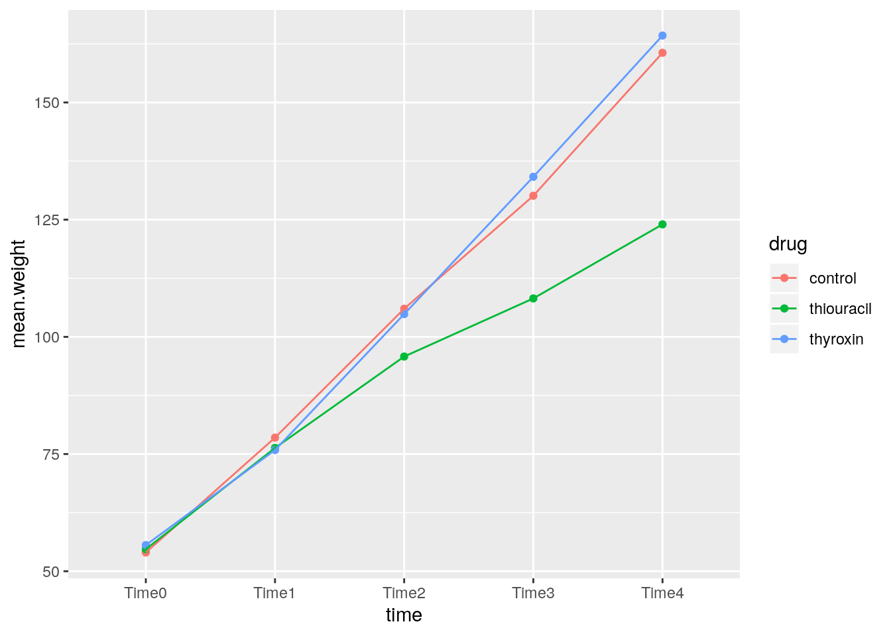
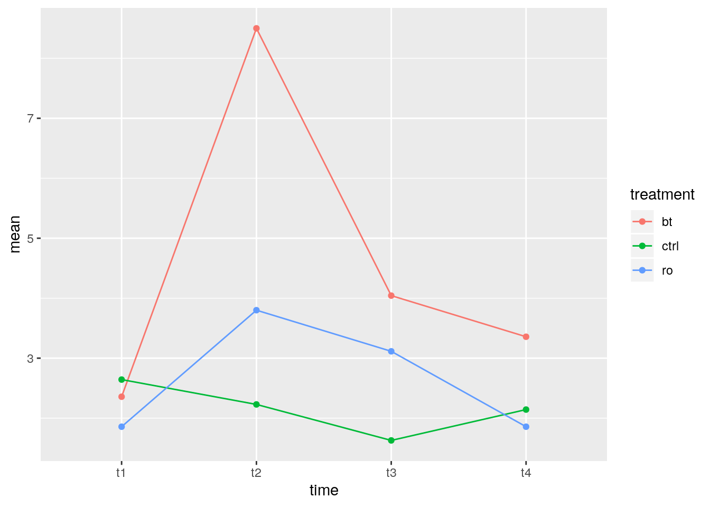
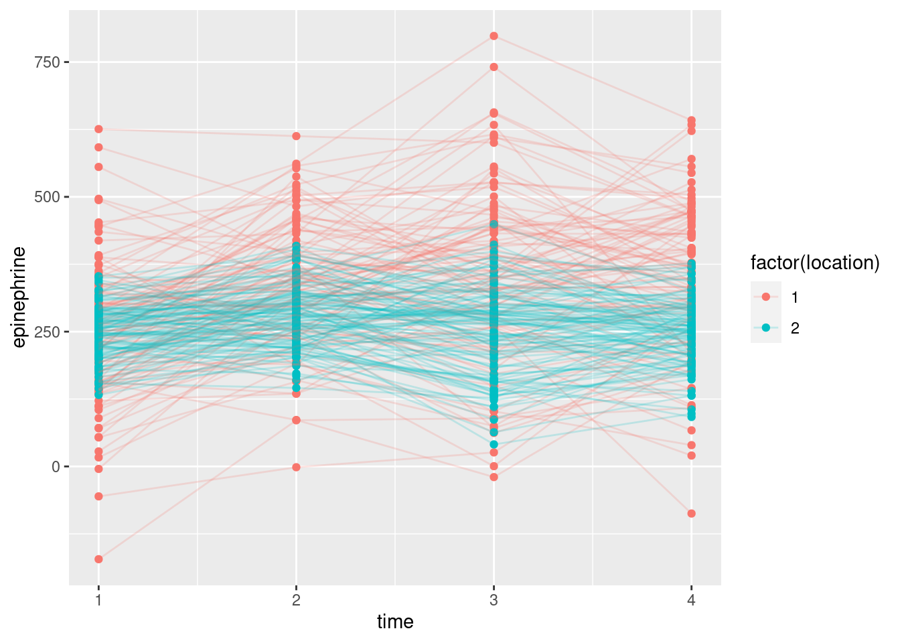
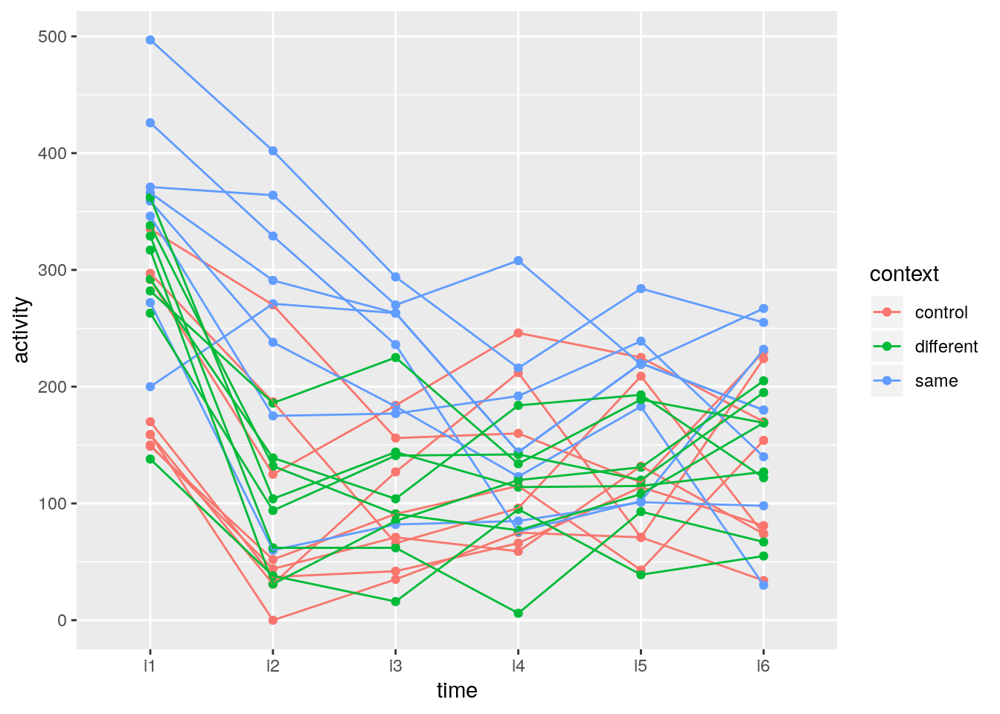

# Repeated measures

Packages for this chapter:


```r
library(car)
library(lme4)
library(tidyverse)
```


```
## Warning: `env_bind_fns()` is deprecated as of rlang 0.3.0.
## Please use `env_bind_active()` instead.
## This warning is displayed once per session.
```


##  Effect of drug on rat weight


 Box (1950) gives data on the weights of three groups of
rats. One group was given thyroxin in their drinking water, one group
thiouracil, and the third group was a control. (This description comes
from Christensen (2001).)
<label for="tufte-mn-" class="margin-toggle">&#8853;</label><input type="checkbox" id="tufte-mn-" class="margin-toggle"><span class="marginnote">References: Box, George EP, Problems in the analysis of growth and wear curves, Biometrics vol. 6, 362-369, 1950; Christensen R, Advanced Linear Modeling, 2nd edition, Springer, 2001. Yes, that's the Box-Cox Box.</span>
Weights are measured in
grams at weekly intervals (over a 4-week period, so that each rat is
measured 5 times). The data are in
[link](http://www.utsc.utoronto.ca/~butler/d29/ratweight.csv) as a
`.csv` file.


(a) Read in the data and check that you have a column of
`drug` and five columns of rat weights at different times.
 
Solution


A `.csv` file, so `read_csv`. (I typed the data from
Christensen (2001) into a spreadsheet.)

```r
my_url <- "http://www.utsc.utoronto.ca/~butler/d29/ratweight.csv"
weights <- read_csv(my_url)
```

```
## Parsed with column specification:
## cols(
##   rat = col_double(),
##   drug = col_character(),
##   Time0 = col_double(),
##   Time1 = col_double(),
##   Time2 = col_double(),
##   Time3 = col_double(),
##   Time4 = col_double()
## )
```

```r
weights
```

```
## # A tibble: 27 x 7
##      rat drug       Time0 Time1 Time2 Time3 Time4
##    <dbl> <chr>      <dbl> <dbl> <dbl> <dbl> <dbl>
##  1     1 thyroxin      59    85   121   156   191
##  2     2 thyroxin      54    71    90   110   138
##  3     3 thyroxin      56    75   108   151   189
##  4     4 thyroxin      59    85   116   148   177
##  5     5 thyroxin      57    72    97   120   144
##  6     6 thyroxin      52    73    97   116   140
##  7     7 thyroxin      52    70   105   138   171
##  8     8 thiouracil    61    86   109   120   129
##  9     9 thiouracil    59    80   101   111   122
## 10    10 thiouracil    53    79   100   106   133
## # … with 17 more rows
```

   

There are 27 rats altogether, each measured five times (labelled time
0 through 4). 
 

(b) Why would it be *wrong* to use something like
`gather` to create one column of weights, and separate
columns of drug and time, and then to run a two-way ANOVA? Explain briefly.
 
Solution


Such a solution would assume that we have measurements on
*different* rats, one for each drug-time combination. But we
have sets of five measurements all on the *same* rat: that is
to say, we have repeated measures, and the proper analysis will
take that into account.
 

(c) Create a suitable response variable and fit a suitable
`lm` as the first step of the repeated-measures analysis.
 
Solution


The response variable is the same idea as for any MANOVA: just
glue the columns together:

```r
response <- with(weights, cbind(Time0, Time1, Time2, Time3, Time4))
weights.1 <- lm(response ~ drug, data = weights)
```

     

Now, we *don't* look at `weights.1`, but we *do* use
it as input to `Manova` in a moment.
 

(d) Load the package `car` and run a suitable
`Manova`. To do this, you will need to set up the right thing
for `idata` and `idesign`.
 
Solution


Something like this:

```r
times <- colnames(response)
times.df <- data.frame(times)
weights.2 <- Manova(weights.1, idata = times.df, idesign = ~times)
```

     

The thought process is that the columns of the response
(`Time.0` through `Time.4`) are all times. This is the
"within-subject design" part of it: within a rat, the different
response values are at different times. That's the only part of it
that is within subjects. The different drugs are a
"between-subjects" factor: each rat only gets one of the
drugs.
<label for="tufte-mn-" class="margin-toggle">&#8853;</label><input type="checkbox" id="tufte-mn-" class="margin-toggle"><span class="marginnote">Things would be a lot more complicated if each rat got a different drug at a different time! But the rats each got one drug *once*, at the beginning, and the issue was the effect of that drug on all the growth that followed.</span>
 

(e) Take a look at the output from the MANOVA. Is there a
significant interaction? What does its significance (or lack
thereof) mean?
 
Solution


```r
weights.2
```

```
## 
## Type II Repeated Measures MANOVA Tests: Pillai test statistic
##             Df test stat approx F num Df den Df    Pr(>F)    
## (Intercept)  1   0.99257   3204.1      1     24 < 2.2e-16 ***
## drug         2   0.39192      7.7      2     24 0.0025559 ** 
## times        1   0.98265    297.4      4     21 < 2.2e-16 ***
## drug:times   2   0.87791      4.3      8     44 0.0006931 ***
## ---
## Signif. codes:  0 '***' 0.001 '**' 0.01 '*' 0.05 '.' 0.1 ' ' 1
```

     

The interaction is definitely significant, with a P-value of
0.00069. This means that the effect of time on growth is different for
the different drugs: that is, the effect of drug is over the whole
time profile, not just something like 
"a rat on Thyroxin is on average 10 grams heavier than a control rat, over all times".

Since the interaction is significant, that's where we stop, as far as
interpretation is concerned.
 

(f) We are going to draw an interaction plot in a moment. To
set that up, use `gather` as in the lecture notes to create
one column of weights and a second column of times. (You don't
need to do the `separate` thing that I did in class, though
if you want to try it, go ahead.)
 
Solution


```r
weights.long <- weights %>%
  gather(time, weight, Time0:Time4)
weights.long
```

```
## # A tibble: 135 x 4
##      rat drug       time  weight
##    <dbl> <chr>      <chr>  <dbl>
##  1     1 thyroxin   Time0     59
##  2     2 thyroxin   Time0     54
##  3     3 thyroxin   Time0     56
##  4     4 thyroxin   Time0     59
##  5     5 thyroxin   Time0     57
##  6     6 thyroxin   Time0     52
##  7     7 thyroxin   Time0     52
##  8     8 thiouracil Time0     61
##  9     9 thiouracil Time0     59
## 10    10 thiouracil Time0     53
## # … with 125 more rows
```

     

My data frame was called `weights`, so I was OK with having a
variable called `weight`. Watch out for that if you call the
data frame `weight`, though.

If you want to try the `separate` thing, that goes something
like this:


```r
weights %>%
  gather(timex, weight, Time0:Time4) %>%
  separate(timex, into = c("junk", "time"), sep = 4) -> weights2.long
weights2.long %>% sample_n(20)
```

```
## # A tibble: 20 x 5
##      rat drug       junk  time  weight
##    <dbl> <chr>      <chr> <chr>  <dbl>
##  1     7 thyroxin   Time  1         70
##  2     9 thiouracil Time  0         59
##  3    12 thiouracil Time  0         51
##  4    17 thiouracil Time  3        104
##  5    19 control    Time  4        177
##  6     2 thyroxin   Time  1         71
##  7    10 thiouracil Time  2        100
##  8    23 control    Time  1         70
##  9    24 control    Time  4        141
## 10    26 control    Time  1         67
## 11    16 thiouracil Time  2         78
## 12    25 control    Time  0         63
## 13     1 thyroxin   Time  2        121
## 14    20 control    Time  1         77
## 15     3 thyroxin   Time  3        151
## 16     7 thyroxin   Time  2        105
## 17    15 thiouracil Time  2         93
## 18    10 thiouracil Time  3        106
## 19    18 control    Time  3        139
## 20     4 thyroxin   Time  3        148
```

 

Separate after the fourth character (`sep=4`), which will put
`Time` into `junk` and the actual time into
`time`. I could also have organized the data file so that the
word `Time` and the number were separated by some character,
like an underscore, and you could have separated at that.
Since the piece of the time we want is the number,
`parse_number` (from `readr`, part of the
`tidyverse`) should also work:


```r
weights2.long <- weights %>%
  gather(timex, weight, Time0:Time4) %>%
  mutate(time = parse_number(timex))
weights2.long %>% sample_n(20)
```

```
## # A tibble: 20 x 5
##      rat drug       timex weight  time
##    <dbl> <chr>      <chr>  <dbl> <dbl>
##  1    24 control    Time0     51     0
##  2    27 control    Time4    169     4
##  3     3 thyroxin   Time4    189     4
##  4     1 thyroxin   Time1     85     1
##  5     1 thyroxin   Time0     59     0
##  6    26 control    Time1     67     1
##  7    11 thiouracil Time3    111     3
##  8    14 thiouracil Time4    108     4
##  9     6 thyroxin   Time2     97     2
## 10     6 thyroxin   Time4    140     4
## 11    27 control    Time0     57     0
## 12    19 control    Time3    146     3
## 13    17 thiouracil Time1     72     1
## 14    16 thiouracil Time1     61     1
## 15     4 thyroxin   Time2    116     2
## 16    17 thiouracil Time3    104     3
## 17     6 thyroxin   Time1     73     1
## 18    21 control    Time4    164     4
## 19    19 control    Time1     93     1
## 20    24 control    Time1     71     1
```

 

I decided to show you a random collection of rows, so that you can see
that `parse_number` worked for various different times. 
 

(g) Obtain an interaction plot. Putting `time` as the
`x` will put time along the horizontal axis, which is the
way we're used to seeing such things. Begin by calculating the mean
`weight` for each `time`-`drug` combination.
 
Solution


`group_by`, `summarize` and `ggplot`, the
latter using the data frame that came out of the
`summarize`. The second factor `drug` goes as the
`colour` and `group` both, since `time` has
grabbed the `x` spot:

```r
weights.long %>%
  group_by(time, drug) %>%
  summarize(mean.weight = mean(weight)) %>%
  ggplot(aes(x = time, y = mean.weight, colour = drug, group = drug)) +
  geom_point() + geom_line()
```



       
 

(h) How does this plot show why the interaction was
significant? Explain briefly.
 
Solution


At the beginning, all the rats have the same average growth, but
from time 2 (or maybe even 1) or so, the rats on thiouracil
grew more slowly. The idea is not just that thiouracil has a
*constant* effect over all times, but that the *pattern*
of growth is different for the different drugs: whether or not
thiouracil inhibits growth, and, if so, by how much, depends on
what time point you are looking at.

Rats on thyroxin or the control drug grew at pretty much the same
rate over all times, so I wouldn't concern myself with any
differences there.

What I thought would be interesting is to plot the growth curves for
*all* the rats individually, colour-coded by which drug the rat
was on. This is the repeated-measures version of the ANOVA interaction
plot with the data on it. (We don't use the lines for the means, here,
instead using them for joining the measurements belonging to the same
subject.)

Unfortunately, there's a bit of data awkwardness, because we need
to know which rat is which when we plot them. To do that, we need
to go all the way back to `weights` and introduce a
subject-number variable. This suggests a chain of
things. There are 27 rats altogether. First we take the original
data frame `weights` with each row being one rat, and we
add a variable `subject` which is 1 through 27. Then we
gather together the columns `Time0` through
`Time4` that are different `time`s but all
`weight`s, like we did before. Optionally, we can also
`separate` `Time.x` into the `Time` part and
the `x` part (`x` being 0, 1, 2, 3, 4), but I won't
do that here. Then we save the result into a new data frame
`wt`, and take a look at the first few lines:


```r
wt <- weights %>%
  mutate(subject = row_number()) %>%
  gather(time, weight, Time0:Time4)
wt
```

```
## # A tibble: 135 x 5
##      rat drug       subject time  weight
##    <dbl> <chr>        <int> <chr>  <dbl>
##  1     1 thyroxin         1 Time0     59
##  2     2 thyroxin         2 Time0     54
##  3     3 thyroxin         3 Time0     56
##  4     4 thyroxin         4 Time0     59
##  5     5 thyroxin         5 Time0     57
##  6     6 thyroxin         6 Time0     52
##  7     7 thyroxin         7 Time0     52
##  8     8 thiouracil       8 Time0     61
##  9     9 thiouracil       9 Time0     59
## 10    10 thiouracil      10 Time0     53
## # … with 125 more rows
```

  
Each rat is identified by `subject`, which repeats 5 times,
once for each value of `time`:


```r
wt %>% count(rat)
```

```
## # A tibble: 27 x 2
##      rat     n
##    <dbl> <int>
##  1     1     5
##  2     2     5
##  3     3     5
##  4     4     5
##  5     5     5
##  6     6     5
##  7     7     5
##  8     8     5
##  9     9     5
## 10    10     5
## # … with 17 more rows
```

 

After going through that, the logic of the actual plotting part is
pretty straightforward. In the data frame `wt`, we plot
`time` ($x$) against `weight` ($y$), grouping the points
according to subject and colouring them according to
`drug`. 

```r
library(ggplot2)
```

```
## Warning: `quo_expr()` is deprecated as of rlang 0.2.0.
## Please use `quo_squash()` instead.
## This warning is displayed once per session.
```

```r
ggplot(wt, aes(time, weight, group = subject, colour = drug)) + geom_line()
```


 

This is often called, rather aptly, a "spaghetti plot".

I like this plot because, unlike the interaction plot, which shows
only means, this gives a sense of variability as well. The blue and
red lines (thyroxin and control) are all intermingled and they go
straight up. So there is nothing to choose between these. The green
lines, though, start off mixed up with the red and blue ones but
finish up at the bottom: the *pattern* of growth of the
thiouracil rats is different from the others, which is why we had a
significant interaction between drug and time.

`drug` is categorical, so `ggplot`
uses a set of distinguishable colours to mark the levels. If our
colour had been a numerical variable, `ggplot` would have used
a range of colours like light blue to dark blue, with lighter being
higher, for example.

What, you want to see that? All right. This one is kind of silly, but
you see the point:


```r
ggplot(wt, aes(time, weight, group = subject, colour = weight)) + geom_line()
```


 

The line segments get lighter as you go up the page.

Since we went to the trouble of making the "long" data frame
`wt`, we can also run a repeated measures analysis using the
mixed-model idea (described more fully in the problem of the children
near the new airport):


```r
wt.1 <- lmer(weight ~ drug * time + (1 | subject), data = wt)
drop1(wt.1, test = "Chisq")
```

```
## Single term deletions
## 
## Model:
## weight ~ drug * time + (1 | subject)
##           Df    AIC   LRT   Pr(Chi)    
## <none>        990.5                    
## drug:time  8 1067.8 93.27 < 2.2e-16 ***
## ---
## Signif. codes:  0 '***' 0.001 '**' 0.01 '*' 0.05 '.' 0.1 ' ' 1
```

 

The drug-by-time interaction is even more strongly significant than in
the profile analysis. (The output from `drop1` reminds us that
the only thing we should be thinking about now is that interaction.)
 


##  Social interaction among old people


 A graduate student wrote a thesis comparing different
treatments for increasing social interaction among geriatric
patients. He recruited 21 patients at a state mental hospital and
randomly assigned them to treatments: Reality Orientation
(`ro`), Behavior Therapy (`bt`) or no treatment
(`ctrl`). Each subject was observed at four times, labelled
`t1` through `t4` in the data file
[link](http://www.utsc.utoronto.ca/~butler/d29/geriatrics.txt). The
response variable was the percentage of time that the subject was
"engaging in the relevant social interaction", so that a higher
value is better.

The principal aim of the study was to see whether there were
differences among the treatments (one would hope that the real
treatments were better than the control one), and whether there were
any patterns over time.


(a) Read in the data and display at least some of it.


Solution


The usual, separated by a single space:


```r
my_url <- "http://www.utsc.utoronto.ca/~butler/d29/geriatrics.txt"
geriatrics <- read_delim(my_url, " ")
```

```
## Parsed with column specification:
## cols(
##   subject = col_double(),
##   treatment = col_character(),
##   t1 = col_double(),
##   t2 = col_double(),
##   t3 = col_double(),
##   t4 = col_double()
## )
```

```r
geriatrics
```

```
## # A tibble: 21 x 6
##    subject treatment    t1    t2    t3    t4
##      <dbl> <chr>     <dbl> <dbl> <dbl> <dbl>
##  1       1 bt          1.5   9     5     4  
##  2       2 bt          5    14     4.5   7  
##  3       3 bt          1     8     4.5   2.5
##  4       4 bt          5    14     8     5  
##  5       5 bt          3     8     4     4  
##  6       6 bt          0.5   3.5   1.3   1  
##  7       7 bt          0.5   3     1     0  
##  8       8 ro          2     5     5     1.5
##  9       9 ro          1.5   1.9   1.5   1  
## 10      10 ro          3.5   7     8     4  
## # … with 11 more rows
```

 

Correctly 21 observations measured at 4 different times. We also have
subject numbers, which might be useful later.


(b) Create a response variable and fit a suitable `lm`
as the first stage of the repeated-measures analysis.


Solution


This:

```r
response <- with(geriatrics, cbind(t1, t2, t3, t4))
geriatrics.1 <- lm(response ~ treatment, data = geriatrics)
```

     

There is no need to look at this, since we are going to feed it into
`Manova` in a moment, but in case you're curious, you see (in `summary`) a
regression of each of the four columns in `response` on
`treatment`, one by one. 
    


(c) Run a suitable `Manova`. There is some setup
first. Make sure you do that.


Solution


Make sure `car` is loaded, and do the `idata` and
`idesign` thing:

```r
times <- colnames(response)
times.df <- data.frame(times)
geriatrics.2 <- Manova(geriatrics.1, idata = times.df, idesign = ~times)
```

     

In case you're curious, `response` is an R `matrix`:


```r
class(response)
```

```
## [1] "matrix"
```

 

and
not a data frame (because it was created by `cbind` which makes
a matrix out of vectors). So, to pull the names off the top, we really
do need `colnames` (applied to a matrix) rather than just
`names` (which applies to a data frame). 
    


(d) Display the results of your repeated-measures
analysis. What do you conclude? Explain briefly.


Solution


Just "printing" it will get you what you want:

```r
geriatrics.2
```

```
## 
## Type II Repeated Measures MANOVA Tests: Pillai test statistic
##                 Df test stat approx F num Df den Df    Pr(>F)    
## (Intercept)      1   0.74589   52.836      1     18 9.332e-07 ***
## treatment        2   0.24366    2.899      2     18  0.080994 .  
## times            1   0.72143   13.812      3     16  0.000105 ***
## treatment:times  2   0.92581    4.884      6     34  0.001073 ** 
## ---
## Signif. codes:  0 '***' 0.001 '**' 0.01 '*' 0.05 '.' 0.1 ' ' 1
```

     

The interaction is significant, so the effects of the treatments are
different at different times. (It makes most sense to say it this way
around, since treatment is something that was controlled and time was not.)

You, I hope, know better than to look at the main effects when there
is a significant interaction!
    


(e) To understand the results that you got from the repeated
measures analysis, you are going to draw a picture (or two). To do
*that*, we are going to need the data in "long" format with
one response value per line (instead of four). Use `gather`
suitably to get the data in that format, and demonstrate that you
have done so.


Solution


The usual layout for `gather`:

```r
geriatrics.long <- geriatrics %>%
  gather(time, intpct, t1:t4)
geriatrics.long
```

```
## # A tibble: 84 x 4
##    subject treatment time  intpct
##      <dbl> <chr>     <chr>  <dbl>
##  1       1 bt        t1       1.5
##  2       2 bt        t1       5  
##  3       3 bt        t1       1  
##  4       4 bt        t1       5  
##  5       5 bt        t1       3  
##  6       6 bt        t1       0.5
##  7       7 bt        t1       0.5
##  8       8 ro        t1       2  
##  9       9 ro        t1       1.5
## 10      10 ro        t1       3.5
## # … with 74 more rows
```

     

I had to think a bit about "what makes the gathered columns the same". 
They are all percentages of interactions of a specific type,
so you could as well (or better) call them "percent". 

Anyway, I have *one* column of interaction percents, and
*one* column of times. If you check the whole thing, you'll see
that you get all the time-1 measurements first, then all the time-2
measurements, and so on, so that the subject number loops through the
21 subjects four times.

The long data frame is, well, long.

It's not necessary to pull out the numeric time values, though you
could if you wanted to, via `separate` or by using
`parse_number`.
    


(f) Calculate and save the mean interaction percents for each
time-treatment combination.


Solution


`group_by` followed by `summarize`, as ever:

```r
geriatrics.long %>%
  group_by(treatment, time) %>%
  summarize(mean = mean(intpct)) -> means
means
```

```
## # A tibble: 12 x 3
## # Groups:   treatment [3]
##    treatment time   mean
##    <chr>     <chr> <dbl>
##  1 bt        t1     2.36
##  2 bt        t2     8.5 
##  3 bt        t3     4.04
##  4 bt        t4     3.36
##  5 ctrl      t1     2.64
##  6 ctrl      t2     2.23
##  7 ctrl      t3     1.63
##  8 ctrl      t4     2.14
##  9 ro        t1     1.86
## 10 ro        t2     3.8 
## 11 ro        t3     3.11
## 12 ro        t4     1.86
```

       


(g) Make an interaction plot. Arrange things so that time goes
across the page. Use your data frame of means that you just calculated.


Solution


Once you have the means, this is not too bad:


```r
ggplot(means, aes(x = time, y = mean, group = treatment, colour = treatment)) +
  geom_point() + geom_line()
```



 

The "second factor" `treatment` appears as both
`group` and `colour`.
    


(h) Describe what you see on your interaction plot, and what it
says about why your repeated-measures analysis came out as it did.


Solution


The two "real" treatments `bt` and `ro` both go up
sharply between time 1 and time 2, and then come back down so that
by time 4 they are about where they started. The control group
basically didn't change at all, and if anything went *down*
between times 1 and 2, a completely different pattern to the others.
The two treatments `bt` and `ro` are not exactly
parallel, but they do at least  have qualitatively the same
pattern.
<label for="tufte-mn-" class="margin-toggle">&#8853;</label><input type="checkbox" id="tufte-mn-" class="margin-toggle"><span class="marginnote">That is to say, it's the same kind of shape.</span> It
is, I think, the fact that the control group has a
*completely* different pattern over time that makes the
interaction come out significant.
<label for="tufte-mn-" class="margin-toggle">&#8853;</label><input type="checkbox" id="tufte-mn-" class="margin-toggle"><span class="marginnote">I am kind of wrong about    that, as we see.</span>
I'm going to explore that some more later, but first I want to get
you to draw a spaghetti plot.
    


(i) Draw a spaghetti plot of these data. That is, use
`ggplot` to plot the interaction percent against time for
each subject,
joining the points for the *same subject* by lines whose colour
shows what treatment they were on. Use the "long" data frame for
this (not the data frame of means).


Solution


This is almost easier to do than it is to ask you to do:


```r
ggplot(geriatrics.long, aes(x = time, y = intpct, colour = treatment, group = subject)) +
  geom_line()
```


   

The basic difficulty here is to get all the parts. We need both a
`colour` and a `group`; the latter controls the joining
of points by lines (if you have both). Fortunately we already had
subject numbers in the original data; if we had not had them, we would
have had to create them. `dplyr` has a function
`row_number` that we could have used for that; we'd apply the row
numbers to the original wide data frame, before we made it long, so
that the correct subject numbers would get carried along.

Whether you add a `geom_point()` to plot the data points, or not,
is up to you. Logically, it makes sense to include the actual data,
but aesthetically, it looks more like spaghetti if you leave the
points out. Either way is good, as far as I'm concerned.

I didn't ask you to comment on the spaghetti plot, because the story
is much  the same as the interaction plot. There is a lot of
variability, but the story within each group is basically what we
already said: the red lines go sharply up and almost as sharply back
down again, the blue lines do something similar, only not as sharply
up and down, and the green lines do basically nothing.

I said that the control subjects' time pattern was noticeably
different from the others. Which made me think: what if we remove the
control subjects? Would there still be an interaction?
<label for="tufte-mn-" class="margin-toggle">&#8853;</label><input type="checkbox" id="tufte-mn-" class="margin-toggle"><span class="marginnote">This is rather like removing time zero in the example in class.</span>

All right, we need to start with the original wide data frame, and
from *that* select everything but `ctrl`:


```r
gg <- geriatrics %>% filter(treatment != "ctrl")
gg
```

```
## # A tibble: 14 x 6
##    subject treatment    t1    t2    t3    t4
##      <dbl> <chr>     <dbl> <dbl> <dbl> <dbl>
##  1       1 bt          1.5   9     5     4  
##  2       2 bt          5    14     4.5   7  
##  3       3 bt          1     8     4.5   2.5
##  4       4 bt          5    14     8     5  
##  5       5 bt          3     8     4     4  
##  6       6 bt          0.5   3.5   1.3   1  
##  7       7 bt          0.5   3     1     0  
##  8       8 ro          2     5     5     1.5
##  9       9 ro          1.5   1.9   1.5   1  
## 10      10 ro          3.5   7     8     4  
## 11      11 ro          1.5   4.2   2     1.5
## 12      12 ro          1.5   3.6   2     1  
## 13      13 ro          1.5   2.5   2.8   4  
## 14      14 ro          1.5   2.4   0.5   0
```

 

So now there are two treatments left, seven people on
each:
<label for="tufte-mn-" class="margin-toggle">&#8853;</label><input type="checkbox" id="tufte-mn-" class="margin-toggle"><span class="marginnote">The factor *treatment* still has three levels,  but only two of them have any remaining data.</span> 


```r
gg %>% count(treatment)
```

```
## # A tibble: 2 x 2
##   treatment     n
##   <chr>     <int>
## 1 bt            7
## 2 ro            7
```

 

Then we do
the same stuff over again: construct the response, run the
`lm`, create the stuff for `idata` and `idesign`,
and run the `Manova`. There's really nothing new here:


```r
attach(gg)
response <- cbind(t1, t2, t3, t4)
gg.1 <- lm(response ~ treatment)
times <- colnames(response)
times.df <- data.frame(times)
gg.2 <- Manova(gg.1, idata = times.df, idesign = ~times)
gg.2
```

```
## 
## Type II Repeated Measures MANOVA Tests: Pillai test statistic
##                 Df test stat approx F num Df den Df    Pr(>F)    
## (Intercept)      1   0.76503   39.069      1     12 4.251e-05 ***
## treatment        1   0.18506    2.725      1     12 0.1247005    
## times            1   0.81730   14.912      3     10 0.0005073 ***
## treatment:times  1   0.58168    4.635      3     10 0.0279590 *  
## ---
## Signif. codes:  0 '***' 0.001 '**' 0.01 '*' 0.05 '.' 0.1 ' ' 1
```

```r
detach(gg)
```

 

There is still an interaction, but it's not as significant as it was
before. I think it is still significant because the shape of the two
time trends is not the same: the red `bt` group goes up further
and down further. I was musing that the higher values are also more
variable, which would suggest a transformation, but I haven't explored that.
If the interaction had turned out to be nonsignificant this way? You
might think about trying to remove it from the model, except that in
this kind of model, `treatment` is a "between-subjects factor" 
and `times` is a "within-subjects factor", so they
are different kinds of things. What you do in that case is to ignore
the non-significant interaction and interpret the main effects: there
is no way to "gain df for error" like we did in two-way
ANOVA. Supposing, in this case, that we were using $\alpha=0.01$, we
would say that the interaction is not significant. Then we look at the
main effects: there is no effect of treatment, but there is an effect
of time. Or, to put it another way, once you allow for an effect of
time, there is no difference between the two remaining
treatments.
<label for="tufte-mn-" class="margin-toggle">&#8853;</label><input type="checkbox" id="tufte-mn-" class="margin-toggle"><span class="marginnote">There is often an effect of time, which is why you would be taking multiple time measurements, but the issue is when you take that into account, you are giving yourself an improved chance, in general, to find a treatment effect. This is exactly the same idea as using a matched pairs design to give yourself an improved chance of finding a treatment effect, even though the subjects might be quite different from each other. In fact, repeated measures *is* matched pairs with more than two measurements on each person. Which makes me think, I should have you do a matched pairs as repeated measures.</span>

Thinking back to our spaghetti plot, we are now comparing the red and
blue treatments. They both go up at time 2 and down afterwards, which
is the time effect, but even once you allow for this time trend, there is
too much scatter to be able to infer a difference between the treatments.

Extra (maybe branch off into another question?) I was thinking that this is not terribly clear, so I thought I would
fake up some data where there is a treatment effect and a time effect
(but no interaction), and draw a spaghetti plot, so you can see the
difference, idealized somewhat of course. Let's try to come up with
something with the same kind of time effect, up at time 2 and then
down afterwards, that is the same for two drugs A and B. Here's what I
came up with:


```r
fake <- read.csv("fake.csv", header = T)
fake
```

```
##    subject drug t1 t2 t3 t4
## 1        1    a 10 15 13 11
## 2        2    a 11 14 12  9
## 3        3    a 12 16 13 11
## 4        4    a 10 14 11 11
## 5        5    a 11 13 10  9
## 6        6    b  7 10  8  6
## 7        7    b  8 12 11  9
## 8        8    b  5  9  7  5
## 9        9    b  7  8  6  5
## 10      10    b  8 12 11  9
```

 

You can kind of get the idea that the pattern over time is up and then
down, so that it finishes about where it starts, but the numbers for
drug A are usually bigger than the  ones for drug B, consistently over
time. So there ought not to be an interaction, but there ought to be
both a time effect and a drug effect.

Let's see whether we can demonstrate that. First, a spaghetti plot,
which involves getting the data in long format first. I'm saving the
long format to use again later.


```r
fake %>% gather(times, score, t1:t4) -> fake.long
fake.long %>%
  ggplot(aes(x = times, y = score, colour = drug, group = subject)) +
  geom_point() + geom_line()
```


 

The reds are consistently higher than the blues (drug effect), the
pattern over time goes up and then down (time effect), but the time
effect is basically the same for both drugs (no interaction).

I got the plot wrong the first time, because I forgot whether I was
doing an interaction plot (where `group=` and `colour=`
are the same) or a spaghetti plot (where `group` has to be
`subject` and the colour represents the treatment, usually). 

Let's do the repeated-measures ANOVA and see whether my guess above is right:


```r
response <- with(fake, cbind(t1, t2, t3, t4))
fake.1 <- lm(response ~ drug, data = fake)
times <- colnames(response)
times.df <- data.frame(times)
fake.2 <- Manova(fake.1, idata = times.df, idesign = ~times)
```

 

After typing this kind of stuff out a few too many times, I hope
you're getting the idea "function". Also, the construction of the
response is kind of annoying, where you have to list all the time
columns. The trouble is, `response` has to be a `matrix`,
which it is:


```r
class(response)
```

```
## [1] "matrix"
```

 

but if you do the obvious thing of selecting the columns of the data
frame that you want:


```r
fake %>% select(t1:t4) -> r
class(r)
```

```
## [1] "data.frame"
```

 

you get a data frame instead. I think this would work:


```r
r <- fake %>% select(t1:t4) %>% as.matrix()
class(r)
```

```
## [1] "matrix"
```

 

The idea is that you select the columns you want as a data frame first
(with `select`), and then turn it into a `matrix` at the
end. 

This is the kind of thing you'd have to do in a function, I think,
since you'd have to have some way of telling the function which are
the "time" columns. Anyway, hope you haven't forgotten what we were
doing:
<label for="tufte-mn-" class="margin-toggle">&#8853;</label><input type="checkbox" id="tufte-mn-" class="margin-toggle"><span class="marginnote">I got sidetracked, surprise surprise.</span>


```r
fake.2
```

```
## 
## Type II Repeated Measures MANOVA Tests: Pillai test statistic
##             Df test stat approx F num Df den Df    Pr(>F)    
## (Intercept)  1   0.98478   517.73      1      8 1.475e-08 ***
## drug         1   0.68417    17.33      1      8  0.003152 ** 
## times        1   0.98778   161.71      3      6 3.970e-06 ***
## drug:times   1   0.64900     3.70      3      6  0.081108 .  
## ---
## Signif. codes:  0 '***' 0.001 '**' 0.01 '*' 0.05 '.' 0.1 ' ' 1
```

 

The drug-by-time interaction is not (quite) significant, so working at
$\alpha=0.05$ (since that will help me make my point), we go ahead and
interpret the main effects: there is a time effect (the increase at
time 2 that I put in on purpose), and, allowing for the time effect,
there is also a difference between the drugs (because the drug A
scores are a bit higher than the drug B scores).

What if we ignored the time effect? You'd think we could do something
like this, treating the measurements at different times as replicates:


```r
head(fake.long)
```

```
##   subject drug times score
## 1       1    a    t1    10
## 2       2    a    t1    11
## 3       3    a    t1    12
## 4       4    a    t1    10
## 5       5    a    t1    11
## 6       6    b    t1     7
```

```r
fake.3 <- aov(score ~ drug, data = fake.long)
summary(fake.3)
```

```
##             Df Sum Sq Mean Sq F value   Pr(>F)    
## drug         1  133.2  133.23   30.54 2.54e-06 ***
## Residuals   38  165.8    4.36                     
## ---
## Signif. codes:  0 '***' 0.001 '**' 0.01 '*' 0.05 '.' 0.1 ' ' 1
```

 

but this would be *wrong*, because we are acting as if we have 40
independent observations, which we don't (this is the point of doing
repeated measures in the first place). It looks as if we have achieved
something by getting a lower P-value for `drug`, but we
haven't really, because we have done so by cheating.

What we could do instead is to average the scores for each subject
over all the times,
<label for="tufte-mn-" class="margin-toggle">&#8853;</label><input type="checkbox" id="tufte-mn-" class="margin-toggle"><span class="marginnote">This would be allowable, since we are  averaging *over* the time-dependence; we are creating 10  independent averages, from the 10 subjects. People do this kind of  thing, instead of having to deal with the repeated measures.</span> for
which we go back to the original data frame:


```r
fake
```

```
##    subject drug t1 t2 t3 t4
## 1        1    a 10 15 13 11
## 2        2    a 11 14 12  9
## 3        3    a 12 16 13 11
## 4        4    a 10 14 11 11
## 5        5    a 11 13 10  9
## 6        6    b  7 10  8  6
## 7        7    b  8 12 11  9
## 8        8    b  5  9  7  5
## 9        9    b  7  8  6  5
## 10      10    b  8 12 11  9
```

```r
fake %>%
  mutate(avg.score = (t1 + t2 + t3 + t4) / 4) %>%
  aov(avg.score ~ drug, data = .) %>%
  summary()
```

```
##             Df Sum Sq Mean Sq F value  Pr(>F)   
## drug         1  33.31   33.31   17.33 0.00315 **
## Residuals    8  15.37    1.92                   
## ---
## Signif. codes:  0 '***' 0.001 '**' 0.01 '*' 0.05 '.' 0.1 ' ' 1
```

 

Ah, now, this is very interesting. I was hoping that by throwing away
the time information (which is useful), we would have diminished
the significance of the drug effect. By failing to include the
time-dependence in our model, we ought to have introduced some extra
variability, which ought to weaken our test. But this test gives
*exactly the same* P-value as the one in the MANOVA, and it looks
like exactly the same test (the $F$-value is the same too). So it
looks as if this is what the MANOVA is doing, to assess the
`drug` effect: it's averaging over the times. Since the same
four (here) time points are being used to compute the average for each
subject, we are comparing like with like at least, and even if there
is a large time effect, I suppose it's going to have the same effect
on each average. For example, if as here the scores at time 2 are
typically highest, all the averages are going to be composed of one
high score and three lower ones. So maybe I have to go back and dilute
my conclusions about the significance of treatments earlier: it's actually
saying that there is a difference between the two remaining treatments
*averaged over time* rather than *allowing for time* as I
said earlier.
    


##  Children's stress levels and airports


 If you did STAC32, you might remember this question, which
we can now do properly. Some of this question is a repeat from there.

The data in [link](http://www.utsc.utoronto.ca/~butler/c32/airport.txt)
are based on a 1998 study of stress levels in children as a result of
the building of a new airport in Munich, Germany. A total of 200
children had their epinephrine levels (a stress indicator) measured at
each of four different times: before the airport was built, and 6, 18
and 36 months after it was built. The four measurements are labelled
`epi_1` through `epi_4`.  Out of the children, 100
were living near the new airport (location 1 in the data set), and
could be expected to suffer stress because of the new airport. The
other 100 children lived in the same city, but outside the noise
impact zone. These children thus serve as a control group. The
children are identified with numbers 1 through 200.


(a) If we were testing for the effect of time, explain briefly
what it is about the structure of the data that would make an
analysis of variance *inappropriate*.


Solution


It is the fact that each child was measured four times, rather
than each measurement being on a *different* child (with
thus $4\times 200=800$ observations altogether). It's
the same distinction as between matched pairs and a two-sample
$t$ test.


(b) Read the data into R and demonstrate that you have the right
number of observations and variables.


Solution


The usual, data values separated by one space:


```r
my_url <- "http://www.utsc.utoronto.ca/~butler/c32/airport.txt"
airport <- read_delim(my_url, " ")
```

```
## Parsed with column specification:
## cols(
##   epi_1 = col_double(),
##   epi_2 = col_double(),
##   epi_3 = col_double(),
##   epi_4 = col_double(),
##   location = col_double(),
##   child = col_double()
## )
```

```r
airport
```

```
## # A tibble: 200 x 6
##     epi_1  epi_2 epi_3 epi_4 location child
##     <dbl>  <dbl> <dbl> <dbl>    <dbl> <dbl>
##  1  89.6  253.   214.   209.        1     1
##  2 -55.5   -1.45  26.0  259.        1     2
##  3 201.   280.   265.   174.        1     3
##  4 448.   349.   386.   225.        1     4
##  5  -4.60 315.   331.   333.        1     5
##  6 231.   237.   488.   319.        1     6
##  7 227.   469.   382.   359.        1     7
##  8 336.   280.   362.   472.        1     8
##  9  16.8  190.    90.9  145.        1     9
## 10  54.5  359.   454.   199.        1    10
## # … with 190 more rows
```

 

There are 200 rows (children), with four `epi` measurements, a
location and a child identifier, so that looks good.

(I am mildly concerned about the negative `epi` measurements,
but I don't know what the scale is, so presumably they are all
right. Possibly epinephrine is measured on a log scale, so that a
negative value here is less than 1 on the original scale that we don't
see.)


(c) Create and save a "long" data frame with all the epinephrine
values gathered together into one column.


Solution


```r
airport.long <- airport %>% gather(when, epinephrine, epi_1:epi_4)
airport.long
```

```
## # A tibble: 800 x 4
##    location child when  epinephrine
##       <dbl> <dbl> <chr>       <dbl>
##  1        1     1 epi_1       89.6 
##  2        1     2 epi_1      -55.5 
##  3        1     3 epi_1      201.  
##  4        1     4 epi_1      448.  
##  5        1     5 epi_1       -4.60
##  6        1     6 epi_1      231.  
##  7        1     7 epi_1      227.  
##  8        1     8 epi_1      336.  
##  9        1     9 epi_1       16.8 
## 10        1    10 epi_1       54.5 
## # … with 790 more rows
```

 

Success. I'm saving the name `time` for later, so I've called
the time points `when` for now. There were 4 measurements on
each of 200 children, so the long data frame should (and does) have
$200\times 4 = 800$ rows.


(d) Make a "spaghetti plot" of these data: that is, a plot of
epinephrine levels against time, with the locations identified by
colour, and the points for the same child joined by lines.  To do
this: (i) from the long data frame, create a new column containing
only the numeric values of time (1 through 4), (ii) plot epinephrine
level against time with the points grouped by child and coloured by
location (which you may have to turn from a number into a factor.)


Solution


I hope you are thinking "pipeline":

```r
airport.long %>%
  mutate(time = parse_number(when)) %>%
  ggplot(aes(x = time, y = epinephrine, colour = factor(location), group = child)) +
  geom_point() + geom_line()
```


         

This is different from the plot we had in C32, where I had you use a
different colour for each *child*, and we ended up with a huge
legend of all the children (which we then removed). 

If you forget to turn `location` into a factor, `ggplot`
will assume that you want `location` to be on a continuous
scale, and you'll get two shades of blue. 

Another problem with this plot is that there are so many children, you
can't see the ones underneath because the ones on top are overwriting
them. The solution to that is to make the lines (partly) transparent,
which is controlled by a parameter `alpha`:
<label for="tufte-mn-" class="margin-toggle">&#8853;</label><input type="checkbox" id="tufte-mn-" class="margin-toggle"><span class="marginnote">This is  different from the 0.05 *alpha*.</span>

```r
airport.long %>%
  mutate(time = parse_number(when)) %>%
  ggplot(aes(x = time, y = epinephrine, colour = factor(location), group = child)) +
  geom_point() + geom_line(alpha = 0.2)
```



   
It seems to make the lines skinnier, so they look more like
threads. Even given the lesser thickness, they seem to be a little bit
see-through as well. You can experiment with adding transparency to
the points in addition. 


(e) What do you see on your spaghetti plot? We are looking ahead
to possible effects of time, location and their interaction.


Solution


This is not clear, so it's very much your call.
I see the red spaghetti strands as going up further
(especially) and maybe down further than the blue ones. The
epinephrine levels of the children near the new airport are
definitely more spread out, and maybe have a higher mean, than
those of the control group of children not near the airport.
The red spaghetti strands show something of an increase over
time, at least up to time 3, after which they seem to drop
again. The blue strands, however, don't show any kind of trend
over time. Since the time trend is different for the two
locations, I would expect to see a significant interaction.


(f) The spaghetti plot was hard to interpret because there are
so many children. Calculate the mean epinephrine levels for each
location-time combination, and make an interaction plot with time
on the $x$-axis and location as the second factor.


Solution


We've done this before:

```r
airport.long %>%
  mutate(time = parse_number(when)) %>%
  mutate(floc = factor(location)) %>%
  group_by(floc, time) %>%
  summarize(mean.epi = mean(epinephrine)) %>%
  ggplot(aes(x = time, y = mean.epi, group = floc, colour = floc)) +
  geom_point() + geom_line()
```


         

I wanted the actual numerical times, so I made them again. Also, it
seemed to be easier to create a factor version of the numeric location
up front, and then use it several times later. I'm actually not sure
that you need it here, since `group_by` works with the
distinct values of a variable, whatever they are, and `group`
in a boxplot may or may not insist on something other than a number. I
should try it:


```r
airport.long %>%
  mutate(time = parse_number(when)) %>%
  group_by(location, time) %>%
  summarize(mean.epi = mean(epinephrine)) %>%
  ggplot(aes(x = time, y = mean.epi, group = location, colour = location)) +
  geom_point() + geom_line()
```


          

It seems that `colour` requires a non-number:


```r
airport.long %>%
  mutate(time = parse_number(when)) %>%
  group_by(location, time) %>%
  summarize(mean.epi = mean(epinephrine)) %>%
  ggplot(aes(x = time, y = mean.epi, group = location, colour = factor(location))) +
  geom_point() + geom_line()
```


         
With a long pipeline like this, none of us get it right the first time (I
certainly didn't), so be prepared to debug it one line at a time. The
way I like to do this is to take the pipe symbol and move it down to
the next line (moving the cursor to just before it and hitting
Enter). This ends the pipe at the end of *this* line and displays
what it produces so far. When you are happy with that, go to the start
of the next line (that currently has a pipe symbol by itself) and hit
Backspace to move the pipe symbol back where it was. Then go to the
end of the next line (where the next pipe symbol is), move *that*
to a line by itself, and so on. Keep going until each line produces
what you want, and when you are finished, the whole pipeline will do
what you want.


(g) What do you conclude from your interaction plot? Is your
conclusion clearer than from the spaghetti plot?


Solution


The two "traces" are not parallel, so I would expect to see
an interaction between location and time. The big difference
seems to be between times 1 and 2; the traces are the same at
time 1, and more or less parallel after time 2. Between times
1 and 2, the mean epinephrine level of the children near the
new airport increases sharply, whereas for the children in the
control group it increases much less.
This, to my mind, is very much easier to interpret than the
spaghetti plot, even the second version with the thinner
strands, because there is a lot of variability there that
obscures the overall pattern. The interaction plot is plain as
day, but it might be an oversimplification because it doesn't
show variability.


(h) Run a repeated-measures analysis of variance and display the
results. Go back to your original data frame, the one you read in
from the file, for this. You'll need to make sure your numeric
`location` gets treated as a `factor`.


Solution


The usual process. I'll try the other way I used of making the
`response`: 

```r
airport %>%
  select(epi_1:epi_4) %>%
  as.matrix() -> response
airport.1 <- lm(response ~ factor(location), data = airport)
times <- colnames(response)
times.df <- data.frame(times)
airport.2 <- Manova(airport.1, idata = times.df, idesign = ~times)
airport.2
```

```
## 
## Type II Repeated Measures MANOVA Tests: Pillai test statistic
##                        Df test stat approx F num Df den Df    Pr(>F)    
## (Intercept)             1   0.92013  2281.00      1    198 < 2.2e-16 ***
## factor(location)        1   0.13120    29.90      1    198 1.361e-07 ***
## times                   1   0.32741    31.80      3    196 < 2.2e-16 ***
## factor(location):times  1   0.23737    20.34      3    196 1.626e-11 ***
## ---
## Signif. codes:  0 '***' 0.001 '**' 0.01 '*' 0.05 '.' 0.1 ' ' 1
```

         


(i) What do you conclude from the MANOVA? Is that consistent
with your graphs? Explain briefly.


Solution


We start and end with the significant interaction: there is an
effect of location, but the nature of that effect depends on
time. This is the same as we saw in the interaction plot:
from time 2 on, the mean epinephrine levels for the children near
the new airport were clearly higher. 
If you stare at the spaghetti plot, you *might* come to
the same conclusion. Or you might not! I suppose those red
dots at time 2 are mostly at the top, and generally so
afterwards, whereas at time 1 they are all mixed up with the
blue ones.
Interactions of this sort in this kind of analysis  are very
common. There is an "intervention" or "treatment", and the
time points are chosen so that the first one is before the
treatment happens, and the other time points are after. Then,
the results are very similar for the first time point, and
very different after that, rather than being (say) always
higher for the treatment group by about the same amount for
all times (in which case there would be no interaction). 
So, you have some choices in practice as to how you might
go. You might do the MANOVA, get a significant interaction,
and draw an interaction plot to see why. You might stop there,
or you might do something like what we did in class: having
seen that the first time point is different from the others
for reasons that you can explain, do the analysis again, but
omitting the first time point. For the MANOVA, that means
tweaking your definition of your `response` to omit the
first time point. The rest of it stays the same, though you
might want to change your model numbers rather than re-using
the old ones as I did:

```r
airport %>%
  select(epi_2:epi_4) %>%
  as.matrix() -> response
airport.1 <- lm(response ~ factor(location), data = airport)
times <- colnames(response)
times.df <- data.frame(times)
airport.2 <- Manova(airport.1, idata = times.df, idesign = ~times)
airport.2
```

```
## 
## Type II Repeated Measures MANOVA Tests: Pillai test statistic
##                        Df test stat approx F num Df den Df    Pr(>F)    
## (Intercept)             1   0.91853  2232.38      1    198 < 2.2e-16 ***
## factor(location)        1   0.19515    48.01      1    198 5.822e-11 ***
## times                   1   0.01236     1.23      2    197  0.293852    
## factor(location):times  1   0.05086     5.28      2    197  0.005851 ** 
## ---
## Signif. codes:  0 '***' 0.001 '**' 0.01 '*' 0.05 '.' 0.1 ' ' 1
```

         

The interaction is still significant, so there is still not a
consistent effect of being near the new airport on epinephrine levels:
that is to say, the effect of the new airport *still* varies over
time. That might be because (looking at the interaction plot) for the
children near the new airport, the mean epinephrine level went up
again between times 2 and 3, whereas for the control children it (for
some reason) went dramatically down over the same time period.

We have lots of data here (200 children), so the significant
interaction effect also might not be very big.

Experimental designs like this are kind of awkward, because you expect
there to be some kind of pattern over time for the treatment group,
that will vary over time, whereas for the control group, you expect
there to be no pattern over time. So a significant difference shows up
as an *interaction*, which is messier to interpret than you would
like. 

Extra: the other way to analyze repeated measures data (that we, well, you, do not look
at in this course)
<label for="tufte-mn-" class="margin-toggle">&#8853;</label><input type="checkbox" id="tufte-mn-" class="margin-toggle"><span class="marginnote">This is something *I* want to  understand, so I will share my findings with you. You can read them  or not, as you choose.</span> is to treat them as "mixed models", which
requires a different kind of analysis using the `lme4`
package. I always forget how these go, and I have to look them up when
I need them, but the idea is this: the treatments you observe, and the
time points at which you observe them, are
typically the only ones you care about (a so-called "fixed effect"),
but the individuals (children, here)
which you happen to observe are
something like a random sample of all the children you might have
observed (a so-called "random effect"). Models with random effects
in them are called "mixed models" (or, I suppose, models with both
fixed and random effects). This matters because you have repeated
observations on the *same* child. Some people like to think of
this in terms of "sources of variability": the epinephrine levels
vary because of the location and time at which they were observed, but
also because of the particular child they happen to have been observed
for: each child has a "random effect" that they carry with them
through all the time points at which they are observed.

Let's see if we can make it fly for this example. We need the data in
"long" format, the way we arranged it for graphing: the data frame
`airport.long`. I'd like to convert things to factors first:


```r
airport.long %>% mutate(
  fchild = factor(child),
  flocation = factor(location)
) -> fairport

airport.3 <- lmer(epinephrine ~ flocation * when + (1 | fchild), data = fairport)
anova(airport.3)
```

```
## Analysis of Variance Table
##                Df Sum Sq Mean Sq F value
## flocation       1 168177  168177  29.900
## when            3 475671  158557  28.190
## flocation:when  3 366641  122214  21.728
```

```r
drop1(airport.3, test = "Chisq")
```

```
## Single term deletions
## 
## Model:
## epinephrine ~ flocation * when + (1 | fchild)
##                Df    AIC    LRT   Pr(Chi)    
## <none>            9521.2                     
## flocation:when  3 9577.6 62.475 1.739e-13 ***
## ---
## Signif. codes:  0 '***' 0.001 '**' 0.01 '*' 0.05 '.' 0.1 ' ' 1
```

 

The `anova` doesn't actually give us any tests, but what you
see in the ANOVA table are the fixed effects. These are testable. The
easiest way to see what you can get rid of is `drop1`; the
chi-squared test appears to be the right one (more on that
below). This says that the interaction is strongly significant, and we
should not consider removing it, the same conclusion as our 
"profile analysis" before.
The other choice for
testing is to fit a model without what you
are testing and use `anova` to compare the two models:


```r
airport.4 <- update(airport.3, . ~ . - flocation:when)
anova(airport.4, airport.3)
```

```
## refitting model(s) with ML (instead of REML)
```

```
## Data: fairport
## Models:
## airport.4: epinephrine ~ flocation + when + (1 | fchild)
## airport.3: epinephrine ~ flocation * when + (1 | fchild)
##           Df    AIC    BIC  logLik deviance  Chisq Chi Df Pr(>Chisq)    
## airport.4  7 9577.6 9610.4 -4781.8   9563.6                             
## airport.3 10 9521.2 9568.0 -4750.6   9501.2 62.475      3  1.739e-13 ***
## ---
## Signif. codes:  0 '***' 0.001 '**' 0.01 '*' 0.05 '.' 0.1 ' ' 1
```

 

There are technical considerations involved in comparing the fit of
two models (which is the reason for the 
"refitting models with..."): there is one method for estimating and a different
method for testing. The test is based on "likelihood ratio", which
means that the right test for the `drop1` above is
`Chisq`. 

If you omit the test in `drop1`, it just gives
you AIC values, which you can use for an informal assessment. In this
case, `<none>` has a much smaller AIC than the interaction
(smaller by over 50), so there's no way we should entertain taking out
the interaction. However, if it had not been significant, we would
just take it out by fitting a model like `airport4`: there is
no distinction here between "within-subject" and 
"between-subject"
factors that prevented us from taking the interaction out in profile
analysis. 

As ever when an interaction is significant, we might think  about
simple effects: that is, look at the two locations separately. That
makes sense here because of the kind of experimental design it is: we
*expect* a different kind of relationship with time for the
"treatment" children (the ones living near the new airport) as
compared to the control children, the ones who live farther away. That
approach would work with either the profile-analysis way using
`Manova` or the mixed-modelling way using `lmer`. In
either case, we'd expect to see a time effect at location 1 but not at
location 2. (Having separated out locations, only the time effect
would be left for testing.) I guess I have to show you that, but I
have to get ready for class first.

Later\ldots

The nice thing about Wednesday evenings is that I am so tired from
class that I have energy for almost nothing except playing with these
things. So let's have a crack at it. 

Let's start with location 1, at which we expect there to be
something happening. This is really a simple effect of time at
location 1, but in repeated measures guise. The awkwardness is that
the profile analysis needs the wide-format data, while the mixed-model
analysis needs long format, so we'll have to repeat our process, once
for each format of data set:


```r
loc1 <- airport %>% filter(location == 1)
response <- loc1 %>% select(epi_1:epi_4) %>% as.matrix()
loc1.1 <- lm(response ~ 1, data = loc1)
times <- colnames(response)
times.df <- data.frame(times)
loc1.2 <- Manova(loc1.1, idata = times.df, idesign = ~times)
```

```
## Note: model has only an intercept; equivalent type-III tests substituted.
```

```r
loc1.2
```

```
## 
## Type III Repeated Measures MANOVA Tests: Pillai test statistic
##             Df test stat approx F num Df den Df    Pr(>F)    
## (Intercept)  1   0.89729   864.86      1     99 < 2.2e-16 ***
## times        1   0.45423    26.91      3     97 9.496e-13 ***
## ---
## Signif. codes:  0 '***' 0.001 '**' 0.01 '*' 0.05 '.' 0.1 ' ' 1
```

 

This is one of those times where a pipe doesn't quite do it. We need
to grab the data for location 1, but then we need to do two things
with it: one, create a response variable, and two, feed the response
variable *and* the location 1 data into `lm`. Pipes are
for linear sequences of things to do, and this one diverges. So, save
what you need to save, and then do it without a pipe.

This is one of those explanatory-variable-less repeated measures where
you *only* have things varying over time. Here, the treatment was
location, and we're only looking at one of those locations. We still
have a within-subject design (the four times), but there is no
between-subject design left.

The conclusion is that there is very strong evidence of a time effect
for location 1, as we would have guessed.

Now, let's see whether the mixed-model analysis comes to the same
conclusion. This time, we have to start from the *long* data set
(the one I'm using is the one called `fairport` with things as
factors) and pull out the rows for location 1. The only remaining
fixed effect is time:


```r
fairport %>%
  filter(location == 1) %>%
  lmer(epinephrine ~ when + (1 | fchild), data = .) %>%
  drop1(test = "Chisq")
```

```
## Single term deletions
## 
## Model:
## epinephrine ~ when + (1 | fchild)
##        Df    AIC    LRT   Pr(Chi)    
## <none>    4964.1                     
## when    3 5032.1 74.048 5.796e-16 ***
## ---
## Signif. codes:  0 '***' 0.001 '**' 0.01 '*' 0.05 '.' 0.1 ' ' 1
```

 

The effect of time is, once again, substantial. The P-value is not the
same, because the test is not the same, but it is very similar and
points to exactly the same conclusion.

I should perhaps point out that you don't *have* to do these
models in a pipe. I just did because it was easier for me. But there's
nothing wrong with doing it like this:


```r
tmp <- fairport %>% filter(location == 1)
tmp.1 <- lmer(epinephrine ~ when + (1 | child), data = tmp)
drop1(tmp.1, test = "Chisq")
```

```
## Single term deletions
## 
## Model:
## epinephrine ~ when + (1 | child)
##        Df    AIC    LRT   Pr(Chi)    
## <none>    4964.1                     
## when    3 5032.1 74.048 5.796e-16 ***
## ---
## Signif. codes:  0 '***' 0.001 '**' 0.01 '*' 0.05 '.' 0.1 ' ' 1
```

 

and it gives exactly the same result.

This last model (in either of its versions) is a so-called random
intercepts model. What it says is that epinephrine level for a child
depends on time, but the effect of being one child rather than another
is to shunt the mean epinephrine level up or down by a fixed amount
for all times. It seems to me that this is a very reasonable way to
model the child-to-child variation in this case, but in other cases,
things might be different. `lmer` allows more sophisticated
things, like for example the random child effect depending linearly on
time. To do that, you'd rewrite the above like this:


```r
fairport %>%
  filter(location == 1) %>%
  lmer(epinephrine ~ when + (1 + when | fchild), data = .) %>%
  drop1(test = "Chisq")
```

 

The change is on the `lmer` line: the bit in brackets has a
linear model in `when` for each child. I didn't run that, so
I'm not certain it works,
<label for="tufte-mn-" class="margin-toggle">&#8853;</label><input type="checkbox" id="tufte-mn-" class="margin-toggle"><span class="marginnote">I'm suspicious about *when*  needing to be the numerical time inside. Not sure.</span> but that's the idea.

All right, let's get on to location 2. This was the control location,
so we expect to see *no* dependence of epinephrine level on time,
either in the profile analysis or in the mixed-model analysis. There
is a large amount of copying and pasting coming up:


```r
airport %>% filter(location == 2) -> loc2
loc2 %>% select(epi_1:epi_4) %>% as.matrix() -> response
loc2.1 <- lm(response ~ 1, data = loc1)
times <- colnames(response)
times.df <- data.frame(times)
loc2.2 <- Manova(loc2.1, idata = times.df, idesign = ~times)
```

```
## Note: model has only an intercept; equivalent type-III tests substituted.
```

```r
loc2.2
```

```
## 
## Type III Repeated Measures MANOVA Tests: Pillai test statistic
##             Df test stat approx F num Df den Df    Pr(>F)    
## (Intercept)  1   0.96147  2470.17      1     99 < 2.2e-16 ***
## times        1   0.30236    14.01      3     97 1.161e-07 ***
## ---
## Signif. codes:  0 '***' 0.001 '**' 0.01 '*' 0.05 '.' 0.1 ' ' 1
```

 

I think I changed everything I needed to. 

There actually *is* still an effect of time. What kind of effect?
We can look at that by finding epinephrine means at each time. That
would be easier if we had long format, but I think we can still do
it. The magic word is `summarize_at` (well, the magic two
words): 


```r
airport %>%
  filter(location == 2) %>%
  summarize_at(vars(starts_with("epi")), funs(mean))
```

```
## Warning: funs() is soft deprecated as of dplyr 0.8.0
## Please use a list of either functions or lambdas: 
## 
##   # Simple named list: 
##   list(mean = mean, median = median)
## 
##   # Auto named with `tibble::lst()`: 
##   tibble::lst(mean, median)
## 
##   # Using lambdas
##   list(~ mean(., trim = .2), ~ median(., na.rm = TRUE))
## This warning is displayed once per session.
```

```
## # A tibble: 1 x 4
##   epi_1 epi_2 epi_3 epi_4
##   <dbl> <dbl> <dbl> <dbl>
## 1  249.  279.  251.  247.
```

 

The message here is that the mean epinephrine levels at time 2 were
higher than the others, so that's what seems to be driving the time
effect. And remember, these were the control children, so they had no
new airport nearby.

I want to try this:


```r
airport %>% group_by(location) %>% nest()
```

```
## # A tibble: 2 x 2
## # Groups:   location [2]
##   location           data
##      <dbl> <list<df[,5]>>
## 1        1      [100 × 5]
## 2        2      [100 × 5]
```

 

This is like the idea in the Spilich problem: I want to write a
function that calculates the means of the `epi_1` through
`epi_4` columns of a data frame like `airport`, and
then apply it to each of those "nested" data frames.


```r
epi.means <- function(x) {
  x %>% summarize_at(vars(starts_with("epi")), funs(mean))
}

epi.means(airport)
```

```
## # A tibble: 1 x 4
##   epi_1 epi_2 epi_3 epi_4
##   <dbl> <dbl> <dbl> <dbl>
## 1  248.  309.  304.  298.
```

 

OK, and then:


```r
airport %>%
  group_by(location) %>%
  nest() %>%
  mutate(means = map(data, ~ epi.means(.))) %>%
  unnest(means)
```

```
## # A tibble: 2 x 6
## # Groups:   location [2]
##   location           data epi_1 epi_2 epi_3 epi_4
##      <dbl> <list<df[,5]>> <dbl> <dbl> <dbl> <dbl>
## 1        1      [100 × 5]  247.  340.  356.  349.
## 2        2      [100 × 5]  249.  279.  251.  247.
```

 

Ooh, nice. There are the means for the four time points at both of the
two locations. At location 1, epinephrine starts out low, jumps high
after the airport is built, and stays there, while at location 2, the
mean is mysteriously higher at time 2 and then epinephrine levels go
back down again.

Enough of that. Back to the mixed model analysis, with more copying
and pasting. Here is the "simple time effect" at location 2:


```r
fairport %>%
  filter(location == 2) %>%
  lmer(epinephrine ~ when + (1 | fchild), data = .) %>%
  drop1(test = "Chisq")
```

```
## Single term deletions
## 
## Model:
## epinephrine ~ when + (1 | fchild)
##        Df    AIC    LRT   Pr(Chi)    
## <none>    4336.8                     
## when    3 4363.7 32.889 3.399e-07 ***
## ---
## Signif. codes:  0 '***' 0.001 '**' 0.01 '*' 0.05 '.' 0.1 ' ' 1
```

 

This also finds a time effect at location 2, with a very similar P-value.

So which method is preferred? They are, I think, two different ways of
approaching the same problem, and so there is no good reason to prefer
one way over the other. The profile-analysis way is easier to follow
if you are coming from a MANOVA direction: set it up the same way as
you would a MANOVA, with your repeated measures as your multivariate
response, and distinguish between the within-subject design (times,
for us) and the between-subject design (treatments, stuff like
that). As for mixed models: when you get your head around that crazy
way of specifying the random effects, which are typically "subjects"
in this kind of analysis, the actual model statement is brief:
response depends on fixed effects plus random effects with the
brackets and vertical bar. I always find the `lmer` models look
very simple once you have figured them out (like `ggplot` in
that regard). I also like the fact that `lmer` uses "tidy data", 
so that you can make graphs and do this flavour of analysis
with the same data frame. Having gotten my head around getting my data
tidy, it seems odd to me that profile analysis requires the data to be
untidy, although it does so for a good reason: if you were genuinely
doing a MANOVA, you would *want* your multiple response
variables each in their own column. Doing repeated measures this way
is thinking of your responses at different times like different
variables. 

The approach I've taken in this course is for historical reasons. That
is to say, *my* history, not because the historical perspective
is necessarily the best one.  It began with doing repeated measures in
SAS (this was like nine years ago), and the only way I could get my
head around that was the profile-analysis way. I'm not even sure there
was software for doing mixed models in those days, certainly not in
SAS. Besides, random effects scared me back then. Anyway, when I
moved things over to R (this must have been about six years ago), I
realized I was using basically the same idea in R: make it into a
MANOVA and tweak things as needed. So I developed things by showing
you MANOVA first as ANOVA when you have lots of $y$-variables instead
of just one, and then using it for repeated measures by thinking of
the repeated measures as "different-but-related" $y$-variables. To
my mind, this is a reasonable way of doing it in a course like this:
you get to see MANOVA, which is worth knowing about anyway, and then
you get to apply it to a very common situation.

Mixed models are actually quite recent, as a way of doing this kind of
modelling. Back when I was learning this stuff, you learned to
distinguish between "fixed effects", whose levels were the only ones
you cared about (like the two locations here), and "random effects",
where the ones you observed were only a sample of the ones you might
have seen (like "children" or in general "subjects"). Then you
would test the fixed effects by hypothesizing that their mean effect
was zero and seeing whether you could reject that (in the same way
that you do in regression or regular ANOVA: in the latter case, you
test that the effects of all the different groups are zero, which
comes down to saying that all the groups have the same mean). The way
you handled random effects was to estimate their *variance*, and
then you would test whether a random effect exists or not by testing
whether the variance of that random effect is zero (does not exist) or
is greater than zero. Zero is the smallest a variance (or SD) can be,
which means that testing for it has always been kind of flakey and the
standard theory doesn't work for it (the technical term is 
"on the boundary of the parameter space", and the theory applies when the
null-hypothesis value is strictly *inside* the set of possible
values the parameter can take). Back when we did this stuff by
hand,
<label for="tufte-mn-" class="margin-toggle">&#8853;</label><input type="checkbox" id="tufte-mn-" class="margin-toggle"><span class="marginnote">I understand psychology students *still* do this  kind of stuff by hand.</span> we had to figure out whether we were testing
a fixed or a random effect, and there were rules, involving things
called "expected mean squares", that told you how to get the tests
right. Anyway, that is all considered rather old-fashioned now, and
mixed models are where it is at. In these, you typically *only*
test the fixed effects, while estimating the size of the random
effects, taking it for granted that they exist. This is an active area
of research; the things that `lmer` fits are called 
"linear mixed models", and there are also now 
"generalized linear mixed models", things like logistic regression with random effects.

We haven't had to worry about this up to now because in most of the
experimental designs we have used, each subject only contributes
*one*  measurement. In that case, you cannot separate out a
subject-specific "random effect" from random error, and so we lump
it all into random error. The one experimental design where a subject
gives us more than one measurement is matched pairs, and the way we
have handled that so far is to turn the two measurements into one by
taking the difference between them; even in that case, each subject
contributes only one *difference* to the analysis. Repeated
measures, though, is genuinely different: you can't wish away multiple
measurements on the same subject by taking differences any more, so
you have to face up to the issue at last. Either we think of it as
several different measurements that might be correlated (the
profile-analysis MANOVA way), or we face up to the idea that different
subjects bring their own random effect to the table that shows up in
every measurement that the subject provides (mixed models).

I did analysis of covariance as a separate mini-section, thinking of
it as a regression, but if the numerical covariate is the same thing
as the response but measured at a different time (eg., before rather than
after), that would also respond to a repeated-measures approach, or to
the taking of differences as matched pairs does. There is almost
always more than one way to look at these things.


##  Body fat as repeated measures


 This one is also stolen from STAC32. Athletes are concerned
with measuring their body fat percentage. Two different methods are
available: one using ultrasound, and the other using X-ray
technology. We are interested in whether there is a difference in the
mean body fat percentage as measured by these two methods, and if so,
how big that difference is. Data on 16 athletes are at
[link](http://www.utsc.utoronto.ca/~butler/c32/bodyfat.txt).


(a) Read in the data and check that you have a sensible number of
rows and columns.


Solution


This kind of thing:

```r
my_url <- "http://www.utsc.utoronto.ca/~butler/c32/bodyfat.txt"
bodyfat <- read_delim(my_url, " ")
```

```
## Parsed with column specification:
## cols(
##   athlete = col_double(),
##   xray = col_double(),
##   ultrasound = col_double()
## )
```

```r
bodyfat
```

```
## # A tibble: 16 x 3
##    athlete  xray ultrasound
##      <dbl> <dbl>      <dbl>
##  1       1  5          4.75
##  2       2  7          3.75
##  3       3  9.25       9   
##  4       4 12         11.8 
##  5       5 17.2       17   
##  6       6 29.5       27.5 
##  7       7  5.5        6.5 
##  8       8  6          6.75
##  9       9  8          8.75
## 10      10  8.5        9.5 
## 11      11  9.25       9.5 
## 12      12 11         12   
## 13      13 12         12.2 
## 14      14 14         15.5 
## 15      15 17         18   
## 16      16 18         18.2
```

 

16 rows (athletes) and 3 columns, one for each measurement
method and one labelling the athletes. All good.


(b) Carry out a suitable (matched-pairs) $t$-test to determine
whether the means are the same or different. 


Solution


Feed the two columns into `t.test` along with
`paired=T`. Remember that this is (in effect) a one-sample
$t$-test, so that you can't use a `data=`. You therefore have
to wrap everything in a `with`:

```r
with(bodyfat, t.test(xray, ultrasound, paired = T))
```

```
## 
## 	Paired t-test
## 
## data:  xray and ultrasound
## t = -0.30801, df = 15, p-value = 0.7623
## alternative hypothesis: true difference in means is not equal to 0
## 95 percent confidence interval:
##  -0.7425068  0.5550068
## sample estimates:
## mean of the differences 
##                -0.09375
```

 

The test we want is two-sided, so we didn't have to take any special
steps to get that.


(c) What do you conclude from the test?


Solution


The P-value of 0.7623 is not at all small, so there is no way we can
reject the null hypothesis.
<label for="tufte-mn-" class="margin-toggle">&#8853;</label><input type="checkbox" id="tufte-mn-" class="margin-toggle"><span class="marginnote">My hat stays on my head.</span> There
is no evidence of a difference in means; we can act as if the two
methods produce the same mean body fat percentage. 
That is to say, on this evidence we can use either method, whichever
one is cheaper or more convenient.

 


(d) Run a repeated-measures analysis of variance, treating the two
methods of measuring body fat as the repeated measures (ie., playing
the role of "time" that you have seen in most of the other repeated
measures analyses). There is no "treatment" here, so there is
nothing to go on the right side of the squiggle. Insert a `1`
there to mean "just an intercept". Display the results.


Solution


Construct the response variable, run `lm`, construct the
within-subjects part of the design, run `Manova`:


```r
bodyfat %>%
  select(xray:ultrasound) %>%
  as.matrix() -> response
bodyfat.1 <- lm(response ~ 1)
methods <- colnames(response)
methods.df <- data.frame(methods)
bodyfat.2 <- Manova(bodyfat.1, idata = methods.df, idesign = ~methods)
```

```
## Note: model has only an intercept; equivalent type-III tests substituted.
```

```r
bodyfat.2
```

```
## 
## Type III Repeated Measures MANOVA Tests: Pillai test statistic
##             Df test stat approx F num Df den Df    Pr(>F)    
## (Intercept)  1   0.79734   59.016      1     15 1.413e-06 ***
## methods      1   0.00628    0.095      1     15    0.7623    
## ---
## Signif. codes:  0 '***' 0.001 '**' 0.01 '*' 0.05 '.' 0.1 ' ' 1
```

 


(e) Compare your repeated-measures analysis to your matched-pairs
one. Do you draw the same conclusions?


Solution


The P-value for `methods`, which is testing the same thing
as the matched pairs, is 0.7623, which is actually
*identical* to the matched pairs $t$-test, and so the
conclusion is identical also. That is, there is no difference
between the two methods for measuring body fat. 
This goes to show that repeated measures gives the same answer as
a matched-pairs $t$-test in the situation where they both
apply. But repeated measures is, as we have seen, a lot more general.
Since this really is repeated measures, we ought to be able to use
a mixed model here too. We need "long" or "tidy" format, which
we don't have yet. One pipe to save them all, to paraphrase Lord
of the Rings
<label for="tufte-mn-" class="margin-toggle">&#8853;</label><input type="checkbox" id="tufte-mn-" class="margin-toggle"><span class="marginnote">The movies of Lord of the Rings were filmed      in New Zealand, which is also the country in which R was first      designed.</span> --- put all the fat measurements in one column with a
label saying which `method` they were obtained with; create
a column which is the athlete number as a factor; fit the linear
mixed model; see what we can drop from it:

```r
bodyfat
```

```
## # A tibble: 16 x 3
##    athlete  xray ultrasound
##      <dbl> <dbl>      <dbl>
##  1       1  5          4.75
##  2       2  7          3.75
##  3       3  9.25       9   
##  4       4 12         11.8 
##  5       5 17.2       17   
##  6       6 29.5       27.5 
##  7       7  5.5        6.5 
##  8       8  6          6.75
##  9       9  8          8.75
## 10      10  8.5        9.5 
## 11      11  9.25       9.5 
## 12      12 11         12   
## 13      13 12         12.2 
## 14      14 14         15.5 
## 15      15 17         18   
## 16      16 18         18.2
```

```r
bodyfat %>%
  gather(method, fat, xray:ultrasound) %>%
  mutate(fathlete = factor(athlete)) %>%
  lmer(fat ~ method + (1 | fathlete), data = .) %>%
  drop1(test = "Chisq")
```

```
## Single term deletions
## 
## Model:
## fat ~ method + (1 | fathlete)
##        Df    AIC     LRT Pr(Chi)
## <none>    161.34                
## method  1 159.44 0.10088  0.7508
```

     

Once again, there is no difference between methods, and though the
P-value is different from the matched pairs or profile analysis, it is
very close to those.

If you're not clear about the tidy data frame used for input to
`lmer`, pull the top two lines off the chain and see what they produce:


```r
bodyfat %>%
  gather(method, fat, xray:ultrasound) %>%
  mutate(fathlete = factor(athlete))
```

```
## # A tibble: 32 x 4
##    athlete method   fat fathlete
##      <dbl> <chr>  <dbl> <fct>   
##  1       1 xray    5    1       
##  2       2 xray    7    2       
##  3       3 xray    9.25 3       
##  4       4 xray   12    4       
##  5       5 xray   17.2  5       
##  6       6 xray   29.5  6       
##  7       7 xray    5.5  7       
##  8       8 xray    6    8       
##  9       9 xray    8    9       
## 10      10 xray    8.5  10      
## # … with 22 more rows
```

 

Each athlete now appears twice: once with their `fat` measured
by `xray`, and again with it measured by
`ultrasound`. The column `fathlete` is a factor.

The mixed model took me two goes to get right: I forgot that I needed the
`data=.` in `lmer`, because it works like `lm`
with the model formula first, not the input data. If the chain is
going too fast for you, create the tidy data frame and save it, then
use the saved data frame as input to `lmer`.


##  Investigating motor activity in rats


 A researcher named King was investigating
the effect of the drug midazolam on motor activity in rats. Typically,
the first time the drug is injected, a rat's motor activity decreases
substantially, but rats typically develop a "tolerance", so that
further injections of the drug have less impact on the rat's motor
activity.

The data shown in
[link](http://www.utsc.utoronto.ca/~butler/d29/king.csv) were all taken
in one day, called the "experiment day" below. 24 different rats
were used. Each rat, on the experiment day, was injected with a fixed
amount of midazolam, and at each of six five-minute intervals after
being injected, the rat's motor activity was measured (these are
labelled `i1` through `i6` in the data). The rats
differed in how they had been treated before the experiment day. The
control group of rats had previously been injected repeatedly with a
saline solution (no active ingredient), so the experiment day was the
first time this group of rats had received midazolam. The other two
groups of rats had both received midazolam repeatedly before the
experiment day: the "same" group was injected on experiment day in
the same environment that the previous injections had taken place (this
is known in psychology as a "conditioned tolerance"), but the
"different" group had the previous injections in a different
environment than on experiment day.

The column `id` identifies the rat from which each sequence of
values was obtained.


(a) Explain briefly why we need to use a repeated measures
analysis for these data.


Solution


Each rat is measured at six different times (`i1` through
`i6`): that is to say, each row of the data set consists of
repeated measurements on the *same* rat. (If each row had
used six *different* rats to obtain the six measurements, we
would have been back in familiar territory and could have used a
regular analysis of variance.)
    


(b) Read in the data and note that you have what was promised
in the question.


Solution


The usual:

```r
my_url <- "http://www.utsc.utoronto.ca/~butler/d29/king.csv"
king <- read_csv(my_url)
```

```
## Parsed with column specification:
## cols(
##   id = col_double(),
##   context = col_character(),
##   i1 = col_double(),
##   i2 = col_double(),
##   i3 = col_double(),
##   i4 = col_double(),
##   i5 = col_double(),
##   i6 = col_double()
## )
```

```r
king
```

```
## # A tibble: 24 x 8
##       id context    i1    i2    i3    i4    i5    i6
##    <dbl> <chr>   <dbl> <dbl> <dbl> <dbl> <dbl> <dbl>
##  1   101 control   150    44    71    59   132    74
##  2   102 control   335   270   156   160   118   230
##  3   103 control   149    52    91   115    43   154
##  4   104 control   159    31   127   212    71   224
##  5   105 control   292   125   184   246   225   170
##  6   106 control   297   187    66    96   209    74
##  7   107 control   170    37    42    66   114    81
##  8   108 control   159     0    35    75    71    34
##  9   109 same      346   175   177   192   239   140
## 10   110 same      426   329   236    76   102   232
## # … with 14 more rows
```

     

There are 24 rats (rows). The columns label the rat (`id`) and
the times at which motor activity was measured (`i1` through
`i6`). The remaining column, `context`, describes how
the rats were treated before experiment day, with the levels being the
same ones given in the question.
    


(c) We are going to do a repeated-measures analysis using the
"profile" method shown in class. Create a suitable response
variable for this method.


Solution


`cbind` the appropriate columns together, to make a matrix:

```r
response <- with(king, cbind(i1, i2, i3, i4, i5, i6))
```

     

This is the "simple" but tedious way, and produces a matrix because
the `i1` through `i6` are vectors (single columns):


```r
class(response)
```

```
## [1] "matrix"
```

 

`i1:i6` does not work here, because we are outside of the
`tidyverse`, and in that world, `:` only means
"through" (as in "this through that") when the things on either
side of it are or represent numbers.

The clever way to get the response is to `select` the columns
and then turn them into a matrix. This *does* permit the colon
because we are now in the `tidyverse`:


```r
response <- king %>%
  select(i1:i6) %>%
  as.matrix()
class(response)
```

```
## [1] "matrix"
```

 
It is indeed a matrix.

I tried to be extra-clever and use `starts_with`, but I have
another column `id` that starts with `i` that I do
*not* want to be part of the response. So I had to abandon that
idea, but not before trying this:


```r
response <- king %>%
  select(matches("i[0-9]")) %>%
  as.matrix()
head(response)
```

```
##       i1  i2  i3  i4  i5  i6
## [1,] 150  44  71  59 132  74
## [2,] 335 270 156 160 118 230
## [3,] 149  52  91 115  43 154
## [4,] 159  31 127 212  71 224
## [5,] 292 125 184 246 225 170
## [6,] 297 187  66  96 209  74
```

 

`head` displays the first six lines (of anything). We don't
normally need it because we are typically dealing with
`tibble`-like data frames that display only ten rows of
themselves by default. But this worked. The `matches` part
takes a so-called "regular expression" which is a very flexible way
of matching anything: in this case, a column whose name starts with
`i` followed by exactly one digit (something between 0 and 9
inclusive). 
    


(d) Set up the "within-subjects" part of the analysis. That
means getting hold of the names of the columns that hold the
different times, saving them, and also making a data frame out of them:


Solution


```r
times <- colnames(response)
times.df <- data.frame(times)
```

   
    


(e) Fit the repeated-measures ANOVA. This will involve fitting
an `lm` first, if you have not already done so.


Solution


Fit the `lm` first, and then pass that into `Manova`
from `car`:

```r
king.1 <- lm(response ~ context, data = king)
king.2 <- Manova(king.1, idata = times.df, idesign = ~times)
king.2
```

```
## 
## Type II Repeated Measures MANOVA Tests: Pillai test statistic
##               Df test stat approx F num Df den Df    Pr(>F)    
## (Intercept)    1   0.91326  221.107      1     21 1.273e-12 ***
## context        2   0.41017    7.302      2     21  0.003914 ** 
## times          1   0.85700   20.376      5     17 1.233e-06 ***
## context:times  2   0.80339    2.417     10     36  0.025628 *  
## ---
## Signif. codes:  0 '***' 0.001 '**' 0.01 '*' 0.05 '.' 0.1 ' ' 1
```

     
    


(f) What do you conclude from your repeated-measures ANOVA?
Explain briefly, in the context of the data.


Solution


The interaction term is significant, with a P-value less than
0.05. This is where we start and stop looking.
This means that the effect of time on motor activity (that is, the
way the motor activity depends on time) is different for each
`context`. That's all we can say now.
Grading note: as long as the setup and MANOVA are done somewhere,
I don't mind which part they are labelled with. But you need to do
the setup, initial `lm` and `Manova`
*somewhere* so that everything comes out right in the end.
    


(g) To understand the results of the previous part, we are going
to make a spaghetti plot. In preparation for that, we need to save
the data in "long format" with one observation on *one* time
point in each row. Arrange that, and show by displaying (some of)
the data that you have done so.


Solution


This is `gather` yet again: gather up columns `i1`
through `i6` and call them something like `activity`:

```r
king.long <- king %>% gather(time, activity, i1:i6)
king.long
```

```
## # A tibble: 144 x 4
##       id context time  activity
##    <dbl> <chr>   <chr>    <dbl>
##  1   101 control i1         150
##  2   102 control i1         335
##  3   103 control i1         149
##  4   104 control i1         159
##  5   105 control i1         292
##  6   106 control i1         297
##  7   107 control i1         170
##  8   108 control i1         159
##  9   109 same    i1         346
## 10   110 same    i1         426
## # … with 134 more rows
```

     
Displaying the resulting data frame is a good way to display "some of" it. 
You can always look at more if you like. There are more rows
and fewer columns than there were before, which is
encouraging. `gather` works columnwise: it gathers up all the
values in the first time column `i1` first, then `i2`,
and so on.
    


(h) Make a spaghetti plot: that is, plot motor activity against
the time points, joining the points for each *rat* by lines,
and colouring the points and lines according to the *context*.


Solution


That means this, using `group` to indicate which points to
join by lines, since it's different from the `colour`: 

```r
ggplot(king.long, aes(x = time, y = activity, colour = context, group = id)) +
  geom_point() + geom_line()
```



     

I'd say the `geom_point` is optional, so that this is also
good, perhaps better even:

```r
ggplot(king.long, aes(x = time, y = activity, colour = context, group = id)) +
  geom_line()
```


 
    


(i) Looking at your spaghetti plot, why do you think your
repeated-measures ANOVA came out as it did? Explain briefly.


Solution


What you're after is an explanation of how the *patterns* over
time are different for the three `context`s. If you can find
something that says that, I'm good. For example, even though all of
the rats experienced a decrease in motor activity between times 1
and 2, the rats in the `same` group didn't decrease as
much. Or, the rats in the `same` group continued to decrease
beyond time 2, whereas the rats in the `control` and
`different` groups tended to level off after time 2, not
decreasing so much after that.
If you like, you can draw an interaction plot by working out the
means for each `context`-`time` group first:

```r
king.long %>%
  group_by(context, time) %>%
  summarize(m = mean(activity)) %>%
  ggplot(aes(x = time, y = m, colour = context, group = context)) +
  geom_point() + geom_line()
```


   

This seems to illustrate the same things as I found on the spaghetti
plot. It gains in clarity by only looking at means, but loses by not
considering the variability. Your call.

This kind of thing also runs with `lmer` from package
`lme4`. It uses the long data frame, thus, treating `id`
(identifying the rats) as a random effect:


```r
king.3 <- lmer(activity ~ context * time + (1 | id), data = king.long)
```

 

What can we drop? The only thing under consideration is the interaction:


```r
drop1(king.3, test = "Chisq")
```

```
## Single term deletions
## 
## Model:
## activity ~ context * time + (1 | id)
##              Df    AIC    LRT   Pr(Chi)    
## <none>          1609.0                     
## context:time 10 1622.7 33.764 0.0002025 ***
## ---
## Signif. codes:  0 '***' 0.001 '**' 0.01 '*' 0.05 '.' 0.1 ' ' 1
```

 

and we get the same conclusion as before, but with a much smaller P-value.

With this kind of modelling, there is no distinction between
"within" and "between", so that even though `time` is a
within-subjects factor and `context` is between subjects, if
the interaction had not been significant, we could have dropped it
from the model, and then we would have had an effect of `time`
and an effect of `context`, independent of each other. I was
actually looking for an example with a non-significant interaction,
but I couldn't find one. 
  


##  Repeated measures with no background


 Nine people are randomly chosen to receive one of three
treatments, labelled A, B and C. Each person has their response
`y` to the treatment measured at three times, labelled T1, T2
and T3. The main aim of the study is to properly assess the effects of
the treatments. A higher value of `y` is better.

The data are in [link](http://www.utsc.utoronto.ca/~butler/d29/rm.txt).


(a) There are $9 \times 3=27$ observations  of `y` in
this study. Why would it be wrong to treat these as 27 independent
observations? Explain briefly.

Solution


There are only 9 people with 3 observations on each person. The
three observations on the same person are likely to be correlated
with each other, and so treating them as independent would be a
mistake.
This is repeated-measures data. If you say that, that's useful,
but you also need to demonstrate that you know what repeated
measures *means* and why it needs to be handled differently
from one-observation-per-individual data. Another way to look at
it is that individuals will differ from each other, and so there
ought to be an "individual" effect included in the model, in the
same way that you would include a block effect in a randomized
block design: not because you care about differences among
individuals, but because you are pretty sure they'll be there and
you want to account for them.


(b) Read in the data values. Are they tidy or untidy?  Explain
briefly. (The data values are separated by *tabs*, like the
Australian athlete data.)

Solution


We therefore need `read_tsv`. I'm not quite sure what to
call this one:

```r
my_url <- "http://www.utsc.utoronto.ca/~butler/d29/rm.txt"
treatments <- read_tsv(my_url)
```

```
## Parsed with column specification:
## cols(
##   trt = col_character(),
##   time = col_character(),
##   subject = col_double(),
##   y = col_double()
## )
```

```r
treatments
```

```
## # A tibble: 27 x 4
##    trt   time  subject     y
##    <chr> <chr>   <dbl> <dbl>
##  1 A     T1          1    10
##  2 A     T1          2    12
##  3 A     T1          3    13
##  4 A     T2          1    16
##  5 A     T2          2    19
##  6 A     T2          3    20
##  7 A     T3          1    25
##  8 A     T3          2    27
##  9 A     T3          3    28
## 10 B     T1          4    12
## # … with 17 more rows
```

     
Find a way to display what you have, so you can decide whether it is
tidy or not.
Each observation of `y` is in a row by itself, so this is
tidy, or long format. You might even call this extra-tidy, because
each person is spread over three rows, one for each time point.
Looking ahead, this is ideal for making a graph, or for doing the
advanced version of the analysis with `lme4`, but it is not
so good for our MANOVA way of doing a repeated measures
analysis. That we will have to prepare for.


(c) Make a spaghetti plot: that is, a plot of `y`
against time, with the observations for the same individual joined
by lines which are coloured according to the treatment that
individual received.

Solution


The individuals are labelled in `subject` and the
treatments are in `trt`, which means we need to do this:

```r
ggplot(treatments, aes(x = time, y = y, colour = trt, group = subject)) +
  geom_point() + geom_line()
```


     

I'm going to be all smug and tell you that I got this right first
time. (I'm telling you this because it doesn't happen often.)


(d) On your spaghetti plot, how do the values of `y` for
the treatments compare over time?

Solution


The most obvious thing is that the values of `y` *all*
go up over time, regardless of which treatment they were from.
At the initial time T1, the treatments are all about the same, but
at the second and third time points, `y` is bigger for
treatment C than for the other two treatments (which are about the
same as each other). If you like, say that the gap between
treatment C and the others is increasing over time, or that the
lines for treatment C are steeper than for the other
treatments. Any of those ways of saying it comes to the same
conclusion. 
Extra: if you look at the lines of the same colour (treatment),
they don't seem to cross over very much. That suggests that an
individual who starts with a larger value of `y`
(relatively, compared to the other individuals on the same
treatment) tends to stay larger than the other individuals on the
same treatment all the way through. This would be another thing
you'd see if the measurements for the individuals are correlated,
or if there is an "individual effect" to go along with a
treatment effect (and a time effect).
If you think of this like an individual-level version of an
interaction plot (which would be obtained by plotting the
*means* for each treatment at each time), there is a
suggestion here of an interaction between treatment and time, as
well as a treatment effect (the latter because treatment C appears
better than the rest). 


(e) Explain briefly how the data are in the wrong format for a
repeated-measures ANOVA (done using MANOVA, as in class), and use
`spread` to get the data set into the right format. (Hint:
there is an example of `spread` in assignment 2.)

Solution


For MANOVA, we want the three responses (here, the values of
`y` at the three different times) in three separate
columns, with *all* the measurements for one subject in one
row (rather than on three separate rows, as here).
`spread` is the flip-side of `gather`: instead of
making different columns that all measure the same thing into one
column, we split one column that contains things that are slightly
different from each other (here, `y` at different
times). It needs two inputs: the current single column that
contains the column names you are going to make, and the values to
carry along with them, in that order:

```r
tr2 <- treatments %>% spread(time, y)
tr2
```

```
## # A tibble: 9 x 5
##   trt   subject    T1    T2    T3
##   <chr>   <dbl> <dbl> <dbl> <dbl>
## 1 A           1    10    16    25
## 2 A           2    12    19    27
## 3 A           3    13    20    28
## 4 B           4    12    18    25
## 5 B           5    11    20    26
## 6 B           6    10    22    27
## 7 C           7    10    22    31
## 8 C           8    12    23    34
## 9 C           9    13    22    33
```

  

(I got this right the first time too. I must be having a good day!)

Note that the `time` and `y` columns have
*disappeared*: the columns labelled with the time points are
where those values of `y` have gone. The nine subjects make up
the nine rows of the new "wide" data set, which is in the format we
want.


(f) Run a repeated-measures ANOVA the `Manova` way. What do you
conclude from it?

Solution


Create the response variable first, and use it in an `lm`:

```r
response <- with(tr2, cbind(T1, T2, T3))
treatment.1 <- lm(response ~ trt, data = tr2)
```

     

Now we have to construct the within-subject stuff, for which we need
to get the different times we have. You can type them in again (fine
here), or get them from the `response` you just made:


```r
times <- colnames(response)
times.df <- data.frame(times)
```

 

This is where the possible time effect is accounted for. Because time
is within-subjects (each subject is measured at several different
times) but treatment is between subjects (each subject only gets one
treatment), the two things have to be treated separately, in this
approach at least. 

Then, uppercase-M `Manova`:


```r
treatment.2 <- Manova(treatment.1, idata = times.df, idesign = ~times)
treatment.2
```

```
## 
## Type II Repeated Measures MANOVA Tests: Pillai test statistic
##             Df test stat approx F num Df den Df    Pr(>F)    
## (Intercept)  1   0.99751  2399.02      1      6 4.857e-09 ***
## trt          2   0.70412     7.14      2      6  0.025902 *  
## times        1   0.99876  2010.30      2      5 5.437e-08 ***
## trt:times    2   1.34513     6.16      4     12  0.006206 ** 
## ---
## Signif. codes:  0 '***' 0.001 '**' 0.01 '*' 0.05 '.' 0.1 ' ' 1
```

 

(Since I call things by the same names every time, my code for one of
these looks a lot like my code for any of the others.)

Finally, interpretation. We look *only* at the interaction. This
is significant, so the effect of treatment is different at the
different times. And we **stop there**.

Extra: `car` also includes a thing called `Anova` with a
capital A. That looks a bit different but gives us some extra information:


```r
treatment.3 <- Anova(treatment.1, idata = times.df, idesign = ~times, type = "III")
```

 

The "type" on the end is a Roman numeral 3, for the type of test to
do. III is good:


```r
summary(treatment.3, multivariate = F)
```

```
## 
## Univariate Type III Repeated-Measures ANOVA Assuming Sphericity
## 
##             Sum Sq num Df Error SS den Df  F value    Pr(>F)    
## (Intercept) 3211.1      1   27.111      6 710.6557 1.840e-07 ***
## trt           64.5      2   27.111      6   7.1393 0.0259021 *  
## times        338.9      2   12.889     12 157.7586 2.419e-09 ***
## trt:times     41.5      4   12.889     12   9.6552 0.0009899 ***
## ---
## Signif. codes:  0 '***' 0.001 '**' 0.01 '*' 0.05 '.' 0.1 ' ' 1
## 
## 
## Mauchly Tests for Sphericity
## 
##           Test statistic  p-value
## times            0.29964 0.049149
## trt:times        0.29964 0.049149
## 
## 
## Greenhouse-Geisser and Huynh-Feldt Corrections
##  for Departure from Sphericity
## 
##            GG eps Pr(>F[GG])    
## times     0.58811  3.285e-06 ***
## trt:times 0.58811   0.008332 ** 
## ---
## Signif. codes:  0 '***' 0.001 '**' 0.01 '*' 0.05 '.' 0.1 ' ' 1
## 
##              HF eps   Pr(>F[HF])
## times     0.6461293 1.182316e-06
## trt:times 0.6461293 6.137921e-03
```

 

What is all that about? Start in the middle, with Mauchly's test, the
one with a P-value of 0.049. One of the assumptions of a
repeated-measures ANOVA is of a special kind of equal spreads: that
all comparisons of pairs of treatments have the same variance. This is
called sphericity. Sphericity is a hard thing to judge unless we have
a test to do it with, such as Mauchly's test. This one is on the
borderline: do we reject sphericity or not? If you reject sphericity,
you can't trust the results of the MANOVA. So let's assume that we
*do* reject sphericity. What we do next is to look down the
bottom at the two "corrections for departure from sphericity". One
is due to Greenhouse and Geisser, the other to Huynh and Feldt. I
don't have any suggestions for choosing between them, so the thing to
do is to see whether they agree with each other. The two P-values for
testing the interaction are 0.008 and 0.006, which are a bit bigger
than before, but still definitely significant. So, whether we believe
sphericity or not, there is an interaction between treatment and
time. If this is your analysis, you make impressive-sounding
pronouncements like 
"the significance of the interaction is robust to sphericity". 


(g) How is your conclusion from the previous part consistent
with your spaghetti plot? Explain briefly.

Solution


The thing that the interaction means is that the effect of
treatment is different over different times. That shows up in the
spaghetti plot by treatment C being the same as the others at the
beginning, but clearly better than the others at the later
times. That is to say, you can't talk about "an" effect of
treatment, because whether or not treatment C is better than the
others depends on which time you're looking at.

Extra: we used the MANOVA way of doing the repeated-measures
analysis. There is another way, "mixed models", which is in some
ways less familiar and in some ways more. 

In any analysis of variance, there are two kinds of effects of
things you may care about: fixed effects and random effects. Fixed
effects are things like the treatment and time here, where the
ones you look at are the only ones you are interested in (in this
study at least). If you had wanted to assess another treatment,
you would have designed it into the study; if you cared about
other times, you would have measured `y` at those times
too. The subjects, though, are different: they are a random sample
of all possible people, and you want your results to generalize to
the population of all people of whom your subjects are a
sample.
<label for="tufte-mn-" class="margin-toggle">&#8853;</label><input type="checkbox" id="tufte-mn-" class="margin-toggle"><span class="marginnote">In practice, things are usually fuzzier than this,      because the subjects in your study are typically the ones you      could get, rather than being a physical random sample of all      possible people, but we usually act as if our subjects are a      random sample of all possible subjects.</span>
So subjects are a different kind of thing and they have what are
called random effects. When each subject only gives one
measurement, as in all the things we've seen so
far,
<label for="tufte-mn-" class="margin-toggle">&#8853;</label><input type="checkbox" id="tufte-mn-" class="margin-toggle"><span class="marginnote">Including matched pairs, because what we do there is      to take the difference between the two measurements for each      person and throw away the actual measurements themselves, so      that each subject still only gives us one measurement.</span> it
doesn't matter how you treat (statistically) the subjects, but
when each subject gives *more* than one measurement, it does
matter. Which is why we have to do the `idesign` stuff in
the MANOVA, or what you will see below.

A model with both fixed and random effects is called a mixed model.

We're going to make the assumption that the effect of being one
subject rather than another is to move the value of `y` up
or down by a fixed amount regardless of treatment or time, on
average (each subject is different, but *within* a subject
the random effect is the same size). That seems reasonable, given
the spaghetti plot, where some subjects seemed to give
consistently larger or smaller values of `y` than
others. This is a so-called "random-intercepts" model. In the
package `lme4`, there is a function `lmer` that
looks like `lm`, except for the way in which you specify
the random effects. It looks like this, noting that \emph{it works
with the tidy data frame} that we read in from the file and made
the spaghetti plot out of:

```r
treatment.4 <- lmer(y ~ trt * time + (1 | subject), data = treatments)
drop1(treatment.4, test = "Chisq")
```

```
## Single term deletions
## 
## Model:
## y ~ trt * time + (1 | subject)
##          Df    AIC   LRT   Pr(Chi)    
## <none>      102.53                    
## trt:time  4 120.44 25.91 3.299e-05 ***
## ---
## Signif. codes:  0 '***' 0.001 '**' 0.01 '*' 0.05 '.' 0.1 ' ' 1
```

     

The way to read that model is "`y` depends on the combination of treatment and time and also on a random intercept for each subject". 
This is the way in which the model captures the idea that
each subject is different. 

You don't get a test for the random effects; you are assuming that the
subjects will be different from each other and you want to adjust for
that.
<label for="tufte-mn-" class="margin-toggle">&#8853;</label><input type="checkbox" id="tufte-mn-" class="margin-toggle"><span class="marginnote">This is rather like the test for blocks in a randomized  block design: you want to *allow* for differences among blocks,  but you don't especially care to test that there *are* any. In  fact, blocks are a lot like subjects, in that they are typically  things like different experimental plots in which plants are grown,  or different days on which the experiment is conducted, and you want to generalize from the blocks you observed, which are certainly *not* all possible blocks, to the population of all possible blocks.</span>
All you get is tests for the fixed effects that are currently up for
grabs, in this case the interaction, which is strongly significant.


