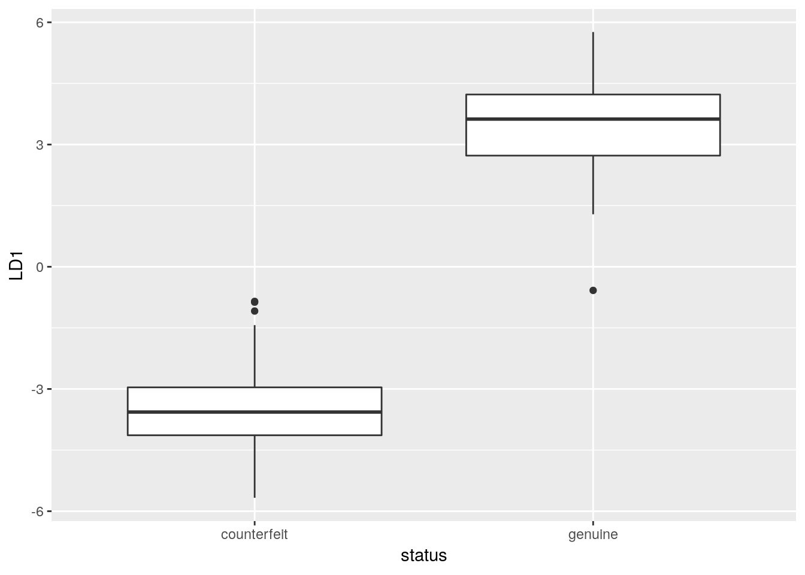
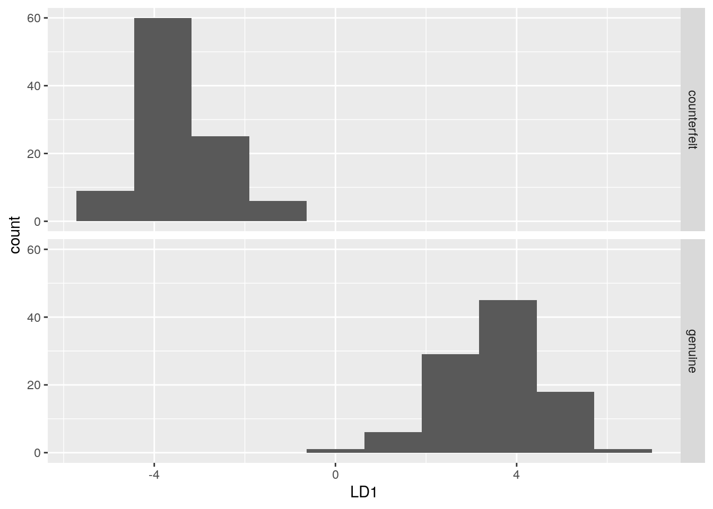
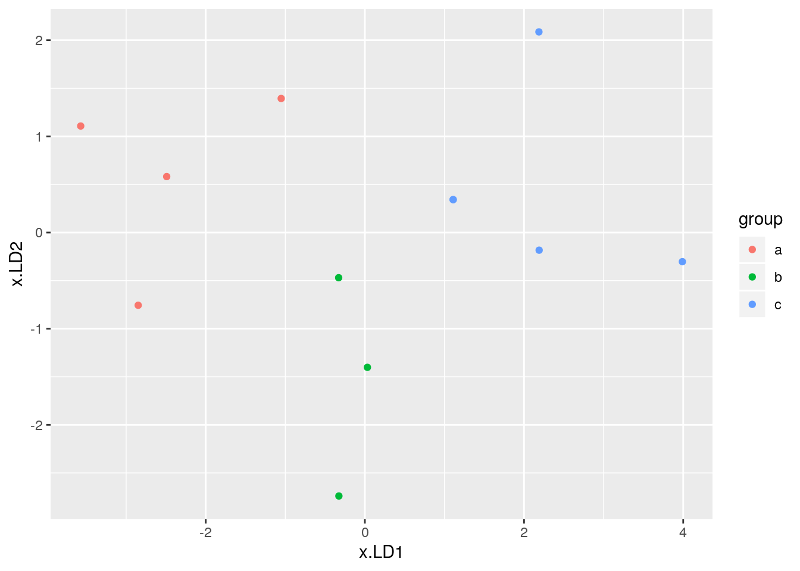
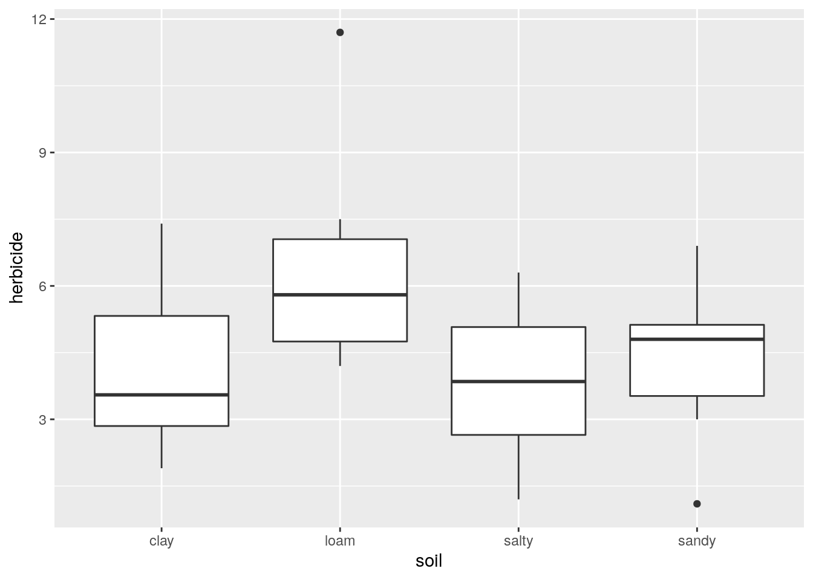
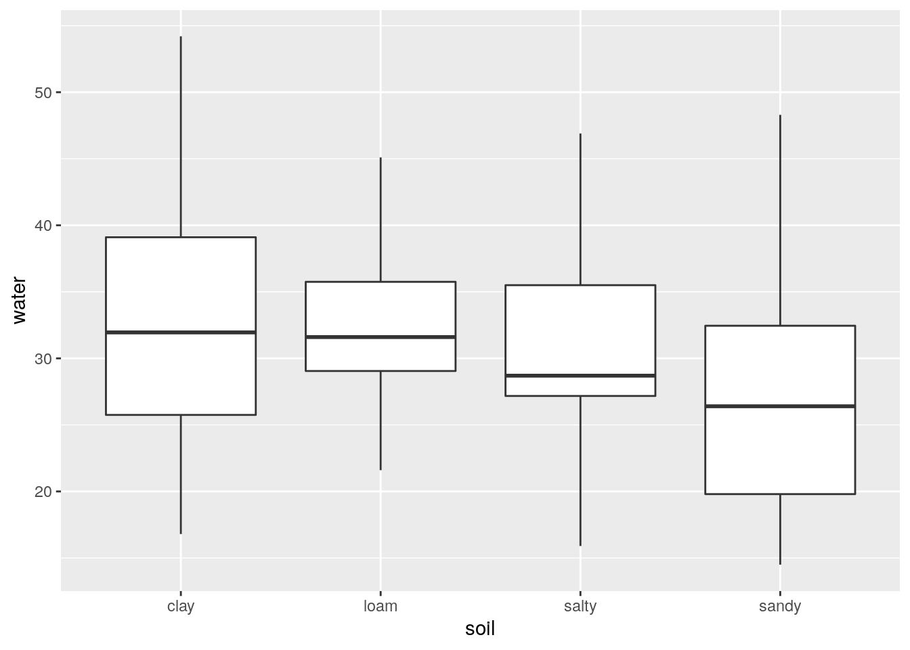
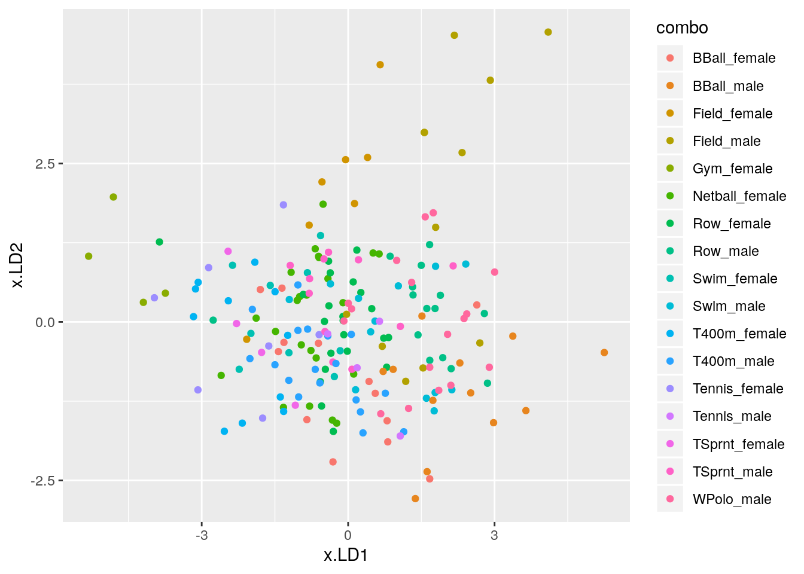

# Discriminant analysis

Packages for this chapter:


```r
library(ggbiplot)
library(MASS)
library(tidyverse)
library(car)
```

(Note: `ggbiplot` loads `plyr`, which overlaps a lot with `dplyr`
(`filter`, `select` etc.). We want the `dplyr` stuff elsewhere, so we
load `ggbiplot` *first*, and the things in `plyr` get hidden, as shown
in the Conflicts. This, despite appearances, is what we want.)


```
## Warning: package 'ggplot2' was built under R version 3.5.3
```

```
## Warning: package 'tibble' was built under R version 3.5.3
```

```
## Warning: package 'tidyr' was built under R version 3.5.3
```

```
## Warning: package 'readr' was built under R version 3.5.2
```

```
## Warning: package 'purrr' was built under R version 3.5.3
```

```
## Warning: package 'dplyr' was built under R version 3.5.2
```

```
## Warning: package 'stringr' was built under R version 3.5.2
```

```
## Warning: package 'forcats' was built under R version 3.5.1
```

```
## Warning: package 'survminer' was built under R version 3.5.1
```

```
## Warning: package 'ggpubr' was built under R version 3.5.1
```

```
## Warning: package 'magrittr' was built under R version 3.5.1
```

```
## Warning: package 'car' was built under R version 3.5.1
```

```
## Warning: package 'carData' was built under R version 3.5.1
```

```
## Warning: package 'ggbiplot' was built under R version 3.5.1
```

```
## Warning: package 'plyr' was built under R version 3.5.1
```

```
## Warning: package 'scales' was built under R version 3.5.1
```

```
## Warning: package 'ggrepel' was built under R version 3.5.1
```

```
## Warning: package 'broom' was built under R version 3.5.2
```

```
## Warning: package 'rstan' was built under R version 3.5.3
```

```
## Warning: package 'StanHeaders' was built under R version 3.5.1
```


##  Telling whether a banknote is real or counterfeit


 <a name="sec:swiss-money">*</a> A Swiss bank collected  a number of known counterfeit
(fake) 
bills over time, and sampled a number of known genuine bills of the
same denomination.
Is it possible to tell, from measurements taken from a bill, whether
it is genuine or not? We will explore that issue here. The variables
measured were:


* length

* right-hand width

* left-hand width

* top margin

* bottom margin

* diagonal


(a) Read in the data from
[link](http://www.utsc.utoronto.ca/~butler/d29/swiss1.txt), and
check that you have 200 rows and 7 columns altogether.
 
Solution


Check the data file first. It's aligned in columns, thus:

```r
my_url <- "http://www.utsc.utoronto.ca/~butler/d29/swiss1.txt"
swiss <- read_table(my_url)
```

```
## Parsed with column specification:
## cols(
##   length = col_double(),
##   left = col_double(),
##   right = col_double(),
##   bottom = col_double(),
##   top = col_double(),
##   diag = col_double(),
##   status = col_character()
## )
```

```r
swiss
```

```
## # A tibble: 200 x 7
##    length  left right bottom   top  diag status 
##     <dbl> <dbl> <dbl>  <dbl> <dbl> <dbl> <chr>  
##  1   215.  131   131.    9     9.7  141  genuine
##  2   215.  130.  130.    8.1   9.5  142. genuine
##  3   215.  130.  130.    8.7   9.6  142. genuine
##  4   215.  130.  130.    7.5  10.4  142  genuine
##  5   215   130.  130.   10.4   7.7  142. genuine
##  6   216.  131.  130.    9    10.1  141. genuine
##  7   216.  130.  130.    7.9   9.6  142. genuine
##  8   214.  130.  129.    7.2  10.7  142. genuine
##  9   215.  129.  130.    8.2  11    142. genuine
## 10   215.  130.  130.    9.2  10    141. genuine
## # … with 190 more rows
```

       

Yep, 200 rows and 7 columns.
 

(b) Run a multivariate analysis of variance. What do you
conclude? Is it worth running a discriminant analysis? (This is
the same procedure as with basic MANOVAs before.) 
 
Solution


Small-m `manova` will do here:

```r
response <- with(swiss, cbind(length, left, right, bottom, top, diag))
swiss.1 <- manova(response ~ status, data = swiss)
summary(swiss.1)
```

```
##            Df  Pillai approx F num Df den Df    Pr(>F)    
## status      1 0.92415   391.92      6    193 < 2.2e-16 ***
## Residuals 198                                             
## ---
## Signif. codes:  0 '***' 0.001 '**' 0.01 '*' 0.05 '.' 0.1 ' ' 1
```

       

You might be wondering whether you had to go to all that trouble to
make the response variable. Would this work?


```r
response2 <- swiss %>% select(length:diag)
swiss.1a <- manova(response2 ~ status, data = swiss)
```

```
## Error in model.frame.default(formula = response2 ~ status, data = swiss, : invalid type (list) for variable 'response2'
```

 

No, because `response2` needs to be an R `matrix`, and it isn't:


```r
class(response2)
```

```
## [1] "spec_tbl_df" "tbl_df"      "tbl"         "data.frame"
```

 

The error message was a bit cryptic (nothing unusual there), but a
data frame (to R) is a special kind of `list`, so that R didn't
like `response2` being a data frame, which it
thought was a list.

This, however, works, since it turns the data frame into a matrix:


```r
response4 <- swiss %>% select(length:diag) %>% as.matrix()
swiss.2a <- manova(response4 ~ status, data = swiss)
summary(swiss.2a)
```

```
##            Df  Pillai approx F num Df den Df    Pr(>F)    
## status      1 0.92415   391.92      6    193 < 2.2e-16 ***
## Residuals 198                                             
## ---
## Signif. codes:  0 '***' 0.001 '**' 0.01 '*' 0.05 '.' 0.1 ' ' 1
```

 
Anyway, the conclusion: the status of a bill (genuine or counterfeit)
definitely has an influence on some or all of those other variables,
since the P-value $2.2 \times 10^{-16}$ (or less) is really small. So
it is worth running a discriminant analysis to figure out where the
differences lie.

As a piece of strategy, for creating the response matrix, you can
always either use `cbind`, which creates a `matrix`
directly, or you can use `select`, which is often easier but
creates a data frame, and then turn *that* into a `matrix`
using `as.matrix`. As long as you end up with a
`matrix`, it's all good.
 

(c) Run a discriminant analysis. Display the output.
 

Solution

 
Now we forget about all that
`response` stuff. For a discriminant analysis, the
grouping variable (or combination of the grouping variables)
is the "response", and the quantitative ones are
"explanatory":

```r
swiss.3 <- lda(status ~ length + left + right + bottom + top + diag, data = swiss)
swiss.3
```

```
## Call:
## lda(status ~ length + left + right + bottom + top + diag, data = swiss)
## 
## Prior probabilities of groups:
## counterfeit     genuine 
##         0.5         0.5 
## 
## Group means:
##              length    left   right bottom    top    diag
## counterfeit 214.823 130.300 130.193 10.530 11.133 139.450
## genuine     214.969 129.943 129.720  8.305 10.168 141.517
## 
## Coefficients of linear discriminants:
##                 LD1
## length  0.005011113
## left    0.832432523
## right  -0.848993093
## bottom -1.117335597
## top    -1.178884468
## diag    1.556520967
```

       
 

(d) How many linear 
discriminants did you get? Is that making sense? Explain briefly.
 
Solution


I got one discriminant, which makes sense because there are two
groups, and the smaller of 6 (variables, not counting the grouping
one) and $2-1$ is 1. 
 

(e) <a name="part:big">*</a> 
Using your output from the discriminant analysis, describe how
each of the linear discriminants that you got is related to your
original variables. (This can, maybe even should, be done crudely:
"does each variable feature in each linear discriminant: yes or no?".)
 
Solution


This is the Coefficients of Linear Discriminants. Make a call about whether each of those coefficients is close to zero (small in size compared to the others), or definitely positive or definitely negative.
These are judgement calls: either you can say that LD1
depends mainly on `diag` (treating the other coefficients
as "small" or close to zero), or you can say that `LD1`
depends on everything except `length`.
 

(f) What values of your variable(s) would make `LD1`
large and positive?
 
Solution


Depending on your answer to the previous part: 
If you said that only `diag` was important, `diag`
being large would make `LD1` large and positive.
If you said that everything but `length` was important,
then it's a bit more complicated: `left` and
`diag` large, `right`, `bottom` and
`top` small (since their coefficients are negative). 
 

(g) <a name="part:means">*</a> Find the means of each variable for each group (genuine
and counterfeit bills). You can get this from your fitted linear
discriminant object.
 
Solution


```r
swiss.3$means
```

```
##              length    left   right bottom    top    diag
## counterfeit 214.823 130.300 130.193 10.530 11.133 139.450
## genuine     214.969 129.943 129.720  8.305 10.168 141.517
```

 
 

(h) Plot your linear discriminant(s), however you like. Bear in
mind that there is only one linear discriminant.
 
Solution


With only one linear discriminant, we can plot `LD1` scores on
the $y$-axis and the grouping variable on the $x$-axis. How
you do that is up to you. 

Before we start, though, we need the `LD1` scores. This means
doing predictions. The discriminant scores are in there. We take the
prediction output and make a data frame with all the things in the
original data. My current preference (it changes) is to store the
predictions, and then `cbind` them with the original data,
thus:


```r
swiss.pred <- predict(swiss.3)
d <- cbind(swiss, swiss.pred)
head(d)
```

```
##   length  left right bottom  top  diag  status   class
## 1  214.8 131.0 131.1    9.0  9.7 141.0 genuine genuine
## 2  214.6 129.7 129.7    8.1  9.5 141.7 genuine genuine
## 3  214.8 129.7 129.7    8.7  9.6 142.2 genuine genuine
## 4  214.8 129.7 129.6    7.5 10.4 142.0 genuine genuine
## 5  215.0 129.6 129.7   10.4  7.7 141.8 genuine genuine
## 6  215.7 130.8 130.5    9.0 10.1 141.4 genuine genuine
##   posterior.counterfeit posterior.genuine      LD1
## 1          3.245560e-07         0.9999997 2.150948
## 2          1.450624e-14         1.0000000 4.587317
## 3          1.544496e-14         1.0000000 4.578290
## 4          4.699587e-15         1.0000000 4.749580
## 5          1.941700e-13         1.0000000 4.213851
## 6          1.017550e-08         1.0000000 2.649422
```

      

I needed `head` because `cbind` makes an old-fashioned
`data.frame` rather than a `tibble`, so if you display
it, you get all of it.  

This gives the LD1 scores, predicted groups, and posterior
probabilities as well. That saves us having to pick out the other
things later.
The obvious thing is a boxplot. By examining `d` above (didn't
you?), you saw that the LD scores were in a column called
`LD1`:

```r
ggplot(d, aes(x = status, y = LD1)) + geom_boxplot()
```



   

This shows that positive LD1 scores go (almost without exception) with
genuine bills, and negative ones with counterfeit bills.
It also shows that there are three outlier bills, two counterfeit ones
with unusually high LD1 score, and one genuine one with unusually
*low* LD1 score, at least for a genuine bill.

Or you could do faceted histograms of `LD1` by `status`:


```r
ggplot(d, aes(x = LD1)) + geom_histogram(bins = 10) + facet_grid(status ~ .)
```



 

This shows much the same thing as `plot(swiss.3)` does (try it).
 

(i) What kind of score on `LD1` do genuine bills
typically have? What kind of score do counterfeit bills typically
have? What characteristics of a bill, therefore, would you look at
to determine if a bill is genuine or counterfeit?
 
Solution


The genuine bills almost all have a *positive* score on
LD1, while the counterfeit ones all have a *negative* one. 
This means that the genuine bills (depending on your answer to
(<a href="#part:big">here</a>)) have a large `diag`, or they have a
large `left` and `diag`, and a small
`right`, `bottom` and `top`.
If you look at your table of means in (<a href="#part:means">here</a>), you'll
see that the genuine bills do indeed have a large `diag`,
or, depending on your earlier answer, a small `right`,
`bottom` and `top`, but not actually a small
`left` (the `left` values are very close for the
genuine and counterfeit coins).
As to that last point, this is easy enough to think about. A
boxplot seems a nice way to display it:

```r
ggplot(d, aes(y = left, x = status)) + geom_boxplot()
```


      

There is a fair bit of overlap: the median is higher for the
counterfeit bills, but the highest value actually belongs to a genuine one.

Compare that to `diag`:


```r
ggplot(d, aes(y = diag, x = status)) + geom_boxplot()
```


 

Here, there is an almost complete separation of the genuine and
counterfeit bills, with just one low outlier amongst the genuine bills
spoiling the pattern.
I didn't look at the predictions (beyond the discriminant scores),
since this question (as set on an assignment a couple of years ago)
was already too long, but there is no difficulty in doing so.
Everything is in the data frame I called `d`:


```r
with(d, table(obs = status, pred = class))
```

```
##              pred
## obs           counterfeit genuine
##   counterfeit         100       0
##   genuine               1      99
```

 

(this labels the rows and columns, which is not necessary but is nice.)

The `tidyverse` way is to make a data frame out of the actual
and predicted statuses, and then `count` what's in there:


```r
d %>% count(status, class)
```

```
## # A tibble: 3 x 3
##   status      class           n
##   <chr>       <fct>       <int>
## 1 counterfeit counterfeit   100
## 2 genuine     counterfeit     1
## 3 genuine     genuine        99
```

 

This gives a "long" table, with frequencies for each of the
combinations for which anything was observed.

Frequency tables are usually wide, and we can make this one so by `spread`ing `pred`:


```r
d %>%
  count(status, class) %>%
  spread(class, n)
```

```
## # A tibble: 2 x 3
##   status      counterfeit genuine
##   <chr>             <int>   <int>
## 1 counterfeit         100      NA
## 2 genuine               1      99
```

 
One of the genuine bills is incorrectly classified as a counterfeit
one (evidently that low outlier on LD1), but every single one of the
counterfeit bills is classified correctly. That missing value is
actually a frequency that is zero, which you can fix up thus:


```r
d %>%
  count(status, class) %>%
  spread(class, n, fill = 0)
```

```
## # A tibble: 2 x 3
##   status      counterfeit genuine
##   <chr>             <dbl>   <dbl>
## 1 counterfeit         100       0
## 2 genuine               1      99
```

 

which turns any missing values into the zeroes they should be in this
kind of problem.
It would be interesting to see what the posterior probabilities look
like for that misclassified bill:


```r
d %>% filter(status != class)
```

```
##   length  left right bottom  top  diag  status       class
## 1  214.9 130.2 130.2      8 11.2 139.6 genuine counterfeit
##   posterior.counterfeit posterior.genuine        LD1
## 1             0.9825773        0.01742267 -0.5805239
```

 

On the basis of the six measured variables, this looks a lot more like
a counterfeit bill than a genuine one.
Are there any other bills where there is any doubt? One way to find out is to find the maximum of the two posterior probabilities. If this is small, 
there is some doubt about whether the bill is real or fake. 0.99 seems like a very stringent cutoff, but let's try it and see:


```r
d %>%
  mutate(max.post = pmax(posterior.counterfeit, posterior.genuine)) %>%
  filter(max.post < 0.99) %>%
  dplyr::select(-c(length:diag))
```

```
##    status       class posterior.counterfeit posterior.genuine        LD1
## 1 genuine counterfeit             0.9825773        0.01742267 -0.5805239
##    max.post
## 1 0.9825773
```

 
The only one is the bill that was misclassified: it was actually genuine, but
was classified as counterfeit. The posterior probabilities say that it
was pretty unlikely to be genuine, but it was the only bill for which
there was any noticeable doubt at all.

I had to use `pmax` rather than `max` there, because I
wanted `max.post` to contain the larger of the two
corresponding entries: that is, the first entry in `max.post`
is the larger of the first entry of `counterfeit` and the first
entry in `genuine`. If I used `max` instead, I'd get the
largest of *all* the entries in `counterfeit` and
*all* the entries in `genuine`, repeated 200 times. (Try
it and see.) `pmax` stands for "parallel maximum", that is,
for each row separately. This also should work:


```r
d %>%
  mutate(max.post = map2_dbl(
    posterior.counterfeit, posterior.genuine, ~ max(.x, .y)
  )) %>%
  filter(max.post < 0.99) %>%
  select(-c(length:diag))
```

```
##    status       class posterior.counterfeit posterior.genuine        LD1
## 1 genuine counterfeit             0.9825773        0.01742267 -0.5805239
##    max.post
## 1 0.9825773
```

 
Because we're using `map`, `max` is applied to the pairs
of values of `posterior.counterfeit` and `posterior.genuine`, 
*taken one at a time.*
<label for="tufte-mn-" class="margin-toggle">&#8853;</label><input type="checkbox" id="tufte-mn-" class="margin-toggle"><span class="marginnote">The *map2* is because we are for-eaching over the corresponding values in *counterfeit* and *genuine*. In the *do this*, there can no longer be one *it*; the *.x* and *.y* refer to each of the *counterfeit* and *genuine* values in that order.</span>
 


##  Urine and obesity: what makes a difference?


 A study was made of the characteristics of urine of young
men. The men were classified into four groups based on their degree of
obesity. (The groups are labelled `a, b, c, d`.) Four variables
were measured, `x` (which you can ignore), pigment creatinine,
chloride and chlorine. The data are in
[link](http://www.utsc.utoronto.ca/~butler/d29/urine.csv) as a
`.csv` file. There are 45 men altogether.

Yes, you saw this one before. What you found was something like this:


```r
my_url <- "http://www.utsc.utoronto.ca/~butler/d29/urine.csv"
urine <- read_csv(my_url)
```

```
## Parsed with column specification:
## cols(
##   obesity = col_character(),
##   x = col_double(),
##   creatinine = col_double(),
##   chloride = col_double(),
##   chlorine = col_double()
## )
```

```r
response <- with(urine, cbind(creatinine, chlorine, chloride))
urine.1 <- manova(response ~ obesity, data = urine)
summary(urine.1)
```

```
##           Df  Pillai approx F num Df den Df  Pr(>F)  
## obesity    3 0.43144   2.2956      9    123 0.02034 *
## Residuals 41                                         
## ---
## Signif. codes:  0 '***' 0.001 '**' 0.01 '*' 0.05 '.' 0.1 ' ' 1
```

 

Our aim is to understand why this result was significant.


(a) Read in the data again (copy the code from above) and
obtain a discriminant analysis.
 
Solution


As above, plus:


```r
urine.1 <- lda(obesity ~ creatinine + chlorine + chloride, data = urine)
urine.1
```

```
## Call:
## lda(obesity ~ creatinine + chlorine + chloride, data = urine)
## 
## Prior probabilities of groups:
##         a         b         c         d 
## 0.2666667 0.3111111 0.2444444 0.1777778 
## 
## Group means:
##   creatinine chlorine chloride
## a   15.89167 5.275000 6.012500
## b   17.82143 7.450000 5.214286
## c   16.34545 8.272727 5.372727
## d   11.91250 9.675000 3.981250
## 
## Coefficients of linear discriminants:
##                    LD1        LD2         LD3
## creatinine  0.24429462 -0.1700525 -0.02623962
## chlorine   -0.02167823 -0.1353051  0.11524045
## chloride    0.23805588  0.3590364  0.30564592
## 
## Proportion of trace:
##    LD1    LD2    LD3 
## 0.7476 0.2430 0.0093
```

     
 

(b) How many linear discriminants were you expecting? Explain briefly.
 
Solution


There are 3 variables and 4 groups, so the smaller of 3 and
$4-1=3$: that is, 3.
 

(c) Why do you think we should pay attention to the first two
linear discriminants but not the third? Explain briefly.
 
Solution

 The first two ``proportion of
trace'' values are a lot bigger than the third (or, the third
one is close to 0).
 

(d) Plot the first two linear discriminant scores (against each
other), with each obesity group being a different colour.
 
Solution

 First obtain the predictions, and
then make a data frame out of the original data and the
predictions. 


```r
urine.pred <- predict(urine.1)
d <- cbind(urine, urine.pred)
head(d)
```

```
##   obesity  x creatinine chloride chlorine class posterior.a posterior.b
## 1       a 24       17.6     5.15      7.5     b   0.2327008   0.4124974
## 2       a 32       13.4     5.75      7.1     a   0.3599095   0.2102510
## 3       a 17       20.3     4.35      2.3     b   0.2271118   0.4993603
## 4       a 30       22.3     7.55      4.0     b   0.2935374   0.4823766
## 5       a 30       20.5     8.50      2.0     a   0.4774623   0.3258104
## 6       a 27       18.5    10.25      2.0     a   0.6678748   0.1810762
##   posterior.c posterior.d      x.LD1      x.LD2      x.LD3
## 1   0.3022445 0.052557333  0.3926519 -0.3290621 -0.0704284
## 2   0.2633959 0.166443708 -0.4818807  0.6547023  0.1770694
## 3   0.2519562 0.021571722  0.9745295 -0.3718462 -0.9850425
## 4   0.2211991 0.002886957  2.1880446  0.2069465  0.1364540
## 5   0.1933571 0.003370286  2.0178238  1.1247359  0.2435680
## 6   0.1482500 0.002799004  1.9458323  2.0931546  0.8309276
```

             

`urine` produced the first five columns and `urine.pred`
produced the rest.

To go a more tidyverse way, we can combine the original data frame and
the predictions using `bind_cols`, but we have to be more
careful that the things we are gluing together are both data frames:


```r
class(urine)
```

```
## [1] "spec_tbl_df" "tbl_df"      "tbl"         "data.frame"
```

```r
class(urine.pred)
```

```
## [1] "list"
```

 

`urine` is a `tibble` all right, but `urine.pred` is a `list`. What does it look like?


```r
glimpse(urine.pred)
```

```
## List of 3
##  $ class    : Factor w/ 4 levels "a","b","c","d": 2 1 2 2 1 1 3 3 1 1 ...
##  $ posterior: num [1:45, 1:4] 0.233 0.36 0.227 0.294 0.477 ...
##   ..- attr(*, "dimnames")=List of 2
##   .. ..$ : chr [1:45] "1" "2" "3" "4" ...
##   .. ..$ : chr [1:4] "a" "b" "c" "d"
##  $ x        : num [1:45, 1:3] 0.393 -0.482 0.975 2.188 2.018 ...
##   ..- attr(*, "dimnames")=List of 2
##   .. ..$ : chr [1:45] "1" "2" "3" "4" ...
##   .. ..$ : chr [1:3] "LD1" "LD2" "LD3"
```

 
A data frame is a list for which all the items are the same length,
but some of the things in here are matrices. You can tell because they
have a number of rows, 45, *and* a number of columns, 3 or
4. They *do* have the right number of rows, though, so something
like `as.data.frame` (a base R function) will smoosh them all
into one data frame, grabbing the columns from the matrices:


```r
head(as.data.frame(urine.pred))
```

```
##   class posterior.a posterior.b posterior.c posterior.d      x.LD1
## 1     b   0.2327008   0.4124974   0.3022445 0.052557333  0.3926519
## 2     a   0.3599095   0.2102510   0.2633959 0.166443708 -0.4818807
## 3     b   0.2271118   0.4993603   0.2519562 0.021571722  0.9745295
## 4     b   0.2935374   0.4823766   0.2211991 0.002886957  2.1880446
## 5     a   0.4774623   0.3258104   0.1933571 0.003370286  2.0178238
## 6     a   0.6678748   0.1810762   0.1482500 0.002799004  1.9458323
##        x.LD2      x.LD3
## 1 -0.3290621 -0.0704284
## 2  0.6547023  0.1770694
## 3 -0.3718462 -0.9850425
## 4  0.2069465  0.1364540
## 5  1.1247359  0.2435680
## 6  2.0931546  0.8309276
```

 

You see that the columns that came from matrices have gained two-part names, the first part from the name of the matrix, the second part from the column name within that matrix. Then we can do this:


```r
dd <- bind_cols(urine, as.data.frame(urine.pred))
dd
```

```
## # A tibble: 45 x 13
##    obesity     x creatinine chloride chlorine class posterior.a posterior.b
##    <chr>   <dbl>      <dbl>    <dbl>    <dbl> <fct>       <dbl>       <dbl>
##  1 a          24       17.6     5.15      7.5 b           0.233      0.412 
##  2 a          32       13.4     5.75      7.1 a           0.360      0.210 
##  3 a          17       20.3     4.35      2.3 b           0.227      0.499 
##  4 a          30       22.3     7.55      4   b           0.294      0.482 
##  5 a          30       20.5     8.5       2   a           0.477      0.326 
##  6 a          27       18.5    10.2       2   a           0.668      0.181 
##  7 a          25       12.1     5.95     16.8 c           0.167      0.208 
##  8 a          30       12       6.3      14.5 c           0.230      0.197 
##  9 a          28       10.1     5.45      0.9 a           0.481      0.0752
## 10 a          24       14.7     3.75      2   a           0.323      0.247 
## # … with 35 more rows, and 5 more variables: posterior.c <dbl>,
## #   posterior.d <dbl>, x.LD1 <dbl>, x.LD2 <dbl>, x.LD3 <dbl>
```

 

If you want to avoid base R altogether, though, and go straight to
`bind_cols`, you have to be more careful about the types of
things. `bind_cols` *only* works with vectors and data
frames, not matrices, so that is what it is up to you to make sure you
have. That means pulling out the pieces, turning them from matrices
into data frames, and then gluing everything back together:


```r
post <- as_tibble(urine.pred$posterior)
ld <- as_tibble(urine.pred$x)
ddd <- bind_cols(urine, class = urine.pred$class, ld, post)
ddd
```

```
## # A tibble: 45 x 13
##    obesity     x creatinine chloride chlorine class    LD1     LD2     LD3
##    <chr>   <dbl>      <dbl>    <dbl>    <dbl> <fct>  <dbl>   <dbl>   <dbl>
##  1 a          24       17.6     5.15      7.5 b      0.393 -0.329  -0.0704
##  2 a          32       13.4     5.75      7.1 a     -0.482  0.655   0.177 
##  3 a          17       20.3     4.35      2.3 b      0.975 -0.372  -0.985 
##  4 a          30       22.3     7.55      4   b      2.19   0.207   0.136 
##  5 a          30       20.5     8.5       2   a      2.02   1.12    0.244 
##  6 a          27       18.5    10.2       2   a      1.95   2.09    0.831 
##  7 a          25       12.1     5.95     16.8 c     -0.962 -0.365   1.39  
##  8 a          30       12       6.3      14.5 c     -0.853  0.0890  1.23  
##  9 a          28       10.1     5.45      0.9 a     -1.23   1.95   -0.543 
## 10 a          24       14.7     3.75      2   a     -0.530  0.406  -1.06  
## # … with 35 more rows, and 4 more variables: a <dbl>, b <dbl>, c <dbl>,
## #   d <dbl>
```

 
That's a lot of work, but you might say that it's worth it because you
are now absolutely sure what kind of thing everything is. I also had
to be slightly careful with the vector of `class` values; in
`ddd` it has to have a name, so I have to make sure I give it
one.
<label for="tufte-mn-" class="margin-toggle">&#8853;</label><input type="checkbox" id="tufte-mn-" class="margin-toggle"><span class="marginnote">If you run into an error like *Argument 2 must have names* here, that means that the second thing, *class*, needs  to have a name and doesn't have one.</span>
Any of these ways (in general) is good. The last way is a more
careful approach, since you are making sure things are of the right
type rather than relying on R to convert them for you, but I don't
mind which way you go.
Now make the plot, making sure that you are using columns with the right names. I'm using my first data frame, with the two-part names:


```r
ggplot(d, aes(x = x.LD1, y = x.LD2, colour = obesity)) + geom_point()
```


 
 

(e) <a name="part:plot">*</a> Looking at your plot, discuss how (if at all) the
discriminants separate the obesity groups. (Where does each
obesity group fall on the plot?)
 
Solution

 My immediate reaction was
"they don't much". If you look a bit more closely, the
`b` group, in green, is on the right (high
`LD1`) and the `d` group (purple) is on the
left (low `LD1`). The `a` group, red, is
mostly at the top (high `LD2`) but the `c`
group, blue, really is all over the place.

The way to tackle interpreting a plot like this is to look
for each group individually and see if that group is only
or mainly found on a certain part of the plot. 

This can be rationalized by looking at 
the "coefficients of linear discriminants" on the output. `LD1` is
low if creatinine and chloride are low (it has nothing
much to do with `chlorine` since that coefficient
is near zero). Group `d` is lowest on both
creatinine and chloride, so that will be lowest on
`LD1`.  `LD2` is high if `chloride`
is high, or `creatinine` and `chlorine` are
low. Out of the groups `a, b, c`, `a` has
the highest mean on chloride and lowest means on the other
two variables, so this should be highest on `LD2`
and (usually) is.
Looking at the means is only part of the story; if the
individuals within a group are very variable, as they are
here (especially group `c`), then that group will
appear all over the plot. The table of means only says how
the *average* individual within a group stacks up.

```r
ggbiplot(urine.1, groups = urine$obesity)
```


 

This shows (in a way that is perhaps easier to see) how the linear
discriminants are related to the original variables, and thus how the
groups differ in terms of the original variables.
<label for="tufte-mn-" class="margin-toggle">&#8853;</label><input type="checkbox" id="tufte-mn-" class="margin-toggle"><span class="marginnote">This was why  we were doing discriminant analysis in the first place.</span> 
Most of the B's are high creatinine and high chloride (on the right); most of the D's are low on both (on the left). LD2 has a bit of `chloride`, but not much of anything else.
Extra: the way we used to do this was with "base graphics", which involved plotting the `lda` output itself:


```r
plot(urine.1)
```


 

which is a plot of each discriminant score against each other
one. You can plot just the first two, like this:


```r
plot(urine.1, dimen = 2)
```


 
This is easier than using `ggplot`, but (i) less flexible and
(ii) you have to figure out how it works rather than doing things the
standard `ggplot` way. So I went with constructing a data frame
from the predictions, and then
`ggplot`ting that. It's a matter of taste which way is better.
 

(f) <a name="part:table">*</a> Obtain a table showing observed and predicted obesity
groups. Comment on the accuracy of the predictions.
 
Solution


Make a table, one way or another:


```r
tab <- with(d, table(obesity, class))
tab
```

```
##        class
## obesity a b c d
##       a 7 3 2 0
##       b 2 9 2 1
##       c 3 4 1 3
##       d 2 0 1 5
```

   

`class` is always the *predicted* group in these. You can
also name things in `table`.
Or, if you prefer (equally good), the `tidyverse` way of
counting all the combinations of true `obesity` and predicted
`class`, which can be done all in one go, or in
two steps by saving the data frame first. I'm saving my results for
later:


```r
d %>% count(obesity, class) -> tab
tab
```

```
## # A tibble: 14 x 3
##    obesity class     n
##    <chr>   <fct> <int>
##  1 a       a         7
##  2 a       b         3
##  3 a       c         2
##  4 b       a         2
##  5 b       b         9
##  6 b       c         2
##  7 b       d         1
##  8 c       a         3
##  9 c       b         4
## 10 c       c         1
## 11 c       d         3
## 12 d       a         2
## 13 d       c         1
## 14 d       d         5
```

 
or if you prefer to make it look more like a table of frequencies:

```r
tab %>% spread(class, n, fill = 0)
```

```
## # A tibble: 4 x 5
##   obesity     a     b     c     d
##   <chr>   <dbl> <dbl> <dbl> <dbl>
## 1 a           7     3     2     0
## 2 b           2     9     2     1
## 3 c           3     4     1     3
## 4 d           2     0     1     5
```

 

The thing on the end fills in zero frequencies as such (they would
otherwise be `NA`, which they are not: we know they are zero).
My immediate reaction to this is "it's terrible"! But at least some
of the men have their obesity group correctly predicted: 7 of the
$7+3+2+0=12$ 
men that are actually in group `a` are predicted to be in
`a`; 9 of the 14 actual `b`'s are predicted to be
`b`'s; 5 of the 8 actual `d`'s are predicted to be
`d`'s. These are not so awful. But only 1 of the 11
`c`'s is correctly predicted to be a `c`!

As for what I want to see: I am looking for some kind of statement
about how good you think the predictions are (the word "terrible" is
fine for this) with some kind of support for your statement. For
example, "the predictions are not that good, but at least group B is predicted with some accuracy (9 out of 14)."

I think looking at how well the individual groups were predicted is
the most incisive way of getting at this, because the `c` men
are the hardest to get right and the others are easier, but you could
also think about an overall misclassification rate. This comes most
easily from the "tidy" table:

```r
tab %>% count(correct = (obesity == class), wt = n)
```

```
## # A tibble: 2 x 2
##   correct     n
##   <lgl>   <int>
## 1 FALSE      23
## 2 TRUE       22
```

 
You can count anything, not just columns that already exist. This one
is a kind of combined mutate-and-count to create the (logical) column
called `correct`. 

It's a shortcut for this:


```r
tab %>%
  mutate(is_correct = (obesity == class)) %>%
  count(is_correct, wt = n)
```

```
## # A tibble: 2 x 2
##   is_correct     n
##   <lgl>      <int>
## 1 FALSE         23
## 2 TRUE          22
```

 
If I don't put the `wt`, `count` counts the number of
*rows* for which the true and predicted obesity group is the
same. But that's not what I want here: I want the number of
*observations* totalled up, which is what the `wt=`
does. It says "use the things in the given column as weights", which
means to total them up rather than count up the number of rows.

This says that 22 men were classified correctly and 23 were gotten
wrong. We can find the proportions correct and wrong:


```r
tab %>%
  count(correct = (obesity == class), wt = n) %>%
  mutate(proportion = n / sum(n))
```

```
## # A tibble: 2 x 3
##   correct     n proportion
##   <lgl>   <int>      <dbl>
## 1 FALSE      23      0.511
## 2 TRUE       22      0.489
```

 

and we see that 51\% of men had their obesity group predicted
wrongly. This is the overall misclassification rate, which is a simple
summary of how good a job the discriminant analysis did.

There is a subtlety here. `n` has changed its meaning in the
middle of this calculation! In `tab`, `n` is counting
the number of obesity observed and predicted combinations, but now it
is counting the number of men classified correctly and
incorrectly. The `wt=n` uses the first `n`, but the
`mutate` line uses the *new* `n`, the result of the
`count` line here. (I think `count` used to use
`nn` for the result of the second `count`, so that you
could tell them apart, but it no longer seems to do so.)

I said above that the obesity groups were not equally easy to
predict. A small modification of the above will get the
misclassification rates by (true) obesity group. This is done by
putting an appropriate `group_by` in at the front, before we
do any summarizing:


```r
tab %>%
  group_by(obesity) %>%
  count(correct = (obesity == class), wt = n) %>%
  mutate(proportion = n / sum(n))
```

```
## # A tibble: 8 x 4
## # Groups:   obesity [4]
##   obesity correct     n proportion
##   <chr>   <lgl>   <int>      <dbl>
## 1 a       FALSE       5     0.417 
## 2 a       TRUE        7     0.583 
## 3 b       FALSE       5     0.357 
## 4 b       TRUE        9     0.643 
## 5 c       FALSE      10     0.909 
## 6 c       TRUE        1     0.0909
## 7 d       FALSE       3     0.375 
## 8 d       TRUE        5     0.625
```

 

This gives the proportion wrong and correct for each (true) obesity
group. I'm going to do the one more cosmetic thing to make it easier to
read, a kind of "untidying":


```r
tab %>%
  group_by(obesity) %>%
  count(correct = (obesity == class), wt = n) %>%
  mutate(proportion = n / sum(n)) %>%
  select(-n) %>%
  spread(correct, proportion)
```

```
## # A tibble: 4 x 3
## # Groups:   obesity [4]
##   obesity `FALSE` `TRUE`
##   <chr>     <dbl>  <dbl>
## 1 a         0.417 0.583 
## 2 b         0.357 0.643 
## 3 c         0.909 0.0909
## 4 d         0.375 0.625
```

 

Looking down the ``TRUE`` column, groups A, B and D were gotten
about 60\% correct (and 40\% wrong), but group C is much worse. The
overall misclassification rate is made bigger by the fact that C is so
hard to predict.

Find out for yourself what happens if I fail to remove the `n`
column before doing the `spread`.

A slightly more elegant look is obtained this way, by making nicer
values than TRUE and FALSE:


```r
tab %>%
  group_by(obesity) %>%
  mutate(prediction_stat = ifelse(obesity == class, "correct", "wrong")) %>%
  count(prediction_stat, wt = n) %>%
  mutate(proportion = n / sum(n)) %>%
  select(-n) %>%
  spread(prediction_stat, proportion)
```

```
## # A tibble: 4 x 3
## # Groups:   obesity [4]
##   obesity correct wrong
##   <chr>     <dbl> <dbl>
## 1 a        0.583  0.417
## 2 b        0.643  0.357
## 3 c        0.0909 0.909
## 4 d        0.625  0.375
```

 
 

(g) Do your conclusions from (<a href="#part:plot">here</a>) and
(<a href="#part:table">here</a>) appear to be consistent?
 
Solution


On the plot of (<a href="#part:plot">here</a>), we said that there was a
lot of scatter, but that groups `a`, `b` and
`d` tended to be found at the top, right and left
respectively of the plot. That suggests that these three
groups should be somewhat predictable. The `c`'s, on
the other hand, were all over the place on the plot, and
were mostly predicted wrong.

The idea is that the stories you pull from the plot and the
predictions should be more or less consistent. There are
several ways you might say that: another approach is to say
that the observations are all over the place on the plot,
and the predictions are all bad. This is not as insightful
as my comments above, but if that's what the plot told you,
that's what the predictions would seem to be saying as
well. (Or even, the predictions are not so bad compared to
the apparently random pattern on the plot, if that's what
you saw. There are different ways to say something more or
less sensible.)
 


##  Understanding a MANOVA


 One use of discriminant analysis is to
understand the results of a MANOVA. This question is a followup to a
previous MANOVA that we did, the one with two variables `y1`
and `y2` and three groups `a` through `c`. The
data were in [link](http://www.utsc.utoronto.ca/~butler/d29/simple-manova.txt).


(a) Read the data in again and run the MANOVA that you did
before. 


Solution


This is an exact repeat of what you did before:

```r
my_url <- "http://www.utsc.utoronto.ca/~butler/d29/simple-manova.txt"
simple <- read_delim(my_url, " ")
```

```
## Parsed with column specification:
## cols(
##   group = col_character(),
##   y1 = col_double(),
##   y2 = col_double()
## )
```

```r
simple
```

```
## # A tibble: 12 x 3
##    group    y1    y2
##    <chr> <dbl> <dbl>
##  1 a         2     3
##  2 a         3     4
##  3 a         5     4
##  4 a         2     5
##  5 b         4     8
##  6 b         5     6
##  7 b         5     7
##  8 c         7     6
##  9 c         8     7
## 10 c        10     8
## 11 c         9     5
## 12 c         7     6
```

```r
response <- with(simple, cbind(y1, y2))
simple.3 <- manova(response ~ group, data = simple)
summary(simple.3)
```

```
##           Df Pillai approx F num Df den Df    Pr(>F)    
## group      2 1.3534   9.4196      4     18 0.0002735 ***
## Residuals  9                                            
## ---
## Signif. codes:  0 '***' 0.001 '**' 0.01 '*' 0.05 '.' 0.1 ' ' 1
```

     

This P-value is small, so there is some way in which some of the
groups differ on some of the variables.
<label for="tufte-mn-" class="margin-toggle">&#8853;</label><input type="checkbox" id="tufte-mn-" class="margin-toggle"><span class="marginnote">That sounds like the  ultimate in evasiveness!</span>
    


(b) Run a discriminant analysis "predicting" group from the
two response variables. Display the output.


Solution


This:

```r
simple.4 <- lda(group ~ y1 + y2, data = simple)
simple.4
```

```
## Call:
## lda(group ~ y1 + y2, data = simple)
## 
## Prior probabilities of groups:
##         a         b         c 
## 0.3333333 0.2500000 0.4166667 
## 
## Group means:
##         y1  y2
## a 3.000000 4.0
## b 4.666667 7.0
## c 8.200000 6.4
## 
## Coefficients of linear discriminants:
##          LD1        LD2
## y1 0.7193766  0.4060972
## y2 0.3611104 -0.9319337
## 
## Proportion of trace:
##    LD1    LD2 
## 0.8331 0.1669
```

   
Note that this is the other way around from MANOVA: here, we are
"predicting the group" from the response variables, in the same
manner as one of the flavours of logistic regression: 
"what makes the groups different, in terms of those response variables?".

    


(c) <a name="part:output">*</a> In the output from the discriminant analysis,
why are there exactly two linear discriminants `LD1` and
`LD2`?


Solution


There are two linear discriminants because there are 3 groups and two
variables, so there are the smaller of $3-1$ and 2 discriminants.

  


(d) <a name="part:svd">*</a> From the output, how would you say that the
first linear discriminant `LD1` compares in importance to the
second one `LD2`: much more important, more important, equally
important, less important, much less important? Explain briefly. 


Solution


Look at the `Proportion of trace` at the bottom of the output.
The first number is much bigger than the second, so the first linear
discriminant is much more important than the second. (I care about
your reason; you can say it's "more important" rather than 
"much more important" and I'm good with that.) 
  


(e) Obtain a plot of the
discriminant scores.


Solution


This was the old-fashioned way:


```r
plot(simple.4)
```


   

It needs cajoling to produce colours, but we can do better. The first
thing is to obtain the predictions:


```r
simple.pred <- predict(simple.4)
```

 

Then we make a data frame out of the discriminant scores and the true
groups, using `cbind`:


```r
d <- cbind(simple, simple.pred)
head(d)
```

```
##   group y1 y2 class posterior.a  posterior.b  posterior.c      x.LD1
## 1     a  2  3     a 0.999836110 0.0001636933 1.964310e-07 -3.5708196
## 2     a  3  4     a 0.994129686 0.0058400248 3.028912e-05 -2.4903326
## 3     a  5  4     a 0.953416498 0.0267238544 1.985965e-02 -1.0515795
## 4     a  2  5     a 0.957685668 0.0423077129 6.618865e-06 -2.8485988
## 5     b  4  8     b 0.001068057 0.9978789644 1.052978e-03 -0.3265145
## 6     b  5  6     b 0.107572389 0.8136017106 7.882590e-02 -0.3293587
##        x.LD2
## 1  1.1076359
## 2  0.5817994
## 3  1.3939939
## 4 -0.7562315
## 5 -2.7398380
## 6 -0.4698735
```

 
or like this, for fun:
<label for="tufte-mn-" class="margin-toggle">&#8853;</label><input type="checkbox" id="tufte-mn-" class="margin-toggle"><span class="marginnote">For suitable definitions of fun.</span>


```r
ld <- as_tibble(simple.pred$x)
post <- as_tibble(simple.pred$posterior)
dd <- bind_cols(simple, class = simple.pred$class, ld, post)
dd
```

```
## # A tibble: 12 x 9
##    group    y1    y2 class     LD1    LD2             a        b          c
##    <chr> <dbl> <dbl> <fct>   <dbl>  <dbl>         <dbl>    <dbl>      <dbl>
##  1 a         2     3 a     -3.57    1.11  1.000         0.000164    1.96e-7
##  2 a         3     4 a     -2.49    0.582 0.994         0.00584     3.03e-5
##  3 a         5     4 a     -1.05    1.39  0.953         0.0267      1.99e-2
##  4 a         2     5 a     -2.85   -0.756 0.958         0.0423      6.62e-6
##  5 b         4     8 b     -0.327  -2.74  0.00107       0.998       1.05e-3
##  6 b         5     6 b     -0.329  -0.470 0.108         0.814       7.88e-2
##  7 b         5     7 b      0.0318 -1.40  0.00772       0.959       3.35e-2
##  8 c         7     6 c      1.11    0.342 0.00186       0.0671      9.31e-1
##  9 c         8     7 c      2.19   -0.184 0.0000127     0.0164      9.84e-1
## 10 c        10     8 c      3.99   -0.303 0.00000000317 0.000322   10.00e-1
## 11 c         9     5 c      2.19    2.09  0.0000173     0.000181   10.00e-1
## 12 c         7     6 c      1.11    0.342 0.00186       0.0671      9.31e-1
```

 
After that, we plot the first one against the second one, colouring by
true groups:


```r
ggplot(d, aes(x = x.LD1, y = x.LD2, colour = group)) + geom_point()
```



 

I wanted to compare this plot with the original plot of `y1`
vs.\ `y2`, coloured by groups:


```r
ggplot(simple, aes(x = y1, y = y2, colour = group)) + geom_point()
```


 

The difference between this plot and the one of `LD1` vs.\
`LD2` is that things have been rotated a bit so that most of
the separation of groups is done by `LD1`. This is reflected in
the fact that `LD1` is quite a bit more important than
`LD2`: the latter doesn't help much in separating the groups.

With that in mind, we could also plot just `LD1`, presumably
against groups via boxplot:


```r
ggplot(d, aes(x = group, y = x.LD1)) + geom_boxplot()
```


 

This shows that LD1 does a pretty fine job of separating the groups,
and `LD2` doesn't really have much to add to the picture. 
  


(f) Describe briefly how `LD1` and/or `LD2`
separate the groups. Does your picture confirm the relative importance
of `LD1` and `LD2` that you found  back in part (<a href="#part:svd">here</a>)? Explain briefly.


Solution


`LD1` separates the groups left to right: group `a` is
low on `LD1`, `b` is in the middle and `c` is
high on `LD1`. (There is no intermingling of the groups on
`LD1`, so it separates the groups perfectly.)

As for `LD2`, all it does (possibly) is to distinguish
`b` (low) from `a` and `c` (high). Or you can,
just as reasonably, take the view that it doesn't really separate
any of the groups.

Back in part (<a href="#part:svd">here</a>), you said (I hope) that `LD1`
was (very) important compared to `LD2`. This shows up here in
that `LD1` does a very good job of distinguishing the groups,
while `LD2` does a poor to non-existent job of separating any
groups. (If you didn't
say that before, here is an invitation to reconsider what you
*did* say there.)
  


(g) What makes group `a` have a low score on `LD1`?
There are two steps that you need to make: consider the means of group
`a` on variables `y1` and `y2` and how they
compare to the other groups, and consider how
`y1` and `y2` play into the score on `LD1`.


Solution


The information you need is in the big output.

The means of `y1` and `y2` for group `a` are 3
and 4 respectively, which are the lowest of all the groups. That's
the first thing. 

The second thing is the coefficients of
`LD1` in terms of `y1` and `y2`, which are both
*positive*. That means, for any observation, if its `y1`
and `y2` values are *large*, that observation's score on
`LD1` will be large as well. Conversely, if its values are
*small*, as the ones in group `a` are, its score on
`LD1` will be small. 

You need these two things.

This explains why the group `a` observations are on the left
of the plot. It also explains why the group `c` observations
are on the right: they are *large* on both `y1` and
`y2`, and so large on `LD1`.

What about `LD2`? This is a little more confusing (and thus I
didn't ask you about that). Its "coefficients of linear discriminant" 
are positive on `y1` and negative on
`y2`, with the latter being bigger in size. Group `b`
is about average on `y1` and distinctly *high* on
`y2`; the second of these coupled with the negative
coefficient on `y2` means that the `LD2` score for
observations in group `b` will be *negative*.

For `LD2`, group `a` has a low mean on both variables
and group `c` has a high mean, so for both groups there is a
kind of cancelling-out happening, and neither group `a` nor
group `c` will be especially remarkable on `LD2`.
  


(h) Obtain predictions for the group memberships of each
observation, and make a table of the actual group memberships against
the predicted ones. How many of the observations were wrongly classified?


Solution


Use the
`simple.pred` that you got earlier. This is the
`table` way:

```r
with(d, table(obs = group, pred = class))
```

```
##    pred
## obs a b c
##   a 4 0 0
##   b 0 3 0
##   c 0 0 5
```

   
Every single one of the 12 observations has been classified into its
correct group. (There is nothing off the diagonal of this table.) 
The alternative to `table` is the `tidyverse` way:


```r
d %>% count(group, class)
```

```
## # A tibble: 3 x 3
##   group class     n
##   <chr> <fct> <int>
## 1 a     a         4
## 2 b     b         3
## 3 c     c         5
```

 

or

```r
d %>%
  count(group, class) %>%
  spread(class, n, fill = 0)
```

```
## # A tibble: 3 x 4
##   group     a     b     c
##   <chr> <dbl> <dbl> <dbl>
## 1 a         4     0     0
## 2 b         0     3     0
## 3 c         0     0     5
```

 

if you want something that looks like a frequency table.
All the `a`s got classified as `a`, and so on. 
That's the end of what I asked you to do, but as ever I wanted to
press on. The next question to ask after getting the predicted groups
is "what are the posterior probabilities of being in each group for each observation": 
that is, not just which group do I think it
belongs in, but how sure am I about that call? The posterior
probabilities in my `d` start with `posterior`. These
have a ton of decimal places which I like to round off first before I
display them, eg. to 3 decimals here:

```r
d %>%
  select(y1, y2, group, class, starts_with("posterior")) %>%
  mutate_at(vars(starts_with("posterior")), ~ round(., 3))
```

```
##    y1 y2 group class posterior.a posterior.b posterior.c
## 1   2  3     a     a       1.000       0.000       0.000
## 2   3  4     a     a       0.994       0.006       0.000
## 3   5  4     a     a       0.953       0.027       0.020
## 4   2  5     a     a       0.958       0.042       0.000
## 5   4  8     b     b       0.001       0.998       0.001
## 6   5  6     b     b       0.108       0.814       0.079
## 7   5  7     b     b       0.008       0.959       0.034
## 8   7  6     c     c       0.002       0.067       0.931
## 9   8  7     c     c       0.000       0.016       0.984
## 10 10  8     c     c       0.000       0.000       1.000
## 11  9  5     c     c       0.000       0.000       1.000
## 12  7  6     c     c       0.002       0.067       0.931
```

 

The repetition annoys me.

You see that the posterior probability of an observation being in the
group it actually *was* in is close to 1 all the way down. The
only one with any doubt at all is observation \#6, which is actually
in group `b`, but has "only" probability 0.814 of being a
`b` based on its `y1` and `y2` values. What else
could it be? Well, it's about equally split between being `a`
and `c`. Let me see if I can display this observation on the
plot in a different way. First I need to make a new column picking out
observation 6, and then I use this new variable as the `size`
of the point I plot:

```r
simple %>%
  mutate(is6 = (row_number() == 6)) %>%
  ggplot(aes(x = y1, y = y2, colour = group, size = is6)) +
  geom_point()
```

```
## Warning: Using size for a discrete variable is not advised.
```


 

That makes it stand out.
As the legend indicates, observation \#6 is plotted as a big circle,
with the rest being plotted as small circles as usual. Since observation \#6
is in group `b`, it appears as a big green circle. What makes it
least like a `b`? Well, it has the smallest `y2` value
of any of the `b`'s (which makes it most like an `a` of
any of the `b`'s), and it has the largest `y1` value (which makes it
most like a `c` of any of the `b`'s). But still, it's nearer the
greens than anything else, so it's still more like a `b` than
it is like any of the other groups. 
  


  

##  What distinguishes people who do different jobs?


 244
<label for="tufte-mn-" class="margin-toggle">&#8853;</label><input type="checkbox" id="tufte-mn-" class="margin-toggle"><span class="marginnote">Grammatically, I am supposed to write this as  *two hundred and forty-four* in words, since I am not supposed to  start a sentence with a number. But, I say, deal with it. Or, I  suppose, *there are 244 people who work...*.</span> people work at a
certain company. 
They each have one of three jobs: customer service, mechanic,
dispatcher. In the data set, these are labelled 1, 2 and 3
respectively.  In addition, they each are rated on scales called
`outdoor`, `social` and `conservative`. Do people
with different jobs tend to have different scores on these scales, or,
to put it another way, if you knew a person's scores on
`outdoor`, `social` and `conservative`, could you
say something about what kind of job they were likely to hold? The
data are in [link](http://www.utsc.utoronto.ca/~butler/d29/jobs.txt).


(a) Read in the data and display some of it.


Solution


The usual. This one is aligned columns.
I'm using a "temporary" name for my read-in data
frame, since I'm going to create the proper one in a moment.

```r
my_url <- "http://www.utsc.utoronto.ca/~butler/d29/jobs.txt"
jobs0 <- read_table(my_url)
```

```
## Parsed with column specification:
## cols(
##   outdoor = col_double(),
##   social = col_double(),
##   conservative = col_double(),
##   job = col_double(),
##   id = col_double()
## )
```

```r
jobs0
```

```
## # A tibble: 244 x 5
##    outdoor social conservative   job    id
##      <dbl>  <dbl>        <dbl> <dbl> <dbl>
##  1      10     22            5     1     1
##  2      14     17            6     1     2
##  3      19     33            7     1     3
##  4      14     29           12     1     4
##  5      14     25            7     1     5
##  6      20     25           12     1     6
##  7       6     18            4     1     7
##  8      13     27            7     1     8
##  9      18     31            9     1     9
## 10      16     35           13     1    10
## # … with 234 more rows
```

     

We got all that was promised, plus a label `id` for each
employee, which we will from here on ignore.
<label for="tufte-mn-" class="margin-toggle">&#8853;</label><input type="checkbox" id="tufte-mn-" class="margin-toggle"><span class="marginnote">Until much later.</span>
    


(b) Note the types of each of the variables, and create any new
variables that you need to.


Solution


These are all `int` or whole numbers. But, the job ought
to be a `factor`: the labels 1, 2 and 3 have no meaning
as such, they just label the three different jobs. (I gave you a
hint of this above.) So we need to turn `job` into a
factor. 
I think the best way to do that is via `mutate`, and then
we save the new data frame into one called `jobs` that we
actually use for the analysis below:

```r
job_labels <- c("custserv", "mechanic", "dispatcher")
jobs <- jobs0 %>%
  mutate(job = factor(job, labels = job_labels))
```

       
I lived on the edge and saved my factor `job` into a variable
with the same name as the numeric one. I should check that I now have
the right thing:


```r
jobs
```

```
## # A tibble: 244 x 5
##    outdoor social conservative job         id
##      <dbl>  <dbl>        <dbl> <fct>    <dbl>
##  1      10     22            5 custserv     1
##  2      14     17            6 custserv     2
##  3      19     33            7 custserv     3
##  4      14     29           12 custserv     4
##  5      14     25            7 custserv     5
##  6      20     25           12 custserv     6
##  7       6     18            4 custserv     7
##  8      13     27            7 custserv     8
##  9      18     31            9 custserv     9
## 10      16     35           13 custserv    10
## # … with 234 more rows
```

 

I like this better because you see the actual factor levels rather
than the underlying numeric values by which they are stored.

All is good here. If you forget the `labels` thing, you'll get
a factor, but its levels will be 1, 2, and 3, and you will have to
remember which jobs they go with. I'm a fan of giving factors named
levels, so that you can remember what stands for what.
<label for="tufte-mn-" class="margin-toggle">&#8853;</label><input type="checkbox" id="tufte-mn-" class="margin-toggle"><span class="marginnote">When  you're *recording* the data, you may find it convenient to use  short codes to represent the possibly long factor levels, but in  that case you should also use a *codebook* so that you know what  the codes represent. When I read the data into R, I would create a  factor with named levels, like I did here, if I don't already have one.</span>

Extra: another way of doing this is to make a lookup table, that is, a little table that shows which job goes with which number:


```r
lookup_tab <- tribble(
  ~job, ~jobname,
  1, "custserv",
  2, "mechanic",
  3, "dispatcher"
)
lookup_tab
```

```
## # A tibble: 3 x 2
##     job jobname   
##   <dbl> <chr>     
## 1     1 custserv  
## 2     2 mechanic  
## 3     3 dispatcher
```

 

I carefully put the numbers in a column called `job` because I want to match these with the column called `job` in `jobs0`:


```r
jobs0 %>%
  left_join(lookup_tab) %>%
  sample_n(20)
```

```
## Joining, by = "job"
```

```
## # A tibble: 20 x 6
##    outdoor social conservative   job    id jobname   
##      <dbl>  <dbl>        <dbl> <dbl> <dbl> <chr>     
##  1      14     22            9     1    69 custserv  
##  2      19     33            7     1     3 custserv  
##  3      15     14           17     3    11 dispatcher
##  4       8     20            8     3    40 dispatcher
##  5      17     25            8     1    11 custserv  
##  6      11     27           10     1    33 custserv  
##  7      17     24            5     2    86 mechanic  
##  8      15     26            9     1    60 custserv  
##  9      21     25           11     2    46 mechanic  
## 10      17     25            7     1    13 custserv  
## 11      20     19           11     2    82 mechanic  
## 12      28     16           10     2    23 mechanic  
## 13      20     13           18     3    61 dispatcher
## 14       3     20           14     1    31 custserv  
## 15      19     11           13     3    55 dispatcher
## 16      13     25           14     1    82 custserv  
## 17      10     22           13     1    14 custserv  
## 18       9     24            6     1    63 custserv  
## 19      20     16           14     3    50 dispatcher
## 20      21     15            7     3    53 dispatcher
```

 

You see that each row has the *name* of the job that employee has, in the column `jobname`, because the job `id` was looked up in our lookup table. (I displayed some random rows so you could see that it worked.)


(c) Run a multivariate analysis of variance to convince yourself
that there are some differences in scale scores among the jobs.


Solution


You know how to do this, right? This one is the easy way:

```r
response <- with(jobs, cbind(social, outdoor, conservative))
response.1 <- manova(response ~ job, data = jobs)
summary(response.1)
```

```
##            Df  Pillai approx F num Df den Df    Pr(>F)    
## job         2 0.76207   49.248      6    480 < 2.2e-16 ***
## Residuals 241                                             
## ---
## Signif. codes:  0 '***' 0.001 '**' 0.01 '*' 0.05 '.' 0.1 ' ' 1
```

       

Or you can use `Manova`. That is mostly for practice here,
since there is no reason to make things difficult for yourself:


```r
library(car)
response.2 <- lm(response ~ job, data = jobs)
Manova(response.2)
```

```
## 
## Type II MANOVA Tests: Pillai test statistic
##     Df test stat approx F num Df den Df    Pr(>F)    
## job  2   0.76207   49.248      6    480 < 2.2e-16 ***
## ---
## Signif. codes:  0 '***' 0.001 '**' 0.01 '*' 0.05 '.' 0.1 ' ' 1
```

 

Oh yes, there are differences (on some or all of the variables, for
some or all of the groups). So we need something like discriminant
analysis to understand the differences.

This, and the `lda` below, actually works perfectly well if you use the
original (integer) job, but then you have to remember which job number
is which.


(d) Run a discriminant analysis and display the output.


Solution


Now `job`
is the "response":

```r
job.1 <- lda(job ~ social + outdoor + conservative, data = jobs)
job.1
```

```
## Call:
## lda(job ~ social + outdoor + conservative, data = jobs)
## 
## Prior probabilities of groups:
##   custserv   mechanic dispatcher 
##  0.3483607  0.3811475  0.2704918 
## 
## Group means:
##              social  outdoor conservative
## custserv   24.22353 12.51765     9.023529
## mechanic   21.13978 18.53763    10.139785
## dispatcher 15.45455 15.57576    13.242424
## 
## Coefficients of linear discriminants:
##                      LD1         LD2
## social       -0.19427415 -0.04978105
## outdoor       0.09198065 -0.22501431
## conservative  0.15499199  0.08734288
## 
## Proportion of trace:
##    LD1    LD2 
## 0.7712 0.2288
```

       


(e) Which is the more important, `LD1` or `LD2`? How
much more important? Justify your answer briefly.


Solution


Look at the "proportion of trace" at the bottom. The value for
`LD1` is quite a bit higher, so `LD1` is quite a
bit more important when it comes to separating the groups.
`LD2` is, as I said, less important, but is not
completely worthless, so it will be worth taking a look at it.


(f) Describe what values for an individual on the scales will make
each of `LD1` and `LD2` high. 


Solution


This is a two-parter: decide whether each scale makes a
positive, negative or zero contribution to the linear
discriminant (looking at the "coefficients of linear discriminants"), 
and then translate that into what would make
each `LD` high. Let's start with `LD1`:

Its coefficients on the three scales are respectively negative
($-0.19$), zero (0.09; my call) and positive (0.15). Where you draw the
line is up to you: if you want to say that `outdoor`'s
contribution is positive, go ahead. This means that `LD1`
will be high if `social` is *low* and if
`conservative` is *high*. (If you thought that
`outdoor`'s coefficient was positive rather than zero, if
`outdoor` is high as well.)

Now for `LD2`: I'm going to call `outdoor`'s
coefficient of $-0.22$ negative and the other two zero, so that
`LD2` is high if `outdoor` is *low*. Again,
if you made a different judgement call, adapt your answer accordingly.


(g) The first group of employees, customer service, have the
highest mean on `social` and the lowest mean on both of the
other two scales. Would you expect the customer service employees to
score high or low on `LD1`? What about `LD2`?


Solution


In the light of what we said in the previous part, the customer
service employees, who are high on `social` and low on
`conservative`, should be *low* (negative) on
`LD1`, since both of these means are pointing that way.
As I called it, the only thing that matters to `LD2` is
`outdoor`, which is *low* for the customer service
employees, and thus `LD2` for them will be *high*
(negative coefficient).


(h) Plot your discriminant scores (which you will have to obtain
first), and see if you were right about the customer service
employees in terms of `LD1` and `LD2`. The job names
are rather long, and there are a lot of individuals, so it is
probably best to plot the scores as coloured circles with a legend
saying which colour goes with which job (rather than labelling each
individual with the job they have).


Solution


Predictions first, then make a data frame combining the predictions with the original data:

```r
p <- predict(job.1)
d <- cbind(jobs, p)
head(d)
```

```
##   outdoor social conservative      job id    class posterior.custserv
## 1      10     22            5 custserv  1 custserv          0.9037622
## 2      14     17            6 custserv  2 mechanic          0.3677743
## 3      19     33            7 custserv  3 custserv          0.7302117
## 4      14     29           12 custserv  4 custserv          0.8100756
## 5      14     25            7 custserv  5 custserv          0.7677607
## 6      20     25           12 custserv  6 mechanic          0.1682521
##   posterior.mechanic posterior.dispatcher      x.LD1       x.LD2
## 1         0.08894785         0.0072899882 -1.6423155  0.71477348
## 2         0.48897890         0.1432467601 -0.1480302  0.15096436
## 3         0.26946971         0.0003186265 -2.6415213 -1.68326115
## 4         0.18217319         0.0077512155 -1.5493681  0.07764901
## 5         0.22505382         0.0071854904 -1.5472314 -0.15994117
## 6         0.78482488         0.0469230463 -0.2203876 -1.07331266
```

       
Following my suggestion, plot these the standard way with
`colour` distinguishing the jobs:


```r
ggplot(d, aes(x = x.LD1, y = x.LD2, colour = job)) + geom_point()
```


 
I was mostly right about the customer service people: small
`LD1` definitely, large `LD2` kinda. I wasn't more right
because the group means don't tell the whole story: evidently, the
customer service people vary quite a bit on `outdoor`, so the
red dots are all over the left side of the plot.

There is quite a bit of intermingling of the three employee groups on
the plot, but the point of the MANOVA is that the groups are (way)
more separated than you'd expect by chance, that is if the employees
were just randomly scattered across the plot.

To think back to that `trace` thing: here, it seems that
`LD1` mainly separates customer service (left) from dispatchers
(right); the mechanics are all over the place on `LD1`, but
they tend to be low on `LD2`. So `LD2` *does* have
something to say.


(i) <a name="part:predjob">*</a> Obtain predicted job allocations for each individual (based on
their scores on the three scales), and tabulate the true jobs
against the predicted jobs. How would you describe the quality of
the classification? Is that in line with what the plot would suggest?


Solution


Use the predictions that you got before and saved in `d`:

```r
with(d, table(obs = job, pred = class))
```

```
##             pred
## obs          custserv mechanic dispatcher
##   custserv         68       13          4
##   mechanic         16       67         10
##   dispatcher        3       13         50
```

     
Or, the `tidyverse` way:


```r
d %>% count(job, class)
```

```
## # A tibble: 9 x 3
##   job        class          n
##   <fct>      <fct>      <int>
## 1 custserv   custserv      68
## 2 custserv   mechanic      13
## 3 custserv   dispatcher     4
## 4 mechanic   custserv      16
## 5 mechanic   mechanic      67
## 6 mechanic   dispatcher    10
## 7 dispatcher custserv       3
## 8 dispatcher mechanic      13
## 9 dispatcher dispatcher    50
```

 
or:


```r
d %>%
  count(job, class) %>%
  spread(class, n, fill = 0)
```

```
## # A tibble: 3 x 4
##   job        custserv mechanic dispatcher
##   <fct>         <dbl>    <dbl>      <dbl>
## 1 custserv         68       13          4
## 2 mechanic         16       67         10
## 3 dispatcher        3       13         50
```

 

I didn't really need the `fill=0` since there are no missing
frequencies, but I've gotten used to putting it in.
There are a lot of misclassifications, but there are a lot of people,
so a large fraction of people actually got classified correctly. The
biggest frequencies are of people who got classified correctly.  I
think this is about what I was expecting, looking at the plot: the
people top left are obviously customer service, the ones top right are
in dispatch, and most of the ones at the bottom are mechanics. So
there will be some errors, but the majority of people should be gotten
right. The easiest pairing to get confused is customer service and
mechanics, which you might guess from the plot: those customer service
people with a middling `LD1` score and a low `LD2` score
(that is, high on `outdoor`) could easily be confused with the
mechanics. The easiest pairing to distinguish is customer service and
dispatchers: on the plot, left and right, that is, low and high
respectively on `LD1`.

What fraction of people actually got misclassified? You could just
pull out the numbers and add them up, but you know me: I'm too lazy to
do that. 

We can work out the total number and fraction who got
misclassified. There are different ways you might do this, but the
`tidyverse` way provides the easiest starting point. For
example, we can make a new column that indicates whether a group is
the correct or wrong classification:


```r
d %>%
  count(job, class) %>%
  mutate(job_stat = ifelse(job == class, "correct", "wrong"))
```

```
## # A tibble: 9 x 4
##   job        class          n job_stat
##   <fct>      <fct>      <int> <chr>   
## 1 custserv   custserv      68 correct 
## 2 custserv   mechanic      13 wrong   
## 3 custserv   dispatcher     4 wrong   
## 4 mechanic   custserv      16 wrong   
## 5 mechanic   mechanic      67 correct 
## 6 mechanic   dispatcher    10 wrong   
## 7 dispatcher custserv       3 wrong   
## 8 dispatcher mechanic      13 wrong   
## 9 dispatcher dispatcher    50 correct
```

 

From there, we count up the correct and wrong ones, recognizing that
we want to total up the *frequencies* in `n`, not just
count the number of rows:


```r
d %>%
  count(job, class) %>%
  mutate(job_stat = ifelse(job == class, "correct", "wrong")) %>%
  count(job_stat, wt = n)
```

```
## # A tibble: 2 x 2
##   job_stat     n
##   <chr>    <int>
## 1 correct    185
## 2 wrong       59
```

 

and turn these into proportions:


```r
d %>%
  count(job, class) %>%
  mutate(job_stat = ifelse(job == class, "correct", "wrong")) %>%
  count(job_stat, wt = n) %>%
  mutate(proportion = n / sum(n))
```

```
## # A tibble: 2 x 3
##   job_stat     n proportion
##   <chr>    <int>      <dbl>
## 1 correct    185      0.758
## 2 wrong       59      0.242
```

 

There is a `count` followed by another `count` of the first lot of counts, so the second count column has taken over the name `n`.

24\% of all the employees got classified into the wrong job, based on
their scores on `outdoor`, `social` and
`conservative`. 

This is actually not bad, from one point of view: if you just guessed
which job each person did, without looking at their scores on the
scales at all, you would get ${1\over 3}=33\%$ of them right, just by
luck, and ${2\over3}=67\%$ of them wrong. From 67\% to 24\% error is a
big improvement, and *that* is what the  MANOVA is reacting to.

To figure out whether some of the groups were harder to classify than
others, squeeze a `group_by` in early to do the counts and
proportions for each (true) job:


```r
d %>%
  count(job, class) %>%
  mutate(job_stat = ifelse(job == class, "correct", "wrong")) %>%
  group_by(job) %>%
  count(job_stat, wt = n) %>%
  mutate(proportion = n / sum(n))
```

```
## # A tibble: 6 x 4
## # Groups:   job [3]
##   job        job_stat     n proportion
##   <fct>      <chr>    <int>      <dbl>
## 1 custserv   correct     68      0.8  
## 2 custserv   wrong       17      0.2  
## 3 mechanic   correct     67      0.720
## 4 mechanic   wrong       26      0.280
## 5 dispatcher correct     50      0.758
## 6 dispatcher wrong       16      0.242
```

 

or even split out the correct and wrong ones into their own columns:


```r
d %>%
  count(job, class) %>%
  mutate(job_stat = ifelse(job == class, "correct", "wrong")) %>%
  group_by(job) %>%
  count(job_stat, wt = n) %>%
  mutate(proportion = n / sum(n)) %>%
  select(-n) %>%
  spread(job_stat, proportion)
```

```
## # A tibble: 3 x 3
## # Groups:   job [3]
##   job        correct wrong
##   <fct>        <dbl> <dbl>
## 1 custserv     0.8   0.2  
## 2 mechanic     0.720 0.280
## 3 dispatcher   0.758 0.242
```

 
The mechanics were hardest to get right and easiest to get wrong,
though there isn't much in it. I think the reason is that the
mechanics were sort of "in the middle" in that a mechanic could be
mistaken for either a dispatcher or a customer service representative,
but but customer service and dispatchers were more or less distinct
from each other.

It's up to you whether you prefer to do this kind of thing by learning
enough about `table` to get it to work, or whether you want to
use tidy-data mechanisms to do it in a larger number of smaller
steps. I immediately thought of `table` because I knew about
it, but the tidy-data way is more consistent with the way we have been
doing things.


(j) Consider an employee with these scores: 20 on
`outdoor`, 17 on `social` and 8 on `conservative` What job do you think
they do, and how certain are you about that? Use `predict`,
first making a data frame out of the values to predict for.


Solution


This is in fact exactly the same idea as the data frame that I
generally called `new` when doing predictions for other
models. I think the
clearest way to make one of these is with `tribble`:

```r
new <- tribble(
  ~outdoor, ~social, ~conservative,
  20, 17, 8
)
new
```

```
## # A tibble: 1 x 3
##   outdoor social conservative
##     <dbl>  <dbl>        <dbl>
## 1      20     17            8
```

       
There's no need for `crossing` here because I'm not doing
combinations  of things. (I might have done that here, to get a sense
for example of "what effect does a higher score on `outdoor` have on the likelihood of a person doing each job?". But I didn't.)

Then feed this into `predict` as the *second* thing:


```r
pp1 <- predict(job.1, new)
```

 

Our predictions are these:


```r
cbind(new, pp1)
```

```
##   outdoor social conservative    class posterior.custserv
## 1      20     17            8 mechanic         0.05114665
##   posterior.mechanic posterior.dispatcher     x.LD1     x.LD2
## 1          0.7800624            0.1687909 0.7138376 -1.024436
```

 

The `class` thing gives our predicted job, and the
`posterior` probabilities say how sure we are about that.
So we reckon there's a 78\% chance that this person is a mechanic;
they might be a dispatcher but they are unlikely to be in customer
service. Our best guess is that they are a mechanic.
<label for="tufte-mn-" class="margin-toggle">&#8853;</label><input type="checkbox" id="tufte-mn-" class="margin-toggle"><span class="marginnote">I  discovered that I used *pp* twice, and I want to use the first one again later, so I had to rename this one.</span>

Does this pass the sanity-check test? First figure out where our new
employee stands compared to the others:


```r
summary(jobs)
```

```
##     outdoor          social       conservative           job    
##  Min.   : 0.00   Min.   : 7.00   Min.   : 0.00   custserv  :85  
##  1st Qu.:13.00   1st Qu.:17.00   1st Qu.: 8.00   mechanic  :93  
##  Median :16.00   Median :21.00   Median :11.00   dispatcher:66  
##  Mean   :15.64   Mean   :20.68   Mean   :10.59                  
##  3rd Qu.:19.00   3rd Qu.:25.00   3rd Qu.:13.00                  
##  Max.   :28.00   Max.   :35.00   Max.   :20.00                  
##        id       
##  Min.   : 1.00  
##  1st Qu.:21.00  
##  Median :41.00  
##  Mean   :41.95  
##  3rd Qu.:61.25  
##  Max.   :93.00
```

 

Their score on `outdoor` is above average, but their scores on
the other two scales are below average (right on the 1st quartile in
each case). 

Go back to the table of means
from the discriminant analysis output. The mechanics have the highest
average for `outdoor`, they're in the middle on `social`
and they are lowish on `conservative`. Our  new employee is at
least somewhat like that.

Or, we can figure out where our new employee sits on the
plot. The output from `predict` gives the predicted
`LD1` and `LD2`, which are 0.71 and $-1.02$
respectively. This employee would sit to the right of and below the
middle of the plot: in the greens, but with a few blues nearby: most
likely a mechanic, possibly a dispatcher, but likely not customer
service, as the posterior probabilities suggest.

Extra: I can use the same mechanism to predict for a combination of
values. This would allow for the variability of each of the original
variables to differ, and enable us to assess the effect of, say, a
change in `conservative` over its "typical range", which we
found out above with `summary(jobs)`. I'll take the quartiles,
in my usual fashion:


```r
outdoors <- c(13, 19)
socials <- c(17, 25)
conservatives <- c(8, 13)
```

 

The IQRs are not that different, which says that what we get here will
not be that different from the ``coefficients of linear
discriminants'' above:


```r
new <- crossing(
  outdoor = outdoors, social = socials,
  conservative = conservatives
)
pp2 <- predict(job.1, new)
px <- round(pp2$x, 2)
cbind(new, pp2$class, px)
```

```
##   outdoor social conservative  pp2$class   LD1   LD2
## 1      13     17            8   mechanic  0.07  0.55
## 2      13     17           13 dispatcher  0.84  0.99
## 3      13     25            8   custserv -1.48  0.15
## 4      13     25           13   custserv -0.71  0.59
## 5      19     17            8   mechanic  0.62 -0.80
## 6      19     17           13 dispatcher  1.40 -0.36
## 7      19     25            8   mechanic -0.93 -1.20
## 8      19     25           13   mechanic -0.16 -0.76
```

 

The highest (most positive) LD1 score goes with  high outdoor, low
social, high conservative (and being a dispatcher). It is often
interesting to look at the *second*-highest one as well: here
that is *low* outdoor, and the same low social and high
conservative as before. That means that `outdoor` has nothing
much to do with `LD1` score. Being low `social` is
strongly associated with `LD1` being positive, so that's the
important part of `LD1`.

What about `LD2`? The most positive LD2 are these:


```

LD2    outdoor  social  conservative
====================================
0.99   low      low     high
0.59   low      high    high
0.55   low      low     low

```


These most consistently go with `outdoor` being low.

Is that consistent with the "coefficients of linear discriminants"?


```r
job.1$scaling
```

```
##                      LD1         LD2
## social       -0.19427415 -0.04978105
## outdoor       0.09198065 -0.22501431
## conservative  0.15499199  0.08734288
```

 

Very much so: `outdoor` has nothing much to do with
`LD1` and everything to do with `LD2`.


(k) Since I am not making you hand this one in, I'm going to keep
going. Re-run the analysis to incorporate cross-validation, and make
a table of the predicted group memberships. Is it much different
from the previous one you had? Why would that be?


Solution


Stick a `CV=T` in the `lda`:


```r
job.3 <- lda(job ~ social + outdoor + conservative, data = jobs, CV = T)
glimpse(job.3)
```

```
## List of 5
##  $ class    : Factor w/ 3 levels "custserv","mechanic",..: 1 2 1 1 1 2 1 1 1 1 ...
##  $ posterior: num [1:244, 1:3] 0.902 0.352 0.71 0.805 0.766 ...
##   ..- attr(*, "dimnames")=List of 2
##   .. ..$ : chr [1:244] "1" "2" "3" "4" ...
##   .. ..$ : chr [1:3] "custserv" "mechanic" "dispatcher"
##  $ terms    :Classes 'terms', 'formula'  language job ~ social + outdoor + conservative
##   .. ..- attr(*, "variables")= language list(job, social, outdoor, conservative)
##   .. ..- attr(*, "factors")= int [1:4, 1:3] 0 1 0 0 0 0 1 0 0 0 ...
##   .. .. ..- attr(*, "dimnames")=List of 2
##   .. ..- attr(*, "term.labels")= chr [1:3] "social" "outdoor" "conservative"
##   .. ..- attr(*, "order")= int [1:3] 1 1 1
##   .. ..- attr(*, "intercept")= int 1
##   .. ..- attr(*, "response")= int 1
##   .. ..- attr(*, ".Environment")=<environment: R_GlobalEnv> 
##   .. ..- attr(*, "predvars")= language list(job, social, outdoor, conservative)
##   .. ..- attr(*, "dataClasses")= Named chr [1:4] "factor" "numeric" "numeric" "numeric"
##   .. .. ..- attr(*, "names")= chr [1:4] "job" "social" "outdoor" "conservative"
##  $ call     : language lda(formula = job ~ social + outdoor + conservative, data = jobs,      CV = T)
##  $ xlevels  : Named list()
```

       

This directly contains a `class` (no need for a
`predict`), so we make a data frame, with a different name
since I shortly want to compare this one with the previous one:


```r
dcv <- cbind(jobs, class = job.3$class, posterior = job.3$posterior)
head(dcv)
```

```
##   outdoor social conservative      job id    class posterior.custserv
## 1      10     22            5 custserv  1 custserv          0.9015959
## 2      14     17            6 custserv  2 mechanic          0.3521921
## 3      19     33            7 custserv  3 custserv          0.7101838
## 4      14     29           12 custserv  4 custserv          0.8054563
## 5      14     25            7 custserv  5 custserv          0.7655123
## 6      20     25           12 custserv  6 mechanic          0.1579450
##   posterior.mechanic posterior.dispatcher
## 1         0.09090173         0.0075023669
## 2         0.49980444         0.1480034406
## 3         0.28951755         0.0002986778
## 4         0.18657994         0.0079637680
## 5         0.22717194         0.0073158061
## 6         0.79420994         0.0478450256
```

 

This is a bit fiddlier than before because `job.3` contains some things of different lengths and we can't just `cbind` them all together.

Then go straight to the `table`:

```r
with(dcv, table(job, class))
```

```
##             class
## job          custserv mechanic dispatcher
##   custserv         67       14          4
##   mechanic         16       67         10
##   dispatcher        3       14         49
```

 

This is almost exactly the same as we had in part
(<a href="#part:predjob">here</a>): the cross-validation has made almost no
difference. The reason for that is that here, we have lots of data
(you can predict for one mechanic, say, and there are still lots of
others to say that the mechanics are "over there". This is in sharp
contrast to the example in class with the bellydancers, where if you
try to predict for one of the extreme ones, the notion of 
"where are the bellydancers" changes substantially. 
Here, I suspect that the few
people whose predictions changed were ones where the posterior
probabilities were almost equal for two jobs, and the cross-validation
was just enough to tip the balance. You can check this, but there are
a lot of posterior probabilities to look at!

This is another way of saying that with small data sets, your
conclusions are more "fragile" or less likely to be
generalizable. With a larger data set like this one, cross-validation,
which is the right thing to do, makes almost no difference.
<label for="tufte-mn-" class="margin-toggle">&#8853;</label><input type="checkbox" id="tufte-mn-" class="margin-toggle"><span class="marginnote">So we should do it, when assessing how good the classification is.</span>

All right, I suppose I do want to investigate the individuals whose
predicted jobs changed, and look at their posterior probabilities. I
think I have the machinery to do that. 

Let's start by gluing together the dataframes with the predictions from the regular `lda` (in `d`) and the ones from the cross-validation (in `dcv`). I think I can do that like this:


```r
all <- bind_cols(d, dcv)
head(all)
```

```
##   outdoor social conservative      job id    class posterior.custserv
## 1      10     22            5 custserv  1 custserv          0.9037622
## 2      14     17            6 custserv  2 mechanic          0.3677743
## 3      19     33            7 custserv  3 custserv          0.7302117
## 4      14     29           12 custserv  4 custserv          0.8100756
## 5      14     25            7 custserv  5 custserv          0.7677607
## 6      20     25           12 custserv  6 mechanic          0.1682521
##   posterior.mechanic posterior.dispatcher      x.LD1       x.LD2 outdoor1
## 1         0.08894785         0.0072899882 -1.6423155  0.71477348       10
## 2         0.48897890         0.1432467601 -0.1480302  0.15096436       14
## 3         0.26946971         0.0003186265 -2.6415213 -1.68326115       19
## 4         0.18217319         0.0077512155 -1.5493681  0.07764901       14
## 5         0.22505382         0.0071854904 -1.5472314 -0.15994117       14
## 6         0.78482488         0.0469230463 -0.2203876 -1.07331266       20
##   social1 conservative1     job1 id1   class1 posterior.custserv1
## 1      22             5 custserv   1 custserv           0.9015959
## 2      17             6 custserv   2 mechanic           0.3521921
## 3      33             7 custserv   3 custserv           0.7101838
## 4      29            12 custserv   4 custserv           0.8054563
## 5      25             7 custserv   5 custserv           0.7655123
## 6      25            12 custserv   6 mechanic           0.1579450
##   posterior.mechanic1 posterior.dispatcher1
## 1          0.09090173          0.0075023669
## 2          0.49980444          0.1480034406
## 3          0.28951755          0.0002986778
## 4          0.18657994          0.0079637680
## 5          0.22717194          0.0073158061
## 6          0.79420994          0.0478450256
```

 

This now has a lot of columns (and a lot of rows, that will all
display, it being an old-fashioned `data.frame`).

How many individuals were predicted differently? If you look carefully, we have a column called `class` (predicted group membership from original LDA) and another called `class1` (from cross-validation):


```r
all %>% select(starts_with("class")) %>% slice(1)
```

```
##      class   class1
## 1 custserv custserv
```

 

and so


```r
all %>% filter(class != class1)
```

```
##   outdoor social conservative        job id      class posterior.custserv
## 1      17     25            8   custserv 11   custserv         0.49503885
## 2      18     20           15 dispatcher 42 dispatcher         0.05555677
##   posterior.mechanic posterior.dispatcher     x.LD1      x.LD2 outdoor1
## 1          0.4914751           0.01348603 -1.116297 -0.7476412       17
## 2          0.4721765           0.47226675  1.031998 -0.1123501       18
##   social1 conservative1       job1 id1   class1 posterior.custserv1
## 1      25             8   custserv  11 mechanic          0.49005230
## 2      20            15 dispatcher  42 mechanic          0.05681314
##   posterior.mechanic1 posterior.dispatcher1
## 1           0.4961868            0.01376092
## 2           0.4789033            0.46428353
```

 
There are exactly *two* individuals that were predicted differently.
Under cross-validation, they both got called mechanics. 
How do their posterior probabilities compare? These are all in columns beginning with `posterior`. We could scrutinize the output above, or
try to make things simpler.
Let's round them to three decimals, and then display only some of the columns:


```r
all %>%
  filter(class != class1) %>%
  mutate_at(vars(starts_with("posterior")), ~ round(., 3)) %>%
  select(id, job, starts_with("posterior"))
```

```
##   id        job posterior.custserv posterior.mechanic posterior.dispatcher
## 1 11   custserv              0.495              0.491                0.013
## 2 42 dispatcher              0.056              0.472                0.472
##   posterior.custserv1 posterior.mechanic1 posterior.dispatcher1
## 1               0.490               0.496                 0.014
## 2               0.057               0.479                 0.464
```

 
As I suspected, the posterior probabilities in each case are almost
identical, but different ones happen to be slightly higher in the two
cases. For the first individual (actually in customer service),
cross-validation just tweaked the posterior probabilities enough to
call that individual a mechanic, and for the second one, actually a
dispatcher, the first analysis was almost too close to call, and
things under cross-validation got nudged onto the mechanic side again.
All right, what *about* those people who got misclassified (say,
by the LDA rather than the cross-validation, since it seems not to
make much difference)?

Let's count them first:


```r
all %>% mutate(is_correct = ifelse(job == class, "correct", "wrong")) -> all.mis
all.mis %>%
  count(is_correct == "wrong") %>%
  mutate(proportion = n / sum(n))
```

```
## # A tibble: 2 x 3
##   `is_correct == "wrong"`     n proportion
##   <lgl>                   <int>      <dbl>
## 1 FALSE                     185      0.758
## 2 TRUE                       59      0.242
```

 
24\% of them.
There are a lot of them, so we'll pick a random sample to look at,
rounding the posterior probabilities to 3 decimals first and reducing
the number of columns to look at:


```r
set.seed(457299)
all.mis %>%
  filter(is_correct == "wrong") %>%
  mutate_at(vars(starts_with("posterior")), ~ round(., 3)) %>%
  select(
    id, job, class, outdoor, social, conservative,
    starts_with("posterior")
  ) %>%
  sample_n(15)
```

```
##    id        job      class outdoor social conservative posterior.custserv
## 1  54 dispatcher   mechanic      18     23           15              0.135
## 2  49   custserv   mechanic      15     21           10              0.377
## 3  61   custserv dispatcher       7     13            7              0.438
## 4  39   mechanic dispatcher      14     19           14              0.141
## 5   8   mechanic   custserv      14     18            4              0.507
## 6  83   mechanic   custserv      18     28            0              0.753
## 7  56 dispatcher   mechanic      17     18            9              0.140
## 8  57   custserv   mechanic      16     18            5              0.305
## 9  34   mechanic   custserv      17     28           13              0.505
## 10 86   mechanic   custserv      17     24            5              0.529
## 11 65   mechanic dispatcher      13     16           11              0.138
## 12  3   mechanic   custserv      15     27           12              0.657
## 13 47   custserv   mechanic      15     19            9              0.296
## 14  6   mechanic dispatcher      24      9           17              0.000
## 15 61   mechanic dispatcher      14     17           11              0.155
##    posterior.mechanic posterior.dispatcher posterior.custserv1
## 1               0.623                0.242               0.138
## 2               0.500                0.123               0.374
## 3               0.109                0.453               0.392
## 4               0.300                0.559               0.143
## 5               0.442                0.051               0.526
## 6               0.246                0.000               0.801
## 7               0.641                0.219               0.142
## 8               0.623                0.072               0.289
## 9               0.471                0.024               0.518
## 10              0.464                0.007               0.542
## 11              0.269                0.593               0.140
## 12              0.321                0.022               0.667
## 13              0.526                0.178               0.289
## 14              0.040                0.960               0.000
## 15              0.355                0.490               0.157
##    posterior.mechanic1 posterior.dispatcher1
## 1                0.634                 0.228
## 2                0.503                 0.123
## 3                0.109                 0.499
## 4                0.291                 0.566
## 5                0.423                 0.051
## 6                0.199                 0.000
## 7                0.646                 0.212
## 8                0.637                 0.074
## 9                0.458                 0.024
## 10               0.452                 0.007
## 11               0.259                 0.601
## 12               0.310                 0.022
## 13               0.531                 0.180
## 14               0.026                 0.974
## 15               0.348                 0.495
```

 

I put the `set.seed` in so that this will come out the same
each time I do it, and so that the discussion below always makes sense.

Now we can look at the true and predicted jobs for these people, and
the posterior probabilities (which I rounded earlier).

The first one, id \#54, is actually a dispatcher. The posterior probability of being one, though, is only 0.242; the posterior probability of being a mechanic is much higher at 0.623, so that employee gets called (wrongly) a mechanic. 

The third one, though, id \#61, is a very close call: posterior
probability 0.438 of being in customer service (correct), 0.453 of
being a dispatcher, only slightly higher, but enough to make the
prediction wrong.

These ones are all misclassified (so we are not thinking about the
ones that were gotten right). They tend to fall into two classes: ones
that were "clearly" something other than what they actually were,
like \#54 and \#56, and ones that could easily have been either of two
things, but happened to come out on the wrong side, like \#61 and \#8.

The implication from looking at our sample of 15 people is that some
of them are "badly" misclassified (with a high posterior probability
of having a different job from the one they actually hold), but most
of them came out on the wrong end of a close call. This suggests that
a number  of the correct classifications came out *right* almost
by chance as well, with (hypothesizing) two close posterior
probabilities of which their actual job came out slightly higher.

Further further analysis would look at the original variables
`social`, `outdoor` and `conservative` for the
misclassified people, and try to find out what was unusual about
them. But I think now would be an excellent place for me to stop.


##  Observing children with ADHD


 A number of children with ADHD were observed by their mother
or their father (only one parent observed each child). Each parent was
asked to rate occurrences of behaviours of four different types,
labelled `q1` through `q4` in the data set. Also
recorded was the identity of the parent doing the observation for each
child: 1 is father, 2 is mother.

Can we tell (without looking at the `parent` column) which
parent is doing the observation? Research suggests that rating the
degree of impairment in different categories depends on who is doing
the rating: for example, mothers may feel that a  child has difficulty
sitting still, while fathers, who might do more observing of a child
at play, might think of such a child as simply being "active" or
"just being a kid". The data are in
[link](http://www.utsc.utoronto.ca/~butler/d29/adhd-parents.txt). 


(a) Read in the data and confirm that you have four ratings and
a column labelling the parent who made each observation.


Solution


As ever:

```r
my_url <- "http://www.utsc.utoronto.ca/~butler/d29/adhd-parents.txt"
adhd <- read_delim(my_url, " ")
```

```
## Parsed with column specification:
## cols(
##   parent = col_character(),
##   q1 = col_double(),
##   q2 = col_double(),
##   q3 = col_double(),
##   q4 = col_double()
## )
```

```r
adhd
```

```
## # A tibble: 29 x 5
##    parent    q1    q2    q3    q4
##    <chr>  <dbl> <dbl> <dbl> <dbl>
##  1 father     2     1     3     1
##  2 mother     1     3     1     1
##  3 father     2     1     3     1
##  4 mother     3     2     3     3
##  5 mother     3     3     2     1
##  6 mother     1     3     3     1
##  7 mother     3     3     1     1
##  8 mother     2     3     1     1
##  9 mother     1     3     3     1
## 10 mother     3     3     3     3
## # … with 19 more rows
```

     

Yes, exactly that.
    


(b) Run a suitable discriminant analysis and display the output.


Solution


This is as before:

```r
adhd.1 <- lda(parent ~ q1 + q2 + q3 + q4, data = adhd)
adhd.1
```

```
## Call:
## lda(parent ~ q1 + q2 + q3 + q4, data = adhd)
## 
## Prior probabilities of groups:
##    father    mother 
## 0.1724138 0.8275862 
## 
## Group means:
##           q1       q2       q3    q4
## father 1.800 1.000000 1.800000 1.800
## mother 2.375 2.791667 1.958333 1.625
## 
## Coefficients of linear discriminants:
##           LD1
## q1 -0.3223454
## q2  2.3219448
## q3  0.1411360
## q4  0.1884613
```

     
    


(c) Which behaviour item or items seem to be most helpful at
distinguishing the parent making the observations? Explain briefly.


Solution


Look at the Coefficients of Linear Discriminants. The coefficient
of `q2`, 2.32, is much larger in size than the others, so
it's really `q2` that distinguishes mothers and fathers.
Note also that the group means for fathers and mothers are fairly
close on all the items except for `q2`, which are a long
way apart. So that's another hint that it might be `q2`
that makes the difference. But that might be deceiving: one of the
other `q`s, even though the means are close for mothers and
fathers, might actually do a good job of distinguishing mothers
from fathers, because it has a small SD overall.
    


(d) Obtain the predictions from the `lda`, and make a
suitable plot of the discriminant scores, bearing in mind that you
only have one `LD`.  Do you think there will be any
misclassifications? Explain briefly.


Solution


The prediction is the obvious thing. I take a quick look at it
(using `glimpse`), but only because I feel like it:

```r
adhd.2 <- predict(adhd.1)
glimpse(adhd.2)
```

```
## List of 3
##  $ class    : Factor w/ 2 levels "father","mother": 1 2 1 2 2 2 2 2 2 2 ...
##  $ posterior: num [1:29, 1:2] 9.98e-01 5.57e-06 9.98e-01 4.97e-02 4.10e-05 ...
##   ..- attr(*, "dimnames")=List of 2
##   .. ..$ : chr [1:29] "1" "2" "3" "4" ...
##   .. ..$ : chr [1:2] "father" "mother"
##  $ x        : num [1:29, 1] -3.327 1.357 -3.327 -0.95 0.854 ...
##   ..- attr(*, "dimnames")=List of 2
##   .. ..$ : chr [1:29] "1" "2" "3" "4" ...
##   .. ..$ : chr "LD1"
```

     

The discriminant scores are in the thing called `x` in
there. There is only `LD1` (only two groups, mothers and
fathers), so the right way to plot it is against the true groups, eg.
by a boxplot, first making a data frame, using `data.frame`,
containing what you need:


```r
d <- cbind(adhd, adhd.2)
head(d)
```

```
##   parent q1 q2 q3 q4  class posterior.father posterior.mother        LD1
## 1 father  2  1  3  1 father     9.984540e-01      0.001545972 -3.3265660
## 2 mother  1  3  1  1 mother     5.573608e-06      0.999994426  1.3573971
## 3 father  2  1  3  1 father     9.984540e-01      0.001545972 -3.3265660
## 4 mother  3  2  3  3 mother     4.971864e-02      0.950281356 -0.9500439
## 5 mother  3  3  2  1 mother     4.102507e-05      0.999958975  0.8538422
## 6 mother  1  3  3  1 mother     1.820430e-06      0.999998180  1.6396690
```

```r
ggplot(d, aes(x = parent, y = LD1)) + geom_boxplot()
```


 
The fathers look to be a very compact group with `LD1` score
around $-3$, so I don't foresee any problems there. The mothers, on
the other hand, have outliers: there is one with `LD1` score
beyond $-3$ that will certainly be mistaken for a father. There are a
couple of other unusual `LD1` scores among the mothers, but a
rule like 
"anything above $-2$ is called a mother, anything below is called a father" 
will get these two right. So I expect that the one
very low mother will get misclassified, but that's the only one.
    


(e) Obtain the predicted group memberships and make a table of
actual vs.\ predicted. Were there any misclassifications? Explain
briefly. 


Solution


Use the predictions from the previous part, and the observed
`parent` values from the original data frame. Then use
either `table` or `tidyverse` to summarize.

```r
with(d, table(obs = parent, pred = class))
```

```
##         pred
## obs      father mother
##   father      5      0
##   mother      1     23
```

     

Or,


```r
d %>% count(parent, class)
```

```
## # A tibble: 3 x 3
##   parent class      n
##   <chr>  <fct>  <int>
## 1 father father     5
## 2 mother father     1
## 3 mother mother    23
```

 

or


```r
d %>%
  count(parent, class) %>%
  spread(class, n, fill = 0)
```

```
## # A tibble: 2 x 3
##   parent father mother
##   <chr>   <dbl>  <dbl>
## 1 father      5      0
## 2 mother      1     23
```

 
One of the mothers got classified as a father (evidently that one with
a very negative `LD1` score), but everything else is correct.

This time, by "explain briefly" I mean something like 
"tell me how you know there are or are not misclassifications", or 
"describe any misclassifications that occur" or something like that. 

Extra: I was curious --- what is it about that one mother that caused
her to get misclassified? (I didn't ask you to think further about
this, but in case you are curious as well.) 

First, which mother *was* it? Let's begin by adding the predicted
classification to the data frame, and then we can query it by asking
to see only the rows where the actual parent and the predicted parent
were different. I'm also going to create a column `id` that
will give us the row of the *original* data frame:


```r
d %>%
  mutate(id = row_number()) %>%
  filter(parent != class)
```

```
##   parent q1 q2 q3 q4  class posterior.father posterior.mother       LD1 id
## 1 mother  1  1  2  1 father        0.9968343      0.003165699 -3.145357 17
```

 

It was the original row 17. So what was unusual about this? We know
from earlier
that behaviour `q2` was the one that generally distinguished
mothers from fathers, so maybe we should find the mean and SD of scores for
mothers and fathers on `q2`:


```r
adhd %>% group_by(parent) %>% summarize(m2 = mean(q2), s2 = sd(q2))
```

```
## # A tibble: 2 x 3
##   parent    m2    s2
##   <chr>  <dbl> <dbl>
## 1 father  1    0    
## 2 mother  2.79 0.509
```

 

The fathers' scores on `q2` were *all* 1, but the mothers'
scores on `q2` were on average much higher. So it's not really
a surprise  that this mother was mistaken for a father.
    


(f) Re-run the discriminant analysis using cross-validation,
and again obtain a table of actual and predicted parents. Is the
pattern of misclassification different from before? Hints: (i) Bear in mind
that there is no `predict` step this time, because the
cross-validation output includes predictions; (ii) use a different name
for the predictions this time because we are going to do a
comparison in a moment.


Solution


So, this, with different name:

```r
adhd.3 <- lda(parent ~ q1 + q2 + q3 + q4, data = adhd, CV = T)
dd <- cbind(adhd, class = adhd.3$class, posterior = adhd.3$posterior)
with(dd, table(parent, class))
```

```
##         class
## parent   father mother
##   father      5      0
##   mother      1     23
```

     

It's exactly the same pattern of misclassification. (In fact, it's
exactly the same mother being misclassified as a father.)

This one is the same *not* because of having lots of data. In
fact, as you see below, having a small data set makes quite a bit of
difference to the posterior probabilities (where they are not close to
1 or 0), but the decisions about whether the parents are a mother or a
father are clear-cut enough that none of *those* change. Even
though (some of) the posterior probabilities are noticeably changed,
which one is the bigger has not changed at all.
    


(g) Display the original data (that you read in from the data
file) side by side with two sets of posterior probabilities: the
ones that you obtained with `predict` before, and the ones
from the cross-validated analysis. Comment briefly on whether the
two sets of posterior probabilities are similar. Hints: (i) use
`data.frame` rather than `cbind`, for reasons that I
explain elsewhere; (ii) round the posterior probabilities to 3
decimals before you display them.
There are only 29 rows, so look at them all. I am going to add the
`LD1` scores to my output and sort by that, but you don't
need to. (This is for something I am going to add later.)


Solution


We have two data frames, `d` and 
`dd`
<label for="tufte-mn-" class="margin-toggle">&#8853;</label><input type="checkbox" id="tufte-mn-" class="margin-toggle"><span class="marginnote">I have to learn to come up with better names.</span>  
that respectively
contain everything from the (original) `lda` output and the
cross-validated output. Let's glue them together, look at what we
have, and then pull out what we need:

```r
all <- data.frame(d, dd)
head(all)
```

```
##   parent q1 q2 q3 q4  class posterior.father posterior.mother        LD1
## 1 father  2  1  3  1 father     9.984540e-01      0.001545972 -3.3265660
## 2 mother  1  3  1  1 mother     5.573608e-06      0.999994426  1.3573971
## 3 father  2  1  3  1 father     9.984540e-01      0.001545972 -3.3265660
## 4 mother  3  2  3  3 mother     4.971864e-02      0.950281356 -0.9500439
## 5 mother  3  3  2  1 mother     4.102507e-05      0.999958975  0.8538422
## 6 mother  1  3  3  1 mother     1.820430e-06      0.999998180  1.6396690
##   parent.1 q1.1 q2.1 q3.1 q4.1 class.1 posterior.father.1
## 1   father    2    1    3    1  father       9.958418e-01
## 2   mother    1    3    1    1  mother       5.036602e-06
## 3   father    2    1    3    1  father       9.958418e-01
## 4   mother    3    2    3    3  mother       2.359247e-01
## 5   mother    3    3    2    1  mother       5.702541e-05
## 6   mother    1    3    3    1  mother       8.430421e-07
##   posterior.mother.1
## 1        0.004158233
## 2        0.999994963
## 3        0.004158233
## 4        0.764075258
## 5        0.999942975
## 6        0.999999157
```

 
The ones with a 1 on the end are the cross-validated ones. We need the posterior probabilities, rounded, and they need to  have shorter names:

```r
all %>%
  select(parent, starts_with("posterior"), LD1) %>%
  mutate_at(vars(starts_with("posterior")), ~ round(., 3)) %>%
  rename_at(
    vars(starts_with("posterior")),
    ~ str_replace(., "posterior", "p")
  ) %>%
  arrange(LD1)
```

```
##    parent p.father p.mother p.father.1 p.mother.1        LD1
## 1  father    0.999    0.001      0.999      0.001 -3.6088379
## 2  father    0.998    0.002      0.996      0.004 -3.3265660
## 3  father    0.998    0.002      0.996      0.004 -3.3265660
## 4  father    0.998    0.002      0.994      0.006 -3.2319152
## 5  mother    0.997    0.003      1.000      0.000 -3.1453565
## 6  father    0.992    0.008      0.958      0.042 -2.9095698
## 7  mother    0.050    0.950      0.236      0.764 -0.9500439
## 8  mother    0.043    0.957      0.107      0.893 -0.9099704
## 9  mother    0.015    0.985      0.030      0.970 -0.6349504
## 10 mother    0.000    1.000      0.000      1.000  0.7127063
## 11 mother    0.000    1.000      0.000      1.000  0.7127063
## 12 mother    0.000    1.000      0.000      1.000  0.7127063
## 13 mother    0.000    1.000      0.000      1.000  0.8538422
## 14 mother    0.000    1.000      0.000      1.000  0.8538422
## 15 mother    0.000    1.000      0.000      1.000  0.9011676
## 16 mother    0.000    1.000      0.000      1.000  0.9949782
## 17 mother    0.000    1.000      0.000      1.000  0.9949782
## 18 mother    0.000    1.000      0.000      1.000  0.9949782
## 19 mother    0.000    1.000      0.000      1.000  0.9949782
## 20 mother    0.000    1.000      0.000      1.000  1.0350517
## 21 mother    0.000    1.000      0.000      1.000  1.0350517
## 22 mother    0.000    1.000      0.000      1.000  1.2307649
## 23 mother    0.000    1.000      0.000      1.000  1.2307649
## 24 mother    0.000    1.000      0.000      1.000  1.2307649
## 25 mother    0.000    1.000      0.000      1.000  1.3573971
## 26 mother    0.000    1.000      0.000      1.000  1.3719009
## 27 mother    0.000    1.000      0.000      1.000  1.5458584
## 28 mother    0.000    1.000      0.000      1.000  1.6396690
## 29 mother    0.000    1.000      0.000      1.000  1.6396690
```

 

The `rename_at` changes the names of the columns that start
with `posterior` to start with `p` instead (shorter). I
learned about this today (having wondered whether it existed or not),
and it took about three goes for me to get it right.
<label for="tufte-mn-" class="margin-toggle">&#8853;</label><input type="checkbox" id="tufte-mn-" class="margin-toggle"><span class="marginnote">*str-replace* is from *stringr*, and takes three inputs: a piece of text, the text to look for, and the text to replace it with. The piece of text in this case is one of the columns whose name starts with *posterior*; the dot represents *it* in the usual fashion.</span>
The first column is the actual parent; the other five columns are: the
posterior probabilities from before, for father and for mother (two
columns), and the posterior probabilities from cross-validation for
father and for mother (two more columns), and the LD1 scores from
before, sorted into order.  You might have these the other way around
from me, but in any case you ought to make it clear which is which. I
included the `LD1` scores for my discussion below; you don't
need to.
Are the two sets of posterior probabilities similar? Only kinda. The
ones at the top and bottom of the list are without doubt respectively
fathers at the top of the list (top 5 rows on my sorted output, except that
one of those is actually a mother), or mothers at the bottom, from row
10 down. But for rows 6 through 9, the posterior probabilities are not
that similar.  The most dissimilar ones are in row 4, where the
regular `lda` gives a posterior probability of 0.050 that the
parent is a father, but under cross-validation that goes all the way
up to 0.236. I think this is one of those mothers that is a bit like a
father: her score on `q2` was only 2, compared to 3 for most of
the mothers. If you take out this mother, as cross-validation does,
there are noticeably fewer `q2=2` mothers left, so the
observation looks more like a father than it would otherwise.
    


(h) Row 17 of your (original) data frame above, row 5 of the
output in the previous part, is the mother that was
misclassified as a father. Why is it that the cross-validated
posterior probabilities are 1 and 0, while the previous posterior
probabilities are a bit less than 1 and a bit more than 0?


Solution


In making the classification, the non-cross-validated procedure
uses all the data, so that parent \#17 suggests that the mothers are
very variable on `q2`, so it is conceivable (though still
unlikely) that this parent actually is a mother. 
Under cross-validation, however, parent \#17 is
*omitted*. This mother is nothing like any of the other
mothers, or, to put it another way, the remaining mothers as a
group are very far away from this one, so \#17 doesn't look like a
mother *at all*.
    


(i) Find the parents where the cross-validated posterior
probability of being a father is "non-trivial": that is, not
close to zero and not close to 1. (You will have to make a judgement
about what "close to zero or 1" means for you.) What do these
parents have in common, all of them or most of them?


Solution


Let's add something to the output we had before: the original
scores on `q1` through `q4`:

```r
all %>%
  select(q1:q4, parent, starts_with("posterior"), LD1) %>%
  mutate_at(vars(starts_with("posterior")), ~ round(., 3)) %>%
  rename_at(
    vars(starts_with("posterior")),
    ~ str_replace(., "posterior", "p")
  ) %>%
  arrange(LD1)
```

```
##    q1 q2 q3 q4 parent p.father p.mother p.father.1 p.mother.1        LD1
## 1   2  1  1  1 father    0.999    0.001      0.999      0.001 -3.6088379
## 2   2  1  3  1 father    0.998    0.002      0.996      0.004 -3.3265660
## 3   2  1  3  1 father    0.998    0.002      0.996      0.004 -3.3265660
## 4   2  1  1  3 father    0.998    0.002      0.994      0.006 -3.2319152
## 5   1  1  2  1 mother    0.997    0.003      1.000      0.000 -3.1453565
## 6   1  1  1  3 father    0.992    0.008      0.958      0.042 -2.9095698
## 7   3  2  3  3 mother    0.050    0.950      0.236      0.764 -0.9500439
## 8   2  2  1  3 mother    0.043    0.957      0.107      0.893 -0.9099704
## 9   1  2  2  2 mother    0.015    0.985      0.030      0.970 -0.6349504
## 10  3  3  1  1 mother    0.000    1.000      0.000      1.000  0.7127063
## 11  3  3  1  1 mother    0.000    1.000      0.000      1.000  0.7127063
## 12  3  3  1  1 mother    0.000    1.000      0.000      1.000  0.7127063
## 13  3  3  2  1 mother    0.000    1.000      0.000      1.000  0.8538422
## 14  3  3  2  1 mother    0.000    1.000      0.000      1.000  0.8538422
## 15  3  3  1  2 mother    0.000    1.000      0.000      1.000  0.9011676
## 16  3  3  3  1 mother    0.000    1.000      0.000      1.000  0.9949782
## 17  3  3  3  1 mother    0.000    1.000      0.000      1.000  0.9949782
## 18  3  3  3  1 mother    0.000    1.000      0.000      1.000  0.9949782
## 19  3  3  3  1 mother    0.000    1.000      0.000      1.000  0.9949782
## 20  2  3  1  1 mother    0.000    1.000      0.000      1.000  1.0350517
## 21  2  3  1  1 mother    0.000    1.000      0.000      1.000  1.0350517
## 22  3  3  2  3 mother    0.000    1.000      0.000      1.000  1.2307649
## 23  3  3  2  3 mother    0.000    1.000      0.000      1.000  1.2307649
## 24  3  3  2  3 mother    0.000    1.000      0.000      1.000  1.2307649
## 25  1  3  1  1 mother    0.000    1.000      0.000      1.000  1.3573971
## 26  3  3  3  3 mother    0.000    1.000      0.000      1.000  1.3719009
## 27  1  3  1  2 mother    0.000    1.000      0.000      1.000  1.5458584
## 28  1  3  3  1 mother    0.000    1.000      0.000      1.000  1.6396690
## 29  1  3  3  1 mother    0.000    1.000      0.000      1.000  1.6396690
```

     
To my mind, the "non-trivial" posterior probabilities are in rows 5
through 9. (You might have drawn the line in a different place.) These
are the ones where there was some doubt, though maybe only a little,
about which parent actually gave the ratings. For three of these,
the parent (that was actually a mother) gave a rating of
2 on `q2`. These were the only 2's on `q2`. The others
were easy to call: "mother" if 3 and "father" if 1, and you'd get
them all right except for that outlying mother.
The clue in looking at `q2` was that we found earlier that
`LD1` contained mostly `q2`, so that it was mainly
`q2` that separated the fathers and mothers. If you found
something else that the "non-trivial" rows had in common, that is
good too, but I think looking at `q2` is your quickest route to
an answer. (`q1=1` picks out some of these, but not all of
them.)
This is really the same kind of issue as we discussed when
comparing the posterior probabilities for `lda` and
cross-validation above: there were only a few parents with
`q2=2`, so the effect there is that under cross-validation,
there are even fewer when you take one of them out.
    


##  Growing corn


 A new type of corn seed has been developed.
The people developing it want to know if the type of soil the seed
is planted in has an impact on how well the seed performs, and if so,
what kind of impact. Three
outcome measures were used: the yield of corn produced (from a fixed
amount of seed), the amount of water needed, and the amount of
herbicide needed. The data are in
[link](http://www.utsc.utoronto.ca/~butler/d29/cornseed.csv). 32 fields
were planted with the seed, 8 fields with each soil type.


(a) Read in the data and verify that you have 32 observations
with the correct variables.


Solution


The usual:

```r
my_url <- "http://www.utsc.utoronto.ca/~butler/d29/cornseed.csv"
cornseed <- read_csv(my_url)
```

```
## Parsed with column specification:
## cols(
##   field = col_double(),
##   soil = col_character(),
##   yield = col_double(),
##   water = col_double(),
##   herbicide = col_double()
## )
```

```r
cornseed
```

```
## # A tibble: 32 x 5
##    field soil  yield water herbicide
##    <dbl> <chr> <dbl> <dbl>     <dbl>
##  1     1 loam   76.7  29.5       7.5
##  2     2 loam   60.5  32.1       6.3
##  3     3 loam   96.1  40.7       4.2
##  4     4 loam   88.1  45.1       4.9
##  5     5 loam   50.2  34.1      11.7
##  6     6 loam   55    31.1       6.9
##  7     7 loam   65.4  21.6       4.3
##  8     8 loam   65.7  27.7       5.3
##  9     9 sandy  67.3  48.3       5.5
## 10    10 sandy  61.3  28.9       6.9
## # … with 22 more rows
```

     

We have 32 rows; we have a categorical soil type, three
numerical columns containing the yield, water and herbicide values,
and we also have a label for each of the 32 fields (which is actually
a number, but we don't have to worry about that, since we won't be
using `field` for anything).
    


(b) Run a multivariate analysis of variance to see whether
the type of soil has any effect on any of the variables. What do you
conclude from it?


Solution


The usual thing: create the response, use `manova` (or
`Manova` from `car` if you like, but it's not necessary):

```r
response <- with(cornseed, cbind(yield, water, herbicide))
cornseed.1 <- manova(response ~ soil, data = cornseed)
summary(cornseed.1)
```

```
##           Df Pillai approx F num Df den Df  Pr(>F)  
## soil       3 0.5345   2.0234      9     84 0.04641 *
## Residuals 28                                        
## ---
## Signif. codes:  0 '***' 0.001 '**' 0.01 '*' 0.05 '.' 0.1 ' ' 1
```

     

With a P-value (just) less than 0.05, soil type has some effect on the
response variables: that is, it affects one or more of the three
responses, or some combination of them. ANOVA conclusions are usually
vague, and MANOVA conclusions are vaguer than most. We will try to
improve on this. But with an only-just-significant P-value, we should
not be expecting miracles.

Here and below, `field` is neither a response variable nor an
explanatory variable; it is an experimental unit, so `field`
acts as an ID rather than anything else. So `field` should not
be part of any of the analyses; if it did appear, the only way it
could is as a factor, for example if this was somehow a repeated
measures analysis over the three response variables. In that case,
`lmer`, if you were going that way, would use `field` as
a random effect.

The variables to include are the
yield, water and herbicide as measured response variables, and soil
type, as the categorical explanatory variable. (For the discriminant
analysis, these get turned around: the grouping variable `soil`
acts like a response and the others act as explanatory.)
    


(c) Run a discriminant analysis on these data, "predicting"
soil type from the three response variables. Display the results.


Solution


```r
cornseed.2 <- lda(soil ~ yield + water + herbicide, data = cornseed)
cornseed.2
```

```
## Call:
## lda(soil ~ yield + water + herbicide, data = cornseed)
## 
## Prior probabilities of groups:
##  clay  loam salty sandy 
##  0.25  0.25  0.25  0.25 
## 
## Group means:
##         yield   water herbicide
## clay  58.8375 33.0875    4.0875
## loam  69.7125 32.7375    6.3875
## salty 55.3125 30.6375    3.8625
## sandy 62.5750 28.2000    4.3500
## 
## Coefficients of linear discriminants:
##                   LD1         LD2         LD3
## yield      0.08074845  0.02081174 -0.04822432
## water     -0.03759961 -0.09598577 -0.03231897
## herbicide  0.50654017 -0.06979662  0.27281743
## 
## Proportion of trace:
##    LD1    LD2    LD3 
## 0.9487 0.0456 0.0057
```

     

No `field` in here, for reasons discussed above. (I'm not even
sure how you *can* run a discriminant analysis with a factor
variable on the right of the squiggle.) The fields were numbered by
soil type:


```r
cornseed %>% select(field, soil)
```

```
## # A tibble: 32 x 2
##    field soil 
##    <dbl> <chr>
##  1     1 loam 
##  2     2 loam 
##  3     3 loam 
##  4     4 loam 
##  5     5 loam 
##  6     6 loam 
##  7     7 loam 
##  8     8 loam 
##  9     9 sandy
## 10    10 sandy
## # … with 22 more rows
```

 

so evidently if you know the field number you can guess the field
type, but we didn't care about that: we cared about whether you can
distinguish the fields by yield, water, herbicide or combination
thereof. 
    


(d) <a name="part:corn-svd">*</a> 
Which linear discriminants seem to be worth paying attention to?
Why did you get three linear discriminants? Explain briefly.


Solution


Look for  "proportion of trace" in the output.

The first one is *way* bigger than the others, which says that
the first linear discriminant is way more important (at separating the
groups) than either of the other two.

As to why we got three: there are 3 variables and 4 groups (soil
types), and the smaller of 3 and $4-1$ is 3.
    


(e) Which response variables do the important linear
discriminants depend on? Answer this by extracting something from
your discriminant analysis output.


Solution


The table "coefficients of linear discriminants".
We said earlier that the only important discriminant is
`LD1`. On that, the only notably non-zero coefficient is for
`herbicide`; the ones for `yield` and `water` are
close to zero. That is to say, the effects of the soil types play out
through herbicide and not either of the other two variables.

I didn't ask you to, but you could check this by seeing how
`herbicide` differs according to soil type:


```r
ggplot(cornseed, aes(x = soil, y = herbicide)) + geom_boxplot()
```




The fields in `loam` soil needed more herbicide than the others.

Or by `water`:


```r
ggplot(cornseed, aes(x = soil, y = water)) + geom_boxplot()
```



 

There isn't much difference in the amount of water needed between any
of the fields, no matter what soil type. 

This confirms that `water` is not distinguished by soil type,
while `herbicide` is (at least to some extent).
    


(f) Obtain predictions for the discriminant analysis. (You
don't need to do anything with them yet.)


Solution


Just this, therefore:

```r
cornseed.pred <- predict(cornseed.2)
```

     
    


(g) Plot the first two discriminant scores against each other,
coloured by soil type. You'll have to start by making a data frame
containing what you need.


Solution


I changed my mind from the past about how to do this. I make a big data frame out of the data and predictions (with `cbind`) and go from there:

```r
d <- cbind(cornseed, cornseed.pred)
head(d)
```

```
##   field soil yield water herbicide class posterior.clay posterior.loam
## 1     1 loam  76.7  29.5       7.5  loam    0.008122562      0.9303136
## 2     2 loam  60.5  32.1       6.3  loam    0.195608997      0.3536733
## 3     3 loam  96.1  40.7       4.2  loam    0.029529543      0.8533003
## 4     4 loam  88.1  45.1       4.9  loam    0.069082256      0.7696194
## 5     5 loam  50.2  34.1      11.7  loam    0.010588934      0.9457005
## 6     6 loam  55.0  31.1       6.9  loam    0.208208691      0.3194421
##   posterior.salty posterior.sandy     x.LD1      x.LD2       x.LD3
## 1     0.003067182      0.05849665 2.7137304  0.2765450  0.09765792
## 2     0.134234919      0.31648283 0.6999983 -0.2264123  0.46748170
## 3     0.008018680      0.10915147 2.1875521 -0.1644190 -2.10016387
## 4     0.020907569      0.14039076 1.7307043 -0.8021079 -1.66560056
## 5     0.005163698      0.03854692 2.5284069 -1.0096466  2.37276838
## 6     0.159072574      0.31327660 0.5974055 -0.2867691  0.92872489
```

     
Then we use this as input to `ggplot`:


```r
ggplot(d, aes(x = x.LD1, y = x.LD2, colour = soil)) + geom_point()
```


 

    


(h) On your plot that you just made, explain briefly how `LD1`
distinguishes at least one of the soil types.


Solution


Find a soil type that is typically high (or low or average) on
LD1. Any one or more of these will do: loam soils are typically high on LD1,
clay soils or salty soils are typically low on LD1; sandy soils are
typically average on LD1. (There are exceptions, but I'm looking for
"typically".)
  


(i) On your plot, does `LD2` appear to do anything to
separate the groups? Is this surprising given your earlier findings?
Explain briefly.


Solution


All the soil groups appear go to about the full height of the plot:
that is to say, none of the groups appear to be especially at the
top or the bottom. That means that `LD2` does not separate
the groups at all. Back in part (<a href="#part:corn-svd">here</a>), we said that
the first linear discriminant is way more important than either of
the other two, and here we see what that means: `LD2` does nothing to
separate the groups. So it's not a surprising finding at all.
I thought earlier about asking you to plot only the first linear
discriminant, and now we see  why: only the first one separates the
groups. If you wanted to do that, you could  make a boxplot of the
discriminant scores by `soil` group, thus:

```r
ggplot(d, aes(x = soil, y = x.LD1)) + geom_boxplot()
```


   
This says more or less the same thing as your plot of `LD1` and
`LD2`: `loam` has the highest `LD1` score,
`sandy` is about in the middle, and `clay` and
`salty` have typically negative `LD1` scores, similar to
each other, though there is one outlying `salty` that looks a
lot more like a `loam`.
  


(j) Make a table of actual and predicted `soil`
group. Which soil type was classified correctly the most often? 


Solution


```r
with(d, table(obs = soil, pred = class))
```

```
##        pred
## obs     clay loam salty sandy
##   clay     3    0     3     2
##   loam     0    6     0     2
##   salty    1    1     5     1
##   sandy    2    1     1     4
```

   

Or, the `tidyverse` way, which is below.

There were 8 fields of each soil type. The soil type that has the most
of its fields classified correctly (based on the values of the
response variables) has the biggest number down the diagonal of the
table: looking at 3, 6, 5 and 4, we see that the `loam` soil
type had the most of its fields classified correctly, so this was the
most distinct from the others. (We also saw this on the plot of
`LD1` vs. `LD2`: the `loam` fields were all over
on the right.)

This was easier because we had the same number of fields of each
type. If we didn't have that, the right way to go then would be to work out
*row* percentages: 
"out of the fields that were actually sandy, what percent of them got classified as sandy", 
and so on.

This is not a perfect classification, though, which is about what you
would expect from the soil types being intermingled on the plot of
`LD1` vs. `LD2`. If you look at the table,
`salty` and `sandy` are fairly distinct also, but
`clay` is often confused with both of them. On the plot of
`LD1` and `LD2`, `salty` is generally to the left
of `sandy`, but `clay` is mixed up with them both.
The tidyverse way of doing this is equally good. This is the tidied-up way:


```r
d %>% count(soil, class) %>% spread(class, n, fill = 0)
```

```
## # A tibble: 4 x 5
##   soil   clay  loam salty sandy
##   <chr> <dbl> <dbl> <dbl> <dbl>
## 1 clay      3     0     3     2
## 2 loam      0     6     0     2
## 3 salty     1     1     5     1
## 4 sandy     2     1     1     4
```

 
Six out of eight `loam`s were correctly classified, which is
better than anything else.

Extra: we can calculate misclassification rates, first overall, which is easier:


```r
d %>%
  count(soil, class) %>%
  mutate(soil_stat = ifelse(soil == class, "correct", "wrong")) %>%
  count(soil_stat, wt = n)
```

```
## # A tibble: 2 x 2
##   soil_stat     n
##   <chr>     <int>
## 1 correct      18
## 2 wrong        14
```

 


```r
d %>%
  count(soil, class) %>%
  mutate(soil_stat = ifelse(soil == class, "correct", "wrong")) %>%
  count(soil_stat, wt = n) %>%
  mutate(prop = nn / sum(nn))
```

```
## Error: object 'nn' not found
```


Note the use of `wt` on the second `count` to count the
number of *observations* from the first `count`, not the
number of *rows*.

This shows that 44\% of the soil types were misclassified, which
sounds awful, but is actually not so bad, considering. Bear in mind
that if you were just guessing, you'd get 75\% of them wrong, so
getting 44\% wrong is quite a bit better than that. The variables
(especially `herbicide`) are at least somewhat informative
about soil type; it's better to know them than not to.

Or do it by actual soil type:

```r
d %>%
  count(soil, class) %>%
  group_by(soil) %>%
  mutate(soil_stat = ifelse(soil == class, "correct", "wrong")) %>%
  count(soil_stat, wt = n)
```

```
## # A tibble: 8 x 3
## # Groups:   soil [4]
##   soil  soil_stat     n
##   <chr> <chr>     <int>
## 1 clay  correct       3
## 2 clay  wrong         5
## 3 loam  correct       6
## 4 loam  wrong         2
## 5 salty correct       5
## 6 salty wrong         3
## 7 sandy correct       4
## 8 sandy wrong         4
```

 


```r
d %>%
  count(soil, class) %>%
  group_by(soil) %>%
  mutate(soil_stat = ifelse(soil == class, "correct", "wrong")) %>%
  count(soil_stat, wt = n) %>%
  mutate(prop = nn / sum(nn)) %>%
  select(-nn) %>%
  spread(soil_stat, prop)
```

```
## Error: object 'nn' not found
```

 

Loam soil was the easiest to get right, and clay was easiest to get
wrong. However, these proportions were each based on only eight
observations, so it's probably wise *not* to say that loam is
*always* easiest to get right.

I didn't have you look at posterior probabilities here.
<label for="tufte-mn-" class="margin-toggle">&#8853;</label><input type="checkbox" id="tufte-mn-" class="margin-toggle"><span class="marginnote">Rest assured that I will on the final exam!</span> With 32 fields, this is rather a lot
to list them all, but what we can do is to look at the ones that were
misclassified (the true soil type differs from the predicted soil
type). Before that, though, we need to make a data frame with the stuff in
it that we want to look at. And before *that*, I want to round
the posterior probabilities to a small number of decimals.

Then, we can fire away with this:

```r
d %>%
  mutate_at(vars(starts_with("posterior")), ~ round(., 3)) %>%
  mutate(row = row_number()) -> dd
dd %>% filter(soil != class)
```

```
##    field  soil yield water herbicide class posterior.clay posterior.loam
## 1      7  loam  65.4  21.6       4.3 sandy          0.174          0.214
## 2      8  loam  65.7  27.7       5.3 sandy          0.163          0.352
## 3      9 sandy  67.3  48.3       5.5  clay          0.384          0.206
## 4     10 sandy  61.3  28.9       6.9  loam          0.106          0.553
## 5     11 sandy  58.2  42.5       4.8  clay          0.436          0.043
## 6     13 sandy  66.9  23.9       1.1 salty          0.317          0.013
## 7     17 salty  62.8  25.9       2.9 sandy          0.308          0.038
## 8     20 salty  75.6  27.7       6.3  loam          0.026          0.819
## 9     24 salty  68.4  35.3       1.9  clay          0.403          0.018
## 10    25  clay  52.5  39.0       3.1 salty          0.414          0.004
## 11    28  clay  63.5  25.6       3.0 sandy          0.298          0.047
## 12    30  clay  61.5  16.8       1.9 sandy          0.255          0.020
## 13    31  clay  62.9  25.8       2.4 salty          0.320          0.024
## 14    32  clay  49.3  39.4       5.2 salty          0.416          0.019
##    posterior.salty posterior.sandy      x.LD1       x.LD2       x.LD3 row
## 1            0.147           0.465  0.4773813  1.02300901  0.02489683   7
## 2            0.113           0.373  0.7787883  0.37394272  0.08610126   8
## 3            0.195           0.215  0.2347419 -1.58402466 -0.60226491   9
## 4            0.069           0.272  1.1888399  0.05551354  0.69601339  10
## 5            0.339           0.182 -0.6365694 -1.16783644 -0.16694577  11
## 6            0.362           0.307 -1.1089037  1.05680853 -0.99478905  13
## 7            0.315           0.340 -0.6033993  0.65387493 -0.37063590  17
## 8            0.012           0.143  2.0847382  0.51018238 -0.11850210  20
## 9            0.351           0.227 -1.0111845 -0.06204891 -1.21730783  24
## 10           0.484           0.098 -1.8263552 -0.83185894 -0.24274038  25
## 11           0.295           0.360 -0.4849415  0.69025922 -0.36741549  28
## 12           0.338           0.388 -0.8727560  1.57008678 -0.28665910  30
## 13           0.346           0.310 -0.8448346  0.70045299 -0.50863515  31
## 14           0.418           0.146 -1.0360558 -1.08342373  0.47156646  32
```

 
Most of the posterior probabilities are neither especially small nor
especially large, which adds to the impression that things are really
rather uncertain. For example, field 8 could have been either loam
(0.352) or sandy (0.373). There was one field that was actually salty
but looked like a loam one (with `LD1` score around 2); this is
field 20, that needed a lot of herbicide; it was rated to have an 82\%
chance of being loam and only 1\% chance of salty.

Let's remind ourselves of why we were doing this: the MANOVA was
significant, so at least some of the fields were different on some of
the variables from some of the others. What we found by doing the
discriminant analysis was that only the first discriminant was of any
value in distinguishing the soil types by the variables we measured,
and *that* was mostly `herbicide`. So the major effect
that soil type had was on the amount of herbicide needed, with the
loam soils needing most.

I wanted to finish with one more thing, which was to look again at the
soils that were actually loam:


```r
dd %>%
  filter(soil == "loam") %>%
  select(soil, yield, water, herbicide, class, starts_with("posterior"))
```

```
##   soil yield water herbicide class posterior.clay posterior.loam
## 1 loam  76.7  29.5       7.5  loam          0.008          0.930
## 2 loam  60.5  32.1       6.3  loam          0.196          0.354
## 3 loam  96.1  40.7       4.2  loam          0.030          0.853
## 4 loam  88.1  45.1       4.9  loam          0.069          0.770
## 5 loam  50.2  34.1      11.7  loam          0.011          0.946
## 6 loam  55.0  31.1       6.9  loam          0.208          0.319
## 7 loam  65.4  21.6       4.3 sandy          0.174          0.214
## 8 loam  65.7  27.7       5.3 sandy          0.163          0.352
##   posterior.salty posterior.sandy
## 1           0.003           0.058
## 2           0.134           0.316
## 3           0.008           0.109
## 4           0.021           0.140
## 5           0.005           0.039
## 6           0.159           0.313
## 7           0.147           0.465
## 8           0.113           0.373
```

 
Fields 7 and 8 could have been pretty much any type of soil;
`sandy` came out with the highest posterior probability, so
that's what they were predicted (wrongly) to be. Some of the fields,
1, 3 and 5, were clearly (and correctly) loam. For 1 and 5, you can clearly
see that this is because `herbicide` was high, but field 3 is
more of a mystery. For this field, `herbicide` is *not*
high, so one or more of the other variables must be pointing towards
`loam`. 

We can obtain predicted
`LD1` scores for various combinations of "typical" values of
the response variables and see what has what effect on `LD1`:


```r
summary(cornseed)
```

```
##      field           soil               yield           water      
##  Min.   : 1.00   Length:32          Min.   :45.00   Min.   :14.50  
##  1st Qu.: 8.75   Class :character   1st Qu.:50.58   1st Qu.:25.75  
##  Median :16.50   Mode  :character   Median :61.40   Median :29.60  
##  Mean   :16.50                      Mean   :61.61   Mean   :31.17  
##  3rd Qu.:24.25                      3rd Qu.:67.00   3rd Qu.:36.83  
##  Max.   :32.00                      Max.   :96.10   Max.   :54.20  
##    herbicide     
##  Min.   : 1.100  
##  1st Qu.: 3.075  
##  Median : 4.750  
##  Mean   : 4.672  
##  3rd Qu.: 5.825  
##  Max.   :11.700
```

 

The problem is that the variables have different spreads. Let's do
some predictions (ie.\ calculations) of LD1 score for combinations of
quartiles of our response variables. I like quartiles because these
are "representative" values of the variables, typical of how far up
and down they go. This process is one you've seen before:


```r
yields <- c(51, 67)
waters <- c(26, 37)
herbicides <- c(3, 6)
new <- crossing(yield = yields, water = waters, herbicide = herbicides)
pred <- predict(cornseed.2, new)
cbind(new, pred$x) %>% arrange(desc(LD1))
```

```
##   yield water herbicide         LD1        LD2         LD3
## 1    67    26         6  1.30225880  0.5153162  0.26932408
## 2    67    37         6  0.88866305 -0.5405273 -0.08618456
## 3    51    26         6  0.01028356  0.1823283  1.04091323
## 4    67    26         3 -0.21736172  0.7247060 -0.54912820
## 5    51    37         6 -0.40331219 -0.8735152  0.68540458
## 6    67    37         3 -0.63095747 -0.3311374 -0.90463685
## 7    51    26         3 -1.50933696  0.3917181  0.22246094
## 8    51    37         3 -1.92293271 -0.6641254 -0.13304771
```

 

I arranged the predicted LD1 scores in descending order, so the most
loam-like combinations are at the top. The top two combinations look
like loam; they both have high `herbicide`, as we figured
before. But they also have high `yield`. That might go some way
towards explaining why field 3, with its non-high `herbicide`,
was confidently predicted to be `loam`:


```r
cornseed %>% filter(field == 3)
```

```
## # A tibble: 1 x 5
##   field soil  yield water herbicide
##   <dbl> <chr> <dbl> <dbl>     <dbl>
## 1     3 loam   96.1  40.7       4.2
```

 

This has a very high `yield`, and *that* is what is making
us (correctly) think it is `loam`.

I suddenly remembered that I hadn't done a biplot of this one, which I
could, since it's a discriminant analysis:


```r
ggbiplot(cornseed.2, groups = cornseed$soil)
```


 

This shows the dominant influence of `herbicide` on LD1 score
(more herbicide is more positive), and that `water` has nothing
to say (in terms of distinguishing soil types) and `yield` has
not much to say, their arrows being short. That observation with a
non-high `herbicide` that was predicted to be \textrm{loam} had
the highest `yield` of all, so even the small influence of
`yield` on `LD1` made a big difference here.
  


##  Understanding athletes' height, weight, sport and gender


 On a previous assignment, we used MANOVA on the athletes
data to demonstrate that there was a significant relationship between
the combination of the athletes' height and weight, with the sport they
play and the athlete's gender. The problem with MANOVA is that it
doesn't give any information about the *kind* of relationship. To
understand that, we need to do discriminant analysis, which is the
purpose of this question.

The data can be found at
[link](http://www.utsc.utoronto.ca/~butler/c32/ais.txt). 


(a) Once again, read in and display (some of) the data, bearing
in mind that the data values are separated by *tabs*. (This
ought to be a free two marks.)

Solution


Nothing new here:


```r
my_url <- "http://www.utsc.utoronto.ca/~butler/c32/ais.txt"
athletes <- read_tsv(my_url)
```

```
## Parsed with column specification:
## cols(
##   Sex = col_character(),
##   Sport = col_character(),
##   RCC = col_double(),
##   WCC = col_double(),
##   Hc = col_double(),
##   Hg = col_double(),
##   Ferr = col_double(),
##   BMI = col_double(),
##   SSF = col_double(),
##   `%Bfat` = col_double(),
##   LBM = col_double(),
##   Ht = col_double(),
##   Wt = col_double()
## )
```

```r
athletes
```

```
## # A tibble: 202 x 13
##    Sex   Sport   RCC   WCC    Hc    Hg  Ferr   BMI   SSF `%Bfat`   LBM
##    <chr> <chr> <dbl> <dbl> <dbl> <dbl> <dbl> <dbl> <dbl>   <dbl> <dbl>
##  1 fema… Netb…  4.56  13.3  42.2  13.6    20  19.2  49      11.3  53.1
##  2 fema… Netb…  4.15   6    38    12.7    59  21.2 110.     25.3  47.1
##  3 fema… Netb…  4.16   7.6  37.5  12.3    22  21.4  89      19.4  53.4
##  4 fema… Netb…  4.32   6.4  37.7  12.3    30  21.0  98.3    19.6  48.8
##  5 fema… Netb…  4.06   5.8  38.7  12.8    78  21.8 122.     23.1  56.0
##  6 fema… Netb…  4.12   6.1  36.6  11.8    21  21.4  90.4    16.9  56.4
##  7 fema… Netb…  4.17   5    37.4  12.7   109  21.5 107.     21.3  53.1
##  8 fema… Netb…  3.8    6.6  36.5  12.4   102  24.4 157.     26.6  54.4
##  9 fema… Netb…  3.96   5.5  36.3  12.4    71  22.6 101.     17.9  56.0
## 10 fema… Netb…  4.44   9.7  41.4  14.1    64  22.8 126.     25.0  51.6
## # … with 192 more rows, and 2 more variables: Ht <dbl>, Wt <dbl>
```

 


(b) Use `unite` to make a new column in your data frame
which contains the sport-gender *combination*. Display it. (You
might like to display only a few columns so that it is clear that
you did the right thing.) Hint: you've seen `unite` in the
peanuts example in class.

Solution


The columns to combine are called `Sport` and `Sex`,
with Capital Letters. The syntax for `unite` is that you
give the name of the new combo column first, and then the names of
the columns you want to combine, either by listing them or by
using a select-helper. They will be separated by an underscore by
default, which is usually easiest to handle.
<label for="tufte-mn-" class="margin-toggle">&#8853;</label><input type="checkbox" id="tufte-mn-" class="margin-toggle"><span class="marginnote">The opposite      of *unite* is *separate*, which splits a combined      column like my *combo* into separate columns; it too uses    underscore as the default separator.</span> 
In `unite`, you can
group the columns to "unite" with `c()`, as in class, or
not, as here. Either way is good.
<label for="tufte-mn-" class="margin-toggle">&#8853;</label><input type="checkbox" id="tufte-mn-" class="margin-toggle"><span class="marginnote">You used to have to group    them, but you don't any more. Hence my old code has them grouped,    but my new code does not.</span>
We'll be using height and weight in the
analysis to come, so I decided to display just those:

```r
athletes %>%
  unite(combo, Sport, Sex) -> athletesc
athletesc %>% select(combo, Ht, Wt)
```

```
## # A tibble: 202 x 3
##    combo             Ht    Wt
##    <chr>          <dbl> <dbl>
##  1 Netball_female  177.  59.9
##  2 Netball_female  173.  63  
##  3 Netball_female  176   66.3
##  4 Netball_female  170.  60.7
##  5 Netball_female  183   72.9
##  6 Netball_female  178.  67.9
##  7 Netball_female  177.  67.5
##  8 Netball_female  174.  74.1
##  9 Netball_female  174.  68.2
## 10 Netball_female  174.  68.8
## # … with 192 more rows
```

     

I gave the data frame a new name, since I might want to come back to
the original later. Also, displaying only those columns gives more
width for the display of my `combo`, so that I can be sure I
got it right.

Extra: there is another column, `SSF`, that begins with S, so the
select-helper thing is not so obviously helpful here. But the two
columns we want start with S followed by either e or p, so we could do this:


```r
athletes %>%
  unite(combo, matches("^S(e|p)")) %>%
  select(combo, Ht, Wt)
```

```
## # A tibble: 202 x 3
##    combo             Ht    Wt
##    <chr>          <dbl> <dbl>
##  1 female_Netball  177.  59.9
##  2 female_Netball  173.  63  
##  3 female_Netball  176   66.3
##  4 female_Netball  170.  60.7
##  5 female_Netball  183   72.9
##  6 female_Netball  178.  67.9
##  7 female_Netball  177.  67.5
##  8 female_Netball  174.  74.1
##  9 female_Netball  174.  68.2
## 10 female_Netball  174.  68.8
## # … with 192 more rows
```

 

The `matches` takes a so-called regular expression. This one
says ``starting at the beginning of the column name, find an uppercase
S followed by either a lowercase e or a lowercase p''. This picks out
the columns and only the columns we want. In the opposite order,
though (either order is fine).

I have a feeling we can also take advantage of the fact that the two
columns we want to `unite` are the only two text ones:


```r
athletes %>%
  unite(combo, select_if(is.character)) %>%
  select(combo, Ht, Wt)
```

```
## Error in as_fun_list(.predicate, enquo(.predicate), caller_env()): argument ".predicate" is missing, with no default
```

 

Not this, but there must be something like this.

(later)

I posted a question on the R Studio community site:
[link](https://community.rstudio.com/t/combining-unite-and-select-if/6033/2)
and got an answer! This is how it goes:


```r
athletes %>%
  unite(combo, names(select_if(., is.character))) %>%
  select(combo, Ht, Wt)
```

```
## # A tibble: 202 x 3
##    combo             Ht    Wt
##    <chr>          <dbl> <dbl>
##  1 female_Netball  177.  59.9
##  2 female_Netball  173.  63  
##  3 female_Netball  176   66.3
##  4 female_Netball  170.  60.7
##  5 female_Netball  183   72.9
##  6 female_Netball  178.  67.9
##  7 female_Netball  177.  67.5
##  8 female_Netball  174.  74.1
##  9 female_Netball  174.  68.2
## 10 female_Netball  174.  68.8
## # … with 192 more rows
```

 

The key was the `names`, and the extra dot 
("output from previous step") in `select_if`.


(c) Run a discriminant analysis "predicting" sport-gender
combo from height and weight. Display the results. (No comment
needed yet.)

Solution


That would be this. I'm having my familiar trouble with names:

```r
combo.1 <- lda(combo ~ Ht + Wt, data = athletesc)
```

     

If you used a new name for the data frame with the sport-gender
combinations in it, use that new name here.

The output:


```r
combo.1
```

```
## Call:
## lda(combo ~ Ht + Wt, data = athletesc)
## 
## Prior probabilities of groups:
##   BBall_female     BBall_male   Field_female     Field_male     Gym_female 
##     0.06435644     0.05940594     0.03465347     0.05940594     0.01980198 
## Netball_female     Row_female       Row_male    Swim_female      Swim_male 
##     0.11386139     0.10891089     0.07425743     0.04455446     0.06435644 
##   T400m_female     T400m_male  Tennis_female    Tennis_male  TSprnt_female 
##     0.05445545     0.08910891     0.03465347     0.01980198     0.01980198 
##    TSprnt_male     WPolo_male 
##     0.05445545     0.08415842 
## 
## Group means:
##                      Ht       Wt
## BBall_female   182.2692 71.33077
## BBall_male     195.5833 88.92500
## Field_female   172.5857 80.04286
## Field_male     185.2750 95.76250
## Gym_female     153.4250 43.62500
## Netball_female 176.0870 69.59348
## Row_female     178.8591 72.90000
## Row_male       187.5333 86.80667
## Swim_female    173.1778 65.73333
## Swim_male      185.6462 81.66154
## T400m_female   169.3364 57.23636
## T400m_male     179.1889 68.20833
## Tennis_female  168.5714 58.22857
## Tennis_male    183.9500 75.40000
## TSprnt_female  170.4750 59.72500
## TSprnt_male    178.5364 75.79091
## WPolo_male     188.2235 86.72941
## 
## Coefficients of linear discriminants:
##           LD1        LD2
## Ht 0.08898971 -0.1888615
## Wt 0.06825230  0.1305246
## 
## Proportion of trace:
##    LD1    LD2 
## 0.7877 0.2123
```

 

I comment here that there are two linear discriminants because there
are two variables (height and weight) and actually 17 groups (not
quite $2\times 10$ because some sports are played by athletes of only
one gender). The smaller of 2 and $17-1$ is 2. (I often ask about
this, but am choosing not to here.)


(d) What kind of height and weight would make an athlete have a
large (positive) score on `LD1`? Explain briefly.

Solution


The Coefficients of Linear Discriminants for `LD1` are both
positive, so an athlete with a large positive score on
`LD1` has a large height and weight: that is to say, they
are tall and heavy.


(e) Make a guess at the sport-gender combination that has the
*highest* score on LD1. Why did you choose the combination you did?

Solution


I could have made you guess the *smallest* score on LD1, but
that would have been too easy (female gymnasts). 
For this one, you want a sport-gender combination that is typically
tall and heavy, and you can look in the table of Group Means to
help you find a candidate group.
I think the two best guesses are male basketball players (tallest
and nearly the heaviest) and male field athletes (heaviest and
among the group of athletes that are second-tallest behind the
male basketball players). I don't so much mind what you guess, as
long as you make a sensible call about a group that is reasonably
tall and reasonably heavy (or, I suppose, that matches with what
you said in the previous part, whatever that was).


(f) <a name="part:ld2">*</a> What combination of height and weight would make an athlete have a
*small* (that is, very negative) score on LD2? Explain briefly.

Solution


The italics in the question are something to do with questions
that have a link to them in Bookdown. I don't know how to fix
that.
Going back to the Coefficients of Linear Discriminants, the
coefficient for Height is negative, and the one for Weight is
positive. What will make an athlete come out small (very
negative) on this is if they have a *large* height and a
*small* weight. 
To clarify your thinking on this, think of
the heights and weights as being standardized, so that a big one
will be positive and a small one will be negative. To make
`LD2` very negative, you want a "plus" height to multiply
the minus sign, and a "minus" weight multiplying the plus sign.
Extra: what is happening here is that `LD1` gives the most
important way in which the groups differ, and `LD2` the
next-most important. There is generally a positive correlation
between height and weight (taller athletes are generally heavier),
so the most important "dimension" is the big-small one with tall
heavy athletes at one end and short light athletes at the other.
The `Proportion of trace` in the output says that
`LD1` is definitely more important, in terms of separating
the groups, than `LD2` is, but the latter still has
*some* value.


(g) Obtain predictions for the discriminant analysis, and use
these to make a plot of `LD1` score against `LD2`
score, with the individual athletes distinguished by what sport they play
and gender they are. (You can use colour to distinguish them, or you
can use shapes. If you want to go the latter way, there are clues in
my solutions to the MANOVA question about these athletes.)

Solution


The prediction part is only one step:

```r
p <- predict(combo.1)
```

     

One point for this.

This, in case you are wondering, is obtaining predicted group
membership and LD scores for the original data, that is, for our 202
athletes. 

I prefer (no obligation) to take a look at what I have. My `p`
is actually a `list`:

```r
class(p)
```

```
## [1] "list"
```

```r
glimpse(p)
```

```
## List of 3
##  $ class    : Factor w/ 17 levels "BBall_female",..: 12 6 6 6 7 6 6 6 6 6 ...
##  $ posterior: num [1:202, 1:17] 0.1235 0.0493 0.084 0.0282 0.1538 ...
##   ..- attr(*, "dimnames")=List of 2
##   .. ..$ : chr [1:202] "1" "2" "3" "4" ...
##   .. ..$ : chr [1:17] "BBall_female" "BBall_male" "Field_female" "Field_male" ...
##  $ x        : num [1:202, 1:2] -1.325 -1.487 -0.96 -1.885 0.114 ...
##   ..- attr(*, "dimnames")=List of 2
##   .. ..$ : chr [1:202] "1" "2" "3" "4" ...
##   .. ..$ : chr [1:2] "LD1" "LD2"
```

 

Our standard procedure is to `cbind` the predictions together with the original data (including the combo), and get a huge data frame (in this case):


```r
d <- cbind(athletesc, p)
head(d)
```

```
##            combo  RCC  WCC   Hc   Hg Ferr   BMI   SSF %Bfat   LBM    Ht
## 1 Netball_female 4.56 13.3 42.2 13.6   20 19.16  49.0 11.29 53.14 176.8
## 2 Netball_female 4.15  6.0 38.0 12.7   59 21.15 110.2 25.26 47.09 172.6
## 3 Netball_female 4.16  7.6 37.5 12.3   22 21.40  89.0 19.39 53.44 176.0
## 4 Netball_female 4.32  6.4 37.7 12.3   30 21.03  98.3 19.63 48.78 169.9
## 5 Netball_female 4.06  5.8 38.7 12.8   78 21.77 122.1 23.11 56.05 183.0
## 6 Netball_female 4.12  6.1 36.6 11.8   21 21.38  90.4 16.86 56.45 178.2
##     Wt          class posterior.BBall_female posterior.BBall_male
## 1 59.9     T400m_male             0.12348360         3.479619e-04
## 2 63.0 Netball_female             0.04927852         7.263143e-05
## 3 66.3 Netball_female             0.08402197         4.567927e-04
## 4 60.7 Netball_female             0.02820743         1.539520e-05
## 5 72.9     Row_female             0.15383834         1.197089e-02
## 6 67.9 Netball_female             0.11219817         1.320889e-03
##   posterior.Field_female posterior.Field_male posterior.Gym_female
## 1           0.0002835604         1.460578e-05         4.206308e-05
## 2           0.0041253799         9.838207e-05         3.101597e-04
## 3           0.0032633771         2.676308e-04         3.414854e-05
## 4           0.0048909758         4.524089e-05         1.531681e-03
## 5           0.0011443415         1.169322e-03         2.247239e-07
## 6           0.0021761290         3.751161e-04         8.019783e-06
##   posterior.Netball_female posterior.Row_female posterior.Row_male
## 1                0.1699941            0.1241779       0.0023825007
## 2                0.2333569            0.1414225       0.0025370630
## 3                0.2291353            0.1816810       0.0077872436
## 4                0.2122221            0.1045723       0.0009826883
## 5                0.1326885            0.1822427       0.0456717871
## 6                0.2054332            0.1917380       0.0133925352
##   posterior.Swim_female posterior.Swim_male posterior.T400m_female
## 1            0.07434038         0.011678465            0.103051973
## 2            0.11730520         0.009274681            0.119270442
## 3            0.08659049         0.023136399            0.058696177
## 4            0.13254329         0.004132741            0.179336337
## 5            0.02802782         0.089868173            0.008428382
## 6            0.06557996         0.036249576            0.036328215
##   posterior.T400m_male posterior.Tennis_female posterior.Tennis_male
## 1           0.25594274             0.047204095           0.017883433
## 2           0.13618567             0.075858992           0.008601514
## 3           0.17305732             0.035224944           0.017564554
## 4           0.09812128             0.120824963           0.004345342
## 5           0.17333438             0.004456769           0.046106286
## 6           0.19213811             0.020599135           0.025565109
##   posterior.TSprnt_female posterior.TSprnt_male posterior.WPolo_male
## 1             0.040192120            0.02616911         0.0028113441
## 2             0.050772549            0.04902216         0.0025072687
## 3             0.028170015            0.06274649         0.0081661381
## 4             0.070141970            0.03716409         0.0009221631
## 5             0.005144923            0.06163897         0.0542681927
## 6             0.018513425            0.06367698         0.0147074229
##        x.LD1       x.LD2
## 1 -1.3251857 -1.34799600
## 2 -1.4873604 -0.15015145
## 3 -0.9595628 -0.36154960
## 4 -1.8846129  0.05956819
## 5  0.1138304 -0.82211820
## 6 -0.6545817 -0.56820566
```

 
And so, to the graph:


```r
ggplot(d, aes(x = x.LD1, y = x.LD2, colour = combo)) + geom_point()
```



 
If you can distinguish seventeen different colours, your eyes are
better than mine! You might prefer to use seventeen different shapes,
although I wonder how much better that will be:


```r
ggplot(d, aes(x = x.LD1, y = x.LD2, shape = combo)) + geom_point() +
  scale_shape_manual(values = 1:17)
```


     

You have to do something special to get as many as seventeen
shapes. This idea came from the MANOVA question in the last
assignment. 

Or even this:


```r
ggplot(d, aes(x = x.LD1, y = x.LD2, shape = combo, colour = combo)) + geom_point() +
  scale_shape_manual(values = 1:17)
```


 
Perhaps having colours *and* shapes makes the combos easier to
distinguish. We're beginning to stray onto the boundary between
statistics and aesthetics here!

Extra: earlier, I asked you to guess which group(s) of athletes had a
high (positive) score on LD1. These are the ones on the right side of
this plot: male basketball players bottom right and male field
athletes top right. Was that what you guessed? What about the other
guesses you might have made?


(h) Look on your graph for the four athletes with the smallest
(most negative) scores on `LD2`. What do they have in common?
Does this make sense, given your answer to part (<a href="#part:ld2">here</a>)?
Explain briefly.

Solution


These are the four athletes at the bottom of the plot. If you can
distinguish the colours, two of these are red and two of them are
orange, so they are all basketball players (two male and two
female). If you plotted the shapes, and you used the same shapes I
did, two of them are circles and the other two are upward-facing
triangles, leading you to the same conclusion. (You could also
denote each combo by a letter and plot with those letters, as per
the solutions to the last assignment.)
Back in part (<a href="#part:ld2">here</a>), I said that what would make an
athlete come out very negative on `LD2` is if they were
*tall* and *not heavy*. This is the stereotypical
description of a basketball player, so it makes perfect sense to
me. 
Extra: some basketball players are tall and *heavier*; these
are the ones on the right of the plot, with a larger `LD1`
score, to reflect that they are both tall and heavy, but with an
`LD2` score closer to zero, reflecting that, given how tall
they are, their weight is about what you'd expect. LD2 is really
saying something like "weight relative to height", with someone
at the top of the picture being unusually heavy and someone at the
bottom unusually light.


(i) Obtain a (very large) square table, or a (very long) table
with frequencies, of actual and predicted sport-gender
combinations. You will probably have to make the square table very
small to fit it on the page. For that, displaying the columns in two
or more sets is OK (for example, six columns and all the rows, six
more columns and all the rows, then the last five columns for all
the rows).  Are there any sport-gender combinations that
seem relatively easy to classify correctly?  Explain briefly.

Solution


Let's see what happens:

```r
tab <- with(d, table(combo, class))
tab
```

```
##                 class
## combo            BBall_female BBall_male Field_female Field_male
##   BBall_female              3          1            0          0
##   BBall_male                0          9            0          0
##   Field_female              0          0            5          0
##   Field_male                0          1            0          7
##   Gym_female                0          0            0          0
##   Netball_female            0          0            1          0
##   Row_female                0          0            0          0
##   Row_male                  0          2            0          1
##   Swim_female               0          0            0          0
##   Swim_male                 0          4            0          0
##   T400m_female              0          0            0          0
##   T400m_male                3          1            0          0
##   Tennis_female             0          0            1          0
##   Tennis_male               1          0            0          0
##   TSprnt_female             0          0            0          0
##   TSprnt_male               0          0            0          0
##   WPolo_male                1          3            0          2
##                 class
## combo            Gym_female Netball_female Row_female Row_male Swim_female
##   BBall_female            0              5          1        0           0
##   BBall_male              0              0          0        0           0
##   Field_female            0              1          0        0           0
##   Field_male              0              0          2        0           0
##   Gym_female              4              0          0        0           0
##   Netball_female          0             13          4        0           0
##   Row_female              1              5         10        0           0
##   Row_male                0              0          0        1           0
##   Swim_female             0              4          1        0           0
##   Swim_male               0              2          3        0           0
##   T400m_female            0              3          0        0           0
##   T400m_male              0              5          3        0           0
##   Tennis_female           1              2          0        0           0
##   Tennis_male             0              0          3        0           0
##   TSprnt_female           0              1          0        0           0
##   TSprnt_male             0              6          3        0           0
##   WPolo_male              0              0          3        1           0
##                 class
## combo            Swim_male T400m_female T400m_male Tennis_female
##   BBall_female           0            0          2             0
##   BBall_male             2            0          0             0
##   Field_female           0            1          0             0
##   Field_male             0            0          0             0
##   Gym_female             0            0          0             0
##   Netball_female         0            1          4             0
##   Row_female             1            0          4             0
##   Row_male               0            1          0             0
##   Swim_female            0            3          1             0
##   Swim_male              0            0          1             0
##   T400m_female           0            6          2             0
##   T400m_male             0            1          5             0
##   Tennis_female          0            2          1             0
##   Tennis_male            0            0          0             0
##   TSprnt_female          0            2          1             0
##   TSprnt_male            0            0          0             0
##   WPolo_male             0            0          0             0
##                 class
## combo            Tennis_male TSprnt_female TSprnt_male WPolo_male
##   BBall_female             0             0           0          1
##   BBall_male               0             0           0          1
##   Field_female             0             0           0          0
##   Field_male               0             0           0          2
##   Gym_female               0             0           0          0
##   Netball_female           0             0           0          0
##   Row_female               0             0           0          1
##   Row_male                 0             0           0         10
##   Swim_female              0             0           0          0
##   Swim_male                0             0           0          3
##   T400m_female             0             0           0          0
##   T400m_male               0             0           0          0
##   Tennis_female            0             0           0          0
##   Tennis_male              0             0           0          0
##   TSprnt_female            0             0           0          0
##   TSprnt_male              0             0           0          2
##   WPolo_male               0             0           0          7
```

     

That's kind of long.

For combos that are easy to classify, you're looking for a largish
number on the diagonal of the table (classified correctly), bearing in
mind that you only see about four columns of the table at once, and
(much) smaller numbers in the rest of the row and column. I don't mind
which ones you pick out, but see if you can find a few:


* Male basketball players (9 out of 12 classified correctly)

* Male field athletes (7 out of 10 classified correctly)

* Female netball players (13 out of about 23)

* Female rowers (10 out of about 22)

Or you can turn it into a tibble:


```r
tab %>% as_tibble()
```

```
## # A tibble: 289 x 3
##    combo          class            n
##    <chr>          <chr>        <int>
##  1 BBall_female   BBall_female     3
##  2 BBall_male     BBall_female     0
##  3 Field_female   BBall_female     0
##  4 Field_male     BBall_female     0
##  5 Gym_female     BBall_female     0
##  6 Netball_female BBall_female     0
##  7 Row_female     BBall_female     0
##  8 Row_male       BBall_female     0
##  9 Swim_female    BBall_female     0
## 10 Swim_male      BBall_female     0
## # … with 279 more rows
```

 
This makes the `tidyverse` output, with frequencies. You
probably want to omit the zero ones:


```r
tab %>% as_tibble() %>% filter(n > 0)
```

```
## # A tibble: 70 x 3
##    combo        class            n
##    <chr>        <chr>        <int>
##  1 BBall_female BBall_female     3
##  2 T400m_male   BBall_female     3
##  3 Tennis_male  BBall_female     1
##  4 WPolo_male   BBall_female     1
##  5 BBall_female BBall_male       1
##  6 BBall_male   BBall_male       9
##  7 Field_male   BBall_male       1
##  8 Row_male     BBall_male       2
##  9 Swim_male    BBall_male       4
## 10 T400m_male   BBall_male       1
## # … with 60 more rows
```

 
This is the same output as below. See there for comments.

The other, perhaps easier, way to tackle this one is the
`tidyverse` way, making a "long" table of frequencies. Here is some of it. You'll be able to click to see more:


```r
d %>% count(combo, class)
```

```
## # A tibble: 70 x 3
##    combo        class              n
##    <chr>        <fct>          <int>
##  1 BBall_female BBall_female       3
##  2 BBall_female BBall_male         1
##  3 BBall_female Netball_female     5
##  4 BBall_female Row_female         1
##  5 BBall_female T400m_male         2
##  6 BBall_female WPolo_male         1
##  7 BBall_male   BBall_male         9
##  8 BBall_male   Swim_male          2
##  9 BBall_male   WPolo_male         1
## 10 Field_female Field_female       5
## # … with 60 more rows
```

 

The zeroes never show up here.
The `combo` column is the truth, and the `class` column
is the prediction. Again, you can see where the big frequencies are; a
lot of the female netball players were gotten right, but there were a
lot of them to begin with.

Extra: let's see if we can work out *proportions* correct. I've
changed my mind from how I originally wrote this. I still use
`count`, but I start with the overall misclassification. Let's
take it in steps:


```r
d %>%
  count(combo, class) %>%
  mutate(stat = ifelse(combo == class, "correct", "wrong"))
```

```
## # A tibble: 70 x 4
##    combo        class              n stat   
##    <chr>        <fct>          <int> <chr>  
##  1 BBall_female BBall_female       3 correct
##  2 BBall_female BBall_male         1 wrong  
##  3 BBall_female Netball_female     5 wrong  
##  4 BBall_female Row_female         1 wrong  
##  5 BBall_female T400m_male         2 wrong  
##  6 BBall_female WPolo_male         1 wrong  
##  7 BBall_male   BBall_male         9 correct
##  8 BBall_male   Swim_male          2 wrong  
##  9 BBall_male   WPolo_male         1 wrong  
## 10 Field_female Field_female       5 correct
## # … with 60 more rows
```

 

That makes a new column `stat` that contains whether the
predicted sport-gender combination was correct or wrong. For an
overall misclassification rate we have to count these, but *not*
simply counting the number of rows; rather, we need to total up the
things in the `n` column:


```r
d %>%
  count(combo, class) %>%
  mutate(stat = ifelse(combo == class, "correct", "wrong")) %>%
  count(stat, wt = n)
```

```
## # A tibble: 2 x 2
##   stat        n
##   <chr>   <int>
## 1 correct    70
## 2 wrong     132
```

 

This tells us how many predictions overall were right and how many
wrong. 

To make those into proportions, another `mutate`, dividing by
the total of `n`:


```r
d %>%
  count(combo, class) %>%
  mutate(stat = ifelse(combo == class, "correct", "wrong")) %>%
  count(stat, wt = n) %>%
  mutate(proportion = n / sum(n))
```

```
## # A tibble: 2 x 3
##   stat        n proportion
##   <chr>   <int>      <dbl>
## 1 correct    70      0.347
## 2 wrong     132      0.653
```

 

65\% of the sport-gender combinations were misclassified. This is
awful, but is a lot better than guessing (we'd then get about 5\% of
them right and about 95\% wrong).

There's a subtlety here that will make sense when we do the
corresponding calculation by sport-gender combination. To do
*that*, we put a `group_by(combo)` either before or after
we define `stat` (it doesn't matter which way):


```r
d %>%
  count(combo, class) %>%
  group_by(combo) %>%
  mutate(stat = ifelse(combo == class, "correct", "wrong")) %>%
  count(stat, wt = n) %>%
  mutate(proportion = n / sum(n))
```

```
## # A tibble: 27 x 4
## # Groups:   combo [17]
##    combo          stat        n proportion
##    <chr>          <chr>   <int>      <dbl>
##  1 BBall_female   correct     3      0.231
##  2 BBall_female   wrong      10      0.769
##  3 BBall_male     correct     9      0.75 
##  4 BBall_male     wrong       3      0.25 
##  5 Field_female   correct     5      0.714
##  6 Field_female   wrong       2      0.286
##  7 Field_male     correct     7      0.583
##  8 Field_male     wrong       5      0.417
##  9 Gym_female     correct     4      1    
## 10 Netball_female correct    13      0.565
## # … with 17 more rows
```

 

That last `sum(n)`: what is it summing over? The answer is
"within `combo`", since that is the `group_by`. You
see that the two `proportion` values within, say,
`BBall_female`, add up to 1.

We don't actually see all the answers, because there are too many of
them. Let's try to get the proportion correct and wrong in their own
columns. This almost works:


```r
d %>%
  count(combo, class) %>%
  group_by(combo) %>%
  mutate(stat = ifelse(combo == class, "correct", "wrong")) %>%
  count(stat, wt = n) %>%
  mutate(proportion = n / sum(n)) %>%
  spread(stat, proportion)
```

```
## # A tibble: 27 x 4
## # Groups:   combo [17]
##    combo              n correct  wrong
##    <chr>          <int>   <dbl>  <dbl>
##  1 BBall_female       3   0.231 NA    
##  2 BBall_female      10  NA      0.769
##  3 BBall_male         3  NA      0.25 
##  4 BBall_male         9   0.75  NA    
##  5 Field_female       2  NA      0.286
##  6 Field_female       5   0.714 NA    
##  7 Field_male         5  NA      0.417
##  8 Field_male         7   0.583 NA    
##  9 Gym_female         4   1     NA    
## 10 Netball_female    10  NA      0.435
## # … with 17 more rows
```

 

This doesn't work because everything outside of the `spread` is
tested for uniqueness; if it's unique, it gets its own row. Thus,
`BBall_male` and 3 is different from `BBall_male` and
9. But we only want one row of `BBall_male`. I think the
easiest way around this is to get rid of `n`, since it has
served its purpose:


```r
d %>%
  count(combo, class) %>%
  group_by(combo) %>%
  mutate(stat = ifelse(combo == class, "correct", "wrong")) %>%
  count(stat, wt = n) %>%
  mutate(proportion = n / sum(n)) %>%
  select(-n) %>%
  spread(stat, proportion, fill = 0)
```

```
## # A tibble: 17 x 3
## # Groups:   combo [17]
##    combo          correct wrong
##    <chr>            <dbl> <dbl>
##  1 BBall_female    0.231  0.769
##  2 BBall_male      0.75   0.25 
##  3 Field_female    0.714  0.286
##  4 Field_male      0.583  0.417
##  5 Gym_female      1      0    
##  6 Netball_female  0.565  0.435
##  7 Row_female      0.455  0.545
##  8 Row_male        0.0667 0.933
##  9 Swim_female     0      1    
## 10 Swim_male       0      1    
## 11 T400m_female    0.545  0.455
## 12 T400m_male      0.278  0.722
## 13 Tennis_female   0      1    
## 14 Tennis_male     0      1    
## 15 TSprnt_female   0      1    
## 16 TSprnt_male     0      1    
## 17 WPolo_male      0.412  0.588
```

 

While we're about it, let's arrange in
order of misclassification probability:


```r
d %>%
  count(combo, class) %>%
  group_by(combo) %>%
  mutate(stat = ifelse(combo == class, "correct", "wrong")) %>%
  count(stat, wt = n) %>%
  mutate(proportion = n / sum(n)) %>%
  select(-n) %>%
  spread(stat, proportion, fill = 0) %>%
  replace_na(list(correct = 0, wrong = 0)) %>%
  arrange(wrong)
```

```
## # A tibble: 17 x 3
## # Groups:   combo [17]
##    combo          correct wrong
##    <chr>            <dbl> <dbl>
##  1 Gym_female      1      0    
##  2 BBall_male      0.75   0.25 
##  3 Field_female    0.714  0.286
##  4 Field_male      0.583  0.417
##  5 Netball_female  0.565  0.435
##  6 T400m_female    0.545  0.455
##  7 Row_female      0.455  0.545
##  8 WPolo_male      0.412  0.588
##  9 T400m_male      0.278  0.722
## 10 BBall_female    0.231  0.769
## 11 Row_male        0.0667 0.933
## 12 Swim_female     0      1    
## 13 Swim_male       0      1    
## 14 Tennis_female   0      1    
## 15 Tennis_male     0      1    
## 16 TSprnt_female   0      1    
## 17 TSprnt_male     0      1
```

 

The most distinctive athletes were the female gymnasts (tiny!),
followed by the male basketball players (tall) and the female field
athletes (heavy). These were easiest to predict from their height and
weight. The ones at the bottom of the list were very confusible since
the discriminant analysis guessed them all wrong!
So what were the most common *misclassifications*? Let's go back
to this:

```r
head(d)
```

```
##            combo  RCC  WCC   Hc   Hg Ferr   BMI   SSF %Bfat   LBM    Ht
## 1 Netball_female 4.56 13.3 42.2 13.6   20 19.16  49.0 11.29 53.14 176.8
## 2 Netball_female 4.15  6.0 38.0 12.7   59 21.15 110.2 25.26 47.09 172.6
## 3 Netball_female 4.16  7.6 37.5 12.3   22 21.40  89.0 19.39 53.44 176.0
## 4 Netball_female 4.32  6.4 37.7 12.3   30 21.03  98.3 19.63 48.78 169.9
## 5 Netball_female 4.06  5.8 38.7 12.8   78 21.77 122.1 23.11 56.05 183.0
## 6 Netball_female 4.12  6.1 36.6 11.8   21 21.38  90.4 16.86 56.45 178.2
##     Wt          class posterior.BBall_female posterior.BBall_male
## 1 59.9     T400m_male             0.12348360         3.479619e-04
## 2 63.0 Netball_female             0.04927852         7.263143e-05
## 3 66.3 Netball_female             0.08402197         4.567927e-04
## 4 60.7 Netball_female             0.02820743         1.539520e-05
## 5 72.9     Row_female             0.15383834         1.197089e-02
## 6 67.9 Netball_female             0.11219817         1.320889e-03
##   posterior.Field_female posterior.Field_male posterior.Gym_female
## 1           0.0002835604         1.460578e-05         4.206308e-05
## 2           0.0041253799         9.838207e-05         3.101597e-04
## 3           0.0032633771         2.676308e-04         3.414854e-05
## 4           0.0048909758         4.524089e-05         1.531681e-03
## 5           0.0011443415         1.169322e-03         2.247239e-07
## 6           0.0021761290         3.751161e-04         8.019783e-06
##   posterior.Netball_female posterior.Row_female posterior.Row_male
## 1                0.1699941            0.1241779       0.0023825007
## 2                0.2333569            0.1414225       0.0025370630
## 3                0.2291353            0.1816810       0.0077872436
## 4                0.2122221            0.1045723       0.0009826883
## 5                0.1326885            0.1822427       0.0456717871
## 6                0.2054332            0.1917380       0.0133925352
##   posterior.Swim_female posterior.Swim_male posterior.T400m_female
## 1            0.07434038         0.011678465            0.103051973
## 2            0.11730520         0.009274681            0.119270442
## 3            0.08659049         0.023136399            0.058696177
## 4            0.13254329         0.004132741            0.179336337
## 5            0.02802782         0.089868173            0.008428382
## 6            0.06557996         0.036249576            0.036328215
##   posterior.T400m_male posterior.Tennis_female posterior.Tennis_male
## 1           0.25594274             0.047204095           0.017883433
## 2           0.13618567             0.075858992           0.008601514
## 3           0.17305732             0.035224944           0.017564554
## 4           0.09812128             0.120824963           0.004345342
## 5           0.17333438             0.004456769           0.046106286
## 6           0.19213811             0.020599135           0.025565109
##   posterior.TSprnt_female posterior.TSprnt_male posterior.WPolo_male
## 1             0.040192120            0.02616911         0.0028113441
## 2             0.050772549            0.04902216         0.0025072687
## 3             0.028170015            0.06274649         0.0081661381
## 4             0.070141970            0.03716409         0.0009221631
## 5             0.005144923            0.06163897         0.0542681927
## 6             0.018513425            0.06367698         0.0147074229
##        x.LD1       x.LD2
## 1 -1.3251857 -1.34799600
## 2 -1.4873604 -0.15015145
## 3 -0.9595628 -0.36154960
## 4 -1.8846129  0.05956819
## 5  0.1138304 -0.82211820
## 6 -0.6545817 -0.56820566
```

```r
d %>%
  count(combo, class) %>%
  mutate(stat = ifelse(combo == class, "correct", "wrong"))
```

```
## # A tibble: 70 x 4
##    combo        class              n stat   
##    <chr>        <fct>          <int> <chr>  
##  1 BBall_female BBall_female       3 correct
##  2 BBall_female BBall_male         1 wrong  
##  3 BBall_female Netball_female     5 wrong  
##  4 BBall_female Row_female         1 wrong  
##  5 BBall_female T400m_male         2 wrong  
##  6 BBall_female WPolo_male         1 wrong  
##  7 BBall_male   BBall_male         9 correct
##  8 BBall_male   Swim_male          2 wrong  
##  9 BBall_male   WPolo_male         1 wrong  
## 10 Field_female Field_female       5 correct
## # … with 60 more rows
```

 
We want to express those `n` values as proportions out of their
actual sport-gender combo, so we group by `combo` before
defining the proportions:


```r
d %>%
  count(combo, class) %>%
  mutate(stat = ifelse(combo == class, "correct", "wrong")) %>%
  group_by(combo) %>%
  mutate(proportion = n / sum(n))
```

```
## # A tibble: 70 x 5
## # Groups:   combo [17]
##    combo        class              n stat    proportion
##    <chr>        <fct>          <int> <chr>        <dbl>
##  1 BBall_female BBall_female       3 correct     0.231 
##  2 BBall_female BBall_male         1 wrong       0.0769
##  3 BBall_female Netball_female     5 wrong       0.385 
##  4 BBall_female Row_female         1 wrong       0.0769
##  5 BBall_female T400m_male         2 wrong       0.154 
##  6 BBall_female WPolo_male         1 wrong       0.0769
##  7 BBall_male   BBall_male         9 correct     0.75  
##  8 BBall_male   Swim_male          2 wrong       0.167 
##  9 BBall_male   WPolo_male         1 wrong       0.0833
## 10 Field_female Field_female       5 correct     0.714 
## # … with 60 more rows
```

 

Only pick out the ones that were gotten wrong, and arrange the remaining
proportions in descending order:


```r
d %>%
  count(combo, class) %>%
  mutate(stat = ifelse(combo == class, "correct", "wrong")) %>%
  group_by(combo) %>%
  mutate(proportion = n / sum(n)) %>%
  filter(stat == "wrong") %>%
  arrange(desc(proportion))
```

```
## # A tibble: 59 x 5
## # Groups:   combo [16]
##    combo         class              n stat  proportion
##    <chr>         <fct>          <int> <chr>      <dbl>
##  1 Tennis_male   Row_female         3 wrong      0.75 
##  2 Row_male      WPolo_male        10 wrong      0.667
##  3 TSprnt_male   Netball_female     6 wrong      0.545
##  4 TSprnt_female T400m_female       2 wrong      0.5  
##  5 Swim_female   Netball_female     4 wrong      0.444
##  6 BBall_female  Netball_female     5 wrong      0.385
##  7 Swim_female   T400m_female       3 wrong      0.333
##  8 Swim_male     BBall_male         4 wrong      0.308
##  9 Tennis_female Netball_female     2 wrong      0.286
## 10 Tennis_female T400m_female       2 wrong      0.286
## # … with 49 more rows
```

 

The embarrassment champion is the three male tennis players that were
taken to be --- female rowers! Most of the other mistakes are more
forgivable: the male rowers being taken for male water polo players,
for example. 


