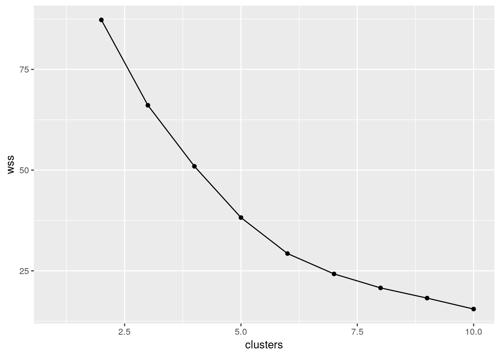

# Cluster analysis

Packages for this chapter:


```r
library(MASS)
library(tidyverse)
```

```
## ── Attaching packages ────────────────────────────────── tidyverse 1.2.1 ──
```

```
## ✔ ggplot2 3.1.0     ✔ purrr   0.2.5
## ✔ tibble  1.4.2     ✔ dplyr   0.7.8
## ✔ tidyr   0.8.1     ✔ stringr 1.3.1
## ✔ readr   1.1.1     ✔ forcats 0.3.0
```

```
## ── Conflicts ───────────────────────────────────── tidyverse_conflicts() ──
## ✖ dplyr::filter() masks stats::filter()
## ✖ dplyr::lag()    masks stats::lag()
## ✖ dplyr::select() masks MASS::select()
```


##  Dissimilarities between fruits


 Consider the fruits apple, orange, banana, pear,
strawberry, blueberry. We are going to work with these four
properties of fruits:


* has a round shape

* Is sweet

* Is crunchy

* Is a berry


(a)  Make a table with fruits as columns, and with
rows "round shape", "sweet", "crunchy", "berry". In each cell
of the table, put a 1 if the fruit has the property named in the
row, and a 0 if it does not. (This is your opinion, and may not
agree with mine. That doesn't matter, as long as you follow through
with whatever your choices were.)
 
Solution


Something akin to this:


```

Fruit        Apple Orange Banana Pear Strawberry Blueberry
Round shape    1      1      0     0       0         1
Sweet          1      1      0     0       1         0
Crunchy        1      0      0     1       0         0
Berry          0      0      0     0       1         1

```

You'll have to make a choice about "crunchy". I usually eat
pears before they're fully ripe, so to me, they're crunchy.
 

(b) We'll define the dissimilarity between two fruits to be the
number of qualities they *disagree* on. Thus, for example, the
dissimilarity between Apple and Orange is 1 (an apple is crunchy and
an orange is not, but they agree on everything else). Calculate the
dissimilarity between each pair of fruits, and make a square table
that summarizes the results. (To save yourself some work, note that
the dissimilarity between a fruit and itself must be zero, and the
dissimilarity between fruits A and B is the same as that between B
and A.) Save your table of dissimilarities into a file for the next part.
 
Solution


I got this, by counting them:

```
 
Fruit         Apple  Orange   Banana   Pear  Strawberry  Blueberry
Apple           0       1       3       2        3          3
Orange          1       0       2       3        2          2
Banana          3       2       0       1        2          2
Pear            2       3       1       0        3          3
Strawberry      3       2       2       3        0          2
Blueberry       3       2       2       3        2          0

```

I copied this into a file `fruits.txt`. Note that (i) I
have aligned my columns, so that I will be able to use
`read_table` later, and (ii) I have given the first column
a name, since `read_table` wants the same number of column
names as columns.

Extra: yes, you can do this in R too. We've seen some of the tricks
before. 

Let's start by reading in my table of fruits and properties, which
I saved in
[link](http://www.utsc.utoronto.ca/~butler/d29/fruit1.txt):

```r
my_url="http://www.utsc.utoronto.ca/~butler/d29/fruit1.txt"
fruit1=read_table(my_url)
```

```
## Parsed with column specification:
## cols(
##   Property = col_character(),
##   Apple = col_integer(),
##   Orange = col_integer(),
##   Banana = col_integer(),
##   Pear = col_integer(),
##   Strawberry = col_integer(),
##   Blueberry = col_integer()
## )
```

```r
fruit1 
```

```
## # A tibble: 4 x 7
##   Property    Apple Orange Banana  Pear Strawberry Blueberry
##   <chr>       <int>  <int>  <int> <int>      <int>     <int>
## 1 Round.shape     1      1      0     0          0         1
## 2 Sweet           1      1      0     0          1         0
## 3 Crunchy         1      0      0     1          0         0
## 4 Berry           0      0      0     0          1         1
```

     

We don't need the first column, so we'll get rid of it:


```r
fruit2 = fruit1 %>% select(-Property)
fruit2
```

```
## # A tibble: 4 x 6
##   Apple Orange Banana  Pear Strawberry Blueberry
##   <int>  <int>  <int> <int>      <int>     <int>
## 1     1      1      0     0          0         1
## 2     1      1      0     0          1         0
## 3     1      0      0     1          0         0
## 4     0      0      0     0          1         1
```

 

The loop way is the most direct. We're going to be looking at
combinations of fruits and other fruits, so we'll need two loops one
inside the other. It's easier for this to work with column numbers,
which here are 1 through 6, and we'll make a matrix `m` with
the dissimilarities in it, which we have to initialize first. I'll
initialize it to a $6\times 6$ matrix of `-1`, since the final
dissimilarities are 0 or bigger, and this way I'll know if I forgot
anything.

Here's where we are at so far:


```r
fruit_m=matrix(-1,6,6)
for (i in 1:6) {
for (j in 1:6) {
fruit_m[i,j]=3 # dissim between fruit i and fruit j
}
}
```

 

This, of course, doesn't run yet. The sticking point is how to
calculate the dissimilarity between two columns. I think that is a
separate thought process that should be in a function of its own. The
inputs are the two column numbers, and a data frame to get those
columns from:


```r
dissim=function(i,j,d) {
x = d %>% select(i)
y = d %>% select(j)
sum(x!=y)
}
dissim(1,2,fruit2)
```

```
## [1] 1
```

 

Apple and orange differ by one (not being crunchy). The process is:
grab the $i$-th column and call it `x`, grab the $j$-th column
and call it `y`. These are two one-column data frames with four
rows each (the four properties). `x!=y` goes down the rows, and
for each one gives a `TRUE` if they're different and a
`FALSE` if they're the same. So `x!=y` is a collection
of four T-or-F values. This seems backwards, but I was thinking of
what we want to do: we want to count the number of different
ones. Numerically, `TRUE` counts as 1 and `FALSE` as 0,
so we should make the thing we're counting (the different ones) come
out as `TRUE`. To count the number of `TRUE`s (1s), add
them up. 

That was a complicated thought process, so it was probably wise to
write a function to do it. Now, in our loop, we only have to call the
function (having put some thought into getting it right):


```r
fruit_m=matrix(-1,6,6)
for (i in 1:6) {
for (j in 1:6) {
fruit_m[i,j]=dissim(i,j,fruit2)
}
}
fruit_m
```

```
##      [,1] [,2] [,3] [,4] [,5] [,6]
## [1,]    0    1    3    2    3    3
## [2,]    1    0    2    3    2    2
## [3,]    3    2    0    1    2    2
## [4,]    2    3    1    0    3    3
## [5,]    3    2    2    3    0    2
## [6,]    3    2    2    3    2    0
```

 

The last step is re-associate the fruit names with this matrix. This
is a `matrix` so it has a `rownames` and a
`colnames`. We set both of those, but first we have to get the
fruit names from `fruit2`:


```r
fruit_names=names(fruit2)
rownames(fruit_m)=fruit_names
colnames(fruit_m)=fruit_names
fruit_m
```

```
##            Apple Orange Banana Pear Strawberry Blueberry
## Apple          0      1      3    2          3         3
## Orange         1      0      2    3          2         2
## Banana         3      2      0    1          2         2
## Pear           2      3      1    0          3         3
## Strawberry     3      2      2    3          0         2
## Blueberry      3      2      2    3          2         0
```

 

This is good to go into the cluster analysis (happening later).

There is a `tidyverse` way to do this also. It's actually a lot
like the loop way in its conception, but the coding looks
different. We start by making all combinations of the fruit names with
each other, which is `crossing`:


```r
combos=crossing(fruit=fruit_names,other=fruit_names)
combos
```

```
## # A tibble: 36 x 2
##    fruit  other     
##    <chr>  <chr>     
##  1 Apple  Apple     
##  2 Apple  Banana    
##  3 Apple  Blueberry 
##  4 Apple  Orange    
##  5 Apple  Pear      
##  6 Apple  Strawberry
##  7 Banana Apple     
##  8 Banana Banana    
##  9 Banana Blueberry 
## 10 Banana Orange    
## # ... with 26 more rows
```

 

Now, we want a function that, given any two fruit *names*, works
out the dissimilarity between them. A happy coincidence is that we can
use the function we had before, *unmodified*! How? Take a look: 


```r
dissim=function(i,j,d) {
x = d %>% select(i)
y = d %>% select(j)
sum(x!=y)
}
dissim("Apple","Orange",fruit2)
```

```
## [1] 1
```

 

`select` can take a column number *or a column name*, so
that running it with column names gives the right answer.

Now, we want to run this function for each of the pairs in
`combos`. The "for each" is `fruit` and `other`
in parallel, so it's `map2` rather than `map`. Also, the
dissimilarity is a whole number each time, so we need
`map2_int`. So we can do this:


```r
combos %>% mutate(dissim=map2_int(fruit,other,dissim,fruit2))
```

```
## # A tibble: 36 x 3
##    fruit  other      dissim
##    <chr>  <chr>       <int>
##  1 Apple  Apple           0
##  2 Apple  Banana          3
##  3 Apple  Blueberry       3
##  4 Apple  Orange          1
##  5 Apple  Pear            2
##  6 Apple  Strawberry      3
##  7 Banana Apple           3
##  8 Banana Banana          0
##  9 Banana Blueberry       2
## 10 Banana Orange          2
## # ... with 26 more rows
```

 

This would work just as well using `fruit1` rather than
`fruit`, since we are picking out the columns by name rather
than number.

To make this into something we can turn into a `dist` object
later, we need to `spread` the column `other` to make a
square array:


```r
fruit_spread = combos %>% 
mutate(dissim=map2_int(fruit,other,dissim,fruit2)) %>%
spread(other,dissim)
fruit_spread
```

```
## # A tibble: 6 x 7
##   fruit      Apple Banana Blueberry Orange  Pear Strawberry
##   <chr>      <int>  <int>     <int>  <int> <int>      <int>
## 1 Apple          0      3         3      1     2          3
## 2 Banana         3      0         2      2     1          2
## 3 Blueberry      3      2         0      2     3          2
## 4 Orange         1      2         2      0     3          2
## 5 Pear           2      1         3      3     0          3
## 6 Strawberry     3      2         2      2     3          0
```

 

Done!
 

(c) Do a hierarchical cluster analysis using complete
linkage. Display your dendrogram.
 
Solution


First, we need to take one of our matrices of dissimilarities
and turn it into a `dist` object. Since I asked you to
save yours into a file, let's start from there. Mine is aligned
columns: 

```r
dissims=read_table("fruits.txt")
```

```
## Parsed with column specification:
## cols(
##   fruit = col_character(),
##   Apple = col_integer(),
##   Orange = col_integer(),
##   Banana = col_integer(),
##   Pear = col_integer(),
##   Strawberry = col_integer(),
##   Blueberry = col_integer()
## )
```

```r
dissims
```

```
## # A tibble: 6 x 7
##   fruit      Apple Orange Banana  Pear Strawberry Blueberry
##   <chr>      <int>  <int>  <int> <int>      <int>     <int>
## 1 Apple          0      1      3     2          3         3
## 2 Orange         1      0      2     3          2         2
## 3 Banana         3      2      0     1          2         2
## 4 Pear           2      3      1     0          3         3
## 5 Strawberry     3      2      2     3          0         2
## 6 Blueberry      3      2      2     3          2         0
```

      

Then turn it into a `dist` object. The first step is to take
off the first column, since `as.dist` can get the names from
the columns:


```r
d = dissims %>% select(-fruit) %>%
as.dist()
d
```

```
##            Apple Orange Banana Pear Strawberry
## Orange         1                              
## Banana         3      2                       
## Pear           2      3      1                
## Strawberry     3      2      2    3           
## Blueberry      3      2      2    3          2
```


If you forget to take off the first column, this happens:


```r
as.dist(dissims)
```

```
## Warning in storage.mode(m) <- "numeric": NAs introduced by coercion
```

```
## Warning in as.dist.default(dissims): non-square matrix
```

```
## Error in dimnames(df) <- if (is.null(labels)) list(seq_len(size), seq_len(size)) else list(labels, : length of 'dimnames' [1] not equal to array extent
```

 

The key thing here is "non-square matrix": you have one more column
than you have rows, since you have a column of fruit names.

This one is `as.dist` since you already have dissimilarities
and you want to arrange them into the right type of
thing. `dist` is for *calculating* dissimilarities, which
we did before, so we don't want to do that now.

Now, after all that work, the actual cluster analysis and dendrogram:

```r
fruits.1=hclust(d,method="complete")
plot(fruits.1)
```


     
 

(d) How many clusters, of what fruits, do you seem to have?
Explain briefly.
 
Solution


I reckon I have three clusters: strawberry and blueberry in one,
apple and orange in the second, and banana and pear in the
third. (If your dissimilarities were different from mine, your
dendrogram will be different also.)
 

(e) Pick a pair of clusters (with at least 2 fruits in each)
from your dendrogram. Verify that 
the complete-linkage distance on your dendrogram is correct.
 
Solution


I'll pick strawberry-blueberry and and apple-orange. I'll arrange
the dissimilarities like this:

```

apple   orange
strawberry    3       2
blueberry     3       2

```

The largest of those is 3, so that's the complete-linkage
distance. That's also what the dendrogram says.
(Likewise, the smallest of those is 2, so 2 is the
single-linkage distance.) That is to say, the largest distance or
dissimilarity 
from anything in one cluster to anything in the other is 3, and
the smallest is 2.
I don't mind which pair of clusters you take, as long as you spell
out the dissimilarity (distance) between each fruit in each
cluster, and take the maximum of those. Besides, if your
dissimilarities are different from mine, your complete-linkage
distance could be different from mine also. The grader will have
to use her judgement!
<label for="tufte-mn-" class="margin-toggle">&#8853;</label><input type="checkbox" id="tufte-mn-" class="margin-toggle"><span class="marginnote">That's two cups of coffee I owe the      grader now.</span>  
The important point is that you assess the dissimilarities between
fruits in one cluster and fruits in the other. The dissimilarities
between fruits in the same cluster don't enter into it.
<label for="tufte-mn-" class="margin-toggle">&#8853;</label><input type="checkbox" id="tufte-mn-" class="margin-toggle"><span class="marginnote">I      now have a mental image of John Cleese saying *it don't enter      into it* in the infamous Dead Parrot sketch,      https://www.youtube.com/watch?v=4vuW6tQ0218}. Not to      mention       *Ow to defend yourself against an assailant armed with fresh      fruit*, https://www.youtube.com/watch?v=piWCBOsJr-w}.    </span>
As it happens, all my complete-linkage distances between clusters
(of at least 2 fruits) are 3. The single-linkage ones are
different, though:

```r
fruits.2=hclust(d,method="single")
plot(fruits.2)
```


     

All the single-linkage cluster distances are 2. (OK, so this wasn't a
very interesting example, but I wanted to give you one where you could
calculate what was going on.)
 


##  Similarity of species 


 Two scientists assessed the dissimilarity
between a number 
of species by recording the number of positions in the protein
molecule cytochrome-$c$ where the two species being compared have
different amino acids. The dissimilarities that they recorded are in
[link](http://www.utsc.utoronto.ca/~butler/d29/species.txt).


(a) Read the data into a data frame and take a look at it.


Solution


Nothing much new here:

```r
my_url="http://www.utsc.utoronto.ca/~butler/d29/species.txt"
species=read_delim(my_url," ")
```

```
## Parsed with column specification:
## cols(
##   what = col_character(),
##   Man = col_integer(),
##   Monkey = col_integer(),
##   Horse = col_integer(),
##   Pig = col_integer(),
##   Pigeon = col_integer(),
##   Tuna = col_integer(),
##   Mould = col_integer(),
##   Fungus = col_integer()
## )
```

```r
species
```

```
## # A tibble: 8 x 9
##   what     Man Monkey Horse   Pig Pigeon  Tuna Mould Fungus
##   <chr>  <int>  <int> <int> <int>  <int> <int> <int>  <int>
## 1 Man        0      1    17    13     16    31    63     66
## 2 Monkey     1      0    16    12     15    32    62     65
## 3 Horse     17     16     0     5     16    27    64     68
## 4 Pig       13     12     5     0     13    25    64     67
## 5 Pigeon    16     15    16    13      0    27    59     66
## 6 Tuna      31     32    27    25     27     0    72     69
## 7 Mould     63     62    64    64     59    72     0     61
## 8 Fungus    66     65    68    67     66    69    61      0
```

     

This is a square array of dissimilarities between the eight species.

The data set came from the 1960s, hence the use of "Man" rather than
"human". It probably also came from the UK, judging by the spelling
of `Mould`.

(I gave the first column the name `what` so that you could
safely use `species` for the whole data frame.)
    


(b) Bearing in mind that the values you read in are
*already* dissimilarities, convert them into a `dist`
object suitable for running a cluster analysis on, and display the
results. (Note that you need to get rid of any columns that don't
contain numbers.)


Solution


The point here is that the values you have are *already*
dissimilarities, so no conversion of the numbers is required. Thus
this is a job for `as.dist`, which merely changes how it
looks. Use a pipeline to get rid of the first column first:

```r
d = species %>%
select(-what) %>% 
as.dist()
d
```

```
##        Man Monkey Horse Pig Pigeon Tuna Mould
## Monkey   1                                   
## Horse   17     16                            
## Pig     13     12     5                      
## Pigeon  16     15    16  13                  
## Tuna    31     32    27  25     27           
## Mould   63     62    64  64     59   72      
## Fungus  66     65    68  67     66   69    61
```


This doesn't display anything that it doesn't need to: we know that the
dissimilarity between a species and itself is zero (no need to show
that), and that the dissimilarity between B and A is the same as
between A and B, so no need to show everything twice. It might look as
if you are missing a row and a column, but one of the species (Fungus)
appears only in a row and one of them (Man) only in a column.

This also works, to select only the numerical columns:


```r
species %>%
select_if(is.numeric) %>%
as.dist()
```

```
##        Man Monkey Horse Pig Pigeon Tuna Mould
## Monkey   1                                   
## Horse   17     16                            
## Pig     13     12     5                      
## Pigeon  16     15    16  13                  
## Tuna    31     32    27  25     27           
## Mould   63     62    64  64     59   72      
## Fungus  66     65    68  67     66   69    61
```

 

Extra: data frames officially have an attribute called "row names",
that is displayed where the row numbers display, but which isn't
actually a column of the data frame. In the past, when we used
`read.table` with a dot, the first column of data read in from
the file could be nameless (that is, you could have one more column of
data than you had column names) and the first column would be treated
as row names. People used row names for things like identifier
variables. But row names have this sort of half-existence, and when
Hadley Wickham designed the `tidyverse`, he decided not to use
row names, taking the attitude that if it's part of the data, it
should be in the data frame as a genuine column. This means that when
you use a `read_` function, you have to have exactly as many
column names as columns. 

For these data, I previously had the column here called
`what` as row names, and `as.dist` automatically got rid
of the row names when formatting the distances. Now, it's a
genuine column, so I have to get rid of it before running
`as.dist`. This is more work, but it's also more honest, and
doesn't involve thinking about row names at all. So, on balance, I
think it's a win.
  


(c) Run a cluster analysis using single-linkage and obtain a dendrogram.


Solution


Something like this:

```r
species.1=hclust(d,method="single")
plot(species.1)
```


     
    


(d) Run a cluster analysis using Ward's method and obtain a dendrogram.


Solution


Not much changes  here in the code, but the result is noticeably
different:

```r
species.2=hclust(d,method="ward.D")
plot(species.2)
```


  

Fewer points this time since you're doing much of the same stuff over again.

Don't forget to take care with the `method`: it has to be
`ward` in lowercase (even though it's someone's name) followed
by a D in uppercase.

    


(e) Describe how the two dendrograms from the last two parts
look different.


Solution


This is (as ever with this kind of thing) a judgement call. Your
job is to come up with something reasonable.
For myself, I was thinking about how single-linkage tends to
produce "stringy" clusters that join single objects (species)
onto already-formed clusters. Is that happening here? Apart from
the first two clusters, man and monkey, horse and pig,
*everything* that gets joined on is a single species joined
on to a bigger cluster, including mould and fungus right at the
end. Contrast that with the output from Ward's method, where, for
the most part, groups are formed first and then joined onto other
groups. For example, in Ward's method, mould and fungus are joined
earlier, and also the man-monkey group is joined to the
pigeon-horse-pig group.
<label for="tufte-mn-" class="margin-toggle">&#8853;</label><input type="checkbox" id="tufte-mn-" class="margin-toggle"><span class="marginnote">Tuna is an exception, but usually Ward    tends to join fairly dissimilar things that are nonetheless more    similar to each other than to anything else. This is like    Hungarian and Finnish in the example in class: they are very    dissimilar languages, but they are more similar to each other than    to anything else.</span>
You might prefer to look at the specifics of what gets joined. I
think the principal difference from this angle is that mould and
fungus get joined together (much) earlier in Ward. Also, pigeon
gets joined to horse and pig first under Ward, but *after*
those have been joined to man and monkey under
single-linkage. This is also a reasonable kind of observation.
    


(f) Looking at your clustering for Ward's method, what seems to
be a sensible number of clusters? Draw boxes around those clusters.


Solution


Pretty much any number of clusters bigger than 1 and smaller than
8 is ok here, but I would prefer to see something between 2 and
5, because a number of clusters of that sort offers (i) some
insight ("these things are like these other things") and (ii) a
number of clusters of that sort is supported by the data.
To draw those clusters, you need `rect.hclust`, and
before that you'll need to plot the cluster object again. For 2
clusters, that would look like this:

```r
plot(species.2)
rect.hclust(species.2,2)
```


 

This one is "mould and fungus vs.\ everything else". (My red boxes
seem to have gone off the side, sorry.)

Or we could go to the other end of the scale:


```r
plot(species.2)
rect.hclust(species.2,5)
```


 

Five is not really an insightful number of clusters with 8 species,
but it seems to correspond (for me at least) with a reasonable
division of these species into "kinds of living things". That is, I
am bringing some outside knowledge into my number-of-clusters division.
    


(g) List which cluster each species is in, for your preferred
number of clusters (from Ward's method).


Solution


This is `cutree`. For 2 clusters it would be this:

```r
cutree(species.2,2)
```

```
##    Man Monkey  Horse    Pig Pigeon   Tuna  Mould Fungus 
##      1      1      1      1      1      1      2      2
```

     

For 5 it would be this:


```r
cutree(species.2,5)
```

```
##    Man Monkey  Horse    Pig Pigeon   Tuna  Mould Fungus 
##      1      1      2      2      2      3      4      5
```

 

and anything in between is in between. 

These ones came out sorted, so there is no need to sort them (so you
don't need the methods of the next question).
    


##  Rating beer


 Thirty-two students each rated 10 brands of beer:


* Anchor Steam

* Bass

* Beck's

* Corona

* Gordon Biersch

* Guinness

* Heineken

* Pete's Wicked Ale

* Sam Adams

* Sierra Nevada

The ratings are on a scale of 1 to 9, with a higher
rating being better.
The data are in
[link](http://www.utsc.utoronto.ca/~butler/d29/beer.txt).  I
abbreviated the beer names for the data file. I hope you can figure
out which is which.


(a) Read in the data, and look at the first few rows.
 
Solution


Data values are aligned in columns, but the column headers are
not aligned with them, so `read_table2`:

```r
my_url="http://www.utsc.utoronto.ca/~butler/d29/beer.txt"
beer=read_table2(my_url)
```

```
## Parsed with column specification:
## cols(
##   student = col_character(),
##   AnchorS = col_integer(),
##   Bass = col_integer(),
##   Becks = col_integer(),
##   Corona = col_integer(),
##   GordonB = col_integer(),
##   Guinness = col_integer(),
##   Heineken = col_integer(),
##   PetesW = col_integer(),
##   SamAdams = col_integer(),
##   SierraN = col_integer()
## )
```

```r
beer
```

```
## # A tibble: 32 x 11
##    student AnchorS  Bass Becks Corona GordonB Guinness Heineken PetesW
##    <chr>     <int> <int> <int>  <int>   <int>    <int>    <int>  <int>
##  1 S001          5     9     7      1       7        6        6      5
##  2 S008          7     5     6      8       8        4        8      8
##  3 S015          7     7     5      6       6        1        8      4
##  4 S022          7     7     5      2       5        8        4      6
##  5 S029          9     7     3      1       6        8        2      7
##  6 S036          7     6     4      3       7        6        6      5
##  7 S043          5     5     5      6       6        4        7      5
##  8 S050          5     3     1      5       5        5        3      5
##  9 S057          9     3     2      6       4        6        1      5
## 10 S064          2     6     6      5       6        4        8      4
## # ... with 22 more rows, and 2 more variables: SamAdams <int>,
## #   SierraN <int>
```

       

32 rows (students), 11 columns (10 beers, plus a column of student IDs).
All seems to be kosher. If beer can be kosher.
 

(b) The researcher who collected the data wants to see which
beers are rated similarly to which other beers. Try to create a
distance matrix from these data and explain why it didn't do what
you wanted. (Remember to get rid of the `student` column
first.) 
 
Solution


The obvious thing is to feed these ratings into `dist`
(we are *creating* distances rather than re-formatting
things that are already distances). We need to skip the first
column, since those are student identifiers:

```r
d = beer %>%
select(-student) %>%
dist()
glimpse(d)
```

```
##  'dist' num [1:496] 9.8 8.49 6.56 8.89 8.19 ...
##  - attr(*, "Size")= int 32
##  - attr(*, "Diag")= logi FALSE
##  - attr(*, "Upper")= logi FALSE
##  - attr(*, "method")= chr "euclidean"
##  - attr(*, "call")= language dist(x = .)
```

     

Feel free to be offended by my choice of the letter `d` to
denote both data frames (that I didn't want to give a better name to)
and dissimilarities in `dist` objects.

You can look at the whole thing if you like, though it is rather
large. A `dist` object is stored internally as a long vector
(here of 496 values); it's displayed as a nice triangle. The clue here
is the thing called `Size`, which indicates that we have a
$32\times 32$ matrix of distances *between the 32 students*, so
that if we were to go on and do a cluster analysis based on this
`d`, we'd get a clustering of the *students* rather than
of the *beers*, as we want. (If you just print out `d`,
you'll see that is of distances between 32 (unlabelled) objects, which
by inference must be the 32 students.)

It might be interesting to do a cluster analysis of the 32 students
(it would tell you which of the students have similar taste in beer),
but that's not what we have in mind here.
 

(c) The R function `t()` *transposes* a matrix: that
is, it interchanges rows and columns. Feed the transpose of your
read-in beer ratings into `dist`. Does this now give
distances between beers?
 
Solution


Again, omit the first column. The pipeline code looks a bit weird:

```r
d = beer %>%
select(-student) %>%
t() %>%
dist()
```

   

so you should feel free to do it in a couple of steps. This way shows
that you can also refer to columns by number:


```r
beer2 = beer %>% select(-1)
d=dist(t(beer2))
```

 

Either way gets you to the same place:


```r
d
```

```
##           AnchorS     Bass    Becks   Corona  GordonB Guinness Heineken
## Bass     15.19868                                                      
## Becks    16.09348 13.63818                                             
## Corona   20.02498 17.83255 17.54993                                    
## GordonB  13.96424 11.57584 14.42221 13.34166                           
## Guinness 14.93318 13.49074 16.85230 20.59126 14.76482                  
## Heineken 20.66398 15.09967 13.78405 14.89966 14.07125 18.54724         
## PetesW   11.78983 14.00000 16.37071 17.72005 11.57584 14.28286 19.49359
## SamAdams 14.62874 11.61895 14.73092 14.93318 10.90871 15.90597 14.52584
## SierraN  12.60952 15.09967 17.94436 16.97056 11.74734 13.34166 19.07878
##            PetesW SamAdams
## Bass                      
## Becks                     
## Corona                    
## GordonB                   
## Guinness                  
## Heineken                  
## PetesW                    
## SamAdams 14.45683         
## SierraN  13.41641 12.12436
```

 

There are 10 beers with these names, so this is good.
 

(d) Try to explain briefly why I used `as.dist` in the
class example (the languages one) but `dist` here. (Think
about the form of the input to each function.)
 
Solution


`as.dist` is used if you *already* have
dissimilarities (and you just want to format them right), but
`dist` is used if you have 
*data on variables* and you want to *calculate*
dissimilarities. 
 

(e) <a name="part:beer-dendro">*</a> Obtain a clustering of the beers, using Ward's method. Show
the dendrogram.
 
Solution


This:

```r
beer.1=hclust(d,method="ward.D")
plot(beer.1)
```


       
 

(f) What seems to be a sensible number of clusters? Which
beers are in which cluster?
 
Solution


This is a judgement call. Almost anything sensible is
reasonable. I personally think that two clusters is good, beers
Anchor Steam, Pete's Wicked Ale, Guinness and Sierra Nevada in
the first, and Bass, Gordon Biersch, Sam Adams, Corona, Beck's,
and Heineken in the second.
You could make a case for three clusters, splitting off
Corona, Beck's and Heineken  into their own cluster, or even
about 5 clusters as 
Anchor Steam, Pete's Wicked Ale; Guinness, Sierra Nevada; Bass,
Gordon Biersch, Sam Adams; Corona; Beck's, Heineken.
The idea is to have a number of clusters sensibly smaller than
the 10 observations, so that you are getting some actual
insight. Having 8 clusters for 10 beers wouldn't be very
informative! (This is where you use your own knowledge about
beer to help you rationalize your choice of number of clusters.) 
Extra: as to why the clusters split up like this, I think the four
beers on the left of my dendrogram are "dark" and the six on
the right are "light" (in colour), and I would expect the
students to tend to like all the beers of one type and not so
much all the beers of the other type.
You knew I would have to investigate this, didn't you? Let's aim
for a scatterplot of all the ratings for the dark  beers,
against the ones for the light beers. 
Start with the data frame read in from the file:

```r
beer
```

```
## # A tibble: 32 x 11
##    student AnchorS  Bass Becks Corona GordonB Guinness Heineken PetesW
##    <chr>     <int> <int> <int>  <int>   <int>    <int>    <int>  <int>
##  1 S001          5     9     7      1       7        6        6      5
##  2 S008          7     5     6      8       8        4        8      8
##  3 S015          7     7     5      6       6        1        8      4
##  4 S022          7     7     5      2       5        8        4      6
##  5 S029          9     7     3      1       6        8        2      7
##  6 S036          7     6     4      3       7        6        6      5
##  7 S043          5     5     5      6       6        4        7      5
##  8 S050          5     3     1      5       5        5        3      5
##  9 S057          9     3     2      6       4        6        1      5
## 10 S064          2     6     6      5       6        4        8      4
## # ... with 22 more rows, and 2 more variables: SamAdams <int>,
## #   SierraN <int>
```

       

The aim is to find the average rating for a dark beer and a light beer
for each student, and then plot them against each other. Does a
student who likes dark beer tend not to like light beer, and vice versa?

We need to: `gather` all the rating columns into one, labelled
by `name` of beer. Then create a variable that is `dark`
if we're looking at one of the dark beers and `light`
otherwise. `ifelse` works like "if" in a spreadsheet: a
logical thing that is either true or false, followed by a value if
true and a value if false. There is a nice R command `%in%`
which is `TRUE` if the thing in the first variable is to be
found somewhere in the list of things given next (here, one of the
apparently dark beers). (Another way to do this, which will appeal to
you more if you like databases, is to create a second data frame with
two columns, the first being the beer names, and the second being
`dark` or `light` as appropriate for that beer. Then you
use a "left join" to look up beer type from beer name.)

Next, group by beer type within student. Giving two things to
`group_by` does it this way: the second thing within (or ``for
each of'') the first. 

Then calculate the mean
rating within each group. This gives one column of students, one
column of beer types, 
and one column of rating means. 

Then we need to `spread` beer type
into two columns so that we can make a scatterplot of the mean ratings
for light and dark against
each other. 

Finally, we make a scatterplot. 

You'll see the final version of this that worked, but rest assured
that there were many intervening versions of this that didn't!

I urge you to examine the chain one line at a time and see what each
line does. That was how I debugged it.

Off we go:


```r
beer %>%
gather(name,rating,AnchorS:SierraN) %>%
mutate(beer.type=ifelse(name %in%
c("AnchorS","PetesW","Guinness","SierraN"),"dark","light")) %>%
group_by(student,beer.type) %>%
summarize(mean.rat=mean(rating)) %>%
spread(beer.type,mean.rat) %>%
ggplot(aes(x=dark,y=light))+geom_point()
```


 

After all that work, not really. There are some students who like
light beer but not dark beer (top left), there is a sort of vague
straggle down to the bottom right, where some students like dark beer
but not light beer, but there are definitely students at the top
right, who just like beer! 

The only really empty part of this plot is
the bottom left, which says that these students don't hate both kinds
of beer; they like either dark beer, or light beer, or both.

The reason a `ggplot` fits into this "workflow" is that the
first thing you feed into `ggplot` is a data frame, the one
created by the chain here. Because it's in a chain, you don't have the
first thing on `ggplot`, so you can concentrate on the
`aes` ("what to plot") and then the "how to plot it". 
Now back to your regularly-scheduled programming.
 

(g) Re-draw your dendrogram with your clusters indicated.
 
Solution


`rect.hclust`, with your chosen number  of clusters:

```r
plot(beer.1)
rect.hclust(beer.1,2)
```


       

Or if you prefer 5 clusters, like this:


```r
plot(beer.1)
rect.hclust(beer.1,5)
```


 

Same idea with any other number of clusters. If you follow through
with your preferred number of clusters from the previous part, I'm good.
 

(h) Obtain a K-means
clustering
<label for="tufte-mn-" class="margin-toggle">&#8853;</label><input type="checkbox" id="tufte-mn-" class="margin-toggle"><span class="marginnote">If we haven't done this in class yet, skip the      rest of the question, and the following question, for now and      come back to it next week.</span> with 2 clusters. 
Note that you will need to use the (transposed) 
*original  data*, not the distances. Use a suitably large value of
`nstart`. (The data are ratings all on the same scale, so
there is no need for `scale` here. In case you were
wondering.) 
 
Solution


       
I used 20 for `nstart`. This is the pipe way:

```r
beer.2 = beer %>% select(-1) %>%
t() %>%
kmeans(2,nstart=20)
```

       

Not everyone (probably) will get the same answer, because of the
random nature of the procedure, but the above code should be good
whatever output it produces.
 

(i) How many beers are in each cluster?
 
Solution


On mine:

```r
beer.2$size
```

```
## [1] 4 6
```

       

You might get the same numbers the other way around.
 

(j) *Which* beers are in each cluster? You can do this
simply by obtaining the cluster memberships and using
`sort` as in the last question, or you can do it as I did
in class by obtaining the 
names of the things to be clustered and picking out the ones of
them that are in cluster 1, 2, 3, \ldots .)
 
Solution


The cluster numbers of each beer are these:


```r
clus=beer.2$cluster
clus
```

```
##  AnchorS     Bass    Becks   Corona  GordonB Guinness Heineken   PetesW 
##        1        2        2        2        2        1        2        1 
## SamAdams  SierraN 
##        2        1
```

  
This is almost what you want. In fact, this will do it without digging
out the beer names:


```r
sort(clus)
```

```
##  AnchorS Guinness   PetesW  SierraN     Bass    Becks   Corona  GordonB 
##        1        1        1        1        2        2        2        2 
## Heineken SamAdams 
##        2        2
```

 

Or, make a data frame:


```r
dd=tibble(cluster=beer.2$cluster,
beer=names(beer.2$cluster)) %>%
arrange(cluster)
dd
```

```
## # A tibble: 10 x 2
##    cluster beer    
##      <int> <chr>   
##  1       1 AnchorS 
##  2       1 Guinness
##  3       1 PetesW  
##  4       1 SierraN 
##  5       2 Bass    
##  6       2 Becks   
##  7       2 Corona  
##  8       2 GordonB 
##  9       2 Heineken
## 10       2 SamAdams
```

 

These happen to be the same clusters as in my 2-cluster solution using
Ward's method.

The thing I called `clus` up above is actually just a vector,
but a vector with a "names" attribute. The actual values are the
cluster numbers, but they come with a name attached (the name of a
beer). These display when the vector is "printed".  To get those
into a data frame that we can deal with, we have to use `names`
to get the names and put them into a second column of the data frame.
 


##  Sites on the sea bed


 Biologists investigate the prevalence of
species of organism by sampling sites where the organisms might be,
taking a "grab" from the site, and sending the grabs to a laboratory
for analysis. The data in this question come from the sea bed. There
were 30 sites, labelled `s1` through `s30`. At each
site, five species of organism, labelled `a` through
`e`, were of interest; the data shown in those columns of the
data set were the number of organisms of that species identified in
the grab from that site. There are some other columns in the
(original) data set that will not concern us. Our interest is in
seeing which sites are similar to which other sites, so that a cluster
analysis will be suitable.

When the data are counts of different species, as they are here,
biologists often measure the dissimilarity in species prevalence
profiles between two sites using something called the Bray-Curtis
dissimilarity. It is not important to understand this for this
question (though I explain it in my solutions). I calculated the
Bray-Curtis dissimilarity between each pair of sites and stored the
results in [link](http://www.utsc.utoronto.ca/~butler/d29/seabed1.csv). 


(a) Read in the dissimilarity data and check that you have 30
rows and 30 columns of dissimilarities.


Solution


```r
my_url="http://www.utsc.utoronto.ca/~butler/d29/seabed1.csv"
seabed=read_csv(my_url)
```

```
## Parsed with column specification:
## cols(
##   .default = col_double()
## )
```

```
## See spec(...) for full column specifications.
```

```r
seabed
```

```
## # A tibble: 30 x 30
##       s1    s2    s3    s4    s5    s6    s7    s8    s9   s10   s11   s12
##    <dbl> <dbl> <dbl> <dbl> <dbl> <dbl> <dbl> <dbl> <dbl> <dbl> <dbl> <dbl>
##  1 0     0.457 0.296 0.467 0.477 0.522 0.455 0.933 0.333 0.403 0.357 0.375
##  2 0.457 0     0.481 0.556 0.348 0.229 0.415 0.930 0.222 0.447 0.566 0.215
##  3 0.296 0.481 0     0.467 0.508 0.522 0.491 1     0.407 0.343 0.214 0.325
##  4 0.467 0.556 0.467 0     0.786 0.692 0.870 1     0.639 0.379 0.532 0.549
##  5 0.477 0.348 0.508 0.786 0     0.419 0.212 0.854 0.196 0.564 0.373 0.319
##  6 0.522 0.229 0.522 0.692 0.419 0     0.509 0.933 0.243 0.571 0.530 0.237
##  7 0.455 0.415 0.491 0.870 0.212 0.509 0     0.806 0.317 0.588 0.509 0.358
##  8 0.933 0.930 1     1     0.854 0.933 0.806 0     0.895 1     0.938 0.929
##  9 0.333 0.222 0.407 0.639 0.196 0.243 0.317 0.895 0     0.489 0.349 0.159
## 10 0.403 0.447 0.343 0.379 0.564 0.571 0.588 1     0.489 0     0.449 0.419
## # ... with 20 more rows, and 18 more variables: s13 <dbl>, s14 <dbl>,
## #   s15 <dbl>, s16 <dbl>, s17 <dbl>, s18 <dbl>, s19 <dbl>, s20 <dbl>,
## #   s21 <dbl>, s22 <dbl>, s23 <dbl>, s24 <dbl>, s25 <dbl>, s26 <dbl>,
## #   s27 <dbl>, s28 <dbl>, s29 <dbl>, s30 <dbl>
```

     

Check. The columns are labelled with
the site names. (As I originally set this question, the data file was
read in with `read.csv` instead, and the site names were read
in as row names as well: see discussion elsewhere about row names. But
in the `tidyverse` we don't have row names.)
    


(b) Create a distance object out of your dissimilarities,
bearing in mind that the values are distances (well,
dissimilarities) already.


Solution


This one needs `as.dist` to convert already-distances into
a `dist` object. (`dist` would have
*calculated* distances from things that were not
distances/dissimilarities yet.)

```r
d=as.dist(seabed)
```

     

If you check, you'll see that the site names are being used to label
rows *and* columns of the dissimilarity matrix as displayed. The
lack of row names is not hurting us.
    


(c) Fit a cluster analysis using single-linkage, and display a
dendrogram of the results.


Solution


This:

```r
d.1=hclust(d,method="single")
plot(d.1)
```


     

This is a base-graphics plot, it not having any of the nice
`ggplot` things. But it does the job.

Single-linkage tends to produce "stringy" clusters, since the
individual being added to a cluster only needs to be close to one
thing in the cluster. Here, that manifests itself in sites getting
added to clusters one at a time: for example, sites 25 and 26 get
joined together into a cluster, and then in sequence sites 6, 16, 27,
30 and 22 get joined on to it (rather than any of those sites being
formed into clusters first). 

You might
<label for="tufte-mn-" class="margin-toggle">&#8853;</label><input type="checkbox" id="tufte-mn-" class="margin-toggle"><span class="marginnote">Conceivably.</span> be wondering what else is in that
`hclust` object, and what it's good for. Let's take a look:


```r
glimpse(d.1)
```

```
## List of 7
##  $ merge      : int [1:29, 1:2] -3 -25 -6 -9 -28 -16 -27 -1 -30 -24 ...
##  $ height     : num [1:29] 0.1 0.137 0.152 0.159 0.159 ...
##  $ order      : int [1:30] 21 14 29 23 15 1 19 18 2 7 ...
##  $ labels     : chr [1:30] "s1" "s2" "s3" "s4" ...
##  $ method     : chr "single"
##  $ call       : language hclust(d = d, method = "single")
##  $ dist.method: NULL
##  - attr(*, "class")= chr "hclust"
```

 

You might guess that `labels` contains the names of the sites,
and you'd be correct. Of the other things, the most interesting are
`merge` and `height`. Let's display them side by side:


```r
with(d.1,cbind(height,merge))
```

```
##          height        
##  [1,] 0.1000000  -3 -20
##  [2,] 0.1369863 -25 -26
##  [3,] 0.1523179  -6   2
##  [4,] 0.1588785  -9 -12
##  [5,] 0.1588785 -28   4
##  [6,] 0.1617647 -16   3
##  [7,] 0.1633987 -27   6
##  [8,] 0.1692308  -1 -19
##  [9,] 0.1807229 -30   7
## [10,] 0.1818182 -24   5
## [11,] 0.1956522  -5  10
## [12,] 0.2075472 -15   8
## [13,] 0.2083333 -14 -29
## [14,] 0.2121212  -7  11
## [15,] 0.2142857 -11   1
## [16,] 0.2149533  -2  14
## [17,] 0.2191781 -18  16
## [18,] 0.2205882 -22   9
## [19,] 0.2285714  17  18
## [20,] 0.2307692  12  19
## [21,] 0.2328767 -10  15
## [22,] 0.2558140  20  21
## [23,] 0.2658228 -23  22
## [24,] 0.2666667  13  23
## [25,] 0.3023256  -4 -13
## [26,] 0.3333333  24  25
## [27,] 0.3571429 -21  26
## [28,] 0.4285714  -8 -17
## [29,] 0.6363636  27  28
```

 

`height` is the vertical scale of the dendrogram. The first
height is 0.1, and if you look at the bottom of the dendrogram, the
first sites to be joined together are sites 3 and 20 at height 0.1
(the horizontal bar joining sites 3 and 20 is what you are looking
for). In the last two columns, which came from `merge`, you see
what got joined together, with negative numbers meaning individuals
(individual sites), and positive numbers meaning clusters formed
earlier. So, if you look at the third line, at height 0.152, site 6
gets joined to the cluster formed on line 2, which (looking back) we
see consists of sites 25 and 26. Go back now to the dendrogram; about
${3\over 4}$ of the way across, you'll see sites 25 and 26 joined
together into a cluster, and a little higher up the page, site 6 joins
that cluster.

I said that single linkage produces stringy clusters, and the way that
shows up in `merge` is that you often get an individual site
(negative number) joined onto a previously-formed cluster (positive
number). This is in contrast to Ward's method, below.
    


(d) Now fit a cluster analysis using Ward's method, and display
a dendrogram of the results.


Solution


Same thing, with small changes. The hard part is getting the name 
of the `method` right:

```r
d.2=hclust(d,method="ward.D")
plot(d.2,cex=0.7)
```


     

The site numbers were a bit close together, so I printed them out
smaller than usual size (which is what the `cex` and a number
less than 1 is doing: 70\% of normal size).

This time, there is a greater tendency for sites to be joined into
small clusters first, then these small clusters are joined
together. It's not perfect, but there is a greater tendency for it to
happen here.

This shows up in `merge` too:


```r
d.2$merge
```

```
##       [,1] [,2]
##  [1,]   -3  -20
##  [2,]  -25  -26
##  [3,]   -9  -12
##  [4,]  -28    3
##  [5,]   -1  -19
##  [6,]   -6    2
##  [7,]  -14  -29
##  [8,]   -5   -7
##  [9,]  -18  -24
## [10,]  -27    6
## [11,]  -16  -22
## [12,]   -2    4
## [13,]  -30   10
## [14,]  -15    5
## [15,]  -23    8
## [16,]   -4  -13
## [17,]  -11    1
## [18,]    9   12
## [19,]  -10   17
## [20,]   -8  -17
## [21,]   11   13
## [22,]  -21   15
## [23,]    7   22
## [24,]   14   19
## [25,]   16   24
## [26,]   18   21
## [27,]   20   23
## [28,]   26   27
## [29,]   25   28
```

 

There are relatively few instances of a site being joined to a cluster
of sites. Usually, individual sites get joined together (negative with
a negative, mainly at the top of the list), or clusters get joined to
clusters (positive with positive, mainly lower down the list).
    


(e) <a name="part:prefclust">*</a> On the Ward's method clustering, how many clusters would you
choose to divide the sites into? Draw rectangles around those clusters.


Solution


You may need to draw the plot again. In any case, a second line of
code draws the rectangles. I think three clusters is good, but you
can have a few more than that if you like:

```r
plot(d.2,cex=0.7)
rect.hclust(d.2,3)
```


   

What I want to see is a not-unreasonable choice of number of clusters
(I think you could go up to about six), and then a depiction of that
number of clusters on the plot. This is six clusters:


```r
plot(d.2,cex=0.7)
rect.hclust(d.2,6)
```


   

In all your plots, the `cex` is optional, but you can compare
the plots with it and without it and see which you prefer.

Looking at this, even seven clusters might work, but I doubt you'd
want to go beyond that. The choice of the number of clusters is mainly
an aesthetic
<label for="tufte-mn-" class="margin-toggle">&#8853;</label><input type="checkbox" id="tufte-mn-" class="margin-toggle"><span class="marginnote">This, I think, is the British spelling, with the  North American one being *esthetic*. My spelling is where the  *aes* in a *ggplot* comes from.</span> decision. 

  


(f) <a name="part:original">*</a> The original data is in
[link](http://www.utsc.utoronto.ca/~butler/d29/seabed.csv). Read in the
original data and verify that you again have 30 sites, variables
called `a` through `e` and some others.


Solution


This is really a very cheap two points:

```r
my_url="http://www.utsc.utoronto.ca/~butler/d29/seabed.csv"
seabed.z=read_csv(my_url)
```

```
## Parsed with column specification:
## cols(
##   site = col_character(),
##   a = col_integer(),
##   b = col_integer(),
##   c = col_integer(),
##   d = col_integer(),
##   e = col_integer(),
##   depth = col_integer(),
##   pollution = col_double(),
##   temp = col_double(),
##   sediment = col_character()
## )
```

```r
seabed.z
```

```
## # A tibble: 30 x 10
##    site      a     b     c     d     e depth pollution  temp sediment
##    <chr> <int> <int> <int> <int> <int> <int>     <dbl> <dbl> <chr>   
##  1 s1        0     2     9    14     2    72       4.8   3.5 s       
##  2 s2       26     4    13    11     0    75       2.8   2.5 c       
##  3 s3        0    10     9     8     0    59       5.4   2.7 c       
##  4 s4        0     0    15     3     0    64       8.2   2.9 s       
##  5 s5       13     5     3    10     7    61       3.9   3.1 c       
##  6 s6       31    21    13    16     5    94       2.6   3.5 g       
##  7 s7        9     6     0    11     2    53       4.6   2.9 s       
##  8 s8        2     0     0     0     1    61       5.1   3.3 c       
##  9 s9       17     7    10    14     6    68       3.9   3.4 c       
## 10 s10       0     5    26     9     0    69      10     3   s       
## # ... with 20 more rows
```

   

30 observations of 10 variables, including `a` through
`e`. Check.

I gave this a weird name so that it didn't overwrite my original
`seabed`, the one I turned into a distance object, though I
don't think I really needed to worry.

These data came from
[link](http://www.fbbva.es/TLFU/dat/DE_2013_multivariate.pdf),
<label for="tufte-mn-" class="margin-toggle">&#8853;</label><input type="checkbox" id="tufte-mn-" class="margin-toggle"><span class="marginnote">If  you are a soccer fan, you might recognize BBVA as a former sponsor  of the top Spanish soccer league, *La Liga BBVA* (as it was). BBVA  is a Spanish bank that also has a Foundation that published this  book.</span> from which I also got the definition of the Bray-Curtis
dissimilarity that I calculated for you. The data are in Exhibit 1.1
of that book.

  


(g) Go back to your Ward method dendrogram with the red
rectangles and find two sites in the same cluster. Display the
original data for your two sites and see if you can explain why they
are in the same cluster. It doesn't matter which two sites you choose;
the grader will merely check that your results look reasonable.


Solution


I want my two sites to be very similar, so I'm looking at two sites
that were joined into a cluster very early on, sites `s3` and
`s20`. As I said, I don't mind which ones you pick, but being
in the same cluster will be easiest to justify if you pick sites
that were joined together early.
Then you need to display just those rows of the original data (that
you just read in), which is a `filter` with an "or" in it:

```r
seabed.z %>% filter(site=="s3" | site=="s20")
```

```
## # A tibble: 2 x 10
##   site      a     b     c     d     e depth pollution  temp sediment
##   <chr> <int> <int> <int> <int> <int> <int>     <dbl> <dbl> <chr>   
## 1 s3        0    10     9     8     0    59       5.4   2.7 c       
## 2 s20       0    10    14     9     0    73       5.6   3   s
```

   

I think this odd-looking thing also works:


```r
seabed.z %>% filter(site %in% c("s3", "s20"))
```

```
## # A tibble: 2 x 10
##   site      a     b     c     d     e depth pollution  temp sediment
##   <chr> <int> <int> <int> <int> <int> <int>     <dbl> <dbl> <chr>   
## 1 s3        0    10     9     8     0    59       5.4   2.7 c       
## 2 s20       0    10    14     9     0    73       5.6   3   s
```

 

I'll also take displaying the lines one at a time, though it is easier
to compare them if they are next to each other.

Why are they in the same cluster? To be similar (that is, have a low
dissimilarity), the values of `a` through `e` should be
close together. Here, they certainly are: `a` and `e`
are both zero for both sites, and `b`, `c` and
`d` are around 10 for both sites. So I'd call that similar. 

You will probably pick a different pair of sites, and thus your
detailed discussion will differ from mine, but the general point of it
should be the same: pick a pair of sites in the same cluster (1 mark),
display those two rows of the original data (1 mark), some sensible
discussion of how the sites are similar (1 mark). As long as you pick
two sites in the same one of your clusters, I don't mind which ones
you pick. The grader will check that your two sites were indeed in the
same one of your clusters, then will check that you do indeed display
those two sites from the original data.

What happens if you pick sites from different clusters? Let's pick two
very dissimilar ones, sites 4 and 7 from opposite ends of my dendrogram:


```r
seabed.z %>% filter(site=="s4" | site=="s7")
```

```
## # A tibble: 2 x 10
##   site      a     b     c     d     e depth pollution  temp sediment
##   <chr> <int> <int> <int> <int> <int> <int>     <dbl> <dbl> <chr>   
## 1 s4        0     0    15     3     0    64       8.2   2.9 s       
## 2 s7        9     6     0    11     2    53       4.6   2.9 s
```

 

Site `s4` has no `a` or `b` at all, and site
`s7` has quite a few; site `s7` has no `c` at
all, while site `s4` has a lot. These are very different sites.

Now that you've seen what the original data look like, I should
explain how I got the Bray-Curtis dissimilarities. As I said, only the
counts of species `a` through `e` enter into the
calculation; the other variables have nothing to do with it.

Let's simplify matters by pretending that we have only two species (we
can call them A and B), and a vector like this:


```r
v1=c(10,3)
```

 

which says that we have 10 organisms of species A and 3 of species B
at a site. This is rather similar to this site:


```r
v2=c(8,4)
```

 

but very different from this site:


```r
v3=c(0,7)
```

 

The way you calculate the Bray-Curtis dissimilarity is to take the
absolute difference of counts of organisms of each species:


```r
abs(v1-v2)
```

```
## [1] 2 1
```

 

and add those up:


```r
sum(abs(v1-v2))
```

```
## [1] 3
```

 

and then divide by the total of all the frequencies:


```r
sum(abs(v1-v2))/sum(v1+v2)
```

```
## [1] 0.12
```

 

The smaller this number is, the more similar the sites are. So you
might imagine that `v1` and `v3` would be more dissimilar:


```r
sum(abs(v1-v3))/sum(v1+v3)
```

```
## [1] 0.7
```

 

and so it is. The scaling of the Bray-Curtis dissimilarity is that the
smallest it can be is 0, if the frequencies of each of the species are
exactly the same at the two sites, and the largest it can be is 1, if
one site has only species A and the other has only species B. (I'll
demonstrate that in a moment.)

You might imagine that we'll be doing this calculation a lot, and so
we should define a function to automate it. Hadley Wickham (in ``R for
Data Science'') says that you should copy and paste some code (as
I did above) no more than twice; if you need to do it again, you
should write a function instead. The thinking behind this is if you
copy and paste and change something (like a variable name), you'll
need to make the change *everywhere*, and it's so easy to miss
one. 

So, my function is (copying and pasting my code from above into the
body of the function, which is Wickham-approved since it's only my
second time):


```r
braycurtis=function(v1,v2) {
sum(abs(v1-v2))/sum(v1+v2)
}
```

 

Let's test it on my made-up sites, making up one more:


```r
braycurtis(v1,v2)
```

```
## [1] 0.12
```

```r
braycurtis(v1,v3)
```

```
## [1] 0.7
```

```r
braycurtis(v2,v2)
```

```
## [1] 0
```

```r
v4=c(4,0)
braycurtis(v3,v4)
```

```
## [1] 1
```

 

These all check out. The first two are repeats of the ones we did
before. The third one says that if you calculate Bray-Curtis for two
sites with the exact same frequencies all the way along, you get the
minimum value of 0; the fourth one says that when site `v3`
only has species B and site `v4` only has species A, you get
the maximum value of 1.

But note this:


```r
v2
```

```
## [1] 8 4
```

```r
2*v2
```

```
## [1] 16  8
```

```r
braycurtis(v2,2*v2)
```

```
## [1] 0.3333333
```

 

You might say that `v2` and `2*v2` are the same
distribution, and so they are, proportionately. But Bray-Curtis is
assessing whether the frequencies are *the same* (as opposed to
something like a chi-squared test that is assessing
proportionality).
<label for="tufte-mn-" class="margin-toggle">&#8853;</label><input type="checkbox" id="tufte-mn-" class="margin-toggle"><span class="marginnote">You could make a table out of the sites and  species, and use the test statistic from a chi-squared test as a  measure of dissimilarity: the smallest it can be is zero, if the  species counts are exactly proportional at the two sites. It doesn't have an upper limit.</span>

So far so good. Now we have to do this for the actual data. The first
issue
<label for="tufte-mn-" class="margin-toggle">&#8853;</label><input type="checkbox" id="tufte-mn-" class="margin-toggle"><span class="marginnote">There are more.</span>  is that the data is some of the row of
the original data frame; specifically, it's columns 2 through 6. For
example, rows 3 and 20 of the original data frame look like this:


```r
seabed.z %>% slice(c(3,20))
```

```
## # A tibble: 2 x 10
##   site      a     b     c     d     e depth pollution  temp sediment
##   <chr> <int> <int> <int> <int> <int> <int>     <dbl> <dbl> <chr>   
## 1 s3        0    10     9     8     0    59       5.4   2.7 c       
## 2 s20       0    10    14     9     0    73       5.6   3   s
```

 

and we don't want to feed the whole of those into `braycurtis`,
just the second through sixth elements of them. So let's write another
function that extracts the second through sixth columns of its
inputs for given rows, and passes those on to the `braycurtis`
that we wrote before. This is a little fiddly, but bear with me. The
input to the function is the two row numbers that we want, and the
data frame. It seems more logical to have the data frame first, but I
have my reasons (that you will see later):


```r
braycurtis.spec=function(i,j,d) {
x = d %>% select(2:6) %>% slice(i) %>% unlist()
y = d %>% select(2:6) %>% slice(j) %>% unlist()
braycurtis(x,y)
}
```

 

The first two lines pull out columns 2 through 6 of (respectively)
rows `i` and `j`, then turn them into vectors (which is
what `braycurtis` wants). This last requires an extra step
because the outputs of the two `slice` lines are both one-row
data frames. If they had been columns, we could have said
`pull`, but since they're rows, we can't. Remembering (however
vaguely) that a data frame is a special kind of `list`, what
`unlist` does is to remove any special properties the thing
has, and turn it into a vector (which is R's "basic thing"). 

If I were going to create more than two things like `x` and
`y` (notice all the repetition!), I would have hived that off
into a separate function as well, but I didn't.

Sites 3 and 20 were the two sites I chose before as being similar ones (in the
same cluster). So the dissimilarity should be small:


```r
braycurtis.spec(3,20,seabed.z)
```

```
## [1] 0.1
```

 

and so it is. Is it about right? The `c` differ by 5, the
`d` differ by one, and the total frequency in both rows is
about 60, so the dissimilarity should be about $6/60=0.1$, as it is
(exactly, in fact). 

This is the cleaned-up version of my function. When I first wrote it,
I `print`ed out `x` and `y`, so that I could
check that they were what I was expecting (they were).
<label for="tufte-mn-" class="margin-toggle">&#8853;</label><input type="checkbox" id="tufte-mn-" class="margin-toggle"><span class="marginnote">I am a  paid-up member of the *print all the things* school of  debugging. You probably know how to do this better.</span>

We have almost all the machinery we need. Now what we have to do is to
compare every site with every other site and compute the dissimilarity
between them. If you're used to Python or another similar language,
you'll recognize this as two loops, one inside the other, and this is
also the easiest conceptual way to do this in R. My first step is to
initialize a matrix `m` of the right size, but filled with $-1$
values. I did this as a check: I know my final answers are all going
to be between 0 and 1, so if any negative numbers are left at the end,
I know I made a mistake in my coding:


```r
m=matrix(-1,30,30)
for (i in 1:30) {
for (j in 1:30) {
m[i,j]=braycurtis.spec(i,j,seabed.z)
}
}
summary(as.vector(m))
```

```
##    Min. 1st Qu.  Median    Mean 3rd Qu.    Max. 
##  0.0000  0.3571  0.5023  0.5235  0.6731  1.0000
```

 

The last line "un-matrixifies" `m` (it makes a long vector
out of all the $30 \times 30 =900$ values in it), from which we see that all the
dissimilarities are correctly between 0 and 1. We can also check the
one we did before:


```r
m[3,20]
```

```
## [1] 0.1
```

 

I then turned this into a data frame (by passing it into
`as.data.frame`) and saved it into the file
`seabed1.csv` using `write.csv`, and that was the file
you read in at the beginning.

*Of course* there is a `tidyverse` way to do
this. Conceptually, it's not all that different from the loop here,
but there is less housekeeping to do. The first thing we need is a
data frame that has all combinations of 1 through 30 with each other,
which you know how to do:


```r
ddd=crossing(i=1:30,j=1:30)
ddd
```

```
## # A tibble: 900 x 2
##        i     j
##    <int> <int>
##  1     1     1
##  2     1     2
##  3     1     3
##  4     1     4
##  5     1     5
##  6     1     6
##  7     1     7
##  8     1     8
##  9     1     9
## 10     1    10
## # ... with 890 more rows
```

 

Now we have to run `braycurtis.spec` for each of those
`i`, `j` combinations and create a new column with the
appropriate Bray-Curtis distances in it. "For each" ought to remind
you of `map`; this is for-eaching both `i` and
`j` in parallel, so it'll be a `map2` (two things), and
`braycurtis.spec` produces a decimal number, so it'll be
`map2_dbl`: 


```r
ddd = ddd %>% mutate(bc=map2_dbl(i,j,braycurtis.spec,seabed.z))
```

 

Now we finally see why I wrote `braycurtis.spec` the way I did:
the "for each" things, the `i` and `j` go first in the
`map`, then the function that is run for-each, and finally any
extra input to the function that is the same every time (the data
frame, here). 


```r
ddd
```

```
## # A tibble: 900 x 3
##        i     j    bc
##    <int> <int> <dbl>
##  1     1     1 0    
##  2     1     2 0.457
##  3     1     3 0.296
##  4     1     4 0.467
##  5     1     5 0.477
##  6     1     6 0.522
##  7     1     7 0.455
##  8     1     8 0.933
##  9     1     9 0.333
## 10     1    10 0.403
## # ... with 890 more rows
```

 

That looks plausible. Did it give the right result for the one we checked?


```r
ddd %>% filter(i==3, j==20)
```

```
## # A tibble: 1 x 3
##       i     j    bc
##   <int> <int> <dbl>
## 1     3    20   0.1
```

 

Check.

This, you'll notice, is "long format", but we want a $30\times 30$
matrix of dissimilarities rather a 900-long data frame. This means
making it wide:


```r
ddd %>% spread(j,bc)
```

```
## # A tibble: 30 x 31
##        i   `1`   `2`   `3`   `4`   `5`   `6`   `7`   `8`   `9`  `10`  `11`
##    <int> <dbl> <dbl> <dbl> <dbl> <dbl> <dbl> <dbl> <dbl> <dbl> <dbl> <dbl>
##  1     1 0     0.457 0.296 0.467 0.477 0.522 0.455 0.933 0.333 0.403 0.357
##  2     2 0.457 0     0.481 0.556 0.348 0.229 0.415 0.930 0.222 0.447 0.566
##  3     3 0.296 0.481 0     0.467 0.508 0.522 0.491 1     0.407 0.343 0.214
##  4     4 0.467 0.556 0.467 0     0.786 0.692 0.870 1     0.639 0.379 0.532
##  5     5 0.477 0.348 0.508 0.786 0     0.419 0.212 0.854 0.196 0.564 0.373
##  6     6 0.522 0.229 0.522 0.692 0.419 0     0.509 0.933 0.243 0.571 0.530
##  7     7 0.455 0.415 0.491 0.870 0.212 0.509 0     0.806 0.317 0.588 0.509
##  8     8 0.933 0.930 1     1     0.854 0.933 0.806 0     0.895 1     0.938
##  9     9 0.333 0.222 0.407 0.639 0.196 0.243 0.317 0.895 0     0.489 0.349
## 10    10 0.403 0.447 0.343 0.379 0.564 0.571 0.588 1     0.489 0     0.449
## # ... with 20 more rows, and 19 more variables: `12` <dbl>, `13` <dbl>,
## #   `14` <dbl>, `15` <dbl>, `16` <dbl>, `17` <dbl>, `18` <dbl>,
## #   `19` <dbl>, `20` <dbl>, `21` <dbl>, `22` <dbl>, `23` <dbl>,
## #   `24` <dbl>, `25` <dbl>, `26` <dbl>, `27` <dbl>, `28` <dbl>,
## #   `29` <dbl>, `30` <dbl>
```

 

That's basically the data frame you read in at the beginning. The only
thing I didn't do here was to make the column names the site names.

  


(h) Obtain the cluster memberships for each site, for your
preferred number of clusters from part (<a href="#part:prefclust">here</a>). Add a
column to the original data that you read in in part
(<a href="#part:original">here</a>) containing those cluster memberships, \emph{as a
factor}.  Obtain a plot that will enable you to assess the
relationship between those clusters and `pollution`. (Once you
have the cluster memberships, you can add them to the data frame and
make the graph using a pipe.)  What do you see?


Solution


Start by getting the clusters with `cutree`. I'm going with 3
clusters, though you can use the number of clusters you chose
before. (This is again making the grader's life a misery, but her
instructions from me are to check that you have done something
reasonable, with the actual answer being less important.) 


```r
cluster=cutree(d.2,3)
cluster
```

```
##  s1  s2  s3  s4  s5  s6  s7  s8  s9 s10 s11 s12 s13 s14 s15 s16 s17 s18 
##   1   2   1   1   3   2   3   3   2   1   1   2   1   3   1   2   3   2 
## s19 s20 s21 s22 s23 s24 s25 s26 s27 s28 s29 s30 
##   1   1   3   2   3   2   2   2   2   2   3   2
```

 

Now, we add that to the original data, the data frame I called
`seabed.z`, and make a plot. The best one is a boxplot:


```r
seabed.z %>% mutate(cluster=factor(cluster)) %>%
ggplot(aes(x=cluster,y=pollution))+geom_boxplot()
```


 

The clusters differ substantially in terms of the amount of pollution,
with my cluster 1 being highest and my cluster 2 being
lowest. (Cluster 3 has a low outlier.)

Any sensible plot will do here. I think boxplots are the best, but you
could also do something like vertically-faceted histograms:


```r
seabed.z %>% mutate(cluster=factor(cluster)) %>%
ggplot(aes(x=pollution))+geom_histogram(bins=8)+
facet_grid(cluster~.)  
```


 

which to my mind doesn't show the differences as dramatically. (The bins are
determined from all the data together, so that each facet actually has
fewer than 8 bins. You can see where the bins would be if they had any
data in them.)

Here's how 5 clusters looks:


```r
cluster=cutree(d.2,5)
cluster
```

```
##  s1  s2  s3  s4  s5  s6  s7  s8  s9 s10 s11 s12 s13 s14 s15 s16 s17 s18 
##   1   2   1   1   3   4   3   5   2   1   1   2   1   3   1   4   5   2 
## s19 s20 s21 s22 s23 s24 s25 s26 s27 s28 s29 s30 
##   1   1   3   4   3   2   4   4   4   2   3   4
```

```r
seabed.z %>% mutate(cluster=factor(cluster)) %>%
ggplot(aes(x=cluster,y=pollution))+geom_boxplot()
```


 

This time, the picture isn't quite so clear-cut, but clusters 1 and 5
are the highest in terms of pollution and cluster 4 is the lowest. I'm
guessing that whatever number of clusters you choose, you'll see some
differences in terms of pollution.
What is interesting is that `pollution` had *nothing* to
do with the original formation of the clusters: that was based only on
which species were found at each site. So, what we have shown here is that
the amount of pollution has some association with what species are found at a
site. 

A way to go on with this is to use the clusters as "known groups"
and predict the cluster membership from `depth`,
`pollution` and `temp` using a discriminant
analysis. Then you could plot the sites, colour-coded by what cluster
they were in, and even though you had three variables, you could plot
it in two dimensions (or maybe even one dimension, depending how many
LD's were important). 

  


##  Clustering the Swiss bills


 This question is about the Swiss bank counterfeit bills
again. This time we're going to ignore whether each bill is
counterfeit or not, and see what groups they break into. Then, at
the end, we'll see whether cluster analysis was able to pick out the
counterfeit ones or not.


(a) Read the data in again (just like last time), and look at
the first few rows. This is just the same as before.
 
Solution


The data file was aligned in columns, so:

```r
my_url="http://www.utsc.utoronto.ca/~butler/d29/swiss1.txt"
swiss=read_table(my_url)
```

```
## Parsed with column specification:
## cols(
##   length = col_double(),
##   left = col_double(),
##   right = col_double(),
##   bottom = col_double(),
##   top = col_double(),
##   diag = col_double(),
##   status = col_character()
## )
```

```r
swiss
```

```
## # A tibble: 200 x 7
##    length  left right bottom   top  diag status 
##     <dbl> <dbl> <dbl>  <dbl> <dbl> <dbl> <chr>  
##  1   215.  131   131.    9     9.7  141  genuine
##  2   215.  130.  130.    8.1   9.5  142. genuine
##  3   215.  130.  130.    8.7   9.6  142. genuine
##  4   215.  130.  130.    7.5  10.4  142  genuine
##  5   215   130.  130.   10.4   7.7  142. genuine
##  6   216.  131.  130.    9    10.1  141. genuine
##  7   216.  130.  130.    7.9   9.6  142. genuine
##  8   214.  130.  129.    7.2  10.7  142. genuine
##  9   215.  129.  130.    8.2  11    142. genuine
## 10   215.  130.  130.    9.2  10    141. genuine
## # ... with 190 more rows
```

       
 

(b) The variables in this data frame are on different
scales. Standardize them so that they all have mean 0 and standard
deviation 1. (Don't try to standardize the `status` column!)
 
Solution


```r
swiss.s = swiss %>% select(-status) %>%
scale()
```

    

What kind of thing do we have?


```r
class(swiss.s)
```

```
## [1] "matrix"
```

 

so something like this is needed to display some of it (rather than
all of it):


```r
head(swiss.s)
```

```
##          length      left      right     bottom        top      diag
## [1,] -0.2549435  2.433346  2.8299417 -0.2890067 -1.1837648 0.4482473
## [2,] -0.7860757 -1.167507 -0.6347880 -0.9120152 -1.4328473 1.0557460
## [3,] -0.2549435 -1.167507 -0.6347880 -0.4966762 -1.3083061 1.4896737
## [4,] -0.2549435 -1.167507 -0.8822687 -1.3273542 -0.3119759 1.3161027
## [5,]  0.2761888 -1.444496 -0.6347880  0.6801176 -3.6745902 1.1425316
## [6,]  2.1351516  1.879368  1.3450576 -0.2890067 -0.6855997 0.7953894
```

 
 

(c) We are going to make a scree plot: First, calculate the total within-cluster SS for
each number of clusters from 2 to 10.
 
Solution


This is (perhaps most easily) a loop:

```r
clus=2:10
wss.1=numeric(0)
for (i in clus)
{
wss.1[i]=kmeans(swiss.s,i,nstart=20)$tot.withinss
}
wss.1
```

```
##  [1]       NA 701.2054 576.1284 491.7085 449.3900 413.0068 381.6123
##  [8] 354.8694 333.6222 312.5101
```
$ %$ %$

Note that there are 10 `wss` values, but the first one is
missing, since we didn't do one cluster.
<label for="tufte-mn-" class="margin-toggle">&#8853;</label><input type="checkbox" id="tufte-mn-" class="margin-toggle"><span class="marginnote">R vectors start from  1, unlike C arrays or Python lists, which start from 0.</span>

The `numeric(0)` says ```wss` has nothing in it, but if
it had anything, it would be numbers''. Or, you can initialize
`wss` to however long it's going to be (here 10), which is
actually more efficient (R doesn't have to keep making it ``a bit
longer''). If you initialize it to length 10, the 10 values will have
`NA`s in them when you start.

It doesn't matter what `nstart` is: Ideally, big enough to have a decent
chance of finding the best clustering, but small enough that it
doesn't take too long to run.

A perhaps more R way of doing this is to first make a function that
calculates the total within-group sum of squares for one number of
clusters, like this:


```r
wssf=function(i,data,nstart=20)
{
kmeans(data,i,nstart=nstart)$tot.withinss
}
```
$ %$

This takes the number of clusters as the *first* thing
(important, as we see later), then anything else we need: some data,
and the value for `nstart`, which defaults to 20.

Then we apply this function to all the numbers of clusters we
want. To do this, make a data frame with the numbers of clusters we want:


```r
w = tibble(clusters=2:10)
w
```

```
## # A tibble: 9 x 1
##   clusters
##      <int>
## 1        2
## 2        3
## 3        4
## 4        5
## 5        6
## 6        7
## 7        8
## 8        9
## 9       10
```


Our function returns a decimal number (a `dbl`), so now we make
a new column by running the function "for each" number of clusters:


```r
w = w %>% mutate(wss=map_dbl(clusters,wssf,swiss.s))
w
```

```
## # A tibble: 9 x 2
##   clusters   wss
##      <int> <dbl>
## 1        2  701.
## 2        3  576.
## 3        4  492.
## 4        5  449.
## 5        6  414.
## 6        7  382.
## 7        8  355.
## 8        9  334.
## 9       10  313.
```

 

We can use this easily for the scree plot in the next part.
 

(d) <a name="part:howmany">*</a> Make a scree plot (creating a data frame
first if you need). How many clusters do you think you
should use?
 
Solution


The easiest is to use the output from the `map_dbl`,
which I called `wss`:

```r
ggplot(w,aes(x=clusters,y=wss))+geom_point()+geom_line()
```


         
If you did it the loop way, you'll have to make a data frame
first, which you can then pipe into `ggplot`:


```r
tibble(clusters=1:10,wss=wss.1) %>%
ggplot(aes(x=clusters,y=wss))+geom_point()+geom_line()
```

```
## Warning: Removed 1 rows containing missing values (geom_point).
```

```
## Warning: Removed 1 rows containing missing values (geom_path).
```


       

If you started at 2 clusters, your `wss` will start at 2
clusters also, and you'll need to be careful to have something like
`clusters=2:10` (not `1:10`) in the definition of your
data frame. 

Interpretation: I see a small elbow at 4 clusters, so that's how many I think we
should use. Any place you can reasonably see an elbow is good.

The warning is about the missing within-cluster total sum of squares
for one cluster, since the loop way didn't supply a total
within-cluster sum of squares for one cluster.
 

(e) Run K-means with the number of clusters that you found in
(<a href="#part:howmany">here</a>). How many bills are in each cluster?
 
Solution


I'm going to start by setting the random number seed (so that my results don't change every time I run this). You don't need to do that, though you might want to in something like R Markdown code:


```r
set.seed(457299)
```


Now, down to business:

```r
swiss.7=kmeans(swiss.s,4,nstart=20)
swiss.7$size
```

```
## [1] 50 32 68 50
```
$ %$

This many. Note that my clusters 1 and 4 (and also 2 and 3) add up to
100 bills. There were 100 genuine and 100 counterfeit bills in the
original data set.
I don't know why "7". I just felt like it.
 

(f) Make a table showing cluster membership against actual
status (counterfeit or genuine). Are the counterfeit bills mostly
in certain clusters?
 
Solution


`table`. `swiss.7$cluster` shows the actual
cluster numbers:

```r
table(swiss$status,swiss.7$cluster)
```

```
##              
##                1  2  3  4
##   counterfeit 50  1  0 49
##   genuine      0 31 68  1
```

       

Or, if you prefer,


```r
tibble(obs=swiss$status,pred=swiss.7$cluster) %>%
count(obs,pred)
```

```
## # A tibble: 6 x 3
##   obs          pred     n
##   <chr>       <int> <int>
## 1 counterfeit     1    50
## 2 counterfeit     2     1
## 3 counterfeit     4    49
## 4 genuine         2    31
## 5 genuine         3    68
## 6 genuine         4     1
```

 

In my case (yours might be different), 99 of the 100 counterfeit bills
are in clusters 1 and 4, and 99 of the 100 genuine bills are in
clusters 2 and 3.
<label for="tufte-mn-" class="margin-toggle">&#8853;</label><input type="checkbox" id="tufte-mn-" class="margin-toggle"><span class="marginnote">This is again where *set.seed* is  valuable: write this text once and it never needs to change.</span> So the
clustering has done a very good job of distinguishing the genuine
bills from the counterfeit ones. (You could imagine, if you were an
employee at the bank, saying that a bill in cluster 1 or 4 is
counterfeit, and being right 99\% of the time.) This is kind of a
by-product of the clustering, though: we weren't *trying* to
distinguish counterfeit bills (that would have been the discriminant
analysis that we did before); we were just trying to divide them into
groups of different ones, and part of what made them different was
that some of them were genuine bills and some of them were
counterfeit.
 


##  Grouping similar cars


 The file
[link](http://www.utsc.utoronto.ca/~butler/d29/car-cluster.csv) contains
information on seven variables 
for 32 different cars. The variables are:


* `Carname`: name of the car (duh!)

* `mpg`: gas consumption in miles per US gallon (higher means the car uses less gas)

* `disp`: engine displacement (total volume of cylinders in engine): higher is more powerful

* `hp`: engine horsepower (higher means a more powerful engine)

* `drat`: rear axle ratio (higher means more powerful but worse gas mileage)

* `wt`: car weight in US tons

* `qsec`: time needed for the car to cover a quarter mile (lower means faster)


(a) Read in the data and display its structure. Do you have the
right number of cars and variables?

```r
my_url="http://www.utsc.utoronto.ca/~butler/d29/car-cluster.csv"
cars=read_csv(my_url)
```

```
## Parsed with column specification:
## cols(
##   Carname = col_character(),
##   mpg = col_double(),
##   disp = col_double(),
##   hp = col_integer(),
##   drat = col_double(),
##   wt = col_double(),
##   qsec = col_double()
## )
```

```r
cars
```

```
## # A tibble: 32 x 7
##    Carname             mpg  disp    hp  drat    wt  qsec
##    <chr>             <dbl> <dbl> <int> <dbl> <dbl> <dbl>
##  1 Mazda RX4          21    160    110  3.9   2.62  16.5
##  2 Mazda RX4 Wag      21    160    110  3.9   2.88  17.0
##  3 Datsun 710         22.8  108     93  3.85  2.32  18.6
##  4 Hornet 4 Drive     21.4  258    110  3.08  3.22  19.4
##  5 Hornet Sportabout  18.7  360    175  3.15  3.44  17.0
##  6 Valiant            18.1  225    105  2.76  3.46  20.2
##  7 Duster 360         14.3  360    245  3.21  3.57  15.8
##  8 Merc 240D          24.4  147.    62  3.69  3.19  20  
##  9 Merc 230           22.8  141.    95  3.92  3.15  22.9
## 10 Merc 280           19.2  168.   123  3.92  3.44  18.3
## # ... with 22 more rows
```

   

Check, both on number of cars and number of variables.


(b) The variables are all measured on different scales. Use
`scale` to produce a matrix of standardized ($z$-score) values
for the columns of your data that are numbers.


Solution


All but the first column needs to be scaled, so:

```r
cars.s = cars %>% select(-Carname) %>% scale()
```

   

This is a `matrix`, as we've seen before.

Another way is like this:


```r
h = cars %>% select_if(is.numeric) %>% scale()
```

 

I would prefer to have a look at my result, so that I can see that it
has sane things in it:


```r
head(cars.s)
```

```
##             mpg        disp         hp       drat           wt       qsec
## [1,]  0.1508848 -0.57061982 -0.5350928  0.5675137 -0.610399567 -0.7771651
## [2,]  0.1508848 -0.57061982 -0.5350928  0.5675137 -0.349785269 -0.4637808
## [3,]  0.4495434 -0.99018209 -0.7830405  0.4739996 -0.917004624  0.4260068
## [4,]  0.2172534  0.22009369 -0.5350928 -0.9661175 -0.002299538  0.8904872
## [5,] -0.2307345  1.04308123  0.4129422 -0.8351978  0.227654255 -0.4637808
## [6,] -0.3302874 -0.04616698 -0.6080186 -1.5646078  0.248094592  1.3269868
```

 

or, 


```r
head(h)
```

```
##             mpg        disp         hp       drat           wt       qsec
## [1,]  0.1508848 -0.57061982 -0.5350928  0.5675137 -0.610399567 -0.7771651
## [2,]  0.1508848 -0.57061982 -0.5350928  0.5675137 -0.349785269 -0.4637808
## [3,]  0.4495434 -0.99018209 -0.7830405  0.4739996 -0.917004624  0.4260068
## [4,]  0.2172534  0.22009369 -0.5350928 -0.9661175 -0.002299538  0.8904872
## [5,] -0.2307345  1.04308123  0.4129422 -0.8351978  0.227654255 -0.4637808
## [6,] -0.3302874 -0.04616698 -0.6080186 -1.5646078  0.248094592  1.3269868
```

 

These look right. Or, perhaps better, this:


```r
summary(cars.s)
```

```
##       mpg               disp               hp               drat        
##  Min.   :-1.6079   Min.   :-1.2879   Min.   :-1.3810   Min.   :-1.5646  
##  1st Qu.:-0.7741   1st Qu.:-0.8867   1st Qu.:-0.7320   1st Qu.:-0.9661  
##  Median :-0.1478   Median :-0.2777   Median :-0.3455   Median : 0.1841  
##  Mean   : 0.0000   Mean   : 0.0000   Mean   : 0.0000   Mean   : 0.0000  
##  3rd Qu.: 0.4495   3rd Qu.: 0.7688   3rd Qu.: 0.4859   3rd Qu.: 0.6049  
##  Max.   : 2.2913   Max.   : 1.9468   Max.   : 2.7466   Max.   : 2.4939  
##        wt               qsec         
##  Min.   :-1.7418   Min.   :-1.87401  
##  1st Qu.:-0.6500   1st Qu.:-0.53513  
##  Median : 0.1101   Median :-0.07765  
##  Mean   : 0.0000   Mean   : 0.00000  
##  3rd Qu.: 0.4014   3rd Qu.: 0.58830  
##  Max.   : 2.2553   Max.   : 2.82675
```

 
The mean is exactly zero, for all variables, which is as it should
be. Also, the standardized values look about as they should; even the
extreme ones don't go beyond $\pm 3$. 

This doesn't show the standard deviation of each variable, though,
which should be exactly 1 (since that's what "standardizing"
means). To get *that*, *this*:


```r
as_tibble(cars.s) %>%
map_dbl(sd)
```

```
##  mpg disp   hp drat   wt qsec 
##    1    1    1    1    1    1
```

 

The idea here is ``take the matrix `cars.s`, turn it into a
data frame, and for each *column* (a data frame is a ``list of
columns''), calculate the SD.
<label for="tufte-mn-" class="margin-toggle">&#8853;</label><input type="checkbox" id="tufte-mn-" class="margin-toggle"><span class="marginnote">The *scale* function can take  a data frame, as here, but always produces a matrix. That's why we  had to turn it back into a data frame to run *map-dbl* on  it.</span>

As you realize now, the same idea will get the mean of each column too:


```r
as_tibble(cars.s) %>%
map_dbl(mean)
```

```
##           mpg          disp            hp          drat            wt 
##  7.112366e-17 -9.084937e-17  1.040834e-17 -2.918672e-16  4.681043e-17 
##          qsec 
##  5.299580e-16
```

 

and we see that the means are all zero, to about 15 decimals, anyway.

Technically, the output from these is a "named vector": a single
collection of numbers, each of which has a name. As run this way, they
are *not* single-row data frames, of the sort you might get from
`summarize`. 

  


(c) Run a K-means cluster analysis for these data, obtaining 3
clusters, and display the results. Take whatever action you need to
obtain the best (random) result from a number of runs.


Solution


The hint at the end says "use `nstart`", so something like this:

```r
set.seed(457299)
cars.1=kmeans(cars.s,3,nstart=20)
cars.1
```

```
## K-means clustering with 3 clusters of sizes 6, 14, 12
## 
## Cluster means:
##          mpg       disp         hp       drat         wt       qsec
## 1  1.6552394 -1.1624447 -1.0382807  1.2252295 -1.3738462  0.3075550
## 2 -0.8280518  0.9874085  0.9119628 -0.6869112  0.7991807 -0.6024854
## 3  0.1384407 -0.5707543 -0.5448163  0.1887816 -0.2454544  0.5491221
## 
## Clustering vector:
##  [1] 3 3 3 3 2 3 2 3 3 3 3 2 2 2 2 2 2 1 1 1 3 2 2 2 2 1 1 1 2 3 2 3
## 
## Within cluster sum of squares by cluster:
## [1]  7.76019 33.37849 24.95528
##  (between_SS / total_SS =  64.5 %)
## 
## Available components:
## 
## [1] "cluster"      "centers"      "totss"        "withinss"    
## [5] "tot.withinss" "betweenss"    "size"         "iter"        
## [9] "ifault"
```

   

You don't need the `set.seed`, but if you run again, you'll get
a different answer. With the `nstart`, you'll probably get the
same clustering every time you run, but the clusters might have
different numbers, so that when you talk about "cluster 1" and then
re-run, what you were talking about might have moved to cluster 3, say.

If you are using R Markdown, for this reason, having a
`set.seed` before anything involving random number generation
is a smart move.
<label for="tufte-mn-" class="margin-toggle">&#8853;</label><input type="checkbox" id="tufte-mn-" class="margin-toggle"><span class="marginnote">I forgot this, and then realized that I would have to rewrite a whole paragraph. In case you think I remember everything the first time.</span>
  


(d) Display the car names together with which cluster they are
in. If you display them all at once, sort by cluster so that it's
easier to see which clusters contain which cars. (You may have to make
a data frame first.)


Solution


As below. The car names are in the `Carname` column of the
original `cars` data frame, and the cluster numbers are in
the `cluster` part of the output from `kmeans`. You'll
need to take some action to display everything (there are only 32
cars, so it's perfectly all right to display all of them):

```r
tibble(car=cars$Carname,cluster=cars.1$cluster) %>% 
arrange(cluster) %>%
print(n=Inf)
```

```
## # A tibble: 32 x 2
##    car                 cluster
##    <chr>                 <int>
##  1 Fiat 128                  1
##  2 Honda Civic               1
##  3 Toyota Corolla            1
##  4 Fiat X1-9                 1
##  5 Porsche 914-2             1
##  6 Lotus Europa              1
##  7 Hornet Sportabout         2
##  8 Duster 360                2
##  9 Merc 450SE                2
## 10 Merc 450SL                2
## 11 Merc 450SLC               2
## 12 Cadillac Fleetwood        2
## 13 Lincoln Continental       2
## 14 Chrysler Imperial         2
## 15 Dodge Challenger          2
## 16 AMC Javelin               2
## 17 Camaro Z28                2
## 18 Pontiac Firebird          2
## 19 Ford Pantera L            2
## 20 Maserati Bora             2
## 21 Mazda RX4                 3
## 22 Mazda RX4 Wag             3
## 23 Datsun 710                3
## 24 Hornet 4 Drive            3
## 25 Valiant                   3
## 26 Merc 240D                 3
## 27 Merc 230                  3
## 28 Merc 280                  3
## 29 Merc 280C                 3
## 30 Toyota Corona             3
## 31 Ferrari Dino              3
## 32 Volvo 142E                3
```

   

Or start from the original data frame as read in from the file and
grab only what you want:


```r
cars %>% select(Carname) %>% mutate(cluster=cars.1$cluster) %>%
arrange(cluster) %>%
print(n=Inf)
```

```
## # A tibble: 32 x 2
##    Carname             cluster
##    <chr>                 <int>
##  1 Fiat 128                  1
##  2 Honda Civic               1
##  3 Toyota Corolla            1
##  4 Fiat X1-9                 1
##  5 Porsche 914-2             1
##  6 Lotus Europa              1
##  7 Hornet Sportabout         2
##  8 Duster 360                2
##  9 Merc 450SE                2
## 10 Merc 450SL                2
## 11 Merc 450SLC               2
## 12 Cadillac Fleetwood        2
## 13 Lincoln Continental       2
## 14 Chrysler Imperial         2
## 15 Dodge Challenger          2
## 16 AMC Javelin               2
## 17 Camaro Z28                2
## 18 Pontiac Firebird          2
## 19 Ford Pantera L            2
## 20 Maserati Bora             2
## 21 Mazda RX4                 3
## 22 Mazda RX4 Wag             3
## 23 Datsun 710                3
## 24 Hornet 4 Drive            3
## 25 Valiant                   3
## 26 Merc 240D                 3
## 27 Merc 230                  3
## 28 Merc 280                  3
## 29 Merc 280C                 3
## 30 Toyota Corona             3
## 31 Ferrari Dino              3
## 32 Volvo 142E                3
```
$

This time we want to *keep* the car names and throw away
everything else.
  


(e) I have no idea whether 3 is a sensible number of clusters. To
find out, we will draw a scree plot (in a moment). Write a function
that accepts the number of clusters and the (scaled) data,
and returns the total within-cluster sum of squares.


Solution


I failed to guess (in conversation with students, back when this was
a question to be handed in) what you might
do. There are two equally good ways to tackle this part and the next:


* Write a function to calculate the total within-cluster  sum
of squares (in this part) and somehow use it in the next part,
eg. via `map_dbl` or a loop, to get the total
within-cluster sum of squares for *each* number of clusters.

* Skip the function-writing part and go directly to a loop in
the next part.

I'm good with either approach: as long as you obtain, somehow, the
total within-cluster sum of squares for each number of clusters, and
use them for making a scree plot, I think you should get the 
points for this part and the next.
I'll talk about the function way here and the loop way in the next part.

The function way is just like the one in the previous question:


```r
wss=function(howmany,data,nstart=20) {
kmeans(data,howmany,nstart=20)$tot.withinss
}
```

 

The data and number of clusters can have any names, as long as you use
whatever input names you chose within the function.

I should probably check that this works, at least on 3
clusters. Before we had


```r
cars.1$tot.withinss
```

```
## [1] 66.09396
```

 

and the function gives


```r
wss(3,cars.s)
```

```
## [1] 66.09396
```

 

Check.
I need to make sure that I used my scaled `cars` data, but I
don't need to say anything about `nstart`, since that defaults
to the perfectly suitable 20.
  


(f) Calculate the total within-group sum of squares for each
number of clusters from 2 to 10, using the function you just wrote.


Solution


The loop way. I like to define my possible numbers of clusters into
a vector first:

```r
w=numeric(0)
nclus=2:10
for (i in nclus) {
w[i]=wss(i,cars.s)
}
w
```

```
##  [1]       NA 87.29448 66.09396 50.94273 38.22004 29.28816 24.23138
##  [8] 20.76061 17.58753 15.19850
```


Now that I look at this again, it occurs to me that there is no great
need to write a function to do this: you can just do what you need to
do within the loop, like this:


```r
w=numeric(0)
nclus=2:10
for (i in nclus) {
w[i]=kmeans(cars.s,i,nstart=20)$tot.withinss
}
w
```

```
##  [1]       NA 87.29448 66.09396 50.94273 38.22004 29.28816 24.23138
##  [8] 20.76061 18.22591 15.51232
```

 

You ought to have an `nstart` somewhere to make sure that
`kmeans` gets run a number of times and the best result taken. 

If you initialize your `w` with `numeric(10)` rather
than `numeric(0)`, it apparently gets filled with zeroes rather
than `NA` values. This means, later, when you come to plot your
`w`-values, the within-cluster total sum of squares will appear
to be zero, a legitimate value, for one cluster, even though it is
definitely not. (Or, I suppose, you could start your loop at 1
cluster, and get a legitimate, though very big, value for it.)
In both of the above cases, the curly brackets are optional because
there is only one line within the loop.
<label for="tufte-mn-" class="margin-toggle">&#8853;</label><input type="checkbox" id="tufte-mn-" class="margin-toggle"><span class="marginnote">I am m accustomed to  using the curly brackets all the time, partly because my single-line loops have a habit of expanding to more than one line as I embellish what they do, and partly because I'm used to the programming language Perl where the curly brackets are obligatory even with only one line. Curly brackets in Perl serve the same purpose as indentation serves in Python: figuring out what is inside a loop or an *if* and what is outside.</span>

What is *actually* happening here is an implicit
loop-within-a-loop. There is a loop over `i` that goes over all
clusters, and then there is a loop over another variable, `j`
say, that loops over the `nstart` runs that we're doing for
`i` clusters, where we find the `tot.withinss` for
`i` clusters on the `j`th run, and if it's the best one
so far for `i` clusters, we save it. Or, at least,
`kmeans` saves it.

Or, using `map_dbl`, which I like better (perhaps because I
have mastered how it works):


```r
wwx = tibble(clusters=2:10) %>%
mutate(wss=map_dbl(clusters,wss,cars.s))
wwx
```

```
## # A tibble: 9 x 2
##   clusters   wss
##      <int> <dbl>
## 1        2  87.3
## 2        3  66.1
## 3        4  50.9
## 4        5  38.2
## 5        6  29.3
## 6        7  24.9
## 7        8  20.8
## 8        9  17.3
## 9       10  15.2
```

 

Note that `w` starts at 1, but `wwx` starts at 2. For
this way, you *have* to define a function first to calculate the
total within-cluster sum of squares for a given number of clusters. If
you must, you can define the function within the `map_dbl`,
but I find that very confusing to read, so I'd rather define the
function first, and then use it later. 

This one is just about simple enough to define the function within the `map_dbl`:


```r
wwx = tibble(clusters=2:10) %>%
mutate(wss=map_dbl(clusters,~kmeans(cars.s,.,nstart=20)$tot.withinss))
wwx
```

```
## # A tibble: 9 x 2
##   clusters   wss
##      <int> <dbl>
## 1        2  87.3
## 2        3  66.1
## 3        4  50.9
## 4        5  38.2
## 5        6  29.3
## 6        7  24.2
## 7        8  20.8
## 8        9  17.3
## 9       10  15.2
```
$ %$ %$

Instead of having a function name as the second thing in the
`map_dbl`, I have a so-called "one-sided model formula" that
begins with a squiggle, and then the definition of what I want. The
for-each part finds its way into here as a dot (the number of
clusters, here); this is the equivalent of the `i` in the loop.

The upshot of all of this is that if you had obtained a total
within-cluster sum of squares for each number of clusters,
*somehow*, and it's correct, you should have gotten the
points
<label for="tufte-mn-" class="margin-toggle">&#8853;</label><input type="checkbox" id="tufte-mn-" class="margin-toggle"><span class="marginnote">When this was a question to hand in, which it is not any  more.</span> for this part and the last part. This is a common principle
of mine, and works on exams as well as assignments; it goes back to
the idea of "get the job done" that you first saw in C32.

  


(g) Make a scree plot, using the total within-cluster sums of
squares values that you calculated in the previous part. 


Solution


If you did this the loop way, it's tempting to leap into this:

```r
d=data.frame(clusters=nclus,wss=w)
```

```
## Error in data.frame(clusters = nclus, wss = w): arguments imply differing number of rows: 9, 10
```

   

and then wonder why it doesn't work. The problem is that `w`
has 10 things in it, including an `NA` at the front (as a
placeholder for 1 cluster):


```r
w
```

```
##  [1]       NA 87.29448 66.09396 50.94273 38.22004 29.28816 24.23138
##  [8] 20.76061 18.22591 15.51232
```

```r
nclus
```

```
## [1]  2  3  4  5  6  7  8  9 10
```


while `nclus` only has 9. So do something like this instead:


```r
tibble(clusters=1:10,wss=w) %>%
ggplot(aes(x=clusters,y=wss))+geom_point()+geom_line()
```

```
## Warning: Removed 1 rows containing missing values (geom_point).
```

```
## Warning: Removed 1 rows containing missing values (geom_path).
```


 

This gives a warning because there is no 1-cluster `w`-value,
but the point is properly omitted from the plot, so the plot you get
is fine.

Or plot the output from `map_dbl`, which is easier since it's
already a data frame:


```r
wwx %>% ggplot(aes(x=clusters,y=wss))+geom_point()+geom_line()
```


 

  


(h) What is a suitable number of clusters for K-means, based on
your scree plot?


Solution


That seems to me to have a clear elbow at 6, suggesting six
clusters.
<label for="tufte-mn-" class="margin-toggle">&#8853;</label><input type="checkbox" id="tufte-mn-" class="margin-toggle"><span class="marginnote">We do something similar on scree plots for principal components later, but then, for reasons that will become clear then, we take elbow *minus 1*.</span> Look for where the plot 
"turns the corner" from going down to going out, or the point that is the 
"last  one on the mountain and the first one on the scree". This
mountainside goes down to 6, and from there it seems to turn the
corner and go out after that. 

This is a judgement call, but this particular one is about as clear as
you can expect to see.

I wanted a picture of some real scree. This one shows what I mean:


Note the rock face and
the loose rock below, which is the scree. Imagine looking at the rock
face and scree from side-on. This is in north Wales, the
other end of Wales from Llanederyn/Llanedeyrn and Caldicot.

The above photo is from [link](http://www.geograph.org.uk/photo/159935).
  


(i) Run a K-means analysis using the number of clusters suggested
by your scree plot, and list the car names together with the clusters
they belong to, *sorted by cluster*.


Solution


This is the same idea as above. The `arrange` idea from above
seems to be the cleanest way to arrange the output:
The K-means analysis is thus:

```r
cars.2=kmeans(cars.s,6,nstart=20)
```

  

or use whatever number of clusters you thought was good from your
scree plot.

Then display them:


```r
cars %>% select(Carname) %>%
mutate(cluster=cars.2$cluster) %>%
arrange(cluster) %>%
print(n=Inf)
```

```
## # A tibble: 32 x 2
##    Carname             cluster
##    <chr>                 <int>
##  1 Fiat 128                  1
##  2 Honda Civic               1
##  3 Toyota Corolla            1
##  4 Fiat X1-9                 1
##  5 Porsche 914-2             1
##  6 Lotus Europa              1
##  7 Hornet 4 Drive            2
##  8 Valiant                   2
##  9 Merc 240D                 2
## 10 Merc 230                  2
## 11 Toyota Corona             2
## 12 Cadillac Fleetwood        3
## 13 Lincoln Continental       3
## 14 Chrysler Imperial         3
## 15 Hornet Sportabout         4
## 16 Merc 450SE                4
## 17 Merc 450SL                4
## 18 Merc 450SLC               4
## 19 Dodge Challenger          4
## 20 AMC Javelin               4
## 21 Pontiac Firebird          4
## 22 Duster 360                5
## 23 Camaro Z28                5
## 24 Ford Pantera L            5
## 25 Maserati Bora             5
## 26 Mazda RX4                 6
## 27 Mazda RX4 Wag             6
## 28 Datsun 710                6
## 29 Merc 280                  6
## 30 Merc 280C                 6
## 31 Ferrari Dino              6
## 32 Volvo 142E                6
```

 

The logic to this is the same as above.
I don't have a good feeling for what the cars within a cluster have in
common, by eyeballing the names, except for possibly a couple of
things: my cluster 1 seems to be mostly family cars, and my cluster 3
appears to contain "boats" (large cars that consume a lot of
gas). Your clusters ought to be about the same in terms of membership,
but might be numbered differently.

To understand these clusters further, we can use them as input to a
discriminant analysis. There isn't any real need to run a MANOVA
first, since we kind of know that these groups will be different
(that's why we ran a cluster analysis).

So, first we'll make a data frame with the whole original data set
plus the clusters that came out of the K-means. We are adding the
clusters to `cars`, so it makes sense to use the same ideas as I used
above (without the `arrange`, that being only for looking at,
and without the `select`, since this time I want all the
variables that were in `cars`):


```r
carsx = cars %>% mutate(cluster=cars.2$cluster) 
```

 
Now we fire away:


```r
carsx.1=lda(cluster~mpg+disp+hp+drat+wt+qsec,data=carsx)
carsx.1
```

```
## Call:
## lda(cluster ~ mpg + disp + hp + drat + wt + qsec, data = carsx)
## 
## Prior probabilities of groups:
##       1       2       3       4       5       6 
## 0.18750 0.15625 0.09375 0.21875 0.12500 0.21875 
## 
## Group means:
##        mpg     disp       hp     drat       wt     qsec
## 1 30.06667  86.6500  75.5000 4.251667 1.873000 18.39833
## 2 21.64000 178.1200  93.8000 3.430000 3.096000 20.51400
## 3 11.83333 457.3333 216.6667 3.053333 5.339667 17.74000
## 4 16.78571 315.6286 170.0000 3.050000 3.688571 17.32000
## 5 14.60000 340.5000 272.2500 3.675000 3.537500 15.08750
## 6 20.41429 147.0286 120.4286 3.888571 2.892143 17.62714
## 
## Coefficients of linear discriminants:
##              LD1           LD2         LD3          LD4          LD5
## mpg  -0.19737944 -0.0155769096 -0.27978549  0.353766928  0.035582922
## disp  0.01950855 -0.0001094137 -0.02090998  0.001034719  0.001680201
## hp    0.02804348  0.0251253160 -0.01727355 -0.015955928 -0.017220548
## drat  0.94348424  1.8928372037  0.56645563  1.264185553 -2.015644662
## wt    0.39068831 -1.3973097325  1.84808828  2.963377419 -0.300573153
## qsec  0.33992344 -0.3010056176 -0.66690927 -0.755053279 -0.738889640
## 
## Proportion of trace:
##    LD1    LD2    LD3    LD4    LD5 
## 0.7977 0.1234 0.0368 0.0299 0.0122
```

 

At the bottom (in `trace`) you see that `LD1` is clearly
the most important thing for splitting into groups, `LD2` might
be slightly relevant, and the other `LD`s are basically
meaningless. So a plot of the first two `LD`s should tell the story.

Before we get to that, however, we can take a look at the Coefficients
of Linear Discriminants, for `LD1` and `LD2`
anyway. `LD1` depends principally on `drat`, `wt`
and `qsec` (positively) and maybe negatively on
`mpg`. That means `LD1` will be large if the car is
powerful, heavy, *slow* (since a larger `qsec` means the
car takes longer to go a quarter mile) and consumes a lot of gas. I
think I can summarize this as "powerful". 

`LD2` also depends on `drat` and `wt`,
but note the signs: it is contrasting `drat` (displacement
ratio) with `wt` (weight), so that a car with a large
displacement ratio relative to its weight would be large (plus) on
`LD2`. That is, `LD2` is "powerful for its weight".

All right, now for a plot, with the points colour-coded by
cluster. There are two ways to do this; the easy one is
`ggbiplot`. The only weirdness here is that the
`cluster`s are numbered, so you have to turn that into a factor
first (unless you like shades of blue). I didn't load the package
first, so I call it here with the package name and the two colons:


```r
ggbiplot::ggbiplot(carsx.1,groups=factor(carsx$cluster))
```

```
## -------------------------------------------------------------------------
```

```
## You have loaded plyr after dplyr - this is likely to cause problems.
## If you need functions from both plyr and dplyr, please load plyr first, then dplyr:
## library(plyr); library(dplyr)
```

```
## -------------------------------------------------------------------------
```

```
## 
## Attaching package: 'plyr'
```

```
## The following objects are masked from 'package:dplyr':
## 
##     arrange, count, desc, failwith, id, mutate, rename, summarise,
##     summarize
```

```
## The following object is masked from 'package:purrr':
## 
##     compact
```

```
## 
## Attaching package: 'scales'
```

```
## The following object is masked from 'package:purrr':
## 
##     discard
```

```
## The following object is masked from 'package:readr':
## 
##     col_factor
```


$ %$ %$ %$

Or you can do the predictions, then plot `LD1` against
`LD2`, coloured by cluster:


```r
p=predict(carsx.1)
data.frame(p$x,cluster=factor(carsx$cluster)) %>%
ggplot(aes(x=LD1,y=LD2,colour=cluster))+geom_point()+
coord_fixed()
```


 

The pattern of coloured points is the same. The advantage to the
biplot is that you see which original variables contribute to the
`LD` scores and thus distinguish the clusters; on the second
plot, you have to figure out for yourself which original variables
contribute, and how, to the `LD` scores.

You should include `coord_fixed` to make the axis scales the
same, since allowing them to be different will distort the picture
(the picture should come out square). You do the same thing in
multidimensional scaling.

As you see, `LD1` is doing the best job of separating the
clusters, but `LD2` is also doing something: separating
clusters 1 and 5, and also 2 and 4 (though 4 is a bit bigger than 2 on
`LD1` also). 

I suggested above that `LD1` seems to be "powerful"
(on the right) vs.\ not (on the left). The displacement ratio is a
measure of the power of an engine, so a car
that is large on `LD2` is powerful for  its weight.

Let's find the clusters I mentioned before. Cluster 3 was the
"boats": big engines and heavy cars, but not fast. So they
should be large `LD1` and small (negative)
`LD2`. Cluster 1 I called "family cars": they are not
powerful, but have moderate-to-good power for their weight.

With that in mind, we can have a crack at the other clusters. Cluster
2 is neither powerful nor powerful-for-weight  (I don't know these
cars, so can't 
comment further) while cluster 5 is powerful and also powerful for
their weight, so these
might be sports cars. Clusters 6 and 4 are less and more
powerful, both averagely powerful for their size.
  


##  Running, jumping, and throwing


 The decathlon is a men's
<label for="tufte-mn-" class="margin-toggle">&#8853;</label><input type="checkbox" id="tufte-mn-" class="margin-toggle"><span class="marginnote">Women  compete in a similar competition called the *heptathlon* with seven  events.</span> track-and-field competition in which competitors complete 10
events over two days as follows, requiring the skills shown:


\begin{tabular}{ll}
Event & Skills \\
\hline
100m & Running, speed\\
Long jump & Jumping, speed \\
Shot put & Throwing, strength\\
High jump & Jumping, agility\\ 
400m & Running, speed\\
110m hurdles & Running, jumping, speed\\
Discus & Throwing, agility (and maybe strength)\\
Pole vault & Jumping, agility\\
Javelin & Throwing, agility\\
1500m & Running, endurance\\
\hline
\end{tabular}


These are a mixture of running, jumping and throwing disciplines. The
performance (time, distance or height) achieved in each event is
converted to a number of points using standard tables,
<label for="tufte-mn-" class="margin-toggle">&#8853;</label><input type="checkbox" id="tufte-mn-" class="margin-toggle"><span class="marginnote">How I  understand it works is that  a *good* performance in an event is  worth 1000 points, and then, according to the event, each second or  centimetre better or worse than this is worth a certain number of  points up or down from 1000. At this level, the winner of the whole  decathlon will get somewhere near 10,000 points. A look at the  Wikipedia article reveals that it is not quite as simple as this,  but this is the idea.</span> and the winner of the entire decathlon is the
competitor with the largest total of points. (A good decathlete has to
be at least reasonably good at all the disciplines.)

For the decathlon competition at the 2013 Track and Field World
Championship, a record was kept of each competitor's performance in
each event (for the competitors that competed in all ten
events). These values are in
[link](http://www.utsc.utoronto.ca/~butler/d29/dec2013.txt). 


(a) Read in the data and verify that you have the right number
of variables. 


Solution


Checking the file, this is delimited by single spaces. You might
be concerned by the quotes; we'll read them in and see what
happens to them.

```r
my_url="http://www.utsc.utoronto.ca/~butler/d29/dec2013.txt"
decathlon0=read_delim(my_url," ")
```

```
## Parsed with column specification:
## cols(
##   name = col_character(),
##   x100m = col_double(),
##   long.jump = col_double(),
##   shot.put = col_double(),
##   high.jump = col_double(),
##   x400m = col_double(),
##   x110mh = col_double(),
##   discus = col_double(),
##   pole.vault = col_double(),
##   javelin = col_double(),
##   x1500m = col_double()
## )
```

```r
decathlon0
```

```
## # A tibble: 24 x 11
##    name  x100m long.jump shot.put high.jump x400m x110mh discus pole.vault
##    <chr> <dbl>     <dbl>    <dbl>     <dbl> <dbl>  <dbl>  <dbl>      <dbl>
##  1 Asht…  10.4      7.73     14.4      1.93  46.0   13.7   45          5.2
##  2 Dami…  10.4      7.39     14.2      2.05  48.4   14.0   44.1        4.8
##  3 Rico…  10.6      7.22     14.8      1.99  48.0   13.9   48.7        4.9
##  4 Miha…  10.7      7.51     13.4      1.96  47.7   14.6   44.1        4.9
##  5 Mich…  10.7      7.85     14.6      1.99  47.7   14.3   46.4        5  
##  6 Carl…  10.8      7.54     14.5      1.96  48.8   14.0   45.8        5.1
##  7 Gunn…  10.8      7.8      14.7      2.14  48.6   14.6   42.4        4.6
##  8 Eelc…  10.8      7.65     14.1      2.02  48.2   14.2   39.2        5.3
##  9 Pasc…  11.0      7.19     15.9      1.99  48.4   14.5   45.7        4.7
## 10 Will…  11.0      7.44     13.9      2.05  48.3   14.3   43.2        4.5
## # ... with 14 more rows, and 2 more variables: javelin <dbl>, x1500m <dbl>
```

     

The names got shortened for display, but the quotes seem to have
properly disappeared.

Note that the columns that would otherwise start with digits have
`x` on the front of their names, so as to guarantee that the
column names are legal variable names (and thus won't require any
special treatment later).
    


(b) Some of the performances are times in seconds, and some of
them are distances (or heights) in metres. Also, some of the columns
are more variable than others. Produce a matrix of standardized
performances in each event, making sure not to try to standardize
the names!


Solution


`scale` is what I am trying to hint towards. Leave off the
first column, which I would rather specify by name. (People have
an annoying habit of changing the order of columns, but it's more
work and less likely that the column *name* will change.)


     

```r
decathlon = decathlon0 %>%
select(-name) %>%
scale()
round(decathlon,2)
```

```
##       x100m long.jump shot.put high.jump x400m x110mh discus pole.vault javelin x1500m
##  [1,] -2.21      1.24     0.29     -0.95 -2.43  -1.77   0.27       1.10    0.55  -0.49
##  [2,] -1.92      0.16     0.03      0.74 -0.46  -1.23  -0.06      -0.39    0.52  -0.46
##  [3,] -1.33     -0.38     0.96     -0.11 -0.75  -1.37   1.71      -0.02   -1.17   0.63
##  [4,] -1.08      0.54    -1.24     -0.53 -1.02   0.17  -0.09      -0.02   -0.60  -0.93
##  [5,] -0.87      1.62     0.57     -0.11 -1.08  -0.50   0.82       0.36    0.72  -1.10
##  [6,] -0.69      0.64     0.46     -0.53 -0.13  -1.03   0.59       0.73   -0.42   0.37
##  [7,] -0.48      1.46     0.77      2.01 -0.33   0.13  -0.73      -1.14   -0.82   0.35
##  [8,] -0.45      0.99    -0.21      0.32 -0.59  -0.74  -1.95       1.48   -1.06  -1.20
##  [9,] -0.10     -0.47     2.68     -0.11 -0.46  -0.12   0.53      -0.76    1.00   0.54
## [10,] -0.10      0.32    -0.54      0.74 -0.53  -0.47  -0.40      -1.51    1.45  -1.21
## [11,] -0.02      0.03    -0.54      0.74 -0.47  -0.39  -0.09       1.85   -0.52   0.50
## [12,] -0.02      0.26    -0.10     -0.53 -0.13   0.69   1.42      -1.14   -2.26   0.06
## [13,]  0.01     -0.12    -0.02     -1.37  1.80   1.60   0.37      -1.51    1.46   1.82
## [14,]  0.33     -0.03    -0.02     -1.37 -0.62   0.24   0.81      -0.02    1.30  -1.31
## [15,]  0.40      0.95    -1.04      0.74  0.03   0.33  -1.20       0.73    0.65   0.64
## [16,]  0.47     -0.79     0.36     -0.11  0.04  -0.68  -0.09       0.36   -0.05  -0.05
## [17,]  0.57     -0.19    -0.60      0.32  1.07   1.51  -0.69      -1.51   -0.95   0.72
## [18,]  0.61     -2.09    -1.63     -1.37 -0.24  -0.32  -2.39       0.73    0.46   0.36
## [19,]  0.75      0.16     1.03      1.59  0.57  -0.16   0.70       0.73   -0.42   0.88
## [20,]  0.82     -0.25    -0.86      1.59  1.36   1.74  -0.94      -0.02   -0.49   2.07
## [21,]  0.89      0.51    -0.73      0.74  0.47  -0.68   0.41       1.10    0.80  -1.14
## [22,]  1.24     -0.69     1.07     -0.11  0.73   0.06   1.26       0.36    0.16  -0.02
## [23,]  1.56     -2.28     0.98     -1.80  1.32   1.18  -0.69      -1.51   -1.44  -1.83
## [24,]  1.63     -1.58    -1.69     -0.53  1.85   1.80   0.39      -0.02    1.11   0.78
## attr(,"scaled:center")
##      x100m  long.jump   shot.put  high.jump      x400m     x110mh     discus pole.vault 
##  10.977083   7.339167  14.209583   1.997500  48.960000  14.512500  44.288333   4.904167 
##    javelin     x1500m 
##  62.069583 273.306667 
## attr(,"scaled:scale")
##      x100m  long.jump   shot.put  high.jump      x400m     x110mh     discus pole.vault 
## 0.28433720 0.31549708 0.61480629 0.07091023 1.20878667 0.44795429 2.60828224 0.26780779 
##    javelin     x1500m 
## 5.01529875 7.22352899
```
$ %$ %$

I think the matrix of standardized values is small enough to look at
all  of, particularly if I round off the values to a small number of
decimals, and, as I did, shrink it a bit. (Note that the means and SDs
appear at the bottom as "attributes".)
    


   

(c) We are going to make a scree plot to decide on the number
of clusters our K-means clustering should use. Using a loop, or
otherwise,
<label for="tufte-mn-" class="margin-toggle">&#8853;</label><input type="checkbox" id="tufte-mn-" class="margin-toggle"><span class="marginnote">I grew up in the UK, and when I saw that in an    exam, it was code for *the way they say is obvious but long, and    the otherwise-way is clever but short*. I think this is one of    those.</span> obtain the total within-cluster sum of squares for these
data for each number of clusters for 2 up to 20.


Solution


Having kind of given the game away in the footnote, I guess I now
have to keep up my end of the deal and show you the obvious way
and the clever way.
The obvious way is to do a Python-style loop, thus:

```r
maxclust
```

```
## [1] 20
```

```r
w=numeric(0)
for (i in 2:maxclust) {
sol=kmeans(decathlon,i,nstart=20)
w[i]=sol$tot.withinss
}
w
```

```
##  [1]        NA 175.03246 151.08750 131.30247 113.59681 102.61744  89.64931  78.89089
##  [9]  68.99662  60.77665  54.29991  47.64227  41.40352  35.39181  29.52008  25.05344
## [17]  21.02841  17.28444  13.80627  10.44197
```
$ %$ %$

I defined `maxclust` earlier, surreptitiously. (Actually, what
happened was that I changed my mind about how many clusters I wanted
you to go up to, so that instead of hard-coding the maximum number of
clusters, I decided to put it in a variable so that I only had to
change it once if I changed my mind again.)

This is the same as the lecture notes, substituting some names, only I
split the stuff within the loop into two lines, first getting the
$i$-cluster solution, and then pulling out the total within-cluster
sum of squares from it and saving it in the right place in
`w`. You can do it in one step or two; I don't mind.

The first value in `w` is missing, because we didn't calculate
a value for 1 cluster (so that this `w` has 20 values, one of
which is missing).

Not that there's anything wrong with this,
<label for="tufte-mn-" class="margin-toggle">&#8853;</label><input type="checkbox" id="tufte-mn-" class="margin-toggle"><span class="marginnote">I have to sneak a  Seinfeld quote in there somewhere.</span> and if it works, it's good, but the
True R Way
<label for="tufte-mn-" class="margin-toggle">&#8853;</label><input type="checkbox" id="tufte-mn-" class="margin-toggle"><span class="marginnote">Like Buddhism. I keep feeling that R should have  something called the Eight Noble Truths or similar.</span> is not to use a
loop, but get the whole thing in one shot. In preparation for this,
you write a function that does it for *one* number of clusters
that is the first thing fed in, thus:


```r
wss=function(i,x) {
sol=kmeans(x,i,nstart=20) # or some suitable nstart
sol$tot.withinss
}
```

 

Or you can steal the one from the lecture notes. In this one,
`x` is the data matrix, and `i` is the number of
clusters, but you can call them what you like.

The second stage is to run this function for each desired number of
clusters, without using a loop. This uses a package called
`purrr` that is part of the `tidyverse` (check the
beginning of this assignment to see that it got loaded when I loaded
the `tidyverse`), and it contains a family of functions whose
names start with `map` that do this. To figure out which one to
use, take a look at your function: ours returns a single number, a
`double` in the jargon (decimal number), so the `map`
function we need is called `map_dbl`, and it goes like
this. You can do it inside or outside a data frame, but I prefer to do
it inside with a `mutate`:


```r
ww = tibble(clusters=2:maxclust) %>%
mutate(wss=map_dbl(clusters,wss,decathlon))
ww
```

```
## # A tibble: 19 x 2
##    clusters   wss
##       <int> <dbl>
##  1        2 175. 
##  2        3 151. 
##  3        4 131. 
##  4        5 114. 
##  5        6 100. 
##  6        7  89.5
##  7        8  78.8
##  8        9  69.0
##  9       10  60.8
## 10       11  54.1
## 11       12  48.1
## 12       13  41.4
## 13       14  35.4
## 14       15  29.5
## 15       16  25.1
## 16       17  21.0
## 17       18  17.3
## 18       19  13.9
## 19       20  10.4
```

 

I have to say that I got this right the first time, but I think I
benefitted greatly in that regard by writing out that explanation for
you first. `wss` in `ww` has the same values as
`w`, but without the missing one.

The way to remember the bits in `map_dbl` (or any `map`) is
that the thing that varies goes first (the numbers of clusters), then
the function to run "for each of the first thing", and then any
constant stuff after that (in this case, the data matrix to run
`kmeans` on, every time).

There is also a function `sapply` that does the same thing, but
the `map` functions work a bit more uniformly. I learned
`sapply` and friends a long time ago, and now, with the arrival
of `purrr`, I think I need to unlearn them.

If the thing in the "for each" slot of a `map` is a data
frame, then the function is applied to every column of that data
frame, so that if I go back to `decathlon0`, which was a data
frame, and do this:


 


```r
decathlon.tmp = decathlon0 %>% select(-name) 
map_dbl(decathlon.tmp,mean)
```

```
##      x100m  long.jump   shot.put  high.jump      x400m     x110mh 
##  10.977083   7.339167  14.209583   1.997500  48.960000  14.512500 
##     discus pole.vault    javelin     x1500m 
##  44.288333   4.904167  62.069583 273.306667
```

 

then what I get is the mean of each (numeric) column. I first get rid
of the name column, and save the result in a new temporary data frame
`decathlon.tmp`;
the `name` column would be a
pretty silly thing to take the mean of.

What happens, I hear you asking, if the function returns more than one
thing, like for example `quantile`, which returns a vector
containing the five-number summary? Well, then you use `map_df`
and you get this:


```r
map_df(decathlon.tmp,quantile)
```

```
## # A tibble: 5 x 10
##   x100m long.jump shot.put high.jump x400m x110mh discus pole.vault
##   <dbl>     <dbl>    <dbl>     <dbl> <dbl>  <dbl>  <dbl>      <dbl>
## 1  10.4      6.62     13.2      1.87  46.0   13.7   38.1       4.5 
## 2  10.8      7.21     13.8      1.96  48.3   14.2   42.5       4.68
## 3  11.0      7.37     14.2      1.99  48.7   14.4   44.6       4.9 
## 4  11.2      7.52     14.6      2.05  49.7   14.7   45.9       5.1 
## 5  11.4      7.85     15.9      2.14  51.2   15.3   48.7       5.4 
## # ... with 2 more variables: javelin <dbl>, x1500m <dbl>
```

 

The idea is that `quantile` returns something that can be
treated as a one-column data frame, and `map_df` says
"`quantile` returns a data frame rather than just a number."
The only downside is that `quantile` actually (for each
variable) returns a vector with a name attribute (the names of the
five percentiles that were calculated), and the `tidyverse`
treats those like row names and discards them.

    


(d) Using what you calculated in the previous part, draw a scree
plot. (You may have to create a data frame first.) How does your
scree plot tell you that 5 is a possible number of clusters? Explain
briefly.


Solution


This requires a teeny bit of care. If you went the loop way, what I
called `w` has a missing value first (unless you were
especially careful), so you have to plot it against *1* through 20:

```r
tibble(clusters=1:maxclust,wss=w) %>%
ggplot(aes(x=clusters,y=wss)) +
geom_point()+geom_line()
```

```
## Warning: Removed 1 rows containing missing values (geom_point).
```

```
## Warning: Removed 1 rows containing missing values (geom_path).
```


   

The warning message is to say that you don't have a total
within-cluster sum of squares for 1 cluster, which you knew already.

Or you can save the data frame first and then feed it into
`ggplot`. 

If you went the `map` way, you will have the `wss`
values for 2 through 20 clusters already in a data
frame, so it is a fair bit simpler:


```r
ww %>% ggplot(aes(x=clusters,y=wss))+
geom_point()+geom_line()
```


 

There is, I suppose, the tiniest elbow at 5 clusters. It's not very
clear, though. I would have liked it to be clearer.
  


(e) Run K-means with 5 clusters. Produce an output that shows
which competitors are in which cluster.


Solution


If you're using R Markdown, you might like to start with this:

```r
set.seed(457299)
```

 

or some other random number seed of your choice. Using
`nstart=20` or similar will give you the same *clustering*,
but which cluster is cluster 1 might vary between runs. So if you talk
about cluster 1 (below), and re-knit the document, you might otherwise
find that cluster 1 has changed identity since the last time you
knitted it. (I just remembered that for these solutions.)
Running the `kmeans` itself is a piece of cake, since you have
done it a bunch of times already (in your loop or `map`):

```r
decathlon.1=kmeans(decathlon, 5, nstart=20)
decathlon.1
```

```
## K-means clustering with 5 clusters of sizes 6, 5, 8, 1, 4
## 
## Cluster means:
##         x100m   long.jump   shot.put     high.jump      x400m
## 1 -0.97448850  0.64184430 -0.1484207 -2.467909e-01 -1.0216857
## 2  0.28457995  0.07871177 -0.8288519  2.326886e-01 -0.1588370
## 3 -0.02051555  0.02245134  0.9034011  2.644188e-01 -0.0589434
## 4  1.55771620 -2.27947172  0.9765949 -1.798048e+00  1.3236413
## 5  0.75760985 -0.53619092 -0.7922550 -1.554312e-15  1.5180512
##       x110mh     discus  pole.vault     javelin     x1500m
## 1 -0.5934385  0.2274805 -0.07779211  0.65707285 -0.9136808
## 2 -0.3582955 -1.0406594  1.17932839  0.06548297 -0.1670467
## 3 -0.3097414  0.6739749 -0.10890895 -0.49565010  0.3441300
## 4  1.1775755 -0.6894704 -1.50916693 -1.43751822 -1.8269002
## 5  1.6631161 -0.2159787 -0.76236268  0.28321676  1.3477946
## 
## Clustering vector:
##  [1] 1 1 3 1 1 3 3 2 3 1 2 3 5 1 2 3 5 2 3 5 2 3 4 5
## 
## Within cluster sum of squares by cluster:
## [1] 27.08131 26.24500 41.40072  0.00000 18.86978
##  (between_SS / total_SS =  50.6 %)
## 
## Available components:
## 
## [1] "cluster"      "centers"      "totss"        "withinss"    
## [5] "tot.withinss" "betweenss"    "size"         "iter"        
## [9] "ifault"
```

   

I displayed the result, so that I would know which of the things I
needed later. The `Available components` at the bottom is a big
hint with this.

To display who is in which cluster, it's easiest to
make a data frame of names and clusters and sort it:


```r
tibble(name=decathlon0$name,cluster=decathlon.1$cluster) %>%
arrange(cluster) %>%
print(n=Inf)
```

```
## # A tibble: 24 x 2
##    name                    cluster
##    <chr>                     <int>
##  1 Ashton Eaton                  1
##  2 Damian Warner                 1
##  3 Mihail Dudas                  1
##  4 Michael Schrader              1
##  5 Willem Coertzen               1
##  6 Leonel Suarez                 1
##  7 Eelco Sintnicolaas            2
##  8 Ilya Shkurenyov               2
##  9 Thomas van der Plaetsen       2
## 10 Pelle Rietveld                2
## 11 Kevin Mayer                   2
## 12 Rico Freimuth                 3
## 13 Carlos Chinin                 3
## 14 Gunnar Nixon                  3
## 15 Pascal Behrenbruch            3
## 16 Eduard Mikhan                 3
## 17 Artem Lukyanenko              3
## 18 Andrei Krauchanka             3
## 19 Mikk Pahapill                 3
## 20 Marcus Nilsson                4
## 21 Sergey Sviridov               5
## 22 Brent Newdick                 5
## 23 Maicel Uibo                   5
## 24 Keisuke Ushiro                5
```

 
  


(f) Display the cluster means for all of the events. (This has
already been calculated; you just have to display it.) Find the
cluster mean, looking at all of the events, that is farthest from
zero, and see if you can describe the strengths and weaknesses of the
athletes in that cluster (look at all the events for the cluster that
has that extreme mean). Bear in mind (i) that these are the original
performances standardized, and (ii) for a running event, a
*smaller* value is better.


Solution


This is the thing called `centers`:
<label for="tufte-mn-" class="margin-toggle">&#8853;</label><input type="checkbox" id="tufte-mn-" class="margin-toggle"><span class="marginnote">We are no longer    in the *tidyverse*, so you no longer have the option of    using British or American spelling.</span>

```r
decathlon.1$centers
```

```
##         x100m   long.jump   shot.put     high.jump      x400m
## 1 -0.97448850  0.64184430 -0.1484207 -2.467909e-01 -1.0216857
## 2  0.28457995  0.07871177 -0.8288519  2.326886e-01 -0.1588370
## 3 -0.02051555  0.02245134  0.9034011  2.644188e-01 -0.0589434
## 4  1.55771620 -2.27947172  0.9765949 -1.798048e+00  1.3236413
## 5  0.75760985 -0.53619092 -0.7922550 -1.554312e-15  1.5180512
##       x110mh     discus  pole.vault     javelin     x1500m
## 1 -0.5934385  0.2274805 -0.07779211  0.65707285 -0.9136808
## 2 -0.3582955 -1.0406594  1.17932839  0.06548297 -0.1670467
## 3 -0.3097414  0.6739749 -0.10890895 -0.49565010  0.3441300
## 4  1.1775755 -0.6894704 -1.50916693 -1.43751822 -1.8269002
## 5  1.6631161 -0.2159787 -0.76236268  0.28321676  1.3477946
```

   

My most extreme value is the $-2.28$ in the long jump column, cluster
4. Yours may well be different, since the formation of clusters is
random: it will probably not be the same number cluster, and it might
not even be the same value. Use whatever you have. (I asked you to
find the most extreme one so that the other events in the same cluster
are likely to be extreme as well and you have something to say.)

So I have to look along my cluster 4 row. I see:


* 100m run high (bad)

* long jump low (bad)

* shot put high (good)

* high jump low (bad)

* 400m run high (bad)

* 110m hurdles run high (bad)

* discus lowish (bad)

* pole vault low (bad)

* javelin low (bad)

* 1500m low (good)


The only two good events here are shot put (throwing a heavy ball) and
1500m (a long run). So what these athletes have in common is good strength
and endurance, and bad speed and agility. (You can use my ``skills
required'' in the table at the top of the question as a guide.)

I said "these athletes". I actually meant "this athlete", since
this is the cluster with just Marcus Nilsson in it. I ought to have
checked that we were looking at a cluster with several athletes in it,
and then this question would have made more sense, but the thought
process is the same, so it doesn't matter so much.

Your cluster may well be different; I'm looking for some sensible
discussion based on the values you have. I'm hoping that the athletes
in your cluster will tend to be good at something and bad at something
else, and the things they are good at (or bad at) will have something
in common.

What would have made more sense would have been to take the
*biggest* cluster:


```r
decathlon.1$size
```

```
## [1] 6 5 8 1 4
```

 

which in this case is cluster 3, and then


```r
decathlon.1$centers
```

```
##         x100m   long.jump   shot.put     high.jump      x400m
## 1 -0.97448850  0.64184430 -0.1484207 -2.467909e-01 -1.0216857
## 2  0.28457995  0.07871177 -0.8288519  2.326886e-01 -0.1588370
## 3 -0.02051555  0.02245134  0.9034011  2.644188e-01 -0.0589434
## 4  1.55771620 -2.27947172  0.9765949 -1.798048e+00  1.3236413
## 5  0.75760985 -0.53619092 -0.7922550 -1.554312e-15  1.5180512
##       x110mh     discus  pole.vault     javelin     x1500m
## 1 -0.5934385  0.2274805 -0.07779211  0.65707285 -0.9136808
## 2 -0.3582955 -1.0406594  1.17932839  0.06548297 -0.1670467
## 3 -0.3097414  0.6739749 -0.10890895 -0.49565010  0.3441300
## 4  1.1775755 -0.6894704 -1.50916693 -1.43751822 -1.8269002
## 5  1.6631161 -0.2159787 -0.76236268  0.28321676  1.3477946
```

 

which says that the eight athletes in cluster 3 are a bit above
average for shot put and discus, and below average for javelin, and,
taking a decision, about average for everything else. This is kind of
odd, since these are all throwing events, but the javelin is propelled
a long way by running fast, and the other two are propelled mainly
using strength rather than speed, so it makes some kind of sense
(after the fact, at least).

My guess is that someone good at javelin is likely to be good at
sprint running and possibly also the long jump, since that depends
primarily on speed, once you have enough technique. Well, one way to
figure out whether I was right:


```r
cor(decathlon)
```

```
##                  x100m   long.jump    shot.put   high.jump
## x100m       1.00000000 -0.61351932 -0.17373396 -0.03703619
## long.jump  -0.61351932  1.00000000  0.08369570  0.46379852
## shot.put   -0.17373396  0.08369570  1.00000000  0.02012049
## high.jump  -0.03703619  0.46379852  0.02012049  1.00000000
## x400m       0.78909124 -0.54819716 -0.17251605  0.01521720
## x110mh      0.67372152 -0.39484085 -0.28310469 -0.08356323
## discus     -0.14989960  0.12891051  0.46449586 -0.11770266
## pole.vault -0.12087966  0.21976890 -0.19328449  0.13565269
## javelin     0.02363715  0.01969302 -0.11313467 -0.12454417
## x1500m      0.14913949 -0.11672283 -0.06156793  0.27779220
##                   x400m      x110mh      discus  pole.vault
## x100m       0.789091241  0.67372152 -0.14989960 -0.12087966
## long.jump  -0.548197160 -0.39484085  0.12891051  0.21976890
## shot.put   -0.172516054 -0.28310469  0.46449586 -0.19328449
## high.jump   0.015217204 -0.08356323 -0.11770266  0.13565269
## x400m       1.000000000  0.80285420 -0.06877820 -0.36182359
## x110mh      0.802854203  1.00000000 -0.13777771 -0.51871733
## discus     -0.068778203 -0.13777771  1.00000000 -0.10045072
## pole.vault -0.361823592 -0.51871733 -0.10045072  1.00000000
## javelin    -0.005823468 -0.05246857  0.02097743  0.05237715
## x1500m      0.446949386  0.39800522  0.01989086 -0.05988836
##                 javelin       x1500m
## x100m       0.023637150  0.149139491
## long.jump   0.019693022 -0.116722829
## shot.put   -0.113134672 -0.061567926
## high.jump  -0.124544175  0.277792195
## x400m      -0.005823468  0.446949386
## x110mh     -0.052468568  0.398005215
## discus      0.020977427  0.019890861
## pole.vault  0.052377148 -0.059888360
## javelin     1.000000000 -0.008858031
## x1500m     -0.008858031  1.000000000
```

 
There are actually only a few high correlations:


* 100m with long jump, 400m and 110m hurdles

* long jump with 100m, high jump and 400m

* shot put with discus

* high jump with long jump

* 400m with all the other running events plus long jump

* 110m hurdles with the other running events plus pole vault

* discus with shot put

* pole vault with 110m hurdles and maybe 400m

* javelin with *nothing*

* 1500m with 400m


Some of the correlations are negative as expected, since they are
between a running event and a jumping/throwing event.

I was wrong about javelin. It seems to be a unique skill in the
decathlon, which is presumably why it's there: you want 10 events that
are as disparate as possible, rather than things that are highly
correlated. 
  


##  Bridges in Pittsburgh


 The city of Pittsburgh, Pennsylvania, lies where three
rivers, the Allegheny, Monongahela, and Ohio, 
meet.
<label for="tufte-mn-" class="margin-toggle">&#8853;</label><input type="checkbox" id="tufte-mn-" class="margin-toggle"><span class="marginnote">For a long  time, the Pittsburgh Steelers football team played at the Three  Rivers Stadium.</span> 
It has long been important to build bridges there,
to enable its residents to cross the rivers safely. See
[link](https://en.wikipedia.org/wiki/List_of_bridges_of_Pittsburgh) for
a listing (with pictures) of the bridges. The data at
[link](http://www.utsc.utoronto.ca/~butler/d29/bridges.csv) contains
detail for a large number of past and present bridges in
Pittsburgh. All the variables we will use are categorical. Here they
are:


* `id` identifying the bridge (we ignore)

* `river`: initial letter of river that the bridge crosses

* `location`: a numerical code indicating the location
within Pittsburgh (we ignore)

* `erected`: time period in which the bridge was built (a
name, from `CRAFTS`, earliest, to `MODERN`, most
recent.

* `purpose`: what the bridge carries: foot traffic
("walk"), water (aqueduct), road or railroad.

* `length` categorized as long, medium or short.

* `lanes` of traffic (or number of railroad tracks): a
number, 1, 2, 4 or 6, that we will count as categorical.

* `clear_g`: whether a vertical navigation requirement was
included in the bridge design (that is, ships of a certain height
had to be able to get under the bridge). I think `G` means
"yes". 

* `t_d`: method of construction. `DECK` means the
bridge deck is on top of the construction, `THROUGH` means
that when you cross the bridge, some of the bridge supports are next
to you or above you. 

* `material` the bridge is made of: iron, steel or wood.

* `span`: whether the bridge covers a short, medium or long
distance. 

* `rel_l`: Relative length of the main span of the
bridge (between the two central piers) to the total crossing length.
The categories are `S`, `S-F` and `F`. I don't
know what these mean.

* `type` of bridge: wood, suspension, arch and three types
of truss bridge: cantilever, continuous and simple.


The website [link](https://www.steelconstruction.info/Bridges) is an
excellent source of information about bridges. (That's where I learned
the difference between `THROUGH` and `DECK`.) Wikipedia
also has a good article at
[link](https://en.wikipedia.org/wiki/Bridge). I also found
[link](http://www.metaeventos.net/inscricoes/formularios_off/resumo_preenchido/DINCON/Pina-A_Colimodio-V_Silva-A_PinaFilho-A.pdf)
which is the best description I've seen of the variables.


(a) The bridges are stored in CSV format. Some of the
information is not known and was recorded in the spreadsheet as
`?`. Turn these into genuine missing values by adding
`na="?"` to your file-reading command. Display some of your
data, enough to see that you have some missing data.

Solution


This sort of thing:


```r
my_url="http://www.utsc.utoronto.ca/~butler/d29/bridges.csv"
bridges0=read_csv(my_url,na="?")
```

```
## Parsed with column specification:
## cols(
##   id = col_character(),
##   river = col_character(),
##   location = col_double(),
##   erected = col_character(),
##   purpose = col_character(),
##   length = col_character(),
##   lanes = col_integer(),
##   clear_g = col_character(),
##   t_d = col_character(),
##   material = col_character(),
##   span = col_character(),
##   rel_l = col_character(),
##   type = col_character()
## )
```

```r
bridges0
```

```
## # A tibble: 108 x 13
##    id    river location erected purpose length lanes clear_g t_d  
##    <chr> <chr>    <dbl> <chr>   <chr>   <chr>  <int> <chr>   <chr>
##  1 E1    M            3 CRAFTS  HIGHWAY <NA>       2 N       THRO…
##  2 E2    A           25 CRAFTS  HIGHWAY MEDIUM     2 N       THRO…
##  3 E3    A           39 CRAFTS  AQUEDU… <NA>       1 N       THRO…
##  4 E5    A           29 CRAFTS  HIGHWAY MEDIUM     2 N       THRO…
##  5 E6    M           23 CRAFTS  HIGHWAY <NA>       2 N       THRO…
##  6 E7    A           27 CRAFTS  HIGHWAY SHORT      2 N       THRO…
##  7 E8    A           28 CRAFTS  AQUEDU… MEDIUM     1 N       THRO…
##  8 E9    M            3 CRAFTS  HIGHWAY MEDIUM     2 N       THRO…
##  9 E10   A           39 CRAFTS  AQUEDU… <NA>       1 N       DECK 
## 10 E11   A           29 CRAFTS  HIGHWAY MEDIUM     2 N       THRO…
## # ... with 98 more rows, and 4 more variables: material <chr>,
## #   span <chr>, rel_l <chr>, type <chr>
```

 

I have some missing values in the `length` column. (You
sometimes see `<NA>` instead of `NA`, as you do here;
this means the missing value is a missing piece of text rather than a
missing number.)
<label for="tufte-mn-" class="margin-toggle">&#8853;</label><input type="checkbox" id="tufte-mn-" class="margin-toggle"><span class="marginnote">Sometimes it's necessary to distinguish  between the different types of missing value; if that's the case,  you can use eg. *NA-real-* and *NA-character-* to distinguish missing decimal numbers from missing text. Those dashes should actually be underscores.</span>

There are 108 bridges in the data set.

I'm saving the name `bridges` for my final data set, after I'm
finished organizing it.


(b) The R function `complete.cases` takes a data frame
as input and returns a vector of TRUE or FALSE values. Each row of
the data frame is checked to see whether it is "complete" (has no
missing values), in which case the result is TRUE, or not (has one
or more missing values), in which case the result is FALSE. Add a
new column called `is_complete` to your data frame that
indicates whether each row is complete. Save the
result, and then display (some of) your `length` column along
with your new column. Do the results make sense?

Solution


This sounds like a lot to do, but is actually only this:

```r
bridges1 = bridges0 %>% mutate(is_complete=complete.cases(bridges0))
bridges1 %>% select(length,is_complete)
```

```
## # A tibble: 108 x 2
##    length is_complete
##    <chr>  <lgl>      
##  1 <NA>   FALSE      
##  2 MEDIUM TRUE       
##  3 <NA>   FALSE      
##  4 MEDIUM TRUE       
##  5 <NA>   FALSE      
##  6 SHORT  TRUE       
##  7 MEDIUM TRUE       
##  8 MEDIUM TRUE       
##  9 <NA>   FALSE      
## 10 MEDIUM TRUE       
## # ... with 98 more rows
```

     

This makes sense, because there is a perfect match between whether or
not there is a value for `length` and whether
`is_complete` is TRUE or FALSE (abbreviated). If there were no
missing values anywhere else other than in `length`, this is
what we'd see, but there might be some missing values on other
variables on later bridges, in which case `length` would have a
value, but `is_complete` would be `FALSE`.
<label for="tufte-mn-" class="margin-toggle">&#8853;</label><input type="checkbox" id="tufte-mn-" class="margin-toggle"><span class="marginnote">This  is where I talk about necessary and sufficient conditions:  *length* being missing is sufficient for  *is-complete* to be *FALSE*, since nothing else is  needed then, but it is not necessary, since some other variable  could be missing.</span>

Extra: `summary` is a handy way to show which columns the missing
values are in, but the columns have to be something other than text. I
explain this trick below:


```r
bridges0 %>% 
mutate_if(is.character,factor) %>%
summary()
```

```
##        id      river     location         erected       purpose  
##  E1     :  1   A:49   Min.   : 1.00   CRAFTS  :18   AQUEDUCT: 4  
##  E10    :  1   M:41   1st Qu.:15.50   EMERGING:15   HIGHWAY :71  
##  E100   :  1   O:15   Median :27.00   MATURE  :54   RR      :32  
##  E101   :  1   Y: 3   Mean   :25.98   MODERN  :21   WALK    : 1  
##  E102   :  1          3rd Qu.:37.50                              
##  E103   :  1          Max.   :52.00                              
##  (Other):102          NA's   :1                                  
##     length       lanes      clear_g        t_d      material 
##  LONG  :21   Min.   :1.00   G   :80   DECK   :15   IRON :11  
##  MEDIUM:48   1st Qu.:2.00   N   :26   THROUGH:87   STEEL:79  
##  SHORT :12   Median :2.00   NA's: 2   NA's   : 6   WOOD :16  
##  NA's  :27   Mean   :2.63                          NA's : 2  
##              3rd Qu.:4.00                                    
##              Max.   :6.00                                    
##              NA's   :16                                      
##      span     rel_l          type   
##  LONG  :30   F   :58   SIMPLE-T:44  
##  MEDIUM:53   S   :30   WOOD    :16  
##  SHORT : 9   S-F :15   ARCH    :13  
##  NA's  :16   NA's: 5   CANTILEV:11  
##                        SUSPEN  :11  
##                        (Other) :11  
##                        NA's    : 2
```

 

There are missing values all over the place. `length` has the
most, but `lanes` and `span` also have a fair few.

What `mutate_if` does is to create new columns (and, by
default, give them the same names they had before), but only if
something is true about the columns: in this case, we pick out the
ones that are text (for which `is.character` is true) and then
run `factor` on them to turn them into `factor`s. Then
we run `summary` on the resulting data frame, and it counts up
the number of different categories and the number of `NA`s for
each of the now-factor columns. (Try running `summary` on the
original data frame, the one with text columns, and see the difference.)

`summary` is one of R's oldest multi-coloured functions. When
you feed it a fitted model object like a regression, it shows you the
intercept and slopes, R-squared and stuff like that; when you feed it
a data frame, it summarizes each column.

I think the reason it doesn't handle text stuff very well is that,
originally, text columns that were read in from 
files *got turned  into* factors, 
and if you didn't want that to happen, you had to
explicitly stop it yourself. Try mentioning
`stringsAsFactors=F` to a veteran R user, and watch their
reaction, or try it yourself by reading in a data file with text
columns using `read.table` instead of
`read_delim`. (This will read in an old-fashioned data frame,
so pipe it through `as_tibble` to see what the columns are.)

When Hadley Wickham designed `readr`, the corner of the
`tidyverse` where the `read_` functions live, he
deliberately chose to keep text as text (on the basis of being honest
about what kind of thing we have), with the result that we sometimes
have to create factors when what we are using requires them rather
than text.


(c) Create the data frame that will be used for the analysis by
picking out only those rows that have no missing values. (Use what
you have done so far to help you.)

Solution


We need to pick out only those rows for which
`is_complete` is `TRUE`; picking out rows is
`filter`: 

```r
bridges = bridges1 %>% filter(is_complete)
bridges
```

```
## # A tibble: 70 x 14
##    id    river location erected purpose length lanes clear_g t_d  
##    <chr> <chr>    <dbl> <chr>   <chr>   <chr>  <int> <chr>   <chr>
##  1 E2    A           25 CRAFTS  HIGHWAY MEDIUM     2 N       THRO…
##  2 E5    A           29 CRAFTS  HIGHWAY MEDIUM     2 N       THRO…
##  3 E7    A           27 CRAFTS  HIGHWAY SHORT      2 N       THRO…
##  4 E8    A           28 CRAFTS  AQUEDU… MEDIUM     1 N       THRO…
##  5 E9    M            3 CRAFTS  HIGHWAY MEDIUM     2 N       THRO…
##  6 E11   A           29 CRAFTS  HIGHWAY MEDIUM     2 N       THRO…
##  7 E14   M            6 CRAFTS  HIGHWAY MEDIUM     2 N       THRO…
##  8 E16   A           25 CRAFTS  HIGHWAY MEDIUM     2 N       THRO…
##  9 E18   A           28 CRAFTS  RR      MEDIUM     2 N       THRO…
## 10 E19   A           29 CRAFTS  HIGHWAY MEDIUM     2 N       THRO…
## # ... with 60 more rows, and 5 more variables: material <chr>,
## #   span <chr>, rel_l <chr>, type <chr>, is_complete <lgl>
```

     

This also works:


```r
bridges = bridges1 %>% filter(is_complete==TRUE)
bridges
```

```
## # A tibble: 70 x 14
##    id    river location erected purpose length lanes clear_g t_d  
##    <chr> <chr>    <dbl> <chr>   <chr>   <chr>  <int> <chr>   <chr>
##  1 E2    A           25 CRAFTS  HIGHWAY MEDIUM     2 N       THRO…
##  2 E5    A           29 CRAFTS  HIGHWAY MEDIUM     2 N       THRO…
##  3 E7    A           27 CRAFTS  HIGHWAY SHORT      2 N       THRO…
##  4 E8    A           28 CRAFTS  AQUEDU… MEDIUM     1 N       THRO…
##  5 E9    M            3 CRAFTS  HIGHWAY MEDIUM     2 N       THRO…
##  6 E11   A           29 CRAFTS  HIGHWAY MEDIUM     2 N       THRO…
##  7 E14   M            6 CRAFTS  HIGHWAY MEDIUM     2 N       THRO…
##  8 E16   A           25 CRAFTS  HIGHWAY MEDIUM     2 N       THRO…
##  9 E18   A           28 CRAFTS  RR      MEDIUM     2 N       THRO…
## 10 E19   A           29 CRAFTS  HIGHWAY MEDIUM     2 N       THRO…
## # ... with 60 more rows, and 5 more variables: material <chr>,
## #   span <chr>, rel_l <chr>, type <chr>, is_complete <lgl>
```

 

If the thing inside `filter` already *is* true or false,
it can be in the `filter` by itself. To the trained eye, it
looks weird to have `==TRUE` on the end, but it works either
way.


(d) We are going to assess the dissimilarity between two bridges
by the number of the categorical variables they *disagree*
on. This is called a "simple matching coefficient", and is the
same thing we did in the question about clustering fruits based on
their properties. This time, though, we want to count matches in
things that are *rows* of our data frame (properties of two
different bridges), so we will need to use a strategy like the one I
used in calculating the Bray-Curtis distances.
First, write a function that takes as input two vectors `v`
and `w` and counts the number of their entries that differ
(comparing the first with the first, the second with the second,
\ldots, the last with the last. I can think of a quick way and a
slow way, but either way is good.) To test your function, create two
vectors (using `c`) of the same length, and see whether it
correctly counts the number of corresponding values that are
different. 

Solution


The slow way is to loop through the elements of each vector, using
square brackets to pull out the ones you want, checking them for
differentness, then updating a counter which gets returned at the
end. If you've done Python, this is exactly the strategy you'd
use there:

```r
count_diff=function(v,w) {
n=length(v)
stopifnot(length(v)==length(w)) # I explain this below
count=0
for (i in 1:n) {
if (v[i]!=w[i]) count=count+1
}
count
}
```

     

This function makes no sense if `v` and `w` are of
different lengths, since we're comparing *corresponding* elements
of them. The `stopifnot` line checks to see whether `v`
and `w` have the same number of things in them, and stops with
an informative error if they are of different lengths. (The thing
inside the `stopifnot` is what has to be *true*.)

Does it work?


```r
v=c(1,1,0,0,0)
w=c(1,2,0,2,0)
count_diff(v,w)
```

```
## [1] 2
```

 

Three of the values are the same and two are different, so this is right.

What happens if my two vectors are of different lengths?


```r
v1=c(1,1,0,0)
w=c(1,2,0,2,0)
count_diff(v1,w)
```

```
## Error in count_diff(v1, w): length(v) == length(w) is not TRUE
```

 

Error, as produced by `stopifnot`. See how it's perfectly clear
what went wrong?

R, though, is a "vectorized" language: it's possible to work with
whole vectors at once, rather than pulling things out of them one at a
time. Check out this (which is like what I did with the fruits):


```r
v!=w
```

```
## [1] FALSE  TRUE FALSE  TRUE FALSE
```

 

The second and fourth values are different, and the others are the
same. But we can go one step further:


```r
sum(v!=w)
```

```
## [1] 2
```

 

The true values count as 1 and the false ones as zero, so the sum is
counting up how many values are different, exactly what we want. So
the function can be as simple as:


```r
count_diff=function(v,w) {
sum(v!=w)
}
```

 

I still think it's worth writing a function do this, though, since
`count_diff` tells you what it does and `sum(v!=w)`
doesn't. 


(e) Write a function that has as input two row numbers and a
data frame to take those rows from. The function needs to select all
the columns except for `id`, `location` and
`is_complete`, select the rows required one at a time, and
turn them into vectors. (There may be some repetitiousness
here. That's OK.)  Then those two vectors are passed into the
function you wrote in the previous part, and the count of the number
of differences is returned. This is like the code in the Bray-Curtis
problem. Test your function on rows 3 and 4 of your bridges
data set (with the missings removed). There should be six variables
that are different.

Solution


This is just like my function `braycurtis.spec`, except that
instead of calling `braycurtis` at the end, I call
`count_diff`: 


```r
row_diff=function(i,j,d) {
d1 = d %>% select(-id, -location, -is_complete)
x = d1 %>% slice(i) %>% unlist()
y = d1 %>% slice(j) %>% unlist()
count_diff(x,y)
}
row_diff(3,4,bridges)
```

```
## [1] 6
```

 

That's what I said.

Extra: is that right, though? Let's print out those rows and count:


```r
bridges %>% slice(c(3,4)) %>% print(width=Inf)
```

```
## # A tibble: 2 x 14
##   id    river location erected purpose  length lanes clear_g t_d    
##   <chr> <chr>    <dbl> <chr>   <chr>    <chr>  <int> <chr>   <chr>  
## 1 E7    A           27 CRAFTS  HIGHWAY  SHORT      2 N       THROUGH
## 2 E8    A           28 CRAFTS  AQUEDUCT MEDIUM     1 N       THROUGH
##   material span   rel_l type   is_complete
##   <chr>    <chr>  <chr> <chr>  <lgl>      
## 1 WOOD     MEDIUM S     WOOD   TRUE       
## 2 IRON     SHORT  S     SUSPEN TRUE
```

 

Out of the ones we're counting, I see differences in purpose, length,
lanes, material, span and type. Six.

I actually think the `unlist` is not needed:


```r
row_diff2=function(i,j,d) {
d1 = d %>% select(-id, -location, -is_complete)
x = d1 %>% slice(i) 
y = d1 %>% slice(j) 
count_diff(x,y)
}
row_diff2(3,4,bridges)
```

```
## [1] 6
```

 

Here, `x` and `y` are one-row data frames, but R (via
`count_diff`) is sufficiently flexible to be able to cope with
these rather than vectors (it checks "corresponding elements" of
`x` and `y` for differentness). To my mind, though,
having the `unlist` in is clearer, since it makes it
unambiguous that `x` and `y` are vectors, and we know
that `count_diff` works for vectors since that's what we
tested it with.


(f) Create a matrix or data frame of pairwise dissimilarities
between each pair of bridges (using only the ones with no missing
values). Use loops, or `crossing` and `map2_int`, as
you prefer. Display the first six rows of
your matrix (using `head`) or the first few rows of your data
frame. (The whole thing is big, so don't display it all.)

Solution


First thing, either way, is to find out how many bridges we have left:

```r
bridges
```

```
## # A tibble: 70 x 14
##    id    river location erected purpose length lanes clear_g t_d  
##    <chr> <chr>    <dbl> <chr>   <chr>   <chr>  <int> <chr>   <chr>
##  1 E2    A           25 CRAFTS  HIGHWAY MEDIUM     2 N       THRO…
##  2 E5    A           29 CRAFTS  HIGHWAY MEDIUM     2 N       THRO…
##  3 E7    A           27 CRAFTS  HIGHWAY SHORT      2 N       THRO…
##  4 E8    A           28 CRAFTS  AQUEDU… MEDIUM     1 N       THRO…
##  5 E9    M            3 CRAFTS  HIGHWAY MEDIUM     2 N       THRO…
##  6 E11   A           29 CRAFTS  HIGHWAY MEDIUM     2 N       THRO…
##  7 E14   M            6 CRAFTS  HIGHWAY MEDIUM     2 N       THRO…
##  8 E16   A           25 CRAFTS  HIGHWAY MEDIUM     2 N       THRO…
##  9 E18   A           28 CRAFTS  RR      MEDIUM     2 N       THRO…
## 10 E19   A           29 CRAFTS  HIGHWAY MEDIUM     2 N       THRO…
## # ... with 60 more rows, and 5 more variables: material <chr>,
## #   span <chr>, rel_l <chr>, type <chr>, is_complete <lgl>
```

     

70. So the loops (and the `crossing`) will go up to 70. Loops first:


```r
m=matrix(-1,70,70)
for (i in 1:70) {
for (j in 1:70) {
m[i,j]=row_diff(i,j,bridges)
}
}
```

 

Even just the top six rows (of all 70 columns) takes up a lot of
space. The grader will only check that it looks about right:


```r
head(m)
```

```
##      [,1] [,2] [,3] [,4] [,5] [,6] [,7] [,8] [,9] [,10] [,11] [,12]
## [1,]    0    0    2    4    3    1    2    4    3     1     2     3
## [2,]    0    0    2    4    3    1    2    4    3     1     2     3
## [3,]    2    2    0    6    5    1    2    4    5     1     2     5
## [4,]    4    4    6    0    3    5    6    4    3     5     6     6
## [5,]    3    3    5    3    0    4    3    3    3     4     5     6
## [6,]    1    1    1    5    4    0    1    3    4     0     1     4
##      [,13] [,14] [,15] [,16] [,17] [,18] [,19] [,20] [,21] [,22]
## [1,]     7     6     7     9     6     7     3     8     7     9
## [2,]     7     6     7     9     6     7     3     8     7     9
## [3,]     7     6     7     9     6     7     5     8     8     9
## [4,]     8     8     8    10     8     8     3    10     9    10
## [5,]     6     5     6     9     7     6     6     7     6    10
## [6,]     6     5     6     9     5     6     4     8     7     9
##      [,23] [,24] [,25] [,26] [,27] [,28] [,29] [,30] [,31] [,32]
## [1,]     8     6     7     6     7     7     8     8     9     6
## [2,]     8     6     7     6     7     7     8     8     9     6
## [3,]     7     6     6     6     7     6     8     8     7     7
## [4,]     9     8     9     8     8     8     9     9     9     8
## [5,]     7     7     8     7     6     8     7     7    10     7
## [6,]     7     5     6     5     6     6     7     7     8     6
##      [,33] [,34] [,35] [,36] [,37] [,38] [,39] [,40] [,41] [,42]
## [1,]     8     7     9     7     8     8     8     7     8     8
## [2,]     8     7     9     7     8     8     8     7     8     8
## [3,]     9     8     9     8     8     7     6     6     6     6
## [4,]     9     9    10     8     9     9     9     8     8     8
## [5,]     8     7     9     8     9     9     9     8     8     8
## [6,]     8     7     9     7     8     7     7     6     7     7
##      [,43] [,44] [,45] [,46] [,47] [,48] [,49] [,50] [,51] [,52]
## [1,]     7     9     8     9     9     8     7     8     7     8
## [2,]     7     9     8     9     9     8     7     8     7     8
## [3,]     8     8     9     8     8     6     6     9     8     9
## [4,]     9    10     9    10    11     8     9     9     8     8
## [5,]     7     8     7    10     8     8     6     8     7     6
## [6,]     7     8     8     8     8     7     6     8     7     8
##      [,53] [,54] [,55] [,56] [,57] [,58] [,59] [,60] [,61] [,62]
## [1,]     8     8     8     8     6     8     7     9    10     8
## [2,]     8     8     8     8     6     8     7     9    10     8
## [3,]     9     8     8     6     6     8     7     7    10     9
## [4,]     9     9     9     9     8    10     9    10    11     9
## [5,]     7     9     9     9     7     8     6     8     9     7
## [6,]     8     7     7     7     5     8     6     8    10     8
##      [,63] [,64] [,65] [,66] [,67] [,68] [,69] [,70]
## [1,]     8     7     8     9    10     8     9     9
## [2,]     8     7     8     9    10     8     9     9
## [3,]     8     8     9     7    10     6     9     8
## [4,]     9     9     9    10    11     9    10    10
## [5,]     9     7     7    10     9     9     9     8
## [6,]     8     7     8     8    10     7     9     9
```

 

A cursory glance at this shows that the bridges in the small-numbered
rows of the data frame are similar to each other and different from
the others. This suggests that these small-numbered bridges will end
up in the same cluster (later).

The `tidyverse` way is really similar in conception. First use
`crossing` to create all combinations of `i` and `j`:


```r
mm=crossing(i=1:70,j=1:70)
```

 

and then use `map2_int` (since our dissimilarity function
returns a whole number):


```r
mm = mm %>% mutate(diff=map2_int(i,j,row_diff,bridges))
mm
```

```
## # A tibble: 4,900 x 3
##        i     j  diff
##    <int> <int> <int>
##  1     1     1     0
##  2     1     2     0
##  3     1     3     2
##  4     1     4     4
##  5     1     5     3
##  6     1     6     1
##  7     1     7     2
##  8     1     8     4
##  9     1     9     3
## 10     1    10     1
## # ... with 4,890 more rows
```

 

This is long format, though, so we need to `spread` the
`j` column to get a square array of dissimilarities:


```r
mm = mm %>% spread(j,diff)
mm
```

```
## # A tibble: 70 x 71
##        i   `1`   `2`   `3`   `4`   `5`   `6`   `7`   `8`   `9`  `10`
##    <int> <int> <int> <int> <int> <int> <int> <int> <int> <int> <int>
##  1     1     0     0     2     4     3     1     2     4     3     1
##  2     2     0     0     2     4     3     1     2     4     3     1
##  3     3     2     2     0     6     5     1     2     4     5     1
##  4     4     4     4     6     0     3     5     6     4     3     5
##  5     5     3     3     5     3     0     4     3     3     3     4
##  6     6     1     1     1     5     4     0     1     3     4     0
##  7     7     2     2     2     6     3     1     0     4     5     1
##  8     8     4     4     4     4     3     3     4     0     4     3
##  9     9     3     3     5     3     3     4     5     4     0     4
## 10    10     1     1     1     5     4     0     1     3     4     0
## # ... with 60 more rows, and 60 more variables: `11` <int>,
## #   `12` <int>, `13` <int>, `14` <int>, `15` <int>, `16` <int>,
## #   `17` <int>, `18` <int>, `19` <int>, `20` <int>, `21` <int>,
## #   `22` <int>, `23` <int>, `24` <int>, `25` <int>, `26` <int>,
## #   `27` <int>, `28` <int>, `29` <int>, `30` <int>, `31` <int>,
## #   `32` <int>, `33` <int>, `34` <int>, `35` <int>, `36` <int>,
## #   `37` <int>, `38` <int>, `39` <int>, `40` <int>, `41` <int>,
## #   `42` <int>, `43` <int>, `44` <int>, `45` <int>, `46` <int>,
## #   `47` <int>, `48` <int>, `49` <int>, `50` <int>, `51` <int>,
## #   `52` <int>, `53` <int>, `54` <int>, `55` <int>, `56` <int>,
## #   `57` <int>, `58` <int>, `59` <int>, `60` <int>, `61` <int>,
## #   `62` <int>, `63` <int>, `64` <int>, `65` <int>, `66` <int>,
## #   `67` <int>, `68` <int>, `69` <int>, `70` <int>
```

 

This shows what we found before, that bridges 3 and 4 differ on 6
variables. 


(g) Turn your matrix or data frame into a `dist`
object. (If you couldn't create a matrix or data frame of
dissimilarities, read them in from
[link](http://www.utsc.utoronto.ca/~butler/d29/mm.csv).) Do not
display your distance object.

Solution


The only tricky thing is that the data frame that I called
`mm` has an extra column called `i` that needs to be
removed first. This also applies if you need to read it in from
the file. Thus:

```r
d1=as.dist(m)
```

     

or 


```r
d2 = mm %>% select(-i) %>% as.dist()
```

 

or, if you got stuck,


```r
my_url="http://www.utsc.utoronto.ca/~butler/d29/mm.csv"
mmm=read_csv(my_url)
```

```
## Parsed with column specification:
## cols(
##   .default = col_integer()
## )
```

```
## See spec(...) for full column specifications.
```

```r
mmm
```

```
## # A tibble: 70 x 71
##        i   `1`   `2`   `3`   `4`   `5`   `6`   `7`   `8`   `9`  `10`
##    <int> <int> <int> <int> <int> <int> <int> <int> <int> <int> <int>
##  1     1     0     0     2     4     3     1     2     4     3     1
##  2     2     0     0     2     4     3     1     2     4     3     1
##  3     3     2     2     0     6     5     1     2     4     5     1
##  4     4     4     4     6     0     3     5     6     4     3     5
##  5     5     3     3     5     3     0     4     3     3     3     4
##  6     6     1     1     1     5     4     0     1     3     4     0
##  7     7     2     2     2     6     3     1     0     4     5     1
##  8     8     4     4     4     4     3     3     4     0     4     3
##  9     9     3     3     5     3     3     4     5     4     0     4
## 10    10     1     1     1     5     4     0     1     3     4     0
## # ... with 60 more rows, and 60 more variables: `11` <int>,
## #   `12` <int>, `13` <int>, `14` <int>, `15` <int>, `16` <int>,
## #   `17` <int>, `18` <int>, `19` <int>, `20` <int>, `21` <int>,
## #   `22` <int>, `23` <int>, `24` <int>, `25` <int>, `26` <int>,
## #   `27` <int>, `28` <int>, `29` <int>, `30` <int>, `31` <int>,
## #   `32` <int>, `33` <int>, `34` <int>, `35` <int>, `36` <int>,
## #   `37` <int>, `38` <int>, `39` <int>, `40` <int>, `41` <int>,
## #   `42` <int>, `43` <int>, `44` <int>, `45` <int>, `46` <int>,
## #   `47` <int>, `48` <int>, `49` <int>, `50` <int>, `51` <int>,
## #   `52` <int>, `53` <int>, `54` <int>, `55` <int>, `56` <int>,
## #   `57` <int>, `58` <int>, `59` <int>, `60` <int>, `61` <int>,
## #   `62` <int>, `63` <int>, `64` <int>, `65` <int>, `66` <int>,
## #   `67` <int>, `68` <int>, `69` <int>, `70` <int>
```

```r
d3 = mmm %>% select(-i) %>% as.dist()
```

 


(h) Run a cluster analysis using Ward's method, and display a
dendrogram. The labels for the bridges (rows of the data frame) may
come out too big; experiment with a `cex` less than 1 on the
plot so that you can see them.

Solution


Home stretch now. I found that `cex=0.3` was good for me:

```r
bridges.1=hclust(d1,method="ward.D")
plot(bridges.1,cex=0.3)
```


     

`cex` stands for "character expansion". This is one of the
myriad of things you could adjust on the old base graphics (of which
this is an example). If you wanted to make text *bigger*, you'd
set `cex` to a value bigger than 1.


(i) How many clusters do you think is reasonable for these
data? Draw them on your plot.

Solution


I think you could go with any number from about 3 to something
like 15, but my choice is 5. What you want is for the bridges
within a cluster to be similar and bridges in different clusters
to be different, however you judge that.

```r
plot(bridges.1,cex=0.3)
rect.hclust(bridges.1,5)
```


     

Whatever number of clusters you go with, draw a corresponding number
of red rectangles.

Note that the low-numbered bridges are all in my first cluster, as I
suspected they would be.


(j) Pick three bridges in the same one of your clusters (it
doesn't matter which three bridges or which cluster). Display the
data for these bridges. Does it make sense that these three bridges
ended up in the same cluster? Explain briefly.

Solution


What I want you to do is to display the data for your chosen three
bridges and make the case that they are "similar". I'm picking
41, 42 and 48 from my third cluster. Use `print` with
`width=Inf` to display all the columns:

```r
bridges %>% slice(c(41,42,48)) %>% print(width=Inf)
```

```
## # A tibble: 3 x 14
##   id    river location erected purpose length lanes clear_g t_d    
##   <chr> <chr>    <dbl> <chr>   <chr>   <chr>  <int> <chr>   <chr>  
## 1 E70   A           27 MATURE  HIGHWAY SHORT      4 G       THROUGH
## 2 E69   A           26 MATURE  HIGHWAY SHORT      4 G       THROUGH
## 3 E71   A           25 MATURE  HIGHWAY SHORT      4 G       THROUGH
##   material span   rel_l type   is_complete
##   <chr>    <chr>  <chr> <chr>  <lgl>      
## 1 STEEL    MEDIUM S-F   SUSPEN TRUE       
## 2 STEEL    MEDIUM S-F   SUSPEN TRUE       
## 3 STEEL    MEDIUM S-F   SUSPEN TRUE
```

     

These bridges are identical on everything except location (which we
weren't considering anyway). So it makes perfect sense that they would
be in the same cluster.

You might not have been so lucky, for example, 10, 12 and 19, which
got joined together further up:


```r
bridges %>% slice(c(10,12,19)) %>% print(width=Inf)
```

```
## # A tibble: 3 x 14
##   id    river location erected  purpose  length lanes clear_g t_d    
##   <chr> <chr>    <dbl> <chr>    <chr>    <chr>  <int> <chr>   <chr>  
## 1 E19   A           29 CRAFTS   HIGHWAY  MEDIUM     2 N       THROUGH
## 2 E22   A           24 EMERGING HIGHWAY  MEDIUM     4 G       THROUGH
## 3 E4    A           27 MATURE   AQUEDUCT MEDIUM     1 N       THROUGH
##   material span   rel_l type  is_complete
##   <chr>    <chr>  <chr> <chr> <lgl>      
## 1 WOOD     MEDIUM S     WOOD  TRUE       
## 2 WOOD     SHORT  S     WOOD  TRUE       
## 3 WOOD     SHORT  S     WOOD  TRUE
```

     

These differ on 3 or 4 variables and are the same on all the others,
so you can certainly say that they are more alike than different.

Extra: to get a feel for how different they might be, let's compare
three bridges in different clusters:


```r
bridges %>% slice(c(8,24,52)) %>% print(width=Inf)
```

```
## # A tibble: 3 x 14
##   id    river location erected purpose length lanes clear_g t_d    
##   <chr> <chr>    <dbl> <chr>   <chr>   <chr>  <int> <chr>   <chr>  
## 1 E16   A           25 CRAFTS  HIGHWAY MEDIUM     2 N       THROUGH
## 2 E58   A           33 MATURE  HIGHWAY MEDIUM     2 G       THROUGH
## 3 E76   M            6 MATURE  HIGHWAY MEDIUM     4 G       THROUGH
##   material span   rel_l type     is_complete
##   <chr>    <chr>  <chr> <chr>    <lgl>      
## 1 IRON     MEDIUM S-F   SUSPEN   TRUE       
## 2 STEEL    MEDIUM F     SIMPLE-T TRUE       
## 3 STEEL    LONG   F     SUSPEN   TRUE
```

 

These are not as different as I was expecting, but they are indeed
different on more of the variables.

It would be interesting to plot these bridges on a map of Pittsburgh,
colour-coded by which cluster they are in. This might give us some
insight about how bridges are alike or different. 

I also remark that the discriminant analysis idea, using the clusters
as known groups, would not work here because we don't have any
quantitative variables to use for the discriminant analysis. 

The most interesting way I can think of is to cross-classify the
bridges by cluster and values of the other variables. These would be
complicated multi-way tables, though, which makes me wonder whether a
"classification tree" like `rpart` would be worth thinking
about. 

I am curious enough to have a crack at this. First we need a data set
with the clusters in it. I'm going with my 5 clusters:


```r
bridges.rpart = bridges %>% mutate(cluster=cutree(bridges.1,5))
```

 

and then


```r
library(rpart)
bridges.tree=rpart(factor(cluster)~river+erected+purpose+length+lanes+clear_g+
t_d+material+span+rel_l+type,data=bridges.rpart,method="class")
print(bridges.tree)
```

```
## n= 70 
## 
## node), split, n, loss, yval, (yprob)
##       * denotes terminal node
## 
##  1) root 70 47 3 (0.19 0.16 0.33 0.2 0.13)  
##    2) span=MEDIUM,SHORT 45 31 4 (0.29 0.24 0.044 0.31 0.11)  
##      4) material=IRON,WOOD 13  0 1 (1 0 0 0 0) *
##      5) material=STEEL 32 18 4 (0 0.34 0.062 0.44 0.16)  
##       10) river=M 13  3 2 (0 0.77 0.077 0 0.15) *
##       11) river=A 19  5 4 (0 0.053 0.053 0.74 0.16) *
##    3) span=LONG 25  4 3 (0 0 0.84 0 0.16)  
##      6) type=ARCH,CANTILEV,SIMPLE-T 18  0 3 (0 0 1 0 0) *
##      7) type=CONT-T,SUSPEN 7  3 5 (0 0 0.43 0 0.57) *
```

 

This takes some making sense of, so let's grab a couple of bridges to
predict the cluster of:


```r
bridges.rpart %>% slice(c(20,29)) %>% print(width=Inf)
```

```
## # A tibble: 2 x 15
##   id    river location erected purpose length lanes clear_g t_d    
##   <chr> <chr>    <dbl> <chr>   <chr>   <chr>  <int> <chr>   <chr>  
## 1 E42   M            9 MATURE  HIGHWAY LONG       2 G       THROUGH
## 2 E51   M            6 MATURE  RR      MEDIUM     2 G       THROUGH
##   material span   rel_l type     is_complete cluster
##   <chr>    <chr>  <chr> <chr>    <lgl>         <int>
## 1 STEEL    LONG   F     SIMPLE-T TRUE              3
## 2 STEEL    MEDIUM F     SIMPLE-T TRUE              2
```

 

Let's start with bridge 20 (with ID E42). The line in the printed
output marked 1 and "root" says that there are 70 bridges
altogether, and the best guess (if you know nothing) is to guess
cluster 3, which would guess 47 of the bridges wrong. The five numbers
in the brackets are the proportions of bridges in each cluster at this
point. But we *do* know more about bridge E42. We go to number 2,
which says to look at the `span`. For this bridge it is
`LONG`, so we go down to number 3. Under 3 are 6 and 7, which
say to look at `type`. Bridge E42 is of type `SIMPLE-T`,
so we go to 6. There is nothing under this (lower down in the tree),
and the line ends with a `*`, so we are ready to guess the
cluster. There are 18 bridges with this `span` and one of these
`type`s, and they are *all* in cluster 3, no
errors. Cluster 3 contains long-span bridges of one of those types.

Bridge 29, with ID E51, now. The first thing to look at is
\textrm{span} again; this one is `medium`, so we are at
2. Under 2 is 4 and 5; we are invited to look at `material`,
which is `STEEL`, number 5. We have another thing to look at,
10 and 11, which is `river`; in this case, `river` is
`M`, number 10. We are now at the end, guessing cluster 2
(which is also correct); there are 13 bridges of this `span`,
`material` and `river` and only 3 of them were in some
cluster other than 2.

By looking at the tree output, we can describe what makes a bridge be
predicted to land up in each cluster:


* Span is medium or short, material is iron or wood. (This
suggests old bridges.)

* Span is medium or short, material is steel, river is M.

* Span is long, type is arch, cantilever or simple-truss

* Span is medium or short, material is steel, river is A.

* Span is long, type is continuous-truss or suspension.


This story is telling us that the clusters are determined by only a
few of our variables. `span` seems to be the most important,
then either type (if the span is long) or material and maybe river
(otherwise). 

This is an example of a "classification tree" which is a nice
easy-to-follow version of logistic regression.


