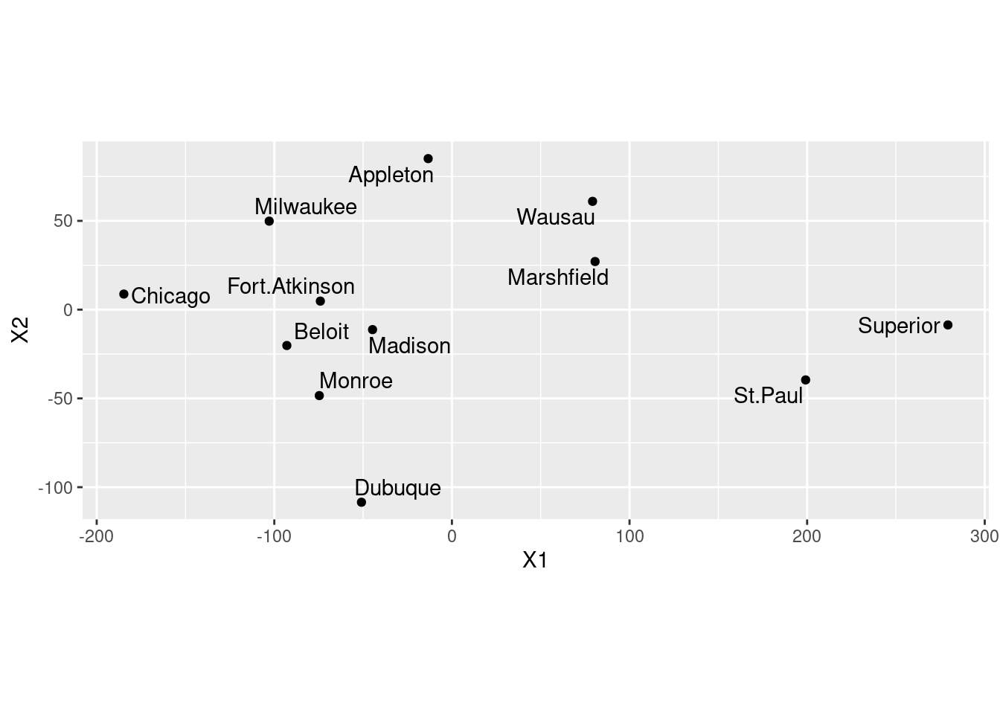

# Multidimensional Scaling

Packages for this chapter:


```r
library(ggbiplot)
library(tidyverse)
library(ggrepel)
```


##  Making a map of Wisconsin


 The file
[link](http://www.utsc.utoronto.ca/~butler/d29/wisconsin.txt) contains
the road distances (in miles) between 12 cities in Wisconsin and
neighbouring states. We are going to try to reproduce a map of the
area using multidimensional scaling.


(a) Read in the data and create a `dist` object,
bearing in mind that the data in the file are already
distances. Display your `dist` object. Probably, displaying
the data that you read in is a good idea also.
 
Solution


```r
my_url <- "http://www.utsc.utoronto.ca/~butler/d29/wisconsin.txt"
wisc <- read_table(my_url)
```

```
## Parsed with column specification:
## cols(
##   location = col_character(),
##   Appleton = col_double(),
##   Beloit = col_double(),
##   Fort.Atkinson = col_double(),
##   Madison = col_double(),
##   Marshfield = col_double(),
##   Milwaukee = col_double(),
##   Monroe = col_double(),
##   Superior = col_double(),
##   Wausau = col_double(),
##   Dubuque = col_double(),
##   St.Paul = col_double(),
##   Chicago = col_double()
## )
```

```r
wisc
```

```
## # A tibble: 12 x 13
##    location Appleton Beloit Fort.Atkinson Madison Marshfield Milwaukee Monroe
##    <chr>       <dbl>  <dbl>         <dbl>   <dbl>      <dbl>     <dbl>  <dbl>
##  1 Appleton        0    130            98     102        103       100    149
##  2 Beloit        130      0            33      50        185        73     33
##  3 Fort.At…       98     33             0      36        164        54     58
##  4 Madison       102     50            36       0        138        77     47
##  5 Marshfi…      103    185           164     138          0       184    170
##  6 Milwauk…      100     73            54      77        184         0    107
##  7 Monroe        149     33            58      47        170       107      0
##  8 Superior      315    377           359     330        219       394    362
##  9 Wausau         91    186           166     139         45       181    186
## 10 Dubuque       196     94           119      95        186       168     61
## 11 St.Paul       257    304           287     258        161       322    289
## 12 Chicago       186     97           113     146        276        93    130
## # … with 5 more variables: Superior <dbl>, Wausau <dbl>, Dubuque <dbl>,
## #   St.Paul <dbl>, Chicago <dbl>
```

       

The first time I did this, I had a blank line on the end of the data
file, so I had a blank `location` and missing values for all
the distances for it. I tidied that up before sharing the file with
you, though.

So, the first column is the names of the places, which we should get
rid of before we make a `dist` object using `as.dist`
(since what we read in is already distances). The columns are also the
names  of the places, so we won't lose anything by getting rid of the
`location` column:


```r
d <- wisc %>%
  select(-location) %>%
  as.dist()
d
```

```
##               Appleton Beloit Fort.Atkinson Madison Marshfield Milwaukee Monroe
## Beloit             130                                                         
## Fort.Atkinson       98     33                                                  
## Madison            102     50            36                                    
## Marshfield         103    185           164     138                            
## Milwaukee          100     73            54      77        184                 
## Monroe             149     33            58      47        170       107       
## Superior           315    377           359     330        219       394    362
## Wausau              91    186           166     139         45       181    186
## Dubuque            196     94           119      95        186       168     61
## St.Paul            257    304           287     258        161       322    289
## Chicago            186     97           113     146        276        93    130
##               Superior Wausau Dubuque St.Paul
## Beloit                                       
## Fort.Atkinson                                
## Madison                                      
## Marshfield                                   
## Milwaukee                                    
## Monroe                                       
## Superior                                     
## Wausau             223                       
## Dubuque            351    215                
## St.Paul            162    175     274        
## Chicago            467    275     184     395
```

 
 

(b) Obtain a vector containing the city names. (This is easy,
and not really necessary, but it was here before when I did things
a different way.)
 
Solution


The `location` column of the data frame you read in
from the file:

```r
cities <- wisc$location
cities
```

```
##  [1] "Appleton"      "Beloit"        "Fort.Atkinson" "Madison"      
##  [5] "Marshfield"    "Milwaukee"     "Monroe"        "Superior"     
##  [9] "Wausau"        "Dubuque"       "St.Paul"       "Chicago"
```

       
 

(c) Run a (metric) multidimensional scaling on the data, to
obtain a two-dimensional representation of the cities. (You
don't need to look at the results yet.)
 
Solution


```r
wisc.1 <- cmdscale(d)
```

       
 

(d) Plot the results of the multidimensional scaling,
labelling the cities with their names. Use your judgement to
decide where to place the city names, and how to  make sure the
whole city names are shown on the map.
 
Solution


Let's see what `wisc.1` has in it, and make a data
frame of the right thing:

```r
head(wisc.1)
```

```
##                     [,1]       [,2]
## Appleton       -13.37076  85.067148
## Beloit         -92.94157 -20.205916
## Fort.Atkinson  -74.07473   4.804039
## Madison        -44.68148 -11.252521
## Marshfield      80.61250  27.097882
## Milwaukee     -102.87582  49.849552
```

         
Two unnamed columns (the display indicates that it's a `matrix`
rather than a data frame). As we saw in class, if we make a data frame
out of this, the columns will get names `X1` and
`X2`. Those are perfectly good names for coordinates. The city
names on the left of `wisc.1` are actually row names rather
than an actual genuine column. It's probably best *not* to assume
that they will make it through the transition to a data frame, so
we'll explicitly create a column called `city` with the city
names (that we saved before):


```r
dd <- data.frame(wisc.1, city = cities)
dd
```

```
##                       X1          X2          city
## Appleton       -13.37076   85.067148      Appleton
## Beloit         -92.94157  -20.205916        Beloit
## Fort.Atkinson  -74.07473    4.804039 Fort.Atkinson
## Madison        -44.68148  -11.252521       Madison
## Marshfield      80.61250   27.097882    Marshfield
## Milwaukee     -102.87582   49.849552     Milwaukee
## Monroe         -74.66603  -48.422639        Monroe
## Superior       279.27573   -8.621892      Superior
## Wausau          79.19504   60.997371        Wausau
## Dubuque        -50.92029 -108.488036       Dubuque
## St.Paul        199.16640  -39.595481       St.Paul
## Chicago       -184.71900    8.770492       Chicago
```

 

There are only 12 rows, so it's fine to display them all.

I'm calling this one `dd` since I have another `d`
elsewhere that I want to keep. I should use better names.

I think the best use of your judgement is to go straight to
`geom_text_repel` from package `ggrepel`:


```r
ggplot(dd, aes(x = X1, y = X2, label = city)) +
  geom_point() +
  geom_text_repel() +
  coord_fixed()
```



 

Your map may come out different from mine, but subject to the usual
stuff about rotation and reflection it should be equivalent to
mine. You should include the `coord_fixed` to get the scales
the same (a corresponding distance on the two scales should take the
same space). This one didn't come out quite square because the MDS
says the points should be in a rectangle (stretching further one way
than the other). 
 

(e) Are cities close together on your map also close together
in real life? Give an example or two.
 
Solution


On the map, the trio of cities Madison, Beloit and Fort Atkinson
are closest together. How far apart are they actually? Well, you
can go back to the original file (or display of what I called
`d`) and find them, or you can do this:

```r
cities
```

```
##  [1] "Appleton"      "Beloit"        "Fort.Atkinson" "Madison"      
##  [5] "Marshfield"    "Milwaukee"     "Monroe"        "Superior"     
##  [9] "Wausau"        "Dubuque"       "St.Paul"       "Chicago"
```

     

Cities 2, 3 and 4, so:


```r
wisc %>% slice(2:4) %>% select(c(1, 3:5))
```

```
## # A tibble: 3 x 4
##   location      Beloit Fort.Atkinson Madison
##   <chr>          <dbl>         <dbl>   <dbl>
## 1 Beloit             0            33      50
## 2 Fort.Atkinson     33             0      36
## 3 Madison           50            36       0
```

 

The column numbers are off by one, since the first column is the names
of the cities, which I decided to display here. It came out right, anyway.

These are all less than 50 miles or less apart. There are some others
this close in the original data: Monroe and Madison are 47 miles
apart, Wausau and Marshfield are 45 miles apart, but these appear
further apart on the map.
Extra: the slice-select thing doesn't work on `d` because that is not
a data frame. It is actually stored internally as a
*one*-dimensional vector that displays nicely, but if you want to
pull things out of it you have to figure out where in the vector they are:


```r
print.default(d)
```

```
##  [1] 130  98 102 103 100 149 315  91 196 257 186  33  50 185  73  33 377 186  94
## [20] 304  97  36 164  54  58 359 166 119 287 113 138  77  47 330 139  95 258 146
## [39] 184 170 219  45 186 161 276 107 394 181 168 322  93 362 186  61 289 130 223
## [58] 351 162 467 215 175 275 274 184 395
## attr(,"Labels")
##  [1] "Appleton"      "Beloit"        "Fort.Atkinson" "Madison"      
##  [5] "Marshfield"    "Milwaukee"     "Monroe"        "Superior"     
##  [9] "Wausau"        "Dubuque"       "St.Paul"       "Chicago"      
## attr(,"Size")
## [1] 12
## attr(,"call")
## as.dist.default(m = .)
## attr(,"class")
## [1] "dist"
## attr(,"Diag")
## [1] FALSE
## attr(,"Upper")
## [1] FALSE
```

 

If you compare that with the usual display of `d`, this way
goes all the way down the first column ending at 130, then all the way
down the second column (which has one fewer entry), ending at 467, and
so on. Thus the three entries we picked out are at $11+1=12$,
$11+2=13$, and $11+10+1=22$:


```r
d[12]
```

```
## [1] 33
```

```r
d[13]
```

```
## [1] 50
```

```r
d[22]
```

```
## [1] 36
```

 

It's very easy to be off by one in this sort of calculation. There are
12 cities altogether, so *11* distances in the first column, 10
in the second, and so on. This was about my third attempt.

I don't much care which cities you look at. Finding some cities that
are reasonably close on the map and doing some kind of critical
 assessment of their actual distances apart is all I want. 
 


(f) Obtain a Google (or other) map of the area containing these
twelve cities. (The way I expected you to do this when this was a
hand-in problem was to take a screenshot or similar and include that
in your document.)

 
Solution


Since I like to show off, let me show you how you can do this in R,
using the package `ggmap`. (Of course, you can just open the
appropriate map in your browser and copy-paste it, taking a
screenshot if necessary):

```r
library(ggmap)
```

```
## Google's Terms of Service: https://cloud.google.com/maps-platform/terms/.
```

```
## Please cite ggmap if you use it! See citation("ggmap") for details.
```

   


 

```r
library(ggmap)
wisc.map <- get_map(location = "Milwaukee, WI", zoom = 6)
```

```
## Source : https://maps.googleapis.com/maps/api/staticmap?center=Milwaukee,%20WI&zoom=6&size=640x640&scale=2&maptype=terrain&language=en-EN&key=xxx-Mj1-zNBW4GTnXNAYdGQJDNXU
```

```
## Source : https://maps.googleapis.com/maps/api/geocode/json?address=Milwaukee,+WI&key=xxx-Mj1-zNBW4GTnXNAYdGQJDNXU
```

```r
ggmap(wisc.map)
```


   

I centred this map around Milwaukee (a guess), which is not quite
where the centre should be, since Milwaukee is in southeastern
Wisconsin. The `zoom` option is how zoomed-in the map should be
(a higher number is more zoomed-in). Likewise, 6 was a guess, and it
seems that I need to zoom in a bit more.

The other way of specifying a location, instead of the name or
lat-long of the centre of the map, is to specify the **corners**
of the map in degrees of latitude or longitude. We have to give four
numbers: lower left longitude and latitude, upper right longitude and
latitude. (Degrees west are *negative*, as you see on the
`lon` scale of the above map.) This comes out as west, south,
east and north limits of the map.
Where are the 12 points we want to put on the map? We can get their
latitudes and longitudes, which is called "geocoding", and a
function `geocode` is included in `ggmap`.

First add the state names to the cities, to make sure Google Maps
looks up the right ones. All of them are in Wisconsin, except for the
last three: Dubuque is in Iowa, St.\ Paul is in Minnesota and Chicago
is in Illinois. I am first making a vector with 12 copies of the
abbreviation for Wisconsin, and then overwriting the last three with
the states they are actually in:


```r
states <- rep("WI", 12)
states[10] <- "IA"
states[11] <- "MN"
states[12] <- "IL"
cst <- str_c(cities, " ", states)
cst
```

```
##  [1] "Appleton WI"      "Beloit WI"        "Fort.Atkinson WI" "Madison WI"      
##  [5] "Marshfield WI"    "Milwaukee WI"     "Monroe WI"        "Superior WI"     
##  [9] "Wausau WI"        "Dubuque IA"       "St.Paul MN"       "Chicago IL"
```

 

And then I look them up. I don't want Google to tell me that I have
done too many lookups, so I look them up first and save the results,
like this:


```r
tibble(cst) %>%
  ggmap::mutate_geocode(cst) -> g
```

```
## Source : https://maps.googleapis.com/maps/api/geocode/json?address=Appleton+WI&key=xxx-Mj1-zNBW4GTnXNAYdGQJDNXU
```

```
## Source : https://maps.googleapis.com/maps/api/geocode/json?address=Beloit+WI&key=xxx-Mj1-zNBW4GTnXNAYdGQJDNXU
```

```
## Source : https://maps.googleapis.com/maps/api/geocode/json?address=Fort.Atkinson+WI&key=xxx-Mj1-zNBW4GTnXNAYdGQJDNXU
```

```
## Source : https://maps.googleapis.com/maps/api/geocode/json?address=Madison+WI&key=xxx-Mj1-zNBW4GTnXNAYdGQJDNXU
```

```
## Source : https://maps.googleapis.com/maps/api/geocode/json?address=Marshfield+WI&key=xxx-Mj1-zNBW4GTnXNAYdGQJDNXU
```

```
## Source : https://maps.googleapis.com/maps/api/geocode/json?address=Milwaukee+WI&key=xxx-Mj1-zNBW4GTnXNAYdGQJDNXU
```

```
## Source : https://maps.googleapis.com/maps/api/geocode/json?address=Monroe+WI&key=xxx-Mj1-zNBW4GTnXNAYdGQJDNXU
```

```
## Source : https://maps.googleapis.com/maps/api/geocode/json?address=Superior+WI&key=xxx-Mj1-zNBW4GTnXNAYdGQJDNXU
```

```
## Source : https://maps.googleapis.com/maps/api/geocode/json?address=Wausau+WI&key=xxx-Mj1-zNBW4GTnXNAYdGQJDNXU
```

```
## Source : https://maps.googleapis.com/maps/api/geocode/json?address=Dubuque+IA&key=xxx-Mj1-zNBW4GTnXNAYdGQJDNXU
```

```
## Source : https://maps.googleapis.com/maps/api/geocode/json?address=St.Paul+MN&key=xxx-Mj1-zNBW4GTnXNAYdGQJDNXU
```

```
## Source : https://maps.googleapis.com/maps/api/geocode/json?address=Chicago+IL&key=xxx-Mj1-zNBW4GTnXNAYdGQJDNXU
```

```r
g
```

```
## # A tibble: 12 x 3
##    cst                lon   lat
##    <chr>            <dbl> <dbl>
##  1 Appleton WI      -88.4  44.3
##  2 Beloit WI        -89.0  42.5
##  3 Fort.Atkinson WI -88.8  42.9
##  4 Madison WI       -89.4  43.1
##  5 Marshfield WI    -90.2  44.7
##  6 Milwaukee WI     -87.9  43.0
##  7 Monroe WI        -89.6  42.6
##  8 Superior WI      -92.1  46.7
##  9 Wausau WI        -89.6  45.0
## 10 Dubuque IA       -90.7  42.5
## 11 St.Paul MN       -93.1  45.0
## 12 Chicago IL       -87.6  41.9
```

 
What are the extreme corners of these?


```r
range(g$lon)
```

```
## [1] -93.08996 -87.62980
```

```r
range(g$lat)
```

```
## [1] 41.87811 46.72077
```

 

or even


```r
g %>%
  select(lat, lon) %>%
  map_df(range)
```

```
## # A tibble: 2 x 2
##     lat   lon
##   <dbl> <dbl>
## 1  41.9 -93.1
## 2  46.7 -87.6
```

 

(`range` in R produces the two extreme values, not the
difference between the highest and lowest, which is what you might
think of as a "range".)

We don't
get exactly the corners we ask for, since the map always comes out in the same
proportions (we could ask for a long skinny map, but we'll always get
a rectangular one that fills the page), and also Google Maps converts
the corners into a centre and zoom. I had to tinker with the numbers
below, since on my first attempt the map zoomed in too much.
I also asked for a "roadmap" to maximize the number of places marked
on there.

So:


```r
wisc.map.2 <- get_map(location = c(-94, 41.8, -87, 46.8), maptype = "roadmap")
ggmap(wisc.map.2)
```


 

This came out about right. 

Now we need to mark our 12 cities on the map. This is a
`ggplot` map, so the right syntax is as below.


```r
ggmap(wisc.map.2) + geom_point(data = g, aes(x = lon, y = lat))
```


 

There's a slight weirdness in that `ggmap` only takes a map,
not a data frame or an `aes`, so those go in
`geom_point` or whatever you're using.

We *just* squeezed all our cities onto the map. The city
southwest of Wausau is Marshfield, the one between Madison and
Milwaukee is Fort Atkinson, and the two east of Dubuque along the
southern border of Wisconsin are Monroe and Beloit. The one *way*
up at the top is Superior.

After that long diversion, we come to:

 


(g) Discuss how the map that came out of the multidimensional
scaling corresponds to the actual (Google) map.

 
Solution


Let's pick a few places from the actual map, and make a table of
where they are on the actual map and the `cmdscale` map:

```

 Place        Real              Cmdscale       
----------------------------------------------
 Superior     northwest         central east   
 St. Paul     central west      southeast      
 Dubuque      central south     central south  
 Chicago      southeast         central west   
 Appleton     central east      central north  


```


This is a bit tricky. Dubuque is the only one in the right place, and
the others that were west have become east and vice versa. So I think
there is a flipping across a line going through Dubuque. That seems to
be the most important thing; if you imagine the other points being
flipped across a line going north-south through Dubuque, they all end
up in about the right place. There might be a little rotation as well,
but I'll call that close enough.

(For you, any comment along the lines of "flipped around this line"
or "rotated about this much" that seems to describe what has happened, is
fine.)
 


(h) Calculate something that demonstrates that a one-dimensional
map of the cities is a much worse representation than the
two-dimensional one that we made before. (I'm planning to get to this
in class, but if we skip it, don't worry about this part.)

 
Solution


Run again with `eig=T` and take a look at `GOF` (uppercase):

```r
cmdscale(d, 2, eig = T)$GOF
```

```
## [1] 0.9129333 0.9315871
```

```r
cmdscale(d, 1, eig = T)$GOF
```

```
## [1] 0.7916925 0.8078690
```

   

The goodness-of-fit of the two-dimensional solution is pretty
good,
<label for="tufte-mn-" class="margin-toggle">&#8853;</label><input type="checkbox" id="tufte-mn-" class="margin-toggle"><span class="marginnote">As it ought to be, since there is a real answer  here: the cities do} exist as locations in two dimensions, if you ignore the curvature of the earth. The goodness of fit isn't  100% because the roads bend a bit.</span>
but that of the one-dimensional solution (which arranges all the
cities along a line) is pretty awful in comparison.

How awful? Let's find out. I should have saved it from just above, but
now I have to do it again. For the plot, `ones` is a string of
ones, as many as there are cities.


```r
ones <- rep(1, 12)
v <- cmdscale(d, 1, eig = T)
ddd <- as_tibble(v$points) %>%
  mutate(one = ones, city = cities)
```

```
## Warning: The `x` argument of `as_tibble.matrix()` must have unique column names if `.name_repair` is omitted as of tibble 2.0.0.
## Using compatibility `.name_repair`.
## This warning is displayed once every 8 hours.
## Call `lifecycle::last_warnings()` to see where this warning was generated.
```

```r
ddd
```

```
## # A tibble: 12 x 3
##        V1   one city         
##     <dbl> <dbl> <chr>        
##  1  -13.4     1 Appleton     
##  2  -92.9     1 Beloit       
##  3  -74.1     1 Fort.Atkinson
##  4  -44.7     1 Madison      
##  5   80.6     1 Marshfield   
##  6 -103.      1 Milwaukee    
##  7  -74.7     1 Monroe       
##  8  279.      1 Superior     
##  9   79.2     1 Wausau       
## 10  -50.9     1 Dubuque      
## 11  199.      1 St.Paul      
## 12 -185.      1 Chicago
```

 

(the one-column matrix of points didn't have a name, so it acquired
the name `V1`), and the plot:


```r
ggplot(ddd, aes(x = one, y = V1, label = city)) +
  geom_point() + geom_text_repel()
```


 

The cities get mapped onto a line that goes northwest (top) to
southeast (bottom). This is not completely terrible, since there
aren't really any cities in the northeast of the state, but it *is*
pretty awful.
 


##  Things that feel similar to each other


 Which objects feel similar to one another and which ones
feel different? Can we draw them on a "map"? 30
subjects
<label for="tufte-mn-" class="margin-toggle">&#8853;</label><input type="checkbox" id="tufte-mn-" class="margin-toggle"><span class="marginnote">Probably students in a psychology course. You know  how it goes.</span> were each
given 17 different objects to feel, for example "inner surface of pine  bark", 
"rubber eraser" and 
"nylon scouring pad". The
subjects had to group the objects into a maximum of 8 groups such that
the objects within a group felt similar, and the ones in different
groups felt different.
<label for="tufte-mn-" class="margin-toggle">&#8853;</label><input type="checkbox" id="tufte-mn-" class="margin-toggle"><span class="marginnote">The maximum number of groups was to  ensure that each subject actually *did* group some objects  together, rather than saying that they all feel different.</span> A
dissimilarity matrix was formed by counting how many subjects put each
pair of objects into *different* groups, so that the
dissimilarity ranged from 0 (the objects were always put together in
the same group) to 30 (the objects were not put together into the same
group by any of the subjects). 

The data are in
[link](http://www.utsc.utoronto.ca/~butler/d29/stimuli.txt). 


(a) Look at the data, and read in the file appropriately. Do you
have something square in shape, apart from any columns of object
names?  Do your columns have the same names as the objects?


Solution


Looking at the file first, there are *no column names*. So we
have to tell `read_delim` that:

```r
my_url <- "http://www.utsc.utoronto.ca/~butler/d29/stimuli.txt"
stimuli <- read_delim(my_url, " ", col_names = F)
```

```
## Parsed with column specification:
## cols(
##   X1 = col_character(),
##   X2 = col_double(),
##   X3 = col_double(),
##   X4 = col_double(),
##   X5 = col_double(),
##   X6 = col_double(),
##   X7 = col_double(),
##   X8 = col_double(),
##   X9 = col_double(),
##   X10 = col_double(),
##   X11 = col_double(),
##   X12 = col_double(),
##   X13 = col_double(),
##   X14 = col_double(),
##   X15 = col_double(),
##   X16 = col_double(),
##   X17 = col_double(),
##   X18 = col_double()
## )
```

```r
stimuli
```

```
## # A tibble: 17 x 18
##    X1       X2    X3    X4    X5    X6    X7    X8    X9   X10   X11   X12   X13
##    <chr> <dbl> <dbl> <dbl> <dbl> <dbl> <dbl> <dbl> <dbl> <dbl> <dbl> <dbl> <dbl>
##  1 inne…     0    22    23    24    26    27    26    23    24    23    23    18
##  2 brick    22     0    27    27    27    29    29    28    16    18    28    25
##  3 card…    23    27     0    18    19    28    23    24    24    29    27    28
##  4 cork     24    27    18     0    15    28    25    26    28    28    20    27
##  5 rubb…    26    27    19    15     0    28    20    27    24    27    24    25
##  6 felt     27    29    28    28    28     0    24    28    29    26    26    29
##  7 leat…    26    29    23    25    20    24     0    22    28    28    27    26
##  8 rigi…    23    28    24    26    27    28    22     0    27    29    29    27
##  9 very…    24    16    24    28    24    29    28    27     0    21    24    26
## 10 nylo…    23    18    29    28    27    26    28    29    21     0    22    16
## 11 cell…    23    28    27    20    24    26    27    29    24    22     0    19
## 12 wove…    18    25    28    27    25    29    26    27    26    16    19     0
## 13 bloc…    23    24    21    10    19    28    25    25    25    25    21    26
## 14 ungl…    21    10    26    26    24    29    29    25    12    24    26    26
## 15 velv…    28    29    28    28    29     4    24    29    29    27    27    28
## 16 waxp…    24    28    24    28    24    28    21    12    29    29    29    27
## 17 glos…    22    27    23    29    28    29    20    13    27    28    27    25
## # … with 5 more variables: X14 <dbl>, X15 <dbl>, X16 <dbl>, X17 <dbl>,
## #   X18 <dbl>
```

     

I have 17 rows and 18 columns, but one of the columns is the column of
object names. So I really do have the same number of rows and columns
of dissimilarities: that is, it *is* square in shape apart from
the names.

The columns *do not* have the same names as the
objects; R has used the `X1, X2, ...` names that it uses when
you do not have column headers.

I could have supplied the object names to `col_names`, but
that is a lot more work than what we do below.
    


(b) Obtain the names of the objects. Note that they are rather
long. 


Solution


The object names are in the first column, `X1`, of the data frame:

```r
objects <- stimuli$X1
objects
```

```
##  [1] "innersurfaceofpinebark" "brick"                  "cardboard"             
##  [4] "cork"                   "rubbereraser"           "felt"                  
##  [7] "leatherwallet"          "rigidplasticsheet"      "veryfinesandpaper"     
## [10] "nylonscouringpad"       "cellulosekitchensponge" "wovenstraw"            
## [13] "blockofstyrofoam"       "unglazedceramictile"    "velvet"                
## [16] "waxpaper"               "glossypaintedwood"
```

     

I'm saving these for later.
    


(c) Set the column names of your data frame to be your object
names, using `names`. Before you rush to do that, figure out
how many column names you need, and supply values for any extra
ones. Check that your data frame now has the right column names.


Solution


I have 18 columns to name (including the column of object names),
but only 17 names, so I need to supply an extra one:

```r
names(stimuli) <- c("object", objects)
stimuli
```

```
## # A tibble: 17 x 18
##    object innersurfaceofp… brick cardboard  cork rubbereraser  felt
##    <chr>             <dbl> <dbl>     <dbl> <dbl>        <dbl> <dbl>
##  1 inner…                0    22        23    24           26    27
##  2 brick                22     0        27    27           27    29
##  3 cardb…               23    27         0    18           19    28
##  4 cork                 24    27        18     0           15    28
##  5 rubbe…               26    27        19    15            0    28
##  6 felt                 27    29        28    28           28     0
##  7 leath…               26    29        23    25           20    24
##  8 rigid…               23    28        24    26           27    28
##  9 veryf…               24    16        24    28           24    29
## 10 nylon…               23    18        29    28           27    26
## 11 cellu…               23    28        27    20           24    26
## 12 woven…               18    25        28    27           25    29
## 13 block…               23    24        21    10           19    28
## 14 ungla…               21    10        26    26           24    29
## 15 velvet               28    29        28    28           29     4
## 16 waxpa…               24    28        24    28           24    28
## 17 gloss…               22    27        23    29           28    29
## # … with 11 more variables: leatherwallet <dbl>, rigidplasticsheet <dbl>,
## #   veryfinesandpaper <dbl>, nylonscouringpad <dbl>,
## #   cellulosekitchensponge <dbl>, wovenstraw <dbl>, blockofstyrofoam <dbl>,
## #   unglazedceramictile <dbl>, velvet <dbl>, waxpaper <dbl>,
## #   glossypaintedwood <dbl>
```

     
    


(d) <a name="part:distances">*</a>  
Convert your data frame into a distance object. Take a look at the
(rather long) result.


Solution


This is `as.dist`, since we have distances
(dissimilarities) already. Don't forget to take off the first column!

```r
d <- stimuli %>% select(-1) %>% as.dist()
```

     

I can try and show it all here, tiny, but even then it's long because
the column names are long:


```r
w <- getOption("width")
options(width = 132)
d
```

```
##                        innersurfaceofpinebark brick cardboard cork rubbereraser felt leatherwallet rigidplasticsheet
## brick                                      22                                                                       
## cardboard                                  23    27                                                                 
## cork                                       24    27        18                                                       
## rubbereraser                               26    27        19   15                                                  
## felt                                       27    29        28   28           28                                     
## leatherwallet                              26    29        23   25           20   24                                
## rigidplasticsheet                          23    28        24   26           27   28            22                  
## veryfinesandpaper                          24    16        24   28           24   29            28                27
## nylonscouringpad                           23    18        29   28           27   26            28                29
## cellulosekitchensponge                     23    28        27   20           24   26            27                29
## wovenstraw                                 18    25        28   27           25   29            26                27
## blockofstyrofoam                           23    24        21   10           19   28            25                25
## unglazedceramictile                        21    10        26   26           24   29            29                25
## velvet                                     28    29        28   28           29    4            24                29
## waxpaper                                   24    28        24   28           24   28            21                12
## glossypaintedwood                          22    27        23   29           28   29            20                13
##                        veryfinesandpaper nylonscouringpad cellulosekitchensponge wovenstraw blockofstyrofoam unglazedceramictile
## brick                                                                                                                           
## cardboard                                                                                                                       
## cork                                                                                                                            
## rubbereraser                                                                                                                    
## felt                                                                                                                            
## leatherwallet                                                                                                                   
## rigidplasticsheet                                                                                                               
## veryfinesandpaper                                                                                                               
## nylonscouringpad                      21                                                                                        
## cellulosekitchensponge                24               22                                                                       
## wovenstraw                            26               16                     19                                                
## blockofstyrofoam                      25               25                     21         26                                     
## unglazedceramictile                   12               24                     26         26               25                    
## velvet                                29               27                     27         28               29                  29
## waxpaper                              29               29                     29         27               26                  28
## glossypaintedwood                     27               28                     27         25               29                  26
##                        velvet waxpaper
## brick                                 
## cardboard                             
## cork                                  
## rubbereraser                          
## felt                                  
## leatherwallet                         
## rigidplasticsheet                     
## veryfinesandpaper                     
## nylonscouringpad                      
## cellulosekitchensponge                
## wovenstraw                            
## blockofstyrofoam                      
## unglazedceramictile                   
## velvet                                
## waxpaper                   27         
## glossypaintedwood          26       12
```

```r
options(width = w)
```

 

The stuff with `width` was to make it display lots of columns,
and then setting it back afterwards so as not to mess things up later.
If
you try and take `head` of this, you'll lose the structure. I
don't know of a good way to display part of one of these.
    


(e) Obtain and plot a  (metric) multidimensional scaling map of
these data.  Label the points with the name of the
object they represent. (Note that
`geom_text_repel` has an option `size` that controls
the size of the text.)


Solution


This is the procedure. Talking about it is coming in a minute.

```r
d.1 <- cmdscale(d, 2)
data.frame(d.1, stim = objects) %>%
  ggplot(aes(x = X1, y = X2, label = stim)) + geom_point() +
  geom_text_repel(size = 2)
```


     

`cmdscale` gets the coordinates to plot, then we plot them, and
then we place the object names next to the points. I'm not
quite sure what the scale is for `size`, but `size=2`
worked for me here, making the text a bit smaller (so that the labels
don't overlap), but not so small that you can't read it. You'll
probably have to experiment to find a `size` that you like.

If you forget the `2` after the distance matrix in
`cmdscale`, you'll get a two-dimensional solution anyway (since
two dimensions is the default). The output is an array of coordinates
in two dimensions:


```r
d.1
```

```
##                               [,1]       [,2]
## innersurfaceofpinebark  -2.7066290   1.694420
## brick                  -12.2011332   5.147970
## cardboard                3.8630322  -9.322759
## cork                    -0.8424358 -14.884926
## rubbereraser             0.1676463 -11.733873
## felt                     5.1803473   9.328562
## leatherwallet           10.4636668  -1.016525
## rigidplasticsheet       11.0208731   1.201504
## veryfinesandpaper      -11.0869483   2.800988
## nylonscouringpad       -10.4469053   7.232787
## cellulosekitchensponge  -5.3886609  -2.770991
## wovenstraw              -5.2762142   3.836948
## blockofstyrofoam        -2.9950151 -11.927717
## unglazedceramictile    -10.5902291   2.926805
## velvet                   6.3768882  10.477972
## waxpaper                13.1702265   1.677039
## glossypaintedwood       11.2914904   5.331796
```

 
I note that any map that is the same as this apart from rotation and
reflection is also fine (since the distances will be the same). I saw
a lot of maps that were like mine but upside down (with `cork`
at the top).
<label for="tufte-mn-" class="margin-toggle">&#8853;</label><input type="checkbox" id="tufte-mn-" class="margin-toggle"><span class="marginnote">I lie. Last year, *I* got cork at the top,  and a lot of other people got cork at the bottom as you see here.</span> No problem there.
    


(f) Find a pair of objects that are close together on your
plot. Look back at your answer to part~(<a href="#part:distances">here</a>): is
the distance between those objects small? Explain briefly.


Solution


I don't mind (much) which objects you pick (as long as they are
reasonably close together). Find the actual distance between them
from what I called `d` in part~(<a href="#part:distances">here</a>). Some
possibilities:


* Felt and velvet, Distance 4.

* Block of styrofoam and rubber eraser. Distance 19 (not that
small, but one of the smaller ones).

* Rigid plastic sheet and
wax paper. Distance 12. Smallish.

* unglazed ceramic
tile
<label for="tufte-mn-" class="margin-toggle">&#8853;</label><input type="checkbox" id="tufte-mn-" class="margin-toggle"><span class="marginnote">The first association that *unglazed* made for me      was *donut*!</span> and very fine sandpaper. Distance 12. Smallish.

There won't be a perfect relationship between distance in the
distance matrix and on the map. In this case, there is an upper
limit on distance (30, because 30 people rated the objects for
similarity) and that upper limit is approached by many of the
distances. (This suggests that non-metric multidimensional
scaling, that just reproduces the order of the distances, might be
a better idea for these data.) If objects A and B, and also B and
C, are each close to 30 apart, then objects A and C will also be
close to 30 apart, and that constrains them to be nearly in a
triangle on the map. 
There are some 10s in the distance matrix,
for example between block of styrofoam and cork, and also
between unglazed ceramic tile and brick; these are a bit
further apart on the map, but still close.
    


(g) Obtain a measure of goodness of fit for this
multidimensional scaling map.


Solution


This means fitting again, but this time with `eig=T`, and
pulling out the thing called `GOF`. You can omit the 2,
since that's the default 2 dimensions:

```r
d.2 <- cmdscale(d, 2, eig = T)
d.2$GOF
```

```
## [1] 0.4019251 0.4110603
```

     

I didn't ask you to comment on this, but the adjective that came to my
mind was "disappointing". I think that's to do with the
upper-limit-30 thing again. Also, this time (unlike with Wisconsin)
there was no "right answer", so maybe it just isn't going to be very
good. If you looked at several pairs of points above, you might have
noticed that the correspondence between map distance and actual
distance isn't very good; this is the same issue.

I was curious about whether 3 dimensions would be any better:


```r
d.2a <- cmdscale(d, 3, eig = T)
d.2a$GOF
```

```
## [1] 0.5775841 0.5907117
```

 

That is quite a bit better. The problem with this, though, is that we
need something like `rgl` to explore it with.


(h) Obtain a cluster analysis for the same data, using Ward's
method. Obtain a dendrogram. What seems to be an appropriate number
of clusters?  Mark them on your dendrogram too.


Solution


This seems to be a throwback to last week, but I have my reasons,
which you'll see in a moment:

```r
d.3 <- hclust(d, method = "ward.D")
plot(d.3)
```


     

That looks like 5 clusters to me (chopping the tree at a height of
30). Drawing them:


```r
plot(d.3)
rect.hclust(d.3, 5)
```


 
    


(i) Discuss as briefly as seems reasonable whether your
clusters tell the same story as the map that came from
multidimensional scaling. (There were only three marks for this, so you
don't need to go overboard.) Optionally, think about creating a plot
that will make it easier to see the correspondence between your
clusters and the MDS map.


Solution


I would take my clusters and think about whether the objects in
them are (a) close together on the map and (b) distinct from other
objects on the map. Working from left to right of my dendrogram:


* Together at the bottom of the plot.

* Together at the top left.

* Together at the top left, but rather mixed up with the
previous cluster (in particular, `nylonscouringpad` looks as if it
belongs in the previous cluster).

* Together at the top of the plot.

* Together at the top right.

If you had a different number of clusters, work with what you
have, and if you have done that, you'll be good. My general
conclusion from the above is that my five clusters are mostly
distinct from each other, but the MDS map really only has
four. (If you look at the dendrogram, the two clusters that are
not really distinct from each other were the last ones to be split.)
This is a lot more detail than you need. What I want to see is
some kind of association of clusters with (hopefully) nearby
points on the map, some kind of discussion of whether the clusters
are really distinct groupings on the map, and a sense of whether
you feel the clusters are consistent with what appears on the map.
Extra: this is where I have to say I cheated. I thought this would be
hard to do by trying to match  those names in the clusters
with the ones on the MDS map. So I put myself through some
short-term R coding pain for some substantial long-term gain.
I was thinking, "can I extract the clusters from this    analysis, and plot them on the MDS map in different colours?" That
would go like this:

```r
clusters <- cutree(d.3, 5)
data.frame(d.1, names = stimuli[, 1], cluster = factor(clusters)) %>%
  ggplot(aes(x = X1, y = X2, label = objects, colour = cluster)) +
  geom_point() +
  geom_text_repel(size = 2)
```


     

The first line obtains the clusters as numbers, which I then had to
turn into a factor (to make the plot different colours). 
I copied the rest from
above, and then I added to them, colouring the points according to
what cluster they belonged to. Three of my "rough" objects have
broken off into a cluster of their own; they are, kind of, in their
own little area on the map.

Another, non-graphical, way of doing this is to list the MDS coordinates
along with the clusters, probably sorted by cluster:


```r
data.frame(d.1, object = stimuli[, 1], clusters) %>% arrange(clusters)
```

```
##                                 X1         X2                 object clusters
## innersurfaceofpinebark  -2.7066290   1.694420 innersurfaceofpinebark        1
## nylonscouringpad       -10.4469053   7.232787       nylonscouringpad        1
## cellulosekitchensponge  -5.3886609  -2.770991 cellulosekitchensponge        1
## wovenstraw              -5.2762142   3.836948             wovenstraw        1
## brick                  -12.2011332   5.147970                  brick        2
## veryfinesandpaper      -11.0869483   2.800988      veryfinesandpaper        2
## unglazedceramictile    -10.5902291   2.926805    unglazedceramictile        2
## cardboard                3.8630322  -9.322759              cardboard        3
## cork                    -0.8424358 -14.884926                   cork        3
## rubbereraser             0.1676463 -11.733873           rubbereraser        3
## blockofstyrofoam        -2.9950151 -11.927717       blockofstyrofoam        3
## felt                     5.1803473   9.328562                   felt        4
## velvet                   6.3768882  10.477972                 velvet        4
## leatherwallet           10.4636668  -1.016525          leatherwallet        5
## rigidplasticsheet       11.0208731   1.201504      rigidplasticsheet        5
## waxpaper                13.1702265   1.677039               waxpaper        5
## glossypaintedwood       11.2914904   5.331796      glossypaintedwood        5
```

 

Then you can think about what makes the clusters different in terms of
`X1` and `X2`. For me, clusters 1 and 2 are kind of
mixed up, with `X1` and (usually) `X2` negative; cluster
3 has strongly positive `X2`; cluster 4 has very
*negative* `X2`;
<label for="tufte-mn-" class="margin-toggle">&#8853;</label><input type="checkbox" id="tufte-mn-" class="margin-toggle"><span class="marginnote">Oxford semicolon, for the grammar mavens among you.</span> 
and cluster 5 has strongly positive `X1`.

I wonder whether our three-dimensional solution distinguishes clusters
1 and 2 at all? Same approach again:


```r
save.3d <- data.frame(d.2a$points, objects, clusters) %>%
  arrange(clusters)
save.3d
```

```
##                                 X1         X2          X3
## innersurfaceofpinebark  -2.7066290   1.694420   4.1176385
## nylonscouringpad       -10.4469053   7.232787  -1.9720211
## cellulosekitchensponge  -5.3886609  -2.770991  -6.8039573
## wovenstraw              -5.2762142   3.836948  -0.3083513
## brick                  -12.2011332   5.147970   5.9802631
## veryfinesandpaper      -11.0869483   2.800988   4.9686770
## unglazedceramictile    -10.5902291   2.926805   7.2124679
## cardboard                3.8630322  -9.322759   1.2376174
## cork                    -0.8424358 -14.884926  -5.6157998
## rubbereraser             0.1676463 -11.733873  -2.3880857
## blockofstyrofoam        -2.9950151 -11.927717  -2.9877666
## felt                     5.1803473   9.328562 -15.2730895
## velvet                   6.3768882  10.477972 -14.1837552
## leatherwallet           10.4636668  -1.016525  -1.9005177
## rigidplasticsheet       11.0208731   1.201504  10.0016248
## waxpaper                13.1702265   1.677039   8.2862272
## glossypaintedwood       11.2914904   5.331796   9.6288283
##                                       objects clusters
## innersurfaceofpinebark innersurfaceofpinebark        1
## nylonscouringpad             nylonscouringpad        1
## cellulosekitchensponge cellulosekitchensponge        1
## wovenstraw                         wovenstraw        1
## brick                                   brick        2
## veryfinesandpaper           veryfinesandpaper        2
## unglazedceramictile       unglazedceramictile        2
## cardboard                           cardboard        3
## cork                                     cork        3
## rubbereraser                     rubbereraser        3
## blockofstyrofoam             blockofstyrofoam        3
## felt                                     felt        4
## velvet                                 velvet        4
## leatherwallet                   leatherwallet        5
## rigidplasticsheet           rigidplasticsheet        5
## waxpaper                             waxpaper        5
## glossypaintedwood           glossypaintedwood        5
```

 

It looks as if the combo of negative `X1` and positive
`X3` distinguishes cluster 2 from cluster 1.

As I was writing this, I was thinking that we should throw the
coordinates and the `clusters` into a
*discriminant analysis*, to find out what distinguishes the
clusters. Which is way too weird, and therefore deserves to be
explored (with the three-dimensional solution, for example):


```r
library(MASS)
save.3d.lda <- lda(clusters ~ X1 + X2 + X3, data = save.3d)
ppp <- predict(save.3d.lda)
```

 

I snuck a look at the output and
found that `LD3` is basically worthless, so I can plot
`LD1` against `LD2`, coloured by cluster:


```r
data.frame(ppp$x, cluster = factor(save.3d$clusters)) %>%
  ggplot(aes(x = LD1, y = LD2, colour = cluster)) +
  geom_point()
```


     

This says that the three-dimensional MDS *has* separated clusters
1 and 2, and if we were to plot `d.2a` in `rgl` and
rotate it the right way, we *would* be able to see a difference
between those two clusters as well. (They wouldn't look mixed up as
they do on the two-dimensional map.)

So we can look at the three-dimensional map coordinates and the
discriminant analysis and ask "what distinguishes the clusters?". 
Map coordinates first. I need `points` since I ran
the scaling with `eig=T`:


```r
save.3d
```

```
##                                 X1         X2          X3
## innersurfaceofpinebark  -2.7066290   1.694420   4.1176385
## nylonscouringpad       -10.4469053   7.232787  -1.9720211
## cellulosekitchensponge  -5.3886609  -2.770991  -6.8039573
## wovenstraw              -5.2762142   3.836948  -0.3083513
## brick                  -12.2011332   5.147970   5.9802631
## veryfinesandpaper      -11.0869483   2.800988   4.9686770
## unglazedceramictile    -10.5902291   2.926805   7.2124679
## cardboard                3.8630322  -9.322759   1.2376174
## cork                    -0.8424358 -14.884926  -5.6157998
## rubbereraser             0.1676463 -11.733873  -2.3880857
## blockofstyrofoam        -2.9950151 -11.927717  -2.9877666
## felt                     5.1803473   9.328562 -15.2730895
## velvet                   6.3768882  10.477972 -14.1837552
## leatherwallet           10.4636668  -1.016525  -1.9005177
## rigidplasticsheet       11.0208731   1.201504  10.0016248
## waxpaper                13.1702265   1.677039   8.2862272
## glossypaintedwood       11.2914904   5.331796   9.6288283
##                                       objects clusters
## innersurfaceofpinebark innersurfaceofpinebark        1
## nylonscouringpad             nylonscouringpad        1
## cellulosekitchensponge cellulosekitchensponge        1
## wovenstraw                         wovenstraw        1
## brick                                   brick        2
## veryfinesandpaper           veryfinesandpaper        2
## unglazedceramictile       unglazedceramictile        2
## cardboard                           cardboard        3
## cork                                     cork        3
## rubbereraser                     rubbereraser        3
## blockofstyrofoam             blockofstyrofoam        3
## felt                                     felt        4
## velvet                                 velvet        4
## leatherwallet                   leatherwallet        5
## rigidplasticsheet           rigidplasticsheet        5
## waxpaper                             waxpaper        5
## glossypaintedwood           glossypaintedwood        5
```

 

and the business end of the LDA output:


```r
save.3d.lda$svd
```

```
## [1] 12.593922  5.767636  3.007893
```

```r
save.3d.lda$scaling
```

```
##           LD1         LD2        LD3
## X1  0.5463715  0.22819994 0.03521147
## X2  0.4370065 -0.28250040 0.10269853
## X3 -0.3512713  0.09616153 0.19930252
```

 

The plot said that cluster 2 was lowest of all on `LD1`, a  bit
lower than cluster 1. What would make `LD1` small (negative)
would be if `X1` was small and `X2` and `X3` were
large. The cluster 2 observations are the smallest on `X1`
(smaller than cluster 1) and larger on `X3` than cluster 1. So
we *can* enumerate what makes clusters 1 and 2 different. The
plot of the first two `LD`s says, in fact, that under the
3-dimensional multidimensional scaling, all five groups are distinct.

A biplot would be another way to look at that:


```r
ggbiplot(save.3d.lda, groups = factor(save.3d$clusters))
```


 
Points on the right have `X1` and `X2` large, and
`X3` small (cluster 4, and to a lesser extent, cluster
5). Points on the left are the other way around. None of the arrows
point up or down really, but `X1` points up a bit and
`X2` down a bit, so points at the top of the plot are likely to
be high on `X1` and low on `X2`, like cluster 5.

Was that all confusing enough for you?

Anyway, the key to gaining some insight here is to find a way to
*combine* the 
output from the cluster analysis and the multidimensional
scaling. That way you can see both in the same place, and see how they
compare. 
    


  

##  Confusing letters


 Two researchers studied how often people mistook one letter
for another one. They did this by showing their subjects each
(uppercase) letter for a few milliseconds only, and asking them which
letter (out of a list) they just saw. The researchers obtain a
"confusion matrix" in which, for example, the W-Q entry is the total
of W's taken as Q and Q's taken as W. This confusion matrix is in
[link](http://www.utsc.utoronto.ca/~butler/d29/letterrec.txt). Note that
the confusions are actually *similarities* rather than
dissimilarities: a large number means that the two letters concerned
are easily confused, that is, similar. Similarities can be converted
to dissimilarities by subtracting them from a larger number than
anything in the table (that is, subtracting from 21 is good here).


(a) Read in the confusion matrix and convert it to
dissimilarities and then to a
`dist` object, displaying the `dist` object that you
obtain. 


Solution


`read_table` to read in the data, having first noted that
we have aligned columns with spaces between:

```r
my_url <- "http://www.utsc.utoronto.ca/~butler/d29/letterrec.txt"
letters <- read_table(my_url)
```

```
## Warning: Missing column names filled in: 'X1' [1]
```

```
## Parsed with column specification:
## cols(
##   X1 = col_character(),
##   C = col_double(),
##   D = col_double(),
##   G = col_double(),
##   H = col_double(),
##   M = col_double(),
##   N = col_double(),
##   Q = col_double(),
##   W = col_double()
## )
```

```r
letters
```

```
## # A tibble: 8 x 9
##   X1        C     D     G     H     M     N     Q     W
##   <chr> <dbl> <dbl> <dbl> <dbl> <dbl> <dbl> <dbl> <dbl>
## 1 C         0     0     0     0     0     0     0     0
## 2 D         5     0     0     0     0     0     0     0
## 3 G        12     2     0     0     0     0     0     0
## 4 H         2     4     3     0     0     0     0     0
## 5 M         2     3     2    10     0     0     0     0
## 6 N         2     4     1    18    16     0     0     0
## 7 Q         9    20     9     1     2     8     0     0
## 8 W         1     5     2     5    18    13     4     0
```

    

The first column didn't have a heading, so `read_table` filled
in `X1` for it (there was data down below, so it needed to have
a name). This is in contrast to something like `read_delim`,
where you have to have as many headers as columns. In
`read_table`, you know where the headers have to be, so if any
are missing they can be filled in, but with `read_delim` you
don't have that knowledge, so you have to have exactly the right
number of headers, one per data column exactly.

These are similarities, so convert to dissimilarities by subtracting
from 21. This is a shortcut way to do that, once you've gotten rid of
everything that is not numbers:


```r
letters %>% dplyr::select(-X1) -> letters2
letters2 <- 21 - letters2
letters2
```

```
##    C  D  G  H  M  N  Q  W
## 1 21 21 21 21 21 21 21 21
## 2 16 21 21 21 21 21 21 21
## 3  9 19 21 21 21 21 21 21
## 4 19 17 18 21 21 21 21 21
## 5 19 18 19 11 21 21 21 21
## 6 19 17 20  3  5 21 21 21
## 7 12  1 12 20 19 13 21 21
## 8 20 16 19 16  3  8 17 21
```

 

This looks weird, or at least the stuff above the diagonal does, but
`dist` works with the stuff *below* the diagonal (unless
you tell it otherwise), so all will be good.

`as.dist` comes next:


```r
d <- as.dist(letters2)
d
```

```
##    C  D  G  H  M  N  Q
## D 16                  
## G  9 19               
## H 19 17 18            
## M 19 18 19 11         
## N 19 17 20  3  5      
## Q 12  1 12 20 19 13   
## W 20 16 19 16  3  8 17
```

 

This works because the letters that are confused are actually
column names of the data frame. 

You can check (and probably should, at least for yourself) that the
distances in `d` correspond properly to the ones in
`letters`. For example, the letters C and G were confused 12
times, $21-12=9$, and the entry for C and G in `d` is indeed
9. 

Note that the actual confusion numbers were in the data file as the
bottom half of the matrix, with the top half being
zeroes. `as.dist` handled this with no problem. (You can check
the help for `as.dist` to find out how it deals with this kind
of thing.)


(b) Run a multidimensional scaling, with the default two
dimensions, on your `dist` object, and display the
results. (Making a graph is coming later.)

Solution


This:

```r
d.1 <- cmdscale(d)
d.1
```

```
##        [,1]       [,2]
## C  9.624942  4.7694928
## D  4.451129 -9.5740790
## G  8.863167  7.6643690
## H -6.817352  3.8283789
## M -8.917331  2.0059242
## N -7.926704 -0.8531024
## Q  7.875169 -5.9942901
## W -7.153020 -1.8466934
```

     

Or you can do it with `eig=T`, which gets you some more information:


```r
d.1a <- cmdscale(d, eig = T)
d.1a
```

```
## $points
##        [,1]       [,2]
## C  9.624942  4.7694928
## D  4.451129 -9.5740790
## G  8.863167  7.6643690
## H -6.817352  3.8283789
## M -8.917331  2.0059242
## N -7.926704 -0.8531024
## Q  7.875169 -5.9942901
## W -7.153020 -1.8466934
## 
## $eig
## [1]  4.930195e+02  2.319034e+02  1.399674e+02  5.318040e+01  4.054851e+01
## [6] -5.684342e-14 -1.539358e+01 -9.610062e+01
## 
## $x
## NULL
## 
## $ac
## [1] 0
## 
## $GOF
## [1] 0.6774262 0.7562157
```

 

The most interesting thing here is the `GOF` at the bottom,
which is not that high (whichever one of the two values you take),
suggesting that the two-dimensional representation is not very
good. Further evidence for that is in `eig`, the
"eigenvalues", which are about 493, 232, 140, 50, 40, 0 and some
negative ones, which suggests that three dimensions might be better
than two for representing the data, because the first *three*
eigenvalues seem noticeably bigger than the others. (This is the same
thinking as the `svd` or percent of trace in discriminant
analysis.)  But that's by the way: we'll stick with two dimensions.

The important thing to remember is that if you go the `eig=T`
way, you have to pull out the points to plot from the thing called
`points`, so that you plot `d.1` itself  but `d.1a$points`.


(c) Obtain a vector of the names of the letters that were
confused in this study. 

Solution


Easiest way is to pull out the first column of the data frame that
you read in from the file (if you can remember what it was called):

```r
letter_names <- letters$X1
```

     

That silly column name `X1` that `read_table`
supplied. 

Extra: You can even get the letter names from the thing I called `d`,
but I can't remember how, so I have to cheat. I said that `d`
has a "print method"
<label for="tufte-mn-" class="margin-toggle">&#8853;</label><input type="checkbox" id="tufte-mn-" class="margin-toggle"><span class="marginnote">The way that a multicoloured function  like *print* works is that when you ask to show something,  like *d*, R first looks to see what kind of thing you want to show (by calling *class*), and determines that it is a *dist* object. Then it looks to see if there is a function called *print.dist* (there is), and if there is, it calls that (to produce that nice display). If there isn't, it calls *print.default*, which just displays its input without doing anything special. This is why printing the output from an *lm* looks very different from printing a data frame: the first calls *print.lm* and the second calls *print.data.frame*, or *print.tbl-df* for a tibble.</span> 
that controls how it looks:


```r
d
```

```
##    C  D  G  H  M  N  Q
## D 16                  
## G  9 19               
## H 19 17 18            
## M 19 18 19 11         
## N 19 17 20  3  5      
## Q 12  1 12 20 19 13   
## W 20 16 19 16  3  8 17
```


but its innards are a whole lot more complicated than that:


```r
print.default(d)
```

```
##  [1] 16  9 19 19 19 12 20 19 17 18 17  1 16 18 19 20 12 19 11  3 20 16  5 19  3
## [26] 13  8 17
## attr(,"Labels")
## [1] "C" "D" "G" "H" "M" "N" "Q" "W"
## attr(,"Size")
## [1] 8
## attr(,"call")
## as.dist.default(m = letters2)
## attr(,"class")
## [1] "dist"
## attr(,"Diag")
## [1] FALSE
## attr(,"Upper")
## [1] FALSE
```

 

or


```r
unclass(d)
```

```
##  [1] 16  9 19 19 19 12 20 19 17 18 17  1 16 18 19 20 12 19 11  3 20 16  5 19  3
## [26] 13  8 17
## attr(,"Labels")
## [1] "C" "D" "G" "H" "M" "N" "Q" "W"
## attr(,"Size")
## [1] 8
## attr(,"call")
## as.dist.default(m = letters2)
## attr(,"Diag")
## [1] FALSE
## attr(,"Upper")
## [1] FALSE
```

 

This one gets rid of any special kind of thing that `d` is, and
displays it like a thing without any special properties.

It's the "attribute" called `Labels` that we need to grab:


```r
attributes(d)$Labels
```

```
## [1] "C" "D" "G" "H" "M" "N" "Q" "W"
```

 


(d) Plot your multidimensional scaling map. To do this, first
create a data frame containing the points you want to plot and their
labels, and then plot the points labelled by the right thing.

Solution


The "labels" need to be the letter names, which is why I made
you find them in the previous part. I'm going to do this with a
pipe, or else I'll create *another* thing called `d`
and overwrite the one I wanted to keep, again:

```r
data.frame(d.1, names = letter_names)
```

```
##          X1         X2 names
## C  9.624942  4.7694928     C
## D  4.451129 -9.5740790     D
## G  8.863167  7.6643690     G
## H -6.817352  3.8283789     H
## M -8.917331  2.0059242     M
## N -7.926704 -0.8531024     N
## Q  7.875169 -5.9942901     Q
## W -7.153020 -1.8466934     W
```

     

So far so good. The coordinates have gained names `X1` and
`X2` (as they did before, but I wanted to check). This is what
happens when you turn a matrix with nameless columns into a data
frame. So I can proceed:


```r
data.frame(d.1, names = letter_names) %>%
  ggplot(aes(x = X1, y = X2, label = names)) +
  geom_point() + geom_text_repel() +
  coord_fixed()
```


     

I need the  last line for the same reason as before: I want to treat
the two axes equally. If you don't have that, you have a distorted map
where one of the coordinates appears to be more important than the other.

If you can't get `ggrepel` to behave itself, an equally good
alternative is to plot the letter names instead of the labelled
dots. To do that, take out the `geom_point` and add an
ordinary `geom_text`. This will plot, *at* the location
given by the `x` and `y`, the text in `label`,
centred at the location. (If you have `geom_point()` as well,
you'll get a black dot in the middle of each piece of text.)
`geom_text` has options to justify the text relative to the
point, so you can see both, but I've always found these rather
finicky, so I'd rather let `geom_text_repel` do the work of
figuring out where to put the text relative to the point.


```r
data.frame(d.1, names = letter_names) %>%
  ggplot(aes(x = X1, y = X2, label = names)) +
  geom_text() + coord_fixed()
```


 

Then pick (in the next part) a pair of letters that is close together,
and proceed. I like the labelled dots better (as a matter of taste),
but this way is a perfectly good way to answer the question, so is
perfectly acceptable here.


(e) Pick a pair of letters appear close together on your
map. Does it make sense, from looking at these letters, that they
would be easy to confuse? Explain briefly.

Solution


My map has four pairs of close-together letters: C and G, H and M,
N and W, Q and D. Pick one of those pairs. I don't mind which pair
you pick. (If you got something different, pick from what your map
shows.) 
I think it is not at all surprising that these pairs of letters
got confused, because the letters of each pair have similar shapes
(which is all you'd have to react to if you see them for "a few    milliseconds" each): C and G circular with a hole on the right,
H, M, N and W vertical lines on the outside with something across
the middle, Q and D almost circular. (It's up to you whether you
consider H, M, N and W as a group of four or as two pairs.)


(f) Verify that your chosen pair of letters was often confused
in the data.

Solution


The data we read in from the file was this:

```r
letters
```

```
## # A tibble: 8 x 9
##   X1        C     D     G     H     M     N     Q     W
##   <chr> <dbl> <dbl> <dbl> <dbl> <dbl> <dbl> <dbl> <dbl>
## 1 C         0     0     0     0     0     0     0     0
## 2 D         5     0     0     0     0     0     0     0
## 3 G        12     2     0     0     0     0     0     0
## 4 H         2     4     3     0     0     0     0     0
## 5 M         2     3     2    10     0     0     0     0
## 6 N         2     4     1    18    16     0     0     0
## 7 Q         9    20     9     1     2     8     0     0
## 8 W         1     5     2     5    18    13     4     0
```

     

Then look for your pair of letters:


\begin{tabular}{lr}
letters & confusion\\
\hline            
C,G & 12\\
H,M & 10\\
N,W & 13\\
Q,D & 20\\     
\hline
\end{tabular}


These are four of the biggest numbers in the matrix, which is as it
should be. You need to find the number of confusions for your pair of
letters and assert that it is large (compared to the others).

These are actually not *all* the large ones: M and W, H and N, M
and N are also large (which lends some support to these letters being
a foursome
<label for="tufte-mn-" class="margin-toggle">&#8853;</label><input type="checkbox" id="tufte-mn-" class="margin-toggle"><span class="marginnote">Set of four. Match-play golf has a game called  *foursomes* where the two players on each team take it in turns to hit the ball, as opposed to the game called *fourballs*, where each of the two players plays their own ball, and the team's score on a hole is the better of the two players' scores.</span> rather than two pairs).

If you prefer, you can work from your `dist` object, the thing
I called `d`:


```r
d
```

```
##    C  D  G  H  M  N  Q
## D 16                  
## G  9 19               
## H 19 17 18            
## M 19 18 19 11         
## N 19 17 20  3  5      
## Q 12  1 12 20 19 13   
## W 20 16 19 16  3  8 17
```


This time, you're looking for a *small* dissimilarity between
your pair of letters:


\begin{tabular}{lr}
letters & dissimilarity\\
\hline            
C,G & 9\\
H,M & 11\\
N,W & 8\\
Q,D & 1\\     
\hline
\end{tabular}


These, again, are smaller than most, though not the smallest
overall. So, if you go this way, you need to assert that the
corresponding number in your `dist` object is *small*.


##  More beer please


 Previously, you did a cluster analysis of
ten brands of beer, as rated by 32 students. This time, we will do a
non-metric multidimensional scaling of those same brands of beer. The
data are in [link](http://www.utsc.utoronto.ca/~butler/d29/beer.txt).


(a) Noting that we want to assess distances between brands of beer,
read in the data and do whatever you need to do to work out
distances between the beers. Show your result.
 
Solution


First I should get rid of `MASS`, since we don't need it here:

```r
detach("package:MASS", unload = T)
```

```
## Warning: 'MASS' namespace cannot be unloaded:
##   namespace 'MASS' is imported by 'lme4' so cannot be unloaded
```

       
This is really a copy of last time. We need to transpose the data
frame to get the beers in *rows* (`dist` works on
distances between rows), then feed everything but the student IDs
into `dist`:

```r
my_url <- "http://www.utsc.utoronto.ca/~butler/d29/beer.txt"
beer <- read_table2(my_url)
```

```
## Parsed with column specification:
## cols(
##   student = col_character(),
##   AnchorS = col_double(),
##   Bass = col_double(),
##   Becks = col_double(),
##   Corona = col_double(),
##   GordonB = col_double(),
##   Guinness = col_double(),
##   Heineken = col_double(),
##   PetesW = col_double(),
##   SamAdams = col_double(),
##   SierraN = col_double()
## )
```

```r
beer
```

```
## # A tibble: 32 x 11
##    student AnchorS  Bass Becks Corona GordonB Guinness Heineken PetesW SamAdams
##    <chr>     <dbl> <dbl> <dbl>  <dbl>   <dbl>    <dbl>    <dbl>  <dbl>    <dbl>
##  1 S001          5     9     7      1       7        6        6      5        9
##  2 S008          7     5     6      8       8        4        8      8        7
##  3 S015          7     7     5      6       6        1        8      4        7
##  4 S022          7     7     5      2       5        8        4      6        8
##  5 S029          9     7     3      1       6        8        2      7        6
##  6 S036          7     6     4      3       7        6        6      5        4
##  7 S043          5     5     5      6       6        4        7      5        5
##  8 S050          5     3     1      5       5        5        3      5        5
##  9 S057          9     3     2      6       4        6        1      5        3
## 10 S064          2     6     6      5       6        4        8      4        4
## # … with 22 more rows, and 1 more variable: SierraN <dbl>
```

```r
d <- beer %>%
  dplyr::select(-student) %>%
  t() %>%
  dist()
```


I did it the funny-looking way. The cluster analysis question offers
an alternative.
 

(b) Obtain a non-metric multidimensional scaling of the
beers. (Comment coming up in a moment.)
 
Solution


```r
library(MASS)
beer.1 <- isoMDS(d)
```

```
## initial  value 13.344792 
## iter   5 value 10.855662
## iter  10 value 10.391446
## final  value 10.321949 
## converged
```

     
 

(c) Obtain the `stress` value of the map, and comment on it.
 
Solution


```r
beer.1$stress
```

```
## [1] 10.32195
```

     

The stress is around 10\%, on the boundary between "good" and
"fair". It seems as if the map should be more or less worth
using. (Insert your own hand-waving language here.)
 

(d) Obtain a map of the beers, labelled with the names of the
beers. 
 
Solution


This is slightly different from class, where I plotted the
languages actually *at* their locations. But here, the beer
names are longer, so we should plot the points and label them. I'd
make a data frame first, and probably pipe it into the plot,
thus. Don't forget we have to get the names of the 10 beers, and
not the 32 students! The names of the columns of the data frame
include an identifier column for the students, so skip the first one:


```r
beer_names <- beer %>% dplyr::select(-student) %>% names()
beer_names
```

```
##  [1] "AnchorS"  "Bass"     "Becks"    "Corona"   "GordonB"  "Guinness"
##  [7] "Heineken" "PetesW"   "SamAdams" "SierraN"
```

```r
data.frame(beer.1$points, beer = beer_names) %>%
  ggplot(aes(x = X1, y = X2, label = beer)) +
  geom_point() + geom_text_repel()
```


     
 

(e) Find a pair of beers close together on your map. Are they
similar in terms of student ratings? Explain briefly.
 
Solution


I think Sam Adams and Gordon Biersch, right in the middle of the
map. We can pull them out by name:

```r
beer %>% dplyr::select(SamAdams, GordonB) %>% print(n = Inf)
```

```
## # A tibble: 32 x 2
##    SamAdams GordonB
##       <dbl>   <dbl>
##  1        9       7
##  2        7       8
##  3        7       6
##  4        8       5
##  5        6       6
##  6        4       7
##  7        5       6
##  8        5       5
##  9        3       4
## 10        4       6
## 11        7       7
## 12        7       9
## 13        7       6
## 14        6       6
## 15        8       5
## 16        5       6
## 17        7       6
## 18        8       2
## 19        6       7
## 20        6       5
## 21        5       5
## 22        8       7
## 23        4       5
## 24        7       7
## 25        4       7
## 26        6       3
## 27        7       6
## 28        6       6
## 29        7       5
## 30        7       7
## 31        6       9
## 32        5       6
```

     

These are, with a few exceptions (the most glaring being the 18th
student), within a couple of points of each other. So I would say they
are similar. Another way to show this is to make a scatterplot of
them, and draw on it the line where the ratings are the same. Since
the ratings are whole numbers, they are likely to be duplicated, so I
"jitter" them as I plot them, to prevent overplotting:


```r
ggplot(beer, aes(x = SamAdams, y = GordonB)) + geom_jitter() +
  geom_abline(intercept = 0, slope = 1)
```


 

Are they close to the line, or not? Dunno. Maybe I should plot the
ratings of some far-apart beers, and see whether it looks any
different, for example `Becks` and `SierraN`:


```r
ggplot(beer, aes(x = Becks, y = SierraN)) + geom_jitter() +
  geom_abline(intercept = 0, slope = 1)
```


 

Not much. I was expecting something a lot more impressive. Another way
is to summarize the rating *differences* for the pairs of beers:


```r
diff <- with(beer, SamAdams - GordonB)
summary(diff)
```

```
##    Min. 1st Qu.  Median    Mean 3rd Qu.    Max. 
## -3.0000 -1.0000  0.0000  0.1562  1.0000  6.0000
```

 

and


```r
diff <- with(beer, Becks - SierraN)
summary(diff)
```

```
##    Min. 1st Qu.  Median    Mean 3rd Qu.    Max. 
##   -8.00   -4.00   -1.50   -1.75    0.00    3.00
```

 

Now we see something: two beers that are similar ought to have a
median rating difference close to 0 most of the time. That is the
case for the first pair; the median *is* zero, and the IQR is
only 2. But for the second pair, Becks is typically rated lower than
Sierra Nevada (negative median) and the IQR is larger (4 rather than
2). 
 

(f) In our cluster analysis, we found that Anchor Steam, Pete's
Wicked Ale, Guinness and Sierra Nevada were all in the same
cluster. Would you expect them to be close together on your map? Are
they? Explain briefly.
 
Solution


If they are in the same cluster, we would expect them to
"cluster" together on the map. Except that they don't, really.
These are the four beers over on the right of our map. They are kind
of in the same general neighbourhood, but not really what you would
call close together. (This is a judgement call, again.) In fact, none
of the beers, with the exception of Sam Adams and Gordon Biersch in
the centre, are really very close to any of the others.

That may be the story, in the end. With the cluster analysis, we were
forcing the clustering to happen, whether it was really there or
not. We haven't seen a test for the "significance" of clusters, so
the clusters we found may not mean very much.
 


##  Feeling similar, again


 Previously, we looked at an experiment about which objects feel similar to one another and which ones feel different.

30 subjects were each
given 17 different objects to feel, for example 
"inner surface of pine  bark", 
"rubber eraser" and 
"nylon scouring pad". The
subjects had to group the objects into a maximum of 8 groups such that
the objects within a group felt similar, and the ones in different
groups felt different.
A
dissimilarity matrix was formed by counting how many subjects put each
pair of objects into *different* groups, so that the
dissimilarity ranged from 0 (the objects were always put together in
the same group) to 30 (the objects were not put together into the same
group by any of the subjects). 

The data are in
[link](http://www.utsc.utoronto.ca/~butler/d29/stimuli.txt). These have
*no* column names.

This time we are going to try *non-metric* multidimensional
scaling, to see whether that produces a more reasonable map. The
reading in of the data is the same as before (so I have reduced the
marks given for it).


(a) Obtain and display the distance matrix that you used last
time for these data. (I don't care whether you run all the code
again, or whether you just produce the matrix from where you had it
before on R Studio. Correct is all I care about.)


Solution


Copied and pasted from last time:

```r
my_url <- "http://www.utsc.utoronto.ca/~butler/d29/stimuli.txt"
stimuli <- read_delim(my_url, " ", col_names = F)
objects <- stimuli$X1
names(stimuli) <- c("object", objects)
stimuli
```

```
## # A tibble: 17 x 18
##    object innersurfaceofp… brick cardboard  cork rubbereraser  felt
##    <chr>             <dbl> <dbl>     <dbl> <dbl>        <dbl> <dbl>
##  1 inner…                0    22        23    24           26    27
##  2 brick                22     0        27    27           27    29
##  3 cardb…               23    27         0    18           19    28
##  4 cork                 24    27        18     0           15    28
##  5 rubbe…               26    27        19    15            0    28
##  6 felt                 27    29        28    28           28     0
##  7 leath…               26    29        23    25           20    24
##  8 rigid…               23    28        24    26           27    28
##  9 veryf…               24    16        24    28           24    29
## 10 nylon…               23    18        29    28           27    26
## 11 cellu…               23    28        27    20           24    26
## 12 woven…               18    25        28    27           25    29
## 13 block…               23    24        21    10           19    28
## 14 ungla…               21    10        26    26           24    29
## 15 velvet               28    29        28    28           29     4
## 16 waxpa…               24    28        24    28           24    28
## 17 gloss…               22    27        23    29           28    29
## # … with 11 more variables: leatherwallet <dbl>, rigidplasticsheet <dbl>,
## #   veryfinesandpaper <dbl>, nylonscouringpad <dbl>,
## #   cellulosekitchensponge <dbl>, wovenstraw <dbl>, blockofstyrofoam <dbl>,
## #   unglazedceramictile <dbl>, velvet <dbl>, waxpaper <dbl>,
## #   glossypaintedwood <dbl>
```

     

That gets a data frame with the right column names. Then:


```r
d <- stimuli %>% dplyr::select(-1) %>% as.dist()
```

 

and just to check:


```r
w <- getOption("width")
options(width = 132)
d
```

```
##                        innersurfaceofpinebark brick cardboard cork rubbereraser felt leatherwallet rigidplasticsheet
## brick                                      22                                                                       
## cardboard                                  23    27                                                                 
## cork                                       24    27        18                                                       
## rubbereraser                               26    27        19   15                                                  
## felt                                       27    29        28   28           28                                     
## leatherwallet                              26    29        23   25           20   24                                
## rigidplasticsheet                          23    28        24   26           27   28            22                  
## veryfinesandpaper                          24    16        24   28           24   29            28                27
## nylonscouringpad                           23    18        29   28           27   26            28                29
## cellulosekitchensponge                     23    28        27   20           24   26            27                29
## wovenstraw                                 18    25        28   27           25   29            26                27
## blockofstyrofoam                           23    24        21   10           19   28            25                25
## unglazedceramictile                        21    10        26   26           24   29            29                25
## velvet                                     28    29        28   28           29    4            24                29
## waxpaper                                   24    28        24   28           24   28            21                12
## glossypaintedwood                          22    27        23   29           28   29            20                13
##                        veryfinesandpaper nylonscouringpad cellulosekitchensponge wovenstraw blockofstyrofoam unglazedceramictile
## brick                                                                                                                           
## cardboard                                                                                                                       
## cork                                                                                                                            
## rubbereraser                                                                                                                    
## felt                                                                                                                            
## leatherwallet                                                                                                                   
## rigidplasticsheet                                                                                                               
## veryfinesandpaper                                                                                                               
## nylonscouringpad                      21                                                                                        
## cellulosekitchensponge                24               22                                                                       
## wovenstraw                            26               16                     19                                                
## blockofstyrofoam                      25               25                     21         26                                     
## unglazedceramictile                   12               24                     26         26               25                    
## velvet                                29               27                     27         28               29                  29
## waxpaper                              29               29                     29         27               26                  28
## glossypaintedwood                     27               28                     27         25               29                  26
##                        velvet waxpaper
## brick                                 
## cardboard                             
## cork                                  
## rubbereraser                          
## felt                                  
## leatherwallet                         
## rigidplasticsheet                     
## veryfinesandpaper                     
## nylonscouringpad                      
## cellulosekitchensponge                
## wovenstraw                            
## blockofstyrofoam                      
## unglazedceramictile                   
## velvet                                
## waxpaper                   27         
## glossypaintedwood          26       12
```

```r
options(width = w)
```

 
    


(b) Obtain a non-metric multidimensional scaling map of the
objects. (No plotting or comments yet.)


Solution


```r
stimuli.1 <- isoMDS(d)
```

```
## initial  value 25.537169 
## iter   5 value 20.521473
## final  value 20.216103 
## converged
```

     

I'm going to remind myself of what this has in it:


```r
names(stimuli.1)
```

```
## [1] "points" "stress"
```

 

This is rather like running `cmdscale` with `eig=T`: a
thing called `points` with coordinates to plot, and a measure
of fit, here called `stress`, with, as you'd guess, a smaller
`stress` being better.
    


(c) <a name="part:stress">*</a> Obtain a number that says how well the map reproduces the
distances in the data, and comment on that number.


Solution


What you need here is the "stress":

```r
stimuli.1$stress
```

```
## [1] 20.2161
```

     

This is just over 20\%, which is described in the notes as
"poor". We should thus be skeptical about the map that this produces.
    


(d) Plot the non-metric multidimensional scaling map. Label each
point with its (full) object name, sized suitably.


Solution


Make a data frame first of things to plot, the points and the
names. I'm going to plot the names smaller). I am *not*
naming this data frame `d`, in an attempt to avoid
overwriting things I want to keep:

```r
stimuli.1.d <- data.frame(stimuli.1$points, names = objects)
stimuli.1.d
```

```
##                                 X1          X2                  names
## innersurfaceofpinebark  -1.5343296   1.3163495 innersurfaceofpinebark
## brick                  -11.1198228   4.1255022                  brick
## cardboard                3.7481838  -9.4875599              cardboard
## cork                    -0.8637631 -11.6740046                   cork
## rubbereraser             0.9478406  -9.9955340           rubbereraser
## felt                     3.7030786  15.0204325                   felt
## leatherwallet            9.5323886  -3.3715939          leatherwallet
## rigidplasticsheet       11.3370118  -0.5134769      rigidplasticsheet
## veryfinesandpaper      -12.7743812   1.1092242      veryfinesandpaper
## nylonscouringpad        -9.1348586   8.0045364       nylonscouringpad
## cellulosekitchensponge  -8.2296607  -6.3368839 cellulosekitchensponge
## wovenstraw              -4.3321533   5.1303993             wovenstraw
## blockofstyrofoam        -3.3540109  -9.7135472       blockofstyrofoam
## unglazedceramictile    -10.7345424  -0.4673140    unglazedceramictile
## velvet                   7.0712701  15.3712514                 velvet
## waxpaper                14.2695604  -0.7584453               waxpaper
## glossypaintedwood       11.4681889   2.2406642      glossypaintedwood
```

     

The repeated stimuli down the left are row names, but since they're
row names, we won't be able to use them in
`ggplot`.
<label for="tufte-mn-" class="margin-toggle">&#8853;</label><input type="checkbox" id="tufte-mn-" class="margin-toggle"><span class="marginnote">Next year, I'll make everyone turn matrices  into data frames first so that we won't deal with old-fashioned data frames, row names and the like.</span>

Remember that we are turning a matrix and a column into a data frame,
so we need either the more forgiving `data.frame`, or to turn
`points` into a data frame first, which would go like this:


```r
as_tibble(stimuli.1$points) %>%
  mutate(name = objects)
```

```
## # A tibble: 17 x 3
##         V1      V2 name                  
##      <dbl>   <dbl> <chr>                 
##  1  -1.53    1.32  innersurfaceofpinebark
##  2 -11.1     4.13  brick                 
##  3   3.75   -9.49  cardboard             
##  4  -0.864 -11.7   cork                  
##  5   0.948 -10.0   rubbereraser          
##  6   3.70   15.0   felt                  
##  7   9.53   -3.37  leatherwallet         
##  8  11.3    -0.513 rigidplasticsheet     
##  9 -12.8     1.11  veryfinesandpaper     
## 10  -9.13    8.00  nylonscouringpad      
## 11  -8.23   -6.34  cellulosekitchensponge
## 12  -4.33    5.13  wovenstraw            
## 13  -3.35   -9.71  blockofstyrofoam      
## 14 -10.7    -0.467 unglazedceramictile   
## 15   7.07   15.4   velvet                
## 16  14.3    -0.758 waxpaper              
## 17  11.5     2.24  glossypaintedwood
```

 
This time, the columns are called `V1` and `V2`, since
that's what `as_tibble` does. Also note the slightly different
look: fewer decimals, since displaying a tibble rounds numerical
things to three significant digits.
Back to my data frame `stimuli.1.d`.
The points have acquired names `X1` and `X2`, as usual,
so we have all we need:


```r
ggplot(stimuli.1.d, aes(x = X1, y = X2, label = names)) +
  geom_point() +
  geom_text_repel(size = 2) +
  coord_fixed()
```


 

I think the full names are good with the text this small.

Actually, this came out a lot like the metric multidimensional scaling
that we did earlier.

I was expecting a greater difference. See whether you can find
out what moved, if anything.
    


(e) <a name="part:incons">*</a> Find all the distances in your distance matrix that are 10
or less (there should be three of them). Find these pairs of objects
on your map. Describe where they are on your map. Do
they appear to be the three closest pairs of objects?


Solution


These are:


* `velvet` and `felt` (distance 4). On the map,
close together at the top.

* `block of styrofoam` and `cork` (distance 10). On the
map, close together at the bottom (though they appear to be
slightly farther apart than `rubbereraser` and
`cardboard`). 

* `unglazed ceramic tile` and `brick` (distance
10). On the map, on the left but not especially close together
(for example, `very fine sandpaper` is in between them
and thus closer to both).

I would say that they are not anything like the three closest
pairs of objects on the map. Consider, for example, \texttt{rigid
plastic sheet} and `wax paper`, or \texttt{very fine
sandpaper} and `unglazed ceramic tile`, or \texttt{rubber
eraser} and `cardboard`, all of which are closer together
on the map than the three pairs of objects with distances 10 or
less.
Three points for saying something about the three pairs of objects
of distance 10 or less, and one point for making some relevant
comment about whether these are the three closest pairs on the
map, eg. by finding one pair (or more than one) of objects on the
map that are closer.
    


(f) Consider again your conclusions in parts (<a href="#part:stress">here</a>)
and (<a href="#part:incons">here</a>). Explain briefly how they are consistent.


Solution


The stress is rather high, which means that the map distances and
actual distances may not correspond very well. This is also
exactly what we found in the last part, by finding one (or two)
pairs of objects that were really close in actuality, but not so
much on the map.
The point here is that a high stress *means* that distances
in real life and on the map won't correspond very well. That's
what I want you to say.
Extra: another way to assess this is with a Shepard
<label for="tufte-mn-" class="margin-toggle">&#8853;</label><input type="checkbox" id="tufte-mn-" class="margin-toggle"><span class="marginnote">This always      makes me think of the number 190 (now 985) bus, but that's the wrong      spelling. Spelled like this, this is also the name of the      illustrator of the original pre-Disney Winnie-the-Pooh      stories. See https://en.wikipedia.org/wiki/E.-H.-Shepard, replacing the dashes by underscores.</span>
diagram. That would go like this:

```r
stimuli.sh <- Shepard(d, stimuli.1$points)
names(stimuli.sh)
```

```
## [1] "x"  "y"  "yf"
```

  

In here, we plot the actual distances `x` against the map
distances `y`, making a data frame first:


```r
with(stimuli.sh, data.frame(x = x, y = y)) %>%
  ggplot(aes(x = x, y = y)) + geom_point()
```


 

The actual distances are on the $x$-axis and the map distances are on
the $y$ axis, as far as I can tell (the help file is not clear on
this). But I think I am right, since a lot of the actual distances
were 28 or 29. Notice how the upward trend, such as it is, is very
fuzzy: when the actual distance is very large, the map distance could
be almost anything.
    


(g) Would a three-dimensional map work better than a
two-dimensional one, bearing in mind that a three-dimensional map
will need something like `rgl` to interpret? Calculate
something that will help you decide, and explain what you think.


Solution


The calculation part is to figure out the stress value for a
three-dimensional map, and compare it with the 20\% that we had
before. `k=3` gets the three dimensions:

```r
isoMDS(d, k = 3)$stress
```

```
## initial  value 14.934110 
## iter   5 value 11.280474
## iter  10 value 10.094796
## iter  15 value 9.938456
## final  value 9.859657 
## converged
```

```
## [1] 9.859657
```

     

What this does is to obtain the map and throw all of it away except
for the stress value.
<label for="tufte-mn-" class="margin-toggle">&#8853;</label><input type="checkbox" id="tufte-mn-" class="margin-toggle"><span class="marginnote">Which seems like a very SAS way of doing  things.</span> 

I think this stress value, just under 10\%, or on the "fair" end of
"good", is a worthwhile improvement over the just-over-20\% that we
had in two dimensions. So I think this is worth the trouble of having
to use a 3-dimensional plotting tool like `rgl` to interpret it
with. You might agree with me, or you might  not: for example, you
might be looking for a bigger improvement. Either is good, as far as
I'm concerned, as long as your answer does something to balance the
smaller stress value
<label for="tufte-mn-" class="margin-toggle">&#8853;</label><input type="checkbox" id="tufte-mn-" class="margin-toggle"><span class="marginnote">Using more dimensions will  *certainly* decrease the stress, in the same way that adding  an $x$-variable to a regression will increase R-squared; it's the  same issue, of whether the change is big enough to be worth having.</span> with the difficulty of interpreting it.

The kind of `rgl` code you'll need is something like this (not tested):


```r
library(rgl)
stimuli.2 <- isoMDS(d, k = 3)$points
plot3d(stimuli.2)
text3d(stimuli.2, text = object.abb)
```

 

What you should find, looking at this (try it!) is that objects close
together in this 3-dimensional place are more nearly close together in
actuality as well, because of the in my opinion notably smaller stress
value. 
    


