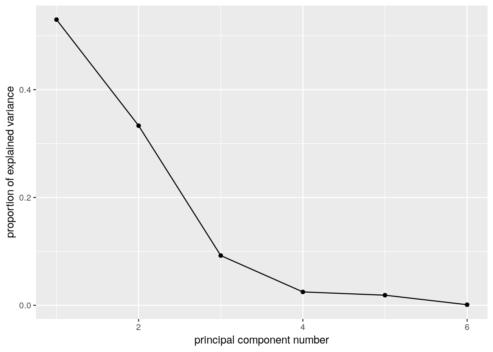
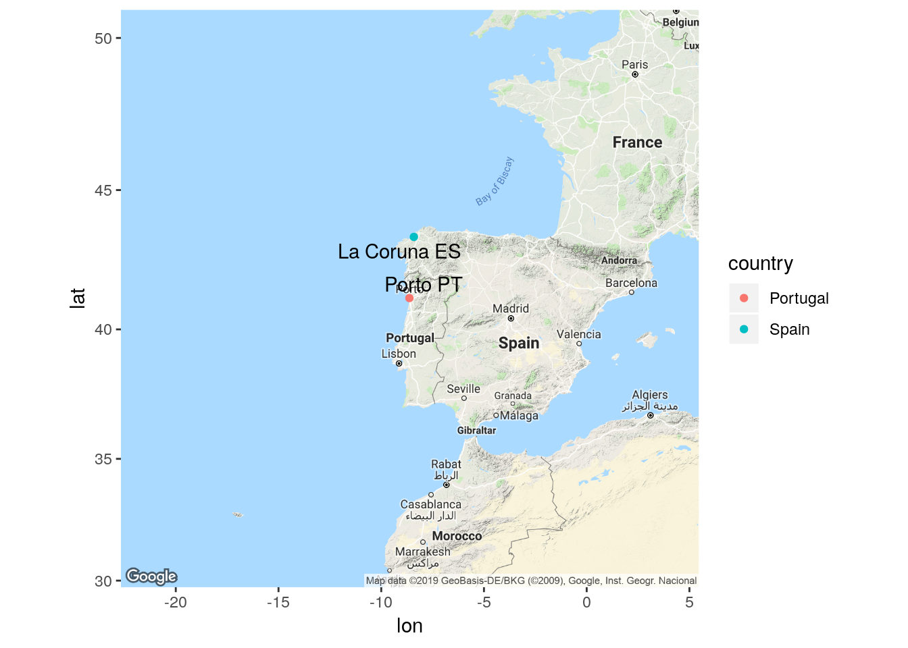
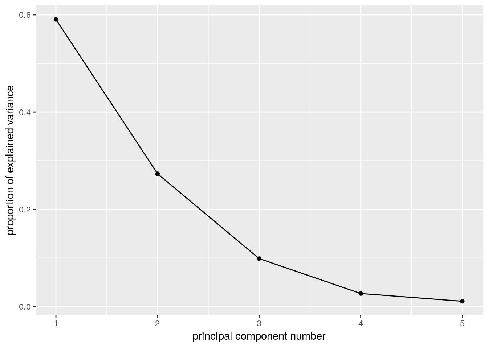
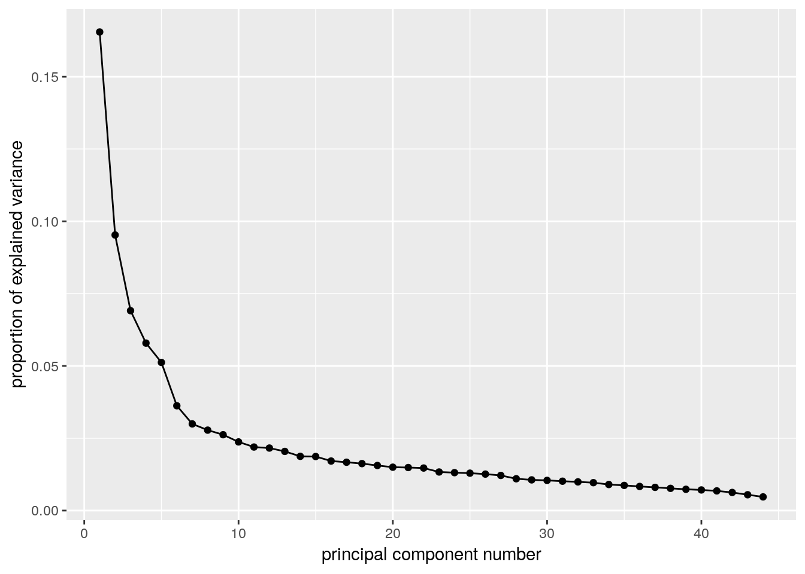

# Principal Components and Factor Analysis

Packages for this chapter:


```r
library(ggbiplot)
library(tidyverse)
```


##  The weather, somewhere


 The data in
[link](http://www.utsc.utoronto.ca/~butler/d29/weather_2014.csv) is of the
weather in a certain location: daily weather records for 2014. The
variables are:


* day of the year (1 through 365)

* day of the month

* number of the month

* season

* low temperature (for the day)

* high temperature

* average temperature

* time of the low temperature

* time of the high temperature

* rainfall (mm)

* average wind speed

* wind gust (highest wind speed)

* time of the wind gust

* wind direction


(a) Read in the data, and create a data frame containing only
the temperature variables, the rainfall and the wind speed variables
(the ones that are actual numbers, not times or text). Display the
first few lines of your data frame.
 
Solution


Read into a temporary data frame, and then process:

```r
my_url <- "http://www.utsc.utoronto.ca/~butler/d29/weather_2014.csv"
weather.0 <- read_csv(my_url)
weather.0
```

```
## # A tibble: 365 x 14
##    day.count   day month season l.temp h.temp ave.temp l.temp.time h.temp.time
##        <dbl> <dbl> <dbl> <chr>   <dbl>  <dbl>    <dbl> <time>      <time>     
##  1         1     1     1 Winter   12.7   14       13.4 01:25       23:50      
##  2         2     2     1 Winter   11.3   14.7     13.5 07:30       11:15      
##  3         3     3     1 Winter   12.6   14.7     13.6 21:00       14:00      
##  4         4     4     1 Winter    7.7   13.9     11.3 10:35       01:50      
##  5         5     5     1 Winter    8.8   14.6     13   01:40       12:55      
##  6         6     6     1 Winter   11.8   14.4     13.1 19:35       00:05      
##  7         7     7     1 Winter   11.4   14.8     13.5 07:25       14:30      
##  8         8     8     1 Winter   12.4   15.6     14.1 23:50       13:25      
##  9         9     9     1 Winter    9.2   18.4     12.9 07:10       14:05      
## 10        10    10     1 Winter    8.3   14.8     11   07:55       12:20      
## # … with 355 more rows, and 5 more variables: rain <dbl>, ave.wind <dbl>,
## #   gust.wind <dbl>, gust.wind.time <time>, dir.wind <chr>
```

     

There are lots of columns, of which we only want a few:


```r
(weather.0 %>% select(l.temp:ave.temp, rain:gust.wind) -> weather)
```

```
## # A tibble: 365 x 6
##    l.temp h.temp ave.temp  rain ave.wind gust.wind
##     <dbl>  <dbl>    <dbl> <dbl>    <dbl>     <dbl>
##  1   12.7   14       13.4  32       11.4      53.1
##  2   11.3   14.7     13.5  64.8      5.6      41.8
##  3   12.6   14.7     13.6  12.7      4.3      38.6
##  4    7.7   13.9     11.3  20.1     10.3      66  
##  5    8.8   14.6     13     9.4     11.6      51.5
##  6   11.8   14.4     13.1  38.9      9.9      57.9
##  7   11.4   14.8     13.5   2        6.6      38.6
##  8   12.4   15.6     14.1   1.5      5.9      33.8
##  9    9.2   18.4     12.9   0        0.2      16.1
## 10    8.3   14.8     11     0        1.4      24.1
## # … with 355 more rows
```

 
 

(b) Find five-number summaries for each column by running
`quantile` on all the columns of the data frame (at once, if
you can).
 
Solution


This is cleanest, but you may not have seen the idea before:

```r
map_df(weather, ~ quantile(.))
```

```
## # A tibble: 6 x 5
##    `0%` `25%` `50%` `75%` `100%`
##   <dbl> <dbl> <dbl> <dbl>  <dbl>
## 1   3.1   9.1  12.9  16.3   22.6
## 2   9.8  14.4  19.1  23.3   31.5
## 3   7.3  12    15.8  19.3   26.6
## 4   0     0     0.3   5.3   74.9
## 5   0     2.3   3.5   5.2   16.6
## 6   3.2  22.5  29    38.6   86.9
```

     
These are, reading down, the min, Q1, median, Q3, max of each
variable. The rain, in particular, is very skewed: the median is near
zero, but the maximum is much higher. (Most of the time, you get no
rain, but if you get any, you can get a lot. The maximum is 75 mm, or
3 inches. In one day.)

The coding idea is that if you feed a `map_` a data frame, it applies the function to each *column* of the data frame. 

Another way to do it is to make a column of column names, using
`pivot_longer`, and then use `nest` and list-columns to find
the quantiles for each variable:


```r
weather %>%
  pivot_longer(everything(), names_to="xname", values_to="x") %>%
  nest(-xname) %>%
  mutate(q = map(data, ~ enframe(quantile(.$x)))) %>%
  unnest(q) %>%
  pivot_wider(names_from=name, values_from=value) %>%
  select(-data)
```

```
## Warning: All elements of `...` must be named.
## Did you want `data = c(x)`?
```

```
## # A tibble: 6 x 6
##   xname      `0%` `25%` `50%` `75%` `100%`
##   <chr>     <dbl> <dbl> <dbl> <dbl>  <dbl>
## 1 l.temp      3.1   9.1  12.9  16.3   22.6
## 2 h.temp      9.8  14.4  19.1  23.3   31.5
## 3 ave.temp    7.3  12    15.8  19.3   26.6
## 4 rain        0     0     0.3   5.3   74.9
## 5 ave.wind    0     2.3   3.5   5.2   16.6
## 6 gust.wind   3.2  22.5  29    38.6   86.9
```

 

That was a lot of work, but it depends on how you see it when you're coding it. You should investigate this one line at a time, but the steps are:


* create a "long" data frame with one column of variable names and a second with the values for that variable

* make mini-data-frames `data` containing everything but `xname`: that is, one column `x` with the values for that variable.

* for each mini-data-frame, work out the quantiles of its `x`. The `enframe` saves the labels for what percentiles they are.

* Unnest this to make a long data frame with one row for each quantile for each variable.

* put the variable names in rows and the percentiles in columns.
 

(c) Run a principal components analysis (on the correlation matrix).
 
Solution


```r
weather.1 <- princomp(weather, cor = T)
```

     
 

(d) Obtain a `summary` of your principal components
analysis. How many components do you think are worth investigating?
 
Solution


```r
summary(weather.1)
```

```
## Importance of components:
##                           Comp.1    Comp.2     Comp.3     Comp.4     Comp.5
## Standard deviation     1.7830875 1.4138296 0.74407069 0.38584917 0.33552998
## Proportion of Variance 0.5299001 0.3331524 0.09227353 0.02481326 0.01876339
## Cumulative Proportion  0.5299001 0.8630525 0.95532604 0.98013930 0.99890270
##                             Comp.6
## Standard deviation     0.081140732
## Proportion of Variance 0.001097303
## Cumulative Proportion  1.000000000
```

     
The issue is to see where the standard deviations are getting small
(after the second component, or perhaps the third one) and to see
where  the cumulative proportion of variance explained is acceptably
high (again, after the second one, 86\%, or the third, 95\%).
 

(e) Make a scree plot. Does this
support your conclusion from the previous part?
 
Solution


`ggscreeplot` from `ggbiplot`:

```r
ggscreeplot(weather.1)
```



     

I see elbows at 3 and at 4. Remember you want to be on the mountain
for these, not on the scree, so this suggests 2 or 3 components, which
is exactly what we got from looking at the standard deviations and
cumulative variance explained.

The eigenvalue-greater-than-1 thing 
(that is, the "standard deviation" in the `summary` being greater than 1)
says 2 components, rather than 3.
 

(f) Obtain the component loadings. How do the first three
components depend on the original variables? (That is, what kind of
values for the original variables would make the component scores
large or small?)
 
Solution


```r
weather.1$loadings
```

```
## 
## Loadings:
##           Comp.1 Comp.2 Comp.3 Comp.4 Comp.5 Comp.6
## l.temp     0.465  0.348         0.542  0.470  0.379
## h.temp     0.510  0.231        -0.576 -0.381  0.458
## ave.temp   0.502  0.311                      -0.804
## rain      -0.296  0.397  0.853        -0.163       
## ave.wind  -0.253  0.560 -0.463  0.357 -0.529       
## gust.wind -0.347  0.507 -0.230 -0.492  0.572       
## 
##                Comp.1 Comp.2 Comp.3 Comp.4 Comp.5 Comp.6
## SS loadings     1.000  1.000  1.000  1.000  1.000  1.000
## Proportion Var  0.167  0.167  0.167  0.167  0.167  0.167
## Cumulative Var  0.167  0.333  0.500  0.667  0.833  1.000
```

     


* 1: This component loads mainly (and positively) on the temperature
variables, so when temperature is high, component 1 is high.
You could also say that it loads negatively on the other
variables, in which case component 1 is high if the temperature
variables are low and the rain and wind variables are high.


* 2: This one loads most heavily, positively, on wind: when wind is high,
component 2 is high. Again, you can make the judgement call that the
other variables also feature in component 2, so that when
*everything* is large, component 2 is large and small with small.

* 3: This one is a bit clearer. The blank loadings are close to 0,
and can be ignored. The main thing in component 3 is rain: when
rainfall is large, component 3 is large. Or, if you like, it is
large (positive) when rainfall is large *and wind is small*.


The interpretation here is kind of muffled, because each component has
bits of everything. One of the advantages of factor analysis that we
see in class later is that
you can do a "rotation" so that each variable (to a greater extent)
is either *in* a factor or *out* of it. Such a varimax rotation
is the default for `factanal`, which I presume I now have to
show you (so this is looking ahead): 


```r
weather.2 <- factanal(weather, 3, scores = "r")
weather.2$loadings
```

```
## 
## Loadings:
##           Factor1 Factor2 Factor3
## l.temp     0.964          -0.230 
## h.temp     0.939  -0.203   0.267 
## ave.temp   0.992  -0.101         
## rain      -0.147   0.604         
## ave.wind           0.864         
## gust.wind -0.144   0.984         
## 
##                Factor1 Factor2 Factor3
## SS loadings      2.839   2.131   0.140
## Proportion Var   0.473   0.355   0.023
## Cumulative Var   0.473   0.828   0.852
```

 

These are a lot less ambiguous: factor 1 is temperature, factor 2 is
rain and wind, and factor 3 is large (positive) if the high
temperature is high or the low temperature is low: that is, if the
high temperature was especially high relative to the low temperature
(or, said differently, if the temperature *range* was high).

These factors are rather pleasantly interpretable.

`ggbiplot` mysteriously doesn't handle factor analyses, so we
have to go back to the base-graphics version, which goes a bit like this:


```r
biplot(weather.2$scores, weather.2$loadings)
```


 

Now you see that the factors are aligned with the axes, and it's very
clear what the factors "represent". (You don't see much else, in all
honesty, but you see at least this much.)
 

(g) Obtain the principal component scores, for as many components
as you think are reasonable, and display the first
20 of them for each component alongside the other variables in your
data frame.
 
Solution


Something like this. I begin by turning the component scores
(which are a matrix) into a data frame, and selecting the ones I
want (the first three):


      

```r
as_tibble(weather.1$scores) %>%
  select(1:3) %>%
  bind_cols(weather) %>%
  mutate(day = row_number()) -> d
d %>% print(n = 20)
```

```
## # A tibble: 365 x 10
##    Comp.1   Comp.2   Comp.3 l.temp h.temp ave.temp  rain ave.wind gust.wind   day
##     <dbl>    <dbl>    <dbl>  <dbl>  <dbl>    <dbl> <dbl>    <dbl>     <dbl> <int>
##  1 -2.84   3.13    -0.00402   12.7   14       13.4  32       11.4      53.1     1
##  2 -2.79   2.31     3.64      11.3   14.7     13.5  64.8      5.6      41.8     2
##  3 -1.11   0.255    0.263     12.6   14.7     13.6  12.7      4.3      38.6     3
##  4 -3.62   2.47    -0.992      7.7   13.9     11.3  20.1     10.3      66       4
##  5 -2.67   2.03    -1.68       8.8   14.6     13     9.4     11.6      51.5     5
##  6 -3.09   3.14     0.664     11.8   14.4     13.1  38.9      9.9      57.9     6
##  7 -1.22   0.328   -0.958     11.4   14.8     13.5   2        6.6      38.6     7
##  8 -0.734  0.102   -0.743     12.4   15.6     14.1   1.5      5.9      33.8     8
##  9  0.210 -2.26     0.534      9.2   18.4     12.9   0        0.2      16.1     9
## 10 -0.825 -2.00     0.109      8.3   14.8     11     0        1.4      24.1    10
## 11 -1.01  -2.72     0.294      5.8   14.8      9.5   0.3      1.1      16.1    11
## 12 -1.68   0.0710  -0.0803     9.4   15.2     12.1  10.7      4.7      41.8    12
## 13 -2.12  -0.822    0.653      7.3   12.9     10.2  15.7      3.1      35.4    13
## 14 -1.34   0.00249 -0.169     11.4   13.9     12.8   8.1      4.7      38.6    14
## 15 -2.52   0.929    0.955      9.4   13.1     12    29        5.9      43.5    15
## 16 -2.38   0.200   -0.669      9     12.2     10.8   6.9      5.4      49.9    16
## 17 -3.18   0.626    0.431      7.7   11.4      9.3  25.4      7.2      41.8    17
## 18 -1.95  -1.82     1.28       7.5   10.9      9    17        1.4      24.1    18
## 19 -2.13  -1.60    -0.293      6.4   11.4      8.7   2.5      3.3      32.2    19
## 20 -1.29  -2.62     0.448      6.9   12.2      9.2   2.8      1.1      17.7    20
## # … with 345 more rows
```

      
I just did the first three scores. I made a column `day` so that I can see which day of the year I am looking at (later).
 

(h) Find a day that scores low on component 1, and explain briefly why
it came out that way (by looking at the measured variables).
 
Solution


We can do this one and the ones following by running
`arrange` appropriately:

```r
d %>% arrange(Comp.1)
```

```
## # A tibble: 365 x 10
##    Comp.1 Comp.2 Comp.3 l.temp h.temp ave.temp  rain ave.wind gust.wind   day
##     <dbl>  <dbl>  <dbl>  <dbl>  <dbl>    <dbl> <dbl>    <dbl>     <dbl> <int>
##  1  -5.29  4.64  -0.294    7     14.4      9.9  43.2     13        86.9    40
##  2  -4.89  3.50   1.64     6.5   12.9     10.3  57.4     10.3      66      35
##  3  -4.64  5.33  -0.653    9.3   15.3     12.5  43.4     16.6      74      37
##  4  -4.57  2.19  -1.49     5.5   10.7      8.8  17       11.1      69.2    41
##  5  -4.48  2.11   1.90     6.8   11.5      8.9  50.5      6.8      61.2    34
##  6  -4.36  4.45   1.06     9.1   15.2     12.2  55.1     12.8      66      45
##  7  -3.82  2.24   0.532    7.8   12.9     10.7  34.8      8.1      62.8    39
##  8  -3.62  2.47  -0.992    7.7   13.9     11.3  20.1     10.3      66       4
##  9  -3.44  0.576 -2.10     5.7   11.4      8.4   0        9.8      51.5   363
## 10  -3.36  2.19  -0.705    9.1   13       11.3  20.3      9.3      62.8    38
## # … with 355 more rows
```

       
Day 40 has the lowest component 1 score. This is one of the
cooler days. Also, there is a
largish amount of rain *and* wind. So low temperature, high
rain and wind.
Some of the other days on my list were cooler than day 4, but they
had less rain and less wind.
  

(i) Find a day that scores high on component 2, and explain
briefly why it came out that way.
 
Solution


```r
d %>% arrange(desc(Comp.2))
```

```
## # A tibble: 365 x 10
##     Comp.1 Comp.2  Comp.3 l.temp h.temp ave.temp  rain ave.wind gust.wind   day
##      <dbl>  <dbl>   <dbl>  <dbl>  <dbl>    <dbl> <dbl>    <dbl>     <dbl> <int>
##  1 -4.64     5.33 -0.653     9.3   15.3     12.5  43.4     16.6      74      37
##  2 -5.29     4.64 -0.294     7     14.4      9.9  43.2     13        86.9    40
##  3 -4.36     4.45  1.06      9.1   15.2     12.2  55.1     12.8      66      45
##  4 -1.61     4.33  3.43     17.7   19.1     18.3  68.3      8.3      46.7   261
##  5 -1.02     3.63  1.36     16.8   20.4     19    39.1      6.9      59.5   289
##  6  2.42     3.51 -1.39     20.9   31.2     25.7   0        8.8      46.7   166
##  7 -4.89     3.50  1.64      6.5   12.9     10.3  57.4     10.3      66      35
##  8  0.0301   3.49 -0.0846   18.5   22.3     20.3  22.9     10.3      43.5   260
##  9 -0.745    3.45  1.99     15.9   21.4     19.9  46.2      7.7      45.1   281
## 10 -0.105    3.20 -0.493    17.9   21.8     19.5  16.5      9.3      49.9   290
## # … with 355 more rows
```

       
Day 37. These are days when the wind speed (average or
gust) is on the high side. 

 

(j) Find a day that scores high on component 3, and explain
briefly why it came out high.
 
Solution


```r
d %>% arrange(desc(Comp.3))
```

```
## # A tibble: 365 x 10
##     Comp.1 Comp.2 Comp.3 l.temp h.temp ave.temp  rain ave.wind gust.wind   day
##      <dbl>  <dbl>  <dbl>  <dbl>  <dbl>    <dbl> <dbl>    <dbl>     <dbl> <int>
##  1 -2.32    2.23    4.92   11.8   17.2     14.6  74.9      2.8      41.8   307
##  2 -2.79    2.31    3.64   11.3   14.7     13.5  64.8      5.6      41.8     2
##  3  0.0819  2.90    3.59   16.1   26.6     20.3  54.4      2        49.9   264
##  4 -1.61    4.33    3.43   17.7   19.1     18.3  68.3      8.3      46.7   261
##  5 -0.759   2.48    3.42   15.7   19.5     18.6  55.6      4.5      37     288
##  6 -2.21    3.12    2.15   12.8   17.7     15.8  50.5      7.2      53.1   317
##  7 -0.745   3.45    1.99   15.9   21.4     19.9  46.2      7.7      45.1   281
##  8 -4.48    2.11    1.90    6.8   11.5      8.9  50.5      6.8      61.2    34
##  9 -1.77    0.693   1.72   10.7   15.6     13    32.8      4        38.6   312
## 10 -4.89    3.50    1.64    6.5   12.9     10.3  57.4     10.3      66      35
## # … with 355 more rows
```

 
Day 307. Component 3 was mainly rain, so it is not surprising that
the rainfall is the highest on this day.
 

(k) Make a biplot of these data, labelling the days by the day
count (from 1 to 365). You may have to get the day count from the
original data frame that you read in from the file. You can shrink
the day numbers to make them overwrite each other (a bit) less.
 
Solution


`ggbiplot`. I did some digging in the help file to figure
out how to label the points by a variable and how to control the
size of the labels, and I also went digging in the data frame
that I read in from the file to get the count of the day in the
year, which was called `day.count`:

```r
ggbiplot(weather.1, labels = weather.0$day.count, labels.size = 2)
```


     

I think the label text is small enough, though you could make it
smaller. I'll be asking you to look at some extreme points in a
moment, so those are the only ones you'll need to be able to
disentangle. 

The variables divide into two groups: the temperature ones, that point
to about 2 o'clock, and the wind and rain ones, that point to about 11
o'clock. These are not straight up or down or across, so they all
feature in both components: component 1 is mostly temperature, but has
a bit of wind/rain in it, while component 2 is mostly wind/rain with a
bit of temperature in it. You might be wondering whether things
couldn't be rotated so that, say, the temperature variables go across
and the rain/wind ones go down, which means you'd have a temperature
component and a rain/wind component. This is what factor analysis
does, and I think I did that earlier (and this is what we found).
 

(l) Looking at your biplot, what do you think was remarkable
about the weather on day 37? Day 211? Confirm your guesses by
looking at the appropriate rows of your data frame (and comparing
with your `summary` from earlier).
 
Solution


Day 37 is at the top left of the plot, at the pointy end of
the arrows for rain, wind gust and average wind. This suggests a
rainy, windy day:

```r
weather %>% slice(37)
```

```
## # A tibble: 1 x 6
##   l.temp h.temp ave.temp  rain ave.wind gust.wind
##    <dbl>  <dbl>    <dbl> <dbl>    <dbl>     <dbl>
## 1    9.3   15.3     12.5  43.4     16.6        74
```

     

Those are high numbers for both rain and wind (the highest for average
wind and above the third quartile otherwise), but the temperatures
are unremarkable.

Day 211 is towards the pointy end of the arrows for temperature, so
this is a hot day:


```r
weather %>% slice(211)
```

```
## # A tibble: 1 x 6
##   l.temp h.temp ave.temp  rain ave.wind gust.wind
##    <dbl>  <dbl>    <dbl> <dbl>    <dbl>     <dbl>
## 1   22.6   31.5     26.6     0      4.5      33.8
```

 

This is actually the hottest day of the entire year: day 211 is
highest on all three temperatures, while the 
wind speeds are right around average (and no rain is not completely
surprising). 

I can do a couple more. Points away from the pointy end of the arrows
are *low* on the variables in question, for example day 265:


```r
weather %>% slice(265)
```

```
## # A tibble: 1 x 6
##   l.temp h.temp ave.temp  rain ave.wind gust.wind
##    <dbl>  <dbl>    <dbl> <dbl>    <dbl>     <dbl>
## 1   16.6   20.3     18.1   6.3        0       3.2
```

 

This is not really low rain, but it is definitely low
*wind*. What about day 47?


```r
weather %>% slice(47)
```

```
## # A tibble: 1 x 6
##   l.temp h.temp ave.temp  rain ave.wind gust.wind
##    <dbl>  <dbl>    <dbl> <dbl>    <dbl>     <dbl>
## 1    3.1   11.8      7.3   0.8        2      24.1
```

 

This is predominantly low on temperature. In fact, it is kind of low
on wind and rain too.
<label for="tufte-mn-" class="margin-toggle">&#8853;</label><input type="checkbox" id="tufte-mn-" class="margin-toggle"><span class="marginnote">If you ignore the wind gust, anyway.</span>
This makes sense, because not only is it at the "wrong" end of the
temperature arrows, it is kind of at the wrong end of the wind/rain
arrows as well.

Having done these by percentile ranks in one of the other questions,
let's see if we can do that here as well:


```r
map_df(weather, ~percent_rank(.)) %>%
  mutate(day=row_number()) %>% 
  slice(c(37, 211, 265, 47))
```

```
## # A tibble: 4 x 7
##   l.temp h.temp ave.temp  rain ave.wind gust.wind   day
##    <dbl>  <dbl>    <dbl> <dbl>    <dbl>     <dbl> <int>
## 1  0.264 0.316     0.299 0.973    1         0.997    37
## 2  1     0.997     1     0        0.654     0.626   211
## 3  0.783 0.560     0.635 0.761    0         0       265
## 4  0     0.0275    0     0.582    0.162     0.275    47
```

 

These are:


* Day 37: highly rainy and windy (and below average,
but not remarkably so, on temperature). 

* Day 211: the highest or near-highest temperature, no rain but
unremarkable for wind.

* Day 265: Lowest for wind (and above Q3 for low temperature and
rain). 

* Day 47: Lowest or near-lowest temperature.


The advantage to doing it this way is that you don't need a separate
five-number summary for each variable; the percentile ranks
*give* you a comparison with quartiles (or any other percentile
of interest to you).
In case you are wondering where this is: I was doing a presentation
using these data to some Environmental Science grad students, and I
had them guess where it was. The temperatures for the whole year are
warm-temperate, with a smallish range, and sometimes a lot of
rain. This suggests a maritime climate. I gave the additional clues of
"western Europe" and 
"this place's soccer team plays in blue and white striped shirts". 
The temperatures have about the right range
low-to-high for Britain, but are too warm. Which suggests going south:
perhaps Brittany in France, but actually the west
coast of the Iberian peninsula: Porto, in northern Portugal, with the
weather blowing in off the Atlantic. 


##  Air pollution


 The data in
[link](http://www.utsc.utoronto.ca/~butler/d29/airpollution.csv) are
measurements of air-pollution variables recorded at 12 noon on 42
different days at a location in Los Angeles. The file is in
`.csv` format, since it came from a spreadsheet.  Specifically,
the variables (in suitable units), in the same order as in the data
file, are:


* wind speed

* solar radiation

* carbon monoxide

* Nitric oxide (also known as nitrogen monoxide)

* Nitrogen dioxide

* Ozone

* Hydrocarbons


The aim is to describe pollution using fewer than these seven variables.


(a) Read in the data and demonstrate that you have the right
number of rows and columns in your data frame.


Solution


This is a `.csv` file, so:

```r
my_url <- "http://www.utsc.utoronto.ca/~butler/d29/airpollution.csv"
air <- read_csv(my_url)
```

```
## 
## ── Column specification ────────────────────────────────────────────────────────────────────────────
## cols(
##   wind = col_double(),
##   solar.radiation = col_double(),
##   CO = col_double(),
##   NO = col_double(),
##   NO2 = col_double(),
##   O3 = col_double(),
##   HC = col_double()
## )
```

```r
air
```

```
## # A tibble: 42 x 7
##     wind solar.radiation    CO    NO   NO2    O3    HC
##    <dbl>           <dbl> <dbl> <dbl> <dbl> <dbl> <dbl>
##  1     8              98     7     2    12     8     2
##  2     7             107     4     3     9     5     3
##  3     7             103     4     3     5     6     3
##  4    10              88     5     2     8    15     4
##  5     6              91     4     2     8    10     3
##  6     8              90     5     2    12    12     4
##  7     9              84     7     4    12    15     5
##  8     5              72     6     4    21    14     4
##  9     7              82     5     1    11    11     3
## 10     8              64     5     2    13     9     4
## # … with 32 more rows
```

     

There should  be 42 rows (for the 42 days), and 7 columns (for the 7
variables), and there are. 
    


(b) <a name="part:fivenum">*</a> 
Obtain a five-number summary for each variable. You can do this in
one go for all seven variables.


Solution


Like this (the cleanest):

```r
air %>% map_df(~ quantile(.))
```

```
## # A tibble: 7 x 5
##    `0%` `25%` `50%` `75%` `100%`
##   <dbl> <dbl> <dbl> <dbl>  <dbl>
## 1     5   6     8    8.75     10
## 2    30  68.2  76.5 84.8     107
## 3     2   4     4    5         7
## 4     1   1     2    3         5
## 5     5   8     9.5 12        21
## 6     2   6     8.5 11        25
## 7     2   3     3    3         5
```

     

using `map` from `purrr`: "for each (column of) `air`, calculate the quantiles of it"..
I have to figure out how to
identify which number from the five number summary each of these is,
but in this case you can easily figure it out since the min is the
smallest and the max has to be the biggest in each column.

Or, with some more work, this:


```r
air %>%
  pivot_longer(everything(), names_to="xname", values_to="x") %>% 
  nest(-xname) %>%
  mutate(q = map(data, ~ enframe(quantile(.$x)))) %>%
  unnest(q) %>%
  pivot_wider(names_from=name, values_from=value) %>% 
  select(-data)
```

```
## Warning: All elements of `...` must be named.
## Did you want `data = c(x)`?
```

```
## # A tibble: 7 x 6
##   xname            `0%` `25%` `50%` `75%` `100%`
##   <chr>           <dbl> <dbl> <dbl> <dbl>  <dbl>
## 1 wind                5   6     8    8.75     10
## 2 solar.radiation    30  68.2  76.5 84.8     107
## 3 CO                  2   4     4    5         7
## 4 NO                  1   1     2    3         5
## 5 NO2                 5   8     9.5 12        21
## 6 O3                  2   6     8.5 11        25
## 7 HC                  2   3     3    3         5
```

This time, I put the percentiles in columns and variable names in rows (because it seemed to be easier that way).
 

just like the weather problem (in fact, *exactly* like the weather
problem).

    


(c) Obtain a principal components analysis. Do it on the
correlation matrix, since the variables are measured on different
scales. You don't need to look at the results yet.


Solution


This too is all rather like the previous question:

```r
air.1 <- princomp(air, cor = T)
```

     
    


(d) Obtain a scree plot. How many principal components might be
worth looking at? Explain briefly. (There might be more than one
possibility. If so, discuss them all.)


Solution


`ggscreeplot` the thing you just obtained, having loaded
package `ggbiplot`: 

```r
ggscreeplot(air.1)
```



     

There is a technicality here, which is
that `ggbiplot`, the package, loads `plyr`, which
contains a lot of the same things as `dplyr` (the latter is a
cut-down version of the former). If you load `dplyr` and
*then* `plyr` (that is to say, if you load the
`tidyverse` first and then `ggbiplot`), you will end up
with trouble, and probably the wrong version of a lot of functions. To
avoid this, load `ggbiplot` *first*, and then you'll be
OK. 

Now, finally, we might diverge from the previous question. There are
actually *two* elbows on this plot, at 2 and at 4, which means
that we should entertain the idea of either 1 or 3 components. I would
be inclined to say that the elbow at 2 is still "too high up" the
mountain --- there is still some more mountain below it.

The points at 3 and 6 components look like elbows too, but they are
*pointing the wrong way*. What you are looking for when you
search for elbows are points that are the end of the mountain and the
start of the scree. The elbows at 2 (maybe) and 4 (definitely) are
this kind of thing, but the elbows at 3 and at 6 are not.
    


(e) Look at the `summary` of the principal components
object. What light does this shed on the choice of number of
components? Explain briefly.


Solution


```r
summary(air.1)
```

```
## Importance of components:
##                           Comp.1    Comp.2    Comp.3    Comp.4     Comp.5     Comp.6     Comp.7
## Standard deviation     1.5286539 1.1772853 1.0972994 0.8526937 0.80837896 0.73259047 0.39484041
## Proportion of Variance 0.3338261 0.1980001 0.1720094 0.1038695 0.09335379 0.07666983 0.02227128
## Cumulative Proportion  0.3338261 0.5318262 0.7038356 0.8077051 0.90105889 0.97772872 1.00000000
```

     

The first component only explains 33\% of the variability, not very
much, but the first *three* components together explain 70\%,
which is much more satisfactory. So I would go with 3 components.

There are two things here: finding an elbow, *and* explaining a
sensible fraction of the variability. You could explain more of the
variability by taking more components, but if you are not careful you
end up explaining seven variables with, um, seven variables.

If you go back and look at the scree plot, you'll see that the first
elbow is really rather high up the mountain, and it's really the
*second* elbow that is the start of the scree.

If this part doesn't persuade you that three components is better than
one, you need to pick a number of components to use for the rest of
the question, and stick to it all the way through.
    


(f) <a name="part:preferred">*</a> How do each of your preferred number of components depend
on the variables that were measured? Explain briefly.


Solution


When this was a hand-in question, there were three marks for it,
which was  a bit of a giveaway!
Off we go:

```r
air.1$loadings
```

```
## 
## Loadings:
##                 Comp.1 Comp.2 Comp.3 Comp.4 Comp.5 Comp.6 Comp.7
## wind             0.237  0.278  0.643  0.173  0.561  0.224  0.241
## solar.radiation -0.206 -0.527  0.224  0.778 -0.156              
## CO              -0.551        -0.114         0.573  0.110 -0.585
## NO              -0.378  0.435 -0.407  0.291         0.450  0.461
## NO2             -0.498  0.200  0.197               -0.745  0.338
## O3              -0.325 -0.567  0.160 -0.508         0.331  0.417
## HC              -0.319  0.308  0.541 -0.143 -0.566  0.266 -0.314
## 
##                Comp.1 Comp.2 Comp.3 Comp.4 Comp.5 Comp.6 Comp.7
## SS loadings     1.000  1.000  1.000  1.000  1.000  1.000  1.000
## Proportion Var  0.143  0.143  0.143  0.143  0.143  0.143  0.143
## Cumulative Var  0.143  0.286  0.429  0.571  0.714  0.857  1.000
```

     

You'll have to decide where to draw the line between "zero" and
"nonzero". It doesn't matter so much where you put the line, so your
answers can differ from mine and still be correct.

We need to pick the loadings that are "nonzero", however we define
that, for example:


* component 1 depends (negatively) on carbon monoxide and nitrogen dioxide.

* component 2 depends (negatively) on solar radiation and ozone
and possibly positively on nitric oxide.

* component 3 depends (positively) on wind and hydrocarbons.


It is a good idea to translate the variable names (which are
abbreviated) back into the long forms.
    


(g) Make a data frame that contains (i) the original data, (ii) a column of row numbers, (iii) the principal component scores. Display some of it.

Solution


All the columns contain numbers, so `cbind` will do
it. (The component scores are seven columns, so
`bind_cols` won't do it unless you are careful.):

```r
cbind(air, air.1$scores) %>%  
  mutate(row = row_number()) -> d
head(d)
```

```
##   wind solar.radiation CO NO NO2 O3 HC      Comp.1     Comp.2     Comp.3    Comp.4     Comp.5
## 1    8              98  7  2  12  8  2 -0.95292110 -0.9754106 -0.4266696 1.4454463  2.0390917
## 2    7             107  4  3   9  5  3 -0.04941978 -0.4291403 -0.2925624 2.1070743 -0.7830499
## 3    7             103  4  3   5  6  3  0.53767776 -0.6491739 -0.5519781 1.8839424 -0.7923010
## 4   10              88  5  2   8 15  4 -0.37519620 -0.3609587  2.0031533 0.1892788  0.2923780
## 5    6              91  4  2   8 10  3  0.19694099 -1.0955256 -0.4489016 0.5501374 -0.8853554
## 6    8              90  5  2  12 12  4 -1.12344250 -0.2297073  1.3544191 0.2851494 -0.4269438
##       Comp.6     Comp.7 row
## 1 -0.7280074 -0.5714587   1
## 2  0.1619189  0.1581294   2
## 3  1.1153956 -0.1744016   3
## 4  1.4704360 -0.1020858   4
## 5  0.1186414 -0.1581801   5
## 6  0.1098276 -0.2316944   6
```

     

This is probably the easiest way, but you see that there is a mixture
of base R and Tidyverse. The result is actually a base R `data.frame`, so displaying it will display *all* of it, hence my use of `head`.
If you want to do it the all-Tidyverse
way
<label for="tufte-mn-" class="margin-toggle">&#8853;</label><input type="checkbox" id="tufte-mn-" class="margin-toggle"><span class="marginnote">There really ought to be a radio station *CTDY: All Tidyverse, All The Time*.</span>
then you need to bear in mind that `bind_cols` *only* 
accepts vectors or data frames, not matrices, so a bit of care is needed first:


```r
air.1$scores %>%
  as_tibble() %>%
  bind_cols(air) %>%
  mutate(row = row_number()) -> dd
dd
```

```
## # A tibble: 42 x 15
##     Comp.1 Comp.2 Comp.3 Comp.4  Comp.5 Comp.6 Comp.7  wind solar.radiation    CO    NO   NO2    O3
##      <dbl>  <dbl>  <dbl>  <dbl>   <dbl>  <dbl>  <dbl> <dbl>           <dbl> <dbl> <dbl> <dbl> <dbl>
##  1 -0.953  -0.975 -0.427  1.45   2.04   -0.728 -0.571     8              98     7     2    12     8
##  2 -0.0494 -0.429 -0.293  2.11  -0.783   0.162  0.158     7             107     4     3     9     5
##  3  0.538  -0.649 -0.552  1.88  -0.792   1.12  -0.174     7             103     4     3     5     6
##  4 -0.375  -0.361  2.00   0.189  0.292   1.47  -0.102    10              88     5     2     8    15
##  5  0.197  -1.10  -0.449  0.550 -0.885   0.119 -0.158     6              91     4     2     8    10
##  6 -1.12   -0.230  1.35   0.285 -0.427   0.110 -0.232     8              90     5     2    12    12
##  7 -3.15    1.07   1.62   0.186  0.0374  1.84  -0.415     9              84     7     4    12    15
##  8 -3.98    0.926 -0.379 -0.619 -0.810  -1.29   0.735     5              72     6     4    21    14
##  9 -0.152  -0.974  0.337 -0.145  0.139  -0.681 -0.539     7              82     5     1    11    11
## 10 -0.784   0.939  0.985 -0.632 -0.219  -0.303 -0.375     8              64     5     2    13     9
## # … with 32 more rows, and 2 more variables: HC <dbl>, row <int>
```

 

I think the best way to think about this is to start with what is
farthest from being a data frame or a vector (the matrix of principal
component scores, here), bash that into shape first, and then glue the
rest of the things to it.

Note that we used all Tidyverse stuff here, so the result is a
`tibble`, and displaying it for me displays the first ten rows as
you'd expect. (This may be different in an R Notebook, since I think
there you get the first ten rows anyway.)


(h) Display the row of your new data frame for the observation
with the smallest (most negative) score on component 1. Which row is
this? What makes this observation have the most negative score on
component 1?

Solution


I think the best strategy is to sort by  component 1 score (in the default ascending order), and then display the first row:

```r
d %>% arrange(Comp.1) %>% slice(1)
```

```
##   wind solar.radiation CO NO NO2 O3 HC    Comp.1    Comp.2     Comp.3     Comp.4     Comp.5
## 1    5              72  6  4  21 14  4 -3.981043 0.9262199 -0.3789783 -0.6185173 -0.8095277
##      Comp.6    Comp.7 row
## 1 -1.290318 0.7352476   8
```

     

It's row 8.

We said earlier that component 1 depends negatively on carbon monoxide
and nitrogen dioxide, so that an observation that is *low* on
component 1 should be *high* on these things.
<label for="tufte-mn-" class="margin-toggle">&#8853;</label><input type="checkbox" id="tufte-mn-" class="margin-toggle"><span class="marginnote">You might  have said that component 1 depended on other things as well, in  which case you ought to consider whether observation 8 is, as  appropriate, high or low on these as well.</span>

So are these values high or low? That was the reason for having you
make the five-number summary <a href="#part:fivenum">here</a>. For
observation 8, `CO` is 6 and `NO2` is 21; looking back
at the five-number summary, the value of `CO` is above Q3, and
the value of `NO2` is the highest of all. So this is entirely
what we'd expect.


(i) Which observation has the lowest (most negative) value on
component 2? Which variables ought to be high or low for this
observation? Are they? Explain briefly.

Solution


This is a repeat of the ideas we just saw:

```r
d %>% arrange(Comp.2) %>% slice(1)
```

```
##   wind solar.radiation CO NO NO2 O3 HC     Comp.1    Comp.2    Comp.3    Comp.4     Comp.5
## 1    6              75  4  1  10 24  3 -0.3848472 -2.331649 0.2453131 -1.765714 -0.4522935
##      Comp.6    Comp.7 row
## 1 0.0884973 0.6669804  34
```

     

and for convenience, we'll grab the quantiles again:


```r
air %>% map_df(~ quantile(.))
```

```
## # A tibble: 7 x 5
##    `0%` `25%` `50%` `75%` `100%`
##   <dbl> <dbl> <dbl> <dbl>  <dbl>
## 1     5   6     8    8.75     10
## 2    30  68.2  76.5 84.8     107
## 3     2   4     4    5         7
## 4     1   1     2    3         5
## 5     5   8     9.5 12        21
## 6     2   6     8.5 11        25
## 7     2   3     3    3         5
```

 

Day 34. We said that component 2 depends (negatively) on solar
radiation and ozone and possibly positively on nitric oxide. This
means that day 34 ought to be *high* on the first two and low on
the last one (since it's at the low end of component 2). Solar
radiation is, surprisingly, close to the median (75), but ozone, 24,
is very near the highest, and nitric oxide, 1, is one of a large
number of values equal to the lowest. So day 34 is pointing the right
way, even if its variable values are not quite what you'd expect.
This business about figuring out whether values on variables are high
or low is kind of fiddly, since you have to refer back to the
five-number summary to see where the values for a particular
observation come. Another way to approach this is to calculate
*percentile ranks* for everything. Let's go back to our original data frame and replace everything with its percent rank: 


```r
air %>% mutate_all(~ percent_rank(.)) -> pct_rank
pct_rank
```

```
## # A tibble: 42 x 7
##     wind solar.radiation    CO    NO   NO2    O3    HC
##    <dbl>           <dbl> <dbl> <dbl> <dbl> <dbl> <dbl>
##  1 0.488           0.951 0.902 0.317 0.707 0.439 0    
##  2 0.317           1     0.146 0.683 0.366 0.171 0.171
##  3 0.317           0.976 0.146 0.683 0     0.244 0.171
##  4 0.878           0.829 0.610 0.317 0.244 0.878 0.780
##  5 0.122           0.902 0.146 0.317 0.244 0.561 0.171
##  6 0.488           0.878 0.610 0.317 0.707 0.780 0.780
##  7 0.756           0.707 0.902 0.878 0.707 0.878 1    
##  8 0               0.390 0.829 0.878 1     0.829 0.780
##  9 0.317           0.659 0.610 0     0.610 0.707 0.171
## 10 0.488           0.195 0.610 0.317 0.829 0.512 0.780
## # … with 32 more rows
```

 

Observation 34 is row 34 of this:


```r
pct_rank %>% slice(34)
```

```
## # A tibble: 1 x 7
##    wind solar.radiation    CO    NO   NO2    O3    HC
##   <dbl>           <dbl> <dbl> <dbl> <dbl> <dbl> <dbl>
## 1 0.122           0.463 0.146     0 0.512 0.976 0.171
```

 

Very high on ozone, (joint) lowest on nitric oxide, but middling on
solar radiation.
The one we looked at before, observation 8, is this:


```r
pct_rank %>% slice(8)
```

```
## # A tibble: 1 x 7
##    wind solar.radiation    CO    NO   NO2    O3    HC
##   <dbl>           <dbl> <dbl> <dbl> <dbl> <dbl> <dbl>
## 1     0           0.390 0.829 0.878     1 0.829 0.780
```

 

High on carbon monoxide, the highest on nitrogen dioxide.


(j) Obtain a biplot, with the row numbers labelled, and explain briefly how your conclusions from the previous two parts are consistent with it.

Solution


```r
ggbiplot(air.1, labels = d$row)
```


 

Day 8 is way over on the left. The things that point in the direction
of observation 8 (`NO2, CO` and to a lesser extent `NO`
and `HC`) are the things that observation 8 is high on. On the
other hand, observation 8 is around the middle of the arrows for
`wind`, `solar.radiation` and `O3`, so that day
is not especially remarkable for those. 

Observation 34 is
nearest the bottom, so we'd expect it to be high on ozone (yes), high
on solar radiation (no), low on nitric oxide (since that points the
most upward, yes) and also maybe low on wind, since observation 34 is
at the "back end" of that arrow. Wind is 6, which is at the first
quartile, low indeed.

The other thing that you see from the  biplot is that there are four
variables pointing more or less up and to the left, and at right
angles to them, three other variables pointing up-and-right or
down-and-left. You could imagine rotating those arrows so that the
group of 4 point upwards, and the other three point left and
right. This is what factor analysis does, so you might imagine that
this technique might give a clearer picture of which variables belong
in which factor than principal components does. Hence what follows.


(k) Run a factor analysis on the same data, obtaining two factors. Look at the factor loadings. Is it clearer which variables belong to which factor, compared to the principal components analysis? Explain briefly.

Solution


```r
air.2 <- factanal(air, 2, scores = "r")
air.2$loadings
```

```
## 
## Loadings:
##                 Factor1 Factor2
## wind            -0.176  -0.249 
## solar.radiation          0.319 
## CO               0.797   0.391 
## NO               0.692  -0.152 
## NO2              0.602   0.152 
## O3                       0.997 
## HC               0.251   0.147 
## 
##                Factor1 Factor2
## SS loadings      1.573   1.379
## Proportion Var   0.225   0.197
## Cumulative Var   0.225   0.422
```

 

I got the factor scores since I'm going to look at a biplot
shortly. If you aren't, you don't need them.

Factor 1 is rather more clearly carbon monoxide, nitric oxide and
nitrogen dioxide. Factor 2 is mostly ozone, with a bit of solar
radiation and carbon monoxide. I'd say this is clearer than before.

A biplot would tell us whether the variables are better aligned with
the axes now:


```r
biplot(air.2$scores, air.2$loadings)
```


 

At least somewhat. Ozone points straight up, since it is the dominant part of factor 2 and not part of factor 1 at all. Carbon monoxide and the two oxides of nitrogen point to the right. 

Extra: 
`wind`, `solar.radiation` and `HC` don't appear
in either of our factors, which also shows up here:


```r
air.2$uniquenesses
```

```
##            wind solar.radiation              CO              NO             NO2              O3 
##       0.9070224       0.8953343       0.2126417       0.4983564       0.6144170       0.0050000 
##              HC 
##       0.9152467
```

 

Those variables all have *high* uniquenesses.

What with the high uniquenesses, and the fact that two factors explain
only 42\% of the variability, we
really ought to look at 3 factors, the same way that we said we should look at
3 components:


```r
air.3 <- factanal(air, 3)
air.3$loadings
```

```
## 
## Loadings:
##                 Factor1 Factor2 Factor3
## wind                    -0.210  -0.334 
## solar.radiation          0.318         
## CO               0.487   0.318   0.507 
## NO               0.238  -0.269   0.931 
## NO2              0.989                 
## O3                       0.987   0.124 
## HC               0.427   0.103   0.172 
## 
##                Factor1 Factor2 Factor3
## SS loadings      1.472   1.312   1.288
## Proportion Var   0.210   0.187   0.184
## Cumulative Var   0.210   0.398   0.582
```

 

In case you are wondering, `factanal` automatically uses the
correlation matrix, and so takes care of variables measured on
different scales without our having to worry about that.

The rotation has only helped somewhat here. Factor 1 is mainly
`NO2` with some influence of `CO` and `HC`;
factor 2 is mainly ozone (with a bit of solar radiation and carbon monoxide),
and factor 3 is mainly `NO` with a bit of `CO`.

I think I mentioned most of the variables in there, so the uniquenesses
should not be too bad:


```r
air.3$uniquenesses
```

```
##            wind solar.radiation              CO              NO             NO2              O3 
##       0.8404417       0.8905074       0.4046425       0.0050000       0.0050000       0.0050000 
##              HC 
##       0.7776557
```

 

Well, not great: `wind` and `solar.radiation` still have
high uniquenesses because they are not *strongly* part of any
factors.

If you wanted to, you could obtain the factor scores for the 3-factor
solution, and plot them on a three-dimensional plot using
`rgl`, rotating them to see the structure. A three dimensional
"biplot"
<label for="tufte-mn-" class="margin-toggle">&#8853;</label><input type="checkbox" id="tufte-mn-" class="margin-toggle"><span class="marginnote">A three-dimensional biplot ought to be called a *triplot*.</span> 
would also be a cool thing to look at.


	

##  A correlation matrix


 Here is a correlation matrix between five variables. This
correlation matrix was based on $n=50$ observations. Save the data
into a file.


```

1.00 0.90 -0.40 0.28 -0.05
0.90 1.00 -0.60 0.43 -0.20
-0.40 -0.60 1.00 -0.80 0.40
0.28 0.43 -0.80 1.00 -0.70
-0.05 -0.20 0.40 -0.70 1.00

```


(a) Read in the data, using `col_names=F` (why?). Check that you
have five variables with names invented by R.

Solution


I saved my data into `cov5.txt`,
<label for="tufte-mn-" class="margin-toggle">&#8853;</label><input type="checkbox" id="tufte-mn-" class="margin-toggle"><span class="marginnote">Not to be confused    with *covfefe*.</span> delimited by single spaces, so:

```r
corr <- read_delim("cov5.txt", " ", col_names = F)
```

```
## 
## ── Column specification ────────────────────────────────────────────────────────────────────────────
## cols(
##   X1 = col_double(),
##   X2 = col_double(),
##   X3 = col_double(),
##   X4 = col_double(),
##   X5 = col_double()
## )
```

```r
corr
```

```
## # A tibble: 5 x 5
##      X1    X2    X3    X4    X5
##   <dbl> <dbl> <dbl> <dbl> <dbl>
## 1  1     0.9   -0.4  0.28 -0.05
## 2  0.9   1     -0.6  0.43 -0.2 
## 3 -0.4  -0.6    1   -0.8   0.4 
## 4  0.28  0.43  -0.8  1    -0.7 
## 5 -0.05 -0.2    0.4 -0.7   1
```

   

I needed to say that I have no variable names and I want R
to provide some. As you see, it did: `X1` through
`X5`. You can also supply your own names in this fashion:


```r
my_names <- c("first", "second", "third", "fourth", "fifth")
corr2 <- read_delim("cov5.txt", " ", col_names = my_names)
```

```
## 
## ── Column specification ────────────────────────────────────────────────────────────────────────────
## cols(
##   first = col_double(),
##   second = col_double(),
##   third = col_double(),
##   fourth = col_double(),
##   fifth = col_double()
## )
```

```r
corr2
```

```
## # A tibble: 5 x 5
##   first second third fourth fifth
##   <dbl>  <dbl> <dbl>  <dbl> <dbl>
## 1  1      0.9   -0.4   0.28 -0.05
## 2  0.9    1     -0.6   0.43 -0.2 
## 3 -0.4   -0.6    1    -0.8   0.4 
## 4  0.28   0.43  -0.8   1    -0.7 
## 5 -0.05  -0.2    0.4  -0.7   1
```

 


(b) Run a principal components analysis from this correlation matrix.

Solution


Two lines, these:

```r
corr.mat <- as.matrix(corr)
corr.1 <- princomp(covmat = corr.mat)
```

     

Or do it in one step as


```r
corr.1a <- princomp(as.matrix(corr))
```

 

if you like, but I think it's less clear what's going on.


(c) <a name="part:howmany">*</a> Obtain a scree plot. Can you justify
the use of two components (later, factors), bearing in mind that we
have only five variables?

Solution


```r
ggscreeplot(corr.1)
```



     

There is kind of an elbow at 3, which would suggest two components/factors.
<label for="tufte-mn-" class="margin-toggle">&#8853;</label><input type="checkbox" id="tufte-mn-" class="margin-toggle"><span class="marginnote">There is also kind of an elbow at 4, which would suggest three factors, but that's really too many with only 5 variables. That wouldn't be much of a *reduction* in the number of variables, which is what principal components is trying to achieve.</span>

You can also use the eigenvalue-bigger-than-1 thing: 


```r
summary(corr.1)
```

```
## Importance of components:
##                           Comp.1    Comp.2     Comp.3     Comp.4    Comp.5
## Standard deviation     1.7185460 1.1686447 0.70207741 0.36584870 0.2326177
## Proportion of Variance 0.5906801 0.2731461 0.09858254 0.02676905 0.0108222
## Cumulative Proportion  0.5906801 0.8638262 0.96240875 0.98917780 1.0000000
```

 

Only the first
*two* eigenvalues are bigger than 1, and the third is quite a bit
smaller. So this would suggest two factors also. The third eigenvalue
is in that kind of nebulous zone between between being big and being
small, and the percent of variance explained is also ambiguous: is
86\% good enough or should I go for 96\%? These questions rarely have
good answers. But an issue is that you want to summarize your
variables with a (much) smaller number of factors; with 5 variables,
having two factors rather than more than two seems to be a way of
gaining some insight.


(d) Take a look at the first two component loadings. Which variables appear
to feature in which component? Do they have a positive or negative effect?

Solution


```r
corr.1$loadings
```

```
## 
## Loadings:
##    Comp.1 Comp.2 Comp.3 Comp.4 Comp.5
## X1  0.404  0.571  0.287  0.363  0.545
## X2  0.482  0.439  0.144 -0.363 -0.650
## X3 -0.501  0.122  0.652  0.412 -0.375
## X4  0.490 -0.390 -0.171  0.689 -0.323
## X5 -0.338  0.561 -0.665  0.304 -0.189
## 
##                Comp.1 Comp.2 Comp.3 Comp.4 Comp.5
## SS loadings       1.0    1.0    1.0    1.0    1.0
## Proportion Var    0.2    0.2    0.2    0.2    0.2
## Cumulative Var    0.2    0.4    0.6    0.8    1.0
```

     
This is messy. 

In the first component, the loadings are all about the
same in size, but the ones for `X3` and `X5` are
negative and the rest are positive. Thus, component 1 is contrasting
`X3` and `X5` with the others.

In the second component,  the emphasis is on `X1`, `X2`
and `X5`, all with negative loadings, and possibly `X4`,
with a positive loading.

Note that the first component is basically "size", since the
component loadings are all almost equal in absolute value. This often
happens in principal components; for example, it also happened with
the running records in class.

I hope the factor analysis, with its rotation, will straighten things
out some. 


(e) Create a "covariance list" (for the purposes of
performing a factor analysis on the correlation matrix).

Solution


This is about the most direct way:


```r
corr.list <- list(cov = corr.mat, n.obs = 50)
```

     
recalling that there were 50 observations. The idea is that we feed
this into `factanal` instead of the correlation matrix, so that
the factor analysis knows how many individuals there were (for testing
and such).

Note that you need the correlation matrix *as a `matrix`*,
not as a data frame. If you ran the `princomp` all in one step,
you'll have to create the correlation matrix again, for example like this:


```r
corr.list2 <- list(cov = as.matrix(corr), n.obs = 50)
```

 

The actual list looks like this:


```r
corr.list
```

```
## $cov
##         X1    X2   X3    X4    X5
## [1,]  1.00  0.90 -0.4  0.28 -0.05
## [2,]  0.90  1.00 -0.6  0.43 -0.20
## [3,] -0.40 -0.60  1.0 -0.80  0.40
## [4,]  0.28  0.43 -0.8  1.00 -0.70
## [5,] -0.05 -0.20  0.4 -0.70  1.00
## 
## $n.obs
## [1] 50
```

 

An R list is a collection of things *not all of the same type*,
here a matrix and a number, and is a handy way of keeping a bunch of
connected things together. You use the same dollar-sign notation as
for a data frame to
access the things in a list:


```r
corr.list$n.obs
```

```
## [1] 50
```

 

and logically this is because, to R, a data frame *is* a special
kind of a list, so anything that works for a list also works for a
data frame, plus some extra things besides.
<label for="tufte-mn-" class="margin-toggle">&#8853;</label><input type="checkbox" id="tufte-mn-" class="margin-toggle"><span class="marginnote">In computer  science terms, a data frame is said to **inherit** from a list: it is a list plus extra stuff.</span> 

The same idea applies to extracting things from the output of a
regression (with `lm`) or something like a `t.test`: the
output from those is also a list. But for those, I like `tidy`
from `broom` better.


(f) Carry out a factor analysis with two factors. We'll
investigate the bits of it in a 
moment.  

Solution


```r
corr.2 <- factanal(factors = 2, covmat = corr.list)
```

     


(g) <a name="part:load">*</a> Look at the factor loadings. Describe how the factors are
related to the original variables. Is the interpretation clearer
than for the principal components analysis?

Solution


```r
corr.2$loadings
```

```
## 
## Loadings:
##      Factor1 Factor2
## [1,]          0.905 
## [2,] -0.241   0.968 
## [3,]  0.728  -0.437 
## [4,] -0.977   0.201 
## [5,]  0.709         
## 
##                Factor1 Factor2
## SS loadings      2.056   1.987
## Proportion Var   0.411   0.397
## Cumulative Var   0.411   0.809
```

     

Oh yes, this is a lot clearer. Factor 1 is variables 3 and 5
contrasted with variable 4; factor 2 is variables 1 and 2. No
hand-waving required.

Perhaps now is a good time to look back at the correlation matrix and
see why the factor analysis came out this way:


```r
corr
```

```
## # A tibble: 5 x 5
##      X1    X2    X3    X4    X5
##   <dbl> <dbl> <dbl> <dbl> <dbl>
## 1  1     0.9   -0.4  0.28 -0.05
## 2  0.9   1     -0.6  0.43 -0.2 
## 3 -0.4  -0.6    1   -0.8   0.4 
## 4  0.28  0.43  -0.8  1    -0.7 
## 5 -0.05 -0.2    0.4 -0.7   1
```

 

Variable `X1` is highly correlated with `X2` but not
really any of the others. Likewise variables `X3, X4, X5` are
more or less highly correlated among themselves but not with the
others (`X2` and `X3` being an exception, but the big
picture is as I described). So variables that appear in the same
factor should be highly correlated with each other and not with
variables that are in different factors. But it took the factor
analysis to really show this up.


(h) Look at the uniquenesses. Are there any that are unusually
high? Does that surprise you, given your answer to
(<a href="#part:load">here</a>)? (You will probably have to make a judgement call here.)

Solution


```r
corr.2$uniquenesses
```

```
##        X1        X2        X3        X4        X5 
## 0.1715682 0.0050000 0.2789445 0.0050000 0.4961028
```

     

The ones for `X3` and `X5` are higher than the rest;
this is because their loadings on factor 1 are lower than the
rest. Since those loadings are still high, I wouldn't be worried about
the uniquenesses.

The point here is that an (excessively) high uniqueness indicates a
variable that doesn't appear in *any* factor. The easy link to
make is "all the variables appear in a factor, so there shouldn't be any very high uniquenesses". If, say, `X3` doesn't have a high
loading on any factor, `X3` would have a high uniqueness (like
0.9, and none of these values approach that).


##   The Interpersonal Circumplex


 The "IPIP Interpersonal Circumplex" (see
[link](http://ipip.ori.org/newIPIP-IPCSurvey.htm)) is a personal
behaviour survey, where respondents have to rate how accurately a
number of statements about behaviour apply to them, on a scale from
1 ("very inaccurate") to 5 ("very accurate"). A survey was done
on 459 people, using a 44-item variant of the above questionnaire,
where the statements were as follows. Put an "I" or an "I am" in
front of each one:


* talkative

* find fault

* do a thorough job

* depressed

* original

* reserved

* helpful

* careless

* relaxed

* curious

* full of energy

* start quarrels

* reliable

* tense

* ingenious

* generate enthusiasm in others

* forgiving

* disorganized

* worry

* imaginative

* quiet

* trusting

* lazy

* emotionally stable

* inventive

* assertive

* cold and aloof

* persevere

* moody

* value artistic experiences

* shy

* considerate

* efficient

* calm in tense situations

* prefer routine work

* outgoing

* sometimes rude

* stick to plans

* nervous

* reflective

* have few artistic interests

* co-operative

* distractible

* sophisticated in art and music

I don't know what a "circumplex" is, but I know it's not one of those "hat" accents that they have in French.
The data are in
[link](http://www.utsc.utoronto.ca/~butler/d29/personality.txt). The
columns `PERS01` through `PERS44` represent the above traits.


(a) Read in the data and check that you have the right number
of rows and columns.

Solution


Separated by single spaces. 

```r
my_url <- "http://www.utsc.utoronto.ca/~butler/d29/personality.txt"
pers <- read_delim(my_url, " ")
```

```
## 
## ── Column specification ────────────────────────────────────────────────────────────────────────────
## cols(
##   .default = col_double()
## )
## ℹ Use `spec()` for the full column specifications.
```

```r
pers
```

```
## # A tibble: 459 x 45
##       id PERS01 PERS02 PERS03 PERS04 PERS05 PERS06 PERS07 PERS08 PERS09 PERS10 PERS11 PERS12 PERS13
##    <dbl>  <dbl>  <dbl>  <dbl>  <dbl>  <dbl>  <dbl>  <dbl>  <dbl>  <dbl>  <dbl>  <dbl>  <dbl>  <dbl>
##  1     1      5      4      5      1      4      3      3      1      2      3      2      4      5
##  2     2      1      1      5      2      1      2      5      1      5      1      5      3      5
##  3     3      4      1      5      3      3      4      5      3      1      4      2      1      5
##  4     4      4      2      5      1      4      3      4      4      4      5      4      1      4
##  5     5      2      3      5      1      2      4      5      2      3      3      4      2      5
##  6     6      1      1      5      4      3      4      4      2      1      4      3      3      5
##  7     7      3      2      5      1      2      1      1      2      5      4      4      1      5
##  8     8      5      2      4      2      4      1      4      3      3      5      4      1      4
##  9     9      5      1      4      3      2      1      4      4      2      3      4      1      4
## 10    10      4      1      5      1      4      3      4      1      5      4      5      1      5
## # … with 449 more rows, and 31 more variables: PERS14 <dbl>, PERS15 <dbl>, PERS16 <dbl>,
## #   PERS17 <dbl>, PERS18 <dbl>, PERS19 <dbl>, PERS20 <dbl>, PERS21 <dbl>, PERS22 <dbl>,
## #   PERS23 <dbl>, PERS24 <dbl>, PERS25 <dbl>, PERS26 <dbl>, PERS27 <dbl>, PERS28 <dbl>,
## #   PERS29 <dbl>, PERS30 <dbl>, PERS31 <dbl>, PERS32 <dbl>, PERS33 <dbl>, PERS34 <dbl>,
## #   PERS35 <dbl>, PERS36 <dbl>, PERS37 <dbl>, PERS38 <dbl>, PERS39 <dbl>, PERS40 <dbl>,
## #   PERS41 <dbl>, PERS42 <dbl>, PERS43 <dbl>, PERS44 <dbl>
```

       

Yep, 459 people (in rows), and 44 items (in columns), plus one column
of `id`s for the people who took the survey.

In case you were wondering about the "I" vs.\ "I am" thing, the
story seems to be that each behaviour needs to have a verb. If the
behaviour has a verb, "I" is all you need, but if it doesn't, you
have to add one, ie.\ "I am". 

Another thing you might be concerned about is whether these data are
"tidy" or not. To some extent, it depends on what you are going to
do with it. You could say that the `PERS` columns are all
survey-responses, just to different questions, and you might think of
doing something like this:


```r
pers %>% pivot_longer(-id, names_to="item", values_to="response")
```

```
## # A tibble: 20,196 x 3
##       id item   response
##    <dbl> <chr>     <dbl>
##  1     1 PERS01        5
##  2     1 PERS02        4
##  3     1 PERS03        5
##  4     1 PERS04        1
##  5     1 PERS05        4
##  6     1 PERS06        3
##  7     1 PERS07        3
##  8     1 PERS08        1
##  9     1 PERS09        2
## 10     1 PERS10        3
## # … with 20,186 more rows
```

 

to get a *really* long and skinny data frame. It all depends on
what you are doing with it. Long-and-skinny is ideal if you are going
to summarize the responses by survey item, or draw something like bar
charts of responses facetted by item:


```r
pers %>%
  pivot_longer(-id, names_to="item", values_to="response") %>%
  ggplot(aes(x = response)) + geom_bar() + facet_wrap(~item)
```

```
## Warning: Removed 371 rows containing non-finite values (stat_count).
```


 

The first time I did this, item `PERS36` appeared out of order
at the end, and I was wondering what happened, until I realized it was
actually misspelled as `PES36`! I corrected it in the data
file, and it should be good now (though I wonder how many years that
error persisted for).

For us, in this problem, though, we need the wide format.


(b) There are some missing values among these
responses. Eliminate all the individuals with any missing values
(since `princomp` can't handle them).

Solution


This is actually much easier than it was in the past.
A way of asking "are there any missing values anywhere?" is:


```r
any(is.na(pers))
```

```
## [1] TRUE
```

 

There are.
To remove them, just this:

```r
pers %>% drop_na() -> pers.ok
```

       

Are there any missings left?


```r
any(is.na(pers.ok))
```

```
## [1] FALSE
```

 

Nope.
Extra: you might also have thought of the "tidy, remove, untidy"
strategy here. The trouble with that here is that you want to remove
*all* the observations for a subject who has *any* missing
ones. This is unlike the multidimensional scaling one where
we wanted to remove all the distances for two cities \emph{that we
knew ahead of time}. 

That gives me an idea, though. 


```r
pers %>%
  pivot_longer(-id, names_to="item", values_to="rating")
```

```
## # A tibble: 20,196 x 3
##       id item   rating
##    <dbl> <chr>   <dbl>
##  1     1 PERS01      5
##  2     1 PERS02      4
##  3     1 PERS03      5
##  4     1 PERS04      1
##  5     1 PERS05      4
##  6     1 PERS06      3
##  7     1 PERS07      3
##  8     1 PERS08      1
##  9     1 PERS09      2
## 10     1 PERS10      3
## # … with 20,186 more rows
```

 

To find out which *subjects* have any missing values, we can do a
`group_by` and `summarize` on *subjects* (that
means, the `id` column; the `PERS` in the column I
called `item` means "personality", not "person"!). What do
we summarize? Any one of the standard things like `mean` will
return `NA` if the thing whose mean you are finding has any NA
values in it anywhere, and a number if it's "complete", so this kind
of thing, adding to my pipeline:


```r
pers %>%
  pivot_longer(-id, names_to="item", values_to="rating") %>% 
  group_by(id) %>%
  summarize(m = mean(rating)) %>%
  filter(is.na(m))
```

```
## # A tibble: 26 x 2
##       id     m
##    <dbl> <dbl>
##  1    12    NA
##  2    40    NA
##  3    45    NA
##  4    49    NA
##  5    52    NA
##  6    58    NA
##  7    79    NA
##  8    84    NA
##  9    96    NA
## 10   159    NA
## # … with 16 more rows
```

This is different from `drop_na`, which would remove any rows (of the long data frame) that have a missing response. This, though, is exactly what we *don't* want, since we are trying to keep track of the subjects that have missing values.

Most of the subjects had an actual numerical  mean here, whose value
we don't care about; all we care about here is whether the mean is
missing, which implies that one (or more) of the responses was
missing. 

So now we define a column `has_missing` that is true if the
subject has any missing values and false otherwise:


```r
pers %>%
  pivot_longer(-id, names_to="item", values_to="rating") %>% 
  group_by(id) %>%
  summarize(m = mean(rating)) %>%
  mutate(has_missing = is.na(m)) -> pers.hm
pers.hm 
```

```
## # A tibble: 459 x 3
##       id     m has_missing
##    <dbl> <dbl> <lgl>      
##  1     1  3.41 FALSE      
##  2     2  2.98 FALSE      
##  3     3  3.34 FALSE      
##  4     4  3.55 FALSE      
##  5     5  3.32 FALSE      
##  6     6  3.20 FALSE      
##  7     7  2.84 FALSE      
##  8     8  3.18 FALSE      
##  9     9  3.34 FALSE      
## 10    10  3.18 FALSE      
## # … with 449 more rows
```

 

This data frame `pers.hm` has the same number of rows as the
original data frame `pers`, one per subject, so we can just
glue it onto the end of that:


```r
pers %>% bind_cols(pers.hm)
```

```
## New names:
## * id -> id...1
## * id -> id...46
```

```
## # A tibble: 459 x 48
##    id...1 PERS01 PERS02 PERS03 PERS04 PERS05 PERS06 PERS07 PERS08 PERS09 PERS10 PERS11 PERS12 PERS13
##     <dbl>  <dbl>  <dbl>  <dbl>  <dbl>  <dbl>  <dbl>  <dbl>  <dbl>  <dbl>  <dbl>  <dbl>  <dbl>  <dbl>
##  1      1      5      4      5      1      4      3      3      1      2      3      2      4      5
##  2      2      1      1      5      2      1      2      5      1      5      1      5      3      5
##  3      3      4      1      5      3      3      4      5      3      1      4      2      1      5
##  4      4      4      2      5      1      4      3      4      4      4      5      4      1      4
##  5      5      2      3      5      1      2      4      5      2      3      3      4      2      5
##  6      6      1      1      5      4      3      4      4      2      1      4      3      3      5
##  7      7      3      2      5      1      2      1      1      2      5      4      4      1      5
##  8      8      5      2      4      2      4      1      4      3      3      5      4      1      4
##  9      9      5      1      4      3      2      1      4      4      2      3      4      1      4
## 10     10      4      1      5      1      4      3      4      1      5      4      5      1      5
## # … with 449 more rows, and 34 more variables: PERS14 <dbl>, PERS15 <dbl>, PERS16 <dbl>,
## #   PERS17 <dbl>, PERS18 <dbl>, PERS19 <dbl>, PERS20 <dbl>, PERS21 <dbl>, PERS22 <dbl>,
## #   PERS23 <dbl>, PERS24 <dbl>, PERS25 <dbl>, PERS26 <dbl>, PERS27 <dbl>, PERS28 <dbl>,
## #   PERS29 <dbl>, PERS30 <dbl>, PERS31 <dbl>, PERS32 <dbl>, PERS33 <dbl>, PERS34 <dbl>,
## #   PERS35 <dbl>, PERS36 <dbl>, PERS37 <dbl>, PERS38 <dbl>, PERS39 <dbl>, PERS40 <dbl>,
## #   PERS41 <dbl>, PERS42 <dbl>, PERS43 <dbl>, PERS44 <dbl>, id...46 <dbl>, m <dbl>,
## #   has_missing <lgl>
```

 

and then filter out the rows for which `has_missing` is true.
What we did here is really a way of mimicking `complete.cases`,
which is the way we used to have to do it, before `drop_na`
came on the scene.


(c) Carry out a principal components analysis and obtain a
scree plot. 

Solution


This ought to be straightforward, but we've got to remember to
use only the columns with actual data in them: that is,
`PERS01` through `PERS44`:

```r
pers.1 <- pers.ok %>%
  select(starts_with("PERS")) %>%
  princomp(cor = T)
ggscreeplot(pers.1)
```



       


(d) How many components/factors should you use? Explain briefly.

Solution


I think the clearest elbow is at 7, so we should use 6
components/factors. You could make a case that the elbow at 6 is
also part of the scree, and therefore you should use 5
components/factors. Another one of those judgement calls.
Ignore the "backwards elbow"  at 5: this is
definitely part of the mountain rather than the scree. Backwards
elbows, as you'll recall, don't count as elbows anyway.
When I drew this in R Studio, the elbow at 6 was clearer than
the one at 7, so I went with 5 components/factors below.
The other way to go is to take the number of eigenvalues bigger
than 1: 

```r
summary(pers.1)
```

```
## Importance of components:
##                           Comp.1     Comp.2     Comp.3     Comp.4     Comp.5    Comp.6     Comp.7
## Standard deviation     2.6981084 2.04738207 1.74372011 1.59610543 1.50114586 1.2627066 1.14816136
## Proportion of Variance 0.1654497 0.09526758 0.06910363 0.05789892 0.05121452 0.0362370 0.02996078
## Cumulative Proportion  0.1654497 0.26071732 0.32982096 0.38771988 0.43893440 0.4751714 0.50513218
##                            Comp.8     Comp.9    Comp.10    Comp.11    Comp.12    Comp.13    Comp.14
## Standard deviation     1.10615404 1.07405521 1.02180353 0.98309198 0.97514006 0.94861102 0.90832065
## Proportion of Variance 0.02780856 0.02621806 0.02372915 0.02196522 0.02161132 0.02045143 0.01875105
## Cumulative Proportion  0.53294074 0.55915880 0.58288795 0.60485317 0.62646449 0.64691592 0.66566698
##                           Comp.15    Comp.16    Comp.17    Comp.18    Comp.19   Comp.20    Comp.21
## Standard deviation     0.90680594 0.86798188 0.85762608 0.84515849 0.82819534 0.8123579 0.80910333
## Proportion of Variance 0.01868857 0.01712256 0.01671642 0.01623393 0.01558881 0.0149983 0.01487837
## Cumulative Proportion  0.68435554 0.70147810 0.71819452 0.73442845 0.75001726 0.7650156 0.77989393
##                           Comp.22    Comp.23    Comp.24    Comp.25    Comp.26    Comp.27   Comp.28
## Standard deviation     0.80435744 0.76594963 0.75946741 0.75434835 0.74494825 0.73105470 0.6956473
## Proportion of Variance 0.01470434 0.01333361 0.01310888 0.01293276 0.01261245 0.01214639 0.0109983
## Cumulative Proportion  0.79459827 0.80793188 0.82104076 0.83397352 0.84658597 0.85873236 0.8697307
##                           Comp.29    Comp.30    Comp.31     Comp.32     Comp.33     Comp.34
## Standard deviation     0.68327155 0.67765233 0.66847179 0.660473737 0.651473777 0.629487724
## Proportion of Variance 0.01061045 0.01043665 0.01015578 0.009914217 0.009645865 0.009005791
## Cumulative Proportion  0.88034111 0.89077776 0.90093355 0.910847763 0.920493629 0.929499420
##                            Comp.35     Comp.36     Comp.37     Comp.38     Comp.39     Comp.40
## Standard deviation     0.618765271 0.605892700 0.594231727 0.581419871 0.568951666 0.560084703
## Proportion of Variance 0.008701601 0.008343317 0.008025258 0.007682933 0.007356955 0.007129429
## Cumulative Proportion  0.938201021 0.946544338 0.954569596 0.962252530 0.969609484 0.976738913
##                            Comp.41     Comp.42     Comp.43     Comp.44
## Standard deviation     0.547059522 0.524949694 0.490608152 0.456010047
## Proportion of Variance 0.006801685 0.006263004 0.005470372 0.004726026
## Cumulative Proportion  0.983540598 0.989803602 0.995273974 1.000000000
```

       
There are actually 10 of these. But if you look at the scree plot,
there really seems to be no reason to take 10 factors rather than,
say, 11 or 12. There are a lot of eigenvalues (standard deviations)
close to (but just below) 1, and no obvious "bargains" in terms of
variance explained: the "cumulative proportion" just keeps going
gradually up.


(e) <a name="part:score">*</a> Using your preferred number of factors, run a factor
analysis. Obtain "r"-type factor scores, as in class. You don't need to look at any output yet.

Solution


I'm going to do the 5 factors that I preferred the first time I
looked at this. Don't forget to grab only the appropriate
columns from `pers.ok`:

```r
pers.ok.1 <- pers.ok %>%
  select(starts_with("PERS")) %>%
  factanal(5, scores = "r")
```

       

If you think 6 is better, you should feel free to use that here.


(f) Obtain the factor loadings. How much of the variability
does your chosen number of factors explain?

Solution


```r
pers.ok.1$loadings
```

```
## 
## Loadings:
##        Factor1 Factor2 Factor3 Factor4 Factor5
## PERS01  0.130   0.752           0.279         
## PERS02          0.199   0.202  -0.545         
## PERS03  0.677                   0.160   0.126 
## PERS04 -0.143  -0.239   0.528  -0.195         
## PERS05  0.191   0.258  -0.180   0.159   0.520 
## PERS06  0.104  -0.658   0.185  -0.143         
## PERS07  0.313   0.113           0.533   0.130 
## PERS08 -0.558           0.168  -0.173         
## PERS09                 -0.641           0.136 
## PERS10  0.149   0.169                   0.445 
## PERS11  0.106   0.282  -0.224  -0.107   0.271 
## PERS12 -0.157                  -0.404         
## PERS13  0.577                   0.331   0.126 
## PERS14                  0.685  -0.135         
## PERS15  0.133                           0.480 
## PERS16  0.106   0.481                   0.335 
## PERS17                          0.277   0.102 
## PERS18 -0.641                                 
## PERS19         -0.159   0.596   0.109         
## PERS20          0.215   0.103           0.498 
## PERS21         -0.805   0.121                 
## PERS22  0.153   0.175           0.533         
## PERS23 -0.622           0.121  -0.259         
## PERS24          0.135  -0.582           0.153 
## PERS25          0.176  -0.124           0.517 
## PERS26  0.144   0.515  -0.215  -0.260   0.244 
## PERS27         -0.205   0.136  -0.438         
## PERS28  0.623                   0.245   0.132 
## PERS29                  0.477  -0.231         
## PERS30                                  0.500 
## PERS31         -0.619   0.191                 
## PERS32  0.322                   0.553   0.134 
## PERS33  0.622                                 
## PERS34  0.105          -0.566                 
## PERS35         -0.180                  -0.161 
## PERS36          0.675  -0.146   0.118   0.107 
## PERS37 -0.300   0.134          -0.495         
## PERS38  0.521                           0.169 
## PERS39         -0.333   0.530                 
## PERS40                          0.162   0.585 
## PERS41                         -0.171  -0.326 
## PERS42  0.271   0.179           0.552   0.139 
## PERS43 -0.465           0.236  -0.174         
## PERS44                                  0.449 
## 
##                Factor1 Factor2 Factor3 Factor4 Factor5
## SS loadings      3.810   3.740   3.174   2.939   2.627
## Proportion Var   0.087   0.085   0.072   0.067   0.060
## Cumulative Var   0.087   0.172   0.244   0.311   0.370
```

       

The Cumulative Var line at the bottom says that our five factors
together have
explained 37\% of the variability. This is not great, but is the kind
of thing we have to live with in this kind of analysis (like the
personality one in class).


(g) Interpret each of your chosen number of factors. That is,
for each factor, identify the items that load heavily on it (you
can be fairly crude about this, eg. use a cutoff like 0.4 in
absolute value), and translate these items into the statements
given in each item. Then, if you can, name what the items loading
heavily on each factor have in common. Interpret a negative
loading as "not" whatever the item says.

Solution


This is a lot of work, but I figure you should go through it at
least once! If you have some number of factors other than 5,
your results will be different from mine. Keep going as long as
you reasonably can.
Factor 1: 3, 8 (negatively), 13, 18
(negative), 23 (negative), 28, 33, 38 and maybe 43
(negatively). These are: do a thorough job, not-careless,
reliable, not-disorganized, not-lazy, persevere, efficient,
stick to plans, not-distractible. These have the common theme of
paying attention to detail and getting the job done properly.

Factor 2: 1, not-6, 16, not-21, 26, not-31, 36. Talkative,
not-reserved, generates enthusiasm, not-quiet, assertive,
not-shy, outgoing. "Extravert" seems to capture all of those.
Factor 3: 4, not-9, 14, 19, not-24, 29, not-34, 39. Depressed,
not-relaxed, tense, worried, not emotionally stable, moody,
not-calm-when-tense, nervous. "Not happy" or something like that.

Notice how these seem to be jumping in steps of 5? The
psychology scoring of assessments like this is that a person's
score on some dimension is found by adding up their scores on
certain of the questions and subtracting their scores on others
("reverse-coded questions"). I'm guessing that these guys have
5 dimensions they are testing for, corresponding presumably to
my five factors. The questionnaire at
[link](http://ipip.ori.org/newIPIP-IPCScoringKey.htm) is
different, but you see the same idea there. (The jumps there seem to
be in steps of 8, since they have 8 dimensions.)

Factor 4: not-2, 7, not-12 (just), 22, not-27, 32, not-37,
42. Doesn't find fault, helpful, doesn't start quarrels,
trusting, not-cold-and-aloof, considerate, not-sometimes-rude,
co-operative. "Helps without judgement" or similar.

Factor 5: 5, 10, 15, 20, 25, 30, 40, 44. Original, curious,
ingenious, imaginative, inventive, values artistic experiences,
reflective, sophisticated in art and music. Creative.

I remembered that psychologists like to talk about the "big 5"
personality traits. These are extraversion (factor 2 here),
agreeableness (factor 4), openness (factor 5?),
conscientiousness (factor 1), and neuroticism (factor 3). The
correspondence appears to be pretty good. (I wrote my answers
above last year without thinking about "big 5" at all.)

I wonder whether 6 factors is different?


```r
pers.ok.2 <- pers.ok %>%
  select(starts_with("PERS")) %>%
  factanal(6, scores = "r")
pers.ok.2$loadings
```

```
## 
## Loadings:
##        Factor1 Factor2 Factor3 Factor4 Factor5 Factor6
## PERS01  0.114  -0.668           0.343           0.290 
## PERS02                  0.204  -0.451           0.354 
## PERS03  0.658                   0.200           0.131 
## PERS04 -0.141   0.215   0.538  -0.196                 
## PERS05  0.212  -0.271  -0.168   0.115   0.571         
## PERS06          0.694   0.171  -0.102                 
## PERS07  0.315  -0.114           0.530   0.138         
## PERS08 -0.602           0.145                   0.180 
## PERS09                 -0.669   0.118           0.106 
## PERS10  0.125                           0.398   0.264 
## PERS11         -0.131  -0.257           0.173   0.445 
## PERS12 -0.178                  -0.348           0.188 
## PERS13  0.572                   0.332   0.129         
## PERS14          0.142   0.675                   0.121 
## PERS15  0.141                           0.495         
## PERS16         -0.322  -0.130   0.114   0.248   0.491 
## PERS17                 -0.111   0.346           0.139 
## PERS18 -0.655                                         
## PERS19          0.139   0.598   0.101   0.104         
## PERS20         -0.165                   0.489   0.166 
## PERS21          0.843                          -0.110 
## PERS22  0.123  -0.105           0.613           0.110 
## PERS23 -0.631           0.115  -0.232                 
## PERS24                 -0.603           0.113   0.143 
## PERS25         -0.135  -0.119           0.513   0.166 
## PERS26  0.113  -0.385  -0.225  -0.163   0.176   0.454 
## PERS27          0.275   0.128  -0.365           0.177 
## PERS28  0.617                   0.253   0.129         
## PERS29                  0.466  -0.161           0.164 
## PERS30                                  0.497         
## PERS31          0.659   0.166                         
## PERS32  0.297                   0.630           0.102 
## PERS33  0.597                                   0.239 
## PERS34                 -0.584                   0.153 
## PERS35          0.221                  -0.210         
## PERS36         -0.562  -0.171   0.214           0.385 
## PERS37 -0.320                  -0.439           0.220 
## PERS38  0.501                   0.123   0.130   0.182 
## PERS39 -0.123   0.410   0.512                   0.118 
## PERS40                          0.146   0.598         
## PERS41                         -0.106  -0.378   0.117 
## PERS42  0.259  -0.139           0.587   0.118         
## PERS43 -0.515           0.210                   0.253 
## PERS44                                  0.454         
## 
##                Factor1 Factor2 Factor3 Factor4 Factor5 Factor6
## SS loadings      3.830   3.284   3.213   2.865   2.527   1.659
## Proportion Var   0.087   0.075   0.073   0.065   0.057   0.038
## Cumulative Var   0.087   0.162   0.235   0.300   0.357   0.395
```

       
Much of the same kind of thing seems to be happening, though it's a
bit fuzzier. I suspect the devisers of this survey were adherents to
the "big 5" theory. The factor 6 here is items 11, 16 and 26, which
would be expected to belong to factor 2 here, given what we found
before. I think these particular items are about generating enthusiasm
in others, rather than (necessarily) about being extraverted oneself.


(h) Find a person who is extreme on each of your first three
factors (one at a time). For each of these people, what kind of
data should they have for the relevant ones of variables
`PERS01` through `PERS44`? Do they? Explain
reasonably briefly.

Solution


For this, we need the factor scores obtained in part
(<a href="#part:score">here</a>).
<label for="tufte-mn-" class="margin-toggle">&#8853;</label><input type="checkbox" id="tufte-mn-" class="margin-toggle"><span class="marginnote">There are two types of scores here:        a person's scores on the psychological test, 1 through 5, and        their factor scores, which are decimal numbers centred at        zero. Try not to get these confused.</span>
I'm thinking that I will create a data frame
with the original data (with the missing values removed) and the
factor scores together, and then look in there. This will have a
lot of columns, but we'll only need to display some each time.
This is based on my 5-factor solution. I'm adding a column
`id` so that I know which of the individuals (with no
missing data) we are looking at:

```r
scores.1 <- as_tibble(pers.ok.1$scores) %>%
  bind_cols(pers.ok) %>%
  mutate(id = row_number())
scores.1
```

```
## # A tibble: 433 x 50
##    Factor1 Factor2 Factor3 Factor4 Factor5    id PERS01 PERS02 PERS03 PERS04 PERS05 PERS06 PERS07
##      <dbl>   <dbl>   <dbl>   <dbl>   <dbl> <int>  <dbl>  <dbl>  <dbl>  <dbl>  <dbl>  <dbl>  <dbl>
##  1  1.11     0.543   0.530  -0.978 -0.528      1      5      4      5      1      4      3      3
##  2  0.930   -1.62   -0.823   1.11  -2.49       2      1      1      5      2      1      2      5
##  3  0.0405  -0.908   1.01    0.415 -0.169      3      4      1      5      3      3      4      5
##  4  0.123   -0.600   0.442   0.753  0.774      4      4      2      5      1      4      3      4
##  5  1.28    -1.30   -0.194  -0.170 -1.11       5      2      3      5      1      2      4      5
##  6  0.671   -2.10    1.09    0.507 -0.0442     6      1      1      5      4      3      4      4
##  7  0.474    0.467  -2.12    0.892 -2.57       7      3      2      5      1      2      1      1
##  8 -0.589    0.747  -0.257   1.18  -0.517      8      5      2      4      2      4      1      4
##  9 -0.836    1.02    0.620   1.36  -0.705      9      5      1      4      3      2      1      4
## 10  0.984    0.298  -1.06    0.681 -0.553     10      4      1      5      1      4      3      4
## # … with 423 more rows, and 37 more variables: PERS08 <dbl>, PERS09 <dbl>, PERS10 <dbl>,
## #   PERS11 <dbl>, PERS12 <dbl>, PERS13 <dbl>, PERS14 <dbl>, PERS15 <dbl>, PERS16 <dbl>,
## #   PERS17 <dbl>, PERS18 <dbl>, PERS19 <dbl>, PERS20 <dbl>, PERS21 <dbl>, PERS22 <dbl>,
## #   PERS23 <dbl>, PERS24 <dbl>, PERS25 <dbl>, PERS26 <dbl>, PERS27 <dbl>, PERS28 <dbl>,
## #   PERS29 <dbl>, PERS30 <dbl>, PERS31 <dbl>, PERS32 <dbl>, PERS33 <dbl>, PERS34 <dbl>,
## #   PERS35 <dbl>, PERS36 <dbl>, PERS37 <dbl>, PERS38 <dbl>, PERS39 <dbl>, PERS40 <dbl>,
## #   PERS41 <dbl>, PERS42 <dbl>, PERS43 <dbl>, PERS44 <dbl>
```

   
I did it this way, rather than using `data.frame`, so that I
would end up with a `tibble` that would display nicely rather
than running off the page. This meant turning the matrix of factor
scores into a `tibble` first and then gluing everything onto
it.  (There's no problem in using `data.frame` here if you
prefer. You could even begin with `data.frame` and pipe the
final result into `as_tibble` to end up with a
`tibble`.)
Let's start with factor 1. There are several ways to find the person
who scores highest and/or lowest on that factor:


```r
scores.1 %>% filter(Factor1 == max(Factor1))
```

```
## # A tibble: 1 x 50
##   Factor1 Factor2 Factor3 Factor4 Factor5    id PERS01 PERS02 PERS03 PERS04 PERS05 PERS06 PERS07
##     <dbl>   <dbl>   <dbl>   <dbl>   <dbl> <int>  <dbl>  <dbl>  <dbl>  <dbl>  <dbl>  <dbl>  <dbl>
## 1    1.70   -2.14   0.471  -0.525   0.681   231      1      4      5      4      4      5      5
## # … with 37 more variables: PERS08 <dbl>, PERS09 <dbl>, PERS10 <dbl>, PERS11 <dbl>, PERS12 <dbl>,
## #   PERS13 <dbl>, PERS14 <dbl>, PERS15 <dbl>, PERS16 <dbl>, PERS17 <dbl>, PERS18 <dbl>,
## #   PERS19 <dbl>, PERS20 <dbl>, PERS21 <dbl>, PERS22 <dbl>, PERS23 <dbl>, PERS24 <dbl>,
## #   PERS25 <dbl>, PERS26 <dbl>, PERS27 <dbl>, PERS28 <dbl>, PERS29 <dbl>, PERS30 <dbl>,
## #   PERS31 <dbl>, PERS32 <dbl>, PERS33 <dbl>, PERS34 <dbl>, PERS35 <dbl>, PERS36 <dbl>,
## #   PERS37 <dbl>, PERS38 <dbl>, PERS39 <dbl>, PERS40 <dbl>, PERS41 <dbl>, PERS42 <dbl>,
## #   PERS43 <dbl>, PERS44 <dbl>
```

 

to display the maximum, or


```r
scores.1 %>% arrange(Factor1) %>% print(n = 5)
```

```
## # A tibble: 433 x 50
##   Factor1 Factor2 Factor3 Factor4 Factor5    id PERS01 PERS02 PERS03 PERS04 PERS05 PERS06 PERS07
##     <dbl>   <dbl>   <dbl>   <dbl>   <dbl> <int>  <dbl>  <dbl>  <dbl>  <dbl>  <dbl>  <dbl>  <dbl>
## 1   -2.82   1.33  -0.548    0.786  0.488    340      5      1      1      2      5      1      3
## 2   -2.24  -0.510  0.125   -0.523 -0.0971   128      1      2      2      4      2      2      5
## 3   -2.14  -0.841 -0.272   -1.12  -1.18     142      1      2      1      4      2      3      2
## 4   -2.12   0.492  0.491   -0.259  0.259    387      5      3      3      4      4      3      4
## 5   -2.09  -0.125 -0.0469   0.766 -0.229    396      3      1      2      4      5      3      5
## # … with 428 more rows, and 37 more variables: PERS08 <dbl>, PERS09 <dbl>, PERS10 <dbl>,
## #   PERS11 <dbl>, PERS12 <dbl>, PERS13 <dbl>, PERS14 <dbl>, PERS15 <dbl>, PERS16 <dbl>,
## #   PERS17 <dbl>, PERS18 <dbl>, PERS19 <dbl>, PERS20 <dbl>, PERS21 <dbl>, PERS22 <dbl>,
## #   PERS23 <dbl>, PERS24 <dbl>, PERS25 <dbl>, PERS26 <dbl>, PERS27 <dbl>, PERS28 <dbl>,
## #   PERS29 <dbl>, PERS30 <dbl>, PERS31 <dbl>, PERS32 <dbl>, PERS33 <dbl>, PERS34 <dbl>,
## #   PERS35 <dbl>, PERS36 <dbl>, PERS37 <dbl>, PERS38 <dbl>, PERS39 <dbl>, PERS40 <dbl>,
## #   PERS41 <dbl>, PERS42 <dbl>, PERS43 <dbl>, PERS44 <dbl>
```

 

to display the minimum (and in this case the five smallest ones), or


```r
scores.1 %>% filter(abs(Factor1) == max(abs(Factor1)))
```

```
## # A tibble: 1 x 50
##   Factor1 Factor2 Factor3 Factor4 Factor5    id PERS01 PERS02 PERS03 PERS04 PERS05 PERS06 PERS07
##     <dbl>   <dbl>   <dbl>   <dbl>   <dbl> <int>  <dbl>  <dbl>  <dbl>  <dbl>  <dbl>  <dbl>  <dbl>
## 1   -2.82    1.33  -0.548   0.786   0.488   340      5      1      1      2      5      1      3
## # … with 37 more variables: PERS08 <dbl>, PERS09 <dbl>, PERS10 <dbl>, PERS11 <dbl>, PERS12 <dbl>,
## #   PERS13 <dbl>, PERS14 <dbl>, PERS15 <dbl>, PERS16 <dbl>, PERS17 <dbl>, PERS18 <dbl>,
## #   PERS19 <dbl>, PERS20 <dbl>, PERS21 <dbl>, PERS22 <dbl>, PERS23 <dbl>, PERS24 <dbl>,
## #   PERS25 <dbl>, PERS26 <dbl>, PERS27 <dbl>, PERS28 <dbl>, PERS29 <dbl>, PERS30 <dbl>,
## #   PERS31 <dbl>, PERS32 <dbl>, PERS33 <dbl>, PERS34 <dbl>, PERS35 <dbl>, PERS36 <dbl>,
## #   PERS37 <dbl>, PERS38 <dbl>, PERS39 <dbl>, PERS40 <dbl>, PERS41 <dbl>, PERS42 <dbl>,
## #   PERS43 <dbl>, PERS44 <dbl>
```

 

to display the largest one in size, whether positive or negative. The
code is a bit obfuscated because I have to take absolute values
twice. Maybe it would be clearer to create a column with the absolute
values in it and look at that:


```r
scores.1 %>%
  mutate(abso = abs(Factor1)) %>%
  filter(abso == max(abso))
```

```
## # A tibble: 1 x 51
##   Factor1 Factor2 Factor3 Factor4 Factor5    id PERS01 PERS02 PERS03 PERS04 PERS05 PERS06 PERS07
##     <dbl>   <dbl>   <dbl>   <dbl>   <dbl> <int>  <dbl>  <dbl>  <dbl>  <dbl>  <dbl>  <dbl>  <dbl>
## 1   -2.82    1.33  -0.548   0.786   0.488   340      5      1      1      2      5      1      3
## # … with 38 more variables: PERS08 <dbl>, PERS09 <dbl>, PERS10 <dbl>, PERS11 <dbl>, PERS12 <dbl>,
## #   PERS13 <dbl>, PERS14 <dbl>, PERS15 <dbl>, PERS16 <dbl>, PERS17 <dbl>, PERS18 <dbl>,
## #   PERS19 <dbl>, PERS20 <dbl>, PERS21 <dbl>, PERS22 <dbl>, PERS23 <dbl>, PERS24 <dbl>,
## #   PERS25 <dbl>, PERS26 <dbl>, PERS27 <dbl>, PERS28 <dbl>, PERS29 <dbl>, PERS30 <dbl>,
## #   PERS31 <dbl>, PERS32 <dbl>, PERS33 <dbl>, PERS34 <dbl>, PERS35 <dbl>, PERS36 <dbl>,
## #   PERS37 <dbl>, PERS38 <dbl>, PERS39 <dbl>, PERS40 <dbl>, PERS41 <dbl>, PERS42 <dbl>,
## #   PERS43 <dbl>, PERS44 <dbl>, abso <dbl>
```

 

Does
this work too?


```r
scores.1 %>% arrange(desc(abs(Factor1))) %>% print(n = 5)
```

```
## # A tibble: 433 x 50
##   Factor1 Factor2 Factor3 Factor4 Factor5    id PERS01 PERS02 PERS03 PERS04 PERS05 PERS06 PERS07
##     <dbl>   <dbl>   <dbl>   <dbl>   <dbl> <int>  <dbl>  <dbl>  <dbl>  <dbl>  <dbl>  <dbl>  <dbl>
## 1   -2.82   1.33  -0.548    0.786  0.488    340      5      1      1      2      5      1      3
## 2   -2.24  -0.510  0.125   -0.523 -0.0971   128      1      2      2      4      2      2      5
## 3   -2.14  -0.841 -0.272   -1.12  -1.18     142      1      2      1      4      2      3      2
## 4   -2.12   0.492  0.491   -0.259  0.259    387      5      3      3      4      4      3      4
## 5   -2.09  -0.125 -0.0469   0.766 -0.229    396      3      1      2      4      5      3      5
## # … with 428 more rows, and 37 more variables: PERS08 <dbl>, PERS09 <dbl>, PERS10 <dbl>,
## #   PERS11 <dbl>, PERS12 <dbl>, PERS13 <dbl>, PERS14 <dbl>, PERS15 <dbl>, PERS16 <dbl>,
## #   PERS17 <dbl>, PERS18 <dbl>, PERS19 <dbl>, PERS20 <dbl>, PERS21 <dbl>, PERS22 <dbl>,
## #   PERS23 <dbl>, PERS24 <dbl>, PERS25 <dbl>, PERS26 <dbl>, PERS27 <dbl>, PERS28 <dbl>,
## #   PERS29 <dbl>, PERS30 <dbl>, PERS31 <dbl>, PERS32 <dbl>, PERS33 <dbl>, PERS34 <dbl>,
## #   PERS35 <dbl>, PERS36 <dbl>, PERS37 <dbl>, PERS38 <dbl>, PERS39 <dbl>, PERS40 <dbl>,
## #   PERS41 <dbl>, PERS42 <dbl>, PERS43 <dbl>, PERS44 <dbl>
```

 

It looks as if it does: "sort the Factor 1 scores in descending order by absolute value, and display the first few". The most extreme
scores on Factor 1 are all negative: the most positive one (found
above) was only about 1.70. 

For you, you don't have to be this sophisticated. It's enough to
eyeball the factor scores on factor 1 and find one that's reasonably
far away from zero. Then you note its row and `slice` that row,
later. 

I think I like the idea of creating a new column with the absolute
values in it and finding the largest of that. Before we pursue that,
though, remember that we don't need to look at *all* the
`PERS` columns, because only some of them load highly on each
factor. These are the ones I defined into `f1` first; the first
ones have positive loadings and the last three have negative loadings:


```r
f1 <- c(3, 13, 28, 33, 38, 8, 18, 23, 43)
scores.1 %>%
  mutate(abso = abs(Factor1)) %>%
  filter(abso == max(abso)) %>%
  select(id, Factor1, num_range("PERS", f1, width = 2)) %>%
  print(width = Inf)
```

```
## # A tibble: 1 x 11
##      id Factor1 PERS03 PERS13 PERS28 PERS33 PERS38 PERS08 PERS18 PERS23 PERS43
##   <int>   <dbl>  <dbl>  <dbl>  <dbl>  <dbl>  <dbl>  <dbl>  <dbl>  <dbl>  <dbl>
## 1   340   -2.82      1      3      3      1      2      5      5      4      5
```

 

I don't think I've used `num_range` before, like, ever. It is
one of the select-helpers like `starts_with`. It is used when
you have column names that are some constant text followed by variable
numbers, which is exactly what we have here: we want to select the
`PERS` columns with numbers that we
specify. `num_range` requires (at least) two things: the text prefix,
followed by a vector of numbers that are to be glued onto the
prefix. I defined that first so as not to clutter up the
`select` line. The third thing here is `width`: all the
`PERS` columns have a name that ends with two digits, so
`PERS03` rather than `PERS3`, and using `width`
makes sure that the zero gets inserted.

Individual 340 is a low scorer on factor 1, so they should have low
scores on the first five items (the ones with positive loading on
factor 1) and high scores on the last four. This is indeed what
happened: 1s, 2s and 3s on the first five items and 4s and 5s on the
last four. 
Having struggled through that, factors 2 and 3 are repeats of
this. The high loaders on factor 2 are the ones shown in `f2`
below, with the first five loading positively and the last three
negatively.
<label for="tufte-mn-" class="margin-toggle">&#8853;</label><input type="checkbox" id="tufte-mn-" class="margin-toggle"><span class="marginnote">I think the last four items in the entire survey  are different; otherwise the total number of items would be a  multiple of 5.</span>


```r
f2 <- c(1, 11, 16, 26, 36, 6, 21, 31)
scores.1 %>%
  mutate(abso = abs(Factor2)) %>%
  filter(abso == max(abso)) %>%
  select(id, Factor2, num_range("PERS", f2, width = 2)) %>%
  print(width = Inf)
```

```
## # A tibble: 1 x 10
##      id Factor2 PERS01 PERS11 PERS16 PERS26 PERS36 PERS06 PERS21 PERS31
##   <int>   <dbl>  <dbl>  <dbl>  <dbl>  <dbl>  <dbl>  <dbl>  <dbl>  <dbl>
## 1    58   -2.35      1      2      1      2      2      5      5      5
```

 

What kind of idiot, I was thinking, named the data frame of scores
`scores.1` when there are going to be three factors to assess?

The first five scores are lowish, but the last three are definitely
high (three 5s). This idea of a low score on the positive-loading
items and a high score on the negatively-loading ones is entirely
consistent with a negative factor score.

Finally, factor 3, which loads highly on  items 4, 9 (neg), 14, 19, 24
(neg), 29, 34 (neg), 39. (Item 44, which you'd expect to be part of
this factor, is actually in factor 5.) First we see which individual
this is:


```r
f3 <- c(4, 14, 19, 29, 39, 9, 24, 34)
scores.1 %>%
  mutate(abso = abs(Factor3)) %>%
  filter(abso == max(abso)) %>%
  select(id, Factor3, num_range("PERS", f3, width = 2)) %>%
  print(width = Inf)
```

```
## # A tibble: 1 x 10
##      id Factor3 PERS04 PERS14 PERS19 PERS29 PERS39 PERS09 PERS24 PERS34
##   <int>   <dbl>  <dbl>  <dbl>  <dbl>  <dbl>  <dbl>  <dbl>  <dbl>  <dbl>
## 1   209   -2.27      1      1      4      1      1      5      4      4
```

 

The only mysterious one there is item 19, which ought to be low,
because it has a positive loading and the factor score is unusually
negative. But it is 4 on a 5-point scale. The others that are supposed
to be low are 1 and the ones that are supposed to be high are 4 or 5, so
those all match up.


(i) Check the uniquenesses. Which one(s) seem unusually
high? Check these against the factor loadings. Are these what you
would expect?

Solution


Mine are

```r
pers.ok.1$uniquenesses
```

```
##    PERS01    PERS02    PERS03    PERS04    PERS05    PERS06    PERS07    PERS08    PERS09    PERS10 
## 0.3276244 0.6155884 0.4955364 0.6035655 0.5689691 0.4980334 0.5884146 0.6299781 0.5546981 0.7460655 
##    PERS11    PERS12    PERS13    PERS14    PERS15    PERS16    PERS17    PERS18    PERS19    PERS20 
## 0.7740590 0.8016644 0.5336047 0.5035412 0.7381636 0.6352166 0.8978624 0.5881834 0.5949740 0.6900378 
##    PERS21    PERS22    PERS23    PERS24    PERS25    PERS26    PERS27    PERS28    PERS29    PERS30 
## 0.3274366 0.6564542 0.5279346 0.6107080 0.6795545 0.5412962 0.7438329 0.5289192 0.7114735 0.7386601 
##    PERS31    PERS32    PERS33    PERS34    PERS35    PERS36    PERS37    PERS38    PERS39    PERS40 
## 0.5762901 0.5592906 0.6029914 0.6573411 0.9306766 0.4966071 0.6396371 0.6804821 0.5933423 0.6204610 
##    PERS41    PERS42    PERS43    PERS44 
## 0.8560531 0.5684220 0.6898732 0.7872295
```

       

Yours will be different if you used a different number of factors. But
the procedure you follow will be the same as mine.

I think the highest of these is 0.9307, for item 35. Also high is item
17, 0.8979. If you look back at the table of loadings, item 35 has low
loadings on *all* the factors: the largest in size is only
0.180. The largest loading for item 17 is 0.277, on factor 4. This is
not high either. 

Looking down the loadings table, also item 41 has only a loading of
$-0.326$ on factor 5, so its uniqueness ought to be pretty high as
well. At 0.8561, it is.


