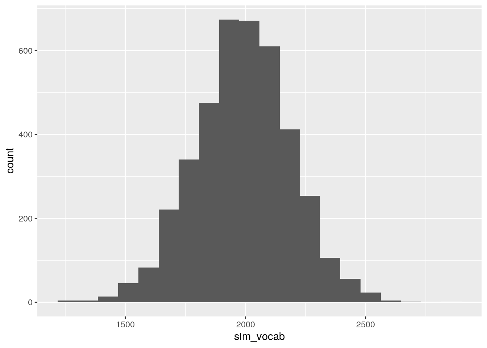

# Bayesian Statistics with `rstan`

Packages for this chapter:


```r
library(tidyverse)
library(rstan)
```


##  Estimating proportion in favour from a survey


 You are probably familiar with the kind of surveys where you are given a statement, like "I am the kind of person that finishes a task they start", 
and you have to express your agreement or disagreement with it. 
Usually, you are given a five-point or seven-point scale on which you express your level of agreement (from "strongly agree" 
through "neither agree nor disagree" to 
"strongly disagree", for example). Here, we will simplify things a little and only allow respondents to agree or disagree. 
So the kind of data you would have is a number of people that took part, and the number of these that said "agree".

Common assumptions that are made in this kind of analysis are:
(i) the responses are independent of each other, and (ii) each respondent has the same unknown probability of agreeing. 
You might quibble about (ii), but the assumption we are making here is that we know *nothing* about the respondents apart from whether they agreed or disagreed. 
(In practice, we'd collect all kinds of demograhic information about each respondent, and this might give us a clue about how they'll respond, but here we're keeping it simple.)
Under our assumptions, the number of respondents that agree has a binomial distribution with $n$ being our sample size, and $p$ being the probability we are trying to estimate. Let's estimate $p$ using Stan: that is to say, let's obtain the posterior distribution of $p$.

Note: I'm not sure how Stan goes in R Studio Cloud at the moment. This works better in R on your own computer.


(a) In R Studio, open a new Stan file (with File, New File, Stan File). 
You'll see a template file of Stan code. 
Edit the `model` section to reflect that you have observed a number of successes `x` that we are modelling to have a binomial distribution with number of trials `n` and success probability `p`.

Solution


This is quicker to do than to ask for. Make a guess at this:


```

model {
// likelihood
x ~ binomial(n, p);

```


and then check the manual [link](https://mc-stan.org/docs/2_18/functions-reference/binomial-distribution.html), looking for Sampling Statement, to make sure that this is what is expected. It is.
(I got to this page by googling "Stan binomial distribution".)

The "likelihood" line with the two slashes is a comment, C++ style. 
It is optional, but I like to have it to keep things straight.


(b) In the line of Stan code you wrote, there should be three variables.
Which of these are parameters and which are data? Explain briefly.

Solution


The way to think about this is to ask yourself which of `x`, `n`, and `p` are being given to the Stan code as data, and which you are trying to estimate.
The only thing we are estimating here is `p`, so that is a parameter. 
The number of trials `n` and the number of successes `x` are data that you will observe (treated as "given" or "fixed" in the Bayesian framework). 


(c) I hope you found that there is only one parameter, `p`, in this problem. We know that $0 \le p \le 1$, and we need a prior distribution for it. A common choice is a beta distribution. 
Look at the Stan manual, [link](https://mc-stan.org/docs/2_18/functions-reference/beta-distribution.html). 
The density function is given in 19.1.1. 
It has two parameters $\alpha>0$ and $\beta>0$. $B(\alpha, \beta)$ given there is a constant. 
Add to your `model` section to express that `p` has a prior distribution with parameters `alpha` and `beta`. 
(`alpha` and `beta` will be input data when we run this code.)

Solution


Your `model` section should now look like this:


```

model {
// prior
p ~ beta(alpha, beta);
// likelihood
x ~ binomial(n, p);
}

```


(d) Above your `model` section, complete a `parameters` section that says what kind of variable `p` is.
If `p` has upper or lower limits, put these in as well.
You can edit the `parameters` section that is in the template.

Solution


`p` is a real variable taking values between 0 and 1, so this:


```

parameters {
real<lower=0, upper=1> p;
}

```


(e) Everything else is `data`. Complete a `data` section (edit the one in the template) to say what type of thing everything else is, including limits if it has any. 
Don't forget the parameters in the prior distribution!

Solution


We said before that `n` and `x` were (genuine) data. These are positive integers; also `x` cannot be bigger than `n` (why not?). 
In the data section also go the parameters `alpha` and `beta` of the prior distribution. These are real numbers bigger than zero.
These two together give us this:


```

data {
int<lower=0> n;
int<lower=0, upper=n> x;
real<lower=0> alpha;
real<lower=0> beta;
}

```


Putting in lower and upper limits, if you have them, will help because if you happen to enter data that does not respect the limits, you'll get an error right there, and you won't waste time sampling. 

It is more important to put in limits in the `parameters` section, because that is telling the sampler not to go there (eg. a value of $p$ outside $[0,1]$). 


(f) Save your code, if you haven't already. I used the filename `binomial.stan`. 
In your Stan code window, at the top right, you'll see a button marked Check. This checks whether your code is syntactically correct. Click it.


Solution


This appeared in my console:

```

> rstan:::rstudio_stanc("binomial.stan")
binomial.stan is syntactically correct.

```

If you don't see this, there is some kind of code error. 
You'll then see some output that points you to a line of your code. The error is either there or at the end of the previous line (eg. you forgot a semicolon). 
Here is a typical one:

```

> rstan:::rstudio_stanc("binomial.stan")
SYNTAX ERROR, MESSAGE(S) FROM PARSER:
error in 'model377242ac03ef_binomial' at line 24, column 0
-------------------------------------------------
22: parameters {
23:   real<lower=0, upper=1> p
24: }
^
25: 
-------------------------------------------------

PARSER EXPECTED: ";"
Error in stanc(filename, allow_undefined = TRUE) : 
failed to parse Stan model 'binomial' due to the above error.

```

The compiler (or at least the code checker) was expecting a semicolon, and when it got to the close-curly-bracket on line 24, that was where it knew that the semicolon was missing (and thus it objected there and not earlier).
The above was on my own computer. When I tried it on `rstudio.cloud`, I thought I had everything correct but I got an error message like this:


```

Error in sink(type = "output") : invalid connection

```


that I couldn't get rid of. This might happen to you also.
If you get an error, fix it and check again. Repeat until your code is "syntactically correct". 
(That means that it will compile, but not that it will necessarily do what you want.)
This process is an integral part of coding, so get used to it. 
It doesn't matter how many errors you make; what matters is that you find and correct them all. 


(g) Compile your model. (This may take a minute or so, depending on how fast `rstudio.cloud` or your computer is.)


Solution


Go down to the console and type something like

```r
binomial_code <- stan_model("binomial.stan")
```

   

If it doesn't work, make sure you installed and loaded `rstan` first, with `install.packages("rstan")` and `library(rstan)` respectively.

If it sits there and does nothing for a while, this is actually a good sign. If it finds an error, it will tell you. If you get your command prompt `>` back without it saying anything, that means it worked. (This is a Unix thing: no comment means no error.)


(h) In most surveys, the probability to be estimated is fairly close to 0.5. 
A beta prior with $\alpha=\beta=2$ expresses the idea that any value of `p` is possible, but values near 0.5 are more likely.

A survey of 277 randomly selected adult female shoppers was taken. 69 of them agreed that when an advertised item is not available at the local supermarket, they request a raincheck.

Using the above information, set up a data `list` suitable for input to a run of `stan`.


Solution


Look in your `data` section, and see what you need to provide values for. 
The order doesn't matter; make a list with the named pieces and their values, in some order. You need values for these four things:

```r
binomial_data <- list(n = 277, x = 69, alpha = 2, beta = 2)
```

   

Extra: in case you are wondering where the parameters for the prior came from: in this case, I looked on the Wikipedia page for the beta distribution and saw that $\alpha=\beta=2$ is a good shape, so I used that. 
In practice, getting a reasonable prior is a more difficult problem, called "elicitation". 
What you have to do is ask a subject matter expert what they think `p` might be, giving you a range of values such as a guessed-at 95% confidence interval, like "I think `p` is almost certainly between 0.1 and 0.6". 
Then *you* as a statistician have to choose values for `alpha` and `beta` that match this, probably by trial and error. 
The `beta` distribution is part of R, so this is doable, for example like this:


```r
crossing(alpha = 1:10, beta = 1:10) %>%
  mutate(
    lower = qbeta(0.025, alpha, beta),
    upper = qbeta(0.975, alpha, beta)
  ) %>%
  mutate(sse = (lower - 0.1)^2 + (upper - 0.6)^2) %>%
  arrange(sse)
```

```
## # A tibble: 100 x 5
##    alpha  beta  lower upper      sse
##    <int> <int>  <dbl> <dbl>    <dbl>
##  1     4     8 0.109  0.610 0.000181
##  2     3     7 0.0749 0.600 0.000632
##  3     4     9 0.0992 0.572 0.000793
##  4     5    10 0.128  0.581 0.00112 
##  5     5     9 0.139  0.614 0.00169 
##  6     3     6 0.0852 0.651 0.00280 
##  7     3     8 0.0667 0.556 0.00303 
##  8     4     7 0.122  0.652 0.00322 
##  9     4    10 0.0909 0.538 0.00391 
## 10     6    10 0.163  0.616 0.00428 
## # … with 90 more rows
```

 

This says that $\alpha=4, \beta=8$ is a pretty good choice.
<label for="tufte-mn-" class="margin-toggle">&#8853;</label><input type="checkbox" id="tufte-mn-" class="margin-toggle"><span class="marginnote">Alpha and beta don't have to be integers; you could use *seq* to create sequences of values for alpha and beta that include decimal numbers.</span>

My process:


* Pick some values of `alpha` and `beta` to try, and make all possible combinations of them.

* Find the 2.5 and 97.5 percentiles of the beta distribution for each of those values. 
The "inverse CDF" (the value $x$ that has this much of the probability below it) is what we want here; this is obtained in R by putting `q` in front of the name of the distribution. For example, does this make sense to you?

```r
qnorm(0.025)
```

```
## [1] -1.959964
```

   

Also, `qbeta` is "vectorized", so the `alpha` and
`beta` can be entire columns rather than just numbers, and it
will work. If you want to, you can use `map2` to do it for each
`alpha` and `beta`, something like this (this does the lower end of the interval):

```r
crossing(alpha = 1:10, beta = 1:10) %>%
  mutate(lower = map2_dbl(alpha, beta, ~ qbeta(0.025, .x, .y))) %>%
  arrange(abs(lower - 0.1))
```

```
## # A tibble: 100 x 3
##    alpha  beta  lower
##    <int> <int>  <dbl>
##  1     4     9 0.0992
##  2     3     5 0.0990
##  3     2     2 0.0943
##  4     4    10 0.0909
##  5     4     8 0.109 
##  6     3     6 0.0852
##  7     3     4 0.118 
##  8     4     7 0.122 
##  9     3     7 0.0749
## 10     5    10 0.128 
## # … with 90 more rows
```

   

Remember that there are two "it"s in `map2`, and they are called `.x` and 
`.y`.

* We want the lower limit to be close to 0.1 and the upper limit to be close to 0.6. Working out the sum of squared errors for each `alpha`-`beta` combo is a way to do this; if `sse` is small, that combination of `alpha` and `beta` gave lower and upper limits close to 0.1 and 0.6.

* Arrange the `sse` values smallest to largest. The top rows are the best choices of `alpha` and `beta`.


(i) Sample from the posterior distribution of `p` with these data, and display your results.


Solution


   
This is what I got:

```r
binomial.1 <- sampling(binomial_code, binomial_data)
```

```
## 
## SAMPLING FOR MODEL 'binomial' NOW (CHAIN 1).
## Chain 1: 
## Chain 1: Gradient evaluation took 9e-06 seconds
## Chain 1: 1000 transitions using 10 leapfrog steps per transition would take 0.09 seconds.
## Chain 1: Adjust your expectations accordingly!
## Chain 1: 
## Chain 1: 
## Chain 1: Iteration:    1 / 2000 [  0%]  (Warmup)
## Chain 1: Iteration:  200 / 2000 [ 10%]  (Warmup)
## Chain 1: Iteration:  400 / 2000 [ 20%]  (Warmup)
## Chain 1: Iteration:  600 / 2000 [ 30%]  (Warmup)
## Chain 1: Iteration:  800 / 2000 [ 40%]  (Warmup)
## Chain 1: Iteration: 1000 / 2000 [ 50%]  (Warmup)
## Chain 1: Iteration: 1001 / 2000 [ 50%]  (Sampling)
## Chain 1: Iteration: 1200 / 2000 [ 60%]  (Sampling)
## Chain 1: Iteration: 1400 / 2000 [ 70%]  (Sampling)
## Chain 1: Iteration: 1600 / 2000 [ 80%]  (Sampling)
## Chain 1: Iteration: 1800 / 2000 [ 90%]  (Sampling)
## Chain 1: Iteration: 2000 / 2000 [100%]  (Sampling)
## Chain 1: 
## Chain 1:  Elapsed Time: 0.016623 seconds (Warm-up)
## Chain 1:                0.017131 seconds (Sampling)
## Chain 1:                0.033754 seconds (Total)
## Chain 1: 
## 
## SAMPLING FOR MODEL 'binomial' NOW (CHAIN 2).
## Chain 2: 
## Chain 2: Gradient evaluation took 6e-06 seconds
## Chain 2: 1000 transitions using 10 leapfrog steps per transition would take 0.06 seconds.
## Chain 2: Adjust your expectations accordingly!
## Chain 2: 
## Chain 2: 
## Chain 2: Iteration:    1 / 2000 [  0%]  (Warmup)
## Chain 2: Iteration:  200 / 2000 [ 10%]  (Warmup)
## Chain 2: Iteration:  400 / 2000 [ 20%]  (Warmup)
## Chain 2: Iteration:  600 / 2000 [ 30%]  (Warmup)
## Chain 2: Iteration:  800 / 2000 [ 40%]  (Warmup)
## Chain 2: Iteration: 1000 / 2000 [ 50%]  (Warmup)
## Chain 2: Iteration: 1001 / 2000 [ 50%]  (Sampling)
## Chain 2: Iteration: 1200 / 2000 [ 60%]  (Sampling)
## Chain 2: Iteration: 1400 / 2000 [ 70%]  (Sampling)
## Chain 2: Iteration: 1600 / 2000 [ 80%]  (Sampling)
## Chain 2: Iteration: 1800 / 2000 [ 90%]  (Sampling)
## Chain 2: Iteration: 2000 / 2000 [100%]  (Sampling)
## Chain 2: 
## Chain 2:  Elapsed Time: 0.011495 seconds (Warm-up)
## Chain 2:                0.007862 seconds (Sampling)
## Chain 2:                0.019357 seconds (Total)
## Chain 2: 
## 
## SAMPLING FOR MODEL 'binomial' NOW (CHAIN 3).
## Chain 3: 
## Chain 3: Gradient evaluation took 5e-06 seconds
## Chain 3: 1000 transitions using 10 leapfrog steps per transition would take 0.05 seconds.
## Chain 3: Adjust your expectations accordingly!
## Chain 3: 
## Chain 3: 
## Chain 3: Iteration:    1 / 2000 [  0%]  (Warmup)
## Chain 3: Iteration:  200 / 2000 [ 10%]  (Warmup)
## Chain 3: Iteration:  400 / 2000 [ 20%]  (Warmup)
## Chain 3: Iteration:  600 / 2000 [ 30%]  (Warmup)
## Chain 3: Iteration:  800 / 2000 [ 40%]  (Warmup)
## Chain 3: Iteration: 1000 / 2000 [ 50%]  (Warmup)
## Chain 3: Iteration: 1001 / 2000 [ 50%]  (Sampling)
## Chain 3: Iteration: 1200 / 2000 [ 60%]  (Sampling)
## Chain 3: Iteration: 1400 / 2000 [ 70%]  (Sampling)
## Chain 3: Iteration: 1600 / 2000 [ 80%]  (Sampling)
## Chain 3: Iteration: 1800 / 2000 [ 90%]  (Sampling)
## Chain 3: Iteration: 2000 / 2000 [100%]  (Sampling)
## Chain 3: 
## Chain 3:  Elapsed Time: 0.007671 seconds (Warm-up)
## Chain 3:                0.007797 seconds (Sampling)
## Chain 3:                0.015468 seconds (Total)
## Chain 3: 
## 
## SAMPLING FOR MODEL 'binomial' NOW (CHAIN 4).
## Chain 4: 
## Chain 4: Gradient evaluation took 6e-06 seconds
## Chain 4: 1000 transitions using 10 leapfrog steps per transition would take 0.06 seconds.
## Chain 4: Adjust your expectations accordingly!
## Chain 4: 
## Chain 4: 
## Chain 4: Iteration:    1 / 2000 [  0%]  (Warmup)
## Chain 4: Iteration:  200 / 2000 [ 10%]  (Warmup)
## Chain 4: Iteration:  400 / 2000 [ 20%]  (Warmup)
## Chain 4: Iteration:  600 / 2000 [ 30%]  (Warmup)
## Chain 4: Iteration:  800 / 2000 [ 40%]  (Warmup)
## Chain 4: Iteration: 1000 / 2000 [ 50%]  (Warmup)
## Chain 4: Iteration: 1001 / 2000 [ 50%]  (Sampling)
## Chain 4: Iteration: 1200 / 2000 [ 60%]  (Sampling)
## Chain 4: Iteration: 1400 / 2000 [ 70%]  (Sampling)
## Chain 4: Iteration: 1600 / 2000 [ 80%]  (Sampling)
## Chain 4: Iteration: 1800 / 2000 [ 90%]  (Sampling)
## Chain 4: Iteration: 2000 / 2000 [100%]  (Sampling)
## Chain 4: 
## Chain 4:  Elapsed Time: 0.007411 seconds (Warm-up)
## Chain 4:                0.00792 seconds (Sampling)
## Chain 4:                0.015331 seconds (Total)
## Chain 4:
```

```r
binomial.1
```

```
## Inference for Stan model: binomial.
## 4 chains, each with iter=2000; warmup=1000; thin=1; 
## post-warmup draws per chain=1000, total post-warmup draws=4000.
## 
##         mean se_mean   sd    2.5%     25%     50%     75%   97.5% n_eff
## p       0.25    0.00 0.03    0.20    0.23    0.25    0.27    0.30  1738
## lp__ -159.33    0.02 0.69 -161.44 -159.49 -159.07 -158.89 -158.84  1542
##      Rhat
## p       1
## lp__    1
## 
## Samples were drawn using NUTS(diag_e) at Fri May 24 22:07:45 2019.
## For each parameter, n_eff is a crude measure of effective sample size,
## and Rhat is the potential scale reduction factor on split chains (at 
## convergence, Rhat=1).
```

   

Your results should be similar, though probably not identical, to mine. (There is a lot of randomness involved here.)


(j) Obtain a 95\% posterior interval for the probability that a randomly chosen adult female shopper will request a raincheck.


Solution


Read off the 2.5 and 97.5 values for `p`. Mine are 0.20 and 0.31.


(k) Obtain a 95\% (frequentist) confidence interval for `p`, and compare the results. (Hint: `prop.test`.) Comment briefly.


Solution


If you remember this well enough, you can do it by hand, but there's no need:

```r
prop.test(69, 277)
```

```
## 
## 	1-sample proportions test with continuity correction
## 
## data:  69 out of 277, null probability 0.5
## X-squared = 68.751, df = 1, p-value < 2.2e-16
## alternative hypothesis: true p is not equal to 0.5
## 95 percent confidence interval:
##  0.2001721 0.3051278
## sample estimates:
##         p 
## 0.2490975
```

   

My 95\% intervals are, to two decimals, identical.

Numerically, this is because the only (material) difference between
them is the presence of the prior in the Bayesian approach. We have
quite a lot of data, though, so the choice of prior is actually not
that important ("the data overwhelm the prior"). I could have used
`alpha=8, beta=4` that I obtained in the Extra above, and it
wouldn't have made any noticeable difference.

Conceptually, though, the interpretations of these intervals are very
different: the Bayesian posterior interval really does say 
"the probability of $p$ being between 0.20 and 0.31 is 0.95", while for the
confidence interval you have to talk about repeated sampling: 
"the procedure producing the 95\% confidence interval will contain the true value of $p$ in 95\% of all possible samples".  This might seem
clunky in comparison; a Bayesian would tell you that the
interpretation of the posterior interval is what you want the
interpretation of the confidence interval to be!


(l) (optional) This is one of those problems where you can obtain the answer analytically. What is the posterior distribution of $p$, using a prior $beta(\alpha, \beta)$ distribution for $p$ and observing $x$ successes out of $n$ trials?


Solution


With this stuff, you can throw away any constants.

The likelihood is (proportional to) $$ p^x (1-p)^{n-x}.$$ There is a binomial coefficient that I threw away.

Look up the form of the beta density if you don't know it (or look above): the prior for $p$ is proportional to

$$ p^{\alpha-1} (1-p)^{\beta-1}.$$

Posterior is proportional to likelihood times prior:

$$ p^{x + \alpha - 1} (1-p)^{n-x +\beta - 1}$$

which is recognized as a beta distribution with parameters $x+\alpha$, $n-x+\beta$. 
Typically (unless you are very sure about $p$ a priori (that is, before collecting any data)), $x$ and $n-x$ will be much larger than $\alpha$ and $\beta$, so this will look a lot like a binomial likelihood, which is why the confidence interval and posterior interval in our example came out very similar.
I leave it to you to decide which you prefer: algebra and
intelligence (and luck, often), or writing code to sample from the
posterior. I know what I prefer!

Extra: one of the people behind Stan is on Twitter with handle `@betanalpha`.


##  Bayesian regression


 In this question, we will develop Stan code to run a simple
linear regression, and later apply it to some data (and do a bit of
elicitation of prior distributions along the way).


(a) Create a `.stan` file that will run a simple linear
regression predicting a variable `y` from a variable
`x`, estimating an intercept `a` and a slope
`b`. Use normal prior distributions for `a` and
`b`, and allow the means and SDs of the prior distributions
for `a` and `b` to be specified (as data, later). The
regression model says that the response `y` has a normal
distribution with mean `a+bx` and SD `sigma` which is
also estimated. Give this a prior chi-squared distribution with a
prior mean that is also input.

Solution


This is a lot. Breathe. Pause. Then, in R Studio, File, New File and Stan File. Leave the template there, and change what you need as you go.
I would start with the model part. The likelihood part says that `y` has a normal distribution with mean `a+bx` and SD `sigma`, thus:

```

// likelihood
y ~ normal(a+b*x, sigma);

```

There is a subtlety here that I'll get to later, but this is the easiest way to begin.
Next, take a look at what's here. `x` and `y` are
data, and the other things, `a`, `b`, `sigma`
are parameters. These last three need prior distributions. I said
to use normal distributions for the first two, and a chi-squared
distribution for the last one. (In practice, of course, you get to
choose these, in consultation with the subject matter expert, but
these are likely to be pretty reasonable.) I've given the
parameters of these prior distributions longish names, so I hope
I'm trading more typing for less confusion:

```

model {
// prior
a ~ normal(prior_int_mean, prior_int_sd);
b ~ normal(prior_slope_mean, prior_slope_sd);
sigma ~ chi_square(prior_sigma_mean);
// likelihood
y ~ normal(a+b*x, sigma);
}

```

The chi-squared distribution is written that way in Stan, and has
only one parameter, a degrees of freedom that is also its mean.

Our three parameters then need to be declared, in the
`parameters` section. `a` and `b` can be any
real number, while `sigma` has to be positive:

```

parameters {
real a;
real b;
real<lower=0> sigma;
}

```


Everything else is data, and we have a *lot* of data this time:


```

data {
int<lower=0> n;
vector[n] x;
vector[n] y;
real prior_int_mean;
real<lower=0> prior_int_sd;
real prior_slope_mean;
real<lower=0> prior_slope_sd;
real<lower=0> prior_sigma_mean;
}

```


The five things at the bottom are the prior distribution parameters,
which we are going to be eliciting later. The means for intercept and
slope can be anything; the prior SDs have to be positive, and so does
the prior mean for `sigma`, since it's actually a degrees of
freedom that has to be positive.

Now we come to two pieces of subtlety. The first is that the
`x` and `y` are going to have some (unknown) number of
values in them, but we need to declare them with some length. The
solution to that is to have the number of observations `n` also
be part of the data. Once we have that, we can declare `x` and
`y` to be of length `n` with no problems.

The second piece of subtlety is that you were probably expecting this:


```

real x[n];
real y[n];

```


This is usually what you need, but the problem is that when you work
out `a+b*x` later on, it *doesn't work* because you are
trying to multiply an array of values `x` by a single value
`b`. (Try it.) There are two ways around this: (i), if you
instead declare `x` and `y` to be (real) vectors of
length `n`, Stan borrows from R's multiplication of a vector by
a scalar and it works, by multiplying *each element* of the
vector by the scalar. Or, (ii), you can go back to declaring
`x` and `y` as real things of length `n`, and use
a loop to get *each* y from its corresponding `x`, like
this:


```

for (i in 1:n) {
y[i] ~ normal(a + b * x[i], sigma)
}


```


and this works because `a`, `b`, and `x[i]` are
all scalar. I have to say that I don't really understand the
distinction between `real x[n]` and `vector[n] x`,
except that sometimes one works and the other doesn't.

The manual tells you that the `vector` way is "much faster",
though in a simple problem like this one I doubt that it makes any
noticeable difference.

My code looks like this, in total:


```

data {
int<lower=0> n;
vector[n] x;
vector[n] y;
real prior_int_mean;
real<lower=0> prior_int_sd;
real prior_slope_mean;
real<lower=0> prior_slope_sd;
real<lower=0> prior_sigma_mean;
}

parameters {
real a;
real b;
real<lower=0> sigma;
}

model {
// prior
a ~ normal(prior_int_mean, prior_int_sd);
b ~ normal(prior_slope_mean, prior_slope_sd);
sigma ~ chi_square(prior_sigma_mean);
// likelihood
y ~ normal(a+b*x, sigma);
}


```


(b) Check your Stan code for syntactic correctness, and when it is
correct, compile it.

Solution


Click the Check button top right of the window where your Stan
code is. If it finds any errors, correct them and try again.

To compile, the usual thing:


```r
reg_code <- stan_model("reg.stan")
```

 

and wait for it to do its thing. With luck, Check will have found all
the errors and this will quietly (eventually) do its job.


(c) We are going to be analyzing some data on vocabulary size (the number of words known) by children of different ages. It is suspected that the relationship between age and vocabulary size is approximately linear.
You go consult with an early childhood expert, and they tell you this:


* In children of age up to about six, vocabulary almost always
increases by between 300 and 700 words per year.

* I can't talk about vocabulary of children of age 0, because children don't start learning to talk until age about 18 months (1.5 years).

* Children of age 1.5 years almost always have a vocabulary
between 0 and 500 words (depending on exactly what age they
started talking.)

* Even if we know a child's age, our prediction of their
vocabulary size might be off by as much as 200 words.

Use this information to obtain parameters for your prior distributions.

Solution


This is the typical kind of way in which you would elicit a prior
distribution; you try to turn what the expert tells you into
something you can use.

Let's assume that the "almost always" above corresponds to a
95\% confidence interval, and since our intercept and slope have
prior normal distributions, this is, to the accuracy that we are
working, mean plus/minus 2 SD. (You can make different assumptions
and you'll get a somewhat different collection of prior
distributions.)

The first statement talks about the change in vocabulary size per
year. This is talking about the slope. The supposed 95\%
confidence interval given translates to $500 \pm 2(100)$, so the
prior mean for the slope is 500 and the prior SD is 100.

Not so hard. The problems start with the second one. 

We want a prior mean and SD for the intercept, that is, for the
mean and SD of vocabulary size at age 0, but the expert (in their
second statement) is telling us this makes no sense. The third
statement says that at age 1.5, a 95\% CI for vocabulary size is
$250 \pm 2(125)$. You can go a number of different ways from here,
but a simple one is use our best guess for the slope, 500, to
project back 1.5 years from here by decreasing the mean by
$(500)(1.5)=750$, that is, to $-500 \pm 2(125)$.

The last one we need is the prior mean for `sigma`. This is what
the last statement is getting at. Up to you whether you think this
is an estimate of `sigma` or twice sigma. Let's take 200 as
a prior estimate of `sigma`, to be safe.

You see that getting a useful prior depends on asking the right
questions and making good use of the answers you get.

Some people like to use "ignorance" priors, where you assign equal
probability to all possible values of the parameter. I don't, because
these are saying that a slope of 10 million is just as likely as a
slope of 1, regardless of the actual circumstances; you will almost
always have *some* idea of what you are expecting. It might be
vague, but it won't be infinitely vague.


(d) Some data were collected on age and vocabulary size of 10
randomly selected children, shown here:
[link](https://raw.githubusercontent.com/nxskok/pasias/master/vocab.txt). Read
in and display the data; the values are separated by single spaces.

Solution


Thus:

```r
my_url <- "https://raw.githubusercontent.com/nxskok/pasias/master/vocab.txt"
vocabulary <- read_delim(my_url, " ")
```

```
## Parsed with column specification:
## cols(
##   age = col_double(),
##   vocab = col_double()
## )
```

```r
vocabulary
```

```
## # A tibble: 10 x 2
##      age vocab
##    <dbl> <dbl>
##  1   1.5   100
##  2   2     250
##  3   2.5   460
##  4   3     890
##  5   3.5  1210
##  6   4    1530
##  7   4.5  1840
##  8   5    2060
##  9   5.5  2300
## 10   6    2500
```

     


(e) Use this dataset, along with your prior distribution from
above, to obtain posterior distributions for intercept, slope and
error SD. What is the 95\% posterior interval for the slope?

Solution


Two parts: set up the data, and then feed it into `sampling`:


```r
reg_data <- list(
  n = 10, x = vocabulary$age, y = vocabulary$vocab,
  prior_int_mean = -500,
  prior_int_sd = 125,
  prior_slope_mean = 500,
  prior_slope_sd = 100,
  prior_sigma_mean = 200
)
reg.1 <- sampling(reg_code, reg_data)
```

```
## 
## SAMPLING FOR MODEL 'reg' NOW (CHAIN 1).
## Chain 1: 
## Chain 1: Gradient evaluation took 1.1e-05 seconds
## Chain 1: 1000 transitions using 10 leapfrog steps per transition would take 0.11 seconds.
## Chain 1: Adjust your expectations accordingly!
## Chain 1: 
## Chain 1: 
## Chain 1: Iteration:    1 / 2000 [  0%]  (Warmup)
## Chain 1: Iteration:  200 / 2000 [ 10%]  (Warmup)
## Chain 1: Iteration:  400 / 2000 [ 20%]  (Warmup)
## Chain 1: Iteration:  600 / 2000 [ 30%]  (Warmup)
## Chain 1: Iteration:  800 / 2000 [ 40%]  (Warmup)
## Chain 1: Iteration: 1000 / 2000 [ 50%]  (Warmup)
## Chain 1: Iteration: 1001 / 2000 [ 50%]  (Sampling)
## Chain 1: Iteration: 1200 / 2000 [ 60%]  (Sampling)
## Chain 1: Iteration: 1400 / 2000 [ 70%]  (Sampling)
## Chain 1: Iteration: 1600 / 2000 [ 80%]  (Sampling)
## Chain 1: Iteration: 1800 / 2000 [ 90%]  (Sampling)
## Chain 1: Iteration: 2000 / 2000 [100%]  (Sampling)
## Chain 1: 
## Chain 1:  Elapsed Time: 0.11964 seconds (Warm-up)
## Chain 1:                0.023368 seconds (Sampling)
## Chain 1:                0.143008 seconds (Total)
## Chain 1: 
## 
## SAMPLING FOR MODEL 'reg' NOW (CHAIN 2).
## Chain 2: 
## Chain 2: Gradient evaluation took 6e-06 seconds
## Chain 2: 1000 transitions using 10 leapfrog steps per transition would take 0.06 seconds.
## Chain 2: Adjust your expectations accordingly!
## Chain 2: 
## Chain 2: 
## Chain 2: Iteration:    1 / 2000 [  0%]  (Warmup)
## Chain 2: Iteration:  200 / 2000 [ 10%]  (Warmup)
## Chain 2: Iteration:  400 / 2000 [ 20%]  (Warmup)
## Chain 2: Iteration:  600 / 2000 [ 30%]  (Warmup)
## Chain 2: Iteration:  800 / 2000 [ 40%]  (Warmup)
## Chain 2: Iteration: 1000 / 2000 [ 50%]  (Warmup)
## Chain 2: Iteration: 1001 / 2000 [ 50%]  (Sampling)
## Chain 2: Iteration: 1200 / 2000 [ 60%]  (Sampling)
## Chain 2: Iteration: 1400 / 2000 [ 70%]  (Sampling)
## Chain 2: Iteration: 1600 / 2000 [ 80%]  (Sampling)
## Chain 2: Iteration: 1800 / 2000 [ 90%]  (Sampling)
## Chain 2: Iteration: 2000 / 2000 [100%]  (Sampling)
## Chain 2: 
## Chain 2:  Elapsed Time: 0.192413 seconds (Warm-up)
## Chain 2:                0.023694 seconds (Sampling)
## Chain 2:                0.216107 seconds (Total)
## Chain 2: 
## 
## SAMPLING FOR MODEL 'reg' NOW (CHAIN 3).
## Chain 3: 
## Chain 3: Gradient evaluation took 7e-06 seconds
## Chain 3: 1000 transitions using 10 leapfrog steps per transition would take 0.07 seconds.
## Chain 3: Adjust your expectations accordingly!
## Chain 3: 
## Chain 3: 
## Chain 3: Iteration:    1 / 2000 [  0%]  (Warmup)
## Chain 3: Iteration:  200 / 2000 [ 10%]  (Warmup)
## Chain 3: Iteration:  400 / 2000 [ 20%]  (Warmup)
## Chain 3: Iteration:  600 / 2000 [ 30%]  (Warmup)
## Chain 3: Iteration:  800 / 2000 [ 40%]  (Warmup)
## Chain 3: Iteration: 1000 / 2000 [ 50%]  (Warmup)
## Chain 3: Iteration: 1001 / 2000 [ 50%]  (Sampling)
## Chain 3: Iteration: 1200 / 2000 [ 60%]  (Sampling)
## Chain 3: Iteration: 1400 / 2000 [ 70%]  (Sampling)
## Chain 3: Iteration: 1600 / 2000 [ 80%]  (Sampling)
## Chain 3: Iteration: 1800 / 2000 [ 90%]  (Sampling)
## Chain 3: Iteration: 2000 / 2000 [100%]  (Sampling)
## Chain 3: 
## Chain 3:  Elapsed Time: 0.109378 seconds (Warm-up)
## Chain 3:                0.024011 seconds (Sampling)
## Chain 3:                0.133389 seconds (Total)
## Chain 3: 
## 
## SAMPLING FOR MODEL 'reg' NOW (CHAIN 4).
## Chain 4: 
## Chain 4: Gradient evaluation took 7e-06 seconds
## Chain 4: 1000 transitions using 10 leapfrog steps per transition would take 0.07 seconds.
## Chain 4: Adjust your expectations accordingly!
## Chain 4: 
## Chain 4: 
## Chain 4: Iteration:    1 / 2000 [  0%]  (Warmup)
## Chain 4: Iteration:  200 / 2000 [ 10%]  (Warmup)
## Chain 4: Iteration:  400 / 2000 [ 20%]  (Warmup)
## Chain 4: Iteration:  600 / 2000 [ 30%]  (Warmup)
## Chain 4: Iteration:  800 / 2000 [ 40%]  (Warmup)
## Chain 4: Iteration: 1000 / 2000 [ 50%]  (Warmup)
## Chain 4: Iteration: 1001 / 2000 [ 50%]  (Sampling)
## Chain 4: Iteration: 1200 / 2000 [ 60%]  (Sampling)
## Chain 4: Iteration: 1400 / 2000 [ 70%]  (Sampling)
## Chain 4: Iteration: 1600 / 2000 [ 80%]  (Sampling)
## Chain 4: Iteration: 1800 / 2000 [ 90%]  (Sampling)
## Chain 4: Iteration: 2000 / 2000 [100%]  (Sampling)
## Chain 4: 
## Chain 4:  Elapsed Time: 0.105393 seconds (Warm-up)
## Chain 4:                0.02674 seconds (Sampling)
## Chain 4:                0.132133 seconds (Total)
## Chain 4:
```

```r
reg.1
```

```
## Inference for Stan model: reg.
## 4 chains, each with iter=2000; warmup=1000; thin=1; 
## post-warmup draws per chain=1000, total post-warmup draws=4000.
## 
##          mean se_mean    sd    2.5%     25%     50%     75%   97.5% n_eff
## a     -614.13    2.64 97.89 -805.95 -680.59 -613.33 -547.87 -422.02  1372
## b      521.24    0.70 26.55  468.42  503.32  521.12  539.17  573.91  1446
## sigma  188.98    0.38 18.37  155.82  176.10  188.32  201.26  226.79  2360
## lp__   373.74    0.03  1.19  370.58  373.21  374.03  374.61  375.12  1605
##       Rhat
## a        1
## b        1
## sigma    1
## lp__     1
## 
## Samples were drawn using NUTS(diag_e) at Fri May 24 22:07:48 2019.
## For each parameter, n_eff is a crude measure of effective sample size,
## and Rhat is the potential scale reduction factor on split chains (at 
## convergence, Rhat=1).
```

 

One line per parameter (plus the last one, which is the log-posterior distribution, not very useful to us). To get a 95\% posterior interval for the slope, use the 2.5 and 97.5 percentiles of the posterior for `b`, which are 467 and 572. (This is about $520 \pm 52$, rounding crudely, while the prior distribution said $500 \pm 200$, so the data have allowed us to estimate the slope a fair bit more accurately.)


(f) What can we say about the vocabulary size of a randomly
selected child of age 5 (a new one, not the one in the original data
set)? Use an appropriate predictive distribution.

Solution


If you have done STAC67, you might recognize this as being the Bayesian version of a prediction interval. How might we make a predictive distribution for this? Well, first we need to extract the sampled values from the posteriors:


```r
reg_samples <- rstan::extract(reg.1)
cbind(a = reg_samples$a, b = reg_samples$b, sigma = reg_samples$sigma) %>%
  as_tibble() -> sims
sims
```

```
## # A tibble: 4,000 x 3
##        a     b sigma
##    <dbl> <dbl> <dbl>
##  1 -697.  542.  185.
##  2 -477.  516.  188.
##  3 -593.  535.  194.
##  4 -676.  553.  198.
##  5 -629.  518.  172.
##  6 -513.  509.  207.
##  7 -506.  473.  195.
##  8 -743.  545.  196.
##  9 -465.  498.  174.
## 10 -719.  506.  210.
## # … with 3,990 more rows
```

 

and now we need to simulate some response values for our notional child of age 5. That means simulating for an `x` of 5, using each of those values of `a`, `b` and `sigma`:


```r
sims %>%
  mutate(sim_vocab = rnorm(nrow(sims), a + b * 5, sigma)) -> sims2
ggplot(sims2, aes(x = sim_vocab)) + geom_histogram(bins = 20)
```



 

That's the distribution of the vocabulary size of children aged 5. We can get a 95\% interval from this the usual way: find the 2.5 and 97.5 percentiles:


```r
with(sims2, quantile(sim_vocab, c(0.025, 0.975)))
```

```
##     2.5%    97.5% 
## 1606.661 2396.078
```

 

The actual child of age 5 that we observed had a vocabulary of 2060
words, squarely in the middle of this interval.

Is the posterior predictive interval like the prediction interval?


```r
vocabulary.1 <- lm(vocab ~ age, data = vocabulary)
new <- tibble(age = 5)
predict(vocabulary.1, new, interval = "p")
```

```
##        fit      lwr      upr
## 1 2027.939 1818.223 2237.656
```

 

It seems a bit wider.


