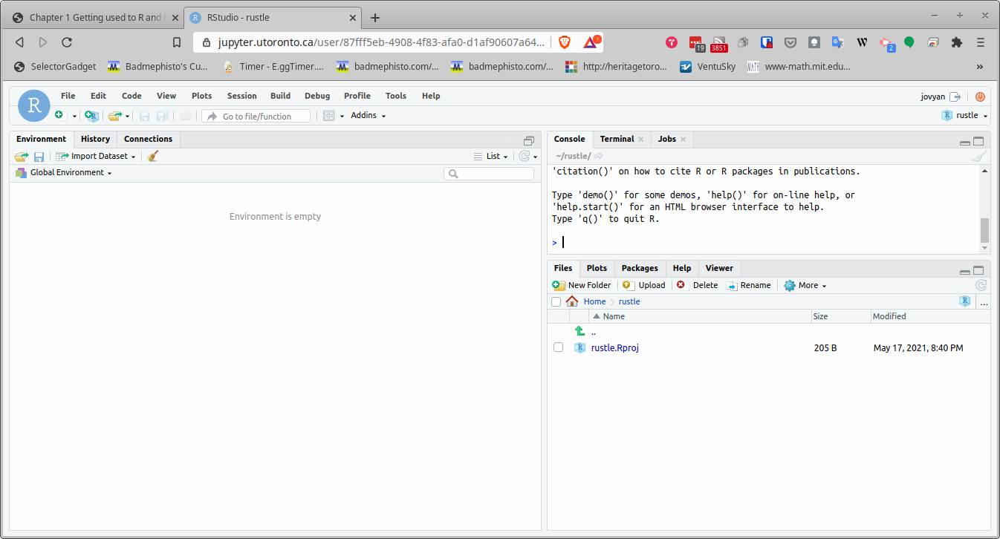
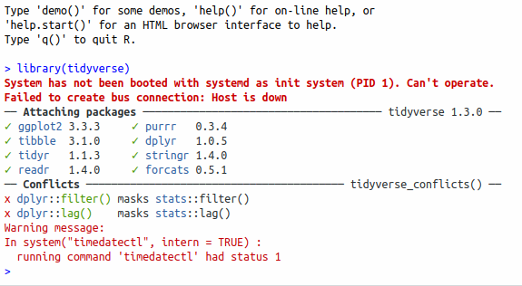
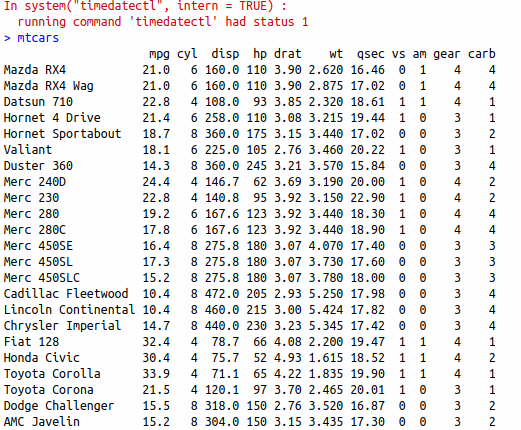

## Running R Studio on Jupyterhub

This is described as a "proof-of-concept" way of running R Studio online (for free, for anyone with a UTorID and password). This is a good way to get started with R Studio. It looks the same as any other version of R Studio.

(a) To get started, in your web browser, visit [https://jupyter.utoronto.ca/hub/login](https://jupyter.utoronto.ca/hub/login). You should see something that looks like this:

If you don't see this, you might see this instead:

which looks almost the same, but lacks the option to start R Studio. If that happens to you, you can log in and immediately log out again, which should get you back to the first place.

(b) On the line where it says "After logging in, start..." make sure you have clicked next to (on the left of) R Studio, so that the circle is blue, and then click the orange "Log in to start". Log in with your UTorID and password. This is about what you should see after you have done that:

On the left is where you will (later) have code to run. Top right is the Console, where you can run quick disposable bits of code, and bottom right you see any files you may happen to have (probably only one at this stage).

(c) To test what you have, click on the top right Console window, type `library(tidyverse)` and press Enter. You might see R Studio offering you some suggestions as you type. If you see what you want, you can select it rather than typing the whole thing.

Here's what you should see now. You can ignore the error messages from Jupyter:

Still in the Console window, type `mtcars` and press Enter again. This will bring up one of R's built-in datasets:

This is information about a number of cars, as featured in Motor Trends magazine. If you can see this, you are good to go. A good thing to tackle next is the problem called Getting Started, which uses the same dataset.

