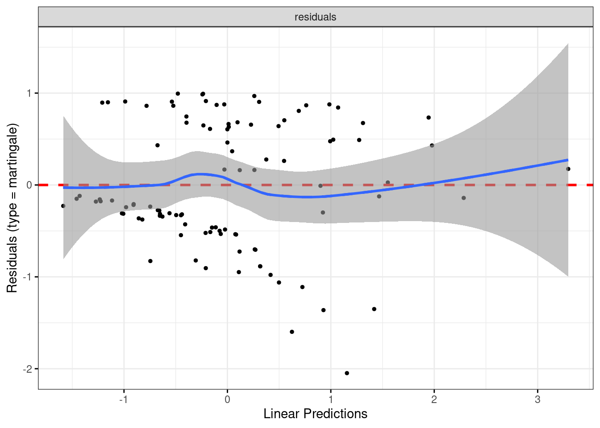
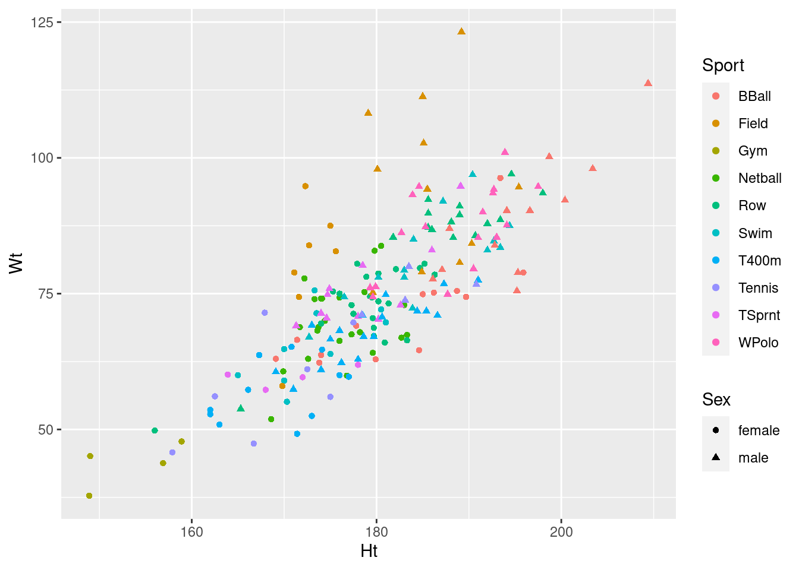
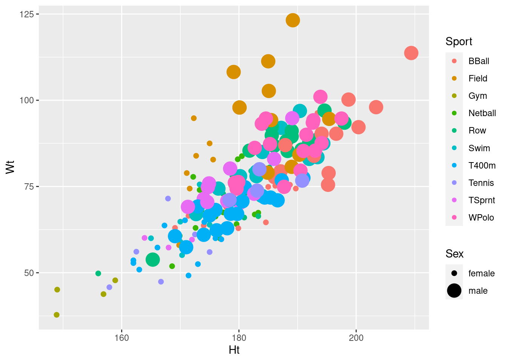

# Introduction


[This book](http://ritsokiguess.site/pasias/) will hold a collection
of problems, and my solutions to them, in applied statistics with
R. These come from my courses STAC32 and STAD29 at the University of
Toronto Scarborough. I am in the process of adding the latter.

The problems were originally written in Sweave (that is, LaTeX with R
code chunks), using the `exam` document class, using data sets stolen
from numerous places (textbooks, websites etc).  I wrote [a Perl
program](https://raw.githubusercontent.com/nxskok/pasias/master/convert.pl)
to strip out the LaTeX and turn each problem into R Markdown for this
book. You will undoubtedly see bits of LaTeX still embedded in the
text. I am trying to update my program to catch them, but I am sure to
miss some. 

I just figured out that you can convert LaTeX "label" and "ref" pairs
into HTML "a name" and "a href='#'", which R Markdown can handle. I am
ludicrously pleased with myself. To that effect, you will occasionally
see question parts beginning with a *; this means that other question
parts refer back to this one. (One of my favourite question strategies
is to ask how two different approaches lead to the same answer, or
more generally to demonstrate that there are different ways to see the
same thing.)

If you see anything, [file an
issue](https://github.com/nxskok/pasias/issues) on the Github page for
now. I want to fix problems programmatically at first, but when the
majority of the problems have been caught, I will certainly take pull
requests. I will acknowledge all the people who catch things. Likely
problems include:

- some LaTeX construction that I didn't catch (eg. block quotes)
- disappeared footnotes (that will show up as an apparently missing sentence in the text)
- references to "in class" or a lecture or a course by course number, which need to be eliminated (in favour of wording like "a previous course")
- references to other questions or question parts that are *wrong* (likely caused by *not* being "labels" or "refs" in the original LaTeX)
- my contorted English that is difficult to understand.

As I read through looking for problems like these, I realize that
there ought to be a textbook that reflects my way of doing
things. There isn't one (yet), though there are lecture
notes. Reasonably recent versions of these are at:

- [the STAC32 website](http://www.utsc.utoronto.ca/~butler/c32/notes/slides.pdf)
- [the STAD29 website](https://www.utsc.utoronto.ca/~butler/d29/slides-sw.pdf)

A little background:

STAC32 is an introduction to R (and also SAS) as
applied to statistical methods that have (mostly) been learned in
previous courses. This could be a mathematical statistics course like
[this](https://utsc.calendar.utoronto.ca/course/stab57h3), or a
non-mathematical applied course like
[this](https://utsc.calendar.utoronto.ca/course/stab27h3). The idea is
that students have already seen a little of regression and analysis of
variance (and the things that precede them), and need only an
introduction of how to run them in R.

STAD29 is an overview of a number of advanced statistical methods. I
start from regression and proceed to some regression-like methods
(logistic regression, survival analysis, log-linear frequency table
analysis), then I go a little further with analysis of variance and
proceed with MANOVA and repeated measures. I finish with a look at
classical multivariate methods such as discriminant analysis, cluster
analysis, principal components and factor analysis. I cover a number
of methods in no great depth; my aim is to convey an understanding of
what these methods are for, how to run them and how to interpret the
results. Statistics majors and specialists cannot take this course for
credit (they have separate courses covering this material with the
proper mathematical background). D29 is intended for students in other
disciplines who find themselves wanting to learn more statistics; we
have an [Applied Statistics Minor
program](https://utsc.calendar.utoronto.ca/minor-program-applied-statistics-science)
for which C32 and D29 are two of the last courses.

My checklist:

- bring in the D29 questions
- working on A8 D29
- look for multiple regression Qs in A6 or wherever
- *** puts a vertical line across. Put that above and below each question part, somehow.

<!--chapter:end:index.Rmd-->


# Getting used to R and R Studio

We begin with this:


```r
library(tidyverse)
```

```
## -- Attaching packages ---- tidyverse 1.2.1 --
```

```
## v ggplot2 3.1.0     v purrr   0.2.5
## v tibble  1.4.2     v dplyr   0.7.8
## v tidyr   0.8.1     v stringr 1.3.1
## v readr   1.1.1     v forcats 0.3.0
```

```
## -- Conflicts ------- tidyverse_conflicts() --
## x dplyr::filter() masks stats::filter()
## x dplyr::lag()    masks stats::lag()
```

and so to the problems:


##  Getting an R Studio Cloud account


 Follow these steps to get an R Studio Cloud account.


(a) Point your web browser at [link](rstudio.cloud). (If you already
have R and R Studio installed on your computer, you can use that
instead, throughout the course; just do part (d) of this
question. Any references to R Studio Cloud in this assignment also
apply to R Studio on your computer.)

Solution


You should see this:


. Click
on Get Started. You might instead see the screen in the next part.


(b) Choose an account to use.

Solution


Here's what you should see now:


      

If you're happy with using your Google account, click that
button. You will probably have to enter your Google password. (If
you are doing this on your own computer, you might not have to do
that.) If you have a GitHub account and you want to use
*that*, same principle.
You can also use an email address as your login to R Studio
Cloud. (You can use any e-mail address; I'm not checking.) Enter
it in the top box, and enter a password to use with R Studio Cloud
in the second. (This does not have to be, and indeed probably
should not be, the same as your email password.)  Below that,
enter your first and last name. This will appear at the top right
of the screen when you are logged in. Then click Sign Up. After
that, you will have to make a unique account name (which
*you* actually never use, but which 
`rstudio.cloud` uses to
name your files).
After that, you are automatically logged in.


(c) Take a look around, and create a new Project. Give the new
project any name you like.

Solution


This is what you see now:


Click on the blue New Project button to create a new Project. (A
project is a self-contained piece of work, like for example an
assignment.)
You will see the words "Loading Project" and spinning circles
for a few moments. Then you see this:


To give your project a name, click at the top where it says
Untitled Project and type a name like Assignment 0 into the box.


(d) Before we get to work, look for the blue `>` at the
bottom left. Click next to it to get a flashing cursor, and then
type what you see here (in blue):


    

Then press Enter.

Solution


This lets it install a bunch of things. It may take some
time. If you are watching it, look out for lines beginning with
`g++`, which are C++ code that needs to be compiled. This is
the end of what I had. Look out for the word DONE near the bottom:


    


(e) Not for now, but for later: if you are on a lab computer, you
should probably log out when you are done. To do that, find your
name at the top right. Click on it, and two things should pop out to
the right: Profile and Log Out. Select Log Out. You should be
returned to one of the screens you began with, possibly the Welcome
to R Studio Cloud one. 
To log back in, now or next time, look for
Log In at the top right. Click it, to get this:


    

and then you can log in with your email and password, or Google or
Github IDs, whichever you used.
Now we can get down to some actual work.


##  Getting started


 This question is to get you started using R.


(a) Start R Studio Cloud, in some project. (If you started up a
new project in the previous question and are still logged in, use
that; if not, create a new project.)

Solution


You ought to see something like this. I have a dark blue
background here, which you probably do not. 


        

It won't look exactly like that (for example, the background
will probably be white) but there should be one thing
on the left half, and at the top
right it'll say "Environment is empty". 
Extra: if you want to tweak things, select Tools (at the top of
the screen) and from it Global Options, then click
Appearance. You can make the text bigger or smaller via Editor
Font Size, and choose a different colour scheme by picking one
of the Editor Themes (which previews on the right). My favourite
is Tomorrow Night Blue. Click Apply or OK when you have found
something you like. (I spend a lot of time in R Studio, and I
like having a dark background to be easier on my eyes.)


(b) We're going to do some stuff in R here, just to get used to
it. First, make an R Notebook by selecting File, New File and R
Notebook.

Solution


The first time, you'll be invited to "install some packages"
to make the Notebook thing work. Let it do that by clicking
Yes. After that, you'll have this:


        

Find the Insert and Run buttons along the top of the R Notebook
window. We'll be using them shortly. (The template notebook may
or may not be maximized; it doesn't matter either way. You might
see all four panes or as few as one. If you want to control
that, select View at the top, then Panes, then either Show All
Panes or Zoom Source, as you prefer. In the menus, you'll also
see keyboard shortcuts for these, which you might find worth
learning.)


(c) Change the title to something of your choosing. Then go down
to line 5, click on the Insert button and select R. You should see
a "code chunk" appear at line 5, which we are going to use in a
moment. 

Solution


Something like this:


        


(d) Type the line of code shown below into the chunk in the
R Notebook:

```

mtcars

```


Solution


What this will do: get hold of a built-in data set with
information about some different models of car, and display it.


        

In approximately five seconds, you'll be demonstrating that for
yourself. 


(e) Run this command. To do that, look at the top right of
your code chunk block (shaded in a slightly different colour). You
should see a gear symbol, a down arrow and a green "play    button". 
Click the play button. This will run the code, and show
the output below the code chunk.

Solution


Here's what I get (yours will be the same). 


        

This is a rectangular array of rows and columns, with
individuals in rows and variables in columns, known as a 
"data frame". When you display a data frame in an R Notebook, you see
10 rows and as many columns as will fit on the screen.  At the
bottom, it says how many rows and columns there are altogether
(here 32 rows and 11 columns), and which ones are being
displayed.  You can see more rows by clicking on Next, and if
there are more columns, you'll see a little arrow next to the
rightmost column (as here next to `am`) that you can
click on to see more columns. Try it and see. Or if you want to
go to a particular collection of rows, click one of the numbers
between Previous and Next: 1 is rows 1--10, 2 is rows 11--20,
and so on.
The column on the left without a header (containing the names of
the cars) is called "row names". These have a funny kind of
status, kind of a column and kind of not a column; usually, if
we need to use the names, we have to put them in a column first.
In future solutions, rather than showing you a screenshot,
expect me to show you something like this:

```r
mtcars
```


```
## # A tibble: 32 x 11
##      mpg   cyl  disp    hp  drat    wt  qsec
##  * <dbl> <dbl> <dbl> <dbl> <dbl> <dbl> <dbl>
##  1  21       6  160    110  3.9   2.62  16.5
##  2  21       6  160    110  3.9   2.88  17.0
##  3  22.8     4  108     93  3.85  2.32  18.6
##  4  21.4     6  258    110  3.08  3.22  19.4
##  5  18.7     8  360    175  3.15  3.44  17.0
##  6  18.1     6  225    105  2.76  3.46  20.2
##  7  14.3     8  360    245  3.21  3.57  15.8
##  8  24.4     4  147.    62  3.69  3.19  20  
##  9  22.8     4  141.    95  3.92  3.15  22.9
## 10  19.2     6  168.   123  3.92  3.44  18.3
## # ... with 22 more rows, and 4 more
## #   variables: vs <dbl>, am <dbl>,
## #   gear <dbl>, carb <dbl>
```

The top bit is the code, the bottom bit with the `##` the
output. In this kind of display, you only see the first ten rows (by
default). 

If you don't see the "play button", make sure that what you have
really is a code chunk. (I often accidentally delete one of the
special characters above or below the code chunk). If you can't figure
it out, delete this code chunk and make a new one. Sometimes R Studio
gets confused.

On the code chunk, the other symbols are the settings for this chunk
(you have the choice to display or not display the code or the output
or to not actually run the code). The second one, the down arrow, runs
all the chunks prior to this one (but not this one). 

The output has its own little buttons. The first one pops the output
out into its own window; the second one shows or hides the output, and
the third one deletes the output (so that you have to run the chunk
again to get it back). Experiment. You can't do much damage here.


(f) Something a little more interesting: `summary`
obtains a summary of whatever you feed it (the five-number summary
plus the mean for numerical variables). Obtain this for our data
frame. To do this, create a new code chunk below the previous one,
type `summary(mtcars)` into the code chunk, and run it.

Solution


This is what you should see:


        

or the other way:

```r
summary(mtcars)
```

```
##       mpg             cyl       
##  Min.   :10.40   Min.   :4.000  
##  1st Qu.:15.43   1st Qu.:4.000  
##  Median :19.20   Median :6.000  
##  Mean   :20.09   Mean   :6.188  
##  3rd Qu.:22.80   3rd Qu.:8.000  
##  Max.   :33.90   Max.   :8.000  
##       disp             hp       
##  Min.   : 71.1   Min.   : 52.0  
##  1st Qu.:120.8   1st Qu.: 96.5  
##  Median :196.3   Median :123.0  
##  Mean   :230.7   Mean   :146.7  
##  3rd Qu.:326.0   3rd Qu.:180.0  
##  Max.   :472.0   Max.   :335.0  
##       drat             wt       
##  Min.   :2.760   Min.   :1.513  
##  1st Qu.:3.080   1st Qu.:2.581  
##  Median :3.695   Median :3.325  
##  Mean   :3.597   Mean   :3.217  
##  3rd Qu.:3.920   3rd Qu.:3.610  
##  Max.   :4.930   Max.   :5.424  
##       qsec             vs        
##  Min.   :14.50   Min.   :0.0000  
##  1st Qu.:16.89   1st Qu.:0.0000  
##  Median :17.71   Median :0.0000  
##  Mean   :17.85   Mean   :0.4375  
##  3rd Qu.:18.90   3rd Qu.:1.0000  
##  Max.   :22.90   Max.   :1.0000  
##        am              gear      
##  Min.   :0.0000   Min.   :3.000  
##  1st Qu.:0.0000   1st Qu.:3.000  
##  Median :0.0000   Median :4.000  
##  Mean   :0.4062   Mean   :3.688  
##  3rd Qu.:1.0000   3rd Qu.:4.000  
##  Max.   :1.0000   Max.   :5.000  
##       carb      
##  Min.   :1.000  
##  1st Qu.:2.000  
##  Median :2.000  
##  Mean   :2.812  
##  3rd Qu.:4.000  
##  Max.   :8.000
```

For the gas mileage column `mpg`, the mean is bigger than the
median, and the largest value is unusually large compared with the
others, suggesting a distribution that is skewed to the right.

There are 11 numeric (quantitative) variables, so we get the
five-number summary plus mean for each one. Categorical variables, if
we had any here, would be displayed a different way.

(In case you are wondering, the way without screenshots is obtained by
*my* writing a notebook with code chunks and running them, so
this output genuinely *is* obtained by running the code you see.)


(g) Let's make a boxplot of the gas mileage data. This is a 
"poor man's boxplot"; we'll see a nicer-looking way later. To do it
this way, make another new code chunk, enter the code
`boxplot(mtcars$mpg)` into it, and run the chunk.

Solution


This is what you should see:

```r
boxplot(mtcars$mpg)
```


\includegraphics{01-getting-used_files/figure-latex/unnamed-chunk-8-1} 

The long upper whisker supports our guess from before that the
distribution is right-skewed.


(h) Some aesthetics to finish with: delete the template notebook
(all the stuff you didn't type below your code chunks and
output). Then add some narrative text above and below your code
chunks. Above the code chunk is where you say what you are going
to do (and maybe why you are doing it), and below is where you say
what you conclude from the output you just obtained.

Solution


My complete R Notebook is at
[http://www.utsc.utoronto.ca/~butler/c32/a0-notebook-1.Rmd](http://www.utsc.utoronto.ca/~butler/c32/a0-notebook-1.Rmd). Take
a look at it. I added one extra thing: my variable names have
"backticks" around them. You'll see the effect of this in a
moment.  Backtick is on the key to the left of 1 and below Esc
on your keyboard, along with a "squiggle" symbol that we'll be
using later in the course.


(i) Save your notebook (the usual way with File and Save). This
saves it *on the R Studio Cloud servers* (and not on your
computer). This means that when you come back to R Studio Cloud
later, even from another device, this notebook will still be
available to you.
Now click Preview. This produces a pretty HTML version of your
notebook.

Solution


Note that the HTML document only contains output from the chunks
you've run in the notebook, so it's up to you to run them there
first.  
My HTML document is at
[http://www.utsc.utoronto.ca/~butler/c32/a0-notebook-1.nb.html](http://www.utsc.utoronto.ca/~butler/c32/a0-notebook-1.nb.html).
Here's where you see the effect of the backticks: all the
variable names are in `typewriter font` so that you can
see they are variable names and not something else. If you want
to try this notebook out yourself, you have a couple of options:
(i) make a new R Notebook on R Studio Cloud and copy-paste the
contents of my file (it's just text), or (ii) download my R
Notebook onto your computer, and then upload it to R Studio
Cloud. Look in the Files pane bottom right, and next to New
Folder you should see Upload. Upload the file from wherever it
got saved to when you downloaded it.
Extra: if you're feeling ambitious, click the arrow to the right
of Preview and select Knit to Word. The button changes to Knit
with a ball of wool beside it. Now, when you "knit" the
notebook, you get a Word document directly --- look for it in
the Files pane. If you want to, you can hand this kind of thing
in (on later assignments), but you'll have to do a little work
first: first, find it in your Files list, then click the
checkbox to the left of it, then click More (with the gear, on
the same line as New Folder and Upload), then select Export (and
click Download). This will put a copy in your downloads folder
on your computer, and you can open it from there.
If you're feeling extra-ambitious, you can try Knit to PDF. This
produces something that looks as if it was written in LaTeX,
but actually wasn't. To make this work, if you have a
`library(tidyverse)` line somewhere, as you probably
will, find the code chunk it's in, and make it look like this:


Then it will work.
Extra extra: if you like the keyboard better than the mouse, R
Studio has a lot of keyboard shortcuts. Two that are useful now:
control-alt-i inserts a code chunk where the
cursor is, and control-shift-enter runs the code chunk that the
cursor is in, if it is in one. (Mac users, "command" instead
of "control" in both cases.) I use these two a lot.


(j) Optional extra: practice handing in your previewed R
notebook, as if it were an assignment that was worth
something. (It is good to get the practice in a low-stakes
situation, so that you'll know what to do next week.)

Solution


There are two steps: download the HTML file onto your computer,
and then handing it in on Quercus.
To download: find the HTML file that you want to download in the
Files pane bottom right. There should be two files starting with
the same thing, eg. `test1.Rmd`, which is the notebook
you wrote, and `test1.nb.html`, which is the previewed
version of it, and is the one you want to download. (The
`test1` part is the name *you* chose when you saved
it.) Click the checkbox to the left of the HTML file.
Now click on More above the bottom-right pane. This pops up a
menu from which you choose Export. This will pop up another
window called Export Files, where you put the name that the file
will have on your computer. (I usually leave the name the same.)
Click Download. The file will go to your Downloads folder, or
wherever things you download off the web go.
Now, to hand it in. Open up Quercus at `q.utoronto.ca`,
log in and navigate to this course. Click Assignments. Click
(the title of) Assignment 0. There is a big blue Submit
Assignment button top right. Click it. You'll get a File Upload
at the bottom of the screen. 
Click Choose File and find the HTML file that you
downloaded. Click Open (or equivalent on your system). The name
of the file should appear next to Choose File. Click Submit
Assignment. You'll see Submitted at the top right.
If you want to try this again, you can Re-submit Assignment as
many times as you like. (For the real thing, you can use this if
you realize you made a mistake in something you submitted. The
graders' instructions, for the real thing, are to grade the
*last* file submitted, so in that case you need to make
sure that the last thing submitted includes *everything*
that you want graded. Here, though, it doesn't matter.)


(k) Optional extra. Something more ambitious: make a scatterplot of gas
mileage `mpg`, on the $y$ axis, against horsepower,
`hp`, on the $x$-axis.

Solution


That goes like this. I'll explain the steps below. 

```r
library(tidyverse)
ggplot(mtcars, aes(x = hp, y = mpg)) + geom_point()
```


\includegraphics{01-getting-used_files/figure-latex/unnamed-chunk-9-1} 
$ %$ %$ 

This shows a somewhat downward trend, which is what you'd expect,
since a larger `hp` value means a more powerful engine, which
will probably consume more gas and get *fewer* miles per gallon.
As for the code: to make a `ggplot` plot, as we will shortly
see in class, you first need a `ggplot` statement that says
what to plot. The first thing in a `ggplot` is a data frame
(`mtcars` here), and then the `aes` says that the plot
will have `hp` on the
$x$-axis and `mpg` on the $y$-axis, taken from the data frame
that you specified.  That's all of the what-to-plot. The last thing is
how to plot it; `geom_point()` says to plot the data values as
points.

You might like to add a regression line to the plot. That is a matter
of adding this to the end of the plotting command:


```r
ggplot(mtcars, aes(x = hp, y = mpg)) + geom_point() + 
    geom_smooth(method = "lm")
```


\includegraphics{01-getting-used_files/figure-latex/unnamed-chunk-10-1} 

The line definitely goes downhill. Decide for yourself how well you
think a line fits these data.


##  Reading data from a file


 In this question, we read a file from the web and do some
descriptive statistics and a graph. This is very like what you will be
doing on future assignments, so it's good to practice it now.

Take a look at the data file at
[https://www.utsc.utoronto.ca/~butler/c32/jumping.txt](https://www.utsc.utoronto.ca/~butler/c32/jumping.txt). These are
measurements on 30 rats that were randomly made to do different
amounts of jumping by group (we'll see the details later in the
course). The control group did no jumping, and the other groups did
"low jumping" and "high jumping". The first column says which
jumping group each rat was in, and the second is the rat's bone
density (the experimenters' supposition was that more jumping should
go with higher bone density).


(a) What are the two columns of data separated by? (The fancy word
is "delimited"). 

Solution


Exactly one space. This is true all the way down, as you can check.


(b) Make a new R Notebook. Leave the first four lines, but get rid
of the rest of the template document. Start with a code chunk
containing `library(tidyverse)`. Run it.

Solution


You will get either the same message as before or nothing. (I got
nothing because I had already loaded the `tidyverse` in
this session.)


(c) Put the URL of the data file in a variable called
`my_url`. Then use `read_delim` to read in the
file. (See solutions for how.) `read_delim` reads data files
where the data values are always separated by the same single
character, here a space. Save the data frame in a variable `rats`.

Solution


Like this:

```r
my_url = "https://www.utsc.utoronto.ca/~butler/c32/jumping.txt"
rats = read_delim(my_url, " ")
```

```
## Parsed with column specification:
## cols(
##   group = col_character(),
##   density = col_integer()
## )
```

The second thing in `read_delim` is the thing that separates
the data values. Often when you use `read_delim` it'll be a space.


(d) Take a look at your data frame, by making a new code chunk and
putting the data frame's name in it (as we did with
`mtcars`). 

Solution


```r
rats
```

```
## # A tibble: 30 x 2
##    group   density
##    <chr>     <int>
##  1 Control     611
##  2 Control     621
##  3 Control     614
##  4 Control     593
##  5 Control     593
##  6 Control     653
##  7 Control     600
##  8 Control     554
##  9 Control     603
## 10 Control     569
## # ... with 20 more rows
```

There are 30 rows and two columns, as there should be.


(e) Find the mean bone density for rats that did each amount of jumping.

Solution


This is something you'll see a lot: `group_by` followed by
`summarize`. Reminder: to get that funny thing with the
percent signs (called the "pipe symbol"), type control-shift-M (or
equivalent on a Mac):

```r
rats %>% group_by(group) %>% summarize(m = mean(density))
```

```
## # A tibble: 3 x 2
##   group        m
##   <chr>    <dbl>
## 1 Control   601.
## 2 Highjump  639.
## 3 Lowjump   612.
```

The mean bone density is clearly highest for the high jumping group,
and not much different between the low-jumping and control groups.


(f) Make a boxplot of bone density for each jumping group.

Solution


On a boxplot, the groups go across and the values go up and down,
so the right syntax is this:

```r
ggplot(rats, aes(x = group, y = density)) + geom_boxplot()
```


\includegraphics{01-getting-used_files/figure-latex/unnamed-chunk-14-1} 

Given the amount of variability, the control and low-jump groups are
very similar (with the control group having a couple of outliers), but
the high-jump group seems to have a consistently higher bone density
than the others.

This is more or less in line with what the experimenters were
guessing, but it seems that it has to be high jumping to make a
difference. 

You might recognize that this is the kind of data where we would use
analysis of variance, which we will do later on in the course: we are
comparing several (here three) groups.


<!--chapter:end:01-getting-used.Rmd-->


# Reading in data and drawing some graphs


##  Orange juice


 The quality of orange juice produced by a manufacturer
(identity unknown) is constantly being monitored. The manufacturer has
developed a "sweetness index" for its orange juice, for which a
higher value means sweeter juice. Is the sweetness index related to a
chemical measure such as the amount of water-soluble pectin (parts per
million) in the
orange juice? Data were obtained from 24 production runs, and the
sweetness and pectin content were measured for each run. The data are
in [link](http://www.utsc.utoronto.ca/~butler/c32/ojuice.txt). Open that
link up now. You can click on that link just above to open the file.


(a) The data values are separated by a space. Use the appropriate
Tidyverse function to read the data directly from the course website
into a "tibble".


Solution


Start with this (almost always):


```r
library(tidyverse)
```

```
## -- Attaching packages ---- tidyverse 1.2.1 --
```

```
## v ggplot2 3.1.0     v purrr   0.2.5
## v tibble  1.4.2     v dplyr   0.7.8
## v tidyr   0.8.1     v stringr 1.3.1
## v readr   1.1.1     v forcats 0.3.0
```

```
## -- Conflicts ------- tidyverse_conflicts() --
## x dplyr::filter() masks stats::filter()
## x dplyr::lag()    masks stats::lag()
```

 

The appropriate function, the data values being separated by a space,
will be `read_delim`. Put the URL as the first thing in
`read_delim`, or (better) define it into a variable
first:
\marginnote{I say *better* because otherwise the read line gets rather long. This way you read it as *the URL is some long thing that I don't care about especially, and I what I need to do is to read the data from that URL, separated by spaces.*}


```r
url = "http://www.utsc.utoronto.ca/~butler/c32/ojuice.txt"
juice = read_delim(url, " ")
```

```
## Parsed with column specification:
## cols(
##   run = col_integer(),
##   sweetness = col_double(),
##   pectin = col_integer()
## )
```

 

`read_delim` (or `read_csv` or any of the others) tell
you what variables were read in, and also tell you about any "parsing errors" 
where it couldn't work out what was what. Here, we have three
variables, which is entirely consistent with the three columns of data
values in the file.

`read_delim` can handle data values separated by *any*
character, not just spaces, but the separating character, known as a
"delimiter", does *not* have a default, so you have to say what
it is, every time.


(b) Take a look at what got read in. Do you
have data for all 24 runs? 


Solution


Type the name of the data frame in a code chunk (a new one, or
add it to the end of the previous one). Because this is actually
a "tibble", which is what `read_delim` reads in,
you'll only actually see the first 10 lines, but it will tell
you how many lines there are altogether, and you can click on
the appropriate thing to see the rest of it.

```r
juice
```

```
## # A tibble: 24 x 3
##      run sweetness pectin
##    <int>     <dbl>  <int>
##  1     1       5.2    220
##  2     2       5.5    227
##  3     3       6      259
##  4     4       5.9    210
##  5     5       5.8    224
##  6     6       6      215
##  7     7       5.8    231
##  8     8       5.6    268
##  9     9       5.6    239
## 10    10       5.9    212
## # ... with 14 more rows
```

 

I appear to have all the data. If you want further convincing, click
Next a couple of times (on yours) to be sure that the runs go down to
number 24.


(c) In your data frame, where did the column (variable) names
come from? How did R know where to get them from?


Solution


They came from the top line of the data file, so we didn't 
have to specify them. This is the default behaviour of all the
`read_` functions, so we don't have to ask for it
specially. 
In fact, if the top line of your data file is
*not* variable names, *that's* when you have to say
something special. The `read_` functions have an
option `col_names` which can either be `TRUE`
(the default), which means "read them in from the top line",
`FALSE` ("they are not there, so make some up") or a
list of column names to use. You might use the last
alternative when the column names that are in the file are
*not* the ones you want to use; in that case, you would
also say `skip=1` to skip the first line. For example,
with file `a.txt` thus:
`timinput{`.txt}        
you could read the same data but call the columns `x` and
`y` thus:


```r
read_delim("a.txt", " ", col_names = c("x", "y"), 
    skip = 1)
```

```
## Parsed with column specification:
## cols(
##   x = col_integer(),
##   y = col_integer()
## )
```

```
## # A tibble: 3 x 2
##       x     y
##   <int> <int>
## 1     1     2
## 2     3     4
## 3     5     6
```

         


(d) The juice manufacturer was interested in whether there was a
relationship between sweetness and pectin. To assess this, draw a
scatterplot.  Does it look as if there is any kind of a
relationship? (I think `sweetness` is the outcome variable
and `pectin` is explanatory, so draw your scatterplot
appropriately.) 


Solution


This requires a `ggplot` plot. You can go back and look
at the lecture notes to figure out how to make a scatterplot:
the "what to plot" is the $x$-axis and $y$-axis variables,
with the response on the $y$-axis (starting with a data frame
to get the variables from),  and the "how to plot" is
`geom_point` to plot the points:

```r
ggplot(juice, aes(x = pectin, y = sweetness)) + 
    geom_point()
```


\includegraphics{02-reading-in_files/figure-latex/unnamed-chunk-8-1} 

         

It looks to me as if there is a negative relationship: as pectin goes
up, sweetness tends to go *down*. The trend appears to go top
left to bottom right. 

Having said that, I'm wondering how much of the
apparent trend is caused by those two observations bottom right with
pectin over 350. If you take those away, the trend seems to me to be a
lot less convincing. As an extra, you could add a smooth trend to the plot:


```r
ggplot(juice, aes(x = pectin, y = sweetness)) + 
    geom_point() + geom_smooth()
```

```
## `geom_smooth()` using method = 'loess' and formula 'y ~ x'
```


\includegraphics{02-reading-in_files/figure-latex/unnamed-chunk-9-1} 

         
The smooth trend is kind of downhill, but not very convincing.


##  Making soap


 A company operates two production lines in a factory for
making soap bars. The production lines are
labelled A and B. A production line that moves faster may produce more
soap, but may possibly also produce more "scrap" (that is, bits of
soap that 
can no longer be made into soap bars and will have to be thrown away).  

The data are in [link](http://www.utsc.utoronto.ca/~butler/c32/soap.txt).


(a) Read the data into R.  Display the data. There should be 27
rows. Are there?


Solution


Read directly from the URL, most easily:

```r
url = "http://www.utsc.utoronto.ca/~butler/c32/soap.txt"
soap = read_delim(url, " ")
```

```
## Parsed with column specification:
## cols(
##   case = col_integer(),
##   scrap = col_integer(),
##   speed = col_integer(),
##   line = col_character()
## )
```

```r
soap
```

```
## # A tibble: 27 x 4
##     case scrap speed line 
##    <int> <int> <int> <chr>
##  1     1   218   100 a    
##  2     2   248   125 a    
##  3     3   360   220 a    
##  4     4   351   205 a    
##  5     5   470   300 a    
##  6     6   394   255 a    
##  7     7   332   225 a    
##  8     8   321   175 a    
##  9     9   410   270 a    
## 10    10   260   170 a    
## # ... with 17 more rows
```

    

27 rows. `line`, which is either `a` or `b`, was
correctly deduced to be text.


(b) Obtain a histogram of the `scrap` values, using 10
bins for your histogram.
 

Solution


```r
ggplot(soap, aes(x = scrap)) + geom_histogram(bins = 10)
```


\includegraphics{02-reading-in_files/figure-latex/unnamed-chunk-11-1} 

 


(c) Comment briefly on the shape of the histogram. Is it approximately
symmetric, skewed to the left, skewed to the right or something else? (By "comment  briefly" I mean "say in a few words why you gave the answer you did.")


Solution


I would call this "bimodal". There are two peaks to the
histogram, one around 250 and one around 370, with a very small
frequency in between (the bar around 300). 
Apart from the bimodality, there is no particular evidence for a
long tail on either end, so I don't think you could otherwise
call it anything other than symmetric.
Having said that (this is going beyond the question), the way a
histogram looks can depend on the bins you choose to draw it
with. This is 8 bins rather than 10:

```r
ggplot(soap, aes(x = scrap)) + geom_histogram(bins = 8)
```


\includegraphics{02-reading-in_files/figure-latex/unnamed-chunk-12-1} 

 

The middle low-frequency bin has gone, and this one just looks
symmetric, with a kind of "flat top".


(d) Make side-by-side boxplots of scrap values for each
production line.


Solution


```r
ggplot(soap, aes(x = line, y = scrap)) + geom_boxplot()
```


\includegraphics{02-reading-in_files/figure-latex/unnamed-chunk-13-1} 


One categorical, one quantitative variable, so boxplots make sense.


(e) Do you think your boxplot says that there are differences in the
amount of scrap produced by the two production lines, or not?
Explain briefly.


Solution


I would say that there *is* a difference between the two
production lines, with line A producing an average (median) of
about 330 and line B producing a median of about 275. But you
could also make the case that, although the medians are rather
different, there is a lot of variability and hence a lot of
overlap between the two boxplots, and therefore that there is
not a "substantial" difference.
I would say that either of those answers are good \emph{if you
back them up with proper reasons}. This is going to be a
common theme in this course: I am going to ask you to make a
decision and support it, where the reasons you provide are often
more
important than the decision you make.
You might be wondering whether the medians, or means, since
there is no serious skewness here and definitely no outliers,
are "significantly different". This is inference, which we
will come to later, but a preview looks like this:

```r
t.test(scrap ~ line, data = soap)
```

```
## 
## 	Welch Two Sample t-test
## 
## data:  scrap by line
## t = 1.2493, df = 21.087, p-value =
## 0.2253
## alternative hypothesis: true difference in means is not equal to 0
## 95 percent confidence interval:
##  -26.97888 108.21222
## sample estimates:
## mean in group a mean in group b 
##        333.5333        292.9167
```

       

They are not: the P-value of 0.22 is not anywhere near as small as
0.05, so we can't reject the null hypothesis that the two lines have
equal mean amount of scrap. 

Rusty on this stuff? Don't worry; we're going to come back to it later
in the course.

I was also wondering about something else: that bimodal
histogram. Could that be explained by the scrap values being two
different production lines being mixed together? One way to understand
that is to have two separate histograms, one for each line, side by
side, which is what facetting does. There is an extra wrinkle here
that I explain afterwards:


```r
ggplot(soap, aes(x = scrap)) + geom_histogram(bins = 10) + 
    facet_grid(line ~ .)
```


\includegraphics{02-reading-in_files/figure-latex/unnamed-chunk-15-1} 

 

I could have used `facet_wrap`, but that would have put the
histograms side by side, and I wanted them one above the other (for
ease of comparison, since they'll be on the same
scale). `facet_grid` is like `facet_wrap`, but offers
you more control over where the facets go: you can arrange them above
and below by a variable, or left and right by a variable. Whatever is
facetting the plots up and down (on the $y$ axis) goes before the
squiggle, and whatever facets them left and right goes after. If there
is nothing separating the facets in one direction, here horizontally,
the variable is replaced by a dot.

In some ways, `facet_grid` is also *less* flexible,
because the facets have to be arranged up/down or left/right by a
variable. That worked here, but if you think back to the Australian
athletes, where there were ten different sports, it was
`facet_wrap` that did the right thing, arranging the sports
along rows *and* columns to produce a pleasing display.

All right, that bimodality. I was expecting that the scrap values from
one line would be centred about one value and the scrap values from
the other line would be centred about a different value, with a gap in
between. But that's not what happened at all: the line B values are
all over the place, while it's the line A values that are actually
bimodal all by themselves. I'm not sure whether that really means
anything, since the data sets are pretty small, but it's kind of
interesting. 


(f) We started out with the suspicion that if the line was run
faster, there would be more scrap. We haven't assessed this
yet. Draw a scatter plot with `scrap` on the $y$ axis and
`speed` on the $x$ axis. 


Solution


Same mechanism as before:

```r
ggplot(soap, aes(x = speed, y = scrap)) + geom_point()
```


\includegraphics{02-reading-in_files/figure-latex/unnamed-chunk-16-1} 

 


(g) What do you think is the most important conclusion from
your plot of the previous part? Describe your conclusion in the
context of the data.


Solution


There seems to be a pretty evident upward trend, apparently
linear, which means that if the speed of the production line is
higher, the amount of scrap produced is also higher.
My last sentence was meant to remind you that 
"there is an upward trend" is *not a complete answer*: 
we are concerned
with what that upward trend tells us about the data. 
This, in other words, confirms the suspicion expressed in the
question, which was therefore a rather large clue: more speed
tends to go with more scrap.
That was as far as I wanted you to go: there seems to be an
association with speed, and there might be an association with
`line` that turned out not to be statistically significant.
What we haven't done is to assess the relationship between speed
and scrap for *each* production line. To do that, we want
to plot the scrap-speed points distinguished for each production
line. `ggplot` makes that easy: you add a
`colour`
\marginnote{If you are concerned about the spelling: the guy who wrote ggplot is from New Zealand, where they spell *colour* the same way we do. However, if you want to use *color*, that works too.} to say what you want to
distinguish by colour. This is two quantitative variables and one
categorical variable, if you want to think of it that way:

```r
ggplot(soap, aes(x = speed, y = scrap, colour = line)) + 
    geom_point()
```


\includegraphics{02-reading-in_files/figure-latex/unnamed-chunk-17-1} 

       

Notice that we get a legend, automatically.

What is interesting about this one is the red dots are mostly at the
top (for any given speed), and the blue dots are mostly at the
bottom. That seems to mean that *when we account for speed*,
there is a difference between lines.

I want to show you one more embellishment, which is to put the
regression lines on the plot for each group separately. This is where
`ggplot` is so nice, since I just have to add one thing:


```r
ggplot(soap, aes(x = speed, y = scrap, colour = line)) + 
    geom_point() + geom_smooth(method = "lm", 
    se = F)
```


\includegraphics{02-reading-in_files/figure-latex/unnamed-chunk-18-1} 

       

The points and lines have come out in different colours, without our
having to think too hard.

Both lines show an upward trend, with about the same slope, which
means that regardless of line, increasing the speed goes with
increasing the scrap by the same amount. The fact that the red line is
above the blue one, however, suggests that production line A produces
more scrap at the same speed than production line B.

From a management point of view, there is an interesting dynamic at
work: if you run the production line faster, you'll produce more bars
of soap, but you'll produce more scrap as well. The crucial thing for
the people in the supervisor's office is how much raw material is used
per bar of soap, and if you make the soap bars faster, you might use
more raw material, which will eat into your profits (from one angle),
but you will also have more bars of soap to sell.

Here's another way to see the same thing. I'm *definitely* not
expecting you to follow the code, but you can admire the result!


```r
soap2 = soap %>% select(-line)
ggplot(soap, aes(x = speed, y = scrap)) + geom_point(data = soap2, 
    colour = "grey") + geom_point(aes(colour = line)) + 
    facet_wrap(~line)
```


\includegraphics{02-reading-in_files/figure-latex/unnamed-chunk-19-1} 
$

The idea is that we plot all the points in grey (to 
"put them in the background") 
 and then in each plot we plot the points again,
*coloured, for the group we are looking at*: line A in the left,
line B on the right. This is another way of seeing that line A has
more scrap than line B, given the speed at which the line was being
run. (I discovered this technique only yesterday. I think the code is
remarkably concise for what it does.)

The logic of the code is:


* create a new data frame that contains everything in
`soap` except for `line`

* make a scatter plot of all the points in this new data frame,
coloured grey

* plot the points again (from the original data frame), coloured by
which production line they're from

* produce a separate scatterplot for each production line.


The trick about creating the new data frame was to enable plotting of
all points regardless of group on each subplot ("facet" in
`ggplot` terminology), as well as the ones that come from that
production line.

I don't expect you to be able to follow all the details of the code
below, either,
but I would like you to try and get the logic. What we do is a
regression predicting `scrap` from *two* things:
`speed` and production `line`. The results we get are these:


```r
scrap.1 = lm(scrap ~ speed + line, data = soap)
summary(scrap.1)
```

```
## 
## Call:
## lm(formula = scrap ~ speed + line, data = soap)
## 
## Residuals:
##     Min      1Q  Median      3Q     Max 
## -39.557 -14.161  -0.121  17.518  33.953 
## 
## Coefficients:
##              Estimate Std. Error t value
## (Intercept)  80.41099   14.54379   5.529
## speed         1.23074    0.06555  18.775
## lineb       -53.12920    8.21003  -6.471
##             Pr(>|t|)    
## (Intercept) 1.10e-05 ***
## speed       7.48e-16 ***
## lineb       1.08e-06 ***
## ---
## Signif. codes:  
##   0 '***' 0.001 '**' 0.01 '*' 0.05 '.' 0.1  ' ' 1
## 
## Residual standard error: 21.13 on 24 degrees of freedom
## Multiple R-squared:  0.9402,	Adjusted R-squared:  0.9352 
## F-statistic: 188.6 on 2 and 24 DF,  p-value: 2.104e-15
```

 

The P-values for `speed` and `line` are the second and
third things in the last column, $7 \times 10^{-16}$  and $1 \times 10^{-6}$
respectively. These are both very strongly significant, in contrast to
the two-sample $t$-test where `line` was not significant.

So does production line make a difference or not?

The plot says that it does, and the meaning of model `scrap.1`
just above is that \emph{`speed` affects scrap when you account
for `line`}, and emph{`line` affects scrap when you
account for speed}. (In the two-sample $t$-test above we didn't
account for speed at all, since the various speeds were all mixed up.)

There is a moral to this story, which I would like you to get even if
you don't get any of the statistics: if a variable makes a
difference, it should be in your model and on your
graph,
\marginnote{Meaning that the graph should contain all three variables, *speed*, *scrap* and *line*.}
because it enables you to get better (more precise) conclusions about your
other variables. Here, there really is a difference between the
production lines, but the $t$-test was too much of a blunt instrument
to unearth it (because `speed` made a difference as well).


##  Handling shipments


 A company called Global Electronics from
time to time imports shipments of a certain large part used as a
component in several of its products. The size of the shipment varies
each time. Each shipment is sent to one of two warehouses (labelled A
and B) for handling. The data in
[link](http://www.utsc.utoronto.ca/~butler/c32/global.csv) show the
`size` of each shipment (in thousands of parts) and the direct
`cost` of handling it, in thousands of dollars. Also shown is
the `warehouse` (A or B) that handled each shipment.


(a) Read the data into R and display your data frame. How many
rows and columns does it have?


Solution


If you open the data file in your web browser, it will probably
open as a spreadsheet, which is not really very helpful, since
then it is not clear what to do with it. You could, I suppose,
save it and upload it to R Studio Cloud, but it requires much less
brainpower to open it directly from the URL:

```r
url = "http://www.utsc.utoronto.ca/~butler/c32/global.csv"
shipments = read_csv(url)
```

```
## Parsed with column specification:
## cols(
##   warehouse = col_character(),
##   size = col_integer(),
##   cost = col_double()
## )
```

     

If you display your data frame and it looks like this, you are good
(you can give the data frame any name):


```r
shipments
```

```
## # A tibble: 10 x 3
##    warehouse  size  cost
##    <chr>     <int> <dbl>
##  1 A           225 12.0 
##  2 B           350 14.1 
##  3 A           150  8.93
##  4 A           200 11.0 
##  5 A           175 10.0 
##  6 A           180 10.1 
##  7 B           325 13.8 
##  8 B           290 13.3 
##  9 B           400 15   
## 10 A           125  7.97
```

 

It has 10 rows and 3 columns. *You need to say this to get the mark.*

That is, there were 10 shipments recorded, and for each of them, 3
variables were noted: the size and cost of the shipment, and the
warehouse it was handled at.
    


(b) Make a scatterplot of the cost of handling each shipment as it
depends on the shipment's size.


Solution


The wording of the question says that cost is the response and so
belongs on the $y$-axis. To make the plot, `ggplot` with an
`x=` and a `y=` in the `aes` (the "what to  plot" 
part), and a `geom_point()` after (the "how to plot it"):

```r
ggplot(shipments, aes(x = size, y = cost)) + geom_point()
```


\includegraphics{02-reading-in_files/figure-latex/unnamed-chunk-23-1} 

     

As a matter of coding, there are usually *two* brackets to close
after the `aes`, the one that begins the `ggplot` and
the one that begins the `aes`. 
    


(c) What kind of relationship do you see on the scatterplot? Do
you think a straight line would describe it appropriately? Explain briefly.


Solution


I see an upward trend: a shipment with larger `size` costs
more to handle. 
If you look carefully at the scatterplot, you see that the cost of
handling a small shipment goes up fairly steeply with its size,
but the cost of handling a large shipment, while it still
increases with `size`, does not increase so fast. Thus
having one straight line to describe the whole relationship would
not work so well. 
The relationship is actually two different
straight lines joined end-to-end, which we will explore later, but
if you think the relationship is curved, I'll accept that. The
point is to get at the idea that the rate of increase is not
constant.
    


(d) When a shipment comes in, the cost of handling it is not
known. A decision is made about which warehouse to send it to, and
then, after it is handled, the cost is recorded. What do you think
determines which warehouse an incoming shipment goes to? Provide a
graph to support your answer.


Solution


The veiled hint in the question is that the decision must depend
on `size`, since it cannot depend on `cost`. So we
have one quantitative variable `size` and one categorical
variable `warehouse`, which suggests drawing boxplots:

```r
ggplot(shipments, aes(x = warehouse, y = size)) + 
    geom_boxplot()
```


\includegraphics{02-reading-in_files/figure-latex/unnamed-chunk-24-1} 

     

Well, there's the answer right there. When the shipment has small
`size`, it goes to warehouse A, and when it's large, it goes to
Warehouse B. We know this because *all* the shipments smaller
than about 250 (thousand parts) went to A and *all* the shipments
larger than that went to B. (If you want to provide a number to
delineate "small" and "large", anything between the largest A,
about 225, and the smallest B, about 290, will do.)

Another way to think about this is to add something to the scatterplot
you drew before. The obvious thing is to make the two warehouses
different colours:


```r
ggplot(shipments, aes(x = size, y = cost, colour = warehouse)) + 
    geom_point()
```


\includegraphics{02-reading-in_files/figure-latex/unnamed-chunk-25-1} 

     

As a point of technique, you can split lines of code to make them fit
on your screen. You can do this as long as \emph{the code that ends
the line must be incomplete}, so that R knows more is to
come. Ending a line with a pipe symbol, or, as here, with one of the
pluses in the middle of a `ggplot`, will work. If you put the
plus on the start of the next line, you'll get a blank plot, because R
thinks you're done plotting. Try it and see.

Anyway, this plot tells exactly the same story: the small shipments
(in size or cost) go to Warehouse A and the large ones to Warehouse
B. But we don't know cost when the decision is made about which
warehouse to send a shipment to, so the decision must be based on
`size`. 

In the place where I got these data, it said "larger shipments are sent to Warehouse B, since this warehouse has specialized equipment that provides greater economies of scale for larger shipments". 
That
is to say, very large shipments are more expensive to handle, but not
as expensive as you might think.
\marginnote{This is the same idea that it  costs more to ride the GO bus from UTSC to York U than it does to  ride from UTSC to Scarborough Town, but if you work out how much it  costs per kilometre, the longer journey costs less per km. As of  when I'm writing this, $5.30 for the 7.2 km to Scarborough Town and  $6.75 for the 38 km to York. That's quite an economy of scale,  isn't it?} 
That makes sense with our scatterplot, because the
*slope* for larger shipments is less than for smaller shipments.

When we get to regression later, we'll see what happens if we fit a
straight line to data like these, and how to tell whether we really
ought to be able to do better with a different form of
relationship. There is also a trick to fit what is called a
"piecewise linear regression", which has one slope for small
shipment sizes, a different (smaller) slope for large ones, and joins
up in the middle. But that's well beyond our scope now.
    


<!--chapter:end:02-reading-in.Rmd-->

# Data exploration


```r
library(tidyverse)
```

```
## -- Attaching packages ---- tidyverse 1.2.1 --
```

```
## v ggplot2 3.1.0     v purrr   0.2.5
## v tibble  1.4.2     v dplyr   0.7.8
## v tidyr   0.8.1     v stringr 1.3.1
## v readr   1.1.1     v forcats 0.3.0
```

```
## -- Conflicts ------- tidyverse_conflicts() --
## x dplyr::filter() masks stats::filter()
## x dplyr::lag()    masks stats::lag()
```


##  North Carolina births


 The data in file
[link](http://www.utsc.utoronto.ca/~butler/c32/ncbirths.csv) are about
500 randomly chosen births of babies in North Carolina. There is a lot
of information: not just the weight at birth of the baby, but whether
the baby was born prematurely, the ages of the parents, whether the
parents are married, how long (in weeks) the pregnancy lasted (this is
called the "gestation") and so on. 


(a) Read in the data from the file into R, bearing in mind what
type of file it is. 


Solution


This is a `.csv` file (it came from a spreadsheet), so it
needs reading in accordingly. Work directly from the URL (rather
than downloading the file, unless you are working offline):

```r
myurl = "http://www.utsc.utoronto.ca/~butler/c32/ncbirths.csv"
bw = read_csv(myurl)
```

```
## Parsed with column specification:
## cols(
##   `Father Age` = col_integer(),
##   `Mother Age` = col_integer(),
##   `Weeks Gestation` = col_integer(),
##   `Pre-natal Visits` = col_integer(),
##   `Marital Status` = col_integer(),
##   `Mother Weight Gained` = col_integer(),
##   `Low Birthweight?` = col_integer(),
##   `Weight (pounds)` = col_double(),
##   `Premie?` = col_integer(),
##   `Few Visits?` = col_integer()
## )
```

 

This shows you which variables the data set has (some of the names got
a bit mangled), and it shows you that they are all integers except for
the birth weight (a decimal number).

The easiest way to find out how many rows and columns there are is
simply to list the data frame:


```r
bw
```

```
## # A tibble: 500 x 10
##    `Father Age` `Mother Age` `Weeks Gestatio~
##           <int>        <int>            <int>
##  1           27           26               38
##  2           35           33               40
##  3           34           22               37
##  4           NA           16               38
##  5           35           33               39
##  6           32           24               36
##  7           33           33               38
##  8           38           35               38
##  9           28           29               40
## 10           NA           19               34
## # ... with 490 more rows, and 7 more
## #   variables: `Pre-natal Visits` <int>,
## #   `Marital Status` <int>, `Mother Weight
## #   Gained` <int>, `Low Birthweight?` <int>,
## #   `Weight (pounds)` <dbl>,
## #   `Premie?` <int>, `Few Visits?` <int>
```

 

or you can take a "glimpse" of it:


```r
glimpse(bw)
```

```
## Observations: 500
## Variables: 10
## $ `Father Age`           <int> 27, 35, 3...
## $ `Mother Age`           <int> 26, 33, 2...
## $ `Weeks Gestation`      <int> 38, 40, 3...
## $ `Pre-natal Visits`     <int> 14, 11, 1...
## $ `Marital Status`       <int> 1, 1, 2, ...
## $ `Mother Weight Gained` <int> 32, 23, 5...
## $ `Low Birthweight?`     <int> 0, 0, 0, ...
## $ `Weight (pounds)`      <dbl> 6.8750, 6...
## $ `Premie?`              <int> 0, 0, 0, ...
## $ `Few Visits?`          <int> 0, 0, 0, ...
```

 
Either of these displays show that there are 500 rows  (observations,
here births) and 10 columns (variables), and they both show what the
variables are called. So they're both good as an answer to the
question. 

What you'll notice is that the variables have *spaces* in their
names, which will require special handling later. These outputs show
you what to do about those spaces in variable names: surround the
variable name with "backticks". (On my keyboard, that's on the key
to the left of number 1, where the squiggle is, that looks like a
backwards apostrophe. Probably next to `Esc`, depending on the
layout of your keyboard.)

Although almost all of the variables are stored as integers, the ones
that have a question mark in their name are actually "logical", true
or false, with 1 denoting true and 0 false. We could convert them
later if we want to. (A question mark is not a traditional character
to put in a variable name, so we have to surround these variables with
backticks too.)


(b) From your output, verify that you have the
right number of observations and that you have several
variables. Which of your variables correspond to birthweight,
prematureness and length of pregnancy? (You might have to make guesses
based on the names of the variables.) 


Solution


I do indeed have 500 observations on 10 variables ("several"). (If
you don't have several variables, check to see that you didn't use
`read_delim` or something by mistake.) After the 
"500 observations of 10 variables" line(s) in each case, you see all the
variables by name, with what type of values they have,
\marginnote{these    are mostly *int* or *integer*.}
and the first few of the
values.
\marginnote{Other possible variable types are *num* for    (real, decimal) numbers such as birth weight, *chr* for    text, and *Factor* (with the number of levels) for    factors/categorical variables. We don't have any of the last two    here. There is also *lgl* for *logical*, things that were    actually recorded as TRUE or FALSE. We have some variables that    are actually logical ones, but they are recorded as integer    values.}

The variable `Weight (pounds)` is the birthweight (in pounds),
`Premie?` is 1 for a premature baby and 0 for a full-term baby,
and `Weeks Gestation` is the number of weeks the pregnancy
lasted. Don't forget to put backticks around each of those when
you use them
later.
\marginnote{The backticks look different from each other for  annoying technical reasons, but they're all backticks.}
 


(c) The theory behind the $t$-test (which we do later) says that the
distribution of birth weights should be (approximately) normally
distributed. Obtain a histogram of the birth weights. Does it look
approximately normal?  Comment briefly. (You'll have to pick a number
of bins for your histogram first. I don't mind very much what you
pick, as long as it's not obviously too many or too few bins.)


Solution


You'll have seen that I often start with 10 bins, or maybe not quite
that many if I don't have much data, and this is a decent general
principle. That would give

```r
ggplot(bw, aes(x = `Weight (pounds)`)) + geom_histogram(bins = 10)
```


\includegraphics{03-data-summaries_files/figure-latex/unnamed-chunk-10-1} 

 

which is perfectly acceptable. You can try something a bit more or a
bit less, and see how you like it in comparison. What you are looking
for is a nice clear picture of *shape*. If you have too few bins,
you'll lose the shape:


```r
ggplot(bw, aes(x = `Weight (pounds)`)) + geom_histogram(bins = 4)
```


\includegraphics{03-data-summaries_files/figure-latex/unnamed-chunk-11-1} 

 

(is that leftmost bin an indication of skewness or some observations
that happen to be smallish?)

And if you have too many, the shape will be there, but
it will be hard to make out in all the noise, with frequencies going
up and down:


```r
ggplot(bw, aes(x = `Weight (pounds)`)) + geom_histogram(bins = 30)
```


\includegraphics{03-data-summaries_files/figure-latex/unnamed-chunk-12-1} 

 

I generally am fairly relaxed about the number of bins you use, as
long as it's not clearly too few or too many. You might have done
exercises in the past that illustrate that the choice of number of
bins (or the class intervals where you move from one bin to the next,
which is another issue that I won't explore here) can make an
appreciable difference to how a histogram looks.
Extra: I had some thoughts about this issue that I put in a blog
post, that you might like to read:
[link](http://ritsokiguess.site/docs/2017/06/08/histograms-and-bins/). The
nice thing about Sturges' rule, mentioned there, is that you can
almost get a number of bins for your histogram in your head (as long
as you know the powers of 2, that is). What you do is to start with
your sample size, here $n=500$. You find the next power of 2 above
that, which is here $512=2^9$. You then take that power and add 1,
to get 10 bins. If you don't like that, you can get R to calculate
it for you:


```r
nclass.Sturges(bw$`Weight (pounds)`)
```

```
## [1] 10
```

 

The place where Sturges' rule comes from is an assumption of normal
data (actually a binomial approximation to the normal, backwards
though that sounds). If you have less than 30 observations, you'll get
fewer than 6 bins, which won't do much of a job of showing the
shape. Rob Hyndman wrote a
\href{https://robjhyndman.com/papers/sturges.pdf}{critical note} about
Sturges' rule in which he asserts that it is just plain wrong (if you
have taken B57, this note is very readable).

So what to use instead? Well, judgment is still better than something
automatic, but if you want a place to start from, something with a
better foundation than Sturges is the Freedman-Diaconis rule. This, in
its original formulation, gives a bin width rather than a number of bins:

$$ 
w=2(IQR)n^{-1/3}
$$

The nice thing about this is that it uses the interquartile range, so
it won't be distorted by outliers. `geom_histogram` can take a
bin width, so we can use it as follows:


```r
w = 2 * IQR(bw$`Weight (pounds)`) * 500^(-1/3)
w
```

```
## [1] 0.4094743
```

```r
ggplot(bw, aes(x = `Weight (pounds)`)) + geom_histogram(binwidth = w)
```


\includegraphics{03-data-summaries_files/figure-latex/unnamed-chunk-14-1} 

 

R also has


```r
nc = nclass.FD(bw$`Weight (pounds)`)
nc
```

```
## [1] 26
```

 

which turns the Freedman-Diaconis rule into a number of bins rather
than a binwidth; using that gives the same histogram as we got with `binwidth`.

In my opinion, Freedman-Diaconis tends to give too many bins (here
there are 26 rather than the 10 of Sturges). But I put it out there
for you to make your own call.

Another way to go is a "density plot". This is a smoothed-out version of a histogram that is not obviously frequencies in bins, but which does have a theoretical basis. It goes something like this:


```r
ggplot(bw, aes(x = `Weight (pounds)`)) + geom_density()
```


\includegraphics{03-data-summaries_files/figure-latex/unnamed-chunk-16-1} 

 

`geom_density` has an optional parameter that controls how smooth
or wiggly the picture is, but the default is usually good.

Alright, before we got distracted, we were assessing normality. What
about that?

It is mostly normal-looking, but I am suspicious about those
*very* low birth weights, the ones below about 4 pounds. There
are a few too many of those, as I see it.

If you think this is approximately normal, you need to make some
comment along the lines of "the shape is approximately symmetric with no outliers". 
I think my first answer is better, but this answer is
worth something, since it is a not completely unreasonable
interpretation of the histogram.

I have been making the distinction between a histogram (for one
quantitative variable) and side-by-side boxplots (for one quantitative
variable divided into groups by one categorical variable). When you
learned the boxplot, you probably learned it in the context of one
quantitative variable. You can draw a boxplot for that, too, but the
`ggplot` boxplot has an `x` as well as a
`y`. What you do to make a single boxplot is to set the
`x` equal 1, which produces a weird $x$-axis (that you ignore):


```r
ggplot(bw, aes(x = 1, y = `Weight (pounds)`)) + 
    geom_boxplot()
```


\includegraphics{03-data-summaries_files/figure-latex/unnamed-chunk-17-1} 

 

The high weight is actually an outlier, but look at all those outliers
at the bottom!
\marginnote{When Tukey, a name we will see again, invented  the boxplot in the 1950s, 500 observations would have been  considered a big data set. He designed the boxplot to produce a  sensible number of outliers for the typical size of data set of his  day, but a boxplot of a large data set tends to have a lot of  outliers that are probably not really outliers at all.}

*I* think the reason for those extra very low values is that they
are the premature births (that can result in *very* small
babies). Which leads to the additional question coming up.


##  More about the NC births


 This is an exploration of
some extra issues around the North Carolina births data set.


(a) How short does a pregnancy have to be, for the birth to be
classified as "premature"? Deduce this from the data, by drawing a
suitable graph or otherwise. 


Solution


To figure it out from the data, we can
see how ``Weeks Gestation`` depends
on ``Premie?``. Some possibilities are boxplots or a
scatterplot. Either of the first two graphs would get full credit (for
the graphing part: you still have to do the explanation) if this
were being marked:

```r
ggplot(bw, aes(x = factor(`Premie?`), y = `Weeks Gestation`)) + 
    geom_boxplot()
```

```
## Warning: Removed 1 rows containing non-finite
## values (stat_boxplot).
```


\includegraphics{03-data-summaries_files/figure-latex/unnamed-chunk-18-1} 

The warning is because the prematurity of one of the babies is not known.
Or


```r
ggplot(bw, aes(x = `Premie?`, y = `Weeks Gestation`)) + 
    geom_point()
```

```
## Warning: Removed 1 rows containing missing values
## (geom_point).
```


\includegraphics{03-data-summaries_files/figure-latex/unnamed-chunk-19-1} 

The same warning again, for the same reason.

Notice how the graphs are similar in syntax, because the
what-to-plot is the same (apart from the `factor` thing) and we
just make a small change in 
how-to-plot-it. In the boxplot, the thing on the $x$-scale needs to be
categorical, and ``Premie?`` is actually a number, so we'd better
make it into a `factor`, which is R's version of a categorical
variable. 
``Premie.`` is actually a categorical variable ("premature" or
"not premature")
masquerading as a quantitative one (1 or 0). It is an "indicator variable", if
you're familiar with that term.

It looks as if the breakpoint is 37 weeks: a pregnancy at least that
long is considered normal, but a shorter one ends with a premature
birth. Both plots show the same thing: the ``Premie?`=1` births
all go with short pregnancies, shorter than 37 weeks. This is
completely clear cut.

Another way to attack this is to use `summarize`, finding the
max and min:

```r
bw %>% summarize(n = n(), min = min(`Weeks Gestation`), 
    max = max(`Weeks Gestation`))
```

```
## # A tibble: 1 x 3
##       n   min   max
##   <int> <dbl> <dbl>
## 1   500    NA    NA
```

only this is for *all* the babies, premature or not.
\marginnote{I  explain the missing values below.} So we want it by prematurity,
which means a `group_by` first:


```r
bw %>% group_by(`Premie?`) %>% summarize(n = n(), 
    min = min(`Weeks Gestation`), max = max(`Weeks Gestation`))
```

```
## # A tibble: 3 x 4
##   `Premie?`     n   min   max
##       <int> <int> <dbl> <dbl>
## 1         0   424    37    45
## 2         1    75    20    36
## 3        NA     1    NA    NA
```

`group_by` with a number works, even though using the number
in ``Premie?`` in a boxplot didn't. `group_by` just uses
the distinct values, whether they are numbers, text or factor levels.

Any of these graphs or summaries will help you answer the question, in
the same way. The ultimate issue here is "something that will get the job done": it doesn't matter so much what.

In R, `NA` means "missing". When you try to compute something
containing a missing value, the answer is usually missing (since you
don't know what the missing value is). That's why the first
`summarize` gave us missing values: there was one missing weeks
of gestation in with all the ones for which we had values, so the max
and min had to be missing as well. In the second `summarize`,
the one by whether a baby was born prematurely or not, we learn a bit
more about that missing ``Premie?``: evidently its weeks of
gestation was missing as well, since the min and max of that were
missing.
\marginnote{If there had been a weeks of gestation, we could have figured out whether it was premature or not, according to whether the weeks of gestation was less than 37.}

Here's that baby. I'm doing a bit of fiddling to show all the columns
(as rows, since there's only one actual row). Don't worry about the
second line of code below; we will investigate that later.

```r
bw %>% filter(is.na(`Premie?`)) %>% gather(name, 
    value, everything())
```

```
## # A tibble: 10 x 2
##    name                 value
##    <chr>                <dbl>
##  1 Father Age           33   
##  2 Mother Age           32   
##  3 Weeks Gestation      NA   
##  4 Pre-natal Visits      9   
##  5 Marital Status        1   
##  6 Mother Weight Gained 25   
##  7 Low Birthweight?      0   
##  8 Weight (pounds)       7.19
##  9 Premie?              NA   
## 10 Few Visits?           0
```

The *only* thing that was missing was its weeks of gestation, but
that prevented anyone from figuring out whether it was premature or
not. 
                            


(b) Explore the relationship between birth weight and
length of pregancy ("gestation") using a suitable graph. What do you
see?


Solution


This needs
to be a scatterplot because these are both quantitative variables:


```r
ggplot(bw, aes(x = `Weeks Gestation`, y = `Weight (pounds)`)) + 
    geom_point()
```

```
## Warning: Removed 1 rows containing missing values
## (geom_point).
```


\includegraphics{03-data-summaries_files/figure-latex/unnamed-chunk-23-1} 

You see a rather clear upward trend. Those very underweight babies
came from very short pregnancies, but the vast majority of pregnancies
were of more or less normal length (40 weeks is normal) and resulted
in babies of more or less normal birth weight.

I want to illustrate something else: how about *colouring* the
births that were premature? Piece of cake with `ggplot`:


```r
ggplot(bw, aes(x = `Weeks Gestation`, y = `Weight (pounds)`, 
    colour = `Premie?`)) + geom_point()
```

```
## Warning: Removed 1 rows containing missing values
## (geom_point).
```


\includegraphics{03-data-summaries_files/figure-latex/unnamed-chunk-24-1} 

That was rather silly because `ggplot` treated prematureness as a *continuous* variable, and plotted the values on a dark blue-light blue scale. This is the same issue as on the boxplot above, and has the same solution:


```r
ggplot(bw, aes(x = `Weeks Gestation`, y = `Weight (pounds)`, 
    colour = factor(`Premie?`))) + geom_point()
```

```
## Warning: Removed 1 rows containing missing values
## (geom_point).
```


\includegraphics{03-data-summaries_files/figure-latex/unnamed-chunk-25-1} 

Better.

With the normal-length pregnancies (red), there seems to be no
relationship between length of pregnancy and birth weight, just a
random variation. But with the premature births, a shorter pregnancy
typically goes with a *lower* birth weight. This would be why the
birth weights for the premature births were more variable.


(c) Do a web search to find the standard (North American)
definition of a premature birth. Does that correspond to what you saw
in the data? Cite the website you used, for example by saying
"according to `URL`, ldots", with `URL` replaced by
the address of the website you found.


Solution


The website [http://www.mayoclinic.org/diseases-conditions/premature-birth/basics/definition/con-20020050](http://www.mayoclinic.org/diseases-conditions/premature-birth/basics/definition/con-20020050)
says that "a premature birth is one that occurs before the start of the 37th week of pregnancy", 
which is exactly what we found. (Note
that I am citing the webpage on which I found this, and I even made it
into a link so that you can check it.) The Mayo Clinic is a famous
hospital system with locations in several US states, so I think we can
trust what its website says.


##  Nenana, Alaska


 Nenana, Alaska, is about 50 miles west of Fairbanks.
Every spring, there is a contest in Nenana. A wooden tripod is
placed on the frozen river, and people try to guess the exact minute
when the ice melts enough for the tripod to fall through the ice. The
contest started in 1917 as an amusement for railway workers, and has
taken place every year since. Now, hundreds of thousands of people
enter their guesses on the Internet and the prize for the winner can
be as much as \$300,000.

Because so much money is at stake, and because the exact same tripod
is placed at the exact same spot on the ice every year, the data are
consistent and accurate. The data are in
[link](http://www.utsc.utoronto.ca/~butler/c32/nenana.txt). 


(a) Read the data into R.  Note that the values are
separated by *tabs* rather than spaces, so you'll need an
appropriate `read_` to read it in.


Solution


These are "tab-separated values", so `read_tsv` is the
thing, as for the Australian athletes:

```r
myurl = "http://www.utsc.utoronto.ca/~butler/c32/nenana.txt"
nenana = read_tsv(myurl)
```

```
## Parsed with column specification:
## cols(
##   Year = col_integer(),
##   JulianDate = col_double(),
##   `Date&Time` = col_character()
## )
```

       

Use whatever name you like for the data frame. One that is different
from any of the column headers is smart; then it is clear whether you
mean the whole data frame or one of its columns. `ice` or
`melt` or anything like that would also be good.

I haven't asked you to display or check the data (that's coming up),
but if you look at it and find that it didn't work, you'll know to
come back and try this part again. R usually gets it right or gives
you an error. 

If you look at the data, they do appear to be separated by spaces, but
the text version of the date and time *also* have spaces in them,
so things might go astray if you try and read the values in without
recognizing that the actual separator is a tab:


```r
x = read_delim(myurl, " ")
```

```
## Parsed with column specification:
## cols(
##   `Year	JulianDate	Date&Time` = col_character()
## )
```

```
## Warning in rbind(names(probs), probs_f):
## number of columns of result is not a multiple
## of vector length (arg 1)
```

```
## Warning: 87 parsing failures.
## row # A tibble: 5 x 5 col     row col   expected  actual file          expected   <int> <chr> <chr>     <chr>  <chr>         actual 1     1 <NA>  1 columns 5 col~ 'http://www.~ file 2     2 <NA>  1 columns 5 col~ 'http://www.~ row 3     3 <NA>  1 columns 5 col~ 'http://www.~ col 4     4 <NA>  1 columns 5 col~ 'http://www.~ expected 5     5 <NA>  1 columns 5 col~ 'http://www.~
## ... ................. ... ............................................ ........ ............................................ ...... ............................................ .... ............................................ ... ............................................ ... ............................................ ........ ............................................
## See problems(...) for more details.
```

 

Ouch! A hint as to what went wrong comes from looking at the read-in
data frame:


```r
x
```

```
## # A tibble: 87 x 1
##    `Year\tJulianDate\tDate&Time`
##    <chr>                        
##  1 "1917\t120.4795\tApril"      
##  2 "1918\t131.3983\tMay"        
##  3 "1919\t123.6066\tMay"        
##  4 "1920\t132.4490\tMay"        
##  5 "1921\t131.2795\tMay"        
##  6 "1922\t132.5559\tMay"        
##  7 "1923\t129.0837\tMay"        
##  8 "1924\t132.6323\tMay"        
##  9 "1925\t127.7726\tMay"        
## 10 "1926\t116.6691\tApril"      
## # ... with 77 more rows
```

 

Those `t` symbols mean "tab character", which is our hint that
the values were separated by tabs rather than spaces.

More detail (if you can bear to see it) is here:


```r
problems(x)
```

```
## # A tibble: 87 x 5
##      row col   expected  actual file        
##    <int> <chr> <chr>     <chr>  <chr>       
##  1     1 <NA>  1 columns 5 col~ 'http://www~
##  2     2 <NA>  1 columns 5 col~ 'http://www~
##  3     3 <NA>  1 columns 5 col~ 'http://www~
##  4     4 <NA>  1 columns 5 col~ 'http://www~
##  5     5 <NA>  1 columns 5 col~ 'http://www~
##  6     6 <NA>  1 columns 5 col~ 'http://www~
##  7     7 <NA>  1 columns 5 col~ 'http://www~
##  8     8 <NA>  1 columns 5 col~ 'http://www~
##  9     9 <NA>  1 columns 5 col~ 'http://www~
## 10    10 <NA>  1 columns 5 col~ 'http://www~
## # ... with 77 more rows
```

 

The first line of the data file (with the variable names in it) had no
spaces, only tabs, so `read_delim` thinks there is *one*
column with a very long name, but in the actual data, there are
*five* space-separated columns.  The text date-times are of the
form "April 30 at 11:30 AM", which, if you think it's all separated
by spaces, is actually 5 things: April, 30, at and so on. These are
the only things that are separated by spaces, so, from that point of
view, there are five columns.


(b) Find a way of displaying how many rows and columns your
data frame has, and some of the values. Describe the first and last
of the variables that
you appear to have.


Solution


The easiest is just to display the tibble:

```r
nenana
```

```
## # A tibble: 87 x 3
##     Year JulianDate `Date&Time`         
##    <int>      <dbl> <chr>               
##  1  1917       120. April 30 at 11:30 AM
##  2  1918       131. May 11 at 9:33 AM   
##  3  1919       124. May 3 at 2:33 PM    
##  4  1920       132. May 11 at 10:46 AM  
##  5  1921       131. May 11 at 6:42 AM   
##  6  1922       133. May 12 at 1:20 PM   
##  7  1923       129. May 9 at 2:00 AM    
##  8  1924       133. May 11 at 3:10 PM   
##  9  1925       128. May 7 at 6:32 PM    
## 10  1926       117. April 26 at 4:03 PM 
## # ... with 77 more rows
```

       
Alternatively, you can take a `glimpse` of it:


```r
glimpse(nenana)
```

```
## Observations: 87
## Variables: 3
## $ Year        <int> 1917, 1918, 1919, 19...
## $ JulianDate  <dbl> 120.4795, 131.3983, ...
## $ `Date&Time` <chr> "April 30 at 11:30 A...
```

 

There are 87 years, and 3 columns (variables).
The first column is year, and the last
column is the date and time that the tripod fell into the river,
written as a piece of text. I explain the second column in a moment.


(c) Dates and times are awkward to handle with software. (We
see more ways later in the course.)  The column `JulianDate`
expresses the time that the tripod fell through the ice as a
fractional number of days since December 31. This enables the time
(as a fraction of the way through the day) to be recorded as well,
the whole thing being an ordinary number.
Make a histogram of the Julian dates. Comment briefly on its shape.


Solution


With a `ggplot` histogram, we need a number of bins
first. I can do Sturges' rule in my head: the next power of 2 up
from 87 (our $n$) is 128, which is $2^7$, so the base 2 log of
87 rounds up to 7. That plus one is 8, so we need 8 bins. For
you, any not-insane number of bins will do, or any not-insane
bin width, if you want to go that way:

```r
ggplot(nenana, aes(x = JulianDate)) + geom_histogram(bins = 8)
```


\includegraphics{03-data-summaries_files/figure-latex/unnamed-chunk-32-1} 

       

Note that you need to type `JulianDate` exactly as it
appears, capital letters and all. R is case-sensitive.

This histogram looks more or less symmetric (and, indeed, normal). I
really don't think you can justify an answer other than "symmetric"
here. (Or "approximately normal": that's good too.) If your
histogram is different, say so. I think that "hole" in the middle is
not especially important.

We haven't done normal quantile plots yet, but looking ahead:


```r
ggplot(nenana, aes(sample = JulianDate)) + stat_qq() + 
    stat_qq_line()
```


\includegraphics{03-data-summaries_files/figure-latex/unnamed-chunk-33-1} 

 

That hugs the line pretty well, so I would call it close to
normally-distributed. It bulges away from the line because there are
more values just below 120 than you would expect for a
normal. This corresponds to the histogram bar centred just below 120
being taller than you would have expected.
\marginnote{That is to say, the  principal deviation from normality is not the hole on the histogram, the bar centred around 123 being too short, but that the bar centred just below 120 is too *tall*.}

Extra: looking *way* ahead (to almost the end of the R stuff),
this is how you handle the dates and times:


```r
library(lubridate)
```

```
## 
## Attaching package: 'lubridate'
```

```
## The following object is masked from 'package:base':
## 
##     date
```

```r
nenana %>% mutate(longdt = str_c(Year, " ", `Date&Time`)) %>% 
    mutate(datetime = ymd_hm(longdt, tz = "America/Anchorage"))
```

```
## # A tibble: 87 x 5
##     Year JulianDate `Date&Time` longdt
##    <int>      <dbl> <chr>       <chr> 
##  1  1917       120. April 30 a~ 1917 ~
##  2  1918       131. May 11 at ~ 1918 ~
##  3  1919       124. May 3 at 2~ 1919 ~
##  4  1920       132. May 11 at ~ 1920 ~
##  5  1921       131. May 11 at ~ 1921 ~
##  6  1922       133. May 12 at ~ 1922 ~
##  7  1923       129. May 9 at 2~ 1923 ~
##  8  1924       133. May 11 at ~ 1924 ~
##  9  1925       128. May 7 at 6~ 1925 ~
## 10  1926       117. April 26 a~ 1926 ~
## # ... with 77 more rows, and 1 more
## #   variable: datetime <dttm>
```

 

I am not doing any further analysis with these, so just displaying them is good. 

I have to do a preliminary step to get the date-times *with* their year in one place. `str_c` glues pieces of text together: in this case, the year, a space, and then the rest of the 
`Date&Time`. I stored this in `longdt`. The second `mutate` is the business end of it: `ymd_hm` takes a piece of text containing a year, month (by name or number), day, hours, minutes *in that order*, and extracts those things from it, storing the whole thing as an R date-time. Note that the AM/PM was handled properly.
The benefit of doing that is we can extract anything from the dates, such as the month or day of week, or take differences between the dates. Or even check that the Julian dates were calculated correctly (the `lubridate` function is called `yday` for "day of year"):


```r
nenana2 <- nenana %>% mutate(longdt = str_c(Year, 
    " ", `Date&Time`)) %>% mutate(datetime = ymd_hm(longdt, 
    tz = "America/Anchorage")) %>% mutate(jd = yday(datetime))
nenana2 %>% select(JulianDate, jd, datetime)
```

```
## # A tibble: 87 x 3
##    JulianDate    jd datetime           
##         <dbl> <dbl> <dttm>             
##  1       120.   120 1917-04-30 11:30:00
##  2       131.   131 1918-05-11 09:33:00
##  3       124.   123 1919-05-03 14:33:00
##  4       132.   132 1920-05-11 10:46:00
##  5       131.   131 1921-05-11 06:42:00
##  6       133.   132 1922-05-12 13:20:00
##  7       129.   129 1923-05-09 02:00:00
##  8       133.   132 1924-05-11 15:10:00
##  9       128.   127 1925-05-07 18:32:00
## 10       117.   116 1926-04-26 16:03:00
## # ... with 77 more rows
```

 

Hmm, some of those are off by one. What do the off-by-one ones have in common? Let's look at more of them. `round` 
rounds off to the nearest integer (since these are actually decimal numbers):


```r
nenana2 %>% filter(round(JulianDate) != round(jd)) %>% 
    select(JulianDate, jd, datetime)
```

```
## # A tibble: 61 x 3
##    JulianDate    jd datetime           
##         <dbl> <dbl> <dttm>             
##  1       124.   123 1919-05-03 14:33:00
##  2       133.   132 1922-05-12 13:20:00
##  3       133.   132 1924-05-11 15:10:00
##  4       128.   127 1925-05-07 18:32:00
##  5       117.   116 1926-04-26 16:03:00
##  6       128.   127 1928-05-06 16:25:00
##  7       126.   125 1929-05-05 15:41:00
##  8       129.   128 1930-05-08 19:03:00
##  9       129.   128 1933-05-08 19:30:00
## 10       121.   120 1934-04-30 14:07:00
## # ... with 51 more rows
```


The ones shown here are all *after noon*, and the Julian date in
the data file appears as one more than the one calculated by
`lubridate`. What has actually happened is a quirk of how tibbles
are displayed: they show 3 significant digits, *rounded*. The
Julian dates given by `yday` are the whole-number part, so the
ones in the data value are that plus more than 0.5, which will round
*up*. The first line of code below displays 6 significant digits
rather than only three:


```r
options(pillar.sigfig = 6)
nenana2 %>% filter(round(JulianDate) != round(jd)) %>% 
    select(JulianDate, jd, datetime)
```

```
## # A tibble: 61 x 3
##    JulianDate    jd datetime           
##         <dbl> <dbl> <dttm>             
##  1    123.607   123 1919-05-03 14:33:00
##  2    132.556   132 1922-05-12 13:20:00
##  3    132.632   132 1924-05-11 15:10:00
##  4    127.773   127 1925-05-07 18:32:00
##  5    116.669   116 1926-04-26 16:03:00
##  6    127.684   127 1928-05-06 16:25:00
##  7    125.654   125 1929-05-05 15:41:00
##  8    128.794   128 1930-05-08 19:03:00
##  9    128.813   128 1933-05-08 19:30:00
## 10    120.588   120 1934-04-30 14:07:00
## # ... with 51 more rows
```


Displaying more decimals shows that I was right: `jd` is (to this accuracy) a whole number, but `JulianDate` is a decimal with fractional part greater than 0.50.

Now I have to turn the extra signficant digits off:


```r
options(pillar.sigfig = 3)
```


(d) Plot `JulianDate` against `Year` on a
scatterplot. What recent trends, if any, do you see? Comment briefly.


Solution


`geom_point`:


```r
ggplot(nenana, aes(x = Year, y = JulianDate)) + 
    geom_point()
```


\includegraphics{03-data-summaries_files/figure-latex/unnamed-chunk-39-1} 

 
This is actually a small-but-real downward trend, especially since
about 1960, 
but the large amount
of variability makes it hard to see, so I'm good with either "no trend" 
or "weak downward trend" 
or anything roughly like that. There is definitely not much trend
before 1960, but most of the really early break-ups (less than about
118) have been since about 1990.

You can even add to the `ggplot`, by putting a smooth trend on it:


```r
ggplot(nenana, aes(x = Year, y = JulianDate)) + 
    geom_point() + geom_smooth()
```

```
## `geom_smooth()` using method = 'loess' and formula 'y ~ x'
```


\includegraphics{03-data-summaries_files/figure-latex/unnamed-chunk-40-1} 

 

This is R's version of a trend that is not constrained
to be linear (so that it "lets the data speak for itself").

Now there is something obvious to see: after about 1960, there is a clear
downward trend: the ice is breaking up earlier on average every
year. Even though there is a lot of variability, the overall trend,
viewed this way, is clear.

What does this mean, in practice? This notion of the ice melting
earlier than it used to is consistent all over the Arctic, and is one
more indication of climate change. Precisely, it is an indication that
climate change is happening, but we would have to delve further to
make any statements about the *cause* of that climate change.


##  Computerized accounting


 Beginning accounting students need to
learn to learn to audit in a computerized environment. A sample of
beginning accounting students took each of two tests: the Computer
Attitude Scale (CAS) and the Computer Anxiety Rating Scale (CARS). A
higher score in each indicates greater anxiety around computers. The test scores are scaled to be between 0 and 5. Also
noted was each student's gender. The data are in
[http://www.utsc.utoronto.ca/~butler/c32/compatt.txt](http://www.utsc.utoronto.ca/~butler/c32/compatt.txt). The data values are separated by spaces.


(a) Read the data into R. Do you have what you expected? Explain briefly. 


Solution


Read in and display the data. This, I think, is the easiest way.

```r
url = "http://www.utsc.utoronto.ca/~butler/c32/compatt.txt"
anxiety = read_delim(url, " ")
```

```
## Parsed with column specification:
## cols(
##   gender = col_character(),
##   CAS = col_double(),
##   CARS = col_double()
## )
```

```r
anxiety
```

```
## # A tibble: 35 x 3
##    gender   CAS  CARS
##    <chr>  <dbl> <dbl>
##  1 female  2.85  2.9 
##  2 male    2.6   2.32
##  3 female  2.2   1   
##  4 male    2.65  2.58
##  5 male    2.6   2.58
##  6 male    3.2   3.05
##  7 male    3.65  3.74
##  8 female  2.55  1.9 
##  9 male    3.15  3.32
## 10 male    2.8   2.74
## # ... with 25 more rows
```

There is a total of 35 students with a CAS score, a CARS score and a
gender recorded for each. This is in line with what I was
expecting. (You can also note that the genders appear to be a mixture
of males and females.)
    


(b) How many males and females were there in the sample?


Solution


Most easily `count`:

```r
anxiety %>% count(gender)
```

```
## # A tibble: 2 x 2
##   gender     n
##   <chr>  <int>
## 1 female    15
## 2 male      20
```

This also works (and is therefore good):


```r
anxiety %>% group_by(gender) %>% summarize(count = n())
```

```
## # A tibble: 2 x 2
##   gender count
##   <chr>  <int>
## 1 female    15
## 2 male      20
```

I want you to use R to do the counting (that is, don't just list out
the whole data set with `print(n=Inf)` and count the males and
females yourself). This is because you might have thousands of data
values and you need to learn how to get R (or, later, SAS) to count them for
you.

15 females and 20 males, *which you should say*. I made a point
of *not* saying that it is enough to get the output with the
answers on it, so you need to tell me what the answer is.
    


(c) Do the CAS scores tend to be higher for females or for males? Draw a suitable graph to help you decide, and come to a conclusion.


Solution


Gender is categorical and CAS score is quantitative, so a boxplot would appear to be the thing:

```r
ggplot(anxiety, aes(x = gender, y = CAS)) + geom_boxplot()
```


\includegraphics{03-data-summaries_files/figure-latex/unnamed-chunk-44-1} 

The median for males is slightly higher, so male accountants are more anxious around computers than female accountants are.

If you wish, side-by-side (or, better, above-and-below) histograms
would also work:


```r
ggplot(anxiety, aes(x = CAS)) + geom_histogram(bins = 6) + 
    facet_wrap(~gender, ncol = 1)
```


\includegraphics{03-data-summaries_files/figure-latex/unnamed-chunk-45-1} 

If you go this way, you have to make a call about where the centres of the histograms are. I guess the male one is slightly further to the right, but it's not so easy to tell. (Make a call.)
    


(d) Find the median CAS scores for each gender. Does this support what you saw on your plot? Explain briefly.


Solution


Group-by and summarize:

```r
anxiety %>% group_by(gender) %>% summarize(med = median(CAS))
```

```
## # A tibble: 2 x 2
##   gender   med
##   <chr>  <dbl>
## 1 female  2.55
## 2 male    2.85
```

The median is a bit higher for males, which is what I got on my
boxplot (and is apparently the same thing as is on the histograms, but
it's harder to be sure there).
    


(e) Find the mean and standard deviation of both CAS and CARS scores (for all the students combined, ie.\ not separated by gender) *without* naming those columns explicitly.


Solution


Without naming them explicitly means using some other way to pick them out of the data frame, either `summarize\_if` or `summarize\_at`. To do it the first way, ask what these two columns have in common: they are the only two numeric (quantitative) columns:

```r
anxiety %>% summarize_if(is.numeric, funs(mean, 
    sd))
```

```
## # A tibble: 1 x 4
##   CAS_mean CARS_mean CAS_sd CARS_sd
##      <dbl>     <dbl>  <dbl>   <dbl>
## 1     2.82      2.77  0.484   0.671
```

Or the second way, asking yourself what the *names* of those columns have in common: they start with C and the gender column doesn't:


```r
anxiety %>% summarize_at(vars(starts_with("C")), 
    funs(mean, sd))
```

```
## # A tibble: 1 x 4
##   CAS_mean CARS_mean CAS_sd CARS_sd
##      <dbl>     <dbl>  <dbl>   <dbl>
## 1     2.82      2.77  0.484   0.671
```

Either of these is good, or anything equivalent (like noting that the two anxiety scales both `ends\_with` S):


```r
anxiety %>% summarize_at(vars(ends_with("S")), 
    funs(mean, sd))
```

```
## # A tibble: 1 x 4
##   CAS_mean CARS_mean CAS_sd CARS_sd
##      <dbl>     <dbl>  <dbl>   <dbl>
## 1     2.82      2.77  0.484   0.671
```

Because I didn't say otherwise, you should tell me what the means and SDs are, rounding off suitably: the CAS scores have mean 2.82 and SD 0.48, and the CARS scores have mean 2.77 and SD 0.67.

Yet another way to do it is to select the columns you want first (which
you can do by number so as not to name them), and then find the mean
and SD of all of them. This uses two tools that we haven't seen yet:


```r
anxiety %>% select(2:3) %>% summarize_all(funs(mean, 
    sd))
```

```
## # A tibble: 1 x 4
##   CAS_mean CARS_mean CAS_sd CARS_sd
##      <dbl>     <dbl>  <dbl>   <dbl>
## 1     2.82      2.77  0.484   0.671
```

This doesn't work:


```r
summary(anxiety)
```

```
##     gender               CAS       
##  Length:35          Min.   :1.800  
##  Class :character   1st Qu.:2.575  
##  Mode  :character   Median :2.800  
##                     Mean   :2.816  
##                     3rd Qu.:3.150  
##                     Max.   :3.750  
##       CARS      
##  Min.   :1.000  
##  1st Qu.:2.445  
##  Median :2.790  
##  Mean   :2.771  
##  3rd Qu.:3.290  
##  Max.   :4.000
```

because, although it gets the means, it does not get the standard
deviations. (I added the SD to the original question to make you find
a way other than this.)

In summary, find a way to get those answers without naming those
columns in your code, and I'm good.

In case you were wondering about how to do this separately by gender, well, put the `group\_by` in like you did before:


```r
anxiety %>% group_by(gender) %>% summarize_if(is.numeric, 
    funs(mean, sd))
```

```
## # A tibble: 2 x 5
##   gender CAS_mean CARS_mean CAS_sd CARS_sd
##   <chr>     <dbl>     <dbl>  <dbl>   <dbl>
## 1 female     2.64      2.51  0.554   0.773
## 2 male       2.94      2.96  0.390   0.525
```

or


```r
anxiety %>% group_by(gender) %>% summarize_at(vars(starts_with("C")), 
    funs(mean, sd))
```

```
## # A tibble: 2 x 5
##   gender CAS_mean CARS_mean CAS_sd CARS_sd
##   <chr>     <dbl>     <dbl>  <dbl>   <dbl>
## 1 female     2.64      2.51  0.554   0.773
## 2 male       2.94      2.96  0.390   0.525
```

The male means are slightly higher on both tests, but the male
standard deviations are a little smaller.
You might be wondering whether the test scores are related. They are both quantitative, so the obvious way to find out is a scatterplot:


```r
ggplot(anxiety, aes(x = CAS, y = CARS)) + geom_point()
```


\includegraphics{03-data-summaries_files/figure-latex/unnamed-chunk-54-1} 

The two variables can be on either axis, since there is no obvious
response or explanatory variable. A higher score on one scale goes
with a higher score on the other, suggesting that the two scales are
measuring the same thing.

This plot mixes up the males and females, so you might like to distinguish them, which goes like this:


```r
ggplot(anxiety, aes(x = CAS, y = CARS, colour = gender)) + 
    geom_point()
```


\includegraphics{03-data-summaries_files/figure-latex/unnamed-chunk-55-1} 

There is a slight (but only slight) tendency for the males to be up
and to the right, and for the females to be down and to the left. This
is about what you would expect, given that the male means are slightly
bigger on both scores, but the difference in means is not that big
compared to the SD.
    


##  Test scores in two classes


  Open R Studio. Create a new Text File by selecting File, New File
and Text File. You should see a new empty, untitled window appear at
the top left. In that window, type or copy the data below (which are
scores on a test for students in two different classes):

```

class score
ken 78
ken 62
ken 59
ken 69
ken 81
thomas 83
thomas 77
thomas 63
thomas 61
thomas 79
thomas 72

```

Save the file, using a filename of your choice (with, perhaps, extension
`.txt`). Or, if you prefer, use the one at
[link](http://www.utsc.utoronto.ca/~butler/d29/marks.txt). 


(a) Read the data into a data frame called `marks`, using
`read_delim`, and list the data frame (by typing its name)
to confirm that you read the data values properly. Note that the
top line of the data file contains the names of the variables, as
it ought to.


Solution


I was lazy and used the one on the web, the
values being separated ("delimited") by exactly one space:

```r
my_url = "http://www.utsc.utoronto.ca/~butler/d29/marks.txt"
marks = read_delim(my_url, " ")
```

```
## Parsed with column specification:
## cols(
##   class = col_character(),
##   score = col_integer()
## )
```

```r
marks
```

```
## # A tibble: 11 x 2
##    class  score
##    <chr>  <int>
##  1 ken       78
##  2 ken       62
##  3 ken       59
##  4 ken       69
##  5 ken       81
##  6 thomas    83
##  7 thomas    77
##  8 thomas    63
##  9 thomas    61
## 10 thomas    79
## 11 thomas    72
```

    

If you copied and pasted, or typed in, the data values yourself, use the local file name (such as `marks.txt`) in place of the URL.

Extra: in the old days, when we used `read.table` (which actually also
works here), we needed to also say `header=T` to note that the
top line of the data file was variable names. With
`read_delim`, that's the default, and if the top line is
*not* variable names, that's when you have to say so. If I cheat,
by skipping the first line and saying that I then have no column names, I get:


```r
read_delim(my_url, " ", col_names = F, skip = 1)
```

```
## Parsed with column specification:
## cols(
##   X1 = col_character(),
##   X2 = col_integer()
## )
```

```
## # A tibble: 11 x 2
##    X1        X2
##    <chr>  <int>
##  1 ken       78
##  2 ken       62
##  3 ken       59
##  4 ken       69
##  5 ken       81
##  6 thomas    83
##  7 thomas    77
##  8 thomas    63
##  9 thomas    61
## 10 thomas    79
## 11 thomas    72
```

 

Column names are supplied (`X1` and `X2`). I could also
supply my own column names, in which case the file needs not to have
any, so I need the `skip` again:


```r
read_delim(my_url, " ", col_names = c("instructor", 
    "mark"), skip = 1)
```

```
## Parsed with column specification:
## cols(
##   instructor = col_character(),
##   mark = col_integer()
## )
```

```
## # A tibble: 11 x 2
##    instructor  mark
##    <chr>      <int>
##  1 ken           78
##  2 ken           62
##  3 ken           59
##  4 ken           69
##  5 ken           81
##  6 thomas        83
##  7 thomas        77
##  8 thomas        63
##  9 thomas        61
## 10 thomas        79
## 11 thomas        72
```

 
 


(b) <a name="part:sbsbox">*</a> Obtain side-by-side boxplots of the scores for each class.
 
Solution


```r
library(tidyverse)
ggplot(marks, aes(x = class, y = score)) + geom_boxplot()
```


\includegraphics{03-data-summaries_files/figure-latex/paignton-1} 

       

Remember: on a regular boxplot,
\marginnote{Boxplots can also go across the page, but for us, they don't.} 
the groups go across ($x$), the
variable measured goes up ($y$).

Extra: this might work:


```r
ggplot(marks, aes(x = class, y = score)) + geom_boxplot() + 
    coord_flip()
```


\includegraphics{03-data-summaries_files/figure-latex/unnamed-chunk-59-1} 

 

It does. That was a guess. So if you want sideways boxplots, this is
how you can get them. Long group names sometimes fit better on the $y$-axis, in which case flipping the axes will help.
(The `x` and `y` happen
*before* the coordinate-flip, so they are the same as above, not
the same way they come out.)
 

(c) Do the two classes appear to have similar or different
scores, on average? Explain briefly. 
 
Solution


The median for Thomas's class appears to be quite a bit higher
than for Ken's class (the difference is actually about 6
marks). It's up to you whether you think this is a big
difference or not: I want you to have *an* opinion, but I
don't mind so much what that opinion is.
Having said that the medians are quite a bit different, note
that the boxes overlap substantially, so that the
*distributions* of scores are pretty similar (or, the
quartiles of scores are similar, or, the IQR of scores is
similar for the two groups). If you say that, it's good, but I'm
not insisting that you do.
 

(d) Obtain a boxplot of all the scores together, regardless
of which class they came from. 


Solution


Replace your $x$-coordinate by some kind of dummy thing like
`1` (`factor(1)` also works):

```r
ggplot(marks, aes(x = 1, y = score)) + geom_boxplot()
```


\includegraphics{03-data-summaries_files/figure-latex/torquay-1} 

       

The $x$-axis is kind of dopey, so you just ignore it. It is possible
to remove it, but that is more work than it's worth, and I didn't get
rid of the ticks below:


```r
ggplot(marks, aes(x = 1, y = score)) + geom_boxplot() + 
    theme(axis.text.x = element_blank(), axis.title.x = element_blank())
```


\includegraphics{03-data-summaries_files/figure-latex/unnamed-chunk-60-1} 

       
 


(e) Compute the median score (of all the scores
together). Does this seem about right, looking at the boxplot?
Explain briefly.


Solution


Three ways to get the median score. I like the first one best:


```r
marks %>% summarize(med = median(score))
```

```
## # A tibble: 1 x 1
##     med
##   <int>
## 1    72
```

```r
with(marks, median(score))
```

```
## [1] 72
```

```r
median(marks$score)
```

```
## [1] 72
```

 
`summarize` is the `tidyverse` "verb" that does what
you want here. (The same idea gets the mean score for each class, below.)

The other ways use the basic function `median`. To make that
work, you need to say that the variable `score` whose median
you want lives in the data frame `marks`. These are two ways to
do that.

Extra: if you wanted median by group, this is the approved
(`tidyverse`) way:


```r
marks %>% group_by(class) %>% summarize(med = median(score))
```

```
## # A tibble: 2 x 2
##   class    med
##   <chr>  <dbl>
## 1 ken     69  
## 2 thomas  74.5
```

 

To get something by group, the extra step is `group_by`, and
then whatever you do after that is done for *each* group.

You can now go back and compare these medians with the ones on the
boxplots in (<a href="#part:sbsbox">here</a>). They should be the same. Or you can even do this:


```r
marks %>% group_by(class) %>% summarize(q1 = quantile(score, 
    0.25), med = median(score), q3 = quantile(score, 
    0.75))
```

```
## # A tibble: 2 x 4
##   class     q1   med    q3
##   <chr>  <dbl> <dbl> <dbl>
## 1 ken     62    69    78  
## 2 thomas  65.2  74.5  78.5
```

 

You can calculate as many summaries as you like. These ones should
match up with the top and bottom of the boxes on the boxplots. The
only restriction is that the things on the right side of the equals
should return a *single* number. If you have a function like
`quantile` without anything extra that returns more than one number:


```r
quantile(marks$score)
```

```
##   0%  25%  50%  75% 100% 
## 59.0 62.5 72.0 78.5 83.0
```

 

you're in trouble. Only read on if you *really* want to know how
to handle this. Here's step 1:


```r
marks %>% nest(-class)
```

```
## # A tibble: 2 x 2
##   class  data            
##   <chr>  <list>          
## 1 ken    <tibble [5 x 1]>
## 2 thomas <tibble [6 x 1]>
```

 

This is kind of a funky `group_by`. The things in the
`data` column are the *whole* rest of the data frame:
there were 5 students in Ken's class and 6 in Thomas's, and they each
had a `score`, so 5 or 6 rows and 1 column. The column
`data` is known in the trade as a "list-column".

Now, for each of those mini-data-frames, we want to calculate the
quantiles of `score`. 
To do that, use `map`, which is the
`tidyverse` version of "for each": for each of our
mini-data-frames, calculate the five-number summary of the column called `score` in *it*:


```r
marks %>% nest(-class) %>% mutate(qq = map(data, 
    ~quantile(.$score)))
```

```
## # A tibble: 2 x 3
##   class  data             qq       
##   <chr>  <list>           <list>   
## 1 ken    <tibble [5 x 1]> <dbl [5]>
## 2 thomas <tibble [6 x 1]> <dbl [5]>
```

  

I have to be a little bit careful about which data frame I want the
`score` to come from: the ones hidden in `data`, which
are the things we're for-eaching over.

This obtains a new list-column called `qq`, with the
five-number summary for each group.
\marginnote{It's actually a  coincidence that the five-number summary and Ken's class both have  five values in them.} 

Now we want to display the quantiles. This is the easiest way:


```r
marks %>% nest(-class) %>% mutate(qq = map(data, 
    ~quantile(.$score))) %>% unnest(qq)
```

```
## # A tibble: 10 x 2
##    class     qq
##    <chr>  <dbl>
##  1 ken     59  
##  2 ken     62  
##  3 ken     69  
##  4 ken     78  
##  5 ken     81  
##  6 thomas  61  
##  7 thomas  65.2
##  8 thomas  74.5
##  9 thomas  78.5
## 10 thomas  83
```

  

The `unnest` turns the list-column back into actual data, so we
get the five quantiles for each class.

The only thing this doesn't do is to show us which quantile is which
(we know, of course, that the first one is the minimum, the last one
is the max and the quartiles and median are in between). It would be
nice to see which is which, though. A trick to do that is to use
`enframe`, thus:


```r
quantile(marks$score) %>% enframe()
```

```
## # A tibble: 5 x 2
##   name  value
##   <chr> <dbl>
## 1 0%     59  
## 2 25%    62.5
## 3 50%    72  
## 4 75%    78.5
## 5 100%   83
```

 

or thus:


```r
enframe(quantile(marks$score))
```

```
## # A tibble: 5 x 2
##   name  value
##   <chr> <dbl>
## 1 0%     59  
## 2 25%    62.5
## 3 50%    72  
## 4 75%    78.5
## 5 100%   83
```

 

I don't normally like the second way with all the brackets, but we'll
be using it later.

The idea here is that the output from a quantile is a vector, but one
with "names", namely the percentiles themselves. `enframe`
makes a two-column data frame with the names and the values. (You can
change the names of the columns it creates, but here we'll keep track
of which is which.)

So we have a *two*-column data frame with a column saying
which quantile is which. So let's rewrite our code to use this:


```r
marks %>% nest(-class) %>% mutate(qq = map(data, 
    ~enframe((quantile(.$score)))))
```

```
## # A tibble: 2 x 3
##   class  data             qq              
##   <chr>  <list>           <list>          
## 1 ken    <tibble [5 x 1]> <tibble [5 x 2]>
## 2 thomas <tibble [6 x 1]> <tibble [5 x 2]>
```

 

Note that the `qq` data frames in the list-column now
themselves have two columns.

And finally `unnest` `qq`:


```r
marks %>% nest(-class) %>% mutate(qq = map(data, 
    ~enframe((quantile(.$score))))) %>% unnest(qq)
```

```
## # A tibble: 10 x 3
##    class  name  value
##    <chr>  <chr> <dbl>
##  1 ken    0%     59  
##  2 ken    25%    62  
##  3 ken    50%    69  
##  4 ken    75%    78  
##  5 ken    100%   81  
##  6 thomas 0%     61  
##  7 thomas 25%    65.2
##  8 thomas 50%    74.5
##  9 thomas 75%    78.5
## 10 thomas 100%   83
```

 

Success! Or even:


```r
marks %>% nest(-class) %>% mutate(qq = map(data, 
    ~enframe((quantile(.$score))))) %>% unnest(qq) %>% 
    mutate(qn = parse_number(name)) %>% select(-name) %>% 
    spread(qn, value)
```

```
## # A tibble: 2 x 6
##   class    `0`  `25`  `50`  `75` `100`
##   <chr>  <dbl> <dbl> <dbl> <dbl> <dbl>
## 1 ken       59  62    69    78      81
## 2 thomas    61  65.2  74.5  78.5    83
```

 

This deliberately untidies the final answer to make it nicer to look
at. (The lines before that create a numeric quantile, so that it sorts
into the right order, and then get rid of the original quantile
percents. Investigate what happens if you do a similar `spread`
without doing that.)


<!--chapter:end:03-data-summaries.Rmd-->

# One-sample inference


```r
library(tidyverse)
```

```
## -- Attaching packages ---- tidyverse 1.2.1 --
```

```
## v ggplot2 3.1.0     v purrr   0.2.5
## v tibble  1.4.2     v dplyr   0.7.8
## v tidyr   0.8.1     v stringr 1.3.1
## v readr   1.1.1     v forcats 0.3.0
```

```
## -- Conflicts ------- tidyverse_conflicts() --
## x dplyr::filter() masks stats::filter()
## x dplyr::lag()    masks stats::lag()
```


##  Hunter-gatherers in Australia


 A hunter-gatherer society is one where people get their food
by hunting, fishing or foraging rather than by agriculture or by
raising animals. Such societies tend to move from place to place.
Anthropologists have studied hunter-gatherer societies in forest
ecosystems across the world. The average population density of these
societies is 7.38 people per 100 km$^2$. Hunter-gatherer societies on
different continents might have different population densities,
possibly because of large-scale ecological constraints (such as
resource availability), or because of other factors, possibly social
and/or historic, determining population density.

Some hunter-gatherer societies in Australia were studied, and the
population density per 100 km$^2$ recorded for each. The data are in
[http://www.utsc.utoronto.ca/~butler/c32/hg.txt](http://www.utsc.utoronto.ca/~butler/c32/hg.txt). 


(a) Read the data into R. Do you have the correct variables?
How many hunter-gatherer societies in Australia were studied?
Explain briefly.


Solution


The data values are separated by (single) spaces, so `read_delim`
is the thing:

```r
url = "http://www.utsc.utoronto.ca/~butler/c32/hg.txt"
societies = read_delim(url, " ")
```

```
## Parsed with column specification:
## cols(
##   name = col_character(),
##   density = col_double()
## )
```

I like to put the URL in a variable first, because if I don't, the
`read_delim` line can be rather long. But if you want to do it
in one step, that's fine, as long as it's clear that you are doing the
right thing.

Let's look at the data frame:


```r
societies
```

```
## # A tibble: 13 x 2
##    name       density
##    <chr>        <dbl>
##  1 jeidji       17   
##  2 kuku         50   
##  3 mamu         45   
##  4 ngatjan      59.8 
##  5 undanbi      21.7 
##  6 jinibarra    16   
##  7 ualaria       9   
##  8 barkindji    15.4 
##  9 wongaibon     5.12
## 10 jaralde      40   
## 11 tjapwurong   35   
## 12 tasmanians   13.4 
## 13 badjalang    13.4
```

I have the name of each society and its population density, as
promised (so that is correct). There were 13 societies that were
studied. For me, they were all displayed. For you, you'll probably see only the first ten, and you'll have to click Next to see the last three.
    


(b) The question of interest is whether these Australian
hunter-gatherer societies are like the rest of the world in terms of mean
population density. State suitable null and alternative
hypotheses. *Define any symbols you use*: that is, if you use a
symbol, you also have to say what it means. 


Solution


The mean for the world as a whole ("average", as stated earlier)
is 7.38. Let $\mu$ denote the population mean for Australia (of
which these societies are a sample). Then our hypotheses are:
$$ H_0: \mu=7.38$$
and
$$ H_a: \mu \ne 7.38.$$
There is no reason for a one-sided alternative here, since all we
are interested in is whether Australia is different from the rest
of the world.
*Expect to lose a point* if you use the symbol $\mu$ without
saying what it means.


(c) Test your hypotheses using a suitable test. What do you
conclude, in the context of the data?


Solution


A $t$-test, since we are testing a mean:

```r
t.test(societies$density, mu = 7.38)
```

```
## 
## 	One Sample t-test
## 
## data:  societies$density
## t = 3.8627, df = 12, p-value = 0.002257
## alternative hypothesis: true mean is not equal to 7.38
## 95 percent confidence interval:
##  15.59244 36.84449
## sample estimates:
## mean of x 
##  26.21846
```

The P-value is 0.0023, less than the usual $\alpha$ of 0.05, so we
*reject* the null hypothesis and conclude that the mean
population density is not equal to 7.38. That is to say, Australia is
different from the rest of the world in this sense.

As you know, "reject the null hypothesis" is only part of the
answer, so gets only part of the marks.
    


(d) Do you have any doubts about the validity of your test?
Explain briefly, using a suitable graph to support your
explanation. 


Solution


The assumption behind the $t$-test is that the data are
approximately normal. We can assess that in several ways, but the
simplest (which is perfectly acceptable at this point) is a
histogram. You'll need to pick a suitable number of bins. This one
comes from Sturges' rule:

```r
ggplot(societies, aes(x = density)) + geom_histogram(bins = 5)
```


\includegraphics{04-one-sample-inference_files/figure-latex/unnamed-chunk-9-1} 
Your conclusion might depend on how many bins you chose for your
histogram. Here's 8 bins (which is really too many with only 13
observations, but it actually shows the shape well): 


```r
ggplot(societies, aes(x = density)) + geom_histogram(bins = 8)
```


\includegraphics{04-one-sample-inference_files/figure-latex/unnamed-chunk-10-1} 

or you can get a number of bins from one of the built-in functions,
such as:


```r
mybins = nclass.FD(societies$density)
mybins
```

```
## [1] 3
```

This one is small. The interquartile range is large and $n$ is small,
so the binwidth will be large and therefore the number of bins will be
small. 

Other choices: a one-group boxplot:


```r
ggplot(societies, aes(x = 1, y = density)) + geom_boxplot()
```


\includegraphics{04-one-sample-inference_files/figure-latex/unnamed-chunk-12-1} 

This isn't the best for assessing normality as such, but it will tell
you about lack of symmetry and outliers, which are the most important
threats to the $t$-test, so it's fine here. Or, a normal quantile plot:


```r
ggplot(societies, aes(sample = density)) + stat_qq() + 
    stat_qq_line()
```


\includegraphics{04-one-sample-inference_files/figure-latex/unnamed-chunk-13-1} 

This is actually the best way to assess normality, but I'm not
expecting you to use this plot here, because we may not have gotten to
it in class yet. (If you have read ahead and successfully use the
plot, it's fine.)

After you have drawn your chosen plot (you need *one* plot), you
need to say something about normality and thus whether you have any
doubts about the validity of your $t$-test. This will depend on the
graph you drew: if you think your graph is symmetric and outlier-free,
you should have no doubts about your $t$-test; if you think it has
something wrong with it, you should say what it is and express your
doubts. My guess is that you will think this distribution is skewed to
the right. Most of my plots are saying that.
\marginnote{The normal  quantile plot is rather interesting: it says that the uppermost  values are approximately normal, but the *smallest* eight or so  values are too bunched up to be normal. That is, normality fails not  because of the long tail on the right, but the bunching on the  left. Still right-skewed, though.}

On the website where I got these data, they were using the data as
an example for another test, precisely *because* they thought the
distribution was right-skewed. Later on, we'll learn about the sign
test for the median, which I think is actually a better test here.
    


##  Buses to Boulder


 A bus line operates a route from Denver to Boulder (these
places are in Colorado). The
schedule says that the journey time should be 60 minutes. 11
randomly chosen journey times were recorded, and these are in the
file [link](http://www.utsc.utoronto.ca/~butler/d29/buses.txt), with
journey times shown in minutes.


(a) Read the data into R, and display the data frame that you
read in.
 
Solution


Since you can read the data directly from the URL, do that (if
you are online) rather than having to copy and paste and save,
and then find the file you saved.
Also, there is only one column, so you can pretend that there
were multiple columns, separated by whatever you like. It's least
typing to pretend that they were separated by commas like a
`.csv` file:

```r
my_url = "http://www.utsc.utoronto.ca/~butler/d29/buses.txt"
journey.times = read_csv(my_url)
```

```
## Parsed with column specification:
## cols(
##   minutes = col_integer()
## )
```

```r
journey.times
```

```
## # A tibble: 11 x 1
##    minutes
##      <int>
##  1      58
##  2      61
##  3      69
##  4      62
##  5      81
##  6      54
##  7      72
##  8      71
##  9      53
## 10      54
## 11      66
```

       

Using `read_delim` with any delimiter (such as `" "`)
will also work, and is thus also good.

Variable names in R can have a dot (or an underscore, but not a space)
in them. I have grown accustomed to using dots to separate words. This
works in R but not other languages, but is seen by some as
old-fashioned, with underscores being the modern way.
\marginnote{In some  languages, a dot is used to concatenate bits of text, or as a way of  calling a method on an object. But in R, a dot has no special  meaning, and is used in function names like *t.test*. Or  *read.table*. } 
You can also use what is called "camel case" 
by starting each "word" after the first with an uppercase
letter like this:


```r
journeyTimes = read_csv(my_url)
```

 

You have to get the capitalization and punctuation right when you use your variables,
no matter what they're called. In any of the cases above, there is no
variable called `journeytimes`.  As Jenny Bryan (in
[link](http://www.stat.ubc.ca/~jenny/STAT545A/block01_basicsWorkspaceWorkingDirProject.html)) 
puts it, boldface in original:
Implicit contract with the computer / scripting language: Computer
will do tedious computation for you. In return, you will be
completely precise in your instructions. Typos matter. Case
matters. **Get better at typing.** 
 

(b) Run a suitable test to see whether there is evidence that
the mean journey time differs from 60 minutes. What do you
conclude? (I want a conclusion that says something about journey
times of buses.)
 
Solution


`t.test` doesn't take a `data=` to say which
data frame to use. Wrap it in a `with`:

```r
with(journey.times, t.test(minutes, mu = 60))
```

```
## 
## 	One Sample t-test
## 
## data:  minutes
## t = 1.382, df = 10, p-value = 0.1971
## alternative hypothesis: true mean is not equal to 60
## 95 percent confidence interval:
##  57.71775 69.73680
## sample estimates:
## mean of x 
##  63.72727
```

       

We are testing that the mean journey time is 60 minutes, against the
two-sided alternative (default) that the mean is not equal to 60 minutes. The
P-value, 0.1971, is a lot bigger than the usual $\alpha$ of 0.05, so we cannot
reject the null hypothesis. That is, there is no evidence that the
mean journey time differs from 60 minutes.

As you remember, we have not proved that the mean journey time
*is* 60 minutes, which is what "accepting the null hypothesis"
would be. We have only failed to reject it, in a shoulder-shrugging
kind of way: "the mean journey time *could* be 60 minutes". The
other acceptable word is "retain"; when you say "we retain the null hypothesis", you imply something 
like "we act as if the mean is 60 minutes, at least until we find something better."
 

(c) Give a 95\% confidence interval for the mean journey
time. (No R code is needed here.)
 
Solution


Just read it off from the output: 57.72 to 69.74 minutes.
 

(d) Do you draw consistent conclusions from your test and
confidence interval? Explain briefly.
 
Solution


The test said that we should not reject a mean of 60
minutes. The confidence interval says that 60 minutes is inside
the interval of plausible values for the population mean, which
is another way of saying the same thing. (If we had rejected 60
as a mean, 60 would have been *outside* the confidence interval.)
 

(e) Draw a boxplot of the journey times. Do you see a reason
to doubt the test that you did above?
 
Solution

 The grouping variable is a
"nothing" as in the Ken and Thomas question (part (d)):

```r
ggplot(journey.times, aes(x = 1, y = minutes)) + 
    geom_boxplot()
```


\includegraphics{04-one-sample-inference_files/figure-latex/brixham-1} 

       

The assumption behind the $t$-test is that the population from which
the data come has a normal distribution: ie.\ symmetric with no
outliers. A small sample (here we have 11 values) even from a normal
distribution might look quite non-normal (as in Assignment 0 from last
week), so I am not hugely concerned by this boxplot. However, it's
perfectly all right to say that this distribution is skewed, and
therefore we should doubt the $t$-test, because the upper whisker is
longer than the lower one. In fact, the topmost value is very nearly
an outlier:
\marginnote{Whether you think it is or not may depend on how  many bins you have on your histogram. With 5 bins it looks like an  outlier, but with 6 it does not. Try it and see.}


```r
ggplot(journey.times, aes(x = minutes)) + geom_histogram(bins = 5)
```


\includegraphics{04-one-sample-inference_files/figure-latex/babbacombe-1} 

 

and there might be skewness as well, so maybe I should have been concerned.

I would be looking for some intelligent comment on the boxplot: what it
looks like vs.\ what it ought to look like. I don't so much mind what
that comment is, as long as it's intelligent enough.

Perhaps I should draw a normal quantile plot:


```r
ggplot(journey.times, aes(sample = minutes)) + 
    stat_qq() + stat_qq_line()
```


\includegraphics{04-one-sample-inference_files/figure-latex/unnamed-chunk-17-1} 

 

The normal quantile plot is saying that the problem is actually at the
*bottom* of the distribution: the lowest value is not low enough,
but the highest value is actually *not* too high. So this one
seems to be on the edge between OK and being right-skewed (too bunched
up at the bottom). My take is that with this small sample this is not
too bad. But you are free to disagree.

If you don't like the normality, you'd use a *sign test* and test
that the *median* is not 60 minutes, which you would (at my
guess) utterly fail to reject:


```r
library(smmr)
sign_test(journey.times, minutes, 60)
```

```
## $above_below
## below above 
##     4     7 
## 
## $p_values
##   alternative   p_value
## 1       lower 0.8867187
## 2       upper 0.2744141
## 3   two-sided 0.5488281
```

```r
ci_median(journey.times, minutes)
```

```
## [1] 54.00195 71.99023
```

 

and so we do. The median could easily be 60 minutes.
 


##  Length of gestation in North Carolina


 The data in file
[link](http://www.utsc.utoronto.ca/~butler/c32/ncbirths.csv) are about
500 randomly chosen births of babies in North Carolina. There is a lot
of information: not just the weight at birth of the baby, but whether
the baby was born prematurely, the ages of the parents, whether the
parents are married, how long (in weeks) the pregnancy lasted (this is
called the "gestation") and so on. We have seen these data before.


(a) Read in the data from the file into R, bearing in mind what
type of file it is. 


Solution


This is a `.csv` file (it came from a spreadsheet), so it
needs reading in accordingly. Work directly from the URL (rather
than downloading the file, unless you are working offline):

```r
myurl = "http://www.utsc.utoronto.ca/~butler/c32/ncbirths.csv"
bw = read_csv(myurl)
```

```
## Parsed with column specification:
## cols(
##   `Father Age` = col_integer(),
##   `Mother Age` = col_integer(),
##   `Weeks Gestation` = col_integer(),
##   `Pre-natal Visits` = col_integer(),
##   `Marital Status` = col_integer(),
##   `Mother Weight Gained` = col_integer(),
##   `Low Birthweight?` = col_integer(),
##   `Weight (pounds)` = col_double(),
##   `Premie?` = col_integer(),
##   `Few Visits?` = col_integer()
## )
```

 


(b) Find a 95\% confidence interval for the mean birth weight of
all babies born in North Carolina (of which these babies are a
sample). At the end, you should state what the confidence interval is.
Giving some output is necessary, but *not* enough by itself.

If your variable name has a space or other special character (like a
question mark) in it, remember that you have to surround its name with
backticks, as discussed the first time we looked at these data.


Solution


This:


```r
t.test(bw$`Weight (pounds)`)
```

```
## 
## 	One Sample t-test
## 
## data:  bw$`Weight (pounds)`
## t = 104.94, df = 499, p-value < 2.2e-16
## alternative hypothesis: true mean is not equal to 0
## 95 percent confidence interval:
##  6.936407 7.201093
## sample estimates:
## mean of x 
##   7.06875
```

 

or (the same, but remember to match your brackets):


```r
with(bw, t.test(`Weight (pounds)`))
```

```
## 
## 	One Sample t-test
## 
## data:  Weight (pounds)
## t = 104.94, df = 499, p-value < 2.2e-16
## alternative hypothesis: true mean is not equal to 0
## 95 percent confidence interval:
##  6.936407 7.201093
## sample estimates:
## mean of x 
##   7.06875
```

 

The confidence interval goes from 6.94 to 7.20 pounds.

There is an annoyance about `t.test`. Sometimes you can use
`data=` with it, and sometimes not. When we do a two-sample
$t$-test later, there is a "model formula" with a squiggle in it,
and there we can use `data=`, but here not, so you have to use
the dollar sign or the `with` to say which data frame to get
things from. The distinction seems to be that \emph{if you are using a
model formula}, you can use `data=`, and if not, not.

This is one of those things that is a consequence of R's history. The
original `t.test` was without the model formula and thus
without the `data=`, but the model formula got "retro-fitted"
to it later. Since the model formula comes from things like
regression, where `data=` is legit, that had to be retro-fitted
as well. Or, at least, that's my understanding.


(c) Birth weights of babies born in the United States have a mean
of 7.3 pounds. Is there any evidence that babies born in North
Carolina are less heavy on average? State appropriate hypotheses, do your
test, obtain a P-value and state your conclusion, in terms of the
original data.


Solution


Let $\mu$ be the population mean (the mean weight of all babies born
in North Carolina). Null hypothesis is $H_0: \mu=7.3$ pounds, and the alternative  is
that the mean is less: $H_a: \mu<7.3$ pounds.

Note that I defined $\mu$ first before I used it.

This is a one-sided
alternative, which we need to feed into `t.test`:


```r
t.test(bw$`Weight (pounds)`, mu = 7.3, alternative = "less")
```

```
## 
## 	One Sample t-test
## 
## data:  bw$`Weight (pounds)`
## t = -3.4331, df = 499, p-value =
## 0.0003232
## alternative hypothesis: true mean is less than 7.3
## 95 percent confidence interval:
##      -Inf 7.179752
## sample estimates:
## mean of x 
##   7.06875
```
$ %$ 

Or with `with`. If you see what I mean.

The P-value is 0.0003, which is *less* than any $\alpha$ we might
have chosen: we *reject* the null hypothesis in favour of the
alternative, and thus we conclude that the mean birth weight of babies
in North Carolina
is indeed less than 7.3 pounds.

"Reject the null hypothesis" is *not* a complete answer. You
need to say something about what rejecting the null hypothesis means
*in this case*: that is, you must make a statement about birth
weights of babies.


(d) The theory behind the $t$-test says that the distribution of
birth weights should be (approximately) normally distributed. Obtain a
histogram of the birth weights. Does it look approximately normal?
Comment briefly. (You'll have to pick a number of bins for your
histogram first. I don't mind very much what you pick, as long as it's
not obviously too many or too few bins.)


Solution


We did this before (and discussed the number of bins before), so
I'll just reproduce my 10-bin histogram (which is what I preferred,
but this is a matter of taste):

```r
ggplot(bw, aes(x = `Weight (pounds)`)) + geom_histogram(bins = 10)
```


\includegraphics{04-one-sample-inference_files/figure-latex/unnamed-chunk-23-1} 

 

So, we were assessing normality. What about that?

It is mostly normal-looking, but I am suspicious about those
*very* low birth weights, the ones below about 4 pounds. There
are too many of those, as I see it.

If you think this is approximately normal, you need to make some
comment along the lines of "the shape is approximately symmetric with no outliers". 
I think my first answer is better, but this answer is
worth something, since it is a not completely unreasonable
interpretation of the histogram.

A normal quantile plot is better for assessing normality
than a histogram is, but I won't make you do one until we have seen
the idea in class. Here's the normal quantile plot for these data:


```r
ggplot(bw, aes(sample = `Weight (pounds)`)) + 
    stat_qq() + stat_qq_line()
```


\includegraphics{04-one-sample-inference_files/figure-latex/unnamed-chunk-24-1} 

 

This is rather striking: the lowest birthweights (the ones below 5
pounds or so) are *way* too low for a normal distribution to
apply. The top end is fine (except perhaps for that one very heavy
baby), but there are too many low birthweights for a normal
distribution to be believable. Note how much clearer this story is
than on the histogram.

Having said that, the $t$-test, especially with a sample size as big
as this (500), behaves *very* well when the data are somewhat
non-normal (because it takes advantage of the Central Limit Theorem:
that is, it's the *sampling distribution of the sample mean*
whose shape matters). So, even though the data are definitely not
normal, I wouldn't be too worried about our test.

This perhaps gives some insight as to why Freedman-Diaconis said we
should use so many bins for our histogram. We have a lot of low-end
outliers, so that the IQR is actually *small* compared to the
overall spread of the data (as measured, say, by the SD or the range)
and so FD thinks we need a lot of bins to describe the shape. Sturges
is based on data being approximately normal, so it will tend to
produce a small number of bins for data that have outliers.


##  Inferring ice break-up in Nenana


 Nenana, Alaska, is about 50 miles west of Fairbanks.
Every spring, there is a contest in Nenana. A wooden tripod is
placed on the frozen river, and people try to guess the exact minute
when the ice melts enough for the tripod to fall through the ice. The
contest started in 1917 as an amusement for railway workers, and has
taken place every year since. Now, hundreds of thousands of people
enter their guesses on the Internet and the prize for the winner can
be as much as \$300,000. 

Because so much money is at stake, and because the exact same tripod
is placed at the exact same spot on the ice every year, the data are
consistent and accurate. The data are in
[link](http://www.utsc.utoronto.ca/~butler/c32/nenana.txt). 

Yes, we saw these data before.


(a) Read the data into R, as before, or use the data frame that
you read in before.  Note that the values are separated by
*tabs* rather than spaces, so you'll need an appropriate
`read_` to read it in.


Solution


These are "tab-separated values", so `read_tsv` is the
thing, as for the Australian athletes:

```r
myurl = "http://www.utsc.utoronto.ca/~butler/c32/nenana.txt"
nenana = read_tsv(myurl)
```

```
## Parsed with column specification:
## cols(
##   Year = col_integer(),
##   JulianDate = col_double(),
##   `Date&Time` = col_character()
## )
```

       

Use whatever name you like for the data frame. One that is different
from any of the column headers is smart; then it is clear whether you
mean the whole data frame or one of its columns. `ice` or
`melt` or anything like that would also be good.
    


(b) Obtain a 90\% confidence interval for the mean
`JulianDate`. What interval do you get? Looking back at your
histogram, do you have any doubts about the validity of what you
have just done?


Solution


This is a matter of using `t.test` and pulling out the
interval. Since we are looking for a non-standard interval, we
have to remember `conf.level` as the way to get the
confidence level that we want. I'm going with `with` this
time, though the dollar-sign thing is equally as good:

```r
with(nenana, t.test(JulianDate, conf.level = 0.9))
```

```
## 
## 	One Sample t-test
## 
## data:  JulianDate
## t = 197.41, df = 86, p-value < 2.2e-16
## alternative hypothesis: true mean is not equal to 0
## 90 percent confidence interval:
##  124.4869 126.6018
## sample estimates:
## mean of x 
##  125.5443
```

       

Between 124.5 and 126.6 days into the year. Converting that into
something we can understand (because I want to), there are
$31+28+31+30=120$ days in 
January through April (in a non-leap year), so this says that the mean
breakup date is between about May 4 and May 6. 

The $t$-test is based on an assumption of data coming from a normal
distribution. The histogram we made earlier looks pretty much normal,
so there are no doubts about normality and thus no doubts about the
validity of what we have done, on the evidence we have seen so far. (I
have some doubts on different grounds, based on another of the plots
we did earlier, which I'll explain later, but all I'm expecting you to
do is to look at the histogram and say "Yep, that's normal enough". 
Bear in mind that the sample size is 87, which is large
enough for the Central Limit Theorem to be pretty helpful, so that we don't need the data to be more than "approximately normal" for the sampling distribution of the sample mean to be very close to $t$ with the right df.)
    


(c) An old-timer in Nenana strokes his grey beard and says
"When I were young, I remember the tripod used to fall into the water around May 10". 
In a non-leap year, May 10 is Julian day 130. Test the null hypothesis that the 
mean `JulianDay` is 130, against the alternative that it is less.  What do you conclude?
What practical implication does that have 
(assuming that the old-timer has a good memory)?


Solution


The test is `t.test` again, but this time we have to
specify a null mean and a direction of alternative:

```r
with(nenana, t.test(JulianDate, mu = 130, alternative = "less"))
```

```
## 
## 	One Sample t-test
## 
## data:  JulianDate
## t = -7.0063, df = 86, p-value =
## 2.575e-10
## alternative hypothesis: true mean is less than 130
## 95 percent confidence interval:
##      -Inf 126.6018
## sample estimates:
## mean of x 
##  125.5443
```

       

For a test, look first at the P-value, which is 0.0000000002575: that
is to say, the P-value is very small, definitely smaller than 0.05 (or
any other $\alpha$ you might have chosen). So we *reject* the
null hypothesis, and conclude that the mean `JulianDate` is actually
*less* than 130.

Now, this is the date on which the ice breaks up on average, and we
have concluded that it is *earlier* than it used to be, since we
are assuming the old-timer's memory is correct. 

This is evidence in
favour of global warming; a small piece of evidence, to be sure, but
the ice is melting earlier than it used to all over the Arctic, so
it's not just in Nenana that it is happening. You don't need to get to
the "global warming" part, but I *do* want you to observe that
the ice is breaking up earlier than it used to.
    


(d) Plot `JulianDate` against `Year` on a
scatterplot. What recent trends, if any, do you see? Comment
briefly. (You did this before, but I have some extra comments on
the graph this time, so feel free to just read this part.)


Solution


I liked  the `ggplot` with a smooth trend on it:


```r
ggplot(nenana, aes(x = Year, y = JulianDate)) + 
    geom_point() + geom_smooth()
```

```
## `geom_smooth()` using method = 'loess' and formula 'y ~ x'
```


\includegraphics{04-one-sample-inference_files/figure-latex/unnamed-chunk-28-1} 

 

There was something obvious to see: after about 1960, there is a clear
downward trend: the ice is breaking up earlier on average every
year. Even though there is a lot of variability, the overall trend,
viewed this way, is clear (and consistent with the test we did
earlier). Note that the old-timer's value of 130 is the kind of
`JulianDate` we would typically observe around 1920, which
would make the old-timer over 90 years old.

All right, why did I say I had some doubts earlier? Well, because of
this downward trend, the mean is not actually the same all the way
through, so it doesn't make all that much sense to estimate it, which
is what we were doing earlier by doing a confidence interval or a
hypothesis test. What would actually make more sense is to estimate
the mean `JulianDate` *for a particular year*. This could
be done by a regression: predict `JulianDate` from
`Year`, and then get a 
"confidence interval for the mean response" 
(as you would have seen in B27 or will see in C67). The
trend isn't really linear, but is not that far off. I can modify the
previous picture to give you an idea. Putting in `method="lm"`
fits a line; as we see later, `lm` does regressions in R:


```r
ggplot(nenana, aes(x = Year, y = JulianDate)) + 
    geom_point() + geom_smooth(method = "lm")
```


\includegraphics{04-one-sample-inference_files/figure-latex/unnamed-chunk-29-1} 

 

Compare the confidence interval for the mean `JulianDate` in
1920: 126 to 131 (the shaded area on the graph), with 2000: 121 to
125. A change of about 5 days over 80 years. And with the recent trend
that we saw above, it's probably changing faster than that
now. Sobering indeed.
      


<!--chapter:end:04-one-sample-inference.Rmd-->

# Two-sample inference


```r
library(tidyverse)
```

```
## -- Attaching packages ---- tidyverse 1.2.1 --
```

```
## v ggplot2 3.1.0     v purrr   0.2.5
## v tibble  1.4.2     v dplyr   0.7.8
## v tidyr   0.8.1     v stringr 1.3.1
## v readr   1.1.1     v forcats 0.3.0
```

```
## -- Conflicts ------- tidyverse_conflicts() --
## x dplyr::filter() masks stats::filter()
## x dplyr::lag()    masks stats::lag()
```


##  Children and electronic devices


 Do children (aged 8--17) spend more time on electronic
devices now than they did 10 years ago? Samples of 15 children aged
8--17 were taken in each of two years, 1999 and 2009, and the children (with
their parents' help) were
asked to keep a diary of the number of hours they spent using
electronic devices on a certain day. The data are in the file
[http://www.utsc.utoronto.ca/~butler/c32/pluggedin.txt](http://www.utsc.utoronto.ca/~butler/c32/pluggedin.txt).


(a) Read in the data and  verify that you have 30 rows of data from two
different years.


Solution


I see this:

```r
myurl = "http://www.utsc.utoronto.ca/~butler/c32/pluggedin.txt"
plugged = read_delim(myurl, " ")
```

```
## Parsed with column specification:
## cols(
##   year = col_integer(),
##   hours = col_integer()
## )
```

```r
plugged
```

```
## # A tibble: 30 x 2
##     year hours
##    <int> <int>
##  1  1999     4
##  2  1999     5
##  3  1999     7
##  4  1999     7
##  5  1999     5
##  6  1999     7
##  7  1999     5
##  8  1999     6
##  9  1999     5
## 10  1999     6
## # ... with 20 more rows
```

I see only the first ten rows (with an indication that there are 20 more, so 30 altogether). In your notebook, it'll look a bit different: again, you'll see the first 10 rows, but you'll see exactly how many rows and columns there are, and there will be buttons "Next" and "Previous" to see earlier and later rows, and a little right-arrow to see more columns to the right (to which is added a little left-arrow if there are previous columns to scroll back to). If you want to check for yourself that there are 30 rows, you can click Next a couple of times to get down to row 30, and then see that the Next button cannot be clicked again, and therefore that 30 rows is how many there are.

Or, you can summarize the years by counting how many there are
of each:


```r
plugged %>% count(year)
```

```
## # A tibble: 2 x 2
##    year     n
##   <int> <int>
## 1  1999    15
## 2  2009    15
```

or the more verbose form of the same thing:


```r
plugged %>% group_by(year) %>% summarize(rows = n())
```

```
## # A tibble: 2 x 2
##    year  rows
##   <int> <int>
## 1  1999    15
## 2  2009    15
```

Any of those says that it looks good. 30 rows, 1999 and 2009, 15
measurements for each.


(b) Draw side-by-side boxplots of the number of hours for each
year. `year` is a numeric variable that we want to treat as a
factor, so we need to *make* it into a factor.


Solution


```r
ggplot(plugged, aes(x = factor(year), y = hours)) + 
    geom_boxplot()
```


\includegraphics{05-two-sample-inference_files/figure-latex/unnamed-chunk-5-1} 

The `fct_inorder` trick from assignment 1 will also work, since
the years are in the data in the order we want them to be displayed.

The median for 2009 is noticeably higher, and there is no skewness or
outliers worth worrying about.

The measurements for the two years have a very similar spread, so
there would be no problem running the pooled test here.

You might be bothered by the `factor(year)` on the $x$-axis. To
get around that, you can define year-as-factor *first*, using
`mutate`, then feed your new column into the boxplot. That goes
like this. There is a wrinkle that I explain afterwards:


```r
plugged %>% mutate(the_year = factor(year)) %>% 
    ggplot(aes(x = the_year, y = hours)) + geom_boxplot()
```


\includegraphics{05-two-sample-inference_files/figure-latex/unnamed-chunk-6-1} 

You could even redefine `year` to be the factor version of
itself (if you don't need the year-as-number anywhere else). The
wrinkle I mentioned above is that in the `ggplot` you \emph{do
not} name the data frame first; the data frame used is the
(nameless) data frame that came out of the previous step, not
`plugged` but `plugged` with a new column
`the_year`.

Note how the $x$-axis now has the name of the new variable.

If you forget to make `year` into a factor, this happens:


```r
ggplot(plugged, aes(x = year, y = hours)) + geom_boxplot()
```

```
## Warning: Continuous x aesthetic -- did you
## forget aes(group=...)?
```


\includegraphics{05-two-sample-inference_files/figure-latex/unnamed-chunk-7-1} 

You get *one* boxplot, for all the hours, without distinguishing
by year, and a warning message that tries (and fails) to read our
mind: yes, we have a continuous, quantitative `x`, but
`geom_boxplot` doesn't take a `group`.


(c) Test whether the mean number of hours has *increased* since
1999. Which test did R do?


Solution


The hard part to remember is how you specify a one-sided test in
R; it's `alternative="less"` (rather
than "greater") because 1999 is "before" 2009:


```r
t.test(hours ~ year, data = plugged, alternative = "less")
```

```
## 
## 	Welch Two Sample t-test
## 
## data:  hours by year
## t = -3.3323, df = 24.861, p-value =
## 0.001348
## alternative hypothesis: true difference in means is less than 0
## 95 percent confidence interval:
##        -Inf -0.8121415
## sample estimates:
## mean in group 1999 mean in group 2009 
##           5.933333           7.600000
```

The P-value is 0.0013. R does the Welch-Satterthwaite test by default
(the unequal-variances one). Since we didn't change that, that's what
we got. (The pooled test is below.)

This is the cleanest way to do it, because this version of
`t.test`, with a "model formula" (the thing with the
squiggle) allows a `data=` to say which data frame to get
things from. The other ways, using (for example) `with`, also work:


```r
with(plugged, t.test(hours ~ year, alternative = "less"))
```

```
## 
## 	Welch Two Sample t-test
## 
## data:  hours by year
## t = -3.3323, df = 24.861, p-value =
## 0.001348
## alternative hypothesis: true difference in means is less than 0
## 95 percent confidence interval:
##        -Inf -0.8121415
## sample estimates:
## mean in group 1999 mean in group 2009 
##           5.933333           7.600000
```

This also works, but is *ugly*:


```r
t.test(plugged$hours ~ plugged$year, alternative = "less")
```

```
## 
## 	Welch Two Sample t-test
## 
## data:  plugged$hours by plugged$year
## t = -3.3323, df = 24.861, p-value =
## 0.001348
## alternative hypothesis: true difference in means is less than 0
## 95 percent confidence interval:
##        -Inf -0.8121415
## sample estimates:
## mean in group 1999 mean in group 2009 
##           5.933333           7.600000
```

Ugly because you've just typed the name of the data frame and the
dollar sign *twice* for no reason. As a general principle, if you
as a programmer are repeating yourself, you should stop and ask
yourself how you can avoid the repeat.

If you want the pooled test in R, you have to ask for it:


```r
t.test(hours ~ year, alternative = "less", data = plugged, 
    var.equal = T)
```

```
## 
## 	Two Sample t-test
## 
## data:  hours by year
## t = -3.3323, df = 28, p-value =
## 0.001216
## alternative hypothesis: true difference in means is less than 0
## 95 percent confidence interval:
##        -Inf -0.8158312
## sample estimates:
## mean in group 1999 mean in group 2009 
##           5.933333           7.600000
```

As is often the case, the P-values for the pooled and
Welch-Satterthwaite tests are very similar, so from that point of view
it doesn't matter much which one you use. If you remember back to the
boxplots, the number of hours had about the same spread for the two
years, so if you used the pooled test instead of the
Welch-Satterthwaite test, that would have been just fine.

There is a school of thought that says we should learn the
Welch-Satterthwaite test and use that always. This is because W-S (i)
works when the populations from which the groups are sampled have
different SDs and (ii) is pretty good even when those SDs are the same.

The pooled test can go badly wrong if the groups have very different
SDs.  The story is this: if the larger sample is from the population
with the larger SD, the probability of a type I error will be smaller
than $\alpha$, and if the larger sample is from the population with
the *smaller* SD, the probability of a type I error will be
larger than $\alpha$. This is why you see S-W in STAB22. You see the
pooled test in STAB57 because the logic of its derivation is so much
clearer,
\marginnote{I return to this issue when we look at the same data  in SAS later.} 
not because it's really the better test in
practice. The theory says that if your data are normal in both groups
with the same variance, then the pooled test is best, but it says
*nothing* about the quality of the pooled test if any of that
goes wrong.
The usual approach to assessing things like this is via simulation,
as we do for estimating power (later): generate some random data
eg. from normal distributions with the same means, SDs 10 and 20
and sample sizes 15 and 30, run the pooled $t$-test, see if you
reject, then repeat lots of times and see whether you reject about
5\% of the time. Then do the same thing again with the sample sizes
switched around. Or, do the same thing with Welch-Satterthwaite.


(d) Obtain a 99\% confidence interval for the difference in means.


Solution


Take off the thing that made it one-sided, and
put in a thing that gets the right CI:


```r
t.test(hours ~ year, data = plugged, conf.level = 0.99)
```

```
## 
## 	Welch Two Sample t-test
## 
## data:  hours by year
## t = -3.3323, df = 24.861, p-value =
## 0.002696
## alternative hypothesis: true difference in means is not equal to 0
## 99 percent confidence interval:
##  -3.0614628 -0.2718705
## sample estimates:
## mean in group 1999 mean in group 2009 
##           5.933333           7.600000
```

$-3.06$ to $-0.27$. The interval contains only negative values, which
is consistent with our having rejected a null hypothesis of no
difference in means.


##  Parking close to the curb


 In 2009, the Toronto Star commissioned a survey to address
the issue of who is better at parking a car: men or women. The
researchers recorded 93 drivers who were parallel-parking their car in
downtown Toronto, and for each driver, recorded the distance between
the car and the curb, in inches, when the driver was finished parking
their car. The data are in an Excel spreadsheet,
[link](http://www.utsc.utoronto.ca/~butler/c32/parking.xlsx). (Let me
know if you cannot handle this format.) Click on the link. The data
will probably download automatically. Check the folder on your
computer where things get downloaded.
\marginnote{Mine is rather  prosaically called *Downloads*.} 
If the spreadsheet is just
displayed and not downloaded, save it somewhere on your computer.


(a) There are two sheets in this spreadsheet workbook. They are
of the same data in two different formats. Take a look at Sheet 1
and Sheet 2. Describe the format of the data in each case. Which will be the most suitable data layout, bearing in
mind that one of the first things we do is to make side-by-side
boxplots of parking distances for males and females? Explain briefly.


Solution


The data in Sheet 1 has one column of parking distances for
males, and another for females. This is often how you see data
of this sort laid out. Sheet 2 has *one* column of parking
distances, all combined together, and a second column indicating
the gender of the driver whose distance is in the first column.
If you look back at the kind of data we've used to make
side-by-side boxplots, it's always been in the format of Sheet
2: one column containing all the values of the variable we're
interested in, with a second column indicating which group each
observation belongs to ("group" here being 
"gender of driver"). 
So we need to use the data in Sheet 2, because the
data in Sheet 1 are not easy to handle with R. 
The layout of Sheet 2 is the way R likes to do most things:
so-called "long format" with a lot of rows and not many
columns. This is true for descriptive stuff: side-by-side
boxplots or histograms or  means by group, as well as modelling
such as (here) a two-sample $t$-test, or (in other
circumstances, as with several groups) a one-way analysis of
variance. 
Hadley Wickham, the guy behind the `tidyverse`, likes to
talk about "tidy data" (like Sheet 2), with each column
containing a variable, and "untidy data" (like Sheet 1), where
the two columns are the same thing (distances), but under
different circumstances (genders). As we'll see later, it is
possible to convert from one format to the other. Usually you
want to make untidy data tidy (the function for this is called
`gather`). 


(b) Read your preferred sheet directly into R, *without*
using a `.csv` file. (There is a clue in the lecture notes,
in the section about reading in files.) If you get stuck, make a
`.csv` file and read that in.


Solution


The direct way is to use the package `readxl`. This has a
`read_excel` that works the same way as any of the other
`read_` functions. You'll have to make sure that you
read in sheet 2, since that's the one you want. 
There is some setup first. There are a couple of ways you can do that:


* Download the spreadsheet to your computer, and upload it
to your project on R Studio Cloud (or, if you are running R
Studio on your computer, use something like
`file.choose` to get the file from wherever it got
downloaded to).

* Use the function `download.file` to get the file
from the URL and store it in your project folder
directly. This also works in R Studio Cloud, and completely
by-passes the download-upload steps that you would have to do
otherwise. (I am grateful to Rose Gao for this idea.)
Here is how you can use `download.file` here:

```r
my_url = "http://www.utsc.utoronto.ca/~butler/c32/parking.xlsx"
local = "parking.xlsx"
download.file(my_url, local, mode = "wb")
```

         

When you've gotten the spreadsheet into your project folder via one of
those two ways, you go ahead and do this:      

```r
library(readxl)
parking = read_excel("parking.xlsx", sheet = 2)
parking
```

```
## # A tibble: 93 x 2
##    distance gender
##       <dbl> <chr> 
##  1      0.5 male  
##  2      1   male  
##  3      1.5 male  
##  4      1.5 male  
##  5      1.5 male  
##  6      3   male  
##  7      3.5 male  
##  8      5   male  
##  9      6   male  
## 10      6   male  
## # ... with 83 more rows
```

       

You have to do it this way, using the version of the spreadsheet on
your computer, since `read_excel` won't take a
URL, or if it does, I can't make it work.
\marginnote{Let me know if you  have more success than I did.} 
I put the spreadsheet in R Studio's
current folder, so I could read it in by name, or you can do the
`f=file.choose()` thing, find it, then read it in.
The `sheet=` thing can take either a number (as here: the
second sheet in the workbook), or a name (whatever name the sheet has
on its tab in the workbook). 

Extra: Rose actually came up with a better idea, which I will show
you and explain:


```r
tf = tempfile()
download.file(my_url, tf, mode = "wb")
p = read_excel(tf, sheet = 2)
```

 

What `tempfile()` does is to create a temporary file to hold the
spreadsheet that you are about to download. After downloading the
spreadsheet to the temporary file, you then use `read_excel` to
read *from the temporary file* into the data frame.

The advantage of this approach is that the temporary file disappears
as soon as you close R, and so you don't have a copy of the
spreadsheet lying around that you don't need (once you have created
the data frame that I called `parking`, anyway).

If you are wondering about that `mode` thing on
`download.file`: files are of two different types, "text"
(like the text of an email, that you can open and look at in something
like Notepad), and "binary" that you can't look at directly, but for
which you need special software like Word or Excel to decode it for
you.
\marginnote{A Word or Excel document has all kinds of formatting  information hidden in the file as well as the text that you see on  the screen.}  
The first character in `mode` is either
`w` for "write a new file", which is what we want here, or
`a` for "append", which would mean adding to the end of a
file that already exists. Thus `mode="wb"` means 
"create a new binary file".
End of Extra.
If you can't make any of this work, then do it in two steps:
save the appropriate sheet as a `.csv` 
file, and then read the `.csv` file using
`read_csv`. If you experiment, you'll find that saving a
spreadsheet workbook as `.csv` only saves the sheet
you're looking at, so make sure you are looking at sheet 2
before you Save As `.csv`. I did that, and called my
saved `.csv` `parking2.csv` (because it was from
sheet 2, but you can use any name you like).
Then I read this into R thus:

```r
parking2 = read_csv("parking2.csv")
```

```
## Parsed with column specification:
## cols(
##   distance = col_double(),
##   gender = col_character()
## )
```

```r
parking2
```

```
## # A tibble: 93 x 2
##    distance gender
##       <dbl> <chr> 
##  1      0.5 male  
##  2      1   male  
##  3      1.5 male  
##  4      1.5 male  
##  5      1.5 male  
##  6      3   male  
##  7      3.5 male  
##  8      5   male  
##  9      6   male  
## 10      6   male  
## # ... with 83 more rows
```

       

The read-in data frame `parking` 
has 93 rows ($47+46=93$ drivers) and two columns: the distance from
the curb that the driver ended up at, and the gender of the
driver. This is as the spreadsheet Sheet 2 was, and the first few
distances match the ones in the spreadsheet.

If I were grading this, you'd get some credit for the `.csv`
route, but I really wanted you to figure out how to read the Excel
spreadsheet directly, so that's what would be worth full marks.

You might want to check that you have some males and some females, and
how many of each, which you could do this way:


```r
parking %>% count(gender)
```

```
## # A tibble: 2 x 2
##   gender     n
##   <chr>  <int>
## 1 female    47
## 2 male      46
```

 


(c) Obtain side-by-side boxplots of parking distances for
males and females. Does one
gender seem to be better at parking than the other? Explain briefly.


Solution


With the right data set, this is a piece of cake:

```r
ggplot(parking, aes(x = gender, y = distance)) + 
    geom_boxplot()
```


\includegraphics{05-two-sample-inference_files/figure-latex/unnamed-chunk-18-1} 

         

The outcome variable is distance from the curb, so smaller should be
better (more accurate parking). With that in mind, the median for
females is a little smaller than for males (about 8.5 vs.\ about 10),
so it seems that on average females are more accurate parkers than
males are. The difference is small, however (and so you might be
wondering at this point whether it's a statistically significant
difference --- don't worry, that's coming up).

Before I leave this one, I want to show you something else:
above-and-below histograms, as another way of comparing males and
females (two or more groups, in general). First, we make a histogram of all
the distances, without distinguishing by gender:


```r
ggplot(parking, aes(x = distance)) + geom_histogram(bins = 8)
```


\includegraphics{05-two-sample-inference_files/figure-latex/unnamed-chunk-19-1} 

 

That big outlier is the very inaccurate male driver.

Now, how do we get a *separate* histogram for each
`gender`? In `ggplot`, separate plots for each
"something" are called **facets**, and the way to get facets
arranged as you want them is called `facet_grid`. Let me show you
the code first, and then explain how it works:


```r
ggplot(parking, aes(x = distance)) + geom_histogram(bins = 7) + 
    facet_grid(gender ~ .)
```


\includegraphics{05-two-sample-inference_files/figure-latex/unnamed-chunk-20-1} 

 

`facet_grid` takes a "model formula" with a squiggle, with $y$
on the left and $x$ on the right. We want to compare our two
histograms, one for males and one for females, and I think the best
way to compare histograms is to have one on top of the other. Note
that the same `distance` scale is used for both histograms, so
that it is a fair comparison.  The above-and-below is accomplished by
having `gender` as the $y$ in the arrangement of the facets, so
it goes before the squiggle. We don't have any $x$ in the arrangement
of the facets, and we tell `ggplot` this by putting a dot where
the $x$ would be.
\marginnote{You might have a second categorical variable  by which you want to arrange the facets left and right, and that  would go where the dot is.}

You can also use `facet_wrap` for this, but you have to be
more careful since you don't have any control over how the histograms
come out (you probably get them side by side, which is not so helpful
for comparing distributions). You can make it work by using
`ncol=1` to arrange "all" the histograms in one column:


```r
ggplot(parking, aes(x = distance)) + geom_histogram(bins = 7) + 
    facet_wrap(~gender, ncol = 1)
```


\includegraphics{05-two-sample-inference_files/figure-latex/unnamed-chunk-21-1} 

 

The centres of both histograms are somewhere around 10, so it's hard
to see any real difference between males and females here. Maybe this
is further evidence that the small difference we saw between the
boxplots is really not worth getting excited about.

You might be concerned about how you know what to put with the
squiggle-thing in `facet_grid` and `facet_wrap`. The
answer is that `facet_wrap` *only* has something to the
right of the squiggle (which `ggplot` then decides how to
arrange), but `facet_grid` *must* have something on
*both* sides of the squiggle (how to arrange in the $y$ direction
on the left, how to arrange in the $x$ direction on the right), and if
you don't have anything else to put there, you put a dot. Here's my
`facet_grid` code from above, again:


```r
ggplot(parking, aes(x = distance)) + geom_histogram(bins = 7) + 
    facet_grid(gender ~ .)
```

 

We wanted gender to go up and down, and we had nothing to go left and
right, hence the dot. Contrast that with my `facet_wrap`
code:
\marginnote{I took out the *ncol* since that confuses the  explanation here.} 


```r
ggplot(parking, aes(x = distance)) + geom_histogram(bins = 7) + 
    facet_wrap(~gender)
```

 

This says "make a separate facet for each gender", but it doesn't
say anything about how to arrange them.
The choice of bins for my histogram(s) came from Sturges' rule: with
$n$ being the number of observations, you use $k$ bins where
$k=\log_2(n)+1$, rounded up. If we were to make a histogram of all the
parking distances combined together, we would have $n=47+48=95$
observations, so we should use this many bins:


```r
sturges = log(95, 2) + 1
sturges
```

```
## [1] 7.569856
```

 

Round this up to 8. (The second thing in `log` is the base of
the logs, if you specify it, otherwise it defaults to $e$ and gives
you "natural" logs.) I seem to have the powers of 2 in my head, so I
can do it mentally by saying "the next power of 2 is 128, which is $2^7$, so I need $7+1=8$ bins."

Or:


```r
with(parking, nclass.Sturges(distance))
```

```
## [1] 8
```

 
Sturges' rule tends to produce not enough bins if $n$ is small, so be
prepared to increase it a bit if you don't have much data.
I think that gives a fairly bare-bones picture of the shape: skewed to
the right with outlier.

The other rule we saw was Freedman-Diaconis:


```r
with(parking, nclass.FD(distance))
```

```
## [1] 14
```

 

and that leads to this histogram: 


```r
ggplot(parking, aes(x = distance)) + geom_histogram(bins = 14)
```


\includegraphics{05-two-sample-inference_files/figure-latex/unnamed-chunk-27-1} 

 

That gives rather more detail (a lot more bars: the binwidth in the
Sturges-rule histogram is about 7, or twice what you see here), but in
this case the overall story is about the same.

In the case of faceted histograms, you would want to apply a rule that
uses the number of observations in *each* histogram. The facets
might have quite different numbers of observations, but you can only
use one `binwidth` (or `bins`), so you may have to
compromise. For example, using Sturges' rule based on 47 observations
(the number of males; the number of females is one more):


```r
log(47, 2) + 1
```

```
## [1] 6.554589
```

 

and so each facet should have that many bins, rounded up. That's where
I got my 7 for the facetted histogram from. This one doesn't work
immediately with `nclass.Sturges`, because we do not have
*one* column whose length is the number of observations we want:
we have one column of distances that are males and females mixed
up. To do *that*, `filter` one of the genders first:


```r
parking %>% filter(gender == "female") %>% with(., 
    nclass.Sturges(distance))
```

```
## [1] 7
```

 

I used the "dot" trick again, which you can read as "it": "from `parking`, take only the rows for the females, and with it, give me the number of bins for a histogram by Sturges' rule."


(d) Explain briefly why this is two independent samples
rather than matched pairs.


Solution


There is no way to pair any male with a corresponding female,
because they are unrelated people. You might also notice that
there are not even the *same number* of males and females,
so there can be no way of pairing them up without leaving one
over. (In general, if the two samples are paired, there must be
the same number of observations in each; if there are different
numbers in each, as here, they cannot be paired.)
If you want that more mathematically, let $n_1$ and $n_2$ be the
two sample sizes; then:
$$
\mbox{Paired} \Longrightarrow n_1=n_2
$$

from which it follows logically (the "contrapositive") that

$$
n_1 \ne n_2 \Longrightarrow \mbox{not paired}
$$
You'll note from the logic that if the two sample sizes are the same,
that tells you *nothing* about whether it's paired or independent
samples: it could be either, and in that case you have to look at the
description of the data to decide between them.

Here, anything that gets at why the males and females cannot be paired
up is good.


(e) Run a suitable $t$-test for comparing parking distances
for males and females. What do you conclude, in the context of the data?


Solution


 A two-sample $t$-test. I think either the Welch or the pooled one can
 be justified (and I would expect them to give similar answers). You
 can do the Welch one either without comment or by asserting that the
 boxplots show different spreads; if you are going to do the pooled
 one, you need to say that the spreads are "about equal", by
 comparing the heights of the boxes on the boxplots:

```r
t.test(distance ~ gender, data = parking)
```

```
## 
## 	Welch Two Sample t-test
## 
## data:  distance by gender
## t = -1.3238, df = 79.446, p-value =
## 0.1894
## alternative hypothesis: true difference in means is not equal to 0
## 95 percent confidence interval:
##  -4.5884103  0.9228228
## sample estimates:
## mean in group female   mean in group male 
##             9.308511            11.141304
```

  

This is the Welch-Satterthwaite version of the test, the one that does
not assume equal SDs in the two groups. The P-value of 0.1894 is not
small, so there is no evidence of any difference in parking accuracy
between males and females.

Or, this being the pooled one:


```r
t.test(distance ~ gender, data = parking, var.equal = T)
```

```
## 
## 	Two Sample t-test
## 
## data:  distance by gender
## t = -1.329, df = 91, p-value = 0.1872
## alternative hypothesis: true difference in means is not equal to 0
## 95 percent confidence interval:
##  -4.5722381  0.9066506
## sample estimates:
## mean in group female   mean in group male 
##             9.308511            11.141304
```

 

You might have thought, looking at the boxplots, that the groups had
about the same SD (based, for example, on noting that the two boxes
were about the same height, so the IQRs were about the same). In that
case, you might run a pooled $t$-test, which here gives an almost
identical P-value of 0.1872, and the exact same conclusion.


(f) Why might you have some doubts about the $t$-test that
you just did? Explain briefly.


Solution


The two-sample $t$-test is based on an assumption of
normally-distributed data within each group. If you go back
and look at the boxplots, you'll see either (depending on
your point of view) that both groups are right-skewed, or
that both groups have outliers, neither of which fits a
normal distribution. The outlier in the male group is
particularly egregious.
\marginnote{Google defines this as            meaning *outstandingly bad, shocking*.} So I think we
are entitled to question whether a two-sample $t$-test is
the right thing to do.
Having said that, we should go back and remember that the
$t$-tests are "robust to departures from normality" (since
we are working with the Central Limit Theorem here), and
therefore that this test might be quite good even though the
data are not normal, because the sample sizes of 40-plus are
large (by the standards of what typically makes the Central
Limit Theorem work for us). So it may not be as bad as it seems.
A common competitor for the two-sample $t$-test is the
Mann-Whitney test. This doesn't assume normality, but it
*does* assume symmetric distributions, which it's not
clear that we have here. I like a test called Mood's Median
Test, which is kind of the two-sample equivalent of the sign
test (which we will also see later). It goes like this:
Work out the overall median of all the distances, regardless
of gender:

```r
parking %>% summarize(med = median(distance))
```

```
## # A tibble: 1 x 1
##     med
##   <dbl>
## 1     9
```


The overall median is 9.

Count up how many distances of each gender were above or below the
overall median. (Strictly, I'm supposed to throw away any values that
are exactly equal to the overall median, but I won't here for clarity
of exposition.)


```r
tab = with(parking, table(gender, distance < 9))
tab
```

```
##         
## gender   FALSE TRUE
##   female    23   24
##   male      27   19
```

 

For example, 19 of the male drivers had a distance (strictly) less than 9.
Both genders are pretty close to 50--50 above and below the overall
median, which suggests that the males and females have about the same
median. This can be tested (it's a chi-squared test for independence,
if you know that):


```r
chisq.test(tab, correct = F)
```

```
## 
## 	Pearson's Chi-squared test
## 
## data:  tab
## X-squared = 0.89075, df = 1, p-value =
## 0.3453
```

 

This is even less significant (P-value 0.3453) than the two-sample
$t$-test, and so is consistent with our conclusion from before that
there is actually no difference between males and females in terms of
average parking distance. The Mood's median test is believable because
it is not affected by outliers or distribution shape.


(g) The Toronto Star in its report said that females are
more accurate at parking their cars. Why do you think they
concluded that, and do you think they were right to do so?
Explain briefly.


Solution


The conclusion from the boxplots was that the female
median distance was less than the males, slightly, in this
sample. That is probably what the Star seized on.
Were they right? Well, that was why we did the test of
significance. We were trying to see whether this observed
difference between males and females was "real" (would
hold up if you looked at "all" male and female drivers)
or "reproducible" (you would expect to see it again if
you did another study like this one). The large,
non-significant P-values in all our tests tell us that the
difference observed here was nothing more than chance. So
it was not reasonable to conclude that females generally
are more accurate at parallel-parking than males are.


##  Bell peppers and too much water


 A pathogen called *Phytophthora capsici* causes bell
peppers to wilt and die. It is thought that too much water aids in the
spread of the pathogen. Two fields are under study, labelled
`a` and `b`. The first step in the research project is
to compare the mean soil  water content of the two fields.  There is
a suspicion that field `a` will have a higher water content
than field `b`. The data
are in the
file
[link](http://www.utsc.utoronto.ca/~butler/d29/bellpepper.csv).


(a) Read the file in using `read_csv`, and
list the resulting data frame.
 
Solution


Reading directly from the URL is easiest:

```r
my_url = "http://www.utsc.utoronto.ca/~butler/d29/bellpepper.csv"
pepper = read_csv(my_url)
```

```
## Parsed with column specification:
## cols(
##   field = col_character(),
##   water = col_double()
## )
```

```r
pepper
```

```
## # A tibble: 30 x 2
##    field water
##    <chr> <dbl>
##  1 a      10.2
##  2 a      10.7
##  3 a      15.5
##  4 a      10.4
##  5 a       9.9
##  6 a      10  
##  7 a      16.6
##  8 a      15.1
##  9 a      15.2
## 10 a      13.8
## # ... with 20 more rows
```

     

If you like, find out how many observations you have from each field, thus:


```r
pepper %>% count(field)
```

```
## # A tibble: 2 x 2
##   field     n
##   <chr> <int>
## 1 a        14
## 2 b        16
```

 

Fourteen and sixteen.
 

(b) Make side-by-side boxplots of the water content values for
the two fields. How do the fields seem to compare?
 
Solution


This kind of thing:

```r
ggplot(pepper, aes(x = field, y = water)) + geom_boxplot()
```


\includegraphics{05-two-sample-inference_files/figure-latex/dartmouth-1} 

     

This one is rather interesting: the distribution of water contents for
field `a` is generally higher than that for field `b`,
but the median for `a` is actually *lower*.

The other reasonable plot is a facetted histogram, something like this:


```r
ggplot(pepper, aes(x = water)) + geom_histogram(bins = 6) + 
    facet_grid(field ~ .)
```


\includegraphics{05-two-sample-inference_files/figure-latex/unnamed-chunk-37-1} 

 

The distribution of water content in field `b` is actually
bimodal, which is probably the explanation of the funny thing with the
median. What actually seems to be happening (at least for these data)
is that the water content in field B is either about the same as field
A, or a lot less (nothing in between).  I can borrow an idea from
earlier to find the five-number summaries for each field:


```r
pepper %>% nest(-field) %>% mutate(qq = map(data, 
    ~enframe(quantile(.$water)))) %>% unnest(qq) %>% 
    mutate(pctile = parse_number(name)) %>% select(-name) %>% 
    spread(pctile, value)
```

```
## # A tibble: 2 x 6
##   field   `0`  `25`  `50`  `75` `100`
##   <chr> <dbl> <dbl> <dbl> <dbl> <dbl>
## 1 a       9.9 10.5   11.4  14.8  16.6
## 2 b       7.1  8.33  11.8  12.6  13.9
```

 

This is a weird one: all the quantiles are greater for field A
*except* for the median.
 

(c) Do a two-sample $t$-test to test whether there is evidence
that the mean water
content in field `a` is higher than that of field
`b`. What do you conclude? Explain briefly. (You'll need to
figure out a way of doing a one-sided test, or how to adapt the
results from a two-sided test.)
 
Solution


```r
t.test(water ~ field, alternative = "greater", 
    data = pepper)
```

```
## 
## 	Welch Two Sample t-test
## 
## data:  water by field
## t = 2.0059, df = 27.495, p-value =
## 0.0274
## alternative hypothesis: true difference in means is greater than 0
## 95 percent confidence interval:
##  0.2664399       Inf
## sample estimates:
## mean in group a mean in group b 
##        12.52857        10.76875
```

     

Note the use of `alternative` to specify that the first group
mean (that of field `a`) is bigger than the second, field
`b`, under the alternative hypothesis.

The P-value, 0.0274, is less than 0.05, so we reject the null (equal
means) in favour of the `a` mean being bigger than the
`b` mean: field `a` really does have a higher mean water
content. 

Another way to tackle this is to do a two-sided test and adapt the P-value:


```r
t.test(water ~ field, data = pepper)
```

```
## 
## 	Welch Two Sample t-test
## 
## data:  water by field
## t = 2.0059, df = 27.495, p-value =
## 0.0548
## alternative hypothesis: true difference in means is not equal to 0
## 95 percent confidence interval:
##  -0.03878411  3.55842696
## sample estimates:
## mean in group a mean in group b 
##        12.52857        10.76875
```

 

This time we do *not* go straight to the P-value. First we check
that we are on the correct side, which we are since the sample mean
for field `a` *is* bigger than for field `b`. Then we are
entitled to take the two-sided P-value 0.0548 and *halve* it to
get the same 0.0274 that we did before.
 

(d) Is the result of your test consistent with the boxplot, or
not? Explain briefly.
 
Solution


The test said that field `a` had a greater mean water
content. Looking at the boxplot, this is consistent with where the
boxes sit (`a`'s box is higher up than
`b`'s). However, it is not consistent with the medians,
where `b`'s median is actually *bigger*.
You have two possible right answers here: comparing the boxes with
the test result (they agree) or comparing the medians with the
test result (they disagree). Either is good. If you like, you
could also take the angle that the two boxes overlap a fair bit,
so it is surprising that the test came out significant. (The
resolution of this one is that we have 30 measurements altogether,
14 and 16 in the two groups, so the sample size is not tiny. With
smaller samples, having overlapping boxes would probably lead to a
non-significant difference.) 
 


##  Exercise and anxiety and bullying mice


 Does exercise help to reduce anxiety?
To assess this, some researchers randomly assigned
mice to either 
an enriched environment where there was an exercise wheel available,
or a standard environment with no exercise options. After three weeks
in the specified environment, for five minutes a day for two weeks,
the mice were each exposed to a "mouse bully" --- a mouse who was very
strong, aggressive, and territorial. One measure of mouse anxiety is
amount of time hiding in a dark compartment, with mice who are more
anxious spending more time in darkness. The amount of time spent in
darkness is recorded for each of the mice. 

The data can be found at
[link](http://www.utsc.utoronto.ca/~butler/d29/stressedmice.txt). 


(a) Read the data into R, and display your data frame. Count the number of mice in each group. 

Solution


These are aligned columns with spaces in between, so we need `read_table`:

```r
my_url = "http://www.utsc.utoronto.ca/~butler/d29/stressedmice.txt"
mice = read_table(my_url)
```

```
## Parsed with column specification:
## cols(
##   Time = col_integer(),
##   Environment = col_character()
## )
```

```r
mice
```

```
## # A tibble: 14 x 2
##     Time Environment
##    <int> <chr>      
##  1   359 Enriched   
##  2   280 Enriched   
##  3   138 Enriched   
##  4   227 Enriched   
##  5   203 Enriched   
##  6   184 Enriched   
##  7   231 Enriched   
##  8   394 Standard   
##  9   477 Standard   
## 10   439 Standard   
## 11   428 Standard   
## 12   391 Standard   
## 13   488 Standard   
## 14   454 Standard
```

   

You can call the data frame whatever you like.

If you must, you can physically count the number of mice in each group, but you ought to get in the habit of coding this kind of thing:


```r
mice %>% count(Environment)
```

```
## # A tibble: 2 x 2
##   Environment     n
##   <chr>       <int>
## 1 Enriched        7
## 2 Standard        7
```

 

Seven in each.
 


(b) Draw side-by-side boxplots of time spent in darkness for each
group of mice.

Solution


This:

```r
ggplot(mice, aes(x = Environment, y = Time)) + 
    geom_boxplot()
```


\includegraphics{05-two-sample-inference_files/figure-latex/artichoke-1} 

     

You did remember to put capital letters on the variable names, didn't you?
 


(c) Do the boxplots support the hypothesis about exercise and
anxiety? Explain briefly.

Solution


The hypothesis about exercise and anxiety is that mice who
exercise more should be less anxious. How does that play out in
this study? Well, mice in the enriched environment at least have
the opportunity to exercise, which the mice in the standard
environment do not, and anxiety is measured by the amount of time
spent in darkness (more equals more anxious).
So we'd expect the mice in the standard environment to spend more
time in darkness, if that hypothesis is correct.
That's exactly what the boxplots show, with very little
doubt.
\marginnote{This means that I would expect to reject a null hypothesis of equal means, but I get ahead of myself.}
Your answer needs to make two points: (i) what you would expect to
see, if the hypothesis about anxiety and exercise is true, and
(ii) whether you actually did see it. You can do this either way
around: for example, you can say what you see in the boxplot, and
then make the case that this *does* support the idea of more
exercise corresponding with less anxiety.
 


(d) Carry out a $t$-test for comparing the mean time spent in
darkness for the mice in the two groups. Think carefully about the
details of the $t$-test (and what you need evidence in favour of).

Solution


We are trying to prove that exercise goes with *less*
anxiety, so a one-sided test is called for. The other thing to
think about is how R organizes the groups for
`Environment`: in alphabetical order. Thus
`Enriched` is first (like on the boxplot). We're trying to
prove that the mean `Time` is *less* for
`Enriched` than for `Standard`, so we need `alternative="less"`:

```r
with(mice, t.test(Time ~ Environment, alternative = "less"))
```

```
## 
## 	Welch Two Sample t-test
## 
## data:  Time by Environment
## t = -6.7966, df = 9.1146, p-value =
## 3.734e-05
## alternative hypothesis: true difference in means is less than 0
## 95 percent confidence interval:
##       -Inf -151.2498
## sample estimates:
## mean in group Enriched 
##               231.7143 
## mean in group Standard 
##               438.7143
```

     

A common clue that you have the wrong alternative hypothesis is a P-value coming out close to *1*, which is what you would have gotten from something like this:


```r
with(mice, t.test(Time ~ Environment, alternative = "greater"))
```

```
## 
## 	Welch Two Sample t-test
## 
## data:  Time by Environment
## t = -6.7966, df = 9.1146, p-value = 1
## alternative hypothesis: true difference in means is greater than 0
## 95 percent confidence interval:
##  -262.7502       Inf
## sample estimates:
## mean in group Enriched 
##               231.7143 
## mean in group Standard 
##               438.7143
```

     

Here, we looked at the pictures and expected to find a difference, so we expected to find a P-value close to 0 rather than close to 1.
 


(e) What do you conclude, in terms of anxiety and exercise (at
least for mice)? Explain  briefly.

Solution


The P-value (from the previous part) is 0.000037, which is way less
than 0.05 (or 0.01 or whatever $\alpha$ you chose). So the null
hypothesis (equal means) is resoundingly rejected in favour of the
one-sided alternative that the mean anxiety (as measured by time
spent in darkness) is less for the mice who (can) exercise.
You need to end up by doing a one-sided test. An alternative to
what I did is to do a two-sided test in the previous part. Then
you can fix it up by recognizing that the means are the right way
around for the research hypothesis (the mean time in darkness is
way less for `Enriched`), and then dividing the two-sided
P-value by 2. But you need to do the "correct side" thing: just
halving the two-sided P-value is not enough, because the sample
mean for `Enriched` might have been *more* than for
`Standard`. 
 


(f) Does anything in the previous parts suggest any problems with
the analysis you just did? Explain briefly.

Solution


Look at the side-by-side boxplots. The strict assumptions hiding
behind the $t$-tests are that the data in each group come from
normal distributions (equal standard deviations are not
required). Are the data symmetric? Are there any outliers? Well, I
see a high outlier in the `Enriched` group, so I have some
doubts about the normality. On the other hand, I only have seven
observations in each group, so there is no guarantee even if the
populations from which they come are normal that the samples will
be. So maybe things are not so bad.
This is one of those situations where you make a case and defend it. I
don't mind so much which case you make, as long as you can defend
it. Thus, something like either of these two is good:


* I see an outlier in the `Enriched` group. The data
within each group are supposed to be normally distributed, and
the `Enriched` group is not. So I see a problem.

* I see an outlier in the `Enriched` group. But the
sample sizes are small, and an apparent outlier could arise by
chance. So I do not see a problem.

Extra: another way to think about this is normal quantile plots to assess
normality within each group. This uses the facetting trick to get a separate normal quantile plot for each `Environment`:

```r
ggplot(mice, aes(sample = Time)) + stat_qq() + 
    stat_qq_line() + facet_wrap(~Environment, 
    scales = "free")
```


\includegraphics{05-two-sample-inference_files/figure-latex/unnamed-chunk-45-1} 

     

For the `Enriched` group, the upper-end outlier shows up. In a
way this plot is no more illuminating than the boxplot, because you
still have to make a call about whether this is "too big". Bear in
mind also that these facetted normal quantile plots, with two groups,
come out tall and skinny, so vertical deviations from the line are
exaggerated. On this plot, the lowest value also looks too low.

For the `Standard` group, there are no problems with normality
at all.

What happens if we change the shape of the plots?


```r
ggplot(mice, aes(sample = Time)) + stat_qq() + 
    stat_qq_line() + facet_wrap(~Environment, 
    scales = "free", ncol = 1)
```


\includegraphics{05-two-sample-inference_files/figure-latex/unnamed-chunk-46-1} 

     

This makes the plots come out in one column, that is, short and
squat. I prefer these. I'd still call the highest value in
`Enriched` an outlier, but the lowest value now looks pretty
close to what you'd expect.
 


##  Diet and growth in boys


 A dietician is studying the effect of
different diets on children's growth. In part of the study, the
dietician is investigating two religious sects, labelled `a`
and `b` in our data set. Both sects are vegetarian; the
difference between them is that people in Sect A only eat vegetables
from below the ground, and Sect B only eats vegetables from above the
ground. The height and weight of the boys
\marginnote{This was not sexism, but a recognition that boys and girls will be of different heights for reasons unrelated to diet. Doing it this way makes the analysis simpler.} are measured at regular
intervals. The data in
[link](http://www.utsc.utoronto.ca/~butler/d29/kids-diet.txt) are the
heights of the boys at age 12.


(a) Read in the data and find out how many observations you have
and which variables.


Solution


The data values are separated by one space, so:

```r
my_url = "http://www.utsc.utoronto.ca/~butler/d29/kids-diet.txt"
diet = read_delim(my_url, " ")
```

```
## Parsed with column specification:
## cols(
##   sect = col_character(),
##   height = col_integer()
## )
```

```r
diet
```

```
## # A tibble: 21 x 2
##    sect  height
##    <chr>  <int>
##  1 a        140
##  2 a        140
##  3 a        140
##  4 a        143
##  5 a        135
##  6 a        144
##  7 a        156
##  8 a        149
##  9 a        146
## 10 a        148
## # ... with 11 more rows
```

     

21 observations on two variables, `sect` and
`height`. (You should state this; it is not enough to make the
reader figure it out for themselves.)

The heights are evidently in centimetres.

You can call the data frame whatever you like.


(b) Obtain side-by-side boxplots of the heights for boys from
each sect. Does it look as if the heights of the boys in each sect
are different? Comment briefly. 


Solution


The boxplot is the kind of thing we've seen before:


```r
ggplot(diet, aes(x = sect, y = height)) + geom_boxplot()
```


\includegraphics{05-two-sample-inference_files/figure-latex/unnamed-chunk-48-1} 

 

It looks to me as if the boys in Sect B are taller on average.


(c) Looking at your boxplots, do you see any problems with
doing a two-sample $t$-test? Explain briefly.


Solution


The assumption is that the data in each group are 
"approximately normal". Boxplots don't tell you about normality specifically,
but they tell you whether there are any outliers (none here) and
something about the shape (via the lengths of the whiskers). I'd
say the Sect A values are as symmetric as we could hope for. For
Sect B, you can say either that they're skewed to the left (and
that therefore we have a problem), or that the heights are close
enough to symmetric (and that therefore we don't). For me, either
is good. 
As ever, normal quantile plots can offer more insight. With
data in this form, the
two samples are mixed up, but using facets is the way to go. Philosophically, we draw a normal quantile plot of *all* the heights, and then say at the end that we would actually like a separate plot for each sect:

```r
diet %>% ggplot(aes(sample = height)) + stat_qq() + 
    stat_qq_line() + facet_wrap(~sect, ncol = 1)
```


\includegraphics{05-two-sample-inference_files/figure-latex/unnamed-chunk-49-1} 

 

I decided that I wanted short squat plots rather than tall skinny ones.

With the sizes of the samples, I really don't see any problems
here. Most of the evidence for the left skewness in Sect B is actually coming
from that largest value being too small. Sect A is as good as you
could wish for. Having extreme values being *not extreme enough* is not a problem, since it won't be distorting the mean. 

The other way of doing this is to use `filter` to pull out the
rows you want and then feed that into the plot:


```r
secta = filter(diet, sect == "a") %>% ggplot(aes(sample = sect)) + 
    stat_qq() + stat_qq_line()
```

 

and the same for sect B. This is the usual `ggplot`-in-pipeline
thing where you don't have a named data frame in the `ggplot`
because it will use whatever came out of the previous step of the
pipeline.
    


(d) Run a $t$-test to determine whether the mean heights differ
significantly. What do you conclude? Explain briefly. (Run the
$t$-test even if your previous work suggests that it is not the
right thing to do.)


Solution


The wording states that a two-sided test is correct, which is the
default, so you don't need anything special:


```r
t.test(height ~ sect, data = diet)
```

```
## 
## 	Welch Two Sample t-test
## 
## data:  height by sect
## t = -1.7393, df = 14.629, p-value =
## 0.103
## alternative hypothesis: true difference in means is not equal to 0
## 95 percent confidence interval:
##  -12.007505   1.229728
## sample estimates:
## mean in group a mean in group b 
##        144.8333        150.2222
```

 

This is a two-sample test, so it takes a `data=`. 

Our null hypothesis is that the two sects have equal mean height. The
P-value of 0.103 is larger than 0.05, so we do not reject that null
hypothesis. That is, there is no evidence that the sects differ in
mean height. (That is, our earlier thought that the boys in Sect B were taller
is explainable by chance.)

You *must* end up with a statement about mean heights, and when
you do a test, you must state the conclusion in the context of the
problem, whether I ask you to or not. 
"Don't reject the null hypothesis" 
is a step on the way to an answer, not an answer in
itself. If you think it's an answer in itself, you won't be of much
use to the world as a statistician.

C32 folks might have been thinking that Mood's median test was the
thing, if you were worried about that skewness in Sect B. My guess is
that the $t$-test is the right, so it will be the better test
(and give the smaller P-value) here, but if you want to do it, you
could do it this way:


```r
library(smmr)
median_test(diet, height, sect)
```

```
## $table
##      above
## group above below
##     a     4     7
##     b     6     3
## 
## $test
##        what     value
## 1 statistic 1.8181818
## 2        df 1.0000000
## 3   P-value 0.1775299
```

 

My suspicion (that I wrote before doing the test) is correct: there is
even less evidence of a difference in median height between the
sects. The table shows that both sects are pretty close to 50--50
above and below the overall median, and with sample sizes this small,
they are certainly not significantly different from an even split. The
small frequencies bring a warning about the chi-squared approximation
possibly not working (that `smmr` suppresses). We had one like
this in C32, but there the result was very significant, and this one
is very non-significant. However, the implication is the same: even if
the P-value is not very accurate (because the expected frequencies for
sect B are both 4.5), the conclusion is unlikely to be wrong because
the P-value is so far from 0.05.
    


<!--chapter:end:05-two-sample-inference.Rmd-->

# Power and sample size


```r
library(tidyverse)
```

```
## -- Attaching packages ---- tidyverse 1.2.1 --
```

```
## v ggplot2 3.1.0     v purrr   0.2.5
## v tibble  1.4.2     v dplyr   0.7.8
## v tidyr   0.8.1     v stringr 1.3.1
## v readr   1.1.1     v forcats 0.3.0
```

```
## -- Conflicts ------- tidyverse_conflicts() --
## x dplyr::filter() masks stats::filter()
## x dplyr::lag()    masks stats::lag()
```


##  Simulating power


 This question investigates power by
simulation.


(a) Use `rnorm` to generate 10 random values from a
normal distribution with mean 20 and SD 2. Do your values look
reasonable? Explain briefly. (You don't need to draw a graph.)


Solution


`rnorm` with the number of values first, then the mean,
then the SD:


```r
x = rnorm(10, 20, 2)
x
```

```
##  [1] 21.59476 18.64044 21.83231 18.76556
##  [5] 18.64861 21.81889 21.62614 20.18249
##  [9] 16.91266 20.63490
```

95\% of the sampled values should be within 2 SDs of the mean, that
is, between 16 and 24 (or 99.7\% should be within 3 SDs of the mean,
between 14 and 26). None of my values are even outside the interval 16
to 24, though yours may be different.

I saved mine in a variable and then displayed them, which you don't
need to do. I did because there's another way of assessing them for
reasonableness: turn the sample into $z$-scores and see whether the
values you get look like $z$-scores (that is, most of them are between
$-2$ and 2, for example):


```r
(x - 20)/2
```

```
##  [1]  0.79738130 -0.67977910  0.91615386
##  [4] -0.61722168 -0.67569291  0.90944266
##  [7]  0.81307163  0.09124563 -1.54367207
## [10]  0.31744905
```

These ones look very much like $z$-scores. This, if you think about
it, is really the flip-side of 68--95--99.7, so it's another way of
implementing the same idea.

You might also think of finding the *sample* mean and SD, and
demonstrating that they are close to the right answers. Mine are:


```r
mean(x)
```

```
## [1] 20.06568
```

```r
sd(x)
```

```
## [1] 1.731305
```

The sample SD is more variable than the sample mean, so it can get
further away from the population SD than the sample mean does from the
population mean. 

The downside to this idea is that it doesn't get at
assessing the normality, which looking at $z$-scores or equivalent
does. Maybe coupling the above with a boxplot would have helped, had I
not said "no graphs", since then you'd (hopefully) see no outliers
and a roughly symmetric shape.

This is old-fashioned "base R" technology; you could do it with a
data frame like this:


```r
d = tibble(x = rnorm(10, 20, 2))
d
```

```
## # A tibble: 10 x 1
##        x
##    <dbl>
##  1  20.6
##  2  19.3
##  3  20.2
##  4  18.7
##  5  21.3
##  6  17.8
##  7  19.8
##  8  20.9
##  9  21.7
## 10  20.6
```

```r
d %>% summarize(m = mean(x), s = sd(x))
```

```
## # A tibble: 1 x 2
##       m     s
##   <dbl> <dbl>
## 1  20.1  1.21
```

These are different random numbers, but are about equally what you'd
expect. (These ones are a bit less variable than you'd expect, but
with only ten values, don't expect perfection.)

Some discussion about the kind of values you should get, and whether
or not you get them, is what is called for here. I want you to say
something convincing about how the values you get come from a normal
distribution with mean 20 *and* SD 2.  "Close to 20" is not the
whole answer here, because that doesn't get at "how close to 20?":
that is, it talks about the mean but not about the SD.


(b) Estimate by simulation the power of a $t$-test to reject a
null hypothesis of 20 when the true mean is also 20, the
population SD is 2, and the sample size is 10, against a (default)
two-sided alternative. Remember the
steps: (i) generate a lot of random samples from the true
distribution, (ii) run the $t$-test with the required null mean, (iii) pull out the P-values, (iv) count how many of them are 0.05
or less.


Solution


Once you get the hang of these, they all look almost the
same. This one is easier than some because we don't have to do
anything special to get a two-sided alternative hypothesis:

```r
pvals <- rerun(1000, rnorm(10, 20, 2)) %>% map(~t.test(., 
    mu = 20)) %>% map_dbl("p.value")
tibble(pvals) %>% count(pvals <= 0.05)
```

```
## # A tibble: 2 x 2
##   `pvals <= 0.05`     n
##   <lgl>           <int>
## 1 FALSE             958
## 2 TRUE               42
```

The power is about 4.2\%. This seems depressingly small, but see the
next part.


(c) In the simulation you just did, was the null hypothesis true
or false? Do you want to reject the null hypothesis or not?
Explain briefly why the simulation results you got were (or were
not) about what you would expect.


Solution


The null mean and the true  mean were both 20: that is, the
null hypothesis was correct, and rejecting it would be a
mistake, to be precise a type I error. We were doing the test
at $\alpha=0.05$ (by comparing our collection of simulated
P-values with 0.05), so we should be making a type I error 5\%
of the time. This is entirely in line with the 4.2\% of
(wrong) rejections that I had.
Your estimation is likely to be different from mine, but you
should be rejecting about 5\% of the time. If your result is
very different from 5\%, that's an invitation to go back and
check your code. On the other hand, if it *is* about 5\%,
that ought to give you confidence to go on and use the same
ideas for the next part.


(d) By copying, pasting and editing your code from the previous
part, estimate the power of the test of $H_0: \mu=20$ (against a
two-sided alternative) when the true population mean is 22 (rather
than 20).


Solution


Here's the code we just used:


```r
pvals <- rerun(1000, rnorm(10, 20, 2)) %>% map(~t.test(., 
    mu = 20)) %>% map_dbl("p.value")
tibble(pvals) %>% count(pvals <= 0.05)
```

One of those 20s needs to become 22. Not the one in the
`t.test`, since the hypotheses have not changed.  So we need to
change the 20 in the `rnorm` line to 22, since that's where
we're generating data from the true distribution. The rest of it stays
the same:


```r
pvals <- rerun(1000, rnorm(10, 22, 2)) %>% map(~t.test(., 
    mu = 20)) %>% map_dbl("p.value")
tibble(pvals) %>% count(pvals <= 0.05)
```

```
## # A tibble: 2 x 2
##   `pvals <= 0.05`     n
##   <lgl>           <int>
## 1 FALSE             202
## 2 TRUE              798
```

This time, we *want* to reject, since the null hypothesis is
false. So look at the `TRUE` count of 798: the power is about
$798/1000 \simeq 80\%$. We are very likely to correctly reject a null
of 20 when the mean is actually 22.

Another way to reason that the power should be fairly large is to
think about what kind of sample you are likely to get from the true
distribution: one with a mean around 22 and an SD around 2. Thus the
$t$-statistic should be somewhere around this (we have a sample size
of 10):


```r
t_stat = (22 - 20)/(2/sqrt(10))
t_stat
```

```
## [1] 3.162278
```

and the two-sided P-value should be about


```r
2 * (1 - pt(t_stat, 10 - 1))
```

```
## [1] 0.01150799
```

Of course, with your actual data, you will sometimes be less lucky
than this (a sample mean nearer 20 or a larger sample SD), but
sometimes you will be luckier. But the suggestion is that most of the
time, the P-value will be pretty small and you will end up correctly
rejecting. 

The quantity `t_stat` above, 3.16, is known to some
people as an "effect size", and summarizes how far apart the null
and true means are, relative to the amount of variability present (in
the sampling distribution of the sample mean). As effect sizes go,
this one is pretty large.


(e) Use R to calculate this power exactly (without
simulation). Compare the exact result with your simulation.


Solution


This is `power.t.test`. The quantity `delta` is
the difference between true and null means:

```r
power.t.test(n = 10, delta = 22 - 20, sd = 2, 
    type = "one.sample", alternative = "two.sided")
```

```
## 
##      One-sample t test power calculation 
## 
##               n = 10
##           delta = 2
##              sd = 2
##       sig.level = 0.05
##           power = 0.8030962
##     alternative = two.sided
```

This, 0.803, is very close to the 0.798 I got from my
simulation. Which makes me think I did them both right. This is not a watertight proof, though: for example, I might have made a mistake and gotten lucky somewhere. But it does at least give me confidence.
Extra: when you estimate power by simulation, what you are doing is
rejecting or not with a certain probability (which is the same for all
simulations). So the number of times you actually *do* reject has
a binomial distribution with $n$ equal to the number of simulated
P-values you got (1000 in my case; you could do more) and a $p$ that
the simulation is trying to estimate. This is inference for a
proportion, exactly what `prop.test` does.

Recall that `prop.test` has as input:


* a number of "successes" (rejections of the null in our case)

* the number of trials (simulated tests)

* the null-hypothesis value of `p` (optional if you only
want a CI)

* (optional) a confidence level `conf.level`.


In part (b), we knew that the probability of
(incorrectly) rejecting should have been 0.05 and we rejected 42 times
out of 1000:


```r
prop.test(42, 1000, 0.05)
```

```
## 
## 	1-sample proportions test with
## 	continuity correction
## 
## data:  42 out of 1000, null probability 0.05
## X-squared = 1.1842, df = 1, p-value =
## 0.2765
## alternative hypothesis: true p is not equal to 0.05
## 95 percent confidence interval:
##  0.03079269 0.05685194
## sample estimates:
##     p 
## 0.042
```

Looking at the P-value, we definitely fail to reject that the
probability of (incorrectly) rejecting is the 0.05 that it should
be. Ouch. That's true, but unnecessarily confusing. Look at the
confidence interval instead, 0.031 to 0.057. The right answer is 0.05,
which is inside that interval, so good.

In part (c), we didn't know what the power was going
to be (not until we calculated it with `power.t.test`, anyway),
so we go straight for a confidence interval; the default 95\% confidence
level is fine. We (correctly) rejected 798 times out of 1000:


```r
prop.test(798, 1000)
```

```
## 
## 	1-sample proportions test with
## 	continuity correction
## 
## data:  798 out of 1000, null probability 0.5
## X-squared = 354.02, df = 1, p-value <
## 2.2e-16
## alternative hypothesis: true p is not equal to 0.5
## 95 percent confidence interval:
##  0.7714759 0.8221976
## sample estimates:
##     p 
## 0.798
```

I left out the 3rd input since we're not doing a test, and ignore the
P-value that comes out. (The default null proportion is 0.5, which
often makes sense, but not here.)

According to the confidence interval, the estimated power is between
0.771 and 0.822. This interval definitely includes what we now know is
the right answer of 0.803.

This might be an accurate enough assessment of the power for you, but
if not, you can do more simulations, say 10,000:


```r
pvals <- rerun(10000, rnorm(10, 22, 2)) %>% map(~t.test(., 
    mu = 20)) %>% map_dbl("p.value")
tibble(pvals) %>% count(pvals <= 0.05)
```

```
## # A tibble: 2 x 2
##   `pvals <= 0.05`     n
##   <lgl>           <int>
## 1 FALSE            2004
## 2 TRUE             7996
```

I copied and pasted my code again, which means that I'm dangerously
close to turning it into a function, but anyway.

The confidence interval for the power is then


```r
prop.test(7996, 10000)
```

```
## 
## 	1-sample proportions test with
## 	continuity correction
## 
## data:  7996 out of 10000, null probability 0.5
## X-squared = 3589.2, df = 1, p-value <
## 2.2e-16
## alternative hypothesis: true p is not equal to 0.5
## 95 percent confidence interval:
##  0.7915892 0.8073793
## sample estimates:
##      p 
## 0.7996
```

that is, from 0.792 to 0.807, which once again includes the right
answer of 0.803. The first interval, based on 1,000 simulations, has
length 0.051, while this interval has length 0.015.  The first
interval is more than three times as long as the second, which is
about what you'd expect since the first one is based on 10 times fewer
simulations, and thus ought to be a factor of $\sqrt{10}\simeq 3.16$
times longer.

This means that you can estimate power as accurately as you like by
doing a large enough number of simulations. Provided, that is, that
you are prepared to wait a possibly long time for it to finish working!


##  Calculating power and sample size for estimating mean


 We are planning a study to estimate a population mean. The
population standard deviation is believed to be 20, and the population
distribution is believed to be approximately normal. We will be
testing the null hypothesis that the population mean is 100. Suppose
the population mean is actually 110, and we want to determine how
likely we are to (correctly) reject the null hypothesis in this case,
using a two-sided (but one-sample) test with $\alpha=0.05$.


(a) We will take a sample of size $n=30$. Calculate the power of
this test.


Solution


`power.t.test`. Fill in: sample size `n`, difference
in means `delta` ($10=110-100$), population SD `sd`,
type of test `type` (`one.sample`) and kind of
alternative hypothesis `alternative`
(`two.sided`). Leave out `power` since that's what
we want:


```r
power.t.test(n = 30, delta = 10, sd = 20, type = "one.sample", 
    alternative = "two.sided")
```

```
## 
##      One-sample t test power calculation 
## 
##               n = 30
##           delta = 10
##              sd = 20
##       sig.level = 0.05
##           power = 0.7539627
##     alternative = two.sided
```

I meant "calculate" exactly rather than "estimate" (by
simulation). Though if you want to, you can do that as well, thus:


```r
pvals <- rerun(1000, rnorm(30, 110, 20)) %>% map(~t.test(., 
    mu = 100)) %>% map_dbl("p.value")
tibble(pvals) %>% count(pvals <= 0.05)
```

```
## # A tibble: 2 x 2
##   `pvals <= 0.05`     n
##   <lgl>           <int>
## 1 FALSE             257
## 2 TRUE              743
```

That came out alarmingly close to the exact answer. 


(b) Find the sample size necessary to obtain a power
of at least 0.80 under these conditions. What sample size do you
need? Explain briefly how your answer is
consistent with (a).


Solution


Again, the implication is "by calculation".
This time, in `power.t.test`, put in 0.80 for
`power` and leave out `n`. The order of things
doesn't matter (since I have named everything that's going into
`power.t.test`): 


```r
power.t.test(delta = 10, power = 0.8, sd = 20, 
    type = "one.sample", alternative = "two.sided")
```

```
## 
##      One-sample t test power calculation 
## 
##               n = 33.3672
##           delta = 10
##              sd = 20
##       sig.level = 0.05
##           power = 0.8
##     alternative = two.sided
```

To get sample size for power at least 0.80, we have to round 33.36
*up* to the next whole number, ie.\ $n=34$ is needed. (A sample
of size 33 wouldn't quite have enough power.)

This answer is consistent with (a) because a sample size of 30 gave a
power a bit less than 0.80, and so to increase the power by a little
(0.75 to 0.80),
we had to increase the sample size by a little (30 to 34).

Estimating sample sizes by simulation is tricky, because the sample size
has to be input to the simulation. That means your only strategy is to
try different sample sizes until you find one that gives the right power.

In this case, we know that a sample of size 30 doesn't give quite
enough power, so we have to up the sample size a bit. How about we try
40? I copied and pasted my code from above and changed 30 to 40:


```r
pvals <- rerun(1000, rnorm(40, 110, 20)) %>% map(~t.test(., 
    mu = 100)) %>% map_dbl("p.value")
tibble(pvals) %>% count(pvals <= 0.05)
```

```
## # A tibble: 2 x 2
##   `pvals <= 0.05`     n
##   <lgl>           <int>
## 1 FALSE             130
## 2 TRUE              870
```

Now the power is a bit too big, so we don't need a sample size quite
as big as 40. So probably our next guess would be 35. But before we
copy and paste again, we should be thinking about making a function of
it first, with the sample size as input. Copy-paste once more and edit:


```r
sim_power = function(n) {
    pvals <- rerun(1000, rnorm(30, 110, 20)) %>% 
        map(~t.test(., mu = 100)) %>% map_dbl("p.value")
    tibble(pvals) %>% count(pvals <= 0.05)
}
```

In the grand scheme of things, we might want to have the null and true
means, population SD and $\alpha$ be inputs to the function as well,
so that we have a more general tool, but this will do for now.

Let's run it with a sample size of 35:


```r
sim_power(35)
```

```
## # A tibble: 2 x 2
##   `pvals <= 0.05`     n
##   <lgl>           <int>
## 1 FALSE             238
## 2 TRUE              762
```

and I'm going to call that good. (Because there is randomness in the
estimation of the power, don't expect to get *too* close to the
right answer. This one came out a fair bit less than the right answer;
the power for $n=35$ should be a bit *more* than 0.80.)

Now that you have the software to do it, you can see that figuring out
a sample size like this, at least roughly, won't take very long: each
one of these simulations takes maybe seconds to run, and all you have
to do is copy and paste the previous one, and edit it to contain the
new sample size before running it again. You're making the computer
work hard while you lazily sip your coffee, but there's no harm in
that: programmer's brain cells are more valuable than computer CPU
cycles, and you might as well save your brain cells for when you
really need them.


##  Simulating power for proportions


 In opinion surveys (and other places), we are testing for a
proportion $p$ (for example, the proportion of people agreeing with
some statement). Often, we want to know whether the proportion is
"really" greater than 0.5.
\marginnote{That would mean assessing whether  an observed proportion could be greater than 0.5 just by chance, or  whether it is bigger enough than 0.5 to reject chance as a  plausible explanation.}  
That would entail testing a null
$H_0: p=0.5$ against an alternative $H_a: p>0.5$. This is usually done
by calculating the test statistic
$$ z = { \hat{p} - 0.5 \over \sqrt{0.25/n}},$$
where $\hat{p}$ is the observed proportion in the sample,
and getting a P-value from the upper tail of a standard normal
distribution. (The 0.25 is $p(1-p)$ where $p=0.5$.) This is what
`prop.test` does, as we investigate shortly.


(a) Use `rbinom` to generate a random value from a
binomial distribution with $n=100$ and $p=0.6$. There are three
inputs to `rbinom`: the first one should be the number 1, and
the second and third are the $n$ and $p$ of the binomial distribution.


Solution


I am doing some preparatory work that you don't need to do:


```r
set.seed(457299)
```

 

By setting the "seed" for the random number generator, I guarantee
that I will get the same answers every time I run my code below (and
therefore I can talk about my answers without worrying that they will
change). Up to you whether you do this. You can "seed" the random
number generator with any number you like. A lot of people use
`1`. Mahinda seems to like `123`. Mine is an old phone
number. 

And so to work:

```r
rbinom(1, 100, 0.6)
```

```
## [1] 60
```


I got exactly 60\% successes this time. You probably won't get exactly
60, but you should get somewhere close. (If you use my random number
seed and use the random number generator exactly the same way I did,
you should get the same values I did.)

For fun, you can see what happens if you change the 1:


```r
rbinom(3, 100, 0.6)
```

```
## [1] 58 57 55
```

 

Three random binomials, that happened to come out just below 60. We're
going to leave the first input as 1, though, and let `rerun`
handle "lots of sampled values" later.
    
 

(b) Using the random binomial that you generated just above, use
`prop.test` to test whether it could reasonably have come
from a binomial population with $n=100$ and $p=0.5$, or whether $p$
is actually bigger than 0.5. (Of course,
you know it actually did not come from a population with $p=0.5$.)
`prop.test` has, for us, four inputs, thus:


* the observed number of successes

* the `n` of the binomial distribution

* the null-hypothesis `p` of the binomial distribution

* the alternative hypothesis, here "greater"


Solution


I got exactly 60 successes, so I do this:

```r
prop.test(60, 100, 0.5, alternative = "greater")
```

```
## 
## 	1-sample proportions test with
## 	continuity correction
## 
## data:  60 out of 100, null probability 0.5
## X-squared = 3.61, df = 1, p-value =
## 0.02872
## alternative hypothesis: true p is greater than 0.5
## 95 percent confidence interval:
##  0.5127842 1.0000000
## sample estimates:
##   p 
## 0.6
```

     

The P-value should at least be fairly small, since 60 is a bit bigger
than 50. (Think about tossing a coin 100 times; would 60 heads make
you doubt the coin's fairness? The above says it should.)
    


(c) Run `prop.test` again, just as you did before, but this
time save the result, and extract the piece of it called
`p.value`. Is that the P-value from your test?


Solution


Copying and pasting:


```r
p_test = prop.test(60, 100, 0.5, alternative = "greater")
p_test$p.value
```

```
## [1] 0.02871656
```

 

Yep, the same.


(d) Use `rerun` to estimate the power of a test of
$H_0: p=0.5$ against $H_a: p>0.5$ when $n=500$ and $p=0.56$, using
$\alpha=0.05$. There are three steps:


* use `rerun` to generate random samples from binomial
distributions with $n=500$ and $p=0.56$, repeated "many" times
(something like 1000 or 10,000 is good)

* use `map` to run `prop.test` on each of those
random samples

* use `map_dbl` to extract the P-value for each test and
save the results (in a vector called, perhaps, `pvals`).

So I lied: the fourth and final step is to count how many of
those P-values are 0.05 or less.


Solution


The previous parts, using `rbinom` and `prop.test`,
were meant to provide you with the ingredients for this part.
The first step is to use `rbinom`. The first input is 1 since
we only want one random binomial each time (the `rerun` will
handle the fact that you actually want lots of them). The second step
runs `prop.test`; the first input to that is each one of the
numbers of successes from the first step. (This is an implied
for-each, with each of the simulated binomials playing the role of
"it", in turn.). The last part is to pull out all the P-values and
make a table of them, just like the example in class.

```r
pvals <- rerun(10000, rbinom(1, 500, 0.56)) %>% 
    map(~prop.test(., 500, 0.5, alternative = "greater")) %>% 
    map_dbl("p.value")
tibble(pvals) %>% count(pvals <= 0.05)
```

```
## # A tibble: 2 x 2
##   `pvals <= 0.05`     n
##   <lgl>           <int>
## 1 FALSE            1491
## 2 TRUE             8509
```

 

The estimated power is about 85\%. That is, if $p$ is actually 0.56
and we have a sample of size 500, we have a good chance of (correctly)
rejecting that $p=0.5$. 

Extra: It turns out that SAS can work out this power by calculation
(using `proc power`). 
SAS says our power is also about 85\%, as our simulation
said. I was actually pleased that my simulation came
out so close to the right answer.

In contrast to `power.t.test`, SAS's `proc power`
handles power analyses for a lot of things, including analysis of
variance, correlation and (multiple) regression. What these have in
common is some normal-based theory that allows you (under assumptions
of sufficiently normal-shaped populations) to calculate the exact
answer (that is, the distribution of the test statistic when the
*alternative* hypothesis is true). The case we looked at is one
of those because of the normal approximation to the binomial: once $n$
gets big, particularly if $p$ is somewhere near 0.5, the binomial is
very well approximated by a normal with the right mean and SD.

The moral of this story is that when you have a decently large sample,
$n=500$ in this case, $p$ doesn't have to get very far away from 0.5
before you can correctly reject 0.5.  Bear in mind that sample sizes
for estimating proportions need to be larger than those for estimating
means, so $n=500$ is large without being huge.  The practical upshot
is that if you design a survey and give it to 500 (or more) randomly
chosen people, the proportion of people in favour doesn't have to be
much above 50\% for you to correctly infer that it *is* above
50\%, most of the time.

    


<!--chapter:end:06-power.Rmd-->

# The sign test and Mood's median test


```r
library(tidyverse)
```

```
## -- Attaching packages ---- tidyverse 1.2.1 --
```

```
## v ggplot2 3.1.0     v purrr   0.2.5
## v tibble  1.4.2     v dplyr   0.7.8
## v tidyr   0.8.1     v stringr 1.3.1
## v readr   1.1.1     v forcats 0.3.0
```

```
## -- Conflicts ------- tidyverse_conflicts() --
## x dplyr::filter() masks stats::filter()
## x dplyr::lag()    masks stats::lag()
```

```r
library(smmr)
```


##  Running a maze


 A researcher is trying to design a maze that can be run by
rats in about 60 seconds. One particular maze was run by a sample of
21 rats, with the times shown in
[link](http://www.utsc.utoronto.ca/~butler/c32/maze.txt). 


(a) Read the data into R. What (if anything) are the data values
delimited by?

Solution


Take a look at the data file first. There is only one column of
data, so you can treat it as being delimited by anything you like:
a space, or a comma (the file can also be treated as a
`.csv`), etc.:

```r
myurl = "http://www.utsc.utoronto.ca/~butler/c32/maze.txt"
times = read_delim(myurl, " ")
```

```
## Parsed with column specification:
## cols(
##   time = col_double()
## )
```

```r
times
```

```
## # A tibble: 21 x 1
##     time
##    <dbl>
##  1  38.4
##  2  46.2
##  3  62.5
##  4  38  
##  5  62.8
##  6  33.9
##  7  50.4
##  8  35  
##  9  52.8
## 10  60.1
## # ... with 11 more rows
```

 


(b) Run a sign test, doing it yourself as we did in class:
count the number of values above and below 60, take the *smaller*
of those, and find the probability of a value of that or smaller still
on a binomial distribution with $n=21$ and $p=0.5$ (we have 21 data
points), doubling the answer because the test is two-sided.


Solution


Count how many values are above and below 60:


```r
times %>% count(time > 60)
```

```
## # A tibble: 2 x 2
##   `time > 60`     n
##   <lgl>       <int>
## 1 FALSE          16
## 2 TRUE            5
```

 
5 above and 16 below. Then find out how likely it is that a binomial
with $n=21, p=0.5$ would produce 5 or fewer successes:


```r
p = sum(dbinom(0:5, 21, 0.5))
p
```

```
## [1] 0.01330185
```

 

or if you prefer count upwards from 16:


```r
sum(dbinom(16:21, 21, 0.5))
```

```
## [1] 0.01330185
```

 

and double it to get a two-sided P-value:


```r
2 * p
```

```
## [1] 0.0266037
```

 

We'll compare this with `smmr` in a moment.


(c) Install my package `smmr`, if you haven't already. To do
this, you first need to install the package `devtools` (if you
haven't already),
by going to the console and typing


```r
install.packages("devtools")
```

 

When that's all done, install `smmr` thus:


```r
library(devtools)
install_github("nxskok/smmr")
```

 

That all needs to be done only once. Then, each R Studio session where
you want to use `smmr` needs this:


```r
library(smmr)
```

 

As usual, only the `library` thing only needs to be done every
time. 

When you have `smmr` installed, use `sign_test` from
that package to re-run your sign test. Do you get the same P-value?


Solution


The sign test function takes a data frame, an (unquoted) column
name from that data frame of data to test the median of, and a
null median (which defaults to 0 if you omit it):

```r
library(smmr)
sign_test(times, time, 60)
```

```
## $above_below
## below above 
##    16     5 
## 
## $p_values
##   alternative    p_value
## 1       lower 0.01330185
## 2       upper 0.99640131
## 3   two-sided 0.02660370
```

     

This shows you two things: a count of the values below and above the
null median, and then the P-values according to the various
alternative hypotheses you might have. 

In our case, we see again the 16 maze-running times below 60 seconds
and 5 above (one of which was a long way above, but we don't care
about that here). We were testing whether the median was different
from 60, so we look at the two-sided P-value of 0.0266, which is
exactly what we had before.

If `sign_test` doesn't work for you (perhaps because it needs
a function `enquo` that you don't have), there is an
alternative function `sign_test0` that doesn't use it. It
requires as input a *column* of values (extracted from the data
frame) and a null median, thus:


```r
with(times, sign_test0(time, 60))
```

```
## $above_below
## below above 
##    16     5 
## 
## $p_values
##   alternative    p_value
## 1       lower 0.01330185
## 2       upper 0.99640131
## 3   two-sided 0.02660370
```

 

The output should be, and here is, identical.


(d) Package `smmr` also has a function
`pval_sign`, which has the same input as
`sign_test`, but with the null median *first*.
Run it on your data and see what it gives.


Solution


Try it and see:

```r
pval_sign(60, times, time)
```

```
## [1] 0.0266037
```

     

The two-sided P-value, and that is all. We'll be using this in a minute.

Alternatively, there is also this, which needs a null median and a
*column* as input:


```r
with(times, pval_sign0(60, time))
```

```
## [1] 0.0266037
```

 


(e) Obtain a 95\% confidence interval for the median based on these
data. Do this two ways. First, use the trial and error way from class
(either the try-lots-of-values way or the bisection way; either is good).
Second, use `ci_median` from `smmr`. The latter takes
as input a data frame, a column name (unquoted) and optionally a
`conf.level` that defaults to 0.95.


Solution


The reason for showing you `pval_sign` in the previous
part is that this is a building block for the confidence interval.
What we do is to try various null medians
and find out which ones give P-values less than 0.05 (outside the
interval) and which ones bigger (inside). 
We know that the value 60 is
outside the 95\% CI, and the sample median is close to 50 (which we
expect to be inside), so sensible values to try for the upper end of
the interval would be between 50 and 60:


```r
pval_sign(58, times, time)
```

```
## [1] 0.0266037
```

```r
pval_sign(55, times, time)
```

```
## [1] 0.6636238
```

 

So, 55 is inside the interval and 58 is outside. I could investigate
further in similar fashion, but I thought I would try a whole bunch of null
medians all at once. That goes like this:


```r
meds = seq(55, 58, 0.25)
meds
```

```
##  [1] 55.00 55.25 55.50 55.75 56.00 56.25
##  [7] 56.50 56.75 57.00 57.25 57.50 57.75
## [13] 58.00
```

```r
pvals = map_dbl(meds, pval_sign, times, time)
data.frame(meds, pvals)
```

```
##     meds      pvals
## 1  55.00 0.66362381
## 2  55.25 0.38331032
## 3  55.50 0.26317596
## 4  55.75 0.18924713
## 5  56.00 0.18924713
## 6  56.25 0.18924713
## 7  56.50 0.07835388
## 8  56.75 0.07835388
## 9  57.00 0.07835388
## 10 57.25 0.07835388
## 11 57.50 0.07835388
## 12 57.75 0.02660370
## 13 58.00 0.02660370
```

 

So values for the median all the way up to and including 57.5 are in
the confidence interval.

What `map_dbl` does is to take a vector of values, here the
ones in `meds` (55 through 58 in steps of 0.25), feed them into
a function, here `pval_sign`, one by one and gather together
the results. `pval_sign` has two other inputs, `times` and
`time`, which are added to `map_dbl` at the end. (They
are the same no matter what median we are testing.)  So, putting the
calculated P-values side by side with the null medians they belong to
shows you which medians are inside the confidence interval and which
are outside.

The function is called `map_dbl` because *my* function
called `pval_sign` that is called repeatedly returns a single
decimal number (a `dbl`). There is also, for example,
`map_chr` for repeatedly calling a function that returns a
single piece of text, and plain `map` that is used when the
repeatedly-called function returns a data frame.

Since you don't know about `map_dbl`, I didn't want to confuse
things more than necessary, but now that you *do* know what it
does, you might be in a better position to understand this more
Tidyverse-flavoured code, with the `map_dbl` inside a
`mutate` and the data frame created as we go:


```r
tibble(meds = seq(55, 58, 0.25)) %>% mutate(pvals = map_dbl(meds, 
    pval_sign, times, time))
```

```
## # A tibble: 13 x 2
##     meds  pvals
##    <dbl>  <dbl>
##  1  55   0.664 
##  2  55.2 0.383 
##  3  55.5 0.263 
##  4  55.8 0.189 
##  5  56   0.189 
##  6  56.2 0.189 
##  7  56.5 0.0784
##  8  56.8 0.0784
##  9  57   0.0784
## 10  57.2 0.0784
## 11  57.5 0.0784
## 12  57.8 0.0266
## 13  58   0.0266
```

 

Now for the other end of the interval. I'm going to do this a
different way: more efficient, but less transparent. The first thing I
need is a pair of values for the median: one inside the interval and
one outside. Let's try 40 and 50:


```r
pval_sign(40, times, time)
```

```
## [1] 0.00719738
```

```r
pval_sign(50, times, time)
```

```
## [1] 1
```

 

OK, so 40 is outside and 50 is inside. So what do I guess for the next
value to try? I could do something clever like assuming that the
relationship between hypothesized median and P-value is *linear*,
and then guessing where that line crosses 0.05. But I'm going to
assume *nothing* about the relationship except that it goes
uphill, and therefore crosses 0.05 somewhere. So my next guess is
halfway between the two values I tried before:


```r
pval_sign(45, times, time)
```

```
## [1] 0.07835388
```

 

So, 45 is inside the interval, and my (slightly) improved guess at the
bottom end of the interval is that it's between 40 and 45. So next, I
try halfway between *those*:


```r
pval_sign(42.5, times, time)
```

```
## [1] 0.0266037
```

 

42.5 is outside, so the bottom end of the interval is between 42.5 and 45.

What we are doing is narrowing down where the interval's bottom end
is. We started by knowing it to within 10, and now we know it to
within 2.5. So if we keep going, we'll know it as accurately as we wish.

This is called a "bisection" method, because at each step, we're
dividing our interval by 2.

There is one piece of decision-making at each step: if the P-value for
the median you try is greater than 0.05, that becomes the top end of
your interval (as when we tried 45); if it is less, it becomes the
bottom end (when we tried 42.5).

This all begs to be automated into a loop. It's not a
`for`-type loop, because we don't know how many times we'll be
going around. It's a `while` loop: keep going while something
is true. Here's how it goes:


```r
lo = 40
hi = 50
while (abs(hi - lo) > 0.1) {
    try = (hi + lo)/2
    ptry = pval_sign(try, times, time)
    print(c(try, ptry))
    if (ptry < 0.05) {
        lo = try
    } else {
        hi = try
    }
}
```

```
## [1] 45.00000000  0.07835388
## [1] 42.5000000  0.0266037
## [1] 43.7500000  0.0266037
## [1] 44.37500000  0.07835388
## [1] 44.0625000  0.0266037
## [1] 44.2187500  0.0266037
## [1] 44.2968750  0.0266037
```

```r
lo
```

```
## [1] 44.29688
```

```r
pval_sign(lo, times, time)
```

```
## [1] 0.0266037
```

```r
hi
```

```
## [1] 44.375
```

```r
pval_sign(hi, times, time)
```

```
## [1] 0.07835388
```

 

The loop stopped because 44.297 and 44.375 are less than 0.1
apart. The first of those is outside the interval and the second is
inside. So the bottom end of our interval is 44.375, to this
accuracy. If you want it more accurately, change 0.1 in the
`while` line to something smaller (but then you'll be waiting
longer for the answer). 

I put the `print` statement in the loop so that you could see
what values were being tried, and what P-values they were
producing. What happens with these is that the P-value jumps at each
data value, so you won't get a P-value exactly 0.05; you'll get one
above and one below.

Likewise, you can use the function with a zero on its name and feed it
a column rather than a data frame and a column name:


```r
meds = seq(55, 58, 0.25)
meds
```

```
##  [1] 55.00 55.25 55.50 55.75 56.00 56.25
##  [7] 56.50 56.75 57.00 57.25 57.50 57.75
## [13] 58.00
```

```r
pvals = map_dbl(meds, ~with(times, pval_sign0(., 
    time)))
data.frame(meds, pvals)
```

```
##     meds      pvals
## 1  55.00 0.66362381
## 2  55.25 0.38331032
## 3  55.50 0.26317596
## 4  55.75 0.18924713
## 5  56.00 0.18924713
## 6  56.25 0.18924713
## 7  56.50 0.07835388
## 8  56.75 0.07835388
## 9  57.00 0.07835388
## 10 57.25 0.07835388
## 11 57.50 0.07835388
## 12 57.75 0.02660370
## 13 58.00 0.02660370
```

 

Or adapt the idea I had above for bisection.
All that was a lot of work, but I wanted you to see it all once, so that you
know where the confidence interval is coming from. `smmr` also
has a function `ci_median` that does all of the above without
you having to do it. As I first wrote it, it was using the trial and
error thing with `map_dbl`, but I chose to rewrite it with the
bisection idea, because I thought that would be more accurate.


```r
ci_median(times, time)
```

```
## [1] 44.30747 57.59766
```

 

This is a more accurate interval than we got above. (The
`while` loop for the bisection keeps going until the two
guesses at the appropriate end of the interval are less than 0.01
apart, by default.)
\marginnote{You can change this by adding something like *tol=1e-4* to the end of your *ci-median*.} 

If you want some other confidence level, you add `conf.level`
on the end, as you would for `t.test`:


```r
ci_median(times, time, conf.level = 0.75)
```

```
## [1] 46.20444 55.49473
```

 

A 75\% CI, just for fun. This is a shorter interval than the 95\% one,
as it should be.

Likewise there is a `ci_median0` that takes a column and an
optional confidence level:


```r
with(times, ci_median0(time))
```

```
## [1] 44.30747 57.59766
```

```r
with(times, ci_median0(time, conf.level = 0.75))
```

```
## [1] 46.20444 55.49473
```

 

with the same results. Try `ci_median` first, and if it
doesn't work, try `ci_median0`.


## Chocolate chips


 A famous cookie manufacturer claims that
their bags of chocolate chip cookies contain "more than 1100 chocolate chips on average". A diligent group of students buys 16
bags of these cookies and counts the number of chocolate chips in each
bag. The results are in [http://www.utsc.utoronto.ca/~butler/c32/chips.txt](http://www.utsc.utoronto.ca/~butler/c32/chips.txt).


(a) Read in and display (some of) the data.


Solution


I'll pretend it's a
`.csv` this time, just for fun.  Give the data frame a
name different from `chips`, so that you don't get
confused:

```r
bags = read_csv("chips.txt")
```

```
## Parsed with column specification:
## cols(
##   chips = col_integer()
## )
```

```r
bags
```

```
## # A tibble: 16 x 1
##    chips
##    <int>
##  1  1219
##  2  1214
##  3  1087
##  4  1200
##  5  1419
##  6  1121
##  7  1325
##  8  1345
##  9  1244
## 10  1258
## 11  1356
## 12  1132
## 13  1191
## 14  1270
## 15  1295
## 16  1135
```

That looks sensible.       


(b) Build your own sign test in R for testing that the median is
1100 chocolate chips, against the alternative that it is greater.
(Do this as in class: count the appropriate thing,
compare it with an appropriate binomial distribution, and obtain a
P-value.


Solution


The null median is 1100, so we count the number
of values above and below:


```r
bags %>% count(chips < 1100)
```

```
## # A tibble: 2 x 2
##   `chips < 1100`     n
##   <lgl>          <int>
## 1 FALSE             15
## 2 TRUE               1
```

The un-standard thing there is that we can put a logical condition
directly into the `count`. If you don't think of that, you can
also do this, which creates a new variable `less` that is
`TRUE` or `FALSE` for each bag appropriately:


```r
bags %>% mutate(less = (chips < 1100)) %>% count(less)
```

```
## # A tibble: 2 x 2
##   less      n
##   <lgl> <int>
## 1 FALSE    15
## 2 TRUE      1
```

or the more verbose


```r
bags %>% mutate(less = (chips < 1100)) %>% group_by(less) %>% 
    summarize(howmany = n())
```

```
## # A tibble: 2 x 2
##   less  howmany
##   <lgl>   <int>
## 1 FALSE      15
## 2 TRUE        1
```

Just one value below, with all the rest above. 
Getting the right P-value, properly, requires some careful thought
(but you will probably get the right answer anyway). If the
alternative hypothesis is true, and the median is actually bigger than
1100 (say, 1200), you would expect half the data values to be bigger
than 1200 and half smaller. So *more* than half the data values
would be bigger than *1100*, and fewer than half of them would be
less than 1100. So, if we are going to reject the null (as it looks as
if we will), that small number of values below 1100 is what we want.

The P-value is the probability of a value 1 or less in a binomial
distribution with $n=16, p=0.5$:


```r
sum(dbinom(0:1, 16, 0.5))
```

```
## [1] 0.0002593994
```

Or, equivalently, count *up* from 15:


```r
sum(dbinom(15:16, 16, 0.5))
```

```
## [1] 0.0002593994
```

This is correctly one-sided, so we don't have to do anything with
it. 


(c) Use my R package `smmr` to reproduce your sign test
above, and verify that you get consistent results. (See the
maze-design question for instructions on installing this, if you
haven't yet.)


Solution


This will mean reading the output carefully:

```r
library(smmr)
sign_test(bags, chips, 1100)
```

```
## $above_below
## below above 
##     1    15 
## 
## $p_values
##   alternative      p_value
## 1       lower 0.9999847412
## 2       upper 0.0002593994
## 3   two-sided 0.0005187988
```

This time, we're doing a one-sided test, specifically an
*upper-tail* test, since we are looking for evidence that the
median is *greater than* 1100. The results are exactly what we
got "by hand": 15 values above and one below, and a P-value (look
along the `upper` line) of 0.00026.
 The two-sided P-value of 0.00052 rounds to the same 0.0005 as SAS got.

Alternatively, you can do this:


```r
sign_test0(bags$chips, 1100)
```

```
## $above_below
## below above 
##     1    15 
## 
## $p_values
##   alternative      p_value
## 1       lower 0.9999847412
## 2       upper 0.0002593994
## 3   two-sided 0.0005187988
```

with the same result (but only go this way if you need to).


(d) Use `smmr` to obtain a 95\% confidence interval for the
median number of chocolate chips per bag of cookies.


Solution


Once everything is in place, this is simplicity itself:

```r
ci_median(bags, chips)
```

```
## [1] 1135.003 1324.996
```

1135 to 1325. I would round these off to whole numbers, since the data
values are all whole numbers. These values are all above 1100, which
supports the conclusion we got above that the median is above
1100. This is as it should be, because the CI is "all those medians that would *not* be rejected by the sign test". 

Or, 


```r
ci_median0(bags$chips)
```

```
## [1] 1135.003 1324.996
```


##  The power of the sign test


 I've mentioned several times that the sign test has less
power than the $t$-test. Let's investigate this with a specific example.

Let's suppose we are testing $H_0: \mu=40$ against $H_a: \mu \ne 40$,
where $\mu$ is the population mean (and median, as we shall see). Our
population actually has a normal distribution with mean 50 and SD 15,
so that the null hypothesis is *wrong* and we want to reject it
most of the time. On the other hand, the population actually *is*
normally-distributed and so the $t$-test is the right one to use.

(This is an old question, so I tackle the simulated power differently
than I did it in class this time. But see if you can follow what I do
here.)


(a) Use `power.t.test` to find the probability that a
$t$-test correctly rejects the null hypothesis using a sample size
of $n=10$.


Solution


```r
power.t.test(delta = 50 - 40, n = 10, sd = 15, 
    type = "one.sample", alternative = "two.sided")
```

```
## 
##      One-sample t test power calculation 
## 
##               n = 10
##           delta = 10
##              sd = 15
##       sig.level = 0.05
##           power = 0.4691805
##     alternative = two.sided
```

The power is 0.469. Not great, but we'll see how this stacks up
against the sign test.


(b) What code in R would draw a random sample of size 10 from the
*true* population distribution and save the sample in a variable?


Solution


The data actually have a normal distribution with mean 50 and
SD 15, so we use `rnorm` with this mean and SD, obtaining
10 values:

```r
x = rnorm(10, 50, 15)
x
```

```
##  [1] 46.14316 38.81008 26.81633 35.15906
##  [5] 38.97132 24.02401 25.54013 69.96021
##  [9] 58.06498 58.62657
```


(c) What code would count how many of the sampled values are less
than 40 and how many are greater (or equal)? 


Solution


 The way we know this is to put `x` into a data frame first:

```r
tibble(x) %>% count(x < 40)
```

```
## # A tibble: 2 x 2
##   `x < 40`     n
##   <lgl>    <int>
## 1 FALSE        4
## 2 TRUE         6
```

2 values less (and 8 greater-or-equal).


(d) It turns out the sign test would reject $H_0: M=40$ against
$H_a: M \ne 40$ at $\alpha=0.05$ if the smaller of the numbers in the
last part is 1 or less. ($M$ is the population median.) 
Add to your pipeline to obtain `TRUE`
if you should reject the null for your
data and `FALSE` otherwise. 


Solution


This is actually easier than you might think. The output from
`count` is a data frame with a column called `n`,
whose minimum value you want. I add to my pipeline:

```r
tibble(x) %>% count(x < 40) %>% summarize(the_min = min(n)) %>% 
    mutate(is_rejected = (the_min <= 1))
```

```
## # A tibble: 1 x 2
##   the_min is_rejected
##     <dbl> <lgl>      
## 1       4 FALSE
```

This will fail sometimes. If all 10 of your sample values are greater
than 40, which they might turn out to be, you'll get a table with only
one line, `FALSE` and 10; the minimum of the `n` values
is 10 (since there is only one), and it will falsely say that you
should not reject. The fix is


```r
tibble(x) %>% count(x < 40) %>% summarize(the_min = min(n)) %>% 
    mutate(is_rejected = (the_min <= 1 | the_min == 
        10))
```

```
## # A tibble: 1 x 2
##   the_min is_rejected
##     <dbl> <lgl>      
## 1       4 FALSE
```

The above is almost the right thing, but not quite: we only want that value
that I called `is_rejected`, rather than the whole data frame,
so a `pull` will grab it:


```r
tibble(x) %>% count(x < 40) %>% summarize(the_min = min(n)) %>% 
    mutate(is_rejected = (the_min <= 1 | the_min == 
        10)) %>% pull(is_rejected)
```

```
## [1] FALSE
```

You might be wondering where the "1 or less" came from. Getting a
P-value for the sign test involves the binomial distribution: if the
null is correct, each data value is independently either above or
below 40, with probability 0.5 of each, so the number of values below
40 (say) is binomial with $n=10$ and $p=0.5$. The P-value for 1
observed value below 40 and the rest above is


```r
2 * pbinom(1, 10, 0.5)
```

```
## [1] 0.02148438
```

which is less than 0.05; the P-value for 2 values below 40 and the
rest above is 


```r
2 * pbinom(2, 10, 0.5)
```

```
## [1] 0.109375
```

which is bigger than 0.05. 

You might have encountered the term "critical region" for a
test. This is the values of your test statistic that you would reject
the null hypothesis for. In this case, the critical region is 1 and 0
observations below 40, along with 1 and 0 observations above 40.

When you're thinking about power, I think it's easiest to think in
terms of the critical region (rather than directly in terms of
P-values) since you have a certain $\alpha$ in mind all the way
through, 0.05 in the power examples that I've done. The steps are then:


* Work out the critical region for your test, the values of the
test statistic (or sample mean or sample count) that would lead to
rejecting the null hypothesis.


* Under your particular alternative hypothesis, find the
probability of falling into your critical region.


When I say "work out", I mean either calculating (along the lines of
STAB57), or simulating, as we have done here.


(e) Use `rerun` to simulate the above process 1000 times:
drawing a random sample from a normal distribution with mean 50 and SD
15, counting the number of values below and above 40, rejecting if the
minimum of those is 1 or less, then counting the number of rejections
out of 1000.


Solution


The way we've used `rerun` is to use it to select the
random samples, and then we use `map` ideas to do what we
want to do with each random sample, along the lines of what we did
with the one random sample above.
This is liable to go wrong the first few times, so make sure that
each line works before you go on to the next. (`rerun` will
produce you a `list` of random samples, with each of which
you want to do something.) While you're debugging, try it with a
small number of random samples like 5.
I start with setting the random number seed, so it comes out the
same each time. I discuss the results below and the code below that.

```r
set.seed(457299)
rerun(1000, rnorm(10, 50, 15)) %>% map(~tibble(x = .)) %>% 
    map(~count(., x < 40)) %>% map(~summarize(., 
    the_min = min(n))) %>% map(~mutate(., is_rejected = (the_min <= 
    1 | the_min == 10))) %>% map_lgl(~pull(., 
    is_rejected)) %>% tibble(was_true = .) %>% 
    count(was_true)
```

```
## # A tibble: 2 x 2
##   was_true     n
##   <lgl>    <int>
## 1 FALSE      757
## 2 TRUE       243
```

The estimated power of the sign test is 0.243, since that was the
number of times a simulated sample gave us 0 or 1 values above or
below 40 (and the rest on the other side).

All right, that code is seriously scary. Let me try to take you
through it.


* The `rerun` line is the same kind of thing we had before:
generate 1000 different random samples of size 10 from a normal
distribution with mean 50 and SD 15.

* The output from the previous step is a `list` of
vectors. But we like data frames to count things in, so for each
vector we turn it into a data frame, filling a column called
`x` with whatever was in each vector (that random sample). So
now we have 1000 data frames each containing a column called
`x`.

* Next, in each of those data frames, count up how many of the
`x` values are less than 40. This will produce a data frame
each time containing a column `n` that is the
frequencies. Here and below, the `.`  is used to denote
"it": that is, each of the elements of the list created originally
by `rerun` that we are doing something with. Also, at the
moment, the output for each element of the list is a data frame, so
we stick with `map` for the time being.

* Next, for each of those tables of frequencies, find the smallest
one and call it `the_min`. (As discussed above, all the
values might be bigger than 40, in which case `the_min` will
be 10 rather than 0, which we handle next.)

* Next, we create a new column called `is_rejected` which
says that we should reject a median of 40 if the minimum value we
just calculated is 1 or less, or if it happens to be 10, in which
case that would have been the only entry in the frequency table, so
that the missing one would have been zero.

* Next, we pull out only the true-or-false value in
`is_rejected`. At last, the answer here is not a data frame
but a simple logical value; `map_lgl` is like
`map_dbl` except that the thing we are doing returns a
`TRUE` or a `FALSE` rather than a number.

* At this point we have a vector of 1000 true-or-false. We want to
count them, so we put them into a data frame (with a column called
`was_true`), and in the last line, count them up. There are
243 (correct) rejections and 757 (incorrect) non-rejections.


You may now breathe again. 

I'm now thinking a better way to do this is to write a function that
takes a sample (in a vector) and returns a TRUE or FALSE according to
whether or not a median of 40 would be rejected for that sample:


```r
is_reject = function(x) {
    tibble(x = x) %>% count(x < 40) %>% summarize(the_min = min(n)) %>% 
        mutate(is_rejected = the_min <= 1 | the_min == 
            10) %>% pull(is_rejected)
}
```

Now, we have to use that. This function will be "mapped" over for
each of the random samples that come out of `rerun`, but now
there will be only one `map` because the complication of the
multiple `maps` has been subsumed into this one function. I'll
set my random number seed so that I get the same results as before:


```r
set.seed(457299)
rerun(1000, rnorm(10, 50, 15)) %>% map_lgl(~is_reject(.)) %>% 
    tibble(rejected = .) %>% count(rejected)
```

```
## # A tibble: 2 x 2
##   rejected     n
##   <lgl>    <int>
## 1 FALSE      757
## 2 TRUE       243
```

Same results, and yeah, I like that a lot better.


(f) Which is more powerful in this case, the sign test or the
$t$-test? How do you know?


Solution


The power of the sign test is estimated as 0.243, which is quite a bit less
than the power of the $t$-test, which we found back in (a) to be
0.469. So the $t$-test, in this situation where it is valid, is
the right test to use: it is (i) valid and (ii) more powerful.
So the $t$-test is more powerful. One way to think about how
*much* more powerful is to ask "how much smaller of a sample    size would be needed for the $t$-test to have the same power as    this sign test?" 
The power of my sign test was 0.243, so in
`power.t.test` we set
`power` equal to that and
omit the sample size `n`:


```r
power.t.test(delta = 50 - 40, power = 0.243, sd = 15, 
    type = "one.sample", alternative = "two.sided")
```

```
## 
##      One-sample t test power calculation 
## 
##               n = 5.599293
##           delta = 10
##              sd = 15
##       sig.level = 0.05
##           power = 0.243
##     alternative = two.sided
```
A sample of size 6 gives the same power for the $t$-test that a
sample of size 10 does for the sign test. The ratio of these two
sample sizes is called the *relative efficiency* of the two
tests: in this case, the $t$-test is $10/6=1.67$ times more
efficient. The data that you have are being used "more    efficiently" 
by the $t$-test.
It is possible to derive
\marginnote{Meaning, I forget how to do it.      But it has something to do with looking at alternatives that are      very close to the null.}  
the limiting relative efficiency of
the $t$ test relative to the sign test when the data are actually
normal, as the sample size gets larger. This turns out not to
depend on how far wrong the null is (as long as it is the same for
both the $t$-test and the sign test). This "asymptotic relative    efficiency" is $\pi/2=1.57$. 
Our relative efficiency for power
0.243, namely 1.67, was pretty close to this, even though our
sample sizes 10 and 6 are not especially close to infinity.
This says that, if your data are actually from a normal
distribution, you do a lot better to use the $t$-test than the
sign test, because the sign test is wasteful of data (it only uses
above/below rather than the actual values). 
If your data are *not* from a normal distribution, then the
story can be very different. 
Of course you knew I would investigate this. There is a
distribution called the "Laplace" or "double exponential"
distribution, that has very long tails.
\marginnote{If you've ever run    into the exponential distribution, you'll recall that this is    right skewed with a very long tail. The Laplace distribution looks    like two of these glued back to back.} 
The distribution is not in
base R, but there is a package called `smoothmest` that
contains a function `rdoublex` to generate random values from
this distribution. So we're going to do a simulation investigation
of the power of the sign test for Laplace data, by the same
simulation technique that we did above. Like the normal, the Laplace
distribution is symmetric, so its mean and median are the same
(which makes our life easier).
\marginnote{This is about the *only*  way in which the normal and Laplace distributions are alike.}

Let's test the hypothesis that the median is zero. We'll suppose that
the true median is 0.5 (this is called `mu` in
`rdoublex`). The first problem we run into is that we can't use
`power.t.test` because they assume normal data, which we are
far from having. So we have to do two simulations: one to simulate the
power of the $t$ test, and one to simulate the power of the sign test.

To simulate the $t$ test, we first have to generate some Laplace data
with the true mean of 0.5. We'll use a sample size of 50 throughout
these simulations.


```r
library(smoothmest)
```

```
## Loading required package: MASS
```

```
## 
## Attaching package: 'MASS'
```

```
## The following object is masked from 'package:dplyr':
## 
##     select
```

```r
rl = rdoublex(50, mu = 0.5)
rl
```

```
##  [1] -0.33323285  0.70569291 -1.22513053
##  [4]  0.68517708  0.12778518  0.50749949
##  [7]  0.26700527  1.90236874  0.53288312
## [10] -0.37374732  0.27256566  0.53365929
## [13]  0.43581431 -0.01545866  0.18594908
## [16] -0.40403202  1.13540289  0.16137306
## [19] -0.23360644 -0.74050354  2.92089551
## [22] -2.72173880  0.48428815  1.23636045
## [25]  0.17078618  1.72456334  0.07903058
## [28]  0.25210411  0.09512810  2.52310082
## [31] -2.13629814  0.81851434  0.74615575
## [34] -0.26068744  2.70683355  1.46981530
## [37]  1.45646489 -0.20232517  6.65249860
## [40]  1.51575026 -0.07606399 -1.11338640
## [43] -1.20427995 -0.70986104 -1.66466321
## [46]  0.55346854  0.66091469  0.72100677
## [49]  0.92025176  0.98922656
```

This seems to have some unusual values, far away from zero:


```r
tibble(rl) %>% ggplot(aes(sample = rl)) + stat_qq() + 
    stat_qq_line()
```


\includegraphics{07-sign-mood-median_files/figure-latex/unnamed-chunk-48-1} 

You see the long tails compared to the normal.

Now, we feed these values into `t.test` and see whether we
reject a null median of zero (at $\alpha=0.05$):


```r
tt = t.test(rl)
tt
```

```
## 
## 	One Sample t-test
## 
## data:  rl
## t = 2.2556, df = 49, p-value = 0.0286
## alternative hypothesis: true mean is not equal to 0
## 95 percent confidence interval:
##  0.04959344 0.85981931
## sample estimates:
## mean of x 
## 0.4547064
```

Or we can just pull out the P-value and even compare it to 0.05:


```r
pval = tt$p.value
pval
```

```
## [1] 0.02859596
```

```r
is.reject = (pval <= 0.05)
is.reject
```

```
## [1] TRUE
```
$

This one has a small P-value and so the null median of 0 should be
(correctly) rejected.

We'll use these ideas to simulate the power of the $t$-test for these
data, testing a mean of 0. This uses the same ideas as for any power
simulation; the difference here is the true distribution:


```r
pvals <- rerun(1000, rdoublex(50, mu = 0.5)) %>% 
    map(~t.test(., mu = 0)) %>% map_dbl("p.value")
```

and then count them:


```r
tibble(pvals) %>% count(pvals <= 0.05)
```

```
## # A tibble: 2 x 2
##   `pvals <= 0.05`     n
##   <lgl>           <int>
## 1 FALSE             304
## 2 TRUE              696
```

And now we simulate the sign test. Since what we want is a P-value
from a vector, the easiest way to do this is to use
`pval_sign0` from `smmr`, which returns exactly the
two-sided P-value that we want, so that the procedure is a step simpler:


```r
pvals_sign <- rerun(1000, rdoublex(50, mu = 0.5)) %>% 
    map_dbl(~pval_sign0(0, .))
```

and then


```r
tibble(pvals_sign) %>% count(pvals_sign <= 0.05)
```

```
## # A tibble: 2 x 2
##   `pvals_sign <= 0.05`     n
##   <lgl>                <int>
## 1 FALSE                  239
## 2 TRUE                   761
```

For data from this Laplace
distribution, the power of this $t$-test is 0.696, but the power of
the sign test on the same data is 0.761, *bigger*.  For
Laplace-distributed data, the sign test is *more* powerful than
the $t$-test.

This is not to say that you will ever run into data that comes from
the Laplace distribution. But the moral of the story is that the sign
test *can* be more powerful than the $t$-test, under the right
circumstances (and the above simulation is the "proof" of that
statement). So a blanket statement like "the sign test is not very powerful" 
needs to be qualified a bit: when your data come from a
sufficiently long-tailed distribution, the sign test can be more
powerful relative to the $t$-test than you would think.

I finish by "unloading" the two packages that got loaded:


```r
detach(package:smoothmest, unload = T)
detach(package:MASS, unload = T)
```


##  Sugar in breakfast cereals


 The data for this question are in
[http://www.utsc.utoronto.ca/~butler/c32/cereal-sugar.txt](http://www.utsc.utoronto.ca/~butler/c32/cereal-sugar.txt). The
story here is whether breakfast cereals marketed to children have a
lot of sugar in them; in particular, whether they have more sugar on
average than cereals marketed to adults.


(a) Read in the data (to R) and display the data set. Do you have
a variable that distinguishes the children's cereals from the
adults' cereals, and another that contains the amount of sugar?


Solution


```r
my_url = "http://www.utsc.utoronto.ca/~butler/c32/cereal-sugar.txt"
cereals = read_delim(my_url, " ")
```

```
## Parsed with column specification:
## cols(
##   who = col_character(),
##   sugar = col_double()
## )
```

```r
cereals
```

```
## # A tibble: 40 x 2
##    who      sugar
##    <chr>    <dbl>
##  1 children  40.3
##  2 children  55  
##  3 children  45.7
##  4 children  43.3
##  5 children  50.3
##  6 children  45.9
##  7 children  53.5
##  8 children  43  
##  9 children  44.2
## 10 children  44  
## # ... with 30 more rows
```

The variable `who` is a categorical variable saying who the
cereal is intended for, and the variable `sugar` says how much
sugar each cereal has.


(b) Calculate the mean sugar content for each group of cereals (the
adults' ones and the children's ones). Do they look similar or different?


Solution


`group_by` and `summarize`:

```r
cereals %>% group_by(who) %>% summarize(sugar_mean = mean(sugar))
```

```
## # A tibble: 2 x 2
##   who      sugar_mean
##   <chr>         <dbl>
## 1 adults         10.9
## 2 children       46.6
```

These means look very different, though it would be better to look at
a boxplot (coming up in a moment).


(c) Make side-by-side boxplots of the sugar contents of the two
types of cereal. What do you see that is out of the ordinary? 


Solution


The usual:


```r
ggplot(cereals, aes(x = who, y = sugar)) + geom_boxplot()
```


\includegraphics{07-sign-mood-median_files/figure-latex/unnamed-chunk-58-1} 

I see outliers: two high ones on the adults' cereals, and one high and
one low on the children's cereals.

My thought above about the means being very different is definitely supported by the medians being very different on the boxplots. We should have no trouble declaring that the "typical" amounts of sugar in the adults' and children's cereals are different. 


(d) Explain briefly why you would not trust a two-sample $t$-test
with these data. (That is, say what the problem  is, and why it's a
problem.)


Solution


The problem is the outliers (which is rather a giveaway), but the
reason it's a problem is that the two-sample $t$-test assumes
(approximately) normal data, and a normal distribution doesn't
have outliers.
Not only do you need to note the outliers, but you also need to
say why the outliers cause a problem *in this case*. Anything
less than that is not a complete answer. 


(e) Run a suitable test to see whether the "typical" amount of
sugar differs between adult's and children's cereals. Justify the test
that you run. (You can use the version of your test that lives in a
package, if that is easier for you.) What do you conclude, in the
context of the data?


Solution


Having ruled out the two-sample $t$-test, we are left with Mood's
median test. I didn't need you to build it yourself, so you can
use package `smmr` to run it with:

```r
library(smmr)
median_test(cereals, sugar, who)
```

```
## $table
##           above
## group      above below
##   adults       2    19
##   children    18     1
## 
## $test
##        what        value
## 1 statistic 2.897243e+01
## 2        df 1.000000e+00
## 3   P-value 7.341573e-08
```

We conclude that there *is* a difference between the median
amounts of sugar between the two groups of cereals, the P-value of 0.00000007
being extremely small.

Why did it come out so small? Because the amount of sugar was smaller
than the overall median for almost all the adult cereals, and larger
than the overall median for almost all the children's ones. That is,
the children's cereals really do have more sugar.

Mood's median test doesn't come with a confidence interval (for the
difference in population medians), because whether or not a certain
difference in medians is rejected depends on what those medians
actually are, and the idea of the duality of the test and CI doesn't
carry over as we would like.

My daughter likes chocolate Cheerios, but she also likes Shredded
Wheat and *Bran Flakes*. Go figure. (Her current favourite is
Raisin Bran, even though she doesn't like raisins by themselves.)

Mood's median test is the test we should trust, but you might be
curious about how the $t$-test stacks up here:


```r
t.test(sugar ~ who, data = cereals)
```

```
## 
## 	Welch Two Sample t-test
## 
## data:  sugar by who
## t = -11.002, df = 37.968, p-value =
## 2.278e-13
## alternative hypothesis: true difference in means is not equal to 0
## 95 percent confidence interval:
##  -42.28180 -29.13925
## sample estimates:
##   mean in group adults 
##               10.90000 
## mean in group children 
##               46.61053
```

The P-value is *even smaller*, and we have the advantage of
getting a confidence interval for the difference in means: from about
30 to about 40 units less sugar in the adult cereals. Whatever the
units were.


##  Fear of math


 Two new short courses have been proposed for helping
students who suffer from severe math phobia. The courses are labelled
A and B. Ten students were randomly allocated to one of these two
courses, and each student's score on a math phobia test was recorded
after they completed their course. The math phobia test produces
whole-number scores between 0 and 10, with a higher score indicating a
greater fear of mathematics. The data can be found in
[link](http://www.utsc.utoronto.ca/~butler/c32/mathphobia.txt). We start
with R for this question.


(a) Read in the data and check, however you like, that you have 10
observations, 5 from each course.


Solution


This doesn't need much comment:

```r
my_url = "http://www.utsc.utoronto.ca/~butler/c32/mathphobia.txt"
math = read_delim(my_url, " ")
```

```
## Parsed with column specification:
## cols(
##   course = col_character(),
##   phobia = col_integer()
## )
```

```r
math
```

```
## # A tibble: 10 x 2
##    course phobia
##    <chr>   <int>
##  1 a           8
##  2 a           7
##  3 a           7
##  4 a           6
##  5 a           6
##  6 b           9
##  7 b           8
##  8 b           7
##  9 b           2
## 10 b           1
```

 

This will do, counting the `a` and `b`. Or, to save
yourself that trouble:


```r
math %>% count(course)
```

```
## # A tibble: 2 x 2
##   course     n
##   <chr>  <int>
## 1 a          5
## 2 b          5
```

 

Five each. The story is to get the computer to do the grunt work for
you, if you can make it do so. Other ways:


```r
math %>% group_by(course) %>% summarize(count = n())
```

```
## # A tibble: 2 x 2
##   course count
##   <chr>  <int>
## 1 a          5
## 2 b          5
```

 

and this:


```r
with(math, table(course))
```

```
## course
## a b 
## 5 5
```

 

giving the same answer. Lots of ways.

Extra: there is an experimental design issue here. You might have noticed that each student did only *one* of the courses. Couldn't students do both, in a matched-pairs kind of way? Well, it's a bit like the kids learning to read in that if the first of the courses reduces a student's anxiety, the second course won't appear to do much good (even if it actually would have been helpful had the student done that one first). This is the same idea as the kids learning to read: once you've learned to read, you've learned to read, and learning to read a second way won't help much. The place where matched pairs scores is when you can "wipe out" the effect of one treatment before a subject gets the other one. We have an example of kids throwing baseballs and softballs that is like that: if you throw one kind of ball, that won't affect how far you can throw the other kind.


(b) Do a two-sample $t$-test to assess whether there is a
difference in mean phobia scores after the students have taken the two
courses. What do you conclude? (You have no \textsl{a
priori}
\marginnote{That is, before looking at the data. This is  Latin. It's also the place that the Bayesian *prior distribution*  comes from. The *posterior distribution* comes from the Latin  *a posteriori*, which means *afterwards*, that is, after  you have looked at the data.} 
reason to
suppose that a particular one of the tests will produce a higher mean
than the other, so do a two-sided test.)


Solution


A two-sided test is the default, so there is not much to do here:


```r
t.test(phobia ~ course, data = math)
```

```
## 
## 	Welch Two Sample t-test
## 
## data:  phobia by course
## t = 0.83666, df = 4.4199, p-value =
## 0.4456
## alternative hypothesis: true difference in means is not equal to 0
## 95 percent confidence interval:
##  -3.076889  5.876889
## sample estimates:
## mean in group a mean in group b 
##             6.8             5.4
```

 

The P-value of 0.4456 is nowhere near less than 0.05, so there is no
evidence at all that the  
mean math phobia scores are different between the two courses. 


(c) Draw boxplots of the math phobia scores for each group (one
line of code). What is the most striking thing that you notice?


Solution


```r
ggplot(math, aes(x = course, y = phobia)) + geom_boxplot()
```


\includegraphics{07-sign-mood-median_files/figure-latex/unnamed-chunk-66-1} 

 

Boxplot `a` is just weird. The bar across the middle is
actually at the top, and it has no bottom. (Noting something sensible
like this is enough.) Boxplot `b` is hugely spread
out.
\marginnote{The two groups have very different spreads, but that is  not a problem as long as we remember to do the Welch-Satterthwaite  test that does not assume equal spreads. This is the default in R,  so we are good, at least with that.}

By way of explanation: the course `a` scores have a number of
values equal so that the 3rd quartile and the median are the name, and
also that the first quartile and the minimum value are the same:


```r
tmp = math %>% filter(course == "a")
tmp %>% count(phobia)
```

```
## # A tibble: 3 x 2
##   phobia     n
##    <int> <int>
## 1      6     2
## 2      7     2
## 3      8     1
```

```r
summary(tmp)
```

```
##     course              phobia   
##  Length:5           Min.   :6.0  
##  Class :character   1st Qu.:6.0  
##  Mode  :character   Median :7.0  
##                     Mean   :6.8  
##                     3rd Qu.:7.0  
##                     Max.   :8.0
```

 

The phobia scores from course A are two 6's, two 7's and an 8. The
median and third quartile are both 7, and the first quartile is the
same as the lowest value, 6.

Technique note: I wanted to do two things with the phobia scores from
course A: count up how many of each score, and show you what the
five-number summary looks like. One pipe won't do this (the pipe
"branches"), so I saved what I needed to use, before it branched,
into a data frame `tmp` and then used `tmp` twice. Pipes
are powerful, but not *all*-powerful.


(d) Explain briefly why a $t$-test would not be good for these
data. (There are two things that you need to say.)


Solution


The easiest way to structure this is to ask yourself first what the
$t$-test needs, and second whether you have it.
The $t$-test assumes (approximately) normal data. The boxplot for
group `a` doesn't even look symmetric, and the one for group
`b` has an oddly asymmetric box. So I think the normality is
in question here, and therefore another test would be
better. (This is perhaps a bit glib of an answer, since there are
only 5 values in each group, and so they can certainly look
non-normal even if they actually are normal, but these values are
all integers, so it is perhaps wise to be cautious.)
We have the machinery to assess the normality for these, in one shot:

```r
ggplot(math, aes(sample = phobia)) + stat_qq() + 
    stat_qq_line() + facet_wrap(~course, ncol = 1, 
    scales = "free")
```


\includegraphics{07-sign-mood-median_files/figure-latex/unnamed-chunk-68-1} 

   

I don't know what *you* make of those, but they both look pretty
straight to me (and there are only five observations, so it's hard to
judge). Course `b` maybe has a "hole" in it (three large
values and two small ones). Maybe. I dunno. What I would *really*
be worried about is outliers, and at least we don't have those.
I mentioned in class that the $t$-tests are robust to non-normality. I
ought to have expanded on that a bit: what really makes the $t$-test
still behave itself with non-normality is when you have *large*
samples, that is, when the Central Limit Theorem has had a chance to
take hold. (That's what drives the normality not really being
necessary in most cases.) But, even with small samples, exact
normality doesn't matter so much.  Here, we have two tiny samples, and
so we have to insist a bit more, but only a bit more, on a
more-or-less normal shape in each group. (It's kind of a double
jeopardy in that the situation where normality matters most, namely
with small samples, is where it's the hardest to judge, because
samples of size 5 even from a normal distribution can look very
non-normal.)
But, the biggest threats to the $t$-test are big-time skewness and
outliers, and we are not suffering too badly from those.
  


(e) Run a suitable test to compare the "typical" scores for the
two courses. (You can use the version from a package rather than
building your own.) What do you conclude?


Solution


This is an invite to use `smmr`:

```r
library(smmr)
median_test(math, phobia, course)
```

```
## $table
##      above
## group above below
##     a     1     2
##     b     2     2
## 
## $test
##        what     value
## 1 statistic 0.1944444
## 2        df 1.0000000
## 3   P-value 0.6592430
```

     

We are nowhere near rejecting equal medians; in fact, both courses are
very close to 50--50 above and below the overall median.

If you look at the frequency table, you might be confused by
something: there were 10 observations, but there are only $1+2+2+2=7$
in the table. This is because three of the observations were equal to
the overall median, and had to be thrown away:


```r
math %>% summarize(med = median(phobia))
```

```
## # A tibble: 1 x 1
##     med
##   <dbl>
## 1     7
```

```r
math %>% count(phobia)
```

```
## # A tibble: 6 x 2
##   phobia     n
##    <int> <int>
## 1      1     1
## 2      2     1
## 3      6     2
## 4      7     3
## 5      8     2
## 6      9     1
```

 

The overall median was 7. Because the actual data were really discrete
(the phobia scores could only be whole numbers), we risked losing a
lot of our data when we did this test (and we didn't have much to
begin with). The other thing to say is that with small sample sizes,
the frequencies in the table have to be *very* lopsided for you
to have a chance of rejecting the null. Something like this is what
you'd need:


```r
x = c(1, 1, 2, 6, 6, 6, 7, 8, 9, 10)
g = c(1, 1, 1, 1, 1, 2, 2, 2, 2, 2)
d = tibble(x, g)
median_test(d, x, g)
```

```
## $table
##      above
## group above below
##     1     0     3
##     2     4     0
## 
## $test
##        what       value
## 1 statistic 7.000000000
## 2        df 1.000000000
## 3   P-value 0.008150972
```

 

I faked it up so that we had 10 observations, three of which were
equal to the overall median. Of the rest, all the small ones were in
group 1 and all the large ones were in group 2. This is lopsided
enough to reject with, though, because of the small frequencies, there
actually was a warning about 
"chi-squared approximation may be inaccurate".
\marginnote{There *was*, in the   *chisq.test* inside *median-test*, but in  *smmr* I didn't pass that warning back to the outside world.}


##  Medical instructions


 Do people understand medical instructions better at certain
times of the day? In a study, students in a grade 12 class are
randomly divided into two groups, A and B. All students see a video
describing how to use an infant forehead thermometer. The students in
Group A see the video at 8:30 am, while the students in Group B see
the same video at 3:00 pm (on the same day). The next day, all the
students are given a test on the material in the video (graded out of
100). The observed scores are in
[link](http://www.utsc.utoronto.ca/~butler/c32/forehead.txt) (values
separated by spaces).


(a) Read the data into R and display the (first ten) values.


Solution


Separated by spaces, so `read_delim`:


```r
my_url = "http://www.utsc.utoronto.ca/~butler/c32/forehead.txt"
instr = read_delim(my_url, " ")
```

```
## Parsed with column specification:
## cols(
##   group = col_character(),
##   score = col_integer()
## )
```

```r
instr
```

```
## # A tibble: 18 x 2
##    group score
##    <chr> <int>
##  1 A        88
##  2 A        89
##  3 A        79
##  4 A       100
##  5 A        98
##  6 A        89
##  7 A        65
##  8 A        94
##  9 A        95
## 10 A        91
## 11 B        87
## 12 B        69
## 13 B        78
## 14 B        79
## 15 B        83
## 16 B        90
## 17 B        85
## 18 B        58
```

 
    


(b) Obtain a suitable plot that will enable you to assess the
assumptions for a two-sample $t$-test.


Solution


We need the values in each group to be approximately normally
distributed. Side-by-side boxplots will do it:

```r
ggplot(instr, aes(x = group, y = score)) + geom_boxplot()
```


\includegraphics{07-sign-mood-median_files/figure-latex/unnamed-chunk-73-1} 

     

or, if you like, separate (facetted) normal quantile plots, which I
would do this way:


```r
ggplot(instr, aes(sample = score)) + stat_qq() + 
    stat_qq_line() + facet_wrap(~group, ncol = 1)
```


\includegraphics{07-sign-mood-median_files/figure-latex/unnamed-chunk-74-1} 

 
    


(c) Why might you have doubts about using a two-sample $t$-test here?


Solution


We are looking for non-normality in at least one of the
groups. Here, both groups have an outlier at the low end that
would be expected to pull the mean downward. I don't think there
is left-skewness here, since there is no particular evidence of
the high-end values being bunched up: the problem in both cases
with normality is at the low end. 
One way or another, I'm expecting you to have noticed the outliers.
Extra: last year, when I first drew the normal quantile plots,
there was no `stat_qq_line`, so you had to imagine where
the line went if you did it this way. Without the line, these
plots look somewhat curved, which would have pointed to
left-skewness, but now we see that the lowest observation is too
low, and maybe the second-lowest one as well, while the other
observations are just fine.
    


(d) Run Mood's median test as in class (*without* using
`smmr`). What do you conclude, in the context of the data?
What recommendation would you make about the time of day to see the
video?  (You might get a warning about "chisquared approximation  being incorrect", 
which you can ignore here.)


Solution


The overall median first:

```r
instr %>% summarize(med = median(score))
```

```
## # A tibble: 1 x 1
##     med
##   <dbl>
## 1  87.5
```

     

87.5, which is not equal to any of the data values (they are all
integers). This will avoid any issues with values-equal-to-median later.

Then, create and save a table of the value by group and above/below
median. You can count either above or below (it comes out equivalently
either way):


```r
tab = with(instr, table(group, score > 87.5))
tab
```

```
##      
## group FALSE TRUE
##     A     2    8
##     B     7    1
```

 

Then, chi-squared test for independence (the null) or association of
some kind (the alternative). The `correct=F` is saying not to
do Yates's correction, so that it would come out the same if you were
doing it by hand ("observed minus expected, squared, divided by expected" 
and all that stuff).


```r
chisq.test(tab, correct = F)
```

```
## Warning in chisq.test(tab, correct = F): Chi-
## squared approximation may be incorrect
```

```
## 
## 	Pearson's Chi-squared test
## 
## data:  tab
## X-squared = 8.1, df = 1, p-value =
## 0.004427
```

 

The P-value is 0.0044, which is (much) smaller than 0.05, and
therefore you can reject independence and conclude association: that
is, whether a student scores above or below the median depends on
which group they are in, or, that the median scores are different for
the two groups.

The warning is because the expected frequencies are on the small side
(if you have done this kind of problem by hand, you might remember
something about "expected frequencies less than 5". This is that.)
Here, the P-value is so small that we can afford to have it be
inaccurate by a bit and still not affect the conclusion, so I think we
are safe.

As for which group is better, well, the easiest way is to go back to
your boxplots and see that the median for group A (8:30 am) is
substantially higher than for group B (3:00pm). But you can also see
it from your frequency table, if you displayed it:


```r
tab
```

```
##      
## group FALSE TRUE
##     A     2    8
##     B     7    1
```

 

Most of the people in the 8:30 am group scored above the median, and
most of the people in the 3:00 pm group scored below the median. So
the scores at 8:30 am were better overall.

As I write this, it is just after 3:00 pm and I am about to make
myself a pot of tea!

Extra: about that `correct=F` thing. There was a point of view for a
long time that when you are dealing with a $2 \times 2$ table, you can
get better P-values by, before squaring "observed minus expected",
taking 0.5 away from the absolute value of the difference. This is
called Yates's correction. It is in the same spirit as the
"continuity correction" that you might have encountered in the
normal approximation to the binomial, where in the binomial you have
to have a whole number of successes, but the normal allows fractional
values as well.  In about the 1960s, the usefulness of Yates's
correction was shot down, for general contingency tables. There is,
however, one case where it *is* useful, and that is the case
where the row totals and column totals are *fixed*.

What do I mean by that? Well, first let's look at a case where the
totals are *not* all fixed. Consider a survey in which you want
to see whether males and females agree or disagree on some burning
issue of the day. You collect random samples of, say, 500 males and
500 females, and you count how many of them say Yes or No to your
statement.
\marginnote{To simplify things, we'll assume that everyone gave a Yes or a No answer, though you could add a column like *No answer* if you wanted to make it more realistic.}
You might get results like this:


```

Yes  No  Total
Males    197 303   500
Females  343 157   500
Total    540 460  1000

```


In this table, the row totals must be 500, because you asked this many
males and this many females, and each one must have answered
something. The column totals, however, are not fixed: you didn't know,
ahead of time, that 540 people would answer "yes". That was just the
way the data turned out, and if you did another survey with the same
design, you'd probably get a different number of people saying
"yes". 

For another example, let's go back to Fisher (yes, *that*
Fisher). A "lady" of his acquaintance claimed to be able, by
drinking a cup of tea with milk and sugar in it, whether the milk or
the sugar had been added first. Fisher, or, more likely, his
housekeeper, prepared 8 cups of tea, 4 with milk first and 4 with
sugar first. The lady knew that four of the cups had milk first, and
her job was to say which four. The results might have been like this:


```

Actual 
Milk first  sugar first  Total
Lady   Milk first        3            1         4
says   sugar first       1            3         4
Total             4            4         8

```


This time, all of the row totals and all of the column totals must be
4, regardless of what the lady thinks. Even if she thinks 5 of the
cups of tea actually had milk first, she is going to pick 4 of them to
say that they have milk first, since she knows there are only 4. In
this case, all of the row and column totals are fixed at 4, and the
right analysis is called Fisher's Exact Test, based on the
hypergeometric distribution. In a $2\times 2$ table like this one,
there is only one "degree of freedom", since as soon as you specify
one of the frequencies, say the number of cups where the lady said
milk first and they actually were milk first, you can work out the
others.  But, leaving that aside, the usual chi-squared analysis is a
perfectly good approximation, especially if the frequencies are large,
and especially if you use Yates's correction.

It is clear that Fisher must have been English, since he was able to
get a publication out of drinking tea.

How does that apply to Mood's median test? Well, let's remind
ourselves of the table we had:


```r
tab
```

```
##      
## group FALSE TRUE
##     A     2    8
##     B     7    1
```

 

We know how many students were in each group: 10 in group A and 8 in
B. So the row totals are fixed. What about the columns? These are
whether each observation was above or below the overall median. There
were 18 observations altogether, so there *must* be 9 above and 9
below.
\marginnote{Except in the case of the previous problem, where there were multiple observations equal to the overall median. Which we ignore for the moment.} 
So the column totals are fixed as well. All
totals fixed, so we should be using Yates's correction. I didn't,
because I wanted to keep things simple, but I should have done.

R's `chisq.test` by default *always* uses Yates's
correction, and if you don't want it, you have to say
`correct=F`.  Which is why I have been doing so all through.
    


(e) Run Mood's median test on these data using my `smmr`
package, and verify that you get the same answer.


Solution


Not much to it, since the data is already read in:

```r
library(smmr)
median_test(instr, score, group)
```

```
## $table
##      above
## group above below
##     A     8     2
##     B     1     7
## 
## $test
##        what       value
## 1 statistic 8.100000000
## 2        df 1.000000000
## 3   P-value 0.004426526
```

     

Identical, test statistic, degrees of freedom and P-value. The table
of frequencies is also the same, just with columns rearranged. (In
`smmr` I counted the number of values below the overall median,
whereas in my build-it-yourself I counted  the number of
values above.)
    


<!--chapter:end:07-sign-mood-median.Rmd-->

# Matched pairs t and sign test


```r
library(tidyverse)
```

```
## -- Attaching packages ---- tidyverse 1.2.1 --
```

```
## v ggplot2 3.1.0     v purrr   0.2.5
## v tibble  1.4.2     v dplyr   0.7.8
## v tidyr   0.8.1     v stringr 1.3.1
## v readr   1.1.1     v forcats 0.3.0
```

```
## -- Conflicts ------- tidyverse_conflicts() --
## x dplyr::filter() masks stats::filter()
## x dplyr::lag()    masks stats::lag()
```

```r
library(smmr)
```


##  Measuring body fat


 Athletes are concerned with measuring their body fat
percentage. Two different methods are available: one using ultrasound,
and the other using X-ray technology. We are interested in whether
there is a difference in the mean body fat percentage as measured by
these two methods, and if so, how big that difference is. Data on 16
athletes are at
[link](http://www.utsc.utoronto.ca/~butler/c32/bodyfat.txt). 


(a) Explain briefly why a matched pairs analysis is more
suitable for these data than a two-independent-samples analysis
(using a two-sample $t$-test). You might find that looking at the
data (clicking on the link) helps you figure this out.


Solution


The data file looks like this:

```

athlete xray ultrasound
1 5.00 4.75
2 7 3.75
3 9.25 9
4 12 11.75
5 17.25 17
6 29.5 27.5
7 5.5 6.5
8 6 6.75
9 8 8.75
10 8.5 9.5
11 9.25 9.5
12 11 12
13 12 12.25
14 14 15.5
15 17 18
16 18 18.25

```

The data are two measurements for each of the 16 athletes: that
is, each athlete had their body fat percentage measured using
*both* of the two methods. 
Extra: a two-sample $t$ approach would be reasonable if one set of 16
athletes had been measured by X-ray and *another different*
set of 16 athletes had been measured by ultrasound. (That is, if
there had been 32 athletes in total, with each one randomly
assigned to *one* of the measurement methods.) But that's not
what happened. It is easy to measure one athlete's body fat
percentage using both of the two methods, so a matched pairs
design is easy to implement (as well as being better). If you use
two independent samples (each athlete doing only one measurement
method), you introduce an extra source of variability: athletes
differ one from another in body fat, as well as differing possibly
by measurement method. If you use a matched-pairs design, you
remove the athlete-to-athlete differences, leaving only the
differences due to measurement method.


(b) Read in the data and check that you have a sensible number of
rows and columns.


Solution


This kind of thing. Since you looked at the data (didn't you?),
you'll know that the values are separated by single spaces:


```r
myurl = "http://www.utsc.utoronto.ca/~butler/c32/bodyfat.txt"
bodyfat = read_delim(myurl, " ")
```

```
## Parsed with column specification:
## cols(
##   athlete = col_integer(),
##   xray = col_double(),
##   ultrasound = col_double()
## )
```

```r
bodyfat
```

```
## # A tibble: 16 x 3
##    athlete  xray ultrasound
##      <int> <dbl>      <dbl>
##  1       1  5          4.75
##  2       2  7          3.75
##  3       3  9.25       9   
##  4       4 12         11.8 
##  5       5 17.2       17   
##  6       6 29.5       27.5 
##  7       7  5.5        6.5 
##  8       8  6          6.75
##  9       9  8          8.75
## 10      10  8.5        9.5 
## 11      11  9.25       9.5 
## 12      12 11         12   
## 13      13 12         12.2 
## 14      14 14         15.5 
## 15      15 17         18   
## 16      16 18         18.2
```

 

16 rows (athletes) and 3 columns, one for each measurement
method and one labelling the athletes. All good.

Since 16 is not too much bigger than 10, I got the whole data frame
here. (At least, I think that's the reason I got more than 10 rows.)
In an R Notebook, you'll see the first ten rows as normal, with a
button to click to see the other six.


(c) Carry out a suitable test to determine whether the means are
the same or different. (At this point, obtain the R output including a P-value.)


Solution


Feed the two columns into `t.test` along with
`paired=T`. This is a two-sided test, so we don't have to
take any special steps for that. Note that we're back to the
"old-fashioned" version of `t.test` that *does not*
allow `data=`, so we have to go the `with` way:


```r
with(bodyfat, t.test(xray, ultrasound, paired = T))
```

```
## 
## 	Paired t-test
## 
## data:  xray and ultrasound
## t = -0.30801, df = 15, p-value = 0.7623
## alternative hypothesis: true difference in means is not equal to 0
## 95 percent confidence interval:
##  -0.7425068  0.5550068
## sample estimates:
## mean of the differences 
##                -0.09375
```

 


(d) What do you conclude from the test?


Solution


The P-value of 0.7623 is not at all small, so there is no way we can
reject the null hypothesis.
\marginnote{My hat stays on my head.} There
is no evidence of a difference in means; we can act as if the two
methods produce the same mean body fat percentage. 
That is to say, on this evidence we can use either method, whichever
one is cheaper or more convenient.


(e) Obtain a 95\% confidence interval for the population mean
difference. How is the interval consistent with your test?


Solution


You don't even need to do any more coding: the test was two-sided,
so just pick the confidence interval off the output above: $-0.74$
to 0.56. 
The interval includes both positive and negative values (or, 0 is
inside the interval), so the difference could go either way. This is
entirely consistent with not being able to reject the null.


(f) Calculate the differences, and make a normal quantile plot of
them. Is there any evidence that normality of differences fails?
Explain briefly. 


Solution


The smoothest
\marginnote{I learned yesterday that the Welsh word for *ironing* is *smwddio*, which seems weird until you say    it out loud: it sounds like *smoothio*.} 
way to do this is to
use a pipeline: use a `mutate` to create the column of
differences, and then pipe that into `ggplot`, omitting the
data frame that would normally go first (the input data frame here
is the new one with the differences in it, which doesn't have a
name). I'll make a normal quantile plot in a moment, but if you
haven't seen that yet, the plot to make is a histogram:

```r
bodyfat %>% mutate(diff = xray - ultrasound) %>% 
    ggplot(aes(x = diff)) + geom_histogram(bins = 6)
```


\includegraphics{08-matched-pairs-sign_files/figure-latex/unnamed-chunk-4-1} 

   

I don't know whether you'd call that "approximately normal" or
not. We are in kind of a double-bind with this one: the sample size is
small, so normality matters, but with a small sample, the data might
not look very normal. It's kind of skewed right, but most of the
evidence for the skewness is contained in those two observations with
difference 2 and above, which is pretty flimsy evidence for
anything. (In the normal quantile plot below, the suggestion is that
those two observations really are a bit too large. It's easier to tell
there.) 

Below, I'm repeating the calculation of the differences, which is
inefficient. If I'm going to draw two graphs of the differences, the
right way is to calculate the differences \emph{and save the data
frame}, then use that new data frame twice. But you're probably only
going to draw either the histogram or the normal quantile plot, not
both, so you can use the appropriate one of my two bits of code. The
normal quantile plot:

```r
bodyfat %>% mutate(diff = xray - ultrasound) %>% 
    ggplot(aes(sample = diff)) + stat_qq() + stat_qq_line()
```


\includegraphics{08-matched-pairs-sign_files/figure-latex/unnamed-chunk-5-1} 

   
This is showing a little evidence of skewness or outliers  (depending
on your point of view: either is good). The lowest and highest values
are both too high, and the pattern of points on the plot is kind of
curved (which would be evidence of skewness). Or you could say that
the two highest values are too high, with the other values being more
or less in line (that would be evidence of outliers at the upper
end). I like outliers better than skewness, since those bottom-end
points are not far off the line. I would also accept 
"no substantial problems", 
if you can make the case that those two highest points are
not too far off the line. With only 16 observations as we have here,
even truly normal data would stray off the line a bit.

As ever, your explanation is more important than your conclusion. Can
you justify what you think?

If you took your differences the other way around, as
`ultrasound` minus `xray`, your plot will also be the
other way around, with the "outliers" at the bottom. That's good
too.

Where this is going (which I didn't ask you) is whether or not we
trust the result of the matched pairs test. I would say that the test
is so far from being significant, and the failure of normality is not
gross, that it is hard to imagine *any* alternative test coming
up with a significant result. So I would be happy to trust this paired
$t$-test.


##  Throwing baseballs and softballs


 Can students throw a baseball farther than a softball? A
statistics class, containing 24 students, went out to a football field
to try to answer this question. Each student warmed up and then threw
each type of ball as far as they could. The order of ball types was
randomized: some students threw the baseball first, and some threw the
softball first. (A softball is bigger than a baseball, so we might
expect that a softball would be harder to throw a long way than a
baseball.) The data are in
[http://www.utsc.utoronto.ca/~butler/c32/throw.txt](http://www.utsc.utoronto.ca/~butler/c32/throw.txt) in three
columns: the first is a number identifying the student, the second is
the distance thrown with the baseball (in yards) and the third is the
distance thrown with the softball (also in yards).


(a) Read the data into R. You'll need to supply some names
to the columns.


Solution


This kind of thing:

```r
myurl = "http://www.utsc.utoronto.ca/~butler/c32/throw.txt"
throws = read_delim(myurl, " ", col_names = c("student", 
    "baseball", "softball"))
```

```
## Parsed with column specification:
## cols(
##   student = col_integer(),
##   baseball = col_integer(),
##   softball = col_integer()
## )
```

```r
throws
```

```
## # A tibble: 24 x 3
##    student baseball softball
##      <int>    <int>    <int>
##  1       1       65       57
##  2       2       90       58
##  3       3       75       66
##  4       4       73       61
##  5       5       79       65
##  6       6       68       56
##  7       7       58       53
##  8       8       41       41
##  9       9       56       44
## 10      10       70       65
## # ... with 14 more rows
```

This is one of those times where we have to tell R what names to give
the columns. Or you can put `col_names=F` and leave the
columns called `X1, X2, X3` or whatever they end up as.


(b) Calculate a column of differences, baseball minus softball,
*in* the data frame.


Solution


Add it to the data frame using `mutate`. Use the
right-arrow assignment to create what I called
`throws2` below, or put something like
`throws2=` on the beginning of the line. Your choice.


```r
throws2 <- throws %>% mutate(diff = baseball - 
    softball)
```


(c) Carry out a sign test in R, testing the null hypothesis
that the median difference is zero, against the alternative that
it is greater than zero. Obtain a P-value. Your option whether you use
`smmr` or not.


Solution


I think using `smmr` is way easier, so I'll do that
first. There is even a shortcut in that the null median defaults to
zero, which is exactly what we want here:


```r
library(smmr)
sign_test(throws2, diff)
```

```
## $above_below
## below above 
##     2    21 
## 
## $p_values
##   alternative      p_value
## 1       lower 9.999971e-01
## 2       upper 3.302097e-05
## 3   two-sided 6.604195e-05
```

We want, this time, the upper-tailed one-sided test, since we want to
prove that students can throw a baseball a *longer* distance
than a softball. Thus the P-value we want is 0.000033.

To build it yourself, you know the steps by now.
First step is to count how many differences are greater and less than zero:

```r
table(throws2$diff > 0)
```

```
## 
## FALSE  TRUE 
##     3    21
```

or


```r
table(throws2$diff < 0)
```

```
## 
## FALSE  TRUE 
##    22     2
```

or, since we have things in a data frame,


```r
throws2 %>% count(diff > 0)
```

```
## # A tibble: 2 x 2
##   `diff > 0`     n
##   <lgl>      <int>
## 1 FALSE          3
## 2 TRUE          21
```

or count those less than zero. I'd take any of those.

Note that these are *not all the same*. One of the differences is
in fact exactly zero. The technically right thing to do with the zero
difference is to throw it away (leaving 23 differences with 2 negative
and 21 positive). I would take that, or 2 or 3 negative differences
out of 24 (depending on whether you count "greater than zero" or
"less than zero"). We hope that this won't make a material
difference to the P-value; it'll make some difference, but won't (we
hope) change the conclusion about whether to reject.

Second step is to get a P-value for whichever one of those you got,
from the appropriate binomial distribution. 

The P-value is the probability of getting 21 (or 22) positive
differences out of 24 (or 23) or more, since this is the end of the
distribution we should be at if the alternative hypothesis is correct.
Thus any of these will get you a defensible P-value:


```r
sum(dbinom(21:23, 23, 0.5))
```

```
## [1] 3.302097e-05
```

```r
sum(dbinom(22:24, 24, 0.5))
```

```
## [1] 1.7941e-05
```

```r
sum(dbinom(21:24, 24, 0.5))
```

```
## [1] 0.0001385808
```

```r
sum(dbinom(0:2, 23, 0.5))
```

```
## [1] 3.302097e-05
```

```r
sum(dbinom(0:2, 24, 0.5))
```

```
## [1] 1.7941e-05
```

```r
sum(dbinom(0:3, 24, 0.5))
```

```
## [1] 0.0001385808
```

The first and fourth of those are the same as `smmr` (throwing
away the exactly-median value). 

As we hoped, there is no *material* difference here: there is no
doubt with any of these possibilities that we will reject a median
difference of zero in favour of a median difference greater than
zero. 


##  Throwing baseballs and softballs, again


 Previously, you carried out a sign test to determine
whether students could throw a baseball farther than a softball. This
time, we will calculate a confidence interval for the median
difference baseball minus softball, using the results of sign tests.


(a) Read the data into R from
[link](http://www.utsc.utoronto.ca/~butler/c32/throw.txt), giving
appropriate names to the columns, and add a column of
differences. 


Solution


I did it this way, combining the reading
of the data with the calculation of the differences in *one* pipe:


```r
myurl = "http://www.utsc.utoronto.ca/~butler/c32/throw.txt"
throws = read_delim(myurl, " ", col_names = c("student", 
    "baseball", "softball")) %>% mutate(diff = baseball - 
    softball)
```

```
## Parsed with column specification:
## cols(
##   student = col_integer(),
##   baseball = col_integer(),
##   softball = col_integer()
## )
```

```r
throws
```

```
## # A tibble: 24 x 4
##    student baseball softball  diff
##      <int>    <int>    <int> <int>
##  1       1       65       57     8
##  2       2       90       58    32
##  3       3       75       66     9
##  4       4       73       61    12
##  5       5       79       65    14
##  6       6       68       56    12
##  7       7       58       53     5
##  8       8       41       41     0
##  9       9       56       44    12
## 10      10       70       65     5
## # ... with 14 more rows
```

 


(b) Use `smmr` to find a 95\% confidence interval for the
median difference.


Solution


`ci_median`, with 95\% being the default confidence level:


```r
ci_median(throws, diff)
```

```
## [1] 2.002930 8.999023
```

 

2 to 9. The ends of a CI for the median will be data values, which are
all whole numbers, so round off that 8.999.


(c) What function in `smmr` will run a two-sided sign test
and return only the P-value? Check that it works by testing whether the
median difference for your data is zero or different from zero.


Solution


The rest of the way, we are trying to reproduce that confidence
interval by finding it ourselves.
The function is called `pval_sign`. If you haven't run into it
before, in R Studio click on Packages, find `smmr`, and
click on its name. This will bring up package help, which
includes a list of all the functions in the package, along with
a brief description of what each one does. (Clicking
on a function name brings up the help for that function.)
Let's check that it works properly by repeating the previous
`sign_test` and verifying that `pval_sign` gives
the same thing:

```r
sign_test(throws, diff, 0)
```

```
## $above_below
## below above 
##     2    21 
## 
## $p_values
##   alternative      p_value
## 1       lower 9.999971e-01
## 2       upper 3.302097e-05
## 3   two-sided 6.604195e-05
```

```r
pval_sign(0, throws, diff)
```

```
## [1] 6.604195e-05
```

       

The P-values are the same (for the two-sided test) and both small, so
the median difference is not zero.


(d) Based on your P-value, do you think 0 is inside the confidence
interval or not? Explain briefly.


Solution


Absolutely not. The median difference is definitely not
zero, so zero cannot be in the confidence interval.
Our suspicion, from the one-sided test from earlier, is that
the differences were mostly positive (people could throw a
baseball farther than a softball, in most cases). So the
confidence interval ought to contain only positive values.
I ask this because it drives what happens below.


(e) Obtain a 95\% confidence interval for the population
median difference, baseball minus softball, using a
trial-and-error procedure that determines whether a number of
possible medians are inside or outside the CI.


Solution


 I've given you a fair bit of freedom to tackle this as you
 wish. Anything that makes sense is good: whatever mixture of
 mindlessness, guesswork and cleverness that you want to employ.
The most mindless way to try some values one at a time and see what
 you get, eg.:

```r
pval_sign(1, throws, diff)
```

```
## [1] 0.001489639
```

```r
pval_sign(5, throws, diff)
```

```
## [1] 1.168188
```

  

So median 1 is outside and median 5 is inside the 95\% interval. Keep
trying values until you've figured out where the lower and upper ends
of the interval are: where the P-values cross from below 0.05 to
above, or vice versa.

Something more intelligent is to make a long list of potential
medians, and get the P-value for each of them, eg.:


```r
d = tibble(my.med = seq(0, 20, 2))
d %>% mutate(pvals = map_dbl(my.med, ~pval_sign(., 
    throws, diff)))
```

```
## # A tibble: 11 x 2
##    my.med      pvals
##     <dbl>      <dbl>
##  1      0 0.0000660 
##  2      2 0.0525    
##  3      4 0.839     
##  4      6 0.678     
##  5      8 0.210     
##  6     10 0.0227    
##  7     12 0.00149   
##  8     14 0.0000660 
##  9     16 0.0000359 
## 10     18 0.00000572
## 11     20 0.00000298
```

 

2 is just inside the interval, 8 is also inside, and 10 is
outside. Some closer investigation:


```r
d = tibble(my.med = seq(0, 2, 0.5))
d %>% mutate(pvals = map_dbl(my.med, ~pval_sign(., 
    throws, diff)))
```

```
## # A tibble: 5 x 2
##   my.med     pvals
##    <dbl>     <dbl>
## 1    0   0.0000660
## 2    0.5 0.000277 
## 3    1   0.00149  
## 4    1.5 0.0227   
## 5    2   0.0525
```

 

The bottom end of the interval actually is 2, since 2 is inside and
1.5 is outside.


```r
d = tibble(my.med = seq(8, 10, 0.5))
d %>% mutate(pvals = map_dbl(my.med, ~pval_sign(., 
    throws, diff)))
```

```
## # A tibble: 5 x 2
##   my.med  pvals
##    <dbl>  <dbl>
## 1    8   0.210 
## 2    8.5 0.152 
## 3    9   0.0525
## 4    9.5 0.0227
## 5   10   0.0227
```

 

The top end is 9, 9 being inside and 9.5 outside.

Since the data values are all whole numbers, I think this is accurate enough.
The most sophisticated way is the "bisection" idea we saw before. We
already have a kickoff for this, since we found, mindlessly, that 1 is
outside the interval on the low end and 5 is inside, so the lower
limit has to be between 1 and 5. Let's try halfway between, ie.\ 3:


```r
pval_sign(3, throws, diff)
```

```
## [1] 0.3833103
```

 

Inside, so lower limit is between 1 and 3. This can be automated, thus:


```r
lo = 1
hi = 3
while (abs(hi - lo) > 0.1) {
    try = (lo + hi)/2
    ptry = pval_sign(try, throws, diff)
    if (ptry > 0.05) {
        hi = try
    } else {
        lo = try
    }
}
c(lo, hi)
```

```
## [1] 1.9375 2.0000
```

 

The difficult bit is to decide whether the value `try` becomes
the new `lo` or the new `hi`. If the P-value for the
median of `try` is greater than 0.05, `try` is inside
the interval, and it becomes the new `hi`; otherwise it's
outside and becomes the new `lo`. Whatever the values are,
`lo` is always outside the interval and `hi` is always
inside, and they move closer and closer to each other.

At the other end of the interval, `lo` is inside and
`hi` is outside, so there is a little switching around within
the loop. For starting values, you can be fairly mindless: for
example, we know that 5 is inside and something big like 20 must be outside:


```r
lo = 5
hi = 20
while (abs(hi - lo) > 0.1) {
    try = (lo + hi)/2
    ptry = pval_sign(try, throws, diff)
    if (ptry > 0.05) {
        lo = try
    } else {
        hi = try
    }
}
c(lo, hi)
```

```
## [1] 8.984375 9.042969
```

 

The interval goes from 2 to (as calculated here) about 9. (This is
apparently the same as `ci_median` in `smmr` got.)
`ci_median` uses the bisection method with a smaller "tolerance" than we
did, so its answer is more accurate. It looks as if the interval goes
from 2 to 9: that is, students can throw a baseball on average between
2 and 9 feet further than they can throw a softball.


## Changes in salary


 A company is growing and would like to attract more
employees. The company would like to advertise that salaries there are
increasing. To do this, the company randomly samples 20 employees that
have been working there since January 2016, and for each of these
employees, records their salary in January 2016 and January 2017. The
data, with salaries in thousands of dollars, are in
[link](https://www.utsc.utoronto.ca/~butler/c32/salaryinc.txt). 


(a) Read the data into R and demonstrate that you have two
salaries for each of 20 employees.

Solution


Looking at the file, we see that the values are separated by
exactly one space:

```r
my_url = "https://www.utsc.utoronto.ca/~butler/c32/salaryinc.txt"
salaries = read_delim(my_url, " ")
```

```
## Parsed with column specification:
## cols(
##   employee = col_character(),
##   jan2016 = col_double(),
##   jan2017 = col_double()
## )
```

```r
salaries
```

```
## # A tibble: 20 x 3
##    employee jan2016 jan2017
##    <chr>      <dbl>   <dbl>
##  1 A           36      39.5
##  2 B           41.2    47  
##  3 C           40      45  
##  4 D           42.8    49  
##  5 E           51      57.8
##  6 F           50.5    54  
##  7 G           56      62  
##  8 I           57.8    69.9
##  9 J           62      66.8
## 10 K           65.5    71  
## 11 L           66      72  
## 12 M           68.9    74  
## 13 N           71      80  
## 14 O           72.3    79  
## 15 P           74.6    80  
## 16 Q           77      83.1
## 17 R           79.9    82.5
## 18 S           81      92  
## 19 T           83.2    85  
## 20 U           90     101
```

     

There are 20 employees (rows), and two columns of salaries: for each
employee in the data set, their salary in January 2016 and in January
2017 (thus, two salaries for each employee).


(b) To compare the salaries, explain briefly why a
matched-pairs test would be better than a two-sample test.

Solution


A matched-pairs test would be better because we have two
observations (salaries) for each subject (employee). A two-sample
test would be appropriate if we had two separate sets of
employees, one set with their salaries recorded in 2016 and the
other with their salaries recorded in 2017. That is not what we
have here.
You can go after this either way: why a matched-pairs approach is
appropriate, or why a two-sample approach is not (or a bit of both).


(c) Make a suitable graph to assess the assumptions for a
matched-pairs $t$-test. What does your graph tell you?

Solution


This requires thought first before you do any coding (and this is
the reason for this one being four points). What has to be at
least approximately normally distributed is the set of
*differences*, salary at one time point minus the salary at
the other, for each employee. The individual salaries don't have
to be normally distributed at all. 
We don't have the differences here, so we have to calculate them
first. The smoothest way is to make a pipeline:

```r
salaries %>% mutate(diff = jan2017 - jan2016) %>% 
    ggplot(aes(sample = diff)) + stat_qq() + stat_qq_line()
```


\includegraphics{08-matched-pairs-sign_files/figure-latex/unnamed-chunk-25-1} 

     

A couple of coding notes: (i) you can take the differences 2016 minus
2017 if you like (then they will tend to be negative), (ii)
`ggplot` used in a pipeline like this does *not* have a
data frame first (the data frame used is the nameless output from the
`mutate`, with the differences in it). 

Also, there's no problem doing the `mutate`, saving that, and
then feeding the saved data frame into `ggplot`. If you find
that clearer, go for it.

As for what I see: I think those points get a bit far from the
line at the high and low ends: the high values are too high and the
low values are too low, which is to say that we have outliers at both
ends, or the distribution has long tails (either way of saying it is
good). 

The important conclusion here is whether these differences are normal
*enough* to trust a matched pairs $t$-test here. We have a sample
of size 20, so the central limit theorem will help us some, but you
can reasonably say that these tails are too long and that we should
not trust a matched-pairs $t$-test.

I actually wanted you to practice doing a matched-pairs $t$-test
anyway, hence my comment in the next part, but the result is probably
not *so* trustworthy.


(d) Carry out a suitable matched-pairs $t$-test on these data. (If you
thought in the previous part that this was the wrong thing to do, do
it anyway for the purposes of this assignment.) What do you conclude?

Solution


The company is trying to prove that salaries are *increasing*
over time, so we need a one-sided alternative.
Following through the procedure, even though you may not trust it much:

```r
with(salaries, t.test(jan2016, jan2017, alternative = "less", 
    paired = T))
```

```
## 
## 	Paired t-test
## 
## data:  jan2016 and jan2017
## t = -10.092, df = 19, p-value =
## 2.271e-09
## alternative hypothesis: true difference in means is less than 0
## 95 percent confidence interval:
##       -Inf -5.125252
## sample estimates:
## mean of the differences 
##                  -6.185
```

     

You could also have the years the other way around, in which case the
alternative has to be the other way around as well:


```r
with(salaries, t.test(jan2017, jan2016, alternative = "greater", 
    paired = T))
```

```
## 
## 	Paired t-test
## 
## data:  jan2017 and jan2016
## t = 10.092, df = 19, p-value =
## 2.271e-09
## alternative hypothesis: true difference in means is greater than 0
## 95 percent confidence interval:
##  5.125252      Inf
## sample estimates:
## mean of the differences 
##                   6.185
```

 

Or, if you saved the data frame with the differences in it, do a
one-sample test on those, again making sure that you get the
`alternative` right. I didn't save it, so I'm calculating the
differences again:


```r
salaries %>% mutate(diff = jan2017 - jan2016) %>% 
    with(., t.test(diff, mu = 0, alternative = "greater"))
```

```
## 
## 	One Sample t-test
## 
## data:  diff
## t = 10.092, df = 19, p-value =
## 2.271e-09
## alternative hypothesis: true mean is greater than 0
## 95 percent confidence interval:
##  5.125252      Inf
## sample estimates:
## mean of x 
##     6.185
```

 

Whichever way you do it, the P-value is the same $2.271 \times
10^{-9}$, which is a whole lot less than 0.05, so there is no doubt at
all that salaries are increasing.

(Your intuition ought to have expected something like this, because
everyone's 2017 salary appears to be greater than their 2016 salary.)

Extra: you might be feeling that we ought to be doing a matched-pairs
sign test, which you could do this way:


```r
library(smmr)
salaries %>% mutate(diff = jan2017 - jan2016) %>% 
    sign_test(diff, 0)
```

```
## $above_below
## below above 
##     0    20 
## 
## $p_values
##   alternative      p_value
## 1       lower 1.000000e+00
## 2       upper 9.536743e-07
## 3   two-sided 1.907349e-06
```

 

and then take the "upper" P-value, which is in the same ballpark as
the one from the $t$-test. So the salaries really are increasing,
whether you believe the $t$-test or not. And note that *every  single employee's salary increased*.

(Again, the "missing" data frame in `sign_test` is the nameless
one with the differences in it.)


(e) The company would like to estimate  \emph{how
much} salaries are increasing, on average. Obtain some output that
will enable the company to assess this, and tell the CEO which piece
of the output they should look at.

Solution


A confidence interval. 95\% is fine. As before, we have to run
`t.test` again because we ran a one-sided test and a
confidence interval for us is two-sided:

```r
with(salaries, t.test(jan2017, jan2016, paired = T))
```

```
## 
## 	Paired t-test
## 
## data:  jan2017 and jan2016
## t = 10.092, df = 19, p-value =
## 4.542e-09
## alternative hypothesis: true difference in means is not equal to 0
## 95 percent confidence interval:
##  4.902231 7.467769
## sample estimates:
## mean of the differences 
##                   6.185
```

     

Between about \$5,000 and about \$7,500. This is what to tell the CEO.

 


##  Body fat revisited


 Athletes are concerned with measuring their body fat
percentage. Two different methods are available: one using ultrasound,
and the other using X-ray technology. We are interested in whether
there is a difference in the mean body fat percentage as measured by
these two methods, and if so, how big that difference is. Data on 16
athletes are at
[link](http://www.utsc.utoronto.ca/~butler/c32/bodyfat.txt). 

We saw this data set before.


(a) Read in the data again.


Solution


This kind of thing. Since you looked at the data (didn't you?),
you'll know that the values are separated by single spaces:


```r
myurl = "http://www.utsc.utoronto.ca/~butler/c32/bodyfat.txt"
bodyfat = read_delim(myurl, " ")
```

```
## Parsed with column specification:
## cols(
##   athlete = col_integer(),
##   xray = col_double(),
##   ultrasound = col_double()
## )
```

```r
bodyfat
```

```
## # A tibble: 16 x 3
##    athlete  xray ultrasound
##      <int> <dbl>      <dbl>
##  1       1  5          4.75
##  2       2  7          3.75
##  3       3  9.25       9   
##  4       4 12         11.8 
##  5       5 17.2       17   
##  6       6 29.5       27.5 
##  7       7  5.5        6.5 
##  8       8  6          6.75
##  9       9  8          8.75
## 10      10  8.5        9.5 
## 11      11  9.25       9.5 
## 12      12 11         12   
## 13      13 12         12.2 
## 14      14 14         15.5 
## 15      15 17         18   
## 16      16 18         18.2
```

 


(b) Calculate the differences, and make a normal quantile plot of
them. Is there any evidence that normality of differences fails?
Explain briefly. 


Solution


This is a good place to look ahead. We'll need the differences in two
places, most likely: first for the normal quantile plot, and second
for the matched-pairs sign test. So we should calculate and save them first:


```r
bodyfat2 <- bodyfat %>% mutate(diff = xray - ultrasound)
```

 

I seem to be using a 2 on the end to name my
dataframe-with-differences, but you can use whatever name you like.

Then, not forgetting to use the data frame that we just made:


```r
ggplot(bodyfat2, aes(sample = diff)) + stat_qq() + 
    stat_qq_line()
```


\includegraphics{08-matched-pairs-sign_files/figure-latex/unnamed-chunk-33-1} 

   
This is showing a little evidence of skewness or outliers  (depending
on your point of view: either is good). The lowest and highest values
are both too high, and the pattern of points on the plot is kind of
curved (which would be evidence of skewness). Or you could say that
the two highest values are too high, with the other values being more
or less in line (that would be evidence of outliers at the upper
end). I like outliers better than skewness, since those bottom-end
points are not far off the line. I would also accept 
"no substantial problems", 
if you can make the case that those two highest points are
not too far off the line. With only 16 observations as we have here,
even truly normal data would stray off the line a bit.

As ever, your explanation is more important than your conclusion. Can
you justify what you think?

If you took your differences the other way around, as
`ultrasound` minus `xray`, your plot will also be the
other way around, with the "outliers" at the bottom. That's good
too.


(c) Previously, we did a matched-pairs $t$-test for these data. In
the light of your normal quantile plot, do you think that was a good
idea? Explain briefly.


Solution


We are looking for the differences to be approximately normal,
bearing in mind that we have a sample of size 16, which is not
that large. Say what you think here; the points, if I were giving
any here, would be for the way in which you support it.
The comment I made before when we did a matched-pairs $t$-test
was that the P-value was so large and non-significant that it was
hard to imagine any other test giving a significant
result. Another way of saying that is that I considered these
differences to be "normal enough", given the circumstances.
You might very well take a different view. You could say that
these differences are clearly not normal, and that the sample size
of 16 is not large enough to get any substantial help from the
Central Limit Theorem. From that point of view, running the
$t$-test is clearly not advisable.


(d) Use the sign test appropriately to compare the two methods for
measuring body fat. (Use `smmr` if you wish.) What do you
conclude, as ever in the context of the data?


Solution


That means using a sign test to test the null hypothesis that the
median difference is zero, against the alternative that it is not
zero. (I don't see anything here to indicate that we are looking only
for positive or only for negative differences, so I think two-sided is
right. You need some reason to do a one-sided test, and there isn't
one here.)

Remembering again to use the data frame that has the differences in it:


```r
sign_test(bodyfat2, diff, 0)
```

```
## $above_below
## below above 
##    10     6 
## 
## $p_values
##   alternative   p_value
## 1       lower 0.2272491
## 2       upper 0.8949432
## 3   two-sided 0.4544983
```

 

The two-sided P-value is 0.4545, so we are nowhere near rejecting the
null hypothesis that the median difference is zero. There is no
evidence that the two methods for measuring body fat show any
difference on average.

The table of aboves and belows says that there were 6 positive
differences and 10 negative ones. This is not far from an even split,
so the lack of significance is entirely what we would expect. 

Extra: this is the same conclusion that we drew the last time we
looked at these data (with a matched-pairs $t$-test). That supports
what I said then, which is that the $t$-test was so far from being
significant, that it could be very wrong without changing the
conclusion. That is what seems to have happened.


<!--chapter:end:08-matched-pairs-sign.Rmd-->

# Normal quantile plots


```r
library(tidyverse)
```

```
## -- Attaching packages ---- tidyverse 1.2.1 --
```

```
## v ggplot2 3.1.0     v purrr   0.2.5
## v tibble  1.4.2     v dplyr   0.7.8
## v tidyr   0.8.1     v stringr 1.3.1
## v readr   1.1.1     v forcats 0.3.0
```

```
## -- Conflicts ------- tidyverse_conflicts() --
## x dplyr::filter() masks stats::filter()
## x dplyr::lag()    masks stats::lag()
```


##  Lengths of heliconia flowers


 The tropical flower *Heliconia* is
fertilized by hummingbirds, a different species for each variety of
Heliconia. Over time, the lengths of the flowers and the form of the
hummingbirds' beaks have evolved to match each other. The length of
the Heliconia flower is therefore an important measurement. Does it
have a normal distribution for each variety?

The data set at
[http://www.utsc.utoronto.ca/~butler/c32/heliconia.csv](http://www.utsc.utoronto.ca/~butler/c32/heliconia.csv) contains
the lengths (in millimetres) of samples of flowers from each of three
varieties of Heliconia: *bihai*, *caribaea* red, and
*caribaea* yellow.


(a) Read the data into R. There are different numbers of length
measurements for each variety. How does this show up in the data
frame? (Look at all the rows, not just the first ten.)


Solution


The usual `read_csv`:

```r
heliconia = read_csv("heliconia.csv")
```

```
## Parsed with column specification:
## cols(
##   bihai = col_double(),
##   caribaea_red = col_double(),
##   caribaea_yellow = col_double()
## )
```

I suggested to look at *all* the rows. Here's why:


```r
heliconia %>% print(n = Inf)
```

```
## # A tibble: 23 x 3
##    bihai caribaea_red caribaea_yellow
##    <dbl>        <dbl>           <dbl>
##  1  47.1         41.9            36.8
##  2  46.8         42.0            37.0
##  3  46.8         41.9            36.5
##  4  47.1         43.1            36.1
##  5  46.7         41.5            36.0
##  6  47.4         41.7            35.4
##  7  46.4         39.8            38.1
##  8  46.6         40.6            37.1
##  9  48.1         39.6            35.2
## 10  48.3         42.2            36.8
## 11  48.2         40.7            36.7
## 12  50.3         37.9            35.7
## 13  50.1         39.2            36.0
## 14  46.3         37.4            34.6
## 15  46.9         38.2            34.6
## 16  48.4         38.1            NA  
## 17  NA           38.1            NA  
## 18  NA           38.0            NA  
## 19  NA           38.8            NA  
## 20  NA           38.2            NA  
## 21  NA           38.9            NA  
## 22  NA           37.8            NA  
## 23  NA           38.0            NA
```

The varieties with fewer values have missings (NAs) attached to the
end. This is because all the columns in a data frame have to have the
same number of values. (The missings won't impact what we do below ---
we get a warning but not an error, and the plots are the same as they
would be without the missings --- but you might be aesthetically
offended by them, in which case you can read what I do later on.)


(b) Make a normal quantile plot for the variety
*bihai*. 


Solution


There's a certain amount of repetitiveness here (that we work
around later):

```r
ggplot(heliconia, aes(sample = bihai)) + stat_qq() + 
    stat_qq_line()
```

```
## Warning: Removed 7 rows containing non-finite
## values (stat_qq).
```

```
## Warning: Removed 7 rows containing non-finite
## values (stat_qq_line).
```


\includegraphics{09-normal-quantile_files/figure-latex/unnamed-chunk-4-1} 

I'm saving the comments until we've seen all three.


(c) Make a normal quantile plot for the variety
*Caribaea* red (note that the variable name in the data
frame has an underscore in it).


Solution

          
Same idea again:

```r
ggplot(heliconia, aes(sample = caribaea_red)) + 
    stat_qq() + stat_qq_line()
```


\includegraphics{09-normal-quantile_files/figure-latex/unnamed-chunk-5-1} 


(d) Make a normal quantile plot for the variety
*Caribaea* yellow (this also has an underscore in it).


Solution


And, one more time:


```r
ggplot(heliconia, aes(sample = caribaea_yellow)) + 
    stat_qq() + stat_qq_line()
```

```
## Warning: Removed 8 rows containing non-finite
## values (stat_qq).
```

```
## Warning: Removed 8 rows containing non-finite
## values (stat_qq_line).
```


\includegraphics{09-normal-quantile_files/figure-latex/unnamed-chunk-6-1} 

I did a lot of copying and pasting there.


(e) Which of the three varieties is closest to having a normal
distribution? Explain (very) briefly.


Solution


Look at the three plots, and see which one stays closest to the
line. To my mind, this is clearly the last one, *Caribaea*
yellow. So your answer ought to be "*Caribaea* yellow,     because the points are closest to the line". 
This, I would say,
is acceptably close to normal, so using a $t$-test here would be fine.
The answer "the last one" is not quite complete, because I
asked you which *variety*, so your answer needs to name a variety.


(f) For each of the two other varieties, apart from the one you
mentioned in the last part, describe briefly how their distributions fail
to be normal.


Solution


Let's look at *bihai* first. I see this one as an almost
classic curve: the points are above the line, then below, then
above again. If you look at the data scale ($y$-axis), the points
are too bunched up to be normal at the bottom, and too spread out
at the top: that is, skewed to the *right*.
You might also (reasonably) take the view that the points at the
bottom are close to the line (not sure about the very smallest
one, though), but the points at the top are farther away, so that
what we have here is two outliers at the top. I'm OK with that.
It's often difficult to distinguish between skewness and outliers
(at the end of the long tail). What you conclude can often depend
on how you look.
We also had to look at the second plot, *caribaea*
red. This is a rather strange one: the points veer away from the
line at the ends, but look carefully: it is *not* outliers
at both ends, but rather the points are *too bunched up* to
be normal at both ends: that is, the distribution has *short     tails* 
compared to the normal. It is something more like a
uniform distribution, which has no tails at all, than a normal
distribution, which won't have outliers but it *does* have
some kind of tails. So, "short tails". 
Extra: that's all you needed, but I mentioned above that you might have
been offended aesthetically by those missing values that were not
really missing. Let's see if we can do this aesthetically. As you
might expect, it uses several of the tools from the "tidyverse".
First, tidy the data. The three columns of the data frame are all
lengths, just lengths of different things, which need to be
labelled. This is `gather` from `tidyr`. 

```r
heliconia.long = heliconia %>% gather(variety, 
    length, bihai:caribaea_yellow, na.rm = T)
heliconia.long
```

```
## # A tibble: 54 x 2
##    variety length
##  * <chr>    <dbl>
##  1 bihai     47.1
##  2 bihai     46.8
##  3 bihai     46.8
##  4 bihai     47.1
##  5 bihai     46.7
##  6 bihai     47.4
##  7 bihai     46.4
##  8 bihai     46.6
##  9 bihai     48.1
## 10 bihai     48.3
## # ... with 44 more rows
```

This is now aesthetic as well as tidy: all those `NA` lines
have gone (you can check that 
there are now $16+23+15=54$ rows of actual data, as there should be).

Now, how to get a normal quantile plot for each variety? This is
`facet_wrap` on the end of the `ggplot` again. 


```r
ggplot(heliconia.long, aes(sample = length)) + 
    stat_qq() + stat_qq_line() + facet_wrap(~variety, 
    scale = "free")
```


\includegraphics{09-normal-quantile_files/figure-latex/unnamed-chunk-8-1} 

These are a bit elongated vertically. The `scale="free"` allows
a different vertical scale for each plot (otherwise there would be one
vertical scale for all three plots); I decided that was best here
since the typical lengths for the three varieties are
different. *Caribaea* yellow is more or less straight,
*bihai*  has outliers (and may also be curved), *caribaea*
red has that peculiar S-bend shape.

I didn't really like the vertical elongation. I'd rather have the
plots be almost square, which they would be if we put them in three
cells of a $2 \times 2$ grid. `facet_wrap` has `nrow`
and `ncol` which you can use one or both of to make this
happen. This creates an array of plots with two columns and as many
rows as needed:


```r
ggplot(heliconia.long, aes(sample = length)) + 
    stat_qq() + stat_qq_line() + facet_wrap(~variety, 
    scale = "free", ncol = 2)
```


\includegraphics{09-normal-quantile_files/figure-latex/unnamed-chunk-9-1} 

I think the square plots make it easier to see the shape of these:
curved, S-bend, straightish.
Almost the same code will get a histogram for each variety, which I'll
also make squarish:


```r
ggplot(heliconia.long, aes(x = length)) + geom_histogram(binwidth = 1) + 
    facet_wrap(~variety, scale = "free", ncol = 2)
```


\includegraphics{09-normal-quantile_files/figure-latex/unnamed-chunk-10-1} 

*bihai* has those two outliers, *caribaea* red has no tails
to speak of (or you might say "it's bimodal", which would be another
explanation of the pattern on the normal quantile 
plot
\marginnote{If you  have studied a thing called kurtosis, the fourth moment about  the mean, you'll know that this measures *both* tail length  *and* peakedness, so a short-tailed distribution also has a  strong peak. Or, maybe, in this case, two strong peaks.}), and
*caribaea* yellow is shoulder-shruggingly normal (I looked at
that and said, "well, I *guess* it's normal".)  After you've
looked at the normal quantile plots, you see what a crude tool a
histogram is for assessing normality.


## Ferritin and normality


 In the lecture notes, we looked at some
data on different athletes from the Australian Institute of
Sport. This data set can be found at
[http://www.utsc.utoronto.ca/~butler/c32/ais.txt](http://www.utsc.utoronto.ca/~butler/c32/ais.txt). Recall that the
values are separated by *tabs*.  In this question, we will assess
one of the variables in the data set for normality.


(a)[1] Read the data set into R. (Only one point since you can
copy from the lecture notes.)
  

Solution


`read_tsv` is the right thing:

```r
my_url = "http://www.utsc.utoronto.ca/~butler/c32/ais.txt"
athletes = read_tsv(my_url)
```

```
## Parsed with column specification:
## cols(
##   Sex = col_character(),
##   Sport = col_character(),
##   RCC = col_double(),
##   WCC = col_double(),
##   Hc = col_double(),
##   Hg = col_double(),
##   Ferr = col_integer(),
##   BMI = col_double(),
##   SSF = col_double(),
##   `%Bfat` = col_double(),
##   LBM = col_double(),
##   Ht = col_double(),
##   Wt = col_double()
## )
```

```r
athletes
```

```
## # A tibble: 202 x 13
##    Sex   Sport   RCC   WCC    Hc    Hg  Ferr
##    <chr> <chr> <dbl> <dbl> <dbl> <dbl> <int>
##  1 fema~ Netb~  4.56  13.3  42.2  13.6    20
##  2 fema~ Netb~  4.15   6    38    12.7    59
##  3 fema~ Netb~  4.16   7.6  37.5  12.3    22
##  4 fema~ Netb~  4.32   6.4  37.7  12.3    30
##  5 fema~ Netb~  4.06   5.8  38.7  12.8    78
##  6 fema~ Netb~  4.12   6.1  36.6  11.8    21
##  7 fema~ Netb~  4.17   5    37.4  12.7   109
##  8 fema~ Netb~  3.8    6.6  36.5  12.4   102
##  9 fema~ Netb~  3.96   5.5  36.3  12.4    71
## 10 fema~ Netb~  4.44   9.7  41.4  14.1    64
## # ... with 192 more rows, and 6 more
## #   variables: BMI <dbl>, SSF <dbl>,
## #   `%Bfat` <dbl>, LBM <dbl>, Ht <dbl>,
## #   Wt <dbl>
```

I listed the data to check that I had it right, but I didn't ask you
to. (If you didn't have it right, that will show up soon enough.)
  

(b)[3] One of the variables, `Ferr`, is a measurement of
Ferritin for each athlete. Obtain a normal quantile plot of the
Ferritin values, for all the athletes together. What do you
conclude about the shape of the distribution? Explain briefly.
  

Solution


As you would expect:


```r
ggplot(athletes, aes(sample = Ferr)) + stat_qq() + 
    stat_qq_line()
```


\includegraphics{09-normal-quantile_files/figure-latex/unnamed-chunk-12-1} 

This is almost a classic right skew: the values are too bunched up at
the bottom and too spread out at the top. The curved shape should be
making you think "skewed" and then you can work out which way it's
skewed. 
  

(c)[3] It is possible that the shape you found in the previous
part is because the athletes from all the different sports were
mixed together. Use `ggplot` to obtain one normal quantile
plot for each sport, collected together on one plot. 
  

Solution


Your previous plot had all the sports mixed together. To that
you add something that will put each sport in its own facet:


```r
ggplot(athletes, aes(sample = Ferr)) + stat_qq() + 
    stat_qq_line() + facet_wrap(~Sport)
```


\includegraphics{09-normal-quantile_files/figure-latex/unnamed-chunk-13-1} 
  

(d)[2] Looking at the plots in the previous part, would you say
that the Ferritin values for each sport individually have a more
normal shape than they do for all the sports together? Explain
briefly. 
  

Solution


There are a couple of ways you can go, and as ever I'm looking
mostly for consistency of argument. The two major directions you
can go are (i) most of these plots are still curved the same way
as the previous one, and (ii) they are mostly straighter than
they were before.
Possible lines of argument include that pretty much all of these
plots are right-skewed still, with the same upward-opening
curve. Pretty much the only one that doesn't is Gymnastics, for
which there are only four observations, so you can't really
tell. So, by this argument, Ferritin just *does* have a
right-skewed distribution, and breaking things out by sport
doesn't make much difference to that.
Or, you could go another way and say that the plot of all the
data together was *very* curved, and these plots are much
less curved, that is to say, much less skewed. Some of them,
such as basketball and netball, are almost straight, and they
are almost normally distributed. Some of the distributions, such
as track sprinting (`TSprnt`), are definitely still
right-skewed, but not as seriously so as before.
Decide what you think and then discuss how you see it.
  


<!--chapter:end:09-normal-quantile.Rmd-->

# Analysis of variance


```r
library(tidyverse)
```

```
## -- Attaching packages ---- tidyverse 1.2.1 --
```

```
## v ggplot2 3.1.0     v purrr   0.2.5
## v tibble  1.4.2     v dplyr   0.7.8
## v tidyr   0.8.1     v stringr 1.3.1
## v readr   1.1.1     v forcats 0.3.0
```

```
## -- Conflicts ------- tidyverse_conflicts() --
## x dplyr::filter() masks stats::filter()
## x dplyr::lag()    masks stats::lag()
```


##  Movie ratings and lengths


 Before a movie is shown in theatres, it
receives a "rating" that says what kind of material it
contains. [link](https://en.wikipedia.org/wiki/Motion_Picture_Association_of_America_film_rating_system)
explains the categories, from G (suitable for children) to R (anyone
under 17 must be accompanied by parent/guardian). In 2011, two
students collected data on the length (in minutes) and the rating
category, for 15 movies of each rating category, randomly chosen from
all the movies released that year. The data are at
[link](http://www.utsc.utoronto.ca/~butler/c32/movie-lengths.csv).


(a) Read the data into R, and display (some of) what you read in.


Solution


`read_csv`:

```r
my_url = "http://www.utsc.utoronto.ca/~butler/c32/movie-lengths.csv"
movies = read_csv(my_url)
```

```
## Parsed with column specification:
## cols(
##   length = col_integer(),
##   rating = col_character()
## )
```

```r
movies
```

```
## # A tibble: 60 x 2
##    length rating
##     <int> <chr> 
##  1     25 G     
##  2     75 G     
##  3     88 G     
##  4     63 G     
##  5     76 G     
##  6     97 G     
##  7     68 G     
##  8     82 G     
##  9     98 G     
## 10     74 G     
## # ... with 50 more rows
```

     

Something that looks like a length in minutes, and a rating.


(b) Count how many movies there are of each rating.


Solution


```r
movies %>% count(rating)
```

```
## # A tibble: 4 x 2
##   rating     n
##   <chr>  <int>
## 1 G         15
## 2 PG        15
## 3 PG-13     15
## 4 R         15
```

       

Fifteen of each rating. (It's common to have the same number of
observations in each group, but not necessary for a one-way ANOVA.)


(c) Carry out an ANOVA and a Tukey
analysis (if warranted).
  


Solution


ANOVA first:


```r
length.1 = aov(length ~ rating, data = movies)
summary(length.1)
```

```
##             Df Sum Sq Mean Sq F value
## rating       3  14624    4875   11.72
## Residuals   56  23295     416        
##               Pr(>F)    
## rating      4.59e-06 ***
## Residuals               
## ---
## Signif. codes:  
##   0 '***' 0.001 '**' 0.01 '*' 0.05 '.' 0.1  ' ' 1
```

 

This P-value is 0.00000459, which is way less than 0.05.

Having rejected the null (which said "all means equal"), we now need to
do Tukey, thus:


```r
TukeyHSD(length.1)
```

```
##   Tukey multiple comparisons of means
##     95% family-wise confidence level
## 
## Fit: aov(formula = length ~ rating, data = movies)
## 
## $rating
##                diff        lwr       upr
## PG-G      26.333333   6.613562 46.053104
## PG-13-G   42.800000  23.080229 62.519771
## R-G       30.600000  10.880229 50.319771
## PG-13-PG  16.466667  -3.253104 36.186438
## R-PG       4.266667 -15.453104 23.986438
## R-PG-13  -12.200000 -31.919771  7.519771
##              p adj
## PG-G     0.0044541
## PG-13-G  0.0000023
## R-G      0.0007379
## PG-13-PG 0.1327466
## R-PG     0.9397550
## R-PG-13  0.3660019
```

 

Cast your eye down the `p adj` column and look for the ones
that are significant, here the first three. These are all comparisons
with the G ("general") movies, which are shorter on average than the
others (which are not significantly different from each other).

If you like, you can make a table of means to verify that:


```r
movies %>% group_by(rating) %>% summarize(mean = mean(length))
```

```
## # A tibble: 4 x 2
##   rating  mean
##   <chr>  <dbl>
## 1 G       80.6
## 2 PG     107. 
## 3 PG-13  123. 
## 4 R      111.
```

 

When we do this problem in SAS, you'll see the Tukey get handled a
different way, one that you might find more appealing.
  

(d) Make a graph to assess whether this ANOVA is
trustworthy. Discuss your graph and its implications briefly.


Solution


The obvious graph is a boxplot:

```r
ggplot(movies, aes(x = rating, y = length)) + 
    geom_boxplot()
```


\includegraphics{10-analysis-of-variance_files/figure-latex/unnamed-chunk-7-1} 

       

For ANOVA, we are looking for approximately normal distributions
within each group and approximately equal spreads. Without the
outliers, I would be more or less happy with that, but the G movies
have a low outlier that would pull the mean down and the PG and PG-13
movies have outliers that would pull the mean up. So a comparison of
means might make the differences look more significant than they
should. Having said that, you could also say that the ANOVA is
*very* significant, so even considering the effect of the
outliers, the differences between G and the others are still likely to
be significant. 

Extra: the way to go if you don't trust the ANOVA is (as for the
two-sample $t$) the Mood's median test. This applies to any number of
groups, and works in the same way as before:


```r
library(smmr)
median_test(movies, length, rating)
```

```
## $table
##        above
## group   above below
##   G         2    13
##   PG        7     7
##   PG-13    12     3
##   R         8     6
## 
## $test
##        what        value
## 1 statistic 13.752380952
## 2        df  3.000000000
## 3   P-value  0.003262334
```

 

Still significant, though not quite as small a P-value as before
(which echoes our thoughts about what the outliers might do to the
means). If you look at the table above the test results, you see that
the G movies are mostly shorter than the overall median, but now the
PG-13 movies are mostly *longer*. So the picture is a little
different. 

Mood's median test does not naturally come with something like Tukey.
What you can do is to do all the pairwise Mood's median tests, between
each pair of groups, and then adjust to allow for your having done
several tests at once. I thought this was generally useful enough that
I put it into `smmr` under the name `pairwise_median_test`:


```r
pairwise_median_test(movies, length, rating)
```

```
## # A tibble: 6 x 4
##   g1    g2      p_value adj_p_value
##   <chr> <chr>     <dbl>       <dbl>
## 1 G     PG    0.00799      0.0479  
## 2 G     PG-13 0.0000590    0.000354
## 3 G     R     0.0106       0.0635  
## 4 PG    PG-13 0.0106       0.0635  
## 5 PG    R     0.715        4.29    
## 6 PG-13 R     0.273        1.64
```

 

You can ignore those (adjusted) P-values rather stupidly bigger than
1. These are not significant.

There are two significant differences in median length: between G
movies and the two flavours of PG movies. The G movies are
significantly shorter (as you can tell from the boxplot), but the
difference between G and R movies is no longer significant (a change
from the regular ANOVA). 

You may be puzzled by something in the boxplot: how is it that the G
movies are significantly shorter than the PG movies, but not
significantly shorter than the R movies, \emph{when the difference in
medians between G and R movies is bigger}? In Tukey, if the
difference in means is bigger, the P-value is
smaller.
\marginnote{Actually, this doesn't always work if the sample  sizes in each group are different. If you're comparing two small  groups, it takes a *very large* difference in means to get a  small P-value. But in this case the sample sizes are all the same.}
The resolution to this puzzle, such as it is, is that Mood's median
test is not directly comparing the medians of the groups (despite its
name); it's counting values above and below a *joint* median,
which might be a different story.


##  Deer and how much they eat


 Do adult deer eat different amounts of food at different
times of the year? The data in
[link](http://www.utsc.utoronto.ca/~butler/c32/deer.txt) are the weights
of food (in kilograms) consumed by randomly selected adult deer
observed at different times of the year (in February, May, August and
November). We will assume that these were different deer observed in
the different months. (If the same animals had been observed at
different times, we would have been in the domain of 
"repeated measures", which would require a different analysis, 
beyond the scope
of this course.)


(a) Read the data into R, and calculate numbers of observations
and the median amounts of food
eaten each month.
 
Solution


The usual stuff for data values separated by spaces:

```r
myurl = "http://www.utsc.utoronto.ca/~butler/c32/deer.txt"
deer = read_delim(myurl, " ")
```

```
## Parsed with column specification:
## cols(
##   month = col_character(),
##   food = col_double()
## )
```

     

and then, recalling that `n()` is the handy way of getting the
number of observations in each group:


```r
deer %>% group_by(month) %>% summarize(n = n(), 
    med = median(food))
```

```
## # A tibble: 4 x 3
##   month     n   med
##   <chr> <int> <dbl>
## 1 Aug       6  4.7 
## 2 Feb       5  4.8 
## 3 May       6  4.35
## 4 Nov       5  5.2
```

 

When you want the number of observations *plus* some other
summaries, as here, the group-by and summarize idea is the way, using
`n()` to get the number of observations in each
group. `count` counts the number of observations per group when
you *only* have grouping variables.

The medians differ a bit, but it's hard to judge without a sense of
spread, which the boxplots (next) provide. November is a bit higher
and May a bit lower.
 

(b) Make side-by-side boxplots of the amount of food eaten each
month. Comment briefly on what you see. 
 
Solution


```r
ggplot(deer, aes(x = month, y = food)) + geom_boxplot()
```


\includegraphics{10-analysis-of-variance_files/figure-latex/unnamed-chunk-12-1} 

     

This offers the suggestion that maybe November will be significantly
higher than the rest and May significantly lower, or at least they
will be significantly different from each other.

This is perhaps getting ahead of the game: we should be thinking about
spread and shape. Bear in mind that there are only 5 or 6 observations
in each group, so you won't be able to say much about normality. In
any case, we are going to be doing a Mood's median test, so any lack
of normality doesn't matter (eg. perhaps that 4.4 observation in
August). Given the small sample sizes, I actually think the spreads
are quite similar.

Another way of looking at the data, especially with these small sample
sizes, is a "dot plot": instead of making a boxplot for each month,
we plot the actual points for each month as if we were making a
scatterplot:


```r
ggplot(deer, aes(x = month, y = food)) + geom_point()
```


\includegraphics{10-analysis-of-variance_files/figure-latex/unnamed-chunk-13-1} 

 

Wait a minute. There were five deer in February and six in
August. Where did they go?

The problem is *overplotting*: more than one of the deer plotted
in the same place on the plot, because the amounts of food eaten were
only given to one decimal place and there were some duplicated values.
One way to solve this is to randomly
move the points around so that no two of them plot in the same
place. This is called *jittering*, and is done like this:


```r
ggplot(deer, aes(x = month, y = food)) + geom_jitter(width = 0, 
    height = 0.05)
```


\includegraphics{10-analysis-of-variance_files/figure-latex/unnamed-chunk-14-1} 

 

Now you see all the deer, and you can see that two pairs of points in
August and one pair of points in February are close enough on the
jittered plot that they would have been the same to one decimal place.

I wanted to
keep the points above the months they belong to, so I only allowed vertical
jitter (that's the `width` and `height` in the
`geom_jitter`; the width is zero so there is no horizontal
jittering). 
If you like, you can colour the
months; it's up to you whether you think that's making the plot easier
to read, or is overkill (see my point on the facetted plots on the
2017 midterm).

This way you see the whole distribution for each month. Normally it's
nicer to see the summary made by the boxplots, but here there are not
very many points. The value of 4.4 in August does look quite a bit
lower than the rest, but the other months look believably normal given
the small sample sizes. I don't know about equal spreads (November
looks more spread out), but normality looks believable. Maybe this is
the kind of situation in which Welch's ANOVA is a good idea. (If you
believe that the normality-with-unequal-spreads is a reasonable
assumption to make, then the Welch ANOVA will be more powerful than
the Mood's median test, and so should be preferred.)
 

(c) Run a Mood's median test as in lecture (ie.\ not using
`smmr`). What do you conclude, in the context of the data? 
 
Solution


To give you some practice with the mechanics, first find the
overall median:

```r
deer %>% summarize(med = median(food))
```

```
## # A tibble: 1 x 1
##     med
##   <dbl>
## 1   4.7
```

     

or


```r
median(deer$food)
```

```
## [1] 4.7
```

 

I like the first way because it's the same idea as we did before, just
not differentiating by month. I think there are some observations
exactly equal to the median, which will mess things up later:


```r
deer %>% filter(food == 4.7)
```

```
## # A tibble: 4 x 2
##   month  food
##   <chr> <dbl>
## 1 Feb     4.7
## 2 Feb     4.7
## 3 Aug     4.7
## 4 Aug     4.7
```

 

There are, two in February and two in August.

Next, make (and save) a table of the observations within each month
that are above and below this median:


```r
tab1 = with(deer, table(month, food < 4.7))
tab1
```

```
##      
## month FALSE TRUE
##   Aug     4    2
##   Feb     5    0
##   May     0    6
##   Nov     5    0
```

 

or


```r
tab2 = with(deer, table(month, food > 4.7))
tab2
```

```
##      
## month FALSE TRUE
##   Aug     4    2
##   Feb     2    3
##   May     6    0
##   Nov     0    5
```

 

Either of these is good, but note that they are different. Two of the
February observations (the ones that were exactly 4.7) have 
"switched sides", 
and (look carefully) two of the August ones also.  Hence the
test results will be different, and `smmr` (later) will give
different results again:


```r
chisq.test(tab1, correct = F)
```

```
## Warning in chisq.test(tab1, correct = F):
## Chi-squared approximation may be incorrect
```

```
## 
## 	Pearson's Chi-squared test
## 
## data:  tab1
## X-squared = 16.238, df = 3, p-value =
## 0.001013
```

```r
chisq.test(tab2, correct = F)
```

```
## Warning in chisq.test(tab2, correct = F):
## Chi-squared approximation may be incorrect
```

```
## 
## 	Pearson's Chi-squared test
## 
## data:  tab2
## X-squared = 11.782, df = 3, p-value =
## 0.008168
```

 

The warnings are because of the small frequencies. If you've done
these by hand before (which you will have if you took PSYC08), you'll
remember that thing about "expected frequencies less than 5". This
is that. It means "don't take those P-values *too* seriously."

The P-values are different, but they are both clearly significant, so the
median amounts of food eaten in the different months are not all the
same. (This is the same "there are differences" that you get from an
ANOVA, which you would follow up with Tukey.) Despite the injunction
not to take the P-values too seriously, I think these are small enough
that they could be off by a bit without affecting the conclusion.

The first table came out with a smaller P-value because it looked more
extreme: all of the February measurements were taken as higher than
the overall median (since we were counting "strictly less" and 
"the rest"). In the second table, the February measurements look more
evenly split, so the overall P-value is not quite so small.

You can make a guess as to what `smmr` will come out with
(next), since it throws away any data values exactly equal to the median.
 

(d) Run a Mood's median test using `smmr`, and compare the
results with the previous part.
 
Solution


Off we go:

```r
library(smmr)
median_test(deer, food, month)
```

```
## $table
##      above
## group above below
##   Aug     2     2
##   Feb     3     0
##   May     0     6
##   Nov     5     0
## 
## $test
##        what        value
## 1 statistic 13.950000000
## 2        df  3.000000000
## 3   P-value  0.002974007
```

     

The P-value came out in between the other two, but the conclusion is
the same all three ways: the months are not all the same in terms of
median food eaten. The researchers can then go ahead and try to figure
out *why* the animals eat different amounts in the different months.

You might be wondering how you could get rid of the equal-to-median
values in the build-it-yourself way. This is `filter` from
`dplyr`, which you use first:


```r
deer2 = deer %>% filter(food != 4.7)
tab3 = with(deer2, table(month, food < 4.7))
tab3
```

```
##      
## month FALSE TRUE
##   Aug     2    2
##   Feb     3    0
##   May     0    6
##   Nov     5    0
```

```r
chisq.test(tab3)
```

```
## Warning in chisq.test(tab3): Chi-squared
## approximation may be incorrect
```

```
## 
## 	Pearson's Chi-squared test
## 
## data:  tab3
## X-squared = 13.95, df = 3, p-value =
## 0.002974
```

 

which is exactly what `smmr` does, so the answer is
identical.
\marginnote{The computer scientists among you will note that I  should not use equals or not-equals to compare a decimal  floating-point number, since decimal numbers are not represented exactly in the computer. R, however, is ahead of us here, since when you try to do food not equal to 4.7, it tests whether food is more than a small distance away from 4.7, which is the right way to do it. In R, therefore, code like my *food !=  4.7* does exactly what I want, but in something like C, it *does not*, and you have to be more careful: *abs(food-4.7)>1e-8*, or something like that. The small number *1e-8* is typically equal to **machine epsilon**, the smallest number on a computer that is distinguishable from zero.}
How would an ANOVA come out here? My guess is, very similarly:


```r
deer.1 = aov(food ~ month, data = deer)
summary(deer.1)
```

```
##             Df Sum Sq Mean Sq F value
## month        3 2.3065  0.7688   22.08
## Residuals   18 0.6267  0.0348        
##               Pr(>F)    
## month       2.94e-06 ***
## Residuals               
## ---
## Signif. codes:  
##   0 '***' 0.001 '**' 0.01 '*' 0.05 '.' 0.1  ' ' 1
```

```r
TukeyHSD(deer.1)
```

```
##   Tukey multiple comparisons of means
##     95% family-wise confidence level
## 
## Fit: aov(formula = food ~ month, data = deer)
## 
## $month
##               diff         lwr        upr
## Feb-Aug  0.1533333 -0.16599282  0.4726595
## May-Aug -0.3333333 -0.63779887 -0.0288678
## Nov-Aug  0.5733333  0.25400718  0.8926595
## May-Feb -0.4866667 -0.80599282 -0.1673405
## Nov-Feb  0.4200000  0.08647471  0.7535253
## Nov-May  0.9066667  0.58734052  1.2259928
##             p adj
## Feb-Aug 0.5405724
## May-Aug 0.0290758
## Nov-Aug 0.0004209
## May-Feb 0.0021859
## Nov-Feb 0.0109631
## Nov-May 0.0000013
```

 

The conclusion is the same, but the P-value on the $F$-test is much
smaller. I think this is because the $F$-test uses the actual values,
rather than just whether they are bigger or smaller than 4.7. The
Tukey says that all the months are different in terms of (now) mean,
except for February and August, which were those two very similar ones
on the boxplot.
 


(e) How is it that Mood's median test does not completely answer the
question you really want to answer? How might you get an answer to the
question you *really* want answered? Explain briefly, and obtain
the answer you *really* want, discussing your results briefly.


Solution


That's rather a lot, so let's take those things one at a
time.
\marginnote{Most of these parts are old from assignment questions that I actually asked a previous class to do, but not this part. I added it later.}

Mood's median test is really like the $F$-test in ANOVA: it's testing
the null hypothesis
that the groups (months) all have the same median (of food eaten),
against the alternative that the null is not true. We rejected this
null, but we don't know which months differ significantly from
which. To resolve this in ANOVA, we do Tukey (or Games-Howell if we
did the Welch ANOVA). The corresponding thing here is to do all the
possible two-group Mood tests on all the pairs of groups, and, after
adjusting for doing (here) six tests at once, look at the adjusted
P-values to see how the months differ in terms of food eaten.

This is accomplished in `smmr` via `pairwise_median_test`,
thus: 


```r
pairwise_median_test(deer, food, month)
```

```
## # A tibble: 6 x 4
##   g1    g2    p_value adj_p_value
##   <chr> <chr>   <dbl>       <dbl>
## 1 Aug   Feb   0.147       0.884  
## 2 Aug   May   0.0209      0.126  
## 3 Aug   Nov   0.00270     0.0162 
## 4 Feb   May   0.00157     0.00939
## 5 Feb   Nov   0.0578      0.347  
## 6 May   Nov   0.00157     0.00939
```

 

This compares each month with each other month. Looking at the last
column, there are only three significant differences: August-November,
February-May and May-November. Going back to the table of medians we
made in (a), November is significantly higher (in terms of median food
eaten) than August and May (but not February), and February is
significantly higher than May. The other differences are not big
enough to be significant.

Extra: Pairwise median tests done this way are not likely to be very
sensitive (that is, powerful), for a couple of reasons: (i) the usual
one that the median tests don't use the data very efficiently, and
(ii) the way I go from the unadjusted to the adjusted P-values is via
Bonferroni (here, multiply the P-values by 6), which is known to be
safe but conservative. This is why the Tukey produced more significant
differences among the months than the pairwise median tests did.


##  Movie ratings again


 This question again uses the movie rating data at
[link](http://www.utsc.utoronto.ca/~butler/c32/movie-lengths.csv).


(a) Read the data into R and obtain the number of movies of
each rating and the *median* length of movies of each rating.


Solution


Reading in is as in the other question using these data (just copy
your code, or mine). No credit for that, since you've done it before.

```r
my_url = "http://www.utsc.utoronto.ca/~butler/c32/movie-lengths.csv"
movies = read_csv(my_url)
```

```
## Parsed with column specification:
## cols(
##   length = col_integer(),
##   rating = col_character()
## )
```

```r
movies
```

```
## # A tibble: 60 x 2
##    length rating
##     <int> <chr> 
##  1     25 G     
##  2     75 G     
##  3     88 G     
##  4     63 G     
##  5     76 G     
##  6     97 G     
##  7     68 G     
##  8     82 G     
##  9     98 G     
## 10     74 G     
## # ... with 50 more rows
```

 

Now, the actual for-credit part, which is a `group_by` and
`summarize`: 


```r
movies %>% group_by(rating) %>% summarize(count = n(), 
    med = median(length))
```

```
## # A tibble: 4 x 3
##   rating count   med
##   <chr>  <int> <int>
## 1 G         15    82
## 2 PG        15   100
## 3 PG-13     15   117
## 4 R         15   103
```

 

The G movies have a smaller median than the others, but also the PG-13
movies seem to be longer on average (not what we found before). 
    


(b) Obtain a suitable graph that assesses the assumptions for
ANOVA. Why do you think it is not reasonable to run ANOVA here? Explain
briefly. 


Solution


The graph would seem to be a boxplot, side by side for each group:

```r
ggplot(movies, aes(x = rating, y = length)) + 
    geom_boxplot()
```


\includegraphics{10-analysis-of-variance_files/figure-latex/unnamed-chunk-27-1} 

     

We are looking for approximate normal distributions with approximately
equal spreads, which I don't think we have: there are outliers, at the
low end for G movies, and at the high end for PG and PG-13
movies. Also, you might observe that the distribution of lengths for R
movies is skewed to the right. (Noting either the outliers or skewness
as a reason for not believing normality is enough, since all we need
is *one* way that normality fails.)

I think the spreads (as measured by the interquartile ranges) are
acceptably similar, but since we have rejected normality, it is a bit
late for that.

So I think it is far from reasonable to run an ANOVA here. In my
opinion 15 observations in each group is not enough to gain much from
the Central Limit Theorem either.

Extra: since part of the assumption for ANOVA is (approximate)
normality, it would also be entirely reasonable to make normal
quantile plots, one for each movie type, facetted. Remember the
process: you pretend that you are making a normal quantile plot for
all the data together, regardless of group, and then at the last
minute, you throw in a `facet_wrap`. I've written the code out
on three lines, so that you can see the pieces: the "what to plot",
then the normal quantile plot part, then the facetting:


```r
ggplot(movies, aes(sample = length)) + stat_qq() + 
    stat_qq_line() + facet_wrap(~rating)
```


\includegraphics{10-analysis-of-variance_files/figure-latex/unnamed-chunk-28-1} 

 

Since there are four movie ratings, `facet_wrap` has arranged
them into a $2\times 2$ grid, which satisfyingly means that each
normal quantile plot is more or less square and thus easy to
interpret. 

The principal problem unveiled by these plots is outliers. It looks as
if the G movies have one low outlier, the PG movies have two high
outliers, the PG-13 movies have one or maybe three high outliers
(depending on how you count them), and the R movies have none. Another
way to look at the last two is you could call them curved, with too
much bunching up at the bottom and (on PG-13) too much spread-out-ness
at the top, indicating right-skewed distributions. The distribution
of lengths of the R-rated movies is too bunched up at the bottom, but
as you would expect for a normal at the top. The R movies show the
right-skewedness in an odd way: usually this skewness shows up by
having too many high values, but this time it's having too *few*
*low* values.

The assumption for ANOVA is that all four of these are at least
approximately normal (with the same spread). We found problems with
the normality on at least three of them, so we definitely have doubts
about trusting ANOVA here.

I could have used `scales=free` here to get a separate $y$-axis
for each plot, but since the $y$-axis is movie length each time, and
all four groups would be expected to have at least roughly similar
movie lengths, I left it as it was. (The other advantage of leaving
the scales the same is that you can compare spread by comparing the
slopes of the lines on these graphs; since the lines connect the
observed and theoretical quartiles, a steeper slope means a larger
IQR. Here, the R line is steepest and the PG line is flattest. Compare
this with the spreads of the boxplots.)

Extra extra: if you want, you can compare the normal quantile plots
with the boxplots to see whether you get the same conclusion from
both. For the G movies, the low outlier shows up both ways, and the
rest of the distribution is at least more or less normal. For the PG
movies, I'd say the distribution is basically normal except for the
highest two values (on both plots). For the PG-13 movies, only the
highest value shows up as an outlier, but the next two apparent
outliers on the normal quantile plot are at the  upper end of the long
upper whisker, so the boxplot is saying "right-skewed with one upper outlier" rather than "three upper outliers". The distribution of
the R movies is skewed right, with the bunching at the bottom showing
up as the very small lower whisker.

The boxplots and the normal quantile plots are basically telling the
same story in each case, but they are doing it in a slightly different
way. 
    


(c) Run a Mood's median test (use `smmr` if you
like). What do you conclude, in the context of the data?


Solution


The smart way is to use `smmr`, since it is much easier:

```r
library(smmr)
median_test(movies, length, rating)
```

```
## $table
##        above
## group   above below
##   G         2    13
##   PG        7     7
##   PG-13    12     3
##   R         8     6
## 
## $test
##        what        value
## 1 statistic 13.752380952
## 2        df  3.000000000
## 3   P-value  0.003262334
```

     

The movies do not all have the same median length, or at least one of
the rating types has movies of different median length from the
others. Or something equivalent to that. It's the same conclusion as
for ANOVA, only with medians instead of means.

You can speculate about why the test came out significant. 
My guess is that the G movies are shorter than
average, and that the PG-13 movies are longer than average. (We had
the first conclusion before, but not the second. This is where medians
are different from means.)

The easiest way to see which movie types really differ in length from
which is to do all the pairwise median tests, which is in
`smmr` thus:


```r
pairwise_median_test(movies, length, rating)
```

```
## # A tibble: 6 x 4
##   g1    g2      p_value adj_p_value
##   <chr> <chr>     <dbl>       <dbl>
## 1 G     PG    0.00799      0.0479  
## 2 G     PG-13 0.0000590    0.000354
## 3 G     R     0.0106       0.0635  
## 4 PG    PG-13 0.0106       0.0635  
## 5 PG    R     0.715        4.29    
## 6 PG-13 R     0.273        1.64
```

 

The inputs for this are the same ones in the same order as for
`median_test`. (A design decision on my part, since otherwise
*I* would never have been able to remember how to run these!)
Only the first two of these are significant (look in the last
column). We can remind ourselves of the sample medians:


```r
movies %>% group_by(rating) %>% summarize(count = n(), 
    med = median(length))
```

```
## # A tibble: 4 x 3
##   rating count   med
##   <chr>  <int> <int>
## 1 G         15    82
## 2 PG        15   100
## 3 PG-13     15   117
## 4 R         15   103
```

 

The G movies are significantly shorter than the PG and PG-13 movies,
but not quite significantly different from the R movies. This is a
little odd, since the difference in sample medians between G and PG,
significant, is *less* than for G and R (not significant).
There are several Extras here, which you can skip if you don't care
about the background. First, we can do the median test by hand:
This has about four steps: (i) find the median of all the data, (ii) make a
table tabulating the number of values above and below the overall
median for each group, (iii) test the table for association, (iv)
draw a conclusion.
Thus (i):

```r
median(movies$length)
```

```
## [1] 100
```

  

or


```r
movies %>% summarize(med = median(length))
```

```
## # A tibble: 1 x 1
##     med
##   <dbl>
## 1   100
```

 

or store it in a variable,
and then (ii):


```r
tab1 = with(movies, table(length < 100, rating))
tab1
```

```
##        rating
##          G PG PG-13  R
##   FALSE  2  8    12  9
##   TRUE  13  7     3  6
```

 

or


```r
tab2 = with(movies, table(length > 100, rating))
tab2
```

```
##        rating
##          G PG PG-13  R
##   FALSE 13  8     3  7
##   TRUE   2  7    12  8
```

 

These differ because there are evidently some movies of length exactly
100 minutes, and it matters whether you count $<$ and $\ge$ (as in
`tab1`) or $>$ and $le$ (`tab2`). Either is good. 

Was I right about movies of length exactly 100 minutes?


```r
movies %>% filter(length == 100)
```

```
## # A tibble: 2 x 2
##   length rating
##    <int> <chr> 
## 1    100 PG    
## 2    100 R
```

 

One PG and one R. It makes a difference to the R movies, but if you
look carefully, it makes a difference to the PG movies as well,
because the False and True switch roles between `tab1` and
`tab2` (compare the G movies, for instance).
You
need to store your table in a variable because it has to get passed on
to `chisq.test` below, (iii):


```r
chisq.test(tab1, correct = F)
```

```
## 
## 	Pearson's Chi-squared test
## 
## data:  tab1
## X-squared = 14.082, df = 3, p-value =
## 0.002795
```

 

or 


```r
chisq.test(tab2, correct = F)
```

```
## 
## 	Pearson's Chi-squared test
## 
## data:  tab2
## X-squared = 13.548, df = 3, p-value =
## 0.003589
```

 

Either is correct, or, actually, without the `correct=F`.
\marginnote{see discussion elsewhere about Yates' Correction and fixed margins.}

The conclusion (iv) is the same either way: the null of no association
is clearly rejected (with a P-value of 0.0028 or 0.0036 as
appropriate), and therefore whether a movie is longer or shorter than
median length depends on what rating it has: that is, the median
lengths do differ among the ratings. The same conclusion, in other
words, as the $F$-test gave, though with not quite such a small
P-value. 

Second, you might be curious about how
we might do something like Tukey having found some significant
differences (that is, what's lurking in the background of
`pairwise_median_test`). 

Let's first suppose we are comparing G and PG movies. We need
to pull out just those, and then compare them using
`smmr`. Because the first input to `median_test` is a
data frame, it fits neatly into a pipe (with the data frame omitted):


```r
movies %>% filter(rating == "G" | rating == "PG") %>% 
    median_test(length, rating)
```

```
## $table
##      above
## group above below
##    G      4    11
##    PG    10     3
## 
## $test
##        what       value
## 1 statistic 7.035897436
## 2        df 1.000000000
## 3   P-value 0.007989183
```

 

We're going to be doing this about six times --- ${4 \choose 2}=6$ choices
of two rating groups to compare out of the four --- so we should have a
function to do it. I think the input to the function should be a data
frame that has a column called `rating`, and two names of
ratings to compare:


```r
comp2 = function(rat_1, rat_2, d) {
    d %>% filter(rating == rat_1 | rating == rat_2) %>% 
        median_test(length, rating)
}
```

 

The way I wrote this function is that you have to specify the movie
ratings in quotes. It is *possible* to write it in such a way
that you input them without quotes, `tidyverse` style, but that
gets into "non-standard evaluation" and `enquo()` and
`!!`, which (i) I have to look up every time I want to do it,
and (ii) I am feeling that the effort involved in explaining it to you
is going to exceed the benefit you will gain from it. I mastered it enough
to make it work in `smmr` (note that you specify column names
without quotes there). There are tutorials on this kind of thing if
you're interested.

Anyway, testing:


```r
comp2("G", "PG", movies)
```

```
## $table
##      above
## group above below
##    G      4    11
##    PG    10     3
## 
## $test
##        what       value
## 1 statistic 7.035897436
## 2        df 1.000000000
## 3   P-value 0.007989183
```

 

That works, but I really only want to pick out the P-value, which is
in the list item `test` in the column `value`, the third
entry. So let's rewrite the function to return just that:


```r
comp2 = function(rat_1, rat_2, d) {
    d %>% filter(rating == rat_1 | rating == rat_2) %>% 
        median_test(length, rating) %>% pluck("test", 
        "value", 3)
}
comp2("G", "PG", movies)
```

```
## [1] 0.007989183
```

 

Gosh.

What `median_test` returns is an R `list` that has two
things in it, one called `table` and one called
`test`. The thing  called `test` is a data frame with a
column called `value` that contains the P-values. The third of
these is the two-sided P-value that we want.

You might not have seen `pluck` before. This is a way of
getting things out of complicated data structures. This one takes the
output from `median_test` and from it grabs the piece called
`test`. This is a data frame. Next, we want the column called
`value`, and from that we want the third row. These are
specified one after the other to `pluck` and it pulls out the
right thing.

So now our function returns just the P-value.

I have to say that it took me several goes and some playing around in
R Studio to sort this one out. Once I thought I understood
`pluck`, I wondered why my function was not returning a
value. And then I realized that I was saving the value inside the
function and not returning it. Ooops. The nice thing about
`pluck` is that I can put it on the end of the pipeline and and
it will pull out (and return) whatever I want it to.

Let's grab a hold of the different rating groups we have:

```r
the_ratings = unique(movies$rating)
the_ratings
```

```
## [1] "G"     "PG-13" "PG"    "R"
```

 

The Pythonisti among you will know how to finish this off: do a
loop-inside-a-loop over the rating groups, and get the P-value for
each pair. You can do that in R, if you must. It's not pretty at all,
but it works:


```r
ii = character(0)
jj = character(0)
pp = numeric(0)
for (i in the_ratings) {
    for (j in the_ratings) {
        pval = comp2(i, j, movies)
        ii = c(ii, i)
        jj = c(jj, j)
        pp = c(pp, pval)
    }
}
tibble(ii, jj, pp)
```

```
## # A tibble: 16 x 3
##    ii    jj           pp
##    <chr> <chr>     <dbl>
##  1 G     G     1        
##  2 G     PG-13 0.0000590
##  3 G     PG    0.00799  
##  4 G     R     0.0106   
##  5 PG-13 G     0.0000590
##  6 PG-13 PG-13 1        
##  7 PG-13 PG    0.0106   
##  8 PG-13 R     0.273    
##  9 PG    G     0.00799  
## 10 PG    PG-13 0.0106   
## 11 PG    PG    1        
## 12 PG    R     0.715    
## 13 R     G     0.0106   
## 14 R     PG-13 0.273    
## 15 R     PG    0.715    
## 16 R     R     1
```

 

This is a lot of fiddling about, since you have to initialize three
vectors, and then update them every time through the loop. It's hard
to read, because the actual business part of the loop is the
calculation of the P-value, and that's almost hidden by all the
book-keeping.  (It's also slow and inefficient, though the slowness
doesn't matter too much here since it's not a very big problem.)

Let's try another way:


```r
crossing(first = the_ratings, second = the_ratings)
```

```
## # A tibble: 16 x 2
##    first second
##    <chr> <chr> 
##  1 G     G     
##  2 G     PG    
##  3 G     PG-13 
##  4 G     R     
##  5 PG    G     
##  6 PG    PG    
##  7 PG    PG-13 
##  8 PG    R     
##  9 PG-13 G     
## 10 PG-13 PG    
## 11 PG-13 PG-13 
## 12 PG-13 R     
## 13 R     G     
## 14 R     PG    
## 15 R     PG-13 
## 16 R     R
```


This does "all possible combinations" of one rating with another. We
don't actually need all of that; we just need the ones where the first
one is (alphabetically) strictly less than the second one. This is
because we're never comparing a rating with itself, and each pair of
ratings appears twice, once in alphabetical order, and once the other
way around. The ones we need are these:


```r
crossing(first = the_ratings, second = the_ratings) %>% 
    filter(first < second)
```

```
## # A tibble: 6 x 2
##   first second
##   <chr> <chr> 
## 1 G     PG    
## 2 G     PG-13 
## 3 G     R     
## 4 PG    PG-13 
## 5 PG    R     
## 6 PG-13 R
```

 

A technique thing to note: instead of asking 
"how do I pick out the distinct pairs of ratings?", 
I use two simpler tools: first I make
all the combinations of pairs of ratings, and then out of those, pick
the ones that are alphabetically in ascending order, which we know how
to do.

Now we want to call our function `comp2` for each of the things
in `first` *and* each of the things in `second`,
and make a new column called `pval` that contains exactly
that. This (coming fresh from page 332 of the R book, this being the
first time I've ever used it)
\marginnote{This was a year ago when I first  wrote this.} is exactly what the texttt{map2} family of functions
does. In our case, `comp2` returns a decimal number, a
`dbl`, so `map2_dbl` does it.  Thus:

```r
crossing(first = the_ratings, second = the_ratings) %>% 
    filter(first < second) %>% mutate(pval = map2_dbl(first, 
    second, ~comp2(.x, .y, movies)))
```

```
## # A tibble: 6 x 3
##   first second      pval
##   <chr> <chr>      <dbl>
## 1 G     PG     0.00799  
## 2 G     PG-13  0.0000590
## 3 G     R      0.0106   
## 4 PG    PG-13  0.0106   
## 5 PG    R      0.715    
## 6 PG-13 R      0.273
```

 

The logic of `map2_dbl` is 
"for each of the things in `first`, and each of the things in `second`, taken in parallel, call the function `comp2` with those two inputs in that order, always with data frame `movies`". 
The `.x`
and `.y` play the role of the `.` that we usually have
inside a map, but now we're "mapping" over two things rather than
just one, so that they cannot both be called `.`.

One more thing: we're doing 6 tests at once here, so we're giving
ourselves 6 chances to reject a null (all medians equal) that might
have been true. So the true probability of a type I error is no longer
0.05 but something bigger. 

The easiest way around that is to do a so-called Bonferroni
adjustment: instead of rejecting if the P-value is less than 0.05, we
only reject if it is less than $0.05/6$, since we are doing 6
tests. This is a fiddly calculation to do by hand, but it's easy to
build in another `mutate`, thus:
\marginnote{In the pairwise median  test in *smmr*, I did this backwards: rather than changing the alpha that you compare each P-value with from 0.05 to 0.05/6, I  flip it around so that you adjust the P-values by *multiplying*  them by 6, and then comparing the adjusted P-values with the usual  0.05. It comes to the same place in the end, except that this way  you can get adjusted P-values that are greater than 1, which makes no sense. You read those as being definitely not significant.}

```r
crossing(first = the_ratings, second = the_ratings) %>% 
    filter(first < second) %>% mutate(pval = map2_dbl(first, 
    second, ~comp2(.x, .y, movies))) %>% mutate(reject = pval < 
    0.05/6)
```

```
## # A tibble: 6 x 4
##   first second      pval reject
##   <chr> <chr>      <dbl> <lgl> 
## 1 G     PG     0.00799   TRUE  
## 2 G     PG-13  0.0000590 TRUE  
## 3 G     R      0.0106    FALSE 
## 4 PG    PG-13  0.0106    FALSE 
## 5 PG    R      0.715     FALSE 
## 6 PG-13 R      0.273     FALSE
```

 

And not a loop in sight.

This is how I coded it in `pairwise_median_test`. If you want to
check it, it's on Github:
[link](https://raw.githubusercontent.com/nxskok/smmr/master/R/pairwise_median_test.R). 
The function `median_test_pair` is the same as `comp2`
above. 

So the only significant differences are now G compared to PG and
PG-13. There is not a significant difference in median movie length
between G and R, though it is a close call. We thought the PG-13
movies might have a significantly different median from other rating
groups beyond G, but they turn out not to have. (The third and fourth
comparisons would have been significant had we not made the Bonferroni
adjustment to compensate for doing six tests at once; with that
adjustment, we only reject if the P-value is less than
$0.05/6=0.0083$, and so 0.0106 is not quite small enough to reject
with.) 

Listing the rating groups sorted by median would give you an idea of
how far different the medians have to be to be significantly different:


```r
medians = movies %>% group_by(rating) %>% summarize(med = median(length)) %>% 
    arrange(desc(med))
medians
```

```
## # A tibble: 4 x 2
##   rating   med
##   <chr>  <int>
## 1 PG-13    117
## 2 R        103
## 3 PG       100
## 4 G         82
```

 

Something rather interesting has happened: even though the comparison of
G and PG (18 apart) is significant, the comparison of G and R (21
apart) is not significant. This seems very odd, but it happens because
the Mood median test is not actually literally comparing the sample
medians, but only assessing the splits of values above and below the
median of the combined sample. A subtlety, rather than an error, I'd say.

Here's something extremely flashy to finish with:


```r
crossing(first = the_ratings, second = the_ratings) %>% 
    filter(first < second) %>% mutate(pval = map2_dbl(first, 
    second, ~comp2(.x, .y, movies))) %>% mutate(reject = pval < 
    0.05/6) %>% left_join(medians, by = c(first = "rating")) %>% 
    left_join(medians, by = c(second = "rating"))
```

```
## # A tibble: 6 x 6
##   first second      pval reject med.x med.y
##   <chr> <chr>      <dbl> <lgl>  <int> <int>
## 1 G     PG     0.00799   TRUE      82   100
## 2 G     PG-13  0.0000590 TRUE      82   117
## 3 G     R      0.0106    FALSE     82   103
## 4 PG    PG-13  0.0106    FALSE    100   117
## 5 PG    R      0.715     FALSE    100   103
## 6 PG-13 R      0.273     FALSE    117   103
```

 

The additional two lines look up the medians of the rating groups in
`first`, then `second`, so that you can see the actual
medians of the groups being compared each time. You see that medians
different by 30 are definitely different, ones differing by 15 or less
are definitely not different, and ones differing by about 20 could go
either way.

I think that's *quite* enough of that.
    


##  Atomic weight of carbon


 The atomic weight of the chemical element
carbon is 12. Two methods of measuring the atomic weight of samples of
carbon were compared. The results are shown in
[link](http://www.utsc.utoronto.ca/~butler/c32/carbon.txt). The methods
are labelled 1 and 2.  The first task is to find out whether the two
methods have different "typical" measures (mean or median, as
appropriate) of the atomic weight of carbon.

For this question, compose a report in R Markdown.  (R Markdown is
what you use in an R Notebook, but you can also have a separate R
Markdown document from which you can produce HTML, Word etc. output.)
See part (a) for how to get this started.

Your report should
read like an actual report, not just the answers to some questions
that I set you. To help with that, write some text that links the
parts of the report together smoothly, so that it reads as a coherent
whole. The grader had 3 discretionary marks to award for the overall
quality of your writing. The scale for this was:


* 3 points: excellent writing. The report flows smoothly, is easy
to read, and contains everything it should (and nothing it
shouldn't).

* 2 points: satisfactory writing. Not the easiest to read, but
says what it should, and it looks at least somewhat like a report
rather than a string of answers to questions.

* 1 point: writing that is hard to read or to understand. If you
get this (or 0), you should consider what you need to do to improve
when you write your project.

* 0 points: you answered the questions, but you did almost nothing
to make it read like a report.


(a) Create a new R Markdown document. To do this, in R Studio, select File,
New File, R Markdown. Type the report title and your name in the
boxes, and leave the output on the default HTML. Click OK. 

Solution


You'll
see the title and your name in a section at the top of the document,
and below that you'll see a template document, as you would for an R
Notebook. The difference is that where you are used to seeing
Preview, it now says "knit", but this has the same effect of
producing the formatted version of your report.    


(b) Write an introduction that explains the purpose of this
study and the data collected in your own words.


Solution


Something like this:
\begin{quote}
This study is intended to compare two different methods
(labelled 1 and 2) for measuring the atomic weight of carbon
(which is known in actual fact to be 12). Fifteen samples of
carbon were used; ten of these were assessed using method 1 and
the remaining five using method 2. The primary interest in this
particular study is to see whether there is a difference in the
mean or median atomic weight as measured by the two methods.
\end{quote}
Before that, start a new section like this:
`## Introduction`. 
Also, get used to expressing your understanding in your words,
not mine. (Using my words, in this course, is likely to be
worth very little.)


(c) Begin an appropriately-titled new section in your report,
read the data into R and display the results.


Solution


Values separated by spaces:

```r
my_url = "http://www.utsc.utoronto.ca/~butler/c32/carbon.txt"
carbon = read_delim(my_url, " ")
```

```
## Parsed with column specification:
## cols(
##   method = col_integer(),
##   weight = col_double()
## )
```

```r
carbon
```

```
## # A tibble: 15 x 2
##    method weight
##     <int>  <dbl>
##  1      1   12.0
##  2      1   12.0
##  3      1   12.0
##  4      1   12.0
##  5      1   12.0
##  6      1   12.0
##  7      1   12.0
##  8      1   12.0
##  9      1   12.0
## 10      1   12.0
## 11      2   12.0
## 12      2   12.0
## 13      2   12.0
## 14      2   12.0
## 15      2   12.0
```

     

I would expect you to include, without being told to include it, some
text in your report indicating that you have sensible data: two
methods labelled 1 and 2 as promised, and a bunch
\marginnote{It's  probably better in a report to use language a bit more formal than  *a bunch*. Something like *a number* would be better.} 
of atomic
weights close to the nominal figure of 12.


(d) Make an appropriate plot to compare the measurements
obtained by the two methods. You might need to do something about
the two methods being given as numbers even though they are really
only identifiers. (If you do, your report ought to say what you did
and why.)


Solution


The appropriate plot, with a categorical method and quantitative
weight, is something like a boxplot. If you're not careful,
`method` will get treated as a quantitative variable,
which you don't want; the easiest way around that, for a boxplot
at least, is to turn it into a factor like this:

```r
ggplot(carbon, aes(x = factor(method), y = weight)) + 
    geom_boxplot()
```


\includegraphics{10-analysis-of-variance_files/figure-latex/unnamed-chunk-52-1} 

       

If you insist, you could do a faceted histogram (above and below, for preference):

```r
ggplot(carbon, aes(x = weight)) + geom_histogram(bins = 5) + 
    facet_wrap(~method, ncol = 1)
```


\includegraphics{10-analysis-of-variance_files/figure-latex/unnamed-chunk-53-1} 

 

There are really not enough data values for a histogram to be of much
help, so I don't like this as much. 

If you are thinking ahead (we are going to be doing a $t$-test), then
you'll realize that normality is the kind of thing we're looking for,
in which case normal quantile plots would be the thing. However, we
might have to be rather forgiving for method 2 since there are only 5
observations: 


```r
ggplot(carbon, aes(sample = weight)) + stat_qq() + 
    stat_qq_line() + facet_wrap(~method)
```


\includegraphics{10-analysis-of-variance_files/figure-latex/unnamed-chunk-54-1} 

 

I don't mind these coming out side by side, though I would rather have
them squarer.

I would say, boxplots are the best, normal quantile plots are also
acceptable, but expect to lose something for histograms because they
offer only a rather crude comparison in this case.


(e) Comment briefly on what you see in your plot.


Solution


In boxplots, if that's what you drew, there are several things
that deserve comment: the medians, the spreads and the
shapes. The median for method 1 is a little bit lower than for
method 2 (the means are probably more different, given the
shapes of the boxes). The spread for method 2 is a lot
bigger. (Looking forward, that suggests a Welch-Satterthwaite
rather than a pooled test.) As for shape, the method 2
measurements seem more or less symmetric (the whiskers are equal
anyway, even if the position of the median in the box isn't),
but the method 1 measurements have a low outlier.
The histograms are hard to compare. Try to say something about
centre and spread and shape. I think the method 2 histogram has
a slightly higher centre and definitely bigger spread. On my
histogram for method 1, the distribution looks skewed left.
If you did normal quantile plots, say something sensible about
normality for each of the two methods. For method 1, I would say
the low value is an outlier and the rest of the values look
pretty straight. Up to you whether you think there is a curve on
the plot (which would indicate skewness, but then that highest
value is too high: it would be bunched up with the other values
below 12.01 if there were really skewness). 
For method 2, it's really hard to say anything since there are
only five values. Given where the line goes, there isn't much
you can say to doubt normality.  Perhaps the best you can say
here is that in a sample of size 5, it's difficult to assess
normality at all.


(f) Carry out the most appropriate $t$-test. (You might like to
begin another new section in your report here.)


Solution


This would be the Welch-Satterthwaite version of the two-sample
$t$-test, since the two groups do appear to have different spreads:

```r
t.test(weight ~ method, data = carbon)
```

```
## 
## 	Welch Two Sample t-test
## 
## data:  weight by method
## t = -1.817, df = 5.4808, p-value =
## 0.1238
## alternative hypothesis: true difference in means is not equal to 0
## 95 percent confidence interval:
##  -0.027777288  0.004417288
## sample estimates:
## mean in group 1 mean in group 2 
##        12.00260        12.01428
```

   

Imagining that this is a report that would go to your boss, you ought
to defend your choice of the Welch-Satterthwaite test (as I did
above), and not just do the default $t$-test without comment.

If, in your discussion above, you thought the spreads were equal
enough, then you should do the pooled $t$-test here, which goes like this:


```r
t.test(weight ~ method, data = carbon, var.equal = T)
```

```
## 
## 	Two Sample t-test
## 
## data:  weight by method
## t = -2.1616, df = 13, p-value = 0.04989
## alternative hypothesis: true difference in means is not equal to 0
## 95 percent confidence interval:
##  -2.335341e-02 -6.588810e-06
## sample estimates:
## mean in group 1 mean in group 2 
##        12.00260        12.01428
```

 

The point here is that you should do the right test based on your
conclusion. Being consistent is the most important thing. (In this
case, note that the P-values are very different. We'll get to that
shortly.)

If we were doing this in SAS, as we see later, we'd get a test at the
bottom of the output that compares the two variances. I feel that it's
just as good to eyeball the spreads and make a call about whether they
are "reasonably close". Or even, to always do the
Welch-Satterthwaite test on the basis that it is pretty good even if
the two populations have the same variance. (If this last point of
view is one that you share, you ought to say something about that when
you do your $t$-test.)

Extra: I guess this is a good place to say something about tests for comparing
variances, given that you might be pondering that. There are
several that I can think of, that R can do, of which I mention two.

The first is the $F$-test for variances that you might have learned in
B57 (that is the basis for the ANOVA $F$-test):


```r
var.test(weight ~ method, data = carbon)
```

```
## 
## 	F test to compare two variances
## 
## data:  weight by method
## F = 0.35768, num df = 9, denom df = 4,
## p-value = 0.1845
## alternative hypothesis: true ratio of variances is not equal to 1
## 95 percent confidence interval:
##  0.04016811 1.68758230
## sample estimates:
## ratio of variances 
##          0.3576842
```

 

This, unfortunately, is rather dependent on the data in the two groups
being approximately normal. Since we are talking variances rather than
means, there is no Central Limit Theorem to rescue us for large
samples (quite aside from the fact that these samples are *not*
large). Since the ANOVA $F$-test is based on the same theory, this is
why normality is also more important in ANOVA than it is in a $t$-test.

The second is Levene's test. This doesn't depend on normality (at
least, not nearly so much), so I like it better in general:


```r
library(car)
```

```
## Loading required package: carData
```

```
## 
## Attaching package: 'car'
```

```
## The following object is masked from 'package:dplyr':
## 
##     recode
```

```
## The following object is masked from 'package:purrr':
## 
##     some
```

```r
leveneTest(weight ~ factor(method), data = carbon)
```

```
## Levene's Test for Homogeneity of Variance (center = median)
##       Df F value Pr(>F)
## group  1  0.9887 0.3382
##       13
```

 

Levene's test takes a different approach: first the absolute
differences from the group medians are calculated, and then an ANOVA
is run on the absolute differences. If, say, one of the groups has a
larger spread than the other(s), its absolute differences from the
median will tend to be bigger.
\marginnote{The use of absolute  differences, and the median, downplays the influence of outliers. The assumption here is that the absolute differences from the medians are approximately normal, which seems a less big assumption than assuming the actual data are approximately normal.}
As for what we conclude here, well, neither of the variance tests show
any significance at all, so from that point of view there is no
evidence against using the pooled $t$-test. Having said that, the
samples are small, and so it would be difficult to *prove* that
the two methods have different variance, even if they actually
did.
\marginnote{This is coming back to the *power* of something like Levene's test; the power of any test is not going to be very big if the sample sizes are small.}

Things are never as clear-cut as you would like. In the end, it all
comes down to making a call and defending it.


(g) Do the most appropriate test you know that does not assume
normally-distributed data.


Solution


That would be Mood's median test. Since I didn't say anything
about building it yourself, feel free to use `smmr`:

```r
library(smmr)
median_test(carbon, weight, method)
```

```
## $table
##      above
## group above below
##     1     3     6
##     2     4     1
## 
## $test
##        what      value
## 1 statistic 2.80000000
## 2        df 1.00000000
## 3   P-value 0.09426431
```

 

As an aside, if you have run into a non-parametric test such as
Mann-Whitney or Kruskal-Wallis that applies in this situation, be
careful about using it here, because they have additional assumptions
that you may not want to trust. Mann-Whitney started life as a test for
"equal distributions".
\marginnote{The test goes back to the 1940s.} This
means that the null is equal location *and* equal spread, and if
you reject the null, one of those has failed. But here, we suspect that
equal spread will fail, so that the Mann-Whitney test may end up
rejecting *whether or not* the medians are different, so it won't
answer the question you want an answer to. Mood's median test doesn't
have that problem; all it's saying if the null is true is that the
medians are equal; the spreads could be anything at all.

The same kind of issues apply to the signed-rank test vs.\ the sign
test. In the case of the signed-rank test, the extra assumption is of
a symmetric distribution --- to my mind, if you don't believe
normality, you probably don't have much confidence in symmetry
either. That's why I like the sign test and Mood's median test: in the
situation where you don't want to be dealing with assumptions, these
tests don't make you worry about that.

Another comment that you don't need to make is based on the
not-quite-significance of the Mood test. The P-value is less than 0.10
but not less than 0.05, so it doesn't quite reach significance by the
usual standard. But if you look up at the table, the frequencies seem
rather unbalanced: 6 out of the remaining 9 weights in group 1 are
below the overall median, but 4 out of 5 weights in group 2 are
above. This seems as if it ought to be significant, but bear in mind
that the sample sizes are small, and thus Mood's median test needs
*very* unbalanced frequencies, which we don't quite have here.


(h) Discuss the results of your tests and what they say about
the two methods for measuring the atomic weight of carbon. If it
seems appropriate, put the discussion into a section called
Conclusions. 


Solution


Begin by pulling out the P-values for your preferred test(s) and
say what they mean. The P-value for the Welch-Satterthwaite
$t$-test is 0.1238, which indicates no difference in mean atomic
weights between the two methods. The Mood median test gives a
similarly non-significant 0.0943, indicating no difference in
the *median* weights. If you think both tests are
plausible, then give both P-values and do a compare-and-contrast
with them; if you think that one of the tests is clearly
preferable, then say so (and why) and focus on that test's
results. 
If you thought the pooled test was the right one, then you'll
have a bit more discussion to do, since its P-value is 0.0499,
and at $\alpha=0.05$ this test disagrees with the others. If you
are comparing this test with the Mood test, you ought to make
some kind of reasoned recommendation about which test to
believe. 
As ever, be consistent in your reasoning.
This dataset, where I found it, was actually being used to
illustrate a case where the pooled and the Welch-Satterthwaite
tests disagreed. The authors of the original paper that used
this dataset (a 1987 paper by Rayner and Best,
\cite{rayner-best}; the data come from 1924!) point out that the
pooled $t$-test can be especially misleading when the smaller
sample is also the one with the larger variance. This is what
happened here.
In the Rayner and Best paper, the Mood (or the Mann-Whitney) test was
not being considered, but I think it's good practice to draw a
picture and make a call about which test is appropriate.
I loaded package `car` above; I'd better be tidy and
unload it before I go on:

```r
detach(package:car, unload = T)
```

       


##  Can caffeine improve your performance on a test?


 
Does caffeine help students do better on a certain test? To
find out, 36 students were randomly allocated to three groups (12 in
each group).  Each student received a fixed number of cups of coffee
while they were studying, but the students didn't know whether they
were receiving all full-strength coffee ("high"), all decaf coffee
("low") or a 50-50 mixture of the two ("moderate"). For each
subject, their group was recorded as well as their score on the
test. The data are in
[link](http://www.utsc.utoronto.ca/~butler/d29/caffeine.csv), as a
`.csv` file.


(a) Read in and examine the data. How are the values laid out?


Solution


`read_csv` because it's a `.csv` file:

```r
my_url = "http://www.utsc.utoronto.ca/~butler/d29/caffeine.csv"
caffeine.untidy = read_csv(my_url)
```

```
## Parsed with column specification:
## cols(
##   Sub = col_integer(),
##   High = col_integer(),
##   Moderate = col_integer(),
##   None = col_integer()
## )
```

```r
caffeine.untidy
```

```
## # A tibble: 12 x 4
##      Sub  High Moderate  None
##    <int> <int>    <int> <int>
##  1     1    72       68    68
##  2     2    65       80    74
##  3     3    68       64    59
##  4     4    83       65    61
##  5     5    79       69    65
##  6     6    92       79    72
##  7     7    69       80    80
##  8     8    74       63    58
##  9     9    78       69    65
## 10    10    83       70    60
## 11    11    88       83    78
## 12    12    71       75    75
```

     

The first column is the number of the subject (actually within each
group, since each student only tried one amount of caffeine). Then
follow the test scores for the students in each group, one group per column.

I gave the data frame a kind of dumb name, since (looking ahead) I
could see that I would need a less-dumb name for the tidied-up data,
and it seemed sensible to keep `caffeine` for that.


(b) Explain briefly how the data are not "tidy".


Solution


The last three columns are all scores on the test: that is, they
all measure the same thing, so they should all be in the same column.
Or, there should be a column of scores, and a separate column
naming the groups. Or, there were 36 observations in the data, so
there should be 36 rows. You always have a variety of ways to
answer these, any of which will do.


(c) Use a suitable tool from the `tidyverse` to create one
column of test scores and and one column of group labels. Call your
column of group labels `amount`. Is it a `factor`?


Solution


We are combining several columns into one, so this is `gather`:

```r
caffeine = caffeine.untidy %>% gather(amount, 
    score, c(High:None))
```

     

I didn't ask you to list the resulting data frame, but it is smart to
at least look for yourself, to make sure `gather` has done
what you expected.


```r
caffeine
```

```
## # A tibble: 36 x 3
##      Sub amount score
##    <int> <chr>  <int>
##  1     1 High      72
##  2     2 High      65
##  3     3 High      68
##  4     4 High      83
##  5     5 High      79
##  6     6 High      92
##  7     7 High      69
##  8     8 High      74
##  9     9 High      78
## 10    10 High      83
## # ... with 26 more rows
```

 

A column of amounts of caffeine, and a column of test scores. This is
what we expected. There should be 12 each of the `amount`s,
which you can check if you like:


```r
caffeine %>% count(amount)
```

```
## # A tibble: 3 x 2
##   amount       n
##   <chr>    <int>
## 1 High        12
## 2 Moderate    12
## 3 None        12
```

 

Indeed.

Note that `amount` is text, not a factor. Does this matter? We'll see.

This is entirely the kind of situation where you need `gather`,
so get used to seeing where it will be useful.


(d) Obtain side-by-side boxplots of test scores by amount of caffeine.


Solution


```r
ggplot(caffeine, aes(x = amount, y = score)) + 
    geom_boxplot()
```


\includegraphics{10-analysis-of-variance_files/figure-latex/unnamed-chunk-65-1} 

 


(e) Does caffeine amount seem to have an effect? If so, what
kind of effect?


Solution


On average, exam scores seem to be higher when the amount of
caffeine is higher (with
the effect being particularly pronounced for High caffeine). 
If you want to, you can also say the the effect of caffeine seems
to be small, relative to the amount of variability there is (there
is a lot). The point is that you say *something* supported by
the boxplot.


(f) Run a suitable analysis of variance to determine whether
the mean test score is equal or unequal for the three groups. What
do you conclude?


Solution


Something like this:

```r
caff.1 = aov(score ~ amount, data = caffeine)
summary(caff.1)
```

```
##             Df Sum Sq Mean Sq F value Pr(>F)
## amount       2  477.7  238.86   3.986 0.0281
## Residuals   33 1977.5   59.92               
##              
## amount      *
## Residuals    
## ---
## Signif. codes:  
##   0 '***' 0.001 '**' 0.01 '*' 0.05 '.' 0.1  ' ' 1
```

     

The P-value on the $F$-test is less than 0.05, so we reject the null
hypothesis (which says that all the groups have equal means) in favour
of the alternative: the group means are not all the same (one or more
of them is different from the others).

Notice that the boxplot and the `aov` are quite happy for
`amount` to be text rather than a factor (they actually do want
a factor, but if the input is text, they'll create one).


(g) Why is it a good idea to run Tukey's method here?
 

Solution


The analysis of variance $F$-test is significant, so that the
groups are not all the same. Tukey's method will tell us which
group(s) differ(s) from the others. There are three groups, so
there are differences to find that we don't know about yet.


(h) Run Tukey's method. What do you conclude?


Solution


This kind of thing:


```r
caff.3 = TukeyHSD(caff.1)
caff.3
```

```
##   Tukey multiple comparisons of means
##     95% family-wise confidence level
## 
## Fit: aov(formula = score ~ amount, data = caffeine)
## 
## $amount
##                    diff       lwr       upr
## Moderate-High -4.750000 -12.50468  3.004679
## None-High     -8.916667 -16.67135 -1.161987
## None-Moderate -4.166667 -11.92135  3.588013
##                   p adj
## Moderate-High 0.3025693
## None-High     0.0213422
## None-Moderate 0.3952176
```

 

The high-caffeine group definitely has a higher mean test score than
the no-caffeine group. (The Moderate group is not significantly
different from either of the other groups.)
Both the
comparisons involving Moderate could go either way (the interval for
the difference in means includes zero). The None-High comparison, 
however, is away from zero, so this is the significant one. As is
usual, we are pretty sure that the difference in means (this way
around) is negative, but we are not at all clear about how big it is,
because the confidence interval is rather long.
\marginnote{We'd need a  lot more students to make it narrower, but this is not surprising  since students vary in a lot of other ways that were not measured here.}


<!--chapter:end:10-analysis-of-variance.Rmd-->

# Tidying and selecting data


```r
library(tidyverse)
```

```
## -- Attaching packages ---- tidyverse 1.2.1 --
```

```
## v ggplot2 3.1.0     v purrr   0.2.5
## v tibble  1.4.2     v dplyr   0.7.8
## v tidyr   0.8.1     v stringr 1.3.1
## v readr   1.1.1     v forcats 0.3.0
```

```
## -- Conflicts ------- tidyverse_conflicts() --
## x dplyr::filter() masks stats::filter()
## x dplyr::lag()    masks stats::lag()
```


##  Tidying the Jays data


 This question is about the Blue Jays data set (that I used
in class).


(a) The Blue Jays baseball data set is at
[link](http://www.utsc.utoronto.ca/~butler/c32/jays15-home.csv). Read
it into R. Check that you have 25 rows and a bunch of variables.


Solution


Save the URL into a variable and then read from the URL, using
`read_csv` because it's a `.csv` file:


```r
myurl = "http://www.utsc.utoronto.ca/~butler/c32/jays15-home.csv"
jays = read_csv(myurl)
```

```
## Parsed with column specification:
## cols(
##   .default = col_character(),
##   row = col_integer(),
##   game = col_integer(),
##   runs = col_integer(),
##   Oppruns = col_integer(),
##   innings = col_integer(),
##   position = col_integer(),
##   `game time` = col_time(format = ""),
##   attendance = col_integer()
## )
```

```
## See spec(...) for full column specifications.
```

```r
jays
```

```
## # A tibble: 25 x 21
##      row  game date  box   team  venue opp  
##    <int> <int> <chr> <chr> <chr> <chr> <chr>
##  1    82     7 Mond~ boxs~ TOR   <NA>  TBR  
##  2    83     8 Tues~ boxs~ TOR   <NA>  TBR  
##  3    84     9 Wedn~ boxs~ TOR   <NA>  TBR  
##  4    85    10 Thur~ boxs~ TOR   <NA>  TBR  
##  5    86    11 Frid~ boxs~ TOR   <NA>  ATL  
##  6    87    12 Satu~ boxs~ TOR   <NA>  ATL  
##  7    88    13 Sund~ boxs~ TOR   <NA>  ATL  
##  8    89    14 Tues~ boxs~ TOR   <NA>  BAL  
##  9    90    15 Wedn~ boxs~ TOR   <NA>  BAL  
## 10    91    16 Thur~ boxs~ TOR   <NA>  BAL  
## # ... with 15 more rows, and 14 more
## #   variables: result <chr>, runs <int>,
## #   Oppruns <int>, innings <int>, wl <chr>,
## #   position <int>, gb <chr>, winner <chr>,
## #   loser <chr>, save <chr>, `game
## #   time` <time>, Daynight <chr>,
## #   attendance <int>, streak <chr>
```


If you must, copy and paste the spreadsheet into R Studio, and read it
in with `read_delim` (or possibly `read_tsv`), but
this runs the risk of being defeated by spreadsheet cells that contain
spaces. I don't think there are any here, but you might run into a
pitcher whose name has more than one word, like (Andy) Van Hekken, who
is in the Seattle Mariners farm system.
\marginnote{I found this by  googling, after I had scrolled past all the pages of articles about  the baseball pitcher who *lives* in a van.}

Anyway, 25 rows and 21 columns. As usual, it's a tibble, so you see 10
rows and as many columns as will fit. This is often enough to see
whether we have the right thing (as we appear to have, here). You can
run through all the columns and check that they're the right kind of
thing; most of them are text with a few numbers and one `time`,
which is ``game time``, the length of the game in hours and
minutes, which is turned into an R `time` in hours, minutes and
seconds. 

With all those columns, `read_csv` doesn't tell you what
column specification it inferred for all of them, but you can type


```r
spec(jays)
```

```
## cols(
##   row = col_integer(),
##   game = col_integer(),
##   date = col_character(),
##   box = col_character(),
##   team = col_character(),
##   venue = col_character(),
##   opp = col_character(),
##   result = col_character(),
##   runs = col_integer(),
##   Oppruns = col_integer(),
##   innings = col_integer(),
##   wl = col_character(),
##   position = col_integer(),
##   gb = col_character(),
##   winner = col_character(),
##   loser = col_character(),
##   save = col_character(),
##   `game time` = col_time(format = ""),
##   Daynight = col_character(),
##   attendance = col_integer(),
##   streak = col_character()
## )
```

 

to find it all out.


(b) Pick out only the games that were against the New York Yankees
(the variable `opp` is equal to `NYY`). Investigate all
the columns.  What do you notice about these games?


Solution


I get to do this:

```r
jays %>% filter(opp == "NYY") %>% print(width = Inf)
```

```
## # A tibble: 3 x 21
##     row  game date             box      team 
##   <int> <int> <chr>            <chr>    <chr>
## 1    92    27 Monday, May 4    boxscore TOR  
## 2    93    28 Tuesday, May 5   boxscore TOR  
## 3    94    29 Wednesday, May 6 boxscore TOR  
##   venue opp   result  runs Oppruns innings
##   <chr> <chr> <chr>  <int>   <int>   <int>
## 1 <NA>  NYY   W          3       1      NA
## 2 <NA>  NYY   L          3       6      NA
## 3 <NA>  NYY   W          5       1      NA
##   wl    position gb    winner  loser   
##   <chr>    <int> <chr> <chr>   <chr>   
## 1 13-14        4 3.5   Dickey  Martin  
## 2 13-15        5 4.5   Pineda  Estrada 
## 3 14-15        3 3.5   Buehrle Sabathia
##   save   `game time` Daynight attendance
##   <chr>  <time>      <chr>         <int>
## 1 Cecil  02:18       N             19217
## 2 Miller 02:54       N             21519
## 3 <NA>   02:30       N             21312
##   streak
##   <chr> 
## 1 +     
## 2 -     
## 3 +
```

 

but you will probably need to click the little right-arrow at the top
to see more columns. 

What I notice is that these games are all on consecutive nights
(against the same team). This is quite common, and goes back to the
far-off days when teams travelled by train: teams play several games
on one visit, rather than coming back many times.
\marginnote{Hockey is  similar: teams go on road trips, playing several different teams  before returning home. Hockey teams, though, tend to play each team  only once on a road trip: for example, a west coast team like the  Canucks might play a game in each of Toronto, Montreal, Boston and  New York on a road trip. Well, maybe three games in the New York  area: one each against the Rangers, Islanders and Devils.} 
You might have noticed something else;
that's fine for this. For example, 
"each of the games lasted less than three hours", 
or "the attendances were all small" (since we
looked at all the attendances in class). I just want you to notice
something meaningful that seems to be interesting about these games.

You could also print all the columns in two or more goes, using
`select`, for example:


```r
jays %>% filter(opp == "NYY") %>% select(row:innings) %>% 
    print(width = Inf)
```

```
## # A tibble: 3 x 11
##     row  game date             box      team 
##   <int> <int> <chr>            <chr>    <chr>
## 1    92    27 Monday, May 4    boxscore TOR  
## 2    93    28 Tuesday, May 5   boxscore TOR  
## 3    94    29 Wednesday, May 6 boxscore TOR  
##   venue opp   result  runs Oppruns innings
##   <chr> <chr> <chr>  <int>   <int>   <int>
## 1 <NA>  NYY   W          3       1      NA
## 2 <NA>  NYY   L          3       6      NA
## 3 <NA>  NYY   W          5       1      NA
```

```r
jays %>% filter(opp == "NYY") %>% select(wl:streak) %>% 
    print(width = Inf)
```

```
## # A tibble: 3 x 10
##   wl    position gb    winner  loser   
##   <chr>    <int> <chr> <chr>   <chr>   
## 1 13-14        4 3.5   Dickey  Martin  
## 2 13-15        5 4.5   Pineda  Estrada 
## 3 14-15        3 3.5   Buehrle Sabathia
##   save   `game time` Daynight attendance
##   <chr>  <time>      <chr>         <int>
## 1 Cecil  02:18       N             19217
## 2 Miller 02:54       N             21519
## 3 <NA>   02:30       N             21312
##   streak
##   <chr> 
## 1 +     
## 2 -     
## 3 +
```

 


(c) From the whole data frame, pick out only the games where the
attendance was more than 30,000, showing only the columns
`attendance` and `Daynight`. How many of them are there
(just count them)? How many are day games and how many night games
(just count those too)?


Solution


Two steps, since we selecting rows *and* columns. 


```r
jays %>% filter(attendance > 30000) %>% select(c(attendance, 
    Daynight))
```

```
## # A tibble: 8 x 2
##   attendance Daynight
##        <int> <chr>   
## 1      48414 N       
## 2      34743 D       
## 3      44794 D       
## 4      30430 N       
## 5      42917 D       
## 6      42419 D       
## 7      33086 D       
## 8      37929 D
```

 

Or this way, since we are selecting
*consecutive* columns:


```r
jays %>% filter(attendance > 30000) %>% select(c(Daynight:attendance))
```

```
## # A tibble: 8 x 2
##   Daynight attendance
##   <chr>         <int>
## 1 N             48414
## 2 D             34743
## 3 D             44794
## 4 N             30430
## 5 D             42917
## 6 D             42419
## 7 D             33086
## 8 D             37929
```

 

There are eight games selected (see the eight rows in the
result). Only two of them are night games, while the other six are day
(weekend) games.

If you wanted to, you could automate the counting, like this:


```r
jays %>% filter(attendance > 30000) %>% count(Daynight)
```

```
## # A tibble: 2 x 2
##   Daynight     n
##   <chr>    <int>
## 1 D            6
## 2 N            2
```

 

Six day games and two night games.


(d) Display the mean and standard deviation of attendances at all
day and night games.


Solution


Two steps: the grouping according to what I want to group by, then
summarizing according to what I want to summarize by. Since I am
summarizing, only the summaries find their way into the final data
frame, so I don't need to "select out" the other variables:


```r
jays %>% group_by(Daynight) %>% summarize(mean.att = mean(attendance), 
    sd.att = sd(attendance))
```

```
## # A tibble: 2 x 3
##   Daynight mean.att sd.att
##   <chr>       <dbl>  <dbl>
## 1 D          37885.  5775.
## 2 N          20087.  8084.
```

 

The mean attendances are about 38 thousand and about 20 thousand. Note
that the night games have much the larger SD, possibly because of the
large outlier night attendance (opening night). Which we can also
investigate. 


```r
jays %>% group_by(Daynight) %>% summarize(median.att = median(attendance), 
    iqr.att = IQR(attendance))
```

```
## # A tibble: 2 x 3
##   Daynight median.att iqr.att
##   <chr>         <dbl>   <dbl>
## 1 D            37929    8754.
## 2 N            17928.   6005.
```

 
This time, the night attendances have a *smaller* spread and a
noticeably smaller median (compared to the mean), so it must have been
the outlier that made the difference. There was another high value
that R marked as an outlier:


```r
ggplot(jays, aes(x = Daynight, y = attendance)) + 
    geom_boxplot()
```


\includegraphics{11-tidying-and-selecting-data_files/figure-latex/unnamed-chunk-11-1} 

 

So when you take away those unusual values, the night game attendances
are indeed less variable.

The right test, as you might have guessed, for comparing the medians
of these non-normal data, is Mood's median test:


```r
library(smmr)
median_test(jays, attendance, Daynight)
```

```
## $table
##      above
## group above below
##     D     7     0
##     N     5    12
## 
## $test
##        what       value
## 1 statistic 9.882352941
## 2        df 1.000000000
## 3   P-value 0.001668714
```

 

There was one attendance exactly equal to the overall median (as you
would expect: with an odd number of data values, the median is one of
the data values). `smmr` removed it; if you did the test by
hand, what happens to it depends on whether you counted aboves or
belows, and this will have a small effect on the P-value, though not
on the conclusion.

The overall median attendance was 21,000, and *none* of the day
games had attendance less than that. With the small frequencies, the
accuracy of the P-value is a bit questionable, but taking it at face
value, there *is* a significant difference between median 
attendances at day and night games.
\marginnote{If you do this by  hand, you'll get a warning about the chi-squared approximation  being inaccurate. This is because of the small frequencies, and  *not* because of the outliers. Those are not damaging the test  at all.}


(e) Make normal quantile plots of the day attendances and the night
attendances, separately. Do you see any evidence of non-normality?
(You would expect to on the night attendances because of the big
opening-night value.)


Solution


The best way to do this is facetted normal quantile
plots. Remember that the facetting part goes right at the end:

```r
ggplot(jays, aes(sample = attendance)) + stat_qq() + 
    stat_qq_line() + facet_wrap(~Daynight, ncol = 1)
```


\includegraphics{11-tidying-and-selecting-data_files/figure-latex/unnamed-chunk-13-1} 

     
The day attendances are pretty normal, though it is hard to be sure
with only 7 of them. 

The night attendances are not normal. The lone point top right is the
outlier. On top of that, the lowest attendances are not quite low enough and
the second-highest attendance is a bit too high, so there is a bit of
evidence of right-skewness as well as just the one outlier. 

If you leave out the `ncol=1`, you'll get the two normal
quantile plots side by side (which means that each one is tall and
skinny, and thus hard to read). The `ncol=1` displays all the
facets in *one* column, and though it would be nice to have the
graphs be about square, landscape mode is easier to read than portrait
mode.  

One of the reasons for skewness is often a limit on the values of the
variable. The Rogers Centre has a capacity around 55,000. The day game
attendances don't get especially close to that, which suggests that
everyone who wants to go to the game can get a ticket. In that sort of
situation, you'd expect attendances to vary around a "typical"
value, with a random deviation that depends on things like the weather
and the opposing team, which is the typical situation in which you get
bell-shaped data. (If the Jays often sold out their stadium for day
games, you'd see a lot of attendances close to the capacity, with a
few lower: ie., a left skew.)

As for the night games, well, there seems to be a minimum attendance
that the Blue Jays get, somewhere around 15,000: no matter who they're
playing or what the weather's like, this many people will show up
(season-ticket holders, for example). On special occasions, such as
opening night, the attendance will be much bigger, which points to a
*right* skew.


##  Baseball and softball spaghetti


 On a previous assignment, we found that students could throw
a baseball further than they could throw a softball. In this question,
we will make a graph called a "spaghetti plot" to illustrate this
graphically. (The issue previously was that the data were matched
pairs: the same students threw both balls.)

This seems to work most naturally by building a pipe, a line or two at
a time. See if you can do it that way. (If you can't, use lots of
temporary data frames, one to hold the result of each part.)


(a) Read in the data again from
[link](http://www.utsc.utoronto.ca/~butler/c32/throw.txt). The
variables had no names, so supply some, as you did before.


Solution


Literal copy and paste: 

```r
myurl = "http://www.utsc.utoronto.ca/~butler/c32/throw.txt"
throws = read_delim(myurl, " ", col_names = c("student", 
    "baseball", "softball"))
```

```
## Parsed with column specification:
## cols(
##   student = col_integer(),
##   baseball = col_integer(),
##   softball = col_integer()
## )
```

```r
throws
```

```
## # A tibble: 24 x 3
##    student baseball softball
##      <int>    <int>    <int>
##  1       1       65       57
##  2       2       90       58
##  3       3       75       66
##  4       4       73       61
##  5       5       79       65
##  6       6       68       56
##  7       7       58       53
##  8       8       41       41
##  9       9       56       44
## 10      10       70       65
## # ... with 14 more rows
```

       


(b) Create a new column that is the students turned into a
`factor`, adding it to your data frame.


Solution


Feed `student` into `factor`, creating a new
column with `mutate`:

```r
throws %>% mutate(fs = factor(student))
```

```
## # A tibble: 24 x 4
##    student baseball softball fs   
##      <int>    <int>    <int> <fct>
##  1       1       65       57 1    
##  2       2       90       58 2    
##  3       3       75       66 3    
##  4       4       73       61 4    
##  5       5       79       65 5    
##  6       6       68       56 6    
##  7       7       58       53 7    
##  8       8       41       41 8    
##  9       9       56       44 9    
## 10      10       70       65 10   
## # ... with 14 more rows
```

       

This doesn't look any different from the original student numbers, but
note the variable type at the top of the column.


(c) Gather together all the throwing distances into one column,
making a second column that says which ball was thrown.


Solution


Literally `gather` (from `tidyr`):

```r
throws %>% mutate(fs = factor(student)) %>% gather(ball, 
    distance, baseball:softball)
```

```
## # A tibble: 48 x 4
##    student fs    ball     distance
##      <int> <fct> <chr>       <int>
##  1       1 1     baseball       65
##  2       2 2     baseball       90
##  3       3 3     baseball       75
##  4       4 4     baseball       73
##  5       5 5     baseball       79
##  6       6 6     baseball       68
##  7       7 7     baseball       58
##  8       8 8     baseball       41
##  9       9 9     baseball       56
## 10      10 10    baseball       70
## # ... with 38 more rows
```

       

Two columns to include, consecutive ones, or two to omit, the first
and last. So I think it's
easier to name the ones you want to include. 

If you want to show off a little, you can use a select-helper, noting
that the columns you want to gather up all end in "ball":


```r
throws %>% mutate(fs = factor(student)) %>% gather(ball, 
    distance, ends_with("ball"))
```

```
## # A tibble: 48 x 4
##    student fs    ball     distance
##      <int> <fct> <chr>       <int>
##  1       1 1     baseball       65
##  2       2 2     baseball       90
##  3       3 3     baseball       75
##  4       4 4     baseball       73
##  5       5 5     baseball       79
##  6       6 6     baseball       68
##  7       7 7     baseball       58
##  8       8 8     baseball       41
##  9       9 9     baseball       56
## 10      10 10    baseball       70
## # ... with 38 more rows
```

       

with the same result. Use whichever you like.


(d) Using your new data frame, make a "scatterplot" of throwing
distance against type of ball.


Solution


The obvious thing:

```r
throws %>% mutate(fs = factor(student)) %>% gather(ball, 
    distance, baseball:softball) %>% ggplot(aes(x = ball, 
    y = distance)) + geom_point()
```


\includegraphics{11-tidying-and-selecting-data_files/figure-latex/unnamed-chunk-18-1} 

       

What this plot is missing is an indication of which student threw
which ball. As it stands now, it could be an inferior version of a
boxplot of distances thrown for each ball (which would imply that they
are two independent sets of students, something that is not true).


(e) Add two things to your plot: something that will distinguish
the students by colour (this works best if the thing distinguished
by colour is a factor),
\marginnote{You can try it without. See below.}
and something that will join the two points for the same student by
a line.


Solution


A `colour` and a `group` in the `aes`, and
a `geom_line`:

```r
throws %>% mutate(fs = factor(student)) %>% gather(ball, 
    distance, baseball:softball) %>% ggplot(aes(x = ball, 
    y = distance, group = fs, colour = fs)) + 
    geom_point() + geom_line()
```


\includegraphics{11-tidying-and-selecting-data_files/figure-latex/unnamed-chunk-19-1} 

     

You can see what happens if you use the student as a number:


```r
throws %>% mutate(fs = factor(student)) %>% gather(ball, 
    distance, baseball:softball) %>% ggplot(aes(x = ball, 
    y = distance, group = student, colour = student)) + 
    geom_point() + geom_line()
```


\includegraphics{11-tidying-and-selecting-data_files/figure-latex/unnamed-chunk-20-1} 

     

Now the student numbers are distinguished as a shade of blue (on an
implied continuous scale: even a nonsensical fractional student number
like 17.5 would be a shade of blue). This is not actually so bad here,
because all we are trying to do is to distinguish the students
sufficiently from each other so that we can see where the spaghetti
strands go. But I like the multi-coloured one better.


(f) The legend is not very informative. Remove it from the plot,
using `guides`.


Solution


You won't have seen this before. Here's what to do: Find what's
at the top of the legend that you want to remove. Here that is
`fs`. Find where `fs` appears in your
`aes`. It actually appears in two places: in
`group` and `colour`. I think the legend we want
to get rid of is actually the `colour` one, so we do this:

```r
throws %>% mutate(fs = factor(student)) %>% gather(ball, 
    distance, baseball:softball) %>% ggplot(aes(x = ball, 
    y = distance, group = fs, colour = fs)) + 
    geom_point() + geom_line() + guides(colour = F)
```


\includegraphics{11-tidying-and-selecting-data_files/figure-latex/unnamed-chunk-21-1} 

       

That seems to have done it.


(g) What do you see on the final spaghetti plot? What does that tell you
about the relative distances a student can throw a baseball vs.\ a
softball? Explain briefly, blah blah blah.


Solution


Most of the spaghetti strands go downhill from baseball to
softball, or at least very few of them go uphill. That tells us
that most students can throw a baseball further than a softball.
That was the same impression that the matched-pairs $t$-test
gave us. But the spaghetti plot tells us something else. If you
look carefully, you see that most of the big drops are for
students who could throw a baseball a long way. These students
also threw a softball further than the other students, but not
by as much. Most of the spaghetti strands in the bottom half of
the plot go more or less straight across. This indicates that
students who cannot throw a baseball very far will throw a
softball about the same distance as they threw the baseball.
There is an argument you could make here that the difference
between distances thrown is a *proportional* one, something
like "a student typically throws a baseball 20\% further than a softball". 
That could be assessed by comparing not the
distances themselves, but the logs of the distances: in other
words, making a log transformation of all the
distances. (Distances have a lower limit of zero, so you might
expect observed distances to be skewed to the right, which is
another argument for making some kind of transformation.)


##  Ethanol and sleep time in rats


 A biologist wished to study the effects of ethanol on sleep
time in rats. A sample of 20 rats (all the same age) was selected, and
each rat was given an injection having a particular concentration (0,
1, 2 or 4 grams per kilogram of body weight) of ethanol. These are
labelled `e0, e1, e2, e4`. The "0"
treatment was a control group. The rapid eye movement (REM) sleep time
was then recorded for each rat. The data are in
[link](http://www.utsc.utoronto.ca/~butler/c32/ratsleep.txt). 


(a) Read the data in from the file. Check that you have four rows
of observations  and five columns of sleep times.


Solution


Separated by single spaces:

```r
sleep1 = read_delim("ratsleep.txt", " ")
```

```
## Parsed with column specification:
## cols(
##   treatment = col_character(),
##   obs1 = col_double(),
##   obs2 = col_double(),
##   obs3 = col_double(),
##   obs4 = col_double(),
##   obs5 = col_double()
## )
```

```r
sleep1
```

```
## # A tibble: 4 x 6
##   treatment  obs1  obs2  obs3  obs4  obs5
##   <chr>     <dbl> <dbl> <dbl> <dbl> <dbl>
## 1 e0         88.6  73.2  91.4  68    75.2
## 2 e1         63    53.9  69.2  50.1  71.5
## 3 e2         44.9  59.5  40.2  56.3  38.7
## 4 e4         31    39.6  45.3  25.2  22.7
```

 

There are six columns, but one of them labels the groups, and there
are correctly five columns of sleep times.

I used a "temporary" name for my data frame, because I'm going to be
doing some processing on it in a minute, and I want to reserve the
name `sleep` for my processed data frame.


(b) Unfortunately, the data are in the wrong format. All the sleep
times for each treatment group are on one row, and we should have
*one* column containing *all* the sleep times, and the
corresponding row should show which treatment group that sleep time
came from. 
If you prefer to skip this part: read in the data from
[link](http://www.utsc.utoronto.ca/~butler/c32/ratsleep2.txt), and
proceed to the boxplots in (c).
The `tidyr` function `gather` turns wide format (which
we have) into long format (which we want). `gather` needs
four things fed into it: a data frame, what makes the columns
different, what makes them the same, and finally which columns are
to be `gather`ed together (combined into one column), the
first one, a colon, and the last one.  Save the result of
`gather` into a data frame, and look at it. Do you have 20
rows of not-very-many variables?


Solution


What makes the columns `obs1` through `obs5`
different is that they are different observation numbers
("replicates", in the jargon). I'll call that `rep`. What
makes them the same is that they are all sleep times. Columns
`obs1` through `obs5` are the ones we want to
combine, thus. 
Here is where I use the name `sleep`: I save the result of
the `gather` into a data frame `sleep`. Note that I
also used the brackets-around-the-outside to display what I had,
so that I didn't have to do a separate display. This is a handy
way of saving *and* displaying in one shot:

```r
(sleep <- sleep1 %>% gather(rep, sleeptime, obs1:obs5))
```

```
## # A tibble: 20 x 3
##    treatment rep   sleeptime
##    <chr>     <chr>     <dbl>
##  1 e0        obs1       88.6
##  2 e1        obs1       63  
##  3 e2        obs1       44.9
##  4 e4        obs1       31  
##  5 e0        obs2       73.2
##  6 e1        obs2       53.9
##  7 e2        obs2       59.5
##  8 e4        obs2       39.6
##  9 e0        obs3       91.4
## 10 e1        obs3       69.2
## 11 e2        obs3       40.2
## 12 e4        obs3       45.3
## 13 e0        obs4       68  
## 14 e1        obs4       50.1
## 15 e2        obs4       56.3
## 16 e4        obs4       25.2
## 17 e0        obs5       75.2
## 18 e1        obs5       71.5
## 19 e2        obs5       38.7
## 20 e4        obs5       22.7
```

 
We have 20 rows of 3 columns. I got all the rows, but you will
probably get an output with ten rows as usual, and will need to click
Next to see the last ten rows. The initial display will say how many
rows (20) and columns (3) you have.

The column `rep` is not very interesting: it just says which
observation each one was within its group.
\marginnote{Sometimes the  column playing the role of *rep* *is* interesting to us, but  not here.} 
The interesting things are `treatment` and
`sleeptime`, which are the two variables we'll need for our
analysis of variance.


(c) Using your new data frame, make side-by-side boxplots of sleep
time by treatment group. 


Solution


```r
ggplot(sleep, aes(x = treatment, y = sleeptime)) + 
    geom_boxplot()
```


\includegraphics{11-tidying-and-selecting-data_files/figure-latex/unnamed-chunk-24-1} 

 


(d) In your boxplots, how does the median sleep time appear to
depend on treatment group?


Solution


It appears to *decrease* as the dose of ethanol increases,
and pretty substantially so (in that the differences ought to be
significant, but that's coming up). 


(e) There is an assumption about spread that the analysis of
variance needs in order to be reliable. Do your boxplots indicate that
this assumption is satisfied for these data, bearing in mind that you
have only five observations per group?


Solution


The assumption is that the population SDs of each group are all
equal. Now, the boxplots show IQRs, which are kind of a surrogate
for SD, and because we only have five observations per group to
base the IQRs on, the *sample* IQRs might vary a bit. So we
should look at the heights of the boxes on the boxplot, and see
whether they are grossly unequal. They appear to be to be of very
similar heights, all things considered, so I am happy.
If you want the SDs themselves:


```r
sleep %>% group_by(treatment) %>% summarize(stddev = sd(sleeptime))
```

```
## # A tibble: 4 x 2
##   treatment stddev
##   <chr>      <dbl>
## 1 e0         10.2 
## 2 e1          9.34
## 3 e2          9.46
## 4 e4          9.56
```

 

Those are *very* similar, given only 5 observations per group. No
problems here.


(f) Run an analysis of variance to see whether sleep time differs
significantly among treatment groups. What do you conclude?


Solution


I use `aov` here, because I might be following up with
Tukey in a minute:


```r
sleep.1 = aov(sleeptime ~ treatment, data = sleep)
summary(sleep.1)
```

```
##             Df Sum Sq Mean Sq F value
## treatment    3   5882    1961   21.09
## Residuals   16   1487      93        
##               Pr(>F)    
## treatment   8.32e-06 ***
## Residuals               
## ---
## Signif. codes:  
##   0 '***' 0.001 '**' 0.01 '*' 0.05 '.' 0.1  ' ' 1
```

 

This is a very small P-value, so my conclusion is that the mean sleep
times are not all the same for the treatment groups. Further than that
I am not entitled to say (yet).

The technique here is to save the output from `aov` in
something, look at that (via `summary`), and then that same
something gets fed into `TukeyHSD` later. 


(g) Would it be a good idea to run Tukey's method here? Explain
briefly why or why not, and if you think it would be a good idea, run
it.


Solution


Tukey's method is useful when (i) we have run an analysis of
variance and got a significant result and (ii) when we want to know
which groups differ significantly from which. Both (i) and (ii) are
true here. So:


```r
TukeyHSD(sleep.1)
```

```
##   Tukey multiple comparisons of means
##     95% family-wise confidence level
## 
## Fit: aov(formula = sleeptime ~ treatment, data = sleep)
## 
## $treatment
##         diff       lwr         upr     p adj
## e1-e0 -17.74 -35.18636  -0.2936428 0.0455781
## e2-e0 -31.36 -48.80636 -13.9136428 0.0005142
## e4-e0 -46.52 -63.96636 -29.0736428 0.0000056
## e2-e1 -13.62 -31.06636   3.8263572 0.1563545
## e4-e1 -28.78 -46.22636 -11.3336428 0.0011925
## e4-e2 -15.16 -32.60636   2.2863572 0.1005398
```

 


(h) What do you conclude from Tukey's method? (This is liable to be
a bit complicated.) Is there a treatment that is clearly best, in
terms of the sleep time being largest?


Solution


All the differences are significant except treatment `e2`
vs.\ `e1` and `e4`. All the differences involving
the control group `e0` are significant, and if you look
back at the boxplots in (c), you'll see that the control group `e0`
had the *highest* mean sleep time. So the control group is
best (from this point of view), or another way of saying it is
that *any* dose of ethanol is significantly reducing mean
sleep time.
The other comparisons are a bit confusing, because the 1-4
difference is significant, but neither of the differences
involving 2 are. That is, 1 is better than 4, but 2 is not
significantly worse than 1 nor better than 4. This seems like it
should be a logical impossibility, but the story is that we don't
have enough data to decide where 2 fits relative to 1 or 4.  If we
had 10 or 20 observations per group, we might be able to conclude
that 2 is in between 1 and 4 as the boxplots suggest.


##  Growth of tomatoes


 A biology graduate student exposed each of 32
tomato plants to one of four different colours of light (8 plants to
each colour). The growth rate of each plant, in millimetres per week,
was recorded. The data are in
[link](http://www.utsc.utoronto.ca/~butler/c32/tomatoes.txt). 


(a) Read the data into R and confirm that you have 8 rows and 5
columns of data.


Solution


This kind of thing:

```r
my_url = "http://www.utsc.utoronto.ca/~butler/c32/tomatoes.txt"
toms1 = read_delim(my_url, " ")
```

```
## Parsed with column specification:
## cols(
##   plant = col_integer(),
##   blue = col_double(),
##   red = col_double(),
##   yellow = col_double(),
##   green = col_double()
## )
```

```r
toms1
```

```
## # A tibble: 8 x 5
##   plant  blue   red yellow green
##   <int> <dbl> <dbl>  <dbl> <dbl>
## 1     1  5.34  13.7   4.61  2.72
## 2     2  7.45  13.0   6.63  1.08
## 3     3  7.15  10.2   5.29  3.97
## 4     4  5.53  13.1   5.29  2.66
## 5     5  6.34  11.1   4.76  3.69
## 6     6  7.16  11.4   5.57  1.96
## 7     7  7.77  14.0   6.57  3.38
## 8     8  5.09  13.5   5.25  1.87
```

 

I do indeed have 8 rows and 5 columns.

With only 8 rows, listing the data like this is good. 


(b) Re-arrange the data so that you have *one* column
containing all the growth rates, and another column saying which
colour light each plant was exposed to. (The aim here is to produce
something suitable for feeding into `aov` later.) 


Solution


This is a job for `gather`:

```r
toms2 = toms1 %>% gather(colour, growthrate, blue:green)
toms2
```

```
## # A tibble: 32 x 3
##    plant colour growthrate
##    <int> <chr>       <dbl>
##  1     1 blue         5.34
##  2     2 blue         7.45
##  3     3 blue         7.15
##  4     4 blue         5.53
##  5     5 blue         6.34
##  6     6 blue         7.16
##  7     7 blue         7.77
##  8     8 blue         5.09
##  9     1 red         13.7 
## 10     2 red         13.0 
## # ... with 22 more rows
```

       

Reminder: data frame to gather, what makes the columns different
(they're different colours), what makes them the same (they're all
growth rates), which columns to gather together (all the colour ones).

Since the column `plant` was never mentioned, this gets
repeated as necessary, so now it denotes "plant within colour group", 
which in this case is not very useful. (Where you have
matched pairs, or repeated measures in general, you *do* want to
keep track of which individual is which. But this is not repeated
measures because plant number 1 in the blue group and plant number 1
in the red group  are *different* plants.)

There were 8 rows originally and 4 different colours, so there should
be, and are, $8 \times 4=32$ rows in the gathered-up data set.


(c) Save the data in the new format to a text file. This is
most easily done using `write_csv`, which is the opposite
of `read_csv`. It requires two things: a data frame, and
the name of a file to save in, which should have a `.csv`
extension.  


Solution


The code is easy enough:

```r
write_csv(toms2, "tomatoes2.csv")
```

       

If no error, it worked. That's all you need.

To verify (for my satisfaction) that it was saved correctly:


```bash
cat tomatoes2.csv 
```

```
## plant,colour,growthrate
## 1,blue,5.34
## 2,blue,7.45
## 3,blue,7.15
## 4,blue,5.53
## 5,blue,6.34
## 6,blue,7.16
## 7,blue,7.77
## 8,blue,5.09
## 1,red,13.67
## 2,red,13.04
## 3,red,10.16
## 4,red,13.12
## 5,red,11.06
## 6,red,11.43
## 7,red,13.98
## 8,red,13.49
## 1,yellow,4.61
## 2,yellow,6.63
## 3,yellow,5.29
## 4,yellow,5.29
## 5,yellow,4.76
## 6,yellow,5.57
## 7,yellow,6.57
## 8,yellow,5.25
## 1,green,2.72
## 2,green,1.08
## 3,green,3.97
## 4,green,2.66
## 5,green,3.69
## 6,green,1.96
## 7,green,3.38
## 8,green,1.87
```

 

On my system, that will list the contents of the file. Or you can just
open it in R Studio (if you saved it the way I did, it'll be in the
same folder, and you can find it in the Files pane.)


(d) Make a suitable boxplot, and use it to assess the assumptions
for ANOVA. What do you conclude? Explain briefly. 


Solution


Nothing terribly surprising here. My data frame is called
`toms2`, for some reason:

```r
ggplot(toms2, aes(x = colour, y = growthrate)) + 
    geom_boxplot()
```


\includegraphics{11-tidying-and-selecting-data_files/figure-latex/unnamed-chunk-32-1} 

     

There are no outliers, but there is a little skewness (compare the
*whiskers*, not the placement of the median within the box,
because what matters with skewness is the *tails*, not the middle
of the distribution; it's problems in the tails that make the mean
unsuitable as a measure of centre). The Red group looks the most
skewed. Also, the Yellow group has smaller spread than the others (we
assume that the population variances within each group are equal). The
thing to bear in mind here, though, is that there are only eight
observations per group, so the distributions could appear to have
unequal variances or some non-normality by chance. 

My take is that these data, all things considered, are \emph{just
about} OK for ANOVA. Another option would be to do Welch's ANOVA as
well and compare with the regular ANOVA: if they give more or less the
same P-value, that's a sign that I didn't need to worry.

Extra: some people like to run a formal test on the variances to test
them for equality. My favourite (for reasons explained elsewhere) is
the Levene test, if you insist on going this way. It lives in package
`car`, and *does not* take a `data=`, so you need
to do the `with` thing:


```r
library(car)
```

```
## Loading required package: carData
```

```
## 
## Attaching package: 'car'
```

```
## The following object is masked from 'package:dplyr':
## 
##     recode
```

```
## The following object is masked from 'package:purrr':
## 
##     some
```

```r
with(toms2, leveneTest(growthrate, colour))
```

```
## Warning in leveneTest.default(growthrate,
## colour): colour coerced to factor.
```

```
## Levene's Test for Homogeneity of Variance (center = median)
##       Df F value Pr(>F)
## group  3  0.9075 0.4499
##       28
```

 

The warning is because `colour` was actually text, but the test
did the right thing by turning it into a factor, so that's OK.

There is no way we can reject equal variances in the four groups. The
$F$-statistic is less than 1, in fact, which says that if the four
groups have the same population variances, the sample variances will
be *more* different than the ones we observed on average, and so
there is no way that these sample variances indicate different
population variances. (This is because of 8 observations only per
group; if there had been 80 observations per group, it would have been
a different story.) Decide for yourself whether you're surprised by this.

With that in mind, I think the regular ANOVA will be perfectly good,
and we would expect that and the Welch ANOVA to give very similar results.

I don't need `car` again, so let's get rid of it:


```r
detach("package:car", unload = T)
```

 


(e) Run (regular) ANOVA on these data. What do you conclude?
(Optional extra: if you think that some other variant of ANOVA would
be better, run that as well and compare the results.)


Solution


`aov`, bearing in mind that Tukey is likely to follow:


```r
toms.1 = aov(growthrate ~ colour, data = toms2)
summary(toms.1)
```

```
##             Df Sum Sq Mean Sq F value
## colour       3  410.5  136.82   118.2
## Residuals   28   32.4    1.16        
##               Pr(>F)    
## colour      5.28e-16 ***
## Residuals               
## ---
## Signif. codes:  
##   0 '***' 0.001 '**' 0.01 '*' 0.05 '.' 0.1  ' ' 1
```

 

This is a tiny P-value, so the mean growth rate for the different
colours is definitely *not* the same for all colours. Or, if you
like, one or more of the colours has a different mean growth rate than
the others.

This, remember, is as far as we go right now.

Extra: if you thought that normality was OK but not equal spreads,
then Welch ANOVA is the way to go:


```r
toms.2 = oneway.test(growthrate ~ colour, data = toms2)
toms.2
```

```
## 
## 	One-way analysis of means (not
## 	assuming equal variances)
## 
## data:  growthrate and colour
## F = 81.079, num df = 3.000, denom df =
## 15.227, p-value = 1.377e-09
```

 

The P-value is not *quite* as small as for the regular ANOVA, but
it is still very small, and the conclusion is the same.

If you had doubts about the normality (that were sufficiently great,
even given the small sample sizes), then go with Mood's median test
for multiple groups:


```r
library(smmr)
median_test(toms2, growthrate, colour)
```

```
## $table
##         above
## group    above below
##   blue       5     3
##   green      0     8
##   red        8     0
##   yellow     3     5
## 
## $test
##        what        value
## 1 statistic 1.700000e+01
## 2        df 3.000000e+00
## 3   P-value 7.067424e-04
```

 

The P-value is again extremely small (though not quite as small as for
the other two tests, for the usual reason that Mood's median test
doesn't use the data very efficiently: it doesn't use how *far*
above or below the overall median the data values are.)

The story here, as ever, is consistency: whatever you thought was
wrong, looking at the boxplots, needs to guide the test you do. This
should probably be a flow chart, but this way works too:


* if you are not happy with normality, go with
`median_test` from `smmr` (Mood's median test). 

* if you are happy with normality and equal variances, go with
`aov`.

* if you are happy with normality but not equal variances, go with
`oneway.test` (Welch ANOVA).


So the first thing to think about is normality, and if you are OK with
normality, then think about equal spreads. Bear in mind that you need
to be willing to tolerate a certain amount of non-normality and
inequality in the spreads, given that your data are only samples from
their populations. (Don't expect perfection, in short.)


(f) If warranted, run a suitable follow-up. (If not warranted, explain briefly
why not.)


Solution


Whichever flavour of ANOVA you ran (regular ANOVA, Welch ANOVA,
Mood's median test), you got the same conclusion for these data:
that the average growth rates were not all the same for the four
colours. That, as you'll remember, is as far as you go. To find
out which colours differ from which in terms of growth rate, you
need to run some kind of multiple-comparisons follow-up, the
right one for the analysis you did. Looking at the boxplots suggests that red is clearly best
and green clearly worst, and it is possible that all the colours
are significantly different from each other.)
If you did regular ANOVA, Tukey is what you need:

```r
TukeyHSD(toms.1)
```

```
##   Tukey multiple comparisons of means
##     95% family-wise confidence level
## 
## Fit: aov(formula = growthrate ~ colour, data = toms2)
## 
## $colour
##                 diff       lwr        upr
## green-blue   -3.8125 -5.281129 -2.3438706
## red-blue      6.0150  4.546371  7.4836294
## yellow-blue  -0.9825 -2.451129  0.4861294
## red-green     9.8275  8.358871 11.2961294
## yellow-green  2.8300  1.361371  4.2986294
## yellow-red   -6.9975 -8.466129 -5.5288706
##                  p adj
## green-blue   0.0000006
## red-blue     0.0000000
## yellow-blue  0.2825002
## red-green    0.0000000
## yellow-green 0.0000766
## yellow-red   0.0000000
```

       

All of the differences are (strongly) significant, except for yellow
and blue, the two with middling growth rates on the boxplot. Thus we
would have no hesitation in saying that growth rate is biggest in red
light and smallest in green light.

If you did Welch ANOVA, you need Games-Howell, which you have to get
from one of the packages that offers it:


```r
library(PMCMRplus)
gamesHowellTest(growthrate ~ factor(colour), data = toms2)
```

```
## 
## 	Pairwise comparisons using Games-Howell test
```

```
## data: growthrate by factor(colour)
```

```
##        blue    green   red    
## green  1.6e-05 -       -      
## red    1.5e-06 4.8e-09 -      
## yellow 0.18707 0.00011 5.8e-07
```

```
## 
## P value adjustment method: none
```

```
## alternative hypothesis: two.sided
```

 

The conclusions are the same as for the Tukey: all the means are
significantly different except for yellow and blue.
Finally, if you did Mood's median test, you need this one:


```r
pairwise_median_test(toms2, growthrate, colour)
```

```
## # A tibble: 6 x 4
##   g1    g2       p_value adj_p_value
##   <chr> <chr>      <dbl>       <dbl>
## 1 blue  green  0.0000633    0.000380
## 2 blue  red    0.0000633    0.000380
## 3 blue  yellow 0.317        1.90    
## 4 green red    0.0000633    0.000380
## 5 green yellow 0.0000633    0.000380
## 6 red   yellow 0.0000633    0.000380
```

 

Same conclusions again. This is what I would have guessed; the
conclusions from Tukey were so clear-cut that it really didn't matter
which way you went; you'd come to the same conclusion.

That said, what I am looking for from you is a sensible choice of
analysis of variance (ANOVA, Welch's ANOVA or Mood's median test) for
a good reason, followed by the *right* follow-up for the test you
did. Even though the conclusions are all the same no matter what you
do here, I want you to get
used to following the right method, so that you will be able to do the
right thing when it *does* matter.


##  Pain relief in migraine headaches (again)


 The data in
[link](http://www.utsc.utoronto.ca/~butler/c32/migraine.txt) are from a
study of pain relief in migraine headaches. Specifically, 27 subjects
were randomly assigned to receive *one* of three pain relieving
drugs, labelled A, B and C. Each subject reported the number of hours
of pain relief they obtained (that is, the number of hours between
taking the drug and the migraine symptoms returning). A higher value
is therefore better. Can we make some recommendation about which drug
is best for the population of migraine sufferers?


(a) Read in and display the data. Take a look at the data
file first, and see if you can say why `read_table` will
work and `read_delim` will not.


Solution


The key is two things: the data values are *lined up in        columns*, and 
*there is more than one space between  values*. 
The second thing is why `read_delim` will not
work. If you look carefully at the data file, you'll see that
the column names are above and aligned with the columns, which
is what `read_table` wants. If the column names had
*not* been aligned with the columns, we would have needed
`read_table2`. 

```r
my_url = "http://www.utsc.utoronto.ca/~butler/c32/migraine.txt"
migraine = read_table(my_url)
```

```
## Parsed with column specification:
## cols(
##   DrugA = col_integer(),
##   DrugB = col_integer(),
##   DrugC = col_integer()
## )
```

```r
migraine
```

```
## # A tibble: 9 x 3
##   DrugA DrugB DrugC
##   <int> <int> <int>
## 1     4     6     6
## 2     5     8     7
## 3     4     4     6
## 4     3     5     6
## 5     2     4     7
## 6     4     6     5
## 7     3     5     6
## 8     4    11     5
## 9     4    10     5
```

 

Success.


(b) What is it about the experimental design that makes a one-way
analysis of variance plausible for data like this?


Solution


Each experimental subject only tested *one* drug, so that
we have 27 independent observations, nine from each drug. This
is exactly the setup that a one-way ANOVA requires. 
Compare that to, for example, a situation where you had only 9
subjects, but they each tested *all* the drugs (so that
each subject produced three measurements). That is like a
three-measurement version of matched pairs, a so-called
**repeated-measures design**, which requires its own kind
of analysis.
\marginnote{To allow for the fact that measurements on the same      subject are not independent but correlated.} 


(c) What is wrong with the current format of the data as far as
doing a one-way ANOVA analysis is concerned? (This is related to the
idea of whether or not the data are "tidy".)


Solution


For our analysis, we need one column of pain relief time and one
column labelling the drug that the subject in question took. 
Or, if you prefer to think about what would make these data
"tidy": there are 27 subjects, so there ought to be 27 rows,
and all three columns are measurements of pain relief, so they
ought to be in one column.


(d) "Tidy" the data to produce a data frame suitable for your
analysis. 


Solution


`gather` the columns that are all measurements of one
thing.
The syntax of `gather` is: what
makes the columns different, what makes them the same, and which
columns need to be gathered together. Use a pipe to name the
dataframe to work with. I'm going to save my new data frame:

```r
(migraine2 <- migraine %>% gather(drug, painrelief, 
    DrugA:DrugC))
```

```
## # A tibble: 27 x 2
##    drug  painrelief
##    <chr>      <int>
##  1 DrugA          4
##  2 DrugA          5
##  3 DrugA          4
##  4 DrugA          3
##  5 DrugA          2
##  6 DrugA          4
##  7 DrugA          3
##  8 DrugA          4
##  9 DrugA          4
## 10 DrugB          6
## # ... with 17 more rows
```

 

The brackets around the whole thing print out the result as well as
saving it. If you don't have those, you'll need to type
`migraine2` again to display it.

We do indeed have a new data frame with 27 rows, one per observation,
and 2 columns, one for each variable: the pain relief hours, plus a
column identifying which drug that pain relief time came from. Exactly
what `aov` needs.

You can probably devise a better name for your new data frame.


(e) Go ahead and run your one-way ANOVA (and Tukey if
necessary). Assume for this that the pain relief hours in each group
are sufficiently close to normally distributed with sufficiently
equal spreads.


Solution


My last sentence absolves us from doing the boxplots that we
would normally insist on doing. 

```r
painrelief.1 = aov(painrelief ~ drug, data = migraine2)
summary(painrelief.1)
```

```
##             Df Sum Sq Mean Sq F value
## drug         2  41.19   20.59   7.831
## Residuals   24  63.11    2.63        
##              Pr(>F)   
## drug        0.00241 **
## Residuals             
## ---
## Signif. codes:  
##   0 '***' 0.001 '**' 0.01 '*' 0.05 '.' 0.1  ' ' 1
```

 

There are (strongly) significant differences among the drugs, so it is
definitely worth firing up Tukey to figure out where the differences are:


```r
TukeyHSD(painrelief.1)
```

```
##   Tukey multiple comparisons of means
##     95% family-wise confidence level
## 
## Fit: aov(formula = painrelief ~ drug, data = migraine2)
## 
## $drug
##                   diff        lwr      upr
## DrugB-DrugA  2.8888889  0.9798731 4.797905
## DrugC-DrugA  2.2222222  0.3132065 4.131238
## DrugC-DrugB -0.6666667 -2.5756824 1.242349
##                 p adj
## DrugB-DrugA 0.0025509
## DrugC-DrugA 0.0203671
## DrugC-DrugB 0.6626647
```

 

Both the differences involving drug A are significant, and because a
high value of `painrelief` is better, in both cases drug A is
*worse* than the other drugs. Drugs B and C are not significantly
different from each other.

Extra: we can also use the "pipe" to do this all in one go:


```r
migraine %>% gather(drug, painrelief, DrugA:DrugC) %>% 
    aov(painrelief ~ drug, data = .) %>% summary()
```

```
##             Df Sum Sq Mean Sq F value
## drug         2  41.19   20.59   7.831
## Residuals   24  63.11    2.63        
##              Pr(>F)   
## drug        0.00241 **
## Residuals             
## ---
## Signif. codes:  
##   0 '***' 0.001 '**' 0.01 '*' 0.05 '.' 0.1  ' ' 1
```

 

with the same results as before. Notice that I never actually created
a second data frame by name; it was created by `gather` and
then immediately used as input to `aov`.
\marginnote{And then thrown away.} 
I also used the
`data=.` trick to use "the data frame that came out of the previous step" as my input to `aov`.

Read the above like this: "take `migraine`, and then gather together the `DrugA` through `DrugC` columns into a column `painrelief`, labelling each by its drug, and then do an ANOVA of `painrelief` by `drug`, and then summarize the results."

What is even more alarming is that I can feed the output from
`aov` straight into `TukeyHSD`:


```r
migraine %>% gather(drug, painrelief, DrugA:DrugC) %>% 
    aov(painrelief ~ drug, data = .) %>% TukeyHSD()
```

```
##   Tukey multiple comparisons of means
##     95% family-wise confidence level
## 
## Fit: aov(formula = painrelief ~ drug, data = .)
## 
## $drug
##                   diff        lwr      upr
## DrugB-DrugA  2.8888889  0.9798731 4.797905
## DrugC-DrugA  2.2222222  0.3132065 4.131238
## DrugC-DrugB -0.6666667 -2.5756824 1.242349
##                 p adj
## DrugB-DrugA 0.0025509
## DrugC-DrugA 0.0203671
## DrugC-DrugB 0.6626647
```

 

I wasn't sure whether this would work, since the output from
`aov` is an R `list` rather than a data frame, but the
output from `aov` is sent into `TukeyHSD` whatever
kind of thing it is.

What I am missing here is to display the result of `aov`
*and* use it as input to `TukeyHSD`. Of course, I had to
discover that this could be solved, and indeed it can:


```r
migraine %>% gather(drug, painrelief, DrugA:DrugC) %>% 
    aov(painrelief ~ drug, data = .) %>% {
    print(summary(.))
    .
} %>% TukeyHSD()
```

```
##             Df Sum Sq Mean Sq F value
## drug         2  41.19   20.59   7.831
## Residuals   24  63.11    2.63        
##              Pr(>F)   
## drug        0.00241 **
## Residuals             
## ---
## Signif. codes:  
##   0 '***' 0.001 '**' 0.01 '*' 0.05 '.' 0.1  ' ' 1
```

```
##   Tukey multiple comparisons of means
##     95% family-wise confidence level
## 
## Fit: aov(formula = painrelief ~ drug, data = .)
## 
## $drug
##                   diff        lwr      upr
## DrugB-DrugA  2.8888889  0.9798731 4.797905
## DrugC-DrugA  2.2222222  0.3132065 4.131238
## DrugC-DrugB -0.6666667 -2.5756824 1.242349
##                 p adj
## DrugB-DrugA 0.0025509
## DrugC-DrugA 0.0203671
## DrugC-DrugB 0.6626647
```

 

The odd-looking second-last line of that uses that `.` trick
for "whatever came out of the previous step". The thing inside the
curly brackets is two commands one after the other; the first is to
display the `summary` of that `aov`
\marginnote{It needs  *print* around it to display it, as you need *print*  to display something within a loop or a function.} 
and the second
part after the `;` is to just pass whatever came out of the
previous line, the output from `aov`, on, unchanged, into
`TukeyHSD`. 

In the Unix world this is called `tee`,
where you print something *and* pass it on to the next step. The
name `tee` comes from a (real) pipe that plumbers would use to
split water flow into two, which looks like a letter T.


(f) What recommendation would you make about the best drug or
drugs? Explain briefly.


Solution


Drug A is significantly the worst, so we eliminate that. But
there is no significant difference between drugs B and C, so we
have no reproducible reason for preferring one rather than the
other. Thus, we recommend "either B or C". 
If you weren't sure which way around the drugs actually came
out, then you should work out the mean pain relief score by
drug:


```r
migraine2 %>% group_by(drug) %>% summarize(m = mean(painrelief))
```

```
## # A tibble: 3 x 2
##   drug      m
##   <chr> <dbl>
## 1 DrugA  3.67
## 2 DrugB  6.56
## 3 DrugC  5.89
```

 
These confirm that A is worst, and there is nothing much to choose
between B and C.
You should *not* recommend drug C over drug B on this evidence,
just because its (sample) mean is higher than B's. The point about significant
differences is that they are supposed to stand up to replication: in
another experiment, or in real-life experiences with these drugs, the
mean pain relief score for drug A is expected to be worst, but between
drugs B and C, sometimes the mean of B will come out higher and
sometimes C's mean will be higher, because there is no significant
difference between them.
\marginnote{This talks about *means* rather  than individual observations; in individual cases, sometimes even  drug *A* will come out best. But we're interested in  population means, since we want to do the greatest good for the  greatest number. *Greatest good for the greatest number*  is from Jeremy Bentham, 1748--1832, British    philosopher and advocate of utilitarianism.}
Another way is to draw a boxplot of pain-relief scores:


```r
ggplot(migraine2, aes(x = drug, y = painrelief)) + 
    geom_boxplot()
```


\includegraphics{11-tidying-and-selecting-data_files/figure-latex/unnamed-chunk-49-1} 

 

The medians of drugs B and C are actually exactly the same. Because
the pain relief values are all whole numbers (and there are only 9 in
each group), you get that thing where enough of them are equal that
the median and third quartiles are equal, actually for all three
groups. 

Despite the outlier, I'm willing to call these groups sufficiently
symmetric for the ANOVA to be OK (but I didn't ask you to draw the
boxplot, because I didn't want to confuse the issue with this. The
point of this question was to get the data tidy enough to do an
analysis.) Think about it for a moment: that outlier is a value of 8.
This is really not that much bigger than the value of 7 that is the
highest one on drug C. The 7 for drug C is not an outlier. The only
reason the 8 came out as an outlier was because the IQR was only 1. If
the IQR on drug B had happened to be a bit bigger, the 8 would not
have been an outlier. 

As I said, I didn't want you to have to get into this, but if you are
worried, you know what the remedy is --- Mood's median test. Don't
forget to use the right data frame:


```r
library(smmr)
median_test(migraine2, painrelief, drug)
```

```
## $table
##        above
## group   above below
##   DrugA     0     8
##   DrugB     5     2
##   DrugC     6     0
## 
## $test
##        what        value
## 1 statistic 1.527273e+01
## 2        df 2.000000e+00
## 3   P-value 4.825801e-04
```

 

Because the pain relief scores are integers, there are probably a lot
of them equal to the overall median. There were 27 observations
altogether, but Mood's median test will discard any that are equal to
this value. There must have been 9 observations in each group to start
with, but if you look at each row of the table, there are only 8
observations listed for drug A, 7 for drug B and 6 for drug C, so
there must have been 1, 2 and 3 (totalling 6) observations equal to
the median that were discarded.

The P-value is a little bigger than came out of the $F$-test, but the
conclusion is still that there are definitely differences among the
drugs in terms of pain relief. The table at the top of the output
again suggests that drug A is worse than the others, but to confirm
that you'd have to do Mood's median test on all three *pairs* of
drugs, and then use Bonferroni to allow for your having done three tests:


```r
pairwise_median_test(migraine2, painrelief, drug)
```

```
## # A tibble: 3 x 4
##   g1    g2     p_value adj_p_value
##   <chr> <chr>    <dbl>       <dbl>
## 1 DrugA DrugB 0.00721     0.0216  
## 2 DrugA DrugC 0.000183    0.000548
## 3 DrugB DrugC 0.921       2.76
```

 

Drug A gives worse pain relief (fewer hours) than both drugs B and C,
which are not significantly different from each hour. This is exactly
what you would have guessed from the boxplot.

I gotta do something about those adjusted P-values bigger than 1!


##  Location, species and disease in plants


 The table below is a "contingency table", showing
frequencies of diseased and undiseased plants of two different species
in two different locations:


```

Species     Disease present         Disease absent
Location X Location Y  Location X Location Y
A            44         12          38        10
B            28         22          20        18

```


The data were saved as
[link](http://www.utsc.utoronto.ca/~butler/c32/disease.txt). In that
file, the columns are coded by two letters: a `p` or an
`a` to denote presence or absence of disease, and an `x`
or a `y` to denote location X or Y. The data are separated by
multiple spaces and aligned with the variable names. 


(a) Read in and display the data.


Solution


`read_table` again. You know this because, when you looked
at the data file, which of course you did (didn't you?), you saw
that the data values were aligned by columns with multiple spaces
between them:

```r
my_url = "http://www.utsc.utoronto.ca/~butler/c32/disease.txt"
tbl = read_table(my_url)
```

```
## Parsed with column specification:
## cols(
##   Species = col_character(),
##   px = col_integer(),
##   py = col_integer(),
##   ax = col_integer(),
##   ay = col_integer()
## )
```

```r
tbl
```

```
## # A tibble: 2 x 5
##   Species    px    py    ax    ay
##   <chr>   <int> <int> <int> <int>
## 1 A          44    12    38    10
## 2 B          28    22    20    18
```

 

I was thinking ahead, since I'll be wanting to have one of my columns
called `disease`, so I'm *not* calling the data frame
`disease`. 

You'll also have noticed that I simplified the data frame that I had
you read in, because the original contingency table I showed you has
*two* header rows, and we have to have *one* header row. So
I mixed up the information in the two header rows into one.


(b) Explain briefly how these data are not "tidy".


Solution


The simple answer is that there are 8 frequencies, that each ought
to be in a row by themselves. Or, if you like, there are three
variables, Species, Disease status and Location, and each of
*those* should be in a *column* of its own. 
Either one
of these ideas, or something like it, is good. I need you to
demonstrate that you know something about "tidy data" in this context.


(c) Use a suitable `tidyr` tool to get all the things
that are the same into a single column. (You'll need to make up a
temporary name for the other new column that you create.) Show your
result. 


Solution


`gather` is the tool. All the columns apart from
`Species` contain frequencies, so that's what's "the same". 
They are frequencies in disease-location combinations, so
I'll call the column of "what's different" `disloc`. Feel
free to call it `temp` for now if you prefer:

```r
(tbl.2 <- tbl %>% gather(disloc, frequency, px:ay))
```

```
## # A tibble: 8 x 3
##   Species disloc frequency
##   <chr>   <chr>      <int>
## 1 A       px            44
## 2 B       px            28
## 3 A       py            12
## 4 B       py            22
## 5 A       ax            38
## 6 B       ax            20
## 7 A       ay            10
## 8 B       ay            18
```

 

This also works ("gather together everything but `Species`"):


```r
(tbl.2 <- tbl %>% gather(disloc, frequency, -Species))
```

```
## # A tibble: 8 x 3
##   Species disloc frequency
##   <chr>   <chr>      <int>
## 1 A       px            44
## 2 B       px            28
## 3 A       py            12
## 4 B       py            22
## 5 A       ax            38
## 6 B       ax            20
## 7 A       ay            10
## 8 B       ay            18
```

 


(d) Explain briefly how the data frame you just created is
still not "tidy" yet.


Solution


The column I called `disloc` actually contains *two*
variables, disease and location, which need to be split up. A
check on this is that we 
have two columns (not including the frequencies), but back in
(b) we found *three* variables, so there
ought to be three non-frequency columns.


(e) Use one more `tidyr` tool to make these data tidy,
and show your result.


Solution


This means splitting up `disloc` into two separate columns,
splitting after the first character, thus:

```r
(tbl.3 <- tbl.2 %>% separate(disloc, c("disease", 
    "location"), 1))
```

```
## # A tibble: 8 x 4
##   Species disease location frequency
##   <chr>   <chr>   <chr>        <int>
## 1 A       p       x               44
## 2 B       p       x               28
## 3 A       p       y               12
## 4 B       p       y               22
## 5 A       a       x               38
## 6 B       a       x               20
## 7 A       a       y               10
## 8 B       a       y               18
```

 

This is now tidy: eight frequencies in rows, and three non-frequency
columns. (Go back and look at your answer to part (b)
and note that the issues you found there have all been resolved now.)


(f) Let's see if we can re-construct the original contingency
table (or something equivalent to it). Use the function
`xtabs`. This requires first a model formula with the frequency
variable on the left of the squiggle, and the other variables
separated by plus signs on the right. Second it requires a data
frame, with `data=`. Feed
your data frame from the previous part into `xtabs`. Save the
result in a variable and display the result.


Solution


```r
tbl.4 = xtabs(frequency ~ Species + disease + 
    location, data = tbl.3)
tbl.4
```

```
## , , location = x
## 
##        disease
## Species  a  p
##       A 38 44
##       B 20 28
## 
## , , location = y
## 
##        disease
## Species  a  p
##       A 10 12
##       B 18 22
```

 

This shows a pair of contingency tables, one each for each of the two
locations (in general, the variable you put last on the right side of
the model formula). You can check that everything corresponds with the
original data layout at the beginning of the question, possibly with
some things rearranged (but with the same frequencies in the same
places). 


(g) Take the output from the last part and feed it into the
function `ftable`. How has the output been changed? Which do
you like better? Explain briefly.


Solution


This:

```r
ftable(tbl.4)
```

```
##                 location  x  y
## Species disease               
## A       a                38 10
##         p                44 12
## B       a                20 18
##         p                28 22
```

 

This is the same output, but shown more compactly. (Rather like a
vertical version of the original data, in fact.) I like
`ftable` better because it displays the data in the smallest
amount of space, though I'm fine if you prefer the `xtabs`
output because it spreads things out more. This is a matter of
taste. Pick one and tell me why you prefer it, and I'm good.

That's the end of what you had to do, but I thought I would do some
modelling and try to find out what's associated with disease. The
appropriate modelling with frequencies is called "log-linear modelling", 
and it assumes that the log of the frequencies has a
linear relationship with the effects of the other variables. This is
not quite as simple as the log transformations we had before, because
bigger frequencies are going to be more variable, so we fit a
generalized linear model with a Poisson-distributed response and log
link. (It's better if you know what that means, but you ought to be
able to follow the logic if you don't.)

First, fit a model predicting frequency from everything, including all
the interactions. (The reason for doing it this way will become clear later):


```r
model.1 = glm(frequency ~ Species * location * 
    disease, data = tbl.3, family = "poisson")
drop1(model.1, test = "Chisq")
```

```
## Single term deletions
## 
## Model:
## frequency ~ Species * location * disease
##                          Df Deviance    AIC
## <none>                      0.000000 55.291
## Species:location:disease  1 0.070257 53.362
##                               LRT Pr(>Chi)
## <none>                                    
## Species:location:disease 0.070257    0.791
```

 

The residuals are all zero because this model fits perfectly. The
problem is that it is very complicated, so it offers no insight. So
what we do is to look at the highest-order interaction
`Species:location:disease` and see whether it is
significant. It is not, so we can remove it. This is reminiscent of
variable selection in regression, where we pull the least significant
thing out of the model in turn until we can go no further. But here,
we have additional things to think about: we have to get rid of all
the three-way interactions before we can tackle the two-way ones, and
all the two-way ones before we can tackle the main effects. There is a
so-called "nested" structure happening here that says you don't look
at, say, `Species`, until you have removed *all* the
higher-order interactions involving `Species`. Not clear yet?
Don't fret. `drop1` allows you to assess what is currently up
for grabs (here, only the three-way interaction, which is not
significant, so out it comes).

Let's get rid of that three-way interaction. This is another use for
`update` that we've seen in connection with multiple regression
(to make small changes to a big model):


```r
model.2 = update(model.1, . ~ . - Species:location:disease)
drop1(model.2, test = "Chisq")
```

```
## Single term deletions
## 
## Model:
## frequency ~ Species + location + disease + Species:location + 
##     Species:disease + location:disease
##                  Df Deviance    AIC     LRT
## <none>                0.0703 53.362        
## Species:location  1  13.0627 64.354 12.9924
## Species:disease   1   0.2696 51.561  0.1993
## location:disease  1   0.1043 51.396  0.0340
##                   Pr(>Chi)    
## <none>                        
## Species:location 0.0003128 ***
## Species:disease  0.6552865    
## location:disease 0.8536877    
## ---
## Signif. codes:  
##   0 '***' 0.001 '**' 0.01 '*' 0.05 '.' 0.1  ' ' 1
```

 

Notice how `update` saved us having to write the whole model
out again.

Now the three two-way interactions are up for grabs:
`Species:location`, `Species:disease` and
`location:disease`. The last of these is the least significant,
so out it comes. I did some copying and pasting, but I had to remember
which model I was working with and what I was removing:


```r
model.3 = update(model.2, . ~ . - location:disease)
drop1(model.3, test = "Chisq")
```

```
## Single term deletions
## 
## Model:
## frequency ~ Species + location + disease + Species:location + 
##     Species:disease
##                  Df Deviance    AIC     LRT
## <none>                0.1043 51.396        
## Species:location  1  13.0678 62.359 12.9635
## Species:disease   1   0.2746 49.566  0.1703
##                   Pr(>Chi)    
## <none>                        
## Species:location 0.0003176 ***
## Species:disease  0.6798021    
## ---
## Signif. codes:  
##   0 '***' 0.001 '**' 0.01 '*' 0.05 '.' 0.1  ' ' 1
```

 

`Species:disease` comes out, but it looks as if
`Species:location` will have to stay:


```r
model.4 = update(model.3, . ~ . - Species:disease)
drop1(model.4, test = "Chisq")
```

```
## Single term deletions
## 
## Model:
## frequency ~ Species + location + disease + Species:location
##                  Df Deviance    AIC     LRT
## <none>                0.2746 49.566        
## disease           1   2.3617 49.653  2.0871
## Species:location  1  13.2381 60.530 12.9635
##                   Pr(>Chi)    
## <none>                        
## disease          0.1485461    
## Species:location 0.0003176 ***
## ---
## Signif. codes:  
##   0 '***' 0.001 '**' 0.01 '*' 0.05 '.' 0.1  ' ' 1
```

 

`Species:location` indeed stays. That means that anything
"contained in" it also has to stay, regardless of its main
effect. So the only candidate for removal now is `disease`: not
significant, out it comes:


```r
model.5 = update(model.4, . ~ . - disease)
drop1(model.5, test = "Chisq")
```

```
## Single term deletions
## 
## Model:
## frequency ~ Species + location + Species:location
##                  Df Deviance    AIC    LRT
## <none>                2.3617 49.653       
## Species:location  1  15.3252 60.617 12.963
##                   Pr(>Chi)    
## <none>                        
## Species:location 0.0003176 ***
## ---
## Signif. codes:  
##   0 '***' 0.001 '**' 0.01 '*' 0.05 '.' 0.1  ' ' 1
```

 

And now we have to stop.

What does this final model mean? Well, frequency depends significantly
on the `Species:location` combination, but not on anything
else. To see how, we make a contingency table of species by location
(totalling up over disease status, since that is not significant):


```r
xtabs(frequency ~ Species + location, data = tbl.3)
```

```
##        location
## Species  x  y
##       A 82 22
##       B 48 40
```

 

Most of the species A's are at location X, but the species B's are
about evenly divided between the two locations. Or, if you prefer
(equally good): location X has mostly species A, while location Y has
mostly species B. You can condition on either variable and compare the
conditional distribution of the other one.

Now, this is rather interesting, because this began as a study of
disease, but disease has completely disappeared from our final model!
That means that nothing in our final model has any relationship with
disease. Indeed, if you check the original table, you'll find that
disease is present slightly more than it's absent, for all
combinations of species and location. That is, neither species nor
location has any particular association with (effect on) disease,
since disease prevalence doesn't change appreciably if you change
location, species or the combination of them.

The way an association with disease would show up is if a
`disease:`something interaction had been significant and had
stayed in the model, that something would have been associated with
disease. For example, if the `disease:Species` table had looked
like this:


```r
disease = c("a", "a", "p", "p")
Species = c("A", "B", "A", "B")
frequency = c(10, 50, 30, 30)
xx = data.frame(disease, Species, frequency)
xtabs(frequency ~ disease + Species)
```

```
##        Species
## disease  A  B
##       a 10 50
##       p 30 30
```

 

For species A, disease is present 75\% of the time, but for species B
it's present less than 40\% of the time. So in this one there ought to be a
significant association between disease and species:


```r
xx.1 = glm(frequency ~ disease * Species, data = xx, 
    family = "poisson")
drop1(xx.1, test = "Chisq")
```

```
## Single term deletions
## 
## Model:
## frequency ~ disease * Species
##                 Df Deviance    AIC    LRT
## <none>                0.000 28.400       
## disease:Species  1   15.518 41.918 15.518
##                  Pr(>Chi)    
## <none>                       
## disease:Species 8.171e-05 ***
## ---
## Signif. codes:  
##   0 '***' 0.001 '**' 0.01 '*' 0.05 '.' 0.1  ' ' 1
```

 

And so there is. Nothing can come out of the model. (This is the same
kind of test as a chi-squared test for association, if you know about
that.  The log-linear model is a multi-variable generalization of that.)


##  Mating songs in crickets


 Male tree crickets produce "mating songs" by rubbing their
wings together to produce a chirping sound. It is hypothesized that
female tree crickets identify males of the correct species by how fast
(in chirps per second) the male's mating song is. This is called the
"pulse rate".  Some data for two species of crickets are in
[link](http://www.utsc.utoronto.ca/~butler/c32/crickets.txt). The
columns, which are unlabelled, are temperature and pulse rate
(respectively) for *Oecanthus exclamationis* (first two
columns) and *Oecanthus niveus* (third and fourth columns). The
columns are separated by tabs. There are some missing values in the
first two columns because fewer *exclamationis* crickets than
*niveus* crickets were measured.
The research question is whether males
of the different species have different average pulse rates. It is
also of interest to see whether temperature has an effect, and if
so, what.
Before we get to that, however, we have some data organization to do.


(a) Read in the data, allowing for the fact that you have no
column names. You'll see that the
columns have names `X1` through `X4`. This is
OK.


Solution


Tab-separated, so `read_tsv`; no column names, so `col_names=F`:

```r
my_url = "http://www.utsc.utoronto.ca/~butler/c32/crickets.txt"
crickets = read_tsv(my_url, col_names = F)
```

```
## Parsed with column specification:
## cols(
##   X1 = col_double(),
##   X2 = col_double(),
##   X3 = col_double(),
##   X4 = col_double()
## )
```

```r
crickets
```

```
## # A tibble: 17 x 4
##       X1    X2    X3    X4
##    <dbl> <dbl> <dbl> <dbl>
##  1  20.8  67.9  17.2  44.3
##  2  20.8  65.1  18.3  47.2
##  3  24    77.3  18.3  47.6
##  4  24    78.7  18.3  49.6
##  5  24    79.4  18.9  50.3
##  6  24    80.4  18.9  51.8
##  7  26.2  85.8  20.4  60  
##  8  26.2  86.6  21    58.5
##  9  26.2  87.5  21    58.9
## 10  26.2  89.1  22.1  60.7
## 11  28.4  98.6  23.5  69.8
## 12  29   101.   24.2  70.9
## 13  30.4  99.3  25.9  76.2
## 14  30.4 102.   26.5  76.1
## 15  NA    NA    26.5  77  
## 16  NA    NA    26.5  77.7
## 17  NA    NA    28.6  84.7
```

 

As promised.

If you didn't catch the tab-separated part, this probably happened to you:


```r
d = read_delim(my_url, " ", col_names = F)
```

```
## Parsed with column specification:
## cols(
##   X1 = col_character()
## )
```

```
## Warning in rbind(names(probs), probs_f):
## number of columns of result is not a multiple
## of vector length (arg 1)
```

```
## Warning: 3 parsing failures.
## row # A tibble: 3 x 5 col     row col   expected  actual file          expected   <int> <chr> <chr>     <chr>  <chr>         actual 1    15 <NA>  1 columns 2 col~ 'http://www.~ file 2    16 <NA>  1 columns 2 col~ 'http://www.~ row 3    17 <NA>  1 columns 2 col~ 'http://www.~
```

 

This doesn't look good:


```r
problems(d)
```

```
## # A tibble: 3 x 5
##     row col   expected  actual file         
##   <int> <chr> <chr>     <chr>  <chr>        
## 1    15 <NA>  1 columns 2 col~ 'http://www.~
## 2    16 <NA>  1 columns 2 col~ 'http://www.~
## 3    17 <NA>  1 columns 2 col~ 'http://www.~
```

 

The "expected columns" being 1 should bother you, since we know
there are supposed to be 4 columns. At this point, we take a look at
what got read in:


```r
d
```

```
## # A tibble: 17 x 1
##    X1                       
##    <chr>                    
##  1 "20.8\t67.9\t17.2\t44.3" 
##  2 "20.8\t65.1\t18.3\t47.2" 
##  3 "24.0\t77.3\t18.3\t47.6" 
##  4 "24.0\t78.7\t18.3\t49.6" 
##  5 "24.0\t79.4\t18.9\t50.3" 
##  6 "24.0\t80.4\t18.9\t51.8" 
##  7 "26.2\t85.8\t20.4\t60.0" 
##  8 "26.2\t86.6\t21.0\t58.5" 
##  9 "26.2\t87.5\t21.0\t58.9" 
## 10 "26.2\t89.1\t22.1\t60.7" 
## 11 "28.4\t98.6\t23.5\t69.8" 
## 12 "29.0\t100.8\t24.2\t70.9"
## 13 "30.4\t99.3\t25.9\t76.2" 
## 14 "30.4\t101.7\t26.5\t76.1"
## 15 "NA\tNA"                 
## 16 "NA\tNA"                 
## 17 "NA\tNA"
```


and there you see the `t` or "tab" characters separating the
values, instead of spaces. (This is what I tried first, and once I
looked at this, I realized that `read_tsv` was what I needed.)


(b) These data are rather far from being tidy. There need to be
three variables, temperature, pulse rate and species, and there
are $14+17=31$ observations altogether. This one is tricky in that
there are temperature and pulse rate for each of two levels of a
factor, so I'll suggest combining the temperature and chirp rate
together into one thing for each species, then gathering them,
then splitting them again. Create new columns, named for  each species,
that contain the temperature and pulse rate for that species in
that order, `unite`d together.
For the rest of this question, start from the data frame you read
in, and build a pipe, one or two steps at a time, to save creating
a lot of temporary data frames.


Solution


Breathe, and then begin. `unite` creates new columns by
joining together old ones:
\marginnote{As *str-c* or *paste* do, actually, but the advantage of *unite* is that it gets rid of the other columns, which you probably no longer need.}

```r
crickets %>% unite(exclamationis, X1:X2) %>% unite(niveus, 
    X3:X4)
```

```
## # A tibble: 17 x 2
##    exclamationis niveus   
##    <chr>         <chr>    
##  1 20.8_67.9     17.2_44.3
##  2 20.8_65.1     18.3_47.2
##  3 24_77.3       18.3_47.6
##  4 24_78.7       18.3_49.6
##  5 24_79.4       18.9_50.3
##  6 24_80.4       18.9_51.8
##  7 26.2_85.8     20.4_60  
##  8 26.2_86.6     21_58.5  
##  9 26.2_87.5     21_58.9  
## 10 26.2_89.1     22.1_60.7
## 11 28.4_98.6     23.5_69.8
## 12 29_100.8      24.2_70.9
## 13 30.4_99.3     25.9_76.2
## 14 30.4_101.7    26.5_76.1
## 15 NA_NA         26.5_77  
## 16 NA_NA         26.5_77.7
## 17 NA_NA         28.6_84.7
```

 

Note that the original columns `X1:X4` are *gone*, which
is fine, because the information we needed from them is contained in
the two new columns. `unite` by default uses an underscore to
separate the joined-together values, which is generally safe since you
won't often find those in data.

Digression: `unite`-ing with a space could cause problems if
the data values have spaces in them already. Consider this list of names:


```r
names = c("Cameron McDonald", "Durwin Yang", "Ole Gunnar Solskjaer", 
    "Mahmudullah")
```

 

Two very former students of mine, a Norwegian soccer player, and a
Bangladeshi cricketer. Only one of these has played for Manchester United:


```r
manu = c(F, F, T, F)
```

 

and let's make a data frame:


```r
d = tibble(name = names, manu = manu)
d
```

```
## # A tibble: 4 x 2
##   name                 manu 
##   <chr>                <lgl>
## 1 Cameron McDonald     FALSE
## 2 Durwin Yang          FALSE
## 3 Ole Gunnar Solskjaer TRUE 
## 4 Mahmudullah          FALSE
```


Now, what happens if we `unite` those columns, separating them
by a space?


```r
d %>% unite(joined, name:manu, sep = " ")
```

```
## # A tibble: 4 x 1
##   joined                   
##   <chr>                    
## 1 Cameron McDonald FALSE   
## 2 Durwin Yang FALSE        
## 3 Ole Gunnar Solskjaer TRUE
## 4 Mahmudullah FALSE
```

 

If we then try to separate them again, what happens?


```r
d %>% unite(joined, name:manu, sep = " ") %>% 
    separate(joined, c("one", "two"), " ")
```

```
## Warning: Expected 2 pieces. Additional pieces
## discarded in 3 rows [1, 2, 3].
```

```
## # A tibble: 4 x 2
##   one         two     
##   <chr>       <chr>   
## 1 Cameron     McDonald
## 2 Durwin      Yang    
## 3 Ole         Gunnar  
## 4 Mahmudullah FALSE
```

 

Things have gotten lost: most of the original values of `manu`
and some of the names. If we use a different separator character,
either choosing one deliberately or going with the default underscore,
everything works swimmingly:


```r
d %>% unite(joined, name:manu, sep = ":") %>% 
    separate(joined, c("one", "two"), ":")
```

```
## # A tibble: 4 x 2
##   one                  two  
##   <chr>                <chr>
## 1 Cameron McDonald     FALSE
## 2 Durwin Yang          FALSE
## 3 Ole Gunnar Solskjaer TRUE 
## 4 Mahmudullah          FALSE
```

 

and we are back to where we started.

If you run just the `unite` line (move the pipe symbol to the
next line so that the `unite` line is complete as it stands),
you'll see what happened.
      


(c) The two columns `exclamationis` and `niveus`
that you just created are both temperature-pulse rate combos, but
for different species. `gather` them together into one
column, labelled by species. (This is a straight `tidyr`
`gather`, even though they contain something odd-looking.)


Solution


Thus, this, naming the new column `temp_pulse` since it
contains both of those things. Add to the end of the pipe you
started building in the previous part:

```r
crickets %>% unite(exclamationis, X1:X2) %>% unite(niveus, 
    X3:X4) %>% gather(species, temp_pulse, exclamationis:niveus)
```

```
## # A tibble: 34 x 2
##    species       temp_pulse
##    <chr>         <chr>     
##  1 exclamationis 20.8_67.9 
##  2 exclamationis 20.8_65.1 
##  3 exclamationis 24_77.3   
##  4 exclamationis 24_78.7   
##  5 exclamationis 24_79.4   
##  6 exclamationis 24_80.4   
##  7 exclamationis 26.2_85.8 
##  8 exclamationis 26.2_86.6 
##  9 exclamationis 26.2_87.5 
## 10 exclamationis 26.2_89.1 
## # ... with 24 more rows
```

 

Yep. If you scroll down with Next, you'll see the other species of
crickets, and you'll see some missing values at the bottom, labelled,
at the moment, `NA_NA`. 

This is going to get rather long, but don't fret: we debugged the two
`unite` lines before, so if you get any errors, they must
have come from the `gather`. So that would be the place to check.
      


(d) Now split up the temperature-pulse combos at the underscore, into
two separate columns. This is `separate`. When specifying
what to separate by, you can use a number ("split after this many characters") or a piece of text, in quotes ("when you see this text, split at it"). 


Solution


The text to split by is an underscore (in quotes), since
`unite` by default puts an underscore in between the
values it pastes together. Glue the `separate` onto the
end. We are creating two new variables `temperature` and
`pulse_rate`:

```r
crickets %>% unite(exclamationis, X1:X2) %>% unite(niveus, 
    X3:X4) %>% gather(species, temp_pulse, exclamationis:niveus) %>% 
    separate(temp_pulse, c("temperature", "pulse_rate"), 
        "_")
```

```
## # A tibble: 34 x 3
##    species       temperature pulse_rate
##    <chr>         <chr>       <chr>     
##  1 exclamationis 20.8        67.9      
##  2 exclamationis 20.8        65.1      
##  3 exclamationis 24          77.3      
##  4 exclamationis 24          78.7      
##  5 exclamationis 24          79.4      
##  6 exclamationis 24          80.4      
##  7 exclamationis 26.2        85.8      
##  8 exclamationis 26.2        86.6      
##  9 exclamationis 26.2        87.5      
## 10 exclamationis 26.2        89.1      
## # ... with 24 more rows
```

 

You'll note that `unite` and `separate` are opposites ("inverses") of each other, but we haven't just done something and then undone it, because we have a `gather` in between; in fact, arranging it this way has done precisely the tidying we wanted.
      


(e) Almost there.  Temperature and pulse rate are still text
(because `unite` turned them into text), but they should be
numbers. Create new variables that are numerical versions of
temperature and pulse rate (using `as.numeric`). Check that
you have no extraneous variables (and, if necessary, get rid of
the ones you don't want). (Species is also text and really ought
to be a factor, but having it as text doesn't seem to cause any
problems.)
You can, if you like, use `parse_number` instead of
`as.numeric`. They should both work. The distinction I
prefer to make is that `parse_number` is good for text
with a number in it (that we want to pull the number out of),
while `as.numeric` is for turning something that looks like
a number but isn't one into a genuine number.
\marginnote{You could      just as well make the point that the text 20.8 contains the      number 20.8 and nothing else, so that parsing it as text in search of a number      will pull out 20.8 as a number. If that logic works for you, go      with it.}


Solution


`mutate`-ing into a column that already exists overwrites
the variable that's already there (which saves us some effort
here). 

```r
crickets.1 = crickets %>% unite(exclamationis, 
    X1:X2) %>% unite(niveus, X3:X4) %>% gather(species, 
    temp_pulse, exclamationis:niveus) %>% separate(temp_pulse, 
    c("temperature", "pulse_rate"), "_") %>% mutate(temperature = as.numeric(temperature)) %>% 
    mutate(pulse_rate = as.numeric(pulse_rate))
```

```
## Warning in evalq(as.numeric(temperature),
## <environment>): NAs introduced by coercion
```

```
## Warning in evalq(as.numeric(pulse_rate),
## <environment>): NAs introduced by coercion
```

```r
crickets.1
```

```
## # A tibble: 34 x 3
##    species       temperature pulse_rate
##    <chr>               <dbl>      <dbl>
##  1 exclamationis        20.8       67.9
##  2 exclamationis        20.8       65.1
##  3 exclamationis        24         77.3
##  4 exclamationis        24         78.7
##  5 exclamationis        24         79.4
##  6 exclamationis        24         80.4
##  7 exclamationis        26.2       85.8
##  8 exclamationis        26.2       86.6
##  9 exclamationis        26.2       87.5
## 10 exclamationis        26.2       89.1
## # ... with 24 more rows
```

 

I saved the data frame this time, since this is the one we will use
for our analysis.

The warning message tells us that we got genuine missing-value NAs
back, which is probably what we want. Specifically, they got turned
from missing *text* to missing *numbers*!
\marginnote{You might think that  missing is just missing, but R distinguishes between types of missing.}
The R word
"coercion" means values being changed from one type of thing to
another type of thing.  (We'll ignore the missings and see if they
cause us any trouble. The same warning messages will show up on graphs
later.)  So I have 34 rows (including three rows of missings) instead
of the 31 rows I would have liked. Otherwise, success.

There is (inevitably) another way to do this. We are doing the
`as.numeric` twice, exactly the same on two different columns,
and when you are doing the same thing on a number of columns, here a
`mutate` with the same function, you have the option of using
`mutate_if` or `mutate_at`. These are like
`summarize_if` and `summarize_at` that we used way
back to compute numerical summaries of a bunch of columns: the
`if` variant works on columns that share a property, like being
numeric, and the `at` variant works on columns whose names have
something in common or that we can list, which is what we want here:


```r
crickets %>% unite(exclamationis, X1:X2) %>% unite(niveus, 
    X3:X4) %>% gather(species, temp_pulse, exclamationis:niveus) %>% 
    separate(temp_pulse, c("temperature", "pulse_rate"), 
        "_") %>% mutate_at(vars(temperature:pulse_rate), 
    funs(as.numeric))
```

```
## Warning in evalq(as.numeric(temperature),
## <environment>): NAs introduced by coercion
```

```
## Warning in evalq(as.numeric(pulse_rate),
## <environment>): NAs introduced by coercion
```

```
## # A tibble: 34 x 3
##    species       temperature pulse_rate
##    <chr>               <dbl>      <dbl>
##  1 exclamationis        20.8       67.9
##  2 exclamationis        20.8       65.1
##  3 exclamationis        24         77.3
##  4 exclamationis        24         78.7
##  5 exclamationis        24         79.4
##  6 exclamationis        24         80.4
##  7 exclamationis        26.2       85.8
##  8 exclamationis        26.2       86.6
##  9 exclamationis        26.2       87.5
## 10 exclamationis        26.2       89.1
## # ... with 24 more rows
```

 

Can't I just say that these are columns 2 and 3?


```r
crickets %>% unite(exclamationis, X1:X2) %>% unite(niveus, 
    X3:X4) %>% gather(species, temp_pulse, exclamationis:niveus) %>% 
    separate(temp_pulse, c("temperature", "pulse_rate"), 
        "_") %>% mutate_at(vars(2:3), funs(as.numeric))
```

```
## Warning in evalq(as.numeric(temperature),
## <environment>): NAs introduced by coercion
```

```
## Warning in evalq(as.numeric(pulse_rate),
## <environment>): NAs introduced by coercion
```

```
## # A tibble: 34 x 3
##    species       temperature pulse_rate
##    <chr>               <dbl>      <dbl>
##  1 exclamationis        20.8       67.9
##  2 exclamationis        20.8       65.1
##  3 exclamationis        24         77.3
##  4 exclamationis        24         78.7
##  5 exclamationis        24         79.4
##  6 exclamationis        24         80.4
##  7 exclamationis        26.2       85.8
##  8 exclamationis        26.2       86.6
##  9 exclamationis        26.2       87.5
## 10 exclamationis        26.2       89.1
## # ... with 24 more rows
```

 

Yes. Equally good. What goes into the `vars`
is the same as can go into a `select`: column numbers, names,
or any of those "select helpers" like `starts_with`.

You might think of `mutate_if` here, but if you scroll back, you'll find that all the columns are text, before you convert temperature and pulse rate to numbers, and so there's no way to pick out just the two columns you want that way. 

Check that the temperature and pulse rate columns are now labelled
`dbl`, which means they actually *are* decimal numbers
(and don't just look like decimal numbers).

Either way, using `unite` and then `separate` means that
all the columns we created we want to keep (or, all the ones we would
have wanted to get rid of have already been gotten rid of).

Now we could actually do some statistics. That we do elsewhere.
      


##  Cars


 My cars data file can be found at
[link](http://www.utsc.utoronto.ca/~butler/c32/cars.csv). 
The values in
the data file are separated by commas; the car names are up to 29
characters long.  Display your results for each part after (a). In R,
displaying a `tibble` normally shows its first ten lines, which
is all you need here; there's no need to display all the lines.


(a) Read the data into R and list the values.


Solution


`read_csv` will do it:

```r
my_url = "http://www.utsc.utoronto.ca/~butler/c32/cars.csv"
cars = read_csv(my_url)
```

```
## Parsed with column specification:
## cols(
##   car = col_character(),
##   MPG = col_double(),
##   weight = col_double(),
##   cylinders = col_integer(),
##   hp = col_integer(),
##   country = col_character()
## )
```

```r
cars
```

```
## # A tibble: 38 x 6
##    car    MPG weight cylinders    hp country
##    <ch> <dbl>  <dbl>     <int> <int> <chr>  
##  1 Bui~  28.4   2.67         4    90 U.S.   
##  2 Dod~  30.9   2.23         4    75 U.S.   
##  3 Mer~  20.8   3.07         6    85 U.S.   
##  4 Fia~  37.3   2.13         4    69 Italy  
##  5 Peu~  16.2   3.41         6   133 France 
##  6 VW ~  31.9   1.92         4    71 Germany
##  7 Ply~  34.2   2.2          4    70 U.S.   
##  8 Maz~  34.1   1.98         4    65 Japan  
##  9 Bui~  16.9   4.36         8   155 U.S.   
## 10 Aud~  20.3   2.83         5   103 Germany
## # ... with 28 more rows
```

 
      


(b) Display only the car names and the countries they come from.


Solution


```r
cars %>% select(car, country)
```

```
## # A tibble: 38 x 2
##    car                country
##    <chr>              <chr>  
##  1 Buick Skylark      U.S.   
##  2 Dodge Omni         U.S.   
##  3 Mercury Zephyr     U.S.   
##  4 Fiat Strada        Italy  
##  5 Peugeot 694 SL     France 
##  6 VW Rabbit          Germany
##  7 Plymouth Horizon   U.S.   
##  8 Mazda GLC          Japan  
##  9 Buick Estate Wagon U.S.   
## 10 Audi 5000          Germany
## # ... with 28 more rows
```

 

This *almost* works, but not quite:


```r
cars %>% select(starts_with("c"))
```

```
## # A tibble: 38 x 3
##    car                cylinders country
##    <chr>                  <int> <chr>  
##  1 Buick Skylark              4 U.S.   
##  2 Dodge Omni                 4 U.S.   
##  3 Mercury Zephyr             6 U.S.   
##  4 Fiat Strada                4 Italy  
##  5 Peugeot 694 SL             6 France 
##  6 VW Rabbit                  4 Germany
##  7 Plymouth Horizon           4 U.S.   
##  8 Mazda GLC                  4 Japan  
##  9 Buick Estate Wagon         8 U.S.   
## 10 Audi 5000                  5 Germany
## # ... with 28 more rows
```

 

It gets *all* the columns that start with `c`, which
includes `cylinders` as well.
      


(c) Display everything *except* horsepower:


Solution


Naming what you *don't* want is sometimes easier:

```r
cars %>% select(-hp)
```

```
## # A tibble: 38 x 5
##    car          MPG weight cylinders country
##    <chr>      <dbl>  <dbl>     <int> <chr>  
##  1 Buick Sky~  28.4   2.67         4 U.S.   
##  2 Dodge Omni  30.9   2.23         4 U.S.   
##  3 Mercury Z~  20.8   3.07         6 U.S.   
##  4 Fiat Stra~  37.3   2.13         4 Italy  
##  5 Peugeot 6~  16.2   3.41         6 France 
##  6 VW Rabbit   31.9   1.92         4 Germany
##  7 Plymouth ~  34.2   2.2          4 U.S.   
##  8 Mazda GLC   34.1   1.98         4 Japan  
##  9 Buick Est~  16.9   4.36         8 U.S.   
## 10 Audi 5000   20.3   2.83         5 Germany
## # ... with 28 more rows
```

 
      


(d) Display only the cars that have 8-cylinder engines (but
display all the variables for those cars).


Solution


This:

```r
cars %>% filter(cylinders == 8)
```

```
## # A tibble: 8 x 6
##   car     MPG weight cylinders    hp country
##   <chr> <dbl>  <dbl>     <int> <int> <chr>  
## 1 Buic~  16.9   4.36         8   155 U.S.   
## 2 Chev~  19.2   3.60         8   125 U.S.   
## 3 Chry~  18.5   3.94         8   150 U.S.   
## 4 Ford~  17.6   3.72         8   129 U.S.   
## 5 Dodg~  18.2   3.83         8   135 U.S.   
## 6 Ford~  15.5   4.05         8   142 U.S.   
## 7 Merc~  16.5   3.96         8   138 U.S.   
## 8 Chev~  17     3.84         8   130 U.S.
```

 
8 of them, all from the US.
      


(e) Display the cylinders and horsepower for the cars that have
horsepower 70 or less.


Solution


This one is selecting some observations and some variables:

```r
cars %>% filter(hp <= 70) %>% select(cylinders:hp)
```

```
## # A tibble: 6 x 2
##   cylinders    hp
##       <int> <int>
## 1         4    69
## 2         4    70
## 3         4    65
## 4         4    65
## 5         4    68
## 6         4    68
```

 

Cylinders and horsepower are consecutive columns, so we can select
them either using the colon `:` or by
`c(cylinders,hp)`. 

You can also do the `filter` and the
`select` the other way around.
This one works because the *rows* you want to
choose are determined by a column you're going to keep. If you wanted
to display the cylinders and horsepower of the cars with `mpg`
over 30, you would have to choose the rows first, because after you've
chosen the columns, there is no `mpg` any more.
      


(f) Find the mean and SD of gas mileage of the cars with 4 cylinders.


Solution


```r
cars %>% filter(cylinders == 4) %>% summarize(m = mean(MPG), 
    s = sd(MPG))
```

```
## # A tibble: 1 x 2
##       m     s
##   <dbl> <dbl>
## 1  30.0  4.18
```

 

Or you can get the mean and SD of gas mileage for all numbers of
cylinders, and pick out the one you want:


```r
cars %>% group_by(cylinders) %>% summarize(m = mean(MPG), 
    s = sd(MPG))
```

```
## # A tibble: 4 x 3
##   cylinders     m     s
##       <int> <dbl> <dbl>
## 1         4  30.0  4.18
## 2         5  20.3 NA   
## 3         6  21.1  4.08
## 4         8  17.4  1.19
```

 

Top row is the same as before. And since the output is a data frame,
you can do any of these things with *that*, for example:


```r
cars %>% group_by(cylinders) %>% summarize(m = mean(MPG), 
    s = sd(MPG)) %>% filter(cylinders == 4)
```

```
## # A tibble: 1 x 3
##   cylinders     m     s
##       <int> <dbl> <dbl>
## 1         4  30.0  4.18
```

 

to pick out just the right row.
This is a very easy kind of question to set on an exam. Just so you know.
      


## Number 1 songs


 The data file
[link](http://stat405.had.co.nz/data/billboard.csv) contains a lot of
information about songs popular in 2000. This dataset is untidy.  Our
ultimate aim is to answer "which song occupied the \#1 position for the largest number of weeks?". To do that, we will build a pipe that
starts from the data frame read in from the URL above, and finishes
with an answer to the question. I will take you through this step by
step. Each part will involve adding something to the pipe you built
previously (possibly after removing a line or two that you used to
display the previous result).


(a) Read the data and display what you have.


Solution


```r
billboard = read_csv("http://stat405.had.co.nz/data/billboard.csv")
```

```
## Parsed with column specification:
## cols(
##   .default = col_integer(),
##   artist.inverted = col_character(),
##   track = col_character(),
##   time = col_time(format = ""),
##   genre = col_character(),
##   date.entered = col_date(format = ""),
##   date.peaked = col_date(format = ""),
##   x66th.week = col_character(),
##   x67th.week = col_character(),
##   x68th.week = col_character(),
##   x69th.week = col_character(),
##   x70th.week = col_character(),
##   x71st.week = col_character(),
##   x72nd.week = col_character(),
##   x73rd.week = col_character(),
##   x74th.week = col_character(),
##   x75th.week = col_character(),
##   x76th.week = col_character()
## )
```

```
## See spec(...) for full column specifications.
```

       

There are a *lot* of columns. What does this look like?


```r
billboard
```

```
## # A tibble: 317 x 83
##     year artist.inverted track time  genre
##    <int> <chr>           <chr> <tim> <chr>
##  1  2000 Destiny's Child Inde~ 03:38 Rock 
##  2  2000 Santana         Mari~ 04:18 Rock 
##  3  2000 Savage Garden   I Kn~ 04:07 Rock 
##  4  2000 Madonna         Music 03:45 Rock 
##  5  2000 Aguilera, Chri~ Come~ 03:38 Rock 
##  6  2000 Janet           Does~ 04:17 Rock 
##  7  2000 Destiny's Child Say ~ 04:31 Rock 
##  8  2000 Iglesias, Enri~ Be W~ 03:36 Latin
##  9  2000 Sisqo           Inco~ 03:52 Rock 
## 10  2000 Lonestar        Amaz~ 04:25 Coun~
## # ... with 307 more rows, and 78 more
## #   variables: date.entered <date>,
## #   date.peaked <date>, x1st.week <int>,
## #   x2nd.week <int>, x3rd.week <int>,
## #   x4th.week <int>, x5th.week <int>,
## #   x6th.week <int>, x7th.week <int>,
## #   x8th.week <int>, x9th.week <int>,
## #   x10th.week <int>, x11th.week <int>,
## #   x12th.week <int>, x13th.week <int>,
## #   x14th.week <int>, x15th.week <int>,
## #   x16th.week <int>, x17th.week <int>,
## #   x18th.week <int>, x19th.week <int>,
## #   x20th.week <int>, x21st.week <int>,
## #   x22nd.week <int>, x23rd.week <int>,
## #   x24th.week <int>, x25th.week <int>,
## #   x26th.week <int>, x27th.week <int>,
## #   x28th.week <int>, x29th.week <int>,
## #   x30th.week <int>, x31st.week <int>,
## #   x32nd.week <int>, x33rd.week <int>,
## #   x34th.week <int>, x35th.week <int>,
## #   x36th.week <int>, x37th.week <int>,
## #   x38th.week <int>, x39th.week <int>,
## #   x40th.week <int>, x41st.week <int>,
## #   x42nd.week <int>, x43rd.week <int>,
## #   x44th.week <int>, x45th.week <int>,
## #   x46th.week <int>, x47th.week <int>,
## #   x48th.week <int>, x49th.week <int>,
## #   x50th.week <int>, x51st.week <int>,
## #   x52nd.week <int>, x53rd.week <int>,
## #   x54th.week <int>, x55th.week <int>,
## #   x56th.week <int>, x57th.week <int>,
## #   x58th.week <int>, x59th.week <int>,
## #   x60th.week <int>, x61st.week <int>,
## #   x62nd.week <int>, x63rd.week <int>,
## #   x64th.week <int>, x65th.week <int>,
## #   x66th.week <chr>, x67th.week <chr>,
## #   x68th.week <chr>, x69th.week <chr>,
## #   x70th.week <chr>, x71st.week <chr>,
## #   x72nd.week <chr>, x73rd.week <chr>,
## #   x74th.week <chr>, x75th.week <chr>,
## #   x76th.week <chr>
```

 

On yours, you will definitely see a little arrow top right saying
"there are more columns", and you will have to click on it several
times to see them all.

 

(b) The columns `x1st.week` through
`x76th.week` contain the rank of each song in the Billboard
chart in that week, with week 1 being the first week that the song
appeared in the chart.  Convert all these columns into two: an
indication of week, called `week`, and of rank, called
`rank`. Most songs appeared in the Billboard chart for a
lot less than 76 weeks, so there are missing values, which you
want to remove.  (I say "indication of week" since this will
probably be text at the moment). Display your new data frame. Do
you have fewer columns?  Why do you have a lot more rows? Explain
briefly.


Solution


This is `gather`ing up all those columns, with
`na.rm=T` to get rid of the missings:

```r
billboard %>% gather(week, rank, x1st.week:x76th.week, 
    na.rm = T)
```

```
## # A tibble: 5,307 x 9
##     year artist.inverted track time  genre
##  * <int> <chr>           <chr> <tim> <chr>
##  1  2000 Destiny's Child Inde~ 03:38 Rock 
##  2  2000 Santana         Mari~ 04:18 Rock 
##  3  2000 Savage Garden   I Kn~ 04:07 Rock 
##  4  2000 Madonna         Music 03:45 Rock 
##  5  2000 Aguilera, Chri~ Come~ 03:38 Rock 
##  6  2000 Janet           Does~ 04:17 Rock 
##  7  2000 Destiny's Child Say ~ 04:31 Rock 
##  8  2000 Iglesias, Enri~ Be W~ 03:36 Latin
##  9  2000 Sisqo           Inco~ 03:52 Rock 
## 10  2000 Lonestar        Amaz~ 04:25 Coun~
## # ... with 5,297 more rows, and 4 more
## #   variables: date.entered <date>,
## #   date.peaked <date>, week <chr>,
## #   rank <chr>
```

         

Another way to do this is with a select-helper: all those column names
end with `week`, so we can select them all thus:


```r
billboard %>% gather(week, rank, ends_with("week"), 
    na.rm = T)
```

```
## # A tibble: 5,307 x 9
##     year artist.inverted track time  genre
##  * <int> <chr>           <chr> <tim> <chr>
##  1  2000 Destiny's Child Inde~ 03:38 Rock 
##  2  2000 Santana         Mari~ 04:18 Rock 
##  3  2000 Savage Garden   I Kn~ 04:07 Rock 
##  4  2000 Madonna         Music 03:45 Rock 
##  5  2000 Aguilera, Chri~ Come~ 03:38 Rock 
##  6  2000 Janet           Does~ 04:17 Rock 
##  7  2000 Destiny's Child Say ~ 04:31 Rock 
##  8  2000 Iglesias, Enri~ Be W~ 03:36 Latin
##  9  2000 Sisqo           Inco~ 03:52 Rock 
## 10  2000 Lonestar        Amaz~ 04:25 Coun~
## # ... with 5,297 more rows, and 4 more
## #   variables: date.entered <date>,
## #   date.peaked <date>, week <chr>,
## #   rank <chr>
```

 

There are now only 9 columns, a lot fewer than we started with. This
is (I didn't need you to say) because we have collected together all
those `week` columns into one (a column called `rank`
with an indication of which `week` it came from). The logic of
the `gather` is that all those columns contain ranks (which is
what make them the same), but they are ranks from different weeks
(which is what makes them different).

What has actually happened is that we have turned "wide" format into
"long" format. This is not very insightful, so I would like you to
go a bit further in your explanation. The original data frame encodes
the rank of each song in each week, and what the `gather` has
done is to make that explicit: in the new data frame, each song's rank
in each week appears in *one* row, so that there are as many rows
as there are song-week combinations. The original data frame had 317
songs over 76 weeks, so this many:


```r
317 * 76
```

```
## [1] 24092
```

 

song-week combinations.

Not every song appeared in the Billboard chart for 76 weeks, so our tidy
data frame has a lot fewer rows than this.

You need to say that the original data frame had each song appearing
once (on one line), but now each song appears on multiple rows, one
for each week that the song was in the chart. Or something equivalent
to that.

 

(c) Display just your two new columns (for the first few
rows). Add something appropriate onto the end of your pipe to do this.


Solution


A `select` is the thing:

```r
billboard %>% gather(week, rank, x1st.week:x76th.week, 
    na.rm = T) %>% select(week, rank)
```

```
## # A tibble: 5,307 x 2
##    week      rank 
##  * <chr>     <chr>
##  1 x1st.week 78   
##  2 x1st.week 15   
##  3 x1st.week 71   
##  4 x1st.week 41   
##  5 x1st.week 57   
##  6 x1st.week 59   
##  7 x1st.week 83   
##  8 x1st.week 63   
##  9 x1st.week 77   
## 10 x1st.week 81   
## # ... with 5,297 more rows
```

         


(d) Both your `week` and `rank` columns are
(probably) text. Create new columns that contain just the numeric
values, and display just your new columns, again adding onto the
end of your pipe. (In the previous part, you probably had some
code that picked out a few columns to display them. Get rid of
that.) 
 

Solution


`parse_number` is the easiest. Create new columns,
with `mutate`, that are the `parse_number`-ed
versions of the old ones.

```r
billboard %>% gather(week, rank, x1st.week:x76th.week, 
    na.rm = T) %>% mutate(week_number = parse_number(week), 
    rank_number = parse_number(rank)) %>% select(ends_with("number"))
```

```
## # A tibble: 5,307 x 2
##    week_number rank_number
##          <dbl>       <dbl>
##  1           1          78
##  2           1          15
##  3           1          71
##  4           1          41
##  5           1          57
##  6           1          59
##  7           1          83
##  8           1          63
##  9           1          77
## 10           1          81
## # ... with 5,297 more rows
```

         
You see that these are indeed numbers. (I gave my new columns names
that ended with `number`, which meant that I could select them
with the select-helper `ends_with`. I'm not insisting that you
do this, but it's a handy trick.)

Since `rank` already looks like a number, but happens to be
text, you can also convert it with `as.numeric` (or
`as.integer`, since it is actually text that looks like a whole
number). For converting `rank`, these are also good, but for
converting `week`, you need something that will pull out the
number. (`str_extract` from `stringr` will also do it,
but that's beyond our scope now. It's on page 212 of the R book if
you wish to investigate it. But `parse_number` is a lot
easier.) 

 

(e) The meaning of your week-number column is that it refers
to the number of weeks *after* the song first appeared in the
Billboard chart. That is, if a song's first appearance (in
`date.entered)` is July 24, then week 1 is July 24, week 2
is July 31, week 3 is August 7, and so on. Create a column
`current` by adding the appropriate number of *days*,
based on your week number, to `date.entered`. Display
`date.entered`, your week number, and `current` to
show that you have calculated the right thing. Note that you can
add a number of days onto a date and you will get another date.


Solution


There is a (small) gotcha here: if you read carefully, you'll
see that "week 1" is actually "week 0"  in terms of the
number of days to add on to `date.entered`. So you have
to subtract one from the number of weeks before you multiply
it by seven to get a number of days.
After that thinking, this:

```r
billboard %>% gather(week, rank, x1st.week:x76th.week, 
    na.rm = T) %>% mutate(week_number = parse_number(week), 
    rank_number = parse_number(rank)) %>% mutate(current = date.entered + 
    (week_number - 1) * 7) %>% select(date.entered, 
    week_number, current)
```

```
## # A tibble: 5,307 x 3
##    date.entered week_number current   
##    <date>             <dbl> <date>    
##  1 2000-09-23             1 2000-09-23
##  2 2000-02-12             1 2000-02-12
##  3 1999-10-23             1 1999-10-23
##  4 2000-08-12             1 2000-08-12
##  5 2000-08-05             1 2000-08-05
##  6 2000-06-17             1 2000-06-17
##  7 1999-12-25             1 1999-12-25
##  8 2000-04-01             1 2000-04-01
##  9 2000-06-24             1 2000-06-24
## 10 1999-06-05             1 1999-06-05
## # ... with 5,297 more rows
```

         

Don't forget to use your `week`-turned-into-number, or else it
won't work! (This bit me too, so you don't need to feel bad.)

You can also combine the three column-definition statements into one
mutate. It doesn't matter; as soon as you have defined a column, you
can use it in defining another column, even within the same
`mutate`. 

Anyway, the rows displayed are all `week_number` 1, so the
`current` date should be the same as `date.entered`, and
is. (These are all the first week that a song is in the Billboard
chart). 

You might be thinking that this is not much of a check, and you would
be right. A handy trick is to display a random sample of 10 (say) out
of the 5,000-odd rows of the data frame. To do that, add the line
`sample_n(10)` on the end, like this:


 


```r
billboard %>% gather(week, rank, x1st.week:x76th.week, 
    na.rm = T) %>% mutate(week_number = parse_number(week), 
    rank_number = parse_number(rank)) %>% mutate(current = date.entered + 
    (week_number - 1) * 7) %>% select(date.entered, 
    week_number, current) %>% sample_n(10)
```

```
## # A tibble: 10 x 3
##    date.entered week_number current   
##    <date>             <dbl> <date>    
##  1 2000-03-18            27 2000-09-16
##  2 2000-08-12             3 2000-08-26
##  3 2000-09-23             4 2000-10-14
##  4 1999-12-04            11 2000-02-12
##  5 2000-01-22             8 2000-03-11
##  6 2000-05-27            16 2000-09-09
##  7 2000-04-29             5 2000-05-27
##  8 2000-06-10             4 2000-07-01
##  9 2000-04-15            12 2000-07-01
## 10 2000-08-26            18 2000-12-23
```

 

This gives a variety of rows to check. The first `current`
should be $27-1=26$ weeks, or about 6 months, after the date the song
entered the chart, and so it is; the second one should be $3-1=2$
weeks after entry, and it is. The third one should be 3 weeks after
September 23; this is (as I figure it) September $23+21=44$, and
September has 30 days, so this is really October 14. Check.

Your random selection of rows is likely to be different from mine, but
the same kind of thinking will enable you to check whether it makes
sense. 

 

(f) Reaching the \#1 rank on the Billboard chart is one of
the highest accolades in the popular music world. List all the
songs that reached `rank` 1. For these songs, list the
artist (as given in the data set), the song title, and the date(s)
for which the song was ranked number 1. Arrange the songs in date
order of being ranked \#1. Display all the songs (I found 55 of them).


Solution


To the previous pipe, add the last lines below. You can use
either `rank` (text) or what I called
`rank_number` (a number). It doesn't matter here,
since we are only checking for equal-to, not something like
"less than":

```r
billboard %>% gather(week, rank, x1st.week:x76th.week, 
    na.rm = T) %>% mutate(week_number = parse_number(week), 
    rank_number = parse_number(rank)) %>% mutate(current = date.entered + 
    (week_number - 1) * 7) %>% filter(rank == 
    1) %>% arrange(current) %>% select(artist.inverted, 
    track, current)
```

```
## # A tibble: 55 x 3
##    artist.inverted   track        current   
##    <chr>             <chr>        <date>    
##  1 Aguilera, Christ~ What A Girl~ 2000-01-15
##  2 Aguilera, Christ~ What A Girl~ 2000-01-22
##  3 Savage Garden     I Knew I Lo~ 2000-01-29
##  4 Savage Garden     I Knew I Lo~ 2000-02-05
##  5 Savage Garden     I Knew I Lo~ 2000-02-12
##  6 Carey, Mariah     Thank God I~ 2000-02-19
##  7 Savage Garden     I Knew I Lo~ 2000-02-26
##  8 Lonestar          Amazed       2000-03-04
##  9 Lonestar          Amazed       2000-03-11
## 10 Destiny's Child   Say My Name  2000-03-18
## # ... with 45 more rows
```

         

You'll see the first ten rows, as here, but with clickable buttons to
see the next 10 (and the previous 10 if you have moved beyond 1--10). 
The "artist" column is called `artist.inverted` because, if
the artist is a single person rather than a group, their last name is
listed first. The song title appears in the column `track`. 

The song by Destiny's Child spills into 2001 because it entered the
chart in 2000, and the data set keeps a record of all such songs until
they drop out of the chart. I'm not sure what happened to the song
that was \#1 on January 8, 2000; maybe it entered the chart in
1999
\marginnote{Which was the title of a song by Prince.} and so is not
listed here.

 

(g) Use R to find out which song held the \#1 rank for the
largest number of weeks. For this, you can assume that the song
titles are all unique (if it's the same song title, it's the same
song), but the artists might not be (for example, Madonna might
have had two different songs reach the \#1 rank). The information
you need is in the output you obtained for the previous part, so
it's a matter of adding some code to the end of that.
The last mark was for displaying *only* the song that was
ranked \#1 for the largest number of weeks, or for otherwise
making it easy to see which song it was.


Solution


This is a question of using `count`, but on the
`track` title:

```r
billboard %>% gather(week, rank, x1st.week:x76th.week, 
    na.rm = T) %>% mutate(week_number = parse_number(week), 
    rank_number = parse_number(rank)) %>% mutate(current = date.entered + 
    (week_number - 1) * 7) %>% filter(rank == 
    1) %>% arrange(current) %>% select(artist.inverted, 
    track, current) %>% count(track)
```

```
## # A tibble: 17 x 2
##    track                                   n
##    <chr>                               <int>
##  1 Amazed                                  2
##  2 Bent                                    1
##  3 Be With You                             3
##  4 Come On Over Baby (All I Want Is Y~     4
##  5 Doesn't Really Matter                   3
##  6 Everything You Want                     1
##  7 I Knew I Loved You                      4
##  8 Incomplete                              2
##  9 Independent Women Part I               11
## 10 It's Gonna Be Me                        2
## 11 Maria, Maria                           10
## 12 Music                                   4
## 13 Say My Name                             3
## 14 Thank God I Found You                   1
## 15 Try Again                               1
## 16 What A Girl Wants                       2
## 17 With Arms Wide Open                     1
```

         

Then you can scan down the `n` column, find that the
biggest number is 11, and say: it's the song "Independent Women Part I" by Destiny's Child. This is 3 points (out of 4, when the question
was to be handed in).

But, this is a data frame, so anything we can do to a data frame we
can do to this, like listing out only the row(s) where `n` is
equal to its maximum value:


```r
billboard %>% gather(week, rank, x1st.week:x76th.week, 
    na.rm = T) %>% mutate(week_number = parse_number(week), 
    rank_number = parse_number(rank)) %>% mutate(current = date.entered + 
    (week_number - 1) * 7) %>% filter(rank == 
    1) %>% arrange(current) %>% select(artist.inverted, 
    track, current) %>% count(track) %>% filter(n == 
    max(n))
```

```
## # A tibble: 1 x 2
##   track                        n
##   <chr>                    <int>
## 1 Independent Women Part I    11
```

 

or arranging them in (most logically, descending) order by `n`
to make it easier to pick out the top one:


```r
billboard %>% gather(week, rank, x1st.week:x76th.week, 
    na.rm = T) %>% mutate(week_number = parse_number(week), 
    rank_number = parse_number(rank)) %>% mutate(current = date.entered + 
    (week_number - 1) * 7) %>% filter(rank == 
    1) %>% arrange(current) %>% select(artist.inverted, 
    track, current) %>% count(track) %>% arrange(desc(n))
```

```
## # A tibble: 17 x 2
##    track                                   n
##    <chr>                               <int>
##  1 Independent Women Part I               11
##  2 Maria, Maria                           10
##  3 Come On Over Baby (All I Want Is Y~     4
##  4 I Knew I Loved You                      4
##  5 Music                                   4
##  6 Be With You                             3
##  7 Doesn't Really Matter                   3
##  8 Say My Name                             3
##  9 Amazed                                  2
## 10 Incomplete                              2
## 11 It's Gonna Be Me                        2
## 12 What A Girl Wants                       2
## 13 Bent                                    1
## 14 Everything You Want                     1
## 15 Thank God I Found You                   1
## 16 Try Again                               1
## 17 With Arms Wide Open                     1
```

 

Either of those will net you the 4th point.

If you want to be a little bit more careful, you can make an
artist-track combination as below. This would catch occasions where
the same song by two different artists made it to \#1, or two
different songs that happened to have the same title did. It's not
very likely that the same artist would record two *different*
songs with the same title, though it is possible that the same song by
the same artist could appear in the Billboard chart on two different
occasions.
\marginnote{As, for example, when Prince died.}

I think I want to create an artist-song combo fairly early in my pipe,
and then display *that* later, something like this. This means
replacing `track` by my `combo` later in the pipe,
wherever it appears:


```r
billboard %>% gather(week, rank, x1st.week:x76th.week, 
    na.rm = T) %>% mutate(week_number = parse_number(week), 
    rank_number = parse_number(rank)) %>% mutate(combo = paste(track, 
    artist.inverted, sep = " by ")) %>% mutate(current = date.entered + 
    (week_number - 1) * 7) %>% filter(rank == 
    1) %>% arrange(current) %>% select(combo, 
    current) %>% count(combo) %>% arrange(desc(n))
```

```
## # A tibble: 17 x 2
##    combo                                   n
##    <chr>                               <int>
##  1 Independent Women Part I by Destin~    11
##  2 Maria, Maria by Santana                10
##  3 Come On Over Baby (All I Want Is Y~     4
##  4 I Knew I Loved You by Savage Garden     4
##  5 Music by Madonna                        4
##  6 Be With You by Iglesias, Enrique        3
##  7 Doesn't Really Matter by Janet          3
##  8 Say My Name by Destiny's Child          3
##  9 Amazed by Lonestar                      2
## 10 Incomplete by Sisqo                     2
## 11 It's Gonna Be Me by N'Sync              2
## 12 What A Girl Wants by Aguilera, Chr~     2
## 13 Bent by matchbox twenty                 1
## 14 Everything You Want by Vertical Ho~     1
## 15 Thank God I Found You by Carey, Ma~     1
## 16 Try Again by Aaliyah                    1
## 17 With Arms Wide Open by Creed            1
```

 

I don't think it makes any difference here, but it might in other
years, or if you look over several years where you might get cover
versions of the same song performed by different artists.

Zero-point bonus: how many of these artists have you heard of? How
many have your parents heard of? (I followed popular music quite
closely much earlier than this, in the early 1980s in the UK. I
remember both Madonna and U2 when they *first* became
famous. U2's first single was called "Fire" and it just scraped into
the UK top 40. Things changed after that.)

 


##  Bikes on College


 The City of Toronto collects all kinds of data on aspects of
life in the city. See
[link](http://www1.toronto.ca/wps/portal/contentonly?vgnextoid=1a66e03bb8d1e310VgnVCM10000071d60f89RCRD). One
collection of data is records of the number of cyclists on certain
downtown streets. The data in
[link](http://www.utsc.utoronto.ca/~butler/c32/bikes.csv) are a record
of the cyclists on College Street on the block west from Huron to
Spadina on September 24, 2010. In the spreadsheet, each row relates to
one cyclist. The first column is the time the cyclist was observed (to
the nearest 15 minutes). After that, there are four pairs of
columns. The observer filled in (exactly) one X in each pair of
columns, according to whether (i) the cyclist was male or female, (ii)
was or was not wearing a helmet, (iii) was or was not carrying a
passenger on the bike, (iv) was or was not riding on the sidewalk. We
want to create a tidy data frame that has the time in each row, and
has columns containing appropriate values, often `TRUE` or
`FALSE`, for each of the four variables measured.

I will lead you through the process, which will involve developing a
(long) pipe, one step at a time.


(a) Take a look at the spreadsheet (using Excel or similar:
this may open when you click the link). Are there any obvious
header rows? Is there any extra material before the data start?
Explain briefly.


Solution


This is what I see (you should see something that looks like this):


There are really *two* rows of headers (the rows
highlighted in yellow). The actual information that says what
the column pair is about is in the first of those two rows, and
the second row indicates which category of the information above
this column refers to.
This is not the usual way that the column headers encode what
the columns are about: we are used to having *one* column
`gender` that would take the values `female` or
`male`, or a column `helmet` containing the values
`yes` or `no`. (You might be sensing
`gather` here, which may be one way of tackling this, but
I lead you into another idea below.)
There are also six lines above the highlighted ones that contain
background information about this study. (This is where I got
the information about the date of the study and which block of
which street it is about.)
I am looking for two things: the apparent header line is
actually two lines (the ones in yellow), and there are extra
lines above that which are not data.


(b) Read the data into an R data
frame. Read *without* headers, and instruct R how many lines
to skip over using `skip=` and a suitable number.
When this is working, display the first few lines of your data
frame.  Note that your columns have names `X1` through
`X9`.


Solution


The actual data start on line 9, so we need to skip 8
lines. `col_names=F` is the way to say that we have no
column names (not ones that we want to use, anyway). Just
typing the name of the data frame will display "a few" (that
is, 10) lines of it, so that you can check it for
plausibleness: 

```r
my_url = "http://www.utsc.utoronto.ca/~butler/c32/bikes.csv"
bikes = read_csv(my_url, skip = 8, col_names = F)
```

```
## Parsed with column specification:
## cols(
##   X1 = col_time(format = ""),
##   X2 = col_character(),
##   X3 = col_character(),
##   X4 = col_character(),
##   X5 = col_character(),
##   X6 = col_character(),
##   X7 = col_character(),
##   X8 = col_character(),
##   X9 = col_character()
## )
```

```r
bikes
```

```
## # A tibble: 1,958 x 9
##    X1     X2    X3    X4    X5    X6    X7   
##    <time> <chr> <chr> <chr> <chr> <chr> <chr>
##  1 07:00  X     <NA>  <NA>  X     <NA>  X    
##  2    NA  X     <NA>  <NA>  X     <NA>  X    
##  3    NA  X     <NA>  <NA>  X     <NA>  X    
##  4    NA  X     <NA>  <NA>  X     <NA>  X    
##  5    NA  X     <NA>  <NA>  X     <NA>  X    
##  6 07:15  X     <NA>  X     <NA>  <NA>  X    
##  7    NA  <NA>  X     X     <NA>  <NA>  X    
##  8    NA  X     <NA>  X     <NA>  <NA>  X    
##  9    NA  <NA>  X     X     <NA>  <NA>  X    
## 10    NA  X     <NA>  X     <NA>  <NA>  X    
## # ... with 1,948 more rows, and 2 more
## #   variables: X8 <chr>, X9 <chr>
```

         

This seems to have worked: a column with times in it, and four pairs
of columns, with exactly one of each pair having an X in it. The
variable names `X1` through `X9` were generated by
`read_csv`, as it does when you read in data with
`col_names=F`. The times are correctly `time`s, and the
other columns are all text. The blank cells in the spreadsheet have
appeared in our data frame as "missing" (`NA`). The notation
`<NA>` means "missing text" (as opposed to a missing number,
say). 

The first line in our data frame contains the first 7:00 (am) cyclist,
so it looks as if we skipped the right number of lines.


(c) What do you notice about the times in your first
column? What do you think those "missing" times should be?

Solution


There are some times and some missing values. It seems a
reasonable guess that the person recording the data only
recorded a time when a new period of 15 minutes had begun, so
that the missing times should be the same as the previous
non-missing one: For
example, the first five rows are cyclists observed at 7:00 am
(or, at least, between 7:00 and 7:15). So they should be
recorded as 7:00, and the ones in rows 7--10 should be
recorded as 7:15, and so on.


(d) Find something from the `tidyverse` that will
fill
\marginnote{Oh, what a giveaway.}
in those missing values with the right thing.
Start a pipe from the data frame you read in, that updates the
appropriate column with the filled-in times.


Solution


`fill` from `tidyr` fills
in the missing times with the previous non-missing
value. (This will mean finding the help for `fill` in R
Studio or online.)
I told you it was a giveaway.
If you look in the help for `fill` via `?fill`
(or if you Google `tidyr::fill`, which is the full
name for "the `fill` that lives in          `tidyr`"), 
you'll see that it requires up to two
things (not including the data frame): a column to fill, and
a direction to fill it (the default of "down" is exactly
what we want). Thus:

```r
bikes %>% fill(X1)
```

```
## # A tibble: 1,958 x 9
##    X1     X2    X3    X4    X5    X6    X7   
##    <time> <chr> <chr> <chr> <chr> <chr> <chr>
##  1 07:00  X     <NA>  <NA>  X     <NA>  X    
##  2 07:00  X     <NA>  <NA>  X     <NA>  X    
##  3 07:00  X     <NA>  <NA>  X     <NA>  X    
##  4 07:00  X     <NA>  <NA>  X     <NA>  X    
##  5 07:00  X     <NA>  <NA>  X     <NA>  X    
##  6 07:15  X     <NA>  X     <NA>  <NA>  X    
##  7 07:15  <NA>  X     X     <NA>  <NA>  X    
##  8 07:15  X     <NA>  X     <NA>  <NA>  X    
##  9 07:15  <NA>  X     X     <NA>  <NA>  X    
## 10 07:15  X     <NA>  X     <NA>  <NA>  X    
## # ... with 1,948 more rows, and 2 more
## #   variables: X8 <chr>, X9 <chr>
```

           

Success!

We will probably want to rename `X1` to something like
`time`, so let's do that now before we forget. There is a
`rename` that does about what you'd expect:


```r
bikes %>% fill(X1) %>% rename(Time = X1)
```

```
## # A tibble: 1,958 x 9
##    Time   X2    X3    X4    X5    X6    X7   
##    <time> <chr> <chr> <chr> <chr> <chr> <chr>
##  1 07:00  X     <NA>  <NA>  X     <NA>  X    
##  2 07:00  X     <NA>  <NA>  X     <NA>  X    
##  3 07:00  X     <NA>  <NA>  X     <NA>  X    
##  4 07:00  X     <NA>  <NA>  X     <NA>  X    
##  5 07:00  X     <NA>  <NA>  X     <NA>  X    
##  6 07:15  X     <NA>  X     <NA>  <NA>  X    
##  7 07:15  <NA>  X     X     <NA>  <NA>  X    
##  8 07:15  X     <NA>  X     <NA>  <NA>  X    
##  9 07:15  <NA>  X     X     <NA>  <NA>  X    
## 10 07:15  X     <NA>  X     <NA>  <NA>  X    
## # ... with 1,948 more rows, and 2 more
## #   variables: X8 <chr>, X9 <chr>
```

 

The only thing I keep forgetting is that the syntax of `rename`
is "new name equals old name". Sometimes I think it's the other way
around, and then I wonder why it doesn't work.

I gave it a capital T so as not to confuse it with other things in R
called `time`.


(e) R's `ifelse` function works like `=IF` in
Excel. You use it to create values for a new variable, for
example in a `mutate`.  The first input to it is a
logical condition (something that is either true or false); the
second is the value your new variable should take if the
condition is true, and the third is the value of your new
variable if the condition is false.  Create a new column
`gender` in your data frame that is "male" or
"female" depending on the value of your `X2` column,
using `mutate`. (You can assume that exactly one of the
second and third columns has an `X` in it.) Add your code
to the end of your pipe and display (the first 10 rows of) the
result.


Solution


Under the assumption we are making, we only have to look
at column `X2` and we ignore `X3` totally:

```r
bikes %>% fill(X1) %>% rename(Time = X1) %>% mutate(gender = ifelse(X2 == 
    "X", "male", "female"))
```

```
## # A tibble: 1,958 x 10
##    Time   X2    X3    X4    X5    X6    X7   
##    <time> <chr> <chr> <chr> <chr> <chr> <chr>
##  1 07:00  X     <NA>  <NA>  X     <NA>  X    
##  2 07:00  X     <NA>  <NA>  X     <NA>  X    
##  3 07:00  X     <NA>  <NA>  X     <NA>  X    
##  4 07:00  X     <NA>  <NA>  X     <NA>  X    
##  5 07:00  X     <NA>  <NA>  X     <NA>  X    
##  6 07:15  X     <NA>  X     <NA>  <NA>  X    
##  7 07:15  <NA>  X     X     <NA>  <NA>  X    
##  8 07:15  X     <NA>  X     <NA>  <NA>  X    
##  9 07:15  <NA>  X     X     <NA>  <NA>  X    
## 10 07:15  X     <NA>  X     <NA>  <NA>  X    
## # ... with 1,948 more rows, and 3 more
## #   variables: X8 <chr>, X9 <chr>,
## #   gender <chr>
```

            

Oh, that didn't work. The gender column is either `male` or
missing; the two missing ones here should say `female`. What
happened? Let's just look at our logical condition this time:


```r
bikes %>% fill(X1) %>% rename(Time = X1) %>% mutate(isX = (X2 == 
    "X"))
```

```
## # A tibble: 1,958 x 10
##    Time   X2    X3    X4    X5    X6    X7   
##    <time> <chr> <chr> <chr> <chr> <chr> <chr>
##  1 07:00  X     <NA>  <NA>  X     <NA>  X    
##  2 07:00  X     <NA>  <NA>  X     <NA>  X    
##  3 07:00  X     <NA>  <NA>  X     <NA>  X    
##  4 07:00  X     <NA>  <NA>  X     <NA>  X    
##  5 07:00  X     <NA>  <NA>  X     <NA>  X    
##  6 07:15  X     <NA>  X     <NA>  <NA>  X    
##  7 07:15  <NA>  X     X     <NA>  <NA>  X    
##  8 07:15  X     <NA>  X     <NA>  <NA>  X    
##  9 07:15  <NA>  X     X     <NA>  <NA>  X    
## 10 07:15  X     <NA>  X     <NA>  <NA>  X    
## # ... with 1,948 more rows, and 3 more
## #   variables: X8 <chr>, X9 <chr>, isX <lgl>
```

 

This is not true and false, it is true and missing. The idea is that
if `X2` is missing, we don't (in general) know what its value
is: it might even be `X`! So if `X2` is missing, any
comparison of it with another value ought to be missing as well.

That's in general. Here, we know where those missing values came from:
they were blank cells in the spreadsheet, so we actually have more
information. 

Perhaps a better way to go is to test whether `X2` is missing (in which
case, it's a female cyclist). R has a function `is.na` which is
`TRUE` if the thing inside it is missing and `FALSE` if
the thing inside it has some non-missing value. In our case, it
goes like this:


```r
bikes %>% fill(X1) %>% rename(Time = X1) %>% mutate(gender = ifelse(is.na(X2), 
    "female", "male"))
```

```
## # A tibble: 1,958 x 10
##    Time   X2    X3    X4    X5    X6    X7   
##    <time> <chr> <chr> <chr> <chr> <chr> <chr>
##  1 07:00  X     <NA>  <NA>  X     <NA>  X    
##  2 07:00  X     <NA>  <NA>  X     <NA>  X    
##  3 07:00  X     <NA>  <NA>  X     <NA>  X    
##  4 07:00  X     <NA>  <NA>  X     <NA>  X    
##  5 07:00  X     <NA>  <NA>  X     <NA>  X    
##  6 07:15  X     <NA>  X     <NA>  <NA>  X    
##  7 07:15  <NA>  X     X     <NA>  <NA>  X    
##  8 07:15  X     <NA>  X     <NA>  <NA>  X    
##  9 07:15  <NA>  X     X     <NA>  <NA>  X    
## 10 07:15  X     <NA>  X     <NA>  <NA>  X    
## # ... with 1,948 more rows, and 3 more
## #   variables: X8 <chr>, X9 <chr>,
## #   gender <chr>
```

            

Or you can test `X3` for missingness: if missing, it's male,
otherwise it's female. That also works.

This made an assumption that the person recording the X's actually
*did* mark an X in exactly one of the columns. For example, the
columns could *both* be missing, or *both* have an X in
them. This gives us more things to check, at least
three. `ifelse` is good for something with only two
alternatives, but when you have more, `case_when` is much
better.
\marginnote{In some languages it is called *switch*. Python  appears not to have it. What you do there instead is to use a Python  dictionary to pick out the value you want.} 
Here's how that goes. Our strategy is to
check for three things: (i) `X2` has an `X` and
`X3` is missing; (ii) `X2` is missing and `X3`
has an `X`; (iii) anything else, which is an error:


```r
bikes %>% fill(X1) %>% rename(Time = X1) %>% mutate(gender = case_when(X2 == 
    "X" & is.na(X3) ~ "Male", is.na(X2) & X3 == 
    "X" ~ "Female", TRUE ~ "Error!"))
```

```
## # A tibble: 1,958 x 10
##    Time   X2    X3    X4    X5    X6    X7   
##    <time> <chr> <chr> <chr> <chr> <chr> <chr>
##  1 07:00  X     <NA>  <NA>  X     <NA>  X    
##  2 07:00  X     <NA>  <NA>  X     <NA>  X    
##  3 07:00  X     <NA>  <NA>  X     <NA>  X    
##  4 07:00  X     <NA>  <NA>  X     <NA>  X    
##  5 07:00  X     <NA>  <NA>  X     <NA>  X    
##  6 07:15  X     <NA>  X     <NA>  <NA>  X    
##  7 07:15  <NA>  X     X     <NA>  <NA>  X    
##  8 07:15  X     <NA>  X     <NA>  <NA>  X    
##  9 07:15  <NA>  X     X     <NA>  <NA>  X    
## 10 07:15  X     <NA>  X     <NA>  <NA>  X    
## # ... with 1,948 more rows, and 3 more
## #   variables: X8 <chr>, X9 <chr>,
## #   gender <chr>
```

            

It seems nicest to format it like that, with the squiggles lining up,
so you can see what possible values `gender` might take.

The structure of the `case_when` is that the thing you're
checking for goes on the left of the squiggle, and the value you want
your new variable to take goes on the right. What it does is to go
down the list of conditions that you are checking for, and as soon as
it finds one that is true, it grabs the value on the right of the
squiggle and moves on to the next row. The usual way to write these is
to have a catch-all condition at the end that is always true, serving
to make sure that your new variable always gets *some*
value. `TRUE` is, um, always true. If you want an English word
for the last condition of your `case_when`, "otherwise" is a
nice one.

I wanted to check that the observer did check exactly one of
`V2` and `V3` as I asserted, which can be done by
gluing this onto the end:


```r
bikes %>% fill(X1) %>% rename(Time = X1) %>% mutate(gender = case_when(X2 == 
    "X" & is.na(X3) ~ "Male", is.na(X2) & X3 == 
    "X" ~ "Female", TRUE ~ "Error!")) %>% count(gender)
```

```
## # A tibble: 2 x 2
##   gender     n
##   <chr>  <int>
## 1 Female   861
## 2 Male    1097
```

            

There are only Males and Females, so the observer really did mark
exactly one X. (As a bonus, you see that there were slightly more male
cyclists than female ones.)

Extra: I was wondering how `gather` would play out here. The
way to do it seems to be to rename the columns first:


```r
bikes %>% fill(X1) %>% rename(Time = X1) %>% rename(male = X2, 
    female = X3)
```

```
## # A tibble: 1,958 x 9
##    Time male  female X4    X5    X6    X7   
##    <ti> <chr> <chr>  <chr> <chr> <chr> <chr>
##  1 07:~ X     <NA>   <NA>  X     <NA>  X    
##  2 07:~ X     <NA>   <NA>  X     <NA>  X    
##  3 07:~ X     <NA>   <NA>  X     <NA>  X    
##  4 07:~ X     <NA>   <NA>  X     <NA>  X    
##  5 07:~ X     <NA>   <NA>  X     <NA>  X    
##  6 07:~ X     <NA>   X     <NA>  <NA>  X    
##  7 07:~ <NA>  X      X     <NA>  <NA>  X    
##  8 07:~ X     <NA>   X     <NA>  <NA>  X    
##  9 07:~ <NA>  X      X     <NA>  <NA>  X    
## 10 07:~ X     <NA>   X     <NA>  <NA>  X    
## # ... with 1,948 more rows, and 2 more
## #   variables: X8 <chr>, X9 <chr>
```

 

and then gather them up:


```r
bikes %>% fill(X1) %>% rename(Time = X1) %>% rename(male = X2, 
    female = X3) %>% gather(gender, what, male:female)
```

```
## # A tibble: 3,916 x 9
##    Time   X4    X5    X6    X7    X8    X9   
##    <time> <chr> <chr> <chr> <chr> <chr> <chr>
##  1 07:00  <NA>  X     <NA>  X     <NA>  X    
##  2 07:00  <NA>  X     <NA>  X     <NA>  X    
##  3 07:00  <NA>  X     <NA>  X     <NA>  X    
##  4 07:00  <NA>  X     <NA>  X     <NA>  X    
##  5 07:00  <NA>  X     <NA>  X     <NA>  X    
##  6 07:15  X     <NA>  <NA>  X     <NA>  X    
##  7 07:15  X     <NA>  <NA>  X     <NA>  X    
##  8 07:15  X     <NA>  <NA>  X     <NA>  X    
##  9 07:15  X     <NA>  <NA>  X     X     <NA> 
## 10 07:15  X     <NA>  <NA>  X     <NA>  X    
## # ... with 3,906 more rows, and 2 more
## #   variables: gender <chr>, what <chr>
```

 

I wasn't quite sure what to call "what makes them the same", at
least not until I had seen how it came out. This is where the
`X` or missing goes, so we want the lines where `what`
is equal to `X`:


```r
bikes %>% fill(X1) %>% rename(Time = X1) %>% rename(male = X2, 
    female = X3) %>% gather(gender, what, male:female) %>% 
    filter(what == "X")
```

```
## # A tibble: 1,958 x 9
##    Time   X4    X5    X6    X7    X8    X9   
##    <time> <chr> <chr> <chr> <chr> <chr> <chr>
##  1 07:00  <NA>  X     <NA>  X     <NA>  X    
##  2 07:00  <NA>  X     <NA>  X     <NA>  X    
##  3 07:00  <NA>  X     <NA>  X     <NA>  X    
##  4 07:00  <NA>  X     <NA>  X     <NA>  X    
##  5 07:00  <NA>  X     <NA>  X     <NA>  X    
##  6 07:15  X     <NA>  <NA>  X     <NA>  X    
##  7 07:15  X     <NA>  <NA>  X     <NA>  X    
##  8 07:15  X     <NA>  <NA>  X     <NA>  X    
##  9 07:15  X     <NA>  <NA>  X     <NA>  X    
## 10 07:15  X     <NA>  <NA>  X     <NA>  X    
## # ... with 1,948 more rows, and 2 more
## #   variables: gender <chr>, what <chr>
```

 

Another way to do this is to remove the missings in the `gather`:


```r
bikes %>% fill(X1) %>% rename(Time = X1) %>% rename(male = X2, 
    female = X3) %>% gather(gender, what, male:female, 
    na.rm = T)
```

```
## # A tibble: 1,958 x 9
##    Time   X4    X5    X6    X7    X8    X9   
##  * <time> <chr> <chr> <chr> <chr> <chr> <chr>
##  1 07:00  <NA>  X     <NA>  X     <NA>  X    
##  2 07:00  <NA>  X     <NA>  X     <NA>  X    
##  3 07:00  <NA>  X     <NA>  X     <NA>  X    
##  4 07:00  <NA>  X     <NA>  X     <NA>  X    
##  5 07:00  <NA>  X     <NA>  X     <NA>  X    
##  6 07:15  X     <NA>  <NA>  X     <NA>  X    
##  7 07:15  X     <NA>  <NA>  X     <NA>  X    
##  8 07:15  X     <NA>  <NA>  X     <NA>  X    
##  9 07:15  X     <NA>  <NA>  X     <NA>  X    
## 10 07:15  X     <NA>  <NA>  X     <NA>  X    
## # ... with 1,948 more rows, and 2 more
## #   variables: gender <chr>, what <chr>
```

 

In case you are wondering where the females went, all the males are
listed first this way, and then all the females. To verify this, we
can count the males and females obtained this way, and we should get
the same thing we got before:


```r
bikes %>% fill(X1) %>% rename(Time = X1) %>% rename(male = X2, 
    female = X3) %>% gather(gender, what, male:female, 
    na.rm = T) %>% count(gender)
```

```
## # A tibble: 2 x 2
##   gender     n
##   <chr>  <int>
## 1 female   861
## 2 male    1097
```

 

And this is what we had before.


(f) Create variables `helmet`, `passenger` and
`sidewalk` in your data frame that are `TRUE` if
the "Yes" column contains `X` and `FALSE`
otherwise. This will use `mutate` again, but you don't
need `ifelse`: just set the variable equal to the
appropriate logical condition. As before, the best way to
create these variables is to test the appropriate things for
missingness.  Note that you can create as many new variables
as you like in one `mutate`. Show the first few lines
of your new data frame. (Add your code onto the end of the
pipe you made above.)


Solution


On the face of it, the way to do this is to go looking
for `X`'s:

```r
bikes %>% fill(X1) %>% rename(Time = X1) %>% mutate(gender = ifelse(is.na(X2), 
    "female", "male")) %>% mutate(helmet = (X4 == 
    "X"), passenger = (X6 == "X"), sidewalk = (X8 == 
    "X"))
```

```
## # A tibble: 1,958 x 13
##    Time   X2    X3    X4    X5    X6    X7   
##    <time> <chr> <chr> <chr> <chr> <chr> <chr>
##  1 07:00  X     <NA>  <NA>  X     <NA>  X    
##  2 07:00  X     <NA>  <NA>  X     <NA>  X    
##  3 07:00  X     <NA>  <NA>  X     <NA>  X    
##  4 07:00  X     <NA>  <NA>  X     <NA>  X    
##  5 07:00  X     <NA>  <NA>  X     <NA>  X    
##  6 07:15  X     <NA>  X     <NA>  <NA>  X    
##  7 07:15  <NA>  X     X     <NA>  <NA>  X    
##  8 07:15  X     <NA>  X     <NA>  <NA>  X    
##  9 07:15  <NA>  X     X     <NA>  <NA>  X    
## 10 07:15  X     <NA>  X     <NA>  <NA>  X    
## # ... with 1,948 more rows, and 6 more
## #   variables: X8 <chr>, X9 <chr>,
## #   gender <chr>, helmet <lgl>,
## #   passenger <lgl>, sidewalk <lgl>
```

    

But, we run into the same problem that we did with `gender`:
the new variables are either `TRUE` or missing, never `FALSE`.

The solution is the same: look for the things that are *missing*
if the cyclist is wearing a helmet, carrying a passenger or riding on
the sidewalk. These are `X5, X7, X9` respectively:


```r
bikes %>% fill(X1) %>% rename(Time = X1) %>% mutate(gender = ifelse(is.na(X2), 
    "female", "male")) %>% mutate(helmet = is.na(X5), 
    passenger = is.na(X7), sidewalk = is.na(X9))
```

```
## # A tibble: 1,958 x 13
##    Time   X2    X3    X4    X5    X6    X7   
##    <time> <chr> <chr> <chr> <chr> <chr> <chr>
##  1 07:00  X     <NA>  <NA>  X     <NA>  X    
##  2 07:00  X     <NA>  <NA>  X     <NA>  X    
##  3 07:00  X     <NA>  <NA>  X     <NA>  X    
##  4 07:00  X     <NA>  <NA>  X     <NA>  X    
##  5 07:00  X     <NA>  <NA>  X     <NA>  X    
##  6 07:15  X     <NA>  X     <NA>  <NA>  X    
##  7 07:15  <NA>  X     X     <NA>  <NA>  X    
##  8 07:15  X     <NA>  X     <NA>  <NA>  X    
##  9 07:15  <NA>  X     X     <NA>  <NA>  X    
## 10 07:15  X     <NA>  X     <NA>  <NA>  X    
## # ... with 1,948 more rows, and 6 more
## #   variables: X8 <chr>, X9 <chr>,
## #   gender <chr>, helmet <lgl>,
## #   passenger <lgl>, sidewalk <lgl>
```

    
Again, you can do the `mutate` all on one line if you want to,
or all four variable assignments in one `mutate`,
but I used newlines and indentation to make the structure
clear. 

It is less elegant, though equally good for the purposes of the
assignment, to use `ifelse` for these as well, which would go
like this, for example:


```r
bikes %>% fill(X1) %>% rename(Time = X1) %>% mutate(gender = ifelse(X2 == 
    "X", "male", "female")) %>% mutate(helmet = ifelse(is.na(X5), 
    T, F))
```

```
## # A tibble: 1,958 x 11
##    Time   X2    X3    X4    X5    X6    X7   
##    <time> <chr> <chr> <chr> <chr> <chr> <chr>
##  1 07:00  X     <NA>  <NA>  X     <NA>  X    
##  2 07:00  X     <NA>  <NA>  X     <NA>  X    
##  3 07:00  X     <NA>  <NA>  X     <NA>  X    
##  4 07:00  X     <NA>  <NA>  X     <NA>  X    
##  5 07:00  X     <NA>  <NA>  X     <NA>  X    
##  6 07:15  X     <NA>  X     <NA>  <NA>  X    
##  7 07:15  <NA>  X     X     <NA>  <NA>  X    
##  8 07:15  X     <NA>  X     <NA>  <NA>  X    
##  9 07:15  <NA>  X     X     <NA>  <NA>  X    
## 10 07:15  X     <NA>  X     <NA>  <NA>  X    
## # ... with 1,948 more rows, and 4 more
## #   variables: X8 <chr>, X9 <chr>,
## #   gender <chr>, helmet <lgl>
```

 

and the same for `passenger` and `sidewalk`. The warning
is, whenever you see a `T` and an `F` in an
`ifelse`, that you could probably get rid of the
`ifelse` and use the logical condition directly.
\marginnote{If I  was helping you, and you were struggling with *ifelse* but  finally mastered it, it seemed easier to suggest that you used it  again for the others.}  For texttt{gender}, though, you need the
`ifelse` (or a `case_when`) because the values you want
it to take are `male` and `female`, something other than
`TRUE` and `FALSE`.

I like to put brackets around logical conditions when I am assigning
them to a variable. If I don't, I get something like


```r
helmet = V4 == "X"
```

 

which actually works, but is very hard to read. Well, I *think* it
works. Let's check:


```r
exes = c("X", "", "X", "", "X")
y = exes == "X"
y
```

```
## [1]  TRUE FALSE  TRUE FALSE  TRUE
```


Yes it does. But I would never recommend writing it this way, because
unless you are paying attention, you won't notice which `=` is
saving in a variable, and which one is "logically equal".

It works because of a thing called "operator precedence": the
logical-equals is evaluated first, and the result of that is saved in
the variable. But unless you or your readers remember that, it's
better to write


```r
y = (exes == "X")
```

 

to draw attention to the order of calculation. This is the same reason that


```r
4 + 5 * 6
```

```
## [1] 34
```

 

evaluates this way rather than doing the addition first and getting
54. BODMAS and all that.

The `gather` approach works for these too. Rename the columns
as `yes` and `no`, and then give the "what makes them the same" column a name like `helmet`.
Give the "what makes them different" column a name like
`what2`, to make it easier to remove later. And then do the
same with the others, one `gather` at a time.


(g) Finally 
(for the data manipulation), get rid of
all the original columns, keeping only the new ones that
you created. Save the results in a data frame and display
its first few rows.
 

Solution


This is a breath of fresh air after all the thinking
needed above: this is just `select`, added to
the end:

```r
mybikes = bikes %>% fill(X1) %>% rename(Time = X1) %>% 
    mutate(gender = ifelse(is.na(X2), "female", 
        "male")) %>% mutate(helmet = is.na(X5), 
    passenger = is.na(X7), sidewalk = is.na(X9)) %>% 
    select(-(X2:X9))
mybikes
```

```
## # A tibble: 1,958 x 5
##    Time   gender helmet passenger sidewalk
##    <time> <chr>  <lgl>  <lgl>     <lgl>   
##  1 07:00  male   FALSE  FALSE     FALSE   
##  2 07:00  male   FALSE  FALSE     FALSE   
##  3 07:00  male   FALSE  FALSE     FALSE   
##  4 07:00  male   FALSE  FALSE     FALSE   
##  5 07:00  male   FALSE  FALSE     FALSE   
##  6 07:15  male   TRUE   FALSE     FALSE   
##  7 07:15  female TRUE   FALSE     FALSE   
##  8 07:15  male   TRUE   FALSE     FALSE   
##  9 07:15  female TRUE   FALSE     TRUE    
## 10 07:15  male   TRUE   FALSE     FALSE   
## # ... with 1,948 more rows
```

           

You might not have renamed your `X1`, in which case, you still
have it, but need to keep it (because it holds the times).

Another way to do this is to use a "select-helper", thus:


```r
bikes %>% fill(X1) %>% rename(Time = X1) %>% mutate(gender = ifelse(is.na(X2), 
    "female", "male")) %>% mutate(helmet = is.na(X5), 
    passenger = is.na(X7), sidewalk = is.na(X9)) %>% 
    select(-num_range("X", 2:9))
```

```
## # A tibble: 1,958 x 5
##    Time   gender helmet passenger sidewalk
##    <time> <chr>  <lgl>  <lgl>     <lgl>   
##  1 07:00  male   FALSE  FALSE     FALSE   
##  2 07:00  male   FALSE  FALSE     FALSE   
##  3 07:00  male   FALSE  FALSE     FALSE   
##  4 07:00  male   FALSE  FALSE     FALSE   
##  5 07:00  male   FALSE  FALSE     FALSE   
##  6 07:15  male   TRUE   FALSE     FALSE   
##  7 07:15  female TRUE   FALSE     FALSE   
##  8 07:15  male   TRUE   FALSE     FALSE   
##  9 07:15  female TRUE   FALSE     TRUE    
## 10 07:15  male   TRUE   FALSE     FALSE   
## # ... with 1,948 more rows
```

           

This means "get rid of all the columns whose names are *X* followed by a number 2 through 9". 

The pipe looks long and forbidding, but you built it (and tested it) a
little at a time. Which is how you do it.


(h) The next few parts are a quick-fire analysis of
the data set. They can all be solved using `count`.
How many male and how many female cyclists were observed
in total?


Solution


I already got this one when I was checking for
observer-notation errors earlier:

```r
mybikes %>% count(gender)
```

```
## # A tibble: 2 x 2
##   gender     n
##   <chr>  <int>
## 1 female   861
## 2 male    1097
```

                   

861 females and 1097 males.


(i) How many male and female cyclists were not
wearing helmets?


Solution


You can count two variables at once, in which case
you get counts of all combinations of them:

```r
mybikes %>% count(gender, helmet)
```

```
## # A tibble: 4 x 3
##   gender helmet     n
##   <chr>  <lgl>  <int>
## 1 female FALSE    403
## 2 female TRUE     458
## 3 male   FALSE    604
## 4 male   TRUE     493
```

                   

403 females and 604 males were not wearing helmets, picking out what
we need.

The real question of interest here is "what *proportion* of male and female cyclists were not wearing helmets?"
\marginnote{But I didn't want to complicate this question any farther.} 
This has a rather elegant
solution that I will have to explain. First, let's go back to the
`group_by` and `summarize` version of the
`count` here:


```r
mybikes %>% group_by(gender, helmet) %>% summarize(the_ount = n())
```

```
## # A tibble: 4 x 3
## # Groups:   gender [?]
##   gender helmet the_ount
##   <chr>  <lgl>     <int>
## 1 female FALSE       403
## 2 female TRUE        458
## 3 male   FALSE       604
## 4 male   TRUE        493
```

 

That's the same table we got just now. Now, let's calculate a
proportion and see what happens:


```r
mybikes %>% group_by(gender, helmet) %>% summarize(the_count = n()) %>% 
    mutate(prop = the_count/sum(the_count))
```

```
## # A tibble: 4 x 4
## # Groups:   gender [2]
##   gender helmet the_count  prop
##   <chr>  <lgl>      <int> <dbl>
## 1 female FALSE        403 0.468
## 2 female TRUE         458 0.532
## 3 male   FALSE        604 0.551
## 4 male   TRUE         493 0.449
```

 

We seem to have the proportions of males and females who were and were
not wearing a helmet, and you can check that this is indeed the case,
for example:


```r
403/(403 + 458)
```

```
## [1] 0.4680604
```

 
47\% of females were not wearing helmets, while 55\% of males were
helmetless. (You can tell from the original frequencies that a small
majority of females wore helmets and a small majority of males did not.)

Now, we have to ask ourselves: how on earth did that work?

When you calculate a summary (like our `sum(count)` above), it
figures that you can't want the sum by gender-helmet combination,
since you already have those in `count`. You must want the sum
*over* something. What? What happens is that it goes back to the
`group_by` and "peels off" the last thing there, which in
this case is `helmet`, leaving only `gender`. It then
sums the counts for each gender, giving us what we wanted.

It just blows my mind that someone (ie., Hadley Wickham) could (i) think
that this would be a nice syntax to have (instead of just being an
error), (ii) find a way to implement it and (iii) find a nice logical
explanation ("peeling off") to explain how it worked.

What happens if we switch the order of the things in the `group_by`?


```r
mybikes %>% group_by(helmet, gender) %>% summarize(the_count = n()) %>% 
    mutate(prop = the_count/sum(the_count))
```

```
## # A tibble: 4 x 4
## # Groups:   helmet [2]
##   helmet gender the_count  prop
##   <lgl>  <chr>      <int> <dbl>
## 1 FALSE  female       403 0.400
## 2 FALSE  male         604 0.600
## 3 TRUE   female       458 0.482
## 4 TRUE   male         493 0.518
```

 

Now we get the proportion of helmeted riders of each gender, which is
not the same as what we had before. Before, we had "out of males"
and "out of females"; now we have "out of helmeted riders" and
"out of helmetless riders". (The riders with helmets are almost
50--50 males and females, but the riders without helmets are about
60\% male.)

This is row and column proportions in a contingency table, B22 style.

Now, I have to see whether the `count` variant of this works:

```r
mybikes %>% count(gender, helmet) %>% mutate(prop = n/sum(n))
```

```
## # A tibble: 4 x 4
##   gender helmet     n  prop
##   <chr>  <lgl>  <int> <dbl>
## 1 female FALSE    403 0.206
## 2 female TRUE     458 0.234
## 3 male   FALSE    604 0.308
## 4 male   TRUE     493 0.252
```

 

It doesn't. Well, it kind of does, but it divided by the sum of all of
them rather than "peeling off", so these are overall proportions
rather than row or column proportions.

So I think you have to do this the `group_by` and
`summarize` way.


(j) How many cyclists were riding on the sidewalk
*and* carrying a passenger?


Solution


Not too many, I'd hope. Again:

```r
mybikes %>% count(passenger, sidewalk)
```

```
## # A tibble: 3 x 3
##   passenger sidewalk     n
##   <lgl>     <lgl>    <int>
## 1 FALSE     FALSE     1880
## 2 FALSE     TRUE        73
## 3 TRUE      FALSE        5
```

                   

We're looking for the "true", "true" entry of that table, which
seems to have vanished. That means the count is *zero*:
none at all. 
(There were
only 5 passenger-carrying riders, and they were all on the road.)


(k) What was the busiest 15-minute period of the
day, and how many cyclists were there then?


Solution


The obvious way is to list every 15-minute period
and eyeball the largest frequency. There are quite a
few 15-minute periods, so be prepared to hit Next a
few times (or use `View`):


```r
mybikes %>% count(Time) %>% print(n = Inf)
```

```
## # A tibble: 48 x 2
##    Time       n
##    <time> <int>
##  1 07:00      5
##  2 07:15      8
##  3 07:30      9
##  4 07:45      5
##  5 08:00     18
##  6 08:15     14
##  7 08:30     12
##  8 08:45     22
##  9 09:00     17
## 10 09:15     15
## 11 09:30     16
## 12 09:45     12
## 13 10:00      8
## 14 10:15     21
## 15 10:30     22
## 16 10:45     19
## 17 11:00     30
## 18 11:15     14
## 19 11:30     27
## 20 11:45     28
## 21 12:00     22
## 22 12:15     35
## 23 12:30     40
## 24 12:45     33
## 25 13:00     44
## 26 13:15     46
## 27 13:30     29
## 28 13:45     41
## 29 14:00     36
## 30 14:15     45
## 31 14:30     33
## 32 14:45     50
## 33 15:00     49
## 34 15:15     51
## 35 15:30     61
## 36 15:45     79
## 37 16:00    101
## 38 16:15     56
## 39 16:30     51
## 40 16:45     75
## 41 17:00    104
## 42 17:15    128
## 43 17:30     80
## 44 17:45     73
## 45 18:00     75
## 46 18:15     78
## 47 18:30     63
## 48 18:45     58
```

                   

17:15, or 5:15 pm, with 128 cyclists. 

But, computers are meant to save us that kind of effort. How?  Note
that the output from `count` is itself a data frame, so
anything you can do to a data frame, you can do to *it*: for
example, display only the rows where the frequency equals the maximum
frequency:


```r
mybikes %>% count(Time) %>% filter(n == max(n))
```

```
## # A tibble: 1 x 2
##   Time       n
##   <time> <int>
## 1 17:15    128
```

                   

That will actually display *all* the times where the cyclist
count equals the maximum, of which there might be more than one.


##  Feeling the heat


 In summer, the city of Toronto issues Heat Alerts for 
"high heat or humidity that is expected to last two or more days". The
precise definitions are shown at
[link](http://www1.toronto.ca/wps/portal/contentonly?vgnextoid=923b5ce6dfb31410VgnVCM10000071d60f89RCRD). During
a heat alert, the city opens Cooling Centres and may extend the hours
of operation of city swimming pools, among other things. All the heat
alert days from 2001 to 2016 are listed at
[link](http://www.utsc.utoronto.ca/~butler/c32/heat.csv).

The word "warning" is sometimes used in place of "alert" in these
data. They mean the same thing.
\marginnote{Unlike *thunderstorm watch*  and *thunderstorm warning*, which mean different things.}


(a) Read the data into R, and display the data frame. Note that there are four columns:


* a numerical `id` (numbered upwards from the first Heat
Alert in 2001; some of the numbers are missing)

* the `date` of the heat alert, in year-month-day
format with 4-digit years.

* a text `code` for the type of heat alert

* `text` describing the kind of heat alert. This can be quite long. 


Solution


A `.csv`, so:

```r
my_url = "http://www.utsc.utoronto.ca/~butler/c32/heat.csv"
heat = read_csv(my_url)
```

```
## Parsed with column specification:
## cols(
##   id = col_integer(),
##   date = col_date(format = ""),
##   code = col_character(),
##   text = col_character()
## )
```

```r
heat
```

```
## # A tibble: 200 x 4
##       id date       code  text              
##    <int> <date>     <chr> <chr>             
##  1   232 2016-09-08 HAU   Toronto's Medical~
##  2   231 2016-09-07 HAE   Toronto's Medical~
##  3   230 2016-09-06 HA    Toronto's Medical~
##  4   228 2016-08-13 EHAE  Toronto's Medical~
##  5   227 2016-08-12 EHAE  Toronto's Medical~
##  6   226 2016-08-11 HAU   Toronto's Medical~
##  7   225 2016-08-10 HAE   Toronto's Medical~
##  8   224 2016-08-09 HA    Toronto's Medical~
##  9   222 2016-08-05 HAE   Toronto's Medical~
## 10   221 2016-08-04 HA    Toronto's Medical~
## # ... with 190 more rows
```

       

You might get a truncated `text` as I did, or you might have to
click to see more of it. In any case, we won't be using the text, so
you can just forget about it from here on.


* In your data frame, are the dates stored as genuine dates or as text? How can you tell?


Solution


Look at the top of the column on your display of the data frame. Under the date column it says `date` rather than `chr` (which means "text"), so these are genuine dates. 
This happened because the data file contained the dates in
year-month-day order, so `read_csv` read them in as
dates. (If they had been in some other order, they would have
been read in as text and we would need to use
`lubridate` to make them into dates.)


* Which different heat alert codes do you have, and how many of each?


Solution


`count`, most easily:

```r
heat %>% count(code)
```

```
## # A tibble: 6 x 2
##   code      n
##   <chr> <int>
## 1 EHA      59
## 2 EHAD      1
## 3 EHAE     18
## 4 HA       93
## 5 HAE      16
## 6 HAU      13
```

          

Alternatively, `group_by` and `summarize`:


```r
heat %>% group_by(code) %>% summarize(count = n())
```

```
## # A tibble: 6 x 2
##   code  count
##   <chr> <int>
## 1 EHA      59
## 2 EHAD      1
## 3 EHAE     18
## 4 HA       93
## 5 HAE      16
## 6 HAU      13
```

 

(note that `n()` gives the number of rows, in each group if you have groups.)

There are six different codes, but EHAD only appears once.


(b) Use the `text` in your dataset (or look back
at the original data file) to describe briefly in your own
words what the various codes represent.


Solution


You can check that each time a certain code appears, the
text next to it is identical.
The six codes and my brief descriptions are:
\begin{description}
\item[EHA] (Start of) Extended Heat Alert
\item[EHAD] Extreme Heat Alert downgraded to Heat Alert
\item[EHAE] Extended Heat Alert continues
\item[HA] (Start of) Heat Alert
\item[HAE] Heat Alert continues
\item[HAU] Heat Alert upgraded to Extended Heat Alert
\end{description}
I thought there was such a thing as an Extreme Heat Alert,
but here the word is (usually) Extended, meaning a heat
alert that extends over several days, long in duration
rather than extremely hot. The only place Extreme occurs
is in EHAD, which only occurs once.
I want your answer to say or suggest something about
whether a code applies *only* to continuing heat
alerts (ie., that EHAD, EHAE, HAE and HAU are different
from the others).


(c) How many (regular and extended) heat alert events
are there altogether? A heat alert event is a stretch of
consecutive days, on all of which there is a heat alert or
extended heat alert. Hints: (i) you can answer this from
output you already have; (ii) how can you tell when a heat
alert event *starts*?


Solution


This turned out to be more messed-up than I
thought. There is a detailed discussion below.
The codes EHAD, EHAE, HAE, HAU all indicate that there
was a heat alert on the day before. Only the codes HA
and EHA can indicate the start of a heat alert
(event). The problem is that HA and EHA sometimes
indicate the start of a heat alert event and sometimes
one that is continuing.  You can check by looking at the
data that HA and EHA days can (though they don't always:
see below) have a non-heat-alert day before (below) them
in the data file: for example, August 4, 2012 is an HA
day, but August 3 of that year was not part of any kind
of heat alert.
I had intended the answer to be this:
\begin{quote}
So we get the total number of heat alert events by
totalling up the number of HA and EHA days:
$59+93=152$.                 
\end{quote}
This is not right because there are some
consecutive EHA days, eg. 5--8 July 2010, so that EHA
sometimes indicates the continuation of an extended heat
alert and sometimes the start of one. I was expecting
EHA to be used only for the start, and one of the other
codes to indicate a continuation. The same is
(sometimes) true of HA.
So reasonable answers to the question as set include:


* 93, the number of HAs

* 59, the number of EHAs

* 152, the number of HAs and EHAs combined

* "152 or less", "between 93 and 152", ``between
59 and 152'' to reflect that not all of these mark the
start of a heat alert event.

Any of these, or something similar *with an               explanation of how you got your answer*, are
acceptable. In your career as a data scientist, you will
often run into this kind of thing, and it will be your
job to do something with the data and *explain*
what you did so that somebody else can decide whether
they believe you or not. A good explanation, even if it
is not correct, will help you get at the truth because
it will inspire someone to say ``in fact, it goes
*this* way'', and then the two of you can jointly
figure out what's actually going on.
Detailed discussion follows. If you have *any*
ambitions of working with data, you should try to follow
the paragraphs below, because they indicate how you
would get an *actual* answer to the question. I
used R and `dplyr`, because that seemed to be the
easiest route.
I think the key is the number of days between one heat
alert day and the next one. `dplyr` has a
function `diff` that works out exactly this. Building
a pipeline, just because:

```r
heat %>% select(-text) %>% mutate(daycount = as.numeric(date)) %>% 
    mutate(daydiff = abs(c(diff(daycount), 0)))
```

```
## # A tibble: 200 x 5
##       id date       code  daycount daydiff
##    <int> <date>     <chr>    <dbl>   <dbl>
##  1   232 2016-09-08 HAU      17052       1
##  2   231 2016-09-07 HAE      17051       1
##  3   230 2016-09-06 HA       17050      24
##  4   228 2016-08-13 EHAE     17026       1
##  5   227 2016-08-12 EHAE     17025       1
##  6   226 2016-08-11 HAU      17024       1
##  7   225 2016-08-10 HAE      17023       1
##  8   224 2016-08-09 HA       17022       4
##  9   222 2016-08-05 HAE      17018       1
## 10   221 2016-08-04 HA       17017      11
## # ... with 190 more rows
```

             

Oof. I have some things to keep track of here:


* Get rid of the `text`, since it serves no purpose here.

* The `date` column is a proper `Date` (I checked).

* Then I want the date as number of days; since it
is a number of days internally, I just make it a number with
`as.numeric`. 

* Then I use `diff` to get the difference
between each date and the previous one, remembering to glue a 0 onto
the end so that I have the right number of differences.

* Since the dates are most recent first, I take the absolute value
so that the `daydiff` values are positive (except for the one
that is 0 on the end).


Still with me? All right. You can check that the `daydiff`
values are the number of days between the date on that line and the
line below it. For example, there were 24 days between August 13 and
September 6.

Now, when `daydiff` is 1, there was also a heat alert on the
previous day (the line below in the file), but when `daydiff` is
*not* 1, that day must have been the *start* of a heat
alert event. So if I count the non-1's, that will count the  number of heat
alert events there were. (That includes the difference of 0 on the
first day, the one at the end of the file.)

Thus my pipeline continues like this:


```r
heat %>% select(-text) %>% mutate(daycount = as.numeric(date)) %>% 
    mutate(daydiff = abs(c(diff(daycount), 0))) %>% 
    count(daydiff != 1)
```

```
## # A tibble: 2 x 2
##   `daydiff != 1`     n
##   <lgl>          <int>
## 1 FALSE            121
## 2 TRUE              79
```

             

And that's how many actual heat alert events there were: 79, less even
than the number of HAs. So that tells me that a lot of my HAs and EHAs
were actually continuations of heat alert events rather than the start
of them. I think I need to have a word with the City of Toronto about
their data collection processes.

`count` will count anything that is, or can be made into, a
categorical variable. It doesn't have to be one of the columns of your
data frame; here it is something that is either `TRUE` or
`FALSE` about every row of the data frame.

One step further: what *is* the connection between the codes and
the start of heat alert events? We can figure that out now:


```r
heat %>% select(-text) %>% mutate(daycount = as.numeric(date)) %>% 
    mutate(daydiff = abs(c(diff(daycount), 0))) %>% 
    mutate(start = (daydiff != 1)) %>% count(code, 
    start)
```

```
## # A tibble: 8 x 3
##   code  start     n
##   <chr> <lgl> <int>
## 1 EHA   FALSE    53
## 2 EHA   TRUE      6
## 3 EHAD  FALSE     1
## 4 EHAE  FALSE    18
## 5 HA    FALSE    20
## 6 HA    TRUE     73
## 7 HAE   FALSE    16
## 8 HAU   FALSE    13
```

             

I made a column `start` that is `TRUE` at the start of a
heat alert event and `FALSE` otherwise, by comparing the days
from the previous heat alert day with 1. Then I can make a
`table`, or, as here, the `dplyr` equivalent with
`count`.
\marginnote{I did not know until just now that you could put  two variables in a count and you get counts of all the  combinations of them. Just goes to show the value of *try it and  see*.} 
Or `group_by` and `summarize`. What this
shows is that EHAD, EHAE, HAE and HAU *never* go with the start
of a heat alert event (as they shouldn't). But look at the HAs and
EHAs. For the HAs, 73 of them go with the start of an event, but 20 do
not. For the EHAs, just 6 of them go with the start, and 53 do
not. (Thus, counting just the HAs was very much a reasonable thing to
do.)

The 79 heat alert events that we found above had 73 of them starting
with an HA, and just 6 starting with an EHA.
I wasn't quite sure how this would come out, but I knew it had
something to do with the number of days between one heat alert day and
the next, so I calculated those first and then figured out what to do
with them.
 here down is SAS

(d) We are going to investigate how many heat alert
days
there were in each year. To do that, we have
to extract the year from each of our dates. 


Solution


This will need `lubridate`:

```r
library(lubridate)
```

```
## 
## Attaching package: 'lubridate'
```

```
## The following object is masked from 'package:base':
## 
##     date
```

```r
heat %>% select(-text) %>% mutate(year = year(date)) %>% 
    sample_n(10)
```

```
## # A tibble: 10 x 4
##       id date       code   year
##    <int> <date>     <chr> <dbl>
##  1    48 2005-07-11 EHA    2005
##  2   131 2011-07-22 EHAE   2011
##  3   197 2015-08-16 HA     2015
##  4   114 2010-07-08 EHA    2010
##  5    47 2005-07-10 HA     2005
##  6    62 2006-05-31 EHA    2006
##  7   103 2009-08-17 HA     2009
##  8   143 2012-06-21 EHAE   2012
##  9    35 2005-06-07 HA     2005
## 10    93 2008-06-09 EHA    2008
```

                 
That seems to have worked. I listed a random sample of rows to
get back to previous years.
Having convinced myself that it worked, let me save it:

```r
heat <- heat %>% select(-text) %>% mutate(year = year(date))
```

                 


(e) Count the number of heat alert days for each
year, by tabulating the year variable.
Looking at this table, would you say that there
have been more heat alert days in recent years? Explain
(very) briefly. 


Solution


Count them again:

```r
heat %>% count(year)
```

```
## # A tibble: 16 x 2
##     year     n
##    <dbl> <int>
##  1  2001     9
##  2  2002    16
##  3  2003     6
##  4  2004     2
##  5  2005    26
##  6  2006    17
##  7  2007    15
##  8  2008     9
##  9  2009     3
## 10  2010    16
## 11  2011    12
## 12  2012    21
## 13  2013    13
## 14  2014     1
## 15  2015    12
## 16  2016    22
```

                 
There are various things you could say, most of which are likely to be
good. My immediate reaction is that most of the years with a lot of
heat-alert days are in the last few years, and most of the years with
not many are near the start, so there is something of an upward
trend. Having said that, 2014 is unusually low (that was a cool
summer, if you recall), and 2005 was unusually high. (Was that the
summer of the big power outage? I forget.
\marginnote{I looked it up. It  was 2003, my first summer in Ontario.})

You could also reasonably say that there isn't much pattern: the
number of heat-alert days goes up and down. In fact, anything that's
not obviously nonsense will do.

I was thinking about making a graph of these frequencies against year,
and sticking some kind of smooth trend on it. This uses the output we just got, which is itself a data frame:


```r
heat %>% count(year) %>% ggplot(aes(x = year, 
    y = n)) + geom_point() + geom_smooth(se = F)
```

```
## `geom_smooth()` using method = 'loess' and formula 'y ~ x'
```


\includegraphics{11-tidying-and-selecting-data_files/figure-latex/unnamed-chunk-147-1} 

 
The pattern is very scattered, as is commonly the case with
environmental-science-type data, but there is a very small upward
trend. So it seems that either answer is justified, either ``there is
no trend'' or "there is something of an upward trend".

The other thing I notice on this plot is that if there are a lot of
heat-alert days one year, there will probably also be a lot in the next
year (and correspondingly if the number of heat-alert days is below
average: it tends to be below average again in the next year). This
pattern is known to time-series people as "autocorrelation" and
indicates that the number of heat-alert days in one year and the next
is not independent: if you know one year, you can predict the next
year. (Assessment of trend and autocorrelation are hard to untangle properly.)

I learn from Environmental Science grad students (of whom we have a
number at UTSC) that the approved measure of association is called the
Mann-Kendall correlation, which is the Kendall correlation of the data
values with time. In the same way that we use the sign test when we
doubt normality, and it uses the data more crudely but safely, the
regular (so-called Pearson) correlation assumes normality (of the
errors in the regression of one variable on the other), and when you
doubt that (as you typically do with this kind of data) you compute a
different kind of correlation with time. What the Kendall correlation
does is to take each pair of observations and ask whether the trend
with time is uphill or downhill. For example, there were 3 heat-alert
days in 2009, 16 in 2010 and 12 in 2011. Between 2009 and 2010, the
trend is uphill (increasing with time), and also between 2009 and 2011
(there were more heat-alert days in the later year), but between 2010
and 2011 the trend is downhill. The idea of the Kendall correlation is
you take *all* the pairs of points, of which there are typically
rather a lot, count up how many pairs are uphill and how many
downhill, and apply a formula to get a correlation between $-1$ and
1. (If there are about an equal number of uphills and downhills, the
correlation comes out near 0; if they are mostly uphill, the
correlation is near 1, and if they are mostly downhill, the
correlation is near $-1$.) It doesn't matter *how* uphill or
downhill the trends are, only the number of each, in the same way that
the sign test only counts the *number* of values above or below
the hypothesized median, not how far above or below they are.

This can be calculated, and even tested:


```r
heat %>% count(year) %>% with(., cor.test(year, 
    n, method = "kendall"))
```

```
## Warning in cor.test.default(year, n, method =
## "kendall"): Cannot compute exact p-value with
## ties
```

```
## 
## 	Kendall's rank correlation tau
## 
## data:  year and n
## z = 0.31612, p-value = 0.7519
## alternative hypothesis: true tau is not equal to 0
## sample estimates:
##        tau 
## 0.05907646
```

 

The Mann-Kendall correlation is a thoroughly unremarkable 0.06, and
with only 16 data points, a null hypothesis that the correlation is
zero is far from being rejected, P-value 0.7519 as shown. So this is
no evidence of a time trend at all.

I'd like to say a word about how I got these data. They came from
[link](http://app.toronto.ca/opendata/heat_alerts/heat_alerts_list.json). If
you take a look there, there are no obvious rows and columns. This
format is called JSON. Look a bit more carefully and you'll see stuff
like this, repeated:


```

{"id":"232","date":"2016-09-08","code":"HAU",
"text":"Toronto's Medical Officer of Health has upgraded the Heat Warning to an Extended Heat Warning"}

```


one for each heat alert day. These are "keys" (on the left side of
the `:`) and "values" (on the right side).
\marginnote{This is  the same kind of thing as a *dictionary* in Python.}  The keys
are column headers (if the data were in a data frame) and the values
are the data values that would be in that column. In JSON generally,
there's no need for the keys to be the same in every row, but if they
are, as they are here, the data can be arranged in a data frame. How?
Read on.

I did this in R, using a package called `jsonlite`, with this code:


```r
library(jsonlite)
url = "http://app.toronto.ca/opendata/heat_alerts/heat_alerts_list.json"
heat = fromJSON(url, simplifyDataFrame = T)
head(heat)
write_csv(heat, "heat.csv")
```

 

After loading the package, I create a variable `url` that
contains the URL for the JSON file. The `fromJSON` line takes
something that is JSON (which could be text, a file or a URL) and
converts it to and saves it in a data frame. Finally, I save the data
frame in a `.csv` file.  That's the `.csv` file you used. If you run that code, you'll get a `.csv` file of heat
alerts right up to the present, and you can update my analysis.

Why `.csv`? If I had used `write_delim`, the values
would have been separated by spaces.  *But*, the `text` is
a sentence of several words, which are themselves separated by
spaces. I could have had you read in everything else and not the
text, and then separated-by-spaces would have been fine, but I wanted
you to see the text so that you could understand the `code`
values. So `.csv` is what it was.

 


<!--chapter:end:11-tidying-and-selecting-data.Rmd-->

# Regression


```r
library(tidyverse)
```

```
## -- Attaching packages ---- tidyverse 1.2.1 --
```

```
## v ggplot2 3.1.0     v purrr   0.2.5
## v tibble  1.4.2     v dplyr   0.7.8
## v tidyr   0.8.1     v stringr 1.3.1
## v readr   1.1.1     v forcats 0.3.0
```

```
## -- Conflicts ------- tidyverse_conflicts() --
## x dplyr::filter() masks stats::filter()
## x dplyr::lag()    masks stats::lag()
```
These problems are about simple regression (just one $x$-variable):


##  Rainfall in California


 The data in
[link](http://www.utsc.utoronto.ca/~butler/c32/calirain.txt) are
rainfall and other measurements for 30 weather stations in
California. Our aim is to understand how well the annual rainfall at
these stations (measured in inches) can be predicted from the other
measurements, which are the altitude (in feet above sea level), the
latitude (degrees north of the equator) and the distance from the
coast (in miles).


(a) Read the data into R. You'll have to be careful here, since the
values are space-delimited, but sometimes by more than one space, to
make the columns line up.  `read_table2`, with filename or
url, will read it in.
One of the variables
is called `rainfall`, so as long as you *do not* call
the data frame that, you should be safe.


Solution


I used `rains` as the name of my data frame: 

```r
my_url = "http://www.utsc.utoronto.ca/~butler/c32/calirain.txt"
rains = read_table2(my_url)
```

```
## Parsed with column specification:
## cols(
##   station = col_character(),
##   rainfall = col_double(),
##   altitude = col_integer(),
##   latitude = col_double(),
##   fromcoast = col_integer()
## )
```

 

I have the right number of rows and columns.

There is also `read_table`, but that requires *all* the
columns, including the header row, to be lined up. You can try that
here and see how it fails.

I don't need you to investigate the data yet (that happens in the next
part), but this is interesting (to me):


```r
rains
```

```
## # A tibble: 30 x 5
##    station rainfall altitude latitude
##    <chr>      <dbl>    <int>    <dbl>
##  1 Eureka      39.6       43     40.8
##  2 RedBlu~     23.3      341     40.2
##  3 Thermal     18.2     4152     33.8
##  4 FortBr~     37.5       74     39.4
##  5 SodaSp~     49.3     6752     39.3
##  6 SanFra~     21.8       52     37.8
##  7 Sacram~     18.1       25     38.5
##  8 SanJose     14.2       95     37.4
##  9 GiantF~     42.6     6360     36.6
## 10 Salinas     13.8       74     36.7
## # ... with 20 more rows, and 1 more
## #   variable: fromcoast <int>
```

 

Some of the station names are two words, but they have been smooshed
into one word, so that `read_table2` will recognize them as a
single thing. Someone had already done that for us, so I didn't even
have to do it myself. 

If the station names had been two genuine words, a `.csv` would
probably have been the best choice (the actual data values being
separated by commas then, and not spaces).


(b) Make a boxplot of the rainfall figures, and explain why the
values are reasonable. (A rainfall cannot be negative, and it is
unusual for a annual rainfall to exceed 60 inches.) A
`ggplot` boxplot needs *something* on the $x$-axis: the
number 1 will do.


Solution


```r
ggplot(rains, aes(y = rainfall, x = 1)) + geom_boxplot()
```


\includegraphics{12-regression_files/figure-latex/unnamed-chunk-4-1} 

     
There is only one rainfall over 60 inches, and the smallest one is
close to zero but positive, so that is good.

Another possible plot here is a histogram, since there is only one quantitative variable:


```r
ggplot(rains, aes(x = rainfall)) + geom_histogram(bins = 7)
```


\includegraphics{12-regression_files/figure-latex/unnamed-chunk-5-1} 


This clearly shows the rainfall value above 60 inches, but some other things are less clear: are those two rainfall values around 50 inches above or below 50, and are those six rainfall values near zero actually above zero? 
Extra: What stations have those extreme values? Should you wish to find out:

```r
rains %>% filter(rainfall > 60)
```

```
## # A tibble: 1 x 5
##   station rainfall altitude latitude
##   <chr>      <dbl>    <int>    <dbl>
## 1 Cresce~     74.9       35     41.7
## # ... with 1 more variable: fromcoast <int>
```

 
This is a place right on the Pacific coast, almost up into Oregon (it's almost
the northernmost of all the stations). So it makes sense that it would
have a high rainfall, if anywhere does. (If you know anything about
rainy places, you'll probably think of Vancouver and Seattle, in the
Pacific Northwest.) Here it is:
[link](https://www.google.ca/maps/place/Crescent+City,+CA,+USA/@41.7552589,-123.9652917,8.42z/data=!4m5!3m4!1s0x54d066375c6288db:0x76e89ab07375e62e!8m2!3d41.7557501!4d-124.2025913). 
Which station has less than 2 inches of annual rainfall?

```r
rains %>% filter(rainfall < 2)
```

```
## # A tibble: 1 x 5
##   station rainfall altitude latitude
##   <chr>      <dbl>    <int>    <dbl>
## 1 DeathV~     1.66     -178     36.5
## # ... with 1 more variable: fromcoast <int>
```

 
The name of the station is a clue: this one is in the desert. So you'd
expect very little rain. Its altitude is *negative*, so it's
actually *below* sea level. This is correct. Here is where it is:
[link](https://www.google.ca/maps/place/Death+Valley,+CA,+USA/@36.6341288,-118.2252974,7.75z/data=!4m5!3m4!1s0x80c739a21e8fffb1:0x1c897383d723dd25!8m2!3d36.5322649!4d-116.9325408).


(c) Plot `rainfall` against each of the other quantitative
variables (that is, not `station`). 


Solution


That is, `altitude`, `latitude` and
`fromcoast`. The obvious way to do this (perfectly
acceptable) is one plot at a time:

```r
ggplot(rains, aes(y = rainfall, x = altitude)) + 
    geom_point()
```


\includegraphics{12-regression_files/figure-latex/unnamed-chunk-8-1} 

     


```r
ggplot(rains, aes(y = rainfall, x = latitude)) + 
    geom_point()
```


\includegraphics{12-regression_files/figure-latex/unnamed-chunk-9-1} 

 

and finally 


```r
ggplot(rains, aes(y = rainfall, x = fromcoast)) + 
    geom_point()
```


\includegraphics{12-regression_files/figure-latex/unnamed-chunk-10-1} 

 

You can add a smooth trend to these if you want. Up to you. Just the
points is fine with me.

Here is a funky way to get all three plots in one shot:


```r
rains %>% gather(xname, x, altitude:fromcoast) %>% 
    ggplot(aes(x = x, y = rainfall)) + geom_point() + 
    facet_wrap(~xname, scales = "free")
```


\includegraphics{12-regression_files/figure-latex/unnamed-chunk-11-1} 

 

This always seems extraordinarily strange if you haven't run into it
before. The strategy is to put *all* the $x$-variables you want
to plot into *one* column and then plot your $y$ against the
$x$-column. A nice side-effect of the way `gather` works is
that what makes the $x$-columns different is that they are
$x$-variables with different *names*, which is exactly what you
want later for the facets. Thus: make a column of all the $x$'s glued
together, labelled by which $x$ they are, then plot $y$ against $x$
but make a different sub-plot or "facet" for each different
$x$-name. The last thing is that each $x$ is measured on a different
scale, and unless we take steps, all the sub-plots will have the
*same* scale on each axis, which we don't want.

I'm not sure I like how it came out, with three very tall
plots. `facet_wrap` can also take an `nrow` or an
`ncol`, which tells it how many rows or columns to use for the
display. Here, for example, two columns because I thought three was
too many:


```r
rains %>% gather(xname, x, altitude:fromcoast) %>% 
    ggplot(aes(x = x, y = rainfall)) + geom_point() + 
    facet_wrap(~xname, scales = "free", ncol = 2)
```


\includegraphics{12-regression_files/figure-latex/unnamed-chunk-12-1} 

 

Now, the three plots have come out about square, which I like a lot better.


(d) Look at the relationship of each other variable with
`rainfall`. 
Justify the assertion that `latitude` seems most strongly
related with `rainfall`. Is that relationship positive or negative? linear? Explain
briefly. 


Solution


Let's look at the three variables in turn:


* `altitude`: not much of anything. The stations near
sea level have rainfall all over the place, though the three
highest-altitude stations have the three highest rainfalls apart
from Crescent City.

* `latitude`: there is a definite upward trend here, in
that stations further north (higher latitude) are likely to have
a higher rainfall. I'd call this trend linear (or, not obviously
curved), though the two most northerly stations have one higher
and one much lower rainfall than you'd expect.

* `fromcoast`: this is a weak downward trend, though
the trend is spoiled by those three stations about 150 miles
from the coast that have more than 40 inches of rainfall.

Out of those, only `latitude` seems to have any meaningful
relationship with `rainfall`.


(e) Fit a regression with `rainfall` as the response
variable, and `latitude` as your explanatory variable. What
are the intercept, slope and R-squared values? Is there a 
*significant* relationship between `rainfall` and your
explanatory variable? What does that mean?


Solution


Save your `lm` into a
variable, since it will get used again later:

```r
rainfall.1 = lm(rainfall ~ latitude, data = rains)
summary(rainfall.1)
```

```
## 
## Call:
## lm(formula = rainfall ~ latitude, data = rains)
## 
## Residuals:
##     Min      1Q  Median      3Q     Max 
## -27.297  -7.956  -2.103   6.082  38.262 
## 
## Coefficients:
##              Estimate Std. Error t value
## (Intercept) -113.3028    35.7210  -3.172
## latitude       3.5950     0.9623   3.736
##             Pr(>|t|)    
## (Intercept)  0.00366 ** 
## latitude     0.00085 ***
## ---
## Signif. codes:  
##   0 '***' 0.001 '**' 0.01 '*' 0.05 '.' 0.1  ' ' 1
## 
## Residual standard error: 13.82 on 28 degrees of freedom
## Multiple R-squared:  0.3326,	Adjusted R-squared:  0.3088 
## F-statistic: 13.96 on 1 and 28 DF,  p-value: 0.0008495
```

 

My intercept is $-113.3$, slope is $3.6$ and R-squared is $0.33$ or
33\%. (I want you to pull these numbers out of the output and round
them off to something sensible.) The slope is significantly nonzero,
its P-value being 0.00085: rainfall really does depend on latitude, although
not strongly so.

Extra: Of course, I can easily do the others as well, though you don't have to:


```r
rainfall.2 = lm(rainfall ~ fromcoast, data = rains)
summary(rainfall.2)
```

```
## 
## Call:
## lm(formula = rainfall ~ fromcoast, data = rains)
## 
## Residuals:
##     Min      1Q  Median      3Q     Max 
## -15.240  -9.431  -6.603   2.871  51.147 
## 
## Coefficients:
##             Estimate Std. Error t value
## (Intercept) 23.77306    4.61296   5.154
## fromcoast   -0.05039    0.04431  -1.137
##             Pr(>|t|)    
## (Intercept) 1.82e-05 ***
## fromcoast      0.265    
## ---
## Signif. codes:  
##   0 '***' 0.001 '**' 0.01 '*' 0.05 '.' 0.1  ' ' 1
## 
## Residual standard error: 16.54 on 28 degrees of freedom
## Multiple R-squared:  0.04414,	Adjusted R-squared:   0.01 
## F-statistic: 1.293 on 1 and 28 DF,  p-value: 0.2651
```

 

Here, the intercept is 23.8, the slope is $-0.05$ and R-squared is a
dismal 0.04 (4\%).  This is a way of seeing that this relationship is
really weak, and it doesn't even have a curve to the trend or anything
that would compensate for this. I looked at the scatterplot again and
saw that if it were not for the point bottom right which is furthest
from the coast and has almost no rainfall, there would be almost no
trend at all. The slope here is not significantly different from zero,
with a P-value of 0.265.

Finally:


```r
rainfall.3 = lm(rainfall ~ altitude, data = rains)
summary(rainfall.3)
```

```
## 
## Call:
## lm(formula = rainfall ~ altitude, data = rains)
## 
## Residuals:
##     Min      1Q  Median      3Q     Max 
## -20.620  -8.479  -2.729   4.555  58.271 
## 
## Coefficients:
##              Estimate Std. Error t value
## (Intercept) 16.514799   3.539141   4.666
## altitude     0.002394   0.001428   1.676
##             Pr(>|t|)    
## (Intercept)  6.9e-05 ***
## altitude       0.105    
## ---
## Signif. codes:  
##   0 '***' 0.001 '**' 0.01 '*' 0.05 '.' 0.1  ' ' 1
## 
## Residual standard error: 16.13 on 28 degrees of freedom
## Multiple R-squared:  0.09121,	Adjusted R-squared:  0.05875 
## F-statistic:  2.81 on 1 and 28 DF,  p-value: 0.1048
```

 

The intercept is 16.5, the slope is 0.002 and the R-squared is 0.09 or
9\%, also terrible. The P-value is 0.105, which is not small enough to
be significant. 

So it looks as if it's only `latitude` that
has any impact at all. This is the only explanatory variable with a
significantly nonzero slope. On its own, at least.


(f) Fit a multiple regression predicting `rainfall` from
all three of the other (quantitative) variables. Display the
results. Comment is coming up later.


Solution


This, then:

```r
rainfall.4 = lm(rainfall ~ latitude + altitude + 
    fromcoast, data = rains)
summary(rainfall.4)
```

```
## 
## Call:
## lm(formula = rainfall ~ latitude + altitude + fromcoast, data = rains)
## 
## Residuals:
##     Min      1Q  Median      3Q     Max 
## -28.722  -5.603  -0.531   3.510  33.317 
## 
## Coefficients:
##               Estimate Std. Error t value
## (Intercept) -1.024e+02  2.921e+01  -3.505
## latitude     3.451e+00  7.949e-01   4.342
## altitude     4.091e-03  1.218e-03   3.358
## fromcoast   -1.429e-01  3.634e-02  -3.931
##             Pr(>|t|)    
## (Intercept) 0.001676 ** 
## latitude    0.000191 ***
## altitude    0.002431 ** 
## fromcoast   0.000559 ***
## ---
## Signif. codes:  
##   0 '***' 0.001 '**' 0.01 '*' 0.05 '.' 0.1  ' ' 1
## 
## Residual standard error: 11.1 on 26 degrees of freedom
## Multiple R-squared:  0.6003,	Adjusted R-squared:  0.5542 
## F-statistic: 13.02 on 3 and 26 DF,  p-value: 2.205e-05
```

 


(g) What is the R-squared for the regression of the last part?
How does that compare with the R-squared of your regression in part (e)?


Solution


The R-squared is 0.60 (60\%), which is quite a bit bigger than the
R-squared of 0.33 (33\%) we got back in (e). 


(h) What do you conclude about the importance of the variables
that you did *not* include in your model in
(e)? Explain briefly.


Solution


Both variables `altitude` and `fromcoast` are
significant in this regression, so they have *something to add* over and above `latitude` when it comes to
predicting rainfall, even though (and this seems odd) they have no
apparent relationship with `rainfall` on their own. 
Another way to say this is that the three variables work together
as a team to predict rainfall, and together they do much better
than any one of them can do by themselves.  
This also goes to show that the scatterplots we began
with don't get to the heart of multi-variable relationships,
because they are only looking at the variables two at a time.


(i) Make a suitable hypothesis test that the variables
`altitude` and `fromcoast` significantly improve the
prediction of `rainfall` over the use of `latitude`
alone. What do you conclude?


Solution


This calls for `anova`. Feed this two fitted models,
smaller (fewer explanatory variables) first. The null hypothesis
is that the two models are equally good (so we should go with the
smaller); the alternative is that the larger model is better, so
that the extra complication is worth it:

```r
anova(rainfall.1, rainfall.4)
```

```
## Analysis of Variance Table
## 
## Model 1: rainfall ~ latitude
## Model 2: rainfall ~ latitude + altitude + fromcoast
##   Res.Df    RSS Df Sum of Sq      F   Pr(>F)
## 1     28 5346.8                             
## 2     26 3202.3  2    2144.5 8.7057 0.001276
##     
## 1   
## 2 **
## ---
## Signif. codes:  
##   0 '***' 0.001 '**' 0.01 '*' 0.05 '.' 0.1  ' ' 1
```

 

The P-value is small, so we reject the null in favour of the
alternative: the regression with all three explanatory variables fits
better than the one with just `latitude`, so the bigger model
is the one we should go with.

If you have studied these things: this one is a 
"multiple-partial $F$-test", for testing the combined significance of more than one $x$
but less than all the $x$'s.
\marginnote{If you had just one $x$, you'd  use a $t$-test for its slope, and if you were testing all the $x$'s, you'd use the global $F$-test that appears in the regression output.}


##  Carbon monoxide in cigarettes


 The (US) Federal Trade Commission assesses cigarettes
according to their tar, nicotine and carbon monoxide contents. In a
particular year, 25 brands were assessed. For each brand, the tar,
nicotine and carbon monoxide (all in milligrams) were measured, along
with the weight in grams. Our aim is to predict carbon monoxide from
any or all of the other variables. The data are in
[link](http://www.utsc.utoronto.ca/~butler/c32/ftccigar.txt). These are
aligned by column (except for the variable names), with more than one
space between each column of data.


(a) Read the data into R, and check that you have 25 observations
and 4 variables.


Solution


This specification calls for `read_table2`:

```r
my_url = "http://www.utsc.utoronto.ca/~butler/c32/ftccigar.txt"
cigs = read_table2(my_url)
```

```
## Parsed with column specification:
## cols(
##   tar = col_double(),
##   nicotine = col_double(),
##   weight = col_double(),
##   co = col_double()
## )
```

```r
cigs
```

```
## # A tibble: 25 x 4
##      tar nicotine weight    co
##    <dbl>    <dbl>  <dbl> <dbl>
##  1  14.1     0.86  0.985  13.6
##  2  16       1.06  1.09   16.6
##  3  29.8     2.03  1.16   23.5
##  4   8       0.67  0.928  10.2
##  5   4.1     0.4   0.946   5.4
##  6  15       1.04  0.888  15  
##  7   8.8     0.76  1.03    9  
##  8  12.4     0.95  0.922  12.3
##  9  16.6     1.12  0.937  16.3
## 10  14.9     1.02  0.886  15.4
## # ... with 15 more rows
```

 
Yes, I have 25 observations on 4 variables indeed.

`read_delim` won't work (try it and see what happens), because
that would require the values to be separated by *exactly one* space.


(b) Run a regression to predict carbon monoxide from the other
variables, and obtain a summary of the output.


Solution


The word "summary" is meant to be a big clue that
`summary` is what you need:

```r
cigs.1 = lm(co ~ tar + nicotine + weight, data = cigs)
summary(cigs.1)
```

```
## 
## Call:
## lm(formula = co ~ tar + nicotine + weight, data = cigs)
## 
## Residuals:
##      Min       1Q   Median       3Q      Max 
## -2.89261 -0.78269  0.00428  0.92891  2.45082 
## 
## Coefficients:
##             Estimate Std. Error t value
## (Intercept)   3.2022     3.4618   0.925
## tar           0.9626     0.2422   3.974
## nicotine     -2.6317     3.9006  -0.675
## weight       -0.1305     3.8853  -0.034
##             Pr(>|t|)    
## (Intercept) 0.365464    
## tar         0.000692 ***
## nicotine    0.507234    
## weight      0.973527    
## ---
## Signif. codes:  
##   0 '***' 0.001 '**' 0.01 '*' 0.05 '.' 0.1  ' ' 1
## 
## Residual standard error: 1.446 on 21 degrees of freedom
## Multiple R-squared:  0.9186,	Adjusted R-squared:  0.907 
## F-statistic: 78.98 on 3 and 21 DF,  p-value: 1.329e-11
```

 


(c) Which one of your explanatory variables would you
remove from this regression? Explain (very) briefly. Go ahead and
fit the regression  without it, and describe how the change in
R-squared from the regression in (b) was entirely predictable.


Solution


First, the $x$-variable to remove. The obvious candidate is
`weight`, since it has easily the highest, and clearly
non-significant, P-value. So, out it comes:

```r
cigs.2 = lm(co ~ tar + nicotine, data = cigs)
summary(cigs.2)
```

```
## 
## Call:
## lm(formula = co ~ tar + nicotine, data = cigs)
## 
## Residuals:
##      Min       1Q   Median       3Q      Max 
## -2.89941 -0.78470 -0.00144  0.91585  2.43064 
## 
## Coefficients:
##             Estimate Std. Error t value
## (Intercept)   3.0896     0.8438   3.662
## tar           0.9625     0.2367   4.067
## nicotine     -2.6463     3.7872  -0.699
##             Pr(>|t|)    
## (Intercept) 0.001371 ** 
## tar         0.000512 ***
## nicotine    0.492035    
## ---
## Signif. codes:  
##   0 '***' 0.001 '**' 0.01 '*' 0.05 '.' 0.1  ' ' 1
## 
## Residual standard error: 1.413 on 22 degrees of freedom
## Multiple R-squared:  0.9186,	Adjusted R-squared:  0.9112 
## F-statistic: 124.1 on 2 and 22 DF,  p-value: 1.042e-12
```

 

R-squared has dropped from 0.9186 to \ldots 0.9186! That is, taking
out `weight` has not just had a minimal effect on R-squared;
it's not changed R-squared at all. This is because `weight` was
so far from being significant: it literally had *nothing* to add.

Another way of achieving the same thing is via the function
`update`, which takes a fitted model object and describes the
*change* that you want to make:


```r
cigs.2a = update(cigs.1, . ~ . - weight)
summary(cigs.2a)
```

```
## 
## Call:
## lm(formula = co ~ tar + nicotine, data = cigs)
## 
## Residuals:
##      Min       1Q   Median       3Q      Max 
## -2.89941 -0.78470 -0.00144  0.91585  2.43064 
## 
## Coefficients:
##             Estimate Std. Error t value
## (Intercept)   3.0896     0.8438   3.662
## tar           0.9625     0.2367   4.067
## nicotine     -2.6463     3.7872  -0.699
##             Pr(>|t|)    
## (Intercept) 0.001371 ** 
## tar         0.000512 ***
## nicotine    0.492035    
## ---
## Signif. codes:  
##   0 '***' 0.001 '**' 0.01 '*' 0.05 '.' 0.1  ' ' 1
## 
## Residual standard error: 1.413 on 22 degrees of freedom
## Multiple R-squared:  0.9186,	Adjusted R-squared:  0.9112 
## F-statistic: 124.1 on 2 and 22 DF,  p-value: 1.042e-12
```

 

This can be shorter than describing the whole model again, as you do
with the `cigs.2` version of `lm`. The syntax is that
you first specify a "base"  fitted model object that you're going to
update. Because the model `cigs.1` contains all the information
about the kind of model it is, and which data frame the data come
from, R already knows that this is a linear 
multiple regression and which $x$'s it contains. The second thing to describe is the change from
the "base". In this case, we want to use the same response variable
and all the same explanatory variables that we had before, except for
`weight`. This is specified by a special kind of model formula
where `.` means "whatever was there before": in English,
"same response and same explanatories except take out `weight`". 


(d) Fit a regression predicting carbon monoxide from
`nicotine` *only*, and display the summary.


Solution


As you would guess:

```r
cigs.3 = lm(co ~ nicotine, data = cigs)
summary(cigs.3)
```

```
## 
## Call:
## lm(formula = co ~ nicotine, data = cigs)
## 
## Residuals:
##     Min      1Q  Median      3Q     Max 
## -3.3273 -1.2228  0.2304  1.2700  3.9357 
## 
## Coefficients:
##             Estimate Std. Error t value
## (Intercept)   1.6647     0.9936   1.675
## nicotine     12.3954     1.0542  11.759
##             Pr(>|t|)    
## (Intercept)    0.107    
## nicotine    3.31e-11 ***
## ---
## Signif. codes:  
##   0 '***' 0.001 '**' 0.01 '*' 0.05 '.' 0.1  ' ' 1
## 
## Residual standard error: 1.828 on 23 degrees of freedom
## Multiple R-squared:  0.8574,	Adjusted R-squared:  0.8512 
## F-statistic: 138.3 on 1 and 23 DF,  p-value: 3.312e-11
```

 


(e) `nicotine` was far from being significant in the model
of (c), and yet in the model of
(d), it was *strongly* significant, and the
R-squared value of (d) was almost as high as that
of (c). What does this say about the importance of
`nicotine` as an explanatory variable? Explain, as briefly as
you can manage.


Solution


What this says is that you *cannot* say anything about the
"importance" of `nicotine` without also describing the
context that you're talking about.  *By itself*,
`nicotine` is important, but \emph{when you have
`tar` in the model}, `nicotine` is not
important: precisely, it now has nothing to add over and above
the predictive value that `tar` has. You might guess that
this is because `tar` and `nicotine` are 
"saying  the same thing" in some fashion. 
We'll explore that in a moment.


(f) Make a "pairs plot": that is, scatter plots between all
pairs of variables. This can be done by feeding the whole data frame
into `plot`.
\marginnote{This is a base graphics graph rather    than a ggplot one, but it will do for our purposes.}
Do you see any strong relationships that do
*not* include `co`? Does that shed any light on the last
part? Explain briefly (or "at length" if that's how it comes
out). 


Solution


Plot the entire data frame:

```r
plot(cigs)
```


\includegraphics{12-regression_files/figure-latex/unnamed-chunk-23-1} 

 

We're supposed to ignore `co`, but I comment that strong
relationships between `co` and *both* of `tar` and
`nicotine` show up here, along with `weight` being
at most weakly related to anything else.

That leaves the relationship of `tar` and `nicotine`
with each other. That also looks like a strong linear trend. When you
have correlations between explanatory variables, it is called
"multicollinearity". 

I mentioned a while back (in class) that having correlated $x$'s was
trouble. Here is where we find out why. The problem is that when
`co` is large, `nicotine` is large, and a large value of
`tar` will come along with it. So we don't know whether a large
value of `co` is caused by a large value of `tar` or a
large value of `nicotine`: there is no way to separate out
their effects because in effect they are "glued together". 

You might know of this effect (in an experimental design context) as
"confounding": the effect of `tar` on `co` is
confounded with the effect of `nicotine` on `co`, and
you can't tell which one deserves the credit for predicting `co`.

If you were able to design an experiment here, you could (in
principle) manufacture a bunch of cigarettes with high tar; some of
them would have high  nicotine and some would have low. Likewise for
low tar. Then the
correlation between `nicotine` and `tar` would go away,
their effects on `co` would no longer be confounded, and you
could see unambiguously which one of the variables deserves credit for
predicting `co`. Or maybe it depends on both, genuinely, but at
least then you'd know.

We, however, have an observational study, so we have to make do with
the data we have. Confounding is one of the risks we take when we work
with observational data.

This was a "base graphics" plot. There is a way of doing a
`ggplot`-style "pairs plot", as this is called, thus:


```r
library(GGally)
```

```
## 
## Attaching package: 'GGally'
```

```
## The following object is masked from 'package:dplyr':
## 
##     nasa
```

```r
cigs %>% ggpairs()
```


\includegraphics{12-regression_files/figure-latex/unnamed-chunk-24-1} 

 

As ever, `install.packages` first, in the likely event that you
don't have this package installed yet. Once you do, though, I think
this is a nicer way to get a pairs plot.

This plot is a bit more sophisticated: instead of just having the
scatterplots of the pairs of variables in the row and column, it uses
the diagonal to show a "kernel density" (a smoothed-out histogram),
and upper-right it shows the correlation between each pair of
variables. The three correlations between `co`, `tar`
and `nicotine` are clearly the highest.

If you want only some of the columns to appear in your pairs plot,
`select` them first, and then pass that data frame into
`ggpairs`. Here, we found that `weight` was not
correlated with anything much, so we can take it out and then make a
pairs plot of the other variables:


```r
cigs %>% select(-weight) %>% ggpairs()
```


\includegraphics{12-regression_files/figure-latex/unnamed-chunk-25-1} 

 

The three correlations that remain are all very high, which is
entirely consistent with the strong linear relationships that you see
bottom left.


##  Maximal oxygen uptake in young boys


 A physiologist wanted to understand the relationship between
physical characteristics of pre-adolescent boys and their maximal
oxygen uptake (millilitres of oxygen per kilogram of body weight). The
data are in
[link](http://www.utsc.utoronto.ca/~butler/c32/youngboys.txt) for a
random sample of 10 pre-adolescent boys. The variables are (with
units):


* `uptake`: Oxygen uptake (millitres of oxygen per kilogram
of body weight)

* `age`: boy's age (years)

* `height`: boy's height (cm)

* `weight`: boy's weight (kg)

* `chest`: chest depth (cm).


(a) Read the data into R and confirm that you do indeed have
10 observations.


Solution


```r
my_url = "http://www.utsc.utoronto.ca/~butler/c32/youngboys.txt"
boys = read_delim(my_url, " ")
```

```
## Parsed with column specification:
## cols(
##   uptake = col_double(),
##   age = col_double(),
##   height = col_double(),
##   weight = col_double(),
##   chest = col_double()
## )
```

```r
boys
```

```
## # A tibble: 10 x 5
##    uptake   age height weight chest
##     <dbl> <dbl>  <dbl>  <dbl> <dbl>
##  1   1.54   8.4   132    29.1  14.4
##  2   1.74   8.7   136.   29.7  14.5
##  3   1.32   8.9   128.   28.4  14  
##  4   1.5    9.9   131.   28.8  14.2
##  5   1.46   9     130    25.9  13.6
##  6   1.35   7.7   128.   27.6  13.9
##  7   1.53   7.3   130.   29    14  
##  8   1.71   9.9   138.   33.6  14.6
##  9   1.27   9.3   127.   27.7  13.9
## 10   1.5    8.1   132.   30.8  14.5
```

         

10 boys (rows) indeed.


(b) Fit a regression predicting oxygen uptake from all the
other variables, and display the results.


Solution


Fitting four explanatory variables with only ten observations is likely to be pretty shaky, but we 
press ahead regardless:

```r
boys.1 = lm(uptake ~ age + height + weight + chest, 
    data = boys)
summary(boys.1)
```

```
## 
## Call:
## lm(formula = uptake ~ age + height + weight + chest, data = boys)
## 
## Residuals:
##         1         2         3         4 
## -0.020697  0.019741 -0.003649  0.038470 
##         5         6         7         8 
## -0.023639 -0.026026  0.050459 -0.014380 
##         9        10 
##  0.004294 -0.024573 
## 
## Coefficients:
##              Estimate Std. Error t value
## (Intercept) -4.774739   0.862818  -5.534
## age         -0.035214   0.015386  -2.289
## height       0.051637   0.006215   8.308
## weight      -0.023417   0.013428  -1.744
## chest        0.034489   0.085239   0.405
##             Pr(>|t|)    
## (Intercept) 0.002643 ** 
## age         0.070769 .  
## height      0.000413 ***
## weight      0.141640    
## chest       0.702490    
## ---
## Signif. codes:  
##   0 '***' 0.001 '**' 0.01 '*' 0.05 '.' 0.1  ' ' 1
## 
## Residual standard error: 0.03721 on 5 degrees of freedom
## Multiple R-squared:  0.9675,	Adjusted R-squared:  0.9415 
## F-statistic:  37.2 on 4 and 5 DF,  p-value: 0.0006513
```

         


(c) (A one-mark question.) Would you say, on the evidence so
far, that the regression fits well or badly?  Explain (very)
briefly.


Solution


R-squared of 0.97 (97\%) is very high, so I'd say this
regression fits very well. That's all.
I said "on the evidence so far" to dissuade you from
overthinking this, or thinking that you needed to produce
some more evidence. That, plus the fact that this was only
one mark.


(d) It seems reasonable that an older boy should have a
greater oxygen uptake, all else being equal. Is this supported
by your output?  Explain briefly.


Solution


If an older boy has greater oxygen uptake (the "all else   equal" was a hint), 
the slope of `age` should be
positive. It is not: it is $-0.035$, so it is suggesting
(all else equal) that a greater age goes with a
*smaller* oxygen uptake.
The reason why this happens (which you didn't need, but
you can include it if you like) is that `age` has a
non-small P-value of 0.07, so that the `age` slope
is not significantly different from zero. With all the
other variables, `age` has nothing to *add*
over and above them, and we could therefore remove it.


(e) It seems reasonable that a boy with larger weight
should have larger lungs and thus a \emph{statistically
significantly} larger oxygen uptake. Is that what happens
here? Explain briefly.


Solution


Look at the P-value for `weight`. This is 0.14,
not small, and so a boy with larger weight does not have
a significantly larger oxygen uptake, all else
equal. (The slope for `weight` is not
significantly different from zero either.)
I emphasized "statistically significant" to remind you
that this means to do a test and get a P-value.


(f) Fit a model that contains only the significant
explanatory variables from your first regression. How do
the R-squared values from the two regressions compare?
(The last sentence asks for more or less the same thing as
the next part. Answer it either here or there. Either
place is good.)


Solution


Only `height` is significant, so that's the
only explanatory variable we need to keep. I would
just do the regression straight rather than using
`update` here:

```r
boys.2 = lm(uptake ~ height, data = boys)
summary(boys.2)
```

```
## 
## Call:
## lm(formula = uptake ~ height, data = boys)
## 
## Residuals:
##       Min        1Q    Median        3Q 
## -0.069879 -0.033144  0.001407  0.009581 
##       Max 
##  0.084012 
## 
## Coefficients:
##              Estimate Std. Error t value
## (Intercept) -3.843326   0.609198  -6.309
## height       0.040718   0.004648   8.761
##             Pr(>|t|)    
## (Intercept) 0.000231 ***
## height      2.26e-05 ***
## ---
## Signif. codes:  
##   0 '***' 0.001 '**' 0.01 '*' 0.05 '.' 0.1  ' ' 1
## 
## Residual standard error: 0.05013 on 8 degrees of freedom
## Multiple R-squared:  0.9056,	Adjusted R-squared:  0.8938 
## F-statistic: 76.75 on 1 and 8 DF,  p-value: 2.258e-05
```

        

If you want, you can use `update` here, which looks like this:


```r
boys.2a = update(boys.1, . ~ . - age - weight - 
    chest)
summary(boys.2a)
```

```
## 
## Call:
## lm(formula = uptake ~ height, data = boys)
## 
## Residuals:
##       Min        1Q    Median        3Q 
## -0.069879 -0.033144  0.001407  0.009581 
##       Max 
##  0.084012 
## 
## Coefficients:
##              Estimate Std. Error t value
## (Intercept) -3.843326   0.609198  -6.309
## height       0.040718   0.004648   8.761
##             Pr(>|t|)    
## (Intercept) 0.000231 ***
## height      2.26e-05 ***
## ---
## Signif. codes:  
##   0 '***' 0.001 '**' 0.01 '*' 0.05 '.' 0.1  ' ' 1
## 
## Residual standard error: 0.05013 on 8 degrees of freedom
## Multiple R-squared:  0.9056,	Adjusted R-squared:  0.8938 
## F-statistic: 76.75 on 1 and 8 DF,  p-value: 2.258e-05
```

 

This doesn't go quite so smoothly here because there are three
variables being removed, and it's a bit of work to type them all. 


(g) How has R-squared changed between your two
regressions? Describe what you see in a few words.


Solution


R-squared has dropped by a bit, from 97\% to 91\%. (Make your own
call: pull out the two R-squared numbers, and say a word or two about
how they compare. I don't much mind what you say: 
"R-squared has decreased (noticeably)", "R-squared has hardly changed". But say
something.)

 

(h) Carry out a test comparing the fit of your
two regression models. What do you conclude, and
therefore what recommendation would you make about the
regression that would be preferred?


Solution


The word "test" again implies something that  produces a P-value with a
null hypothesis that you might reject. In this case, the test that
compares two models differing by more than one $x$ uses
`anova`, testing the null hypothesis that the two regressions
are equally good, against the alternative that the bigger (first) one
is better. Feed `anova` two fitted model objects, smaller first:


```r
anova(boys.2, boys.1)
```

```
## Analysis of Variance Table
## 
## Model 1: uptake ~ height
## Model 2: uptake ~ age + height + weight + chest
##   Res.Df       RSS Df Sum of Sq      F
## 1      8 0.0201016                    
## 2      5 0.0069226  3  0.013179 3.1729
##   Pr(>F)
## 1       
## 2  0.123
```

 

This P-value of 0.123 is not small, so we do not reject the null
hypothesis. There is not a significant difference in fit between the
two models. Therefore, we should go with the smaller model
`boys.2` because it is simpler. 

That drop in R-squared from 97\% to 91\% was, it turns out, *not*
significant: the three extra variables
could have produced a change in R-squared like that, 
*even if  they were worthless*.
\marginnote{Recall that adding $x$'s to a regression will always make R-squared go up, even if they are just random noise.}

If you have learned about "adjusted R-squared", you might recall
that this is supposed to go down *only* if the variables you took
out should not have been taken out. But adjusted R-squared goes down
here as well, from 94\% to 89\% (not quite as much, therefore). What
happens is that adjusted R-squared is rather more relaxed about
keeping variables than the `anova` $F$-test is; if we had used
an $\alpha$ of something like 0.10, the decision between the two
models would have been a lot closer, and this is reflected in the
adjusted R-squared values.


(i) Obtain a table of correlations between all
the variables in the data frame. Do this by feeding
the whole data frame into `cor`. 
We found that a regression predicting oxygen uptake
from just `height` was acceptably good. What
does your table of correlations say about why that
is? (Hint: look for all the correlations that are
*large*.) 


Solution


Correlations first:


```r
cor(boys)
```

```
##           uptake       age    height
## uptake 1.0000000 0.1361907 0.9516347
## age    0.1361907 1.0000000 0.3274830
## height 0.9516347 0.3274830 1.0000000
## weight 0.6576883 0.2307403 0.7898252
## chest  0.7182659 0.1657523 0.7909452
##           weight     chest
## uptake 0.6576883 0.7182659
## age    0.2307403 0.1657523
## height 0.7898252 0.7909452
## weight 1.0000000 0.8809605
## chest  0.8809605 1.0000000
```

 
The correlations with `age` are all on the low side, but all
the other correlations are high, not just between `uptake` and the
other variables, but between the explanatory variables as well.

Why is this helpful in understanding what's going on? Well, imagine a
boy with large height (a tall one). The regression `boys.2`
says that this alone is enough to predict that such a boy's oxygen
uptake is likely to be large, since the slope is positive. But the
correlations tell you more: a boy with large height is also (somewhat)
likely to be older (have large age), heavier (large weight) and to have
larger `chest` cavity. So oxygen uptake does depend on those other
variables as well, but once you know `height` you can make a
good guess at their values; you don't need to know them.

Further remarks: `age` has a low correlation with
`uptake`, so its non-significance earlier appears to be
"real": it really does have nothing extra to say, because the other
variables have a stronger link with `uptake` than
`age`. Height, however, seems to be the best way of relating
oxygen uptake to any of the other variables. I think the suppositions
from earlier about relating oxygen uptake to "bigness"
\marginnote{This  is not, I don't think, a real word, but I mean size emphasizing  how big a boy is generally, rather than how small.} in some sense
are actually sound, but age and weight and `chest` capture
"bigness" worse than height does. Later, when you learn about
Principal Components, you will see that the first principal component,
the one that best captures how the variables vary together, is often
"bigness" in some sense.

Another way to think about these things is via pairwise
scatterplots. The nicest way to produce these is via `ggpairs`
from package `GGally`:


```r
boys %>% ggpairs()
```


\includegraphics{12-regression_files/figure-latex/unnamed-chunk-32-1} 

 

A final remark: with five variables, we really ought to have more than
ten observations (something like 50 would be better). But with more
observations and the same correlation structure, the same issues would
come up again, so the question would not be materially changed.


 


## Facebook friends and grey matter


 Is there a relationship between the number
of Facebook friends a person has, and the density of grey matter in
the areas of the brain associated with social perception and
associative memory? To find out, a 2012 study measured both of these
variables for a sample of 40 students at City University in London
(England). The data are at
[link](http://www.utsc.utoronto.ca/~butler/c32/facebook.txt). The grey
matter density is on a $z$-score standardized scale. The values are
separated by *tabs*.

The aim of this question is to produce an R Markdown report that
contains your answers to the questions below. 

You should aim to make your report flow smoothly, so that it would be
pleasant for a grader to read, and can stand on its own as an analysis
(rather than just being the answer to a question that I set you).
Some suggestions: give your report a title and arrange it into
sections with an Introduction; add a small amount of additional text
here and there explaining what you are doing and why. I don't expect
you to spend a large amount of time on this, but I *do* hope
you will make some effort. (My report came out to 4 Word pages.)


(a) Read in the data and make a scatterplot for predicting the
number of Facebook friends from the grey matter density. On your
scatterplot, add a smooth trend.


Solution


Begin your document with a code chunk containing
`library(tidyverse)`. The data values are
separated by tabs, which you will need to take into account:

```r
my_url = "http://www.utsc.utoronto.ca/~butler/c32/facebook.txt"
fb = read_tsv(my_url)
```

```
## Parsed with column specification:
## cols(
##   GMdensity = col_double(),
##   FBfriends = col_integer()
## )
```

```r
fb
```

```
## # A tibble: 40 x 2
##    GMdensity FBfriends
##        <dbl>     <int>
##  1      -1.8        23
##  2       0.1        35
##  3      -1.2        80
##  4      -0.4       110
##  5      -0.9       120
##  6      -2.1       140
##  7      -1.5       168
##  8       0.5       132
##  9       0.6       154
## 10      -0.5       241
## # ... with 30 more rows
```

```r
ggplot(fb, aes(x = GMdensity, y = FBfriends)) + 
    geom_point() + geom_smooth()
```

```
## `geom_smooth()` using method = 'loess' and formula 'y ~ x'
```


\includegraphics{12-regression_files/figure-latex/unnamed-chunk-33-1} 

       


(b) Describe what you see on your scatterplot: is there a
trend, and if so, what kind of trend is it? (Don't get too taken in
by the exact shape of your smooth trend.) Think "form, direction,  strength". 


Solution


I'd say there seems to be a weak, upward, apparently linear
trend. The points are not especially close to the trend, so I
don't think there's any justification for calling this other
than "weak". (If you think the trend is, let's say,
"moderate", you ought to say what makes you think that: for
example, that the people with a lot of Facebook friends also
tend to have a higher grey matter density. I can live with a
reasonably-justified "moderate".)
The reason I said not to get taken in by the shape of the smooth
trend is that this has a "wiggle" in it: it goes down again
briefly in the middle. But this is likely a quirk of the data,
and the trend, if there is any, seems to be an upward one.


(c) Fit a regression predicting the number of Facebook friends
from the grey matter density, and display the output.


Solution


That looks like this. You can call the "fitted model object"
whatever you like, but you'll need to get the capitalization of
the  variable names correct:

```r
fb.1 = lm(FBfriends ~ GMdensity, data = fb)
summary(fb.1)
```

```
## 
## Call:
## lm(formula = FBfriends ~ GMdensity, data = fb)
## 
## Residuals:
##     Min      1Q  Median      3Q     Max 
## -339.89 -110.01   -5.12   99.80  303.64 
## 
## Coefficients:
##             Estimate Std. Error t value
## (Intercept)   366.64      26.35  13.916
## GMdensity      82.45      27.58   2.989
##             Pr(>|t|)    
## (Intercept)  < 2e-16 ***
## GMdensity    0.00488 ** 
## ---
## Signif. codes:  
##   0 '***' 0.001 '**' 0.01 '*' 0.05 '.' 0.1  ' ' 1
## 
## Residual standard error: 165.7 on 38 degrees of freedom
## Multiple R-squared:  0.1904,	Adjusted R-squared:  0.1691 
## F-statistic: 8.936 on 1 and 38 DF,  p-value: 0.004882
```

       

I observe, though I didn't ask you to, that the R-squared is pretty
awful, going with a correlation of 

```r
sqrt(0.1904)
```

```
## [1] 0.4363485
```

 

which *would* look
like as weak of a trend as we saw.
\marginnote{Correlations have to go up beyond 0.50 before they start looking at all interesting.}


(d) Is the slope of your regression line significantly
different from zero? What does that mean, in the context of the
data?


Solution


The P-value of the slope is 0.005, which is less than
0.05. Therefore the slope *is* significantly different from
zero. That means that the number of Facebook friends really does
depend on the grey matter density, for the whole population of
interest and not just the 40 students observed here (that were a
sample from that population). I don't mind so much what you
think the population is, but it needs to be clear that the
relationship applies to a population. 
Another way to approach this is to say that you would expect
this relationship to show up again in another similar
experiment. That also works, because it gets at the idea of
reproducibility. 


(e) Are you surprised by the results of
parts (b) and (d)? Explain briefly.


Solution


I *am* surprised, because I thought the trend on the
scatterplot was so weak that there would not be a significant
slope. I guess there was enough of an upward trend to be
significant, and with $n=40$ observations we were able to get a
significant slope out of that scatterplot. With this many
observations, even a weak correlation can be significantly
nonzero. 
You can be surprised or not, but you need to have some kind of
consideration of the strength of the trend on the scatterplot as
against the significance of the slope. For example, if you
decided that the trend was "moderate" in strength, you would
be justified in being less surprised than I was. 
Here, there is the usual issue that we have proved that the
slope is not zero (that the relationship is not flat), but we
may not have a very clear idea of what the slope actually
*is*. There are a couple of ways to get a confidence
interval. The obvious one is to use R as a calculator and go up
and down twice its standard error (to get a rough idea):

```r
82.45 + 2 * 27.58 * c(-1, 1)
```

```
## [1]  27.29 137.61
```

       
The `c()` thing is to get both confidence limits at once. The
smoother way is this:


```r
confint(fb.1)
```

```
##                 2.5 %   97.5 %
## (Intercept) 313.30872 419.9810
## GMdensity    26.61391 138.2836
```

 

Feed `confint` a "fitted model object" and it'll give you
confidence intervals (by default 95\%) for all the parameters in it. 

The confidence interval for the slope goes from about 27 to about
138. That is to say, a one-unit increase in grey matter density goes
with an increase in Facebook friends of this much. This is not
especially insightful: it's bigger than zero (the test was
significant), but other than that, it could be almost
anything. *This* is where the weakness of the trend comes back to
bite us. With this much scatter in our data, we need a *much*
larger sample size to estimate accurately how big an effect grey
matter density has.


(f) Obtain a scatterplot with the regression line on it.


Solution


Just a modification
of (a):

```r
ggplot(fb, aes(x = GMdensity, y = FBfriends)) + 
    geom_point() + geom_smooth(method = "lm")
```


\includegraphics{12-regression_files/figure-latex/unnamed-chunk-38-1} 

       


(g) Obtain a plot of the residuals from the regression against
the fitted values, and comment briefly on it.


Solution


This is, to my mind, the easiest way:

```r
ggplot(fb.1, aes(x = .fitted, y = .resid)) + geom_point()
```


\includegraphics{12-regression_files/figure-latex/unnamed-chunk-39-1} 

       

There is some "magic" here, since the fitted model object is not
actually a data frame, but it works this way.
That looks to me like a completely random scatter of
points. Thus, I am completely happy with the straight-line regression
that we fitted, and I see no need to improve it.

(You should make two points here: one, describe what you see, and two,
what it implies about whether or not your regression is satisfactory.)

Compare that residual plot with this one:


```r
ggplot(fb.1, aes(x = .fitted, y = .resid)) + geom_point() + 
    geom_smooth()
```

```
## `geom_smooth()` using method = 'loess' and formula 'y ~ x'
```


\includegraphics{12-regression_files/figure-latex/unnamed-chunk-40-1} 

       
Now, why did I try adding a smooth trend, and why is it not
necessarily a good idea? The idea of a residual plot is that there
should be no trend, and so the smooth trend curve ought to go straight
across. The problem is that it will tend to wiggle, just by chance, as
here: it looks as if it goes up and down before flattening out. But if
you look at the points, *they* are all over the place, not close
to the smooth trend at all. So the smooth trend is rather
deceiving. Or, to put it another way, to indicate a real problem, the
smooth trend would have to be a *lot* farther from flat than this
one is. I'd call this one basically flat.


##  Endogenous nitrogen excretion in carp


 A paper in Fisheries Science reported on variables that
affect "endogenous nitrogen excretion" or ENE in carp raised in
Japan. A number of carp were divided into groups based on body weight,
and each group was placed in a different tank. The mean body weight of
the carp placed in each tank was recorded. The carp were then fed a
protein-free diet three times daily for a period of 20 days. At the
end of the experiment, the amount of ENE in each tank was measured, in
milligrams of total fish body weight per day. (Thus it should not
matter that some of the tanks had more fish than others, because the
scaling is done properly.)

For this question, write a report in R Markdown that answers the
questions below and contains some narrative that describes your
analysis. Create an HTML document from your R Markdown.


(a) Read the data in from
[link](http://www.utsc.utoronto.ca/~butler/c32/carp.txt). There are 10
tanks. 


Solution


Just this. Listing the data is up to you, but doing so and
commenting that the values appear to be correct will improve your report.

```r
my_url = "http://www.utsc.utoronto.ca/~butler/c32/carp.txt"
carp = read_delim(my_url, " ")
```

```
## Parsed with column specification:
## cols(
##   tank = col_integer(),
##   bodyweight = col_double(),
##   ENE = col_double()
## )
```

```r
carp
```

```
## # A tibble: 10 x 3
##     tank bodyweight   ENE
##    <int>      <dbl> <dbl>
##  1     1       11.7  15.3
##  2     2       25.3   9.3
##  3     3       90.2   6.5
##  4     4      213     6  
##  5     5       10.2  15.7
##  6     6       17.6  10  
##  7     7       32.6   8.6
##  8     8       81.3   6.4
##  9     9      142.    5.6
## 10    10      286.    6
```

 


(b) Create a scatterplot of ENE (response) against bodyweight
(explanatory). Add a smooth trend to your plot.


Solution


```r
ggplot(carp, aes(x = bodyweight, y = ENE)) + geom_point() + 
    geom_smooth()
```

```
## `geom_smooth()` using method = 'loess' and formula 'y ~ x'
```


\includegraphics{12-regression_files/figure-latex/unnamed-chunk-42-1} 

 

This part is just about getting the plot. Comments are coming in a
minute. Note that `ENE` is capital letters, so that
`ene` will not work.


(c) Is there an upward or downward trend (or neither)? Is the
relationship a line or a curve? Explain briefly.


Solution


The trend is downward: as bodyweight increases, ENE
decreases. However, the decrease is rapid at first and then levels
off, so the relationship is nonlinear. I want some kind of
support for an assertion of non-linearity: anything that says that
the slope or rate of decrease is not constant is good.


(d) Fit a straight line to the data, and obtain the R-squared
for the regression.


Solution


`lm`. The first stage is to fit the straight line, saving
the result in a  variable, and the second stage is to look at the
"fitted model object", here via `summary`:

```r
carp.1 = lm(ENE ~ bodyweight, data = carp)
summary(carp.1)
```

```
## 
## Call:
## lm(formula = ENE ~ bodyweight, data = carp)
## 
## Residuals:
##    Min     1Q Median     3Q    Max 
## -2.800 -1.957 -1.173  1.847  4.572 
## 
## Coefficients:
##             Estimate Std. Error t value
## (Intercept) 11.40393    1.31464   8.675
## bodyweight  -0.02710    0.01027  -2.640
##             Pr(>|t|)    
## (Intercept) 2.43e-05 ***
## bodyweight    0.0297 *  
## ---
## Signif. codes:  
##   0 '***' 0.001 '**' 0.01 '*' 0.05 '.' 0.1  ' ' 1
## 
## Residual standard error: 2.928 on 8 degrees of freedom
## Multiple R-squared:  0.4656,	Adjusted R-squared:  0.3988 
## F-statistic: 6.971 on 1 and 8 DF,  p-value: 0.0297
```

 
Finally, you need to give me a (suitably rounded) value for
R-squared: 46.6\% or 47\% or the equivalents as a decimal. I just
need the value at this point.
This kind of R-squared is actually pretty good for natural data, but
the issue is whether we can improve it by fitting a non-linear
model.
\marginnote{The suspicion being that we can, since the    scatterplot suggested serious non-linearity.}


(e) Obtain a residual plot (residuals against fitted values)
for this regression. Do you see any problems? If so, what does that
tell you about the relationship in the data?


Solution


This is the easiest way: feed the output of the regression
straight into `ggplot`:


```r
ggplot(carp.1, aes(x = .fitted, y = .resid)) + 
    geom_point()
```


\includegraphics{12-regression_files/figure-latex/unnamed-chunk-44-1} 

 


(f) Fit a parabola to the data (that is, including an
$x$-squared term). Compare the R-squared values for the models in
this part and part (d). Does that suggest that the parabola
model is an improvement here over the linear model?


Solution


Add bodyweight-squared to
the regression. Don't forget the `I()`:

```r
carp.2 = lm(ENE ~ bodyweight + I(bodyweight^2), 
    data = carp)
summary(carp.2)
```

```
## 
## Call:
## lm(formula = ENE ~ bodyweight + I(bodyweight^2), data = carp)
## 
## Residuals:
##     Min      1Q  Median      3Q     Max 
## -2.0834 -1.7388 -0.5464  1.3841  2.9976 
## 
## Coefficients:
##                   Estimate Std. Error
## (Intercept)     13.7127373  1.3062494
## bodyweight      -0.1018390  0.0288109
## I(bodyweight^2)  0.0002735  0.0001016
##                 t value Pr(>|t|)    
## (Intercept)      10.498 1.55e-05 ***
## bodyweight       -3.535  0.00954 ** 
## I(bodyweight^2)   2.692  0.03101 *  
## ---
## Signif. codes:  
##   0 '***' 0.001 '**' 0.01 '*' 0.05 '.' 0.1  ' ' 1
## 
## Residual standard error: 2.194 on 7 degrees of freedom
## Multiple R-squared:  0.7374,	Adjusted R-squared:  0.6624 
## F-statistic: 9.829 on 2 and 7 DF,  p-value: 0.009277
```

 

R-squared has gone up from 47\% to 74\%, a substantial
improvement. This suggests to me that the parabola model is a
substantial improvement.
\marginnote{Again, not a surprise, given our  initial scatterplot.} 

I try to avoid using the word "significant" in this context, since
we haven't actually done a test of significance.

The reason for the `I()` is that the up-arrow has a special
meaning in `lm`, relating to interactions between factors (as
in ANOVA), that we don't want here. Putting `I()` around it
means "use as is", that is, raise bodyweight to power 2, rather than
using the special meaning of the up-arrow in `lm`.

Because it's the up-arrow that is the problem, this applies whenever
you're raising an explanatory variable to a power (or taking a
reciprocal or a square root, say).


(g) Is the test for the slope coefficient for the squared term
significant? What does this mean?


Solution


Look along the `bodyweight`-squared line to get a P-value
of 0.031. This is less than the default 0.05, so it *is*
significant.
This means, in short, that the quadratic model is a significant
*improvement* over the linear one.
\marginnote{Now we can use that word   *significant*.} 
Said longer: the null hypothesis being tested is that the slope
coefficient of the squared term is zero (that is, that the squared
term has nothing to add over the linear model). This is rejected,
so the squared term has *something* to add in terms of
quality of prediction.


(h) Make the scatterplot of part (b), but add
the fitted curve. Describe any way in which the curve fails to fit well.


Solution


This is a bit slippery, because the points to plot and the
fitted curve are from different data frames. What you do in this
case is to put a `data=` in one of the `geom`s,
which says "don't use the data frame that was in the  `ggplot`, but use this one instead". 
I would think about
starting with the regression object `carp.2` as my base
data frame, since we want (or I want) to do two things with
that: plot the fitted values and join them with lines. Then I
want to add the original data, just the points:

```r
ggplot(carp.2, aes(x = carp$bodyweight, y = .fitted), 
    colour = "blue") + geom_line(colour = "blue") + 
    geom_point(data = carp, aes(x = bodyweight, 
        y = ENE))
```


\includegraphics{12-regression_files/figure-latex/unnamed-chunk-46-1} 

       

This works, but is not very aesthetic, because the bodyweight that is
plotted against the fitted values is in the wrong data frame, and so
we have to use the dollar-sign thing to get it from the right one.

A better way around this is "augment" the data with output from the regression object. 
This is done using `augment` from 
package `broom`:

```r
library(broom)
carp.2a = augment(carp.2, carp)
carp.2a
```

```
## # A tibble: 10 x 10
##     tank bodyweight   ENE .fitted .se.fit
##  * <int>      <dbl> <dbl>   <dbl>   <dbl>
##  1     1       11.7  15.3   12.6    1.07 
##  2     2       25.3   9.3   11.3    0.886
##  3     3       90.2   6.5    6.75   1.07 
##  4     4      213     6      4.43   1.25 
##  5     5       10.2  15.7   12.7    1.10 
##  6     6       17.6  10     12.0    0.980
##  7     7       32.6   8.6   10.7    0.828
##  8     8       81.3   6.4    7.24   1.01 
##  9     9      142.    5.6    4.78   1.31 
## 10    10      286.    6      6.94   2.05 
## # ... with 5 more variables: .resid <dbl>,
## #   .hat <dbl>, .sigma <dbl>, .cooksd <dbl>,
## #   .std.resid <dbl>
```

 

so now you see what `carp.2a` has in it, and then:


```r
g = ggplot(carp.2a, aes(x = bodyweight, y = .fitted)) + 
    geom_line(colour = "blue") + geom_point(aes(y = ENE))
```

 

This is easier coding: there are only two non-standard things. The
first is that the fitted-value lines should be a distinct colour like
blue so that you can tell them from the data points. The second thing
is that for the second `geom_point`, the one that plots the data,
the $x$ coordinate `bodyweight` is correct so that we don't
have to change that; we only have to change the $y$-coordinate, which
is `ENE`. The plot is this:


```r
g
```


\includegraphics{12-regression_files/figure-latex/unnamed-chunk-48-1} 

 

Concerning interpretation, you have a number of possibilities
here. The simplest is that the points in the middle are above the
curve, and the points at the ends are below. (That is, negative
residuals at the ends, and positive ones in the middle, which gives
you a hint for the next part.) Another is that the parabola curve
fails to capture the *shape* of the relationship; for example, I
see nothing much in the data suggesting that the relationship should go
back up, and even given that, the fitted curve doesn't go especially
near any of the points.

I was thinking that the data should be fit better by something like
the left half of an upward-opening parabola, but I guess the curvature
on the left half of the plot suggests that it needs most of the left
half of the parabola just to cover the left half of the plot.

The moral of the story, as we see in the next part, is that the
parabola is the wrong curve for the job.


(i) Obtain a residual plot for the parabola model. Do you see
any problems with it? (If you do, I'm not asking you to do anything
about them in this question, but I will.)


Solution


The same idea as before for the other residual plot.  Use the
fitted model object `carp.2` as your data frame for the
`ggplot`:

```r
ggplot(carp.2, aes(x = .fitted, y = .resid)) + 
    geom_point()
```


\includegraphics{12-regression_files/figure-latex/unnamed-chunk-49-1} 

 

I think this is *still* a curve (or, it goes down and then
sharply up at the end). Either way, there is still a pattern. 

That was all I needed, but as to what this means: our parabola was a
curve all right, but it appears not to be the right *kind* of
curve. I think the original data looks more like a hyperbola (a curve
like $y=1/x$) than a parabola, in that it seems to decrease fast and
then gradually to a limit, and *that* suggests, as in the class
example, that we should try an asymptote model. Note how I specify it,
with the `I()` thing again, since `/` has a special meaning 
to `lm` in the same way that 
`^` does:

```r
carp.3 = lm(ENE ~ I(1/bodyweight), data = carp)
summary(carp.3)
```

```
## 
## Call:
## lm(formula = ENE ~ I(1/bodyweight), data = carp)
## 
## Residuals:
##      Min       1Q   Median       3Q      Max 
## -1.29801 -0.12830  0.04029  0.26702  0.91707 
## 
## Coefficients:
##                 Estimate Std. Error t value
## (Intercept)       5.1804     0.2823   18.35
## I(1/bodyweight) 107.6690     5.8860   18.29
##                 Pr(>|t|)    
## (Intercept)     8.01e-08 ***
## I(1/bodyweight) 8.21e-08 ***
## ---
## Signif. codes:  
##   0 '***' 0.001 '**' 0.01 '*' 0.05 '.' 0.1  ' ' 1
## 
## Residual standard error: 0.6121 on 8 degrees of freedom
## Multiple R-squared:  0.9766,	Adjusted R-squared:  0.9737 
## F-statistic: 334.6 on 1 and 8 DF,  p-value: 8.205e-08
```

 

That fits *extraordinarily* well, with an R-squared up near
98\%. The intercept is the asymptote, which suggests a (lower) limit
of about 5.2 for `ENE` (in the limit for large bodyweight). We
would have to ask the fisheries scientist whether this kind of thing
is a reasonable biological mechanism. It says that a carp always has
some ENE, no matter how big it gets, but a smaller carp will have a
lot more.

Does the fitted value plot look reasonable now? This is `augment` again since the fitted values and observed data come from different data frames:

```r
library(broom)
augment(carp.3, carp) %>% ggplot(aes(x = bodyweight, 
    y = .fitted)) + geom_line(colour = "blue") + 
    geom_point(aes(y = ENE))
```


\includegraphics{12-regression_files/figure-latex/augment2-1} 

 

I'd say that does a really nice job of fitting the data. But it would
be nice to have a few more tanks with large-bodyweight fish, to
convince us that we have the shape of the trend right.

And, as ever, the residual plot. That's a lot easier than the plot we
just did:


```r
ggplot(carp.3, aes(x = .fitted, y = .resid)) + 
    geom_point()
```


\includegraphics{12-regression_files/figure-latex/unnamed-chunk-51-1} 

 

All in all, that looks pretty good (and certainly a vast improvement
over the ones you got before).

When you write up your report, you can make it flow better by writing
it in a way that suggests that each thing was the obvious thing to do
next: that is, that *you* would have thought to do it next,
rather than me telling you what to do.

My report (as an R Markdown file) is at
[link](http://www.utsc.utoronto.ca/~butler/c32/carp.Rmd). Download it,
knit it, play with it.


##  Sparrowhawks


 One of nature's patterns is the relationship
between the percentage of adult birds in a colony that return from the
previous year, and the number of new adults that join the colony. Data
for 13 colonies of sparrowhawks can be found at
[link](http://www.utsc.utoronto.ca/~butler/c32/sparrowhawk.txt). The
columns are the percentage of adults returning from the previous year,
and the number of new adults that join the colony.


(a) Create a new R Markdown report, give it a suitable title, and
ask for HTML output. Answer the questions that follow in your
report. At any stage, you can Knit HTML
to see how the report looks so far.


Solution


In R Studio, select File, New File, R Markdown. Fill in the Title,
Author and leave the Default Output Format at HTML. You'll see a
template report with the document info at the top. This is my document info:


 
This is known in the jargon as a "YAML block".
\marginnote{YAML      stands for *Yet Another Markup Language*, but we're not using      it in this course, other than as the top bit of an R Markdown document.}
Below that is the template R Markdown document, which you can delete now or later.


(b) Read in the data and display the  first few values.  Add some text saying how many rows of data
there are.


Solution


Read the data into a data frame. In your
report, add some text like "we read in the data", perhaps
after a section heading like "The data". Then add a *code chunk* 
by selecting Chunks and Insert Chunk, or by pressing
control-alt-I. So far you have something like this. 


Inside the code chunk, that is, in the bit between the
backtick characters, put R code, just as you would type it at
the Console or put in an  R notebook. In this case, that would be
the following code, minus the message that comes out of
`read_delim`: 

```r
library(tidyverse)
my_url = "http://www.utsc.utoronto.ca/~butler/c32/sparrowhawk.txt"
sparrowhawks = read_delim(my_url, " ")
```

```
## Parsed with column specification:
## cols(
##   returning = col_integer(),
##   newadults = col_integer()
## )
```

```r
sparrowhawks
```

     
For you, it looks like this:


We don't know how many rows of data there are yet, so I've left a
"placeholder" for it, when we figure it out.
The file is annoyingly called `sparrowhawk.txt`,
singular. Sorry about that. 
If you knit this (click on "Knit HTML" next to the ball of wool,
or press control-shift-K), it should run, and you'll see a viewer
pop up with the HTML output. Now you can see how many rows there
are, and you can go back and edit the R Markdown and put in 13 in
place of `xxx`, and knit again.
You might be worried about how hard R is working with all this
knitting. Don't worry about that. R can take it.
Mine looked like this:


There is a better way of adding values that come from the output,
which I mention here in case you are interested (if you are not,
feel free to skip this). What you do is to make what is called an
"inline code chunk". Where you want a number to appear in the
text, you have some R Markdown that looks like this:


The piece inside the backticks is the letter `r`, a space,
and then one line of R code. The one line of code will be run, and
all of the stuff within the backticks will be replaced in the
output by the result of running the R code, in this case the
number 13. Typically, you are extracting a number from the data,
like the number of rows or a mean of something. If it's a decimal
number, it will come out with a lot of decimal places unless you
explicitly `round` it.
OK, let me try it: the data frame has 13
rows altogether. I didn't type that number; it was calculated from
the data frame. Woo hoo!


(c) Create a new section entitled "Exploratory analysis", and
create a scatterplot for predicting number of new adults from the
percentage of returning adults.  Describe what you see, adding some
suitable text to your report.


Solution


The R code you add should look like this, with the results shown
(when you knit the report again):

```r
library(tidyverse)
ggplot(sparrowhawks, aes(x = returning, y = newadults)) + 
    geom_point() + geom_smooth()
```

```
## `geom_smooth()` using method = 'loess' and formula 'y ~ x'
```


\includegraphics{12-regression_files/figure-latex/unnamed-chunk-53-1} 

 

<br>

The piece of report that I added looks like this:


Note (i) that you have to do nothing special to get the plot to
appear, and (ii) that I put "smaller" in italics, and you see
how. 


(d) Obtain the correlation between the two variables. Is this
consistent with the scatterplot? Explain briefly. (The R function
you need is `cor`. You can feed it a data frame.)


Solution


The appropriate R code  is this, in another code chunk:

```r
with(sparrowhawks, cor(newadults, returning))
```

```
## [1] -0.7484673
```

 

Or you can ask for the correlations of the whole data frame:


```r
cor(sparrowhawks)
```

```
##            returning  newadults
## returning  1.0000000 -0.7484673
## newadults -0.7484673  1.0000000
```

 

This latter is a "correlation matrix" with a correlation between each
column and each other column. Obviously the correlation between a
column and itself is 1, and that is *not* the one we want.

I added this to the report (still in the Exploratory Analysis
section, since it seems to belong there):


(e) Obtain the regression line for predicting the number of new
adults from the percentage of returning adults.


Solution


This R code, in another code chunk:

```r
newadults.1 = lm(newadults ~ returning, data = sparrowhawks)
summary(newadults.1)
```

```
## 
## Call:
## lm(formula = newadults ~ returning, data = sparrowhawks)
## 
## Residuals:
##     Min      1Q  Median      3Q     Max 
## -5.8687 -1.2532  0.0508  2.0508  5.3071 
## 
## Coefficients:
##             Estimate Std. Error t value
## (Intercept) 31.93426    4.83762   6.601
## returning   -0.30402    0.08122  -3.743
##             Pr(>|t|)    
## (Intercept) 3.86e-05 ***
## returning    0.00325 ** 
## ---
## Signif. codes:  
##   0 '***' 0.001 '**' 0.01 '*' 0.05 '.' 0.1  ' ' 1
## 
## Residual standard error: 3.667 on 11 degrees of freedom
## Multiple R-squared:  0.5602,	Adjusted R-squared:  0.5202 
## F-statistic: 14.01 on 1 and 11 DF,  p-value: 0.003248
```

 


(f) What are the intercept and slope of your regression line? Is
the slope significant? What does that mean, in the context of the data?


Solution


See the output in the previous part. That's what we need to talk about.
I added this to the report. I thought we deserved a new section here:


 


(g) Create a scatterplot of the data with the regression line on it.


Solution


This code. Using `geom_smooth` with 
`method="lm"`
will add the regression line to the plot:


```r
ggplot(sparrowhawks, aes(x = returning, y = newadults)) + 
    geom_point() + geom_smooth(method = "lm")
```


\includegraphics{12-regression_files/figure-latex/unnamed-chunk-57-1} 

 

I added a bit of text to the report, which I will show in a moment.


(h) For short-lived birds, the association between these two
variables is positive: changes in weather and food supply cause the
populations of new and returning birds to increase together. For
long-lived territorial birds, however, the association is negative
because returning birds claim their territories in the colony and do
not leave room for new recruits. Which type of species is the
sparrowhawk? Add a short Conclusions section to your report with
discussion of this issue.


Solution


My addition to the report looks like this:


I think that rounds off the report nicely.


##  Salaries of social workers


 Another salary-prediction question: does the number of years
of work experience that a social worker has help to predict their 
salary? Data for 50 social workers are in
[link](http://www.utsc.utoronto.ca/~butler/c32/socwork.txt). 


(a) Read the data into R. Check that you have 50 observations on
two variables. Also do something to check that the years of
experience and annual salary figures look reasonable overall.


Solution


```r
my_url = "http://www.utsc.utoronto.ca/~butler/c32/socwork.txt"
soc = read_delim(my_url, " ")
```

```
## Parsed with column specification:
## cols(
##   experience = col_integer(),
##   salary = col_integer()
## )
```

```r
soc
```

```
## # A tibble: 50 x 2
##    experience salary
##         <int>  <int>
##  1          7  26075
##  2         28  79370
##  3         23  65726
##  4         18  41983
##  5         19  62308
##  6         15  41154
##  7         24  53610
##  8         13  33697
##  9          2  22444
## 10          8  32562
## # ... with 40 more rows
```

 

That checks that we have the right *number* of observations; to
check that we have sensible *values*, something like
`summary` is called for:


```r
summary(soc)
```

```
##    experience        salary     
##  Min.   : 1.00   Min.   :16105  
##  1st Qu.:13.50   1st Qu.:36990  
##  Median :20.00   Median :50948  
##  Mean   :18.12   Mean   :50171  
##  3rd Qu.:24.75   3rd Qu.:65204  
##  Max.   :28.00   Max.   :99139
```

 

A person working in any field cannot have a negative number of years
of experience, and cannot have more than about 40 years of experience
(or else they would have retired). Our experience numbers fit
that. Salaries had better be five or six figures, and salaries for
social workers are not generally all that high, so these figures look
reasonable. 

A rather more `tidyverse` way is this:


```r
soc %>% summarize_all(c("min", "max"))
```

```
## # A tibble: 1 x 4
##   experience_min salary_min experience_max
##            <dbl>      <dbl>          <dbl>
## 1              1      16105             28
## # ... with 1 more variable: salary_max <dbl>
```

 

This gets the minimum and maximum of all the variables. I would have
liked them arranged in a nice rectangle (`min` and `max`
as rows, the variables as columns), but that's not how this comes out.

Here is another:


```r
soc %>% map_df(~quantile(.))
```

```
## # A tibble: 5 x 2
##   experience salary
##        <dbl>  <dbl>
## 1        1   16105 
## 2       13.5 36990.
## 3       20   50948.
## 4       24.8 65204.
## 5       28   99139
```

 

These are the five-number summaries of each variable. Normally, they
come with percentiles attached:


```r
quantile(soc$experience)
```

```
##    0%   25%   50%   75%  100% 
##  1.00 13.50 20.00 24.75 28.00
```

 

but the percentiles get lost in the transition to a `tibble`, and I
haven't found out how to get them back.

This almost works:


```r
soc %>% map_df(~enframe(quantile(.)))
```

```
## # A tibble: 10 x 2
##    name    value
##    <chr>   <dbl>
##  1 0%        1  
##  2 25%      13.5
##  3 50%      20  
##  4 75%      24.8
##  5 100%     28  
##  6 0%    16105  
##  7 25%   36990. 
##  8 50%   50948. 
##  9 75%   65204. 
## 10 100%  99139
```


but, though we now have the percentiles, we've lost the names of the variables, so it isn't much better.

In this context, `map` says 
"do whatever is in the brackets for each column of the data frame". 
(That's the implied "for each".) The output from `quantile` 
is a vector that we would like to have display as a data frame, so `map_df` 
instead of any other form of `map`.

As you know, the `map` family is 
actually very flexible: they run a function "for each" anything and
glue the results together, like this:


```r
soc %>% map_dbl(median)
```

```
## experience     salary 
##       20.0    50947.5
```

 

which gets the median for each variable. That's the same thing as this:


```r
soc %>% summarize_all("median")
```

```
## # A tibble: 1 x 2
##   experience salary
##        <dbl>  <dbl>
## 1         20 50948.
```

 


(b) Make a scatterplot showing how salary depends on
experience. Does the nature of the trend make sense?


Solution


The usual:

```r
ggplot(soc, aes(x = experience, y = salary)) + 
    geom_point()
```


\includegraphics{12-regression_files/figure-latex/unnamed-chunk-66-1} 

 

As experience goes up, salary also goes up, as you would expect. Also,
the trend seems more or less straight.


(c) Fit a regression predicting salary from experience, and
display the results. Is the slope positive or negative? Does that
make sense?


Solution


```r
soc.1 = lm(salary ~ experience, data = soc)
summary(soc.1)
```

```
## 
## Call:
## lm(formula = salary ~ experience, data = soc)
## 
## Residuals:
##      Min       1Q   Median       3Q      Max 
## -17666.3  -5498.2   -726.7   4667.7  27811.6 
## 
## Coefficients:
##             Estimate Std. Error t value
## (Intercept)  11368.7     3160.3   3.597
## experience    2141.4      160.8  13.314
##             Pr(>|t|)    
## (Intercept) 0.000758 ***
## experience   < 2e-16 ***
## ---
## Signif. codes:  
##   0 '***' 0.001 '**' 0.01 '*' 0.05 '.' 0.1  ' ' 1
## 
## Residual standard error: 8642 on 48 degrees of freedom
## Multiple R-squared:  0.7869,	Adjusted R-squared:  0.7825 
## F-statistic: 177.3 on 1 and 48 DF,  p-value: < 2.2e-16
```

 

The slope is (significantly) positive, which squares with our guess
(more experience goes with greater salary), and also the upward trend
on the scatterplot. The value of the slope is about 2,000; this means
that one more year of experience goes with about a \$2,000 increase in
salary. 


(d) Obtain and plot the residuals against the fitted values. What
problem do you see?


Solution


The easiest way to do this with `ggplot` is to plot the
*regression object* (even though it is not actually a data
frame), and plot the `.fitted` and `.resid`
columns in it, not forgetting the initial dots:

```r
ggplot(soc.1, aes(x = .fitted, y = .resid)) + 
    geom_point()
```


\includegraphics{12-regression_files/figure-latex/unnamed-chunk-68-1} 

       
I see a "fanning-out": the residuals are getting bigger *in size* 
(further away from zero) as the fitted values get bigger. That
is, when the (estimated) salary gets larger, it also gets more
variable. 

Fanning-out is sometimes hard to see. What you can do if you suspect
that it might have happened is to plot the *absolute value* of
the residuals against the fitted values. The absolute value is the
residual without its plus or minus sign, so if the residuals are
getting bigger in size, their absolute values are getting bigger. That
would look like this:


```r
ggplot(soc.1, aes(x = .fitted, y = abs(.resid))) + 
    geom_point() + geom_smooth()
```

```
## `geom_smooth()` using method = 'loess' and formula 'y ~ x'
```


\includegraphics{12-regression_files/figure-latex/unnamed-chunk-69-1} 

 

I added a smooth trend to this to help us judge whether the
absolute-value-residuals are getting bigger as the fitted values get
bigger. It looks to me as if the overall trend is an increasing one,
apart from those few small fitted values that have larger-sized
residuals. Don't get thrown off by the kinks in the smooth trend. Here
is a smoother version:


```r
ggplot(soc.1, aes(x = .fitted, y = abs(.resid))) + 
    geom_point() + geom_smooth(span = 2)
```

```
## `geom_smooth()` using method = 'loess' and formula 'y ~ x'
```


\includegraphics{12-regression_files/figure-latex/unnamed-chunk-70-1} 

 

The larger fitted values, according to this, have residuals larger in size.

The thing that controls the smoothness of the smooth trend is the
value of `span` in `geom_smooth`. The default is
0.75. The larger the value you use, the smoother the trend; the
smaller, the more wiggly. I'm inclined to think that the default value
is a bit too small. Possibly this value is too big, but it shows you
the idea.


(e) The problem you unearthed in the previous part is often helped
by a transformation. Run Box-Cox on your data to find a suitable
transformation. What transformation is suggested?


Solution


You'll need to call in (and install if necessary) the package
`MASS` that contains `boxcox`:

```r
library(MASS)
```

```
## 
## Attaching package: 'MASS'
```

```
## The following object is masked from 'package:dplyr':
## 
##     select
```

 

I explain that "masked" thing below.


```r
boxcox(salary ~ experience, data = soc)
```


\includegraphics{12-regression_files/figure-latex/unnamed-chunk-72-1} 

 

That one looks like $\lambda=0$ or log. You could probably also
justify fourth root (power 0.25), but log is a very common
transformation, which people won't need much persuasion to accept.

There's one annoyance with `MASS`: it has a `select`
(which I have never used), and if you load `tidyverse` first
and `MASS` second, as I have done here, when you mean to run
the column-selection `select`, it will actually run the
`select` that comes from `MASS`, and give you an error
that you will have a terrible time debugging. That's what that
"masked" message was when you loaded `MASS`.

So I'm going to be tidy and get rid of `MASS`, now that I'm
finished with it. Let's first see which packages are loaded, rather a
lot in my case:
\marginnote{The packages before *tidyverse* other than *MASS* are all loaded by the *tidyverse*, which  is why there are so many.}


```r
search()
```

```
##  [1] ".GlobalEnv"        "package:MASS"     
##  [3] "package:broom"     "package:GGally"   
##  [5] "package:bindrcpp"  "package:forcats"  
##  [7] "package:stringr"   "package:dplyr"    
##  [9] "package:purrr"     "package:readr"    
## [11] "package:tidyr"     "package:tibble"   
## [13] "package:ggplot2"   "package:tidyverse"
## [15] "package:stats"     "package:graphics" 
## [17] "package:grDevices" "package:utils"    
## [19] "package:datasets"  "package:methods"  
## [21] "Autoloads"         "package:base"
```

 

then get rid of `MASS`:


```r
detach("package:MASS", unload = T)
```

 
Now check that it has gone:


```r
search()
```

```
##  [1] ".GlobalEnv"        "package:broom"    
##  [3] "package:GGally"    "package:bindrcpp" 
##  [5] "package:forcats"   "package:stringr"  
##  [7] "package:dplyr"     "package:purrr"    
##  [9] "package:readr"     "package:tidyr"    
## [11] "package:tibble"    "package:ggplot2"  
## [13] "package:tidyverse" "package:stats"    
## [15] "package:graphics"  "package:grDevices"
## [17] "package:utils"     "package:datasets" 
## [19] "package:methods"   "Autoloads"        
## [21] "package:base"
```

 
It has. Now any calls to `select` will use the right one. We hope.

The output of `search` is called the **search list**, and
it tells you where R will go looking for things. The first one
`.GlobalEnv` is where all
\marginnote{All the ones that are part of  this project, anyway.} 
your
variables, data frames etc.\ get stored, and that is what gets
searched first.
\marginnote{That means that if you write a function with  the same name as one that is built into R or a package, yours is the  one that will get called. This is probably a bad idea, since you  won't be able to get at R's function by that name.} 
Then R will go
looking in each thing in turn until it finds what it is looking
for. When you load a package with `library()`, it gets added to
the list *in second place*, behind `.GlobalEnv`. So, when
we had `MASS` loaded (the first `search()`), if we
called `select`, then it would find the one in `MASS`
first.

If you want to insist on something like "the `select` that lives in `dplyr`", 
you can do that by saying
`dplyr::select`. But this is kind of cumbersome if you don't
need to do it, which is why I got rid of `MASS` here.


(f) Calculate a new variable as suggested by your
transformation. Use your transformed response in a regression,
showing the summary.


Solution


The best way is to add the new variable to the data frame using
`mutate`, and save that new data frame. That goes like this:

```r
soc.2 = soc %>% mutate(log_salary = log(salary))
```

       

and then


```r
soc.3 = lm(log_salary ~ experience, data = soc.2)
summary(soc.3)
```

```
## 
## Call:
## lm(formula = log_salary ~ experience, data = soc.2)
## 
## Residuals:
##      Min       1Q   Median       3Q      Max 
## -0.35435 -0.09046 -0.01725  0.09739  0.26355 
## 
## Coefficients:
##             Estimate Std. Error t value
## (Intercept) 9.841315   0.056356  174.63
## experience  0.049979   0.002868   17.43
##             Pr(>|t|)    
## (Intercept)   <2e-16 ***
## experience    <2e-16 ***
## ---
## Signif. codes:  
##   0 '***' 0.001 '**' 0.01 '*' 0.05 '.' 0.1  ' ' 1
## 
## Residual standard error: 0.1541 on 48 degrees of freedom
## Multiple R-squared:  0.8635,	Adjusted R-squared:  0.8607 
## F-statistic: 303.7 on 1 and 48 DF,  p-value: < 2.2e-16
```

 

I think it's best to save the data frame with `log_salary` in
it, since we'll be doing a couple of things with it, and it's best to
be able to start from `soc.2`. But you can also do this:


```r
soc %>% mutate(log_salary = log(salary)) %>% lm(log_salary ~ 
    experience, data = .) %>% summary()
```

```
## 
## Call:
## lm(formula = log_salary ~ experience, data = .)
## 
## Residuals:
##      Min       1Q   Median       3Q      Max 
## -0.35435 -0.09046 -0.01725  0.09739  0.26355 
## 
## Coefficients:
##             Estimate Std. Error t value
## (Intercept) 9.841315   0.056356  174.63
## experience  0.049979   0.002868   17.43
##             Pr(>|t|)    
## (Intercept)   <2e-16 ***
## experience    <2e-16 ***
## ---
## Signif. codes:  
##   0 '***' 0.001 '**' 0.01 '*' 0.05 '.' 0.1  ' ' 1
## 
## Residual standard error: 0.1541 on 48 degrees of freedom
## Multiple R-squared:  0.8635,	Adjusted R-squared:  0.8607 
## F-statistic: 303.7 on 1 and 48 DF,  p-value: < 2.2e-16
```

 

The second line is where the fun starts: `lm` wants the data
frame as a `data=` at the end. So, to specify a data frame in
something like `lm`, we have to use the special symbol
`.`, which is another way to say 
"the data frame that came out of the previous step".

Got that? All right. The last line is a piece of cake in
comparison. Normally `summary` would require a data frame or a
fitted model object, but the second line produces one (a fitted model
object) as output, which goes into `summary` as the first
(and only) thing, so all is good and we get the regression output.

What we lose by doing this is that if we need something later from this
fitted model object, we are out of luck since we didn't save
it. That's why I created `soc.2` and `soc.3` above.

You can also put functions of things directly into `lm`:


```r
soc.1a = lm(log(salary) ~ experience, data = soc)
summary(soc.1a)
```

```
## 
## Call:
## lm(formula = log(salary) ~ experience, data = soc)
## 
## Residuals:
##      Min       1Q   Median       3Q      Max 
## -0.35435 -0.09046 -0.01725  0.09739  0.26355 
## 
## Coefficients:
##             Estimate Std. Error t value
## (Intercept) 9.841315   0.056356  174.63
## experience  0.049979   0.002868   17.43
##             Pr(>|t|)    
## (Intercept)   <2e-16 ***
## experience    <2e-16 ***
## ---
## Signif. codes:  
##   0 '***' 0.001 '**' 0.01 '*' 0.05 '.' 0.1  ' ' 1
## 
## Residual standard error: 0.1541 on 48 degrees of freedom
## Multiple R-squared:  0.8635,	Adjusted R-squared:  0.8607 
## F-statistic: 303.7 on 1 and 48 DF,  p-value: < 2.2e-16
```

 


(g) Obtain and plot the residuals against the fitted values for
this regression. Do you seem to have solved the problem with the
previous residual plot?


Solution


As we did before, treating the regression object as if it were a
data frame:

```r
ggplot(soc.3, aes(x = .fitted, y = .resid)) + 
    geom_point()
```


\includegraphics{12-regression_files/figure-latex/unnamed-chunk-80-1} 

       

That, to my mind, is a horizontal band of points, so I would say yes,
I have solved the fanning out.

One concern I have about the residuals is that there seem to be a
couple of very negative values: that is, are the residuals normally
distributed as they should be? Well, that's easy enough to check:


```r
ggplot(soc.3, aes(sample = .resid)) + stat_qq() + 
    stat_qq_line()
```


\includegraphics{12-regression_files/figure-latex/unnamed-chunk-81-1} 

 

The issues here are that those bottom two values are a bit too low,
and the top few values are a bit bunched up (that curve at the top).
It is really not bad, though, so I am making the call that I don't
think I needed to worry.
Note that the transformation we found here is the same as the
log-salary used by the management consultants in the
backward-elimination question, and with the same effect: an extra year
of experience goes with a *percent* increase in salary.

What increase? Well, the slope is about 0.05, so adding a year of
experience is predicted to increase log-salary by 0.05, or to
multiply actual salary by 


```r
exp(0.05)
```

```
## [1] 1.051271
```

 

or to increase salary by about 5\%.
\marginnote{Mathematically,  $e^x$ is approximately $1+x$ for small $x$, which winds up meaning that the  slope in a model like this, if it is small, indicates about the  percent increase in the response associated with a 1-unit change in  the explanatory variable. Note that this only works with $e^x$ and  natural logs, not base 10 logs or anything like that.}


##  Predicting volume of wood in pine trees


 In forestry, the financial value of a tree
is the volume of wood that it contains. This is difficult to estimate
while the tree is still standing, but the diameter is easy to measure
with a tape measure (to measure the circumference) and a calculation
involving $\pi$, assuming that the cross-section of the tree is at
least approximately circular.  The standard measurement is
"diameter at breast height" 
(that is, at the height of a human breast or
chest), defined as being 4.5 feet above the ground.

Several pine trees had their diameter measured shortly before being
cut down, and for each tree, the volume of wood was recorded. The data
are in
[link](http://www.utsc.utoronto.ca/~butler/c32/pinetrees.txt). The
diameter is in inches and the volume is in cubic inches.  Is it
possible to predict the volume of wood from the diameter?


(a) Read the data into R and display the values (there are not
very many).


Solution


Observe that the data values are separated by spaces, and therefore
that `read_delim` will do it:

```r
my_url = "http://www.utsc.utoronto.ca/~butler/c32/pinetrees.txt"
trees = read_delim(my_url, " ")
```

```
## Parsed with column specification:
## cols(
##   diameter = col_integer(),
##   volume = col_integer()
## )
```

```r
trees
```

```
## # A tibble: 10 x 2
##    diameter volume
##       <int>  <int>
##  1       32    185
##  2       29    109
##  3       24     95
##  4       45    300
##  5       20     30
##  6       30    125
##  7       26     55
##  8       40    246
##  9       24     60
## 10       18     15
```

    

That looks like the data file.


(b) Make a suitable plot.


Solution


No clues this time. You need to recognize that you have two
quantitative variables, so that a scatterplot is called
for. Also, the volume is the response, so that should go on the $y$-axis:

```r
ggplot(trees, aes(x = diameter, y = volume)) + 
    geom_point()
```


\includegraphics{12-regression_files/figure-latex/unnamed-chunk-84-1} 

       

You can put a smooth trend on it if you like, which would
look like this:


```r
ggplot(trees, aes(x = diameter, y = volume)) + 
    geom_point() + geom_smooth()
```

```
## `geom_smooth()` using method = 'loess' and formula 'y ~ x'
```


\includegraphics{12-regression_files/figure-latex/unnamed-chunk-85-1} 

       

I'll take either of those for this part, though I think the smooth
trend actually obscures the issue here (because there is not so much
data). 

 

(c) Describe what you learn from your plot about the
relationship between diameter and volume, if anything.


Solution


The word "relationship" offers a clue that a scatterplot would
have been a good idea, if you hadn't realized by now. 
I am guided by "form, direction, strength" in looking at a scatterplot:


* Form: it is an apparently linear relationship.

* Direction: it is an upward trend: that is, a tree with a larger diameter also has a larger volume of wood. (This is not very surprising.)

* Strength:  I'd call this a strong (or moderate-to-strong) relationship. (We'll see in a minute what the R-squared is.)

You don't need to be as formal as this, but you *do* need
to get at the idea that it is an upward trend, apparently
linear, and at least fairly strong.
\marginnote{When this was graded, it was 3 marks, to clue you in that there are three things to say.}


(d) Fit a (linear) regression, predicting volume from diameter,
and obtain the `summary`. How would you describe the R-squared?


Solution


My naming convention is (usually) to call the fitted model
object by the name of the response variable and a number. (I
have always used dots, but in the spirit of the
`tidyverse` I suppose I should use underscores.)

```r
volume.1 = lm(volume ~ diameter, data = trees)
summary(volume.1)
```

```
## 
## Call:
## lm(formula = volume ~ diameter, data = trees)
## 
## Residuals:
##     Min      1Q  Median      3Q     Max 
## -36.497  -9.982   1.751   8.959  28.139 
## 
## Coefficients:
##             Estimate Std. Error t value
## (Intercept) -191.749     23.954  -8.005
## diameter      10.894      0.801  13.600
##             Pr(>|t|)    
## (Intercept) 4.35e-05 ***
## diameter    8.22e-07 ***
## ---
## Signif. codes:  
##   0 '***' 0.001 '**' 0.01 '*' 0.05 '.' 0.1  ' ' 1
## 
## Residual standard error: 20.38 on 8 degrees of freedom
## Multiple R-squared:  0.9585,	Adjusted R-squared:  0.9534 
## F-statistic:   185 on 1 and 8 DF,  p-value: 8.217e-07
```

       

R-squared is nearly 96\%, so the relationship is definitely a strong one.

I also wanted to mention the `broom` package, which was
installed with the `tidyverse` but which you need to load
separately. It provides two handy ways to summarize a fitted model
(regression, analysis of variance or whatever):


```r
library(broom)
glance(volume.1)
```

```
## # A tibble: 1 x 11
##   r.squared adj.r.squared sigma statistic
## *     <dbl>         <dbl> <dbl>     <dbl>
## 1     0.959         0.953  20.4      185.
## # ... with 7 more variables: p.value <dbl>,
## #   df <int>, logLik <dbl>, AIC <dbl>,
## #   BIC <dbl>, deviance <dbl>,
## #   df.residual <int>
```

 

This gives a one-line summary of a model, including things like
R-squared. This is handy if you're fitting more than one model,
because you can collect the one-line summaries together into a data
frame and eyeball them.

The other summary is this one:


```r
tidy(volume.1)
```

```
## # A tibble: 2 x 5
##   term  estimate std.error statistic p.value
##   <chr>    <dbl>     <dbl>     <dbl>   <dbl>
## 1 (Int~   -192.     24.0       -8.01 4.35e-5
## 2 diam~     10.9     0.801     13.6  8.22e-7
```

 

This gives a table of intercepts, slopes and their P-values, but the
value to this one is that it is a *data frame*, so if you want to
pull anything out of it, you know how to do that:
\marginnote{The  *summary* output is more designed for looking at than for  extracting things from.}

```r
tidy(volume.1) %>% filter(term == "diameter")
```

```
## # A tibble: 1 x 5
##   term  estimate std.error statistic p.value
##   <chr>    <dbl>     <dbl>     <dbl>   <dbl>
## 1 diam~     10.9     0.801      13.6 8.22e-7
```

 

This gets the estimated slope and its P-value, without worrying about
the corresponding things for the intercept, which are usually of less
interest anyway.


(e) Draw a graph that will help you decide whether you trust
the linearity of this regression. What do you conclude? Explain briefly.


Solution


The thing I'm fishing for is a residual plot (of the residuals
against the fitted values), and on it you are looking for a
random mess of nothingness:

```r
ggplot(volume.1, aes(x = .fitted, y = .resid)) + 
    geom_point()
```


\includegraphics{12-regression_files/figure-latex/unnamed-chunk-90-1} 

       

Make a call. You could say that there's no discernible pattern,
especially with such a small data set, and
therefore that the regression is fine. Or you could say that there is
fanning-in: the two points on the right have residuals close to 0
while the points on the left have residuals larger in size. Say
something. 

I don't think you can justify a curve or a trend, because
the residuals on the left are both positive and negative.

My feeling is that the residuals on the right are close to 0 because
these points have noticeably larger diameter than the others, and they
are *influential* points in the regression that will pull the
line closer to themselves. This is why their residuals are close to
zero. But I am happy with either of the points made in the paragraph
under the plot.


(f) What would you guess would be the volume of a tree of
diameter zero? Is that what the regression predicts? Explain briefly.


Solution


Logically, a tree that has diameter zero is a non-existent tree,
so its volume should be zero as well. 
In the regression, the quantity that says what volume is when
diameter is zero is the *intercept*. Here the intercept is
$-192$, which is definitely not zero. In fact, if you look at
the P-value, the intercept is significantly *less* than
zero. Thus, the model makes no logical sense for trees of small
diameter. The smallest tree in the data set has diameter 18,
which is not really small, I suppose, but it is a little
disconcerting to have a model that makes no logical sense.

 

(g) A simple way of modelling a tree's shape is to pretend it is a
cone, like this, but probably taller and skinnier:


        

with its base on the ground. What is the relationship between the
*diameter* (at the base) and volume of a cone? (If you don't
remember, look it up. You'll probably get a formula in terms of the
radius, which you'll have to convert.
Cite the website you used.)


Solution


According to
[link](http://www.web-formulas.com/Math_Formulas/Geometry_Volume_of_Cone.aspx),
the volume of a cone is $V=\pi r^2h/3$, where $V$ is the volume,
$r$ is the radius (at the bottom of the cone) and $h$ is the
height. The diameter is twice the radius, so replace $r$ by
$d/2$, $d$ being the diameter. A little algebra gives 
$$ V = \pi d^2 h / 12.$$

 

(h) Fit a regression model that predicts volume from diameter
according to the formula you obtained in the previous part. You can
assume that the trees in this data set are of similar heights, so
that the height can be treated as a constant.  
Display the
results.


Solution


According to my formula, the volume depends on the diameter
squared, which I include in the model thus:

```r
volume.2 = lm(volume ~ I(diameter^2), data = trees)
summary(volume.2)
```

```
## 
## Call:
## lm(formula = volume ~ I(diameter^2), data = trees)
## 
## Residuals:
##     Min      1Q  Median      3Q     Max 
## -29.708  -9.065  -5.722   3.032  40.816 
## 
## Coefficients:
##                Estimate Std. Error t value
## (Intercept)   -30.82634   13.82243   -2.23
## I(diameter^2)   0.17091    0.01342   12.74
##               Pr(>|t|)    
## (Intercept)     0.0563 .  
## I(diameter^2) 1.36e-06 ***
## ---
## Signif. codes:  
##   0 '***' 0.001 '**' 0.01 '*' 0.05 '.' 0.1  ' ' 1
## 
## Residual standard error: 21.7 on 8 degrees of freedom
## Multiple R-squared:  0.953,	Adjusted R-squared:  0.9471 
## F-statistic: 162.2 on 1 and 8 DF,  p-value: 1.359e-06
```

       

This adds an intercept as well, which is fine (there are technical
difficulties around removing the intercept).

That's as far as I wanted you to go, but (of course) I have a few
comments.

The intercept here is still negative, but not significantly different
from zero, which is a step forward. The R-squared for this regression
is very similar to that from our linear model (the one for which the
intercept made no sense). So, from that point of view, either model
predicts the data well. I should look at the residuals from this one:


```r
ggplot(volume.2, aes(x = .fitted, y = .resid)) + 
    geom_point()
```


\includegraphics{12-regression_files/figure-latex/unnamed-chunk-92-1} 

 

I really don't think there are any problems there.

Now, I said to assume that the trees are all of similar height. This
seems entirely questionable, since the trees vary quite a bit in
diameter, and you would guess that trees with bigger diameter would
also be taller. It seems more plausible that the same kind of trees
(pine trees in this case) would have the same "shape", so that if
you knew the diameter you could *predict* the height, with
larger-diameter trees being taller. Except that we don't have the
heights here, so we can't build a model for that.

So I went looking in the literature. I found this paper:
[link](https://pdfs.semanticscholar.org/5497/3d02d63428e3dfed6645acfdba874ad80822.pdf). This
gives several models for relationships between volume, diameter and height. In
the formulas below, there is an implied "plus error" on the right,
and the $\alpha_i$ are parameters to be estimated.

For predicting height from diameter (equation 1 in paper):

$$  h = \exp(\alpha_1+\alpha_2 d^{\alpha_3}) $$

For predicting volume from height and diameter (equation 6):

$$  V = \alpha_1 d^{\alpha_2} h^{\alpha_3} $$

This is a take-off on our assumption that the trees were cone-shaped,
with cone-shaped trees having $\alpha_1=\pi/12$, $\alpha_2=2$ and
$\alpha_3=1$. The paper uses different units, so $\alpha_1$ is not
comparable, but $\alpha_2$ and $\alpha_3$ are (as estimated from the
data in the paper, which were for longleaf pine) quite close to 2 and
1.

Last, the actual relationship that helps us: predicting volume from
just diameter (equation 5):

$$  V = \alpha_1 d^{\alpha_2}$$

This is a power law type of relationship. For example, if you were
willing to pretend that a tree was a cone with height proportional to
diameter (one way of getting at the idea of a bigger tree typically
being taller, instead of assuming constant height as we did), that
would imply $\alpha_2=3$ here.

This is non-linear as it stands, but we can bash it into shape by taking
logs:

$$
\ln V = \ln \alpha_1 + \alpha_2 \ln d
$$

so that log-volume has a linear relationship with log-diameter and we
can go ahead and estimate it:


```r
volume.3 = lm(log(volume) ~ log(diameter), data = trees)
summary(volume.3)
```

```
## 
## Call:
## lm(formula = log(volume) ~ log(diameter), data = trees)
## 
## Residuals:
##      Min       1Q   Median       3Q      Max 
## -0.40989 -0.22341  0.01504  0.10459  0.53596 
## 
## Coefficients:
##               Estimate Std. Error t value
## (Intercept)    -5.9243     1.1759  -5.038
## log(diameter)   3.1284     0.3527   8.870
##               Pr(>|t|)    
## (Intercept)      0.001 ** 
## log(diameter) 2.06e-05 ***
## ---
## Signif. codes:  
##   0 '***' 0.001 '**' 0.01 '*' 0.05 '.' 0.1  ' ' 1
## 
## Residual standard error: 0.3027 on 8 degrees of freedom
## Multiple R-squared:  0.9077,	Adjusted R-squared:  0.8962 
## F-statistic: 78.68 on 1 and 8 DF,  p-value: 2.061e-05
```

 

The parameter that I called $\alpha_2$ above is the slope of this
model, 3.13. This is a bit different from the figure in the paper,
which was 2.19. I think these are comparable even though the other
parameter is not (again, measurements in different units, plus, this
time we need to take the log of it). I think the "slopes" are
comparable because we haven't estimated our slope all that accurately:


```r
confint(volume.3)
```

```
##                   2.5 %    97.5 %
## (Intercept)   -8.635791 -3.212752
## log(diameter)  2.315115  3.941665
```

 

From 2.3 to 3.9. It is definitely not zero, but we are rather less
sure about what it is, and 2.19 is not completely implausible.

The R-squared here, though it is less than the other ones we
got, is still high. The residuals are these:


```r
ggplot(volume.3, aes(x = .fitted, y = .resid)) + 
    geom_point()
```


\includegraphics{12-regression_files/figure-latex/unnamed-chunk-95-1} 

 

which again seem to show no problems. The residuals are smaller in
size now because of the log transformation: the actual and predicted
log-volumes are smaller numbers than the actual and predicted volumes,
so the residuals are now closer to zero.

Does this model behave itself at zero? Well, roughly at least: if the
diameter is very small, its log is very negative, and the predicted
log-volume is also very negative (the slope is positive). So the
predicted actual volume will be close to zero. If you want to make
that mathematically rigorous, you can take limits, but that's the
intuition. We can also do some predictions: set up a data frame that has a column called `diameter` with some diameters to predict for:


```r
d = tibble(diameter = c(1, 2, seq(5, 50, 5)))
d
```

```
## # A tibble: 12 x 1
##    diameter
##       <dbl>
##  1        1
##  2        2
##  3        5
##  4       10
##  5       15
##  6       20
##  7       25
##  8       30
##  9       35
## 10       40
## 11       45
## 12       50
```


and then feed that into `predict`:


```r
p = predict(volume.3, d)
d %>% mutate(pred = p)
```

```
## # A tibble: 12 x 2
##    diameter   pred
##       <dbl>  <dbl>
##  1        1 -5.92 
##  2        2 -3.76 
##  3        5 -0.889
##  4       10  1.28 
##  5       15  2.55 
##  6       20  3.45 
##  7       25  4.15 
##  8       30  4.72 
##  9       35  5.20 
## 10       40  5.62 
## 11       45  5.98 
## 12       50  6.31
```


These are predicted log-volumes, so we'd better anti-log them. `log` in R is natural logs, so this is inverted using `exp`: 


```r
d %>% mutate(pred = exp(p))
```

```
## # A tibble: 12 x 2
##    diameter      pred
##       <dbl>     <dbl>
##  1        1   0.00267
##  2        2   0.0234 
##  3        5   0.411  
##  4       10   3.59   
##  5       15  12.8    
##  6       20  31.4    
##  7       25  63.2    
##  8       30 112.     
##  9       35 181.     
## 10       40 275.     
## 11       45 397.     
## 12       50 552.
```


For a diameter near zero, the predicted volume appears to be near zero as well.

<br>

I mentioned `broom` earlier. We can make a data frame out of
the one-line summaries of our three models:


```r
bind_rows(glance(volume.1), glance(volume.2), 
    glance(volume.3))
```

```
## # A tibble: 3 x 11
##   r.squared adj.r.squared  sigma statistic
##       <dbl>         <dbl>  <dbl>     <dbl>
## 1     0.959         0.953 20.4       185. 
## 2     0.953         0.947 21.7       162. 
## 3     0.908         0.896  0.303      78.7
## # ... with 7 more variables: p.value <dbl>,
## #   df <int>, logLik <dbl>, AIC <dbl>,
## #   BIC <dbl>, deviance <dbl>,
## #   df.residual <int>
```

 

(I mistakenly put `glimpse` instead of `glance` there
the first time. The former is for a quick look at a *data frame*,
while the latter is for a quick look at a *model*.)

The three R-squareds are all high, with the one from the third model
being a bit lower as we saw before. 

My code is rather repetitious. There has to be a way to streamline
it. I was determined to find out how. My solution involves putting the
three models in a `list`, and then using `map` to
get the `glance` output for each one, and `bind_rows`
to glue the results together into one data frame. I was inspired to
try this by remembering that `map_df` will work for a function
like `glance` that outputs a data frame:


```r
model_list = list(volume.1, volume.2, volume.3)
map_df(model_list, ~glance(.))
```

```
## # A tibble: 3 x 11
##   r.squared adj.r.squared  sigma statistic
##       <dbl>         <dbl>  <dbl>     <dbl>
## 1     0.959         0.953 20.4       185. 
## 2     0.953         0.947 21.7       162. 
## 3     0.908         0.896  0.303      78.7
## # ... with 7 more variables: p.value <dbl>,
## #   df <int>, logLik <dbl>, AIC <dbl>,
## #   BIC <dbl>, deviance <dbl>,
## #   df.residual <int>
```

 

It works. You see the three R-squared values in the first column. The
third model is otherwise a lot different from the others because it
has a different response variable.

Other thoughts:

How might you measure or estimate the height of a
tree (other than by climbing it and dropping a tape measure down)? One
way, that works if the tree is fairly isolated, is to walk away from
its base. Periodically, you point at the top of the tree, and when the
angle between your arm and the ground reaches 45 degrees, you stop
walking. (If it's greater than 45 degrees, you walk further away, and
if it's less, you walk back towards the tree.) The distance between
you and the base of the tree is then equal to the height of the tree,
and if you have a long enough tape measure you can measure it.

The above works because the tangent of 45 degrees is 1. If you have a
device that will measure the actual angle,
\marginnote{These days, there  are apps that will let you do this with your phone. I found one called Clinometer. See also [link](https://gabrielhemery.com/how-to-calculate-tree-height-using-a-smartphone/).} 
you
can be any distance away from the tree, point the device at the top,
record the angle, and do some trigonometry to estimate the height of
the tree (to which you add the height of your eyes).


 


##  Tortoise shells and eggs


 A biologist measured the length of the carapace (shell) of
female tortoises, and then x-rayed the tortoises to count how many
eggs they were carrying. The length is measured in millimetres. The
data are in
[link](http://www.utsc.utoronto.ca/~butler/d29/tortoise-eggs.txt). The
biologist is wondering what kind of relationship, if any, there is
between the carapace length (as an explanatory variable) and the
number of eggs (as a response variable).


(a) Read in the data, and check that your values look
reasonable. 
 
Solution


Look at the data first. The columns are aligned and separated by
more than one space, so it's `read_table`:

```r
my_url = "http://www.utsc.utoronto.ca/~butler/d29/tortoise-eggs.txt"
tortoises = read_table(my_url)
```

```
## Parsed with column specification:
## cols(
##   length = col_integer(),
##   eggs = col_integer()
## )
```

```r
tortoises
```

```
## # A tibble: 18 x 2
##    length  eggs
##     <int> <int>
##  1    284     3
##  2    290     2
##  3    290     7
##  4    290     7
##  5    298    11
##  6    299    12
##  7    302    10
##  8    306     8
##  9    306     8
## 10    309     9
## 11    310    10
## 12    311    13
## 13    317     7
## 14    317     9
## 15    320     6
## 16    323    13
## 17    334     2
## 18    334     8
```

     

Those look the same as the values in the data file. (*Some*
comment is needed here. I don't much mind what, but something that
suggests that you have eyeballed the data and there are no obvious
problems: that is what I am looking for.)
 


(b) Obtain a scatterplot, with a smooth trend, of the data.

 
Solution


Something like this:

```r
ggplot(tortoises, aes(x = length, y = eggs)) + 
    geom_point() + geom_smooth()
```

```
## `geom_smooth()` using method = 'loess' and formula 'y ~ x'
```


\includegraphics{12-regression_files/figure-latex/looe-1} 

   
 


(c) The biologist expected that a larger tortoise would be able
to carry more eggs. Is that what the scatterplot is suggesting?
Explain briefly why or why not.

 
Solution


The biologist's expectation is of an upward trend. But it looks as
if the trend on the scatterplot is up, then down, ie.\ a curve
rather than a straight line. So this is not what the biologist was
expecting. 
 


(d) Fit a straight-line relationship and display the summary.

 
Solution


```r
tortoises.1 = lm(eggs ~ length, data = tortoises)
summary(tortoises.1)
```

```
## 
## Call:
## lm(formula = eggs ~ length, data = tortoises)
## 
## Residuals:
##     Min      1Q  Median      3Q     Max 
## -6.7790 -1.1772 -0.0065  2.0487  4.8556 
## 
## Coefficients:
##             Estimate Std. Error t value
## (Intercept) -0.43532   17.34992  -0.025
## length       0.02759    0.05631   0.490
##             Pr(>|t|)
## (Intercept)    0.980
## length         0.631
## 
## Residual standard error: 3.411 on 16 degrees of freedom
## Multiple R-squared:  0.01478,	Adjusted R-squared:  -0.0468 
## F-statistic:  0.24 on 1 and 16 DF,  p-value: 0.6308
```

   

I didn't ask for a comment, but feel free to observe that this
regression is truly awful, with an R-squared of less than 2\% and a
non-significant effect of `length`.
 


(e) Add a squared term to your regression, fit that and display
the  summary.

 
Solution


The `I()` is needed because the raise-to-a-power symbol has
a special meaning in a model formula, and we want to *not*
use that special meaning:

```r
tortoises.2 = lm(eggs ~ length + I(length^2), 
    data = tortoises)
summary(tortoises.2)
```

```
## 
## Call:
## lm(formula = eggs ~ length + I(length^2), data = tortoises)
## 
## Residuals:
##     Min      1Q  Median      3Q     Max 
## -4.0091 -1.8480 -0.1896  2.0989  4.3605 
## 
## Coefficients:
##               Estimate Std. Error t value
## (Intercept) -8.999e+02  2.703e+02  -3.329
## length       5.857e+00  1.750e+00   3.347
## I(length^2) -9.425e-03  2.829e-03  -3.332
##             Pr(>|t|)   
## (Intercept)  0.00457 **
## length       0.00441 **
## I(length^2)  0.00455 **
## ---
## Signif. codes:  
##   0 '***' 0.001 '**' 0.01 '*' 0.05 '.' 0.1  ' ' 1
## 
## Residual standard error: 2.671 on 15 degrees of freedom
## Multiple R-squared:  0.4338,	Adjusted R-squared:  0.3583 
## F-statistic: 5.747 on 2 and 15 DF,  p-value: 0.01403
```

 

Another way is to use `update`:


```r
tortoises.2a = update(tortoises.1, . ~ . + I(length^2))
summary(tortoises.2a)
```

```
## 
## Call:
## lm(formula = eggs ~ length + I(length^2), data = tortoises)
## 
## Residuals:
##     Min      1Q  Median      3Q     Max 
## -4.0091 -1.8480 -0.1896  2.0989  4.3605 
## 
## Coefficients:
##               Estimate Std. Error t value
## (Intercept) -8.999e+02  2.703e+02  -3.329
## length       5.857e+00  1.750e+00   3.347
## I(length^2) -9.425e-03  2.829e-03  -3.332
##             Pr(>|t|)   
## (Intercept)  0.00457 **
## length       0.00441 **
## I(length^2)  0.00455 **
## ---
## Signif. codes:  
##   0 '***' 0.001 '**' 0.01 '*' 0.05 '.' 0.1  ' ' 1
## 
## Residual standard error: 2.671 on 15 degrees of freedom
## Multiple R-squared:  0.4338,	Adjusted R-squared:  0.3583 
## F-statistic: 5.747 on 2 and 15 DF,  p-value: 0.01403
```

 
 


(f) Is a curve better than a line for these data? Justify your
answer in two ways: by comparing a measure of fit, and  by doing a
suitable test of significance.

 
Solution


An appropriate measure of fit is R-squared. For the straight line,
this is about 0.01, and for the regression with the squared term it
is about 0.43. This tells us that  a straight line fits appallingly
badly, and that a curve fits a *lot* better. 
This doesn't do a test, though. For that, look at the slope of the
length-squared term in the second regression; in particular,
look at its P-value. This is 0.0045, which is small: the squared
term is necessary, and taking it out would be a mistake. The
relationship really is curved, and trying to describe it with a
straight line would be a big mistake.
 


(g) Make a residual plot for the straight line model: that is, plot
the residuals against the fitted values.
 Does this echo
your conclusions of the previous part? In what way? Explain briefly.

 
Solution


Plot the things called `.fitted` and `.resid` from the
regression object, which is not a data frame but you can treat it as
if it is for this:


```r
ggplot(tortoises.1, aes(x = .fitted, y = .resid)) + 
    geom_point()
```


\includegraphics{12-regression_files/figure-latex/unnamed-chunk-105-1} 

 

Up to you whether you put a smooth trend on it or not:


```r
ggplot(tortoises.1, aes(x = .fitted, y = .resid)) + 
    geom_point() + geom_smooth()
```

```
## `geom_smooth()` using method = 'loess' and formula 'y ~ x'
```


\includegraphics{12-regression_files/figure-latex/unnamed-chunk-106-1} 

 
Looking at the plot, you see a curve, up and down. The most
negative residuals go with small or large fitted values; when the
fitted value is in the middle, the residual is usually positive. A
curve on the residual plot indicates a curve in the actual
relationship. We just found above that a curve does fit a lot
better, so this is all consistent.

Aside: the grey "envelope" is wide, so there is a lot of scatter on the
residual plot. The grey envelope almost contains zero all the way
across, so the evidence for a curve (or any other kind of trend) is
not all that strong, based on this plot. This is in great contrast to
the regression with length-squared, where the length-squared term is
*definitely* necessary. 

That was all I wanted, but you can certainly look at other
plots. Normal quantile plot of the residuals:


```r
ggplot(tortoises.1, aes(sample = .resid)) + stat_qq() + 
    stat_qq_line()
```


\includegraphics{12-regression_files/figure-latex/unnamed-chunk-107-1} 

 

This is not the best: the low values are a bit too low, so that the
whole picture is (a little) skewed to the left.
\marginnote{The very   negative residuals are at the left and right of the residual plot;  they are there because the relationship is a curve. If you were to  look at the residuals from the model with length-squared, you  probably wouldn't see this.}

Another plot you can make is to assess fan-out: you plot the
*absolute value*
\marginnote{The value, but throw away the minus sign if it has one.} of the residuals against the fitted values. The idea
is that if there is fan-out, the absolute value of the residuals will
get bigger:


```r
ggplot(tortoises.1, aes(x = .fitted, y = abs(.resid))) + 
    geom_point() + geom_smooth()
```

```
## `geom_smooth()` using method = 'loess' and formula 'y ~ x'
```


\includegraphics{12-regression_files/figure-latex/unnamed-chunk-108-1} 

 

I put the smooth curve on as a kind of warning: it looks as if the
size of the residuals goes down and then up again as the fitted values
increase. But the width of the grey "envelope" and the general
scatter of the points suggests that there is really not much happening
here at all. On a plot of residuals, the grey envelope is really more
informative than the blue smooth trend. On this one, there is no
evidence of any fan-out (or fan-in). 

 


##  Crickets revisited


 This is a continuation of the crickets problem that you
may have seen before (minus the data tidying).

Male tree crickets produce "mating songs" by rubbing their wings
together to produce a chirping sound. It is hypothesized that female
tree crickets identify males of the correct species by how fast (in
chirps per second) the male's mating song is. This is called the
"pulse rate".  Some data for two species of crickets are in
[link](http://www.utsc.utoronto.ca/~butler/c32/crickets2.csv) as a CSV
file. The columns are species (text), temperature, and pulse
rate (numbers). This is the tidied version of the data set that the
previous version of this question had you create.
The research question is whether males
of the different species have different average pulse rates. It is
also of interest to see whether temperature has an effect, and if
so, what.


(a) Read the data into R and display what you have.


Solution


Nothing terribly surprising here:


```r
my_url = "http://www.utsc.utoronto.ca/~butler/c32/crickets2.csv"
crickets = read_csv(my_url)
```

```
## Parsed with column specification:
## cols(
##   species = col_character(),
##   temperature = col_double(),
##   pulse_rate = col_double()
## )
```

```r
crickets
```

```
## # A tibble: 31 x 3
##    species       temperature pulse_rate
##    <chr>               <dbl>      <dbl>
##  1 exclamationis        20.8       67.9
##  2 exclamationis        20.8       65.1
##  3 exclamationis        24         77.3
##  4 exclamationis        24         78.7
##  5 exclamationis        24         79.4
##  6 exclamationis        24         80.4
##  7 exclamationis        26.2       85.8
##  8 exclamationis        26.2       86.6
##  9 exclamationis        26.2       87.5
## 10 exclamationis        26.2       89.1
## # ... with 21 more rows
```

 

31 crickets, which is what I remember. What species are there?


```r
crickets %>% count(species)
```

```
## # A tibble: 2 x 2
##   species           n
##   <chr>         <int>
## 1 exclamationis    14
## 2 niveus           17
```

 

That looks good. We proceed.


(b) Do a two-sample $t$-test to see whether the mean pulse rates
differ between species. What do you conclude?


Solution


Drag your mind way back to this:

```r
t.test(pulse_rate ~ species, data = crickets)
```

```
## 
## 	Welch Two Sample t-test
## 
## data:  pulse_rate by species
## t = 5.2236, df = 28.719, p-value =
## 1.401e-05
## alternative hypothesis: true difference in means is not equal to 0
## 95 percent confidence interval:
##  14.08583 32.22677
## sample estimates:
## mean in group exclamationis 
##                    85.58571 
##        mean in group niveus 
##                    62.42941
```

 

There is strong evidence of a difference in means (a P-value around
0.00001), and the confidence interval says that the mean chirp rate is
higher for *exclamationis*. That is, not just for the crickets
that were observed here, but for *all* crickets of these two
species. 
      


(c) Can you do that two-sample $t$-test as a regression?


Solution


Hang onto the "pulse rate depends on species" idea and try
that in `lm`:

```r
pulse.0 = lm(pulse_rate ~ species, data = crickets)
summary(pulse.0)
```

```
## 
## Call:
## lm(formula = pulse_rate ~ species, data = crickets)
## 
## Residuals:
##     Min      1Q  Median      3Q     Max 
## -20.486  -9.458  -1.729  13.342  22.271 
## 
## Coefficients:
##               Estimate Std. Error t value
## (Intercept)     85.586      3.316  25.807
## speciesniveus  -23.156      4.478  -5.171
##               Pr(>|t|)    
## (Intercept)    < 2e-16 ***
## speciesniveus 1.58e-05 ***
## ---
## Signif. codes:  
##   0 '***' 0.001 '**' 0.01 '*' 0.05 '.' 0.1  ' ' 1
## 
## Residual standard error: 12.41 on 29 degrees of freedom
## Multiple R-squared:  0.4797,	Adjusted R-squared:  0.4617 
## F-statistic: 26.74 on 1 and 29 DF,  p-value: 1.579e-05
```

         

I had to use "model 0" for this since I already have a
`pulse.1` below and I didn't want to go down and renumber
everything. 

Look along the `speciesniveus` line. Ignoring the fact that it
is negative, the $t$-statistic is almost the same as before (5.17 vs.\
5.22) and so is the P-value ($1.4 \times 10^{-5}$ vs.\ $1.6 \times
10^{-5}$). 

Why aren't they exactly the same? Regression is assuming equal
variances everywhere (that is, within the two `species`), and
before, we did the Welch-Satterthwaite test that does not assume equal
variances. What if we do the pooled $t$-test instead?


```r
t.test(pulse_rate ~ species, data = crickets, 
    var.equal = T)
```

```
## 
## 	Two Sample t-test
## 
## data:  pulse_rate by species
## t = 5.1706, df = 29, p-value =
## 1.579e-05
## alternative hypothesis: true difference in means is not equal to 0
## 95 percent confidence interval:
##  13.99690 32.31571
## sample estimates:
## mean in group exclamationis 
##                    85.58571 
##        mean in group niveus 
##                    62.42941
```

 

Now the regression and the $t$-test *do* give exactly the same
answers. We'll think about that equal-spreads assumption again later.


(d) The analysis in the last part did not use temperature,
however. Is it possible that temperature also has an effect? To
assess this, draw a scatterplot of pulse rate against temperature,
with the points distinguished, somehow, by the species they are
from.
\marginnote{This was the actual reason I thought of this      question originally:    I wanted you to do this.}


Solution


One of the wonderful things about `ggplot` is that doing
the obvious thing works:

```r
ggplot(crickets, aes(x = temperature, y = pulse_rate, 
    colour = species)) + geom_point()
```


\includegraphics{12-regression_files/figure-latex/unnamed-chunk-114-1} 

       
    


(e) What does the plot tell you that the $t$-test doesn't? How
would you describe differences in pulse rates between species now?


Solution


The plot tells you that (for both species) as temperature goes
up, pulse rate goes up as well. *Allowing for that*, the
difference in pulse rates between the two species is even
clearer than it was before. To see an example, pick a
temperature, and note that the mean pulse rate at that
temperature seems to be at least 10 higher for
*exclamationis*, with a high degree of consistency.
The $t$-test mixed up all the pulse rates at all the different
temperatures. Even though the conclusion was clear enough, it
could be clearer if we incorporated temperature into the analysis.
There was also a potential source of unfairness in that the
*exclamationis* crickets tended to be observed at higher
temperatures than *niveus* crickets; since pulse rates
increase with temperature, the apparent difference in pulse
rates between the species might have been explainable by one
species being observed mainly in higher temperatures. This was
*utterly invisible* to us when we did the $t$-test, but it
shows the importance of accounting for all the relevant
variables when you do your analysis.
\marginnote{And it shows the        value of looking at relevant plots.} If the species had been
observed at opposite temperatures, we might have
concluded
\marginnote{Mistakenly.} 
that *niveus* have the
higher pulse rates on average. I come back to this later when I
discuss the confidence interval for species difference that
comes out of the regression model with temperature.
      


(f) Fit a regression predicting pulse rate from species and
temperature. Compare the P-value for species in this regression to
the one from the $t$-test. What does that tell you?


Solution


This is actually a so-called "analysis of covariance model",
which properly belongs in D29, but it's really just a regression:

```r
pulse.1 = lm(pulse_rate ~ species + temperature, 
    data = crickets)
summary(pulse.1)
```

```
## 
## Call:
## lm(formula = pulse_rate ~ species + temperature, data = crickets)
## 
## Residuals:
##     Min      1Q  Median      3Q     Max 
## -3.0128 -1.1296 -0.3912  0.9650  3.7800 
## 
## Coefficients:
##                Estimate Std. Error t value
## (Intercept)    -7.21091    2.55094  -2.827
## speciesniveus -10.06529    0.73526 -13.689
## temperature     3.60275    0.09729  37.032
##               Pr(>|t|)    
## (Intercept)    0.00858 ** 
## speciesniveus 6.27e-14 ***
## temperature    < 2e-16 ***
## ---
## Signif. codes:  
##   0 '***' 0.001 '**' 0.01 '*' 0.05 '.' 0.1  ' ' 1
## 
## Residual standard error: 1.786 on 28 degrees of freedom
## Multiple R-squared:  0.9896,	Adjusted R-squared:  0.9888 
## F-statistic:  1331 on 2 and 28 DF,  p-value: < 2.2e-16
```

 

The P-value for species is now $6.27\times 10^{-14}$ or
0.00000000000006, which is even less than the P-value of 0.00001 that
came out of the $t$-test. That is to say, when you know temperature,
you can be even more sure of your conclusion that there is a
difference between the species.

The R-squared for this regression is almost 99\%, which says that if
you know both temperature and species, you can predict the pulse rate
almost exactly.

In the regression output, the slope for species is about $-10$. It is
labelled `speciesniveus`. Since species is categorical,
`lm` uses the first category, *exclamationis*, as the
baseline and expresses each other species relative to that. Since the
slope is about $-10$, it says that at any given temperature, the mean
pulse rate for *niveus* is about 10 less than for
*exclamationis*. This is pretty much what the scatterplot told
us.

We can go a little further here:


```r
confint(pulse.1)
```

```
##                    2.5 %    97.5 %
## (Intercept)   -12.436265 -1.985547
## speciesniveus -11.571408 -8.559175
## temperature     3.403467  3.802038
```

 

The second line says that the pulse rate for *niveus* is
between about 8.5 and 11.5 less than for *exclamationis*, at
any given temperature (comparing the two species at the same
temperature as each other, but that temperature could be
anything). This is a lot shorter than the CI that came out of the
$t$-test, that went from 14 to 32. This is because we are now
accounting for temperature, which also makes a difference. (In the
$t$-test, the temperatures were all mixed up). What we also see is
that the $t$-interval is shifted up compared to the one from the
regression. This is because the $t$-interval conflates
\marginnote{Mixes up.} 
two things: the *exclamationis* crickets do have a
higher pulse rate, but they were also observed at higher temperatures,
which makes it look as if their pulse rates are more
higher
\marginnote{This is actually grammatically correct.} than they
really are, when you account for temperature.

This particular model constrains the slope with temperature to be the
same for both species (just the intercepts differ). If you want to
allow the slopes to differ between species, you add an interaction
between temperature and species:


```r
pulse.2 = lm(pulse_rate ~ species * temperature, 
    data = crickets)
summary(pulse.2)
```

```
## 
## Call:
## lm(formula = pulse_rate ~ species * temperature, data = crickets)
## 
## Residuals:
##     Min      1Q  Median      3Q     Max 
## -3.7031 -1.3417 -0.1235  0.8100  3.6330 
## 
## Coefficients:
##                           Estimate
## (Intercept)               -11.0408
## speciesniveus              -4.3484
## temperature                 3.7514
## speciesniveus:temperature  -0.2340
##                           Std. Error t value
## (Intercept)                   4.1515  -2.659
## speciesniveus                 4.9617  -0.876
## temperature                   0.1601  23.429
## speciesniveus:temperature     0.2009  -1.165
##                           Pr(>|t|)    
## (Intercept)                  0.013 *  
## speciesniveus                0.389    
## temperature                 <2e-16 ***
## speciesniveus:temperature    0.254    
## ---
## Signif. codes:  
##   0 '***' 0.001 '**' 0.01 '*' 0.05 '.' 0.1  ' ' 1
## 
## Residual standard error: 1.775 on 27 degrees of freedom
## Multiple R-squared:  0.9901,	Adjusted R-squared:  0.989 
## F-statistic: 898.9 on 3 and 27 DF,  p-value: < 2.2e-16
```

 

To see whether adding the interaction term added anything to the
prediction,
\marginnote{Though it's hard to imagine being able to improve on an R-squared of 99%.} 
compare the model with and without using `anova`:


```r
anova(pulse.1, pulse.2)
```

```
## Analysis of Variance Table
## 
## Model 1: pulse_rate ~ species + temperature
## Model 2: pulse_rate ~ species * temperature
##   Res.Df    RSS Df Sum of Sq     F Pr(>F)
## 1     28 89.350                          
## 2     27 85.074  1    4.2758 1.357 0.2542
```

 

There's no significant improvement by adding the interaction, so
there's no evidence that having different slopes for each species is
necessary. This is the same interpretation as any `anova` for
comparing two regressions: the two models are not significantly
different in fit, so go with the simpler one, that is, the one without
the interaction.

Note that `anova` gave the same P-value as did the
$t$-test for the slope coefficient for the interaction in
`summary`, 0.254 in both cases. This is because there were only
two species and therefore only one slope coefficient was required to
distinguish them. If there had been three species, we would have had
to look at the `anova` output to hunt for a difference among
species, since there would have been two slope coefficients, each with
its own P-value.
\marginnote{This wouldn't have told us about the overall  effect of species.} 

If you haven't seen interactions before, don't worry about this. The
idea behind it is that we are testing whether we needed lines with
different slopes and we concluded that we don't. Don't worry so much
about the mechanism behind `pulse.2`; just worry about how it
somehow provides a way of modelling two different slopes, one for each
species, which we can then test to see whether it helps.

The upshot is that we do not need different slopes; the model
`pulse.1` with the same slope for each species describes what
is going on.

`ggplot` makes it almost laughably easy to add regression lines
for each species to our plot, thus:


```r
ggplot(crickets, aes(x = temperature, y = pulse_rate, 
    colour = species)) + geom_point() + geom_smooth(method = "lm", 
    se = F)
```


\includegraphics{12-regression_files/figure-latex/unnamed-chunk-119-1} 

 

The lines are almost exactly parallel, so having the same slope for
each species makes perfect sense.
      


(g) Make suitable residual plots for the regression
`pulse.1`. 


Solution


First, the plot of residuals against fitted values (after all,
it *is* a regression):

```r
ggplot(pulse.1, aes(x = .fitted, y = .resid)) + 
    geom_point()
```


\includegraphics{12-regression_files/figure-latex/unnamed-chunk-120-1} 

         

This looks nice and random.

Now, we plot the residuals against the explanatory variables. There
are two, temperature and species, but the latter is categorical. We'll
have some extra issues around species, but before we get to that, we
have to remember that the data and the output from the regression are
in different places when we plot them. There are different ways to get
around that. Perhaps the simplest is to use `pulse.1` as our
"default" data frame and then get `temperature` from the
right place:


```r
ggplot(pulse.1, aes(x = crickets$temperature, 
    y = .resid)) + geom_point()
```


\includegraphics{12-regression_files/figure-latex/unnamed-chunk-121-1} 

 

I don't see anything untoward there.

Species. We want to compare the residuals for the two species, which
is categorical. Since the residuals are quantitative, this suggests a
boxplot. Remembering to get species from the right place again, that
goes like this:


```r
ggplot(pulse.1, aes(x = crickets$species, y = .resid)) + 
    geom_boxplot()
```


\includegraphics{12-regression_files/figure-latex/unnamed-chunk-122-1} 

 

For the residuals, the median should be zero within each group, and
the two groups should be approximately normal with mean 0 and about
the same spread. Same spread looks OK, since the boxes are almost
exactly the same height, but the normality is not quite there, since
both distributions are a little bit skewed to the right. That would
also explain why the median residual in each group is a little bit
less than zero, because the mathematics requires the overall
*mean* residual to be zero, and the right-skewness would make the
mean higher than the median.

Is that non-normality really problematic? Well, I could look at the
normal quantile plot of all the residuals together:


```r
ggplot(pulse.1, aes(sample = .resid)) + stat_qq() + 
    stat_qq_line()
```


\includegraphics{12-regression_files/figure-latex/unnamed-chunk-123-1} 

 

There's a little weirdness at the top, and a tiny indication of a
curve (that would suggest a little right-skewedness), but not really
much to worry about. If that third-highest residual were a bit
lower (say, 3 rather than 3.5) and maybe if the lowest residual was a
bit lower, I don't think we'd have anything to complain about at all.

So, I'm not worried.


##  Roller coasters


 A poll on the Discovery Channel asked people to nominate the
best roller-coasters in the United States. We will examine the 10
roller-coasters that received the most votes. Two features of a
roller-coaster that are of interest are the distance it drops from
start to finish, measured here in feet
\marginnote{Roller-coasters work by   gravity, so there must be some drop.} and the duration of the ride,
measured in seconds. Is it true that roller-coasters with a bigger
drop also tend to have a longer ride? The data are at
[link](http://www.utsc.utoronto.ca/~butler/c32/coasters.csv).
\marginnote{These are not to be confused with what your mom insists that you place between your coffee mug and the table.}


(a) Read the data into R and verify that you have a sensible
number of rows and columns.


Solution


A `.csv`, so the usual for that:


```r
my_url = "http://www.utsc.utoronto.ca/~butler/c32/coasters.csv"
coasters = read_csv(my_url)
```

```
## Parsed with column specification:
## cols(
##   coaster_name = col_character(),
##   state = col_character(),
##   drop = col_integer(),
##   duration = col_integer()
## )
```

```r
coasters
```

```
## # A tibble: 10 x 4
##    coaster_name    state       drop duration
##    <chr>           <chr>      <int>    <int>
##  1 Incredible Hulk Florida      105      135
##  2 Millennium For~ Ohio         300      105
##  3 Goliath         California   255      180
##  4 Nitro           New Jersey   215      240
##  5 Magnum XL-2000  Ohio         195      120
##  6 The Beast       Ohio         141       65
##  7 Son of Beast    Ohio         214      140
##  8 Thunderbolt     Pennsylva~    95       90
##  9 Ghost Rider     California   108      160
## 10 Raven           Indiana       86       90
```

 

The number of marks for this kind of thing has been decreasing through
the course, since by now you ought to have figured out how to do it
without looking it up.

There are 10 rows for the promised 10 roller-coasters, and there are
several columns: the drop for each roller-coaster and the duration of
its ride, as promised, as well as the name of each roller-coaster and the state
that it is in. (A lot of them seem to be in Ohio, for some reason that
I don't know.) So this all looks good.


(b) Make a scatterplot of duration (response) against drop
(explanatory), labelling each roller-coaster with its name in such a
way that the labels do not overlap. Add a regression line to your plot.


Solution


The last part, about the labels not overlapping, is an
invitation to use `ggrepel`, which is the way I'd
recommend doing this. (If not, you have to do potentially lots
of work organizing where the labels sit relative to the points,
which is time you probably don't want to spend.) Thus:

```r
library(ggrepel)
ggplot(coasters, aes(x = drop, y = duration, label = coaster_name)) + 
    geom_point() + geom_text_repel() + geom_smooth(method = "lm", 
    se = F)
```


\includegraphics{12-regression_files/figure-latex/unnamed-chunk-125-1} 

       

The `se=F` at the end is optional; if you omit it, you get that
"envelope" around the line, which is fine here.

Note that with the labelling done this way, you can easily identify
which roller-coaster is which.


(c) Would you say that roller-coasters with a larger drop tend
to have a longer ride? Explain briefly.


Solution


I think there are two good answers here: "yes" and "kind of".
Supporting "yes" is the fact that the regression line does go
uphill, so that overall, or on average, roller-coasters with a
larger drop do tend to have a longer duration of ride as well.
Supporting "kind of" is the fact that, though the regression
line goes uphill, there are a lot of roller-coasters that are
some way off the trend, far from the regression line.
I am happy to go with either of those. I could also go with
"not really" and the same discussion that I attached to 
"kind of". 


(d) Find a roller-coaster that is unusual compared to the
others. What about its combination of `drop` and
`duration` is unusual?


Solution


This is an invitation to find a point that is a long way off the
line. I think the obvious choice is my first one below, but I
would take either of the others as well:


* "Nitro" is a long way above the line. That means it has
a long duration, relative to its drop. There are two other
roller-coasters that have a larger drop but not as long a
duration. In other words, this roller-coaster drops slowly,
presumably by doing a lot of twisting, loop-the-loop and so on.

* "The Beast" is a long way below the line, so it has a
short duration relative to its drop. It is actually the
shortest ride of all, but is only a bit below average in terms
of drop. This suggests that The Beast is one of those rides
that drops a long way quickly.

* "Millennium Force" has the biggest drop of all, but a
shorter-than-average duration. This looks like another ride
with a big drop in it.

A roller-coaster that is "unusual" will have a residual that
is large in size (either positive, like Nitro, or negative, like
the other two). I didn't ask you to find the residuals, but if
you want to, `augment` from `broom` is the
smoothest way to go:

```r
library(broom)
duration.1 = lm(duration ~ drop, data = coasters)
augment(duration.1, coasters) %>% select(coaster_name, 
    duration, drop, .resid) %>% arrange(desc(abs(.resid)))
```

```
## # A tibble: 10 x 4
##    coaster_name     duration  drop .resid
##    <chr>               <int> <int>  <dbl>
##  1 Nitro                 240   215  97.0 
##  2 The Beast              65   141 -60.1 
##  3 Millennium Force      105   300 -58.6 
##  4 Ghost Rider           160   108  42.8 
##  5 Goliath               180   255  27.3 
##  6 Thunderbolt            90    95 -24.0 
##  7 Raven                  90    86 -21.8 
##  8 Incredible Hulk       135   105  18.6 
##  9 Magnum XL-2000        120   195 -18.2 
## 10 Son of Beast          140   214  -2.81
```

       

`augment` produces a data frame (of the original data frame
with some new columns that come from the regression), so I can feed it
into a pipe to do things with it, like only displaying the columns I
want, and arranging them in order by absolute value of residual, so
that the roller-coasters further from the line come out first. This
identifies the three that we found above. The fourth one, "Ghost Rider", 
is like Nitro in that it takes a (relatively) long time to
fall not very far.
You can also put `augment` in the *middle* of a pipe. What
you may have to do then is supply the *original* data frame name
to `augment` so that you have everything:


```r
coasters %>% lm(duration ~ drop, data = .) %>% 
    augment(coasters) %>% arrange(desc(abs(.resid)))
```

```
## # A tibble: 10 x 11
##    coaster_name state  drop duration .fitted
##    <chr>        <chr> <int>    <int>   <dbl>
##  1 Nitro        New ~   215      240    143.
##  2 The Beast    Ohio    141       65    125.
##  3 Millennium ~ Ohio    300      105    164.
##  4 Ghost Rider  Cali~   108      160    117.
##  5 Goliath      Cali~   255      180    153.
##  6 Thunderbolt  Penn~    95       90    114.
##  7 Raven        Indi~    86       90    112.
##  8 Incredible ~ Flor~   105      135    116.
##  9 Magnum XL-2~ Ohio    195      120    138.
## 10 Son of Beast Ohio    214      140    143.
## # ... with 6 more variables: .se.fit <dbl>,
## #   .resid <dbl>, .hat <dbl>, .sigma <dbl>,
## #   .cooksd <dbl>, .std.resid <dbl>
```

 

I wanted to hang on to the roller-coaster names, so I added the data
frame name to `augment`. If you don't (that is, you just put
`augment()` in the middle of a pipe), then `augment`
"attempts to reconstruct the data from the model".
\marginnote{A quote  from the package vignette.} That means you wouldn't get
*everything* from the original data frame; you would just get the
things that were in the regression. In this case, that means you would lose
the coaster names.

A technicality (but one that you should probably care about):
`augment` takes up to *two* inputs: a fitted model object
like my `duration.1`, and an optional data frame to include
other things from, like the coaster names. I had only one input to it
in the pipe because the implied first input was the output from the
`lm`, which doesn't have a name; the input `coasters` in
the pipe was what would normally be the *second* input to
`augment`.


##  Running and blood sugar


 A diabetic wants to know how aerobic exercise affects his
blood sugar. When his blood sugar reaches 170 (mg/dl), he goes out for
a run at a pace of 10 minutes per mile. He runs different distances on
different days. Each time he runs, he measures his blood sugar after
the run. (The preferred blood sugar level is between 80 and 120 on
this scale.) The data are in the file
[link](http://www.utsc.utoronto.ca/~butler/d29/runner.txt).  Our aim is
to predict blood sugar from distance.


(a) Read in the data and display the data frame that you read
in.
 
Solution


From the URL is easiest. These are delimited by one space, as
you can tell by looking at the file:

```r
my_url = "http://www.utsc.utoronto.ca/~butler/d29/runner.txt"
runs = read_delim(my_url, " ")
```

```
## Parsed with column specification:
## cols(
##   distance = col_double(),
##   blood_sugar = col_integer()
## )
```

```r
runs
```

```
## # A tibble: 12 x 2
##    distance blood_sugar
##       <dbl>       <int>
##  1      2           136
##  2      2           146
##  3      2.5         131
##  4      2.5         125
##  5      3           120
##  6      3           116
##  7      3.5         104
##  8      3.5          95
##  9      4            85
## 10      4            94
## 11      4.5          83
## 12      4.5          75
```

     

That looks like my data file.
 

(b) Make a scatterplot and add a smooth trend to it.
 
Solution


```r
ggplot(runs, aes(x = distance, y = blood_sugar)) + 
    geom_point() + geom_smooth()
```

```
## `geom_smooth()` using method = 'loess' and formula 'y ~ x'
```


\includegraphics{12-regression_files/figure-latex/plymouth-1} 

     

`blood_sugar` should be on the vertical axis, since this is
what we are trying to predict. Getting the `x` and the
`y` right is easy on these, because they are the $x$ and $y$
for your plot.
 

(c) Would you say that the relationship between blood sugar and
running distance is approximately linear, or not? It is therefore
reasonable to use a regression of blood sugar on distance? Explain briefly.
 
Solution


I'd say that this is about as linear as you could ever wish
for. Neither the pattern of points nor the smooth trend have any
kind of noticeable bend in them. (Observing a lack of curvature in
either the points or the smooth trend is enough.) The trend
is a linear one, so using a regression will be just fine. (If it
weren't, the rest of the question would be kind of dumb.)
 

(d) Fit a suitable regression, and obtain the regression output.
 
Solution


Two steps: `lm` and then `summary`:

```r
runs.1 = lm(blood_sugar ~ distance, data = runs)
summary(runs.1)
```

```
## 
## Call:
## lm(formula = blood_sugar ~ distance, data = runs)
## 
## Residuals:
##     Min      1Q  Median      3Q     Max 
## -7.8238 -3.6167  0.8333  4.0190  5.5476 
## 
## Coefficients:
##             Estimate Std. Error t value
## (Intercept)  191.624      5.439   35.23
## distance     -25.371      1.618  -15.68
##             Pr(>|t|)    
## (Intercept) 8.05e-12 ***
## distance    2.29e-08 ***
## ---
## Signif. codes:  
##   0 '***' 0.001 '**' 0.01 '*' 0.05 '.' 0.1  ' ' 1
## 
## Residual standard error: 4.788 on 10 degrees of freedom
## Multiple R-squared:  0.9609,	Adjusted R-squared:  0.957 
## F-statistic: 245.7 on 1 and 10 DF,  p-value: 2.287e-08
```

     
 

(e) How would you *interpret* the slope? That is, what is
the slope, and what does that mean about blood sugar and running distance?
 
Solution


The slope is $-25.37$. This means that for each additional mile run,
the runner's blood sugar will decrease on average by about 25 units.

You can check this from the scatterplot. For example, from 2 to 3
miles, average blood sugar decreases from about 140 to about 115, a
drop of 25.
 

(f) Is there a (statistically) significant relationship between
running distance and blood sugar? How do you know? Do you find this
surprising, given what you have seen so far? Explain briefly.
 
Solution


Look at the P-value either on the `distance` line (for its
$t$-test) or for the $F$-statistic on the bottom line. These are
the same: 0.000000023. (They will be the same any time there is
one $x$-variable.) This P-value is *way* smaller than 0.05,
so there *is* a significant relationship between running distance
and blood sugar. This does not surprise me in the slightest,
because the trend on the scatterplot is *so* clear, there's
no way it could have happened by chance if in fact there were no
relationship between running distance and blood sugar.
 

(g) This diabetic is planning to go for a 3-mile run tomorrow
and a 5-mile run the day after. Obtain suitable 95\% intervals that
say what his blood sugar might be after each of these runs. 
 
Solution


This is a prediction interval, in each case, since we are talking about
*individual* runs of 3 miles and 5 miles (not the mean blood
sugar after *all* runs of 3 miles, which is what a confidence
interval for the mean response would be).
The procedure is to set up a data frame with the two
`distance` values in it, and then feed that and the
regression object into `predict`, coming up in a moment.

```r
dists = c(3, 5)
dist.new = tibble(distance = dists)
dist.new
```

```
## # A tibble: 2 x 1
##   distance
##      <dbl>
## 1        3
## 2        5
```

     
The important thing is that the name of the column of the new data
frame must be *exactly* the same as the name of the explanatory
variable in the regression. If they don't match, `predict`
won't work. At least, it won't work properly.
\marginnote{It won't give you an error, but it will go back to the *original* data frame to get distances to predict from, and you will get very confused.}

Then, `predict`:


```r
pp = predict(runs.1, dist.new, interval = "p")
pp
```

```
##         fit       lwr       upr
## 1 115.50952 104.37000 126.64905
## 2  64.76667  51.99545  77.53788
```

 

and display this with the distances by the side:


```r
cbind(dist.new, pp)
```

```
##   distance       fit       lwr       upr
## 1        3 115.50952 104.37000 126.64905
## 2        5  64.76667  51.99545  77.53788
```

 

or


```r
data.frame(dist.new, pp)
```

```
##   distance       fit       lwr       upr
## 1        3 115.50952 104.37000 126.64905
## 2        5  64.76667  51.99545  77.53788
```

 
Blood sugar after a 3-mile run is predicted to be between 104 and 127;
after a 5-mile run it is predicted to be between 52 and 77.5.

Extra: both `cbind` and `data.frame` are "base R" ways of
combining a data frame with something else to make a new data
frame. They are not from the `tidyverse`. The
`tidyverse` way is via `tibble` or `bind_cols`,
but they are a bit more particular about what they will take:
`tibble` takes vectors (single variables) and
`bind_cols` takes vectors or data frames. The problem here is
that `pp` is not either of those:


```r
class(pp)
```

```
## [1] "matrix"
```

 

so that we have to use `as_tibble` first to turn it into a
data frame, and thus:


```r
pp %>% as_tibble() %>% bind_cols(dist.new)
```

```
## # A tibble: 2 x 4
##     fit   lwr   upr distance
##   <dbl> <dbl> <dbl>    <dbl>
## 1 116.  104.  127.         3
## 2  64.8  52.0  77.5        5
```

 

which puts things backwards, unless you do it like this:


```r
dist.new %>% bind_cols(as_tibble(pp))
```

```
## # A tibble: 2 x 4
##   distance   fit   lwr   upr
##      <dbl> <dbl> <dbl> <dbl>
## 1        3 116.  104.  127. 
## 2        5  64.8  52.0  77.5
```

 

which is a pretty result from very ugly code. 

I also remembered that if you finish with a `select`, you get the columns in the order they were in the `select`:


```r
pp %>% as_tibble() %>% bind_cols(dist.new) %>% 
    select(c(distance, everything()))
```

```
## # A tibble: 2 x 4
##   distance   fit   lwr   upr
##      <dbl> <dbl> <dbl> <dbl>
## 1        3 116.  104.  127. 
## 2        5  64.8  52.0  77.5
```

 

`everything` is a so-called "select helper". It means 
"everything except any columns you already named", so this whole thing has the effect of listing the columns 
with `distance` first and all the other columns afterwards, in the order that they were in before.
 

(h) Which of your two intervals is longer? Does this make
sense? Explain briefly.
 
Solution


The intervals are about 22.25 and 25.5 units long. The one for a
5-mile run is a bit longer. I think this makes sense because 3
miles is close to the average run distance, so there is a lot of
"nearby" data. 5 miles is actually longer than any of the runs
that were actually done (and therefore we are actually
extrapolating), but the important point for the prediction
interval is that there is less nearby data: those 2-mile runs
don't help so much in predicting blood sugar after a 5-mile
run. (They help *some*, because the trend is so linear. This
is why the 5-mile interval is not *so* much longer. If the
trend were less clear, the 5-mile interval would be more
noticeably worse.)
 


##  Calories and fat in pizza


 
The file at
[link](http://www.utsc.utoronto.ca/~butler/d29/Pizza.csv) 
came from a spreadsheet of information about 24 brands
of pizza: specifically, per 5-ounce serving, the number of calories,
the grams of fat, and the cost (in US dollars). The names of the pizza
brands are quite long. This file may open in a spreadsheet when you
browse to the link, depending on your computer's setup.


(a) Read in the data and display at least some of the data
frame. Are the variables of the right types? (In particular, why is
the number of calories labelled one way and the cost labelled a
different way?)

Solution


`read_csv` is the thing this time:

```r
my_url = "http://www.utsc.utoronto.ca/~butler/d29/Pizza.csv"
pizza = read_csv(my_url)
```

```
## Parsed with column specification:
## cols(
##   Type = col_character(),
##   Calories = col_integer(),
##   Fat = col_double(),
##   Cost = col_double()
## )
```

```r
pizza
```

```
## # A tibble: 24 x 4
##    Type                 Calories   Fat  Cost
##    <chr>                   <int> <dbl> <dbl>
##  1 Domino's Deep Dish ~      385  19.5  1.87
##  2 Pizza Hut's Stuffed~      370  15    1.83
##  3 Pizza Hut's Pan Piz~      280  14    1.83
##  4 Domino's Hand-Tosse~      305  12    1.67
##  5 Pizza Hut's Hand-To~      230   9    1.63
##  6 Little Caesars' Dee~      350  14.2  1.06
##  7 Little Caesars' Ori~      230   8    0.81
##  8 Freschetta Bakes & ~      364  15    0.98
##  9 Freschetta Bakes & ~      334  11    1.23
## 10 DiGiorno Rising Cru~      332  12    0.94
## # ... with 14 more rows
```

    

The four variables are: the brand of pizza, which got read in as text,
the number of calories (an integer), and the fat and cost, which are
both decimal numbers so they get labelled `dbl`, which is short for 
"double-precision floating point number". 

Anyway, these are apparently the right thing. 

Extra: I wanted to mention something else that I discovered
yesterday.
\marginnote{R is like that: sometimes it seems as if it has  infinite depth.} 
There is a package called `rio` that will
read (and write) data in a whole bunch of different formats in a
unified way.
\marginnote{It does this by figuring what kind of thing you have, from the extension to its filename, and then calling an appropriate function to read in or write out the data. This is an excellent example of *standing on the shoulders of giants* to make our lives easier. The software does the hard work of figuring out what kind of thing you have and how to read it in; all we do is say *import*.} Anyway, the usual installation thing, done once:


```r
install.packages("rio")
```

 

which takes a moment since it probably has to install some other
packages too, and then you read in a file like this:


```r
library(rio)
pizza3 = import(my_url)
head(pizza3)
```

```
##                                       Type
## 1        Domino's Deep Dish with Pepperoni
## 2 Pizza Hut's Stuffed Crust with Pepperoni
## 3     Pizza Hut's Pan Pizza with Pepperoni
## 4      Domino's Hand-Tossed with Pepperoni
## 5   Pizza Hut's Hand-Tossed with Pepperoni
## 6 Little Caesars' Deep Dish with Pepperoni
##   Calories  Fat Cost
## 1      385 19.5 1.87
## 2      370 15.0 1.83
## 3      280 14.0 1.83
## 4      305 12.0 1.67
## 5      230  9.0 1.63
## 6      350 14.2 1.06
```

 

`import` figures that you have a `.csv` file, so it
calls up `read_csv` or similar.

Technical note: `rio` does not use the `read_`
functions, so what it gives you is actually a `data.frame`
rather than a `tibble`, so that when you display it, you get
the whole thing even if it is long. Hence the `head` here and
below to display the first six lines.

I originally had the data as an Excel spreadsheet, but `import`
will gobble up that pizza too:


```r
my_other_url = "http://www.utsc.utoronto.ca/~butler/d29/Pizza_E29.xls"
pizza4 = import(my_other_url)
head(pizza4)
```

```
##                                       Type
## 1        Domino's Deep Dish with Pepperoni
## 2 Pizza Hut's Stuffed Crust with Pepperoni
## 3     Pizza Hut's Pan Pizza with Pepperoni
## 4      Domino's Hand-Tossed with Pepperoni
## 5   Pizza Hut's Hand-Tossed with Pepperoni
## 6 Little Caesars' Deep Dish with Pepperoni
##   Calories Fat (g) Cost ($)
## 1      385    19.5     1.87
## 2      370    15.0     1.83
## 3      280    14.0     1.83
## 4      305    12.0     1.67
## 5      230     9.0     1.63
## 6      350    14.2     1.06
```

 

The corresponding function for writing a data frame to a file in the
right format is, predictably enough, called `export`.


(b) Make a scatterplot for predicting calories from the number
of grams of fat. Add a smooth trend. What kind of relationship do
you see, if any?

Solution


All the variable names start with Capital Letters:

```r
ggplot(pizza, aes(x = Fat, y = Calories)) + geom_point() + 
    geom_smooth()
```

```
## `geom_smooth()` using method = 'loess' and formula 'y ~ x'
```


\includegraphics{12-regression_files/figure-latex/alskhslafkhlksfhsasvvvv-1} 

       

There is definitely an upward trend: the more fat, the more
calories. The trend is more or less linear (or, a little bit curved:
say what you like, as long as it's not obviously crazy). *I*
think, with this much scatter, there's no real justification for
fitting a curve.
 

(c) Fit a straight-line relationship, and display the intercept,
slope, R-squared, etc. Is there a real relationship between the two
variables, or is any apparent trend just chance?

Solution


`lm`, with `summary`:

```r
pizza.1 = lm(Calories ~ Fat, data = pizza)
summary(pizza.1)
```

```
## 
## Call:
## lm(formula = Calories ~ Fat, data = pizza)
## 
## Residuals:
##    Min     1Q Median     3Q    Max 
## -55.44 -11.67   6.18  17.87  41.61 
## 
## Coefficients:
##             Estimate Std. Error t value
## (Intercept)  194.747     21.605   9.014
## Fat           10.050      1.558   6.449
##             Pr(>|t|)    
## (Intercept) 7.71e-09 ***
## Fat         1.73e-06 ***
## ---
## Signif. codes:  
##   0 '***' 0.001 '**' 0.01 '*' 0.05 '.' 0.1  ' ' 1
## 
## Residual standard error: 25.79 on 22 degrees of freedom
## Multiple R-squared:  0.654,	Adjusted R-squared:  0.6383 
## F-statistic: 41.59 on 1 and 22 DF,  p-value: 1.731e-06
```

       

To assess whether this trend is real or just chance, look at the
P-value on the end of the `Fat` line, or on the bottom line
where the $F$-statistic is (they are the same value of $1.73\times
10^{-6}$ or 0.0000017, so you can pick either). This P-value is
really small, so the slope is definitely *not* zero, and
therefore there really is a relationship between the two variables.
 

(d) Obtain a plot of the residuals against the fitted values
for this regression. Does this indicate that there are any problems
with this regression, or not? Explain briefly.

Solution


Use the regression object `pizza.1`:


```r
ggplot(pizza.1, aes(x = .fitted, y = .resid)) + 
    geom_point() + geom_smooth()
```

```
## `geom_smooth()` using method = 'loess' and formula 'y ~ x'
```


\includegraphics{12-regression_files/figure-latex/unnamed-chunk-143-1} 

 

On my residual plot, I see a slight curve in the smooth trend,
but I am not worried about that because the residuals on the plot are
all over the place in a seemingly random pattern (the grey envelope is
wide and that is pretty close to going straight across). So I think a
straight line model is satisfactory. 

That's all you needed, but it is also worth looking at a normal
quantile plot of the residuals:


```r
ggplot(pizza.1, aes(sample = .resid)) + stat_qq() + 
    stat_qq_line()
```


\includegraphics{12-regression_files/figure-latex/unnamed-chunk-144-1} 

 

A bit skewed to the left (the low ones are too low).

Also a plot of the absolute residuals, for assessing fan-out:


```r
ggplot(pizza.1, aes(x = .fitted, y = abs(.resid))) + 
    geom_point() + geom_smooth()
```

```
## `geom_smooth()` using method = 'loess' and formula 'y ~ x'
```


\includegraphics{12-regression_files/figure-latex/unnamed-chunk-145-1} 

 

A tiny bit of fan-in (residuals getting *smaller* in size as the
fitted value gets bigger), but nothing much, I think.

Another way of assessing curvedness is to fit a squared term anyway,
and see whether it is significant:


```r
pizza.2 = update(pizza.1, . ~ . + I(Fat^2))
summary(pizza.2)
```

```
## 
## Call:
## lm(formula = Calories ~ Fat + I(Fat^2), data = pizza)
## 
## Residuals:
##     Min      1Q  Median      3Q     Max 
## -62.103 -14.280   5.513  15.423  35.474 
## 
## Coefficients:
##             Estimate Std. Error t value
## (Intercept)  90.2544    77.8156   1.160
## Fat          25.9717    11.5121   2.256
## I(Fat^2)     -0.5702     0.4086  -1.395
##             Pr(>|t|)  
## (Intercept)   0.2591  
## Fat           0.0349 *
## I(Fat^2)      0.1775  
## ---
## Signif. codes:  
##   0 '***' 0.001 '**' 0.01 '*' 0.05 '.' 0.1  ' ' 1
## 
## Residual standard error: 25.25 on 21 degrees of freedom
## Multiple R-squared:  0.6834,	Adjusted R-squared:  0.6532 
## F-statistic: 22.66 on 2 and 21 DF,  p-value: 5.698e-06
```

 

The fat-squared term is not significant, so that curve on the smooth trend
in the (first) residual plot was indeed nothing to get excited about.
 

(e) The research assistant in this study returns with two
new brands of pizza (ones that were not in the original data). The
fat content of a 5-ounce serving was 12 grams for the first brand
and 20 grams for the second brand. For each of these brands of
pizza, obtain a suitable 95\% interval for the number of calories
contained in a 5-ounce serving.

Solution


The suitable interval here is a prediction interval, because we
are interested in each case in the calorie content of the
*particular* pizza brands that the research assistant
returned with (and not, for example, in the mean calorie content
for *all* brands of pizza that have 12 grams of fat per
serving). Thus:

```r
newfat = c(12, 20)
new = tibble(Fat = newfat)
new
```

```
## # A tibble: 2 x 1
##     Fat
##   <dbl>
## 1    12
## 2    20
```

```r
preds = predict(pizza.1, new, interval = "p")
cbind(new, preds)
```

```
##   Fat      fit      lwr      upr
## 1  12 315.3447 260.5524 370.1369
## 2  20 395.7431 337.1850 454.3011
```

       

Or, if you like:


```r
as_tibble(preds) %>% bind_cols(new) %>% select(Fat, 
    everything())
```

```
## # A tibble: 2 x 4
##     Fat   fit   lwr   upr
##   <dbl> <dbl> <dbl> <dbl>
## 1    12  315.  261.  370.
## 2    20  396.  337.  454.
```

 

For the pizza with 12 grams of fat, the predicted calories are between
261 and 370 with 95\% confidence, and for the pizza with 20 grams of
fat, the calories are predicted to be between 337 and 454. (You should
write down what these intervals are, and not leave the reader to find
them in the output.)

(Remember the steps: create a new data frame containing the values to
predict for, and then feed that into `predict` along with the
model that you want to use to predict with. The variable in the data
frame has to be called *precisely* `Fat` with a capital F,
otherwise it won't work.)

These intervals are both pretty awful: you get a very weak picture of
how many calories per serving the pizza brands in question might
contain. This is for two reasons: (i) there was a fair bit of scatter
in the original relationship, R-squared being around 65\%, and (ii)
even if we knew perfectly where the line went (which we don't),
there's no guarantee that individual brands of pizza would be on it
anyway. (Prediction intervals are always hit by this double whammy, in
that individual observations suffer from variability in where the line
goes *and* variability around whatever the line is.)

I was expecting, when I put together this question, that the
20-grams-of-fat interval would  be noticeably worse, because 20 is
farther away from the mean fat content of all the brands. But there
isn't much to choose. For the confidence intervals for the mean
calories of *all* brands with these fat contents, the picture is clearer:


```r
preds = predict(pizza.1, new, interval = "c")
cbind(new, preds)
```

```
##   Fat      fit      lwr      upr
## 1  12 315.3447 303.4683 327.2211
## 2  20 395.7431 371.9122 419.5739
```

 

or, as before:


```r
as_tibble(preds) %>% bind_cols(new) %>% select(Fat, 
    everything())
```

```
## # A tibble: 2 x 4
##     Fat   fit   lwr   upr
##   <dbl> <dbl> <dbl> <dbl>
## 1    12  315.  303.  327.
## 2    20  396.  372.  420.
```

 

This time the fat-20 interval is noticeably longer than the fat-12
one. And these are much shorter than the prediction intervals, as we
would guess.

This question is a fair bit of work for 3 points, so I'm not insisting that you explain
your choice of a prediction interval over a confidence interval, but I
think it is still a smart thing to do, even purely from a marks point
of view, because if you get it wrong for a semi-plausible reason, you
might pick up some partial credit. Not pulling out your prediction
intervals from your output is a sure way to lose a point, however.
 


##  Where should the fire stations be?


 In city planning, one major issue is where to locate fire
stations. If a city has too many fire stations, it will spend too much
on running them, but if it has too few, there may be unnecessary fire
damage because the fire trucks take too long to get to the fire.

The first part of a study of this kind of issue is to understand the
relationship between the distance from the fire station (measured in
miles in our data set) and the amount of fire damage caused (measured
in thousands of dollars). A city recorded the fire damage and distance
from fire station for 15 residential fires (which you can take as a
sample of "all possible residential fires in that city"). The data
are in [link](http://www.utsc.utoronto.ca/~butler/d29/fire_damage.txt). 


(a) Read in and display the data, verifying that you have the
right number of rows and the right columns.


Solution


A quick check of the data reveals that the data values are
separated by exactly  one space, so:

```r
my_url = "http://www.utsc.utoronto.ca/~butler/d29/fire_damage.txt"
fire = read_delim(my_url, " ")
```

```
## Parsed with column specification:
## cols(
##   distance = col_double(),
##   damage = col_double()
## )
```

```r
fire
```

```
## # A tibble: 15 x 2
##    distance damage
##       <dbl>  <dbl>
##  1      3.4   26.2
##  2      1.8   17.8
##  3      4.6   31.3
##  4      2.3   23.1
##  5      3.1   27.5
##  6      5.5   36  
##  7      0.7   14.1
##  8      3     22.3
##  9      2.6   19.6
## 10      4.3   31.3
## 11      2.1   24  
## 12      1.1   17.3
## 13      6.1   43.2
## 14      4.8   36.4
## 15      3.8   26.1
```

   

15 observations (rows), and promised, and a column each of distances
and amounts of fire damage, also as promised.

One mark for reading in the data, and one for saying something
convincing about how you have the right thing.
    


(b) <a name="part:ttest">*</a> Obtain a 95\% confidence interval for the
mean fire damage. (There is nothing here from STAD29, and your
answer should have nothing to do with distance.)


Solution


I wanted to dissuade you  from thinking too hard here. It's just
an ordinary one-sample $t$-test, extracting the interval from it:

```r
t.test(fire$damage)
```

```
## 
## 	One Sample t-test
## 
## data:  fire$damage
## t = 12.678, df = 14, p-value =
## 4.605e-09
## alternative hypothesis: true mean is not equal to 0
## 95 percent confidence interval:
##  21.94488 30.88178
## sample estimates:
## mean of x 
##  26.41333
```

     

Or


```r
with(fire, t.test(damage))
```

```
## 
## 	One Sample t-test
## 
## data:  damage
## t = 12.678, df = 14, p-value =
## 4.605e-09
## alternative hypothesis: true mean is not equal to 0
## 95 percent confidence interval:
##  21.94488 30.88178
## sample estimates:
## mean of x 
##  26.41333
```

 

Ignore the P-value (it's testing that the mean is the default
*zero*, which makes no sense). The confidence interval either way
goes from 21.9 to 30.9 (thousand dollars).
    


(c) Draw a scatterplot for predicting the amount of fire damage
from the distance from the fire station. Add a smooth trend to your
plot. 


Solution


We are predicting fire damage, so that goes on the $y$-axis:

```r
ggplot(fire, aes(x = distance, y = damage)) + 
    geom_point() + geom_smooth()
```

```
## `geom_smooth()` using method = 'loess' and formula 'y ~ x'
```


\includegraphics{12-regression_files/figure-latex/unnamed-chunk-154-1} 

     


(d) <a name="part:howgood">*</a> Is there a relationship between distance from fire station
and fire damage? Is it linear or definitely curved? How strong is
it? Explain briefly.


Solution


When the distance is larger, the fire damage is definitely larger,
so there is clearly a relationship. I would call this one
approximately linear: it wiggles a bit, but it is not to my mind
obviously curved. I would also call it a strong relationship,
since the points are close to the smooth trend.
    


(e) Fit a regression predicting fire damage from distance. How
is the R-squared consistent (or inconsistent) with your answer from
part~(<a href="#part:howgood">here</a>)?


Solution


The regression is an ordinary `lm`:

```r
damage.1 = lm(damage ~ distance, data = fire)
summary(damage.1)
```

```
## 
## Call:
## lm(formula = damage ~ distance, data = fire)
## 
## Residuals:
##     Min      1Q  Median      3Q     Max 
## -3.4682 -1.4705 -0.1311  1.7915  3.3915 
## 
## Coefficients:
##             Estimate Std. Error t value
## (Intercept)  10.2779     1.4203   7.237
## distance      4.9193     0.3927  12.525
##             Pr(>|t|)    
## (Intercept) 6.59e-06 ***
## distance    1.25e-08 ***
## ---
## Signif. codes:  
##   0 '***' 0.001 '**' 0.01 '*' 0.05 '.' 0.1  ' ' 1
## 
## Residual standard error: 2.316 on 13 degrees of freedom
## Multiple R-squared:  0.9235,	Adjusted R-squared:  0.9176 
## F-statistic: 156.9 on 1 and 13 DF,  p-value: 1.248e-08
```

     

We need to display the results, since we need to see the R-squared in
order to say something about it.

R-squared is about 92\%, high, indicating a strong and linear
relationship. Back in part~(<a href="#part:howgood">here</a>), I said that the
relationship is linear and strong, which is entirely consistent with
such an R-squared. (If you said something different previously, say
how it does or doesn't square with this kind of R-squared value.)

Points: one for fitting the regression, one for displaying it, and two
(at the grader's discretion) for saying what the R-squared is and how
it's consistent (or not) with part~(<a href="#part:howgood">here</a>).

Extra: if you thought the trend was "definitely curved", you would
find that a parabola (or some other kind of curve) was definitely
better than a straight line. Here's the parabola:


```r
damage.2 = lm(damage ~ distance + I(distance^2), 
    data = fire)
summary(damage.2)
```

```
## 
## Call:
## lm(formula = damage ~ distance + I(distance^2), data = fire)
## 
## Residuals:
##     Min      1Q  Median      3Q     Max 
## -2.8856 -1.6915 -0.0179  1.5490  3.6278 
## 
## Coefficients:
##               Estimate Std. Error t value
## (Intercept)    13.3395     2.5303   5.272
## distance        2.6400     1.6302   1.619
## I(distance^2)   0.3376     0.2349   1.437
##               Pr(>|t|)    
## (Intercept)   0.000197 ***
## distance      0.131327    
## I(distance^2) 0.176215    
## ---
## Signif. codes:  
##   0 '***' 0.001 '**' 0.01 '*' 0.05 '.' 0.1  ' ' 1
## 
## Residual standard error: 2.227 on 12 degrees of freedom
## Multiple R-squared:  0.9347,	Adjusted R-squared:  0.9238 
## F-statistic: 85.91 on 2 and 12 DF,  p-value: 7.742e-08
```

 

There's no evidence here that a quadratic is better.

Or you might even have thought from the wiggles that it was more like cubic:


```r
damage.3 = update(damage.2, . ~ . + I(distance^3))
summary(damage.3)
```

```
## 
## Call:
## lm(formula = damage ~ distance + I(distance^2) + I(distance^3), 
##     data = fire)
## 
## Residuals:
##     Min      1Q  Median      3Q     Max 
## -3.2325 -1.8377  0.0322  1.1512  3.1806 
## 
## Coefficients:
##               Estimate Std. Error t value
## (Intercept)    10.8466     4.3618   2.487
## distance        5.9555     4.9610   1.200
## I(distance^2)  -0.8141     1.6409  -0.496
## I(distance^3)   0.1141     0.1608   0.709
##               Pr(>|t|)  
## (Intercept)     0.0302 *
## distance        0.2552  
## I(distance^2)   0.6296  
## I(distance^3)   0.4928  
## ---
## Signif. codes:  
##   0 '***' 0.001 '**' 0.01 '*' 0.05 '.' 0.1  ' ' 1
## 
## Residual standard error: 2.274 on 11 degrees of freedom
## Multiple R-squared:  0.9376,	Adjusted R-squared:  0.9205 
## F-statistic: 55.07 on 3 and 11 DF,  p-value: 6.507e-07
```


No evidence that a cubic is better; that increase in R-squared up to
about 94\% is just chance (bearing in mind that adding *any* $x$,
even a useless one, will increase R-squared).

How bendy is the cubic?


```r
ggplot(fire, aes(x = distance, y = damage)) + 
    geom_point() + geom_smooth(method = "lm") + 
    geom_line(data = damage.3, aes(y = .fitted), 
        colour = "red")
```


\includegraphics{12-regression_files/figure-latex/unnamed-chunk-158-1} 

 

The cubic, in red, does bend a little, but it doesn't do an obvious
job of going through the points better than the straight line does. It
seems to be mostly swayed by that one observation with damage over 40,
and choosing a relationship by how well it fits one point is flimsy at
the best of times.  So, by Occam's Razor, we go with the line rather
than the cubic because it (i) fits equally well, (ii) is simpler.
    


(f) <a name="part:cim">*</a> Obtain a 95\% confidence interval for the mean fire damage
\emph{for a residence that is 4 miles from the nearest fire
station}. (Note the contrast with part~(<a href="#part:ttest">here</a>).)


Solution


This is a confidence interval for a mean response at a given value
of the explanatory variable. This is as opposed to
part~(<a href="#part:ttest">here</a>), which is averaged over *all* distances.
So, follow the steps. Make a tiny data frame with this one value
of `distance`:

```r
new = tibble(distance = 4)
```

     

and then feed it into `predict`:


```r
pp = predict(damage.1, new, interval = "c")
```

 

and then put it side-by-side with the value it's a prediction for:


```r
cbind(new, pp)
```

```
##   distance      fit      lwr      upr
## 1        4 29.95525 28.52604 31.38446
```

 

28.5 to 31.4 (thousand dollars).


(g) Compare the confidence intervals of parts
(<a href="#part:ttest">here</a>) and (<a href="#part:cim">here</a>). Specifically, compare their
centres and their lengths, and explain briefly why the results
make sense.


Solution


Let me just put them side by side for ease of comparison:
part~(<a href="#part:ttest">here</a>) is:

```r
t.test(fire$damage)
```

```
## 
## 	One Sample t-test
## 
## data:  fire$damage
## t = 12.678, df = 14, p-value =
## 4.605e-09
## alternative hypothesis: true mean is not equal to 0
## 95 percent confidence interval:
##  21.94488 30.88178
## sample estimates:
## mean of x 
##  26.41333
```

       

and part~(<a href="#part:cim">here</a>)'s is


```r
pp
```

```
##        fit      lwr      upr
## 1 29.95525 28.52604 31.38446
```

 

I printed them out like this since these give the centres of the
intervals as well as the lower and upper limits.

The centre of the interval is higher for the mean damage when the
distance is 4. This is because the mean distance is a bit less than 4:


```r
fire %>% summarize(m = mean(distance))
```

```
## # A tibble: 1 x 1
##       m
##   <dbl>
## 1  3.28
```

 

We know it's an upward trend, so our best guess at the mean damage is
higher if the mean distance is higher (in (<a href="#part:cim">here</a>), the
distance is *always* 4: we're looking at the mean fire damage for
*all* residences that are 4 miles from a fire station.)

What about the lengths of the intervals? The one in (<a href="#part:ttest">here</a>)
is about $30.9-21.9=9$ (thousand dollars) long, but the one in
(<a href="#part:cim">here</a>) is only $31.4-28.5=2.9$ long, much shorter. This
makes sense because the relationship is a strong one: knowing the
distance from the fire station is very useful, because the bigger it
is, the bigger the damage going to be, with near certainty. Said
differently, if you know the distance, you can estimate the damage
accurately.  If you don't know the distance (as is the case in
(<a href="#part:ttest">here</a>)), you're averaging over a lot of different
distances and thus there is a lot of uncertainty in the amount of fire
damage also.

If you have some reasonable discussion of the reason why the centres
and lengths of the intervals differ, I'm happy. It doesn't have to be
the same as mine.
      


These problems are about multiple regression (more than one $x$-variable):


##  Being satisfied with hospital


 A hospital administrator collects data to study the
effect, if any, of a patient's age, the severity of their
illness, and their anxiety level, on the patient's satisfaction with
their hospital experience. The data, in the file
[link](http://www.utsc.utoronto.ca/~butler/d29/satisfaction.txt), are
for 46 patients in a survey. The columns are: patient's satisfaction
score `satis`, on a scale of 0 to 100; the patient's `age` (in
years), the `severity` of the patient's illness (also on a
0--100 scale), and the patient's `anxiety` score on a standard
anxiety test (scale of 0--5). Higher scores mean greater satisfaction,
increased severity of illness and more anxiety.


(a) Read in the data and check that you have four columns in
your data frame, one for each of your variables.   
 
Solution

 This one requires a little thought
first. The data values are aligned in columns, and so are the
column headers. Thus, `read_table` is what we need:

```r
my_url = "http://www.utsc.utoronto.ca/~butler/d29/satisfaction.txt"
satisf = read_table(my_url)
```

```
## Parsed with column specification:
## cols(
##   satis = col_integer(),
##   age = col_integer(),
##   severity = col_integer(),
##   anxiety = col_double()
## )
```

```r
satisf
```

```
## # A tibble: 46 x 4
##    satis   age severity anxiety
##    <int> <int>    <int>   <dbl>
##  1    48    50       51     2.3
##  2    57    36       46     2.3
##  3    66    40       48     2.2
##  4    70    41       44     1.8
##  5    89    28       43     1.8
##  6    36    49       54     2.9
##  7    46    42       50     2.2
##  8    54    45       48     2.4
##  9    26    52       62     2.9
## 10    77    29       50     2.1
## # ... with 36 more rows
```

     

46 rows and 4 columns: satisfaction score (response), age, severity
and anxiety (explanatory).

There is a small question about what to call the data
frame. Basically, anything other than `satis` will do, since
there will be confusion if your data frame has the same name as one of
its columns.
 

(b) <a name="part:scatmat">*</a> Obtain scatterplots of the response variable
`satis` against each of the other variables.
 
Solution


The obvious way is to do these one after the other:

```r
ggplot(satisf, aes(x = age, y = satis)) + geom_point()
```


\includegraphics{12-regression_files/figure-latex/unnamed-chunk-166-1} 

```r
ggplot(satisf, aes(x = severity, y = satis)) + 
    geom_point()
```


\includegraphics{12-regression_files/figure-latex/unnamed-chunk-166-2} 

```r
ggplot(satisf, aes(x = anxiety, y = satis)) + 
    geom_point()
```


\includegraphics{12-regression_files/figure-latex/unnamed-chunk-166-3} 

       

This is fine, but there is also a way of getting all three plots with
*one* `ggplot`. This uses the `facet_wrap` trick,
but to set *that* up, we have to have all the $x$-variables in
*one* column, with an extra column labelling which $x$-variable
that value was. This uses `gather`. The right way to do this is
in a pipeline:


```r
satisf %>% gather(xname, x, age:anxiety) %>% ggplot(aes(x = x, 
    y = satis)) + geom_point() + facet_wrap(~xname, 
    scales = "free", ncol = 2)
```


\includegraphics{12-regression_files/figure-latex/unnamed-chunk-167-1} 

 

Steps: gather together the columns age through anxiety into one column
called `x`, with a label in `xname`, then plot this new
`x` against satisfaction score, with a separate facet for each
different $x$ (in `xname`). 

I showed you `facet_grid` in class. What's the difference
between that and `facet_wrap`? The difference is that with
`facet_wrap`, we are letting `ggplot` arrange the
facets how it wants to. In this case, we didn't care which explanatory
variable went on which facet, just as long as we saw all of them
somewhere. Inside `facet_wrap` there are *no dots*: a
squiggle, followed by the name(s) of the variable(s) that
distinguish(es) the facets.
\marginnote{If there are more than one, they  should be separated by plus signs as in lm. Each facet then  has as many labels as variables. I haven't actually done this  myself, but from looking at examples, I think this is the way it  works.} 
The only "design" decision I made here was that the facets
should be arranged somehow in two columns, but I didn't care which
ones should be where.

In `facet_grid`, you have a variable that you want to be
displayed in rows or in columns (not just in "different facets"). 
I'll show you how that works here. Since I am going to draw
two plots, I should save the long data frame first and re-use it,
rather than calculating it twice (so that I ought now to go back and
do the other one using the saved data frame, really):


```r
satisf.long = satisf %>% gather(xname, x, age:anxiety)
```

 

If, at this or any stage, you get confused, the way to un-confuse
yourself is to *fire up R Studio and do this yourself*. You have
all the data and code you need. If you do it yourself, you can run
pipes one line at a time, inspect things, and so on.

First, making a *row* of plots, so that `xname` is the $x$
of the facets:


```r
ggplot(satisf.long, aes(x = x, y = satis)) + geom_point() + 
    facet_grid(. ~ xname, scales = "free")
```


\includegraphics{12-regression_files/figure-latex/unnamed-chunk-169-1} 

 

I find these too tall and skinny to see the trends, as on the first
`facet_wrap` plot.

And now, making a *column* of plots, with `xname` as $y$:


```r
ggplot(satisf.long, aes(x = x, y = satis)) + geom_point() + 
    facet_grid(xname ~ ., scales = "free")
```


\includegraphics{12-regression_files/figure-latex/unnamed-chunk-170-1} 

 

This one looks weird because the three $x$-variables are on different
scales. The effect of the `scales="free"` is to allow the
`satis` scale to vary, but the `x` scale cannot because
the facets are all in a line. Compare this:


```r
ggplot(satisf.long, aes(x = x, y = satis)) + geom_point() + 
    facet_wrap(~xname, ncol = 1, scales = "free")
```


\includegraphics{12-regression_files/figure-latex/unnamed-chunk-171-1} 

 

This time, the $x$ scales came out different (and suitable), but I
still like squarer plots better for judging relationships.
 

(c) In your scatterplots of (<a href="#part:scatmat">here</a>), which
relationship appears to be the strongest one?
 
Solution


All the trends appear to be downward ones, but
I think `satis` and `age` is the strongest
trend. The other ones look more scattered to me. 
 

(d) <a name="part:corrmat">*</a> Create a correlation matrix for all four 
variables. Does your strongest trend of the previous part have the
strongest correlation?
 
Solution


This is a matter of running the whole data frame through `cor`:

```r
cor(satisf)
```

```
##               satis        age   severity
## satis     1.0000000 -0.7867555 -0.6029417
## age      -0.7867555  1.0000000  0.5679505
## severity -0.6029417  0.5679505  1.0000000
## anxiety  -0.6445910  0.5696775  0.6705287
##             anxiety
## satis    -0.6445910
## age       0.5696775
## severity  0.6705287
## anxiety   1.0000000
```

     

Ignoring the correlations of variables with themselves, the
correlation of `satisf` with `age`, the one I picked
out, is the strongest (the most negative trend). If you picked one of
the other trends as the strongest, you need to note how close it is to
the maximum correlation: for example, if you picked `satis`
and `severity`, that's the second highest correlation (in
size).
 

(e) Run a regression predicting satisfaction from the other
three variables, and display the output.
 
Solution


```r
satisf.1 = lm(satis ~ age + severity + anxiety, 
    data = satisf)
summary(satisf.1)
```

```
## 
## Call:
## lm(formula = satis ~ age + severity + anxiety, data = satisf)
## 
## Residuals:
##      Min       1Q   Median       3Q      Max 
## -18.3524  -6.4230   0.5196   8.3715  17.1601 
## 
## Coefficients:
##             Estimate Std. Error t value
## (Intercept) 158.4913    18.1259   8.744
## age          -1.1416     0.2148  -5.315
## severity     -0.4420     0.4920  -0.898
## anxiety     -13.4702     7.0997  -1.897
##             Pr(>|t|)    
## (Intercept) 5.26e-11 ***
## age         3.81e-06 ***
## severity      0.3741    
## anxiety       0.0647 .  
## ---
## Signif. codes:  
##   0 '***' 0.001 '**' 0.01 '*' 0.05 '.' 0.1  ' ' 1
## 
## Residual standard error: 10.06 on 42 degrees of freedom
## Multiple R-squared:  0.6822,	Adjusted R-squared:  0.6595 
## F-statistic: 30.05 on 3 and 42 DF,  p-value: 1.542e-10
```

     
 

(f) Does the regression fit well overall? How can you tell?
 
Solution


For this, look at R-squared, which is 0.682 (68.2\%). This is one
of those things to have an opinion about. I'd say this is good but
not great. I would not call it "poor", since there definitely
*is* a relationship, even if it's not a stupendously good one.
 

(g) Test the null hypothesis that none of your explanatory
variables help, against the alternative that one or more of them
do. (You'll need an appropriate P-value. Which one is it?) What do
you conclude?
 
Solution


This one is the (global) $F$-test, whose P-value is at the
bottom. It translates to 0.000000000154, so this is
*definitely* small, and we reject the null. Thus, one or more
of `age`, `severity` and `anxiety` helps to
predict satisfaction. (I would like to see this last sentence,
rather than just "reject the null".)
 

(h) The correlation between `severity` and
`satis` is not small, but in my regression I found that
`severity` was nowhere near significant. Why is this? Explain briefly.
\clearpage
 
Solution


The key thing to observe is that the $t$-test in the regression
says how important a variable is \emph{given the others that are
already in the regression}, or, if you prefer, how much that
variable *adds* to the regression, on top of the ones that
are already there. So here, we are saying
that `severity` has nothing to add, given that the
regression already includes the others. (That is, high correlation
and strong significance don't always go together.)
For a little more insight, look at the correlation matrix of
(<a href="#part:corrmat">here</a>) again. The strongest trend with
`satis` is with `age`, and indeed `age` is
the one obviously significant  variable in the regression. The
trend of `severity` with `satis` is somewhat
downward, and you might otherwise have guessed that this is strong
enough to be significant. But see that `severity`
*also* has a clear relationship with `age`. A patient
with low severity of disease is probably also younger, and we know
that younger patients are likely to be more satisfied. Thus
severity has nothing (much) to add.
The multiple regression is actually doing something clever
here. Just looking at the correlations, it appears that all three
variables are helpful, but the regression is saying that once you
have looked at `age` ("controlled for age"),
severity of illness does not have an impact: the correlation of
`severity` with `satis` is as big as it is almost
entirely because of `age`. 
This gets into the      domain of "partial correlation". If you like videos, you can 
see [link](https://www.youtube.com/watch?v=LF0WAVBIhNA) for
this. I prefer regression, myself, since I find it clearer.
`anxiety`
tells a different story: this is close to significant (or
*is* significant at the $\alpha=0.10$ level), so the
regression is saying that `anxiety` *does* appear to
have something to say about `satis` over and above
`age`. This is rather odd, to my mind, since
`anxiety` has only a slightly stronger correlation with
`satis` and about the same with `age` as
`severity` does. But the regression is telling the story to
believe, because it handles all the inter-correlations, not just
the ones between pairs of variables.
I thought it would be rather interesting to do some predictions
here. Let's predict satisfaction for all combinations of high and
low age, severity and anxiety. I'll use the quartiles for high and
low. There is a straightforward but ugly way:

```r
quartiles = satisf %>% summarize(age_q1 = quantile(age, 
    0.25), age_q3 = quantile(age, 0.75), severity_q1 = quantile(severity, 
    0.25), severity_q3 = quantile(severity, 0.75), 
    anxiety_q1 = quantile(anxiety, 0.25), anxiety_q3 = quantile(anxiety, 
        0.75))
```

     

This is ugly because of all the repetition (same quantiles of
different variables), and the programmer in you should be offended by
the ugliness. Anyway, it gives what we want:


```r
quartiles
```

```
## # A tibble: 1 x 6
##   age_q1 age_q3 severity_q1 severity_q3
##    <dbl>  <dbl>       <dbl>       <dbl>
## 1   31.2   44.8          48          53
## # ... with 2 more variables:
## #   anxiety_q1 <dbl>, anxiety_q3 <dbl>
```

 
You can copy the numbers from here to below, or you can do some
cleverness to get them in the right places:

```r
quartiles %>% gather(var_q, quartile, everything()) %>% 
    separate(var_q, c("var_name", "quartile_name")) %>% 
    spread(var_name, quartile)
```

```
## Warning: attributes are not identical across measure variables;
## they will be dropped
```

```
## # A tibble: 2 x 4
##   quartile_name   age anxiety severity
##   <chr>         <dbl>   <dbl>    <dbl>
## 1 q1             31.2    2.1        48
## 2 q3             44.8    2.48       53
```

 


     

This is what we want for below. Let's test it line by line to see exactly
what it did:

```r
quartiles %>% gather(var_q, quartile, everything())
```

```
## Warning: attributes are not identical across measure variables;
## they will be dropped
```

```
## # A tibble: 6 x 2
##   var_q       quartile
##   <chr>          <dbl>
## 1 age_q1         31.2 
## 2 age_q3         44.8 
## 3 severity_q1    48   
## 4 severity_q3    53   
## 5 anxiety_q1      2.1 
## 6 anxiety_q3      2.48
```

 

Making long format. `everything()` is a select-helper saying
"gather up *all* the columns". This is where the (ignorable)
warning comes from.


```r
quartiles %>% gather(var_q, quartile, everything()) %>% 
    separate(var_q, c("var_name", "quartile_name"))
```

```
## Warning: attributes are not identical across measure variables;
## they will be dropped
```

```
## # A tibble: 6 x 3
##   var_name quartile_name quartile
##   <chr>    <chr>            <dbl>
## 1 age      q1               31.2 
## 2 age      q3               44.8 
## 3 severity q1               48   
## 4 severity q3               53   
## 5 anxiety  q1                2.1 
## 6 anxiety  q3                2.48
```

 

The column `var_q` above encodes a variable *and* a
quartile, so split them up. By default, `separate` splits at an
underscore, which is why the things in `quartiles` were named
with underscores.
\marginnote{I'd like to claim that I was clever enough  to think of this in advance, but I wasn't; originally the variable  name and the quartile name were separated by dots, which made the separate more complicated, so I went back and changed it.}


```r
qq = quartiles %>% gather(var_q, quartile, everything()) %>% 
    separate(var_q, c("var_name", "quartile_name")) %>% 
    spread(var_name, quartile)
```

```
## Warning: attributes are not identical across measure variables;
## they will be dropped
```

```r
qq
```

```
## # A tibble: 2 x 4
##   quartile_name   age anxiety severity
##   <chr>         <dbl>   <dbl>    <dbl>
## 1 q1             31.2    2.1        48
## 2 q3             44.8    2.48       53
```

 
Last, I want the original variables in columns, so I un-gather to get
them there. I spread `var_name`, carrying along the values in
`quartile` (which means that the rows will get matched up by
`quartile_name`). 

Now, let's think about why we were doing that. We want to do
predictions of all possible combinations of those values of age and
anxiety and severity.
Doing "all possible combinations" calls for `crossing`,
which looks like this:


```r
satisf.new = with(qq, crossing(age, anxiety, severity))
satisf.new
```

```
## # A tibble: 8 x 3
##     age anxiety severity
##   <dbl>   <dbl>    <dbl>
## 1  31.2    2.1        48
## 2  31.2    2.1        53
## 3  31.2    2.48       48
## 4  31.2    2.48       53
## 5  44.8    2.1        48
## 6  44.8    2.1        53
## 7  44.8    2.48       48
## 8  44.8    2.48       53
```

 

There are two possibilities for each variable, so there are $2^3=8$
"all possible combinations". You can check that `crossing` got
them all.

This is a data frame containing all the values we want to predict for,
with columns having names that are the same as the variables in the
regression, so it's ready to go into `predict`. I'll do
prediction intervals, just because:


```r
pp = predict(satisf.1, satisf.new, interval = "p")
cbind(satisf.new, pp)
```

```
##     age anxiety severity      fit      lwr
## 1 31.25   2.100       48 73.31233 52.64296
## 2 31.25   2.100       53 71.10231 49.86836
## 3 31.25   2.475       48 68.26102 47.02617
## 4 31.25   2.475       53 66.05100 44.90355
## 5 44.75   2.100       48 57.90057 36.83964
## 6 44.75   2.100       53 55.69055 34.48912
## 7 44.75   2.475       48 52.84926 31.68774
## 8 44.75   2.475       53 50.63924 29.99014
##        upr
## 1 93.98170
## 2 92.33627
## 3 89.49587
## 4 87.19845
## 5 78.96151
## 6 76.89198
## 7 74.01079
## 8 71.28835
```

 

Looking at the predictions themselves (in `fit`), you can see
that `age` has a huge effect. If you compare the 1st and 5nd
lines (or the 2nd and 6th, 3rd and 7th, \ldots) you see that
increasing age by 13.5 years, while leaving the other variables the
same, decreases the satisfaction score by over 15 on
average. Changing `severity`, while leaving everything else the
same, has in comparison a tiny effect, just over 2 points. (Compare
eg. 1st and 2nd lines.) Anxiety has an in-between effect: increasing
anxiety from 2.1 to 2.475, leaving everything else fixed, decreases
satisfaction by about 5 points on average.

I chose the quartiles on purpose: to demonstrate the change in average
satisfaction by changing the explanatory variable by an appreciable
fraction of its range of values. That is, I changed `severity`
by "a fair bit", and still the effect on satisfaction scores was small.

Are any of these prediction intervals longer or shorter? We can calculate how
long they are. Look at the predictions:


```r
pp
```

```
##        fit      lwr      upr
## 1 73.31233 52.64296 93.98170
## 2 71.10231 49.86836 92.33627
## 3 68.26102 47.02617 89.49587
## 4 66.05100 44.90355 87.19845
## 5 57.90057 36.83964 78.96151
## 6 55.69055 34.48912 76.89198
## 7 52.84926 31.68774 74.01079
## 8 50.63924 29.99014 71.28835
```

 

This is unfortunately not a data frame:


```r
class(pp)
```

```
## [1] "matrix"
```

 

so we make it one before calculating the lengths.
We want `upr` minus `lwr`:


```r
pp %>% as_tibble() %>% transmute(pi.length = upr - 
    lwr)
```

```
## # A tibble: 8 x 1
##   pi.length
##       <dbl>
## 1      41.3
## 2      42.5
## 3      42.5
## 4      42.3
## 5      42.1
## 6      42.4
## 7      42.3
## 8      41.3
```

 

Now, I don't want to keep the other stuff from `pp`, so I used
`transmute` instead of `mutate`; `transmute`
keeps *only* the new variable(s) that I calculate and throws away
the others.
\marginnote{Usually you want to keep the other variables around as  well, which is why you don't see transmute very often.}

Then I put that side by side with the values being predicted for:


```r
pp %>% as_tibble() %>% transmute(pi.length = upr - 
    lwr) %>% bind_cols(satisf.new)
```

```
## # A tibble: 8 x 4
##   pi.length   age anxiety severity
##       <dbl> <dbl>   <dbl>    <dbl>
## 1      41.3  31.2    2.1        48
## 2      42.5  31.2    2.1        53
## 3      42.5  31.2    2.48       48
## 4      42.3  31.2    2.48       53
## 5      42.1  44.8    2.1        48
## 6      42.4  44.8    2.1        53
## 7      42.3  44.8    2.48       48
## 8      41.3  44.8    2.48       53
```

 

Two of these are noticeably shorter than the others: the first one and
the last one. These are low-everything and high-everything. If you
look back at the scatterplot matrix of (<a href="#part:scatmat">here</a>), you'll
see that the explanatory variables have positive correlations with
each other. This means that when one of them is low, the other ones
will tend to be low as well (and correspondingly high with high). That
is, most of the data is at or near the low-low-low end or the
high-high-high end, and so those values will be easiest to predict for.

I was actually expecting more of an effect, but what I expected is
actually there.

In the backward elimination part (coming up), I found that only
`age` and `anxiety` had a significant impact on
satisfaction, so I can plot these two explanatory variables against
each other to see where most of the values are:


```r
ggplot(satisf, aes(x = age, y = anxiety)) + geom_point()
```


\includegraphics{12-regression_files/figure-latex/unnamed-chunk-187-1} 

 

There is basically *no* data with low age and high anxiety, or
with high age and low anxiety, so these combinations will be difficult
to predict satisfaction for (and thus their prediction intervals will
be longer).
 


(i) Carry out a backward elimination to determine which of
`age`, `severity` and `anxiety` are needed to
predict satisfaction. What do you get?


Solution


This means starting with the regression containing all the explanatory
variables, which is the one I called `satisf.1`:


```r
summary(satisf.1)
```

```
## 
## Call:
## lm(formula = satis ~ age + severity + anxiety, data = satisf)
## 
## Residuals:
##      Min       1Q   Median       3Q      Max 
## -18.3524  -6.4230   0.5196   8.3715  17.1601 
## 
## Coefficients:
##             Estimate Std. Error t value
## (Intercept) 158.4913    18.1259   8.744
## age          -1.1416     0.2148  -5.315
## severity     -0.4420     0.4920  -0.898
## anxiety     -13.4702     7.0997  -1.897
##             Pr(>|t|)    
## (Intercept) 5.26e-11 ***
## age         3.81e-06 ***
## severity      0.3741    
## anxiety       0.0647 .  
## ---
## Signif. codes:  
##   0 '***' 0.001 '**' 0.01 '*' 0.05 '.' 0.1  ' ' 1
## 
## Residual standard error: 10.06 on 42 degrees of freedom
## Multiple R-squared:  0.6822,	Adjusted R-squared:  0.6595 
## F-statistic: 30.05 on 3 and 42 DF,  p-value: 1.542e-10
```

 

Pull out the least-significant (highest P-value) variable, which here
is `severity`. We already decided that this had nothing to add:


```r
satisf.2 = update(satisf.1, . ~ . - severity)
summary(satisf.2)
```

```
## 
## Call:
## lm(formula = satis ~ age + anxiety, data = satisf)
## 
## Residuals:
##      Min       1Q   Median       3Q      Max 
## -19.4453  -7.3285   0.6733   8.5126  18.0534 
## 
## Coefficients:
##             Estimate Std. Error t value
## (Intercept) 145.9412    11.5251  12.663
## age          -1.2005     0.2041  -5.882
## anxiety     -16.7421     6.0808  -2.753
##             Pr(>|t|)    
## (Intercept) 4.21e-16 ***
## age         5.43e-07 ***
## anxiety      0.00861 ** 
## ---
## Signif. codes:  
##   0 '***' 0.001 '**' 0.01 '*' 0.05 '.' 0.1  ' ' 1
## 
## Residual standard error: 10.04 on 43 degrees of freedom
## Multiple R-squared:  0.6761,	Adjusted R-squared:  0.661 
## F-statistic: 44.88 on 2 and 43 DF,  p-value: 2.98e-11
```

 

If you like, copy and paste the first `lm`, edit it to get rid
of `severity`, and run it again. But when I have a 
"small change" to make to a model, I like to use `update`.

Having taken `severity` out, `anxiety` has become
strongly significant. Since all of the explanatory variables are now
significant, this is where we stop. If we're predicting satisfaction,
we need to know both a patient's age and their anxiety score: being
older or more anxious is associated with a *decrease* in satisfaction.

There is also a function `step` that will do this for you:


```r
step(satisf.1, direction = "backward", test = "F")
```

```
## Start:  AIC=216.18
## satis ~ age + severity + anxiety
## 
##            Df Sum of Sq    RSS    AIC
## - severity  1     81.66 4330.5 215.06
## <none>                  4248.8 216.19
## - anxiety   1    364.16 4613.0 217.97
## - age       1   2857.55 7106.4 237.84
##            F value   Pr(>F)    
## - severity  0.8072  0.37407    
## <none>                         
## - anxiety   3.5997  0.06468 .  
## - age      28.2471 3.81e-06 ***
## ---
## Signif. codes:  
##   0 '***' 0.001 '**' 0.01 '*' 0.05 '.' 0.1  ' ' 1
## 
## Step:  AIC=215.06
## satis ~ age + anxiety
## 
##           Df Sum of Sq    RSS    AIC F value
## <none>                 4330.5 215.06        
## - anxiety  1     763.4 5093.9 220.53  7.5804
## - age      1    3483.9 7814.4 240.21 34.5935
##              Pr(>F)    
## <none>                 
## - anxiety   0.00861 ** 
## - age     5.434e-07 ***
## ---
## Signif. codes:  
##   0 '***' 0.001 '**' 0.01 '*' 0.05 '.' 0.1  ' ' 1
```

```
## 
## Call:
## lm(formula = satis ~ age + anxiety, data = satisf)
## 
## Coefficients:
## (Intercept)          age      anxiety  
##      145.94        -1.20       -16.74
```

 

with the same result. This function doesn't actually use P-values;
instead it uses a thing called AIC. At each step, the variable with
the lowest AIC comes out, and when `<none>` bubbles up to the
top, that's when you stop. The `test="F"` means 
"include an $F$-test", but the procedure still uses AIC (it just shows you an
$F$-test each time as well).  In this case, the other variables were
in the same order throughout, but they don't have to be (in the same
way that removing one variable from a multiple regression can
dramatically change the P-values of the ones that remain). Here, at
the first step, `<none>` and `anxiety` were pretty
close, but when `severity` came out, taking out nothing was a
*lot* better than taking out `anxiety`.

The `test="F"` on the end gets you the P-values. Using the
$F$-test is right for regressions; for things like logistic regression
that we see later, `test="Chisq"` is the right one to 
use.
\marginnote{This is F in quotes, meaning F-test, not F without quotes, meaning FALSE.}


##  Handling shipments of chemicals


 The data in
[link](http://statweb.lsu.edu/EXSTWeb/StatLab/DataSets/NKNWData/CH06PR09.txt)
are on shipments of chemicals in drums that arrive at a warehouse. In
order, the variables are:


* the number of minutes required to handle the shipment

* the number of drums in the shipment

* the total weight of the shipment, in hundreds of pounds.


(a) The data set has two features: *no* column names, and
data aligned in columns (that is, more than one space between data
values). Read the data in, giving the columns suitable names. To do
this, you may have to consult an appropriate help file, or do some
searching, perhaps of one of the other questions on this assignment.


Solution


The alignment of columns means that we need to use
`read_table`. Once you've figured *that* out, you can
search for help by typing `?read_table` in the Console
window (the help will appear bottom right), or you can put the
same thing into an R Notebook code chunk, and when you run the
chunk, the help will be displayed. (Press control-shift-1 to go
back to the notebook.)
Or you can Google it, of course.
The key observation is that you need to supply some column names
in `col_names`, like this:

```r
my_url = "http://statweb.lsu.edu/EXSTWeb/StatLab/DataSets/NKNWData/CH06PR09.txt"
cols = c("minutes", "drums", "weight")
chemicals = read_table(my_url, col_names = cols)
```

```
## Parsed with column specification:
## cols(
##   minutes = col_double(),
##   drums = col_double(),
##   weight = col_double()
## )
```

```r
chemicals
```

```
## # A tibble: 20 x 3
##    minutes drums weight
##      <dbl> <dbl>  <dbl>
##  1      58     7   5.11
##  2     152    18  16.7 
##  3      41     5   3.2 
##  4      93    14   7.03
##  5     101    11  11.0 
##  6      38     5   4.04
##  7     203    23  22.1 
##  8      78     9   7.03
##  9     117    16  10.6 
## 10      44     5   4.76
## 11     121    17  11.0 
## 12     112    12   9.51
## 13      50     6   3.79
## 14      82    12   6.45
## 15      48     8   4.6 
## 16     127    15  13.9 
## 17     140    17  13.0 
## 18     155    21  15.2 
## 19      39     6   3.64
## 20      90    11   9.57
```

     

I like to define my URL and column names up front. You can define
either of them in the `read_table`, but it makes that line
longer. Up to you.

There is no `skip` here, because the data file starts right
away with the data and we want to use all the values: we are
*adding* names to what's in the data file. If you used
`skip`, you will be one observation short all the way through,
and your output will be slightly different from mine all the way
through.

Use any names you like, but they should resemble what the columns
actually represent.
    


(b) Fit a regression predicting the number of minutes required
to handle a shipment from the other two variables. Display the results.


Solution


```r
minutes.1 = lm(minutes ~ drums + weight, data = chemicals)
summary(minutes.1)
```

```
## 
## Call:
## lm(formula = minutes ~ drums + weight, data = chemicals)
## 
## Residuals:
##     Min      1Q  Median      3Q     Max 
## -8.8353 -3.5591 -0.0533  2.4018 15.1515 
## 
## Coefficients:
##             Estimate Std. Error t value
## (Intercept)   3.3243     3.1108   1.069
## drums         3.7681     0.6142   6.135
## weight        5.0796     0.6655   7.632
##             Pr(>|t|)    
## (Intercept)      0.3    
## drums       1.10e-05 ***
## weight      6.89e-07 ***
## ---
## Signif. codes:  
##   0 '***' 0.001 '**' 0.01 '*' 0.05 '.' 0.1  ' ' 1
## 
## Residual standard error: 5.618 on 17 degrees of freedom
## Multiple R-squared:  0.9869,	Adjusted R-squared:  0.9854 
## F-statistic: 641.6 on 2 and 17 DF,  p-value: < 2.2e-16
```

     
    


(c) Explain carefully but briefly what the slope coefficients
for the two explanatory variables represent. Do their signs
(positive or negative) make practical sense in the context of
handling shipments of chemicals?


Solution


The slope coefficient for `drums` is 3.77; this means that
a shipment with one extra drum (but the same total weight) would
take on average 3.77 minutes longer to handle. Likewise, the slope
coefficient for `weight` is 5.08, so a shipment that
weighs 1 hundred more pounds but has the same number of drums
will take 5.08 more minutes to handle.
Or "each additional drum, all else equal, will take 3.77 more minutes to handle", or similar wording. You have to get at two
things: a one-unit increase in the explanatory variable going with
a certain increase in the response, and *also* the "all else    equal" part. How you say it is up to you, but you need to say it.
That was two marks. The third one comes from noting that both
slope coefficients are positive, so making a shipment either
contain more drums or weigh more makes the handling time longer as
well. This makes perfect sense, since either kind of increase
would make the shipment more difficult to handle, and thus take
longer. 
I was *not* asking about P-values. There isn't really much to
say about those: they're both significant, so the handling time
depends on both the total weight and the number of drums. Removing
either from the regression would be a mistake.
    


(d) Obtain plots of residuals against fitted values, residuals
against explanatory variables, and a normal quantile plot of the residuals.


Solution


These are the standard plots from a multiple regression. The
second one requires care, but the first and last should be straightforward.
Residuals against fitted values:

```r
ggplot(minutes.1, aes(x = .fitted, y = .resid)) + 
    geom_point()
```


\includegraphics{12-regression_files/figure-latex/unnamed-chunk-193-1} 

     

The tricky part about the second one is that the $x$-values and the
residuals come from different data frames, which has to get expressed
in the `ggplot`. The obvious way is to do the two plots (one
for each explanatory variable) one at a time:


```r
ggplot(minutes.1, aes(x = chemicals$drums, y = .resid)) + 
    geom_point()
```


\includegraphics{12-regression_files/figure-latex/unnamed-chunk-194-1} 

 

and 


```r
ggplot(minutes.1, aes(x = chemicals$weight, y = .resid)) + 
    geom_point()
```


\includegraphics{12-regression_files/figure-latex/unnamed-chunk-195-1} 
$ %$

What would also work is to make a data frame first with the things to plot:


```r
dd = tibble(weight = chemicals$weight, drums = chemicals$drums, 
    res = resid(minutes.1))
```

 

and then:


```r
ggplot(dd, aes(x = weight, y = res)) + geom_point()
```


\includegraphics{12-regression_files/figure-latex/unnamed-chunk-197-1} 

 

and similarly for `drums`. The `resid` with the model
name in brackets seems to be necessary.

Another way to approach this is `augment` from
`broom`. That does this:


```r
library(broom)
d = minutes.1 %>% augment(chemicals)
as_tibble(d)
```

```
## # A tibble: 20 x 10
##    minutes drums weight .fitted .se.fit
##  *   <dbl> <dbl>  <dbl>   <dbl>   <dbl>
##  1      58     7   5.11    55.7    1.70
##  2     152    18  16.7    156.     2.47
##  3      41     5   3.2     38.4    2.03
##  4      93    14   7.03    91.8    2.91
##  5     101    11  11.0    101.     2.17
##  6      38     5   4.04    42.7    2.11
##  7     203    23  22.1    202.     3.68
##  8      78     9   7.03    72.9    1.45
##  9     117    16  10.6    118.     2.06
## 10      44     5   4.76    46.3    2.28
## 11     121    17  11.0    123.     2.37
## 12     112    12   9.51    96.8    1.27
## 13      50     6   3.79    45.2    1.87
## 14      82    12   6.45    81.3    2.22
## 15      48     8   4.6     56.8    1.73
## 16     127    15  13.9    130.     2.01
## 17     140    17  13.0    134.     1.75
## 18     155    21  15.2    160.     2.70
## 19      39     6   3.64    44.4    1.88
## 20      90    11   9.57    93.4    1.51
## # ... with 5 more variables: .resid <dbl>,
## #   .hat <dbl>, .sigma <dbl>, .cooksd <dbl>,
## #   .std.resid <dbl>
```

 

and then you can use `d` as the "base" data frame from which
everything comes:


```r
ggplot(d, aes(x = drums, y = .resid)) + geom_point()
```


\includegraphics{12-regression_files/figure-latex/unnamed-chunk-199-1} 

 

and


```r
ggplot(d, aes(x = weight, y = .resid)) + geom_point()
```


\includegraphics{12-regression_files/figure-latex/unnamed-chunk-200-1} 

 

or you can even do that trick to put the two plots on facets:


```r
d %>% gather(xname, x, drums:weight) %>% ggplot(aes(x = x, 
    y = .resid)) + geom_point() + facet_wrap(~xname)
```


\includegraphics{12-regression_files/figure-latex/unnamed-chunk-201-1} 

 

Last, the normal quantile plot:


```r
ggplot(minutes.1, aes(sample = .resid)) + stat_qq() + 
    stat_qq_line()
```


\includegraphics{12-regression_files/figure-latex/unnamed-chunk-202-1} 

 

As a check for the grader, there should be four plots, obtained
somehow: residuals against fitted values, normal quantile plot of
residuals, residuals against `drums`, residuals against  
`weight`.


(e) Do you have any concerns, looking at the residual plots?
Explain briefly.


Solution


The (only) concern I have, looking at those four plots, is the one very
positive residual, the one around 15. Take that away, and I think
all of the plots are then acceptable. 
Alternatively, I will take something like "I have no concerns    about the form of the relationship", saying that the *kind*
of model being fitted here is OK (no evidence of non-linearity,
fanning out, that kind of stuff). It's up to you to decide whether
you think "concerns" extends to outliers, high-influence points,
etc. 
The normal quantile plot reveals that the most negative residual,
the one around $-9$, is in fact almost exactly as negative as you
would expect the most negative residual to be, so it is not an
outlier at all. The residuals are almost exactly normally
distributed, *except* for the most positive one.
I don't think you can justify fanning-in, since the evidence for
that is mostly from the single point on the right. The other
points do not really have residuals closer to zero as you move
left to right.

Do *not* be tempted to pick out everything you can think of wrong
with these plots. The grader can, and will, take away points if you
start naming things that are not concerns.

Extra: what else can I find out about that large-positive-residual
point? This is where having the "augmented" data frame is a plus:


```r
d %>% filter(.resid > 10)
```

```
## # A tibble: 1 x 10
##   minutes drums weight .fitted .se.fit .resid
##     <dbl> <dbl>  <dbl>   <dbl>   <dbl>  <dbl>
## 1     112    12   9.51    96.8    1.27   15.2
## # ... with 4 more variables: .hat <dbl>,
## #   .sigma <dbl>, .cooksd <dbl>,
## #   .std.resid <dbl>
```

 

As shown. The predicted number of minutes is 96.8, but the actual
number of minutes it took is 112. Hence the residual of 15.2. 
Can we find "similar" numbers of `drums` and
`weight` and compare the `minutes`? Try this:


```r
chemicals %>% filter(between(weight, 8, 11), between(drums, 
    10, 14))
```

```
## # A tibble: 3 x 3
##   minutes drums weight
##     <dbl> <dbl>  <dbl>
## 1     101    11  11.0 
## 2     112    12   9.51
## 3      90    11   9.57
```

 

You might not have seen `between` before, but it works the way
you'd expect.
\marginnote{weight between 8 and 11, for example,  returning TRUE or FALSE.} Two other shipments with similar numbers of drums and
total weight took around 90--100 minutes to handle, so the 112 does
look about 15 minutes too long. This was actually an average-sized shipment:


```r
library(ggrepel)
d %>% mutate(my_label = ifelse(.resid > 10, "residual +", 
    "")) %>% ggplot(aes(x = drums, y = weight, 
    colour = minutes, label = my_label)) + geom_point() + 
    geom_text_repel()
```


\includegraphics{12-regression_files/figure-latex/unnamed-chunk-205-1} 

 

so it's a bit of a mystery why it took so long to handle. 

I had some fun with the graph: if you set `colour` equal to a
continuous variable (as `minutes` is here), you get a
continuous colour scale, by default from dark blue (small) to light
blue (large). The number of minutes tends to get larger (lighter) as
you go up and to the right with bigger shipments. The point labelled
"residual +" is the one with the large residual; it is a
noticeably lighter blue than the points around it, meaning that it
took longer to handle than those points. I used the trick from C32 to
label "some" (here one) of the points: create a new label variable
with a `mutate` and an `ifelse`, leaving all of the
other labels blank so you don't see them.

The blue colour scheme is a little hard to judge values on. Here's
another way to do that:


```r
d %>% mutate(my_label = ifelse(.resid > 10, "residual +", 
    "")) %>% ggplot(aes(x = drums, y = weight, 
    colour = minutes, label = my_label)) + geom_point() + 
    geom_text_repel() + scale_colour_gradient(low = "red", 
    high = "blue")
```


\includegraphics{12-regression_files/figure-latex/unnamed-chunk-206-1} 

 

The labelled point is a little more blue (purplish) than the more
clearly red points near it.

The other thing to see is that there is also a positive correlation
between the number of drums and the total weight, which is what you'd
expect. Unlike with some of our other examples, this wasn't strong
enough to cause problems; the separate effects of `drums` and
`weight` on `minutes` were distinguishable enough to
allow both explanatory variables to have a strongly significant effect
on `minutes`.

Post scriptum: the "drums" here are not concert-band-type drums, but
something like this:


  

    


##  Salaries of mathematicians


 A researcher in a scientific
foundation wanted to evaluate the relationship between annual salaries
of mathematicians and three explanatory variables:


* an index of work quality

* number of years of experience

* an index of publication success.


The data can be found at
[link](http://www.utsc.utoronto.ca/~butler/d29/mathsal.txt). Data from
only a relatively small number of mathematicians were available.


(a) Read in the data and check that you have a sensible number
of rows and the right number of columns. (What does "a sensible  number of rows" mean here?)

Solution


This is a tricky one. There are aligned columns, but *the column headers are not aligned with them*. 
Thus `read_table2` is what you need.

```r
my_url = "http://www.utsc.utoronto.ca/~butler/d29/mathsal.txt"
salaries = read_table2(my_url)
```

```
## Parsed with column specification:
## cols(
##   salary = col_double(),
##   workqual = col_double(),
##   experience = col_double(),
##   pubsucc = col_double()
## )
```

```r
salaries
```

```
## # A tibble: 24 x 4
##    salary workqual experience pubsucc
##     <dbl>    <dbl>      <dbl>   <dbl>
##  1   33.2      3.5          9     6.1
##  2   40.3      5.3         20     6.4
##  3   38.7      5.1         18     7.4
##  4   46.8      5.8         33     6.7
##  5   41.4      4.2         31     7.5
##  6   37.5      6           13     5.9
##  7   39        6.8         25     6  
##  8   40.7      5.5         30     4  
##  9   30.1      3.1          5     5.8
## 10   52.9      7.2         47     8.3
## # ... with 14 more rows
```

        

24 observations ("only a relatively small number") and 4 columns,
one for the response and one each for the explanatory variables.

Or, if you like,


```r
dim(salaries)
```

```
## [1] 24  4
```

 

for the second part: 24 rows and 4 columns again.
I note, with only 24 observations, that we don't really have enough
data to investigate the effects of three explanatory variables, but
we'll do the best we can. If the pattern, whatever it is, is clear
enough, we should be OK.
 

(b) Make scatterplots of `salary` against each of the three explanatory variables. If you can, do this with *one* `ggplot`.

Solution


The obvious way to do this is as three separate scatterplots,
and that will definitely work. But you can do it in one go if
you think about facets, and about having all the $x$-values in
one column (and the names of the $x$-variables in another
column):

```r
salaries %>% gather(xname, x, -salary) %>% ggplot(aes(x = x, 
    y = salary)) + geom_point() + facet_wrap(~xname, 
    ncol = 2, scales = "free")
```


\includegraphics{12-regression_files/figure-latex/ivybridge-1} 

       

If you don't see how that works, run it yourself, one line at a time. 

I was thinking ahead a bit while I was coding that: I wanted the three
plots to come out about square, and I wanted the plots to have their
own scales. The last thing in the `facet_wrap` does the latter,
and arranging the plots in two columns (thinking of the plots as a set
of four with one missing) gets them more or less square.

If you don't think of those, try it without, and then fix up what you
don't like.
 

(c) Comment briefly on the direction and strength of each
relationship with `salary`.

Solution


To my mind, all of the three relationships are going uphill (that's the "direction" part). `experience` is the
strongest, and `pubsucc` looks the weakest (that's the
"strength" part). If you want to say there is no relationship
with `pubsucc`, that's fine too. This is a judgement
call. 
Note that all the relationships are more or less linear (no
obvious curves here). We could also investigate the relationships
among the explanatory variables:

```r
cor(salaries)
```

```
##               salary  workqual experience
## salary     1.0000000 0.6670958  0.8585582
## workqual   0.6670958 1.0000000  0.4669511
## experience 0.8585582 0.4669511  1.0000000
## pubsucc    0.5581960 0.3227612  0.2537530
##              pubsucc
## salary     0.5581960
## workqual   0.3227612
## experience 0.2537530
## pubsucc    1.0000000
```

       
Mentally cut off the first row and column (`salary` is the
response). None of the remaining correlations are all that high, so we
ought not to have any multicollinearity problems.
 

(d) <a name="regone">*</a> Fit a regression predicting salary from the other three
variables, and obtain a `summary` of the results.

Solution


```r
salaries.1 = lm(salary ~ workqual + experience + 
    pubsucc, data = salaries)
summary(salaries.1)
```

```
## 
## Call:
## lm(formula = salary ~ workqual + experience + pubsucc, data = salaries)
## 
## Residuals:
##     Min      1Q  Median      3Q     Max 
## -3.2463 -0.9593  0.0377  1.1995  3.3089 
## 
## Coefficients:
##             Estimate Std. Error t value
## (Intercept) 17.84693    2.00188   8.915
## workqual     1.10313    0.32957   3.347
## experience   0.32152    0.03711   8.664
## pubsucc      1.28894    0.29848   4.318
##             Pr(>|t|)    
## (Intercept) 2.10e-08 ***
## workqual    0.003209 ** 
## experience  3.33e-08 ***
## pubsucc     0.000334 ***
## ---
## Signif. codes:  
##   0 '***' 0.001 '**' 0.01 '*' 0.05 '.' 0.1  ' ' 1
## 
## Residual standard error: 1.753 on 20 degrees of freedom
## Multiple R-squared:  0.9109,	Adjusted R-squared:  0.8975 
## F-statistic: 68.12 on 3 and 20 DF,  p-value: 1.124e-10
```

   
 

(e) How can we justify the statement 
"one or more of the explanatory variables helps to predict salary"? How is this
consistent with the value of R-squared?

Solution


"One or more of the explanatory variables helps" is an
invitation to consider the (global) $F$-test for the whole
regression. This has the very small P-value of $1.124\times
10^{-10}$ (from the bottom line of the output): very small, so
one or more of the explanatory variables *does* help, and
the statement is correct.
The idea that something helps to predict salary suggests
(especially with such a small number of observations) that we
should have a high R-squared. In this case, R-squared is 0.9109,
which is indeed high.
 

(f) Would you consider removing any of the variables from this
regression? Why, or why not?

Solution


Look at the P-values attached to each variable. These are all
very small: 0.003, 0.00000003 and 0.0003, way smaller than
0.05. So it would be a mistake to 
take any, even one, of the variables out: doing so would make the
regression much worse.
If you need convincing of that, see what happens when we take
the variable with the highest P-value out --- this is `workqual`:

```r
salaries.2 = lm(salary ~ experience + pubsucc, 
    data = salaries)
summary(salaries.2)
```

```
## 
## Call:
## lm(formula = salary ~ experience + pubsucc, data = salaries)
## 
## Residuals:
##     Min      1Q  Median      3Q     Max 
## -5.2723 -0.7865 -0.3983  1.7277  3.2060 
## 
## Coefficients:
##             Estimate Std. Error t value
## (Intercept) 21.02546    2.14819   9.788
## experience   0.37376    0.04104   9.107
## pubsucc      1.52753    0.35331   4.324
##             Pr(>|t|)    
## (Intercept) 2.82e-09 ***
## experience  9.70e-09 ***
## pubsucc        3e-04 ***
## ---
## Signif. codes:  
##   0 '***' 0.001 '**' 0.01 '*' 0.05 '.' 0.1  ' ' 1
## 
## Residual standard error: 2.137 on 21 degrees of freedom
## Multiple R-squared:  0.8609,	Adjusted R-squared:  0.8477 
## F-statistic:    65 on 2 and 21 DF,  p-value: 1.01e-09
```

       

R-squared has gone down from 91\% to 86\%: maybe not so much in the
grand scheme of things, but it is noticeably less. Perhaps better,
since we are comparing models with different numbers of explanatory
variables, is to compare the *adjusted* R-squared: this has gone
down from 90\% to 85\%. The fact that this has gone down *at all*
is enough to say that taking out `workqual` was a
mistake.
\marginnote{Adjusted R-squareds are easier to compare in this  context, since you don't have to make a judgement about whether it has changed substantially, whatever you think substantially means.}

Another way of seeing whether a variable has anything to add in a
regression containing the others is a **partial regression  plot**. 
We take the residuals from `salaries.2` above and plot
them against the variable we removed, namely
`workqual`.
\marginnote{The residuals have to be the ones from a  regression *not* including the $x$-variable you're testing.} If
`workqual` has nothing to add, there will be no pattern; if it
*does* have something to add, there will be a trend. Like
this. I use `augment` from `broom`:


```r
library(broom)
salaries.2 %>% augment(salaries) %>% ggplot(aes(x = workqual, 
    y = .resid)) + geom_point()
```


\includegraphics{12-regression_files/figure-latex/dartington-1} 

 

This is a mostly straight upward trend. So we
need to add a linear term in `workqual` to the
regression.
\marginnote{Or not take it out in the first place.}
 

(g) Do you think it would be a mistake to take *both* of
`workqual` and `pubsucc` out of the regression? Do a
suitable test. Was your guess right?

Solution


I think it would be a big mistake. Taking even one of these
variables out of the regression is a bad idea (from the
$t$-tests), so taking out more than one would be a *really* bad idea.
To perform a test, fit the model without these two explanatory variables:

```r
salaries.3 = lm(salary ~ experience, data = salaries)
```

     

and then use `anova` to compare the two regressions, smaller
model first:


```r
anova(salaries.3, salaries.1)
```

```
## Analysis of Variance Table
## 
## Model 1: salary ~ experience
## Model 2: salary ~ workqual + experience + pubsucc
##   Res.Df     RSS Df Sum of Sq      F
## 1     22 181.191                    
## 2     20  61.443  2    119.75 19.489
##      Pr(>F)    
## 1              
## 2 2.011e-05 ***
## ---
## Signif. codes:  
##   0 '***' 0.001 '**' 0.01 '*' 0.05 '.' 0.1  ' ' 1
```

 

The P-value is extremely small, so the bigger model is definitely
better than the smaller one: we really do need all three
variables. Which is what we guessed.


(h) Back in part (<a href="#regone">here</a>), you fitted a regression with all
three explanatory variables. By making suitable plots, assess
whether there is any evidence that (i) that the linear model should
be a curve, (ii) that the residuals are not normally 
distributed, (iii) that there is "fan-out", where the residuals are getting
bigger *in size* as the fitted values get bigger? Explain
briefly how you came to your conclusions in each case.

Solution


I intended that (i) should just be a matter of looking at residuals
vs.\ fitted values:

```r
ggplot(salaries.1, aes(x = .fitted, y = .resid)) + 
    geom_point()
```


\includegraphics{12-regression_files/figure-latex/unnamed-chunk-214-1} 

    

There is no appreciable pattern on here, so no evidence of a curve (or
apparently of any other problems).

Extra: you might read this that we should check residuals against the
$x$-variables as well, which is a similar trick to the above one for
plotting response against each of the explanatories. There is one step
first, though: use `augment` from `broom` first to get a
dataframe with the original $x$-variables *and* the residuals in
it. The following thus looks rather complicated, and if it confuses
you, run the code a piece at a time to see what it's doing:


```r
salaries.1 %>% augment(salaries) %>% gather(xname, 
    x, workqual:pubsucc) %>% ggplot(aes(x = x, 
    y = .resid)) + geom_point() + facet_wrap(~xname, 
    scales = "free", ncol = 2)
```


\includegraphics{12-regression_files/figure-latex/unnamed-chunk-215-1} 

 

These three residual plots are also pretty much textbook random, so no problems here either.

For (ii), look at a normal quantile plot of the residuals, which is not as difficult as the plot I just did:


```r
ggplot(salaries.1, aes(sample = .resid)) + stat_qq() + 
    stat_qq_line()
```


\includegraphics{12-regression_files/figure-latex/unnamed-chunk-216-1} 

 

That is really pretty good. Maybe the *second* smallest point is
a bit far off the line, but otherwise there's nothing to worry about. A
quick place to look for problems is the extreme observations, and the
largest and smallest residuals are almost exactly the size we'd expect
them to be.

Our graph for assessing fan-in or fan-out is to plot the *absolute* values of the residuals against the fitted values. The plot from (i) suggests that we won't have any problems here, but to investigate:


```r
ggplot(salaries.1, aes(x = .fitted, y = abs(.resid))) + 
    geom_point() + geom_smooth()
```

```
## `geom_smooth()` using method = 'loess' and formula 'y ~ x'
```


\includegraphics{12-regression_files/figure-latex/unnamed-chunk-217-1} 

 

This is pretty nearly straight across. You might think it increases a
bit at the beginning, but most of the evidence for that comes from the
one observation with fitted value near 30 that happens to have a
residual near zero. Conclusions based on one observation are not to be
trusted!
In summary, I'm happy with this linear multiple regression, and I
don't see any need to do anything more with it. I am, however, willing
to have some sympathy with opinions that differ from mine, if they are
supported by those graphs above.
 


##  Predicting GPA of computer science students


 The file
[link](http://www.utsc.utoronto.ca/~butler/d29/gpa.txt) contains some
measurements of academic achievement for a number of university
students studying computer science:


* High school grade point average

* Math SAT score

* Verbal SAT score

* Computer Science grade point average

* Overall university grade point average.


(a) Read in the data and display it (or at least the first ten lines).


Solution


The usual:


```r
my_url = "http://www.utsc.utoronto.ca/~butler/d29/gpa.txt"
gpa = read_delim(my_url, " ")
```

```
## Parsed with column specification:
## cols(
##   high_GPA = col_double(),
##   math_SAT = col_integer(),
##   verb_SAT = col_integer(),
##   comp_GPA = col_double(),
##   univ_GPA = col_double()
## )
```

```r
gpa
```

```
## # A tibble: 105 x 5
##    high_GPA math_SAT verb_SAT comp_GPA
##       <dbl>    <int>    <int>    <dbl>
##  1     3.45      643      589     3.76
##  2     2.78      558      512     2.87
##  3     2.52      583      503     2.54
##  4     3.67      685      602     3.83
##  5     3.24      592      538     3.29
##  6     2.1       562      486     2.64
##  7     2.82      573      548     2.86
##  8     2.36      559      536     2.03
##  9     2.42      552      583     2.81
## 10     3.51      617      591     3.41
## # ... with 95 more rows, and 1 more
## #   variable: univ_GPA <dbl>
```

 

Two SAT scores and three GPAs, as promised.


(b) <a name="part:hsu-scatter">*</a> Make a scatterplot of high school GPA against university
GPA. Which variable should be the response and which
explanatory? Explain briefly. Add a smooth trend to your plot.


Solution


High school comes before university, so high school should be
explanatory and university should be the response. (High school
grades are used as an admission criterion to university, so we
would hope they would have some predictive value.)

```r
ggplot(gpa, aes(x = high_GPA, y = univ_GPA)) + 
    geom_point() + geom_smooth()
```

```
## `geom_smooth()` using method = 'loess' and formula 'y ~ x'
```


\includegraphics{12-regression_files/figure-latex/unnamed-chunk-219-1} 

   
    


(c) Describe any relationship on your scatterplot: its direction, its
strength and its shape. Justify your description briefly.


Solution


Taking these points one at a time:


* direction: upward (a higher high-school GPA generally goes
with a higher university GPA as well. Or you can say that the
lowest high-school GPAs go with the lowest university GPAs,
and high with high, at least most of the time).

* strength: something like moderately strong, since while
the trend is upward, there is quite a lot of scatter. (This is
a judgement call: something that indicates that you are basing
your description on something reasonable is fine.)

* shape: I'd call this "approximately linear" since there
is no clear curve here. The smooth trend wiggles a bit, but
not enough to make me doubt a straight line.

Looking ahead, I also notice that when high-school GPA is high,
university GPA is also consistently high, but when high-school
GPA is low, the university GPA is sometimes low and sometimes
high, a lot more variable. (This suggests problems with fan-in
later.) In a practical sense, what this seems to show is that
people who do well at university usually did well in high-school
as well, but sometimes their high-school grades were not
that good. This is especially true for people with university
GPAs around 3.25.
      


(d) <a name="part:highonly">*</a> Fit a linear regression for predicting university GPA
from high-school GPA and display the results.


Solution


Just this, therefore:

```r
gpa.1 = lm(univ_GPA ~ high_GPA, data = gpa)
summary(gpa.1)
```

```
## 
## Call:
## lm(formula = univ_GPA ~ high_GPA, data = gpa)
## 
## Residuals:
##      Min       1Q   Median       3Q      Max 
## -0.69040 -0.11922  0.03274  0.17397  0.91278 
## 
## Coefficients:
##             Estimate Std. Error t value
## (Intercept)  1.09682    0.16663   6.583
## high_GPA     0.67483    0.05342  12.632
##             Pr(>|t|)    
## (Intercept) 1.98e-09 ***
## high_GPA     < 2e-16 ***
## ---
## Signif. codes:  
##   0 '***' 0.001 '**' 0.01 '*' 0.05 '.' 0.1  ' ' 1
## 
## Residual standard error: 0.2814 on 103 degrees of freedom
## Multiple R-squared:  0.6077,	Adjusted R-squared:  0.6039 
## F-statistic: 159.6 on 1 and 103 DF,  p-value: < 2.2e-16
```

    

Extra: this question goes on too long, so I didn't ask you to look at the
residuals from this model, but my comments earlier suggested that we
might have had some problems with fanning-in (the variability of
predictions getting less as the high-school GPA increases). In case
you are interested, I'll look at this here. First, residuals against
fitted values:


```r
ggplot(gpa.1, aes(x = .fitted, y = .resid)) + 
    geom_point() + geom_smooth()
```

```
## `geom_smooth()` using method = 'loess' and formula 'y ~ x'
```


\includegraphics{12-regression_files/figure-latex/unnamed-chunk-221-1} 

 

Is that evidence of a trend in the residuals? Dunno. I'm inclined to
call this an "inconsequential wiggle" and say it's OK. Note that the
grey envelope includes zero all the way across.

Normal quantile plot of residuals:


```r
ggplot(gpa.1, aes(sample = .resid)) + stat_qq() + 
    stat_qq_line()
```


\includegraphics{12-regression_files/figure-latex/unnamed-chunk-222-1} 

 

A somewhat long-tailed distribution: compared to a normal
distribution, the residuals are a bit too big in size, both on the
positive and negative end.

The problem I was really worried about was the potential of
fanning-in, which we can assess by looking at the absolute residuals:


```r
ggplot(gpa.1, aes(x = .fitted, y = abs(.resid))) + 
    geom_point() + geom_smooth()
```

```
## `geom_smooth()` using method = 'loess' and formula 'y ~ x'
```


\includegraphics{12-regression_files/figure-latex/unnamed-chunk-223-1} 

 

That is definitely a downward trend in the size of the residuals, and
I think I was right to be worried before. The residuals should be of
similar size all the way across.

The usual problem of this kind is fanning-*out*, where the
residuals get *bigger* in size as the fitted values increase. The
bigger values equals more spread is the kind of thing that a
transformation like taking logs will handle: the bigger values are all
brought downwards, so they will be both smaller and less variable than
they were. This one, though, goes the other way, so the only kind of
transformation that might help is one at the other end of the scale
(think of the Box-Cox lambda scale), something like maybe reciprocal,
$\lambda=-1$ maybe.

The other thought I had was that there is this kind of break around a
high-school GPA of 3 (go back to the scatterplot of (<a href="#part:hsu-scatter">here</a>)): when the
high-school GPA is higher than 3, the university GPA is very
consistent (and shows a clear upward trend), but when the high-school
GPA is less than 3, the university GPA is very variable and there
doesn't seem to be any trend at all. So maybe two separate analyses
would be the way to go.

All right, how does Box-Cox work out here, if at all?


```r
library(MASS)
```

```
## 
## Attaching package: 'MASS'
```

```
## The following object is masked from 'package:dplyr':
## 
##     select
```

```r
boxcox(univ_GPA ~ high_GPA, data = gpa)
```


\includegraphics{12-regression_files/figure-latex/unnamed-chunk-224-1} 

 

It doesn't. All right, that answers *that* question. 

When I loaded `MASS`, I also loaded its `select`
function,
\marginnote{That is what that masked message above was  about.} and I might want to use the 
`tidyverse` `select`
function later, and things could get confused. So let's "unload"
`MASS` now:


```r
detach("package:MASS", unload = T)
```

 
        


(e) Two students have been admitted to university. One has
a high school GPA of 3.0 and the other a high school GPA of   
3.5. Obtain suitable intervals that summarize the GPAs that each of these
two students might obtain in university.


Solution


Since we are talking about individual students, rather than
the  mean of *all* students with these GPAs, prediction
intervals are called for. The first step is to make a data
frame to predict from. This has to contain columns for all the
explanatory variables, just `high_GPA` in this case:

```r
gpa.new = tibble(high_GPA = c(3, 3.5))
gpa.new
```

```
## # A tibble: 2 x 1
##   high_GPA
##      <dbl>
## 1      3  
## 2      3.5
```

      

and then feed that into `predict`:


```r
preds = predict(gpa.1, gpa.new, interval = "p")
preds
```

```
##        fit      lwr      upr
## 1 3.121313 2.560424 3.682202
## 2 3.458728 2.896105 4.021351
```

 

and display that side by side with the values it was predicted from:


```r
cbind(gpa.new, preds)
```

```
##   high_GPA      fit      lwr      upr
## 1      3.0 3.121313 2.560424 3.682202
## 2      3.5 3.458728 2.896105 4.021351
```

 

or this way, if you like it better:


```r
as_tibble(preds) %>% bind_cols(gpa.new) %>% select(high_GPA, 
    everything())
```

```
## # A tibble: 2 x 4
##   high_GPA   fit   lwr   upr
##      <dbl> <dbl> <dbl> <dbl>
## 1      3    3.12  2.56  3.68
## 2      3.5  3.46  2.90  4.02
```

 

Thus the predicted university GPA for the student with high school GPA
3.0 is between 2.6 and 3.7, and for the student with high school GPA
3.5 is between 2.9 and 4.0. (I think this is a good number of decimals
to give, but in any case, you should actually *say* what the
intervals are.)

I observe that these intervals are almost exactly the same
length. This surprises me a bit, since I would have said that 3.0 is
close to the average high-school GPA and 3.5 is noticeably higher. If
that's the case, the prediction interval for 3.5 should be longer
(since there is less "nearby data"). Was I right about that?


```r
gpa %>% summarize(mean = mean(high_GPA), med = median(high_GPA), 
    q1 = quantile(high_GPA, 0.25), q3 = quantile(high_GPA, 
        0.75))
```

```
## # A tibble: 1 x 4
##    mean   med    q1    q3
##   <dbl> <dbl> <dbl> <dbl>
## 1  3.08  3.17  2.67  3.48
```

 

More or less: the mean is close to 3, and 3.5 is close to the third
quartile. So the thing about the length of the prediction interval is
a bit of a mystery. Maybe it works better for the confidence interval
for the mean:


```r
preds = predict(gpa.1, gpa.new, interval = "c")
cbind(gpa.new, preds)
```

```
##   high_GPA      fit      lwr      upr
## 1      3.0 3.121313 3.066243 3.176383
## 2      3.5 3.458728 3.388147 3.529309
```

 

These intervals are a lot shorter, since we are talking about
*all* students with the high-school GPAs in question, and we
therefore no longer have to worry about variation from student to
student (which is considerable). But my supposition about length is
now correct: the interval for 3.5, which is further from the mean, is
a little longer than the interval for 3.0. Thinking about it, it seems
that the individual-to-individual variation, which is large, is
dominating things for our prediction interval above.
        


(f) <a name="part:all">*</a> Now obtain a regression predicting university GPA from
high-school GPA as well as the two SAT scores. Display your results.


Solution


Create a new regression with all the explanatory variables you want in it:


```r
gpa.2 = lm(univ_GPA ~ high_GPA + math_SAT + verb_SAT, 
    data = gpa)
summary(gpa.2)
```

```
## 
## Call:
## lm(formula = univ_GPA ~ high_GPA + math_SAT + verb_SAT, data = gpa)
## 
## Residuals:
##      Min       1Q   Median       3Q      Max 
## -0.68186 -0.13189  0.01289  0.16186  0.93994 
## 
## Coefficients:
##              Estimate Std. Error t value
## (Intercept) 0.5793478  0.3422627   1.693
## high_GPA    0.5454213  0.0850265   6.415
## math_SAT    0.0004893  0.0010215   0.479
## verb_SAT    0.0010202  0.0008123   1.256
##             Pr(>|t|)    
## (Intercept)   0.0936 .  
## high_GPA     4.6e-09 ***
## math_SAT      0.6330    
## verb_SAT      0.2120    
## ---
## Signif. codes:  
##   0 '***' 0.001 '**' 0.01 '*' 0.05 '.' 0.1  ' ' 1
## 
## Residual standard error: 0.2784 on 101 degrees of freedom
## Multiple R-squared:  0.6236,	Adjusted R-squared:  0.6124 
## F-statistic: 55.77 on 3 and 101 DF,  p-value: < 2.2e-16
```

 
        


(g) Test whether adding the two SAT scores has improved the
prediction of university GPA. What do you conclude?


Solution


Since we added *two* explanatory variables, the $t$-tests in
`gpa.2` don't apply (they tell us whether we can take out
*one* $x$-variable). We might have some suspicions, but that's
all they are.  So we have to do `anova`:

```r
anova(gpa.1, gpa.2)
```

```
## Analysis of Variance Table
## 
## Model 1: univ_GPA ~ high_GPA
## Model 2: univ_GPA ~ high_GPA + math_SAT + verb_SAT
##   Res.Df    RSS Df Sum of Sq      F Pr(>F)
## 1    103 8.1587                           
## 2    101 7.8288  2   0.32988 2.1279 0.1244
```

   

If you put the models the other way around, you'll get a negative
$F$-statistic and degrees of freedom, which doesn't make
much sense (although the test will still work).

The null hypothesis here is that the two models fit equally
well. Since the P-value is not small, we do not reject that null
hypothesis, and therefore we conclude that the two models *do*
fit equally well, and therefore we prefer the smaller one, the one
that predicts university GPA from just high-school GPA. (Or,
equivalently, we conclude that those two SAT scores don't add anything
to the prediction of how well a student will do at university, once
you know their high-school GPA.)

This might surprise you, given what the SATs are supposed to be
*for*. But that's what the data say.
  


(h) Carry out a backward elimination starting out from your
model in part (<a href="#part:all">here</a>). Which model do you end up with?
Is it the same model as you fit in (<a href="#part:highonly">here</a>)?


Solution


In the model of (<a href="#part:all">here</a>), `math_SAT` was the
least significant, so that comes out first. (I use
`update` but I'm not insisting that you do:)

```r
gpa.3 = update(gpa.2, . ~ . - math_SAT)
summary(gpa.3)
```

```
## 
## Call:
## lm(formula = univ_GPA ~ high_GPA + verb_SAT, data = gpa)
## 
## Residuals:
##      Min       1Q   Median       3Q      Max 
## -0.68430 -0.11268  0.01802  0.14901  0.95239 
## 
## Coefficients:
##              Estimate Std. Error t value
## (Intercept) 0.6838723  0.2626724   2.604
## high_GPA    0.5628331  0.0765729   7.350
## verb_SAT    0.0012654  0.0006283   2.014
##             Pr(>|t|)    
## (Intercept)   0.0106 *  
## high_GPA    5.07e-11 ***
## verb_SAT      0.0466 *  
## ---
## Signif. codes:  
##   0 '***' 0.001 '**' 0.01 '*' 0.05 '.' 0.1  ' ' 1
## 
## Residual standard error: 0.2774 on 102 degrees of freedom
## Multiple R-squared:  0.6227,	Adjusted R-squared:  0.6153 
## F-statistic: 84.18 on 2 and 102 DF,  p-value: < 2.2e-16
```

 
Here is where we have to stop, since both high-school GPA and
verbal SAT score are significant, and so taking either of them
out would be a bad idea. 
This is a *different* model than the one of
(<a href="#part:highonly">here</a>). This is the case, even though the model
with high-school GPA only was not significantly worse than the
model containing everything. (This goes to show that
model-building doesn't always have nice clear answers.)
In the model I called `gpa.2`, neither of the SAT
scores were anywhere near significant (considered singly), but
as soon as we took out one of the SAT scores (my model
`gpa.3`), the other one became significant. This goes
to show that you shouldn't take out more than one explanatory
variable based on the results of the $t$-tests, and even if
you test to see whether you should have taken out both of the SAT,
you won't necessarily get consistent
results. Admittedly, it's a close decision whether to
keep or remove `verb_SAT`, since its P-value is
close to 0.05.
The other way of tackling this one is via `step`, which
does the backward elimination for you (not that it was much
work here):

```r
step(gpa.2, direction = "backward", test = "F")
```

```
## Start:  AIC=-264.6
## univ_GPA ~ high_GPA + math_SAT + verb_SAT
## 
##            Df Sum of Sq     RSS     AIC
## - math_SAT  1    0.0178  7.8466 -266.36
## - verb_SAT  1    0.1223  7.9511 -264.97
## <none>                   7.8288 -264.60
## - high_GPA  1    3.1896 11.0184 -230.71
##            F value    Pr(>F)    
## - math_SAT  0.2294     0.633    
## - verb_SAT  1.5777     0.212    
## <none>                          
## - high_GPA 41.1486 4.601e-09 ***
## ---
## Signif. codes:  
##   0 '***' 0.001 '**' 0.01 '*' 0.05 '.' 0.1  ' ' 1
## 
## Step:  AIC=-266.36
## univ_GPA ~ high_GPA + verb_SAT
## 
##            Df Sum of Sq     RSS     AIC
## <none>                   7.8466 -266.36
## - verb_SAT  1    0.3121  8.1587 -264.26
## - high_GPA  1    4.1562 12.0028 -223.73
##            F value    Pr(>F)    
## <none>                          
## - verb_SAT  4.0571   0.04662 *  
## - high_GPA 54.0268 5.067e-11 ***
## ---
## Signif. codes:  
##   0 '***' 0.001 '**' 0.01 '*' 0.05 '.' 0.1  ' ' 1
```

```
## 
## Call:
## lm(formula = univ_GPA ~ high_GPA + verb_SAT, data = gpa)
## 
## Coefficients:
## (Intercept)     high_GPA     verb_SAT  
##    0.683872     0.562833     0.001265
```

         

This gives the same result as we did from our backward
elimination. The tables with AIC in them are each step of
the elimination, and the variable at the top is the one that comes out
next. (When `<none>` gets to the top, that's when you stop.)
What happened is that the two SAT scores started off highest, but once
we removed `math_SAT`, `verb_SAT` jumped below
`<none>` and so the verbal SAT score had to stay.

Both the P-value and the AIC say that the decision about keeping or
removing `verb_SAT` is very close.
        


(i) These students were studying computer science at
university. Do you find your backward-elimination result
sensible or surprising, given this? Explain briefly.


Solution


I would expect computer science students to be strong students
generally, good at math and possibly not so good with
words. So it is not surprising that high-school GPA figures
into the prediction, but I would expect math SAT score to have
an impact also, and it does not. It is also rather surprising
that verbal SAT score predicts success at university for these
computer science students; you wouldn't think that having
better skills with words would be helpful. So I'm surprised.
Here, I'm looking for some kind of discussion about what's in
the final backward-elimination model, and what you would
expect to be true of computer science students. 
Let's look at the final model from the backward elimination again:

```r
summary(gpa.3)
```

```
## 
## Call:
## lm(formula = univ_GPA ~ high_GPA + verb_SAT, data = gpa)
## 
## Residuals:
##      Min       1Q   Median       3Q      Max 
## -0.68430 -0.11268  0.01802  0.14901  0.95239 
## 
## Coefficients:
##              Estimate Std. Error t value
## (Intercept) 0.6838723  0.2626724   2.604
## high_GPA    0.5628331  0.0765729   7.350
## verb_SAT    0.0012654  0.0006283   2.014
##             Pr(>|t|)    
## (Intercept)   0.0106 *  
## high_GPA    5.07e-11 ***
## verb_SAT      0.0466 *  
## ---
## Signif. codes:  
##   0 '***' 0.001 '**' 0.01 '*' 0.05 '.' 0.1  ' ' 1
## 
## Residual standard error: 0.2774 on 102 degrees of freedom
## Multiple R-squared:  0.6227,	Adjusted R-squared:  0.6153 
## F-statistic: 84.18 on 2 and 102 DF,  p-value: < 2.2e-16
```

         

The two slope estimates are both positive, meaning that, all else
equal, a higher value for each explanatory variable goes with a higher
university GPA. This indicates that a higher verbal SAT score goes
with a higher university GPA: this is across all the university
courses that a student takes, which you would expect to be math and
computer science courses for a Comp Sci student, but might include
a few electives or writing courses. Maybe what is happening is that
the math SAT score is telling the same story as the high-school GPA
for these students, and the verbal SAT score is saying something
different. (For example, prospective computer science students are
mostly likely to have high math SAT scores, so there's not much
information there.)

I think I need to look at the correlations:


```r
cor(gpa)
```

```
##           high_GPA  math_SAT  verb_SAT
## high_GPA 1.0000000 0.7681423 0.7261478
## math_SAT 0.7681423 1.0000000 0.8352272
## verb_SAT 0.7261478 0.8352272 1.0000000
## comp_GPA 0.7914721 0.6877209 0.6387512
## univ_GPA 0.7795631 0.6627837 0.6503012
##           comp_GPA  univ_GPA
## high_GPA 0.7914721 0.7795631
## math_SAT 0.6877209 0.6627837
## verb_SAT 0.6387512 0.6503012
## comp_GPA 1.0000000 0.9390459
## univ_GPA 0.9390459 1.0000000
```

 

We'll ignore `comp_GPA` (i) because we haven't been thinking
about it and (ii) because it's highly correlated with the university
GPA anyway. (There isn't a sense that one of the two university GPAs
is explanatory and the other is a response, since students are taking
the courses that contribute to them at the same time.)

The highest correlation with university GPA of what remains is
high-school GPA, so it's not at all surprising that this features in
all our regressions. The correlations between university GPA and the
two SAT scores are about equal, so there appears to be no reason to
favour one of the SAT scores over the other. But, the two SAT scores
are highly correlated with *each other* (0.835), which suggests
that if you have one, you don't need the other, because they are
telling more or less the same story. 

That makes me wonder how a regression with the SAT math score and
*not* the SAT verbal score would look:


```r
gpa.4 = lm(univ_GPA ~ high_GPA + math_SAT, data = gpa)
summary(gpa.4)
```

```
## 
## Call:
## lm(formula = univ_GPA ~ high_GPA + math_SAT, data = gpa)
## 
## Residuals:
##      Min       1Q   Median       3Q      Max 
## -0.68079 -0.12264  0.00741  0.16579  0.90010 
## 
## Coefficients:
##              Estimate Std. Error t value
## (Intercept) 0.6072916  0.3425047   1.773
## high_GPA    0.5710745  0.0827705   6.899
## math_SAT    0.0012980  0.0007954   1.632
##             Pr(>|t|)    
## (Intercept)   0.0792 .  
## high_GPA     4.5e-10 ***
## math_SAT      0.1058    
## ---
## Signif. codes:  
##   0 '***' 0.001 '**' 0.01 '*' 0.05 '.' 0.1  ' ' 1
## 
## Residual standard error: 0.2792 on 102 degrees of freedom
## Multiple R-squared:  0.6177,	Adjusted R-squared:  0.6102 
## F-statistic:  82.4 on 2 and 102 DF,  p-value: < 2.2e-16
```

 

Math SAT does not quite significantly add anything to the prediction,
which confirms that we do better to use the verbal SAT score
(surprising though it seems). Though, the two regressions with the
single SAT scores, `gpa.3` and `gpa.4`, have almost the
same R-squared values. It's not clear-cut at all. In the end, you have
to make a call and stand by it.
        


<!--chapter:end:12-regression.Rmd-->

# Dates and times

The usual to begin with:


```r
library(tidyverse)
```

```
## -- Attaching packages ---- tidyverse 1.2.1 --
```

```
## v ggplot2 3.1.0     v purrr   0.2.5
## v tibble  1.4.2     v dplyr   0.7.8
## v tidyr   0.8.1     v stringr 1.3.1
## v readr   1.1.1     v forcats 0.3.0
```

```
## -- Conflicts ------- tidyverse_conflicts() --
## x dplyr::filter() masks stats::filter()
## x dplyr::lag()    masks stats::lag()
```


##  Dealing with dates in the Worcester Heart Attack study


 The Worcester Heart Attack Study is an ongoing study of
heart attacks in the Worcester, MA area. The main purpose of the study
is to investigate changes over time in incidence and death rates, and also
the use of different treatment approaches. We will be mainly using
this data set to investigate data handling and dealing with dates. The
data can be found at
[link](http://www.utsc.utoronto.ca/~butler/c32/whas500.txt). 


(a) Read the data into R. The reading-in part is
straightforward, but check what type of thing each column is. Is
that what it should be?


Solution


This is `read_delim`:

```r
my_url = "http://www.utsc.utoronto.ca/~butler/c32/whas500.txt"
whas = read_delim(my_url, " ")
```

```
## Parsed with column specification:
## cols(
##   .default = col_integer(),
##   bmi = col_double(),
##   admitdate = col_character(),
##   disdate = col_character(),
##   fdate = col_character()
## )
```

```
## See spec(...) for full column specifications.
```

```r
whas
```

```
## # A tibble: 500 x 22
##       id   age gender    hr sysbp diasbp
##    <int> <int>  <int> <int> <int>  <int>
##  1     1    83      0    89   152     78
##  2     2    49      0    84   120     60
##  3     3    70      1    83   147     88
##  4     4    70      0    65   123     76
##  5     5    70      0    63   135     85
##  6     6    70      0    76    83     54
##  7     7    57      0    73   191    116
##  8     8    55      0    91   147     95
##  9     9    88      1    63   209    100
## 10    10    54      0   104   166    106
## # ... with 490 more rows, and 16 more
## #   variables: bmi <dbl>, cvd <int>,
## #   afb <int>, sho <int>, chf <int>,
## #   av3 <int>, miord <int>, mitype <int>,
## #   year <int>, admitdate <chr>,
## #   disdate <chr>, fdate <chr>, los <int>,
## #   dstat <int>, lenfol <int>, fstat <int>
```

   

To see what type everything is, note that when you display a
`tibble`, the type of all the columns on the screen is
displayed at the top. Click the little right-arrow to see more columns
and to check their type.

All the numbers are properly integer (`int`) or decimal
(`dbl`) numbers, but the date columns are `chr` or
text. This means that they haven't been read as `Date`s
(because they were not in year-month-day order).  This is (as we will
see) unlike SAS, which determined that they were dates, and even used
the first 20 rows of the file to determine what format of dates they
were.


(b) The date columns should be R dates. They are not
year-month-day, so converting them via `as.Date` (which is
what `read_delim` tries to do) will not work. Load the
`lubridate` package, and create new columns in your data
frame that are properly dates. Save your data frame, and list it to
demonstrate that it worked.


Solution


Load `lubridate` first:

```r
library(lubridate)
```

```
## 
## Attaching package: 'lubridate'
```

```
## The following object is masked from 'package:base':
## 
##     date
```

       

These dates are day-month-year, so we need `dmy` from
`lubridate`: 


```r
whas2 = whas %>% mutate(admit = dmy(admitdate), 
    dis = dmy(disdate), f = dmy(fdate))
glimpse(whas2)
```

```
## Observations: 500
## Variables: 25
## $ id        <int> 1, 2, 3, 4, 5, 6, 7, 8...
## $ age       <int> 83, 49, 70, 70, 70, 70...
## $ gender    <int> 0, 0, 1, 0, 0, 0, 0, 0...
## $ hr        <int> 89, 84, 83, 65, 63, 76...
## $ sysbp     <int> 152, 120, 147, 123, 13...
## $ diasbp    <int> 78, 60, 88, 76, 85, 54...
## $ bmi       <dbl> 25.54051, 24.02398, 22...
## $ cvd       <int> 1, 1, 0, 1, 1, 1, 1, 1...
## $ afb       <int> 1, 0, 0, 0, 0, 0, 0, 0...
## $ sho       <int> 0, 0, 0, 0, 0, 0, 0, 0...
## $ chf       <int> 0, 0, 0, 1, 0, 0, 0, 0...
## $ av3       <int> 0, 0, 0, 0, 0, 1, 0, 0...
## $ miord     <int> 1, 0, 0, 0, 0, 0, 0, 0...
## $ mitype    <int> 0, 1, 1, 1, 1, 0, 1, 1...
## $ year      <int> 1, 1, 1, 1, 1, 1, 1, 1...
## $ admitdate <chr> "13-01-1997", "19-01-1...
## $ disdate   <chr> "18-01-1997", "24-01-1...
## $ fdate     <chr> "31-12-2002", "31-12-2...
## $ los       <int> 5, 5, 5, 10, 6, 1, 5, ...
## $ dstat     <int> 0, 0, 0, 0, 0, 1, 0, 0...
## $ lenfol    <int> 2178, 2172, 2190, 297,...
## $ fstat     <int> 0, 0, 0, 1, 0, 1, 0, 1...
## $ admit     <date> 1997-01-13, 1997-01-1...
## $ dis       <date> 1997-01-18, 1997-01-2...
## $ f         <date> 2002-12-31, 2002-12-3...
```

 

There are a lot of columns, so I used `glimpse`.  The three new
variables we created are at the end of the list. They are correctly
`Date`s, and they have the right values, the ones we can see at
least. 

The indentation is up to you. I think it's nice to make the
creations of the three new variables line up. You can also make the
opening and closing brackets on the long `mutate` aligned, or
you can do as I have done here and put two closing brackets on the
end. The rationale for this is that each of the variable definition
lines in the `mutate` ends either with a comma or an extra
closing bracket, the latter being on the last line. Your choice here is
a matter of taste or (in your working life) the coding norms of the
team you're working with.

You may have been offended by the repetition above. It so happens that
these columns' names all end in `date` and they are the only
ones that do, so we can use a "select helper" to select only them,
and then submit all of them to a `mutate` via `mutate_at`,
which goes like this:


```r
whas %>% mutate_at(vars(ends_with("date")), funs(d = dmy)) %>% 
    glimpse()
```

```
## Observations: 500
## Variables: 25
## $ id          <int> 1, 2, 3, 4, 5, 6, 7,...
## $ age         <int> 83, 49, 70, 70, 70, ...
## $ gender      <int> 0, 0, 1, 0, 0, 0, 0,...
## $ hr          <int> 89, 84, 83, 65, 63, ...
## $ sysbp       <int> 152, 120, 147, 123, ...
## $ diasbp      <int> 78, 60, 88, 76, 85, ...
## $ bmi         <dbl> 25.54051, 24.02398, ...
## $ cvd         <int> 1, 1, 0, 1, 1, 1, 1,...
## $ afb         <int> 1, 0, 0, 0, 0, 0, 0,...
## $ sho         <int> 0, 0, 0, 0, 0, 0, 0,...
## $ chf         <int> 0, 0, 0, 1, 0, 0, 0,...
## $ av3         <int> 0, 0, 0, 0, 0, 1, 0,...
## $ miord       <int> 1, 0, 0, 0, 0, 0, 0,...
## $ mitype      <int> 0, 1, 1, 1, 1, 0, 1,...
## $ year        <int> 1, 1, 1, 1, 1, 1, 1,...
## $ admitdate   <chr> "13-01-1997", "19-01...
## $ disdate     <chr> "18-01-1997", "24-01...
## $ fdate       <chr> "31-12-2002", "31-12...
## $ los         <int> 5, 5, 5, 10, 6, 1, 5...
## $ dstat       <int> 0, 0, 0, 0, 0, 1, 0,...
## $ lenfol      <int> 2178, 2172, 2190, 29...
## $ fstat       <int> 0, 0, 0, 1, 0, 1, 0,...
## $ admitdate_d <date> 1997-01-13, 1997-01...
## $ disdate_d   <date> 1997-01-18, 1997-01...
## $ fdate_d     <date> 2002-12-31, 2002-12...
```

 

One line, as you see, not three. The syntax of this is that we first
say which columns we want to mutate. We can use any of the
select-helpers for this, including listing the column numbers or
names; in this case our date variables all ended with
`date`. Then we have to give a function, or more than one
function, to mutate them with; in this case we wanted to run all the
dates-as-text through `dmy`. Because I said `d=dmy`, it
takes the original date variable names, glues an underscore on the end
and then the `d` that I said, so we create new variables by
those names (at the end of the `glimpse` output). If I had just
said `funs(dmy)`, we would have *overwritten* the original
values, and `admitdate`, `disdate` and `fdate`
would now be `date`s. Losing the original variables would have
been OK here, but I wanted to show you how to create new variables.


(c) Create three new variables `diff1, diff2, diff3` that
are the numbers of days between each of your dates, and save the
data frame in which they have been created. Verify that at
least some of them are the same as `los` and `lenfol`.


Solution


I don't know
what R's internal storage is for dates (it might be seconds or
milliseconds or anything, not necessarily days),
so subtracting them requires care; you have to divide by the
length of a day (in whatever units), thus:

```r
whas3 = whas2 %>% mutate(diff1 = (dis - admit)/ddays(1), 
    diff2 = (f - admit)/ddays(1), diff3 = (f - 
        dis)/ddays(1))
glimpse(whas3)
```

```
## Observations: 500
## Variables: 28
## $ id        <int> 1, 2, 3, 4, 5, 6, 7, 8...
## $ age       <int> 83, 49, 70, 70, 70, 70...
## $ gender    <int> 0, 0, 1, 0, 0, 0, 0, 0...
## $ hr        <int> 89, 84, 83, 65, 63, 76...
## $ sysbp     <int> 152, 120, 147, 123, 13...
## $ diasbp    <int> 78, 60, 88, 76, 85, 54...
## $ bmi       <dbl> 25.54051, 24.02398, 22...
## $ cvd       <int> 1, 1, 0, 1, 1, 1, 1, 1...
## $ afb       <int> 1, 0, 0, 0, 0, 0, 0, 0...
## $ sho       <int> 0, 0, 0, 0, 0, 0, 0, 0...
## $ chf       <int> 0, 0, 0, 1, 0, 0, 0, 0...
## $ av3       <int> 0, 0, 0, 0, 0, 1, 0, 0...
## $ miord     <int> 1, 0, 0, 0, 0, 0, 0, 0...
## $ mitype    <int> 0, 1, 1, 1, 1, 0, 1, 1...
## $ year      <int> 1, 1, 1, 1, 1, 1, 1, 1...
## $ admitdate <chr> "13-01-1997", "19-01-1...
## $ disdate   <chr> "18-01-1997", "24-01-1...
## $ fdate     <chr> "31-12-2002", "31-12-2...
## $ los       <int> 5, 5, 5, 10, 6, 1, 5, ...
## $ dstat     <int> 0, 0, 0, 0, 0, 1, 0, 0...
## $ lenfol    <int> 2178, 2172, 2190, 297,...
## $ fstat     <int> 0, 0, 0, 1, 0, 1, 0, 1...
## $ admit     <date> 1997-01-13, 1997-01-1...
## $ dis       <date> 1997-01-18, 1997-01-2...
## $ f         <date> 2002-12-31, 2002-12-3...
## $ diff1     <dbl> 5, 5, 5, 10, 6, 1, 5, ...
## $ diff2     <dbl> 2178, 2172, 2190, 297,...
## $ diff3     <dbl> 2173, 2167, 2185, 287,...
```

       

The extra `d` on the front of `ddays` indicates that
these are what is known to `lubridate` as "durations": a
period of time 1 day long that could be any day (as opposed to 
"June 1, 1970" which is 1 day long, but tied to a particular day). 

`los` should be the number of days in hospital, what I
calculated as `diff1`, and `lenfol` should be the time
from being admitted to last followup, which is my `diff2`. My
output from `glimpse` confirms that. 

Of course, checking that the first few values match is a nice
confirmation, but is not actually a *proof*. For that, we should
compare all 500 values, and it would be best to do it in such a way
that R is comparing all 500 values for us, since it would be a lot
more reliable than the human eye. R has a function `all.equal`
which does exactly that. By way of warmup:


```r
x = 1:4
y = 1:4
z = c(1, 2, 3, 5)
all.equal(x, y)
```

```
## [1] TRUE
```

```r
all.equal(x, z)
```

```
## [1] "Mean relative difference: 0.25"
```

 

I thought the second one was just going to say `FALSE`, but it
gave us a message instead, saying how close `x` and `z`
were on average, so that we could decide whether they were close
enough to call equal, or, as in this case, not.

Anyway:


```r
with(whas3, all.equal(lenfol, diff2))
```

```
## [1] TRUE
```

```r
with(whas3, all.equal(los, diff1))
```

```
## [1] TRUE
```

 

so they really are all equal, all 500 of them.
\marginnote{The computer  scientists among you will note that I shouldn't have done this,  because *diff1* through *diff3* are double-precision  decimal numbers, so I should have tested their equality with  *lenfol* and *los* by working out the absolute  differences and testing whether they were all *small*. On  consulting the help for *all.equal*, though, I find that it  *does* work properly, because it actually tests whether the  things being compared differ by less than a quantity  *tolerance* which defaults to 0.000000015, and if  they  do it calls them equal. This is all tied in with the difference  between integers and decimal numbers as they are represented on a  computer: exactly and approximately, respectively. A  double-precision number has about 16 significant digits of accuracy;  equal things won't have all 16 digits equal, most likely, but they  would be expected to have at least 8 of those digits the  same. CSCA08 stuff, I imagine. This is where you can casually toss  around terms like *machine epsilon*. Oh! I just realized  something. You know how very very small P-values are shown in R as  *<2.2e-16*? *That's* the machine epsilon. Anything smaller than that is  indistinguishable from zero, and you can't have a P-value be  *exactly* zero. The default *tolerance* I mentioned  above is the square root of this, which is normally used for such  things.}


(d) Construct side-by-side boxplots of the length of followup by
each followup status. You'll need to make sure
that the followup status, as it gets fed into `ggplot`, is a
`factor`, or, at least, not the number that it is now.


Solution


The easiest way to make a factor is to wrap `fstat`, which
is a numeric 0 or 1, in `factor()`:

```r
ggplot(whas3, aes(x = factor(fstat), y = lenfol)) + 
    geom_boxplot()
```


\includegraphics{13-dates-and-times_files/figure-latex/unnamed-chunk-9-1} 

       

Or create a factor version of `fstat` first:


```r
whas3 %>% mutate(ffstat = factor(fstat)) %>% ggplot(aes(x = ffstat, 
    y = lenfol)) + geom_boxplot()
```


\includegraphics{13-dates-and-times_files/figure-latex/unnamed-chunk-10-1} 

 

I think the second way looks better, because you
get a cleaner $x$-axis on your plot. But if you're doing this for
exploration, rather than as something that's going to appear in a
report for your boss, the first way is fine.

`ggplot` also treats text stuff as categorical where needed, so
this also works:


```r
whas3 %>% mutate(cfstat = as.character(fstat)) %>% 
    ggplot(aes(x = cfstat, y = lenfol)) + geom_boxplot()
```


\includegraphics{13-dates-and-times_files/figure-latex/unnamed-chunk-11-1} 

 


##  Growth of Mizuna lettuce seeds


 In 2010, a group of students planted some Mizuna lettuce
seeds, and recorded how they grew. The data were saved in an Excel
spreadsheet, which is at
[link](http://www.utsc.utoronto.ca/~butler/c32/mizuna.xlsx). The columns
are: the date, the height (in cm) of (I presume) the tallest plant,
the amount of water added since the previous date (ml), the
temperature in the container where the seedlings were growing, and any
additional notes that the students made (edited for length by me). The
top line of the data file is variable names.


(a) Read the
spreadsheet data.


Solution


This is `read_excel` from package `readxl`. I'm
not sure what will happen to the dates yet. Note that this needs
a "local" copy of the spreadsheet (that is, you have to
download it and save it on your computer, then upload it to
`rstudio.cloud`), possibly using `file.choose` to
help R find it. I put my copy in the same project folder as I was
working in, so I just need the file name:

```r
library(readxl)
mizuna = read_excel("mizuna.xlsx")
mizuna
```

```
## # A tibble: 13 x 5
##    date                height water
##    <dttm>               <dbl> <dbl>
##  1 2010-02-16 00:00:00    0     400
##  2 2010-02-18 00:00:00    0       0
##  3 2010-02-19 00:00:00    0     200
##  4 2010-02-22 00:00:00    3.2   100
##  5 2010-02-23 00:00:00    4.5   100
##  6 2010-02-25 00:00:00    6     100
##  7 2010-02-26 00:00:00    6.5   200
##  8 2010-03-01 00:00:00    9.5   200
##  9 2010-03-03 00:00:00   11.1   200
## 10 2010-03-05 00:00:00   13     250
## 11 2010-03-08 00:00:00   14.5   500
## 12 2010-03-10 00:00:00   16     200
## 13 2010-03-17 00:00:00   18.5   800
## # ... with 2 more variables:
## #   temperature <dbl>, notes <chr>
```

     

The dates *did* get read properly. `dttm` is
"date-time", so I guess it's allowing for the possibility that my
dates had times attached as well. Unlike with SAS (as we see later),
the years came out right.


(b) Make a plot of `height` against your
dates, with the points joined by lines.


Solution


```r
ggplot(mizuna, aes(x = date, y = height)) + geom_point() + 
    geom_line()
```


\includegraphics{13-dates-and-times_files/figure-latex/unnamed-chunk-13-1} 

       


(c) Label each point on the plot with the
amount of water added up to that point.


Solution


This is `water` again. The way to do this is to load
`ggrepel`, then add `geom_text_repel` to the
plot, by adding `label=water` to the *original*
`aes`:

```r
library(ggrepel)
ggplot(mizuna, aes(x = date, y = height, label = water)) + 
    geom_point() + geom_line() + geom_text_repel(colour = "red")
```


\includegraphics{13-dates-and-times_files/figure-latex/unnamed-chunk-14-1} 

 

I made the text red, so that you can see it more easily. It "repels"
away from the points, but not from the lines joining them. Which makes
me wonder whether this would work better (I explain `alpha` afterwards):


```r
library(ggrepel)
ggplot(mizuna, aes(x = date, y = height, label = water)) + 
    geom_point() + geom_line() + geom_label_repel(colour = "red", 
    alpha = 0.7)
```


\includegraphics{13-dates-and-times_files/figure-latex/unnamed-chunk-15-1} 

 

The difference between `text` and `label` is that
`text` just uses the text of the variable to mark the point,
while `label` puts that text in a box.

I think it works better. You can see where the line goes (under the boxes with
the labels in them), but you can see the labels clearly.

What that `alpha` does is to make the thing it's attached to
(the labels) partly *transparent*. If you leave it out (try it),
the black line disappears completely under the label boxes and you
can't see where it goes at all. The value you give for `alpha`
says how transparent the thing is, from 1 (not transparent at all)
down to 0 (invisible). I first tried 0.3, and you could hardly see the
boxes; then I tried 0.7 so that the boxes were a bit more
prominent but the lines underneath were still slightly visible, and I
decided that this is what I liked. I think making the labels a
different colour was a good idea, since that helps to distinguish the
number on the label from the line underneath.

You can apply `alpha` to pretty much any `ggplot` thing
that might be on top of something else, to make it possible to see
what's underneath it. The commonest use for it is if you have a
scatterplot with a lot of points; normally, you only see some of the
points, because the plot is then a sea of black. But if you make the
points partly transparent, you can see more of what's nearby that
would otherwise have been hidden. 

At some point, I also have to show
you folks `jitter`, which plots in slightly different places
points that would otherwise overprint each other exactly, and you
wouldn't know how many of them there were, like the outliers on the
boxplots of German children near the new airport.


##  Types of childbirth


 Childbirths can be of two types: a
"vaginal" birth in which the child is born through the mother's
 vagina in the normal fashion, and a "cesarean section" where a
 surgeon cuts through the wall of the mother's abdomen, and the baby
 is delivered through the incision. Cesarean births are used when
 there are difficulties in pregnancy or during childbirth that would
 make a vaginal birth too risky.
A hospital kept track of the number of vaginal and Cesarean births
 for the twelve months of 2012. Of interest is whether the Cesarean
 rate (the ratio of Cesarean births to all births) was increasing,
 decreasing or remaining stable over that time.
The data may be found at
 [link](http://www.utsc.utoronto.ca/~butler/c32/birthtypes.txt). The
 columns are the names of the months (in 2012), the number of cesarean
 births and the number of vaginal births. (The data are not real, but
 are typical of the kind of thing you would observe.)


(a) Read the data into R and display your data frame.

Solution


This is a space-delimited text file, which means:


```r
my_url = "http://www.utsc.utoronto.ca/~butler/c32/birthtypes.txt"
births = read_delim(my_url, " ")
```

```
## Parsed with column specification:
## cols(
##   month = col_character(),
##   cesarean = col_integer(),
##   vaginal = col_integer()
## )
```

```r
births
```

```
## # A tibble: 12 x 3
##    month cesarean vaginal
##    <chr>    <int>   <int>
##  1 Jan         11      68
##  2 Feb          9      63
##  3 Mar         10      72
##  4 Apr         18     105
##  5 May         10      90
##  6 Jun         10      92
##  7 Jul         11      78
##  8 Aug          9      83
##  9 Sep          9      90
## 10 Oct         15     101
## 11 Nov         12     130
## 12 Dec          8     101
```

 

Some text and two numbers for each month. Check.


(b) Create a column of actual dates and also a column of
cesarean rates, as defined above. Store your new data frame in a
variable and display it. For the dates, assume that each date is of
the 1st of the month that it belongs to.

Solution


The easiest way is to use `str_c` or `paste` to
create a text date with year, month and day in some order, and
then to use the appropriate function from `lubridate` to
turn that into an actual `date`. If you use
`str_c`, you (probably) need the `sep` thing to
make sure the values get a space between them; `paste`
does this automatically. (The next question is whether
`ymd` or whatever can cope without spaces, but I'm not
exploring that.)
The cesarean rate is `cesarean` divided by
`cesarean` plus `vaginal`:

```r
library(lubridate)
b2 = births %>% mutate(datestr = str_c("2012", 
    month, "1", sep = " ")) %>% mutate(thedate = ymd(datestr)) %>% 
    mutate(cesarean_rate = cesarean/(cesarean + 
        vaginal))
b2
```

```
## # A tibble: 12 x 6
##    month cesarean vaginal datestr thedate   
##    <chr>    <int>   <int> <chr>   <date>    
##  1 Jan         11      68 2012 J~ 2012-01-01
##  2 Feb          9      63 2012 F~ 2012-02-01
##  3 Mar         10      72 2012 M~ 2012-03-01
##  4 Apr         18     105 2012 A~ 2012-04-01
##  5 May         10      90 2012 M~ 2012-05-01
##  6 Jun         10      92 2012 J~ 2012-06-01
##  7 Jul         11      78 2012 J~ 2012-07-01
##  8 Aug          9      83 2012 A~ 2012-08-01
##  9 Sep          9      90 2012 S~ 2012-09-01
## 10 Oct         15     101 2012 O~ 2012-10-01
## 11 Nov         12     130 2012 N~ 2012-11-01
## 12 Dec          8     101 2012 D~ 2012-12-01
## # ... with 1 more variable:
## #   cesarean_rate <dbl>
```

        

If you don't like that, create columns that contain 2012 and 1 all
the way down. If you set a column name equal to a single value, that
single value gets repeated the right number of times:
\marginnote{This is  an example of R's so-called *recycling rules*.}


```r
births %>% mutate(year = 2012, day = 1)
```

```
## # A tibble: 12 x 5
##    month cesarean vaginal  year   day
##    <chr>    <int>   <int> <dbl> <dbl>
##  1 Jan         11      68  2012     1
##  2 Feb          9      63  2012     1
##  3 Mar         10      72  2012     1
##  4 Apr         18     105  2012     1
##  5 May         10      90  2012     1
##  6 Jun         10      92  2012     1
##  7 Jul         11      78  2012     1
##  8 Aug          9      83  2012     1
##  9 Sep          9      90  2012     1
## 10 Oct         15     101  2012     1
## 11 Nov         12     130  2012     1
## 12 Dec          8     101  2012     1
```

 

and then use `unite` as in class. The distinction is that
`unite` *only* works on columns. It also "swallows up"
the columns that it is made out of; in this case, the original year,
month and day disappear:


```r
b3 = births %>% mutate(year = 2012, day = 1) %>% 
    unite(datestr, year, month, day) %>% mutate(thedate = ymd(datestr)) %>% 
    mutate(cesarean_rate = cesarean/(cesarean + 
        vaginal))
b3
```

```
## # A tibble: 12 x 5
##    datestr cesarean vaginal thedate   
##    <chr>      <int>   <int> <date>    
##  1 2012_J~       11      68 2012-01-01
##  2 2012_F~        9      63 2012-02-01
##  3 2012_M~       10      72 2012-03-01
##  4 2012_A~       18     105 2012-04-01
##  5 2012_M~       10      90 2012-05-01
##  6 2012_J~       10      92 2012-06-01
##  7 2012_J~       11      78 2012-07-01
##  8 2012_A~        9      83 2012-08-01
##  9 2012_S~        9      90 2012-09-01
## 10 2012_O~       15     101 2012-10-01
## 11 2012_N~       12     130 2012-11-01
## 12 2012_D~        8     101 2012-12-01
## # ... with 1 more variable:
## #   cesarean_rate <dbl>
```

 

I don't mind which order you glue your year, month and day together,
as long as you construct the dates with the consistent
`lubridate` function. 


(c) Plot the cesarean rate against time, with a smooth
trend. Do you see an upward trend, a downward trend, no trend, or
something else?

Solution


This is a scatterplot with time on the $x$ axis:

```r
ggplot(b2, aes(x = thedate, y = cesarean_rate)) + 
    geom_point() + geom_smooth()
```

```
## `geom_smooth()` using method = 'loess' and formula 'y ~ x'
```


\includegraphics{13-dates-and-times_files/figure-latex/unnamed-chunk-20-1} 

        

I like this better than joining the points by lines, since we already
have a trend on the plot, but you can do that in some contrasting way:


```r
ggplot(b2, aes(x = thedate, y = cesarean_rate)) + 
    geom_point() + geom_line(linetype = "dashed") + 
    geom_smooth()
```

```
## `geom_smooth()` using method = 'loess' and formula 'y ~ x'
```


\includegraphics{13-dates-and-times_files/figure-latex/unnamed-chunk-21-1} 

 
I see a downward trend. ("A downward trend with a wiggle" if you
like.) I didn't ask for any explanation. There is a certain unevenness
in the trend of the actual data, but the overall picture appears to be
downhill. 


(d) Try to summarize the trend you just found with a
correlation. What goes wrong? How can you fix it?

Solution


Something like this is the obvious guess:


```r
with(b2, cor(thedate, cesarean_rate))
```

```
## Error in cor(thedate, cesarean_rate): 'x' must be numeric
```

 

This fails because `thedate` is not of itself a number. But
lurking in the background is how the date is actually
*represented*: as a number of days since Jan 1, 1970. Thus,
passing it through `as.numeric` might turn it into that:


```r
b5 <- b2 %>% mutate(numeric_date = as.numeric(thedate))
b5
```

```
## # A tibble: 12 x 7
##    month cesarean vaginal datestr thedate   
##    <chr>    <int>   <int> <chr>   <date>    
##  1 Jan         11      68 2012 J~ 2012-01-01
##  2 Feb          9      63 2012 F~ 2012-02-01
##  3 Mar         10      72 2012 M~ 2012-03-01
##  4 Apr         18     105 2012 A~ 2012-04-01
##  5 May         10      90 2012 M~ 2012-05-01
##  6 Jun         10      92 2012 J~ 2012-06-01
##  7 Jul         11      78 2012 J~ 2012-07-01
##  8 Aug          9      83 2012 A~ 2012-08-01
##  9 Sep          9      90 2012 S~ 2012-09-01
## 10 Oct         15     101 2012 O~ 2012-10-01
## 11 Nov         12     130 2012 N~ 2012-11-01
## 12 Dec          8     101 2012 D~ 2012-12-01
## # ... with 2 more variables:
## #   cesarean_rate <dbl>, numeric_date <dbl>
```

 

A little mental calculation suggests that these dates in 2012 are a
bit over 40 years, that is $40 \times 365 \simeq 14000$ days, since
the "zero" date of Jan 1, 1970, and so it turns out. This suggests
that we can calculate a correlation with the numeric dates:


```r
with(b5, cor(numeric_date, cesarean_rate))
```

```
## [1] -0.7091219
```

 

and we can make a test of the null hypothesis that the correlation is
zero (against a two-sided alternative) thus:


```r
with(b5, cor.test(numeric_date, cesarean_rate))
```

```
## 
## 	Pearson's product-moment correlation
## 
## data:  numeric_date and cesarean_rate
## t = -3.1804, df = 10, p-value =
## 0.009813
## alternative hypothesis: true correlation is not equal to 0
## 95 percent confidence interval:
##  -0.9119078 -0.2280145
## sample estimates:
##        cor 
## -0.7091219
```

 

That downward trend is more than just chance, with a P-value just
under 0.01. Having said that, though, if you look at the confidence
interval for the correlation, it includes almost all the negative
values it could be, so that with only 12 observations we really know
very little about the correlation other than that it appears to be
negative. 

Extra: 
 In practice, you would typically have a much longer time series
 of measurements than this, such as monthly measurements for
 several years. In looking at only one year, like we did here,
 we could get trapped by seasonal effects: for example, cesarean
 rates might always go down through the year and then jump up
 again in January. Looking at several years would enable us to
 disentangle seasonal effects that happen every year from
 long-term trends. (As an example of this, think of Toronto
 snowfall: there is almost always snow in the winter and there
 is never snow in the summer, a seasonal effect, but in
 assessing climate change, you want to think about long-term
 trends in snowfall, after allowing for which month you're
 looking at.)
 


##  Wolves and caribou


 In Denali National Park, Alaska, the size of the wolf
population depends on the size of the caribou population (since
wolves hunt and kill caribou). This is a large national park, so
caribou are found in very large herds, so big, in fact, that the
well-being of the entire herd is not threatened by wolf
attacks.
\marginnote{In fact, it is believed that wolves help keep caribou    herds strong by preventing over-population: that is, the weakest    caribou are the ones taken by wolves.} 
Can the size of the caribou population
be used to predict the size of the wolf population?
The data can be found at
[link](http://www.utsc.utoronto.ca/~butler/c32/caribou.txt). The
columns 
are: the date of the survey,
\marginnote{The survey is always taken in    the fall, but the date varies.} 
the name of the park employee in charge  of the survey, the caribou population (in hundreds) and the wolf  population (actual count).
\marginnote{Counting animals in a region,    especially rare, hard-to-find animals, is a whole science in    itself. These numbers are probably estimates (with some    uncertainty).} 


(a) Take a look at the data file. How would you describe its
format? Read it into R, and check that you got something sensible.


Solution


This looks at first sight as if it's separated by spaces, but
most of the data values are separated by *more than one*
space. If you look further, you'll see that the values are
*lined up in columns*, with the variable names aligned at
the top. This is exactly the kind of thing that
`read_table` will read. We start with the usual
`library(tidyverse)`:

```r
library(tidyverse)
my_url = "http://www.utsc.utoronto.ca/~butler/c32/caribou.txt"
denali = read_table(my_url)
```

```
## Parsed with column specification:
## cols(
##   date = col_character(),
##   name = col_character(),
##   caribou = col_integer(),
##   wolf = col_integer()
## )
```

```r
denali
```

```
## # A tibble: 7 x 4
##   date       name          caribou  wolf
##   <chr>      <chr>           <int> <int>
## 1 09/01/1995 David S.           30    66
## 2 09/24/1996 Youngjin K.        34    79
## 3 10/03/1997 Srinivasan M.      27    70
## 4 09/15/1998 Lee Anne J.        25    60
## 5 09/08/1999 Stephanie T.       17    48
## 6 09/03/2000 Angus Mc D.        23    55
## 7 10/06/2001 David S.           20    60
```

     

That worked: four columns with the right names, and the counts of
caribou and wolf are numbers. There are only seven years of surveys;
in real-life data you would have more. But the point here is working
with dates.

The only (small) weirdness is that the
dates are text rather than having been converted into dates. This is
because they are not year-month-day, which is the only format that
gets automatically converted into dates when read in. (You could use
`mdy` from `lubridate` to make them dates.)

Extra: you might have wondered how the names survived, even though
they have spaces in them, sometimes more than one. Here's how the file looks:


```

date       name             caribou wolf
09/01/1995 David S.         30       66
09/24/1996 Youngjin K.      34       79
10/03/1997 Srinivasan M.    27       70
09/15/1998 Lee Anne J.      25       60
09/08/1999 Stephanie T.     17       48
09/03/2000 Angus Mc D.      23       55
10/06/2001 David S.         20       60

```


What `read_table` looks for is columns that contain spaces
*all the way down*, and separates the values there. For example,
between the year of`date` and the first name in `name`
there is a space all the way down. After the names and before the
caribou counts there are several spaces, and there is one space
between the words `caribou` and `wolf` in the header
line that goes all the way down. Thus four columns, `date`,
`name`, `caribou` and `wolf`. This means that the
spaces within the names don't cause any problems at all, since the
spaces aren't in the same place in *every* line.
\marginnote{The only way this would fail is if *every* first name had the same number of letters in it; then the space between first name and initial of last name *would* be in the same place in every line.}


(b) Create a new data frame where the column labelled
`date` is now a genuine R `Date`, using something
from `lubridate`.

Solution


What you do is to look at the format of the dates as they are
now. They appear to be month-day-year, American
style.
\marginnote{Not a surprise since Denali National Park is in  Alaska.}  
Thus the function needed is `mdy`. It doesn't matter
whether the months are names or numbers:

```r
denali <- denali %>% mutate(date = mdy(date))
denali
```

```
## # A tibble: 7 x 4
##   date       name          caribou  wolf
##   <date>     <chr>           <int> <int>
## 1 1995-09-01 David S.           30    66
## 2 1996-09-24 Youngjin K.        34    79
## 3 1997-10-03 Srinivasan M.      27    70
## 4 1998-09-15 Lee Anne J.        25    60
## 5 1999-09-08 Stephanie T.       17    48
## 6 2000-09-03 Angus Mc D.        23    55
## 7 2001-10-06 David S.           20    60
```

     

I lived on the edge and overwrote both my column and the whole data
frame.
\marginnote{It's actually not *really* living on the edge,  because if it doesn't work, you go back and read the data in from  the file again.}

The dates are displayed in ISO format, year-month-day. You see at the
top of the column that they now really *are* dates, not just
pieces of text that look like dates. 


(c) Create new columns containing the days of
the week and the month names for the dates.


Solution


This involves digging in the `lubridate` help to find out how to extract things from a date. It turns out that `wday` extracts the day of the week from a date, by default as a number, and `month` gets the month, also by default as a number:

```r
denali %>% mutate(mon = month(date), wd = wday(date))
```

```
## # A tibble: 7 x 6
##   date       name  caribou  wolf   mon    wd
##   <date>     <chr>   <int> <int> <dbl> <dbl>
## 1 1995-09-01 Davi~      30    66     9     6
## 2 1996-09-24 Youn~      34    79     9     3
## 3 1997-10-03 Srin~      27    70    10     6
## 4 1998-09-15 Lee ~      25    60     9     3
## 5 1999-09-08 Step~      17    48     9     4
## 6 2000-09-03 Angu~      23    55     9     1
## 7 2001-10-06 Davi~      20    60    10     7
```

     

This is not what we wanted, though; we wanted the names of the months
and of the days. To fix that, add `label=T` to both functions:


```r
denali %>% mutate(mon = month(date, label = T), 
    wd = wday(date, label = T))
```

```
## # A tibble: 7 x 6
##   date       name  caribou  wolf mon   wd   
##   <date>     <chr>   <int> <int> <ord> <ord>
## 1 1995-09-01 Davi~      30    66 Sep   Fri  
## 2 1996-09-24 Youn~      34    79 Sep   Tue  
## 3 1997-10-03 Srin~      27    70 Oct   Fri  
## 4 1998-09-15 Lee ~      25    60 Sep   Tue  
## 5 1999-09-08 Step~      17    48 Sep   Wed  
## 6 2000-09-03 Angu~      23    55 Sep   Sun  
## 7 2001-10-06 Davi~      20    60 Oct   Sat
```

 
and that cracks it.

No need to save this data frame anywhere, since we're not using any of
this later.

Extra: the `ord` means "ordered factor", which makes sense
since these are categorical variables with a natural order. This means
that you could do something like counting the number of surveys in
each month like this:


```r
denali %>% mutate(mon = month(date, label = T), 
    wd = wday(date, label = T)) %>% count(mon)
```

```
## # A tibble: 2 x 2
##   mon       n
##   <ord> <int>
## 1 Sep       5
## 2 Oct       2
```

 
      


(d) Enough playing around with dates. Make a scatterplot of
caribou population (explanatory) against wolf population
(response). Do you see any relationship?


Solution


Nothing terribly surprising here:

```r
ggplot(denali, aes(x = caribou, y = wolf)) + geom_point()
```


\includegraphics{13-dates-and-times_files/figure-latex/unnamed-chunk-31-1} 

       
If you like, add a smooth trend to it:
\marginnote{This wiggles more than  I would like, with such a small number of observations. Try putting  someting like *span=2* in the smooth to make it less wiggly.}


```r
ggplot(denali, aes(x = caribou, y = wolf)) + geom_point() + 
    geom_smooth(se = F)
```

```
## `geom_smooth()` using method = 'loess' and formula 'y ~ x'
```


\includegraphics{13-dates-and-times_files/figure-latex/unnamed-chunk-32-1} 

       

This is an upward trend: when one population is large, the other one
is large too. This is typical for predator-prey relationships: when
there is more to eat (more caribou) the wolf population goes up, and
when less, it goes down. 
      


(e) On your plot from the previous part, label each point with
the year it belongs to. You can do this in two steps: first make a
new column containing just the years, and then use it as labels
for the points on the plot.

Solution


I'm going to use `geom_text_repel` for the labels from package
`ggrepel`. The year values are gotten using the
`lubridate` function `year`:


```r
denali %>% mutate(year = year(date)) %>% ggplot(aes(x = caribou, 
    y = wolf, label = year)) + geom_point() + 
    geom_text_repel()
```


\includegraphics{13-dates-and-times_files/figure-latex/unnamed-chunk-33-1} 

 

I thought about joining up the points in year order. This is actually
*not* `geom_line` as you would have guessed, since what that
does is to join points in the order of the variable on the
$x$-axis.
\marginnote{I have to say that I didn't know that until just now.}
To join points in the order that they are in the data (what we want
here, because the points are in time order in the data), use instead 
`geom_path`:


```r
denali %>% mutate(year = year(date)) %>% ggplot(aes(x = caribou, 
    y = wolf, label = year)) + geom_point() + 
    geom_text_repel() + geom_path()
```


\includegraphics{13-dates-and-times_files/figure-latex/unnamed-chunk-34-1} 

 

In 1996, both populations were large, and both showed a steady decline
until 1999. In 2000 and 2001, both populations seemed to be on the way
up again, and you can imagine that in a couple of years, things would
go back to about where they were in 1995.


(f) Make a plot of caribou population against time (this is done
the obvious way). What seems to be happening to the caribou
population over time?


Solution


Make a scatterplot, with the survey date as explanatory
variable, and caribou population as response (since time always
goes on the $x$-axis):

```r
ggplot(denali, aes(x = date, y = caribou)) + geom_point() + 
    geom_line()
```


\includegraphics{13-dates-and-times_files/figure-latex/unnamed-chunk-35-1} 

 

I used an ordinary `geom_line` this time, to connect neighbouring
years, as is often done with a time series. The overall trend is
downward, though the 1999 value might be a low from which the
population is recovering.
      


(g) The caribou and wolf populations over time are 
really "time series". 
See if you can make a plot of *both* the
caribou and wolf populations against time. You can make two
$y$-axes, one for caribou and one for wolf; this will probably
require some research on your part to figure out.


Solution


The obvious starting point is to note that both the
`caribou` and `wolf` columns are animal
populations, just of different animals. One way of plotting both
populations is to `gather` them up into one column, and
then plot them against time, with the two animals distinguished
by colour:

```r
denali %>% gather(animal, population, caribou:wolf) %>% 
    ggplot(aes(x = date, y = population, colour = animal)) + 
    geom_point() + geom_line()
```


\includegraphics{13-dates-and-times_files/figure-latex/unnamed-chunk-36-1} 

       
This is not quite the story, though, because the caribou and wolf
populations are on different scales. The caribou population is
numbered in hundreds, while the wolf population is an actual count. 

The surveys are late in the year, so the one that is nearly in 1996 is
actually the 1995 survey.

What would be nice would be to have a secondary $y$-axis, so that
there were two $y$-scales, one for each animal. This is very easy to
manipulate, though (you can change either scale and get a very
different-looking graph), so we ought to be careful.

All right, so let's put the caribou on the left:


```r
ggplot(denali, aes(x = date, y = caribou)) + geom_line()
```


\includegraphics{13-dates-and-times_files/figure-latex/unnamed-chunk-37-1} 

 

Or we can add a `colour` aesthetic to distinguish the caribou
from the wolf populations, that we're going to add in a moment. This looks rather odd at first:


```r
ggplot(denali, aes(x = date, y = caribou, colour = "caribou")) + 
    geom_line()
```


\includegraphics{13-dates-and-times_files/figure-latex/unnamed-chunk-38-1} 

 

Now we think about adding the wolf numbers. This is done by adding a
second `geom_line`, overriding the `y` and the
`colour` to specify that this is wolf now:


```r
ggplot(denali, aes(x = date, y = caribou, colour = "caribou")) + 
    geom_line() + geom_line(aes(y = wolf, colour = "wolf"))
```


\includegraphics{13-dates-and-times_files/figure-latex/unnamed-chunk-39-1} 

 

What has happened is that we get lines of different colour for each
animal, with a legend. So far so good. The problem is that the wolf
numbers are about 2.5 times bigger than the caribou
numbers,
\marginnote{Which means, if you stop to think about it, that  there are *actually* about 40 times more caribou than wolves.}
so that
we don't get a good sense of how they go up and down together. If we
divided the wolf numbers by 2.5, we would see this better:


```r
ggplot(denali, aes(x = date, y = caribou, colour = "caribou")) + 
    geom_line() + geom_line(aes(y = wolf/2.5, 
    colour = "wolf"))
```


\includegraphics{13-dates-and-times_files/figure-latex/unnamed-chunk-40-1} 

 

Now we get to the secondary $y$-axis. We want to label this
`wolf` and have it reflect that we actually made the graph by
dividing the wolf values by 2.5:


```r
ggplot(denali, aes(x = date, y = caribou, colour = "caribou")) + 
    geom_line() + geom_line(aes(y = wolf/2.5, 
    colour = "wolf")) + scale_y_continuous(sec.axis = sec_axis(~./2.5, 
    name = "wolf"))
```


\includegraphics{13-dates-and-times_files/figure-latex/unnamed-chunk-41-1} 

 

Woo, and, very possibly, hoo. I got most of these ideas from
[link](https://rpubs.com/MarkusLoew/226759). 

Now we see how the populations vary over time, and also that they vary
together. 

This is about the only double-$y$-axis setup that I like, with scales
chosen so that both the series vary about the same amount. By
"discreetly" changing the wolf scale, you could make it look as if
one population was much bigger than the other, or varied much more
than the other. Lies and statistics.

In my opinion, too many people just plot series against time, possibly
with a second $y$-axis.
\marginnote{And all too often with Excel (spit).}
Variables that vary together, like the wolf
and caribou populations here, ought to be plotted \emph{against each
other} on a scatterplot, possibly with the time points labelled.

The ambitious among you may like to compare the graphs here with
other predator-prey relationships. If you are of a mathematical bent,
you might look into the Lotka-Volterra equations, which is a system of
two differential equations describing how changes in one population
cause changes in the other population.

      


<!--chapter:end:13-dates-and-times.Rmd-->

# Functions


```r
library(tidyverse)
```

```
## -- Attaching packages ---- tidyverse 1.2.1 --
```

```
## v ggplot2 3.1.0     v purrr   0.2.5
## v tibble  1.4.2     v dplyr   0.7.8
## v tidyr   0.8.1     v stringr 1.3.1
## v readr   1.1.1     v forcats 0.3.0
```

```
## -- Conflicts ------- tidyverse_conflicts() --
## x dplyr::filter() masks stats::filter()
## x dplyr::lag()    masks stats::lag()
```


##  Making some R functions


 Let's write some simple R functions to convert temperatures,
and later to play with text.


(a) A temperature in Celsius is converted to one in Kelvin by
adding 273.15. (A temperature of $-273.15$ Celsius, 0 Kelvin, is the "absolute zero" 
temperature that nothing can be colder than.) Write a
function called `c_to_k` that converts an input Celsius
temperature to one in Kelvin, and test that it works.

Solution


This is mostly an exercise in structuring your function
correctly. Let's call the input `C` (uppercase C, since
lowercase c has a special meaning to R):

```r
c_to_k = function(C) {
    C + 273.15
}
c_to_k(0)
```

```
## [1] 273.15
```

```r
c_to_k(20)
```

```
## [1] 293.15
```

     

This is the simplest way to do it: the last line of the function, if
calculated but not saved, is the value that gets returned to the
outside world. The checks suggest that it worked.

If you're used to Python or similar, you might prefer to calculate the
value to be returned and then return it. You can do that in R too:


```r
c_to_k = function(C) {
    K = C + 273.15
    return(K)
}
c_to_k(0)
```

```
## [1] 273.15
```

```r
c_to_k(20)
```

```
## [1] 293.15
```

 

That works just as well, and for the rest of this question, you can go
either way.
\marginnote{R style is to use the last line of the function  for the return value, unless you are jumping out of the function  before the end, in which case use *return*.}


(b) Write a function to convert a Fahrenheit temperature to
Celsius. The way you do that is to subtract 32 and then multiply by
$5/9$. 

Solution


On the model of the previous one, we should call this
`f_to_c`. I'm going to return the last line, but you can
save the calculated value and return that instead:

```r
f_to_c = function(F) {
    (F - 32) * 5/9
}
f_to_c(32)
```

```
## [1] 0
```

```r
f_to_c(50)
```

```
## [1] 10
```

```r
f_to_c(68)
```

```
## [1] 20
```

     

Americans are very good at saying things like "temperatures in the 50s", 
which don't mean much to me, so I like to have benchmarks to
work with: these are the Fahrenheit versions of 0, 10, and 20 Celsius.

Thus "in the 50s" means "between about 10 and 15 Celsius".


(c) *Using the functions you already wrote*, write a function
to convert an input Fahrenheit temperature to Kelvin.

Solution


This implies that you can piggy-back on the functions you just
wrote, which goes as below. First you convert the Fahrenheit to
Celsius, and then you convert *that* to Kelvin. (This is less
error-prone than trying to use algebra to get a formula for this
conversion and then implementing that):

```r
f_to_k = function(F) {
    C = f_to_c(F)
    K = c_to_k(C)
    return(K)
}
f_to_k(32)
```

```
## [1] 273.15
```

```r
f_to_k(68)
```

```
## [1] 293.15
```

     

These check because in Celsius they are 0 and 20 and we found the
Kelvin equivalents of those to be these values earlier.

I wrote this one with a `return` because I thought it made the
structure clearer: run one function, save the result, run another
function, save the result, then return what you've got.


(d) Rewrite your Fahrenheit-to-Celsius convertor to take a
suitable default value and check that it works as a default.

Solution


You can choose any default you like. I'll take a default of 68
(what I would call "a nice day"):

```r
f_to_c = function(F = 68) {
    (F - 32) * 5/9
}
f_to_c(68)
```

```
## [1] 20
```

```r
f_to_c()
```

```
## [1] 20
```

     

The change is in the top line of the function. You see the result: if
we run it without an input, we get the same answer as if the input had
been 68.


(e) What happens if you feed your Fahrenheit-to-Celsius convertor
a *vector* of Fahrenheit temperatures? What if you use it in a
`mutate`? 

Solution


Try it and see:

```r
temps = seq(30, 80, 10)
temps
```

```
## [1] 30 40 50 60 70 80
```

```r
f_to_c(temps)
```

```
## [1] -1.111111  4.444444 10.000000 15.555556
## [5] 21.111111 26.666667
```

     

Each of the Fahrenheit temperatures gets converted into a Celsius
one. This is perhaps more useful in a data frame, thus:


```r
tibble(temps = seq(30, 80, 10)) %>% mutate(celsius = f_to_c(temps))
```

```
## # A tibble: 6 x 2
##   temps celsius
##   <dbl>   <dbl>
## 1    30   -1.11
## 2    40    4.44
## 3    50   10   
## 4    60   15.6 
## 5    70   21.1 
## 6    80   26.7
```

 

All the temperatures are side-by-side with their equivalents.

Here's another way to do the above:


```r
temps = seq(30, 80, 10)
temps %>% enframe(value = "fahrenheit") %>% mutate(celsius = f_to_c(temps))
```

```
## # A tibble: 6 x 3
##    name fahrenheit celsius
##   <int>      <dbl>   <dbl>
## 1     1         30   -1.11
## 2     2         40    4.44
## 3     3         50   10   
## 4     4         60   15.6 
## 5     5         70   21.1 
## 6     6         80   26.7
```

 

`enframe` creates a two-column data frame out of a vector (like
`temps`). A vector can have "names", in which case they'll be
used as the `name` column; the values will go in a column
called `value` unless you rename it, as I did.


(f) Write another function called `wrap` that takes two
arguments: a piece of text called `text`, which defaults to
`hello`, and another piece of text called `outside`,
which defaults to `*`. The function returns `text`
with the text `outside` placed before and after, so that
calling the function with the defaults should return
`*hello*`. To do this, you can use `str_c` from
`stringr` (loaded with the `tidyverse`) which places
its text arguments side by side and glues them together into one
piece of text.  Test your function briefly.

Solution


This:

```r
wrap = function(text = "hello", outside = "*") {
    str_c(outside, text, outside)
}
```

     

I can run this with the defaults:


```r
wrap()
```

```
## [1] "*hello*"
```

 

or with text of my choosing:


```r
wrap("goodbye", "_")
```

```
## [1] "_goodbye_"
```

 

I think that's what I meant by "test briefly".


(g) What happens if you want to change the default
`outside` but use the default for `text`? How do you
make sure that happens? Explore.

Solution


The obvious thing is this, which doesn't work:

```r
wrap("!")
```

```
## [1] "*!*"
```

     

This takes *`text`* to be `!`, and `outside`
to be the default. How do we get `outside` to be `!`
instead? The key is to specify the input by name:


```r
wrap(outside = "!")
```

```
## [1] "!hello!"
```

 

This correctly uses the default for `text`.

If you specify inputs without names, they are
taken to be in the order that they appear in the function
definition. As soon as they get out of order, which typically happens
by using the default for something early in the list, as we did here
for `text`, you have to specify names for anything that comes
after that. These are the names you put on the function's top line.

You can always use names:


```r
wrap(text = "thing", outside = "**")
```

```
## [1] "**thing**"
```

 

and if you use names, they don't even have to be in order:


```r
wrap(outside = "!?", text = "fred")
```

```
## [1] "!?fred!?"
```

 


(h) What happens if you feed your function `wrap` a vector
for either of its arguments? What about if you use it in a
`mutate`? 

Solution


Let's try:

```r
mytext = c("a", "b", "c")
wrap(text = mytext)
```

```
## [1] "*a*" "*b*" "*c*"
```

     


```r
myout = c("*", "!")
wrap(outside = myout)
```

```
## [1] "*hello*" "!hello!"
```

 

If one of the inputs is a vector, the other one gets "recycled" as
many times as the vector is long. What if they're both vectors?


```r
mytext2 = c("a", "b", "c", "d")
wrap(mytext2, myout)
```

```
## [1] "*a*" "!b!" "*c*" "!d!"
```

 

This uses the two inputs in parallel, repeating the short one as
needed. But this, though it works, gives a warning:


```r
wrap(mytext, myout)
```

```
## Warning in stri_c(..., sep = sep, collapse =
## collapse, ignore_null = TRUE): longer object
## length is not a multiple of shorter object
## length
```

```
## [1] "*a*" "!b!" "*c*"
```

 

This is because the shorter vector (of length 2 here) doesn't go
evenly into the longer one (length 3). It gives a warning because this
is probably not what you wanted.

The `mutate` thing is easier, because all the columns in a data
frame have to be the same length. `LETTERS` is a vector with
the uppercase letters in it:


```r
tibble(mytext = LETTERS[1:6], myout = c("*", "**", 
    "!", "!!", "_", "__")) %>% mutate(newthing = wrap(mytext, 
    myout))
```

```
## # A tibble: 6 x 3
##   mytext myout newthing
##   <chr>  <chr> <chr>   
## 1 A      *     *A*     
## 2 B      **    **B**   
## 3 C      !     !C!     
## 4 D      !!    !!D!!   
## 5 E      _     _E_     
## 6 F      __    __F__
```

 


##  The Collatz sequence


 The Collatz sequence is a sequence of integers $x_1, x_2,
\ldots$ defined in a
deceptively simple way: if $x_n$ is the current term of the sequence,
then $x_{n+1}$ is defined as $x_n/2$ if $x_n$ is even, and $3x_n+1$ if
$x_n$ is odd.
We are interested in understanding how this sequence
behaves; for example, what happens to it as $n$ gets large, for
different choices of the first term $x_1$? We will explore this
numerically with R; the ambitious among you might like to look into
the mathematics of it.


(a) What happens to the sequence when it reaches 4? What would be
a sensible way of defining where it ends? Explain briefly.

Solution


When the sequence reaches 4 (that is, when its current term is 4),
the next term is 2 and the one after that is 1. Then the following
term is 4 again ($(3 \times 1)+1$) and then it repeats
indefinitely, $4, 2, 1, 4, 2, 1, \ldots$. 
I think a sensible way to define where the sequence ends is to say
"when it reaches 1", since if you start at 2 you'll never reach
4 (so "when it reaches 4" won't work), and it seems at least
plausible that it will hit the cycle 4, 2, 1 sometime.


(b) Write an R function called `is_odd` that returns
`TRUE` if its input is an odd number and `FALSE` if it
is even (you can assume that the input is an integer and not a
decimal number). To do *that*, you can use the function `%%` where 
`a %% b` is the remainder when `a` is divided by
`b`. To think about oddness or evenness, consider the
remainder when you divide by 2.

Solution


Let's try this out. For example, 5 is odd and 6 is even, so

```r
5%%2
```

```
## [1] 1
```

```r
6%%2
```

```
## [1] 0
```

     

When a number is odd, its remainder on dividing by 2 is 1, and when
even, the remainder is 0. There is an additional shortcut here in that
1 is the numeric value of `TRUE` and 0 of `FALSE`, so
all we have to do is calculate the remainder on dividing by 2, turn it
into a `logical`, and return it:


```r
is_odd = function(x) {
    r = x%%2
    as.logical(r)
}
```

 

You probably haven't seen `as.logical` before, but it's the
same idea as `as.numeric`: turn something that looks like a
`TRUE` or `FALSE` into something that actually
*is*. 

We should test it:


```r
is_odd(19)
```

```
## [1] TRUE
```

```r
is_odd(12)
```

```
## [1] FALSE
```

```r
is_odd(0)
```

```
## [1] FALSE
```

 

0 is usually considered an even number, so this is good.


(c) Write an R function called
`hotpo1`
\marginnote{*Hotpo* is short for half or triple-plus-one.} 
that takes an
integer as input and returns the next number in the Collatz
sequence. To do this, use the function you just wrote that
determines whether a number is even or odd.

Solution


The logic is "if the input is odd, return 3 times it plus 1, otherwise return half of it". 
The R structure is an
`if-then-else`: 

```r
hotpo1 = function(x) {
    if (is_odd(x)) 
        3 * x + 1 else x/2
}
```

     

In R, the condition that is tested goes in brackets, and then if the
value-if-true and the value-if-false are single statements, you just
type them. (If they are more complicated than that, you put them in
curly brackets.) Now you see the value of writing `is_odd`
earlier; this code almost looks like the English-language description
of the sequence. If we had not written `is_odd` before, the
condition would have looked something like 


```r
if (x%%2 == 1) 3 * x + 1 else x/2
```

 

which would have been a lot harder to read.

All right, let's try that out:


```r
hotpo1(4)
```

```
## [1] 2
```

```r
hotpo1(7)
```

```
## [1] 22
```

```r
hotpo1(24)
```

```
## [1] 12
```

 

That looks all right so far.


(d) Now write a function `hotpo` that will return the whole
Collatz sequence for an input $x_1$. For this, assume that you will
eventually get to 1.

Solution


This is a loop, but not a `for` loop (or something that we
could do with a `map`), because we don't know how many
times we have to go around. This is the kind of thing that we
should use a `while` loop for: 
"keep going while a condition is true".
In this case, we should keep going if we haven't reached 1 yet. If
we haven't reached 1, we should generate the next value of the
sequence and glue it onto what we have so far. To initialize the
sequence, we start with the input value. There is an R trick to
glue a value onto the sequence, which is to use `c` with a
vector and a value, and save it back into the vector:

```r
hotpo = function(x) {
    sequence = x
    term = x
    while (term > 1) {
        term = hotpo1(term)
        sequence = c(sequence, term)
    }
    sequence
}
```

     
I use `term` to hold the current term of the sequence, and
overwrite it with the next one (since I don't need the old one any
more). 

Does it work?


```r
hotpo(4)
```

```
## [1] 4 2 1
```

```r
hotpo(12)
```

```
##  [1] 12  6  3 10  5 16  8  4  2  1
```

```r
hotpo(97)
```

```
##   [1]   97  292  146   73  220  110   55  166
##   [9]   83  250  125  376  188   94   47  142
##  [17]   71  214  107  322  161  484  242  121
##  [25]  364  182   91  274  137  412  206  103
##  [33]  310  155  466  233  700  350  175  526
##  [41]  263  790  395 1186  593 1780  890  445
##  [49] 1336  668  334  167  502  251  754  377
##  [57] 1132  566  283  850  425 1276  638  319
##  [65]  958  479 1438  719 2158 1079 3238 1619
##  [73] 4858 2429 7288 3644 1822  911 2734 1367
##  [81] 4102 2051 6154 3077 9232 4616 2308 1154
##  [89]  577 1732  866  433 1300  650  325  976
##  [97]  488  244  122   61  184   92   46   23
## [105]   70   35  106   53  160   80   40   20
## [113]   10    5   16    8    4    2    1
```

 

97 is a wild ride, but it does eventually get to 1. 

Extra: where I originally saw this, which was "Metamagical Themas"
by Douglas Hofstadter, he was illustrating the programming language
Lisp and the process of recursion, whereby you define a function in
terms of itself. This one is a natural for that, because the Collatz
sequence starting at $x$ is $x$ along with the Collatz sequence
starting at the next term. For example, if you start at 12, the next
term is 6, so that the Collatz sequence starting at 12 is 12 followed by
the Collatz sequence starting at 6. There is no dependence any further
back. You can do recursion in R also; there is no problem with a
function calling itself:


```r
hotpo_rec = function(x) {
    if (x == 1) 
        1 else c(x, hotpo_rec(hotpo1(x)))
}
```

 

Recursive functions have two parts: a "base case" that says how you
know you are done (the 1 here), and a "recursion" that says how you
move to a simpler case, here working out the next term, getting the
whole sequence for that, and gluing the input onto the front. It seems
paradoxical that you define a function in terms of itself, but what
you are doing is calling a simpler sequence, in this case one that is
length one shorter than the sequence for the original input. Thus, we
hope,
\marginnote{Nobody knows whether you *always* get to 1, but also nobody has ever found a case where you don't. Collatz's conjecture, that you will get to 1 eventually, is known to be true for all starting $x_1$ up to some absurdly large number, but not for *all* starting points.}
we will eventually reach 1.

Does it work?


```r
hotpo_rec(12)
```

```
##  [1] 12  6  3 10  5 16  8  4  2  1
```

```r
hotpo_rec(97)
```

```
##   [1]   97  292  146   73  220  110   55  166
##   [9]   83  250  125  376  188   94   47  142
##  [17]   71  214  107  322  161  484  242  121
##  [25]  364  182   91  274  137  412  206  103
##  [33]  310  155  466  233  700  350  175  526
##  [41]  263  790  395 1186  593 1780  890  445
##  [49] 1336  668  334  167  502  251  754  377
##  [57] 1132  566  283  850  425 1276  638  319
##  [65]  958  479 1438  719 2158 1079 3238 1619
##  [73] 4858 2429 7288 3644 1822  911 2734 1367
##  [81] 4102 2051 6154 3077 9232 4616 2308 1154
##  [89]  577 1732  866  433 1300  650  325  976
##  [97]  488  244  122   61  184   92   46   23
## [105]   70   35  106   53  160   80   40   20
## [113]   10    5   16    8    4    2    1
```

 

It does.

Recursive functions are often simple to understand, but they are not
always very efficient. They can take a lot of memory, because they
have to handle the intermediate calls to the function, which they have
to save to use later (in the case of `hotpo_rec(97)` there are a
lot of those). Recursive functions are often paired with a technique
called "memoization", where each time you calculate the function's
value, you *save* it in another array. The first thing you do in
the recursive function is to check whether you already have the
answer, in which case you just look it up and return it. It was a lot
of work here to calculate the sequence from 97, but if we had saved
the results, we would already have the answers for 292, 146, 73, 220
and so on, and getting those later would be a table lookup rather than
another recursive calculation.


(e) Write two (very small) functions that take an entire sequence
as input and return (i) the length of the sequence and (ii) the
maximum value it attains.

Solution


These are both one-liners. Call the input whatever you like:


```r
hotpo_len = function(sequence) length(sequence)
hotpo_max = function(sequence) max(sequence)
```

 

Because they are one-liners, you don't even need the curly brackets,
although there's no problem if they are there.

Testing:


```r
hotpo_len(hotpo(12))
```

```
## [1] 10
```

```r
hotpo_max(hotpo(97))
```

```
## [1] 9232
```

 

This checks with what we had before.


(f) Make a data frame consisting of the values 11 through 20, and,
using `tidyverse` ideas, obtain a data frame containing the
Collatz sequences starting at each of those values, along with their
lengths and their maximum values. Which sequence is longest? Which
one goes up highest?

Solution


This one uses `map` ideas: an actual `map` for the
sequence, and `map_dbl` for the length and maximum value,
since these are both actually integers but the calculation in our
functions actually uses decimals.
\marginnote{I should have been more careful in my functions to make sure everything was integers, and, in particular, to do integer division by 2 because I knew that this division was going to come out even.} 
Thus, a pipeline:

```r
tibble(x = 11:20) %>% mutate(sequence = map(x, 
    ~hotpo(.))) %>% mutate(length = map_dbl(sequence, 
    ~hotpo_len(.))) %>% mutate(high = map_dbl(sequence, 
    ~hotpo_max(.)))
```

```
## # A tibble: 10 x 4
##        x sequence   length  high
##    <int> <list>      <dbl> <dbl>
##  1    11 <dbl [15]>     15    52
##  2    12 <dbl [10]>     10    16
##  3    13 <dbl [10]>     10    40
##  4    14 <dbl [18]>     18    52
##  5    15 <dbl [18]>     18   160
##  6    16 <dbl [5]>       5    16
##  7    17 <dbl [13]>     13    52
##  8    18 <dbl [21]>     21    52
##  9    19 <dbl [21]>     21    88
## 10    20 <dbl [8]>       8    20
```

     

First, we obtain a list-column containing the sequences, then two
ordinary columns of their lengths and their maximum values. The
`map` is the same each time: for each of the first thing, run
the function on *it*, where "it" is represented by the dot.

The sequences for 18 and 19 are the longest, but the sequence for 15
goes up the highest.


<!--chapter:end:14-functions.Rmd-->

# Logistic regression


```r
library(tidyverse)
```

```
## -- Attaching packages ---- tidyverse 1.2.1 --
```

```
## v ggplot2 3.1.0     v purrr   0.2.5
## v tibble  1.4.2     v dplyr   0.7.8
## v tidyr   0.8.1     v stringr 1.3.1
## v readr   1.1.1     v forcats 0.3.0
```

```
## -- Conflicts ------- tidyverse_conflicts() --
## x dplyr::filter() masks stats::filter()
## x dplyr::lag()    masks stats::lag()
```


##  Finding wolf spiders on the beach


 <a name="q:wolfspider">*</a> A team of Japanese researchers were investigating what would
cause the burrowing wolf spider *Lycosa ishikariana* to be found
on a beach. They hypothesized that it had to do with the size of the
grains of sand on the beach. They went to 28 beaches in Japan,
measured the average sand grain size (in millimetres), and observed
the presence or absence of this particular spider on each beach. The
data are in [link](http://www.utsc.utoronto.ca/~butler/d29/spiders.txt). 


(a) Why would logistic regression be better than regular
regression in this case?
 
Solution


Because the response variable, whether or not the spider is
present, is a categorical yes/no success/failure kind of variable
rather than a quantitative numerical one, and when you have this
kind of response variable, this is when you want to use logistic
regression. 
 

(b) Read in the data and check that you have something
sensible. (Look at the data file first: the columns are aligned but
the headers are not aligned with them.)
 
Solution


The nature of the file means that you need `read_table2`:

```r
my_url = "http://www.utsc.utoronto.ca/~butler/d29/spiders.txt"
spider = read_table2(my_url)
```

```
## Parsed with column specification:
## cols(
##   Grain.size = col_double(),
##   Spiders = col_character()
## )
```

```r
spider
```

```
## # A tibble: 28 x 2
##    Grain.size Spiders
##         <dbl> <chr>  
##  1      0.245 absent 
##  2      0.247 absent 
##  3      0.285 present
##  4      0.299 present
##  5      0.327 present
##  6      0.347 present
##  7      0.356 absent 
##  8      0.36  present
##  9      0.363 absent 
## 10      0.364 present
## # ... with 18 more rows
```

     

We have a numerical sand grain size and a categorical variable
`Spiders` that indicates whether the spider was present or
absent. As we were expecting. (The categorical variable is actually
text or `chr`, which will matter in a minute.)
 

(c) Make a boxplot of sand grain size according to whether the
spider is present or absent. Does this suggest that sand grain size
has something to do with presence or absence of the spider?
 
Solution


```r
ggplot(spider, aes(x = Spiders, y = Grain.size)) + 
    geom_boxplot()
```


\includegraphics{15-logistic-regression_files/figure-latex/starcross-1} 

     

The story seems to be that when spiders are present, the sand grain
size tends to be larger. So we would expect to find some kind of
useful relationship in the logistic regression.

Note that we have reversed the cause and effect here: in the boxplot
we are asking "given that the spider is present or absent, how big are the grains of sand?", 
whereas the logistic regression is asking "given the size of the grains of sand, how likely is the spider to be present?". But if one variable has to do with the other, we would
hope to see the link either way around.
 

(d) Fit a logistic regression predicting the presence or
absence of spiders from the grain size, and obtain its
`summary`. Note that you will need to do something with the
response variable first.
 
Solution


The presence or absence of spiders is our response. This is
actually text at the moment:

```r
spider
```

```
## # A tibble: 28 x 2
##    Grain.size Spiders
##         <dbl> <chr>  
##  1      0.245 absent 
##  2      0.247 absent 
##  3      0.285 present
##  4      0.299 present
##  5      0.327 present
##  6      0.347 present
##  7      0.356 absent 
##  8      0.36  present
##  9      0.363 absent 
## 10      0.364 present
## # ... with 18 more rows
```

     

so we need to make a factor version of it first. I'm going to live on
the edge and overwrite everything:


```r
spider = spider %>% mutate(Spiders = factor(Spiders))
spider
```

```
## # A tibble: 28 x 2
##    Grain.size Spiders
##         <dbl> <fct>  
##  1      0.245 absent 
##  2      0.247 absent 
##  3      0.285 present
##  4      0.299 present
##  5      0.327 present
##  6      0.347 present
##  7      0.356 absent 
##  8      0.36  present
##  9      0.363 absent 
## 10      0.364 present
## # ... with 18 more rows
```

 

`Spiders` is now a factor, correctly. (Sometimes a text
variable gets treated as a factor, sometimes it needs to be an
explicit `factor`. This is one of those times.)
Now we go ahead and fit the model. I'm naming this as
response-with-a-number, so I still have the Capital Letter. Any choice
of name is good, though.


```r
Spiders.1 = glm(Spiders ~ Grain.size, family = "binomial", 
    data = spider)
summary(Spiders.1)
```

```
## 
## Call:
## glm(formula = Spiders ~ Grain.size, family = "binomial", data = spider)
## 
## Deviance Residuals: 
##     Min       1Q   Median       3Q      Max  
## -1.7406  -1.0781   0.4837   0.9809   1.2582  
## 
## Coefficients:
##             Estimate Std. Error z value
## (Intercept)   -1.648      1.354  -1.217
## Grain.size     5.122      3.006   1.704
##             Pr(>|z|)  
## (Intercept)   0.2237  
## Grain.size    0.0884 .
## ---
## Signif. codes:  
##   0 '***' 0.001 '**' 0.01 '*' 0.05 '.' 0.1  ' ' 1
## 
## (Dispersion parameter for binomial family taken to be 1)
## 
##     Null deviance: 35.165  on 27  degrees of freedom
## Residual deviance: 30.632  on 26  degrees of freedom
## AIC: 34.632
## 
## Number of Fisher Scoring iterations: 5
```

     
 

(e) Is there a significant relationship between grain size and
presence or absence of spiders at the $\alpha=0.10$ level? Explain briefly.
 
Solution


The P-value on the `Grain.size` line is *just* less
than 0.10 (it is 0.088), so there is *just* a significant
relationship. 
It isn't a very strong significance, though. This
might be because we don't have that much data: even though we have
28 observations, which, on the face of it, is not a very small
sample size, each observation doesn't tell us much: only whether
the spider was found on that beach or not. Typical sample sizes in
logistic regression are in the hundreds --- the same as for
opinion polls, because you're dealing with the same kind of data.
The weak significance here lends some kind of weak support to the
researchers' hypothesis, but I'm sure they were hoping for
something better.
 

(f) We want to obtain predicted probabilities of spider presence
for grain sizes of 0.2, 0.5, 0.8 and 1.1 millimetres. Do this by
creating a new data frame with one column called `Grain.size`
(watch the capital letter!) and those four values, and then feed
this into `predict`. I only want predicted probabilities, not
any kind of intervals.
 
Solution


Something like this. I like to save all the values first, and
*then* make a data frame of them, but you can do it in one
go if you prefer: 

```r
Grain.sizes = c(0.2, 0.5, 0.8, 1.1)
spider.new = tibble(Grain.size = Grain.sizes)
spider.new
```

```
## # A tibble: 4 x 1
##   Grain.size
##        <dbl>
## 1        0.2
## 2        0.5
## 3        0.8
## 4        1.1
```

```r
pred.prob = predict(Spiders.1, spider.new, type = "response")
cbind(spider.new, pred.prob)
```

```
##   Grain.size pred.prob
## 1        0.2 0.3490280
## 2        0.5 0.7136446
## 3        0.8 0.9205335
## 4        1.1 0.9817663
```

     

(Second attempt: on my first, the `tibble` contained
`Grain.Sizes`!) 

This exemplifies my preferred technique in these things: I store the
values to predict for in a vector with a *plural* name. The
column names in the data frame I make have to have the same (singular)
name as the original data, so the layout in making the data frame is
"singular equals plural". You'll see a lot of this as we go through
the course.

I think the data frame of values to predict for is called
`spider.new`  because the original one is called
`spider`. I have to stop and think about my naming
conventions. 

The above is all I need. (The stuff below is my extra comments.)

Note that the probabilities don't go up linearly. (If they did, they
would soon get bigger than 1!). It's actually the *log-odds* that
go up linearly. In fact, if you leave out the `type` on the
`predict`, log-odds is what you get:


```r
pred.log.odds = predict(Spiders.1, spider.new)
cbind(spider.new, pred.log.odds)
```

```
##   Grain.size pred.log.odds
## 1        0.2    -0.6233144
## 2        0.5     0.9131514
## 3        0.8     2.4496172
## 4        1.1     3.9860831
```

 

The meaning of that slope coefficient in the `summary`, which
is about 5, is that if you increase grain size by 1, you increase the
log-odds by 5. In the table above, we increased the grain size by 0.3
each time, so we would expect to increase the log-odds by
$(0.3)(5)=1.5$, which is (to this accuracy) what happened.

Log-odds are hard to interpret. Odds are a bit easier, and to get
them, we have to `exp` the log-odds:


```r
cbind(spider.new, odds = exp(pred.log.odds))
```

```
##   Grain.size       odds
## 1        0.2  0.5361644
## 2        0.5  2.4921640
## 3        0.8 11.5839120
## 4        1.1 53.8435749
```

 
Thus, with each step of
0.3 in grain size, we *multiply* the odds of finding a spider by
about 


```r
exp(1.5)
```

```
## [1] 4.481689
```

 

or about 4.5 times. If you're a gambler, this might give you a feel
for how large the effect of grain size is. Or, of course, you can just
look at the probabilities.
 

(g) Given your previous work in this question, does the trend
you see in your predicted probabilities surprise you? Explain briefly.
 
Solution


My predicted probabilities go up as grain size goes up. This fails
to surprise me for a couple of reasons: first, in my boxplots, I
saw that grain size tended to be larger when spiders were present,
and second, in my logistic regression `summary`, the slope
was positive, so likewise spiders should be more likely as grain
size goes up. Observing just one of these things is enough, though
of course it's nice if you can spot both.
 


##  Killing aphids


 An experiment was designed to examine how well the insecticide rotenone kills
aphids that feed on the chrysanthemum plant called *Macrosiphoniella sanborni*. 
The explanatory variable is the log concentration (in milligrams per litre) of the
insecticide. At each of the five different concentrations,
approximately 50 insects were exposed. The number of insects exposed
at each concentration, and the number killed, are shown below.


```

Log-Concentration   Insects exposed    Number killed   
0.96                       50              6               
1.33                       48              16              
1.63                       46              24              
2.04                       49              42              
2.32                       50              44              

```


(a) Get these data into R. You can do this by copying the data
into a file and reading that into R (creating a data frame), or you
can enter the data manually into R using `c`, since there are
not many values. In the latter case, you can create a data frame or
not, as you wish. Demonstrate that you have the right data in R.
 
Solution


There are a couple of ways. My current favourite is the `tidyverse`-approved 
`tribble` method. A `tribble` is a "transposed `tibble`", in which you copy and paste the data, inserting column headings and commas in the right places:

```r
dead_bugs = tribble(~log_conc, ~exposed, ~killed, 
    0.96, 50, 6, 1.33, 48, 16, 1.63, 46, 24, 2.04, 
    49, 42, 2.32, 50, 44)
dead_bugs
```

```
## # A tibble: 5 x 3
##   log_conc exposed killed
##      <dbl>   <dbl>  <dbl>
## 1     0.96      50      6
## 2     1.33      48     16
## 3     1.63      46     24
## 4     2.04      49     42
## 5     2.32      50     44
```

    

Note that the last data value has no comma after it, but instead has
the closing bracket of `tribble`.  If you are clever in R
Studio, you can insert a column of commas all at once (using
"multiple cursors").
I used to do it like this. I make vectors of each column using `c` and then glue the columns together into a data frame:

```r
log_conc = c(0.96, 1.33, 1.63, 2.04, 2.32)
exposed = c(50, 48, 46, 49, 50)
killed = c(6, 16, 24, 42, 44)
dead_bugs2 = tibble(log_conc, exposed, killed)
dead_bugs2
```

```
## # A tibble: 5 x 3
##   log_conc exposed killed
##      <dbl>   <dbl>  <dbl>
## 1     0.96      50      6
## 2     1.33      48     16
## 3     1.63      46     24
## 4     2.04      49     42
## 5     2.32      50     44
```

     

The values are correct --- I checked them.

Now you see why `tribble` stands for "transposed tibble": if you want to construct a data frame by hand, you have to work with columns and then glue them together, but `tribble` allows you to work "row-wise" with the data as you would lay it out on the page.

The other obvious way to read the data values without typing them is to copy
them into a file and read *that*. The values as laid out are
aligned in columns. They might be separated by tabs, but they are
not. (It's hard to tell without investigating, though a tab is by
default eight spaces and these values look farther apart than that.)
I copied them into a file `exposed.txt` in my current folder
(or use `file.choose`):


```r
bugs2 = read_table("exposed.txt")
```

```
## Parsed with column specification:
## cols(
##   `Log-Concentration` = col_double(),
##   `Insects exposed` = col_integer(),
##   Number = col_integer(),
##   killed = col_character()
## )
```

```r
bugs2
```

```
## # A tibble: 5 x 4
##   `Log-Concentrat~ `Insects expose~ Number
##              <dbl>            <int>  <int>
## 1             0.96               50      6
## 2             1.33               48     16
## 3             1.63               46     24
## 4             2.04               49     42
## 5             2.32               50     44
## # ... with 1 more variable: killed <chr>
```

 

This didn't quite work: the last column `Number killed` got
split into two, with the actual number killed landing up in
`Number` and the column `killed` being empty. If you
look at the data file, the data values for `Number killed` are
actually aligned with the word `Number`, which is why it came
out this way. Also, you'll note, the column names have those
"backticks" around them, because they contain illegal characters
like a minus sign and spaces. Perhaps a good way to
pre-empt
\marginnote{My daughter learned the word pre-empt because we  like to play a bridge app on my phone; in the game of bridge, you  make a pre-emptive bid when you have no great strength but a lot of  cards of one suit, say seven, and it won't be too bad if that suit  is trumps, no matter what your partner has. If you have a weak hand  with a lot of cards in one suit, your opponents are probably going  to be able to bid and make something, so you pre-emptively bid first  to try and make it difficult for them.}  all these problems is to
make a copy of the data file with the illegal characters replaced by
underscores, which is my file `exposed2.txt`:


```r
bugs2 = read_table("exposed2.txt")
```

```
## Parsed with column specification:
## cols(
##   Log_Concentration = col_double(),
##   Insects_exposed = col_integer(),
##   Number_killed = col_integer()
## )
```

```r
bugs2
```

```
## # A tibble: 5 x 3
##   Log_Concentrati~ Insects_exposed
##              <dbl>           <int>
## 1             0.96              50
## 2             1.33              48
## 3             1.63              46
## 4             2.04              49
## 5             2.32              50
## # ... with 1 more variable:
## #   Number_killed <int>
```

 

This is definitely good. We'd have to be careful with Capital Letters
this way,  but it's definitely good.

You may have thought that this was a lot of fuss to make about reading
in data, but the point is that data can come your way in lots of
different forms, and you need to be able to handle whatever you
receive so that you can do some analysis with it.
 

(b) <a name="part:expo">*</a> Looking at the data, would you expect there to be a
significant effect of log-concentration? Explain briefly.
 
Solution


The numbers of insects killed goes up *sharply* as the
concentration increases, while the numbers of insects exposed
don't change much. So I would expect to see a strong, positive
effect of concentration, and I would expect it to be strongly
significant, especially since we have almost 250 insects altogether.
 


(c) We are going to do a logistic regression to predict how
likely an insect is to be killed, as it depends on the
log-concentration. Create a suitable response variable, bearing in
mind (i) that we have lots of insects exposed to each different
concentration, and (ii) what needs to go into each column of the response.

 
Solution


There needs to be a two-column response variable. The first column
needs to be the number of "successes" (insects killed, here) and
the second needs to be the number of "failures" (insects that
survived). We don't actually have the latter, but we know how many
insects were exposed in total to each dose, so we can work it
out. Like this:

```r
response = dead_bugs %>% mutate(survived = exposed - 
    killed) %>% select(killed, survived) %>% as.matrix()
response
```

```
##      killed survived
## [1,]      6       44
## [2,]     16       32
## [3,]     24       22
## [4,]     42        7
## [5,]     44        6
```

   

`glm` requires an R `matrix` rather than a data
frame, so the last stage of our pipeline is to create one (using the
same numbers that are in the data frame: all the `as.`
functions do is to change what type of thing it is, without changing
its contents). 

It's also equally good to create the response *outside* of the
data frame and use `cbind` to glue its columns together:


```r
resp2 = with(dead_bugs, cbind(killed, survived = exposed - 
    killed))
resp2
```

```
##      killed survived
## [1,]      6       44
## [2,]     16       32
## [3,]     24       22
## [4,]     42        7
## [5,]     44        6
```

 
 


(d) Run a suitable logistic regression, and obtain a summary of
the results.

 
Solution


I think you know how to do this by now:

```r
bugs.1 = glm(response ~ log_conc, family = "binomial", 
    data = dead_bugs)
summary(bugs.1)
```

```
## 
## Call:
## glm(formula = response ~ log_conc, family = "binomial", data = dead_bugs)
## 
## Deviance Residuals: 
##       1        2        3        4        5  
## -0.1963   0.2099  -0.2978   0.8726  -0.7222  
## 
## Coefficients:
##             Estimate Std. Error z value
## (Intercept)  -4.8923     0.6426  -7.613
## log_conc      3.1088     0.3879   8.015
##             Pr(>|z|)    
## (Intercept) 2.67e-14 ***
## log_conc    1.11e-15 ***
## ---
## Signif. codes:  
##   0 '***' 0.001 '**' 0.01 '*' 0.05 '.' 0.1  ' ' 1
## 
## (Dispersion parameter for binomial family taken to be 1)
## 
##     Null deviance: 96.6881  on 4  degrees of freedom
## Residual deviance:  1.4542  on 3  degrees of freedom
## AIC: 24.675
## 
## Number of Fisher Scoring iterations: 4
```

   
 


(e) Does your analysis support your answer to (<a href="#part:expo">here</a>)?
Explain briefly.

 
Solution


That's a *very* small P-value, $1.1\times 10^{-15}$, on
`log_conc`, so there is no doubt that concentration has an
effect on an insect's chances of being killed. This is exactly what
I guessed in (<a href="#part:expo">here</a>), which I did before looking at the
results, honest!
 


(f) Obtain predicted probabilities of an insect's being killed at
each of the log-concentrations in the data set. (This is easier than
it sometimes is, because here you don't create a new data frame for
`predict`.)

 
Solution


Just this (notice there are only *two* things going into
`predict`): 

```r
prob = predict(bugs.1, type = "response")
cbind(dead_bugs$log_conc, prob)
```

```
##             prob
## 1 0.96 0.1292158
## 2 1.33 0.3191540
## 3 1.63 0.5436313
## 4 2.04 0.8099321
## 5 2.32 0.9105221
```

   
or, if you frame everything in terms of the `tidyverse`, turn
the predictions from a `matrix` into a `tibble` first,
and then use `bind_cols` to glue them together:


```r
as_tibble(prob) %>% bind_cols(dead_bugs)
```

```
## # A tibble: 5 x 4
##   value log_conc exposed killed
##   <dbl>    <dbl>   <dbl>  <dbl>
## 1 0.129     0.96      50      6
## 2 0.319     1.33      48     16
## 3 0.544     1.63      46     24
## 4 0.810     2.04      49     42
## 5 0.911     2.32      50     44
```

 
The advantage of showing the whole input data frame is that you can
compare the observed with the predicted. For example, 44 out of 50
insects were killed at log-dose 2.32, which is a proportion of 0.88,
pretty close to the prediction of 0.91.
 

(g) People in this kind of work are often interested in the
"median lethal dose". In this case, that would be the
log-concentration of the insecticide that kills half the
insects. Based on your predictions, roughly what do you think the
median lethal dose is?

 
Solution


The log-concentration of 1.63 is predicted to kill just over half
the insects, so the median lethal dose should be a bit less than
1.63. It should not be as small as 1.33, though, since that
log-concentration only kills less than a third of the insects. So I
would guess somewhere a bit bigger than 1.5. Any guess somewhere in
this ballpark is fine: you really cannot be very accurate.
This is kind of a strange prediction problem, because we know what
the *response* variable should be, and we want to know what the
explanatory variable's value is. Normally we do predictions the
other way around. So the only way to get a more accurate figure is
to try some different log-concentrations, and see which one gets
closest to a probability 0.5 of killing the insect.
Something like this would work:

```r
lc.new = tibble(log_conc = seq(1.5, 1.63, 0.01))
prob = predict(bugs.1, lc.new, type = "response")
cbind(lc.new, prob)
```

```
##    log_conc      prob
## 1      1.50 0.4429568
## 2      1.51 0.4506406
## 3      1.52 0.4583480
## 4      1.53 0.4660754
## 5      1.54 0.4738191
## 6      1.55 0.4815754
## 7      1.56 0.4893406
## 8      1.57 0.4971110
## 9      1.58 0.5048827
## 10     1.59 0.5126521
## 11     1.60 0.5204154
## 12     1.61 0.5281689
## 13     1.62 0.5359087
## 14     1.63 0.5436313
```

   

The closest one of these to a probability of 0.5 is 0.4971, which goes
with a log-concentration of 1.57: indeed, a bit bigger than 1.5 and a
bit less than 1.63. The `seq` in the construction of the new
data frame is "fill sequence": go from 1.5 to 1.63 in steps of
0.01. The rest of it is the same as before.

Now, of course this is only our "best guess", like a single-number
prediction in regression. There is uncertainty attached to it (because
the actual logistic regression might be different from the one we
estimated), so we ought to provide a confidence interval for it. But
I'm riding the bus as I type this, so I can't look it up right now.
 


##  The effects of Substance A


 In a dose-response experiment, animals (or
cell cultures or human subjects) are exposed to some toxic substance,
and we observe how many of them show some sort of response. In this
experiment, a mysterious Substance A is exposed at various doses to
100 cells at each dose, and the number of cells at each dose that
suffer damage is recorded. The doses were 10, 20, ... 70 (mg), and
the number of damaged cells out of 100 were respectively 10, 28, 53,
77, 91, 98, 99.


(a) Find a way to get these data into R, and show that you have
managed to do so successfully.


Solution


There's not much data here, so we don't need to create a file,
although you can do so if you like (in the obvious way: type the
doses and damaged cell numbers into a `.txt` file or
spreadsheet and read in with the appropriate `read_`
function). 
Or, use a `tribble`:

```r
dr = tribble(~dose, ~damaged, 10, 10, 20, 28, 
    30, 53, 40, 77, 50, 91, 60, 98, 70, 99)
dr
```

```
## # A tibble: 7 x 2
##    dose damaged
##   <dbl>   <dbl>
## 1    10      10
## 2    20      28
## 3    30      53
## 4    40      77
## 5    50      91
## 6    60      98
## 7    70      99
```

       
Or, make a data frame with the values typed in:


```r
dr2 = tibble(dose = seq(10, 70, 10), damaged = c(10, 
    28, 53, 77, 91, 98, 99))
dr2
```

```
## # A tibble: 7 x 2
##    dose damaged
##   <dbl>   <dbl>
## 1    10      10
## 2    20      28
## 3    30      53
## 4    40      77
## 5    50      91
## 6    60      98
## 7    70      99
```

 

`seq` fills a sequence "10 to 70 in steps of 10", or you can
just list the doses.

I like this better than making two columns *not* attached to a
data frame, but that will work as well.

For these, find a way you like, and stick with it.

    


(b) Would you expect to see a significant effect of dose for
these data?
Explain briefly.


Solution


The number of damaged cells goes up sharply as the dose goes up
(from a very small number to almost all of them). So I'd expect
to see a strongly significant effect of dose. This is far from
something that would happen by chance.
 


(c) Fit a logistic regression modelling the probability of a
cell being damaged as it depends on dose. Display the
results. (Comment on them is coming later.)


Solution


This has a bunch of observations at each dose (100 cells, in
fact), so we need to do the two-column response thing: the
successes in the first column and the failures in the
second. This means that we first need to calculate the number of
cells at each dose that were not damaged, by subtracting the
number that *were* damaged from 100. R makes this easier
than you'd think, as
you see. A `mutate` is the way to
go: create a new column in `dr` and save back in
`dr` (because I like living on the edge):

```r
dr = dr %>% mutate(undamaged = 100 - damaged)
dr
```

```
## # A tibble: 7 x 3
##    dose damaged undamaged
##   <dbl>   <dbl>     <dbl>
## 1    10      10        90
## 2    20      28        72
## 3    30      53        47
## 4    40      77        23
## 5    50      91         9
## 6    60      98         2
## 7    70      99         1
```

       

The programmer in you is probably complaining "but, 100 is a number and `damaged` is a vector of 7 numbers. How does R know to subtract *each one* from 100?" Well, R has what's known as
"recycling rules": if you try to add or subtract (or elementwise
multiply or divide) two vectors of different lengths, it recycles the
smaller one by repeating it until it's as long as the longer one. So
rather than `100-damaged` giving an error, it does what you
want.
\marginnote{The usual application of this is to combine a number  with a vector. If you try to subtract a length-2 vector from a  length-6 vector, R will repeat the shorter one three times and do  the subtraction, but if you try to subtract a length-2 vector from a length-*7* vector, where you'd have to repeat the shorter one a fractional number of times, R will do it, but you'll get a warning, because this is probably *not* what you wanted. Try it and see.}

I took the risk of saving the new data frame over the old one. If it
had failed for some reason, I could have started again.

Now we have to make our response "matrix" with two columns, using `cbind`:


```r
response = with(dr, cbind(damaged, undamaged))
response
```

```
##      damaged undamaged
## [1,]      10        90
## [2,]      28        72
## [3,]      53        47
## [4,]      77        23
## [5,]      91         9
## [6,]      98         2
## [7,]      99         1
```

 

Note that each row adds up to 100, since there were 100 cells at each
dose. This is actually trickier than it looks: the two things in
`cbind` are columns (vectors), and `cbind` glues them
together to make an R `matrix`:


```r
class(response)
```

```
## [1] "matrix"
```

 

which is what `glm` needs here, even though it looks a lot like
a data frame (which wouldn't work here). This *would* be a data
frame:


```r
dr %>% select(damaged, undamaged) %>% class()
```

```
## [1] "tbl_df"     "tbl"        "data.frame"
```

 

and would therefore be the wrong thing to give `glm`. So I had
to do it with `cbind`, or use some other trickery, like this:


```r
resp = dr %>% select(damaged, undamaged) %>% as.matrix()
class(resp)
```

```
## [1] "matrix"
```

 

Now we fit our model:


```r
cells.1 = glm(response ~ dose, family = "binomial", 
    data = dr)
summary(cells.1)
```

```
## 
## Call:
## glm(formula = response ~ dose, family = "binomial", data = dr)
## 
## Deviance Residuals: 
##        1         2         3         4  
## -0.16650   0.28794  -0.02092  -0.20637  
##        5         6         7  
## -0.21853   0.54693  -0.06122  
## 
## Coefficients:
##              Estimate Std. Error z value
## (Intercept) -3.275364   0.278479  -11.76
## dose         0.113323   0.008315   13.63
##             Pr(>|z|)    
## (Intercept)   <2e-16 ***
## dose          <2e-16 ***
## ---
## Signif. codes:  
##   0 '***' 0.001 '**' 0.01 '*' 0.05 '.' 0.1  ' ' 1
## 
## (Dispersion parameter for binomial family taken to be 1)
## 
##     Null deviance: 384.13349  on 6  degrees of freedom
## Residual deviance:   0.50428  on 5  degrees of freedom
## AIC: 31.725
## 
## Number of Fisher Scoring iterations: 4
```

 
    


(d) Does your output indicate that the probability of damage
really does *increase* with dose? (There are two things here:
is there really an effect, and which way does it go?)


Solution


The slope of `dose` is significantly nonzero (P-value
less than $2.2 \times 10^{-16}$, which is as small as it can
be). The slope itself is *positive*, which means that as
dose goes up, the probability of damage goes up. 
That's all I needed, but if you want to press on: the slope is
0.113, so an increase of 1 in dose goes with an increase of
0.113 in the *log-odds* of damage. Or it multiplies the
odds of damage by $\exp(0.113)$. Since 0.113 is small, this is
about $1.113$ (mathematically, $e^x\simeq 1+x$ if $x$ is small),
so that the increase is about 11\%. 
If you like, you can get a rough CI for the slope by going up
and down twice its standard error (this is the usual
approximately-normal thing). Here that would be

```r
0.113323 + c(-2, 2) * 0.008315
```

```
## [1] 0.096693 0.129953
```

       

I thought about doing that in my head, but thought better of it, since
I have R just sitting here. The interval is short (we have lots of
data) and definitely does not contain zero.
    


(e) Obtain predicted damage probabilities for the doses that
were actually used in the experiment. (This is easier than some of
our other predictions: if you are using the original data, you only
need to feed in the fitted model object and not a data frame of new
data.) Display your predicted probabilities next to the doses and
the observed numbers of damaged cells.


Solution


The remaining care that this needs is to make sure that we do
indeed get predicted probabilities, and then some
`cbind`ing to get the right kind of display:

```r
p = predict(cells.1, type = "response")
with(dr, cbind(dose, damaged, p))
```

```
##   dose damaged         p
## 1   10      10 0.1050689
## 2   20      28 0.2671957
## 3   30      53 0.5310440
## 4   40      77 0.7786074
## 5   50      91 0.9161232
## 6   60      98 0.9713640
## 7   70      99 0.9905969
```

       

If you forget the `type="response"` you'll get predicted
log-odds, which are not nearly so easy to interpret.
    


(f) Looking at  the predicted probabilities, would you say that
the model fits well? Explain briefly.


Solution


There were 100 cells tested at each dose, so that the predicted
probabilities should be close to the observed numbers divided by
100. They are in fact *very* close to this, so the model
fits very well. 
Your actual words are a judgement call, so precisely what you
say doesn't matter so much, but *I* think this model fit is
actually closer than you could even hope to expect, it's that
good. But, your call. I think your answer ought to contain
"close" or "fits well" at the very least. 
     


##  What makes an animal get infected?


 Some animals got infected with a parasite. We are interested
in whether the likelihood of infection depends on any of the age,
weight and sex of the animals. The data are at
[link](http://www.utsc.utoronto.ca/~butler/d29/infection.txt). The
values are separated by tabs.


(a) Read in the data and take a look at the first few lines. Is
this one animal per line, or are several animals with the same age,
weight and sex (and infection status) combined onto one line? How
can you tell?
 
Solution


The usual beginnings, bearing in mind the data layout:

```r
my_url = "http://www.utsc.utoronto.ca/~butler/d29/infection.txt"
infect = read_tsv(my_url)
```

```
## Parsed with column specification:
## cols(
##   infected = col_character(),
##   age = col_integer(),
##   weight = col_integer(),
##   sex = col_character()
## )
```

```r
infect
```

```
## # A tibble: 81 x 4
##    infected   age weight sex   
##    <chr>    <int>  <int> <chr> 
##  1 absent       2      1 female
##  2 absent       9     13 female
##  3 present     15      2 female
##  4 absent      15     16 female
##  5 absent      18      2 female
##  6 absent      20      9 female
##  7 absent      26     13 female
##  8 present     42      6 female
##  9 absent      51      9 female
## 10 present     52      6 female
## # ... with 71 more rows
```

 

Success.
This appears to be one animal per line, since there is no indication
of frequency (of "how many"). If you were working as a consultant
with somebody's data, this would be a good thing to confirm with them
before you went any further.

You can check a few more lines to
convince yourself:


```r
infect %>% print(n = 20)
```

```
## # A tibble: 81 x 4
##    infected   age weight sex   
##    <chr>    <int>  <int> <chr> 
##  1 absent       2      1 female
##  2 absent       9     13 female
##  3 present     15      2 female
##  4 absent      15     16 female
##  5 absent      18      2 female
##  6 absent      20      9 female
##  7 absent      26     13 female
##  8 present     42      6 female
##  9 absent      51      9 female
## 10 present     52      6 female
## 11 present     59     12 female
## 12 absent      68     10 female
## 13 absent      72     15 female
## 14 present     73      1 female
## 15 absent      78     15 female
## 16 absent      80     16 female
## 17 present     82     14 female
## 18 present     91     12 female
## 19 present    105      5 female
## 20 present    114      8 female
## # ... with 61 more rows
```

 

and the story is much the same. The other hint is that you have actual
categories of response, which usually indicates one individual per
row, but not always. If it doesn't, you have some extra work to do to
bash it into the right format.

Extra: let's see whether we can come up with an example of that. I'll make a
smaller example, and perhaps the place to start is 
"all possible combinations" of a few things. 
If you haven't seen `crossing`
before, skip ahead to part (<a href="#part:crossing">here</a>):


```r
d = crossing(age = c(10, 12), gender = c("f", 
    "m"), infected = c("y", "n"))
d
```

```
## # A tibble: 8 x 3
##     age gender infected
##   <dbl> <chr>  <chr>   
## 1    10 f      n       
## 2    10 f      y       
## 3    10 m      n       
## 4    10 m      y       
## 5    12 f      n       
## 6    12 f      y       
## 7    12 m      n       
## 8    12 m      y
```


These might be one individual per row, or they might be more than one,
as they would be if we have a column of frequencies:


```r
d = d %>% mutate(freq = c(12, 19, 17, 11, 18, 
    26, 16, 8))
d
```

```
## # A tibble: 8 x 4
##     age gender infected  freq
##   <dbl> <chr>  <chr>    <dbl>
## 1    10 f      n           12
## 2    10 f      y           19
## 3    10 m      n           17
## 4    10 m      y           11
## 5    12 f      n           18
## 6    12 f      y           26
## 7    12 m      n           16
## 8    12 m      y            8
```

 

Now, these are multiple observations per row (the presence of
frequencies means there's no doubt about that), but the format is
wrong: `infected` is my response variable, and we want the
frequencies of `infected` being `y` or `n` in
*separate* columns --- that is, we have to *untidy* the data
a bit to make it suitable for modelling. This is `spread`, the
opposite of `gather`:


```r
d %>% spread(infected, freq)
```

```
## # A tibble: 4 x 4
##     age gender     n     y
##   <dbl> <chr>  <dbl> <dbl>
## 1    10 f         12    19
## 2    10 m         17    11
## 3    12 f         18    26
## 4    12 m         16     8
```

 

Now you can pull out the columns `y` and `n` and make
them into your response, and predict that from `age` and
`gender`. 

The moral of this story is that if you are going to have multiple
observations per row, you probably want the combinations of
*explanatory* variables one per row, but you want the categories
of the *response* variable in separate columns.

Back to where we were the rest of the way.
 

(b) <a name="part:plot">*</a> Make suitable plots or summaries of `infected` against
each of the other variables. (You'll have to think about
`sex`, um, you'll have to think about the `sex`
variable, because it too is categorical.) Anything sensible is OK
here. You might like to think back to what we did in
Question~<a href="#q:wolfspider">here</a> for inspiration. (You can also
investigate `table`, which does cross-tabulations.)
 
Solution


What comes to my mind for the numerical variables `age` and
`weight` is boxplots:

```r
ggplot(infect, aes(x = infected, y = age)) + geom_boxplot()
```


\includegraphics{15-logistic-regression_files/figure-latex/fodudu-1} 

```r
ggplot(infect, aes(x = infected, y = weight)) + 
    geom_boxplot()
```


\includegraphics{15-logistic-regression_files/figure-latex/fodudu-2} 

     

The variables `sex` and `infected` are both
categorical. I guess a good plot for those would be some kind of
grouped bar plot, which I have to think about. 
So let's first try a numerical summary, a
cross-tabulation, which is gotten via `table`:


```r
with(infect, table(sex, infected))
```

```
##         infected
## sex      absent present
##   female     17      11
##   male       47       6
```

 

Or, if you like the `tidyverse`:


```r
infect %>% count(sex, infected)
```

```
## # A tibble: 4 x 3
##   sex    infected     n
##   <chr>  <chr>    <int>
## 1 female absent      17
## 2 female present     11
## 3 male   absent      47
## 4 male   present      6
```

 

Now, bar plots. Let's start with one variable. The basic bar plot has
categories of a categorical variable along the $x$-axis and each bar
is a count of how many observations were in that category. What is
nice about `geom_bar` is that it will do the counting for you,
so that the plot is just this:


```r
ggplot(infect, aes(x = sex)) + geom_bar()
```


\includegraphics{15-logistic-regression_files/figure-latex/unnamed-chunk-37-1} 

 

There are about twice as many males as females.

You may think that this looks like a histogram, which it almost does,
but there is an important difference: the kind of variable on the
$x$-axis. Here, it is a categorical variable, and you count how many
observations fall in each category (at least, `ggplot`
does). On a histogram, the $x$-axis variable is a continuous
*numerical* one, like height or weight, and you have to
*chop it up* into intervals (and then you count how many
observations are in each chopped-up interval).

Technically, on a bar plot, the bars have a little gap between them
(as here), whereas the histogram bars are right next to each other,
because the right side of one histogram bar is the left side of the next.

All right, two categorical variables. The idea is that you have each
bar divided into sub-bars based on the frequencies of a second
variable, which is specified by `fill`. Here's the basic idea:


```r
ggplot(infect, aes(x = sex, fill = infected)) + 
    geom_bar()
```


\includegraphics{15-logistic-regression_files/figure-latex/unnamed-chunk-38-1} 

 

This is known in the business as a "stacked bar chart". The issue is
how much of each bar is blue, which is unnecessarily hard to judge
because the male bar is taller. (Here, it is not so bad, because the
amount of blue in the male bar is smaller and the bar is also
taller. But we got lucky here.)

There are two ways to improve this. One is known as a "grouped bar chart", which goes like this:


```r
ggplot(infect, aes(x = sex, fill = infected)) + 
    geom_bar(position = "dodge")
```


\includegraphics{15-logistic-regression_files/figure-latex/unnamed-chunk-39-1} 

 

The absent and present frequencies for females are next to each other,
and the same for males, and you can read off how big they are from the
$y$-scale. This is my preferred graph for two (or more than two)
categorical variables.

You could switch the roles of `sex` and `infected` and
get a different chart, but one that conveys the same information. Try
it. (The reason for doing it the way around I did is that being
infected or not is the response and `sex` is explanatory, so
that on my plot you can ask "out of the males, how many were infected?", 
which is the way around that makes sense.)

The second way is to go back to stacked bars, but make them the same
height, so you can compare the fractions of the bars that are each
colour. This is `position="fill"`:


```r
ggplot(infect, aes(x = sex, fill = infected)) + 
    geom_bar(position = "fill")
```


\includegraphics{15-logistic-regression_files/figure-latex/unnamed-chunk-40-1} 

 

This also shows that more of the females were infected than the males,
but without getting sidetracked into the issue that there were more
males to begin with.

I wrote this question in early 2017. At that time, I wrote  (quote):

I learned about this one approximately two hours ago. I just ordered
Hadley Wickham's new book "R for Data Science" from Amazon, and it
arrived today. It's in there. (A good read, by the way. I'm thinking
of using it as a recommended text next year.)
As is so often the way with `ggplot`, the final answer looks
very simple, but there is a lot of thinking required to get there, and
you end up having even more respect for Hadley Wickham for the clarity
of thinking that enabled this to be specified in a simple way.  

(end quote)
 

(c) Which, if any, of your explanatory variables appear to be
related to `infected`? Explain briefly.
 
Solution


Let's go through our output from (<a href="#part:plot">here</a>). In terms of
`age`, when infection is present, animals are (slightly)
older. So there might be a small age effect. Next, when infection
is present, weight is typically a *lot* less. So there ought
to be a big weight effect. 
Finally, from the table, females are
somewhere around 50-50 infected or not, but very few males are
infected. So there ought to be a big `sex` effect as well.
This also appears in the grouped bar plot, where the red
("absent") bar for males is much taller than the blue
("present") bar, but for females the two bars are almost the
same height.
So the story is that we would expect a significant effect of
`sex` and `weight`, and maybe of `age` as well.
 

(d) Fit a logistic regression predicting `infected` from
the other three variables. Display the `summary`.
 
Solution


Thus:

```r
infect.1 = glm(infected ~ age + weight + sex, 
    family = "binomial", data = infect)
```

```
## Error in eval(family$initialize): y values must be 0 <= y <= 1
```

     

Oh, I forgot to turn `infected` into a factor. This is the
shortcut way to do that:


```r
infect.1 = glm(factor(infected) ~ age + weight + 
    sex, family = "binomial", data = infect)
summary(infect.1)
```

```
## 
## Call:
## glm(formula = factor(infected) ~ age + weight + sex, family = "binomial", 
##     data = infect)
## 
## Deviance Residuals: 
##     Min       1Q   Median       3Q      Max  
## -1.9481  -0.5284  -0.3120  -0.1437   2.2525  
## 
## Coefficients:
##              Estimate Std. Error z value
## (Intercept)  0.609369   0.803288   0.759
## age          0.012653   0.006772   1.868
## weight      -0.227912   0.068599  -3.322
## sexmale     -1.543444   0.685681  -2.251
##             Pr(>|z|)    
## (Intercept) 0.448096    
## age         0.061701 .  
## weight      0.000893 ***
## sexmale     0.024388 *  
## ---
## Signif. codes:  
##   0 '***' 0.001 '**' 0.01 '*' 0.05 '.' 0.1  ' ' 1
## 
## (Dispersion parameter for binomial family taken to be 1)
## 
##     Null deviance: 83.234  on 80  degrees of freedom
## Residual deviance: 59.859  on 77  degrees of freedom
## AIC: 67.859
## 
## Number of Fisher Scoring iterations: 5
```

     

The "proper" way to do it is to create a new column in the data
frame containing the factor version of `infected`. Pipeline
fans among you can do it this way:


```r
infect.1a <- infect %>% mutate(infected = factor(infected)) %>% 
    glm(infected ~ age + weight + sex, family = "binomial", 
        data = .)
summary(infect.1a)
```

```
## 
## Call:
## glm(formula = infected ~ age + weight + sex, family = "binomial", 
##     data = .)
## 
## Deviance Residuals: 
##     Min       1Q   Median       3Q      Max  
## -1.9481  -0.5284  -0.3120  -0.1437   2.2525  
## 
## Coefficients:
##              Estimate Std. Error z value
## (Intercept)  0.609369   0.803288   0.759
## age          0.012653   0.006772   1.868
## weight      -0.227912   0.068599  -3.322
## sexmale     -1.543444   0.685681  -2.251
##             Pr(>|z|)    
## (Intercept) 0.448096    
## age         0.061701 .  
## weight      0.000893 ***
## sexmale     0.024388 *  
## ---
## Signif. codes:  
##   0 '***' 0.001 '**' 0.01 '*' 0.05 '.' 0.1  ' ' 1
## 
## (Dispersion parameter for binomial family taken to be 1)
## 
##     Null deviance: 83.234  on 80  degrees of freedom
## Residual deviance: 59.859  on 77  degrees of freedom
## AIC: 67.859
## 
## Number of Fisher Scoring iterations: 5
```

 

Either way is good, and gives the same answer. The second way uses the
`data=.` trick to ensure that the input data frame to
`glm` is the output from the previous step, the one with the
factor version of `infected` in it. The `data=.` is
needed because `glm` requires a model formula first rather than
a data frame (if the data were first, you could just omit it). 
 

(e) <a name="part:remove">*</a> Which variables, if any, would you consider removing from
the model? Explain briefly.
 
Solution


This is the same idea as in multiple regression: look at the end
of the line for each variable to get its individual P-value, and
if that's not small, you can take that variable out. `age`
has a P-value of 0.062, which is (just) larger than 0.05, so we
can consider removing this variable. The other two P-values,
0.00089 and 0.024, are definitely less than 0.05, so those
variables should stay.
Alternatively, you can say that the P-value for `age` is
small enough to be interesting, and therefore that `age`
should stay. That's fine, but then you need to be consistent in
the next part.
 

(f) Are the conclusions you drew in (<a href="#part:plot">here</a>) and
(<a href="#part:remove">here</a>) consistent, or not? Explain briefly.
 
Solution


I think they are extremely consistent. When we looked at the
plots, we said that `weight` and `sex` had large
effects, and they came out definitely significant. There was a
small difference in age between the infected and non-infected
groups, and `age` came out borderline significant (with a
P-value definitely larger than for the other variables, so that
the evidence of its usefulness was weaker).
 

(g) <a name="part:crossing">*</a>
The first and third quartiles of `age` are 26 and 130;
the first and third quartiles of `weight` are 9 and
16. Obtain predicted probabilities for all combinations of these and
`sex`. (You'll need to start by making a new data frame, using
`crossing` to get all the combinations.)
 
Solution

 Here's how `crossing`
goes. I'll do it in steps. Note my use of plural names to denote
the things I want all combinations of:

```r
ages = c(26, 130)
weights = c(9, 16)
sexes = c("female", "male")
infect.new = crossing(age = ages, weight = weights, 
    sex = sexes)
infect.new
```

```
## # A tibble: 8 x 3
##     age weight sex   
##   <dbl>  <dbl> <chr> 
## 1    26      9 female
## 2    26      9 male  
## 3    26     16 female
## 4    26     16 male  
## 5   130      9 female
## 6   130      9 male  
## 7   130     16 female
## 8   130     16 male
```

     

I could have asked you to include some more values of `age` and
`weight`, for example the median as well, to get a clearer
picture. But that would have made `infect.new` bigger, so I
stopped here. 

`crossing` *makes* a data frame from input vectors, so it
doesn't matter if those are different lengths.  In fact, it's also
possible to make this data frame from things like quartiles stored in
a data frame. To do that (as we did in the hospital satisfaction
question), you wrap the whole `crossing` in a `with`.

Next, the predictions:


```r
pred = predict(infect.1, infect.new, type = "response")
cbind(infect.new, pred)
```

```
##   age weight    sex       pred
## 1  26      9 female 0.24733693
## 2  26      9   male 0.06560117
## 3  26     16 female 0.06248811
## 4  26     16   male 0.01404012
## 5 130      9 female 0.55058652
## 6 130      9   male 0.20744380
## 7 130     16 female 0.19903348
## 8 130     16   male 0.05041244
```

 

I didn't ask you to comment on these, since the question is long
enough already. But that's not going to stop me!

These are predicted probabilities of infection. (When you have one
observation per line, the predictions are of the *second* of the
two levels of the response variable. When you make that two-column
response, the predictions are of the probability of being in the
*first* column. That's what it is. As the young people say, don't @ me.)

The way I remember the one-column-response thing is that the first
level is the baseline (as it is in a regression with a categorical
explanatory variable), and the second level is the one whose
probability is modelled (in the same way that the second, third etc.\
levels of a categorical explanatory variable are the ones that appear
in the `summary` table).

Let's start with `sex`. The probabilities of a female being
infected are all much higher than of a corresponding male (with the
same age and weight) being infected. Compare, for example, lines 1 and
2. Or 3 and 4. Etc. So `sex` has a big effect.

What about `weight`? As weight goes from 9 to 16, with
everything else the same, the predicted probability of infection goes
sharply *down*. This is what we saw before: precisely, the
boxplot showed us that infected animals were likely to be less heavy.

Last, `age`. As age goes up, the probabilities go (somewhat) up
as well. Compare, for example, lines 1 and 5 or lines 4 and 8. I think
this is a less dramatic change than for the other variables, but
that's a judgement call.

I got this example from (horrible URL warning) here: [link](https://www.amazon.ca/Statistics-Introduction-Michael-J-Crawley/dp/0470022973/ref=pd_sbs_14_3?_encoding=UTF8&pd_rd_i=0470022973&pd_rd_r=97f19951-0ca9-11e9-9275-b3e00a75f9be&pd_rd_w=EfpAv&pd_rd_wg=2NMH8&pf_rd_p=d4c8ffae-b082-4374-b96d-0608daba52bb&pf_rd_r=HAKACF78DSNTGFPDW3YV&psc=1&refRID=HAKACF78DSNTGFPDW3YV)
It starts on page 275 in my edition. He goes at the analysis
a different way, but he finishes with 
another issue that I want to show you. 

Let's work out the residuals and plot them against our quantitative
explanatory variables. I think the best way to do this is
`augment` from `broom`, to create a data frame
containing the residuals alongside the original data:

```r
library(broom)
infect.1a = infect.1 %>% augment()
infect.1a %>% as_tibble()
```

```
## # A tibble: 81 x 11
##    factor.infected.   age weight sex  
##  * <fct>            <int>  <int> <chr>
##  1 absent               2      1 fema~
##  2 absent               9     13 fema~
##  3 present             15      2 fema~
##  4 absent              15     16 fema~
##  5 absent              18      2 fema~
##  6 absent              20      9 fema~
##  7 absent              26     13 fema~
##  8 present             42      6 fema~
##  9 absent              51      9 fema~
## 10 present             52      6 fema~
## # ... with 71 more rows, and 7 more
## #   variables: .fitted <dbl>, .se.fit <dbl>,
## #   .resid <dbl>, .hat <dbl>, .sigma <dbl>,
## #   .cooksd <dbl>, .std.resid <dbl>
```

```r
ggplot(infect.1a, aes(x = weight, y = .resid)) + 
    geom_point() + geom_smooth()
```

```
## `geom_smooth()` using method = 'loess' and formula 'y ~ x'
```


\includegraphics{15-logistic-regression_files/figure-latex/unnamed-chunk-46-1} 

 

`infect.1a` is, I think, a genuine `data.frame` rather
than a `tibble`.

I don't quite know what to make of that plot. It doesn't look quite
random, and yet there are just some groups of points rather than any
real kind of trend. 

The corresponding plot with age goes the same way:


```r
ggplot(infect.1a, aes(x = age, y = .resid)) + 
    geom_point() + geom_smooth()
```

```
## `geom_smooth()` using method = 'loess' and formula 'y ~ x'
```


\includegraphics{15-logistic-regression_files/figure-latex/unnamed-chunk-47-1} 

 
Crawley found the slightest suggestion of an up-and-down curve in
there. I'm not sure I agree, but that's what he saw.  As with a
regular regression, the residuals against anything should look random,
with no trends. (Though the residuals from a logistic regression can
be kind of odd, because the response variable can only be 1 or 0.)
Crawley tries adding squared terms to the logistic regression, which
goes like this. The `glm` statement is long, as they usually
are, so it's much easier to use `update`:


```r
infect.2 = update(infect.1, . ~ . + I(age^2) + 
    I(weight^2))
summary(infect.2)
```

```
## 
## Call:
## glm(formula = factor(infected) ~ age + weight + sex + I(age^2) + 
##     I(weight^2), family = "binomial", data = infect)
## 
## Deviance Residuals: 
##      Min        1Q    Median        3Q  
## -1.70226  -0.44412  -0.19584  -0.02505  
##      Max  
##  2.36653  
## 
## Coefficients:
##               Estimate Std. Error z value
## (Intercept) -3.4475839  1.7978359  -1.918
## age          0.0829364  0.0360205   2.302
## weight       0.4466284  0.3372352   1.324
## sexmale     -1.2203683  0.7683288  -1.588
## I(age^2)    -0.0004009  0.0002004  -2.000
## I(weight^2) -0.0415128  0.0209677  -1.980
##             Pr(>|z|)  
## (Intercept)   0.0552 .
## age           0.0213 *
## weight        0.1854  
## sexmale       0.1122  
## I(age^2)      0.0455 *
## I(weight^2)   0.0477 *
## ---
## Signif. codes:  
##   0 '***' 0.001 '**' 0.01 '*' 0.05 '.' 0.1  ' ' 1
## 
## (Dispersion parameter for binomial family taken to be 1)
## 
##     Null deviance: 83.234  on 80  degrees of freedom
## Residual deviance: 48.620  on 75  degrees of freedom
## AIC: 60.62
## 
## Number of Fisher Scoring iterations: 6
```

 

The squared terms are both *just* significant. The linear terms,
`age` and `weight`, have to stay, regardless of their
significance.
\marginnote{When you have higher-order terms, you have to keep the lower-order ones as well: higher powers, or interactions (as we see in ANOVA later).}
What do the squared terms do to the predictions? Before, there was a
clear one-directional trend in the relationships with `age` and
`weight`. Has that changed? Let's see. We'll need a few more
ages and weights to investigate with. Below, I use `seq` a
different way to get a filled series of a desired length:


```r
weights = seq(9, 16, length.out = 6)
weights
```

```
## [1]  9.0 10.4 11.8 13.2 14.6 16.0
```

```r
ages = seq(26, 130, length.out = 6)
ages
```

```
## [1]  26.0  46.8  67.6  88.4 109.2 130.0
```

```r
infect.new = crossing(weight = weights, age = ages, 
    sex = sexes)
infect.new
```

```
## # A tibble: 72 x 3
##    weight   age sex   
##     <dbl> <dbl> <chr> 
##  1      9  26   female
##  2      9  26   male  
##  3      9  46.8 female
##  4      9  46.8 male  
##  5      9  67.6 female
##  6      9  67.6 male  
##  7      9  88.4 female
##  8      9  88.4 male  
##  9      9 109.  female
## 10      9 109.  male  
## # ... with 62 more rows
```

 

The values are kind of dopey, but they are equally spaced between the
two endpoints. 

All right, predictions. I'm re-doing the predictions from the previous
model (without the squared terms), for annoying technical
reasons. Then the data frame `pp` below will contain the
predictions from both models so that we can compare them:


```r
pred = predict(infect.2, infect.new, type = "response")
pred.old = predict(infect.1, infect.new, type = "response")
pp = cbind(infect.new, pred.old, pred)
```

 

This is rather a big data frame, so we'll pull out bits of it to
assess the effect of things. First, the effect of weight (for example
for females of age 46.8, though it is the same idea for all the other
age-sex combinations as well):


```r
pp %>% filter(age == 46.8, sex == "female")
```

```
##   weight  age    sex  pred.old       pred
## 1    9.0 46.8 female 0.2994990 0.55303814
## 2   10.4 46.8 female 0.2370788 0.42818659
## 3   11.8 46.8 female 0.1842462 0.27804272
## 4   13.2 46.8 female 0.1410112 0.14407377
## 5   14.6 46.8 female 0.1065959 0.05884193
## 6   16.0 46.8 female 0.0797997 0.01935264
```

 

The predicted probabilities start off a lot higher and finish a fair
bit lower. What about the effect of `age`? Let's take males of
weight 9:


```r
pp %>% filter(weight == 9, sex == "male")
```

```
##   weight   age  sex   pred.old      pred
## 1      9  26.0 male 0.06560117 0.1066453
## 2      9  46.8 male 0.08369818 0.2674861
## 3      9  67.6 male 0.10622001 0.4412181
## 4      9  88.4 male 0.13391640 0.5468890
## 5      9 109.2 male 0.16748125 0.5660054
## 6      9 130.0 male 0.20744380 0.4990420
```

 

This one is rather interesting: first of all, the
predictions are very different. Also, the old predictions went
steadily up, but the new ones go up for a bit, level off and start
coming back down again. This is because of the squared term: without
it, the predicted probabilities have to keep going in the same
direction, either up or down. 

Which age, weight and sex of animals is under the most risk under our
new model? There's a trick here: work out the maximum value of
`pred`, and then pick out the row(s) where `pred` is
equal to that maximum value:


```r
pp %>% filter(pred == max(pred))
```

```
##   weight   age    sex  pred.old      pred
## 1      9 109.2 female 0.4849694 0.8154681
```

 

Old, non-heavy females, but curiously enough not the *oldest*
females (because of that squared term).

This would also work:


```r
pp %>% summarize(max.pred = max(pred))
```

```
##    max.pred
## 1 0.8154681
```

 
but then you wouldn't see what contributed to that highest predicted
probability. What you might do then is to say 
"let's find all the predicted probabilities bigger than 0.8":


```r
pp %>% filter(pred > 0.8)
```

```
##   weight   age    sex  pred.old      pred
## 1      9  88.4 female 0.4198664 0.8035256
## 2      9 109.2 female 0.4849694 0.8154681
```

 

which includes the highest and second-highest ones. Or, you can
*sort* the predictions in descending order and look at the first few:


```r
pp %>% arrange(desc(pred)) %>% slice(1:10)
```

```
##    weight   age    sex  pred.old      pred
## 1     9.0 109.2 female 0.4849694 0.8154681
## 2     9.0  88.4 female 0.4198664 0.8035256
## 3     9.0 130.0 female 0.5505865 0.7714535
## 4     9.0  67.6 female 0.3574375 0.7279306
## 5    10.4 109.2 female 0.4063155 0.7278482
## 6    10.4  88.4 female 0.3447044 0.7122362
## 7    10.4 130.0 female 0.4710234 0.6713570
## 8    10.4  67.6 female 0.2879050 0.6182061
## 9    11.8 109.2 female 0.3321903 0.5790306
## 10    9.0 109.2   male 0.1674812 0.5660054
```

 
 


##  The brain of a cat


 A large number (315) of psychology students were asked to
imagine that they were serving on a university ethics committee
hearing a complaint against animal research being done by a member of
the faculty. The students were told that the surgery consisted of
implanting a device called a cannula in each cat's brain, through
which chemicals were introduced into the brain and the cats were then
given psychological tests. At the end of the study, the cats' brains
were subjected to histological analysis. The complaint asked that the
researcher's authorization to carry out the study should be withdrawn,
and the cats should be handed over to the animal rights group that
filed the complaint. It was suggested that the research could just as
well be done with computer simulations.

All of the psychology students in the survey were told all of this. In
addition, they read a statement by the researcher that no animal felt
much pain at any time, and that computer simulation was *not* an
adequate substitute for animal research. Each student was also given
*one* of the following scenarios that explained the benefit of
the research:


* "cosmetic": testing the toxicity of chemicals to be used in
new lines of hair care products.

* "theory": evaluating two competing theories about the function
of a particular nucleus in the brain.

* "meat": testing a synthetic growth hormone said to potentially
increase meat production.

* "veterinary": attempting to find a cure for a brain disease
that is killing domesticated cats and endangered species of wild cats.

* "medical": evaluating a potential cure for a debilitating
disease that afflicts many young adult humans.


Finally, each student completed two questionnaires: one that would assess their
"relativism": whether or not they believe in universal moral
principles (low score) or whether they believed that the appropriate
action depends on the person and situation (high score). The second
questionnaire assessed "idealism": a high score reflects a belief
that ethical behaviour will always lead to good consequences (and thus
that  if a behaviour leads to any bad consequences at all, it is
unethical).
\marginnote{I get confused about the difference between morals  and ethics. This is a very short description of that difference:  url{http://smallbusiness.chron.com/differences-between-ethical-issues-moral-issues-business-48134.html}. The
basic idea is that morals are part of who you are, derived from
religion, philosophy etc. Ethics are how you act in a particular
situation: that is, your morals, what you believe, inform your ethics,
what you do. That's why the students had to play the role of an ``ethics
committee'', rather than a "morals committee"; presumably the
researcher had good morals, but an ethics committee had to evaluate
what he was planning to do.
}

After being exposed to all of that, each student stated their decision
about whether the research should continue or stop.

I should perhaps stress at this point that no actual cats were harmed
in the collection of these data (which can be found as a `.csv`
file at
[link](http://www.utsc.utoronto.ca/~butler/d29/decision.csv)). The
variables in the data set are these:


* `decision`: whether the research should continue or stop (response)

* `idealism`: score on idealism questionnaire

* `relativism`: score on relativism questionnaire

* `gender` of student

* `scenario` of research benefits that the student read.


A more detailed discussion
\marginnote{If you can believe it.} of this
study is at
[link](http://core.ecu.edu/psyc/wuenschk/MV/Multreg/Logistic-SPSS.PDF). 


(a) Read in the data and check by looking at the structure of
your data frame that you have something sensible. *Do not* call
your data frame `decision`, since that's the name of one of
the variables in it.


Solution


So, like this, using the name `decide` in my case:

```r
my_url = "http://www.utsc.utoronto.ca/~butler/d29/decision.csv"
decide = read_csv(my_url)
```

```
## Parsed with column specification:
## cols(
##   decision = col_character(),
##   idealism = col_double(),
##   relativism = col_double(),
##   gender = col_character(),
##   scenario = col_character()
## )
```

```r
decide
```

```
## # A tibble: 315 x 5
##    decision idealism relativism gender
##    <chr>       <dbl>      <dbl> <chr> 
##  1 stop          8.2        5.1 Female
##  2 continue      6.8        5.3 Male  
##  3 continue      8.2        6   Female
##  4 stop          7.4        6.2 Female
##  5 continue      1.7        3.1 Female
##  6 continue      5.6        7.7 Male  
##  7 stop          7.2        6.7 Female
##  8 stop          7.8        4   Male  
##  9 stop          7.8        4.7 Female
## 10 stop          8          7.6 Female
## # ... with 305 more rows, and 1 more
## #   variable: scenario <chr>
```

       

The variables are all the right things and of the right types: the
decision, gender and the scenario are all text (representing
categorical variables), and idealism and relativism, which were scores
on a test, are quantitative (numerical). There are, as promised, 315
observations.
  


(b) Fit a logistic regression predicting
`decision` from `gender`. Is there an effect of gender?


Solution


Turn the response into a `factor` somehow, either by
creating a new variable in the data frame or like this:

```r
decide.1 = glm(factor(decision) ~ gender, data = decide, 
    family = "binomial")
summary(decide.1)
```

```
## 
## Call:
## glm(formula = factor(decision) ~ gender, family = "binomial", 
##     data = decide)
## 
## Deviance Residuals: 
##     Min       1Q   Median       3Q      Max  
## -1.5518  -1.0251   0.8446   0.8446   1.3377  
## 
## Coefficients:
##             Estimate Std. Error z value
## (Intercept)   0.8473     0.1543   5.491
## genderMale   -1.2167     0.2445  -4.976
##             Pr(>|z|)    
## (Intercept) 3.99e-08 ***
## genderMale  6.50e-07 ***
## ---
## Signif. codes:  
##   0 '***' 0.001 '**' 0.01 '*' 0.05 '.' 0.1  ' ' 1
## 
## (Dispersion parameter for binomial family taken to be 1)
## 
##     Null deviance: 425.57  on 314  degrees of freedom
## Residual deviance: 399.91  on 313  degrees of freedom
## AIC: 403.91
## 
## Number of Fisher Scoring iterations: 4
```

       

The P-value for gender is $6.5 \times 10^{-7}$, which is very
small, so there is definitely an effect of gender. It's not
immediately clear what kind of effect it is: that's the reason for
the next part, and we'll revisit this slope coefficient in a moment.
Categorical *explanatory* variables are perfectly all right
as text.
    


(c) To investigate the effect (or non-effect) of
`gender`, create a contingency table by feeding
`decision` and `gender` into `table`. What does
this tell you?


Solution


```r
with(decide, table(decision, gender))
```

```
##           gender
## decision   Female Male
##   continue     60   68
##   stop        140   47
```

       

Females are more likely to say that the study should stop (a clear
majority), while males are more evenly split, with a small majority in
favour of the study continuing.

If you want the column percents as well, you can use
`prop.table`. Two steps: save the table from above into a
variable, then feed *that* into `prop.table`, calling for
column percentages rather than row percentages:


```r
tab = with(decide, table(decision, gender))
prop.table(tab, 2)
```

```
##           gender
## decision      Female      Male
##   continue 0.3000000 0.5913043
##   stop     0.7000000 0.4086957
```

 

Why column percentages? Well, thinking back to STAB22 or some such
place, when one of your variables is acting like a response or outcome
(`decision` here), make the percentages out of the *other*
one. Given that a student is a female, how likely are they to call for
the research to stop? The other way around makes less sense: given
that a person wanted the research to stop, how likely are they to be
female? 

About 70\% of females and 40\% of males want the research to
stop. That's a giant-sized difference. No wonder it was significant.

The other way of making the table is to use `xtabs`, with the
same result:


```r
xtabs(~decision + gender, data = decide)
```

```
##           gender
## decision   Female Male
##   continue     60   68
##   stop        140   47
```

 

In this one, the frequency variable goes on the left side of the
squiggle. We don't have one here (each row of the data frame
represents one student), so we leave the left side blank. I tried
putting a `.` there, but that doesn't work since there is no
"whatever was there before" as there is, for example, in
`update`. 
    


(d) <a name="part:whichprob">*</a> Is your slope for `gender` in the previous logistic
regression positive or negative? Is it applying to males or to females?
Looking at the conclusions from your 
contingency table, what probability does that mean your logistic
regression is actually modelling?


Solution


My slope is $-1.2167$, negative, and it is attached to males (note
that the slope is called `gendermale`: because "female"
is before "male" alphabetically, females are used as the
baseline and this slope says how males compare to them). 
This negative male coefficient means that the probability of
whatever is being modelled is *less* for males than it is for
females. Looking at the contingency table for the last part, the
probability of "stop" should be less for males, so the logistic
regression is actually modelling the probability of
"stop". Another way to reason that this must be the right answer
is that the two values of `decision` are `continue`
and `stop`; `continue` is first alphabetically, so
it's the baseline, and the *other* one, `stop`, is the
one whose probability is being modelled.
That's why I made you do that contingency table. Another way to
think about
this is to do a prediction, which would go like this:

```r
genders = c("Female", "Male")
new = tibble(gender = genders)
p = predict(decide.1, new, type = "response")
cbind(new, p)
```

```
##   gender         p
## 1 Female 0.7000000
## 2   Male 0.4086957
```

 

The probability of whatever-it-is is exactly 70\% for females and
about 40\% for males. A quick look at the contingency table shows
that exactly 70\% ($140/200$) of the females think the research should
stop, and a bit less than 50\% of the males think the same thing. So
the model is predicting the probability of "stop".

There's a logic to this: it's not just this way "because it is". 
It's the same idea of the first category, now of the response
factor, being a "baseline", and what actually gets modelled is the
*second* category, relative to the baseline.
  


(e) Add the two variables `idealism` and
`relativism` to your logistic regression. Do either or both of them add
significantly to your model? Explain briefly.

 
Solution


The obvious way of doing this is to type out the entire model,
with the two new variables on the end. You have to remember to
turn `decision` into a `factor` again:

```r
decide.2 = glm(factor(decision) ~ gender + idealism + 
    relativism, data = decide, family = "binomial")
summary(decide.2)
```

```
## 
## Call:
## glm(formula = factor(decision) ~ gender + idealism + relativism, 
##     family = "binomial", data = decide)
## 
## Deviance Residuals: 
##     Min       1Q   Median       3Q      Max  
## -2.2226  -0.9891   0.4798   0.8748   2.0442  
## 
## Coefficients:
##             Estimate Std. Error z value
## (Intercept)  -1.4876     0.9787  -1.520
## genderMale   -1.1710     0.2679  -4.372
## idealism      0.6893     0.1115   6.180
## relativism   -0.3432     0.1245  -2.757
##             Pr(>|z|)    
## (Intercept)  0.12849    
## genderMale  1.23e-05 ***
## idealism    6.41e-10 ***
## relativism   0.00584 ** 
## ---
## Signif. codes:  
##   0 '***' 0.001 '**' 0.01 '*' 0.05 '.' 0.1  ' ' 1
## 
## (Dispersion parameter for binomial family taken to be 1)
## 
##     Null deviance: 425.57  on 314  degrees of freedom
## Residual deviance: 346.50  on 311  degrees of freedom
## AIC: 354.5
## 
## Number of Fisher Scoring iterations: 4
```

     

This is not so bad, copying and pasting. But
the way I like better, when you're making a smallish change to a
longish model, is to use `update`:


```r
decide.2 = update(decide.1, . ~ . + idealism + 
    relativism)
summary(decide.2)
```

```
## 
## Call:
## glm(formula = factor(decision) ~ gender + idealism + relativism, 
##     family = "binomial", data = decide)
## 
## Deviance Residuals: 
##     Min       1Q   Median       3Q      Max  
## -2.2226  -0.9891   0.4798   0.8748   2.0442  
## 
## Coefficients:
##             Estimate Std. Error z value
## (Intercept)  -1.4876     0.9787  -1.520
## genderMale   -1.1710     0.2679  -4.372
## idealism      0.6893     0.1115   6.180
## relativism   -0.3432     0.1245  -2.757
##             Pr(>|z|)    
## (Intercept)  0.12849    
## genderMale  1.23e-05 ***
## idealism    6.41e-10 ***
## relativism   0.00584 ** 
## ---
## Signif. codes:  
##   0 '***' 0.001 '**' 0.01 '*' 0.05 '.' 0.1  ' ' 1
## 
## (Dispersion parameter for binomial family taken to be 1)
## 
##     Null deviance: 425.57  on 314  degrees of freedom
## Residual deviance: 346.50  on 311  degrees of freedom
## AIC: 354.5
## 
## Number of Fisher Scoring iterations: 4
```

 

Either way is good. The conclusion you need to draw is that they both
have something to add, because their P-values are both less than 0.05.
  


(f) Add the variable `scenario` to your model. That is,
fit a new model with that variable plus all the others.


Solution


To my mind, `update` wins hands down here:

```r
decide.3 = update(decide.2, . ~ . + scenario)
```

     

You can display the summary here if you like, but we're not going to
look at it yet. 
  


(g) Use `anova` to compare the models with and without
`scenario`. You'll have to add a `test="Chisq"` to your
`anova`, to make sure that the test gets done.
Does `scenario` make a difference or not, at $\alpha=0.10$?
Explain briefly.
(The reason we have to do it this way is that
`scenario` is a factor with five levels, so it has four slope
coefficients. To test them all at once, which is what we need to make
an overall test for `scenario`, this is the way it has to be
done.) 


Solution


These are the models that you fit in the last two parts:

```r
anova(decide.2, decide.3, test = "Chisq")
```

```
## Analysis of Deviance Table
## 
## Model 1: factor(decision) ~ gender + idealism + relativism
## Model 2: factor(decision) ~ gender + idealism + relativism + scenario
##   Resid. Df Resid. Dev Df Deviance Pr(>Chi)
## 1       311     346.50                     
## 2       307     338.06  4   8.4431  0.07663
##    
## 1  
## 2 .
## ---
## Signif. codes:  
##   0 '***' 0.001 '**' 0.01 '*' 0.05 '.' 0.1  ' ' 1
```

     

The P-value is not less than 0.05, but it *is* less than 0.10,
which is what I implied to assess it with, so the scenario does make some
kind of difference.

Extra: another way to do this, which I like better (but the
`anova` way was what I asked in the original question), is to
look at `decide.3` and ask "what can I get rid of", in such a
way that categorical variables stay or go as a whole.  This is done
using `drop1`. It's a little different from the corresponding
thing in regression because the right way to do the test is not an F
test, but now a chi-squared test (this is true for all generalized
linear models of which logistic regression is one):


```r
drop1(decide.3, test = "Chisq")
```

```
## Single term deletions
## 
## Model:
## factor(decision) ~ gender + idealism + relativism + scenario
##            Df Deviance    AIC    LRT
## <none>          338.06 354.06       
## gender      1   359.61 373.61 21.546
## idealism    1   384.40 398.40 46.340
## relativism  1   344.97 358.97  6.911
## scenario    4   346.50 354.50  8.443
##             Pr(>Chi)    
## <none>                  
## gender     3.454e-06 ***
## idealism   9.943e-12 ***
## relativism  0.008567 ** 
## scenario    0.076630 .  
## ---
## Signif. codes:  
##   0 '***' 0.001 '**' 0.01 '*' 0.05 '.' 0.1  ' ' 1
```

 

The test for `scenario` has four degrees of freedom (since
there are five scenarios), and is in fact exactly the same test as in
`anova`, significant at $\alpha=0.10$.
   


(h) Look at the `summary` of your model that contained
`scenario`. Bearing in mind that the slope coefficient for
`scenariocosmetic` is zero (since this is the first scenario
alphabetically), which scenarios have the most positive and most
negative slope coefficients? What does that tell you about those
scenarios' effects?

 
Solution


All right. This is the model I called `decide.3`:

```r
summary(decide.3)
```

```
## 
## Call:
## glm(formula = factor(decision) ~ gender + idealism + relativism + 
##     scenario, family = "binomial", data = decide)
## 
## Deviance Residuals: 
##     Min       1Q   Median       3Q      Max  
## -2.3350  -0.9402   0.4645   0.8266   2.1564  
## 
## Coefficients:
##                    Estimate Std. Error
## (Intercept)         -1.5694     1.0426
## genderMale          -1.2551     0.2766
## idealism             0.7012     0.1139
## relativism          -0.3264     0.1267
## scenariomeat         0.1565     0.4283
## scenariomedical     -0.7095     0.4202
## scenariotheory       0.4501     0.4271
## scenarioveterinary  -0.1672     0.4159
##                    z value Pr(>|z|)    
## (Intercept)         -1.505   0.1322    
## genderMale          -4.537 5.70e-06 ***
## idealism             6.156 7.48e-10 ***
## relativism          -2.576   0.0100 *  
## scenariomeat         0.365   0.7149    
## scenariomedical     -1.688   0.0914 .  
## scenariotheory       1.054   0.2919    
## scenarioveterinary  -0.402   0.6878    
## ---
## Signif. codes:  
##   0 '***' 0.001 '**' 0.01 '*' 0.05 '.' 0.1  ' ' 1
## 
## (Dispersion parameter for binomial family taken to be 1)
## 
##     Null deviance: 425.57  on 314  degrees of freedom
## Residual deviance: 338.06  on 307  degrees of freedom
## AIC: 354.06
## 
## Number of Fisher Scoring iterations: 4
```

     

The most positive coefficient is for `theory` and the most
negative one is for `medical`. (The zero coefficient is in the
middle.) Since we are modelling the probability of saying that the
research should *stop* (part (<a href="#part:whichprob">here</a>)), this means that:


* the "theory" scenario (evaluating theories about brain function)
is most likely to lead to someone saying that the research should stop
(other things being equal)

* the "medical" scenario (finding a
cure for a human disease) is most likely to lead to someone saying
that the research should continue (or least likely to say that it
should stop), again, other things being equal.


These make some kind of sense because being exposed to a scenario
where there are tangible benefits later ought to be most favourable to
the research continuing, and people are not going to be impressed by
something that is "only theoretical" without any clear benefits.
This also lends itself to a `predict` solution, but it's a
little fiddly. I need some "average" values for the other variables,
and I don't know what they are yet:


```r
decide %>% summarize_if(is.numeric, median)
```

```
## # A tibble: 1 x 2
##   idealism relativism
##      <dbl>      <dbl>
## 1      6.5        6.1
```

 

("if the variable is numeric, get me its  median".)

The other thing we need is a list of all the scenarios. Here's a cute
way to do that:


```r
scenarios = decide %>% count(scenario) %>% pull(scenario)
scenarios
```

```
## [1] "cosmetic"   "meat"       "medical"   
## [4] "theory"     "veterinary"
```

 

I didn't really need to know how many observations there were for each
scenario, but it was a handy way to find out which scenarios there
were without listing them all (and then having to pick out the unique
ones). 

So now let's make a data frame to predict from that has all
scenarios for, let's say, females. (We don't have an interaction, so
according to the model, the pattern is the same for males and
females. So I could just as well have looked at males.)


```r
new = crossing(idealism = 6.5, relativism = 6.1, 
    gender = "Female", scenario = scenarios)
new
```

```
## # A tibble: 5 x 4
##   idealism relativism gender scenario  
##      <dbl>      <dbl> <chr>  <chr>     
## 1      6.5        6.1 Female cosmetic  
## 2      6.5        6.1 Female meat      
## 3      6.5        6.1 Female medical   
## 4      6.5        6.1 Female theory    
## 5      6.5        6.1 Female veterinary
```

```r
p = predict(decide.3, new, type = "response")
cbind(new, p)
```

```
##   idealism relativism gender   scenario
## 1      6.5        6.1 Female   cosmetic
## 2      6.5        6.1 Female       meat
## 3      6.5        6.1 Female    medical
## 4      6.5        6.1 Female     theory
## 5      6.5        6.1 Female veterinary
##           p
## 1 0.7304565
## 2 0.7601305
## 3 0.5713725
## 4 0.8095480
## 5 0.6963099
```

 

This echoes what we found before: the probability of saying that the
research should stop is highest for "theory" and the lowest for "medical".

I assumed in my model that the effect of the scenarios was the same for males and
females. If I wanted to test that, I'd have to add an interaction and
test that. This works most nicely using `update` and then
`anova`, to fit the model with interaction and compare it with
the model without:


```r
decide.4 = update(decide.3, . ~ . + gender * scenario)
anova(decide.3, decide.4, test = "Chisq")
```

```
## Analysis of Deviance Table
## 
## Model 1: factor(decision) ~ gender + idealism + relativism + scenario
## Model 2: factor(decision) ~ gender + idealism + relativism + scenario + 
##     gender:scenario
##   Resid. Df Resid. Dev Df Deviance Pr(>Chi)
## 1       307     338.06                     
## 2       303     337.05  4   1.0122   0.9079
```

 

No evidence at all that the scenarios have different effects for the
different genders. The appropriate `predict` should show that too:


```r
genders = decide %>% count(gender) %>% pull(gender)
new = crossing(idealism = 6.5, relativism = 6.1, 
    gender = genders, scenario = scenarios)
new
```

```
## # A tibble: 10 x 4
##    idealism relativism gender scenario  
##       <dbl>      <dbl> <chr>  <chr>     
##  1      6.5        6.1 Female cosmetic  
##  2      6.5        6.1 Female meat      
##  3      6.5        6.1 Female medical   
##  4      6.5        6.1 Female theory    
##  5      6.5        6.1 Female veterinary
##  6      6.5        6.1 Male   cosmetic  
##  7      6.5        6.1 Male   meat      
##  8      6.5        6.1 Male   medical   
##  9      6.5        6.1 Male   theory    
## 10      6.5        6.1 Male   veterinary
```

```r
p = predict(decide.4, new, type = "response")
cbind(new, p)
```

```
##    idealism relativism gender   scenario
## 1       6.5        6.1 Female   cosmetic
## 2       6.5        6.1 Female       meat
## 3       6.5        6.1 Female    medical
## 4       6.5        6.1 Female     theory
## 5       6.5        6.1 Female veterinary
## 6       6.5        6.1   Male   cosmetic
## 7       6.5        6.1   Male       meat
## 8       6.5        6.1   Male    medical
## 9       6.5        6.1   Male     theory
## 10      6.5        6.1   Male veterinary
##            p
## 1  0.7670133
## 2  0.7290272
## 3  0.5666034
## 4  0.8251472
## 5  0.6908189
## 6  0.3928582
## 7  0.5438679
## 8  0.2860504
## 9  0.5237310
## 10 0.4087458
```

 
The probability of "stop" is a lot higher for females than for males
(that is the strong `gender` effect we found earlier), but the
*pattern* is about the same for males and females: the difference in
probabilities
\marginnote{Strictly, we should look at the difference in log-odds.}
is about the same, and also both genders have almost the highest predicted
probability for `theory` (the highest male one is actually for
`meat` but there's not much in it)
and the lowest one for
`medical`, as we found before. The pattern is not
*exactly* the same because these predictions came from the model
with interaction. If you use the model without interaction, you get this:


```r
p = predict(decide.3, new, type = "response")
cbind(new, p)
```

```
##    idealism relativism gender   scenario
## 1       6.5        6.1 Female   cosmetic
## 2       6.5        6.1 Female       meat
## 3       6.5        6.1 Female    medical
## 4       6.5        6.1 Female     theory
## 5       6.5        6.1 Female veterinary
## 6       6.5        6.1   Male   cosmetic
## 7       6.5        6.1   Male       meat
## 8       6.5        6.1   Male    medical
## 9       6.5        6.1   Male     theory
## 10      6.5        6.1   Male veterinary
##            p
## 1  0.7304565
## 2  0.7601305
## 3  0.5713725
## 4  0.8095480
## 5  0.6963099
## 6  0.4358199
## 7  0.4745996
## 8  0.2753530
## 9  0.5478510
## 10 0.3952499
```

 

and the scenarios are ranked in *exactly* the same order by males
and females. The probabilities from the two models are very close
(compare them), so there is no value in adding the interaction, as we
found before.

So fitting an interaction was a
waste of time, but it was worth checking whether it was.
   


(i) Describe the effects that having (i) a higher idealism score
and (ii) a higher relativity score have on a person's probability of
saying that the research should stop. Do each of these increase or decrease
that probability? Explain briefly.


Solution


Look back at the summary for the model that I called
`decide.3`. (Or `decide.2`: the slope coefficients
are very similar.) The one for `idealism` is positive, so
that a higher idealism score goes with a greater likelihood of
saying that the research should stop. The slope coefficient for
`relativity` is negative, so it's the other way around: a
higher relativity score goes with a *lower* chance of saying
that the research should stop.
That's all I needed, but as an extra, we can look back at the
description of these scales in the question.
The `relativism` one was that a person believed that the
most moral action depends on the situation (as opposed to a person
having something like religious faith that asserts universal moral
principles that are always true. That would be a low score on the
relativism scale). Somebody with a low score on this scale might
believe something like 
"it is always wrong to experiment on animals", whereas somebody with a high relativism score  might
say that it was sometimes justified. Thus, other things being
equal, a low relativism score would go with "stop" and a high
relativism score would (or  might) go with "continue". This
would mean a *negative* slope coefficient for
`relativism`, which is what we observed. (Are you still
with me? There was some careful thinking there.)
What about `idealism`? This is a belief that ethical behaviour
will always lead to good consequences, and thus, if the
consequences are bad, the behaviour must not have been ethical. A
person who scores high on idealism is likely to look at the
consequences (experimentation on animals), see that as a bad
thing, and thus conclude that the research should be stopped. The
`idealism` slope coefficient, by that argument, should be
positive, and is.
This will also lead to a `predict`. We need "low" and
"high" scores on the idealism and relativism tests. Let's use
the quartiles:

```r
decide %>% summarize(i_q1 = quantile(idealism, 
    0.25), i_q3 = quantile(idealism, 0.75), r_q1 = quantile(relativism, 
    0.25), r_q3 = quantile(relativism, 0.75))
```

```
## # A tibble: 1 x 4
##    i_q1  i_q3  r_q1  r_q3
##   <dbl> <dbl> <dbl> <dbl>
## 1   5.6   7.5   5.4   6.8
```

     

There is a more elegant way, but this works.
Let's use the scenario `cosmetic` that was middling in its
effects, and think about females:

```r
new = crossing(idealism = c(5.6, 7.5), relativism = c(5.4, 
    6.8), gender = "Female", scenario = "cosmetic")
new
```

```
## # A tibble: 4 x 4
##   idealism relativism gender scenario
##      <dbl>      <dbl> <chr>  <chr>   
## 1      5.6        5.4 Female cosmetic
## 2      5.6        6.8 Female cosmetic
## 3      7.5        5.4 Female cosmetic
## 4      7.5        6.8 Female cosmetic
```

```r
p = predict(decide.3, new, type = "response")
cbind(new, p)
```

```
##   idealism relativism gender scenario
## 1      5.6        5.4 Female cosmetic
## 2      5.6        6.8 Female cosmetic
## 3      7.5        5.4 Female cosmetic
## 4      7.5        6.8 Female cosmetic
##           p
## 1 0.6443730
## 2 0.5342955
## 3 0.8728724
## 4 0.8129966
```

     

For both of the idealism scores, the higher relativism score went with
a lower probability of "stop" (the "negative" effect), and for
both of the relativism scores, the higher idealism score went with a
*higher* probability of "stop" (the positive effect).

That's quite enough discussion of the question, except that the data
didn't come to me in the form that you see them, so I figured I would
like to share the story of the data processing as well. I think this
is important because in your future work you are likely to spend a lot
of your time getting data from how you receive it to something
suitable for analysis.

These data came from a psychology study (with, probably, the students
in a class serving as experimental subjects). Social scientists like
to use SPSS software, so the data came to me as an SPSS `.sav`
file.
\marginnote{If you took STAB23, you'll have used PSPP, which is  a free version of SPSS.} The least-fuss way of handling this that I
could think of was to use `import` from the `rio`
package, which I think I mentioned before:


```r
library(rio)
x = import("/home/ken/Downloads/Logistic.sav")
str(x)
```

```
## 'data.frame':	315 obs. of  11 variables:
##  $ decision   : num  0 1 1 0 1 1 0 0 0 0 ...
##   ..- attr(*, "format.spss")= chr "F1.0"
##   ..- attr(*, "labels")= Named num  0 1
##   .. ..- attr(*, "names")= chr  "stop" "continue"
##  $ idealism   : num  8.2 6.8 8.2 7.4 1.7 5.6 7.2 7.8 7.8 8 ...
##   ..- attr(*, "format.spss")= chr "F12.4"
##  $ relatvsm   : num  5.1 5.3 6 6.2 3.1 7.7 6.7 4 4.7 7.6 ...
##   ..- attr(*, "format.spss")= chr "F12.4"
##  $ gender     : num  0 1 0 0 0 1 0 1 0 0 ...
##   ..- attr(*, "format.spss")= chr "F1.0"
##   ..- attr(*, "labels")= Named num  0 1
##   .. ..- attr(*, "names")= chr  "Female" "Male"
##  $ cosmetic   : num  1 1 1 1 1 1 1 1 1 1 ...
##   ..- attr(*, "format.spss")= chr "F1.0"
##  $ theory     : num  0 0 0 0 0 0 0 0 0 0 ...
##   ..- attr(*, "format.spss")= chr "F1.0"
##  $ meat       : num  0 0 0 0 0 0 0 0 0 0 ...
##   ..- attr(*, "format.spss")= chr "F1.0"
##  $ veterin    : num  0 0 0 0 0 0 0 0 0 0 ...
##   ..- attr(*, "format.spss")= chr "F1.0"
##  $ idealism_LN: num  2.104 1.917 2.104 2.001 0.531 ...
##   ..- attr(*, "format.spss")= chr "F8.2"
##   ..- attr(*, "display_width")= int 13
##  $ relatvsm_LN: num  1.63 1.67 1.79 1.82 1.13 ...
##   ..- attr(*, "format.spss")= chr "F8.2"
##   ..- attr(*, "display_width")= int 13
##  $ scenario   : num  1 1 1 1 1 1 1 1 1 1 ...
##   ..- attr(*, "format.spss")= chr "F8.2"
##   ..- attr(*, "display_width")= int 10
```

   

The last line `str` displays the "structure" of the data
frame that was obtained. Normally a data frame read into R has a much
simpler structure than this, but this is R trying to interpret how
SPSS does things. Here, each column (listed on the lines beginning
with a dollar sign) has some values, listed on the `atomic`
line
\marginnote{Which always makes me think of  https://www.youtube.com/watch?v=1Tko1G6XRiQ.} and possibly
some "attributes", which affect how the variable is interpreted. The
important one for us is the "names" attribute; if a column has this,
it needs to be interpreted as categorical with the names as levels
(going in order with the values in the `atomic` line). Thus, on
the `gender` line, the subjects are a female (0), then a male
(1), then three females, then a male, and so on. Variables like
`gender` are thus so far neither really factors nor text
variables, and so we'll have to do a bit of processing before we can
use them: we want to replace the numerical values by the appropriate
"level".

To turn a numeric variable into text depending on the value, we can
use `ifelse`, but this gets unwieldy if there are more than two
values to translate. For that kind of job, I think `case_when`
is a lot easier to read. It also lets us have a catch-all for catching
errors --- "impossible" values occur distressingly often in real data:


```r
xx = x %>% mutate(decision = case_when(decision == 
    0 ~ "stop", decision == 1 ~ "continue", TRUE ~ 
    "error"), gender = case_when(gender == 0 ~ 
    "Female", gender == 1 ~ "Male", TRUE ~ "error"), 
    scenario = case_when(scenario == 1 ~ "cosmetic", 
        scenario == 2 ~ "theory", scenario == 
            3 ~ "meat", scenario == 4 ~ "veterinary", 
        scenario == 5 ~ "medical", TRUE ~ "error"))
xx %>% as_tibble() %>% select(-(cosmetic:veterin))
```

```
## # A tibble: 315 x 7
##    decision idealism relatvsm gender
##    <chr>       <dbl>    <dbl> <chr> 
##  1 stop          8.2      5.1 Female
##  2 continue      6.8      5.3 Male  
##  3 continue      8.2      6   Female
##  4 stop          7.4      6.2 Female
##  5 continue      1.7      3.1 Female
##  6 continue      5.6      7.7 Male  
##  7 stop          7.2      6.7 Female
##  8 stop          7.8      4   Male  
##  9 stop          7.8      4.7 Female
## 10 stop          8        7.6 Female
## # ... with 305 more rows, and 3 more
## #   variables: idealism_LN <dbl>,
## #   relatvsm_LN <dbl>, scenario <chr>
```

 

`xx` is a "real" `data.frame` (that's what
`rio` reads in), and has some extra columns that we don't want
to see right now.

I have three new variables being created in one `mutate`. Each
is being created using a `case_when`. The thing on the left of
each squiggle is a logical condition being tested; the first of these
logical conditions to come out `TRUE` provides the value for
the new variable on the right of the squiggle. Thus, if the (old)
`scenario` is 2, the new `scenario` will be
`theory`. The `TRUE` lines in each case provide
something that is guaranteed to be true, even if all the other lines
are false (eg. if `scenario` is actually recorded as 7, which
would be an error). 

I overwrote the old variable values with the new ones, which is a bit
risky, but then I'd have more things to get rid of later.

My next step is to check that I don't actually have any errors:


```r
xx %>% count(scenario, gender, decision)
```

```
## # A tibble: 20 x 4
##    scenario   gender decision     n
##    <chr>      <chr>  <chr>    <int>
##  1 cosmetic   Female continue     8
##  2 cosmetic   Female stop        26
##  3 cosmetic   Male   continue    17
##  4 cosmetic   Male   stop        11
##  5 meat       Female continue    11
##  6 meat       Female stop        31
##  7 meat       Male   continue    12
##  8 meat       Male   stop         9
##  9 medical    Female continue    19
## 10 medical    Female stop        24
## 11 medical    Male   continue    15
## 12 medical    Male   stop         5
## 13 theory     Female continue     8
## 14 theory     Female stop        30
## 15 theory     Male   continue    12
## 16 theory     Male   stop        14
## 17 veterinary Female continue    14
## 18 veterinary Female stop        29
## 19 veterinary Male   continue    12
## 20 veterinary Male   stop         8
```

 

Don't see any errors there.

So now let's write what we have to a file. I think a `.csv`
would be smart:


```r
xx %>% select(decision, idealism, relatvsm, gender, 
    scenario) %>% write_csv("decision.csv")
```

 

There is one more tiny detail: in SPSS, variable names can  have a
maximum of eight letters. "Relativism" has 10. So the original data
file had the name "relativism" minus the two "i"s. I changed that
so you would be dealing with a proper English word. (That change is
not shown here.)

There is actually a *town* called Catbrain. It's in England,
near Bristol, and seems to be home to a street of car dealerships.
Just to show that you can do *anything* in R:


```r
library(ggmap)
gg = get_map("Catbrain", zoom = 14, maptype = "roadmap")
ggmap(gg)
```

 

(fix this up later)

The car dealerships are along Lysander Road. Change the `zoom`
to a bigger number to see them. Evidently, there is no other Catbrain
anywhere in the world, since this is the only one that Google Maps
knows about.

The name, according to
[link](http://www.bristolpost.co.uk/news/history/name-catbrain-hill-came-825247),
means "rough stony soil", from Middle English, and has nothing to do
with cats or their brains at all.

This picture is actually a `ggplot`, so you can do things like
plotting points on the map as well:


```r
lons = c(-2.6, -2.62)
lats = c(51.51, 51.52, 51.53)
points = expand.grid(lon = lons, lat = lats)
ggmap(gg) + geom_point(data = points, aes(x = lon, 
    y = lat))
```

 

Note the unusual way in which you specify the points to
plot. `ggmap` replaces the usual `ggplot` which is where
the default data frame and `aes` for the plot would normally
live, so you have to specify them in `geom_point` as shown.

I have no idea why you'd want to plot those points. Normally, on a
map, you'd find the longitude and latitude of some named points (a
process known as "geocoding").

The M5 is one of the English "motorways" (like 400-series highways
or US Interstates). The M5 goes from Birmingham to Exeter. You can
tell that this is England because of the huge number of traffic
circles, known there as "roundabouts". One of the first things they
teach you in British driving schools is how to handle roundabouts:
which lane to approach them in, which (stick-shift) gear to be in, and
when you're supposed to signal where you're going. I hope I still
remember all that for when I next drive in England!
    


##  How not to get heart disease


 What is associated with heart disease? In a study, a large
number of variables were measured, as follows:


* `age` (years)

* `sex` male or female

* `pain.type` Chest pain type (4 values: typical angina,
atypical angina, non-anginal pain, asymptomatic)

* `resting.bp` Resting blood pressure, on admission to hospital

* `serum.chol` Serum cholesterol

* `high.blood.sugar`: greater than 120, yes or no

* `electro` resting electrocardiographic results (normal,
having ST-T, hypertrophy)

* `max.hr` Maximum heart rate

* `angina` Exercise induced angina (yes or no)

* `oldpeak` ST depression induced by exercise relative to
rest. See [link](http://lifeinthefastlane.com/ecg-library/st-segment/).

* `slope` Slope of peak exercise ST segment. Sloping up,
flat or sloping down

* `colored` number of major vessels (0--3) coloured by fluoroscopy

* `thal` normal, fixed defect, reversible defect

* `heart.disease` 1=absent, 2=present


I don't know what most of those are, but we will not let that stand in
our way. Our aim is to find out what variables are associated with
heart disease, and what values of those variables give high
probabilities of heart disease being present. The data are in
[link](http://www.utsc.utoronto.ca/~butler/d29/heartf.csv).


(a) Read in the data. Display the first few lines and convince
yourself that those values are reasonable.


Solution


A `.csv` file, so:

```r
my_url = "http://www.utsc.utoronto.ca/~butler/d29/heartf.csv"
heart = read_csv(my_url)
```

```
## Warning: Missing column names filled in:
## 'X1' [1]
```

```
## Parsed with column specification:
## cols(
##   X1 = col_integer(),
##   age = col_integer(),
##   sex = col_character(),
##   pain.type = col_character(),
##   resting.bp = col_integer(),
##   serum.chol = col_integer(),
##   high.blood.sugar = col_character(),
##   electro = col_character(),
##   max.hr = col_integer(),
##   angina = col_character(),
##   oldpeak = col_double(),
##   slope = col_character(),
##   colored = col_integer(),
##   thal = col_character(),
##   heart.disease = col_character()
## )
```

```r
heart
```

```
## # A tibble: 270 x 15
##       X1   age sex   pain.type resting.bp
##    <int> <int> <chr> <chr>          <int>
##  1     1    70 male  asymptom~        130
##  2     2    67 fema~ nonangin~        115
##  3     3    57 male  atypical         124
##  4     4    64 male  asymptom~        128
##  5     5    74 fema~ atypical         120
##  6     6    65 male  asymptom~        120
##  7     7    56 male  nonangin~        130
##  8     8    59 male  asymptom~        110
##  9     9    60 male  asymptom~        140
## 10    10    63 fema~ asymptom~        150
## # ... with 260 more rows, and 10 more
## #   variables: serum.chol <int>,
## #   high.blood.sugar <chr>, electro <chr>,
## #   max.hr <int>, angina <chr>,
## #   oldpeak <dbl>, slope <chr>,
## #   colored <int>, thal <chr>,
## #   heart.disease <chr>
```

     

This display is kind of compressed. Every time you see a squiggle, as
in `pain~`, that means there is actually more (not shown), so
what you do is to check that what you see here matches at least the
start of what is supposed to be there. 

You should check that the variables that should be numbers actually
are, that the variables that should be categorical have (as far as is
shown) the right values as per my description above, and you should
make some comment in that direction.

My variables appear to be correct, apart possibly for that variable
`X1` which is actually just the row number.
    


(b) In a logistic regression, what probability will be
predicted here? Explain briefly but convincingly. (Is each line of
the data file one observation or a summary of several?)


Solution


Each line of the data file is a single observation, not
frequencies of yes and no (like the premature babies
question, later, is). The response variable is a factor, so the first level
is the baseline and the *second* level is the one
predicted. R puts factor levels alphabetically, so `no` is
first and `yes` is second. That is, a logistic regression
will predict the probability that a person *does* have heart disease.
I want to see that logic (which is why I said "convincingly"):
one observation per line, and therefore that the second level of
the factor is predicted, which is `yes`. 
    


(c) <a name="part:heart-first">*</a> Fit a logistic regression predicting heart disease from
everything else (if you have a column called `X` or
`X1`, ignore that), and display the results.


Solution


A lot of typing, since there are so many variables. Don't forget
that the response variable *must* be a factor:

```r
heart.1 = glm(factor(heart.disease) ~ age + sex + 
    pain.type + resting.bp + serum.chol + high.blood.sugar + 
    electro + max.hr + angina + oldpeak + slope + 
    colored + thal, family = "binomial", data = heart)
```

 

You can split this over several lines (and probably should), but make
sure to end each line in such a way that there is unambiguously more
to come, for example with a plus or a comma (though probably the fact
that you have an unclosed bracket will be enough). 

The output is rather lengthy:


```r
summary(heart.1)
```

```
## 
## Call:
## glm(formula = factor(heart.disease) ~ age + sex + pain.type + 
##     resting.bp + serum.chol + high.blood.sugar + electro + max.hr + 
##     angina + oldpeak + slope + colored + thal, family = "binomial", 
##     data = heart)
## 
## Deviance Residuals: 
##     Min       1Q   Median       3Q      Max  
## -2.6431  -0.4754  -0.1465   0.3342   2.8100  
## 
## Coefficients:
##                      Estimate Std. Error
## (Intercept)         -3.973837   3.133311
## age                 -0.016007   0.026394
## sexmale              1.763012   0.580761
## pain.typeatypical   -0.997298   0.626233
## pain.typenonanginal -1.833394   0.520808
## pain.typetypical    -2.386128   0.756538
## resting.bp           0.026004   0.012080
## serum.chol           0.006621   0.004228
## high.blood.sugaryes -0.370040   0.626396
## electronormal       -0.633593   0.412073
## electroSTT           0.013986   3.184512
## max.hr              -0.019337   0.011486
## anginayes            0.596869   0.460540
## oldpeak              0.449245   0.244631
## slopeflat            0.827054   0.966139
## slopeupsloping      -0.122787   1.041666
## colored              1.199839   0.280947
## thalnormal           0.146197   0.845517
## thalreversible       1.577988   0.838550
##                     z value Pr(>|z|)    
## (Intercept)          -1.268 0.204707    
## age                  -0.606 0.544208    
## sexmale               3.036 0.002400 ** 
## pain.typeatypical    -1.593 0.111264    
## pain.typenonanginal  -3.520 0.000431 ***
## pain.typetypical     -3.154 0.001610 ** 
## resting.bp            2.153 0.031346 *  
## serum.chol            1.566 0.117322    
## high.blood.sugaryes  -0.591 0.554692    
## electronormal        -1.538 0.124153    
## electroSTT            0.004 0.996496    
## max.hr               -1.683 0.092278 .  
## anginayes             1.296 0.194968    
## oldpeak               1.836 0.066295 .  
## slopeflat             0.856 0.391975    
## slopeupsloping       -0.118 0.906166    
## colored               4.271 1.95e-05 ***
## thalnormal            0.173 0.862723    
## thalreversible        1.882 0.059863 .  
## ---
## Signif. codes:  
##   0 '***' 0.001 '**' 0.01 '*' 0.05 '.' 0.1  ' ' 1
## 
## (Dispersion parameter for binomial family taken to be 1)
## 
##     Null deviance: 370.96  on 269  degrees of freedom
## Residual deviance: 168.90  on 251  degrees of freedom
## AIC: 206.9
## 
## Number of Fisher Scoring iterations: 6
```

 

I didn't ask you for further comment, but note that quite a lot of
these variables are factors, so you get slopes for things like
`pain.typeatypical`. When you have a factor in a model, there
is a slope for each level except for the first, which is a baseline
(and its slope is taken to be zero). That would be
`asymptomatic` for `pain.type`. The $t$-tests for the
other levels of `pain.type` say whether that level of pain
type differs significantly (in terms of probability of heart disease)
from the baseline level. Here, pain type `atypical` is not
significantly different from the baseline, but the other two pain
types, `nonanginal` and `typical`, *are*
significantly different. If you think about this from an ANOVA-like
point of view, the question about `pain.type`'s significance is
really "is there at least one of the pain types that is different from the others", and if we're thinking about whether we should keep
`pain.type` in the logistic regression, this is the kind of
question we should be thinking about. 
    


(d) Quite a lot of our explanatory variables are factors. To
assess whether the factor as a whole should stay or can be removed,
looking at the slopes won't help us very much (since they tell us
whether the other levels of the factor differ from the baseline,
which may not be a sensible comparison to make). To assess which
variables are candidates to be removed, factors included (properly),
we can use `drop1`. Feed `drop1` a fitted model and
the words `test="Chisq"` (take care of the capitalization!)
and you'll get a list of P-values. Which variable is the one that
you would remove first? Explain briefly.


Solution


Following the instructions:


```r
drop1(heart.1, test = "Chisq")
```

```
## Single term deletions
## 
## Model:
## factor(heart.disease) ~ age + sex + pain.type + resting.bp + 
##     serum.chol + high.blood.sugar + electro + max.hr + angina + 
##     oldpeak + slope + colored + thal
##                  Df Deviance    AIC     LRT
## <none>                168.90 206.90        
## age               1   169.27 205.27  0.3705
## sex               1   179.16 215.16 10.2684
## pain.type         3   187.85 219.85 18.9557
## resting.bp        1   173.78 209.78  4.8793
## serum.chol        1   171.34 207.34  2.4484
## high.blood.sugar  1   169.25 205.25  0.3528
## electro           2   171.31 205.31  2.4119
## max.hr            1   171.84 207.84  2.9391
## angina            1   170.55 206.55  1.6562
## oldpeak           1   172.44 208.44  3.5449
## slope             2   172.98 206.98  4.0844
## colored           1   191.78 227.78 22.8878
## thal              2   180.78 214.78 11.8809
##                   Pr(>Chi)    
## <none>                        
## age              0.5427474    
## sex              0.0013533 ** 
## pain.type        0.0002792 ***
## resting.bp       0.0271810 *  
## serum.chol       0.1176468    
## high.blood.sugar 0.5525052    
## electro          0.2994126    
## max.hr           0.0864608 .  
## angina           0.1981121    
## oldpeak          0.0597303 .  
## slope            0.1297422    
## colored          1.717e-06 ***
## thal             0.0026308 ** 
## ---
## Signif. codes:  
##   0 '***' 0.001 '**' 0.01 '*' 0.05 '.' 0.1  ' ' 1
```

 

The highest P-value, 0.5525, goes with `high.blood.sugar`, so
this one comes out first. (The P-value for `age` is almost as
high, 0.5427, so you might guess that this will be next.)

You might be curious about how these compare with the P-values on
`summary`. These two P-values are almost the same as the ones
on `summary`, because they are a two-level factor and a numeric
variable respectively, and so the tests are equivalent in the two
cases. (The P-values are not identical because the tests on
`summary` and `drop1` are the kind of thing that would
be identical on a regular regression but are only "asymptotically the same" 
in logistic regression, so you'd expect them to be close
without being the same, as here. "Asymptotically the same" means
that if you had an infinitely large sample size, they'd be identical,
but our sample size of 200-odd individuals is not infinitely large!
Anyway, the largest P-value on the `summary` is 0.9965, which
goes with `electroSTT`. `electro`, though, is a factor
with three levels; this P-value says that `STT` is almost
identical (in its effects on heart disease) with the baseline
`hypertrophy`. But there is a third level, `normal`,
which is a bit different from `hypertrophy`. So the factor
`electro` overall has some effect on heart disease, which is
reflected in the `drop1` P-value of 0.12: this might go later,
but it has to stay for now because at least one of its levels is
different from the others in its effect on heart disease. (In backward
elimination, multi-level factors are removed in their entirety if
*none* of their levels have a different effect from any of the
others.) 

The power just went out here, so I am using my laptop on battery on
its own screen, rather than on the big screen I have in my office,
which is much better.


(e) I'm not going to make you do the whole backward elimination
(I'm going to have you use `step` for that later), but do one
step: that is, fit a model removing the variable you think should be
removed, using `update`, and then run `drop1` again to
see which variable will be removed next.


Solution


`update` is the obvious choice here, since we're making a
small change to a *very* big model:

```r
heart.2 = update(heart.1, . ~ . - high.blood.sugar)
drop1(heart.2, test = "Chisq")
```

```
## Single term deletions
## 
## Model:
## factor(heart.disease) ~ age + sex + pain.type + resting.bp + 
##     serum.chol + electro + max.hr + angina + oldpeak + slope + 
##     colored + thal
##            Df Deviance    AIC     LRT
## <none>          169.25 205.25        
## age         1   169.66 203.66  0.4104
## sex         1   179.27 213.27 10.0229
## pain.type   3   190.54 220.54 21.2943
## resting.bp  1   173.84 207.84  4.5942
## serum.chol  1   171.69 205.69  2.4458
## electro     2   171.65 203.65  2.3963
## max.hr      1   172.35 206.35  3.0969
## angina      1   170.78 204.78  1.5323
## oldpeak     1   173.26 207.26  4.0094
## slope       2   173.18 205.18  3.9288
## colored     1   191.87 225.87 22.6232
## thal        2   181.61 213.61 12.3588
##             Pr(>Chi)    
## <none>                  
## age         0.521756    
## sex         0.001546 ** 
## pain.type  9.145e-05 ***
## resting.bp  0.032080 *  
## serum.chol  0.117841    
## electro     0.301750    
## max.hr      0.078440 .  
## angina      0.215764    
## oldpeak     0.045248 *  
## slope       0.140240    
## colored    1.971e-06 ***
## thal        0.002072 ** 
## ---
## Signif. codes:  
##   0 '***' 0.001 '**' 0.01 '*' 0.05 '.' 0.1  ' ' 1
```

   

The power is back. 

The next variable to go is indeed `age`, with a P-value that
has hardly changed: it is now 0.5218.
    


(f) Use `step` to do a backward elimination to find which
variables have an effect on heart disease. Display your final model
(which you can do by saving the output from `step` in a
variable, and asking for the summary of that. In `step`,
you'll need to specify a starting model (the one from part
(<a href="#part:heart-first">here</a>)), the direction of elimination, and the test
to base the elimination decision on (the same one as you used in
`drop1`). 


Solution


The hints ought to lead you to this:

```r
heart.3 = step(heart.1, direction = "backward", 
    test = "Chisq")
```

```
## Start:  AIC=206.9
## factor(heart.disease) ~ age + sex + pain.type + resting.bp + 
##     serum.chol + high.blood.sugar + electro + max.hr + angina + 
##     oldpeak + slope + colored + thal
## 
##                    Df Deviance    AIC
## - high.blood.sugar  1   169.25 205.25
## - age               1   169.27 205.27
## - electro           2   171.31 205.31
## - angina            1   170.55 206.55
## <none>                  168.90 206.90
## - slope             2   172.98 206.98
## - serum.chol        1   171.34 207.34
## - max.hr            1   171.84 207.84
## - oldpeak           1   172.44 208.44
## - resting.bp        1   173.78 209.78
## - thal              2   180.78 214.78
## - sex               1   179.16 215.16
## - pain.type         3   187.85 219.85
## - colored           1   191.78 227.78
##                        LRT  Pr(>Chi)    
## - high.blood.sugar  0.3528 0.5525052    
## - age               0.3705 0.5427474    
## - electro           2.4119 0.2994126    
## - angina            1.6562 0.1981121    
## <none>                                  
## - slope             4.0844 0.1297422    
## - serum.chol        2.4484 0.1176468    
## - max.hr            2.9391 0.0864608 .  
## - oldpeak           3.5449 0.0597303 .  
## - resting.bp        4.8793 0.0271810 *  
## - thal             11.8809 0.0026308 ** 
## - sex              10.2684 0.0013533 ** 
## - pain.type        18.9557 0.0002792 ***
## - colored          22.8878 1.717e-06 ***
## ---
## Signif. codes:  
##   0 '***' 0.001 '**' 0.01 '*' 0.05 '.' 0.1  ' ' 1
## 
## Step:  AIC=205.25
## factor(heart.disease) ~ age + sex + pain.type + resting.bp + 
##     serum.chol + electro + max.hr + angina + oldpeak + slope + 
##     colored + thal
## 
##              Df Deviance    AIC     LRT
## - electro     2   171.65 203.65  2.3963
## - age         1   169.66 203.66  0.4104
## - angina      1   170.78 204.78  1.5323
## - slope       2   173.18 205.18  3.9288
## <none>            169.25 205.25        
## - serum.chol  1   171.69 205.69  2.4458
## - max.hr      1   172.35 206.35  3.0969
## - oldpeak     1   173.26 207.26  4.0094
## - resting.bp  1   173.84 207.84  4.5942
## - sex         1   179.27 213.27 10.0229
## - thal        2   181.61 213.61 12.3588
## - pain.type   3   190.54 220.54 21.2943
## - colored     1   191.87 225.87 22.6232
##               Pr(>Chi)    
## - electro     0.301750    
## - age         0.521756    
## - angina      0.215764    
## - slope       0.140240    
## <none>                    
## - serum.chol  0.117841    
## - max.hr      0.078440 .  
## - oldpeak     0.045248 *  
## - resting.bp  0.032080 *  
## - sex         0.001546 ** 
## - thal        0.002072 ** 
## - pain.type  9.145e-05 ***
## - colored    1.971e-06 ***
## ---
## Signif. codes:  
##   0 '***' 0.001 '**' 0.01 '*' 0.05 '.' 0.1  ' ' 1
## 
## Step:  AIC=203.65
## factor(heart.disease) ~ age + sex + pain.type + resting.bp + 
##     serum.chol + max.hr + angina + oldpeak + slope + colored + 
##     thal
## 
##              Df Deviance    AIC     LRT
## - age         1   172.03 202.03  0.3894
## - angina      1   173.13 203.13  1.4843
## <none>            171.65 203.65        
## - slope       2   175.99 203.99  4.3442
## - max.hr      1   175.00 205.00  3.3560
## - serum.chol  1   175.11 205.11  3.4610
## - oldpeak     1   175.42 205.42  3.7710
## - resting.bp  1   176.61 206.61  4.9639
## - thal        2   182.91 210.91 11.2633
## - sex         1   182.77 212.77 11.1221
## - pain.type   3   192.83 218.83 21.1859
## - colored     1   194.90 224.90 23.2530
##               Pr(>Chi)    
## - age        0.5326108    
## - angina     0.2231042    
## <none>                    
## - slope      0.1139366    
## - max.hr     0.0669599 .  
## - serum.chol 0.0628319 .  
## - oldpeak    0.0521485 .  
## - resting.bp 0.0258824 *  
## - thal       0.0035826 ** 
## - sex        0.0008531 ***
## - pain.type  9.632e-05 ***
## - colored    1.420e-06 ***
## ---
## Signif. codes:  
##   0 '***' 0.001 '**' 0.01 '*' 0.05 '.' 0.1  ' ' 1
## 
## Step:  AIC=202.03
## factor(heart.disease) ~ sex + pain.type + resting.bp + serum.chol + 
##     max.hr + angina + oldpeak + slope + colored + thal
## 
##              Df Deviance    AIC     LRT
## - angina      1   173.57 201.57  1.5385
## <none>            172.03 202.03        
## - slope       2   176.33 202.33  4.2934
## - max.hr      1   175.00 203.00  2.9696
## - serum.chol  1   175.22 203.22  3.1865
## - oldpeak     1   175.92 203.92  3.8856
## - resting.bp  1   176.63 204.63  4.5911
## - thal        2   183.38 209.38 11.3500
## - sex         1   183.97 211.97 11.9388
## - pain.type   3   193.71 217.71 21.6786
## - colored     1   195.73 223.73 23.6997
##               Pr(>Chi)    
## - angina     0.2148451    
## <none>                    
## - slope      0.1168678    
## - max.hr     0.0848415 .  
## - serum.chol 0.0742492 .  
## - oldpeak    0.0487018 *  
## - resting.bp 0.0321391 *  
## - thal       0.0034306 ** 
## - sex        0.0005498 ***
## - pain.type  7.609e-05 ***
## - colored    1.126e-06 ***
## ---
## Signif. codes:  
##   0 '***' 0.001 '**' 0.01 '*' 0.05 '.' 0.1  ' ' 1
## 
## Step:  AIC=201.57
## factor(heart.disease) ~ sex + pain.type + resting.bp + serum.chol + 
##     max.hr + oldpeak + slope + colored + thal
## 
##              Df Deviance    AIC     LRT
## <none>            173.57 201.57        
## - slope       2   178.44 202.44  4.8672
## - serum.chol  1   176.83 202.83  3.2557
## - max.hr      1   177.52 203.52  3.9442
## - oldpeak     1   177.79 203.79  4.2135
## - resting.bp  1   178.56 204.56  4.9828
## - thal        2   186.22 210.22 12.6423
## - sex         1   185.88 211.88 12.3088
## - pain.type   3   200.68 222.68 27.1025
## - colored     1   196.98 222.98 23.4109
##               Pr(>Chi)    
## <none>                    
## - slope      0.0877201 .  
## - serum.chol 0.0711768 .  
## - max.hr     0.0470322 *  
## - oldpeak    0.0401045 *  
## - resting.bp 0.0256006 *  
## - thal       0.0017978 ** 
## - sex        0.0004508 ***
## - pain.type  5.603e-06 ***
## - colored    1.308e-06 ***
## ---
## Signif. codes:  
##   0 '***' 0.001 '**' 0.01 '*' 0.05 '.' 0.1  ' ' 1
```

       

The output is very long, and I made it tiny so that you would see all
of it. In terms of AIC, which is what `step` uses, `age`
hangs on for a bit, but eventually gets eliminated. 

There are a lot of variables left.
      


(g)      Display the summary of the model that came out of `step`.


Solution


This:


```r
summary(heart.3)
```

```
## 
## Call:
## glm(formula = factor(heart.disease) ~ sex + pain.type + resting.bp + 
##     serum.chol + max.hr + oldpeak + slope + colored + thal, family = "binomial", 
##     data = heart)
## 
## Deviance Residuals: 
##     Min       1Q   Median       3Q      Max  
## -2.7103  -0.4546  -0.1442   0.3864   2.7121  
## 
## Coefficients:
##                      Estimate Std. Error
## (Intercept)         -4.818418   2.550437
## sexmale              1.850559   0.561583
## pain.typeatypical   -1.268233   0.604488
## pain.typenonanginal -2.086204   0.486591
## pain.typetypical    -2.532340   0.748941
## resting.bp           0.024125   0.011077
## serum.chol           0.007142   0.003941
## max.hr              -0.020373   0.010585
## oldpeak              0.467028   0.233280
## slopeflat            0.859564   0.922749
## slopeupsloping      -0.165832   0.991474
## colored              1.134561   0.261547
## thalnormal           0.323543   0.813442
## thalreversible       1.700314   0.805127
##                     z value Pr(>|z|)    
## (Intercept)          -1.889 0.058858 .  
## sexmale               3.295 0.000983 ***
## pain.typeatypical    -2.098 0.035903 *  
## pain.typenonanginal  -4.287 1.81e-05 ***
## pain.typetypical     -3.381 0.000722 ***
## resting.bp            2.178 0.029410 *  
## serum.chol            1.812 0.069966 .  
## max.hr               -1.925 0.054262 .  
## oldpeak               2.002 0.045284 *  
## slopeflat             0.932 0.351582    
## slopeupsloping       -0.167 0.867167    
## colored               4.338 1.44e-05 ***
## thalnormal            0.398 0.690818    
## thalreversible        2.112 0.034699 *  
## ---
## Signif. codes:  
##   0 '***' 0.001 '**' 0.01 '*' 0.05 '.' 0.1  ' ' 1
## 
## (Dispersion parameter for binomial family taken to be 1)
## 
##     Null deviance: 370.96  on 269  degrees of freedom
## Residual deviance: 173.57  on 256  degrees of freedom
## AIC: 201.57
## 
## Number of Fisher Scoring iterations: 6
```

 

Not all of the P-values in the `step` output wound up being
less than 0.05, but they are all at least reasonably small. As
discussed above, some of the P-values in the `summary` are
definitely *not* small, but they go with factors where there are
significant effects *somewhere*. For example, `thalnormal`
is not significant (that is, `normal` is not significantly
different from the baseline `fixed`), but the other level
`reversible` *is* different from `fixed`. You might
be wondering about `slope`: on the `summary` there is
nothing close to significance, but on the `step` output,
`slope` has at least a reasonably small P-value of 0.088. This
is because the significant difference does not involve the baseline:
it's actually between `flat` with a positive slope and
`upsloping` with a negative one. 
  


(h) We are going to make a large number of predictions. Create
a data frame that contains all combinations of representative
values for all the variables in the model that came out of
`step`. By "representative" I mean all the values for a
categorical variable, and the first and third quartiles for a numeric
variable.


Solution


Let's take a breath first.
There are two pieces of stuff to do here: we need to get the
quartiles of the quantitative variables, and we need all the
different values of the categorical ones. There are several of
each, so we want some kind of automated method.
The easy way of getting the quartiles is via `summary`
of the whole data frame:

```r
summary(heart)
```

```
##        X1              age       
##  Min.   :  1.00   Min.   :29.00  
##  1st Qu.: 68.25   1st Qu.:48.00  
##  Median :135.50   Median :55.00  
##  Mean   :135.50   Mean   :54.43  
##  3rd Qu.:202.75   3rd Qu.:61.00  
##  Max.   :270.00   Max.   :77.00  
##      sex             pain.type        
##  Length:270         Length:270        
##  Class :character   Class :character  
##  Mode  :character   Mode  :character  
##                                       
##                                       
##                                       
##    resting.bp      serum.chol   
##  Min.   : 94.0   Min.   :126.0  
##  1st Qu.:120.0   1st Qu.:213.0  
##  Median :130.0   Median :245.0  
##  Mean   :131.3   Mean   :249.7  
##  3rd Qu.:140.0   3rd Qu.:280.0  
##  Max.   :200.0   Max.   :564.0  
##  high.blood.sugar     electro         
##  Length:270         Length:270        
##  Class :character   Class :character  
##  Mode  :character   Mode  :character  
##                                       
##                                       
##                                       
##      max.hr         angina         
##  Min.   : 71.0   Length:270        
##  1st Qu.:133.0   Class :character  
##  Median :153.5   Mode  :character  
##  Mean   :149.7                     
##  3rd Qu.:166.0                     
##  Max.   :202.0                     
##     oldpeak        slope          
##  Min.   :0.00   Length:270        
##  1st Qu.:0.00   Class :character  
##  Median :0.80   Mode  :character  
##  Mean   :1.05                     
##  3rd Qu.:1.60                     
##  Max.   :6.20                     
##     colored           thal          
##  Min.   :0.0000   Length:270        
##  1st Qu.:0.0000   Class :character  
##  Median :0.0000   Mode  :character  
##  Mean   :0.6704                     
##  3rd Qu.:1.0000                     
##  Max.   :3.0000                     
##  heart.disease     
##  Length:270        
##  Class :character  
##  Mode  :character  
##                    
##                    
## 
```

         
This is the old-fashioned "base R" way of doing it. The
`tidyverse` way is to get the Q1 and Q3 of just the variables
that are numeric. To that, we'll write little functions to get Q1 and
Q3 of anything, and then use `summarize_if` to apply those to
the quantitative variables:


```r
q1 = function(x) quantile(x, 0.25)
q3 = function(x) quantile(x, 0.75)
heart %>% summarize_if(is.numeric, funs(q1, q3))
```

```
## # A tibble: 1 x 14
##   X1_q1 age_q1 resting.bp_q1 serum.chol_q1
##   <dbl>  <dbl>         <dbl>         <dbl>
## 1  68.2     48           120           213
## # ... with 10 more variables:
## #   max.hr_q1 <dbl>, oldpeak_q1 <dbl>,
## #   colored_q1 <dbl>, X1_q3 <dbl>,
## #   age_q3 <dbl>, resting.bp_q3 <dbl>,
## #   serum.chol_q3 <dbl>, max.hr_q3 <dbl>,
## #   oldpeak_q3 <dbl>, colored_q3 <dbl>
```

 

These are actually all the Q1s followed by all the Q3s,  but it's hard
to see that because the column names got truncated (every time you see
a squiggle it means that there is more not shown). One way to see the
results is to "transpose" the result with the variable-quartile
combinations in a column and the actual quartile values in another:


```r
heart2 = heart %>% summarize_if(is.numeric, funs(q1, 
    q3)) %>% gather(vq, quartile, everything())
```

```
## Warning: attributes are not identical across measure variables;
## they will be dropped
```

```r
heart2
```

```
## # A tibble: 14 x 2
##    vq            quartile
##    <chr>            <dbl>
##  1 X1_q1             68.2
##  2 age_q1            48  
##  3 resting.bp_q1    120  
##  4 serum.chol_q1    213  
##  5 max.hr_q1        133  
##  6 oldpeak_q1         0  
##  7 colored_q1         0  
##  8 X1_q3            203. 
##  9 age_q3            61  
## 10 resting.bp_q3    140  
## 11 serum.chol_q3    280  
## 12 max.hr_q3        166  
## 13 oldpeak_q3         1.6
## 14 colored_q3         1
```

 

If you want to be really fancy:


```r
heart %>% summarize_if(is.numeric, funs(q1, q3)) %>% 
    gather(vq, quartile, everything()) %>% separate(vq, 
    c("variable", "q"), "_") %>% spread(q, quartile)
```

```
## Warning: attributes are not identical across measure variables;
## they will be dropped
```

```
## # A tibble: 7 x 3
##   variable      q1    q3
##   <chr>      <dbl> <dbl>
## 1 age         48    61  
## 2 colored      0     1  
## 3 max.hr     133   166  
## 4 oldpeak      0     1.6
## 5 resting.bp 120   140  
## 6 serum.chol 213   280  
## 7 X1          68.2 203.
```

 

The logic is (beyond what we had above) splitting up `vq` into
the two things it really is (I had to put in the `"_"` at the
end because it would otherwise also split up at the dots), and then I
deliberately untidy the column that contains `q1` and
`q3` into two columns of those names.

The categorical variables are a bit trickier, because they will have
different numbers of possible values. Here's my idea:


```r
heart %>% select_if(is.character) %>% mutate_all(factor) %>% 
    summary()
```

```
##      sex             pain.type  
##  female: 87   asymptomatic:129  
##  male  :183   atypical    : 42  
##               nonanginal  : 79  
##               typical     : 20  
##  high.blood.sugar        electro   
##  no :230          hypertrophy:137  
##  yes: 40          normal     :131  
##                   STT        :  2  
##                                    
##  angina            slope    
##  no :181   downsloping: 18  
##  yes: 89   flat       :122  
##            upsloping  :130  
##                             
##          thal     heart.disease
##  fixed     : 14   no :150      
##  normal    :152   yes:120      
##  reversible:104                
## 
```

 

My thought was that if you pass a genuine factor into `summary`
(as opposed to a categorical variable that is text), it displays all
its "levels" (different categories). So, to get to that point, I had
to select all the categorical-as-text variables (which is actually all
the ones that are not numeric), and then make a factor out of each of
them. `mutate_all` does the same thing to all the columns: it
runs `factor` on them, and saves the results back in variables
of the same name as they were before. Using `summary` also
shows how many observations we had in each category.

What I would really like to do is to save these category names
somewhere so I don't have to type them below when I make all possible
combinations. My go at that:


```r
heart3 = heart %>% select_if(is.character) %>% 
    gather(vname, value, everything()) %>% distinct()
heart3 %>% print(n = Inf)
```

```
## # A tibble: 21 x 2
##    vname            value       
##    <chr>            <chr>       
##  1 sex              male        
##  2 sex              female      
##  3 pain.type        asymptomatic
##  4 pain.type        nonanginal  
##  5 pain.type        atypical    
##  6 pain.type        typical     
##  7 high.blood.sugar no          
##  8 high.blood.sugar yes         
##  9 electro          hypertrophy 
## 10 electro          normal      
## 11 electro          STT         
## 12 angina           no          
## 13 angina           yes         
## 14 slope            flat        
## 15 slope            upsloping   
## 16 slope            downsloping 
## 17 thal             normal      
## 18 thal             reversible  
## 19 thal             fixed       
## 20 heart.disease    yes         
## 21 heart.disease    no
```

 

Gosh, that was easier than I thought. A *lot* easier. The
technique is a lot like that idea for making facetted plots of
something against "all the $x$s": you gather everything up into one
column containing a variable name and another column containing the
variable value. This contains a lot of repeats; the `distinct`
keeps one of each and throws away the rest.

Hmm, another way would be to count everything:


```r
heart3 = heart %>% select_if(is.character) %>% 
    gather(vname, value, everything()) %>% count(vname, 
    value)
heart3 %>% print(n = Inf)
```

```
## # A tibble: 21 x 3
##    vname            value            n
##    <chr>            <chr>        <int>
##  1 angina           no             181
##  2 angina           yes             89
##  3 electro          hypertrophy    137
##  4 electro          normal         131
##  5 electro          STT              2
##  6 heart.disease    no             150
##  7 heart.disease    yes            120
##  8 high.blood.sugar no             230
##  9 high.blood.sugar yes             40
## 10 pain.type        asymptomatic   129
## 11 pain.type        atypical        42
## 12 pain.type        nonanginal      79
## 13 pain.type        typical         20
## 14 sex              female          87
## 15 sex              male           183
## 16 slope            downsloping     18
## 17 slope            flat           122
## 18 slope            upsloping      130
## 19 thal             fixed           14
## 20 thal             normal         152
## 21 thal             reversible     104
```

 

That perhaps is more obvious in retrospect, because there are no new
tools there.

Now, we come to setting up the variables that we are going to make all
combinations of. For a quantitative variable such as `age`, I
need to go back to `heart2`:


```r
heart2
```

```
## # A tibble: 14 x 2
##    vq            quartile
##    <chr>            <dbl>
##  1 X1_q1             68.2
##  2 age_q1            48  
##  3 resting.bp_q1    120  
##  4 serum.chol_q1    213  
##  5 max.hr_q1        133  
##  6 oldpeak_q1         0  
##  7 colored_q1         0  
##  8 X1_q3            203. 
##  9 age_q3            61  
## 10 resting.bp_q3    140  
## 11 serum.chol_q3    280  
## 12 max.hr_q3        166  
## 13 oldpeak_q3         1.6
## 14 colored_q3         1
```

 

and pull out the rows whose names contain `age_`. This is done
using `str_detect`
\marginnote{If you're selecting *columns*,  you can use select-helpers, but for rows, not.} from
`stringr`.
\marginnote{Which is loaded with the *tidyverse*  so you don't have to load it.} 
Here's how it goes for `age`:


```r
heart2 %>% filter(str_detect(vq, "age_"))
```

```
## # A tibble: 2 x 2
##   vq     quartile
##   <chr>     <dbl>
## 1 age_q1       48
## 2 age_q3       61
```

 

and one more step to get just the quartiles:


```r
heart2 %>% filter(str_detect(vq, "age_")) %>% 
    pull(quartile)
```

```
## [1] 48 61
```

 

We'll be doing this a few times, so we should write a function to do it:


```r
get_quartiles = function(d, x) {
    d %>% filter(str_detect(vq, x)) %>% pull(quartile)
}
```


and to test:


```r
get_quartiles(heart2, "age_")
```

```
## [1] 48 61
```

 

Yep. I put the underscore in so as to not catch other variables that
have `age` inside them but not at the end.

For the categorical variables, we need to look in `heart3`:


```r
heart3
```

```
## # A tibble: 21 x 3
##    vname            value            n
##    <chr>            <chr>        <int>
##  1 angina           no             181
##  2 angina           yes             89
##  3 electro          hypertrophy    137
##  4 electro          normal         131
##  5 electro          STT              2
##  6 heart.disease    no             150
##  7 heart.disease    yes            120
##  8 high.blood.sugar no             230
##  9 high.blood.sugar yes             40
## 10 pain.type        asymptomatic   129
## # ... with 11 more rows
```

 

then choose the rows with the right thing in `vname`, and then
pull just the `value` column. This is sufficiently like the
previous one that I think we can write a function right away:


```r
get_categories = function(d, x) {
    d %>% filter(vname == x) %>% pull(value)
}
get_categories(heart3, "electro")
```

```
## [1] "hypertrophy" "normal"      "STT"
```

 
All right, setup, using my usual habit of plural names, and using
those functions we just wrote: 


```r
sexes = get_categories(heart3, "sex")
pain.types = get_categories(heart3, "pain.type")
resting.bps = get_quartiles(heart2, "resting.bp_")
serum.chols = get_quartiles(heart2, "serum.chol_")
max.hrs = get_quartiles(heart2, "max.hr_")
oldpeaks = get_quartiles(heart2, "oldpeak_")
slopes = get_categories(heart3, "slope")
coloreds = get_quartiles(heart2, "colored_")
thals = get_categories(heart3, "thal")
```

 

All combos of all of those (and there will be a lot of those):


```r
heart.new = crossing(sex = sexes, pain.type = pain.types, 
    resting.bp = resting.bps, serum.chol = serum.chols, 
    max.hr = max.hrs, oldpeak = oldpeaks, slope = slopes, 
    colored = coloreds, thal = thals)
heart.new
```

```
## # A tibble: 2,304 x 9
##    sex   pain.type resting.bp serum.chol
##    <chr> <chr>          <dbl>      <dbl>
##  1 fema~ asymptom~        120        213
##  2 fema~ asymptom~        120        213
##  3 fema~ asymptom~        120        213
##  4 fema~ asymptom~        120        213
##  5 fema~ asymptom~        120        213
##  6 fema~ asymptom~        120        213
##  7 fema~ asymptom~        120        213
##  8 fema~ asymptom~        120        213
##  9 fema~ asymptom~        120        213
## 10 fema~ asymptom~        120        213
## # ... with 2,294 more rows, and 5 more
## #   variables: max.hr <dbl>, oldpeak <dbl>,
## #   slope <chr>, colored <dbl>, thal <chr>
```

 

Yeah, that's a lot. Fortunately, we won't have to look at them all.
        


(i) Obtain the predicted probabilities of heart disease for
the data frame you constructed in the last part, using your
model that came out of `step`. Add these predictions to
the data frame from the previous part (as a column in that data
frame). 


Solution


Get the predictions, which is less scary than it seems:

```r
p = predict(heart.3, heart.new, type = "response")
```

         

and the easiest way to add these to `heart.new` is this:


```r
heart.new$pred = p
```

 

Or, if you like, with a `mutate` of this kind:


```r
heart.x = heart.new %>% mutate(prediction = p)
```

 

Let's take a look at a few of the predictions, by way of sanity-checking:


```r
heart.new %>% sample_n(8)
```

```
## # A tibble: 8 x 10
##   sex   pain.type resting.bp serum.chol
##   <chr> <chr>          <dbl>      <dbl>
## 1 fema~ atypical         140        213
## 2 fema~ asymptom~        140        280
## 3 male  typical          120        280
## 4 male  atypical         120        280
## 5 male  asymptom~        140        213
## 6 male  atypical         120        280
## 7 fema~ typical          140        280
## 8 fema~ atypical         140        280
## # ... with 6 more variables: max.hr <dbl>,
## #   oldpeak <dbl>, slope <chr>,
## #   colored <dbl>, thal <chr>, pred <dbl>
```

 

This seems at least reasonably sane.
        


(j) Find the largest predicted probability (which is the
predicted probability of heart disease) and display all the
variables that it was a prediction for. 


Solution


This can be done in one step:

```r
heart.new %>% filter(pred == max(pred))
```

```
## # A tibble: 1 x 10
##   sex   pain.type resting.bp serum.chol
##   <chr> <chr>          <dbl>      <dbl>
## 1 male  asymptom~        140        280
## # ... with 6 more variables: max.hr <dbl>,
## #   oldpeak <dbl>, slope <chr>,
## #   colored <dbl>, thal <chr>, pred <dbl>
```

         

or if you didn't think of that, you can find the maximum first, and
then display the rows with predictions close to it:


```r
heart.new %>% summarize(m = max(pred))
```

```
## # A tibble: 1 x 1
##       m
##   <dbl>
## 1 0.984
```

```r
heart.new %>% filter(pred > 0.98)
```

```
## # A tibble: 1 x 10
##   sex   pain.type resting.bp serum.chol
##   <chr> <chr>          <dbl>      <dbl>
## 1 male  asymptom~        140        280
## # ... with 6 more variables: max.hr <dbl>,
## #   oldpeak <dbl>, slope <chr>,
## #   colored <dbl>, thal <chr>, pred <dbl>
```

 

or even find *which* row has the maximum, and then display that row:


```r
heart.new %>% summarize(row = which.max(pred))
```

```
## # A tibble: 1 x 1
##     row
##   <int>
## 1  1398
```

```r
heart.new %>% slice(1398)
```

```
## # A tibble: 1 x 10
##   sex   pain.type resting.bp serum.chol
##   <chr> <chr>          <dbl>      <dbl>
## 1 male  asymptom~        140        280
## # ... with 6 more variables: max.hr <dbl>,
## #   oldpeak <dbl>, slope <chr>,
## #   colored <dbl>, thal <chr>, pred <dbl>
```

 

or sort the rows by `pred`, descending, and display the top few:


```r
heart.new %>% arrange(desc(pred)) %>% print(n = 8)
```

```
## # A tibble: 2,304 x 10
##   sex   pain.type resting.bp serum.chol
##   <chr> <chr>          <dbl>      <dbl>
## 1 male  asymptom~        140        280
## 2 male  asymptom~        140        213
## 3 male  asymptom~        120        280
## 4 male  asymptom~        140        280
## 5 male  asymptom~        140        280
## 6 male  asymptom~        140        280
## 7 male  asymptom~        120        213
## 8 male  asymptom~        140        280
## # ... with 2,296 more rows, and 6 more
## #   variables: max.hr <dbl>, oldpeak <dbl>,
## #   slope <chr>, colored <dbl>, thal <chr>,
## #   pred <dbl>
```

 
        


(k) Compare the `summary` of the final model from
`step` with your highest predicted heart disease
probability and the values of the other variables that make it
up. Are they consistent?


Solution


Since we were predicting the probability of heart disease, a
more positive slope in the model from `step` will be
associated with a higher probability of heart disease. So,
there, we are looking for a couple of things: if the variable
is a factor, we're looking for the level with the most
positive slope (bearing in mind that this might be the
baseline), and for a numeric variable, if the slope is
positive, a *high* value is associated with heart
disease, and if negative, a low value.
Bearing that in mind, we go back to my
`summary(heart.3)` and we have:


* `sex`: being male has the higher risk, by a lot

* `pain`: all the slopes shown are negative, so the
highest risk goes with the baseline one
`asymptomatic`.

* `resting.bp`: positive slope, so higher risk with
higher value.

* `serum.chol`: same.

* `max.hr`: negative slope, so greatest risk with
*smaller* value.

* `oldpeak`: positive slope, greater risk with
higher value again.

* `slope`: `flat` has greatest risk.

* `colored`: positive slope, so beware of higher
value.

* `thal`: `reversible` has greatest risk.

Then we can do the same thing for the prediction. For the
numerical variables, we may need to check back to the previous
part to see whether the value shown was high or low. Once you
have done that, you can see that the variable values for the
highest predicted probability do indeed match the ones we
thought should be the highest risk.
The interesting thing about this is that after adjusting for
all of the other variables, there is a greater risk of heart
disease if you are male (and the model shows that the risk is
*much* greater). That is to say, it's being male that
makes the difference, not the fact that any of the other
variables are different for males.
Perhaps, therefore, the easiest way to avoid a heart attack is to not be male!
        


##  Successful breastfeeding


 A regular pregnancy lasts 40 weeks, and a
baby that is born at or before 33 weeks is called
"premature". The number of weeks at which a baby is born is called
its "gestational age". 
Premature babies are usually smaller than normal and
may require special care. It is a good sign if, when the mother and
baby leave the hospital to go home, the baby is successfully breastfeeding.

The data in
[link](http://www.utsc.utoronto.ca/~butler/d29/breastfeed.csv) are from
a study of 64 premature infants. There are three columns: the
gestational age (a whole number of weeks), the number of babies of
that gestational age that were successfully breastfeeding when they
left the hospital, and the number that were not. (There were multiple
babies of the same gestational age, so the 64 babies are summarized in
6 rows of data.)


(a) Read the data into R and display the data frame.


Solution


No great challenge here, I hope:

```r
my_url = "http://www.utsc.utoronto.ca/~butler/d29/breastfeed.csv"
breastfeed = read_csv(my_url)
```

```
## Parsed with column specification:
## cols(
##   gest.age = col_integer(),
##   bf.yes = col_integer(),
##   bf.no = col_integer()
## )
```

```r
breastfeed
```

```
## # A tibble: 6 x 3
##   gest.age bf.yes bf.no
##      <int>  <int> <int>
## 1       28      2     4
## 2       29      2     3
## 3       30      7     2
## 4       31      7     2
## 5       32     16     4
## 6       33     14     1
```

     

That looks reasonable.


(b) Verify that there were indeed 64 infants, by having R do a
suitable calculation on your data frame that gives the right answer
for the right reason.


Solution


The second and third columns are all frequencies, so it's a
question of adding them up. For example:


```r
breastfeed %>% summarize(total = sum(bf.yes) + 
    sum(bf.no))
```

```
## # A tibble: 1 x 1
##   total
##   <int>
## 1    64
```

 

or if you want to go nuts (this one gathers all the frequencies
together into one column and then adds them up):


```r
breastfeed %>% gather(yesno, freq, bf.yes:bf.no) %>% 
    summarize(total = sum(freq))
```

```
## # A tibble: 1 x 1
##   total
##   <int>
## 1    64
```

 

Find a way to get it done. If it works and it does the right thing,
it's good. 

Do *not* copy the numbers out of your data frame, type them in
again and use R to add them up. Do something with your data frame as
you read it in.


(c) Do you think, looking at the data, that there is a
relationship between gestational age and whether or not the baby was
successfully breastfeeding when it left the hospital? Explain briefly.


Solution


The babies with the youngest gestational age (the most premature)
were mostly *not* breastfeeding when they left the
hospital. Most of the 30- and 31-week babies were breastfeeding,
and almost all of the 32- and 33-week babies were
breastfeeding. So I think there will be a relationship: as
gestational age increases, the probability that the baby will be
breastfeeding will also increase. (This, looking ahead, suggests a
positive slope in a logistic regression.)


(d) Why is logistic regression a sensible technique to use
here? Explain briefly.


Solution


The response variable is a yes/no: whether or not an infant is
breastfeeding. We want to predict the probability of the response
being in one or the other category. This is what logistic
regression does. (The explanatory variable(s) are usually
numerical, as here, but they could be factors as well, or a
mixture. The key is the kind of response. The number of babies
that are successfully breastfeeding at a certain gestational age
is modelled as binomial with $n$ being the total number of babies
of that gestational age, and $p$ being something that might
depend, and here *does* depend, on gestational age.)
    


(e) Fit a logistic regression to predict the probability that
an infant will be breastfeeding from its gestational age. Show the
output from your logistic regression.


Solution


These are summarized data, rather than one infant per line, so
what we have to do is to make a two-column response "matrix",
successes in the first column and failures in the second, and then
predict *that* from gestational age. (That's why this was
three marks rather than two.)
So, let's make the `response` first:

```r
response = with(breastfeed, cbind(bf.yes, bf.no))
response
```

```
##      bf.yes bf.no
## [1,]      2     4
## [2,]      2     3
## [3,]      7     2
## [4,]      7     2
## [5,]     16     4
## [6,]     14     1
```

     

or, more Tidyverse-like, but we have to remember to turn it into a
`matrix`:


```r
response = breastfeed %>% select(starts_with("bf")) %>% 
    as.matrix()
response
```

```
##      bf.yes bf.no
## [1,]      2     4
## [2,]      2     3
## [3,]      7     2
## [4,]      7     2
## [5,]     16     4
## [6,]     14     1
```

 

I used a select-helper, because what immediately came to me was that
the names of the columns I wanted started with `bf`, but
whatever way you have that works is good.
Now we fit the logistic regression:


```r
breastfeed.1 = glm(response ~ gest.age, data = breastfeed, 
    family = "binomial")
summary(breastfeed.1)
```

```
## 
## Call:
## glm(formula = response ~ gest.age, family = "binomial", data = breastfeed)
## 
## Deviance Residuals: 
##       1        2        3        4        5  
## -0.1472  -0.4602   0.8779   0.1114  -0.6119  
##       6  
##  0.3251  
## 
## Coefficients:
##             Estimate Std. Error z value
## (Intercept) -16.7198     6.0630  -2.758
## gest.age      0.5769     0.1977   2.918
##             Pr(>|z|)   
## (Intercept)  0.00582 **
## gest.age     0.00352 **
## ---
## Signif. codes:  
##   0 '***' 0.001 '**' 0.01 '*' 0.05 '.' 0.1  ' ' 1
## 
## (Dispersion parameter for binomial family taken to be 1)
## 
##     Null deviance: 11.1772  on 5  degrees of freedom
## Residual deviance:  1.4968  on 4  degrees of freedom
## AIC: 19.556
## 
## Number of Fisher Scoring iterations: 4
```

 


(f) Does the significance or non-significance of the slope of
`gest.age` surprise you? Explain briefly.


Solution


The slope *is* significant (P-value 0.0035 is much less than
0.05). We said above that we expected there to be a relationship
between gestational age and whether or not the baby was
breastfeeding, and this significant slope is confirming that there
*is* a relationship. So this is exactly what we expected to
see, and not a surprise at all.
If you concluded above that you did *not* see a relationship,
you should colour yourself surprised here. Consistency.


(g) Is your slope (in the `Estimate` column) positive or
negative? What does that mean, in terms of gestational ages and
breastfeeding? Explain briefly.
 

Solution


My slope is 0.5769, positive. That means that as the explanatory
variable, gestational age, increases, the probability of the event
(that the baby is breastfeeding) also increases.
This is also what I observed above: almost all of the near-term
(large gestational age) babies were breastfeeding, whereas a fair
few of the small-gestational-age (very premature) ones were not.


(h) Obtain the predicted probabilities that an infant will
successfully breastfeed for each of the gestational ages in the data
set, and display them side by side with the observed data.


Solution


This is the easier version of `predict`, where you do not
have to create a data frame of values to predict from (since you
are using the original data). 
Thus, you only need something like this:

```r
p = predict(breastfeed.1, type = "response")
cbind(breastfeed, p)
```

```
##   gest.age bf.yes bf.no         p
## 1       28      2     4 0.3620282
## 2       29      2     3 0.5025820
## 3       30      7     2 0.6427290
## 4       31      7     2 0.7620821
## 5       32     16     4 0.8508177
## 6       33     14     1 0.9103511
```

     

You can see that the predicted probabilities go steadily up as the
gestational age goes up, just as we would have expected.

If you only wanted certain gestational ages, for example 25, 30 and
35, you would do that like this:


```r
ages.new = data.frame(gest.age = c(25, 30, 35))
p2 = predict(breastfeed.1, ages.new, type = "response")
cbind(ages.new, p2)
```

```
##   gest.age         p2
## 1       25 0.09134905
## 2       30 0.64272897
## 3       35 0.96987261
```

 

Or, if you wanted to make a graph of the observed and predicted
proportions/probabilities, you could do something like this:


```r
breastfeed %>% mutate(total = bf.yes + bf.no, 
    obs = bf.yes/total) %>% mutate(pred = p) %>% 
    ggplot(aes(x = gest.age, y = obs)) + geom_line(aes(y = pred)) + 
    geom_point(aes(size = total))
```


\includegraphics{15-logistic-regression_files/figure-latex/unnamed-chunk-122-1} 

 

What did I do there? I first created some new variables:
`count` is the total number of babies of each gestational age,
`obs` is the observed proportion of breastfeeding babies at
each gestational age (number of yes divided by total), and
`pred` which are the predictions we did above. Then I make a
plot on which I plot the observed proportions against gestational age
(as points), and then I want to plot the predictions joined by
lines. To do *that*, I need to change which $y$-variable I am
plotting (now `pred` rather than `obs`), and the way I
do that is to put an `aes` inside the `geom_line` to
say "use the $x$ I had before, but use this $y$ instead". I also
wanted to draw attention to the gestational ages where more babies
were observed; I did this by making the *size* of the plotted
points proportional to how many babies there were at that gestational
age (which was the quantity `total` I calculated above). This
took a couple of attempts to get right: I put `size=` in the
original `aes`, but I didn't realize that it controlled the
line thickness as well (which looked really weird). So I moved the
`geom_point` to the end and put the `size=` in there,
to make sure that the size thing *only* applied to the
points. The legend for `total` tells you what size point
corresponds to how many total babies.

The idea is that the observed and predicted should be reasonably
close, or at least not grossly different, and I think they *are*
close, which indicates that our model is doing a good job.
    


##  Making it over the mountains


 In 1846, the Donner party (Donner and Reed
families) left Springfield, Illinois for California in covered
wagons. After reaching Fort Bridger, Wyoming, the leaders decided to
find a new route to Sacramento. They became stranded in the eastern
Sierra Nevada mountains at a place now called Donner Pass, when the
region was hit by heavy snows in late October. By the time the
survivors were rescued on April 21, 1847, 40 out of 87 had died.

After the rescue, the age and gender of each person in the party was
recorded, along with whether they survived or not. The data are in
[link](http://www.utsc.utoronto.ca/~butler/d29/donner.txt). 


(a) Read in the data and display its structure. Does that agree
with the description in the previous paragraph?


Solution


Nothing very new here:

```r
my_url = "http://www.utsc.utoronto.ca/~butler/d29/donner.txt"
donner = read_delim(my_url, " ")
```

```
## Parsed with column specification:
## cols(
##   age = col_integer(),
##   gender = col_character(),
##   survived = col_character()
## )
```

```r
donner
```

```
## # A tibble: 45 x 3
##      age gender survived
##    <int> <chr>  <chr>   
##  1    23 male   no      
##  2    40 female yes     
##  3    40 male   yes     
##  4    30 male   no      
##  5    28 male   no      
##  6    40 male   no      
##  7    45 female no      
##  8    62 male   no      
##  9    65 male   no      
## 10    45 female no      
## # ... with 35 more rows
```

     

The ages look like ages, and the other variables are categorical as
promised, with the right levels. So this looks sensible.

I usually write (or rewrite) the data description myself, but the one
I found for these data at
[link](https://onlinecourses.science.psu.edu/stat504/node/159) was so
nice that I used it as is. You can see that the data format used on
that website is not as nice as ours. (I did some work to make it look
nicer for you, with proper named categories rather than 0 and 1.)
    


(b) Make graphical or numerical summaries for each pair of
variables. That is, you should make a graph or numerical summary for
each of 
`age` vs. `gender`, `age` vs.\
`survived` and `gender` vs. `survived`. In choosing the
kind of graph or summary that you will use, bear in mind that
`survived` and `gender` are factors with two
levels. 


Solution


Thinking about graphs first: we have two numeric-vs-factor graphs
(the ones involving `age`), which I think should be
boxplots, though they could be something like side-by-side
histograms (if you are willing to grapple with
`facet_grid`). The other two variables are both
factors, so a good graph for them would be something
like a grouped bar plot (as in the question about parasites earlier).
If you prefer numerical summaries: you could do mean age (or some
other summary of age) for each group defined by gender or
survivorship, and you could do a cross-tabulation of frequencies
for gender and survival. I'll take any mixture of graphs and
numerical summaries that addresses each pair of variables somehow
and summarizes them in a sensible way.
Starting with `age` vs. `gender`:

```r
ggplot(donner, aes(x = gender, y = age)) + geom_boxplot()
```


\includegraphics{15-logistic-regression_files/figure-latex/unnamed-chunk-124-1} 

     

or:


```r
ggplot(donner, aes(x = age)) + geom_histogram(bins = 10) + 
    facet_grid(gender ~ .)
```


\includegraphics{15-logistic-regression_files/figure-latex/unnamed-chunk-125-1} 

 

or:


```r
aggregate(age ~ gender, donner, mean)
```

```
##   gender      age
## 1 female 31.06667
## 2   male 32.16667
```

 

or:


```r
donner %>% group_by(gender) %>% summarize(m = mean(age))
```

```
## # A tibble: 2 x 2
##   gender     m
##   <chr>  <dbl>
## 1 female  31.1
## 2 male    32.2
```

 

Age vs. `survived` is the same idea:


```r
ggplot(donner, aes(x = survived, y = age)) + geom_boxplot()
```


\includegraphics{15-logistic-regression_files/figure-latex/unnamed-chunk-128-1} 

     

or:


```r
ggplot(donner, aes(x = age)) + geom_histogram(bins = 10) + 
    facet_grid(survived ~ .)
```


\includegraphics{15-logistic-regression_files/figure-latex/unnamed-chunk-129-1} 

 

or:


```r
aggregate(age ~ survived, donner, mean)
```

```
##   survived   age
## 1       no 35.48
## 2      yes 27.20
```

 

or:


```r
donner %>% group_by(survived) %>% summarize(m = mean(age))
```

```
## # A tibble: 2 x 2
##   survived     m
##   <chr>    <dbl>
## 1 no        35.5
## 2 yes       27.2
```

 

For `survived` against `gender`, the obvious thing is a
cross-tabulation, gotten like this:


```r
with(donner, table(gender, survived))
```

```
##         survived
## gender   no yes
##   female  5  10
##   male   20  10
```

 

or like this:


```r
donner %>% group_by(gender, survived) %>% summarize(n = n())
```

```
## # A tibble: 4 x 3
## # Groups:   gender [?]
##   gender survived     n
##   <chr>  <chr>    <int>
## 1 female no           5
## 2 female yes         10
## 3 male   no          20
## 4 male   yes         10
```

 

For a graph, borrow the grouped bar-plot idea from the parasites question:


```r
ggplot(donner, aes(x = gender, fill = survived)) + 
    geom_bar(position = "dodge")
```


\includegraphics{15-logistic-regression_files/figure-latex/unnamed-chunk-134-1} 

 

I think this way around for `x` and `fill` is better,
since we want to ask something like "out of the females, how many survived" 
(that is, gender is explanatory and survival response). 
    


(c) For each of the three graphs or summaries in the previous
question, what do they tell you about the relationship between the
pair of variables concerned? Explain briefly.


Solution


I think the graphs are the easiest thing to interpret, but use
whatever you got:


* The females on average were younger than the males. (This
was still true with the medians, even though those very old
males might have pulled the mean up.)

* The people who survived were on average younger than those
who didn't (or, the older people tended not to survive).

* A greater proportion of females survived than males.

A relevant point about each relationship is good.
    


(d) Fit a logistic regression predicting survival from age and
gender. Display the summary.


Solution


Each row of the data frame is one person, so we can use the
`survived` column without going through that two-column
response business.
However, the response variable `survived` is a categorical
variable expressed as text, so we need to make it into a
`factor` first. Either create a new variable that is the
factor version of `survived`, or do it right in the `glm`:

```r
donner.1 = glm(factor(survived) ~ age + gender, 
    family = "binomial", data = donner)
summary(donner.1)
```

```
## 
## Call:
## glm(formula = factor(survived) ~ age + gender, family = "binomial", 
##     data = donner)
## 
## Deviance Residuals: 
##     Min       1Q   Median       3Q      Max  
## -1.7445  -1.0441  -0.3029   0.8877   2.0472  
## 
## Coefficients:
##             Estimate Std. Error z value
## (Intercept)  3.23041    1.38686   2.329
## age         -0.07820    0.03728  -2.097
## gendermale  -1.59729    0.75547  -2.114
##             Pr(>|z|)  
## (Intercept)   0.0198 *
## age           0.0359 *
## gendermale    0.0345 *
## ---
## Signif. codes:  
##   0 '***' 0.001 '**' 0.01 '*' 0.05 '.' 0.1  ' ' 1
## 
## (Dispersion parameter for binomial family taken to be 1)
## 
##     Null deviance: 61.827  on 44  degrees of freedom
## Residual deviance: 51.256  on 42  degrees of freedom
## AIC: 57.256
## 
## Number of Fisher Scoring iterations: 4
```

   
We ought to take a moment to think about what is being predicted here:


```r
levels(factor(donner$survived))
```

```
## [1] "no"  "yes"
```

 

The baseline is the first of these, `no`, and the thing that is
predicted is the probability of the second one, `yes` (that is,
the probability of surviving).
    


(e) Do both explanatory variables have an impact on survival?
Does that seem to be consistent with your numerical or graphical
summaries? Explain briefly.


Solution


Both explanatory variables have a P-value (just) less than 0.05, so
they both have an impact on survival: taking either one of them out
of the logistic regression would be a mistake.
To see if this makes sense, go back to your plots or summaries, the
ones involving survival. For age, the mean or median age of the
survivors was less than for the people who died, by five year
(median) or eight years (mean), so it makes sense that there would
be an age effect. For gender, two-thirds of the women survived and
two-thirds of the men died, so there ought to be a gender effect and is.
  


(f) Are the men typically older, younger or about the same age as
the women? Considering this, explain carefully what the negative
`gendermale` slope in your logistic regression means.


Solution


The men are typically older than the women. 
The negative (and significant) `gendermale` slope means that
the probability of a male surviving is less than that of a woman
*of the same age*. Or, though the males are typically
older, *even after you allow for that*, the males have worse
survival. (`genderfemale` is the baseline.)
You need to get at the idea of "all else equal" when you're
assessing regression slopes of any kind: regular regression,
logistic regression or survival analysis (coming up later). That's
why I said "carefully" in the question. If I say "carefully" or
"precisely", a complete answer is looking for a specific thing to
show that you understand the issue completely.
  


(g) Obtain the median and quartiles of age, and construct a data
frame that contains all combinations of those ages and the two
genders, with columns called exactly `age` and
`gender`. Use this data frame to obtain predicted probabilities
of survival for each of those combinations of age and gender.


Solution


I have a standard way of doing this:


* Make a list of all the variable values I'm going to predict
for, using plural names

* Make a data frame containing all combinations, using
`crossing`, giving the columns the right names

* Feed this data frame into `predict`, along with a
fitted model, and get a column of predictions.

* Glue those predictions onto the data frame of values to
predict for, and display them.

That way I can do it without thinking too hard.
There is a lazy way to do step 1 (which I'll show first), and a way
that is more work but more reliable (because you have to concentrate
less).
Step 1, the lazy way:

```r
donner %>% select(age) %>% summary()
```

```
##       age      
##  Min.   :15.0  
##  1st Qu.:24.0  
##  Median :28.0  
##  Mean   :31.8  
##  3rd Qu.:40.0  
##  Max.   :65.0
```

```r
donner %>% count(gender)
```

```
## # A tibble: 2 x 2
##   gender     n
##   <chr>  <int>
## 1 female    15
## 2 male      30
```

   

Then construct vectors called `ages` and `genders` by
literally copying the values output from above:


```r
ages = c(24, 28, 40)
genders = c("female", "male")
```

 

There is a risk here, because it is very easy to make typos while
copying, so it would be more reliable to compute these (and, as long
as you trust your computation, reproducible as well). Thinking of
reproducibility, if the data set changes, your computation of
quartiles etc.\ will still work, whereas your copying above won't.

So, let's get the median and quartiles of age:


```r
donner %>% summarize(q1 = quantile(age, 0.25), 
    med = median(age), q3 = quantile(age, 0.75))
```

```
## # A tibble: 1 x 3
##      q1   med    q3
##   <dbl> <int> <dbl>
## 1    24    28    40
```

 

only these came out sideways, so we can "transpose" them:


```r
donner %>% summarize(q1 = quantile(age, 0.25), 
    med = median(age), q3 = quantile(age, 0.75)) %>% 
    gather(stat, value, everything())
```

```
## Warning: attributes are not identical across measure variables;
## they will be dropped
```

```
## # A tibble: 3 x 2
##   stat  value
##   <chr> <dbl>
## 1 q1       24
## 2 med      28
## 3 q3       40
```

 

and now if we "pull out" the `value` column, we are good:


```r
ages = donner %>% summarize(q1 = quantile(age, 
    0.25), med = median(age), q3 = quantile(age, 
    0.75)) %>% gather(stat, value, everything()) %>% 
    pull(value)
```

```
## Warning: attributes are not identical across measure variables;
## they will be dropped
```

```r
ages
```

```
## [1] 24 28 40
```

 

The same kind of idea will get us both genders without typing any genders:


```r
genders = donner %>% count(gender) %>% pull(gender)
genders
```

```
## [1] "female" "male"
```

 

We don't care how many there are of each gender; it's just a device to
get the different genders.
\marginnote{The counts are in a column called  *n* which we calculate and then ignore.} This is another way:


```r
genders = donner %>% select(gender) %>% distinct() %>% 
    pull(gender)
genders
```

```
## [1] "male"   "female"
```

 

The rationale behind this one is that `distinct()` removes
duplicates (or duplicate combinations if you have more than one
variable), leaving you with only the distinct ones (the ones that are
different from each other). 

I don't think the genders are ever going to change, but it's the
principle of the thing.

Step 2: 


```r
donner.new = crossing(age = ages, gender = genders)
donner.new
```

```
## # A tibble: 6 x 2
##     age gender
##   <dbl> <chr> 
## 1    24 female
## 2    24 male  
## 3    28 female
## 4    28 male  
## 5    40 female
## 6    40 male
```

 

All combinations of the three ages and two genders.

Step 3:


```r
p = predict(donner.1, donner.new, type = "response")
p
```

```
##         1         2         3         4 
## 0.7947039 0.4393557 0.7389850 0.3643360 
##         5         6 
## 0.5255405 0.1831661
```


Step 4:


```r
cbind(donner.new, p)
```

```
##   age gender         p
## 1  24 female 0.7947039
## 2  24   male 0.4393557
## 3  28 female 0.7389850
## 4  28   male 0.3643360
## 5  40 female 0.5255405
## 6  40   male 0.1831661
```

 

These, remember, are predicted probabilities of *surviving*. 

  


(h) Do your predictions support your conclusions from earlier
about the effects of age and gender? Explain briefly.


Solution


We said before that the probability of survival was lower if the age
was higher. This is confirmed here: for example, look at rows 1, 3
and 5, which are all females of increasing ages; the probability of
survival decreases. (Or look at males, in rows 2, 4 and 6; the
effect is the same.)
To see the effect of gender, look at two predictions of different
genders but the same age (eg. rows 1 and 2). The female is always
predicted to have the higher survival probability. This is also what
we saw before. The effect of gender is substantial, but not strongly
significant, because we only have 45 observations, not so many when
all we know about each person is whether they survived or not.
I wanted you to think about these different ways to understand the
model, and to understand that they all say the same thing, in
different ways (and thus you can look at whichever of them is most
convenient or comprehensible). For the logistic and survival models,
I find looking at predictions to be the easiest way to understand
what the model is saying.
  


##  Who needs the most intensive care?


 The "APACHE II" is a scale for assessing patients who
arrive in the intensive care unit (ICU) of a hospital. These are seriously
ill patients who may die despite the ICU's best attempts. APACHE
stands for "Acute Physiology And Chronic Health Evaluation".
\marginnote{As with many of these acronyms, you get the idea that the acronym came first and they devised some words to fit it.}
The scale score is calculated from several physiological measurements
such as body temperature, heart rate and the Glasgow coma scale, as
well as the patient's age. The final result is a score between 0 and
71, with a higher score indicating more severe health issues. Is it
true that a patient with a higher APACHE II score has a higher
probability of dying?

Data from one hospital are in
[link](http://www.utsc.utoronto.ca/~butler/d29/apache.txt). The columns
are: the APACHE II score, the total number of patients who had that
score, and the number of patients with that score who died.


(a) Read in and display the data (however much of it
displays). Why are you convinced that have the right thing?

Solution


Data values separated by one space, so:

```r
my_url = "http://www.utsc.utoronto.ca/~butler/d29/apache.txt"
icu = read_delim(my_url, " ")
```

```
## Parsed with column specification:
## cols(
##   apache = col_integer(),
##   patients = col_integer(),
##   deaths = col_integer()
## )
```

```r
icu
```

```
## # A tibble: 38 x 3
##    apache patients deaths
##     <int>    <int>  <int>
##  1      0        1      0
##  2      2        1      0
##  3      3        4      1
##  4      4       11      0
##  5      5        9      3
##  6      6       14      3
##  7      7       12      4
##  8      8       22      5
##  9      9       33      3
## 10     10       19      6
## # ... with 28 more rows
```

     

I had to stop and think about what to call the data frame, since one
of the columns is called `apache`.

Anyway, I appear to have an `apache` score between 0 and something, a
number of patients and a number of deaths (that is no bigger than the
number of patients). If you check the original data, the `apache`
scores go up to 41 and are all the values except for a few near the
end, so it makes perfect sense that there would be 38 rows.

Basically, any comment here is good, as long as you make one and it
has something to do with the data.

`apache` scores could be as high as 71, but I imagine a patient would
have to be *very* ill to get a score anywhere near that high.


(b) Does each row of the data frame relate to one patient or
sometimes to more than one? Explain briefly.

Solution


Sometimes to more than one. The number in the `patients`
column says how many patients that line refers to: that is to say
(for example) the row where `apache` equals 6 represents
*all* the patients whose `apache` score was 6, however many
of them there were (14 in this case).
I had to be careful with the wording because the first two rows of
the data frame actually *do* refer to only one patient each
(who survived in both cases), but the later rows do refer to more
than one patient.


(c) Explain why this is the kind of situation where you need a
two-column response, and create this response variable, bearing in
mind that I will (later) want you to estimate the probability of
dying, given the `apache` score.

Solution


This needs a two-column response precisely *because* each row
represents (or could represent) more than one observation.
The two columns are the number of observations referring to the
event of interest (dying), and the number of observations where
that didn't happen (survived). We don't actually have the numbers
of survivals, but we can calculate these by subtracting from the
numbers of patients (since a patient must have either lived or
died): 

```r
response = icu %>% mutate(survivals = patients - 
    deaths) %>% select(deaths, survivals) %>% 
    as.matrix()
response
```

```
##       deaths survivals
##  [1,]      0         1
##  [2,]      0         1
##  [3,]      1         3
##  [4,]      0        11
##  [5,]      3         6
##  [6,]      3        11
##  [7,]      4         8
##  [8,]      5        17
##  [9,]      3        30
## [10,]      6        13
## [11,]      5        26
## [12,]      5        12
## [13,]     13        19
## [14,]      7        18
## [15,]      7        11
## [16,]      8        16
## [17,]      8        19
## [18,]     13         6
## [19,]      7         8
## [20,]      6         7
## [21,]      9         8
## [22,]     12         2
## [23,]      7         6
## [24,]      8         3
## [25,]      8         4
## [26,]      2         4
## [27,]      5         2
## [28,]      1         2
## [29,]      4         3
## [30,]      4         1
## [31,]      3         0
## [32,]      3         0
## [33,]      1         0
## [34,]      1         0
## [35,]      1         0
## [36,]      1         0
## [37,]      1         0
## [38,]      0         1
```

     

noting that the deaths column has to come *first* since that's
what we want the probability of. It has to be a `matrix`, so
`as.matrix` is the final step. You can quickly check that the
two numbers in each row add up to the number of `patients` for
that row.

Or do everything outside of the data
frame: 


```r
survivals = with(icu, patients - deaths)
resp = with(icu, cbind(deaths, survivals))
resp
```

```
##       deaths survivals
##  [1,]      0         1
##  [2,]      0         1
##  [3,]      1         3
##  [4,]      0        11
##  [5,]      3         6
##  [6,]      3        11
##  [7,]      4         8
##  [8,]      5        17
##  [9,]      3        30
## [10,]      6        13
## [11,]      5        26
## [12,]      5        12
## [13,]     13        19
## [14,]      7        18
## [15,]      7        11
## [16,]      8        16
## [17,]      8        19
## [18,]     13         6
## [19,]      7         8
## [20,]      6         7
## [21,]      9         8
## [22,]     12         2
## [23,]      7         6
## [24,]      8         3
## [25,]      8         4
## [26,]      2         4
## [27,]      5         2
## [28,]      1         2
## [29,]      4         3
## [30,]      4         1
## [31,]      3         0
## [32,]      3         0
## [33,]      1         0
## [34,]      1         0
## [35,]      1         0
## [36,]      1         0
## [37,]      1         0
## [38,]      0         1
```

```r
class(resp)
```

```
## [1] "matrix"
```

 

Or use the dollar sign instead of the `with`s. Any of those is
good. 

I have no objection to your displaying the response matrix.


(d) Fit a logistic regression to estimate the probability of
death from the `apache` score, and display the results.

Solution


```r
apache.1 = glm(response ~ apache, family = "binomial", 
    data = icu)
summary(apache.1)
```

```
## 
## Call:
## glm(formula = response ~ apache, family = "binomial", data = icu)
## 
## Deviance Residuals: 
##     Min       1Q   Median       3Q      Max  
## -2.2508  -0.5662   0.1710   0.6649   2.3695  
## 
## Coefficients:
##             Estimate Std. Error z value
## (Intercept)  -2.2903     0.2765  -8.282
## apache        0.1156     0.0160   7.227
##             Pr(>|z|)    
## (Intercept)  < 2e-16 ***
## apache      4.94e-13 ***
## ---
## Signif. codes:  
##   0 '***' 0.001 '**' 0.01 '*' 0.05 '.' 0.1  ' ' 1
## 
## (Dispersion parameter for binomial family taken to be 1)
## 
##     Null deviance: 106.009  on 37  degrees of freedom
## Residual deviance:  43.999  on 36  degrees of freedom
## AIC: 125.87
## 
## Number of Fisher Scoring iterations: 4
```


My naming convention has gotten messed up again. This should really be
called `deaths.1` or something like that, but that would be a
really depressing name.


(e) Is there a significant effect of `apache` score on the
probability of survival? Explain briefly.

Solution


A gimme two points. The P-value for `apache` is $4.94
\times 10^{-13}$, very small, so `apache` score definitely
has an effect on the probability of survival.


(f) Is the effect of a larger `apache` score to increase or to
decrease the probability of death? Explain briefly.

Solution


The slope coefficient for `apache` is 0.1156, positive, and
since we are modelling the probability of death (the first column
of the response matrix), this says that as `apache` goes
up, the probability of death goes up as well.
If you made your response matrix with the columns the wrong way
around, the slope coefficient for `apache` should be
$-0.1156$, but the explanation should come to the same place,
because this says that the probability of survival goes down as
`apache` goes up.


(g) Obtain the predicted probability of death for each of the
`apache` scores that were in the data set. Display these predicted
probabilities next to the `apache` values that they came
from. (You can display all of them.)

Solution


This is the easier version of `predict` since we don't have
to make a new data frame of values to predict from:

```r
p = predict(apache.1, type = "response")
cbind(icu, p)
```

```
##    apache patients deaths          p
## 1       0        1      0 0.09192721
## 2       2        1      0 0.11313881
## 3       3        4      1 0.12526979
## 4       4       11      0 0.13849835
## 5       5        9      3 0.15287970
## 6       6       14      3 0.16846238
## 7       7       12      4 0.18528595
## 8       8       22      5 0.20337870
## 9       9       33      3 0.22275512
## 10     10       19      6 0.24341350
## 11     11       31      5 0.26533372
## 12     12       17      5 0.28847528
## 13     13       32     13 0.31277589
## 14     14       25      7 0.33815068
## 15     15       18      7 0.36449223
## 16     16       24      8 0.39167143
## 17     17       27      8 0.41953937
## 18     18       19     13 0.44793012
## 19     19       15      7 0.47666442
## 20     20       13      6 0.50555404
## 21     21       17      9 0.53440661
## 22     22       14     12 0.56303077
## 23     23       13      7 0.59124118
## 24     24       11      8 0.61886322
## 25     25       12      8 0.64573711
## 26     26        6      2 0.67172126
## 27     27        7      5 0.69669475
## 28     28        3      1 0.72055875
## 29     29        7      4 0.74323712
## 30     30        5      4 0.76467607
## 31     31        3      3 0.78484314
## 32     32        3      3 0.80372553
## 33     33        1      1 0.82132803
## 34     34        1      1 0.83767072
## 35     35        1      1 0.85278652
## 36     36        1      1 0.86671872
## 37     37        1      1 0.87951866
## 38     41        1      0 0.92058988
```

     

The `type="response"` is needed to make sure the predictions
come out as probabilities. If you omit it, you get log-odds.

The predicted probability (of dying) does indeed go up as
`apache` goes up.


(h) Make a plot of predicted death probability against
`apache` score (joined by lines) with, also on the plot, the
observed proportion of deaths within each `apache` score,
plotted against `apache` score. Does there seem to be good
agreement between observation and prediction?

Solution


This means calculating the observed proportions first, adding the
predicted probabilities, and then making the plot, like this:

```r
icu %>% mutate(obs_prop = deaths/patients) %>% 
    mutate(pred = p) %>% ggplot(aes(x = apache, 
    y = pred)) + geom_line() + geom_point(aes(y = obs_prop))
```


\includegraphics{15-logistic-regression_files/figure-latex/unnamed-chunk-152-1} 

     

You don't need to make a column in the pipeline with the predictions
in it; you can just use what I called `p` directly in the
`aes`. 

Note that you *do* need to have a new `aes` inside the
`geom_point`, however, because the $y$ of the plot has
changed: it needs to be the observed proportion now.

What you actually have to do in this situation depends on what you
have. In this case, we have the total number of patients at each
`apache` score, but you might have the number of patients
surviving in one column and dying in another, in which case you'd need
to calculate the total first.

I'd say the agreement is pretty good, except for the one patient with
`apache` of 41 but who somehow survived.

That's what I asked for, and is full marks if you got it. However, the
points are not all based on the same number of observations. One way
to show that on your plot is to vary the size of the plotted
point
\marginnote{By size is meant the *area* of the circle,  which is what our brains perceive as the size of   two-dimensional, like the area of a slice in a pie chart. On the  plot, the radius of the circle for 20 is less than twice that of the circle for 10, because the area depends on the radius *squared*.}
according to the number of patients it was based on. This is not hard
to do, since we have exactly that in `patients`:


```r
icu %>% mutate(obs_prop = deaths/patients) %>% 
    mutate(pred = p) %>% ggplot(aes(x = apache, 
    y = pred)) + geom_line() + geom_point(aes(y = obs_prop, 
    size = patients))
```


\includegraphics{15-logistic-regression_files/figure-latex/unnamed-chunk-153-1} 

     
The points that are far from the prediction are mostly based on a
small number of patients, and the observed proportions for
`apache` scores with a lot of patients are mostly close to the
prediction. Note that the `size`, because it is based on one of
the variables, goes *inside* the `aes`. If you wanted the
points all to be of size 5, say, you'd do it this way:


```r
geom_point(aes(y = obs_prop), size = 5)
```

 


##  Go away and don't come back!


 When a person has a heart attack and survives it, the major
concern of health professionals is to prevent the person having a
second heart attack. Two factors that are believed to be important are
anger and anxiety; if a heart attack survivor tends to be angry or
anxious, they are believed to put themselves at increased risk of a
second heart attack.

Twenty heart attack survivors took part in a study. Each one was given
a test designed to assess their anxiety (a higher score on the test
indicates higher anxiety), and some of the survivors took an anger
management course. 
The data are in
[link](http://www.utsc.utoronto.ca/~butler/d29/ha2.txt); `y` and
`n` denote "yes" and "no" respectively. The columns denote
(i) whether or not the person had a second heart attack, (ii) whether
or not the person took the anger management class, (iii) the anxiety
score. 


(a) Read in and display the data.

Solution


```r
my_url = "http://www.utsc.utoronto.ca/~butler/d29/ha2.txt"
ha = read_delim(my_url, " ")
```

```
## Parsed with column specification:
## cols(
##   second = col_character(),
##   anger = col_character(),
##   anxiety = col_integer()
## )
```

```r
ha
```

```
## # A tibble: 20 x 3
##    second anger anxiety
##    <chr>  <chr>   <int>
##  1 y      y          70
##  2 y      y          80
##  3 y      y          50
##  4 y      n          60
##  5 y      n          40
##  6 y      n          65
##  7 y      n          75
##  8 y      n          80
##  9 y      n          70
## 10 y      n          60
## 11 n      y          65
## 12 n      y          50
## 13 n      y          45
## 14 n      y          35
## 15 n      y          40
## 16 n      y          50
## 17 n      n          55
## 18 n      n          45
## 19 n      n          50
## 20 n      n          60
```

     

The anxiety scores are numbers; the other two variables are "yes"
and "no", which makes perfect sense.


(b) <a name="part:fit">*</a> 
Fit a logistic regression predicting whether or not a heart attack
survivor has a second heart attack, as it depends on anxiety score
and whether or not the person took the anger management
class. Display the results.

Solution


This:


```r
ha.1 = glm(factor(second) ~ anger + anxiety, family = "binomial", 
    data = ha)
summary(ha.1)
```

```
## 
## Call:
## glm(formula = factor(second) ~ anger + anxiety, family = "binomial", 
##     data = ha)
## 
## Deviance Residuals: 
##      Min        1Q    Median        3Q  
## -1.52106  -0.68746   0.00424   0.70625  
##      Max  
##  1.88960  
## 
## Coefficients:
##             Estimate Std. Error z value
## (Intercept) -6.36347    3.21362  -1.980
## angery      -1.02411    1.17101  -0.875
## anxiety      0.11904    0.05497   2.165
##             Pr(>|z|)  
## (Intercept)   0.0477 *
## angery        0.3818  
## anxiety       0.0304 *
## ---
## Signif. codes:  
##   0 '***' 0.001 '**' 0.01 '*' 0.05 '.' 0.1  ' ' 1
## 
## (Dispersion parameter for binomial family taken to be 1)
## 
##     Null deviance: 27.726  on 19  degrees of freedom
## Residual deviance: 18.820  on 17  degrees of freedom
## AIC: 24.82
## 
## Number of Fisher Scoring iterations: 4
```

 

There's no need to worry about two-column responses here, because each
row of the data frame refers to only one person, and the response
variable `second` is already a categorical variable with two
categories (that needs to be turned into a `factor` for
`glm`). 


(c) In the previous part, how can you tell that you were
predicting the probability of having a second heart attack (as
opposed to the probability of not having one)?

Solution


The levels of a factor are taken in alphabetical order, with
`n` as the baseline, so we are predicting the probability
of the second one `y`.


(d) <a name="part:preds">*</a>
For the two possible values `y` and `n` of
`anger` and the anxiety scores 40, 50 and 60, make a data
frame containing all six combinations, and use it to obtain
predicted probabilities of a second heart attack. Display your
predicted probabilities side by side with what they are predictions
for.

Solution


This time, I give you the values I want the predictions for (as
opposed to calculating something like quartiles from the data), so
we might as well just type them in.
Step 1 is to save them (my preference is under plural names):

```r
anxieties = c(40, 50, 60)
angers = c("y", "n")
```

     

Step 2 is to make a data frame of combinations using
`crossing`. I'll call mine `new`:


```r
new = crossing(anxiety = anxieties, anger = angers)
new
```

```
## # A tibble: 6 x 2
##   anxiety anger
##     <dbl> <chr>
## 1      40 n    
## 2      40 y    
## 3      50 n    
## 4      50 y    
## 5      60 n    
## 6      60 y
```

 

Step 3 is to do the predictions. Into `predict` go (in order)
the fitted model, the new data frame that we just made, and something
to make the predictions be probabilities:


```r
p = predict(ha.1, new, type = "response")
```

 

Step 4 is to put these next to the data frame we
created. `cbind` is easiest, since we don't know what kind of
thing `p` might be, and `bind_cols` is pickier:


```r
cbind(new, p)
```

```
##   anxiety anger          p
## 1      40     n 0.16774789
## 2      40     y 0.06749763
## 3      50     n 0.39861864
## 4      50     y 0.19226955
## 5      60     n 0.68551307
## 6      60     y 0.43908386
```

 


(e) Use your predictions from the previous part to describe the
effect of changes in `anxiety` and `anger` on the
probability of a second heart attack.

Solution


The idea is to change one variable \emph{while leaving the other
fixed}. (This is the common refrain of "all else equal".)
Pick a level of `anger`, say `n` (it doesn't matter
which) and look at the effect of `anxiety`. The probability
of a second heart attack increases sharply from 0.17 to 0.40 to
0.69. So an increased anxiety score is associated with an
increased probability of second heart attack (all else equal).
To assess the effect of taking the anger management course, pick
an `anxiety` value, say 40, and compare the probabilities
for `anger` `n` and `y`. For someone who has
not taken the anger management course, the probability is 0.17,
but for someone who has, it drops all the way to 0.07. (The
pattern is the same at the other anxiety scores.)
Extra: the reason it doesn't matter what value of the other
variable you look at (as long as you keep it fixed) is that the
model is "additive" with no interaction, so that the effect of
one variable does not depend on the value of the other one. If we
wanted to see whether the effect of anxiety was different
according to whether or not the person had taken the anger
management course, we would add an interaction between
`anxiety` and `anger`. But we won't be doing this
kind of thing until we get to analysis of variance, so you don't
need to worry about it yet.


(f) Are the effects you described in the previous part
consistent with the `summary` output from `glm` that
you obtained in (<a href="#part:fit">here</a>)? Explain briefly how they are, or
are not. (You need an explanation for each of `anxiety` and
`anger`, and you will probably get confused if you look at
the P-values, so don't.)

Solution


In the previous part, we found that increased anxiety went with an
increased probability of second heart attack. Back in
(<a href="#part:fit">here</a>), we found a positive slope of 0.11904 for anxiety,
which also means that a higher anxiety score goes with a higher
probability of second heart attack.
That was not too hard. The other one is a little more work.
`anger` is categorical with two categories `n` and
`y`. The first one, `n`, is the baseline, so
`angery` shows how `y` compares to `n`. The
slope $-1.04211$ is negative, which means that someone who has
taken the anger management course has a *lower* probability
of a second heart attack than someone who hasn't (all else
equal). This is the same story that we got from the predictions. 
That's it for that, but I suppose I should talk about those
P-values. 
`anxiety` is significant, so it definitely has an effect on
the probability of a second heart attack. The pattern is clear
enough even with this small data set. Here's a visual:

```r
ggplot(ha, aes(x = second, y = anxiety)) + geom_boxplot()
```


\includegraphics{15-logistic-regression_files/figure-latex/unnamed-chunk-161-1} 

     

This is the wrong way around in terms of cause and effect, but it
shows pretty clearly that people who suffer a second heart attack have
a higher level of anxiety than those who don't.

That's clear enough, but what about `anger`? That is *not*
significant, but there seems to be a visible effect of `anger`
on the predicted probabilities of (<a href="#part:preds">here</a>): there we saw
that if you had done the anger management course, your probability of
a second heart attack was lower. But that's only the predicted
probability, and there is also uncertainty about that, probably quite
a lot because we don't have much data. So if we were to think about
confidence intervals for the predicted probabilities, they would be
wide, and for the two levels of `anger` at a fixed
`anxiety` they would almost certainly overlap.

Another way of seeing that is a visual, which would be a side-by-side
bar chart:


```r
ggplot(ha, aes(x = anger, fill = second)) + geom_bar(position = "dodge")
```


\includegraphics{15-logistic-regression_files/figure-latex/unnamed-chunk-162-1} 

 

A small majority of people who took the anger management did not have
a second heart attack, while a small minority of those who did not,
did.
\marginnote{Read that carefully.} But with these small numbers, the
difference, even though it points the way we would have guessed, is
not large enough to be significant:


```r
with(ha, table(anger, second))
```

```
##      second
## anger n y
##     n 4 7
##     y 6 3
```

 

This is not nearly far enough from an equal split to be
significant. (It's the same kind of idea as for Mood's median test in
C32.)


<!--chapter:end:15-logistic-regression.Rmd-->

# Logistic regression with ordinal or nominal response


```r
library(MASS)
library(nnet)
library(tidyverse)
```

```
##  Attaching packages  tidyverse 1.2.1 
```

```
##  ggplot2 3.1.0      purrr   0.2.5
##  tibble  1.4.2      dplyr   0.7.8
##  tidyr   0.8.1      stringr 1.3.1
##  readr   1.1.1      forcats 0.3.0
```

```
##  Conflicts  tidyverse_conflicts() 
##  dplyr::filter() masks stats::filter()
##  dplyr::lag()    masks stats::lag()
##  dplyr::select() masks MASS::select()
```


##  Do you like your mobile phone?


 A phone company commissioned a survey of their customers'
satisfaction with their mobile devices. The responses to the survey
were on a so-called Likert scale of "very unsatisfied",
"unsatisfied", "satisfied", "very satisfied". Also recorded were
each customer's gender and age group (under 18, 18--24, 25--30, 31 or
older). (A survey of this kind does not ask its respondents for their
exact age, only which age group they fall in.) The data, as
frequencies of people falling into each category combination, are in [link](http://www.utsc.utoronto.ca/~butler/d29/mobile.txt).


(a) <a name="part:gather">*</a> Read in the data and take a look at the format. Use a tool
that you know about to arrange the frequencies in *one* column,
with other columns labelling the response categories that the
frequencies belong to. Save the new data frame. (Take a look at it
if you like.)
 
Solution


```r
my_url="http://www.utsc.utoronto.ca/~butler/d29/mobile.txt"
mobile=read_delim(my_url," ")
```

```
## Parsed with column specification:
## cols(
##   gender = col_character(),
##   age.group = col_character(),
##   very.unsat = col_integer(),
##   unsat = col_integer(),
##   sat = col_integer(),
##   very.sat = col_integer()
## )
```

```r
mobile
```

```
## # A tibble: 8 x 6
##   gender age.group very.unsat unsat   sat very.sat
##   <chr>  <chr>          <int> <int> <int>    <int>
## 1 male   0-17               3     9    18       24
## 2 male   18-24              6    13    16       28
## 3 male   25-30              9    13    17       20
## 4 male   31+                5     7    16       16
## 5 female 0-17               4     8    11       25
## 6 female 18-24              8    14    20       18
## 7 female 25-30             10    15    16       12
## 8 female 31+                5    14    12        8
```

 
With multiple columns that are all frequencies, this is a job for
`gather`:

```r
mobile.long = mobile %>% gather(satisfied,frequency,very.unsat:very.sat)
mobile.long
```

```
## # A tibble: 32 x 4
##    gender age.group satisfied  frequency
##    <chr>  <chr>     <chr>          <int>
##  1 male   0-17      very.unsat         3
##  2 male   18-24     very.unsat         6
##  3 male   25-30     very.unsat         9
##  4 male   31+       very.unsat         5
##  5 female 0-17      very.unsat         4
##  6 female 18-24     very.unsat         8
##  7 female 25-30     very.unsat        10
##  8 female 31+       very.unsat         5
##  9 male   0-17      unsat              9
## 10 male   18-24     unsat             13
## # ... with 22 more rows
```

     

Yep, all good. See how `mobile.long` contains what it should?
(For those keeping track, the original data frame had 8 rows and 4
columns to gather, and the new one has $8\times 4=32$ rows.)
 


(b) We are going to fit ordered logistic models below. To
do that, we need our response variable to be a factor with its levels
in the right order. By looking at the data frame
you just created, determine what kind
of thing your intended response variable currently is.


Solution


I looked at `mobile.long` in the previous part, but if you
didn't, look at it here:


```r
mobile.long
```

```
## # A tibble: 32 x 4
##    gender age.group satisfied  frequency
##    <chr>  <chr>     <chr>          <int>
##  1 male   0-17      very.unsat         3
##  2 male   18-24     very.unsat         6
##  3 male   25-30     very.unsat         9
##  4 male   31+       very.unsat         5
##  5 female 0-17      very.unsat         4
##  6 female 18-24     very.unsat         8
##  7 female 25-30     very.unsat        10
##  8 female 31+       very.unsat         5
##  9 male   0-17      unsat              9
## 10 male   18-24     unsat             13
## # ... with 22 more rows
```

     

My intended response variable is what I called `satisfied`.
This is `chr` or "text", not the `factor` that I
want. 


(c) If your intended response variable is not a factor, create a factor in your data frame with levels in the right order. Hint: look at the order your levels are *in the data*.


Solution


My intended response `satisfied` is text, not a factor, so
I need to do this part.
The hint is to look at the column `satisfied` in
`mobile.long` and note that the satisfaction categories
appear in the data *in the order that we want*. This is good
news, because we can use `fct_inorder` like this:

```r
mobile.long %>%
mutate(satis=fct_inorder(satisfied)) -> mobile.long
```

     

If you check, by looking at the data frame, `satis` is 
a `factor`, and you can also do this to verify that its levels
are in the right order:


```r
with(mobile.long, levels(satis))
```

```
## [1] "very.unsat" "unsat"      "sat"        "very.sat"
```

 
Success.

Extra: so now you are asking, what if the levels are in the *wrong* order in the data? Well, below is what you used to have to do, and it will work for this as well.
I'll first find what levels of satisfaction I have. This
can be done by counting them, or by finding the distinct ones:

```r
mobile.long %>% count(satisfied)
```

```
## # A tibble: 4 x 2
##   satisfied      n
##   <chr>      <int>
## 1 sat            8
## 2 unsat          8
## 3 very.sat       8
## 4 very.unsat     8
```

     

or


```r
mobile.long %>% distinct(satisfied)
```

```
## # A tibble: 4 x 1
##   satisfied 
##   <chr>     
## 1 very.unsat
## 2 unsat     
## 3 sat       
## 4 very.sat
```

 

If you count them, they come out in alphabetical order. If you ask for
the distinct ones, they come out in the order they were in
`mobile.long`, which is the order the *columns* of those
names were in `mobile`, which is the order we want. 

To actually grab those satisfaction levels as a vector (that we will
need in a minute), use `pluck` to pull the column out of the
data frame as a vector:


```r
v1 = mobile.long %>% 
distinct(satisfied) %>%
pluck("satisfied")
v1
```

```
## [1] "very.unsat" "unsat"      "sat"        "very.sat"
```

 

which is in the correct order, or


```r
v2 = mobile.long %>% 
count(satisfied) %>%
pluck("satisfied")  
v2
```

```
## [1] "sat"        "unsat"      "very.sat"   "very.unsat"
```

 

which is in alphabetical order. The problem with the second one is
that we know the correct order, but there isn't a good way to code
that, so we have to rearrange it ourselves. The correct order from
`v2` is 4, 2, 1, 3, so:


```r
v3=c(v2[4],v2[2],v2[1],v2[3])
v3
```

```
## [1] "very.unsat" "unsat"      "sat"        "very.sat"
```

```r
v4=v2[c(4,2,1,3)]
v4
```

```
## [1] "very.unsat" "unsat"      "sat"        "very.sat"
```

 

Either of these will work. The first one is more typing, but is
perhaps more obvious. There is a third way, which is to keep things as
a data frame until the end, and use `slice` to pick out the
rows in the right order:


```r
v5 = mobile.long %>% 
count(satisfied) %>%
slice(c(4,2,1,3)) %>%  
pluck("satisfied")  
v5
```

```
## [1] "very.unsat" "unsat"      "sat"        "very.sat"
```

 

If you don't see how that works, run it yourself, one line at a time.

The other way of doing this is to physically type them into a vector,
but this carries the usual warnings of requiring you to be very
careful and that it won't be reproducible (eg. if you do another
survey with different response categories). 

So now create the proper response
variable thus, using your vector of categories:


```r
mobile.long %>%
mutate(satis=ordered(satisfied,v1)) -> mobile.long2
mobile.long2
```

```
## # A tibble: 32 x 5
##    gender age.group satisfied  frequency satis     
##    <chr>  <chr>     <chr>          <int> <ord>     
##  1 male   0-17      very.unsat         3 very.unsat
##  2 male   18-24     very.unsat         6 very.unsat
##  3 male   25-30     very.unsat         9 very.unsat
##  4 male   31+       very.unsat         5 very.unsat
##  5 female 0-17      very.unsat         4 very.unsat
##  6 female 18-24     very.unsat         8 very.unsat
##  7 female 25-30     very.unsat        10 very.unsat
##  8 female 31+       very.unsat         5 very.unsat
##  9 male   0-17      unsat              9 unsat     
## 10 male   18-24     unsat             13 unsat     
## # ... with 22 more rows
```

 

`satis` has the same values as `satisfied`, but its
label `ord` means that it is an ordered factor, as we want.


(d) <a name="part:thefit">*</a>
Fit ordered logistic models to predict satisfaction from (i) gender
and age group, (ii) gender only, (iii) age group only. (You don't
need to examine the models.) Don't forget a suitable
`weights`!
 
Solution


(i):


```r
library(MASS)
mobile.1=polr(satis~gender+age.group,weights=frequency,data=mobile.long)
```

 

For (ii) and (iii), `update` is the thing (it works for any
kind of model):


```r
mobile.2=update(mobile.1,.~.-age.group)
mobile.3=update(mobile.1,.~.-gender)
```

 

We're not going to look at these, because the output from
`summary` is not very illuminating. What we do next is to try
to figure out which (if either) of the explanatory variables
`age.group` and `gender` we need.
 


(e) Use `drop1` on your model containing both explanatory
variables to determine whether you can remove either of them. Use
`test="Chisq"` to obtain P-values.


Solution


`drop1` takes a fitted model, and tests each term in
it in turn, and says which (if any) should be removed. Here's how it goes:


```r
drop1(mobile.1,test="Chisq")
```

```
## Single term deletions
## 
## Model:
## satis ~ gender + age.group
##           Df    AIC     LRT Pr(>Chi)   
## <none>       1101.8                    
## gender     1 1104.2  4.4089 0.035751 * 
## age.group  3 1109.0 13.1641 0.004295 **
## ---
## Signif. codes:  0 '***' 0.001 '**' 0.01 '*' 0.05 '.' 0.1 ' ' 1
```

 

The possibilities are to remove `gender`, to remove
`age.group` or to remove nothing. 
The best one is "remove nothing", because it's the one on the output with the smallest
AIC. Both P-values are small, so it would be a mistake to remove
either of the explanatory variables.


(f) Use `anova` to decide whether we are justified in
removing `gender` from a model containing both `gender`
and `age.group`. Compare your P-value with the one from `drop1`.
 
Solution


This is a comparison of the model with both variables
(`mobile.1`) and the model with `gender` removed
(`mobile.3`). Use `anova` for this, smaller
(fewer-$x$) model first:

```r
anova(mobile.3,mobile.1)
```

```
## Likelihood ratio tests of ordinal regression models
## 
## Response: satis
##                Model Resid. df Resid. Dev   Test    Df LR stat.    Pr(Chi)
## 1          age.group       414   1092.213                                 
## 2 gender + age.group       413   1087.804 1 vs 2     1  4.40892 0.03575146
```

     

The P-value is (just) less than 0.05, so the models are significantly
different. That means that the model with both variables in fits
significantly better than the model with only `age.group`, and
therefore that taking `gender` out is a mistake.

The P-value is identical to the one from `drop1` (because they
are both doing the same test).
 

(g) Use `anova` to see whether we are justified in removing
`age.group` from a model  containing both `gender` and
`age.group`. Compare your P-value with the one from
`drop1` above.
 
Solution


Exactly the same idea as the last part. In my case, I'm comparing
models `mobile.2` and `mobile.1`:

```r
anova(mobile.2,mobile.1)
```

```
## Likelihood ratio tests of ordinal regression models
## 
## Response: satis
##                Model Resid. df Resid. Dev   Test    Df LR stat.
## 1             gender       416   1100.968                      
## 2 gender + age.group       413   1087.804 1 vs 2     3 13.16411
##       Pr(Chi)
## 1            
## 2 0.004294811
```

    

This one is definitely significant, so I need to keep
`age.group` for sure. Again, the P-value is the same as the one
in `drop1`.
 

(h) Which of the models you have fit so far is the most
appropriate one? Explain briefly.
 
Solution


I can't drop either of my variables, so I have to keep them both:
`mobile.1`, with both `age.group` and `gender`.
  

(i) Obtain predicted probabilities of a
customer falling in the various satisfaction categories, as it
depends on gender and age group. To do that, you need to feed
`predict` three things: the fitted model that contains both
age group and gender, the data frame that you read in from the file
back in part (<a href="#part:gather">here</a>) (which contains all the combinations of age group
and gender), and an appropriate `type`.

 
Solution


My model containing both $x$s was `mobile.1`, the data frame
read in from the file was called `mobile`, and I  need
`type="p"` to get probabilities:

```r
probs=predict(mobile.1,mobile,type="p")
mobile %>% select(gender, age.group) %>%
cbind(probs)
```

```
##   gender age.group very.unsat     unsat       sat  very.sat
## 1   male      0-17 0.06070852 0.1420302 0.2752896 0.5219716
## 2   male     18-24 0.09212869 0.1932086 0.3044732 0.4101894
## 3   male     25-30 0.13341018 0.2438110 0.3084506 0.3143282
## 4   male       31+ 0.11667551 0.2252966 0.3097920 0.3482359
## 5 female      0-17 0.08590744 0.1840411 0.3011751 0.4288763
## 6 female     18-24 0.12858414 0.2387296 0.3091489 0.3235374
## 7 female     25-30 0.18290971 0.2853880 0.2920053 0.2396970
## 8 female       31+ 0.16112036 0.2692996 0.3008711 0.2687089
```

   

This worked for me, but this might happen to you, with the same commands as above:


```
## Error in MASS::select(., gender, age.group): unused arguments (gender, age.group)
```

 

Oh, this didn't work. Why not? There don't seem to be any errors.

This is the kind of thing that can bother you for *days*. The
resolution (that it took me a long time to discover) is that you might
have the `tidyverse` *and also* `MASS` loaded, in
the wrong order, and `MASS` also has a `select` (that
takes different inputs and does something different). If you look back
at part (<a href="#part:thefit">here</a>), you might have seen a message there when you
loaded `MASS` that `select` was "masked". When you
have two packages that both contain a function with the same name, the
one that you can see (and that will get used) is the one that was
loaded *last*, which is the `MASS` select (not the one we
actually wanted, which is the `tidyverse` select). There are a
couple of ways around this. One is to un-load the package we no longer
need (when we no longer need it). The mechanism for this is shown at
the end of part (<a href="#part:unload">here</a>). The other is to say explicitly
which package you want your function to come from, so that there is no
doubt. The `tidyverse` is actually a collection of
packages. The best way to find out which one our `select` comes
from is to go to the Console window in R Studio and ask for the help
for `select`. With both `tidyverse` and `MASS`
loaded, the help window offers you a choice of both `select`s;
the one we want is "select/rename variables by name", and the actual
package it comes from is `dplyr`.

With that in mind, we can get the right `select` like this:


```r
probs=predict(mobile.1,mobile,type="p")
mobile %>% dplyr::select(gender, age.group) %>%
cbind(probs)
```

```
##   gender age.group very.unsat     unsat       sat  very.sat
## 1   male      0-17 0.06070852 0.1420302 0.2752896 0.5219716
## 2   male     18-24 0.09212869 0.1932086 0.3044732 0.4101894
## 3   male     25-30 0.13341018 0.2438110 0.3084506 0.3143282
## 4   male       31+ 0.11667551 0.2252966 0.3097920 0.3482359
## 5 female      0-17 0.08590744 0.1840411 0.3011751 0.4288763
## 6 female     18-24 0.12858414 0.2387296 0.3091489 0.3235374
## 7 female     25-30 0.18290971 0.2853880 0.2920053 0.2396970
## 8 female       31+ 0.16112036 0.2692996 0.3008711 0.2687089
```

   

This gets the right `select` for sure: package name, two
colons, function name means 
"the function by that name that lives in that package".

This is a non-standard use of `cbind` because I wanted to grab
only the gender and age group columns from `mobile` first, and
then `cbind` *that* to the predicted probabilities. The
missing first input to `cbind` is 
"whatever came out of the previous step", 
that is, the first two columns of `mobile`.

I only included the first two columns of `mobile` in the
`cbind`, because the rest of the columns of `mobile`
were frequencies, which I don't need to see. (Having said that, it
would be interesting to make a *plot* using the observed
proportions and predicted probabilities, but I didn't ask you for that.)

This is an unusual `predict`, because we didn't have to make a
data frame (with my usual name `new`) containing all the
combinations of things to predict for. We were lucky enough to have
those already in the original data frame `mobile`. 

The usual way to do this is something like the trick that we did for
getting the different satisfaction levels:


```r
genders = mobile.long %>% distinct(gender) %>% pluck("gender")
age.groups = mobile.long %>% distinct(age.group) %>%
pluck("age.group")
```

 

This is getting perilously close to deserving a function written to do
it (strictly speaking, we should, since this is three times we've
used this idea now).

Then `crossing` to get the combinations, and then
`predict`: 


```r
new=crossing(gender=genders,age.group=age.groups)
new
```

```
## # A tibble: 8 x 2
##   gender age.group
##   <chr>  <chr>    
## 1 female 0-17     
## 2 female 18-24    
## 3 female 25-30    
## 4 female 31+      
## 5 male   0-17     
## 6 male   18-24    
## 7 male   25-30    
## 8 male   31+
```

```r
pp=predict(mobile.1,new,type="p")
cbind(new,pp)
```

```
##   gender age.group very.unsat     unsat       sat  very.sat
## 1 female      0-17 0.08590744 0.1840411 0.3011751 0.4288763
## 2 female     18-24 0.12858414 0.2387296 0.3091489 0.3235374
## 3 female     25-30 0.18290971 0.2853880 0.2920053 0.2396970
## 4 female       31+ 0.16112036 0.2692996 0.3008711 0.2687089
## 5   male      0-17 0.06070852 0.1420302 0.2752896 0.5219716
## 6   male     18-24 0.09212869 0.1932086 0.3044732 0.4101894
## 7   male     25-30 0.13341018 0.2438110 0.3084506 0.3143282
## 8   male       31+ 0.11667551 0.2252966 0.3097920 0.3482359
```

 
This method is fine if you want to do this
question this way; the way I suggested first ought  to be easier, but 
the nice thing about this is its mindlessness: you always do it about
the same way.

 


(j) <a name="part:unload">*</a> 
Describe any patterns you see in the predictions, bearing in mind the
significance or not of the explanatory variables.

 
Solution


I had both explanatory variables being significant, so I would
expect to see both an age-group effect *and* a gender effect.
For both males and females, there seems to be a decrease in
satisfaction as the customers get older, at least until age 30 or
so. I can see this because the predicted prob.\ of "very  satisfied" 
decreases, and the predicted prob.
of "very unsatisfied" increases. The 31+ age group are very
similar to the 25--30 group for both males and females. So that's
the age group effect.
What about a gender effect? Well, for all the age groups, the males
are more likely to be very satisfied than the females of the
corresponding age group, and also less likely to to be very
unsatisfied. So the gender effect is that males are more satisfied
than females overall. (Or, the males are less discerning. Take your pick.)
When we did the tests above, age group was very definitely
significant, and gender less so (P-value around 0.03). This
suggests that the effect of age group ought to be large, and the
effect of gender not so large. This is about what we observed: the
age group effect was pretty clear, and the gender effect was
noticeable but small: the females were less satisfied than the
males, but there wasn't all that much difference.
Now we need to "unload" MASS, because, as we saw, *it* has a
`select` that we don't want to have
interfering with the `dplyr` one:

```r
detach("package:MASS",unload=T)
```

    
 


##  Attitudes towards abortion


 <a name="q:abortion">*</a> Abortion is a divisive issue in the United States,
particularly among Christians, some of whom believe that abortion is
absolutely forbidden by the Bible. Do attitudes towards abortion
differ among Christian denominations? The data in
[link](http://www.utsc.utoronto.ca/~butler/d29/abortion.txt) come from
the American Social Survey for the years  1972--1974. The variables
are:


* `year`: year of survey, 1972, 1973 or 1974

* `religion`: Christian denomination: Southern Protestant,
other Protestant, Catholic.

* `education`: years of education: low (0--8), medium
(8--12), high (more than 12).

* `attitude` towards abortion (response). There were three abortion
questions in the survey, asking whether the respondent thought that
abortion should  be legal in these three circumstances:


* when there is a strong possibility of a birth defect

* when the mother's health is threatened

* when the pregnancy is the result of rape.

A respondent who responded "yes" to all three questions was
recorded as having a Positive attitude towards abortion; someone who
responded "no" to all three was recorded as Negative, and anyone
who gave a mixture of Yes and No responses was recorded as Mixed.

* `frequency` The number of respondents falling into the
given category combination.


(a) Read in and display the data. Do you seem to have the right
things?


Solution


The columns are aligned with each other but not with the headings,
so `read_table2` it has to be:

```r
my_url="http://www.utsc.utoronto.ca/~butler/d29/abortion.txt"
abortion=read_table2(my_url)
```

```
## Parsed with column specification:
## cols(
##   year = col_integer(),
##   religion = col_character(),
##   education = col_character(),
##   attitude = col_character(),
##   frequency = col_integer()
## )
```

```r
abortion
```

```
## # A tibble: 81 x 5
##     year religion education attitude frequency
##    <int> <chr>    <chr>     <chr>        <int>
##  1  1972 Prot     Low       Neg              9
##  2  1972 Prot     Low       Mix             12
##  3  1972 Prot     Low       Pos             48
##  4  1972 Prot     Med       Neg             13
##  5  1972 Prot     Med       Mix             43
##  6  1972 Prot     Med       Pos            197
##  7  1972 Prot     High      Neg              4
##  8  1972 Prot     High      Mix              9
##  9  1972 Prot     High      Pos            139
## 10  1972 SProt    Low       Neg              9
## # ... with 71 more rows
```

     

This looks good. `religion, education, attitude` are correctly
categorical with apparently the right levels, and `frequency`
is a (whole) number.

The only weirdness is that year got read in as a number, because it
*was* a number. `read_table2` had no way of knowing that
we might have wanted to treat this as categorical. But you don't need to
observe that.


(b) We have three choices for fitting logistic regressions:


* `glm` with `family="binomial"`

* `polr` (from package `MASS`)

* `multinom` (from package `nnet`)

Why should we be using `polr` for this analysis?
Explain briefly.


Solution


It all comes down to what kind of response variable we have. Our
response variable `attitude` has *three* categories that can
be put in order: negative, mixed, positive (or the other way
around). So we have an ordinal response, which calls for
`polr`. You can eliminate the other possibilities, because
`glm` requires a *two-*category response and
`multinom` requires a nominal response whose categories do
*not* have a natural order.
In short, "because we have an ordered (ordinal) response". 


(c) `attitude` is text, and needs to be an ordered factor,
with the values in the right order.  Create a vector, using
`c()` if you wish, that contains the factor levels in the
right order, and then create a new `attitude` factor using
the `ordered` function, feeding it first the variable as read
from the file, and second the new ordered levels that you want it to
have.


Solution


This is actually harder to describe than it is to do.
First thing is to decide on the ordering you want. You can go
low to high or high to low (it doesn't matter).
<label for="tufte-mn-" class="margin-toggle">&#8853;</label><input type="checkbox" id="tufte-mn-" class="margin-toggle"><span class="marginnote">The        results might look different which way you go, but it won't        make any *material* difference.</span> I'm going negative to
positive. Either way, you want `Mix` in the middle:

```r
lev=c("Neg","Mix","Pos")
```

       

Then use the original `attitude` plus this `lev` as
input to `ordered`:


```r
abortion = abortion %>%
mutate(attitude.ord=ordered(attitude,lev))
abortion
```

```
## # A tibble: 81 x 6
##     year religion education attitude frequency attitude.ord
##    <int> <chr>    <chr>     <chr>        <int> <ord>       
##  1  1972 Prot     Low       Neg              9 Neg         
##  2  1972 Prot     Low       Mix             12 Mix         
##  3  1972 Prot     Low       Pos             48 Pos         
##  4  1972 Prot     Med       Neg             13 Neg         
##  5  1972 Prot     Med       Mix             43 Mix         
##  6  1972 Prot     Med       Pos            197 Pos         
##  7  1972 Prot     High      Neg              4 Neg         
##  8  1972 Prot     High      Mix              9 Mix         
##  9  1972 Prot     High      Pos            139 Pos         
## 10  1972 SProt    Low       Neg              9 Neg         
## # ... with 71 more rows
```

 

I printed out the result to convince myself that I had the right
thing, but you don't have to. Note that `attitude.ord` has the
same values as `attitude`, but is `ord` (that is, an
ordered factor) rather than text.

This is the easy way. To save yourself some typing, you can get the
`attitude` levels from the data:


```r
lev = abortion %>% distinct(attitude) %>% pull(attitude)
lev
```

```
## [1] "Neg" "Mix" "Pos"
```

 

or 


```r
lev2 = abortion %>% count(attitude) %>% pull(attitude)
lev2
```

```
## [1] "Mix" "Neg" "Pos"
```

 

`distinct` arranges the values in the order it found them in
the data, which is a sensible low-to-high here; `count`
arranges the levels in alphabetical order, which is *not*
sensible, so you'd need to rearrange them, like this:


```r
lev3=lev2[c(2,1,3)]
lev3
```

```
## [1] "Neg" "Mix" "Pos"
```

 

or, if you like working with data frames better:


```r
lev4 = abortion %>% count(attitude) %>%
slice(c(2,1,3)) %>% pull(attitude)
lev4
```

```
## [1] "Neg" "Mix" "Pos"
```

 

where you'd have to go as far as `count` the first time to find
what to slice, and then run the whole thing the second time.


(d) Fit a model that will predict the correctly-ordered
attitude towards abortion 
from religious denomination and education. Don't forget that each
row of the data file encodes a lot of people. You don't need to
display the results.


Solution


This is a veiled hint to remember the `weights=`
thing. Don't forget to use your `attitude` in the proper
order that you went to such great pains to make in the last part!

```r
library(MASS)
```

```
## 
## Attaching package: 'MASS'
```

```
## The following object is masked from 'package:dplyr':
## 
##     select
```

```r
abortion.1=polr(attitude.ord~religion+education,
data=abortion,weights=frequency)
```

       


(e) Fit two more models, one containing `religion` only,
and the other containing `education` only. Again, no need to
look at the results.


Solution


This is a standard application of `update`. Note that
this carries along the `data=`, and *also* the
`weights=`, so you don't need either of them again; just
make sure you say what *changes*, and everything else
(including the form of the model) will stay the same:


```r
abortion.2=update(abortion.1,.~.-education)
abortion.3=update(abortion.1,.~.-religion)
```

 

The syntax means "take everything in the model abortion.1, and then take out education" for the first one.
If you don't like `update`, you can also copy and paste and edit:


```r
abortion.2a=polr(attitude.ord~religion,
data=abortion,weights=frequency)
abortion.3a=polr(attitude.ord~education,
data=abortion,weights=frequency)
```

       


(f) Investigate whether each of `religion` and `education`
should stay in the model, or whether they can be removed. Do this
two ways, using `drop1` and using `anova`. What do you
conclude? 


Solution


I think `drop1` is easier, so let's do that first:

```r
drop1(abortion.1,test="Chisq")
```

```
## Single term deletions
## 
## Model:
## attitude.ord ~ religion + education
##           Df    AIC    LRT  Pr(>Chi)    
## <none>       4077.5                     
## religion   2 4139.2 65.635 5.592e-15 ***
## education  2 4152.6 79.104 < 2.2e-16 ***
## ---
## Signif. codes:  0 '***' 0.001 '**' 0.01 '*' 0.05 '.' 0.1 ' ' 1
```

       

Dropping nothing is rather clearly the best thing to do. Note how easy
that is, because you test both variables at once. If one of them had
been removable, you would have removed it, and then done
`drop1` again to see whether the other one could come out as well.

The `anova` way is more complicated, but sometimes that's the
only way that works. The idea is that you compare the fit of the model
containing both variables with the model obtained by dropping one of
the variables, and see whether you really need the bigger model. This
has to be done twice, once for each explanatory variable you're testing.

First, we test `religion`, by comparing the model with it (and
`education`) and the model without it (with just
`education`, but the other way around (since the smaller model
goes first):

```r
anova(abortion.3,abortion.1)
```

```
## Likelihood ratio tests of ordinal regression models
## 
## Response: attitude.ord
##                  Model Resid. df Resid. Dev   Test    Df LR stat.
## 1            education      3233   4131.176                      
## 2 religion + education      3231   4065.541 1 vs 2     2 65.63505
##        Pr(Chi)
## 1             
## 2 5.551115e-15
```

       

This P-value is small, so the bigger model is better:
`religion` should stay. (To be sure that you did the right
thing, look in the `anova` output at the two `Model`
lines: the extra thing in the bigger model needs to be the thing
you're testing for.)

Now, we test `education` by comparing the model with both and
the model without `education` (but with `religion` since
that's important):


```r
anova(abortion.2,abortion.1)
```

```
## Likelihood ratio tests of ordinal regression models
## 
## Response: attitude.ord
##                  Model Resid. df Resid. Dev   Test    Df LR stat. Pr(Chi)
## 1             religion      3233   4144.645                              
## 2 religion + education      3231   4065.541 1 vs 2     2 79.10415       0
```

       

Same conclusion: `education` has to stay too.
Note that the P-values in `drop1` and in `anova`, and
also the test statistics (`LRT` and `LR stat.`) are the
same, so it literally doesn't matter which way you do it.


(g) Which of your fitted models is the best? Explain briefly.


Solution


We couldn't take either of the explanatory variables out, so the
model with both variables is best, the one I called
`abortion.1`. 


(h) <a name="part:preds">*</a> 
Obtain predicted probabilities for each attitude towards abortion
for each combination of education level and religious
denomination. To do that, (i) obtain those levels of education and
religion, (ii) make a data frame out of all combinations of them,
(iii) feed your best fitted model and that data frame into
`predict` with any necessary options.


Solution


Use either `distinct` or `count` to get the levels of
`education` and `religion`:

```r
educations = abortion %>% distinct(education) %>% pull(education)
religions = abortion %>% distinct(religion) %>% pull(religion)
new=crossing(education=educations,religion=religions)
new
```

```
## # A tibble: 9 x 2
##   education religion
##   <chr>     <chr>   
## 1 High      Cath    
## 2 High      Prot    
## 3 High      SProt   
## 4 Low       Cath    
## 5 Low       Prot    
## 6 Low       SProt   
## 7 Med       Cath    
## 8 Med       Prot    
## 9 Med       SProt
```

```r
pp=predict(abortion.1,new,type="p")
cbind(new,pp)
```

```
##   education religion        Neg        Mix       Pos
## 1      High     Cath 0.05681385 0.16191372 0.7812724
## 2      High     Prot 0.02649659 0.08579955 0.8877039
## 3      High    SProt 0.03342471 0.10504280 0.8615325
## 4       Low     Cath 0.15709933 0.30706616 0.5358345
## 5       Low     Prot 0.07767439 0.20363294 0.7186927
## 6       Low    SProt 0.09665550 0.23547512 0.6678694
## 7       Med     Cath 0.08336876 0.21375231 0.7028789
## 8       Med     Prot 0.03947421 0.12089996 0.8396258
## 9       Med    SProt 0.04962265 0.14566284 0.8047145
```

       


(i) Using your predictions from (<a href="#part:preds">here</a>), describe
the effect of education. (This should be the same for all values of `religion`).


Solution


Pick a religious denomination, say `Cath` since that's
the first one. Focus on the three rows with that
`religion`, here rows 1, 4 and 7.  I'd say the striking
thing is that people with `Low` education are most likely
to have a negative attitude towards abortion. Or you could say
that they are *least* likely to have a positive attitude
towards abortion. That's equally good. Or you can turn it around
and say that the `High` education people are *more*
likely to be in favour of abortion (or less likely to be opposed
to it).
This holds true for all religious denominations, as you can check.
This is one of those cases where I don't mind much what you say,
as long as the data (here the predictions) support it.


(j) Using your predictions from (<a href="#part:preds">here</a>), describe
the effect of `religion`. (This should be the same for all
levels of `education`.)


Solution


As in the previous part: pick a level of `education`, and
then judge the effect of `religion`. 
The `Low` level of education appeared to be the most
opposed to abortion before, so the effects of `religion`
might be the most noticeable there. For those, the Catholics are
most likely to be negatively inclined towards abortion, and the
least likely to be postively inclined. There is not much
difference between the two flavours of Protestant.
Some further thoughts:
What actually surprises me is that you hear (in the media) about
Christians being steadfastly opposed to abortion. This is
something that these data do not support at all: an appreciable
fraction of people from each of the denominations, especially
with medium or high levels of education, are actually in favour
of abortion in all three of the circumstances described in the question.
The models we fitted assume an effect of `religion`
regardless of education, and an effect of `education`
regardless of religion. But it might be that the effect of
education depends on which religious denomination you're looking
at. The way to assess whether that is true is to add an
*interaction*, as you would in analysis of variance. (We
haven't talked about that in this course yet, which is why I
didn't ask you to do it.) In R, `a:b` means 
"the interaction between factors `a` and `b`" and
`a*b` means 
"the main effects of `a` and `b` and their interaction". In our case, therefore, we
should add `education:religion` to our model and test it
for significance:

```r
abortion.4=update(abortion.1,.~.+education:religion)
anova(abortion.1,abortion.4)
```

```
## Likelihood ratio tests of ordinal regression models
## 
## Response: attitude.ord
##                                       Model Resid. df Resid. Dev   Test
## 1                      religion + education      3231   4065.541       
## 2 religion + education + religion:education      3227   4047.041 1 vs 2
##      Df LR stat.      Pr(Chi)
## 1                            
## 2     4 18.49958 0.0009853301
```

       

The interaction *is* significant, so it should stay. What effect
does it have on the predictions? We've done all the setup earlier, so
we just run `predict` again on the new model:


```r
pp=predict(abortion.4,new,type="p")
cbind(new,pp)
```

```
##   education religion        Neg        Mix       Pos
## 1      High     Cath 0.07624521 0.20160124 0.7221536
## 2      High     Prot 0.02248256 0.07434749 0.9031699
## 3      High    SProt 0.02363341 0.07775848 0.8986081
## 4       Low     Cath 0.11358676 0.26036670 0.6260465
## 5       Low     Prot 0.08192969 0.21185155 0.7062188
## 6       Low    SProt 0.12342416 0.27283576 0.6037401
## 7       Med     Cath 0.08153700 0.21115988 0.7073031
## 8       Med     Prot 0.04087702 0.12486250 0.8342605
## 9       Med    SProt 0.04858716 0.14369236 0.8077205
```

 

For Southern Protestants and Other Protestants, the effect of
education is as we described it before: the lower the amount of
education, the less favourably inclined towards abortion (that is,
`Neg` is more likely and `Pos` is less likely). This is
still true for Catholics, but the effect of education is less
noticeable: the probabilities of each response, over the levels of
education, vary much less. This, I 
think, is where the interaction comes from: for Catholics, education
has a much smaller effect on attitudes towards abortion than it does
for either of the Protestant denominations. 

I would have liked to have you explore this, but the question was
already too long, so I called a halt where I did.

Again, we should tidy up after ourselves:


```r
detach("package:MASS", unload=T)
```

 


##  Finding non-missing values


 <a name="part:prepare-next">*</a> This is to prepare you for something in the next
question. It's meant to be easy.

In R, the code `NA` stands for "missing value" or
"value not known". In R, `NA` should not have quotes around
it. (It is a special code, not a piece of text.)


(a) Create a vector `v` that contains some numbers and some
missing values, using `c()`. Put those values into a
one-column data frame.
 
Solution


Like this. The arrangement of numbers and missing values doesn't
matter, as long as you have some of each:

```r
v=c(1,2,NA,4,5,6,9,NA,11)
mydata=tibble(v)
mydata
```

```
## # A tibble: 9 x 1
##       v
##   <dbl>
## 1     1
## 2     2
## 3    NA
## 4     4
## 5     5
## 6     6
## 7     9
## 8    NA
## 9    11
```

     

This has one column called `v`.
 

(b) Obtain a new column containing `is.na(v)`. When is this true and when is this false?
 
Solution


```r
mydata = mydata %>% mutate(isna=is.na(v))
mydata
```

```
## # A tibble: 9 x 2
##       v isna 
##   <dbl> <lgl>
## 1     1 FALSE
## 2     2 FALSE
## 3    NA TRUE 
## 4     4 FALSE
## 5     5 FALSE
## 6     6 FALSE
## 7     9 FALSE
## 8    NA TRUE 
## 9    11 FALSE
```

     

This is `TRUE` if the corresponding element of `v` is
missing (in my case, the third value and the second-last one), and
`FALSE` otherwise (when there is an actual value there).
 

(c) The symbol `!` means "not" in R (and other
programming languages). What does `!is.na(v)` do? Create a
new column containing that.
 
Solution


Try it and see. Give it whatever name you like. My name reflects
that I know what it's going to do:

```r
mydata = mydata %>% mutate(notisna=!is.na(v))
mydata
```

```
## # A tibble: 9 x 3
##       v isna  notisna
##   <dbl> <lgl> <lgl>  
## 1     1 FALSE TRUE   
## 2     2 FALSE TRUE   
## 3    NA TRUE  FALSE  
## 4     4 FALSE TRUE   
## 5     5 FALSE TRUE   
## 6     6 FALSE TRUE   
## 7     9 FALSE TRUE   
## 8    NA TRUE  FALSE  
## 9    11 FALSE TRUE
```

     

This is the logical opposite of `is.na`: it's true if there is
a value, and false if it's missing.
 


(d) Use `filter` to display just the
rows of your data frame that have a non-missing value of `v`.

 
Solution


`filter` takes a column to say which rows to pick, in
which case the column should contain something that either *is*
`TRUE` or `FALSE`, or something that can be
interpreted that way:

```r
mydata %>% filter(notisna)
```

```
## # A tibble: 7 x 3
##       v isna  notisna
##   <dbl> <lgl> <lgl>  
## 1     1 FALSE TRUE   
## 2     2 FALSE TRUE   
## 3     4 FALSE TRUE   
## 4     5 FALSE TRUE   
## 5     6 FALSE TRUE   
## 6     9 FALSE TRUE   
## 7    11 FALSE TRUE
```

   

or you can provide `filter` something that can be calculated
from what's in the data frame, and also returns something that is
either true or false:


```r
mydata %>% filter(!is.na(v))
```

```
## # A tibble: 7 x 3
##       v isna  notisna
##   <dbl> <lgl> <lgl>  
## 1     1 FALSE TRUE   
## 2     2 FALSE TRUE   
## 3     4 FALSE TRUE   
## 4     5 FALSE TRUE   
## 5     6 FALSE TRUE   
## 6     9 FALSE TRUE   
## 7    11 FALSE TRUE
```

 

In either case, I only have non-missing values of `v`.
 


##  European Social Survey and voting


 The European Social Survey is a giant survey carried out
across Europe covering demographic information, attitudes to and
amount of education, politics and so on. In this question, we will
investigate what might make British people vote for a certain
political party.

The information for this question is in a (large) spreadsheet at
[link](http://www.utsc.utoronto.ca/~butler/d29/ess.csv). There is also a
"codebook" at
[link](http://www.utsc.utoronto.ca/~butler/d29/ess-codebook.pdf) that
tells you what all the variables are. The ones we will use are the
last five columns of the spreadsheet, described on pages 11 onwards of
the codebook. (I could have given you more, but I didn't want to make
this any more complicated than it already was.)


(a) Read in the `.csv` file, and verify that you have lots
of rows and columns.
 
Solution


The obvious way. Printing it out will display some of the data
and tell you how many rows and columns you have:

```r
my_url="http://www.utsc.utoronto.ca/~butler/d29/ess.csv"
ess=read_csv(my_url)
```

```
## Parsed with column specification:
## cols(
##   cntry = col_character(),
##   cname = col_character(),
##   cedition = col_integer(),
##   cproddat = col_character(),
##   cseqno = col_integer(),
##   name = col_character(),
##   essround = col_integer(),
##   edition = col_double(),
##   idno = col_integer(),
##   dweight = col_double(),
##   pspwght = col_double(),
##   pweight = col_double(),
##   prtvtgb = col_integer(),
##   gndr = col_integer(),
##   agea = col_integer(),
##   eduyrs = col_integer(),
##   inwtm = col_integer()
## )
```

```r
ess
```

```
## # A tibble: 2,286 x 17
##    cntry cname cedition cproddat cseqno name  essround edition   idno
##    <chr> <chr>    <int> <chr>     <int> <chr>    <int>   <dbl>  <int>
##  1 GB    ESS1        1 26.11.2 134168 ESS6        6     2.1 101014
##  2 GB    ESS1        1 26.11.2 134169 ESS6        6     2.1 101048
##  3 GB    ESS1        1 26.11.2 134170 ESS6        6     2.1 101055
##  4 GB    ESS1        1 26.11.2 134171 ESS6        6     2.1 101089
##  5 GB    ESS1        1 26.11.2 134172 ESS6        6     2.1 101097
##  6 GB    ESS1        1 26.11.2 134173 ESS6        6     2.1 101113
##  7 GB    ESS1        1 26.11.2 134174 ESS6        6     2.1 101121
##  8 GB    ESS1        1 26.11.2 134175 ESS6        6     2.1 101139
##  9 GB    ESS1        1 26.11.2 134176 ESS6        6     2.1 101154
## 10 GB    ESS1        1 26.11.2 134177 ESS6        6     2.1 101170
## # ... with 2,276 more rows, and 8 more variables: dweight <dbl>,
## #   pspwght <dbl>, pweight <dbl>, prtvtgb <int>, gndr <int>, agea <int>,
## #   eduyrs <int>, inwtm <int>
```

     

2286 rows and 17 columns.
 

(b) <a name="part:whatvar">*</a> Use the codebook to find out what the columns
`prtvtgb`, `gndr`, `agea`, `eduyrs` and
`inwtm` are.  What do the values 1 and 2 for `gndr`
mean? (You don't, at this point, have to worry about the values for
the other variables.)
 
Solution


Respectively, political party voted for at last election, gender
(of respondent), age at interview, years of full-time education,
length of interview (in minutes). For `gndr`, male  is 1
and female is 2.
 

(c) The three major political parties in Britain are the
Conservative, Labour and Liberal Democrat. (These, for your
information, correspond roughly to the Canadian Progressive
Conservative, NDP and Liberal parties.) For the variable that
corresponds to "political party voted for at the last election",
which values correspond to these three parties?
 
Solution


1, 2 and 3 respectively. (That was easy!)
 

(d) Normally, I would give you a tidied-up
data set. But I figure you could use some practice tidying this one
up. As the codebook shows, there are some numerical codes for
missing values, and we want to omit those.
We want just the columns `prtvtgb` through `inwtm`
from the right side of the spreadsheet.  Use `dplyr` or
`tidyr` tools to (i) select only these columns, (ii) include
the rows that correspond to people who voted for one of the three
major parties, (iii) include the rows that have an age at interview
less than 999, (iv) include the rows that have less than 40 years of
education, (v) include the rows that are not missing on
`inwtm` (use the idea from Question~<a href="#part:prepare-next">here</a>
for (v)).  The last four of those (the inclusion of rows) can be
done in one go.
 
Solution


This seems to call for a chain. The major parties are numbered 1,
2 and 3, so we can select the ones less than 4 (or
`<=3`). The reference back to the last question is a hint
to use `!is.na()`.

```r
ess.major = ess %>% select(prtvtgb:inwtm) %>% 
filter(prtvtgb<4,agea<999,eduyrs<40,!is.na(inwtm)) 
```

     
You might get a weird error in `select`, something about
"unused argument". If this happens to you, it's *not* because
you used `select` wrong, it's because you used the wrong
`select`! There is one in `MASS`, and you need to make
sure that this package is "detached" so that you use the
`select` you want, namely the one in `dplyr`, loaded
with the `tidyverse`.  Use the instructions at the end of the
mobile phones question or the abortion question to do this.

The other way around this is to say, instead of `select`,
`dplyr::select` with two colons. This means 
"the `select` that lives in `dplyr`, no other", and is what
Wikipedia calls "disambiguation": out of several things with the
same name, you say which one you mean.

If you do the pipeline, you will probably *not* get it right the
first time. (I didn't.) For debugging, try out one step at a time, and
summarize what you have so far, so that you can check it for
correctness. A handy trick for that is to make the last piece of your
pipeline `summary()`, which produces a summary of the columns of
the resulting data frame. For example, I first did this (note that my
`filter` is a lot simpler than the one above):


```r
ess %>% select(prtvtgb:inwtm) %>% 
filter(prtvtgb<4,!is.na(inwtm)) %>%
summary()
```

```
##     prtvtgb           gndr            agea            eduyrs     
##  Min.   :1.000   Min.   :1.000   Min.   : 18.00   Min.   : 0.00  
##  1st Qu.:1.000   1st Qu.:1.000   1st Qu.: 44.00   1st Qu.:11.00  
##  Median :2.000   Median :2.000   Median : 58.00   Median :13.00  
##  Mean   :1.803   Mean   :1.572   Mean   : 61.74   Mean   :14.23  
##  3rd Qu.:2.000   3rd Qu.:2.000   3rd Qu.: 71.00   3rd Qu.:16.00  
##  Max.   :3.000   Max.   :2.000   Max.   :999.00   Max.   :88.00  
##      inwtm       
##  Min.   :  7.00  
##  1st Qu.: 35.00  
##  Median : 41.00  
##  Mean   : 43.54  
##  3rd Qu.: 50.00  
##  Max.   :160.00
```

 

The mean of a categorical variable like party voted for or gender
doesn't make much sense, but it looks as if all the values are sensible
ones (1 to 3 and 1, 2 respectively). However, the maximum values of
age and years of education look like missing value codes, hence the
other requirements I put in the question.
<label for="tufte-mn-" class="margin-toggle">&#8853;</label><input type="checkbox" id="tufte-mn-" class="margin-toggle"><span class="marginnote">If you do not take  out the *NA* values, they are shown separately on the end of  the *summary* for that column.</span>

`Print`ing as the last step of your pipeline also works, but the
advantage of `summary` is that you get to see whether there are
any unusual values, in this case unusually *large* values that
are missing value codes.
 

(e) Why is my response variable nominal rather than  ordinal? How can I tell?
Which R function should I use, therefore, to fit my model?
 
Solution


The response variable is political party voted for. There is no
(obvious) ordering to this (unless you want to try to place the parties
on a left-right spectrum), so this is nominal, and you'll need
`multinom` from package `nnet`.
If I had included the minor parties and you were working on a
left-right spectrum, you would have had to decide where to put the
somewhat libertarian Greens or the parties that exist only in Northern Ireland.
 

(f) <a name="part:full">*</a> Take the political party voted for, and turn it into a
factor, by feeding it into `factor`.
Fit an appropriate model to predict political party voted
for at the last election (as a factor) from all the other
variables. Gender is really a categorical variable too, but since
there are only two possible values it can be treated as a number.
 
Solution


This, or something like it. `multinom` lives in package
`nnet`, which you'll have to install first if you haven't already:

```r
library(nnet)
ess.1=multinom(factor(prtvtgb)~gndr+agea+eduyrs+inwtm,data=ess.major)
```

```
## # weights:  18 (10 variable)
## initial  value 1343.602829 
## iter  10 value 1256.123798
## final  value 1247.110080 
## converged
```

     

Or create a factor version of your response in the data frame first:


```r
ess.major = ess.major %>% mutate(party=factor(prtvtgb))
```

 

and then:


```r
ess.1a=multinom(party~gndr+agea+eduyrs+inwtm,data=ess.major)
```

```
## # weights:  18 (10 variable)
## initial  value 1343.602829 
## iter  10 value 1256.123798
## final  value 1247.110080 
## converged
```

 

 


(g) We have a lot of explanatory variables. The standard way to
test whether we need all of them is to take one of them out at a time,
and test which ones we can remove. This is a lot of work. We won't do
that. Instead,
the R function `step` does what you want. You feed `step`
two things: a fitted model object, and the option `trace=0`
(otherwise you get a lot of output). The final part of the output from
`step` tells you which explanatory variables you need to keep.

Run `step` on your fitted model. Which explanatory variables
need to stay in the model here?

 
Solution


I tried to give you lots of hints here:

```r
step(ess.1,trace=0)
```

```
## trying - gndr 
## trying - agea 
## trying - eduyrs 
## trying - inwtm 
## # weights:  15 (8 variable)
## initial  value 1343.602829 
## iter  10 value 1248.343563
## final  value 1248.253638 
## converged
## trying - agea 
## trying - eduyrs 
## trying - inwtm
```

```
## Call:
## multinom(formula = factor(prtvtgb) ~ agea + eduyrs + inwtm, data = ess.major)
## 
## Coefficients:
##   (Intercept)        agea     eduyrs       inwtm
## 2    1.632266 -0.02153694 -0.0593757 0.009615167
## 3   -1.281031 -0.01869263  0.0886487 0.009337084
## 
## Residual Deviance: 2496.507 
## AIC: 2512.507
```

   

The end of the output gives us coefficients for (and thus tells us we
need to keep)  age, years of education and interview length.  

The actual numbers don't mean much; it's the indication that the
variable has stayed in the model that makes a
difference.
<label for="tufte-mn-" class="margin-toggle">&#8853;</label><input type="checkbox" id="tufte-mn-" class="margin-toggle"><span class="marginnote">There are three political parties; using the first  as a baseline, there are therefore $3-1=2$ coefficients for each variable.</span>

If you're wondering about the process: first `step` tries to
take out each explanatory variable, one at a time, from the starting
model (the one that contains all the variables). Then it finds the
best model out of those and fits it. (It doesn't tell us which model
this is, but evidently it's the one without gender.) Then it takes
*that* model and tries to remove its explanatory variables one at
a time (there are only three of them left). Having decided it cannot
remove any of them, it stops, and shows us what's left.

Leaving out the `trace=0` shows more output and more detail on
the process, but I figured this was enough (and this way, you don't
have to wade through all of that output). Try values like 1 or 2 for
`trace` and see what you get.

 


(h) Fit the model indicated by `step` (in the last part).

 
Solution


Copy and paste, and take out the variables you don't need. I found
that gender needed to be removed, but if yours is different, follow
through with whatever your `step` said to do.

```r
ess.2=multinom(party~agea+eduyrs+inwtm,data=ess.major)
```

```
## # weights:  15 (8 variable)
## initial  value 1343.602829 
## iter  10 value 1248.343563
## final  value 1248.253638 
## converged
```

   
 


(i) I didn't think that interview length could possibly be
relevant to which party a person voted for. Test whether interview
length can be removed from your model of the last part. What do you
conclude? (Note that `step` and this test may disagree.)

 
Solution


Fit the model without `inwtm`:

```r
ess.3=multinom(party~agea+eduyrs,data=ess.major)
```

```
## # weights:  12 (6 variable)
## initial  value 1343.602829 
## iter  10 value 1250.418281
## final  value 1250.417597 
## converged
```

   

and then use `anova` to compare them:


```r
anova(ess.3,ess.2)
```

```
## Likelihood ratio tests of Multinomial Models
## 
## Response: party
##                   Model Resid. df Resid. Dev   Test    Df LR stat.
## 1         agea + eduyrs      2440   2500.835                      
## 2 agea + eduyrs + inwtm      2438   2496.507 1 vs 2     2 4.327917
##     Pr(Chi)
## 1          
## 2 0.1148695
```

 

The P-value, 0.1149, is not small, which says that the smaller model
is good, ie.\ the one *without* interview length.

I thought `drop1` would also work here, but it appears not to:


```r
drop1(ess.1,test="Chisq")
```

```
## trying - gndr
```

```
## Error in if (trace) {: argument is not interpretable as logical
```

 

I think that's a bug in `multinom`, since normally if
`step` works, then `drop1` will work too (normally
`step` *uses* `drop1`).

The reason for the disagreement between `step` and
`anova` is that `step` will tend to
keep marginal explanatory variables, that is, ones that are
"potentially interesting" but whose P-values might not be less than
0.05. There is still no substitute for your judgement in figuring out
what to do! `step` uses a thing called AIC to decide what to
do, rather than actually doing a test. If you know about 
"adjusted R-squared" in choosing explanatory variables for a 
regression, it's the same idea: a variable can be not quite
significant but still make the adjusted R-squared go up (typically
only a little).
 

(j) Use your best model to obtain predictions from some
suitably chosen combinations of values of the explanatory variables
that remain. (If you have quantitative explanatory variables left,
you could use their first and third quartiles as values to predict
from. Running `summary` on the data frame will get summaries
of all the variables.)
 
Solution


First make our new data frame of values to predict
from. `crossing` is our friend. You can use
`quantile` or `summary` to find the quartiles. I
only had `agea` and `eduyrs` left, having decided
that interview time really ought to come out:


```r
summary(ess.major)
```

```
##     prtvtgb           gndr            agea           eduyrs     
##  Min.   :1.000   Min.   :1.000   Min.   :18.00   Min.   : 0.00  
##  1st Qu.:1.000   1st Qu.:1.000   1st Qu.:44.00   1st Qu.:11.00  
##  Median :2.000   Median :2.000   Median :58.00   Median :13.00  
##  Mean   :1.803   Mean   :1.574   Mean   :57.19   Mean   :13.45  
##  3rd Qu.:2.000   3rd Qu.:2.000   3rd Qu.:71.00   3rd Qu.:16.00  
##  Max.   :3.000   Max.   :2.000   Max.   :94.00   Max.   :33.00  
##      inwtm       party  
##  Min.   :  7.0   1:484  
##  1st Qu.: 35.0   2:496  
##  Median : 41.0   3:243  
##  Mean   : 43.7          
##  3rd Qu.: 50.0          
##  Max.   :160.0
```

     

Quartiles for age are 44 and 71, and for years of education are 11 and 16:


```r
new=crossing(agea=c(44,71),eduyrs=c(11,16))
new
```

```
## # A tibble: 4 x 2
##    agea eduyrs
##   <dbl>  <dbl>
## 1    44     11
## 2    44     16
## 3    71     11
## 4    71     16
```

     

Now we feed this into `predict`. An annoying feature of this
kind of prediction is that `type` may not be what you
expect. The best model is the one I called `ess.3`:


```r
pp=predict(ess.3,new,type="probs")
cbind(new,pp)
```

```
##   agea eduyrs         1         2         3
## 1   44     11 0.3331882 0.5093898 0.1574220
## 2   44     16 0.3471967 0.3955666 0.2572367
## 3   71     11 0.4551429 0.4085120 0.1363451
## 4   71     16 0.4675901 0.3127561 0.2196538
```

 
 

(k) What is the effect of increasing age? What is the effect of
an increase in years of education?
 
Solution


To assess the effect of age, hold years of education
constant. Thus, compare lines 1 and 3 (or 2 and 4):
increasing age tends to increase the chance that a person will
vote Conservative (party 1), and decrease the chance that a person
will vote Labour (party 2). There doesn't seem to be much effect
of age on the chance that a person will vote Liberal Democrat.
To assess education, hold age constant, and thus compare rows 1
and 2 (or rows 3 and 4). This time, there isn't much effect on the
chances of voting Conservative, but as education increases, the
chance of voting Labour goes down, and the chance of voting
Liberal Democrat goes up.
A little history: back 150 or so years ago, Britain had two
political parties, the Tories and the Whigs. The Tories became the
Conservative party (and hence, in Britain and in Canada, the
Conservatives are nicknamed Tories
<label for="tufte-mn-" class="margin-toggle">&#8853;</label><input type="checkbox" id="tufte-mn-" class="margin-toggle"><span class="marginnote">It amuses me that      Toronto's current (2018) mayor is politically a Tory.</span>). The Whigs became Liberals. At
about the same time as 
working people got to vote (not women, yet, but working men) the
Labour Party came into existence. The Labour Party has always been
affiliated with working people and trades unions, like the NDP
here. But power has typically alternated between Conservative and
Labour goverments, with the Liberals as a third party. In the
1980s a new party called the Social Democrats came onto the scene,
but on realizing that they couldn't make much of a dent by
themselves, they merged with the Liberals to form the Liberal
Democrats, which became a slightly stronger third party.
I was curious about what the effect of interview length would
be. Presumably, the effect is small, but I have no idea which way
it would be. To assess this, it's the same idea over again: create
a new data frame with all combinations of `agea`,
`eduyrs` *and* `inwtm`. I need the quartiles of
interview time first:

```r
quantile(ess.major$inwtm)
```

```
##   0%  25%  50%  75% 100% 
##    7   35   41   50  160
```

     

and then


```r
ess.new=crossing(agea=c(44,71),eduyrs=c(11,16),inwtm=c(35,50))
ess.new
```

```
## # A tibble: 8 x 3
##    agea eduyrs inwtm
##   <dbl>  <dbl> <dbl>
## 1    44     11    35
## 2    44     11    50
## 3    44     16    35
## 4    44     16    50
## 5    71     11    35
## 6    71     11    50
## 7    71     16    35
## 8    71     16    50
```

 

and then predict *using the model that contained interview time*:


```r
pp=predict(ess.2,ess.new,type="probs")
cbind(ess.new,pp)
```

```
##   agea eduyrs inwtm         1         2         3
## 1   44     11    35 0.3455998 0.4993563 0.1550439
## 2   44     11    50 0.3139582 0.5240179 0.1620238
## 3   44     16    35 0.3606728 0.3872735 0.2520536
## 4   44     16    50 0.3284883 0.4074380 0.2640737
## 5   71     11    35 0.4810901 0.3886175 0.1302924
## 6   71     11    50 0.4455030 0.4157036 0.1387934
## 7   71     16    35 0.4945171 0.2968551 0.2086277
## 8   71     16    50 0.4589823 0.3182705 0.2227472
```

 

The effects of age and education are as they were before. A longer
interview time is associated with a slightly decreased chance of
voting Conservative and a slightly increased chance of voting
Labour. Compare, for example, lines 1 and 2. But, as we 
suspected, the effect is small and not really worth worrying about.
 


##  Alligator food


 What do alligators most like to eat? 219 alligators were captured
in four Florida lakes. Each alligator's stomach contents were
observed, and the food that the alligator had eaten  was classified
into one of five categories: fish, invertebrates (such as snails or
insects), reptiles (such as turtles), birds, and "other" (such as
amphibians, plants or rocks). The researcher noted for each alligator
what that alligator had most of in its stomach, as well as the gender
of each alligator and whether it was "large" or "small" (greater
or less than 2.3 metres in length). The data can be found in
[link](http://www.utsc.utoronto.ca/~butler/d29/alligator.txt). The
numbers in the data set (apart from the first column) are all
frequencies. (You can ignore that first column "profile".)

Our aim is to predict food type from the other variables.


(a) Read in the data and display the first few lines. Describe
how the data are not "tidy".


Solution


Separated by exactly one space:

```r
my_url="http://www.utsc.utoronto.ca/~butler/d29/alligator.txt"
gators.orig=read_delim(my_url," ")
```

```
## Parsed with column specification:
## cols(
##   profile = col_integer(),
##   Gender = col_character(),
##   Size = col_character(),
##   Lake = col_character(),
##   Fish = col_integer(),
##   Invertebrate = col_integer(),
##   Reptile = col_integer(),
##   Bird = col_integer(),
##   Other = col_integer()
## )
```

```r
gators.orig
```

```
## # A tibble: 16 x 9
##    profile Gender Size  Lake      Fish Invertebrate Reptile  Bird Other
##      <int> <chr>  <chr> <chr>    <int>        <int>   <int> <int> <int>
##  1       1 f      <2.3  george       3            9       1     0     1
##  2       2 m      <2.3  george      13           10       0     2     2
##  3       3 f      >2.3  george       8            1       0     0     1
##  4       4 m      >2.3  george       9            0       0     1     2
##  5       5 f      <2.3  hancock     16            3       2     2     3
##  6       6 m      <2.3  hancock      7            1       0     0     5
##  7       7 f      >2.3  hancock      3            0       1     2     3
##  8       8 m      >2.3  hancock      4            0       0     1     2
##  9       9 f      <2.3  oklawaha     3            9       1     0     2
## 10      10 m      <2.3  oklawaha     2            2       0     0     1
## 11      11 f      >2.3  oklawaha     0            1       0     1     0
## 12      12 m      >2.3  oklawaha    13            7       6     0     0
## 13      13 f      <2.3  trafford     2            4       1     1     4
## 14      14 m      <2.3  trafford     3            7       1     0     1
## 15      15 f      >2.3  trafford     0            1       0     0     0
## 16      16 m      >2.3  trafford     8            6       6     3     5
```

       

The last five columns are all frequencies. Or, one of the variables
(food type) is spread over five columns instead of being contained in
one. Either is good.

My choice of "temporary" name reflects that I'm going to obtain a
"tidy" data frame called `gators` in a moment.


(b) Use `gather` to arrange the data
suitably for analysis (which will be using
`multinom`). Demonstrate (by looking at the first few rows
of your new data frame) that you now have something tidy.


Solution


I'm creating my "official" data frame here:

```r
gators = gators.orig %>% gather(Food.type,Frequency,Fish:Other)
gators
```

```
## # A tibble: 80 x 6
##    profile Gender Size  Lake     Food.type Frequency
##      <int> <chr>  <chr> <chr>    <chr>         <int>
##  1       1 f      <2.3  george   Fish              3
##  2       2 m      <2.3  george   Fish             13
##  3       3 f      >2.3  george   Fish              8
##  4       4 m      >2.3  george   Fish              9
##  5       5 f      <2.3  hancock  Fish             16
##  6       6 m      <2.3  hancock  Fish              7
##  7       7 f      >2.3  hancock  Fish              3
##  8       8 m      >2.3  hancock  Fish              4
##  9       9 f      <2.3  oklawaha Fish              3
## 10      10 m      <2.3  oklawaha Fish              2
## # ... with 70 more rows
```

       

The usual thing: data frame, what makes the columns (to be gathered)
different, what makes them the same, columns to gather. I gave my
column names Capital Letters to make them consistent with the others
(and in an attempt to stop infesting my brain with annoying
variable-name errors when I fit models later).

Looking at the first few lines reveals that I now have a column of
food types and one column of frequencies, both of which are what I
wanted. I can check that I have all the different food types by
finding the distinct ones:


```r
gators %>% distinct(Food.type)
```

```
## # A tibble: 5 x 1
##   Food.type   
##   <chr>       
## 1 Fish        
## 2 Invertebrate
## 3 Reptile     
## 4 Bird        
## 5 Other
```

 

(Think about why `count` would be confusing here.)

Note that `Food.type` is text (`chr`) rather than being a
factor. I'll hold my breath and see what happens when I fit a model
where it is supposed to be a factor.


(c) What is different about this problem, compared to
Question~<a href="#q:abortion">here</a>, that would make 
`multinom` the right tool to use?


Solution


Look at the response variable `Food.type` (or whatever
you called it): this has multiple categories, but they are
*not ordered* in any logical way. Thus, in short, a nominal
response. 


(d) Fit a suitable multinomial model predicting food type from  gender, size
and lake. How you account for having `Frequency` as well?


Solution


The clue in the question is to remind you not to forget the
`weights` piece, otherwise `multinom` will assume
that you have *one* observation per line and not as many as
the number in `Frequency`. 
*That* is the
reason that `count` earlier would have been confusing:
it would have told you how many *rows* contained each
food type, rather than how many *alligators*, and these
would have been different:

```r
gators %>% count(Food.type)
```

```
## # A tibble: 5 x 2
##   Food.type        n
##   <chr>        <int>
## 1 Bird            16
## 2 Fish            16
## 3 Invertebrate    16
## 4 Other           16
## 5 Reptile         16
```

```r
gators %>% count(Food.type,wt=Frequency)
```

```
## # A tibble: 5 x 2
##   Food.type        n
##   <chr>        <int>
## 1 Bird            13
## 2 Fish            94
## 3 Invertebrate    61
## 4 Other           32
## 5 Reptile         19
```

         

Each food type appears on 16 rows, but is the favoured diet of very
different numbers of *alligators*. Note the use of `wt=`
to specify a frequency variable.
<label for="tufte-mn-" class="margin-toggle">&#8853;</label><input type="checkbox" id="tufte-mn-" class="margin-toggle"><span class="marginnote">Discovered by me two minutes  ago.</span>

You ought to understand *why* those are different.

All right, back to modelling:


```r
library(nnet)
gators.1=multinom(Food.type~Gender+Size+Lake,
weights=Frequency,data=gators)
```

```
## # weights:  35 (24 variable)
## initial  value 352.466903 
## iter  10 value 270.228588
## iter  20 value 268.944257
## final  value 268.932741 
## converged
```

       

This worked, even though `Food.type` was actually text. I guess
it got converted to a factor. The ordering of the levels doesn't
matter here anyway, since this is not an ordinal model.

No need to look at it, since the output is kind of confusing anyway: 

```r
summary(gators.1)
```

```
## Call:
## multinom(formula = Food.type ~ Gender + Size + Lake, data = gators, 
##     weights = Frequency)
## 
## Coefficients:
##              (Intercept)     Genderm   Size>2.3 Lakehancock Lakeoklawaha
## Fish           2.4322304  0.60674971 -0.7308535  -0.5751295    0.5513785
## Invertebrate   2.6012531  0.14378459 -2.0671545  -2.3557377    1.4645820
## Other          1.0014505  0.35423803 -1.0214847   0.1914537    0.5775317
## Reptile       -0.9829064 -0.02053375 -0.1741207   0.5534169    3.0807416
##              Laketrafford
## Fish          -1.23681053
## Invertebrate  -0.08096493
## Other          0.32097943
## Reptile        1.82333205
## 
## Std. Errors:
##              (Intercept)   Genderm  Size>2.3 Lakehancock Lakeoklawaha
## Fish           0.7706940 0.6888904 0.6523273   0.7952147     1.210229
## Invertebrate   0.7917210 0.7292510 0.7084028   0.9463640     1.232835
## Other          0.8747773 0.7623738 0.7250455   0.9072182     1.374545
## Reptile        1.2827234 0.9088217 0.8555051   1.3797755     1.591542
##              Laketrafford
## Fish            0.8661187
## Invertebrate    0.8814625
## Other           0.9589807
## Reptile         1.3388017
## 
## Residual Deviance: 537.8655 
## AIC: 585.8655
```

 

You get one coefficient for each variable (along the top) and for each
response group (down the side), using the first group as a baseline
everywhere. These numbers are hard to interpret; doing predictions is
much easier.


(e) Do a test to see whether `Gender` should stay in
the model. (This will entail fitting another model.) What do you conclude?


Solution


The other model to fit is the one *without* the variable
you're testing:

```r
gators.2=update(gators.1,.~.-Gender)
```

```
## # weights:  30 (20 variable)
## initial  value 352.466903 
## iter  10 value 272.246275
## iter  20 value 270.046891
## final  value 270.040139 
## converged
```

       

I did `update` here to show you that it works, but of course
there's no problem in just writing out the whole model again and
taking out `Gender`, preferably by copying and pasting:


```r
gators.2x=multinom(Food.type~Size+Lake,
weights=Frequency,data=gators)
```

```
## # weights:  30 (20 variable)
## initial  value 352.466903 
## iter  10 value 272.246275
## iter  20 value 270.046891
## final  value 270.040139 
## converged
```

 

and then you compare the models with and without `Gender` using `anova`:


```r
anova(gators.2,gators.1)
```

```
## Likelihood ratio tests of Multinomial Models
## 
## Response: Food.type
##                  Model Resid. df Resid. Dev   Test    Df LR stat.
## 1          Size + Lake       300   540.0803                      
## 2 Gender + Size + Lake       296   537.8655 1 vs 2     4 2.214796
##     Pr(Chi)
## 1          
## 2 0.6963214
```

 

The P-value is not small, so the two models fit equally well, and
therefore we should go with the smaller, simpler one: that is, the one
without `Gender`.

Sometimes `drop1` works here too (and sometimes it doesn't, for
reasons I haven't figured out):


```r
drop1(gators.1,test="Chisq")
```

```
## trying - Gender
```

```
## Error in if (trace) {: argument is not interpretable as logical
```

 

I don't even know what this error message means, never mind what to do
about it.


(f) Predict the probability that an alligator
prefers each food type, given its size, gender (if necessary) and
the lake it was found 
in, using the more appropriate of the two models that you have
fitted so far.  This means (i) obtaining all the sizes and lake
names, (ii) 
making a data frame for prediction, and (iii) obtaining and
displaying the predicted probabilities.


Solution


To get the different categories, use `distinct` and `pull`:

```r
Lakes = gators %>% distinct(Lake) %>% pull(Lake)
Lakes
```

```
## [1] "george"   "hancock"  "oklawaha" "trafford"
```

```r
Sizes = gators %>% distinct(Size) %>% pull(Size)
Sizes
```

```
## [1] "<2.3" ">2.3"
```

    

I didn't need to think about `Genders` because that's not in
the better model. See below for what happens if you include it
anyway. 

I have persisted with the Capital Letters, for consistency.

Next, a data frame for predicting from, using `crossing`,
and called, as per my tradition, `new`:


```r
new=crossing(Lake=Lakes,Size=Sizes)
new
```

```
## # A tibble: 8 x 2
##   Lake     Size 
##   <chr>    <chr>
## 1 george   <2.3 
## 2 george   >2.3 
## 3 hancock  <2.3 
## 4 hancock  >2.3 
## 5 oklawaha <2.3 
## 6 oklawaha >2.3 
## 7 trafford <2.3 
## 8 trafford >2.3
```

 

and then, obtain the predictions and glue them onto the data frame of
values for which they are predictions. Don't forget to use the second
model, the one without `Gender`. If you do forget, you'll get
an error anyway, because your data frame of values to predict from
doesn't have any `Gender` in it:


```r
pp=predict(gators.2,new,type="p")
preds1=cbind(new,pp)
preds1
```

```
##       Lake Size        Bird      Fish Invertebrate      Other    Reptile
## 1   george <2.3 0.029671502 0.4521032   0.41285699 0.09380190 0.01156641
## 2   george >2.3 0.081071082 0.6574394   0.13967877 0.09791193 0.02389880
## 3  hancock <2.3 0.070400215 0.5353040   0.09309885 0.25374163 0.04745531
## 4  hancock >2.3 0.140898571 0.5701968   0.02307179 0.19400899 0.07182382
## 5 oklawaha <2.3 0.008818267 0.2581872   0.60189518 0.05387241 0.07722691
## 6 oklawaha >2.3 0.029419560 0.4584368   0.24864408 0.06866206 0.19483754
## 7 trafford <2.3 0.035892547 0.1842997   0.51683770 0.17420330 0.08876673
## 8 trafford >2.3 0.108222209 0.2957526   0.19296148 0.20066241 0.20240133
```

 

Success. You won't get this right the first time. I certainly didn't.
Anyway, these are the correct predictions that I discuss later.

If you thought that the better model was the one with `Gender`
in it, or you otherwise forgot that you didn't need `Gender`
then you needed to do something like this as well:


```r
Genders = gators %>% distinct(Gender) %>% pull(Gender)
new=crossing(Lake=Lakes,Size=Sizes,Gender=Genders)
new
```

```
## # A tibble: 16 x 3
##    Lake     Size  Gender
##    <chr>    <chr> <chr> 
##  1 george   <2.3  f     
##  2 george   <2.3  m     
##  3 george   >2.3  f     
##  4 george   >2.3  m     
##  5 hancock  <2.3  f     
##  6 hancock  <2.3  m     
##  7 hancock  >2.3  f     
##  8 hancock  >2.3  m     
##  9 oklawaha <2.3  f     
## 10 oklawaha <2.3  m     
## 11 oklawaha >2.3  f     
## 12 oklawaha >2.3  m     
## 13 trafford <2.3  f     
## 14 trafford <2.3  m     
## 15 trafford >2.3  f     
## 16 trafford >2.3  m
```
$ %$
If you predict this in the model *without* `Gender`, you'll get
the following:


```r
pp=predict(gators.2,new,type="p")
cbind(new,pp)
```

```
##        Lake Size Gender        Bird      Fish Invertebrate      Other
## 1    george <2.3      f 0.029671502 0.4521032   0.41285699 0.09380190
## 2    george <2.3      m 0.029671502 0.4521032   0.41285699 0.09380190
## 3    george >2.3      f 0.081071082 0.6574394   0.13967877 0.09791193
## 4    george >2.3      m 0.081071082 0.6574394   0.13967877 0.09791193
## 5   hancock <2.3      f 0.070400215 0.5353040   0.09309885 0.25374163
## 6   hancock <2.3      m 0.070400215 0.5353040   0.09309885 0.25374163
## 7   hancock >2.3      f 0.140898571 0.5701968   0.02307179 0.19400899
## 8   hancock >2.3      m 0.140898571 0.5701968   0.02307179 0.19400899
## 9  oklawaha <2.3      f 0.008818267 0.2581872   0.60189518 0.05387241
## 10 oklawaha <2.3      m 0.008818267 0.2581872   0.60189518 0.05387241
## 11 oklawaha >2.3      f 0.029419560 0.4584368   0.24864408 0.06866206
## 12 oklawaha >2.3      m 0.029419560 0.4584368   0.24864408 0.06866206
## 13 trafford <2.3      f 0.035892547 0.1842997   0.51683770 0.17420330
## 14 trafford <2.3      m 0.035892547 0.1842997   0.51683770 0.17420330
## 15 trafford >2.3      f 0.108222209 0.2957526   0.19296148 0.20066241
## 16 trafford >2.3      m 0.108222209 0.2957526   0.19296148 0.20066241
##       Reptile
## 1  0.01156641
## 2  0.01156641
## 3  0.02389880
## 4  0.02389880
## 5  0.04745531
## 6  0.04745531
## 7  0.07182382
## 8  0.07182382
## 9  0.07722691
## 10 0.07722691
## 11 0.19483754
## 12 0.19483754
## 13 0.08876673
## 14 0.08876673
## 15 0.20240133
## 16 0.20240133
```

 

Here, the predictions for each gender are *exactly the same*,
because not having `Gender` in the model means that we take its
effect to be *exactly zero*.

Alternatively, if you really thought the model with `Gender` was the
better one, then you'd do this:


```r
pp=predict(gators.1,new,type="p")
cbind(new,pp)
```

```
##        Lake Size Gender        Bird      Fish Invertebrate      Other
## 1    george <2.3      f 0.034528820 0.3930846   0.46546988 0.09399531
## 2    george <2.3      m 0.023983587 0.5008716   0.37330933 0.09304268
## 3    george >2.3      f 0.105463159 0.5780952   0.17991064 0.10337131
## 4    george >2.3      m 0.067888065 0.6826531   0.13371938 0.09482794
## 5   hancock <2.3      f 0.079170901 0.5071007   0.10120258 0.26099808
## 6   hancock <2.3      m 0.051120681 0.6006664   0.07545143 0.24016625
## 7   hancock >2.3      f 0.167234031 0.5157600   0.02705184 0.19850489
## 8   hancock >2.3      m 0.110233536 0.6236556   0.02058879 0.18646783
## 9  oklawaha <2.3      f 0.010861171 0.2146058   0.63335376 0.05267686
## 10 oklawaha <2.3      m 0.008370118 0.3033923   0.56356778 0.05785201
## 11 oklawaha >2.3      f 0.037755986 0.3592072   0.27861325 0.06593316
## 12 oklawaha >2.3      m 0.027647882 0.4825354   0.23557146 0.06880557
## 13 trafford <2.3      f 0.043846177 0.1449092   0.54510349 0.16453404
## 14 trafford <2.3      m 0.034440739 0.2088069   0.49438416 0.18417900
## 15 trafford >2.3      f 0.133999340 0.2132364   0.21081238 0.18105124
## 16 trafford >2.3      m 0.104507582 0.3050805   0.18983929 0.20122886
##        Reptile
## 1  0.012921439
## 2  0.008792768
## 3  0.033159675
## 4  0.020911502
## 5  0.051527690
## 6  0.032595228
## 7  0.091449234
## 8  0.059054291
## 9  0.088502364
## 10 0.066817794
## 11 0.258490381
## 12 0.185439712
## 13 0.101607074
## 14 0.078189237
## 15 0.260900674
## 16 0.199343761
```

 

and this time there *is* an effect of gender, but it is
smallish, as befits an effect that is not significant.
<label for="tufte-mn-" class="margin-toggle">&#8853;</label><input type="checkbox" id="tufte-mn-" class="margin-toggle"><span class="marginnote">There were only 216 alligators total, which is a small sample size for this kind of thing, especially with all those parameters to estimate.</span>
    


(g) What do you think is the most important way in which the
lakes differ? (Hint: look at where the biggest predicted
probabilities are.)


Solution


Here are the predictions again:

```r
preds1
```

```
##       Lake Size        Bird      Fish Invertebrate      Other    Reptile
## 1   george <2.3 0.029671502 0.4521032   0.41285699 0.09380190 0.01156641
## 2   george >2.3 0.081071082 0.6574394   0.13967877 0.09791193 0.02389880
## 3  hancock <2.3 0.070400215 0.5353040   0.09309885 0.25374163 0.04745531
## 4  hancock >2.3 0.140898571 0.5701968   0.02307179 0.19400899 0.07182382
## 5 oklawaha <2.3 0.008818267 0.2581872   0.60189518 0.05387241 0.07722691
## 6 oklawaha >2.3 0.029419560 0.4584368   0.24864408 0.06866206 0.19483754
## 7 trafford <2.3 0.035892547 0.1842997   0.51683770 0.17420330 0.08876673
## 8 trafford >2.3 0.108222209 0.2957526   0.19296148 0.20066241 0.20240133
```

       
Following my own hint: the preferred diet in George and Hancock lakes
is fish, but the preferred diet in Oklawaha and Trafford lakes is (at
least sometimes) invertebrates. That is to say, the preferred diet in
those last two lakes is less likely to be invertebrates than it is in
the first two (comparing for alligators of the same size).  This is
true for both large and small alligators, as it should be, since there
is no interaction in the model.
That will do, though you can also note that reptiles are more
commonly found in the last two lakes, and birds sometimes appear
in the diet in Hancock and Trafford but rarely in the other two
lakes. 
Another way to think about this is to hold size constant and
compare lakes (and then check that it applies to the other size
too). In this case, you'd find the biggest predictions among the
first four rows, and then check that the pattern persists in the
second four rows. (It does.)
I think looking at predicted probabilities like this is the
easiest way to see what the model is telling you. I also think
that having a consistent recipe for doing predictions makes the
process require a good deal less thought: get the values you
want to predict for and store them in vectors with plural names;
create a data frame for prediction using `crossing`,
where the things inside are all "singular=plural"; run
`predict` with model, new data and (if needed) type of
value to predict, glue the predictions onto the new data.
If you somehow mess up the creation of your new data frame (this
typically happens by forgetting a variable that you should have
included, or giving it the wrong name), `predict` will
*silently* use the *original data* to predict
from. Your only warning that this has happened is the size of
the output; it should have as many rows as `new` did
above, and the original data will typically have many
more. (This happened to me just now. I recognized what the
problem was, and how I would be able to fix it.)
    


(h) How would you describe the major difference between the
diets of the small and large alligators?


Solution


Same idea: hold lake constant, and compare small and large, then
check that your conclusion holds for the other lakes as it should.
For example, in George Lake, the large alligators are more
likely to eat fish, and less likely to eat invertebrates,
compared to the small ones. The other food types are not that
much different, though you might also note that birds appear
more in the diets of large alligators than small ones. 
Does that hold in the other lakes? I think so, though there is
less difference for fish in Hancock lake than the others (where
invertebrates are rare for both sizes). Birds don't commonly
appear in any alligator's diets, but where they do, they are
commoner for large alligators than small ones.
    


##  How do you like your steak -- the data


 <a name="q:steak-data">*</a> This question takes you through the data preparation for one
of the other questions. You don't have to do *this*
question, but you may find it interesting or useful.

When you order a steak in a restaurant, the server will ask
you how you would like it cooked, or to be precise, *how much*
you would like it cooked: rare (hardly cooked at all), through medium
rare, medium, medium well to well (which means "well done", so that
the meat has only a little red to it). Could you guess how a person
likes their steak cooked, from some other information about them? The
website [link](fivethirtyeight.com) commissioned a survey where they
asked a number of people how they preferred their steak, along with as
many other things as they could think of to ask. (Many of the
variables below are related to risk-taking, which was something the
people designing the survey thought might have something to do with
liking steak rare.) The variables of interest are all factors or true/false:


* `respondent_ID`: a ten-digit number identifying each
person who responded to the survey.

* `lottery_a`: true if the respondent preferred lottery A
with a small chance to win a lot of money, to lottery B, with a
larger chance to win less money.

* `smoke`: true if the respondent is currently a smoker

* `alcohol`: true if the respondent at least occasionally
drinks alcohol.

* `gamble`: true if the respondent likes to gamble (eg.
betting on horse racing or playing the lottery)

* `skydiving`: true if the respondent has ever been
skydiving.

* `speed`: true if the respondent likes to drive fast

* `cheated`: true if the respondent has ever cheated on a
spouse or girlfriend/boyfriend

* `steak`: true if the respondent likes to eat steak

* `steak_prep` (response): how the respondent likes their
steak cooked (factor, as described above, with 5 levels).

* `female`: true if the respondent is female

* `age`: age group, from 18--29 to 60+.

* `hhold_income`: household income group, from \$0--24,999
to \$150,000+.

* `educ`: highest level of education attained, from 
"less  than high school" 
up to "graduate degree"

* `region`: region (of the US)
that the respondent lives in (five values).


The data are in
[link](http://www.utsc.utoronto.ca/~butler/d29/steak.csv). 


(a) Read in the data and display the first few lines.


Solution


The usual:


```r
my_url="http://www.utsc.utoronto.ca/~butler/d29/steak.csv"
steak=read_csv(my_url)
```

```
## Parsed with column specification:
## cols(
##   respondent_id = col_double(),
##   lottery_a = col_logical(),
##   smoke = col_logical(),
##   alcohol = col_logical(),
##   gamble = col_logical(),
##   skydiving = col_logical(),
##   speed = col_logical(),
##   cheated = col_logical(),
##   steak = col_logical(),
##   steak_prep = col_character(),
##   female = col_logical(),
##   age = col_character(),
##   hhold_income = col_character(),
##   educ = col_character(),
##   region = col_character()
## )
```

```r
steak
```

```
## # A tibble: 550 x 15
##    respondent_id lottery_a smoke alcohol gamble skydiving speed cheated
##            <dbl> <lgl>     <lgl> <lgl>   <lgl>  <lgl>     <lgl> <lgl>  
##  1    3237565956 FALSE     NA    NA      NA     NA        NA    NA     
##  2    3234982343 TRUE      FALSE TRUE    FALSE  FALSE     FALSE FALSE  
##  3    3234973379 TRUE      FALSE TRUE    TRUE   FALSE     TRUE  TRUE   
##  4    3234972383 FALSE     TRUE  TRUE    TRUE   FALSE     TRUE  TRUE   
##  5    3234958833 FALSE     FALSE TRUE    FALSE  FALSE     TRUE  TRUE   
##  6    3234955240 TRUE      FALSE FALSE   FALSE  FALSE     TRUE  FALSE  
##  7    3234955097 TRUE      FALSE TRUE    FALSE  FALSE     TRUE  TRUE   
##  8    3234955010 TRUE      FALSE TRUE    TRUE   TRUE      TRUE  FALSE  
##  9    3234953052 TRUE      TRUE  TRUE    TRUE   FALSE     TRUE  FALSE  
## 10    3234951249 FALSE     FALSE TRUE    TRUE   FALSE     FALSE FALSE  
## # ... with 540 more rows, and 7 more variables: steak <lgl>,
## #   steak_prep <chr>, female <lgl>, age <chr>, hhold_income <chr>,
## #   educ <chr>, region <chr>
```

 


(b) Run the function `complete.cases` on your data
frame. This will produce a lot of output. Pick
three rows where `complete.cases` is TRUE and three where it
is FALSE, and display those rows of the data frame. Looking at your
results, what do you think `complete.cases` does? Explain briefly.


Solution


If you don't believe the whole output is long, well, here it is:


```r
complete.cases(steak) 
```

```
##   [1] FALSE  TRUE  TRUE  TRUE  TRUE  TRUE FALSE  TRUE  TRUE  TRUE  TRUE
##  [12]  TRUE  TRUE  TRUE  TRUE  TRUE  TRUE FALSE  TRUE FALSE  TRUE  TRUE
##  [23] FALSE  TRUE  TRUE  TRUE  TRUE  TRUE  TRUE  TRUE  TRUE FALSE FALSE
##  [34]  TRUE FALSE FALSE  TRUE FALSE FALSE FALSE FALSE  TRUE FALSE  TRUE
##  [45] FALSE  TRUE  TRUE  TRUE  TRUE  TRUE FALSE FALSE  TRUE  TRUE FALSE
##  [56]  TRUE  TRUE  TRUE FALSE  TRUE FALSE  TRUE  TRUE FALSE  TRUE  TRUE
##  [67] FALSE FALSE FALSE  TRUE FALSE FALSE FALSE  TRUE  TRUE FALSE FALSE
##  [78] FALSE  TRUE FALSE FALSE  TRUE FALSE FALSE FALSE  TRUE  TRUE  TRUE
##  [89] FALSE FALSE  TRUE  TRUE  TRUE FALSE FALSE  TRUE  TRUE  TRUE FALSE
## [100]  TRUE FALSE  TRUE FALSE  TRUE  TRUE  TRUE FALSE  TRUE FALSE  TRUE
## [111]  TRUE FALSE FALSE  TRUE FALSE  TRUE FALSE FALSE  TRUE  TRUE  TRUE
## [122]  TRUE  TRUE FALSE  TRUE  TRUE FALSE FALSE FALSE  TRUE  TRUE  TRUE
## [133] FALSE FALSE  TRUE FALSE FALSE FALSE  TRUE  TRUE  TRUE  TRUE FALSE
## [144]  TRUE  TRUE FALSE  TRUE  TRUE  TRUE FALSE  TRUE  TRUE  TRUE  TRUE
## [155] FALSE  TRUE  TRUE  TRUE  TRUE FALSE FALSE  TRUE  TRUE FALSE FALSE
## [166] FALSE FALSE FALSE  TRUE FALSE  TRUE FALSE  TRUE  TRUE FALSE FALSE
## [177]  TRUE  TRUE  TRUE FALSE FALSE  TRUE FALSE FALSE  TRUE FALSE  TRUE
## [188] FALSE  TRUE  TRUE FALSE FALSE  TRUE  TRUE  TRUE  TRUE  TRUE  TRUE
## [199] FALSE  TRUE FALSE FALSE FALSE  TRUE  TRUE FALSE  TRUE FALSE FALSE
## [210] FALSE FALSE FALSE  TRUE  TRUE  TRUE  TRUE FALSE  TRUE  TRUE FALSE
## [221]  TRUE  TRUE FALSE  TRUE  TRUE FALSE  TRUE  TRUE  TRUE  TRUE  TRUE
## [232] FALSE  TRUE  TRUE  TRUE  TRUE  TRUE  TRUE FALSE  TRUE  TRUE  TRUE
## [243]  TRUE  TRUE  TRUE FALSE FALSE  TRUE FALSE  TRUE FALSE  TRUE FALSE
## [254]  TRUE FALSE  TRUE  TRUE  TRUE  TRUE  TRUE  TRUE FALSE  TRUE  TRUE
## [265] FALSE  TRUE  TRUE  TRUE FALSE  TRUE  TRUE  TRUE FALSE  TRUE FALSE
## [276] FALSE  TRUE FALSE  TRUE FALSE FALSE FALSE  TRUE  TRUE  TRUE  TRUE
## [287]  TRUE  TRUE  TRUE FALSE FALSE FALSE FALSE  TRUE  TRUE  TRUE FALSE
## [298]  TRUE FALSE  TRUE FALSE  TRUE  TRUE  TRUE FALSE FALSE  TRUE  TRUE
## [309] FALSE  TRUE  TRUE  TRUE  TRUE FALSE  TRUE  TRUE  TRUE  TRUE FALSE
## [320]  TRUE FALSE  TRUE FALSE  TRUE FALSE FALSE  TRUE  TRUE FALSE  TRUE
## [331]  TRUE FALSE  TRUE  TRUE FALSE  TRUE  TRUE  TRUE  TRUE  TRUE  TRUE
## [342] FALSE FALSE  TRUE FALSE FALSE  TRUE FALSE FALSE  TRUE  TRUE  TRUE
## [353] FALSE  TRUE  TRUE FALSE FALSE  TRUE  TRUE  TRUE FALSE  TRUE FALSE
## [364]  TRUE  TRUE FALSE FALSE  TRUE  TRUE  TRUE  TRUE FALSE FALSE FALSE
## [375]  TRUE FALSE FALSE  TRUE  TRUE  TRUE  TRUE FALSE FALSE  TRUE  TRUE
## [386]  TRUE  TRUE  TRUE  TRUE FALSE FALSE  TRUE FALSE FALSE  TRUE  TRUE
## [397]  TRUE  TRUE  TRUE  TRUE FALSE  TRUE  TRUE FALSE  TRUE  TRUE  TRUE
## [408] FALSE  TRUE  TRUE  TRUE  TRUE FALSE  TRUE FALSE  TRUE FALSE  TRUE
## [419] FALSE FALSE  TRUE FALSE FALSE  TRUE  TRUE  TRUE FALSE  TRUE FALSE
## [430] FALSE  TRUE  TRUE  TRUE FALSE FALSE  TRUE  TRUE FALSE  TRUE  TRUE
## [441] FALSE FALSE  TRUE FALSE  TRUE  TRUE  TRUE FALSE FALSE  TRUE  TRUE
## [452] FALSE  TRUE  TRUE FALSE  TRUE  TRUE  TRUE  TRUE  TRUE  TRUE  TRUE
## [463]  TRUE FALSE  TRUE  TRUE  TRUE FALSE  TRUE  TRUE FALSE  TRUE FALSE
## [474] FALSE  TRUE  TRUE FALSE FALSE  TRUE  TRUE FALSE FALSE  TRUE  TRUE
## [485]  TRUE  TRUE  TRUE FALSE  TRUE FALSE  TRUE FALSE FALSE  TRUE  TRUE
## [496]  TRUE  TRUE  TRUE FALSE  TRUE FALSE FALSE  TRUE FALSE  TRUE FALSE
## [507] FALSE  TRUE FALSE  TRUE FALSE  TRUE FALSE  TRUE  TRUE FALSE  TRUE
## [518]  TRUE FALSE FALSE  TRUE  TRUE FALSE FALSE  TRUE  TRUE  TRUE FALSE
## [529] FALSE FALSE  TRUE FALSE FALSE  TRUE  TRUE FALSE FALSE  TRUE  TRUE
## [540] FALSE FALSE FALSE  TRUE  TRUE  TRUE  TRUE FALSE  TRUE FALSE FALSE
```

 
It doesn't  matter which three TRUE and which three FALSE values you
pick (as long as they *are* TRUE or FALSE as you claim). 

I'll pick rows 496, 497, and 498 for the TRUE rows, and 540, 541 and
542 for the FALSE ones. Let's assemble these rows into a vector and
use `slice` to display the rows with these numbers:


```r
rows=c(496,497,498,540,541,542)
rows
```

```
## [1] 496 497 498 540 541 542
```

 

Like this:


```r
steak %>% slice(rows)
```

```
## # A tibble: 6 x 15
##   respondent_id lottery_a smoke alcohol gamble skydiving speed cheated
##           <dbl> <lgl>     <lgl> <lgl>   <lgl>  <lgl>     <lgl> <lgl>  
## 1    3234776895 FALSE     FALSE FALSE   FALSE  FALSE     FALSE FALSE  
## 2    3234776815 TRUE      TRUE  TRUE    FALSE  FALSE     TRUE  FALSE  
## 3    3234776702 FALSE     FALSE FALSE   FALSE  FALSE     FALSE FALSE  
## 4    3234763650 TRUE      FALSE FALSE   FALSE  FALSE     TRUE  FALSE  
## 5    3234763171 TRUE      FALSE TRUE    TRUE   FALSE     TRUE  FALSE  
## 6    3234762715 FALSE     FALSE FALSE   FALSE  FALSE     TRUE  FALSE  
## # ... with 7 more variables: steak <lgl>, steak_prep <chr>, female <lgl>,
## #   age <chr>, hhold_income <chr>, educ <chr>, region <chr>
```

 


(c) What's the difference between the rows where
`complete.cases` is TRUE and the rows where it is false?


Solution


The rows where `complete.cases` is FALSE have one (or more)
missing values in them; where `complete.cases` is TRUE the
rows have no missing values. (Depending on the rows you choose,
you may not see the missing value(s), as I didn't.)
Extra: this is a bit tricky to investigate more thoroughly, because the
text variables might have missing values in them, and they won't
show up unless we turn them into a factor first:

```r
steak %>% mutate_if(is.character,factor) %>% 
summary()
```

```
##  respondent_id       lottery_a         smoke          alcohol       
##  Min.   :3.235e+09   Mode :logical   Mode :logical   Mode :logical  
##  1st Qu.:3.235e+09   FALSE:279       FALSE:453       FALSE:125      
##  Median :3.235e+09   TRUE :267       TRUE :84        TRUE :416      
##  Mean   :3.235e+09   NA's :4         NA's :13        NA's :9        
##  3rd Qu.:3.235e+09                                                  
##  Max.   :3.238e+09                                                  
##                                                                     
##    gamble        skydiving         speed          cheated       
##  Mode :logical   Mode :logical   Mode :logical   Mode :logical  
##  FALSE:280       FALSE:502       FALSE:59        FALSE:447      
##  TRUE :257       TRUE :36        TRUE :480       TRUE :92       
##  NA's :13        NA's :12        NA's :11        NA's :11       
##                                                                 
##                                                                 
##                                                                 
##    steak               steak_prep    female           age     
##  Mode :logical   Medium     :132   Mode :logical   18-29:110  
##  FALSE:109       Medium rare:166   FALSE:246       30-44:133  
##  TRUE :430       Medium Well: 75   TRUE :268       45-60:140  
##  NA's :11        Rare       : 23   NA's :36        >60  :131  
##                  Well       : 36                   NA's : 36  
##                  NA's       :118                              
##                                                               
##               hhold_income                               educ    
##  $0 - $24,999       : 51   Bachelor degree                 :174  
##  $100,000 - $149,999: 76   Graduate degree                 :133  
##  $150,000+          : 54   High school degree              : 39  
##  $25,000 - $49,999  : 77   Less than high school degree    :  2  
##  $50,000 - $99,999  :172   Some college or Associate degree:164  
##  NA's               :120   NA's                            : 38  
##                                                                  
##                 region   
##  Pacific           : 91  
##  South Atlantic    : 88  
##  East North Central: 86  
##  Middle Atlantic   : 72  
##  West North Central: 42  
##  (Other)           :133  
##  NA's              : 38
```

     

There are missing values everywhere. What the `_if` functions
do is to do something for each column where the first thing is true:
here, if the column is text, then replace it by the factor version of
itself. This makes for a better summary, one that shows how many
observations are in each category, and, more important for us, how
many are missing (a lot).

All right, so there are 15 columns, so let's investigate missingness
in our rows by looking at the columns 1 through 8 and then 9 through
15, so they all fit on the screen. Recall that you can `select`
columns by number:


```r
steak %>% select(1:8) %>% slice(rows)
```

```
## # A tibble: 6 x 8
##   respondent_id lottery_a smoke alcohol gamble skydiving speed cheated
##           <dbl> <lgl>     <lgl> <lgl>   <lgl>  <lgl>     <lgl> <lgl>  
## 1    3234776895 FALSE     FALSE FALSE   FALSE  FALSE     FALSE FALSE  
## 2    3234776815 TRUE      TRUE  TRUE    FALSE  FALSE     TRUE  FALSE  
## 3    3234776702 FALSE     FALSE FALSE   FALSE  FALSE     FALSE FALSE  
## 4    3234763650 TRUE      FALSE FALSE   FALSE  FALSE     TRUE  FALSE  
## 5    3234763171 TRUE      FALSE TRUE    TRUE   FALSE     TRUE  FALSE  
## 6    3234762715 FALSE     FALSE FALSE   FALSE  FALSE     TRUE  FALSE
```

 

and


```r
steak %>% select(9:15) %>% slice(rows)
```

```
## # A tibble: 6 x 7
##   steak steak_prep  female age   hhold_income    educ           region    
##   <lgl> <chr>       <lgl>  <chr> <chr>           <chr>          <chr>     
## 1 TRUE  Medium rare TRUE   45-60 $0 - $24,999    Some college  West Sout
## 2 TRUE  Medium      TRUE   45-60 $150,000+       Bachelor degr New Engla
## 3 TRUE  Medium rare TRUE   >60   $50,000 - $99, Graduate degr Mountain  
## 4 FALSE <NA>        FALSE  45-60 $100,000 - $14 Some college  South Atl
## 5 TRUE  Medium      FALSE  >60   <NA>            Graduate degr Pacific   
## 6 FALSE <NA>        FALSE  18-29 $50,000 - $99, Some college  West Nort
```

 

In this case, the first three rows have no missing values anywhere,
and the last three rows have exactly one missing value. This
corresponds to what we would expect, with `complete.cases`
identifying rows that have any missing values.


(d) Obtain a new data frame that contains only the rows without
missing values (from the data frame you read in from the
file). Hints: save the result of `complete.cases` in a variable
first; `filter` can take anything that produces a true or a
false for each row, and will return the rows for which the thing it
was fed was true.


Solution


The hint, together with the previous part, suggests that the thing
fed into `filter` should be based on
`complete.cases(steak)`. Create a variable containing the
results of `complete.cases` first, then use it in the
`filter`: 

```r
cc=complete.cases(steak)
steak.complete = steak %>% filter(cc) 
```

     

A quick check that we got rid of the missing values:


```r
steak.complete
```

```
## # A tibble: 331 x 15
##    respondent_id lottery_a smoke alcohol gamble skydiving speed cheated
##            <dbl> <lgl>     <lgl> <lgl>   <lgl>  <lgl>     <lgl> <lgl>  
##  1    3234982343 TRUE      FALSE TRUE    FALSE  FALSE     FALSE FALSE  
##  2    3234973379 TRUE      FALSE TRUE    TRUE   FALSE     TRUE  TRUE   
##  3    3234972383 FALSE     TRUE  TRUE    TRUE   FALSE     TRUE  TRUE   
##  4    3234958833 FALSE     FALSE TRUE    FALSE  FALSE     TRUE  TRUE   
##  5    3234955240 TRUE      FALSE FALSE   FALSE  FALSE     TRUE  FALSE  
##  6    3234955010 TRUE      FALSE TRUE    TRUE   TRUE      TRUE  FALSE  
##  7    3234953052 TRUE      TRUE  TRUE    TRUE   FALSE     TRUE  FALSE  
##  8    3234951249 FALSE     FALSE TRUE    TRUE   FALSE     FALSE FALSE  
##  9    3234948883 FALSE     FALSE TRUE    FALSE  FALSE     TRUE  FALSE  
## 10    3234948197 TRUE      FALSE FALSE   TRUE   FALSE     TRUE  FALSE  
## # ... with 321 more rows, and 7 more variables: steak <lgl>,
## #   steak_prep <chr>, female <lgl>, age <chr>, hhold_income <chr>,
## #   educ <chr>, region <chr>
```

 

There are no missing values *there*. Of course, this is not a
proof, and there might be some missing values further down, but at
least it suggests that we might be good.

For proof, this is the easiest way I know:


```r
steak.complete %>% mutate_if(is.character,factor) %>%
summary()
```

```
##  respondent_id       lottery_a         smoke          alcohol       
##  Min.   :3.235e+09   Mode :logical   Mode :logical   Mode :logical  
##  1st Qu.:3.235e+09   FALSE:171       FALSE:274       FALSE:65       
##  Median :3.235e+09   TRUE :160       TRUE :57        TRUE :266      
##  Mean   :3.235e+09                                                  
##  3rd Qu.:3.235e+09                                                  
##  Max.   :3.235e+09                                                  
##                                                                     
##    gamble        skydiving         speed          cheated       
##  Mode :logical   Mode :logical   Mode :logical   Mode :logical  
##  FALSE:158       FALSE:308       FALSE:28        FALSE:274      
##  TRUE :173       TRUE :23        TRUE :303       TRUE :57       
##                                                                 
##                                                                 
##                                                                 
##                                                                 
##   steak               steak_prep    female           age    
##  Mode:logical   Medium     :109   Mode :logical   18-29:70  
##  TRUE:331       Medium rare:128   FALSE:174       30-44:93  
##                 Medium Well: 56   TRUE :157       45-60:86  
##                 Rare       : 18                   >60  :82  
##                 Well       : 20                             
##                                                             
##                                                             
##               hhold_income                               educ    
##  $0 - $24,999       : 37   Bachelor degree                 :120  
##  $100,000 - $149,999: 66   Graduate degree                 : 86  
##  $150,000+          : 39   High school degree              : 20  
##  $25,000 - $49,999  : 55   Less than high school degree    :  1  
##  $50,000 - $99,999  :134   Some college or Associate degree:104  
##                                                                  
##                                                                  
##                 region  
##  South Atlantic    :68  
##  Pacific           :57  
##  East North Central:48  
##  Middle Atlantic   :46  
##  West North Central:29  
##  Mountain          :24  
##  (Other)           :59
```

 

If there were any missing values, they would be listed on the end of
the counts of observations for each level, or on the bottom of the
five-number sumamries. But there aren't.  So here's your proof.


(e) Write the data into a `.csv` file, with a name like
`steak1.csv`.  Open this file in a spreadsheet and (quickly)
verify that you have the right columns and no missing values.


Solution


This is `write_csv`:

```r
write_csv(steak.complete,"steak1.csv")
```

     

Open up Excel, or whatever you have, and take a look. You should have
all the right columns, and, scrolling down, no visible missing values.


##  Crimes in San Francisco -- the data


 The data in [link](http://www.utsc.utoronto.ca/~butler/d29/sfcrime.csv) is a huge dataset of crimes committed in San
Francisco between 2003 and 2015. The variables are:


* `Dates`: the date and time of the crime

* `Category`: the category of crime, eg. "larceny" or
"vandalism" (response).

* `Descript`: detailed description of crime.

* `DayOfWeek`: the day of the week of the crime.

* `PdDistrict`: the name of the San Francisco Police
Department district in which the crime took place.

* `Resolution`: how the crime was resolved

* `Address`: approximate street address of crime

* `X`: longitude

* `Y`: latitude


Our aim is to see whether the category of crime depends on the day of
the week and the district in which it occurred. However, there are a
lot of crime categories, so we will focus on the top four
"interesting" ones, which we will have to discover.


(a) Read in the data and verify that you have these columns and a
lot of rows. (The data may take a moment to read in. You will see why.)


Solution


```r
my_url="http://www.utsc.utoronto.ca/~butler/d29/sfcrime.csv"
sfcrime=read_csv(my_url)
```

```
## Parsed with column specification:
## cols(
##   Dates = col_datetime(format = ""),
##   Category = col_character(),
##   Descript = col_character(),
##   DayOfWeek = col_character(),
##   PdDistrict = col_character(),
##   Resolution = col_character(),
##   Address = col_character(),
##   X = col_double(),
##   Y = col_double()
## )
```

```r
sfcrime
```

```
## # A tibble: 878,049 x 9
##    Dates               Category Descript DayOfWeek PdDistrict Resolution
##    <dttm>              <chr>    <chr>    <chr>     <chr>      <chr>     
##  1 2015-05-13 23:53:00 WARRANTS WARRANT Wednesday NORTHERN   ARREST, B
##  2 2015-05-13 23:53:00 OTHER O TRAFFIC Wednesday NORTHERN   ARREST, B
##  3 2015-05-13 23:33:00 OTHER O TRAFFIC Wednesday NORTHERN   ARREST, B
##  4 2015-05-13 23:30:00 LARCENY GRAND T Wednesday NORTHERN   NONE      
##  5 2015-05-13 23:30:00 LARCENY GRAND T Wednesday PARK       NONE      
##  6 2015-05-13 23:30:00 LARCENY GRAND T Wednesday INGLESIDE  NONE      
##  7 2015-05-13 23:30:00 VEHICLE STOLEN  Wednesday INGLESIDE  NONE      
##  8 2015-05-13 23:30:00 VEHICLE STOLEN  Wednesday BAYVIEW    NONE      
##  9 2015-05-13 23:00:00 LARCENY GRAND T Wednesday RICHMOND   NONE      
## 10 2015-05-13 23:00:00 LARCENY GRAND T Wednesday CENTRAL    NONE      
## # ... with 878,039 more rows, and 3 more variables: Address <chr>,
## #   X <dbl>, Y <dbl>
```

     

Those columns indeed, and pushing a million rows! That's why it took
so long!

There are also 39 categories of crime, so we need to cut that down
some. There are only ten districts, however, so we should be able to
use that as is.
    


(b) How is the response variable here different to the one in
the question about steak preferences (and therefore why would
`multinom` from package `nnet` be the method of choice)?


Solution


Steak preferences have a natural order, while crime categories do
not. Since they are unordered, `multinom` is better than
`polr`. 
    


(c) Find out which crime categories there are, and 
arrange them in order of how many crimes there were in each
category. 


Solution


This can be the one you know, a group-by and summarize, followed
by `arrange` to sort:


```r
sfcrime %>% group_by(Category) %>%
summarize(count=n()) %>%
arrange(desc(count))
```

```
## # A tibble: 39 x 2
##    Category        count
##    <chr>           <int>
##  1 LARCENY/THEFT  174900
##  2 OTHER OFFENSES 126182
##  3 NON-CRIMINAL    92304
##  4 ASSAULT         76876
##  5 DRUG/NARCOTIC   53971
##  6 VEHICLE THEFT   53781
##  7 VANDALISM       44725
##  8 WARRANTS        42214
##  9 BURGLARY        36755
## 10 SUSPICIOUS OCC  31414
## # ... with 29 more rows
```

 

or this one does the same thing and saves a step:


```r
sfcrime %>% count(Category) %>%
arrange(desc(n))
```

```
## # A tibble: 39 x 2
##    Category            n
##    <chr>           <int>
##  1 LARCENY/THEFT  174900
##  2 OTHER OFFENSES 126182
##  3 NON-CRIMINAL    92304
##  4 ASSAULT         76876
##  5 DRUG/NARCOTIC   53971
##  6 VEHICLE THEFT   53781
##  7 VANDALISM       44725
##  8 WARRANTS        42214
##  9 BURGLARY        36755
## 10 SUSPICIOUS OCC  31414
## # ... with 29 more rows
```

 

For this one, do the `count` step first, to see what you
get. It produces a two-column data frame with the column of counts
called `n`. So now you know that the second line has to be
`arrange(desc(n))`, whereas before you tried `count`,
all you knew is that it was arrange-desc-something.

You need to sort in descending order so that the categories you want
to see actually do appear at the top.
    


(d) Which are the four most frequent "interesting" crime
categories, that is to say, not including "other offenses" and
"non-criminal"? Get them into a vector called
`my.crimes`. See if you can find a way of doing this  that
doesn't involve typing them in (for full marks).


Solution


The most frequent interesting ones are, in order, larceny-theft,
assault, drug-narcotic and vehicle theft. 
The fact that "other offenses" is so big indicates that there
are a lot of possible crimes out there, and even 39 categories of
crime isn't enough. "Non-criminal" means, I think, that the
police were called, but on arriving at the scene, they found that
no law had been broken.
I think the easy way to get the "top four" crimes out is to pull
them out of the data frame that `count` produces. They are
rows 1, 4, 5 and 6, so add a `slice` to your pipeline:

```r
my.rows=c(1,4,5,6)
my.crimes = sfcrime %>% count(Category) %>%
arrange(desc(n)) %>%
slice(my.rows) %>% pull(Category)
my.crimes
```

```
## [1] "LARCENY/THEFT" "ASSAULT"       "DRUG/NARCOTIC" "VEHICLE THEFT"
```

     

I just want the `Category` column (as a vector), and
`pull` is the way to get that. (If I don't do `pull`, I
get a data frame.)

If you can't think of anything, just type them into a vector with
`c`, or better, copy-paste them from the console. But that's a
last resort, and would cost you a point. If you do this, they have to
match exactly, UPPERCASE and all.
    


(e) (Digression, but needed for the next part.) The R vector
`letters` contains the lowercase letters from `a` to
`z`. Consider the vector `('a','m',3,'Q')`. Some of
these are found amongst the lowercase letters, and some not. Type
these into a vector `v` and explain briefly why 
`v %in% letters` produces what it does.


Solution


This is the ultimate "try it and see":

```r
v=c('a','m',3,'Q')
v %in% letters
```

```
## [1]  TRUE  TRUE FALSE FALSE
```

   

The first two elements of the answer are `TRUE` because
lowercase-a and lowercase-m can be found in the lowercase letters
somewhere. The other two are false because the number 3 and the
uppercase-Q cannot be found anywhere in the lowercase letters.

The name is `%in%` because it's asking whether each element of
the first vector (one at a time) is *in* the set defined by the
second thing: "is `a` a lowercase letter?" ... 
is "`Q` a lowercase letter?" 
and getting the answers "yes, yes, no, no".
  


(f) We are going to `filter` only the rows of our data frame that
have one of the crimes in `my.crimes` as their
`Category`. Also, `select` only the columns
`Category`, `DayOfWeek` and `PdDistrict`. Save
the resulting data frame and display its structure. (You should have a
lot fewer rows than you did before.)


Solution


The hard part about this is to get the inputs to `%in%` the
right way around. We are testing the things in `Category` one
at a time for membership in the set in `my.crimes`, so this:

```r
sfcrimea = sfcrime %>% filter(Category %in% my.crimes) %>%
select(c(Category,DayOfWeek,PdDistrict)) 
sfcrimea
```

```
## # A tibble: 359,528 x 3
##    Category      DayOfWeek PdDistrict
##    <chr>         <chr>     <chr>     
##  1 LARCENY/THEFT Wednesday NORTHERN  
##  2 LARCENY/THEFT Wednesday PARK      
##  3 LARCENY/THEFT Wednesday INGLESIDE 
##  4 VEHICLE THEFT Wednesday INGLESIDE 
##  5 VEHICLE THEFT Wednesday BAYVIEW   
##  6 LARCENY/THEFT Wednesday RICHMOND  
##  7 LARCENY/THEFT Wednesday CENTRAL   
##  8 LARCENY/THEFT Wednesday CENTRAL   
##  9 LARCENY/THEFT Wednesday NORTHERN  
## 10 ASSAULT       Wednesday INGLESIDE 
## # ... with 359,518 more rows
```

   

That didn't work. Remember what this was? This is because `MASS` is still loaded:


```r
search()
```

```
##  [1] ".GlobalEnv"        "package:bindrcpp"  "package:forcats"  
##  [4] "package:stringr"   "package:dplyr"     "package:purrr"    
##  [7] "package:readr"     "package:tidyr"     "package:tibble"   
## [10] "package:ggplot2"   "package:tidyverse" "package:nnet"     
## [13] "package:stats"     "package:graphics"  "package:grDevices"
## [16] "package:utils"     "package:datasets"  "package:methods"  
## [19] "Autoloads"         "package:base"
```

 

so we need to get rid of `MASS`:


```r
detach("package:MASS", unload=T)
```

```
## Error in detach("package:MASS", unload = T): invalid 'name' argument
```

 

and try again:


```r
sfcrimea = sfcrime %>% filter(Category %in% my.crimes) %>%
select(c(Category,DayOfWeek,PdDistrict)) 
sfcrimea
```

```
## # A tibble: 359,528 x 3
##    Category      DayOfWeek PdDistrict
##    <chr>         <chr>     <chr>     
##  1 LARCENY/THEFT Wednesday NORTHERN  
##  2 LARCENY/THEFT Wednesday PARK      
##  3 LARCENY/THEFT Wednesday INGLESIDE 
##  4 VEHICLE THEFT Wednesday INGLESIDE 
##  5 VEHICLE THEFT Wednesday BAYVIEW   
##  6 LARCENY/THEFT Wednesday RICHMOND  
##  7 LARCENY/THEFT Wednesday CENTRAL   
##  8 LARCENY/THEFT Wednesday CENTRAL   
##  9 LARCENY/THEFT Wednesday NORTHERN  
## 10 ASSAULT       Wednesday INGLESIDE 
## # ... with 359,518 more rows
```

   
I had trouble thinking of a good name for this one, so I put an "a"
on the end. (I would have used a number, but I prefer those for
models.) 

Down to a "mere" 359,000 rows. Don't be stressed that the
`Category` factor still has 39 levels (the original 39 crime
categories); only four of them have any data in them:


```r
sfcrimea %>% count(Category)
```

```
## # A tibble: 4 x 2
##   Category           n
##   <chr>          <int>
## 1 ASSAULT        76876
## 2 DRUG/NARCOTIC  53971
## 3 LARCENY/THEFT 174900
## 4 VEHICLE THEFT  53781
```

 

So all of the crimes that are left are one of the four Categories we
want to look at.
  


(g) Save these data in a file `sfcrime1.csv`.


Solution


This is `write_csv` again:

```r
write_csv(sfcrimea,"sfcrime1.csv")
```

   
  


##  How do you like your steak?


 When you order a steak in a restaurant, the server will ask
you how you would like it cooked, or to be precise, *how much*
you would like it cooked: rare (hardly cooked at all), through medium
rare, medium, medium well to well (which means "well done", so that
the meat has only a little red to it). Could you guess how a person
likes their steak cooked, from some other information about them? The
website [link](fivethirtyeight.com) commissioned a survey where they
asked a number of people how they preferred their steak, along with as
many other things as they could think of to ask. (Many of the
variables below are related to risk-taking, which was something the
people designing the survey thought might have something to do with
liking steak rare.) The variables of interest are all factors or true/false:


* `respondent_ID`: a ten-digit number identifying each
person who responded to the survey.

* `lottery_a`: true if the respondent preferred lottery A
with a small chance to win a lot of money, to lottery B, with a
larger chance to win less money.

* `smoke`: true if the respondent is currently a smoker

* `alcohol`: true if the respondent at least occasionally
drinks alcohol.

* `gamble`: true if the respondent likes to gamble (eg.
betting on horse racing or playing the lottery)

* `skydiving`: true if the respondent has ever been
skydiving.

* `speed`: true if the respondent likes to drive fast

* `cheated`: true if the respondent has ever cheated on a
spouse or girlfriend/boyfriend

* `steak`: true if the respondent likes to eat steak

* `steak_prep` (response): how the respondent likes their
steak cooked (factor, as described above, with 5 levels).

* `female`: true if the respondent is female

* `age`: age group, from 18--29 to 60+.

* `hhold_income`: household income group, from \$0--24,999
to \$150,000+.

* `educ`: highest level of education attained, from 
"less than high school" up to "graduate degree"

* `region`: region (of the US)
that the respondent lives in (five values).


The data are in
[link](http://www.utsc.utoronto.ca/~butler/d29/steak1.csv). This is the
cleaned-up data from a previous question, with the missing values removed.


(a) Read in the data and display the first few lines.


Solution


The usual:


```r
steak=read_csv("steak1.csv")
```

```
## Parsed with column specification:
## cols(
##   respondent_id = col_double(),
##   lottery_a = col_logical(),
##   smoke = col_logical(),
##   alcohol = col_logical(),
##   gamble = col_logical(),
##   skydiving = col_logical(),
##   speed = col_logical(),
##   cheated = col_logical(),
##   steak = col_logical(),
##   steak_prep = col_character(),
##   female = col_logical(),
##   age = col_character(),
##   hhold_income = col_character(),
##   educ = col_character(),
##   region = col_character()
## )
```

```r
head(steak)
```

```
## # A tibble: 6 x 15
##   respondent_id lottery_a smoke alcohol gamble skydiving speed cheated
##           <dbl> <lgl>     <lgl> <lgl>   <lgl>  <lgl>     <lgl> <lgl>  
## 1    3234982343 TRUE      FALSE TRUE    FALSE  FALSE     FALSE FALSE  
## 2    3234973379 TRUE      FALSE TRUE    TRUE   FALSE     TRUE  TRUE   
## 3    3234972383 FALSE     TRUE  TRUE    TRUE   FALSE     TRUE  TRUE   
## 4    3234958833 FALSE     FALSE TRUE    FALSE  FALSE     TRUE  TRUE   
## 5    3234955240 TRUE      FALSE FALSE   FALSE  FALSE     TRUE  FALSE  
## 6    3234955010 TRUE      FALSE TRUE    TRUE   TRUE      TRUE  FALSE  
## # ... with 7 more variables: steak <lgl>, steak_prep <chr>, female <lgl>,
## #   age <chr>, hhold_income <chr>, educ <chr>, region <chr>
```

 

We should also (re-)load `MASS`, since we'll be needing it:


```r
library(MASS)
```

```
## 
## Attaching package: 'MASS'
```

```
## The following object is masked from 'package:dplyr':
## 
##     select
```

 


(b) We are going to predict `steak_prep` from some of
the other variables. Why is the model-fitting function `polr`
from package `MASS` the best choice for these data
(alternatives being `glm` and `multinom` from package
`nnet`)?


Solution


It all depends on the kind of response variable. We have a
response variable with five ordered levels from Rare to
Well. There are more than two levels (it is more than a
"success" and "failure"), which rules out `glm`, and
the levels are ordered, which rules out `multinom`. As we
know, `polr` handles an ordered response, so it is the
right choice.
    


(c) What are the levels of `steak_prep`, \emph{in the
order that R thinks they are in?} If they are not in a sensible
order, create an ordered factor where the levels are in a sensible order.


Solution


This is the most direct way to find out:

```r
preps = steak %>% distinct(steak_prep) %>% pull(steak_prep)
preps
```

```
## [1] "Medium rare" "Rare"        "Medium"      "Medium Well" "Well"
```
$ %$ %$ %$

This is almost the right order (`distinct` uses the order in
the data frame). We just need to switch the first two around, and then
we'll be done:


```r
preps1=preps[c(2,1,3,4,5)]
preps1             
```

```
## [1] "Rare"        "Medium rare" "Medium"      "Medium Well" "Well"
```

 

If you used `count`, there's a bit more work to do:


```r
preps2 = steak %>% count (steak_prep) %>% pull(steak_prep)
preps2
```

```
## [1] "Medium"      "Medium rare" "Medium Well" "Rare"        "Well"
```

 

because `count` puts them in alphabetical order, so:


```r
preps3=preps2[c(4,2,1,3,5)]
preps3
```

```
## [1] "Rare"        "Medium rare" "Medium"      "Medium Well" "Well"
```

 

These use the idea in the
attitudes-to-abortion question: create a vector of the levels in the
*right* order, then create an ordered factor with
`ordered()`. If you like, you can type the levels in the right
order (I won't penalize you for that here), but it's really better to
get the levels without typing or copying-pasting, so that you don't
make any silly errors copying them (which will mess everything up
later).

So now I create my ordered response:


```r
steak = steak %>% mutate(steak_prep_ord=ordered(steak_prep,preps1))
```

 
or using one of the other `preps` vectors containing the levels
in the correct order.
$ %$ %$

As far as `polr` is concerned,
it doesn't matter whether I start at `Rare` and go "up", or
start at `Well` and go "down". So if you do it the other way
around, that's fine. As long as you get the levels in a sensible
order, you're good.
    


(d) Fit a model predicting preferred steak preparation in an
ordinal logistic regression from `educ`, `female` and
`lottery_a`. This ought to be easy from your previous work,
but you have to be careful about one thing. No need to print out the
results. 


Solution


The thing you have to be careful about is that you use the
*ordered* factor that you just created as the response:

```r
steak.1=polr(steak_prep_ord~educ+female+lottery_a,data=steak)
```

     
    


(e) Run `drop1` on your fitted model, with
`test="Chisq"`. Which explanatory variable should be removed
first, if any? Bear in mind that the variable with the
*smallest* AIC should come out first, in case your table
doesn't get printed in order.


Solution


This:


```r
drop1(steak.1,test="Chisq")
```

```
## Single term deletions
## 
## Model:
## steak_prep_ord ~ educ + female + lottery_a
##           Df    AIC    LRT Pr(>Chi)  
## <none>       910.69                  
## educ       4 912.10 9.4107  0.05162 .
## female     1 908.70 0.0108  0.91715  
## lottery_a  1 909.93 1.2425  0.26498  
## ---
## Signif. codes:  0 '***' 0.001 '**' 0.01 '*' 0.05 '.' 0.1 ' ' 1
```

 

My table is indeed out of order (which is why I warned you about it,
in case that happens to you as well). The smallest AIC goes with
`female`, which also has a very non-significant P-value, so
this one should come out first.
    


(f) Remove the variable that should come out first, using
`update`. (If all the variables should stay, you can skip
this part.)


Solution


You could type or copy-paste the whole model again, but
`update` is quicker:

```r
steak.2=update(steak.1,.~.-female)
```

     

That's all.

I wanted to get some support for my `drop1` above (since I was
a bit worried about those out-of-order rows). Now that we have fitted
a model with `female` and one without, we can compare them
using `anova`:


```r
anova(steak.2,steak.1,test="Chisq")
```

```
## Likelihood ratio tests of ordinal regression models
## 
## Response: steak_prep_ord
##                       Model Resid. df Resid. Dev   Test    Df  LR stat.
## 1          educ + lottery_a       322   890.7028                       
## 2 educ + female + lottery_a       321   890.6920 1 vs 2     1 0.0108221
##     Pr(Chi)
## 1          
## 2 0.9171461
```

 

Don't get taken in by that "LR stat" on the end of the first row of
the output table; the P-value wrapped onto the second line, and is in
fact exactly the same as in the `drop1` output (it is doing
exactly the same test). As non-significant as you could wish for.

I was curious about whether either of the other $x$'s could come out now:


```r
drop1(steak.2,test="Chisq")
```

```
## Single term deletions
## 
## Model:
## steak_prep_ord ~ educ + lottery_a
##           Df    AIC    LRT Pr(>Chi)  
## <none>       908.70                  
## educ       4 910.13 9.4299  0.05121 .
## lottery_a  1 907.96 1.2599  0.26167  
## ---
## Signif. codes:  0 '***' 0.001 '**' 0.01 '*' 0.05 '.' 0.1 ' ' 1
```

 

`lottery_a` should come out, but `educ` is edging
towards significance.
    


(g) Using the best model that you have so far, predict the
probabilities of preferring each different steak preparation (method
of cooking) for each combination of the variables that
remain. (Some of the variables are TRUE and FALSE rather than
factors. Bear this in mind.)
Describe the effects of each variable on the predicted
probabilities, if any. Note that there is exactly one person in the
study whose educational level is "less than high school".


Solution


Again, I'm leaving it to you to follow all the steps. My variables
remaining are `educ` and `lottery_a`. The second of
these is a logical, TRUE and FALSE, so I just filled in the two values:

```r
educs = steak %>% distinct(educ) %>% pull(educ)
lottery_as=c(FALSE,TRUE)

steak.new=crossing(educ=educs,lottery_a=lottery_as)
steak.new
```

```
## # A tibble: 10 x 2
##    educ                             lottery_a
##    <chr>                            <lgl>    
##  1 Bachelor degree                  FALSE    
##  2 Bachelor degree                  TRUE     
##  3 Graduate degree                  FALSE    
##  4 Graduate degree                  TRUE     
##  5 High school degree               FALSE    
##  6 High school degree               TRUE     
##  7 Less than high school degree     FALSE    
##  8 Less than high school degree     TRUE     
##  9 Some college or Associate degree FALSE    
## 10 Some college or Associate degree TRUE
```

     

My best model so far is the one I called `steak.2`, without
`female`, so this. As before, if you forget what `type`
should be, put in *something*, and it will tell you what your
choices are:


```r
p=predict(steak.2,steak.new,type="probs")
cbind(steak.new,p)
```

```
##                                educ lottery_a         Rare  Medium rare
## 1                   Bachelor degree     FALSE 5.191314e-02 3.832425e-01
## 2                   Bachelor degree      TRUE 4.181795e-02 3.386213e-01
## 3                   Graduate degree     FALSE 7.954891e-02 4.691799e-01
## 4                   Graduate degree      TRUE 6.444488e-02 4.277303e-01
## 5                High school degree     FALSE 5.280801e-02 3.867857e-01
## 6                High school degree      TRUE 4.254661e-02 3.421527e-01
## 7      Less than high school degree     FALSE 8.507263e-08 1.111878e-06
## 8      Less than high school degree      TRUE 6.780714e-08 8.862222e-07
## 9  Some college or Associate degree     FALSE 5.499694e-02 3.951981e-01
## 10 Some college or Associate degree      TRUE 4.433010e-02 3.505796e-01
##          Medium  Medium Well       Well
## 1  3.347391e-01 1.719854e-01 0.05811984
## 2  3.468434e-01 2.008621e-01 0.07185531
## 3  2.920587e-01 1.215881e-01 0.03762435
## 4  3.158550e-01 1.452132e-01 0.04675658
## 5  3.334805e-01 1.697854e-01 0.05714038
## 6  3.461457e-01 1.984932e-01 0.07066175
## 7  4.001373e-06 1.997966e-05 0.99997482
## 8  3.189298e-06 1.592489e-05 0.99997993
## 9  3.303218e-01 1.646121e-01 0.05487110
## 10 3.442957e-01 1.929005e-01 0.06789415
```

 

I find this hard to read, so I'm going to round off those
predictions. Three or four decimals seems to be sensible:


```r
cbind(steak.new,round(p,3))
```

```
##                                educ lottery_a  Rare Medium rare Medium
## 1                   Bachelor degree     FALSE 0.052       0.383  0.335
## 2                   Bachelor degree      TRUE 0.042       0.339  0.347
## 3                   Graduate degree     FALSE 0.080       0.469  0.292
## 4                   Graduate degree      TRUE 0.064       0.428  0.316
## 5                High school degree     FALSE 0.053       0.387  0.333
## 6                High school degree      TRUE 0.043       0.342  0.346
## 7      Less than high school degree     FALSE 0.000       0.000  0.000
## 8      Less than high school degree      TRUE 0.000       0.000  0.000
## 9  Some college or Associate degree     FALSE 0.055       0.395  0.330
## 10 Some college or Associate degree      TRUE 0.044       0.351  0.344
##    Medium Well  Well
## 1        0.172 0.058
## 2        0.201 0.072
## 3        0.122 0.038
## 4        0.145 0.047
## 5        0.170 0.057
## 6        0.198 0.071
## 7        0.000 1.000
## 8        0.000 1.000
## 9        0.165 0.055
## 10       0.193 0.068
```

 

Say something about the effect of changing educational level on the
predictions, and say something about the effect of favouring Lottery A
vs.\ not. I don't much mind what: you can say that there is not much
effect (of either variable), or you can say something like "people with a graduate degree are slightly more likely to like their steak rare and less likely to like it well done" (for education level) and
"people who preferred Lottery A are slightly less likely to like their steak rare and slightly more likely to like it well done" (for
effect of Lottery A). You can see these by comparing the first five
rows to assess the effect of education (or the last five rows, if you
prefer), and you can compare eg. rows 1 and 6 to assess the effect of
Lottery A (compare two lines with the *same* educational level
but *different* preferences re Lottery A). 

I would keep away from saying anything about education level 
"less than high school", since this entire level is represented by exactly
one person.
    


(h) Is it reasonable to remove *all* the remaining
explanatory variables from your best model so far? Fit a model with no explanatory variables,
and do a test. (In R, if the right side of the squiggle is a
`1`, that means "just an intercept". Or you can remove
whatever remains using `update`.) What do you conclude?
Explain briefly.


Solution


The fitting part is the challenge, since the testing part is
`anova` again. The direct fit is this:

```r
steak.3=polr(steak_prep_ord~1,data=steak)
```

     

and the `update` version is this, about equally long, starting
from `steak.2` since that is the best model so far:


```r
steak.3a=update(steak.2,.~.-educ-lottery_a)
```

 

You can use whichever you like. Either way, the second part is
`anova`, and the two possible answers should be the same:


```r
anova(steak.3,steak.2,test="Chisq")
```

```
## Likelihood ratio tests of ordinal regression models
## 
## Response: steak_prep_ord
##              Model Resid. df Resid. Dev   Test    Df LR stat.    Pr(Chi)
## 1                1       327   901.4467                                 
## 2 educ + lottery_a       322   890.7028 1 vs 2     5 10.74387 0.05670146
```

 

or


```r
anova(steak.3a,steak.2,test="Chisq")
```

```
## Likelihood ratio tests of ordinal regression models
## 
## Response: steak_prep_ord
##              Model Resid. df Resid. Dev   Test    Df LR stat.    Pr(Chi)
## 1                1       327   901.4467                                 
## 2 educ + lottery_a       322   890.7028 1 vs 2     5 10.74387 0.05670146
```

 

At the 0.05 level, removing both of the remaining variables is fine:
that is, nothing (out of these variables) has any impact on the
probability that a diner will prefer their steak cooked a particular
way. 

However, with data like this and a rather exploratory analysis, I
might think about using a larger $\alpha$ like 0.10, and at this
level, taking out both these two variables is a bad idea. You could
say that one or both of them is "potentially useful" or
"provocative" or something like that.

If you think that removing these two variables is questionable, you
might like to go back to that `drop1` output I had above:


```r
drop1(steak.2,test="Chisq")
```

```
## Single term deletions
## 
## Model:
## steak_prep_ord ~ educ + lottery_a
##           Df    AIC    LRT Pr(>Chi)  
## <none>       908.70                  
## educ       4 910.13 9.4299  0.05121 .
## lottery_a  1 907.96 1.2599  0.26167  
## ---
## Signif. codes:  0 '***' 0.001 '**' 0.01 '*' 0.05 '.' 0.1 ' ' 1
```

 

The smallest AIC goes with `lottery_a`, so that comes out (it
is nowhere near significant):


```r
steak.4=update(steak.2,.~.-lottery_a)
drop1(steak.4,test="Chisq")
```

```
## Single term deletions
## 
## Model:
## steak_prep_ord ~ educ
##        Df    AIC   LRT Pr(>Chi)  
## <none>    907.96                 
## educ    4 909.45 9.484  0.05008 .
## ---
## Signif. codes:  0 '***' 0.001 '**' 0.01 '*' 0.05 '.' 0.1 ' ' 1
```

 

and what you see is that educational level is right on the edge of
significance, so that may or may not have any impact. Make a call. But
if anything, it's educational level that makes a difference.
    


(i) In the article for which these data were collected,
[link](https://fivethirtyeight.com/datalab/how-americans-like-their-steak/),
does the author obtain consistent conclusions with yours? Explain
briefly. (It's not a very long article, so it won't take you long to
skim through, and the author's point is pretty clear.)


Solution


The article says that *nothing* has anything to do with steak
preference. Whether you agree or not depends on what you thought
above about dropping those last two variables. So say something
consistent with what you said in the previous part. Two points for
saying that the author said "nothing has any effect", and one
point for how your findings square with that.
Now that you have worked through this great long question, this is
where I tell you that I simplified things a fair bit for you! There
were lots of other variables that might have had an impact on how
people like their steaks, and we didn't even consider those. Why did
I choose what I did here? Well, I wanted to fit a regression predicting
steak preference from everything else, do a big backward
elimination, but:

```r
steak.5=polr(steak_prep_ord~.,data=steak)
```

```
## Warning: glm.fit: algorithm did not converge
```

```
## Error in polr(steak_prep_ord ~ ., data = steak): attempt to find suitable starting values failed
```

   
The `.` in place of explanatory
variables means "all the other variables", including the nonsensical
personal ID. That saved me having to type them all out. 

Unfortunately, however, it didn't work. The problem is a numerical
one. Regular regression has a well-defined procedure, where the computer follows
through the steps and gets to the answer, every time. Once you go
beyond regression, however, the answer is obtained by a step-by-step
method: the computer makes an initial guess, tries to improve it, then
tries to improve it again, until it can't improve things any more, at
which point it calls it good. The problem here is that `polr`
cannot even get the initial guess! (It apparently is known to suck at
this, in problems as big and complicated as this one.)

I don't normally recommend forward selection, but I wonder whether it
works here:


```r
steak.5=polr(steak_prep_ord~1,data=steak)
steak.6=step(steak.5,scope=.~lottery_a+smoke+alcohol+gamble+skydiving+
speed+cheated+female+age+hhold_income+educ+region,
direction="forward",test="Chisq",trace=0)
drop1(steak.6,test="Chisq")
```

```
## Single term deletions
## 
## Model:
## steak_prep_ord ~ educ
##        Df    AIC   LRT Pr(>Chi)  
## <none>    907.96                 
## educ    4 909.45 9.484  0.05008 .
## ---
## Signif. codes:  0 '***' 0.001 '**' 0.01 '*' 0.05 '.' 0.1 ' ' 1
```

 

It does, and it says the *only* thing to add out of all the
variables is education level. So, for you, I picked this along with a
couple of other plausible-sounding variables and had you start from there.

Forward selection starts from a model containing nothing and asks
"what can we add?". This is a bit more complicated than backward
elimination, because now you have to say what the candidate things to
add *are*. That's the purpose of that `scope` piece, and
there I had no alternative but to type the names of all the
variables. Backward elimination is easier, because the candidate
variables to remove are the ones in the model, and you don't need a
`scope`. The `trace=0` says "don't give me any output"
(you can change it to a different value if you want to see what that
does), and last, the `drop1` looks at what is actually
*in* the final model (with a view to asking what can be removed,
but we don't care about *that* here). 
  


##  Crimes in San Francisco


The data in
[link](http://www.utsc.utoronto.ca/~butler/d29/sfcrime1.csv) is a subset
of a huge
dataset of crimes committed in San Francisco between 2003 and
2015. The variables are:


* `Dates`: the date and time of the crime

* `Category`: the category of crime, eg. "larceny" or
"vandalism" (response).

* `Descript`: detailed description of crime.

* `DayOfWeek`: the day of the week of the crime.

* `PdDistrict`: the name of the San Francisco Police
Department district in which the crime took place.

* `Resolution`: how the crime was resolved

* `Address`: approximate street address of crime

* `X`: longitude

* `Y`: latitude


Our aim is to see whether the category of crime depends on the day of
the week and the district in which it occurred. However, there are a
lot of crime categories, so we will focus on the top four
"interesting" ones, which are the ones included in this data file.

Some of the model-fitting takes a while (you'll see why below). If
you're using R Markdown, you can wait for the models to fit each time
you re-run your document, or, edit the top line of a code chunk to say 

$$
````{r,cache=T}`
$$

What that does is to re-run that code chunk only if it changes; if it
hasn't changed it will use the saved results from last time it was
run. That can save you a lot of waiting around.


(a) Read in the data and display the dataset (or, at least,
part of it).


Solution


The usual:

```r
my_url="http://www.utsc.utoronto.ca/~butler/d29/sfcrime1.csv"
sfcrime=read_csv(my_url)
```

```
## Parsed with column specification:
## cols(
##   Category = col_character(),
##   DayOfWeek = col_character(),
##   PdDistrict = col_character()
## )
```

```r
sfcrime
```

```
## # A tibble: 359,528 x 3
##    Category      DayOfWeek PdDistrict
##    <chr>         <chr>     <chr>     
##  1 LARCENY/THEFT Wednesday NORTHERN  
##  2 LARCENY/THEFT Wednesday PARK      
##  3 LARCENY/THEFT Wednesday INGLESIDE 
##  4 VEHICLE THEFT Wednesday INGLESIDE 
##  5 VEHICLE THEFT Wednesday BAYVIEW   
##  6 LARCENY/THEFT Wednesday RICHMOND  
##  7 LARCENY/THEFT Wednesday CENTRAL   
##  8 LARCENY/THEFT Wednesday CENTRAL   
##  9 LARCENY/THEFT Wednesday NORTHERN  
## 10 ASSAULT       Wednesday INGLESIDE 
## # ... with 359,518 more rows
```

     

This is a tidied-up version of the data, with only the variables we'll
look at, and only the observations from one of the "big four"
crimes, a mere 300,000 of them. This is the data set we created earlier.
    


(b) Fit a multinomial logistic
regression that predicts crime category from day of week and
district. (You don't need to look at it.) The model-fitting produces
some output. Hand that in too. (If you're using R Markdown, that will
come with it.)


Solution


The modelling part is easy enough, as long as you can get the
uppercase letters in the right places:


```r
sfcrime.1=multinom(Category~DayOfWeek+PdDistrict,data=sfcrime)
```

```
## # weights:  68 (48 variable)
## initial  value 498411.639069 
## iter  10 value 430758.073422
## iter  20 value 430314.270403
## iter  30 value 423303.587698
## iter  40 value 420883.528523
## iter  50 value 418355.242764
## final  value 418149.979622 
## converged
```

 
  


(c) Fit a model that predicts Category from only the
district. Hand in the output from the fitting process as well. 


Solution


Same idea. Write it out, or use `update`:

```r
sfcrime.2=update(sfcrime.1,.~.-DayOfWeek)
```

```
## # weights:  44 (30 variable)
## initial  value 498411.639069 
## iter  10 value 426003.543845
## iter  20 value 425542.806828
## iter  30 value 421715.787609
## final  value 418858.235297 
## converged
```

   
  


(d) Use `anova` to compare the two models you just
obtained. What does the `anova` tell you?


Solution


This:


```r
anova(sfcrime.2,sfcrime.1)
```

```
## Likelihood ratio tests of Multinomial Models
## 
## Response: Category
##                    Model Resid. df Resid. Dev   Test    Df LR stat.
## 1             PdDistrict   1078554   837716.5                      
## 2 DayOfWeek + PdDistrict   1078536   836300.0 1 vs 2    18 1416.511
##   Pr(Chi)
## 1        
## 2       0
```

 

This is a very small P-value. The null hypothesis is that the two
models are equally good, and this is clearly rejected. We need the
bigger model: that is, we need to keep `DayOfWeek` in there,
because the pattern of crimes (in each district) differs over day of
week. 

One reason the P-value came out so small is that we have a ton of
data, so that even a very small difference between days of the week
could come out very strongly significant. The Machine Learning people
(this is a machine learning dataset) don't worry so much about tests
for that reason: they are more concerned with predicting things well,
so they just throw everything into the model and see what comes out.
  


(e) Using your preferred model, obtain predicted probabilities
that a crime will be of each of these four categories for each day of
the week in the `TENDERLOIN` district (the name is ALL
CAPS). This will mean constructing a data frame to predict from,
obtaining the predictions and then displaying them suitably.


Solution


I left this one fairly open, because you've done this kind of thing
before, so what you need to do ought to be fairly clear:
Construct the values to predict for with plural names:
<label for="tufte-mn-" class="margin-toggle">&#8853;</label><input type="checkbox" id="tufte-mn-" class="margin-toggle"><span class="marginnote">You are almost certainly going to get the Capital Letters wrong in *DayOfWeek*, once, somewhere in the process. I did.</span>


```r
DayOfWeeks = sfcrime %>% distinct(DayOfWeek) %>% pull(DayOfWeek)
DayOfWeeks
```

```
## [1] "Wednesday" "Tuesday"   "Monday"    "Sunday"    "Saturday"  "Friday"   
## [7] "Thursday"
```

```r
PdDistricts="TENDERLOIN"
```

 

The days of the week are in the order they came out in the data. I
could fix this up, but the thing that matters for us is that Saturday
and Sunday came out next to each other.

Anyway, it's about right, even though only one of the variables is
actually plural and the other plural came out wrong. 

Then, make data frame of combinations. The nice thing is that if we
had more than one district, we'd just define `PdDistricts`
appropriately above and the rest of it would be the same:


```r
sfcrime.new=crossing(DayOfWeek=DayOfWeeks,PdDistrict=PdDistricts)
sfcrime.new
```

```
## # A tibble: 7 x 2
##   DayOfWeek PdDistrict
##   <chr>     <chr>     
## 1 Friday    TENDERLOIN
## 2 Monday    TENDERLOIN
## 3 Saturday  TENDERLOIN
## 4 Sunday    TENDERLOIN
## 5 Thursday  TENDERLOIN
## 6 Tuesday   TENDERLOIN
## 7 Wednesday TENDERLOIN
```

 

Then do the predictions:


```r
p=predict(sfcrime.1,sfcrime.new,type="probs")
```

 

I can never remember the `type` thing for these models, because
they are *all different*. I just make a guess, and if I guess
something that this version of `predict` doesn't know about,
it'll tell me:


```r
p=predict(sfcrime.1,sfcrime.new,type="bananas")
```

```
## Error in match.arg(type): 'arg' should be one of "class", "probs"
```

 

I can work out from this that `type` should be `probs`,
since the other one makes the best guess at which category of response
you'll get (the one with the highest probability). The predicted
probabilities are more informative, since then you can see how they
change, even if the predicted category stays the same.
<label for="tufte-mn-" class="margin-toggle">&#8853;</label><input type="checkbox" id="tufte-mn-" class="margin-toggle"><span class="marginnote">This is something we'll see again in discriminant analysis.</span>

Finally, display the results. I thought `cbind` wouldn't work
here, because some of the variables are factors and some are numbers,
but `cbind`  is smarter than that:


```r
cbind(sfcrime.new,p)
```

```
##   DayOfWeek PdDistrict   ASSAULT DRUG/NARCOTIC LARCENY/THEFT VEHICLE THEFT
## 1    Friday TENDERLOIN 0.2125997     0.4658122     0.2907793    0.03080879
## 2    Monday TENDERLOIN 0.2072430     0.5001466     0.2656069    0.02700348
## 3  Saturday TENDERLOIN 0.2425998     0.4200751     0.3060611    0.03126405
## 4    Sunday TENDERLOIN 0.2548597     0.4287291     0.2868682    0.02954299
## 5  Thursday TENDERLOIN 0.1938754     0.5179500     0.2617658    0.02640888
## 6   Tuesday TENDERLOIN 0.1942447     0.5208668     0.2593331    0.02555535
## 7 Wednesday TENDERLOIN 0.1874867     0.5400287     0.2479498    0.02453490
```

 
  


(f) Describe briefly how the weekend days Saturday and Sunday
differ from the rest.


Solution


The days ended up in some quasi-random order, but Saturday and Sunday are
still together, so we can still easily compare them with the rest.
My take is that the last two columns don't differ much between
weekday and weekend, but the first two columns do: the probability
of a crime being an assault is a bit higher on the weekend, and the
probability of a crime being drug-related is a bit lower.
I will accept anything reasonable supported by the predictions you got.
We said there was a strongly significant day-of-week effect, but the
changes from weekday to weekend are actually pretty small (but the
changes from one weekday to another are even smaller). This supports
what I guessed before, that with this much data even a small effect
(the one shown here) is statistically
significant.
<label for="tufte-mn-" class="margin-toggle">&#8853;</label><input type="checkbox" id="tufte-mn-" class="margin-toggle"><span class="marginnote">Statistical significance as an idea grew up in    the days before *big data*.</span>
I want to compare another district. What districts do we have?

```r
sfcrime %>% count(PdDistrict)
```

```
## # A tibble: 10 x 2
##    PdDistrict     n
##    <chr>      <int>
##  1 BAYVIEW    31693
##  2 CENTRAL    38052
##  3 INGLESIDE  30102
##  4 MISSION    45277
##  5 NORTHERN   47750
##  6 PARK       19197
##  7 RICHMOND   18211
##  8 SOUTHERN   67981
##  9 TARAVAL    24981
## 10 TENDERLOIN 36284
```

   

This is the number of our "big four" crimes committed in each
district. Let's look at the lowest-crime district `RICHMOND`. I
copy and paste my code. Since I want to compare two districts, I
include both:


 


```r
DayOfWeeks = sfcrime %>% distinct(DayOfWeek) %>% pull(DayOfWeek)
PdDistricts=c("RICHMOND","TENDERLOIN")
sfcrime.new=crossing(DayOfWeek=DayOfWeeks,PdDistrict=PdDistricts)
sfcrime.new
```

```
## # A tibble: 14 x 2
##    DayOfWeek PdDistrict
##    <chr>     <chr>     
##  1 Friday    RICHMOND  
##  2 Friday    TENDERLOIN
##  3 Monday    RICHMOND  
##  4 Monday    TENDERLOIN
##  5 Saturday  RICHMOND  
##  6 Saturday  TENDERLOIN
##  7 Sunday    RICHMOND  
##  8 Sunday    TENDERLOIN
##  9 Thursday  RICHMOND  
## 10 Thursday  TENDERLOIN
## 11 Tuesday   RICHMOND  
## 12 Tuesday   TENDERLOIN
## 13 Wednesday RICHMOND  
## 14 Wednesday TENDERLOIN
```

```r
p1=predict(sfcrime.1,sfcrime.new,type="probs")
d1=cbind(sfcrime.new,p1) ; d1
```

```
##    DayOfWeek PdDistrict   ASSAULT DRUG/NARCOTIC LARCENY/THEFT VEHICLE THEFT
## 1     Friday   RICHMOND 0.1666304    0.04944552     0.5466635    0.23726062
## 2     Friday TENDERLOIN 0.2125997    0.46581221     0.2907793    0.03080879
## 3     Monday   RICHMOND 0.1760175    0.05753044     0.5411034    0.22534869
## 4     Monday TENDERLOIN 0.2072430    0.50014661     0.2656069    0.02700348
## 5   Saturday   RICHMOND 0.1809352    0.04243108     0.5475273    0.22910644
## 6   Saturday TENDERLOIN 0.2425998    0.42007509     0.3060611    0.03126405
## 7     Sunday   RICHMOND 0.1973675    0.04496576     0.5328708    0.22479591
## 8     Sunday TENDERLOIN 0.2548597    0.42872910     0.2868682    0.02954299
## 9   Thursday   RICHMOND 0.1683841    0.06092432     0.5453260    0.22536564
## 10  Thursday TENDERLOIN 0.1938754    0.51795000     0.2617658    0.02640888
## 11   Tuesday   RICHMOND 0.1706999    0.06199196     0.5466472    0.22066087
## 12   Tuesday TENDERLOIN 0.1942447    0.52086682     0.2593331    0.02555535
## 13 Wednesday   RICHMOND 0.1709963    0.06670490     0.5424317    0.21986703
## 14 Wednesday TENDERLOIN 0.1874867    0.54002868     0.2479498    0.02453490
```

 

Richmond is obviously not a drug-dealing kind of place; most of its
crimes are theft of one kind or another. But the predicted effect of
weekday vs.\ weekend is the same: Richmond doesn't have many assaults
or drug crimes, but it also has more assaults and fewer drug crimes on
the weekend than during the week. There is not much effect of day of
the week on the other two crime types in either place.

The consistency of *pattern*, even though the prevalence of the
different crime types differs by location, is a feature of the model:
we fitted an additive model, that says there is an effect of weekday,
and *independently* there is an effect of location. The
*pattern* over weekday is the same for each location, implied by
the model. This may or may not be supported by the actual data.

The way to assess this is to fit a model with interaction (we will see
more of this when we revisit ANOVA later), and compare the fit:


```r
sfcrime.3=update(sfcrime.1,.~.+DayOfWeek*PdDistrict)
```

```
## # weights:  284 (210 variable)
## initial  value 498411.639069 
## iter  10 value 429631.807781
## iter  20 value 429261.427210
## iter  30 value 428111.625547
## iter  40 value 423807.031450
## iter  50 value 421129.496196
## iter  60 value 420475.833895
## iter  70 value 419523.235916
## iter  80 value 418621.612920
## iter  90 value 418147.629782
## iter 100 value 418036.670485
## final  value 418036.670485 
## stopped after 100 iterations
```

```r
# anova(sfcrime.1,sfcrime.3)
```

 

This one didn't actually complete the fitting process: it got to 100
times around and stopped (since that's the default limit). We can make
it go a bit further thus:


```r
sfcrime.3=update(sfcrime.1,.~.+DayOfWeek*PdDistrict,maxit=300)
```

```
## # weights:  284 (210 variable)
## initial  value 498411.639069 
## iter  10 value 429631.807781
## iter  20 value 429261.427210
## iter  30 value 428111.625547
## iter  40 value 423807.031450
## iter  50 value 421129.496196
## iter  60 value 420475.833895
## iter  70 value 419523.235916
## iter  80 value 418621.612920
## iter  90 value 418147.629782
## iter 100 value 418036.670485
## iter 110 value 417957.337016
## iter 120 value 417908.465189
## iter 130 value 417890.580843
## iter 140 value 417874.839492
## iter 150 value 417867.449343
## iter 160 value 417862.626213
## iter 170 value 417858.654628
## final  value 417858.031855 
## converged
```

```r
anova(sfcrime.1,sfcrime.3)
```

```
## Likelihood ratio tests of Multinomial Models
## 
## Response: Category
##                                           Model Resid. df Resid. Dev   Test    Df
## 1                        DayOfWeek + PdDistrict   1078536   836300.0             
## 2 DayOfWeek + PdDistrict + DayOfWeek:PdDistrict   1078374   835716.1 1 vs 2   162
##   LR stat. Pr(Chi)
## 1                 
## 2 583.8955       0
```

 

This time, we got to the end. (The `maxit=300` gets passed on
to `multinom`, and says "go around up to 300 times if needed".) 
As you will see if you try it, this takes a bit of time to
run. 

This `anova` is also strongly significant, but in the light of
the previous discussion, the differential effect of day of week in
different districts might not be very big. We can even assess that; we
have all the machinery for the predictions, and we just have to apply
them to this model:


```r
p3=predict(sfcrime.3,sfcrime.new,type="probs")
d3=cbind(sfcrime.new,p3) ; d3
```

```
##    DayOfWeek PdDistrict   ASSAULT DRUG/NARCOTIC LARCENY/THEFT VEHICLE THEFT
## 1     Friday   RICHMOND 0.1756062    0.05241934     0.5447797    0.22719474
## 2     Friday TENDERLOIN 0.2163513    0.44958359     0.3006968    0.03336831
## 3     Monday   RICHMOND 0.1668855    0.06038366     0.5537600    0.21897087
## 4     Monday TENDERLOIN 0.2061337    0.51256922     0.2569954    0.02430166
## 5   Saturday   RICHMOND 0.1859514    0.04414673     0.5244262    0.24547574
## 6   Saturday TENDERLOIN 0.2368561    0.41026767     0.3221820    0.03069417
## 7     Sunday   RICHMOND 0.1851406    0.05211970     0.5403967    0.22234300
## 8     Sunday TENDERLOIN 0.2570331    0.40019234     0.3101184    0.03265625
## 9   Thursday   RICHMOND 0.1811185    0.05621201     0.5394484    0.22322107
## 10  Thursday TENDERLOIN 0.1951851    0.52867900     0.2528465    0.02328943
## 11   Tuesday   RICHMOND 0.1758111    0.05587178     0.5471405    0.22117663
## 12   Tuesday TENDERLOIN 0.1907137    0.53955543     0.2419757    0.02775520
## 13 Wednesday   RICHMOND 0.1603796    0.06279956     0.5525565    0.22426437
## 14 Wednesday TENDERLOIN 0.1906309    0.54577677     0.2401585    0.02343381
```

 

It doesn't *look* much different. Maybe the Tenderloin has a
larger weekend increase in assaults than Richmond does. I saved these
predictions in data frames so that I could compare them. Columns 3
through 6 contain the actual predictions;  let's take the difference
between them, and glue it back onto the district and day of week. I
rounded the prediction differences off to 4 decimals to make the
largest ones easier to find:


```r
pdiff=round(p3-p1,4)
cbind(sfcrime.new,pdiff)
```

```
##    DayOfWeek PdDistrict ASSAULT DRUG/NARCOTIC LARCENY/THEFT VEHICLE THEFT
## 1     Friday   RICHMOND  0.0090        0.0030       -0.0019       -0.0101
## 2     Friday TENDERLOIN  0.0038       -0.0162        0.0099        0.0026
## 3     Monday   RICHMOND -0.0091        0.0029        0.0127       -0.0064
## 4     Monday TENDERLOIN -0.0011        0.0124       -0.0086       -0.0027
## 5   Saturday   RICHMOND  0.0050        0.0017       -0.0231        0.0164
## 6   Saturday TENDERLOIN -0.0057       -0.0098        0.0161       -0.0006
## 7     Sunday   RICHMOND -0.0122        0.0072        0.0075       -0.0025
## 8     Sunday TENDERLOIN  0.0022       -0.0285        0.0233        0.0031
## 9   Thursday   RICHMOND  0.0127       -0.0047       -0.0059       -0.0021
## 10  Thursday TENDERLOIN  0.0013        0.0107       -0.0089       -0.0031
## 11   Tuesday   RICHMOND  0.0051       -0.0061        0.0005        0.0005
## 12   Tuesday TENDERLOIN -0.0035        0.0187       -0.0174        0.0022
## 13 Wednesday   RICHMOND -0.0106       -0.0039        0.0101        0.0044
## 14 Wednesday TENDERLOIN  0.0031        0.0057       -0.0078       -0.0011
```

 

None of the predicted probabilities differ by more than 0.04, which is
consistent with the size of the interaction effect being small even
though significant. Some of the differences largest in size are
Drugs-Narcotics in Tenderloin, but even they are not big.

The programmer in me wants to find a way to display the largest and
smallest few differences. My idea is to use `gather` to make
*one* column of differences and sort it, then 
display the top and bottom few values. Note that
I have to put those little "backticks" around `VEHICLE THEFT`
since the variable name has a space in it. My code inefficiently sorts
the differences twice:


```r
d1 = cbind(sfcrime.new,pdiff) %>% 
gather(crimetype,difference,ASSAULT:`VEHICLE THEFT`)
d1 %>% arrange(difference) %>% slice(1:6)
```

```
##   DayOfWeek PdDistrict     crimetype difference
## 1    Sunday TENDERLOIN DRUG/NARCOTIC    -0.0285
## 2  Saturday   RICHMOND LARCENY/THEFT    -0.0231
## 3   Tuesday TENDERLOIN LARCENY/THEFT    -0.0174
## 4    Friday TENDERLOIN DRUG/NARCOTIC    -0.0162
## 5    Sunday   RICHMOND       ASSAULT    -0.0122
## 6 Wednesday   RICHMOND       ASSAULT    -0.0106
```

```r
d1 %>% arrange(desc(difference)) %>% slice(1:6)
```

```
##   DayOfWeek PdDistrict     crimetype difference
## 1    Sunday TENDERLOIN LARCENY/THEFT     0.0233
## 2   Tuesday TENDERLOIN DRUG/NARCOTIC     0.0187
## 3  Saturday   RICHMOND VEHICLE THEFT     0.0164
## 4  Saturday TENDERLOIN LARCENY/THEFT     0.0161
## 5  Thursday   RICHMOND       ASSAULT     0.0127
## 6    Monday   RICHMOND LARCENY/THEFT     0.0127
```

 

I don't know what, if anything, you make of those.

Extra: there is a better way of doing those in one go:


```r
d1 %>% top_n(6,difference)
```

```
##   DayOfWeek PdDistrict     crimetype difference
## 1  Thursday   RICHMOND       ASSAULT     0.0127
## 2   Tuesday TENDERLOIN DRUG/NARCOTIC     0.0187
## 3    Monday   RICHMOND LARCENY/THEFT     0.0127
## 4  Saturday TENDERLOIN LARCENY/THEFT     0.0161
## 5    Sunday TENDERLOIN LARCENY/THEFT     0.0233
## 6  Saturday   RICHMOND VEHICLE THEFT     0.0164
```

```r
d1 %>% top_n(6,-difference)
```

```
##   DayOfWeek PdDistrict     crimetype difference
## 1    Sunday   RICHMOND       ASSAULT    -0.0122
## 2 Wednesday   RICHMOND       ASSAULT    -0.0106
## 3    Friday TENDERLOIN DRUG/NARCOTIC    -0.0162
## 4    Sunday TENDERLOIN DRUG/NARCOTIC    -0.0285
## 5  Saturday   RICHMOND LARCENY/THEFT    -0.0231
## 6   Tuesday TENDERLOIN LARCENY/THEFT    -0.0174
```

 

that is just slicker. What it
actually does is almost the same as my code, but it saves you worrying about
the details. (It picks out the top 6, but without putting them in
order.) 
  


##  High School and Beyond


 A survey called High School and Beyond was given to a large
number of American high school seniors (grade 12) by the National
Center of Education Statistics. The data set at
[link](http://www.utsc.utoronto.ca/~butler/d29/hsb.csv) is a random
sample of 200 of those students.

The variables collected are:


* `gender`: student's gender, female or male.

* `race`: the student's race (African-American,
Asian,
<label for="tufte-mn-" class="margin-toggle">&#8853;</label><input type="checkbox" id="tufte-mn-" class="margin-toggle"><span class="marginnote">I'm always amused at how Americans put all Asians    into one group.</span>  Hispanic, White).

* `ses`: Socio-economic status of student's family (low,
middle, or high)

* `schtyp`: School type, public or private.

* `prog`: Student's program, general, academic, or
vocational. 

* `read`: Score on standardized reading test.

* `write`: Score on standardized writing test.

* `math`: Score on standardized math test.

* `science`: Score on standardized science test.

* `socst`: Score on standardized social studies test.


Our aim is to see how socio-economic status is related to the other
variables. 


(a) Read in and display (some of) the data.

Solution


This is a `.csv` file (I tried to make it easy for you):

```r
my_url="http://www.utsc.utoronto.ca/~butler/d29/hsb.csv"
hsb=read_csv(my_url)
```

```
## Parsed with column specification:
## cols(
##   id = col_integer(),
##   race = col_character(),
##   ses = col_character(),
##   schtyp = col_character(),
##   prog = col_character(),
##   read = col_integer(),
##   write = col_integer(),
##   math = col_integer(),
##   science = col_integer(),
##   socst = col_integer(),
##   gender = col_character()
## )
```

```r
hsb
```

```
## # A tibble: 200 x 11
##       id race         ses    schtyp prog        read write  math science socst gender
##    <int> <chr>        <chr>  <chr>  <chr>      <int> <int> <int>   <int> <int> <chr> 
##  1    70 white        low    public general       57    52    41      47    57 male  
##  2   121 white        middle public vocational    68    59    53      63    61 female
##  3    86 white        high   public general       44    33    54      58    31 male  
##  4   141 white        high   public vocational    63    44    47      53    56 male  
##  5   172 white        middle public academic      47    52    57      53    61 male  
##  6   113 white        middle public academic      44    52    51      63    61 male  
##  7    50 african-amer middle public general       50    59    42      53    61 male  
##  8    11 hispanic     middle public academic      34    46    45      39    36 male  
##  9    84 white        middle public general       63    57    54      58    51 male  
## 10    48 african-amer middle public academic      57    55    52      50    51 male  
## # ... with 190 more rows
```

       


(b) Explain briefly why an ordinal logistic regression is
appropriate for our aims.

Solution


The response variable `ses` is categorical, with
categories that come in order (low less than middle less than
high). 


(c) Fit an ordinal logistic regression predicting
socio-economic status from the scores on the five standardized
tests. (You don't need to display the results.) You will probably
go wrong the first time. What kind of thing does your response
variable have to be? 

Solution


It has to be an `ordered` factor, which you can create in
the data frame (or outside, if you prefer):

```r
hsb = hsb %>% mutate(ses=ordered(ses,c("low","middle","high")))
hsb                     
```

```
## # A tibble: 200 x 11
##       id race         ses    schtyp prog        read write  math science socst gender
##    <int> <chr>        <ord>  <chr>  <chr>      <int> <int> <int>   <int> <int> <chr> 
##  1    70 white        low    public general       57    52    41      47    57 male  
##  2   121 white        middle public vocational    68    59    53      63    61 female
##  3    86 white        high   public general       44    33    54      58    31 male  
##  4   141 white        high   public vocational    63    44    47      53    56 male  
##  5   172 white        middle public academic      47    52    57      53    61 male  
##  6   113 white        middle public academic      44    52    51      63    61 male  
##  7    50 african-amer middle public general       50    59    42      53    61 male  
##  8    11 hispanic     middle public academic      34    46    45      39    36 male  
##  9    84 white        middle public general       63    57    54      58    51 male  
## 10    48 african-amer middle public academic      57    55    52      50    51 male  
## # ... with 190 more rows
```

  

`ses` is now `ord`. Good. Now fit the model:


```r
ses.1=polr(ses~read+write+math+science+socst,data=hsb)
```

       

No errors is good.


(d) Remove any non-significant explanatory variables one at a
time. Use `drop1` to decide which one to remove next.

Solution


```r
drop1(ses.1,test="Chisq")
```

```
## Single term deletions
## 
## Model:
## ses ~ read + write + math + science + socst
##         Df    AIC    LRT Pr(>Chi)   
## <none>     404.63                   
## read     1 403.09 0.4620 0.496684   
## write    1 403.81 1.1859 0.276167   
## math     1 403.19 0.5618 0.453517   
## science  1 404.89 2.2630 0.132499   
## socst    1 410.08 7.4484 0.006349 **
## ---
## Signif. codes:  0 '***' 0.001 '**' 0.01 '*' 0.05 '.' 0.1 ' ' 1
```

       

I would have expected the AIC column to come out in order, but it
doesn't. Never mind. Scan for the largest P-value, which belongs to
`read`. (This also has the lowest AIC.) So, remove `read`:


```r
ses.2=update(ses.1,.~.-read)
drop1(ses.2,test="Chisq")
```

```
## Single term deletions
## 
## Model:
## ses ~ write + math + science + socst
##         Df    AIC    LRT Pr(>Chi)   
## <none>     403.09                   
## write    1 402.10 1.0124 0.314325   
## math     1 402.04 0.9541 0.328689   
## science  1 404.29 3.1968 0.073782 . 
## socst    1 410.58 9.4856 0.002071 **
## ---
## Signif. codes:  0 '***' 0.001 '**' 0.01 '*' 0.05 '.' 0.1 ' ' 1
```

 

Note how the P-value for `science` has come down a long way.

A close call, but `math` goes next.  The `update`
doesn't take long to type:


```r
ses.3=update(ses.2,.~.-math)
drop1(ses.3,test="Chisq")
```

```
## Single term deletions
## 
## Model:
## ses ~ write + science + socst
##         Df    AIC     LRT  Pr(>Chi)    
## <none>     402.04                      
## write    1 400.60  0.5587 0.4547813    
## science  1 405.41  5.3680 0.0205095 *  
## socst    1 411.07 11.0235 0.0008997 ***
## ---
## Signif. codes:  0 '***' 0.001 '**' 0.01 '*' 0.05 '.' 0.1 ' ' 1
```

 

`science` has become significant now (probably because it was
strongly correlated with at least one of the variables we removed (at
my guess, `math`). That is, we didn't need both
`science` and `math`, but we *do* need *one* of
them. 

I think we can guess what will happen now: `write` comes out,
and the other two variables will stay, so that'll be where we stop:


```r
ses.4=update(ses.3,.~.-write)
drop1(ses.4,test="Chisq")
```

```
## Single term deletions
## 
## Model:
## ses ~ science + socst
##         Df    AIC     LRT  Pr(>Chi)    
## <none>     400.60                      
## science  1 403.45  4.8511 0.0276291 *  
## socst    1 409.74 11.1412 0.0008443 ***
## ---
## Signif. codes:  0 '***' 0.001 '**' 0.01 '*' 0.05 '.' 0.1 ' ' 1
```

 

Indeed so. We need just the science and social studies test scores to
predict socio-economic status.

Using AIC to decide on which variable to remove next will give the
same answer here, but I would like to see the `test=` part in
your `drop1` to give P-values (expect to lose something, but
not too much, if that's not there).

Extras: I talked about correlation among the explanatory variables
earlier, which I can explore:


```r
hsb %>% dplyr::select(read:socst) %>% cor()
```

```
##              read     write      math   science     socst
## read    1.0000000 0.5967765 0.6622801 0.6301579 0.6214843
## write   0.5967765 1.0000000 0.6174493 0.5704416 0.6047932
## math    0.6622801 0.6174493 1.0000000 0.6307332 0.5444803
## science 0.6301579 0.5704416 0.6307332 1.0000000 0.4651060
## socst   0.6214843 0.6047932 0.5444803 0.4651060 1.0000000
```

 

The first time I did this, I forgot that I had `MASS` loaded
(for the `polr`), and so, to get the right `select`, I
needed to say which one I wanted.

Anyway, the correlations are all moderately high. There's nothing that
stands out as being much higher than the others. The lowest two are
between social studies and math, and social studies and science. That
would be part of the reason that social studies needs to stay. The
highest correlation is between math and reading, which surprises me
(they seem to be different skills).

So there was not as much insight there as I expected.

The other thing is that you can use `step` for the
variable-elimination task as well:


```r
ses.5=step(ses.1,direction="backward",test="Chisq")
```

```
## Start:  AIC=404.63
## ses ~ read + write + math + science + socst
## 
##           Df    AIC    LRT Pr(>Chi)   
## - read     1 403.09 0.4620 0.496684   
## - math     1 403.19 0.5618 0.453517   
## - write    1 403.81 1.1859 0.276167   
## <none>       404.63                   
## - science  1 404.89 2.2630 0.132499   
## - socst    1 410.08 7.4484 0.006349 **
## ---
## Signif. codes:  0 '***' 0.001 '**' 0.01 '*' 0.05 '.' 0.1 ' ' 1
## 
## Step:  AIC=403.09
## ses ~ write + math + science + socst
## 
##           Df    AIC    LRT Pr(>Chi)   
## - math     1 402.04 0.9541 0.328689   
## - write    1 402.10 1.0124 0.314325   
## <none>       403.09                   
## - science  1 404.29 3.1968 0.073782 . 
## - socst    1 410.58 9.4856 0.002071 **
## ---
## Signif. codes:  0 '***' 0.001 '**' 0.01 '*' 0.05 '.' 0.1 ' ' 1
## 
## Step:  AIC=402.04
## ses ~ write + science + socst
## 
##           Df    AIC     LRT  Pr(>Chi)    
## - write    1 400.60  0.5587 0.4547813    
## <none>       402.04                      
## - science  1 405.41  5.3680 0.0205095 *  
## - socst    1 411.07 11.0235 0.0008997 ***
## ---
## Signif. codes:  0 '***' 0.001 '**' 0.01 '*' 0.05 '.' 0.1 ' ' 1
## 
## Step:  AIC=400.6
## ses ~ science + socst
## 
##           Df    AIC     LRT  Pr(>Chi)    
## <none>       400.60                      
## - science  1 403.45  4.8511 0.0276291 *  
## - socst    1 409.74 11.1412 0.0008443 ***
## ---
## Signif. codes:  0 '***' 0.001 '**' 0.01 '*' 0.05 '.' 0.1 ' ' 1
```

 

I would accept you doing it this way, again \emph{as long as you have
the `test=` there as well}.


(e) The quartiles of the `science` test score are 44 
and 58. The quartiles of the `socst` test score are 46 and 61. Make
a data frame that has all combinations of those quartiles. If your best
regression had any other explanatory variables in it, also put the
*medians* of those variables into this data frame.


Solution


Thus, most obviously:

```r
sciences=c(44,58)
socsts=c(46,61)
new=crossing(science=sciences, socst=socsts)
new
```

```
## # A tibble: 4 x 2
##   science socst
##     <dbl> <dbl>
## 1      44    46
## 2      44    61
## 3      58    46
## 4      58    61
```

  

Since there are only two variables left, this new data frame has only
$2^2=4$ rows.

There is a veiled hint here that these are the two variables that
should have remained in your regression. If that was not what you got,
find the median of any other variables you had, and put that into your
`new`. For example, if you still had `math`, you'd do
this:
<label for="tufte-mn-" class="margin-toggle">&#8853;</label><input type="checkbox" id="tufte-mn-" class="margin-toggle"><span class="marginnote">That is *maths* as the apparently-plural of  *math*, not as the British name for mathematics.</span>


```r
hsb %>% summarize(m=median(math))
```

```
## # A tibble: 1 x 1
##       m
##   <dbl>
## 1    52
```

```r
maths=52
new2=crossing(science=sciences,socst=socsts,math=maths)
new2
```

```
## # A tibble: 4 x 3
##   science socst  math
##     <dbl> <dbl> <dbl>
## 1      44    46    52
## 2      44    61    52
## 3      58    46    52
## 4      58    61    52
```

 


(f) Use the data frame you created in the previous part, together
with your best model, to obtain predicted probabilities of being in
each `ses` category.


Solution


This is `predict`, and we've done the setup. My best model
was called `ses.4`:

```r
p=predict(ses.4,new,type="probs")
cbind(new,p) 
```

```
##   science socst       low    middle      high
## 1      44    46 0.3262510 0.5056113 0.1681377
## 2      44    61 0.1885566 0.5150763 0.2963671
## 3      58    46 0.2278105 0.5230783 0.2491112
## 4      58    61 0.1240155 0.4672338 0.4087507
```

   

If you forgot which `type` to use, guess one that's obviously
wrong, and it will tell you what your options are. That ought to be
enough to trigger your memory of the right thing.

If you get the `type` right, but the `predict` still
doesn't work, check the construction  of your `new` data frame
very carefully. That's likely where your problem is.


(g) What is the effect of an increased science score on the
likelihood of a student being in the different socioeconomic groups,
all else equal?  Explain briefly. In your explanation, state clearly
how you are using your answer to the previous part.


Solution


Use your predictions; hold the `socst` score constant (that's
the all else equal part). So compare the first and third rows (or,
if you like, the second and fourth rows) of your predictions and see
what happens as the science score goes from 44 to 58.
What I see is that the probability of being `low` goes
noticeably *down* as the science score increases, the
probability of `middle` stays about the same, and the
probability of `high` goes `up` (by about the same
amount as the probability of `low` went down). 
In other words, an increased science score goes with an increased
chance of `high` (and a decreased chance of `low`).
If your best model doesn't have `science` in it, then you
need to say something like "`science` has no effect on   socio-economic status", 
consistent with what you concluded before: if
you took it out, it's because you thought it had no effect.
Extra: the effect of an increased social studies score is almost
exactly the same as an increased science score (so I didn't ask you
about that). From a social-science  point of view, this makes
perfect sense: the higher the social-economic stratum a student
comes from, the better they are likely to do in school. 
I've been phrasing this as "association", because really the cause
and effect is the other way around: a student's family socioeconomic
status is explanatory, and school performance is response. But this
was the nicest example I could find of an ordinal response data set.


##  What sports do these athletes play?


 The data at
[link](http://www.utsc.utoronto.ca/~butler/c32/ais.txt) are physical
and physiological measurements of 202 male and female Australian elite
athletes. The data values are separated by *tabs*. We are going
to see whether we can predict the sport an athlete plays from their
height and weight.

The sports, if you care, are respectively basketball, 
"field athletics" (eg. shot put, javelin throw, long jump etc.),
gymnastics, netball, rowing, swimming, 400m running, tennis, sprinting
(100m or 200m running), water polo.


(a) Read in the data and display the first few rows.

Solution


The data values are separated by tabs, so `read_tsv` is
the thing:

```r
my_url="http://www.utsc.utoronto.ca/~butler/c32/ais.txt"
athletes=read_tsv(my_url)
```

```
## Parsed with column specification:
## cols(
##   Sex = col_character(),
##   Sport = col_character(),
##   RCC = col_double(),
##   WCC = col_double(),
##   Hc = col_double(),
##   Hg = col_double(),
##   Ferr = col_integer(),
##   BMI = col_double(),
##   SSF = col_double(),
##   `%Bfat` = col_double(),
##   LBM = col_double(),
##   Ht = col_double(),
##   Wt = col_double()
## )
```

```r
athletes
```

```
## # A tibble: 202 x 13
##    Sex    Sport     RCC   WCC    Hc    Hg  Ferr   BMI   SSF `%Bfat`   LBM    Ht    Wt
##    <chr>  <chr>   <dbl> <dbl> <dbl> <dbl> <int> <dbl> <dbl>   <dbl> <dbl> <dbl> <dbl>
##  1 female Netball  4.56  13.3  42.2  13.6    20  19.2  49      11.3  53.1  177.  59.9
##  2 female Netball  4.15   6    38    12.7    59  21.2 110.     25.3  47.1  173.  63  
##  3 female Netball  4.16   7.6  37.5  12.3    22  21.4  89      19.4  53.4  176   66.3
##  4 female Netball  4.32   6.4  37.7  12.3    30  21.0  98.3    19.6  48.8  170.  60.7
##  5 female Netball  4.06   5.8  38.7  12.8    78  21.8 122.     23.1  56.0  183   72.9
##  6 female Netball  4.12   6.1  36.6  11.8    21  21.4  90.4    16.9  56.4  178.  67.9
##  7 female Netball  4.17   5    37.4  12.7   109  21.5 107.     21.3  53.1  177.  67.5
##  8 female Netball  3.8    6.6  36.5  12.4   102  24.4 157.     26.6  54.4  174.  74.1
##  9 female Netball  3.96   5.5  36.3  12.4    71  22.6 101.     17.9  56.0  174.  68.2
## 10 female Netball  4.44   9.7  41.4  14.1    64  22.8 126.     25.0  51.6  174.  68.8
## # ... with 192 more rows
```

     

If you didn't remember that, this also works:


```r
athletes=read_delim(my_url,"\t")
```

```
## Parsed with column specification:
## cols(
##   Sex = col_character(),
##   Sport = col_character(),
##   RCC = col_double(),
##   WCC = col_double(),
##   Hc = col_double(),
##   Hg = col_double(),
##   Ferr = col_integer(),
##   BMI = col_double(),
##   SSF = col_double(),
##   `%Bfat` = col_double(),
##   LBM = col_double(),
##   Ht = col_double(),
##   Wt = col_double()
## )
```

 

(this is the R way of expressing "tab".)


(b) Make a scatterplot of height vs.\ weight, with the points
coloured by what sport the athlete plays. Put height on the $x$-axis
and weight on the $y$-axis.

Solution


I'm doing this to give you a little intuition for later:

```r
ggplot(athletes,aes(x=Ht,y=Wt,colour=Sport))+geom_point()
```


     

The reason for giving you the axes to use is (i) neither variable is
really a response, so it doesn't actually matter which one goes on
which axis, and (ii) I wanted to give the grader something consistent
to look at.


(c) Explain briefly why a multinomial model (`multinom`
from `nnet`) would be the best thing to use to predict sport
played from the other variables.

Solution


The categories of `Sport` are not in any kind of order, and
there are more than two of them.
That's really all you needed, for which two marks is kind of
generous. 


(d) Fit a suitable model for predicting sport played from
height and weight. (You don't need to look at the results.) 100
steps isn't quite enough, so set `maxit` equal to a larger
number to allow the estimation to finish.

Solution


120 steps is actually enough, but any number larger than 110 is
fine. It doesn't matter if your guess is way too high. Like this:


```r
library(nnet)
sport.1=multinom(Sport~Ht+Wt,data=athletes,maxit=200)
```

```
## # weights:  40 (27 variable)
## initial  value 465.122189 
## iter  10 value 410.089598
## iter  20 value 391.426721
## iter  30 value 365.829150
## iter  40 value 355.326457
## iter  50 value 351.255395
## iter  60 value 350.876479
## iter  70 value 350.729699
## iter  80 value 350.532323
## iter  90 value 350.480130
## iter 100 value 350.349271
## iter 110 value 350.312029
## final  value 350.311949 
## converged
```

 

As long as you see the word `converged` at the end, you're
good. 


(e) Demonstrate using `anova` that `Wt` should
not be removed from this model.

Solution


The idea is to fit a model without `Wt`, and then show that
it fits significantly worse:

```r
sport.2=update(sport.1,.~.-Wt)
```

```
## # weights:  30 (18 variable)
## initial  value 465.122189 
## iter  10 value 447.375728
## iter  20 value 413.597441
## iter  30 value 396.685596
## iter  40 value 394.121380
## iter  50 value 394.116993
## iter  60 value 394.116434
## final  value 394.116429 
## converged
```

```r
anova(sport.2,sport.1,test="Chisq")
```

```
## Likelihood ratio tests of Multinomial Models
## 
## Response: Sport
##     Model Resid. df Resid. Dev   Test    Df LR stat.      Pr(Chi)
## 1      Ht      1800   788.2329                                   
## 2 Ht + Wt      1791   700.6239 1 vs 2     9 87.60896 4.884981e-15
```

     

The P-value is very small indeed, so the bigger model `sport.1`
is definitely better (or the smaller model `sport.2` is
significantly worse, however you want to say it). So taking
`Wt` out is definitely a mistake. 

This is what I would have guessed (I actually wrote the question in
anticipation of this being the answer) because weight certainly seems
to help in distinguishing the sports. For example, the field athletes
seem to be heavy for their height compared to the other athletes (look
back at the graph you made). 

`drop1`, the obvious thing, doesn't work here:


```r
drop1(sport.1, test="Chisq", trace=T)
```

```
## trying - Ht
```

```
## Error in if (trace) {: argument is not interpretable as logical
```

 

I gotta figure out what that error is.
Does `step`?


```r
step(sport.1,direction="backward",test="Chisq")
```

```
## Start:  AIC=754.62
## Sport ~ Ht + Wt
## 
## trying - Ht 
## # weights:  30 (18 variable)
## initial  value 465.122189 
## iter  10 value 441.367394
## iter  20 value 381.021649
## iter  30 value 380.326030
## final  value 380.305003 
## converged
## trying - Wt 
## # weights:  30 (18 variable)
## initial  value 465.122189 
## iter  10 value 447.375728
## iter  20 value 413.597441
## iter  30 value 396.685596
## iter  40 value 394.121380
## iter  50 value 394.116993
## iter  60 value 394.116434
## final  value 394.116429 
## converged
##        Df      AIC
## <none> 27 754.6239
## - Ht   18 796.6100
## - Wt   18 824.2329
```

```
## Call:
## multinom(formula = Sport ~ Ht + Wt, data = athletes, maxit = 200)
## 
## Coefficients:
##         (Intercept)         Ht          Wt
## Field      59.98535 -0.4671650  0.31466413
## Gym       112.49889 -0.5027056 -0.57087657
## Netball    47.70209 -0.2947852  0.07992763
## Row        35.90829 -0.2517942  0.14164007
## Swim       36.82832 -0.2444077  0.10544986
## T400m      32.73554 -0.1482589 -0.07830622
## Tennis     41.92855 -0.2278949 -0.01979877
## TSprnt     51.43723 -0.3359534  0.12378285
## WPolo      23.35291 -0.2089807  0.18819526
## 
## Residual Deviance: 700.6239 
## AIC: 754.6239
```

 

Curiously enough, it does. The final model is the same as the initial
one, telling us that neither variable should be removed.


(f) Make a data frame consisting of all combinations of
`Ht` 160, 180 and 200 (cm), and `Wt` 50, 75, and 100
(kg), and use it to obtain predicted probabilities of athletes of
those heights and weights playing each of the sports. Display the
results. You might have to display them smaller, or reduce the
number of decimal places
<label for="tufte-mn-" class="margin-toggle">&#8853;</label><input type="checkbox" id="tufte-mn-" class="margin-toggle"><span class="marginnote">For this, use *round*.</span> 
to fit them on the page.

Solution


This is (again) the easier way: fill vectors with the given
values, use `crossing` to get the combinations, and feed
that into `predict`, thus:

```r
Hts=c(160,180,200)
Wts=c(50,75,100)
new=crossing(Ht=Hts,Wt=Wts)
new
```

```
## # A tibble: 9 x 2
##      Ht    Wt
##   <dbl> <dbl>
## 1   160    50
## 2   160    75
## 3   160   100
## 4   180    50
## 5   180    75
## 6   180   100
## 7   200    50
## 8   200    75
## 9   200   100
```

  

and then


```r
p=predict(sport.1,new,type="probs")
cbind(new,p)
```

```
##    Ht  Wt        BBall        Field          Gym      Netball          Row         Swim
## 1 160  50 2.147109e-03 5.676191e-03 7.269646e-02 0.1997276344 0.0320511810 0.0429354624
## 2 160  75 1.044581e-04 7.203893e-01 2.240720e-09 0.0716686494 0.0537984065 0.0291616004
## 3 160 100 5.541050e-08 9.968725e-01 7.530504e-19 0.0002804029 0.0009845934 0.0002159577
## 4 180  50 9.142760e-02 2.116103e-05 1.331347e-04 0.0233985667 0.0088717680 0.0137765580
## 5 180  75 7.787300e-02 4.701849e-02 7.184344e-11 0.1469948033 0.2607097148 0.1638164831
## 6 180 100 5.379479e-04 8.473139e-01 3.144321e-19 0.0074895973 0.0621366751 0.0157985864
## 7 200  50 6.907544e-01 1.399715e-08 4.326057e-08 0.0004863664 0.0004357120 0.0007843113
## 8 200  75 8.889269e-01 4.698989e-05 3.527126e-14 0.0046164597 0.0193454719 0.0140908812
## 9 200 100 2.738448e-01 3.776290e-02 6.884080e-21 0.0104894025 0.2056152576 0.0606015871
##          T400m       Tennis       TSprnt        WPolo
## 1 3.517558e-01 1.885847e-01 1.033315e-01 1.094045e-03
## 2 2.416185e-03 5.592833e-03 1.109879e-01 5.880674e-03
## 3 1.809594e-07 1.808504e-06 1.299813e-03 3.446523e-04
## 4 7.721547e-01 8.418976e-02 5.313751e-03 7.129763e-04
## 5 9.285706e-02 4.371258e-02 9.992310e-02 6.709478e-02
## 6 9.056685e-05 1.840761e-04 1.523963e-02 5.120898e-02
## 7 3.007396e-01 6.668610e-03 4.848339e-05 8.244005e-05
## 8 5.464293e-02 5.231368e-03 1.377496e-03 1.172154e-02
## 9 2.376695e-03 9.824069e-04 9.368804e-03 3.989581e-01
```

 

I'll take this, but read on for an improvement.

This still spills onto a second line (even printed this small). Let's
round the predicted probabilities to 2 decimals, which, with luck,
will also kill the scientific notation:


```r
cbind(new,round(p,2))
```

```
##    Ht  Wt BBall Field  Gym Netball  Row Swim T400m Tennis TSprnt WPolo
## 1 160  50  0.00  0.01 0.07    0.20 0.03 0.04  0.35   0.19   0.10  0.00
## 2 160  75  0.00  0.72 0.00    0.07 0.05 0.03  0.00   0.01   0.11  0.01
## 3 160 100  0.00  1.00 0.00    0.00 0.00 0.00  0.00   0.00   0.00  0.00
## 4 180  50  0.09  0.00 0.00    0.02 0.01 0.01  0.77   0.08   0.01  0.00
## 5 180  75  0.08  0.05 0.00    0.15 0.26 0.16  0.09   0.04   0.10  0.07
## 6 180 100  0.00  0.85 0.00    0.01 0.06 0.02  0.00   0.00   0.02  0.05
## 7 200  50  0.69  0.00 0.00    0.00 0.00 0.00  0.30   0.01   0.00  0.00
## 8 200  75  0.89  0.00 0.00    0.00 0.02 0.01  0.05   0.01   0.00  0.01
## 9 200 100  0.27  0.04 0.00    0.01 0.21 0.06  0.00   0.00   0.01  0.40
```

 
Better. Much better.
    

(g) For an athlete who is 180 cm tall and weighs 100 kg, what
 sport would you guess they play? How sure are you that you are
 right? Explain briefly.

Solution


Find this height and weight in your predictions (it's row 6). Look
along the line for the highest probability, which is 0.85 for
`Field` (that is, field athletics). All the other
probabilities are much smaller (the biggest of the others is
0.06). So this means we would guess the athlete to be a field
athlete, and because the predicted probability is so big, we are
very likely to be right.
This kind of thought process is characteristic of discriminant
analysis, which we'll see more of later in the course.
Compare that with the scatterplot you drew earlier: the field
athletes do seem to be distinct from the rest in terms of
height-weight combination. 
Some of the other height-weight combinations are almost equally
obvious: for example, very tall people who are not very heavy are
likely to play basketball. 400m runners are likely to be of
moderate height but light weight. Some of the other sports, or
height-weight combinations, are difficult to judge. Consider also
that we have mixed up males and females in this data set. We might
gain some clarity by including `Sex` in the model, and also
in the predictions. But I wanted to keep this question relatively
simple for you, and I wanted to stop from getting unreasonably
long. (You can decide whether you think it's already too long.)
 


<!--chapter:end:16-ordinal-nominal-response.Rmd-->

# Survival analysis


```r
library(survival)
library(tidyverse)
```

```
##  Attaching packages  tidyverse 1.2.1 
```

```
##  ggplot2 3.1.0      purrr   0.2.5
##  tibble  1.4.2      dplyr   0.7.8
##  tidyr   0.8.1      stringr 1.3.1
##  readr   1.1.1      forcats 0.3.0
```

```
##  Conflicts  tidyverse_conflicts() 
##  dplyr::filter() masks stats::filter()
##  dplyr::lag()    masks stats::lag()
```

```r
library(survminer)
```

```
## Loading required package: ggpubr
```

```
## Loading required package: magrittr
```

```
## 
## Attaching package: 'magrittr'
```

```
## The following object is masked from 'package:purrr':
## 
##     set_names
```

```
## The following object is masked from 'package:tidyr':
## 
##     extract
```


##  The Worcester survey


 The Worcester survey was a long-term study of
all myocardial-infarction
<label for="tufte-mn-" class="margin-toggle">&#8853;</label><input type="checkbox" id="tufte-mn-" class="margin-toggle"><span class="marginnote">Heart attack.</span> victims admitted to hospitals in the
Worcester, Massachusetts area.
<label for="tufte-mn-" class="margin-toggle">&#8853;</label><input type="checkbox" id="tufte-mn-" class="margin-toggle"><span class="marginnote">Worcester is pronounced, by locals, *Woo-stuh*.</span> 
The data have been well studied, and can be found in
the file [link](http://www.utsc.utoronto.ca/~butler/d29/whas100.csv).


(a) Read the data and
 display the first few rows of the data frame. You might get an extra
 column, which you can ignore.
For your information, the variables are:


* patient ID code

* admission date

* date of last followup (this is the date of death if the
patient died)

* length of hospital stay (days)

* followup time (days) (time between admission and last followup)

* followup status: 1=dead, 0=alive

* Age in years (at admission)

* gender (0=male, 1=female)

* body mass index (kg/m$^2$)

 
Solution


```r
my_url="http://www.utsc.utoronto.ca/~butler/d29/whas100.csv"
whas100=read_csv(my_url)
```

```
## Warning: Missing column names filled in: 'X1' [1]
```

```
## Parsed with column specification:
## cols(
##   X1 = col_integer(),
##   id = col_integer(),
##   admitdate = col_character(),
##   foldate = col_character(),
##   los = col_integer(),
##   lenfol = col_integer(),
##   fstat = col_integer(),
##   age = col_integer(),
##   gender = col_integer(),
##   bmi = col_double()
## )
```

```r
whas100
```

```
## # A tibble: 100 x 10
##       X1    id admitdate  foldate      los lenfol fstat   age gender   bmi
##    <int> <int> <chr>      <chr>      <int>  <int> <int> <int>  <int> <dbl>
##  1     1     1 3/13/1995  3/19/1995      4      6     1    65      0  31.4
##  2     2     2 1/14/1995  1/23/1996      5    374     1    88      1  22.7
##  3     3     3 2/17/1995  10/4/2001      5   2421     1    77      0  27.9
##  4     4     4 4/7/1995   7/14/1995      9     98     1    81      1  21.5
##  5     5     5 2/9/1995   5/29/1998      4   1205     1    78      0  30.7
##  6     6     6 1/16/1995  9/11/2000      7   2065     1    82      1  26.5
##  7     7     7 1/17/1995  10/15/1997     3   1002     1    66      1  35.7
##  8     8     8 11/15/1994 11/24/2000    56   2201     1    81      1  28.3
##  9     9     9 8/18/1995  2/23/1996      5    189     1    76      0  27.1
## 10    10    10 7/22/1995  12/31/2002     9   2719     0    40      0  21.8
## # ... with 90 more rows
```

     

I seem to have an extra column called `X1`. This is because I
saved my version of the data using the old `write.csv`, which
comes with row names, and I forgot to
get rid of them. These came back as an extra unnamed variable to which
`read_delim` gave the name `X1`.
 

(b) Create a suitable response variable for a Cox proportional
hazards model for time of survival, using the followup time and
followup status.
 
Solution


`Surv`. The event here is death, so the two parts of the
response variable are followup time `lenfol` and followup
status, 1 being "dead", `fstat`:

```r
y=with(whas100,Surv(lenfol,fstat==1))
y
```

```
##   [1]    6   374  2421    98  1205  2065  1002  2201   189  2719+ 2638+
##  [12]  492   302  2574+ 2610+ 2641+ 1669  2624  2578+ 2595+  123  2613+
##  [23]  774  2012  2573+ 1874  2631+ 1907   538   104     6  1401  2710 
##  [34]  841   148  2137+ 2190+ 2173+  461  2114+ 2157+ 2054+ 2124+ 2137+
##  [45] 2031  2003+ 2074+  274  1984+ 1993+ 1939+ 1172    89   128  1939+
##  [56]   14  1011  1497  1929+ 2084+  107   451  2183+ 1876+  936   363 
##  [67] 1048  1889+ 2072+ 1879+ 1870+ 1859+ 2052+ 1846+ 2061+ 1912+ 1836+
##  [78]  114  1557  1278  1836+ 1916+ 1934+ 1923+   44  1922+  274  1860+
##  [89] 1806  2145+  182  2013+ 2174+ 1624   187  1883+ 1577    62  1969+
## [100] 1054
```

     

Just using `fstat` alone as the second thing in `Surv`
also works, because anything that gives `TRUE` or 1 when the
event (death) occurs is equally good. (In R, `TRUE` as a number
is 1 and `FALSE` as a number is 0.) 

I listed the values by way of checking. The ones with a `+` are
censored: that is, the patient was still alive the last time the
doctor saw them. Most of the censored values are longer times. Usually
this happens because the patient was still alive at the end of the study.
 


(c) Fit a Cox proportional hazards model predicting survival time
from age, gender and BMI. Obtain the `summary` (but you don't
need to comment on it yet).

 
Solution


This, using the response variable that we just created:

```r
whas100.1=coxph(y~age+gender+bmi,data=whas100)
summary(whas100.1)
```

```
## Call:
## coxph(formula = y ~ age + gender + bmi, data = whas100)
## 
##   n= 100, number of events= 51 
## 
##            coef exp(coef) se(coef)      z Pr(>|z|)   
## age     0.03713   1.03783  0.01272  2.918  0.00352 **
## gender  0.14325   1.15402  0.30604  0.468  0.63973   
## bmi    -0.07083   0.93162  0.03607 -1.964  0.04956 * 
## ---
## Signif. codes:  0 '***' 0.001 '**' 0.01 '*' 0.05 '.' 0.1 ' ' 1
## 
##        exp(coef) exp(-coef) lower .95 upper .95
## age       1.0378     0.9636    1.0123    1.0640
## gender    1.1540     0.8665    0.6334    2.1024
## bmi       0.9316     1.0734    0.8680    0.9999
## 
## Concordance= 0.683  (se = 0.037 )
## Rsquare= 0.194   (max possible= 0.985 )
## Likelihood ratio test= 21.54  on 3 df,   p=8e-05
## Wald test            = 19.46  on 3 df,   p=2e-04
## Score (logrank) test = 20.82  on 3 df,   p=1e-04
```

   
 

(d) Test the overall fit of the model. What does the result mean?
 
Solution


Look at those three P-values at the bottom.  They are all small,
so something in the model is helping to predict survival. As to
what? Well, that's the next part.
 

(e) Can any of your explanatory variables be removed from the
model? Explain briefly.
 
Solution


`gender` has a (very) large P-value, so that can be taken
out of the model. The other two variables have small P-values
(`bmi` only just under 0.05), so they need to stay.
The other way to think about this is `step`, or `drop1`:

```r
drop1(whas100.1, test="Chisq")
```

```
## Single term deletions
## 
## Model:
## y ~ age + gender + bmi
##        Df    AIC    LRT Pr(>Chi)   
## <none>    402.66                   
## age     1 410.25 9.5972 0.001949 **
## gender  1 400.87 0.2185 0.640218   
## bmi     1 404.60 3.9389 0.047182 * 
## ---
## Signif. codes:  0 '***' 0.001 '**' 0.01 '*' 0.05 '.' 0.1 ' ' 1
```

     

This is here the same as the output from `summary`, but where it scores is if you have a categorical explanatory variable like "treatment" with more than two levels: `drop1` will tell you about keeping or dropping it as a 
whole.
<label for="tufte-mn-" class="margin-toggle">&#8853;</label><input type="checkbox" id="tufte-mn-" class="margin-toggle"><span class="marginnote">Our categorical variable *gender* has only two levels.</span>
If you prefer:


```r
whas100.step=step(whas100.1,trace=0)
summary(whas100.step)
```

```
## Call:
## coxph(formula = y ~ age + bmi, data = whas100)
## 
##   n= 100, number of events= 51 
## 
##         coef exp(coef) se(coef)      z Pr(>|z|)    
## age  0.03927   1.04005  0.01187  3.309 0.000938 ***
## bmi -0.07116   0.93131  0.03614 -1.969 0.048952 *  
## ---
## Signif. codes:  0 '***' 0.001 '**' 0.01 '*' 0.05 '.' 0.1 ' ' 1
## 
##     exp(coef) exp(-coef) lower .95 upper .95
## age    1.0401     0.9615    1.0161    1.0645
## bmi    0.9313     1.0738    0.8676    0.9997
## 
## Concordance= 0.681  (se = 0.037 )
## Rsquare= 0.192   (max possible= 0.985 )
## Likelihood ratio test= 21.32  on 2 df,   p=2e-05
## Wald test            = 19  on 2 df,   p=7e-05
## Score (logrank) test = 19.99  on 2 df,   p=5e-05
```

     

`gender` comes out, but the others stay. As usual, put
`trace=1` or `trace=2` to get more output, which will
look like a sequence of `drop1`'s one after the other.
 

(f) Remove your most non-significant explanatory variable from
the model and fit again. Take a look at the results. Are all your
remaining explanatory variables significant? (If all your
explanatory variables were previously significant, you can skip this part.)
 
Solution


So, take out `gender`:

```r
whas100.2=update(whas100.1,.~.-gender)
summary(whas100.2)
```

```
## Call:
## coxph(formula = y ~ age + bmi, data = whas100)
## 
##   n= 100, number of events= 51 
## 
##         coef exp(coef) se(coef)      z Pr(>|z|)    
## age  0.03927   1.04005  0.01187  3.309 0.000938 ***
## bmi -0.07116   0.93131  0.03614 -1.969 0.048952 *  
## ---
## Signif. codes:  0 '***' 0.001 '**' 0.01 '*' 0.05 '.' 0.1 ' ' 1
## 
##     exp(coef) exp(-coef) lower .95 upper .95
## age    1.0401     0.9615    1.0161    1.0645
## bmi    0.9313     1.0738    0.8676    0.9997
## 
## Concordance= 0.681  (se = 0.037 )
## Rsquare= 0.192   (max possible= 0.985 )
## Likelihood ratio test= 21.32  on 2 df,   p=2e-05
## Wald test            = 19  on 2 df,   p=7e-05
## Score (logrank) test = 19.99  on 2 df,   p=5e-05
```

     

Both explanatory variables are significant: `age` definitely,
`bmi` only just. This is the same model as `step` gave me.
 

(g) Calculate the 1st quartile, median, and 3rd quartiles of
age and BMI. (`quantile`.) Round these off to the
nearest whole number. (Do the rounding off yourself, though R has a
function `round` that does this, which you can investigate if
you want.) As an alternative, you can get these by passing the whole
data frame into `summary`.
 
Solution


```r
quantile(whas100$age)
```

```
##    0%   25%   50%   75%  100% 
## 32.00 59.75 71.00 80.25 92.00
```

```r
quantile(whas100$bmi)
```

```
##       0%      25%      50%      75%     100% 
## 14.91878 23.53717 27.19158 30.34770 39.93835
```

 

or


```r
with(whas100, {
print(quantile(age))
print(quantile(bmi))
})
```

```
##    0%   25%   50%   75%  100% 
## 32.00 59.75 71.00 80.25 92.00 
##       0%      25%      50%      75%     100% 
## 14.91878 23.53717 27.19158 30.34770 39.93835
```

 

(since there are two things in the `with`, you need the curly
brackets, and since there are curly brackets you need to explicitly
`print` the things you want to display.)
Or, tidyverse-style:


```r
whas100 %>% select(age,bmi) %>% 
summarize(ageq=list(quantile(age)),
bmiq=list(quantile(bmi)))
```

```
## # A tibble: 1 x 2
##   ageq      bmiq     
##   <list>    <list>   
## 1 <dbl [5]> <dbl [5]>
```

 

These are list-columns containing the five quantiles for each
variable, which we then have to pull apart:


```r
whas100 %>% select(age,bmi) %>% 
summarize(ageq=list(quantile(age)),
bmiq=list(quantile(bmi))) %>%
unnest()
```

```
## # A tibble: 5 x 2
##    ageq  bmiq
##   <dbl> <dbl>
## 1  32    14.9
## 2  59.8  23.5
## 3  71    27.2
## 4  80.2  30.3
## 5  92    39.9
```

 

The reason for the `list` and the list-columns and the
`unnest` is that `quantile` returns the five numbers of
the five-number summary, rather than just one number (in which case it
would be a regular `summarize`).
This might strike you as a bit repetitive. There is also a `summarize_all`, which summarizes all the columns (after you've done the `select`). 
This requires a function to summarize with, which we need to write first:


```r
lq=function(x) {
list(quantile(x))
}
whas100 %>% select(age, bmi) %>%
summarize_all(lq) %>%
unnest()
```

```
## # A tibble: 5 x 2
##     age   bmi
##   <dbl> <dbl>
## 1  32    14.9
## 2  59.8  23.5
## 3  71    27.2
## 4  80.2  30.3
## 5  92    39.9
```

 
The `summary` approach is simply this (which I think I now like
best of all):


```r
summary(whas100)
```

```
##        X1               id          admitdate           foldate         
##  Min.   :  1.00   Min.   :  1.00   Length:100         Length:100        
##  1st Qu.: 25.75   1st Qu.: 25.75   Class :character   Class :character  
##  Median : 50.50   Median : 50.50   Mode  :character   Mode  :character  
##  Mean   : 50.50   Mean   : 50.50                                        
##  3rd Qu.: 75.25   3rd Qu.: 75.25                                        
##  Max.   :100.00   Max.   :100.00                                        
##       los            lenfol         fstat           age       
##  Min.   : 1.00   Min.   :   6   Min.   :0.00   Min.   :32.00  
##  1st Qu.: 4.00   1st Qu.: 715   1st Qu.:0.00   1st Qu.:59.75  
##  Median : 5.00   Median :1878   Median :1.00   Median :71.00  
##  Mean   : 6.84   Mean   :1505   Mean   :0.51   Mean   :68.25  
##  3rd Qu.: 7.00   3rd Qu.:2076   3rd Qu.:1.00   3rd Qu.:80.25  
##  Max.   :56.00   Max.   :2719   Max.   :1.00   Max.   :92.00  
##      gender          bmi       
##  Min.   :0.00   Min.   :14.92  
##  1st Qu.:0.00   1st Qu.:23.54  
##  Median :0.00   Median :27.19  
##  Mean   :0.35   Mean   :27.04  
##  3rd Qu.:1.00   3rd Qu.:30.35  
##  Max.   :1.00   Max.   :39.94
```

 

or, if you want just the summaries of `age` and `bmi`,
you select those columns first before passing the data frame into
`summary`: 


```r
whas100 %>% select(age,bmi) %>% summary()
```

```
##       age             bmi       
##  Min.   :32.00   Min.   :14.92  
##  1st Qu.:59.75   1st Qu.:23.54  
##  Median :71.00   Median :27.19  
##  Mean   :68.25   Mean   :27.04  
##  3rd Qu.:80.25   3rd Qu.:30.35  
##  Max.   :92.00   Max.   :39.94
```

 

Think small tools, combined.

Whichever of this multitude of ways appeals to you:

60, 71 and 80 for age, 24, 27 and 30 for BMI. 
 

(h) Make a data frame out of all the combinations of
age and BMI values (that you obtained in the previous part) suitable for predicting
with. 
 
Solution


The inevitable `crossing`:

```r
whas100.new=crossing(age=c(60,71,80),bmi=c(24,27,30))
whas100.new
```

```
## # A tibble: 9 x 2
##     age   bmi
##   <dbl> <dbl>
## 1    60    24
## 2    60    27
## 3    60    30
## 4    71    24
## 5    71    27
## 6    71    30
## 7    80    24
## 8    80    27
## 9    80    30
```

     

Or, with some setup beforehand to make the `crossing`
clearer. This is my no-think approach:


```r
ages=c(60,71,80)
bmis=c(24,27,30)
whas100.new=crossing(age=ages,bmi=bmis)
whas100.new
```

```
## # A tibble: 9 x 2
##     age   bmi
##   <dbl> <dbl>
## 1    60    24
## 2    60    27
## 3    60    30
## 4    71    24
## 5    71    27
## 6    71    30
## 7    80    24
## 8    80    27
## 9    80    30
```

 
 

(i) Obtain predicted survival probabilities for each of the values
in your new data frame. Use your best model. (You don't need to look
at the results, though you can if you want to.)
 
Solution


The magic word is `survfit` (which plays the role of
`predict` here). The best model is `whas100.2`,
with the non-significant `gender` removed:

```r
pp2=survfit(whas100.2,whas100.new,data=whas100)
```

      

This doesn't need the `data=` at the end (it works perfectly
well without), but the plot (later) seems to need it to be there. I
think the plot needs the information from the original data to be in
the predictions somewhere.

This is kind of long to look at (`summary(pp2)` would be the
thing), so we will need to make a graph of it. I gave it a name, since
I want to use it again later.
 

(j) Make a graph depicting the survival curves from
`survfit` with different colours distinguishing the different
survival curves.
 
Solution


This is actually easy once you work out what to do:


```r
ggsurvplot(pp2, conf.int=F)
```


 

Without the `conf.int` thing, you get confidence intervals for
each survival curve, which overlap each other and generally make the
plot look messy.

The "strata" are the different age-BMI combinations that you
predicted for, so it's usually a good idea to list the "new"
prediction data frame, either here or when you assess the effects of
the variables (next part) so that you can see which is which:


```r
whas100.new
```

```
## # A tibble: 9 x 2
##     age   bmi
##   <dbl> <dbl>
## 1    60    24
## 2    60    27
## 3    60    30
## 4    71    24
## 5    71    27
## 6    71    30
## 7    80    24
## 8    80    27
## 9    80    30
```

 
 

(k) What is the effect of age on survival? What is the effect
of BMI on survival? Explain briefly. (You will have to disentangle
the meaning of the different coloured lines on the plot to do this.)
 
Solution


Bear in mind that up-and-to-the-right is best for a survival
curve, since that means that people in the upper-right group have
a higher chance of surviving for longer.   

The best survival curve is therefore the olive-green one. According
to the legend, this goes with stratum 3, which is (according to
the listing of `whas100.new`) age 60 (the youngest) and BMI
30 (the highest). So it looks as if the best survival goes with a
lower age (not surprising) and a higher BMI (surprising; see
discussion about BMI below).  

You can also leave one variable constant and see the effects of
changing the other one. Let's pick the oldest age 80: the BMI
values are 24 (stratum 7, blue), 27 (stratum 8, purple), 30
(stratum 9, pink). These survival curves are the bottom one, the
second bottom one, and the fourth bottom one. At this age,
survival chances are not great, but having a higher BMI goes with
a greater chance of surviving longer.  

Or pick a BMI, say 30. These are strata 3 (olive green), 6 (light blue)
and 9 (pink) respectively for ages 60, 71 and 80. These are the
best, 3rd best and 5th best survival curves; that is, as age
increases, the chance of surviving a long time decreases.  

The effect of BMI, though, seems backwards: a higher BMI is
associated with a *higher* chance of survival.   

That's the end of what I wanted you to do, but:

A higher BMI is usually associated with being obese (and therefore
unhealthy), so you'd expect the effect of BMI to be the other way
around. According to Wikipedia
([link](http://en.wikipedia.org/wiki/Body_mass_index)), the BMI values
here are "overweight" or close to it. Maybe being heavier helps
the body recover from a heart attack. 

Let's start with the martingale residual plot:

```r
ggcoxdiagnostics(whas100.2)+geom_smooth()
```

```
## `geom_smooth()` using method = 'loess' and formula 'y ~ x'
```



     

There is a suspicion of bendiness here, though the left side of the
curve is entirely because of that one positive residual on the
left. In any case, this suggests that nonlinearity (evidently in terms
of BMI, since that's the relationship that currently makes no sense)
would be worth exploring. 

Thus:


```r
whas100.3=update(whas100.2,.~.+I(bmi^2))
summary(whas100.3)
```

```
## Call:
## coxph(formula = y ~ age + bmi + I(bmi^2), data = whas100)
## 
##   n= 100, number of events= 51 
## 
##               coef exp(coef)  se(coef)      z Pr(>|z|)    
## age       0.040542  1.041375  0.012035  3.369 0.000755 ***
## bmi      -0.848949  0.427864  0.231562 -3.666 0.000246 ***
## I(bmi^2)  0.014500  1.014606  0.004227  3.430 0.000603 ***
## ---
## Signif. codes:  0 '***' 0.001 '**' 0.01 '*' 0.05 '.' 0.1 ' ' 1
## 
##          exp(coef) exp(-coef) lower .95 upper .95
## age         1.0414     0.9603    1.0171    1.0662
## bmi         0.4279     2.3372    0.2718    0.6736
## I(bmi^2)    1.0146     0.9856    1.0062    1.0230
## 
## Concordance= 0.693  (se = 0.04 )
## Rsquare= 0.264   (max possible= 0.985 )
## Likelihood ratio test= 30.71  on 3 df,   p=1e-06
## Wald test            = 32.56  on 3 df,   p=4e-07
## Score (logrank) test = 36.57  on 3 df,   p=6e-08
```

     

Ah, that seems to be it. The significant positive coefficient on
`bmi`-squared 
means that the "hazard of dying" increases faster with increasing
`bmi`, so there ought to be an optimal BMI beyond which
survival chances decrease again. Let's explore that on a graph.

I'm going to focus on a close-to-median age of 70, since, in this
model, the effect of BMI is the same for all ages (to make it
different, we would need an interaction term, ANOVA-style). 

First we create a data frame with a bunch of different BMIs in, and
one age 70:


```r
bmis=seq(20,36,4)
ages=70
whas100.new.2=crossing(bmi=bmis,age=ages)
whas100.new.2
```

```
## # A tibble: 5 x 2
##     bmi   age
##   <dbl> <dbl>
## 1    20    70
## 2    24    70
## 3    28    70
## 4    32    70
## 5    36    70
```

 

It is rather absurd to have a plural `ages` with only one age
in it, but that's the way it goes, if you're me and trying to avoid thinking.

Predictions, using the model with the squared term in it:


```r
pp3=survfit(whas100.3,whas100.new.2,data=whas100)
```

 

And then the plot:


```r
ggsurvplot(pp3, conf.int=F)
```


 

and the customary reminder of which stratum is which, with its rather
ungainly name:


```r
whas100.new.2
```

```
## # A tibble: 5 x 2
##     bmi   age
##   <dbl> <dbl>
## 1    20    70
## 2    24    70
## 3    28    70
## 4    32    70
## 5    36    70
```

 

This time, the green survival curve is best, stratum 3, which means that
survival is best at BMI 28, and worse for both higher BMIs and lower
BMIs. You can follow the sequence of colours: red, olive-green, green,
blue, pink, that goes up and then down again. But it's still true
that having a very *low* BMI is worst, which is why our (linear)
model said that having a higher BMI was better.

It would have been better to have you put a squared term in the model,
but the question was already long and complicated enough, and I
didn't want to make your lives more of a nightmare than they are
already becoming!
 


##  Drug treatment programs


 One of the goals of drug treatment programs is to lengthen
the time until the patient returns to using drugs. (It is not
generally possible to prevent patients from *ever* using drugs
again.) In one study, over 600 former drug users took part. Two
different programs, a short program and a long program, were offered
at two different sites, labelled A and B. The data can be found in
[link](http://www.utsc.utoronto.ca/~butler/d29/drugusers.txt). The
variables are these:


* `ID`: patient ID number

* `age`: patient age at enrollment into the study

* `ndrugtx`: number of previous drug treatments

* `treat`: 0 for short treatment program, 1 for long program

* `site`: 0 for site A, 1 for site B

* `time`: time until return to drug use

* `censor`: whether the subject returned to drug use (1) or
not (0) during the follow-up period

* `herco`: whether subject used heroine or cocaine in the
last 3 months: 1 is both, 2 is one (either heroine or cocaine), 3 is neither.


(a) Read in the data and check in one way or another that you
have what was promised above.


Solution


This:

```r
my_url="http://www.utsc.utoronto.ca/~butler/d29/drugusers.txt"
drugusers=read_delim(my_url," ")
```

```
## Parsed with column specification:
## cols(
##   row = col_integer(),
##   ID = col_integer(),
##   age = col_integer(),
##   ndrugtx = col_integer(),
##   treat = col_integer(),
##   site = col_integer(),
##   time = col_integer(),
##   censor = col_integer(),
##   herco = col_integer()
## )
```

```r
drugusers
```

```
## # A tibble: 628 x 9
##      row    ID   age ndrugtx treat  site  time censor herco
##    <int> <int> <int>   <int> <int> <int> <int>  <int> <int>
##  1     1     1    39       1     1     0   188      1     3
##  2     2     2    33       8     1     0    26      1     3
##  3     3     3    33       3     1     0   207      1     2
##  4     4     4    32       1     0     0   144      1     3
##  5     5     5    24       5     1     0   551      0     2
##  6     6     6    30       1     1     0    32      1     1
##  7     7     7    39      34     1     0   459      1     3
##  8     8     8    27       2     1     0    22      1     3
##  9     9     9    40       3     1     0   210      1     2
## 10    10    10    36       7     1     0   184      1     2
## # ... with 618 more rows
```

 

This shows that you have over 600 rows and the variables described.
    


(b) There are some missing values in the dataframe. Demonstrate
this using `summary`. Pipe the dataframe into
`drop_na` and show that they have gone. (`drop_na`
removes all rows that have missing values in them.)


Solution


First off, `summary` is a quick way to show how many missing values there are:


```r
summary(drugusers)
```

```
##       row              ID             age           ndrugtx      
##  Min.   :  1.0   Min.   :  1.0   Min.   :20.00   Min.   : 0.000  
##  1st Qu.:157.8   1st Qu.:157.8   1st Qu.:27.00   1st Qu.: 1.000  
##  Median :314.5   Median :314.5   Median :32.00   Median : 3.000  
##  Mean   :314.5   Mean   :314.5   Mean   :32.37   Mean   : 4.574  
##  3rd Qu.:471.2   3rd Qu.:471.2   3rd Qu.:37.00   3rd Qu.: 6.000  
##  Max.   :628.0   Max.   :628.0   Max.   :56.00   Max.   :40.000  
##                                  NA's   :5       NA's   :17      
##      treat             site            time            censor      
##  Min.   :0.0000   Min.   :0.000   Min.   :   2.0   Min.   :0.0000  
##  1st Qu.:0.0000   1st Qu.:0.000   1st Qu.:  79.0   1st Qu.:1.0000  
##  Median :0.0000   Median :0.000   Median : 166.0   Median :1.0000  
##  Mean   :0.4904   Mean   :0.293   Mean   : 234.7   Mean   :0.8089  
##  3rd Qu.:1.0000   3rd Qu.:1.000   3rd Qu.: 365.2   3rd Qu.:1.0000  
##  Max.   :1.0000   Max.   :1.000   Max.   :1172.0   Max.   :1.0000  
##                                                                    
##      herco      
##  Min.   :1.000  
##  1st Qu.:1.000  
##  Median :2.000  
##  Mean   :1.898  
##  3rd Qu.:3.000  
##  Max.   :3.000  
## 
```

 

Age has five missing values and "number of previous drug treatments"
has seventeen.

Following the instructions, and saving back into the original dataframe:


```r
drugusers %>% drop_na() -> drugusers
```

 
and then


```r
summary(drugusers)
```

```
##       row              ID             age           ndrugtx      
##  Min.   :  1.0   Min.   :  1.0   Min.   :20.00   Min.   : 0.000  
##  1st Qu.:155.2   1st Qu.:155.2   1st Qu.:27.00   1st Qu.: 1.000  
##  Median :312.5   Median :312.5   Median :32.00   Median : 3.000  
##  Mean   :313.8   Mean   :313.8   Mean   :32.39   Mean   : 4.579  
##  3rd Qu.:473.8   3rd Qu.:473.8   3rd Qu.:37.00   3rd Qu.: 6.000  
##  Max.   :628.0   Max.   :628.0   Max.   :56.00   Max.   :40.000  
##      treat             site             time            censor      
##  Min.   :0.0000   Min.   :0.0000   Min.   :   2.0   Min.   :0.0000  
##  1st Qu.:0.0000   1st Qu.:0.0000   1st Qu.:  79.0   1st Qu.:1.0000  
##  Median :0.0000   Median :0.0000   Median : 166.0   Median :1.0000  
##  Mean   :0.4918   Mean   :0.2984   Mean   : 234.4   Mean   :0.8115  
##  3rd Qu.:1.0000   3rd Qu.:1.0000   3rd Qu.: 361.8   3rd Qu.:1.0000  
##  Max.   :1.0000   Max.   :1.0000   Max.   :1172.0   Max.   :1.0000  
##      herco     
##  Min.   :1.00  
##  1st Qu.:1.00  
##  Median :2.00  
##  Mean   :1.89  
##  3rd Qu.:3.00  
##  Max.   :3.00
```

 

No NA left. Gosh, as they say, that was easy.

Extra: how many rows did we lose:


```r
nrow(drugusers)
```

```
## [1] 610
```

 

There were 628 rows before, so we lost 18. (There were 22 missing
values, but some of them were two on one row, so we only lost 18
rows.)

This is a very unsophisticated way of dealing with missing
values. Another way is to "impute" them, that is, to guess what they
would have been, and then fill in the guessed values and use them as
if they were the truth.


(c) Some of these variables are recorded as numbers but are
actually categorical. Which ones? Re-define these variables in your
data frame so that they have sensible (text) values.


Solution


These variables are actually categorical rather than quantitative:


* `treat`

* `site`

* `censor`

* `herco`

Most of them have only two levels, so it doesn't matter whether we make them categorical or leave them as numbers, but for `herco` it matters. Let's give them all sensible values, mostly with `ifelse`, thus:

```r
drugusers %>% mutate(
treat=ifelse(treat==0, "short", "long"),
site=ifelse(site==0, "A", "B"),
censor=ifelse(censor==1, "returned", "no-return"),
herco=case_when(
herco==1 ~ "both",
herco==2 ~ "one",
herco==3 ~ "neither")
) -> drugusers
```

       

I'm living on the edge and overwriting everything:


```r
drugusers
```

```
## # A tibble: 610 x 9
##      row    ID   age ndrugtx treat site   time censor    herco  
##    <int> <int> <int>   <int> <chr> <chr> <int> <chr>     <chr>  
##  1     1     1    39       1 long  A       188 returned  neither
##  2     2     2    33       8 long  A        26 returned  neither
##  3     3     3    33       3 long  A       207 returned  one    
##  4     4     4    32       1 short A       144 returned  neither
##  5     5     5    24       5 long  A       551 no-return one    
##  6     6     6    30       1 long  A        32 returned  both   
##  7     7     7    39      34 long  A       459 returned  neither
##  8     8     8    27       2 long  A        22 returned  neither
##  9     9     9    40       3 long  A       210 returned  one    
## 10    10    10    36       7 long  A       184 returned  one    
## # ... with 600 more rows
```

 


(d) Create a suitable reponse variable for a Cox proportional
hazards regression that predicts time until return to drug use from
the other variables.
This requires some care, because you need to be sure about what the
censoring variable actually represents and what you need it to represent.


Solution


This is `Surv` in package `survival`. The response
variable needs to encode two things: the time until the event of
interest (return to drug use) and whether or not that event
happened for each patient. In this case, that is
`censor="returned"`. 

```r
y=with(drugusers,Surv(time,censor=="returned"))
```

       

Use whatever name you gave to the level of `censor` that means "returned to drug use". 
    


(e) Look at the first few values of your response variable. Why
is the fifth one marked with a `+`? Explain briefly.


Solution


`head` works as well with a vector (displaying the first
six values) as it does with a data frame:

```r
head(y)
```

```
## [1] 188   26  207  144  551+  32
```

      

The fifth value is marked with a `+` because it is a censored
value: this is a patient who was never observed to go back to drug
use. You can tell this by looking at the `head` of the entire
data frame:


```r
head(drugusers)
```

```
## # A tibble: 6 x 9
##     row    ID   age ndrugtx treat site   time censor    herco  
##   <int> <int> <int>   <int> <chr> <chr> <int> <chr>     <chr>  
## 1     1     1    39       1 long  A       188 returned  neither
## 2     2     2    33       8 long  A        26 returned  neither
## 3     3     3    33       3 long  A       207 returned  one    
## 4     4     4    32       1 short A       144 returned  neither
## 5     5     5    24       5 long  A       551 no-return one    
## 6     6     6    30       1 long  A        32 returned  both
```

 

since this patient has `censor="no-return"`. The other ones have
`censor="returned"`; these are all "uncensored" in the jargon.

Typically, censored values will be bigger than uncensored ones,
because (in general) the individual will be observed until the study
ends, and studies of this kind carry on for years:


```r
ggplot(drugusers,aes(x=censor,y=time))+geom_boxplot()
```


 
Yep. The smallest time for a censored observation would be an upper outlier
if it were observed for an uncensored observation.

One nice side-effect of turning `censor` into a categorical variable is that it can now
distinguish groups as a boxplot requires.

I discovered something rather amusing when I originally wrote this (a
year ago). Suppose you want to compare times for the two treatment
groups, and you *also* want to distinguish censored from
non-censored observations. Then, this works:


```r
ggplot(drugusers,aes(x=treat,y=time,colour=censor))+
geom_boxplot()
```


 

For each treatment, you get side-by-side boxplots of the times for
censored (red) and uncensored (blue) observations, and so you see for
both treatments (short and long) the censored times are typically
longer than the uncensored ones.

(This you may recognize as a "grouped boxplot", for when we have two
categorical variables and one quantitative one.)

I borrow this idea for two-way ANOVA (coming up later).
    


(f) Fit a Cox proportional hazards model, predicting from all
the other variables (except for `row` and `ID`) that you haven't used
yet. Display the results.


Solution


```r
drugusers.1=coxph(y~age+ndrugtx+treat+site+herco,data=drugusers)
summary(drugusers.1)
```

```
## Call:
## coxph(formula = y ~ age + ndrugtx + treat + site + herco, data = drugusers)
## 
##   n= 610, number of events= 495 
## 
##                   coef exp(coef)  se(coef)      z Pr(>|z|)    
## age          -0.023798  0.976483  0.007561 -3.148  0.00165 ** 
## ndrugtx       0.034815  1.035429  0.007755  4.490 7.14e-06 ***
## treatshort    0.254606  1.289953  0.091006  2.798  0.00515 ** 
## siteB        -0.173021  0.841120  0.102105 -1.695  0.09016 .  
## herconeither  0.125779  1.134032  0.103075  1.220  0.22236    
## hercoone      0.247318  1.280586  0.122759  2.015  0.04394 *  
## ---
## Signif. codes:  0 '***' 0.001 '**' 0.01 '*' 0.05 '.' 0.1 ' ' 1
## 
##              exp(coef) exp(-coef) lower .95 upper .95
## age             0.9765     1.0241    0.9621    0.9911
## ndrugtx         1.0354     0.9658    1.0198    1.0513
## treatshort      1.2900     0.7752    1.0792    1.5418
## siteB           0.8411     1.1889    0.6886    1.0275
## herconeither    1.1340     0.8818    0.9266    1.3879
## hercoone        1.2806     0.7809    1.0067    1.6289
## 
## Concordance= 0.581  (se = 0.014 )
## Rsquare= 0.056   (max possible= 1 )
## Likelihood ratio test= 35.08  on 6 df,   p=4e-06
## Wald test            = 36.96  on 6 df,   p=2e-06
## Score (logrank) test = 37.36  on 6 df,   p=1e-06
```

   

Another way to handle 
"all the other $x$'s except `row`, `ID`, `time` and `censor`" is this:


```r
drugusers.1a=coxph(y~.-row-ID-time-censor,data=drugusers)
broom::tidy(drugusers.1a)
```

```
## # A tibble: 6 x 7
##   term         estimate std.error statistic    p.value conf.low conf.high
##   <chr>           <dbl>     <dbl>     <dbl>      <dbl>    <dbl>     <dbl>
## 1 age           -0.0238   0.00756     -3.15 0.00165    -0.0386   -0.00898
## 2 ndrugtx        0.0348   0.00775      4.49 0.00000714  0.0196    0.0500 
## 3 treatshort     0.255    0.0910       2.80 0.00515     0.0762    0.433  
## 4 siteB         -0.173    0.102       -1.69 0.0902     -0.373     0.0271 
## 5 herconeither   0.126    0.103        1.22 0.222      -0.0762    0.328  
## 6 hercoone       0.247    0.123        2.01 0.0439      0.00671   0.488
```

 

Same. I used `tidy` from `broom` to shorten the output a bit.
    


(g) Find which explanatory variables can be removed at $\alpha=0.05$
(there should be two of them). Bear in mind that we have categorical variables, so that looking at the output from `summary` is not enough.


Solution


The hint is meant to suggest to you that looking at `drop1` is the right way to go:

```r
drop1(drugusers.1, test="Chisq")
```

```
## Single term deletions
## 
## Model:
## y ~ age + ndrugtx + treat + site + herco
##         Df    AIC     LRT  Pr(>Chi)    
## <none>     5712.2                      
## age      1 5720.3 10.0972  0.001485 ** 
## ndrugtx  1 5727.3 17.1446 3.464e-05 ***
## treat    1 5718.0  7.8352  0.005124 ** 
## site     1 5713.1  2.9335  0.086760 .  
## herco    2 5712.5  4.3182  0.115427    
## ---
## Signif. codes:  0 '***' 0.001 '**' 0.01 '*' 0.05 '.' 0.1 ' ' 1
```

       

Note that `herco`, a categorical variable with three levels,
has 2 degrees of freedom here, since a test of 
"no effect of `herco`" is testing that survival is the same at 
*all three* levels of `herco`.


(h) Remove *all* the non-significant explanatory variables
and re-fit your model. By carrying out a suitable test demonstrate
that your smaller model is the better one.


Solution


`site` and `herco` are the two variables to come
out.
<label for="tufte-mn-" class="margin-toggle">&#8853;</label><input type="checkbox" id="tufte-mn-" class="margin-toggle"><span class="marginnote">The researchers were probably relieved that there        was not quite a significant effect of *site*.</span> I like
`update`, but there is no
problem about copying-pasting your `coxph` and taking out
what you no longer need.

```r
drugusers.2=update(drugusers.1,.~.-site-herco)
```

 

Having fit two models, we can use `anova` to compare them. The
right test gets done, so no need for `test=`:


```r
anova(drugusers.2,drugusers.1)
```

```
## Analysis of Deviance Table
##  Cox model: response is  y
##  Model 1: ~ age + ndrugtx + treat
##  Model 2: ~ age + ndrugtx + treat + site + herco
##    loglik  Chisq Df P(>|Chi|)  
## 1 -2853.7                      
## 2 -2850.1 7.2117  3   0.06545 .
## ---
## Signif. codes:  0 '***' 0.001 '**' 0.01 '*' 0.05 '.' 0.1 ' ' 1
```

 

There is no significant difference between these two 
models,
<label for="tufte-mn-" class="margin-toggle">&#8853;</label><input type="checkbox" id="tufte-mn-" class="margin-toggle"><span class="marginnote">Not at the 0.05 level, anyway.</span> so we can go with the 
smaller, simpler one
(with just `age`, `ndrugtx` and `treat`).
    


(i) <a name="part:posneg">*</a> Display your better model. Are all of the
explanatory variables significant? Do their slope coefficients have
sensible signs (plus or minus), based on what you know or can guess
about drug treatments? Explain briefly.


Solution


```r
summary(drugusers.2)
```

```
## Call:
## coxph(formula = y ~ age + ndrugtx + treat, data = drugusers)
## 
##   n= 610, number of events= 495 
## 
##                 coef exp(coef)  se(coef)      z Pr(>|z|)    
## age        -0.020801  0.979414  0.007419 -2.804  0.00505 ** 
## ndrugtx     0.035567  1.036207  0.007621  4.667 3.05e-06 ***
## treatshort  0.231055  1.259929  0.090175  2.562  0.01040 *  
## ---
## Signif. codes:  0 '***' 0.001 '**' 0.01 '*' 0.05 '.' 0.1 ' ' 1
## 
##            exp(coef) exp(-coef) lower .95 upper .95
## age           0.9794     1.0210    0.9653    0.9938
## ndrugtx       1.0362     0.9651    1.0208    1.0518
## treatshort    1.2599     0.7937    1.0558    1.5035
## 
## Concordance= 0.572  (se = 0.014 )
## Rsquare= 0.045   (max possible= 1 )
## Likelihood ratio test= 27.87  on 3 df,   p=4e-06
## Wald test            = 30.5  on 3 df,   p=1e-06
## Score (logrank) test = 30.62  on 3 df,   p=1e-06
```

       

The three remaining explanatory variables are all clearly significant:
the patient's age, the number of previous drug treatments, and whether
the treatment was short or long. This is legit (we don't need to run
`drop1` again) because the remaining explanatory variables are
all quantitative or have only two levels, so that the single-df tests
in `summary` are what we need.

Do their slope coefficients have sensible signs? Well, this requires
careful thought. A positive coefficient means that increasing that
variable *increases the hazard of the event*: ie., it makes the
event likelier to happen sooner. Here, the "event" is 
"return to drug use":


* Age has a negative coefficient, so an older person is likely to take
*longer* to return to drug use, other things being equal. This
makes some kind of sense, if you imagine drug use as being related to
maturity, or an older drug user as being more strongly committed to
"turning their life around", so that a drug treatment of any kind is
going to be more effective on an older patient.

* The number of previous treatments has a positive coefficient, so that a
patient who has had a lot of previous treatments is likely to go back
to drugs sooner. Such a person might be an "addict" for whom
treatments really do not work, or might not be committed to giving up drugs.


* `treatshort` has a positive coefficient.  This says that
if you give a patient a short treatment, they are more likely (other
things being equal) to go back to drugs sooner, as compared to the
baseline long treatment.  That is, a longer treatment is more
effective than a shorter one. Given a significant effect of
treatment length, this is the way around you would expect it to be.


    


(j) We have three variables left in our model, `age`,
`ndrugtx` and `treat`. The quartiles of age are 27 and
37, the quartiles of `ndrugtx` are 1 and 6, and the two
possible values of `treat` are `short` and `long`. Create a data frame
with variables of these names and all possible combinations of their
values (so there should be 8 rows in the resulting data
frame). Display the resulting data frame.


Solution


This data frame is going to be used for prediction, so I will
call it `new` and construct it in pieces as I did before
(thus meaning that I don't have to think too hard about what I'm doing):

```r
ages=c(27,37)
ndrugtxs=c(1,6)
treats=c("short","long")
new=crossing(age=ages,ndrugtx=ndrugtxs,treat=treats)
new
```

```
## # A tibble: 8 x 3
##     age ndrugtx treat
##   <dbl>   <dbl> <chr>
## 1    27       1 long 
## 2    27       1 short
## 3    27       6 long 
## 4    27       6 short
## 5    37       1 long 
## 6    37       1 short
## 7    37       6 long 
## 8    37       6 short
```

       

8 rows as promised.
    


(k) Obtain predicted survival probabilities for each of the
values of `age`, `ndrugtx` and `treat` used in
the previous part. You don't need to display it (we are going to
plot it shortly). 

Solution


`survfit` is the survival analysis version of
`predict` and works the same way, so this is all you need:

```r
pp=survfit(drugusers.2,new,data=drugusers)
```

       

Make sure that you use your best model, ie.\ the second one. The
`data=` is needed for the plot below, not in itself for the
prediction. 


(l) Plot your predicted survival curves. 


Solution


This:

```r
ggsurvplot(pp, conf.int=F)
```


   

The only thing to remember is that you plot your *predictions*,
not the model from which they came.

If your plot didn't come out, you may have to go back and re-do the
`survfit` with the `data=` at the end.

For reference in a minute:


```r
new
```

```
## # A tibble: 8 x 3
##     age ndrugtx treat
##   <dbl>   <dbl> <chr>
## 1    27       1 long 
## 2    27       1 short
## 3    27       6 long 
## 4    27       6 short
## 5    37       1 long 
## 6    37       1 short
## 7    37       6 long 
## 8    37       6 short
```

 


(m) Which of your combinations of values is predicted to take
the longest to return to drug use? Which is predicted to take the
shortest time? Explain briefly.


Solution


Remember that "up and to the right" is the best survival
curve: that is, the people on this survival curve are predicted
to take the longest to return to drug use. On my plot, this is
the pale blue survival curve, stratum 5. Going back to my
combinations data frame, this is 37-year-olds with only one
previous drug treatment and the longer drug treatment this time.

The worst is my green survival curve, stratum 4, which is
the exact opposite of this: 27-year-olds, 6 previous drug
treatments, shorter treatment this time.

"Returning to drug use" is like "death" in that you want it
to be a long time before it happens, so "best" is top right on
the plot of survival curves. In other curcumstances, you might
want the event to happen *sooner*, in which case the
lower-left survival curve would be the "best" one.
    


(n) Are your survival curve plot and your conclusions from part
(<a href="#part:posneg">here</a>) consistent, or not? Explain briefly.


Solution


The survival curves say that being older, having fewer previous
treatments and being on the long treatment are better in terms
of taking longer to return to drug use. Our analysis of whether
the slope coefficients in `drugusers.2` were positive or
negative came to exactly the same conclusion. So the survival
curves and part (<a href="#part:posneg">here</a>) are entirely consistent.

On my plot with the legend, you can assess the effects of the
individual variables: for example, to assess the effect of age,
find two combos that differ only in age, say strata 1 and 5, the
red and light blue ones. Of these, the light blue survival curve is
higher, so age 37 is better in terms of survival than age
27. This will work whichever such pair you pick: for example,
strata 3 and 7, the olive green and purple curves, compare
the same way. 

More comparison for you to do: to assess the effect of number of
previous treatments, compare eg. strata 1 and 3, red and olive
green, and to assess the effect of treatment length, compare
eg. strata 5 and 6, light blue and darker blue.

All this struggling to identify colours makes me think of
[link](https://blog.xkcd.com/2010/05/03/color-survey-results/), in
which the guy behind the webcomic XKCD did a survey where he
showed people a whole bunch of different colours and asked the
people to name the colours.
    


##  Multiple myeloma


 Multiple myeloma is a kind of cancer. It
forms in a plasma cell (which is a type of white blood cell). It
causes cancer cells to accumulate in the bone marrow, where they crowd
out healthy blood cells. Plasma cells make antibodies (to help fight
infections), while the cancer cells don't: they produce abnormal
proteins that can cause kidney problems. (This adapted from
[link](http://www.mayoclinic.org/diseases-conditions/multiple-myeloma/basics/definition/con-20026607).)
The variables are:


* `time`: survival time from diagnosis (months)

* `vstatus`: 0=alive, 1=dead at end of study

* `logbun`: log of BUN test score (BUN test is a test of
kidney function, not to be confused with cha siu
bao
<label for="tufte-mn-" class="margin-toggle">&#8853;</label><input type="checkbox" id="tufte-mn-" class="margin-toggle"><span class="marginnote">Barbecued pork in a bun. A staple of Chinese dim sum and  Chinese bakeries, such as Ding Dong bakery on Spadina.</span>).

* `hgb`: hemoglobin (at diagnosis).

* `platelet`: platelets: 1=normal, 0=abnormal (at
diagnosis).

* `age` at diagnosis, in years

* `logwbc`: log of WBC (white blood cell count, at
diagnosis)

* `frac`: fractures at diagnosis (0=absent, 1=present)

* `logpbm`: log of percent of plasma cells in bone marrow

* `protein`: proteinuria (protein in urine) at
diagnosis. Most people have very little, so a larger than normal
amount indicates illness of some kind.

* `scalc`: serum calcium at diagnosis.


The data, on 65 patients with multiple myeloma, are in
[link](http://www.utsc.utoronto.ca/~butler/d29/myeloma.csv). Some of the
variables are logs because they could take very large values.

There are a lot of parts here, but each part is supposed to be short.


(a) Read in the data and display (some of) the values. Confirm that
you have the right number of observations and the right variables.


Solution


The usual:

```r
my_url="http://www.utsc.utoronto.ca/~butler/d29/myeloma.csv"
myeloma=read_csv(my_url)
```

```
## Parsed with column specification:
## cols(
##   time = col_double(),
##   vstatus = col_double(),
##   logbun = col_double(),
##   hgb = col_double(),
##   platelet = col_double(),
##   age = col_double(),
##   logwbc = col_double(),
##   frac = col_double(),
##   logpbm = col_double(),
##   protein = col_double(),
##   scalc = col_double()
## )
```

```r
myeloma
```

```
## # A tibble: 65 x 11
##     time vstatus logbun   hgb platelet   age logwbc  frac logpbm protein
##    <dbl>   <dbl>  <dbl> <dbl>    <dbl> <dbl>  <dbl> <dbl>  <dbl>   <dbl>
##  1  1.25       1   2.22   9.4        1    67   3.66     1   1.95      12
##  2  1.25       1   1.94  12          1    38   3.99     1   1.95      20
##  3  2          1   1.52   9.8        1    81   3.88     1   2          2
##  4  2          1   1.75  11.3        0    75   3.81     1   1.26       0
##  5  2          1   1.30   5.1        0    57   3.72     1   2          3
##  6  3          1   1.54   6.7        1    46   4.48     0   1.93      12
##  7  5          1   2.24  10.1        1    50   4.95     1   1.66       4
##  8  5          1   1.68   6.5        1    74   3.73     0   1.73       5
##  9  6          1   1.36   9          1    77   3.54     0   1.46       1
## 10  6          1   2.11  10.2        0    70   3.54     1   1.36       1
## # ... with 55 more rows, and 1 more variable: scalc <dbl>
```

     

65 observations, and all the variables listed. If you want to go
further (not necessary here), you can check that the variables
`vstatus`, `platelet` and `frac` that should be
zero and one actually *are* zero and one, at least for the values
shown (they are), and the ages look like ages (they do).

The tidyverse also offers:


```r
glimpse(myeloma)
```

```
## Observations: 65
## Variables: 11
## $ time     <dbl> 1.25, 1.25, 2.00, 2.00, 2.00, 3.00, 5.00, 5.00, 6.00,...
## $ vstatus  <dbl> 1, 1, 1, 1, 1, 1, 1, 1, 1, 1, 1, 1, 1, 1, 1, 1, 1, 1,...
## $ logbun   <dbl> 2.2175, 1.9395, 1.5185, 1.7482, 1.3010, 1.5441, 2.235...
## $ hgb      <dbl> 9.4, 12.0, 9.8, 11.3, 5.1, 6.7, 10.1, 6.5, 9.0, 10.2,...
## $ platelet <dbl> 1, 1, 1, 0, 0, 1, 1, 1, 1, 0, 1, 1, 1, 0, 1, 1, 1, 1,...
## $ age      <dbl> 67, 38, 81, 75, 57, 46, 50, 74, 77, 70, 60, 67, 48, 6...
## $ logwbc   <dbl> 3.6628, 3.9868, 3.8751, 3.8062, 3.7243, 4.4757, 4.954...
## $ frac     <dbl> 1, 1, 1, 1, 1, 0, 1, 0, 0, 1, 1, 1, 1, 1, 1, 1, 1, 1,...
## $ logpbm   <dbl> 1.9542, 1.9542, 2.0000, 1.2553, 2.0000, 1.9345, 1.662...
## $ protein  <dbl> 12, 20, 2, 0, 3, 12, 4, 5, 1, 1, 0, 0, 5, 1, 1, 0, 0,...
## $ scalc    <dbl> 10, 18, 15, 12, 9, 10, 9, 9, 8, 8, 10, 8, 10, 10, 13,...
```

 

which gives a bit more of a picture of the values.
<label for="tufte-mn-" class="margin-toggle">&#8853;</label><input type="checkbox" id="tufte-mn-" class="margin-toggle"><span class="marginnote">Don't  confuse this with *glance* from *broom*, which gives a one-line summary of a *model*, containing things like R-squared and a test for the overall model significance.</span> 
Or if you were
serious about checking, you could do


```r
summary(myeloma)
```

```
##       time          vstatus           logbun            hgb      
##  Min.   : 1.25   Min.   :0.0000   Min.   :0.7782   Min.   : 4.9  
##  1st Qu.: 7.00   1st Qu.:0.0000   1st Qu.:1.1461   1st Qu.: 8.8  
##  Median :15.00   Median :1.0000   Median :1.3222   Median :10.2  
##  Mean   :24.01   Mean   :0.7385   Mean   :1.3929   Mean   :10.2  
##  3rd Qu.:35.00   3rd Qu.:1.0000   3rd Qu.:1.5682   3rd Qu.:12.0  
##  Max.   :92.00   Max.   :1.0000   Max.   :2.2355   Max.   :14.6  
##     platelet           age            logwbc           frac       
##  Min.   :0.0000   Min.   :38.00   Min.   :3.362   Min.   :0.0000  
##  1st Qu.:1.0000   1st Qu.:51.00   1st Qu.:3.643   1st Qu.:1.0000  
##  Median :1.0000   Median :60.00   Median :3.732   Median :1.0000  
##  Mean   :0.8615   Mean   :60.15   Mean   :3.769   Mean   :0.7538  
##  3rd Qu.:1.0000   3rd Qu.:67.00   3rd Qu.:3.875   3rd Qu.:1.0000  
##  Max.   :1.0000   Max.   :82.00   Max.   :4.954   Max.   :1.0000  
##      logpbm          protein           scalc      
##  Min.   :0.4771   Min.   : 0.000   Min.   : 7.00  
##  1st Qu.:1.3617   1st Qu.: 0.000   1st Qu.: 9.00  
##  Median :1.6232   Median : 1.000   Median :10.00  
##  Mean   :1.5497   Mean   : 3.615   Mean   :10.12  
##  3rd Qu.:1.8451   3rd Qu.: 4.000   3rd Qu.:10.00  
##  Max.   :2.0000   Max.   :27.000   Max.   :18.00
```

 

which gives means and five-number summaries for each of the variables
(the numeric ones, but they all are here, even the ones coded as 0 or
1 that are really categorical).
    


(b) Create a suitable response variable for a Cox
proportional-hazards survival model, bearing in mind that the
"event" here is death. Display your response variable, and explain
briefly what the `+` signs attached to some of the variables
mean, without using a technical term.


Solution


I seem to call my response variables `y`, but you can call
yours whatever you like. Two things: the survival times, here
`time`, and the indicator of the event, here
`vstatus` being 1:

```r
y=with(myeloma,Surv(time, vstatus==1))
y
```

```
##  [1]  1.25   1.25   2.00   2.00   2.00   3.00   5.00   5.00   6.00   6.00 
## [11]  6.00   6.00   7.00   7.00   7.00   9.00  11.00  11.00  11.00  11.00 
## [21] 11.00  13.00  14.00  15.00  16.00  16.00  17.00  17.00  18.00  19.00 
## [31] 19.00  24.00  25.00  26.00  32.00  35.00  37.00  41.00  41.00  51.00 
## [41] 52.00  54.00  58.00  66.00  67.00  88.00  89.00  92.00   4.00+  4.00+
## [51]  7.00+  7.00+  8.00+ 12.00+ 11.00+ 12.00+ 13.00+ 16.00+ 19.00+ 19.00+
## [61] 28.00+ 41.00+ 53.00+ 57.00+ 77.00+
```


Or use
`myeloma$` (twice) before the variable names.

The values of `y` that have a `+` by them go with
patients who were never observed to die (or were still alive at the
end of the study). There were 17 of these, listed at the end of the
data frame. Usually, these values of the response will be higher than
the others, but they weren't here. (Maybe some of these patients were
withdrawn from the study, or they joined it late.) 
    


(c) What is the technical term for those patients that have a
`+` by their values for the response variable?


Solution


Censored. A quick one mark.
I was trying to dissuade you from using the word "censored" in
the previous part, since I wanted you to demonstrate that you
understood what it *meant*. But you should know the technical
term as well, which is why I asked you for it here.
Grading note: if this part and the previous one contain,
somewhere, the word "censored" *and* a clear explanation of
what "censored" means, then I don't mind what is where.
    


(d) Fit a Cox proportional-hazards survival model predicting
your response variable from all the other variables (except for the
ones that you used to make the response variable). Display the
`summary` of your model.


Solution


The obvious way to do this is to list all the other variables on
the right side of the squiggle, but a faster way is this:

```r
y.1=coxph(y~.-time-vstatus,data=myeloma)
summary(y.1)
```

```
## Call:
## coxph(formula = y ~ . - time - vstatus, data = myeloma)
## 
##   n= 65, number of events= 48 
## 
##              coef exp(coef) se(coef)      z Pr(>|z|)   
## logbun    1.85557   6.39536  0.65628  2.827  0.00469 **
## hgb      -0.12629   0.88136  0.07212 -1.751  0.07994 . 
## platelet -0.25488   0.77501  0.51194 -0.498  0.61858   
## age      -0.01306   0.98702  0.01957 -0.668  0.50439   
## logwbc    0.35389   1.42460  0.71576  0.494  0.62101   
## frac      0.34232   1.40821  0.40725  0.841  0.40059   
## logpbm    0.38165   1.46470  0.48743  0.783  0.43364   
## protein   0.01302   1.01311  0.02612  0.498  0.61817   
## scalc     0.12976   1.13856  0.10502  1.236  0.21659   
## ---
## Signif. codes:  0 '***' 0.001 '**' 0.01 '*' 0.05 '.' 0.1 ' ' 1
## 
##          exp(coef) exp(-coef) lower .95 upper .95
## logbun      6.3954     0.1564    1.7670    23.147
## hgb         0.8814     1.1346    0.7652     1.015
## platelet    0.7750     1.2903    0.2841     2.114
## age         0.9870     1.0131    0.9499     1.026
## logwbc      1.4246     0.7020    0.3503     5.794
## frac        1.4082     0.7101    0.6339     3.128
## logpbm      1.4647     0.6827    0.5634     3.808
## protein     1.0131     0.9871    0.9625     1.066
## scalc       1.1386     0.8783    0.9268     1.399
## 
## Concordance= 0.675  (se = 0.051 )
## Rsquare= 0.237   (max possible= 0.991 )
## Likelihood ratio test= 17.62  on 9 df,   p=0.04
## Wald test            = 17.93  on 9 df,   p=0.04
## Score (logrank) test = 18.97  on 9 df,   p=0.03
```

     

The `.` in this model formula means 
"all the columns in the data frame" 
(except for the response variable if it was in the data
frame, which here it was not). I used `time` and
`vstatus` to make `y`, so I had to exclude them explicitly.

If you forget to exclude `time` and `vstatus`, you are
in danger of having a model that fits perfectly:


```r
y.00=coxph(y~.,data=myeloma)
```

```
## Warning in fitter(X, Y, strats, offset, init, control, weights = weights, :
## Loglik converged before variable 1,2,3,4,5,6,7,8,9,10,11 ; beta may be
## infinite.
```

```r
summary(y.00)
```

```
## Call:
## coxph(formula = y ~ ., data = myeloma)
## 
##   n= 65, number of events= 48 
## 
##                coef  exp(coef)   se(coef)      z Pr(>|z|)
## time     -9.889e+00  5.071e-05  1.824e+01 -0.542    0.588
## vstatus   1.439e+01  1.775e+06  3.703e+02  0.039    0.969
## logbun    4.864e-04  1.000e+00  8.626e-01  0.001    1.000
## hgb       2.776e-05  1.000e+00  1.417e-01  0.000    1.000
## platelet  2.287e-04  1.000e+00  7.862e-01  0.000    1.000
## age      -1.144e-05  1.000e+00  2.834e-02  0.000    1.000
## logwbc   -6.984e-06  1.000e+00  1.121e+00  0.000    1.000
## frac     -1.930e-04  9.998e-01  9.787e-01  0.000    1.000
## logpbm    8.106e-04  1.001e+00  9.518e-01  0.001    0.999
## protein   1.018e-04  1.000e+00  8.550e-02  0.001    0.999
## scalc    -4.515e-05  1.000e+00  1.639e-01  0.000    1.000
## 
##          exp(coef) exp(-coef)  lower .95 upper .95
## time     5.071e-05  1.972e+04  1.500e-20 1.714e+11
## vstatus  1.775e+06  5.632e-07 1.209e-309       Inf
## logbun   1.000e+00  9.995e-01  1.845e-01 5.425e+00
## hgb      1.000e+00  1.000e+00  7.576e-01 1.320e+00
## platelet 1.000e+00  9.998e-01  2.142e-01 4.670e+00
## age      1.000e+00  1.000e+00  9.460e-01 1.057e+00
## logwbc   1.000e+00  1.000e+00  1.111e-01 8.997e+00
## frac     9.998e-01  1.000e+00  1.468e-01 6.808e+00
## logpbm   1.001e+00  9.992e-01  1.550e-01 6.464e+00
## protein  1.000e+00  9.999e-01  8.458e-01 1.183e+00
## scalc    1.000e+00  1.000e+00  7.252e-01 1.379e+00
## 
## Concordance= 1  (se = 0 )
## Rsquare= 0.986   (max possible= 0.991 )
## Likelihood ratio test= 277  on 11 df,   p=<2e-16
## Wald test            = 0.3  on 11 df,   p=1
## Score (logrank) test = 87.4  on 11 df,   p=5e-14
```

 

The warning at the top is your clue that something has gone
wrong. This kind of warning *can* happen with real data, but not
often: it is usually an indication that something is wrong with the
way you specified the model. If you look at the output, you'll realize
that predicting survival time from survival time makes no sense at all.

There is of course nothing wrong with typing out all the variable
names, except that the first time you type them out, you will likely
make a typo (unless you are more careful than I usually am). 
    


(e) In your model, which explanatory variables have a P-value less than
0.10? Fit a model containing only those and display the results.


Solution


Only `logbun` and `hgb`; the other P-values are
larger, usually much larger.
Because there are so many variables to remove, I am frightened
away from `update` here (which I would normally try to use
in this situation). I'm going to copy-and-paste my code for
`y.1` and edit it:

```r
y.2=coxph(y~logbun+hgb,data=myeloma)
summary(y.2)
```

```
## Call:
## coxph(formula = y ~ logbun + hgb, data = myeloma)
## 
##   n= 65, number of events= 48 
## 
##            coef exp(coef) se(coef)      z Pr(>|z|)   
## logbun  1.71597   5.56209  0.61855  2.774  0.00553 **
## hgb    -0.11966   0.88722  0.05742 -2.084  0.03717 * 
## ---
## Signif. codes:  0 '***' 0.001 '**' 0.01 '*' 0.05 '.' 0.1 ' ' 1
## 
##        exp(coef) exp(-coef) lower .95 upper .95
## logbun    5.5621     0.1798    1.6547   18.6961
## hgb       0.8872     1.1271    0.7928    0.9929
## 
## Concordance= 0.675  (se = 0.043 )
## Rsquare= 0.172   (max possible= 0.991 )
## Likelihood ratio test= 12.27  on 2 df,   p=0.002
## Wald test            = 12.51  on 2 df,   p=0.002
## Score (logrank) test = 13.07  on 2 df,   p=0.001
```

     

That's all I wanted, but you can note that `hgb` has become
significant at $\alpha=0.05$. I suspect it was somewhat correlated
with a variable that we removed, so that its value to the regression
has become clearer.
    


(f) Do a test to compare the two models that you fit. Why do 
you prefer the second model? Explain briefly.


Solution


Comparing two models is `anova`, which also works here. The
right `test` is `Chisq`:

```r
anova(y.2,y.1,test="Chisq")
```

```
## Analysis of Deviance Table
##  Cox model: response is  y
##  Model 1: ~ logbun + hgb
##  Model 2: ~ (time + vstatus + logbun + hgb + platelet + age + logwbc + frac + logpbm + protein + scalc) - time - vstatus
##    loglik Chisq Df P(>|Chi|)
## 1 -148.06                   
## 2 -145.39 5.347  7    0.6177
```

     

The usual logic here: this is far from significant, so the null
hypothesis (that the two models are equally good) is not rejected, so
we prefer the smaller model `y.2` because it is simpler.

I wasn't sure about the `Model 2` line of my `anova`
output (what are `time` and `vstatus` doing there?), but
the test has 7 degrees of freedom, which is correct since we started with 9
explanatory variables and finished with 2, so that we took out 7 of
them. I checked what went off the right side of the page: there is a
`-time-vstatus` on the end, so that it is correct. What
happened is that the `.` got expanded out into all the
variables separated by `+`, and then whatever else (the
"minus" variables) were on the end.

In case you are curious, `step` also works on models like these:


```r
y.3=step(y.1,direction="backward",trace=0)
summary(y.3)
```

```
## Call:
## coxph(formula = y ~ logbun + hgb, data = myeloma)
## 
##   n= 65, number of events= 48 
## 
##            coef exp(coef) se(coef)      z Pr(>|z|)   
## logbun  1.71597   5.56209  0.61855  2.774  0.00553 **
## hgb    -0.11966   0.88722  0.05742 -2.084  0.03717 * 
## ---
## Signif. codes:  0 '***' 0.001 '**' 0.01 '*' 0.05 '.' 0.1 ' ' 1
## 
##        exp(coef) exp(-coef) lower .95 upper .95
## logbun    5.5621     0.1798    1.6547   18.6961
## hgb       0.8872     1.1271    0.7928    0.9929
## 
## Concordance= 0.675  (se = 0.043 )
## Rsquare= 0.172   (max possible= 0.991 )
## Likelihood ratio test= 12.27  on 2 df,   p=0.002
## Wald test            = 12.51  on 2 df,   p=0.002
## Score (logrank) test = 13.07  on 2 df,   p=0.001
```


The same model as the one we found by brute force. You can change the
value of `trace` to see the progress, but in this case it's not
very illuminating, since `<none>` and the variables we end up
keeping are always at the bottom of the list to remove.

`step` is built on `add1` and `drop1`. In this
case, `drop1` is run repeatedly and the variable with lowest
AIC is removed. We had all numeric variables in this one, but if our
model had something categorical like `treatment` with, let's
say, 4 levels, `drop1` would contemplate dropping all four of
these in one shot, the same way it works with a categorical variable
in a regression of any other kind.

    


(g) There should be two explanatory variables left in your
model. These are both numerical variables. Find their first and
third quartiles, any way you like.


Solution


The obvious way is probably this:

```r
quantile(myeloma$logbun)
```

```
##     0%    25%    50%    75%   100% 
## 0.7782 1.1461 1.3222 1.5682 2.2355
```

```r
quantile(myeloma$hgb)
```

```
##   0%  25%  50%  75% 100% 
##  4.9  8.8 10.2 12.0 14.6
```

     

So the quartiles are 1.15 and 1.57 for `logbun`, and 8.8 and
12.0 for `hgb`.

There are (at least) three other ways to do it. This is the easiest:


```r
summary(myeloma)
```

```
##       time          vstatus           logbun            hgb      
##  Min.   : 1.25   Min.   :0.0000   Min.   :0.7782   Min.   : 4.9  
##  1st Qu.: 7.00   1st Qu.:0.0000   1st Qu.:1.1461   1st Qu.: 8.8  
##  Median :15.00   Median :1.0000   Median :1.3222   Median :10.2  
##  Mean   :24.01   Mean   :0.7385   Mean   :1.3929   Mean   :10.2  
##  3rd Qu.:35.00   3rd Qu.:1.0000   3rd Qu.:1.5682   3rd Qu.:12.0  
##  Max.   :92.00   Max.   :1.0000   Max.   :2.2355   Max.   :14.6  
##     platelet           age            logwbc           frac       
##  Min.   :0.0000   Min.   :38.00   Min.   :3.362   Min.   :0.0000  
##  1st Qu.:1.0000   1st Qu.:51.00   1st Qu.:3.643   1st Qu.:1.0000  
##  Median :1.0000   Median :60.00   Median :3.732   Median :1.0000  
##  Mean   :0.8615   Mean   :60.15   Mean   :3.769   Mean   :0.7538  
##  3rd Qu.:1.0000   3rd Qu.:67.00   3rd Qu.:3.875   3rd Qu.:1.0000  
##  Max.   :1.0000   Max.   :82.00   Max.   :4.954   Max.   :1.0000  
##      logpbm          protein           scalc      
##  Min.   :0.4771   Min.   : 0.000   Min.   : 7.00  
##  1st Qu.:1.3617   1st Qu.: 0.000   1st Qu.: 9.00  
##  Median :1.6232   Median : 1.000   Median :10.00  
##  Mean   :1.5497   Mean   : 3.615   Mean   :10.12  
##  3rd Qu.:1.8451   3rd Qu.: 4.000   3rd Qu.:10.00  
##  Max.   :2.0000   Max.   :27.000   Max.   :18.00
```

 

from which you pick out the ones you need. Or, you `select` the
ones you need first:


```r
myeloma %>% select(logbun,hgb) %>% summary()
```

```
##      logbun            hgb      
##  Min.   :0.7782   Min.   : 4.9  
##  1st Qu.:1.1461   1st Qu.: 8.8  
##  Median :1.3222   Median :10.2  
##  Mean   :1.3929   Mean   :10.2  
##  3rd Qu.:1.5682   3rd Qu.:12.0  
##  Max.   :2.2355   Max.   :14.6
```

 
The `with` method
is a bit hairy because there are two things to calculate inside, so
you have to do it like this:


```r
with(myeloma, {
print(quantile(logbun))
print(quantile(hgb))
})
```

```
##     0%    25%    50%    75%   100% 
## 0.7782 1.1461 1.3222 1.5682 2.2355 
##   0%  25%  50%  75% 100% 
##  4.9  8.8 10.2 12.0 14.6
```


with the same result. Note that the multiple things to do are
surrounded by curly brackets, and to display something within curly
brackets you have to explicitly `print` it.

The `tidyverse` way is actually a bit
inelegant, because you have to calculate two things for two variables
(`summarize` will only allow you to have a single-number
answer): 


```r
myeloma %>% summarize(logbun.q1=quantile(logbun,0.25),
logbun.q3=quantile(logbun,0.75),
hgb.q1=quantile(hgb,0.25),
hgb.q3=quantile(hgb,0.75))
```

```
## # A tibble: 1 x 4
##   logbun.q1 logbun.q3 hgb.q1 hgb.q3
##       <dbl>     <dbl>  <dbl>  <dbl>
## 1      1.15      1.57    8.8     12
```

 

There is a `tidyverse` way to obtain the quartiles of
*all* the columns. It lives in package `purrr`, which gets
loaded with the `tidyverse`:


```r
map_dbl(myeloma,quantile,0.25)
```

```
##     time  vstatus   logbun      hgb platelet      age   logwbc     frac 
##   7.0000   0.0000   1.1461   8.8000   1.0000  51.0000   3.6435   1.0000 
##   logpbm  protein    scalc 
##   1.3617   0.0000   9.0000
```

```r
map_dbl(myeloma,quantile,0.75)
```

```
##     time  vstatus   logbun      hgb platelet      age   logwbc     frac 
##  35.0000   1.0000   1.5682  12.0000   1.0000  67.0000   3.8751   1.0000 
##   logpbm  protein    scalc 
##   1.8451   4.0000  10.0000
```

 

So what you do is a `select` to get just `logbun` and
`hgb`, first, and then, for example:


```r
myeloma %>% select(logbun,hgb) %>% map_dbl(quantile,0.25)
```

```
## logbun    hgb 
## 1.1461 8.8000
```

 

Can we get them both in one shot? Let's see what this does:


```r
myeloma %>% select(logbun,hgb) %>% 
map(quantile, c(0.25,0.75))
```

```
## $logbun
##    25%    75% 
## 1.1461 1.5682 
## 
## $hgb
##  25%  75% 
##  8.8 12.0
```

 

This is what R calls a `list`. It would look nicer as a data
frame. There is a way to get that:


```r
myeloma %>% select(logbun,hgb) %>% 
map_df(quantile, c(0.25,0.75))
```

```
## # A tibble: 2 x 2
##   logbun   hgb
##    <dbl> <dbl>
## 1   1.15   8.8
## 2   1.57  12
```

 

The `25%` and `75%` have gone missing. They were
actually the `names` of each of the components of the list,
which I don't think we easily have access to.
<label for="tufte-mn-" class="margin-toggle">&#8853;</label><input type="checkbox" id="tufte-mn-" class="margin-toggle"><span class="marginnote">The way, as we  have seen elsewhere, is to use *tidy(quantile)* or *enframe(quantile)*, which  produce a two-column data frame with the percentiles shown.</span>
    


(h) Create a data frame containing all possible combinations
of the two quartiles for each of the two variables, and display the result.


Solution


The usual `crossing`:


```r
logbuns=c(1.1461,1.5682)
hgbs=c(8.8,12)
new=crossing(logbun=logbuns,hgb=hgbs)
new
```

```
## # A tibble: 4 x 2
##   logbun   hgb
##    <dbl> <dbl>
## 1   1.15   8.8
## 2   1.15  12  
## 3   1.57   8.8
## 4   1.57  12
```

 

Or anything equivalent to that. This is my procedure, but you are free
to shorten it if it will still work. The place you have to get to in
the end is a data frame with columns called `logbun` and
`hgb`, and the right four combinations of values. If you want
to round them off, that's fine; it won't affect the graph that's
coming up.
    


(i) Obtain predicted survival probabilities for each of the
combinations of variables you created above. You don't need to look
at the results (they are rather long).


Solution


This seems as if it ought to be `predict`, but the
`survival` version of it is called `survfit`:

```r
s=survfit(y.2,new,data=myeloma)
```

     

It works the same as `predict`: a fitted model object (your
smaller survival model), and a data frame of values to predict
for. The `data=` is not strictly needed here, but if you want
`ggsurvplot` to work right, you *do* need it to be here.
    


(j) Obtain a graph of the predicted survival curves for each
combination of your variables.


Solution


This is easier than you think: it's just `ggsurvplot` from `survminer`:

```r
ggsurvplot(s,conf.int=F)
```


     
    


(k) Is it better to have high or low values for each of the
variables in your prediction? Explain briefly.


Solution


Those four "strata" are the four rows in your prediction data
frame (the four combinations). They are in the same order that
they were in `new` (or whatever name you used):

```r
new
```

```
## # A tibble: 4 x 2
##   logbun   hgb
##    <dbl> <dbl>
## 1   1.15   8.8
## 2   1.15  12  
## 3   1.57   8.8
## 4   1.57  12
```

  

The best survival curve is the top-right green one. This is
stratum
<label for="tufte-mn-" class="margin-toggle">&#8853;</label><input type="checkbox" id="tufte-mn-" class="margin-toggle"><span class="marginnote">Strata is plural; the singular is *stratum*. Like  data and datum.} 2, from the legend at the top. In texttt{new</span>,
this goes with a low value of `logbun` and a *high* value
of `hgb`. 

You can check this by looking at the *worst* survival curve,
which should be diametrically opposed. This is the blue one, stratum
3, which is *high* `logbun` and *low* `hgb`,
indeed exactly the opposite of the best one.

Things that are tests, like `logbun`, are often set up so that
a high value is the abnormal one (so that an abnormal one will be easy
to spot). Things that are measurements, like `hgb`, might have
an ideal range, but the better value could be high or low, depending
on what is being measured.
    


##  Ovarian cancer


 R's `survival` package contains several data
sets. One of these is called `ovarian`; it comes from a study
of 26 ovarian cancer patients. The major purpose of this study was to
compare the effects of two treatments on survival time.


(a) Obtain and display (all of) the data set. This is as simple as
loading the package and typing the data set's name.

Solution


Thus. You may need to start with `library(survival)`:


```r
ovarian
```

```
##    futime fustat     age resid.ds rx ecog.ps
## 1      59      1 72.3315        2  1       1
## 2     115      1 74.4932        2  1       1
## 3     156      1 66.4658        2  1       2
## 4     421      0 53.3644        2  2       1
## 5     431      1 50.3397        2  1       1
## 6     448      0 56.4301        1  1       2
## 7     464      1 56.9370        2  2       2
## 8     475      1 59.8548        2  2       2
## 9     477      0 64.1753        2  1       1
## 10    563      1 55.1781        1  2       2
## 11    638      1 56.7562        1  1       2
## 12    744      0 50.1096        1  2       1
## 13    769      0 59.6301        2  2       2
## 14    770      0 57.0521        2  2       1
## 15    803      0 39.2712        1  1       1
## 16    855      0 43.1233        1  1       2
## 17   1040      0 38.8932        2  1       2
## 18   1106      0 44.6000        1  1       1
## 19   1129      0 53.9068        1  2       1
## 20   1206      0 44.2055        2  2       1
## 21   1227      0 59.5890        1  2       2
## 22    268      1 74.5041        2  1       2
## 23    329      1 43.1370        2  1       1
## 24    353      1 63.2192        1  2       2
## 25    365      1 64.4247        2  2       1
## 26    377      0 58.3096        1  2       1
```

 

There are indeed 26 rows. This is a `data.frame` rather than a
`tibble`, so you see the whole thing, in case you were
expecting something like this:


```r
ovarian %>% as.tibble()
```

```
## # A tibble: 26 x 6
##    futime fustat   age resid.ds    rx ecog.ps
##  *  <dbl>  <dbl> <dbl>    <dbl> <dbl>   <dbl>
##  1     59      1  72.3        2     1       1
##  2    115      1  74.5        2     1       1
##  3    156      1  66.5        2     1       2
##  4    421      0  53.4        2     2       1
##  5    431      1  50.3        2     1       1
##  6    448      0  56.4        1     1       2
##  7    464      1  56.9        2     2       2
##  8    475      1  59.9        2     2       2
##  9    477      0  64.2        2     1       1
## 10    563      1  55.2        1     2       2
## # ... with 16 more rows
```

 

which doesn't change anything in `ovarian`, but changes what
kind of thing it is (and thus how it displays). Usually when you read
something in from a file, you use something like `read_delim`
that makes a `tibble`, but this one wasn't read in from a
file. It was stored in the package as an old-fashioned
`data.frame`, and so that's how it stays.


(b) The columns of interest to us are:


* `futime`: the time for which a patient was followed-up:
the number of days until either they died or the study ended (or
they withdrew from the study for some other reason).

* `fustat`: follow-up status: 1 if the patient died of
ovarian cancer, 0 if they were still alive when the study ended.

* `age`: of patient, at diagnosis, in years

* `rx`: treatment, numbered 1 or 2, but really labels for
the two treatments.

Create and display a suitable response variable `y` for a Cox
proportional-hazards model.

Solution


The idea is to use the appropriate one(s) of these columns in
`Surv`. Remember that the response variable in a survival
model encodes two things: the survival time, and whether or not
the event (here death) actually happened to that patient or not.
I always forget whether the second thing in `Surv` has to
be 1 or 0 if the event happened. The help says that it needs to be
1 or `TRUE` if the event (death) happened, which is what
`fustat` is, so we can use it as it is:

```r
y=with(ovarian,Surv(futime,fustat))
y
```

```
##  [1]   59   115   156   421+  431   448+  464   475   477+  563   638 
## [12]  744+  769+  770+  803+  855+ 1040+ 1106+ 1129+ 1206+ 1227+  268 
## [23]  329   353   365   377+
```

     

This creates a separate variable `y` outside of any data
frame. This is how it has to be done, because although `y`
looks as if it is 26 long (one per patient), it's actually more
complicated than that:


```r
ov2 = ovarian %>% mutate(y=Surv(futime,fustat))
```

```
## Error in mutate_impl(.data, dots): Column `y` must be length 26 (the number of rows) or one, not 52
```

 

This doesn't work, because internally `y` is a `matrix` with two columns:


```r
print.default(y)
```

```
##       time status
##  [1,]   59      1
##  [2,]  115      1
##  [3,]  156      1
##  [4,]  421      0
##  [5,]  431      1
##  [6,]  448      0
##  [7,]  464      1
##  [8,]  475      1
##  [9,]  477      0
## [10,]  563      1
## [11,]  638      1
## [12,]  744      0
## [13,]  769      0
## [14,]  770      0
## [15,]  803      0
## [16,]  855      0
## [17,] 1040      0
## [18,] 1106      0
## [19,] 1129      0
## [20,] 1206      0
## [21,] 1227      0
## [22,]  268      1
## [23,]  329      1
## [24,]  353      1
## [25,]  365      1
## [26,]  377      0
## attr(,"type")
## [1] "right"
## attr(,"class")
## [1] "Surv"
```

 

The way R works out the length of something is its total number of
entries, which for this matrix is $26 \times 2=52$. The only things
you can add via `mutate` to a data frame with 26 rows have
length 26 (since everything in a data frame has to be the same length)
or length 1 (in which case it is repeated 26 times).

With some cajoling, you can get this into a data frame, but with more
cajoling than seems necessary. It's much easier to leave it as a
separate thing outside a data frame.
<label for="tufte-mn-" class="margin-toggle">&#8853;</label><input type="checkbox" id="tufte-mn-" class="margin-toggle"><span class="marginnote">In some respects, it's  like that two-column response in logistic regression, where each row of the data frame represents several observations pooled together.</span>

I gave `ov2` a "temporary" name because I am not going to use
it again.


(c) In the display of your response variable, some values are
marked with a `+`. Why is that? Explain briefly. (If you use
a technical term, you should explain what it means.)

Solution


These are the censored observations. You can say this, but you
also need to say what that means (this is the "technical term"
referred to in the question). The observations with a `+`
are individuals who were never observed to die, or who were still
alive at the end of the study.
I want you to demonstrate that you know what censored
*means*, not just that you know when you have a censored
observation.
Extra: in a study like this, patients are typically "recruited"
into the study at various different times. Patients who happened
to be in the study near the beginning and who survived can have a
large (censored) value of `y` (like those values over 1000
days). But a patient might join the study later on; if they
survive, they might produce a censored observation with a small
survival time, like the last value 377. I'm sure the doctor would
have liked to follow them for longer, but the funding ran out, and
the doctor had a paper to write. (There is *some* information
in these small censored values, but not much, because most of the
patients, even the ones who eventually died, survived for longer
than 377 days.)
The other thing that might have happened is that a patient with
the 377-censored value died *from something else* unrelated
to ovarian cancer. The study is only concerned with deaths from
ovarian cancer, so such a patient is treated as censored at their
death time. After this point we cannot assess how long
this patient survived *ovarian cancer*.


(d) Fit a Cox proportional-hazards model for predicting
survival time from age and treatment. Note that the numeric values
for treatment make sense only as labels for the two treatments, so
in your model formula make treatment into a factor. Display the
results. 

Solution


The hint suggests something like this:

```r
time.1=coxph(y~age+factor(rx),data=ovarian)
summary(time.1)
```

```
## Call:
## coxph(formula = y ~ age + factor(rx), data = ovarian)
## 
##   n= 26, number of events= 12 
## 
##                 coef exp(coef) se(coef)      z Pr(>|z|)   
## age          0.14733   1.15873  0.04615  3.193  0.00141 **
## factor(rx)2 -0.80397   0.44755  0.63205 -1.272  0.20337   
## ---
## Signif. codes:  0 '***' 0.001 '**' 0.01 '*' 0.05 '.' 0.1 ' ' 1
## 
##             exp(coef) exp(-coef) lower .95 upper .95
## age            1.1587      0.863    1.0585     1.268
## factor(rx)2    0.4475      2.234    0.1297     1.545
## 
## Concordance= 0.798  (se = 0.076 )
## Rsquare= 0.457   (max possible= 0.932 )
## Likelihood ratio test= 15.89  on 2 df,   p=4e-04
## Wald test            = 13.47  on 2 df,   p=0.001
## Score (logrank) test = 18.56  on 2 df,   p=9e-05
```

     

Alternatively, define the factor version of `rx` in the data
frame first. This is the slick way to do that:


```r
time.1a = ovarian %>% mutate(rxf=factor(rx)) %>%
coxph(y~age+rxf,data=.)
summary(time.1a)
```

```
## Call:
## coxph(formula = y ~ age + rxf, data = .)
## 
##   n= 26, number of events= 12 
## 
##          coef exp(coef) se(coef)      z Pr(>|z|)   
## age   0.14733   1.15873  0.04615  3.193  0.00141 **
## rxf2 -0.80397   0.44755  0.63205 -1.272  0.20337   
## ---
## Signif. codes:  0 '***' 0.001 '**' 0.01 '*' 0.05 '.' 0.1 ' ' 1
## 
##      exp(coef) exp(-coef) lower .95 upper .95
## age     1.1587      0.863    1.0585     1.268
## rxf2    0.4475      2.234    0.1297     1.545
## 
## Concordance= 0.798  (se = 0.076 )
## Rsquare= 0.457   (max possible= 0.932 )
## Likelihood ratio test= 15.89  on 2 df,   p=4e-04
## Wald test            = 13.47  on 2 df,   p=0.001
## Score (logrank) test = 18.56  on 2 df,   p=9e-05
```

 

The answer is the same either way. 
The `data=.` means "use the data frame that came out of the previous step, the one with `rxf` in it."


(e) Is there a significant difference between the treatments in
terms of their effects on survival (from ovarian cancer)?

Solution


Look at the P-value for my `factor(rx)2`, 0.203. This is
not small, so there is no evidence of a difference between
treatments. 
Extra: the reason for the odd label is that we have turned
treatment into a categorical variable; treatment 1 is used as the
baseline, and the negative slope says that the "hazard of death"
is lower for treatment 2 than for treatment 1: that is, people
survive longer on treatment 2, but the difference is not big
enough to be significant (we also have a smallish sample size).
Since there are only two treatments, it would in fact have been OK
to leave them as numbers (with two numbers one unit apart, the
slope would have been the same size as here), but I think it's a
good idea to treat categorical variables as categorical. My own habit
is to use letters or something non-numerical to distinguish
categories. I might have used `t1` and `t2` in this
case, or the names of the different treatments.


(f) Is there a significant effect of age? If there is, describe
the effect that age has on survival.

Solution


The P-value for age is 0.0014, small, so age definitely has a
significant effect on survival. As to what kind of effect, look at
the slope coefficient, 0.15, positive, which means that increased
age-at-diagnosis goes with an *increased* hazard of death, or
that older patients do not survive as long.
I would like you to get to the plain-English words at the
end. Part of your job as a statistician is explaining what you got
to people who are doctors, managers, etc., who won't
understand the terminology. 
Thus, one mark for assessing significance
via P-value, one for looking at the slope coefficient and noting
that it is positive, and one for getting to "older patients do     not survive as long", or 
"older patients have a larger chance of dying sooner". 
(Strictly, this is also "all else equal" as usual,
since survival time might also have depended on treatment, but the
point of this question is for you to get to "older patients do not survive as long".) 
(The interpretation of the slope may seem backwards: a positive
slope means a *shorter* survival time for a larger age. This
is why I talk about "hazard of death", since that guides us to
the correct interpretation.)
Extra: I was curious about what would happen if I just included
`rx` in the model:

```r
time.2=update(time.1,.~.-age)
summary(time.2)
```

```
## Call:
## coxph(formula = y ~ factor(rx), data = ovarian)
## 
##   n= 26, number of events= 12 
## 
##                coef exp(coef) se(coef)      z Pr(>|z|)
## factor(rx)2 -0.5964    0.5508   0.5870 -1.016     0.31
## 
##             exp(coef) exp(-coef) lower .95 upper .95
## factor(rx)2    0.5508      1.816    0.1743      1.74
## 
## Concordance= 0.608  (se = 0.07 )
## Rsquare= 0.04   (max possible= 0.932 )
## Likelihood ratio test= 1.05  on 1 df,   p=0.3
## Wald test            = 1.03  on 1 df,   p=0.3
## Score (logrank) test = 1.06  on 1 df,   p=0.3
```

     

Still not significant, but this model is a *lot worse* because I
took out the significant `age`. What this is doing is mixing up
all the people of different ages (and we know that age has an effect
on survival) and trying (and failing) to discern an effect of
treatment. 

We could have been badly misled by this model if one of the treatments
had predominantly older patients. We know that older patients have
worse survival, so the treatment with older patients would have looked
worse, even if it actually wasn't. The model `time.1` which
contained `age` properly adjusted for the effect of age, so
that was the best way to see whether there was a difference between
treatments. 

What you often see early on in a paper on this kind of stuff is a
graph showing that the treatment groups are similar in terms of
important things like `age`. Here, that could be a boxplot:


```r
ggplot(ovarian, aes(x=factor(rx),y=age))+geom_boxplot()
```


 

I needed to do `factor(rx)` because `geom_boxplot`
needs a genuine categorical variable, not just a numerical variable
masquerading as one. If you just leave it as `rx`, as I
discovered, you get *one* boxplot of all the ages together
regardless of treatment. The key, for you as user of software, is not
(necessarily) to get it right the first time, but to know what to do
to fix up the errors you will inevitably get. If you have worked
through the boxplot examples in C32 and D29, you will have enough
experience to remember that a boxplot has to have a categorical `x`
(text will do, but definitely not numbers). This is why I give you so
many things to work through: so that you gain the experience to know
how to fix up problems.

Treatment 1 has a larger spread of ages and treatment 2 has a low
outlier age, but the median ages are very similar.


(g) Make a martingale residual plot for this model. Do you see
any problems? Explain briefly.

Solution


The plot is just the same idea as the one in the notes. Make sure
you have `survminer` installed and loaded:

```r
ggcoxdiagnostics(time.1)+geom_smooth()
```

```
## `geom_smooth()` using method = 'loess' and formula 'y ~ x'
```


     

Make a call about whether you think the smooth trend deviates too much
from the red dotted line going across at zero. Martingale residuals
can get very negative (and that is OK), so that residual of $-2$ is
not a problem, and this is pulling the smooth trend down a bit (it's
the reason for the dip on the right side of the smooth trend). So I'd
call this OK, but you can make whatever call you like as long as it's
supported by what you see here.

I observe that the obvious fixable thing is where you have a curve
here, one that looks like a parabola (at which point you add squared
terms to your explanatory variables and see if that helps, as for
`bmi` in one of the other problems). This one
is too wiggly to be a parabola (it bends *twice*), and so is more
like a cubic than anything.

The other thing you can note is that the grey envelope is 
"not significantly different from zero", since 0 is clearly within the grey
envelope all the way across.


(h) Find the quartiles of `age`, and make a data frame
containing all combinations of those two ages and the two
treatments. Display what you have. (Feel free to copy the values by
hand, rather than trying to save them and use them.)


Solution


I imagine you can guess what we are going to be doing with these:
predictions, so we'll call the data frame `new` when we get
there. 
Quartiles first:

```r
quantile(ovarian$age)
```

```
##       0%      25%      50%      75%     100% 
## 38.89320 50.16712 56.84660 62.37810 74.50410
```

   

or, if you prefer,


```r
ovarian %>% 
summarize(q1=quantile(age,0.25),
q3=quantile(age,0.75))
```

```
##         q1      q3
## 1 50.16712 62.3781
```

 

The quartiles are 50.17 and 62.38 (rounding slightly).

Either way is good. 

Then follow my standard procedure (or one of your own devising),
remembering that "treatment" is called `rx` here:


```r
ages=c(50.17, 62.38)
rxs=c(1, 2)
new=crossing(age=ages,rx=rxs)
new
```

```
## # A tibble: 4 x 2
##     age    rx
##   <dbl> <dbl>
## 1  50.2     1
## 2  50.2     2
## 3  62.4     1
## 4  62.4     2
```

 


(i) Obtain predicted survival probabilities for each of your
age-treatment combinations, for each of a variety of survival
times. (This is only one thing, despite it sounding like a lot.)


Solution


The magic word here is `survfit`. The structure is the same
as for `predict`:

```r
s=survfit(time.1,new,data=ovarian)
summary(s)
```

```
## Call: survfit(formula = time.1, newdata = new, data = ovarian)
## 
##  time n.risk n.event survival1 survival2 survival3 survival4
##    59     26       1     0.993     0.997     0.959     0.981
##   115     25       1     0.985     0.993     0.911     0.959
##   156     24       1     0.973     0.988     0.846     0.928
##   268     23       1     0.959     0.981     0.777     0.893
##   329     22       1     0.932     0.969     0.653     0.826
##   353     21       1     0.905     0.956     0.548     0.764
##   365     20       1     0.877     0.943     0.452     0.701
##   431     17       1     0.843     0.926     0.356     0.630
##   464     15       1     0.805     0.908     0.271     0.557
##   475     14       1     0.768     0.888     0.202     0.489
##   563     12       1     0.701     0.853     0.117     0.382
##   638     11       1     0.634     0.816     0.064     0.292
```

   

I didn't ask you to display it, so doing so is optional. Also, you
don't need (here) that `data=ovarian` (the predictions will
work just fine without it), but the plot coming up *will not*. So
my recommendation is to put it in.

Extra: The four columns `survival1` through `survival4` are the
survival probabilities for the times shown in the left-hand column
(these are numbers of days), for the four *rows* of my
`new`, in the same order.

There are only a few different times, because these are the numbers of
days at which somebody in the data set died, and the estimated
survival probability does not change at the times in between
these. (You'll see this on a plot in a minute.)

These survival probabilities are pretty easy to eyeball: the best
survival is in stratum 2, which is the younger patients in treatment
2. This we'll come back to.


(j) Draw a plot that compares the survival probabilities at the
different times.


Solution


Thus. The `conf.int=F` means to skip the confidence interval
"envelopes" that I find make the plot rather messy:

```r
ggsurvplot(s,conf.int=F)
```


   


(k) According to your plot, how would you describe the effects of
treatment and of age?


Solution


The best survival curve, in terms of surviving longest, is up and to
the right, so the green one is best and the blue one is
worst.
<label for="tufte-mn-" class="margin-toggle">&#8853;</label><input type="checkbox" id="tufte-mn-" class="margin-toggle"><span class="marginnote">In other cases, having the event happen sooner is    better. For example, you might be poisoning rats, in which case    you want them to die quicker. Or the event might be something    desirable like becoming qualified to fly an airplane. In those    cases, down and to the left is better.</span> To figure out which those
are, we have to go back to the data frame we created:

```r
new
```

```
## # A tibble: 4 x 2
##     age    rx
##   <dbl> <dbl>
## 1  50.2     1
## 2  50.2     2
## 3  62.4     1
## 4  62.4     2
```

  

To see the effect of age, compare strata 1 and 3 (or 2 and 4). This
means comparing the red and blue curves; the red one is clearly better
(in the sense of longer survival time), which means that age has a big
effect on survival, with younger people living longer, other things
being equal (that we saw earlier was significant). You could
equally well compare the green and purple survival curves and come to
the same conclusion.

To assess the effect of treatment, compare strata 1 and 2 (red and
green), or strata 3 and 4 (blue and purple). In both cases, the
stratum corresponding to treatment 2 has slightly better survival (has
a higher chance of living for longer), but there is not as big an
effect as for age. (You'll recall that the treatment difference was
not significant).

One point for stating or implying that you know which stratum is
which, and one each for saying something about the effects of age and
of treatment, including which one is better.

Extra: recall the output from the Cox model:


```r
summary(time.1)
```

```
## Call:
## coxph(formula = y ~ age + factor(rx), data = ovarian)
## 
##   n= 26, number of events= 12 
## 
##                 coef exp(coef) se(coef)      z Pr(>|z|)   
## age          0.14733   1.15873  0.04615  3.193  0.00141 **
## factor(rx)2 -0.80397   0.44755  0.63205 -1.272  0.20337   
## ---
## Signif. codes:  0 '***' 0.001 '**' 0.01 '*' 0.05 '.' 0.1 ' ' 1
## 
##             exp(coef) exp(-coef) lower .95 upper .95
## age            1.1587      0.863    1.0585     1.268
## factor(rx)2    0.4475      2.234    0.1297     1.545
## 
## Concordance= 0.798  (se = 0.076 )
## Rsquare= 0.457   (max possible= 0.932 )
## Likelihood ratio test= 15.89  on 2 df,   p=4e-04
## Wald test            = 13.47  on 2 df,   p=0.001
## Score (logrank) test = 18.56  on 2 df,   p=9e-05
```

 

The slope coefficient for treatment 2 (as compared to the baseline
treatment 1) was $-0.83097$, *negative*, which meant that patients on
treatment 2 had a *lower* hazard of death than patients on
treatment 1: that is, that treatment 2 was better for survival than
treatment 1. That is what the plot said also (and the relatively small
difference is consistent with that difference not being significant). 


<!--chapter:end:17-survival-analysis.Rmd-->

# Analysis of Variance revisited

Packages for this chapter:


```r
library(MASS)
library(car)
```

```
## Loading required package: carData
```

```r
library(tidyverse)
```

```
##  Attaching packages  tidyverse 1.2.1 
```

```
##  ggplot2 3.1.0      purrr   0.2.5
##  tibble  1.4.2      dplyr   0.7.8
##  tidyr   0.8.1      stringr 1.3.1
##  readr   1.1.1      forcats 0.3.0
```

```
##  Conflicts  tidyverse_conflicts() 
##  dplyr::filter() masks stats::filter()
##  dplyr::lag()    masks stats::lag()
##  dplyr::recode() masks car::recode()
##  dplyr::select() masks MASS::select()
##  purrr::some()   masks car::some()
```


##  Focused comparisons of the effect of caffeine


 
Does caffeine help students do better on a certain test? To
find out, 36 students were randomly allocated to three groups (12 in
each group).  Each student received a fixed number of cups of coffee
while they were studying, but the students didn't know whether they
were receiving all full-strength coffee ("high"), all decaf coffee
("low") or a 50-50 mixture of the two ("moderate"). For each
subject, their group was recorded as well as their score on the
test. The data are in
[link](http://www.utsc.utoronto.ca/~butler/d29/caffeine.csv), as a
`.csv` file.

This time we look at
contrasts. Suppose I knew ahead of time
that I wanted to compare moderate caffeine with high, and any
caffeine with none. (In the latter case, we're comparing ``no
caffeine'' against the average of the other two groups.)

In the previous go-through of the caffeine data, we discovered that
`amount` was actually text rather than a factor, but we also
discovered that it *didn't matter*. Here it does matter, so the
first thing we have to do is to re-do the `gather`, creating a
factor version of `amount`.


(a) Read in the data again, from
[link](http://www.utsc.utoronto.ca/~butler/d29/caffeine.csv), and
display it. This is the untidy format, so name it appropriately:


Solution


```r
my_url="http://individual.utoronto.ca/kbutler/stad29/caffeine.csv"
caffeine.untidy=read_csv(my_url)
```

```
## Parsed with column specification:
## cols(
##   Sub = col_integer(),
##   High = col_integer(),
##   Moderate = col_integer(),
##   None = col_integer()
## )
```

```r
caffeine.untidy
```

```
## # A tibble: 12 x 4
##      Sub  High Moderate  None
##    <int> <int>    <int> <int>
##  1     1    72       68    68
##  2     2    65       80    74
##  3     3    68       64    59
##  4     4    83       65    61
##  5     5    79       69    65
##  6     6    92       79    72
##  7     7    69       80    80
##  8     8    74       63    58
##  9     9    78       69    65
## 10    10    83       70    60
## 11    11    88       83    78
## 12    12    71       75    75
```

 

One caffeine level per column, rather than a column of caffeine
levels, so untidy.


(b) Copy your `gather` from before, only this time add
`factor_key=T` to the end of it. Take a look at the
results. What has changed from before?


Solution


We'll save into `caffeine` again:


```r
caffeine = caffeine.untidy %>% 
gather(amount,score,High:None,factor_key=T)
caffeine
```

```
## # A tibble: 36 x 3
##      Sub amount score
##    <int> <fct>  <int>
##  1     1 High      72
##  2     2 High      65
##  3     3 High      68
##  4     4 High      83
##  5     5 High      79
##  6     6 High      92
##  7     7 High      69
##  8     8 High      74
##  9     9 High      78
## 10    10 High      83
## # ... with 26 more rows
```

 

The variable created for "how are the columns different" is now a
`factor`: it was text before. Maybe we should have made it a
factor before (it wouldn't have done any harm), but we got away with
not doing so.


(c) Using the newly tidied caffeine data, run the ANOVA \emph{as a
regression} (that is, using `lm`). Look at the `summary`
of the output. What do you see?


Solution


```r
caffeine.2=lm(score~amount,data=caffeine)
summary(caffeine.2)
```

```
## 
## Call:
## lm(formula = score ~ amount, data = caffeine)
## 
## Residuals:
##     Min      1Q  Median      3Q     Max 
## -11.833  -6.958  -2.458   6.354  15.167 
## 
## Coefficients:
##                Estimate Std. Error t value Pr(>|t|)    
## (Intercept)      76.833      2.235  34.383  < 2e-16 ***
## amountModerate   -4.750      3.160  -1.503  0.14234    
## amountNone       -8.917      3.160  -2.821  0.00803 ** 
## ---
## Signif. codes:  0 '***' 0.001 '**' 0.01 '*' 0.05 '.' 0.1 ' ' 1
## 
## Residual standard error: 7.741 on 33 degrees of freedom
## Multiple R-squared:  0.1946,	Adjusted R-squared:  0.1458 
## F-statistic: 3.986 on 2 and 33 DF,  p-value: 0.02815
```

       
Look at the slopes. They are `amount` followed by one of the
amounts of caffeine. R is using "high" as a baseline  (that's the
first level alphabetically), so the
`amountModerate` line is testing high vs.\ moderate: high is
*not* significantly higher, in terms of test scores, than
moderate. That's one of the things I wanted to test. What about the
coefficient for `amountNone`? That's none vs.\ *high*,
since high was the baseline. This is, as we saw from Tukey,
significant. But it is not what I said we wanted to test. 

In case you're curious, you can also get the regular analysis of
variance table as below. `anova` is multi-talented:


```r
anova(caffeine.2)
```

```
## Analysis of Variance Table
## 
## Response: score
##           Df  Sum Sq Mean Sq F value  Pr(>F)  
## amount     2  477.72 238.861  3.9861 0.02815 *
## Residuals 33 1977.50  59.924                  
## ---
## Signif. codes:  0 '***' 0.001 '**' 0.01 '*' 0.05 '.' 0.1 ' ' 1
```

 

The problem is that you can't naturally do Tukey this way, which is
often what you want to do next. That's why we used `aov` before.

Since we have a regression model (albeit a peculiar one), we can test
whether we should remove `amount` (that is, whether it has any
impact on test scores) this way too:


```r
drop1(caffeine.2,test="F")
```

```
## Single term deletions
## 
## Model:
## score ~ amount
##        Df Sum of Sq    RSS    AIC F value  Pr(>F)  
## <none>              1977.5 150.22                  
## amount  2    477.72 2455.2 154.01  3.9861 0.02815 *
## ---
## Signif. codes:  0 '***' 0.001 '**' 0.01 '*' 0.05 '.' 0.1 ' ' 1
```

 

Same conclusion: there is some effect of caffeine level on test score.


(d) Obtain the different values of `amount`, in the order
that R has them.


Solution


Count them, or find the distinct ones:


```r
caffeine %>% group_by(amount) %>% summarize(count=n())
```

```
## # A tibble: 3 x 2
##   amount   count
##   <fct>    <int>
## 1 High        12
## 2 Moderate    12
## 3 None        12
```

 

or there is this shortcut to the above:


```r
caffeine %>% count(amount)
```

```
## # A tibble: 3 x 2
##   amount       n
##   <fct>    <int>
## 1 High        12
## 2 Moderate    12
## 3 None        12
```

 

Or


```r
caffeine %>% distinct(amount)
```

```
## # A tibble: 3 x 1
##   amount  
##   <fct>   
## 1 High    
## 2 Moderate
## 3 None
```

 

since we didn't really need to know how many of each there were.

These would all have worked if `amount` had been text rather a
factor. If you have a genuine `factor`, you can also ask for
its `levels`:


```r
with(caffeine, levels(amount))
```

```
## [1] "High"     "Moderate" "None"
```

 

or `summary` will count them up and list them:


```r
caffeine %>% select(amount) %>% summary()
```

```
##       amount  
##  High    :12  
##  Moderate:12  
##  None    :12
```

 

This last won't work if you have a categorical-variable-as-text. It
has to be a genuine factor for it to work.

The categories are High, Moderate and None in that order.  For working
with contrasts, we need to have the thing we're making contrasts for
(see below) as a `factor`, otherwise it won't work.


(e) Create a contrast that compares High with Moderate, ignoring
None. That is, create a vector whose length is the same as the
number of levels of `amount`, and which has a 1 to represent
High and a $-1$ to represent Moderate. 


Solution


Put a 0 in for None:

```r
c.hm=c(1,-1,0)
```

       

Having the 1 and the $-1$ the other way around is also fine.


(f) Create a contrast that compares "any caffeine" against
"none" by comparing None against the average of Moderate and High.


Solution


```r
c.any=c(-0.5,-0.5,1)
```

 
Note that both our contrasts have coefficients that add up to zero, as
they must:


```r
sum(c.hm)
```

```
## [1] 0
```

```r
sum(c.any)
```

```
## [1] 0
```

 


(g) Verify that your two contrasts are orthogonal.


Solution


Multiply them together and check that what you get adds up to zero:

```r
sum(c.hm*c.any)
```

```
## [1] 0
```

 

Zero, so orthogonal. You can check that writing `c.any` as
`c(-1,-1,2)` would also work (and still be orthogonal with
`c.hm`), and so would writing it as `c(1,1,-2)`. 


(h) Arrange your contrasts as columns of a matrix (using
`cbind`), and say that you want to use these as contrasts for
`amount` (in data frame `caffeine` or whatever you
called it).


Solution


```r
m=cbind(c.hm,c.any)
contrasts(caffeine$amount)=m
```

 


(i) Fit the ANOVA as an `lm`, and look at the
`summary`. What do you conclude about your contrasts?


Solution


```r
caff.3=lm(score~amount,data=caffeine)
summary(caff.3)
```

```
## 
## Call:
## lm(formula = score ~ amount, data = caffeine)
## 
## Residuals:
##     Min      1Q  Median      3Q     Max 
## -11.833  -6.958  -2.458   6.354  15.167 
## 
## Coefficients:
##             Estimate Std. Error t value Pr(>|t|)    
## (Intercept)   72.278      1.290  56.022   <2e-16 ***
## amountc.hm     2.375      1.580   1.503   0.1423    
## amountc.any   -4.361      1.825  -2.390   0.0227 *  
## ---
## Signif. codes:  0 '***' 0.001 '**' 0.01 '*' 0.05 '.' 0.1 ' ' 1
## 
## Residual standard error: 7.741 on 33 degrees of freedom
## Multiple R-squared:  0.1946,	Adjusted R-squared:  0.1458 
## F-statistic: 3.986 on 2 and 33 DF,  p-value: 0.02815
```

 

`c.hm` was the contrast between high and moderate
caffeine. This is not significant (P-value 0.142), which is the same
conclusion as Tukey, but the P-value here is quite a bit lower (and
thus closer to being significant). There's a reason for that: here we
are focusing in on the two contrasts that we really wanted to test,
and ignoring the $F$-test and the Tukey that tell us stuff that we
don't care about. By focusing our comparison, we get a better
(smaller) P-value.

`c.any` was none vs.\ average of any
caffeine. This one is significant, with a P-value of 0.023. So this
contrast tells us that having any caffeine is better than having none.


(j) What happens if you try to use high caffeine vs.\ moderate
caffeine and moderate vs.\ none as your two contrasts?


Solution


```r
c.hm=c(1,-1,0)
c.mn=c(0,1,-1)
```

 

So far so good: the coefficients add up to zero and they reflect the
right comparisons. But now:


```r
sum(c.hm*c.mn)
```

```
## [1] -1
```

 

This does *not* add up to zero, so these two contrasts are not
orthogonal, and we can't do what we just did. R will give us an answer
if we try it, but it'll be the *wrong* answer.
<label for="tufte-mn-" class="margin-toggle">&#8853;</label><input type="checkbox" id="tufte-mn-" class="margin-toggle"><span class="marginnote">SAS, for example, has a way of making non-orthogonal contrasts orthogonal in a way that the user doesn't have to worry about, but in R, you are closer to the ground, so to speak, and you have to make it happen yourself.</span>

The best
description I have seen of what to do here is by David Howell
<label for="tufte-mn-" class="margin-toggle">&#8853;</label><input type="checkbox" id="tufte-mn-" class="margin-toggle"><span class="marginnote">the author of a famous text on Statistics in Psychology.</span>, at
[link](https://www.uvm.edu/~dhowell/StatPages/More_Stuff/R/AnovaOneway.html)
(at the bottom).
Let
me try to follow his method. 

First we need a vector that is all 1's, which I have called
`c0` below. Since each of our contrasts `c.hm` and
`c.mn` have 3 things in them (3 groups), we need to add a
"dummy" 3rd contrast to give us a $3\times 3$ array of numbers:
<label for="tufte-mn-" class="margin-toggle">&#8853;</label><input type="checkbox" id="tufte-mn-" class="margin-toggle"><span class="marginnote">which we are going to invert, as a matrix. But I get ahead of myself.</span>


```r
c0=rep(1,3)
m=cbind(c0,c.hm,c.mn)
m
```

```
##      c0 c.hm c.mn
## [1,]  1    1    0
## [2,]  1   -1    1
## [3,]  1    0   -1
```

 

This is what Howell calls an "augmented" matrix of contrasts, since
it has our two contrasts as the second and third columns, plus
the extra dummy one. Next we invert this matrix of contrasts,
which we can do because it's square. `t(m)` means 
"take the matrix transpose of `m`", if you're trying to keep up at the
back, and `solve` finds a matrix inverse:


```r
minv=solve(t(m))
```

 

and then we remove the first column, which represents the contrast
that we didn't want anyway (what Howell calls "deaugmenting"):


```r
m.contr=minv[,-1]
m.contr
```

```
##            c.hm       c.mn
## [1,]  0.6666667  0.3333333
## [2,] -0.3333333  0.3333333
## [3,] -0.3333333 -0.6666667
```

```r
contrasts(caffeine$amount)=m.contr
```

 

The columns of `m.contr` are our new 
contrasts. Note that they appear to be something else: high vs.\ the
average of moderate and none, and none vs.\ the average of moderate
and high. Note that they are actually
*not* orthogonal, but if Howell is to be trusted, they can be
used to test what we want. I think Howell is famous enough to be
trusted. 
Now fit the model again:


```r
caff.4=lm(score~amount,data=caffeine)
summary(caff.4)
```

```
## 
## Call:
## lm(formula = score ~ amount, data = caffeine)
## 
## Residuals:
##     Min      1Q  Median      3Q     Max 
## -11.833  -6.958  -2.458   6.354  15.167 
## 
## Coefficients:
##             Estimate Std. Error t value Pr(>|t|)    
## (Intercept)   72.278      1.290  56.022   <2e-16 ***
## amountc.hm     4.750      3.160   1.503    0.142    
## amountc.mn     4.167      3.160   1.318    0.196    
## ---
## Signif. codes:  0 '***' 0.001 '**' 0.01 '*' 0.05 '.' 0.1 ' ' 1
## 
## Residual standard error: 7.741 on 33 degrees of freedom
## Multiple R-squared:  0.1946,	Adjusted R-squared:  0.1458 
## F-statistic: 3.986 on 2 and 33 DF,  p-value: 0.02815
```

 

The rows `amountc.hm` and `amountc.mn` are the proper tests
for our contrasts `c.hm` and `c.mn`. 
`c.hm` is not significant (P-value 0.14) and
`c.mn` is not significant either
(P-value 0.20). This is the same significance as from Tukey, but note
that the P-values for the non-significant tests are much lower than
the corresponding ones from Tukey, once again because we have focused
on just these comparisons, and not on any others. We decided ahead of
time to test just these, and gave ourselves the best chance of finding
significance that we could.


##  Who studies the most outside class?


 A social scientist wanted to see how many hours students
 studied outside of class. She took a random sample of 75 students
 from three different majors: math, social science and English, and
 recorded the number of weekly outside-class study hours for each
 student. The data can be found at
 [link](http://www.utsc.utoronto.ca/~butler/d29/studyhours.txt). The
 social scientist had two research questions: whether math students study
 more outside of class than the other students, and whether English and
 social science students study different amounts of time outside class.


(a) Explain briefly why contrasts would be a better idea here
than ANOVA with Tukey.


Solution


The researcher is not interested in all the comparisons between
the groups, but rather in two specific ones (as detailed in the
question). So we should focus our attention on those
comparisons. This is what contrasts are for.


(b) Read in the data and make side-by-side boxplots of study
hours by major. What do the boxplots suggest about the comparisons
that the researcher wants to make?


Solution


Separated by one space. There appear to be some strange quotes
in there, but we'll ignore those and see whether they cause any
trouble: 

```r
my_url="http://www.utsc.utoronto.ca/~butler/d29/studyhours.txt"
studyhours=read_delim(my_url," ")
```

```
## Parsed with column specification:
## cols(
##   id = col_integer(),
##   major = col_character(),
##   hours = col_integer()
## )
```

```r
studyhours
```

```
## # A tibble: 75 x 3
##       id major hours
##    <int> <chr> <int>
##  1     1 math     15
##  2     2 math     20
##  3     3 math     14
##  4     4 math     15
##  5     5 math     14
##  6     6 math     10
##  7     7 math     12
##  8     8 math      9
##  9     9 math     10
## 10    10 math     11
## # ... with 65 more rows
```

        

So far so good. 75 students, in tidy format.


```r
ggplot(studyhours,aes(x=major,y=hours))+geom_boxplot()
```


 

This suggests that the math students study more than the others, but
the English and social science students study about the same amount.

I see some rather consistent right-skewness here (but no outliers). We
have 25 observations in each group, a decent amount of data, so I'm
not too worried, but a transformation could be a good idea, something
like square root, perhaps. The spreads are not that unequal, but it
*is* true that the Math students have both the largest median
*and* the largest spread, and the social science students are the
lowest on both.

Box-Cox also works on ANOVA-type data, since that is an `lm`
kind of model:


```r
boxcox(hours~major,data=studyhours)
```


 

This suggests that some kind of transformation would be a good idea
(no transformation, power 1, is not supported by the data). My guess
of 0.5 is not bad; that, or something a bit less like 0.25 (fourth
root) would be good. Even log is supportable. But we'll proceed
without transformation in this question to give you some practice with
contrasts. Despite appearances, I do (sometimes) like to make things
not so complicated!


(c) Set up contrasts for each of the researcher's research
questions, bearing in mind the levels of `major` and the
order in which they come. (For the `Math` contrast, you want
Math against the average of the other two.)


Solution


We need to know what the categories of `major` are, so that
we can set up the contrasts correctly, so let's start with that:

```r
studyhours %>% select(major) %>% summary()
```

```
##     major          
##  Length:75         
##  Class :character  
##  Mode  :character
```

 

Oh. Yeah. We never turned `major` into a factor. We'd better do
that, and then try again:


```r
studyhours = studyhours %>% mutate(major=factor(major))
studyhours %>% select(major) %>% summary()
```

```
##      major   
##  english:25  
##  math   :25  
##  socsci :25
```

 

In alphabetical order.

All right, contrasts. The English vs.\ social science one is easier,
so we'll do that first. Just set it up with a 1 for one of them and a
$-1$ for the other and 0 for math, in the right order according to
what the levels are, viz:


```r
c.eng.socsci=c(1,0,-1)
```

 

Or `c(-1,0,1)` would be just as good.

The other one is a bit trickier, because you want math against the
average of the others, like
$$\mbox{math}-(\mbox{English}+\mbox{socsci})/2.$$ 
This translates into contrast-ese like this, making sure to get Math
in the middle where it belongs:
<label for="tufte-mn-" class="margin-toggle">&#8853;</label><input type="checkbox" id="tufte-mn-" class="margin-toggle"><span class="marginnote">As I failed to do the first time.</span>


```r
c.math.others=c(-0.5,1,-0.5)
```

 

The coefficients have to add up to zero, so I have to have two halves
to balance my one 1. Or I can use two $-1$s and a 2.


(d) Verify that your two contrasts are orthogonal.


Solution


Multiply them together (elementwise, which is how R does it)
and show that what you get adds up to zero:

```r
sum(c.eng.socsci*c.math.others)
```

```
## [1] 0
```

 

Zero. Orthogonal.

So we are safely in "familiar" territory, not in the 
here-be-dragons
<label for="tufte-mn-" class="margin-toggle">&#8853;</label><input type="checkbox" id="tufte-mn-" class="margin-toggle"><span class="marginnote">On ancient maps, people didn't know what was  in certain parts of the world, because no-one had ever explored  them, so they wrote on the map *here be dragons*.</span> land of
non-orthogonal contrasts.


(e) Create a matrix of contrasts (using `cbind`) and let
`lm` know that these are contrasts for `major`, in
data frame `studyhours` (or whatever you called it).


Solution


So, like the example in class (where the
`contrasts(model)` was admittedly rather confusing):

```r
m=cbind(c.math.others,c.eng.socsci)
m
```

```
##      c.math.others c.eng.socsci
## [1,]          -0.5            1
## [2,]           1.0            0
## [3,]          -0.5           -1
```

```r
contrasts(studyhours$major)=m
```

        


(f) Fit the model using `lm`. What do you conclude about
your contrasts?


Solution


Pretend the ANOVA is a regression (though you can fit ANOVAs
either way: we just used `aov` before because we were
going to follow up with Tukey):

```r
studyhours.1=lm(hours~major,data=studyhours)
summary(studyhours.1)
```

```
## 
## Call:
## lm(formula = hours ~ major, data = studyhours)
## 
## Residuals:
##    Min     1Q Median     3Q    Max 
##  -6.44  -2.48  -0.48   2.52  10.56 
## 
## Coefficients:
##                    Estimate Std. Error t value Pr(>|t|)    
## (Intercept)          7.3200     0.3980  18.392  < 2e-16 ***
## majorc.math.others   2.1200     0.5628   3.767 0.000335 ***
## majorc.eng.socsci    0.7800     0.4874   1.600 0.113936    
## ---
## Signif. codes:  0 '***' 0.001 '**' 0.01 '*' 0.05 '.' 0.1 ' ' 1
## 
## Residual standard error: 3.447 on 72 degrees of freedom
## Multiple R-squared:  0.1887,	Adjusted R-squared:  0.1662 
## F-statistic: 8.374 on 2 and 72 DF,  p-value: 0.0005375
```

        

There is a seriously significant difference between the math students
and the others. There is not, however, any kind of difference between
the mean study hours of the English and social science students. 


(g) Are you surprised by the significance or non-significance you
found in the previous part? Explain briefly.


Solution


Go back and compare with the  boxplots. The math students
studied noticeably more than the others, so it is not
surprising that this difference came out significant. The
median study times for the English and social science students
were similar, so it is not at all surprising that this difference
failed to be significant.

When you set up contrasts, *these* are the tests you are
interested in, so there is no reason for following up with
Tukey or anything else. But you have to be able to say ahead of
time which contrasts you want to test. This is in
contrast
<label for="tufte-mn-" class="margin-toggle">&#8853;</label><input type="checkbox" id="tufte-mn-" class="margin-toggle"><span class="marginnote">In contrast. Get it? No? Well, never mind then.</span> to Tukey, where you don't have to decide
which comparisons interest you until right at the end.

Another question you might have had is 
"how many contrasts can I do"? To answer this, go back and look at the ANOVA table. If
you run an ANOVA using `lm`, you get the ANOVA table by
passing the fitted model object into `anova` rather than
`summary`:
<label for="tufte-mn-" class="margin-toggle">&#8853;</label><input type="checkbox" id="tufte-mn-" class="margin-toggle"><span class="marginnote">*anova* is one of R's  multi-purpose tools; what it does depends on what you feed it.</span>

```r
anova(studyhours.1)
```

```
## Analysis of Variance Table
## 
## Response: hours
##           Df Sum Sq Mean Sq F value    Pr(>F)    
## major      2 198.96   99.48  8.3737 0.0005375 ***
## Residuals 72 855.36   11.88                      
## ---
## Signif. codes:  0 '***' 0.001 '**' 0.01 '*' 0.05 '.' 0.1 ' ' 1
```

        

Two degrees of freedom for `major`, so we can do 2
contrasts. (The example in class had four models of chainsaw, so 3 df
for model, so 3 contrasts possible.) What if we don't use all those
contrasts up? Try it and see:


```r
m=cbind(c.math.others)
m
```

```
##      c.math.others
## [1,]          -0.5
## [2,]           1.0
## [3,]          -0.5
```

```r
contrasts(studyhours$major)=m
studyhours.2=lm(hours~major,data=studyhours)
summary(studyhours.2)
```

```
## 
## Call:
## lm(formula = hours ~ major, data = studyhours)
## 
## Residuals:
##    Min     1Q Median     3Q    Max 
##  -6.44  -2.48  -0.48   2.52  10.56 
## 
## Coefficients:
##                    Estimate Std. Error t value Pr(>|t|)    
## (Intercept)          7.3200     0.3980  18.392  < 2e-16 ***
## majorc.math.others   2.1200     0.5628   3.767 0.000335 ***
## major               -1.1031     0.6893  -1.600 0.113936    
## ---
## Signif. codes:  0 '***' 0.001 '**' 0.01 '*' 0.05 '.' 0.1 ' ' 1
## 
## Residual standard error: 3.447 on 72 degrees of freedom
## Multiple R-squared:  0.1887,	Adjusted R-squared:  0.1662 
## F-statistic: 8.374 on 2 and 72 DF,  p-value: 0.0005375
```


The two P-values are identical, but the second one is not now
identified with any contrast (so we just ignore it). If we were only
interested in how math students compared with the rest, we could test
it this way.

Or, we could relabel the students as "math" and "other" and just
do a two-sample $t$-test. To do this, we need to delve into
`forcats` (which is a part of the `tidyverse`). It deals
with categorical variables which are genuine factors, which we haven't
had much cause to do so far. But now we do. What we want to do is to
*recode* the levels of `major`, which is done by
`fct_recode`:


```r
studyhoursx = studyhours %>%
mutate(mathrest=fct_recode(major,
"rest" = "english",
"rest" = "socsci"))
studyhoursx %>% count(mathrest)
```

```
## # A tibble: 2 x 2
##   mathrest     n
##   <fct>    <int>
## 1 rest        50
## 2 math        25
```

 

The way `fct_recode` works is that you first give a factor,
here `major`, then you define a list of new levels in terms of
the old ones. We want a student whose major is either English or
Social Science to end up in the new not-math group that we'll call
`rest`, so we need two lines inside `fct_recode`, one
that says that the new `rest` group includes the old
`english` majors, and another that says that `rest` also
includes the old `socsci` majors. Any levels not mentioned
(here `math`) are left unchanged.

I did this wrong the first time: I got the things before and after the
`=` in `fct_recode` the wrong way around.

The last line is to check that the result makes sense. I previously
had 25 students in each major. Now I have 25 students for whom
`mathrest` is `math` (the math majors) and 50 ($25+25$)
students for whom `mathrest` is `rest` (everyone else). 

Now, the $t$-test.


```r
t.test(hours~mathrest,data=studyhoursx,var.equal=T)
```

```
## 
## 	Two Sample t-test
## 
## data:  hours by mathrest
## t = -3.7269, df = 73, p-value = 0.0003796
## alternative hypothesis: true difference in means is not equal to 0
## 95 percent confidence interval:
##  -4.880528 -1.479472
## sample estimates:
## mean in group rest mean in group math 
##               6.26               9.44
```

 

This is very close to, but not the same as, the test with the contrasts,
because we are not quite testing the same thing. Here, we are
comparing the mean of the math students to the mean of everyone else,
thrown together into one big bag, but with the contrasts, we are
comparing the mean of the math students with the \emph{average of the
means} of the other two groups, treating them as different. (Not
clear? Well, it's not that clear to me either.)

That business with the `var.equal=T`? This is doing a pooled
$t$-test. I did that here because the ANOVA is assuming equal spreads
within the groups (which is what a pooled $t$-test does) and I thought
I should do my best to be consistent. A pooled $t$-test is really a
two-group one-way ANOVA, or at least it is if it is done two-sided.


 


##  Mental context


 It is believed that being in the same mental context for
learning and for testing leads to better test scores. An experiment
was carried out to test this. During the learning phase, subjects
learned a list of 80 words in a room painted orange and decorated with
posters, paintings and other paraphernalia.
<label for="tufte-mn-" class="margin-toggle">&#8853;</label><input type="checkbox" id="tufte-mn-" class="margin-toggle"><span class="marginnote">This is a fancy  word for *stuff*.</span> A memory test was given to all subjects
immediately after they had learned the words, to give the impression
that the experiment was over. (The results of this test were
discarded.) One day later, subjects were unexpectedly re-tested under
different experimental conditions and asked to write down all the
words of the original list that they could remember. The re-test took
place in five different conditions, which subjects were randomly
allocated to one of:


* Same context: in the original orange-painted room.

* Different context: in a very different room, painted grey and
located in a different part of campus.

* Imaginary context: in the grey room, but subjects are asked to
remember the orange room in which they took the original test. To
help them with this, the experimenter begins by asking them several
questions about the orange room and the objects in it.

* Photographed context: in the grey room, but subjects are shown
photographs of the orange room.

* Placebo context: in the grey room, with subjects first being
asked to recall their living room.


In each case, the response variable was the number of words on the
original list successfully recalled by each subject.

50 subjects in total completed the experiment, 10 under each of the 5
conditions. 

The researchers had four research hypotheses to test with the data:


* Groups where the context matches (is the same, or is simulated
by imagining or photograph) will perform better than groups with
different or placebo contexts.

* The group with the same context will differ from the group with
imaginary or photographed contexts.


* The imaginary-context group will differ from the
photographed-context group.

* The different-context group will differ from the placebo-context group.


The research hypotheses are (as is usual) written as
*alternative* hypotheses. We can rewrite them as null
hypotheses, with some extra wording to facilitate converting them
into contrasts, like this:


* The mean of the `same`, `imaginary` and
`photograph` groups (group means) is equal to the mean of the
`different` and `placebo` groups (group means).

* The mean of the `imaginary` and `photograph`
groups is equal to the (mean of the) `same` group.

* The `imaginary` and the `photograph` groups will
have the same mean.

* The `different` and the `placebo` groups will
have the same mean.

The data are in
[link](http://www.utsc.utoronto.ca/~butler/d29/smith.txt) (the
original researcher's name was Smith). 


(a) Read in the data and verify that you have a column called
`context` that is text and a column called
`words` that is a (whole) number.


Solution


The usual thing --- read in the data appropriately and look at the
data frame you got:

```r
my_url="http://www.utsc.utoronto.ca/~butler/d29/smith.txt"
smith=read_delim(my_url," ")
```

```
## Parsed with column specification:
## cols(
##   id = col_integer(),
##   context = col_character(),
##   words = col_integer()
## )
```

```r
smith
```

```
## # A tibble: 50 x 3
##       id context words
##    <int> <chr>   <int>
##  1     1 same       25
##  2     2 same       26
##  3     3 same       17
##  4     4 same       15
##  5     5 same       14
##  6     6 same       17
##  7     7 same       14
##  8     8 same       20
##  9     9 same       11
## 10    10 same       21
## # ... with 40 more rows
```

       

`int` means "whole number", so we are good.
      


(b) Turn `context` into a `factor`, within the
data frame. (We are going to be doing contrasts). Display how the
data frame now looks.


Solution


Use `mutate` and assign everything back to what it was
before:

```r
smith = smith %>% mutate(context=factor(context))
smith
```

```
## # A tibble: 50 x 3
##       id context words
##    <int> <fct>   <int>
##  1     1 same       25
##  2     2 same       26
##  3     3 same       17
##  4     4 same       15
##  5     5 same       14
##  6     6 same       17
##  7     7 same       14
##  8     8 same       20
##  9     9 same       11
## 10    10 same       21
## # ... with 40 more rows
```

    

Note that `context` is now labelled as the factor that we made.


(c) What are the names of the five contexts in the data set
(just display them),
and what order are they in?


Solution


You have lots of choices now, since `context` is a factor
(and can also be treated as text). 
The most obvious factor-based way is this:

```r
levels(smith$context)
```

```
## [1] "different"  "imaginary"  "photograph" "placebo"    "same"
```

       

or use `summary`:


```r
smith %>% select(context) %>% summary()
```

```
##        context  
##  different :10  
##  imaginary :10  
##  photograph:10  
##  placebo   :10  
##  same      :10
```

 

Or treat `context` as text, such as this way:

```r
smith %>% count(context)
```

```
## # A tibble: 5 x 2
##   context        n
##   <fct>      <int>
## 1 different     10
## 2 imaginary     10
## 3 photograph    10
## 4 placebo       10
## 5 same          10
```

       

These all display the contexts in alphabetical order.

Or display the distinct values:


```r
smith %>% distinct(context)
```

```
## # A tibble: 5 x 1
##   context   
##   <fct>     
## 1 same      
## 2 different 
## 3 imaginary 
## 4 photograph
## 5 placebo
```

 

or, without using the `tidyverse`,


```r
unique(smith$context)
```

```
## [1] same       different  imaginary  photograph placebo   
## Levels: different imaginary photograph placebo same
```

 
These two *don't* display things in alphabetical order, because
they display things as they appear in the file. This is not the order
we want, though the second way *does* display the `Levels`
in the right order.
      


(d) Write each of the four research hypotheses (in the
null-hypothesis versions) as R vectors that can be used to make
contrasts. (This will mean getting the contexts in the right
order. If you get stuck, do the last two first, since they're
easiest. The first one is actually the hardest.)


Solution


All right, let's go from the bottom:


* Different and placebo have same means. These are 1st and 4th.

```r
c4=c(1,0,0,-1,0)
```

         

* Imaginary and photograph have same means. 2nd and 3rd:

```r
c3=c(0,1,-1,0,0)
```

   


* Imaginary and photograph together same as `same`. This
time we have two means being compared with one, so we need to give
the two means half weight. 2nd and 3rd against 5th:

```r
c2=c(0,1/2,1/2,0,-1)
```

   


* (Same and imaginary and photograph) vs.\ (different or placebo):
2nd, 3rd and 5th with weight $1/3$ (three of them) against 1st and
4th with weight $1/2$ (2 of them):

```r
c1=c(-1/2,1/3,1/3,-1/2,1/3)
```

   

Variations: you can switch the sign on everything within a
contrast (since it doesn't matter which is plus and which is
minus). You can also multiply through by anything to get rid of
the fractions, for example these:

```r
c2=c(0,1,1,0,-2)
c1=c(-3,2,2,-3,2)
```

       

All that matters is that the coefficients add up to zero, and that they are the right size and sign relative to each other.
      


(e) Pick two of your contrasts (doesn't matter which two) and
demonstrate that they are orthogonal.


Solution


Multiply your chosen contrasts together elementwise, and show
that the results add to zero, eg. by showing the whole thing:

```r
c1*c2
```

```
## [1]  0.0000000  0.1666667  0.1666667  0.0000000 -0.3333333
```

    
which adds to zero because it is $2/6$ minus $1/3$,
or by explicitly summing the elementwise product:


```r
sum(c1*c3)
```

```
## [1] 0
```

 

Any pair is good.
      


(f) Collect your contrasts together into a matrix, and
tell `lm` that these are the contrasts for `context`.


Solution


This:

```r
m=cbind(c1,c2,c3,c4)
contrasts(smith$context)=m
```

       

Slipping off into another aside, you might have been wondering whether
there was a way to test 
*all* the contrasts for orthogonality at once. There is, and it
depends on the rules for matrix multiplication. We want to test all
the *columns* of `m` for orthogonality, but matrix
multiplication works by combining a *row* with a column. No
matter, *transposing* a matrix interchanges rows and columns, so
that in math, we want to look at the matrix $M^T M$. In R,
`%*%` means "matrix multiply".
<label for="tufte-mn-" class="margin-toggle">&#8853;</label><input type="checkbox" id="tufte-mn-" class="margin-toggle"><span class="marginnote">In R, percents around something mean that it is a special version of that something. Hence the notation for matrix-multiply and the pipe symbol. A regular * when used for multiplying matrices in R will multiply them element by element.</span> Thus,


```r
t(m) %*% m
```

```
##           c1  c2 c3 c4
## c1 0.8333333 0.0  0  0
## c2 0.0000000 1.5  0  0
## c3 0.0000000 0.0  2  0
## c4 0.0000000 0.0  0  2
```

 
This matrix-multiplies the transpose of `m` by `m`
itself. There are numbers down the top-left to bottom-right diagonal,
but don't worry about these, since a contrast doesn't have to be
orthogonal with itself. The thing to note is that 
*all the other  elements* of this matrix are 
*zero*: that means that each of
the four contrasts is orthogonal to each of the other three.
      


(g) Fit a model with `lm`, and display the results.


Solution


We're past the hard part:

```r
smith.1=lm(words~context,data=smith)
summary(smith.1)
```

```
## 
## Call:
## lm(formula = words ~ context, data = smith)
## 
## Residuals:
##    Min     1Q Median     3Q    Max 
##   -9.0   -4.0   -1.5    4.6   11.6 
## 
## Coefficients:
##             Estimate Std. Error t value Pr(>|t|)    
## (Intercept)  14.8000     0.8129  18.207  < 2e-16 ***
## contextc1     8.6000     1.9912   4.319 8.52e-05 ***
## contextc2    -0.3333     1.4841  -0.225    0.823    
## contextc3    -0.1000     1.2853  -0.078    0.938    
## contextc4     0.5000     1.2853   0.389    0.699    
## ---
## Signif. codes:  0 '***' 0.001 '**' 0.01 '*' 0.05 '.' 0.1 ' ' 1
## 
## Residual standard error: 5.748 on 45 degrees of freedom
## Multiple R-squared:  0.2954,	Adjusted R-squared:  0.2327 
## F-statistic: 4.715 on 4 and 45 DF,  p-value: 0.002902
```

       
      


(h) For each of the original research hypotheses, what do you
infer about them?


Solution


Even though I generated the contrasts backwards, I maintained
the numbering so that they refer to the original numbered
hypotheses. You might have named them something more mnemonic;
that works too, and is quite possibly better.
Anyway:


* Matching context better than non-matching context:
strongly significant (P-value 0.000085). (Strictly, this is a
two-sided test, but the way I constructed the contrast, this
should be significantly *positive* if the research
hypothesis is true, and it is.)

* Same context *not* different from
imaginary/photographed context (P-value 0.823)

* Imaginary context *not* different from photographed context (P-value 0.938).

* Different context *not* different from placebo
context (P-value 0.699). 

I wanted you to match up the research hypotheses with the
P-values, as above, and state a conclusion about each one. If
you do that, I am happy.
Taking this back to the original research, I think the
first hypothesis was the most immediately important of the four:
we were able to show that having (or faking up) the original
room helped with recall. After that, it didn't matter how it was
done: being in the original room was not different from
imagining the original room (by thinking about it or seeing a
photo of it). Failing to recall the original room was equally
bad, whether the subjects were in a different room and not asked
to think about the original orange room, or whether they were
literally asked to think about another room entirely.
Contrasts enabled us to tackle this problem and gain a very clear
conclusion: recalling the original orange room is helpful, but
it doesn't matter how you do it.
How big of a difference does thinking about the orange room
make? You can use the 2 SE thing to get a 95\% confidence interval:
the difference in the (mean of the) recall-orange-room means and
the (mean of the) don't-recall means is between about 4.6 and
12.6 words (out of 80). I leave it for you to decide whether
that is practically important as well as being statistically significant.
      


##  Trying on shirts


 Does it make a difference if you see somebody else trying on
a shirt before you do, and if so, does it matter what kind of person
it is? 

An experiment was carried out in a university bookstore, with
students who wanted to try on a shirt serving as (unsuspecting)
experimental subjects. When a student wanted to try on a shirt, the
sales associate told them that there was only one shirt left, and it
was being tried on by an "other customer". This "other customer"
was actually a "confederate" of the experimenter (that means, they
were pretending to be a real customer but were actually part of the
experiment). The "other customer" was always female: either an
attractive well-dressed model, or an average-looking student wearing
jeans. The "other customer" would come out of the
dressing room and hand the shirt to the sales associate, who would
give it to the student who wanted to try it on. When the student had
tried on the shirt, they were asked to rate it on a 7-point scale (on
five different dimensions, and those five scores were then
averaged). Does a student's evaluation depend on whether the student
was male or female, and whether the "other customer" was a model or
a student? There was also a control group, where the student was
handed the shirt directly  by the sales associate, without the 
"other customer" being involved at all. 

There were thus five treatments:
male students who saw a model, male students who saw a student, female
students who saw a model, female students who saw a student, and the
control group. There were 25 students in each treatment group.

The data from this experiment can be found at
[link](http://www.utsc.utoronto.ca/~butler/d29/shirts.csv).


(a) Read in and display the data. How many observations do you
have, and is that what you should have?

Solution


`read_csv`:

```r
my_url="http://www.utsc.utoronto.ca/~butler/d29/shirts.csv"
shirts=read_csv(my_url)
```

```
## Parsed with column specification:
## cols(
##   treatment = col_character(),
##   score = col_double()
## )
```

```r
shirts
```

```
## # A tibble: 125 x 2
##    treatment         score
##    <chr>             <dbl>
##  1 male_seeing_model   6.8
##  2 male_seeing_model   4.7
##  3 male_seeing_model   5.1
##  4 male_seeing_model   4.7
##  5 male_seeing_model   5.5
##  6 male_seeing_model   6  
##  7 male_seeing_model   4.4
##  8 male_seeing_model   6  
##  9 male_seeing_model   5.3
## 10 male_seeing_model   6.3
## # ... with 115 more rows
```

     

There were 5 treatment groups with 25 students in each, so there
should be, and are, $5 \times 25=125$ observations.


(b) Turn `treatment` into a `factor` in your data
frame. (You can use the same name as the text `treatment`
that you read in from the file.)

Solution


Thus:

```r
shirts = shirts %>% mutate(treatment=factor(treatment))
```

     

and for checking:


```r
shirts
```

```
## # A tibble: 125 x 2
##    treatment         score
##    <fct>             <dbl>
##  1 male_seeing_model   6.8
##  2 male_seeing_model   4.7
##  3 male_seeing_model   5.1
##  4 male_seeing_model   4.7
##  5 male_seeing_model   5.5
##  6 male_seeing_model   6  
##  7 male_seeing_model   4.4
##  8 male_seeing_model   6  
##  9 male_seeing_model   5.3
## 10 male_seeing_model   6.3
## # ... with 115 more rows
```

 

see that `treatment` is now definitely a factor rather than a
categorical variable represented as a piece of text.


(c) List the treatments in the order that they are in within
your `factor`. (There are lots of ways to do this; any one of
them except for `distinct` is good.)

Solution


This is the most direct:

```r
levels(shirts$treatment)
```

```
## [1] "control"               "female_seeing_model"   "female_seeing_student"
## [4] "male_seeing_model"     "male_seeing_student"
```

     

or you can do one of the `tidyverse`-style ways, such as


```r
shirts %>% count(treatment)
```

```
## # A tibble: 5 x 2
##   treatment                 n
##   <fct>                 <int>
## 1 control                  25
## 2 female_seeing_model      25
## 3 female_seeing_student    25
## 4 male_seeing_model        25
## 5 male_seeing_student      25
```

 

or


```r
shirts %>% distinct(treatment)
```

```
## # A tibble: 5 x 1
##   treatment            
##   <fct>                
## 1 male_seeing_model    
## 2 male_seeing_student  
## 3 female_seeing_model  
## 4 female_seeing_student
## 5 control
```

 

except that `distinct` shows you the values in the order that
they appear in the data file, which is *not* the order that they
appear in the factor. So that's why I asked you not to do it that way.

Alphabetical order,  is the moral of the story.

Extra: you can make them appear in the order they appear in the data,
if you want to (and if you know what you are doing):


```r
shirts %>% mutate(trt2=fct_inorder(treatment)) -> d
levels(d$trt2)
```

```
## [1] "male_seeing_model"     "male_seeing_student"   "female_seeing_model"  
## [4] "female_seeing_student" "control"
```

 

`fct_inorder` *creates* a factor whose levels are in the
order that they appeared in the data. If this is what you want, you
can go ahead and do this, and use this order when you create your
contrasts. It will work, and it will be good even though your
contrasts will look different from mine.


(d) <a name="part:mean-eval">*</a> 
Obtain a table of mean evaluation scores for each treatment group.
  

Solution


We will use this later when assessing the significance of the
contrasts. It's the usual group-by and summarize:

```r
shirts %>% group_by(treatment) %>%
summarize(m=mean(score))
```

```
## # A tibble: 5 x 2
##   treatment                 m
##   <fct>                 <dbl>
## 1 control                4.03
## 2 female_seeing_model    4.07
## 3 female_seeing_student  3.36
## 4 male_seeing_model      5.42
## 5 male_seeing_student    3.25
```

     

Extra: how does this come out if you have your factor levels in a
non-alphabetical order?


```r
d %>% group_by(trt2) %>% summarize(m=mean(score))
```

```
## # A tibble: 5 x 2
##   trt2                      m
##   <fct>                 <dbl>
## 1 male_seeing_model      5.42
## 2 male_seeing_student    3.25
## 3 female_seeing_model    4.07
## 4 female_seeing_student  3.36
## 5 control                4.03
```

 

Ah, it respects the order of the levels of the factor: that is to say,
the treatment groups appear here in the order that they were in the
data, because the factor `trt2` was created to make that
happen.

`forcats` has other tools to re-order the levels of a factor,
lump factor levels together to make a category "other", and so
on. These also work if you start with a categorical variable as text:
it *creates* a factor with those properties.
  

(e) The experimenters wanted to compare four specific things in
their analysis:


* evaluation scores between male students who saw a (female) model and
male students who saw a (female) student

* evaluation scores between female students who saw a (female)
model and female students who saw a (female) student

* evaluation scores for male and for female students (overall)

* evaluation scores for the (average of the) four genuine
treatments and for the control group

Create contrasts, with suitable names, using vectors with
appropriate values.
  

Solution


These, in that order, are comparisons of treatments 4 and 5:

```r
c_mms=c(0,0,0,1,-1)
```

   

treatments 2 and 3:


```r
c_fms=c(0,1,-1,0,0)
```

 

(in these two the 1 and $-1$ can also be the other way around)

the average of 2 and 3 vs.\ the average of 4 and 5:


```r
c_mf=c(0,0.5,0.5,-0.5,-0.5)
```

 

or you can use 1 and $-1$ instead of the 0.5s, or you can switch the
signs around. I like the 0.5 values to remind me it's an average of
two means.

Finally


```r
c_tc=c(1,-0.25,-0.25,-0.25,-0.25)
```

 

or multiply through by 4 to get rid of the fractions, or have the
negative sign on the first one and positive signs on the others.

I tried to give the contrasts mnemonic but short names, so that I
would remember which was which.
  

(f) Pick two of your contrasts (doesn't matter which two) and
demonstrate that they are orthogonal.
  

Solution


Multiply them together (elementwise, which is what `*`
does) and add them up, showing that you get zero, for example:

```r
sum(c_mf*c_tc)
```

```
## [1] 0
```

     

Check (mops brow).
  

(g) Collect all your contrasts together into a matrix and
declare that they are contrasts for `treatment` within your
data frame (whatever you called it).
  

Solution


I called my data frame `shirts`, so I need to do this:

```r
m=cbind(c_mms, c_fms, c_mf, c_tc)
contrasts(shirts$treatment)=m
```

       

There's no output here; we'll see in a moment whether it worked.

Extra: once you've created the matrix `m`, it gives you a
second way to test the contrasts for orthogonality, all at once:


```r
t(m) %*% m
```

```
##       c_mms c_fms c_mf c_tc
## c_mms     2     0    0 0.00
## c_fms     0     2    0 0.00
## c_mf      0     0    1 0.00
## c_tc      0     0    0 1.25
```

 

This matrix-multiplies the transpose of `m` by `m`, so
it's testing each column of `m` to see whether it's orthogonal
to each other column. The columns don't have to be orthogonal to
themselves, hence the non-zeros down the diagonal, but all the
off-diagonal entries are zero. Hence each contrast is orthogonal to
each other contrast.

Or even:


```r
z=t(m) %*% m
all(z[row(z)!=col(z)]==0)
```

```
## [1] TRUE
```

 

That says (a little breathlessly) that it is true that all the
elements of $M^TM$ that are off the diagonal are zero.
<label for="tufte-mn-" class="margin-toggle">&#8853;</label><input type="checkbox" id="tufte-mn-" class="margin-toggle"><span class="marginnote">The thing inside the square brackets says only to look at the elements of $M^TM$ whose row number and whose column number are different; it is perhaps easier to reason that elements of a matrix whose row number and column number are the *same* are *on* the diagonal, for example the element in row 2, column 2.</span>
  

(h) Predict evaluation score from 
treatment *as a  regression*, and display the results.
  

Solution


Once you have everything set up, it's just a matter of going
through the process:

```r
score.1=lm(score~treatment,data=shirts)
summary(score.1)
```

```
## 
## Call:
## lm(formula = score ~ treatment, data = shirts)
## 
## Residuals:
##    Min     1Q Median     3Q    Max 
## -3.860 -0.760  0.032  0.840  3.640 
## 
## Coefficients:
##                Estimate Std. Error t value Pr(>|t|)    
## (Intercept)      4.0256     0.1231  32.705  < 2e-16 ***
## treatmentc_mms   1.0820     0.1946   5.560 1.66e-07 ***
## treatmentc_fms   0.3540     0.1946   1.819   0.0714 .  
## treatmentc_mf   -0.6200     0.2752  -2.253   0.0261 *  
## treatmentc_tc    0.0064     0.2462   0.026   0.9793    
## ---
## Signif. codes:  0 '***' 0.001 '**' 0.01 '*' 0.05 '.' 0.1 ' ' 1
## 
## Residual standard error: 1.376 on 120 degrees of freedom
## Multiple R-squared:  0.2467,	Adjusted R-squared:  0.2216 
## F-statistic: 9.823 on 4 and 120 DF,  p-value: 6.576e-07
```

       

Note how the contrasts have appeared as "slopes" in our
regression. (If this didn't happen for you, go back and check what you
did. Probably something gave you an error before, in that case.)

Your slopes can differ in terms of sign and possibly value from mine,
but the $t$-statistics and P-values should be the same as mine.
  

(i) For each of your contrasts, assess whether or not it is
significant, and explain briefly what that means in the context of the
data. If a contrast is significant, use your answer to
part (<a href="#part:mean-eval">here</a>) to help in your interpretation. 
    

Solution


I'll take my four contrasts as they appear in the output from `lm`:


* Comparing the male students who saw the model with those
who saw the student: this is strongly significant, and the
table of means shows that the males who saw the model rated
the shirt significantly *higher* than those who saw the
"average-looking" female student.

* Comparing the female students who saw the model with
those who saw the student: this difference is not quite
significant, so we conclude that it didn't matter who the
female students saw coming out of the dressing room.

* There is a significant difference between the average
evaluation score that males gave to the shirt and that
females did. The table of means reveals that the male
average was higher, mostly because males *really* liked
the shirt when they thought the model had been wearing it!

* There is no significant difference overall between
treatment and control groups in terms of average
score. (This is mostly because the treatment groups differ
among themselves, with the scores for students who saw the
model being higher and those for students who saw the female
student being lower than for the control group.)

It is enough, on the non-significant ones, to say what it is
that the contrast is testing, and then to note that it is not
significant. On the significant ones, I want you to say what
is higher than what.
You can also get these conclusions from the `lm`
output, but it requires a bit more care:


* I set up `c_mms` with the score for the students
who had seen the model as plus and those who saw the student
as minus. My slope here is positive, so the score for
male students who saw the model is higher.

* My slope for `c_fms` is also positive, and I set
this one up the same way with model as positive and student
as negative, so the female students rated the shirt higher
(but not significantly higher) when they saw the model.

* My `c_mf` slope is significantly negative. I set
up this contrast with females as plus and males as minus, so
this means males gave a significantly *higher* score on
average (for reasons discussed above).

* The last slope is very close to 0, consistent with there
being no difference (on average) between treatment and control.

Perhaps the story to get from this analysis is that male
students are *such* suckers!
    


##  Productivity and research-and-development


 An economist compiled data on productivity improvements for
a sample of companies that produce electronic equipment. The companies
were classified according to their expenditures on research and
development in the last three years (classified as low, moderate,
high). Productivity improvement is measured on a 0--100 scale, with
most values being between 0 and 10. The economist also thought that
last year's productivity improvement would be relevant, and so
recorded this as well.

The data set can be found at
[link](http://www.utsc.utoronto.ca/~butler/d29/productivity.txt). 

Feel free to use "R\&D" as an abbreviation for 
"research and development" in your answers below.


(a) Read in and display at least some of the data.

Solution


The data values are separated by one space, so let's use
`read_delim` and display whatever displays (probably the
first ten lines):

```r
my_url="http://www.utsc.utoronto.ca/~butler/d29/productivity.txt"
productivity=read_delim(my_url," ")
```

```
## Parsed with column specification:
## cols(
##   expenditure = col_character(),
##   improvement = col_double(),
##   last = col_double()
## )
```

```r
productivity
```

```
## # A tibble: 27 x 3
##    expenditure improvement  last
##    <chr>             <dbl> <dbl>
##  1 low                 7.6   8.2
##  2 low                 8.2   7.9
##  3 low                 6.8   7  
##  4 low                 5.8   5.7
##  5 low                 6.9   7.2
##  6 low                 6.6   7  
##  7 low                 6.3   6.5
##  8 low                 7.7   7.9
##  9 low                 6     6.3
## 10 moderate            6.7   8.8
## # ... with 17 more rows
```

   

There is a column classifying expenditure along with numerical values
for productivity improvement for this year and last year (labelled
`improvement` and `last`), so it looks as if we are
good.

You are free to give the data frame a shorter name to make it easier
to keep typing it!

Extra: those expenditure levels (that are currently text) will get
sorted into alphabetical order unless we stop them. They are actually
in the right order in the data file, so maybe we should turn them into
a factor (with the levels in the right order) now:


```r
productivity %>%
mutate(expenditure=fct_inorder(expenditure)) -> productivity
```

 

If you don't do this, your answers below will be different from
mine. Probably not in any kind of consequential way, but different
nonetheless.


(b) Plot productivity improvement for this year against last
year, identifying the points by the level of
research-and-development expenditure. On your plot, add regression
lines for each expenditure group.

Solution


Two quantitative and one categorical variable, so plot the
categorical variable using colour (or `shape` etc., if you
know about that, but colour is the most obvious thing):

```r
ggplot(productivity,aes(x=last,y=improvement,colour=expenditure))+
geom_point()+geom_smooth(method="lm",se=F)
```


     

The `se=F` is optional; no problem if you don't include it. (If
you miss it out, you'll get those CI-of-mean-response grey envelopes
around each line.)


(c) <a name="part:graph-comment">*</a> 
Look at your graph of the previous part. Do you think that (i)
knowing last year's productivity improvement tells you something
about this year's, (ii) the level of expenditure on
research-and-development has an impact on this year's productivity
improvement, (iii) there is an interaction effect between R\&D
expenditure and last year's productivity increase on this year's
productivity increase? In each case, explain briefly.

Solution


Taking the three things in turn:
(i) knowing about last year's productivity increase definitely
helps, because the three trends definitely go up (extra: and are
pretty much linear).
(ii) knowing about the level of expenditure helps because the
coloured trends are in different places (on mine, green on the
left and red on the right).
(iii) I am guessing there is no interaction because the three
lines look more or less parallel (a judgement call: if you think
that there *will* be an interaction because you think the
lines are definitely not "approximately parallel" and therefore
there is an interaction, that's OK too).


(d) Fit an analysis of covariance model without interaction. Run
the results through `drop1` with `test="F"` (the
`F` must be in quotes). What do you conclude?

Solution


This looks exactly like a regression with a categorical variable,
and is. Just the two main effects, thus:

```r
improvement.1=lm(improvement~last+expenditure,data=productivity)
drop1(improvement.1,test="F")
```

```
## Single term deletions
## 
## Model:
## improvement ~ last + expenditure
##             Df Sum of Sq     RSS     AIC F value    Pr(>F)    
## <none>                    1.3175 -73.542                      
## last         1   14.0447 15.3622  -9.226 245.176 9.274e-14 ***
## expenditure  2    4.1958  5.5134 -38.894  36.623 7.095e-08 ***
## ---
## Signif. codes:  0 '***' 0.001 '**' 0.01 '*' 0.05 '.' 0.1 ' ' 1
```

     

Both the P-values are small, so there is strong evidence of an effect
on this year's productivity increase of last year's productivity
increase and the level of R\&D expenditure. 


(e) Now look at the `summary` of your analysis of
covariance model. Explain briefly how each of the *last three*
numbers in the `Estimate` column are consistent with your graph.

Solution


To begin:

```r
summary(improvement.1)
```

```
## 
## Call:
## lm(formula = improvement ~ last + expenditure, data = productivity)
## 
## Residuals:
##      Min       1Q   Median       3Q      Max 
## -0.52812 -0.16385 -0.00046  0.08379  0.45730 
## 
## Coefficients:
##                     Estimate Std. Error t value Pr(>|t|)    
## (Intercept)         -1.00804    0.50991  -1.977   0.0602 .  
## last                 1.11417    0.07116  15.658 9.27e-14 ***
## expendituremoderate -1.83316    0.22372  -8.194 2.84e-08 ***
## expenditurehigh     -3.14338    0.37115  -8.469 1.59e-08 ***
## ---
## Signif. codes:  0 '***' 0.001 '**' 0.01 '*' 0.05 '.' 0.1 ' ' 1
## 
## Residual standard error: 0.2393 on 23 degrees of freedom
## Multiple R-squared:  0.9629,	Adjusted R-squared:  0.958 
## F-statistic: 198.8 on 3 and 23 DF,  p-value: < 2.2e-16
```

     

The last three numbers in the Estimate column are slopes for the
quantitative variable `last` and changes in intercept for the
levels of the categorical variable `expenditure`. Specifically:


* the slope for `last` is positive, so if last year's
productivity increase is higher, so will this year's. This matches
the upward trends within each `expenditure` group on the
graph.

* `expenditure` is categorical, so everything is measured
relative to the baseline. Mine is `low`, but yours is probably `high`. 

* My two estimates for `expenditure` `high` and
`moderate` are both negative, so when expenditure on R\&D is
high or moderate, the productivity increase will be lower this year
(for the same productivity increase last year). Going back to the
graph, if you extend the lines for `moderate` and `high` to
a middling `last` value of something like 10, the
productivity increase this year will be higher when
`expenditure` is low or moderate then when it is high, which
is consistent with those slopes both being positive. (You don't need
to go to this detail, but you should say something convincing from
the graph about how this year's productivity increase is
*higher* if R\&D expenditure is low or moderate compared to
high.)


Extra: the graph also indicates that the higher the
`expenditure` on R\&D is, the more likely last year's
productivity improvement will be higher also. So in practice we are
not likely to be comparing actual companies with different
`expenditure` but the same `last`. Nonetheless, what I
said is what those positive coefficients for `expenditure`
actually mean. Be careful not to say that `low` is lowest
because it's on the left; it's whether it's higher or lower than the
others *at the same value of `last`* that matters.

Extra extra: I asked you to do the test from `drop1` because
there are three levels of `expenditure` (rather than just two),
and the `summary` output only gives you a comparison with the
baseline level, rather than comparing all three
levels. I prefer to do the right test (using `drop1`) first,
and then use `summary` to interpret what I have, or at least
the parts of it that are significant.

Extra extra extra: you would (or at least I would) expect a larger
productivity increase to go with a *larger* expenditure on R\&D,
but that's not how it worked out. This is one of those cases where all
else isn't really equal.


(f) Add an interaction between `last` and
`expenditure` to your analysis of covariance model. Test it
for significance using `drop1`. In the light of what you
have seen, does this surprise you? Explain briefly why you are or
are not surprised.

Solution


I like `update` for this (writing out the whole model is an
alternative):

```r
improvement.2=update(improvement.1,.~.+last:expenditure)
drop1(improvement.2,test="F")
```

```
## Single term deletions
## 
## Model:
## improvement ~ last + expenditure + last:expenditure
##                  Df Sum of Sq     RSS     AIC F value  Pr(>F)  
## <none>                        0.95718 -78.169                  
## last:expenditure  2   0.36035 1.31753 -73.542   3.953 0.03491 *
## ---
## Signif. codes:  0 '***' 0.001 '**' 0.01 '*' 0.05 '.' 0.1 ' ' 1
```

     

Yes, I too forgot the `test="F"` the first time.

The interaction term is actually significant, at least at
$\alpha=0.05$. This is a surprise to me, because I thought those lines
on the graph were pretty close to parallel, so I wasn't expecting to
see a significant interaction. (What I want from you here is to look
back at your answer to (iii) in part (<a href="#part:graph-comment">here</a>), and
to say how this small P-value is consistent or inconsistent with
whatever you said there. If you said that the lines weren't parallel
enough, then this significant interaction should *not* be a
surprise to you.)

That's all I'm after. I don't need you to speculate on *why* the
test came out significant. I will, in a moment, but you don't need to.

Extra: I didn't expect the interaction to come out significant, but
the P-value is not nearly so small as the ones we had before. I guess
the explanation for this is that the data cluster pretty tightly about
the lines in the graph, so that even a small difference in slopes can
be signficant. You might argue that my green line is not *quite*
as steep as the others, but the difference does look very small.

Let's take a look at the `summary` for my interaction model:


```r
summary(improvement.2)
```

```
## 
## Call:
## lm(formula = improvement ~ last + expenditure + last:expenditure, 
##     data = productivity)
## 
## Residuals:
##      Min       1Q   Median       3Q      Max 
## -0.32417 -0.14885 -0.02465  0.13739  0.55556 
## 
## Coefficients:
##                          Estimate Std. Error t value Pr(>|t|)    
## (Intercept)               0.27827    0.64967   0.428  0.67278    
## last                      0.93243    0.09124  10.220 1.32e-09 ***
## expendituremoderate      -4.50268    1.25959  -3.575  0.00179 ** 
## expenditurehigh          -7.14795    1.91223  -3.738  0.00121 ** 
## last:expendituremoderate  0.32217    0.14243   2.262  0.03444 *  
## last:expenditurehigh      0.40858    0.17549   2.328  0.02997 *  
## ---
## Signif. codes:  0 '***' 0.001 '**' 0.01 '*' 0.05 '.' 0.1 ' ' 1
## 
## Residual standard error: 0.2135 on 21 degrees of freedom
## Multiple R-squared:  0.973,	Adjusted R-squared:  0.9666 
## F-statistic: 151.5 on 5 and 21 DF,  p-value: 9.763e-16
```

 

The last two Estimates, the ones beginning with `last:`, came
from the interaction. Once again `low` is my baseline. These
say how the *slopes* for `last` for the other groups
differ from the slopes for `last` for `low`
expenditure. (Yes, this is confusing. Read it again until you get it.)

The biggest-size difference in slopes, about $0.40$, is between low
expenditure and high expenditure. This says that the line for high
expenditure is this much more steep than the line for low
expenditure. That's where the non-parallelism is on the graph, such as
it is. A small but significant difference in slopes. You can tell that
the effect is small by looking in the Estimate column; those changes
in slopes, $0.40$ and $0.32$, are the smallest things in size out of
everything in that column.

Having seen this, you now realize that I did this question wrong (or,
at least, I led you through it wrong). The right way to do this would
have been to fit the interaction model *first*, see that it is
significant, and then done some predictions to assess the effects of
things: 


```r
lasts=c(7,9,11)
expenditures=c("low","moderate","high")
new=crossing(last=lasts,expenditure=expenditures)
new
```

```
## # A tibble: 9 x 2
##    last expenditure
##   <dbl> <chr>      
## 1     7 high       
## 2     7 low        
## 3     7 moderate   
## 4     9 high       
## 5     9 low        
## 6     9 moderate   
## 7    11 high       
## 8    11 low        
## 9    11 moderate
```

 

(oh, how I wish I'd given those variables shorter names),
<label for="tufte-mn-" class="margin-toggle">&#8853;</label><input type="checkbox" id="tufte-mn-" class="margin-toggle"><span class="marginnote">The expenditure levels have come out in alphabetical order again.</span> and then:


```r
p=predict(improvement.2,new)
cbind(new,p)
```

```
##   last expenditure         p
## 1    7        high  2.517338
## 2    7         low  6.805256
## 3    7    moderate  4.557743
## 4    9        high  5.199343
## 5    9         low  8.670110
## 6    9    moderate  7.066929
## 7   11        high  7.881348
## 8   11         low 10.534963
## 9   11    moderate  9.576115
```

 

The effect is more or less as we described it before: as `last`
goes up (for fixed `expenditure`), the predicted productivity
improvements for this year go up, and as `expenditure` level
goes up, the predictions go *down*. But the rates at which they
go up or down are different, which is the significant interaction
coming into play. Having said that, they are not very different, so I
cheated and pretended the interaction was not significant (or that I
was using $\alpha=0.01$), so that you would have something easier to
interpret. Qualitatively, the story is the same either way, because
the sizes of the interaction terms are small compared to the
others. So, even though I cheated, you ended up with more or less the
same conclusions doing it the way I asked you to do it, or doing it
the way I just did it.


##  Treating leprosy


 Two drugs are being tested in the treatment of
leprosy. These are labelled A and D. There is also a control drug,
labelled F. The response variable is a post-treatment score of leprosy
bacilli (measured at six different sites on each patient). A lower
score is better.

Thus far, we have a standard one-way analysis of variance. But the
researchers wanted greater precision in assessing the effects (if any)
of the drugs, so they also measured a pre-treatment score of leprosy
bacilli. The data are in the file
[link](http://www.utsc.utoronto.ca/~butler/d29/leprosy.txt). The
pre-treatment and post-treatment scores are labelled `pre` and
`post` respectively.


(a) Read in the data and check that you have apparently the
right thing.


   
 
Solution


Take a look at the data file. The values have multiple spaces
between them, but they are aligned with each other and the
column headings, so `read_table` is the thing:

```r
my_url="http://www.utsc.utoronto.ca/~butler/d29/leprosy.txt"
lepro=read_table(my_url)
```

```
## Parsed with column specification:
## cols(
##   drug = col_character(),
##   pre = col_integer(),
##   post = col_integer()
## )
```

```r
lepro
```

```
## # A tibble: 30 x 3
##    drug    pre  post
##    <chr> <int> <int>
##  1 A        11     6
##  2 A         6     4
##  3 D         6     0
##  4 D         8     4
##  5 F        16    13
##  6 F        16    12
##  7 A         8     0
##  8 A        10    13
##  9 D         6     2
## 10 D        19    14
## # ... with 20 more rows
```

 

Call it what you like.

That looks good, with variables of the right names. 
 

(b) <a name="part:lepro-scatter">*</a> Make a scatterplot of post-treatment score against
pre-treatment score, with the points for each drug drawn in a
different colour. 
 
Solution


This is the kind of thing that `ggplot` does without
batting an eyelid:

```r
ggplot(lepro,aes(x=pre,y=post,colour=drug))+geom_point()
```


       
 

(c) Does it appear that including the pre-treatment score was a
good idea? Explain briefly.
 
Solution


The overall trend on the scatterplot is that a higher `pre`
tends to go with a higher `post`, regardless of drug, so
including this information appears to be informative.
I personally suspect that there's some fan-out happening on the
pre-post relationship, but I'm not planning to make you explore that.
 

(d) What about this dataset suggests that analysis of
covariance is a method worth trying?
 
Solution


The key is a mixture of categorical and quantitative explanatory
variables. Here we have a categorical variable `drug` and a
quantitative one `pre`. 
If we had only one type of explanatory variable, we could do a
regression or an ANOVA as appropriate. But we don't. In some ways,
it's not worth making a fuss about the distinction, because
regressions and ANOVAs are all linear models anyway. But you may
see the term "analysis of covariance", so it's worth your while
to know what it's about. 
 

(e) Fit an analysis of covariance model to predict
post-treatment score. Include an interaction between your
explanatory variables. (You don't need to look at the output from
the model.)
 
Solution


This is what you'd guess. `lm` handles the interaction
properly, even though `pre` is a  quantitative variable.


```r
lepro.1=lm(post~pre*drug,data=lepro)
```

     

I wanted to take a look, so I did:


```r
summary(lepro.1)
```

```
## 
## Call:
## lm(formula = post ~ pre * drug, data = lepro)
## 
## Residuals:
##    Min     1Q Median     3Q    Max 
## -6.225 -2.437 -0.586  1.126  8.775 
## 
## Coefficients:
##             Estimate Std. Error t value Pr(>|t|)  
## (Intercept)  -1.6306     2.9455  -0.554   0.5850  
## pre           0.7452     0.2849   2.616   0.0152 *
## drugD        -2.9549     4.1246  -0.716   0.4806  
## drugF        -1.4780     5.4678  -0.270   0.7892  
## pre:drugD     0.3233     0.3846   0.841   0.4089  
## pre:drugF     0.4492     0.4458   1.008   0.3236  
## ---
## Signif. codes:  0 '***' 0.001 '**' 0.01 '*' 0.05 '.' 0.1 ' ' 1
## 
## Residual standard error: 4.07 on 24 degrees of freedom
## Multiple R-squared:  0.6915,	Adjusted R-squared:  0.6272 
## F-statistic: 10.76 on 5 and 24 DF,  p-value: 1.63e-05
```

 

For testing the interaction, there are *two* slope coefficients
that should be zero if there is no interaction. So we have to test
this with `drop1`, which is next.
 

(f) Pass your fitted model of the last part into
`drop1`. Is
the interaction term significant?


Solution


Just this:

```r
drop1(lepro.1, test="F")
```

```
## Single term deletions
## 
## Model:
## post ~ pre * drug
##          Df Sum of Sq    RSS    AIC F value Pr(>F)
## <none>                397.56 89.524               
## pre:drug  2    19.645 417.20 86.971   0.593 0.5606
```

       

There is only a test for the interaction term because you can't take out the main effects until you've taken out the interaction.

The P-value for the interaction is very large (0.5606) so it is
nowhere near significant. We can drop the interaction.


(g) Fit a model without the interaction. Is this a sensible thing to
do (in addition, that is, to the fact that I just asked you to do it)?


Solution


Change the `*` to a `+`:

```r
lepro.2=lm(post~pre+drug,data=lepro)
```

     

Or use `update` (not much in it, here):


```r
lepro.2a=update(lepro.1,.~.-pre:drug)
```

 

We just said that the interaction could come out, since it wasn't
significant, so this is exactly the model that we should be fitting.


(h) Take a look at the `summary` of your preferred
model. Is there a significant effect of pre-treatment score?
Describe the effects of the different drugs on the post-treatment
score. (Don't do any tests for `drug`.) Does your comparison
of drugs make sense?
 
Solution


Mine was the no-interaction model `lepro.2`:

```r
summary(lepro.2)
```

```
## 
## Call:
## lm(formula = post ~ pre + drug, data = lepro)
## 
## Residuals:
##     Min      1Q  Median      3Q     Max 
## -6.4115 -2.3891 -0.5711  1.7237  8.5885 
## 
## Coefficients:
##             Estimate Std. Error t value Pr(>|t|)    
## (Intercept)  -3.8808     1.9862  -1.954   0.0616 .  
## pre           0.9872     0.1645   6.001 2.45e-06 ***
## drugD         0.1090     1.7951   0.061   0.9521    
## drugF         3.4461     1.8868   1.826   0.0793 .  
## ---
## Signif. codes:  0 '***' 0.001 '**' 0.01 '*' 0.05 '.' 0.1 ' ' 1
## 
## Residual standard error: 4.006 on 26 degrees of freedom
## Multiple R-squared:  0.6763,	Adjusted R-squared:  0.6389 
## F-statistic:  18.1 on 3 and 26 DF,  p-value: 1.501e-06
```

     

The pre-treatment term is definitely significant, with a P-value of
0.0000025. So pre-treatment score definitely has an impact on
post-treatment score.

I didn't ask you to test for significance of drugs. I just wanted you
to assess their coefficients. Drug A is being used as the baseline, so
its coefficient is zero. Drug D has a slightly positive coefficient
(0.109) so its average bacilli score is slightly higher (for any
pre-treatment score) than for drug A. Drug F, which was the placebo,
has a slope of 3.446, so its average bacilli score is a fair bit
higher than for either of the other drugs. This makes sense because a
higher score is worse, and the two "real" drugs are both better than
the fake one.

Whether there is a real drug difference, I didn't ask you to assess,
but you could do it by `drop1` again, this way:

```r
drop1(lepro.2, test="F")
```

```
## Single term deletions
## 
## Model:
## post ~ pre + drug
##        Df Sum of Sq    RSS     AIC F value    Pr(>F)    
## <none>              417.20  86.971                      
## pre     1    577.90 995.10 111.049 36.0145 2.454e-06 ***
## drug    2     68.55 485.76  87.535  2.1361    0.1384    
## ---
## Signif. codes:  0 '***' 0.001 '**' 0.01 '*' 0.05 '.' 0.1 ' ' 1
```

 

This is actually not significant.
<label for="tufte-mn-" class="margin-toggle">&#8853;</label><input type="checkbox" id="tufte-mn-" class="margin-toggle"><span class="marginnote">This is why I didn't ask you to test this, since it would have confused the story.</span>
This is one of those cases where the non-significant `drug` has
a slightly *bigger* AIC than `<none>`, so `drop1`
considers it best to leave it in the model.
 

(i) Obtain predicted values for `post` for each of the
three drugs at `pre` scores 5, 12 and 20. To do this, obtain
a new data frame that has all 9 combinations of drugs and
`pre` scores, and then feed this into `predict` using
your preferred model.
<label for="tufte-mn-" class="margin-toggle">&#8853;</label><input type="checkbox" id="tufte-mn-" class="margin-toggle"><span class="marginnote">Analysis of covariance is just a linear  model, so *predict* works the same here as in regression.</span>
 
Solution


First, make the new data frame for predicting from, using
`crossing`. I'm doing this in small steps for clarity:
first, I define all the drugs and `pre` values, and then I
feed them into `crossing`:

```r
drugs=c("A","D","F")
pres=c(5,12,20)
lepro.new=crossing(drug=drugs,pre=pres)
lepro.new
```

```
## # A tibble: 9 x 2
##   drug    pre
##   <chr> <dbl>
## 1 A         5
## 2 A        12
## 3 A        20
## 4 D         5
## 5 D        12
## 6 D        20
## 7 F         5
## 8 F        12
## 9 F        20
```

     

The names of the columns in the new data frame have to be
*exactly* `drug` and `pre`. Anything else, and
`predict` won't work.

Now I obtain the predictions, from my best model `lepro.2`. I
don't need intervals or anything like that:


```r
preds=predict(lepro.2,lepro.new)
preds
```

```
##         1         2         3         4         5         6         7 
##  1.055110  7.965396 15.862867  1.164081  8.074368 15.971838  4.501248 
##         8         9 
## 11.411535 19.309005
```

 

only it would be easier to see the predictions side by side with the
values they are predictions for:


```r
allpreds=cbind(lepro.new,preds)
allpreds
```

```
##   drug pre     preds
## 1    A   5  1.055110
## 2    A  12  7.965396
## 3    A  20 15.862867
## 4    D   5  1.164081
## 5    D  12  8.074368
## 6    D  20 15.971838
## 7    F   5  4.501248
## 8    F  12 11.411535
## 9    F  20 19.309005
```

 

I gave this a name in case I feel like using it again later.
 

(j) Now, plot the data with the fitted lines on. You'll need to do
the trick of using the original data frame (and plot the points),
and the data frame of predictions (and join those points with lines).
 
Solution


```r
ggplot(lepro,aes(x=pre,y=post,colour=drug))+geom_point()+
geom_line(data=allpreds,aes(y=preds,linetype=drug))
```


 

Inside the `aes` for the `geom_line`, I only have to
specify the things that have changed, so that the `x`
(`pre`) and the `colour` (`drug`) are
"inherited" unchanged from the first `aes`.

`geom_line` has the `aes` as its default first argument,
so I have to specify `data=` by name.

The `linetype=` is really overkill, but I just wanted to show
you that you can distinguish the drugs by line type as
well.
<label for="tufte-mn-" class="margin-toggle">&#8853;</label><input type="checkbox" id="tufte-mn-" class="margin-toggle"><span class="marginnote">The line types show up in the legend too, though they're not so easy to see.</span>
 

(k) Are the lines on your plot parallel, with the same slopes? Is this what you would
expect? Explain briefly.
 
Solution


My lines are parallel. This is exactly what I would expect, since
my best model has no interaction, and the interaction is what
would make the lines *not* be parallel. 
If your best model
*did* have the interaction term still in it, your predictions
would have been these:

```r
preds=predict(lepro.1,lepro.new)
cbind(lepro.new,preds)
```

```
##   drug pre      preds
## 1    A   5  2.0955414
## 2    A  12  7.3121019
## 3    A  20 13.2738854
## 4    D   5  0.7572581
## 5    D  12  8.2370968
## 6    D  20 16.7854839
## 7    F   5  2.8637331
## 8    F  12 11.2249823
## 9    F  20 20.7806955
```

     

The slopes for each drug are no longer the same (because nothing is
forcing them to be the same). For example, if you compare drug A at
pre score 5 and 12, it goes up by 5.2, while drug D at the same pre
scores goes up by 7.5.

The `ggplot` in this case is actually a lot easier than the
other `ggplot`, because the lines are now just the regression
lines for each group.  So `geom_smooth` will get them:


```r
ggplot(lepro,aes(x=pre,y=post,colour=drug))+
geom_point()+geom_smooth(method="lm")
```


 

The grey intervals are a bit confusing.
<label for="tufte-mn-" class="margin-toggle">&#8853;</label><input type="checkbox" id="tufte-mn-" class="margin-toggle"><span class="marginnote">You can get rid of them by saying *se=F* inside the geom-smooth, as normal.</span> They are
confidence intervals for the mean `post` score (as we did for regression
early on in the course). But I left them there to show that they
overlap substantially and thus that those slopes are not 
"really different". That's the lack of interaction. There is, as you see, a
substantial scatter in the points that would make it very difficult to
prove that those three slopes are really different. 
 


##  Do characteristics of urine depend on obesity?


 A study was made of the characteristics of urine of young
men. The men were classified into four groups based on their degree of
obesity. (The groups are labelled `a, b, c, d`.) Four variables
were measured, `x` (which you can ignore), pigment creatinine,
chloride and chlorine. The data are in
[link](http://www.utsc.utoronto.ca/~butler/d29/urine.csv) as a
`.csv` file. There are 45 men altogether.


(a) Read in the data and check that you have the right number
of observations and the right variables.
 
Solution


`read_csv`:

```r
my_url="http://www.utsc.utoronto.ca/~butler/d29/urine.csv"
urine=read_csv(my_url)
```

```
## Parsed with column specification:
## cols(
##   obesity = col_character(),
##   x = col_integer(),
##   creatinine = col_double(),
##   chloride = col_double(),
##   chlorine = col_double()
## )
```

```r
urine
```

```
## # A tibble: 45 x 5
##    obesity     x creatinine chloride chlorine
##    <chr>   <int>      <dbl>    <dbl>    <dbl>
##  1 a          24       17.6     5.15      7.5
##  2 a          32       13.4     5.75      7.1
##  3 a          17       20.3     4.35      2.3
##  4 a          30       22.3     7.55      4  
##  5 a          30       20.5     8.5       2  
##  6 a          27       18.5    10.2       2  
##  7 a          25       12.1     5.95     16.8
##  8 a          30       12       6.3      14.5
##  9 a          28       10.1     5.45      0.9
## 10 a          24       14.7     3.75      2  
## # ... with 35 more rows
```

     

The variables are as promised, and we do indeed have 45 rows. 
 

(b) Make boxplots of each of the three variables of interest
against obesity group. 
 
Solution


Just churn through it:

```r
ggplot(urine,aes(x=obesity,y=creatinine))+geom_boxplot()
```


```r
ggplot(urine,aes(x=obesity,y=chlorine))+geom_boxplot()
```


```r
ggplot(urine,aes(x=obesity,y=chloride))+geom_boxplot()
```


     

This also works with facets, though it is different from the other
ones we've done, in that we have to collect together the $y$-variables
first rather than the $x$s:


```r
urine %>% gather(yname,y,creatinine:chlorine) %>%
ggplot(aes(x=obesity,y=y))+geom_boxplot()+
facet_wrap(~yname,scales="free",ncol=2)
```


 

I decided to throw a couple of things in here: first, the
`scales="free"` thing since the $y$-variables (this time) are
on different scales, and second, the `ncol=2` to arrange the
facets in (3 cells of) a $2\times 2$ grid, rather than having them
come out tall and skinny.
<label for="tufte-mn-" class="margin-toggle">&#8853;</label><input type="checkbox" id="tufte-mn-" class="margin-toggle"><span class="marginnote">Like one of those crazy drinks at  Starbucks.</span> It's unusual to have faceted boxplots, but this is one
of those cases where it makes sense. (The key is different $y$'s but
the same $x$, I think.)

The conclusions about the boxplots are, of course, the same. I think
it makes it easier to have the three boxplots side by side, but it's
up to you whether you think that gain is worth the extra coding.
 

(c) How, if at all, do the groups differ on the variables of interest?
 
Solution


Any sensible comment here is good. You can take the approach that
group D is lowest on creatinine and chloride, but there is not
much to choose (given the amount of variability) on chlorine. Or
you can say that groups B and C are generally highest, except for
chloride where A is higher. Anything of this general kind is fine.
The point here is that some of the groups appear to be different
on some of the variables, which would make a multivariate analysis
of variance (in a moment) come out significant.
 

(d) Run a multivariate analysis of variance, using the three
variables of interest as response variables, and the obesity group
as explanatory. (This is a so-called one-way MANOVA.)
 
Solution


Create the response variable and run `manova`:

```r
response=with(urine,cbind(creatinine,chlorine,chloride))
urine.1=manova(response~obesity,data=urine)
summary(urine.1)
```

```
##           Df  Pillai approx F num Df den Df  Pr(>F)  
## obesity    3 0.43144   2.2956      9    123 0.02034 *
## Residuals 41                                         
## ---
## Signif. codes:  0 '***' 0.001 '**' 0.01 '*' 0.05 '.' 0.1 ' ' 1
```

     
 

(e) What do you conclude? Is this in line with what your
boxplots said? Explain briefly.
 
Solution


The null hypothesis (that each of the variables have the same mean
for each of the groups) is rejected: that is, not all of the
groups have the same mean on all of the variables.
Based on the idea that there seemed to be differences between the
groups in the boxplots, this makes sense. (That's what I saw,
anyway. There was a lot of variability within the groups, which is
why the P-value didn't come out smaller.)
The other way of doing this is the following, using
`Manova` from `car`:

```r
response.1=lm(response~obesity,data=urine)
Manova(response.1)
```

```
## 
## Type II MANOVA Tests: Pillai test statistic
##         Df test stat approx F num Df den Df  Pr(>F)  
## obesity  3   0.43144   2.2956      9    123 0.02034 *
## ---
## Signif. codes:  0 '***' 0.001 '**' 0.01 '*' 0.05 '.' 0.1 ' ' 1
```

     

The result is the same. You don't need do this one here (though you
can as an alternative), but when you come to repeated measures you
*will* need to be able to use `Manova`.

To understand the differences in the variables due to the groups, we
need to run a discriminant analysis (coming up later).

 


questionable questions:


 A research lab is developing a new compound to relieve
severe cases of hay fever. There were two active ingredients, labelled
A and B, with each one having three levels, low, medium and
high. There were thus $3\times 3=9$ treatment combinations. 36
subjects were available, and these were randomly assigned to
combinations of levels of factor A and factor B, so that each
combination was tested on 4 people. The response variable was the
number of hours of pain relief (so a higher value is better). The data
are in [link](http://individual.utoronto.ca/kbutler/stad29/hayfever.txt).


(a)[2] Read the data and display its structure. Verify that you
have what you were expecting.

Solution


```r
my_url="http://individual.utoronto.ca/kbutler/stad29/hayfever.txt"
hayfever=read.table(my_url,header=T)
hayfever
```

```
##    relief      a      b replicate
## 1     2.4    low    low         1
## 2     2.7    low    low         2
## 3     2.3    low    low         3
## 4     2.5    low    low         4
## 5     4.6    low medium         1
## 6     4.2    low medium         2
## 7     4.9    low medium         3
## 8     4.7    low medium         4
## 9     4.8    low   high         1
## 10    4.5    low   high         2
## 11    4.4    low   high         3
## 12    4.6    low   high         4
## 13    5.8 medium    low         1
## 14    5.2 medium    low         2
## 15    5.5 medium    low         3
## 16    5.3 medium    low         4
## 17    8.9 medium medium         1
## 18    9.1 medium medium         2
## 19    8.7 medium medium         3
## 20    9.0 medium medium         4
## 21    9.1 medium   high         1
## 22    9.3 medium   high         2
## 23    8.7 medium   high         3
## 24    9.4 medium   high         4
## 25    6.1   high    low         1
## 26    5.7   high    low         2
## 27    5.9   high    low         3
## 28    6.2   high    low         4
## 29    9.9   high medium         1
## 30   10.5   high medium         2
## 31   10.6   high medium         3
## 32   10.1   high medium         4
## 33   13.5   high   high         1
## 34   13.0   high   high         2
## 35   13.3   high   high         3
## 36   13.2   high   high         4
```

     


(b)[2] interaction plot

Solution


```r
hayfever %>% group_by(a,b) %>%
 summarize(relief.mean=mean(relief)) %>%
 ggplot(aes(x=a,y=relief.mean,colour=b,group=b))+
geom_point()+geom_line()
```


     


(c)[2] Run an analysis of variance with interaction.

Solution


```r
hayfever.1=aov(relief~a*b,data=hayfever)
summary(hayfever.1)
```

```
##             Df Sum Sq Mean Sq F value Pr(>F)    
## a            2 220.02  110.01  1827.9 <2e-16 ***
## b            2 123.66   61.83  1027.3 <2e-16 ***
## a:b          4  29.42    7.36   122.2 <2e-16 ***
## Residuals   27   1.63    0.06                   
## ---
## Signif. codes:  0 '***' 0.001 '**' 0.01 '*' 0.05 '.' 0.1 ' ' 1
```

     


(d)[2] simple effects


 One of the first noticeable effects of climate change was
"acid rain". This is formed by the water vapour in clouds combining
with nitrous oxide and sulfur dioxide, which come from coal and oil
production. How does the acidity of rain affect the acidity of the
soil on which it falls? (This will have an effect on the kind of
plants that can be grown in that soil.) Acidity is measured using the
pH scale, where a pH of 7 is chemically neutral, a number less than 7
is acidic, and a number greater than 7 is alkaline.

An experiment was conducted at the Florida Institute of Food and
Agricultural Sciences, to determine how acidity of rain affects soil
acidity. Experimental plots were irrigated with rainwater that was
prepared to have one of two different pH levels, 3.7 and 4.5. The
acidity of the soil was then measured at three different depths,
0--15, 15--30, and 30--46 centimetres. This was done on three
different dates, in April and June 1991. The data are in
[link](http://www.utsc.utoronto.ca/~butler/d29/acidrain.csv).


(a)[2] Read in and display the data.

Solution


This time, it's a `.csv`:


```r
my_url="http://www.utsc.utoronto.ca/~butler/d29/acidrain.csv"
acidrain=read_csv(my_url)
```

```
## Parsed with column specification:
## cols(
##   soil_depth = col_character(),
##   date = col_date(format = ""),
##   rain_pH = col_double(),
##   soil_acidity = col_double()
## )
```

```r
acidrain
```

```
## # A tibble: 18 x 4
##    soil_depth date       rain_pH soil_acidity
##    <chr>      <date>       <dbl>        <dbl>
##  1 0-15       1991-04-03     3.7         5.33
##  2 0-15       1991-04-03     4.5         5.33
##  3 0-15       1991-06-16     3.7         5.47
##  4 0-15       1991-06-16     4.5         5.47
##  5 0-15       1991-06-30     3.7         5.2 
##  6 0-15       1991-06-30     4.5         5.13
##  7 15-30      1991-04-03     3.7         5.27
##  8 15-30      1991-04-03     4.5         5.03
##  9 15-30      1991-06-16     3.7         5.5 
## 10 15-30      1991-06-16     4.5         5.53
## 11 15-30      1991-06-30     3.7         5.33
## 12 15-30      1991-06-30     4.5         5.2 
## 13 30-46      1991-04-03     3.7         5.37
## 14 30-46      1991-04-03     4.5         5.4 
## 15 30-46      1991-06-16     3.7         5.8 
## 16 30-46      1991-06-16     4.5         5.6 
## 17 30-46      1991-06-30     3.7         5.33
## 18 30-46      1991-06-30     4.5         5.17
```

 

There are 4 columns, soil depth, date, pH of the rain that was
applied (all explanatory) and soil acidity, the response. You'll note
that we have one soil acidity value per combination of the other
things (it was a designed experiment).

We're going to ignore the date for now, treating the observations on
different dates as replicates.


(b)[3] Draw a grouped boxplot to show how soil acidity depends on
the pH of the rain and the soil depth. (The first time you do this
you might not get the boxplot you want. How can you fix that?)

Solution


The problem is likely to be that either your `x` or your
`fill` for your boxplot is numerical (`rain_pH` is
`dbl`) rather than the categorical variable you need.
Try to use one of the explanatory variables as `x` and the other
one as `fill` (or `colour`):

```r
ggplot(acidrain,aes(x=rain_pH,y=soil_acidity,fill=soil_depth))+
geom_boxplot()
```


     

That looks as if it worked, but it didn't. See the boxplot below for
how it's supposed to be.  I need `x` for the boxplot needs to
be categorical. The easiest way to make it such is to wrap it in
`factor`:


```r
ggplot(acidrain,aes(x=factor(rain_pH),y=soil_acidity,fill=soil_depth))+
geom_boxplot()
```


     

Even though `soil_depth` looks like numbers, the printout of
the data frame reveals that it is text, so that is OK.

If you prefer, exchange `x` and `fill`:


```r
ggplot(acidrain,aes(fill=factor(rain_pH),y=soil_acidity,x=soil_depth))+
geom_boxplot()
```


     


(c)[2] What does your grouped boxplot say about likely
interactions? Explain briefly.

Solution


Think about the effect of one of your explanatory variables, for
each level of the other. For example, in the last plot, the effect
of the rain pH pm on the soil acidity is very small at the largest
and smallest depths, but at the middle soil depth 15--30, the
average (median) soil acidity is a lot less when the rain pH is
*higher* (which seems odd to me). The effect of rain pH being
different according to soil pH is what suggests an interaction
effect. 
Another way of thinking about this is imagining what an
interaction plot would look like. This would be a trace going
through the middle (strictly, mean rather than median) of each set
of boxplots of one colour. In the last boxplot, the red trace
would go close to straight across, while the blue one would dip in
the middle. Not parallel, so suggesting an interaction.
Either approach is good.


(d)[3] Fit an ANOVA with interaction. What do you conclude from
it? You may want to create a column that is the factor version of
`rain_pH` first.

Solution


Following my own hint:

```r
acidrain = acidrain %>% mutate(frph=factor(rain_pH))
soil.1=aov(soil_acidity~frph*soil_depth,data=acidrain)
summary(soil.1)
```

```
##                 Df Sum Sq Mean Sq F value Pr(>F)
## frph             1 0.0304 0.03042   0.759  0.401
## soil_depth       2 0.0671 0.03357   0.838  0.457
## frph:soil_depth  2 0.0078 0.00391   0.097  0.908
## Residuals       12 0.4810 0.04008
```

 

The interaction is nowhere near significant, perhaps surprisingly. But
bear in mind that there are only 18 observations in total, so each box
on the boxplot is based on *three* observations only. So the
interaction would have to be a lot bigger to be significant.

The usual procedure after finding a significant interaction is to take
it out:


```r
soil.2=update(soil.1, .~.-frph:soil_depth)
summary(soil.2)
```

```
##             Df Sum Sq Mean Sq F value Pr(>F)
## frph         1 0.0304 0.03042   0.871  0.366
## soil_depth   2 0.0671 0.03357   0.962  0.406
## Residuals   14 0.4888 0.03492
```

 

The P-values have come down a bit (the result of gaining two df for
error while the error SS only got a tiny bit bigger), but not nearly
enough to be significant.


<!--chapter:end:18-anova-revisited.Rmd-->

# Multivariate analysis of variance

Packages for this chapter:


```r
library(car)
```

```
## Loading required package: carData
```

```r
library(tidyverse)
```

```
##  Attaching packages  tidyverse 1.2.1 
```

```
##  ggplot2 3.1.0      purrr   0.2.5
##  tibble  1.4.2      dplyr   0.7.8
##  tidyr   0.8.1      stringr 1.3.1
##  readr   1.1.1      forcats 0.3.0
```

```
##  Conflicts  tidyverse_conflicts() 
##  dplyr::filter() masks stats::filter()
##  dplyr::lag()    masks stats::lag()
##  dplyr::recode() masks car::recode()
##  purrr::some()   masks car::some()
```


##  Fabricated data


 The data in
[link](http://www.utsc.utoronto.ca/~butler/d29/simple-manova.txt)
(probably made up) are measurements of two 
variables `y1` and `y2` on three groups, labelled
`a`, `b` and `c`. We want to see whether
`y1` or `y2` or some combination of them differ among
the groups.


(a) Read in the data and check that you have 12 observations on
2 numeric variables from 3 different groups.


Solution


```r
my_url="http://www.utsc.utoronto.ca/~butler/d29/simple-manova.txt"
simple=read_delim(my_url," ")
```

```
## Parsed with column specification:
## cols(
##   group = col_character(),
##   y1 = col_integer(),
##   y2 = col_integer()
## )
```

```r
simple
```

```
## # A tibble: 12 x 3
##    group    y1    y2
##    <chr> <int> <int>
##  1 a         2     3
##  2 a         3     4
##  3 a         5     4
##  4 a         2     5
##  5 b         4     8
##  6 b         5     6
##  7 b         5     7
##  8 c         7     6
##  9 c         8     7
## 10 c        10     8
## 11 c         9     5
## 12 c         7     6
```

   

As promised: 12 observations, 2 numeric variables `y1` and
`y2`, and one categorical variable (as text) containing three
groups `a,b,c`.
    


(b) Run a one-way ANOVA predicting `y1` from
`group`. Are there any significant differences in `y1`
among the groups? If necessary, run Tukey. What do you conclude?


Solution


```r
simple.1=aov(y1~group,data=simple)
summary(simple.1)
```

```
##             Df Sum Sq Mean Sq F value   Pr(>F)    
## group        2  63.45   31.72    21.2 0.000393 ***
## Residuals    9  13.47    1.50                     
## ---
## Signif. codes:  0 '***' 0.001 '**' 0.01 '*' 0.05 '.' 0.1 ' ' 1
```

```r
TukeyHSD(simple.1)
```

```
##   Tukey multiple comparisons of means
##     95% family-wise confidence level
## 
## Fit: aov(formula = y1 ~ group, data = simple)
## 
## $group
##         diff        lwr      upr     p adj
## b-a 1.666667 -0.9417891 4.275122 0.2289181
## c-a 5.200000  2.9089670 7.491033 0.0003548
## c-b 3.533333  1.0391725 6.027494 0.0083999
```

     

The $F$-test said that there were differences among the groups, so I
ran Tukey and found that group `c` is significantly bigger on
`y1` than the other two groups.


(c) Repeat all the previous part for `y2`.


Solution


```r
simple.2=aov(y2~group,data=simple)
summary(simple.2)
```

```
##             Df Sum Sq Mean Sq F value  Pr(>F)   
## group        2  19.05   9.525   9.318 0.00642 **
## Residuals    9   9.20   1.022                   
## ---
## Signif. codes:  0 '***' 0.001 '**' 0.01 '*' 0.05 '.' 0.1 ' ' 1
```

```r
TukeyHSD(simple.2)
```

```
##   Tukey multiple comparisons of means
##     95% family-wise confidence level
## 
## Fit: aov(formula = y2 ~ group, data = simple)
## 
## $group
##     diff        lwr      upr     p adj
## b-a  3.0  0.8440070 5.155993 0.0093251
## c-a  2.4  0.5063697 4.293630 0.0157279
## c-b -0.6 -2.6615236 1.461524 0.7050026
```

     

Same idea: there is a difference, and Tukey reveals that this time
group `a` is significantly *smaller* than the other groups
on `y2`. 
    


(d) Make a plot of `y1` against `y2`, with the
points distinguished by which group they are from.


Solution


`y1` and `y2` can be either way around, since
they are both response variables (!):


```r
ggplot(simple,aes(x=y1,y=y2,colour=group))+geom_point()
```


$ 

(e) How is it that group `b` is not distinguishable on
either `y1` or `y2` individually (from the ANOVAs),
but *is* distinguishable on your graph? Explain briefly.


Solution


Group `b` has the same kind of `y1` values as group
`a` and the same kind of `y2` values as group
`c`. This means looking at either variable singly is not
enough to distinguish group `b`. But group `b`
stands out on the graph as being "top left" of the picture. That
means that `y1` has to be low *and* `y2` has to
be high, both together, to pick out group `b`. 
That seems like a lot of work for two marks, but the important point
that I want you to raise is that the points in group `b`
are distinguished by a particular *combination* of values of
`y1` and `y2`.
    


(f) Run a one-way multivariate analysis of variance, obtaining
a P-value. Note the very small P-value.


Solution


This is just like the seed weight and yield example in class
(deliberately so):

```r
response=with(simple,cbind(y1,y2))
simple.3=manova(response~group,data=simple)
summary(simple.3)
```

```
##           Df Pillai approx F num Df den Df    Pr(>F)    
## group      2 1.3534   9.4196      4     18 0.0002735 ***
## Residuals  9                                            
## ---
## Signif. codes:  0 '***' 0.001 '**' 0.01 '*' 0.05 '.' 0.1 ' ' 1
```

     

The P-value here, 0.00027, is smaller than either of the P-values for
the one-variable ANOVAs. This expresses the idea that the group
difference is essentially multivariate (it depends on the
*combination* of `y1` and `y2` values). I only
wanted you to note that it is smaller than either of the other
ANOVAs; you don't need to say anything about why.

We were in the fortunate position of being able to draw a picture,
because we had only two response variables, and we could plot them
against each other with the groups labelled. (If we had three response
variables, like the peanuts example, we wouldn't be able to do this,
barring some kind of 3D-plotting procedure.)
    


##  Do characteristics of urine depend on obesity?


 A study was made of the characteristics of urine of young
men. The men were classified into four groups based on their degree of
obesity. (The groups are labelled `a, b, c, d`.) Four variables
were measured, `x` (which you can ignore), pigment creatinine,
chloride and chlorine. The data are in
[link](http://www.utsc.utoronto.ca/~butler/d29/urine.csv) as a
`.csv` file. There are 45 men altogether.


(a) Read in the data and check that you have the right number
of observations and the right variables.
 
Solution


`read_csv`:

```r
my_url="http://www.utsc.utoronto.ca/~butler/d29/urine.csv"
urine=read_csv(my_url)
```

```
## Parsed with column specification:
## cols(
##   obesity = col_character(),
##   x = col_integer(),
##   creatinine = col_double(),
##   chloride = col_double(),
##   chlorine = col_double()
## )
```

```r
urine
```

```
## # A tibble: 45 x 5
##    obesity     x creatinine chloride chlorine
##    <chr>   <int>      <dbl>    <dbl>    <dbl>
##  1 a          24       17.6     5.15      7.5
##  2 a          32       13.4     5.75      7.1
##  3 a          17       20.3     4.35      2.3
##  4 a          30       22.3     7.55      4  
##  5 a          30       20.5     8.5       2  
##  6 a          27       18.5    10.2       2  
##  7 a          25       12.1     5.95     16.8
##  8 a          30       12       6.3      14.5
##  9 a          28       10.1     5.45      0.9
## 10 a          24       14.7     3.75      2  
## # ... with 35 more rows
```

     

The variables are as promised, and we do indeed have 45 rows. 
 

(b) Make boxplots of each of the three variables of interest
against obesity group. 
 
Solution


Just churn through it:

```r
ggplot(urine,aes(x=obesity,y=creatinine))+geom_boxplot()
```


```r
ggplot(urine,aes(x=obesity,y=chlorine))+geom_boxplot()
```


```r
ggplot(urine,aes(x=obesity,y=chloride))+geom_boxplot()
```


     

This also works with facets, though it is different from the other
ones we've done, in that we have to collect together the $y$-variables
first rather than the $x$s:


```r
urine %>% gather(yname,y,creatinine:chlorine) %>%
ggplot(aes(x=obesity,y=y))+geom_boxplot()+
facet_wrap(~yname,scales="free",ncol=2)
```


 

I decided to throw a couple of things in here: first, the
`scales="free"` thing since the $y$-variables (this time) are
on different scales, and second, the `ncol=2` to arrange the
facets in (3 cells of) a $2\times 2$ grid, rather than having them
come out tall and skinny.
<label for="tufte-mn-" class="margin-toggle">&#8853;</label><input type="checkbox" id="tufte-mn-" class="margin-toggle"><span class="marginnote">Like one of those crazy drinks at  Starbucks.</span> It's unusual to have faceted boxplots, but this is one
of those cases where it makes sense. (The key is different $y$'s but
the same $x$, I think.)

The conclusions about the boxplots are, of course, the same. I think
it makes it easier to have the three boxplots side by side, but it's
up to you whether you think that gain is worth the extra coding.
 

(c) How, if at all, do the groups differ on the variables of interest?
 
Solution


Any sensible comment here is good. You can take the approach that
group D is lowest on creatinine and chloride, but there is not
much to choose (given the amount of variability) on chlorine. Or
you can say that groups B and C are generally highest, except for
chloride where A is higher. Anything of this general kind is fine.
The point here is that some of the groups appear to be different
on some of the variables, which would make a multivariate analysis
of variance (in a moment) come out significant.
 

(d) Run a multivariate analysis of variance, using the three
variables of interest as response variables, and the obesity group
as explanatory. (This is a so-called one-way MANOVA.)
 
Solution


Create the response variable and run `manova`:

```r
response=with(urine,cbind(creatinine,chlorine,chloride))
urine.1=manova(response~obesity,data=urine)
summary(urine.1)
```

```
##           Df  Pillai approx F num Df den Df  Pr(>F)  
## obesity    3 0.43144   2.2956      9    123 0.02034 *
## Residuals 41                                         
## ---
## Signif. codes:  0 '***' 0.001 '**' 0.01 '*' 0.05 '.' 0.1 ' ' 1
```

     
 

(e) What do you conclude? Is this in line with what your
boxplots said? Explain briefly.
 
Solution


The null hypothesis (that each of the variables have the same mean
for each of the groups) is rejected: that is, not all of the
groups have the same mean on all of the variables.
Based on the idea that there seemed to be differences between the
groups in the boxplots, this makes sense. (That's what I saw,
anyway. There was a lot of variability within the groups, which is
why the P-value didn't come out smaller.)
The other way of doing this is the following, using
`Manova` from `car`:

```r
response.1=lm(response~obesity,data=urine)
Manova(response.1)
```

```
## 
## Type II MANOVA Tests: Pillai test statistic
##         Df test stat approx F num Df den Df  Pr(>F)  
## obesity  3   0.43144   2.2956      9    123 0.02034 *
## ---
## Signif. codes:  0 '***' 0.001 '**' 0.01 '*' 0.05 '.' 0.1 ' ' 1
```

     

The result is the same. You don't need do this one here (though you
can as an alternative), but when you come to repeated measures you
*will* need to be able to use `Manova`.

To understand the differences in the variables due to the groups, we
need to run a discriminant analysis (coming up later).

 


##  How do height and weight depend on sport played by elite athletes?


 This question uses the data on Australian elite athletes,
which can be found at
[link](http://www.utsc.utoronto.ca/~butler/c32/ais.txt). 202 elite
athletes had various physical and physiological measurements taken,
and for each athlete, their gender (in the column `Sex`) and
the sport they play (`Sport`) was also noted. The data values
are separated by *tabs*, meaning that `read_tsv` will
read them in.


(a) Read in the data and verify that you have 202 rows and 13
columns. 

Solution


As in the hint:

```r
my_url="http://www.utsc.utoronto.ca/~butler/c32/ais.txt"
athletes=read_tsv(my_url)
```

```
## Parsed with column specification:
## cols(
##   Sex = col_character(),
##   Sport = col_character(),
##   RCC = col_double(),
##   WCC = col_double(),
##   Hc = col_double(),
##   Hg = col_double(),
##   Ferr = col_integer(),
##   BMI = col_double(),
##   SSF = col_double(),
##   `%Bfat` = col_double(),
##   LBM = col_double(),
##   Ht = col_double(),
##   Wt = col_double()
## )
```

```r
athletes
```

```
## # A tibble: 202 x 13
##    Sex   Sport   RCC   WCC    Hc    Hg  Ferr   BMI   SSF `%Bfat`   LBM
##    <chr> <chr> <dbl> <dbl> <dbl> <dbl> <int> <dbl> <dbl>   <dbl> <dbl>
##  1 fema Netb  4.56  13.3  42.2  13.6    20  19.2  49      11.3  53.1
##  2 fema Netb  4.15   6    38    12.7    59  21.2 110.     25.3  47.1
##  3 fema Netb  4.16   7.6  37.5  12.3    22  21.4  89      19.4  53.4
##  4 fema Netb  4.32   6.4  37.7  12.3    30  21.0  98.3    19.6  48.8
##  5 fema Netb  4.06   5.8  38.7  12.8    78  21.8 122.     23.1  56.0
##  6 fema Netb  4.12   6.1  36.6  11.8    21  21.4  90.4    16.9  56.4
##  7 fema Netb  4.17   5    37.4  12.7   109  21.5 107.     21.3  53.1
##  8 fema Netb  3.8    6.6  36.5  12.4   102  24.4 157.     26.6  54.4
##  9 fema Netb  3.96   5.5  36.3  12.4    71  22.6 101.     17.9  56.0
## 10 fema Netb  4.44   9.7  41.4  14.1    64  22.8 126.     25.0  51.6
## # ... with 192 more rows, and 2 more variables: Ht <dbl>, Wt <dbl>
```

     

202 rows and 13 columns indeed.


(b) We are going to see whether the height-weight combination
of an athlete depends significantly on which sport they play and which gender
they are. Explain (very) briefly why a multivariate analysis of
variance will be necessary to do this.

Solution


We now have *two* response variables, height and weight,
rather than just one. In order to do a test with more than one
response variable, we need to use multivariate ANOVA rather than
regular ANOVA. (The first sentence is enough.)
Extra: the explanatory variables, sport and gender, are both
categorical here, which makes a MANOVA work. If either of them had
been quantitative, we would have needed to do a multivariate
regression, which is beyond the scope of what we do in this course.


(c) Create a response variable for a MANOVA. (You don't need to
show what you got, since it is rather big.) The columns you want are
called `Ht` and `Wt`.

Solution


Use `cbind` to glue the two columns together:

```r
response=with(athletes,cbind(Ht,Wt))
```

     

Either way around, height or weight first, is good. Also good is the
dollar sign, which you'll need to do twice (and thus the `with`
way is more elegant):


```r
response_a=cbind(athletes$Ht,athletes$Wt)
```

 


(d) Run a multivariate analysis of variance to see whether the
height-weight combination depends significantly on gender, sport or the
combination of both. Display the results. Use the small-m
`manova` way to do this one.

Solution


The straightforward way is small-m `manova`. I don't know
what I should be calling my fitted model object, so I'm making
something up. Don't forget to use the right names for the
variables, and to include an interaction:

```r
htwt.1=manova(response~Sex*Sport,data=athletes)
summary(htwt.1)
```

```
##            Df  Pillai approx F num Df den Df Pr(>F)    
## Sex         1 0.52412  101.325      2    184 <2e-16 ***
## Sport       9 0.87914   16.123     18    370 <2e-16 ***
## Sex:Sport   6 0.04105    0.646     12    370 0.8023    
## Residuals 185                                          
## ---
## Signif. codes:  0 '***' 0.001 '**' 0.01 '*' 0.05 '.' 0.1 ' ' 1
```

     

The other way is apparently to use large-M `Manova` from package
`car`. This goes as a two-stage process: fit an `lm`
first with the same model formula as above, and then pass *that*
into `Manova`. This way, you just "print" the final result,
rather than passing it into `summary`:


```r
htwt.2=lm(response~Sex*Sport,data=athletes)
htwt.3=Manova(htwt.2)
```

```
## Error in solve.default(wcrossprod(model.matrix(mod), w = wts)): Lapack routine dgesv: system is exactly singular: U[13,13] = 0
```

 

Except that this doesn't work, for reasons that I don't
understand. `htwt.2` is fine; it's the `Manova` that is
not working.


(e) Briefly justify removing the interaction term from your
previous model, and fit a model without it. You can use either
`manova` or `Manova` for this; they should both
work. (You only need to use one of them.)  Display your results.

Solution


The interaction should come out, since it is not
significant. (This is what I meant by "briefly.")
To do that, in each case, replace the `*` with a `+`, or use
`update`. Most of those work:

```r
htwt.4=manova(response~Sex+Sport,data=athletes)
summary(htwt.4)
```

```
##            Df  Pillai approx F num Df den Df    Pr(>F)    
## Sex         1 0.51888  102.454      2    190 < 2.2e-16 ***
## Sport       9 0.86923   16.314     18    382 < 2.2e-16 ***
## Residuals 191                                             
## ---
## Signif. codes:  0 '***' 0.001 '**' 0.01 '*' 0.05 '.' 0.1 ' ' 1
```

   

or


```r
htwt.5=update(htwt.1,.~.-Sex:Sport)
```

```
## Warning in if (projections) qr <- lmcall$qr <- TRUE: the condition has
## length > 1 and only the first element will be used
```

```
## Error in if (projections) qr <- lmcall$qr <- TRUE: argument is not interpretable as logical
```

 

It seems that `manova` things don't like `update`. If
that happened to you, try it another way.

or, with `Manova`, the same two ways:


```r
htwt.6=lm(response~Sex+Sport,data=athletes)
htwt.7=Manova(htwt.6)
htwt.7
```

```
## 
## Type II MANOVA Tests: Pillai test statistic
##       Df test stat approx F num Df den Df    Pr(>F)    
## Sex    1   0.44278   75.489      2    190 < 2.2e-16 ***
## Sport  9   0.86923   16.314     18    382 < 2.2e-16 ***
## ---
## Signif. codes:  0 '***' 0.001 '**' 0.01 '*' 0.05 '.' 0.1 ' ' 1
```

 

or


```r
htwt.8=update(htwt.2,.~.-Sex:Sport)
htwt.9=Manova(htwt.8)
htwt.9
```

```
## 
## Type II MANOVA Tests: Pillai test statistic
##       Df test stat approx F num Df den Df    Pr(>F)    
## Sex    1   0.44278   75.489      2    190 < 2.2e-16 ***
## Sport  9   0.86923   16.314     18    382 < 2.2e-16 ***
## ---
## Signif. codes:  0 '***' 0.001 '**' 0.01 '*' 0.05 '.' 0.1 ' ' 1
```

 

These both work, and give the same answer. I think this is because the
thing being `update`d is a regular `lm`; the
`Manova` bit comes after, and is calculated from the
`lm` fit.

Any of these is good, and gets you the same answer.

Extra: it you run `summary` on the output from `Manova`,
you get more detail:


```r
summary(htwt.9)
```

```
## 
## Type II MANOVA Tests:
## 
## Sum of squares and products for error:
##          Ht        Wt
## Ht 6871.978  5842.771
## Wt 5842.771 13613.021
## 
## ------------------------------------------
##  
## Term: Sex 
## 
## Sum of squares and products for the hypothesis:
##          Ht       Wt
## Ht 4582.744 6146.078
## Wt 6146.078 8242.718
## 
## Multivariate Tests: Sex
##                  Df test stat approx F num Df den Df     Pr(>F)    
## Pillai            1 0.4427781 75.48862      2    190 < 2.22e-16 ***
## Wilks             1 0.5572219 75.48862      2    190 < 2.22e-16 ***
## Hotelling-Lawley  1 0.7946171 75.48862      2    190 < 2.22e-16 ***
## Roy               1 0.7946171 75.48862      2    190 < 2.22e-16 ***
## ---
## Signif. codes:  0 '***' 0.001 '**' 0.01 '*' 0.05 '.' 0.1 ' ' 1
## 
## ------------------------------------------
##  
## Term: Sport 
## 
## Sum of squares and products for the hypothesis:
##          Ht        Wt
## Ht 6162.455  7070.085
## Wt 7070.085 13727.950
## 
## Multivariate Tests: Sport
##                  Df test stat approx F num Df den Df     Pr(>F)    
## Pillai            9 0.8692278 16.31358     18    382 < 2.22e-16 ***
## Wilks             9 0.3132928 16.60578     18    380 < 2.22e-16 ***
## Hotelling-Lawley  9 1.6093145 16.89780     18    378 < 2.22e-16 ***
## Roy               9 1.0593835 22.48247      9    191 < 2.22e-16 ***
## ---
## Signif. codes:  0 '***' 0.001 '**' 0.01 '*' 0.05 '.' 0.1 ' ' 1
```

 

There are actually *four* competing tests that generalize the
one-response-variable $F$ statistic in different ways. The one we've
been using is called Pillai's Trace, but if you go looking in a text
on multivariate analysis, you'll also see the others, especially
Wilks's $\Lambda$ (that's a capital lambda). They will generally agree
in terms of conclusion, so you can look at them all if you like, but
it doesn't hurt much to look at only one.

I am in danger of running out of numbers for my fitted models (and am
definitely in danger of forgetting which one is which)!


(f) See if you can make a graph that shows what's going on
here. Bear in mind that you have two quantitative variables and
*two* categorical ones, so you will need to find a way to
display everything. Hint: what would you do with two quantitative
variables and *one* categorical one? Can you find a way to
generalize that idea by displaying the other categorical variable
differently? I think we have seen a couple of ideas that will work,
somewhere in the lecture notes (but in a different context). Or you
can search for ideas, of course.
For full marks, obtain a plot which does not give you any
warnings. (The grader will know which of the possible plots give
warnings, and will deduct extra marks if you assert that a plot
gives no warnings when in fact it does. That is to say, if you get
any warnings, *you need to include those in what you hand in*).

Solution


This will probably involve a bit of digging.
The starting point would be a scatterplot (the two quantitative
variables) with the points distinguished by colour (one of the
categorical variables). What other options do we have? 
If you look eg. at the navigation on the left of
[link](http://sape.inf.usi.ch/quick-reference/ggplot2/size), you'll
see that there are two likely possibilities: `shape` and
`size`. `shape` uses a different plotting symbol for
each value of a categorical variable; `size` draws the
plotting symbol bigger or smaller according to the value of a
categorical variable. 
The remaining question is the one of which aesthetic to "map" to
which variable? To guide you in this, note that we have ten
different sports and two different genders. In my opinion, colours
are the easiest to distinguish a lot of, though even then 10 is
pushing it, then plotting symbols. Symbol sizes are hard to
distinguish a lot of, so it's best to limit this (if you use it at
all) to gender.
With that in mind, I would go for this one:

```r
ggplot(athletes,aes(x=Ht,y=Wt,colour=Sport,shape=Sex))+geom_point()
```


     

If you investigate, you'll find that `ggplot` can handle about
six different shapes (and we have ten sports), and it doesn't care for
using `size` to distinguish values of a categorical
variable. It will try to draw the graph, but will give you a warning,
such as these:


```r
ggplot(athletes,aes(x=Ht,y=Wt,colour=Sport,size=Sex))+geom_point()
```

```
## Warning: Using size for a discrete variable is not advised.
```


     


```r
ggplot(athletes,aes(x=Ht,y=Wt,shape=Sport,size=Sex))+geom_point()
```

```
## Warning: Using size for a discrete variable is not advised.
```

```
## Warning: The shape palette can deal with a maximum of 6 discrete values
## because more than 6 becomes difficult to discriminate; you have
## 10. Consider specifying shapes manually if you must have them.
```

```
## Warning: Removed 72 rows containing missing values (geom_point).
```


     


```r
ggplot(athletes,aes(x=Ht,y=Wt,shape=Sport,colour=Sex))+geom_point()
```

```
## Warning: The shape palette can deal with a maximum of 6 discrete values
## because more than 6 becomes difficult to discriminate; you have
## 10. Consider specifying shapes manually if you must have them.
```

```
## Warning: Removed 72 rows containing missing values (geom_point).
```


     

Whatever plot you come up with, you can put height and weight on the
other axes, since neither one of them is uniquely a response variable.

Any of these graphs with warnings do the job, kind of, so they get 2 points.

One of the many well-thought-out things about `ggplot2` is that
making this graph was actually not difficult once you had figured out
that you also had `shape` and `size` at your
disposal. (In addition, `ggplot2` will help you make some
aesthetic decisions about which variable is distinguished by what kind
of thing. This will help you work towards a plot that doesn't have any
warnings. These warnings are pretty clear about what not to do, and by
implication what you need to do instead. Colour, for example, is
always safe warning-wise.)

The model for this kind of graph that we saw is the plot of
probability (of preferring different brands of a product) as it depended
on age (two quantitative variables) for each brand and gender (two
categorical variables). I had three brands and two genders there, so I
used colour for brand and shape for gender, but it would have worked
about as well if I'd used shape for brand and colour for gender.

The warning message for `shape` contains the words ``specify
shapes manually if you must have them''. I was wondering how you can
avoid that. Here's how:


```r
ggplot(athletes,aes(x=Ht,y=Wt,shape=Sport,colour=Sex))+geom_point()+
scale_shape_manual(values=1:10)
```



     

I agree with `ggplot2` that this many shapes are hard to tell
apart,
<label for="tufte-mn-" class="margin-toggle">&#8853;</label><input type="checkbox" id="tufte-mn-" class="margin-toggle"><span class="marginnote">Having said that, the shapes are less anbiguous than  the colours, because if you're willing to study the legend, you can  work out exactly which sport a shape belongs to, whereas the colours  might be hard to tell apart at all.</span> but if you can figure this out,
you achieve the goal of producing a plot with no warnings, so you get
full marks. (We need 10 shapes because there are 10 different sports,
so we have to specify 10 different values in `values=`: any 10
different values will do. A list of the possible shapes is in
[link](https://stackoverflow.com/questions/16813278/cycling-through-point-shapes-when-more-than-6-factor-levels),
at the bottom. You can even use regular letters, but you have to refer
to them by numeric code:


```r
ggplot(athletes,aes(x=Ht,y=Wt,shape=Sport,colour=Sex))+geom_point()+
scale_shape_manual(values=c(66,70,71,78,82,83,52,84,3,87))
```



     

I had to find something for `TSprnt`, since all the letters
appeared to be taken.

On consideration, I like this last graph the best, because the letters
are more or less reminders of which sport each point is (they are
"mnemonic", so you don't have to look them up all the time, as with
colours or shapes: you can eventually remember which is which). 

Whatever you come up with, expect: 3 marks if you get a plot with no
warnings, 2 marks if you get a plot with warnings, 1 mark if you get a
plot that would produce warnings but you don't indicate that there are
warnings, either by saying so or by including the warnings in what you
hand in.

I didn't ask you to interpret your plot (just getting it was enough
work), but there seems to be a common theme that, for sports played by
both genders, that the athletes are in about the same place relative
to the other ones in their gender (eg., the basketball players are
tall and heavy, the field athletes are really heavy but not very
tall), but male athletes are both taller and heavier than female
athletes playing the same sport. This consistency of pattern was
probably why the interaction was nowhere near significant: there are
additive separate effects of sport and of gender on the height-weight
combination. 


<!--chapter:end:19-manova.Rmd-->

# Repeated measures

Packages for this chapter:


```r
library(car)
```

```
## Loading required package: carData
```

```r
library(lme4)
```

```
## Loading required package: Matrix
```

```r
library(tidyverse)
```

```
## -- Attaching packages ---- tidyverse 1.2.1 --
```

```
## v ggplot2 3.1.0     v purrr   0.2.5
## v tibble  1.4.2     v dplyr   0.7.8
## v tidyr   0.8.1     v stringr 1.3.1
## v readr   1.1.1     v forcats 0.3.0
```

```
## -- Conflicts ------- tidyverse_conflicts() --
## x tidyr::expand() masks Matrix::expand()
## x dplyr::filter() masks stats::filter()
## x dplyr::lag()    masks stats::lag()
## x dplyr::recode() masks car::recode()
## x purrr::some()   masks car::some()
```


##  Effect of drug on rat weight


 Box (1950) gives data on the weights of three groups of
rats. One group was given thyroxin in their drinking water, one group
thiouracil, and the third group was a control. (This description comes
from Christensen (2001).)
Weights are measured in
grams at weekly intervals (over a 4-week period, so that each rat is
measured 5 times). The data are in
[link](http://www.utsc.utoronto.ca/~butler/d29/ratweight.csv) as a
`.csv` file.


(a) Read in the data and check that you have a column of
`drug` and five columns of rat weights at different times.
 
Solution


A `.csv` file, so `read_csv`. (I typed the data from
\citet{christensen01} into a spreadsheet.)

```r
my_url = "http://www.utsc.utoronto.ca/~butler/d29/ratweight.csv"
weights = read_csv(my_url)
```

```
## Parsed with column specification:
## cols(
##   drug = col_character(),
##   Time0 = col_integer(),
##   Time1 = col_integer(),
##   Time2 = col_integer(),
##   Time3 = col_integer(),
##   Time4 = col_integer()
## )
```

```r
weights
```

```
## # A tibble: 27 x 6
##    drug       Time0 Time1 Time2 Time3 Time4
##    <chr>      <int> <int> <int> <int> <int>
##  1 thyroxin      59    85   121   156   191
##  2 thyroxin      54    71    90   110   138
##  3 thyroxin      56    75   108   151   189
##  4 thyroxin      59    85   116   148   177
##  5 thyroxin      57    72    97   120   144
##  6 thyroxin      52    73    97   116   140
##  7 thyroxin      52    70   105   138   171
##  8 thiouracil    61    86   109   120   129
##  9 thiouracil    59    80   101   111   122
## 10 thiouracil    53    79   100   106   133
## # ... with 17 more rows
```

   

There are 27 rats altogether, each measured five times (labelled time
0 through 4). 
 

(b) Why would it be *wrong* to use something like
`gather` to create one column of weights, and separate
columns of drug and time, and then to run a two-way ANOVA? Explain briefly.
 
Solution


Such a solution would assume that we have measurements on
*different* rats, one for each drug-time combination. But we
have sets of five measurements all on the *same* rat: that is
to say, we have repeated measures, and the proper analysis will
take that into account.
 

(c) Create a suitable response variable and fit a suitable
`lm` as the first step of the repeated-measures analysis.
 
Solution


The response variable is the same idea as for any MANOVA: just
glue the columns together:

```r
response = with(weights, cbind(Time0, Time1, Time2, 
    Time3, Time4))
weights.1 = lm(response ~ drug, data = weights)
```

     

Now, we *don't* look at `weights.1`, but we *do* use
it as input to `Manova` in a moment.
 

(d) Load the package `car` and run a suitable
`Manova`. To do this, you will need to set up the right thing
for `idata` and `idesign`.
 
Solution


Something like this:

```r
times = colnames(response)
times.df = data.frame(times)
weights.2 = Manova(weights.1, idata = times.df, 
    idesign = ~times)
```

     

The thought process is that the columns of the response
(`Time.0` through `Time.4`) are all times. This is the
"within-subject design" part of it: within a rat, the different
response values are at different times. That's the only part of it
that is within subjects. The different drugs are a
"between-subjects" factor: each rat only gets one of the
drugs. (Things would be a lot more complicated if each rat got a
different drug at a different time! But the rats each got one drug
*once*, at the beginning, and the issue was the effect of that
drug on all the growth that followed.)
 

(e) Take a look at the output from the MANOVA. Is there a
significant interaction? What does its significance (or lack
thereof) mean?
 
Solution


```r
weights.2
```

```
## 
## Type II Repeated Measures MANOVA Tests: Pillai test statistic
##             Df test stat approx F num Df
## (Intercept)  1   0.99257   3204.1      1
## drug         2   0.39192      7.7      2
## times        1   0.98265    297.4      4
## drug:times   2   0.87791      4.3      8
##             den Df    Pr(>F)    
## (Intercept)     24 < 2.2e-16 ***
## drug            24 0.0025559 ** 
## times           21 < 2.2e-16 ***
## drug:times      44 0.0006931 ***
## ---
## Signif. codes:  
##   0 '***' 0.001 '**' 0.01 '*' 0.05 '.' 0.1  ' ' 1
```

     

The interaction is definitely significant, with a P-value of
0.00069. This means that the effect of time on growth is different for
the different drugs: that is, the effect of drug is over the whole
time profile, not just something like 
"a rat on Thyroxin is on average 10 grams heavier than a control rat, over all times".

Since the interaction is significant, that's where we stop, as far as
interpretation is concerned.
 

(f) We are going to draw an interaction plot in a moment. To
set that up, use `gather` as in the lecture notes to create
one column of weights and and second column of times. (You don't
need to do the `separate` thing that I did in class, though
if you want to try it, go ahead.)
 
Solution


```r
weights.long = weights %>% gather(time, weight, 
    Time0:Time4)
weights.long
```

```
## # A tibble: 135 x 3
##    drug       time  weight
##    <chr>      <chr>  <int>
##  1 thyroxin   Time0     59
##  2 thyroxin   Time0     54
##  3 thyroxin   Time0     56
##  4 thyroxin   Time0     59
##  5 thyroxin   Time0     57
##  6 thyroxin   Time0     52
##  7 thyroxin   Time0     52
##  8 thiouracil Time0     61
##  9 thiouracil Time0     59
## 10 thiouracil Time0     53
## # ... with 125 more rows
```

     

My data frame was called `weights`, so I was OK with having a
variable called `weight`. Watch out for that if you call the
data frame `weight`, though.

If you want to try the `separate` thing, that goes something
like this:


```r
weights2.long <- weights %>% gather(timex, weight, 
    Time0:Time4) %>% separate(timex, into = c("junk", 
    "time"), sep = 4)
weights2.long %>% sample_n(20)
```

```
## # A tibble: 20 x 4
##    drug       junk  time  weight
##    <chr>      <chr> <chr>  <int>
##  1 thiouracil Time  3        100
##  2 control    Time  2        110
##  3 control    Time  4        169
##  4 thiouracil Time  1         75
##  5 thiouracil Time  3        114
##  6 thyroxin   Time  3        138
##  7 thyroxin   Time  1         85
##  8 thiouracil Time  1         79
##  9 thiouracil Time  1         78
## 10 thiouracil Time  2        100
## 11 thiouracil Time  4        122
## 12 control    Time  4        141
## 13 control    Time  1         93
## 14 thyroxin   Time  4        177
## 15 thyroxin   Time  0         59
## 16 thiouracil Time  2        100
## 17 control    Time  4        185
## 18 thyroxin   Time  0         56
## 19 thiouracil Time  0         46
## 20 thiouracil Time  4        140
```

 

Separate after the fourth character (`sep=4`), which will put
`Time` into `junk` and the actual time into
`time`. I could also have organized the data file so that the
word `Time` and the number were separated by some character,
like an underscore, and you could have separated at that.
Since the piece of the time we want is the number,
`parse_number` (from `readr`, part of the
`tidyverse`) should also work:


```r
weights2.long = weights %>% gather(timex, weight, 
    Time0:Time4) %>% mutate(time = parse_number(timex))
weights2.long %>% sample_n(20)
```

```
## # A tibble: 20 x 4
##    drug       timex weight  time
##    <chr>      <chr>  <int> <dbl>
##  1 control    Time1     71     1
##  2 thiouracil Time4    140     4
##  3 thiouracil Time1     75     1
##  4 thyroxin   Time3    110     3
##  5 control    Time4    185     4
##  6 control    Time1     67     1
##  7 thiouracil Time1     61     1
##  8 control    Time1     86     1
##  9 thyroxin   Time1     75     1
## 10 thiouracil Time1     69     1
## 11 thiouracil Time0     58     0
## 12 control    Time2    104     2
## 13 thiouracil Time2    100     2
## 14 thiouracil Time3    114     3
## 15 thyroxin   Time0     56     0
## 16 thyroxin   Time3    116     3
## 17 control    Time0     46     0
## 18 control    Time1     81     1
## 19 thyroxin   Time4    138     4
## 20 thiouracil Time3    106     3
```

 

I decided to show you a random collection of rows, so that you can see
that `parse_number` worked for various different times. 
 

(g) Obtain an interaction plot. Putting `time` as the
`x` will put time along the horizontal axis, which is the
way we're used to seeing such things. Begin by calculating the mean
`weight` for each `time`-`drug` combination.
 
Solution


`group_by`, `summarize` and `ggplot`, the
latter using the data frame that came out of the
`summarize`. The second factor `drug` goes as the
`colour` and `group` both, since `time` has
grabbed the `x` spot:

```r
weights.long %>% group_by(time, drug) %>% summarize(mean.weight = mean(weight)) %>% 
    ggplot(aes(x = time, y = mean.weight, colour = drug, 
        group = drug)) + geom_point() + geom_line()
```


\includegraphics{20-repeated-measures_files/figure-latex/unnamed-chunk-9-1} 

       
 

(h) How does this plot show why the interaction was
significant? Explain briefly.
 
Solution


At the beginning, all the rats have the same average growth, but
from time 2 (or maybe even 1) or so, the rats on thiouracil
grew more slowly. The idea is not just that thiouracil has a
*constant* effect over all times, but that the *pattern*
of growth is different for the different drugs: whether or not
thiouracil inhibits growth, and, if so, by how much, depends on
what time point you are looking at.
Rats on thyroxin or the control drug grew at pretty much the same
rate over all times, so I wouldn't concern myself with any
differences there.
What I thought would be interesting is to plot the growth curves
for *all* the rats individually, colour-coded by which drug
the rat was on.  In other words, a "spaghetti plot".
This goes rather nicely with `ggplot2`.
Unfortunately, there's a bit of data awkwardness, because we need
to know which rat is which when we plot them. To do that, we need
to go all the way back to `weights` and introduce a
subject-number variable. This suggests a chain of
things. There are 27 rats altogether. First we take the original
data frame `weights` with each row being one rat, and we
add a variable `subject` which is 1 through 27. Then we
gather together the columns `Time0` through
`Time4` that are different `time`s but all
`weight`s, like we did before. Optionally, we can also
`separate` `Time.x` into the `Time` part and
the `x` part (`x` being 0, 1, 2, 3, 4), but I won't
do that here. Then we save the result into a new data frame
`wt`, and take a look at the first few lines:

```r
wt = weights %>% mutate(subject = 1:27) %>% gather(time, 
    weight, Time0:Time4)
wt
```

```
## # A tibble: 135 x 4
##    drug       subject time  weight
##    <chr>        <int> <chr>  <int>
##  1 thyroxin         1 Time0     59
##  2 thyroxin         2 Time0     54
##  3 thyroxin         3 Time0     56
##  4 thyroxin         4 Time0     59
##  5 thyroxin         5 Time0     57
##  6 thyroxin         6 Time0     52
##  7 thyroxin         7 Time0     52
##  8 thiouracil       8 Time0     61
##  9 thiouracil       9 Time0     59
## 10 thiouracil      10 Time0     53
## # ... with 125 more rows
```

     

Each rat is identified by `subject`, which repeats 5 times,
once for each value of `time`.

After going through that, the logic of the actual plotting part is
pretty straightforward. In the data frame `wt`, we plot
`time` ($x$) against `weight` ($y$), grouping the points
according to subject and colouring them according to
`drug`. 

```r
library(ggplot2)
ggplot(wt, aes(time, weight, group = subject, 
    colour = drug)) + geom_line()
```


\includegraphics{20-repeated-measures_files/figure-latex/mantequilla-1} 

 

This is often called, rather aptly, a "spaghetti plot".

I like this plot because, unlike the interaction plot, which shows
only means, this gives a sense of variability as well. The blue and
red lines (thyroxin and control) are all intermingled and they go
straight up. So there is nothing to choose between these. The green
lines, though, start off mixed up with the red and blue ones but
finish up at the bottom: the *pattern* of growth of the
thiouracil rats is different from the others, which is why we had a
significant interaction between drug and time.

`drug` is categorical, so `ggplot`
uses a set of distinguishable colours to mark the levels. If our
colour had been a numerical variable, `ggplot` would have used
a range of colours like light blue to dark blue, with lighter being
higher, for example.

What, you want to see that? All right. This one is kind of silly, but
you see the point:


```r
ggplot(wt, aes(time, weight, group = subject, 
    colour = weight)) + geom_line()
```


\includegraphics{20-repeated-measures_files/figure-latex/alphington-1} 

 

The line segments get lighter as you go up the page.

Since we went to the trouble of making the "long" data frame
`wt`, we can also run a repeated measures analysis using the
mixed-model idea (described elsewhere in this assignment):


```r
wt.1 = lmer(weight ~ drug * time + (1 | subject), 
    data = wt)
drop1(wt.1, test = "Chisq")
```

```
## Single term deletions
## 
## Model:
## weight ~ drug * time + (1 | subject)
##           Df    AIC   LRT   Pr(Chi)    
## <none>        990.5                    
## drug:time  8 1067.8 93.27 < 2.2e-16 ***
## ---
## Signif. codes:  
##   0 '***' 0.001 '**' 0.01 '*' 0.05 '.' 0.1  ' ' 1
```

 

The drug-by-time interaction is even more strongly significant than in
the profile analysis. (The output from `drop1` reminds us that
the only thing we should be thinking about now is that interaction.)
 


##  Social interaction among old people


 A graduate student wrote a thesis comparing different
treatments for increasing social interaction among geriatric
patients. He recruited 21 patients at a state mental hospital and
randomly assigned them to treatments: Reality Orientation
(`ro`), Behavior Therapy (`bt`) or no treatment
(`ctrl`). Each subject was observed at four times, labelled
`t1` through `t4` in the data file
[link](http://www.utsc.utoronto.ca/~butler/d29/geriatrics.txt). The
response variable was the percentage of time that the subject was
"engaging in the relevant social interaction", so that a higher
value is better.

The principal aim of the study was to see whether there were
differences among the treatments (one would hope that the real
treatments were better than the control one), and whether there were
any patterns over time.


(a) Read in the data and display at least some of it.


Solution


The usual, separated by a single space:


```r
my_url = "http://www.utsc.utoronto.ca/~butler/d29/geriatrics.txt"
geriatrics = read_delim(my_url, " ")
```

```
## Parsed with column specification:
## cols(
##   subject = col_integer(),
##   treatment = col_character(),
##   t1 = col_double(),
##   t2 = col_double(),
##   t3 = col_double(),
##   t4 = col_double()
## )
```

```r
geriatrics
```

```
## # A tibble: 21 x 6
##    subject treatment    t1    t2    t3    t4
##      <int> <chr>     <dbl> <dbl> <dbl> <dbl>
##  1       1 bt          1.5   9     5     4  
##  2       2 bt          5    14     4.5   7  
##  3       3 bt          1     8     4.5   2.5
##  4       4 bt          5    14     8     5  
##  5       5 bt          3     8     4     4  
##  6       6 bt          0.5   3.5   1.3   1  
##  7       7 bt          0.5   3     1     0  
##  8       8 ro          2     5     5     1.5
##  9       9 ro          1.5   1.9   1.5   1  
## 10      10 ro          3.5   7     8     4  
## # ... with 11 more rows
```

 

Correctly 21 observations measured at 4 different times. We also have
subject numbers, which might be useful later.


(b) Create a response variable and fit a suitable `lm`
as the first stage of the repeated-measures analysis.


Solution


This:

```r
response = with(geriatrics, cbind(t1, t2, t3, 
    t4))
geriatrics.1 = lm(response ~ treatment, data = geriatrics)
```

     

There is no need to look at this, since we are going to feed it into
`Manova` in a moment, but in case you're curious, you see (in `summary`) a
regression of each of the four columns in `response` on
`treatment`, one by one. 
    


(c) Run a suitable `Manova`. There is some setup
first. Make sure you do that.


Solution


Make sure `car` is loaded, and do the `idata` and
`idesign` thing:

```r
times = colnames(response)
times.df = data.frame(times)
geriatrics.2 = Manova(geriatrics.1, idata = times.df, 
    idesign = ~times)
```

     

In case you're curious, `response` is an R `matrix`:


```r
class(response)
```

```
## [1] "matrix"
```

 

and
not a data frame (because it was created by `cbind` which makes
a matrix out of vectors). So, to pull the names off the top, we really
do need `colnames` (applied to a matrix) rather than just
`names` (which applies to a data frame). 
    


(d) Display the results of your repeated-measures
analysis. What do you conclude? Explain briefly.


Solution


Just "printing" it will get you what you want:

```r
geriatrics.2
```

```
## 
## Type II Repeated Measures MANOVA Tests: Pillai test statistic
##                 Df test stat approx F num Df
## (Intercept)      1   0.74589   52.836      1
## treatment        2   0.24366    2.899      2
## times            1   0.72143   13.812      3
## treatment:times  2   0.92581    4.884      6
##                 den Df    Pr(>F)    
## (Intercept)         18 9.332e-07 ***
## treatment           18  0.080994 .  
## times               16  0.000105 ***
## treatment:times     34  0.001073 ** 
## ---
## Signif. codes:  
##   0 '***' 0.001 '**' 0.01 '*' 0.05 '.' 0.1  ' ' 1
```

     

The interaction is significant, so the effects of the treatments are
different at different times. (It makes most sense to say it this way
around, since treatment is something that was controlled and time was not.)

You, I hope, know better than to look at the main effects when there
is a significant interaction!
    


(e) To understand the results that you got from the repeated
measures analysis, you are going to draw a picture (or two). To do
*that*, we are going to need the data in "long" format with
one response value per line (instead of four). Use `gather`
suitably to get the data in that format, and demonstrate that you
have done so.


Solution


The usual layout for `gather`:

```r
geriatrics.long = geriatrics %>% gather(time, 
    intpct, t1:t4)
geriatrics.long
```

```
## # A tibble: 84 x 4
##    subject treatment time  intpct
##      <int> <chr>     <chr>  <dbl>
##  1       1 bt        t1       1.5
##  2       2 bt        t1       5  
##  3       3 bt        t1       1  
##  4       4 bt        t1       5  
##  5       5 bt        t1       3  
##  6       6 bt        t1       0.5
##  7       7 bt        t1       0.5
##  8       8 ro        t1       2  
##  9       9 ro        t1       1.5
## 10      10 ro        t1       3.5
## # ... with 74 more rows
```

     

I had to think a bit about "what makes the gathered columns the same". 
They are all percentages of interactions of a specific type,
so you could as well (or better) call them "percent". 

Anyway, I have *one* column of interaction percents, and
*one* column of times. If you check the whole thing, you'll see
that you get all the time-1 measurements first, then all the time-2
measurements, and so on, so that the subject number loops through the
21 subjects four times.

The long data frame is, well, long.

It's not necessary to pull out the numeric time values, though you
could if you wanted to, via `separate` or by using
`parse_number`.
    


(f) Calculate and save the mean interaction percents for each
time-treatment combination.


Solution


`group_by` followed by `summarize`, as ever:

```r
means <- geriatrics.long %>% group_by(treatment, 
    time) %>% summarize(mean = mean(intpct))
means
```

```
## # A tibble: 12 x 3
## # Groups:   treatment [?]
##    treatment time   mean
##    <chr>     <chr> <dbl>
##  1 bt        t1     2.36
##  2 bt        t2     8.5 
##  3 bt        t3     4.04
##  4 bt        t4     3.36
##  5 ctrl      t1     2.64
##  6 ctrl      t2     2.23
##  7 ctrl      t3     1.63
##  8 ctrl      t4     2.14
##  9 ro        t1     1.86
## 10 ro        t2     3.8 
## 11 ro        t3     3.11
## 12 ro        t4     1.86
```

       


(g) Make an interaction plot. Arrange things so that time goes
across the page. Use your data frame of means that you just calculated.


Solution


Once you have the means, this is not too bad:


```r
ggplot(means, aes(x = time, y = mean, group = treatment, 
    colour = treatment)) + geom_point() + geom_line()
```


\includegraphics{20-repeated-measures_files/figure-latex/unnamed-chunk-19-1} 

 

The "second factor" `treatment` appears as both
`group` and `colour`.
    


(h) Describe what you see on your interaction plot, and what it
says about why your repeated-measures analysis came out as it did.


Solution


The two "real" treatments `bt` and `ro` both go up
sharply between time 1 and time 2, and then come back down so that
by time 4 they are about where they started. The control group
basically didn't change at all, and if anything went *down*
between times 1 and 2, a completely different pattern to the others.
The two treatments `bt` and `ro` are not exactly
parallel, but they do at least  have qualitatively the same
pattern.
\marginnote{That is to say, it's the same kind of shape.} It
is, I think, the fact that the control group has a
*completely* different pattern over time that makes the
interaction come out significant.
\marginnote{I am kind of wrong about    that, as we see.}
I'm going to explore that some more later, but first I want to get
you to draw a spaghetti plot.
    


(i) Draw a spaghetti plot of these data. That is, use
`ggplot` to plot the interaction percent against time for
each subject,
joining the points for the *same subject* by lines whose colour
shows what treatment they were on. Use the "long" data frame for
this (not the data frame of means).


Solution


This is almost easier to do than it is to ask you to do:

```r
ggplot(geriatrics.long, aes(x = time, y = intpct, 
    colour = treatment, group = subject)) + geom_line()
```


\includegraphics{20-repeated-measures_files/figure-latex/unnamed-chunk-20-1} 

     

The basic difficulty here is to get all the parts. We need both a
`colour` and a `group`; the latter controls the joining
of points by lines (if you have both). Fortunately we already had
subject numbers in the original data; if we had not had them, we would
have had to create them. `dplyr` has a function
`row_number` that we could have used for that; we'd apply the row
numbers to the original wide data frame, before we made it long, so
that the correct subject numbers would get carried along.

Whether you add a `geom_point()` to plot the data points, or not,
is up to you. Logically, it makes sense to include the actual data,
but aesthetically, it looks more like spaghetti if you leave the
points out. Either way is good, as far as I'm concerned.

I didn't ask you to comment on the spaghetti plot, because the story
is much  the same as the interaction plot. There is a lot of
variability, but the story within each group is basically what we
already said: the red lines go sharply up and almost as sharply back
down again, the blue lines do something similar, only not as sharply
up and down, and the green lines do basically nothing.

I said that the control subjects' time pattern was noticeably
different from the others. Which made me think: what if we remove the
control subjects? Would there still be an interaction?
\marginnote{This is rather like removing time zero in the example in class.}

All right, we need to start with the original wide data frame, and
from *that* select everything but `ctrl`:


```r
gg = geriatrics %>% filter(treatment != "ctrl")
gg
```

```
## # A tibble: 14 x 6
##    subject treatment    t1    t2    t3    t4
##      <int> <chr>     <dbl> <dbl> <dbl> <dbl>
##  1       1 bt          1.5   9     5     4  
##  2       2 bt          5    14     4.5   7  
##  3       3 bt          1     8     4.5   2.5
##  4       4 bt          5    14     8     5  
##  5       5 bt          3     8     4     4  
##  6       6 bt          0.5   3.5   1.3   1  
##  7       7 bt          0.5   3     1     0  
##  8       8 ro          2     5     5     1.5
##  9       9 ro          1.5   1.9   1.5   1  
## 10      10 ro          3.5   7     8     4  
## 11      11 ro          1.5   4.2   2     1.5
## 12      12 ro          1.5   3.6   2     1  
## 13      13 ro          1.5   2.5   2.8   4  
## 14      14 ro          1.5   2.4   0.5   0
```

 

So now there are two treatments left, seven people on
each:
\marginnote{The factor *treatment* still has three levels,  but only two of them have any remaining data.} 


```r
gg %>% count(treatment)
```

```
## # A tibble: 2 x 2
##   treatment     n
##   <chr>     <int>
## 1 bt            7
## 2 ro            7
```

 

Then we do
the same stuff over again: construct the response, run the
`lm`, create the stuff for `idata` and `idesign`,
and run the `Manova`. There's really nothing new here:


```r
attach(gg)
response = cbind(t1, t2, t3, t4)
gg.1 = lm(response ~ treatment)
times = colnames(response)
times.df = data.frame(times)
gg.2 = Manova(gg.1, idata = times.df, idesign = ~times)
gg.2
```

```
## 
## Type II Repeated Measures MANOVA Tests: Pillai test statistic
##                 Df test stat approx F num Df
## (Intercept)      1   0.76503   39.069      1
## treatment        1   0.18506    2.725      1
## times            1   0.81730   14.912      3
## treatment:times  1   0.58168    4.635      3
##                 den Df    Pr(>F)    
## (Intercept)         12 4.251e-05 ***
## treatment           12 0.1247005    
## times               10 0.0005073 ***
## treatment:times     10 0.0279590 *  
## ---
## Signif. codes:  
##   0 '***' 0.001 '**' 0.01 '*' 0.05 '.' 0.1  ' ' 1
```

```r
detach(gg)
```

 

There is still an interaction, but it's not as significant as it was
before. I think it is still significant because the shape of the two
time trends is not the same: the red `bt` group goes up further
and down further. I was musing that the higher values are also more
variable, which would suggest a transformation, but I haven't explored that.

If the interaction had turned out to be nonsignificant this way? You
might think about trying to remove it from the model, except that in
this kind of model, `treatment` is a ``between-subjects
factor'' and `times` is a "within-subjects factor", so they
are different kinds of things. What you do in that case is to ignore
the non-significant interaction and interpret the main effects: there
is no way to "gain df for error" like we did in two-way
ANOVA. Supposing, in this case, that we were using $\alpha=0.01$, we
would say that the interaction is not significant. Then we look at the
main effects: there is no effect of treatment, but there is an effect
of time. Or, to put it another way, once you allow for an effect of
time, there is no difference between the two remaining
treatments.
\marginnote{There is often an effect of time, which is why you would be taking multiple time measurements, but the issue is when you take that into account, you are giving yourself an improved chance, in general, to find a treatment effect. This is exactly the same idea as using a matched pairs design to give yourself an improved chance of finding a treatment effect, even though the subjects might be quite different from each other. In fact, repeated measures *is* matched pairs with more than two measurements on each person. Which makes me think, I should have you do a matched pairs as repeated measures.}

Thinking back to our spaghetti plot, we are now comparing the red and
blue treatments. They both go up at time 2 and down afterwards, which
is the time effect, but even once you allow for this time trend, there is
too much scatter to be able to infer a difference between the treatments.

Extra (maybe branch off into another question?) I was thinking that this is not terribly clear, so I thought I would
fake up some data where there is a treatment effect and a time effect
(but no interaction), and draw a spaghetti plot, so you can see the
difference, idealized somewhat of course. Let's try to come up with
something with the same kind of time effect, up at time 2 and then
down afterwards, that is the same for two drugs A and B. Here's what I
came up with:


```r
fake = read.csv("fake.csv", header = T)
fake
```

```
##    subject drug t1 t2 t3 t4
## 1        1    a 10 15 13 11
## 2        2    a 11 14 12  9
## 3        3    a 12 16 13 11
## 4        4    a 10 14 11 11
## 5        5    a 11 13 10  9
## 6        6    b  7 10  8  6
## 7        7    b  8 12 11  9
## 8        8    b  5  9  7  5
## 9        9    b  7  8  6  5
## 10      10    b  8 12 11  9
```

 

You can kind of get the idea that the pattern over time is up and then
down, so that it finishes about where it starts, but the numbers for
drug A are usually bigger than the  ones for drug B, consistently over
time. So there ought not to be an interaction, but there ought to be
both a time effect and a drug effect.

Let's see whether we can demonstrate that. First, a spaghetti plot,
which involves getting the data in long format first. I'm saving the
long format to use again later.


```r
fake.long <- fake %>% gather(times, score, t1:t4)
fake.long %>% ggplot(aes(x = times, y = score, 
    colour = drug, group = subject)) + geom_point() + 
    geom_line()
```


\includegraphics{20-repeated-measures_files/figure-latex/unnamed-chunk-25-1} 

 

The reds are consistently higher than the blues (drug effect), the
pattern over time goes up and then down (time effect), but the time
effect is basically the same for both drugs (no interaction).

I got the plot wrong the first time, because I forgot whether I was
doing an interaction plot (where `group=` and `colour=`
are the same) or a spaghetti plot (where `group` has to be
`subject` and the colour represents the treatment, usually). 

Let's do the repeated-measures ANOVA and see whether my guess above is right:


```r
response = with(fake, cbind(t1, t2, t3, t4))
fake.1 = lm(response ~ drug, data = fake)
times = colnames(response)
times.df = data.frame(times)
fake.2 = Manova(fake.1, idata = times.df, idesign = ~times)
```

 

After typing this kind of stuff out a few too many times, I hope
you're getting the idea "function". Also, the construction of the
response is kind of annoying, where you have to list all the time
columns. The trouble is, `response` has to be a `matrix`,
which it is:


```r
class(response)
```

```
## [1] "matrix"
```

 

but if you do the obvious thing of selecting the columns of the data
frame that you want:


```r
r <- fake %>% select(t1:t4)
class(r)
```

```
## [1] "data.frame"
```

 

you get a data frame instead. I think this would work:


```r
r = fake %>% select(t1:t4) %>% as.matrix()
class(r)
```

```
## [1] "matrix"
```

 

The idea is that you select the columns you want as a data frame first
(with `select`), and then turn it into a `matrix` at the
end. 

This is the kind of thing you'd have to do in a function, I think,
since you'd have to have some way of telling the function which are
the "time" columns. Anyway, hope you haven't forgotten what we were
doing:
\marginnote{I got sidetracked, surprise surprise.}


```r
fake.2
```

```
## 
## Type II Repeated Measures MANOVA Tests: Pillai test statistic
##             Df test stat approx F num Df
## (Intercept)  1   0.98478   517.73      1
## drug         1   0.68417    17.33      1
## times        1   0.98778   161.71      3
## drug:times   1   0.64900     3.70      3
##             den Df    Pr(>F)    
## (Intercept)      8 1.475e-08 ***
## drug             8  0.003152 ** 
## times            6 3.970e-06 ***
## drug:times       6  0.081108 .  
## ---
## Signif. codes:  
##   0 '***' 0.001 '**' 0.01 '*' 0.05 '.' 0.1  ' ' 1
```

 

The drug-by-time interaction is not (quite) significant, so working at
$\alpha=0.05$ (since that will help me make my point), we go ahead and
interpret the main effects: there is a time effect (the increase at
time 2 that I put in on purpose), and, allowing for the time effect,
there is also a difference between the drugs (because the drug A
scores are a bit higher than the drug B scores).

What if we ignored the time effect? You'd think we could do something
like this, treating the measurements at different times as replicates:


```r
head(fake.long)
```

```
##   subject drug times score
## 1       1    a    t1    10
## 2       2    a    t1    11
## 3       3    a    t1    12
## 4       4    a    t1    10
## 5       5    a    t1    11
## 6       6    b    t1     7
```

```r
fake.3 = aov(score ~ drug, data = fake.long)
summary(fake.3)
```

```
##             Df Sum Sq Mean Sq F value
## drug         1  133.2  133.23   30.54
## Residuals   38  165.8    4.36        
##               Pr(>F)    
## drug        2.54e-06 ***
## Residuals               
## ---
## Signif. codes:  
##   0 '***' 0.001 '**' 0.01 '*' 0.05 '.' 0.1  ' ' 1
```

 

but this would be *wrong*, because we are acting as if we have 40
independent observations, which we don't (this is the point of doing
repeated measures in the first place). It looks as if we have achieved
something by getting a lower P-value for `drug`, but we
haven't really, because we have done so by cheating.

What we could do instead is to average the scores for each subject
over all the times,
\marginnote{This would be allowable, since we are  averaging *over* the time-dependence; we are creating 10  independent averages, from the 10 subjects. People do this kind of  thing, instead of having to deal with the repeated measures.} for
which we go back to the original data frame:


```r
fake
```

```
##    subject drug t1 t2 t3 t4
## 1        1    a 10 15 13 11
## 2        2    a 11 14 12  9
## 3        3    a 12 16 13 11
## 4        4    a 10 14 11 11
## 5        5    a 11 13 10  9
## 6        6    b  7 10  8  6
## 7        7    b  8 12 11  9
## 8        8    b  5  9  7  5
## 9        9    b  7  8  6  5
## 10      10    b  8 12 11  9
```

```r
fake %>% mutate(avg.score = (t1 + t2 + t3 + t4)/4) %>% 
    aov(avg.score ~ drug, data = .) %>% summary()
```

```
##             Df Sum Sq Mean Sq F value
## drug         1  33.31   33.31   17.33
## Residuals    8  15.37    1.92        
##              Pr(>F)   
## drug        0.00315 **
## Residuals             
## ---
## Signif. codes:  
##   0 '***' 0.001 '**' 0.01 '*' 0.05 '.' 0.1  ' ' 1
```

 

Ah, now, this is very interesting. I was hoping that by throwing away
the time information (which is useful), we would have diminished
the significance of the drug effect. By failing to include the
time-dependence in our model, we ought to have introduced some extra
variability, which ought to weaken our test. But this test gives
*exactly the same* P-value as the one in the MANOVA, and it looks
like exactly the same test (the $F$-value is the same too). So it
looks as if this is what the MANOVA is doing, to assess the
`drug` effect: it's averaging over the times. Since the same
four (here) time points are being used to compute the average for each
subject, we are comparing like with like at least, and even if there
is a large time effect, I suppose it's going to have the same effect
on each average. For example, if as here the scores at time 2 are
typically highest, all the averages are going to be composed of one
high score and three lower ones. So maybe I have to go back and dilute
my conclusions about the significance of treatments earlier: it's actually
saying that there is a difference between the two remaining treatments
*averaged over time* rather than *allowing for time* as I
said earlier.
    


##  Children's stress levels and airports


 If you did STAC32, you might remember this question, which
we can now do properly. Some of this question is a repeat from there.

The data in [link](http://www.utsc.utoronto.ca/~butler/c32/airport.txt)
are based on a 1998 study of stress levels in children as a result of
the building of a new airport in Munich, Germany. A total of 200
children had their epinephrine levels (a stress indicator) measured at
each of four different times: before the airport was built, and 6, 18
and 36 months after it was built. The four measurements are labelled
`epi_1` through `epi_4`.  Out of the children, 100
were living near the new airport (location 1 in the data set), and
could be expected to suffer stress because of the new airport. The
other 100 children lived in the same city, but outside the noise
impact zone. These children thus serve as a control group. The
children are identified with numbers 1 through 200.


(a) If we were testing for the effect of time, explain briefly
what it is about the structure of the data that would make an
analysis of variance *inappropriate*.


Solution


It is the fact that each child was measured four times, rather
than each measurement being on a *different* child (with
thus $4\times 200=800$ observations altogether). It's
the same distinction as between matched pairs and a two-sample
$t$ test.


(b) Read the data into R and demonstrate that you have the right
number of observations and variables.


Solution


The usual, data values separated by one space:


```r
my_url = "http://www.utsc.utoronto.ca/~butler/c32/airport.txt"
airport = read_delim(my_url, " ")
```

```
## Parsed with column specification:
## cols(
##   epi_1 = col_double(),
##   epi_2 = col_double(),
##   epi_3 = col_double(),
##   epi_4 = col_double(),
##   location = col_integer(),
##   child = col_integer()
## )
```

```r
airport
```

```
## # A tibble: 200 x 6
##      epi_1   epi_2 epi_3 epi_4 location child
##      <dbl>   <dbl> <dbl> <dbl>    <int> <int>
##  1   89.6   253.   214.   209.        1     1
##  2  -55.5    -1.45  26.0  259.        1     2
##  3  201.    280.   265.   174.        1     3
##  4  448.    349.   386.   225.        1     4
##  5   -4.60  315.   331.   333.        1     5
##  6  231.    237.   488.   319.        1     6
##  7  227.    469.   382.   359.        1     7
##  8  336.    280.   362.   472.        1     8
##  9   16.8   190.    90.9  145.        1     9
## 10   54.5   359.   454.   199.        1    10
## # ... with 190 more rows
```

 

There are 200 rows (children), with four `epi` measurements, a
location and a child identifier, so that looks good.

(I am mildly concerned about the negative `epi` measurements,
but I don't know what the scale is, so presumably they are all
right. Possibly epinephrine is measured on a log scale, so that a
negative value here is less than 1 on the original scale that we don't
see.)


(c) Create and save a "long" data frame with all the epinephrine
values gathered together into one column.


Solution


```r
airport.long = airport %>% gather(when, epinephrine, 
    epi_1:epi_4)
airport.long
```

```
## # A tibble: 800 x 4
##    location child when  epinephrine
##       <int> <int> <chr>       <dbl>
##  1        1     1 epi_1       89.6 
##  2        1     2 epi_1      -55.5 
##  3        1     3 epi_1      201.  
##  4        1     4 epi_1      448.  
##  5        1     5 epi_1       -4.60
##  6        1     6 epi_1      231.  
##  7        1     7 epi_1      227.  
##  8        1     8 epi_1      336.  
##  9        1     9 epi_1       16.8 
## 10        1    10 epi_1       54.5 
## # ... with 790 more rows
```

 

Success. I'm saving the name `time` for later, so I've called
the time points `when` for now. There were 4 measurements on
each of 200 children, so the long data frame should (and does) have
$200\times 4 = 800$ rows.


(d) Make a "spaghetti plot" of these data: that is, a plot of
epinephrine levels against time, with the locations identified by
colour, and the points for the same child joined by lines.  To do
this: (i) from the long data frame, create a new column containing
only the numeric values of time (1 through 4), (ii) plot epinephrine
level against time with the points grouped by child and coloured by
location (which you may have to turn from a number into a factor.)


Solution


I hope you are thinking "pipeline":

```r
airport.long %>% mutate(time = parse_number(when)) %>% 
    ggplot(aes(x = time, y = epinephrine, colour = factor(location), 
        group = child)) + geom_point() + geom_line()
```


\includegraphics{20-repeated-measures_files/figure-latex/unnamed-chunk-35-1} 

         

This is different from the plot we had in C32, where I had you use a
different colour for each *child*, and we ended up with a huge
legend of all the children (which we then removed). 

If you forget to turn `location` into a factor, `ggplot`
will assume that you want `location` to be on a continuous
scale, and you'll get two shades of blue. 

Another problem with this plot is that there are so many children, you
can't see the ones underneath because the ones on top are overwriting
them. The solution to that is to make the lines (partly) transparent,
which is controlled by a parameter `alpha`:
\marginnote{This is  different from the 0.05 *alpha*.}

```r
airport.long %>% mutate(time = parse_number(when)) %>% 
    ggplot(aes(x = time, y = epinephrine, colour = factor(location), 
        group = child)) + geom_point() + geom_line(alpha = 0.2)
```


\includegraphics{20-repeated-measures_files/figure-latex/unnamed-chunk-36-1} 

         

It seems to make the lines skinnier, so they look more like
threads. Even given the lesser thickness, they seem to be a little bit
see-through as well. You can experiment with adding transparency to
the points in addition. 


(e) What do you see on your spaghetti plot? We are looking ahead
to possible effects of time, location and their interaction.


Solution


This is not clear, so it's very much your call.
I see the red spaghetti strands as going up further
(especially) and maybe down further than the blue ones. The
epinephrine levels of the children near the new airport are
definitely more spread out, and maybe have a higher mean, than
those of the control group of children not near the airport.
The red spaghetti strands show something of an increase over
time, at least up to time 3, after which they seem to drop
again. The blue strands, however, don't show any kind of trend
over time. Since the time trend is different for the two
locations, I would expect to see a significant interaction.


(f) The spaghetti plot was hard to interpret because there are
so many children. Calculate the mean epinephrine levels for each
location-time combination, and make an interaction plot with time
on the $x$-axis and location as the second factor.


Solution


We've done this before:

```r
airport.long %>% mutate(time = parse_number(when)) %>% 
    mutate(floc = factor(location)) %>% group_by(floc, 
    time) %>% summarize(mean.epi = mean(epinephrine)) %>% 
    ggplot(aes(x = time, y = mean.epi, group = floc, 
        colour = floc)) + geom_point() + geom_line()
```


\includegraphics{20-repeated-measures_files/figure-latex/unnamed-chunk-37-1} 

         

I wanted the actual numerical times, so I made them again. Also, it
seemed to be easier to create a factor version of the numeric location
up front, and then use it several times later. I'm actually not sure
that you need it here, since `group_by` works with the
distinct values of a variable, whatever they are, and `group`
in a boxplot may or may not insist on something other than a number. I
should try it:


```r
airport.long %>% mutate(time = parse_number(when)) %>% 
    group_by(location, time) %>% summarize(mean.epi = mean(epinephrine)) %>% 
    ggplot(aes(x = time, y = mean.epi, group = location, 
        colour = location)) + geom_point() + geom_line()
```


\includegraphics{20-repeated-measures_files/figure-latex/unnamed-chunk-38-1} 

          

It seems that `colour` requires a non-number:


```r
airport.long %>% mutate(time = parse_number(when)) %>% 
    group_by(location, time) %>% summarize(mean.epi = mean(epinephrine)) %>% 
    ggplot(aes(x = time, y = mean.epi, group = location, 
        colour = factor(location))) + geom_point() + 
    geom_line()
```


\includegraphics{20-repeated-measures_files/figure-latex/unnamed-chunk-39-1} 

         
With a long pipeline like this, none of us get it right the first time (I
certainly didn't), so be prepared to debug it one line at a time. The
way I like to do this is to take the pipe symbol and move it down to
the next line (moving the cursor to just before it and hitting
Enter). This ends the pipe at the end of *this* line and displays
what it produces so far. When you are happy with that, go to the start
of the next line (that currently has a pipe symbol by itself) and hit
Backspace to move the pipe symbol back where it was. Then go to the
end of the next line (where the next pipe symbol is), move *that*
to a line by itself, and so on. Keep going until each line produces
what you want, and when you are finished, the whole pipeline will do
what you want.


(g) What do you conclude from your interaction plot? Is your
conclusion clearer than from the spaghetti plot?


Solution


The two "traces" are not parallel, so I would expect to see
an interaction between location and time. The big difference
seems to be between times 1 and 2; the traces are the same at
time 1, and more or less parallel after time 2. Between times
1 and 2, the mean epinephrine level of the children near the
new airport increases sharply, whereas for the children in the
control group it increases much less.
This, to my mind, is very much easier to interpret than the
spaghetti plot, even the second version with the thinner
strands, because there is a lot of variability there that
obscures the overall pattern. The interaction plot is plain as
day, but it might be an oversimplification because it doesn't
show variability.


(h) Run a repeated-measures analysis of variance and display the
results. Go back to your original data frame, the one you read in
from the file, for this. You'll need to make sure your numeric
`location` gets treated as a `factor`.


Solution


The usual process. I'll try the other way I used of making the
`response`: 

```r
response <- airport %>% select(epi_1:epi_4) %>% 
    as.matrix()
airport.1 = lm(response ~ factor(location), data = airport)
times = colnames(response)
times.df = data.frame(times)
airport.2 = Manova(airport.1, idata = times.df, 
    idesign = ~times)
airport.2
```

```
## 
## Type II Repeated Measures MANOVA Tests: Pillai test statistic
##                        Df test stat approx F
## (Intercept)             1   0.92013  2281.00
## factor(location)        1   0.13120    29.90
## times                   1   0.32741    31.80
## factor(location):times  1   0.23737    20.34
##                        num Df den Df
## (Intercept)                 1    198
## factor(location)            1    198
## times                       3    196
## factor(location):times      3    196
##                           Pr(>F)    
## (Intercept)            < 2.2e-16 ***
## factor(location)       1.361e-07 ***
## times                  < 2.2e-16 ***
## factor(location):times 1.626e-11 ***
## ---
## Signif. codes:  
##   0 '***' 0.001 '**' 0.01 '*' 0.05 '.' 0.1  ' ' 1
```

         


(i) What do you conclude from the MANOVA? Is that consistent
with your graphs? Explain briefly.


Solution


We start and end with the significant interaction: there is an
effect of location, but the nature of that effect depends on
time. This is the same as we saw in the interaction plot:
from time 2 on, the mean epinephrine levels for the children near
the new airport were clearly higher. 
If you stare at the spaghetti plot, you *might* come to
the same conclusion. Or you might not! I suppose those red
dots at time 2 are mostly at the top, and generally so
afterwards, whereas at time 1 they are all mixed up with the
blue ones.
Interactions of this sort in this kind of analysis  are very
common. There is an "intervention" or "treatment", and the
time points are chosen so that the first one is before the
treatment happens, and the other time points are after. Then,
the results are very similar for the first time point, and
very different after that, rather than being (say) always
higher for the treatment group by about the same amount for
all times (in which case there would be no interaction). 
So, you have some choices in practice as to how you might
go. You might do the MANOVA, get a significant interaction,
and draw an interaction plot to see why. You might stop there,
or you might do something like what we did in class: having
seen that the first time point is different from the others
for reasons that you can explain, do the analysis again, but
omitting the first time point. For the MANOVA, that means
tweaking your definition of your `response` to omit the
first time point. The rest of it stays the same, though you
might want to change your model numbers rather than re-using
the old ones as I did:

```r
response <- airport %>% select(epi_2:epi_4) %>% 
    as.matrix()
airport.1 = lm(response ~ factor(location), data = airport)
times = colnames(response)
times.df = data.frame(times)
airport.2 = Manova(airport.1, idata = times.df, 
    idesign = ~times)
airport.2
```

```
## 
## Type II Repeated Measures MANOVA Tests: Pillai test statistic
##                        Df test stat approx F
## (Intercept)             1   0.91853  2232.38
## factor(location)        1   0.19515    48.01
## times                   1   0.01236     1.23
## factor(location):times  1   0.05086     5.28
##                        num Df den Df
## (Intercept)                 1    198
## factor(location)            1    198
## times                       2    197
## factor(location):times      2    197
##                           Pr(>F)    
## (Intercept)            < 2.2e-16 ***
## factor(location)       5.822e-11 ***
## times                   0.293852    
## factor(location):times  0.005851 ** 
## ---
## Signif. codes:  
##   0 '***' 0.001 '**' 0.01 '*' 0.05 '.' 0.1  ' ' 1
```

         

The interaction is still significant, so there is still not a
consistent effect of being near the new airport on epinephrine levels:
that is to say, the effect of the new airport *still* varies over
time. That might be because (looking at the interaction plot) for the
children near the new airport, the mean epinephrine level went up
again between times 2 and 3, whereas for the control children it (for
some reason) went dramatically down over the same time period.

We have lots of data here (200 children), so the significant
interaction effect also might not be very big.

Experimental designs like this are kind of awkward, because you expect
there to be some kind of pattern over time for the treatment group,
that will vary over time, whereas for the control group, you expect
there to be no pattern over time. So a significant difference shows up
as an *interaction*, which is messier to interpret than you would
like. 

Extra: the other way to analyze repeated measures data (that we, well, you, do not look
at in this course)
\marginnote{This is something *I* want to  understand, so I will share my findings with you. You can read them  or not, as you choose.} is to treat them as "mixed models", which
requires a different kind of analysis using the `lme4`
package. I always forget how these go, and I have to look them up when
I need them, but the idea is this: the treatments you observe, and the
time points at which you observe them, are
typically the only ones you care about (a so-called "fixed effect"),
but the individuals (children, here)
which you happen to observe are
something like a random sample of all the children you might have
observed (a so-called "random effect"). Models with random effects
in them are called "mixed models" (or, I suppose, models with both
fixed and random effects). This matters because you have repeated
observations on the *same* child. Some people like to think of
this in terms of "sources of variability": the epinephrine levels
vary because of the location and time at which they were observed, but
also because of the particular child they happen to have been observed
for: each child has a "random effect" that they carry with them
through all the time points at which they are observed.

Let's see if we can make it fly for this example. We need the data in
"long" format, the way we arranged it for graphing: the data frame
`airport.long`. I'd like to convert things to factors first:


```r
fairport <- airport.long %>% mutate(fchild = factor(child), 
    flocation = factor(location))

airport.3 = lmer(epinephrine ~ flocation * when + 
    (1 | fchild), data = fairport)
anova(airport.3)
```

```
## Analysis of Variance Table
##                Df Sum Sq Mean Sq F value
## flocation       1 168177  168177  29.900
## when            3 475671  158557  28.190
## flocation:when  3 366641  122214  21.728
```

```r
drop1(airport.3, test = "Chisq")
```

```
## Single term deletions
## 
## Model:
## epinephrine ~ flocation * when + (1 | fchild)
##                Df    AIC    LRT   Pr(Chi)
## <none>            9521.2                 
## flocation:when  3 9577.6 62.475 1.739e-13
##                   
## <none>            
## flocation:when ***
## ---
## Signif. codes:  
##   0 '***' 0.001 '**' 0.01 '*' 0.05 '.' 0.1  ' ' 1
```

 

The `anova` doesn't actually give us any tests, but what you
see in the ANOVA table are the fixed effects. These are testable. The
easiest way to see what you can get rid of is `drop1`; the
chi-squared test appears to be the right one (more on that
below). This says that the interaction is strongly significant, and we
should not consider removing it, the same conclusion as our 
"profile analysis" before.
The other choice for
testing is to fit a model without what you
are testing and use `anova` to compare the two models:


```r
airport.4 = update(airport.3, . ~ . - flocation:when)
anova(airport.4, airport.3)
```

```
## refitting model(s) with ML (instead of REML)
```

```
## Data: fairport
## Models:
## airport.4: epinephrine ~ flocation + when + (1 | fchild)
## airport.3: epinephrine ~ flocation * when + (1 | fchild)
##           Df    AIC    BIC  logLik deviance
## airport.4  7 9577.6 9610.4 -4781.8   9563.6
## airport.3 10 9521.2 9568.0 -4750.6   9501.2
##            Chisq Chi Df Pr(>Chisq)    
## airport.4                             
## airport.3 62.475      3  1.739e-13 ***
## ---
## Signif. codes:  
##   0 '***' 0.001 '**' 0.01 '*' 0.05 '.' 0.1  ' ' 1
```

 

There are technical considerations involved in comparing the fit of
two models (which is the reason for the 
"refitting models with..."): there is one method for estimating and a different
method for testing. The test is based on "likelihood ratio", which
means that the right test for the `drop1` above is
`Chisq`. 

If you omit the test in `drop1`, it just gives
you AIC values, which you can use for an informal assessment. In this
case, `<none>` has a much smaller AIC than the interaction
(smaller by over 50), so there's no way we should entertain taking out
the interaction. However, if it had not been significant, we would
just take it out by fitting a model like `airport4`: there is
no distinction here between "within-subject" and 
"between-subject"
factors that prevented us from taking the interaction out in profile
analysis. 

As ever when an interaction is significant, we might think  about
simple effects: that is, look at the two locations separately. That
makes sense here because of the kind of experimental design it is: we
*expect* a different kind of relationship with time for the
"treatment" children (the ones living near the new airport) as
compared to the control children, the ones who live farther away. That
approach would work with either the profile-analysis way using
`Manova` or the mixed-modelling way using `lmer`. In
either case, we'd expect to see a time effect at location 1 but not at
location 2. (Having separated out locations, only the time effect
would be left for testing.) I guess I have to show you that, but I
have to get ready for class first.

Later\ldots

The nice thing about Wednesday evenings is that I am so tired from
class that I have energy for almost nothing except playing with these
things. So let's have a crack at it. 

Let's start with location 1, at which we expect there to be
something happening. This is really a simple effect of time at
location 1, but in repeated measures guise. The awkwardness is that
the profile analysis needs the wide-format data, while the mixed-model
analysis needs long format, so we'll have to repeat our process, once
for each format of data set:


```r
loc1 = airport %>% filter(location == 1)
response = loc1 %>% select(epi_1:epi_4) %>% as.matrix()
loc1.1 = lm(response ~ 1, data = loc1)
times = colnames(response)
times.df = data.frame(times)
loc1.2 = Manova(loc1.1, idata = times.df, idesign = ~times)
```

```
## Note: model has only an intercept; equivalent type-III tests substituted.
```

```r
loc1.2
```

```
## 
## Type III Repeated Measures MANOVA Tests: Pillai test statistic
##             Df test stat approx F num Df
## (Intercept)  1   0.89729   864.86      1
## times        1   0.45423    26.91      3
##             den Df    Pr(>F)    
## (Intercept)     99 < 2.2e-16 ***
## times           97 9.496e-13 ***
## ---
## Signif. codes:  
##   0 '***' 0.001 '**' 0.01 '*' 0.05 '.' 0.1  ' ' 1
```

 

This is one of those times where a pipe doesn't quite do it. We need
to grab the data for location 1, but then we need to do two things
with it: one, create a response variable, and two, feed the response
variable *and* the location 1 data into `lm`. Pipes are
for linear sequences of things to do, and this one diverges. So, save
what you need to save, and then do it without a pipe.

This is one of those explanatory-variable-less repeated measures where
you *only* have things varying over time. Here, the treatment was
location, and we're only looking at one of those locations. We still
have a within-subject design (the four times), but there is no
between-subject design left.

The conclusion is that there is very strong evidence of a time effect
for location 1, as we would have guessed.

Now, let's see whether the mixed-model analysis comes to the same
conclusion. This time, we have to start from the *long* data set
(the one I'm using is the one called `fairport` with things as
factors) and pull out the rows for location 1. The only remaining
fixed effect is time:


```r
fairport %>% filter(location == 1) %>% lmer(epinephrine ~ 
    when + (1 | fchild), data = .) %>% drop1(test = "Chisq")
```

```
## Single term deletions
## 
## Model:
## epinephrine ~ when + (1 | fchild)
##        Df    AIC    LRT   Pr(Chi)    
## <none>    4964.1                     
## when    3 5032.1 74.048 5.796e-16 ***
## ---
## Signif. codes:  
##   0 '***' 0.001 '**' 0.01 '*' 0.05 '.' 0.1  ' ' 1
```

 

The effect of time is, once again, substantial. The P-value is not the
same, because the test is not the same, but it is very similar and
points to exactly the same conclusion.

I should perhaps point out that you don't *have* to do these
models in a pipe. I just did because it was easier for me. But there's
nothing wrong with doing it like this:


```r
tmp = fairport %>% filter(location == 1)
tmp.1 = lmer(epinephrine ~ when + (1 | child), 
    data = tmp)
drop1(tmp.1, test = "Chisq")
```

```
## Single term deletions
## 
## Model:
## epinephrine ~ when + (1 | child)
##        Df    AIC    LRT   Pr(Chi)    
## <none>    4964.1                     
## when    3 5032.1 74.048 5.796e-16 ***
## ---
## Signif. codes:  
##   0 '***' 0.001 '**' 0.01 '*' 0.05 '.' 0.1  ' ' 1
```

 

and it gives exactly the same result.

This last model (in either of its versions) is a so-called random
intercepts model. What it says is that epinephrine level for a child
depends on time, but the effect of being one child rather than another
is to shunt the mean epinephrine level up or down by a fixed amount
for all times. It seems to me that this is a very reasonable way to
model the child-to-child variation in this case, but in other cases,
things might be different. `lmer` allows more sophisticated
things, like for example the random child effect depending linearly on
time. To do that, you'd rewrite the above like this:


```r
fairport %>% filter(location == 1) %>% lmer(epinephrine ~ 
    when + (1 + when | fchild), data = .) %>% 
    drop1(test = "Chisq")
```

 

The change is on the `lmer` line: the bit in brackets has a
linear model in `when` for each child. I didn't run that, so
I'm not certain it works,
\marginnote{I'm suspicious about *when*  needing to be the numerical time inside. Not sure.} but that's the idea.

All right, let's get on to location 2. This was the control location,
so we expect to see *no* dependence of epinephrine level on time,
either in the profile analysis or in the mixed-model analysis. There
is a large amount of copying and pasting coming up:


```r
loc2 <- airport %>% filter(location == 2)
response <- loc2 %>% select(epi_1:epi_4) %>% as.matrix()
loc2.1 = lm(response ~ 1, data = loc1)
times = colnames(response)
times.df = data.frame(times)
loc2.2 = Manova(loc2.1, idata = times.df, idesign = ~times)
```

```
## Note: model has only an intercept; equivalent type-III tests substituted.
```

```r
loc2.2
```

```
## 
## Type III Repeated Measures MANOVA Tests: Pillai test statistic
##             Df test stat approx F num Df
## (Intercept)  1   0.96147  2470.17      1
## times        1   0.30236    14.01      3
##             den Df    Pr(>F)    
## (Intercept)     99 < 2.2e-16 ***
## times           97 1.161e-07 ***
## ---
## Signif. codes:  
##   0 '***' 0.001 '**' 0.01 '*' 0.05 '.' 0.1  ' ' 1
```

 

I think I changed everything I needed to. 

There actually *is* still an effect of time. What kind of effect?
We can look at that by finding epinephrine means at each time. That
would be easier if we had long format, but I think we can still do
it. The magic word is `summarize_at` (well, the magic two
words): 


```r
airport %>% filter(location == 2) %>% summarize_at(vars(starts_with("epi")), 
    funs(mean))
```

```
## # A tibble: 1 x 4
##   epi_1 epi_2 epi_3 epi_4
##   <dbl> <dbl> <dbl> <dbl>
## 1  249.  279.  251.  247.
```

 

The message here is that the mean epinephrine levels at time 2 were
higher than the others, so that's what seems to be driving the time
effect. And remember, these were the control children, so they had no
new airport nearby.

I want to try this:


```r
airport %>% group_by(location) %>% nest()
```

```
## # A tibble: 2 x 2
##   location data              
##      <int> <list>            
## 1        1 <tibble [100 x 5]>
## 2        2 <tibble [100 x 5]>
```

 

This is like the idea in the Spilich problem: I want to write a
function that calculates the means of the `epi_1` through
`epi_4` columns of a data frame like `airport`, and
then apply it to each of those "nested" data frames.


```r
epi.means = function(x) {
    x %>% summarize_at(vars(starts_with("epi")), 
        funs(mean))
}

epi.means(airport)
```

```
## # A tibble: 1 x 4
##   epi_1 epi_2 epi_3 epi_4
##   <dbl> <dbl> <dbl> <dbl>
## 1  248.  309.  304.  298.
```

 

OK, and then:


```r
airport %>% group_by(location) %>% nest() %>% 
    mutate(means = map(data, epi.means)) %>% unnest(means)
```

```
## # A tibble: 2 x 6
##   location data      epi_1 epi_2 epi_3 epi_4
##      <int> <list>    <dbl> <dbl> <dbl> <dbl>
## 1        1 <tibble ~  247.  340.  356.  349.
## 2        2 <tibble ~  249.  279.  251.  247.
```

 

Ooh, nice. There are the means for the four time points at both of the
two locations. At location 1, epinephrine starts out low, jumps high
after the airport is built, and stays there, while at location 2, the
mean is mysteriously higher at time 2 and then epinephrine levels go
back down again.

Enough of that. Back to the mixed model analysis, with more copying
and pasting. Here is the "simple time effect" at location 2:


```r
fairport %>% filter(location == 2) %>% lmer(epinephrine ~ 
    when + (1 | fchild), data = .) %>% drop1(test = "Chisq")
```

```
## Single term deletions
## 
## Model:
## epinephrine ~ when + (1 | fchild)
##        Df    AIC    LRT   Pr(Chi)    
## <none>    4336.8                     
## when    3 4363.7 32.889 3.399e-07 ***
## ---
## Signif. codes:  
##   0 '***' 0.001 '**' 0.01 '*' 0.05 '.' 0.1  ' ' 1
```

 

This also finds a time effect at location 2, with a very similar P-value.

So which method is preferred? They are, I think, two different ways of
approaching the same problem, and so there is no good reason to prefer
one way over the other. The profile-analysis way is easier to follow
if you are coming from a MANOVA direction: set it up the same way as
you would a MANOVA, with your repeated measures as your multivariate
response, and distinguish between the within-subject design (times,
for us) and the between-subject design (treatments, stuff like
that). As for mixed models: when you get your head around that crazy
way of specifying the random effects, which are typically "subjects"
in this kind of analysis, the actual model statement is brief:
response depends on fixed effects plus random effects with the
brackets and vertical bar. I always find the `lmer` models look
very simple once you have figured them out (like `ggplot` in
that regard). I also like the fact that `lmer` uses "tidy data", 
so that you can make graphs and do this flavour of analysis
with the same data frame. Having gotten my head around getting my data
tidy, it seems odd to me that profile analysis requires the data to be
untidy, although it does so for a good reason: if you were genuinely
doing a MANOVA, you would *want* your multiple response
variables each in their own column. Doing repeated measures this way
is thinking of your responses at different times like different
variables. 

The approach I've taken in this course is for historical reasons. That
is to say, *my* history, not because the historical perspective
is necessarily the best one.  It began with doing repeated measures in
SAS (this was like nine years ago), and the only way I could get my
head around that was the profile-analysis way. I'm not even sure there
was software for doing mixed models in those days, certainly not in
SAS. Besides, random effects scared me back then. Anyway, when I
moved things over to R (this must have been about six years ago), I
realized I was using basically the same idea in R: make it into a
MANOVA and tweak things as needed. So I developed things by showing
you MANOVA first as ANOVA when you have lots of $y$-variables instead
of just one, and then using it for repeated measures by thinking of
the repeated measures as "different-but-related" $y$-variables. To
my mind, this is a reasonable way of doing it in a course like this:
you get to see MANOVA, which is worth knowing about anyway, and then
you get to apply it to a very common situation.

Mixed models are actually quite recent, as a way of doing this kind of
modelling. Back when I was learning this stuff, you learned to
distinguish between "fixed effects", whose levels were the only ones
you cared about (like the two locations here), and "random effects",
where the ones you observed were only a sample of the ones you might
have seen (like "children" or in general "subjects"). Then you
would test the fixed effects by hypothesizing that their mean effect
was zero and seeing whether you could reject that (in the same way
that you do in regression or regular ANOVA: in the latter case, you
test that the effects of all the different groups are zero, which
comes down to saying that all the groups have the same mean). The way
you handled random effects was to estimate their *variance*, and
then you would test whether a random effect exists or not by testing
whether the variance of that random effect is zero (does not exist) or
is greater than zero. Zero is the smallest a variance (or SD) can be,
which means that testing for it has always been kind of flakey and the
standard theory doesn't work for it (the technical term is 
"on the boundary of the parameter space", and the theory applies when the
null-hypothesis value is strictly *inside* the set of possible
values the parameter can take). Back when we did this stuff by
hand,
\marginnote{I understand psychology students *still* do this  kind of stuff by hand.} we had to figure out whether we were testing
a fixed or a random effect, and there were rules, involving things
called "expected mean squares", that told you how to get the tests
right. Anyway, that is all considered rather old-fashioned now, and
mixed models are where it is at. In these, you typically *only*
test the fixed effects, while estimating the size of the random
effects, taking it for granted that they exist. This is an active area
of research; the things that `lmer` fits are called 
"linear mixed models", and there are also now 
"generalized linear mixed models", things like logistic regression with random effects.

We haven't had to worry about this up to now because in most of the
experimental designs we have used, each subject only contributes
*one*  measurement. In that case, you cannot separate out a
subject-specific "random effect" from random error, and so we lump
it all into random error. The one experimental design where a subject
gives us more than one measurement is matched pairs, and the way we
have handled that so far is to turn the two measurements into one by
taking the difference between them; even in that case, each subject
contributes only one *difference* to the analysis. Repeated
measures, though, is genuinely different: you can't wish away multiple
measurements on the same subject by taking differences any more, so
you have to face up to the issue at last. Either we think of it as
several different measurements that might be correlated (the
profile-analysis MANOVA way), or we face up to the idea that different
subjects bring their own random effect to the table that shows up in
every measurement that the subject provides (mixed models).

I did analysis of covariance as a separate mini-section, thinking of
it as a regression, but if the numerical covariate is the same thing
as the response but measured at a different time (eg., before rather than
after), that would also respond to a repeated-measures approach, or to
the taking of differences as matched pairs does. There is almost
always more than one way to look at these things.


 This one is also stolen from STAC32. Athletes are concerned
with measuring their body fat percentage. Two different methods are
available: one using ultrasound, and the other using X-ray
technology. We are interested in whether there is a difference in the
mean body fat percentage as measured by these two methods, and if so,
how big that difference is. Data on 16 athletes are at
[link](http://www.utsc.utoronto.ca/~butler/c32/bodyfat.txt).


(a) Read in the data and check that you have a sensible number of
rows and columns.


Solution


This kind of thing:

```r
my_url = "http://www.utsc.utoronto.ca/~butler/c32/bodyfat.txt"
bodyfat = read_delim(my_url, " ")
```

```
## Parsed with column specification:
## cols(
##   athlete = col_integer(),
##   xray = col_double(),
##   ultrasound = col_double()
## )
```

```r
bodyfat
```

```
## # A tibble: 16 x 3
##    athlete  xray ultrasound
##      <int> <dbl>      <dbl>
##  1       1  5          4.75
##  2       2  7          3.75
##  3       3  9.25       9   
##  4       4 12         11.8 
##  5       5 17.2       17   
##  6       6 29.5       27.5 
##  7       7  5.5        6.5 
##  8       8  6          6.75
##  9       9  8          8.75
## 10      10  8.5        9.5 
## 11      11  9.25       9.5 
## 12      12 11         12   
## 13      13 12         12.2 
## 14      14 14         15.5 
## 15      15 17         18   
## 16      16 18         18.2
```

 

16 rows (athletes) and 3 columns, one for each measurement
method and one labelling the athletes. All good.


(b) Carry out a suitable (matched-pairs) $t$-test to determine
whether the means are the same or different. 


Solution


Feed the two columns into `t.test` along with
`paired=T`. Remember that this is (in effect) a one-sample
$t$-test, so that you can't use a `data=`. You therefore have
to wrap everything in a `with`:

```r
with(bodyfat, t.test(xray, ultrasound, paired = T))
```

```
## 
## 	Paired t-test
## 
## data:  xray and ultrasound
## t = -0.30801, df = 15, p-value = 0.7623
## alternative hypothesis: true difference in means is not equal to 0
## 95 percent confidence interval:
##  -0.7425068  0.5550068
## sample estimates:
## mean of the differences 
##                -0.09375
```

 

The test we want is two-sided, so we didn't have to take any special
steps to get that.


(c) What do you conclude from the test?


Solution


The P-value of 0.7623 is not at all small, so there is no way we can
reject the null hypothesis.
\marginnote{My hat stays on my head.} There
is no evidence of a difference in means; we can act as if the two
methods produce the same mean body fat percentage. 
That is to say, on this evidence we can use either method, whichever
one is cheaper or more convenient.

 


(d) Run a repeated-measures analysis of variance, treating the two
methods of measuring body fat as the repeated measures (ie., playing
the role of "time" that you have seen in most of the other repeated
measures analyses). There is no "treatment" here, so there is
nothing to go on the right side of the squiggle. Insert a `1`
there to mean "just an intercept". Display the results.


Solution


Construct the response variable, run `lm`, construct the
within-subjects part of the design, run `Manova`:


```r
response <- bodyfat %>% select(xray:ultrasound) %>% 
    as.matrix()
bodyfat.1 = lm(response ~ 1)
methods = colnames(response)
methods.df = data.frame(methods)
bodyfat.2 = Manova(bodyfat.1, idata = methods.df, 
    idesign = ~methods)
```

```
## Note: model has only an intercept; equivalent type-III tests substituted.
```

```r
bodyfat.2
```

```
## 
## Type III Repeated Measures MANOVA Tests: Pillai test statistic
##             Df test stat approx F num Df
## (Intercept)  1   0.79734   59.016      1
## methods      1   0.00628    0.095      1
##             den Df    Pr(>F)    
## (Intercept)     15 1.413e-06 ***
## methods         15    0.7623    
## ---
## Signif. codes:  
##   0 '***' 0.001 '**' 0.01 '*' 0.05 '.' 0.1  ' ' 1
```

 


(e) Compare your repeated-measures analysis to your matched-pairs
one. Do you draw the same conclusions?


Solution


The P-value for `methods`, which is testing the same thing
as the matched pairs, is 0.7623, which is actually
*identical* to the matched pairs $t$-test, and so the
conclusion is identical also. That is, there is no difference
between the two methods for measuring body fat. 
This goes to show that repeated measures gives the same answer as
a matched-pairs $t$-test in the situation where they both
apply. But repeated measures is, as we have seen, a lot more general.
Since this really is repeated measures, we ought to be able to use
a mixed model here too. We need "long" or "tidy" format, which
we don't have yet. One pipe to save them all, to paraphrase Lord
of the Rings
\marginnote{The movies of Lord of the Rings were filmed      in New Zealand, which is also the country in which R was first      designed.} --- put all the fat measurements in one column with a
label saying which `method` they were obtained with; create
a column which is the athlete number as a factor; fit the linear
mixed model; see what we can drop from it:

```r
bodyfat
```

```
## # A tibble: 16 x 3
##    athlete  xray ultrasound
##      <int> <dbl>      <dbl>
##  1       1  5          4.75
##  2       2  7          3.75
##  3       3  9.25       9   
##  4       4 12         11.8 
##  5       5 17.2       17   
##  6       6 29.5       27.5 
##  7       7  5.5        6.5 
##  8       8  6          6.75
##  9       9  8          8.75
## 10      10  8.5        9.5 
## 11      11  9.25       9.5 
## 12      12 11         12   
## 13      13 12         12.2 
## 14      14 14         15.5 
## 15      15 17         18   
## 16      16 18         18.2
```

```r
bodyfat %>% gather(method, fat, xray:ultrasound) %>% 
    mutate(fathlete = factor(athlete)) %>% lmer(fat ~ 
    method + (1 | fathlete), data = .) %>% drop1(test = "Chisq")
```

```
## Single term deletions
## 
## Model:
## fat ~ method + (1 | fathlete)
##        Df    AIC     LRT Pr(Chi)
## <none>    161.34                
## method  1 159.44 0.10088  0.7508
```

     

Once again, there is no difference between methods, and though the
P-value is different from the matched pairs or profile analysis, it is
very close to those.

If you're not clear about the tidy data frame used for input to
`lmer`, pull the top two lines off the chain and see what they produce:


```r
bodyfat %>% gather(method, fat, xray:ultrasound) %>% 
    mutate(fathlete = factor(athlete))
```

```
## # A tibble: 32 x 4
##    athlete method   fat fathlete
##      <int> <chr>  <dbl> <fct>   
##  1       1 xray    5    1       
##  2       2 xray    7    2       
##  3       3 xray    9.25 3       
##  4       4 xray   12    4       
##  5       5 xray   17.2  5       
##  6       6 xray   29.5  6       
##  7       7 xray    5.5  7       
##  8       8 xray    6    8       
##  9       9 xray    8    9       
## 10      10 xray    8.5  10      
## # ... with 22 more rows
```

 

Each athlete now appears twice: once with their `fat` measured
by `xray`, and again with it measured by
`ultrasound`. The column `fathlete` is a factor.

The mixed model took me two goes to get right: I forgot that I needed the
`data=.` in `lmer`, because it works like `lm`
with the model formula first, not the input data. If the chain is
going too fast for you, create the tidy data frame and save it, then
use the saved data frame as input to `lmer`.


##  Investigating motor activity in rats


 A researcher named King was investigating
the effect of the drug midazolam on motor activity in rats. Typically,
the first time the drug is injected, a rat's motor activity decreases
substantially, but rats typically develop a "tolerance", so that
further injections of the drug have less impact on the rat's motor
activity.

The data shown in
[link](http://www.utsc.utoronto.ca/~butler/d29/king.csv) were all taken
in one day, called the "experiment day" below. 24 different rats
were used. Each rat, on the experiment day, was injected with a fixed
amount of midazolam, and at each of six five-minute intervals after
being injected, the rat's motor activity was measured (these are
labelled `i1` through `i6` in the data). The rats
differed in how they had been treated before the experiment day. The
control group of rats had previously been injected repeatedly with a
saline solution (no active ingredient), so the experiment day was the
first time this group of rats had received midazolam. The other two
groups of rats had both received midazolam repeatedly before the
experiment day: the "same" group was injected on experiment day in
the same environment that the previous injections had taken place (this
is known in psychology as a "conditioned tolerance"), but the
"different" group had the previous injections in a different
environment than on experiment day.

The column `id` identifies the rat from which each sequence of
values was obtained.


(a) Explain briefly why we need to use a repeated measures
analysis for these data.


Solution


Each rat is measured at six different times (`i1` through
`i6`): that is to say, each row of the data set consists of
repeated measurements on the *same* rat. (If each row had
used six *different* rats to obtain the six measurements, we
would have been back in familiar territory and could have used a
regular analysis of variance.)
    


(b) Read in the data and note that you have what was promised
in the question.


Solution


The usual:

```r
my_url = "http://www.utsc.utoronto.ca/~butler/d29/king.csv"
king = read_csv(my_url)
```

```
## Parsed with column specification:
## cols(
##   id = col_integer(),
##   context = col_character(),
##   i1 = col_integer(),
##   i2 = col_integer(),
##   i3 = col_integer(),
##   i4 = col_integer(),
##   i5 = col_integer(),
##   i6 = col_integer()
## )
```

```r
king
```

```
## # A tibble: 24 x 8
##       id context    i1    i2    i3    i4
##    <int> <chr>   <int> <int> <int> <int>
##  1   101 control   150    44    71    59
##  2   102 control   335   270   156   160
##  3   103 control   149    52    91   115
##  4   104 control   159    31   127   212
##  5   105 control   292   125   184   246
##  6   106 control   297   187    66    96
##  7   107 control   170    37    42    66
##  8   108 control   159     0    35    75
##  9   109 same      346   175   177   192
## 10   110 same      426   329   236    76
## # ... with 14 more rows, and 2 more
## #   variables: i5 <int>, i6 <int>
```

     

There are 24 rats (rows). The columns label the rat (`id`) and
the times at which motor activity was measured (`i1` through
`i6`). The remaining column, `context`, describes how
the rats were treated before experiment day, with the levels being the
same ones given in the question.
    


(c) We are going to do a repeated-measures analysis using the
"profile" method shown in class. Create a suitable response
variable for this method.


Solution


`cbind` the appropriate columns together, to make a matrix:

```r
response = with(king, cbind(i1, i2, i3, i4, i5, 
    i6))
```

     

This is the "simple" but tedious way, and produces a matrix because
the `i1` through `i6` are vectors (single columns):


```r
class(response)
```

```
## [1] "matrix"
```

 

`i1:i6` does not work here, because we are outside of the
`tidyverse`, and in that world, `:` only means
"through" (as in "this through that") when the things on either
side of it are or represent numbers.

The clever way to get the response is to `select` the columns
and then turn them into a matrix. This *does* permit the colon
because we are now in the `tidyverse`:


```r
response = king %>% select(i1:i6) %>% as.matrix()
class(response)
```

```
## [1] "matrix"
```

 
It is indeed a matrix.

I tried to be extra-clever and use `starts_with`, but I have
another column `id` that starts with `i` that I do
*not* want to be part of the response. So I had to abandon that
idea, but not before trying this:


```r
response = king %>% select(matches("i[0-9]")) %>% 
    as.matrix()
head(response)
```

```
##       i1  i2  i3  i4  i5  i6
## [1,] 150  44  71  59 132  74
## [2,] 335 270 156 160 118 230
## [3,] 149  52  91 115  43 154
## [4,] 159  31 127 212  71 224
## [5,] 292 125 184 246 225 170
## [6,] 297 187  66  96 209  74
```

 

`head` displays the first six lines (of anything). We don't
normally need it because we are typically dealing with
`tibble`-like data frames that display only ten rows of
themselves by default. But this worked. The `matches` part
takes a so-called "regular expression" which is a very flexible way
of matching anything: in this case, a column whose name starts with
`i` followed by exactly one digit (something between 0 and 9
inclusive). 
    


(d) Set up the "within-subjects" part of the analysis. That
means getting hold of the names of the columns that hold the
different times, saving them, and also making a data frame out of them:


Solution


```r
times = colnames(response)
times.df = data.frame(times)
```

   
    


(e) Fit the repeated-measures ANOVA. This will involve fitting
an `lm` first, if you have not already done so.


Solution


Fit the `lm` first, and then pass that into `Manova`
from `car`:

```r
king.1 = lm(response ~ context, data = king)
king.2 = Manova(king.1, idata = times.df, idesign = ~times)
king.2
```

```
## 
## Type II Repeated Measures MANOVA Tests: Pillai test statistic
##               Df test stat approx F num Df
## (Intercept)    1   0.91326  221.107      1
## context        2   0.41017    7.302      2
## times          1   0.85700   20.376      5
## context:times  2   0.80339    2.417     10
##               den Df    Pr(>F)    
## (Intercept)       21 1.273e-12 ***
## context           21  0.003914 ** 
## times             17 1.233e-06 ***
## context:times     36  0.025628 *  
## ---
## Signif. codes:  
##   0 '***' 0.001 '**' 0.01 '*' 0.05 '.' 0.1  ' ' 1
```

     
    


(f) What do you conclude from your repeated-measures ANOVA?
Explain briefly, in the context of the data.


Solution


The interaction term is significant, with a P-value less than
0.05. This is where we start and stop looking.
This means that the effect of time on motor activity (that is, the
way the motor activity depends on time) is different for each
`context`. That's all we can say now.
Grading note: as long as the setup and MANOVA are done somewhere,
I don't mind which part they are labelled with. But you need to do
the setup, initial `lm` and `Manova`
*somewhere* so that everything comes out right in the end.
    


(g) To understand the results of the previous part, we are going
to make a spaghetti plot. In preparation for that, we need to save
the data in "long format" with one observation on *one* time
point in each row. Arrange that, and show by displaying (some of)
the data that you have done so.


Solution


This is `gather` yet again: gather up columns `i1`
through `i6` and call them something like `activity`:

```r
king.long = king %>% gather(time, activity, i1:i6)
king.long
```

```
## # A tibble: 144 x 4
##       id context time  activity
##    <int> <chr>   <chr>    <int>
##  1   101 control i1         150
##  2   102 control i1         335
##  3   103 control i1         149
##  4   104 control i1         159
##  5   105 control i1         292
##  6   106 control i1         297
##  7   107 control i1         170
##  8   108 control i1         159
##  9   109 same    i1         346
## 10   110 same    i1         426
## # ... with 134 more rows
```

     

Displaying the resulting data frame is a good way to display ``some
of'' it. You can always look at more if you like. There are more rows
and fewer columns than there were before, which is
encouraging. `gather` works columnwise: it gathers up all the
values in the first time column `i1` first, then `i2`,
and so on.
    


(h) Make a spaghetti plot: that is, plot motor activity against
the time points, joining the points for each *rat* by lines,
and colouring the points and lines according to the *context*.


Solution


That means this, using `group` to indicate which points to
join by lines, since it's different from the `colour`: 

```r
ggplot(king.long, aes(x = time, y = activity, 
    colour = context, group = id)) + geom_point() + 
    geom_line()
```


\includegraphics{20-repeated-measures_files/figure-latex/unnamed-chunk-67-1} 

     

I'd say the `geom_point` is optional, so that this is also
good, perhaps better even:


```r
ggplot(king.long, aes(x = time, y = activity, 
    colour = context, group = id)) + geom_line()
```


\includegraphics{20-repeated-measures_files/figure-latex/unnamed-chunk-68-1} 

 
    


(i) Looking at your spaghetti plot, why do you think your
repeated-measures ANOVA came out as it did? Explain briefly.


Solution


What you're after is an explanation of how the *patterns* over
time are different for the three `context`s. If you can find
something that says that, I'm good. For example, even though all of
the rats experienced a decrease in motor activity between times 1
and 2, the rats in the `same` group didn't decrease as
much. Or, the rats in the `same` group continued to decrease
beyond time 2, whereas the rats in the `control` and
`different` groups tended to level off after time 2, not
decreasing so much after that.
If you like, you can draw an interaction plot by working out the
means for each `context`-`time` group first:

```r
king.long %>% group_by(context, time) %>% summarize(m = mean(activity)) %>% 
    ggplot(aes(x = time, y = m, colour = context, 
        group = context)) + geom_point() + geom_line()
```


\includegraphics{20-repeated-measures_files/figure-latex/unnamed-chunk-69-1} 

   

This seems to illustrate the same things as I found on the spaghetti
plot. It gains in clarity by only looking at means, but loses by not
considering the variability. Your call.

This kind of thing also runs with `lmer` from package
`lme4`. It uses the long data frame, thus, treating `id`
(identifying the rats) as a random effect:


```r
king.3 = lmer(activity ~ context * time + (1 | 
    id), data = king.long)
```

 

What can we drop? The only thing under consideration is the interaction:


```r
drop1(king.3, test = "Chisq")
```

```
## Single term deletions
## 
## Model:
## activity ~ context * time + (1 | id)
##              Df    AIC    LRT   Pr(Chi)    
## <none>          1609.0                     
## context:time 10 1622.7 33.764 0.0002025 ***
## ---
## Signif. codes:  
##   0 '***' 0.001 '**' 0.01 '*' 0.05 '.' 0.1  ' ' 1
```

 

and we get the same conclusion as before, but with a much smaller P-value.

With this kind of modelling, there is no distinction between
"within" and "between", so that even though `time` is a
within-subjects factor and `context` is between subjects, if
the interaction had not been significant, we could have dropped it
from the model, and then we would have had an effect of `time`
and an effect of `context`, independent of each other. I was
actually looking for an example with a non-significant interaction,
but I couldn't find one. 
  


##  Repeated measures with no background


 Nine people are randomly chosen to receive one of three
treatments, labelled A, B and C. Each person has their response
`y` to the treatment measured at three times, labelled T1, T2
and T3. The main aim of the study is to properly assess the effects of
the treatments. A higher value of `y` is better.

The data are in [link](http://www.utsc.utoronto.ca/~butler/d29/rm.txt).


(a) There are $9 \times 3=27$ observations  of `y` in
this study. Why would it be wrong to treat these as 27 independent
observations? Explain briefly.

Solution


There are only 9 people with 3 observations on each person. The
three observations on the same person are likely to be correlated
with each other, and so treating them as independent would be a
mistake.
This is repeated-measures data. If you say that, that's useful,
but you also need to demonstrate that you know what repeated
measures *means* and why it needs to be handled differently
from one-observation-per-individual data. Another way to look at
it is that individuals will differ from each other, and so there
ought to be an "individual" effect included in the model, in the
same way that you would include a block effect in a randomized
block design: not because you care about differences among
individuals, but because you are pretty sure they'll be there and
you want to account for them.


(b) Read in the data values. Are they tidy or untidy?  Explain
briefly. (The data values are separated by *tabs*, like the
Australian athlete data.)

Solution


We therefore need `read_tsv`. I'm not quite sure what to
call this one:

```r
my_url = "http://www.utsc.utoronto.ca/~butler/d29/rm.txt"
treatments = read_tsv(my_url)
```

```
## Parsed with column specification:
## cols(
##   trt = col_character(),
##   time = col_character(),
##   subject = col_integer(),
##   y = col_integer()
## )
```

```r
treatments
```

```
## # A tibble: 27 x 4
##    trt   time  subject     y
##    <chr> <chr>   <int> <int>
##  1 A     T1          1    10
##  2 A     T1          2    12
##  3 A     T1          3    13
##  4 A     T2          1    16
##  5 A     T2          2    19
##  6 A     T2          3    20
##  7 A     T3          1    25
##  8 A     T3          2    27
##  9 A     T3          3    28
## 10 B     T1          4    12
## # ... with 17 more rows
```

     
Find a way to display what you have, so you can decide whether it is
tidy or not.
Each observation of `y` is in a row by itself, so this is
tidy, or long format. You might even call this extra-tidy, because
each person is spread over three rows, one for each time point.
Looking ahead, this is ideal for making a graph, or for doing the
advanced version of the analysis with `lme4`, but it is not
so good for our MANOVA way of doing a repeated measures
analysis. That we will have to prepare for.


(c) Make a spaghetti plot: that is, a plot of `y`
against time, with the observations for the same individual joined
by lines which are coloured according to the treatment that
individual received.

Solution


The individuals are labelled in `subject` and the
treatments are in `trt`, which means we need to do this:

```r
ggplot(treatments, aes(x = time, y = y, colour = trt, 
    group = subject)) + geom_point() + geom_line()
```


\includegraphics{20-repeated-measures_files/figure-latex/unnamed-chunk-73-1} 

     

I'm going to be all smug and tell you that I got this right first
time. (I'm telling you this because it doesn't happen often.)


(d) On your spaghetti plot, how do the values of `y` for
the treatments compare over time?

Solution


The most obvious thing is that the values of `y` *all*
go up over time, regardless of which treatment they were from.
At the initial time T1, the treatments are all about the same, but
at the second and third time points, `y` is bigger for
treatment C than for the other two treatments (which are about the
same as each other). If you like, say that the gap between
treatment C and the others is increasing over time, or that the
lines for treatment C are steeper than for the other
treatments. Any of those ways of saying it comes to the same
conclusion. 
Extra: if you look at the lines of the same colour (treatment),
they don't seem to cross over very much. That suggests that an
individual who starts with a larger value of `y`
(relatively, compared to the other individuals on the same
treatment) tends to stay larger than the other individuals on the
same treatment all the way through. This would be another thing
you'd see if the measurements for the individuals are correlated,
or if there is an "individual effect" to go along with a
treatment effect (and a time effect).
If you think of this like an individual-level version of an
interaction plot (which would be obtained by plotting the
*means* for each treatment at each time), there is a
suggestion here of an interaction between treatment and time, as
well as a treatment effect (the latter because treatment C appears
better than the rest). 


(e) Explain briefly how the data are in the wrong format for a
repeated-measures ANOVA (done using MANOVA, as in class), and use
`spread` to get the data set into the right format. (Hint:
there is an example of `spread` in assignment 2.)

Solution


For MANOVA, we want the three responses (here, the values of
`y` at the three different times) in three separate
columns, with *all* the measurements for one subject in one
row (rather than on three separate rows, as here).
`spread` is the flip-side of `gather`: instead of
making different columns that all measure the same thing into one
column, we split one column that contains things that are slightly
different from each other (here, `y` at different
times). It needs two inputs: the current single column that
contains the column names you are going to make, and the values to
carry along with them, in that order:

```r
tr2 = treatments %>% spread(time, y)
tr2
```

```
## # A tibble: 9 x 5
##   trt   subject    T1    T2    T3
##   <chr>   <int> <int> <int> <int>
## 1 A           1    10    16    25
## 2 A           2    12    19    27
## 3 A           3    13    20    28
## 4 B           4    12    18    25
## 5 B           5    11    20    26
## 6 B           6    10    22    27
## 7 C           7    10    22    31
## 8 C           8    12    23    34
## 9 C           9    13    22    33
```

  

(I got this right the first time too. I must be having a good day!)

Note that the `time` and `y` columns have
*disappeared*: the columns labelled with the time points are
where those values of `y` have gone. The nine subjects make up
the nine rows of the new "wide" data set, which is in the format we
want.


(f) Run a repeated-measures ANOVA the `Manova` way. What do you
conclude from it?

Solution


Create the response variable first, and use it in an `lm`:

```r
response = with(tr2, cbind(T1, T2, T3))
treatment.1 = lm(response ~ trt, data = tr2)
```

     

Now we have to construct the within-subject stuff, for which we need
to get the different times we have. You can type them in again (fine
here), or get them from the `response` you just made:


```r
times = colnames(response)
times.df = data.frame(times)
```

 

This is where the possible time effect is accounted for. Because time
is within-subjects (each subject is measured at several different
times) but treatment is between subjects (each subject only gets one
treatment), the two things have to be treated separately, in this
approach at least. 

Then, uppercase-M `Manova`:


```r
treatment.2 = Manova(treatment.1, idata = times.df, 
    idesign = ~times)
treatment.2
```

```
## 
## Type II Repeated Measures MANOVA Tests: Pillai test statistic
##             Df test stat approx F num Df
## (Intercept)  1   0.99751  2399.02      1
## trt          2   0.70412     7.14      2
## times        1   0.99876  2010.30      2
## trt:times    2   1.34513     6.16      4
##             den Df    Pr(>F)    
## (Intercept)      6 4.857e-09 ***
## trt              6  0.025902 *  
## times            5 5.437e-08 ***
## trt:times       12  0.006206 ** 
## ---
## Signif. codes:  
##   0 '***' 0.001 '**' 0.01 '*' 0.05 '.' 0.1  ' ' 1
```

 

(Since I call things by the same names every time, my code for one of
these looks a lot like my code for any of the others.)

Finally, interpretation. We look *only* at the interaction. This
is significant, so the effect of treatment is different at the
different times. And we **stop there**.

Extra: `car` also includes a thing called `Anova` with a
capital A. That looks a bit different but gives us some extra information:


```r
treatment.3 = Anova(treatment.1, idata = times.df, 
    idesign = ~times, type = "III")
```

 

The "type" on the end is a Roman numeral 3, for the type of test to
do. III is good:


```r
summary(treatment.3, multivariate = F)
```

```
## 
## Univariate Type III Repeated-Measures ANOVA Assuming Sphericity
## 
##             Sum Sq num Df Error SS den Df
## (Intercept) 3211.1      1   27.111      6
## trt           64.5      2   27.111      6
## times        338.9      2   12.889     12
## trt:times     41.5      4   12.889     12
##              F value    Pr(>F)    
## (Intercept) 710.6557 1.840e-07 ***
## trt           7.1393 0.0259021 *  
## times       157.7586 2.419e-09 ***
## trt:times     9.6552 0.0009899 ***
## ---
## Signif. codes:  
##   0 '***' 0.001 '**' 0.01 '*' 0.05 '.' 0.1  ' ' 1
## 
## 
## Mauchly Tests for Sphericity
## 
##           Test statistic  p-value
## times            0.29964 0.049149
## trt:times        0.29964 0.049149
## 
## 
## Greenhouse-Geisser and Huynh-Feldt Corrections
##  for Departure from Sphericity
## 
##            GG eps Pr(>F[GG])    
## times     0.58811  3.285e-06 ***
## trt:times 0.58811   0.008332 ** 
## ---
## Signif. codes:  
##   0 '***' 0.001 '**' 0.01 '*' 0.05 '.' 0.1  ' ' 1
## 
##              HF eps   Pr(>F[HF])
## times     0.6461293 1.182316e-06
## trt:times 0.6461293 6.137921e-03
```

 

What is all that about? Start in the middle, with Mauchly's test, the
one with a P-value of 0.049. One of the assumptions of a
repeated-measures ANOVA is of a special kind of equal spreads: that
all comparisons of pairs of treatments have the same variance. This is
called sphericity. Sphericity is a hard thing to judge unless we have
a test to do it with, such as Mauchly's test. This one is on the
borderline: do we reject sphericity or not? If you reject sphericity,
you can't trust the results of the MANOVA. So let's assume that we
*do* reject sphericity. What we do next is to look down the
bottom at the two "corrections for departure from sphericity". One
is due to Greenhouse and Geisser, the other to Huynh and Feldt. I
don't have any suggestions for choosing between them, so the thing to
do is to see whether they agree with each other. The two P-values for
testing the interaction are 0.008 and 0.006, which are a bit bigger
than before, but still definitely significant. So, whether we believe
sphericity or not, there is an interaction between treatment and
time. If this is your analysis, you make impressive-sounding
pronouncements like 
"the significance of the interaction is robust to sphericity". 


(g) How is your conclusion from the previous part consistent
with your spaghetti plot? Explain briefly.

Solution


The thing that the interaction means is that the effect of
treatment is different over different times. That shows up in the
spaghetti plot by treatment C being the same as the others at the
beginning, but clearly better than the others at the later
times. That is to say, you can't talk about "an" effect of
treatment, because whether or not treatment C is better than the
others depends on which time you're looking at.

Extra: we used the MANOVA way of doing the repeated-measures
analysis. There is another way, "mixed models", which is in some
ways less familiar and in some ways more. 

In any analysis of variance, there are two kinds of effects of
things you may care about: fixed effects and random effects. Fixed
effects are things like the treatment and time here, where the
ones you look at are the only ones you are interested in (in this
study at least). If you had wanted to assess another treatment,
you would have designed it into the study; if you cared about
other times, you would have measured `y` at those times
too. The subjects, though, are different: they are a random sample
of all possible people, and you want your results to generalize to
the population of all people of whom your subjects are a
sample.
\marginnote{In practice, things are usually fuzzier than this,      because the subjects in your study are typically the ones you      could get, rather than being a physical random sample of all      possible people, but we usually act as if our subjects are a      random sample of all possible subjects.}
So subjects are a different kind of thing and they have what are
called random effects. When each subject only gives one
measurement, as in all the things we've seen so
far,
\marginnote{Including matched pairs, because what we do there is      to take the difference between the two measurements for each      person and throw away the actual measurements themselves, so      that each subject still only gives us one measurement.} it
doesn't matter how you treat (statistically) the subjects, but
when each subject gives *more* than one measurement, it does
matter. Which is why we have to do the `idesign` stuff in
the MANOVA, or what you will see below.

A model with both fixed and random effects is called a mixed model.

We're going to make the assumption that the effect of being one
subject rather than another is to move the value of `y` up
or down by a fixed amount regardless of treatment or time, on
average (each subject is different, but *within* a subject
the random effect is the same size). That seems reasonable, given
the spaghetti plot, where some subjects seemed to give
consistently larger or smaller values of `y` than
others. This is a so-called "random-intercepts" model. In the
package `lme4`, there is a function `lmer` that
looks like `lm`, except for the way in which you specify
the random effects. It looks like this, noting that \emph{it works
with the tidy data frame} that we read in from the file and made
the spaghetti plot out of:

```r
treatment.4 = lmer(y ~ trt * time + (1 | subject), 
    data = treatments)
drop1(treatment.4, test = "Chisq")
```

```
## Single term deletions
## 
## Model:
## y ~ trt * time + (1 | subject)
##          Df    AIC   LRT   Pr(Chi)    
## <none>      102.53                    
## trt:time  4 120.44 25.91 3.299e-05 ***
## ---
## Signif. codes:  
##   0 '***' 0.001 '**' 0.01 '*' 0.05 '.' 0.1  ' ' 1
```

     

The way to read that model is ```y` depends on the combination
of treatment and time and also on a random intercept for each
subject''. This is the way in which the model captures the idea that
each subject is different. 

You don't get a test for the random effects; you are assuming that the
subjects will be different from each other and you want to adjust for
that.
\marginnote{This is rather like the test for blocks in a randomized  block design: you want to *allow* for differences among blocks,  but you don't especially care to test that there *are* any. In  fact, blocks are a lot like subjects, in that they are typically  things like different experimental plots in which plants are grown,  or different days on which the experiment is conducted, and you want to generalize from the blocks you observed, which are certainly *not* all possible blocks, to the population of all possible blocks.}
All you get is tests for the fixed effects that are currently up for
grabs, in this case the interaction, which is strongly significant.


<!--chapter:end:20-repeated-measures.Rmd-->

# Discriminant analysis

Packages for this chapter:


```r
library(ggbiplot)
```

```
## Loading required package: ggplot2
```

```
## Loading required package: plyr
```

```
## Loading required package: scales
```

```
## Loading required package: grid
```

```r
library(MASS)
library(tidyverse)
```

```
## -- Attaching packages ---- tidyverse 1.2.1 --
```

```
## v tibble  1.4.2     v purrr   0.2.5
## v tidyr   0.8.1     v dplyr   0.7.8
## v readr   1.1.1     v stringr 1.3.1
## v tibble  1.4.2     v forcats 0.3.0
```

```
## -- Conflicts ------- tidyverse_conflicts() --
## x dplyr::arrange()    masks plyr::arrange()
## x readr::col_factor() masks scales::col_factor()
## x purrr::compact()    masks plyr::compact()
## x dplyr::count()      masks plyr::count()
## x purrr::discard()    masks scales::discard()
## x dplyr::failwith()   masks plyr::failwith()
## x dplyr::filter()     masks stats::filter()
## x dplyr::id()         masks plyr::id()
## x dplyr::lag()        masks stats::lag()
## x dplyr::mutate()     masks plyr::mutate()
## x dplyr::rename()     masks plyr::rename()
## x dplyr::select()     masks MASS::select()
## x dplyr::summarise()  masks plyr::summarise()
## x dplyr::summarize()  masks plyr::summarize()
```

```r
library(car)
```

```
## Loading required package: carData
```

```
## 
## Attaching package: 'car'
```

```
## The following object is masked from 'package:dplyr':
## 
##     recode
```

```
## The following object is masked from 'package:purrr':
## 
##     some
```


##  Telling whether a banknote is real or counterfeit


 <a name="sec:swiss-money">*</a> A Swiss bank collected  a number of known counterfeit
(fake) 
bills over time, and sampled a number of known genuine bills of the
same denomination.
Is it possible to tell, from measurements taken from a bill, whether
it is genuine or not? We will explore that issue here. The variables
measured were:


* length

* right-hand width

* left-hand width

* top margin

* bottom margin

* diagonal


(a) Read in the data from
[link](http://www.utsc.utoronto.ca/~butler/d29/swiss1.txt), and
check that you have 200 rows and 7 columns altogether.
 
Solution


Check the data file first. It's aligned in columns, thus:

```r
my_url = "http://www.utsc.utoronto.ca/~butler/d29/swiss1.txt"
swiss = read_table(my_url)
```

```
## Parsed with column specification:
## cols(
##   length = col_double(),
##   left = col_double(),
##   right = col_double(),
##   bottom = col_double(),
##   top = col_double(),
##   diag = col_double(),
##   status = col_character()
## )
```

```r
swiss
```

```
## # A tibble: 200 x 7
##    length  left right bottom   top  diag
##     <dbl> <dbl> <dbl>  <dbl> <dbl> <dbl>
##  1   215.  131   131.    9     9.7  141 
##  2   215.  130.  130.    8.1   9.5  142.
##  3   215.  130.  130.    8.7   9.6  142.
##  4   215.  130.  130.    7.5  10.4  142 
##  5   215   130.  130.   10.4   7.7  142.
##  6   216.  131.  130.    9    10.1  141.
##  7   216.  130.  130.    7.9   9.6  142.
##  8   214.  130.  129.    7.2  10.7  142.
##  9   215.  129.  130.    8.2  11    142.
## 10   215.  130.  130.    9.2  10    141.
## # ... with 190 more rows, and 1 more
## #   variable: status <chr>
```

       

Yep, 200 rows and 7 columns.
 

(b) Run a multivariate analysis of variance. What do you
conclude? Is it worth running a discriminant analysis? (This is
the same procedure as with basic MANOVAs before.) 
 
Solution


Small-m `manova` will do here:

```r
response = with(swiss, cbind(length, left, right, 
    bottom, top, diag))
swiss.1 = manova(response ~ status, data = swiss)
summary(swiss.1)
```

```
##            Df  Pillai approx F num Df den Df
## status      1 0.92415   391.92      6    193
## Residuals 198                               
##              Pr(>F)    
## status    < 2.2e-16 ***
## Residuals              
## ---
## Signif. codes:  
##   0 '***' 0.001 '**' 0.01 '*' 0.05 '.' 0.1  ' ' 1
```

       

You might be wondering whether you had to go to all that trouble to
make the response variable. Would this work?


```r
response2 = swiss %>% select(length:diag)
swiss.1a = manova(response2 ~ status, data = swiss)
```

```
## Error in model.frame.default(formula = response2 ~ status, data = swiss, : invalid type (list) for variable 'response2'
```

 

No, because `response2` needs to be an R `matrix`, and it isn't:


```r
class(response2)
```

```
## [1] "tbl_df"     "tbl"        "data.frame"
```

 

The error message was a bit cryptic (nothing unusual there), but a
data frame (to R) is a special kind of `list`, so that R didn't
like `response2` being a data frame, which it
thought was a list.

This, however, works, since it turns the data frame into a matrix:


```r
response4 = swiss %>% select(length:diag) %>% 
    as.matrix()
swiss.2a = manova(response4 ~ status, data = swiss)
summary(swiss.2a)
```

```
##            Df  Pillai approx F num Df den Df
## status      1 0.92415   391.92      6    193
## Residuals 198                               
##              Pr(>F)    
## status    < 2.2e-16 ***
## Residuals              
## ---
## Signif. codes:  
##   0 '***' 0.001 '**' 0.01 '*' 0.05 '.' 0.1  ' ' 1
```

 
Anyway, the conclusion: the status of a bill (genuine or counterfeit)
definitely has an influence on some or all of those other variables,
since the P-value $2.2 \times 10^{-16}$ (or less) is really small. So
it is worth running a discriminant analysis to figure out where the
differences lie.

As a piece of strategy, for creating the response matrix, you can
always either use `cbind`, which creates a `matrix`
directly, or you can use `select`, which is often easier but
creates a data frame, and then turn *that* into a `matrix`
using `as.matrix`. As long as you end up with a
`matrix`, it's all good.
 

(c) Run a discriminant analysis. (You can look at the results
now, or, later, grab the bits that you need.)
 
Solution


```r
swiss.3 = lda(status ~ length + left + right + 
    bottom + top + diag, data = swiss)
```

       

You can display all the results now and refer back to them:


```r
swiss.3
```

```
## Call:
## lda(status ~ length + left + right + bottom + top + diag, data = swiss)
## 
## Prior probabilities of groups:
## counterfeit     genuine 
##         0.5         0.5 
## 
## Group means:
##              length    left   right bottom
## counterfeit 214.823 130.300 130.193 10.530
## genuine     214.969 129.943 129.720  8.305
##                top    diag
## counterfeit 11.133 139.450
## genuine     10.168 141.517
## 
## Coefficients of linear discriminants:
##                 LD1
## length  0.005011113
## left    0.832432523
## right  -0.848993093
## bottom -1.117335597
## top    -1.178884468
## diag    1.556520967
```

 
 

(d) Show the relationship between the linear
discriminant(s) (you don't need to comment on that yet) and the
measured variables. How many linear 
discriminants did you get? Is that making sense? Explain briefly.
 
Solution


```r
swiss.3$scaling
```

```
##                 LD1
## length  0.005011113
## left    0.832432523
## right  -0.848993093
## bottom -1.117335597
## top    -1.178884468
## diag    1.556520967
```
$

This is the same as the \texttt{coefficients of linear
discriminants} on the big output.

I got one discriminant, which makes sense because there are two
groups, and the smaller of 6 (variables, not counting the grouping
one) and $2-1$ is 1. 
 

(e) <a name="part:big">*</a> Using the output of the last part, describe how each of
the linear discriminants that you got is related to your original
variables. (This can, maybe even should, be done crudely: ``does
each variable feature in each linear discriminant: yes or no?''.)
 
Solution


This one is a judgement call: either you can say that LD1
depends mainly on `diag` (treating the other coefficients
as "small" or close to zero), or you can say that `LD1`
depends on everything except `length`.
 

(f) What values of your variable(s) would make `LD1`
large and positive?
 
Solution


Depending on your answer to the previous part: 
If you said that only `diag` was important, `diag`
being large would make `LD1` large and positive.
If you said that everything but `length` was important,
then it's a bit more complicated: `left` and
`diag` large, `right`, `bottom` and
`top` small (since their coefficients are negative). 
 

(g) <a name="part:means">*</a> Find the means of each variable for each group (genuine
and counterfeit bills). You can get this from your fitted linear
discriminant object.
 
Solution


```r
swiss.3$means
```

```
##              length    left   right bottom
## counterfeit 214.823 130.300 130.193 10.530
## genuine     214.969 129.943 129.720  8.305
##                top    diag
## counterfeit 11.133 139.450
## genuine     10.168 141.517
```

 
 

(h) Plot your linear discriminant(s), however you like. Bear in
mind that there is only one linear discriminant.
 
Solution


With only one linear discriminant, we can plot `LD1` on
the $y$-axis and the grouping variable on the $x$-axis. How
you do that is up to you. 
Before we start, though, we need the predictions. The
discriminant scores are in the thing named `x` in
there. We take these and make a data frame with all the things
in the original data:

```r
swiss.pred = predict(swiss.3)
d = data.frame(swiss, swiss.pred$x)
head(d)
```

```
##   length  left right bottom  top  diag
## 1  214.8 131.0 131.1    9.0  9.7 141.0
## 2  214.6 129.7 129.7    8.1  9.5 141.7
## 3  214.8 129.7 129.7    8.7  9.6 142.2
## 4  214.8 129.7 129.6    7.5 10.4 142.0
## 5  215.0 129.6 129.7   10.4  7.7 141.8
## 6  215.7 130.8 130.5    9.0 10.1 141.4
##    status      LD1
## 1 genuine 2.150948
## 2 genuine 4.587317
## 3 genuine 4.578290
## 4 genuine 4.749580
## 5 genuine 4.213851
## 6 genuine 2.649422
```

         
I did a boxplot in class:

```r
ggplot(d, aes(x = status, y = LD1)) + geom_boxplot()
```


\includegraphics{21-discriminant-analysis_files/figure-latex/antioch-1} 

       

This shows that positive LD1 scores go (almost without exception) with
genuine bills, and negative ones with counterfeit bills.
It also shows that there are three outlier bills, two counterfeit ones
with unusually high LD1 score, and one genuine one with unusually
*low* LD1 score, at least for a genuine bill.

Or you could do faceted histograms of `LD1` by `status`:


```r
ggplot(d, aes(x = LD1)) + geom_histogram(bins = 10) + 
    facet_grid(status ~ .)
```


\includegraphics{21-discriminant-analysis_files/figure-latex/unnamed-chunk-12-1} 

 

This shows much the same thing as `plot(swiss.3)` does (try it).
 

(i) What kind of score on `LD1` do genuine bills
typically have? What kind of score do counterfeit bills typically
have? What characteristics of a bill, therefore, would you look at
to determine if a bill is genuine or counterfeit?
 
Solution


The genuine bills almost all have a *positive* score on
LD1, while the counterfeit ones all have a *negative* one. 
This means that the genuine bills (depending on your answer to
(<a href="#part:big">here</a>)) have a large `diag`, or they have a
large `left` and `diag`, and a small
`right`, `bottom` and `top`.
If you look at your table of means in (<a href="#part:means">here</a>), you'll
see that the genuine bills do indeed have a large `diag`,
or, depending on your earlier answer, a small `right`,
`bottom` and `top`, but not actually a small
`left` (the `left` values are very close for the
genuine and counterfeit coins).
As to that last point, this is easy enough to think about. A
boxplot seems a nice way to display it:

```r
ggplot(d, aes(y = left, x = status)) + geom_boxplot()
```


\includegraphics{21-discriminant-analysis_files/figure-latex/gtabita-1} 

      

There is a fair bit of overlap: the median is higher for the
counterfeit bills, but the highest value actually belongs to a genuine one.

Compare that to `diag`:


```r
ggplot(d, aes(y = diag, x = status)) + geom_boxplot()
```


\includegraphics{21-discriminant-analysis_files/figure-latex/iggle-1} 

 

Here, there is an almost complete separation of the genuine and
counterfeit bills, with just one low outlier amongst the genuine bills
spoiling the pattern.

I didn't look at the predictions (beyond the discriminant scores),
since this question (as set on an assignment a couple of years ago)
was already too long, but there is no difficulty in doing so, as long
as you keep track of what comes from which data frame:


```r
tab = table(obs = swiss$status, pred = swiss.pred$class)
tab
```

```
##              pred
## obs           counterfeit genuine
##   counterfeit         100       0
##   genuine               1      99
```

 

The `tidyverse` way is to make a data frame out of the actual
and predicted statuses, and then `count` what's in there:


```r
d = tibble(obs = swiss$status, pred = swiss.pred$class)
d %>% count(obs, pred)
```

```
## # A tibble: 3 x 3
##   obs         pred            n
##   <chr>       <fct>       <int>
## 1 counterfeit counterfeit   100
## 2 genuine     counterfeit     1
## 3 genuine     genuine        99
```

 

This gives a "long" table, with frequencies for each of the
combinations for which anything was observed.

One of the genuine bills is incorrectly classified as a counterfeit
one (evidently that low outlier on LD1), but every single one of the
counterfeit bills is classified correctly.

It would be interesting to see what the posterior probabilities look
like for that misclassified bill. Let's make a data frame with the
original data and all the posterior probabilities, and then pick out
some interesting observations. I'm using `data.frame` rather
than `tibble` (or `bind_cols`) because the posterior
probabilities are a matrix, and the others are more particular
about what it will let you combine into a data
frame. (`data.frame` turns things that are not vectors or data
frames into those first before combining them.)


```r
d = data.frame(swiss, class = swiss.pred$class, 
    swiss.pred$posterior)
head(d)
```

```
##   length  left right bottom  top  diag
## 1  214.8 131.0 131.1    9.0  9.7 141.0
## 2  214.6 129.7 129.7    8.1  9.5 141.7
## 3  214.8 129.7 129.7    8.7  9.6 142.2
## 4  214.8 129.7 129.6    7.5 10.4 142.0
## 5  215.0 129.6 129.7   10.4  7.7 141.8
## 6  215.7 130.8 130.5    9.0 10.1 141.4
##    status   class  counterfeit   genuine
## 1 genuine genuine 3.245560e-07 0.9999997
## 2 genuine genuine 1.450624e-14 1.0000000
## 3 genuine genuine 1.544496e-14 1.0000000
## 4 genuine genuine 4.699587e-15 1.0000000
## 5 genuine genuine 1.941700e-13 1.0000000
## 6 genuine genuine 1.017550e-08 1.0000000
```

 

I used `head` because `d` is an old-fashioned data frame
rather than a tibble, so if you display it, you'll get all of it.

How about, all the bills where the maximum posterior probability is
less than 0.99?


```r
d %>% mutate(max.post = pmax(counterfeit, genuine)) %>% 
    filter(max.post < 0.99) %>% dplyr::select(-c(length:diag))
```

```
##    status       class counterfeit    genuine
## 1 genuine counterfeit   0.9825773 0.01742267
##    max.post
## 1 0.9825773
```

 

This is the bill that was misclassified: it was actually genuine, but
was classified as counterfeit. The posterior probabilities say that it
was pretty unlikely to be genuine, but it was the only bill for which
there was any noticeable doubt at all.

I had to use `pmax` rather than `max` there, because I
wanted `max.post` to contain the larger of the two
corresponding entries: that is, the first entry in `max.post`
is the larger of the first entry of `counterfeit` and the first
entry in `genuine`. If I used `max` instead, I'd get the
largest of *all* the entries in `counterfeit` and
*all* the entries in `genuine`, repeated 200 times. (Try
it and see.) `pmax` stands for "parallel maximum", that is,
for each row separately.
 


##  Urine and obesity: what makes a difference?


 A study was made of the characteristics of urine of young
men. The men were classified into four groups based on their degree of
obesity. (The groups are labelled `a, b, c, d`.) Four variables
were measured, `x` (which you can ignore), pigment creatinine,
chloride and chlorine. The data are in
[link](http://www.utsc.utoronto.ca/~butler/d29/urine.csv) as a
`.csv` file. There are 45 men altogether.

Yes, you saw this one before. What you found was something like this:


```r
my_url = "http://www.utsc.utoronto.ca/~butler/d29/urine.csv"
urine = read_csv(my_url)
```

```
## Parsed with column specification:
## cols(
##   obesity = col_character(),
##   x = col_integer(),
##   creatinine = col_double(),
##   chloride = col_double(),
##   chlorine = col_double()
## )
```

```r
response = with(urine, cbind(creatinine, chlorine, 
    chloride))
urine.1 = manova(response ~ obesity, data = urine)
summary(urine.1)
```

```
##           Df  Pillai approx F num Df den Df
## obesity    3 0.43144   2.2956      9    123
## Residuals 41                               
##            Pr(>F)  
## obesity   0.02034 *
## Residuals          
## ---
## Signif. codes:  
##   0 '***' 0.001 '**' 0.01 '*' 0.05 '.' 0.1  ' ' 1
```

 

Our aim is to understand why this result was significant.


(a) Read in the data again (copy the code from above) and
obtain a discriminant analysis.
 
Solution


As above, plus:


```r
urine.1 = lda(obesity ~ creatinine + chlorine + 
    chloride, data = urine)
```

     

If you like, you can look at the whole output via


```r
urine.1
```

```
## Call:
## lda(obesity ~ creatinine + chlorine + chloride, data = urine)
## 
## Prior probabilities of groups:
##         a         b         c         d 
## 0.2666667 0.3111111 0.2444444 0.1777778 
## 
## Group means:
##   creatinine chlorine chloride
## a   15.89167 5.275000 6.012500
## b   17.82143 7.450000 5.214286
## c   16.34545 8.272727 5.372727
## d   11.91250 9.675000 3.981250
## 
## Coefficients of linear discriminants:
##                    LD1        LD2
## creatinine  0.24429462 -0.1700525
## chlorine   -0.02167823 -0.1353051
## chloride    0.23805588  0.3590364
##                    LD3
## creatinine -0.02623962
## chlorine    0.11524045
## chloride    0.30564592
## 
## Proportion of trace:
##    LD1    LD2    LD3 
## 0.7476 0.2430 0.0093
```


and pick things off it to answer the questions later.
 

(b) How many linear discriminants are you expecting? Explain briefly.
 
Solution


There are 3 variables and 4 groups, so the smaller of 3 and
$4-1=3$: that is, 3.
 

(c) Obtain something that shows the relationship between the
original variables and the linear discriminants. (Don't comment on
it yet: that's coming up.)
 
Solution


```r
urine.1$scaling
```

```
##                    LD1        LD2
## creatinine  0.24429462 -0.1700525
## chlorine   -0.02167823 -0.1353051
## chloride    0.23805588  0.3590364
##                    LD3
## creatinine -0.02623962
## chlorine    0.11524045
## chloride    0.30564592
```

       

Or point to the "coefficients of linear discriminants" in the big output.
 

(d) Obtain something that shows the relative importance of
the linear discriminants. Why do you think we should 
pay attention to the first two but not the third? Explain briefly.
 
Solution


```r
urine.1$svd
```

```
## [1] 2.4345487 1.3880164 0.2720555
```

         
The first two singular values are a lot bigger than the third (or, the
third one is close to 0).

Or look at the `Proportion of trace` in the big output. The
numbers there are different, but the relative sizes of them, and
therefore the conclusions, are the same.
 

(e) Plot the first two linear discriminant scores (against each
other), with each obesity group being a different colour.
 
Solution


Obtain the predictions, and make a data frame out of the
original data and the thing called `x` in the
predictions. I'm again using `data.frame` because
`x` is a matrix:

```r
urine.pred = predict(urine.1)
d = data.frame(urine, urine.pred$x)
head(d)
```

```
##   obesity  x creatinine chloride chlorine
## 1       a 24       17.6     5.15      7.5
## 2       a 32       13.4     5.75      7.1
## 3       a 17       20.3     4.35      2.3
## 4       a 30       22.3     7.55      4.0
## 5       a 30       20.5     8.50      2.0
## 6       a 27       18.5    10.25      2.0
##          LD1        LD2        LD3
## 1  0.3926519 -0.3290621 -0.0704284
## 2 -0.4818807  0.6547023  0.1770694
## 3  0.9745295 -0.3718462 -0.9850425
## 4  2.1880446  0.2069465  0.1364540
## 5  2.0178238  1.1247359  0.2435680
## 6  1.9458323  2.0931546  0.8309276
```

             

Another way would be to turn `x` into a data frame (tibble)
first, and then use `bind_cols`. That way, `d` would be
a `tibble` and we wouldn't need to make it display only some of
itself. I think you can use either `as_tibble` or
`as.tibble`:


```r
xx = as_tibble(urine.pred$x)
d2 = bind_cols(urine, xx)
d2
```

```
## # A tibble: 45 x 8
##    obesity     x creatinine chloride chlorine
##    <chr>   <int>      <dbl>    <dbl>    <dbl>
##  1 a          24       17.6     5.15      7.5
##  2 a          32       13.4     5.75      7.1
##  3 a          17       20.3     4.35      2.3
##  4 a          30       22.3     7.55      4  
##  5 a          30       20.5     8.5       2  
##  6 a          27       18.5    10.2       2  
##  7 a          25       12.1     5.95     16.8
##  8 a          30       12       6.3      14.5
##  9 a          28       10.1     5.45      0.9
## 10 a          24       14.7     3.75      2  
## # ... with 35 more rows, and 3 more
## #   variables: LD1 <dbl>, LD2 <dbl>,
## #   LD3 <dbl>
```

 

`urine` produced the first five columns and `xx` (from
`urine.pred`) produced the last three.

Either of these ways (in general) is good. The second way is a more
careful approach, since you are making sure things are of the right
type rather than relying on R to convert them for you, but I don't
mind which way you go.

Now make the plot:


```r
ggplot(d, aes(x = LD1, y = LD2, colour = obesity)) + 
    geom_point()
```


\includegraphics{21-discriminant-analysis_files/figure-latex/unnamed-chunk-24-1} 

 
 

(f) <a name="part:plot">*</a> Looking at your plot, discuss how (if at all) the
discriminants separate the obesity groups. (Where does each
obesity group fall on the plot?)
 
Solution

 My immediate reaction was
"they don't much". If you look a bit more closely, the
`b` group, in green, is on the right (high
`LD1`) and the `d` group (purple) is on the
left (low `LD1`). The `a` group, red, is
mostly at the top (high `LD2`) but the `c`
group, blue, really is all over the place.

The way to tackle interpreting a plot like this is to look
for each group individually and see if that group is only
or mainly found on a certain part of the plot. 

This can be rationalized by looking at 
the "coefficients of linear discriminants" on the output. `LD1` is
low if creatinine and chloride are low (it has nothing
much to do with `chlorine` since that coefficient
is near zero). Group `d` is lowest on both
creatinine and chloride, so that will be lowest on
`LD1`.  `LD2` is high if `chloride`
is high, or `creatinine` and `chlorine` are
low. Out of the groups `a, b, c`, `a` has
the highest mean on chloride and lowest means on the other
two variables, so this should be highest on `LD2`
and (usually) is.
Looking at the means is only part of the story; if the
individuals within a group are very variable, as they are
here (especially group `c`), then that group will
appear all over the plot. The table of means only says how
the *average* individual within a group stacks up.
 

(g) We are going obtain posterior probabilities for each
man in the data set, for each obesity group. Do a suitable prediction.
 
Solution


We did this above:


```r
glimpse(urine.pred)
```

```
## List of 3
##  $ class    : Factor w/ 4 levels "a","b","c","d": 2 1 2 2 1 1 3 3 1 1 ...
##  $ posterior: num [1:45, 1:4] 0.233 0.36 0.227 0.294 0.477 ...
##   ..- attr(*, "dimnames")=List of 2
##   .. ..$ : chr [1:45] "1" "2" "3" "4" ...
##   .. ..$ : chr [1:4] "a" "b" "c" "d"
##  $ x        : num [1:45, 1:3] 0.393 -0.482 0.975 2.188 2.018 ...
##   ..- attr(*, "dimnames")=List of 2
##   .. ..$ : chr [1:45] "1" "2" "3" "4" ...
##   .. ..$ : chr [1:3] "LD1" "LD2" "LD3"
```

           

This question ended up backwards because the way I used to do this was
with "base graphics". If you plot the `lda` object itself,
you get this:


```r
plot(urine.1)
```


\includegraphics{21-discriminant-analysis_files/figure-latex/unnamed-chunk-26-1} 

 

which is a plot of each discriminant score against each other
one. You can plot just the first two, like this:


```r
plot(urine.1, dimen = 2)
```


\includegraphics{21-discriminant-analysis_files/figure-latex/unnamed-chunk-27-1} 

 

This is easier than using `ggplot`, but (i) less flexible and
(ii) you have to figure out how it works rather than doing things the
standard `ggplot` way. So I went with constructing a data frame
from the `x` thing in the predictions, and then
`ggplot`ting that. It's a matter of taste which way is better.
 

(h) <a name="part:table">*</a> Obtain a table showing observed and predicted obesity
groups. Comment on the accuracy of the predictions.
 
Solution


Following the idea from class:

```r
tab = table(urine$obesity, urine.pred$class)
tab
```

```
##    
##     a b c d
##   a 7 3 2 0
##   b 2 9 2 1
##   c 3 4 1 3
##   d 2 0 1 5
```

           
Or, if you prefer (equally good), the `tidyverse` way of
counting all the combinations of true `obesity` and predicted
`class`, which can be done all in one go, or in
two steps by saving the data frame first. I'm saving my results for
later:


```r
tab = tibble(obesity = urine$obesity, predicted = urine.pred$class) %>% 
    count(obesity, predicted)
tab
```

```
## # A tibble: 14 x 3
##    obesity predicted     n
##    <chr>   <fct>     <int>
##  1 a       a             7
##  2 a       b             3
##  3 a       c             2
##  4 b       a             2
##  5 b       b             9
##  6 b       c             2
##  7 b       d             1
##  8 c       a             3
##  9 c       b             4
## 10 c       c             1
## 11 c       d             3
## 12 d       a             2
## 13 d       c             1
## 14 d       d             5
```

 

My immediate reaction to this is "it's terrible"! But at least some
of the men have their obesity group correctly predicted: 7 of the
$7+3+2+0=12$ 
men that are actually in group `a` are predicted to be in
`a`; 9 of the 14 actual `b`'s are predicted to be
`b`'s; 5 of the 8 actual `d`'s are predicted to be
`d`'s. These are not so awful. But only 1 of the 11
`c`'s is correctly predicted to be a `c`!

As for what I want to see: I am looking for some kind of statement
about how good you think the predictions are (the word "terrible" is
fine for this) with some kind of support for your statement. For
example, "the predictions are not that good, but at least group B is predicted with some accuracy (9 out of 14)."

I think looking at how well the individual groups were predicted is
the most incisive way of getting at this, because the `c` men
are the hardest to get right and the others are easier, but you could
also think about an overall misclassification rate. This comes most
easily from the "tidy" table:


```r
tab %>% count(correct = (obesity == predicted), 
    wt = n)
```

```
## # A tibble: 2 x 2
##   correct    nn
##   <lgl>   <int>
## 1 FALSE      23
## 2 TRUE       22
```

 

You can count anything, not just columns that already exist. This one
is a kind of combined mutate-and-count to create the (logical) column
called `correct`.

If I don't put the `wt`, `count` counts the number of
*rows* for which the true and predicted obesity group is the
same. But that's not what I want here: I want the number of
*observations* totalled up, which is what the `wt=`
does. It says "use the things in the given column as weights", which
means to total them up rather than count up the number of rows.

This says that 22 men were classified correctly and 23 were gotten
wrong. We can find the proportions correct and wrong:


```r
tab %>% count(correct = (obesity == predicted), 
    wt = n) %>% mutate(proportion = nn/sum(nn))
```

```
## # A tibble: 2 x 3
##   correct    nn proportion
##   <lgl>   <int>      <dbl>
## 1 FALSE      23      0.511
## 2 TRUE       22      0.489
```

 

and we see that 51\% of men had their obesity group predicted
wrongly. This is the overall misclassification rate, which is a simple
summary of how good a job the discriminant analysis did.

I said above that the obesity groups were not equally easy to
predict. A small modification of the above will get the
misclassification rates by (true) obesity group. This is done by
putting an appropriate `group_by` in at the front, before we
do any summarizing:


```r
tab %>% group_by(obesity) %>% count(correct = (obesity == 
    predicted), wt = n) %>% mutate(proportion = nn/sum(nn))
```

```
## # A tibble: 8 x 4
## # Groups:   obesity [4]
##   obesity correct    nn proportion
##   <chr>   <lgl>   <int>      <dbl>
## 1 a       FALSE       5     0.417 
## 2 a       TRUE        7     0.583 
## 3 b       FALSE       5     0.357 
## 4 b       TRUE        9     0.643 
## 5 c       FALSE      10     0.909 
## 6 c       TRUE        1     0.0909
## 7 d       FALSE       3     0.375 
## 8 d       TRUE        5     0.625
```

 

This gives the proportion wrong and correct for each (true) obesity
group. I'm going to do one more cosmetic thing to make it easier to
read, a kind of "untidying":


```r
tab %>% group_by(obesity) %>% count(correct = (obesity == 
    predicted), wt = n) %>% mutate(proportion = nn/sum(nn)) %>% 
    select(-nn) %>% spread(correct, proportion)
```

```
## # A tibble: 4 x 3
## # Groups:   obesity [4]
##   obesity `FALSE` `TRUE`
##   <chr>     <dbl>  <dbl>
## 1 a         0.417 0.583 
## 2 b         0.357 0.643 
## 3 c         0.909 0.0909
## 4 d         0.375 0.625
```

 

Looking down the ``TRUE`` column, groups A, B and D were gotten
about 60\% correct (and 40\% wrong), but group C is much worse. The
overall misclassification rate is made bigger by the fact that C is so
hard to predict.

Find out for yourself what happens if I fail to remove the `nn`
column before doing the `spread`.

A slightly more elegant look is obtained this way, by making nicer
values than TRUE and FALSE:


```r
tab %>% group_by(obesity) %>% mutate(prediction_stat = ifelse(obesity == 
    predicted, "correct", "wrong")) %>% count(prediction_stat, 
    wt = n) %>% mutate(proportion = nn/sum(nn)) %>% 
    select(-nn) %>% spread(prediction_stat, proportion)
```

```
## # A tibble: 4 x 3
## # Groups:   obesity [4]
##   obesity correct wrong
##   <chr>     <dbl> <dbl>
## 1 a        0.583  0.417
## 2 b        0.643  0.357
## 3 c        0.0909 0.909
## 4 d        0.625  0.375
```

 
 

(i) Do your conclusions from (<a href="#part:plot">here</a>) and
(<a href="#part:table">here</a>) appear to be consistent?
 
Solution


On the plot of (<a href="#part:plot">here</a>), we said that there was a
lot of scatter, but that groups `a`, `b` and
`d` tended to be found at the top, right and left
respectively of the plot. That suggests that these three
groups should be somewhat predictable. The `c`'s, on
the other hand, were all over the place on the plot, and
were mostly predicted wrong.
The idea is that the stories you pull from the plot and the
predictions should be more or less consistent. There are
several ways you might say that: another approach is to say
that the observations are all over the place on the plot,
and the predictions are all bad. This is not as insightful
as my comments above, but if that's what the plot told you,
that's what the predictions would seem to be saying as
well. (Or even, the predictions are not so bad compared to
the apparently random pattern on the plot, if that's what
you saw. There are different ways to say something more or
less sensible.)
 


##  Understanding a MANOVA


 One use of discriminant analysis is to
understand the results of a MANOVA. This question is a followup to a
previous MANOVA that we did, the one with two variables `y1`
and `y2` and three groups `a` through `c`. The
data were in [link](http://www.utsc.utoronto.ca/~butler/d29/simple-manova.txt).


(a) Read the data in again and run the MANOVA that you did
before. (This is an easy two points since you can copy what you did,
or 
my solutions from last time!)


Solution


```r
my_url = "http://www.utsc.utoronto.ca/~butler/d29/simple-manova.txt"
simple = read_delim(my_url, " ")
```

```
## Parsed with column specification:
## cols(
##   group = col_character(),
##   y1 = col_integer(),
##   y2 = col_integer()
## )
```

```r
simple
```

```
## # A tibble: 12 x 3
##    group    y1    y2
##    <chr> <int> <int>
##  1 a         2     3
##  2 a         3     4
##  3 a         5     4
##  4 a         2     5
##  5 b         4     8
##  6 b         5     6
##  7 b         5     7
##  8 c         7     6
##  9 c         8     7
## 10 c        10     8
## 11 c         9     5
## 12 c         7     6
```

```r
response = with(simple, cbind(y1, y2))
simple.3 = manova(response ~ group, data = simple)
summary(simple.3)
```

```
##           Df Pillai approx F num Df den Df
## group      2 1.3534   9.4196      4     18
## Residuals  9                              
##              Pr(>F)    
## group     0.0002735 ***
## Residuals              
## ---
## Signif. codes:  
##   0 '***' 0.001 '**' 0.01 '*' 0.05 '.' 0.1  ' ' 1
```

     

This P-value is small, so there is some way in which some of the
groups differ on some of the variables.
\marginnote{That sounds like the  ultimate in evasiveness!}
    


(b) Run a discriminant analysis "predicting" group from the
two response variables. You don't need to look at the output yet.


Solution


Just this:

```r
library(MASS)
simple.4 = lda(group ~ y1 + y2, data = simple)
```

     

Note that this is the other way around from MANOVA: here, we are
"predicting the group" from the response variables, in the same
manner as one of the flavours of logistic regression: ``what makes the
groups different, in terms of those response variables?''.

    


(c) <a name="part:output">*</a> Obtain the output from the discriminant analysis. Why are
there exactly two linear discriminants `LD1` and `LD2`? 


Solution


This:

```r
simple.4
```

```
## Call:
## lda(group ~ y1 + y2, data = simple)
## 
## Prior probabilities of groups:
##         a         b         c 
## 0.3333333 0.2500000 0.4166667 
## 
## Group means:
##         y1  y2
## a 3.000000 4.0
## b 4.666667 7.0
## c 8.200000 6.4
## 
## Coefficients of linear discriminants:
##          LD1        LD2
## y1 0.7193766  0.4060972
## y2 0.3611104 -0.9319337
## 
## Proportion of trace:
##    LD1    LD2 
## 0.8331 0.1669
```

   

There are two linear discriminants because there are 3 groups and two
variables, so there are the smaller of $3-1$ and 2 discriminants.
  


(d) <a name="part:svd">*</a> From the output in the last part, how would you say that the
first linear discriminant `LD1` compares in importance to the
second one `LD2`: much more important, more important, equally
important, less important, much less important? Explain briefly.


Solution


Look at the `trace` at the bottom of the output, or at this:

```r
simple.4$svd
```

```
## [1] 4.865554 2.177876
```

   

The first number is much bigger than the second, so the first linear
discriminant is much more important than the second. (I care about
your reason; you can say it's "more important" rather than ``much
more important'' and I'm good with that.)
  


(e) Obtain a plot of the
discriminant scores.


Solution


This is the old-fashioned way:


```r
plot(simple.4)
```


\includegraphics{21-discriminant-analysis_files/figure-latex/unnamed-chunk-39-1} 

   

It needs cajoling to produce colours, but we can do better. The first
thing is to obtain the predictions (which we'll use again later):


```r
simple.pred = predict(simple.4)
```

 

Then we make a data frame out of the discriminant scores and the true
groups, using `data.frame` or like this:


```r
xx = as_tibble(simple.pred$x)
d = bind_cols(group = simple$group, xx)
d
```

```
## # A tibble: 12 x 3
##    group     LD1    LD2
##    <chr>   <dbl>  <dbl>
##  1 a     -3.57    1.11 
##  2 a     -2.49    0.582
##  3 a     -1.05    1.39 
##  4 a     -2.85   -0.756
##  5 b     -0.327  -2.74 
##  6 b     -0.329  -0.470
##  7 b      0.0318 -1.40 
##  8 c      1.11    0.342
##  9 c      2.19   -0.184
## 10 c      3.99   -0.303
## 11 c      2.19    2.09 
## 12 c      1.11    0.342
```

 

After that, we plot the first one against the second one, colouring by
true groups:


```r
ggplot(d, aes(x = LD1, y = LD2, colour = group)) + 
    geom_point()
```


\includegraphics{21-discriminant-analysis_files/figure-latex/unnamed-chunk-42-1} 

 

I wanted to compare this plot with the original plot of `y1`
vs.\ `y2`, coloured by groups:


```r
ggplot(simple, aes(x = y1, y = y2, colour = group)) + 
    geom_point()
```


\includegraphics{21-discriminant-analysis_files/figure-latex/unnamed-chunk-43-1} 

 

The difference between this plot and the one of `LD1` vs.\
`LD2` is that things have been rotated a bit so that most of
the separation of groups is done by `LD1`. This is reflected in
the fact that `LD1` is quite a bit more important than
`LD2`: the latter doesn't help much in separating the groups.

With that in mind, we could also plot just `LD1`, presumably
against groups via boxplot:


```r
ggplot(d, aes(x = group, y = LD1)) + geom_boxplot()
```


\includegraphics{21-discriminant-analysis_files/figure-latex/unnamed-chunk-44-1} 

 

This shows that LD1 does a pretty fine job of separating the groups,
and `LD2` doesn't really add much to the picture. 

  


(f) Describe briefly how `LD1` and/or `LD2`
separate the groups. Does your picture confirm the relative importance
of `LD1` and `LD2` that you found  back in part (<a href="#part:svd">here</a>)? Explain briefly.


Solution


`LD1` separates the groups left to right: group `a` is
low on `LD1`, `b` is in the middle and `c` is
high on `LD1`. (There is no intermingling of the groups on
`LD1`, so it separates the groups perfectly.)
As for `LD2`, all it does (possibly) is to distinguish
`b` (low) from `a` and `c` (high). Or you can,
just as reasonably, take the view that it doesn't really separate
any of the groups.
Back in part (<a href="#part:svd">here</a>), you said (I hope) that `LD1`
was (very) important compared to `LD2`. This shows up here in
that `LD1` does a very good job of distinguishing the groups,
while `LD2` does a poor to non-existent job of separating any
groups. (If you didn't
say that before, here is an invitation to reconsider what you
*did* say there.)
  


(g) What makes group `a` have a low score on `LD1`?
There are two steps that you need to make: consider the means of group
`a` on variables `y1` and `y2` and how they
compare to the other groups, and consider how
`y1` and `y2` play into the score on `LD1`.


Solution


The information you need is in the output in part
(<a href="#part:output">here</a>). 
The means of `y1` and `y2` for group `a` are 3
and 4 respectively, which are the lowest of all the groups. That's
the first thing. 
The second thing is the coefficients of
`LD1` in terms of `y1` and `y2`, which are both
*positive*. That means, for any observation, if its `y1`
and `y2` values are *large*, that observation's score on
`LD1` will be large as well. Conversely, if its values are
*small*, as the ones in group `a` are, its score on
`LD1` will be small. You need these two things.
This explains why the group `a` observations are on the left
of the plot. It also explains why the group `c` observations
are on the right: they are *large* on both `y1` and
`y2`, and so large on `LD1`.
What about `LD2`? This is a little more confusing (and thus I
didn't ask you about that). Its ``coefficients of linear
discriminant'' are positive on `y1` and negative on
`y2`, with the latter being bigger in size. Group `b`
is about average on `y1` and distinctly *high* on
`y2`; the second of these coupled with the negative
coefficient on `y2` means that the `LD2` score for
observations in group `b` will be *negative*.
For `LD2`, group `a` has a low mean on both variables
and group `c` has a high mean, so for both groups there is a
kind of cancelling-out happening, and neither group `a` nor
group `c` will be especially remarkable on `LD2`.
  


(h) Obtain predictions for the group memberships of each
observation, and make a table of the actual group memberships against
the predicted ones. How many of the observations were wrongly classified?


Solution


Use the
`simple.pred` that you got earlier. This is the
`table` way:

```r
table(obs = simple$group, pred = simple.pred$class)
```

```
##    pred
## obs a b c
##   a 4 0 0
##   b 0 3 0
##   c 0 0 5
```

   

Every single one of the 12 observations has been classified into its
correct group. (There is nothing off the diagonal of this table.) 

The alternative to `table` is the `tidyverse` way, with the
first line being as shown or an `as_tibble` followed by a
`bind_cols`: 


```r
data.frame(obs = simple$group, pred = simple.pred$class) %>% 
    group_by(obs) %>% count(pred) %>% mutate(frac = n/sum(n))
```

```
## # A tibble: 3 x 4
## # Groups:   obs [3]
##   obs   pred      n  frac
##   <fct> <fct> <int> <dbl>
## 1 a     a         4     1
## 2 b     b         3     1
## 3 c     c         5     1
```

 

All the `a`s got classified as `a`, and so on. The
`frac` column shows that 100\% of the observations in each
group got classified correctly. The overall misclassification rate is
of course zero, which you could demonstrate by taking out the
`group_by` and counting the right thing:


```r
data.frame(obs = simple$group, pred = simple.pred$class) %>% 
    count(obs == pred) %>% mutate(frac = n/sum(n))
```

```
## # A tibble: 1 x 3
##   `obs == pred`     n  frac
##   <lgl>         <int> <dbl>
## 1 TRUE             12     1
```

 

That's the end of what I asked you to do, but as ever I wanted to
press on. The next question to ask after getting the predicted groups
is ``what are the posterior probabilities of being in each group for
each observation'': that is, not just which group do I think it
belongs in, but how sure am I about that call? The magic name for the
posterior probabilities is `posterior` in
`simple.pred`. These have a ton of decimal places which I like to
round off first before I display them, eg. to 3 decimals here:


```r
ppr = round(simple.pred$posterior, 3)
cbind(simple, ppr)
```

```
##    group y1 y2     a     b     c
## 1      a  2  3 1.000 0.000 0.000
## 2      a  3  4 0.994 0.006 0.000
## 3      a  5  4 0.953 0.027 0.020
## 4      a  2  5 0.958 0.042 0.000
## 5      b  4  8 0.001 0.998 0.001
## 6      b  5  6 0.108 0.814 0.079
## 7      b  5  7 0.008 0.959 0.034
## 8      c  7  6 0.002 0.067 0.931
## 9      c  8  7 0.000 0.016 0.984
## 10     c 10  8 0.000 0.000 1.000
## 11     c  9  5 0.000 0.000 1.000
## 12     c  7  6 0.002 0.067 0.931
```

 

You see that the posterior probability of an observation being in the
group it actually *was* in is close to 1 all the way down. The
only one with any doubt at all is observation \#6, which is actually
in group `b`, but has "only" probability 0.814 of being a
`b` based on its `y1` and `y2` values. What else
could it be? Well, it's about equally split between being `a`
and `c`. Let me see if I can display this observation on the
plot in a different way. First I need to make a new column picking out
observation 6, and then I use this new variable as the `shape`
(plotting character) for my plot:


```r
simple %>% mutate(is6 = (row_number() == 6)) %>% 
    ggplot(aes(x = y1, y = y2, colour = group, 
        shape = is6)) + geom_point()
```


\includegraphics{21-discriminant-analysis_files/figure-latex/unnamed-chunk-49-1} 

 

As the legend indicates, observation \#6 is plotted as a triangle,
with the rest being plotted as circles as usual. Since observation \#6
is in group `b`, it appears as a green triangle. What makes it
least like a `b`? Well, it has the smallest `y2` value
of any of the `b`'s (which makes it most like an `a` of
any of the `b`'s), and it has the largest `y1` value (which makes it
most like a `c` of any of the `b`'s). But still, it's nearer the
greens than anything else, so it's still more like a `b` than
it is like any of the other groups. 
  


  

##  What distinguishes people who do different jobs?


 244
\marginnote{Grammatically, I am supposed to write this as  *two hundred and forty-four* in words, since I am not supposed to  start a sentence with a number. But, I say, deal with it. Or, I  suppose, *there are 244 people who work...*.} people work at a
certain company. 
They each have one of three jobs: customer service, mechanic,
dispatcher. In the data set, these are labelled 1, 2 and 3
respectively.  In addition, they each are rated on scales called
`outdoor`, `social` and `conservative`. Do people
with different jobs tend to have different scores on these scales, or,
to put it another way, if you knew a person's scores on
`outdoor`, `social` and `conservative`, could you
say something about what kind of job they were likely to hold? The
data are in [link](http://www.utsc.utoronto.ca/~butler/d29/jobs.txt).


(a) Read in the data and display its structure.


Solution


The usual. This one is aligned columns.
I'm using a "temporary" name for my read-in data
frame, since I'm going to create the proper one in a moment.

```r
my_url = "http://www.utsc.utoronto.ca/~butler/d29/jobs.txt"
jobs0 = read_table(my_url)
```

```
## Parsed with column specification:
## cols(
##   outdoor = col_integer(),
##   social = col_integer(),
##   conservative = col_integer(),
##   job = col_integer(),
##   id = col_integer()
## )
```

```r
jobs0
```

```
## # A tibble: 244 x 5
##    outdoor social conservative   job    id
##      <int>  <int>        <int> <int> <int>
##  1      10     22            5     1     1
##  2      14     17            6     1     2
##  3      19     33            7     1     3
##  4      14     29           12     1     4
##  5      14     25            7     1     5
##  6      20     25           12     1     6
##  7       6     18            4     1     7
##  8      13     27            7     1     8
##  9      18     31            9     1     9
## 10      16     35           13     1    10
## # ... with 234 more rows
```

     

We got all that was promised, plus a label `id` for each
employee, which we will from here on ignore.
\marginnote{Until much later.}
    


(b) Note the types of each of the variables, and create any new
variables that you need to.


Solution


These are all `int` or whole numbers. But, the job ought
to be a `factor`: the labels 1, 2 and 3 have no meaning
as such, they just label the three different jobs. (I gave you a
hint of this above.) So we need to turn `job` into a
factor. 
I think the best way to do that is via `mutate`, and then
we save the new data frame into one called `jobs` that we
actually use for the analysis below:

```r
job_labels = c("custserv", "mechanic", "dispatcher")
jobs = jobs0 %>% mutate(job = factor(job, labels = job_labels))
```

       
I lived on the edge and saved my factor `job` into a variable
with the same name as the numeric one. I should check that I now have
the right thing:


```r
jobs
```

```
## # A tibble: 244 x 5
##    outdoor social conservative job         id
##      <int>  <int>        <int> <fct>    <int>
##  1      10     22            5 custserv     1
##  2      14     17            6 custserv     2
##  3      19     33            7 custserv     3
##  4      14     29           12 custserv     4
##  5      14     25            7 custserv     5
##  6      20     25           12 custserv     6
##  7       6     18            4 custserv     7
##  8      13     27            7 custserv     8
##  9      18     31            9 custserv     9
## 10      16     35           13 custserv    10
## # ... with 234 more rows
```

 

I like this better because you see the actual factor levels rather
than the underlying numeric values by which they are stored.

All is good here. If you forget the `labels` thing, you'll get
a factor, but its levels will be 1, 2, and 3, and you will have to
remember which jobs they go with. I'm a fan of giving factors named
levels, so that you can remember what stands for what.
\marginnote{When  you're *recording* the data, you may find it convenient to use  short codes to represent the possibly long factor levels, but in  that case you should also use a *codebook* so that you know what  the codes represent. When I read the data into R, I would create a  factor with named levels, like I did here, if I don't already have one.}


(c) Run a multivariate analysis of variance to convince yourself
that there are some differences in scale scores among the jobs.


Solution


You know how to do this, right? This one is the easy way:

```r
response = with(jobs, cbind(social, outdoor, conservative))
response.1 = manova(response ~ job, data = jobs)
summary(response.1)
```

```
##            Df  Pillai approx F num Df den Df
## job         2 0.76207   49.248      6    480
## Residuals 241                               
##              Pr(>F)    
## job       < 2.2e-16 ***
## Residuals              
## ---
## Signif. codes:  
##   0 '***' 0.001 '**' 0.01 '*' 0.05 '.' 0.1  ' ' 1
```

       

Or you can use `Manova`. That is mostly for practice here,
since there is no reason to make things difficult for yourself:


```r
library(car)
response.2 = lm(response ~ job, data = jobs)
Manova(response.2)
```

```
## 
## Type II MANOVA Tests: Pillai test statistic
##     Df test stat approx F num Df den Df
## job  2   0.76207   49.248      6    480
##        Pr(>F)    
## job < 2.2e-16 ***
## ---
## Signif. codes:  
##   0 '***' 0.001 '**' 0.01 '*' 0.05 '.' 0.1  ' ' 1
```

 

Oh yes, there are differences (on some or all of the variables, for
some or all of the groups). So we need something like discriminant
analysis to understand the differences.

This, and the `lda` below, actually works perfectly well if you use the
original (integer) job, but then you have to remember which job number
is which.

I'm not going to use `car` again in this assignment, so I
should "unload" it:


```r
detach("package:car", unload = T)
Manova(response.2)
```

```
## Error in Manova(response.2): could not find function "Manova"
```

 

This error is what I expected to see: `car` is not loaded any
more, so I no longer have a function `Manova` available to me.

The time to unload a package is when you have several packages loaded
at once that have functions of the *same names* (like
`select`, which is in both `dplyr` and
`MASS`). If you unload a package you no longer need to use, you
might be able to avoid having to say things like
`dplyr::select` to indicate which package's function you want
to use.


(d) Run a discriminant analysis and display the output.


Solution


My numbering scheme has gotten messed up, since now `job`
is the "response":

```r
job.1 = lda(job ~ social + outdoor + conservative, 
    data = jobs)
job.1
```

```
## Call:
## lda(job ~ social + outdoor + conservative, data = jobs)
## 
## Prior probabilities of groups:
##   custserv   mechanic dispatcher 
##  0.3483607  0.3811475  0.2704918 
## 
## Group means:
##              social  outdoor conservative
## custserv   24.22353 12.51765     9.023529
## mechanic   21.13978 18.53763    10.139785
## dispatcher 15.45455 15.57576    13.242424
## 
## Coefficients of linear discriminants:
##                      LD1         LD2
## social       -0.19427415 -0.04978105
## outdoor       0.09198065 -0.22501431
## conservative  0.15499199  0.08734288
## 
## Proportion of trace:
##    LD1    LD2 
## 0.7712 0.2288
```

       


(e) Which is the more important, `LD1` or `LD2`? How
much more important? Justify your answer briefly.


Solution


Look at the "proportion of trace" at the bottom. The value for
`LD1` is quite a bit higher, so `LD1` is quite a
bit more important when it comes to separating the groups.
`LD2` is, as I said, less important, but is not
completely worthless, so it will be worth taking a look at it.


(f) Describe what values for an individual on the scales will make
each of `LD1` and `LD2` high. 


Solution


This is a two-parter: decide whether each scale makes a
positive, negative or zero contribution to the linear
discriminant (looking at the "coefficients of linear discriminants"), 
and then translate that into what would make
each `LD` high. Let's start with `LD1`:

Its coefficients on the three scales are respectively negative
($-0.19$), zero (0.09; my call) and positive (0.15). Where you draw the
line is up to you: if you want to say that `outdoor`'s
contribution is positive, go ahead. This means that `LD1`
will be high if `social` is *low* and if
`conservative` is *high*. (If you thought that
`outdoor`'s coefficient was positive rather than zero, if
`outdoor` is high as well.)

Now for `LD2`: I'm going to call `outdoor`'s
coefficient of $-0.22$ negative and the other two zero, so that
`LD2` is high if `outdoor` is *low*. Again,
if you made a different judgement call, adapt your answer accordingly.


(g) The first group of employees, customer service, have the
highest mean on `social` and the lowest mean on both of the
other two scales. Would you expect the customer service employees to
score high or low on `LD1`? What about `LD2`?


Solution


In the light of what we said in the previous part, the customer
service employees, who are high on `social` and low on
`conservative`, should be *low* (negative) on
`LD1`, since both of these means are pointing that way.
As I called it, the only thing that matters to `LD2` is
`outdoor`, which is *low* for the customer service
employees, and thus `LD2` for them will be *high*
(negative coefficient).


(h) Plot your discriminant scores (which you will have to obtain
first), and see if you were right about the customer service
employees in terms of `LD1` and `LD2`. The job names
are rather long, and there are a lot of individuals, so it is
probably best to plot the scores as coloured circles with a legend
saying which colour goes with which job (rather than labelling each
individual with the job they have).


Solution


Predictions first, then make a data frame with the original job
from `jobs` and the discriminant scores in `x`
from the predictions:

```r
job.2 = predict(job.1)
d = data.frame(job = jobs$job, job.2$x)
```

       

I had a terrible time trying to remember whether `job` should
be singular or plural, caused by not being sure whether my output
should be named according to the data frame or according to the
response variable for the modelling. Anyway.
Following my suggestion, plot these the standard way with
`colour` distinguishing the jobs:


```r
ggplot(d, aes(x = LD1, y = LD2, colour = job)) + 
    geom_point()
```


\includegraphics{21-discriminant-analysis_files/figure-latex/unnamed-chunk-55-1} 

 

I was mostly right about the customer service people: small
`LD1` definitely, large `LD2` kinda. I wasn't more right
because the group means don't tell the whole story: evidently, the
customer service people vary quite a bit on `outdoor`, so the
red dots are all over the left side of the plot.

There is quite a bit of intermingling of the three employee groups on
the plot, but the point of the MANOVA is that the groups are (way)
more separated than you'd expect by chance, that is if the employees
were just randomly scattered across the plot.

To think back to that `trace` thing: here, it seems that
`LD1` mainly separates customer service (left) from dispatchers
(right); the mechanics are all over the place on `LD1`, but
they tend to be low on `LD2`. So `LD2` *does* have
something to say.


(i) <a name="part:predjob">*</a> Obtain predicted job allocations for each individual (based on
their scores on the three scales), and tabulate the true jobs
against the predicted jobs. How would you describe the quality of
the classification? Is that in line with what the plot would suggest?


Solution


Use the predictions that you got before and saved in `job.2`:

```r
table(obs = jobs$job, pred = job.2$class)
```

```
##             pred
## obs          custserv mechanic dispatcher
##   custserv         68       13          4
##   mechanic         16       67         10
##   dispatcher        3       13         50
```

       

Or, the `tidyverse` way:


```r
d = data.frame(job = jobs$job, pred = job.2$class)
d %>% count(job, pred)
```

```
## # A tibble: 9 x 3
##   job        pred           n
##   <fct>      <fct>      <int>
## 1 custserv   custserv      68
## 2 custserv   mechanic      13
## 3 custserv   dispatcher     4
## 4 mechanic   custserv      16
## 5 mechanic   mechanic      67
## 6 mechanic   dispatcher    10
## 7 dispatcher custserv       3
## 8 dispatcher mechanic      13
## 9 dispatcher dispatcher    50
```

 

There are a lot of misclassifications, but there are a lot of people,
so a large fraction of people actually got classified correctly. The
biggest frequencies are of people who got classified correctly.  I
think this is about what I was expecting, looking at the plot: the
people top left are obviously customer service, the ones top right are
in dispatch, and most of the ones at the bottom are mechanics. So
there will be some errors, but the majority of people should be gotten
right. The easiest pairing to get confused is customer service and
mechanics, which you might guess from the plot: those customer service
people with a middling `LD1` score and a low `LD2` score
(that is, high on `outdoor`) could easily be confused with the
mechanics. The easiest pairing to distinguish is customer service and
dispatchers: on the plot, left and right, that is, low and high
respectively on `LD1`.

What fraction of people actually got misclassified? You could just
pull out the numbers and add them up, but you know me: I'm too lazy to
do that. 

We can work out the total number and fraction who got
misclassified. There are different ways you might do this, but the
`tidyverse` way provides the easiest starting point. For
example, we can make a new column that indicates whether a group is
the correct or wrong classification:


```r
d %>% count(job, pred) %>% mutate(job_stat = ifelse(job == 
    pred, "correct", "wrong"))
```

```
## # A tibble: 9 x 4
##   job        pred           n job_stat
##   <fct>      <fct>      <int> <chr>   
## 1 custserv   custserv      68 correct 
## 2 custserv   mechanic      13 wrong   
## 3 custserv   dispatcher     4 wrong   
## 4 mechanic   custserv      16 wrong   
## 5 mechanic   mechanic      67 correct 
## 6 mechanic   dispatcher    10 wrong   
## 7 dispatcher custserv       3 wrong   
## 8 dispatcher mechanic      13 wrong   
## 9 dispatcher dispatcher    50 correct
```

 

From there, we count up the correct and wrong ones, recognizing that
we want to total up the *frequencies* in `n`, not just
count the number of rows:


```r
d %>% count(job, pred) %>% mutate(job_stat = ifelse(job == 
    pred, "correct", "wrong")) %>% count(job_stat, 
    wt = n)
```

```
## # A tibble: 2 x 2
##   job_stat    nn
##   <chr>    <int>
## 1 correct    185
## 2 wrong       59
```

 

and turn these into proportions:


```r
d %>% count(job, pred) %>% mutate(job_stat = ifelse(job == 
    pred, "correct", "wrong")) %>% count(job_stat, 
    wt = n) %>% mutate(proportion = nn/sum(nn))
```

```
## # A tibble: 2 x 3
##   job_stat    nn proportion
##   <chr>    <int>      <dbl>
## 1 correct    185      0.758
## 2 wrong       59      0.242
```

 

24\% of all the employees got classified into the wrong job, based on
their scores on `outdoor`, `social` and
`conservative`. 

This is actually not bad, from one point of view: if you just guessed
which job each person did, without looking at their scores on the
scales at all, you would get ${1\over 3}=33\%$ of them right, just by
luck, and ${2\over3}=67\%$ of them wrong. From 67\% to 24\% error is a
big improvement, and *that* is what the  MANOVA is reacting to.

To figure out whether some of the groups were harder to classify than
others, squeeze a `group_by` in early to do the counts and
proportions for each (true) job:


```r
d %>% count(job, pred) %>% mutate(job_stat = ifelse(job == 
    pred, "correct", "wrong")) %>% group_by(job) %>% 
    count(job_stat, wt = n) %>% mutate(proportion = nn/sum(nn))
```

```
## # A tibble: 6 x 4
## # Groups:   job [3]
##   job        job_stat    nn proportion
##   <fct>      <chr>    <int>      <dbl>
## 1 custserv   correct     68      0.8  
## 2 custserv   wrong       17      0.2  
## 3 mechanic   correct     67      0.720
## 4 mechanic   wrong       26      0.280
## 5 dispatcher correct     50      0.758
## 6 dispatcher wrong       16      0.242
```

 

or even split out the correct and wrong ones into their own columns:


```r
d %>% count(job, pred) %>% mutate(job_stat = ifelse(job == 
    pred, "correct", "wrong")) %>% group_by(job) %>% 
    count(job_stat, wt = n) %>% mutate(proportion = nn/sum(nn)) %>% 
    select(-nn) %>% spread(job_stat, proportion)
```

```
## # A tibble: 3 x 3
## # Groups:   job [3]
##   job        correct wrong
##   <fct>        <dbl> <dbl>
## 1 custserv     0.8   0.2  
## 2 mechanic     0.720 0.280
## 3 dispatcher   0.758 0.242
```

 

The mechanics were hardest to get right and easiest to get wrong,
though there isn't much in it. I think the reason is that the
mechanics were sort of "in the middle" in that a mechanic could be
mistaken for either a dispatcher or a customer service representative,
but but customer service and dispatchers were more or less distinct
from each other.

It's up to you whether you prefer to do this kind of thing by learning
enough about `table` to get it to work, or whether you want to
use tidy-data mechanisms to do it in a larger number of smaller
steps. I immediately thought of `table` because I knew about
it, but the tidy-data way is more consistent with the way we have been
doing things.


(j) Consider an employee with these scores: 20 on
`outdoor`, 17 on `social` and 8 on `conservative` What job do you think
they do, and how certain are you about that? Use `predict`,
first making a data frame out of the values to predict for.


Solution


This is in fact exactly the same idea as the data frame that I
generally called `new` when doing predictions for other models:

```r
new = tibble(outdoor = 20, social = 17, conservative = 8)
new
```

```
## # A tibble: 1 x 3
##   outdoor social conservative
##     <dbl>  <dbl>        <dbl>
## 1      20     17            8
```

       
There's no need for `crossing` here because I'm not doing
combinations  of things. (I might have done that here, to get a sense
for example of "what effect does a higher score on `outdoor` have on the likelihood of a person doing each job?". But I didn't.)

Then feed this into `predict` as the *second* thing:


```r
pp1 = predict(job.1, new)
```

 

Our predictions are these:


```r
cbind(new, pp1)
```

```
##   outdoor social conservative    class
## 1      20     17            8 mechanic
##   posterior.custserv posterior.mechanic
## 1         0.05114665          0.7800624
##   posterior.dispatcher     x.LD1     x.LD2
## 1            0.1687909 0.7138376 -1.024436
```

 

The `class` thing gives our predicted job, and the
`posterior` probabilities say how sure we are about that.
So we reckon there's a 78\% chance that this person is a mechanic;
they might be a dispatcher but they are unlikely to be in customer
service. Our best guess is that they are a mechanic.
\marginnote{I  discovered that I used *pp* twice, and I want to use the first one again later, so I had to rename this one.}

Does this pass the sanity-check test? First figure out where our new
employee stands compared to the others:


```r
summary(jobs)
```

```
##     outdoor          social     
##  Min.   : 0.00   Min.   : 7.00  
##  1st Qu.:13.00   1st Qu.:17.00  
##  Median :16.00   Median :21.00  
##  Mean   :15.64   Mean   :20.68  
##  3rd Qu.:19.00   3rd Qu.:25.00  
##  Max.   :28.00   Max.   :35.00  
##   conservative           job    
##  Min.   : 0.00   custserv  :85  
##  1st Qu.: 8.00   mechanic  :93  
##  Median :11.00   dispatcher:66  
##  Mean   :10.59                  
##  3rd Qu.:13.00                  
##  Max.   :20.00                  
##        id       
##  Min.   : 1.00  
##  1st Qu.:21.00  
##  Median :41.00  
##  Mean   :41.95  
##  3rd Qu.:61.25  
##  Max.   :93.00
```

 

Their score on `outdoor` is above average, but their scores on
the other two scales are below average (right on the 1st quartile in
each case). 

Go back to the table of means
from the discriminant analysis output. The mechanics have the highest
average for `outdoor`, they're in the middle on `social`
and they are lowish on `conservative`. Our  new employee is at
least somewhat like that.

Or, we can figure out where our new employee sits on the
plot. The output from `predict` gives the predicted
`LD1` and `LD2`, which are 0.71 and $-1.02$
respectively. This employee would sit to the right of and below the
middle of the plot: in the greens, but with a few blues nearby: most
likely a mechanic, possibly a dispatcher, but likely not customer
service, as the posterior probabilities suggest.

Extra: I can use the same mechanism to predict for a combination of
values. This would allow for the variability of each of the original
variables to differ, and enable us to assess the effect of, say, a
change in `conservative` over its "typical range", which we
found out above with `summary(jobs)`. I'll take the quartiles,
in my usual fashion:


```r
outdoors = c(13, 19)
socials = c(17, 25)
conservatives = c(8, 13)
```

 

The IQRs are not that different, which says that what we get here will
not be that different from the ``coefficients of linear
discriminants'' above:


```r
new = crossing(outdoor = outdoors, social = socials, 
    conservative = conservatives)
pp2 = predict(job.1, new)
px = round(pp2$x, 2)
cbind(new, pp2$class, px)
```

```
##   outdoor social conservative  pp2$class
## 1      13     17            8   mechanic
## 2      13     17           13 dispatcher
## 3      13     25            8   custserv
## 4      13     25           13   custserv
## 5      19     17            8   mechanic
## 6      19     17           13 dispatcher
## 7      19     25            8   mechanic
## 8      19     25           13   mechanic
##     LD1   LD2
## 1  0.07  0.55
## 2  0.84  0.99
## 3 -1.48  0.15
## 4 -0.71  0.59
## 5  0.62 -0.80
## 6  1.40 -0.36
## 7 -0.93 -1.20
## 8 -0.16 -0.76
```

 

The highest (most positive) LD1 score goes with  high outdoor, low
social, high conservative (and being a dispatcher). It is often
interesting to look at the *second*-highest one as well: here
that is *low* outdoor, and the same low social and high
conservative as before. That means that `outdoor` has nothing
much to do with `LD1` score. Being low `social` is
strongly associated with `LD1` being positive, so that's the
important part of `LD1`.

What about `LD2`? The most positive LD2 are these:


```

LD2    outdoor  social  conservative
====================================
0.99   low      low     high
0.59   low      high    high
0.55   low      low     low

```


These most consistently go with `outdoor` being low.

Is that consistent with the "coefficients of linear discriminants"?


```r
job.1$scaling
```

```
##                      LD1         LD2
## social       -0.19427415 -0.04978105
## outdoor       0.09198065 -0.22501431
## conservative  0.15499199  0.08734288
```

 

Very much so: `outdoor` has nothing much to do with
`LD1` and everything to do with `LD2`.


(k) Since I am not making you hand this one in, I'm going to keep
going. Re-run the analysis to incorporate cross-validation, and make
a table of the predicted group memberships. Is it much different
from the previous one you had? Why would that be?


Solution


Stick a `CV=T` in the `lda`:

```r
job.3 = lda(job ~ social + outdoor + conservative, 
    data = jobs, CV = T)
```

       

This directly contains a `class` (no need for a
`predict`), so we can go straight to the `table`:


```r
table(obs = jobs$job, pred = job.3$class)
```

```
##             pred
## obs          custserv mechanic dispatcher
##   custserv         67       14          4
##   mechanic         16       67         10
##   dispatcher        3       14         49
```

 

This is almost exactly the same as we had in part
(<a href="#part:predjob">here</a>): the cross-validation has made almost no
difference. The reason for that is that here, we have lots of data
(you can predict for one mechanic, say, and there are still lots of
others to say that the mechanics are "over there". This is in sharp
contrast to the example in class with the bellydancers, where if you
try to predict for one of the extreme ones, the notion of 
"where are the bellydancers" changes substantially. 
Here, I suspect that the few
people whose predictions changed were ones where the posterior
probabilities were almost equal for two jobs, and the cross-validation
was just enough to tip the balance. You can check this, but there are
a lot of posterior probabilities to look at!

This is another way of saying that with small data sets, your
conclusions are more "fragile" or less likely to be
generalizable. With a larger data set like this one, cross-validation,
which is the right thing to do, makes almost no difference.
\marginnote{So we should do it, when assessing how good the classification is.}
All right, I suppose I do want to investigate the individuals whose
predicted jobs changed, and look at their posterior probabilities. I
think I have the machinery to do that. The key is that `job.2` and
`job.3` have respectively the predictions for the original `lda`
and the cross-validation, so I can compare them directly:


```r
diff = (job.3$class != job.2$class)
str(diff)
```

```
##  logi [1:244] FALSE FALSE FALSE FALSE FALSE FALSE ...
```

```r
table(diff)
```

```
## diff
## FALSE  TRUE 
##   242     2
```

 

There are exactly *two* individuals that were predicted differently.

To find out which ones, and to do some more analysis, let's make a
data frame identifying the individuals, their actual jobs, and their
predicted jobs by regular discriminant analysis and by cross-validation:


```r
d = data.frame(id = jobs$id, job = jobs$job, p.lda = job.2$class, 
    p.cv = job.3$class)
```

 

The individuals are actually numbered *within* jobs.

Now we can find out which ones had their job predictions disagree:


```r
d %>% filter(p.lda != p.cv)
```

```
##   id        job      p.lda     p.cv
## 1 11   custserv   custserv mechanic
## 2 42 dispatcher dispatcher mechanic
```

 

Under cross-validation, they both got called mechanics. Now, let's
stick the posterior probabilities next to each other. We ought
to round them first, to keep them on one line, and for the same
reason, we'd better abbreviate the job names as well:


```r
j.lda.post = round(job.2$posterior, 3)
j.cv.post = round(job.3$posterior, 3)
colnames(j.cv.post) = abbreviate(colnames(j.cv.post), 
    5)
colnames(j.lda.post) = abbreviate(colnames(j.lda.post), 
    5)
data.frame(id = jobs$id, job = jobs$job, p.lda = job.2$class, 
    p.cv = job.3$class, j.lda.post, j.cv.post) %>% 
    filter(p.lda != p.cv) %>% dplyr::select(-(p.lda:p.cv))
```

```
##   id        job cstsr mchnc dsptc cstsr.1
## 1 11   custserv 0.495 0.491 0.013   0.490
## 2 42 dispatcher 0.056 0.472 0.472   0.057
##   mchnc.1 dsptc.1
## 1   0.496   0.014
## 2   0.479   0.464
```

 

This wound up being more complicated than I would have liked. First I
round the two sets of posterior probabilities to 3 decimals. These are
actually matrices (not data frames), so I have to use
`colnames` to replace their (column) names with abbreviated
versions, again once for the `lda` predictions and once for the
cross-validated ones. Then I create a data frame with everything in it
that I want to display *and* that I want to select by; then I
choose the rows I want to display and get rid of any columns that I
don't (the ones I used to choose the rows I wanted to display).

Breathe.

The (abbreviated) job names with a `.1`  on the end are the
ones from cross-validation. They got those names because otherwise the
job names would have been exactly the same in the two cases.

As I suspected, the posterior probabilities in each case are almost
identical, but different ones happen to be slightly higher in the two
cases. For the first individual (actually in customer service),
cross-validation just tweaked the posterior probabilities enough to
call that individual a mechanic, and for the second one, actually a
dispatcher, the first analysis was almost too close to call, and
things under cross-validation got nudged onto the mechanic side again.

With that in mind, I can explore the first analysis, where almost 25\%
of employees got misclassified. The ideas are almost the same: 
we find which employees got misclassified, and count them, and before
we do that, we make a data frame that has everything in it that we
are likely to need:


```r
post = round(job.2$posterior, 3)
d = data.frame(id = jobs$id, obs = jobs$job, pred = job.2$class, 
    post)
d %>% mutate(correct = (obs == pred)) %>% group_by(correct) %>% 
    summarize(count = n())
```

```
## # A tibble: 2 x 2
##   correct count
##   <lgl>   <int>
## 1 FALSE      59
## 2 TRUE      185
```

 

59 of them out of 240, indeed almost 25\%. Then I need to find which
ones they are, and because there are a lot of them this time, I'll
take a random sample of 10 of them:


```r
set.seed(457299)
d %>% filter(obs != pred) %>% sample_n(10)
```

```
##    id        obs       pred custserv
## 56 54 dispatcher   mechanic    0.135
## 8  49   custserv   mechanic    0.377
## 13 61   custserv dispatcher    0.438
## 32 39   mechanic dispatcher    0.141
## 22  8   mechanic   custserv    0.507
## 41 83   mechanic   custserv    0.753
## 57 56 dispatcher   mechanic    0.140
## 12 57   custserv   mechanic    0.305
## 30 34   mechanic   custserv    0.505
## 42 86   mechanic   custserv    0.529
##    mechanic dispatcher
## 56    0.623      0.242
## 8     0.500      0.123
## 13    0.109      0.453
## 32    0.300      0.559
## 22    0.442      0.051
## 41    0.246      0.000
## 57    0.641      0.219
## 12    0.623      0.072
## 30    0.471      0.024
## 42    0.464      0.007
```

 
The `set.seed` is for reproducibility.

Now we can look at the true and predicted jobs for these people, and
the posterior probabilities (which I rounded earlier).
These are a mixed bag. Mechanic \#83 looks as if they belong in
customer service (posterior probability 0.753); dispatcher \#56 looks
like a mechanic (posterior probability 0.641);
dispatcher \#54 looks
like a mechanic (posterior probability 0.623), and customer service
\#57 also looks like a mechanic, with the same posterior probability
of being a mechanic, but different posterior probabilities of other things.

For the other people in our sample, there tend to be two similar
posterior probabilities, one of which is their actual job, and the
other one (slightly higher, since these are people who got
misclassified) is the job they were predicted to be. For example,
mechanic \#86, at the bottom of the list, is almost certainly
*not* a dispatcher, but almost 50-50 split between being a
mechanic (their actual job) and in customer service (their predicted
job). 

The implication from looking at our sample of 10 people is that some
of them are "badly" misclassified (with a high posterior probability
of having a different job from the one they actually hold), but most
of them came out on the wrong end of a close call. This suggests that
a number  of the correct classifications came out *right* almost
by chance as well, with (hypothesizing) two close posterior
probabilities of which their actual job came out slightly higher.

Further further analysis would look at the original variables
`social`, `outdoor` and `conservative` for the
misclassified people, and try to find out what was unusual about
them. But I think now would be an excellent place for me to stop.


##  Observing children with ADHD


 A number of children with ADHD were observed by their mother
or their father (only one parent observed each child). Each parent was
asked to rate occurrences of behaviours of four different types,
labelled `q1` through `q4` in the data set. Also
recorded was the identity of the parent doing the observation for each
child: 1 is father, 2 is mother.

Can we tell (without looking at the `parent` column) which
parent is doing the observation? Research suggests that rating the
degree of impairment in different categories depends on who is doing
the rating: for example, mothers may feel that a  child has difficulty
sitting still, while fathers, who might do more observing of a child
at play, might think of such a child as simply being "active" or
"just being a kid". The data are in
[link](http://www.utsc.utoronto.ca/~butler/d29/adhd-parents.txt). 


(a) Read in the data and confirm that you have four ratings and
a column labelling the parent who made each observation.


Solution


As ever:

```r
my_url = "http://www.utsc.utoronto.ca/~butler/d29/adhd-parents.txt"
adhd = read_delim(my_url, " ")
```

```
## Parsed with column specification:
## cols(
##   parent = col_character(),
##   q1 = col_integer(),
##   q2 = col_integer(),
##   q3 = col_integer(),
##   q4 = col_integer()
## )
```

```r
adhd
```

```
## # A tibble: 29 x 5
##    parent    q1    q2    q3    q4
##    <chr>  <int> <int> <int> <int>
##  1 father     2     1     3     1
##  2 mother     1     3     1     1
##  3 father     2     1     3     1
##  4 mother     3     2     3     3
##  5 mother     3     3     2     1
##  6 mother     1     3     3     1
##  7 mother     3     3     1     1
##  8 mother     2     3     1     1
##  9 mother     1     3     3     1
## 10 mother     3     3     3     3
## # ... with 19 more rows
```

     

Yes, exactly that.
    


(b) Run a suitable discriminant analysis and display the output.


Solution


This is as before:

```r
adhd.1 = lda(parent ~ q1 + q2 + q3 + q4, data = adhd)
adhd.1
```

```
## Call:
## lda(parent ~ q1 + q2 + q3 + q4, data = adhd)
## 
## Prior probabilities of groups:
##    father    mother 
## 0.1724138 0.8275862 
## 
## Group means:
##           q1       q2       q3    q4
## father 1.800 1.000000 1.800000 1.800
## mother 2.375 2.791667 1.958333 1.625
## 
## Coefficients of linear discriminants:
##           LD1
## q1 -0.3223454
## q2  2.3219448
## q3  0.1411360
## q4  0.1884613
```

     
    


(c) Which behaviour item or items seem to be most helpful at
distinguishing the parent making the observations? Explain briefly.


Solution


Look at the Coefficients of Linear Discriminants. The coefficient
of `q2`, 2.32, is much larger in size than the others, so
it's really `q2` that distinguishes mothers and fathers.
Note also that the group means for fathers and mothers are fairly
close on all the items except for `q2`, which are a long
way apart. So that's another hint that it might be `q2`
that makes the difference. But that might be deceiving: one of the
other `q`s, even though the means are close for mothers and
fathers, might actually do a good job of distinguishing mothers
from fathers, because it has a small SD overall.
    


(d) Obtain the predictions from the `lda`, and make a
suitable plot of the discriminant scores, bearing in mind that you
only have one `LD`.  Do you think there will be any
misclassifications? Explain briefly.


Solution


The prediction is the obvious thing. I take a quick look at it
(using `glimpse`), but only because I feel like it:

```r
adhd.2 = predict(adhd.1)
glimpse(adhd.2)
```

```
## List of 3
##  $ class    : Factor w/ 2 levels "father","mother": 1 2 1 2 2 2 2 2 2 2 ...
##  $ posterior: num [1:29, 1:2] 9.98e-01 5.57e-06 9.98e-01 4.97e-02 4.10e-05 ...
##   ..- attr(*, "dimnames")=List of 2
##   .. ..$ : chr [1:29] "1" "2" "3" "4" ...
##   .. ..$ : chr [1:2] "father" "mother"
##  $ x        : num [1:29, 1] -3.327 1.357 -3.327 -0.95 0.854 ...
##   ..- attr(*, "dimnames")=List of 2
##   .. ..$ : chr [1:29] "1" "2" "3" "4" ...
##   .. ..$ : chr "LD1"
```

     

The discriminant scores are in the thing called `x` in
there. There is only `LD1` (only two groups, mothers and
fathers), so the right way to plot it is against the true groups, eg.
by a boxplot, first making a data frame, using `data.frame`,
containing what you need:


```r
data.frame(parent = adhd$parent, adhd.2$x) %>% 
    ggplot(aes(x = parent, y = LD1)) + geom_boxplot()
```


\includegraphics{21-discriminant-analysis_files/figure-latex/unnamed-chunk-78-1} 

 
The fathers look to be a very compact group with `LD1` score
around $-3$, so I don't foresee any problems there. The mothers, on
the other hand, have outliers: there is one with `LD1` score
beyond $-3$ that will certainly be mistaken for a father. There are a
couple of other unusual `LD1` scores among the mothers, but a
rule like ``anything above $-2$ is called a mother, anything below is
called a father'' will get these two right. So I expect that the one
very low mother will get misclassified, but that's the only one.
    


(e) Obtain the predicted group memberships and make a table of
actual vs.\ predicted. Were there any misclassifications? Explain
briefly. 


Solution


Use the predictions from the previous part, and the observed
`parent` values from the original data frame. Then use
either `table` or `tidyverse` to summarize.

```r
table(obs = adhd$parent, pred = adhd.2$class)
```

```
##         pred
## obs      father mother
##   father      5      0
##   mother      1     23
```
$

Or,


```r
d = data.frame(obs = adhd$parent, pred = adhd.2$class)
d %>% count(obs, pred)
```

```
## # A tibble: 3 x 3
##   obs    pred       n
##   <fct>  <fct>  <int>
## 1 father father     5
## 2 mother father     1
## 3 mother mother    23
```

 
One of the mothers got classified as a father (evidently that one with
a very negative `LD1` score), but everything else is correct.

This time, by "explain briefly" I mean something like ``tell me how
you know there are or are not misclassifications'', or ``describe any
misclassifications that occur'' or something like that. 

Extra: I was curious --- what is it about that one mother that caused
her to get misclassified? (I didn't ask you to think further about
this, but in case you are curious as well.) 

First, which mother *was* it? Let's begin by adding the predicted
classification to the data frame, and then we can query it by asking
to see only the rows where the actual parent and the predicted parent
were different. I'm also going to create a column `id` that
will give us the row of the *original* data frame:


```r
adhd %>% mutate(pred = adhd.2$class, id = row_number()) %>% 
    filter(parent != pred)
```

```
## # A tibble: 1 x 7
##   parent    q1    q2    q3    q4 pred      id
##   <chr>  <int> <int> <int> <int> <fct>  <int>
## 1 mother     1     1     2     1 father    17
```
$

It was the original row 17. So what was unusual about this? We know
from earlier
that behaviour `q2` was the one that generally distinguished
mothers from fathers, so maybe we should find the mean and SD of scores for
mothers and fathers on `q2`:


```r
adhd %>% group_by(parent) %>% summarize(m2 = mean(q2), 
    s2 = sd(q2))
```

```
## # A tibble: 2 x 3
##   parent    m2    s2
##   <chr>  <dbl> <dbl>
## 1 father  1    0    
## 2 mother  2.79 0.509
```

 

The fathers' scores on `q2` were *all* 1, but the mothers'
scores on `q2` were on average much higher. So it's not really
a surprise  that this mother was mistaken for a father.
    


(f) Re-run the discriminant analysis using cross-validation,
and again obtain a table of actual and predicted parents. Is the
pattern of misclassification different from before? Hints: (i) Bear in mind
that there is no `predict` step this time, because the
cross-validation output includes predictions; (ii) use a different name
for the predictions this time because we are going to do a
comparison in a moment.


Solution


So, this, with different name:

```r
adhd.3 = lda(parent ~ q1 + q2 + q3 + q4, data = adhd, 
    CV = T)
table(obs = adhd$parent, pred = adhd.3$class)
```

```
##         pred
## obs      father mother
##   father      5      0
##   mother      1     23
```

     

It's exactly the same pattern of misclassification. (In fact, it's
exactly the same mother being misclassified as a father.)

This one is the same *not* because of having lots of data. In
fact, as you see below, having a small data set makes quite a bit of
difference to the posterior probabilities (where they are not close to
1 or 0), but the decisions about whether the parents are a mother or a
father are clear-cut enough that none of *those* change. Even
though (some of) the posterior probabilities are noticeably changed,
which one is the bigger has not changed at all.
    


(g) Display the original data (that you read in from the data
file) side by side with two sets of posterior probabilities: the
ones that you obtained with `predict` before, and the ones
from the cross-validated analysis. Comment briefly on whether the
two sets of posterior probabilities are similar. Hints: (i) use
`data.frame` rather than `cbind`, for reasons that I
explain elsewhere; (ii) round the posterior probabilities to 3
decimals before you display them.
There are only 29 rows, so display them all. I am going to add the
`LD1` scores to my output and sort by that, but you don't
need to. (This is for something I am going to add later.)


Solution


Something like this:

```r
pr.lda = round(adhd.2$posterior, 3)
pr.cv = round(adhd.3$posterior, 3)
data.frame(adhd, adhd.2$x, pr.lda, pr.cv) %>% 
    arrange(LD1)
```

```
##    parent q1 q2 q3 q4        LD1 father
## 1  father  2  1  1  1 -3.6088379  0.999
## 2  father  2  1  3  1 -3.3265660  0.998
## 3  father  2  1  3  1 -3.3265660  0.998
## 4  father  2  1  1  3 -3.2319152  0.998
## 5  mother  1  1  2  1 -3.1453565  0.997
## 6  father  1  1  1  3 -2.9095698  0.992
## 7  mother  3  2  3  3 -0.9500439  0.050
## 8  mother  2  2  1  3 -0.9099704  0.043
## 9  mother  1  2  2  2 -0.6349504  0.015
## 10 mother  3  3  1  1  0.7127063  0.000
## 11 mother  3  3  1  1  0.7127063  0.000
## 12 mother  3  3  1  1  0.7127063  0.000
## 13 mother  3  3  2  1  0.8538422  0.000
## 14 mother  3  3  2  1  0.8538422  0.000
## 15 mother  3  3  1  2  0.9011676  0.000
## 16 mother  3  3  3  1  0.9949782  0.000
## 17 mother  3  3  3  1  0.9949782  0.000
## 18 mother  3  3  3  1  0.9949782  0.000
## 19 mother  3  3  3  1  0.9949782  0.000
## 20 mother  2  3  1  1  1.0350517  0.000
## 21 mother  2  3  1  1  1.0350517  0.000
## 22 mother  3  3  2  3  1.2307649  0.000
## 23 mother  3  3  2  3  1.2307649  0.000
## 24 mother  3  3  2  3  1.2307649  0.000
## 25 mother  1  3  1  1  1.3573971  0.000
## 26 mother  3  3  3  3  1.3719009  0.000
## 27 mother  1  3  1  2  1.5458584  0.000
## 28 mother  1  3  3  1  1.6396690  0.000
## 29 mother  1  3  3  1  1.6396690  0.000
##    mother father.1 mother.1
## 1   0.001    0.999    0.001
## 2   0.002    0.996    0.004
## 3   0.002    0.996    0.004
## 4   0.002    0.994    0.006
## 5   0.003    1.000    0.000
## 6   0.008    0.958    0.042
## 7   0.950    0.236    0.764
## 8   0.957    0.107    0.893
## 9   0.985    0.030    0.970
## 10  1.000    0.000    1.000
## 11  1.000    0.000    1.000
## 12  1.000    0.000    1.000
## 13  1.000    0.000    1.000
## 14  1.000    0.000    1.000
## 15  1.000    0.000    1.000
## 16  1.000    0.000    1.000
## 17  1.000    0.000    1.000
## 18  1.000    0.000    1.000
## 19  1.000    0.000    1.000
## 20  1.000    0.000    1.000
## 21  1.000    0.000    1.000
## 22  1.000    0.000    1.000
## 23  1.000    0.000    1.000
## 24  1.000    0.000    1.000
## 25  1.000    0.000    1.000
## 26  1.000    0.000    1.000
## 27  1.000    0.000    1.000
## 28  1.000    0.000    1.000
## 29  1.000    0.000    1.000
```

   

The last four columns are: the posterior probabilities from before,
for father and for mother (two columns), and the posterior
probabilities from cross-validation for father and for mother (two
more columns). You might have these the other way around, but in any
case you ought to make it clear which is which. I included the
`LD1` scores for my discussion below; you don't need to.

Are the two sets of posterior probabilities similar? Only kinda. The
ones at the top and bottom of the list are without doubt fathers at
the top of the list (top 5 rows on my sorted output, only one of those
is actually a mother), or mothers at the bottom, from row 10 down. But
for rows 6 through 9, the posterior probabilities are not that similar.
The most dissimilar ones are in row 4, where the regular
`lda` gives a posterior probability of 0.050 that the parent is
a father, but under cross-validation that goes all the way up to
0.236. I think this is one of those mothers that is a bit like a
father: her score on `q2` was only 2, compared to 3 for most of
the mothers. If you take out this mother, as cross-validation does,
there are noticeably fewer `q2=2` mothers left, so the
observation looks more like a father than it would otherwise.
    


(h) Row 17 of your (original) data frame above, row 5 of the
output in the previous part, is the mother that was
misclassified as a father. Why is it that the cross-validated
posterior probabilities are 1 and 0, while the previous posterior
probabilities are a bit less than 1 and a bit more than 0?


Solution


In making the classification, the non-cross-validated procedure
uses all the data, so that parent \#17 suggests that the mothers are
very variable on `q2`, so it is conceivable (though still
unlikely) that this parent actually is a mother. 
Under cross-validation, however, parent \#17 is
*omitted*. This mother is nothing like any of the other
mothers, or, to put it another way, the remaining mothers as a
group are very far away from this one, so \#17 doesn't look like a
mother *at all*.
    


(i) Find the parents where the cross-validated posterior
probability of being a father is "non-trivial": that is, not
close to zero and not close to 1. (You will have to make a judgement
about what "close to zero or 1" means for you.) What do these
parents have in common, all of them or most of them?


Solution


To my mind, the "non-trivial" posterior probabilities are in
rows 4 and 23, and maybe rows 13 and 16 as well. These are the
ones where there was some doubt, though maybe only a little, about
which parent actually gave the ratings. For three of these, rows
4, 13 and 23, the parent (that was actually a mother) gave a
rating of 2 on `q2`. These were the only 2's on
`q2`. The others were easy to call: "mother" if 3 and
"father" if 1, and you'd get them all right except for that
outlying mother. 
The clue in looking at `q2` was that we found earlier that
`LD1` contained mostly `q2`, so that it was mainly
`q2` that separated the fathers and mothers. If you found
something else that the "non-trivial" rows had in common, that
is good too, but I think looking at `q2` is your quickest
route to an answer.
This is really the same kind of issue as we discussed when
comparing the posterior probabilities for `lda` and
cross-validation above: there were only a few parents with
`q2=2`, so the effect there is that under cross-validation,
there are even fewer when you take one of them out.
    


##  Growing corn


 A new type of corn seed has been developed.
The people developing it want to know if the type of soil the seed
is planted in has an impact on how well the seed performs, and if so,
what kind of impact. Three
outcome measures were used: the yield of corn produced (from a fixed
amount of seed), the amount of water needed, and the amount of
herbicide needed. The data are in
[link](http://www.utsc.utoronto.ca/~butler/d29/cornseed.csv). 32 fields
were planted with the seed, 8 fields with each soil type.


(a) Read in the data and verify that you have 32 observations
with the correct variables.


Solution


The usual:

```r
my_url = "http://www.utsc.utoronto.ca/~butler/d29/cornseed.csv"
cornseed = read_csv(my_url)
```

```
## Parsed with column specification:
## cols(
##   field = col_integer(),
##   soil = col_character(),
##   yield = col_double(),
##   water = col_double(),
##   herbicide = col_double()
## )
```

```r
cornseed
```

```
## # A tibble: 32 x 5
##    field soil  yield water herbicide
##    <int> <chr> <dbl> <dbl>     <dbl>
##  1     1 loam   76.7  29.5       7.5
##  2     2 loam   60.5  32.1       6.3
##  3     3 loam   96.1  40.7       4.2
##  4     4 loam   88.1  45.1       4.9
##  5     5 loam   50.2  34.1      11.7
##  6     6 loam   55    31.1       6.9
##  7     7 loam   65.4  21.6       4.3
##  8     8 loam   65.7  27.7       5.3
##  9     9 sandy  67.3  48.3       5.5
## 10    10 sandy  61.3  28.9       6.9
## # ... with 22 more rows
```

     

We have 32 rows; we have a categorical soil type, three
numerical columns containing the yield, water and herbicide values,
and we also have a label for each of the 32 fields (which is actually
a number, but we don't have to worry about that, since we won't be
using `field` for anything).
    


(b) Run a multivariate analysis of variance to see whether
the type of soil has any effect on any of the variables. What do you
conclude from it?


Solution


The usual thing: create the response, use `manova` (or
`Manova` from `car` if you like, but it's not necessary):

```r
response = with(cornseed, cbind(yield, water, 
    herbicide))
cornseed.1 = manova(response ~ soil, data = cornseed)
summary(cornseed.1)
```

```
##           Df Pillai approx F num Df den Df
## soil       3 0.5345   2.0234      9     84
## Residuals 28                              
##            Pr(>F)  
## soil      0.04641 *
## Residuals          
## ---
## Signif. codes:  
##   0 '***' 0.001 '**' 0.01 '*' 0.05 '.' 0.1  ' ' 1
```

     

With a P-value (just) less than 0.05, soil type has some effect on the
response variables: that is, it affects one or more of the three
responses, or some combination of them. ANOVA conclusions are usually
vague, and MANOVA conclusions are vaguer than most. We will try to
improve on this. But with an only-just-significant P-value, we should
not be expecting miracles.

Here and below, `field` is neither a response variable nor an
explanatory variable; it is an experimental unit, so `field`
acts as an ID rather than anything else. So `field` should not
be part of any of the analyses; if it did appear, the only way it
could is as a factor, for example if this was somehow a repeated
measures analysis over the three response variables. In that case,
`lmer`, if you were going that way, would use `field` as
a random effect.

The variables to include are the
yield, water and herbicide as measured response variables, and soil
type, as the categorical explanatory variable. (For the discriminant
analysis, these get turned around: the grouping variable `soil`
acts like a response and the others act as explanatory.)
    


(c) Run a discriminant analysis on these data, "predicting"
soil type from the three response variables. You don't need to look
at the results yet.


Solution


Loading library `MASS` first. I'm displaying all my
results, but I didn't ask you to:

```r
cornseed.2 = lda(soil ~ yield + water + herbicide, 
    data = cornseed)
cornseed.2
```

```
## Call:
## lda(soil ~ yield + water + herbicide, data = cornseed)
## 
## Prior probabilities of groups:
##  clay  loam salty sandy 
##  0.25  0.25  0.25  0.25 
## 
## Group means:
##         yield   water herbicide
## clay  58.8375 33.0875    4.0875
## loam  69.7125 32.7375    6.3875
## salty 55.3125 30.6375    3.8625
## sandy 62.5750 28.2000    4.3500
## 
## Coefficients of linear discriminants:
##                   LD1         LD2
## yield      0.08074845  0.02081174
## water     -0.03759961 -0.09598577
## herbicide  0.50654017 -0.06979662
##                   LD3
## yield     -0.04822432
## water     -0.03231897
## herbicide  0.27281743
## 
## Proportion of trace:
##    LD1    LD2    LD3 
## 0.9487 0.0456 0.0057
```

     

No `field` in here, for reasons discussed above. (I'm not even
sure how you *can* run a discriminant analysis with a factor
variable on the right of the squiggle.) The fields were numbered by
soil type:


```r
cornseed %>% select(field, soil)
```

```
## # A tibble: 32 x 2
##    field soil 
##    <int> <chr>
##  1     1 loam 
##  2     2 loam 
##  3     3 loam 
##  4     4 loam 
##  5     5 loam 
##  6     6 loam 
##  7     7 loam 
##  8     8 loam 
##  9     9 sandy
## 10    10 sandy
## # ... with 22 more rows
```

 

so evidently if you know the field number you can guess the field
type, but we didn't care about that: we cared about whether you can
distinguish the fields by yield, water, herbicide or combination
thereof. 
    


(d) <a name="part:corn-svd">*</a> Obtain something from your output that displays the
relative importance of your linear discriminants. Which one(s) seem
to be worth paying attention to?
Why did you get
three linear discriminants? Explain briefly.


Solution


Either display the whole output and pick out ``proportion of
trace'', or do this (either is good):

```r
cornseed.2$svd
```

```
## [1] 2.9677153 0.6503205 0.2303102
```

     

The first one is *way* bigger than the others, which says that
the first linear discriminant is way more important (at separating the
groups) than either of the other two.

As to why we got three: there are 3 variables and 4 groups (soil
types), and the smaller of 3 and $4-1$ is 3.
    


(e) Which response variables do the important linear
discriminants depend on? Answer this by extracting something from
your discriminant analysis output.


Solution


`scaling` is the thing, or the table ``coefficients of
linear discriminants'' (same):

```r
cornseed.2$scaling
```

```
##                   LD1         LD2
## yield      0.08074845  0.02081174
## water     -0.03759961 -0.09598577
## herbicide  0.50654017 -0.06979662
##                   LD3
## yield     -0.04822432
## water     -0.03231897
## herbicide  0.27281743
```
$ %$ %$

We said earlier that the only important discriminant is
`LD1`. On that, the only notably non-zero coefficient is for
`herbicide`; the ones for `yield` and `water` are
close to zero. That is to say, the effects of the soil types play out
through herbicide and not either of the other two variables.

I didn't ask you to, but you could check this by seeing how
`herbicide` differs according to soil type:


```r
ggplot(cornseed, aes(x = soil, y = herbicide)) + 
    geom_boxplot()
```


\includegraphics{21-discriminant-analysis_files/figure-latex/unnamed-chunk-91-1} 


The fields in `loam` soil needed more herbicide than the others.

Or by `water`:


```r
ggplot(cornseed, aes(x = soil, y = water)) + geom_boxplot()
```


\includegraphics{21-discriminant-analysis_files/figure-latex/unnamed-chunk-92-1} 

 

There isn't much difference in the amount of water needed between any
of the fields, no matter what soil type. 

This confirms that `water` is not distinguished by soil type,
while `herbicide` is (at least to some extent).
    


(f) Obtain predictions for the discriminant analysis. (You
don't need to do anything with them yet.)


Solution


Just this, therefore:

```r
cornseed.pred = predict(cornseed.2)
```

     
    


(g) Plot the first two discriminant scores against each other,
coloured by soil type. You'll have to start by making a data frame
containing what you need.


Solution


We need the `soil` out of `cornseed` and the thing
called `x` out of `cornseed.pred`:

```r
d = data.frame(soil = cornseed$soil, cornseed.pred$x)
head(d)
```

```
##   soil       LD1        LD2         LD3
## 1 loam 2.7137304  0.2765450  0.09765792
## 2 loam 0.6999983 -0.2264123  0.46748170
## 3 loam 2.1875521 -0.1644190 -2.10016387
## 4 loam 1.7307043 -0.8021079 -1.66560056
## 5 loam 2.5284069 -1.0096466  2.37276838
## 6 loam 0.5974055 -0.2867691  0.92872489
```

     

The name thing again: `soil` was only one column, so we gave it
a name, while `x` had three columns, all with their own names
that we wanted to keep, so we didn't give them names.

Then we use this as input to `ggplot`:


```r
ggplot(d, aes(x = LD1, y = LD2, colour = soil)) + 
    geom_point()
```


\includegraphics{21-discriminant-analysis_files/figure-latex/unnamed-chunk-95-1} 

 
    


(h) On your plot that you just made, explain briefly how `LD1`
distinguishes at least one of the soil types.


Solution


Find a soil type that is typically high (or low or average) on
LD1. Any one or more of these will do: loam soils are typically high on LD1,
clay soils or salty soils are typically low on LD1; sandy soils are
typically average on LD1. (There are exceptions, but I'm looking for
"typically".)
  


(i) On your plot, does `LD2` appear to do anything to
separate the groups? Is this surprising given your earlier findings?
Explain briefly.


Solution


All the soil groups appear go to about the full height of the plot:
that is to say, none of the groups appear to be especially at the
top or the bottom. That means that `LD2` does not separate
the groups at all. Back in part (<a href="#part:corn-svd">here</a>), we said that
the first linear discriminant is way more important than either of
the other two, and here we see what that means: `LD2` does nothing to
separate the groups. So it's not a surprising finding at all.
I thought earlier about asking you to plot only the first linear
discriminant, and now we see  why: only the first one separates the
groups. If you wanted to do that, you could  make a boxplot of the
discriminant scores by `soil` group, thus:

```r
ggplot(d, aes(x = soil, y = LD1)) + geom_boxplot()
```


\includegraphics{21-discriminant-analysis_files/figure-latex/unnamed-chunk-96-1} 

   

This says more or less the same thing as your plot of `LD1` and
`LD2`: `loam` has the highest `LD1` score,
`sandy` is about in the middle, and `clay` and
`salty` have typically negative `LD1` scores, similar to
each other, though there is one outlying `salty` that looks a
lot more like a \textrm{loam}.
  


(j) Make a table of actual and predicted `soil`
group. Which soil type was classified correctly the most often? 


Solution


This is a matter of grabbing the things you want from where they
live, and giving them short names:

```r
table(obs = cornseed$soil, pred = cornseed.pred$class)
```

```
##        pred
## obs     clay loam salty sandy
##   clay     3    0     3     2
##   loam     0    6     0     2
##   salty    1    1     5     1
##   sandy    2    1     1     4
```

   

Or, the `tidyverse` way, which is below.

There were 8 fields of each soil type. The soil type that has the most
of its fields classified correctly (based on the values of the
response variables) has the biggest number down the diagonal of the
table: looking at 3, 6, 5 and 4, we see that the `loam` soil
type had the most of its fields classified correctly, so this was the
most distinct from the others. (We also saw this on the plot of
`LD1` vs. `LD2`: the `loam` fields were all over
on the right.)

This was easier because we had the same number of fields of each
type. If we didn't have that, the right way to go then would be to work out
*row* percentages: ``out of the fields that were actually sandy,
what percent of them got classified as sandy'', and so on.

This is not a perfect classification, though, which is about what you
would expect from the soil types being intermingled on the plot of
`LD1` vs. `LD2`. If you look at the table,
`salty` and `sandy` are fairly distinct also, but
`clay` is often confused with both of them. On the plot of
`LD1` and `LD2`, `salty` is generally to the left
of `sandy`, but `clay` is mixed up with them both.

The `dplyr` way of doing this is equally good:


```r
data.frame(obs = cornseed$soil, pred = cornseed.pred$class) %>% 
    count(obs, pred)
```

```
## # A tibble: 13 x 3
##    obs   pred      n
##    <fct> <fct> <int>
##  1 clay  clay      3
##  2 clay  salty     3
##  3 clay  sandy     2
##  4 loam  loam      6
##  5 loam  sandy     2
##  6 salty clay      1
##  7 salty loam      1
##  8 salty salty     5
##  9 salty sandy     1
## 10 sandy clay      2
## 11 sandy loam      1
## 12 sandy salty     1
## 13 sandy sandy     4
```

 

Six out of eight `loam`s were correctly classified, which is
better than anything else.

Extra: we can calculate misclassification rates, first overall, which is easier:


```r
data.frame(obs = cornseed$soil, pred = cornseed.pred$class) %>% 
    mutate(soil_stat = ifelse(obs == pred, "correct", 
        "wrong")) %>% count(soil_stat) %>% mutate(prop = n/sum(n))
```

```
## # A tibble: 2 x 3
##   soil_stat     n  prop
##   <chr>     <int> <dbl>
## 1 correct      18 0.562
## 2 wrong        14 0.438
```

 

This shows that 44\% of the soil types were misclassified, which
sounds awful, but is actually not so bad, considering. Bear in mind
that if you were just guessing, you'd get 75\% of them wrong, so
getting 44\% wrong is quite a bit better than that. The variables
(especially `herbicide`) are at least somewhat informative
about soil type; it's better to know them than not to.

Or do it by actual soil type:


```r
data.frame(obs = cornseed$soil, pred = cornseed.pred$class) %>% 
    group_by(obs) %>% mutate(soil_stat = ifelse(obs == 
    pred, "correct", "wrong")) %>% count(soil_stat) %>% 
    mutate(prop = n/sum(n)) %>% select(-n) %>% 
    spread(soil_stat, prop)
```

```
## # A tibble: 4 x 3
## # Groups:   obs [4]
##   obs   correct wrong
##   <fct>   <dbl> <dbl>
## 1 clay    0.375 0.625
## 2 loam    0.75  0.25 
## 3 salty   0.625 0.375
## 4 sandy   0.5   0.5
```

 

Loam soil was the easiest to get right, and clay was easiest to get
wrong. However, these proportions were each based on only eight
observations, so it's probably wise *not* to say that loam is
*always* easiest to get right.

I didn't have you look at posterior probabilities here.
\marginnote{Rest assured that I will on the final exam!} With 32 fields, this is rather a lot
to list them all, but what we can do is to look at the ones that were
misclassified (the true soil type differs from the predicted soil
type). Before that, though, we need to make a data frame with the stuff in
it that we want to look at. And before *that*, I want to round
the posterior probabilities to a small number of decimals.

Then, we can fire away with this:


```r
pr = round(cornseed.pred$posterior, 3)
data.frame(cornseed, pred = cornseed.pred$class, 
    pr) %>% filter(soil != pred)
```

```
##    field  soil yield water herbicide  pred
## 1      7  loam  65.4  21.6       4.3 sandy
## 2      8  loam  65.7  27.7       5.3 sandy
## 3      9 sandy  67.3  48.3       5.5  clay
## 4     10 sandy  61.3  28.9       6.9  loam
## 5     11 sandy  58.2  42.5       4.8  clay
## 6     13 sandy  66.9  23.9       1.1 salty
## 7     17 salty  62.8  25.9       2.9 sandy
## 8     20 salty  75.6  27.7       6.3  loam
## 9     24 salty  68.4  35.3       1.9  clay
## 10    25  clay  52.5  39.0       3.1 salty
## 11    28  clay  63.5  25.6       3.0 sandy
## 12    30  clay  61.5  16.8       1.9 sandy
## 13    31  clay  62.9  25.8       2.4 salty
## 14    32  clay  49.3  39.4       5.2 salty
##     clay  loam salty sandy
## 1  0.174 0.214 0.147 0.465
## 2  0.163 0.352 0.113 0.373
## 3  0.384 0.206 0.195 0.215
## 4  0.106 0.553 0.069 0.272
## 5  0.436 0.043 0.339 0.182
## 6  0.317 0.013 0.362 0.307
## 7  0.308 0.038 0.315 0.340
## 8  0.026 0.819 0.012 0.143
## 9  0.403 0.018 0.351 0.227
## 10 0.414 0.004 0.484 0.098
## 11 0.298 0.047 0.295 0.360
## 12 0.255 0.020 0.338 0.388
## 13 0.320 0.024 0.346 0.310
## 14 0.416 0.019 0.418 0.146
```

 

Most of the posterior probabilities are neither especially small nor
especially large, which adds to the impression that things are really
rather uncertain. For example, field 8 could have been either loam
(0.352) or sandy (0.373). There was one field that was actually salty
but looked like a loam one (with `LD1` score around 2); this is
field 20, that needed a lot of herbicide; it was rated to have an 82\%
chance of being loam and only 1\% chance of salty.

Let's remind ourselves of why we were doing this: the MANOVA was
significant, so at least some of the fields were different on some of
the variables from some of the others. What we found by doing the
discriminant analysis was that only the first discriminant was of any
value in distinguishing the soil types by the variables we measured,
and *that* was mostly `herbicide`. So the major effect
that soil type had was on the amount of herbicide needed, with the
loam soils needing most.

I wanted to finish with one more thing, which was to look again at the
soils that were actually loam. This is a small edit:


```r
data.frame(cornseed, pred = cornseed.pred$class, 
    pr) %>% filter(soil == "loam")
```

```
##   field soil yield water herbicide  pred
## 1     1 loam  76.7  29.5       7.5  loam
## 2     2 loam  60.5  32.1       6.3  loam
## 3     3 loam  96.1  40.7       4.2  loam
## 4     4 loam  88.1  45.1       4.9  loam
## 5     5 loam  50.2  34.1      11.7  loam
## 6     6 loam  55.0  31.1       6.9  loam
## 7     7 loam  65.4  21.6       4.3 sandy
## 8     8 loam  65.7  27.7       5.3 sandy
##    clay  loam salty sandy
## 1 0.008 0.930 0.003 0.058
## 2 0.196 0.354 0.134 0.316
## 3 0.030 0.853 0.008 0.109
## 4 0.069 0.770 0.021 0.140
## 5 0.011 0.946 0.005 0.039
## 6 0.208 0.319 0.159 0.313
## 7 0.174 0.214 0.147 0.465
## 8 0.163 0.352 0.113 0.373
```
$ %$ %$ %$

Fields 7 and 8 could have been pretty much any type of soil;
`sandy` came out with the highest posterior probability, so
that's what they were predicted (wrongly) to be. Some of the fields,
1, 3 and 5, were clearly (and correctly) loam. For 1 and 5, you can clearly
see that this is because `herbicide` was high, but field 3 is
more of a mystery. For this field, `herbicide` is *not*
high, so one or more of the other variables must be pointing towards
`loam`. 

We can obtain predicted
`LD1` scores for various combinations of "typical" values of
the response variables and see what has what effect on `LD1`:


```r
summary(cornseed)
```

```
##      field           soil          
##  Min.   : 1.00   Length:32         
##  1st Qu.: 8.75   Class :character  
##  Median :16.50   Mode  :character  
##  Mean   :16.50                     
##  3rd Qu.:24.25                     
##  Max.   :32.00                     
##      yield           water      
##  Min.   :45.00   Min.   :14.50  
##  1st Qu.:50.58   1st Qu.:25.75  
##  Median :61.40   Median :29.60  
##  Mean   :61.61   Mean   :31.17  
##  3rd Qu.:67.00   3rd Qu.:36.83  
##  Max.   :96.10   Max.   :54.20  
##    herbicide     
##  Min.   : 1.100  
##  1st Qu.: 3.075  
##  Median : 4.750  
##  Mean   : 4.672  
##  3rd Qu.: 5.825  
##  Max.   :11.700
```
$ %$ %$

The problem is that the variables have different spreads. Let's do
some predictions (ie.\ calculations) of LD1 score for combinations of
quartiles of our response variables. I like quartiles because these
are "representative" values of the variables, typical of how far up
and down they go. This process is one you've seen before:


```r
yields = c(51, 67)
waters = c(26, 37)
herbicides = c(3, 6)
new = crossing(yield = yields, water = waters, 
    herbicide = herbicides)
pred = predict(cornseed.2, new)
cbind(new, pred$x) %>% arrange(desc(LD1))
```

```
##   yield water herbicide         LD1
## 1    67    26         6  1.30225880
## 2    67    37         6  0.88866305
## 3    51    26         6  0.01028356
## 4    67    26         3 -0.21736172
## 5    51    37         6 -0.40331219
## 6    67    37         3 -0.63095747
## 7    51    26         3 -1.50933696
## 8    51    37         3 -1.92293271
##          LD2         LD3
## 1  0.5153162  0.26932408
## 2 -0.5405273 -0.08618456
## 3  0.1823283  1.04091323
## 4  0.7247060 -0.54912820
## 5 -0.8735152  0.68540458
## 6 -0.3311374 -0.90463685
## 7  0.3917181  0.22246094
## 8 -0.6641254 -0.13304771
```

 

I arranged the predicted LD1 scores in descending order, so the most
loam-like combinations are at the top. The top two combinations look
like loam; they both have high `herbicide`, as we figured
before. But they also have high `yield`. That might go some way
towards explaining why field 3, with its non-high `herbicide`,
was confidently predicted to be `loam`:


```r
cornseed %>% filter(field == 3)
```

```
## # A tibble: 1 x 5
##   field soil  yield water herbicide
##   <int> <chr> <dbl> <dbl>     <dbl>
## 1     3 loam   96.1  40.7       4.2
```

 

This has a very high `yield`, and *that* is what is making
us (correctly) think it is `loam`.

I suddenly remembered that I hadn't done a biplot of this one, which I
could, since it's a discriminant analysis:


```r
ggbiplot(cornseed.2, groups = cornseed$soil)
```


\includegraphics{21-discriminant-analysis_files/figure-latex/unnamed-chunk-106-1} 
$ %$ %$

This shows the dominant influence of `herbicide` on LD1 score
(more herbicide is more positive), and that `water` has nothing
to say (in terms of distinguishing soil types) and `yield` has
not much to say, their arrows being short. That observation with a
non-high `herbicide` that was predicted to be \textrm{loam} had
the highest `yield` of all, so even the small influence of
`yield` on `LD1` made a big difference here.
  


##  Understanding athletes' height, weight, sport and gender


 On a previous assignment, we used MANOVA on the athletes
data to demonstrate that there was a significant relationship between
the combination of the athletes' height and weight, with the sport they
play and the athlete's gender. The problem with MANOVA is that it
doesn't give any information about the *kind* of relationship. To
understand that, we need to do discriminant analysis, which is the
purpose of this question.

The data can be found at
[link](http://www.utsc.utoronto.ca/~butler/c32/ais.txt). 


(a) Once again, read in and display (some of) the data, bearing
in mind that the data values are separated by *tabs*. (This
ought to be a free two marks.)

Solution


Nothing new here:


```r
my_url = "http://www.utsc.utoronto.ca/~butler/c32/ais.txt"
athletes = read_tsv(my_url)
```

```
## Parsed with column specification:
## cols(
##   Sex = col_character(),
##   Sport = col_character(),
##   RCC = col_double(),
##   WCC = col_double(),
##   Hc = col_double(),
##   Hg = col_double(),
##   Ferr = col_integer(),
##   BMI = col_double(),
##   SSF = col_double(),
##   `%Bfat` = col_double(),
##   LBM = col_double(),
##   Ht = col_double(),
##   Wt = col_double()
## )
```

```r
athletes
```

```
## # A tibble: 202 x 13
##    Sex   Sport   RCC   WCC    Hc    Hg  Ferr
##    <chr> <chr> <dbl> <dbl> <dbl> <dbl> <int>
##  1 fema~ Netb~  4.56  13.3  42.2  13.6    20
##  2 fema~ Netb~  4.15   6    38    12.7    59
##  3 fema~ Netb~  4.16   7.6  37.5  12.3    22
##  4 fema~ Netb~  4.32   6.4  37.7  12.3    30
##  5 fema~ Netb~  4.06   5.8  38.7  12.8    78
##  6 fema~ Netb~  4.12   6.1  36.6  11.8    21
##  7 fema~ Netb~  4.17   5    37.4  12.7   109
##  8 fema~ Netb~  3.8    6.6  36.5  12.4   102
##  9 fema~ Netb~  3.96   5.5  36.3  12.4    71
## 10 fema~ Netb~  4.44   9.7  41.4  14.1    64
## # ... with 192 more rows, and 6 more
## #   variables: BMI <dbl>, SSF <dbl>,
## #   `%Bfat` <dbl>, LBM <dbl>, Ht <dbl>,
## #   Wt <dbl>
```

 


(b) Use `unite` to make a new column in your data frame
which contains the sport-gender *combination*. Display it. (You
might like to display only a few columns so that it is clear that
you did the right thing.) Hint: you've seen `unite` in the
peanuts example in class.

Solution


The columns to combine are called `Sport` and `Sex`,
with Capital Letters. The syntax for `unite` is that you
give the name of the new combo column first, and then the names of
the columns you want to combine, either by listing them or by
using a select-helper. They will be separated by an underscore by
default, which is usually easiest to handle.
\marginnote{The opposite      of *unite* is *separate*, which splits a combined      column like my *combo* into separate columns; it too uses    underscore as the default separator.} In texttt{unite}, you can
group the columns to "unite" with `c()`, as in class, or
not, as here. Either way is good.
\marginnote{You used to have to group    them, but you don't any more. Hence my old code has them grouped,    but my new code does not.}
We'll be using height and weight in the
analysis to come, so I decided to display just those:

```r
athletesc = athletes %>% unite(combo, Sport, Sex)
athletesc %>% select(combo, Ht, Wt)
```

```
## # A tibble: 202 x 3
##    combo             Ht    Wt
##    <chr>          <dbl> <dbl>
##  1 Netball_female  177.  59.9
##  2 Netball_female  173.  63  
##  3 Netball_female  176   66.3
##  4 Netball_female  170.  60.7
##  5 Netball_female  183   72.9
##  6 Netball_female  178.  67.9
##  7 Netball_female  177.  67.5
##  8 Netball_female  174.  74.1
##  9 Netball_female  174.  68.2
## 10 Netball_female  174.  68.8
## # ... with 192 more rows
```

     

I gave the data frame a new name, since I might want to come back to
the original later. Also, displaying only those columns gives more
width for the display of my `combo`, so that I can be sure I
got it right.

Extra: there is another column, `SSF`, that begins with S, so the
select-helper thing is not so obviously helpful here. But the two
columns we want start with S followed by either e or p, so we could do this:


```r
athletes %>% unite(combo, matches("^S(e|p)")) %>% 
    select(combo, Ht, Wt)
```

```
## # A tibble: 202 x 3
##    combo             Ht    Wt
##    <chr>          <dbl> <dbl>
##  1 female_Netball  177.  59.9
##  2 female_Netball  173.  63  
##  3 female_Netball  176   66.3
##  4 female_Netball  170.  60.7
##  5 female_Netball  183   72.9
##  6 female_Netball  178.  67.9
##  7 female_Netball  177.  67.5
##  8 female_Netball  174.  74.1
##  9 female_Netball  174.  68.2
## 10 female_Netball  174.  68.8
## # ... with 192 more rows
```

 

The `matches` takes a so-called regular expression. This one
says ``starting at the beginning of the column name, find an uppercase
S followed by either a lowercase e or a lowercase p''. This picks out
the columns and only the columns we want. In the opposite order,
though (either order is fine).

I have a feeling we can also take advantage of the fact that the two
columns we want to `unite` are the only two text ones:


```r
athletes %>% unite(combo, select_if(is.character)) %>% 
    select(combo, Ht, Wt)
```

```
## Error in UseMethod("tbl_vars"): no applicable method for 'tbl_vars' applied to an object of class "function"
```

 

Not this, but there must be something like this.

(later)

I posted a question on the R Studio community site:
[link](https://community.rstudio.com/t/combining-unite-and-select-if/6033/2)
and got an answer! This is how it goes:


```r
athletes %>% unite(combo, names(select_if(., is.character))) %>% 
    select(combo, Ht, Wt)
```

```
## # A tibble: 202 x 3
##    combo             Ht    Wt
##    <chr>          <dbl> <dbl>
##  1 female_Netball  177.  59.9
##  2 female_Netball  173.  63  
##  3 female_Netball  176   66.3
##  4 female_Netball  170.  60.7
##  5 female_Netball  183   72.9
##  6 female_Netball  178.  67.9
##  7 female_Netball  177.  67.5
##  8 female_Netball  174.  74.1
##  9 female_Netball  174.  68.2
## 10 female_Netball  174.  68.8
## # ... with 192 more rows
```

 

The key was the `names`, and the extra dot (``output from
previous step'') in `select_if`.


(c) Run a discriminant analysis "predicting" sport-gender
combo from height and weight. Display the results. (No comment
needed yet.)

Solution


That would be this. I'm having my familiar trouble with names:

```r
combo.1 = lda(combo ~ Ht + Wt, data = athletesc)
```

     

If you used a new name for the data frame with the sport-gender
combinations in it, use that new name here.

The output:


```r
combo.1
```

```
## Call:
## lda(combo ~ Ht + Wt, data = athletesc)
## 
## Prior probabilities of groups:
##   BBall_female     BBall_male   Field_female 
##     0.06435644     0.05940594     0.03465347 
##     Field_male     Gym_female Netball_female 
##     0.05940594     0.01980198     0.11386139 
##     Row_female       Row_male    Swim_female 
##     0.10891089     0.07425743     0.04455446 
##      Swim_male   T400m_female     T400m_male 
##     0.06435644     0.05445545     0.08910891 
##  Tennis_female    Tennis_male  TSprnt_female 
##     0.03465347     0.01980198     0.01980198 
##    TSprnt_male     WPolo_male 
##     0.05445545     0.08415842 
## 
## Group means:
##                      Ht       Wt
## BBall_female   182.2692 71.33077
## BBall_male     195.5833 88.92500
## Field_female   172.5857 80.04286
## Field_male     185.2750 95.76250
## Gym_female     153.4250 43.62500
## Netball_female 176.0870 69.59348
## Row_female     178.8591 72.90000
## Row_male       187.5333 86.80667
## Swim_female    173.1778 65.73333
## Swim_male      185.6462 81.66154
## T400m_female   169.3364 57.23636
## T400m_male     179.1889 68.20833
## Tennis_female  168.5714 58.22857
## Tennis_male    183.9500 75.40000
## TSprnt_female  170.4750 59.72500
## TSprnt_male    178.5364 75.79091
## WPolo_male     188.2235 86.72941
## 
## Coefficients of linear discriminants:
##           LD1        LD2
## Ht 0.08898971 -0.1888615
## Wt 0.06825230  0.1305246
## 
## Proportion of trace:
##    LD1    LD2 
## 0.7877 0.2123
```

 

I comment here that there are two linear discriminants because there
are two variables (height and weight) and actually 17 groups (not
quite $2\times 10$ because some sports are played by athletes of only
one gender). The smaller of 2 and $17-1$ is 2. (I often ask about
this, but am choosing not to here.)


(d) What kind of height and weight would make an athlete have a
large (positive) score on `LD1`? Explain briefly.

Solution


The Coefficients of Linear Discriminants for `LD1` are both
positive, so an athlete with a large positive score on
`LD1` has a large height and weight: that is to say, they
are tall and heavy.


(e) Make a guess at the sport-gender combination that has the
*highest* score on LD1. Why did you choose the combination you did?

Solution


I could have made you guess the *smallest* score on LD1, but
that would have been too easy (female gymnasts). 
For this one, you want a sport-gender combination that is typically
tall and heavy, and you can look in the table of Group Means to
help you find a candidate group.
I think the two best guesses are male basketball players (tallest
and nearly the heaviest) and male field athletes (heaviest and
among the group of athletes that are second-tallest behind the
male basketball players). I don't so much mind what you guess, as
long as you make a sensible call about a group that is reasonably
tall and reasonably heavy (or, I suppose, that matches with what
you said in the previous part, whatever that was).


(f) <a name="part:ld2">*</a> 
What combination of height and weight would make an athlete have a
*small* (that is, very negative) score on LD2? Explain briefly.

Solution


Going back to the Coefficients of Linear Discriminants, the
coefficient for Height is negative, and the one for Weight is
positive. What will make an athlete come out small (very
negative) on this is if they have a *large* height and a
*small* weight. 
To clarify your thinking on this, think of
the heights and weights as being standardized, so that a big one
will be positive and a small one will be negative. To make
`LD2` very negative, you want a "plus" height to multiply
the minus sign, and a "minus" weight multiplying the plus sign.
Extra: what is happening here is that `LD1` gives the most
important way in which the groups differ, and `LD2` the
next-most important. There is generally a positive correlation
between height and weight (taller athletes are generally heavier),
so the most important "dimension" is the big-small one with tall
heavy athletes at one end and short light athletes at the other.
The `Proportion of trace` in the output says that
`LD1` is definitely more important, in terms of separating
the groups, than `LD2` is, but the latter still has
*some* value.


(g) Obtain predictions for the discriminant analysis, and use
these to make a plot of `LD1` score against `LD2`
score, with the individual athletes distinguished by what sport they play
and gender they are. (You can use colour to distinguish them, or you
can use shapes. If you want to go the latter way, there are clues in
my solutions to the MANOVA question about these athletes.)

Solution


The prediction part is only one step:

```r
p = predict(combo.1)
```

     

One point for this.

This, in case you are wondering, is obtaining predicted group
membership and LD scores for the original data, that is, for our 202
athletes. 

I prefer (no obligation) to take a look at what I have. My `p`
is actually a `list`:

```r
class(p)
```

```
## [1] "list"
```

```r
glimpse(p)
```

```
## List of 3
##  $ class    : Factor w/ 17 levels "BBall_female",..: 12 6 6 6 7 6 6 6 6 6 ...
##  $ posterior: num [1:202, 1:17] 0.1235 0.0493 0.084 0.0282 0.1538 ...
##   ..- attr(*, "dimnames")=List of 2
##   .. ..$ : chr [1:202] "1" "2" "3" "4" ...
##   .. ..$ : chr [1:17] "BBall_female" "BBall_male" "Field_female" "Field_male" ...
##  $ x        : num [1:202, 1:2] -1.325 -1.487 -0.96 -1.885 0.114 ...
##   ..- attr(*, "dimnames")=List of 2
##   .. ..$ : chr [1:202] "1" "2" "3" "4" ...
##   .. ..$ : chr [1:2] "LD1" "LD2"
```

 

This is still kind of messy, so let's look at the top of the pieces:


```r
head(p$class)
```

```
## [1] T400m_male     Netball_female
## [3] Netball_female Netball_female
## [5] Row_female     Netball_female
## 17 Levels: BBall_female ... WPolo_male
```

 

These are the predicted sport-gender combinations (from the height and weight).


```r
head(p$posterior)
```

```
##   BBall_female   BBall_male Field_female
## 1   0.12348360 3.479619e-04 0.0002835604
## 2   0.04927852 7.263143e-05 0.0041253799
## 3   0.08402197 4.567927e-04 0.0032633771
## 4   0.02820743 1.539520e-05 0.0048909758
## 5   0.15383834 1.197089e-02 0.0011443415
## 6   0.11219817 1.320889e-03 0.0021761290
##     Field_male   Gym_female Netball_female
## 1 1.460578e-05 4.206308e-05      0.1699941
## 2 9.838207e-05 3.101597e-04      0.2333569
## 3 2.676308e-04 3.414854e-05      0.2291353
## 4 4.524089e-05 1.531681e-03      0.2122221
## 5 1.169322e-03 2.247239e-07      0.1326885
## 6 3.751161e-04 8.019783e-06      0.2054332
##   Row_female     Row_male Swim_female
## 1  0.1241779 0.0023825007  0.07434038
## 2  0.1414225 0.0025370630  0.11730520
## 3  0.1816810 0.0077872436  0.08659049
## 4  0.1045723 0.0009826883  0.13254329
## 5  0.1822427 0.0456717871  0.02802782
## 6  0.1917380 0.0133925352  0.06557996
##     Swim_male T400m_female T400m_male
## 1 0.011678465  0.103051973 0.25594274
## 2 0.009274681  0.119270442 0.13618567
## 3 0.023136399  0.058696177 0.17305732
## 4 0.004132741  0.179336337 0.09812128
## 5 0.089868173  0.008428382 0.17333438
## 6 0.036249576  0.036328215 0.19213811
##   Tennis_female Tennis_male TSprnt_female
## 1   0.047204095 0.017883433   0.040192120
## 2   0.075858992 0.008601514   0.050772549
## 3   0.035224944 0.017564554   0.028170015
## 4   0.120824963 0.004345342   0.070141970
## 5   0.004456769 0.046106286   0.005144923
## 6   0.020599135 0.025565109   0.018513425
##   TSprnt_male   WPolo_male
## 1  0.02616911 0.0028113441
## 2  0.04902216 0.0025072687
## 3  0.06274649 0.0081661381
## 4  0.03716409 0.0009221631
## 5  0.06163897 0.0542681927
## 6  0.06367698 0.0147074229
```

 

These are the posterior probabilities of being in each sport-gender
combination, based on height and weight. There are seventeen columns
for each athlete, so this is rather hard to inspect.


```r
class(p$x)
```

```
## [1] "matrix"
```

```r
head(p$x)
```

```
##          LD1         LD2
## 1 -1.3251857 -1.34799600
## 2 -1.4873604 -0.15015145
## 3 -0.9595628 -0.36154960
## 4 -1.8846129  0.05956819
## 5  0.1138304 -0.82211820
## 6 -0.6545817 -0.56820566
```

 

These are the LD1 and LD2 scores for each athlete, that we will need
for the plot.

So our first step is to make a data frame containing the things we
want to plot:


```r
d = data.frame(combo = athletesc$combo, p$x)
head(d)
```

```
##            combo        LD1         LD2
## 1 Netball_female -1.3251857 -1.34799600
## 2 Netball_female -1.4873604 -0.15015145
## 3 Netball_female -0.9595628 -0.36154960
## 4 Netball_female -1.8846129  0.05956819
## 5 Netball_female  0.1138304 -0.82211820
## 6 Netball_female -0.6545817 -0.56820566
```

 

There's a couple of subtleties here:


* The LD scores are actually a matrix, so if you try to use
`tibble` to combine the actual sport-gender combinations with
the LD scores, you'll get an error (`data.frame` is rather
more forgiving about the kinds of things it will let you combine).

* If you *don't* give `p$x` a name, it will
"inherit" the names `LD1` and `LD2`, which is
probably what you want. If you call it, say, `x`, the names
end up being `x.LD1` and `x.LD2`, which is perfectly
fine but looks a bit odd.


And so, to the graph, which is easy now:


```r
ggplot(d, aes(x = LD1, y = LD2, colour = combo)) + 
    geom_point()
```


\includegraphics{21-discriminant-analysis_files/figure-latex/unnamed-chunk-120-1} 

 

If you can distinguish seventeen different colours, your eyes are
better than mine! You might prefer to use seventeen different shapes,
although I wonder how much better that will be:


```r
ggplot(d, aes(x = LD1, y = LD2, shape = combo)) + 
    geom_point() + scale_shape_manual(values = 1:17)
```


\includegraphics{21-discriminant-analysis_files/figure-latex/unnamed-chunk-121-1} 

     

You have to do something special to get as many as seventeen
shapes. This idea came from the MANOVA question in the last
assignment. 

Or even this:


```r
ggplot(d, aes(x = LD1, y = LD2, shape = combo, 
    colour = combo)) + geom_point() + scale_shape_manual(values = 1:17)
```


\includegraphics{21-discriminant-analysis_files/figure-latex/unnamed-chunk-122-1} 

 

Perhaps having colours *and* shapes makes the combos easier to
distinguish. We're beginning to stray onto the boundary between
statistics and aesthetics here!

Extra: earlier, I asked you to guess which group(s) of athletes had a
high (positive) score on LD1. These are the ones on the right side of
this plot: male basketball players bottom right and male field
athletes top right. Was that what you guessed? What about the other
guesses you might have made?


(h) Look on your graph for the four athletes with the smallest
(most negative) scores on `LD2`. What do they have in common?
Does this make sense, given your answer to part (<a href="#part:ld2">here</a>)?
Explain briefly.

Solution


These are the four athletes at the bottom of the plot. If you can
distinguish the colours, two of these are red and two of them are
orange, so they are all basketball players (two male and two
female). If you plotted the shapes, and you used the same shapes I
did, two of them are circles and the other two are upward-facing
triangles, leading you to the same conclusion. (You could also
denote each combo by a letter and plot with those letters, as per
the solutions to the last assignment.)
Back in part (<a href="#part:ld2">here</a>), I said that what would make an
athlete come out very negative on `LD2` is if they were
*tall* and *not heavy*. This is the stereotypical
description of a basketball player, so it makes perfect sense to
me. 
Extra: some basketball players are tall and *heavier*; these
are the ones on the right of the plot, with a larger `LD1`
score, to reflect that they are both tall and heavy, but with an
`LD2` score closer to zero, reflecting that, given how tall
they are, their weight is about what you'd expect. LD2 is really
saying something like "weight relative to height", with someone
at the top of the picture being unusually heavy and someone at the
bottom unusually light.


(i) Obtain a (very large) square table, or a (very long) table
with frequencies, of actual and predicted sport-gender
combinations. You will probably have to make the square table very
small to fit it on the page. For that, displaying the columns in two
or more sets is OK (for example, six columns and all the rows, six
more columns and all the rows, then the last five columns for all
the rows).  Are there any sport-gender combinations that
seem relatively easy to classify correctly?  Explain briefly.

Solution


Let's make this as tiny as we can (since it's a $17 \times 17$
table). My `options` line is to see how many columns it
will print out in one go; you don't need that.

```r
options(width = 130)
table(combo = athletesc$combo, pred = p$class)
```

```
##                 pred
## combo            BBall_female BBall_male Field_female Field_male Gym_female Netball_female Row_female Row_male Swim_female
##   BBall_female              3          1            0          0          0              5          1        0           0
##   BBall_male                0          9            0          0          0              0          0        0           0
##   Field_female              0          0            5          0          0              1          0        0           0
##   Field_male                0          1            0          7          0              0          2        0           0
##   Gym_female                0          0            0          0          4              0          0        0           0
##   Netball_female            0          0            1          0          0             13          4        0           0
##   Row_female                0          0            0          0          1              5         10        0           0
##   Row_male                  0          2            0          1          0              0          0        1           0
##   Swim_female               0          0            0          0          0              4          1        0           0
##   Swim_male                 0          4            0          0          0              2          3        0           0
##   T400m_female              0          0            0          0          0              3          0        0           0
##   T400m_male                3          1            0          0          0              5          3        0           0
##   Tennis_female             0          0            1          0          1              2          0        0           0
##   Tennis_male               1          0            0          0          0              0          3        0           0
##   TSprnt_female             0          0            0          0          0              1          0        0           0
##   TSprnt_male               0          0            0          0          0              6          3        0           0
##   WPolo_male                1          3            0          2          0              0          3        1           0
##                 pred
## combo            Swim_male T400m_female T400m_male Tennis_female Tennis_male TSprnt_female TSprnt_male WPolo_male
##   BBall_female           0            0          2             0           0             0           0          1
##   BBall_male             2            0          0             0           0             0           0          1
##   Field_female           0            1          0             0           0             0           0          0
##   Field_male             0            0          0             0           0             0           0          2
##   Gym_female             0            0          0             0           0             0           0          0
##   Netball_female         0            1          4             0           0             0           0          0
##   Row_female             1            0          4             0           0             0           0          1
##   Row_male               0            1          0             0           0             0           0         10
##   Swim_female            0            3          1             0           0             0           0          0
##   Swim_male              0            0          1             0           0             0           0          3
##   T400m_female           0            6          2             0           0             0           0          0
##   T400m_male             0            1          5             0           0             0           0          0
##   Tennis_female          0            2          1             0           0             0           0          0
##   Tennis_male            0            0          0             0           0             0           0          0
##   TSprnt_female          0            2          1             0           0             0           0          0
##   TSprnt_male            0            0          0             0           0             0           0          2
##   WPolo_male             0            0          0             0           0             0           0          7
```

     

I can either have it smaller and fitting in the box, or larger (so
that I can read it) and spilling out of the box. I went the latter way.

For combos that are easy to classify, you're looking for a largish
number on the diagonal of the table (classified correctly) and (much)
smaller numbers in the rest of the row and column. I don't mind which
ones you pick out, but see if you can find a few:


* Male basketball players (9 out of 12 classified correctly)

* Male field athletes (7 out of 10 classified correctly)

* Female netball players (13 out of about 23)

* Female rowers (10 out of about 22)


A `table` behaves like an R `matrix`, so you can ask for
columns by number using square brackets, eg:


```r
tab = table(combo = athletesc$combo, pred = p$class)
tab[, 1:5]
```

```
##                 pred
## combo            BBall_female BBall_male Field_female Field_male Gym_female
##   BBall_female              3          1            0          0          0
##   BBall_male                0          9            0          0          0
##   Field_female              0          0            5          0          0
##   Field_male                0          1            0          7          0
##   Gym_female                0          0            0          0          4
##   Netball_female            0          0            1          0          0
##   Row_female                0          0            0          0          1
##   Row_male                  0          2            0          1          0
##   Swim_female               0          0            0          0          0
##   Swim_male                 0          4            0          0          0
##   T400m_female              0          0            0          0          0
##   T400m_male                3          1            0          0          0
##   Tennis_female             0          0            1          0          1
##   Tennis_male               1          0            0          0          0
##   TSprnt_female             0          0            0          0          0
##   TSprnt_male               0          0            0          0          0
##   WPolo_male                1          3            0          2          0
```

 

The "blank" number before the comma means "all the rows". 

Or you can turn it into a tibble:


```r
tab %>% as_tibble()
```

```
## # A tibble: 289 x 3
##    combo          pred             n
##    <chr>          <chr>        <int>
##  1 BBall_female   BBall_female     3
##  2 BBall_male     BBall_female     0
##  3 Field_female   BBall_female     0
##  4 Field_male     BBall_female     0
##  5 Gym_female     BBall_female     0
##  6 Netball_female BBall_female     0
##  7 Row_female     BBall_female     0
##  8 Row_male       BBall_female     0
##  9 Swim_female    BBall_female     0
## 10 Swim_male      BBall_female     0
## # ... with 279 more rows
```

```r
# %>% select(BBall_female:Gym_female)
```

 

This makes the `tidyverse` output, with frequencies. You
probably want to omit the zero ones and display (small) all the rows
that remain:


```r
tab %>% as_tibble() %>% filter(n > 0) %>% print(n = Inf)
```

```
## # A tibble: 70 x 3
##    combo          pred               n
##    <chr>          <chr>          <int>
##  1 BBall_female   BBall_female       3
##  2 T400m_male     BBall_female       3
##  3 Tennis_male    BBall_female       1
##  4 WPolo_male     BBall_female       1
##  5 BBall_female   BBall_male         1
##  6 BBall_male     BBall_male         9
##  7 Field_male     BBall_male         1
##  8 Row_male       BBall_male         2
##  9 Swim_male      BBall_male         4
## 10 T400m_male     BBall_male         1
## 11 WPolo_male     BBall_male         3
## 12 Field_female   Field_female       5
## 13 Netball_female Field_female       1
## 14 Tennis_female  Field_female       1
## 15 Field_male     Field_male         7
## 16 Row_male       Field_male         1
## 17 WPolo_male     Field_male         2
## 18 Gym_female     Gym_female         4
## 19 Row_female     Gym_female         1
## 20 Tennis_female  Gym_female         1
## 21 BBall_female   Netball_female     5
## 22 Field_female   Netball_female     1
## 23 Netball_female Netball_female    13
## 24 Row_female     Netball_female     5
## 25 Swim_female    Netball_female     4
## 26 Swim_male      Netball_female     2
## 27 T400m_female   Netball_female     3
## 28 T400m_male     Netball_female     5
## 29 Tennis_female  Netball_female     2
## 30 TSprnt_female  Netball_female     1
## 31 TSprnt_male    Netball_female     6
## 32 BBall_female   Row_female         1
## 33 Field_male     Row_female         2
## 34 Netball_female Row_female         4
## 35 Row_female     Row_female        10
## 36 Swim_female    Row_female         1
## 37 Swim_male      Row_female         3
## 38 T400m_male     Row_female         3
## 39 Tennis_male    Row_female         3
## 40 TSprnt_male    Row_female         3
## 41 WPolo_male     Row_female         3
## 42 Row_male       Row_male           1
## 43 WPolo_male     Row_male           1
## 44 BBall_male     Swim_male          2
## 45 Row_female     Swim_male          1
## 46 Field_female   T400m_female       1
## 47 Netball_female T400m_female       1
## 48 Row_male       T400m_female       1
## 49 Swim_female    T400m_female       3
## 50 T400m_female   T400m_female       6
## 51 T400m_male     T400m_female       1
## 52 Tennis_female  T400m_female       2
## 53 TSprnt_female  T400m_female       2
## 54 BBall_female   T400m_male         2
## 55 Netball_female T400m_male         4
## 56 Row_female     T400m_male         4
## 57 Swim_female    T400m_male         1
## 58 Swim_male      T400m_male         1
## 59 T400m_female   T400m_male         2
## 60 T400m_male     T400m_male         5
## 61 Tennis_female  T400m_male         1
## 62 TSprnt_female  T400m_male         1
## 63 BBall_female   WPolo_male         1
## 64 BBall_male     WPolo_male         1
## 65 Field_male     WPolo_male         2
## 66 Row_female     WPolo_male         1
## 67 Row_male       WPolo_male        10
## 68 Swim_male      WPolo_male         3
## 69 TSprnt_male    WPolo_male         2
## 70 WPolo_male     WPolo_male         7
```

 

This is the same output as below. See there for comments.

The other, perhaps easier, way to tackle this one is the
`tidyverse` way, making a "long" table of frequencies. Once
again, I have to print it out small so that you can see all of it:


```r
d = tibble(combo = athletesc$combo, pred = p$class)
d %>% count(combo, pred) %>% print(n = 70)
```

```
## # A tibble: 70 x 3
##    combo          pred               n
##    <chr>          <fct>          <int>
##  1 BBall_female   BBall_female       3
##  2 BBall_female   BBall_male         1
##  3 BBall_female   Netball_female     5
##  4 BBall_female   Row_female         1
##  5 BBall_female   T400m_male         2
##  6 BBall_female   WPolo_male         1
##  7 BBall_male     BBall_male         9
##  8 BBall_male     Swim_male          2
##  9 BBall_male     WPolo_male         1
## 10 Field_female   Field_female       5
## 11 Field_female   Netball_female     1
## 12 Field_female   T400m_female       1
## 13 Field_male     BBall_male         1
## 14 Field_male     Field_male         7
## 15 Field_male     Row_female         2
## 16 Field_male     WPolo_male         2
## 17 Gym_female     Gym_female         4
## 18 Netball_female Field_female       1
## 19 Netball_female Netball_female    13
## 20 Netball_female Row_female         4
## 21 Netball_female T400m_female       1
## 22 Netball_female T400m_male         4
## 23 Row_female     Gym_female         1
## 24 Row_female     Netball_female     5
## 25 Row_female     Row_female        10
## 26 Row_female     Swim_male          1
## 27 Row_female     T400m_male         4
## 28 Row_female     WPolo_male         1
## 29 Row_male       BBall_male         2
## 30 Row_male       Field_male         1
## 31 Row_male       Row_male           1
## 32 Row_male       T400m_female       1
## 33 Row_male       WPolo_male        10
## 34 Swim_female    Netball_female     4
## 35 Swim_female    Row_female         1
## 36 Swim_female    T400m_female       3
## 37 Swim_female    T400m_male         1
## 38 Swim_male      BBall_male         4
## 39 Swim_male      Netball_female     2
## 40 Swim_male      Row_female         3
## 41 Swim_male      T400m_male         1
## 42 Swim_male      WPolo_male         3
## 43 T400m_female   Netball_female     3
## 44 T400m_female   T400m_female       6
## 45 T400m_female   T400m_male         2
## 46 T400m_male     BBall_female       3
## 47 T400m_male     BBall_male         1
## 48 T400m_male     Netball_female     5
## 49 T400m_male     Row_female         3
## 50 T400m_male     T400m_female       1
## 51 T400m_male     T400m_male         5
## 52 Tennis_female  Field_female       1
## 53 Tennis_female  Gym_female         1
## 54 Tennis_female  Netball_female     2
## 55 Tennis_female  T400m_female       2
## 56 Tennis_female  T400m_male         1
## 57 Tennis_male    BBall_female       1
## 58 Tennis_male    Row_female         3
## 59 TSprnt_female  Netball_female     1
## 60 TSprnt_female  T400m_female       2
## 61 TSprnt_female  T400m_male         1
## 62 TSprnt_male    Netball_female     6
## 63 TSprnt_male    Row_female         3
## 64 TSprnt_male    WPolo_male         2
## 65 WPolo_male     BBall_female       1
## 66 WPolo_male     BBall_male         3
## 67 WPolo_male     Field_male         2
## 68 WPolo_male     Row_female         3
## 69 WPolo_male     Row_male           1
## 70 WPolo_male     WPolo_male         7
```

 

The `combo` column is the truth, and the `pred` column
is the prediction. Again, you can see where the big frequencies are; a
lot of the female netball players were gotten right, but there were a
lot of them to begin with.

Extra: let's see if we can work out *proportions* correct. I've
changed my mind from how I originally wrote this. I still use
`count`, but I start with the overall misclassification. Let's
take it in steps:


```r
d %>% count(combo, pred) %>% mutate(stat = ifelse(combo == pred, "correct", "wrong"))
```

```
## # A tibble: 70 x 4
##    combo        pred               n stat   
##    <chr>        <fct>          <int> <chr>  
##  1 BBall_female BBall_female       3 correct
##  2 BBall_female BBall_male         1 wrong  
##  3 BBall_female Netball_female     5 wrong  
##  4 BBall_female Row_female         1 wrong  
##  5 BBall_female T400m_male         2 wrong  
##  6 BBall_female WPolo_male         1 wrong  
##  7 BBall_male   BBall_male         9 correct
##  8 BBall_male   Swim_male          2 wrong  
##  9 BBall_male   WPolo_male         1 wrong  
## 10 Field_female Field_female       5 correct
## # ... with 60 more rows
```

 

That makes a new column `stat` that contains whether the
predicted sport-gender combination was correct or wrong. For an
overall misclassification rate we have to count these, but *not*
simply counting the number of rows; rather, we need to total up the
things in the `n` column:


```r
d %>% count(combo, pred) %>% mutate(stat = ifelse(combo == pred, "correct", "wrong")) %>% count(stat, wt = n)
```

```
## # A tibble: 2 x 2
##   stat       nn
##   <chr>   <int>
## 1 correct    70
## 2 wrong     132
```

 

This tells us how many predictions overall were right and how many
wrong. We already had a column `n` so we now have a column
`nn` with the second round of `count`s.

To make those into proportions, another `mutate`, dividing by
the total of `nn`:


```r
d %>% count(combo, pred) %>% mutate(stat = ifelse(combo == pred, "correct", "wrong")) %>% count(stat, wt = n) %>% mutate(proportion = nn/sum(nn))
```

```
## # A tibble: 2 x 3
##   stat       nn proportion
##   <chr>   <int>      <dbl>
## 1 correct    70      0.347
## 2 wrong     132      0.653
```

 

65\% of the sport-gender combinations were misclassified. This is
awful, but is a lot better than guessing (we'd then get about 5\% of
them right and about 95\% wrong).

There's a subtlety here that will make sense when we do the
corresponding calculation by sport-gender combination. To do
*that*, we put a `group_by(combo)` either before or after
we define `stat` (it doesn't matter which way):


```r
d %>% count(combo, pred) %>% group_by(combo) %>% mutate(stat = ifelse(combo == pred, "correct", "wrong")) %>% count(stat, wt = n) %>% 
    mutate(proportion = nn/sum(nn))
```

```
## # A tibble: 27 x 4
## # Groups:   combo [17]
##    combo          stat       nn proportion
##    <chr>          <chr>   <int>      <dbl>
##  1 BBall_female   correct     3      0.231
##  2 BBall_female   wrong      10      0.769
##  3 BBall_male     correct     9      0.75 
##  4 BBall_male     wrong       3      0.25 
##  5 Field_female   correct     5      0.714
##  6 Field_female   wrong       2      0.286
##  7 Field_male     correct     7      0.583
##  8 Field_male     wrong       5      0.417
##  9 Gym_female     correct     4      1    
## 10 Netball_female correct    13      0.565
## # ... with 17 more rows
```

 

That last `sum(nn)`: what is it summing over? The answer is
"within `combo`", since that is the `group_by`. You
see that the two `proportion` values within, say,
`BBall_female`, add up to 1.

We don't actually see all the answers, because there are too many of
them. Let's try to get the proportion correct and wrong in their own
columns. This almost works:


```r
d %>% count(combo, pred) %>% group_by(combo) %>% mutate(stat = ifelse(combo == pred, "correct", "wrong")) %>% count(stat, wt = n) %>% 
    mutate(proportion = nn/sum(nn)) %>% spread(stat, proportion)
```

```
## # A tibble: 27 x 4
## # Groups:   combo [17]
##    combo             nn correct  wrong
##    <chr>          <int>   <dbl>  <dbl>
##  1 BBall_female       3   0.231 NA    
##  2 BBall_female      10  NA      0.769
##  3 BBall_male         3  NA      0.25 
##  4 BBall_male         9   0.75  NA    
##  5 Field_female       2  NA      0.286
##  6 Field_female       5   0.714 NA    
##  7 Field_male         5  NA      0.417
##  8 Field_male         7   0.583 NA    
##  9 Gym_female         4   1     NA    
## 10 Netball_female    10  NA      0.435
## # ... with 17 more rows
```

 

This doesn't work because everything outside of the `spread` is
tested for uniqueness; if it's unique, it gets its own row. Thus,
`BBall_male` and 3 is different from `BBall_male` and
9. But we only want one row of `BBall_male`. I think the
easiest way around this is to get rid of `nn`, since it has
served its purpose:


```r
d %>% count(combo, pred) %>% group_by(combo) %>% mutate(stat = ifelse(combo == pred, "correct", "wrong")) %>% count(stat, wt = n) %>% 
    mutate(proportion = nn/sum(nn)) %>% select(-nn) %>% spread(stat, proportion)
```

```
## # A tibble: 17 x 3
## # Groups:   combo [17]
##    combo          correct  wrong
##    <chr>            <dbl>  <dbl>
##  1 BBall_female    0.231   0.769
##  2 BBall_male      0.75    0.25 
##  3 Field_female    0.714   0.286
##  4 Field_male      0.583   0.417
##  5 Gym_female      1      NA    
##  6 Netball_female  0.565   0.435
##  7 Row_female      0.455   0.545
##  8 Row_male        0.0667  0.933
##  9 Swim_female    NA       1    
## 10 Swim_male      NA       1    
## 11 T400m_female    0.545   0.455
## 12 T400m_male      0.278   0.722
## 13 Tennis_female  NA       1    
## 14 Tennis_male    NA       1    
## 15 TSprnt_female  NA       1    
## 16 TSprnt_male    NA       1    
## 17 WPolo_male      0.412   0.588
```

 

Those NAs are really zeros. While we're about it, let's arrange in
order of misclassification probability:


```r
d %>% count(combo, pred) %>% group_by(combo) %>% mutate(stat = ifelse(combo == pred, "correct", "wrong")) %>% count(stat, wt = n) %>% 
    mutate(proportion = nn/sum(nn)) %>% select(-nn) %>% spread(stat, proportion) %>% replace_na(list(correct = 0, wrong = 0)) %>% arrange(wrong)
```

```
## # A tibble: 17 x 3
## # Groups:   combo [17]
##    combo          correct wrong
##    <chr>            <dbl> <dbl>
##  1 Gym_female      1      0    
##  2 BBall_male      0.75   0.25 
##  3 Field_female    0.714  0.286
##  4 Field_male      0.583  0.417
##  5 Netball_female  0.565  0.435
##  6 T400m_female    0.545  0.455
##  7 Row_female      0.455  0.545
##  8 WPolo_male      0.412  0.588
##  9 T400m_male      0.278  0.722
## 10 BBall_female    0.231  0.769
## 11 Row_male        0.0667 0.933
## 12 Swim_female     0      1    
## 13 Swim_male       0      1    
## 14 Tennis_female   0      1    
## 15 Tennis_male     0      1    
## 16 TSprnt_female   0      1    
## 17 TSprnt_male     0      1
```

 

The most distinctive athletes were the female gymnasts (tiny!),
followed by the male basketball players (tall) and the female field
athletes (heavy). These were easiest to predict from their height and
weight. The ones at the bottom of the list were very confusible since
the discriminant analysis guessed them all wrong!
So what were the most common *misclassifications*? Let's go back
to this:


```r
d %>% count(combo, pred) %>% mutate(stat = ifelse(combo == pred, "correct", "wrong"))
```

```
## # A tibble: 70 x 4
##    combo        pred               n stat   
##    <chr>        <fct>          <int> <chr>  
##  1 BBall_female BBall_female       3 correct
##  2 BBall_female BBall_male         1 wrong  
##  3 BBall_female Netball_female     5 wrong  
##  4 BBall_female Row_female         1 wrong  
##  5 BBall_female T400m_male         2 wrong  
##  6 BBall_female WPolo_male         1 wrong  
##  7 BBall_male   BBall_male         9 correct
##  8 BBall_male   Swim_male          2 wrong  
##  9 BBall_male   WPolo_male         1 wrong  
## 10 Field_female Field_female       5 correct
## # ... with 60 more rows
```

 

We want to express those `n` values as proportions out of their
actual sport-gender combo, so we group by `combo` before
defining the proportions:


```r
d %>% count(combo, pred) %>% mutate(stat = ifelse(combo == pred, "correct", "wrong")) %>% group_by(combo) %>% mutate(proportion = n/sum(n))
```

```
## # A tibble: 70 x 5
## # Groups:   combo [17]
##    combo        pred               n stat    proportion
##    <chr>        <fct>          <int> <chr>        <dbl>
##  1 BBall_female BBall_female       3 correct     0.231 
##  2 BBall_female BBall_male         1 wrong       0.0769
##  3 BBall_female Netball_female     5 wrong       0.385 
##  4 BBall_female Row_female         1 wrong       0.0769
##  5 BBall_female T400m_male         2 wrong       0.154 
##  6 BBall_female WPolo_male         1 wrong       0.0769
##  7 BBall_male   BBall_male         9 correct     0.75  
##  8 BBall_male   Swim_male          2 wrong       0.167 
##  9 BBall_male   WPolo_male         1 wrong       0.0833
## 10 Field_female Field_female       5 correct     0.714 
## # ... with 60 more rows
```

 

Only pick out the ones that were gotten wrong, and arrange the remaining
proportions in descending order:


```r
d %>% count(combo, pred) %>% mutate(stat = ifelse(combo == pred, "correct", "wrong")) %>% group_by(combo) %>% mutate(proportion = n/sum(n)) %>% 
    filter(stat == "wrong") %>% arrange(desc(proportion))
```

```
## # A tibble: 59 x 5
## # Groups:   combo [16]
##    combo         pred               n stat  proportion
##    <chr>         <fct>          <int> <chr>      <dbl>
##  1 Tennis_male   Row_female         3 wrong      0.75 
##  2 Row_male      WPolo_male        10 wrong      0.667
##  3 TSprnt_male   Netball_female     6 wrong      0.545
##  4 TSprnt_female T400m_female       2 wrong      0.5  
##  5 Swim_female   Netball_female     4 wrong      0.444
##  6 BBall_female  Netball_female     5 wrong      0.385
##  7 Swim_female   T400m_female       3 wrong      0.333
##  8 Swim_male     BBall_male         4 wrong      0.308
##  9 Tennis_female Netball_female     2 wrong      0.286
## 10 Tennis_female T400m_female       2 wrong      0.286
## # ... with 49 more rows
```

 

The embarrassment champion is the three male tennis players that were
taken to be --- female rowers! Most of the other mistakes are more
forgivable: the male rowers being taken for male waterpolo players,
for example. 


<!--chapter:end:21-discriminant-analysis.Rmd-->

# Cluster analysis

Packages for this chapter:


```r
library(MASS)
library(tidyverse)
```

```
## -- Attaching packages ---- tidyverse 1.2.1 --
```

```
## v ggplot2 3.1.0     v purrr   0.2.5
## v tibble  1.4.2     v dplyr   0.7.8
## v tidyr   0.8.1     v stringr 1.3.1
## v readr   1.1.1     v forcats 0.3.0
```

```
## -- Conflicts ------- tidyverse_conflicts() --
## x dplyr::filter() masks stats::filter()
## x dplyr::lag()    masks stats::lag()
## x dplyr::select() masks MASS::select()
```


##  Dissimilarities between fruits


 Consider the fruits apple, orange, banana, pear,
strawberry, blueberry. We are going to work with these four
properties of fruits:


* has a round shape

* Is sweet

* Is crunchy

* Is a berry


(a)  Make a table with fruits as columns, and with
rows "round shape", "sweet", "crunchy", "berry". In each cell
of the table, put a 1 if the fruit has the property named in the
row, and a 0 if it does not. (This is your opinion, and may not
agree with mine. That doesn't matter, as long as you follow through
with whatever your choices were.)
 
Solution


Something akin to this:


```

Fruit        Apple Orange Banana Pear Strawberry Blueberry
Round shape    1      1      0     0       0         1
Sweet          1      1      0     0       1         0
Crunchy        1      0      0     1       0         0
Berry          0      0      0     0       1         1

```

You'll have to make a choice about "crunchy". I usually eat
pears before they're fully ripe, so to me, they're crunchy.
 

(b) We'll define the dissimilarity between two fruits to be the
number of qualities they *disagree* on. Thus, for example, the
dissimilarity between Apple and Orange is 1 (an apple is crunchy and
an orange is not, but they agree on everything else). Calculate the
dissimilarity between each pair of fruits, and make a square table
that summarizes the results. (To save yourself some work, note that
the dissimilarity between a fruit and itself must be zero, and the
dissimilarity between fruits A and B is the same as that between B
and A.) Save your table of dissimilarities into a file for the next part.
 
Solution


I got this, by counting them:

```
 
Fruit         Apple  Orange   Banana   Pear  Strawberry  Blueberry
Apple           0       1       3       2        3          3
Orange          1       0       2       3        2          2
Banana          3       2       0       1        2          2
Pear            2       3       1       0        3          3
Strawberry      3       2       2       3        0          2
Blueberry       3       2       2       3        2          0

```

I copied this into a file `fruits.txt`. Note that (i) I
have aligned my columns, so that I will be able to use
`read_table` later, and (ii) I have given the first column
a name, since `read_table` wants the same number of column
names as columns.

Extra: yes, you can do this in R too. We've seen some of the tricks
before. 

Let's start by reading in my table of fruits and properties, which
I saved in
[link](http://www.utsc.utoronto.ca/~butler/d29/fruit1.txt):

```r
my_url = "http://www.utsc.utoronto.ca/~butler/d29/fruit1.txt"
fruit1 = read_table(my_url)
```

```
## Parsed with column specification:
## cols(
##   Property = col_character(),
##   Apple = col_integer(),
##   Orange = col_integer(),
##   Banana = col_integer(),
##   Pear = col_integer(),
##   Strawberry = col_integer(),
##   Blueberry = col_integer()
## )
```

```r
fruit1
```

```
## # A tibble: 4 x 7
##   Property Apple Orange Banana  Pear
##   <chr>    <int>  <int>  <int> <int>
## 1 Round.s~     1      1      0     0
## 2 Sweet        1      1      0     0
## 3 Crunchy      1      0      0     1
## 4 Berry        0      0      0     0
## # ... with 2 more variables:
## #   Strawberry <int>, Blueberry <int>
```

     

We don't need the first column, so we'll get rid of it:


```r
fruit2 = fruit1 %>% select(-Property)
fruit2
```

```
## # A tibble: 4 x 6
##   Apple Orange Banana  Pear Strawberry
##   <int>  <int>  <int> <int>      <int>
## 1     1      1      0     0          0
## 2     1      1      0     0          1
## 3     1      0      0     1          0
## 4     0      0      0     0          1
## # ... with 1 more variable: Blueberry <int>
```

 

The loop way is the most direct. We're going to be looking at
combinations of fruits and other fruits, so we'll need two loops one
inside the other. It's easier for this to work with column numbers,
which here are 1 through 6, and we'll make a matrix `m` with
the dissimilarities in it, which we have to initialize first. I'll
initialize it to a $6\times 6$ matrix of `-1`, since the final
dissimilarities are 0 or bigger, and this way I'll know if I forgot
anything.

Here's where we are at so far:


```r
fruit_m = matrix(-1, 6, 6)
for (i in 1:6) {
    for (j in 1:6) {
        fruit_m[i, j] = 3  # dissim between fruit i and fruit j
    }
}
```

 

This, of course, doesn't run yet. The sticking point is how to
calculate the dissimilarity between two columns. I think that is a
separate thought process that should be in a function of its own. The
inputs are the two column numbers, and a data frame to get those
columns from:


```r
dissim = function(i, j, d) {
    x = d %>% select(i)
    y = d %>% select(j)
    sum(x != y)
}
dissim(1, 2, fruit2)
```

```
## [1] 1
```

 

Apple and orange differ by one (not being crunchy). The process is:
grab the $i$-th column and call it `x`, grab the $j$-th column
and call it `y`. These are two one-column data frames with four
rows each (the four properties). `x!=y` goes down the rows, and
for each one gives a `TRUE` if they're different and a
`FALSE` if they're the same. So `x!=y` is a collection
of four T-or-F values. This seems backwards, but I was thinking of
what we want to do: we want to count the number of different
ones. Numerically, `TRUE` counts as 1 and `FALSE` as 0,
so we should make the thing we're counting (the different ones) come
out as `TRUE`. To count the number of `TRUE`s (1s), add
them up. 

That was a complicated thought process, so it was probably wise to
write a function to do it. Now, in our loop, we only have to call the
function (having put some thought into getting it right):


```r
fruit_m = matrix(-1, 6, 6)
for (i in 1:6) {
    for (j in 1:6) {
        fruit_m[i, j] = dissim(i, j, fruit2)
    }
}
fruit_m
```

```
##      [,1] [,2] [,3] [,4] [,5] [,6]
## [1,]    0    1    3    2    3    3
## [2,]    1    0    2    3    2    2
## [3,]    3    2    0    1    2    2
## [4,]    2    3    1    0    3    3
## [5,]    3    2    2    3    0    2
## [6,]    3    2    2    3    2    0
```

 

The last step is re-associate the fruit names with this matrix. This
is a `matrix` so it has a `rownames` and a
`colnames`. We set both of those, but first we have to get the
fruit names from `fruit2`:


```r
fruit_names = names(fruit2)
rownames(fruit_m) = fruit_names
colnames(fruit_m) = fruit_names
fruit_m
```

```
##            Apple Orange Banana Pear
## Apple          0      1      3    2
## Orange         1      0      2    3
## Banana         3      2      0    1
## Pear           2      3      1    0
## Strawberry     3      2      2    3
## Blueberry      3      2      2    3
##            Strawberry Blueberry
## Apple               3         3
## Orange              2         2
## Banana              2         2
## Pear                3         3
## Strawberry          0         2
## Blueberry           2         0
```

 

This is good to go into the cluster analysis (happening later).

There is a `tidyverse` way to do this also. It's actually a lot
like the loop way in its conception, but the coding looks
different. We start by making all combinations of the fruit names with
each other, which is `crossing`:


```r
combos = crossing(fruit = fruit_names, other = fruit_names)
combos
```

```
## # A tibble: 36 x 2
##    fruit  other     
##    <chr>  <chr>     
##  1 Apple  Apple     
##  2 Apple  Banana    
##  3 Apple  Blueberry 
##  4 Apple  Orange    
##  5 Apple  Pear      
##  6 Apple  Strawberry
##  7 Banana Apple     
##  8 Banana Banana    
##  9 Banana Blueberry 
## 10 Banana Orange    
## # ... with 26 more rows
```

 

Now, we want a function that, given any two fruit *names*, works
out the dissimilarity between them. A happy coincidence is that we can
use the function we had before, *unmodified*! How? Take a look: 


```r
dissim = function(i, j, d) {
    x = d %>% select(i)
    y = d %>% select(j)
    sum(x != y)
}
dissim("Apple", "Orange", fruit2)
```

```
## [1] 1
```

 

`select` can take a column number *or a column name*, so
that running it with column names gives the right answer.

Now, we want to run this function for each of the pairs in
`combos`. The "for each" is `fruit` and `other`
in parallel, so it's `map2` rather than `map`. Also, the
dissimilarity is a whole number each time, so we need
`map2_int`. So we can do this:


```r
combos %>% mutate(dissim = map2_int(fruit, other, 
    dissim, fruit2))
```

```
## # A tibble: 36 x 3
##    fruit  other      dissim
##    <chr>  <chr>       <int>
##  1 Apple  Apple           0
##  2 Apple  Banana          3
##  3 Apple  Blueberry       3
##  4 Apple  Orange          1
##  5 Apple  Pear            2
##  6 Apple  Strawberry      3
##  7 Banana Apple           3
##  8 Banana Banana          0
##  9 Banana Blueberry       2
## 10 Banana Orange          2
## # ... with 26 more rows
```

 

This would work just as well using `fruit1` rather than
`fruit`, since we are picking out the columns by name rather
than number.

To make this into something we can turn into a `dist` object
later, we need to `spread` the column `other` to make a
square array:


```r
fruit_spread = combos %>% mutate(dissim = map2_int(fruit, 
    other, dissim, fruit2)) %>% spread(other, 
    dissim)
fruit_spread
```

```
## # A tibble: 6 x 7
##   fruit Apple Banana Blueberry Orange  Pear
##   <chr> <int>  <int>     <int>  <int> <int>
## 1 Apple     0      3         3      1     2
## 2 Bana~     3      0         2      2     1
## 3 Blue~     3      2         0      2     3
## 4 Oran~     1      2         2      0     3
## 5 Pear      2      1         3      3     0
## 6 Stra~     3      2         2      2     3
## # ... with 1 more variable: Strawberry <int>
```

 

Done!
 

(c) Do a hierarchical cluster analysis using complete
linkage. Display your dendrogram.
 
Solution


First, we need to take one of our matrices of dissimilarities
and turn it into a `dist` object. Since I asked you to
save yours into a file, let's start from there. Mine is aligned
columns: 

```r
dissims = read_table("fruits.txt")
```

```
## Parsed with column specification:
## cols(
##   fruit = col_character(),
##   Apple = col_integer(),
##   Orange = col_integer(),
##   Banana = col_integer(),
##   Pear = col_integer(),
##   Strawberry = col_integer(),
##   Blueberry = col_integer()
## )
```

```r
dissims
```

```
## # A tibble: 6 x 7
##   fruit Apple Orange Banana  Pear Strawberry
##   <chr> <int>  <int>  <int> <int>      <int>
## 1 Apple     0      1      3     2          3
## 2 Oran~     1      0      2     3          2
## 3 Bana~     3      2      0     1          2
## 4 Pear      2      3      1     0          3
## 5 Stra~     3      2      2     3          0
## 6 Blue~     3      2      2     3          2
## # ... with 1 more variable: Blueberry <int>
```

      

Then turn it into a `dist` object. The first step is to take
off the first column, since `as.dist` can get the names from
the columns:


```r
d = dissims %>% select(-fruit) %>% as.dist()
d
```

```
##            Apple Orange Banana Pear
## Orange         1                   
## Banana         3      2            
## Pear           2      3      1     
## Strawberry     3      2      2    3
## Blueberry      3      2      2    3
##            Strawberry
## Orange               
## Banana               
## Pear                 
## Strawberry           
## Blueberry           2
```


If you forget to take off the first column, this happens:


```r
as.dist(dissims)
```

```
## Warning in storage.mode(m) <- "numeric": NAs
## introduced by coercion
```

```
## Warning in as.dist.default(dissims): non-
## square matrix
```

```
## Error in dimnames(df) <- if (is.null(labels)) list(seq_len(size), seq_len(size)) else list(labels, : length of 'dimnames' [1] not equal to array extent
```

 

The key thing here is "non-square matrix": you have one more column
than you have rows, since you have a column of fruit names.

This one is `as.dist` since you already have dissimilarities
and you want to arrange them into the right type of
thing. `dist` is for *calculating* dissimilarities, which
we did before, so we don't want to do that now.

Now, after all that work, the actual cluster analysis and dendrogram:

```r
fruits.1 = hclust(d, method = "complete")
plot(fruits.1)
```


\includegraphics{22-thingy_files/figure-latex/hkadh-1} 

     
 

(d) How many clusters, of what fruits, do you seem to have?
Explain briefly.
 
Solution


I reckon I have three clusters: strawberry and blueberry in one,
apple and orange in the second, and banana and pear in the
third. (If your dissimilarities were different from mine, your
dendrogram will be different also.)
 

(e) Pick a pair of clusters (with at least 2 fruits in each)
from your dendrogram. Verify that 
the complete-linkage distance on your dendrogram is correct.
 
Solution


I'll pick strawberry-blueberry and and apple-orange. I'll arrange
the dissimilarities like this:

```

apple   orange
strawberry    3       2
blueberry     3       2

```

The largest of those is 3, so that's the complete-linkage
distance. That's also what the dendrogram says.
(Likewise, the smallest of those is 2, so 2 is the
single-linkage distance.) That is to say, the largest distance or
dissimilarity 
from anything in one cluster to anything in the other is 3, and
the smallest is 2.
I don't mind which pair of clusters you take, as long as you spell
out the dissimilarity (distance) between each fruit in each
cluster, and take the maximum of those. Besides, if your
dissimilarities are different from mine, your complete-linkage
distance could be different from mine also. The grader will have
to use her judgement!
\marginnote{That's two cups of coffee I owe the      grader now.}  
The important point is that you assess the dissimilarities between
fruits in one cluster and fruits in the other. The dissimilarities
between fruits in the same cluster don't enter into it.
\marginnote{I      now have a mental image of John Cleese saying *it don't enter      into it* in the infamous Dead Parrot sketch,      https://www.youtube.com/watch?v=4vuW6tQ0218}. Not to      mention       *Ow to defend yourself against an assailant armed with fresh      fruit*, https://www.youtube.com/watch?v=piWCBOsJr-w}.    }
As it happens, all my complete-linkage distances between clusters
(of at least 2 fruits) are 3. The single-linkage ones are
different, though:

```r
fruits.2 = hclust(d, method = "single")
plot(fruits.2)
```


\includegraphics{22-thingy_files/figure-latex/lhsdjhad-1} 

     

All the single-linkage cluster distances are 2. (OK, so this wasn't a
very interesting example, but I wanted to give you one where you could
calculate what was going on.)
 


##  Similarity of species 


 Two scientists assessed the dissimilarity
between a number 
of species by recording the number of positions in the protein
molecule cytochrome-$c$ where the two species being compared have
different amino acids. The dissimilarities that they recorded are in
[link](http://www.utsc.utoronto.ca/~butler/d29/species.txt).


(a) Read the data into a data frame and take a look at it.


Solution


Nothing much new here:

```r
my_url = "http://www.utsc.utoronto.ca/~butler/d29/species.txt"
species = read_delim(my_url, " ")
```

```
## Parsed with column specification:
## cols(
##   what = col_character(),
##   Man = col_integer(),
##   Monkey = col_integer(),
##   Horse = col_integer(),
##   Pig = col_integer(),
##   Pigeon = col_integer(),
##   Tuna = col_integer(),
##   Mould = col_integer(),
##   Fungus = col_integer()
## )
```

```r
species
```

```
## # A tibble: 8 x 9
##   what   Man Monkey Horse   Pig Pigeon  Tuna
##   <ch> <int>  <int> <int> <int>  <int> <int>
## 1 Man      0      1    17    13     16    31
## 2 Mon~     1      0    16    12     15    32
## 3 Hor~    17     16     0     5     16    27
## 4 Pig     13     12     5     0     13    25
## 5 Pig~    16     15    16    13      0    27
## 6 Tuna    31     32    27    25     27     0
## 7 Mou~    63     62    64    64     59    72
## 8 Fun~    66     65    68    67     66    69
## # ... with 2 more variables: Mould <int>,
## #   Fungus <int>
```

     

This is a square array of dissimilarities between the eight species.

The data set came from the 1960s, hence the use of "Man" rather than
"human". It probably also came from the UK, judging by the spelling
of `Mould`.

(I gave the first column the name `what` so that you could
safely use `species` for the whole data frame.)
    


(b) Bearing in mind that the values you read in are
*already* dissimilarities, convert them into a `dist`
object suitable for running a cluster analysis on, and display the
results. (Note that you need to get rid of any columns that don't
contain numbers.)


Solution


The point here is that the values you have are *already*
dissimilarities, so no conversion of the numbers is required. Thus
this is a job for `as.dist`, which merely changes how it
looks. Use a pipeline to get rid of the first column first:

```r
d = species %>% select(-what) %>% as.dist()
d
```

```
##        Man Monkey Horse Pig Pigeon Tuna
## Monkey   1                             
## Horse   17     16                      
## Pig     13     12     5                
## Pigeon  16     15    16  13            
## Tuna    31     32    27  25     27     
## Mould   63     62    64  64     59   72
## Fungus  66     65    68  67     66   69
##        Mould
## Monkey      
## Horse       
## Pig         
## Pigeon      
## Tuna        
## Mould       
## Fungus    61
```


This doesn't display anything that it doesn't need to: we know that the
dissimilarity between a species and itself is zero (no need to show
that), and that the dissimilarity between B and A is the same as
between A and B, so no need to show everything twice. It might look as
if you are missing a row and a column, but one of the species (Fungus)
appears only in a row and one of them (Man) only in a column.

This also works, to select only the numerical columns:


```r
species %>% select_if(is.numeric) %>% as.dist()
```

```
##        Man Monkey Horse Pig Pigeon Tuna
## Monkey   1                             
## Horse   17     16                      
## Pig     13     12     5                
## Pigeon  16     15    16  13            
## Tuna    31     32    27  25     27     
## Mould   63     62    64  64     59   72
## Fungus  66     65    68  67     66   69
##        Mould
## Monkey      
## Horse       
## Pig         
## Pigeon      
## Tuna        
## Mould       
## Fungus    61
```

 

Extra: data frames officially have an attribute called "row names",
that is displayed where the row numbers display, but which isn't
actually a column of the data frame. In the past, when we used
`read.table` with a dot, the first column of data read in from
the file could be nameless (that is, you could have one more column of
data than you had column names) and the first column would be treated
as row names. People used row names for things like identifier
variables. But row names have this sort of half-existence, and when
Hadley Wickham designed the `tidyverse`, he decided not to use
row names, taking the attitude that if it's part of the data, it
should be in the data frame as a genuine column. This means that when
you use a `read_` function, you have to have exactly as many
column names as columns. 

For these data, I previously had the column here called
`what` as row names, and `as.dist` automatically got rid
of the row names when formatting the distances. Now, it's a
genuine column, so I have to get rid of it before running
`as.dist`. This is more work, but it's also more honest, and
doesn't involve thinking about row names at all. So, on balance, I
think it's a win.
  


(c) Run a cluster analysis using single-linkage and obtain a dendrogram.


Solution


Something like this:

```r
species.1 = hclust(d, method = "single")
plot(species.1)
```


\includegraphics{22-thingy_files/figure-latex/unnamed-chunk-18-1} 

     
    


(d) Run a cluster analysis using Ward's method and obtain a dendrogram.


Solution


Not much changes  here in the code, but the result is noticeably
different:

```r
species.2 = hclust(d, method = "ward.D")
plot(species.2)
```


\includegraphics{22-thingy_files/figure-latex/unnamed-chunk-19-1} 

  

Fewer points this time since you're doing much of the same stuff over again.

Don't forget to take care with the `method`: it has to be
`ward` in lowercase (even though it's someone's name) followed
by a D in uppercase.

    


(e) Describe how the two dendrograms from the last two parts
look different.


Solution


This is (as ever with this kind of thing) a judgement call. Your
job is to come up with something reasonable.
For myself, I was thinking about how single-linkage tends to
produce "stringy" clusters that join single objects (species)
onto already-formed clusters. Is that happening here? Apart from
the first two clusters, man and monkey, horse and pig,
*everything* that gets joined on is a single species joined
on to a bigger cluster, including mould and fungus right at the
end. Contrast that with the output from Ward's method, where, for
the most part, groups are formed first and then joined onto other
groups. For example, in Ward's method, mould and fungus are joined
earlier, and also the man-monkey group is joined to the
pigeon-horse-pig group.
\marginnote{Tuna is an exception, but usually Ward    tends to join fairly dissimilar things that are nonetheless more    similar to each other than to anything else. This is like    Hungarian and Finnish in the example in class: they are very    dissimilar languages, but they are more similar to each other than    to anything else.}
You might prefer to look at the specifics of what gets joined. I
think the principal difference from this angle is that mould and
fungus get joined together (much) earlier in Ward. Also, pigeon
gets joined to horse and pig first under Ward, but *after*
those have been joined to man and monkey under
single-linkage. This is also a reasonable kind of observation.
    


(f) Looking at your clustering for Ward's method, what seems to
be a sensible number of clusters? Draw boxes around those clusters.


Solution


Pretty much any number of clusters bigger than 1 and smaller than
8 is ok here, but I would prefer to see something between 2 and
5, because a number of clusters of that sort offers (i) some
insight ("these things are like these other things") and (ii) a
number of clusters of that sort is supported by the data.
To draw those clusters, you need `rect.hclust`, and
before that you'll need to plot the cluster object again. For 2
clusters, that would look like this:

```r
plot(species.2)
rect.hclust(species.2, 2)
```


\includegraphics{22-thingy_files/figure-latex/unnamed-chunk-20-1} 

 

This one is "mould and fungus vs.\ everything else". (My red boxes
seem to have gone off the side, sorry.)

Or we could go to the other end of the scale:


```r
plot(species.2)
rect.hclust(species.2, 5)
```


\includegraphics{22-thingy_files/figure-latex/unnamed-chunk-21-1} 

 

Five is not really an insightful number of clusters with 8 species,
but it seems to correspond (for me at least) with a reasonable
division of these species into "kinds of living things". That is, I
am bringing some outside knowledge into my number-of-clusters division.
    


(g) List which cluster each species is in, for your preferred
number of clusters (from Ward's method).


Solution


This is `cutree`. For 2 clusters it would be this:

```r
cutree(species.2, 2)
```

```
##    Man Monkey  Horse    Pig Pigeon   Tuna 
##      1      1      1      1      1      1 
##  Mould Fungus 
##      2      2
```

     

For 5 it would be this:


```r
cutree(species.2, 5)
```

```
##    Man Monkey  Horse    Pig Pigeon   Tuna 
##      1      1      2      2      2      3 
##  Mould Fungus 
##      4      5
```

 

and anything in between is in between. 

These ones came out sorted, so there is no need to sort them (so you
don't need the methods of the next question).
    


##  Rating beer


 Thirty-two students each rated 10 brands of beer:


* Anchor Steam

* Bass

* Beck's

* Corona

* Gordon Biersch

* Guinness

* Heineken

* Pete's Wicked Ale

* Sam Adams

* Sierra Nevada

The ratings are on a scale of 1 to 9, with a higher
rating being better.
The data are in
[link](http://www.utsc.utoronto.ca/~butler/d29/beer.txt).  I
abbreviated the beer names for the data file. I hope you can figure
out which is which.


(a) Read in the data, and look at the first few rows.
 
Solution


Data values are aligned in columns, but the column headers are
not aligned with them, so `read_table2`:

```r
my_url = "http://www.utsc.utoronto.ca/~butler/d29/beer.txt"
beer = read_table2(my_url)
```

```
## Parsed with column specification:
## cols(
##   student = col_character(),
##   AnchorS = col_integer(),
##   Bass = col_integer(),
##   Becks = col_integer(),
##   Corona = col_integer(),
##   GordonB = col_integer(),
##   Guinness = col_integer(),
##   Heineken = col_integer(),
##   PetesW = col_integer(),
##   SamAdams = col_integer(),
##   SierraN = col_integer()
## )
```

```r
beer
```

```
## # A tibble: 32 x 11
##    student AnchorS  Bass Becks Corona GordonB
##    <chr>     <int> <int> <int>  <int>   <int>
##  1 S001          5     9     7      1       7
##  2 S008          7     5     6      8       8
##  3 S015          7     7     5      6       6
##  4 S022          7     7     5      2       5
##  5 S029          9     7     3      1       6
##  6 S036          7     6     4      3       7
##  7 S043          5     5     5      6       6
##  8 S050          5     3     1      5       5
##  9 S057          9     3     2      6       4
## 10 S064          2     6     6      5       6
## # ... with 22 more rows, and 5 more
## #   variables: Guinness <int>,
## #   Heineken <int>, PetesW <int>,
## #   SamAdams <int>, SierraN <int>
```

       

32 rows (students), 11 columns (10 beers, plus a column of student IDs).
All seems to be kosher. If beer can be kosher.
 

(b) The researcher who collected the data wants to see which
beers are rated similarly to which other beers. Try to create a
distance matrix from these data and explain why it didn't do what
you wanted. (Remember to get rid of the `student` column
first.) 
 
Solution


The obvious thing is to feed these ratings into `dist`
(we are *creating* distances rather than re-formatting
things that are already distances). We need to skip the first
column, since those are student identifiers:

```r
d = beer %>% select(-student) %>% dist()
glimpse(d)
```

```
##  'dist' num [1:496] 9.8 8.49 6.56 8.89 8.19 ...
##  - attr(*, "Size")= int 32
##  - attr(*, "Diag")= logi FALSE
##  - attr(*, "Upper")= logi FALSE
##  - attr(*, "method")= chr "euclidean"
##  - attr(*, "call")= language dist(x = .)
```

     

Feel free to be offended by my choice of the letter `d` to
denote both data frames (that I didn't want to give a better name to)
and dissimilarities in `dist` objects.

You can look at the whole thing if you like, though it is rather
large. A `dist` object is stored internally as a long vector
(here of 496 values); it's displayed as a nice triangle. The clue here
is the thing called `Size`, which indicates that we have a
$32\times 32$ matrix of distances *between the 32 students*, so
that if we were to go on and do a cluster analysis based on this
`d`, we'd get a clustering of the *students* rather than
of the *beers*, as we want. (If you just print out `d`,
you'll see that is of distances between 32 (unlabelled) objects, which
by inference must be the 32 students.)

It might be interesting to do a cluster analysis of the 32 students
(it would tell you which of the students have similar taste in beer),
but that's not what we have in mind here.
 

(c) The R function `t()` *transposes* a matrix: that
is, it interchanges rows and columns. Feed the transpose of your
read-in beer ratings into `dist`. Does this now give
distances between beers?
 
Solution


Again, omit the first column. The pipeline code looks a bit weird:

```r
d = beer %>% select(-student) %>% t() %>% dist()
```

   

so you should feel free to do it in a couple of steps. This way shows
that you can also refer to columns by number:


```r
beer2 = beer %>% select(-1)
d = dist(t(beer2))
```

 

Either way gets you to the same place:


```r
d
```

```
##           AnchorS     Bass    Becks   Corona
## Bass     15.19868                           
## Becks    16.09348 13.63818                  
## Corona   20.02498 17.83255 17.54993         
## GordonB  13.96424 11.57584 14.42221 13.34166
## Guinness 14.93318 13.49074 16.85230 20.59126
## Heineken 20.66398 15.09967 13.78405 14.89966
## PetesW   11.78983 14.00000 16.37071 17.72005
## SamAdams 14.62874 11.61895 14.73092 14.93318
## SierraN  12.60952 15.09967 17.94436 16.97056
##           GordonB Guinness Heineken   PetesW
## Bass                                        
## Becks                                       
## Corona                                      
## GordonB                                     
## Guinness 14.76482                           
## Heineken 14.07125 18.54724                  
## PetesW   11.57584 14.28286 19.49359         
## SamAdams 10.90871 15.90597 14.52584 14.45683
## SierraN  11.74734 13.34166 19.07878 13.41641
##          SamAdams
## Bass             
## Becks            
## Corona           
## GordonB          
## Guinness         
## Heineken         
## PetesW           
## SamAdams         
## SierraN  12.12436
```

 

There are 10 beers with these names, so this is good.
 

(d) Try to explain briefly why I used `as.dist` in the
class example (the languages one) but `dist` here. (Think
about the form of the input to each function.)
 
Solution


`as.dist` is used if you *already* have
dissimilarities (and you just want to format them right), but
`dist` is used if you have 
*data on variables* and you want to *calculate*
dissimilarities. 
 

(e) <a name="part:beer-dendro">*</a> Obtain a clustering of the beers, using Ward's method. Show
the dendrogram.
 
Solution


This:

```r
beer.1 = hclust(d, method = "ward.D")
plot(beer.1)
```


\includegraphics{22-thingy_files/figure-latex/khas-1} 

       
 

(f) What seems to be a sensible number of clusters? Which
beers are in which cluster?
 
Solution


This is a judgement call. Almost anything sensible is
reasonable. I personally think that two clusters is good, beers
Anchor Steam, Pete's Wicked Ale, Guinness and Sierra Nevada in
the first, and Bass, Gordon Biersch, Sam Adams, Corona, Beck's,
and Heineken in the second.
You could make a case for three clusters, splitting off
Corona, Beck's and Heineken  into their own cluster, or even
about 5 clusters as 
Anchor Steam, Pete's Wicked Ale; Guinness, Sierra Nevada; Bass,
Gordon Biersch, Sam Adams; Corona; Beck's, Heineken.
The idea is to have a number of clusters sensibly smaller than
the 10 observations, so that you are getting some actual
insight. Having 8 clusters for 10 beers wouldn't be very
informative! (This is where you use your own knowledge about
beer to help you rationalize your choice of number of clusters.) 
Extra: as to why the clusters split up like this, I think the four
beers on the left of my dendrogram are "dark" and the six on
the right are "light" (in colour), and I would expect the
students to tend to like all the beers of one type and not so
much all the beers of the other type.
You knew I would have to investigate this, didn't you? Let's aim
for a scatterplot of all the ratings for the dark  beers,
against the ones for the light beers. 
Start with the data frame read in from the file:

```r
beer
```

```
## # A tibble: 32 x 11
##    student AnchorS  Bass Becks Corona GordonB
##    <chr>     <int> <int> <int>  <int>   <int>
##  1 S001          5     9     7      1       7
##  2 S008          7     5     6      8       8
##  3 S015          7     7     5      6       6
##  4 S022          7     7     5      2       5
##  5 S029          9     7     3      1       6
##  6 S036          7     6     4      3       7
##  7 S043          5     5     5      6       6
##  8 S050          5     3     1      5       5
##  9 S057          9     3     2      6       4
## 10 S064          2     6     6      5       6
## # ... with 22 more rows, and 5 more
## #   variables: Guinness <int>,
## #   Heineken <int>, PetesW <int>,
## #   SamAdams <int>, SierraN <int>
```

       

The aim is to find the average rating for a dark beer and a light beer
for each student, and then plot them against each other. Does a
student who likes dark beer tend not to like light beer, and vice versa?

We need to: `gather` all the rating columns into one, labelled
by `name` of beer. Then create a variable that is `dark`
if we're looking at one of the dark beers and `light`
otherwise. `ifelse` works like "if" in a spreadsheet: a
logical thing that is either true or false, followed by a value if
true and a value if false. There is a nice R command `%in%`
which is `TRUE` if the thing in the first variable is to be
found somewhere in the list of things given next (here, one of the
apparently dark beers). (Another way to do this, which will appeal to
you more if you like databases, is to create a second data frame with
two columns, the first being the beer names, and the second being
`dark` or `light` as appropriate for that beer. Then you
use a "left join" to look up beer type from beer name.)

Next, group by beer type within student. Giving two things to
`group_by` does it this way: the second thing within (or ``for
each of'') the first. 

Then calculate the mean
rating within each group. This gives one column of students, one
column of beer types, 
and one column of rating means. 

Then we need to `spread` beer type
into two columns so that we can make a scatterplot of the mean ratings
for light and dark against
each other. 

Finally, we make a scatterplot. 

You'll see the final version of this that worked, but rest assured
that there were many intervening versions of this that didn't!

I urge you to examine the chain one line at a time and see what each
line does. That was how I debugged it.

Off we go:


```r
beer %>% gather(name, rating, AnchorS:SierraN) %>% 
    mutate(beer.type = ifelse(name %in% c("AnchorS", 
        "PetesW", "Guinness", "SierraN"), "dark", 
        "light")) %>% group_by(student, beer.type) %>% 
    summarize(mean.rat = mean(rating)) %>% spread(beer.type, 
    mean.rat) %>% ggplot(aes(x = dark, y = light)) + 
    geom_point()
```


\includegraphics{22-thingy_files/figure-latex/iyrpoydf-1} 

 

After all that work, not really. There are some students who like
light beer but not dark beer (top left), there is a sort of vague
straggle down to the bottom right, where some students like dark beer
but not light beer, but there are definitely students at the top
right, who just like beer! 

The only really empty part of this plot is
the bottom left, which says that these students don't hate both kinds
of beer; they like either dark beer, or light beer, or both.

The reason a `ggplot` fits into this "workflow" is that the
first thing you feed into `ggplot` is a data frame, the one
created by the chain here. Because it's in a chain, you don't have the
first thing on `ggplot`, so you can concentrate on the
`aes` ("what to plot") and then the "how to plot it". 
Now back to your regularly-scheduled programming.
 

(g) Re-draw your dendrogram with your clusters indicated.
 
Solution


`rect.hclust`, with your chosen number  of clusters:

```r
plot(beer.1)
rect.hclust(beer.1, 2)
```


\includegraphics{22-thingy_files/figure-latex/sdkjdh-1} 

       

Or if you prefer 5 clusters, like this:


```r
plot(beer.1)
rect.hclust(beer.1, 5)
```


\includegraphics{22-thingy_files/figure-latex/ljashkjsdah-1} 

 

Same idea with any other number of clusters. If you follow through
with your preferred number of clusters from the previous part, I'm good.
 

(h) Obtain a K-means
clustering
\marginnote{If we haven't done this in class yet, skip the      rest of the question, and the following question, for now and      come back to it next week.} with 2 clusters. 
Note that you will need to use the (transposed) 
*original  data*, not the distances. Use a suitably large value of
`nstart`. (The data are ratings all on the same scale, so
there is no need for `scale` here. In case you were
wondering.) 
 
Solution


       
I used 20 for `nstart`. This is the pipe way:

```r
beer.2 = beer %>% select(-1) %>% t() %>% kmeans(2, 
    nstart = 20)
```

       

Not everyone (probably) will get the same answer, because of the
random nature of the procedure, but the above code should be good
whatever output it produces.
 

(i) How many beers are in each cluster?
 
Solution


On mine:

```r
beer.2$size
```

```
## [1] 4 6
```

       

You might get the same numbers the other way around.
 

(j) *Which* beers are in each cluster? You can do this
simply by obtaining the cluster memberships and using
`sort` as in the last question, or you can do it as I did
in class by obtaining the 
names of the things to be clustered and picking out the ones of
them that are in cluster 1, 2, 3, \ldots .)
 
Solution


The cluster numbers of each beer are these:


```r
clus = beer.2$cluster
clus
```

```
##  AnchorS     Bass    Becks   Corona  GordonB 
##        1        2        2        2        2 
## Guinness Heineken   PetesW SamAdams  SierraN 
##        1        2        1        2        1
```

  
This is almost what you want. In fact, this will do it without digging
out the beer names:


```r
sort(clus)
```

```
##  AnchorS Guinness   PetesW  SierraN     Bass 
##        1        1        1        1        2 
##    Becks   Corona  GordonB Heineken SamAdams 
##        2        2        2        2        2
```

 

Or, make a data frame:


```r
dd = tibble(cluster = beer.2$cluster, beer = names(beer.2$cluster)) %>% 
    arrange(cluster)
dd
```

```
## # A tibble: 10 x 2
##    cluster beer    
##      <int> <chr>   
##  1       1 AnchorS 
##  2       1 Guinness
##  3       1 PetesW  
##  4       1 SierraN 
##  5       2 Bass    
##  6       2 Becks   
##  7       2 Corona  
##  8       2 GordonB 
##  9       2 Heineken
## 10       2 SamAdams
```

 

These happen to be the same clusters as in my 2-cluster solution using
Ward's method.

The thing I called `clus` up above is actually just a vector,
but a vector with a "names" attribute. The actual values are the
cluster numbers, but they come with a name attached (the name of a
beer). These display when the vector is "printed".  To get those
into a data frame that we can deal with, we have to use `names`
to get the names and put them into a second column of the data frame.
 


##  Sites on the sea bed


 Biologists investigate the prevalence of
species of organism by sampling sites where the organisms might be,
taking a "grab" from the site, and sending the grabs to a laboratory
for analysis. The data in this question come from the sea bed. There
were 30 sites, labelled `s1` through `s30`. At each
site, five species of organism, labelled `a` through
`e`, were of interest; the data shown in those columns of the
data set were the number of organisms of that species identified in
the grab from that site. There are some other columns in the
(original) data set that will not concern us. Our interest is in
seeing which sites are similar to which other sites, so that a cluster
analysis will be suitable.

When the data are counts of different species, as they are here,
biologists often measure the dissimilarity in species prevalence
profiles between two sites using something called the Bray-Curtis
dissimilarity. It is not important to understand this for this
question (though I explain it in my solutions). I calculated the
Bray-Curtis dissimilarity between each pair of sites and stored the
results in [link](http://www.utsc.utoronto.ca/~butler/d29/seabed1.csv). 


(a) Read in the dissimilarity data and check that you have 30
rows and 30 columns of dissimilarities.


Solution


```r
my_url = "http://www.utsc.utoronto.ca/~butler/d29/seabed1.csv"
seabed = read_csv(my_url)
```

```
## Parsed with column specification:
## cols(
##   .default = col_double()
## )
```

```
## See spec(...) for full column specifications.
```

```r
seabed
```

```
## # A tibble: 30 x 30
##       s1    s2    s3    s4    s5    s6    s7
##    <dbl> <dbl> <dbl> <dbl> <dbl> <dbl> <dbl>
##  1 0     0.457 0.296 0.467 0.477 0.522 0.455
##  2 0.457 0     0.481 0.556 0.348 0.229 0.415
##  3 0.296 0.481 0     0.467 0.508 0.522 0.491
##  4 0.467 0.556 0.467 0     0.786 0.692 0.870
##  5 0.477 0.348 0.508 0.786 0     0.419 0.212
##  6 0.522 0.229 0.522 0.692 0.419 0     0.509
##  7 0.455 0.415 0.491 0.870 0.212 0.509 0    
##  8 0.933 0.930 1     1     0.854 0.933 0.806
##  9 0.333 0.222 0.407 0.639 0.196 0.243 0.317
## 10 0.403 0.447 0.343 0.379 0.564 0.571 0.588
## # ... with 20 more rows, and 23 more
## #   variables: s8 <dbl>, s9 <dbl>,
## #   s10 <dbl>, s11 <dbl>, s12 <dbl>,
## #   s13 <dbl>, s14 <dbl>, s15 <dbl>,
## #   s16 <dbl>, s17 <dbl>, s18 <dbl>,
## #   s19 <dbl>, s20 <dbl>, s21 <dbl>,
## #   s22 <dbl>, s23 <dbl>, s24 <dbl>,
## #   s25 <dbl>, s26 <dbl>, s27 <dbl>,
## #   s28 <dbl>, s29 <dbl>, s30 <dbl>
```

     

Check. The columns are labelled with
the site names. (As I originally set this question, the data file was
read in with `read.csv` instead, and the site names were read
in as row names as well: see discussion elsewhere about row names. But
in the `tidyverse` we don't have row names.)
    


(b) Create a distance object out of your dissimilarities,
bearing in mind that the values are distances (well,
dissimilarities) already.


Solution


This one needs `as.dist` to convert already-distances into
a `dist` object. (`dist` would have
*calculated* distances from things that were not
distances/dissimilarities yet.)

```r
d = as.dist(seabed)
```

     

If you check, you'll see that the site names are being used to label
rows *and* columns of the dissimilarity matrix as displayed. The
lack of row names is not hurting us.
    


(c) Fit a cluster analysis using single-linkage, and display a
dendrogram of the results.


Solution


This:

```r
d.1 = hclust(d, method = "single")
plot(d.1)
```


\includegraphics{22-thingy_files/figure-latex/unnamed-chunk-38-1} 

     

This is a base-graphics plot, it not having any of the nice
`ggplot` things. But it does the job.

Single-linkage tends to produce "stringy" clusters, since the
individual being added to a cluster only needs to be close to one
thing in the cluster. Here, that manifests itself in sites getting
added to clusters one at a time: for example, sites 25 and 26 get
joined together into a cluster, and then in sequence sites 6, 16, 27,
30 and 22 get joined on to it (rather than any of those sites being
formed into clusters first). 

You might
\marginnote{Conceivably.} be wondering what else is in that
`hclust` object, and what it's good for. Let's take a look:


```r
glimpse(d.1)
```

```
## List of 7
##  $ merge      : int [1:29, 1:2] -3 -25 -6 -9 -28 -16 -27 -1 -30 -24 ...
##  $ height     : num [1:29] 0.1 0.137 0.152 0.159 0.159 ...
##  $ order      : int [1:30] 21 14 29 23 15 1 19 18 2 7 ...
##  $ labels     : chr [1:30] "s1" "s2" "s3" "s4" ...
##  $ method     : chr "single"
##  $ call       : language hclust(d = d, method = "single")
##  $ dist.method: NULL
##  - attr(*, "class")= chr "hclust"
```

 

You might guess that `labels` contains the names of the sites,
and you'd be correct. Of the other things, the most interesting are
`merge` and `height`. Let's display them side by side:


```r
with(d.1, cbind(height, merge))
```

```
##          height        
##  [1,] 0.1000000  -3 -20
##  [2,] 0.1369863 -25 -26
##  [3,] 0.1523179  -6   2
##  [4,] 0.1588785  -9 -12
##  [5,] 0.1588785 -28   4
##  [6,] 0.1617647 -16   3
##  [7,] 0.1633987 -27   6
##  [8,] 0.1692308  -1 -19
##  [9,] 0.1807229 -30   7
## [10,] 0.1818182 -24   5
## [11,] 0.1956522  -5  10
## [12,] 0.2075472 -15   8
## [13,] 0.2083333 -14 -29
## [14,] 0.2121212  -7  11
## [15,] 0.2142857 -11   1
## [16,] 0.2149533  -2  14
## [17,] 0.2191781 -18  16
## [18,] 0.2205882 -22   9
## [19,] 0.2285714  17  18
## [20,] 0.2307692  12  19
## [21,] 0.2328767 -10  15
## [22,] 0.2558140  20  21
## [23,] 0.2658228 -23  22
## [24,] 0.2666667  13  23
## [25,] 0.3023256  -4 -13
## [26,] 0.3333333  24  25
## [27,] 0.3571429 -21  26
## [28,] 0.4285714  -8 -17
## [29,] 0.6363636  27  28
```

 

`height` is the vertical scale of the dendrogram. The first
height is 0.1, and if you look at the bottom of the dendrogram, the
first sites to be joined together are sites 3 and 20 at height 0.1
(the horizontal bar joining sites 3 and 20 is what you are looking
for). In the last two columns, which came from `merge`, you see
what got joined together, with negative numbers meaning individuals
(individual sites), and positive numbers meaning clusters formed
earlier. So, if you look at the third line, at height 0.152, site 6
gets joined to the cluster formed on line 2, which (looking back) we
see consists of sites 25 and 26. Go back now to the dendrogram; about
${3\over 4}$ of the way across, you'll see sites 25 and 26 joined
together into a cluster, and a little higher up the page, site 6 joins
that cluster.

I said that single linkage produces stringy clusters, and the way that
shows up in `merge` is that you often get an individual site
(negative number) joined onto a previously-formed cluster (positive
number). This is in contrast to Ward's method, below.
    


(d) Now fit a cluster analysis using Ward's method, and display
a dendrogram of the results.


Solution


Same thing, with small changes. The hard part is getting the name 
of the `method` right:

```r
d.2 = hclust(d, method = "ward.D")
plot(d.2, cex = 0.7)
```


\includegraphics{22-thingy_files/figure-latex/unnamed-chunk-41-1} 

     

The site numbers were a bit close together, so I printed them out
smaller than usual size (which is what the `cex` and a number
less than 1 is doing: 70\% of normal size).

This time, there is a greater tendency for sites to be joined into
small clusters first, then these small clusters are joined
together. It's not perfect, but there is a greater tendency for it to
happen here.

This shows up in `merge` too:


```r
d.2$merge
```

```
##       [,1] [,2]
##  [1,]   -3  -20
##  [2,]  -25  -26
##  [3,]   -9  -12
##  [4,]  -28    3
##  [5,]   -1  -19
##  [6,]   -6    2
##  [7,]  -14  -29
##  [8,]   -5   -7
##  [9,]  -18  -24
## [10,]  -27    6
## [11,]  -16  -22
## [12,]   -2    4
## [13,]  -30   10
## [14,]  -15    5
## [15,]  -23    8
## [16,]   -4  -13
## [17,]  -11    1
## [18,]    9   12
## [19,]  -10   17
## [20,]   -8  -17
## [21,]   11   13
## [22,]  -21   15
## [23,]    7   22
## [24,]   14   19
## [25,]   16   24
## [26,]   18   21
## [27,]   20   23
## [28,]   26   27
## [29,]   25   28
```

 

There are relatively few instances of a site being joined to a cluster
of sites. Usually, individual sites get joined together (negative with
a negative, mainly at the top of the list), or clusters get joined to
clusters (positive with positive, mainly lower down the list).
    


(e) <a name="part:prefclust">*</a> On the Ward's method clustering, how many clusters would you
choose to divide the sites into? Draw rectangles around those clusters.


Solution


You may need to draw the plot again. In any case, a second line of
code draws the rectangles. I think three clusters is good, but you
can have a few more than that if you like:

```r
plot(d.2, cex = 0.7)
rect.hclust(d.2, 3)
```


\includegraphics{22-thingy_files/figure-latex/unnamed-chunk-43-1} 

   

What I want to see is a not-unreasonable choice of number of clusters
(I think you could go up to about six), and then a depiction of that
number of clusters on the plot. This is six clusters:


```r
plot(d.2, cex = 0.7)
rect.hclust(d.2, 6)
```


\includegraphics{22-thingy_files/figure-latex/unnamed-chunk-44-1} 

   

In all your plots, the `cex` is optional, but you can compare
the plots with it and without it and see which you prefer.

Looking at this, even seven clusters might work, but I doubt you'd
want to go beyond that. The choice of the number of clusters is mainly
an aesthetic
\marginnote{This, I think, is the British spelling, with the  North American one being *esthetic*. My spelling is where the  *aes* in a *ggplot* comes from.} decision. 

  


(f) <a name="part:original">*</a> The original data is in
[link](http://www.utsc.utoronto.ca/~butler/d29/seabed.csv). Read in the
original data and verify that you again have 30 sites, variables
called `a` through `e` and some others.


Solution


This is really a very cheap two points:

```r
my_url = "http://www.utsc.utoronto.ca/~butler/d29/seabed.csv"
seabed.z = read_csv(my_url)
```

```
## Parsed with column specification:
## cols(
##   site = col_character(),
##   a = col_integer(),
##   b = col_integer(),
##   c = col_integer(),
##   d = col_integer(),
##   e = col_integer(),
##   depth = col_integer(),
##   pollution = col_double(),
##   temp = col_double(),
##   sediment = col_character()
## )
```

```r
seabed.z
```

```
## # A tibble: 30 x 10
##    site      a     b     c     d     e depth
##    <chr> <int> <int> <int> <int> <int> <int>
##  1 s1        0     2     9    14     2    72
##  2 s2       26     4    13    11     0    75
##  3 s3        0    10     9     8     0    59
##  4 s4        0     0    15     3     0    64
##  5 s5       13     5     3    10     7    61
##  6 s6       31    21    13    16     5    94
##  7 s7        9     6     0    11     2    53
##  8 s8        2     0     0     0     1    61
##  9 s9       17     7    10    14     6    68
## 10 s10       0     5    26     9     0    69
## # ... with 20 more rows, and 3 more
## #   variables: pollution <dbl>, temp <dbl>,
## #   sediment <chr>
```

   

30 observations of 10 variables, including `a` through
`e`. Check.

I gave this a weird name so that it didn't overwrite my original
`seabed`, the one I turned into a distance object, though I
don't think I really needed to worry.

These data came from
[link](http://www.fbbva.es/TLFU/dat/DE_2013_multivariate.pdf),
\marginnote{If  you are a soccer fan, you might recognize BBVA as a former sponsor  of the top Spanish soccer league, *La Liga BBVA* (as it was). BBVA  is a Spanish bank that also has a Foundation that published this  book.} from which I also got the definition of the Bray-Curtis
dissimilarity that I calculated for you. The data are in Exhibit 1.1
of that book.

  


(g) Go back to your Ward method dendrogram with the red
rectangles and find two sites in the same cluster. Display the
original data for your two sites and see if you can explain why they
are in the same cluster. It doesn't matter which two sites you choose;
the grader will merely check that your results look reasonable.


Solution


I want my two sites to be very similar, so I'm looking at two sites
that were joined into a cluster very early on, sites `s3` and
`s20`. As I said, I don't mind which ones you pick, but being
in the same cluster will be easiest to justify if you pick sites
that were joined together early.
Then you need to display just those rows of the original data (that
you just read in), which is a `filter` with an "or" in it:

```r
seabed.z %>% filter(site == "s3" | site == "s20")
```

```
## # A tibble: 2 x 10
##   site      a     b     c     d     e depth
##   <chr> <int> <int> <int> <int> <int> <int>
## 1 s3        0    10     9     8     0    59
## 2 s20       0    10    14     9     0    73
## # ... with 3 more variables:
## #   pollution <dbl>, temp <dbl>,
## #   sediment <chr>
```

   

I think this odd-looking thing also works:


```r
seabed.z %>% filter(site %in% c("s3", "s20"))
```

```
## # A tibble: 2 x 10
##   site      a     b     c     d     e depth
##   <chr> <int> <int> <int> <int> <int> <int>
## 1 s3        0    10     9     8     0    59
## 2 s20       0    10    14     9     0    73
## # ... with 3 more variables:
## #   pollution <dbl>, temp <dbl>,
## #   sediment <chr>
```

 

I'll also take displaying the lines one at a time, though it is easier
to compare them if they are next to each other.

Why are they in the same cluster? To be similar (that is, have a low
dissimilarity), the values of `a` through `e` should be
close together. Here, they certainly are: `a` and `e`
are both zero for both sites, and `b`, `c` and
`d` are around 10 for both sites. So I'd call that similar. 

You will probably pick a different pair of sites, and thus your
detailed discussion will differ from mine, but the general point of it
should be the same: pick a pair of sites in the same cluster (1 mark),
display those two rows of the original data (1 mark), some sensible
discussion of how the sites are similar (1 mark). As long as you pick
two sites in the same one of your clusters, I don't mind which ones
you pick. The grader will check that your two sites were indeed in the
same one of your clusters, then will check that you do indeed display
those two sites from the original data.

What happens if you pick sites from different clusters? Let's pick two
very dissimilar ones, sites 4 and 7 from opposite ends of my dendrogram:


```r
seabed.z %>% filter(site == "s4" | site == "s7")
```

```
## # A tibble: 2 x 10
##   site      a     b     c     d     e depth
##   <chr> <int> <int> <int> <int> <int> <int>
## 1 s4        0     0    15     3     0    64
## 2 s7        9     6     0    11     2    53
## # ... with 3 more variables:
## #   pollution <dbl>, temp <dbl>,
## #   sediment <chr>
```

 

Site `s4` has no `a` or `b` at all, and site
`s7` has quite a few; site `s7` has no `c` at
all, while site `s4` has a lot. These are very different sites.

Now that you've seen what the original data look like, I should
explain how I got the Bray-Curtis dissimilarities. As I said, only the
counts of species `a` through `e` enter into the
calculation; the other variables have nothing to do with it.

Let's simplify matters by pretending that we have only two species (we
can call them A and B), and a vector like this:


```r
v1 = c(10, 3)
```

 

which says that we have 10 organisms of species A and 3 of species B
at a site. This is rather similar to this site:


```r
v2 = c(8, 4)
```

 

but very different from this site:


```r
v3 = c(0, 7)
```

 

The way you calculate the Bray-Curtis dissimilarity is to take the
absolute difference of counts of organisms of each species:


```r
abs(v1 - v2)
```

```
## [1] 2 1
```

 

and add those up:


```r
sum(abs(v1 - v2))
```

```
## [1] 3
```

 

and then divide by the total of all the frequencies:


```r
sum(abs(v1 - v2))/sum(v1 + v2)
```

```
## [1] 0.12
```

 

The smaller this number is, the more similar the sites are. So you
might imagine that `v1` and `v3` would be more dissimilar:


```r
sum(abs(v1 - v3))/sum(v1 + v3)
```

```
## [1] 0.7
```

 

and so it is. The scaling of the Bray-Curtis dissimilarity is that the
smallest it can be is 0, if the frequencies of each of the species are
exactly the same at the two sites, and the largest it can be is 1, if
one site has only species A and the other has only species B. (I'll
demonstrate that in a moment.)

You might imagine that we'll be doing this calculation a lot, and so
we should define a function to automate it. Hadley Wickham (in ``R for
Data Science'') says that you should copy and paste some code (as
I did above) no more than twice; if you need to do it again, you
should write a function instead. The thinking behind this is if you
copy and paste and change something (like a variable name), you'll
need to make the change *everywhere*, and it's so easy to miss
one. 

So, my function is (copying and pasting my code from above into the
body of the function, which is Wickham-approved since it's only my
second time):


```r
braycurtis = function(v1, v2) {
    sum(abs(v1 - v2))/sum(v1 + v2)
}
```

 

Let's test it on my made-up sites, making up one more:


```r
braycurtis(v1, v2)
```

```
## [1] 0.12
```

```r
braycurtis(v1, v3)
```

```
## [1] 0.7
```

```r
braycurtis(v2, v2)
```

```
## [1] 0
```

```r
v4 = c(4, 0)
braycurtis(v3, v4)
```

```
## [1] 1
```

 

These all check out. The first two are repeats of the ones we did
before. The third one says that if you calculate Bray-Curtis for two
sites with the exact same frequencies all the way along, you get the
minimum value of 0; the fourth one says that when site `v3`
only has species B and site `v4` only has species A, you get
the maximum value of 1.

But note this:


```r
v2
```

```
## [1] 8 4
```

```r
2 * v2
```

```
## [1] 16  8
```

```r
braycurtis(v2, 2 * v2)
```

```
## [1] 0.3333333
```

 

You might say that `v2` and `2*v2` are the same
distribution, and so they are, proportionately. But Bray-Curtis is
assessing whether the frequencies are *the same* (as opposed to
something like a chi-squared test that is assessing
proportionality).
\marginnote{You could make a table out of the sites and  species, and use the test statistic from a chi-squared test as a  measure of dissimilarity: the smallest it can be is zero, if the  species counts are exactly proportional at the two sites. It doesn't have an upper limit.}

So far so good. Now we have to do this for the actual data. The first
issue
\marginnote{There are more.}  is that the data is some of the row of
the original data frame; specifically, it's columns 2 through 6. For
example, rows 3 and 20 of the original data frame look like this:


```r
seabed.z %>% slice(c(3, 20))
```

```
## # A tibble: 2 x 10
##   site      a     b     c     d     e depth
##   <chr> <int> <int> <int> <int> <int> <int>
## 1 s3        0    10     9     8     0    59
## 2 s20       0    10    14     9     0    73
## # ... with 3 more variables:
## #   pollution <dbl>, temp <dbl>,
## #   sediment <chr>
```

 

and we don't want to feed the whole of those into `braycurtis`,
just the second through sixth elements of them. So let's write another
function that extracts the second through sixth columns of its
inputs for given rows, and passes those on to the `braycurtis`
that we wrote before. This is a little fiddly, but bear with me. The
input to the function is the two row numbers that we want, and the
data frame. It seems more logical to have the data frame first, but I
have my reasons (that you will see later):


```r
braycurtis.spec = function(i, j, d) {
    x = d %>% select(2:6) %>% slice(i) %>% unlist()
    y = d %>% select(2:6) %>% slice(j) %>% unlist()
    braycurtis(x, y)
}
```

 

The first two lines pull out columns 2 through 6 of (respectively)
rows `i` and `j`, then turn them into vectors (which is
what `braycurtis` wants). This last requires an extra step
because the outputs of the two `slice` lines are both one-row
data frames. If they had been columns, we could have said
`pull`, but since they're rows, we can't. Remembering (however
vaguely) that a data frame is a special kind of `list`, what
`unlist` does is to remove any special properties the thing
has, and turn it into a vector (which is R's "basic thing"). 

If I were going to create more than two things like `x` and
`y` (notice all the repetition!), I would have hived that off
into a separate function as well, but I didn't.

Sites 3 and 20 were the two sites I chose before as being similar ones (in the
same cluster). So the dissimilarity should be small:


```r
braycurtis.spec(3, 20, seabed.z)
```

```
## [1] 0.1
```

 

and so it is. Is it about right? The `c` differ by 5, the
`d` differ by one, and the total frequency in both rows is
about 60, so the dissimilarity should be about $6/60=0.1$, as it is
(exactly, in fact). 

This is the cleaned-up version of my function. When I first wrote it,
I `print`ed out `x` and `y`, so that I could
check that they were what I was expecting (they were).
\marginnote{I am a  paid-up member of the *print all the things* school of  debugging. You probably know how to do this better.}

We have almost all the machinery we need. Now what we have to do is to
compare every site with every other site and compute the dissimilarity
between them. If you're used to Python or another similar language,
you'll recognize this as two loops, one inside the other, and this is
also the easiest conceptual way to do this in R. My first step is to
initialize a matrix `m` of the right size, but filled with $-1$
values. I did this as a check: I know my final answers are all going
to be between 0 and 1, so if any negative numbers are left at the end,
I know I made a mistake in my coding:


```r
m = matrix(-1, 30, 30)
for (i in 1:30) {
    for (j in 1:30) {
        m[i, j] = braycurtis.spec(i, j, seabed.z)
    }
}
summary(as.vector(m))
```

```
##    Min. 1st Qu.  Median    Mean 3rd Qu. 
##  0.0000  0.3571  0.5023  0.5235  0.6731 
##    Max. 
##  1.0000
```

 

The last line "un-matrixifies" `m` (it makes a long vector
out of all the $30 \times 30 =900$ values in it), from which we see that all the
dissimilarities are correctly between 0 and 1. We can also check the
one we did before:


```r
m[3, 20]
```

```
## [1] 0.1
```

 

I then turned this into a data frame (by passing it into
`as.data.frame`) and saved it into the file
`seabed1.csv` using `write.csv`, and that was the file
you read in at the beginning.

*Of course* there is a `tidyverse` way to do
this. Conceptually, it's not all that different from the loop here,
but there is less housekeeping to do. The first thing we need is a
data frame that has all combinations of 1 through 30 with each other,
which you know how to do:


```r
ddd = crossing(i = 1:30, j = 1:30)
ddd
```

```
## # A tibble: 900 x 2
##        i     j
##    <int> <int>
##  1     1     1
##  2     1     2
##  3     1     3
##  4     1     4
##  5     1     5
##  6     1     6
##  7     1     7
##  8     1     8
##  9     1     9
## 10     1    10
## # ... with 890 more rows
```

 

Now we have to run `braycurtis.spec` for each of those
`i`, `j` combinations and create a new column with the
appropriate Bray-Curtis distances in it. "For each" ought to remind
you of `map`; this is for-eaching both `i` and
`j` in parallel, so it'll be a `map2` (two things), and
`braycurtis.spec` produces a decimal number, so it'll be
`map2_dbl`: 


```r
ddd = ddd %>% mutate(bc = map2_dbl(i, j, braycurtis.spec, 
    seabed.z))
```

 

Now we finally see why I wrote `braycurtis.spec` the way I did:
the "for each" things, the `i` and `j` go first in the
`map`, then the function that is run for-each, and finally any
extra input to the function that is the same every time (the data
frame, here). 


```r
ddd
```

```
## # A tibble: 900 x 3
##        i     j    bc
##    <int> <int> <dbl>
##  1     1     1 0    
##  2     1     2 0.457
##  3     1     3 0.296
##  4     1     4 0.467
##  5     1     5 0.477
##  6     1     6 0.522
##  7     1     7 0.455
##  8     1     8 0.933
##  9     1     9 0.333
## 10     1    10 0.403
## # ... with 890 more rows
```

 

That looks plausible. Did it give the right result for the one we checked?


```r
ddd %>% filter(i == 3, j == 20)
```

```
## # A tibble: 1 x 3
##       i     j    bc
##   <int> <int> <dbl>
## 1     3    20   0.1
```

 

Check.

This, you'll notice, is "long format", but we want a $30\times 30$
matrix of dissimilarities rather a 900-long data frame. This means
making it wide:


```r
ddd %>% spread(j, bc)
```

```
## # A tibble: 30 x 31
##        i   `1`   `2`   `3`   `4`   `5`   `6`
##    <int> <dbl> <dbl> <dbl> <dbl> <dbl> <dbl>
##  1     1 0     0.457 0.296 0.467 0.477 0.522
##  2     2 0.457 0     0.481 0.556 0.348 0.229
##  3     3 0.296 0.481 0     0.467 0.508 0.522
##  4     4 0.467 0.556 0.467 0     0.786 0.692
##  5     5 0.477 0.348 0.508 0.786 0     0.419
##  6     6 0.522 0.229 0.522 0.692 0.419 0    
##  7     7 0.455 0.415 0.491 0.870 0.212 0.509
##  8     8 0.933 0.930 1     1     0.854 0.933
##  9     9 0.333 0.222 0.407 0.639 0.196 0.243
## 10    10 0.403 0.447 0.343 0.379 0.564 0.571
## # ... with 20 more rows, and 24 more
## #   variables: `7` <dbl>, `8` <dbl>,
## #   `9` <dbl>, `10` <dbl>, `11` <dbl>,
## #   `12` <dbl>, `13` <dbl>, `14` <dbl>,
## #   `15` <dbl>, `16` <dbl>, `17` <dbl>,
## #   `18` <dbl>, `19` <dbl>, `20` <dbl>,
## #   `21` <dbl>, `22` <dbl>, `23` <dbl>,
## #   `24` <dbl>, `25` <dbl>, `26` <dbl>,
## #   `27` <dbl>, `28` <dbl>, `29` <dbl>,
## #   `30` <dbl>
```

 

That's basically the data frame you read in at the beginning. The only
thing I didn't do here was to make the column names the site names.

  


(h) Obtain the cluster memberships for each site, for your
preferred number of clusters from part (<a href="#part:prefclust">here</a>). Add a
column to the original data that you read in in part
(<a href="#part:original">here</a>) containing those cluster memberships, \emph{as a
factor}.  Obtain a plot that will enable you to assess the
relationship between those clusters and `pollution`. (Once you
have the cluster memberships, you can add them to the data frame and
make the graph using a pipe.)  What do you see?


Solution


Start by getting the clusters with `cutree`. I'm going with 3
clusters, though you can use the number of clusters you chose
before. (This is again making the grader's life a misery, but her
instructions from me are to check that you have done something
reasonable, with the actual answer being less important.) 


```r
cluster = cutree(d.2, 3)
cluster
```

```
##  s1  s2  s3  s4  s5  s6  s7  s8  s9 s10 s11 
##   1   2   1   1   3   2   3   3   2   1   1 
## s12 s13 s14 s15 s16 s17 s18 s19 s20 s21 s22 
##   2   1   3   1   2   3   2   1   1   3   2 
## s23 s24 s25 s26 s27 s28 s29 s30 
##   3   2   2   2   2   2   3   2
```

 

Now, we add that to the original data, the data frame I called
`seabed.z`, and make a plot. The best one is a boxplot:


```r
seabed.z %>% mutate(cluster = factor(cluster)) %>% 
    ggplot(aes(x = cluster, y = pollution)) + 
    geom_boxplot()
```


\includegraphics{22-thingy_files/figure-latex/unnamed-chunk-70-1} 

 

The clusters differ substantially in terms of the amount of pollution,
with my cluster 1 being highest and my cluster 2 being
lowest. (Cluster 3 has a low outlier.)

Any sensible plot will do here. I think boxplots are the best, but you
could also do something like vertically-faceted histograms:


```r
seabed.z %>% mutate(cluster = factor(cluster)) %>% 
    ggplot(aes(x = pollution)) + geom_histogram(bins = 8) + 
    facet_grid(cluster ~ .)
```


\includegraphics{22-thingy_files/figure-latex/unnamed-chunk-71-1} 

 

which to my mind doesn't show the differences as dramatically. (The bins are
determined from all the data together, so that each facet actually has
fewer than 8 bins. You can see where the bins would be if they had any
data in them.)

Here's how 5 clusters looks:


```r
cluster = cutree(d.2, 5)
cluster
```

```
##  s1  s2  s3  s4  s5  s6  s7  s8  s9 s10 s11 
##   1   2   1   1   3   4   3   5   2   1   1 
## s12 s13 s14 s15 s16 s17 s18 s19 s20 s21 s22 
##   2   1   3   1   4   5   2   1   1   3   4 
## s23 s24 s25 s26 s27 s28 s29 s30 
##   3   2   4   4   4   2   3   4
```

```r
seabed.z %>% mutate(cluster = factor(cluster)) %>% 
    ggplot(aes(x = cluster, y = pollution)) + 
    geom_boxplot()
```


\includegraphics{22-thingy_files/figure-latex/unnamed-chunk-72-1} 

 

This time, the picture isn't quite so clear-cut, but clusters 1 and 5
are the highest in terms of pollution and cluster 4 is the lowest. I'm
guessing that whatever number of clusters you choose, you'll see some
differences in terms of pollution.
What is interesting is that `pollution` had *nothing* to
do with the original formation of the clusters: that was based only on
which species were found at each site. So, what we have shown here is that
the amount of pollution has some association with what species are found at a
site. 

A way to go on with this is to use the clusters as "known groups"
and predict the cluster membership from `depth`,
`pollution` and `temp` using a discriminant
analysis. Then you could plot the sites, colour-coded by what cluster
they were in, and even though you had three variables, you could plot
it in two dimensions (or maybe even one dimension, depending how many
LD's were important). 

  


##  CLustering the Swiss bills


 This question is about the Swiss bank counterfeit bills
again. This time we're going to ignore whether each bill is
counterfeit or not, and see what groups they break into. Then, at
the end, we'll see whether cluster analysis was able to pick out the
counterfeit ones or not.


(a) Read the data in again (just like last time), and look at
the first few rows. This is just the same as before.
 
Solution


The data file was aligned in columns, so:

```r
my_url = "http://www.utsc.utoronto.ca/~butler/d29/swiss1.txt"
swiss = read_table(my_url)
```

```
## Parsed with column specification:
## cols(
##   length = col_double(),
##   left = col_double(),
##   right = col_double(),
##   bottom = col_double(),
##   top = col_double(),
##   diag = col_double(),
##   status = col_character()
## )
```

```r
swiss
```

```
## # A tibble: 200 x 7
##    length  left right bottom   top  diag
##     <dbl> <dbl> <dbl>  <dbl> <dbl> <dbl>
##  1   215.  131   131.    9     9.7  141 
##  2   215.  130.  130.    8.1   9.5  142.
##  3   215.  130.  130.    8.7   9.6  142.
##  4   215.  130.  130.    7.5  10.4  142 
##  5   215   130.  130.   10.4   7.7  142.
##  6   216.  131.  130.    9    10.1  141.
##  7   216.  130.  130.    7.9   9.6  142.
##  8   214.  130.  129.    7.2  10.7  142.
##  9   215.  129.  130.    8.2  11    142.
## 10   215.  130.  130.    9.2  10    141.
## # ... with 190 more rows, and 1 more
## #   variable: status <chr>
```

       
 

(b) The variables in this data frame are on different
scales. Standardize them so that they all have mean 0 and standard
deviation 1. (Don't try to standardize the `status` column!)
 
Solution


```r
swiss.s = swiss %>% select(-status) %>% scale()
```

    

What kind of thing do we have?


```r
class(swiss.s)
```

```
## [1] "matrix"
```

 

so something like this is needed to display some of it (rather than
all of it):


```r
head(swiss.s)
```

```
##          length      left      right
## [1,] -0.2549435  2.433346  2.8299417
## [2,] -0.7860757 -1.167507 -0.6347880
## [3,] -0.2549435 -1.167507 -0.6347880
## [4,] -0.2549435 -1.167507 -0.8822687
## [5,]  0.2761888 -1.444496 -0.6347880
## [6,]  2.1351516  1.879368  1.3450576
##          bottom        top      diag
## [1,] -0.2890067 -1.1837648 0.4482473
## [2,] -0.9120152 -1.4328473 1.0557460
## [3,] -0.4966762 -1.3083061 1.4896737
## [4,] -1.3273542 -0.3119759 1.3161027
## [5,]  0.6801176 -3.6745902 1.1425316
## [6,] -0.2890067 -0.6855997 0.7953894
```

 
 

(c) We are going to make a scree plot: First, calculate the total within-cluster SS for
each number of clusters from 2 to 10.
 
Solution


This is (perhaps most easily) a loop:

```r
clus = 2:10
wss.1 = numeric(0)
for (i in clus) {
    wss.1[i] = kmeans(swiss.s, i, nstart = 20)$tot.withinss
}
wss.1
```

```
##  [1]       NA 701.2054 576.1284 491.7085
##  [5] 449.3900 413.0068 381.6123 354.8694
##  [9] 333.6222 312.5101
```
$ %$ %$

Note that there are 10 `wss` values, but the first one is
missing, since we didn't do one cluster.
\marginnote{R vectors start from  1, unlike C arrays or Python lists, which start from 0.}

The `numeric(0)` says ```wss` has nothing in it, but if
it had anything, it would be numbers''. Or, you can initialize
`wss` to however long it's going to be (here 10), which is
actually more efficient (R doesn't have to keep making it ``a bit
longer''). If you initialize it to length 10, the 10 values will have
`NA`s in them when you start.

It doesn't matter what `nstart` is: Ideally, big enough to have a decent
chance of finding the best clustering, but small enough that it
doesn't take too long to run.

A perhaps more R way of doing this is to first make a function that
calculates the total within-group sum of squares for one number of
clusters, like this:


```r
wssf = function(i, data, nstart = 20) {
    kmeans(data, i, nstart = nstart)$tot.withinss
}
```
$ %$

This takes the number of clusters as the *first* thing
(important, as we see later), then anything else we need: some data,
and the value for `nstart`, which defaults to 20.

Then we apply this function to all the numbers of clusters we
want. To do this, make a data frame with the numbers of clusters we want:


```r
w = tibble(clusters = 2:10)
w
```

```
## # A tibble: 9 x 1
##   clusters
##      <int>
## 1        2
## 2        3
## 3        4
## 4        5
## 5        6
## 6        7
## 7        8
## 8        9
## 9       10
```


Our function returns a decimal number (a `dbl`), so now we make
a new column by running the function "for each" number of clusters:


```r
w = w %>% mutate(wss = map_dbl(clusters, wssf, 
    swiss.s))
w
```

```
## # A tibble: 9 x 2
##   clusters   wss
##      <int> <dbl>
## 1        2  701.
## 2        3  576.
## 3        4  492.
## 4        5  449.
## 5        6  414.
## 6        7  382.
## 7        8  355.
## 8        9  334.
## 9       10  313.
```

 

We can use this easily for the scree plot in the next part.
 

(d) <a name="part:howmany">*</a> Make a scree plot (creating a data frame
first if you need). How many clusters do you think you
should use?
 
Solution


The easiest is to use the output from the `map_dbl`,
which I called `wss`:

```r
ggplot(w, aes(x = clusters, y = wss)) + geom_point() + 
    geom_line()
```


\includegraphics{22-thingy_files/figure-latex/unnamed-chunk-81-1} 

         
If you did it the loop way, you'll have to make a data frame
first, which you can then pipe into `ggplot`:


```r
tibble(clusters = 1:10, wss = wss.1) %>% ggplot(aes(x = clusters, 
    y = wss)) + geom_point() + geom_line()
```

```
## Warning: Removed 1 rows containing missing values
## (geom_point).
```

```
## Warning: Removed 1 rows containing missing
## values (geom_path).
```


\includegraphics{22-thingy_files/figure-latex/sasjhgajs-1} 

       

If you started at 2 clusters, your `wss` will start at 2
clusters also, and you'll need to be careful to have something like
`clusters=2:10` (not `1:10`) in the definition of your
data frame. 

Interpretation: I see a small elbow at 4 clusters, so that's how many I think we
should use. Any place you can reasonably see an elbow is good.

The warning is about the missing within-cluster total sum of squares
for one cluster, since the loop way didn't supply a total
within-cluster sum of squares for one cluster.
 

(e) Run K-means with the number of clusters that you found in
(<a href="#part:howmany">here</a>). How many bills are in each cluster?
 
Solution


I'm going to start by setting the random number seed (so that my results don't change every time I run this). You don't need to do that, though you might want to in something like R Markdown code:


```r
set.seed(457299)
```


Now, down to business:

```r
swiss.7 = kmeans(swiss.s, 4, nstart = 20)
swiss.7$size
```

```
## [1] 50 32 68 50
```
$ %$

This many. Note that my clusters 1 and 4 (and also 2 and 3) add up to
100 bills. There were 100 genuine and 100 counterfeit bills in the
original data set.
I don't know why "7". I just felt like it.
 

(f) Make a table showing cluster membership against actual
status (counterfeit or genuine). Are the counterfeit bills mostly
in certain clusters?
 
Solution


`table`. `swiss.7$cluster` shows the actual
cluster numbers:

```r
table(swiss$status, swiss.7$cluster)
```

```
##              
##                1  2  3  4
##   counterfeit 50  1  0 49
##   genuine      0 31 68  1
```

       

Or, if you prefer,


```r
tibble(obs = swiss$status, pred = swiss.7$cluster) %>% 
    count(obs, pred)
```

```
## # A tibble: 6 x 3
##   obs          pred     n
##   <chr>       <int> <int>
## 1 counterfeit     1    50
## 2 counterfeit     2     1
## 3 counterfeit     4    49
## 4 genuine         2    31
## 5 genuine         3    68
## 6 genuine         4     1
```

 

In my case (yours might be different), 99 of the 100 counterfeit bills
are in clusters 1 and 4, and 99 of the 100 genuine bills are in
clusters 2 and 3.
\marginnote{This is again where *set.seed* is  valuable: write this text once and it never needs to change.} So the
clustering has done a very good job of distinguishing the genuine
bills from the counterfeit ones. (You could imagine, if you were an
employee at the bank, saying that a bill in cluster 1 or 4 is
counterfeit, and being right 99\% of the time.) This is kind of a
by-product of the clustering, though: we weren't *trying* to
distinguish counterfeit bills (that would have been the discriminant
analysis that we did before); we were just trying to divide them into
groups of different ones, and part of what made them different was
that some of them were genuine bills and some of them were
counterfeit.
 


##  Grouping similar cars


 The file
[link](http://www.utsc.utoronto.ca/~butler/d29/car-cluster.csv) contains
information on seven variables 
for 32 different cars. The variables are:


* `Carname`: name of the car (duh!)

* `mpg`: gas consumption in miles per US gallon (higher means the car uses less gas)

* `disp`: engine displacement (total volume of cylinders in engine): higher is more powerful

* `hp`: engine horsepower (higher means a more powerful engine)

* `drat`: rear axle ratio (higher means more powerful but worse gas mileage)

* `wt`: car weight in US tons

* `qsec`: time needed for the car to cover a quarter mile (lower means faster)


(a) Read in the data and display its structure. Do you have the
right number of cars and variables?

```r
my_url = "http://www.utsc.utoronto.ca/~butler/d29/car-cluster.csv"
cars = read_csv(my_url)
```

```
## Parsed with column specification:
## cols(
##   Carname = col_character(),
##   mpg = col_double(),
##   disp = col_double(),
##   hp = col_integer(),
##   drat = col_double(),
##   wt = col_double(),
##   qsec = col_double()
## )
```

```r
cars
```

```
## # A tibble: 32 x 7
##    Carname   mpg  disp    hp  drat    wt
##    <chr>   <dbl> <dbl> <int> <dbl> <dbl>
##  1 Mazda ~  21    160    110  3.9   2.62
##  2 Mazda ~  21    160    110  3.9   2.88
##  3 Datsun~  22.8  108     93  3.85  2.32
##  4 Hornet~  21.4  258    110  3.08  3.22
##  5 Hornet~  18.7  360    175  3.15  3.44
##  6 Valiant  18.1  225    105  2.76  3.46
##  7 Duster~  14.3  360    245  3.21  3.57
##  8 Merc 2~  24.4  147.    62  3.69  3.19
##  9 Merc 2~  22.8  141.    95  3.92  3.15
## 10 Merc 2~  19.2  168.   123  3.92  3.44
## # ... with 22 more rows, and 1 more
## #   variable: qsec <dbl>
```

   

Check, both on number of cars and number of variables.


(b) The variables are all measured on different scales. Use
`scale` to produce a matrix of standardized ($z$-score) values
for the columns of your data that are numbers.


Solution


All but the first column needs to be scaled, so:

```r
cars.s = cars %>% select(-Carname) %>% scale()
```

   

This is a `matrix`, as we've seen before.

Another way is like this:


```r
h = cars %>% select_if(is.numeric) %>% scale()
```

 

I would prefer to have a look at my result, so that I can see that it
has sane things in it:


```r
head(cars.s)
```

```
##             mpg        disp         hp
## [1,]  0.1508848 -0.57061982 -0.5350928
## [2,]  0.1508848 -0.57061982 -0.5350928
## [3,]  0.4495434 -0.99018209 -0.7830405
## [4,]  0.2172534  0.22009369 -0.5350928
## [5,] -0.2307345  1.04308123  0.4129422
## [6,] -0.3302874 -0.04616698 -0.6080186
##            drat           wt       qsec
## [1,]  0.5675137 -0.610399567 -0.7771651
## [2,]  0.5675137 -0.349785269 -0.4637808
## [3,]  0.4739996 -0.917004624  0.4260068
## [4,] -0.9661175 -0.002299538  0.8904872
## [5,] -0.8351978  0.227654255 -0.4637808
## [6,] -1.5646078  0.248094592  1.3269868
```

 

or, 


```r
head(h)
```

```
##             mpg        disp         hp
## [1,]  0.1508848 -0.57061982 -0.5350928
## [2,]  0.1508848 -0.57061982 -0.5350928
## [3,]  0.4495434 -0.99018209 -0.7830405
## [4,]  0.2172534  0.22009369 -0.5350928
## [5,] -0.2307345  1.04308123  0.4129422
## [6,] -0.3302874 -0.04616698 -0.6080186
##            drat           wt       qsec
## [1,]  0.5675137 -0.610399567 -0.7771651
## [2,]  0.5675137 -0.349785269 -0.4637808
## [3,]  0.4739996 -0.917004624  0.4260068
## [4,] -0.9661175 -0.002299538  0.8904872
## [5,] -0.8351978  0.227654255 -0.4637808
## [6,] -1.5646078  0.248094592  1.3269868
```

 

These look right. Or, perhaps better, this:


```r
summary(cars.s)
```

```
##       mpg               disp        
##  Min.   :-1.6079   Min.   :-1.2879  
##  1st Qu.:-0.7741   1st Qu.:-0.8867  
##  Median :-0.1478   Median :-0.2777  
##  Mean   : 0.0000   Mean   : 0.0000  
##  3rd Qu.: 0.4495   3rd Qu.: 0.7688  
##  Max.   : 2.2913   Max.   : 1.9468  
##        hp               drat        
##  Min.   :-1.3810   Min.   :-1.5646  
##  1st Qu.:-0.7320   1st Qu.:-0.9661  
##  Median :-0.3455   Median : 0.1841  
##  Mean   : 0.0000   Mean   : 0.0000  
##  3rd Qu.: 0.4859   3rd Qu.: 0.6049  
##  Max.   : 2.7466   Max.   : 2.4939  
##        wt               qsec         
##  Min.   :-1.7418   Min.   :-1.87401  
##  1st Qu.:-0.6500   1st Qu.:-0.53513  
##  Median : 0.1101   Median :-0.07765  
##  Mean   : 0.0000   Mean   : 0.00000  
##  3rd Qu.: 0.4014   3rd Qu.: 0.58830  
##  Max.   : 2.2553   Max.   : 2.82675
```

 
The mean is exactly zero, for all variables, which is as it should
be. Also, the standardized values look about as they should; even the
extreme ones don't go beyond $\pm 3$. 

This doesn't show the standard deviation of each variable, though,
which should be exactly 1 (since that's what "standardizing"
means). To get *that*, *this*:


```r
as_tibble(cars.s) %>% map_dbl(sd)
```

```
##  mpg disp   hp drat   wt qsec 
##    1    1    1    1    1    1
```

 

The idea here is ``take the matrix `cars.s`, turn it into a
data frame, and for each *column* (a data frame is a ``list of
columns''), calculate the SD.
\marginnote{The *scale* function can take  a data frame, as here, but always produces a matrix. That's why we  had to turn it back into a data frame to run *map_dbl* on  it.}

As you realize now, the same idea will get the mean of each column too:


```r
as_tibble(cars.s) %>% map_dbl(mean)
```

```
##           mpg          disp            hp 
##  7.112366e-17 -9.084937e-17  1.040834e-17 
##          drat            wt          qsec 
## -2.918672e-16  4.681043e-17  5.299580e-16
```

 

and we see that the means are all zero, to about 15 decimals, anyway.

Technically, the output from these is a "named vector": a single
collection of numbers, each of which has a name. As run this way, they
are *not* single-row data frames, of the sort you might get from
`summarize`. 

  


(c) Run a K-means cluster analysis for these data, obtaining 3
clusters, and display the results. Take whatever action you need to
obtain the best (random) result from a number of runs.


Solution


The hint at the end says "use `nstart`", so something like this:

```r
set.seed(457299)
cars.1 = kmeans(cars.s, 3, nstart = 20)
cars.1
```

```
## K-means clustering with 3 clusters of sizes 6, 14, 12
## 
## Cluster means:
##          mpg       disp         hp
## 1  1.6552394 -1.1624447 -1.0382807
## 2 -0.8280518  0.9874085  0.9119628
## 3  0.1384407 -0.5707543 -0.5448163
##         drat         wt       qsec
## 1  1.2252295 -1.3738462  0.3075550
## 2 -0.6869112  0.7991807 -0.6024854
## 3  0.1887816 -0.2454544  0.5491221
## 
## Clustering vector:
##  [1] 3 3 3 3 2 3 2 3 3 3 3 2 2 2 2 2 2 1 1 1
## [21] 3 2 2 2 2 1 1 1 2 3 2 3
## 
## Within cluster sum of squares by cluster:
## [1]  7.76019 33.37849 24.95528
##  (between_SS / total_SS =  64.5 %)
## 
## Available components:
## 
## [1] "cluster"      "centers"     
## [3] "totss"        "withinss"    
## [5] "tot.withinss" "betweenss"   
## [7] "size"         "iter"        
## [9] "ifault"
```

   

You don't need the `set.seed`, but if you run again, you'll get
a different answer. With the `nstart`, you'll probably get the
same clustering every time you run, but the clusters might have
different numbers, so that when you talk about "cluster 1" and then
re-run, what you were talking about might have moved to cluster 3, say.

If you are using R Markdown, for this reason, having a
`set.seed` before anything involving random number generation
is a smart move.
\marginnote{I forgot this, and then realized that I would have to rewrite a whole paragraph. In case you think I remember everything the first time.}
  


(d) Display the car names together with which cluster they are
in. If you display them all at once, sort by cluster so that it's
easier to see which clusters contain which cars. (You may have to make
a data frame first.)


Solution


As below. The car names are in the `Carname` column of the
original `cars` data frame, and the cluster numbers are in
the `cluster` part of the output from `kmeans`. You'll
need to take some action to display everything (there are only 32
cars, so it's perfectly all right to display all of them):

```r
tibble(car = cars$Carname, cluster = cars.1$cluster) %>% 
    arrange(cluster) %>% print(n = Inf)
```

```
## # A tibble: 32 x 2
##    car                 cluster
##    <chr>                 <int>
##  1 Fiat 128                  1
##  2 Honda Civic               1
##  3 Toyota Corolla            1
##  4 Fiat X1-9                 1
##  5 Porsche 914-2             1
##  6 Lotus Europa              1
##  7 Hornet Sportabout         2
##  8 Duster 360                2
##  9 Merc 450SE                2
## 10 Merc 450SL                2
## 11 Merc 450SLC               2
## 12 Cadillac Fleetwood        2
## 13 Lincoln Continental       2
## 14 Chrysler Imperial         2
## 15 Dodge Challenger          2
## 16 AMC Javelin               2
## 17 Camaro Z28                2
## 18 Pontiac Firebird          2
## 19 Ford Pantera L            2
## 20 Maserati Bora             2
## 21 Mazda RX4                 3
## 22 Mazda RX4 Wag             3
## 23 Datsun 710                3
## 24 Hornet 4 Drive            3
## 25 Valiant                   3
## 26 Merc 240D                 3
## 27 Merc 230                  3
## 28 Merc 280                  3
## 29 Merc 280C                 3
## 30 Toyota Corona             3
## 31 Ferrari Dino              3
## 32 Volvo 142E                3
```

   

Or start from the original data frame as read in from the file and
grab only what you want:


```r
cars %>% select(Carname) %>% mutate(cluster = cars.1$cluster) %>% 
    arrange(cluster) %>% print(n = Inf)
```

```
## # A tibble: 32 x 2
##    Carname             cluster
##    <chr>                 <int>
##  1 Fiat 128                  1
##  2 Honda Civic               1
##  3 Toyota Corolla            1
##  4 Fiat X1-9                 1
##  5 Porsche 914-2             1
##  6 Lotus Europa              1
##  7 Hornet Sportabout         2
##  8 Duster 360                2
##  9 Merc 450SE                2
## 10 Merc 450SL                2
## 11 Merc 450SLC               2
## 12 Cadillac Fleetwood        2
## 13 Lincoln Continental       2
## 14 Chrysler Imperial         2
## 15 Dodge Challenger          2
## 16 AMC Javelin               2
## 17 Camaro Z28                2
## 18 Pontiac Firebird          2
## 19 Ford Pantera L            2
## 20 Maserati Bora             2
## 21 Mazda RX4                 3
## 22 Mazda RX4 Wag             3
## 23 Datsun 710                3
## 24 Hornet 4 Drive            3
## 25 Valiant                   3
## 26 Merc 240D                 3
## 27 Merc 230                  3
## 28 Merc 280                  3
## 29 Merc 280C                 3
## 30 Toyota Corona             3
## 31 Ferrari Dino              3
## 32 Volvo 142E                3
```
$

This time we want to *keep* the car names and throw away
everything else.
  


(e) I have no idea whether 3 is a sensible number of clusters. To
find out, we will draw a scree plot (in a moment). Write a function
that accepts the number of clusters and the (scaled) data,
and returns the total within-cluster sum of squares.


Solution


I failed to guess (in conversation with students, back when this was
a question to be handed in) what you might
do. There are two equally good ways to tackle this part and the next:


* Write a function to calculate the total within-cluster  sum
of squares (in this part) and somehow use it in the next part,
eg. via `map_dbl` or a loop, to get the total
within-cluster sum of squares for *each* number of clusters.

* Skip the function-writing part and go directly to a loop in
the next part.

I'm good with either approach: as long as you obtain, somehow, the
total within-cluster sum of squares for each number of clusters, and
use them for making a scree plot, I think you should get the 
points for this part and the next.
I'll talk about the function way here and the loop way in the next part.

The function way is just like the one in the previous question:


```r
wss = function(howmany, data, nstart = 20) {
    kmeans(data, howmany, nstart = 20)$tot.withinss
}
```

 

The data and number of clusters can have any names, as long as you use
whatever input names you chose within the function.

I should probably check that this works, at least on 3
clusters. Before we had


```r
cars.1$tot.withinss
```

```
## [1] 66.09396
```

 

and the function gives


```r
wss(3, cars.s)
```

```
## [1] 66.09396
```

 

Check.
I need to make sure that I used my scaled `cars` data, but I
don't need to say anything about `nstart`, since that defaults
to the perfectly suitable 20.
  


(f) Calculate the total within-group sum of squares for each
number of clusters from 2 to 10, using the function you just wrote.


Solution


The loop way. I like to define my possible numbers of clusters into
a vector first:

```r
w = numeric(0)
nclus = 2:10
for (i in nclus) {
    w[i] = wss(i, cars.s)
}
w
```

```
##  [1]       NA 87.29448 66.09396 50.94273
##  [5] 38.22004 29.28816 24.23138 20.76061
##  [9] 17.58753 15.19850
```


Now that I look at this again, it occurs to me that there is no great
need to write a function to do this: you can just do what you need to
do within the loop, like this:


```r
w = numeric(0)
nclus = 2:10
for (i in nclus) {
    w[i] = kmeans(cars.s, i, nstart = 20)$tot.withinss
}
w
```

```
##  [1]       NA 87.29448 66.09396 50.94273
##  [5] 38.22004 29.28816 24.23138 20.76061
##  [9] 18.22591 15.51232
```

 

You ought to have an `nstart` somewhere to make sure that
`kmeans` gets run a number of times and the best result taken. 

If you initialize your `w` with `numeric(10)` rather
than `numeric(0)`, it apparently gets filled with zeroes rather
than `NA` values. This means, later, when you come to plot your
`w`-values, the within-cluster total sum of squares will appear
to be zero, a legitimate value, for one cluster, even though it is
definitely not. (Or, I suppose, you could start your loop at 1
cluster, and get a legitimate, though very big, value for it.)
In both of the above cases, the curly brackets are optional because
there is only one line within the loop.
\marginnote{I am m accustomed to  using the curly brackets all the time, partly because my single-line loops have a habit of expanding to more than one line as I embellish what they do, and partly because I'm used to the programming language Perl where the curly brackets are obligatory even with only one line. Curly brackets in Perl serve the same purpose as indentation serves in Python: figuring out what is inside a loop or an *if* and what is outside.}

What is *actually* happening here is an implicit
loop-within-a-loop. There is a loop over `i` that goes over all
clusters, and then there is a loop over another variable, `j`
say, that loops over the `nstart` runs that we're doing for
`i` clusters, where we find the `tot.withinss` for
`i` clusters on the `j`th run, and if it's the best one
so far for `i` clusters, we save it. Or, at least,
`kmeans` saves it.

Or, using `map_dbl`, which I like better (perhaps because I
have mastered how it works):


```r
wwx = tibble(clusters = 2:10) %>% mutate(wss = map_dbl(clusters, 
    wss, cars.s))
wwx
```

```
## # A tibble: 9 x 2
##   clusters   wss
##      <int> <dbl>
## 1        2  87.3
## 2        3  66.1
## 3        4  50.9
## 4        5  38.2
## 5        6  29.3
## 6        7  24.9
## 7        8  20.8
## 8        9  17.3
## 9       10  15.2
```

 

Note that `w` starts at 1, but `wwx` starts at 2. For
this way, you *have* to define a function first to calculate the
total within-cluster sum of squares for a given number of clusters. If
you must, you can define the function within the `map_dbl`,
but I find that very confusing to read, so I'd rather define the
function first, and then use it later. 

This one is just about simple enough to define the function within the `map_dbl`:


```r
wwx = tibble(clusters = 2:10) %>% mutate(wss = map_dbl(clusters, 
    ~kmeans(cars.s, ., nstart = 20)$tot.withinss))
wwx
```

```
## # A tibble: 9 x 2
##   clusters   wss
##      <int> <dbl>
## 1        2  87.3
## 2        3  66.1
## 3        4  50.9
## 4        5  38.2
## 5        6  29.3
## 6        7  24.2
## 7        8  20.8
## 8        9  17.3
## 9       10  15.2
```
$ %$ %$

Instead of having a function name as the second thing in the
`map_dbl`, I have a so-called "one-sided model formula" that
begins with a squiggle, and then the definition of what I want. The
for-each part finds its way into here as a dot (the number of
clusters, here); this is the equivalent of the `i` in the loop.

The upshot of all of this is that if you had obtained a total
within-cluster sum of squares for each number of clusters,
*somehow*, and it's correct, you should have gotten the
points
\marginnote{When this was a question to hand in, which it is not any  more.} for this part and the last part. This is a common principle
of mine, and works on exams as well as assignments; it goes back to
the idea of "get the job done" that you first saw in C32.

  


(g) Make a scree plot, using the total within-cluster sums of
squares values that you calculated in the previous part. 


Solution


If you did this the loop way, it's tempting to leap into this:

```r
d = data.frame(clusters = nclus, wss = w)
```

```
## Error in data.frame(clusters = nclus, wss = w): arguments imply differing number of rows: 9, 10
```

   

and then wonder why it doesn't work. The problem is that `w`
has 10 things in it, including an `NA` at the front (as a
placeholder for 1 cluster):


```r
w
```

```
##  [1]       NA 87.29448 66.09396 50.94273
##  [5] 38.22004 29.28816 24.23138 20.76061
##  [9] 18.22591 15.51232
```

```r
nclus
```

```
## [1]  2  3  4  5  6  7  8  9 10
```


while `nclus` only has 9. So do something like this instead:


```r
tibble(clusters = 1:10, wss = w) %>% ggplot(aes(x = clusters, 
    y = wss)) + geom_point() + geom_line()
```

```
## Warning: Removed 1 rows containing missing values
## (geom_point).
```

```
## Warning: Removed 1 rows containing missing
## values (geom_path).
```


\includegraphics{22-thingy_files/figure-latex/unnamed-chunk-106-1} 

 

This gives a warning because there is no 1-cluster `w`-value,
but the point is properly omitted from the plot, so the plot you get
is fine.

Or plot the output from `map_dbl`, which is easier since it's
already a data frame:


```r
wwx %>% ggplot(aes(x = clusters, y = wss)) + geom_point() + 
    geom_line()
```


\includegraphics{22-thingy_files/figure-latex/unnamed-chunk-107-1} 

 

  


(h) What is a suitable number of clusters for K-means, based on
your scree plot?


Solution


That seems to me to have a clear elbow at 6, suggesting six
clusters.
\marginnote{We do something similar on scree plots for principal components later, but then, for reasons that will become clear then, we take elbow *minus 1*.} Look for where the plot 
"turns the corner" from going down to going out, or the point that is the 
"last  one on the mountain and the first one on the scree". This
mountainside goes down to 6, and from there it seems to turn the
corner and go out after that. 

This is a judgement call, but this particular one is about as clear as
you can expect to see.

I wanted a picture of some real scree. This one shows what I mean:


Note the rock face and
the loose rock below, which is the scree. Imagine looking at the rock
face and scree from side-on. This is in north Wales, the
other end of Wales from Llanederyn/Llanedeyrn and Caldicot.

The above photo is from [link](http://www.geograph.org.uk/photo/159935).
  


(i) Run a K-means analysis using the number of clusters suggested
by your scree plot, and list the car names together with the clusters
they belong to, *sorted by cluster*.


Solution


This is the same idea as above. The `arrange` idea from above
seems to be the cleanest way to arrange the output:
The K-means analysis is thus:

```r
cars.2 = kmeans(cars.s, 6, nstart = 20)
```

  

or use whatever number of clusters you thought was good from your
scree plot.

Then display them:


```r
cars %>% select(Carname) %>% mutate(cluster = cars.2$cluster) %>% 
    arrange(cluster) %>% print(n = Inf)
```

```
## # A tibble: 32 x 2
##    Carname             cluster
##    <chr>                 <int>
##  1 Fiat 128                  1
##  2 Honda Civic               1
##  3 Toyota Corolla            1
##  4 Fiat X1-9                 1
##  5 Porsche 914-2             1
##  6 Lotus Europa              1
##  7 Hornet 4 Drive            2
##  8 Valiant                   2
##  9 Merc 240D                 2
## 10 Merc 230                  2
## 11 Toyota Corona             2
## 12 Cadillac Fleetwood        3
## 13 Lincoln Continental       3
## 14 Chrysler Imperial         3
## 15 Hornet Sportabout         4
## 16 Merc 450SE                4
## 17 Merc 450SL                4
## 18 Merc 450SLC               4
## 19 Dodge Challenger          4
## 20 AMC Javelin               4
## 21 Pontiac Firebird          4
## 22 Duster 360                5
## 23 Camaro Z28                5
## 24 Ford Pantera L            5
## 25 Maserati Bora             5
## 26 Mazda RX4                 6
## 27 Mazda RX4 Wag             6
## 28 Datsun 710                6
## 29 Merc 280                  6
## 30 Merc 280C                 6
## 31 Ferrari Dino              6
## 32 Volvo 142E                6
```

 

The logic to this is the same as above.
I don't have a good feeling for what the cars within a cluster have in
common, by eyeballing the names, except for possibly a couple of
things: my cluster 1 seems to be mostly family cars, and my cluster 3
appears to contain "boats" (large cars that consume a lot of
gas). Your clusters ought to be about the same in terms of membership,
but might be numbered differently.

To understand these clusters further, we can use them as input to a
discriminant analysis. There isn't any real need to run a MANOVA
first, since we kind of know that these groups will be different
(that's why we ran a cluster analysis).

So, first we'll make a data frame with the whole original data set
plus the clusters that came out of the K-means. We are adding the
clusters to `cars`, so it makes sense to use the same ideas as I used
above (without the `arrange`, that being only for looking at,
and without the `select`, since this time I want all the
variables that were in `cars`):


```r
carsx = cars %>% mutate(cluster = cars.2$cluster)
```

 
Now we fire away:


```r
carsx.1 = lda(cluster ~ mpg + disp + hp + drat + 
    wt + qsec, data = carsx)
carsx.1
```

```
## Call:
## lda(cluster ~ mpg + disp + hp + drat + wt + qsec, data = carsx)
## 
## Prior probabilities of groups:
##       1       2       3       4       5 
## 0.18750 0.15625 0.09375 0.21875 0.12500 
##       6 
## 0.21875 
## 
## Group means:
##        mpg     disp       hp     drat
## 1 30.06667  86.6500  75.5000 4.251667
## 2 21.64000 178.1200  93.8000 3.430000
## 3 11.83333 457.3333 216.6667 3.053333
## 4 16.78571 315.6286 170.0000 3.050000
## 5 14.60000 340.5000 272.2500 3.675000
## 6 20.41429 147.0286 120.4286 3.888571
##         wt     qsec
## 1 1.873000 18.39833
## 2 3.096000 20.51400
## 3 5.339667 17.74000
## 4 3.688571 17.32000
## 5 3.537500 15.08750
## 6 2.892143 17.62714
## 
## Coefficients of linear discriminants:
##              LD1           LD2         LD3
## mpg  -0.19737944 -0.0155769096 -0.27978549
## disp  0.01950855 -0.0001094137 -0.02090998
## hp    0.02804348  0.0251253160 -0.01727355
## drat  0.94348424  1.8928372037  0.56645563
## wt    0.39068831 -1.3973097325  1.84808828
## qsec  0.33992344 -0.3010056176 -0.66690927
##               LD4          LD5
## mpg   0.353766928  0.035582922
## disp  0.001034719  0.001680201
## hp   -0.015955928 -0.017220548
## drat  1.264185553 -2.015644662
## wt    2.963377419 -0.300573153
## qsec -0.755053279 -0.738889640
## 
## Proportion of trace:
##    LD1    LD2    LD3    LD4    LD5 
## 0.7977 0.1234 0.0368 0.0299 0.0122
```

 

At the bottom (in `trace`) you see that `LD1` is clearly
the most important thing for splitting into groups, `LD2` might
be slightly relevant, and the other `LD`s are basically
meaningless. So a plot of the first two `LD`s should tell the story.

Before we get to that, however, we can take a look at the Coefficients
of Linear Discriminants, for `LD1` and `LD2`
anyway. `LD1` depends principally on `drat`, `wt`
and `qsec` (positively) and maybe negatively on
`mpg`. That means `LD1` will be large if the car is
powerful, heavy, *slow* (since a larger `qsec` means the
car takes longer to go a quarter mile) and consumes a lot of gas. I
think I can summarize this as "powerful". 

`LD2` also depends on `drat` and `wt`,
but note the signs: it is contrasting `drat` (displacement
ratio) with `wt` (weight), so that a car with a large
displacement ratio relative to its weight would be large (plus) on
`LD2`. That is, `LD2` is "powerful for its weight".

All right, now for a plot, with the points colour-coded by
cluster. There are two ways to do this; the easy one is
`ggbiplot`. The only weirdness here is that the
`cluster`s are numbered, so you have to turn that into a factor
first (unless you like shades of blue). I didn't load the package
first, so I call it here with the package name and the two colons:


```r
ggbiplot::ggbiplot(carsx.1, groups = factor(carsx$cluster))
```

```
## -------------------------------------------
```

```
## You have loaded plyr after dplyr - this is likely to cause problems.
## If you need functions from both plyr and dplyr, please load plyr first, then dplyr:
## library(plyr); library(dplyr)
```

```
## -------------------------------------------
```

```
## 
## Attaching package: 'plyr'
```

```
## The following objects are masked from 'package:dplyr':
## 
##     arrange, count, desc, failwith, id,
##     mutate, rename, summarise,
##     summarize
```

```
## The following object is masked from 'package:purrr':
## 
##     compact
```

```
## 
## Attaching package: 'scales'
```

```
## The following object is masked from 'package:purrr':
## 
##     discard
```

```
## The following object is masked from 'package:readr':
## 
##     col_factor
```


\includegraphics{22-thingy_files/figure-latex/unnamed-chunk-112-1} 
$ %$ %$ %$

Or you can do the predictions, then plot `LD1` against
`LD2`, coloured by cluster:


```r
p = predict(carsx.1)
data.frame(p$x, cluster = factor(carsx$cluster)) %>% 
    ggplot(aes(x = LD1, y = LD2, colour = cluster)) + 
    geom_point() + coord_fixed()
```


\includegraphics{22-thingy_files/figure-latex/unnamed-chunk-113-1} 

 

The pattern of coloured points is the same. The advantage to the
biplot is that you see which original variables contribute to the
`LD` scores and thus distinguish the clusters; on the second
plot, you have to figure out for yourself which original variables
contribute, and how, to the `LD` scores.

You should include `coord_fixed` to make the axis scales the
same, since allowing them to be different will distort the picture
(the picture should come out square). You do the same thing in
multidimensional scaling.

As you see, `LD1` is doing the best job of separating the
clusters, but `LD2` is also doing something: separating
clusters 1 and 5, and also 2 and 4 (though 4 is a bit bigger than 2 on
`LD1` also). 

I suggested above that `LD1` seems to be "powerful"
(on the right) vs.\ not (on the left). The displacement ratio is a
measure of the power of an engine, so a car
that is large on `LD2` is powerful for  its weight.

Let's find the clusters I mentioned before. Cluster 3 was the
"boats": big engines and heavy cars, but not fast. So they
should be large `LD1` and small (negative)
`LD2`. Cluster 1 I called "family cars": they are not
powerful, but have moderate-to-good power for their weight.

With that in mind, we can have a crack at the other clusters. Cluster
2 is neither powerful nor powerful-for-weight  (I don't know these
cars, so can't 
comment further) while cluster 5 is powerful and also powerful for
their weight, so these
might be sports cars. Clusters 6 and 4 are less and more
powerful, both averagely powerful for their size.
  


##  Running, jumping, and throwing


 The decathlon is a men's
\marginnote{Women  compete in a similar competition called the *heptathlon* with seven  events.} track-and-field competition in which competitors complete 10
events over two days as follows, requiring the skills shown:


\begin{tabular}{ll}
Event & Skills \\
\hline
100m & Running, speed\\
Long jump & Jumping, speed \\
Shot put & Throwing, strength\\
High jump & Jumping, agility\\ 
400m & Running, speed\\
110m hurdles & Running, jumping, speed\\
Discus & Throwing, agility (and maybe strength)\\
Pole vault & Jumping, agility\\
Javelin & Throwing, agility\\
1500m & Running, endurance\\
\hline
\end{tabular}


These are a mixture of running, jumping and throwing disciplines. The
performance (time, distance or height) achieved in each event is
converted to a number of points using standard tables,
\marginnote{How I  understand it works is that  a *good* performance in an event is  worth 1000 points, and then, according to the event, each second or  centimetre better or worse than this is worth a certain number of  points up or down from 1000. At this level, the winner of the whole  decathlon will get somewhere near 10,000 points. A look at the  Wikipedia article reveals that it is not quite as simple as this,  but this is the idea.} and the winner of the entire decathlon is the
competitor with the largest total of points. (A good decathlete has to
be at least reasonably good at all the disciplines.)

For the decathlon competition at the 2013 Track and Field World
Championship, a record was kept of each competitor's performance in
each event (for the competitors that competed in all ten
events). These values are in
[link](http://www.utsc.utoronto.ca/~butler/d29/dec2013.txt). 


(a) Read in the data and verify that you have the right number
of variables. 


Solution


Checking the file, this is delimited by single spaces. You might
be concerned by the quotes; we'll read them in and see what
happens to them.

```r
my_url = "http://www.utsc.utoronto.ca/~butler/d29/dec2013.txt"
decathlon0 = read_delim(my_url, " ")
```

```
## Parsed with column specification:
## cols(
##   name = col_character(),
##   x100m = col_double(),
##   long.jump = col_double(),
##   shot.put = col_double(),
##   high.jump = col_double(),
##   x400m = col_double(),
##   x110mh = col_double(),
##   discus = col_double(),
##   pole.vault = col_double(),
##   javelin = col_double(),
##   x1500m = col_double()
## )
```

```r
decathlon0
```

```
## # A tibble: 24 x 11
##    name  x100m long.jump shot.put high.jump
##    <chr> <dbl>     <dbl>    <dbl>     <dbl>
##  1 Asht~  10.4      7.73     14.4      1.93
##  2 Dami~  10.4      7.39     14.2      2.05
##  3 Rico~  10.6      7.22     14.8      1.99
##  4 Miha~  10.7      7.51     13.4      1.96
##  5 Mich~  10.7      7.85     14.6      1.99
##  6 Carl~  10.8      7.54     14.5      1.96
##  7 Gunn~  10.8      7.8      14.7      2.14
##  8 Eelc~  10.8      7.65     14.1      2.02
##  9 Pasc~  11.0      7.19     15.9      1.99
## 10 Will~  11.0      7.44     13.9      2.05
## # ... with 14 more rows, and 6 more
## #   variables: x400m <dbl>, x110mh <dbl>,
## #   discus <dbl>, pole.vault <dbl>,
## #   javelin <dbl>, x1500m <dbl>
```

     

The names got shortened for display, but the quotes seem to have
properly disappeared.

Note that the columns that would otherwise start with digits have
`x` on the front of their names, so as to guarantee that the
column names are legal variable names (and thus won't require any
special treatment later).
    


(b) Some of the performances are times in seconds, and some of
them are distances (or heights) in metres. Also, some of the columns
are more variable than others. Produce a matrix of standardized
performances in each event, making sure not to try to standardize
the names!


Solution


`scale` is what I am trying to hint towards. Leave off the
first column, which I would rather specify by name. (People have
an annoying habit of changing the order of columns, but it's more
work and less likely that the column *name* will change.)


     

```r
decathlon = decathlon0 %>% select(-name) %>% scale()
round(decathlon, 2)
```

```
##       x100m long.jump shot.put high.jump x400m x110mh discus pole.vault javelin x1500m
##  [1,] -2.21      1.24     0.29     -0.95 -2.43  -1.77   0.27       1.10    0.55  -0.49
##  [2,] -1.92      0.16     0.03      0.74 -0.46  -1.23  -0.06      -0.39    0.52  -0.46
##  [3,] -1.33     -0.38     0.96     -0.11 -0.75  -1.37   1.71      -0.02   -1.17   0.63
##  [4,] -1.08      0.54    -1.24     -0.53 -1.02   0.17  -0.09      -0.02   -0.60  -0.93
##  [5,] -0.87      1.62     0.57     -0.11 -1.08  -0.50   0.82       0.36    0.72  -1.10
##  [6,] -0.69      0.64     0.46     -0.53 -0.13  -1.03   0.59       0.73   -0.42   0.37
##  [7,] -0.48      1.46     0.77      2.01 -0.33   0.13  -0.73      -1.14   -0.82   0.35
##  [8,] -0.45      0.99    -0.21      0.32 -0.59  -0.74  -1.95       1.48   -1.06  -1.20
##  [9,] -0.10     -0.47     2.68     -0.11 -0.46  -0.12   0.53      -0.76    1.00   0.54
## [10,] -0.10      0.32    -0.54      0.74 -0.53  -0.47  -0.40      -1.51    1.45  -1.21
## [11,] -0.02      0.03    -0.54      0.74 -0.47  -0.39  -0.09       1.85   -0.52   0.50
## [12,] -0.02      0.26    -0.10     -0.53 -0.13   0.69   1.42      -1.14   -2.26   0.06
## [13,]  0.01     -0.12    -0.02     -1.37  1.80   1.60   0.37      -1.51    1.46   1.82
## [14,]  0.33     -0.03    -0.02     -1.37 -0.62   0.24   0.81      -0.02    1.30  -1.31
## [15,]  0.40      0.95    -1.04      0.74  0.03   0.33  -1.20       0.73    0.65   0.64
## [16,]  0.47     -0.79     0.36     -0.11  0.04  -0.68  -0.09       0.36   -0.05  -0.05
## [17,]  0.57     -0.19    -0.60      0.32  1.07   1.51  -0.69      -1.51   -0.95   0.72
## [18,]  0.61     -2.09    -1.63     -1.37 -0.24  -0.32  -2.39       0.73    0.46   0.36
## [19,]  0.75      0.16     1.03      1.59  0.57  -0.16   0.70       0.73   -0.42   0.88
## [20,]  0.82     -0.25    -0.86      1.59  1.36   1.74  -0.94      -0.02   -0.49   2.07
## [21,]  0.89      0.51    -0.73      0.74  0.47  -0.68   0.41       1.10    0.80  -1.14
## [22,]  1.24     -0.69     1.07     -0.11  0.73   0.06   1.26       0.36    0.16  -0.02
## [23,]  1.56     -2.28     0.98     -1.80  1.32   1.18  -0.69      -1.51   -1.44  -1.83
## [24,]  1.63     -1.58    -1.69     -0.53  1.85   1.80   0.39      -0.02    1.11   0.78
## attr(,"scaled:center")
##      x100m  long.jump   shot.put  high.jump      x400m     x110mh     discus pole.vault 
##  10.977083   7.339167  14.209583   1.997500  48.960000  14.512500  44.288333   4.904167 
##    javelin     x1500m 
##  62.069583 273.306667 
## attr(,"scaled:scale")
##      x100m  long.jump   shot.put  high.jump      x400m     x110mh     discus pole.vault 
## 0.28433720 0.31549708 0.61480629 0.07091023 1.20878667 0.44795429 2.60828224 0.26780779 
##    javelin     x1500m 
## 5.01529875 7.22352899
```
$ %$ %$

I think the matrix of standardized values is small enough to look at
all  of, particularly if I round off the values to a small number of
decimals, and, as I did, shrink it a bit. (Note that the means and SDs
appear at the bottom as "attributes".)
    


   

(c) We are going to make a scree plot to decide on the number
of clusters our K-means clustering should use. Using a loop, or
otherwise,
\marginnote{I grew up in the UK, and when I saw that in an    exam, it was code for *the way they say is obvious but long, and    the otherwise-way is clever but short*. I think this is one of    those.} obtain the total within-cluster sum of squares for these
data for each number of clusters for 2 up to 20.


Solution


Having kind of given the game away in the footnote, I guess I now
have to keep up my end of the deal and show you the obvious way
and the clever way.
The obvious way is to do a Python-style loop, thus:

```r
maxclust
```

```
## [1] 20
```

```r
w = numeric(0)
for (i in 2:maxclust) {
    sol = kmeans(decathlon, i, nstart = 20)
    w[i] = sol$tot.withinss
}
w
```

```
##  [1]        NA 175.03246 151.08750 131.30247 113.59681 102.61744  89.64931  78.89089
##  [9]  68.99662  60.77665  54.29991  47.64227  41.40352  35.39181  29.52008  25.05344
## [17]  21.02841  17.28444  13.80627  10.44197
```
$ %$ %$

I defined `maxclust` earlier, surreptitiously. (Actually, what
happened was that I changed my mind about how many clusters I wanted
you to go up to, so that instead of hard-coding the maximum number of
clusters, I decided to put it in a variable so that I only had to
change it once if I changed my mind again.)

This is the same as the lecture notes, substituting some names, only I
split the stuff within the loop into two lines, first getting the
$i$-cluster solution, and then pulling out the total within-cluster
sum of squares from it and saving it in the right place in
`w`. You can do it in one step or two; I don't mind.

The first value in `w` is missing, because we didn't calculate
a value for 1 cluster (so that this `w` has 20 values, one of
which is missing).

Not that there's anything wrong with this,
\marginnote{I have to sneak a  Seinfeld quote in there somewhere.} and if it works, it's good, but the
True R Way
\marginnote{Like Buddhism. I keep feeling that R should have  something called the Eight Noble Truths or similar.} is not to use a
loop, but get the whole thing in one shot. In preparation for this,
you write a function that does it for *one* number of clusters
that is the first thing fed in, thus:


```r
wss = function(i, x) {
    sol = kmeans(x, i, nstart = 20)  # or some suitable nstart
    sol$tot.withinss
}
```

 

Or you can steal the one from the lecture notes. In this one,
`x` is the data matrix, and `i` is the number of
clusters, but you can call them what you like.

The second stage is to run this function for each desired number of
clusters, without using a loop. This uses a package called
`purrr` that is part of the `tidyverse` (check the
beginning of this assignment to see that it got loaded when I loaded
the `tidyverse`), and it contains a family of functions whose
names start with `map` that do this. To figure out which one to
use, take a look at your function: ours returns a single number, a
`double` in the jargon (decimal number), so the `map`
function we need is called `map_dbl`, and it goes like
this. You can do it inside or outside a data frame, but I prefer to do
it inside with a `mutate`:


```r
ww = tibble(clusters = 2:maxclust) %>% mutate(wss = map_dbl(clusters, wss, decathlon))
ww
```

```
## # A tibble: 19 x 2
##    clusters   wss
##       <int> <dbl>
##  1        2 175. 
##  2        3 151. 
##  3        4 131. 
##  4        5 114. 
##  5        6 100. 
##  6        7  89.5
##  7        8  78.8
##  8        9  69.0
##  9       10  60.8
## 10       11  54.1
## 11       12  48.1
## 12       13  41.4
## 13       14  35.4
## 14       15  29.5
## 15       16  25.1
## 16       17  21.0
## 17       18  17.3
## 18       19  13.9
## 19       20  10.4
```

 

I have to say that I got this right the first time, but I think I
benefitted greatly in that regard by writing out that explanation for
you first. `wss` in `ww` has the same values as
`w`, but without the missing one.

The way to remember the bits in `map_dbl` (or any `map`) is
that the thing that varies goes first (the numbers of clusters), then
the function to run "for each of the first thing", and then any
constant stuff after that (in this case, the data matrix to run
`kmeans` on, every time).

There is also a function `sapply` that does the same thing, but
the `map` functions work a bit more uniformly. I learned
`sapply` and friends a long time ago, and now, with the arrival
of `purrr`, I think I need to unlearn them.

If the thing in the "for each" slot of a `map` is a data
frame, then the function is applied to every column of that data
frame, so that if I go back to `decathlon0`, which was a data
frame, and do this:


 


```r
decathlon.tmp = decathlon0 %>% select(-name)
map_dbl(decathlon.tmp, mean)
```

```
##      x100m  long.jump   shot.put  high.jump      x400m     x110mh 
##  10.977083   7.339167  14.209583   1.997500  48.960000  14.512500 
##     discus pole.vault    javelin     x1500m 
##  44.288333   4.904167  62.069583 273.306667
```

 

then what I get is the mean of each (numeric) column. I first get rid
of the name column, and save the result in a new temporary data frame
`decathlon.tmp`;
the `name` column would be a
pretty silly thing to take the mean of.

What happens, I hear you asking, if the function returns more than one
thing, like for example `quantile`, which returns a vector
containing the five-number summary? Well, then you use `map_df`
and you get this:


```r
map_df(decathlon.tmp, quantile)
```

```
## # A tibble: 5 x 10
##   x100m long.jump shot.put high.jump x400m x110mh discus pole.vault
##   <dbl>     <dbl>    <dbl>     <dbl> <dbl>  <dbl>  <dbl>      <dbl>
## 1  10.4      6.62     13.2      1.87  46.0   13.7   38.1       4.5 
## 2  10.8      7.21     13.8      1.96  48.3   14.2   42.5       4.68
## 3  11.0      7.37     14.2      1.99  48.7   14.4   44.6       4.9 
## 4  11.2      7.52     14.6      2.05  49.7   14.7   45.9       5.1 
## 5  11.4      7.85     15.9      2.14  51.2   15.3   48.7       5.4 
## # ... with 2 more variables: javelin <dbl>, x1500m <dbl>
```

 

The idea is that `quantile` returns something that can be
treated as a one-column data frame, and `map_df` says
"`quantile` returns a data frame rather than just a number."
The only downside is that `quantile` actually (for each
variable) returns a vector with a name attribute (the names of the
five percentiles that were calculated), and the `tidyverse`
treats those like row names and discards them.

    


(d) Using what you calculated in the previous part, draw a scree
plot. (You may have to create a data frame first.) How does your
scree plot tell you that 5 is a possible number of clusters? Explain
briefly.


Solution


This requires a teeny bit of care. If you went the loop way, what I
called `w` has a missing value first (unless you were
especially careful), so you have to plot it against *1* through 20:

```r
tibble(clusters = 1:maxclust, wss = w) %>% ggplot(aes(x = clusters, y = wss)) + 
    geom_point() + geom_line()
```

```
## Warning: Removed 1 rows containing missing values (geom_point).
```

```
## Warning: Removed 1 rows containing missing values (geom_path).
```


\includegraphics{22-thingy_files/figure-latex/freddo-1} 

   

The warning message is to say that you don't have a total
within-cluster sum of squares for 1 cluster, which you knew already.

Or you can save the data frame first and then feed it into
`ggplot`. 

If you went the `map` way, you will have the `wss`
values for 2 through 20 clusters already in a data
frame, so it is a fair bit simpler:


```r
ww %>% ggplot(aes(x = clusters, y = wss)) + geom_point() + geom_line()
```


\includegraphics{22-thingy_files/figure-latex/bilharzia-1} 

 

There is, I suppose, the tiniest elbow at 5 clusters. It's not very
clear, though. I would have liked it to be clearer.
  


(e) Run K-means with 5 clusters. Produce an output that shows
which competitors are in which cluster.


Solution


If you're using R Markdown, you might like to start with this:

```r
set.seed(457299)
```

 

or some other random number seed of your choice. Using
`nstart=20` or similar will give you the same *clustering*,
but which cluster is cluster 1 might vary between runs. So if you talk
about cluster 1 (below), and re-knit the document, you might otherwise
find that cluster 1 has changed identity since the last time you
knitted it. (I just remembered that for these solutions.)
Running the `kmeans` itself is a piece of cake, since you have
done it a bunch of times already (in your loop or `map`):

```r
decathlon.1 = kmeans(decathlon, 5, nstart = 20)
decathlon.1
```

```
## K-means clustering with 5 clusters of sizes 6, 5, 8, 1, 4
## 
## Cluster means:
##         x100m   long.jump   shot.put     high.jump      x400m
## 1 -0.97448850  0.64184430 -0.1484207 -2.467909e-01 -1.0216857
## 2  0.28457995  0.07871177 -0.8288519  2.326886e-01 -0.1588370
## 3 -0.02051555  0.02245134  0.9034011  2.644188e-01 -0.0589434
## 4  1.55771620 -2.27947172  0.9765949 -1.798048e+00  1.3236413
## 5  0.75760985 -0.53619092 -0.7922550 -1.554312e-15  1.5180512
##       x110mh     discus  pole.vault     javelin     x1500m
## 1 -0.5934385  0.2274805 -0.07779211  0.65707285 -0.9136808
## 2 -0.3582955 -1.0406594  1.17932839  0.06548297 -0.1670467
## 3 -0.3097414  0.6739749 -0.10890895 -0.49565010  0.3441300
## 4  1.1775755 -0.6894704 -1.50916693 -1.43751822 -1.8269002
## 5  1.6631161 -0.2159787 -0.76236268  0.28321676  1.3477946
## 
## Clustering vector:
##  [1] 1 1 3 1 1 3 3 2 3 1 2 3 5 1 2 3 5 2 3 5 2 3 4 5
## 
## Within cluster sum of squares by cluster:
## [1] 27.08131 26.24500 41.40072  0.00000 18.86978
##  (between_SS / total_SS =  50.6 %)
## 
## Available components:
## 
## [1] "cluster"      "centers"      "totss"        "withinss"    
## [5] "tot.withinss" "betweenss"    "size"         "iter"        
## [9] "ifault"
```

   

I displayed the result, so that I would know which of the things I
needed later. The `Available components` at the bottom is a big
hint with this.

To display who is in which cluster, it's easiest to
make a data frame of names and clusters and sort it:


```r
tibble(name = decathlon0$name, cluster = decathlon.1$cluster) %>% arrange(cluster) %>% 
    print(n = Inf)
```

```
## # A tibble: 24 x 2
##    name                    cluster
##    <chr>                     <int>
##  1 Ashton Eaton                  1
##  2 Damian Warner                 1
##  3 Mihail Dudas                  1
##  4 Michael Schrader              1
##  5 Willem Coertzen               1
##  6 Leonel Suarez                 1
##  7 Eelco Sintnicolaas            2
##  8 Ilya Shkurenyov               2
##  9 Thomas van der Plaetsen       2
## 10 Pelle Rietveld                2
## 11 Kevin Mayer                   2
## 12 Rico Freimuth                 3
## 13 Carlos Chinin                 3
## 14 Gunnar Nixon                  3
## 15 Pascal Behrenbruch            3
## 16 Eduard Mikhan                 3
## 17 Artem Lukyanenko              3
## 18 Andrei Krauchanka             3
## 19 Mikk Pahapill                 3
## 20 Marcus Nilsson                4
## 21 Sergey Sviridov               5
## 22 Brent Newdick                 5
## 23 Maicel Uibo                   5
## 24 Keisuke Ushiro                5
```

 
  


(f) Display the cluster means for all of the events. (This has
already been calculated; you just have to display it.) Find the
cluster mean, looking at all of the events, that is farthest from
zero, and see if you can describe the strengths and weaknesses of the
athletes in that cluster (look at all the events for the cluster that
has that extreme mean). Bear in mind (i) that these are the original
performances standardized, and (ii) for a running event, a
*smaller* value is better.


Solution


This is the thing called `centers`:
\marginnote{We are no longer    in the *tidyverse*, so you no longer have the option of    using British or American spelling.}

```r
decathlon.1$centers
```

```
##         x100m   long.jump   shot.put     high.jump      x400m
## 1 -0.97448850  0.64184430 -0.1484207 -2.467909e-01 -1.0216857
## 2  0.28457995  0.07871177 -0.8288519  2.326886e-01 -0.1588370
## 3 -0.02051555  0.02245134  0.9034011  2.644188e-01 -0.0589434
## 4  1.55771620 -2.27947172  0.9765949 -1.798048e+00  1.3236413
## 5  0.75760985 -0.53619092 -0.7922550 -1.554312e-15  1.5180512
##       x110mh     discus  pole.vault     javelin     x1500m
## 1 -0.5934385  0.2274805 -0.07779211  0.65707285 -0.9136808
## 2 -0.3582955 -1.0406594  1.17932839  0.06548297 -0.1670467
## 3 -0.3097414  0.6739749 -0.10890895 -0.49565010  0.3441300
## 4  1.1775755 -0.6894704 -1.50916693 -1.43751822 -1.8269002
## 5  1.6631161 -0.2159787 -0.76236268  0.28321676  1.3477946
```

   

My most extreme value is the $-2.28$ in the long jump column, cluster
4. Yours may well be different, since the formation of clusters is
random: it will probably not be the same number cluster, and it might
not even be the same value. Use whatever you have. (I asked you to
find the most extreme one so that the other events in the same cluster
are likely to be extreme as well and you have something to say.)

So I have to look along my cluster 4 row. I see:


* 100m run high (bad)

* long jump low (bad)

* shot put high (good)

* high jump low (bad)

* 400m run high (bad)

* 110m hurdles run high (bad)

* discus lowish (bad)

* pole vault low (bad)

* javelin low (bad)

* 1500m low (good)


The only two good events here are shot put (throwing a heavy ball) and
1500m (a long run). So what these athletes have in common is good strength
and endurance, and bad speed and agility. (You can use my ``skills
required'' in the table at the top of the question as a guide.)

I said "these athletes". I actually meant "this athlete", since
this is the cluster with just Marcus Nilsson in it. I ought to have
checked that we were looking at a cluster with several athletes in it,
and then this question would have made more sense, but the thought
process is the same, so it doesn't matter so much.

Your cluster may well be different; I'm looking for some sensible
discussion based on the values you have. I'm hoping that the athletes
in your cluster will tend to be good at something and bad at something
else, and the things they are good at (or bad at) will have something
in common.

What would have made more sense would have been to take the
*biggest* cluster:


```r
decathlon.1$size
```

```
## [1] 6 5 8 1 4
```

 

which in this case is cluster 3, and then


```r
decathlon.1$centers
```

```
##         x100m   long.jump   shot.put     high.jump      x400m
## 1 -0.97448850  0.64184430 -0.1484207 -2.467909e-01 -1.0216857
## 2  0.28457995  0.07871177 -0.8288519  2.326886e-01 -0.1588370
## 3 -0.02051555  0.02245134  0.9034011  2.644188e-01 -0.0589434
## 4  1.55771620 -2.27947172  0.9765949 -1.798048e+00  1.3236413
## 5  0.75760985 -0.53619092 -0.7922550 -1.554312e-15  1.5180512
##       x110mh     discus  pole.vault     javelin     x1500m
## 1 -0.5934385  0.2274805 -0.07779211  0.65707285 -0.9136808
## 2 -0.3582955 -1.0406594  1.17932839  0.06548297 -0.1670467
## 3 -0.3097414  0.6739749 -0.10890895 -0.49565010  0.3441300
## 4  1.1775755 -0.6894704 -1.50916693 -1.43751822 -1.8269002
## 5  1.6631161 -0.2159787 -0.76236268  0.28321676  1.3477946
```

 

which says that the eight athletes in cluster 3 are a bit above
average for shot put and discus, and below average for javelin, and,
taking a decision, about average for everything else. This is kind of
odd, since these are all throwing events, but the javelin is propelled
a long way by running fast, and the other two are propelled mainly
using strength rather than speed, so it makes some kind of sense
(after the fact, at least).

My guess is that someone good at javelin is likely to be good at
sprint running and possibly also the long jump, since that depends
primarily on speed, once you have enough technique. Well, one way to
figure out whether I was right:


```r
cor(decathlon)
```

```
##                  x100m   long.jump    shot.put   high.jump
## x100m       1.00000000 -0.61351932 -0.17373396 -0.03703619
## long.jump  -0.61351932  1.00000000  0.08369570  0.46379852
## shot.put   -0.17373396  0.08369570  1.00000000  0.02012049
## high.jump  -0.03703619  0.46379852  0.02012049  1.00000000
## x400m       0.78909124 -0.54819716 -0.17251605  0.01521720
## x110mh      0.67372152 -0.39484085 -0.28310469 -0.08356323
## discus     -0.14989960  0.12891051  0.46449586 -0.11770266
## pole.vault -0.12087966  0.21976890 -0.19328449  0.13565269
## javelin     0.02363715  0.01969302 -0.11313467 -0.12454417
## x1500m      0.14913949 -0.11672283 -0.06156793  0.27779220
##                   x400m      x110mh      discus  pole.vault
## x100m       0.789091241  0.67372152 -0.14989960 -0.12087966
## long.jump  -0.548197160 -0.39484085  0.12891051  0.21976890
## shot.put   -0.172516054 -0.28310469  0.46449586 -0.19328449
## high.jump   0.015217204 -0.08356323 -0.11770266  0.13565269
## x400m       1.000000000  0.80285420 -0.06877820 -0.36182359
## x110mh      0.802854203  1.00000000 -0.13777771 -0.51871733
## discus     -0.068778203 -0.13777771  1.00000000 -0.10045072
## pole.vault -0.361823592 -0.51871733 -0.10045072  1.00000000
## javelin    -0.005823468 -0.05246857  0.02097743  0.05237715
## x1500m      0.446949386  0.39800522  0.01989086 -0.05988836
##                 javelin       x1500m
## x100m       0.023637150  0.149139491
## long.jump   0.019693022 -0.116722829
## shot.put   -0.113134672 -0.061567926
## high.jump  -0.124544175  0.277792195
## x400m      -0.005823468  0.446949386
## x110mh     -0.052468568  0.398005215
## discus      0.020977427  0.019890861
## pole.vault  0.052377148 -0.059888360
## javelin     1.000000000 -0.008858031
## x1500m     -0.008858031  1.000000000
```

 
There are actually only a few high correlations:


* 100m with long jump, 400m and 110m hurdles

* long jump with 100m, high jump and 400m

* shot put with discus

* high jump with long jump

* 400m with all the other running events plus long jump

* 110m hurdles with the other running events plus pole vault

* discus with shot put

* pole vault with 110m hurdles and maybe 400m

* javelin with *nothing*

* 1500m with 400m


Some of the correlations are negative as expected, since they are
between a running event and a jumping/throwing event.

I was wrong about javelin. It seems to be a unique skill in the
decathlon, which is presumably why it's there: you want 10 events that
are as disparate as possible, rather than things that are highly
correlated. 
  


##  Bridges in Pittsburgh


 The city of Pittsburgh, Pennsylvania, lies where three
rivers, the Allegheny, Monongahela, and Ohio, 
meet.
\marginnote{For a long  time, the Pittsburgh Steelers football team played at the Three  Rivers Stadium.} 
It has long been important to build bridges there,
to enable its residents to cross the rivers safely. See
[link](https://en.wikipedia.org/wiki/List_of_bridges_of_Pittsburgh) for
a listing (with pictures) of the bridges. The data at
[link](http://www.utsc.utoronto.ca/~butler/d29/bridges.csv) contains
detail for a large number of past and present bridges in
Pittsburgh. All the variables we will use are categorical. Here they
are:


* `id` identifying the bridge (we ignore)

* `river`: initial letter of river that the bridge crosses

* `location`: a numerical code indicating the location
within Pittsburgh (we ignore)

* `erected`: time period in which the bridge was built (a
name, from `CRAFTS`, earliest, to `MODERN`, most
recent.

* `purpose`: what the bridge carries: foot traffic
("walk"), water (aqueduct), road or railroad.

* `length` categorized as long, medium or short.

* `lanes` of traffic (or number of railroad tracks): a
number, 1, 2, 4 or 6, that we will count as categorical.

* `clear_g`: whether a vertical navigation requirement was
included in the bridge design (that is, ships of a certain height
had to be able to get under the bridge). I think `G` means
"yes". 

* `t_d`: method of construction. `DECK` means the
bridge deck is on top of the construction, `THROUGH` means
that when you cross the bridge, some of the bridge supports are next
to you or above you. 

* `material` the bridge is made of: iron, steel or wood.

* `span`: whether the bridge covers a short, medium or long
distance. 

* `rel_l`: Relative length of the main span of the
bridge (between the two central piers) to the total crossing length.
The categories are `S`, `S-F` and `F`. I don't
know what these mean.

* `type` of bridge: wood, suspension, arch and three types
of truss bridge: cantilever, continuous and simple.


The website [link](https://www.steelconstruction.info/Bridges) is an
excellent source of information about bridges. (That's where I learned
the difference between `THROUGH` and `DECK`.) Wikipedia
also has a good article at
[link](https://en.wikipedia.org/wiki/Bridge). I also found
[link](http://www.metaeventos.net/inscricoes/formularios_off/resumo_preenchido/DINCON/Pina-A_Colimodio-V_Silva-A_PinaFilho-A.pdf)
which is the best description I've seen of the variables.


(a) The bridges are stored in CSV format. Some of the
information is not known and was recorded in the spreadsheet as
`?`. Turn these into genuine missing values by adding
`na="?"` to your file-reading command. Display some of your
data, enough to see that you have some missing data.

Solution


This sort of thing:


```r
my_url = "http://www.utsc.utoronto.ca/~butler/d29/bridges.csv"
bridges0 = read_csv(my_url, na = "?")
```

```
## Parsed with column specification:
## cols(
##   id = col_character(),
##   river = col_character(),
##   location = col_double(),
##   erected = col_character(),
##   purpose = col_character(),
##   length = col_character(),
##   lanes = col_integer(),
##   clear_g = col_character(),
##   t_d = col_character(),
##   material = col_character(),
##   span = col_character(),
##   rel_l = col_character(),
##   type = col_character()
## )
```

```r
bridges0
```

```
## # A tibble: 108 x 13
##    id    river location erected purpose length lanes clear_g t_d  
##    <chr> <chr>    <dbl> <chr>   <chr>   <chr>  <int> <chr>   <chr>
##  1 E1    M            3 CRAFTS  HIGHWAY <NA>       2 N       THRO~
##  2 E2    A           25 CRAFTS  HIGHWAY MEDIUM     2 N       THRO~
##  3 E3    A           39 CRAFTS  AQUEDU~ <NA>       1 N       THRO~
##  4 E5    A           29 CRAFTS  HIGHWAY MEDIUM     2 N       THRO~
##  5 E6    M           23 CRAFTS  HIGHWAY <NA>       2 N       THRO~
##  6 E7    A           27 CRAFTS  HIGHWAY SHORT      2 N       THRO~
##  7 E8    A           28 CRAFTS  AQUEDU~ MEDIUM     1 N       THRO~
##  8 E9    M            3 CRAFTS  HIGHWAY MEDIUM     2 N       THRO~
##  9 E10   A           39 CRAFTS  AQUEDU~ <NA>       1 N       DECK 
## 10 E11   A           29 CRAFTS  HIGHWAY MEDIUM     2 N       THRO~
## # ... with 98 more rows, and 4 more variables: material <chr>,
## #   span <chr>, rel_l <chr>, type <chr>
```

 

I have some missing values in the `length` column. (You
sometimes see `<NA>` instead of `NA`, as you do here;
this means the missing value is a missing piece of text rather than a
missing number.)
\marginnote{Sometimes it's necessary to distinguish  between the different types of missing value; if that's the case,  you can use eg. *NA-real-* and *NA-character-* to distinguish missing decimal numbers from missing text. Those dashes should actually be underscores.}

There are 108 bridges in the data set.

I'm saving the name `bridges` for my final data set, after I'm
finished organizing it.


(b) The R function `complete.cases` takes a data frame
as input and returns a vector of TRUE or FALSE values. Each row of
the data frame is checked to see whether it is "complete" (has no
missing values), in which case the result is TRUE, or not (has one
or more missing values), in which case the result is FALSE. Add a
new column called `is_complete` to your data frame that
indicates whether each row is complete. Save the
result, and then display (some of) your `length` column along
with your new column. Do the results make sense?

Solution


This sounds like a lot to do, but is actually only this:

```r
bridges1 = bridges0 %>% mutate(is_complete = complete.cases(bridges0))
bridges1 %>% select(length, is_complete)
```

```
## # A tibble: 108 x 2
##    length is_complete
##    <chr>  <lgl>      
##  1 <NA>   FALSE      
##  2 MEDIUM TRUE       
##  3 <NA>   FALSE      
##  4 MEDIUM TRUE       
##  5 <NA>   FALSE      
##  6 SHORT  TRUE       
##  7 MEDIUM TRUE       
##  8 MEDIUM TRUE       
##  9 <NA>   FALSE      
## 10 MEDIUM TRUE       
## # ... with 98 more rows
```

     

This makes sense, because there is a perfect match between whether or
not there is a value for `length` and whether
`is_complete` is TRUE or FALSE (abbreviated). If there were no
missing values anywhere else other than in `length`, this is
what we'd see, but there might be some missing values on other
variables on later bridges, in which case `length` would have a
value, but `is_complete` would be `FALSE`.
\marginnote{This  is where I talk about necessary and sufficient conditions:  *length* being missing is sufficient for  *is_complete* to be *FALSE*, since nothing else is  needed then, but it is not necessary, since some other variable  could be missing.}

Extra: `summary` is a handy way to show which columns the missing
values are in, but the columns have to be something other than text. I
explain this trick below:


```r
bridges0 %>% mutate_if(is.character, factor) %>% summary()
```

```
##        id      river     location         erected       purpose  
##  E1     :  1   A:49   Min.   : 1.00   CRAFTS  :18   AQUEDUCT: 4  
##  E10    :  1   M:41   1st Qu.:15.50   EMERGING:15   HIGHWAY :71  
##  E100   :  1   O:15   Median :27.00   MATURE  :54   RR      :32  
##  E101   :  1   Y: 3   Mean   :25.98   MODERN  :21   WALK    : 1  
##  E102   :  1          3rd Qu.:37.50                              
##  E103   :  1          Max.   :52.00                              
##  (Other):102          NA's   :1                                  
##     length       lanes      clear_g        t_d      material 
##  LONG  :21   Min.   :1.00   G   :80   DECK   :15   IRON :11  
##  MEDIUM:48   1st Qu.:2.00   N   :26   THROUGH:87   STEEL:79  
##  SHORT :12   Median :2.00   NA's: 2   NA's   : 6   WOOD :16  
##  NA's  :27   Mean   :2.63                          NA's : 2  
##              3rd Qu.:4.00                                    
##              Max.   :6.00                                    
##              NA's   :16                                      
##      span     rel_l          type   
##  LONG  :30   F   :58   SIMPLE-T:44  
##  MEDIUM:53   S   :30   WOOD    :16  
##  SHORT : 9   S-F :15   ARCH    :13  
##  NA's  :16   NA's: 5   CANTILEV:11  
##                        SUSPEN  :11  
##                        (Other) :11  
##                        NA's    : 2
```

 

There are missing values all over the place. `length` has the
most, but `lanes` and `span` also have a fair few.

What `mutate_if` does is to create new columns (and, by
default, give them the same names they had before), but only if
something is true about the columns: in this case, we pick out the
ones that are text (for which `is.character` is true) and then
run `factor` on them to turn them into `factor`s. Then
we run `summary` on the resulting data frame, and it counts up
the number of different categories and the number of `NA`s for
each of the now-factor columns. (Try running `summary` on the
original data frame, the one with text columns, and see the difference.)

`summary` is one of R's oldest multi-coloured functions. When
you feed it a fitted model object like a regression, it shows you the
intercept and slopes, R-squared and stuff like that; when you feed it
a data frame, it summarizes each column.

I think the reason it doesn't handle text stuff very well is that,
originally, text columns that were read in from files \emph{got turned
into} factors, and if you didn't want that to happen, you had to
explicitly stop it yourself. Try mentioning
`stringsAsFactors=F` to a veteran R user, and watch their
reaction, or try it yourself by reading in a data file with text
columns using `read.table` instead of
`read_delim`. (This will read in an old-fashioned data frame,
so pipe it through `as_tibble` to see what the columns are.)

When Hadley Wickham designed `readr`, the corner of the
`tidyverse` where the `read_` functions live, he
deliberately chose to keep text as text (on the basis of being honest
about what kind of thing we have), with the result that we sometimes
have to create factors when what we are using requires them rather
than text.


(c) Create the data frame that will be used for the analysis by
picking out only those rows that have no missing values. (Use what
you have done so far to help you.)

Solution


We need to pick out only those rows for which
`is_complete` is `TRUE`; picking out rows is
`filter`: 

```r
bridges = bridges1 %>% filter(is_complete)
bridges
```

```
## # A tibble: 70 x 14
##    id    river location erected purpose length lanes clear_g t_d  
##    <chr> <chr>    <dbl> <chr>   <chr>   <chr>  <int> <chr>   <chr>
##  1 E2    A           25 CRAFTS  HIGHWAY MEDIUM     2 N       THRO~
##  2 E5    A           29 CRAFTS  HIGHWAY MEDIUM     2 N       THRO~
##  3 E7    A           27 CRAFTS  HIGHWAY SHORT      2 N       THRO~
##  4 E8    A           28 CRAFTS  AQUEDU~ MEDIUM     1 N       THRO~
##  5 E9    M            3 CRAFTS  HIGHWAY MEDIUM     2 N       THRO~
##  6 E11   A           29 CRAFTS  HIGHWAY MEDIUM     2 N       THRO~
##  7 E14   M            6 CRAFTS  HIGHWAY MEDIUM     2 N       THRO~
##  8 E16   A           25 CRAFTS  HIGHWAY MEDIUM     2 N       THRO~
##  9 E18   A           28 CRAFTS  RR      MEDIUM     2 N       THRO~
## 10 E19   A           29 CRAFTS  HIGHWAY MEDIUM     2 N       THRO~
## # ... with 60 more rows, and 5 more variables: material <chr>,
## #   span <chr>, rel_l <chr>, type <chr>, is_complete <lgl>
```

     

This also works:


```r
bridges = bridges1 %>% filter(is_complete == TRUE)
bridges
```

```
## # A tibble: 70 x 14
##    id    river location erected purpose length lanes clear_g t_d  
##    <chr> <chr>    <dbl> <chr>   <chr>   <chr>  <int> <chr>   <chr>
##  1 E2    A           25 CRAFTS  HIGHWAY MEDIUM     2 N       THRO~
##  2 E5    A           29 CRAFTS  HIGHWAY MEDIUM     2 N       THRO~
##  3 E7    A           27 CRAFTS  HIGHWAY SHORT      2 N       THRO~
##  4 E8    A           28 CRAFTS  AQUEDU~ MEDIUM     1 N       THRO~
##  5 E9    M            3 CRAFTS  HIGHWAY MEDIUM     2 N       THRO~
##  6 E11   A           29 CRAFTS  HIGHWAY MEDIUM     2 N       THRO~
##  7 E14   M            6 CRAFTS  HIGHWAY MEDIUM     2 N       THRO~
##  8 E16   A           25 CRAFTS  HIGHWAY MEDIUM     2 N       THRO~
##  9 E18   A           28 CRAFTS  RR      MEDIUM     2 N       THRO~
## 10 E19   A           29 CRAFTS  HIGHWAY MEDIUM     2 N       THRO~
## # ... with 60 more rows, and 5 more variables: material <chr>,
## #   span <chr>, rel_l <chr>, type <chr>, is_complete <lgl>
```

 

If the thing inside `filter` already *is* true or false,
it can be in the `filter` by itself. To the trained eye, it
looks weird to have `==TRUE` on the end, but it works either
way.


(d) We are going to assess the dissimilarity between two bridges
by the number of the categorical variables they *disagree*
on. This is called a "simple matching coefficient", and is the
same thing we did in the question about clustering fruits based on
their properties. This time, though, we want to count matches in
things that are *rows* of our data frame (properties of two
different bridges), so we will need to use a strategy like the one I
used in calculating the Bray-Curtis distances.
First, write a function that takes as input two vectors `v`
and `w` and counts the number of their entries that differ
(comparing the first with the first, the second with the second,
\ldots, the last with the last. I can think of a quick way and a
slow way, but either way is good.) To test your function, create two
vectors (using `c`) of the same length, and see whether it
correctly counts the number of corresponding values that are
different. 

Solution


The slow way is to loop through the elements of each vector, using
square brackets to pull out the ones you want, checking them for
differentness, then updating a counter which gets returned at the
end. If you've done Python, this is exactly the strategy you'd
use there:

```r
count_diff = function(v, w) {
    n = length(v)
    stopifnot(length(v) == length(w))  # I explain this below
    count = 0
    for (i in 1:n) {
        if (v[i] != w[i]) 
            count = count + 1
    }
    count
}
```

     

This function makes no sense if `v` and `w` are of
different lengths, since we're comparing *corresponding* elements
of them. The `stopifnot` line checks to see whether `v`
and `w` have the same number of things in them, and stops with
an informative error if they are of different lengths. (The thing
inside the `stopifnot` is what has to be *true*.)

Does it work?


```r
v = c(1, 1, 0, 0, 0)
w = c(1, 2, 0, 2, 0)
count_diff(v, w)
```

```
## [1] 2
```

 

Three of the values are the same and two are different, so this is right.

What happens if my two vectors are of different lengths?


```r
v1 = c(1, 1, 0, 0)
w = c(1, 2, 0, 2, 0)
count_diff(v1, w)
```

```
## Error in count_diff(v1, w): length(v) == length(w) is not TRUE
```

 

Error, as produced by `stopifnot`. See how it's perfectly clear
what went wrong?

R, though, is a "vectorized" language: it's possible to work with
whole vectors at once, rather than pulling things out of them one at a
time. Check out this (which is like what I did with the fruits):


```r
v != w
```

```
## [1] FALSE  TRUE FALSE  TRUE FALSE
```

 

The second and fourth values are different, and the others are the
same. But we can go one step further:


```r
sum(v != w)
```

```
## [1] 2
```

 

The true values count as 1 and the false ones as zero, so the sum is
counting up how many values are different, exactly what we want. So
the function can be as simple as:


```r
count_diff = function(v, w) {
    sum(v != w)
}
```

 

I still think it's worth writing a function do this, though, since
`count_diff` tells you what it does and `sum(v!=w)`
doesn't. 


(e) Write a function that has as input two row numbers and a
data frame to take those rows from. The function needs to select all
the columns except for `id`, `location` and
`is_complete`, select the rows required one at a time, and
turn them into vectors. (There may be some repetitiousness
here. That's OK.)  Then those two vectors are passed into the
function you wrote in the previous part, and the count of the number
of differences is returned. This is like the code in the Bray-Curtis
problem. Test your function on rows 3 and 4 of your bridges
data set (with the missings removed). There should be six variables
that are different.

Solution


This is just like my function `braycurtis.spec`, except that
instead of calling `braycurtis` at the end, I call
`count_diff`: 


```r
row_diff = function(i, j, d) {
    d1 = d %>% select(-id, -location, -is_complete)
    x = d1 %>% slice(i) %>% unlist()
    y = d1 %>% slice(j) %>% unlist()
    count_diff(x, y)
}
row_diff(3, 4, bridges)
```

```
## [1] 6
```

 

That's what I said.

Extra: is that right, though? Let's print out those rows and count:


```r
bridges %>% slice(c(3, 4)) %>% print(width = Inf)
```

```
## # A tibble: 2 x 14
##   id    river location erected purpose  length lanes clear_g t_d    
##   <chr> <chr>    <dbl> <chr>   <chr>    <chr>  <int> <chr>   <chr>  
## 1 E7    A           27 CRAFTS  HIGHWAY  SHORT      2 N       THROUGH
## 2 E8    A           28 CRAFTS  AQUEDUCT MEDIUM     1 N       THROUGH
##   material span   rel_l type   is_complete
##   <chr>    <chr>  <chr> <chr>  <lgl>      
## 1 WOOD     MEDIUM S     WOOD   TRUE       
## 2 IRON     SHORT  S     SUSPEN TRUE
```

 

Out of the ones we're counting, I see differences in purpose, length,
lanes, material, span and type. Six.

I actually think the `unlist` is not needed:


```r
row_diff2 = function(i, j, d) {
    d1 = d %>% select(-id, -location, -is_complete)
    x = d1 %>% slice(i)
    y = d1 %>% slice(j)
    count_diff(x, y)
}
row_diff2(3, 4, bridges)
```

```
## [1] 6
```

 

Here, `x` and `y` are one-row data frames, but R (via
`count_diff`) is sufficiently flexible to be able to cope with
these rather than vectors (it checks "corresponding elements" of
`x` and `y` for differentness). To my mind, though,
having the `unlist` in is clearer, since it makes it
unambiguous that `x` and `y` are vectors, and we know
that `count_diff` works for vectors since that's what we
tested it with.


(f) Create a matrix or data frame of pairwise dissimilarities
between each pair of bridges (using only the ones with no missing
values). Use loops, or `crossing` and `map2_int`, as
you prefer. Display the first six rows of
your matrix (using `head`) or the first few rows of your data
frame. (The whole thing is big, so don't display it all.)

Solution


First thing, either way, is to find out how many bridges we have left:

```r
bridges
```

```
## # A tibble: 70 x 14
##    id    river location erected purpose length lanes clear_g t_d  
##    <chr> <chr>    <dbl> <chr>   <chr>   <chr>  <int> <chr>   <chr>
##  1 E2    A           25 CRAFTS  HIGHWAY MEDIUM     2 N       THRO~
##  2 E5    A           29 CRAFTS  HIGHWAY MEDIUM     2 N       THRO~
##  3 E7    A           27 CRAFTS  HIGHWAY SHORT      2 N       THRO~
##  4 E8    A           28 CRAFTS  AQUEDU~ MEDIUM     1 N       THRO~
##  5 E9    M            3 CRAFTS  HIGHWAY MEDIUM     2 N       THRO~
##  6 E11   A           29 CRAFTS  HIGHWAY MEDIUM     2 N       THRO~
##  7 E14   M            6 CRAFTS  HIGHWAY MEDIUM     2 N       THRO~
##  8 E16   A           25 CRAFTS  HIGHWAY MEDIUM     2 N       THRO~
##  9 E18   A           28 CRAFTS  RR      MEDIUM     2 N       THRO~
## 10 E19   A           29 CRAFTS  HIGHWAY MEDIUM     2 N       THRO~
## # ... with 60 more rows, and 5 more variables: material <chr>,
## #   span <chr>, rel_l <chr>, type <chr>, is_complete <lgl>
```

     

70. So the loops (and the `crossing`) will go up to 70. Loops first:


```r
m = matrix(-1, 70, 70)
for (i in 1:70) {
    for (j in 1:70) {
        m[i, j] = row_diff(i, j, bridges)
    }
}
```

 

Even just the top six rows (of all 70 columns) takes up a lot of
space. The grader will only check that it looks about right:


```r
head(m)
```

```
##      [,1] [,2] [,3] [,4] [,5] [,6] [,7] [,8] [,9] [,10] [,11] [,12]
## [1,]    0    0    2    4    3    1    2    4    3     1     2     3
## [2,]    0    0    2    4    3    1    2    4    3     1     2     3
## [3,]    2    2    0    6    5    1    2    4    5     1     2     5
## [4,]    4    4    6    0    3    5    6    4    3     5     6     6
## [5,]    3    3    5    3    0    4    3    3    3     4     5     6
## [6,]    1    1    1    5    4    0    1    3    4     0     1     4
##      [,13] [,14] [,15] [,16] [,17] [,18] [,19] [,20] [,21] [,22]
## [1,]     7     6     7     9     6     7     3     8     7     9
## [2,]     7     6     7     9     6     7     3     8     7     9
## [3,]     7     6     7     9     6     7     5     8     8     9
## [4,]     8     8     8    10     8     8     3    10     9    10
## [5,]     6     5     6     9     7     6     6     7     6    10
## [6,]     6     5     6     9     5     6     4     8     7     9
##      [,23] [,24] [,25] [,26] [,27] [,28] [,29] [,30] [,31] [,32]
## [1,]     8     6     7     6     7     7     8     8     9     6
## [2,]     8     6     7     6     7     7     8     8     9     6
## [3,]     7     6     6     6     7     6     8     8     7     7
## [4,]     9     8     9     8     8     8     9     9     9     8
## [5,]     7     7     8     7     6     8     7     7    10     7
## [6,]     7     5     6     5     6     6     7     7     8     6
##      [,33] [,34] [,35] [,36] [,37] [,38] [,39] [,40] [,41] [,42]
## [1,]     8     7     9     7     8     8     8     7     8     8
## [2,]     8     7     9     7     8     8     8     7     8     8
## [3,]     9     8     9     8     8     7     6     6     6     6
## [4,]     9     9    10     8     9     9     9     8     8     8
## [5,]     8     7     9     8     9     9     9     8     8     8
## [6,]     8     7     9     7     8     7     7     6     7     7
##      [,43] [,44] [,45] [,46] [,47] [,48] [,49] [,50] [,51] [,52]
## [1,]     7     9     8     9     9     8     7     8     7     8
## [2,]     7     9     8     9     9     8     7     8     7     8
## [3,]     8     8     9     8     8     6     6     9     8     9
## [4,]     9    10     9    10    11     8     9     9     8     8
## [5,]     7     8     7    10     8     8     6     8     7     6
## [6,]     7     8     8     8     8     7     6     8     7     8
##      [,53] [,54] [,55] [,56] [,57] [,58] [,59] [,60] [,61] [,62]
## [1,]     8     8     8     8     6     8     7     9    10     8
## [2,]     8     8     8     8     6     8     7     9    10     8
## [3,]     9     8     8     6     6     8     7     7    10     9
## [4,]     9     9     9     9     8    10     9    10    11     9
## [5,]     7     9     9     9     7     8     6     8     9     7
## [6,]     8     7     7     7     5     8     6     8    10     8
##      [,63] [,64] [,65] [,66] [,67] [,68] [,69] [,70]
## [1,]     8     7     8     9    10     8     9     9
## [2,]     8     7     8     9    10     8     9     9
## [3,]     8     8     9     7    10     6     9     8
## [4,]     9     9     9    10    11     9    10    10
## [5,]     9     7     7    10     9     9     9     8
## [6,]     8     7     8     8    10     7     9     9
```

 

A cursory glance at this shows that the bridges in the small-numbered
rows of the data frame are similar to each other and different from
the others. This suggests that these small-numbered bridges will end
up in the same cluster (later).

The `tidyverse` way is really similar in conception. First use
`crossing` to create all combinations of `i` and `j`:


```r
mm = crossing(i = 1:70, j = 1:70)
```

 

and then use `map2_int` (since our dissimilarity function
returns a whole number):


```r
mm = mm %>% mutate(diff = map2_int(i, j, row_diff, bridges))
mm
```

```
## # A tibble: 4,900 x 3
##        i     j  diff
##    <int> <int> <int>
##  1     1     1     0
##  2     1     2     0
##  3     1     3     2
##  4     1     4     4
##  5     1     5     3
##  6     1     6     1
##  7     1     7     2
##  8     1     8     4
##  9     1     9     3
## 10     1    10     1
## # ... with 4,890 more rows
```

 

This is long format, though, so we need to `spread` the
`j` column to get a square array of dissimilarities:


```r
mm = mm %>% spread(j, diff)
mm
```

```
## # A tibble: 70 x 71
##        i   `1`   `2`   `3`   `4`   `5`   `6`   `7`   `8`   `9`  `10`
##    <int> <int> <int> <int> <int> <int> <int> <int> <int> <int> <int>
##  1     1     0     0     2     4     3     1     2     4     3     1
##  2     2     0     0     2     4     3     1     2     4     3     1
##  3     3     2     2     0     6     5     1     2     4     5     1
##  4     4     4     4     6     0     3     5     6     4     3     5
##  5     5     3     3     5     3     0     4     3     3     3     4
##  6     6     1     1     1     5     4     0     1     3     4     0
##  7     7     2     2     2     6     3     1     0     4     5     1
##  8     8     4     4     4     4     3     3     4     0     4     3
##  9     9     3     3     5     3     3     4     5     4     0     4
## 10    10     1     1     1     5     4     0     1     3     4     0
## # ... with 60 more rows, and 60 more variables: `11` <int>,
## #   `12` <int>, `13` <int>, `14` <int>, `15` <int>, `16` <int>,
## #   `17` <int>, `18` <int>, `19` <int>, `20` <int>, `21` <int>,
## #   `22` <int>, `23` <int>, `24` <int>, `25` <int>, `26` <int>,
## #   `27` <int>, `28` <int>, `29` <int>, `30` <int>, `31` <int>,
## #   `32` <int>, `33` <int>, `34` <int>, `35` <int>, `36` <int>,
## #   `37` <int>, `38` <int>, `39` <int>, `40` <int>, `41` <int>,
## #   `42` <int>, `43` <int>, `44` <int>, `45` <int>, `46` <int>,
## #   `47` <int>, `48` <int>, `49` <int>, `50` <int>, `51` <int>,
## #   `52` <int>, `53` <int>, `54` <int>, `55` <int>, `56` <int>,
## #   `57` <int>, `58` <int>, `59` <int>, `60` <int>, `61` <int>,
## #   `62` <int>, `63` <int>, `64` <int>, `65` <int>, `66` <int>,
## #   `67` <int>, `68` <int>, `69` <int>, `70` <int>
```

 

This shows what we found before, that bridges 3 and 4 differ on 6
variables. 


(g) Turn your matrix or data frame into a `dist`
object. (If you couldn't create a matrix or data frame of
dissimilarities, read them in from
[link](http://www.utsc.utoronto.ca/~butler/d29/mm.csv).) Do not
display your distance object.

Solution


The only tricky thing is that the data frame that I called
`mm` has an extra column called `i` that needs to be
removed first. This also applies if you need to read it in from
the file. Thus:

```r
d1 = as.dist(m)
```

     

or 


```r
d2 = mm %>% select(-i) %>% as.dist()
```

 

or, if you got stuck,


```r
my_url = "http://www.utsc.utoronto.ca/~butler/d29/mm.csv"
mmm = read_csv(my_url)
```

```
## Parsed with column specification:
## cols(
##   .default = col_integer()
## )
```

```
## See spec(...) for full column specifications.
```

```r
mmm
```

```
## # A tibble: 70 x 71
##        i   `1`   `2`   `3`   `4`   `5`   `6`   `7`   `8`   `9`  `10`
##    <int> <int> <int> <int> <int> <int> <int> <int> <int> <int> <int>
##  1     1     0     0     2     4     3     1     2     4     3     1
##  2     2     0     0     2     4     3     1     2     4     3     1
##  3     3     2     2     0     6     5     1     2     4     5     1
##  4     4     4     4     6     0     3     5     6     4     3     5
##  5     5     3     3     5     3     0     4     3     3     3     4
##  6     6     1     1     1     5     4     0     1     3     4     0
##  7     7     2     2     2     6     3     1     0     4     5     1
##  8     8     4     4     4     4     3     3     4     0     4     3
##  9     9     3     3     5     3     3     4     5     4     0     4
## 10    10     1     1     1     5     4     0     1     3     4     0
## # ... with 60 more rows, and 60 more variables: `11` <int>,
## #   `12` <int>, `13` <int>, `14` <int>, `15` <int>, `16` <int>,
## #   `17` <int>, `18` <int>, `19` <int>, `20` <int>, `21` <int>,
## #   `22` <int>, `23` <int>, `24` <int>, `25` <int>, `26` <int>,
## #   `27` <int>, `28` <int>, `29` <int>, `30` <int>, `31` <int>,
## #   `32` <int>, `33` <int>, `34` <int>, `35` <int>, `36` <int>,
## #   `37` <int>, `38` <int>, `39` <int>, `40` <int>, `41` <int>,
## #   `42` <int>, `43` <int>, `44` <int>, `45` <int>, `46` <int>,
## #   `47` <int>, `48` <int>, `49` <int>, `50` <int>, `51` <int>,
## #   `52` <int>, `53` <int>, `54` <int>, `55` <int>, `56` <int>,
## #   `57` <int>, `58` <int>, `59` <int>, `60` <int>, `61` <int>,
## #   `62` <int>, `63` <int>, `64` <int>, `65` <int>, `66` <int>,
## #   `67` <int>, `68` <int>, `69` <int>, `70` <int>
```

```r
d3 = mmm %>% select(-i) %>% as.dist()
```

 


(h) Run a cluster analysis using Ward's method, and display a
dendrogram. The labels for the bridges (rows of the data frame) may
come out too big; experiment with a `cex` less than 1 on the
plot so that you can see them.

Solution


Home stretch now. I found that `cex=0.3` was good for me:

```r
bridges.1 = hclust(d1, method = "ward.D")
plot(bridges.1, cex = 0.3)
```


\includegraphics{22-thingy_files/figure-latex/unnamed-chunk-154-1} 

     

`cex` stands for "character expansion". This is one of the
myriad of things you could adjust on the old base graphics (of which
this is an example). If you wanted to make text *bigger*, you'd
set `cex` to a value bigger than 1.


(i) How many clusters do you think is reasonable for these
data? Draw them on your plot.

Solution


I think you could go with any number from about 3 to something
like 15, but my choice is 5. What you want is for the bridges
within a cluster to be similar and bridges in different clusters
to be different, however you judge that.

```r
plot(bridges.1, cex = 0.3)
rect.hclust(bridges.1, 5)
```


\includegraphics{22-thingy_files/figure-latex/unnamed-chunk-155-1} 

     

Whatever number of clusters you go with, draw a corresponding number
of red rectangles.

Note that the low-numbered bridges are all in my first cluster, as I
suspected they would be.


(j) Pick three bridges in the same one of your clusters (it
doesn't matter which three bridges or which cluster). Display the
data for these bridges. Does it make sense that these three bridges
ended up in the same cluster? Explain briefly.

Solution


What I want you to do is to display the data for your chosen three
bridges and make the case that they are "similar". I'm picking
41, 42 and 48 from my third cluster. Use `print` with
`width=Inf` to display all the columns:

```r
bridges %>% slice(c(41, 42, 48)) %>% print(width = Inf)
```

```
## # A tibble: 3 x 14
##   id    river location erected purpose length lanes clear_g t_d    
##   <chr> <chr>    <dbl> <chr>   <chr>   <chr>  <int> <chr>   <chr>  
## 1 E70   A           27 MATURE  HIGHWAY SHORT      4 G       THROUGH
## 2 E69   A           26 MATURE  HIGHWAY SHORT      4 G       THROUGH
## 3 E71   A           25 MATURE  HIGHWAY SHORT      4 G       THROUGH
##   material span   rel_l type   is_complete
##   <chr>    <chr>  <chr> <chr>  <lgl>      
## 1 STEEL    MEDIUM S-F   SUSPEN TRUE       
## 2 STEEL    MEDIUM S-F   SUSPEN TRUE       
## 3 STEEL    MEDIUM S-F   SUSPEN TRUE
```

     

These bridges are identical on everything except location (which we
weren't considering anyway). So it makes perfect sense that they would
be in the same cluster.

You might not have been so lucky, for example, 10, 12 and 19, which
got joined together further up:


```r
bridges %>% slice(c(10, 12, 19)) %>% print(width = Inf)
```

```
## # A tibble: 3 x 14
##   id    river location erected  purpose  length lanes clear_g t_d    
##   <chr> <chr>    <dbl> <chr>    <chr>    <chr>  <int> <chr>   <chr>  
## 1 E19   A           29 CRAFTS   HIGHWAY  MEDIUM     2 N       THROUGH
## 2 E22   A           24 EMERGING HIGHWAY  MEDIUM     4 G       THROUGH
## 3 E4    A           27 MATURE   AQUEDUCT MEDIUM     1 N       THROUGH
##   material span   rel_l type  is_complete
##   <chr>    <chr>  <chr> <chr> <lgl>      
## 1 WOOD     MEDIUM S     WOOD  TRUE       
## 2 WOOD     SHORT  S     WOOD  TRUE       
## 3 WOOD     SHORT  S     WOOD  TRUE
```

     

These differ on 3 or 4 variables and are the same on all the others,
so you can certainly say that they are more alike than different.

Extra: to get a feel for how different they might be, let's compare
three bridges in different clusters:


```r
bridges %>% slice(c(8, 24, 52)) %>% print(width = Inf)
```

```
## # A tibble: 3 x 14
##   id    river location erected purpose length lanes clear_g t_d    
##   <chr> <chr>    <dbl> <chr>   <chr>   <chr>  <int> <chr>   <chr>  
## 1 E16   A           25 CRAFTS  HIGHWAY MEDIUM     2 N       THROUGH
## 2 E58   A           33 MATURE  HIGHWAY MEDIUM     2 G       THROUGH
## 3 E76   M            6 MATURE  HIGHWAY MEDIUM     4 G       THROUGH
##   material span   rel_l type     is_complete
##   <chr>    <chr>  <chr> <chr>    <lgl>      
## 1 IRON     MEDIUM S-F   SUSPEN   TRUE       
## 2 STEEL    MEDIUM F     SIMPLE-T TRUE       
## 3 STEEL    LONG   F     SUSPEN   TRUE
```

 

These are not as different as I was expecting, but they are indeed
different on more of the variables.

It would be interesting to plot these bridges on a map of Pittsburgh,
colour-coded by which cluster they are in. This might give us some
insight about how bridges are alike or different. 

I also remark that the discriminant analysis idea, using the clusters
as known groups, would not work here because we don't have any
quantitative variables to use for the discriminant analysis. 

The most interesting way I can think of is to cross-classify the
bridges by cluster and values of the other variables. These would be
complicated multi-way tables, though, which makes me wonder whether a
"classification tree" like `rpart` would be worth thinking
about. 

I am curious enough to have a crack at this. First we need a data set
with the clusters in it. I'm going with my 5 clusters:


```r
bridges.rpart = bridges %>% mutate(cluster = cutree(bridges.1, 5))
```

 

and then


```r
library(rpart)
bridges.tree = rpart(factor(cluster) ~ river + erected + purpose + length + 
    lanes + clear_g + t_d + material + span + rel_l + type, data = bridges.rpart, 
    method = "class")
print(bridges.tree)
```

```
## n= 70 
## 
## node), split, n, loss, yval, (yprob)
##       * denotes terminal node
## 
##  1) root 70 47 3 (0.19 0.16 0.33 0.2 0.13)  
##    2) span=MEDIUM,SHORT 45 31 4 (0.29 0.24 0.044 0.31 0.11)  
##      4) material=IRON,WOOD 13  0 1 (1 0 0 0 0) *
##      5) material=STEEL 32 18 4 (0 0.34 0.062 0.44 0.16)  
##       10) river=M 13  3 2 (0 0.77 0.077 0 0.15) *
##       11) river=A 19  5 4 (0 0.053 0.053 0.74 0.16) *
##    3) span=LONG 25  4 3 (0 0 0.84 0 0.16)  
##      6) type=ARCH,CANTILEV,SIMPLE-T 18  0 3 (0 0 1 0 0) *
##      7) type=CONT-T,SUSPEN 7  3 5 (0 0 0.43 0 0.57) *
```

 

This takes some making sense of, so let's grab a couple of bridges to
predict the cluster of:


```r
bridges.rpart %>% slice(c(20, 29)) %>% print(width = Inf)
```

```
## # A tibble: 2 x 15
##   id    river location erected purpose length lanes clear_g t_d    
##   <chr> <chr>    <dbl> <chr>   <chr>   <chr>  <int> <chr>   <chr>  
## 1 E42   M            9 MATURE  HIGHWAY LONG       2 G       THROUGH
## 2 E51   M            6 MATURE  RR      MEDIUM     2 G       THROUGH
##   material span   rel_l type     is_complete cluster
##   <chr>    <chr>  <chr> <chr>    <lgl>         <int>
## 1 STEEL    LONG   F     SIMPLE-T TRUE              3
## 2 STEEL    MEDIUM F     SIMPLE-T TRUE              2
```

 

Let's start with bridge 20 (with ID E42). The line in the printed
output marked 1 and "root" says that there are 70 bridges
altogether, and the best guess (if you know nothing) is to guess
cluster 3, which would guess 47 of the bridges wrong. The five numbers
in the brackets are the proportions of bridges in each cluster at this
point. But we *do* know more about bridge E42. We go to number 2,
which says to look at the `span`. For this bridge it is
`LONG`, so we go down to number 3. Under 3 are 6 and 7, which
say to look at `type`. Bridge E42 is of type `SIMPLE-T`,
so we go to 6. There is nothing under this (lower down in the tree),
and the line ends with a `*`, so we are ready to guess the
cluster. There are 18 bridges with this `span` and one of these
`type`s, and they are *all* in cluster 3, no
errors. Cluster 3 contains long-span bridges of one of those types.

Bridge 29, with ID E51, now. The first thing to look at is
\textrm{span} again; this one is `medium`, so we are at
2. Under 2 is 4 and 5; we are invited to look at `material`,
which is `STEEL`, number 5. We have another thing to look at,
10 and 11, which is `river`; in this case, `river` is
`M`, number 10. We are now at the end, guessing cluster 2
(which is also correct); there are 13 bridges of this `span`,
`material` and `river` and only 3 of them were in some
cluster other than 2.

By looking at the tree output, we can describe what makes a bridge be
predicted to land up in each cluster:


* Span is medium or short, material is iron or wood. (This
suggests old bridges.)

* Span is medium or short, material is steel, river is M.

* Span is long, type is arch, cantilever or simple-truss

* Span is medium or short, material is steel, river is A.

* Span is long, type is continuous-truss or suspension.


This story is telling us that the clusters are determined by only a
few of our variables. `span` seems to be the most important,
then either type (if the span is long) or material and maybe river
(otherwise). 

This is an example of a "classification tree" which is a nice
easy-to-follow version of logistic regression.


<!--chapter:end:22-thingy.Rmd-->

