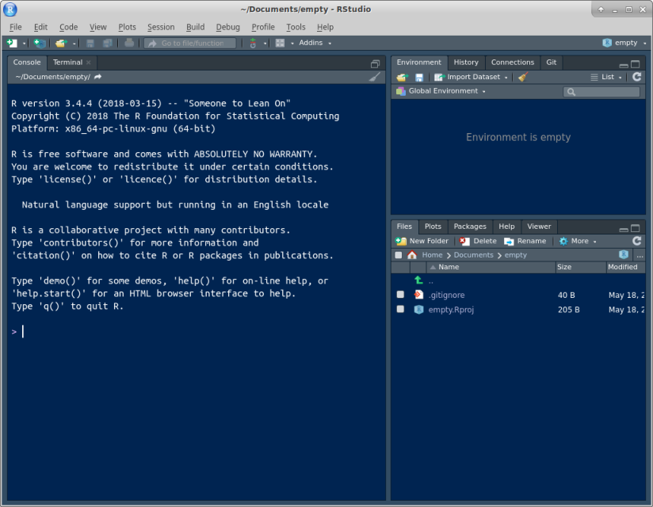
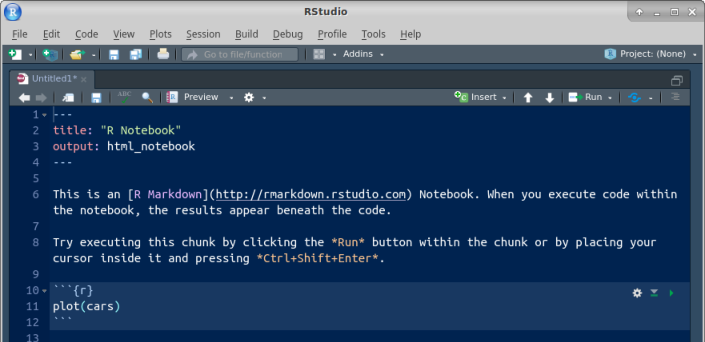

##  Getting started


This question is to get you started using R.


(a) Start R Studio Cloud, or the R Studio on Jupyter, in some project. (If you started up a
new project in the previous question and are still logged in, use
that; if not, create a new project with File, New Project, and New Directory. Then select New Project and give it a name. Click Create Project. This will give you an empty workspace to start from.)

Solution


You ought to see something like this. I have a dark blue
background here, which you probably do not. 



        

It won't look exactly like that (for example, the background
will probably be white) but there should be one thing
on the left half, and at the top
right it'll say "Environment is empty". 
Extra: if you want to tweak things, select Tools (at the top of
the screen) and from it Global Options, then click
Appearance. You can make the text bigger or smaller via Editor
Font Size, and choose a different colour scheme by picking one
of the Editor Themes (which previews on the right). My favourite
is Tomorrow Night Blue. Click Apply or OK when you have found
something you like. (I spend a lot of time in R Studio, and I
like having a dark background to be easier on my eyes.)

$\blacksquare$

(b) We're going to do some stuff in R here, just to get used to
it. First, make an R Notebook by selecting File, New File and R
Notebook.

Solution


The first time, you'll be invited to "install some packages"
to make the Notebook thing work. Let it do that by clicking
Yes. After that, you'll have this:



        

Find the Insert and Run buttons along the top of the R Notebook
window. We'll be using them shortly. (The template notebook may
or may not be maximized; it doesn't matter either way. You might
see all four panes or as few as one. If you want to control
that, select View at the top, then Panes, then either Show All
Panes or Zoom Source, as you prefer. In the menus, you'll also
see keyboard shortcuts for these, which you might find worth
learning.)

$\blacksquare$

(c) Change the title to something of your choosing. Then go down
to line 5, click on the Insert button and select R. You should see
a "code chunk" appear at line 5, which we are going to use in a
moment. 

Solution


Something like this:


        

$\blacksquare$

(d) Type the line of code shown below into the chunk in the
R Notebook:

```

mtcars

```


Solution


What this will do: get hold of a built-in data set with
information about some different models of car, and display it.


        

In approximately five seconds, you'll be demonstrating that for
yourself. 

$\blacksquare$

(e) Run this command. To do that, look at the top right of
your code chunk block (shaded in a slightly different colour). You
should see a gear symbol, a down arrow and a green "play    button". 
Click the play button. This will run the code, and show
the output below the code chunk.

Solution


Here's what I get (yours will be the same). 


        

This is a rectangular array of rows and columns, with
individuals in rows and variables in columns, known as a 
"data frame". When you display a data frame in an R Notebook, you see
10 rows and as many columns as will fit on the screen.  At the
bottom, it says how many rows and columns there are altogether
(here 32 rows and 11 columns), and which ones are being
displayed.  You can see more rows by clicking on Next, and if
there are more columns, you'll see a little arrow next to the
rightmost column (as here next to `am`) that you can
click on to see more columns. Try it and see. Or if you want to
go to a particular collection of rows, click one of the numbers
between Previous and Next: 1 is rows 1--10, 2 is rows 11--20,
and so on.
The column on the left without a header (containing the names of
the cars) is called "row names". These have a funny kind of
status, kind of a column and kind of not a column; usually, if
we need to use the names, we have to put them in a column first.
In future solutions, rather than showing you a screenshot,
expect me to show you something like this:
```{r r0-1, eval=F}
mtcars
```       

```{r r0-2, echo=F}
mtcars %>% as_tibble()
``` 

The top bit is the code, the bottom bit with the `##` the
output. In this kind of display, you only see the first ten rows (by
default). 

If you don't see the "play button", make sure that what you have
really is a code chunk. (I often accidentally delete one of the
special characters above or below the code chunk). If you can't figure
it out, delete this code chunk and make a new one. Sometimes R Studio
gets confused.

On the code chunk, the other symbols are the settings for this chunk
(you have the choice to display or not display the code or the output
or to not actually run the code). The second one, the down arrow, runs
all the chunks prior to this one (but not this one). 

The output has its own little buttons. The first one pops the output
out into its own window; the second one shows or hides the output, and
the third one deletes the output (so that you have to run the chunk
again to get it back). Experiment. You can't do much damage here.

$\blacksquare$

(f) Something a little more interesting: `summary`
obtains a summary of whatever you feed it (the five-number summary
plus the mean for numerical variables). Obtain this for our data
frame. To do this, create a new code chunk below the previous one,
type `summary(mtcars)` into the code chunk, and run it.

Solution


This is what you should see:


        

or the other way:
```{r r0-3 }
summary(mtcars)
```       

For the gas mileage column `mpg`, the mean is bigger than the
median, and the largest value is unusually large compared with the
others, suggesting a distribution that is skewed to the right.

There are 11 numeric (quantitative) variables, so we get the
five-number summary plus mean for each one. Categorical variables, if
we had any here, would be displayed a different way.

(In case you are wondering, the way without screenshots is obtained by
*my* writing a notebook with code chunks and running them, so
this output genuinely *is* obtained by running the code you see.)

$\blacksquare$

(g) Let's make a boxplot of the gas mileage data. This is a 
"poor man's boxplot"; we'll see a nicer-looking way later. To do it
this way, make another new code chunk, enter the code
`boxplot(mtcars$mpg)` into it, and run the chunk.

Solution


This is what you should see:
```{r r0-4 }
boxplot(mtcars$mpg)
```       

The long upper whisker supports our guess from before that the
distribution is right-skewed.

$\blacksquare$

(h) Some aesthetics to finish with: delete the template notebook
(all the stuff you didn't type below your code chunks and
output). Then add some narrative text above and below your code
chunks. Above the code chunk is where you say what you are going
to do (and maybe why you are doing it), and below is where you say
what you conclude from the output you just obtained.

Solution


My complete R Notebook is at
[http://ritsokiguess.site/datafiles/a0-notebook-1.Rmd](http://ritsokiguess.site/datafiles/a0-notebook-1.Rmd). Take
a look at it. I added one extra thing: my variable names have
"backticks" around them. You'll see the effect of this in a
moment.  Backtick is on the key to the left of 1 and below Esc
on your keyboard, along with a "squiggle" symbol that we'll be
using later in the course.

$\blacksquare$

(i) Save your notebook (the usual way with File and Save). This
saves it *on the R Studio Cloud servers* (and not on your
computer). This means that when you come back to R Studio Cloud
later, even from another device, this notebook will still be
available to you.
Now click Preview. This produces a pretty HTML version of your
notebook.

Solution


Note that the HTML document only contains output from the chunks
you've run in the notebook, so it's up to you to run them there
first.  
My HTML document is at
[http://ritsokiguess.site/datafiles/a0-notebook-1.nb.html](http://ritsokiguess.site/datafiles/a0-notebook-1.nb.html).
Here's where you see the effect of the backticks: all the
variable names are in `typewriter font` so that you can
see they are variable names and not something else. If you want
to try this notebook out yourself, you have a couple of options:
(i) make a new R Notebook on R Studio Cloud and copy-paste the
contents of my file (it's just text), or (ii) download my R
Notebook onto your computer, and then upload it to R Studio
Cloud. Look in the Files pane bottom right, and next to New
Folder you should see Upload. Upload the file from wherever it
got saved to when you downloaded it.
Extra: if you're feeling ambitious, click the arrow to the right
of Preview and select Knit to Word. The button changes to Knit
with a ball of wool beside it. Now, when you "knit" the
notebook, you get a Word document directly --- look for it in
the Files pane. If you want to, you can hand this kind of thing
in (on later assignments), but you'll have to do a little work
first: first, find it in your Files list, then click the
checkbox to the left of it, then click More (with the gear, on
the same line as New Folder and Upload), then select Export (and
click Download). This will put a copy in your downloads folder
on your computer, and you can open it from there.
If you're feeling extra-ambitious, you can try Knit to PDF. This
produces something that looks as if it was written in LaTeX,
but actually wasn't. To make this work, if you have a
`library(tidyverse)` line somewhere, as you probably
will, find the code chunk it's in, and make it look like this:


Then it will work.
Extra extra: if you like the keyboard better than the mouse, R
Studio has a lot of keyboard shortcuts. Two that are useful now:
control-alt-i inserts a code chunk where the
cursor is, and control-shift-enter runs the code chunk that the
cursor is in, if it is in one. (Mac users, "command" instead
of "control" in both cases.) I use these two a lot.

$\blacksquare$

(j) Optional extra: practice handing in your previewed R
notebook, as if it were an assignment that was worth
something. (It is good to get the practice in a low-stakes
situation, so that you'll know what to do next week.)

Solution


There are two steps: download the HTML file onto your computer,
and then handing it in on Quercus.
To download: find the HTML file that you want to download in the
Files pane bottom right. There should be two files starting with
the same thing, eg. `test1.Rmd`, which is the notebook
you wrote, and `test1.nb.html`, which is the previewed
version of it, and is the one you want to download. (The
`test1` part is the name *you* chose when you saved
it.) Click the checkbox to the left of the HTML file.
Now click on More above the bottom-right pane. This pops up a
menu from which you choose Export. This will pop up another
window called Export Files, where you put the name that the file
will have on your computer. (I usually leave the name the same.)
Click Download. The file will go to your Downloads folder, or
wherever things you download off the web go.
Now, to hand it in. Open up Quercus at `q.utoronto.ca`,
log in and navigate to this course. Click Assignments. Click
(the title of) Assignment 0. There is a big blue Submit
Assignment button top right. Click it. You'll get a File Upload
at the bottom of the screen. 
Click Choose File and find the HTML file that you
downloaded. Click Open (or equivalent on your system). The name
of the file should appear next to Choose File. Click Submit
Assignment. You'll see Submitted at the top right.
If you want to try this again, you can Re-submit Assignment as
many times as you like. (For the real thing, you can use this if
you realize you made a mistake in something you submitted. The
graders' instructions, for the real thing, are to grade the
*last* file submitted, so in that case you need to make
sure that the last thing submitted includes *everything*
that you want graded. Here, though, it doesn't matter.)

$\blacksquare$

(k) Optional extra. Something more ambitious: make a scatterplot of gas
mileage `mpg`, on the $y$ axis, against horsepower,
`hp`, on the $x$-axis.

Solution


That goes like this. I'll explain the steps below. 
```{r r0-5 }
library(tidyverse)
ggplot(mtcars, aes(x=hp, y=mpg))+geom_point()
```        
$ %$ %$ 

This shows a somewhat downward trend, which is what you'd expect,
since a larger `hp` value means a more powerful engine, which
will probably consume more gas and get *fewer* miles per gallon.
As for the code: to make a `ggplot` plot, as we will shortly
see in class, you first need a `ggplot` statement that says
what to plot. The first thing in a `ggplot` is a data frame
(`mtcars` here), and then the `aes` says that the plot
will have `hp` on the
$x$-axis and `mpg` on the $y$-axis, taken from the data frame
that you specified.  That's all of the what-to-plot. The last thing is
how to plot it; `geom_point()` says to plot the data values as
points.

You might like to add a regression line to the plot. That is a matter
of adding this to the end of the plotting command:

```{r r0-6 }
ggplot(mtcars, aes(x=hp, y=mpg))+geom_point()+geom_smooth(method="lm")
``` 

The line definitely goes downhill. Decide for yourself how well you
think a line fits these data.

$\blacksquare$

