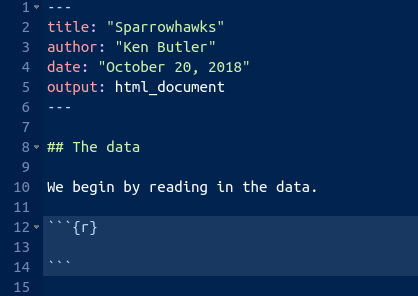
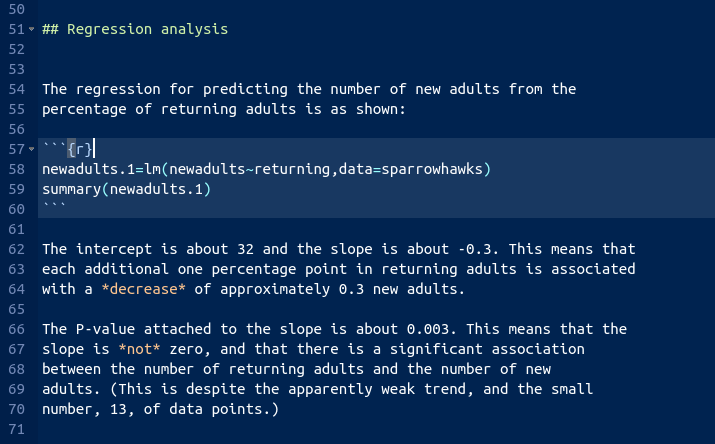
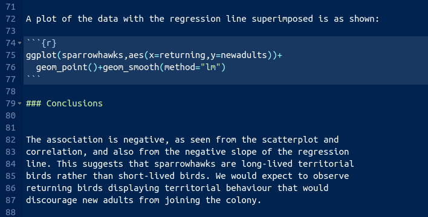

##  Sparrowhawks

(This is a report-writing question, but it also uses some regression techniques from later in the course.)

 One of nature's patterns is the relationship
between the percentage of adult birds in a colony that return from the
previous year, and the number of new adults that join the colony. Data
for 13 colonies of sparrowhawks can be found at
[link](http://ritsokiguess.site/datafiles/sparrowhawk.txt). The
columns are the percentage of adults returning from the previous year,
and the number of new adults that join the colony.


(a) Create a new R Markdown report, give it a suitable title, and
ask for HTML output. Answer the questions that follow in your
report. At any stage, you can Knit HTML
to see how the report looks so far.


Solution


In R Studio, select File, New File, R Markdown. Fill in the Title,
Author and leave the Default Output Format at HTML. You'll see a
template report with the document info at the top. This is my document info:


 
This is known in the jargon as a "YAML block".
`r tufte::margin_note("YAML      stands for *Yet Another Markup Language*, but we're not using      it in this course, other than as the top bit of an R Markdown document.")`
Below that is the template R Markdown document, which you can delete now or later.


(b) Read in the data and display the  first few values.  Add some text saying how many rows of data
there are.


Solution


Read the data into a data frame. In your
report, add some text like "we read in the data", perhaps
after a section heading like "The data". Then add a *code chunk* 
by selecting Chunks and Insert Chunk, or by pressing
control-alt-I. So far you have something like this. 



Inside the code chunk, that is, in the bit between the
backtick characters, put R code, just as you would type it at
the Console or put in an  R notebook. In this case, that would be
the following code, minus the message that comes out of
`read_delim`: 
```{r results="hide"}
library(tidyverse)
my_url <- "http://ritsokiguess.site/datafiles/sparrowhawk.txt"
sparrowhawks <- read_delim(my_url, " ")
sparrowhawks
```

     
For you, it looks like this:


We don't know how many rows of data there are yet, so I've left a
"placeholder" for it, when we figure it out.
The file is annoyingly called `sparrowhawk.txt`,
singular. Sorry about that. 
If you knit this (click on "Knit HTML" next to the ball of wool,
or press control-shift-K), it should run, and you'll see a viewer
pop up with the HTML output. Now you can see how many rows there
are, and you can go back and edit the R Markdown and put in 13 in
place of `xxx`, and knit again.
You might be worried about how hard R is working with all this
knitting. Don't worry about that. R can take it.
Mine looked like this:


There is a better way of adding values that come from the output,
which I mention here in case you are interested (if you are not,
feel free to skip this). What you do is to make what is called an
"inline code chunk". Where you want a number to appear in the
text, you have some R Markdown that looks like this:


The piece inside the backticks is the letter `r`, a space,
and then one line of R code. The one line of code will be run, and
all of the stuff within the backticks will be replaced in the
output by the result of running the R code, in this case the
number 13. Typically, you are extracting a number from the data,
like the number of rows or a mean of something. If it's a decimal
number, it will come out with a lot of decimal places unless you
explicitly `round` it.
OK, let me try it: the data frame has `r nrow(sparrowhawks)`
rows altogether. I didn't type that number; it was calculated from
the data frame. Woo hoo!


(c) Create a new section entitled "Exploratory analysis", and
create a scatterplot for predicting number of new adults from the
percentage of returning adults.  Describe what you see, adding some
suitable text to your report.


Solution


The R code you add should look like this, with the results shown
(when you knit the report again):
```{r }
library(tidyverse)
ggplot(sparrowhawks, aes(x = returning, y = newadults)) +
  geom_point() + geom_smooth()
```

 

<br>

The piece of report that I added looks like this:


Note (i) that you have to do nothing special to get the plot to
appear, and (ii) that I put "smaller" in italics, and you see
how. 


(d) Obtain the correlation between the two variables. Is this
consistent with the scatterplot? Explain briefly. (The R function
you need is `cor`. You can feed it a data frame.)


Solution


The appropriate R code  is this, in another code chunk:
```{r }
with(sparrowhawks, cor(newadults, returning))
```

 

Or you can ask for the correlations of the whole data frame:

```{r }
cor(sparrowhawks)
```

 

This latter is a "correlation matrix" with a correlation between each
column and each other column. Obviously the correlation between a
column and itself is 1, and that is *not* the one we want.

I added this to the report (still in the Exploratory Analysis
section, since it seems to belong there):


(e) Obtain the regression line for predicting the number of new
adults from the percentage of returning adults.


Solution


This R code, in another code chunk:
```{r }
newadults.1 <- lm(newadults ~ returning, data = sparrowhawks)
summary(newadults.1)
```

 


(f) What are the intercept and slope of your regression line? Is
the slope significant? What does that mean, in the context of the data?


Solution


See the output in the previous part. That's what we need to talk about.
I added this to the report. I thought we deserved a new section here:


 


(g) Create a scatterplot of the data with the regression line on it.


Solution


This code. Using `geom_smooth` with 
`method="lm"`
will add the regression line to the plot:

```{r }
ggplot(sparrowhawks, aes(x = returning, y = newadults)) +
  geom_point() + geom_smooth(method = "lm")
```

 

I added a bit of text to the report, which I will show in a moment.


(h) For short-lived birds, the association between these two
variables is positive: changes in weather and food supply cause the
populations of new and returning birds to increase together. For
long-lived territorial birds, however, the association is negative
because returning birds claim their territories in the colony and do
not leave room for new recruits. Which type of species is the
sparrowhawk? Add a short Conclusions section to your report with
discussion of this issue.


Solution


My addition to the report looks like this:





I think that rounds off the report nicely.


